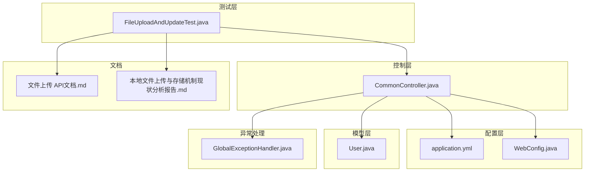
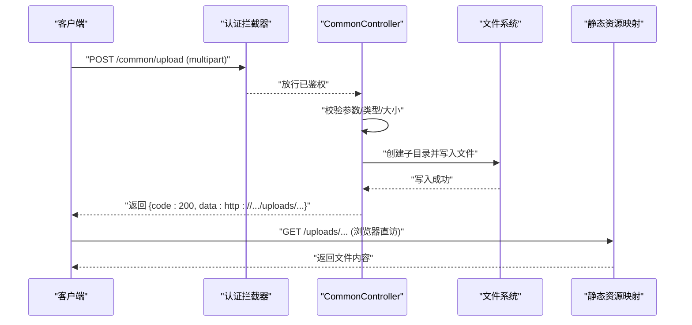
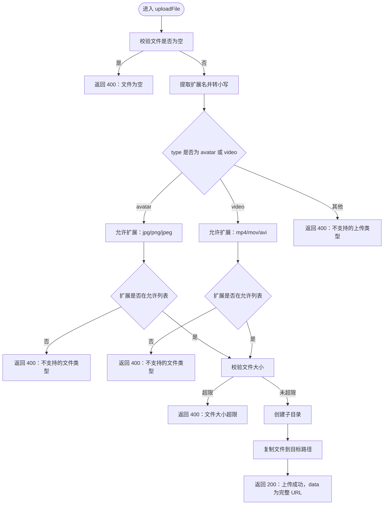
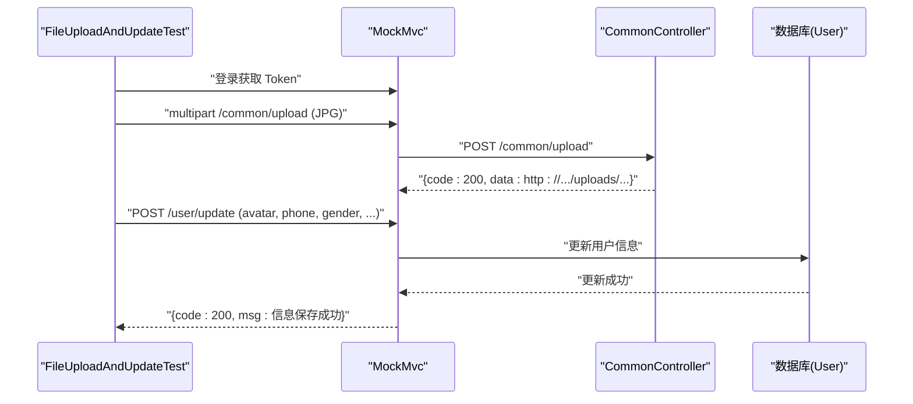
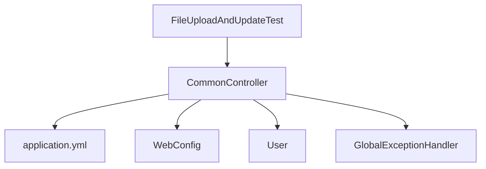

# 文件上传测试

<cite>
**本文引用的文件**
- [FileUploadAndUpdateTest.java](file://src/test/java/com/daily/dailychineseculture/FileUploadAndUpdateTest.java)
- [CommonController.java](file://src/main/java/com/daily/dailychineseculture/controller/CommonController.java)
- [WebConfig.java](file://src/main/java/com/daily/dailychineseculture/config/WebConfig.java)
- [application.yml](file://src/main/resources/application.yml)
- [User.java](file://src/main/java/com/daily/dailychineseculture/entity/User.java)
- [GlobalExceptionHandler.java](file://src/main/java/com/daily/dailychineseculture/common/GlobalExceptionHandler.java)
- [文件上传 API文档.md](file://doc/文件上传 API文档.md)
- [本地文件上传与存储机制现状分析报告.md](file://doc/本地文件上传与存储机制现状分析报告.md)
</cite>

## 目录
1. [简介](#简介)
2. [项目结构](#项目结构)
3. [核心组件](#核心组件)
4. [架构总览](#架构总览)
5. [详细组件分析](#详细组件分析)
6. [依赖分析](#依赖分析)
7. [性能考量](#性能考量)
8. [故障排查指南](#故障排查指南)
9. [结论](#结论)
10. [附录](#附录)

## 简介
本专项文档聚焦于文件上传功能的测试方法与验证策略，围绕 FileUploadAndUpdateTest 中的上传流程测试展开，覆盖文件类型验证、大小限制检查、存储路径验证、本地文件上传与存储机制、环境配置、测试文件准备、批量上传测试方法、性能与并发测试以及异常处理与安全防护验证。文档同时结合后端实现与配置，帮助测试人员与开发者高效定位问题并优化上传体验。

## 项目结构
文件上传测试位于测试模块，后端上传接口与静态资源映射位于主模块，配置文件集中于资源目录。关键文件分布如下：
- 测试类：src/test/java/com/daily/dailychineseculture/FileUploadAndUpdateTest.java
- 控制器：src/main/java/com/daily/dailychineseculture/controller/CommonController.java
- 静态资源映射：src/main/java/com/daily/dailychineseculture/config/WebConfig.java
- 配置文件：src/main/resources/application.yml
- 用户实体：src/main/java/com/daily/dailychineseculture/entity/User.java
- 全局异常处理：src/main/java/com/daily/dailychineseculture/common/GlobalExceptionHandler.java
- 文档：doc/文件上传 API文档.md、doc/本地文件上传与存储机制现状分析报告.md

图表来源
- [FileUploadAndUpdateTest.java:1-479](file://src/test/java/com/daily/dailychineseculture/FileUploadAndUpdateTest.java#L1-L479)
- [CommonController.java:1-100](file://src/main/java/com/daily/dailychineseculture/controller/CommonController.java#L1-L100)
- [WebConfig.java:1-105](file://src/main/java/com/daily/dailychineseculture/config/WebConfig.java#L1-L105)
- [application.yml:1-33](file://src/main/resources/application.yml#L1-L33)
- [User.java:1-87](file://src/main/java/com/daily/dailychineseculture/entity/User.java#L1-L87)
- [GlobalExceptionHandler.java:1-29](file://src/main/java/com/daily/dailychineseculture/common/GlobalExceptionHandler.java#L1-L29)
- [文件上传 API文档.md:1-313](file://doc/文件上传 API文档.md#L1-L313)
- [本地文件上传与存储机制现状分析报告.md:1-378](file://doc/本地文件上传与存储机制现状分析报告.md#L1-L378)

章节来源
- [FileUploadAndUpdateTest.java:1-479](file://src/test/java/com/daily/dailychineseculture/FileUploadAndUpdateTest.java#L1-L479)
- [CommonController.java:1-100](file://src/main/java/com/daily/dailychineseculture/controller/CommonController.java#L1-L100)
- [WebConfig.java:1-105](file://src/main/java/com/daily/dailychineseculture/config/WebConfig.java#L1-L105)
- [application.yml:1-33](file://src/main/resources/application.yml#L1-L33)
- [User.java:1-87](file://src/main/java/com/daily/dailychineseculture/entity/User.java#L1-L87)
- [GlobalExceptionHandler.java:1-29](file://src/main/java/com/daily/dailychineseculture/common/GlobalExceptionHandler.java#L1-L29)
- [文件上传 API文档.md:1-313](file://doc/文件上传 API文档.md#L1-L313)
- [本地文件上传与存储机制现状分析报告.md:1-378](file://doc/本地文件上传与存储机制现状分析报告.md#L1-L378)

## 核心组件
- 文件上传控制器：负责接收 multipart/form-data 请求，执行类型与大小校验，生成新文件名并落盘，返回可访问 URL。
- 静态资源映射：将 /uploads/** 映射到本地物理目录，使上传后的文件可通过 HTTP 直接访问。
- 配置文件：定义上传目录、最大文件大小、Spring Multipart 限制等。
- 用户实体：avatar 字段存储上传后的完整 HTTP URL。
- 全局异常处理：统一捕获异常并返回标准化错误响应。
- 测试类：基于 MockMvc 对上传接口进行端到端验证，覆盖空文件、非法类型、越界大小、未授权访问、成功上传、更新用户信息等场景。

章节来源
- [CommonController.java:35-99](file://src/main/java/com/daily/dailychineseculture/controller/CommonController.java#L35-L99)
- [WebConfig.java:34-42](file://src/main/java/com/daily/dailychineseculture/config/WebConfig.java#L34-L42)
- [application.yml:29-33](file://src/main/resources/application.yml#L29-L33)
- [User.java:26-29](file://src/main/java/com/daily/dailychineseculture/entity/User.java#L26-L29)
- [GlobalExceptionHandler.java:15-28](file://src/main/java/com/daily/dailychineseculture/common/GlobalExceptionHandler.java#L15-L28)
- [FileUploadAndUpdateTest.java:82-478](file://src/test/java/com/daily/dailychineseculture/FileUploadAndUpdateTest.java#L82-L478)

## 架构总览
文件上传端到端流程如下：客户端发起 multipart 请求，经拦截器鉴权后进入控制器；控制器执行参数、类型、大小校验，创建子目录，生成唯一文件名并复制到目标路径，返回成功响应；静态资源映射使上传文件可通过 /uploads/** 访问。

图表来源
- [CommonController.java:35-99](file://src/main/java/com/daily/dailychineseculture/controller/CommonController.java#L35-L99)
- [WebConfig.java:34-42](file://src/main/java/com/daily/dailychineseculture/config/WebConfig.java#L34-L42)
- [application.yml:12-15](file://src/main/resources/application.yml#L12-L15)

章节来源
- [CommonController.java:35-99](file://src/main/java/com/daily/dailychineseculture/controller/CommonController.java#L35-L99)
- [WebConfig.java:34-42](file://src/main/java/com/daily/dailychineseculture/config/WebConfig.java#L34-L42)
- [application.yml:12-15](file://src/main/resources/application.yml#L12-L15)

## 详细组件分析

### 文件上传控制器（CommonController）
- 功能职责：接收文件、校验类型与大小、创建子目录、生成唯一文件名、复制到目标路径、返回可访问 URL。
- 关键点：
  - 支持 avatar 与 video 两种类型，分别写入 images 与 videos 子目录。
  - 类型白名单：avatar 支持 jpg/png/jpeg；video 支持 mp4/mov/avi。
  - 大小限制：受配置项 file.max-size 与 Spring Multipart 限制共同约束。
  - 文件名策略：时间戳 + 类型标识 + UUID + 原扩展名，避免冲突并保留扩展名。
  - 返回 URL：http://localhost:8080/uploads/{subDir}/{fileName}。

图表来源
- [CommonController.java:35-99](file://src/main/java/com/daily/dailychineseculture/controller/CommonController.java#L35-L99)

章节来源
- [CommonController.java:35-99](file://src/main/java/com/daily/dailychineseculture/controller/CommonController.java#L35-L99)

### 静态资源映射（WebConfig）
- 将 /uploads/** 映射到配置的物理目录，使上传文件可通过 HTTP 直接访问。
- 通过 ResourceHandlerRegistry.addResourceLocations("file:" + uploadDir) 实现。

章节来源
- [WebConfig.java:34-42](file://src/main/java/com/daily/dailychineseculture/config/WebConfig.java#L34-L42)

### 配置文件（application.yml）
- server.port：服务端口。
- spring.servlet.multipart：限制单文件与请求总大小，默认 500MB。
- file.upload-dir：上传目录（相对路径 ./uploads/）。
- file.max-size：自定义最大文件大小（500MB）。

章节来源
- [application.yml:3-33](file://src/main/resources/application.yml#L3-L33)

### 用户实体（User）
- avatar 字段存储上传后的完整 HTTP URL，便于前端直接使用。

章节来源
- [User.java:26-29](file://src/main/java/com/daily/dailychineseculture/entity/User.java#L26-L29)

### 全局异常处理（GlobalExceptionHandler）
- 捕获通用异常与运行时异常，统一返回标准化错误响应，便于测试断言。

章节来源
- [GlobalExceptionHandler.java:15-28](file://src/main/java/com/daily/dailychineseculture/common/GlobalExceptionHandler.java#L15-L28)

### 测试类（FileUploadAndUpdateTest）
- 测试目标：验证上传接口的类型校验、大小限制、未授权访问、成功上传、URL 格式、用户信息更新联动。
- 关键测试点：
  - 空文件：返回 400，消息包含“上传文件不能为空”。
  - 非法类型：返回 400，消息包含“不支持的文件类型”。
  - 未授权访问：返回 401。
  - 成功上传 JPG/PNG/JPEG：返回 200，data 为 http://localhost:8080/uploads/...，扩展名匹配。
  - 超大文件：返回 400 或包含“文件大小超过限制”的消息。
  - 完整流程：先上传头像，再更新用户信息（avatar 字段），验证整体流程。
  - 部分字段更新：仅传入 phone/gender，验证更新成功。
  - 手机号重复检测：根据业务逻辑返回合理响应。

图表来源
- [FileUploadAndUpdateTest.java:54-267](file://src/test/java/com/daily/dailychineseculture/FileUploadAndUpdateTest.java#L54-L267)
- [CommonController.java:35-99](file://src/main/java/com/daily/dailychineseculture/controller/CommonController.java#L35-L99)
- [User.java:26-29](file://src/main/java/com/daily/dailychineseculture/entity/User.java#L26-L29)

章节来源
- [FileUploadAndUpdateTest.java:82-478](file://src/test/java/com/daily/dailychineseculture/FileUploadAndUpdateTest.java#L82-L478)

## 依赖分析
- 测试类依赖 MockMvc 与 ObjectMapper，通过 /common/upload 与 /user/update 接口进行端到端验证。
- 控制器依赖配置项 file.upload-dir、file.max-size 与 Spring Multipart 限制。
- 静态资源映射依赖 WebConfig 的 addResourceHandlers。
- 异常处理依赖全局异常处理器。

图表来源
- [FileUploadAndUpdateTest.java:1-479](file://src/test/java/com/daily/dailychineseculture/FileUploadAndUpdateTest.java#L1-L479)
- [CommonController.java:1-100](file://src/main/java/com/daily/dailychineseculture/controller/CommonController.java#L1-L100)
- [WebConfig.java:1-105](file://src/main/java/com/daily/dailychineseculture/config/WebConfig.java#L1-L105)
- [application.yml:1-33](file://src/main/resources/application.yml#L1-L33)
- [User.java:1-87](file://src/main/java/com/daily/dailychineseculture/entity/User.java#L1-L87)
- [GlobalExceptionHandler.java:1-29](file://src/main/java/com/daily/dailychineseculture/common/GlobalExceptionHandler.java#L1-L29)

章节来源
- [FileUploadAndUpdateTest.java:1-479](file://src/test/java/com/daily/dailychineseculture/FileUploadAndUpdateTest.java#L1-L479)
- [CommonController.java:1-100](file://src/main/java/com/daily/dailychineseculture/controller/CommonController.java#L1-L100)
- [WebConfig.java:1-105](file://src/main/java/com/daily/dailychineseculture/config/WebConfig.java#L1-L105)
- [application.yml:1-33](file://src/main/resources/application.yml#L1-L33)
- [User.java:1-87](file://src/main/java/com/daily/dailychineseculture/entity/User.java#L1-L87)
- [GlobalExceptionHandler.java:1-29](file://src/main/java/com/daily/dailychineseculture/common/GlobalExceptionHandler.java#L1-L29)

## 性能考量
- 大小限制：当前配置单文件与请求总大小为 500MB，file.max-size 为 500MB，满足较大文件上传需求。
- 并发上传：建议在测试环境中使用线程池并发触发上传请求，观察控制器与文件系统写入能力，关注磁盘 IO 与内存占用。
- 批量上传：可构造多个 MockMultipartFile 并行提交，统计平均耗时与失败率，识别瓶颈。
- 资源映射：静态资源映射为本地文件系统直访，性能稳定；建议监控磁盘空间与 IO 带宽。

章节来源
- [application.yml:12-15](file://src/main/resources/application.yml#L12-L15)
- [CommonController.java:73-75](file://src/main/java/com/daily/dailychineseculture/controller/CommonController.java#L73-L75)

## 故障排查指南
- 未登录或 Token 失效：返回 401，检查登录流程与 Authorization 头。
- 文件为空：返回 400，确认 multipart 表单字段名为 file。
- 文件类型不支持：返回 400，确认扩展名在允许列表（avatar：jpg/png/jpeg；video：mp4/mov/avi）。
- 文件大小超限：返回 400，检查 file.max-size 与 Spring Multipart 限制。
- 目录创建失败：返回 500，检查上传目录权限与路径是否存在。
- 文件落盘失败：返回 500，检查磁盘空间与 IO 权限。
- 静态资源不可访问：检查 WebConfig 的 /uploads/** 映射与 upload-dir 路径。

章节来源
- [FileUploadAndUpdateTest.java:138-151](file://src/test/java/com/daily/dailychineseculture/FileUploadAndUpdateTest.java#L138-L151)
- [CommonController.java:44-51](file://src/main/java/com/daily/dailychineseculture/controller/CommonController.java#L44-L51)
- [CommonController.java:68-71](file://src/main/java/com/daily/dailychineseculture/controller/CommonController.java#L68-L71)
- [CommonController.java:73-75](file://src/main/java/com/daily/dailychineseculture/controller/CommonController.java#L73-L75)
- [CommonController.java:80-86](file://src/main/java/com/daily/dailychineseculture/controller/CommonController.java#L80-L86)
- [CommonController.java:91-95](file://src/main/java/com/daily/dailychineseculture/controller/CommonController.java#L91-L95)
- [WebConfig.java:34-42](file://src/main/java/com/daily/dailychineseculture/config/WebConfig.java#L34-L42)

## 结论
FileUploadAndUpdateTest 提供了覆盖文件类型、大小、授权、成功上传与流程联动的完整测试矩阵。结合控制器的类型白名单、大小限制与文件名策略，以及静态资源映射与配置文件，形成了清晰、可验证的上传链路。建议在后续迭代中持续完善异常处理与性能监控，并根据业务扩展支持更多文件类型与更大的文件规模。

## 附录

### 环境配置与准备
- 服务端口：8080（application.yml）。
- 上传目录：./uploads/（相对路径，需具备读写权限）。
- Spring Multipart：单文件与请求总大小均为 500MB。
- 最大文件大小：file.max-size 为 500MB。
- 静态资源映射：/uploads/** → file:{uploadDir}。

章节来源
- [application.yml:3-33](file://src/main/resources/application.yml#L3-L33)
- [WebConfig.java:34-42](file://src/main/java/com/daily/dailychineseculture/config/WebConfig.java#L34-L42)

### 测试文件准备
- 图片文件：JPG/PNG/JPEG，使用最小有效数据构造 MockMultipartFile。
- 文本文件：用于验证非法类型拒绝。
- 超大文件：6MB，用于验证大小限制。
- 扩展名测试：.jpeg 扩展名验证。

章节来源
- [FileUploadAndUpdateTest.java:87-92](file://src/test/java/com/daily/dailychineseculture/FileUploadAndUpdateTest.java#L87-L92)
- [FileUploadAndUpdateTest.java:112-117](file://src/test/java/com/daily/dailychineseculture/FileUploadAndUpdateTest.java#L112-L117)
- [FileUploadAndUpdateTest.java:419-426](file://src/test/java/com/daily/dailychineseculture/FileUploadAndUpdateTest.java#L419-L426)
- [FileUploadAndUpdateTest.java:457-462](file://src/test/java/com/daily/dailychineseculture/FileUploadAndUpdateTest.java#L457-L462)

### 批量上传测试方法
- 并发策略：使用线程池并发触发上传请求，统计成功率与平均耗时。
- 负载策略：逐步增加并发数，观察控制器与文件系统的响应时间与错误率。
- 断言策略：对每个请求断言状态码与响应体字段，汇总失败原因。

章节来源
- [FileUploadAndUpdateTest.java:355-408](file://src/test/java/com/daily/dailychineseculture/FileUploadAndUpdateTest.java#L355-L408)

### 性能与并发测试建议
- 并发上传：构造多个 MockMultipartFile 并行提交，监控磁盘 IO 与内存占用。
- 大文件压力：逐步提升文件大小，验证大小限制与写入稳定性。
- 资源映射：验证 /uploads/** 的访问延迟与吞吐。

章节来源
- [application.yml:12-15](file://src/main/resources/application.yml#L12-L15)
- [CommonController.java:73-75](file://src/main/java/com/daily/dailychineseculture/controller/CommonController.java#L73-L75)

### 异常情况处理验证
- 未授权访问：断言 401。
- 空文件：断言 400，消息包含“上传文件不能为空”。
- 非法类型：断言 400，消息包含“不支持的文件类型”。
- 超大文件：断言 400 或包含“文件大小超过限制”的消息。
- 目录/写入失败：断言 500，消息包含相应错误信息。

章节来源
- [FileUploadAndUpdateTest.java:138-151](file://src/test/java/com/daily/dailychineseculture/FileUploadAndUpdateTest.java#L138-L151)
- [FileUploadAndUpdateTest.java:84-102](file://src/test/java/com/daily/dailychineseculture/FileUploadAndUpdateTest.java#L84-L102)
- [FileUploadAndUpdateTest.java:119-131](file://src/test/java/com/daily/dailychineseculture/FileUploadAndUpdateTest.java#L119-L131)
- [FileUploadAndUpdateTest.java:428-441](file://src/test/java/com/daily/dailychineseculture/FileUploadAndUpdateTest.java#L428-L441)
- [CommonController.java:80-86](file://src/main/java/com/daily/dailychineseculture/controller/CommonController.java#L80-L86)
- [CommonController.java:91-95](file://src/main/java/com/daily/dailychineseculture/controller/CommonController.java#L91-L95)

### 存储策略与安全防护
- 存储策略：按类型分目录（images/videos），文件名包含时间戳、类型标识与 UUID，保留原扩展名。
- 路径安全性：静态资源映射指向本地物理目录，避免 Web 根目录暴露。
- 安全防护：JWT 认证拦截、类型白名单、大小限制、目录自动创建与权限检查。

章节来源
- [CommonController.java:58-66](file://src/main/java/com/daily/dailychineseculture/controller/CommonController.java#L58-L66)
- [CommonController.java:88-89](file://src/main/java/com/daily/dailychineseculture/controller/CommonController.java#L88-L89)
- [WebConfig.java:34-42](file://src/main/java/com/daily/dailychineseculture/config/WebConfig.java#L34-L42)
- [文件上传 API文档.md:253-259](file://doc/文件上传 API文档.md#L253-L259)