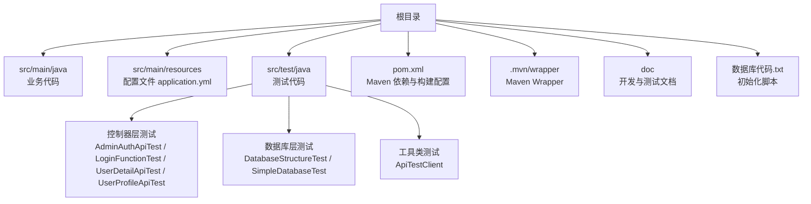
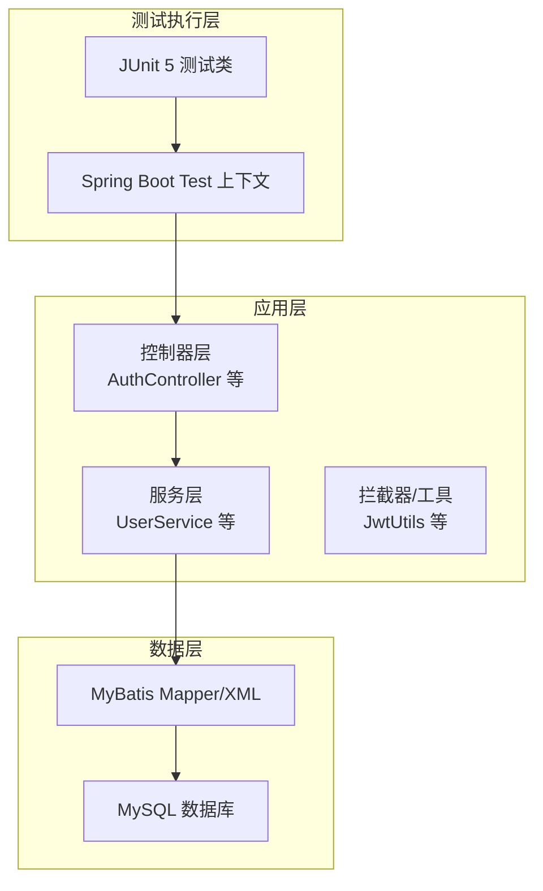
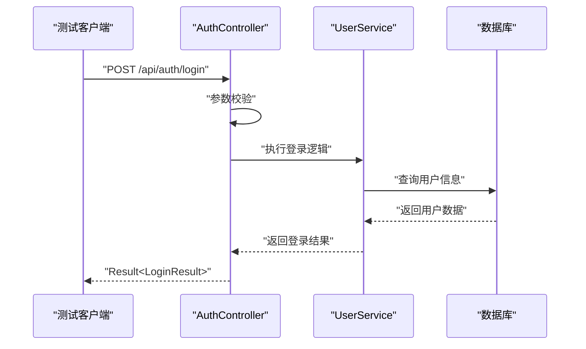
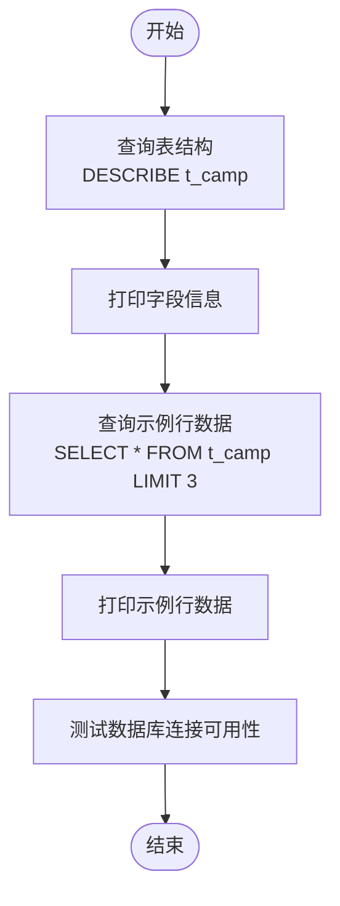
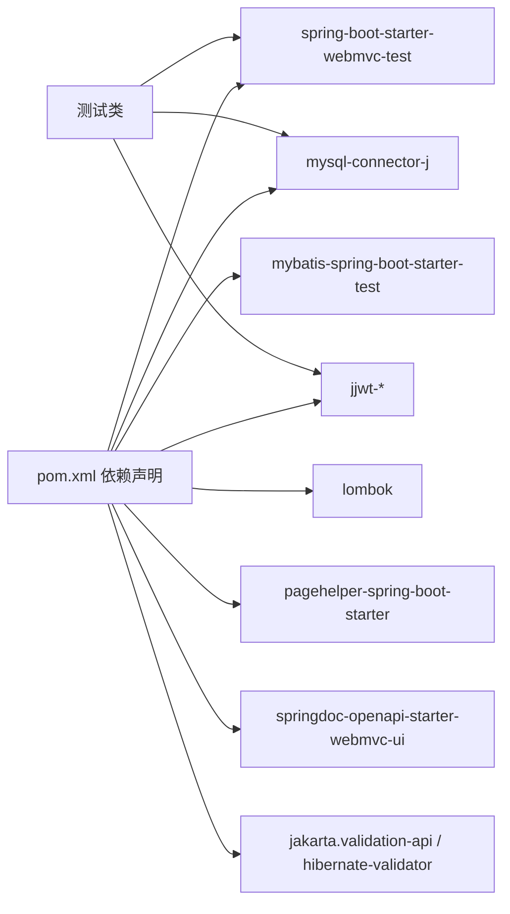

# 测试环境搭建

<cite>
**本文引用的文件**   
- [pom.xml](file://pom.xml)
- [application.yml](file://src/main/resources/application.yml)
- [.mvn\wrapper\maven-wrapper.properties](file://.mvn/wrapper/maven-wrapper.properties)
- [开发环境准备指南.md](file://doc/开发环境准备指南.md)
- [项目运行测试指南.md](file://doc/项目运行测试指南.md)
- [测试最近活跃课程 API.md](file://doc/测试最近活跃课程 API.md)
- [DailyChineseCultureApplicationTests.java](file://src/test/java/com/daily/dailychineseculture/DailyChineseCultureApplicationTests.java)
- [AdminAuthApiTest.java](file://src/test/java/com/daily/dailychineseculture/AdminAuthApiTest.java)
- [LoginFunctionTest.java](file://src/test/java/com/daily/dailychineseculture/LoginFunctionTest.java)
- [UserDetailApiTest.java](file://src/test/java/com/daily/dailychineseculture/UserDetailApiTest.java)
- [UserProfileApiTest.java](file://src/test/java/com/daily/dailychineseculture/UserProfileApiTest.java)
- [DatabaseStructureTest.java](file://src/test/java/com/daily/dailychineseculture/DatabaseStructureTest.java)
- [SimpleDatabaseTest.java](file://src/test/java/com/daily/dailychineseculture/SimpleDatabaseTest.java)
- [ApiTestClient.java](file://src/test/java/com/daily/dailychineseculture/ApiTestClient.java)
- [test-dashboard.ps1](file://test-dashboard.ps1)
- [数据库代码.txt](file://数据库代码.txt)
</cite>

## 目录
1. [引言](#引言)
2. [项目结构](#项目结构)
3. [核心组件](#核心组件)
4. [架构总览](#架构总览)
5. [详细组件分析](#详细组件分析)
6. [依赖关系分析](#依赖关系分析)
7. [性能考虑](#性能考虑)
8. [故障排除指南](#故障排除指南)
9. [结论](#结论)
10. [附录](#附录)

## 引言
本指南面向需要搭建与维护本项目测试环境的开发者与测试工程师，目标是提供从环境准备、依赖配置、数据库与环境隔离、测试执行到故障排除与性能优化的完整实践路径。文档基于仓库中的实际配置与测试样例进行归纳总结，帮助读者快速建立稳定可靠的测试环境。

## 项目结构
项目采用标准的 Spring Boot Maven 结构，测试代码位于 src/test 目录下，测试覆盖控制器层、服务层与数据库层，配合应用配置文件与 Maven 依赖声明，形成可运行的测试环境。

图表来源
- [pom.xml:1-149](file://pom.xml#L1-L149)
- [application.yml:1-33](file://src/main/resources/application.yml#L1-L33)
- [开发环境准备指南.md:1-146](file://doc/开发环境准备指南.md#L1-L146)

章节来源
- [pom.xml:1-149](file://pom.xml#L1-L149)
- [application.yml:1-33](file://src/main/resources/application.yml#L1-L33)
- [开发环境准备指南.md:1-146](file://doc/开发环境准备指南.md#L1-L146)

## 核心组件
- 测试框架与运行支撑
  - JUnit 5 注解与 Spring Boot Test 启动上下文，用于加载应用配置并执行集成测试。
  - 示例：[DailyChineseCultureApplicationTests.java:1-14](file://src/test/java/com/daily/dailychineseculture/DailyChineseCultureApplicationTests.java#L1-L14)、[LoginFunctionTest.java:1-108](file://src/test/java/com/daily/dailychineseculture/LoginFunctionTest.java#L1-L108)
- 控制器层测试
  - 针对登录、用户资料、仪表盘等接口的测试，覆盖成功、失败与边界条件。
  - 示例：[AdminAuthApiTest.java:1-58](file://src/test/java/com/daily/dailychineseculture/AdminAuthApiTest.java#L1-L58)、[UserDetailApiTest.java:1-143](file://src/test/java/com/daily/dailychineseculture/UserDetailApiTest.java#L1-L143)、[UserProfileApiTest.java:1-108](file://src/test/java/com/daily/dailychineseculture/UserProfileApiTest.java#L1-L108)
- 数据库层测试
  - 通过 JdbcTemplate 与 DataSource 校验表结构与连通性。
  - 示例：[DatabaseStructureTest.java:1-43](file://src/test/java/com/daily/dailychineseculture/DatabaseStructureTest.java#L1-L43)、[SimpleDatabaseTest.java:1-43](file://src/test/java/com/daily/dailychineseculture/SimpleDatabaseTest.java#L1-L43)
- 测试工具
  - 自定义 API 测试客户端，便于命令行快速验证接口。
  - 示例：[ApiTestClient.java:1-87](file://src/test/java/com/daily/dailychineseculture/ApiTestClient.java#L1-L87)

章节来源
- [DailyChineseCultureApplicationTests.java:1-14](file://src/test/java/com/daily/dailychineseculture/DailyChineseCultureApplicationTests.java#L1-L14)
- [AdminAuthApiTest.java:1-58](file://src/test/java/com/daily/dailychineseculture/AdminAuthApiTest.java#L1-L58)
- [LoginFunctionTest.java:1-108](file://src/test/java/com/daily/dailychineseculture/LoginFunctionTest.java#L1-L108)
- [UserDetailApiTest.java:1-143](file://src/test/java/com/daily/dailychineseculture/UserDetailApiTest.java#L1-L143)
- [UserProfileApiTest.java:1-108](file://src/test/java/com/daily/dailychineseculture/UserProfileApiTest.java#L1-L108)
- [DatabaseStructureTest.java:1-43](file://src/test/java/com/daily/dailychineseculture/DatabaseStructureTest.java#L1-L43)
- [SimpleDatabaseTest.java:1-43](file://src/test/java/com/daily/dailychineseculture/SimpleDatabaseTest.java#L1-L43)
- [ApiTestClient.java:1-87](file://src/test/java/com/daily/dailychineseculture/ApiTestClient.java#L1-L87)

## 架构总览
测试环境围绕 Spring Boot 应用与 MySQL 数据库展开，测试通过 Maven 生命周期与 Spring Boot Test 启动应用上下文，访问控制器接口并验证响应；数据库层测试通过 JDBC 操作与结构校验确保数据一致性。

图表来源
- [LoginFunctionTest.java:1-108](file://src/test/java/com/daily/dailychineseculture/LoginFunctionTest.java#L1-L108)
- [UserDetailApiTest.java:1-143](file://src/test/java/com/daily/dailychineseculture/UserDetailApiTest.java#L1-L143)
- [UserProfileApiTest.java:1-108](file://src/test/java/com/daily/dailychineseculture/UserProfileApiTest.java#L1-L108)
- [DatabaseStructureTest.java:1-43](file://src/test/java/com/daily/dailychineseculture/DatabaseStructureTest.java#L1-L43)
- [application.yml:1-33](file://src/main/resources/application.yml#L1-L33)

## 详细组件分析

### Maven 依赖与测试支持
- 测试框架与启动
  - spring-boot-starter-webmvc-test 与 mybatis-spring-boot-starter-test 提供测试所需的 Web 与 MyBatis 集成能力。
  - 示例：[pom.xml:61-69](file://pom.xml#L61-L69)
- 数据库驱动与连接
  - mysql-connector-j 作为运行时驱动，配合 application.yml 中的数据源配置。
  - 示例：[pom.xml:50-53](file://pom.xml#L50-L53)、[application.yml:7-11](file://src/main/resources/application.yml#L7-L11)
- 其他工具与文档
  - Lombok、JWT、分页插件、Swagger/Knife4j、校验组件等，提升开发与测试效率。
  - 示例：[pom.xml:55-116](file://pom.xml#L55-L116)
- 构建与编译
  - Maven Compiler Plugin 与 Spring Boot Maven Plugin 的配置，确保注解处理与打包正确。
  - 示例：[pom.xml:120-145](file://pom.xml#L120-L145)

章节来源
- [pom.xml:29-116](file://pom.xml#L29-L116)
- [application.yml:7-11](file://src/main/resources/application.yml#L7-L11)

### 开发环境准备对测试的影响
- JDK 版本要求
  - Java 21，确保测试与生产一致，避免兼容性问题。
  - 示例：[开发环境准备指南.md:4-5](file://doc/开发环境准备指南.md#L4-L5)
- IDE 配置
  - IntelliJ IDEA、Eclipse、VS Code 等，推荐安装 Lombok、MyBatis 日志、GitLens 等插件以提升测试体验。
  - 示例：[开发环境准备指南.md:20-35](file://doc/开发环境准备指南.md#L20-L35)
- 数据库环境设置
  - 使用 DBeaver 或 MySQL Workbench 管理数据库，确保连接参数与 application.yml 一致。
  - 示例：[开发环境准备指南.md:37-46](file://doc/开发环境准备指南.md#L37-L46)

章节来源
- [开发环境准备指南.md:4-5](file://doc/开发环境准备指南.md#L4-L5)
- [开发环境准备指南.md:20-35](file://doc/开发环境准备指南.md#L20-L35)
- [开发环境准备指南.md:37-46](file://doc/开发环境准备指南.md#L37-L46)

### 测试环境隔离策略
- 测试数据库配置
  - 在 application.yml 中配置独立的数据源，避免与生产数据冲突；如需隔离，可在 CI 中通过环境变量覆盖。
  - 示例：[application.yml:7-11](file://src/main/resources/application.yml#L7-L11)
- 测试数据管理
  - 使用数据库初始化脚本创建测试所需表结构与示例行数据，保证测试可重复性。
  - 示例：[数据库代码.txt:1-165](file://数据库代码.txt#L1-L165)
- 环境变量设置
  - 通过环境变量控制 JAVA_HOME 与 PATH，确保测试在统一 JDK 版本下执行。
  - 示例：[项目运行测试指南.md:5-9](file://doc/项目运行测试指南.md#L5-L9)

章节来源
- [application.yml:7-11](file://src/main/resources/application.yml#L7-L11)
- [数据库代码.txt:1-165](file://数据库代码.txt#L1-L165)
- [项目运行测试指南.md:5-9](file://doc/项目运行测试指南.md#L5-L9)

### 测试执行方式
- 命令行测试执行
  - 使用 Maven Wrapper 执行测试生命周期，清理、编译、测试一体化。
  - 示例：[项目运行测试指南.md:114-121](file://doc/项目运行测试指南.md#L114-L121)
- IDE 测试运行
  - 在 IDE 中直接运行单个测试类或测试方法，便于调试与定位问题。
  - 示例：[LoginFunctionTest.java:1-108](file://src/test/java/com/daily/dailychineseculture/LoginFunctionTest.java#L1-L108)
- CI/CD 集成
  - 在 CI 中复用 Maven Wrapper 与 JDK 21 环境，结合数据库初始化脚本与环境变量，实现自动化测试流水线。
  - 示例：[开发环境准备指南.md:52-56](file://doc/开发环境准备指南.md#L52-L56)

章节来源
- [项目运行测试指南.md:114-121](file://doc/项目运行测试指南.md#L114-L121)
- [LoginFunctionTest.java:1-108](file://src/test/java/com/daily/dailychineseculture/LoginFunctionTest.java#L1-L108)
- [开发环境准备指南.md:52-56](file://doc/开发环境准备指南.md#L52-L56)

### API 测试流程（序列图）
以下序列图展示登录接口的典型测试流程：客户端发起请求，控制器处理，服务层校验，返回结果。

图表来源
- [LoginFunctionTest.java:1-108](file://src/test/java/com/daily/dailychineseculture/LoginFunctionTest.java#L1-L108)
- [application.yml:1-33](file://src/main/resources/application.yml#L1-L33)

### 数据库结构与连通性测试（流程图）
数据库层测试通过查询表结构与示例行数据，验证数据库可用性与表结构完整性。

图表来源
- [DatabaseStructureTest.java:1-43](file://src/test/java/com/daily/dailychineseculture/DatabaseStructureTest.java#L1-L43)
- [SimpleDatabaseTest.java:1-43](file://src/test/java/com/daily/dailychineseculture/SimpleDatabaseTest.java#L1-L43)

### 测试工具与脚本
- 自定义 API 测试客户端
  - 通过 HttpClient 发送请求，便于快速验证登录、用户资料等接口。
  - 示例：[ApiTestClient.java:1-87](file://src/test/java/com/daily/dailychineseculture/ApiTestClient.java#L1-L87)
- PowerShell 仪表盘测试脚本
  - 自动化登录、获取 Token 并访问仪表盘接口，适合回归测试与演示。
  - 示例：[test-dashboard.ps1:1-44](file://test-dashboard.ps1#L1-L44)

章节来源
- [ApiTestClient.java:1-87](file://src/test/java/com/daily/dailychineseculture/ApiTestClient.java#L1-L87)
- [test-dashboard.ps1:1-44](file://test-dashboard.ps1#L1-L44)

## 依赖关系分析
- 测试框架与 Spring Boot
  - 测试类通过 @SpringBootTest 加载应用上下文，依赖 Spring Boot Test Starter 与 Web MVC Test Starter。
  - 示例：[pom.xml:61-63](file://pom.xml#L61-L63)
- 数据访问与数据库
  - MyBatis Starter 与 MySQL Connector/J 提供 ORM 与驱动支持；JdbcTemplate 用于结构与连通性测试。
  - 示例：[pom.xml:37-41](file://pom.xml#L37-L41)、[pom.xml:50-53](file://pom.xml#L50-L53)、[DatabaseStructureTest.java:1-43](file://src/test/java/com/daily/dailychineseculture/DatabaseStructureTest.java#L1-L43)
- 工具与文档
  - Lombok、JWT、分页插件、Swagger/Knife4j、校验组件等提升开发与测试效率。
  - 示例：[pom.xml:55-116](file://pom.xml#L55-L116)

图表来源
- [pom.xml:32-116](file://pom.xml#L32-L116)
- [LoginFunctionTest.java:1-108](file://src/test/java/com/daily/dailychineseculture/LoginFunctionTest.java#L1-L108)

章节来源
- [pom.xml:32-116](file://pom.xml#L32-L116)
- [LoginFunctionTest.java:1-108](file://src/test/java/com/daily/dailychineseculture/LoginFunctionTest.java#L1-L108)

## 性能考虑
- 测试执行性能
  - 使用 Spring Boot Test 启动最小上下文，减少无关组件加载；必要时使用 @WebMvcTest 或 @DataJdbcTest 缩小测试范围。
  - 参考：[DailyChineseCultureApplicationTests.java:1-14](file://src/test/java/com/daily/dailychineseculture/DailyChineseCultureApplicationTests.java#L1-L14)
- 数据库性能
  - 在测试中尽量使用内存数据库或 Docker 化 MySQL，避免网络抖动影响测试稳定性。
  - 参考：[application.yml:7-11](file://src/main/resources/application.yml#L7-L11)
- 接口测试性能
  - 使用命令行工具（curl）与自定义客户端（ApiTestClient）进行并发压测与回归验证，注意控制并发度与超时时间。
  - 参考：[项目运行测试指南.md:41-68](file://doc/项目运行测试指南.md#L41-L68)、[ApiTestClient.java:1-87](file://src/test/java/com/daily/dailychineseculture/ApiTestClient.java#L1-L87)

## 故障排除指南
- 端口占用
  - 当 8080 端口被占用时，可通过系统工具查找并终止进程，再重新启动服务。
  - 示例：[项目运行测试指南.md:98-105](file://doc/项目运行测试指南.md#L98-L105)
- Java 环境问题
  - 确认 JAVA_HOME 与 PATH 设置正确，确保测试在 JDK 21 下运行。
  - 示例：[项目运行测试指南.md:5-9](file://doc/项目运行测试指南.md#L5-L9)
- 项目编译与测试失败
  - 清理并重新编译，再执行测试，定位具体依赖或配置问题。
  - 示例：[项目运行测试指南.md:114-121](file://doc/项目运行测试指南.md#L114-L121)
- 数据库连接失败
  - 检查 MySQL 服务状态、连接参数与防火墙设置；必要时使用 DBeaver 或 Workbench 验证连接。
  - 示例：[开发环境准备指南.md:124-127](file://doc/开发环境准备指南.md#L124-L127)
- 仪表盘接口异常
  - 确认 Token 有效性与请求头 Authorization；检查数据库表结构与 enroll_count 字段是否存在。
  - 示例：[测试最近活跃课程 API.md:107-133](file://doc/测试最近活跃课程 API.md#L107-L133)

章节来源
- [项目运行测试指南.md:98-121](file://doc/项目运行测试指南.md#L98-L121)
- [开发环境准备指南.md:124-127](file://doc/开发环境准备指南.md#L124-L127)
- [测试最近活跃课程 API.md:107-133](file://doc/测试最近活跃课程 API.md#L107-L133)

## 结论
通过明确的环境准备、完善的 Maven 依赖配置、严格的数据库隔离与结构校验，以及多样化的测试执行方式（命令行、IDE、CI/CD），本项目形成了可复用、可扩展的测试环境。建议在团队内推广统一的测试规范与脚本，持续优化测试覆盖率与执行效率。

## 附录
- Maven Wrapper 使用
  - 通过 .mvn/wrapper/maven-wrapper.properties 指定 Maven 版本，确保跨平台一致性。
  - 示例：[maven-wrapper.properties:1-4](file://.mvn/wrapper/maven-wrapper.properties#L1-L4)
- 数据库初始化
  - 使用数据库代码.txt 初始化表结构与示例数据，确保测试具备稳定的前置条件。
  - 示例：[数据库代码.txt:1-165](file://数据库代码.txt#L1-L165)

章节来源
- [.mvn\wrapper\maven-wrapper.properties:1-4](file://.mvn/wrapper/maven-wrapper.properties#L1-L4)
- [数据库代码.txt:1-165](file://数据库代码.txt#L1-L165)