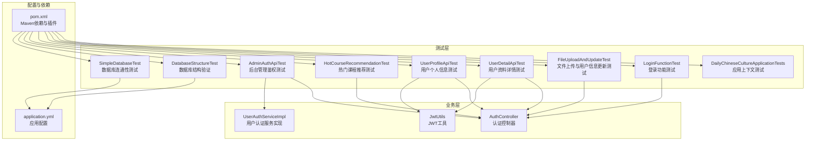
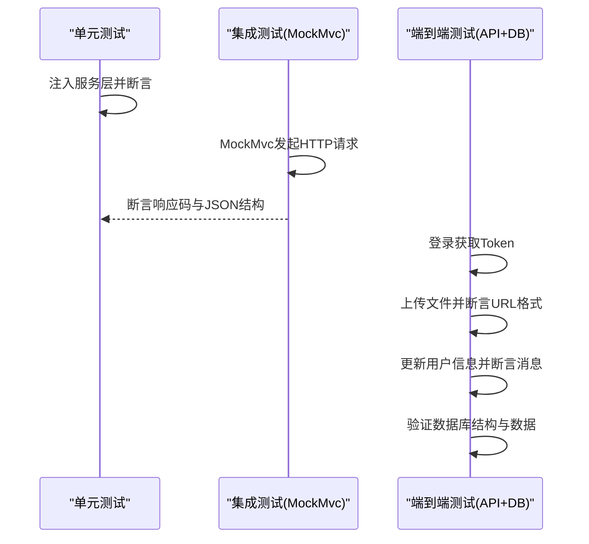
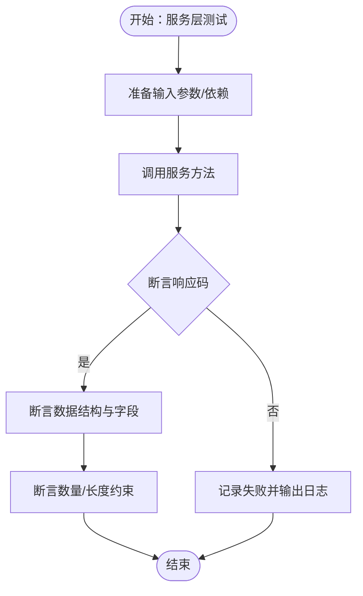
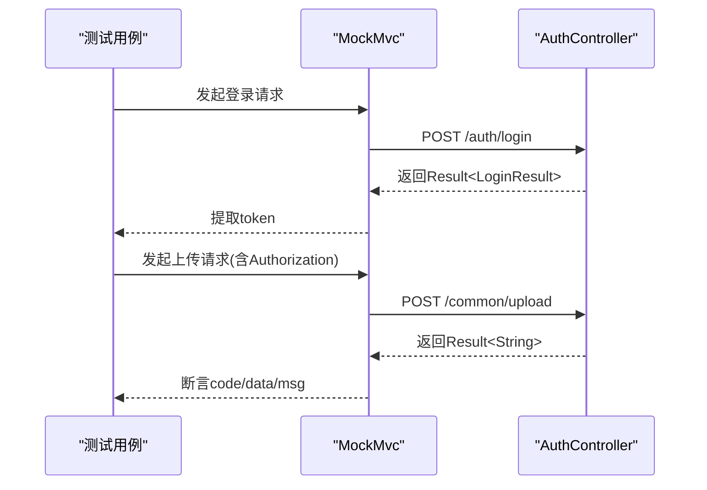
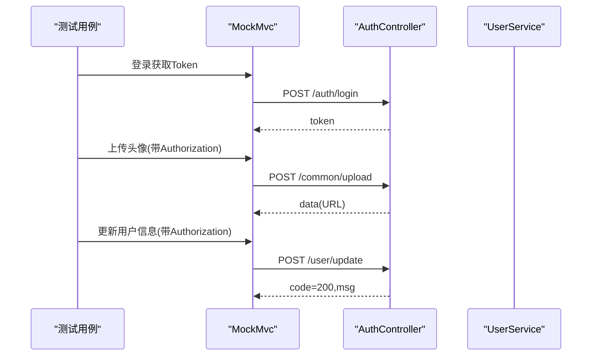
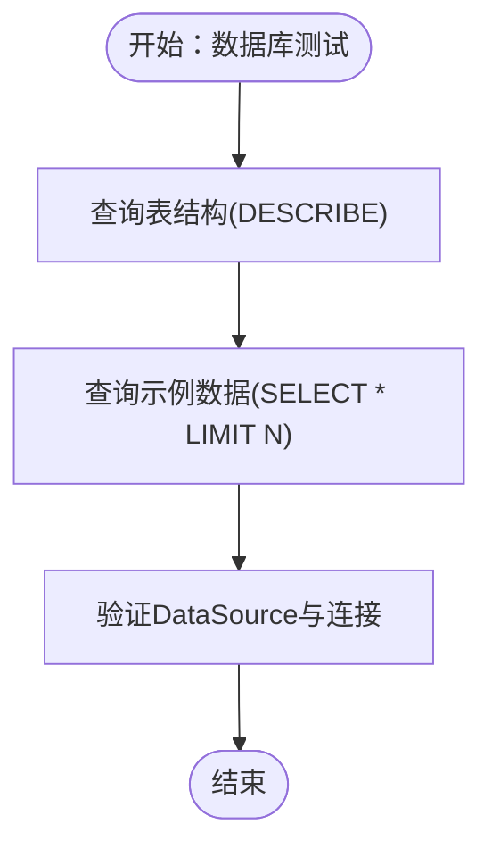
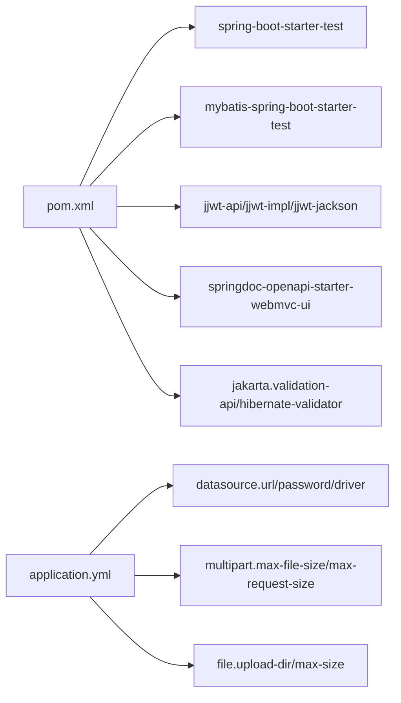

# 测试策略

<cite>
**本文引用的文件**
- [DailyChineseCultureApplicationTests.java](file://src/test/java/com/daily/dailychineseculture/DailyChineseCultureApplicationTests.java)
- [AdminAuthApiTest.java](file://src/test/java/com/daily/dailychineseculture/AdminAuthApiTest.java)
- [LoginFunctionTest.java](file://src/test/java/com/daily/dailychineseculture/LoginFunctionTest.java)
- [FileUploadAndUpdateTest.java](file://src/test/java/com/daily/dailychineseculture/FileUploadAndUpdateTest.java)
- [HotCourseRecommendationTest.java](file://src/test/java/com/daily/dailychineseculture/HotCourseRecommendationTest.java)
- [UserDetailApiTest.java](file://src/test/java/com/daily/dailychineseculture/UserDetailApiTest.java)
- [UserProfileApiTest.java](file://src/test/java/com/daily/dailychineseculture/UserProfileApiTest.java)
- [DatabaseStructureTest.java](file://src/test/java/com/daily/dailychineseculture/DatabaseStructureTest.java)
- [SimpleDatabaseTest.java](file://src/test/java/com/daily/dailychineseculture/SimpleDatabaseTest.java)
- [pom.xml](file://pom.xml)
- [application.yml](file://src/main/resources/application.yml)
- [测试最近活跃课程 API.md](file://doc/测试最近活跃课程 API.md)
- [项目运行测试指南.md](file://doc/项目运行测试指南.md)
- [AuthController.java](file://src/main/java/com/daily/dailychineseculture/controller/AuthController.java)
- [UserAuthServiceImpl.java](file://src/main/java/com/daily/dailychineseculture/service/impl/UserAuthServiceImpl.java)
- [JwtUtils.java](file://src/main/java/com/daily/dailychineseculture/util/JwtUtils.java)
</cite>

## 目录
1. [引言](#引言)
2. [项目结构](#项目结构)
3. [核心组件](#核心组件)
4. [架构总览](#架构总览)
5. [详细组件分析](#详细组件分析)
6. [依赖分析](#依赖分析)
7. [性能考虑](#性能考虑)
8. [故障排查指南](#故障排查指南)
9. [结论](#结论)
10. [附录](#附录)

## 引言
本测试策略文档系统性地阐述本项目的测试方法与最佳实践，覆盖单元测试、集成测试与端到端测试的实施策略；明确测试用例设计原则、覆盖率目标与测试数据管理；详解API测试、数据库测试与文件上传测试的实现要点；提供测试环境搭建、工具使用与自动化配置建议；并补充性能测试、压力测试与安全测试方法，以及测试报告生成、缺陷跟踪与持续集成配置思路。文档面向不同技术背景读者，既提供高层概览也给出代码级参考。

## 项目结构
项目采用Spring Boot标准工程结构，测试代码位于src/test目录，按功能域划分测试类，覆盖认证、用户、课程、文件上传等模块。核心依赖包括Web MVC、MyBatis Starter、JWT、分页插件、OpenAPI文档与校验框架。配置文件application.yml集中管理数据库、文件上传与Servlet上传限制等参数。

图表来源
- [pom.xml:1-149](file://pom.xml#L1-L149)
- [application.yml:1-33](file://src/main/resources/application.yml#L1-L33)
- [AuthController.java:1-200](file://src/main/java/com/daily/dailychineseculture/controller/AuthController.java#L1-L200)
- [UserAuthServiceImpl.java:1-168](file://src/main/java/com/daily/dailychineseculture/service/impl/UserAuthServiceImpl.java#L1-L168)
- [JwtUtils.java:1-206](file://src/main/java/com/daily/dailychineseculture/util/JwtUtils.java#L1-L206)

章节来源
- [pom.xml:1-149](file://pom.xml#L1-L149)
- [application.yml:1-33](file://src/main/resources/application.yml#L1-L33)

## 核心组件
- 应用上下文测试：验证Spring Boot应用上下文加载与基本容器能力。
- 登录功能测试：覆盖管理员登录、新用户自动注册、参数校验等场景。
- 文件上传与用户信息更新测试：基于MockMvc的端到端测试，覆盖多种文件类型、大小、授权与更新场景。
- 用户资料与个人信息测试：基于JWT工具生成Token，验证详情与更新接口。
- 热门课程推荐测试：验证控制器与服务层返回的数据格式与数量约束。
- 后台管理鉴权测试：以注释形式描述Token拦截与鉴权流程。
- 数据库结构与连通性测试：验证表结构、列信息与连接可用性。

章节来源
- [DailyChineseCultureApplicationTests.java:1-14](file://src/test/java/com/daily/dailychineseculture/DailyChineseCultureApplicationTests.java#L1-L14)
- [LoginFunctionTest.java:1-108](file://src/test/java/com/daily/dailychineseculture/LoginFunctionTest.java#L1-L108)
- [FileUploadAndUpdateTest.java:1-479](file://src/test/java/com/daily/dailychineseculture/FileUploadAndUpdateTest.java#L1-L479)
- [UserDetailApiTest.java:1-143](file://src/test/java/com/daily/dailychineseculture/UserDetailApiTest.java#L1-L143)
- [UserProfileApiTest.java:1-108](file://src/test/java/com/daily/dailychineseculture/UserProfileApiTest.java#L1-L108)
- [HotCourseRecommendationTest.java:1-73](file://src/test/java/com/daily/dailychineseculture/HotCourseRecommendationTest.java#L1-L73)
- [AdminAuthApiTest.java:1-58](file://src/test/java/com/daily/dailychineseculture/AdminAuthApiTest.java#L1-L58)
- [DatabaseStructureTest.java:1-43](file://src/test/java/com/daily/dailychineseculture/DatabaseStructureTest.java#L1-L43)
- [SimpleDatabaseTest.java:1-43](file://src/test/java/com/daily/dailychineseculture/SimpleDatabaseTest.java#L1-L43)

## 架构总览
测试架构围绕“单元测试（服务层）+ 集成测试（控制器+MockMvc）+ 端到端测试（外部API+数据库）”三层展开。单元测试通过@Autowired注入服务层进行断言；集成测试通过MockMvc发起HTTP请求，验证控制器行为与响应；端到端测试结合登录获取Token、文件上传与用户信息更新的完整流程，并结合数据库结构验证。

图表来源
- [LoginFunctionTest.java:1-108](file://src/test/java/com/daily/dailychineseculture/LoginFunctionTest.java#L1-L108)
- [FileUploadAndUpdateTest.java:1-479](file://src/test/java/com/daily/dailychineseculture/FileUploadAndUpdateTest.java#L1-L479)
- [UserDetailApiTest.java:1-143](file://src/test/java/com/daily/dailychineseculture/UserDetailApiTest.java#L1-L143)
- [UserProfileApiTest.java:1-108](file://src/test/java/com/daily/dailychineseculture/UserProfileApiTest.java#L1-L108)
- [DatabaseStructureTest.java:1-43](file://src/test/java/com/daily/dailychineseculture/DatabaseStructureTest.java#L1-L43)

## 详细组件分析

### 单元测试策略
- 服务层直接测试：通过@Autowired注入服务接口，绕过HTTP层，快速验证业务逻辑与边界条件。
- 示例：热门课程推荐测试直接调用控制器与服务层，断言响应码、数据非空与数量上限。
- 设计原则：每个测试聚焦单一职责，前置准备清晰，断言明确，异常路径覆盖充分。

图表来源
- [HotCourseRecommendationTest.java:27-73](file://src/test/java/com/daily/dailychineseculture/HotCourseRecommendationTest.java#L27-L73)

章节来源
- [HotCourseRecommendationTest.java:1-73](file://src/test/java/com/daily/dailychineseculture/HotCourseRecommendationTest.java#L1-L73)

### 集成测试策略（MockMvc）
- 控制器测试：通过MockMvc发起HTTP请求，验证鉴权头、状态码、JSON字段与业务规则。
- 示例：文件上传测试覆盖空文件、非法类型、超大文件、未授权访问、成功上传与URL格式断言；用户信息更新测试覆盖全量更新、部分字段更新、未授权访问与手机号重复检测。
- 设计原则：每个测试独立登录获取Token，构造最小化请求体，断言明确的期望值。

图表来源
- [FileUploadAndUpdateTest.java:41-77](file://src/test/java/com/daily/dailychineseculture/FileUploadAndUpdateTest.java#L41-L77)
- [AuthController.java:63-112](file://src/main/java/com/daily/dailychineseculture/controller/AuthController.java#L63-L112)

章节来源
- [FileUploadAndUpdateTest.java:1-479](file://src/test/java/com/daily/dailychineseculture/FileUploadAndUpdateTest.java#L1-L479)
- [AuthController.java:1-200](file://src/main/java/com/daily/dailychineseculture/controller/AuthController.java#L1-L200)

### 端到端测试策略
- 场景串联：登录→上传头像→更新用户信息→断言响应与URL格式。
- 数据准备：通过JWT工具生成Token，或在测试前登录获取Token并缓存复用。
- 设计原则：覆盖边界值（空文件、超大文件）、异常路径（未授权、重复手机号）与完整流程。

图表来源
- [UserDetailApiTest.java:34-71](file://src/test/java/com/daily/dailychineseculture/UserDetailApiTest.java#L34-L71)
- [UserProfileApiTest.java:32-79](file://src/test/java/com/daily/dailychineseculture/UserProfileApiTest.java#L32-L79)
- [JwtUtils.java:37-69](file://src/main/java/com/daily/dailychineseculture/util/JwtUtils.java#L37-L69)

章节来源
- [UserDetailApiTest.java:1-143](file://src/test/java/com/daily/dailychineseculture/UserDetailApiTest.java#L1-L143)
- [UserProfileApiTest.java:1-108](file://src/test/java/com/daily/dailychineseculture/UserProfileApiTest.java#L1-L108)
- [JwtUtils.java:1-206](file://src/main/java/com/daily/dailychineseculture/util/JwtUtils.java#L1-L206)

### API测试设计原则
- 请求与响应：明确HTTP方法、路径、头信息（如Authorization）、请求体结构与期望响应码、JSON字段。
- 参数校验：覆盖空值、边界值、非法类型、超长字符串等。
- 鉴权与拦截：验证未登录、Token过期、Token格式错误等场景。
- 数据一致性：断言返回字段完整性与业务约束（如数量上限、格式匹配）。

章节来源
- [AdminAuthApiTest.java:1-58](file://src/test/java/com/daily/dailychineseculture/AdminAuthApiTest.java#L1-L58)
- [LoginFunctionTest.java:19-107](file://src/test/java/com/daily/dailychineseculture/LoginFunctionTest.java#L19-L107)

### 数据库测试与数据管理
- 结构验证：通过JDBC查询表结构与示例数据，确保字段、类型与默认值符合预期。
- 连通性测试：验证DataSource自动装配与连接可用性，输出连接元数据。
- 测试数据：优先使用现有测试账号与固定ID，必要时在测试前准备SQL数据（参考文档中的示例SQL）。

图表来源
- [DatabaseStructureTest.java:21-42](file://src/test/java/com/daily/dailychineseculture/DatabaseStructureTest.java#L21-L42)
- [SimpleDatabaseTest.java:20-42](file://src/test/java/com/daily/dailychineseculture/SimpleDatabaseTest.java#L20-L42)

章节来源
- [DatabaseStructureTest.java:1-43](file://src/test/java/com/daily/dailychineseculture/DatabaseStructureTest.java#L1-L43)
- [SimpleDatabaseTest.java:1-43](file://src/test/java/com/daily/dailychineseculture/SimpleDatabaseTest.java#L1-L43)
- [application.yml:6-33](file://src/main/resources/application.yml#L6-L33)

### 文件上传测试实现
- 支持类型：JPG、PNG及其扩展名兼容性；拒绝空文件与非图片类型。
- 大小限制：基于配置与MockMvc断言，覆盖500MB上传限制与超大文件拒绝。
- 授权校验：未携带Authorization头时返回未授权。
- URL格式：断言返回URL前缀与文件名模式。

章节来源
- [FileUploadAndUpdateTest.java:79-479](file://src/test/java/com/daily/dailychineseculture/FileUploadAndUpdateTest.java#L79-L479)
- [application.yml:12-33](file://src/main/resources/application.yml#L12-L33)

### 登录与鉴权测试
- 登录流程：用户名/密码校验、新用户自动注册、信息完整性判断、Token生成。
- 鉴权流程：基于JWT工具生成Token，控制器解析并返回用户信息；后台管理鉴权通过注释描述拦截器行为。

章节来源
- [LoginFunctionTest.java:19-107](file://src/test/java/com/daily/dailychineseculture/LoginFunctionTest.java#L19-L107)
- [AuthController.java:41-136](file://src/main/java/com/daily/dailychineseculture/controller/AuthController.java#L41-L136)
- [JwtUtils.java:37-95](file://src/main/java/com/daily/dailychineseculture/util/JwtUtils.java#L37-L95)
- [AdminAuthApiTest.java:43-56](file://src/test/java/com/daily/dailychineseculture/AdminAuthApiTest.java#L43-L56)

## 依赖分析
- 测试依赖：Spring Boot Starter Test、MyBatis Spring Boot Starter Test、JUnit 5、MockMvc。
- 运行依赖：Spring MVC、MyBatis、MySQL Connector、JWT、分页插件、OpenAPI文档、校验框架。
- 配置依赖：application.yml集中管理数据库、文件上传与Servlet上传限制。

图表来源
- [pom.xml:32-117](file://pom.xml#L32-L117)
- [application.yml:6-33](file://src/main/resources/application.yml#L6-L33)

章节来源
- [pom.xml:1-149](file://pom.xml#L1-L149)
- [application.yml:1-33](file://src/main/resources/application.yml#L1-L33)

## 性能考虑
- 单元测试：保持无外部依赖，使用Mock与最小化输入，追求快速反馈。
- 集成测试：合理拆分测试用例，避免重复登录；对大文件上传测试谨慎控制数据规模。
- 端到端测试：优先使用内存数据库或测试专用实例，减少对主库影响；批量测试时注意并发与资源释放。
- 日志与断言：避免在测试中输出冗余日志，统一使用断言与结构化输出便于定位问题。

## 故障排查指南
- 端口占用：若8080端口被占用，参考项目运行测试指南中的端口占用排查与处理命令。
- Java环境：确认JAVA_HOME与PATH设置正确，确保使用指定版本的JDK。
- 项目编译：清理并重新编译，运行测试，定位依赖冲突或编译错误。
- 数据库连接：检查application.yml中的数据库连接参数，确认网络可达与账号权限。
- API测试：参考测试最近活跃课程 API文档中的错误排查与SQL准备建议。

章节来源
- [项目运行测试指南.md:96-122](file://doc/项目运行测试指南.md#L96-L122)
- [application.yml:6-11](file://src/main/resources/application.yml#L6-L11)
- [测试最近活跃课程 API.md:107-134](file://doc/测试最近活跃课程 API.md#L107-L134)

## 结论
本项目的测试策略以“单元测试+集成测试+端到端测试”为主线，结合MockMvc与JWT工具，覆盖登录、用户信息、文件上传与数据库结构等关键路径。通过明确的断言与场景拆分，确保测试的稳定性与可维护性。建议在持续集成中引入自动化测试流水线，结合日志与报告工具，进一步提升质量保障效率。

## 附录
- 测试环境搭建：参考项目运行测试指南，设置JAVA_HOME，启动项目并确认端口监听。
- API测试工具：支持浏览器、Postman/Insomnia、curl与PowerShell脚本。
- 自动化测试配置：可在CI中执行Maven测试命令，结合测试报告与日志归档。
- 性能与安全：关注文件大小限制、鉴权拦截与Token有效期；对敏感字段（如密码）进行安全断言。

章节来源
- [项目运行测试指南.md:1-149](file://doc/项目运行测试指南.md#L1-L149)
- [测试最近活跃课程 API.md:1-244](file://doc/测试最近活跃课程 API.md#L1-L244)