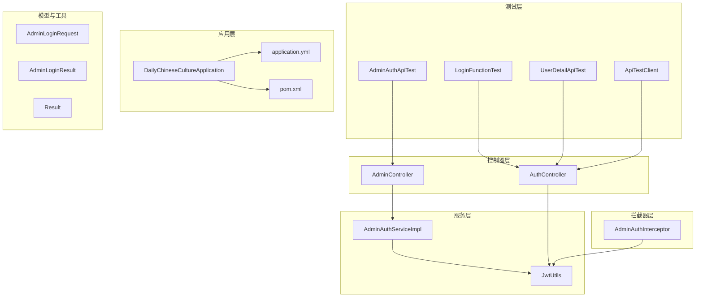
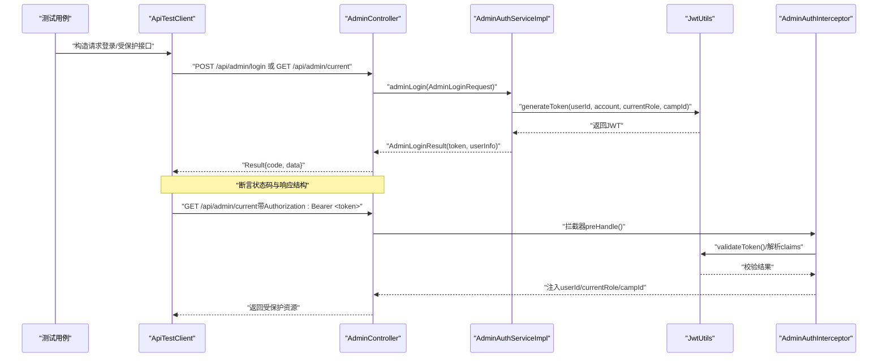
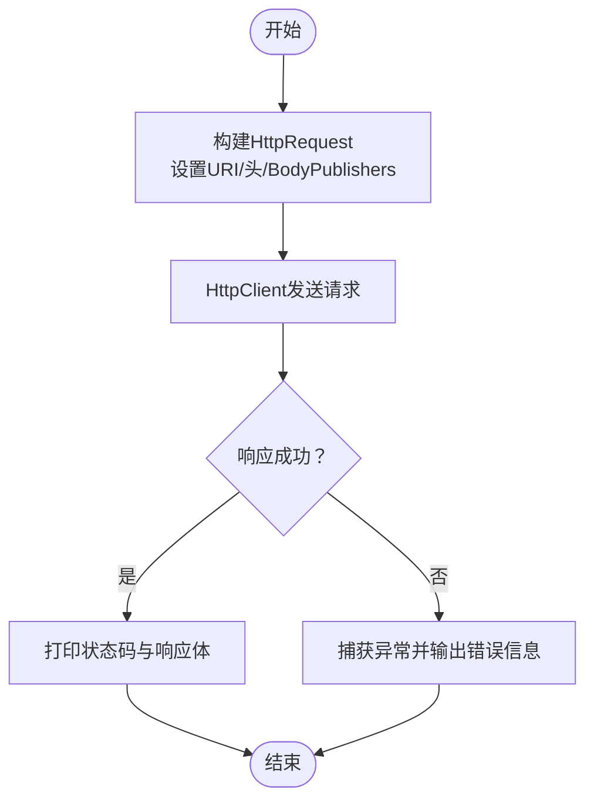
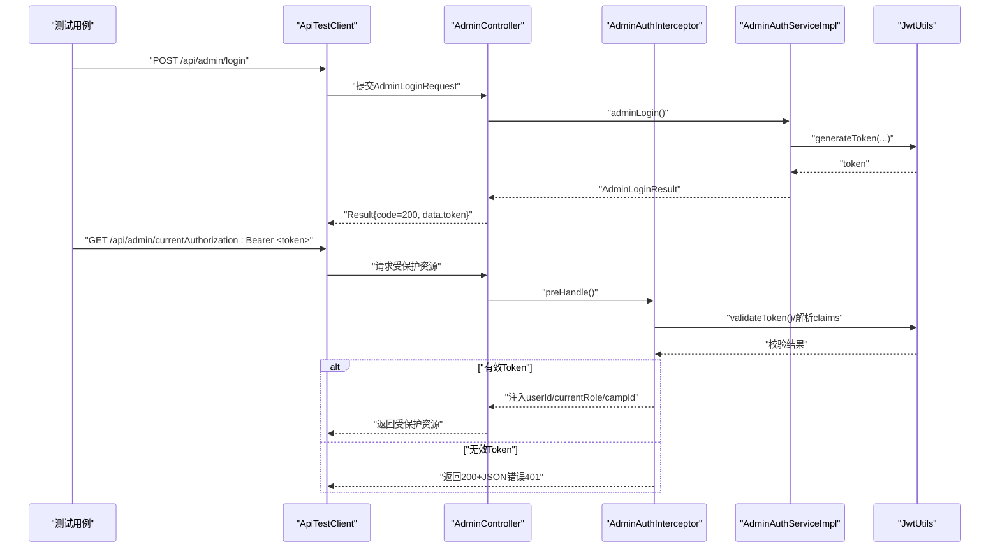
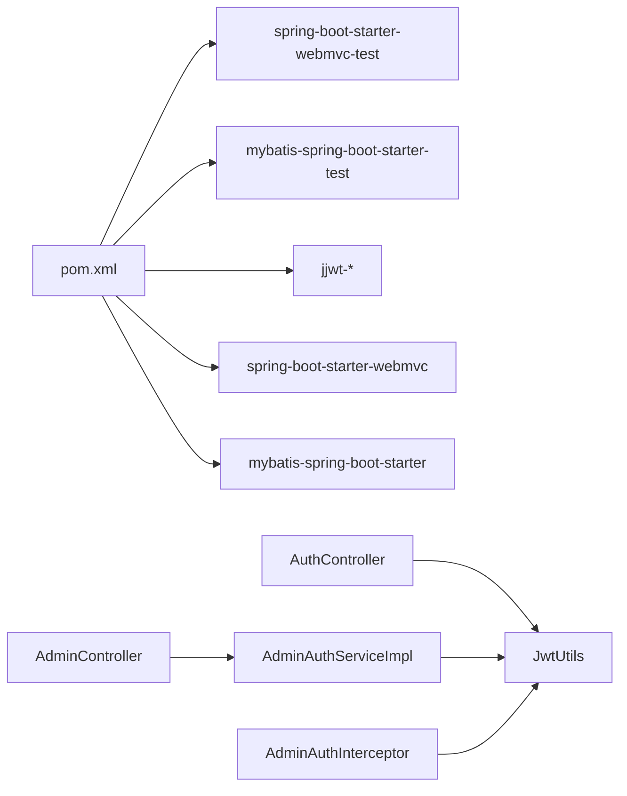

# 集成测试

<cite>
**本文引用的文件**
- [ApiTestClient.java](file://src/test/java/com/daily/dailychineseculture/ApiTestClient.java)
- [AdminAuthApiTest.java](file://src/test/java/com/daily/dailychineseculture/AdminAuthApiTest.java)
- [LoginFunctionTest.java](file://src/test/java/com/daily/dailychineseculture/LoginFunctionTest.java)
- [UserDetailApiTest.java](file://src/test/java/com/daily/dailychineseculture/UserDetailApiTest.java)
- [AdminController.java](file://src/main/java/com/daily/dailychineseculture/controller/AdminController.java)
- [AdminAuthInterceptor.java](file://src/main/java/com/daily/dailychineseculture/interceptor/AdminAuthInterceptor.java)
- [JwtUtils.java](file://src/main/java/com/daily/dailychineseculture/util/JwtUtils.java)
- [AdminLoginRequest.java](file://src/main/java/com/daily/dailychineseculture/dto/AdminLoginRequest.java)
- [AdminLoginResult.java](file://src/main/java/com/daily/dailychineseculture/dto/AdminLoginResult.java)
- [AdminAuthServiceImpl.java](file://src/main/java/com/daily/dailychineseculture/service/impl/AdminAuthServiceImpl.java)
- [AdminAuthService.java](file://src/main/java/com/daily/dailychineseculture/service/AdminAuthService.java)
- [AuthController.java](file://src/main/java/com/daily/dailychineseculture/controller/AuthController.java)
- [Result.java](file://src/main/java/com/daily/dailychineseculture/common/Result.java)
- [application.yml](file://src/main/resources/application.yml)
- [pom.xml](file://pom.xml)
- [DailyChineseCultureApplication.java](file://src/main/java/com/daily/dailychineseculture/DailyChineseCultureApplication.java)
</cite>

## 目录
1. [引言](#引言)
2. [项目结构](#项目结构)
3. [核心组件](#核心组件)
4. [架构总览](#架构总览)
5. [详细组件分析](#详细组件分析)
6. [依赖分析](#依赖分析)
7. [性能考虑](#性能考虑)
8. [故障排查指南](#故障排查指南)
9. [结论](#结论)
10. [附录](#附录)

## 引言
本文件面向集成测试场景，系统化阐述基于RESTful API的测试实现，重点覆盖以下方面：
- ApiTestClient工具类的设计与使用：HTTP请求构建、响应解析与错误处理。
- 管理员认证流程的测试策略：AdminAuthApiTest中登录、权限验证与会话管理的测试思路。
- API测试断言策略：状态码验证与响应数据结构检查。
- 集成测试环境配置、数据库连接管理与测试数据清理方法。
- API测试最佳实践：测试数据隔离、并发测试与性能基准测试。

## 项目结构
该项目采用Spring Boot标准分层结构，测试位于src/test目录，生产代码位于src/main。与集成测试密切相关的模块包括：
- 控制器层：AuthController（用户认证）、AdminController（管理后台）。
- 拦截器层：AdminAuthInterceptor（管理端JWT拦截）。
- 工具与模型：JwtUtils（JWT工具）、Result（统一响应封装）、AdminLoginRequest/AdminLoginResult（管理端登录DTO）。
- 服务层：AdminAuthServiceImpl（管理员认证服务实现）。
- 配置：application.yml（数据库与文件上传配置）、pom.xml（依赖与测试依赖）。

图表来源
- [AdminAuthApiTest.java:1-58](file://src/test/java/com/daily/dailychineseculture/AdminAuthApiTest.java#L1-L58)
- [LoginFunctionTest.java:1-108](file://src/test/java/com/daily/dailychineseculture/LoginFunctionTest.java#L1-L108)
- [UserDetailApiTest.java:1-143](file://src/test/java/com/daily/dailychineseculture/UserDetailApiTest.java#L1-L143)
- [ApiTestClient.java:1-87](file://src/test/java/com/daily/dailychineseculture/ApiTestClient.java#L1-L87)
- [DailyChineseCultureApplication.java:1-40](file://src/main/java/com/daily/dailychineseculture/DailyChineseCultureApplication.java#L1-L40)
- [application.yml:1-33](file://src/main/resources/application.yml#L1-L33)
- [pom.xml:1-149](file://pom.xml#L1-L149)
- [AuthController.java:1-516](file://src/main/java/com/daily/dailychineseculture/controller/AuthController.java#L1-L516)
- [AdminController.java:1-203](file://src/main/java/com/daily/dailychineseculture/controller/AdminController.java#L1-L203)
- [AdminAuthInterceptor.java:1-93](file://src/main/java/com/daily/dailychineseculture/interceptor/AdminAuthInterceptor.java#L1-L93)
- [AdminAuthServiceImpl.java:1-99](file://src/main/java/com/daily/dailychineseculture/service/impl/AdminAuthServiceImpl.java#L1-L99)
- [JwtUtils.java:1-206](file://src/main/java/com/daily/dailychineseculture/util/JwtUtils.java#L1-L206)
- [AdminLoginRequest.java:1-27](file://src/main/java/com/daily/dailychineseculture/dto/AdminLoginRequest.java#L1-L27)
- [AdminLoginResult.java:1-52](file://src/main/java/com/daily/dailychineseculture/dto/AdminLoginResult.java#L1-L52)
- [Result.java:1-81](file://src/main/java/com/daily/dailychineseculture/common/Result.java#L1-L81)

章节来源
- [pom.xml:1-149](file://pom.xml#L1-L149)
- [application.yml:1-33](file://src/main/resources/application.yml#L1-L33)
- [DailyChineseCultureApplication.java:1-40](file://src/main/java/com/daily/dailychineseculture/DailyChineseCultureApplication.java#L1-L40)

## 核心组件
- ApiTestClient：轻量HTTP客户端，用于快速发起REST请求、打印请求/响应与异常信息，便于手工调试与脚本化验证。
- AdminAuthApiTest：管理员认证流程的测试骨架，明确登录接口、Token拦截器的行为预期。
- AuthController/AdminController：对外暴露登录、用户信息、管理后台等REST接口。
- AdminAuthInterceptor：拦截管理端请求，校验Authorization头与JWT有效性，并注入用户上下文。
- JwtUtils：JWT生成、解析与校验工具，支撑登录与拦截器。
- AdminAuthServiceImpl：管理员认证服务实现，负责角色权限校验与Token生成。
- Result：统一响应封装，便于断言状态码与数据结构。

章节来源
- [ApiTestClient.java:1-87](file://src/test/java/com/daily/dailychineseculture/ApiTestClient.java#L1-L87)
- [AdminAuthApiTest.java:1-58](file://src/test/java/com/daily/dailychineseculture/AdminAuthApiTest.java#L1-L58)
- [AuthController.java:1-516](file://src/main/java/com/daily/dailychineseculture/controller/AuthController.java#L1-L516)
- [AdminController.java:1-203](file://src/main/java/com/daily/dailychineseculture/controller/AdminController.java#L1-L203)
- [AdminAuthInterceptor.java:1-93](file://src/main/java/com/daily/dailychineseculture/interceptor/AdminAuthInterceptor.java#L1-L93)
- [JwtUtils.java:1-206](file://src/main/java/com/daily/dailychineseculture/util/JwtUtils.java#L1-L206)
- [AdminAuthServiceImpl.java:1-99](file://src/main/java/com/daily/dailychineseculture/service/impl/AdminAuthServiceImpl.java#L1-L99)
- [Result.java:1-81](file://src/main/java/com/daily/dailychineseculture/common/Result.java#L1-L81)

## 架构总览
下图展示了管理员认证与拦截的关键交互路径，以及测试侧关注点：

图表来源
- [AdminAuthApiTest.java:1-58](file://src/test/java/com/daily/dailychineseculture/AdminAuthApiTest.java#L1-L58)
- [AdminController.java:1-203](file://src/main/java/com/daily/dailychineseculture/controller/AdminController.java#L1-L203)
- [AdminAuthServiceImpl.java:1-99](file://src/main/java/com/daily/dailychineseculture/service/impl/AdminAuthServiceImpl.java#L1-L99)
- [JwtUtils.java:1-206](file://src/main/java/com/daily/dailychineseculture/util/JwtUtils.java#L1-L206)
- [AdminAuthInterceptor.java:1-93](file://src/main/java/com/daily/dailychineseculture/interceptor/AdminAuthInterceptor.java#L1-L93)
- [ApiTestClient.java:1-87](file://src/test/java/com/daily/dailychineseculture/ApiTestClient.java#L1-L87)

## 详细组件分析

### ApiTestClient工具类设计与使用
- 设计目标：为REST API集成测试提供简单易用的HTTP客户端，支持JSON请求体、固定基础URL与超时配置。
- 请求构建：使用java.net.http.HttpClient.Builder配置连接超时；HttpRequest.Builder设置URI、Content-Type与POST体。
- 响应解析：HttpResponse.BodyHandlers.ofString()获取字符串响应体；打印状态码与响应内容。
- 错误处理：捕获异常并输出错误信息与堆栈，便于定位网络或服务端异常。
- 使用建议：
  - 在测试前确认服务端端口与路由正确（默认8080与"/api/admin/login"等）。
  - 对于需要鉴权的接口，先调用登录接口获取token，再在后续请求头添加Authorization: Bearer <token>。

图表来源
- [ApiTestClient.java:67-86](file://src/test/java/com/daily/dailychineseculture/ApiTestClient.java#L67-L86)

章节来源
- [ApiTestClient.java:1-87](file://src/test/java/com/daily/dailychineseculture/ApiTestClient.java#L1-L87)

### 管理员认证流程测试策略（AdminAuthApiTest）
- 登录接口测试要点：
  - 接口路径：POST /api/admin/login。
  - 请求参数：account、password、loginRole（如COURSE_ADMIN）。
  - 预期响应：Result结构，包含token与userInfo（userId、account、nickname、currentRole、campId）。
  - 断言策略：校验code=200；校验data.token非空；校验userInfo字段完整性。
- Token拦截器测试要点：
  - 接口路径：GET /api/admin/current。
  - 请求头：Authorization: Bearer <token>。
  - 行为预期：
    - 无Token：返回401（但拦截器返回200+JSON错误），需在测试中识别。
    - Token过期/无效：返回401（拦截器返回200+JSON错误）。
    - Token有效：放行并注入用户信息到request attribute，控制器可读取userId/currentRole/campId。

图表来源
- [AdminAuthApiTest.java:15-56](file://src/test/java/com/daily/dailychineseculture/AdminAuthApiTest.java#L15-L56)
- [AdminController.java:45-68](file://src/main/java/com/daily/dailychineseculture/controller/AdminController.java#L45-L68)
- [AdminAuthInterceptor.java:24-81](file://src/main/java/com/daily/dailychineseculture/interceptor/AdminAuthInterceptor.java#L24-L81)
- [AdminAuthServiceImpl.java:37-96](file://src/main/java/com/daily/dailychineseculture/service/impl/AdminAuthServiceImpl.java#L37-L96)
- [JwtUtils.java:50-69](file://src/main/java/com/daily/dailychineseculture/util/JwtUtils.java#L50-L69)

章节来源
- [AdminAuthApiTest.java:1-58](file://src/test/java/com/daily/dailychineseculture/AdminAuthApiTest.java#L1-L58)
- [AdminController.java:1-203](file://src/main/java/com/daily/dailychineseculture/controller/AdminController.java#L1-L203)
- [AdminAuthInterceptor.java:1-93](file://src/main/java/com/daily/dailychineseculture/interceptor/AdminAuthInterceptor.java#L1-L93)
- [AdminAuthServiceImpl.java:1-99](file://src/main/java/com/daily/dailychineseculture/service/impl/AdminAuthServiceImpl.java#L1-L99)
- [JwtUtils.java:1-206](file://src/main/java/com/daily/dailychineseculture/util/JwtUtils.java#L1-L206)

### API测试断言策略与响应数据结构检查
- 统一响应结构：Result<T>包含code、msg、data三要素，便于断言状态码与数据存在性。
- 登录接口断言：
  - 管理员登录：code=200；data.token非空；data.userInfo包含必要字段。
  - 用户登录（参考LoginFunctionTest）：校验code、msg、data.token、userInfo、isComplete等。
- 受保护接口断言：
  - 无Token或Token无效：拦截器返回200+JSON错误（code=401），测试需识别。
  - Token有效：返回受保护资源，控制器可读取注入的用户上下文。

章节来源
- [Result.java:1-81](file://src/main/java/com/daily/dailychineseculture/common/Result.java#L1-L81)
- [LoginFunctionTest.java:1-108](file://src/test/java/com/daily/dailychineseculture/LoginFunctionTest.java#L1-L108)
- [UserDetailApiTest.java:1-143](file://src/test/java/com/daily/dailychineseculture/UserDetailApiTest.java#L1-L143)
- [AdminAuthInterceptor.java:35-81](file://src/main/java/com/daily/dailychineseculture/interceptor/AdminAuthInterceptor.java#L35-L81)

### 集成测试环境配置、数据库连接与测试数据清理
- 环境配置：
  - 服务端口：application.yml中server.port=8080。
  - 数据源：MySQL连接配置（URL、用户名、密码、驱动）。
  - MyBatis：开启驼峰命名与Mapper XML位置。
- 数据库连接管理：
  - 生产使用MySQL，测试阶段建议使用独立数据库或容器化数据库，避免污染生产数据。
  - 如需在测试中访问数据库，可通过MyBatis Mapper或JDBC直接操作。
- 测试数据清理：
  - 建议在测试前后执行事务回滚或删除临时数据，确保测试隔离。
  - 对于JWT相关测试，注意Token有效期与拦截器校验，避免跨测试用例干扰。

章节来源
- [application.yml:1-33](file://src/main/resources/application.yml#L1-L33)
- [pom.xml:32-117](file://pom.xml#L32-L117)

### API测试最佳实践
- 测试数据隔离：
  - 使用独立测试账户与测试数据库实例；对敏感字段（如密码）在断言中避免泄露。
- 并发测试：
  - 对登录与受保护接口进行并发压力测试，观察拦截器与服务层的线程安全性。
- 性能基准测试：
  - 使用工具对关键接口（登录、获取用户详情）进行吞吐与延迟测量，结合日志定位瓶颈。
- 可观测性：
  - 在拦截器与控制器中增加关键日志点，便于定位鉴权失败与业务异常。

## 依赖分析
- 测试依赖：
  - Spring Boot Starter Web/MVC Test、MyBatis Starter Test。
  - JWT依赖（jjwt-api/impl/jackson）。
- 运行依赖：
  - Spring MVC、MyBatis、MySQL Connector、Swagger/Knife4j、Hibernate Validator等。
- 关键耦合：
  - AdminController依赖AdminAuthService与JwtUtils；AdminAuthInterceptor依赖JwtUtils。
  - 测试通过ApiTestClient直连控制器，或通过JUnit测试用例间接调用控制器。

图表来源
- [pom.xml:32-117](file://pom.xml#L32-L117)
- [AuthController.java:1-516](file://src/main/java/com/daily/dailychineseculture/controller/AuthController.java#L1-L516)
- [AdminController.java:1-203](file://src/main/java/com/daily/dailychineseculture/controller/AdminController.java#L1-L203)
- [AdminAuthServiceImpl.java:1-99](file://src/main/java/com/daily/dailychineseculture/service/impl/AdminAuthServiceImpl.java#L1-L99)
- [AdminAuthInterceptor.java:1-93](file://src/main/java/com/daily/dailychineseculture/interceptor/AdminAuthInterceptor.java#L1-L93)
- [JwtUtils.java:1-206](file://src/main/java/com/daily/dailychineseculture/util/JwtUtils.java#L1-L206)

章节来源
- [pom.xml:1-149](file://pom.xml#L1-L149)

## 性能考虑
- 连接池与超时：ApiTestClient设置了连接超时，建议在高并发场景下复用HttpClient或使用异步客户端。
- Token生成与解析：JWT生成与解析为CPU密集操作，建议在测试中批量压测并监控GC与CPU占用。
- 数据库IO：登录与用户详情接口涉及数据库查询，建议在测试环境中使用索引优化与连接池配置。

## 故障排查指南
- 登录失败：
  - 检查请求参数（account/password/loginRole）是否为空或格式错误。
  - 查看控制器返回的Result.code与msg，结合AdminAuthServiceImpl的异常抛出逻辑定位。
- Token无效或过期：
  - 拦截器返回200+JSON错误（code=401），需在测试中识别并重试登录。
  - 使用JwtUtils.validateToken()与getUserIdFromToken()验证Token有效性与解析结果。
- 数据库连接问题：
  - 确认application.yml中的数据库URL、用户名与密码正确；检查MySQL服务可达性。
- 日志定位：
  - 控制器与拦截器均输出关键日志，便于定位异常类型与信息。

章节来源
- [AuthController.java:64-112](file://src/main/java/com/daily/dailychineseculture/controller/AuthController.java#L64-L112)
- [AdminController.java:45-68](file://src/main/java/com/daily/dailychineseculture/controller/AdminController.java#L45-L68)
- [AdminAuthInterceptor.java:35-81](file://src/main/java/com/daily/dailychineseculture/interceptor/AdminAuthInterceptor.java#L35-L81)
- [JwtUtils.java:165-190](file://src/main/java/com/daily/dailychineseculture/util/JwtUtils.java#L165-L190)
- [application.yml:7-11](file://src/main/resources/application.yml#L7-L11)

## 结论
本文围绕RESTful API集成测试，系统梳理了ApiTestClient工具类、管理员认证流程测试策略、断言与响应结构检查、环境配置与数据库管理、以及测试最佳实践。通过明确的测试步骤与断言策略，可有效保障登录、鉴权与会话管理等核心能力的稳定性与一致性。

## 附录
- 测试用例清单建议：
  - 管理员登录：正向、空用户名、空密码、无权限角色。
  - Token拦截器：无Token、过期Token、有效Token。
  - 用户登录：正向、新用户自动注册、空用户名/密码。
  - 用户资料：获取详情、更新全量信息（含密码更新）。
- 建议的测试数据：
  - 使用唯一用户名与测试角色组合，避免冲突。
  - 对于数据库操作，建议在事务中回滚或删除临时数据。