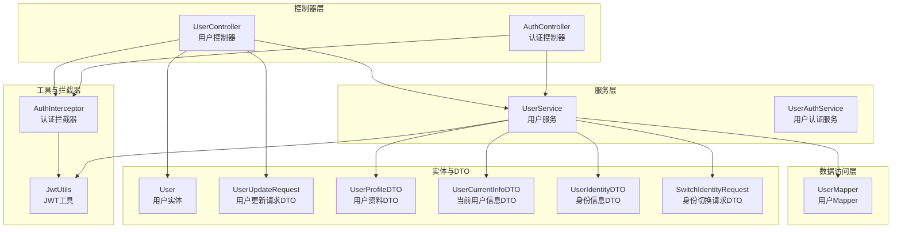
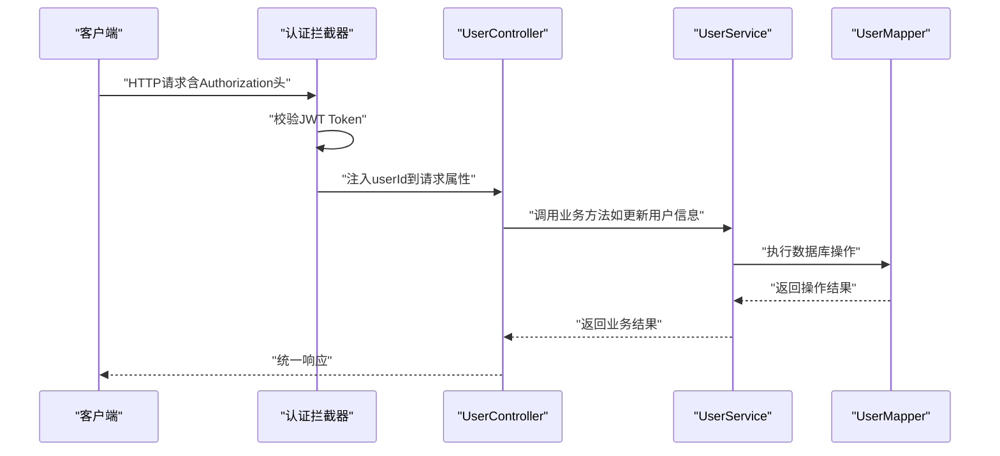
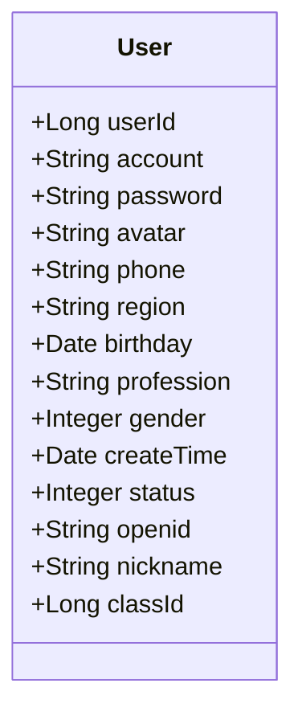
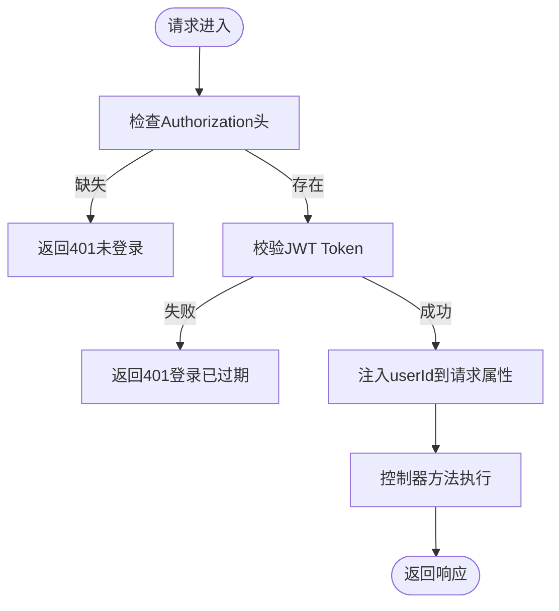
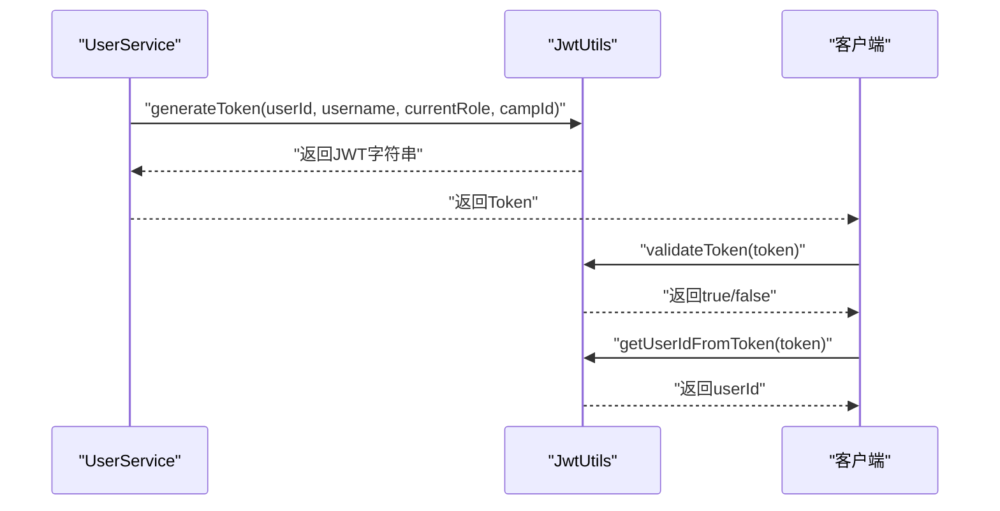
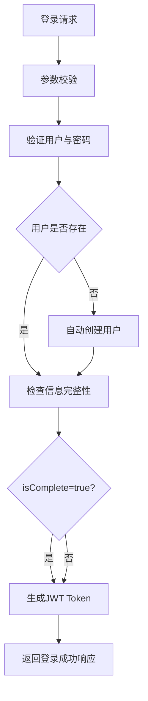
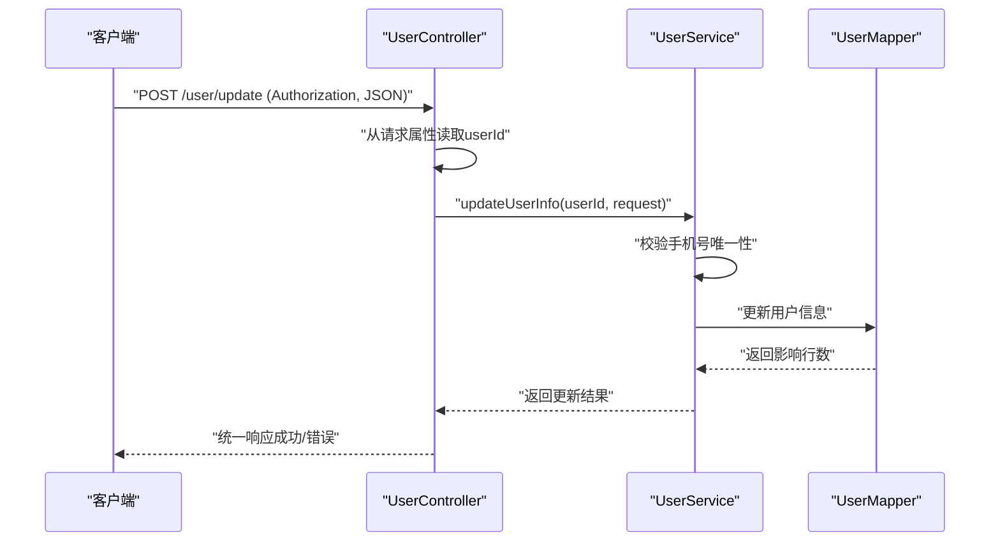
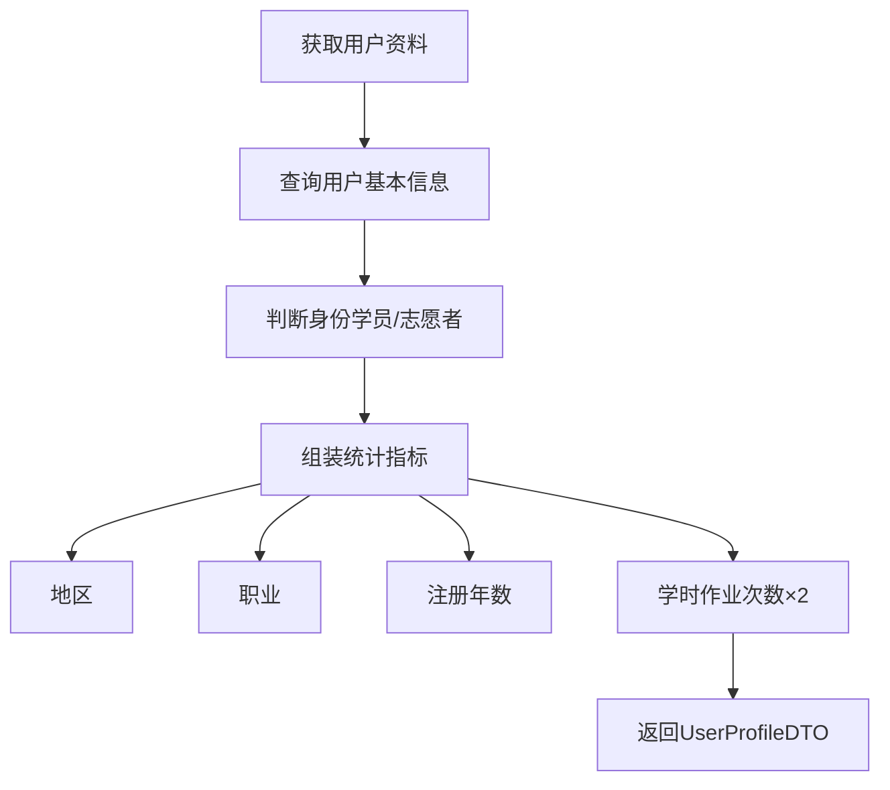
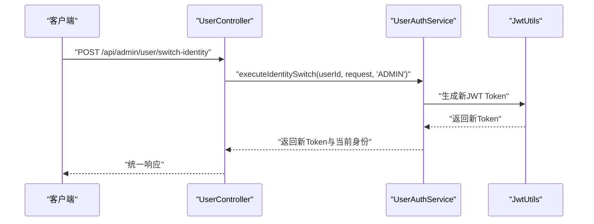
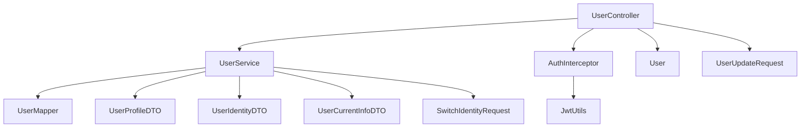

# 用户管理模块

<cite>
**本文档引用的文件**
- [UserController.java](file://src/main/java/com/daily/dailychineseculture/controller/UserController.java)
- [UserService.java](file://src/main/java/com/daily/dailychineseculture/service/UserService.java)
- [User.java](file://src/main/java/com/daily/dailychineseculture/entity/User.java)
- [UserUpdateRequest.java](file://src/main/java/com/daily/dailychineseculture/dto/UserUpdateRequest.java)
- [UserProfileDTO.java](file://src/main/java/com/daily/dailychineseculture/dto/UserProfileDTO.java)
- [UserCurrentInfoDTO.java](file://src/main/java/com/daily/dailychineseculture/dto/UserCurrentInfoDTO.java)
- [UserIdentityDTO.java](file://src/main/java/com/daily/dailychineseculture/dto/UserIdentityDTO.java)
- [SwitchIdentityRequest.java](file://src/main/java/com/daily/dailychineseculture/dto/SwitchIdentityRequest.java)
- [UserAuthService.java](file://src/main/java/com/daily/dailychineseculture/service/UserAuthService.java)
- [UserMapper.java](file://src/main/java/com/daily/dailychineseculture/mapper/UserMapper.java)
- [AuthInterceptor.java](file://src/main/java/com/daily/dailychineseculture/interceptor/AuthInterceptor.java)
- [JwtUtils.java](file://src/main/java/com/daily/dailychineseculture/util/JwtUtils.java)
- [用户信息更新 API文档.md](file://doc/用户信息更新 API文档.md)
- [登录接口API文档.md](file://doc/登录接口API文档.md)
- [用户个人信息 API文档.md](file://doc/用户个人信息 API文档.md)
</cite>

## 目录
1. [简介](#简介)
2. [项目结构](#项目结构)
3. [核心组件](#核心组件)
4. [架构概览](#架构概览)
5. [详细组件分析](#详细组件分析)
6. [依赖分析](#依赖分析)
7. [性能考虑](#性能考虑)
8. [故障排除指南](#故障排除指南)
9. [结论](#结论)
10. [附录](#附录)

## 简介
本文件全面阐述用户管理模块的设计与实现，覆盖用户注册、登录、资料更新与状态管理等核心功能。文档从数据模型设计、权限体系与访问控制、会话管理、密码安全策略、隐私保护措施，到统计分析与活跃度监控等方面进行深入解析，并提供增删改查操作示例、参数验证、业务规则与错误处理指导。

## 项目结构
用户管理模块遵循典型的分层架构，主要分为控制器层、服务层、数据访问层以及工具与拦截器组件。核心文件组织如下：
- 控制器层：处理HTTP请求与响应，负责路由与参数传递
- 服务层：封装业务逻辑，协调数据访问与事务控制
- 数据访问层：通过MyBatis映射数据库操作
- 工具与拦截器：JWT工具与认证拦截器保障会话与安全

**图表来源**
- [UserController.java:1-223](file://src/main/java/com/daily/dailychineseculture/controller/UserController.java#L1-L223)
- [UserService.java:1-959](file://src/main/java/com/daily/dailychineseculture/service/UserService.java#L1-L959)
- [UserMapper.java:1-252](file://src/main/java/com/daily/dailychineseculture/mapper/UserMapper.java#L1-L252)
- [AuthInterceptor.java:1-74](file://src/main/java/com/daily/dailychineseculture/interceptor/AuthInterceptor.java#L1-L74)
- [JwtUtils.java:1-206](file://src/main/java/com/daily/dailychineseculture/util/JwtUtils.java#L1-L206)
- [User.java:1-87](file://src/main/java/com/daily/dailychineseculture/entity/User.java#L1-L87)
- [UserUpdateRequest.java:1-42](file://src/main/java/com/daily/dailychineseculture/dto/UserUpdateRequest.java#L1-L42)
- [UserProfileDTO.java:1-43](file://src/main/java/com/daily/dailychineseculture/dto/UserProfileDTO.java#L1-L43)
- [UserCurrentInfoDTO.java:1-61](file://src/main/java/com/daily/dailychineseculture/dto/UserCurrentInfoDTO.java#L1-L61)
- [UserIdentityDTO.java:1-49](file://src/main/java/com/daily/dailychineseculture/dto/UserIdentityDTO.java#L1-L49)
- [SwitchIdentityRequest.java:1-25](file://src/main/java/com/daily/dailychineseculture/dto/SwitchIdentityRequest.java#L1-L25)

**章节来源**
- [UserController.java:1-223](file://src/main/java/com/daily/dailychineseculture/controller/UserController.java#L1-L223)
- [UserService.java:1-959](file://src/main/java/com/daily/dailychineseculture/service/UserService.java#L1-L959)
- [UserMapper.java:1-252](file://src/main/java/com/daily/dailychineseculture/mapper/UserMapper.java#L1-L252)
- [AuthInterceptor.java:1-74](file://src/main/java/com/daily/dailychineseculture/interceptor/AuthInterceptor.java#L1-L74)
- [JwtUtils.java:1-206](file://src/main/java/com/daily/dailychineseculture/util/JwtUtils.java#L1-L206)

## 核心组件
- 用户控制器：提供用户信息查询、更新、当前用户状态与身份切换等接口
- 用户服务：实现用户信息更新、资料统计、志愿者相关统计与分班逻辑
- 用户Mapper：封装数据库操作，包括用户信息查询、更新与志愿者统计
- 认证拦截器：基于JWT的请求拦截与用户ID注入
- JWT工具：Token生成、解析与验证
- DTO与实体：承载用户信息、更新请求与当前状态数据传输

**章节来源**
- [UserController.java:1-223](file://src/main/java/com/daily/dailychineseculture/controller/UserController.java#L1-L223)
- [UserService.java:1-959](file://src/main/java/com/daily/dailychineseculture/service/UserService.java#L1-L959)
- [UserMapper.java:1-252](file://src/main/java/com/daily/dailychineseculture/mapper/UserMapper.java#L1-L252)
- [AuthInterceptor.java:1-74](file://src/main/java/com/daily/dailychineseculture/interceptor/AuthInterceptor.java#L1-L74)
- [JwtUtils.java:1-206](file://src/main/java/com/daily/dailychineseculture/util/JwtUtils.java#L1-L206)

## 架构概览
用户管理模块采用前后端分离架构，通过JWT实现无状态认证。认证拦截器在请求进入控制器前进行Token校验并将用户ID注入请求属性，控制器据此执行业务逻辑。

**图表来源**
- [AuthInterceptor.java:25-72](file://src/main/java/com/daily/dailychineseculture/interceptor/AuthInterceptor.java#L25-L72)
- [UserController.java:102-142](file://src/main/java/com/daily/dailychineseculture/controller/UserController.java#L102-L142)
- [UserService.java:656-723](file://src/main/java/com/daily/dailychineseculture/service/UserService.java#L656-L723)
- [UserMapper.java:42-54](file://src/main/java/com/daily/dailychineseculture/mapper/UserMapper.java#L42-L54)

## 详细组件分析

### 数据模型设计
用户实体包含用户标识、账户信息、个人资料、状态与社交关联等字段，支持基本的增删改查与状态管理。

**图表来源**
- [User.java:10-87](file://src/main/java/com/daily/dailychineseculture/entity/User.java#L10-L87)

字段定义与约束要点：
- 用户ID：主键，自动生成
- 账户名：唯一性约束（由业务逻辑保证）
- 密码：明文存储（开发阶段）
- 头像、手机号、地域、职业：字符串类型
- 性别：枚举值（0未知，1男，2女）
- 生日：日期类型
- 状态：1正常，0冻结
- openid：微信第三方登录标识
- nickname：用户昵称
- classId：班级关联（用于分班）

**章节来源**
- [User.java:10-87](file://src/main/java/com/daily/dailychineseculture/entity/User.java#L10-L87)

### 用户权限体系与访问控制
- 基于JWT的无状态认证：拦截器从Authorization头解析Token，校验有效性并将userId注入请求
- 防越权策略：控制器从请求属性读取userId，禁止从前端请求体接收用户ID
- 身份切换：支持管理员端身份切换，生成新的JWT Token并返回

**图表来源**
- [AuthInterceptor.java:42-72](file://src/main/java/com/daily/dailychineseculture/interceptor/AuthInterceptor.java#L42-L72)
- [UserController.java:102-142](file://src/main/java/com/daily/dailychineseculture/controller/UserController.java#L102-L142)

**章节来源**
- [AuthInterceptor.java:1-74](file://src/main/java/com/daily/dailychineseculture/interceptor/AuthInterceptor.java#L1-L74)
- [JwtUtils.java:97-172](file://src/main/java/com/daily/dailychineseculture/util/JwtUtils.java#L97-L172)
- [UserController.java:199-222](file://src/main/java/com/daily/dailychineseculture/controller/UserController.java#L199-L222)

### 用户会话管理
- Token生成：包含userId、username、currentRole、campId等声明，有效期7天
- Token解析：从Token中提取用户ID与角色信息
- 过期检测：提供Token过期判断能力

**图表来源**
- [JwtUtils.java:37-95](file://src/main/java/com/daily/dailychineseculture/util/JwtUtils.java#L37-L95)
- [JwtUtils.java:104-141](file://src/main/java/com/daily/dailychineseculture/util/JwtUtils.java#L104-L141)
- [JwtUtils.java:165-172](file://src/main/java/com/daily/dailychineseculture/util/JwtUtils.java#L165-L172)

**章节来源**
- [JwtUtils.java:1-206](file://src/main/java/com/daily/dailychineseculture/util/JwtUtils.java#L1-L206)

### 用户注册与登录
- 登录流程：参数校验、用户验证、信息完整性检查、Token生成
- 注册流程：用户不存在时自动创建新用户，设置默认字段与状态
- 信息完整性：手机号、头像、性别、生日四要素决定是否完整

**图表来源**
- [UserService.java:99-134](file://src/main/java/com/daily/dailychineseculture/service/UserService.java#L99-L134)
- [UserService.java:149-169](file://src/main/java/com/daily/dailychineseculture/service/UserService.java#L149-L169)

**章节来源**
- [UserService.java:99-134](file://src/main/java/com/daily/dailychineseculture/service/UserService.java#L99-L134)
- [UserService.java:149-169](file://src/main/java/com/daily/dailychineseculture/service/UserService.java#L149-L169)
- [登录接口API文档.md:1-187](file://doc/登录接口API文档.md#L1-L187)

### 用户资料更新与状态管理
- 更新接口：POST /user/update，支持头像、手机号、性别、生日、地域、职业等字段更新
- 防越权：从Token解析userId，禁止从前端传入userId
- 唯一性校验：手机号唯一约束，冲突时返回400错误
- 事务控制：更新操作在事务中执行，异常回滚
- 状态管理：用户状态1正常、0冻结；可通过服务层更新

**图表来源**
- [UserController.java:102-142](file://src/main/java/com/daily/dailychineseculture/controller/UserController.java#L102-L142)
- [UserService.java:656-723](file://src/main/java/com/daily/dailychineseculture/service/UserService.java#L656-L723)
- [UserMapper.java:42-54](file://src/main/java/com/daily/dailychineseculture/mapper/UserMapper.java#L42-L54)

**章节来源**
- [UserController.java:102-142](file://src/main/java/com/daily/dailychineseculture/controller/UserController.java#L102-L142)
- [UserService.java:656-723](file://src/main/java/com/daily/dailychineseculture/service/UserService.java#L656-L723)
- [UserUpdateRequest.java:1-42](file://src/main/java/com/daily/dailychineseculture/dto/UserUpdateRequest.java#L1-L42)
- [用户信息更新 API文档.md:1-449](file://doc/用户信息更新 API文档.md#L1-L449)

### 用户统计分析与活跃度监控
- 个人信息统计：地区、职业、注册年数、学时（作业次数×2）
- 志愿者统计：参与营期、负责班级、大组、小组等统计
- 活跃度监控：基于作业提交次数与注册时间计算学时

**图表来源**
- [UserService.java:730-800](file://src/main/java/com/daily/dailychineseculture/service/UserService.java#L730-L800)
- [UserMapper.java:246-252](file://src/main/java/com/daily/dailychineseculture/mapper/UserMapper.java#L246-L252)

**章节来源**
- [UserService.java:730-800](file://src/main/java/com/daily/dailychineseculture/service/UserService.java#L730-L800)
- [UserMapper.java:246-252](file://src/main/java/com/daily/dailychineseculture/mapper/UserMapper.java#L246-L252)
- [用户个人信息 API文档.md:1-375](file://doc/用户个人信息 API文档.md#L1-L375)

### 身份切换与访问控制策略
- 身份列表：返回用户可切换的职责身份（营期、班级、大组、小组等）
- 身份切换：支持管理员端身份切换，生成新的JWT Token
- 安全策略：严格基于Token解析用户ID，防止越权

**图表来源**
- [UserController.java:199-222](file://src/main/java/com/daily/dailychineseculture/controller/UserController.java#L199-L222)
- [UserAuthService.java:39-48](file://src/main/java/com/daily/dailychineseculture/service/UserAuthService.java#L39-L48)
- [JwtUtils.java:37-95](file://src/main/java/com/daily/dailychineseculture/util/JwtUtils.java#L37-L95)

**章节来源**
- [UserController.java:177-222](file://src/main/java/com/daily/dailychineseculture/controller/UserController.java#L177-L222)
- [UserAuthService.java:1-49](file://src/main/java/com/daily/dailychineseculture/service/UserAuthService.java#L1-L49)

### 增删改查操作示例与最佳实践
- 查询用户：GET /user、GET /user/{userId}
- 创建用户：POST /user（自动生成userId）
- 更新用户：PUT /user/{userId}
- 删除用户：DELETE /user/{userId}
- 更新个人信息：POST /user/update（基于Token）
- 获取当前用户信息：GET /user/me
- 获取身份列表：GET /user/identities
- 身份切换：POST /api/admin/user/switch-identity

参数验证与业务规则：
- Token必填且有效，拦截器统一校验
- 更新时手机号唯一性校验，冲突返回400
- 事务保证更新一致性，异常自动回滚
- 状态字段1正常、0冻结，便于封禁与恢复

**章节来源**
- [UserController.java:39-92](file://src/main/java/com/daily/dailychineseculture/controller/UserController.java#L39-L92)
- [UserController.java:102-142](file://src/main/java/com/daily/dailychineseculture/controller/UserController.java#L102-L142)
- [UserController.java:151-194](file://src/main/java/com/daily/dailychineseculture/controller/UserController.java#L151-L194)
- [UserController.java:199-222](file://src/main/java/com/daily/dailychineseculture/controller/UserController.java#L199-L222)

## 依赖分析
用户管理模块的组件耦合关系清晰，控制器依赖服务层，服务层依赖数据访问层，拦截器与工具类提供横切关注点。

**图表来源**
- [UserController.java:25-35](file://src/main/java/com/daily/dailychineseculture/controller/UserController.java#L25-L35)
- [UserService.java:25-29](file://src/main/java/com/daily/dailychineseculture/service/UserService.java#L25-L29)
- [UserMapper.java:1-13](file://src/main/java/com/daily/dailychineseculture/mapper/UserMapper.java#L1-L13)
- [AuthInterceptor.java:19-21](file://src/main/java/com/daily/dailychineseculture/interceptor/AuthInterceptor.java#L19-L21)
- [JwtUtils.java:22-28](file://src/main/java/com/daily/dailychineseculture/util/JwtUtils.java#L22-L28)

**章节来源**
- [UserController.java:1-223](file://src/main/java/com/daily/dailychineseculture/controller/UserController.java#L1-L223)
- [UserService.java:1-959](file://src/main/java/com/daily/dailychineseculture/service/UserService.java#L1-L959)
- [UserMapper.java:1-252](file://src/main/java/com/daily/dailychineseculture/mapper/UserMapper.java#L1-L252)
- [AuthInterceptor.java:1-74](file://src/main/java/com/daily/dailychineseculture/interceptor/AuthInterceptor.java#L1-L74)
- [JwtUtils.java:1-206](file://src/main/java/com/daily/dailychineseculture/util/JwtUtils.java#L1-L206)

## 性能考虑
- 缓存策略：建议对用户基本信息进行缓存，减少数据库查询压力
- SQL优化：为作业统计等高频查询建立合适索引
- 批量查询：在需要同时展示多个用户信息时，采用批量查询接口
- 事务边界：合理划分事务范围，避免长事务阻塞

## 故障排除指南
常见错误与处理：
- 401 未登录/登录已过期：检查Authorization头与Token有效期
- 400 手机号重复：更换手机号或联系客服
- 400 用户不存在：确认userId与Token匹配
- 500 服务器内部错误：查看后端日志定位异常

**章节来源**
- [UserController.java:102-142](file://src/main/java/com/daily/dailychineseculture/controller/UserController.java#L102-L142)
- [UserService.java:656-723](file://src/main/java/com/daily/dailychineseculture/service/UserService.java#L656-L723)

## 结论
用户管理模块通过清晰的分层架构、完善的JWT认证与拦截器机制、严谨的参数校验与事务控制，实现了用户注册、登录、资料更新与状态管理的完整闭环。结合统计分析与身份切换能力，为业务扩展提供了坚实基础。建议在生产环境中强化密码加密、完善权限矩阵与审计日志，并持续优化数据库索引与缓存策略。

## 附录
- 相关文档：用户信息更新API文档、登录接口API文档、用户个人信息API文档
- 关键接口路径与方法：
  - GET /user、GET /user/{userId}
  - POST /user、PUT /user/{userId}、DELETE /user/{userId}
  - POST /user/update
  - GET /user/me、GET /user/identities
  - POST /api/admin/user/switch-identity

**章节来源**
- [用户信息更新 API文档.md:1-449](file://doc/用户信息更新 API文档.md#L1-L449)
- [登录接口API文档.md:1-187](file://doc/登录接口API文档.md#L1-L187)
- [用户个人信息 API文档.md:1-375](file://doc/用户个人信息 API文档.md#L1-L375)