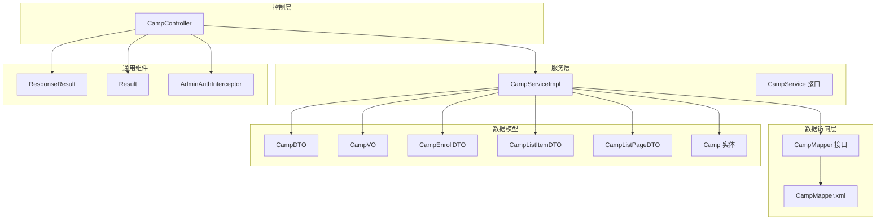
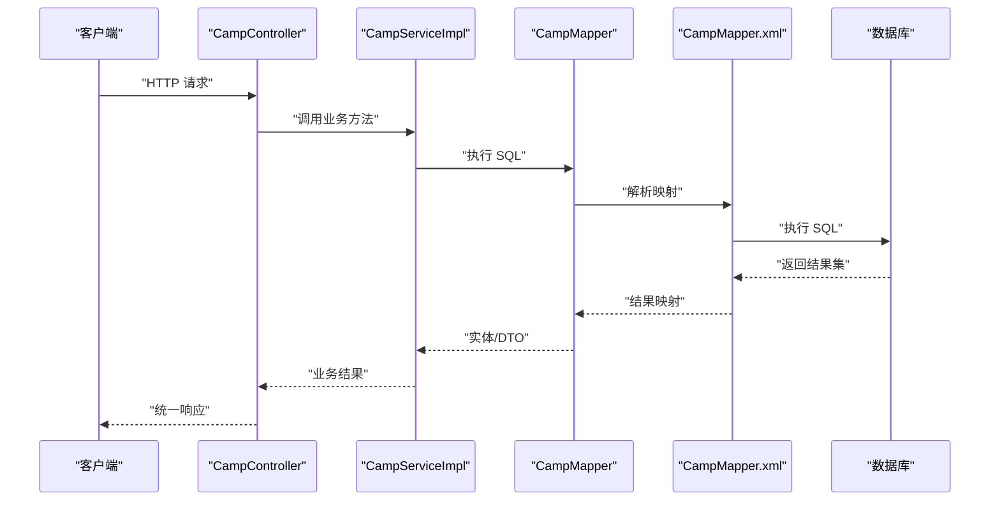
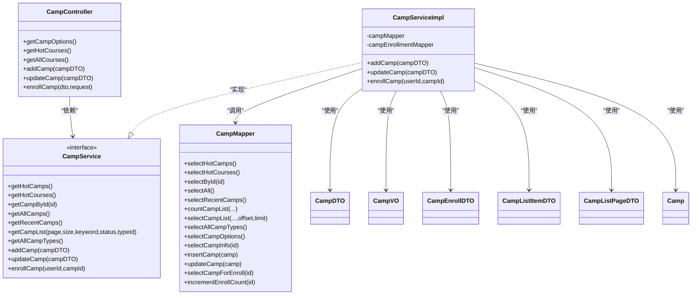

# 营期基础CRUD操作

<cite>
**本文引用的文件**
- [CampController.java](file://src/main/java/com/daily/dailychineseculture/controller/CampController.java)
- [CampServiceImpl.java](file://src/main/java/com/daily/dailychineseculture/service/impl/CampServiceImpl.java)
- [CampService.java](file://src/main/java/com/daily/dailychineseculture/service/CampService.java)
- [CampMapper.java](file://src/main/java/com/daily/dailychineseculture/mapper/CampMapper.java)
- [CampMapper.xml](file://src/main/resources/mapper/CampMapper.xml)
- [CampDTO.java](file://src/main/java/com/daily/dailychineseculture/dto/CampDTO.java)
- [CampVO.java](file://src/main/java/com/daily/dailychineseculture/dto/CampVO.java)
- [CampEnrollDTO.java](file://src/main/java/com/daily/dailychineseculture/dto/CampEnrollDTO.java)
- [CampListItemDTO.java](file://src/main/java/com/daily/dailychineseculture/dto/CampListItemDTO.java)
- [CampListPageDTO.java](file://src/main/java/com/daily/dailychineseculture/dto/CampListPageDTO.java)
- [Camp.java](file://src/main/java/com/daily/dailychineseculture/entity/Camp.java)
- [ResponseResult.java](file://src/main/java/com/daily/dailychineseculture/common/ResponseResult.java)
- [Result.java](file://src/main/java/com/daily/dailychineseculture/common/Result.java)
- [AdminAuthInterceptor.java](file://src/main/java/com/daily/dailychineseculture/interceptor/AdminAuthInterceptor.java)
- [营期管理新增与编辑 API文档.md](file://doc/营期管理新增与编辑 API文档.md)
</cite>

## 目录
1. [简介](#简介)
2. [项目结构](#项目结构)
3. [核心组件](#核心组件)
4. [架构总览](#架构总览)
5. [详细组件分析](#详细组件分析)
6. [依赖关系分析](#依赖关系分析)
7. [性能考量](#性能考量)
8. [故障排查指南](#故障排查指南)
9. [结论](#结论)
10. [附录](#附录)

## 简介
本文件聚焦于“营期基础CRUD操作”，围绕以下目标展开：
- 深入解释营期的创建、编辑、删除与查询实现机制
- 全面解析 CampController 的 API 接口：新增营期（POST）、编辑营期（PUT）、获取所有营期（GET/all）、热门营期推荐（GET/hot）
- 分析 CampServiceImpl 的服务实现：数据验证、业务规则检查、事务管理与异常处理
- 提供完整的 API 调用示例：请求参数格式、响应数据结构与错误处理
- 覆盖营期状态管理、数据关联处理与并发控制策略

## 项目结构
围绕营期 CRUD 的主要模块与职责如下：
- 控制层：CampController 提供 REST API，负责请求接收、参数校验与统一响应封装
- 服务层：CampServiceImpl 实现业务逻辑，包含数据验证、状态判断、事务控制与异常处理
- 数据访问层：CampMapper 接口与 XML 映射文件负责 SQL 执行与结果映射
- 数据传输对象：CampDTO、CampVO、CampEnrollDTO、CampListItemDTO、CampListPageDTO 等
- 实体类：Camp 描述数据库表 t_camp 的结构
- 统一响应：ResponseResult 与 Result 两类封装，分别用于不同接口风格
- 安全拦截：AdminAuthInterceptor 通过 JWT 校验后台管理接口访问权限

图表来源
- [CampController.java:1-123](file://src/main/java/com/daily/dailychineseculture/controller/CampController.java#L1-L123)
- [CampServiceImpl.java:1-266](file://src/main/java/com/daily/dailychineseculture/service/impl/CampServiceImpl.java#L1-L266)
- [CampService.java:1-81](file://src/main/java/com/daily/dailychineseculture/service/CampService.java#L1-L81)
- [CampMapper.java:1-132](file://src/main/java/com/daily/dailychineseculture/mapper/CampMapper.java#L1-L132)
- [CampMapper.xml:1-171](file://src/main/resources/mapper/CampMapper.xml#L1-L171)
- [CampDTO.java:1-63](file://src/main/java/com/daily/dailychineseculture/dto/CampDTO.java#L1-L63)
- [CampVO.java:1-40](file://src/main/java/com/daily/dailychineseculture/dto/CampVO.java#L1-L40)
- [CampEnrollDTO.java:1-9](file://src/main/java/com/daily/dailychineseculture/dto/CampEnrollDTO.java#L1-L9)
- [CampListItemDTO.java:1-74](file://src/main/java/com/daily/dailychineseculture/dto/CampListItemDTO.java#L1-L74)
- [CampListPageDTO.java:1-39](file://src/main/java/com/daily/dailychineseculture/dto/CampListPageDTO.java#L1-L39)
- [Camp.java:1-64](file://src/main/java/com/daily/dailychineseculture/entity/Camp.java#L1-L64)
- [ResponseResult.java:1-79](file://src/main/java/com/daily/dailychineseculture/common/ResponseResult.java#L1-L79)
- [Result.java:1-81](file://src/main/java/com/daily/dailychineseculture/common/Result.java#L1-L81)
- [AdminAuthInterceptor.java:1-93](file://src/main/java/com/daily/dailychineseculture/interceptor/AdminAuthInterceptor.java#L1-L93)

章节来源
- [CampController.java:1-123](file://src/main/java/com/daily/dailychineseculture/controller/CampController.java#L1-L123)
- [CampServiceImpl.java:1-266](file://src/main/java/com/daily/dailychineseculture/service/impl/CampServiceImpl.java#L1-L266)
- [CampService.java:1-81](file://src/main/java/com/daily/dailychineseculture/service/CampService.java#L1-L81)
- [CampMapper.java:1-132](file://src/main/java/com/daily/dailychineseculture/mapper/CampMapper.java#L1-L132)
- [CampMapper.xml:1-171](file://src/main/resources/mapper/CampMapper.xml#L1-L171)
- [ResponseResult.java:1-79](file://src/main/java/com/daily/dailychineseculture/common/ResponseResult.java#L1-L79)
- [Result.java:1-81](file://src/main/java/com/daily/dailychineseculture/common/Result.java#L1-L81)
- [AdminAuthInterceptor.java:1-93](file://src/main/java/com/daily/dailychineseculture/interceptor/AdminAuthInterceptor.java#L1-L93)

## 核心组件
- 控制器：CampController 提供四个核心接口，分别对应新增、编辑、查询全部与热门推荐，并包含一个报名接口用于前台用户参与营期活动
- 服务实现：CampServiceImpl 负责业务规则执行、数据验证、状态判断与事务控制
- 数据访问：CampMapper 与 XML 映射文件承担 SQL 查询、插入、更新与联表查询
- 统一响应：ResponseResult 与 Result 两类封装，分别用于后台管理接口与部分通用接口
- 安全拦截：AdminAuthInterceptor 对 /api/admin/** 接口进行 JWT 校验，保证后台管理的安全性

章节来源
- [CampController.java:18-123](file://src/main/java/com/daily/dailychineseculture/controller/CampController.java#L18-L123)
- [CampServiceImpl.java:24-266](file://src/main/java/com/daily/dailychineseculture/service/impl/CampServiceImpl.java#L24-L266)
- [CampMapper.java:15-132](file://src/main/java/com/daily/dailychineseculture/mapper/CampMapper.java#L15-L132)
- [CampMapper.xml:1-171](file://src/main/resources/mapper/CampMapper.xml#L1-L171)
- [ResponseResult.java:8-79](file://src/main/java/com/daily/dailychineseculture/common/ResponseResult.java#L8-L79)
- [Result.java:9-81](file://src/main/java/com/daily/dailychineseculture/common/Result.java#L9-L81)
- [AdminAuthInterceptor.java:10-93](file://src/main/java/com/daily/dailychineseculture/interceptor/AdminAuthInterceptor.java#L10-L93)

## 架构总览
下图展示了营期 CRUD 的端到端调用链：客户端 -> 控制器 -> 服务层 -> 数据访问层 -> 数据库。

图表来源
- [CampController.java:77-121](file://src/main/java/com/daily/dailychineseculture/controller/CampController.java#L77-L121)
- [CampServiceImpl.java:164-243](file://src/main/java/com/daily/dailychineseculture/service/impl/CampServiceImpl.java#L164-L243)
- [CampMapper.java:18-132](file://src/main/java/com/daily/dailychineseculture/mapper/CampMapper.java#L18-L132)
- [CampMapper.xml:102-171](file://src/main/resources/mapper/CampMapper.xml#L102-L171)

## 详细组件分析

### 营期新增（POST /api/admin/camps）
- 接口职责：接收 CampDTO，创建新的营期记录，强制 enroll_count 为 0，其他字段按 DTO 映射
- 关键点：
  - 控制器使用 ResponseResult 统一封装成功消息
  - 服务层将 DTO 转换为实体并调用插入方法
  - 数据库层面通过 XML 的 insert 语句写入
- 请求参数（CampDTO）要点：
  - 必填：typeId、term、name、startTime、endTime
  - 可选：intro、status、tag
  - enrollCount 由后端强制置 0，不接受前端传值
- 响应：
  - 成功：code=200，message=“新增成功”
- 并发与一致性：
  - 新增为单条写入，无明显并发冲突风险
  - 若存在唯一约束冲突，将抛出异常由上层捕获

章节来源
- [CampController.java:84-88](file://src/main/java/com/daily/dailychineseculture/controller/CampController.java#L84-L88)
- [CampServiceImpl.java:164-181](file://src/main/java/com/daily/dailychineseculture/service/impl/CampServiceImpl.java#L164-L181)
- [CampMapper.xml:102-123](file://src/main/resources/mapper/CampMapper.xml#L102-L123)
- [CampDTO.java:13-62](file://src/main/java/com/daily/dailychineseculture/dto/CampDTO.java#L13-L62)
- [营期管理新增与编辑 API文档.md:9-46](file://doc/营期管理新增与编辑 API文档.md#L9-L46)

### 营期编辑（PUT /api/admin/camps）
- 接口职责：接收包含 campId 的 CampDTO，更新现有营期记录
- 关键点：
  - 控制器使用 ResponseResult 统一封装成功消息
  - 服务层要求 campId 非空，否则抛出非法参数异常
  - 不更新 enroll_count，保持真实报名人数不变
  - 通过 XML 的 update 语句执行更新
- 请求参数：
  - 必填：campId
  - 其他字段与新增一致
- 响应：
  - 成功：code=200，message=“修改成功”

章节来源
- [CampController.java:97-101](file://src/main/java/com/daily/dailychineseculture/controller/CampController.java#L97-L101)
- [CampServiceImpl.java:183-205](file://src/main/java/com/daily/dailychineseculture/service/impl/CampServiceImpl.java#L183-L205)
- [CampMapper.xml:125-137](file://src/main/resources/mapper/CampMapper.xml#L125-L137)
- [CampDTO.java:13-62](file://src/main/java/com/daily/dailychineseculture/dto/CampDTO.java#L13-L62)

### 获取所有营期（GET /api/admin/camps/all）
- 接口职责：返回 t_camp 全部记录
- 关键点：
  - 控制器使用 Result 统一封装
  - 服务层调用查询全部的方法
  - XML 通过简单查询返回所有记录
- 响应：
  - 成功：code=200，data 为 Camp 列表

章节来源
- [CampController.java:66-75](file://src/main/java/com/daily/dailychineseculture/controller/CampController.java#L66-L75)
- [CampServiceImpl.java:97-100](file://src/main/java/com/daily/dailychineseculture/service/impl/CampServiceImpl.java#L97-L100)
- [CampMapper.java:44-48](file://src/main/java/com/daily/dailychineseculture/mapper/CampMapper.java#L44-L48)

### 热门营期推荐（GET /api/admin/camps/hot）
- 接口职责：联表查询 t_camp 与 t_camp_type，按开营时间倒序取最新 5 条，并进行数据格式化（期数转为“第X期”，报名人数千分位）
- 关键点：
  - 控制器使用 Result 统一封装
  - 服务层在 Java 层进行格式化处理（term、count），SQL 返回原始数据
  - XML 的 selectHotCourses 完成联表与排序
- 响应：
  - 成功：code=200，data 为 CampVO 列表
- 格式化规则：
  - term：若为数字则格式化为“第 N 期”，否则保留原值
  - count：将字符串转换为整数后格式化为千分位字符串

章节来源
- [CampController.java:49-58](file://src/main/java/com/daily/dailychineseculture/controller/CampController.java#L49-L58)
- [CampServiceImpl.java:42-90](file://src/main/java/com/daily/dailychineseculture/service/impl/CampServiceImpl.java#L42-L90)
- [CampMapper.xml:139-157](file://src/main/resources/mapper/CampMapper.xml#L139-L157)
- [CampVO.java:10-40](file://src/main/java/com/daily/dailychineseculture/dto/CampVO.java#L10-L40)

### 营期报名（POST /camp/enroll）
- 接口职责：前台用户报名指定营期
- 关键点：
  - 通过 AdminAuthInterceptor 从 JWT 中提取 userId
  - 服务层进行营期存在性、截止时间与重复报名检查
  - 使用事务确保报名记录与报名人数更新的一致性
- 请求参数：
  - CampEnrollDTO：包含 campId
- 响应：
  - 成功：code=200，message=“报名成功”
  - 失败：根据具体异常返回相应错误码与消息

章节来源
- [CampController.java:103-121](file://src/main/java/com/daily/dailychineseculture/controller/CampController.java#L103-L121)
- [CampServiceImpl.java:207-243](file://src/main/java/com/daily/dailychineseculture/service/impl/CampServiceImpl.java#L207-L243)
- [AdminAuthInterceptor.java:24-81](file://src/main/java/com/daily/dailychineseculture/interceptor/AdminAuthInterceptor.java#L24-L81)
- [CampEnrollDTO.java:6-8](file://src/main/java/com/daily/dailychineseculture/dto/CampEnrollDTO.java#L6-L8)

### 营期状态管理与数据关联
- 状态字段：
  - 数据库字段：status（0-未开始，1-进行中，2-已结束）
  - 服务层提供状态文本转换工具方法，用于最近活跃营期展示
- 数据关联：
  - 热门推荐通过 LEFT JOIN t_camp_type 获取类型名称
  - 列表查询同样联表获取类型名称并按开营时间倒序
- 状态计算：
  - 列表查询中通过 CASE WHEN 计算状态，避免额外逻辑

章节来源
- [Camp.java:50-52](file://src/main/java/com/daily/dailychineseculture/entity/Camp.java#L50-L52)
- [CampServiceImpl.java:245-264](file://src/main/java/com/daily/dailychineseculture/service/impl/CampServiceImpl.java#L245-L264)
- [CampMapper.xml:43-81](file://src/main/resources/mapper/CampMapper.xml#L43-L81)
- [CampMapper.xml:139-157](file://src/main/resources/mapper/CampMapper.xml#L139-L157)

### 删除操作说明
- 当前仓库未提供“删除营期”的控制器或服务实现
- 若需要删除功能，建议在服务层添加删除方法并在控制器暴露对应接口

章节来源
- [CampController.java:18-123](file://src/main/java/com/daily/dailychineseculture/controller/CampController.java#L18-L123)
- [CampService.java:15-81](file://src/main/java/com/daily/dailychineseculture/service/CampService.java#L15-L81)

## 依赖关系分析

图表来源
- [CampController.java:22-121](file://src/main/java/com/daily/dailychineseculture/controller/CampController.java#L22-L121)
- [CampService.java:15-81](file://src/main/java/com/daily/dailychineseculture/service/CampService.java#L15-L81)
- [CampServiceImpl.java:27-266](file://src/main/java/com/daily/dailychineseculture/service/impl/CampServiceImpl.java#L27-L266)
- [CampMapper.java:18-132](file://src/main/java/com/daily/dailychineseculture/mapper/CampMapper.java#L18-L132)
- [CampDTO.java:12-62](file://src/main/java/com/daily/dailychineseculture/dto/CampDTO.java#L12-L62)
- [CampVO.java:9-40](file://src/main/java/com/daily/dailychineseculture/dto/CampVO.java#L9-L40)
- [CampEnrollDTO.java:5-8](file://src/main/java/com/daily/dailychineseculture/dto/CampEnrollDTO.java#L5-L8)
- [CampListItemDTO.java:10-74](file://src/main/java/com/daily/dailychineseculture/dto/CampListItemDTO.java#L10-L74)
- [CampListPageDTO.java:12-39](file://src/main/java/com/daily/dailychineseculture/dto/CampListPageDTO.java#L12-L39)
- [Camp.java:11-63](file://src/main/java/com/daily/dailychineseculture/entity/Camp.java#L11-L63)

## 性能考量
- 查询优化：
  - 热门推荐与列表查询均按开营时间倒序，建议在 start_time 上建立索引以提升排序与过滤效率
  - 列表查询使用 LEFT JOIN，建议在 t_camp.type_id 与 t_camp_type.type_id 上建立索引
- 格式化位置：
  - 热门推荐的数据格式化在 Java 层完成，减少 SQL 复杂度，但会增加序列化开销；可根据实际数据量评估是否迁移到 SQL
- 事务边界：
  - 报名接口使用 @Transactional 包裹，确保报名记录与报名人数更新原子性，避免竞态条件

章节来源
- [CampMapper.xml:19-81](file://src/main/resources/mapper/CampMapper.xml#L19-L81)
- [CampServiceImpl.java:207-243](file://src/main/java/com/daily/dailychineseculture/service/impl/CampServiceImpl.java#L207-L243)

## 故障排查指南
- 新增/编辑失败：
  - 检查 campId 是否正确传递（编辑必须包含 campId）
  - 检查唯一约束冲突（如名称、期数组合唯一），异常将由上层捕获
- 报名失败：
  - 确认用户已登录且 Token 有效
  - 检查营期是否已结束（结束时间早于当前时间）
  - 检查是否重复报名
- 热门推荐为空：
  - 确认当前存在未结束的营期
  - 检查 enroll_count 是否为 NULL 或 0

章节来源
- [CampServiceImpl.java:183-205](file://src/main/java/com/daily/dailychineseculture/service/impl/CampServiceImpl.java#L183-L205)
- [CampServiceImpl.java:207-243](file://src/main/java/com/daily/dailychineseculture/service/impl/CampServiceImpl.java#L207-L243)
- [CampMapper.xml:139-157](file://src/main/resources/mapper/CampMapper.xml#L139-L157)

## 结论
本文件系统性梳理了营期基础 CRUD 的实现路径，明确了控制器、服务层、数据访问层的职责划分与协作关系。通过统一响应封装、严格的参数校验与业务规则检查，以及事务保障，确保了营期管理功能的可靠性与一致性。后续可在现有基础上扩展删除接口与更细粒度的权限控制，并持续关注查询性能与索引优化。

## 附录

### API 调用示例与规范

- 新增营期（POST /api/admin/camps）
  - 请求体字段：见“新增营期”文档
  - 成功响应：code=200，message=“新增成功”
  - 失败响应：统一错误封装，包含错误码与消息

- 编辑营期（PUT /api/admin/camps）
  - 请求体字段：包含 campId 与其他可选字段
  - 成功响应：code=200，message=“修改成功”

- 获取所有营期（GET /api/admin/camps/all）
  - 成功响应：code=200，data 为 Camp 列表

- 热门营期推荐（GET /api/admin/camps/hot）
  - 成功响应：code=200，data 为 CampVO 列表（term 格式化为“第N期”，count 千分位）

- 营期报名（POST /camp/enroll）
  - 请求体：CampEnrollDTO（包含 campId）
  - 成功响应：code=200，message=“报名成功”
  - 失败响应：根据异常返回相应错误码与消息

章节来源
- [CampController.java:36-121](file://src/main/java/com/daily/dailychineseculture/controller/CampController.java#L36-L121)
- [CampServiceImpl.java:42-90](file://src/main/java/com/daily/dailychineseculture/service/impl/CampServiceImpl.java#L42-L90)
- [CampServiceImpl.java:164-205](file://src/main/java/com/daily/dailychineseculture/service/impl/CampServiceImpl.java#L164-L205)
- [CampServiceImpl.java:207-243](file://src/main/java/com/daily/dailychineseculture/service/impl/CampServiceImpl.java#L207-L243)
- [营期管理新增与编辑 API文档.md:9-65](file://doc/营期管理新增与编辑 API文档.md#L9-L65)