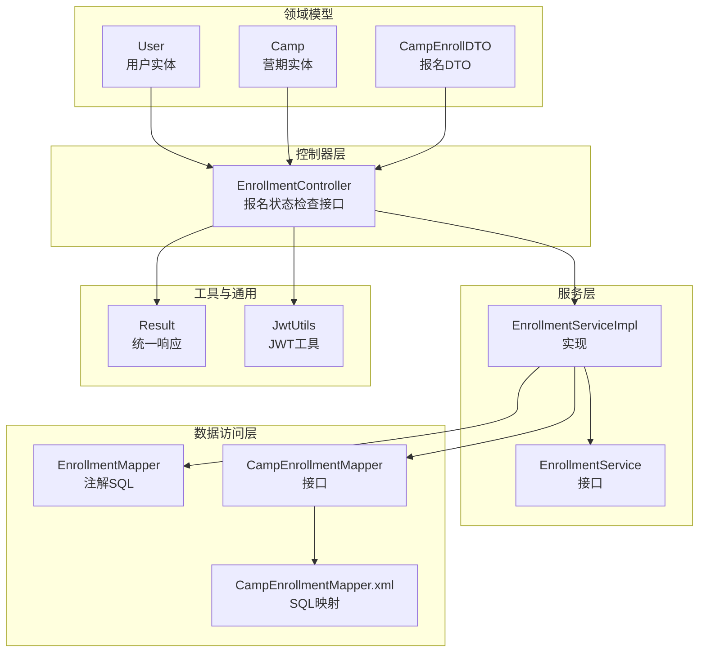
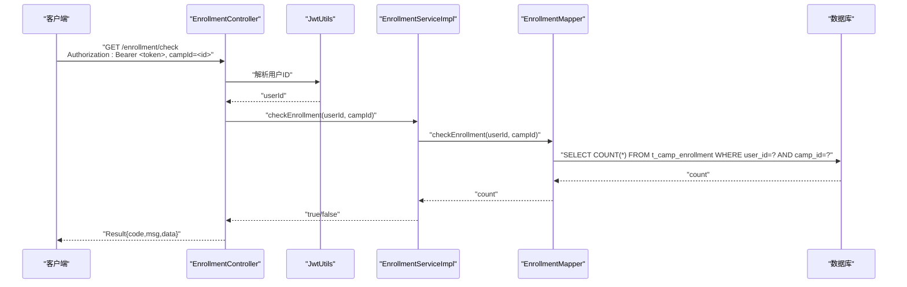
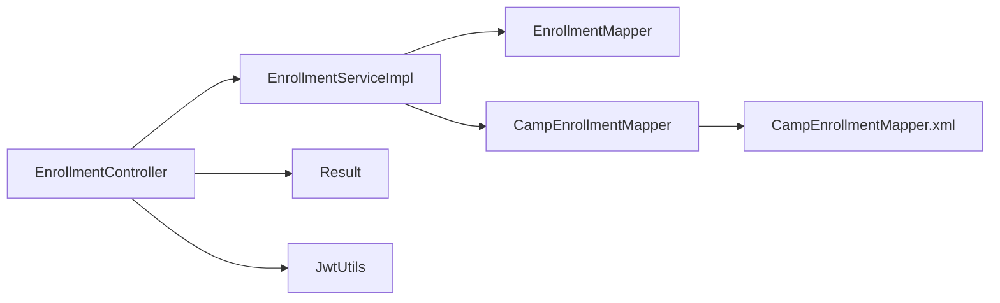

# 营期报名系统

<cite>
**本文引用的文件**
- [EnrollmentController.java](file://src/main/java/com/daily/dailychineseculture/controller/EnrollmentController.java)
- [EnrollmentService.java](file://src/main/java/com/daily/dailychineseculture/service/EnrollmentService.java)
- [EnrollmentServiceImpl.java](file://src/main/java/com/daily/dailychineseculture/service/impl/EnrollmentServiceImpl.java)
- [EnrollmentMapper.java](file://src/main/java/com/daily/dailychineseculture/mapper/EnrollmentMapper.java)
- [CampEnrollmentMapper.java](file://src/main/java/com/daily/dailychineseculture/mapper/CampEnrollmentMapper.java)
- [CampEnrollmentMapper.xml](file://src/main/resources/mapper/CampEnrollmentMapper.xml)
- [Result.java](file://src/main/java/com/daily/dailychineseculture/common/Result.java)
- [JwtUtils.java](file://src/main/java/com/daily/dailychineseculture/util/JwtUtils.java)
- [Camp.java](file://src/main/java/com/daily/dailychineseculture/entity/Camp.java)
- [User.java](file://src/main/java/com/daily/dailychineseculture/entity/User.java)
- [CampEnrollDTO.java](file://src/main/java/com/daily/dailychineseculture/dto/CampEnrollDTO.java)
</cite>

## 目录
1. [简介](#简介)
2. [项目结构](#项目结构)
3. [核心组件](#核心组件)
4. [架构总览](#架构总览)
5. [详细组件分析](#详细组件分析)
6. [依赖分析](#依赖分析)
7. [性能考量](#性能考量)
8. [故障排查指南](#故障排查指南)
9. [结论](#结论)
10. [附录](#附录)

## 简介
本文件面向“营期报名系统”的完整业务流程与实现机制，聚焦于报名接口设计、报名申请与状态管理、通知机制、控制器与服务层实现、数据模型与数据库映射、API规范与业务规则等。当前仓库中已实现“报名状态检查”能力，后续可在现有基础上扩展“提交报名、取消报名、报名查询、资格校验、名额控制、费用计算与财务处理、冲突检测与重复报名处理、退款与对账”等能力。

## 项目结构
围绕营期报名的核心代码采用经典的分层架构：
- 控制器层：对外暴露REST接口，负责参数接收、鉴权与统一响应封装
- 服务层：封装业务逻辑，协调数据访问与外部依赖
- 数据访问层：MyBatis Mapper接口与XML映射，负责SQL执行
- 实体与DTO：描述业务对象与传输对象
- 工具与通用：JWT工具、统一响应封装

图表来源
- [EnrollmentController.java:1-58](file://src/main/java/com/daily/dailychineseculture/controller/EnrollmentController.java#L1-L58)
- [EnrollmentService.java:1-17](file://src/main/java/com/daily/dailychineseculture/service/EnrollmentService.java#L1-L17)
- [EnrollmentServiceImpl.java:1-31](file://src/main/java/com/daily/dailychineseculture/service/impl/EnrollmentServiceImpl.java#L1-L31)
- [EnrollmentMapper.java:1-27](file://src/main/java/com/daily/dailychineseculture/mapper/EnrollmentMapper.java#L1-L27)
- [CampEnrollmentMapper.java:1-16](file://src/main/java/com/daily/dailychineseculture/mapper/CampEnrollmentMapper.java#L1-L16)
- [CampEnrollmentMapper.xml:1-25](file://src/main/resources/mapper/CampEnrollmentMapper.xml#L1-L25)
- [Result.java:1-81](file://src/main/java/com/daily/dailychineseculture/common/Result.java#L1-L81)
- [JwtUtils.java:1-206](file://src/main/java/com/daily/dailychineseculture/util/JwtUtils.java#L1-L206)
- [User.java:1-87](file://src/main/java/com/daily/dailychineseculture/entity/User.java#L1-L87)
- [Camp.java:1-64](file://src/main/java/com/daily/dailychineseculture/entity/Camp.java#L1-L64)
- [CampEnrollDTO.java:1-9](file://src/main/java/com/daily/dailychineseculture/dto/CampEnrollDTO.java#L1-L9)

章节来源
- [EnrollmentController.java:1-58](file://src/main/java/com/daily/dailychineseculture/controller/EnrollmentController.java#L1-L58)
- [EnrollmentService.java:1-17](file://src/main/java/com/daily/dailychineseculture/service/EnrollmentService.java#L1-L17)
- [EnrollmentServiceImpl.java:1-31](file://src/main/java/com/daily/dailychineseculture/service/impl/EnrollmentServiceImpl.java#L1-L31)
- [EnrollmentMapper.java:1-27](file://src/main/java/com/daily/dailychineseculture/mapper/EnrollmentMapper.java#L1-L27)
- [CampEnrollmentMapper.java:1-16](file://src/main/java/com/daily/dailychineseculture/mapper/CampEnrollmentMapper.java#L1-L16)
- [CampEnrollmentMapper.xml:1-25](file://src/main/resources/mapper/CampEnrollmentMapper.xml#L1-L25)
- [Result.java:1-81](file://src/main/java/com/daily/dailychineseculture/common/Result.java#L1-L81)
- [JwtUtils.java:1-206](file://src/main/java/com/daily/dailychineseculture/util/JwtUtils.java#L1-L206)
- [User.java:1-87](file://src/main/java/com/daily/dailychineseculture/entity/User.java#L1-L87)
- [Camp.java:1-64](file://src/main/java/com/daily/dailychineseculture/entity/Camp.java#L1-L64)
- [CampEnrollDTO.java:1-9](file://src/main/java/com/daily/dailychineseculture/dto/CampEnrollDTO.java#L1-L9)

## 核心组件
- 控制器：提供报名状态检查接口，基于JWT鉴权，返回统一响应
- 服务层：封装报名状态检查逻辑，调用数据访问层
- 数据访问层：通过注解与XML映射实现SQL查询与插入
- 实体与DTO：承载用户、营期与报名信息
- 工具与通用：JWT工具用于解析用户标识；统一响应封装用于标准化输出

章节来源
- [EnrollmentController.java:23-56](file://src/main/java/com/daily/dailychineseculture/controller/EnrollmentController.java#L23-L56)
- [EnrollmentServiceImpl.java:17-29](file://src/main/java/com/daily/dailychineseculture/service/impl/EnrollmentServiceImpl.java#L17-L29)
- [EnrollmentMapper.java:21-25](file://src/main/java/com/daily/dailychineseculture/mapper/EnrollmentMapper.java#L21-L25)
- [CampEnrollmentMapper.xml:4-23](file://src/main/resources/mapper/CampEnrollmentMapper.xml#L4-L23)
- [Result.java:46-80](file://src/main/java/com/daily/dailychineseculture/common/Result.java#L46-L80)
- [JwtUtils.java:104-111](file://src/main/java/com/daily/dailychineseculture/util/JwtUtils.java#L104-L111)

## 架构总览
下图展示从客户端到数据库的端到端调用链路，体现当前“报名状态检查”的完整流程。

图表来源
- [EnrollmentController.java:31-56](file://src/main/java/com/daily/dailychineseculture/controller/EnrollmentController.java#L31-L56)
- [JwtUtils.java:104-111](file://src/main/java/com/daily/dailychineseculture/util/JwtUtils.java#L104-L111)
- [EnrollmentServiceImpl.java:18-29](file://src/main/java/com/daily/dailychineseculture/service/impl/EnrollmentServiceImpl.java#L18-L29)
- [EnrollmentMapper.java:21-25](file://src/main/java/com/daily/dailychineseculture/mapper/EnrollmentMapper.java#L21-L25)

## 详细组件分析

### EnrollmentController：报名状态检查接口
- 接口路径：GET /enrollment/check
- 请求头：
  - Authorization: Bearer <token>
- 查询参数：
  - campId: Integer（必填）
- 业务流程：
  1) 从请求头提取并解析JWT，获取用户ID
  2) 参数校验（campId非空）
  3) 调用服务层检查报名状态
  4) 包装统一响应返回
- 异常处理：
  - Token解析失败：返回401未授权
  - 其他异常：返回通用错误

章节来源
- [EnrollmentController.java:23-56](file://src/main/java/com/daily/dailychineseculture/controller/EnrollmentController.java#L23-L56)
- [JwtUtils.java:104-111](file://src/main/java/com/daily/dailychineseculture/util/JwtUtils.java#L104-L111)
- [Result.java:46-80](file://src/main/java/com/daily/dailychineseculture/common/Result.java#L46-L80)

### EnrollmentService 与 EnrollmentServiceImpl：服务层
- EnrollmentService：定义checkEnrollment(userId, campId)方法
- EnrollmentServiceImpl：
  - 参数校验（userId与campId均非空）
  - 调用EnrollmentMapper执行SQL计数查询
  - 返回布尔值表示是否已报名

章节来源
- [EnrollmentService.java:8-15](file://src/main/java/com/daily/dailychineseculture/service/EnrollmentService.java#L8-L15)
- [EnrollmentServiceImpl.java:17-29](file://src/main/java/com/daily/dailychineseculture/service/impl/EnrollmentServiceImpl.java#L17-L29)

### 数据访问层：EnrollmentMapper 与 CampEnrollmentMapper
- EnrollmentMapper（注解）：
  - checkEnrollment(userId, campId)：按用户与营期统计报名记录数
- CampEnrollmentMapper（接口 + XML）：
  - countByUserIdAndCampId：同上，SQL在XML中定义
  - insertEnrollment：向t_camp_enrollment插入一条报名记录（默认is_completed=0, progress=0）
  - updateProgress：更新报名进度字段

章节来源
- [EnrollmentMapper.java:21-25](file://src/main/java/com/daily/dailychineseculture/mapper/EnrollmentMapper.java#L21-L25)
- [CampEnrollmentMapper.java:9-14](file://src/main/java/com/daily/dailychineseculture/mapper/CampEnrollmentMapper.java#L9-L14)
- [CampEnrollmentMapper.xml:4-23](file://src/main/resources/mapper/CampEnrollmentMapper.xml#L4-L23)

### 数据模型与DTO
- User：用户实体，包含用户标识、账号、状态等字段
- Camp：营期实体，包含营期ID、名称、时间、状态、报名人数等
- CampEnrollDTO：报名请求DTO，包含campId字段

章节来源
- [User.java:14-64](file://src/main/java/com/daily/dailychineseculture/entity/User.java#L14-L64)
- [Camp.java:17-62](file://src/main/java/com/daily/dailychineseculture/entity/Camp.java#L17-L62)
- [CampEnrollDTO.java:7](file://src/main/java/com/daily/dailychineseculture/dto/CampEnrollDTO.java#L7)

### 统一响应与JWT工具
- Result：统一响应封装，提供success/error/build静态方法
- JwtUtils：提供generateToken、getUserIdFromToken、validateToken等方法，支持从token解析用户ID

章节来源
- [Result.java:46-80](file://src/main/java/com/daily/dailychineseculture/common/Result.java#L46-L80)
- [JwtUtils.java:37-69](file://src/main/java/com/daily/dailychineseculture/util/JwtUtils.java#L37-L69)
- [JwtUtils.java:104-111](file://src/main/java/com/daily/dailychineseculture/util/JwtUtils.java#L104-L111)

### API 定义（当前已实现：报名状态检查）
- 基本信息
  - 接口名称：报名状态检查
  - 请求方式：GET
  - 请求路径：/enrollment/check
  - Content-Type：无（查询参数）
- 请求头
  - Authorization: Bearer <token>
- 查询参数
  - campId: Integer（必填）
- 成功响应
  - data: Boolean（true表示已报名，false表示未报名）
- 错误响应
  - code: 非200
  - msg: 错误信息
- 业务规则
  - 需要有效的JWT令牌
  - campId必须为非空整数

章节来源
- [EnrollmentController.java:23-56](file://src/main/java/com/daily/dailychineseculture/controller/EnrollmentController.java#L23-L56)
- [Result.java:46-80](file://src/main/java/com/daily/dailychineseculture/common/Result.java#L46-L80)

### 报名流程与状态管理（概念性说明）
以下为基于现有代码的扩展建议，用于指导后续实现“提交报名、取消报名、报名查询、状态管理、通知机制”等能力：
- 报名提交
  - 接口：POST /enrollment（建议新增）
  - DTO：CampEnrollDTO（包含campId）
  - 服务：校验用户状态、营期状态、名额限制、冲突检测（同一营期不可重复报名）
  - 数据：写入t_camp_enrollment，默认is_completed=0, progress=0
- 取消报名
  - 接口：DELETE /enrollment/{campId}（建议新增）
  - 服务：校验是否允许取消（如开营前或特定状态）
  - 数据：删除或标记t_camp_enrollment记录
- 报名查询
  - 接口：GET /enrollment/list（建议新增）
  - 服务：按用户ID查询报名列表，关联营期信息
- 状态管理
  - 营期状态：未开始/进行中/已结束
  - 报名状态：已报名/已取消/已完成
- 通知机制
  - 成功报名/取消报名后触发事件，推送站内通知或消息

（本节为概念性内容，不直接分析具体文件）

### 报名冲突检测与重复报名处理（概念性说明）
- 冲突检测
  - 同一用户在同一营期只允许一次有效报名
  - 若存在未取消的报名记录，则拒绝重复报名
- 重复报名处理
  - 返回明确错误提示，引导用户取消后再试
  - 或提供“变更报名”策略（视业务而定）

（本节为概念性内容，不直接分析具体文件）

### 费用计算、退款与财务对账（概念性说明）
- 费用计算
  - 根据营期价格、优惠券、折扣策略计算应付金额
- 退款机制
  - 支持开营前全额退款、开营后按规则部分退款
  - 退款流程需与支付网关对接
- 财务对账
  - 记录每笔交易流水，定期生成对账单
  - 对账差异需人工复核与调整

（本节为概念性内容，不直接分析具体文件）

## 依赖分析
- 控制器依赖服务层与JWT工具
- 服务层依赖两个Mapper接口
- Mapper接口依赖数据库表t_camp_enrollment
- 统一响应Result被控制器使用

图表来源
- [EnrollmentController.java:17-21](file://src/main/java/com/daily/dailychineseculture/controller/EnrollmentController.java#L17-L21)
- [EnrollmentServiceImpl.java:14-15](file://src/main/java/com/daily/dailychineseculture/service/impl/EnrollmentServiceImpl.java#L14-L15)
- [CampEnrollmentMapper.java:1-16](file://src/main/java/com/daily/dailychineseculture/mapper/CampEnrollmentMapper.java#L1-L16)
- [CampEnrollmentMapper.xml:1-25](file://src/main/resources/mapper/CampEnrollmentMapper.xml#L1-L25)
- [Result.java:1-81](file://src/main/java/com/daily/dailychineseculture/common/Result.java#L1-L81)
- [JwtUtils.java:1-206](file://src/main/java/com/daily/dailychineseculture/util/JwtUtils.java#L1-L206)

章节来源
- [EnrollmentController.java:17-21](file://src/main/java/com/daily/dailychineseculture/controller/EnrollmentController.java#L17-L21)
- [EnrollmentServiceImpl.java:14-15](file://src/main/java/com/daily/dailychineseculture/service/impl/EnrollmentServiceImpl.java#L14-L15)
- [CampEnrollmentMapper.java:1-16](file://src/main/java/com/daily/dailychineseculture/mapper/CampEnrollmentMapper.java#L1-L16)
- [CampEnrollmentMapper.xml:1-25](file://src/main/resources/mapper/CampEnrollmentMapper.xml#L1-L25)
- [Result.java:1-81](file://src/main/java/com/daily/dailychineseculture/common/Result.java#L1-L81)
- [JwtUtils.java:1-206](file://src/main/java/com/daily/dailychineseculture/util/JwtUtils.java#L1-L206)

## 性能考量
- SQL层面
  - t_camp_enrollment表应建立(user_id, camp_id)复合索引，以优化checkEnrollment查询
- 缓存策略
  - 对高频查询（如用户某营期报名状态）可引入Redis缓存，降低数据库压力
- 并发控制
  - 提交报名时使用数据库事务与唯一约束，避免超卖与重复报名
- 分页与查询
  - 报名列表查询建议分页，避免一次性加载过多数据

（本节为一般性建议，不直接分析具体文件）

## 故障排查指南
- Token解析失败
  - 现象：返回401未授权
  - 排查：确认Authorization头格式为Bearer <token>，token未过期且签名有效
- 参数缺失
  - 现象：返回通用错误
  - 排查：确认campId为非空整数
- 数据库异常
  - 现象：服务层抛出异常
  - 排查：检查t_camp_enrollment表是否存在、字段类型是否正确

章节来源
- [EnrollmentController.java:51-55](file://src/main/java/com/daily/dailychineseculture/controller/EnrollmentController.java#L51-L55)
- [JwtUtils.java:104-111](file://src/main/java/com/daily/dailychineseculture/util/JwtUtils.java#L104-L111)

## 结论
当前系统已具备“报名状态检查”的基础能力，具备清晰的分层结构与统一响应封装。后续可在现有基础上扩展完整的报名生命周期管理，包括提交、取消、查询、状态流转、冲突检测、费用与退款、财务对账等模块，并配套完善数据库索引、缓存与并发控制策略，以满足生产环境的稳定性与性能要求。

## 附录
- 数据库表结构要点（基于现有Mapper与实体）
  - t_camp_enrollment：包含user_id、camp_id、is_completed、progress等字段
  - t_camp：包含campId、name、startTime、endTime、status等字段
- 建议新增接口（概念性）
  - POST /enrollment：提交报名
  - DELETE /enrollment/{campId}：取消报名
  - GET /enrollment/list：查询报名列表
  - PUT /enrollment/{campId}/progress：更新报名进度

（本节为概念性内容，不直接分析具体文件）