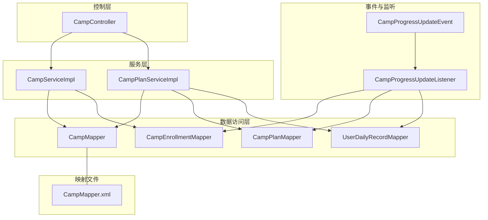
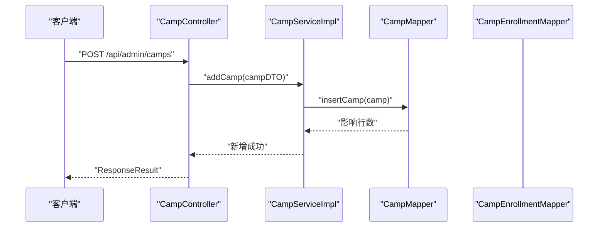
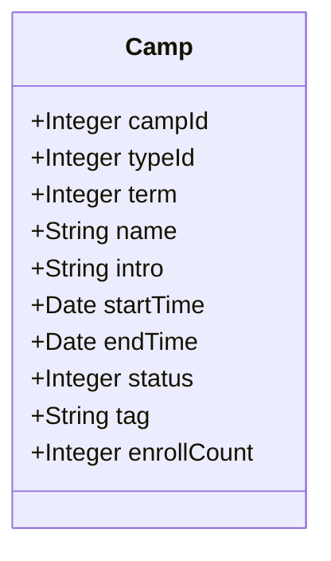
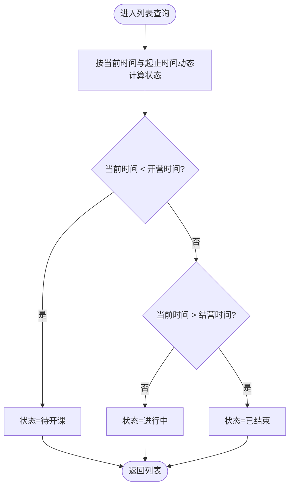
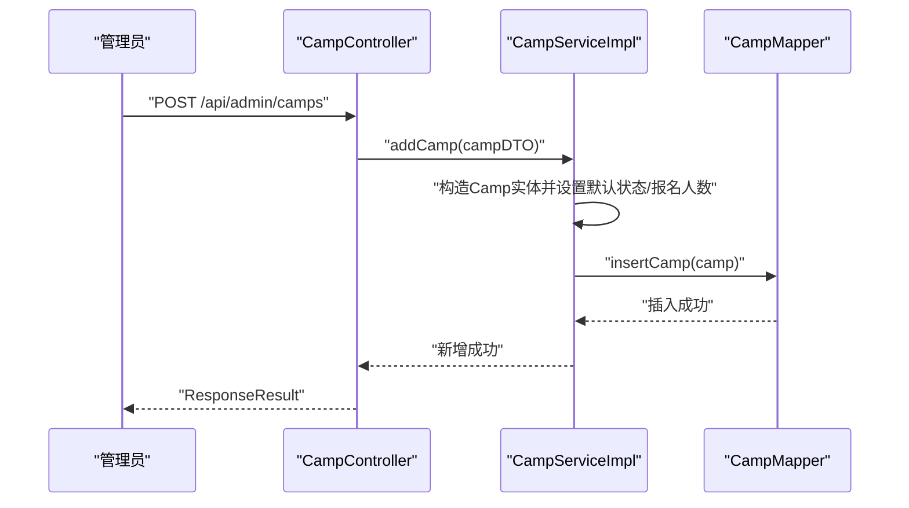
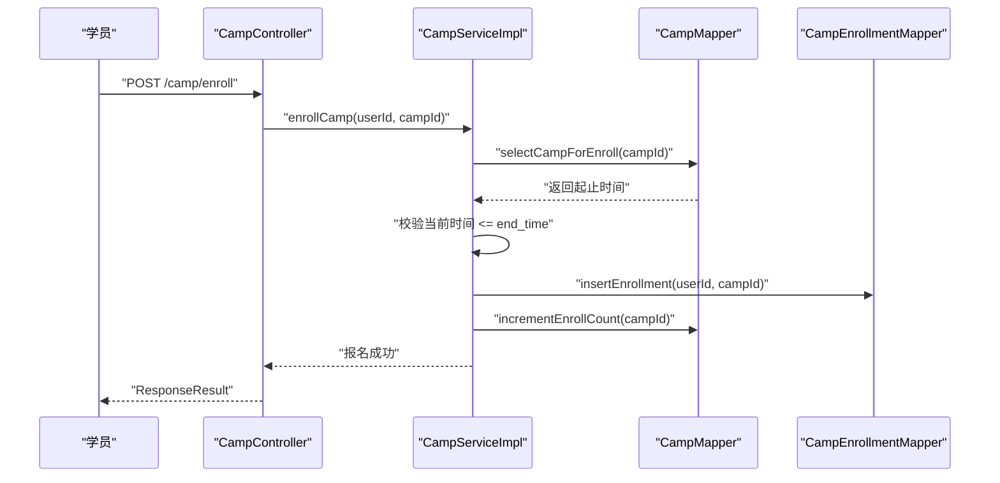
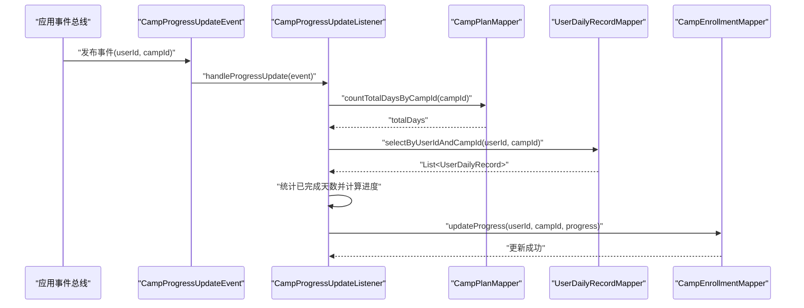
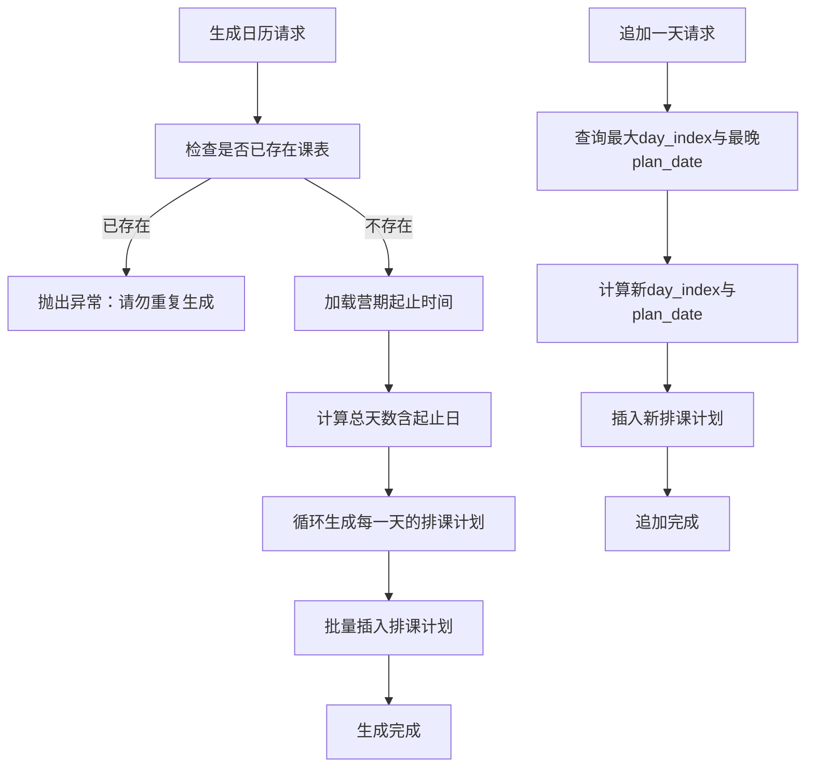
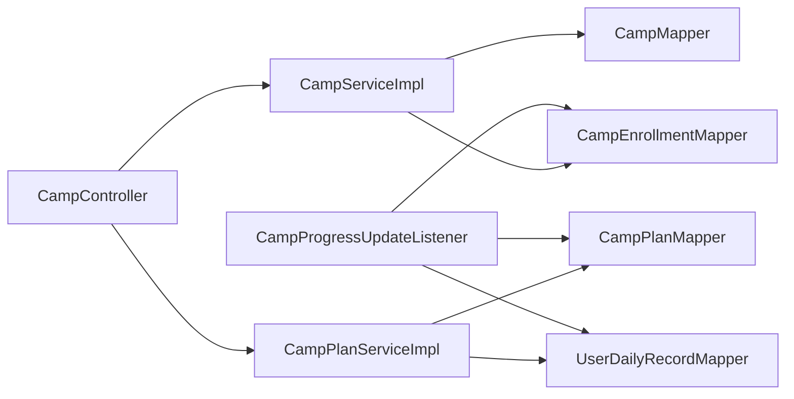

# 营期生命周期管理

<cite>
**本文引用的文件**
- [Camp.java](file://src/main/java/com/daily/dailychineseculture/entity/Camp.java)
- [CampProgressUpdateEvent.java](file://src/main/java/com/daily/dailychineseculture/event/CampProgressUpdateEvent.java)
- [CampProgressUpdateListener.java](file://src/main/java/com/daily/dailychineseculture/listener/CampProgressUpdateListener.java)
- [CampServiceImpl.java](file://src/main/java/com/daily/dailychineseculture/service/impl/CampServiceImpl.java)
- [CampController.java](file://src/main/java/com/daily/dailychineseculture/controller/CampController.java)
- [CampMapper.java](file://src/main/java/com/daily/dailychineseculture/mapper/CampMapper.java)
- [CampEnrollmentMapper.java](file://src/main/java/com/daily/dailychineseculture/mapper/CampEnrollmentMapper.java)
- [UserDailyRecordMapper.java](file://src/main/java/com/daily/dailychineseculture/mapper/UserDailyRecordMapper.java)
- [CampPlanMapper.java](file://src/main/java/com/daily/dailychineseculture/mapper/CampPlanMapper.java)
- [CampPlanService.java](file://src/main/java/com/daily/dailychineseculture/service/CampPlanService.java)
- [CampPlanServiceImpl.java](file://src/main/java/com/daily/dailychineseculture/service/impl/CampPlanServiceImpl.java)
- [CampMapper.xml](file://src/main/resources/mapper/CampMapper.xml)
- [营期生命周期管理.md](file://readme/教务与排课模块/营期生命周期管理.md)
- [营期报名接口Bug分析报告.md](file://doc/营期报名接口Bug分析报告.md)
- [营期报名接口代码追溯完整报告.md](file://doc/营期报名接口完整代码追溯报告.md)
</cite>

## 目录
1. [简介](#简介)
2. [项目结构](#项目结构)
3. [核心组件](#核心组件)
4. [架构总览](#架构总览)
5. [详细组件分析](#详细组件分析)
6. [依赖分析](#依赖分析)
7. [性能考虑](#性能考虑)
8. [故障排查指南](#故障排查指南)
9. [结论](#结论)
10. [附录](#附录)

## 简介
本文件系统性阐述“营期生命周期管理”的完整机制，覆盖从创建、审核、进行中、暂停、结束等状态的业务规则与触发条件；解析 CampProgressUpdateEvent 事件与 CampProgressUpdateListener 监听器如何协同实现进度监控与自动更新；并提供各阶段操作指南、审批流程、数据迁移与归档建议，以及延期、取消、重开等特殊情况的处理思路。

## 项目结构
围绕营期生命周期的关键模块与文件如下：
- 控制层：CampController 提供营期新增、编辑、列表查询、报名等接口
- 服务层：CampServiceImpl、CampPlanServiceImpl 实现业务逻辑与事务控制
- 数据访问层：CampMapper、CampPlanMapper、CampEnrollmentMapper、UserDailyRecordMapper 等
- 事件与监听：CampProgressUpdateEvent、CampProgressUpdateListener
- 映射文件：CampMapper.xml 中包含营期状态计算与列表查询逻辑
- 文档：readme/教务与排课模块/营期生命周期管理.md 与相关 doc 报告

图表来源
- [CampController.java:1-123](file://src/main/java/com/daily/dailychineseculture/controller/CampController.java#L1-L123)
- [CampServiceImpl.java:1-266](file://src/main/java/com/daily/dailychineseculture/service/impl/CampServiceImpl.java#L1-L266)
- [CampPlanServiceImpl.java:1-370](file://src/main/java/com/daily/dailychineseculture/service/impl/CampPlanServiceImpl.java#L1-L370)
- [CampMapper.java:1-132](file://src/main/java/com/daily/dailychineseculture/mapper/CampMapper.java#L1-L132)
- [CampPlanMapper.java:1-109](file://src/main/java/com/daily/dailychineseculture/mapper/CampPlanMapper.java#L1-L109)
- [CampEnrollmentMapper.java:1-16](file://src/main/java/com/daily/dailychineseculture/mapper/CampEnrollmentMapper.java#L1-L16)
- [UserDailyRecordMapper.java:1-44](file://src/main/java/com/daily/dailychineseculture/mapper/UserDailyRecordMapper.java#L1-L44)
- [CampProgressUpdateEvent.java:1-17](file://src/main/java/com/daily/dailychineseculture/event/CampProgressUpdateEvent.java#L1-L17)
- [CampProgressUpdateListener.java:1-49](file://src/main/java/com/daily/dailychineseculture/listener/CampProgressUpdateListener.java#L1-L49)
- [CampMapper.xml:1-171](file://src/main/resources/mapper/CampMapper.xml#L1-L171)

章节来源
- [CampController.java:1-123](file://src/main/java/com/daily/dailychineseculture/controller/CampController.java#L1-L123)
- [CampServiceImpl.java:1-266](file://src/main/java/com/daily/dailychineseculture/service/impl/CampServiceImpl.java#L1-L266)
- [CampPlanServiceImpl.java:1-370](file://src/main/java/com/daily/dailychineseculture/service/impl/CampPlanServiceImpl.java#L1-L370)
- [CampMapper.java:1-132](file://src/main/java/com/daily/dailychineseculture/mapper/CampMapper.java#L1-L132)
- [CampPlanMapper.java:1-109](file://src/main/java/com/daily/dailychineseculture/mapper/CampPlanMapper.java#L1-L109)
- [CampEnrollmentMapper.java:1-16](file://src/main/java/com/daily/dailychineseculture/mapper/CampEnrollmentMapper.java#L1-L16)
- [UserDailyRecordMapper.java:1-44](file://src/main/java/com/daily/dailychineseculture/mapper/UserDailyRecordMapper.java#L1-L44)
- [CampProgressUpdateEvent.java:1-17](file://src/main/java/com/daily/dailychineseculture/event/CampProgressUpdateEvent.java#L1-L17)
- [CampProgressUpdateListener.java:1-49](file://src/main/java/com/daily/dailychineseculture/listener/CampProgressUpdateListener.java#L1-L49)
- [CampMapper.xml:1-171](file://src/main/resources/mapper/CampMapper.xml#L1-L171)

## 核心组件
- 营期实体 Camp：包含营期标识、类型、期数、名称、介绍、起止时间、状态、标签、报名人数等字段
- 营期控制器 CampController：提供营期新增、编辑、列表查询、报名等接口
- 营期服务 CampServiceImpl：实现新增、编辑、报名、列表查询、状态文本转换等逻辑
- 排课服务 CampPlanServiceImpl：负责营期课表的生成、追加、同步与任务管理
- 事件与监听 CampProgressUpdateEvent/Listener：基于用户每日学习记录动态计算并更新营期整体进度
- 数据访问层：CampMapper、CampPlanMapper、CampEnrollmentMapper、UserDailyRecordMapper
- 映射文件 CampMapper.xml：包含营期状态计算（按当前时间与起止时间动态判定）、列表查询与分页逻辑

章节来源
- [Camp.java:1-64](file://src/main/java/com/daily/dailychineseculture/entity/Camp.java#L1-L64)
- [CampController.java:1-123](file://src/main/java/com/daily/dailychineseculture/controller/CampController.java#L1-L123)
- [CampServiceImpl.java:1-266](file://src/main/java/com/daily/dailychineseculture/service/impl/CampServiceImpl.java#L1-L266)
- [CampPlanServiceImpl.java:1-370](file://src/main/java/com/daily/dailychineseculture/service/impl/CampPlanServiceImpl.java#L1-L370)
- [CampProgressUpdateEvent.java:1-17](file://src/main/java/com/daily/dailychineseculture/event/CampProgressUpdateEvent.java#L1-L17)
- [CampProgressUpdateListener.java:1-49](file://src/main/java/com/daily/dailychineseculture/listener/CampProgressUpdateListener.java#L1-L49)
- [CampMapper.java:1-132](file://src/main/java/com/daily/dailychineseculture/mapper/CampMapper.java#L1-L132)
- [CampPlanMapper.java:1-109](file://src/main/java/com/daily/dailychineseculture/mapper/CampPlanMapper.java#L1-L109)
- [CampEnrollmentMapper.java:1-16](file://src/main/java/com/daily/dailychineseculture/mapper/CampEnrollmentMapper.java#L1-L16)
- [UserDailyRecordMapper.java:1-44](file://src/main/java/com/daily/dailychineseculture/mapper/UserDailyRecordMapper.java#L1-L44)
- [CampMapper.xml:1-171](file://src/main/resources/mapper/CampMapper.xml#L1-L171)

## 架构总览
营期生命周期管理采用典型的三层架构：
- 控制层：CampController 接收请求，调用服务层
- 服务层：CampServiceImpl、CampPlanServiceImpl 执行业务规则与事务控制
- 数据访问层：MyBatis Mapper 与 XML 映射文件执行数据库操作
- 事件驱动：CampProgressUpdateEvent 触发 CampProgressUpdateListener 异步计算并更新进度

图表来源
- [CampController.java:74-88](file://src/main/java/com/daily/dailychineseculture/controller/CampController.java#L74-L88)
- [CampServiceImpl.java:84-101](file://src/main/java/com/daily/dailychineseculture/service/impl/CampServiceImpl.java#L84-L101)
- [CampMapper.java:102-137](file://src/main/java/com/daily/dailychineseculture/mapper/CampMapper.java#L102-L137)

## 详细组件分析

### 营期实体与状态模型
- 字段说明：Camp 实体包含营期标识、类型、期数、名称、介绍、起止时间、状态、标签、报名人数等
- 状态语义：状态字段用于表示营期生命周期阶段，结合业务文档与代码注释，状态通常为“待开课、进行中、已结束”

图表来源
- [Camp.java:11-63](file://src/main/java/com/daily/dailychineseculture/entity/Camp.java#L11-L63)

章节来源
- [Camp.java:1-64](file://src/main/java/com/daily/dailychineseculture/entity/Camp.java#L1-L64)

### 列表查询与状态计算
- 列表查询：CampServiceImpl 负责分页与筛选参数处理；CampMapper.xml 中通过 SQL 动态计算状态（按当前时间与起止时间）
- 状态计算逻辑：当当前时间早于开营时间则为“待开课”，在起止时间之间为“进行中”，否则为“已结束”
- 关键点：列表查询不直接使用物理 status 字段，而是通过 SQL 的 CASE WHEN 动态计算

图表来源
- [CampMapper.xml:44-81](file://src/main/resources/mapper/CampMapper.xml#L44-L81)

章节来源
- [CampServiceImpl.java:127-157](file://src/main/java/com/daily/dailychineseculture/service/impl/CampServiceImpl.java#L127-L157)
- [CampMapper.xml:19-81](file://src/main/resources/mapper/CampMapper.xml#L19-L81)

### 新增与编辑营期
- 新增：CampController 接收 CampDTO，CampServiceImpl 转换为 Camp 实体并持久化；强制 enroll_count 为 0
- 编辑：校验 campId，构建 Camp 实体，注意不更新 enroll_count 以保护真实报名数据
- 接口：提供新增与编辑的 REST 接口，便于后台管理端操作

图表来源
- [CampController.java:74-88](file://src/main/java/com/daily/dailychineseculture/controller/CampController.java#L74-L88)
- [CampServiceImpl.java:84-101](file://src/main/java/com/daily/dailychineseculture/service/impl/CampServiceImpl.java#L84-L101)
- [CampMapper.java:102-137](file://src/main/java/com/daily/dailychineseculture/mapper/CampMapper.java#L102-L137)

章节来源
- [CampController.java:74-101](file://src/main/java/com/daily/dailychineseculture/controller/CampController.java#L74-L101)
- [CampServiceImpl.java:164-205](file://src/main/java/com/daily/dailychineseculture/service/impl/CampServiceImpl.java#L164-L205)
- [CampMapper.java:102-137](file://src/main/java/com/daily/dailychineseculture/mapper/CampMapper.java#L102-L137)

### 报名流程与状态约束
- 报名校验：Service 层通过查询营期起止时间，使用当前时间与 end_time 比较判断是否可报名
- 报名写入：插入报名记录后，原子性地增加 t_camp.enroll_count
- 报告佐证：相关 Bug 分析与代码追溯报告明确了“不再使用废弃的 status 物理字段”，判定逻辑由 Java 代码完成

图表来源
- [CampController.java:103-121](file://src/main/java/com/daily/dailychineseculture/controller/CampController.java#L103-L121)
- [CampServiceImpl.java:207-243](file://src/main/java/com/daily/dailychineseculture/service/impl/CampServiceImpl.java#L207-L243)
- [CampMapper.java:128-130](file://src/main/java/com/daily/dailychineseculture/mapper/CampMapper.java#L128-L130)
- [CampMapper.xml:139-169](file://src/main/resources/mapper/CampMapper.xml#L139-L169)

章节来源
- [CampController.java:103-121](file://src/main/java/com/daily/dailychineseculture/controller/CampController.java#L103-L121)
- [CampServiceImpl.java:207-243](file://src/main/java/com/daily/dailychineseculture/service/impl/CampServiceImpl.java#L207-L243)
- [CampMapper.java:128-130](file://src/main/java/com/daily/dailychineseculture/mapper/CampMapper.java#L128-L130)
- [CampMapper.xml:139-169](file://src/main/resources/mapper/CampMapper.xml#L139-L169)
- [营期报名接口Bug分析报告.md:219-228](file://doc/营期报名接口Bug分析报告.md#L219-L228)
- [营期报名接口代码追溯完整报告.md:123-149](file://doc/营期报名接口完整代码追溯报告.md#L123-L149)

### 营期进度监控与自动更新
- 事件触发：CampProgressUpdateEvent 由业务场景产生（例如学员完成每日任务后），携带 userId 与 campId
- 监听处理：CampProgressUpdateListener 异步监听事件，计算整体进度并更新 t_camp_enrollment.progress
- 计算逻辑：统计营期总天数与学员已完成天数，按公式计算百分比并取整，上限不超过 100%

图表来源
- [CampProgressUpdateEvent.java:5-16](file://src/main/java/com/daily/dailychineseculture/event/CampProgressUpdateEvent.java#L5-L16)
- [CampProgressUpdateListener.java:24-48](file://src/main/java/com/daily/dailychineseculture/listener/CampProgressUpdateListener.java#L24-L48)
- [CampPlanMapper.java:106-107](file://src/main/java/com/daily/dailychineseculture/mapper/CampPlanMapper.java#L106-L107)
- [UserDailyRecordMapper.java:26-30](file://src/main/java/com/daily/dailychineseculture/mapper/UserDailyRecordMapper.java#L26-L30)
- [CampEnrollmentMapper.java:13-14](file://src/main/java/com/daily/dailychineseculture/mapper/CampEnrollmentMapper.java#L13-L14)

章节来源
- [CampProgressUpdateEvent.java:1-17](file://src/main/java/com/daily/dailychineseculture/event/CampProgressUpdateEvent.java#L1-L17)
- [CampProgressUpdateListener.java:1-49](file://src/main/java/com/daily/dailychineseculture/listener/CampProgressUpdateListener.java#L1-L49)
- [CampPlanMapper.java:106-107](file://src/main/java/com/daily/dailychineseculture/mapper/CampPlanMapper.java#L106-L107)
- [UserDailyRecordMapper.java:26-30](file://src/main/java/com/daily/dailychineseculture/mapper/UserDailyRecordMapper.java#L26-L30)
- [CampEnrollmentMapper.java:13-14](file://src/main/java/com/daily/dailychineseculture/mapper/CampEnrollmentMapper.java#L13-L14)

### 排课计划与总天数统计
- 一键生成日历：根据营期起止时间计算总天数，批量生成排课计划
- 追加一天：在现有最大 day_index 与 plan_date 上递增
- 总天数查询：用于进度计算，确保进度百分比基于实际可完成天数

图表来源
- [CampPlanServiceImpl.java:66-107](file://src/main/java/com/daily/dailychineseculture/service/impl/CampPlanServiceImpl.java#L66-L107)
- [CampPlanServiceImpl.java:316-368](file://src/main/java/com/daily/dailychineseculture/service/impl/CampPlanServiceImpl.java#L316-L368)
- [CampPlanMapper.java:25-39](file://src/main/java/com/daily/dailychineseculture/mapper/CampPlanMapper.java#L25-L39)
- [CampPlanMapper.java:106-107](file://src/main/java/com/daily/dailychineseculture/mapper/CampPlanMapper.java#L106-L107)

章节来源
- [CampPlanServiceImpl.java:66-107](file://src/main/java/com/daily/dailychineseculture/service/impl/CampPlanServiceImpl.java#L66-L107)
- [CampPlanServiceImpl.java:316-368](file://src/main/java/com/daily/dailychineseculture/service/impl/CampPlanServiceImpl.java#L316-L368)
- [CampPlanMapper.java:25-39](file://src/main/java/com/daily/dailychineseculture/mapper/CampPlanMapper.java#L25-L39)
- [CampPlanMapper.java:106-107](file://src/main/java/com/daily/dailychineseculture/mapper/CampPlanMapper.java#L106-L107)

### 状态转换逻辑与业务规则
- 状态定义：0-待开课、1-进行中、2-已结束
- 列表状态：通过 SQL 动态计算，避免物理字段干扰
- 报名状态：以 end_time 与当前时间比较决定是否可报名
- 文档与代码一致性：README 与实现均强调“状态维护”与“参数解耦”，确保前后端交互清晰

章节来源
- [CampMapper.xml:44-81](file://src/main/resources/mapper/CampMapper.xml#L44-L81)
- [CampServiceImpl.java:245-264](file://src/main/java/com/daily/dailychineseculture/service/impl/CampServiceImpl.java#L245-L264)
- [营期生命周期管理.md:6-11](file://readme/教务与排课模块/营期生命周期管理.md#L6-L11)

### 特殊情况处理机制
- 延期：通过编辑营期结束时间实现；需确保列表状态与报名校验逻辑正确反映新时间范围
- 取消：若需禁止报名与展示，可在后台将状态设为“已结束”或调整 end_time；报名校验仍以 end_time 为准
- 重开：通过编辑营期起止时间并更新状态实现；注意保持 enroll_count 不被覆盖

章节来源
- [CampServiceImpl.java:183-205](file://src/main/java/com/daily/dailychineseculture/service/impl/CampServiceImpl.java#L183-L205)
- [CampMapper.xml:44-81](file://src/main/resources/mapper/CampMapper.xml#L44-L81)
- [CampMapper.java:128-130](file://src/main/java/com/daily/dailychineseculture/mapper/CampMapper.java#L128-L130)

## 依赖分析
- 控制层依赖服务层；服务层依赖数据访问层；事件监听器依赖多个 Mapper
- 列表查询依赖 SQL 动态计算状态；报名流程依赖当前时间与 end_time 的比较
- 进度更新依赖排课总天数与用户每日记录

图表来源
- [CampController.java:25-28](file://src/main/java/com/daily/dailychineseculture/controller/CampController.java#L25-L28)
- [CampServiceImpl.java:30-34](file://src/main/java/com/daily/dailychineseculture/service/impl/CampServiceImpl.java#L30-L34)
- [CampPlanServiceImpl.java:36-38](file://src/main/java/com/daily/dailychineseculture/service/impl/CampPlanServiceImpl.java#L36-L38)
- [CampProgressUpdateListener.java:17-22](file://src/main/java/com/daily/dailychineseculture/listener/CampProgressUpdateListener.java#L17-L22)

章节来源
- [CampController.java:25-28](file://src/main/java/com/daily/dailychineseculture/controller/CampController.java#L25-L28)
- [CampServiceImpl.java:30-34](file://src/main/java/com/daily/dailychineseculture/service/impl/CampServiceImpl.java#L30-L34)
- [CampPlanServiceImpl.java:36-38](file://src/main/java/com/daily/dailychineseculture/service/impl/CampPlanServiceImpl.java#L36-L38)
- [CampProgressUpdateListener.java:17-22](file://src/main/java/com/daily/dailychineseculture/listener/CampProgressUpdateListener.java#L17-L22)

## 性能考虑
- 列表查询：SQL 中使用条件片段与排序，建议在相关列建立索引以优化分页与筛选性能
- 进度计算：监听器异步执行，避免阻塞主线程；批量插入与更新时注意事务边界与锁竞争
- 报名写入：报名与人数更新在同一事务内，减少并发冲突概率

## 故障排查指南
- 报名失败或提示“已结束”：检查营期 end_time 与当前时间关系；确认报名校验逻辑以 end_time 为准
- 进度未更新：确认事件是否发布、监听器是否启用异步、总天数与用户记录是否正确
- 列表状态异常：检查 SQL 动态计算逻辑与参数传递，确保 keyword、status、typeId 参数正确

章节来源
- [营期报名接口Bug分析报告.md:219-228](file://doc/营期报名接口Bug分析报告.md#L219-L228)
- [营期报名接口代码追溯完整报告.md:165-185](file://doc/营期报名接口完整代码追溯报告.md#L165-L185)
- [CampProgressUpdateListener.java:24-48](file://src/main/java/com/daily/dailychineseculture/listener/CampProgressUpdateListener.java#L24-L48)
- [CampMapper.xml:19-81](file://src/main/resources/mapper/CampMapper.xml#L19-L81)

## 结论
本系统通过清晰的三层架构与事件驱动机制，实现了营期生命周期的自动化管理与可视化监控。列表状态动态计算、报名流程严格校验、进度异步更新与排课计划管理共同构成了完整的营期管理体系。建议在生产环境中进一步完善索引策略、异步队列与可观测性指标，以提升稳定性与可维护性。

## 附录
- 操作指南（示例）
  - 新增营期：调用新增接口，填写类型、期数、名称、介绍、起止时间与标签，默认状态为“待开课”
  - 编辑营期：更新起止时间与状态，注意 enroll_count 不会被覆盖
  - 列表查询：支持按关键字、状态、类型筛选与分页
  - 报名：学员在营期未结束前可报名，系统自动增加报名人数
  - 进度更新：学员完成每日任务后触发事件，监听器异步计算并更新整体进度
- 数据迁移与归档
  - 列表状态基于 SQL 动态计算，迁移时无需同步物理 status 字段
  - 报名人数与进度数据分别存储于 t_camp 与 t_camp_enrollment，归档时需保持关联完整性
- 特殊情况
  - 延期：调整 end_time 即可；取消：将 end_time 设为过去或将状态设为“已结束”；重开：恢复合理的时间范围并更新状态

章节来源
- [营期生命周期管理.md:6-154](file://readme/教务与排课模块/营期生命周期管理.md#L6-L154)
- [CampController.java:74-121](file://src/main/java/com/daily/dailychineseculture/controller/CampController.java#L74-L121)
- [CampServiceImpl.java:164-243](file://src/main/java/com/daily/dailychineseculture/service/impl/CampServiceImpl.java#L164-L243)
- [CampProgressUpdateListener.java:24-48](file://src/main/java/com/daily/dailychineseculture/listener/CampProgressUpdateListener.java#L24-L48)
- [CampMapper.xml:19-81](file://src/main/resources/mapper/CampMapper.xml#L19-L81)