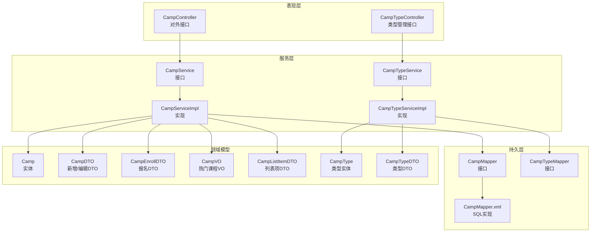
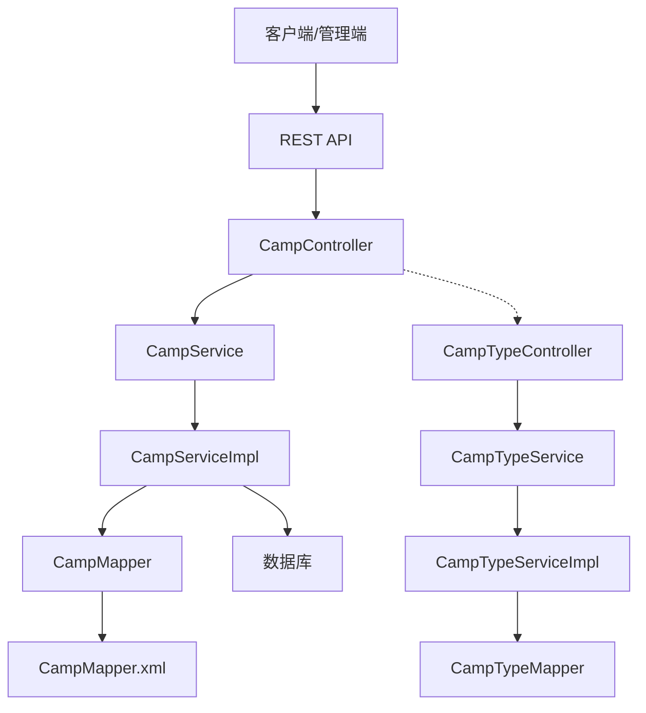
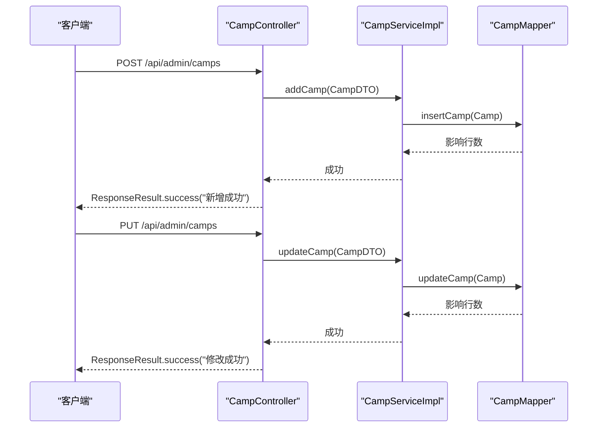
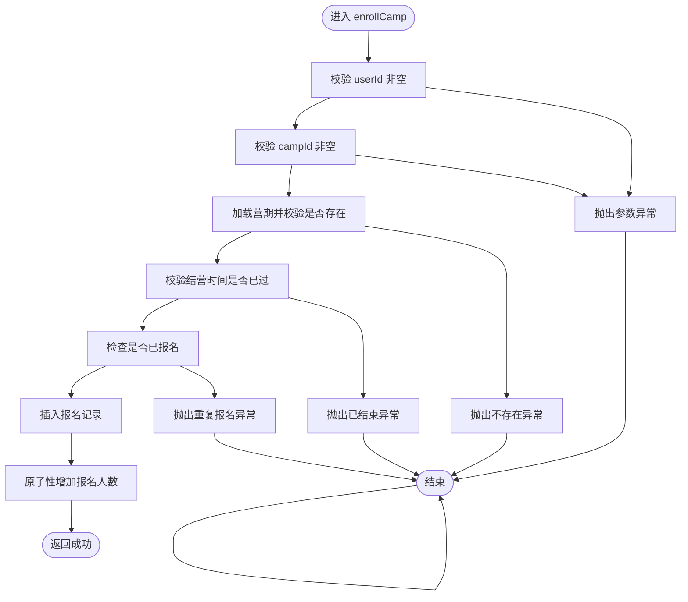
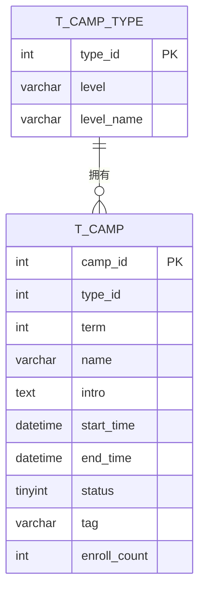
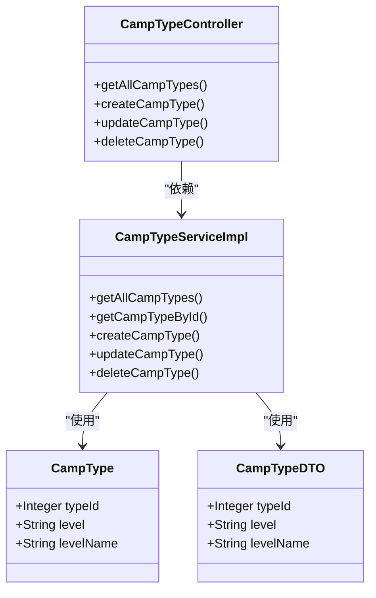
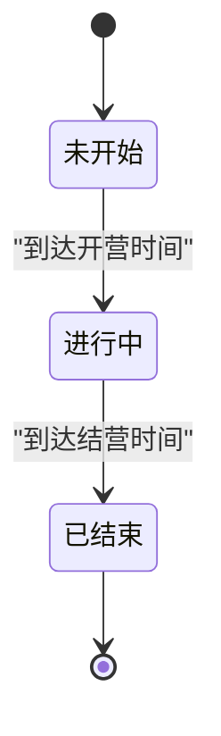
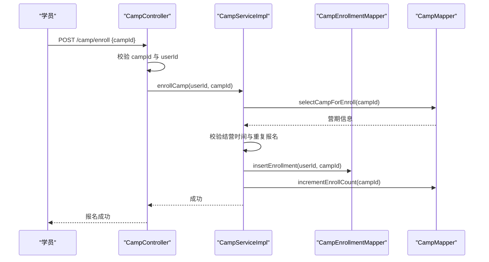
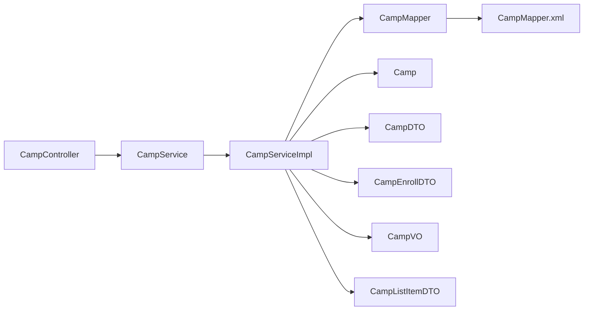

# 营期管理模块

<cite>
**本文引用的文件**
- [CampController.java](file://src/main/java/com/daily/dailychineseculture/controller/CampController.java)
- [CampServiceImpl.java](file://src/main/java/com/daily/dailychineseculture/service/impl/CampServiceImpl.java)
- [CampService.java](file://src/main/java/com/daily/dailychineseculture/service/CampService.java)
- [CampMapper.java](file://src/main/java/com/daily/dailychineseculture/mapper/CampMapper.java)
- [CampMapper.xml](file://src/main/resources/mapper/CampMapper.xml)
- [CampDTO.java](file://src/main/java/com/daily/dailychineseculture/dto/CampDTO.java)
- [CampEnrollDTO.java](file://src/main/java/com/daily/dailychineseculture/dto/CampEnrollDTO.java)
- [CampVO.java](file://src/main/java/com/daily/dailychineseculture/dto/CampVO.java)
- [CampListItemDTO.java](file://src/main/java/com/daily/dailychineseculture/dto/CampListItemDTO.java)
- [Camp.java](file://src/main/java/com/daily/dailychineseculture/entity/Camp.java)
- [CampTypeController.java](file://src/main/java/com/daily/dailychineseculture/controller/CampTypeController.java)
- [CampTypeServiceImpl.java](file://src/main/java/com/daily/dailychineseculture/service/impl/CampTypeServiceImpl.java)
- [CampType.java](file://src/main/java/com/daily/dailychineseculture/entity/CampType.java)
- [CampTypeDTO.java](file://src/main/java/com/daily/dailychineseculture/dto/CampTypeDTO.java)
- [营期管理新增与编辑 API文档.md](file://doc/营期管理新增与编辑 API文档.md)
</cite>

## 目录
1. [简介](#简介)
2. [项目结构](#项目结构)
3. [核心组件](#核心组件)
4. [架构总览](#架构总览)
5. [详细组件分析](#详细组件分析)
6. [依赖关系分析](#依赖关系分析)
7. [性能考虑](#性能考虑)
8. [故障排除指南](#故障排除指南)
9. [结论](#结论)
10. [附录](#附录)

## 简介
本文件系统性梳理营期管理模块的完整功能与实现机制，覆盖营期的创建、编辑、删除与状态管理，营期类型分类、报名管理与统计分析，营期生命周期管理（创建、审核、进行中、结束），以及营期数据的CRUD操作、关联数据处理、事务管理与并发控制。同时补充营期报名系统、费用管理、退费处理与财务结算的扩展建议，以及营期评价体系、满意度调查与改进分析的落地思路。

## 项目结构
营期管理模块采用经典的分层架构：Controller 控制器负责对外接口与参数校验，Service 服务层承载业务逻辑与事务控制，Mapper 持久层封装数据库访问，DTO/Entity 作为数据传输与持久化模型。营期类型管理与营期主体管理分离，分别提供独立的控制器与服务实现。

**图表来源**
- [CampController.java:1-123](file://src/main/java/com/daily/dailychineseculture/controller/CampController.java#L1-L123)
- [CampTypeController.java:1-73](file://src/main/java/com/daily/dailychineseculture/controller/CampTypeController.java#L1-L73)
- [CampServiceImpl.java:1-266](file://src/main/java/com/daily/dailychineseculture/service/impl/CampServiceImpl.java#L1-L266)
- [CampTypeServiceImpl.java:1-45](file://src/main/java/com/daily/dailychineseculture/service/impl/CampTypeServiceImpl.java#L1-L45)
- [CampMapper.java:1-132](file://src/main/java/com/daily/dailychineseculture/mapper/CampMapper.java#L1-L132)
- [CampMapper.xml:1-171](file://src/main/resources/mapper/CampMapper.xml#L1-L171)
- [Camp.java:1-64](file://src/main/java/com/daily/dailychineseculture/entity/Camp.java#L1-L64)
- [CampDTO.java:1-63](file://src/main/java/com/daily/dailychineseculture/dto/CampDTO.java#L1-L63)
- [CampEnrollDTO.java:1-9](file://src/main/java/com/daily/dailychineseculture/dto/CampEnrollDTO.java#L1-L9)
- [CampVO.java:1-40](file://src/main/java/com/daily/dailychineseculture/dto/CampVO.java#L1-L40)
- [CampListItemDTO.java:1-74](file://src/main/java/com/daily/dailychineseculture/dto/CampListItemDTO.java#L1-L74)
- [CampType.java:1-28](file://src/main/java/com/daily/dailychineseculture/entity/CampType.java#L1-L28)
- [CampTypeDTO.java:1-26](file://src/main/java/com/daily/dailychineseculture/dto/CampTypeDTO.java#L1-L26)

**章节来源**
- [CampController.java:1-123](file://src/main/java/com/daily/dailychineseculture/controller/CampController.java#L1-L123)
- [CampTypeController.java:1-73](file://src/main/java/com/daily/dailychineseculture/controller/CampTypeController.java#L1-L73)
- [CampServiceImpl.java:1-266](file://src/main/java/com/daily/dailychineseculture/service/impl/CampServiceImpl.java#L1-L266)
- [CampTypeServiceImpl.java:1-45](file://src/main/java/com/daily/dailychineseculture/service/impl/CampTypeServiceImpl.java#L1-L45)
- [CampMapper.java:1-132](file://src/main/java/com/daily/dailychineseculture/mapper/CampMapper.java#L1-L132)
- [CampMapper.xml:1-171](file://src/main/resources/mapper/CampMapper.xml#L1-L171)

## 核心组件
- 营期控制器：提供营期新增、编辑、列表查询、热门推荐、下拉选项、报名等接口。
- 营期服务实现：封装营期业务逻辑，包括新增/编辑校验、报名事务处理、状态文本转换、分页查询与统计。
- 营期映射器：定义SQL查询与更新操作，支撑列表、详情、热门推荐、类型选项等场景。
- 营期类型控制器与服务：提供营期类型的CRUD接口与实现。
- 数据传输对象：CampDTO、CampEnrollDTO、CampVO、CampListItemDTO等，用于接口间数据传递与格式化。
- 领域实体：Camp、CampType，映射数据库表结构。

**章节来源**
- [CampController.java:1-123](file://src/main/java/com/daily/dailychineseculture/controller/CampController.java#L1-L123)
- [CampServiceImpl.java:1-266](file://src/main/java/com/daily/dailychineseculture/service/impl/CampServiceImpl.java#L1-L266)
- [CampMapper.java:1-132](file://src/main/java/com/daily/dailychineseculture/mapper/CampMapper.java#L1-L132)
- [CampMapper.xml:1-171](file://src/main/resources/mapper/CampMapper.xml#L1-L171)
- [CampTypeController.java:1-73](file://src/main/java/com/daily/dailychineseculture/controller/CampTypeController.java#L1-L73)
- [CampTypeServiceImpl.java:1-45](file://src/main/java/com/daily/dailychineseculture/service/impl/CampTypeServiceImpl.java#L1-L45)
- [CampDTO.java:1-63](file://src/main/java/com/daily/dailychineseculture/dto/CampDTO.java#L1-L63)
- [CampEnrollDTO.java:1-9](file://src/main/java/com/daily/dailychineseculture/dto/CampEnrollDTO.java#L1-L9)
- [CampVO.java:1-40](file://src/main/java/com/daily/dailychineseculture/dto/CampVO.java#L1-L40)
- [CampListItemDTO.java:1-74](file://src/main/java/com/daily/dailychineseculture/dto/CampListItemDTO.java#L1-L74)
- [Camp.java:1-64](file://src/main/java/com/daily/dailychineseculture/entity/Camp.java#L1-L64)
- [CampType.java:1-28](file://src/main/java/com/daily/dailychineseculture/entity/CampType.java#L1-L28)
- [CampTypeDTO.java:1-26](file://src/main/java/com/daily/dailychineseculture/dto/CampTypeDTO.java#L1-L26)

## 架构总览
营期管理模块遵循典型的MVC分层与DAO模式，通过MyBatis实现SQL与Java对象的映射。控制器负责HTTP请求处理与参数校验，服务层承担业务规则与事务边界，映射器封装数据库交互。类型管理与营期主体管理相对独立，便于扩展与维护。

**图表来源**
- [CampController.java:1-123](file://src/main/java/com/daily/dailychineseculture/controller/CampController.java#L1-L123)
- [CampTypeController.java:1-73](file://src/main/java/com/daily/dailychineseculture/controller/CampTypeController.java#L1-L73)
- [CampServiceImpl.java:1-266](file://src/main/java/com/daily/dailychineseculture/service/impl/CampServiceImpl.java#L1-L266)
- [CampTypeServiceImpl.java:1-45](file://src/main/java/com/daily/dailychineseculture/service/impl/CampTypeServiceImpl.java#L1-L45)
- [CampMapper.java:1-132](file://src/main/java/com/daily/dailychineseculture/mapper/CampMapper.java#L1-L132)
- [CampMapper.xml:1-171](file://src/main/resources/mapper/CampMapper.xml#L1-L171)

## 详细组件分析

### 营期控制器（CampController）
- 职责：提供营期管理相关接口，包括新增、编辑、获取热门课程、获取全部营期、获取下拉选项、营期报名等。
- 关键接口：
  - 新增/编辑：接收CampDTO，调用服务层执行新增/编辑。
  - 热门课程：调用服务层获取热门课程列表。
  - 全部营期：返回所有营期集合。
  - 下拉选项：调用计划服务获取营期下拉选项。
  - 营期报名：从请求上下文提取用户ID，调用服务层执行报名。

**图表来源**
- [CampController.java:78-101](file://src/main/java/com/daily/dailychineseculture/controller/CampController.java#L78-L101)
- [CampServiceImpl.java:164-205](file://src/main/java/com/daily/dailychineseculture/service/impl/CampServiceImpl.java#L164-L205)
- [CampMapper.java:118-126](file://src/main/java/com/daily/dailychineseculture/mapper/CampMapper.java#L118-L126)

**章节来源**
- [CampController.java:1-123](file://src/main/java/com/daily/dailychineseculture/controller/CampController.java#L1-L123)

### 营期服务实现（CampServiceImpl）
- 职责：实现营期业务逻辑，包括新增/编辑校验、热门课程格式化、最近活跃营期状态文本转换、分页查询、营期类型选项、报名事务处理等。
- 关键能力：
  - 新增/编辑：强制设置报名人数为0（新增）或不更新报名人数（编辑）。
  - 报名：开启事务，校验营期有效性与是否已结束，检查重复报名，插入报名记录并原子性增加报名人数。
  - 状态文本：根据状态码返回“待开课/进行中/已结束”等文本。
  - 列表分页：支持关键词、状态、类型过滤，动态组装SQL，按开营时间倒序。

**图表来源**
- [CampServiceImpl.java:207-243](file://src/main/java/com/daily/dailychineseculture/service/impl/CampServiceImpl.java#L207-L243)
- [CampMapper.java:128-130](file://src/main/java/com/daily/dailychineseculture/mapper/CampMapper.java#L128-L130)

**章节来源**
- [CampServiceImpl.java:1-266](file://src/main/java/com/daily/dailychineseculture/service/impl/CampServiceImpl.java#L1-L266)

### 营期映射器（CampMapper + XML）
- 职责：定义SQL查询与更新操作，支撑热门课程、列表分页、类型选项、新增/编辑、报名相关查询与计数。
- 关键SQL：
  - 列表总数与分页：支持关键词模糊匹配、状态精确匹配（未开始/进行中/已结束）、类型ID过滤，按开营时间倒序。
  - 热门课程：联表查询类型名称，按标签优先、报名人数、开营时间排序取前5条。
  - 新增/编辑：INSERT/UPDATE t_camp，注意新增时强制 enroll_count，编辑时不更新 enroll_count。
  - 报名相关：查询营期用于报名校验、原子性增加报名人数。

**图表来源**
- [CampMapper.xml:19-81](file://src/main/resources/mapper/CampMapper.xml#L19-L81)
- [CampMapper.xml:139-157](file://src/main/resources/mapper/CampMapper.xml#L139-L157)
- [CampMapper.xml:102-137](file://src/main/resources/mapper/CampMapper.xml#L102-L137)

**章节来源**
- [CampMapper.java:1-132](file://src/main/java/com/daily/dailychineseculture/mapper/CampMapper.java#L1-L132)
- [CampMapper.xml:1-171](file://src/main/resources/mapper/CampMapper.xml#L1-L171)

### 营期类型管理
- 营期类型控制器：提供查询、新增、修改、删除类型接口。
- 营期类型服务实现：封装类型CRUD操作。
- 类型实体与DTO：CampType、CampTypeDTO，对应 t_camp_type 表。

**图表来源**
- [CampTypeController.java:1-73](file://src/main/java/com/daily/dailychineseculture/controller/CampTypeController.java#L1-L73)
- [CampTypeServiceImpl.java:1-45](file://src/main/java/com/daily/dailychineseculture/service/impl/CampTypeServiceImpl.java#L1-L45)
- [CampType.java:1-28](file://src/main/java/com/daily/dailychineseculture/entity/CampType.java#L1-L28)
- [CampTypeDTO.java:1-26](file://src/main/java/com/daily/dailychineseculture/dto/CampTypeDTO.java#L1-L26)

**章节来源**
- [CampTypeController.java:1-73](file://src/main/java/com/daily/dailychineseculture/controller/CampTypeController.java#L1-L73)
- [CampTypeServiceImpl.java:1-45](file://src/main/java/com/daily/dailychineseculture/service/impl/CampTypeServiceImpl.java#L1-L45)
- [CampType.java:1-28](file://src/main/java/com/daily/dailychineseculture/entity/CampType.java#L1-L28)
- [CampTypeDTO.java:1-26](file://src/main/java/com/daily/dailychineseculture/dto/CampTypeDTO.java#L1-L26)

### 营期生命周期管理
- 状态定义：0-未开始，1-进行中，2-已结束。
- 状态计算：列表查询中通过SQL动态计算当前状态（未开始/进行中/已结束）。
- 生命周期转换：由管理员在后台编辑时设置 status 字段，结合 start_time/end_time 自动推导。

**图表来源**
- [CampMapper.xml:53-57](file://src/main/resources/mapper/CampMapper.xml#L53-L57)
- [CampServiceImpl.java:245-264](file://src/main/java/com/daily/dailychineseculture/service/impl/CampServiceImpl.java#L245-L264)

**章节来源**
- [CampMapper.xml:53-57](file://src/main/resources/mapper/CampMapper.xml#L53-L57)
- [CampServiceImpl.java:245-264](file://src/main/java/com/daily/dailychineseculture/service/impl/CampServiceImpl.java#L245-L264)

### 营期报名系统与统计分析
- 报名流程：校验用户登录、营期有效性、是否已结束、是否重复报名；事务内插入报名记录并原子性增加报名人数。
- 统计分析：热门课程按标签优先、报名人数、开营时间排序；最近活跃营期用于仪表盘展示。

**图表来源**
- [CampController.java:103-121](file://src/main/java/com/daily/dailychineseculture/controller/CampController.java#L103-L121)
- [CampServiceImpl.java:207-243](file://src/main/java/com/daily/dailychineseculture/service/impl/CampServiceImpl.java#L207-L243)
- [CampMapper.java:128-130](file://src/main/java/com/daily/dailychineseculture/mapper/CampMapper.java#L128-L130)

**章节来源**
- [CampController.java:103-121](file://src/main/java/com/daily/dailychineseculture/controller/CampController.java#L103-L121)
- [CampServiceImpl.java:207-243](file://src/main/java/com/daily/dailychineseculture/service/impl/CampServiceImpl.java#L207-L243)

### 费用管理、退费处理与财务结算（扩展建议）
- 费用管理：建议引入订单与费用模型，记录报名费用、优惠券、支付状态等。
- 退费处理：基于订单状态与营期状态判断是否允许退费，生成退款单并异步处理。
- 财务结算：按营期维度汇总收入、成本与利润，生成结算报表。
- 评价与满意度：建议扩展评价模型，支持评分、评论与满意度调查，结合报表分析改进。

（本节为概念性建议，不直接对应具体源码）

## 依赖关系分析
- 控制器依赖服务接口，服务实现依赖映射器与DTO/Entity。
- 列表查询通过MyBatis动态SQL组合过滤条件，避免硬编码分支。
- 报名流程通过事务保证数据一致性，避免并发导致的超卖或计数不一致。

**图表来源**
- [CampController.java:1-123](file://src/main/java/com/daily/dailychineseculture/controller/CampController.java#L1-L123)
- [CampServiceImpl.java:1-266](file://src/main/java/com/daily/dailychineseculture/service/impl/CampServiceImpl.java#L1-L266)
- [CampMapper.java:1-132](file://src/main/java/com/daily/dailychineseculture/mapper/CampMapper.java#L1-L132)
- [CampMapper.xml:1-171](file://src/main/resources/mapper/CampMapper.xml#L1-L171)

**章节来源**
- [CampServiceImpl.java:1-266](file://src/main/java/com/daily/dailychineseculture/service/impl/CampServiceImpl.java#L1-L266)
- [CampMapper.java:1-132](file://src/main/java/com/daily/dailychineseculture/mapper/CampMapper.java#L1-L132)

## 性能考虑
- 列表查询：通过动态SQL与索引优化（如按开营时间、类型ID、状态过滤）提升查询效率。
- 报名计数：使用原子性更新（增量）减少锁竞争，避免热点数据争用。
- 格式化处理：热门课程的格式化在服务层完成，避免重复计算与数据库压力。
- 分页参数：默认页码与大小校验，防止过大分页影响性能。

（本节为通用性能建议）

## 故障排除指南
- 新增/编辑缺少 campId：编辑接口会抛出参数异常，需确保请求体包含 campId。
- 报名失败：检查营期是否已结束、是否重复报名、数据库唯一约束冲突。
- 状态显示异常：确认状态计算逻辑与数据库时间与时区配置一致。
- 热门课程为空：检查结营时间与标签字段，确保满足查询条件。

**章节来源**
- [CampServiceImpl.java:184-205](file://src/main/java/com/daily/dailychineseculture/service/impl/CampServiceImpl.java#L184-L205)
- [CampServiceImpl.java:217-243](file://src/main/java/com/daily/dailychineseculture/service/impl/CampServiceImpl.java#L217-L243)
- [CampMapper.xml:139-157](file://src/main/resources/mapper/CampMapper.xml#L139-L157)

## 结论
营期管理模块以清晰的分层设计实现了营期的全生命周期管理，包括创建、编辑、状态管理、类型分类、报名与统计分析。通过事务与原子性更新保障了报名流程的一致性，动态SQL与DTO格式化提升了查询与展示体验。建议后续扩展费用、退费、财务结算与评价体系，进一步完善营期运营闭环。

## 附录
- API 文档参考：[营期管理新增与编辑 API文档.md](file://doc/营期管理新增与编辑 API文档.md)