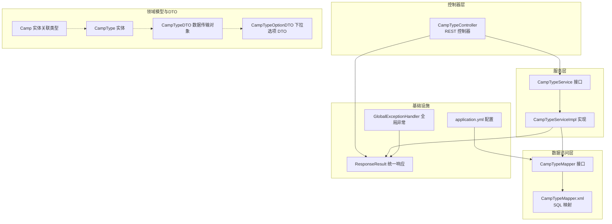
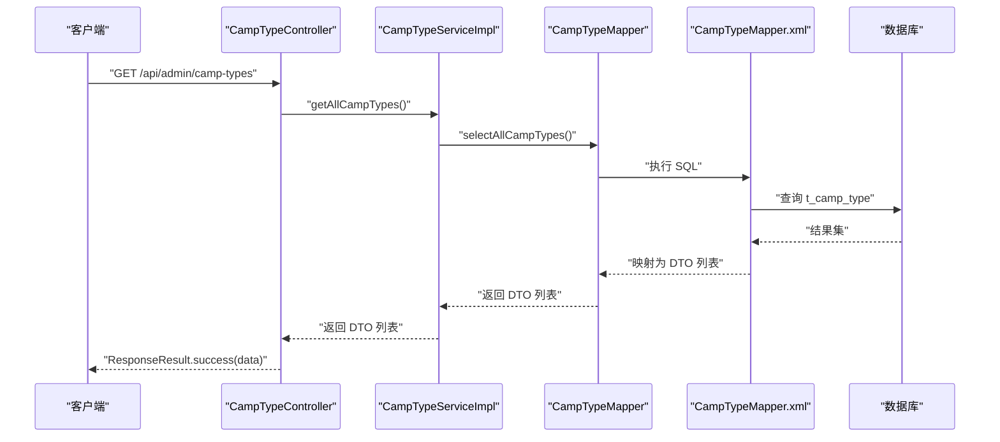
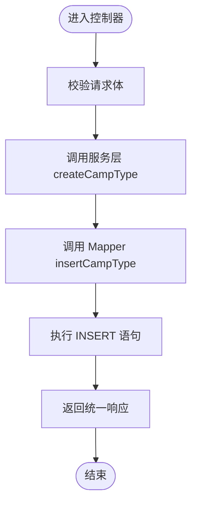
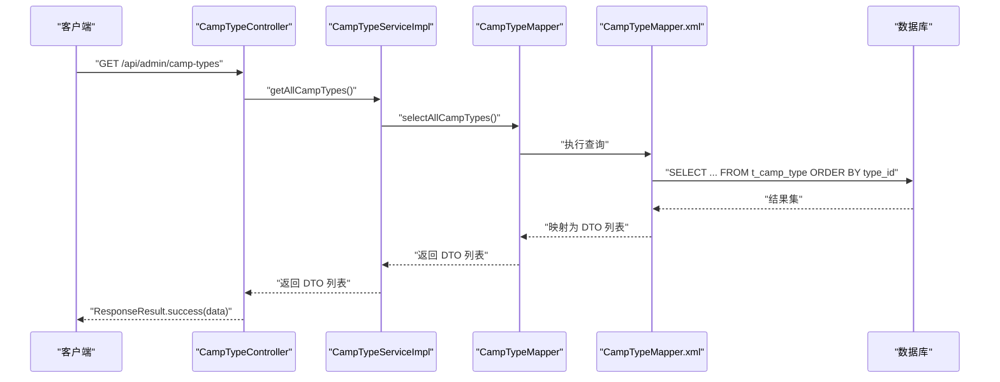
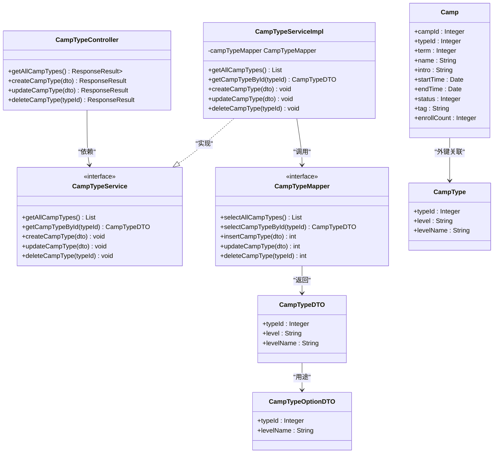
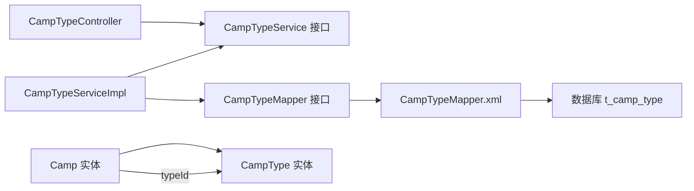

# 营期类型管理

<cite>
**本文引用的文件**
- [CampTypeController.java](file://src/main/java/com/daily/dailychineseculture/controller/CampTypeController.java)
- [CampTypeServiceImpl.java](file://src/main/java/com/daily/dailychineseculture/service/impl/CampTypeServiceImpl.java)
- [CampTypeService.java](file://src/main/java/com/daily/dailychineseculture/service/CampTypeService.java)
- [CampTypeMapper.java](file://src/main/java/com/daily/dailychineseculture/mapper/CampTypeMapper.java)
- [CampTypeMapper.xml](file://src/main/resources/mapper/CampTypeMapper.xml)
- [CampTypeDTO.java](file://src/main/java/com/daily/dailychineseculture/dto/CampTypeDTO.java)
- [CampTypeOptionDTO.java](file://src/main/java/com/daily/dailychineseculture/dto/CampTypeOptionDTO.java)
- [CampType.java](file://src/main/java/com/daily/dailychineseculture/entity/CampType.java)
- [Camp.java](file://src/main/java/com/daily/dailychineseculture/entity/Camp.java)
- [ResponseResult.java](file://src/main/java/com/daily/dailychineseculture/common/ResponseResult.java)
- [GlobalExceptionHandler.java](file://src/main/java/com/daily/dailychineseculture/common/GlobalExceptionHandler.java)
- [application.yml](file://src/main/resources/application.yml)
- [CampMapper.xml](file://src/main/resources/mapper/CampMapper.xml)
- [营期类型字典&列表查询升级 API文档.md](file://doc/营期类型字典&列表查询升级 API文档.md)
- [营期列表字段升级报告.md](file://doc/营期列表字段升级报告.md)
- [营期管理大盘 API文档.md](file://doc/营期管理大盘 API文档.md)
</cite>

## 目录
1. [简介](#简介)
2. [项目结构](#项目结构)
3. [核心组件](#核心组件)
4. [架构总览](#架构总览)
5. [详细组件分析](#详细组件分析)
6. [依赖分析](#依赖分析)
7. [性能考虑](#性能考虑)
8. [故障排查指南](#故障排查指南)
9. [结论](#结论)
10. [附录](#附录)

## 简介
本文件围绕“营期类型管理”主题，系统梳理营期类型的分类体系、数据模型、API 接口与业务流程，重点分析控制器与服务实现的职责划分、类型层级结构与关联关系处理、数据一致性与完整性保障机制，并给出与营期实例的关联关系、筛选机制与统计分析思路，以及缓存策略、性能优化与并发控制建议。

## 项目结构
营期类型管理采用经典的分层架构：控制器层负责对外暴露 REST API；服务层封装业务逻辑；数据访问层通过 MyBatis 完成数据库交互；统一响应与异常处理贯穿各层，确保接口风格一致与错误可控。

图表来源
- [CampTypeController.java:1-73](file://src/main/java/com/daily/dailychineseculture/controller/CampTypeController.java#L1-L73)
- [CampTypeServiceImpl.java:1-45](file://src/main/java/com/daily/dailychineseculture/service/impl/CampTypeServiceImpl.java#L1-L45)
- [CampTypeService.java:1-43](file://src/main/java/com/daily/dailychineseculture/service/CampTypeService.java#L1-L43)
- [CampTypeMapper.java:1-49](file://src/main/java/com/daily/dailychineseculture/mapper/CampTypeMapper.java#L1-L49)
- [CampTypeMapper.xml:1-59](file://src/main/resources/mapper/CampTypeMapper.xml#L1-L59)
- [CampTypeDTO.java:1-26](file://src/main/java/com/daily/dailychineseculture/dto/CampTypeDTO.java#L1-L26)
- [CampTypeOptionDTO.java:1-25](file://src/main/java/com/daily/dailychineseculture/dto/CampTypeOptionDTO.java#L1-L25)
- [CampType.java:1-28](file://src/main/java/com/daily/dailychineseculture/entity/CampType.java#L1-L28)
- [Camp.java:1-64](file://src/main/java/com/daily/dailychineseculture/entity/Camp.java#L1-L64)
- [ResponseResult.java:1-79](file://src/main/java/com/daily/dailychineseculture/common/ResponseResult.java#L1-L79)
- [GlobalExceptionHandler.java:1-29](file://src/main/java/com/daily/dailychineseculture/common/GlobalExceptionHandler.java#L1-L29)
- [application.yml:1-33](file://src/main/resources/application.yml#L1-L33)

章节来源
- [CampTypeController.java:1-73](file://src/main/java/com/daily/dailychineseculture/controller/CampTypeController.java#L1-L73)
- [application.yml:1-33](file://src/main/resources/application.yml#L1-L33)

## 核心组件
- 控制器：提供营期类型全量查询、新增、修改、删除的 REST 接口，统一返回响应包装。
- 服务层：封装 CRUD 业务逻辑，调用数据访问层执行数据库操作。
- 数据访问层：定义 Mapper 接口与 XML 映射，完成 SQL 执行与结果映射。
- 领域模型与 DTO：CampType 实体与 CampTypeDTO、CampTypeOptionDTO 用于不同场景的数据传输。
- 基础设施：统一响应与全局异常处理，保证接口一致性与错误兜底。

章节来源
- [CampTypeController.java:1-73](file://src/main/java/com/daily/dailychineseculture/controller/CampTypeController.java#L1-L73)
- [CampTypeServiceImpl.java:1-45](file://src/main/java/com/daily/dailychineseculture/service/impl/CampTypeServiceImpl.java#L1-L45)
- [CampTypeMapper.java:1-49](file://src/main/java/com/daily/dailychineseculture/mapper/CampTypeMapper.java#L1-L49)
- [CampTypeMapper.xml:1-59](file://src/main/resources/mapper/CampTypeMapper.xml#L1-L59)
- [CampTypeDTO.java:1-26](file://src/main/java/com/daily/dailychineseculture/dto/CampTypeDTO.java#L1-L26)
- [CampTypeOptionDTO.java:1-25](file://src/main/java/com/daily/dailychineseculture/dto/CampTypeOptionDTO.java#L1-L25)
- [CampType.java:1-28](file://src/main/java/com/daily/dailychineseculture/entity/CampType.java#L1-L28)
- [ResponseResult.java:1-79](file://src/main/java/com/daily/dailychineseculture/common/ResponseResult.java#L1-L79)
- [GlobalExceptionHandler.java:1-29](file://src/main/java/com/daily/dailychineseculture/common/GlobalExceptionHandler.java#L1-L29)

## 架构总览
营期类型管理遵循典型的分层架构，控制器负责请求接入与响应封装，服务层负责业务编排，数据访问层负责持久化。类型与营期之间存在外键关联，营期列表查询会通过左连接获取类型名称，支持按类型筛选。

图表来源
- [CampTypeController.java:28-32](file://src/main/java/com/daily/dailychineseculture/controller/CampTypeController.java#L28-L32)
- [CampTypeServiceImpl.java:20-23](file://src/main/java/com/daily/dailychineseculture/service/impl/CampTypeServiceImpl.java#L20-L23)
- [CampTypeMapper.java:19](file://src/main/java/com/daily/dailychineseculture/mapper/CampTypeMapper.java#L19)
- [CampTypeMapper.xml:13-20](file://src/main/resources/mapper/CampTypeMapper.xml#L13-L20)

## 详细组件分析

### 控制器层：CampTypeController
- 职责
  - 对外提供 REST 接口：全量查询、新增、修改、删除。
  - 使用统一响应包装返回结果。
- 接口一览
  - GET /api/admin/camp-types：查询所有营期类型
  - POST /api/admin/camp-types：新增营期类型
  - PUT /api/admin/camp-types：修改营期类型
  - DELETE /api/admin/camp-types/{typeId}：删除营期类型
- 参数与返回
  - 请求体：CampTypeDTO（包含 typeId、level、levelName）
  - 返回：ResponseResult<T>，包含 code、message、data、timestamp

章节来源
- [CampTypeController.java:28-71](file://src/main/java/com/daily/dailychineseculture/controller/CampTypeController.java#L28-L71)
- [ResponseResult.java:48-79](file://src/main/java/com/daily/dailychineseculture/common/ResponseResult.java#L48-L79)

### 服务层：CampTypeServiceImpl
- 职责
  - 编排业务：调用 Mapper 执行 CRUD。
  - 保持事务边界与异常向上抛出（由全局异常处理兜底）。
- 方法映射
  - getAllCampTypes → selectAllCampTypes
  - getCampTypeById → selectCampTypeById
  - createCampType → insertCampType
  - updateCampType → updateCampType
  - deleteCampType → deleteCampType

章节来源
- [CampTypeServiceImpl.java:20-43](file://src/main/java/com/daily/dailychineseculture/service/impl/CampTypeServiceImpl.java#L20-L43)

### 数据访问层：CampTypeMapper 与 XML
- 查询
  - 全量查询：按 type_id 升序返回 level、levelName。
  - 按 ID 查询：返回单个类型。
- 写操作
  - 新增：插入 level、levelName，返回影响行数。
  - 更新：按需更新 level 或 levelName，WHERE type_id。
  - 删除：按 type_id 删除。
- 结果映射
  - 使用 resultMap 将列名映射到 DTO 字段。

章节来源
- [CampTypeMapper.java:19-47](file://src/main/java/com/daily/dailychineseculture/mapper/CampTypeMapper.java#L19-L47)
- [CampTypeMapper.xml:13-56](file://src/main/resources/mapper/CampTypeMapper.xml#L13-L56)

### 领域模型与 DTO
- CampType 实体
  - 字段：typeId、level、levelName。
- CampTypeDTO
  - 用于对外传输，字段与实体一致。
- CampTypeOptionDTO
  - 用于前端下拉选项，字段包含 typeId、levelName。
- 关联关系
  - 营期实体 Camp 持有 typeId 外键，与 t_camp_type 关联。
  - 营期列表查询通过 LEFT JOIN t_camp_type 获取 level_name。

章节来源
- [CampType.java:16-26](file://src/main/java/com/daily/dailychineseculture/entity/CampType.java#L16-L26)
- [CampTypeDTO.java:14-24](file://src/main/java/com/daily/dailychineseculture/dto/CampTypeDTO.java#L14-L24)
- [CampTypeOptionDTO.java:16-23](file://src/main/java/com/daily/dailychineseculture/dto/CampTypeOptionDTO.java#L16-L23)
- [Camp.java:20-22](file://src/main/java/com/daily/dailychineseculture/entity/Camp.java#L20-L22)
- [CampMapper.xml:60-61](file://src/main/resources/mapper/CampMapper.xml#L60-L61)

### 统一响应与异常处理
- ResponseResult
  - 统一封装 code、message、data、timestamp。
  - 提供 success/error 静态方法。
- GlobalExceptionHandler
  - 全局捕获异常并返回统一错误响应。

章节来源
- [ResponseResult.java:48-79](file://src/main/java/com/daily/dailychineseculture/common/ResponseResult.java#L48-L79)
- [GlobalExceptionHandler.java:15-28](file://src/main/java/com/daily/dailychineseculture/common/GlobalExceptionHandler.java#L15-L28)

### API 接口文档（完整）

- 查询所有营期类型
  - 方法与路径：GET /api/admin/camp-types
  - 请求参数：无
  - 响应数据：List<CampTypeDTO>
  - 业务规则：按 type_id 升序返回全部类型
  - 参考
    - [CampTypeController.java:28-32](file://src/main/java/com/daily/dailychineseculture/controller/CampTypeController.java#L28-L32)
    - [CampTypeMapper.xml:13-20](file://src/main/resources/mapper/CampTypeMapper.xml#L13-L20)

- 新增营期类型
  - 方法与路径：POST /api/admin/camp-types
  - 请求体：CampTypeDTO（level、levelName）
  - 响应数据：无（成功消息）
  - 业务规则：插入新类型，自动生成 type_id
  - 参考
    - [CampTypeController.java:41-45](file://src/main/java/com/daily/dailychineseculture/controller/CampTypeController.java#L41-L45)
    - [CampTypeMapper.xml:33-36](file://src/main/resources/mapper/CampTypeMapper.xml#L33-L36)

- 修改营期类型
  - 方法与路径：PUT /api/admin/camp-types
  - 请求体：CampTypeDTO（typeId、level、levelName）
  - 响应数据：无（成功消息）
  - 业务规则：按需更新 level 或 levelName
  - 参考
    - [CampTypeController.java:54-58](file://src/main/java/com/daily/dailychineseculture/controller/CampTypeController.java#L54-L58)
    - [CampTypeMapper.xml:39-50](file://src/main/resources/mapper/CampTypeMapper.xml#L39-L50)

- 删除营期类型
  - 方法与路径：DELETE /api/admin/camp-types/{typeId}
  - 路径参数：typeId（整型）
  - 响应数据：无（成功消息）
  - 业务规则：按 type_id 删除
  - 参考
    - [CampTypeController.java:67-71](file://src/main/java/com/daily/dailychineseculture/controller/CampTypeController.java#L67-L71)
    - [CampTypeMapper.xml:53-56](file://src/main/resources/mapper/CampTypeMapper.xml#L53-L56)

- 营期列表按类型筛选（补充）
  - 方法与路径：GET /api/admin/camps?typeId={typeId}
  - 查询参数：typeId（可选）
  - 响应数据：分页列表（包含 typeName）
  - 业务规则：按 typeId 过滤，联表获取 level_name
  - 参考
    - [CampMapper.xml:75-77](file://src/main/resources/mapper/CampMapper.xml#L75-L77)
    - [营期类型字典&列表查询升级 API文档.md:282-300](file://doc/营期类型字典&列表查询升级 API文档.md#L282-L300)

章节来源
- [CampTypeController.java:28-71](file://src/main/java/com/daily/dailychineseculture/controller/CampTypeController.java#L28-L71)
- [CampTypeMapper.xml:13-56](file://src/main/resources/mapper/CampTypeMapper.xml#L13-L56)
- [CampMapper.xml:75-77](file://src/main/resources/mapper/CampMapper.xml#L75-L77)
- [营期类型字典&列表查询升级 API文档.md:282-300](file://doc/营期类型字典&列表查询升级 API文档.md#L282-L300)

### 业务流程与数据流

#### 创建流程（新增类型）

图表来源
- [CampTypeController.java:41-45](file://src/main/java/com/daily/dailychineseculture/controller/CampTypeController.java#L41-L45)
- [CampTypeServiceImpl.java:31-33](file://src/main/java/com/daily/dailychineseculture/service/impl/CampTypeServiceImpl.java#L31-L33)
- [CampTypeMapper.xml:33-36](file://src/main/resources/mapper/CampTypeMapper.xml#L33-L36)

#### 查询流程（全量列表）

图表来源
- [CampTypeController.java:28-32](file://src/main/java/com/daily/dailychineseculture/controller/CampTypeController.java#L28-L32)
- [CampTypeServiceImpl.java:20-23](file://src/main/java/com/daily/dailychineseculture/service/impl/CampTypeServiceImpl.java#L20-L23)
- [CampTypeMapper.xml:13-20](file://src/main/resources/mapper/CampTypeMapper.xml#L13-L20)

### 类图（代码级）

图表来源
- [CampTypeController.java:18-71](file://src/main/java/com/daily/dailychineseculture/controller/CampTypeController.java#L18-L71)
- [CampTypeService.java:10-42](file://src/main/java/com/daily/dailychineseculture/service/CampTypeService.java#L10-L42)
- [CampTypeServiceImpl.java:16-43](file://src/main/java/com/daily/dailychineseculture/service/impl/CampTypeServiceImpl.java#L16-L43)
- [CampTypeMapper.java:13-47](file://src/main/java/com/daily/dailychineseculture/mapper/CampTypeMapper.java#L13-L47)
- [CampTypeDTO.java:10-24](file://src/main/java/com/daily/dailychineseculture/dto/CampTypeDTO.java#L10-L24)
- [CampTypeOptionDTO.java:11-23](file://src/main/java/com/daily/dailychineseculture/dto/CampTypeOptionDTO.java#L11-L23)
- [CampType.java:12-26](file://src/main/java/com/daily/dailychineseculture/entity/CampType.java#L12-L26)
- [Camp.java:13-57](file://src/main/java/com/daily/dailychineseculture/entity/Camp.java#L13-L57)

## 依赖分析
- 控制器依赖服务接口，服务实现依赖 Mapper 接口。
- Mapper 通过 XML 映射执行 SQL，返回 DTO。
- 营期实体持有 typeId 外键，与类型表关联；营期列表查询通过 LEFT JOIN 获取类型名称。
- 统一响应与全局异常处理贯穿各层，保证接口一致性与错误兜底。

图表来源
- [CampTypeController.java:20](file://src/main/java/com/daily/dailychineseculture/controller/CampTypeController.java#L20)
- [CampTypeServiceImpl.java:18](file://src/main/java/com/daily/dailychineseculture/service/impl/CampTypeServiceImpl.java#L18)
- [CampTypeMapper.java:19](file://src/main/java/com/daily/dailychineseculture/mapper/CampTypeMapper.java#L19)
- [CampTypeMapper.xml:13-20](file://src/main/resources/mapper/CampTypeMapper.xml#L13-L20)
- [Camp.java:20-22](file://src/main/java/com/daily/dailychineseculture/entity/Camp.java#L20-L22)
- [CampType.java:16-26](file://src/main/java/com/daily/dailychineseculture/entity/CampType.java#L16-L26)

章节来源
- [CampTypeController.java:20](file://src/main/java/com/daily/dailychineseculture/controller/CampTypeController.java#L20)
- [CampTypeServiceImpl.java:18](file://src/main/java/com/daily/dailychineseculture/service/impl/CampTypeServiceImpl.java#L18)
- [CampTypeMapper.java:19](file://src/main/java/com/daily/dailychineseculture/mapper/CampTypeMapper.java#L19)
- [CampTypeMapper.xml:13-20](file://src/main/resources/mapper/CampTypeMapper.xml#L13-L20)
- [Camp.java:20-22](file://src/main/java/com/daily/dailychineseculture/entity/Camp.java#L20-L22)
- [CampType.java:16-26](file://src/main/java/com/daily/dailychineseculture/entity/CampType.java#L16-L26)

## 性能考虑
- 数据库层面
  - 查询按 type_id 升序，具备索引友好性。
  - 营期列表查询使用 LEFT JOIN 获取类型名称，建议在 type_id 上建立索引以提升联表性能。
- 代码层面
  - DTO 与实体分离，避免不必要的字段传输。
  - 统一响应减少重复封装成本。
- 配置层面
  - MyBatis 开启驼峰命名映射，降低字段映射成本。
  - application.yml 中配置了数据源与 MyBatis Mapper XML 位置，确保加载效率。

章节来源
- [CampTypeMapper.xml:13-20](file://src/main/resources/mapper/CampTypeMapper.xml#L13-L20)
- [CampMapper.xml:60-61](file://src/main/resources/mapper/CampMapper.xml#L60-L61)
- [application.yml:17-22](file://src/main/resources/application.yml#L17-L22)

## 故障排查指南
- 统一错误响应
  - 全局异常处理器捕获 Exception 与 RuntimeException，返回统一错误响应，便于前端统一处理。
- 常见问题定位
  - 接口返回 500：检查全局异常日志与数据库连接配置。
  - 查询为空：确认 t_camp_type 是否存在数据，或请求参数是否正确。
  - 更新无效：确认请求体字段与数据库字段映射是否一致。
- 参考
  - [GlobalExceptionHandler.java:15-28](file://src/main/java/com/daily/dailychineseculture/common/GlobalExceptionHandler.java#L15-L28)
  - [application.yml:8-11](file://src/main/resources/application.yml#L8-L11)

章节来源
- [GlobalExceptionHandler.java:15-28](file://src/main/java/com/daily/dailychineseculture/common/GlobalExceptionHandler.java#L15-L28)
- [application.yml:8-11](file://src/main/resources/application.yml#L8-L11)

## 结论
营期类型管理模块结构清晰、职责明确：控制器负责接口与响应封装，服务层负责业务编排，数据访问层专注持久化。类型与营期之间通过外键建立稳定关联，营期列表查询通过联表获取类型名称，支持按类型筛选。整体设计具备良好的扩展性与可维护性，后续可在缓存、索引与并发控制方面进一步优化。

## 附录

### 营期类型与营期实例的关联关系
- 外键约束：t_camp.type_id → t_camp_type.type_id。
- 查询关联：营期列表通过 LEFT JOIN t_camp_type 获取 level_name。
- 筛选机制：营期列表支持按 typeId 过滤，实现类型维度的筛选。

章节来源
- [Camp.java:20-22](file://src/main/java/com/daily/dailychineseculture/entity/Camp.java#L20-L22)
- [CampMapper.xml:60-61](file://src/main/resources/mapper/CampMapper.xml#L60-L61)
- [CampMapper.xml:75-77](file://src/main/resources/mapper/CampMapper.xml#L75-L77)

### 类型数据的缓存策略建议
- 适用场景：类型全量列表查询频率较高，且数据变更不频繁。
- 建议方案：
  - 二级缓存：MyBatis 映射缓存或 Redis 缓存类型全量列表，设置合理过期时间。
  - 变更同步：类型新增/修改/删除时，清理或失效相关缓存键。
- 注意事项：确保缓存与数据库一致性，避免脏读。

[本节为通用建议，无需特定文件来源]

### 性能优化与并发控制
- 性能优化
  - 在 type_id 建立索引，提升联表与筛选性能。
  - DTO 与实体分离，减少网络传输与序列化开销。
  - MyBatis 开启驼峰映射，减少手动映射成本。
- 并发控制
  - 服务层方法无显式锁，建议在高并发场景下结合数据库唯一约束与事务隔离级别，必要时引入分布式锁或乐观锁。

章节来源
- [application.yml:17-22](file://src/main/resources/application.yml#L17-L22)
- [CampMapper.xml:60-61](file://src/main/resources/mapper/CampMapper.xml#L60-L61)