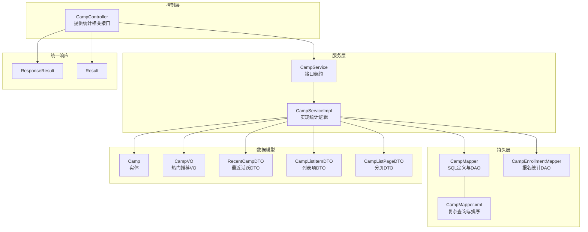
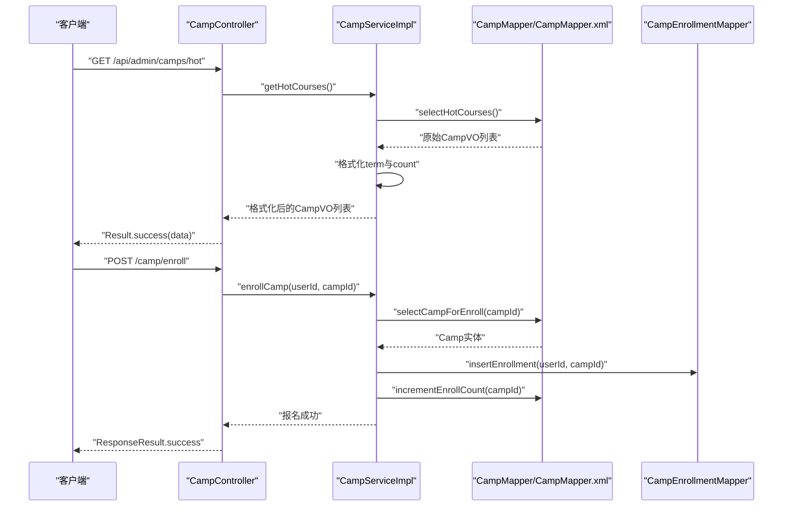
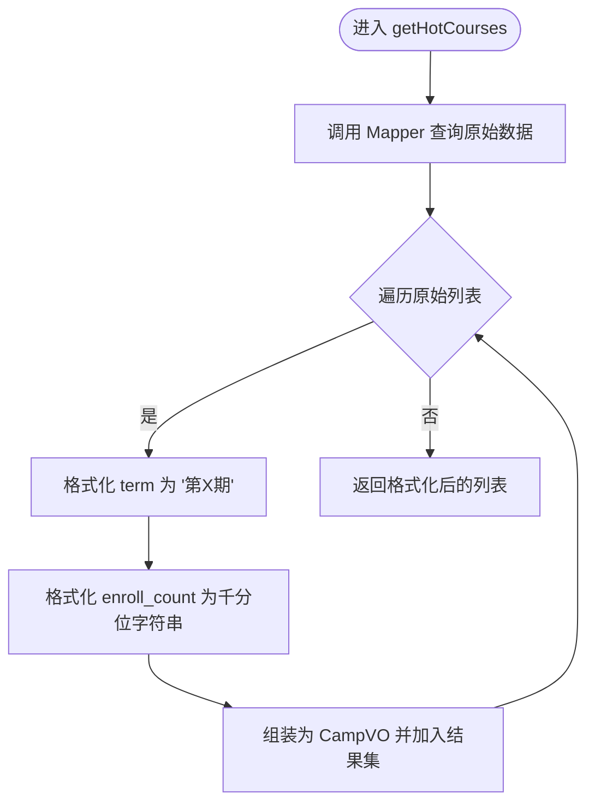
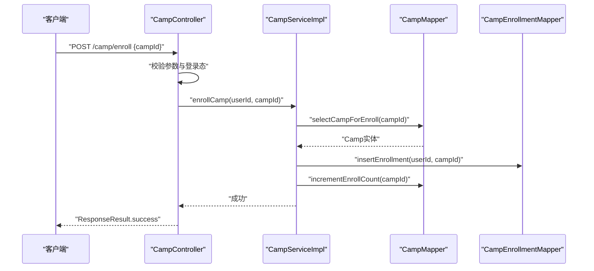
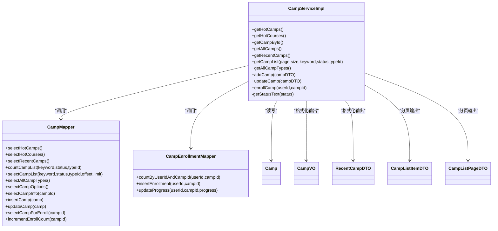
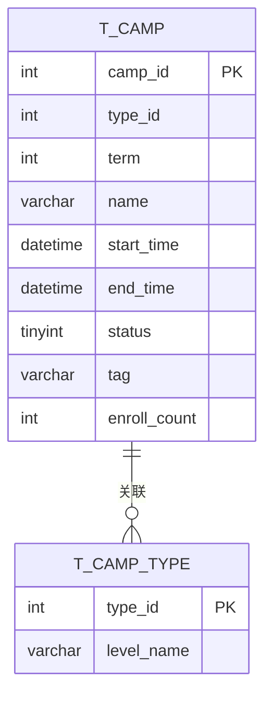
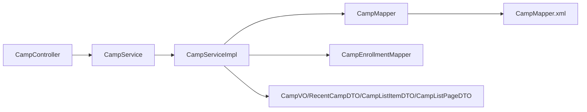

# 营期统计分析

<cite>
**本文引用的文件**
- [CampController.java](file://src/main/java/com/daily/dailychineseculture/controller/CampController.java)
- [CampServiceImpl.java](file://src/main/java/com/daily/dailychineseculture/service/impl/CampServiceImpl.java)
- [CampService.java](file://src/main/java/com/daily/dailychineseculture/service/CampService.java)
- [CampMapper.java](file://src/main/java/com/daily/dailychineseculture/mapper/CampMapper.java)
- [CampEnrollmentMapper.java](file://src/main/java/com/daily/dailychineseculture/mapper/CampEnrollmentMapper.java)
- [CampMapper.xml](file://src/main/resources/mapper/CampMapper.xml)
- [Camp.java](file://src/main/java/com/daily/dailychineseculture/entity/Camp.java)
- [CampVO.java](file://src/main/java/com/daily/dailychineseculture/dto/CampVO.java)
- [CampInfoDTO.java](file://src/main/java/com/daily/dailychineseculture/dto/CampInfoDTO.java)
- [RecentCampDTO.java](file://src/main/java/com/daily/dailychineseculture/dto/RecentCampDTO.java)
- [CampListItemDTO.java](file://src/main/java/com/daily/dailychineseculture/dto/CampListItemDTO.java)
- [CampListPageDTO.java](file://src/main/java/com/daily/dailychineseculture/dto/CampListPageDTO.java)
- [ResponseResult.java](file://src/main/java/com/daily/dailychineseculture/common/ResponseResult.java)
- [Result.java](file://src/main/java/com/daily/dailychineseculture/common/Result.java)
- [营期管理大盘 API文档.md](file://doc/营期管理大盘 API文档.md)
</cite>

## 目录
1. [引言](#引言)
2. [项目结构](#项目结构)
3. [核心组件](#核心组件)
4. [架构总览](#架构总览)
5. [详细组件分析](#详细组件分析)
6. [依赖分析](#依赖分析)
7. [性能考虑](#性能考虑)
8. [故障排除指南](#故障排除指南)
9. [结论](#结论)
10. [附录](#附录)

## 引言
本文件聚焦“营期统计分析”主题，系统梳理与“营期”相关的统计数据采集、计算与展示机制，重点覆盖以下方面：
- 热门营期推荐算法：基于开营时间、报名人数、标签等综合排序策略
- 统计相关API设计：CampController中与报名统计、热度展示相关的接口
- 统计逻辑实现：CampServiceImpl中的数据聚合、时间窗口计算与格式化
- 统计报表接口文档：数据维度、计算公式与展示格式
- 实时统计更新、历史数据分析与预测模型应用的建议与落地路径

## 项目结构
围绕营期统计分析的关键代码分布在如下层次：
- 控制层：CampController 提供热门营期、营期列表、报名等接口
- 服务层：CampServiceImpl 实现统计逻辑与数据聚合
- 持久层：CampMapper/CampEnrollmentMapper 定义SQL与DAO方法
- 映射文件：CampMapper.xml 实现复杂查询与排序
- 数据传输对象：CampVO、RecentCampDTO、CampListItemDTO、CampListPageDTO 等承载统计结果
- 统一响应：ResponseResult、Result 统一封装返回结构

图表来源
- [CampController.java:1-123](file://src/main/java/com/daily/dailychineseculture/controller/CampController.java#L1-L123)
- [CampServiceImpl.java:1-266](file://src/main/java/com/daily/dailychineseculture/service/impl/CampServiceImpl.java#L1-L266)
- [CampMapper.java:1-132](file://src/main/java/com/daily/dailychineseculture/mapper/CampMapper.java#L1-L132)
- [CampEnrollmentMapper.java:1-16](file://src/main/java/com/daily/dailychineseculture/mapper/CampEnrollmentMapper.java#L1-L16)
- [CampMapper.xml:1-171](file://src/main/resources/mapper/CampMapper.xml#L1-L171)
- [Camp.java:1-64](file://src/main/java/com/daily/dailychineseculture/entity/Camp.java#L1-L64)
- [CampVO.java:1-40](file://src/main/java/com/daily/dailychineseculture/dto/CampVO.java#L1-L40)
- [RecentCampDTO.java:1-55](file://src/main/java/com/daily/dailychineseculture/dto/RecentCampDTO.java#L1-L55)
- [CampListItemDTO.java:1-74](file://src/main/java/com/daily/dailychineseculture/dto/CampListItemDTO.java#L1-L74)
- [CampListPageDTO.java:1-39](file://src/main/java/com/daily/dailychineseculture/dto/CampListPageDTO.java#L1-L39)
- [ResponseResult.java:1-79](file://src/main/java/com/daily/dailychineseculture/common/ResponseResult.java#L1-L79)
- [Result.java:1-81](file://src/main/java/com/daily/dailychineseculture/common/Result.java#L1-L81)

章节来源
- [CampController.java:1-123](file://src/main/java/com/daily/dailychineseculture/controller/CampController.java#L1-L123)
- [CampServiceImpl.java:1-266](file://src/main/java/com/daily/dailychineseculture/service/impl/CampServiceImpl.java#L1-L266)
- [CampMapper.java:1-132](file://src/main/java/com/daily/dailychineseculture/mapper/CampMapper.java#L1-L132)
- [CampEnrollmentMapper.java:1-16](file://src/main/java/com/daily/dailychineseculture/mapper/CampEnrollmentMapper.java#L1-L16)
- [CampMapper.xml:1-171](file://src/main/resources/mapper/CampMapper.xml#L1-L171)
- [Camp.java:1-64](file://src/main/java/com/daily/dailychineseculture/entity/Camp.java#L1-L64)
- [CampVO.java:1-40](file://src/main/java/com/daily/dailychineseculture/dto/CampVO.java#L1-L40)
- [RecentCampDTO.java:1-55](file://src/main/java/com/daily/dailychineseculture/dto/RecentCampDTO.java#L1-L55)
- [CampListItemDTO.java:1-74](file://src/main/java/com/daily/dailychineseculture/dto/CampListItemDTO.java#L1-L74)
- [CampListPageDTO.java:1-39](file://src/main/java/com/daily/dailychineseculture/dto/CampListPageDTO.java#L1-L39)
- [ResponseResult.java:1-79](file://src/main/java/com/daily/dailychineseculture/common/ResponseResult.java#L1-L79)
- [Result.java:1-81](file://src/main/java/com/daily/dailychineseculture/common/Result.java#L1-L81)

## 核心组件
- 统计数据载体
  - 报名人数：Camp.enrollCount
  - 状态：Camp.status（0-未开始，1-进行中，2-已结束）
  - 标签：Camp.tag（如“热招”）
  - 时间：Camp.startTime、Camp.endTime
- 统计展示对象
  - 热门推荐：CampVO（id、tag、type、term、title、count）
  - 最近活跃：RecentCampDTO（campId、campName、visitCount、statusCode、statusText、startTime）
  - 列表分页：CampListItemDTO、CampListPageDTO
- 统计接口
  - 热门营期：CampController.getHotCourses
  - 营期列表分页：CampController 管理端接口（参见API文档）
  - 报名统计：CampServiceImpl.enrollCamp（实时更新报名人数）

章节来源
- [Camp.java:1-64](file://src/main/java/com/daily/dailychineseculture/entity/Camp.java#L1-L64)
- [CampVO.java:1-40](file://src/main/java/com/daily/dailychineseculture/dto/CampVO.java#L1-L40)
- [RecentCampDTO.java:1-55](file://src/main/java/com/daily/dailychineseculture/dto/RecentCampDTO.java#L1-L55)
- [CampListItemDTO.java:1-74](file://src/main/java/com/daily/dailychineseculture/dto/CampListItemDTO.java#L1-L74)
- [CampListPageDTO.java:1-39](file://src/main/java/com/daily/dailychineseculture/dto/CampListPageDTO.java#L1-L39)
- [CampController.java:42-58](file://src/main/java/com/daily/dailychineseculture/controller/CampController.java#L42-L58)
- [营期管理大盘 API文档.md:1-246](file://doc/营期管理大盘 API文档.md#L1-L246)

## 架构总览
营期统计分析采用经典的分层架构：
- 控制器层负责接收请求、参数校验与统一响应封装
- 服务层负责业务逻辑、数据聚合与跨表查询协调
- 持久层通过MyBatis映射文件实现复杂SQL与排序
- 数据模型与DTO承担统计结果的结构化输出

图表来源
- [CampController.java:42-58](file://src/main/java/com/daily/dailychineseculture/controller/CampController.java#L42-L58)
- [CampController.java:103-121](file://src/main/java/com/daily/dailychineseculture/controller/CampController.java#L103-L121)
- [CampServiceImpl.java:42-90](file://src/main/java/com/daily/dailychineseculture/service/impl/CampServiceImpl.java#L42-L90)
- [CampServiceImpl.java:207-243](file://src/main/java/com/daily/dailychineseculture/service/impl/CampServiceImpl.java#L207-L243)
- [CampMapper.xml:139-157](file://src/main/resources/mapper/CampMapper.xml#L139-L157)
- [CampEnrollmentMapper.java:9-11](file://src/main/java/com/daily/dailychineseculture/mapper/CampEnrollmentMapper.java#L9-L11)

## 详细组件分析

### 热门营期推荐算法
- 推荐目标：展示最值得关注的营期，帮助用户快速定位高热度、即将开营或进行中的项目
- 排序维度与权重（基于SQL实现）
  - 标签优先：若tag为“热招”，优先显示
  - 报名人数：enroll_count降序
  - 开营时间：start_time降序
- 实现位置
  - SQL查询与排序：CampMapper.xml.selectHotCourses
  - 服务层格式化：CampServiceImpl.getHotCourses（term格式化为“第X期”，count格式化为千分位）
- 输出对象：CampVO（id、tag、type、term、title、count）

图表来源
- [CampServiceImpl.java:42-90](file://src/main/java/com/daily/dailychineseculture/service/impl/CampServiceImpl.java#L42-L90)
- [CampMapper.xml:139-157](file://src/main/resources/mapper/CampMapper.xml#L139-L157)

章节来源
- [CampServiceImpl.java:42-90](file://src/main/java/com/daily/dailychineseculture/service/impl/CampServiceImpl.java#L42-L90)
- [CampMapper.xml:139-157](file://src/main/resources/mapper/CampMapper.xml#L139-L157)
- [CampVO.java:1-40](file://src/main/java/com/daily/dailychineseculture/dto/CampVO.java#L1-L40)

### 统计相关API设计（CampController）
- 热门营期接口
  - 路径：GET /api/admin/camps/hot
  - 功能：返回热门营期列表（按标签、报名人数、开营时间综合排序）
  - 响应：Result.success(data)，内部使用统一响应封装
- 营期列表分页接口（管理端）
  - 路径：GET /api/admin/camps（参见API文档）
  - 功能：支持关键词、状态过滤，返回分页列表
  - 响应：CampListPageDTO（total、page、size、list）
- 报名统计接口
  - 路径：POST /camp/enroll
  - 功能：用户报名营期，实时更新报名人数
  - 响应：ResponseResult.success

图表来源
- [CampController.java:103-121](file://src/main/java/com/daily/dailychineseculture/controller/CampController.java#L103-L121)
- [CampServiceImpl.java:207-243](file://src/main/java/com/daily/dailychineseculture/service/impl/CampServiceImpl.java#L207-L243)
- [CampEnrollmentMapper.java:9-11](file://src/main/java/com/daily/dailychineseculture/mapper/CampEnrollmentMapper.java#L9-L11)

章节来源
- [CampController.java:42-58](file://src/main/java/com/daily/dailychineseculture/controller/CampController.java#L42-L58)
- [CampController.java:60-75](file://src/main/java/com/daily/dailychineseculture/controller/CampController.java#L60-L75)
- [CampController.java:103-121](file://src/main/java/com/daily/dailychineseculture/controller/CampController.java#L103-L121)
- [营期管理大盘 API文档.md:1-246](file://doc/营期管理大盘 API文档.md#L1-L246)

### 统计逻辑实现（CampServiceImpl）
- 热门营期格式化
  - term：将原始数字转为“第X期”
  - count：将报名人数格式化为千分位字符串
- 最近活跃营期
  - 从CampMapper.selectRecentCamps获取最新5条
  - 状态码到文本映射（getStatusText）
- 营期列表分页
  - countCampList：根据关键词与状态计算总数
  - selectCampList：联表查询并按开营时间倒序
  - 组装CampListPageDTO
- 报名统计
  - enrollCamp：校验营期有效性、去重、写入报名记录、原子性递增报名人数

图表来源
- [CampServiceImpl.java:1-266](file://src/main/java/com/daily/dailychineseculture/service/impl/CampServiceImpl.java#L1-L266)
- [CampMapper.java:1-132](file://src/main/java/com/daily/dailychineseculture/mapper/CampMapper.java#L1-L132)
- [CampEnrollmentMapper.java:1-16](file://src/main/java/com/daily/dailychineseculture/mapper/CampEnrollmentMapper.java#L1-L16)
- [Camp.java:1-64](file://src/main/java/com/daily/dailychineseculture/entity/Camp.java#L1-L64)
- [CampVO.java:1-40](file://src/main/java/com/daily/dailychineseculture/dto/CampVO.java#L1-L40)
- [RecentCampDTO.java:1-55](file://src/main/java/com/daily/dailychineseculture/dto/RecentCampDTO.java#L1-L55)
- [CampListItemDTO.java:1-74](file://src/main/java/com/daily/dailychineseculture/dto/CampListItemDTO.java#L1-L74)
- [CampListPageDTO.java:1-39](file://src/main/java/com/daily/dailychineseculture/dto/CampListPageDTO.java#L1-L39)

章节来源
- [CampServiceImpl.java:36-90](file://src/main/java/com/daily/dailychineseculture/service/impl/CampServiceImpl.java#L36-L90)
- [CampServiceImpl.java:102-157](file://src/main/java/com/daily/dailychineseculture/service/impl/CampServiceImpl.java#L102-L157)
- [CampServiceImpl.java:207-243](file://src/main/java/com/daily/dailychineseculture/service/impl/CampServiceImpl.java#L207-L243)

### 统计报表接口文档
- 接口：GET /api/admin/camps
  - 功能：营期管理大盘分页查询
  - 请求参数：page、size、keyword（模糊匹配）、status（0-未开始，1-进行中，2-已结束）
  - 响应：CampListPageDTO（total、page、size、list）
  - 数据维度：campId、typeName、term、name、startTime、endTime、status、tag、enrollCount
  - 计算公式：按开营时间倒序；状态由开营/结营时间动态判定
  - 展示格式：JSON，字段与CampListItemDTO一致
- 接口：GET /api/admin/camps/hot
  - 功能：热门营期推荐
  - 响应：Result.success(data)，数据为CampVO列表
  - 展示格式：JSON，字段与CampVO一致
- 接口：POST /camp/enroll
  - 功能：学员报名营期，实时更新报名人数
  - 响应：ResponseResult.success

章节来源
- [营期管理大盘 API文档.md:1-246](file://doc/营期管理大盘 API文档.md#L1-L246)
- [CampController.java:42-58](file://src/main/java/com/daily/dailychineseculture/controller/CampController.java#L42-L58)
- [CampController.java:103-121](file://src/main/java/com/daily/dailychineseculture/controller/CampController.java#L103-L121)

### 数据模型与映射
- 实体Camp：包含报名人数、状态、时间等核心统计字段
- DTO与VO：
  - CampListItemDTO：列表展示字段集合
  - CampListPageDTO：分页包装
  - CampVO：热门推荐字段集合
  - RecentCampDTO：仪表盘最近活跃字段集合
  - CampInfoDTO：详情页信息字段集合

图表来源
- [Camp.java:1-64](file://src/main/java/com/daily/dailychineseculture/entity/Camp.java#L1-L64)
- [CampMapper.xml:104-137](file://src/main/resources/mapper/CampMapper.xml#L104-L137)

章节来源
- [Camp.java:1-64](file://src/main/java/com/daily/dailychineseculture/entity/Camp.java#L1-L64)
- [CampMapper.xml:104-137](file://src/main/resources/mapper/CampMapper.xml#L104-L137)

## 依赖分析
- 控制器依赖服务接口，服务实现依赖Mapper与DAO
- 热门推荐依赖SQL排序（标签优先、报名人数、开营时间）
- 列表分页依赖动态WHERE条件与开营时间排序
- 报名统计依赖事务保证报名记录与人数更新的一致性

图表来源
- [CampController.java:1-123](file://src/main/java/com/daily/dailychineseculture/controller/CampController.java#L1-L123)
- [CampService.java:1-81](file://src/main/java/com/daily/dailychineseculture/service/CampService.java#L1-L81)
- [CampServiceImpl.java:1-266](file://src/main/java/com/daily/dailychineseculture/service/impl/CampServiceImpl.java#L1-L266)
- [CampMapper.java:1-132](file://src/main/java/com/daily/dailychineseculture/mapper/CampMapper.java#L1-L132)
- [CampEnrollmentMapper.java:1-16](file://src/main/java/com/daily/dailychineseculture/mapper/CampEnrollmentMapper.java#L1-L16)
- [CampMapper.xml:1-171](file://src/main/resources/mapper/CampMapper.xml#L1-L171)

章节来源
- [CampController.java:1-123](file://src/main/java/com/daily/dailychineseculture/controller/CampController.java#L1-L123)
- [CampService.java:1-81](file://src/main/java/com/daily/dailychineseculture/service/CampService.java#L1-L81)
- [CampServiceImpl.java:1-266](file://src/main/java/com/daily/dailychineseculture/service/impl/CampServiceImpl.java#L1-L266)
- [CampMapper.java:1-132](file://src/main/java/com/daily/dailychineseculture/mapper/CampMapper.java#L1-L132)
- [CampEnrollmentMapper.java:1-16](file://src/main/java/com/daily/dailychineseculture/mapper/CampEnrollmentMapper.java#L1-L16)
- [CampMapper.xml:1-171](file://src/main/resources/mapper/CampMapper.xml#L1-L171)

## 性能考虑
- SQL层面
  - 热门推荐使用LIMIT 5，避免全表扫描
  - 列表分页使用索引列（start_time、status、name）进行过滤与排序
- Java层面
  - 格式化操作（千分位、期数格式）在内存中进行，注意大数据量时的GC压力
- 事务与一致性
  - 报名流程使用@Transactional保证原子性，减少并发冲突
- 建议
  - 对高频查询增加复合索引（如status+start_time、name模糊匹配）
  - 对热门推荐结果增加缓存（如Redis），降低数据库压力
  - 对历史数据分析引入异步任务与数据仓库，支持离线统计与趋势分析

## 故障排除指南
- 报名失败
  - 校验：营期是否存在、是否已结束、是否重复报名
  - 处理：捕获DuplicateKeyException与RuntimeException，返回明确错误信息
- 热门推荐为空
  - 校验：end_time >= NOW() 条件是否满足
  - 处理：确认数据状态与时区配置
- 列表分页异常
  - 校验：page、size默认值与offset计算
  - 处理：确保keyword/status/typeId传参与SQL动态条件匹配

章节来源
- [CampServiceImpl.java:207-243](file://src/main/java/com/daily/dailychineseculture/service/impl/CampServiceImpl.java#L207-L243)
- [CampMapper.xml:139-157](file://src/main/resources/mapper/CampMapper.xml#L139-L157)
- [CampServiceImpl.java:128-157](file://src/main/java/com/daily/dailychineseculture/service/impl/CampServiceImpl.java#L128-L157)

## 结论
本系统围绕“营期统计分析”构建了清晰的分层架构与完善的统计能力：
- 热门营期推荐通过SQL层面的综合排序实现，兼顾时效性与热度
- 统计API覆盖热门展示、列表分页与报名统计，统一响应便于前端集成
- 服务层完成数据格式化与状态映射，保证输出的一致性与可读性
- 建议后续引入缓存、异步统计与预测模型，进一步提升性能与智能化水平

## 附录
- 统一响应封装
  - ResponseResult：通用HTTP响应封装（适用于管理端接口）
  - Result：业务响应封装（适用于热门营期等接口）
- 相关文档
  - 营期管理大盘 API文档：提供分页查询的详细契约与示例

章节来源
- [ResponseResult.java:1-79](file://src/main/java/com/daily/dailychineseculture/common/ResponseResult.java#L1-L79)
- [Result.java:1-81](file://src/main/java/com/daily/dailychineseculture/common/Result.java#L1-L81)
- [营期管理大盘 API文档.md:1-246](file://doc/营期管理大盘 API文档.md#L1-L246)