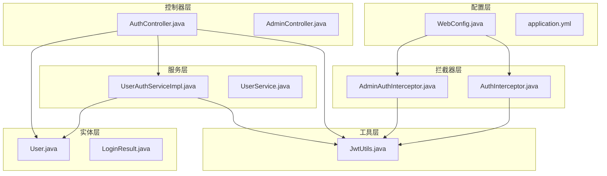
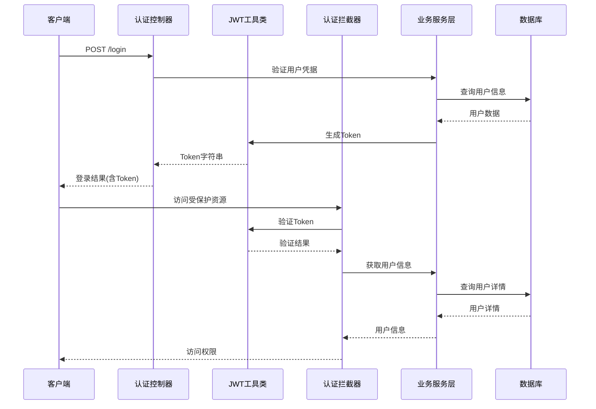
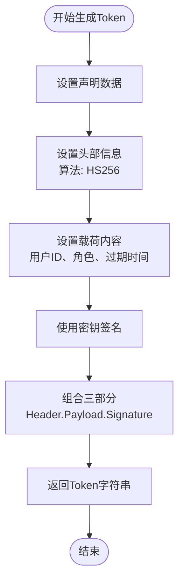
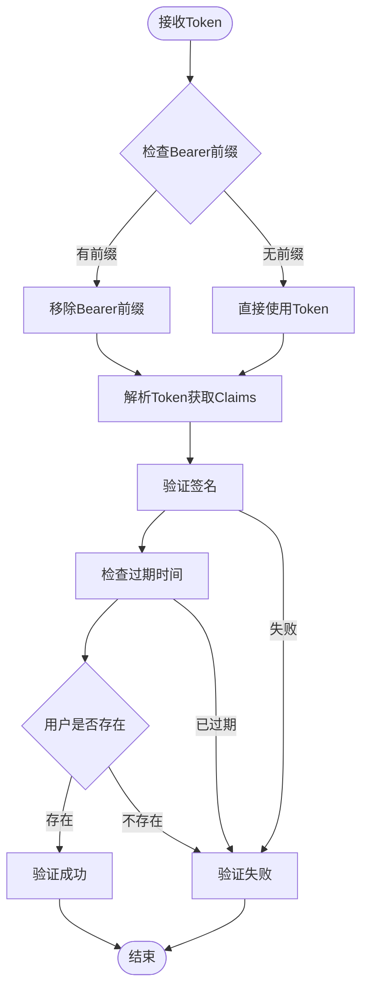
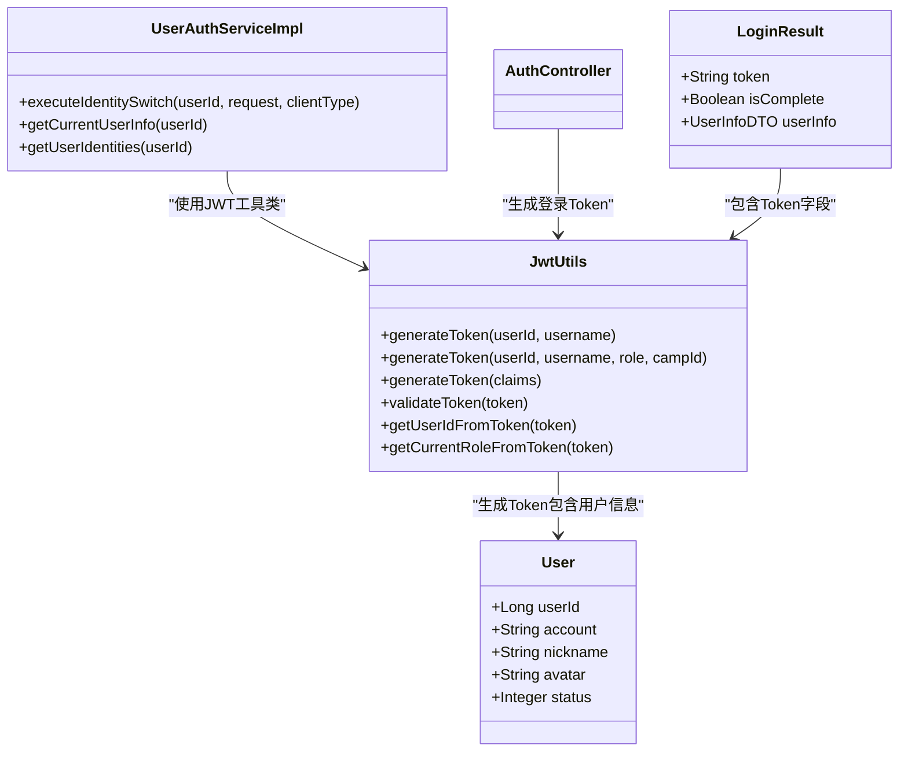
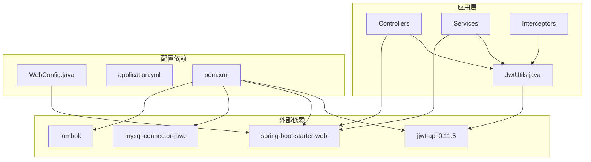

# JWT Token管理

<cite>
**本文引用的文件**
- [JwtUtils.java](file://src/main/java/com/daily/dailychineseculture/util/JwtUtils.java)
- [AuthController.java](file://src/main/java/com/daily/dailychineseculture/controller/AuthController.java)
- [UserAuthServiceImpl.java](file://src/main/java/com/daily/dailychineseculture/service/impl/UserAuthServiceImpl.java)
- [AuthInterceptor.java](file://src/main/java/com/daily/dailychineseculture/interceptor/AuthInterceptor.java)
- [AdminAuthInterceptor.java](file://src/main/java/com/daily/dailychineseculture/interceptor/AdminAuthInterceptor.java)
- [WebConfig.java](file://src/main/java/com/daily/dailychineseculture/config/WebConfig.java)
- [application.yml](file://src/main/resources/application.yml)
- [pom.xml](file://pom.xml)
- [LoginResult.java](file://src/main/java/com/daily/dailychineseculture/dto/LoginResult.java)
- [User.java](file://src/main/java/com/daily/dailychineseculture/entity/User.java)
</cite>

## 目录
1. [简介](#简介)
2. [项目结构](#项目结构)
3. [核心组件](#核心组件)
4. [架构概览](#架构概览)
5. [详细组件分析](#详细组件分析)
6. [依赖分析](#依赖分析)
7. [性能考虑](#性能考虑)
8. [故障排除指南](#故障排除指南)
9. [结论](#结论)
10. [附录](#附录)

## 简介
本项目实现了基于JWT（JSON Web Token）的认证与授权系统，提供了完整的Token生成、验证、解析和刷新机制。系统采用Spring Boot框架，结合Spring MVC拦截器实现统一的认证控制，支持多种用户身份和角色管理。

JWT是一种开放标准（RFC 7519），用于在网络应用间安全地传输声明（claims）。它由三部分组成：头部（Header）、载荷（Payload）和签名（Signature），通过点号（.）连接形成紧凑的字符串。

## 项目结构
项目采用标准的Spring Boot目录结构，JWT相关功能分布在以下模块：



**图表来源**
- [WebConfig.java:18-103](file://src/main/java/com/daily/dailychineseculture/config/WebConfig.java#L18-L103)
- [JwtUtils.java:21-206](file://src/main/java/com/daily/dailychineseculture/util/JwtUtils.java#L21-L206)

**章节来源**
- [WebConfig.java:18-103](file://src/main/java/com/daily/dailychineseculture/config/WebConfig.java#L18-L103)
- [application.yml:1-33](file://src/main/resources/application.yml#L1-L33)

## 核心组件
系统的核心组件包括JWT工具类、认证控制器、拦截器和配置类，它们协同工作实现完整的认证流程。

### JWT工具类（JwtUtils）
JWT工具类是整个认证系统的核心，负责Token的生成、解析和验证。它提供了多种Token生成方法，支持不同的用户身份和角色配置。

主要功能特性：
- **Token生成**：支持简化版和多角色Token生成
- **Token解析**：提取用户ID、角色信息等关键数据
- **Token验证**：检查Token的有效性和过期状态
- **签名验证**：确保Token的完整性和真实性

**章节来源**
- [JwtUtils.java:21-206](file://src/main/java/com/daily/dailychineseculture/util/JwtUtils.java#L21-L206)

### 认证控制器（AuthController）
认证控制器处理用户登录、微信登录、用户信息获取等核心认证功能。它直接依赖JWT工具类生成和验证Token。

关键功能：
- **账号密码登录**：验证用户凭据并生成Token
- **微信一键登录**：集成微信授权流程
- **用户信息管理**：获取和更新用户信息
- **身份切换**：支持多角色身份切换

**章节来源**
- [AuthController.java:19-516](file://src/main/java/com/daily/dailychineseculture/controller/AuthController.java#L19-L516)

### 拦截器系统
系统实现了两套拦截器，分别处理移动端和PC端的认证需求：

- **AuthInterceptor**：移动端C端用户认证拦截器
- **AdminAuthInterceptor**：PC端后台管理认证拦截器

**章节来源**
- [AuthInterceptor.java:17-74](file://src/main/java/com/daily/dailychineseculture/interceptor/AuthInterceptor.java#L17-L74)
- [AdminAuthInterceptor.java:15-93](file://src/main/java/com/daily/dailychineseculture/interceptor/AdminAuthInterceptor.java#L15-L93)

## 架构概览
系统采用分层架构设计，通过拦截器实现横切关注点，JWT工具类提供核心认证能力。



**图表来源**
- [AuthController.java:63-136](file://src/main/java/com/daily/dailychineseculture/controller/AuthController.java#L63-L136)
- [JwtUtils.java:37-95](file://src/main/java/com/daily/dailychineseculture/util/JwtUtils.java#L37-L95)
- [AuthInterceptor.java:25-72](file://src/main/java/com/daily/dailychineseculture/interceptor/AuthInterceptor.java#L25-L72)

## 详细组件分析

### JWT结构与生成算法

JWT由三个部分组成，每个部分通过点号连接：

#### 头部（Header）
头部包含令牌类型和签名算法信息，通常采用HS256算法。

#### 载荷（Payload）
载荷包含声明（Claims），是JWT的核心部分，包含：
- **标准声明**：iss（签发者）、exp（过期时间）、sub（主题）、aud（受众）等
- **私有声明**：userId、username、currentRole、campId等业务相关数据

#### 签名（Signature）
签名用于验证消息的完整性，防止Token被篡改。



**图表来源**
- [JwtUtils.java:50-69](file://src/main/java/com/daily/dailychineseculture/util/JwtUtils.java#L50-L69)
- [JwtUtils.java:77-95](file://src/main/java/com/daily/dailychineseculture/util/JwtUtils.java#L77-L95)

**章节来源**
- [JwtUtils.java:24-28](file://src/main/java/com/daily/dailychineseculture/util/JwtUtils.java#L24-L28)
- [JwtUtils.java:50-69](file://src/main/java/com/daily/dailychineseculture/util/JwtUtils.java#L50-L69)

### Token验证流程

Token验证是一个多步骤的过程，确保安全性的同时保持高效性：



**图表来源**
- [JwtUtils.java:180-190](file://src/main/java/com/daily/dailychineseculture/util/JwtUtils.java#L180-L190)
- [JwtUtils.java:165-172](file://src/main/java/com/daily/dailychineseculture/util/JwtUtils.java#L165-L172)

**章节来源**
- [JwtUtils.java:104-111](file://src/main/java/com/daily/dailychineseculture/util/JwtUtils.java#L104-L111)
- [JwtUtils.java:165-172](file://src/main/java/com/daily/dailychineseculture/util/JwtUtils.java#L165-L172)

### Token刷新策略

系统目前采用固定过期时间策略，建议实施以下刷新机制：

#### 策略一：短效Token + 刷新Token
- **访问Token**：短期有效（如15-30分钟）
- **刷新Token**：长期有效（如7-30天）
- **刷新流程**：访问Token过期时使用刷新Token获取新的访问Token

#### 策略二：动态刷新
- **智能刷新**：根据用户活跃度动态调整过期时间
- **安全刷新**：IP变更、设备变更时强制刷新

#### 策略三：撤销机制
- **黑名单管理**：维护已撤销Token的黑名单
- **会话管理**：支持单点登出和批量撤销

**章节来源**
- [JwtUtils.java:27-28](file://src/main/java/com/daily/dailychineseculture/util/JwtUtils.java#L27-L28)

### 多角色身份管理

系统支持多种用户身份和角色，通过Token中的声明实现灵活的身份切换：



**图表来源**
- [UserAuthServiceImpl.java:80-117](file://src/main/java/com/daily/dailychineseculture/service/impl/UserAuthServiceImpl.java#L80-L117)
- [JwtUtils.java:50-95](file://src/main/java/com/daily/dailychineseculture/util/JwtUtils.java#L50-L95)

**章节来源**
- [UserAuthServiceImpl.java:74-117](file://src/main/java/com/daily/dailychineseculture/service/impl/UserAuthServiceImpl.java#L74-L117)
- [LoginResult.java:10-27](file://src/main/java/com/daily/dailychineseculture/dto/LoginResult.java#L10-L27)

## 依赖分析

系统依赖关系清晰，主要依赖包括JWT库、Spring Boot框架和数据库连接。



**图表来源**
- [pom.xml:71-88](file://pom.xml#L71-L88)
- [WebConfig.java:19-28](file://src/main/java/com/daily/dailychineseculture/config/WebConfig.java#L19-L28)

**章节来源**
- [pom.xml:71-88](file://pom.xml#L71-L88)
- [WebConfig.java:24-28](file://src/main/java/com/daily/dailychineseculture/config/WebConfig.java#L24-L28)

## 性能考虑

### Token生成性能
- **内存管理**：使用静态密钥避免频繁生成密钥开销
- **时间戳精度**：精确到毫秒确保过期时间准确性
- **声明优化**：只包含必要声明减少Token大小

### Token验证性能
- **缓存策略**：可以考虑缓存最近使用的Token验证结果
- **异步验证**：对于高并发场景可考虑异步验证机制
- **批处理验证**：批量验证多个Token时的优化

### 内存和资源管理
- **连接池**：合理配置数据库连接池
- **垃圾回收**：避免Token字符串在内存中长时间驻留
- **监控指标**：监控Token生成和验证的性能指标

## 故障排除指南

### 常见问题诊断

#### Token验证失败
**症状**：用户登录后立即被拒绝
**可能原因**：
- Token过期时间设置过短
- 服务器时间不同步
- 密钥不匹配

**解决方案**：
- 检查服务器时间配置
- 验证密钥一致性
- 调整过期时间设置

#### 拦截器配置问题
**症状**：某些接口无法访问或认证失效
**可能原因**：
- 拦截器路径配置错误
- 请求头格式不正确
- Token格式不符合要求

**解决方案**：
- 检查WebConfig中的拦截器配置
- 确认Authorization头格式
- 验证Token生成和解析逻辑

#### 微信登录问题
**症状**：微信一键登录失败
**可能原因**：
- 微信AppID或Secret配置错误
- 网络连接问题
- 微信API接口变更

**解决方案**：
- 验证微信配置参数
- 检查网络连接状态
- 查看微信API文档更新

**章节来源**
- [AuthInterceptor.java:45-65](file://src/main/java/com/daily/dailychineseculture/interceptor/AuthInterceptor.java#L45-L65)
- [AdminAuthInterceptor.java:38-60](file://src/main/java/com/daily/dailychineseculture/interceptor/AdminAuthInterceptor.java#L38-L60)

## 结论

本JWT Token管理系统实现了完整的认证与授权功能，具有以下特点：

### 技术优势
- **模块化设计**：清晰的分层架构便于维护和扩展
- **安全性保障**：采用标准JWT协议和HS256算法
- **灵活性**：支持多角色身份管理和动态Token生成
- **易用性**：简洁的API接口和完善的错误处理

### 应用场景
- **接口调用**：RESTful API的安全访问控制
- **权限验证**：基于角色的细粒度权限管理
- **会话管理**：无状态的用户会话管理机制
- **身份切换**：支持多角色和多身份的灵活切换

### 改进建议
- **引入刷新机制**：实现短期访问Token和长期刷新Token的组合
- **增强安全措施**：添加IP白名单、设备指纹等安全控制
- **性能优化**：实现Token缓存和异步验证机制
- **监控完善**：增加详细的日志记录和性能监控

该系统为日常中国传统文化学习平台提供了可靠的身份认证基础，支持多种用户场景和业务需求。

## 附录

### 配置参数说明

| 参数名称 | 默认值 | 说明 | 类型 |
|---------|--------|------|------|
| server.port | 8080 | 服务器端口 | Integer |
| wx.appid | wx58b4d74c673f584c | 微信小程序AppID | String |
| wx.secret | 1ffaef2d4f60b39e18dea3e19f0c924b | 微信小程序Secret | String |
| file.upload-dir | ./uploads/ | 文件上传目录 | String |
| file.max-size | 524288000 | 文件最大大小(字节) | Long |

### 使用示例

#### 基础Token生成
```java
// 生成简单Token
String token = jwtUtils.generateToken(userId, username);

// 生成多角色Token
String token = jwtUtils.generateToken(userId, username, role, campId);
```

#### Token验证
```java
// 验证Token有效性
boolean isValid = jwtUtils.validateToken(token);

// 获取用户ID
Long userId = jwtUtils.getUserIdFromToken(token);
```

#### 控制器中使用
```java
@PostMapping("/login")
public Result<LoginResult> login(@RequestBody LoginRequest request) {
    // 验证用户凭据...
    String token = jwtUtils.generateToken(user.getUserId(), user.getAccount());
    return Result.success(buildLoginResult(user, isComplete, token));
}
```

**章节来源**
- [application.yml:24-33](file://src/main/resources/application.yml#L24-L33)
- [JwtUtils.java:37-95](file://src/main/java/com/daily/dailychineseculture/util/JwtUtils.java#L37-L95)