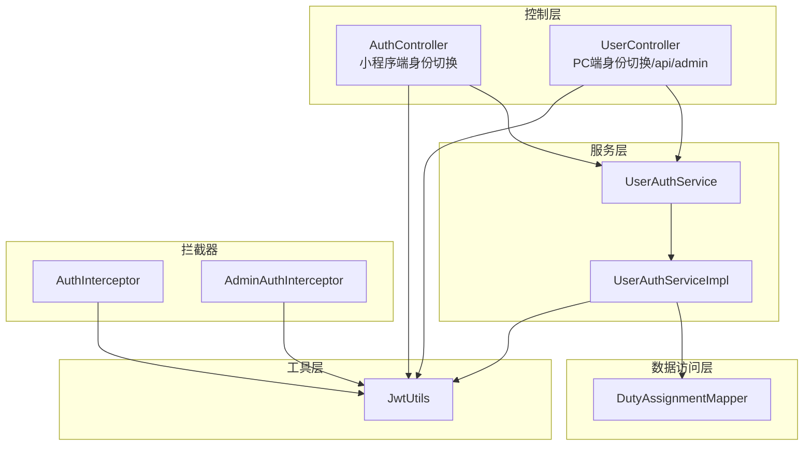
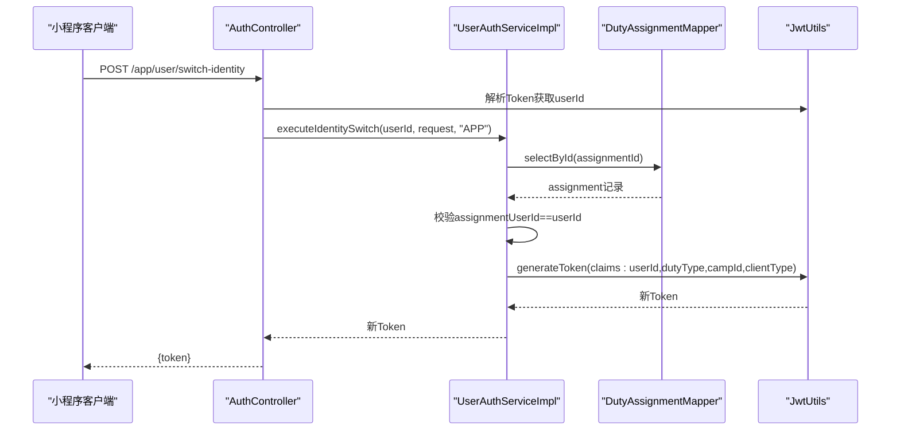
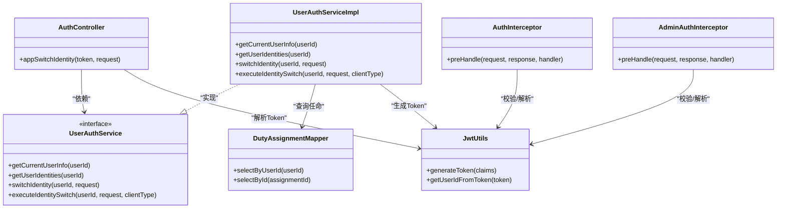
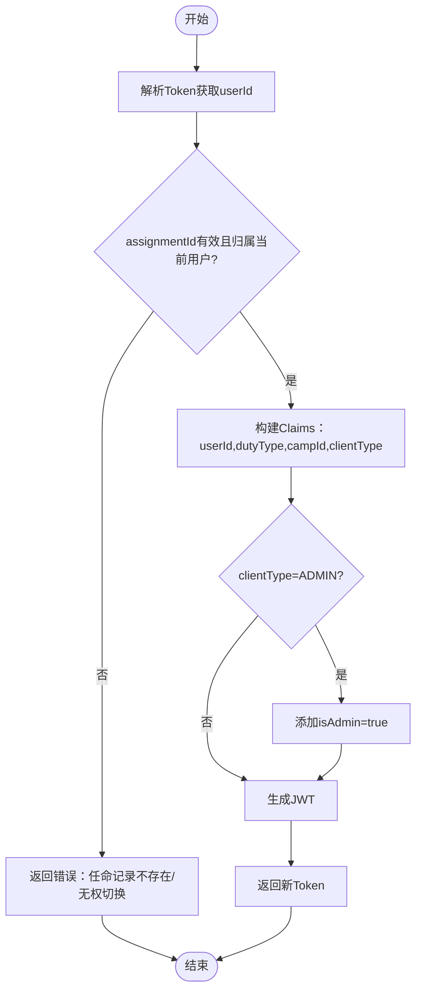

# 多角色身份切换

<cite>
**本文引用的文件**
- [SwitchIdentityRequest.java](file://src/main/java/com/daily/dailychineseculture/dto/SwitchIdentityRequest.java)
- [UserIdentityDTO.java](file://src/main/java/com/daily/dailychineseculture/dto/UserIdentityDTO.java)
- [UserCurrentInfoDTO.java](file://src/main/java/com/daily/dailychineseculture/dto/UserCurrentInfoDTO.java)
- [AuthController.java](file://src/main/java/com/daily/dailychineseculture/controller/AuthController.java)
- [UserAuthService.java](file://src/main/java/com/daily/dailychineseculture/service/UserAuthService.java)
- [UserAuthServiceImpl.java](file://src/main/java/com/daily/dailychineseculture/service/impl/UserAuthServiceImpl.java)
- [JwtUtils.java](file://src/main/java/com/daily/dailychineseculture/util/JwtUtils.java)
- [DutyAssignmentMapper.java](file://src/main/java/com/daily/dailychineseculture/mapper/DutyAssignmentMapper.java)
- [AuthInterceptor.java](file://src/main/java/com/daily/dailychineseculture/interceptor/AuthInterceptor.java)
- [AdminAuthInterceptor.java](file://src/main/java/com/daily/dailychineseculture/interceptor/AdminAuthInterceptor.java)
- [WebConfig.java](file://src/main/java/com/daily/dailychineseculture/config/WebConfig.java)
- [多端身份切换 API - 最终实施方案.md](file://doc/多端身份切换 API - 最终实施方案.md)
- [多端身份切换 API - 快速参考指南.md](file://doc/多端身份切换 API - 快速参考指南.md)
- [身份切换链路安全审计报告.md](file://doc/身份切换链路安全审计报告.md)
</cite>

## 目录
1. [简介](#简介)
2. [项目结构](#项目结构)
3. [核心组件](#核心组件)
4. [架构总览](#架构总览)
5. [详细组件分析](#详细组件分析)
6. [依赖关系分析](#依赖关系分析)
7. [性能考量](#性能考量)
8. [故障排查指南](#故障排查指南)
9. [结论](#结论)
10. [附录](#附录)

## 简介
本文件系统性阐述“多角色身份切换”功能的设计与实现，覆盖以下要点：
- 支持的身份角色类型与职责来源（课程管理员、志愿者、学班等）
- 动态角色切换的触发条件、流程与Token更新机制
- 权限验证、角色变更与会话管理、状态同步
- 安全考虑（权限矩阵检查、会话管理、状态同步）
- 完整接口使用示例（请求参数、响应格式、错误处理）
- 角色权限映射表、切换流程图、安全最佳实践
- 小程序端专用实现与兼容性处理

## 项目结构
围绕身份切换的关键代码分布在以下层次：
- 控制层：AuthController（小程序端）、UserController（PC端，已迁移至/api/admin前缀）
- 服务层：UserAuthService接口及其实现UserAuthServiceImpl
- 数据访问层：DutyAssignmentMapper（职责任命表）
- 工具层：JwtUtils（Token生成与解析）
- 拦截器：AuthInterceptor（移动端通用）、AdminAuthInterceptor（PC后台）
- 配置：WebConfig（拦截器注册与路径排除）

图表来源
- [AuthController.java:409-432](file://src/main/java/com/daily/dailychineseculture/controller/AuthController.java#L409-L432)
- [UserAuthServiceImpl.java:79-117](file://src/main/java/com/daily/dailychineseculture/service/impl/UserAuthServiceImpl.java#L79-L117)
- [DutyAssignmentMapper.java:50-69](file://src/main/java/com/daily/dailychineseculture/mapper/DutyAssignmentMapper.java#L50-L69)
- [JwtUtils.java:77-95](file://src/main/java/com/daily/dailychineseculture/util/JwtUtils.java#L77-L95)
- [AuthInterceptor.java:25-72](file://src/main/java/com/daily/dailychineseculture/interceptor/AuthInterceptor.java#L25-L72)
- [AdminAuthInterceptor.java:24-82](file://src/main/java/com/daily/dailychineseculture/interceptor/AdminAuthInterceptor.java#L24-L82)

章节来源
- [AuthController.java:409-432](file://src/main/java/com/daily/dailychineseculture/controller/AuthController.java#L409-L432)
- [UserAuthServiceImpl.java:79-117](file://src/main/java/com/daily/dailychineseculture/service/impl/UserAuthServiceImpl.java#L79-L117)
- [DutyAssignmentMapper.java:50-69](file://src/main/java/com/daily/dailychineseculture/mapper/DutyAssignmentMapper.java#L50-L69)
- [JwtUtils.java:77-95](file://src/main/java/com/daily/dailychineseculture/util/JwtUtils.java#L77-L95)
- [AuthInterceptor.java:25-72](file://src/main/java/com/daily/dailychineseculture/interceptor/AuthInterceptor.java#L25-L72)
- [AdminAuthInterceptor.java:24-82](file://src/main/java/com/daily/dailychineseculture/interceptor/AdminAuthInterceptor.java#L24-L82)

## 核心组件
- 身份切换请求DTO：SwitchIdentityRequest，包含assignmentId、dutyType、identity（兼容字段）
- 身份信息DTO：UserIdentityDTO，封装assignmentId、dutyType、dutyName、campId、campName
- 当前用户信息DTO：UserCurrentInfoDTO，封装userId、昵称、头像、当前职责类型与名称、未读通知数
- 控制器：AuthController提供小程序端身份切换接口；UserController提供PC端身份切换接口（已迁移至/api/admin前缀）
- 服务接口与实现：UserAuthService与UserAuthServiceImpl，负责校验任命记录、生成新Token
- 数据访问：DutyAssignmentMapper，查询任命记录与营期信息
- 工具：JwtUtils，生成/解析Token，支持自定义Claims
- 拦截器：AuthInterceptor（移动端通用）、AdminAuthInterceptor（PC后台），负责Token校验与上下文注入

章节来源
- [SwitchIdentityRequest.java:9-25](file://src/main/java/com/daily/dailychineseculture/dto/SwitchIdentityRequest.java#L9-L25)
- [UserIdentityDTO.java:17-48](file://src/main/java/com/daily/dailychineseculture/dto/UserIdentityDTO.java#L17-L48)
- [UserCurrentInfoDTO.java:7-60](file://src/main/java/com/daily/dailychineseculture/dto/UserCurrentInfoDTO.java#L7-L60)
- [AuthController.java:409-432](file://src/main/java/com/daily/dailychineseculture/controller/AuthController.java#L409-L432)
- [UserAuthService.java:12-48](file://src/main/java/com/daily/dailychineseculture/service/UserAuthService.java#L12-L48)
- [UserAuthServiceImpl.java:79-117](file://src/main/java/com/daily/dailychineseculture/service/impl/UserAuthServiceImpl.java#L79-L117)
- [DutyAssignmentMapper.java:50-69](file://src/main/java/com/daily/dailychineseculture/mapper/DutyAssignmentMapper.java#L50-L69)
- [JwtUtils.java:77-95](file://src/main/java/com/daily/dailychineseculture/util/JwtUtils.java#L77-L95)
- [AuthInterceptor.java:25-72](file://src/main/java/com/daily/dailychineseculture/interceptor/AuthInterceptor.java#L25-L72)
- [AdminAuthInterceptor.java:24-82](file://src/main/java/com/daily/dailychineseculture/interceptor/AdminAuthInterceptor.java#L24-L82)

## 架构总览
身份切换采用“多端隔离 + 服务复用”的架构模式：
- 小程序端：/app/user/switch-identity，解析Token获取userId，调用UserAuthService.executeIdentitySwitch(clientType=APP)
- PC端：/api/admin/user/switch-identity，由AdminAuthInterceptor注入userId，调用相同服务方法（clientType=ADMIN）
- 服务层统一校验任命记录归属，生成包含dutyType、campId、clientType的JWT，PC端额外包含isAdmin=true

图表来源
- [AuthController.java:409-432](file://src/main/java/com/daily/dailychineseculture/controller/AuthController.java#L409-L432)
- [UserAuthServiceImpl.java:79-117](file://src/main/java/com/daily/dailychineseculture/service/impl/UserAuthServiceImpl.java#L79-L117)
- [DutyAssignmentMapper.java:64-69](file://src/main/java/com/daily/dailychineseculture/mapper/DutyAssignmentMapper.java#L64-L69)
- [JwtUtils.java:77-95](file://src/main/java/com/daily/dailychineseculture/util/JwtUtils.java#L77-L95)

## 详细组件分析

### 身份类型与职责来源
- 职责类型（dutyType）来源于任命记录表t_duty_assignment，支持课程管理员、学班、志愿者等
- 若campId为空，表示“全局教务”，否则指向具体营期
- dutyName为中文展示名，当前实现直接使用dutyType

章节来源
- [UserIdentityDTO.java:22-47](file://src/main/java/com/daily/dailychineseculture/dto/UserIdentityDTO.java#L22-L47)
- [UserAuthServiceImpl.java:148-166](file://src/main/java/com/daily/dailychineseculture/service/impl/UserAuthServiceImpl.java#L148-L166)

### 触发条件与切换流程
- 触发条件：前端调用身份切换接口，携带assignmentId
- 校验逻辑：服务层先查询任命记录是否存在且归属当前用户
- 角色变更：生成包含新dutyType、campId的JWT，PC端追加isAdmin=true
- Token更新：返回新Token给前端，前端替换本地存储的Token

章节来源
- [UserAuthServiceImpl.java:80-117](file://src/main/java/com/daily/dailychineseculture/service/impl/UserAuthServiceImpl.java#L80-L117)
- [DutyAssignmentMapper.java:64-69](file://src/main/java/com/daily/dailychineseculture/mapper/DutyAssignmentMapper.java#L64-L69)

### 权限验证与拦截器
- AuthInterceptor：通用移动端拦截器，校验Token并注入userId
- AdminAuthInterceptor：PC后台拦截器，校验Token并注入userId/currentRole/campId
- 路径规则：/api/admin/**由AdminAuthInterceptor拦截；/app/**由AuthInterceptor拦截

章节来源
- [AuthInterceptor.java:25-72](file://src/main/java/com/daily/dailychineseculture/interceptor/AuthInterceptor.java#L25-L72)
- [AdminAuthInterceptor.java:24-82](file://src/main/java/com/daily/dailychineseculture/interceptor/AdminAuthInterceptor.java#L24-L82)
- [WebConfig.java:48-103](file://src/main/java/com/daily/dailychineseculture/config/WebConfig.java#L48-L103)

### Token载荷与客户端类型
- PC端Token包含：userId、dutyType、campId、clientType=ADMIN、isAdmin=true
- 小程序端Token包含：userId、dutyType、campId、clientType=APP
- 生成方式：JwtUtils.generateToken(自定义claims)

章节来源
- [UserAuthServiceImpl.java:96-116](file://src/main/java/com/daily/dailychineseculture/service/impl/UserAuthServiceImpl.java#L96-L116)
- [JwtUtils.java:77-95](file://src/main/java/com/daily/dailychineseculture/util/JwtUtils.java#L77-L95)

### 小程序端专用实现与兼容性
- 小程序端接口：/app/user/switch-identity，使用@RequestHeader解析Token
- 兼容性：保留旧版identity字段（字符串类型），但不再使用
- 响应格式：Result包装，返回token字段

章节来源
- [AuthController.java:409-432](file://src/main/java/com/daily/dailychineseculture/controller/AuthController.java#L409-L432)
- [多端身份切换 API - 最终实施方案.md:28-32](file://doc/多端身份切换 API - 最终实施方案.md#L28-L32)

### 接口使用示例与错误处理
- 小程序端请求：POST /app/user/switch-identity，Authorization头携带Token，Body为{assignmentId}
- PC端请求：POST /api/admin/user/switch-identity，由拦截器注入userId
- 成功响应：包含新token
- 错误处理：任命记录不存在、无权切换、Token无效、服务器异常等

章节来源
- [多端身份切换 API - 快速参考指南.md:148-167](file://doc/多端身份切换 API - 快速参考指南.md#L148-L167)
- [多端身份切换 API - 最终实施方案.md:114-136](file://doc/多端身份切换 API - 最终实施方案.md#L114-L136)

## 依赖关系分析
- 控制器依赖服务接口，服务实现依赖Mapper与JwtUtils
- 拦截器依赖JwtUtils进行Token校验与解析
- WebConfig统一注册拦截器并配置路径排除

图表来源
- [AuthController.java:409-432](file://src/main/java/com/daily/dailychineseculture/controller/AuthController.java#L409-L432)
- [UserAuthService.java:12-48](file://src/main/java/com/daily/dailychineseculture/service/UserAuthService.java#L12-L48)
- [UserAuthServiceImpl.java:79-117](file://src/main/java/com/daily/dailychineseculture/service/impl/UserAuthServiceImpl.java#L79-L117)
- [DutyAssignmentMapper.java:50-69](file://src/main/java/com/daily/dailychineseculture/mapper/DutyAssignmentMapper.java#L50-L69)
- [JwtUtils.java:77-95](file://src/main/java/com/daily/dailychineseculture/util/JwtUtils.java#L77-L95)
- [AuthInterceptor.java:25-72](file://src/main/java/com/daily/dailychineseculture/interceptor/AuthInterceptor.java#L25-L72)
- [AdminAuthInterceptor.java:24-82](file://src/main/java/com/daily/dailychineseculture/interceptor/AdminAuthInterceptor.java#L24-L82)

## 性能考量
- Token生成为纯内存操作，开销极低
- 任命记录查询为单条主键查询，复杂度O(1)
- 建议：避免频繁切换；在前端缓存身份列表，减少重复请求

## 故障排查指南
常见问题与定位思路：
- Token无效或过期：检查Authorization头格式与有效期
- 任命记录不存在：确认assignmentId是否正确
- 无权切换：确认assignmentUserId与当前用户一致
- 路径错误导致鉴权异常：PC端必须使用/api/admin前缀
- 拦截器路径覆盖不全：核对WebConfig中的排除规则

章节来源
- [身份切换链路安全审计报告.md:432-456](file://doc/身份切换链路安全审计报告.md#L432-L456)
- [WebConfig.java:48-103](file://src/main/java/com/daily/dailychineseculture/config/WebConfig.java#L48-L103)

## 结论
本实现以“多端隔离 + 服务复用”为核心，通过职责任命表驱动身份切换，借助JWT实现轻量级状态同步。PC端与小程序端分别采用不同拦截器与Token标记，满足差异化安全需求。建议尽快修复越权访问风险与字段命名不一致问题，进一步完善权限矩阵与日志审计。

## 附录

### 角色权限映射表
- 课程管理员：对应职责类型“COURSE_ADMIN”
- 志愿者：对应职责类型“志愿者”
- 学班：对应职责类型“学班”
- 全局教务：当campId为空时显示

章节来源
- [UserAuthServiceImpl.java:132-143](file://src/main/java/com/daily/dailychineseculture/service/impl/UserAuthServiceImpl.java#L132-L143)
- [UserIdentityDTO.java:38-47](file://src/main/java/com/daily/dailychineseculture/dto/UserIdentityDTO.java#L38-L47)

### 切换流程图

图表来源
- [UserAuthServiceImpl.java:80-117](file://src/main/java/com/daily/dailychineseculture/service/impl/UserAuthServiceImpl.java#L80-L117)
- [JwtUtils.java:77-95](file://src/main/java/com/daily/dailychineseculture/util/JwtUtils.java#L77-L95)

### 安全最佳实践
- 严格区分PC端与小程序端路径，避免鉴权绕过
- 在服务层增加isAdmin校验，防止越权切换管理员身份
- 统一角色字段命名，避免dutyType与currentRole混用
- 身份切换后记录日志，便于审计
- 考虑引入Token黑名单或活动会话管理，降低并发会话风险

章节来源
- [身份切换链路安全审计报告.md:444-456](file://doc/身份切换链路安全审计报告.md#L444-L456)
- [多端身份切换 API - 最终实施方案.md:285-301](file://doc/多端身份切换 API - 最终实施方案.md#L285-L301)