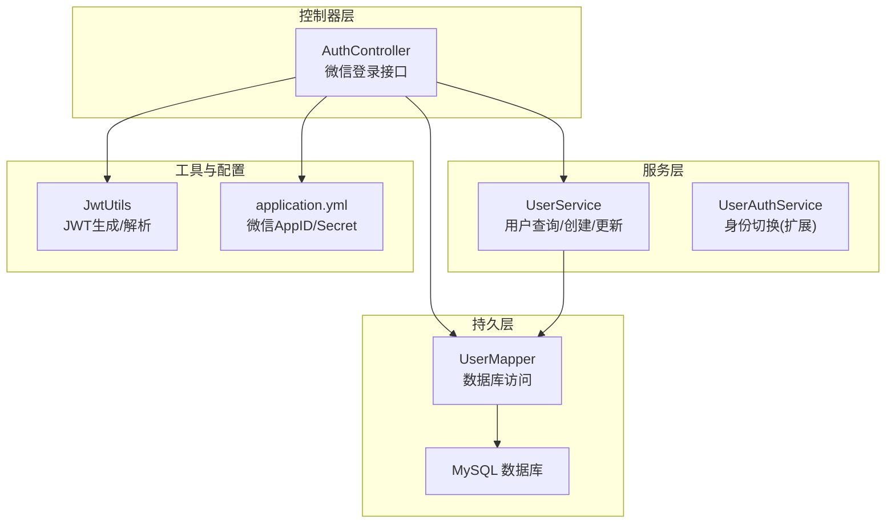
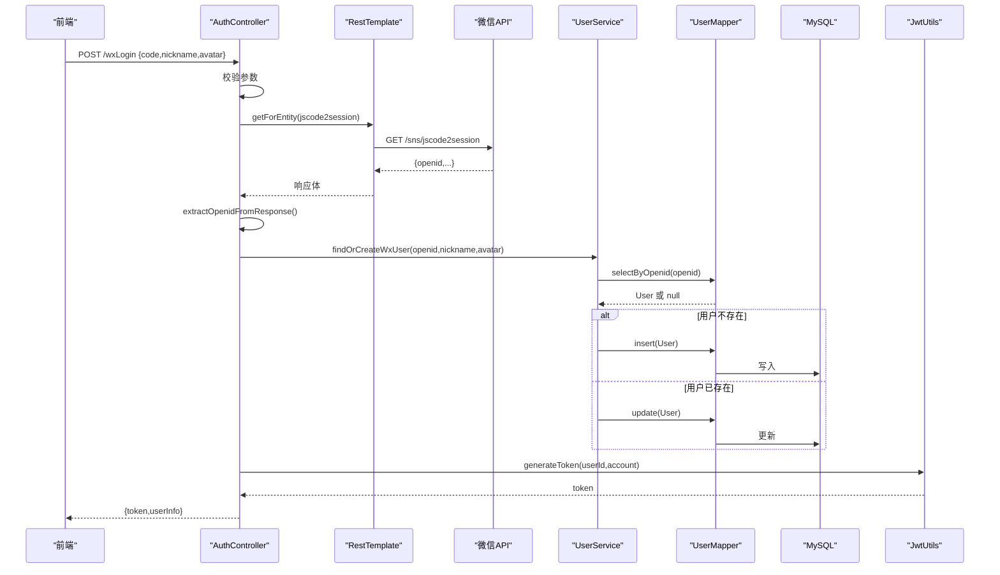
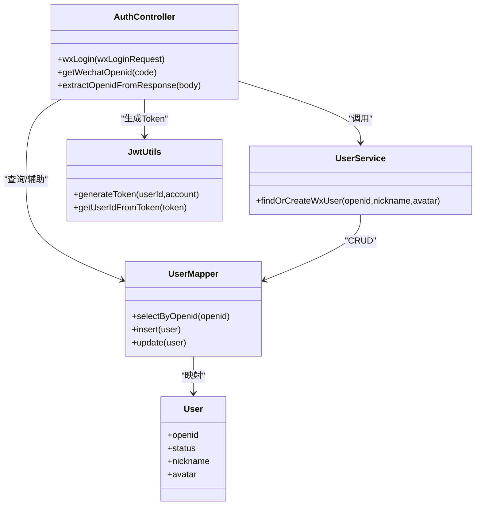

# 微信登录集成

<cite>
**本文引用的文件**
- [AuthController.java](file://src/main/java/com/daily/dailychineseculture/controller/AuthController.java)
- [WxLoginRequest.java](file://src/main/java/com/daily/dailychineseculture/dto/WxLoginRequest.java)
- [UserService.java](file://src/main/java/com/daily/dailychineseculture/service/UserService.java)
- [UserMapper.java](file://src/main/java/com/daily/dailychineseculture/mapper/UserMapper.java)
- [User.java](file://src/main/java/com/daily/dailychineseculture/entity/User.java)
- [JwtUtils.java](file://src/main/java/com/daily/dailychineseculture/util/JwtUtils.java)
- [application.yml](file://src/main/resources/application.yml)
</cite>

## 目录
1. [简介](#简介)
2. [项目结构](#项目结构)
3. [核心组件](#核心组件)
4. [架构总览](#架构总览)
5. [详细组件分析](#详细组件分析)
6. [依赖关系分析](#依赖关系分析)
7. [性能考量](#性能考量)
8. [故障排查指南](#故障排查指南)
9. [结论](#结论)
10. [附录](#附录)

## 简介
本文件面向“微信一键登录”的完整实现方案，基于现有后端代码进行系统化梳理与可视化呈现。内容覆盖：
- OAuth 2.0授权流程与jscode2session调用
- 授权码获取、用户信息交换与Token验证
- OpenID提取、用户信息映射与自动注册
- 微信开发者平台配置要点（AppID/Secret管理）
- 用户头像与昵称处理、用户状态检查与登录结果构建
- 微信登录流程图、时序图与状态转换图
- 调试技巧、常见问题与安全建议

## 项目结构
后端采用Spring Boot + MyBatis，微信登录相关能力集中在认证控制器、用户服务与工具类中，配置位于application.yml。

图表来源
- [AuthController.java:19-516](file://src/main/java/com/daily/dailychineseculture/controller/AuthController.java#L19-L516)
- [UserService.java:22-959](file://src/main/java/com/daily/dailychineseculture/service/UserService.java#L22-L959)
- [UserMapper.java:12-252](file://src/main/java/com/daily/dailychineseculture/mapper/UserMapper.java#L12-L252)
- [JwtUtils.java:21-206](file://src/main/java/com/daily/dailychineseculture/util/JwtUtils.java#L21-L206)
- [application.yml:24-33](file://src/main/resources/application.yml#L24-L33)

章节来源
- [AuthController.java:19-516](file://src/main/java/com/daily/dailychineseculture/controller/AuthController.java#L19-L516)
- [application.yml:24-33](file://src/main/resources/application.yml#L24-L33)

## 核心组件
- 认证控制器(AuthController)
  - 提供微信一键登录接口，负责参数校验、调用微信API获取OpenID、用户查询/创建、状态检查与Token生成。
- 用户服务(UserService)
  - 提供微信用户查找或创建逻辑，包含OpenID关联、默认账户名生成、头像与昵称更新等。
- 用户映射(UserMapper)
  - 提供按OpenID查询用户、插入与更新用户等数据库操作。
- JWT工具(JwtUtils)
  - 提供JWT生成、解析与校验，用于登录结果返回。
- 应用配置(application.yml)
  - 配置微信AppID与Secret，供AuthController调用。

章节来源
- [AuthController.java:141-190](file://src/main/java/com/daily/dailychineseculture/controller/AuthController.java#L141-L190)
- [UserService.java:250-294](file://src/main/java/com/daily/dailychineseculture/service/UserService.java#L250-L294)
- [UserMapper.java:63-66](file://src/main/java/com/daily/dailychineseculture/mapper/UserMapper.java#L63-L66)
- [JwtUtils.java:37-95](file://src/main/java/com/daily/dailychineseculture/util/JwtUtils.java#L37-L95)
- [application.yml:25-27](file://src/main/resources/application.yml#L25-L27)

## 架构总览
微信登录整体流程如下：前端获取授权码后，后端调用微信jscode2session接口换取OpenID，随后在本地数据库中查找或创建用户，并生成JWT返回给前端。

图表来源
- [AuthController.java:141-190](file://src/main/java/com/daily/dailychineseculture/controller/AuthController.java#L141-L190)
- [AuthController.java:465-515](file://src/main/java/com/daily/dailychineseculture/controller/AuthController.java#L465-L515)
- [UserService.java:250-294](file://src/main/java/com/daily/dailychineseculture/service/UserService.java#L250-L294)
- [UserMapper.java:63-66](file://src/main/java/com/daily/dailychineseculture/mapper/UserMapper.java#L63-L66)
- [JwtUtils.java:37-95](file://src/main/java/com/daily/dailychineseculture/util/JwtUtils.java#L37-L95)

## 详细组件分析

### 认证控制器(AuthController)
- 微信登录接口
  - 路径: POST /wxLogin
  - 参数: WxLoginRequest(code, nickname, avatar)
  - 校验: 缺少授权码或头像/昵称不完整则拒绝
  - OpenID获取: 调用getWechatOpenid(code)，内部构造jscode2session请求
  - 用户处理: 调用findOrCreateWxUser(openid, nickname, avatar)
  - 状态检查: 用户状态非1则拒绝
  - Token生成: 使用JwtUtils生成JWT
  - 结果封装: 返回token与userInfo

- jscode2session调用与响应解析
  - URL拼接: 使用配置的wx.appid与wx.secret
  - 调用方式: RestTemplate.getForEntity
  - 响应解析: extractOpenidFromResponse从JSON字符串中提取openid
  - 错误处理: 空响应、解析失败、异常均返回null并上抛

- 登录结果构建
  - userInfo包含userid、username、avatar、phone等
  - token有效期与签名算法由JwtUtils统一管理

章节来源
- [AuthController.java:141-190](file://src/main/java/com/daily/dailychineseculture/controller/AuthController.java#L141-L190)
- [AuthController.java:465-515](file://src/main/java/com/daily/dailychineseculture/controller/AuthController.java#L465-L515)
- [WxLoginRequest.java:8-24](file://src/main/java/com/daily/dailychineseculture/dto/WxLoginRequest.java#L8-L24)
- [application.yml:25-27](file://src/main/resources/application.yml#L25-L27)

### 用户服务(UserService)
- findOrCreateWxUser
  - 查询: 通过UserMapper.selectByOpenid(openid)
  - 创建: 生成userId、默认账户名、默认密码、状态与时间戳，插入数据库
  - 更新: 若昵称或头像变化则更新
  - 返回: 用户对象

- 其他相关能力
  - isVolunteer: 判断是否为志愿者
  - updateUserInfo: 更新昵称/头像
  - getUserProfile: 组装用户信息与统计指标

章节来源
- [UserService.java:250-294](file://src/main/java/com/daily/dailychineseculture/service/UserService.java#L250-L294)
- [UserMapper.java:63-66](file://src/main/java/com/daily/dailychineseculture/mapper/UserMapper.java#L63-L66)

### 用户映射(UserMapper)
- selectByOpenid: 根据OpenID查询用户
- insert: 插入用户
- update: 更新用户

章节来源
- [UserMapper.java:63-66](file://src/main/java/com/daily/dailychineseculture/mapper/UserMapper.java#L63-L66)
- [UserMapper.java:42-54](file://src/main/java/com/daily/dailychineseculture/mapper/UserMapper.java#L42-L54)

### JWT工具(JwtUtils)
- generateToken(userId, account): 生成JWT
- generateToken(claims): 支持自定义载荷
- 解析与校验: getUserIdFromToken、validateToken、isTokenExpired

章节来源
- [JwtUtils.java:37-95](file://src/main/java/com/daily/dailychineseculture/util/JwtUtils.java#L37-L95)
- [JwtUtils.java:104-141](file://src/main/java/com/daily/dailychineseculture/util/JwtUtils.java#L104-L141)

### 数据模型(User)
- 关键字段: openid、nickname、avatar、status等
- 与微信登录直接相关: openid用于唯一标识微信用户；status用于冻结控制

章节来源
- [User.java:67-74](file://src/main/java/com/daily/dailychineseculture/entity/User.java#L67-L74)

## 依赖关系分析
- 控制器依赖
  - AuthController依赖UserService、JwtUtils、RestTemplate、UserAuthService
  - 通过@Value注入wx.appid与wx.secret
- 服务层依赖
  - UserService依赖UserMapper与ID生成器
- 映射层依赖
  - UserMapper依赖MyBatis与数据库
- 工具层依赖
  - JwtUtils依赖jsonwebtoken库

图表来源
- [AuthController.java:19-516](file://src/main/java/com/daily/dailychineseculture/controller/AuthController.java#L19-L516)
- [UserService.java:22-959](file://src/main/java/com/daily/dailychineseculture/service/UserService.java#L22-L959)
- [UserMapper.java:12-252](file://src/main/java/com/daily/dailychineseculture/mapper/UserMapper.java#L12-L252)
- [JwtUtils.java:21-206](file://src/main/java/com/daily/dailychineseculture/util/JwtUtils.java#L21-L206)
- [User.java:10-87](file://src/main/java/com/daily/dailychineseculture/entity/User.java#L10-L87)

## 性能考量
- 网络调用
  - jscode2session为外部HTTP调用，建议在网关层或服务层增加超时与重试策略，避免阻塞主线程。
- 数据库访问
  - findOrCreateWxUser为单次查询与一次/多次写入，注意索引优化（openid唯一索引）。
- Token生成
  - JwtUtils使用对称加密，性能开销较小；建议集中管理密钥与过期时间。

[本节为通用建议，不直接分析具体文件]

## 故障排查指南
- 常见问题
  - 缺少授权码或头像/昵称不完整：接口直接返回错误
  - jscode2session返回空或解析失败：检查wx.appid与wx.secret是否正确
  - 用户状态非1被拒绝：检查数据库状态字段
  - 用户创建失败：检查数据库约束与ID生成器
- 调试技巧
  - 打印微信API响应体，定位响应格式与字段
  - 校验OpenID提取逻辑，确保JSON解析边界
  - 使用日志观察用户查询/创建路径
- 安全建议
  - 生产环境将密钥与AppID/Secret放入安全配置中心
  - 对外暴露的接口增加限流与防刷策略
  - JWT密钥定期轮换，避免硬编码

章节来源
- [AuthController.java:148-153](file://src/main/java/com/daily/dailychineseculture/controller/AuthController.java#L148-L153)
- [AuthController.java:465-515](file://src/main/java/com/daily/dailychineseculture/controller/AuthController.java#L465-L515)
- [UserService.java:250-294](file://src/main/java/com/daily/dailychineseculture/service/UserService.java#L250-L294)

## 结论
本实现以简洁清晰的方式完成了微信一键登录的关键闭环：授权码获取、OpenID解析、用户查询/创建、状态检查与Token下发。通过RestTemplate与自定义JSON解析，结合UserService与UserMapper，形成高内聚低耦合的模块化设计。建议后续在配置安全、网络超时与日志可观测性方面进一步加固。

[本节为总结性内容，不直接分析具体文件]

## 附录

### 微信开发者平台配置
- 配置项
  - wx.appid: 微信小程序AppID
  - wx.secret: 微信小程序AppSecret
- 配置位置
  - application.yml中定义

章节来源
- [application.yml:25-27](file://src/main/resources/application.yml#L25-L27)

### OAuth 2.0授权流程与jscode2session
- 授权流程
  - 前端使用wx.login获取临时授权码(code)
  - 后端调用微信jscode2session接口换取openid
  - 后端在本地数据库中查找或创建用户
  - 生成JWT返回前端
- jscode2session
  - URL: https://api.weixin.qq.com/sns/jscode2session
  - 参数: appid、secret、js_code、grant_type=authorization_code
  - 响应: 包含openid等字段

章节来源
- [AuthController.java:465-515](file://src/main/java/com/daily/dailychineseculture/controller/AuthController.java#L465-L515)

### 用户信息获取与绑定机制
- OpenID提取
  - 从微信响应体中提取openid
- 用户信息映射
  - nickname、avatar、status等字段映射至User实体
- 自动注册流程
  - 不存在用户时，生成默认账户名与默认密码，插入数据库
  - 存在用户时，若昵称或头像变化则更新

章节来源
- [UserService.java:250-294](file://src/main/java/com/daily/dailychineseculture/service/UserService.java#L250-L294)
- [UserMapper.java:63-66](file://src/main/java/com/daily/dailychineseculture/mapper/UserMapper.java#L63-L66)
- [User.java:67-74](file://src/main/java/com/daily/dailychineseculture/entity/User.java#L67-L74)

### 登录结果构建
- token: 使用JwtUtils生成
- userInfo: 包含userid、username、avatar、phone等
- isComplete: 由其他登录逻辑决定（此处为微信登录结果）

章节来源
- [AuthController.java:171-185](file://src/main/java/com/daily/dailychineseculture/controller/AuthController.java#L171-L185)
- [JwtUtils.java:37-95](file://src/main/java/com/daily/dailychineseculture/util/JwtUtils.java#L37-L95)