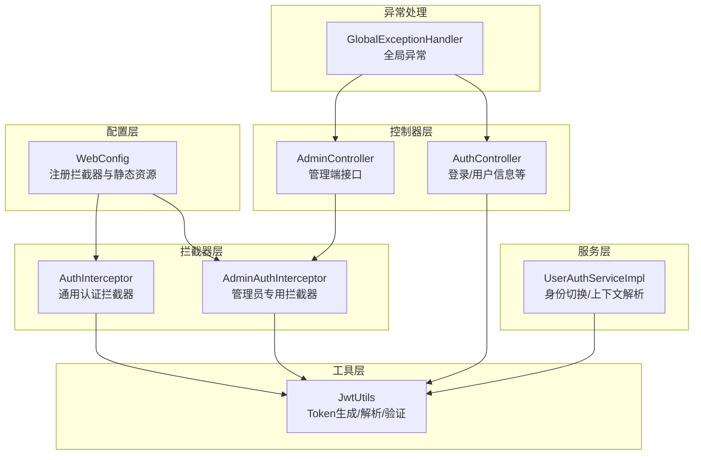
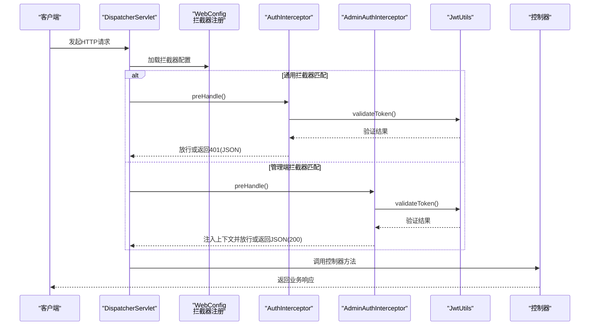
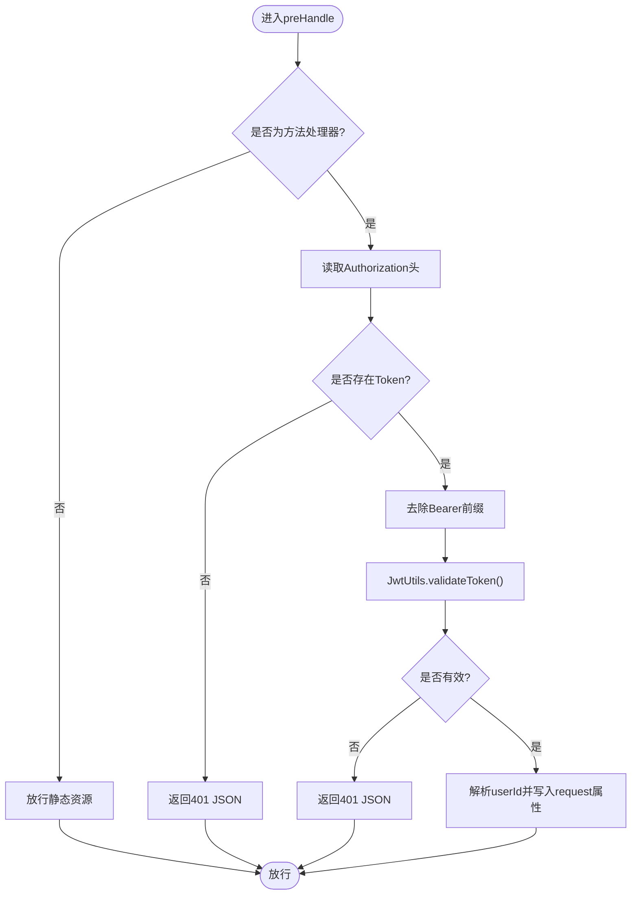
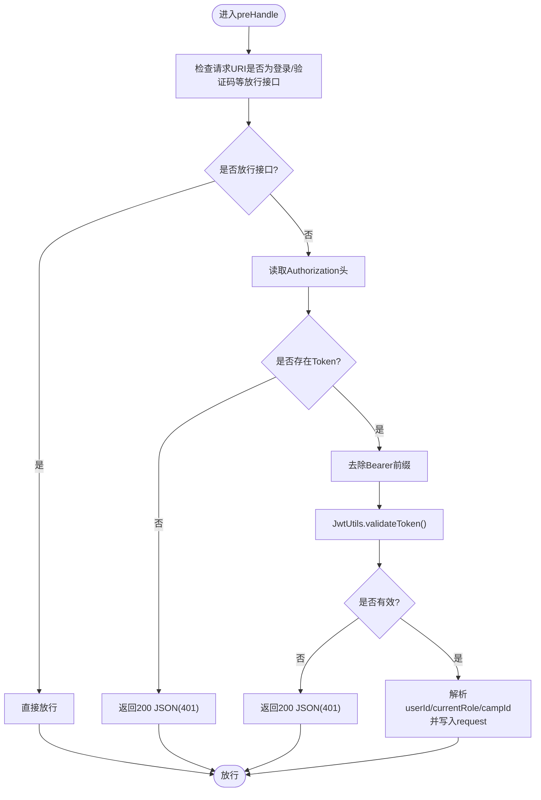
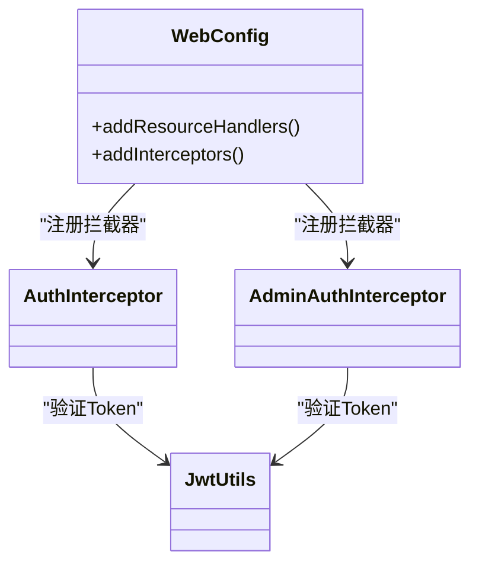
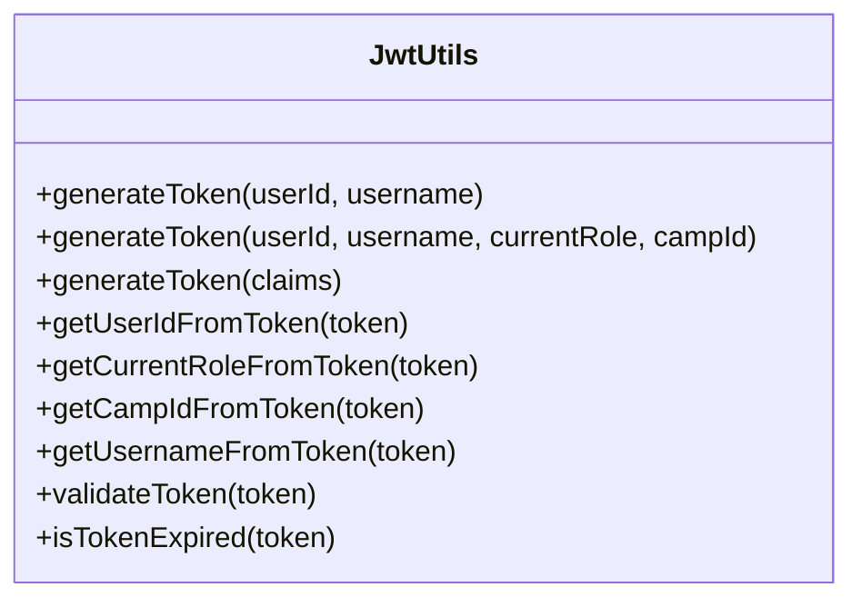
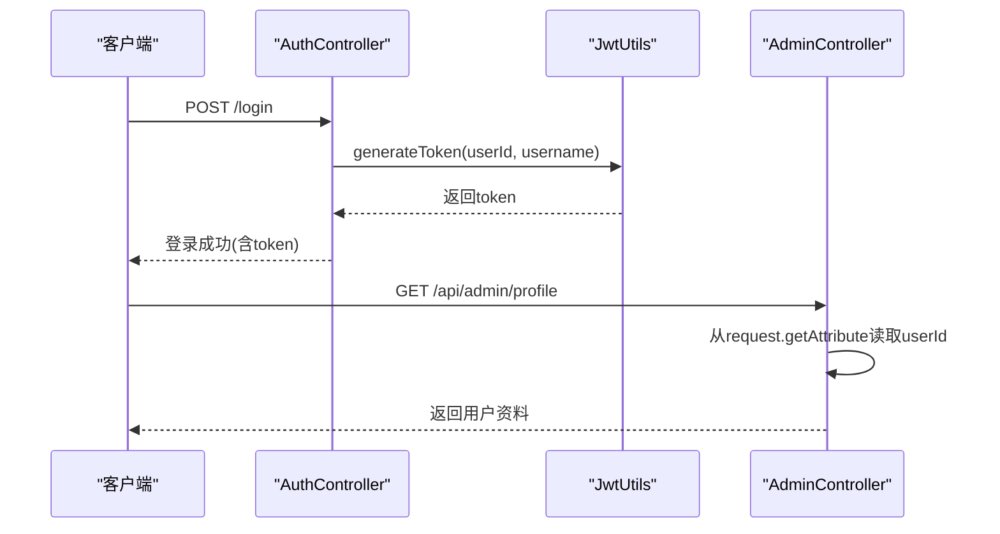
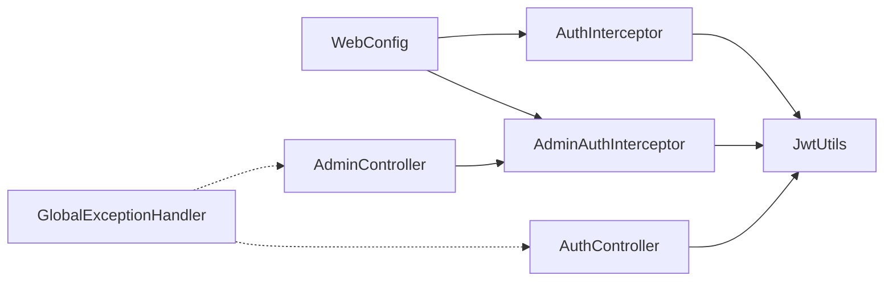

# 权限拦截器

<cite>
**本文引用的文件**
- [AuthInterceptor.java](file://src/main/java/com/daily/dailychineseculture/interceptor/AuthInterceptor.java)
- [AdminAuthInterceptor.java](file://src/main/java/com/daily/dailychineseculture/interceptor/AdminAuthInterceptor.java)
- [WebConfig.java](file://src/main/java/com/daily/dailychineseculture/config/WebConfig.java)
- [JwtUtils.java](file://src/main/java/com/daily/dailychineseculture/util/JwtUtils.java)
- [AuthController.java](file://src/main/java/com/daily/dailychineseculture/controller/AuthController.java)
- [AdminController.java](file://src/main/java/com/daily/dailychineseculture/controller/AdminController.java)
- [UserAuthServiceImpl.java](file://src/main/java/com/daily/dailychineseculture/service/impl/UserAuthServiceImpl.java)
- [GlobalExceptionHandler.java](file://src/main/java/com/daily/dailychineseculture/common/GlobalExceptionHandler.java)
- [application.yml](file://src/main/resources/application.yml)
</cite>

## 目录
1. [简介](#简介)
2. [项目结构](#项目结构)
3. [核心组件](#核心组件)
4. [架构总览](#架构总览)
5. [详细组件分析](#详细组件分析)
6. [依赖分析](#依赖分析)
7. [性能考虑](#性能考虑)
8. [故障排查指南](#故障排查指南)
9. [结论](#结论)
10. [附录](#附录)

## 简介
本文件系统性解析基于拦截器的权限控制机制，覆盖请求拦截、Token验证、权限检查流程，以及通用认证拦截器与管理员专用拦截器的差异与应用场景。文档还包含拦截器注册与配置、拦截路径设置、异常处理机制、扩展方法、自定义权限规则与动态权限计算建议、性能优化与缓存策略、调试技巧，以及与Spring Security的关系与替代方案。

## 项目结构
权限拦截器位于拦截器层，配合Web配置类进行注册与路径绑定；JWT工具类负责Token生成与解析；控制器通过拦截器注入的用户上下文进行业务处理；全局异常处理器统一兜底。

图表来源
- [WebConfig.java:47-103](file://src/main/java/com/daily/dailychineseculture/config/WebConfig.java#L47-L103)
- [AuthInterceptor.java:25-72](file://src/main/java/com/daily/dailychineseculture/interceptor/AuthInterceptor.java#L25-L72)
- [AdminAuthInterceptor.java:23-81](file://src/main/java/com/daily/dailychineseculture/interceptor/AdminAuthInterceptor.java#L23-L81)
- [JwtUtils.java:37-69](file://src/main/java/com/daily/dailychineseculture/util/JwtUtils.java#L37-L69)
- [AuthController.java:63-136](file://src/main/java/com/daily/dailychineseculture/controller/AuthController.java#L63-L136)
- [AdminController.java:45-68](file://src/main/java/com/daily/dailychineseculture/controller/AdminController.java#L45-L68)
- [UserAuthServiceImpl.java:80-117](file://src/main/java/com/daily/dailychineseculture/service/impl/UserAuthServiceImpl.java#L80-L117)
- [GlobalExceptionHandler.java:15-28](file://src/main/java/com/daily/dailychineseculture/common/GlobalExceptionHandler.java#L15-L28)

章节来源
- [WebConfig.java:18-104](file://src/main/java/com/daily/dailychineseculture/config/WebConfig.java#L18-L104)

## 核心组件
- 通用认证拦截器：对所有请求进行Token验证，将用户ID写入请求上下文，支持排除公开接口。
- 管理员专用拦截器：仅拦截管理端路径，对登录、验证码等接口放行，解析并注入用户ID、角色、营期ID等上下文。
- Web配置：注册拦截器并设置拦截路径与排除路径，同时配置静态资源映射。
- JWT工具：生成Token、解析用户信息、验证Token有效性。
- 控制器：登录接口生成Token，管理端接口读取请求上下文中的用户信息。
- 全局异常处理器：统一处理异常，避免泄露敏感信息。

章节来源
- [AuthInterceptor.java:16-72](file://src/main/java/com/daily/dailychineseculture/interceptor/AuthInterceptor.java#L16-L72)
- [AdminAuthInterceptor.java:14-81](file://src/main/java/com/daily/dailychineseculture/interceptor/AdminAuthInterceptor.java#L14-L81)
- [WebConfig.java:47-103](file://src/main/java/com/daily/dailychineseculture/config/WebConfig.java#L47-L103)
- [JwtUtils.java:37-172](file://src/main/java/com/daily/dailychineseculture/util/JwtUtils.java#L37-L172)
- [AuthController.java:63-136](file://src/main/java/com/daily/dailychineseculture/controller/AuthController.java#L63-L136)
- [AdminController.java:132-151](file://src/main/java/com/daily/dailychineseculture/controller/AdminController.java#L132-L151)
- [GlobalExceptionHandler.java:15-28](file://src/main/java/com/daily/dailychineseculture/common/GlobalExceptionHandler.java#L15-L28)

## 架构总览
下图展示了从请求进入应用到控制器处理的权限控制流程，包括拦截器链、Token验证与上下文注入。

图表来源
- [WebConfig.java:47-103](file://src/main/java/com/daily/dailychineseculture/config/WebConfig.java#L47-L103)
- [AuthInterceptor.java:25-72](file://src/main/java/com/daily/dailychineseculture/interceptor/AuthInterceptor.java#L25-L72)
- [AdminAuthInterceptor.java:23-81](file://src/main/java/com/daily/dailychineseculture/interceptor/AdminAuthInterceptor.java#L23-L81)
- [JwtUtils.java:165-172](file://src/main/java/com/daily/dailychineseculture/util/JwtUtils.java#L165-L172)

## 详细组件分析

### 通用认证拦截器（AuthInterceptor）
- 功能要点
  - 对非方法处理器（如静态资源）直接放行。
  - 从请求头读取Authorization，支持“Bearer ”前缀。
  - 使用JWT工具验证Token有效性，无效时返回401 JSON。
  - 成功时从Token解析用户ID并写入请求属性，供后续控制器使用。
- 适用场景
  - 移动端C端用户认证，统一拦截所有路径，排除登录、验证码、注册等公开接口。
- 扩展建议
  - 可增加免认证注解支持，按方法或类标注跳过认证。
  - 可在拦截器内加入角色/权限校验，结合业务需求细化。

图表来源
- [AuthInterceptor.java:25-72](file://src/main/java/com/daily/dailychineseculture/interceptor/AuthInterceptor.java#L25-L72)
- [JwtUtils.java:165-172](file://src/main/java/com/daily/dailychineseculture/util/JwtUtils.java#L165-L172)

章节来源
- [AuthInterceptor.java:16-72](file://src/main/java/com/daily/dailychineseculture/interceptor/AuthInterceptor.java#L16-L72)
- [WebConfig.java:49-88](file://src/main/java/com/daily/dailychineseculture/config/WebConfig.java#L49-L88)

### 管理员专用拦截器（AdminAuthInterceptor）
- 功能要点
  - 仅拦截/api/admin/**路径。
  - 放行登录、验证码等公开接口。
  - 从Authorization解析Token并验证，失败时返回200 JSON（便于前端统一处理）。
  - 成功时解析用户ID、当前角色、营期ID并写入请求属性。
- 适用场景
  - PC端后台管理接口，需要更严格的上下文注入与统一错误格式。
- 扩展建议
  - 可在此处加入角色/权限校验，按角色限制访问特定管理接口。
  - 可引入细粒度权限列表，结合业务模块进行动态权限计算。

图表来源
- [AdminAuthInterceptor.java:23-81](file://src/main/java/com/daily/dailychineseculture/interceptor/AdminAuthInterceptor.java#L23-L81)
- [JwtUtils.java:165-172](file://src/main/java/com/daily/dailychineseculture/util/JwtUtils.java#L165-L172)

章节来源
- [AdminAuthInterceptor.java:14-81](file://src/main/java/com/daily/dailychineseculture/interceptor/AdminAuthInterceptor.java#L14-L81)
- [WebConfig.java:90-102](file://src/main/java/com/daily/dailychineseculture/config/WebConfig.java#L90-L102)

### Web配置与拦截器注册（WebConfig）
- 注册通用认证拦截器：拦截所有路径，排除登录、验证码、注册、首页展示数据、静态资源、OPTIONS预检等。
- 注册管理员拦截器：仅拦截/api/admin/**，排除登录、验证码、登录页所需公开接口。
- 静态资源映射：将/uploads/**映射到本地文件系统路径。

图表来源
- [WebConfig.java:47-103](file://src/main/java/com/daily/dailychineseculture/config/WebConfig.java#L47-L103)
- [AuthInterceptor.java:16-20](file://src/main/java/com/daily/dailychineseculture/interceptor/AuthInterceptor.java#L16-L20)
- [AdminAuthInterceptor.java:17-18](file://src/main/java/com/daily/dailychineseculture/interceptor/AdminAuthInterceptor.java#L17-L18)

章节来源
- [WebConfig.java:18-104](file://src/main/java/com/daily/dailychineseculture/config/WebConfig.java#L18-L104)

### JWT工具（JwtUtils）
- 生成Token：支持基础用户信息，以及多角色与营期ID等扩展字段。
- 解析与验证：解析用户ID、当前角色、营期ID、用户名；验证Token有效性与过期状态。
- 过期时间：默认7天。

图表来源
- [JwtUtils.java:37-172](file://src/main/java/com/daily/dailychineseculture/util/JwtUtils.java#L37-L172)

章节来源
- [JwtUtils.java:21-206](file://src/main/java/com/daily/dailychineseculture/util/JwtUtils.java#L21-L206)

### 控制器与上下文使用
- 登录接口：生成Token并返回给客户端。
- 管理端接口：从请求属性中读取userId等上下文信息，进行业务处理。
- 用户服务：身份切换时根据客户端类型生成不同Token载荷，支持ADMIN类型附加权限标记。

图表来源
- [AuthController.java:63-136](file://src/main/java/com/daily/dailychineseculture/controller/AuthController.java#L63-L136)
- [JwtUtils.java:37-69](file://src/main/java/com/daily/dailychineseculture/util/JwtUtils.java#L37-L69)
- [AdminController.java:132-151](file://src/main/java/com/daily/dailychineseculture/controller/AdminController.java#L132-L151)

章节来源
- [AuthController.java:63-136](file://src/main/java/com/daily/dailychineseculture/controller/AuthController.java#L63-L136)
- [AdminController.java:132-151](file://src/main/java/com/daily/dailychineseculture/controller/AdminController.java#L132-L151)
- [UserAuthServiceImpl.java:80-117](file://src/main/java/com/daily/dailychineseculture/service/impl/UserAuthServiceImpl.java#L80-L117)

### 异常处理机制
- 全局异常处理器统一捕获异常并返回标准错误响应，避免内部异常细节泄露。
- 管理端拦截器在Token解析失败时返回200 JSON，便于前端统一处理。

章节来源
- [GlobalExceptionHandler.java:15-28](file://src/main/java/com/daily/dailychineseculture/common/GlobalExceptionHandler.java#L15-L28)
- [AdminAuthInterceptor.java:40-79](file://src/main/java/com/daily/dailychineseculture/interceptor/AdminAuthInterceptor.java#L40-L79)

## 依赖分析
- 拦截器依赖JWT工具进行Token验证与解析。
- Web配置依赖两个拦截器实例进行注册。
- 控制器依赖JWT工具生成/解析Token。
- 管理端控制器依赖拦截器注入的请求上下文。
- 全局异常处理器独立于拦截器链，统一处理异常。

图表来源
- [WebConfig.java:24-28](file://src/main/java/com/daily/dailychineseculture/config/WebConfig.java#L24-L28)
- [AuthInterceptor.java:19-20](file://src/main/java/com/daily/dailychineseculture/interceptor/AuthInterceptor.java#L19-L20)
- [AdminAuthInterceptor.java:17-18](file://src/main/java/com/daily/dailychineseculture/interceptor/AdminAuthInterceptor.java#L17-L18)
- [JwtUtils.java:37-69](file://src/main/java/com/daily/dailychineseculture/util/JwtUtils.java#L37-L69)
- [AuthController.java:63-136](file://src/main/java/com/daily/dailychineseculture/controller/AuthController.java#L63-L136)
- [AdminController.java:132-151](file://src/main/java/com/daily/dailychineseculture/controller/AdminController.java#L132-L151)
- [GlobalExceptionHandler.java:15-28](file://src/main/java/com/daily/dailychineseculture/common/GlobalExceptionHandler.java#L15-L28)

章节来源
- [WebConfig.java:18-104](file://src/main/java/com/daily/dailychineseculture/config/WebConfig.java#L18-L104)

## 性能考虑
- Token验证成本低：基于内存签名验证，无需数据库查询。
- 上下文注入：将用户ID等信息写入请求属性，避免重复解析。
- 缓存策略建议：
  - 可引入Redis缓存热点Token元信息（如黑名单、用户状态），减少重复解析。
  - 对频繁访问的公开接口可考虑短期缓存响应，降低数据库压力。
- 调优建议：
  - 合理设置Token过期时间，平衡安全性与用户体验。
  - 对高频接口采用异步日志与监控埋点，定位慢请求。
  - 静态资源使用CDN与浏览器缓存策略。

## 故障排查指南
- 401未登录
  - 检查请求头Authorization是否正确传递，确认“Bearer ”前缀。
  - 确认Token未过期，必要时重新登录。
- 管理端返回200 JSON但提示Token已过期
  - 前端应识别200 JSON中的401错误码并引导重新登录。
- 控制器读取不到userId
  - 确认拦截器已正确注入请求属性，且拦截路径配置正确。
- 登录接口异常
  - 查看全局异常处理器输出，定位具体异常类型与堆栈。
- 文件上传问题
  - 检查文件上传目录配置与权限，确认静态资源映射正确。

章节来源
- [AuthInterceptor.java:46-65](file://src/main/java/com/daily/dailychineseculture/interceptor/AuthInterceptor.java#L46-L65)
- [AdminAuthInterceptor.java:40-79](file://src/main/java/com/daily/dailychineseculture/interceptor/AdminAuthInterceptor.java#L40-L79)
- [GlobalExceptionHandler.java:15-28](file://src/main/java/com/daily/dailychineseculture/common/GlobalExceptionHandler.java#L15-L28)
- [WebConfig.java:34-42](file://src/main/java/com/daily/dailychineseculture/config/WebConfig.java#L34-L42)
- [application.yml:30-33](file://src/main/resources/application.yml#L30-L33)

## 结论
本权限拦截器体系通过Web配置统一注册，利用JWT工具完成Token验证与上下文注入，实现了通用认证与管理端专用拦截的分离。拦截器链清晰、扩展性强，适合在中小型项目中快速落地。若业务复杂度提升，可考虑引入Spring Security以获得更完善的认证授权能力与生态支持。

## 附录

### 拦截顺序与路径配置
- 通用拦截器：/**，排除登录、验证码、注册、首页展示数据、静态资源、OPTIONS预检等。
- 管理端拦截器：/api/admin/**，排除登录、验证码、登录页所需公开接口。

章节来源
- [WebConfig.java:49-102](file://src/main/java/com/daily/dailychineseculture/config/WebConfig.java#L49-L102)

### 自定义权限规则与动态权限计算
- 角色/权限扩展：可在管理员拦截器中增加角色校验，或在服务层根据Token解析的角色与营期ID进行权限判定。
- 动态权限：建议在Token中携带角色与权限集合，拦截器解析后写入上下文，控制器按需校验。

章节来源
- [AdminAuthInterceptor.java:62-71](file://src/main/java/com/daily/dailychineseculture/interceptor/AdminAuthInterceptor.java#L62-L71)
- [JwtUtils.java:119-141](file://src/main/java/com/daily/dailychineseculture/util/JwtUtils.java#L119-L141)
- [UserAuthServiceImpl.java:108-116](file://src/main/java/com/daily/dailychineseculture/service/impl/UserAuthServiceImpl.java#L108-L116)

### 与Spring Security的关系与替代方案
- Spring Security优势：提供认证、授权、会话管理、CSRF防护、方法级安全等成熟能力，生态丰富。
- 替代方案选择：
  - 若项目规模小、权限模型简单，现有拦截器方案足够。
  - 若需细粒度权限、RBAC、多租户、OAuth2/SAML等，建议迁移到Spring Security。