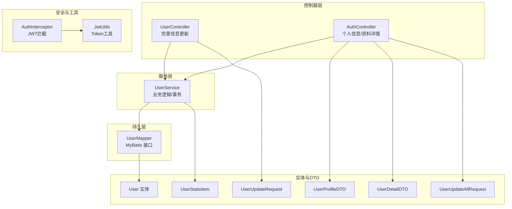
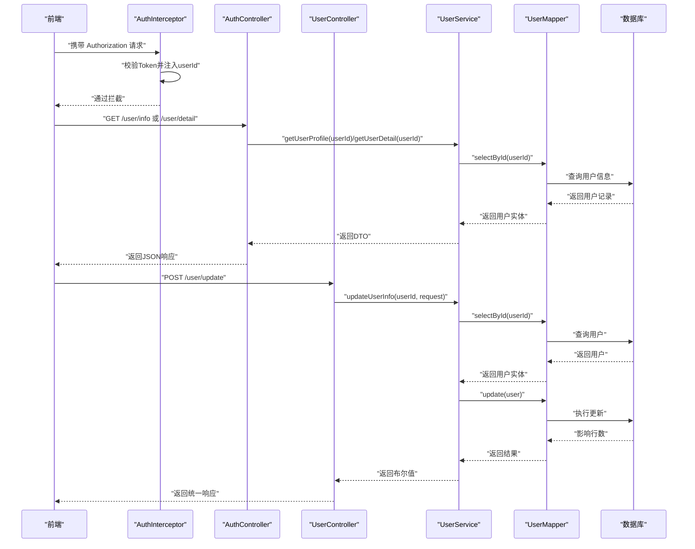
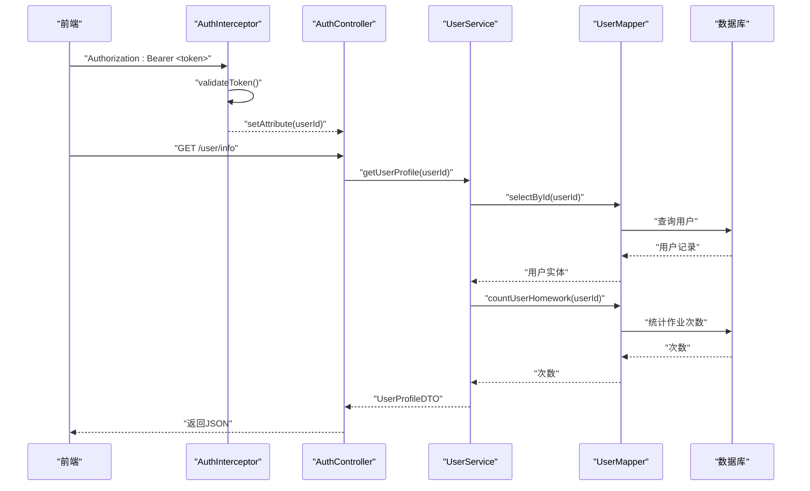
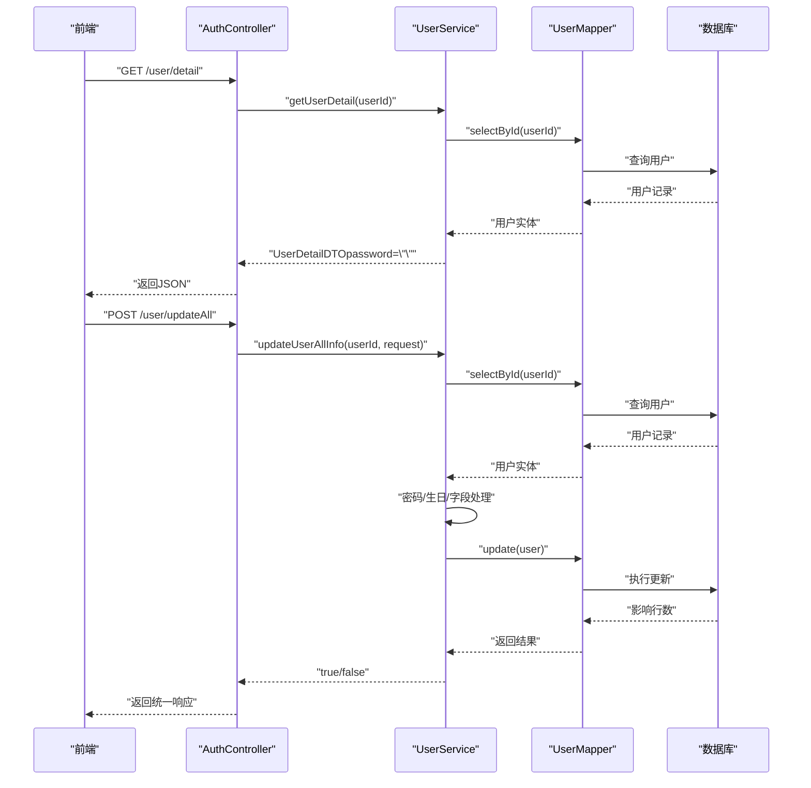
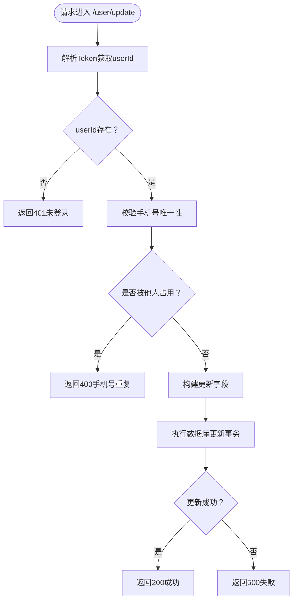
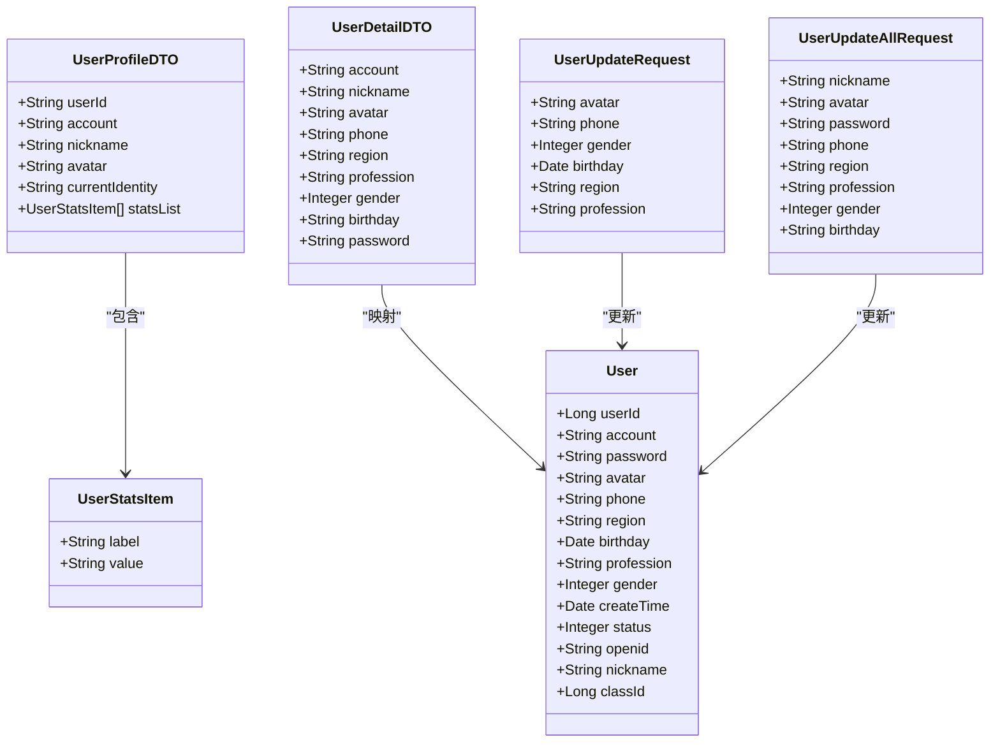
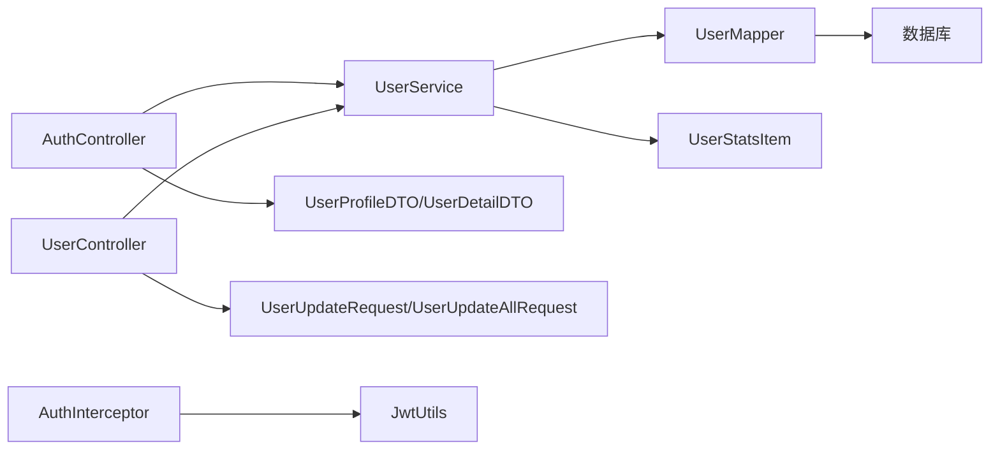

# 用户信息管理

<cite>
**本文引用的文件**
- [用户个人信息 API 文档.md](file://doc/用户个人信息 API 文档.md)
- [用户个人资料详情 API 文档.md](file://doc/用户个人资料详情 API 文档.md)
- [用户信息更新 API 文档.md](file://doc/用户信息更新 API 文档.md)
- [UserController.java](file://src/main/java/com/daily/dailychineseculture/controller/UserController.java)
- [AuthController.java](file://src/main/java/com/daily/dailychineseculture/controller/AuthController.java)
- [UserService.java](file://src/main/java/com/daily/dailychineseculture/service/UserService.java)
- [UserMapper.java](file://src/main/java/com/daily/dailychineseculture/mapper/UserMapper.java)
- [User.java](file://src/main/java/com/daily/dailychineseculture/entity/User.java)
- [UserProfileDTO.java](file://src/main/java/com/daily/dailychineseculture/dto/UserProfileDTO.java)
- [UserDetailDTO.java](file://src/main/java/com/daily/dailychineseculture/dto/UserDetailDTO.java)
- [UserUpdateRequest.java](file://src/main/java/com/daily/dailychineseculture/dto/UserUpdateRequest.java)
- [UserUpdateAllRequest.java](file://src/main/java/com/daily/dailychineseculture/dto/UserUpdateAllRequest.java)
- [UserStatsItem.java](file://src/main/java/com/daily/dailychineseculture/dto/UserStatsItem.java)
- [AuthInterceptor.java](file://src/main/java/com/daily/dailychineseculture/interceptor/AuthInterceptor.java)
- [JwtUtils.java](file://src/main/java/com/daily/dailychineseculture/util/JwtUtils.java)
- [UserDetailApiTest.java](file://src/test/java/com/daily/dailychineseculture/UserDetailApiTest.java)
- [UserProfileApiTest.java](file://src/test/java/com/daily/dailychineseculture/UserProfileApiTest.java)
</cite>

## 目录
1. [简介](#简介)
2. [项目结构](#项目结构)
3. [核心组件](#核心组件)
4. [架构总览](#架构总览)
5. [详细组件分析](#详细组件分析)
6. [依赖分析](#依赖分析)
7. [性能考量](#性能考量)
8. [故障排查指南](#故障排查指南)
9. [结论](#结论)
10. [附录](#附录)

## 简介
本文件系统化梳理用户信息管理模块，覆盖用户个人信息获取与展示、个人资料详情查询与更新、以及统计指标计算与呈现。文档从接口设计、数据结构、处理流程、安全与并发控制、性能优化与缓存策略、以及与其他模块的关联与一致性保障等方面进行全面阐述，并提供流程图、数据流图与接口调用示例，帮助开发者与测试人员快速理解与落地。

## 项目结构
用户信息管理涉及三层控制器、服务层、持久层与工具类，配合拦截器与DTO/Entity模型，形成清晰的分层架构。主要文件分布如下：
- 控制器层：UserController（完善信息更新）、AuthController（个人信息与资料详情）
- 服务层：UserService（业务逻辑与事务控制）
- 持久层：UserMapper（MyBatis 接口与 SQL）
- 实体与DTO：User、UserProfileDTO、UserDetailDTO、UserUpdateRequest、UserUpdateAllRequest、UserStatsItem
- 安全与拦截：AuthInterceptor（JWT 认证拦截）、JwtUtils（Token 生成与解析）

**图表来源**
- [UserController.java:102-142](file://src/main/java/com/daily/dailychineseculture/controller/UserController.java#L102-L142)
- [AuthController.java](file://src/main/java/com/daily/dailychineseculture/controller/AuthController.java)
- [UserService.java:656-723](file://src/main/java/com/daily/dailychineseculture/service/UserService.java#L656-L723)
- [UserMapper.java:24-60](file://src/main/java/com/daily/dailychineseculture/mapper/UserMapper.java#L24-L60)
- [User.java:14-74](file://src/main/java/com/daily/dailychineseculture/entity/User.java#L14-L74)
- [UserProfileDTO.java:16-41](file://src/main/java/com/daily/dailychineseculture/dto/UserProfileDTO.java#L16-L41)
- [UserDetailDTO.java:15-55](file://src/main/java/com/daily/dailychineseculture/dto/UserDetailDTO.java#L15-L55)
- [UserUpdateAllRequest.java:15-50](file://src/main/java/com/daily/dailychineseculture/dto/UserUpdateAllRequest.java#L15-L50)
- [UserUpdateRequest.java:15-40](file://src/main/java/com/daily/dailychineseculture/dto/UserUpdateRequest.java#L15-L40)
- [UserStatsItem.java:15-20](file://src/main/java/com/daily/dailychineseculture/dto/UserStatsItem.java#L15-L20)
- [AuthInterceptor.java:31-91](file://src/main/java/com/daily/dailychineseculture/interceptor/AuthInterceptor.java#L31-L91)
- [JwtUtils.java:47-79](file://src/main/java/com/daily/dailychineseculture/util/JwtUtils.java#L47-L79)

**章节来源**
- [UserController.java:102-142](file://src/main/java/com/daily/dailychineseculture/controller/UserController.java#L102-L142)
- [AuthController.java](file://src/main/java/com/daily/dailychineseculture/controller/AuthController.java)
- [UserService.java:656-723](file://src/main/java/com/daily/dailychineseculture/service/UserService.java#L656-L723)
- [UserMapper.java:24-60](file://src/main/java/com/daily/dailychineseculture/mapper/UserMapper.java#L24-L60)
- [AuthInterceptor.java:31-91](file://src/main/java/com/daily/dailychineseculture/interceptor/AuthInterceptor.java#L31-L91)
- [JwtUtils.java:47-79](file://src/main/java/com/daily/dailychineseculture/util/JwtUtils.java#L47-L79)

## 核心组件
- 控制器
  - UserController：提供“完善信息”更新接口，基于拦截器注入的 userId 执行更新，统一异常处理与响应封装。
  - AuthController：提供“个人信息”与“个人资料详情”接口，分别返回统计指标与完整资料，均依赖 JWT 鉴权。
- 服务层
  - UserService：封装业务逻辑，包括用户信息查询、统计指标计算、资料更新（含手机号唯一性校验与事务）、志愿者身份判定等。
- 持久层
  - UserMapper：提供用户查询、更新、统计作业次数、志愿者历史与统计等 SQL 接口。
- 实体与DTO
  - User：用户实体，包含基础字段与扩展字段。
  - UserProfileDTO、UserDetailDTO、UserUpdateRequest、UserUpdateAllRequest、UserStatsItem：接口响应与请求的结构化载体。
- 安全与工具
  - AuthInterceptor：拦截请求，校验 Authorization 头，解析 Token 并注入 userId。
  - JwtUtils：生成/解析/验证 Token，提供用户ID与角色等信息提取。

**章节来源**
- [UserController.java:102-142](file://src/main/java/com/daily/dailychineseculture/controller/UserController.java#L102-L142)
- [AuthController.java](file://src/main/java/com/daily/dailychineseculture/controller/AuthController.java)
- [UserService.java:656-723](file://src/main/java/com/daily/dailychineseculture/service/UserService.java#L656-L723)
- [UserMapper.java:24-60](file://src/main/java/com/daily/dailychineseculture/mapper/UserMapper.java#L24-L60)
- [User.java:14-74](file://src/main/java/com/daily/dailychineseculture/entity/User.java#L14-L74)
- [UserProfileDTO.java:16-41](file://src/main/java/com/daily/dailychineseculture/dto/UserProfileDTO.java#L16-L41)
- [UserDetailDTO.java:15-55](file://src/main/java/com/daily/dailychineseculture/dto/UserDetailDTO.java#L15-L55)
- [UserUpdateAllRequest.java:15-50](file://src/main/java/com/daily/dailychineseculture/dto/UserUpdateAllRequest.java#L15-L50)
- [UserUpdateRequest.java:15-40](file://src/main/java/com/daily/dailychineseculture/dto/UserUpdateRequest.java#L15-L40)
- [UserStatsItem.java:15-20](file://src/main/java/com/daily/dailychineseculture/dto/UserStatsItem.java#L15-L20)
- [AuthInterceptor.java:31-91](file://src/main/java/com/daily/dailychineseculture/interceptor/AuthInterceptor.java#L31-L91)
- [JwtUtils.java:47-79](file://src/main/java/com/daily/dailychineseculture/util/JwtUtils.java#L47-L79)

## 架构总览
用户信息管理采用经典的 MVC 分层与拦截器鉴权模式，请求经拦截器校验 Token 后进入控制器，控制器调用服务层，服务层通过 Mapper 访问数据库，最终返回 DTO 结果。统计指标与资料详情接口分别面向不同前端页面，完善信息接口用于批量字段更新。

**图表来源**
- [AuthController.java](file://src/main/java/com/daily/dailychineseculture/controller/AuthController.java)
- [UserController.java:102-142](file://src/main/java/com/daily/dailychineseculture/controller/UserController.java#L102-L142)
- [UserService.java:656-723](file://src/main/java/com/daily/dailychineseculture/service/UserService.java#L656-L723)
- [UserMapper.java:24-60](file://src/main/java/com/daily/dailychineseculture/mapper/UserMapper.java#L24-L60)
- [AuthInterceptor.java:31-91](file://src/main/java/com/daily/dailychineseculture/interceptor/AuthInterceptor.java#L31-L91)

## 详细组件分析

### 个人信息接口（/user/info）
- 接口目标：返回用户基本信息与统计指标（地区、职业、注册年数、学时）。
- 鉴权：Authorization 头中携带 Bearer Token，拦截器解析 userId 并注入请求。
- 业务流程：
  - 控制器解析 Token 获取 userId。
  - 服务层查询用户基本信息，判断是否志愿者身份。
  - 统计作业提交次数，计算注册年数，组装 UserProfileDTO。
  - 返回统一响应。
- 统计指标算法：
  - 年数：从注册时间到当前时间的年数向下取整。
  - 学时：作业提交次数 × 2，格式为 “Nh”。

**图表来源**
- [AuthController.java](file://src/main/java/com/daily/dailychineseculture/controller/AuthController.java)
- [UserService.java:730-794](file://src/main/java/com/daily/dailychineseculture/service/UserService.java#L730-L794)
- [UserMapper.java:24-60](file://src/main/java/com/daily/dailychineseculture/mapper/UserMapper.java#L24-L60)
- [UserMapper.java:250-251](file://src/main/java/com/daily/dailychineseculture/mapper/UserMapper.java#L250-L251)

**章节来源**
- [用户个人信息 API 文档.md:13-45](file://doc/用户个人信息 API 文档.md#L13-L45)
- [用户个人信息 API 文档.md:176-192](file://doc/用户个人信息 API 文档.md#L176-L192)
- [用户个人信息 API 文档.md:196-237](file://doc/用户个人信息 API 文档.md#L196-L237)
- [用户个人信息 API 文档.md:241-248](file://doc/用户个人信息 API 文档.md#L241-L248)
- [UserProfileApiTest.java:32-79](file://src/test/java/com/daily/dailychineseculture/UserProfileApiTest.java#L32-L79)

### 个人资料详情接口（/user/detail 与 /user/updateAll）
- GET /user/detail
  - 返回用户完整资料（账号、昵称、头像、手机、地区、职业、性别、生日、密码占位符）。
  - 密码字段始终为空字符串，确保不泄露真实密码。
  - 生日格式化为 “yyyy-MM-dd”，服务层进行日期格式化。
- POST /user/updateAll
  - 接收全量字段，按需更新；密码为空字符串或 null 则跳过更新。
  - 生日字符串解析为 Date；手机号唯一性校验由服务层执行。
  - 事务保证更新原子性。

**图表来源**
- [AuthController.java](file://src/main/java/com/daily/dailychineseculture/controller/AuthController.java)
- [UserService.java:295-350](file://src/main/java/com/daily/dailychineseculture/service/UserService.java#L295-L350)
- [UserMapper.java:24-60](file://src/main/java/com/daily/dailychineseculture/mapper/UserMapper.java#L24-L60)

**章节来源**
- [用户个人资料详情 API 文档.md:13-44](file://doc/用户个人资料详情 API 文档.md#L13-L44)
- [用户个人资料详情 API 文档.md:263-286](file://doc/用户个人资料详情 API 文档.md#L263-L286)
- [用户个人资料详情 API 文档.md:288-350](file://doc/用户个人资料详情 API 文档.md#L288-L350)
- [UserDetailApiTest.java:33-71](file://src/test/java/com/daily/dailychineseculture/UserDetailApiTest.java#L33-L71)
- [UserDetailApiTest.java:76-106](file://src/test/java/com/daily/dailychineseculture/UserDetailApiTest.java#L76-L106)

### 完善信息接口（/user/update）
- 接口目标：登录用户完善或更新个人信息（头像、手机号、性别、生日、地区、职业）。
- 安全机制：
  - 从 Token 中解析 userId，禁止前端传入 user_id。
  - 手机号唯一性校验，数据库层面唯一约束配合服务层校验。
  - 事务保证更新一致性。
- 参数与返回：请求体为 JSON，字段可选；成功返回统一响应。

**图表来源**
- [UserController.java:102-142](file://src/main/java/com/daily/dailychineseculture/controller/UserController.java#L102-L142)
- [UserService.java:656-723](file://src/main/java/com/daily/dailychineseculture/service/UserService.java#L656-L723)
- [UserMapper.java:24-60](file://src/main/java/com/daily/dailychineseculture/mapper/UserMapper.java#L24-L60)

**章节来源**
- [用户信息更新 API 文档.md:18-63](file://doc/用户信息更新 API 文档.md#L18-L63)
- [用户信息更新 API 文档.md:250-276](file://doc/用户信息更新 API 文档.md#L250-L276)
- [用户信息更新 API 文档.md:287-292](file://doc/用户信息更新 API 文档.md#L287-L292)

### 数据结构与字段定义
- 实体 User
  - 基础字段：userId、account、password、avatar、phone、region、birthday、profession、gender、createTime、status、openid、nickname。
  - 扩展字段：classId（用于分班）。
- DTO 与请求对象
  - UserProfileDTO：userId、account、nickname、avatar、currentIdentity、statsList。
  - UserDetailDTO：account（只读）、nickname、avatar、phone、region、profession、gender、birthday（格式化）、password（占位符）。
  - UserUpdateRequest：avatar、phone、gender、birthday、region、profession（完善信息）。
  - UserUpdateAllRequest：nickname、avatar、password、phone、region、profession、gender、birthday（全量更新）。
  - UserStatsItem：label、value（统计指标项）。

**图表来源**
- [User.java:14-74](file://src/main/java/com/daily/dailychineseculture/entity/User.java#L14-L74)
- [UserProfileDTO.java:16-41](file://src/main/java/com/daily/dailychineseculture/dto/UserProfileDTO.java#L16-L41)
- [UserDetailDTO.java:15-55](file://src/main/java/com/daily/dailychineseculture/dto/UserDetailDTO.java#L15-L55)
- [UserUpdateRequest.java:15-40](file://src/main/java/com/daily/dailychineseculture/dto/UserUpdateRequest.java#L15-L40)
- [UserUpdateAllRequest.java:15-50](file://src/main/java/com/daily/dailychineseculture/dto/UserUpdateAllRequest.java#L15-L50)
- [UserStatsItem.java:15-20](file://src/main/java/com/daily/dailychineseculture/dto/UserStatsItem.java#L15-L20)

**章节来源**
- [User.java:14-74](file://src/main/java/com/daily/dailychineseculture/entity/User.java#L14-L74)
- [UserProfileDTO.java:16-41](file://src/main/java/com/daily/dailychineseculture/dto/UserProfileDTO.java#L16-L41)
- [UserDetailDTO.java:15-55](file://src/main/java/com/daily/dailychineseculture/dto/UserDetailDTO.java#L15-L55)
- [UserUpdateRequest.java:15-40](file://src/main/java/com/daily/dailychineseculture/dto/UserUpdateRequest.java#L15-L40)
- [UserUpdateAllRequest.java:15-50](file://src/main/java/com/daily/dailychineseculture/dto/UserUpdateAllRequest.java#L15-L50)
- [UserStatsItem.java:15-20](file://src/main/java/com/daily/dailychineseculture/dto/UserStatsItem.java#L15-L20)

### 更新流程与字段验证
- 字段验证
  - 手机号唯一性：服务层查询相同手机号并排除当前用户。
  - 生日格式：GET 详情时格式化为 “yyyy-MM-dd”，更新时字符串解析为 Date。
  - 密码更新：空字符串或 null 跳过更新，否则按安全策略处理（当前为明文，建议后续加密）。
- 数据更新
  - 完善信息：按需更新字段，事务包裹。
  - 全量更新：逐项赋值，生日与密码特殊处理。
- 状态同步
  - 更新成功后，前端可刷新用户信息或跳转页面。

**章节来源**
- [用户信息更新 API 文档.md:267-276](file://doc/用户信息更新 API 文档.md#L267-L276)
- [用户个人资料详情 API 文档.md:181-197](file://doc/用户个人资料详情 API 文档.md#L181-L197)
- [用户个人资料详情 API 文档.md:204-222](file://doc/用户个人资料详情 API 文档.md#L204-L222)
- [UserService.java:656-723](file://src/main/java/com/daily/dailychineseculture/service/UserService.java#L656-L723)

### 安全考虑
- 访问控制
  - 所有用户相关接口均需 Authorization 头，拦截器校验 Token 并注入 userId。
  - 控制器直接使用拦截器注入的 userId，避免前端伪造 user_id。
- 敏感信息保护
  - 密码字段在详情接口始终返回空字符串，不向前端暴露真实密码。
  - 生日字段在详情接口格式化输出，在更新接口严格解析。
- 数据脱敏
  - 前端仅展示占位符，后端不返回真实密码。
- SQL 注入防护
  - 使用 MyBatis 参数化查询，避免字符串拼接。

**章节来源**
- [AuthInterceptor.java:41-88](file://src/main/java/com/daily/dailychineseculture/interceptor/AuthInterceptor.java#L41-L88)
- [JwtUtils.java:176-183](file://src/main/java/com/daily/dailychineseculture/util/JwtUtils.java#L176-L183)
- [用户个人资料详情 API 文档.md:60-66](file://doc/用户个人资料详情 API 文档.md#L60-L66)
- [UserMapper.java:24-60](file://src/main/java/com/daily/dailychineseculture/mapper/UserMapper.java#L24-L60)

### 缓存策略、性能优化与并发控制
- 缓存策略
  - 建议对用户基本信息进行缓存（如 Redis），减少数据库查询压力。
- SQL 优化
  - t_homework 表的 user_id 建立索引，提升统计作业次数效率。
- 并发控制
  - 手机号唯一性由数据库唯一约束与服务层校验共同保证，避免并发冲突。
  - 事务包裹更新操作，确保原子性与一致性。

**章节来源**
- [用户个人信息 API 文档.md:299-304](file://doc/用户个人信息 API 文档.md#L299-L304)
- [用户信息更新 API 文档.md:446-448](file://doc/用户信息更新 API 文档.md#L446-L448)

### 与其他模块的关联与一致性
- 与志愿者模块
  - 通过志愿者分配数量判断用户身份（学员端/志愿者端）。
  - 统计指标中的“学时”来源于作业提交次数。
- 与登录认证模块
  - 基于 JWT 的 Token 鉴权，拦截器统一校验。
- 与分班模块
  - 用户实体包含 classId 字段，便于分班后状态同步。

**章节来源**
- [UserService.java:299-307](file://src/main/java/com/daily/dailychineseculture/service/UserService.java#L299-L307)
- [UserMapper.java:250-251](file://src/main/java/com/daily/dailychineseculture/mapper/UserMapper.java#L250-L251)
- [User.java:76-86](file://src/main/java/com/daily/dailychineseculture/entity/User.java#L76-L86)

## 依赖分析
- 组件耦合
  - 控制器依赖服务层；服务层依赖 Mapper；DTO/Entity 作为数据载体。
- 外部依赖
  - JWT 工具类提供 Token 生成与解析；MyBatis 提供数据库访问。
- 潜在循环依赖
  - 未发现循环依赖；分层清晰，接口边界明确。

**图表来源**
- [AuthController.java](file://src/main/java/com/daily/dailychineseculture/controller/AuthController.java)
- [UserController.java:102-142](file://src/main/java/com/daily/dailychineseculture/controller/UserController.java#L102-L142)
- [UserService.java:656-723](file://src/main/java/com/daily/dailychineseculture/service/UserService.java#L656-L723)
- [UserMapper.java:24-60](file://src/main/java/com/daily/dailychineseculture/mapper/UserMapper.java#L24-L60)
- [AuthInterceptor.java:31-91](file://src/main/java/com/daily/dailychineseculture/interceptor/AuthInterceptor.java#L31-L91)
- [JwtUtils.java:47-79](file://src/main/java/com/daily/dailychineseculture/util/JwtUtils.java#L47-L79)

**章节来源**
- [AuthController.java](file://src/main/java/com/daily/dailychineseculture/controller/AuthController.java)
- [UserController.java:102-142](file://src/main/java/com/daily/dailychineseculture/controller/UserController.java#L102-L142)
- [UserService.java:656-723](file://src/main/java/com/daily/dailychineseculture/service/UserService.java#L656-L723)
- [UserMapper.java:24-60](file://src/main/java/com/daily/dailychineseculture/mapper/UserMapper.java#L24-L60)
- [AuthInterceptor.java:31-91](file://src/main/java/com/daily/dailychineseculture/interceptor/AuthInterceptor.java#L31-L91)
- [JwtUtils.java:47-79](file://src/main/java/com/daily/dailychineseculture/util/JwtUtils.java#L47-L79)

## 性能考量
- 查询优化
  - 对 t_homework 的 user_id 建立索引，降低统计查询成本。
  - 对 t_user 的 phone 建唯一索引，加速唯一性校验。
- 缓存
  - 对高频读取的用户基本信息进行缓存，降低数据库压力。
- 事务
  - 更新操作使用事务，保证一致性，避免部分更新导致的数据不一致。

**章节来源**
- [用户个人信息 API 文档.md:299-304](file://doc/用户个人信息 API 文档.md#L299-L304)
- [用户信息更新 API 文档.md:287-292](file://doc/用户信息更新 API 文档.md#L287-L292)

## 故障排查指南
- 常见错误码
  - 401 未登录/Token无效：检查 Authorization 头与 Token 有效性。
  - 400 手机号重复：确认手机号唯一性，避免并发冲突。
  - 500 服务器内部错误：查看后端日志定位异常。
- 日志与异常
  - 控制器与服务层均有详细日志输出，便于定位问题。
  - 已知异常（如手机号重复）与未知异常分别处理，返回友好提示。

**章节来源**
- [用户个人信息 API 文档.md:289-296](file://doc/用户个人信息 API 文档.md#L289-L296)
- [用户个人资料详情 API 文档.md:482-489](file://doc/用户个人资料详情 API 文档.md#L482-L489)
- [用户信息更新 API 文档.md:395-411](file://doc/用户信息更新 API 文档.md#L395-L411)
- [UserController.java:123-141](file://src/main/java/com/daily/dailychineseculture/controller/UserController.java#L123-L141)
- [UserService.java:706-722](file://src/main/java/com/daily/dailychineseculture/service/UserService.java#L706-L722)

## 结论
用户信息管理模块通过清晰的分层设计、完善的鉴权与安全机制、严谨的字段校验与事务控制，实现了个人信息展示、资料详情查询与更新、统计指标计算等功能。结合缓存与索引优化，可在保证数据一致性的同时提升性能。建议后续增强密码加密与更细粒度的缓存策略，持续优化用户体验与系统稳定性。

## 附录
- 接口调用示例（来自文档）
  - 个人信息接口：GET /user/info
  - 个人资料详情：GET /user/detail
  - 全量更新：POST /user/updateAll
  - 完善信息：POST /user/update
- 测试用例
  - 用户个人信息测试：UserProfileApiTest
  - 用户个人资料测试：UserDetailApiTest

**章节来源**
- [用户个人信息 API 文档.md:307-347](file://doc/用户个人信息 API 文档.md#L307-L347)
- [用户个人资料详情 API 文档.md:402-477](file://doc/用户个人资料详情 API 文档.md#L402-L477)
- [用户信息更新 API 文档.md:144-202](file://doc/用户信息更新 API 文档.md#L144-L202)
- [UserProfileApiTest.java:32-79](file://src/test/java/com/daily/dailychineseculture/UserProfileApiTest.java#L32-L79)
- [UserDetailApiTest.java:33-106](file://src/test/java/com/daily/dailychineseculture/UserDetailApiTest.java#L33-L106)