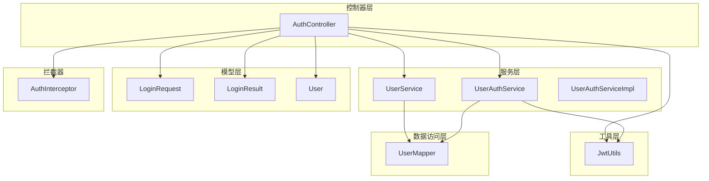
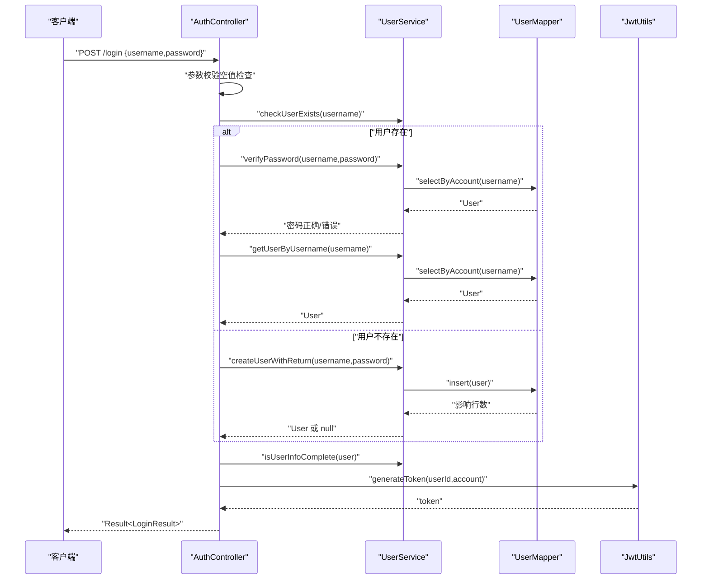
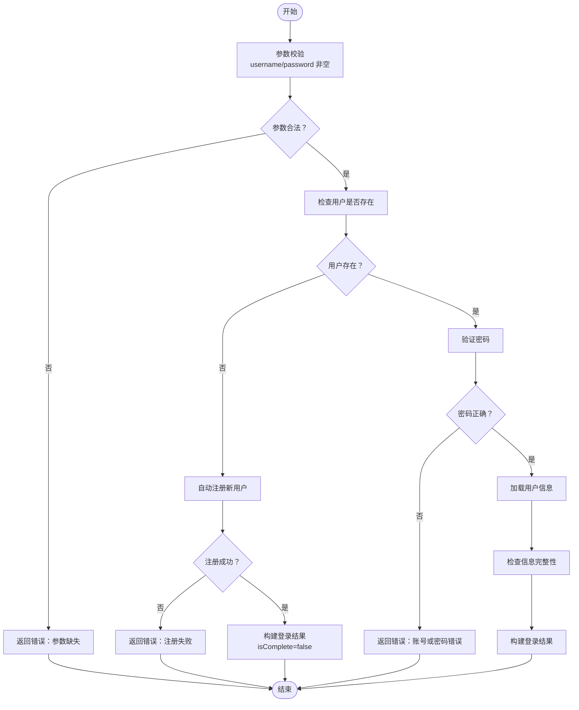
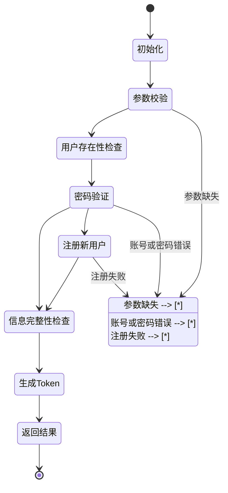
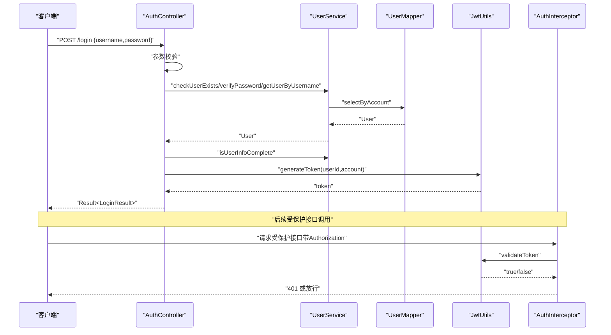
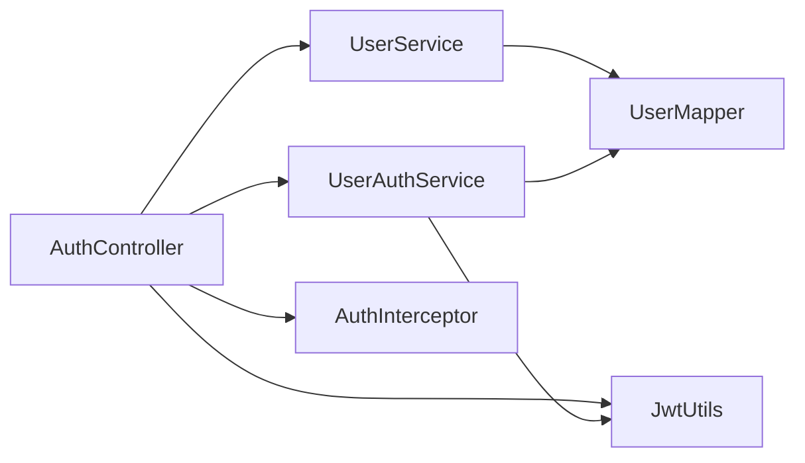

# 用户认证流程

<cite>
**本文引用的文件**
- [AuthController.java](file://src/main/java/com/daily/dailychineseculture/controller/AuthController.java)
- [UserAuthService.java](file://src/main/java/com/daily/dailychineseculture/service/UserAuthService.java)
- [UserAuthServiceImpl.java](file://src/main/java/com/daily/dailychineseculture/service/impl/UserAuthServiceImpl.java)
- [UserService.java](file://src/main/java/com/daily/dailychineseculture/service/UserService.java)
- [UserMapper.java](file://src/main/java/com/daily/dailychineseculture/mapper/UserMapper.java)
- [JwtUtils.java](file://src/main/java/com/daily/dailychineseculture/util/JwtUtils.java)
- [LoginRequest.java](file://src/main/java/com/daily/dailychineseculture/dto/LoginRequest.java)
- [LoginResult.java](file://src/main/java/com/daily/dailychineseculture/dto/LoginResult.java)
- [User.java](file://src/main/java/com/daily/dailychineseculture/entity/User.java)
- [Result.java](file://src/main/java/com/daily/dailychineseculture/common/Result.java)
- [AuthInterceptor.java](file://src/main/java/com/daily/dailychineseculture/interceptor/AuthInterceptor.java)
- [登录接口API文档.md](file://doc/登录接口API文档.md)
- [登录认证与用户信息体系代码扫描报告.md](file://doc/登录认证与用户信息体系代码扫描报告.md)
- [LoginFunctionTest.java](file://src/test/java/com/daily/dailychineseculture/LoginFunctionTest.java)
</cite>

## 目录
1. [简介](#简介)
2. [项目结构](#项目结构)
3. [核心组件](#核心组件)
4. [架构总览](#架构总览)
5. [详细组件分析](#详细组件分析)
6. [依赖关系分析](#依赖关系分析)
7. [性能考量](#性能考量)
8. [故障排查指南](#故障排查指南)
9. [结论](#结论)
10. [附录](#附录)

## 简介
本文件面向“账号密码登录”的完整实现，围绕登录接口的参数校验、用户存在性检查、密码验证、自动注册、信息完整性检查、JWT Token生成与返回等环节进行深入解析，并提供流程图、状态图与时序图，覆盖错误处理、异常捕获与安全考虑，以及接口使用示例与参数说明。

## 项目结构
认证相关的核心文件组织如下：
- 控制器层：AuthController 提供登录、微信登录、用户信息查询等接口
- 服务层：UserService 负责用户业务逻辑；UserAuthService 负责身份切换
- 工具层：JwtUtils 提供 JWT 生成与解析
- 数据访问层：UserMapper 提供用户数据访问
- DTO/Entity：LoginRequest/LoginResult/User/UserInfoDTO 等承载数据模型
- 拦截器：AuthInterceptor 对受保护接口进行鉴权拦截
- 文档与测试：登录接口API文档、登录认证扫描报告、登录功能测试

图表来源
- [AuthController.java:1-516](file://src/main/java/com/daily/dailychineseculture/controller/AuthController.java#L1-L516)
- [UserService.java:1-959](file://src/main/java/com/daily/dailychineseculture/service/UserService.java#L1-L959)
- [UserAuthServiceImpl.java:1-168](file://src/main/java/com/daily/dailychineseculture/service/impl/UserAuthServiceImpl.java#L1-L168)
- [JwtUtils.java:1-206](file://src/main/java/com/daily/dailychineseculture/util/JwtUtils.java#L1-L206)
- [UserMapper.java:1-252](file://src/main/java/com/daily/dailychineseculture/mapper/UserMapper.java#L1-L252)
- [LoginRequest.java:1-19](file://src/main/java/com/daily/dailychineseculture/dto/LoginRequest.java#L1-L19)
- [LoginResult.java:1-27](file://src/main/java/com/daily/dailychineseculture/dto/LoginResult.java#L1-L27)
- [User.java:1-87](file://src/main/java/com/daily/dailychineseculture/entity/User.java#L1-L87)
- [AuthInterceptor.java:1-74](file://src/main/java/com/daily/dailychineseculture/interceptor/AuthInterceptor.java#L1-L74)

章节来源
- [AuthController.java:1-516](file://src/main/java/com/daily/dailychineseculture/controller/AuthController.java#L1-L516)
- [UserService.java:1-959](file://src/main/java/com/daily/dailychineseculture/service/UserService.java#L1-L959)
- [JwtUtils.java:1-206](file://src/main/java/com/daily/dailychineseculture/util/JwtUtils.java#L1-L206)
- [UserMapper.java:1-252](file://src/main/java/com/daily/dailychineseculture/mapper/UserMapper.java#L1-L252)
- [LoginRequest.java:1-19](file://src/main/java/com/daily/dailychineseculture/dto/LoginRequest.java#L1-L19)
- [LoginResult.java:1-27](file://src/main/java/com/daily/dailychineseculture/dto/LoginResult.java#L1-L27)
- [User.java:1-87](file://src/main/java/com/daily/dailychineseculture/entity/User.java#L1-L87)
- [AuthInterceptor.java:1-74](file://src/main/java/com/daily/dailychineseculture/interceptor/AuthInterceptor.java#L1-L74)

## 核心组件
- 登录控制器：AuthController.login 实现账号密码登录，包含参数校验、用户存在性检查、密码验证、自动注册、信息完整性检查与JWT生成
- 用户服务：UserService 提供用户存在性检查、密码验证、自动注册、信息完整性判断、用户信息转换等
- JWT工具：JwtUtils 提供JWT生成、解析、校验、过期判断等能力
- 用户映射：UserMapper 提供用户数据的增删改查
- DTO/实体：LoginRequest/LoginResult/User/UserInfoDTO 等承载请求与响应数据
- 拦截器：AuthInterceptor 对受保护接口进行鉴权拦截，校验Authorization头与Token有效性

章节来源
- [AuthController.java:63-112](file://src/main/java/com/daily/dailychineseculture/controller/AuthController.java#L63-L112)
- [UserService.java:83-169](file://src/main/java/com/daily/dailychineseculture/service/UserService.java#L83-L169)
- [JwtUtils.java:37-95](file://src/main/java/com/daily/dailychineseculture/util/JwtUtils.java#L37-L95)
- [UserMapper.java:24-66](file://src/main/java/com/daily/dailychineseculture/mapper/UserMapper.java#L24-L66)
- [LoginRequest.java:9-19](file://src/main/java/com/daily/dailychineseculture/dto/LoginRequest.java#L9-L19)
- [LoginResult.java:10-27](file://src/main/java/com/daily/dailychineseculture/dto/LoginResult.java#L10-L27)
- [AuthInterceptor.java:25-72](file://src/main/java/com/daily/dailychineseculture/interceptor/AuthInterceptor.java#L25-L72)

## 架构总览
登录流程在控制器层发起，经服务层完成业务逻辑，再通过工具层生成JWT，最终返回统一响应结构。拦截器在受保护接口上进行鉴权。

图表来源
- [AuthController.java:63-112](file://src/main/java/com/daily/dailychineseculture/controller/AuthController.java#L63-L112)
- [UserService.java:83-249](file://src/main/java/com/daily/dailychineseculture/service/UserService.java#L83-L249)
- [UserMapper.java:24-66](file://src/main/java/com/daily/dailychineseculture/mapper/UserMapper.java#L24-L66)
- [JwtUtils.java:37-69](file://src/main/java/com/daily/dailychineseculture/util/JwtUtils.java#L37-L69)

## 详细组件分析

### 登录接口与参数校验
- 接口路径：POST /login
- 请求体：LoginRequest（username/password）
- 参数校验：
  - username 非空（去除前后空白）
  - password 非空（去除前后空白）
- 返回：统一响应 Result<LoginResult>，包含token、isComplete、userInfo

章节来源
- [AuthController.java:63-112](file://src/main/java/com/daily/dailychineseculture/controller/AuthController.java#L63-L112)
- [LoginRequest.java:9-19](file://src/main/java/com/daily/dailychineseculture/dto/LoginRequest.java#L9-L19)
- [Result.java:10-81](file://src/main/java/com/daily/dailychineseculture/common/Result.java#L10-L81)

### 用户存在性检查与密码验证
- 用户存在性：UserService.checkUserExists(username) 通过 UserMapper.selectByAccount 查询
- 密码验证：UserService.verifyPassword(username,password) 比较明文密码
- 注意：当前实现为明文存储，生产环境建议改为哈希存储与盐值

章节来源
- [UserService.java:83-106](file://src/main/java/com/daily/dailychineseculture/service/UserService.java#L83-L106)
- [UserMapper.java:24-31](file://src/main/java/com/daily/dailychineseculture/mapper/UserMapper.java#L24-L31)

### 自动注册流程
- 用户不存在时，调用 UserService.createUserWithReturn(username,password)
- 注册默认值：
  - 头像、手机号、地域、职业设为空字符串
  - 生日设为null
  - 性别默认0（未知）
- 注册成功后，isComplete恒为false（新用户信息不完整）

章节来源
- [AuthController.java:89-100](file://src/main/java/com/daily/dailychineseculture/controller/AuthController.java#L89-L100)
- [UserService.java:205-249](file://src/main/java/com/daily/dailychineseculture/service/UserService.java#L205-L249)

### 信息完整性检查
- 规则：
  - phone 非空字符串
  - avatar 非空字符串
  - gender 非0（0表示未知）
  - birthday 非null
- 返回 isComplete：true/false，决定前端是否跳转补全页

章节来源
- [UserService.java:150-169](file://src/main/java/com/daily/dailychineseculture/service/UserService.java#L150-L169)
- [登录接口API文档.md:86-97](file://doc/登录接口API文档.md#L86-L97)

### JWT Token生成与登录结果构建
- 生成token：JwtUtils.generateToken(userId,account)
- 构建LoginResult：
  - 设置token
  - 设置isComplete
  - 转换并设置userInfo（UserService.convertToUserInfoDTO）

章节来源
- [AuthController.java:121-136](file://src/main/java/com/daily/dailychineseculture/controller/AuthController.java#L121-L136)
- [JwtUtils.java:37-69](file://src/main/java/com/daily/dailychineseculture/util/JwtUtils.java#L37-L69)
- [UserService.java:176-197](file://src/main/java/com/daily/dailychineseculture/service/UserService.java#L176-L197)

### 登录结果数据模型
- LoginResult：token、isComplete、userInfo
- UserInfoDTO：userid、username、avatar、phone、gender、birthday

章节来源
- [LoginResult.java:10-27](file://src/main/java/com/daily/dailychineseculture/dto/LoginResult.java#L10-L27)
- [User.java:10-87](file://src/main/java/com/daily/dailychineseculture/entity/User.java#L10-L87)

### 错误处理与异常捕获
- 控制器层：
  - 参数为空：返回Result.error
  - 密码错误：返回401
  - 注册失败：返回500
  - 通用异常：捕获并返回错误信息
- 服务层：
  - 注册异常：打印日志并返回null
  - 信息更新异常：捕获DuplicateKeyException等并抛出RuntimeException
- 拦截器：
  - 未登录/Token无效：返回401

章节来源
- [AuthController.java:66-112](file://src/main/java/com/daily/dailychineseculture/controller/AuthController.java#L66-L112)
- [UserService.java:239-248](file://src/main/java/com/daily/dailychineseculture/service/UserService.java#L239-L248)
- [AuthInterceptor.java:42-72](file://src/main/java/com/daily/dailychineseculture/interceptor/AuthInterceptor.java#L42-L72)

### 安全考虑
- 密码明文存储（开发阶段）
- JWT有效期7天
- 拦截器校验Authorization头与Token有效性
- 建议：
  - 生产环境使用哈希存储密码
  - 使用HTTPS传输
  - 令牌刷新与黑名单机制
  - 输入参数长度与字符集限制

章节来源
- [JwtUtils.java:24-28](file://src/main/java/com/daily/dailychineseculture/util/JwtUtils.java#L24-L28)
- [AuthInterceptor.java:42-72](file://src/main/java/com/daily/dailychineseculture/interceptor/AuthInterceptor.java#L42-L72)
- [登录接口API文档.md:155-159](file://doc/登录接口API文档.md#L155-L159)

### 登录流程图

图表来源
- [AuthController.java:63-112](file://src/main/java/com/daily/dailychineseculture/controller/AuthController.java#L63-L112)
- [UserService.java:83-169](file://src/main/java/com/daily/dailychineseculture/service/UserService.java#L83-L169)

### 状态转换图（登录结果）

图表来源
- [AuthController.java:63-112](file://src/main/java/com/daily/dailychineseculture/controller/AuthController.java#L63-L112)
- [UserService.java:150-169](file://src/main/java/com/daily/dailychineseculture/service/UserService.java#L150-L169)

### 时序图（登录与拦截器）

图表来源
- [AuthController.java:63-112](file://src/main/java/com/daily/dailychineseculture/controller/AuthController.java#L63-L112)
- [UserService.java:83-169](file://src/main/java/com/daily/dailychineseculture/service/UserService.java#L83-L169)
- [JwtUtils.java:104-172](file://src/main/java/com/daily/dailychineseculture/util/JwtUtils.java#L104-L172)
- [AuthInterceptor.java:25-72](file://src/main/java/com/daily/dailychineseculture/interceptor/AuthInterceptor.java#L25-L72)

## 依赖关系分析
- AuthController 依赖 UserService、JwtUtils、UserAuthService、RestTemplate
- UserService 依赖 UserMapper、IdGeneratorService
- UserAuthServiceImpl 依赖 UserMapper、DutyAssignmentMapper、JwtUtils
- JwtUtils 为独立工具类
- AuthInterceptor 依赖 JwtUtils

图表来源
- [AuthController.java:23-33](file://src/main/java/com/daily/dailychineseculture/controller/AuthController.java#L23-L33)
- [UserService.java:25-29](file://src/main/java/com/daily/dailychineseculture/service/UserService.java#L25-L29)
- [UserAuthServiceImpl.java:26-28](file://src/main/java/com/daily/dailychineseculture/service/impl/UserAuthServiceImpl.java#L26-L28)
- [AuthInterceptor.java:19-20](file://src/main/java/com/daily/dailychineseculture/interceptor/AuthInterceptor.java#L19-L20)

章节来源
- [AuthController.java:23-33](file://src/main/java/com/daily/dailychineseculture/controller/AuthController.java#L23-L33)
- [UserService.java:25-29](file://src/main/java/com/daily/dailychineseculture/service/UserService.java#L25-L29)
- [UserAuthServiceImpl.java:26-28](file://src/main/java/com/daily/dailychineseculture/service/impl/UserAuthServiceImpl.java#L26-L28)
- [AuthInterceptor.java:19-20](file://src/main/java/com/daily/dailychineseculture/interceptor/AuthInterceptor.java#L19-L20)

## 性能考量
- 数据库查询：
  - checkUserExists/selectByAccount/selectByPhone 等查询应建立索引以提升性能
- 密码验证：
  - 当前为明文比较，建议改为哈希比较，增加安全性与可扩展性
- Token生成：
  - JwtUtils 生成与解析为轻量操作，注意密钥管理与过期时间设置
- 自动注册：
  - 注册默认值减少字段校验成本，但需确保数据库约束与默认值一致

[本节为通用指导，不直接分析具体文件]

## 故障排查指南
- 常见错误与定位
  - 参数缺失：检查请求体是否包含username/password
  - 账号或密码错误：确认用户名存在且密码匹配
  - 注册失败：查看控制台日志，确认数据库插入是否成功
  - Token无效：确认Authorization头格式与签名密钥一致
- 日志与测试
  - 控制器与服务层均有详细日志输出，便于定位问题
  - 登录功能测试用例覆盖了管理员登录、新用户注册、空用户名/密码等场景

章节来源
- [AuthController.java:66-112](file://src/main/java/com/daily/dailychineseculture/controller/AuthController.java#L66-L112)
- [UserService.java:239-248](file://src/main/java/com/daily/dailychineseculture/service/UserService.java#L239-L248)
- [LoginFunctionTest.java:19-108](file://src/test/java/com/daily/dailychineseculture/LoginFunctionTest.java#L19-L108)

## 结论
账号密码登录流程在控制器层完成参数校验与流程编排，在服务层完成用户存在性检查、密码验证与自动注册，在工具层生成JWT并返回统一响应。整体流程清晰、可扩展性强，建议在生产环境中加强密码存储安全、引入HTTPS与令牌刷新机制，并完善输入校验与异常处理。

[本节为总结性内容，不直接分析具体文件]

## 附录

### 登录接口使用示例
- 请求
  - 方法：POST
  - 路径：/login
  - 请求体：{
    "username": "student01",
    "password": "123456"
  }
- 成功响应
  - code: 200
  - msg: "登录成功"
  - data: {
    "token": "eyJhbGci...",
    "isComplete": false,
    "userInfo": {
      "userid": "2026000001",
      "username": "student01",
      "avatar": "",
      "phone": "13800138000",
      "gender": 0,
      "birthday": ""
    }
  }
- 新用户注册响应
  - code: 201
  - msg: "注册并登录成功"
  - data: 同上（isComplete=false）
- 错误响应
  - 账号或密码错误：code 401
  - 登录异常：code 500

章节来源
- [登录接口API文档.md:14-82](file://doc/登录接口API文档.md#L14-L82)
- [AuthController.java:42-112](file://src/main/java/com/daily/dailychineseculture/controller/AuthController.java#L42-L112)

### 参数说明
- username：必填，用户账号/手机号
- password：必填，用户密码

章节来源
- [登录接口API文档.md:13-24](file://doc/登录接口API文档.md#L13-L24)
- [LoginRequest.java:9-19](file://src/main/java/com/daily/dailychineseculture/dto/LoginRequest.java#L9-L19)

### 返回值格式
- Result<T>：统一响应结构，包含code/msg/data
- LoginResult：包含token、isComplete、userInfo
- UserInfoDTO：包含userid、username、avatar、phone、gender、birthday

章节来源
- [Result.java:10-81](file://src/main/java/com/daily/dailychineseculture/common/Result.java#L10-L81)
- [LoginResult.java:10-27](file://src/main/java/com/daily/dailychineseculture/dto/LoginResult.java#L10-L27)
- [User.java:10-87](file://src/main/java/com/daily/dailychineseculture/entity/User.java#L10-L87)