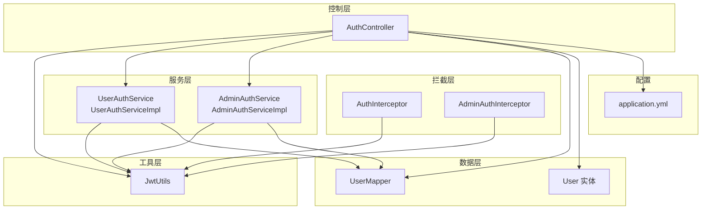
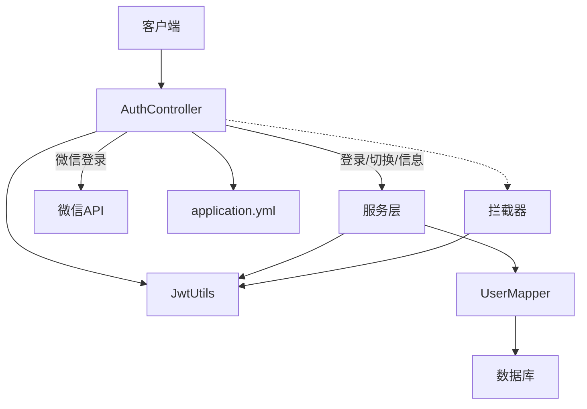
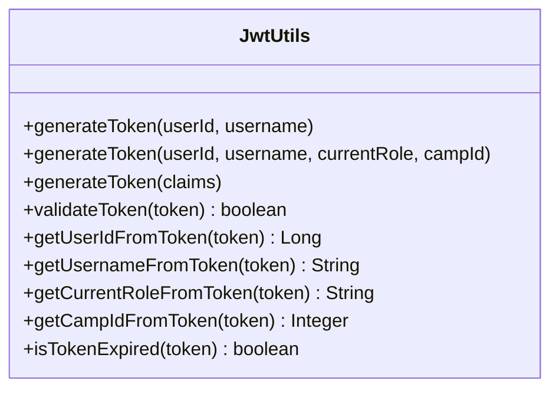
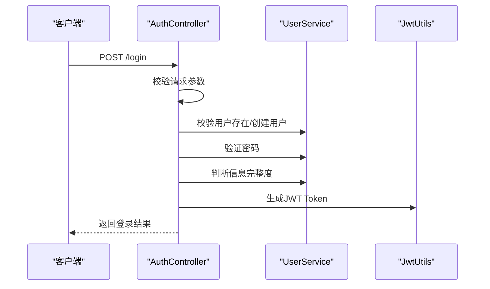
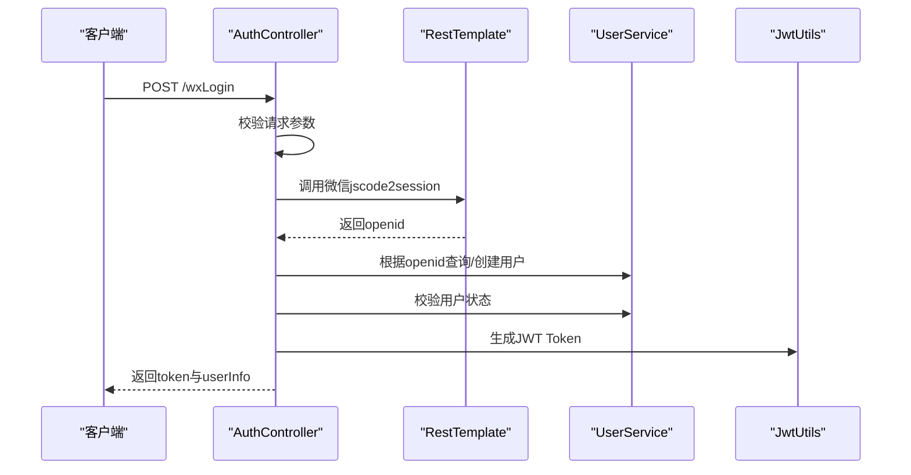
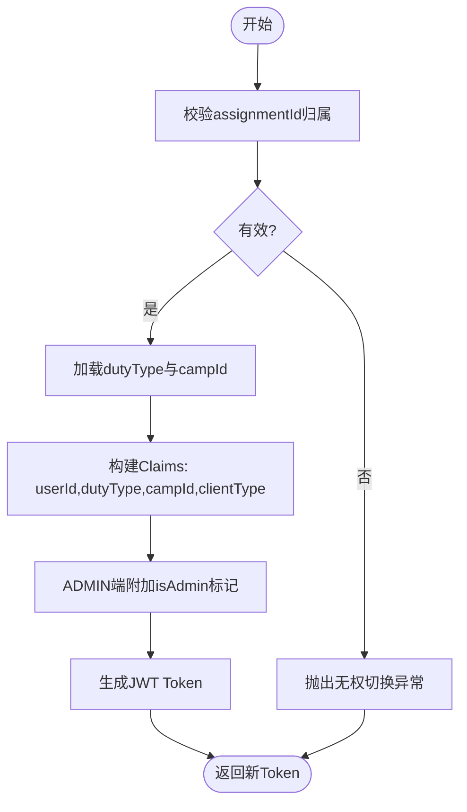
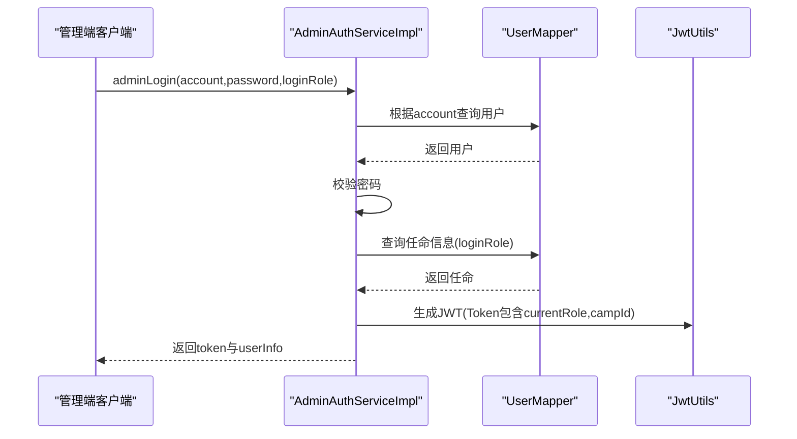
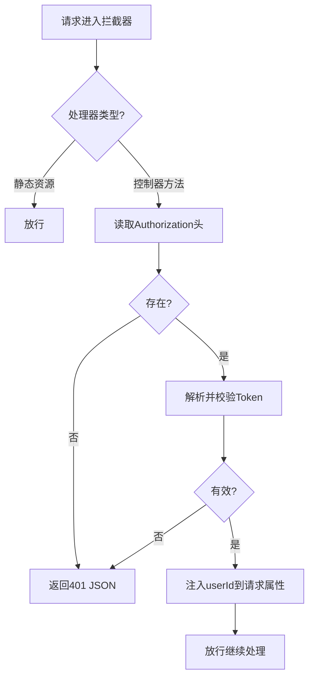
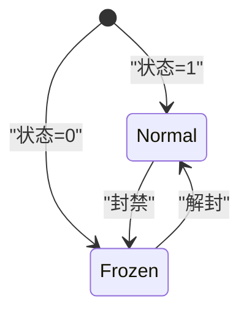
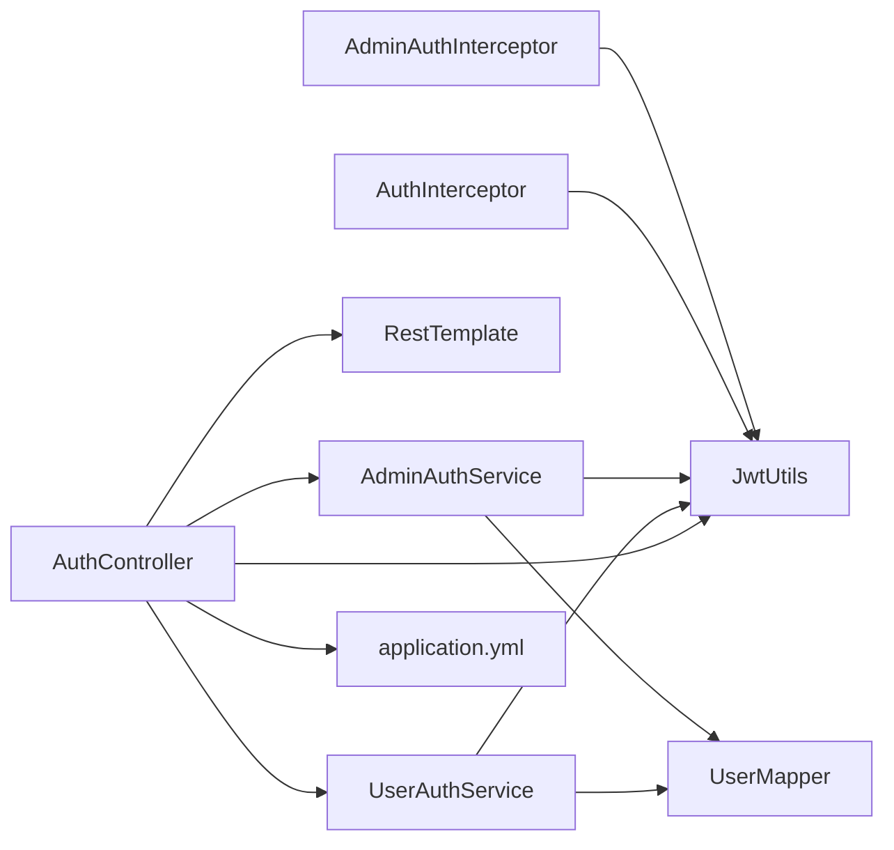

# 认证授权系统

<cite>
**本文引用的文件**
- [AuthController.java](file://src/main/java/com/daily/dailychineseculture/controller/AuthController.java)
- [JwtUtils.java](file://src/main/java/com/daily/dailychineseculture/util/JwtUtils.java)
- [AuthInterceptor.java](file://src/main/java/com/daily/dailychineseculture/interceptor/AuthInterceptor.java)
- [AdminAuthInterceptor.java](file://src/main/java/com/daily/dailychineseculture/interceptor/AdminAuthInterceptor.java)
- [UserAuthService.java](file://src/main/java/com/daily/dailychineseculture/service/UserAuthService.java)
- [UserAuthServiceImpl.java](file://src/main/java/com/daily/dailychineseculture/service/impl/UserAuthServiceImpl.java)
- [AdminAuthService.java](file://src/main/java/com/daily/dailychineseculture/service/AdminAuthService.java)
- [AdminAuthServiceImpl.java](file://src/main/java/com/daily/dailychineseculture/service/impl/AdminAuthServiceImpl.java)
- [LoginRequest.java](file://src/main/java/com/daily/dailychineseculture/dto/LoginRequest.java)
- [WxLoginRequest.java](file://src/main/java/com/daily/dailychineseculture/dto/WxLoginRequest.java)
- [application.yml](file://src/main/resources/application.yml)
- [User.java](file://src/main/java/com/daily/dailychineseculture/entity/User.java)
- [UserMapper.java](file://src/main/java/com/daily/dailychineseculture/mapper/UserMapper.java)
</cite>

## 目录
1. [简介](#简介)
2. [项目结构](#项目结构)
3. [核心组件](#核心组件)
4. [架构总览](#架构总览)
5. [详细组件分析](#详细组件分析)
6. [依赖分析](#依赖分析)
7. [性能考量](#性能考量)
8. [故障排查指南](#故障排查指南)
9. [结论](#结论)
10. [附录](#附录)

## 简介
本文件系统性解析认证授权子系统，覆盖以下主题：
- 用户认证流程与权限控制机制
- JWT Token 的生成、验证与过期策略
- 多角色身份切换（含角色枚举、权限矩阵与动态权限计算）
- 微信一键登录的 OAuth 集成方案（授权码换取 openid、用户信息获取与绑定）
- 权限拦截器工作原理与自定义扩展
- 安全最佳实践、常见攻击防护与调试技巧
- 认证流程图、状态转换图与时序图

## 项目结构
认证授权相关代码主要分布在以下层次：
- 控制层：AuthController 提供登录、微信登录、用户信息、身份切换等接口
- 工具层：JwtUtils 提供 JWT 生成、解析、校验与过期判断
- 拦截层：AuthInterceptor（通用）、AdminAuthInterceptor（管理端）负责统一鉴权
- 服务层：UserAuthService/UserAuthServiceImpl 实现多角色身份切换；AdminAuthService/AdminAuthServiceImpl 实现管理端登录
- DTO/实体/Mapper：LoginRequest、WxLoginRequest、User、UserMapper 等支撑数据与持久化
- 配置：application.yml 包含微信小程序 appid/secret 等配置项

图表来源
- [AuthController.java:1-516](file://src/main/java/com/daily/dailychineseculture/controller/AuthController.java#L1-L516)
- [JwtUtils.java:1-206](file://src/main/java/com/daily/dailychineseculture/util/JwtUtils.java#L1-L206)
- [AuthInterceptor.java:1-74](file://src/main/java/com/daily/dailychineseculture/interceptor/AuthInterceptor.java#L1-L74)
- [AdminAuthInterceptor.java:1-93](file://src/main/java/com/daily/dailychineseculture/interceptor/AdminAuthInterceptor.java#L1-L93)
- [UserAuthService.java:1-49](file://src/main/java/com/daily/dailychineseculture/service/UserAuthService.java#L1-L49)
- [UserAuthServiceImpl.java:1-168](file://src/main/java/com/daily/dailychineseculture/service/impl/UserAuthServiceImpl.java#L1-L168)
- [AdminAuthService.java:1-19](file://src/main/java/com/daily/dailychineseculture/service/AdminAuthService.java#L1-L19)
- [AdminAuthServiceImpl.java:1-99](file://src/main/java/com/daily/dailychineseculture/service/impl/AdminAuthServiceImpl.java#L1-L99)
- [UserMapper.java:1-252](file://src/main/java/com/daily/dailychineseculture/mapper/UserMapper.java#L1-L252)
- [User.java:1-87](file://src/main/java/com/daily/dailychineseculture/entity/User.java#L1-L87)
- [application.yml:1-33](file://src/main/resources/application.yml#L1-L33)

章节来源
- [AuthController.java:1-516](file://src/main/java/com/daily/dailychineseculture/controller/AuthController.java#L1-L516)
- [JwtUtils.java:1-206](file://src/main/java/com/daily/dailychineseculture/util/JwtUtils.java#L1-L206)
- [AuthInterceptor.java:1-74](file://src/main/java/com/daily/dailychineseculture/interceptor/AuthInterceptor.java#L1-L74)
- [AdminAuthInterceptor.java:1-93](file://src/main/java/com/daily/dailychineseculture/interceptor/AdminAuthInterceptor.java#L1-L93)
- [UserAuthService.java:1-49](file://src/main/java/com/daily/dailychineseculture/service/UserAuthService.java#L1-L49)
- [UserAuthServiceImpl.java:1-168](file://src/main/java/com/daily/dailychineseculture/service/impl/UserAuthServiceImpl.java#L1-L168)
- [AdminAuthService.java:1-19](file://src/main/java/com/daily/dailychineseculture/service/AdminAuthService.java#L1-L19)
- [AdminAuthServiceImpl.java:1-99](file://src/main/java/com/daily/dailychineseculture/service/impl/AdminAuthServiceImpl.java#L1-L99)
- [UserMapper.java:1-252](file://src/main/java/com/daily/dailychineseculture/mapper/UserMapper.java#L1-L252)
- [User.java:1-87](file://src/main/java/com/daily/dailychineseculture/entity/User.java#L1-L87)
- [application.yml:1-33](file://src/main/resources/application.yml#L1-L33)

## 核心组件
- 认证控制器 AuthController：提供账号密码登录、微信一键登录、用户信息查询、资料更新、退出登录、小程序端身份切换等接口
- JWT 工具 JwtUtils：封装 JWT 生成、解析、校验、过期判断，支持多角色与自定义 Claims
- 权限拦截器：
  - AuthInterceptor：通用拦截器，校验 Authorization 头并注入用户上下文
  - AdminAuthInterceptor：管理端拦截器，拦截 /api/admin/**，注入角色与营期上下文
- 身份切换服务 UserAuthService/UserAuthServiceImpl：根据任命记录生成新 Token，支持客户端类型差异化
- 管理端登录服务 AdminAuthService/AdminAuthServiceImpl：基于角色与任命查询生成 Token
- DTO/实体/Mapper：LoginRequest、WxLoginRequest、User、UserMapper
- 配置 application.yml：包含微信 appid/secret 等

章节来源
- [AuthController.java:1-516](file://src/main/java/com/daily/dailychineseculture/controller/AuthController.java#L1-L516)
- [JwtUtils.java:1-206](file://src/main/java/com/daily/dailychineseculture/util/JwtUtils.java#L1-L206)
- [AuthInterceptor.java:1-74](file://src/main/java/com/daily/dailychineseculture/interceptor/AuthInterceptor.java#L1-L74)
- [AdminAuthInterceptor.java:1-93](file://src/main/java/com/daily/dailychineseculture/interceptor/AdminAuthInterceptor.java#L1-L93)
- [UserAuthService.java:1-49](file://src/main/java/com/daily/dailychineseculture/service/UserAuthService.java#L1-L49)
- [UserAuthServiceImpl.java:1-168](file://src/main/java/com/daily/dailychineseculture/service/impl/UserAuthServiceImpl.java#L1-L168)
- [AdminAuthService.java:1-19](file://src/main/java/com/daily/dailychineseculture/service/AdminAuthService.java#L1-L19)
- [AdminAuthServiceImpl.java:1-99](file://src/main/java/com/daily/dailychineseculture/service/impl/AdminAuthServiceImpl.java#L1-L99)
- [LoginRequest.java:1-19](file://src/main/java/com/daily/dailychineseculture/dto/LoginRequest.java#L1-L19)
- [WxLoginRequest.java:1-24](file://src/main/java/com/daily/dailychineseculture/dto/WxLoginRequest.java#L1-L24)
- [User.java:1-87](file://src/main/java/com/daily/dailychineseculture/entity/User.java#L1-L87)
- [UserMapper.java:1-252](file://src/main/java/com/daily/dailychineseculture/mapper/UserMapper.java#L1-L252)
- [application.yml:1-33](file://src/main/resources/application.yml#L1-L33)

## 架构总览
认证授权系统采用“控制器-服务-拦截器-JWT-数据访问”的分层架构：
- 控制器接收请求，调用服务与工具
- 服务层负责业务逻辑（身份切换、管理端登录）
- 拦截器在进入控制器前统一校验 Token 并注入上下文
- JWT 工具负责 Token 生命周期管理
- 数据访问通过 Mapper 与实体交互

图表来源
- [AuthController.java:1-516](file://src/main/java/com/daily/dailychineseculture/controller/AuthController.java#L1-L516)
- [JwtUtils.java:1-206](file://src/main/java/com/daily/dailychineseculture/util/JwtUtils.java#L1-L206)
- [AuthInterceptor.java:1-74](file://src/main/java/com/daily/dailychineseculture/interceptor/AuthInterceptor.java#L1-L74)
- [AdminAuthInterceptor.java:1-93](file://src/main/java/com/daily/dailychineseculture/interceptor/AdminAuthInterceptor.java#L1-L93)
- [UserMapper.java:1-252](file://src/main/java/com/daily/dailychineseculture/mapper/UserMapper.java#L1-L252)
- [application.yml:1-33](file://src/main/resources/application.yml#L1-L33)

## 详细组件分析

### JWT 工具与 Token 策略
- 生成策略
  - 默认生成包含 userId、username 的 Claims
  - 支持多角色生成：包含 currentRole、campId（可选）
  - 支持自定义 Claims：要求包含 userId，否则抛出参数错误
  - 过期时间固定为 7 天
- 验证与解析
  - validateToken：解析并校验签名与过期
  - getUserIdFromToken/getUsernameFromToken/getCurrentRoleFromToken/getCampIdFromToken：按需提取载荷
  - isTokenExpired：判断过期
- 安全考虑
  - HS256 签名算法，密钥在内存中生成（生产建议从配置读取并妥善保管）
  - 建议启用 HTTPS、限制 SameSite Cookie、避免在 URL 中传递 Token

图表来源
- [JwtUtils.java:1-206](file://src/main/java/com/daily/dailychineseculture/util/JwtUtils.java#L1-L206)

章节来源
- [JwtUtils.java:1-206](file://src/main/java/com/daily/dailychineseculture/util/JwtUtils.java#L1-L206)

### 通用认证流程（账号密码登录）
- 输入：LoginRequest（账号、密码）
- 步骤：
  1) 参数校验
  2) 校验用户是否存在，若不存在则自动注册
  3) 校验密码正确性
  4) 判断用户信息完整度
  5) 生成 JWT Token 并返回登录结果（包含 token、isComplete、userInfo）

图表来源
- [AuthController.java:63-112](file://src/main/java/com/daily/dailychineseculture/controller/AuthController.java#L63-L112)
- [JwtUtils.java:37-69](file://src/main/java/com/daily/dailychineseculture/util/JwtUtils.java#L37-L69)

章节来源
- [AuthController.java:63-112](file://src/main/java/com/daily/dailychineseculture/controller/AuthController.java#L63-L112)
- [LoginRequest.java:1-19](file://src/main/java/com/daily/dailychineseculture/dto/LoginRequest.java#L1-L19)

### 微信一键登录流程
- 输入：WxLoginRequest（code、nickname、avatar）
- 步骤：
  1) 参数校验
  2) 调用微信 jscode2session 接口换取 openid
  3) 根据 openid 查询或创建用户
  4) 校验用户状态
  5) 生成 JWT Token 并返回用户信息

图表来源
- [AuthController.java:141-190](file://src/main/java/com/daily/dailychineseculture/controller/AuthController.java#L141-L190)
- [application.yml:24-27](file://src/main/resources/application.yml#L24-L27)

章节来源
- [AuthController.java:141-190](file://src/main/java/com/daily/dailychineseculture/controller/AuthController.java#L141-L190)
- [WxLoginRequest.java:1-24](file://src/main/java/com/daily/dailychineseculture/dto/WxLoginRequest.java#L1-L24)
- [application.yml:24-27](file://src/main/resources/application.yml#L24-L27)

### 多角色身份切换机制
- 角色枚举与权限矩阵
  - duty_type：课程管理员、学班、志愿者等
  - camp_id：营期维度，全局教务时 camp_id 为空
  - clientType：ADMIN（PC 管理端）、APP（小程序端）
  - ADMIN 端可附加 isAdmin 标记（用于快速判定管理员）
- 动态权限计算
  - 依据任命记录 assignment_id 校验归属
  - 生成新 Token 时注入 dutyType、campId、clientType
  - 通过拦截器将 userId/currentRole/campId 注入请求上下文
- 切换流程

图表来源
- [UserAuthServiceImpl.java:80-117](file://src/main/java/com/daily/dailychineseculture/service/impl/UserAuthServiceImpl.java#L80-L117)
- [AdminAuthInterceptor.java:62-72](file://src/main/java/com/daily/dailychineseculture/interceptor/AdminAuthInterceptor.java#L62-L72)

章节来源
- [UserAuthService.java:1-49](file://src/main/java/com/daily/dailychineseculture/service/UserAuthService.java#L1-L49)
- [UserAuthServiceImpl.java:1-168](file://src/main/java/com/daily/dailychineseculture/service/impl/UserAuthServiceImpl.java#L1-L168)
- [AdminAuthInterceptor.java:1-93](file://src/main/java/com/daily/dailychineseculture/interceptor/AdminAuthInterceptor.java#L1-L93)

### 管理端登录与角色绑定
- 输入：AdminLoginRequest（account、password、loginRole）
- 步骤：
  1) 参数校验
  2) 根据账号查询用户
  3) 校验密码
  4) 查询用户在指定角色下的任命信息
  5) 生成包含 currentRole 与 campId 的 JWT Token
  6) 返回 token 与用户信息

图表来源
- [AdminAuthServiceImpl.java:37-97](file://src/main/java/com/daily/dailychineseculture/service/impl/AdminAuthServiceImpl.java#L37-L97)

章节来源
- [AdminAuthService.java:1-19](file://src/main/java/com/daily/dailychineseculture/service/AdminAuthService.java#L1-L19)
- [AdminAuthServiceImpl.java:1-99](file://src/main/java/com/daily/dailychineseculture/service/impl/AdminAuthServiceImpl.java#L1-L99)

### 权限拦截器工作原理与扩展
- AuthInterceptor（通用）
  - 校验 Authorization 头，解析并校验 Token
  - 将 userId 注入请求属性，便于后续使用
- AdminAuthInterceptor（管理端）
  - 放行登录与验证码接口
  - 校验 Token 并注入 userId/currentRole/campId
  - 对于管理端接口统一返回 200 + JSON 错误体，避免泄露 401 细节
- 自定义扩展
  - 可增加免认证注解白名单
  - 可扩展基于角色/营期的细粒度权限校验
  - 可引入权限缓存与黑名单机制

图表来源
- [AuthInterceptor.java:25-72](file://src/main/java/com/daily/dailychineseculture/interceptor/AuthInterceptor.java#L25-L72)
- [AdminAuthInterceptor.java:23-82](file://src/main/java/com/daily/dailychineseculture/interceptor/AdminAuthInterceptor.java#L23-L82)

章节来源
- [AuthInterceptor.java:1-74](file://src/main/java/com/daily/dailychineseculture/interceptor/AuthInterceptor.java#L1-L74)
- [AdminAuthInterceptor.java:1-93](file://src/main/java/com/daily/dailychineseculture/interceptor/AdminAuthInterceptor.java#L1-L93)

### 用户信息与状态流转
- 用户状态：1 正常，0 冻结
- 微信登录时校验用户状态，冻结用户禁止登录
- 用户信息：昵称优先 nickname，为空则回退 account；头像为空时提供默认值

图表来源
- [AuthController.java:167-169](file://src/main/java/com/daily/dailychineseculture/controller/AuthController.java#L167-L169)
- [User.java:63-64](file://src/main/java/com/daily/dailychineseculture/entity/User.java#L63-L64)

章节来源
- [AuthController.java:167-169](file://src/main/java/com/daily/dailychineseculture/controller/AuthController.java#L167-L169)
- [User.java:1-87](file://src/main/java/com/daily/dailychineseculture/entity/User.java#L1-L87)

## 依赖分析
- 控制器依赖 JwtUtils、UserAuthService、AdminAuthService、RestTemplate（微信登录）
- 服务层依赖 JwtUtils、UserMapper、DutyAssignmentMapper（身份切换）
- 拦截器依赖 JwtUtils
- 配置依赖 application.yml 中的微信 appid/secret

图表来源
- [AuthController.java:1-516](file://src/main/java/com/daily/dailychineseculture/controller/AuthController.java#L1-L516)
- [JwtUtils.java:1-206](file://src/main/java/com/daily/dailychineseculture/util/JwtUtils.java#L1-L206)
- [AuthInterceptor.java:1-74](file://src/main/java/com/daily/dailychineseculture/interceptor/AuthInterceptor.java#L1-L74)
- [AdminAuthInterceptor.java:1-93](file://src/main/java/com/daily/dailychineseculture/interceptor/AdminAuthInterceptor.java#L1-L93)
- [UserAuthService.java:1-49](file://src/main/java/com/daily/dailychineseculture/service/UserAuthService.java#L1-L49)
- [UserAuthServiceImpl.java:1-168](file://src/main/java/com/daily/dailychineseculture/service/impl/UserAuthServiceImpl.java#L1-L168)
- [AdminAuthService.java:1-19](file://src/main/java/com/daily/dailychineseculture/service/AdminAuthService.java#L1-L19)
- [AdminAuthServiceImpl.java:1-99](file://src/main/java/com/daily/dailychineseculture/service/impl/AdminAuthServiceImpl.java#L1-L99)
- [UserMapper.java:1-252](file://src/main/java/com/daily/dailychineseculture/mapper/UserMapper.java#L1-L252)
- [application.yml:1-33](file://src/main/resources/application.yml#L1-L33)

章节来源
- [AuthController.java:1-516](file://src/main/java/com/daily/dailychineseculture/controller/AuthController.java#L1-L516)
- [JwtUtils.java:1-206](file://src/main/java/com/daily/dailychineseculture/util/JwtUtils.java#L1-L206)
- [AuthInterceptor.java:1-74](file://src/main/java/com/daily/dailychineseculture/interceptor/AuthInterceptor.java#L1-L74)
- [AdminAuthInterceptor.java:1-93](file://src/main/java/com/daily/dailychineseculture/interceptor/AdminAuthInterceptor.java#L1-L93)
- [UserAuthService.java:1-49](file://src/main/java/com/daily/dailychineseculture/service/UserAuthService.java#L1-L49)
- [UserAuthServiceImpl.java:1-168](file://src/main/java/com/daily/dailychineseculture/service/impl/UserAuthServiceImpl.java#L1-L168)
- [AdminAuthService.java:1-19](file://src/main/java/com/daily/dailychineseculture/service/AdminAuthService.java#L1-L19)
- [AdminAuthServiceImpl.java:1-99](file://src/main/java/com/daily/dailychineseculture/service/impl/AdminAuthServiceImpl.java#L1-L99)
- [UserMapper.java:1-252](file://src/main/java/com/daily/dailychineseculture/mapper/UserMapper.java#L1-L252)
- [application.yml:1-33](file://src/main/resources/application.yml#L1-L33)

## 性能考量
- Token 过期时间较长（7 天），建议结合刷新策略与短期会话配合使用
- 拦截器每次请求均进行 Token 校验，建议在网关层做一次快速校验
- 微信登录涉及外部 API 调用，建议增加超时与熔断保护
- 权限拦截器可引入轻量缓存（如基于 userId 的短期缓存）减少重复解析

## 故障排查指南
- 登录失败
  - 检查账号密码是否正确
  - 确认用户状态为正常（1）
- Token 无效/过期
  - 使用 validateToken 校验签名与有效期
  - 检查是否正确去除 Bearer 前缀
- 微信登录异常
  - 核对 appid/secret 配置
  - 检查授权码是否有效且未复用
- 管理端 401
  - 管理端拦截器返回 200 + JSON 错误体，确认前端是否正确处理
- 调试技巧
  - 打印请求头 Authorization 与解析后的 userId
  - 记录拦截器放行/拒绝原因
  - 对外接口统一返回 Result 包裹，便于前端定位问题

章节来源
- [AuthController.java:215-239](file://src/main/java/com/daily/dailychineseculture/controller/AuthController.java#L215-L239)
- [AuthInterceptor.java:45-65](file://src/main/java/com/daily/dailychineseculture/interceptor/AuthInterceptor.java#L45-L65)
- [AdminAuthInterceptor.java:38-60](file://src/main/java/com/daily/dailychineseculture/interceptor/AdminAuthInterceptor.java#L38-L60)
- [JwtUtils.java:165-172](file://src/main/java/com/daily/dailychineseculture/util/JwtUtils.java#L165-L172)

## 结论
本认证授权系统以 JWT 为核心，结合拦截器实现统一鉴权，支持账号密码登录、微信一键登录与多角色身份切换。建议在生产环境中强化密钥管理、引入刷新机制与权限缓存，并完善安全审计与监控告警。

## 附录
- 安全最佳实践
  - 密钥管理：从配置中心读取密钥，定期轮换
  - 传输安全：强制 HTTPS，合理设置安全头
  - Token 策略：短 Token + 刷新 Token，黑名单与滑动过期
  - 权限设计：最小权限原则，基于角色与营期的细粒度控制
- 常见攻击防护
  - 防暴力破解：登录失败次数限制与封禁策略
  - 防重放：一次性票据与时间戳校验
  - 防跨站：SameSite Cookie、CSRF Token
- 自定义扩展方向
  - 增加免认证注解白名单
  - 引入权限缓存与黑名单
  - 管理端权限细化（菜单/按钮级）