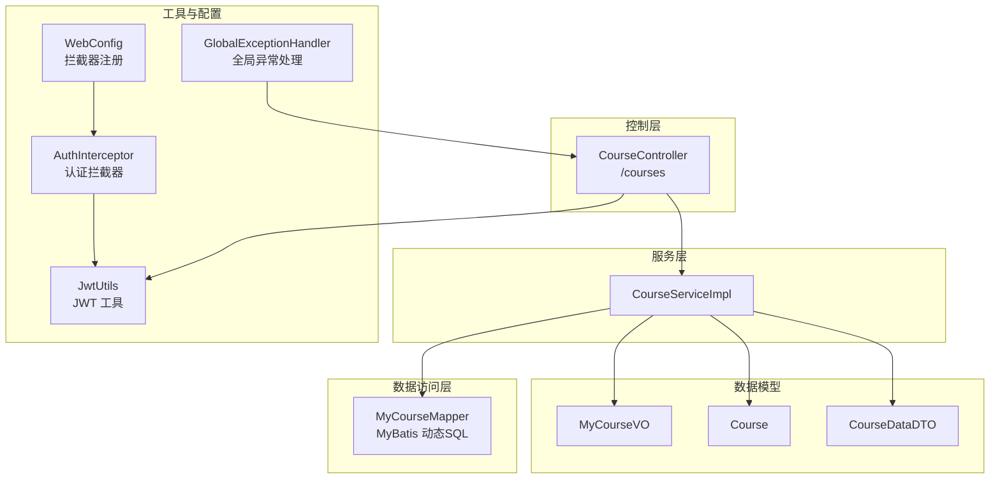
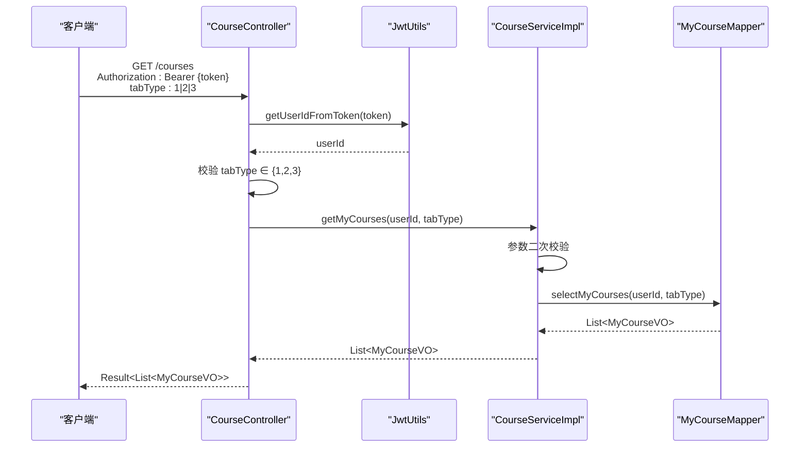
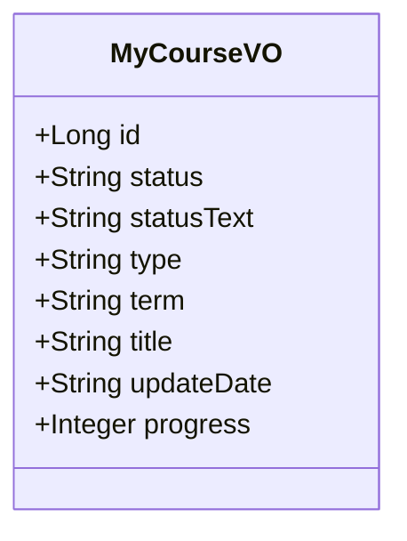
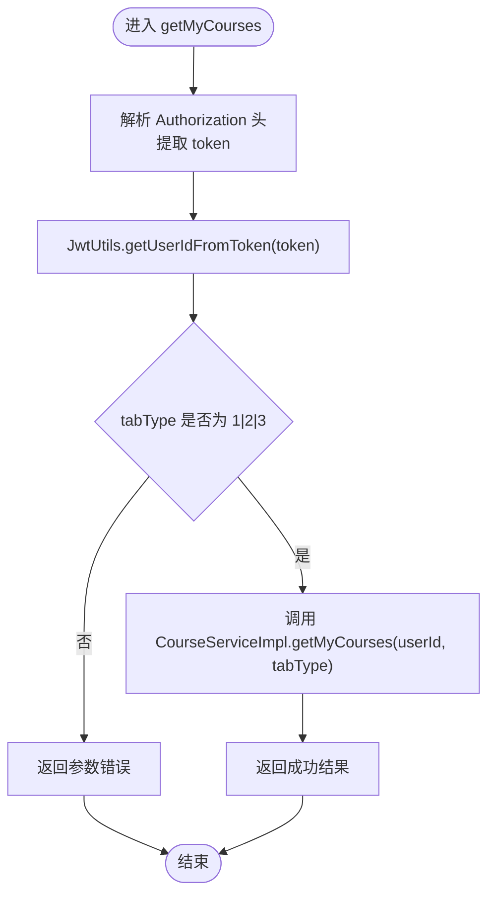
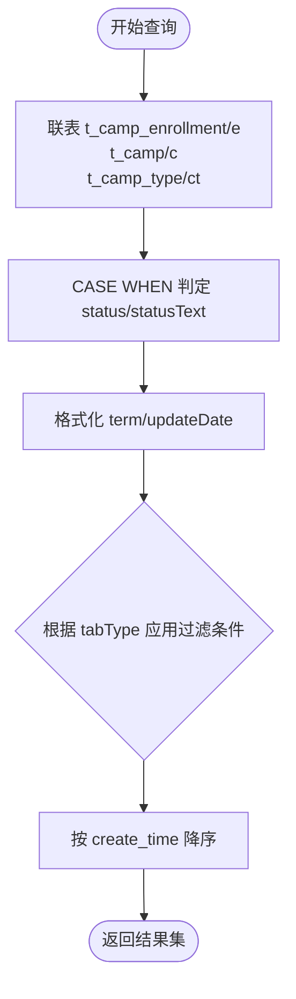
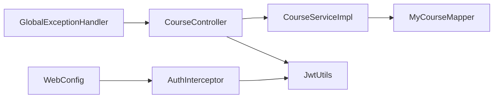

# 我的课程管理

<cite>
**本文引用的文件**
- [MyCourseVO.java](file://src/main/java/com/daily/dailychineseculture/dto/MyCourseVO.java)
- [CourseController.java](file://src/main/java/com/daily/dailychineseculture/controller/CourseController.java)
- [MyCourseMapper.java](file://src/main/java/com/daily/dailychineseculture/mapper/MyCourseMapper.java)
- [CourseServiceImpl.java](file://src/main/java/com/daily/dailychineseculture/service/impl/CourseServiceImpl.java)
- [JwtUtils.java](file://src/main/java/com/daily/dailychineseculture/util/JwtUtils.java)
- [AuthInterceptor.java](file://src/main/java/com/daily/dailychineseculture/interceptor/AuthInterceptor.java)
- [WebConfig.java](file://src/main/java/com/daily/dailychineseculture/config/WebConfig.java)
- [GlobalExceptionHandler.java](file://src/main/java/com/daily/dailychineseculture/common/GlobalExceptionHandler.java)
- [Course.java](file://src/main/java/com/daily/dailychineseculture/entity/Course.java)
- [CourseDataDTO.java](file://src/main/java/com/daily/dailychineseculture/dto/CourseDataDTO.java)
- [application.yml](file://src/main/resources/application.yml)
- [我的课程API文档.md](file://doc/我的课程API文档.md)
</cite>

## 目录
1. [简介](#简介)
2. [项目结构](#项目结构)
3. [核心组件](#核心组件)
4. [架构总览](#架构总览)
5. [详细组件分析](#详细组件分析)
6. [依赖分析](#依赖分析)
7. [性能考虑](#性能考虑)
8. [故障排除指南](#故障排除指南)
9. [结论](#结论)
10. [附录](#附录)

## 简介
本文件面向“我的课程管理”功能，系统性阐述课程列表的实现机制与数据模型设计，覆盖以下要点：
- 课程状态分类：正在学习、历史课程、已结业的判定逻辑与过滤条件
- JWT token 解析用户身份、参数校验与异常处理流程
- MyCourseVO 数据结构设计与字段语义
- 完整 API 调用示例（含 Authorization 头、tabType 参数与响应格式）
- 课程状态转换规则与数据过滤条件
- 用户权限验证与安全注意事项

## 项目结构
围绕“我的课程”功能，后端采用典型的三层架构：控制层负责接口暴露与参数校验；服务层封装业务逻辑；数据访问层通过 MyBatis 执行 SQL 查询。

图表来源
- [CourseController.java:1-100](file://src/main/java/com/daily/dailychineseculture/controller/CourseController.java#L1-L100)
- [CourseServiceImpl.java:1-400](file://src/main/java/com/daily/dailychineseculture/service/impl/CourseServiceImpl.java#L1-L400)
- [MyCourseMapper.java:1-59](file://src/main/java/com/daily/dailychineseculture/mapper/MyCourseMapper.java#L1-L59)
- [JwtUtils.java:1-206](file://src/main/java/com/daily/dailychineseculture/util/JwtUtils.java#L1-L206)
- [AuthInterceptor.java:1-74](file://src/main/java/com/daily/dailychineseculture/interceptor/AuthInterceptor.java#L1-L74)
- [WebConfig.java:1-105](file://src/main/java/com/daily/dailychineseculture/config/WebConfig.java#L1-L105)
- [GlobalExceptionHandler.java:1-29](file://src/main/java/com/daily/dailychineseculture/common/GlobalExceptionHandler.java#L1-L29)
- [MyCourseVO.java:1-57](file://src/main/java/com/daily/dailychineseculture/dto/MyCourseVO.java#L1-L57)
- [Course.java:1-60](file://src/main/java/com/daily/dailychineseculture/entity/Course.java#L1-L60)
- [CourseDataDTO.java:1-36](file://src/main/java/com/daily/dailychineseculture/dto/CourseDataDTO.java#L1-L36)

章节来源
- [CourseController.java:1-100](file://src/main/java/com/daily/dailychineseculture/controller/CourseController.java#L1-L100)
- [WebConfig.java:44-103](file://src/main/java/com/daily/dailychineseculture/config/WebConfig.java#L44-L103)

## 核心组件
- 控制器：负责接收请求、解析 Authorization 头中的 JWT、执行参数校验，并调用服务层获取课程列表。
- 服务实现：对输入参数进行二次校验，调用 Mapper 执行 SQL 查询。
- 数据访问层：基于 MyBatis 的动态 SQL，完成课程状态判定、字段格式化与过滤条件组合。
- 工具与拦截器：JWT 工具用于解析用户身份；拦截器统一处理认证与未授权响应。
- 数据模型：MyCourseVO 描述“我的课程”页面所需字段；Course、CourseDataDTO 服务于其他课程相关接口。

章节来源
- [CourseController.java:54-85](file://src/main/java/com/daily/dailychineseculture/controller/CourseController.java#L54-L85)
- [CourseServiceImpl.java:71-84](file://src/main/java/com/daily/dailychineseculture/service/impl/CourseServiceImpl.java#L71-L84)
- [MyCourseMapper.java:27-58](file://src/main/java/com/daily/dailychineseculture/mapper/MyCourseMapper.java#L27-L58)
- [JwtUtils.java:104-172](file://src/main/java/com/daily/dailychineseculture/util/JwtUtils.java#L104-L172)
- [AuthInterceptor.java:26-72](file://src/main/java/com/daily/dailychineseculture/interceptor/AuthInterceptor.java#L26-L72)
- [MyCourseVO.java:13-57](file://src/main/java/com/daily/dailychineseculture/dto/MyCourseVO.java#L13-L57)

## 架构总览
下面的序列图展示了“我的课程”接口从请求到响应的完整流程，包括 JWT 解析、参数校验、SQL 查询与异常处理。

图表来源
- [CourseController.java:61-85](file://src/main/java/com/daily/dailychineseculture/controller/CourseController.java#L61-L85)
- [JwtUtils.java:104-111](file://src/main/java/com/daily/dailychineseculture/util/JwtUtils.java#L104-L111)
- [CourseServiceImpl.java:71-84](file://src/main/java/com/daily/dailychineseculture/service/impl/CourseServiceImpl.java#L71-L84)
- [MyCourseMapper.java:58](file://src/main/java/com/daily/dailychineseculture/mapper/MyCourseMapper.java#L58)

## 详细组件分析

### 数据模型：MyCourseVO
MyCourseVO 用于“我的课程”页面的数据展示，字段语义如下：
- id：课程ID（营期ID）
- status：状态编码，枚举值来自 SQL 的 CASE WHEN 判定
- statusText：状态文本描述
- type：班级类型名称
- term：期数（格式化为“第X期”）
- title：课程标题
- updateDate：更新日期（格式化为 yyyy-MM-dd）
- progress：学习进度（0-100）

图表来源
- [MyCourseVO.java:13-57](file://src/main/java/com/daily/dailychineseculture/dto/MyCourseVO.java#L13-L57)

章节来源
- [MyCourseVO.java:13-57](file://src/main/java/com/daily/dailychineseculture/dto/MyCourseVO.java#L13-L57)

### 控制器：CourseController
- 接口路径：GET /courses
- 请求头：Authorization: Bearer {token}
- 请求参数：tabType（1-正在学习，2-历史课程，3-已结业）
- 异常处理：
  - 参数为空或越界：返回错误提示
  - Token 解析异常：返回 401 未授权
  - 其他异常：返回失败提示

图表来源
- [CourseController.java:61-85](file://src/main/java/com/daily/dailychineseculture/controller/CourseController.java#L61-L85)
- [JwtUtils.java:104-111](file://src/main/java/com/daily/dailychineseculture/util/JwtUtils.java#L104-L111)

章节来源
- [CourseController.java:54-85](file://src/main/java/com/daily/dailychineseculture/controller/CourseController.java#L54-L85)

### 服务实现：CourseServiceImpl
- 参数校验：确保 userId 与 tabType 非空且合法
- 调用 Mapper：执行 SQL 查询并返回 MyCourseVO 列表

章节来源
- [CourseServiceImpl.java:71-84](file://src/main/java/com/daily/dailychineseculture/service/impl/CourseServiceImpl.java#L71-L84)

### 数据访问层：MyCourseMapper
- SQL 关键点：
  - 状态判定：CASE WHEN e.is_completed = 1 → done；c.status = 2 且 e.is_completed = 0 → hist；否则 ing
  - 字段格式化：期数 CONCAT('第', c.term, '期')；更新日期 DATE_FORMAT(e.create_time, '%Y-%m-%d')
  - 过滤条件：
    - tabType=1：e.is_completed = 0 且 c.status ≠ 2
    - tabType=2：不限制（历史课程）
    - tabType=3：e.is_completed = 1
  - 排序：按 e.create_time 降序

图表来源
- [MyCourseMapper.java:27-58](file://src/main/java/com/daily/dailychineseculture/mapper/MyCourseMapper.java#L27-L58)

章节来源
- [MyCourseMapper.java:27-58](file://src/main/java/com/daily/dailychineseculture/mapper/MyCourseMapper.java#L27-L58)

### JWT 工具与拦截器
- JwtUtils：提供 token 生成、解析用户ID、校验有效性等能力
- AuthInterceptor：统一拦截请求，校验 Authorization 头与 token 有效性，必要时返回 401

章节来源
- [JwtUtils.java:104-172](file://src/main/java/com/daily/dailychineseculture/util/JwtUtils.java#L104-L172)
- [AuthInterceptor.java:26-72](file://src/main/java/com/daily/dailychineseculture/interceptor/AuthInterceptor.java#L26-L72)
- [WebConfig.java:48-103](file://src/main/java/com/daily/dailychineseculture/config/WebConfig.java#L48-L103)

### 全局异常处理
- 全局捕获 Exception 与 RuntimeException，统一返回错误信息

章节来源
- [GlobalExceptionHandler.java:15-28](file://src/main/java/com/daily/dailychineseculture/common/GlobalExceptionHandler.java#L15-L28)

## 依赖分析
- 控制层依赖服务层与 JWT 工具
- 服务层依赖数据访问层与事件发布器
- 拦截器依赖 JWT 工具并在 WebConfig 中注册
- 全局异常处理器对控制器层提供兜底

图表来源
- [CourseController.java:1-100](file://src/main/java/com/daily/dailychineseculture/controller/CourseController.java#L1-L100)
- [CourseServiceImpl.java:1-400](file://src/main/java/com/daily/dailychineseculture/service/impl/CourseServiceImpl.java#L1-L400)
- [MyCourseMapper.java:1-59](file://src/main/java/com/daily/dailychineseculture/mapper/MyCourseMapper.java#L1-L59)
- [JwtUtils.java:1-206](file://src/main/java/com/daily/dailychineseculture/util/JwtUtils.java#L1-L206)
- [AuthInterceptor.java:1-74](file://src/main/java/com/daily/dailychineseculture/interceptor/AuthInterceptor.java#L1-L74)
- [WebConfig.java:1-105](file://src/main/java/com/daily/dailychineseculture/config/WebConfig.java#L1-L105)
- [GlobalExceptionHandler.java:1-29](file://src/main/java/com/daily/dailychineseculture/common/GlobalExceptionHandler.java#L1-L29)

章节来源
- [CourseController.java:1-100](file://src/main/java/com/daily/dailychineseculture/controller/CourseController.java#L1-L100)
- [CourseServiceImpl.java:1-400](file://src/main/java/com/daily/dailychineseculture/service/impl/CourseServiceImpl.java#L1-L400)
- [MyCourseMapper.java:1-59](file://src/main/java/com/daily/dailychineseculture/mapper/MyCourseMapper.java#L1-L59)
- [JwtUtils.java:1-206](file://src/main/java/com/daily/dailychineseculture/util/JwtUtils.java#L1-L206)
- [AuthInterceptor.java:1-74](file://src/main/java/com/daily/dailychineseculture/interceptor/AuthInterceptor.java#L1-L74)
- [WebConfig.java:1-105](file://src/main/java/com/daily/dailychineseculture/config/WebConfig.java#L1-L105)
- [GlobalExceptionHandler.java:1-29](file://src/main/java/com/daily/dailychineseculture/common/GlobalExceptionHandler.java#L1-L29)

## 性能考虑
- SQL 层完成格式化与状态判定，减少 Java 层处理开销
- 查询按创建时间倒序，利于前端展示
- 建议后续引入分页查询以提升大数据量下的性能表现

## 故障排除指南
- 401 未授权
  - 可能原因：缺少 Authorization 头、token 缺失或过期
  - 处理建议：确认携带 Bearer token 并检查有效期
- 参数错误
  - 可能原因：tabType 非法或为空
  - 处理建议：确保 tabType ∈ {1,2,3}
- 数据库异常
  - 可能原因：表关联或字段映射问题
  - 处理建议：核对 t_camp_enrollment、t_camp、t_camp_type 表结构与索引

章节来源
- [CourseController.java:70-84](file://src/main/java/com/daily/dailychineseculture/controller/CourseController.java#L70-L84)
- [AuthInterceptor.java:42-65](file://src/main/java/com/daily/dailychineseculture/interceptor/AuthInterceptor.java#L42-L65)
- [GlobalExceptionHandler.java:15-28](file://src/main/java/com/daily/dailychineseculture/common/GlobalExceptionHandler.java#L15-L28)

## 结论
“我的课程管理”功能通过清晰的职责划分与完善的参数校验、异常处理机制，实现了对课程状态的准确分类与高效查询。JWT 与拦截器保障了接口的安全性，MyBatis 的 SQL 层优化提升了性能。建议后续引入分页与更细粒度的权限控制以进一步增强体验与安全性。

## 附录

### API 调用示例
- 接口路径：GET /courses
- 请求头：Authorization: Bearer {token}
- 请求参数：
  - tabType：1（正在学习）、2（历史课程）、3（已结业）
- 响应数据格式：Result<List<MyCourseVO>>，其中 MyCourseVO 字段参见“数据模型：MyCourseVO”

章节来源
- [CourseController.java:61-85](file://src/main/java/com/daily/dailychineseculture/controller/CourseController.java#L61-L85)
- [MyCourseVO.java:13-57](file://src/main/java/com/daily/dailychineseculture/dto/MyCourseVO.java#L13-L57)

### 课程状态转换规则与过滤条件
- 状态判定（SQL 层 CASE WHEN）：
  - 已结业：e.is_completed = 1
  - 已结营：c.status = 2 且 e.is_completed = 0
  - 学习中：其余情况
- 过滤条件：
  - 正在学习：e.is_completed = 0 且 c.status ≠ 2
  - 历史课程：不限制（返回 c.status = 2 且 e.is_completed = 0 的记录）
  - 已结业：e.is_completed = 1

章节来源
- [MyCourseMapper.java:31-54](file://src/main/java/com/daily/dailychineseculture/mapper/MyCourseMapper.java#L31-L54)
- [我的课程API文档.md:64-77](file://doc/我的课程API文档.md#L64-L77)

### 安全与权限验证
- 认证拦截器：统一校验 Authorization 头与 token 有效性，未登录或过期返回 401
- 拦截范围：默认拦截所有路径，开放部分公开接口（如热门课程、课程列表等）
- 建议：生产环境将密钥与过期策略从代码迁移到配置中心与环境变量

章节来源
- [AuthInterceptor.java:26-72](file://src/main/java/com/daily/dailychineseculture/interceptor/AuthInterceptor.java#L26-L72)
- [WebConfig.java:48-103](file://src/main/java/com/daily/dailychineseculture/config/WebConfig.java#L48-L103)
- [JwtUtils.java:24-28](file://src/main/java/com/daily/dailychineseculture/util/JwtUtils.java#L24-L28)