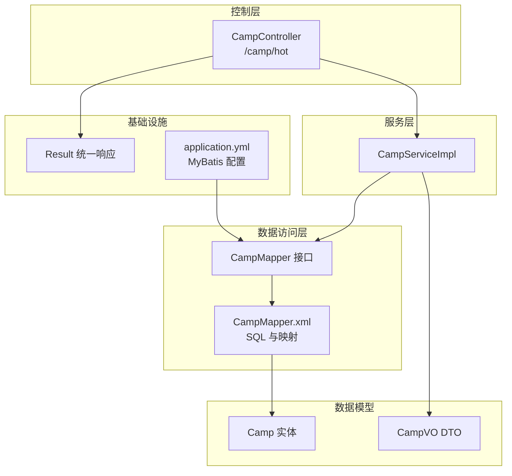
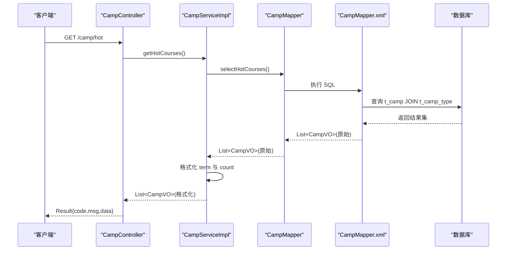
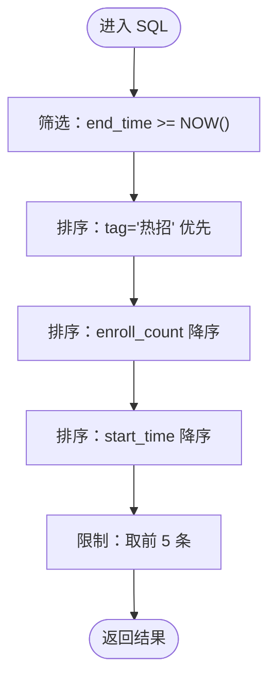
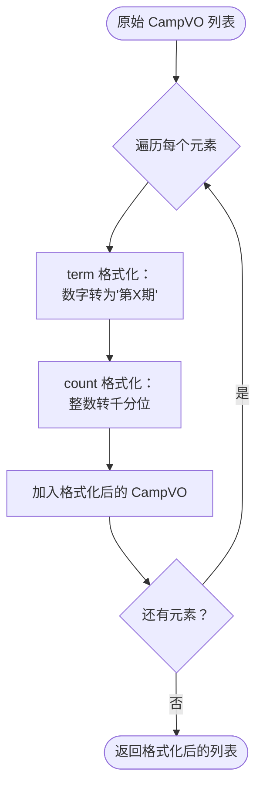
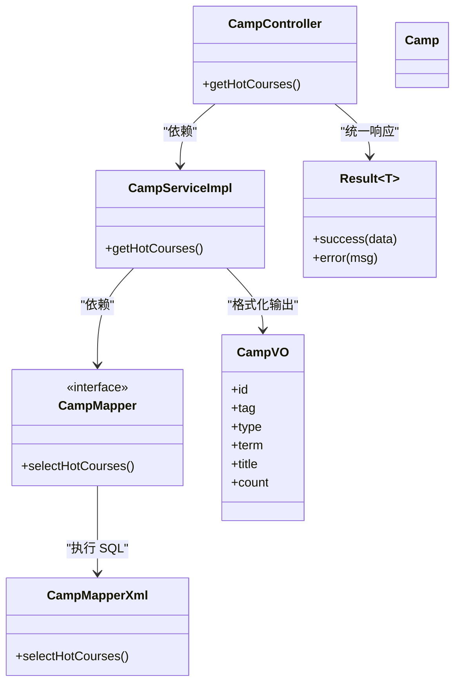

# 热门课程推荐

<cite>
**本文引用的文件**
- [CampVO.java](file://src/main/java/com/daily/dailychineseculture/dto/CampVO.java)
- [CampMapper.java](file://src/main/java/com/daily/dailychineseculture/mapper/CampMapper.java)
- [CampMapper.xml](file://src/main/resources/mapper/CampMapper.xml)
- [CampServiceImpl.java](file://src/main/java/com/daily/dailychineseculture/service/impl/CampServiceImpl.java)
- [CampController.java](file://src/main/java/com/daily/dailychineseculture/controller/CampController.java)
- [HotCourseRecommendationTest.java](file://src/test/java/com/daily/dailychineseculture/HotCourseRecommendationTest.java)
- [application.yml](file://src/main/resources/application.yml)
- [Result.java](file://src/main/java/com/daily/dailychineseculture/common/Result.java)
- [Camp.java](file://src/main/java/com/daily/dailychineseculture/entity/Camp.java)
- [热门课程推荐API文档.md](file://doc/热门课程推荐API文档.md)
- [热门课程与推荐.md](file://readme/课程管理模块/热门课程与推荐.md)
</cite>

## 目录
1. [简介](#简介)
2. [项目结构](#项目结构)
3. [核心组件](#核心组件)
4. [架构总览](#架构总览)
5. [详细组件分析](#详细组件分析)
6. [依赖关系分析](#依赖关系分析)
7. [性能考量](#性能考量)
8. [故障排查指南](#故障排查指南)
9. [结论](#结论)
10. [附录](#附录)

## 简介
本文件围绕“热门课程推荐”功能进行全面技术文档化，重点阐述：
- 基于 tag='热招' 的筛选逻辑
- enroll_count 排序机制
- 最新 5 条记录的获取策略
- CampVO 数据传输对象的设计与使用
- 与 CampMapper 的关联查询实现
- 推荐接口的调用示例（请求、响应、错误处理）
- 推荐系统的性能优化策略与缓存建议
- 课程热度指标的计算方法与业务规则

## 项目结构
热门课程推荐功能位于课程管理模块，采用经典的分层架构：Controller -> Service -> Mapper -> XML SQL。数据模型 Camp 与类型表 CampType 通过 LEFT JOIN 关联，最终输出 CampVO 作为对外展示的数据载体。

图表来源
- [CampController.java:49-58](file://src/main/java/com/daily/dailychineseculture/controller/CampController.java#L49-L58)
- [CampServiceImpl.java:43-90](file://src/main/java/com/daily/dailychineseculture/service/impl/CampServiceImpl.java#L43-L90)
- [CampMapper.java:36](file://src/main/java/com/daily/dailychineseculture/mapper/CampMapper.java#L36)
- [CampMapper.xml:139-157](file://src/main/resources/mapper/CampMapper.xml#L139-L157)
- [application.yml:17-22](file://src/main/resources/application.yml#L17-L22)

章节来源
- [CampController.java:49-58](file://src/main/java/com/daily/dailychineseculture/controller/CampController.java#L49-L58)
- [CampServiceImpl.java:43-90](file://src/main/java/com/daily/dailychineseculture/service/impl/CampServiceImpl.java#L43-L90)
- [CampMapper.java:36](file://src/main/java/com/daily/dailychineseculture/mapper/CampMapper.java#L36)
- [CampMapper.xml:139-157](file://src/main/resources/mapper/CampMapper.xml#L139-L157)
- [application.yml:17-22](file://src/main/resources/application.yml#L17-L22)

## 核心组件
- 数据传输对象（DTO）CampVO：封装对外展示字段，包含 id、tag、type、term、title、count。
- 数据访问层（Mapper）：提供 selectHotCourses 方法，SQL 完成联表、筛选、排序与限制。
- 服务层（Service）：在 Java 层进行 term 与 count 的格式化处理，确保前端友好展示。
- 控制器（Controller）：提供 /camp/hot 接口，统一返回 Result 包裹。
- 统一响应（Result）：标准化 code/msg/data 返回结构。
- 实体（Camp）：承载数据库字段，用于其他场景（如报名等）。

章节来源
- [CampVO.java:10-40](file://src/main/java/com/daily/dailychineseculture/dto/CampVO.java#L10-L40)
- [CampMapper.java:36](file://src/main/java/com/daily/dailychineseculture/mapper/CampMapper.java#L36)
- [CampServiceImpl.java:43-90](file://src/main/java/com/daily/dailychineseculture/service/impl/CampServiceImpl.java#L43-L90)
- [CampController.java:49-58](file://src/main/java/com/daily/dailychineseculture/controller/CampController.java#L49-L58)
- [Result.java:46-80](file://src/main/java/com/daily/dailychineseculture/common/Result.java#L46-L80)
- [Camp.java:13-63](file://src/main/java/com/daily/dailychineseculture/entity/Camp.java#L13-L63)

## 架构总览
热门课程推荐的调用链路如下：

图表来源
- [CampController.java:49-58](file://src/main/java/com/daily/dailychineseculture/controller/CampController.java#L49-L58)
- [CampServiceImpl.java:43-90](file://src/main/java/com/daily/dailychineseculture/service/impl/CampServiceImpl.java#L43-L90)
- [CampMapper.java:36](file://src/main/java/com/daily/dailychineseculture/mapper/CampMapper.java#L36)
- [CampMapper.xml:139-157](file://src/main/resources/mapper/CampMapper.xml#L139-L157)

## 详细组件分析

### 数据传输对象（CampVO）
- 字段设计：id、tag、type、term、title、count，满足首页推荐展示需求。
- 设计要点：字段语义清晰，便于前后端约定；count 由服务层格式化为千分位字符串，避免 SQL 端格式化复杂度。

章节来源
- [CampVO.java:10-40](file://src/main/java/com/daily/dailychineseculture/dto/CampVO.java#L10-L40)

### 关联查询与排序策略（CampMapper.xml）
- 表关联：LEFT JOIN t_camp_type，获取类型名称 level_name。
- 筛选条件：WHERE c.end_time >= NOW()，仅展示未结束的营期。
- 排序规则（三阶优先级）：
  1) tag='热招' 优先（使用 CASE WHEN 将其置前）
  2) enroll_count 降序
  3) start_time 降序
- 结果限制：LIMIT 5，确保只返回最新且最热门的 5 条记录。
- 输出字段：id、tag、type、term、title、count、start_time。

图表来源
- [CampMapper.xml:139-157](file://src/main/resources/mapper/CampMapper.xml#L139-L157)

章节来源
- [CampMapper.xml:139-157](file://src/main/resources/mapper/CampMapper.xml#L139-L157)

### 服务层格式化（CampServiceImpl）
- 原始数据来源：Mapper 返回的 List<CampVO>（原始字段）。
- term 格式化：将 term 数字拼接为“第 X 期”，若解析失败则回退为原始值。
- count 格式化：将 enroll_count 转为整数并格式化为千分位字符串，若为空则默认“0”。

图表来源
- [CampServiceImpl.java:43-90](file://src/main/java/com/daily/dailychineseculture/service/impl/CampServiceImpl.java#L43-L90)

章节来源
- [CampServiceImpl.java:43-90](file://src/main/java/com/daily/dailychineseculture/service/impl/CampServiceImpl.java#L43-L90)

### 控制器与统一响应（CampController + Result）
- 接口路径：GET /camp/hot
- 返回结构：Result<List<CampVO>>，code=200 表示成功，msg 为 success。
- 异常处理：捕获异常并返回 Result.error(...)，便于前端统一处理。

章节来源
- [CampController.java:49-58](file://src/main/java/com/daily/dailychineseculture/controller/CampController.java#L49-L58)
- [Result.java:46-80](file://src/main/java/com/daily/dailychineseculture/common/Result.java#L46-L80)

### 测试验证（HotCourseRecommendationTest）
- 接口测试：调用 /camp/hot，断言 code=200、data 非空、数量 ≤ 5。
- 服务层直测：直接调用 getHotCourses，验证返回数据结构与数量约束。

章节来源
- [HotCourseRecommendationTest.java:27-55](file://src/test/java/com/daily/dailychineseculture/HotCourseRecommendationTest.java#L27-L55)
- [HotCourseRecommendationTest.java:57-72](file://src/test/java/com/daily/dailychineseculture/HotCourseRecommendationTest.java#L57-L72)

## 依赖关系分析
- 控制器依赖服务层；服务层依赖 Mapper 接口；Mapper 通过 XML 执行 SQL。
- MyBatis 配置启用下划线到驼峰映射，CampVO 字段与 SQL 别名一一对应。
- 应用配置指定 Mapper XML 位置，确保 XML 能被正确加载。

图表来源
- [CampController.java:49-58](file://src/main/java/com/daily/dailychineseculture/controller/CampController.java#L49-L58)
- [CampServiceImpl.java:43-90](file://src/main/java/com/daily/dailychineseculture/service/impl/CampServiceImpl.java#L43-L90)
- [CampMapper.java:36](file://src/main/java/com/daily/dailychineseculture/mapper/CampMapper.java#L36)
- [CampMapper.xml:139-157](file://src/main/resources/mapper/CampMapper.xml#L139-L157)
- [Result.java:46-80](file://src/main/java/com/daily/dailychineseculture/common/Result.java#L46-L80)
- [CampVO.java:10-40](file://src/main/java/com/daily/dailychineseculture/dto/CampVO.java#L10-L40)
- [Camp.java:13-63](file://src/main/java/com/daily/dailychineseculture/entity/Camp.java#L13-L63)

章节来源
- [application.yml:17-22](file://src/main/resources/application.yml#L17-L22)

## 性能考量
- 查询限制：SQL 限定返回 5 条记录，避免大数据量传输。
- 排序优化：通过 CASE WHEN 将 tag='热招' 的营期置前，减少前端二次排序成本。
- 格式化下沉：将 term 与 count 的格式化放在 Java 层，保持 SQL 简洁；同时注意异常分支的健壮性。
- 索引建议：在 t_camp 的 end_time、enroll_count、start_time 上建立合适索引，提升排序与筛选效率。
- 缓存建议：针对热门课程推荐接口增加缓存（如 Redis），设置合理 TTL，降低数据库压力；在营期状态变更或报名人数变化时失效缓存。

章节来源
- [CampMapper.xml:139-157](file://src/main/resources/mapper/CampMapper.xml#L139-L157)
- [CampServiceImpl.java:43-90](file://src/main/java/com/daily/dailychineseculture/service/impl/CampServiceImpl.java#L43-L90)

## 故障排查指南
- 接口返回非 200：检查控制器异常捕获与 Result.error 的消息内容。
- 返回数据为空：确认 t_camp 中是否存在 end_time >= NOW() 的记录；核对 SQL 筛选条件。
- term 格式异常：当 term 非数字时，服务层会回退为原始值；请检查数据质量。
- count 格式异常：当 enroll_count 非法或为空时，默认显示“0”；请检查数据完整性。
- 数据库连接问题：检查 application.yml 中的数据库连接配置与驱动。

章节来源
- [CampController.java:49-58](file://src/main/java/com/daily/dailychineseculture/controller/CampController.java#L49-L58)
- [CampServiceImpl.java:43-90](file://src/main/java/com/daily/dailychineseculture/service/impl/CampServiceImpl.java#L43-L90)
- [application.yml:7-11](file://src/main/resources/application.yml#L7-L11)

## 结论
热门课程推荐功能通过“标签优先 + 报名人数 + 时间”的三阶排序策略，结合 SQL 限制与服务层格式化，实现了稳定高效的首页推荐能力。建议后续引入缓存与索引优化，进一步提升性能与可维护性。

## 附录

### 接口调用示例
- 请求
  - 方法：GET
  - 路径：/camp/hot
  - 示例：http://localhost:8080/camp/hot
- 响应
  - 结构：Result<List<CampVO>>
  - 字段说明：
    - code：200 表示成功
    - msg：success
    - data：CampVO 数组，最多 5 条
- 错误处理
  - 控制器捕获异常并返回 Result.error(...)
  - 前端统一处理 code 非 200 的情况

章节来源
- [热门课程推荐API文档.md:8-41](file://doc/热门课程推荐API文档.md#L8-L41)
- [CampController.java:49-58](file://src/main/java/com/daily/dailychineseculture/controller/CampController.java#L49-L58)
- [Result.java:46-80](file://src/main/java/com/daily/dailychineseculture/common/Result.java#L46-L80)

### 业务规则与热度指标
- 筛选规则：仅展示未结束的营期（end_time >= NOW()）。
- 热度指标：
  - 标签权重：tag='热招' 的营期优先展示。
  - 人气权重：enroll_count 降序。
  - 时间权重：start_time 降序。
- 展示格式：
  - term：数字转为“第 X 期”
  - count：整数转千分位字符串

章节来源
- [CampMapper.xml:139-157](file://src/main/resources/mapper/CampMapper.xml#L139-L157)
- [CampServiceImpl.java:43-90](file://src/main/java/com/daily/dailychineseculture/service/impl/CampServiceImpl.java#L43-L90)
- [热门课程与推荐.md:89-124](file://readme/课程管理模块/热门课程与推荐.md#L89-L124)