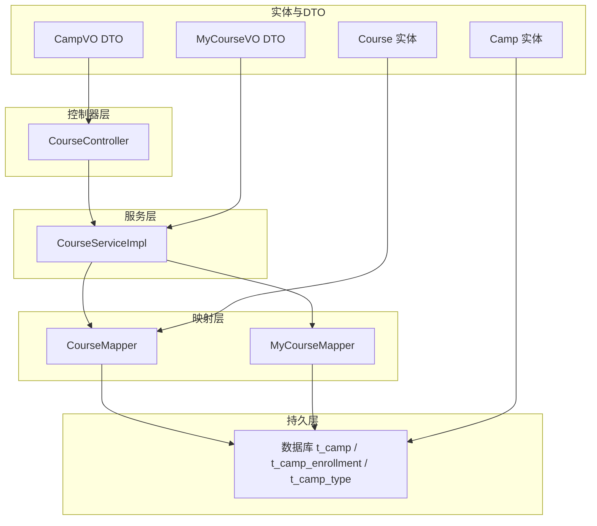
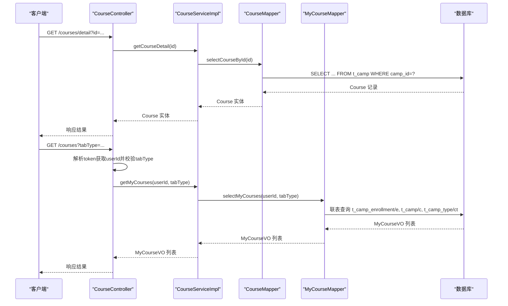
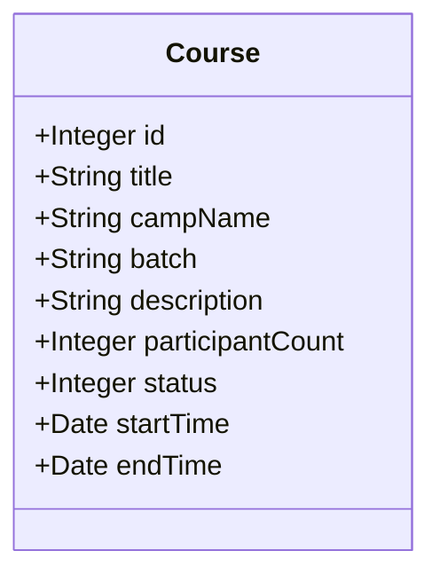
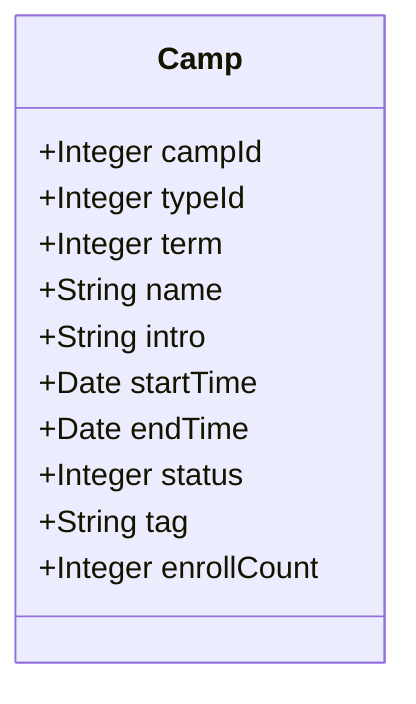
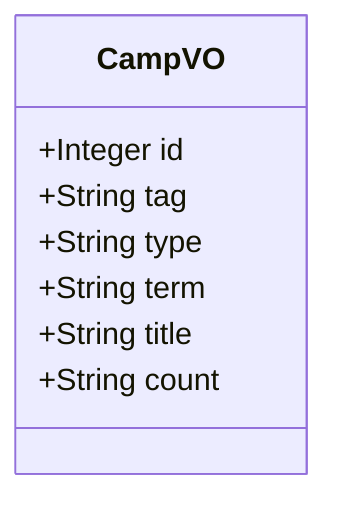
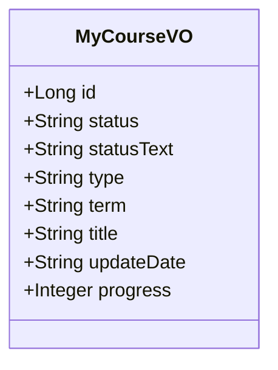
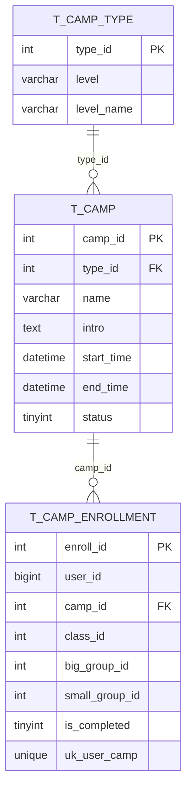
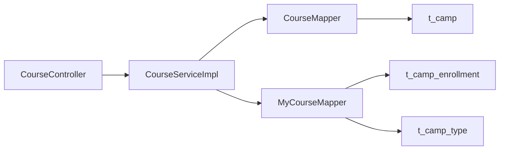
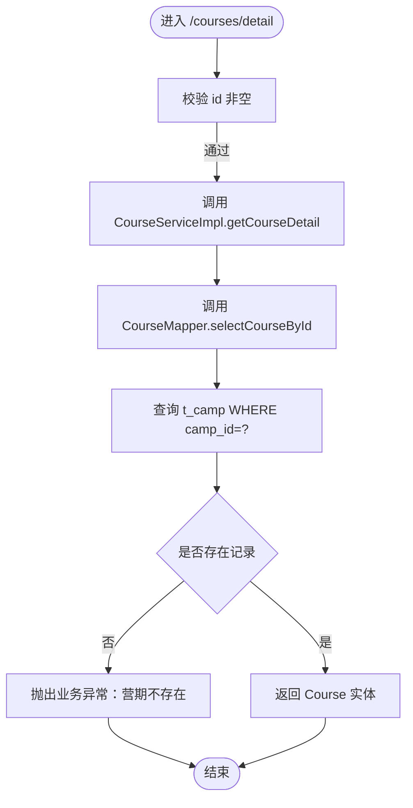

# 课程数据模型

<cite>
**本文引用的文件**
- [Course.java](file://src/main/java/com/daily/dailychineseculture/entity/Course.java)
- [Camp.java](file://src/main/java/com/daily/dailychineseculture/entity/Camp.java)
- [CampVO.java](file://src/main/java/com/daily/dailychineseculture/dto/CampVO.java)
- [MyCourseVO.java](file://src/main/java/com/daily/dailychineseculture/dto/MyCourseVO.java)
- [CourseMapper.java](file://src/main/java/com/daily/dailychineseculture/mapper/CourseMapper.java)
- [MyCourseMapper.java](file://src/main/java/com/daily/dailychineseculture/mapper/MyCourseMapper.java)
- [CourseController.java](file://src/main/java/com/daily/dailychineseculture/controller/CourseController.java)
- [CourseServiceImpl.java](file://src/main/java/com/daily/dailychineseculture/service/impl/CourseServiceImpl.java)
- [application.yml](file://src/main/resources/application.yml)
- [数据库代码.txt](file://数据库代码.txt)
</cite>

## 目录
1. [引言](#引言)
2. [项目结构](#项目结构)
3. [核心组件](#核心组件)
4. [架构总览](#架构总览)
5. [详细组件分析](#详细组件分析)
6. [依赖关系分析](#依赖关系分析)
7. [性能考量](#性能考量)
8. [故障排查指南](#故障排查指南)
9. [结论](#结论)
10. [附录](#附录)

## 引言
本文件系统性梳理课程相关的数据模型设计，覆盖实体类与数据传输对象（DTO/VO）的字段定义、业务含义、类间关系与继承结构；解释数据模型与数据库表的映射关系（主键、外键、索引）；给出使用示例与最佳实践；并分析扩展性与版本兼容性、数据验证规则、默认值与空值处理策略。

## 项目结构
课程数据模型主要分布在以下层次：
- 实体层：Course、Camp
- 数据传输层：CampVO、MyCourseVO
- 映射层：CourseMapper、MyCourseMapper
- 控制器与服务：CourseController、CourseServiceImpl
- 配置：application.yml（MyBatis驼峰映射）
- 数据库：数据库初始化脚本（含表结构、主外键、索引）

图表来源
- [CourseController.java:1-100](file://src/main/java/com/daily/dailychineseculture/controller/CourseController.java#L1-L100)
- [CourseServiceImpl.java:1-400](file://src/main/java/com/daily/dailychineseculture/service/impl/CourseServiceImpl.java#L1-L400)
- [CourseMapper.java:1-53](file://src/main/java/com/daily/dailychineseculture/mapper/CourseMapper.java#L1-L53)
- [MyCourseMapper.java:1-59](file://src/main/java/com/daily/dailychineseculture/mapper/MyCourseMapper.java#L1-L59)
- [Course.java:1-60](file://src/main/java/com/daily/dailychineseculture/entity/Course.java#L1-L60)
- [Camp.java:1-64](file://src/main/java/com/daily/dailychineseculture/entity/Camp.java#L1-L64)
- [CampVO.java:1-40](file://src/main/java/com/daily/dailychineseculture/dto/CampVO.java#L1-L40)
- [MyCourseVO.java:1-57](file://src/main/java/com/daily/dailychineseculture/dto/MyCourseVO.java#L1-L57)

章节来源
- [CourseController.java:1-100](file://src/main/java/com/daily/dailychineseculture/controller/CourseController.java#L1-L100)
- [CourseServiceImpl.java:1-400](file://src/main/java/com/daily/dailychineseculture/service/impl/CourseServiceImpl.java#L1-L400)
- [CourseMapper.java:1-53](file://src/main/java/com/daily/dailychineseculture/mapper/CourseMapper.java#L1-L53)
- [MyCourseMapper.java:1-59](file://src/main/java/com/daily/dailychineseculture/mapper/MyCourseMapper.java#L1-L59)
- [Course.java:1-60](file://src/main/java/com/daily/dailychineseculture/entity/Course.java#L1-L60)
- [Camp.java:1-64](file://src/main/java/com/daily/dailychineseculture/entity/Camp.java#L1-L64)
- [CampVO.java:1-40](file://src/main/java/com/daily/dailychineseculture/dto/CampVO.java#L1-L40)
- [MyCourseVO.java:1-57](file://src/main/java/com/daily/dailychineseculture/dto/MyCourseVO.java#L1-L57)
- [application.yml:1-33](file://src/main/resources/application.yml#L1-L33)
- [数据库代码.txt:1-165](file://数据库代码.txt#L1-L165)

## 核心组件
本节聚焦课程数据模型的关键类及其职责：
- Course 实体：承载“课程”在业务侧的展示与筛选需求，包含课程标识、标题、期数、描述、参与人数、状态、起止时间等。
- Camp 实体：承载“营期”的核心信息，与课程概念紧密关联，包含营期ID、类型、期数、名称、介绍、起止时间、状态、标签、报名人数等。
- CampVO DTO：面向“热门课程推荐”场景的数据传输对象，包含营销角标、班级类型名称、期数、标题、报名人数等字段。
- MyCourseVO DTO：面向“我的课程”页面的数据传输对象，包含状态编码与文本、班级类型名称、期数、标题、更新日期、学习进度等。

章节来源
- [Course.java:1-60](file://src/main/java/com/daily/dailychineseculture/entity/Course.java#L1-L60)
- [Camp.java:1-64](file://src/main/java/com/daily/dailychineseculture/entity/Camp.java#L1-L64)
- [CampVO.java:1-40](file://src/main/java/com/daily/dailychineseculture/dto/CampVO.java#L1-L40)
- [MyCourseVO.java:1-57](file://src/main/java/com/daily/dailychineseculture/dto/MyCourseVO.java#L1-L57)

## 架构总览
课程数据模型遵循经典的分层架构：控制器接收请求并进行参数校验，服务层编排业务逻辑与数据装配，映射层负责与数据库交互，实体与DTO承担数据载体职责。MyBatis启用驼峰命名自动映射，简化数据库字段与Java属性的映射。

图表来源
- [CourseController.java:87-98](file://src/main/java/com/daily/dailychineseculture/controller/CourseController.java#L87-L98)
- [CourseServiceImpl.java:71-84](file://src/main/java/com/daily/dailychineseculture/service/impl/CourseServiceImpl.java#L71-L84)
- [CourseMapper.java:39-51](file://src/main/java/com/daily/dailychineseculture/mapper/CourseMapper.java#L39-L51)
- [MyCourseMapper.java:27-58](file://src/main/java/com/daily/dailychineseculture/mapper/MyCourseMapper.java#L27-L58)

## 详细组件分析

### Course 实体
- 字段与业务含义
  - id：课程唯一标识，对应数据库表 t_camp 的 camp_id。
  - title：课程标题，对应数据库表 t_camp 的 name。
  - campName：营期名称，与 title 同源，便于前端统一展示。
  - batch：批次/期数，由 SQL 使用 CONCAT('第', term, '期') 生成。
  - description：课程描述，对应数据库表 t_camp 的 intro。
  - participantCount：参与人数，对应数据库表 t_camp 的 enroll_count。
  - status：状态，1=招生中/开课中，0=已结束，-1=下架。
  - startTime/endTime：开/结束时间。
- 关系映射
  - 与 t_camp 表一一对应，CourseMapper 提供按状态与时间过滤的查询。
- 继承结构
  - Course 为独立实体类，未见继承关系。

图表来源
- [Course.java:13-58](file://src/main/java/com/daily/dailychineseculture/entity/Course.java#L13-L58)

章节来源
- [Course.java:1-60](file://src/main/java/com/daily/dailychineseculture/entity/Course.java#L1-L60)
- [CourseMapper.java:23-37](file://src/main/java/com/daily/dailychineseculture/mapper/CourseMapper.java#L23-L37)

### Camp 实体
- 字段与业务含义
  - campId：营期ID，对应数据库表 t_camp 的 camp_id。
  - typeId：营期类型ID，对应数据库表 t_camp 的 type_id。
  - term：期数。
  - name/intro：营期名称与介绍。
  - startTime/endTime：开/结束时间。
  - status：0=未开始，1=进行中，2=已结束。
  - tag：标签。
  - enrollCount：报名人数。
- 关系映射
  - 与 t_camp 表一一对应，Camp 实体用于服务层内部装配与跨模块复用。

图表来源
- [Camp.java:13-62](file://src/main/java/com/daily/dailychineseculture/entity/Camp.java#L13-L62)

章节来源
- [Camp.java:1-64](file://src/main/java/com/daily/dailychineseculture/entity/Camp.java#L1-L64)

### CampVO DTO（热门课程推荐）
- 字段与业务含义
  - id：营期ID。
  - tag：营销角标。
  - type：班级类型名称（来自 t_camp_type.level_name）。
  - term：期数（格式化为“第X期”）。
  - title：课程标题。
  - count：报名人数（格式化为千分位字符串）。
- 使用场景
  - 用于首页热门课程推荐展示，由 CampService 查询并返回。

图表来源
- [CampVO.java:10-39](file://src/main/java/com/daily/dailychineseculture/dto/CampVO.java#L10-L39)

章节来源
- [CampVO.java:1-40](file://src/main/java/com/daily/dailychineseculture/dto/CampVO.java#L1-L40)

### MyCourseVO DTO（我的课程）
- 字段与业务含义
  - id：课程ID（Long）。
  - status：状态编码，ing=学习中，hist=已结营，done=已结业。
  - statusText：状态文本描述。
  - type：班级类型名称。
  - term：期数（格式化为“第X期”）。
  - title：课程标题。
  - updateDate：更新日期（格式化为 yyyy-MM-dd）。
  - progress：学习进度（0-100）。
- 使用场景
  - “我的课程”页面展示，由 MyCourseMapper 联表查询并装配。

图表来源
- [MyCourseVO.java:13-56](file://src/main/java/com/daily/dailychineseculture/dto/MyCourseVO.java#L13-L56)

章节来源
- [MyCourseVO.java:1-57](file://src/main/java/com/daily/dailychineseculture/dto/MyCourseVO.java#L1-L57)

### 数据模型与数据库表映射
- Course 与 t_camp
  - 字段映射：camp_id→id，name→title/campName，term→batch，intro→description，enroll_count→participantCount，start_time→startTime，end_time→endTime。
  - 状态差异：列表接口使用 CASE WHEN 动态计算 status，详情接口使用物理字段 status，存在行为不一致风险。
- MyCourseVO 与 t_camp_enrollment、t_camp、t_camp_type
  - 通过联表查询装配：e.camp_id→id，ct.level_name→type，CONCAT('第', c.term, '期')→term，c.name→title，DATE_FORMAT(e.create_time, '%Y-%m-%d')→updateDate，e.progress→progress。
  - 状态计算：根据 e.is_completed 与 c.status 动态生成 status 与 statusText。
- CampVO 与 t_camp、t_camp_type
  - 通过联表查询装配：tag、type、term、title、count 等字段。

图表来源
- [数据库代码.txt:61-120](file://数据库代码.txt#L61-L120)

章节来源
- [Course.java:13-58](file://src/main/java/com/daily/dailychineseculture/entity/Course.java#L13-L58)
- [Camp.java:13-62](file://src/main/java/com/daily/dailychineseculture/entity/Camp.java#L13-L62)
- [CourseMapper.java:23-51](file://src/main/java/com/daily/dailychineseculture/mapper/CourseMapper.java#L23-L51)
- [MyCourseMapper.java:27-58](file://src/main/java/com/daily/dailychineseculture/mapper/MyCourseMapper.java#L27-L58)
- [数据库代码.txt:61-120](file://数据库代码.txt#L61-L120)

### 使用示例与最佳实践
- 获取课程详情
  - 控制器：/courses/detail?id={id}
  - 服务：CourseServiceImpl.getCourseDetail → CourseMapper.selectCourseById
  - 建议：对 id 进行非空校验，对返回结果判空并抛出业务异常。
- 获取我的课程列表
  - 控制器：/courses?tabType={1|2|3}
  - 服务：CourseServiceImpl.getMyCourses → MyCourseMapper.selectMyCourses
  - 建议：token 解析失败时返回 401，tabType 校验范围 1..3。
- 热门课程推荐
  - 控制器：/courses/hot
  - 服务：CampService.getHotCourses（由控制器调用）
  - 建议：按 enroll_count 降序取前 N 条，确保 tag 字段用于筛选热招课程。

章节来源
- [CourseController.java:48-98](file://src/main/java/com/daily/dailychineseculture/controller/CourseController.java#L48-L98)
- [CourseServiceImpl.java:71-84](file://src/main/java/com/daily/dailychineseculture/service/impl/CourseServiceImpl.java#L71-L84)
- [CourseMapper.java:39-51](file://src/main/java/com/daily/dailychineseculture/mapper/CourseMapper.java#L39-L51)
- [MyCourseMapper.java:27-58](file://src/main/java/com/daily/dailychineseculture/mapper/MyCourseMapper.java#L27-L58)

### 扩展性设计与版本兼容性
- 扩展性
  - DTO/VO 与实体分离，便于向前兼容地增加新字段而不影响现有接口。
  - Mapper 层采用原生注解 SQL，便于按需扩展查询维度。
- 兼容性
  - Course 与 t_camp 字段映射清晰，但列表与详情接口对 status 的处理不一致，建议统一为动态计算以保证一致性。
  - MyCourseVO 的状态计算依赖多个表字段，扩展时需保持联表逻辑稳定。

章节来源
- [CourseMapper.java:23-51](file://src/main/java/com/daily/dailychineseculture/mapper/CourseMapper.java#L23-L51)
- [MyCourseMapper.java:27-58](file://src/main/java/com/daily/dailychineseculture/mapper/MyCourseMapper.java#L27-L58)

### 数据验证规则、默认值与空值处理
- 参数校验
  - 课程详情：id 非空。
  - 我的课程：tabType 非空且在 1..3 范围内；token 解析失败返回 401。
- 默认值与空值处理
  - 服务层对可能为空的字段进行兜底赋值（如 description、participantCount），避免前端空指针。
  - MyCourseVO 的 progress 为 0-100，若无进度则默认 0。

章节来源
- [CourseController.java:87-98](file://src/main/java/com/daily/dailychineseculture/controller/CourseController.java#L87-L98)
- [CourseServiceImpl.java:391-398](file://src/main/java/com/daily/dailychineseculture/service/impl/CourseServiceImpl.java#L391-L398)
- [CourseServiceImpl.java:369-388](file://src/main/java/com/daily/dailychineseculture/service/impl/CourseServiceImpl.java#L369-L388)

## 依赖关系分析
- 类间依赖
  - CourseController 依赖 CourseServiceImpl 与 JwtUtils。
  - CourseServiceImpl 依赖 CourseMapper、MyCourseMapper、CampMapper 等。
  - MyCourseMapper 依赖 t_camp_enrollment、t_camp、t_camp_type。
  - CourseMapper 依赖 t_camp。
- 配置依赖
  - application.yml 开启 map-underscore-to-camel-case，使数据库下划线字段自动映射到 Java 驼峰属性。

图表来源
- [CourseController.java:31-38](file://src/main/java/com/daily/dailychineseculture/controller/CourseController.java#L31-L38)
- [CourseServiceImpl.java:47-69](file://src/main/java/com/daily/dailychineseculture/service/impl/CourseServiceImpl.java#L47-L69)
- [CourseMapper.java:3-4](file://src/main/java/com/daily/dailychineseculture/mapper/CourseMapper.java#L3-L4)
- [MyCourseMapper.java:3-4](file://src/main/java/com/daily/dailychineseculture/mapper/MyCourseMapper.java#L3-L4)
- [application.yml:18-20](file://src/main/resources/application.yml#L18-L20)

章节来源
- [CourseController.java:1-100](file://src/main/java/com/daily/dailychineseculture/controller/CourseController.java#L1-L100)
- [CourseServiceImpl.java:1-400](file://src/main/java/com/daily/dailychineseculture/service/impl/CourseServiceImpl.java#L1-L400)
- [application.yml:17-22](file://src/main/resources/application.yml#L17-L22)

## 性能考量
- 查询优化
  - CourseMapper 的列表查询对 end_time ≥ NOW() 进行过滤，避免加载已结束课程。
  - MyCourseMapper 使用联表查询并按 enroll_id 创建时间倒序，减少不必要的全表扫描。
- 映射优化
  - application.yml 开启驼峰映射，减少手动字段映射成本。
- 建议
  - 为 t_camp 的 status、start_time、end_time 建立复合索引以提升筛选与排序性能。
  - 为 t_camp_enrollment 的 user_id、camp_id 建立联合索引 uk_user_camp，提升查询效率。

章节来源
- [CourseMapper.java:23-37](file://src/main/java/com/daily/dailychineseculture/mapper/CourseMapper.java#L23-L37)
- [MyCourseMapper.java:49-55](file://src/main/java/com/daily/dailychineseculture/mapper/MyCourseMapper.java#L49-L55)
- [application.yml:18-20](file://src/main/resources/application.yml#L18-L20)
- [数据库代码.txt:109-120](file://数据库代码.txt#L109-L120)

## 故障排查指南
- 课程详情接口返回空
  - 检查 id 是否为空；确认 t_camp 是否存在对应记录；确认 CourseMapper 的 SQL 是否正确映射字段。
- 我的课程列表为空
  - 检查 token 是否有效；确认 tabType 是否为 1..3；确认 t_camp_enrollment 是否存在用户报名记录。
- 状态不一致问题
  - 列表接口使用 CASE WHEN 动态计算 status，详情接口使用物理字段 status，建议统一为动态计算以保证一致性。
- 字段映射错误
  - 确认 application.yml 已开启 map-underscore-to-camel-case；检查实体类字段命名是否符合驼峰规范。

章节来源
- [CourseController.java:87-98](file://src/main/java/com/daily/dailychineseculture/controller/CourseController.java#L87-L98)
- [CourseServiceImpl.java:391-398](file://src/main/java/com/daily/dailychineseculture/service/impl/CourseServiceImpl.java#L391-L398)
- [CourseMapper.java:23-51](file://src/main/java/com/daily/dailychineseculture/mapper/CourseMapper.java#L23-L51)
- [application.yml:18-20](file://src/main/resources/application.yml#L18-L20)

## 结论
课程数据模型通过清晰的实体与 DTO 分层、稳定的数据库映射以及完善的控制器与服务层编排，实现了从列表、详情到个人课程的全链路能力。建议统一状态计算逻辑、完善索引设计，并持续通过 DTO/VO 的演进保障接口的向后兼容性与扩展性。

## 附录
- 关键流程图：课程详情查询流程

图表来源
- [CourseController.java:87-98](file://src/main/java/com/daily/dailychineseculture/controller/CourseController.java#L87-L98)
- [CourseServiceImpl.java:391-398](file://src/main/java/com/daily/dailychineseculture/service/impl/CourseServiceImpl.java#L391-L398)
- [CourseMapper.java:39-51](file://src/main/java/com/daily/dailychineseculture/mapper/CourseMapper.java#L39-L51)