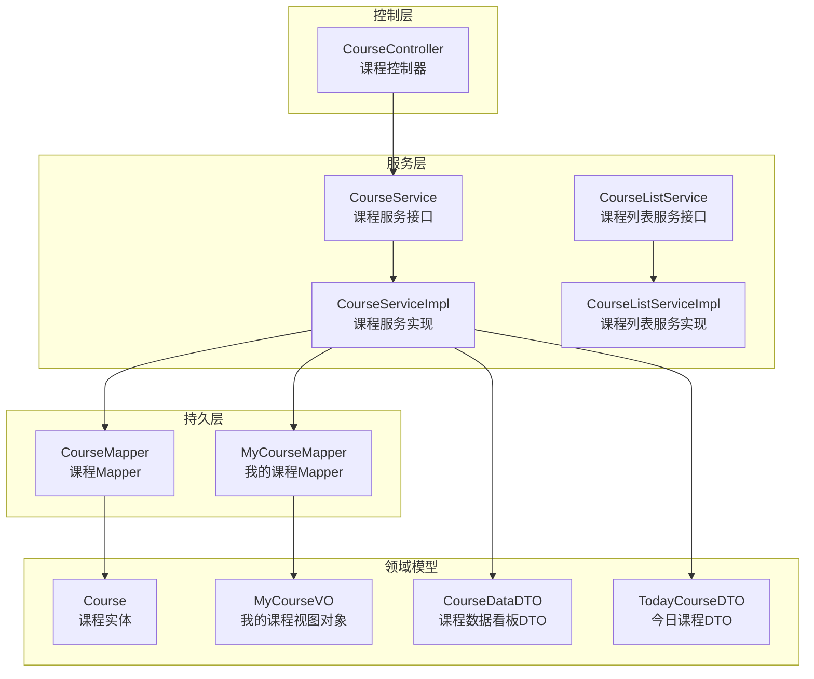
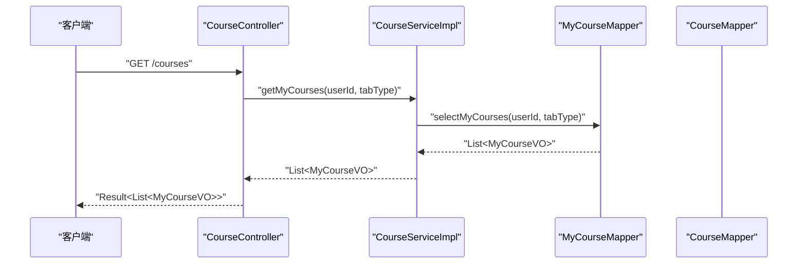
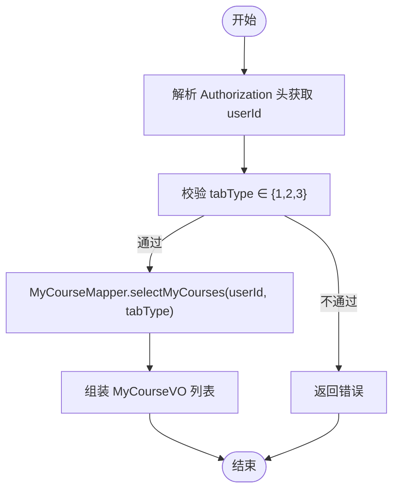
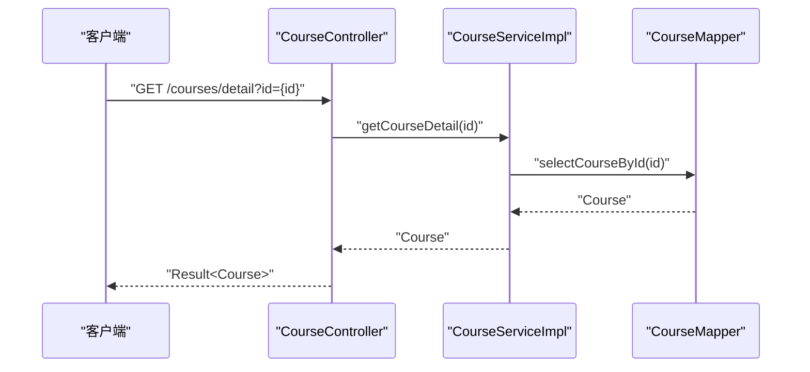
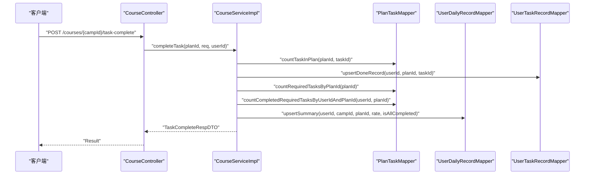
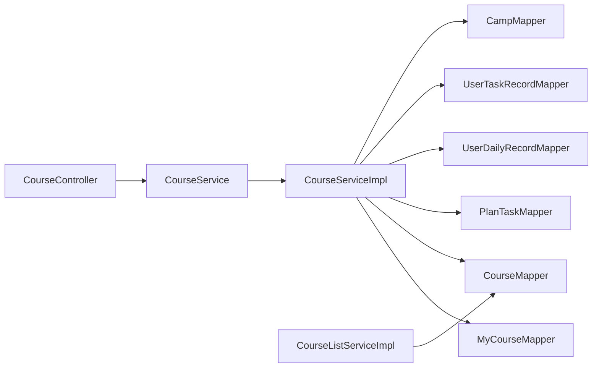

# 课程管理模块

<cite>
**本文引用的文件**
- [CourseController.java](file://src/main/java/com/daily/dailychineseculture/controller/CourseController.java)
- [CourseService.java](file://src/main/java/com/daily/dailychineseculture/service/CourseService.java)
- [CourseServiceImpl.java](file://src/main/java/com/daily/dailychineseculture/service/impl/CourseServiceImpl.java)
- [CourseMapper.java](file://src/main/java/com/daily/dailychineseculture/mapper/CourseMapper.java)
- [MyCourseMapper.java](file://src/main/java/com/daily/dailychineseculture/mapper/MyCourseMapper.java)
- [Course.java](file://src/main/java/com/daily/dailychineseculture/entity/Course.java)
- [MyCourseVO.java](file://src/main/java/com/daily/dailychineseculture/dto/MyCourseVO.java)
- [CourseDataDTO.java](file://src/main/java/com/daily/dailychineseculture/dto/CourseDataDTO.java)
- [TodayCourseDTO.java](file://src/main/java/com/daily/dailychineseculture/dto/TodayCourseDTO.java)
- [CourseListService.java](file://src/main/java/com/daily/dailychineseculture/service/CourseListService.java)
- [CourseListServiceImpl.java](file://src/main/java/com/daily/dailychineseculture/service/impl/CourseListServiceImpl.java)
- [我的课程管理.md](file://readme/课程管理模块/我的课程管理.md)
</cite>

## 目录
1. [简介](#简介)
2. [项目结构](#项目结构)
3. [核心组件](#核心组件)
4. [架构总览](#架构总览)
5. [详细组件分析](#详细组件分析)
6. [依赖分析](#依赖分析)
7. [性能考虑](#性能考虑)
8. [故障排除指南](#故障排除指南)
9. [结论](#结论)
10. [附录](#附录)

## 简介
本文件系统性梳理课程管理模块的功能与实现，覆盖以下主题：
- 热门课程推荐算法与接口
- 我的课程管理（按状态筛选、进度展示）
- 课程详情查询
- 课程数据组织结构、学习进度跟踪与完成状态管理
- 课程分类体系、标签与搜索能力
- 增删改查、批量操作、导入导出与数据同步
- 课程统计分析、学习行为追踪与效果评估
- 课程内容管理、多媒体资源处理与学习路径规划

## 项目结构
课程管理模块采用经典的分层架构：Controller 控制器负责对外接口；Service 服务层封装业务逻辑；Mapper 持久层执行数据库操作；Entity/DTO/VO 定义数据模型。

图表来源
- [CourseController.java:27-99](file://src/main/java/com/daily/dailychineseculture/controller/CourseController.java#L27-L99)
- [CourseService.java:21-79](file://src/main/java/com/daily/dailychineseculture/service/CourseService.java#L21-L79)
- [CourseServiceImpl.java:44-399](file://src/main/java/com/daily/dailychineseculture/service/impl/CourseServiceImpl.java#L44-L399)
- [CourseMapper.java:14-52](file://src/main/java/com/daily/dailychineseculture/mapper/CourseMapper.java#L14-L52)
- [MyCourseMapper.java:17-58](file://src/main/java/com/daily/dailychineseculture/mapper/MyCourseMapper.java#L17-L58)
- [Course.java:11-59](file://src/main/java/com/daily/dailychineseculture/entity/Course.java#L11-L59)
- [MyCourseVO.java:12-56](file://src/main/java/com/daily/dailychineseculture/dto/MyCourseVO.java#L12-L56)
- [CourseDataDTO.java:9-35](file://src/main/java/com/daily/dailychineseculture/dto/CourseDataDTO.java#L9-L35)
- [TodayCourseDTO.java:13-41](file://src/main/java/com/daily/dailychineseculture/dto/TodayCourseDTO.java#L13-L41)

章节来源
- [CourseController.java:27-99](file://src/main/java/com/daily/dailychineseculture/controller/CourseController.java#L27-L99)
- [CourseServiceImpl.java:44-399](file://src/main/java/com/daily/dailychineseculture/service/impl/CourseServiceImpl.java#L44-L399)
- [CourseMapper.java:14-52](file://src/main/java/com/daily/dailychineseculture/mapper/CourseMapper.java#L14-L52)
- [MyCourseMapper.java:17-58](file://src/main/java/com/daily/dailychineseculture/mapper/MyCourseMapper.java#L17-L58)
- [Course.java:11-59](file://src/main/java/com/daily/dailychineseculture/entity/Course.java#L11-L59)
- [MyCourseVO.java:12-56](file://src/main/java/com/daily/dailychineseculture/dto/MyCourseVO.java#L12-L56)
- [CourseDataDTO.java:9-35](file://src/main/java/com/daily/dailychineseculture/dto/CourseDataDTO.java#L9-L35)
- [TodayCourseDTO.java:13-41](file://src/main/java/com/daily/dailychineseculture/dto/TodayCourseDTO.java#L13-L41)

## 核心组件
- 课程控制器：提供热门课程、我的课程、课程详情等接口。
- 课程服务：封装我的课程查询、课程目录、今日课程、任务完成、数据看板、营期信息、课程详情等业务。
- 课程列表服务：基于分页插件提供课程列表分页查询。
- Mapper 层：封装 SQL 查询，包括课程列表、我的课程、课程详情等。
- 领域模型：Course 实体、MyCourseVO 视图对象、CourseDataDTO/TodayCourseDTO 数据传输对象。

章节来源
- [CourseController.java:27-99](file://src/main/java/com/daily/dailychineseculture/controller/CourseController.java#L27-L99)
- [CourseService.java:21-79](file://src/main/java/com/daily/dailychineseculture/service/CourseService.java#L21-L79)
- [CourseServiceImpl.java:44-399](file://src/main/java/com/daily/dailychineseculture/service/impl/CourseServiceImpl.java#L44-L399)
- [CourseListService.java:10-20](file://src/main/java/com/daily/dailychineseculture/service/CourseListService.java#L10-L20)
- [CourseListServiceImpl.java:17-29](file://src/main/java/com/daily/dailychineseculture/service/impl/CourseListServiceImpl.java#L17-L29)
- [CourseMapper.java:14-52](file://src/main/java/com/daily/dailychineseculture/mapper/CourseMapper.java#L14-L52)
- [MyCourseMapper.java:17-58](file://src/main/java/com/daily/dailychineseculture/mapper/MyCourseMapper.java#L17-L58)
- [Course.java:11-59](file://src/main/java/com/daily/dailychineseculture/entity/Course.java#L11-L59)
- [MyCourseVO.java:12-56](file://src/main/java/com/daily/dailychineseculture/dto/MyCourseVO.java#L12-L56)
- [CourseDataDTO.java:9-35](file://src/main/java/com/daily/dailychineseculture/dto/CourseDataDTO.java#L9-L35)
- [TodayCourseDTO.java:13-41](file://src/main/java/com/daily/dailychineseculture/dto/TodayCourseDTO.java#L13-L41)

## 架构总览
课程管理模块遵循典型的 MVC + 分层架构，接口请求经由控制器进入服务层，服务层协调多个 Mapper 完成数据查询与写入，最终返回 DTO/VO 给前端。

图表来源
- [CourseController.java:61-85](file://src/main/java/com/daily/dailychineseculture/controller/CourseController.java#L61-L85)
- [CourseServiceImpl.java:71-84](file://src/main/java/com/daily/dailychineseculture/service/impl/CourseServiceImpl.java#L71-L84)
- [MyCourseMapper.java:27-58](file://src/main/java/com/daily/dailychineseculture/mapper/MyCourseMapper.java#L27-L58)

## 详细组件分析

### 热门课程推荐
- 接口：GET /courses/hot
- 实现要点：
  - 调用 CampService 的 getHotCourses 方法（控制器注释中声明），返回热门课程列表。
  - 推荐策略：联表查询 t_camp 与 t_camp_type，优先展示 tag='热招' 的课程，按 enroll_count 降序取最新 5 条。
- 数据来源：CampService（具体实现位于其他模块，此处以接口形式出现）。

章节来源
- [CourseController.java:48-52](file://src/main/java/com/daily/dailychineseculture/controller/CourseController.java#L48-L52)

### 我的课程管理
- 接口：GET /courses
- 功能：
  - 根据用户 ID 与标签类型（1-正在学习，2-历史课程，3-已结业）筛选课程。
  - 返回课程列表，包含状态、期数、标题、更新日期、学习进度等。
- 实现要点：
  - 控制器从 Authorization 头解析用户 ID 并做参数校验。
  - 服务层调用 MyCourseMapper 的 selectMyCourses 执行 SQL 查询。
  - SQL 中通过 CASE WHEN 计算状态与状态文本，拼接期数格式化字符串，按报名时间倒序。

图表来源
- [CourseController.java:61-85](file://src/main/java/com/daily/dailychineseculture/controller/CourseController.java#L61-L85)
- [MyCourseMapper.java:27-58](file://src/main/java/com/daily/dailychineseculture/mapper/MyCourseMapper.java#L27-L58)
- [MyCourseVO.java:12-56](file://src/main/java/com/daily/dailychineseculture/dto/MyCourseVO.java#L12-L56)

章节来源
- [CourseController.java:61-85](file://src/main/java/com/daily/dailychineseculture/controller/CourseController.java#L61-L85)
- [MyCourseMapper.java:27-58](file://src/main/java/com/daily/dailychineseculture/mapper/MyCourseMapper.java#L27-L58)
- [MyCourseVO.java:12-56](file://src/main/java/com/daily/dailychineseculture/dto/MyCourseVO.java#L12-L56)
- [我的课程管理.md:14-88](file://readme/课程管理模块/我的课程管理.md#L14-L88)

### 课程详情查询
- 接口：GET /courses/detail?id=...
- 功能：根据课程 ID 查询课程详情。
- 实现要点：
  - 控制器校验参数 id，调用 CourseService.getCourseDetail。
  - 服务层通过 CourseMapper.selectCourseById 查询并返回 Course 实体。

图表来源
- [CourseController.java:87-98](file://src/main/java/com/daily/dailychineseculture/controller/CourseController.java#L87-L98)
- [CourseServiceImpl.java:391-398](file://src/main/java/com/daily/dailychineseculture/service/impl/CourseServiceImpl.java#L391-L398)
- [CourseMapper.java:39-51](file://src/main/java/com/daily/dailychineseculture/mapper/CourseMapper.java#L39-L51)
- [Course.java:11-59](file://src/main/java/com/daily/dailychineseculture/entity/Course.java#L11-L59)

章节来源
- [CourseController.java:87-98](file://src/main/java/com/daily/dailychineseculture/controller/CourseController.java#L87-L98)
- [CourseServiceImpl.java:391-398](file://src/main/java/com/daily/dailychineseculture/service/impl/CourseServiceImpl.java#L391-L398)
- [CourseMapper.java:39-51](file://src/main/java/com/daily/dailychineseculture/mapper/CourseMapper.java#L39-L51)
- [Course.java:11-59](file://src/main/java/com/daily/dailychineseculture/entity/Course.java#L11-L59)

### 课程数据组织结构
- 课程实体 Course：封装课程基本信息（标题、批次、描述、参与人数、状态、起止时间等），对应数据库表 t_camp。
- 我的课程视图 MyCourseVO：封装“我的课程”页面所需字段（状态、状态文本、期数、标题、更新日期、进度）。
- 课程数据看板 CourseDataDTO：封装总天数、已完成天数、总体完成率、学习趋势、成就徽章等。
- 今日课程 TodayCourseDTO：封装当日是否有课、日期、计划 ID、完成率、任务列表等。

章节来源
- [Course.java:11-59](file://src/main/java/com/daily/dailychineseculture/entity/Course.java#L11-L59)
- [MyCourseVO.java:12-56](file://src/main/java/com/daily/dailychineseculture/dto/MyCourseVO.java#L12-L56)
- [CourseDataDTO.java:9-35](file://src/main/java/com/daily/dailychineseculture/dto/CourseDataDTO.java#L9-L35)
- [TodayCourseDTO.java:13-41](file://src/main/java/com/daily/dailychineseculture/dto/TodayCourseDTO.java#L13-L41)

### 学习进度跟踪与完成状态管理
- 今日课程与任务完成：
  - 服务层根据 campId 与日期查询当日计划，若传入 planId 则查询指定历史日。
  - 读取该计划下的任务列表与用户完成记录，计算完成率。
  - 完成任务后，写入用户任务记录并更新每日汇总记录，触发进度事件。
- 数据看板：
  - 统计总天数、已完成天数、总体完成率。
  - 生成学习趋势（按计划日期映射状态：LOCKED/MISSED/COMPLETED）。
  - 根据完成天数授予成就徽章。

图表来源
- [CourseController.java:61-85](file://src/main/java/com/daily/dailychineseculture/controller/CourseController.java#L61-L85)
- [CourseServiceImpl.java:226-268](file://src/main/java/com/daily/dailychineseculture/service/impl/CourseServiceImpl.java#L226-L268)

章节来源
- [CourseServiceImpl.java:147-213](file://src/main/java/com/daily/dailychineseculture/service/impl/CourseServiceImpl.java#L147-L213)
- [CourseServiceImpl.java:226-268](file://src/main/java/com/daily/dailychineseculture/service/impl/CourseServiceImpl.java#L226-L268)
- [CourseServiceImpl.java:270-358](file://src/main/java/com/daily/dailychineseculture/service/impl/CourseServiceImpl.java#L270-L358)

### 课程分类体系、标签管理与搜索
- 分类与类型：
  - 课程关联 t_camp_type，通过 JOIN 获取班级类型名称 level_name。
- 标签：
  - 热门推荐使用 tag='热招' 的过滤条件（控制器注释中体现）。
- 搜索：
  - 课程列表查询基于状态与时间过滤，支持分页（PageHelper）。
  - 课程详情基于主键查询。

章节来源
- [MyCourseMapper.java:41-48](file://src/main/java/com/daily/dailychineseculture/mapper/MyCourseMapper.java#L41-L48)
- [CourseController.java:40-52](file://src/main/java/com/daily/dailychineseculture/controller/CourseController.java#L40-L52)
- [CourseListServiceImpl.java:23-28](file://src/main/java/com/daily/dailychineseculture/service/impl/CourseListServiceImpl.java#L23-L28)
- [CourseMapper.java:23-36](file://src/main/java/com/daily/dailychineseculture/mapper/CourseMapper.java#L23-L36)

### 课程数据的增删改查、批量操作、导入导出与数据同步
- 增删改查：
  - 课程详情查询：selectCourseById（单条）。
  - 我的课程列表：selectMyCourses（条件查询）。
  - 课程列表：selectActiveCourses（分页查询）。
- 批量操作：
  - 服务层在任务完成场景中批量更新用户任务记录与每日汇总。
- 导入导出与数据同步：
  - 未在现有代码中发现专用的导入导出接口或定时同步任务实现，建议后续扩展。

章节来源
- [CourseMapper.java:23-51](file://src/main/java/com/daily/dailychineseculture/mapper/CourseMapper.java#L23-L51)
- [MyCourseMapper.java:27-58](file://src/main/java/com/daily/dailychineseculture/mapper/MyCourseMapper.java#L27-L58)
- [CourseListServiceImpl.java:23-28](file://src/main/java/com/daily/dailychineseculture/service/impl/CourseListServiceImpl.java#L23-L28)
- [CourseServiceImpl.java:226-268](file://src/main/java/com/daily/dailychineseculture/service/impl/CourseServiceImpl.java#L226-L268)

### 课程统计分析、学习行为追踪与效果评估
- 统计指标：
  - 总天数、已完成天数、总体完成率。
- 学习趋势：
  - 按计划日期映射状态（LOCKED/MISSED/COMPLETED），并标注完成率。
- 成就体系：
  - 根据完成天数授予“初学者”“渐入佳境”“圆满结业”等徽章。

章节来源
- [CourseServiceImpl.java:270-358](file://src/main/java/com/daily/dailychineseculture/service/impl/CourseServiceImpl.java#L270-L358)
- [CourseDataDTO.java:9-35](file://src/main/java/com/daily/dailychineseculture/dto/CourseDataDTO.java#L9-L35)

### 课程内容管理、多媒体资源处理与学习路径规划
- 学习路径：
  - 课程目录按 moduleIndex 分组，动态拼接中文周次名称，形成模块化学习路径。
- 多媒体资源：
  - 视频任务副标题格式化包含教师名与时长信息，便于前端展示多媒体元数据。
- 内容管理：
  - 课程详情与目录查询由服务层统一协调，便于扩展内容管理能力。

章节来源
- [CourseServiceImpl.java:86-145](file://src/main/java/com/daily/dailychineseculture/service/impl/CourseServiceImpl.java#L86-L145)
- [CourseServiceImpl.java:215-224](file://src/main/java/com/daily/dailychineseculture/service/impl/CourseServiceImpl.java#L215-L224)

## 依赖分析
- 控制器依赖服务层；服务层依赖多个 Mapper；实体与 DTO/VO 作为数据载体。
- 关键依赖关系：
  - CourseController → CourseService
  - CourseServiceImpl → MyCourseMapper、CourseMapper、PlanTaskMapper、UserDailyRecordMapper、UserTaskRecordMapper、CampMapper
  - CourseListServiceImpl → CourseMapper

图表来源
- [CourseController.java:31-38](file://src/main/java/com/daily/dailychineseculture/controller/CourseController.java#L31-L38)
- [CourseServiceImpl.java:47-69](file://src/main/java/com/daily/dailychineseculture/service/impl/CourseServiceImpl.java#L47-L69)
- [CourseListServiceImpl.java:20-21](file://src/main/java/com/daily/dailychineseculture/service/impl/CourseListServiceImpl.java#L20-L21)

章节来源
- [CourseController.java:31-38](file://src/main/java/com/daily/dailychineseculture/controller/CourseController.java#L31-L38)
- [CourseServiceImpl.java:47-69](file://src/main/java/com/daily/dailychineseculture/service/impl/CourseServiceImpl.java#L47-L69)
- [CourseListServiceImpl.java:20-21](file://src/main/java/com/daily/dailychineseculture/service/impl/CourseListServiceImpl.java#L20-L21)

## 性能考虑
- 分页查询：课程列表使用 PageHelper 实现分页，避免一次性加载大量数据。
- SQL 优化：我的课程查询与课程详情查询均为单表或有限 JOIN，建议在常用查询列建立索引（如 camp_id、user_id、status、start_time 等）。
- 缓存策略：可考虑对热门课程与课程目录结果进行缓存，降低数据库压力。
- 事务边界：任务完成与进度更新使用事务保证一致性，避免部分更新导致的数据不一致。

## 故障排除指南
- 未授权访问：
  - 控制器从 Authorization 头解析 userId 失败或为空时，返回 401。
- 参数校验失败：
  - tabType 不在 {1,2,3} 时返回错误；课程详情 id 为空时返回错误。
- 业务异常：
  - 任务完成时若 planId 或 taskId 无效，抛出参数异常；营期不存在时抛出非法参数异常。

章节来源
- [CourseController.java:66-84](file://src/main/java/com/daily/dailychineseculture/controller/CourseController.java#L66-L84)
- [CourseServiceImpl.java:226-242](file://src/main/java/com/daily/dailychineseculture/service/impl/CourseServiceImpl.java#L226-L242)
- [CourseServiceImpl.java:360-367](file://src/main/java/com/daily/dailychineseculture/service/impl/CourseServiceImpl.java#L360-L367)

## 结论
课程管理模块以清晰的分层设计实现了热门课程推荐、我的课程管理、课程详情查询、学习进度跟踪与完成状态管理、课程数据看板与成就体系等功能。通过 SQL 与 DTO/VO 的配合，满足了移动端与小程序端的多样化需求。建议后续补充导入导出与数据同步能力，并结合缓存与索引进一步优化性能。

## 附录
- 接口清单（示例）
  - GET /courses/hot：热门课程推荐
  - GET /courses：我的课程列表（带 tabType 参数）
  - GET /courses/detail?id=...：课程详情
  - GET /courses/{campId}/schedule：课程目录
  - GET /courses/{campId}/today：今日课程
  - GET /courses/{campId}/data：课程数据看板
  - POST /courses/{campId}/task-complete：任务完成打卡

章节来源
- [CourseController.java:48-98](file://src/main/java/com/daily/dailychineseculture/controller/CourseController.java#L48-L98)
- [CourseServiceImpl.java:86-398](file://src/main/java/com/daily/dailychineseculture/service/impl/CourseServiceImpl.java#L86-L398)
- [CourseListServiceImpl.java:23-28](file://src/main/java/com/daily/dailychineseculture/service/impl/CourseListServiceImpl.java#L23-L28)
- [我的课程管理.md:77-81](file://readme/课程管理模块/我的课程管理.md#L77-L81)