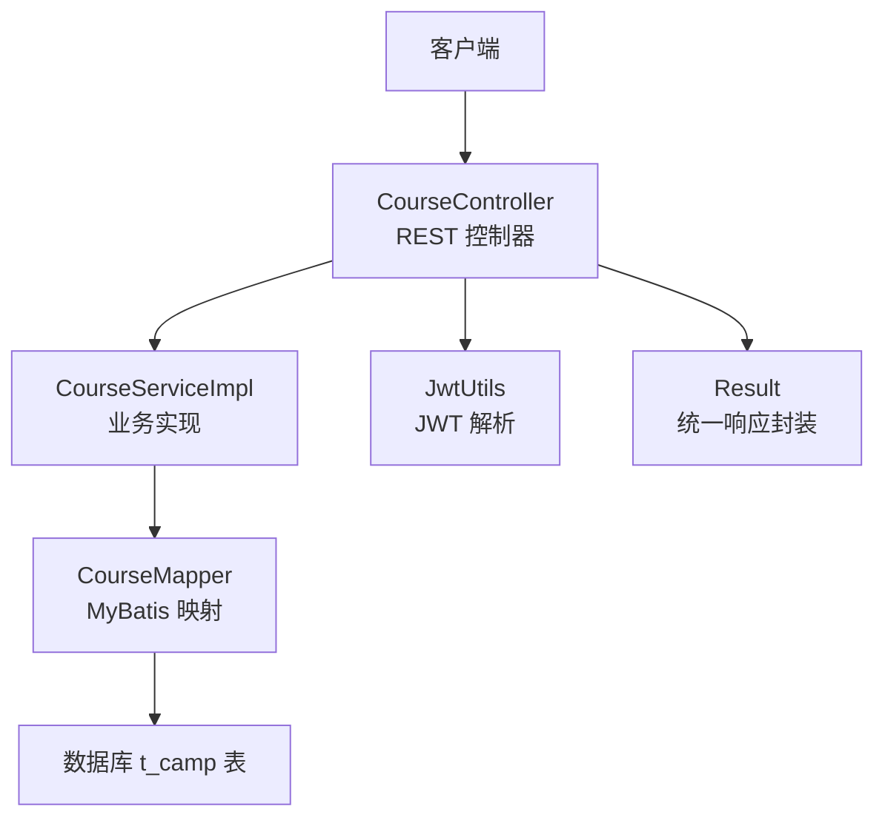
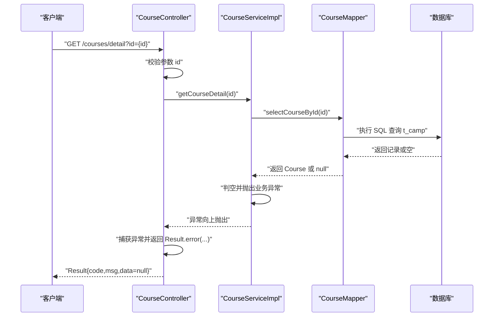
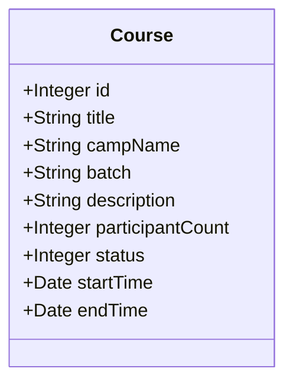
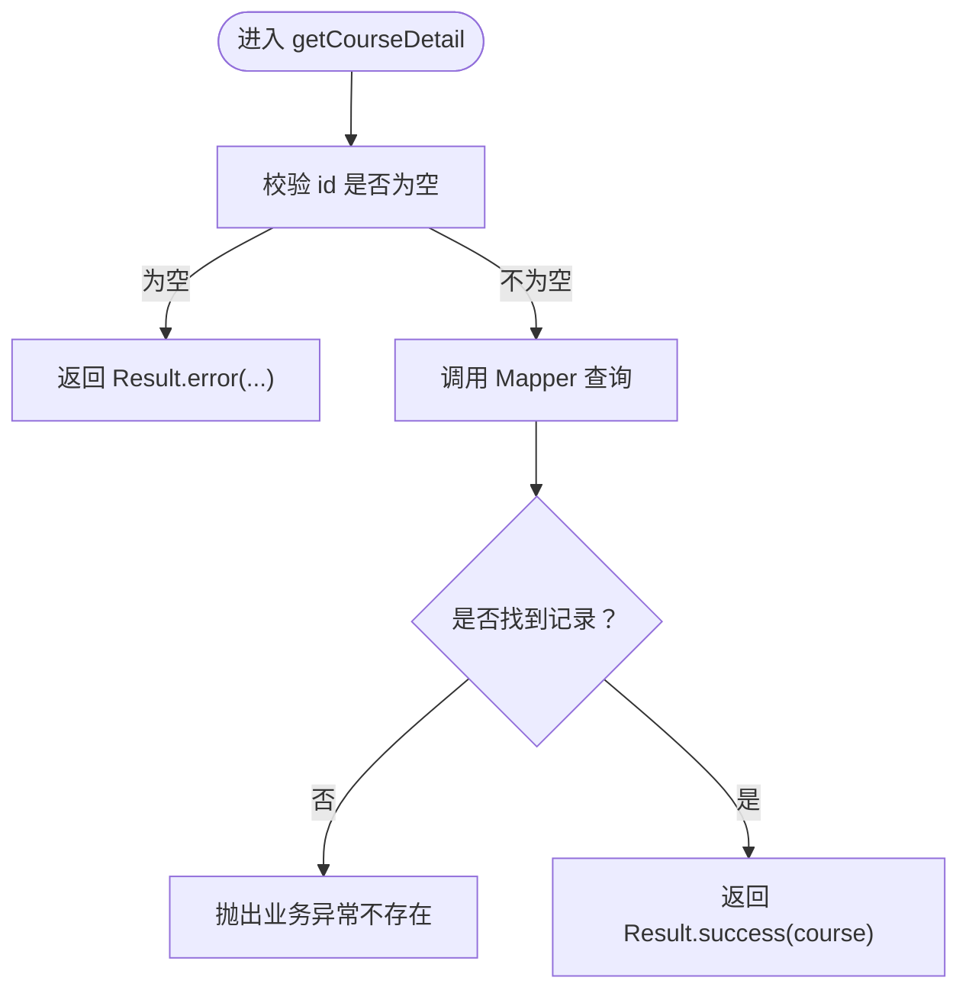
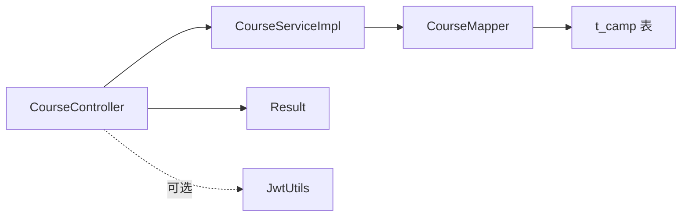

# 课程详情查询

<cite>
**本文引用的文件**
- [CourseController.java](file://src/main/java/com/daily/dailychineseculture/controller/CourseController.java)
- [CourseService.java](file://src/main/java/com/daily/dailychineseculture/service/CourseService.java)
- [CourseServiceImpl.java](file://src/main/java/com/daily/dailychineseculture/service/impl/CourseServiceImpl.java)
- [CourseMapper.java](file://src/main/java/com/daily/dailychineseculture/mapper/CourseMapper.java)
- [Course.java](file://src/main/java/com/daily/dailychineseculture/entity/Course.java)
- [JwtUtils.java](file://src/main/java/com/daily/dailychineseculture/util/JwtUtils.java)
- [Result.java](file://src/main/java/com/daily/dailychineseculture/common/Result.java)
- [CampMapper.xml](file://src/main/resources/mapper/CampMapper.xml)
</cite>

## 目录
1. [简介](#简介)
2. [项目结构](#项目结构)
3. [核心组件](#核心组件)
4. [架构总览](#架构总览)
5. [组件详解](#组件详解)
6. [依赖关系分析](#依赖关系分析)
7. [性能考量](#性能考量)
8. [故障排查指南](#故障排查指南)
9. [结论](#结论)
10. [附录](#附录)

## 简介
本文件聚焦“课程详情查询”功能，系统性阐述接口实现原理、数据完整性保障、异常处理机制、实体字段与数据库映射关系、调用示例、数据加载策略与性能优化、状态检查与权限验证、以及数据安全保护机制。读者可据此快速理解并正确使用该接口。

## 项目结构
课程详情查询涉及的后端分层如下：
- 控制器层：接收请求、参数校验、调用服务层、封装统一响应
- 服务层：业务编排、参数校验、领域逻辑、异常向上抛出
- 数据访问层：MyBatis Mapper，负责SQL执行与结果映射
- 实体与DTO：数据载体，承载数据库字段到对象的映射
- 工具与通用封装：JWT解析、统一响应封装

图表来源
- [CourseController.java:87-98](file://src/main/java/com/daily/dailychineseculture/controller/CourseController.java#L87-L98)
- [CourseServiceImpl.java:391-398](file://src/main/java/com/daily/dailychineseculture/service/impl/CourseServiceImpl.java#L391-L398)
- [CourseMapper.java:39-51](file://src/main/java/com/daily/dailychineseculture/mapper/CourseMapper.java#L39-L51)
- [JwtUtils.java:104-111](file://src/main/java/com/daily/dailychineseculture/util/JwtUtils.java#L104-L111)
- [Result.java:46-48](file://src/main/java/com/daily/dailychineseculture/common/Result.java#L46-L48)

章节来源
- [CourseController.java:1-100](file://src/main/java/com/daily/dailychineseculture/controller/CourseController.java#L1-100)
- [CourseService.java:1-80](file://src/main/java/com/daily/dailychineseculture/service/CourseService.java#L1-80)
- [CourseServiceImpl.java:1-400](file://src/main/java/com/daily/dailychineseculture/service/impl/CourseServiceImpl.java#L1-400)
- [CourseMapper.java:1-53](file://src/main/java/com/daily/dailychineseculture/mapper/CourseMapper.java#L1-53)
- [JwtUtils.java:1-206](file://src/main/java/com/daily/dailychineseculture/util/JwtUtils.java#L1-206)
- [Result.java:1-81](file://src/main/java/com/daily/dailychineseculture/common/Result.java#L1-81)

## 核心组件
- 控制器：提供课程详情查询接口，负责参数校验与异常捕获，统一返回 Result 包装
- 服务层：执行业务逻辑，调用 Mapper 查询课程详情，对空结果抛出业务异常
- Mapper：基于 MyBatis 注解执行 SQL，将数据库字段映射到 Course 实体
- 实体 Course：承载 t_camp 表字段，包含课程标识、标题、批次、描述、参与人数、状态、起止时间等
- JWT 工具：解析 Authorization 头中的 JWT，提取用户信息（本接口未强制校验用户身份）
- 统一响应：Result 封装 code、msg、data，便于前后端约定

章节来源
- [CourseController.java:87-98](file://src/main/java/com/daily/dailychineseculture/controller/CourseController.java#L87-L98)
- [CourseServiceImpl.java:391-398](file://src/main/java/com/daily/dailychineseculture/service/impl/CourseServiceImpl.java#L391-L398)
- [CourseMapper.java:39-51](file://src/main/java/com/daily/dailychineseculture/mapper/CourseMapper.java#L39-L51)
- [Course.java:1-60](file://src/main/java/com/daily/dailychineseculture/entity/Course.java#L1-60)
- [JwtUtils.java:104-111](file://src/main/java/com/daily/dailychineseculture/util/JwtUtils.java#L104-L111)
- [Result.java:46-48](file://src/main/java/com/daily/dailychineseculture/common/Result.java#L46-L48)

## 架构总览
课程详情查询的端到端调用链如下：

图表来源
- [CourseController.java:87-98](file://src/main/java/com/daily/dailychineseculture/controller/CourseController.java#L87-L98)
- [CourseServiceImpl.java:391-398](file://src/main/java/com/daily/dailychineseculture/service/impl/CourseServiceImpl.java#L391-L398)
- [CourseMapper.java:39-51](file://src/main/java/com/daily/dailychineseculture/mapper/CourseMapper.java#L39-L51)

## 组件详解

### 1) 接口定义与调用示例
- 接口路径：GET /courses/detail
- 请求参数
  - id：Integer，必填，课程ID（对应 t_camp.camp_id）
- 响应数据结构
  - code：Integer，状态码
  - msg：String，消息
  - data：Course，课程详情对象；查询不到时 data 为 null
- 示例
  - 成功：GET /courses/detail?id=101
  - 失败：GET /courses/detail?id=无效ID 或 GET /courses/detail（缺参）

章节来源
- [CourseController.java:87-98](file://src/main/java/com/daily/dailychineseculture/controller/CourseController.java#L87-L98)
- [Result.java:46-48](file://src/main/java/com/daily/dailychineseculture/common/Result.java#L46-L48)

### 2) Course 实体与数据库映射
- Course 字段与 t_camp 字段映射关系
  - id → camp_id
  - title → name
  - campName → name
  - batch → CONCAT('第', term, '期')
  - description → intro
  - participantCount → enroll_count
  - status → status
  - startTime → start_time
  - endTime → end_time
- 字段业务含义
  - id：课程唯一标识
  - title/campName：课程标题与营期名称
  - batch：期数展示（第X期）
  - description：课程描述
  - participantCount：报名人数
  - status：1=招生中/开课中，0=已结束，-1=下架
  - startTime/endTime：开营与结营时间

图表来源
- [Course.java:11-59](file://src/main/java/com/daily/dailychineseculture/entity/Course.java#L11-L59)

章节来源
- [Course.java:1-60](file://src/main/java/com/daily/dailychineseculture/entity/Course.java#L1-60)
- [CourseMapper.java:23-51](file://src/main/java/com/daily/dailychineseculture/mapper/CourseMapper.java#L23-L51)

### 3) 数据加载策略与性能优化
- SQL 查询策略
  - 直接按 camp_id 精准查询，避免全表扫描
  - 返回必要字段，减少网络传输
- 结果映射
  - 使用 MyBatis 注解映射，字段名与实体一致，减少额外处理
- 性能优化建议
  - 为 t_camp.camp_id 建立索引（如尚未建立）
  - 对常用查询字段（如 status、start_time、end_time）建立复合索引以支持筛选
  - 合理设置连接池与超时时间，避免慢查询阻塞
  - 如未来需要，可引入缓存（如 Redis）存放热点课程详情，降低数据库压力

章节来源
- [CourseMapper.java:39-51](file://src/main/java/com/daily/dailychineseculture/mapper/CourseMapper.java#L39-L51)

### 4) 异常处理与数据完整性
- 参数校验
  - 控制器层对 id 进行非空校验，缺失时直接返回错误
- 业务异常
  - 服务层查询为空时抛出 IllegalArgumentException，提示“营期不存在”
- 统一响应
  - 控制器捕获异常并返回 Result.error(...)，保证响应格式一致
- 数据完整性
  - SQL 查询仅返回必要字段，避免 NPE
  - 服务层对空结果进行显式判空并抛出异常，防止空数据流入下游

图表来源
- [CourseController.java:87-98](file://src/main/java/com/daily/dailychineseculture/controller/CourseController.java#L87-L98)
- [CourseServiceImpl.java:391-398](file://src/main/java/com/daily/dailychineseculture/service/impl/CourseServiceImpl.java#L391-L398)

章节来源
- [CourseController.java:87-98](file://src/main/java/com/daily/dailychineseculture/controller/CourseController.java#L87-L98)
- [CourseServiceImpl.java:391-398](file://src/main/java/com/daily/dailychineseculture/service/impl/CourseServiceImpl.java#L391-L398)

### 5) 权限验证与数据安全
- 当前实现
  - 课程详情查询接口未强制校验用户身份（未解析 Authorization 头）
  - 若需鉴权，可在控制器层解析 Authorization 并调用 JwtUtils 校验
- 建议
  - 如需登录态校验，可在控制器解析 token 并校验有效性
  - 对敏感课程或特定权限课程，增加角色校验逻辑
  - 对外暴露的公开接口，建议配合网关或白名单策略限制来源

章节来源
- [CourseController.java:87-98](file://src/main/java/com/daily/dailychineseculture/controller/CourseController.java#L87-L98)
- [JwtUtils.java:104-111](file://src/main/java/com/daily/dailychineseculture/util/JwtUtils.java#L104-L111)

### 6) 课程状态检查
- 查询条件
  - 课程详情接口按 camp_id 精确查询，不附加状态过滤
  - 若需“仅开放查询”可扩展 SQL，增加状态校验
- 建议
  - 对于公开课程详情，可结合业务策略决定是否限制状态
  - 对内部管理类详情，建议增加状态与可见性控制

章节来源
- [CourseMapper.java:39-51](file://src/main/java/com/daily/dailychineseculture/mapper/CourseMapper.java#L39-L51)

## 依赖关系分析
- 控制器依赖服务层与统一响应封装
- 服务层依赖 Mapper 与实体
- Mapper 依赖数据库表结构
- JWT 工具用于可选的身份解析

图表来源
- [CourseController.java:87-98](file://src/main/java/com/daily/dailychineseculture/controller/CourseController.java#L87-L98)
- [CourseServiceImpl.java:391-398](file://src/main/java/com/daily/dailychineseculture/service/impl/CourseServiceImpl.java#L391-L398)
- [CourseMapper.java:39-51](file://src/main/java/com/daily/dailychineseculture/mapper/CourseMapper.java#L39-L51)
- [JwtUtils.java:104-111](file://src/main/java/com/daily/dailychineseculture/util/JwtUtils.java#L104-L111)
- [Result.java:46-48](file://src/main/java/com/daily/dailychineseculture/common/Result.java#L46-L48)

章节来源
- [CourseController.java:1-100](file://src/main/java/com/daily/dailychineseculture/controller/CourseController.java#L1-100)
- [CourseServiceImpl.java:1-400](file://src/main/java/com/daily/dailychineseculture/service/impl/CourseServiceImpl.java#L1-400)
- [CourseMapper.java:1-53](file://src/main/java/com/daily/dailychineseculture/mapper/CourseMapper.java#L1-53)
- [JwtUtils.java:1-206](file://src/main/java/com/daily/dailychineseculture/util/JwtUtils.java#L1-206)
- [Result.java:1-81](file://src/main/java/com/daily/dailychineseculture/common/Result.java#L1-81)

## 性能考量
- 查询路径短、负载低：单字段精确查询，适合高频调用
- 建议
  - 为 camp_id 建索引（如未建立）
  - 对热点课程引入缓存，降低数据库压力
  - 控制连接池大小与超时，避免慢查询拖垮服务
  - 监控慢查询日志，持续优化

## 故障排查指南
- 常见问题
  - 参数缺失：id 为空，返回 Result.error(...)
  - 课程不存在：服务层抛出业务异常，控制器捕获并返回错误
- 排查步骤
  - 检查请求参数 id 是否正确传递
  - 核对 t_camp 是否存在对应 camp_id
  - 查看服务层异常栈，定位业务异常抛出处
  - 关注数据库慢查询与连接池状态

章节来源
- [CourseController.java:87-98](file://src/main/java/com/daily/dailychineseculture/controller/CourseController.java#L87-L98)
- [CourseServiceImpl.java:391-398](file://src/main/java/com/daily/dailychineseculture/service/impl/CourseServiceImpl.java#L391-L398)

## 结论
课程详情查询接口实现简洁、职责清晰：控制器负责参数校验与异常捕获，服务层负责业务逻辑与异常抛出，Mapper 负责精准查询与映射。当前实现未强制鉴权，具备良好的扩展性。建议后续根据业务需要增加权限校验与缓存策略，以进一步提升安全性与性能。

## 附录

### A. API 调用规范
- 路径：GET /courses/detail
- 请求参数
  - id：Integer，必填
- 响应
  - 成功：Result.success(data=Course)
  - 失败：Result.error(...)（参数缺失或课程不存在）

章节来源
- [CourseController.java:87-98](file://src/main/java/com/daily/dailychineseculture/controller/CourseController.java#L87-L98)
- [Result.java:46-48](file://src/main/java/com/daily/dailychineseculture/common/Result.java#L46-L48)

### B. 数据模型映射
- Course 实体与 t_camp 字段映射详见“核心组件”与“组件详解”

章节来源
- [Course.java:1-60](file://src/main/java/com/daily/dailychineseculture/entity/Course.java#L1-60)
- [CourseMapper.java:23-51](file://src/main/java/com/daily/dailychineseculture/mapper/CourseMapper.java#L23-L51)