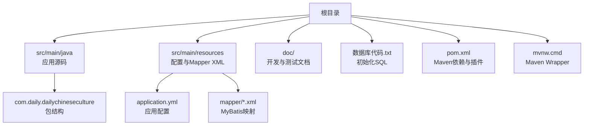
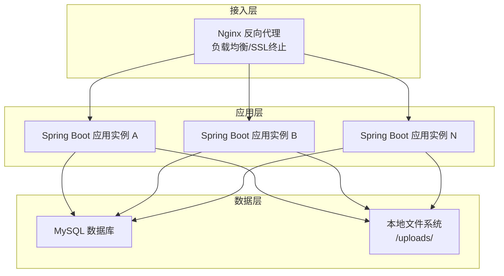
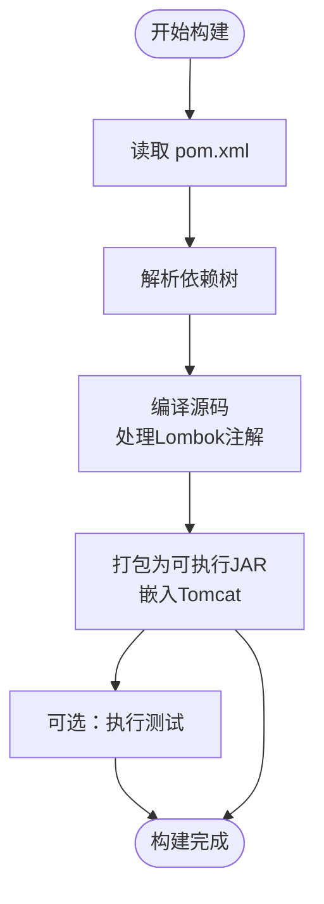
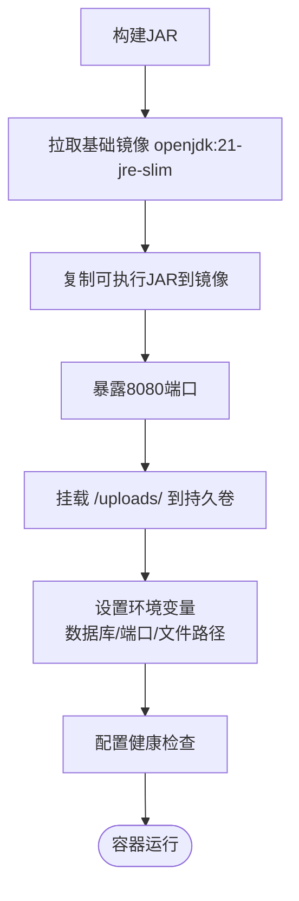
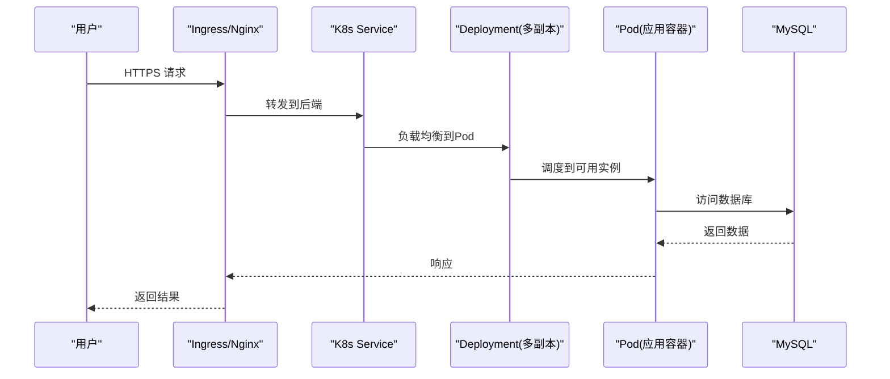
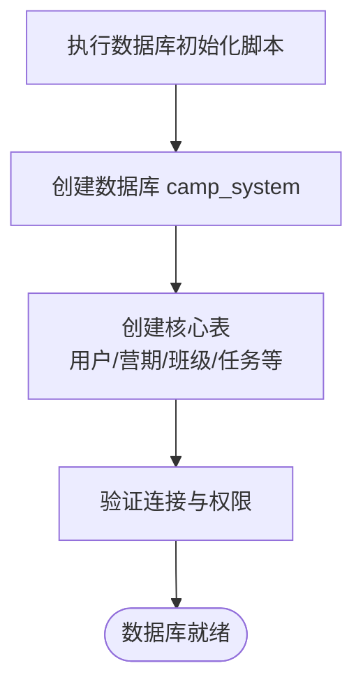
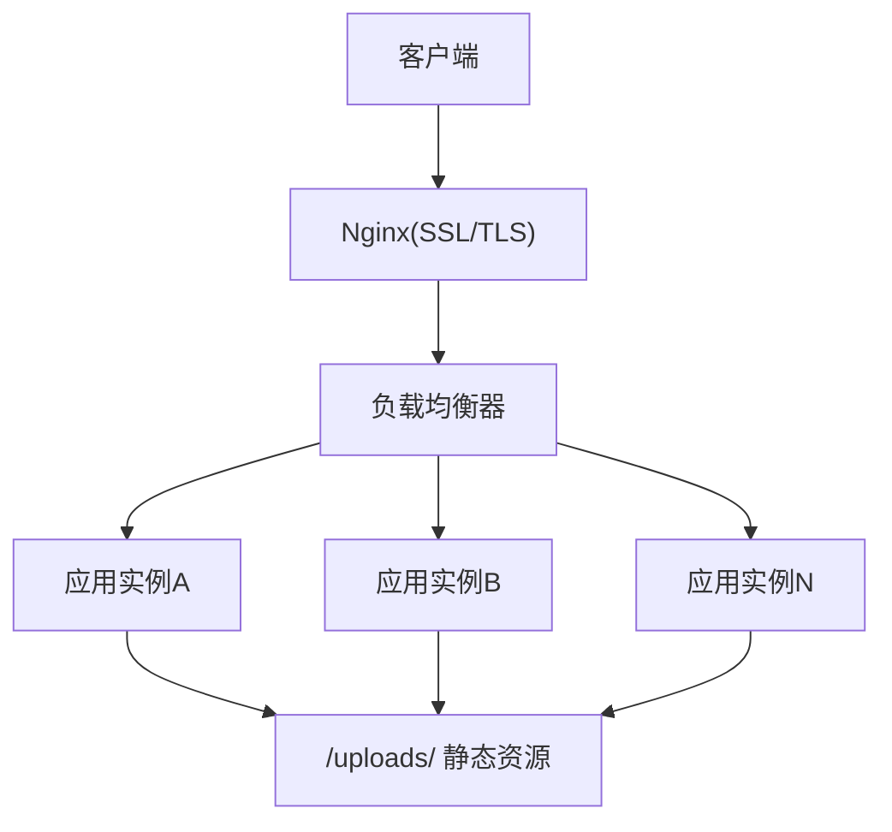
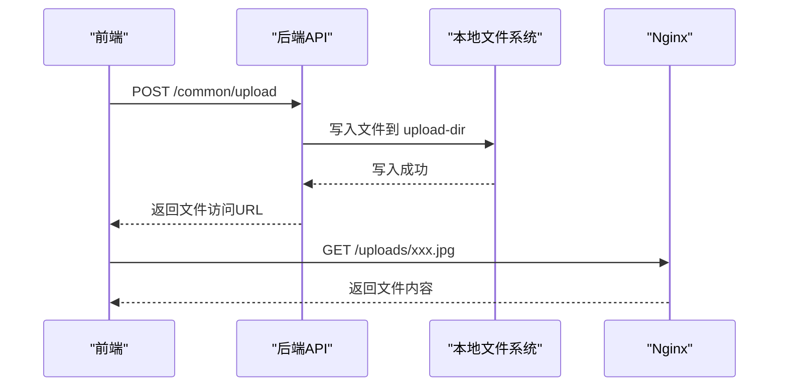
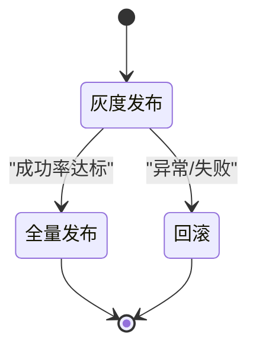
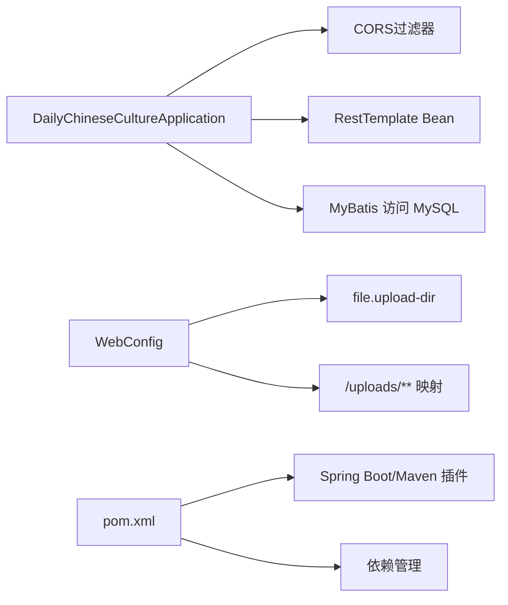

# 部署指南

<cite>
**本文引用的文件**
- [pom.xml](file://pom.xml)
- [application.yml](file://src/main/resources/application.yml)
- [DailyChineseCultureApplication.java](file://src/main/java/com/daily/dailychineseculture/DailyChineseCultureApplication.java)
- [WebConfig.java](file://src/main/java/com/daily/dailychineseculture/config/WebConfig.java)
- [mvnw.cmd](file://mvnw.cmd)
- [开发环境准备指南.md](file://doc/开发环境准备指南.md)
- [项目运行测试指南.md](file://doc/项目运行测试指南.md)
- [环境检查报告.md](file://doc/环境检查报告.md)
- [数据库连接状态报告.md](file://doc/数据库连接状态报告.md)
- [本地文件上传与存储机制现状分析报告.md](file://doc/本地文件上传与存储机制现状分析报告.md)
- [文件上传 API文档.md](file://doc/文件上传 API文档.md)
- [登录认证与用户信息体系代码扫描报告.md](file://doc/登录认证与用户信息体系代码扫描报告.md)
- [管理后台排课接口现状分析报告.md](file://doc/管理后台排课接口现状分析报告.md)
- [数据库代码.txt](file://数据库代码.txt)
- [test-dashboard.ps1](file://test-dashboard.ps1)
</cite>

## 目录
1. [简介](#简介)
2. [项目结构](#项目结构)
3. [核心组件](#核心组件)
4. [架构总览](#架构总览)
5. [详细组件分析](#详细组件分析)
6. [依赖关系分析](#依赖关系分析)
7. [性能考量](#性能考量)
8. [故障排查指南](#故障排查指南)
9. [结论](#结论)
10. [附录](#附录)

## 简介
本部署指南面向从开发环境到生产环境的完整交付流程，覆盖Maven打包、Docker容器化、Kubernetes部署、数据库部署、配置与环境变量、Nginx反向代理与SSL、监控告警与日志、性能调优、备份恢复与灾难预案、安全加固、灰度发布与滚动更新、回滚策略以及部署检查清单与故障排查手册。文档基于仓库现有配置与代码进行分析，确保方案可落地、可验证。

## 项目结构
项目采用标准Spring Boot Maven工程结构，核心目录与文件如下：
- 构建与依赖：pom.xml、mvnw.cmd
- 应用入口：DailyChineseCultureApplication.java
- 配置：application.yml
- 配置与拦截器：WebConfig.java
- 文档与测试：doc/ 下各类API与环境文档、PowerShell测试脚本
- 数据库初始化：数据库代码.txt

**图表来源**
- [pom.xml](file://pom.xml)
- [application.yml](file://src/main/resources/application.yml)
- [DailyChineseCultureApplication.java](file://src/main/java/com/daily/dailychineseculture/DailyChineseCultureApplication.java)
- [WebConfig.java](file://src/main/java/com/daily/dailychineseculture/config/WebConfig.java)
- [数据库代码.txt](file://数据库代码.txt)

**章节来源**
- [开发环境准备指南.md](file://doc/开发环境准备指南.md)
- [项目运行测试指南.md](file://doc/项目运行测试指南.md)

## 核心组件
- 应用入口与跨域配置：Spring Boot启动类定义RestTemplate与全局CORS过滤器，便于前后端联调与跨域访问。
- 配置中心：application.yml集中管理端口、数据库连接、文件上传、微信小程序配置等。
- Web MVC配置：WebConfig负责静态资源映射（/uploads/**）与拦截器注册，确保文件访问与鉴权策略一致。
- 构建与打包：Maven配置包含Spring Boot插件、Lombok注解处理、MyBatis Starter、MySQL驱动、JWT与分页插件、OpenAPI/Swagger等。

**章节来源**
- [DailyChineseCultureApplication.java](file://src/main/java/com/daily/dailychineseculture/DailyChineseCultureApplication.java)
- [application.yml](file://src/main/resources/application.yml)
- [WebConfig.java](file://src/main/java/com/daily/dailychineseculture/config/WebConfig.java)
- [pom.xml](file://pom.xml)

## 架构总览
应用采用Spring MVC + MyBatis的后端架构，数据库为MySQL，文件上传采用本地磁盘存储并通过静态资源映射对外提供访问。整体部署可抽象为三层：接入层（Nginx）、应用层（Spring Boot容器）、数据层（MySQL）。

[本图为概念性架构示意，不直接映射具体源码文件，故无图表来源]

## 详细组件分析

### Maven构建与打包
- 使用Spring Boot Maven插件生成可执行JAR，排除Lombok注解处理器以避免运行时冲突。
- 编译阶段启用Lombok注解处理，保证实体与工具类生成。
- 依赖包括：Spring Web、MyBatis、MySQL驱动、JWT、分页插件、OpenAPI/Swagger、Hibernate Validator等。

**图表来源**
- [pom.xml](file://pom.xml)

**章节来源**
- [pom.xml](file://pom.xml)

### Docker容器化
- 基础镜像：建议使用官方OpenJDK镜像（如openjdk:21-jre-slim）。
- 构建产物：将Maven构建生成的可执行JAR复制到镜像内。
- 端口暴露：容器暴露8080端口。
- 健康检查：可通过HTTP GET /actuator/health（如启用Actuator）进行健康探针。
- 卷挂载：将/uploads/目录映射到持久卷，确保文件上传持久化。
- 环境变量：通过-Dserver.port、spring.datasource.*等参数注入配置。

[本图为容器化流程概念图，不直接映射具体源码文件，故无图表来源]

### Kubernetes部署
- Deployment：定义副本数、滚动更新策略（maxUnavailable/ maxSurge）、探针。
- Service：ClusterIP或LoadBalancer暴露8080端口。
- ConfigMap：存放application.yml中的非敏感配置（如server.port、文件上传目录等）。
- Secret：存放数据库密码、JWT密钥等敏感信息。
- PersistentVolumeClaim：为/uploads/提供持久化存储。
- Ingress/Nginx Controller：统一入口、TLS终止、路由转发到Service。

[本图为Kubernetes部署序列图，不直接映射具体源码文件，故无图表来源]

### 数据库部署与初始化
- 数据库：MySQL（版本与字符集见初始化脚本）。
- 初始化：执行数据库代码.txt创建数据库与表结构。
- 连接配置：application.yml中配置URL、用户名、密码、驱动类名。
- 连接池与监控：可在生产环境引入HikariCP并配置连接池参数与监控。

**图表来源**
- [数据库代码.txt](file://数据库代码.txt)
- [application.yml](file://src/main/resources/application.yml)

**章节来源**
- [数据库代码.txt](file://数据库代码.txt)
- [application.yml](file://src/main/resources/application.yml)
- [数据库连接状态报告.md](file://doc/数据库连接状态报告.md)

### 配置文件管理与环境变量
- application.yml：集中管理端口、数据库、文件上传、微信小程序配置等。
- 环境变量：通过-Dserver.port、spring.profiles.active、spring.datasource.*等注入。
- 多环境分离：使用Spring Profiles区分dev/staging/prod，配合ConfigMap/Secret管理。
- 动态刷新：结合Spring Cloud Bus或K8s ConfigMap热更新（需额外组件）。

**章节来源**
- [application.yml](file://src/main/resources/application.yml)
- [开发环境准备指南.md](file://doc/开发环境准备指南.md)

### Nginx反向代理、负载均衡与SSL
- 反向代理：将域名请求转发到K8s Service或多实例应用。
- 负载均衡：轮询或最少连接，结合健康检查。
- SSL终止：使用Let’s Encrypt或商业证书，开启TLS 1.2+。
- 静态资源：/uploads/**由应用提供，Nginx可缓存静态资源提升性能。

[本图为Nginx部署示意，不直接映射具体源码文件，故无图表来源]

### 文件上传与存储
- 上传接口：支持multipart/form-data，最大500MB。
- 存储路径：application.yml中file.upload-dir配置，WebConfig将其映射为静态资源。
- 访问方式：通过/ uploads/**对外提供HTTP访问。
- 生产建议：将上传目录挂载到持久化存储，避免容器重建丢失数据。

**图表来源**
- [application.yml](file://src/main/resources/application.yml)
- [WebConfig.java](file://src/main/java/com/daily/dailychineseculture/config/WebConfig.java)
- [文件上传 API文档.md](file://doc/文件上传 API文档.md)

**章节来源**
- [application.yml](file://src/main/resources/application.yml)
- [WebConfig.java](file://src/main/java/com/daily/dailychineseculture/config/WebConfig.java)
- [本地文件上传与存储机制现状分析报告.md](file://doc/本地文件上传与存储机制现状分析报告.md)
- [文件上传 API文档.md](file://doc/文件上传 API文档.md)

### 监控告警、日志管理与性能调优
- 监控：Prometheus + Grafana，采集JVM指标、应用指标与业务指标。
- 告警：基于阈值与规则触发告警（CPU、内存、连接池、慢请求、错误率）。
- 日志：统一输出到stdout/stderr，结合Fluent Bit/Fluentd收集到ELK或Loki。
- 性能：JVM参数调优（堆大小、GC策略）、连接池参数、线程池大小、缓存命中率、数据库索引优化。
- APM：可选引入SkyWalking或Micrometer观测链路。

[本节为通用运维建议，不直接分析具体源码文件，故无章节来源]

### 备份恢复与灾难预案
- 数据库备份：定时全量+增量备份，异地存储，周期性恢复演练。
- 文件备份：/uploads/目录定期快照，验证恢复路径。
- 配置备份：ConfigMap/Secret纳入版本管理与备份。
- 灾难预案：多可用区部署、自动故障转移、降级策略（只读、缓存兜底）。

[本节为通用运维建议，不直接分析具体源码文件，故无章节来源]

### 安全加固
- 网络：最小权限网络策略、WAF、DDoS防护。
- 认证：JWT令牌有效期与刷新、黑名单、滑动过期。
- 接口：细粒度RBAC、接口限流、参数校验、CSP与X-Frame-Options。
- 存储：敏感字段加密、只读挂载、最小权限访问。
- 镜像：基础镜像定期扫描、最小化依赖、非root运行。

**章节来源**
- [登录认证与用户信息体系代码扫描报告.md](file://doc/登录认证与用户信息体系代码扫描报告.md)

### 灰度发布、滚动更新与回滚
- 滚动更新：K8s Deployment设置maxUnavailable=0或1，maxSurge=25%-100%，确保零停机。
- 灰度发布：金丝雀/蓝绿策略，基于标签与Ingress规则分流流量。
- 回滚：记录Deployment版本，失败时快速回滚至上一稳定版本。
- 健康检查：liveness/readiness探针，失败自动重启或摘除。

[本图为发布流程状态图，不直接映射具体源码文件，故无图表来源]

## 依赖关系分析
- 应用启动类依赖RestTemplate与CORS过滤器，确保外部调用与跨域访问。
- WebConfig依赖application.yml中的file.upload-dir，将静态资源映射到本地文件系统。
- 应用通过MyBatis访问MySQL，依赖application.yml中的数据库连接配置。
- Maven插件链路决定最终可执行JAR产物与测试执行。

**图表来源**
- [DailyChineseCultureApplication.java](file://src/main/java/com/daily/dailychineseculture/DailyChineseCultureApplication.java)
- [WebConfig.java](file://src/main/java/com/daily/dailychineseculture/config/WebConfig.java)
- [application.yml](file://src/main/resources/application.yml)
- [pom.xml](file://pom.xml)

**章节来源**
- [DailyChineseCultureApplication.java](file://src/main/java/com/daily/dailychineseculture/DailyChineseCultureApplication.java)
- [WebConfig.java](file://src/main/java/com/daily/dailychineseculture/config/WebConfig.java)
- [application.yml](file://src/main/resources/application.yml)
- [pom.xml](file://pom.xml)

## 性能考量
- JVM：合理设置堆大小与GC策略，关注Full GC频率与停顿。
- 连接池：HikariCP参数（最大连接、空闲超时、连接超时）与监控。
- 线程池：异步任务与定时任务线程池大小与队列长度。
- 缓存：Redis/Lettuce缓存热点数据，降低数据库压力。
- 数据库：索引优化、慢查询日志、分页查询、批量写入。
- 网络：Nginx连接复用、压缩、静态资源CDN加速。

[本节为通用性能建议，不直接分析具体源码文件，故无章节来源]

## 故障排查指南
- 启动失败：检查JAVA_HOME、端口占用、JVM参数、依赖冲突。
- 数据库连接：核对URL、用户名、密码、网络连通性、防火墙。
- 文件上传失败：确认upload-dir目录权限、磁盘空间、Nginx静态资源映射。
- 登录鉴权异常：核对JWT签名算法、密钥、过期时间、拦截器放行规则。
- API测试：使用提供的PowerShell脚本或curl命令进行快速验证。

**章节来源**
- [项目运行测试指南.md](file://doc/项目运行测试指南.md)
- [环境检查报告.md](file://doc/环境检查报告.md)
- [test-dashboard.ps1](file://test-dashboard.ps1)

## 结论
本指南基于仓库现有配置与代码，给出了从开发到生产的完整部署方案。建议在生产环境中补充监控告警、日志体系、安全加固与灾备演练，并结合Kubernetes实现弹性伸缩与高可用。

## 附录

### 部署检查清单
- [ ] 环境变量与Secret配置完成
- [ ] 数据库初始化脚本执行成功
- [ ] Docker镜像构建与推送完成
- [ ] K8s ConfigMap/Secret部署完成
- [ ] PVC挂载与权限验证
- [ ] Ingress与SSL证书配置
- [ ] 健康检查与探针配置
- [ ] 负载均衡与多副本部署
- [ ] 监控、日志与告警接入
- [ ] 备份策略与恢复演练
- [ ] 安全基线与合规检查

### 常用命令与路径
- Maven构建：./mvnw clean package
- 运行应用：./mvnw spring-boot:run
- 测试脚本：.\test-dashboard.ps1
- 配置文件：src/main/resources/application.yml
- 启动类：DailyChineseCultureApplication.java
- Web配置：WebConfig.java
- 数据库脚本：数据库代码.txt

**章节来源**
- [mvnw.cmd](file://mvnw.cmd)
- [项目运行测试指南.md](file://doc/项目运行测试指南.md)
- [开发环境准备指南.md](file://doc/开发环境准备指南.md)
- [数据库代码.txt](file://数据库代码.txt)