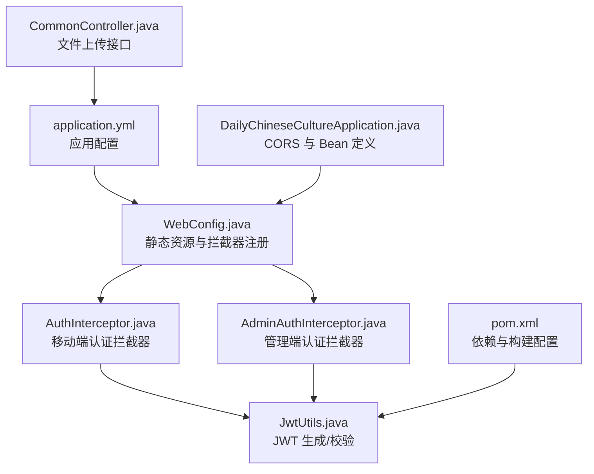
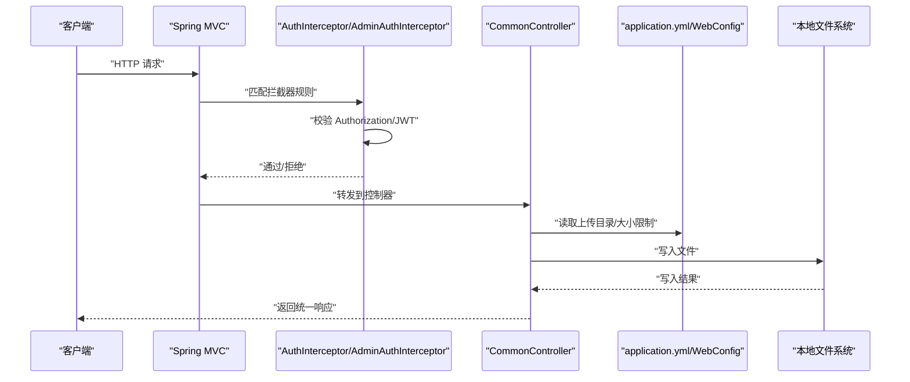
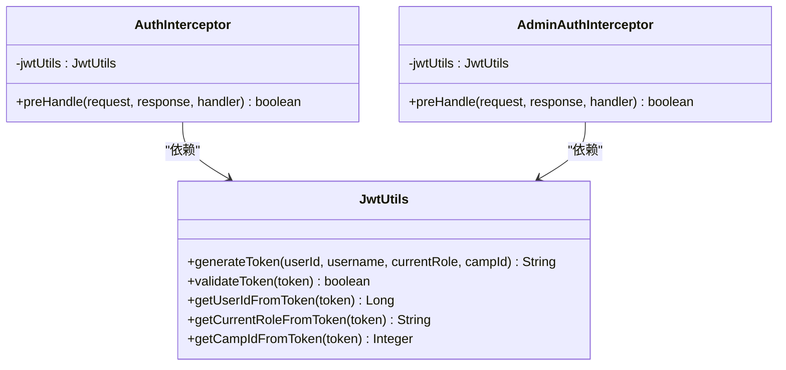
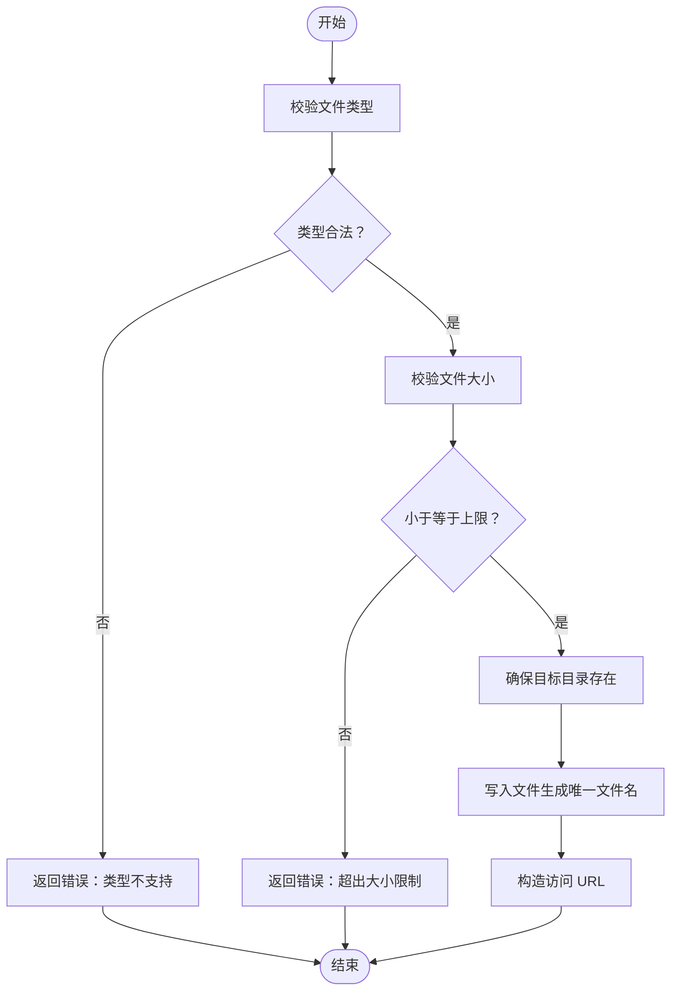
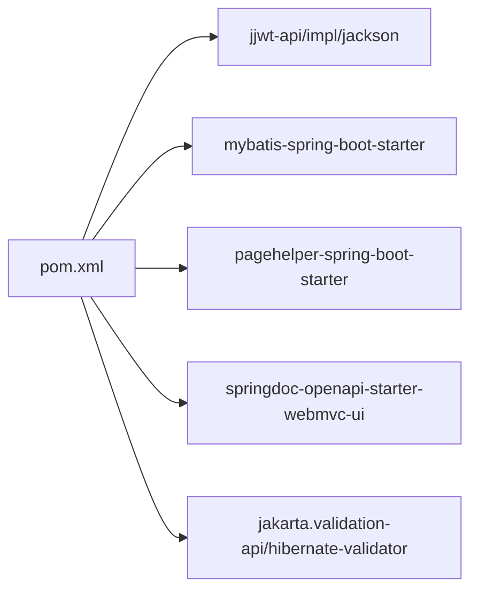

# 配置管理

<cite>
**本文引用的文件**
- [application.yml](file://src/main/resources/application.yml)
- [WebConfig.java](file://src/main/java/com/daily/dailychineseculture/config/WebConfig.java)
- [AuthInterceptor.java](file://src/main/java/com/daily/dailychineseculture/interceptor/AuthInterceptor.java)
- [AdminAuthInterceptor.java](file://src/main/java/com/daily/dailychineseculture/interceptor/AdminAuthInterceptor.java)
- [JwtUtils.java](file://src/main/java/com/daily/dailychineseculture/util/JwtUtils.java)
- [CommonController.java](file://src/main/java/com/daily/dailychineseculture/controller/CommonController.java)
- [DailyChineseCultureApplication.java](file://src/main/java/com/daily/dailychineseculture/DailyChineseCultureApplication.java)
- [pom.xml](file://pom.xml)
</cite>

## 目录
1. [简介](#简介)
2. [项目结构](#项目结构)
3. [核心组件](#核心组件)
4. [架构总览](#架构总览)
5. [详细组件分析](#详细组件分析)
6. [依赖分析](#依赖分析)
7. [性能考虑](#性能考虑)
8. [故障排查指南](#故障排查指南)
9. [结论](#结论)
10. [附录](#附录)

## 简介
本文件系统性梳理本项目的配置管理，覆盖以下方面：
- application.yml 中的数据库连接、文件上传、MyBatis、微信小程序配置等参数说明
- 多环境配置策略（开发/测试/生产）与差异化配置建议
- Web 配置、CORS 设置、拦截器配置与静态资源处理
- JWT 配置与安全注意事项
- 配置最佳实践、性能优化建议
- 配置热更新、配置监控与故障排查方法
- Docker 容器化与云平台部署配置要点

## 项目结构
本项目采用 Spring Boot 标准结构，配置集中在 application.yml；Web 层通过 WebConfig 注册拦截器与静态资源映射；JWT 认证通过拦截器与工具类协同完成；文件上传通过控制器与配置结合实现。

图表来源
- [application.yml:1-33](file://src/main/resources/application.yml#L1-L33)
- [WebConfig.java:1-105](file://src/main/java/com/daily/dailychineseculture/config/WebConfig.java#L1-L105)
- [AuthInterceptor.java:1-74](file://src/main/java/com/daily/dailychineseculture/interceptor/AuthInterceptor.java#L1-L74)
- [AdminAuthInterceptor.java:1-93](file://src/main/java/com/daily/dailychineseculture/interceptor/AdminAuthInterceptor.java#L1-L93)
- [JwtUtils.java:1-206](file://src/main/java/com/daily/dailychineseculture/util/JwtUtils.java#L1-L206)
- [CommonController.java:1-100](file://src/main/java/com/daily/dailychineseculture/controller/CommonController.java#L1-L100)
- [DailyChineseCultureApplication.java:1-40](file://src/main/java/com/daily/dailychineseculture/DailyChineseCultureApplication.java#L1-L40)
- [pom.xml:1-149](file://pom.xml#L1-L149)

章节来源
- [application.yml:1-33](file://src/main/resources/application.yml#L1-L33)
- [WebConfig.java:1-105](file://src/main/java/com/daily/dailychineseculture/config/WebConfig.java#L1-L105)
- [DailyChineseCultureApplication.java:1-40](file://src/main/java/com/daily/dailychineseculture/DailyChineseCultureApplication.java#L1-L40)

## 核心组件
- application.yml：集中管理数据库、文件上传、MyBatis、微信小程序等配置
- WebConfig：注册静态资源映射与拦截器，实现访问控制
- AuthInterceptor/AdminAuthInterceptor：基于 JWT 的认证拦截器，分别面向移动端与管理端
- JwtUtils：JWT 生成、解析与校验工具
- CommonController：文件上传接口，读取配置并执行存储
- DailyChineseCultureApplication：全局 CORS 配置与 Bean 定义

章节来源
- [application.yml:1-33](file://src/main/resources/application.yml#L1-L33)
- [WebConfig.java:1-105](file://src/main/java/com/daily/dailychineseculture/config/WebConfig.java#L1-L105)
- [AuthInterceptor.java:1-74](file://src/main/java/com/daily/dailychineseculture/interceptor/AuthInterceptor.java#L1-L74)
- [AdminAuthInterceptor.java:1-93](file://src/main/java/com/daily/dailychineseculture/interceptor/AdminAuthInterceptor.java#L1-L93)
- [JwtUtils.java:1-206](file://src/main/java/com/daily/dailychineseculture/util/JwtUtils.java#L1-L206)
- [CommonController.java:1-100](file://src/main/java/com/daily/dailychineseculture/controller/CommonController.java#L1-L100)
- [DailyChineseCultureApplication.java:1-40](file://src/main/java/com/daily/dailychineseculture/DailyChineseCultureApplication.java#L1-L40)

## 架构总览
下图展示配置驱动的关键流程：请求进入 Web 层，经拦截器校验 JWT，再由控制器处理业务（如文件上传），静态资源通过 WebConfig 映射到本地目录。

图表来源
- [WebConfig.java:34-42](file://src/main/java/com/daily/dailychineseculture/config/WebConfig.java#L34-L42)
- [AuthInterceptor.java:25-72](file://src/main/java/com/daily/dailychineseculture/interceptor/AuthInterceptor.java#L25-L72)
- [AdminAuthInterceptor.java:23-82](file://src/main/java/com/daily/dailychineseculture/interceptor/AdminAuthInterceptor.java#L23-L82)
- [CommonController.java:35-99](file://src/main/java/com/daily/dailychineseculture/controller/CommonController.java#L35-L99)
- [application.yml:29-33](file://src/main/resources/application.yml#L29-L33)

## 详细组件分析

### application.yml 配置详解
- server.port：服务监听端口
- spring.datasource.*：数据库连接参数（URL、用户名、密码、驱动）
- spring.servlet.multipart.*：文件上传大小限制（单文件与总请求）
- mybatis.configuration.map-underscore-to-camel-case：开启下划线到驼峰映射
- mybatis.mapper-locations：Mapper XML 位置
- wx.appid / wx.secret：微信小程序相关配置
- file.upload-dir：本地文件上传根目录
- file.max-size：文件大小上限（字节）

章节来源
- [application.yml:3-33](file://src/main/resources/application.yml#L3-L33)

### Web 配置与静态资源处理
- 静态资源映射：将 /uploads/** 映射到 file.upload-dir 对应的物理路径
- 拦截器注册：
  - 移动端认证拦截器：默认拦截所有路径，排除登录、验证码、首页展示、静态资源、Swagger、OPTIONS 预检等
  - 管理端认证拦截器：拦截 /api/admin/**，排除登录、验证码、登录页所需接口
- 控制器读取配置：CommonController 使用 @Value 读取 file.upload-dir 与 file.max-size

章节来源
- [WebConfig.java:34-103](file://src/main/java/com/daily/dailychineseculture/config/WebConfig.java#L34-L103)
- [CommonController.java:26-31](file://src/main/java/com/daily/dailychineseculture/controller/CommonController.java#L26-L31)

### JWT 认证与拦截器
- AuthInterceptor：校验 Authorization 头，提取 Bearer Token，调用 JwtUtils 校验并解析用户信息，注入到 request
- AdminAuthInterceptor：对管理端接口进行 Token 校验，解析 userId、currentRole、campId 并注入
- JwtUtils：生成/解析/校验 JWT，包含密钥与过期时间常量

图表来源
- [AuthInterceptor.java:16-74](file://src/main/java/com/daily/dailychineseculture/interceptor/AuthInterceptor.java#L16-L74)
- [AdminAuthInterceptor.java:14-93](file://src/main/java/com/daily/dailychineseculture/interceptor/AdminAuthInterceptor.java#L14-L93)
- [JwtUtils.java:21-206](file://src/main/java/com/daily/dailychineseculture/util/JwtUtils.java#L21-L206)

章节来源
- [AuthInterceptor.java:16-74](file://src/main/java/com/daily/dailychineseculture/interceptor/AuthInterceptor.java#L16-L74)
- [AdminAuthInterceptor.java:14-93](file://src/main/java/com/daily/dailychineseculture/interceptor/AdminAuthInterceptor.java#L14-L93)
- [JwtUtils.java:21-206](file://src/main/java/com/daily/dailychineseculture/util/JwtUtils.java#L21-L206)

### 文件上传配置与流程
- 配置项：file.upload-dir、file.max-size
- 控制器行为：校验文件类型、大小、目标目录存在性，生成唯一文件名并写入磁盘
- 访问方式：通过 /uploads/** 访问上传文件（由 WebConfig 映射）

图表来源
- [CommonController.java:35-99](file://src/main/java/com/daily/dailychineseculture/controller/CommonController.java#L35-L99)
- [WebConfig.java:34-42](file://src/main/java/com/daily/dailychineseculture/config/WebConfig.java#L34-L42)
- [application.yml:29-33](file://src/main/resources/application.yml#L29-L33)

章节来源
- [CommonController.java:26-99](file://src/main/java/com/daily/dailychineseculture/controller/CommonController.java#L26-L99)
- [WebConfig.java:34-42](file://src/main/java/com/daily/dailychineseculture/config/WebConfig.java#L34-L42)
- [application.yml:29-33](file://src/main/resources/application.yml#L29-L33)

### CORS 配置
- 全局 CORS：允许任意来源、方法、头，允许凭证，预检缓存 1 小时
- 适用范围：/**，便于前端跨域访问

章节来源
- [DailyChineseCultureApplication.java:26-39](file://src/main/java/com/daily/dailychineseculture/DailyChineseCultureApplication.java#L26-L39)

### 多环境配置策略
- 开发环境：本地数据库、较小的文件上传限制、Swagger 文档可用
- 测试环境：独立数据库与存储目录、适度的并发与超时配置
- 生产环境：外部数据库与对象存储、严格的文件类型与大小限制、最小暴露面的 CORS 策略
- 配置差异化建议：
  - 使用 Spring Profiles（dev/test/prod）分离配置
  - 将敏感信息放入环境变量或密管系统，避免硬编码
  - 使用配置中心（如 Spring Cloud Config 或云厂商配置服务）实现集中管理与动态刷新

[本节为概念性说明，无需列出具体文件来源]

## 依赖分析
- JWT 依赖：io.jsonwebtoken（api/impl/jackson）
- MyBatis 启动器与分页插件
- Swagger/OpenAPI 文档
- Jakarta Validation/Hibernate Validator

图表来源
- [pom.xml:71-116](file://pom.xml#L71-L116)

章节来源
- [pom.xml:32-116](file://pom.xml#L32-L116)

## 性能考虑
- 文件上传
  - 限制单文件与总请求大小，避免内存溢出
  - 使用流式写入与合适的缓冲区
  - 建议将上传目录迁移到高性能存储或对象存储
- 数据库
  - 连接池参数按 QPS 调优
  - 合理使用分页插件与索引
- JWT
  - 保持较短有效期，配合刷新机制
  - 避免在 Token 中携带过多敏感信息
- CORS
  - 生产环境尽量缩小允许来源与方法范围，减少预检次数

[本节为通用指导，无需列出具体文件来源]

## 故障排查指南
- 401 未登录/登录过期
  - 检查请求头 Authorization 是否包含 Bearer Token
  - 核对 JwtUtils 密钥与过期时间配置
  - 查看拦截器日志输出
- 文件上传失败
  - 检查 file.upload-dir 是否存在且具备写权限
  - 确认 file.max-size 与 spring.servlet.multipart 配置一致
  - 校验文件类型白名单
- 静态资源无法访问
  - 确认 WebConfig 的 /uploads/** 映射与物理路径拼接
  - 检查路径规范化与末尾分隔符处理
- CORS 问题
  - 确认生产环境 CORS 策略是否过于宽松
  - 检查预检请求是否被正确放行

章节来源
- [AuthInterceptor.java:42-65](file://src/main/java/com/daily/dailychineseculture/interceptor/AuthInterceptor.java#L42-L65)
- [AdminAuthInterceptor.java:35-60](file://src/main/java/com/daily/dailychineseculture/interceptor/AdminAuthInterceptor.java#L35-L60)
- [CommonController.java:73-86](file://src/main/java/com/daily/dailychineseculture/controller/CommonController.java#L73-L86)
- [WebConfig.java:34-42](file://src/main/java/com/daily/dailychineseculture/config/WebConfig.java#L34-L42)
- [DailyChineseCultureApplication.java:26-39](file://src/main/java/com/daily/dailychineseculture/DailyChineseCultureApplication.java#L26-L39)

## 结论
本项目配置清晰、职责分明：application.yml 负责基础参数，WebConfig 负责拦截与静态资源，拦截器与 JwtUtils 负责认证，CommonController 负责上传落地。建议在多环境与生产环境中进一步强化安全与性能配置，并引入配置中心与监控手段以提升可观测性与可维护性。

[本节为总结性内容，无需列出具体文件来源]

## 附录

### 配置项一览与建议
- 数据库连接
  - 参数：URL、用户名、密码、驱动
  - 建议：使用只读账号用于查询，主从分离，连接池参数按压测结果调优
- 文件上传
  - 参数：upload-dir、max-size、multipart 大小限制
  - 建议：生产环境使用对象存储，本地仅作开发测试
- MyBatis
  - 参数：map-underscore-to-camel-case、mapper-locations
  - 建议：保持 XML 路径与驼峰映射开启，便于维护
- 微信小程序
  - 参数：appid、secret
  - 建议：从环境变量读取，定期轮换
- JWT
  - 参数：密钥、过期时间
  - 建议：生产环境从配置中心读取密钥，启用密钥轮换

章节来源
- [application.yml:6-33](file://src/main/resources/application.yml#L6-L33)
- [JwtUtils.java:24-28](file://src/main/java/com/daily/dailychineseculture/util/JwtUtils.java#L24-L28)

### 配置热更新与监控
- 热更新
  - 引入 Spring Cloud Config 或云厂商配置中心
  - 对于不重启生效的配置（如日志级别、开关），使用 Actuator 动态刷新
- 监控
  - 指标：QPS、P95/P99 延迟、错误率、文件上传成功率
  - 告警：异常堆栈、磁盘空间、数据库连接池使用率

[本节为通用指导，无需列出具体文件来源]

### Docker 与云平台部署配置
- Docker
  - 使用多阶段构建，精简镜像体积
  - 将敏感配置映射为环境变量或挂载密钥卷
  - 暴露 server.port，使用健康检查探针
- 云平台
  - 使用托管数据库与对象存储，避免自建存储
  - 配置弹性伸缩与自动备份
  - 通过平台网络策略收紧 CORS 与访问控制

[本节为通用指导，无需列出具体文件来源]