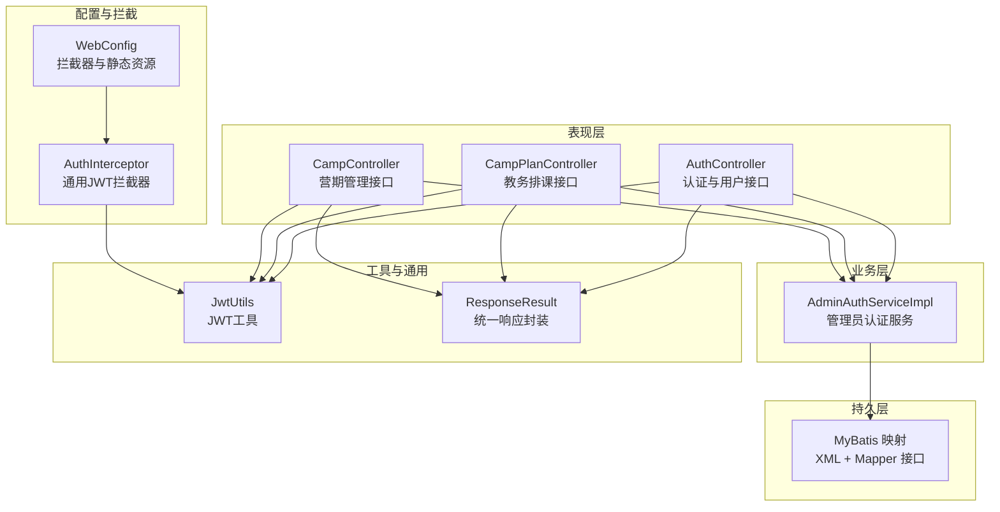
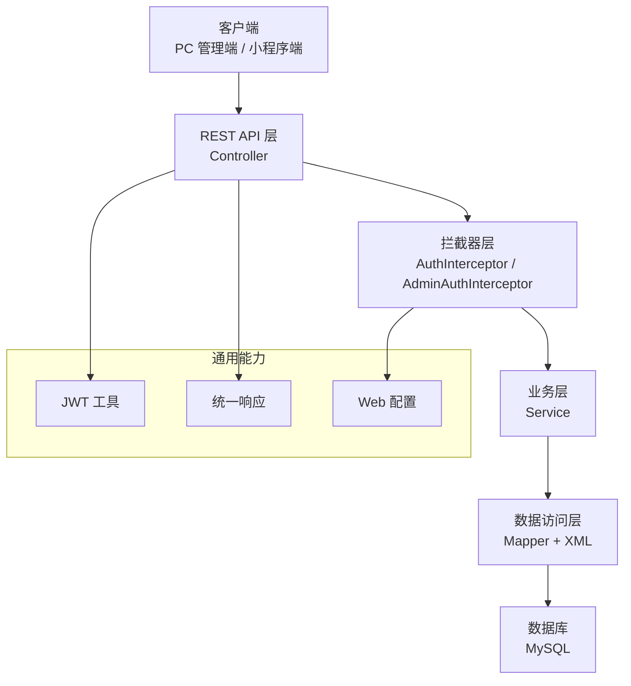
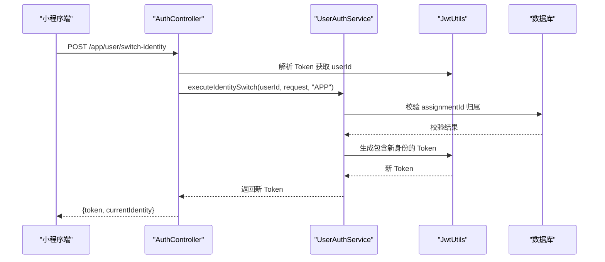
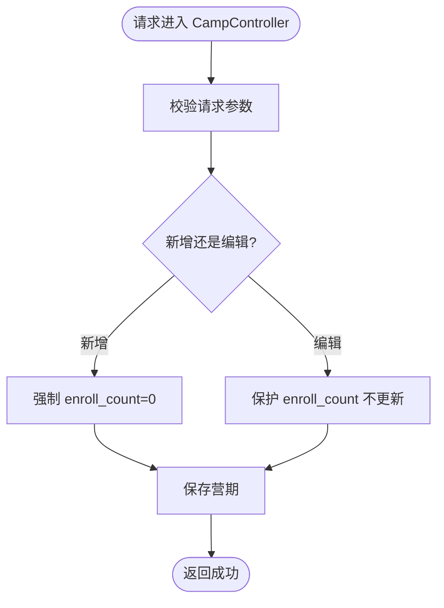
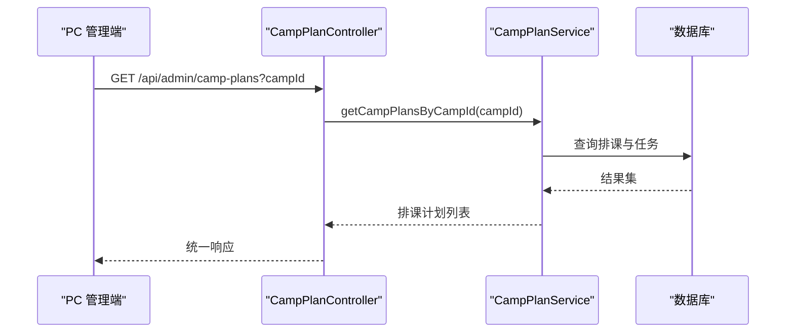
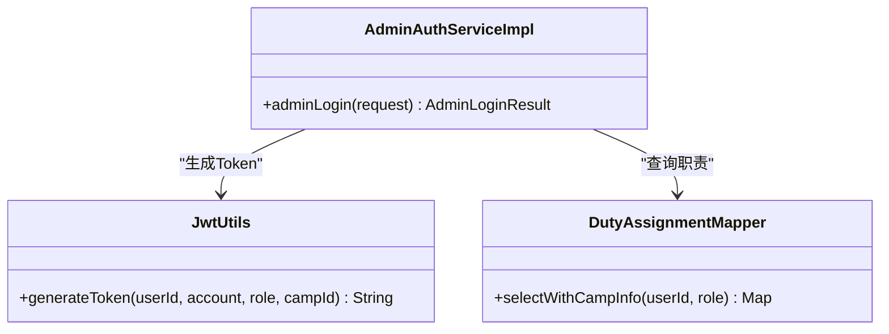
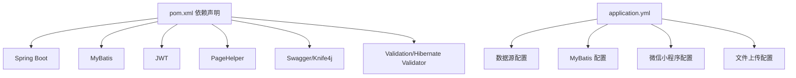

# 项目概述

<cite>
**本文引用的文件**
- [DailyChineseCultureApplication.java](file://src/main/java/com/daily/dailychineseculture/DailyChineseCultureApplication.java)
- [pom.xml](file://pom.xml)
- [application.yml](file://src/main/resources/application.yml)
- [项目目录结构介绍.md](file://doc/项目目录结构介绍.md)
- [开发环境准备指南.md](file://doc/开发环境准备指南.md)
- [API接口文档.md](file://doc/API接口文档.md)
- [JwtUtils.java](file://src/main/java/com/daily/dailychineseculture/util/JwtUtils.java)
- [AuthInterceptor.java](file://src/main/java/com/daily/dailychineseculture/interceptor/AuthInterceptor.java)
- [WebConfig.java](file://src/main/java/com/daily/dailychineseculture/config/WebConfig.java)
- [AuthController.java](file://src/main/java/com/daily/dailychineseculture/controller/AuthController.java)
- [AdminAuthServiceImpl.java](file://src/main/java/com/daily/dailychineseculture/service/impl/AdminAuthServiceImpl.java)
- [CampPlanController.java](file://src/main/java/com/daily/dailychineseculture/controller/CampPlanController.java)
- [CampController.java](file://src/main/java/com/daily/dailychineseculture/controller/CampController.java)
- [ResponseResult.java](file://src/main/java/com/daily/dailychineseculture/common/ResponseResult.java)
- [身份切换链路安全审计报告.md](file://doc/身份切换链路安全审计报告.md)
- [多端身份切换 API - 最终实施方案.md](file://doc/多端身份切换 API - 最终实施方案.md)
</cite>

## 目录
1. [引言](#引言)
2. [项目结构](#项目结构)
3. [核心组件](#核心组件)
4. [架构总览](#架构总览)
5. [详细组件分析](#详细组件分析)
6. [依赖分析](#依赖分析)
7. [性能考量](#性能考量)
8. [故障排查指南](#故障排查指南)
9. [结论](#结论)
10. [附录](#附录)

## 引言
本项目是一个面向在线教育场景的教务管理系统后端，围绕“课程管理、营期管理、教务排课、用户认证与多角色身份切换”等核心业务展开。系统采用 Spring Boot + MyBatis 技术栈，结合 JWT 认证与拦截器机制，提供统一响应、分层清晰、可扩展的 RESTful 接口能力，服务于 PC 端后台管理与小程序端学员/志愿者等多端用户。

## 项目结构
项目采用标准的分层架构组织，按职责划分为 Controller、Service、Mapper、Entity、DTO、Common、Config、Interceptor、Util 等层次，配合统一响应封装与拦截器配置，形成清晰的边界与职责划分。

图表来源
- [WebConfig.java:18-104](file://src/main/java/com/daily/dailychineseculture/config/WebConfig.java#L18-L104)
- [AuthInterceptor.java:16-74](file://src/main/java/com/daily/dailychineseculture/interceptor/AuthInterceptor.java#L16-L74)
- [JwtUtils.java:21-206](file://src/main/java/com/daily/dailychineseculture/util/JwtUtils.java#L21-L206)
- [ResponseResult.java:8-79](file://src/main/java/com/daily/dailychineseculture/common/ResponseResult.java#L8-L79)

章节来源
- [项目目录结构介绍.md:18-341](file://doc/项目目录结构介绍.md#L18-L341)
- [开发环境准备指南.md:1-146](file://doc/开发环境准备指南.md#L1-L146)

## 核心组件
- 启动类与基础配置
  - 启动类提供 RestTemplate 与 CORS Bean，确保认证与跨域能力可用。
  - 应用配置集中管理数据库连接、MyBatis 映射与文件上传参数。
- 认证与拦截
  - JWT 工具负责签发与解析 Token，支持多角色与营期上下文。
  - 通用拦截器在请求进入 Controller 前进行 Token 校验与用户上下文注入。
  - Web 配置统一注册拦截器与静态资源映射，明确放行路径。
- 控制器层
  - 认证控制器提供账号密码登录、微信一键登录、用户信息查询与更新、身份切换等接口。
  - 营期控制器提供营期下拉选项、热门营期、全部营期、新增/编辑营期等接口。
  - 教务排课控制器提供排课时间轴、日历生成、新增/保存/删除/追加排课等接口。
- 服务与数据访问
  - 管理员认证服务实现基于职责分配的登录与 Token 生成。
  - Mapper 与 XML 映射支撑营期、排课、用户等核心业务的 CRUD。
- 统一响应
  - 统一响应封装简化前后端交互，提升一致性与可维护性。

章节来源
- [DailyChineseCultureApplication.java:14-40](file://src/main/java/com/daily/dailychineseculture/DailyChineseCultureApplication.java#L14-L40)
- [application.yml:3-33](file://src/main/resources/application.yml#L3-L33)
- [JwtUtils.java:21-206](file://src/main/java/com/daily/dailychineseculture/util/JwtUtils.java#L21-L206)
- [AuthInterceptor.java:16-74](file://src/main/java/com/daily/dailychineseculture/interceptor/AuthInterceptor.java#L16-L74)
- [WebConfig.java:18-104](file://src/main/java/com/daily/dailychineseculture/config/WebConfig.java#L18-L104)
- [AuthController.java:19-516](file://src/main/java/com/daily/dailychineseculture/controller/AuthController.java#L19-L516)
- [CampController.java:22-123](file://src/main/java/com/daily/dailychineseculture/controller/CampController.java#L22-L123)
- [CampPlanController.java:20-115](file://src/main/java/com/daily/dailychineseculture/controller/CampPlanController.java#L20-L115)
- [AdminAuthServiceImpl.java:19-99](file://src/main/java/com/daily/dailychineseculture/service/impl/AdminAuthServiceImpl.java#L19-L99)
- [ResponseResult.java:8-79](file://src/main/java/com/daily/dailychineseculture/common/ResponseResult.java#L8-L79)

## 架构总览
系统采用经典的四层架构：Controller → Service → Mapper → Database，配合拦截器与统一响应，形成清晰的职责边界与可扩展性。

图表来源
- [WebConfig.java:18-104](file://src/main/java/com/daily/dailychineseculture/config/WebConfig.java#L18-L104)
- [AuthInterceptor.java:16-74](file://src/main/java/com/daily/dailychineseculture/interceptor/AuthInterceptor.java#L16-L74)
- [JwtUtils.java:21-206](file://src/main/java/com/daily/dailychineseculture/util/JwtUtils.java#L21-L206)
- [ResponseResult.java:8-79](file://src/main/java/com/daily/dailychineseculture/common/ResponseResult.java#L8-L79)

## 详细组件分析

### 认证与用户模块
- 登录流程
  - 账号密码登录：参数校验、用户存在性与密码验证、自动注册新用户、生成 Token 并返回用户信息与完整性标记。
  - 微信一键登录：通过 RestTemplate 调用微信 jscode2session 获取 openid，查询或创建用户，生成 Token。
  - 用户信息：根据 Token 解析用户 ID，查询用户资料与统计信息。
- 多端身份切换
  - 小程序端身份切换接口接收 assignmentId，服务端校验任命记录归属与有效性，生成包含新身份与上下文的 JWT Token 返回给前端。
  - 与旧版字符串身份参数相比，新版采用 assignmentId 校验，提升安全性与可追溯性。

图表来源
- [AuthController.java:408-432](file://src/main/java/com/daily/dailychineseculture/controller/AuthController.java#L408-L432)
- [身份切换链路安全审计报告.md:164-208](file://doc/身份切换链路安全审计报告.md#L164-L208)
- [JwtUtils.java:50-95](file://src/main/java/com/daily/dailychineseculture/util/JwtUtils.java#L50-L95)

章节来源
- [AuthController.java:41-516](file://src/main/java/com/daily/dailychineseculture/controller/AuthController.java#L41-L516)
- [身份切换链路安全审计报告.md:133-208](file://doc/身份切换链路安全审计报告.md#L133-L208)
- [多端身份切换 API - 最终实施方案.md:298-351](file://doc/多端身份切换 API - 最终实施方案.md#L298-L351)

### 营期管理模块
- 营期下拉选项：返回营期选项列表，支持前端筛选与选择。
- 热门营期与全部营期：联表查询营期与分类，按开营时间排序返回。
- 新增/编辑营期：新增时强制 enroll_count=0，编辑时保护 enroll_count 不被更新，确保真实报名人数不受影响。
- 报名接口：基于请求上下文中的 userId 完成报名，包含参数校验与异常处理。

图表来源
- [CampController.java:77-101](file://src/main/java/com/daily/dailychineseculture/controller/CampController.java#L77-L101)
- [项目目录结构介绍.md:445-450](file://doc/项目目录结构介绍.md#L445-L450)

章节来源
- [CampController.java:22-123](file://src/main/java/com/daily/dailychineseculture/controller/CampController.java#L22-L123)
- [项目目录结构介绍.md:445-450](file://doc/项目目录结构介绍.md#L445-L450)

### 教务排课模块
- 排课时间轴：按营期 ID 查询排课计划，包含每日任务列表。
- 日历生成：一键生成空日历框架，便于批量排课。
- 新增/保存/删除/追加：支持单日排课的新增、全量保存、删除整日排课及挂载任务、追加新日期。

图表来源
- [CampPlanController.java:28-40](file://src/main/java/com/daily/dailychineseculture/controller/CampPlanController.java#L28-L40)

章节来源
- [CampPlanController.java:20-115](file://src/main/java/com/daily/dailychineseculture/controller/CampPlanController.java#L20-L115)

### 管理员认证模块
- 管理员登录：校验账号、密码与登录角色，查询职责分配，生成包含角色与营期上下文的 JWT Token，并返回用户信息。

图表来源
- [AdminAuthServiceImpl.java:37-97](file://src/main/java/com/daily/dailychineseculture/service/impl/AdminAuthServiceImpl.java#L37-L97)
- [JwtUtils.java:50-81](file://src/main/java/com/daily/dailychineseculture/util/JwtUtils.java#L50-L81)

章节来源
- [AdminAuthServiceImpl.java:19-99](file://src/main/java/com/daily/dailychineseculture/service/impl/AdminAuthServiceImpl.java#L19-L99)

## 依赖分析
- 技术栈与依赖
  - Spring Boot 4.0.2 + MyBatis + MySQL + Java 21，满足现代企业级开发需求。
  - JWT 依赖提供 Token 签发与解析能力。
  - PageHelper 分页插件提升分页查询体验。
  - Swagger/Knife4j 提供 API 文档能力。
  - Jakarta Validation + Hibernate Validator 提供参数校验。
- 配置与运行
  - application.yml 集中配置数据库连接、MyBatis 映射、文件上传大小与微信小程序 AppId/Secret。
  - 启动类提供 RestTemplate 与 CORS Bean，确保跨域与外部接口调用能力。

图表来源
- [pom.xml:32-117](file://pom.xml#L32-L117)
- [application.yml:6-33](file://src/main/resources/application.yml#L6-L33)

章节来源
- [pom.xml:1-149](file://pom.xml#L1-L149)
- [application.yml:1-33](file://src/main/resources/application.yml#L1-L33)
- [开发环境准备指南.md:3-10](file://doc/开发环境准备指南.md#L3-L10)

## 性能考量
- 分层清晰与职责单一：Controller 仅负责请求编排，Service 封装业务规则，Mapper 聚焦数据访问，降低耦合，提升可维护性与可测试性。
- 统一响应与拦截器：减少重复样板代码，统一异常与权限处理，降低网络与业务开销。
- MyBatis XML 映射：SQL 与代码分离，便于优化与缓存策略落地。
- 分页插件：对列表查询进行分页，避免一次性加载大量数据。
- 建议
  - 对高频接口引入缓存（如营期选项、热门营期）。
  - 对复杂联表查询进行索引优化与慢查询分析。
  - 对文件上传接口增加速率限制与病毒扫描。

## 故障排查指南
- 登录与认证
  - 401 未登录：检查请求头 Authorization 是否携带 Bearer Token，确认拦截器放行路径配置。
  - Token 过期：提示重新登录，确认 JWT 过期时间与刷新策略。
- 营期管理
  - 新增/编辑失败：检查 enroll_count 写入策略与参数校验。
- 排课管理
  - 排课时间轴为空：确认营期 ID 与日期索引是否正确。
- 身份切换
  - assignmentId 校验失败：确认任命记录归属与职责类型是否匹配。
- 配置问题
  - 数据库连接失败：核对 application.yml 中的数据库地址、账号与密码。
  - CORS 跨域：确认启动类 CORS Bean 与 WebConfig 配置。

章节来源
- [AuthInterceptor.java:42-72](file://src/main/java/com/daily/dailychineseculture/interceptor/AuthInterceptor.java#L42-L72)
- [WebConfig.java:48-103](file://src/main/java/com/daily/dailychineseculture/config/WebConfig.java#L48-L103)
- [application.yml:8-11](file://src/main/resources/application.yml#L8-L11)
- [身份切换链路安全审计报告.md:164-208](file://doc/身份切换链路安全审计报告.md#L164-L208)

## 结论
本项目以清晰的分层架构、统一的响应与拦截机制为基础，围绕在线教育教务场景提供了认证、用户、营期、排课等核心能力。通过 JWT 与多角色身份切换设计，满足多端协同与权限精细化管理的需求。结合 MyBatis 与分页插件，具备良好的扩展性与可维护性，适合持续演进与规模化部署。

## 附录
- 快速导航
  - 启动类：[DailyChineseCultureApplication.java](file://src/main/java/com/daily/dailychineseculture/DailyChineseCultureApplication.java)
  - 应用配置：[application.yml](file://src/main/resources/application.yml)
  - Maven 配置：[pom.xml](file://pom.xml)
  - 认证接口文档：[API接口文档.md](file://doc/API接口文档.md)
  - 身份切换方案：[多端身份切换 API - 最终实施方案.md](file://doc/多端身份切换 API - 最终实施方案.md)
  - 安全审计报告：[身份切换链路安全审计报告.md](file://doc/身份切换链路安全审计报告.md)