This file is a merged representation of a subset of the codebase, containing files not matching ignore patterns, combined into a single document by Repomix.

# File Summary

## Purpose
This file contains a packed representation of a subset of the repository's contents that is considered the most important context.
It is designed to be easily consumable by AI systems for analysis, code review,
or other automated processes.

## File Format
The content is organized as follows:
1. This summary section
2. Repository information
3. Directory structure
4. Repository files (if enabled)
5. Multiple file entries, each consisting of:
  a. A header with the file path (## File: path/to/file)
  b. The full contents of the file in a code block

## Usage Guidelines
- This file should be treated as read-only. Any changes should be made to the
  original repository files, not this packed version.
- When processing this file, use the file path to distinguish
  between different files in the repository.
- Be aware that this file may contain sensitive information. Handle it with
  the same level of security as you would the original repository.

## Notes
- Some files may have been excluded based on .gitignore rules and Repomix's configuration
- Binary files are not included in this packed representation. Please refer to the Repository Structure section for a complete list of file paths, including binary files
- Files matching these patterns are excluded: node_modules, .git, *.log, target, .idea
- Files matching patterns in .gitignore are excluded
- Files matching default ignore patterns are excluded
- Files are sorted by Git change count (files with more changes are at the bottom)

# Directory Structure
```
.gitattributes
.gitignore
.mvn/wrapper/maven-wrapper.properties
.qoder/repowiki/zh/content/部署指南.md
.qoder/repowiki/zh/content/测试策略/测试策略.md
.qoder/repowiki/zh/content/测试策略/测试环境搭建.md
.qoder/repowiki/zh/content/测试策略/单元测试.md
.qoder/repowiki/zh/content/测试策略/集成测试.md
.qoder/repowiki/zh/content/测试策略/数据库测试.md
.qoder/repowiki/zh/content/测试策略/文件上传测试.md
.qoder/repowiki/zh/content/架构设计/安全架构设计.md
.qoder/repowiki/zh/content/架构设计/分层架构设计.md
.qoder/repowiki/zh/content/架构设计/架构设计.md
.qoder/repowiki/zh/content/架构设计/拦截器与权限控制.md
.qoder/repowiki/zh/content/架构设计/统一响应与异常处理.md
.qoder/repowiki/zh/content/教务排课模块.md
.qoder/repowiki/zh/content/开发指南.md
.qoder/repowiki/zh/content/课程管理模块/课程管理模块.md
.qoder/repowiki/zh/content/课程管理模块/课程数据模型.md
.qoder/repowiki/zh/content/课程管理模块/课程详情查询.md
.qoder/repowiki/zh/content/课程管理模块/热门课程推荐.md
.qoder/repowiki/zh/content/课程管理模块/我的课程管理.md
.qoder/repowiki/zh/content/快速开始.md
.qoder/repowiki/zh/content/配置管理.md
.qoder/repowiki/zh/content/认证授权系统/多角色身份切换.md
.qoder/repowiki/zh/content/认证授权系统/权限拦截器.md
.qoder/repowiki/zh/content/认证授权系统/认证授权系统.md
.qoder/repowiki/zh/content/认证授权系统/微信登录集成.md
.qoder/repowiki/zh/content/认证授权系统/用户认证流程.md
.qoder/repowiki/zh/content/认证授权系统/用户信息管理.md
.qoder/repowiki/zh/content/认证授权系统/JWT Token管理.md
.qoder/repowiki/zh/content/数据模型设计/课程类型实体模型.md
.qoder/repowiki/zh/content/数据模型设计/排课计划实体模型.md
.qoder/repowiki/zh/content/数据模型设计/其他实体模型.md
.qoder/repowiki/zh/content/数据模型设计/数据模型设计.md
.qoder/repowiki/zh/content/数据模型设计/营期实体模型.md
.qoder/repowiki/zh/content/数据模型设计/用户实体模型.md
.qoder/repowiki/zh/content/项目概述.md
.qoder/repowiki/zh/content/营期管理模块/营期报名系统.md
.qoder/repowiki/zh/content/营期管理模块/营期管理模块.md
.qoder/repowiki/zh/content/营期管理模块/营期基础CRUD操作.md
.qoder/repowiki/zh/content/营期管理模块/营期类型管理.md
.qoder/repowiki/zh/content/营期管理模块/营期生命周期管理.md
.qoder/repowiki/zh/content/营期管理模块/营期统计分析.md
.qoder/repowiki/zh/content/用户管理模块.md
.qoder/repowiki/zh/content/志愿者管理模块/值班申请模块.md
.qoder/repowiki/zh/content/志愿者管理模块/志愿者服务统计.md
.qoder/repowiki/zh/content/志愿者管理模块/志愿者管理后台.md
.qoder/repowiki/zh/content/志愿者管理模块/志愿者管理模块.md
.qoder/repowiki/zh/content/志愿者管理模块/志愿者历史记录管理.md
.qoder/repowiki/zh/content/志愿者管理模块/志愿者职责管理.md
.qoder/repowiki/zh/content/作业管理模块.md
.qoder/repowiki/zh/content/API接口文档/教务排课接口.md
.qoder/repowiki/zh/content/API接口文档/课程管理接口/课程分类管理接口.md
.qoder/repowiki/zh/content/API接口文档/课程管理接口/课程管理接口.md
.qoder/repowiki/zh/content/API接口文档/课程管理接口/课程进度跟踪接口.md
.qoder/repowiki/zh/content/API接口文档/课程管理接口/课程详情接口.md
.qoder/repowiki/zh/content/API接口文档/课程管理接口/热门课程推荐接口.md
.qoder/repowiki/zh/content/API接口文档/课程管理接口/我的课程接口.md
.qoder/repowiki/zh/content/API接口文档/认证相关接口.md
.qoder/repowiki/zh/content/API接口文档/系统管理接口.md
.qoder/repowiki/zh/content/API接口文档/营期管理接口/营期报名管理.md
.qoder/repowiki/zh/content/API接口文档/营期管理接口/营期管理接口.md
.qoder/repowiki/zh/content/API接口文档/营期管理接口/营期基础CRUD操作.md
.qoder/repowiki/zh/content/API接口文档/营期管理接口/营期统计分析.md
.qoder/repowiki/zh/content/API接口文档/营期管理接口/营期状态控制.md
.qoder/repowiki/zh/content/API接口文档/用户管理接口.md
.qoder/repowiki/zh/content/API接口文档/志愿者管理接口.md
.qoder/repowiki/zh/content/API接口文档/作业管理接口.md
.qoder/repowiki/zh/content/API接口文档/API接口文档.md
.qoder/repowiki/zh/content/System Management Api.md
.qoder/repowiki/zh/meta/repowiki-metadata.json
insert_certs.sql
mvnw
mvnw.cmd
pom.xml
README.md
src/main/java/com/daily/dailychineseculture/common/BusinessException.java
src/main/java/com/daily/dailychineseculture/common/GlobalExceptionHandler.java
src/main/java/com/daily/dailychineseculture/common/ResponseResult.java
src/main/java/com/daily/dailychineseculture/common/Result.java
src/main/java/com/daily/dailychineseculture/config/WebConfig.java
src/main/java/com/daily/dailychineseculture/config/WebSocketConfig.java
src/main/java/com/daily/dailychineseculture/controller/AdminClassController.java
src/main/java/com/daily/dailychineseculture/controller/AdminController.java
src/main/java/com/daily/dailychineseculture/controller/AdminDutyApplicationController.java
src/main/java/com/daily/dailychineseculture/controller/AdminTestController.java
src/main/java/com/daily/dailychineseculture/controller/AdminUserController.java
src/main/java/com/daily/dailychineseculture/controller/AppCourseController.java
src/main/java/com/daily/dailychineseculture/controller/AuthController.java
src/main/java/com/daily/dailychineseculture/controller/CampController.java
src/main/java/com/daily/dailychineseculture/controller/CampPlanController.java
src/main/java/com/daily/dailychineseculture/controller/CampTypeController.java
src/main/java/com/daily/dailychineseculture/controller/CertificateController.java
src/main/java/com/daily/dailychineseculture/controller/CertificateTemplateController.java
src/main/java/com/daily/dailychineseculture/controller/ClassController.java
src/main/java/com/daily/dailychineseculture/controller/CommonController.java
src/main/java/com/daily/dailychineseculture/controller/CourseController.java
src/main/java/com/daily/dailychineseculture/controller/CourseListController.java
src/main/java/com/daily/dailychineseculture/controller/CourseMaterialController.java
src/main/java/com/daily/dailychineseculture/controller/DailyRecordController.java
src/main/java/com/daily/dailychineseculture/controller/DashboardController.java
src/main/java/com/daily/dailychineseculture/controller/DutyApplicationController.java
src/main/java/com/daily/dailychineseculture/controller/DutyController.java
src/main/java/com/daily/dailychineseculture/controller/EnrollmentController.java
src/main/java/com/daily/dailychineseculture/controller/GroupChatController.java
src/main/java/com/daily/dailychineseculture/controller/HomeworkController.java
src/main/java/com/daily/dailychineseculture/controller/ManagementController.java
src/main/java/com/daily/dailychineseculture/controller/MaterialCategoryController.java
src/main/java/com/daily/dailychineseculture/controller/PromotionController.java
src/main/java/com/daily/dailychineseculture/controller/SystemAdminController.java
src/main/java/com/daily/dailychineseculture/controller/TaskController.java
src/main/java/com/daily/dailychineseculture/controller/UserController.java
src/main/java/com/daily/dailychineseculture/controller/UserSearchController.java
src/main/java/com/daily/dailychineseculture/controller/VolunteerController.java
src/main/java/com/daily/dailychineseculture/controller/VolunteerManageController.java
src/main/java/com/daily/dailychineseculture/DailyChineseCultureApplication.java
src/main/java/com/daily/dailychineseculture/dto/AchievementDTO.java
src/main/java/com/daily/dailychineseculture/dto/AdminLoginRequest.java
src/main/java/com/daily/dailychineseculture/dto/AdminLoginResult.java
src/main/java/com/daily/dailychineseculture/dto/AppendCampPlanRequest.java
src/main/java/com/daily/dailychineseculture/dto/AssetCheckDTO.java
src/main/java/com/daily/dailychineseculture/dto/AssignRequest.java
src/main/java/com/daily/dailychineseculture/dto/BigGroupDTO.java
src/main/java/com/daily/dailychineseculture/dto/CampDTO.java
src/main/java/com/daily/dailychineseculture/dto/CampEnrollDTO.java
src/main/java/com/daily/dailychineseculture/dto/CampEnrollmentDTO.java
src/main/java/com/daily/dailychineseculture/dto/CampInfoDTO.java
src/main/java/com/daily/dailychineseculture/dto/CampListItemDTO.java
src/main/java/com/daily/dailychineseculture/dto/CampListPageDTO.java
src/main/java/com/daily/dailychineseculture/dto/CampOptionDTO.java
src/main/java/com/daily/dailychineseculture/dto/CampPlanAddDayDTO.java
src/main/java/com/daily/dailychineseculture/dto/CampPlanDTO.java
src/main/java/com/daily/dailychineseculture/dto/CampPlanSaveDayDTO.java
src/main/java/com/daily/dailychineseculture/dto/CampScheduleDTO.java
src/main/java/com/daily/dailychineseculture/dto/CampTypeDTO.java
src/main/java/com/daily/dailychineseculture/dto/CampTypeOptionDTO.java
src/main/java/com/daily/dailychineseculture/dto/CampVO.java
src/main/java/com/daily/dailychineseculture/dto/ClassAssignRequestDTO.java
src/main/java/com/daily/dailychineseculture/dto/ClassAssignResultDTO.java
src/main/java/com/daily/dailychineseculture/dto/ClassDTO.java
src/main/java/com/daily/dailychineseculture/dto/CourseDataDTO.java
src/main/java/com/daily/dailychineseculture/dto/CourseMaterialPageDTO.java
src/main/java/com/daily/dailychineseculture/dto/CourseMaterialPageResultDTO.java
src/main/java/com/daily/dailychineseculture/dto/CourseMaterialRequestDTO.java
src/main/java/com/daily/dailychineseculture/dto/DailyHeatmapDTO.java
src/main/java/com/daily/dailychineseculture/dto/DutyApplicationReviewDTO.java
src/main/java/com/daily/dailychineseculture/dto/DutyApplicationSubmitDTO.java
src/main/java/com/daily/dailychineseculture/dto/DutyAssignmentDTO.java
src/main/java/com/daily/dailychineseculture/dto/ExcellentShowcaseDTO.java
src/main/java/com/daily/dailychineseculture/dto/ExcellentShowcasePageDTO.java
src/main/java/com/daily/dailychineseculture/dto/GenerateCalendarRequest.java
src/main/java/com/daily/dailychineseculture/dto/GroupChatDTO.java
src/main/java/com/daily/dailychineseculture/dto/GroupChatMemberDTO.java
src/main/java/com/daily/dailychineseculture/dto/GroupChatRequestDTO.java
src/main/java/com/daily/dailychineseculture/dto/HandoverReq.java
src/main/java/com/daily/dailychineseculture/dto/HomeworkDetailDTO.java
src/main/java/com/daily/dailychineseculture/dto/HomeworkHierarchyDTO.java
src/main/java/com/daily/dailychineseculture/dto/HomeworkListDTO.java
src/main/java/com/daily/dailychineseculture/dto/HomeworkStatisticsHierarchyDTO.java
src/main/java/com/daily/dailychineseculture/dto/HomeworkSubmitDTO.java
src/main/java/com/daily/dailychineseculture/dto/LoginRequest.java
src/main/java/com/daily/dailychineseculture/dto/LoginResult.java
src/main/java/com/daily/dailychineseculture/dto/MaterialCategoryRequestDTO.java
src/main/java/com/daily/dailychineseculture/dto/MaterialCategorySortDTO.java
src/main/java/com/daily/dailychineseculture/dto/MaterialCategoryTreeVO.java
src/main/java/com/daily/dailychineseculture/dto/MemberManageDTO.java
src/main/java/com/daily/dailychineseculture/dto/MessageDTO.java
src/main/java/com/daily/dailychineseculture/dto/MyCourseVO.java
src/main/java/com/daily/dailychineseculture/dto/MyHomeworkDTO.java
src/main/java/com/daily/dailychineseculture/dto/MyHomeworkPageDTO.java
src/main/java/com/daily/dailychineseculture/dto/PlanItemDTO.java
src/main/java/com/daily/dailychineseculture/dto/PlanTaskDTO.java
src/main/java/com/daily/dailychineseculture/dto/PromotionCheckResultDTO.java
src/main/java/com/daily/dailychineseculture/dto/RadarStatsDTO.java
src/main/java/com/daily/dailychineseculture/dto/RecentCampDTO.java
src/main/java/com/daily/dailychineseculture/dto/RevokeApplicationDTO.java
src/main/java/com/daily/dailychineseculture/dto/RevokeRequest.java
src/main/java/com/daily/dailychineseculture/dto/ShortcutDTO.java
src/main/java/com/daily/dailychineseculture/dto/SmallGroupDTO.java
src/main/java/com/daily/dailychineseculture/dto/StudyArchiveDTO.java
src/main/java/com/daily/dailychineseculture/dto/SwitchIdentityRequest.java
src/main/java/com/daily/dailychineseculture/dto/TaskAdminDTO.java
src/main/java/com/daily/dailychineseculture/dto/TaskCompleteReqDTO.java
src/main/java/com/daily/dailychineseculture/dto/TaskCompleteRespDTO.java
src/main/java/com/daily/dailychineseculture/dto/TaskContentDTO.java
src/main/java/com/daily/dailychineseculture/dto/TaskItemDTO.java
src/main/java/com/daily/dailychineseculture/dto/TodayCourseDTO.java
src/main/java/com/daily/dailychineseculture/dto/TrendItemDTO.java
src/main/java/com/daily/dailychineseculture/dto/UserCurrentInfoDTO.java
src/main/java/com/daily/dailychineseculture/dto/UserDetailDTO.java
src/main/java/com/daily/dailychineseculture/dto/UserIdentityDTO.java
src/main/java/com/daily/dailychineseculture/dto/UserInfoDTO.java
src/main/java/com/daily/dailychineseculture/dto/UserProfileDTO.java
src/main/java/com/daily/dailychineseculture/dto/UserSearchDTO.java
src/main/java/com/daily/dailychineseculture/dto/UserStatsItem.java
src/main/java/com/daily/dailychineseculture/dto/UserUpdateAllRequest.java
src/main/java/com/daily/dailychineseculture/dto/UserUpdateRequest.java
src/main/java/com/daily/dailychineseculture/dto/VolunteerHistoryDTO.java
src/main/java/com/daily/dailychineseculture/dto/VolunteerScopeDTO.java
src/main/java/com/daily/dailychineseculture/dto/VolunteerStatsDTO.java
src/main/java/com/daily/dailychineseculture/dto/WxLoginRequest.java
src/main/java/com/daily/dailychineseculture/entity/Camp.java
src/main/java/com/daily/dailychineseculture/entity/CampPlan.java
src/main/java/com/daily/dailychineseculture/entity/CampType.java
src/main/java/com/daily/dailychineseculture/entity/Certificate.java
src/main/java/com/daily/dailychineseculture/entity/CertificateTemplate.java
src/main/java/com/daily/dailychineseculture/entity/Course.java
src/main/java/com/daily/dailychineseculture/entity/CourseMaterial.java
src/main/java/com/daily/dailychineseculture/entity/DutyApplication.java
src/main/java/com/daily/dailychineseculture/entity/DutyAssignment.java
src/main/java/com/daily/dailychineseculture/entity/GroupChat.java
src/main/java/com/daily/dailychineseculture/entity/GroupChatMember.java
src/main/java/com/daily/dailychineseculture/entity/Homework.java
src/main/java/com/daily/dailychineseculture/entity/MaterialCategory.java
src/main/java/com/daily/dailychineseculture/entity/Message.java
src/main/java/com/daily/dailychineseculture/entity/PlanTask.java
src/main/java/com/daily/dailychineseculture/entity/User.java
src/main/java/com/daily/dailychineseculture/entity/UserDailyRecord.java
src/main/java/com/daily/dailychineseculture/event/CampProgressUpdateEvent.java
src/main/java/com/daily/dailychineseculture/interceptor/AdminAuthInterceptor.java
src/main/java/com/daily/dailychineseculture/interceptor/AuthInterceptor.java
src/main/java/com/daily/dailychineseculture/listener/CampProgressUpdateListener.java
src/main/java/com/daily/dailychineseculture/mapper/AdminDutyApplicationMapper.java
src/main/java/com/daily/dailychineseculture/mapper/CampEnrollmentMapper.java
src/main/java/com/daily/dailychineseculture/mapper/CampMapper.java
src/main/java/com/daily/dailychineseculture/mapper/CampPlanMapper.java
src/main/java/com/daily/dailychineseculture/mapper/CampTypeMapper.java
src/main/java/com/daily/dailychineseculture/mapper/CertificateMapper.java
src/main/java/com/daily/dailychineseculture/mapper/CertificateTemplateMapper.java
src/main/java/com/daily/dailychineseculture/mapper/ClassMapper.java
src/main/java/com/daily/dailychineseculture/mapper/CourseMapper.java
src/main/java/com/daily/dailychineseculture/mapper/CourseMaterialMapper.java
src/main/java/com/daily/dailychineseculture/mapper/DashboardMapper.java
src/main/java/com/daily/dailychineseculture/mapper/DutyApplicationMapper.java
src/main/java/com/daily/dailychineseculture/mapper/DutyAssignmentMapper.java
src/main/java/com/daily/dailychineseculture/mapper/EnrollmentMapper.java
src/main/java/com/daily/dailychineseculture/mapper/GroupChatMapper.java
src/main/java/com/daily/dailychineseculture/mapper/HomeworkMapper.java
src/main/java/com/daily/dailychineseculture/mapper/MaterialCategoryMapper.java
src/main/java/com/daily/dailychineseculture/mapper/MyCourseMapper.java
src/main/java/com/daily/dailychineseculture/mapper/PlanTaskMapper.java
src/main/java/com/daily/dailychineseculture/mapper/SystemAdminMapper.java
src/main/java/com/daily/dailychineseculture/mapper/TaskMapper.java
src/main/java/com/daily/dailychineseculture/mapper/UserDailyRecordMapper.java
src/main/java/com/daily/dailychineseculture/mapper/UserMapper.java
src/main/java/com/daily/dailychineseculture/mapper/UserSeqMapper.java
src/main/java/com/daily/dailychineseculture/mapper/UserStatsMapper.java
src/main/java/com/daily/dailychineseculture/mapper/UserTaskRecordMapper.java
src/main/java/com/daily/dailychineseculture/mapper/VolunteerManageMapper.java
src/main/java/com/daily/dailychineseculture/service/AdminAuthService.java
src/main/java/com/daily/dailychineseculture/service/AdminDutyApplicationService.java
src/main/java/com/daily/dailychineseculture/service/CampPlanService.java
src/main/java/com/daily/dailychineseculture/service/CampService.java
src/main/java/com/daily/dailychineseculture/service/CampTypeService.java
src/main/java/com/daily/dailychineseculture/service/CertificateImageService.java
src/main/java/com/daily/dailychineseculture/service/CertificateService.java
src/main/java/com/daily/dailychineseculture/service/CertificateTemplateService.java
src/main/java/com/daily/dailychineseculture/service/ClassService.java
src/main/java/com/daily/dailychineseculture/service/CourseListService.java
src/main/java/com/daily/dailychineseculture/service/CourseMaterialService.java
src/main/java/com/daily/dailychineseculture/service/CourseService.java
src/main/java/com/daily/dailychineseculture/service/DailyRecordService.java
src/main/java/com/daily/dailychineseculture/service/DashboardService.java
src/main/java/com/daily/dailychineseculture/service/DutyApplicationService.java
src/main/java/com/daily/dailychineseculture/service/DutyService.java
src/main/java/com/daily/dailychineseculture/service/EnrollmentService.java
src/main/java/com/daily/dailychineseculture/service/GroupChatService.java
src/main/java/com/daily/dailychineseculture/service/HomeworkService.java
src/main/java/com/daily/dailychineseculture/service/IdGeneratorService.java
src/main/java/com/daily/dailychineseculture/service/impl/AdminAuthServiceImpl.java
src/main/java/com/daily/dailychineseculture/service/impl/AdminDutyApplicationServiceImpl.java
src/main/java/com/daily/dailychineseculture/service/impl/CampPlanServiceImpl.java
src/main/java/com/daily/dailychineseculture/service/impl/CampServiceImpl.java
src/main/java/com/daily/dailychineseculture/service/impl/CampTypeServiceImpl.java
src/main/java/com/daily/dailychineseculture/service/impl/CertificateImageServiceImpl.java
src/main/java/com/daily/dailychineseculture/service/impl/CertificateServiceImpl.java
src/main/java/com/daily/dailychineseculture/service/impl/CertificateTemplateServiceImpl.java
src/main/java/com/daily/dailychineseculture/service/impl/ClassServiceImpl.java
src/main/java/com/daily/dailychineseculture/service/impl/CourseListServiceImpl.java
src/main/java/com/daily/dailychineseculture/service/impl/CourseMaterialServiceImpl.java
src/main/java/com/daily/dailychineseculture/service/impl/CourseServiceImpl.java
src/main/java/com/daily/dailychineseculture/service/impl/DailyRecordServiceImpl.java
src/main/java/com/daily/dailychineseculture/service/impl/DashboardServiceImpl.java
src/main/java/com/daily/dailychineseculture/service/impl/DutyApplicationServiceImpl.java
src/main/java/com/daily/dailychineseculture/service/impl/DutyServiceImpl.java
src/main/java/com/daily/dailychineseculture/service/impl/EnrollmentServiceImpl.java
src/main/java/com/daily/dailychineseculture/service/impl/GroupChatServiceImpl.java
src/main/java/com/daily/dailychineseculture/service/impl/HomeworkServiceImpl.java
src/main/java/com/daily/dailychineseculture/service/impl/MaterialCategoryServiceImpl.java
src/main/java/com/daily/dailychineseculture/service/impl/PromotionServiceImpl.java
src/main/java/com/daily/dailychineseculture/service/impl/SystemAdminServiceImpl.java
src/main/java/com/daily/dailychineseculture/service/impl/TaskServiceImpl.java
src/main/java/com/daily/dailychineseculture/service/impl/UserAuthServiceImpl.java
src/main/java/com/daily/dailychineseculture/service/impl/UserStatsServiceImpl.java
src/main/java/com/daily/dailychineseculture/service/impl/VolunteerManageServiceImpl.java
src/main/java/com/daily/dailychineseculture/service/MaterialCategoryService.java
src/main/java/com/daily/dailychineseculture/service/PromotionService.java
src/main/java/com/daily/dailychineseculture/service/SystemAdminService.java
src/main/java/com/daily/dailychineseculture/service/TaskService.java
src/main/java/com/daily/dailychineseculture/service/UserAuthService.java
src/main/java/com/daily/dailychineseculture/service/UserService.java
src/main/java/com/daily/dailychineseculture/service/UserStatsService.java
src/main/java/com/daily/dailychineseculture/service/VolunteerManageService.java
src/main/java/com/daily/dailychineseculture/util/JwtUtils.java
src/main/java/com/daily/dailychineseculture/vo/ActiveRoleVO.java
src/main/java/com/daily/dailychineseculture/vo/AdminDutyApplicationListItemVO.java
src/main/java/com/daily/dailychineseculture/vo/AdminDutyApplicationStatsVO.java
src/main/java/com/daily/dailychineseculture/vo/AdminListItemVO.java
src/main/java/com/daily/dailychineseculture/vo/AdminStatsVO.java
src/main/java/com/daily/dailychineseculture/vo/AdminUserAggVO.java
src/main/java/com/daily/dailychineseculture/vo/AdminUserDetailVO.java
src/main/java/com/daily/dailychineseculture/vo/ApplicationHistoryVO.java
src/main/java/com/daily/dailychineseculture/vo/CourseAdminDashboardVO.java
src/main/java/com/daily/dailychineseculture/vo/DutyApplicationVO.java
src/main/java/com/daily/dailychineseculture/vo/RoleDetail.java
src/main/java/com/daily/dailychineseculture/vo/StudentVO.java
src/main/java/com/daily/dailychineseculture/vo/SuperAdminDashboardVO.java
src/main/java/com/daily/dailychineseculture/vo/SystemAdminVO.java
src/main/java/com/daily/dailychineseculture/vo/UserInfoVO.java
src/main/java/com/daily/dailychineseculture/vo/UserSearchVO.java
src/main/java/com/daily/dailychineseculture/vo/UserSimpleVO.java
src/main/java/com/daily/dailychineseculture/websocket/GroupChatWebSocketHandler.java
src/main/resources/application.yml
src/main/resources/mapper/CampEnrollmentMapper.xml
src/main/resources/mapper/CampMapper.xml
src/main/resources/mapper/CampPlanMapper.xml
src/main/resources/mapper/CampTypeMapper.xml
src/main/resources/mapper/CertificateMapper.xml
src/main/resources/mapper/CourseMaterialMapper.xml
src/main/resources/mapper/DashboardMapper.xml
src/main/resources/mapper/HomeworkMapper.xml
src/main/resources/mapper/MaterialCategoryMapper.xml
src/main/resources/mapper/PlanTaskMapper.xml
src/main/resources/mapper/SystemAdminMapper.xml
src/main/resources/mapper/TaskMapper.xml
src/main/resources/mapper/UserDailyRecordMapper.xml
src/main/resources/mapper/UserMapper.xml
src/main/resources/mapper/UserStatsMapper.xml
src/main/resources/mapper/UserTaskRecordMapper.xml
src/test/java/com/daily/dailychineseculture/AdminAuthApiTest.java
src/test/java/com/daily/dailychineseculture/ApiTestClient.class
src/test/java/com/daily/dailychineseculture/ApiTestClient.java
src/test/java/com/daily/dailychineseculture/DailyChineseCultureApplicationTests.java
src/test/java/com/daily/dailychineseculture/DatabaseStructureTest.java
src/test/java/com/daily/dailychineseculture/FileUploadAndUpdateTest.java
src/test/java/com/daily/dailychineseculture/HotCourseRecommendationTest.java
src/test/java/com/daily/dailychineseculture/IdGeneratorServiceTest.java
src/test/java/com/daily/dailychineseculture/LoginFunctionTest.java
src/test/java/com/daily/dailychineseculture/LoginWithCompleteCheckTest.java
src/test/java/com/daily/dailychineseculture/SimpleDatabaseTest.java
src/test/java/com/daily/dailychineseculture/UserDetailApiTest.java
src/test/java/com/daily/dailychineseculture/UserProfileApiTest.java
```

# Files

## File: .gitattributes
````
/mvnw text eol=lf
*.cmd text eol=crlf
````

## File: .mvn/wrapper/maven-wrapper.properties
````
wrapperVersion=3.3.4
distributionType=only-script
distributionUrl=https://repo.maven.apache.org/maven2/org/apache/maven/apache-maven/3.9.12/apache-maven-3.9.12-bin.zip
````

## File: mvnw.cmd
````batch
<# : batch portion
@REM ----------------------------------------------------------------------------
@REM Licensed to the Apache Software Foundation (ASF) under one
@REM or more contributor license agreements.  See the NOTICE file
@REM distributed with this work for additional information
@REM regarding copyright ownership.  The ASF licenses this file
@REM to you under the Apache License, Version 2.0 (the
@REM "License"); you may not use this file except in compliance
@REM with the License.  You may obtain a copy of the License at
@REM
@REM    http://www.apache.org/licenses/LICENSE-2.0
@REM
@REM Unless required by applicable law or agreed to in writing,
@REM software distributed under the License is distributed on an
@REM "AS IS" BASIS, WITHOUT WARRANTIES OR CONDITIONS OF ANY
@REM KIND, either express or implied.  See the License for the
@REM specific language governing permissions and limitations
@REM under the License.
@REM ----------------------------------------------------------------------------

@REM ----------------------------------------------------------------------------
@REM Apache Maven Wrapper startup batch script, version 3.3.4
@REM
@REM Optional ENV vars
@REM   MVNW_REPOURL - repo url base for downloading maven distribution
@REM   MVNW_USERNAME/MVNW_PASSWORD - user and password for downloading maven
@REM   MVNW_VERBOSE - true: enable verbose log; others: silence the output
@REM ----------------------------------------------------------------------------

@IF "%__MVNW_ARG0_NAME__%"=="" (SET __MVNW_ARG0_NAME__=%~nx0)
@SET __MVNW_CMD__=
@SET __MVNW_ERROR__=
@SET __MVNW_PSMODULEP_SAVE=%PSModulePath%
@SET PSModulePath=
@FOR /F "usebackq tokens=1* delims==" %%A IN (`powershell -noprofile "& {$scriptDir='%~dp0'; $script='%__MVNW_ARG0_NAME__%'; icm -ScriptBlock ([Scriptblock]::Create((Get-Content -Raw '%~f0'))) -NoNewScope}"`) DO @(
  IF "%%A"=="MVN_CMD" (set __MVNW_CMD__=%%B) ELSE IF "%%B"=="" (echo %%A) ELSE (echo %%A=%%B)
)
@SET PSModulePath=%__MVNW_PSMODULEP_SAVE%
@SET __MVNW_PSMODULEP_SAVE=
@SET __MVNW_ARG0_NAME__=
@SET MVNW_USERNAME=
@SET MVNW_PASSWORD=
@IF NOT "%__MVNW_CMD__%"=="" ("%__MVNW_CMD__%" %*)
@echo Cannot start maven from wrapper >&2 && exit /b 1
@GOTO :EOF
: end batch / begin powershell #>

$ErrorActionPreference = "Stop"
if ($env:MVNW_VERBOSE -eq "true") {
  $VerbosePreference = "Continue"
}

# calculate distributionUrl, requires .mvn/wrapper/maven-wrapper.properties
$distributionUrl = (Get-Content -Raw "$scriptDir/.mvn/wrapper/maven-wrapper.properties" | ConvertFrom-StringData).distributionUrl
if (!$distributionUrl) {
  Write-Error "cannot read distributionUrl property in $scriptDir/.mvn/wrapper/maven-wrapper.properties"
}

switch -wildcard -casesensitive ( $($distributionUrl -replace '^.*/','') ) {
  "maven-mvnd-*" {
    $USE_MVND = $true
    $distributionUrl = $distributionUrl -replace '-bin\.[^.]*$',"-windows-amd64.zip"
    $MVN_CMD = "mvnd.cmd"
    break
  }
  default {
    $USE_MVND = $false
    $MVN_CMD = $script -replace '^mvnw','mvn'
    break
  }
}

# apply MVNW_REPOURL and calculate MAVEN_HOME
# maven home pattern: ~/.m2/wrapper/dists/{apache-maven-<version>,maven-mvnd-<version>-<platform>}/<hash>
if ($env:MVNW_REPOURL) {
  $MVNW_REPO_PATTERN = if ($USE_MVND -eq $False) { "/org/apache/maven/" } else { "/maven/mvnd/" }
  $distributionUrl = "$env:MVNW_REPOURL$MVNW_REPO_PATTERN$($distributionUrl -replace "^.*$MVNW_REPO_PATTERN",'')"
}
$distributionUrlName = $distributionUrl -replace '^.*/',''
$distributionUrlNameMain = $distributionUrlName -replace '\.[^.]*$','' -replace '-bin$',''

$MAVEN_M2_PATH = "$HOME/.m2"
if ($env:MAVEN_USER_HOME) {
  $MAVEN_M2_PATH = "$env:MAVEN_USER_HOME"
}

if (-not (Test-Path -Path $MAVEN_M2_PATH)) {
    New-Item -Path $MAVEN_M2_PATH -ItemType Directory | Out-Null
}

$MAVEN_WRAPPER_DISTS = $null
if ((Get-Item $MAVEN_M2_PATH).Target[0] -eq $null) {
  $MAVEN_WRAPPER_DISTS = "$MAVEN_M2_PATH/wrapper/dists"
} else {
  $MAVEN_WRAPPER_DISTS = (Get-Item $MAVEN_M2_PATH).Target[0] + "/wrapper/dists"
}

$MAVEN_HOME_PARENT = "$MAVEN_WRAPPER_DISTS/$distributionUrlNameMain"
$MAVEN_HOME_NAME = ([System.Security.Cryptography.SHA256]::Create().ComputeHash([byte[]][char[]]$distributionUrl) | ForEach-Object {$_.ToString("x2")}) -join ''
$MAVEN_HOME = "$MAVEN_HOME_PARENT/$MAVEN_HOME_NAME"

if (Test-Path -Path "$MAVEN_HOME" -PathType Container) {
  Write-Verbose "found existing MAVEN_HOME at $MAVEN_HOME"
  Write-Output "MVN_CMD=$MAVEN_HOME/bin/$MVN_CMD"
  exit $?
}

if (! $distributionUrlNameMain -or ($distributionUrlName -eq $distributionUrlNameMain)) {
  Write-Error "distributionUrl is not valid, must end with *-bin.zip, but found $distributionUrl"
}

# prepare tmp dir
$TMP_DOWNLOAD_DIR_HOLDER = New-TemporaryFile
$TMP_DOWNLOAD_DIR = New-Item -Itemtype Directory -Path "$TMP_DOWNLOAD_DIR_HOLDER.dir"
$TMP_DOWNLOAD_DIR_HOLDER.Delete() | Out-Null
trap {
  if ($TMP_DOWNLOAD_DIR.Exists) {
    try { Remove-Item $TMP_DOWNLOAD_DIR -Recurse -Force | Out-Null }
    catch { Write-Warning "Cannot remove $TMP_DOWNLOAD_DIR" }
  }
}

New-Item -Itemtype Directory -Path "$MAVEN_HOME_PARENT" -Force | Out-Null

# Download and Install Apache Maven
Write-Verbose "Couldn't find MAVEN_HOME, downloading and installing it ..."
Write-Verbose "Downloading from: $distributionUrl"
Write-Verbose "Downloading to: $TMP_DOWNLOAD_DIR/$distributionUrlName"

$webclient = New-Object System.Net.WebClient
if ($env:MVNW_USERNAME -and $env:MVNW_PASSWORD) {
  $webclient.Credentials = New-Object System.Net.NetworkCredential($env:MVNW_USERNAME, $env:MVNW_PASSWORD)
}
[Net.ServicePointManager]::SecurityProtocol = [Net.SecurityProtocolType]::Tls12
$webclient.DownloadFile($distributionUrl, "$TMP_DOWNLOAD_DIR/$distributionUrlName") | Out-Null

# If specified, validate the SHA-256 sum of the Maven distribution zip file
$distributionSha256Sum = (Get-Content -Raw "$scriptDir/.mvn/wrapper/maven-wrapper.properties" | ConvertFrom-StringData).distributionSha256Sum
if ($distributionSha256Sum) {
  if ($USE_MVND) {
    Write-Error "Checksum validation is not supported for maven-mvnd. `nPlease disable validation by removing 'distributionSha256Sum' from your maven-wrapper.properties."
  }
  Import-Module $PSHOME\Modules\Microsoft.PowerShell.Utility -Function Get-FileHash
  if ((Get-FileHash "$TMP_DOWNLOAD_DIR/$distributionUrlName" -Algorithm SHA256).Hash.ToLower() -ne $distributionSha256Sum) {
    Write-Error "Error: Failed to validate Maven distribution SHA-256, your Maven distribution might be compromised. If you updated your Maven version, you need to update the specified distributionSha256Sum property."
  }
}

# unzip and move
Expand-Archive "$TMP_DOWNLOAD_DIR/$distributionUrlName" -DestinationPath "$TMP_DOWNLOAD_DIR" | Out-Null

# Find the actual extracted directory name (handles snapshots where filename != directory name)
$actualDistributionDir = ""

# First try the expected directory name (for regular distributions)
$expectedPath = Join-Path "$TMP_DOWNLOAD_DIR" "$distributionUrlNameMain"
$expectedMvnPath = Join-Path "$expectedPath" "bin/$MVN_CMD"
if ((Test-Path -Path $expectedPath -PathType Container) -and (Test-Path -Path $expectedMvnPath -PathType Leaf)) {
  $actualDistributionDir = $distributionUrlNameMain
}

# If not found, search for any directory with the Maven executable (for snapshots)
if (!$actualDistributionDir) {
  Get-ChildItem -Path "$TMP_DOWNLOAD_DIR" -Directory | ForEach-Object {
    $testPath = Join-Path $_.FullName "bin/$MVN_CMD"
    if (Test-Path -Path $testPath -PathType Leaf) {
      $actualDistributionDir = $_.Name
    }
  }
}

if (!$actualDistributionDir) {
  Write-Error "Could not find Maven distribution directory in extracted archive"
}

Write-Verbose "Found extracted Maven distribution directory: $actualDistributionDir"
Rename-Item -Path "$TMP_DOWNLOAD_DIR/$actualDistributionDir" -NewName $MAVEN_HOME_NAME | Out-Null
try {
  Move-Item -Path "$TMP_DOWNLOAD_DIR/$MAVEN_HOME_NAME" -Destination $MAVEN_HOME_PARENT | Out-Null
} catch {
  if (! (Test-Path -Path "$MAVEN_HOME" -PathType Container)) {
    Write-Error "fail to move MAVEN_HOME"
  }
} finally {
  try { Remove-Item $TMP_DOWNLOAD_DIR -Recurse -Force | Out-Null }
  catch { Write-Warning "Cannot remove $TMP_DOWNLOAD_DIR" }
}

Write-Output "MVN_CMD=$MAVEN_HOME/bin/$MVN_CMD"
````

## File: src/main/java/com/daily/dailychineseculture/common/Result.java
````java
package com.daily.dailychineseculture.common;

import lombok.Data;

/**
 * 统一响应结果类
 * @param <T> 数据泛型
 */
@Data
public class Result<T> {
    /**
     * 响应状态码
     */
    private Integer code;
    
    /**
     * 响应消息
     */
    private String msg;
    
    /**
     * 响应数据
     */
    private T data;
    
    /**
     * 私有构造函数
     */
    private Result() {}
    
    /**
     * 私有构造函数
     */
    private Result(Integer code, String msg, T data) {
        this.code = code;
        this.msg = msg;
        this.data = data;
    }
    
    /**
     * 成功响应
     * @param data 响应数据
     * @param <T> 数据类型
     * @return Result对象
     */
    public static <T> Result<T> success(T data) {
        return new Result<>(200, "success", data);
    }
    
    /**
     * 成功响应带消息
     * @param msg 响应消息
     * @param <T> 数据类型
     * @return Result对象
     */
    public static <T> Result<T> successMsg(String msg) {
        return new Result<>(200, msg, null);
    }
    
    /**
     * 错误响应
     * @param msg 错误消息
     * @param <T> 数据类型
     * @return Result对象
     */
    public static <T> Result<T> error(String msg) {
        return new Result<>(500, msg, null);
    }
    
    /**
     * 自定义状态码的响应
     * @param code 状态码
     * @param msg 消息
     * @param data 数据
     * @param <T> 数据类型
     * @return Result对象
     */
    public static <T> Result<T> build(Integer code, String msg, T data) {
        return new Result<>(code, msg, data);
    }
}
````

## File: src/main/java/com/daily/dailychineseculture/controller/AdminTestController.java
````java
package com.daily.dailychineseculture.controller;

import com.daily.dailychineseculture.common.Result;
import jakarta.servlet.http.HttpServletRequest;
import org.springframework.web.bind.annotation.*;

/**
 * PC 端后台管理测试控制器
 * 用于演示如何从请求上下文中获取用户信息
 */
@RestController
@RequestMapping("/api/admin")
public class AdminTestController {
    
    /**
     * 获取当前登录管理员信息
     * GET /api/admin/current
     * 
     * @param request HTTP 请求（包含解析后的用户信息）
     * @return 当前用户信息
     */
    @GetMapping("/current")
    public Result getCurrentAdmin(HttpServletRequest request) {
        // 从 request attribute 中获取拦截器存入的用户信息
        Long userId = (Long) request.getAttribute("userId");
        String currentRole = (String) request.getAttribute("currentRole");
        Integer campId = (Integer) request.getAttribute("campId");
        
        System.out.println("=== 当前管理员信息 ===");
        System.out.println("userId: " + userId);
        System.out.println("currentRole: " + currentRole);
        System.out.println("campId: " + campId);
        
        return Result.successMsg("获取成功");
    }
}
````

## File: src/main/java/com/daily/dailychineseculture/controller/ClassController.java
````java
package com.daily.dailychineseculture.controller;

import com.daily.dailychineseculture.common.Result;
import com.daily.dailychineseculture.dto.ClassDTO;
import com.daily.dailychineseculture.dto.BigGroupDTO;
import com.daily.dailychineseculture.dto.SmallGroupDTO;
import com.daily.dailychineseculture.entity.User;
import com.daily.dailychineseculture.service.ClassService;
import com.daily.dailychineseculture.service.UserService;
import org.springframework.beans.factory.annotation.Autowired;
import org.springframework.web.bind.annotation.GetMapping;
import org.springframework.web.bind.annotation.RequestMapping;
import org.springframework.web.bind.annotation.RequestParam;
import org.springframework.web.bind.annotation.RestController;

import java.util.List;

/**
 * 班级、大组、小组控制器
 * 提供组织架构相关的API接口（包含分班+分组）
 */
@RestController
@RequestMapping("")
public class ClassController {

    @Autowired
    private ClassService classService;

    // 注入UserService处理分班逻辑
    @Autowired
    private UserService userService;

    /**
     * 获取所有班级列表（队友的分组逻辑，不修改）
     * 接口路径: GET /class/list
     * 功能描述: 获取系统中所有班级的信息，包含所属营期
     *
     * @return 班级列表
     */
    @GetMapping("/class/list")
    public Result<List<ClassDTO>> getClassList() {
        try {
            List<ClassDTO> classList = classService.getAllClasses();
            return Result.success(classList);
        } catch (Exception e) {
            e.printStackTrace();
            return Result.error("获取班级列表失败: " + e.getMessage());
        }
    }

    /**
     * 获取所有大组列表（队友的分组逻辑，不修改）
     * 接口路径: GET /bigGroup/list
     * 功能描述: 获取系统中所有大组的信息，包含所属班级和营期
     *
     * @return 大组列表
     */
    @GetMapping("/bigGroup/list")
    public Result<List<BigGroupDTO>> getBigGroupList() {
        try {
            List<BigGroupDTO> bigGroupList = classService.getAllBigGroups();
            return Result.success(bigGroupList);
        } catch (Exception e) {
            e.printStackTrace();
            return Result.error("获取大组列表失败: " + e.getMessage());
        }
    }

    /**
     * 获取所有小组列表（队友的分组逻辑，不修改）
     * 接口路径: GET /smallGroup/list
     * 功能描述: 获取系统中所有小组的信息，包含所属大组、班级和营期
     *
     * @return 小组列表
     */
    @GetMapping("/smallGroup/list")
    public Result<List<SmallGroupDTO>> getSmallGroupList() {
        try {
            List<SmallGroupDTO> smallGroupList = classService.getAllSmallGroups();
            return Result.success(smallGroupList);
        } catch (Exception e) {
            e.printStackTrace();
            return Result.error("获取小组列表失败: " + e.getMessage());
        }
    }

    // ========== 新增的分班相关接口（适配Result类规范） ==========

    /**
     * 查询指定营期下审核通过的未分班学员
     * 接口路径: GET /class/auditPassStudents
     * 功能描述: 获取指定营期内待分班的学员列表
     *
     * @param campId 营期/课程ID（必传）
     * @return 待分班学员列表
     */
    @GetMapping("/class/auditPassStudents")
    public Result<List<User>> getAuditPassStudents(@RequestParam Long campId) {
        try {
            List<User> students = userService.getAuditPassStudents(campId);
            return Result.success(students); // 仅传数据，符合Result类规范
        } catch (Exception e) {
            e.printStackTrace();
            return Result.error("获取待分班学员列表失败: " + e.getMessage());
        }
    }

    /**
     * 执行自动分班操作
     * 接口路径: GET /class/autoAssign
     * 功能描述: 对指定营期的待分班学员按地域优先+年龄平衡规则自动分班
     *
     * @param campId 营期/课程ID（必传）
     * @param perClassNum 每班人数上限（必传，建议值：10-20）
     * @return 分班后的学员列表
     */
    @GetMapping("/class/autoAssign")
    public Result<List<User>> autoAssignClass(
            @RequestParam Long campId,
            @RequestParam Integer perClassNum) {
        try {
            // 参数校验：避免非法参数
            if (perClassNum <= 0) {
                return Result.error("每班人数上限必须大于0");
            }

            List<User> students = userService.autoAssignClass(campId, perClassNum);
            return Result.success(students); // 仅传数据，符合Result类规范
        } catch (Exception e) {
            e.printStackTrace();
            return Result.error("自动分班失败: " + e.getMessage());
        }
    }
}
````

## File: src/main/java/com/daily/dailychineseculture/dto/AdminLoginRequest.java
````java
package com.daily.dailychineseculture.dto;

import lombok.Data;

/**
 * 管理员登录请求 DTO
 */
@Data
public class AdminLoginRequest {
    
    /**
     * 账号
     */
    private String account;
    
    /**
     * 密码
     */
    private String password;
    
    /**
     * 登录角色类型
     * COURSE_ADMIN(课程管理), ARCHIVE_ADMIN(档案管理), SUPER_ADMIN(总管理员)
     */
    private String loginRole;
}
````

## File: src/main/java/com/daily/dailychineseculture/dto/AdminLoginResult.java
````java
package com.daily.dailychineseculture.dto;

import lombok.Data;

/**
 * 管理员登录响应 DTO
 */
@Data
public class AdminLoginResult {
    
    /**
     * JWT Token
     */
    private String token;
    
    /**
     * 用户信息
     */
    private UserInfo userInfo;
    
    /**
     * 用户信息内部类
     */
    @Data
    public static class UserInfo {
        /**
         * 用户 ID
         */
        private String userId;
        
        /**
         * 账号
         */
        private String account;
        
        /**
         * 昵称
         */
        private String nickname;
        
        /**
         * 当前角色
         */
        private String currentRole;
        
        /**
         * 营期 ID（志愿者有具体值，管理员为 null）
         */
        private Integer campId;
    }
}
````

## File: src/main/java/com/daily/dailychineseculture/dto/BigGroupDTO.java
````java
package com.daily.dailychineseculture.dto;

import lombok.Data;

/**
 * 大组数据传输对象
 */
@Data
public class BigGroupDTO {
    /**
     * 大组ID
     */
    private Integer bigGroupId;

    /**
     * 大组名称
     */
    private String name;

    /**
     * 班级名称
     */
    private String className;

    /**
     * 班级ID
     */
    private Integer classId;

    /**
     * 营期名称
     */
    private String campName;

    public BigGroupDTO() {}

    public BigGroupDTO(Integer bigGroupId, String name, String className, Integer classId, String campName) {
        this.bigGroupId = bigGroupId;
        this.name = name;
        this.className = className;
        this.classId = classId;
        this.campName = campName;
    }
}
````

## File: src/main/java/com/daily/dailychineseculture/dto/CampListPageDTO.java
````java
package com.daily.dailychineseculture.dto;

import com.fasterxml.jackson.annotation.JsonProperty;
import lombok.Data;

import java.util.List;

/**
 * 营期列表分页响应 DTO
 * 用于 PC端后台管理系统 - 营期管理大盘
 */
@Data
public class CampListPageDTO {
    
    /**
     * 总记录数
     */
    @JsonProperty("total")
    private Long total;
    
    /**
     * 当前页码
     */
    @JsonProperty("page")
    private Integer page;
    
    /**
     * 每页大小
     */
    @JsonProperty("size")
    private Integer size;
    
    /**
     * 营期列表
     */
    @JsonProperty("list")
    private List<CampListItemDTO> list;
}
````

## File: src/main/java/com/daily/dailychineseculture/dto/CampVO.java
````java
package com.daily.dailychineseculture.dto;

import lombok.Data;

/**
 * 热门课程VO类
 * 用于首页热门课程推荐展示
 */
@Data
public class CampVO {
    /**
     * 营期ID
     */
    private Integer id;
    
    /**
     * 营销角标
     */
    private String tag;
    
    /**
     * 班级类型名称
     */
    private String type;
    
    /**
     * 期数（格式化为"第X期"）
     */
    private String term;
    
    /**
     * 课程标题
     */
    private String title;
    
    /**
     * 报名人数（格式化为千分位）
     */
    private String count;
}
````

## File: src/main/java/com/daily/dailychineseculture/dto/ClassDTO.java
````java
package com.daily.dailychineseculture.dto;

import lombok.Data;

/**
 * 班级数据传输对象
 */
@Data
public class ClassDTO {
    /**
     * 班级ID
     */
    private Integer classId;

    /**
     * 班级名称
     */
    private String name;

    /**
     * 营期名称
     */
    private String campName;

    /**
     * 营期ID
     */
    private Integer campId;

    public ClassDTO() {}

    public ClassDTO(Integer classId, String name, String campName, Integer campId) {
        this.classId = classId;
        this.name = name;
        this.campName = campName;
        this.campId = campId;
    }
}
````

## File: src/main/java/com/daily/dailychineseculture/dto/DutyAssignmentDTO.java
````java
package com.daily.dailychineseculture.dto;

import lombok.Data;
import java.util.List;

/**
 * 分配岗位DTO
 */
@Data
public class DutyAssignmentDTO {

    /**
     * 当前用户的管理范围
     */
    private ManagementScope managementScope;

    /**
     * 可分配的岗位列表
     */
    private List<AssignableDuty> assignableDuties;

    /**
     * 空缺岗位列表
     */
    private List<VacantDuty> vacantDuties;

    /**
     * 管理范围
     */
    @Data
    public static class ManagementScope {
        private Integer campId;
        private String campName;
        private Integer classId;
        private String className;
        private Integer bigGroupId;
        private String bigGroupName;
        private String dutyType; // 当前用户的职位类型
    }

    /**
     * 可分配的岗位
     */
    // 在AssignableDuty类中添加assignmentId字段
    @Data
    public static class AssignableDuty {
        private String targetType;
        private Integer targetId;
        private String targetName;
        private String dutyType;
        private String dutyName;
        private Boolean isVacant;
        private Long currentUserId;
        private String currentUsername;
        private Integer assignmentId;
    }

    /**
     * 空缺岗位
     */
    @Data
    public static class VacantDuty {
        private String targetType; // class/big_group/small_group
        private Integer targetId;
        private String targetName;
        private String dutyType; // 空缺的职位类型
        private String dutyName; // 职位名称
        private String vacancyReason; // 空缺原因
    }


}
````

## File: src/main/java/com/daily/dailychineseculture/dto/LoginRequest.java
````java
package com.daily.dailychineseculture.dto;

import lombok.Data;

/**
 * 登录请求DTO
 */
@Data
public class LoginRequest {
    /**
     * 用户名
     */
    private String username;
    
    /**
     * 密码
     */
    private String password;
}
````

## File: src/main/java/com/daily/dailychineseculture/dto/LoginResult.java
````java
package com.daily.dailychineseculture.dto;

import lombok.Data;

/**
 * 登录结果DTO
 * 包含token、信息完整性状态和用户基本信息
 */
@Data
public class LoginResult {
    /**
     * 访问令牌
     */
    private String token;
    
    /**
     * 用户信息是否完整
     * true: 信息已完善，无需跳转补全页
     * false: 信息不完整，需要跳转到补全页面
     */
    private Boolean isComplete;
    
    /**
     * 用户基本信息
     */
    private UserInfoDTO userInfo;
}
````

## File: src/main/java/com/daily/dailychineseculture/dto/MyCourseVO.java
````java
package com.daily.dailychineseculture.dto;

import lombok.Data;

/**
 * 我的课程VO类
 * 用于"我的课程"页面数据展示
 * 
 * @author Java后端架构师
 * @since 2026-02-25
 */
@Data
public class MyCourseVO {
    
    /**
     * 课程ID
     */
    private Long id;
    
    /**
     * 状态编码
     * ing: 学习中
     * hist: 已结营
     * done: 已结业
     */
    private String status;
    
    /**
     * 状态文本描述
     */
    private String statusText;
    
    /**
     * 班级类型名称
     */
    private String type;
    
    /**
     * 期数（格式化为"第X期"）
     */
    private String term;
    
    /**
     * 课程标题
     */
    private String title;
    
    /**
     * 更新日期（格式化为yyyy-MM-dd）
     */
    private String updateDate;
    
    /**
     * 学习进度（0-100）
     */
    private Integer progress;
}
````

## File: src/main/java/com/daily/dailychineseculture/dto/RecentCampDTO.java
````java
package com.daily.dailychineseculture.dto;

import lombok.Data;
import com.fasterxml.jackson.annotation.JsonProperty;

/**
 * 最近活跃课程 DTO
 * 用于 PC端后台管理系统仪表盘展示
 */
@Data
public class RecentCampDTO {
    
    /**
     * 营期 ID
     */
    @JsonProperty("campId")
    private Integer campId;
    
    /**
     * 营期名称
     */
    @JsonProperty("campName")
    private String campName;
    
    /**
     * 讲师（固定值）
     */
    @JsonProperty("instructor")
    private String instructor = "致良知教研团队";
    
    /**
     * 访问量（使用报名人数平替）
     */
    @JsonProperty("visitCount")
    private Integer visitCount;
    
    /**
     * 状态码：0-待开课，1-进行中，2-已结束
     */
    @JsonProperty("statusCode")
    private Integer statusCode;
    
    /**
     * 状态文本
     */
    @JsonProperty("statusText")
    private String statusText;
    
    /**
     * 开营时间
     */
    @JsonProperty("startTime")
    private String startTime;
}
````

## File: src/main/java/com/daily/dailychineseculture/dto/SmallGroupDTO.java
````java
package com.daily.dailychineseculture.dto;

import lombok.Data;

/**
 * 小组数据传输对象
 */
@Data
public class SmallGroupDTO {
    /**
     * 小组ID
     */
    private Integer smallGroupId;

    /**
     * 小组名称
     */
    private String name;

    /**
     * 大组名称
     */
    private String bigGroupName;

    /**
     * 大组ID
     */
    private Integer bigGroupId;

    /**
     * 班级名称
     */
    private String className;

    /**
     * 营期名称
     */
    private String campName;

    public SmallGroupDTO() {}

    public SmallGroupDTO(Integer smallGroupId, String name, String bigGroupName, Integer bigGroupId, String className, String campName) {
        this.smallGroupId = smallGroupId;
        this.name = name;
        this.bigGroupName = bigGroupName;
        this.bigGroupId = bigGroupId;
        this.className = className;
        this.campName = campName;
    }
}
````

## File: src/main/java/com/daily/dailychineseculture/dto/UserDetailDTO.java
````java
package com.daily.dailychineseculture.dto;

import lombok.Data;

/**
 * 用户个人资料详情 DTO
 * 用于 /user/detail 接口返回完整用户信息
 */
@Data
public class UserDetailDTO {
    
    /**
     * 账号（不允许修改）
     */
    private String account;
    
    /**
     * 昵称
     */
    private String nickname;
    
    /**
     * 头像 URL
     */
    private String avatar;
    
    /**
     * 手机号
     */
    private String phone;
    
    /**
     * 地区
     */
    private String region;
    
    /**
     * 职业
     */
    private String profession;
    
    /**
     * 性别 (0:未知，1:男，2:女)
     */
    private Integer gender;
    
    /**
     * 生日 (格式化为 "yyyy-MM-dd")
     */
    private String birthday;
    
    /**
     * 密码字段（前端占位符，后端不返回真实密码，留空即可）
     */
    private String password;
}
````

## File: src/main/java/com/daily/dailychineseculture/dto/UserInfoDTO.java
````java
package com.daily.dailychineseculture.dto;

import lombok.Data;

/**
 * 用户信息DTO
 * 用于登录接口返回完整的用户基本信息
 */
@Data
public class UserInfoDTO {
    /**
     * 用户ID
     */
    private String userid;
    
    /**
     * 用户名
     */
    private String username;
    
    /**
     * 头像URL
     */
    private String avatar;
    
    /**
     * 手机号
     */
    private String phone;
    
    /**
     * 性别: 0未知, 1男, 2女
     */
    private Integer gender;
    
    /**
     * 生日
     */
    private String birthday;
}
````

## File: src/main/java/com/daily/dailychineseculture/dto/UserProfileDTO.java
````java
package com.daily.dailychineseculture.dto;

import lombok.Data;
import java.util.List;

/**
 * 用户个人信息响应 DTO
 * 用于 /user/info 接口返回
 */
@Data
public class UserProfileDTO {
    
    /**
     * 用户 ID
     */
    private String userId;
    
    /**
     * 账号
     */
    private String account;
    
    /**
     * 昵称
     */
    private String nickname;
    
    /**
     * 头像 URL
     */
    private String avatar;
    
    /**
     * 当前身份（学员端/志愿者端）
     */
    private String currentIdentity;
    
    /**
     * 统计指标列表（地区、职业、年数、学时）
     */
    private List<UserStatsItem> statsList;
}
````

## File: src/main/java/com/daily/dailychineseculture/dto/UserStatsItem.java
````java
package com.daily.dailychineseculture.dto;

import lombok.Data;

/**
 * 用户个人信息统计项
 * 用于展示地区、职业、年数、学时等统计指标
 */
@Data
public class UserStatsItem {
    
    /**
     * 统计项标签（如：地区、职业、年数、学时）
     */
    private String label;
    
    /**
     * 统计项的值
     */
    private String value;
}
````

## File: src/main/java/com/daily/dailychineseculture/dto/UserUpdateAllRequest.java
````java
package com.daily.dailychineseculture.dto;

import lombok.Data;

/**
 * 用户资料更新请求 DTO
 * 用于接收 /user/updateAll 接口的 JSON 请求体
 */
@Data
public class UserUpdateAllRequest {
    
    /**
     * 昵称
     */
    private String nickname;
    
    /**
     * 头像 URL
     */
    private String avatar;
    
    /**
     * 密码（如果为空字符串或 null，表示不修改密码）
     */
    private String password;
    
    /**
     * 手机号
     */
    private String phone;
    
    /**
     * 地区
     */
    private String region;
    
    /**
     * 职业
     */
    private String profession;
    
    /**
     * 性别 (0:未知，1:男，2:女)
     */
    private Integer gender;
    
    /**
     * 生日 (格式："yyyy-MM-dd")
     */
    private String birthday;
}
````

## File: src/main/java/com/daily/dailychineseculture/dto/UserUpdateRequest.java
````java
package com.daily.dailychineseculture.dto;

import lombok.Data;
import java.util.Date;

/**
 * 用户信息更新请求 DTO
 */
@Data
public class UserUpdateRequest {

    /**
     * 头像 URL
     */
    private String avatar;

    /**
     * 手机号
     */
    private String phone;

    /**
     * 性别：0 未知，1 男，2 女
     */
    private Integer gender;

    /**
     * 生日
     */
    private Date birthday;

    /**
     * 地域
     */
    private String region;

    /**
     * 职业
     */
    private String profession;
}
````

## File: src/main/java/com/daily/dailychineseculture/dto/VolunteerHistoryDTO.java
````java
package com.daily.dailychineseculture.dto;

import lombok.Data;
import java.util.List;

/**
 * 志愿者历史记录DTO
 */
@Data
public class VolunteerHistoryDTO {
    private List<VolunteerHistoryItem> volunteerHistory;

    @Data
    public static class VolunteerHistoryItem {
        /**
         * 职责任命ID
         */
        private Integer assignmentId;

        /**
         * 负责范围（营期-班级-大组-小组）
         */
        private String responsible;

        /**
         * 职责名称
         */
        private String duty;

        /**
         * 服务时间（开始时间-结束时间）
         */
        private String serviceTime;

        /**
         * 状态：正在参与/已结束
         */
        private String status;

        public VolunteerHistoryItem() {}

        public VolunteerHistoryItem(Integer assignmentId, String responsible, String duty,
                                    String serviceTime, String status) {
            this.assignmentId = assignmentId;
            this.responsible = responsible;
            this.duty = duty;
            this.serviceTime = serviceTime;
            this.status = status;
        }
    }
}
````

## File: src/main/java/com/daily/dailychineseculture/dto/VolunteerScopeDTO.java
````java
package com.daily.dailychineseculture.dto;

import lombok.Data;
import java.util.List;

/**
 * 志愿者管理范围DTO
 */
@Data
public class VolunteerScopeDTO {
    /**
     * 班级列表
     */
    private List<ScopeItem> classList;

    /**
     * 大组列表
     */
    private List<ScopeItem> bigGroupList;

    /**
     * 小组列表
     */
    private List<ScopeItem> smallGroupList;

    /**
     * 范围项
     */
    @Data
    public static class ScopeItem {
        /**
         * 目标ID
         */
        private Integer id;

        /**
         * 名称
         */
        private String name;

        public ScopeItem() {}

        public ScopeItem(Integer id, String name) {
            this.id = id;
            this.name = name;
        }
    }
}
````

## File: src/main/java/com/daily/dailychineseculture/dto/VolunteerStatsDTO.java
````java
package com.daily.dailychineseculture.dto;

import lombok.Data;
import java.util.List;

/**
 * 志愿者统计DTO
 */
@Data
public class VolunteerStatsDTO {
    /**
     * 参与的营期列表
     */
    private List<CampItem> enrollCamps;

    /**
     * 负责的班级列表
     */
    private List<ClassItem> dutyClasses;

    /**
     * 负责的大组列表
     */
    private List<BigGroupItem> dutyBigGroups;

    /**
     * 负责的小组列表
     */
    private List<SmallGroupItem> dutySmallGroups;

    @Data
    public static class CampItem {
        private Integer campId;
        private String campName;
    }

    @Data
    public static class ClassItem {
        private Integer campId;
        private String campName;
        private Integer classId;
        private String className;
    }

    @Data
    public static class BigGroupItem {
        private Integer campId;
        private String campName;
        private Integer classId;
        private String className;
        private Integer bigGroupId;
        private String bigGroupName;
    }

    @Data
    public static class SmallGroupItem {
        private Integer campId;
        private String campName;
        private Integer classId;
        private String className;
        private Integer bigGroupId;
        private String bigGroupName;
        private Integer smallGroupId;
        private String smallGroupName;
    }
}
````

## File: src/main/java/com/daily/dailychineseculture/dto/WxLoginRequest.java
````java
package com.daily.dailychineseculture.dto;

import lombok.Data;

/**
 * 微信登录请求参数
 */
@Data
public class WxLoginRequest {
    /**
     * 微信授权码
     */
    private String code;

    /**
     * 用户昵称
     */
    private String nickname;

    /**
     * 用户头像
     */
    private String avatar;
}
````

## File: src/main/java/com/daily/dailychineseculture/entity/User.java
````java
package com.daily.dailychineseculture.entity;

import lombok.Data;
import java.util.Date;

/**
 * 用户实体类
 */
@Data
public class User {
    /**
     * 用户ID (由Java端计算生成: YYYY+000000)
     */
    private Long userId;

    /**
     * 账户名
     */
    private String account;

    /**
     * 密码
     */
    private String password;

    /**
     * 头像URL
     */
    private String avatar;

    /**
     * 手机号
     */
    private String phone;

    /**
     * 地域
     */
    private String region;

    /**
     * 生日
     */
    private Date birthday;

    /**
     * 职业
     */
    private String profession;

    /**
     * 性别: 0未知, 1男, 2女
     */
    private Integer gender;

    /**
     * 注册时间
     */
    private Date createTime;

    /**
     * 状态: 1正常, 0冻结
     */
    private Integer status;

    /**
     * 微信openid
     */
    private String openid;

    /**
     * 昵称
     */
    private String nickname;

    // 在 User.java 中添加
    private Long classId;

    // 并生成 getter 和 setter 方法
    public Long getClassId() {
        return classId;
    }

    public void setClassId(Long classId) {
        this.classId = classId;
    }
}
````

## File: src/main/java/com/daily/dailychineseculture/mapper/MyCourseMapper.java
````java
package com.daily.dailychineseculture.mapper;

import com.daily.dailychineseculture.dto.MyCourseVO;
import org.apache.ibatis.annotations.Mapper;
import org.apache.ibatis.annotations.Param;
import org.apache.ibatis.annotations.Select;

import java.util.List;

/**
 * 我的课程Mapper接口
 * 处理学员课程相关数据查询
 * 
 * @author Java后端架构师
 * @since 2026-02-25
 */
@Mapper
public interface MyCourseMapper {
    
    /**
     * 根据用户ID和标签类型查询我的课程列表
     * 
     * @param userId 用户ID
     * @param tabType 标签类型：1-正在学习, 2-历史课程, 3-已结业
     * @return 我的课程列表
     */
    @Select({
        "<script>",
        "SELECT ",
        "    e.camp_id AS id,",
        "    CASE ",
        "        WHEN e.is_completed = 1 THEN 'done'",
        "        WHEN c.status = 2 AND e.is_completed = 0 THEN 'hist'",
        "        ELSE 'ing'",
        "    END AS status,",
        "    CASE ",
        "        WHEN e.is_completed = 1 THEN '已结业'",
        "        WHEN c.status = 2 AND e.is_completed = 0 THEN '已结营'",
        "        ELSE '学习中'",
        "    END AS statusText,",
        "    ct.level_name AS type,",
        "    CONCAT('第', c.term, '期') AS term,",
        "    c.name AS title,",
        "    DATE_FORMAT(e.create_time, '%Y-%m-%d') AS updateDate,",
        "    e.progress",
        "FROM t_camp_enrollment e",
        "JOIN t_camp c ON e.camp_id = c.camp_id",
        "JOIN t_camp_type ct ON c.type_id = ct.type_id",
        "WHERE e.user_id = #{userId}",
        "AND (",
        "    (#{tabType} = 1 AND e.is_completed = 0 AND c.status != 2) OR",
        "    (#{tabType} = 2) OR",
        "    (#{tabType} = 3 AND e.is_completed = 1)",
        ")",
        "ORDER BY e.create_time DESC",
        "</script>"
    })
    List<MyCourseVO> selectMyCourses(@Param("userId") Long userId, @Param("tabType") Integer tabType);
}
````

## File: src/main/java/com/daily/dailychineseculture/mapper/UserSeqMapper.java
````java
package com.daily.dailychineseculture.mapper;

import org.apache.ibatis.annotations.*;

/**
 * 用户序列表Mapper
 */
@Mapper
public interface UserSeqMapper {

    /**
     * 获取指定年份的当前序号
     */
    @Select("SELECT current_seq FROM t_user_seq WHERE year = #{year}")
    Integer getCurrentSeq(Integer year);

    /**
     * 插入新年份的序号记录
     */
    @Insert("INSERT INTO t_user_seq(year, current_seq) VALUES(#{year}, #{currentSeq})")
    int insertYearSeq(Integer year, Integer currentSeq);

    /**
     * 更新指定年份的序号
     */
    @Update("UPDATE t_user_seq SET current_seq = #{currentSeq} WHERE year = #{year}")
    int updateCurrentSeq(Integer year, Integer currentSeq);
}
````

## File: src/main/java/com/daily/dailychineseculture/service/AdminAuthService.java
````java
package com.daily.dailychineseculture.service;

import com.daily.dailychineseculture.dto.AdminLoginRequest;
import com.daily.dailychineseculture.dto.AdminLoginResult;

/**
 * 管理员认证服务接口
 */
public interface AdminAuthService {
    
    /**
     * 管理员登录
     * 
     * @param request 登录请求参数
     * @return 登录结果（包含 Token 和用户信息）
     */
    AdminLoginResult adminLogin(AdminLoginRequest request);
}
````

## File: src/main/java/com/daily/dailychineseculture/service/IdGeneratorService.java
````java
package com.daily.dailychineseculture.service;

import com.daily.dailychineseculture.mapper.UserSeqMapper;
import org.springframework.beans.factory.annotation.Autowired;
import org.springframework.stereotype.Service;
import org.springframework.transaction.annotation.Transactional;

import java.time.LocalDate;

/**
 * ID生成服务类
 * 根据年份生成唯一的用户ID
 */
@Service
public class IdGeneratorService {

    @Autowired
    private UserSeqMapper userSeqMapper;

    /**
     * 生成用户ID
     * 格式: YYYY + 6位序号 (如: 2026000001)
     */
    @Transactional
    public synchronized Long generateUserId() {
        int currentYear = LocalDate.now().getYear();
        
        // 查询当前年份的序列号记录
        Integer currentSeq = userSeqMapper.getCurrentSeq(currentYear);
        
        if (currentSeq == null) {
            // 如果该年份记录不存在，创建新记录
            userSeqMapper.insertYearSeq(currentYear, 0);
            currentSeq = 0;
        }
        
        // 序号加1
        int nextSeq = currentSeq + 1;
        
        // 更新序列号
        userSeqMapper.updateCurrentSeq(currentYear, nextSeq);
        
        // 生成用户ID: 年份 + 6位序号
        return Long.valueOf(currentYear + String.format("%06d", nextSeq));
    }
}
````

## File: src/main/java/com/daily/dailychineseculture/service/impl/AdminAuthServiceImpl.java
````java
package com.daily.dailychineseculture.service.impl;

import com.daily.dailychineseculture.dto.AdminLoginRequest;
import com.daily.dailychineseculture.dto.AdminLoginResult;
import com.daily.dailychineseculture.entity.DutyAssignment;
import com.daily.dailychineseculture.entity.User;
import com.daily.dailychineseculture.mapper.DutyAssignmentMapper;
import com.daily.dailychineseculture.mapper.UserMapper;
import com.daily.dailychineseculture.service.AdminAuthService;
import com.daily.dailychineseculture.util.JwtUtils;
import org.springframework.beans.factory.annotation.Autowired;
import org.springframework.stereotype.Service;

import java.util.Map;

/**
 * 管理员认证服务实现类
 */
@Service
public class AdminAuthServiceImpl implements AdminAuthService {
    
    @Autowired
    private UserMapper userMapper;
    
    @Autowired
    private DutyAssignmentMapper dutyAssignmentMapper;
    
    @Autowired
    private JwtUtils jwtUtils;
    
    /**
     * 管理员登录
     * 
     * @param request 登录请求参数
     * @return 登录结果（包含 Token 和用户信息）
     */
    @Override
    public AdminLoginResult adminLogin(AdminLoginRequest request) {
        // 1. 参数校验
        if (request.getAccount() == null || request.getAccount().trim().isEmpty()) {
            throw new IllegalArgumentException("账号不能为空");
        }
        if (request.getPassword() == null || request.getPassword().trim().isEmpty()) {
            throw new IllegalArgumentException("密码不能为空");
        }
        if (request.getLoginRole() == null || request.getLoginRole().trim().isEmpty()) {
            throw new IllegalArgumentException("登录角色不能为空");
        }
        
        // 2. 根据账号查询用户
        User user = userMapper.selectByAccount(request.getAccount());
        if (user == null) {
            // 账号不存在，返回特定错误
            throw new RuntimeException("账号或密码错误");
        }
        
        // 3. 校验密码
        if (!request.getPassword().equals(user.getPassword())) {
            // 密码错误
            throw new RuntimeException("账号或密码错误");
        }
        
        // 4. 查询用户的职位权限
        Map<String, Object> dutyInfo = dutyAssignmentMapper.selectWithCampInfo(
            user.getUserId(), 
            request.getLoginRole()
        );
        
        if (dutyInfo == null) {
            // 没有该角色权限 - 返回业务错误码 403
            throw new RuntimeException("无权以该身份登录:403");
        }
        
        // 6. 生成 JWT Token（包含 userId, currentRole, campId）
        Integer campId = (Integer) dutyInfo.get("camp_id");
        String token = jwtUtils.generateToken(
            user.getUserId(), 
            user.getAccount(), 
            request.getLoginRole(),
            campId
        );
        
        // 7. 组装返回结果
        AdminLoginResult result = new AdminLoginResult();
        result.setToken(token);
        
        AdminLoginResult.UserInfo userInfo = new AdminLoginResult.UserInfo();
        userInfo.setUserId(String.valueOf(user.getUserId()));
        userInfo.setAccount(user.getAccount());
        userInfo.setNickname(user.getNickname() != null ? user.getNickname() : user.getAccount());
        userInfo.setCurrentRole(request.getLoginRole());
        userInfo.setCampId(campId);
        
        result.setUserInfo(userInfo);
        
        return result;
    }
}
````

## File: src/main/java/com/daily/dailychineseculture/vo/StudentVO.java
````java
package com.daily.dailychineseculture.vo; // 修正包名

import com.daily.dailychineseculture.entity.User;
import lombok.Data;
import java.util.Date;

/**
 * 学员视图对象（Web端展示专用）
 */
@Data
public class StudentVO {
    // ========== 从 t_user 表复用（仅展示字段） ==========
    private Long userId;          // 用户ID（关联User的userId）
    private String nickname;      // 昵称（学员姓名）
    private String phone;         // 手机号
    private String region;        // 地域（对应User的region）
    private Date birthday;        // 生日（用于计算年龄）
    private String profession;    // 职业（对应User的profession）
    private String avatar;        // 头像（可选）
    private Integer gender;       // 性别（可选）

    // ========== 从 t_camp_enrollment 表新增（报名信息） ==========
    private Long campId;          // 报名的课程ID
    private Integer applyStatus;  // 报名状态（1待审核/2审核通过/3驳回）
    private Date enrollTime;      // 报名时间

    // ========== 从 t_class 表新增（班级信息） ==========
    private Long classId;         // 分配的班级ID（0=未分班）
    private String className;     // 班级名称（如：致良知69期-1班）

    // ========== 辅助字段（计算得出，不存储） ==========
    private Integer age;          // 年龄（通过birthday计算）

    // 快速将User转换为StudentVO（避免重复赋值）
    public static StudentVO fromUser(User user) {
        StudentVO vo = new StudentVO();
        vo.setUserId(user.getUserId());
        vo.setNickname(user.getNickname());
        vo.setPhone(user.getPhone());
        vo.setRegion(user.getRegion());
        vo.setBirthday(user.getBirthday());
        vo.setProfession(user.getProfession());
        vo.setAvatar(user.getAvatar());
        vo.setGender(user.getGender());

        // 修正年龄计算，避免弃用警告
        if (user.getBirthday() != null) {
            java.time.LocalDate birthday = user.getBirthday().toInstant()
                    .atZone(java.time.ZoneId.systemDefault())
                    .toLocalDate();
            int age = java.time.Period.between(birthday, java.time.LocalDate.now()).getYears();
            vo.setAge(age);
        }
        return vo;
    }
}
````

## File: src/test/java/com/daily/dailychineseculture/AdminAuthApiTest.java
````java
package com.daily.dailychineseculture;

import org.junit.jupiter.api.Test;
import org.springframework.boot.test.context.SpringBootTest;

/**
 * PC 端后台管理多角色登录鉴权 API 测试
 */
@SpringBootTest
public class AdminAuthApiTest {
    
    /**
     * 测试管理员登录接口
     */
    @Test
    public void testAdminLogin() {
        System.out.println("=== 测试管理员登录接口 ===");
        System.out.println("接口路径：POST /api/admin/login");
        System.out.println("请求参数示例：");
        System.out.println("{");
        System.out.println("  \"account\": \"student02\",");
        System.out.println("  \"password\": \"123\",");
        System.out.println("  \"loginRole\": \"COURSE_ADMIN\"");
        System.out.println("}");
        System.out.println("");
        System.out.println("预期响应：");
        System.out.println("{");
        System.out.println("  \"code\": 200,");
        System.out.println("  \"msg\": \"success\",");
        System.out.println("  \"data\": {");
        System.out.println("    \"token\": \"eyJhbGciOiJIUzI1NiIsInR5cCI6IkpXVCJ9...\",");
        System.out.println("    \"userInfo\": {");
        System.out.println("      \"userId\": \"2026000002\",");
        System.out.println("      \"account\": \"student02\",");
        System.out.println("      \"nickname\": \"王老师\",");
        System.out.println("      \"currentRole\": \"COURSE_ADMIN\",");
        System.out.println("      \"campId\": null");
        System.out.println("    }");
        System.out.println("  }");
        System.out.println("}");
    }
    
    /**
     * 测试 Token 拦截器
     */
    @Test
    public void testTokenInterceptor() {
        System.out.println("=== 测试 Token 拦截器 ===");
        System.out.println("接口路径：GET /api/admin/current");
        System.out.println("请求头：Authorization: Bearer <token>");
        System.out.println("");
        System.out.println("预期行为：");
        System.out.println("1. 无 Token → 返回 401");
        System.out.println("2. Token 过期 → 返回 401");
        System.out.println("3. Token 有效 → 放行并注入用户信息到 request attribute");
    }
}
````

## File: src/test/java/com/daily/dailychineseculture/ApiTestClient.java
````java
package com.daily.dailychineseculture;

import java.net.http.HttpClient;
import java.net.http.HttpRequest;
import java.net.http.HttpResponse;
import java.net.URI;
import java.time.Duration;

/**
 * API测试客户端
 */
public class ApiTestClient {
    
    private static final String BASE_URL = "http://localhost:8080";
    private static final HttpClient client = HttpClient.newBuilder()
            .connectTimeout(Duration.ofSeconds(10))
            .build();

    public static void main(String[] args) {
        System.out.println("========================================");
        System.out.println("Daily Chinese Culture - API测试客户端");
        System.out.println("========================================");
        System.out.println();

        // 测试1: 管理员登录
        testAdminLogin();
        
        // 测试2: 新用户注册
        testNewUserRegistration();
        
        // 测试3: 空用户名
        testEmptyUsername();
        
        // 测试4: 空密码
        testEmptyPassword();
    }

    private static void testAdminLogin() {
        System.out.println("=== 测试1: 管理员登录 (admin/123) ===");
        String json = "{\"username\":\"admin\",\"password\":\"123\"}";
        sendPostRequest("/api/auth/login", json);
        System.out.println();
    }

    private static void testNewUserRegistration() {
        System.out.println("=== 测试2: 新用户注册登录 ===");
        String username = "testuser" + System.currentTimeMillis();
        String json = "{\"username\":\"" + username + "\",\"password\":\"123456\"}";
        sendPostRequest("/api/auth/login", json);
        System.out.println();
    }

    private static void testEmptyUsername() {
        System.out.println("=== 测试3: 空用户名测试 ===");
        String json = "{\"username\":\"\",\"password\":\"123\"}";
        sendPostRequest("/api/auth/login", json);
        System.out.println();
    }

    private static void testEmptyPassword() {
        System.out.println("=== 测试4: 空密码测试 ===");
        String json = "{\"username\":\"testuser\",\"password\":\"\"}";
        sendPostRequest("/api/auth/login", json);
        System.out.println();
    }

    private static void sendPostRequest(String endpoint, String jsonBody) {
        try {
            HttpRequest request = HttpRequest.newBuilder()
                    .uri(URI.create(BASE_URL + endpoint))
                    .header("Content-Type", "application/json")
                    .POST(HttpRequest.BodyPublishers.ofString(jsonBody))
                    .build();

            HttpResponse<String> response = client.send(request, HttpResponse.BodyHandlers.ofString());
            
            System.out.println("请求URL: " + BASE_URL + endpoint);
            System.out.println("请求体: " + jsonBody);
            System.out.println("响应状态码: " + response.statusCode());
            System.out.println("响应内容: " + response.body());
            
        } catch (Exception e) {
            System.err.println("请求失败: " + e.getMessage());
            e.printStackTrace();
        }
    }
}
````

## File: src/test/java/com/daily/dailychineseculture/DailyChineseCultureApplicationTests.java
````java
package com.daily.dailychineseculture;

import org.junit.jupiter.api.Test;
import org.springframework.boot.test.context.SpringBootTest;

@SpringBootTest
class DailyChineseCultureApplicationTests {

    @Test
    void contextLoads() {
    }

}
````

## File: src/test/java/com/daily/dailychineseculture/DatabaseStructureTest.java
````java
package com.daily.dailychineseculture;

import org.junit.jupiter.api.Test;
import org.springframework.beans.factory.annotation.Autowired;
import org.springframework.boot.test.context.SpringBootTest;
import org.springframework.jdbc.core.JdbcTemplate;

import java.util.List;
import java.util.Map;

/**
 * 数据库结构验证测试
 */
@SpringBootTest
public class DatabaseStructureTest {

    @Autowired
    private JdbcTemplate jdbcTemplate;

    @Test
    public void testCampTableStructure() {
        // 查询t_camp表的列信息
        String sql = "DESCRIBE t_camp";
        List<Map<String, Object>> columns = jdbcTemplate.queryForList(sql);
        
        System.out.println("=== t_camp 表结构 ===");
        for (Map<String, Object> column : columns) {
            System.out.println("字段名: " + column.get("Field") + 
                             ", 类型: " + column.get("Type") + 
                             ", 是否为空: " + column.get("Null") +
                             ", 默认值: " + column.get("Default"));
        }
        
        // 查询几条实际数据
        String dataSql = "SELECT * FROM t_camp LIMIT 3";
        List<Map<String, Object>> data = jdbcTemplate.queryForList(dataSql);
        
        System.out.println("\n=== t_camp 表数据示例 ===");
        for (Map<String, Object> row : data) {
            System.out.println("记录: " + row);
        }
    }
}
````

## File: src/test/java/com/daily/dailychineseculture/FileUploadAndUpdateTest.java
````java
package com.daily.dailychineseculture;

import com.fasterxml.jackson.databind.ObjectMapper;
import org.junit.jupiter.api.BeforeEach;
import org.junit.jupiter.api.DisplayName;
import org.junit.jupiter.api.Test;
import org.springframework.beans.factory.annotation.Autowired;
import org.springframework.boot.test.context.SpringBootTest;
import org.springframework.http.MediaType;
import org.springframework.mock.web.MockMultipartFile;
import org.springframework.test.web.servlet.MockMvc;
import org.springframework.test.web.servlet.MvcResult;
import org.springframework.test.web.servlet.setup.MockMvcBuilders;
import org.springframework.web.context.WebApplicationContext;

import java.util.HashMap;
import java.util.Map;

import static org.springframework.test.web.servlet.request.MockMvcRequestBuilders.*;
import static org.springframework.test.web.servlet.result.MockMvcResultMatchers.*;

/**
 * 文件上传和用户信息更新功能测试
 */
@SpringBootTest
public class FileUploadAndUpdateTest {

    @Autowired
    private WebApplicationContext webApplicationContext;

    private MockMvc mockMvc;
    
    private ObjectMapper objectMapper = new ObjectMapper();

    private String token = null;
    private Long userId = null;

    /**
     * 测试前准备：初始化 MockMvc 和登录获取 Token
     */
    @BeforeEach
    public void setUp() throws Exception {
        if (mockMvc == null) {
            mockMvc = MockMvcBuilders.webAppContextSetup(webApplicationContext).build();
        }
        
        if (token == null) {
            // 准备登录请求
            Map<String, String> loginData = new HashMap<>();
            loginData.put("username", "student01");
            loginData.put("password", "123456");

            // 执行登录
            MvcResult loginResult = mockMvc.perform(post("/auth/login")
                    .contentType(MediaType.APPLICATION_JSON)
                    .content(objectMapper.writeValueAsString(loginData)))
                    .andExpect(status().isOk())
                    .andReturn();

            // 解析响应
            String responseContent = loginResult.getResponse().getContentAsString();
            Map<String, Object> resultMap = objectMapper.readValue(responseContent, Map.class);
            
            if ("200".equals(String.valueOf(resultMap.get("code")))) {
                Map<String, Object> data = (Map<String, Object>) resultMap.get("data");
                token = (String) data.get("token");
                System.out.println("✅ 登录成功，Token: " + token);
                
                // 从 token 中解析 userId（简化处理，实际应该解析 JWT）
                // 这里我们通过其他方式获取 userId
                userId = 2026000001L; // 假设 student01 的 userId
                System.out.println("✅ 用户 ID: " + userId);
            } else {
                throw new RuntimeException("登录失败：" + resultMap.get("msg"));
            }
        }
    }

    /**
     * 测试 1：文件上传功能 - 空文件
     */
    @Test
    @DisplayName("测试 1：文件上传 - 空文件校验")
    public void testUploadEmptyFile() throws Exception {
        System.out.println("\n========== 测试 1：文件上传 - 空文件校验 ==========");
        
        MockMultipartFile emptyFile = new MockMultipartFile(
            "file",
            "test.jpg",
            "image/jpeg",
            new byte[0] // 空文件
        );

        mockMvc.perform(multipart("/common/upload")
                .file(emptyFile)
                .header("Authorization", "Bearer " + token))
                .andExpect(status().isOk())
                .andExpect(jsonPath("$.code").value(400))
                .andExpect(jsonPath("$.msg").value("上传文件不能为空"));
        
        System.out.println("✅ 测试 1 通过：空文件被正确拒绝");
    }

    /**
     * 测试 2：文件上传功能 - 不支持的文件类型
     */
    @Test
    @DisplayName("测试 2：文件上传 - 文件类型校验")
    public void testUploadInvalidFileType() throws Exception {
        System.out.println("\n========== 测试 2：文件上传 - 文件类型校验 ==========");
        
        MockMultipartFile txtFile = new MockMultipartFile(
            "file",
            "test.txt",
            "text/plain",
            "这是一个文本文件".getBytes()
        );

        MvcResult result = mockMvc.perform(multipart("/common/upload")
                .file(txtFile)
                .header("Authorization", "Bearer " + token))
                .andExpect(status().isOk())
                .andReturn();
        
        String response = result.getResponse().getContentAsString();
        System.out.println("响应：" + response);
        
        // 应该返回文件格式错误
        assert response.contains("不支持的文件类型");
        System.out.println("✅ 测试 2 通过：非图片格式被正确拒绝");
    }

    /**
     * 测试 3：文件上传功能 - 未授权访问
     */
    @Test
    @DisplayName("测试 3：文件上传 - 未授权访问")
    public void testUploadWithoutAuth() throws Exception {
        System.out.println("\n========== 测试 3：文件上传 - 未授权访问 ==========");
        
        MockMultipartFile file = new MockMultipartFile(
            "file",
            "test.jpg",
            "image/jpeg",
            new byte[100]
        );

        mockMvc.perform(multipart("/common/upload")
                .file(file))
                // 没有 Authorization header
                .andExpect(status().isUnauthorized());
        
        System.out.println("✅ 测试 3 通过：未授权请求被正确拒绝");
    }

    /**
     * 测试 4：文件上传功能 - 成功上传 JPG
     */
    @Test
    @DisplayName("测试 4：文件上传 - 成功上传 JPG 图片")
    public void testUploadJpegSuccess() throws Exception {
        System.out.println("\n========== 测试 4：文件上传 - 成功上传 JPG 图片 ==========");
        
        // 创建一个模拟的 JPG 文件（最小的有效 JPG）
        byte[] jpgData = new byte[] {
            (byte) 0xFF, (byte) 0xD8, (byte) 0xFF, (byte) 0xE0,
            0x00, 0x10, 0x4A, 0x46, 0x49, 0x46, 0x00, 0x01,
            0x01, 0x00, 0x00, 0x01, 0x00, 0x01, 0x00, 0x00
        };
        
        MockMultipartFile jpgFile = new MockMultipartFile(
            "file",
            "avatar.jpg",
            "image/jpeg",
            jpgData
        );

        MvcResult result = mockMvc.perform(multipart("/common/upload")
                .file(jpgFile)
                .header("Authorization", "Bearer " + token))
                .andExpect(status().isOk())
                .andExpect(jsonPath("$.code").value(200))
                .andExpect(jsonPath("$.data").exists())
                .andReturn();
        
        String response = result.getResponse().getContentAsString();
        System.out.println("上传成功响应：" + response);
        
        // 验证返回的 URL 格式
        assert response.contains("http://localhost:8080/uploads/");
        assert response.contains("_avatar_");
        assert response.endsWith(".jpg");
        
        System.out.println("✅ 测试 4 通过：JPG 图片上传成功");
    }

    /**
     * 测试 5：文件上传功能 - 成功上传 PNG
     */
    @Test
    @DisplayName("测试 5：文件上传 - 成功上传 PNG 图片")
    public void testUploadPngSuccess() throws Exception {
        System.out.println("\n========== 测试 5：文件上传 - 成功上传 PNG 图片 ==========");
        
        // 创建一个模拟的 PNG 文件（最小的有效 PNG）
        byte[] pngData = new byte[] {
            (byte) 0x89, 0x50, 0x4E, 0x47, 0x0D, 0x0A, 0x1A, 0x0A
        };
        
        MockMultipartFile pngFile = new MockMultipartFile(
            "file",
            "avatar.png",
            "image/png",
            pngData
        );

        MvcResult result = mockMvc.perform(multipart("/common/upload")
                .file(pngFile)
                .header("Authorization", "Bearer " + token))
                .andExpect(status().isOk())
                .andExpect(jsonPath("$.code").value(200))
                .andExpect(jsonPath("$.data").exists())
                .andReturn();
        
        String response = result.getResponse().getContentAsString();
        System.out.println("上传成功响应：" + response);
        
        // 验证返回的 URL 格式
        assert response.contains("http://localhost:8080/uploads/");
        assert response.contains("_avatar_");
        assert response.endsWith(".png");
        
        System.out.println("✅ 测试 5 通过：PNG 图片上传成功");
    }

    /**
     * 测试 6：用户信息更新 - 成功更新
     */
    @Test
    @DisplayName("测试 6：用户信息更新 - 成功更新所有字段")
    public void testUpdateUserInfoSuccess() throws Exception {
        System.out.println("\n========== 测试 6：用户信息更新 - 成功更新所有字段 ==========");
        
        // 准备更新数据
        Map<String, Object> updateData = new HashMap<>();
        updateData.put("avatar", "http://localhost:8080/uploads/20260306_avatar_test.jpg");
        updateData.put("phone", "138" + System.currentTimeMillis() % 100000000); // 生成随机手机号避免重复
        updateData.put("gender", 1);
        updateData.put("birthday", "1990-05-20");
        updateData.put("region", "北京");
        updateData.put("profession", "软件工程师");

        System.out.println("更新数据：" + updateData);

        MvcResult result = mockMvc.perform(post("/user/update")
                .contentType(MediaType.APPLICATION_JSON)
                .header("Authorization", "Bearer " + token)
                .content(objectMapper.writeValueAsString(updateData)))
                .andExpect(status().isOk())
                .andExpect(jsonPath("$.code").value(200))
                .andExpect(jsonPath("$.msg").value("信息保存成功"))
                .andReturn();
        
        String response = result.getResponse().getContentAsString();
        System.out.println("更新成功响应：" + response);
        
        System.out.println("✅ 测试 6 通过：用户信息更新成功");
    }

    /**
     * 测试 7：用户信息更新 - 部分字段更新
     */
    @Test
    @DisplayName("测试 7：用户信息更新 - 只更新部分字段")
    public void testUpdatePartialFields() throws Exception {
        System.out.println("\n========== 测试 7：用户信息更新 - 只更新部分字段 ==========");
        
        // 只更新手机号和性别
        Map<String, Object> updateData = new HashMap<>();
        updateData.put("phone", "139" + System.currentTimeMillis() % 100000000);
        updateData.put("gender", 2);

        System.out.println("更新数据：" + updateData);

        MvcResult result = mockMvc.perform(post("/user/update")
                .contentType(MediaType.APPLICATION_JSON)
                .header("Authorization", "Bearer " + token)
                .content(objectMapper.writeValueAsString(updateData)))
                .andExpect(status().isOk())
                .andExpect(jsonPath("$.code").value(200))
                .andExpect(jsonPath("$.msg").value("信息保存成功"))
                .andReturn();
        
        String response = result.getResponse().getContentAsString();
        System.out.println("更新成功响应：" + response);
        
        System.out.println("✅ 测试 7 通过：部分字段更新成功");
    }

    /**
     * 测试 8：用户信息更新 - 未授权访问
     */
    @Test
    @DisplayName("测试 8：用户信息更新 - 未授权访问")
    public void testUpdateWithoutAuth() throws Exception {
        System.out.println("\n========== 测试 8：用户信息更新 - 未授权访问 ==========");
        
        Map<String, Object> updateData = new HashMap<>();
        updateData.put("phone", "13800138000");

        mockMvc.perform(post("/user/update")
                .contentType(MediaType.APPLICATION_JSON)
                .content(objectMapper.writeValueAsString(updateData)))
                // 没有 Authorization header
                .andExpect(status().isUnauthorized());
        
        System.out.println("✅ 测试 8 通过：未授权请求被正确拒绝");
    }

    /**
     * 测试 9：用户信息更新 - 手机号重复检测
     */
    @Test
    @DisplayName("测试 9：用户信息更新 - 手机号重复检测")
    public void testUpdateDuplicatePhone() throws Exception {
        System.out.println("\n========== 测试 9：用户信息更新 - 手机号重复检测 ==========");
        
        // 使用一个已存在的手机号（根据实际情况调整）
        Map<String, Object> updateData = new HashMap<>();
        updateData.put("phone", "13800138000"); // 假设这个手机号已被占用

        MvcResult result = mockMvc.perform(post("/user/update")
                .contentType(MediaType.APPLICATION_JSON)
                .header("Authorization", "Bearer " + token)
                .content(objectMapper.writeValueAsString(updateData)))
                .andExpect(status().isOk())
                .andReturn();
        
        String response = result.getResponse().getContentAsString();
        System.out.println("响应：" + response);
        
        // 如果手机号确实重复，应该返回 400
        // 如果不重复，会返回 200
        // 这里我们只验证响应的合理性
        assert response.contains("code");
        
        System.out.println("✅ 测试 9 完成：手机号重复检测机制正常");
    }

    /**
     * 测试 10：完整流程测试 - 上传头像后更新用户信息
     */
    @Test
    @DisplayName("测试 10：完整流程 - 上传头像并更新用户信息")
    public void testFullWorkflow() throws Exception {
        System.out.println("\n========== 测试 10：完整流程 - 上传头像并更新用户信息 ==========");
        
        // 步骤 1：上传头像
        byte[] jpgData = new byte[] {
            (byte) 0xFF, (byte) 0xD8, (byte) 0xFF, (byte) 0xE0,
            0x00, 0x10, 0x4A, 0x46, 0x49, 0x46, 0x00, 0x01,
            0x01, 0x00, 0x00, 0x01, 0x00, 0x01, 0x00, 0x00
        };
        
        MockMultipartFile avatarFile = new MockMultipartFile(
            "file",
            "my_avatar.jpg",
            "image/jpeg",
            jpgData
        );

        MvcResult uploadResult = mockMvc.perform(multipart("/common/upload")
                .file(avatarFile)
                .header("Authorization", "Bearer " + token))
                .andExpect(status().isOk())
                .andExpect(jsonPath("$.code").value(200))
                .andReturn();
        
        String uploadResponse = uploadResult.getResponse().getContentAsString();
        System.out.println("上传响应：" + uploadResponse);
        
        // 解析上传响应获取 URL
        Map<String, Object> uploadMap = objectMapper.readValue(uploadResponse, Map.class);
        String avatarUrl = (String) uploadMap.get("data");
        System.out.println("头像 URL: " + avatarUrl);
        
        // 步骤 2：使用头像 URL 更新用户信息
        Map<String, Object> updateData = new HashMap<>();
        updateData.put("avatar", avatarUrl);
        updateData.put("phone", "137" + System.currentTimeMillis() % 100000000);
        updateData.put("gender", 1);
        updateData.put("birthday", "1995-08-15");
        updateData.put("region", "上海");
        updateData.put("profession", "产品经理");

        MvcResult updateResult = mockMvc.perform(post("/user/update")
                .contentType(MediaType.APPLICATION_JSON)
                .header("Authorization", "Bearer " + token)
                .content(objectMapper.writeValueAsString(updateData)))
                .andExpect(status().isOk())
                .andExpect(jsonPath("$.code").value(200))
                .andReturn();
        
        String updateResponse = updateResult.getResponse().getContentAsString();
        System.out.println("更新响应：" + updateResponse);
        
        System.out.println("✅ 测试 10 通过：完整流程测试成功");
    }

    /**
     * 测试 11：边界测试 - 超大文件（超过 5MB）
     */
    @Test
    @DisplayName("测试 11：边界测试 - 超大文件拒绝")
    public void testUploadOversizedFile() throws Exception {
        System.out.println("\n========== 测试 11：边界测试 - 超大文件拒绝 ==========");
        
        // 创建一个 6MB 的文件（超过 5MB 限制）
        byte[] largeData = new byte[6 * 1024 * 1024];
        
        MockMultipartFile largeFile = new MockMultipartFile(
            "file",
            "large.jpg",
            "image/jpeg",
            largeData
        );

        MvcResult result = mockMvc.perform(multipart("/common/upload")
                .file(largeFile)
                .header("Authorization", "Bearer " + token))
                .andReturn();
        
        String response = result.getResponse().getContentAsString();
        System.out.println("响应：" + response);
        
        // 应该返回文件大小超限
        assert response.contains("文件大小超过限制") || 
               result.getResponse().getStatus() == 400;
        
        System.out.println("✅ 测试 11 通过：超大文件被正确拒绝");
    }

    /**
     * 测试 12：文件格式测试 - JPEG 扩展名
     */
    @Test
    @DisplayName("测试 12：文件格式测试 - JPEG 扩展名")
    public void testUploadJpegExtension() throws Exception {
        System.out.println("\n========== 测试 12：文件格式测试 - JPEG 扩展名 ==========");
        
        byte[] jpegData = new byte[] {
            (byte) 0xFF, (byte) 0xD8, (byte) 0xFF, (byte) 0xE0,
            0x00, 0x10, 0x4A, 0x46, 0x49, 0x46, 0x00, 0x01,
            0x01, 0x00, 0x00, 0x01, 0x00, 0x01, 0x00, 0x00
        };
        
        MockMultipartFile jpegFile = new MockMultipartFile(
            "file",
            "avatar.jpeg",
            "image/jpeg",
            jpegData
        );

        MvcResult result = mockMvc.perform(multipart("/common/upload")
                .file(jpegFile)
                .header("Authorization", "Bearer " + token))
                .andExpect(status().isOk())
                .andExpect(jsonPath("$.code").value(200))
                .andReturn();
        
        String response = result.getResponse().getContentAsString();
        System.out.println("响应：" + response);
        
        assert response.endsWith(".jpeg");
        
        System.out.println("✅ 测试 12 通过：JPEG 扩展名支持正常");
    }
}
````

## File: src/test/java/com/daily/dailychineseculture/HotCourseRecommendationTest.java
````java
package com.daily.dailychineseculture;

import com.daily.dailychineseculture.common.Result;
import com.daily.dailychineseculture.controller.CampController;
import com.daily.dailychineseculture.dto.CampVO;
import com.daily.dailychineseculture.service.CampService;
import org.junit.jupiter.api.Test;
import org.springframework.beans.factory.annotation.Autowired;
import org.springframework.boot.test.context.SpringBootTest;

import java.util.List;

import static org.junit.jupiter.api.Assertions.*;

/**
 * 热门课程推荐接口测试类
 */
@SpringBootTest
public class HotCourseRecommendationTest {

    @Autowired
    private CampController campController;

    @Autowired
    private CampService campService;

    @Test
    public void testGetHotCourses() {
        // 测试获取热门课程推荐接口
        Result<List<CampVO>> result = campController.getHotCourses();
        
        // 验证响应
        assertNotNull(result);
        assertEquals(200, result.getCode().intValue());
        assertNotNull(result.getData());
        
        // 验证数据格式
        List<CampVO> courses = result.getData();
        assertTrue(courses.size() <= 5, "热门课程数量应该不超过5个");
        
        System.out.println("=== 热门课程推荐接口测试结果 ===");
        System.out.println("响应码: " + result.getCode());
        System.out.println("响应消息: " + result.getMsg());
        System.out.println("课程数量: " + courses.size());
        
        // 打印课程信息
        for (int i = 0; i < courses.size(); i++) {
            CampVO course = courses.get(i);
            System.out.println((i + 1) + ". " + course.getTitle() + 
                             " (ID: " + course.getId() + 
                             ", 类型: " + course.getType() + 
                             ", 期数: " + course.getTerm() + 
                             ", 人数: " + course.getCount() + ")");
        }
    }

    @Test
    public void testCampServiceDirectly() {
        // 直接测试服务层
        List<CampVO> hotCourses = campService.getHotCourses();
        
        assertNotNull(hotCourses);
        assertTrue(hotCourses.size() <= 5);
        
        System.out.println("=== 服务层直接调用测试 ===");
        System.out.println("获取到 " + hotCourses.size() + " 个热门课程推荐");
        
        for (CampVO course : hotCourses) {
            System.out.println("- " + course.getTitle() + 
                             " (" + course.getType() + " " + course.getTerm() + ")");
        }
    }
}
````

## File: src/test/java/com/daily/dailychineseculture/IdGeneratorServiceTest.java
````java
package com.daily.dailychineseculture;

import com.daily.dailychineseculture.service.IdGeneratorService;
import org.junit.jupiter.api.Test;
import org.springframework.beans.factory.annotation.Autowired;
import org.springframework.boot.test.context.SpringBootTest;

import static org.junit.jupiter.api.Assertions.*;

@SpringBootTest
public class IdGeneratorServiceTest {

    @Autowired
    private IdGeneratorService idGeneratorService;

    @Test
    public void testGenerateUserId() {
        // 生成第一个用户ID
        Long userId1 = idGeneratorService.generateUserId();
        assertNotNull(userId1);
        System.out.println("生成的第一个用户ID: " + userId1);
        
        // 生成第二个用户ID
        Long userId2 = idGeneratorService.generateUserId();
        assertNotNull(userId2);
        System.out.println("生成的第二个用户ID: " + userId2);
        
        // 验证两个ID不同且递增
        assertNotEquals(userId1, userId2);
        assertTrue(userId2 > userId1);
        
        // 验证ID格式符合预期 (年份+6位序号)
        String yearStr = String.valueOf(java.time.LocalDate.now().getYear());
        String id1Str = userId1.toString();
        String id2Str = userId2.toString();
        
        assertTrue(id1Str.startsWith(yearStr));
        assertTrue(id2Str.startsWith(yearStr));
        assertEquals(yearStr.length() + 6, id1Str.length());
        assertEquals(yearStr.length() + 6, id2Str.length());
    }
}
````

## File: src/test/java/com/daily/dailychineseculture/LoginFunctionTest.java
````java
package com.daily.dailychineseculture;

import com.daily.dailychineseculture.common.Result;
import com.daily.dailychineseculture.controller.AuthController;
import com.daily.dailychineseculture.dto.LoginRequest;
import com.daily.dailychineseculture.dto.LoginResult;
import org.junit.jupiter.api.Test;
import org.springframework.beans.factory.annotation.Autowired;
import org.springframework.boot.test.context.SpringBootTest;

import static org.junit.jupiter.api.Assertions.*;

@SpringBootTest
public class LoginFunctionTest {

    @Autowired
    private AuthController authController;

    @Test
    public void testAdminLoginSuccess() {
        // 测试admin/123登录成功
        LoginRequest request = new LoginRequest();
        request.setUsername("admin");
        request.setPassword("123");

        Result<LoginResult> result = authController.login(request);
        
        assertNotNull(result);
        assertEquals(200, result.getCode());
        assertEquals("操作成功", result.getMsg());
        assertNotNull(result.getData());
        assertNotNull(result.getData().getToken());
        assertNotNull(result.getData().getUserInfo());
        assertNotNull(result.getData().getIsComplete());
        assertEquals("admin", result.getData().getUserInfo().getUsername());
        
        System.out.println("✅ admin登录测试通过");
        System.out.println("返回token: " + result.getData().getToken());
    }

    @Test
    public void testNewUserAutoRegistration() {
        // 测试新用户自动注册功能
        LoginRequest request = new LoginRequest();
        request.setUsername("newuser" + System.currentTimeMillis()); // 确保用户名唯一
        request.setPassword("newpassword123");

        Result<LoginResult> result = authController.login(request);
        
        assertNotNull(result);
        assertEquals(200, result.getCode());
        // 新用户会被自动创建并登录成功
        assertTrue(result.getMsg().contains("成功"));
        assertNotNull(result.getData());
        assertNotNull(result.getData().getToken());
        
        System.out.println("✅ 新用户自动注册测试通过");
        System.out.println("返回消息: " + result.getMsg());
    }

    @Test
    public void testEmptyUsername() {
        // 测试空用户名
        LoginRequest request = new LoginRequest();
        request.setUsername("");
        request.setPassword("123");

        Result<LoginResult> result = authController.login(request);
        
        assertNotNull(result);
        assertEquals(500, result.getCode());
        assertEquals("用户名不能为空", result.getMsg());
        assertNull(result.getData());
        
        System.out.println("✅ 空用户名测试通过");
    }

    @Test
    public void testEmptyPassword() {
        // 测试空密码
        LoginRequest request = new LoginRequest();
        request.setUsername("testuser");
        request.setPassword("");

        Result<LoginResult> result = authController.login(request);
        
        assertNotNull(result);
        assertEquals(500, result.getCode());
        assertEquals("密码不能为空", result.getMsg());
        assertNull(result.getData());
        
        System.out.println("✅ 空密码测试通过");
    }

    @Test
    public void testNewUserRegistration() {
        // 测试新用户注册（模拟场景）
        LoginRequest request = new LoginRequest();
        request.setUsername("newuser" + System.currentTimeMillis()); // 确保用户名唯一
        request.setPassword("newpassword123");

        Result<LoginResult> result = authController.login(request);
        
        // 注意：由于数据库连接可能存在问题，这里主要验证逻辑流程
        assertNotNull(result);
        System.out.println("新用户注册测试结果: code=" + result.getCode() + ", msg=" + result.getMsg());
    }
}
````

## File: src/test/java/com/daily/dailychineseculture/LoginWithCompleteCheckTest.java
````java
package com.daily.dailychineseculture;

import com.daily.dailychineseculture.dto.LoginRequest;
import com.daily.dailychineseculture.dto.LoginResult;
import com.daily.dailychineseculture.dto.UserInfoDTO;
import com.daily.dailychineseculture.entity.User;
import com.daily.dailychineseculture.service.UserService;
import org.junit.jupiter.api.Test;
import org.springframework.beans.factory.annotation.Autowired;
import org.springframework.boot.test.context.SpringBootTest;

import java.util.Date;

import static org.junit.jupiter.api.Assertions.*;

/**
 * 登录接口信息完整性检查测试
 */
@SpringBootTest
public class LoginWithCompleteCheckTest {

    @Autowired
    private UserService userService;

    @Test
    public void testUserInfoCompleteCheck() {
        // 测试信息完整的用户
        User completeUser = new User();
        completeUser.setUserId(2026000001L);
        completeUser.setAccount("completeuser");
        completeUser.setPassword("123456");
        completeUser.setPhone("13800138000");
        completeUser.setAvatar("http://example.com/avatar.jpg");
        completeUser.setGender(1); // 男性
        completeUser.setBirthday(new Date());
        
        assertTrue(userService.isUserInfoComplete(completeUser), "信息完整的用户应该返回true");
        
        // 测试信息不完整的用户 - 缺少手机号
        User incompleteUser1 = new User();
        incompleteUser1.setUserId(2026000002L);
        incompleteUser1.setAccount("incompleteuser1");
        incompleteUser1.setPassword("123456");
        incompleteUser1.setPhone(""); // 空手机号
        incompleteUser1.setAvatar("http://example.com/avatar.jpg");
        incompleteUser1.setGender(1);
        incompleteUser1.setBirthday(new Date());
        
        assertFalse(userService.isUserInfoComplete(incompleteUser1), "缺少手机号的用户应该返回false");
        
        // 测试信息不完整的用户 - 缺少头像
        User incompleteUser2 = new User();
        incompleteUser2.setUserId(2026000003L);
        incompleteUser2.setAccount("incompleteuser2");
        incompleteUser2.setPassword("123456");
        incompleteUser2.setPhone("13800138000");
        incompleteUser2.setAvatar(""); // 空头像
        incompleteUser2.setGender(1);
        incompleteUser2.setBirthday(new Date());
        
        assertFalse(userService.isUserInfoComplete(incompleteUser2), "缺少头像的用户应该返回false");
        
        // 测试信息不完整的用户 - 性别为0
        User incompleteUser3 = new User();
        incompleteUser3.setUserId(2026000004L);
        incompleteUser3.setAccount("incompleteuser3");
        incompleteUser3.setPassword("123456");
        incompleteUser3.setPhone("13800138000");
        incompleteUser3.setAvatar("http://example.com/avatar.jpg");
        incompleteUser3.setGender(0); // 性别未知
        incompleteUser3.setBirthday(new Date());
        
        assertFalse(userService.isUserInfoComplete(incompleteUser3), "性别为0的用户应该返回false");
        
        // 测试信息不完整的用户 - 缺少生日
        User incompleteUser4 = new User();
        incompleteUser4.setUserId(2026000005L);
        incompleteUser4.setAccount("incompleteuser4");
        incompleteUser4.setPassword("123456");
        incompleteUser4.setPhone("13800138000");
        incompleteUser4.setAvatar("http://example.com/avatar.jpg");
        incompleteUser4.setGender(1);
        incompleteUser4.setBirthday(null); // 空生日
        
        assertFalse(userService.isUserInfoComplete(incompleteUser4), "缺少生日的用户应该返回false");
    }

    @Test
    public void testConvertToUserInfoDTO() {
        User user = new User();
        user.setUserId(2026000001L);
        user.setAccount("testuser");
        user.setPassword("123456");
        user.setPhone("13800138000");
        user.setAvatar("http://example.com/avatar.jpg");
        user.setGender(1);
        user.setBirthday(new Date());
        
        UserInfoDTO userInfoDTO = userService.convertToUserInfoDTO(user);
        
        assertNotNull(userInfoDTO);
        assertEquals("2026000001", userInfoDTO.getUserid());
        assertEquals("testuser", userInfoDTO.getUsername());
        assertEquals("http://example.com/avatar.jpg", userInfoDTO.getAvatar());
        assertEquals("13800138000", userInfoDTO.getPhone());
        assertEquals(Integer.valueOf(1), userInfoDTO.getGender());
        assertNotNull(userInfoDTO.getBirthday());
        assertFalse(userInfoDTO.getBirthday().isEmpty());
    }

    @Test
    public void testNullUserConversion() {
        UserInfoDTO userInfoDTO = userService.convertToUserInfoDTO(null);
        assertNull(userInfoDTO);
    }
}
````

## File: src/test/java/com/daily/dailychineseculture/SimpleDatabaseTest.java
````java
package com.daily.dailychineseculture;

import org.junit.jupiter.api.Test;
import org.springframework.beans.factory.annotation.Autowired;
import org.springframework.boot.test.context.SpringBootTest;
import org.springframework.context.ApplicationContext;

import javax.sql.DataSource;
import java.sql.Connection;

import static org.junit.jupiter.api.Assertions.*;

@SpringBootTest
public class SimpleDatabaseTest {

    @Autowired
    private ApplicationContext applicationContext;

    @Test
    public void testSpringBootDatabaseAutoConfiguration() {
        // 测试Spring Boot是否自动配置了DataSource
        DataSource dataSource = applicationContext.getBean(DataSource.class);
        assertNotNull(dataSource, "Spring Boot应该自动配置DataSource");
        System.out.println("✅ Spring Boot数据库自动配置成功");
    }

    @Test
    public void testDatabaseConnectionAvailable() {
        try {
            DataSource dataSource = applicationContext.getBean(DataSource.class);
            Connection connection = dataSource.getConnection();
            
            System.out.println("✅ 数据库连接可用");
            System.out.println("连接URL: " + connection.getMetaData().getURL());
            System.out.println("数据库产品: " + connection.getMetaData().getDatabaseProductName());
            
            connection.close();
        } catch (Exception e) {
            System.err.println("❌ 数据库连接测试失败: " + e.getMessage());
            // 不fail测试，因为可能是网络问题
        }
    }
}
````

## File: src/test/java/com/daily/dailychineseculture/UserDetailApiTest.java
````java
package com.daily.dailychineseculture;

import com.daily.dailychineseculture.common.Result;
import com.daily.dailychineseculture.controller.AuthController;
import com.daily.dailychineseculture.dto.UserDetailDTO;
import com.daily.dailychineseculture.dto.UserUpdateAllRequest;
import com.daily.dailychineseculture.service.UserService;
import com.daily.dailychineseculture.util.JwtUtils;
import org.junit.jupiter.api.Test;
import org.springframework.beans.factory.annotation.Autowired;
import org.springframework.boot.test.context.SpringBootTest;

import static org.junit.jupiter.api.Assertions.*;

/**
 * 用户个人资料详情接口测试
 */
@SpringBootTest
public class UserDetailApiTest {

    @Autowired
    private AuthController authController;

    @Autowired
    private UserService userService;

    @Autowired
    private JwtUtils jwtUtils;

    /**
     * 测试获取用户资料详情接口
     */
    @Test
    public void testGetUserDetail() {
        // 1. 使用真实用户 ID 生成 Token
        Long testUserId = 2026000001L;
        String token = jwtUtils.generateToken(testUserId, "student01");

        // 2. 调用接口
        Result<UserDetailDTO> result = authController.getUserDetail("Bearer " + token);

        // 3. 验证响应
        assertNotNull(result);
        assertEquals(200, result.getCode().intValue(), "响应码应该为 200");

        // 4. 验证数据完整性
        UserDetailDTO detail = result.getData();
        if (detail != null) {
            // 验证必填字段
            assertNotNull(detail.getAccount(), "账号不应为空");
            assertNotNull(detail.getNickname(), "昵称不应为空");
            assertNotNull(detail.getAvatar(), "头像不应为空");
            assertNotNull(detail.getGender(), "性别不应为空");
            
            // 验证密码字段为空（安全要求）
            assertEquals("", detail.getPassword(), "密码字段应该为空字符串");

            System.out.println("=== 用户资料详情测试结果 ===");
            System.out.println("账号：" + detail.getAccount());
            System.out.println("昵称：" + detail.getNickname());
            System.out.println("头像：" + detail.getAvatar());
            System.out.println("手机号：" + detail.getPhone());
            System.out.println("地区：" + detail.getRegion());
            System.out.println("职业：" + detail.getProfession());
            System.out.println("性别：" + detail.getGender());
            System.out.println("生日：" + detail.getBirthday());
            System.out.println("密码占位符：[" + detail.getPassword() + "]");
        } else {
            System.out.println("⚠️  用户不存在或返回数据为空");
        }
    }

    /**
     * 测试更新用户全部资料接口
     */
    @Test
    public void testUpdateUserAllInfo() {
        // 1. 准备测试数据
        Long testUserId = 2026000001L;
        String token = jwtUtils.generateToken(testUserId, "student01");

        UserUpdateAllRequest request = new UserUpdateAllRequest();
        request.setNickname("测试昵称");
        request.setAvatar("https://example.com/avatar.jpg");
        request.setPhone("13800138000");
        request.setRegion("上海");
        request.setProfession("全栈工程师");
        request.setGender(1);
        request.setBirthday("1990-01-01");
        request.setPassword(""); // 空密码表示不修改密码

        // 2. 调用接口
        Result<Void> result = authController.updateUserAllInfo("Bearer " + token, request);

        // 3. 验证响应
        assertNotNull(result);
        System.out.println("=== 更新用户资料测试结果 ===");
        System.out.println("响应码：" + result.getCode());
        System.out.println("响应消息：" + result.getMsg());
        
        if (result.getCode() == 200) {
            System.out.println("✅ 更新成功");
        } else {
            System.out.println("❌ 更新失败：" + result.getMsg());
        }
    }

    /**
     * 测试带密码更新的场景
     */
    @Test
    public void testUpdateWithPassword() {
        // 1. 准备测试数据（包含新密码）
        Long testUserId = 2026000001L;
        String token = jwtUtils.generateToken(testUserId, "student01");

        UserUpdateAllRequest request = new UserUpdateAllRequest();
        request.setNickname("测试昵称");
        request.setAvatar("https://example.com/avatar.jpg");
        request.setPhone("13800138000");
        request.setRegion("北京");
        request.setProfession("软件工程师");
        request.setGender(1);
        request.setBirthday("1995-05-15");
        request.setPassword("newpassword123"); // 设置新密码

        // 2. 调用接口
        Result<Void> result = authController.updateUserAllInfo("Bearer " + token, request);

        // 3. 验证响应
        assertNotNull(result);
        System.out.println("=== 带密码更新的测试结果 ===");
        System.out.println("响应码：" + result.getCode());
        System.out.println("响应消息：" + result.getMsg());
        
        if (result.getCode() == 200) {
            System.out.println("✅ 密码更新成功");
        } else {
            System.out.println("❌ 更新失败：" + result.getMsg());
        }
    }
}
````

## File: src/test/java/com/daily/dailychineseculture/UserProfileApiTest.java
````java
package com.daily.dailychineseculture;

import com.daily.dailychineseculture.common.Result;
import com.daily.dailychineseculture.controller.AuthController;
import com.daily.dailychineseculture.dto.UserProfileDTO;
import com.daily.dailychineseculture.service.UserService;
import com.daily.dailychineseculture.util.JwtUtils;
import org.junit.jupiter.api.Test;
import org.springframework.beans.factory.annotation.Autowired;
import org.springframework.boot.test.context.SpringBootTest;

import static org.junit.jupiter.api.Assertions.*;

/**
 * 用户个人信息接口测试
 */
@SpringBootTest
public class UserProfileApiTest {

    @Autowired
    private AuthController authController;

    @Autowired
    private UserService userService;

    @Autowired
    private JwtUtils jwtUtils;

    /**
     * 测试获取用户个人信息接口
     */
    @Test
    public void testGetUserProfile() {
        // 1. 使用真实用户 ID 生成 Token（使用已存在的测试账号）
        Long testUserId = 2026000001L; // 假设这是数据库中存在的用户
        String token = jwtUtils.generateToken(testUserId, "student01");

        // 2. 调用接口
        Result<UserProfileDTO> result = authController.getUserInfo("Bearer " + token);

        // 3. 验证响应
        assertNotNull(result);
        assertEquals(200, result.getCode().intValue(), "响应码应该为 200");

        // 4. 验证数据
        UserProfileDTO profile = result.getData();
        if (profile != null) {
            // 验证基本信息
            assertNotNull(profile.getUserId(), "用户 ID 不应为空");
            assertNotNull(profile.getAccount(), "账号不应为空");
            assertNotNull(profile.getNickname(), "昵称不应为空");
            assertNotNull(profile.getAvatar(), "头像不应为空");
            assertNotNull(profile.getCurrentIdentity(), "当前身份不应为空");

            // 验证统计列表
            assertNotNull(profile.getStatsList(), "统计列表不应为空");
            assertEquals(4, profile.getStatsList().size(), "统计指标应该有 4 个");

            // 验证每个统计项
            profile.getStatsList().forEach(item -> {
                assertNotNull(item.getLabel(), "统计项标签不应为空");
                assertNotNull(item.getValue(), "统计项值不应为空");
                System.out.println(item.getLabel() + ": " + item.getValue());
            });

            System.out.println("=== 用户个人信息测试结果 ===");
            System.out.println("用户 ID: " + profile.getUserId());
            System.out.println("账号：" + profile.getAccount());
            System.out.println("昵称：" + profile.getNickname());
            System.out.println("头像：" + profile.getAvatar());
            System.out.println("当前身份：" + profile.getCurrentIdentity());
            System.out.println("统计列表:");
            for (var stat : profile.getStatsList()) {
                System.out.println("  - " + stat.getLabel() + ": " + stat.getValue());
            }
        } else {
            System.out.println("⚠️  用户不存在或返回数据为空");
        }
    }

    /**
     * 直接测试 Service 层
     */
    @Test
    public void testUserServiceGetProfile() {
        // 1. 使用真实用户 ID
        Long testUserId = 2026000001L;

        // 2. 调用 Service
        UserProfileDTO profile = userService.getUserProfile(testUserId);

        // 3. 验证结果
        if (profile != null) {
            System.out.println("=== Service 层测试结果 ===");
            System.out.println("用户 ID: " + profile.getUserId());
            System.out.println("账号：" + profile.getAccount());
            System.out.println("昵称：" + profile.getNickname());
            System.out.println("当前身份：" + profile.getCurrentIdentity());
            System.out.println("统计列表:");
            for (var stat : profile.getStatsList()) {
                System.out.println("  - " + stat.getLabel() + ": " + stat.getValue());
            }
        } else {
            System.out.println("⚠️  用户不存在或服务层返回为空");
        }
    }
}
````

## File: insert_certs.sql
````sql
-- 证书测试数据插入脚本
-- 为用户 2026000001 插入3个测试证书

INSERT INTO t_certificate (user_id, type, number, image_url, issue_time) VALUES
(2026000001, '荣誉证书', 'CERT-2026-001', 'http://localhost:8080/uploads/images/cert_001.png', '2026-01-15 10:00:00'),
(2026000001, '学习证书', 'CERT-2026-002', 'http://localhost:8080/uploads/images/cert_002.png', '2026-02-20 14:30:00'),
(2026000001, '结业证书', 'CERT-2026-003', 'http://localhost:8080/uploads/images/cert_003.png', '2026-03-25 09:15:00');
````

## File: mvnw
````
#!/bin/sh
# ----------------------------------------------------------------------------
# Licensed to the Apache Software Foundation (ASF) under one
# or more contributor license agreements.  See the NOTICE file
# distributed with this work for additional information
# regarding copyright ownership.  The ASF licenses this file
# to you under the Apache License, Version 2.0 (the
# "License"); you may not use this file except in compliance
# with the License.  You may obtain a copy of the License at
#
#    http://www.apache.org/licenses/LICENSE-2.0
#
# Unless required by applicable law or agreed to in writing,
# software distributed under the License is distributed on an
# "AS IS" BASIS, WITHOUT WARRANTIES OR CONDITIONS OF ANY
# KIND, either express or implied.  See the License for the
# specific language governing permissions and limitations
# under the License.
# ----------------------------------------------------------------------------

# ----------------------------------------------------------------------------
# Apache Maven Wrapper startup batch script, version 3.3.4
#
# Optional ENV vars
# -----------------
#   JAVA_HOME - location of a JDK home dir, required when download maven via java source
#   MVNW_REPOURL - repo url base for downloading maven distribution
#   MVNW_USERNAME/MVNW_PASSWORD - user and password for downloading maven
#   MVNW_VERBOSE - true: enable verbose log; debug: trace the mvnw script; others: silence the output
# ----------------------------------------------------------------------------

set -euf
[ "${MVNW_VERBOSE-}" != debug ] || set -x

# OS specific support.
native_path() { printf %s\\n "$1"; }
case "$(uname)" in
CYGWIN* | MINGW*)
  [ -z "${JAVA_HOME-}" ] || JAVA_HOME="$(cygpath --unix "$JAVA_HOME")"
  native_path() { cygpath --path --windows "$1"; }
  ;;
esac

# set JAVACMD and JAVACCMD
set_java_home() {
  # For Cygwin and MinGW, ensure paths are in Unix format before anything is touched
  if [ -n "${JAVA_HOME-}" ]; then
    if [ -x "$JAVA_HOME/jre/sh/java" ]; then
      # IBM's JDK on AIX uses strange locations for the executables
      JAVACMD="$JAVA_HOME/jre/sh/java"
      JAVACCMD="$JAVA_HOME/jre/sh/javac"
    else
      JAVACMD="$JAVA_HOME/bin/java"
      JAVACCMD="$JAVA_HOME/bin/javac"

      if [ ! -x "$JAVACMD" ] || [ ! -x "$JAVACCMD" ]; then
        echo "The JAVA_HOME environment variable is not defined correctly, so mvnw cannot run." >&2
        echo "JAVA_HOME is set to \"$JAVA_HOME\", but \"\$JAVA_HOME/bin/java\" or \"\$JAVA_HOME/bin/javac\" does not exist." >&2
        return 1
      fi
    fi
  else
    JAVACMD="$(
      'set' +e
      'unset' -f command 2>/dev/null
      'command' -v java
    )" || :
    JAVACCMD="$(
      'set' +e
      'unset' -f command 2>/dev/null
      'command' -v javac
    )" || :

    if [ ! -x "${JAVACMD-}" ] || [ ! -x "${JAVACCMD-}" ]; then
      echo "The java/javac command does not exist in PATH nor is JAVA_HOME set, so mvnw cannot run." >&2
      return 1
    fi
  fi
}

# hash string like Java String::hashCode
hash_string() {
  str="${1:-}" h=0
  while [ -n "$str" ]; do
    char="${str%"${str#?}"}"
    h=$(((h * 31 + $(LC_CTYPE=C printf %d "'$char")) % 4294967296))
    str="${str#?}"
  done
  printf %x\\n $h
}

verbose() { :; }
[ "${MVNW_VERBOSE-}" != true ] || verbose() { printf %s\\n "${1-}"; }

die() {
  printf %s\\n "$1" >&2
  exit 1
}

trim() {
  # MWRAPPER-139:
  #   Trims trailing and leading whitespace, carriage returns, tabs, and linefeeds.
  #   Needed for removing poorly interpreted newline sequences when running in more
  #   exotic environments such as mingw bash on Windows.
  printf "%s" "${1}" | tr -d '[:space:]'
}

scriptDir="$(dirname "$0")"
scriptName="$(basename "$0")"

# parse distributionUrl and optional distributionSha256Sum, requires .mvn/wrapper/maven-wrapper.properties
while IFS="=" read -r key value; do
  case "${key-}" in
  distributionUrl) distributionUrl=$(trim "${value-}") ;;
  distributionSha256Sum) distributionSha256Sum=$(trim "${value-}") ;;
  esac
done <"$scriptDir/.mvn/wrapper/maven-wrapper.properties"
[ -n "${distributionUrl-}" ] || die "cannot read distributionUrl property in $scriptDir/.mvn/wrapper/maven-wrapper.properties"

case "${distributionUrl##*/}" in
maven-mvnd-*bin.*)
  MVN_CMD=mvnd.sh _MVNW_REPO_PATTERN=/maven/mvnd/
  case "${PROCESSOR_ARCHITECTURE-}${PROCESSOR_ARCHITEW6432-}:$(uname -a)" in
  *AMD64:CYGWIN* | *AMD64:MINGW*) distributionPlatform=windows-amd64 ;;
  :Darwin*x86_64) distributionPlatform=darwin-amd64 ;;
  :Darwin*arm64) distributionPlatform=darwin-aarch64 ;;
  :Linux*x86_64*) distributionPlatform=linux-amd64 ;;
  *)
    echo "Cannot detect native platform for mvnd on $(uname)-$(uname -m), use pure java version" >&2
    distributionPlatform=linux-amd64
    ;;
  esac
  distributionUrl="${distributionUrl%-bin.*}-$distributionPlatform.zip"
  ;;
maven-mvnd-*) MVN_CMD=mvnd.sh _MVNW_REPO_PATTERN=/maven/mvnd/ ;;
*) MVN_CMD="mvn${scriptName#mvnw}" _MVNW_REPO_PATTERN=/org/apache/maven/ ;;
esac

# apply MVNW_REPOURL and calculate MAVEN_HOME
# maven home pattern: ~/.m2/wrapper/dists/{apache-maven-<version>,maven-mvnd-<version>-<platform>}/<hash>
[ -z "${MVNW_REPOURL-}" ] || distributionUrl="$MVNW_REPOURL$_MVNW_REPO_PATTERN${distributionUrl#*"$_MVNW_REPO_PATTERN"}"
distributionUrlName="${distributionUrl##*/}"
distributionUrlNameMain="${distributionUrlName%.*}"
distributionUrlNameMain="${distributionUrlNameMain%-bin}"
MAVEN_USER_HOME="${MAVEN_USER_HOME:-${HOME}/.m2}"
MAVEN_HOME="${MAVEN_USER_HOME}/wrapper/dists/${distributionUrlNameMain-}/$(hash_string "$distributionUrl")"

exec_maven() {
  unset MVNW_VERBOSE MVNW_USERNAME MVNW_PASSWORD MVNW_REPOURL || :
  exec "$MAVEN_HOME/bin/$MVN_CMD" "$@" || die "cannot exec $MAVEN_HOME/bin/$MVN_CMD"
}

if [ -d "$MAVEN_HOME" ]; then
  verbose "found existing MAVEN_HOME at $MAVEN_HOME"
  exec_maven "$@"
fi

case "${distributionUrl-}" in
*?-bin.zip | *?maven-mvnd-?*-?*.zip) ;;
*) die "distributionUrl is not valid, must match *-bin.zip or maven-mvnd-*.zip, but found '${distributionUrl-}'" ;;
esac

# prepare tmp dir
if TMP_DOWNLOAD_DIR="$(mktemp -d)" && [ -d "$TMP_DOWNLOAD_DIR" ]; then
  clean() { rm -rf -- "$TMP_DOWNLOAD_DIR"; }
  trap clean HUP INT TERM EXIT
else
  die "cannot create temp dir"
fi

mkdir -p -- "${MAVEN_HOME%/*}"

# Download and Install Apache Maven
verbose "Couldn't find MAVEN_HOME, downloading and installing it ..."
verbose "Downloading from: $distributionUrl"
verbose "Downloading to: $TMP_DOWNLOAD_DIR/$distributionUrlName"

# select .zip or .tar.gz
if ! command -v unzip >/dev/null; then
  distributionUrl="${distributionUrl%.zip}.tar.gz"
  distributionUrlName="${distributionUrl##*/}"
fi

# verbose opt
__MVNW_QUIET_WGET=--quiet __MVNW_QUIET_CURL=--silent __MVNW_QUIET_UNZIP=-q __MVNW_QUIET_TAR=''
[ "${MVNW_VERBOSE-}" != true ] || __MVNW_QUIET_WGET='' __MVNW_QUIET_CURL='' __MVNW_QUIET_UNZIP='' __MVNW_QUIET_TAR=v

# normalize http auth
case "${MVNW_PASSWORD:+has-password}" in
'') MVNW_USERNAME='' MVNW_PASSWORD='' ;;
has-password) [ -n "${MVNW_USERNAME-}" ] || MVNW_USERNAME='' MVNW_PASSWORD='' ;;
esac

if [ -z "${MVNW_USERNAME-}" ] && command -v wget >/dev/null; then
  verbose "Found wget ... using wget"
  wget ${__MVNW_QUIET_WGET:+"$__MVNW_QUIET_WGET"} "$distributionUrl" -O "$TMP_DOWNLOAD_DIR/$distributionUrlName" || die "wget: Failed to fetch $distributionUrl"
elif [ -z "${MVNW_USERNAME-}" ] && command -v curl >/dev/null; then
  verbose "Found curl ... using curl"
  curl ${__MVNW_QUIET_CURL:+"$__MVNW_QUIET_CURL"} -f -L -o "$TMP_DOWNLOAD_DIR/$distributionUrlName" "$distributionUrl" || die "curl: Failed to fetch $distributionUrl"
elif set_java_home; then
  verbose "Falling back to use Java to download"
  javaSource="$TMP_DOWNLOAD_DIR/Downloader.java"
  targetZip="$TMP_DOWNLOAD_DIR/$distributionUrlName"
  cat >"$javaSource" <<-END
	public class Downloader extends java.net.Authenticator
	{
	  protected java.net.PasswordAuthentication getPasswordAuthentication()
	  {
	    return new java.net.PasswordAuthentication( System.getenv( "MVNW_USERNAME" ), System.getenv( "MVNW_PASSWORD" ).toCharArray() );
	  }
	  public static void main( String[] args ) throws Exception
	  {
	    setDefault( new Downloader() );
	    java.nio.file.Files.copy( java.net.URI.create( args[0] ).toURL().openStream(), java.nio.file.Paths.get( args[1] ).toAbsolutePath().normalize() );
	  }
	}
	END
  # For Cygwin/MinGW, switch paths to Windows format before running javac and java
  verbose " - Compiling Downloader.java ..."
  "$(native_path "$JAVACCMD")" "$(native_path "$javaSource")" || die "Failed to compile Downloader.java"
  verbose " - Running Downloader.java ..."
  "$(native_path "$JAVACMD")" -cp "$(native_path "$TMP_DOWNLOAD_DIR")" Downloader "$distributionUrl" "$(native_path "$targetZip")"
fi

# If specified, validate the SHA-256 sum of the Maven distribution zip file
if [ -n "${distributionSha256Sum-}" ]; then
  distributionSha256Result=false
  if [ "$MVN_CMD" = mvnd.sh ]; then
    echo "Checksum validation is not supported for maven-mvnd." >&2
    echo "Please disable validation by removing 'distributionSha256Sum' from your maven-wrapper.properties." >&2
    exit 1
  elif command -v sha256sum >/dev/null; then
    if echo "$distributionSha256Sum  $TMP_DOWNLOAD_DIR/$distributionUrlName" | sha256sum -c - >/dev/null 2>&1; then
      distributionSha256Result=true
    fi
  elif command -v shasum >/dev/null; then
    if echo "$distributionSha256Sum  $TMP_DOWNLOAD_DIR/$distributionUrlName" | shasum -a 256 -c >/dev/null 2>&1; then
      distributionSha256Result=true
    fi
  else
    echo "Checksum validation was requested but neither 'sha256sum' or 'shasum' are available." >&2
    echo "Please install either command, or disable validation by removing 'distributionSha256Sum' from your maven-wrapper.properties." >&2
    exit 1
  fi
  if [ $distributionSha256Result = false ]; then
    echo "Error: Failed to validate Maven distribution SHA-256, your Maven distribution might be compromised." >&2
    echo "If you updated your Maven version, you need to update the specified distributionSha256Sum property." >&2
    exit 1
  fi
fi

# unzip and move
if command -v unzip >/dev/null; then
  unzip ${__MVNW_QUIET_UNZIP:+"$__MVNW_QUIET_UNZIP"} "$TMP_DOWNLOAD_DIR/$distributionUrlName" -d "$TMP_DOWNLOAD_DIR" || die "failed to unzip"
else
  tar xzf${__MVNW_QUIET_TAR:+"$__MVNW_QUIET_TAR"} "$TMP_DOWNLOAD_DIR/$distributionUrlName" -C "$TMP_DOWNLOAD_DIR" || die "failed to untar"
fi

# Find the actual extracted directory name (handles snapshots where filename != directory name)
actualDistributionDir=""

# First try the expected directory name (for regular distributions)
if [ -d "$TMP_DOWNLOAD_DIR/$distributionUrlNameMain" ]; then
  if [ -f "$TMP_DOWNLOAD_DIR/$distributionUrlNameMain/bin/$MVN_CMD" ]; then
    actualDistributionDir="$distributionUrlNameMain"
  fi
fi

# If not found, search for any directory with the Maven executable (for snapshots)
if [ -z "$actualDistributionDir" ]; then
  # enable globbing to iterate over items
  set +f
  for dir in "$TMP_DOWNLOAD_DIR"/*; do
    if [ -d "$dir" ]; then
      if [ -f "$dir/bin/$MVN_CMD" ]; then
        actualDistributionDir="$(basename "$dir")"
        break
      fi
    fi
  done
  set -f
fi

if [ -z "$actualDistributionDir" ]; then
  verbose "Contents of $TMP_DOWNLOAD_DIR:"
  verbose "$(ls -la "$TMP_DOWNLOAD_DIR")"
  die "Could not find Maven distribution directory in extracted archive"
fi

verbose "Found extracted Maven distribution directory: $actualDistributionDir"
printf %s\\n "$distributionUrl" >"$TMP_DOWNLOAD_DIR/$actualDistributionDir/mvnw.url"
mv -- "$TMP_DOWNLOAD_DIR/$actualDistributionDir" "$MAVEN_HOME" || [ -d "$MAVEN_HOME" ] || die "fail to move MAVEN_HOME"

clean || :
exec_maven "$@"
````

## File: src/main/java/com/daily/dailychineseculture/common/ResponseResult.java
````java
package com.daily.dailychineseculture.common;

import lombok.Data;

/**
 * 统一响应结果封装类
 */
@Data
public class ResponseResult<T> {
    /**
     * 响应码
     */
    private Integer code;
    
    /**
     * 响应消息
     */
    private String message;
    
    /**
     * 响应数据
     */
    private T data;
    
    /**
     * 时间戳
     */
    private Long timestamp;
    
    public ResponseResult() {
        this.timestamp = System.currentTimeMillis();
    }
    
    public ResponseResult(Integer code, String message) {
        this();
        this.code = code;
        this.message = message;
    }
    
    public ResponseResult(Integer code, String message, T data) {
        this(code, message);
        this.data = data;
    }
    
    /**
     * 成功响应
     */
    public static <T> ResponseResult<T> success() {
        return new ResponseResult<>(200, "操作成功");
    }
    
    /**
     * 成功响应带数据
     */
    public static <T> ResponseResult<T> success(T data) {
        return new ResponseResult<>(200, "操作成功", data);
    }

    /**
     * 成功响应带消息
     */
    public static <T> ResponseResult<T> successMsg(String message) {
        return new ResponseResult<>(200, message, null);
    }

    /**
     * 成功响应带消息和数据
     */
    public static <T> ResponseResult<T> success(String message, T data) {
        return new ResponseResult<>(200, message, data);
    }
    
    /**
     * 失败响应
     */
    public static <T> ResponseResult<T> error(String message) {
        return new ResponseResult<>(500, message);
    }
    
    /**
     * 失败响应带状态码
     */
    public static <T> ResponseResult<T> error(Integer code, String message) {
        return new ResponseResult<>(code, message);
    }
}
````

## File: src/main/java/com/daily/dailychineseculture/config/WebSocketConfig.java
````java
package com.daily.dailychineseculture.config;

import org.springframework.beans.factory.annotation.Autowired;
import org.springframework.context.annotation.Configuration;
import org.springframework.web.socket.config.annotation.EnableWebSocket;
import org.springframework.web.socket.config.annotation.WebSocketConfigurer;
import org.springframework.web.socket.config.annotation.WebSocketHandlerRegistry;
import com.daily.dailychineseculture.websocket.GroupChatWebSocketHandler;

@Configuration
@EnableWebSocket
public class WebSocketConfig implements WebSocketConfigurer {

    @Autowired
    private GroupChatWebSocketHandler groupChatWebSocketHandler;

    @Override
    public void registerWebSocketHandlers(WebSocketHandlerRegistry registry) {
        registry.addHandler(groupChatWebSocketHandler, "/ws/group-chat")
                .setAllowedOriginPatterns("*");
    }
}
````

## File: src/main/java/com/daily/dailychineseculture/controller/AdminUserController.java
````java
package com.daily.dailychineseculture.controller;

import com.daily.dailychineseculture.common.ResponseResult;
import com.daily.dailychineseculture.mapper.UserMapper;
import com.daily.dailychineseculture.vo.UserSimpleVO;
import lombok.RequiredArgsConstructor;
import org.springframework.web.bind.annotation.*;
import java.util.List;

@RestController
@RequestMapping("/api/admin/users")
@RequiredArgsConstructor
public class AdminUserController {

    private final UserMapper userMapper;

    @GetMapping("/search")
    public ResponseResult<List<UserSimpleVO>> searchUsers(
            @RequestParam(value = "keyword", required = false) String keyword) {
        List<UserSimpleVO> result = userMapper.searchUsersForAdmin(keyword);
        return ResponseResult.success(result);
    }
}
````

## File: src/main/java/com/daily/dailychineseculture/controller/CampTypeController.java
````java
package com.daily.dailychineseculture.controller;

import com.daily.dailychineseculture.common.ResponseResult;
import com.daily.dailychineseculture.dto.CampTypeDTO;
import com.daily.dailychineseculture.service.CampTypeService;
import lombok.RequiredArgsConstructor;
import org.springframework.web.bind.annotation.*;

import java.util.List;

/**
 * 课程体系分类管理 Controller
 * 提供 RESTful CRUD 接口
 */
@RestController
@RequestMapping("/api/admin/camp-types")
@RequiredArgsConstructor
public class CampTypeController {
    
    private final CampTypeService campTypeService;
    
    /**
     * 查询所有营期类型（全量列表）
     * GET /api/admin/camp-types
     * 
     * @return 统一响应结果，包含营期类型列表
     */
    @GetMapping
    public ResponseResult<List<CampTypeDTO>> getAllCampTypes() {
        List<CampTypeDTO> campTypes = campTypeService.getAllCampTypes();
        return ResponseResult.success("查询成功", campTypes);
    }
    
    /**
     * 新增营期类型
     * POST /api/admin/camp-types
     * 
     * @param campType 营期类型 DTO（包含 level 和 levelName）
     * @return 统一响应结果
     */
    @PostMapping
    public ResponseResult<String> createCampType(@RequestBody CampTypeDTO campType) {
        campTypeService.createCampType(campType);
        return ResponseResult.success("新增成功");
    }
    
    /**
     * 修改营期类型
     * PUT /api/admin/camp-types
     * 
     * @param campType 营期类型 DTO（包含 typeId、level 和 levelName）
     * @return 统一响应结果
     */
    @PutMapping
    public ResponseResult<String> updateCampType(@RequestBody CampTypeDTO campType) {
        campTypeService.updateCampType(campType);
        return ResponseResult.success("修改成功");
    }
    
    /**
     * 删除营期类型
     * DELETE /api/admin/camp-types/{typeId}
     * 
     * @param typeId 类型 ID
     * @return 统一响应结果
     */
    @DeleteMapping("/{typeId}")
    public ResponseResult<String> deleteCampType(@PathVariable Integer typeId) {
        campTypeService.deleteCampType(typeId);
        return ResponseResult.success("删除成功");
    }
}
````

## File: src/main/java/com/daily/dailychineseculture/controller/CertificateTemplateController.java
````java
package com.daily.dailychineseculture.controller;

import com.daily.dailychineseculture.common.ResponseResult;
import com.daily.dailychineseculture.entity.CertificateTemplate;
import com.daily.dailychineseculture.service.CertificateTemplateService;
import org.springframework.beans.factory.annotation.Autowired;
import org.springframework.web.bind.annotation.*;
import org.springframework.web.multipart.MultipartFile;

import java.io.IOException;
import java.io.InputStream;
import java.nio.file.Files;
import java.nio.file.Path;
import java.nio.file.Paths;
import java.nio.file.StandardCopyOption;
import java.util.List;
import java.util.UUID;

@RestController
@RequestMapping("/api/admin/certificate-template")
public class CertificateTemplateController {

    @Autowired
    private CertificateTemplateService templateService;

    @GetMapping("/list")
    public ResponseResult<List<CertificateTemplate>> getAllTemplates() {
        List<CertificateTemplate> templates = templateService.getAllTemplates();
        return ResponseResult.success(templates);
    }

    @GetMapping("/list-by-type")
    public ResponseResult<List<CertificateTemplate>> getTemplatesByCampType(@RequestParam String campType) {
        List<CertificateTemplate> templates = templateService.getTemplatesByCampType(campType);
        return ResponseResult.success(templates);
    }

    @GetMapping("/detail")
    public ResponseResult<CertificateTemplate> getTemplateById(@RequestParam Integer templateId) {
        CertificateTemplate template = templateService.getTemplateById(templateId);
        if (template == null) {
            return ResponseResult.error("模板不存在");
        }
        return ResponseResult.success(template);
    }

    @PostMapping("/upload")
    public ResponseResult<String> uploadTemplate(
            @RequestParam("file") MultipartFile file,
            @RequestParam("name") String name,
            @RequestParam("campType") String campType) {

        if (file == null || file.isEmpty()) {
            return ResponseResult.error(400, "上传文件不能为空");
        }

        String originalFilename = file.getOriginalFilename();
        if (originalFilename == null || originalFilename.trim().isEmpty()) {
            return ResponseResult.error(400, "文件名无效");
        }

        String extension = originalFilename.substring(originalFilename.lastIndexOf(".") + 1).toLowerCase();
        if (!extension.matches("jpg|jpeg|png")) {
            return ResponseResult.error(400, "仅支持 jpg、jpeg、png 格式");
        }

        if (file.getSize() > 10 * 1024 * 1024) {
            return ResponseResult.error(400, "文件大小不能超过10MB");
        }

        String uploadDir = "/uploads/certificates/templates";
        Path targetPath = Paths.get(uploadDir);
        if (!Files.exists(targetPath)) {
            try {
                Files.createDirectories(targetPath);
            } catch (IOException e) {
                return ResponseResult.error(500, "目录创建失败：" + e.getMessage());
            }
        }

        String newFileName = "template_" + System.currentTimeMillis() + "_" + UUID.randomUUID().toString().replace("-", "") + "." + extension;
        Path destPath = targetPath.resolve(newFileName);

        try (InputStream inputStream = file.getInputStream()) {
            Files.copy(inputStream, destPath, StandardCopyOption.REPLACE_EXISTING);
        } catch (IOException e) {
            return ResponseResult.error(500, "文件保存失败：" + e.getMessage());
        }

        String imageUrl = "/uploads/certificates/templates/" + newFileName;
        int rows = templateService.addTemplate(name, imageUrl, campType);

        if (rows > 0) {
            return ResponseResult.success("模板上传成功", imageUrl);
        } else {
            return ResponseResult.error("模板保存失败");
        }
    }

    @PostMapping("/delete")
    public ResponseResult<Void> deleteTemplate(@RequestParam Integer templateId) {
        boolean success = templateService.deleteTemplate(templateId);
        if (success) {
            return ResponseResult.success("删除成功", null);
        } else {
            return ResponseResult.error("删除失败");
        }
    }
}
````

## File: src/main/java/com/daily/dailychineseculture/controller/CourseListController.java
````java
package com.daily.dailychineseculture.controller;

import com.daily.dailychineseculture.common.Result;
import com.daily.dailychineseculture.entity.Course;
import com.daily.dailychineseculture.service.CourseListService;
import com.github.pagehelper.PageInfo;
import org.springframework.beans.factory.annotation.Autowired;
import org.springframework.web.bind.annotation.GetMapping;
import org.springframework.web.bind.annotation.RequestMapping;
import org.springframework.web.bind.annotation.RequestParam;
import org.springframework.web.bind.annotation.RestController;

/**
 * 课程列表控制器
 * 提供C端微信小程序课程分页查询API接口
 */
@RestController
@RequestMapping("/courses")
public class CourseListController {

    @Autowired
    private CourseListService courseListService;

    /**
     * 获取全部正在开课的营期列表（分页）
     * 接口路径：GET /courses/list
     *
     * @param pageNum  页码，默认 1
     * @param pageSize 每页大小，默认 10
     * @return 统一响应结果，包含分页课程列表
     */
    @GetMapping("/list")
    public Result<PageInfo<Course>> getCourseList(
            @RequestParam(defaultValue = "1") Integer pageNum,
            @RequestParam(defaultValue = "10") Integer pageSize) {
        PageInfo<Course> pageInfo = courseListService.getCourseList(pageNum, pageSize);
        return Result.success(pageInfo);
    }
}
````

## File: src/main/java/com/daily/dailychineseculture/controller/DailyRecordController.java
````java
package com.daily.dailychineseculture.controller;

import com.daily.dailychineseculture.common.ResponseResult;
import com.daily.dailychineseculture.dto.DailyHeatmapDTO;
import com.daily.dailychineseculture.service.DailyRecordService;
import com.daily.dailychineseculture.util.JwtUtils;
import lombok.RequiredArgsConstructor;
import org.springframework.web.bind.annotation.*;

import java.util.List;

@RestController
@RequestMapping("/daily-record")
@RequiredArgsConstructor
public class DailyRecordController {

    private final DailyRecordService dailyRecordService;
    private final JwtUtils jwtUtils;

    @GetMapping("/heatmap")
    public ResponseResult<List<DailyHeatmapDTO>> getHeatmap(
            @RequestHeader("Authorization") String token,
            @RequestParam(value = "year", required = false) Integer year,
            @RequestParam(value = "month", required = false) Integer month) {
        Long userId = jwtUtils.getUserIdFromToken(token);
        if (userId == null) {
            return ResponseResult.error(401, "无效的token");
        }
        List<DailyHeatmapDTO> result = dailyRecordService.getHeatmap(userId, year, month);
        return ResponseResult.success(result);
    }
}
````

## File: src/main/java/com/daily/dailychineseculture/controller/EnrollmentController.java
````java
package com.daily.dailychineseculture.controller;

import com.daily.dailychineseculture.service.EnrollmentService;
import com.daily.dailychineseculture.util.JwtUtils;
import com.daily.dailychineseculture.common.Result;
import org.springframework.beans.factory.annotation.Autowired;
import org.springframework.web.bind.annotation.*;

/**
 * 学员报名检查控制器
 * 为 C 端小程序提供报名鉴权接口
 */
@RestController
@RequestMapping("/enrollment")
public class EnrollmentController {
    
    @Autowired
    private EnrollmentService enrollmentService;
    
    @Autowired
    private JwtUtils jwtUtils;
    
    /**
     * 检查用户是否已报名指定营期
     * 请求路径：GET /enrollment/check
     * 
     * @param token JWT 令牌（从请求头获取）
     * @param campId 营期 ID（从查询参数获取）
     * @return true-已报名，false-未报名
     */
    @GetMapping("/check")
    public Result<Boolean> checkEnrollment(
            @RequestHeader("Authorization") String token,
            @RequestParam Integer campId) {
        
        try {
            // 1. 解析 Token 获取当前登录用户 ID
            Long userId = jwtUtils.getUserIdFromToken(token.replace("Bearer ", ""));
            
            // 2. 参数校验
            if (campId == null) {
                return Result.error("营期 ID 不能为空");
            }
            
            // 3. 调用 Service 检查报名状态
            Boolean isEnrolled = enrollmentService.checkEnrollment(userId, campId);
            
            // 4. 返回结果
            return Result.success(isEnrolled);
            
        } catch (RuntimeException e) {
            return Result.build(401, "未授权：" + e.getMessage(), null);
        } catch (Exception e) {
            return Result.error("检查报名状态失败：" + e.getMessage());
        }
    }
}
````

## File: src/main/java/com/daily/dailychineseculture/controller/TaskController.java
````java
package com.daily.dailychineseculture.controller;

import com.daily.dailychineseculture.common.Result;
import com.daily.dailychineseculture.dto.TaskContentDTO;
import com.daily.dailychineseculture.service.TaskService;
import jakarta.servlet.http.HttpServletRequest;
import org.springframework.beans.factory.annotation.Autowired;
import org.springframework.web.bind.annotation.GetMapping;
import org.springframework.web.bind.annotation.PathVariable;
import org.springframework.web.bind.annotation.RequestMapping;
import org.springframework.web.bind.annotation.RestController;

@RestController
@RequestMapping("/task")
public class TaskController {

    @Autowired
    private TaskService taskService;

    @GetMapping("/content/{taskId}")
    public Result<TaskContentDTO> getTaskContent(
            @PathVariable Integer taskId,
            HttpServletRequest request) {
        Long userId = (Long) request.getAttribute("userId");
        TaskContentDTO content = taskService.getTaskContent(taskId, userId);
        return Result.success(content);
    }
}
````

## File: src/main/java/com/daily/dailychineseculture/controller/UserSearchController.java
````java
package com.daily.dailychineseculture.controller;

import com.daily.dailychineseculture.common.ResponseResult;
import com.daily.dailychineseculture.mapper.VolunteerManageMapper;
import com.daily.dailychineseculture.util.JwtUtils;
import org.springframework.beans.factory.annotation.Autowired;
import org.springframework.web.bind.annotation.*;
import java.util.List;
import java.util.Map;

/**
 * 用户搜索控制器
 */
@RestController
@RequestMapping("/user")
public class UserSearchController {

    @Autowired
    private VolunteerManageMapper volunteerManageMapper;

    @Autowired
    private JwtUtils jwtUtils;

    /**
     * 搜索用户（用于分配岗位）
     */
    @GetMapping("/search")
    public ResponseResult<List<Map<String, Object>>> searchUsers(@RequestHeader("Authorization") String token,
                                                                 @RequestParam("keyword") String keyword) {
        try {
            Long currentUserId = jwtUtils.getUserIdFromToken(token.replace("Bearer ", ""));

            if (keyword == null || keyword.trim().length() < 2) {
                return ResponseResult.error("搜索关键词至少需要2个字符");
            }

            // 搜索用户时不排除自己
            List<Map<String, Object>> users = volunteerManageMapper.searchUsers(keyword.trim(), null);
            return ResponseResult.success(users);
        } catch (Exception e) {
            e.printStackTrace();
            return ResponseResult.error("搜索用户失败：" + e.getMessage());
        }
    }
}
````

## File: src/main/java/com/daily/dailychineseculture/controller/VolunteerController.java
````java
package com.daily.dailychineseculture.controller;

import com.daily.dailychineseculture.common.ResponseResult;
import com.daily.dailychineseculture.dto.VolunteerHistoryDTO;
import com.daily.dailychineseculture.dto.VolunteerStatsDTO;
import com.daily.dailychineseculture.service.UserService;
import com.daily.dailychineseculture.util.JwtUtils;
import org.springframework.beans.factory.annotation.Autowired;
import org.springframework.web.bind.annotation.*;
import java.util.Map;

/**
 * 志愿者控制器
 */
@RestController
@RequestMapping("")
public class VolunteerController {

    @Autowired
    private UserService userService;

    @Autowired
    private JwtUtils jwtUtils;

    /**
     * 获取用户志愿者历史记录
     */
    @GetMapping("/user/volunteer-history")
    public ResponseResult<VolunteerHistoryDTO> getVolunteerHistory(@RequestHeader("Authorization") String token) {
        try {
            Long userId = jwtUtils.getUserIdFromToken(token.replace("Bearer ", ""));
            VolunteerHistoryDTO result = userService.getVolunteerHistory(userId);
            return ResponseResult.success(result);
        } catch (Exception e) {
            return ResponseResult.error("获取志愿者过往担当失败");
        }
    }

    /**
     * 获取志愿者统计信息
     */
    @GetMapping("/user/volunteer-stats")
    public ResponseResult<VolunteerStatsDTO> getVolunteerStats(@RequestHeader("Authorization") String token) {
        try {
            Long userId = jwtUtils.getUserIdFromToken(token.replace("Bearer ", ""));

            VolunteerStatsDTO result = userService.getVolunteerStats(userId);
            return ResponseResult.success(result);
        } catch (Exception e) {
            return ResponseResult.error("获取志愿者统计失败：" + e.getMessage());
        }
    }
}
````

## File: src/main/java/com/daily/dailychineseculture/dto/AchievementDTO.java
````java
package com.daily.dailychineseculture.dto;

import lombok.Data;

/**
 * 成就徽章 DTO
 */
@Data
public class AchievementDTO {
    /**
     * 徽章图标 URL
     */
    private String icon;
    
    /**
     * 成就标题
     */
    private String title;
    
    /**
     * 成就描述
     */
    private String desc;
}
````

## File: src/main/java/com/daily/dailychineseculture/dto/AppendCampPlanRequest.java
````java
package com.daily.dailychineseculture.dto;

import lombok.Data;

/**
 * 追加排课请求 DTO
 */
@Data
public class AppendCampPlanRequest {
    /**
     * 营期 ID
     */
    private Integer campId;
}
````

## File: src/main/java/com/daily/dailychineseculture/dto/CampDTO.java
````java
package com.daily.dailychineseculture.dto;

import com.fasterxml.jackson.annotation.JsonFormat;
import lombok.Data;

import java.util.Date;

/**
 * 营期管理 DTO
 * 用于新增和编辑营期信息
 */
@Data
public class CampDTO {
    /**
     * 营期 ID（编辑时必填，新增时不填）
     */
    private Integer campId;
    
    /**
     * 营期类型 ID
     */
    private Integer typeId;
    
    /**
     * 期数
     */
    private Integer term;
    
    /**
     * 营期名称
     */
    private String name;
    
    /**
     * 营期介绍
     */
    private String intro;
    
    /**
     * 开营时间
     * 格式：yyyy-MM-dd HH:mm:ss
     */
    @JsonFormat(pattern = "yyyy-MM-dd HH:mm:ss", timezone = "GMT+8")
    private Date startTime;
    
    /**
     * 结营时间
     * 格式：yyyy-MM-dd HH:mm:ss
     */
    @JsonFormat(pattern = "yyyy-MM-dd HH:mm:ss", timezone = "GMT+8")
    private Date endTime;
    
    /**
     * 状态：0 未开始，1 进行中，2 已结束
     */
    private Integer status;
    
    /**
     * 标签
     */
    private String tag;
}
````

## File: src/main/java/com/daily/dailychineseculture/dto/CampEnrollDTO.java
````java
package com.daily.dailychineseculture.dto;

import lombok.Data;

@Data
public class CampEnrollDTO {
    private Integer campId;
}
````

## File: src/main/java/com/daily/dailychineseculture/dto/CampEnrollmentDTO.java
````java
package com.daily.dailychineseculture.dto;

import lombok.Data;
import java.util.Date;

@Data
public class CampEnrollmentDTO {
    private Integer enrollId;
    private Long userId;
    private Integer campId;
    private String nickname;
    private Integer gender;
    private String region;
    private String birthday;
    private Integer classId;
    private String className;
    private Integer bigGroupId;
    private String bigGroupName;
    private Integer smallGroupId;
    private String smallGroupName;
    private Integer isCompleted;
    private Integer progress;
    private Date createTime;
}
````

## File: src/main/java/com/daily/dailychineseculture/dto/CampInfoDTO.java
````java
package com.daily.dailychineseculture.dto;

import lombok.Data;

/**
 * 营期详情信息 DTO
 * 用于课程详情页顶部信息栏展示
 */
@Data
public class CampInfoDTO {
    /**
     * 营期 ID
     */
    private Integer campId;
    
    /**
     * 期数（原始值，来自数据库 t_camp.term）
     */
    private Integer term;
    
    /**
     * 营期名称（来自类型表）如：诚意班、明伦班等
     */
    private String campName;
    
    /**
     * 期数，格式："第 69 期"
     */
    private String batch;
    
    /**
     * 课程标题（来自营期表 name）
     */
    private String title;
    
    /**
     * 课程介绍（原始值，来自数据库 t_camp.intro）
     */
    private String intro;
    
    /**
     * 课程描述（来自营期表 intro）
     */
    private String description;
    
    /**
     * 参与人数（来自营期表 enroll_count）
     */
    private Integer participantCount;
    
    /**
     * 营期类型级别（来自类型表 level）如：CY, ML, DX, YZ, LZ
     */
    private String campType;
    
    /**
     * 标签（来自营期表 tag）如：热招、已结营等
     */
    private String tag;
}
````

## File: src/main/java/com/daily/dailychineseculture/dto/CampListItemDTO.java
````java
package com.daily.dailychineseculture.dto;

import com.fasterxml.jackson.annotation.JsonProperty;
import lombok.Data;

/**
 * 营期列表项 DTO
 * 用于 PC端后台管理系统 - 营期管理大盘
 */
@Data
public class CampListItemDTO {
    
    /**
     * 营期 ID
     */
    @JsonProperty("campId")
    private Integer campId;
    
    /**
     * 体系 ID（来自 t_camp_type.type_id）
     * 【重要】用于前端编辑时的下拉框精准回显
     */
    @JsonProperty("typeId")
    private Integer typeId;
    
    /**
     * 类型名称（来自 t_camp_type.level_name）
     */
    @JsonProperty("typeName")
    private String typeName;
    
    /**
     * 期数
     */
    @JsonProperty("term")
    private Integer term;
    
    /**
     * 营期名称
     */
    @JsonProperty("name")
    private String name;
    
    /**
     * 开营时间（格式：yyyy-MM-dd）
     */
    @JsonProperty("startTime")
    private String startTime;
    
    /**
     * 结营时间（格式：yyyy-MM-dd）
     */
    @JsonProperty("endTime")
    private String endTime;
    
    /**
     * 状态：0-待开课，1-进行中，2-已结束
     */
    @JsonProperty("status")
    private Integer status;
    
    /**
     * 标签（如：热招）
     */
    @JsonProperty("tag")
    private String tag;
    
    /**
     * 报名人数
     */
    @JsonProperty("enrollCount")
    private Integer enrollCount;
}
````

## File: src/main/java/com/daily/dailychineseculture/dto/CampScheduleDTO.java
````java
package com.daily.dailychineseculture.dto;

import lombok.AllArgsConstructor;
import lombok.Data;
import lombok.NoArgsConstructor;

import java.util.List;

/**
 * 课程安排目录 DTO（微信小程序端 - 课程安排目录）
 */
@Data
@NoArgsConstructor
@AllArgsConstructor
public class CampScheduleDTO {
    
    /**
     * 模块索引（第几周，对应 t_camp_plan.module_index）
     */
  private Integer moduleIndex;
    
    /**
     * 模块名称（后端拼接后的完整字符串，如 "第一周：基础认知"）
     */
  private String moduleName;
    
    /**
     * 该模块下的所有课程计划
     */
  private List<PlanItemDTO> plans;
}
````

## File: src/main/java/com/daily/dailychineseculture/dto/CampTypeDTO.java
````java
package com.daily.dailychineseculture.dto;

import lombok.Data;

/**
 * 营期类型 DTO
 * 用于课程体系分类管理
 */
@Data
public class CampTypeDTO {
    /**
     * 类型 ID
     */
    private Integer typeId;
    
    /**
     * 等级标识（如：ML、DX、CY 等）
     */
    private String level;
    
    /**
     * 等级名称（如：明理班、笃行班、诚意班等）
     */
    private String levelName;
}
````

## File: src/main/java/com/daily/dailychineseculture/dto/CampTypeOptionDTO.java
````java
package com.daily.dailychineseculture.dto;

import com.fasterxml.jackson.annotation.JsonProperty;
import lombok.Data;

/**
 * 营期类型选项 DTO
 * 用于前端下拉框展示
 */
@Data
public class CampTypeOptionDTO {
    
    /**
     * 类型 ID
     */
    @JsonProperty("typeId")
    private Integer typeId;
    
    /**
     * 等级名称（如：明理班、笃行班等）
     */
    @JsonProperty("levelName")
    private String levelName;
}
````

## File: src/main/java/com/daily/dailychineseculture/dto/ClassAssignRequestDTO.java
````java
package com.daily.dailychineseculture.dto;

import lombok.Data;

/**
 * 新生分班请求DTO
 */
@Data
public class ClassAssignRequestDTO {

    /**
     * 营期ID
     */
    private Integer campId;

    /**
     * 要分的班级数量
     */
    private Integer classCount;

    /**
     * 每班人数上限（可选，不传则自动计算）
     */
    private Integer perClassLimit;
}
````

## File: src/main/java/com/daily/dailychineseculture/dto/ClassAssignResultDTO.java
````java
package com.daily.dailychineseculture.dto;

import lombok.Data;
import java.util.List;

/**
 * 分班结果DTO
 */
@Data
public class ClassAssignResultDTO {

    /**
     * 营期ID
     */
    private Integer campId;

    /**
     * 总学员数
     */
    private Integer totalStudents;

    /**
     * 分班数量
     */
    private Integer classCount;

    /**
     * 每班平均人数
     */
    private Integer avgPerClass;

    /**
     * 班级详情列表
     */
    private List<ClassDetail> classes;

    @Data
    public static class ClassDetail {
        private Integer classId;
        private String className;
        private Integer studentCount;
        private List<StudentInfo> students;
    }

    @Data
    public static class StudentInfo {
        private Long userId;
        private String nickname;
        private String region;
        private Integer gender;
    }
}
````

## File: src/main/java/com/daily/dailychineseculture/dto/CourseDataDTO.java
````java
package com.daily.dailychineseculture.dto;

import lombok.Data;
import java.util.List;

/**
 * 课程数据看板 DTO
 */
@Data
public class CourseDataDTO {
    /**
     * 总天数（排课总数）
     */
    private Integer totalDays;
    
    /**
     * 已完成天数（完成率 100% 的天数）
     */
    private Integer completedDays;
    
    /**
     * 总体完成率百分比
     */
    private Integer overallRate;
    
    /**
     * 学习趋势（最近 7 节课）
     */
    private List<TrendItemDTO> trends;
    
    /**
     * 成就徽章列表
     */
    private List<AchievementDTO> achievements;
}
````

## File: src/main/java/com/daily/dailychineseculture/dto/CourseMaterialPageDTO.java
````java
package com.daily.dailychineseculture.dto;

import lombok.Data;

/**
 * 课件分页请求 DTO
 */
@Data
public class CourseMaterialPageDTO {

    /**
     * 分类 ID（可选）
     */
    private Long categoryId;

    /**
     * 类型（可选）: READ(阅读/文档), VIDEO(视频), AUDIO(音频)
     */
    private String type;

    /**
     * 关键词（可选，模糊匹配 name）
     */
    private String keyword;

    /**
     * 页码
     */
    private Integer pageNum;

    /**
     * 每页大小
     */
    private Integer pageSize;
}
````

## File: src/main/java/com/daily/dailychineseculture/dto/CourseMaterialPageResultDTO.java
````java
package com.daily.dailychineseculture.dto;

import lombok.Data;

/**
 * 课件分页结果 DTO
 */
@Data
public class CourseMaterialPageResultDTO {

    /**
     * 总记录数
     */
    private Long total;

    /**
     * 当前页数据列表
     */
    private Object list;
}
````

## File: src/main/java/com/daily/dailychineseculture/dto/CourseMaterialRequestDTO.java
````java
package com.daily.dailychineseculture.dto;

import lombok.Data;

/**
 * 课件请求 DTO
 */
@Data
public class CourseMaterialRequestDTO {

    /**
     * 课件 ID（修改时传入）
     */
    private Long materialId;

    /**
     * 关联分类 ID
     */
    private Long categoryId;

    /**
     * 资源名称
     */
    private String name;

    /**
     * 类型: READ(阅读/文档), VIDEO(视频), AUDIO(音频)
     */
    private String type;

    /**
     * 云存储链接
     */
    private String url;

    /**
     * 文件大小(字节)
     */
    private Long size;

    /**
     * 时长(秒)
     */
    private Integer duration;
}
````

## File: src/main/java/com/daily/dailychineseculture/dto/DailyHeatmapDTO.java
````java
package com.daily.dailychineseculture.dto;

import lombok.Data;

@Data
public class DailyHeatmapDTO {
    private String date;
    private Integer completionRate;
    private Integer isAllCompleted;
}
````

## File: src/main/java/com/daily/dailychineseculture/dto/ExcellentShowcaseDTO.java
````java
package com.daily.dailychineseculture.dto;

import com.fasterxml.jackson.annotation.JsonFormat;
import lombok.Data;

import java.time.LocalDateTime;

@Data
public class ExcellentShowcaseDTO {
    private Integer homeworkId;
    private String authorName;
    private String avatar;
    private String campName;
    private String planTitle;
    private String content;

    @JsonFormat(pattern = "yyyy-MM-dd HH:mm:ss", timezone = "GMT+8")
    private LocalDateTime submitTime;
}
````

## File: src/main/java/com/daily/dailychineseculture/dto/ExcellentShowcasePageDTO.java
````java
package com.daily.dailychineseculture.dto;

import lombok.Data;
import java.util.List;

@Data
public class ExcellentShowcasePageDTO {
    private Long total;
    private List<ExcellentShowcaseDTO> list;
}
````

## File: src/main/java/com/daily/dailychineseculture/dto/GenerateCalendarRequest.java
````java
package com.daily.dailychineseculture.dto;

import lombok.Data;

/**
 * 生成日历请求 DTO
 */
@Data
public class GenerateCalendarRequest {
    /**
     * 营期 ID
     */
    private Integer campId;
}
````

## File: src/main/java/com/daily/dailychineseculture/dto/HomeworkDetailDTO.java
````java
package com.daily.dailychineseculture.dto;

import lombok.Data;

import java.util.Date;

/**
 * 作业详情DTO
 */
@Data
public class HomeworkDetailDTO {
    /**
     * 作业ID
     */
    private Integer homeworkId;

    /**
     * 学生昵称
     */
    private String studentName;

    /**
     * 用户ID
     */
    private Long userId;

    /**
     * 所属组织
     */
    private String organization;

    /**
     * 提交时间
     */
    private Date submitTime;

    /**
     * 是否小组优秀作业
     */
    private Integer isSmallGroupExcellent; // 0否，1是

    /**
     * 是否大组优秀作业
     */
    private Integer isBigGroupExcellent;   // 0否，1是

    /**
     * 作业内容
     */
    private String content;

    public HomeworkDetailDTO() {}

    public HomeworkDetailDTO(Integer homeworkId, String studentName, Long userId, String organization,
                             Date submitTime, Integer isSmallGroupExcellent, Integer isBigGroupExcellent, String content) {
        this.homeworkId = homeworkId;
        this.studentName = studentName;
        this.userId = userId;
        this.organization = organization;
        this.submitTime = submitTime;
        this.isSmallGroupExcellent = isSmallGroupExcellent;
        this.isBigGroupExcellent = isBigGroupExcellent;
        this.content = content;
    }
}
````

## File: src/main/java/com/daily/dailychineseculture/dto/HomeworkSubmitDTO.java
````java
package com.daily.dailychineseculture.dto;

import jakarta.validation.constraints.NotBlank;
import jakarta.validation.constraints.NotNull;
import lombok.Data;

@Data
public class HomeworkSubmitDTO {

    @NotNull(message = "排课计划ID不能为空")
    private Integer planId;

    @NotNull(message = "任务ID不能为空")
    private Integer taskId;

    @NotBlank(message = "作业内容不能为空")
    private String content;
}
````

## File: src/main/java/com/daily/dailychineseculture/dto/MaterialCategoryRequestDTO.java
````java
package com.daily.dailychineseculture.dto;

import lombok.Data;

/**
 * 分类请求 DTO
 */
@Data
public class MaterialCategoryRequestDTO {

    /**
     * 分类 ID（修改时传入）
     */
    private Long categoryId;

    /**
     * 父分类 ID
     */
    private Long parentId;

    /**
     * 分类名称
     */
    private String name;

    /**
     * 排序
     */
    private Integer sort;
}
````

## File: src/main/java/com/daily/dailychineseculture/dto/MaterialCategorySortDTO.java
````java
package com.daily.dailychineseculture.dto;

import lombok.Data;

/**
 * 分类排序更新 DTO（拖拽排序批量更新）
 */
@Data
public class MaterialCategorySortDTO {

    /**
     * 分类 ID
     */
    private Long categoryId;

    /**
     * 父分类 ID
     */
    private Long parentId;

    /**
     * 排序值
     */
    private Integer sort;
}
````

## File: src/main/java/com/daily/dailychineseculture/dto/MaterialCategoryTreeVO.java
````java
package com.daily.dailychineseculture.dto;

import lombok.Data;

import java.util.List;

/**
 * 分类树 VO
 */
@Data
public class MaterialCategoryTreeVO {

    /**
     * 分类 ID
     */
    private Long categoryId;

    /**
     * 父分类 ID
     */
    private Long parentId;

    /**
     * 分类名称
     */
    private String name;

    /**
     * 排序
     */
    private Integer sort;

    /**
     * 子分类列表
     */
    private List<MaterialCategoryTreeVO> children;
}
````

## File: src/main/java/com/daily/dailychineseculture/dto/MemberManageDTO.java
````java
package com.daily.dailychineseculture.dto;

import lombok.Data;
import java.util.List;

/**
 * 管理成员DTO
 */
@Data
public class MemberManageDTO {

    /**
     * 营期信息
     */
    private CampInfo campInfo;

    /**
     * 班级列表
     */
    private List<ClassInfo> classList;

    /**
     * 大组列表
     */
    private List<BigGroupInfo> bigGroupList;

    /**
     * 小组列表
     */
    private List<SmallGroupInfo> smallGroupList;

    /**
     * 层级列表
     */
    private List<HierarchyItem> hierarchyList;

    /**
     * 营期信息
     */
    @Data
    public static class CampInfo {
        private Integer campId;
        private String campName;
        private String status;
    }

    /**
     * 班级信息
     */
    @Data
    public static class ClassInfo {
        private Integer classId;
        private String className;
        private List<MemberInfo> members;
    }

    /**
     * 大组信息
     */
    @Data
    public static class BigGroupInfo {
        private Integer bigGroupId;
        private String bigGroupName;
        private Integer classId;
        private String className;
        private List<MemberInfo> members;
    }

    /**
     * 小组信息
     */
    @Data
    public static class SmallGroupInfo {
        private Integer smallGroupId;
        private String smallGroupName;
        private Integer bigGroupId;
        private String bigGroupName;
        private Integer classId;
        private String className;
        private List<MemberInfo> members;
    }

    /**
     * 成员信息
     */
    @Data
    public static class MemberInfo {
        private String account;      // 账户名
        private String nickname;     // 昵称
        private String username;     // 保持兼容性
        private String avatar;
        private String phone;
        private Integer gender;
        private String birthday;
        private Integer age;         // 年龄
        private String region;
        private String occupation;
        private String campName;     // 营期名称
        private String className;    // 班级名称
        private String bigGroupName; // 大组名称
        private String smallGroupName; // 小组名称
        private String status;
    }

    /**
     * 层级结构项
     */
    @Data
    public static class HierarchyItem {
        private Long id;
        private String name;
        private String type; // class/bigGroup/smallGroup/member
        private Long parentId;
        private List<HierarchyItem> children;
        private Boolean expandable;
    }
}
````

## File: src/main/java/com/daily/dailychineseculture/dto/MyHomeworkDTO.java
````java
package com.daily.dailychineseculture.dto;

import com.fasterxml.jackson.annotation.JsonFormat;
import lombok.Data;
import java.time.LocalDateTime;

@Data
public class MyHomeworkDTO {
    private Integer homeworkId;
    private String campName;
    private String planTitle;
    private String content;

    @JsonFormat(pattern = "yyyy-MM-dd HH:mm:ss", timezone = "GMT+8")
    private LocalDateTime submitTime;

    private Integer isSmallGroupExcellent;
    private Integer isBigGroupExcellent;
}
````

## File: src/main/java/com/daily/dailychineseculture/dto/MyHomeworkPageDTO.java
````java
package com.daily.dailychineseculture.dto;

import lombok.Data;
import java.util.List;

@Data
public class MyHomeworkPageDTO {
    private Long total;
    private List<MyHomeworkDTO> list;
}
````

## File: src/main/java/com/daily/dailychineseculture/dto/RadarStatsDTO.java
````java
package com.daily.dailychineseculture.dto;

import lombok.Data;

@Data
public class RadarStatsDTO {
    private Integer read;
    private Integer video;
    private Integer homework;
    private Integer extra;
}
````

## File: src/main/java/com/daily/dailychineseculture/dto/RevokeRequest.java
````java
package com.daily.dailychineseculture.dto;

import jakarta.validation.constraints.NotBlank;
import jakarta.validation.constraints.NotNull;
import lombok.Data;

@Data
public class RevokeRequest {
    @NotNull(message = "权限记录ID不能为空")
    private Integer assignmentId;

    @NotBlank(message = "撤销原因不能为空")
    private String reason;
}
````

## File: src/main/java/com/daily/dailychineseculture/dto/ShortcutDTO.java
````java
package com.daily.dailychineseculture.dto;

import lombok.AllArgsConstructor;
import lombok.Builder;
import lombok.Data;
import lombok.NoArgsConstructor;

/**
 * 仪表盘快捷入口 DTO
 * 用于返回根据角色动态生成的快捷操作网格
 */
@Data
@Builder
@NoArgsConstructor
@AllArgsConstructor
public class ShortcutDTO {
    
    /**
     * 快捷入口 ID（唯一标识）
     */
    private String id;
    
    /**
     * 显示标题
     */
    private String title;
    
    /**
     * 图标类名
     */
    private String icon;
    
    /**
     * 前端路由路径
     */
    private String route;
    
    /**
     * 背景颜色
     */
    private String bgColor;
    
    /**
     * 排序序号（数字越小越靠前）
     */
    private Integer sortOrder;
}
````

## File: src/main/java/com/daily/dailychineseculture/dto/StudyArchiveDTO.java
````java
package com.daily.dailychineseculture.dto;

import lombok.Data;

@Data
public class StudyArchiveDTO {
    private Integer totalCamps;
    private Integer totalCertificates;
    private Integer avgCompletionRate;
    private RadarStatsDTO radarStats;
}
````

## File: src/main/java/com/daily/dailychineseculture/dto/SwitchIdentityRequest.java
````java
package com.daily.dailychineseculture.dto;

import lombok.Data;

/**
 * 切换身份请求参数
 */
@Data
public class SwitchIdentityRequest {
    /**
     * 任命记录 ID（必填）
     */
    private Integer assignmentId;
    
    /**
     * 职责类型（用于校验，可选）
     */
    private String dutyType;
    
    /**
     * 身份类型（旧版字段，保留以兼容前端）
     * 学员端/志愿者端
     */
    private String identity;
}
````

## File: src/main/java/com/daily/dailychineseculture/dto/TaskAdminDTO.java
````java
package com.daily.dailychineseculture.dto;

import lombok.Data;

/**
 * 任务管理 DTO
 * 用于管理后台排课时的任务数据传输
 */
@Data
public class TaskAdminDTO {
    /**
     * 任务 ID
     * 如果是前端新建的任务，此字段为 null
     */
    private Integer taskId;

    /**
     * 任务类型
     * VIDEO - 视频
     * READ - 阅读
     * HOMEWORK - 作业
     */
    private String taskType;

    /**
     * 任务名称
     */
    private String taskName;

    /**
     * 任务描述
     * 作业的描述或阅读的说明存这里
     */
    private String taskDesc;

    /**
     * 任务链接
     * 视频或阅读的链接
     */
    private String taskUrl;

    /**
     * 是否必做
     * 1 - 必修
     * 0 - 选修
     */
    private Integer isRequired;

    /**
     * 排序序号
     */
    private Integer sortOrder;
}
````

## File: src/main/java/com/daily/dailychineseculture/dto/TaskCompleteRespDTO.java
````java
package com.daily.dailychineseculture.dto;

import lombok.AllArgsConstructor;
import lombok.Data;
import lombok.NoArgsConstructor;

/**
 * 任务完成响应 DTO
 * 用于微信小程序端打卡接口返回
 */
@Data
@NoArgsConstructor
@AllArgsConstructor
public class TaskCompleteRespDTO {
    /**
     * 计划 ID
     */
    private Integer planId;

    /**
     * 任务类型：read, video, homework, extra1, extra2
     */
    private String taskType;

    /**
     * 完成率（百分比）：如 60 表示 60%
     */
    private Integer completionRate;
}
````

## File: src/main/java/com/daily/dailychineseculture/dto/TaskContentDTO.java
````java
package com.daily.dailychineseculture.dto;

import lombok.AllArgsConstructor;
import lombok.Data;
import lombok.NoArgsConstructor;

@Data
@NoArgsConstructor
@AllArgsConstructor
public class TaskContentDTO {

    private Integer taskId;

    private String taskType;

    private String title;

    private String subtitle;

    private Integer isRequired;

    private Integer isDone;

    private String taskUrl;
}
````

## File: src/main/java/com/daily/dailychineseculture/dto/TodayCourseDTO.java
````java
package com.daily.dailychineseculture.dto;

import lombok.AllArgsConstructor;
import lombok.Data;
import lombok.NoArgsConstructor;

import java.util.List;

/**
 * 今日课程 DTO
 * 用于微信小程序端今日课程页面
 */
@Data
@NoArgsConstructor
@AllArgsConstructor
public class TodayCourseDTO {
    /**
     * 是否有课：true-有课，false-无课
     */
    private Boolean hasCourse;

    /**
     * 当前日期（格式化后）：如 "3 月 10 日"
     */
    private String currentDate;

    /**
     * 计划 ID
     */
    private Integer planId;

    /**
     * 完成率（百分比）：如 40 表示 40%
     */
    private Integer completionRate;

    /**
     * 任务列表
     */
    private List<TaskItemDTO> tasks;
}
````

## File: src/main/java/com/daily/dailychineseculture/dto/UserCurrentInfoDTO.java
````java
package com.daily.dailychineseculture.dto;

/**
 * 用户当前信息 DTO（使用 Java 21 Record）
 * 用于返回当前登录用户的状态信息
 */
public record UserCurrentInfoDTO(
    /**
     * 用户 ID
     */
    Long userId,
    
    /**
     * 昵称（若为空则取 account）
     */
    String nickname,
    
    /**
     * 头像 URL
     */
    String avatar,
    
    /**
     * 当前职责类型
     */
    String currentDuty,
    
    /**
     * 当前职责名称（根据字典转换）
     */
    String currentDutyName,
    
    /**
     * 未读通知数量（暂 mock 为 3）
     */
    Integer unreadNoticeCount
) {
    // Java 21 Record 紧凑构造函数，可用于参数校验或转换
    public UserCurrentInfoDTO {
        // 确保 nickname 不为空
        if (nickname == null || nickname.isBlank()) {
            nickname = "未命名用户";
        }
        
        // 确保 avatar 不为空
        if (avatar == null || avatar.isBlank()) {
            avatar = "";
        }
        
        // 确保 currentDutyName 不为空
        if (currentDutyName == null || currentDutyName.isBlank()) {
            currentDutyName = "课程管理员";
        }
        
        // 确保 unreadNoticeCount 不为负
        if (unreadNoticeCount == null) {
            unreadNoticeCount = 0;
        }
    }
}
````

## File: src/main/java/com/daily/dailychineseculture/dto/UserIdentityDTO.java
````java
package com.daily.dailychineseculture.dto;

import com.fasterxml.jackson.annotation.JsonProperty;
import lombok.AllArgsConstructor;
import lombok.Builder;
import lombok.Data;
import lombok.NoArgsConstructor;

/**
 * 用户身份信息 DTO
 * 用于返回用户可切换的职责身份列表
 */
@Data
@Builder
@NoArgsConstructor
@AllArgsConstructor
public class UserIdentityDTO {
    
    /**
     * 任命记录 ID（来自 t_duty_assignment.assignment_id）
     */
    @JsonProperty("assignmentId")
    private Integer assignmentId;
    
    /**
     * 职责类型（如：COURSE_ADMIN, 学班）
     */
    @JsonProperty("dutyType")
    private String dutyType;
    
    /**
     * 职责名称（中文显示）
     */
    @JsonProperty("dutyName")
    private String dutyName;
    
    /**
     * 营期 ID（若为全局职务则为 null）
     */
    @JsonProperty("campId")
    private Integer campId;
    
    /**
     * 营期名称（若 campId 为空则返回 "全局教务"）
     */
    @JsonProperty("campName")
    private String campName;
}
````

## File: src/main/java/com/daily/dailychineseculture/entity/Camp.java
````java
package com.daily.dailychineseculture.entity;

import lombok.Data;
import org.apache.ibatis.type.Alias;
import java.util.Date;

/**
 * 营期实体类
 * 对应数据库表: t_camp
 */
@Data
@Alias("Camp")
public class Camp {
    /**
     * 营期ID
     */
    private Integer campId;
    
    /**
     * 营期类型 ID
     */
    private Integer typeId;
        
    /**
     * 期数
     */
    private Integer term;
        
    /**
     * 营期名称
     */
    private String name;
    
    /**
     * 营期介绍
     */
    private String intro;
    
    /**
     * 开营时间
     */
    private Date startTime;
    
    /**
     * 结营时间
     */
    private Date endTime;
    
    /**
     * 状态：0 未开始，1 进行中，2 已结束
     */
    private Integer status;
    
    /**
     * 标签
     */
    private String tag;
    
    /**
     * 报名人数
     */
    private Integer enrollCount;
}
````

## File: src/main/java/com/daily/dailychineseculture/entity/CampType.java
````java
package com.daily.dailychineseculture.entity;

import lombok.Data;
import org.apache.ibatis.type.Alias;

/**
 * 营期类型实体类
 * 对应数据库表：t_camp_type
 */
@Data
@Alias("CampType")
public class CampType {
    /**
     * 类型 ID
     */
    private Integer typeId;
    
    /**
     * 等级标识（如：ML、DX、CY 等）
     */
    private String level;
    
    /**
     * 等级名称（如：明理班、诚意班等）
     */
    private String levelName;
}
````

## File: src/main/java/com/daily/dailychineseculture/entity/CertificateTemplate.java
````java
package com.daily.dailychineseculture.entity;

import lombok.Data;
import java.util.Date;

@Data
public class CertificateTemplate {
    private Integer templateId;
    private String name;
    private String imageUrl;
    private String campType;
    private Date createTime;
}
````

## File: src/main/java/com/daily/dailychineseculture/entity/Course.java
````java
package com.daily.dailychineseculture.entity;

import lombok.Data;
import org.apache.ibatis.type.Alias;
import java.util.Date;

/**
 * 课程实体类
 * 对应数据库表: t_camp
 */
@Data
@Alias("Course")
public class Course {
    
    /**
     * 课程ID (对应 camp_id)
     */
    private Integer id;
    
    /**
     * 课程标题 (对应 name)
     */
    private String title;
    
    /**
     * 营期名称 (对应 name)
     */
    private String campName;
    
    /**
     * 批次/期数 (CONCAT('第', term, '期'))
     */
    private String batch;
    
    /**
     * 课程描述 (对应 intro)
     */
    private String description;
    
    /**
     * 参与人数 (对应 enroll_count)
     */
    private Integer participantCount;
    
    /**
     * 状态：1=招生中/开课中，0=已结束，-1=下架
     */
    private Integer status;
    
    /**
     * 开始时间 (对应 start_time)
     */
    private Date startTime;
    
    /**
     * 结束时间 (对应 end_time)
     */
    private Date endTime;
}
````

## File: src/main/java/com/daily/dailychineseculture/entity/DutyAssignment.java
````java
package com.daily.dailychineseculture.entity;

import lombok.Data;
import java.util.Date;

/**
 * 职位分配实体类
 * 对应数据库表：t_duty_assignment
 */
@Data
public class DutyAssignment {
    
    /**
     * 职位分配 ID（主键）
     */
    private Integer assignmentId;
    
    /**
     * 用户 ID
     */
    private Long userId;
    
    /**
     * 营期 ID（全局管理员为 null）
     */
    private Integer campId;
    
    /**
     * 职位类型代码
     * COURSE_ADMIN(课程管理), ARCHIVE_ADMIN(档案管理), SUPER_ADMIN(总管理员) 等
     */
    private String dutyType;

    /**
     * 任职开始时间
     */
    private Date startTime;
    
    /**
     * 任职结束时间（null 表示永久）
     */
    private Date endTime;
    
    /**
     * 志愿者服务开始时间
     */
    private Date volunteerStartTime;
    
    /**
     * 志愿者服务结束时间
     */
    private Date volunteerEndTime;
    
    /**
     * 创建时间
     */
    private Date createTime;
}
````

## File: src/main/java/com/daily/dailychineseculture/event/CampProgressUpdateEvent.java
````java
package com.daily.dailychineseculture.event;

import org.springframework.context.ApplicationEvent;

public class CampProgressUpdateEvent extends ApplicationEvent {
    private final Long userId;
    private final Integer campId;

    public CampProgressUpdateEvent(Object source, Long userId, Integer campId) {
        super(source);
        this.userId = userId;
        this.campId = campId;
    }

    public Long getUserId() { return userId; }
    public Integer getCampId() { return campId; }
}
````

## File: src/main/java/com/daily/dailychineseculture/interceptor/AuthInterceptor.java
````java
package com.daily.dailychineseculture.interceptor;

import com.daily.dailychineseculture.util.JwtUtils;
import jakarta.servlet.http.HttpServletRequest;
import jakarta.servlet.http.HttpServletResponse;
import org.slf4j.Logger;
import org.slf4j.LoggerFactory;
import org.springframework.beans.factory.annotation.Autowired;
import org.springframework.stereotype.Component;
import org.springframework.util.StringUtils;
import org.springframework.web.method.HandlerMethod;
import org.springframework.web.servlet.HandlerInterceptor;

import java.lang.reflect.Method;

/**
 * JWT Token 认证拦截器
 */
@Component
public class AuthInterceptor implements HandlerInterceptor {

    private static final Logger logger = LoggerFactory.getLogger(AuthInterceptor.class);

    @Autowired
    private JwtUtils jwtUtils;

    /**
     * 在请求处理之前进行调用
     */
    @Override
    public boolean preHandle(HttpServletRequest request, HttpServletResponse response, Object handler) throws Exception {
        // 如果不是方法处理（比如是静态资源），则直接放行
        if (!(handler instanceof HandlerMethod)) {
            return true;
        }

        // 获取请求方法
        HandlerMethod handlerMethod = (HandlerMethod) handler;
        Method method = handlerMethod.getMethod();

        // 从请求头获取 Authorization
        String authorization = request.getHeader("Authorization");
        
        // 如果没有 Authorization，返回 401
        if (!StringUtils.hasText(authorization)) {
            logger.warn("请求缺少 Authorization 头，URI: {}", request.getRequestURI());
            response.setStatus(HttpServletResponse.SC_UNAUTHORIZED);
            response.setContentType("application/json;charset=UTF-8");
            response.getWriter().write("{\"code\":401,\"msg\":\"未登录，请先登录\",\"data\":null}");
            return false;
        }

        // 提取 token（规范化剥离 "Bearer " 前缀）
        String token = authorization;
        if (authorization.toLowerCase().startsWith("bearer ")) {
            token = authorization.substring(7);
        }
        
        // 校验提取后的 Token 是否有效
        if (!StringUtils.hasText(token)) {
            logger.warn("Token 格式无效，URI: {}", request.getRequestURI());
            response.setStatus(HttpServletResponse.SC_UNAUTHORIZED);
            response.setContentType("application/json;charset=UTF-8");
            response.getWriter().write("{\"code\":401,\"msg\":\"Token格式无效\",\"data\":null}");
            return false;
        }

        // 验证 token 是否有效
        if (!jwtUtils.validateToken(token)) {
            logger.warn("Token 验证失败，URI: {}", request.getRequestURI());
            response.setStatus(HttpServletResponse.SC_UNAUTHORIZED);
            response.setContentType("application/json;charset=UTF-8");
            response.getWriter().write("{\"code\":401,\"msg\":\"登录已过期，请重新登录\",\"data\":null}");
            return false;
        }

        // 解析用户ID并存入 request，方便后续使用
        try {
            Long userId = jwtUtils.getUserIdFromToken(token);
            request.setAttribute("userId", userId);
            logger.debug("用户认证成功，userId: {}, URI: {}", userId, request.getRequestURI());
        } catch (Exception e) {
            logger.error("解析用户ID异常: {}，URI: {}", e.getMessage(), request.getRequestURI());
            response.setStatus(HttpServletResponse.SC_UNAUTHORIZED);
            response.setContentType("application/json;charset=UTF-8");
            response.getWriter().write("{\"code\":401,\"msg\":\"Token解析失败，请重新登录\",\"data\":null}");
            return false;
        }

        return true;
    }
}
````

## File: src/main/java/com/daily/dailychineseculture/listener/CampProgressUpdateListener.java
````java
package com.daily.dailychineseculture.listener;

import com.daily.dailychineseculture.event.CampProgressUpdateEvent;
import com.daily.dailychineseculture.mapper.CampEnrollmentMapper;
import com.daily.dailychineseculture.mapper.CampPlanMapper;
import com.daily.dailychineseculture.mapper.UserDailyRecordMapper;
import com.daily.dailychineseculture.entity.UserDailyRecord;
import org.springframework.beans.factory.annotation.Autowired;
import org.springframework.context.event.EventListener;
import org.springframework.scheduling.annotation.Async;
import org.springframework.stereotype.Component;

import java.util.List;

@Component
public class CampProgressUpdateListener {
    @Autowired
    private CampEnrollmentMapper campEnrollmentMapper;
    @Autowired
    private CampPlanMapper campPlanMapper;
    @Autowired
    private UserDailyRecordMapper userDailyRecordMapper;

    @Async
    @EventListener
    public void handleProgressUpdate(CampProgressUpdateEvent event) {
        Long userId = event.getUserId();
        Integer campId = event.getCampId();

        Integer totalDays = campPlanMapper.countTotalDaysByCampId(campId);
        if (totalDays == null || totalDays == 0) return;

        List<UserDailyRecord> allRecords = userDailyRecordMapper.selectByUserIdAndCampId(userId, campId);

        int completedDays = 0;
        if (allRecords != null && !allRecords.isEmpty()) {
            for (UserDailyRecord record : allRecords) {
                if (record.getIsAllCompleted() != null && record.getIsAllCompleted() == 1) {
                    completedDays++;
                }
            }
        }

        int overallProgress = (int) Math.floor(((double) completedDays / totalDays) * 100);
        overallProgress = Math.min(overallProgress, 100);

        campEnrollmentMapper.updateProgress(userId, campId, overallProgress);
    }
}
````

## File: src/main/java/com/daily/dailychineseculture/mapper/CertificateTemplateMapper.java
````java
package com.daily.dailychineseculture.mapper;

import com.daily.dailychineseculture.entity.CertificateTemplate;
import org.apache.ibatis.annotations.*;

import java.util.List;

@Mapper
public interface CertificateTemplateMapper {

    @Select("SELECT * FROM t_certificate_template ORDER BY create_time DESC")
    List<CertificateTemplate> selectAll();

    @Select("SELECT * FROM t_certificate_template WHERE camp_type = #{campType}")
    List<CertificateTemplate> selectByCampType(@Param("campType") String campType);

    @Select("SELECT * FROM t_certificate_template WHERE template_id = #{templateId}")
    CertificateTemplate selectById(@Param("templateId") Integer templateId);

    @Insert("INSERT INTO t_certificate_template (name, image_url, camp_type, create_time) " +
            "VALUES (#{name}, #{imageUrl}, #{campType}, NOW())")
    @Options(useGeneratedKeys = true, keyProperty = "templateId")
    int insert(CertificateTemplate template);

    int update(CertificateTemplate template);

    @Delete("DELETE FROM t_certificate_template WHERE template_id = #{templateId}")
    int deleteById(@Param("templateId") Integer templateId);
}
````

## File: src/main/java/com/daily/dailychineseculture/mapper/EnrollmentMapper.java
````java
package com.daily.dailychineseculture.mapper;

import org.apache.ibatis.annotations.Mapper;
import org.apache.ibatis.annotations.Param;
import org.apache.ibatis.annotations.Select;

/**
 * 学员报名 Mapper 接口
 * 使用原生 MyBatis 注解方式实现
 */
@Mapper
public interface EnrollmentMapper {
    
    /**
     * 检查用户是否已报名指定营期
     * 
     * @param userId 用户 ID
     * @param campId 营期 ID
     * @return 符合条件的记录数，大于 0 表示已报名
     */
    @Select("SELECT COUNT(*) " +
            "FROM t_camp_enrollment " +
            "WHERE user_id = #{userId} " +
            "AND camp_id = #{campId}")
    Integer checkEnrollment(@Param("userId") Long userId, @Param("campId") Integer campId);
}
````

## File: src/main/java/com/daily/dailychineseculture/mapper/TaskMapper.java
````java
package com.daily.dailychineseculture.mapper;

import com.daily.dailychineseculture.dto.TaskContentDTO;
import org.apache.ibatis.annotations.Mapper;
import org.apache.ibatis.annotations.Param;

@Mapper
public interface TaskMapper {

    TaskContentDTO selectTaskContent(@Param("taskId") Integer taskId, @Param("userId") Long userId);
}
````

## File: src/main/java/com/daily/dailychineseculture/mapper/UserStatsMapper.java
````java
package com.daily.dailychineseculture.mapper;

import com.daily.dailychineseculture.dto.RadarStatsDTO;
import org.apache.ibatis.annotations.Mapper;
import org.apache.ibatis.annotations.Param;

import java.util.Map;

@Mapper
public interface UserStatsMapper {
    int countEnrollments(@Param("userId") Long userId);

    int countCertificates(@Param("userId") Long userId);

    Double avgCompletionRate(@Param("userId") Long userId);

    RadarStatsDTO getRadarStats(@Param("userId") Long userId);
}
````

## File: src/main/java/com/daily/dailychineseculture/mapper/UserTaskRecordMapper.java
````java
package com.daily.dailychineseculture.mapper;

import org.apache.ibatis.annotations.Mapper;
import org.apache.ibatis.annotations.Param;

@Mapper
public interface UserTaskRecordMapper {
    int upsertDoneRecord(@Param("userId") Long userId, @Param("planId") Integer planId, @Param("taskId") Integer taskId);
}
````

## File: src/main/java/com/daily/dailychineseculture/service/CampTypeService.java
````java
package com.daily.dailychineseculture.service;

import com.daily.dailychineseculture.dto.CampTypeDTO;

import java.util.List;

/**
 * 营期类型 Service 接口
 */
public interface CampTypeService {
    
    /**
     * 查询所有营期类型（全量列表）
     * @return 营期类型列表
     */
    List<CampTypeDTO> getAllCampTypes();
    
    /**
     * 根据 ID 查询营期类型
     * @param typeId 类型 ID
     * @return 营期类型 DTO
     */
    CampTypeDTO getCampTypeById(Integer typeId);
    
    /**
     * 新增营期类型
     * @param campType 营期类型 DTO
     */
    void createCampType(CampTypeDTO campType);
    
    /**
     * 修改营期类型
     * @param campType 营期类型 DTO
     */
    void updateCampType(CampTypeDTO campType);
    
    /**
     * 删除营期类型
     * @param typeId 类型 ID
     */
    void deleteCampType(Integer typeId);
}
````

## File: src/main/java/com/daily/dailychineseculture/service/CertificateImageService.java
````java
package com.daily.dailychineseculture.service;

import com.daily.dailychineseculture.entity.Certificate;

public interface CertificateImageService {

    String generateCertificateImage(Certificate certificate);

    int batchGenerateImages(Integer campId);
}
````

## File: src/main/java/com/daily/dailychineseculture/service/CertificateTemplateService.java
````java
package com.daily.dailychineseculture.service;

import com.daily.dailychineseculture.entity.CertificateTemplate;

import java.util.List;

public interface CertificateTemplateService {

    List<CertificateTemplate> getAllTemplates();

    List<CertificateTemplate> getTemplatesByCampType(String campType);

    CertificateTemplate getTemplateById(Integer templateId);

    int addTemplate(String name, String imageUrl, String campType);

    boolean deleteTemplate(Integer templateId);
}
````

## File: src/main/java/com/daily/dailychineseculture/service/ClassService.java
````java
package com.daily.dailychineseculture.service;

import com.daily.dailychineseculture.common.Result;
import com.daily.dailychineseculture.dto.BigGroupDTO;
import com.daily.dailychineseculture.dto.ClassAssignResultDTO;
import com.daily.dailychineseculture.dto.ClassDTO;
import com.daily.dailychineseculture.dto.SmallGroupDTO;

import java.util.List;
import java.util.Map;

public interface ClassService {

    List<ClassDTO> getAllClasses();

    List<BigGroupDTO> getAllBigGroups();

    List<SmallGroupDTO> getAllSmallGroups();

    Result autoAssign(Integer campId, Integer perClassNum);

    List<Map<String, Object>> getUnassignedStudents(Integer campId);

    List<ClassDTO> getClassesByCampId(Integer campId);

    Result<ClassAssignResultDTO> assignStudentsByClassCount(Integer campId, Integer classCount);

    List<Map<String, Object>> getAllStudentsByCampId(Integer campId);

    Result<Void> moveStudentToClass(Long userId, Integer campId, Integer newClassId);

    Map<String, Object> getStudentDetail(Long userId, Integer campId);

    Result<Void> resetAssignment(Integer campId);
}
````

## File: src/main/java/com/daily/dailychineseculture/service/CourseListService.java
````java
package com.daily.dailychineseculture.service;

import com.daily.dailychineseculture.entity.Course;
import com.github.pagehelper.PageInfo;

/**
 * 课程列表服务接口
 * 提供课程分页查询相关业务逻辑
 */
public interface CourseListService {
    
    /**
     * 分页获取课程列表
     * 
     * @param pageNum 页码，默认 1
     * @param pageSize 每页大小，默认 10
     * @return 分页后的课程列表信息
     */
    PageInfo<Course> getCourseList(Integer pageNum, Integer pageSize);
}
````

## File: src/main/java/com/daily/dailychineseculture/service/CourseMaterialService.java
````java
package com.daily.dailychineseculture.service;

import com.daily.dailychineseculture.dto.CourseMaterialPageDTO;
import com.daily.dailychineseculture.dto.CourseMaterialPageResultDTO;
import com.daily.dailychineseculture.dto.CourseMaterialRequestDTO;

/**
 * 课件资源服务接口
 */
public interface CourseMaterialService {

    /**
     * 分页查询课件
     * @param pageDTO 分页参数
     * @return 分页结果
     */
    CourseMaterialPageResultDTO getMaterialPage(CourseMaterialPageDTO pageDTO);

    /**
     * 新增课件
     * @param requestDTO 请求参数
     */
    void addMaterial(CourseMaterialRequestDTO requestDTO);

    /**
     * 删除课件
     * @param id 课件ID
     */
    void deleteMaterial(Long id);

    /**
     * 修改课件（包含URL同步逻辑）
     * @param requestDTO 请求参数
     */
    void updateMaterial(CourseMaterialRequestDTO requestDTO);
}
````

## File: src/main/java/com/daily/dailychineseculture/service/DailyRecordService.java
````java
package com.daily.dailychineseculture.service;

import com.daily.dailychineseculture.dto.DailyHeatmapDTO;
import java.util.List;

public interface DailyRecordService {
    List<DailyHeatmapDTO> getHeatmap(Long userId, Integer year, Integer month);
}
````

## File: src/main/java/com/daily/dailychineseculture/service/EnrollmentService.java
````java
package com.daily.dailychineseculture.service;

/**
 * 学员报名服务接口
 */
public interface EnrollmentService {
    
    /**
     * 检查用户是否已报名指定营期
     * 
     * @param userId 用户 ID
     * @param campId 营期 ID
     * @return true-已报名，false-未报名
     */
    Boolean checkEnrollment(Long userId, Integer campId);
}
````

## File: src/main/java/com/daily/dailychineseculture/service/impl/CampTypeServiceImpl.java
````java
package com.daily.dailychineseculture.service.impl;

import com.daily.dailychineseculture.dto.CampTypeDTO;
import com.daily.dailychineseculture.mapper.CampTypeMapper;
import com.daily.dailychineseculture.service.CampTypeService;
import lombok.RequiredArgsConstructor;
import org.springframework.stereotype.Service;

import java.util.List;

/**
 * 营期类型 Service 实现类
 */
@Service
@RequiredArgsConstructor
public class CampTypeServiceImpl implements CampTypeService {
    
    private final CampTypeMapper campTypeMapper;
    
    @Override
    public List<CampTypeDTO> getAllCampTypes() {
        return campTypeMapper.selectAllCampTypes();
    }
    
    @Override
    public CampTypeDTO getCampTypeById(Integer typeId) {
        return campTypeMapper.selectCampTypeById(typeId);
    }
    
    @Override
    public void createCampType(CampTypeDTO campType) {
        campTypeMapper.insertCampType(campType);
    }
    
    @Override
    public void updateCampType(CampTypeDTO campType) {
        campTypeMapper.updateCampType(campType);
    }
    
    @Override
    public void deleteCampType(Integer typeId) {
        campTypeMapper.deleteCampType(typeId);
    }
}
````

## File: src/main/java/com/daily/dailychineseculture/service/impl/CertificateImageServiceImpl.java
````java
package com.daily.dailychineseculture.service.impl;

import com.daily.dailychineseculture.entity.Certificate;
import com.daily.dailychineseculture.entity.CertificateTemplate;
import com.daily.dailychineseculture.mapper.CertificateMapper;
import com.daily.dailychineseculture.mapper.CertificateTemplateMapper;
import com.daily.dailychineseculture.service.CertificateImageService;
import org.springframework.beans.factory.annotation.Autowired;
import org.springframework.beans.factory.annotation.Value;
import org.springframework.stereotype.Service;

import javax.imageio.ImageIO;
import java.awt.*;
import java.awt.image.BufferedImage;
import java.io.File;
import java.io.IOException;
import java.nio.file.Files;
import java.nio.file.Path;
import java.nio.file.Paths;
import java.text.SimpleDateFormat;
import java.util.Date;
import java.util.List;

@Service
public class CertificateImageServiceImpl implements CertificateImageService {

    @Autowired
    private CertificateMapper certificateMapper;

    @Autowired
    private CertificateTemplateMapper templateMapper;

    @Value("${upload.path:/uploads}")
    private String uploadPath;

    @Override
    public String generateCertificateImage(Certificate certificate) {
        if (certificate == null || certificate.getTemplateId() == null) {
            return null;
        }

        CertificateTemplate template = templateMapper.selectById(certificate.getTemplateId());
        if (template == null || template.getImageUrl() == null) {
            return null;
        }

        String templatePath = template.getImageUrl();
        if (templatePath.startsWith("/")) {
            templatePath = uploadPath + templatePath;
        }

        File templateFile = new File(templatePath);
        if (!templateFile.exists()) {
            return null;
        }

        try {
            BufferedImage templateImage = ImageIO.read(templateFile);
            int width = templateImage.getWidth();
            int height = templateImage.getHeight();

            Graphics2D g2d = templateImage.createGraphics();
            g2d.setRenderingHint(RenderingHints.KEY_TEXT_ANTIALIASING, RenderingHints.VALUE_TEXT_ANTIALIAS_ON);
            g2d.setRenderingHint(RenderingHints.KEY_RENDERING, RenderingHints.VALUE_RENDER_QUALITY);

            SimpleDateFormat sdf = new SimpleDateFormat("yyyy年MM月dd日");
            String dateStr = sdf.format(certificate.getIssueTime() != null ? certificate.getIssueTime() : new Date());

            int baseY = height * 3 / 4;

            Font nameFont = new Font("思源宋体", Font.BOLD, Math.max(width / 20, 30));
            Font infoFont = new Font("思源宋体", Font.PLAIN, Math.max(width / 30, 20));
            Font dateFont = new Font("思源宋体", Font.PLAIN, Math.max(width / 35, 18));

            g2d.setColor(Color.BLACK);

            if (certificate.getStudentName() != null) {
                g2d.setFont(nameFont);
                String name = certificate.getStudentName();
                FontMetrics fm = g2d.getFontMetrics();
                int nameX = (width - fm.stringWidth(name)) / 2;
                g2d.drawString(name, nameX, baseY);
            }

            if (certificate.getClassName() != null) {
                g2d.setFont(infoFont);
                String classInfo = "「" + certificate.getClassName() + "」学员";
                FontMetrics fm = g2d.getFontMetrics();
                int infoX = (width - fm.stringWidth(classInfo)) / 2;
                g2d.drawString(classInfo, infoX, baseY + 60);
            }

            g2d.setFont(dateFont);
            String certNum = "证书编号：" + (certificate.getNumber() != null ? certificate.getNumber() : "");
            FontMetrics fm = g2d.getFontMetrics();
            int numX = (width - fm.stringWidth(certNum)) / 2;
            g2d.drawString(certNum, numX, baseY + 100);

            g2d.setFont(dateFont);
            String dateText = "颁发日期：" + dateStr;
            fm = g2d.getFontMetrics();
            int dateX = (width - fm.stringWidth(dateText)) / 2;
            g2d.drawString(dateText, dateX, baseY + 130);

            g2d.dispose();

            String outputDir = uploadPath + "/uploads/certificates/generated";
            Path outputPath = Paths.get(outputDir);
            if (!Files.exists(outputPath)) {
                Files.createDirectories(outputPath);
            }

            String outputFileName = "cert_" + certificate.getCertId() + "_" + System.currentTimeMillis() + ".jpg";
            String outputPathStr = outputDir + "/" + outputFileName;
            File outputFile = new File(outputPathStr);

            ImageIO.write(templateImage, "jpg", outputFile);

            return "/uploads/certificates/generated/" + outputFileName;

        } catch (IOException e) {
            e.printStackTrace();
            return null;
        }
    }

    @Override
    public int batchGenerateImages(Integer campId) {
        List<Certificate> certificates = certificateMapper.selectByCampId(campId);
        int count = 0;

        for (Certificate cert : certificates) {
            if (cert.getIsGenerated() != null && cert.getIsGenerated() == 1) {
                continue;
            }
            if (cert.getTemplateId() == null) {
                continue;
            }

            String imageUrl = generateCertificateImage(cert);
            if (imageUrl != null) {
                cert.setImageUrl(imageUrl);
                cert.setIsGenerated(1);
                certificateMapper.updateImageUrl(cert);
                count++;
            }
        }

        return count;
    }
}
````

## File: src/main/java/com/daily/dailychineseculture/service/impl/CertificateTemplateServiceImpl.java
````java
package com.daily.dailychineseculture.service.impl;

import com.daily.dailychineseculture.entity.CertificateTemplate;
import com.daily.dailychineseculture.mapper.CertificateTemplateMapper;
import com.daily.dailychineseculture.service.CertificateTemplateService;
import org.springframework.beans.factory.annotation.Autowired;
import org.springframework.stereotype.Service;

import java.util.List;

@Service
public class CertificateTemplateServiceImpl implements CertificateTemplateService {

    @Autowired
    private CertificateTemplateMapper templateMapper;

    @Override
    public List<CertificateTemplate> getAllTemplates() {
        return templateMapper.selectAll();
    }

    @Override
    public List<CertificateTemplate> getTemplatesByCampType(String campType) {
        return templateMapper.selectByCampType(campType);
    }

    @Override
    public CertificateTemplate getTemplateById(Integer templateId) {
        return templateMapper.selectById(templateId);
    }

    @Override
    public int addTemplate(String name, String imageUrl, String campType) {
        CertificateTemplate template = new CertificateTemplate();
        template.setName(name);
        template.setImageUrl(imageUrl);
        template.setCampType(campType);
        return templateMapper.insert(template);
    }

    @Override
    public boolean deleteTemplate(Integer templateId) {
        return templateMapper.deleteById(templateId) > 0;
    }
}
````

## File: src/main/java/com/daily/dailychineseculture/service/impl/CourseListServiceImpl.java
````java
package com.daily.dailychineseculture.service.impl;

import com.daily.dailychineseculture.entity.Course;
import com.daily.dailychineseculture.mapper.CourseMapper;
import com.daily.dailychineseculture.service.CourseListService;
import com.github.pagehelper.PageHelper;
import com.github.pagehelper.PageInfo;
import org.springframework.beans.factory.annotation.Autowired;
import org.springframework.stereotype.Service;

import java.util.List;

/**
 * 课程列表服务实现类
 * 使用PageHelper实现分页查询
 */
@Service
public class CourseListServiceImpl implements CourseListService {

    @Autowired
    private CourseMapper courseMapper;

    @Override
    public PageInfo<Course> getCourseList(Integer pageNum, Integer pageSize) {
        PageHelper.startPage(pageNum, pageSize);
        List<Course> list = courseMapper.selectActiveCourses();
        return new PageInfo<>(list);
    }
}
````

## File: src/main/java/com/daily/dailychineseculture/service/impl/DailyRecordServiceImpl.java
````java
package com.daily.dailychineseculture.service.impl;

import com.daily.dailychineseculture.dto.DailyHeatmapDTO;
import com.daily.dailychineseculture.mapper.UserDailyRecordMapper;
import com.daily.dailychineseculture.service.DailyRecordService;
import lombok.RequiredArgsConstructor;
import org.springframework.stereotype.Service;

import java.time.LocalDate;
import java.util.List;

@Service
@RequiredArgsConstructor
public class DailyRecordServiceImpl implements DailyRecordService {

    private final UserDailyRecordMapper userDailyRecordMapper;

    @Override
    public List<DailyHeatmapDTO> getHeatmap(Long userId, Integer year, Integer month) {
        LocalDate now = LocalDate.now();
        int currentYear = year != null ? year : now.getYear();
        int currentMonth = month != null ? month : now.getMonthValue();
        return userDailyRecordMapper.selectHeatmap(userId, currentYear, currentMonth);
    }
}
````

## File: src/main/java/com/daily/dailychineseculture/service/impl/EnrollmentServiceImpl.java
````java
package com.daily.dailychineseculture.service.impl;

import com.daily.dailychineseculture.mapper.EnrollmentMapper;
import com.daily.dailychineseculture.service.EnrollmentService;
import org.springframework.beans.factory.annotation.Autowired;
import org.springframework.stereotype.Service;

/**
 * 学员报名服务实现类
 */
@Service
public class EnrollmentServiceImpl implements EnrollmentService {
    
    @Autowired
    private EnrollmentMapper enrollmentMapper;
    
    @Override
    public Boolean checkEnrollment(Long userId, Integer campId) {
        // 参数校验
        if (userId == null || campId == null) {
            throw new IllegalArgumentException("用户 ID 和营期 ID 不能为空");
        }
        
        // 查询报名记录数
        Integer count = enrollmentMapper.checkEnrollment(userId, campId);
        
        // 返回检查结果
        return count != null && count > 0;
    }
}
````

## File: src/main/java/com/daily/dailychineseculture/service/impl/TaskServiceImpl.java
````java
package com.daily.dailychineseculture.service.impl;

import com.daily.dailychineseculture.common.BusinessException;
import com.daily.dailychineseculture.dto.TaskContentDTO;
import com.daily.dailychineseculture.mapper.TaskMapper;
import com.daily.dailychineseculture.service.TaskService;
import org.springframework.beans.factory.annotation.Autowired;
import org.springframework.stereotype.Service;

@Service
public class TaskServiceImpl implements TaskService {

    @Autowired
    private TaskMapper taskMapper;

    @Override
    public TaskContentDTO getTaskContent(Integer taskId, Long userId) {
        if (taskId == null) {
            throw new BusinessException("任务ID不能为空");
        }
        TaskContentDTO content = taskMapper.selectTaskContent(taskId, userId);
        if (content == null) {
            throw new BusinessException("任务不存在或已下架");
        }
        return content;
    }
}
````

## File: src/main/java/com/daily/dailychineseculture/service/impl/UserAuthServiceImpl.java
````java
package com.daily.dailychineseculture.service.impl;

import com.daily.dailychineseculture.dto.SwitchIdentityRequest;
import com.daily.dailychineseculture.dto.UserCurrentInfoDTO;
import com.daily.dailychineseculture.dto.UserIdentityDTO;
import com.daily.dailychineseculture.entity.User;
import com.daily.dailychineseculture.mapper.DutyAssignmentMapper;
import com.daily.dailychineseculture.mapper.UserMapper;
import com.daily.dailychineseculture.service.UserAuthService;
import com.daily.dailychineseculture.util.JwtUtils;
import lombok.RequiredArgsConstructor;
import org.springframework.stereotype.Service;

import java.time.LocalDateTime;
import java.util.HashMap;
import java.util.List;
import java.util.Map;

/**
 * 用户认证服务实现类
 */
@Service
@RequiredArgsConstructor
public class UserAuthServiceImpl implements UserAuthService {
    
    private final UserMapper userMapper;
    private final DutyAssignmentMapper dutyAssignmentMapper;
    private final JwtUtils jwtUtils;
    
    @Override
    public UserCurrentInfoDTO getCurrentUserInfo(Long userId) {
        // 查询用户信息
        User user = userMapper.selectById(userId);
        if (user == null) {
            throw new IllegalArgumentException("用户不存在");
        }
        
        // 从当前 Token 上下文中获取当前职责类型（由拦截器注入）
        String currentDuty = getCurrentDutyFromContext();
        
        // 昵称优先使用 nickname，为空则使用 account
        String nickname = user.getNickname();
        if (nickname == null || nickname.isBlank()) {
            nickname = user.getAccount();
        }
        
        // 转换职责名称
        String currentDutyName = convertDutyTypeToName(currentDuty);
        
        // Mock 未读通知数量（未来可从数据库查询）
        Integer unreadNoticeCount = 3;
        
        return new UserCurrentInfoDTO(
            user.getUserId(),
            nickname,
            user.getAvatar() != null ? user.getAvatar() : "",
            currentDuty,
            currentDutyName,
            unreadNoticeCount
        );
    }
    
    @Override
    public List<UserIdentityDTO> getUserIdentities(Long userId) {
        // 查询用户的所有有效任命记录（包含已过期和未过期的）
        List<Map<String, Object>> assignments = dutyAssignmentMapper.selectByUserId(userId);
        
        return assignments.stream()
            .map(this::convertToUserIdentityDTO)
            .toList();
    }
    
    @Override
    public String switchIdentity(Long userId, SwitchIdentityRequest request) {
        // 默认使用 ADMIN 类型（PC 管理端）
        return executeIdentitySwitch(userId, request, "ADMIN");
    }
    
    @Override
    public String executeIdentitySwitch(Long userId, SwitchIdentityRequest request, String clientType) {
        // 1. 校验 assignmentId 是否属于该用户
        Map<String, Object> assignment = dutyAssignmentMapper.selectById(request.getAssignmentId());
        if (assignment == null) {
            throw new IllegalArgumentException("任命记录不存在");
        }
        
        Long assignmentUserId = (Long) assignment.get("user_id");
        if (assignmentUserId == null || !assignmentUserId.equals(userId)) {
            throw new IllegalArgumentException("无权切换到该身份");
        }
        
        // 2. 获取新的 dutyType 和 campId
        String newDutyType = (String) assignment.get("duty_type");
        Integer campId = (Integer) assignment.get("camp_id");
        
        // 3. 根据客户端类型构建不同的 Token 载荷
        Map<String, Object> claims = new HashMap<>();
        claims.put("userId", userId);
        claims.put("dutyType", newDutyType);
        
        if (campId != null) {
            claims.put("campId", campId);
        }
        
        // 4. 添加客户端类型标记（用于区分 PC 端和小程序端）
        claims.put("clientType", clientType);
        
        // 5. PC 管理端 Token 可以包含额外的管理员权限标记
        if ("ADMIN".equals(clientType)) {
            claims.put("isAdmin", true);
            // TODO: 可以在这里添加更细粒度的权限列表
            // claims.put("permissions", Arrays.asList("USER_MANAGE", "CAMP_MANAGE", ...));
        }
        
        // 6. 生成 JWT Token
        return jwtUtils.generateToken(claims);
    }
    
    /**
     * 从当前上下文获取职责类型
     * TODO: 实际应从 ThreadLocal 或 RequestAttribute 中获取
     */
    private String getCurrentDutyFromContext() {
        // 临时实现：返回默认值
        // 实际应由 AuthInterceptor 从 Token 解析并存入 RequestAttribute
        return "COURSE_ADMIN";
    }
    
    /**
     * 转换职责类型为中文名称
     */
    private String convertDutyTypeToName(String dutyType) {
        if (dutyType == null) {
            return "课程管理员";
        }
        
        return switch (dutyType) {
            case "COURSE_ADMIN" -> "课程管理员";
            case "学班" -> "学班";
            case "志愿者" -> "志愿者";
            default -> dutyType;
        };
    }
    
    /**
     * 将任命记录转换为 UserIdentityDTO
     */
    private UserIdentityDTO convertToUserIdentityDTO(Map<String, Object> assignment) {
        Integer assignmentId = (Integer) assignment.get("assignment_id");
        String dutyType = (String) assignment.get("duty_type");
        Integer campId = (Integer) assignment.get("camp_id");
        String campName = (String) assignment.get("camp_name");
        
        // 如果 campId 为空，则营期名称为 "全局教务"
        if (campId == null) {
            campName = "全局教务";
        }
        
        return UserIdentityDTO.builder()
            .assignmentId(assignmentId)
            .dutyType(dutyType)
            .dutyName(dutyType) // 简化处理，直接用 dutyType 作为显示名
            .campId(campId)
            .campName(campName)
            .build();
    }
}
````

## File: src/main/java/com/daily/dailychineseculture/service/impl/UserStatsServiceImpl.java
````java
package com.daily.dailychineseculture.service.impl;

import com.daily.dailychineseculture.dto.RadarStatsDTO;
import com.daily.dailychineseculture.dto.StudyArchiveDTO;
import com.daily.dailychineseculture.mapper.UserStatsMapper;
import com.daily.dailychineseculture.service.UserStatsService;
import lombok.RequiredArgsConstructor;
import org.springframework.stereotype.Service;

@Service
@RequiredArgsConstructor
public class UserStatsServiceImpl implements UserStatsService {

    private final UserStatsMapper userStatsMapper;

    @Override
    public StudyArchiveDTO getStudyArchive(Long userId) {
        StudyArchiveDTO dto = new StudyArchiveDTO();
        dto.setTotalCamps(userStatsMapper.countEnrollments(userId));
        dto.setTotalCertificates(userStatsMapper.countCertificates(userId));
        Double avg = userStatsMapper.avgCompletionRate(userId);
        dto.setAvgCompletionRate(avg != null ? avg.intValue() : 0);
        dto.setRadarStats(userStatsMapper.getRadarStats(userId));
        return dto;
    }
}
````

## File: src/main/java/com/daily/dailychineseculture/service/TaskService.java
````java
package com.daily.dailychineseculture.service;

import com.daily.dailychineseculture.dto.TaskContentDTO;

public interface TaskService {

    TaskContentDTO getTaskContent(Integer taskId, Long userId);
}
````

## File: src/main/java/com/daily/dailychineseculture/service/UserAuthService.java
````java
package com.daily.dailychineseculture.service;

import com.daily.dailychineseculture.dto.SwitchIdentityRequest;
import com.daily.dailychineseculture.dto.UserCurrentInfoDTO;
import com.daily.dailychineseculture.dto.UserIdentityDTO;

import java.util.List;

/**
 * 用户认证服务接口
 */
public interface UserAuthService {
    
    /**
     * 获取当前登录用户的状态信息
     * 
     * @param userId 用户 ID（从 Token 中解析）
     * @return 用户当前信息
     */
    UserCurrentInfoDTO getCurrentUserInfo(Long userId);
    
    /**
     * 获取用户可切换的身份列表
     * 
     * @param userId 用户 ID（从 Token 中解析）
     * @return 身份信息列表
     */
    List<UserIdentityDTO> getUserIdentities(Long userId);
    
    /**
     * 执行身份切换
     * 
     * @param userId 用户 ID（从 Token 中解析）
     * @param request 切换请求
     * @return 新的 JWT Token
     */
    String switchIdentity(Long userId, SwitchIdentityRequest request);
    
    /**
     * 执行身份切换（支持多端差异化处理）
     * 
     * @param userId 用户 ID
     * @param request 切换请求
     * @param clientType 客户端类型（"ADMIN" = PC 管理端，"APP" = 小程序端）
     * @return 新的 JWT Token
     */
    String executeIdentitySwitch(Long userId, SwitchIdentityRequest request, String clientType);
}
````

## File: src/main/java/com/daily/dailychineseculture/service/UserStatsService.java
````java
package com.daily.dailychineseculture.service;

import com.daily.dailychineseculture.dto.StudyArchiveDTO;

public interface UserStatsService {
    StudyArchiveDTO getStudyArchive(Long userId);
}
````

## File: src/main/java/com/daily/dailychineseculture/vo/ActiveRoleVO.java
````java
package com.daily.dailychineseculture.vo;

import lombok.Data;
import java.util.Date;

@Data
public class ActiveRoleVO {
    private Integer assignmentId;
    private String dutyType;
    private Date startTime;
    private String campName;
}
````

## File: src/main/java/com/daily/dailychineseculture/vo/AdminStatsVO.java
````java
package com.daily.dailychineseculture.vo;

import lombok.Data;

@Data
public class AdminStatsVO {
    private Long superAdminCount;
    private Long courseAdminCount;
    private Long archiveAdminCount;
}
````

## File: src/main/java/com/daily/dailychineseculture/vo/AdminUserAggVO.java
````java
package com.daily.dailychineseculture.vo;

import lombok.Data;
import java.util.List;

@Data
public class AdminUserAggVO {
    private Long userId;
    private String nickname;
    private String phone;
    private String avatar;
    private List<RoleDetail> roles;
}
````

## File: src/main/java/com/daily/dailychineseculture/vo/AdminUserDetailVO.java
````java
package com.daily.dailychineseculture.vo;

import lombok.Data;
import java.util.List;

@Data
public class AdminUserDetailVO {
    private UserInfoVO userInfo;
    private List<ActiveRoleVO> activeRoles;
    private List<ApplicationHistoryVO> applicationHistory;
}
````

## File: src/main/java/com/daily/dailychineseculture/vo/ApplicationHistoryVO.java
````java
package com.daily.dailychineseculture.vo;

import lombok.Data;
import java.util.Date;

@Data
public class ApplicationHistoryVO {
    private Integer applyId;
    private String dutyType;
    private String applyReason;
    private Integer status;
    private Date createTime;
    private Date reviewTime;
    private String auditRemark;
}
````

## File: src/main/java/com/daily/dailychineseculture/vo/RoleDetail.java
````java
package com.daily.dailychineseculture.vo;

import lombok.Data;
import java.util.Date;

@Data
public class RoleDetail {
    private Integer assignmentId;
    private String dutyType;
    private Date startTime;
    private Long campId;
    private String campName;
}
````

## File: src/main/java/com/daily/dailychineseculture/vo/SuperAdminDashboardVO.java
````java
package com.daily.dailychineseculture.vo;

import lombok.Data;
import java.util.Date;
import java.util.List;

@Data
public class SuperAdminDashboardVO {
    private Integer totalUsers;
    private Integer activeCamps;
    private Integer activeAdmins;
    private Integer pendingApprovalsCount;
    private List<ApprovalItemVO> latestPendingApprovals;

    @Data
    public static class ApprovalItemVO {
        private Integer applyId;
        private String applicantName;
        private String dutyType;
        private Date createTime;
    }
}
````

## File: src/main/java/com/daily/dailychineseculture/vo/SystemAdminVO.java
````java
package com.daily.dailychineseculture.vo;

import lombok.Data;
import java.util.Date;

@Data
public class SystemAdminVO {
    private Integer assignmentId;
    private Long userId;
    private String phone;
    private String nickname;
    private String avatar;
    private String dutyType;
    private Date startTime;
}
````

## File: src/main/java/com/daily/dailychineseculture/vo/UserInfoVO.java
````java
package com.daily.dailychineseculture.vo;

import lombok.Data;
import java.util.Date;

@Data
public class UserInfoVO {
    private Long userId;
    private String account;
    private String nickname;
    private String phone;
    private String avatar;
    private String region;
    private String profession;
    private Integer gender;
    private Date birthday;
    private Date createTime;
    private Integer status;
}
````

## File: src/main/java/com/daily/dailychineseculture/vo/UserSearchVO.java
````java
package com.daily.dailychineseculture.vo;

import lombok.Data;

@Data
public class UserSearchVO {
    private Long userId;
    private String nickname;
    private String phone;
}
````

## File: src/main/java/com/daily/dailychineseculture/vo/UserSimpleVO.java
````java
package com.daily.dailychineseculture.vo;

import lombok.Data;

@Data
public class UserSimpleVO {
    private Long userId;
    private String nickname;
    private String phone;
}
````

## File: src/main/java/com/daily/dailychineseculture/websocket/GroupChatWebSocketHandler.java
````java
package com.daily.dailychineseculture.websocket;

import com.daily.dailychineseculture.dto.GroupChatDTO;
import com.daily.dailychineseculture.dto.MessageDTO;
import com.daily.dailychineseculture.mapper.GroupChatMapper;
import com.daily.dailychineseculture.util.JwtUtils;
import com.fasterxml.jackson.databind.ObjectMapper;
import org.springframework.beans.factory.annotation.Autowired;
import org.springframework.stereotype.Component;
import org.springframework.web.socket.CloseStatus;
import org.springframework.web.socket.TextMessage;
import org.springframework.web.socket.WebSocketSession;
import org.springframework.web.socket.handler.TextWebSocketHandler;

import java.io.IOException;
import java.util.*;
import java.util.concurrent.ConcurrentHashMap;

@Component
public class GroupChatWebSocketHandler extends TextWebSocketHandler {

    @Autowired
    private GroupChatMapper groupChatMapper;

    @Autowired
    private JwtUtils jwtUtils;

    private static final Map<Long, WebSocketSession> userSessions = new ConcurrentHashMap<>();
    private static final Map<Integer, Set<Long>> groupMembers = new ConcurrentHashMap<>();

    private final ObjectMapper objectMapper = new ObjectMapper();

    @Override
    public void afterConnectionEstablished(WebSocketSession session) throws Exception {
        System.out.println("WebSocket连接已建立: " + session.getId());
    }

    @Override
    protected void handleTextMessage(WebSocketSession session, TextMessage message) throws Exception {
        try {
            String payload = message.getPayload();
            System.out.println("收到WebSocket消息: " + payload);

            if (payload == null || payload.isEmpty() || "undefined".equals(payload) || "null".equals(payload)) {
                System.out.println("无效的消息内容: " + payload);
                return;
            }

            Map<String, Object> messageData;
            try {
                messageData = objectMapper.readValue(payload, Map.class);
            } catch (Exception e) {
                System.out.println("收到纯文本消息: " + payload);
                return;
            }

            String type = (String) messageData.get("type");
            System.out.println("消息类型: " + type);

            switch (type) {
                case "auth":
                    handleAuthMessage(session, messageData);
                    break;
                case "send":
                    Long userId = messageData.get("userId") != null
                            ? ((Number) messageData.get("userId")).longValue()
                            : null;
                    handleSendMessage(messageData, userId);
                    break;
                case "markRead":
                    Long readUserId = messageData.get("userId") != null
                            ? ((Number) messageData.get("userId")).longValue()
                            : null;
                    handleMarkRead(messageData, readUserId);
                    break;
                case "joinGroup":
                    Long joinUserId = messageData.get("userId") != null
                            ? ((Number) messageData.get("userId")).longValue()
                            : null;
                    handleJoinGroup(messageData, joinUserId);
                    break;
                case "leaveGroup":
                    Long leaveUserId = messageData.get("userId") != null
                            ? ((Number) messageData.get("userId")).longValue()
                            : null;
                    handleLeaveGroup(messageData, leaveUserId);
                    break;
                case "revoke":
                    Long revokeUserId = messageData.get("userId") != null
                            ? ((Number) messageData.get("userId")).longValue()
                            : null;
                    Integer messageId = messageData.get("messageId") != null
                            ? ((Number) messageData.get("messageId")).intValue()
                            : null;
                    if (messageId != null && revokeUserId != null) {
                        broadcastRevoke(messageId, revokeUserId);
                    }
                    break;
                default:
                    System.out.println("未知消息类型: " + type);
                    break;
            }
        } catch (Exception e) {
            System.out.println("处理WebSocket消息出错:");
            e.printStackTrace();
        }
    }

    @Override
    public void afterConnectionClosed(WebSocketSession session, CloseStatus status) throws Exception {
        Long userId = null;
        for (Map.Entry<Long, WebSocketSession> entry : userSessions.entrySet()) {
            if (entry.getValue().equals(session)) {
                userId = entry.getKey();
                break;
            }
        }
        if (userId != null) {
            userSessions.remove(userId);
            for (Map.Entry<Integer, Set<Long>> entry : groupMembers.entrySet()) {
                entry.getValue().remove(userId);
            }
        }
    }

    private void handleSendMessage(Map<String, Object> messageData, Long userId) throws Exception {
        Integer chatId = (Integer) messageData.get("chatId");
        String content = (String) messageData.get("content");
        System.out.println("接收到的消息内容: " + content);
        String messageType = (String) messageData.get("messageType");
        if (messageType == null) messageType = "text";

        String voiceUrl = (String) messageData.get("voiceUrl");
        Integer voiceDuration = messageData.get("voiceDuration") != null
                ? ((Number) messageData.get("voiceDuration")).intValue()
                : null;
        String recipientType = (String) messageData.get("recipientType");
        Long recipientId = messageData.get("recipientId") != null
                ? ((Number) messageData.get("recipientId")).longValue()
                : null;

        String realType = "all".equals(recipientType) ? "group" : "private";
        Long recv = "group".equals(realType) ? null : recipientId;
        groupChatMapper.sendMessage(chatId, userId, recv, content, messageType, voiceUrl, voiceDuration);

        List<MessageDTO> messages = groupChatMapper.getGroupMessages(chatId, userId, 1, 0);
        if (!messages.isEmpty()) {
            MessageDTO message = messages.get(0);
            Map<String, Object> response = new HashMap<>();
            response.put("type", "message");
            response.put("message", message);
            if ("private".equals(realType) && recipientId != null) {
                // 私聊消息：只发送给发送者和接收者
                try {
                    // 发送给接收者
                    sendToUser(recipientId, response);
                    // 发送给发送者自己
                    sendToUser(userId, response);
                } catch (Exception e) {
                    e.printStackTrace();
                }
            } else {
                // 群聊消息：广播给所有成员
                broadcastMessage(chatId, response);
            }
        }
    }

    private void handleMarkRead(Map<String, Object> messageData, Long userId) {
        Integer messageId = (Integer) messageData.get("messageId");
        Integer chatId = (Integer) messageData.get("chatId");

        if (messageId != null) {
            groupChatMapper.markMessageAsRead(messageId, userId);
        } else if (chatId != null) {
            groupChatMapper.markGroupMessageAsRead(chatId, userId);
        }

        Map<String, Object> response = new HashMap<>();
        response.put("type", "read");
        response.put("userId", userId);
        response.put("chatId", chatId);
        response.put("messageId", messageId);

        try {
            broadcastMessage(chatId, response);
        } catch (Exception e) {
            e.printStackTrace();
        }
    }

    private void handleJoinGroup(Map<String, Object> messageData, Long userId) {
        Integer chatId = (Integer) messageData.get("chatId");
        if (chatId != null) {
            groupMembers.computeIfAbsent(chatId, k -> new HashSet<>()).add(userId);
        }
    }

    private void handleLeaveGroup(Map<String, Object> messageData, Long userId) {
        Integer chatId = (Integer) messageData.get("chatId");
        if (chatId != null) {
            Set<Long> members = groupMembers.get(chatId);
            if (members != null) members.remove(userId);
        }
    }

    // 处理认证消息
    private void handleAuthMessage(WebSocketSession session, Map<String, Object> messageData) throws Exception {
        String token = (String) messageData.get("token");
        Integer chatId = null;

        // 处理chatId，支持String和Number类型
        Object chatIdObj = messageData.get("chatId");
        if (chatIdObj != null) {
            if (chatIdObj instanceof Number) {
                chatId = ((Number) chatIdObj).intValue();
            } else if (chatIdObj instanceof String) {
                try {
                    chatId = Integer.parseInt((String) chatIdObj);
                } catch (NumberFormatException e) {
                    e.printStackTrace();
                }
            }
        }

        System.out.println("收到认证消息，token: " + token + ", chatId: " + chatId);

        if (token != null) {
            Long userId = jwtUtils.getUserIdFromToken(token);
            System.out.println("解析用户ID: " + userId);

            if (userId != null) {
                // 存储用户会话
                userSessions.put(userId, session);
                System.out.println("存储用户会话: " + userId);

                // 加载用户所在的群聊
                List<GroupChatDTO> groups = groupChatMapper.getUserGroupChats(userId, 999, 0);
                System.out.println("用户所在群聊: " + groups);

                for (GroupChatDTO group : groups) {
                    Integer groupChatId = group.getChatId();
                    groupMembers.computeIfAbsent(groupChatId, k -> new HashSet<>()).add(userId);
                    System.out.println("添加用户到群聊: " + userId + " -> " + groupChatId);
                }

                // 如果指定了chatId，确保用户在该群聊中
                if (chatId != null) {
                    groupMembers.computeIfAbsent(chatId, k -> new HashSet<>()).add(userId);
                    System.out.println("添加用户到指定群聊: " + userId + " -> " + chatId);
                }

                // 发送认证成功响应
                Map<String, Object> response = new HashMap<>();
                response.put("type", "authSuccess");
                response.put("userId", userId);

                String jsonMessage = objectMapper.writeValueAsString(response);
                session.sendMessage(new TextMessage(jsonMessage));

                System.out.println("用户认证成功: " + userId);
                System.out.println("当前用户会话数: " + userSessions.size());
                System.out.println("当前群聊成员数: " + groupMembers.size());
            }
        }
    }

    public void broadcastRevoke(Integer messageId, Long userId) {
        MessageDTO msg = groupChatMapper.getMessageById(messageId);
        if (msg == null || !msg.getSenderId().equals(userId)) return;

        // 数据库标记撤回
        groupChatMapper.revokeMessage(messageId, userId);

        Map<String, Object> data = new HashMap<>();
        data.put("type", "message_revoke");
        data.put("messageId", messageId);
        data.put("chatId", msg.getChatId());

        try {
            if (msg.getReceiverId() == null) {
                // 群聊
                broadcastMessage(msg.getChatId(), data);
            } else {
                // 私聊
                sendToUser(userId, data);
                sendToUser(msg.getReceiverId(), data);
            }
        } catch (Exception e) {
            e.printStackTrace();
        }
    }

    public void broadcastMessage(Integer chatId, Map<String, Object> message) throws Exception {
        System.out.println("开始广播消息，chatId: " + chatId);
        String jsonMessage = objectMapper.writeValueAsString(message);
        TextMessage textMessage = new TextMessage(jsonMessage);

        Set<Long> members = groupMembers.get(chatId);
        System.out.println("群聊成员列表: " + members);
        System.out.println("用户会话列表: " + userSessions.keySet());

        if (members != null) {
            System.out.println("群聊成员数量: " + members.size());
            for (Long memberId : members) {
                System.out.println("尝试发送消息给群聊成员: " + memberId);
                WebSocketSession session = userSessions.get(memberId);
                if (session != null && session.isOpen()) {
                    try {
                        System.out.println("发送消息给群聊成员: " + memberId);
                        session.sendMessage(textMessage);
                        System.out.println("消息发送成功: " + memberId);
                    } catch (IOException e) {
                        System.out.println("消息发送失败: " + memberId);
                        e.printStackTrace();
                    }
                } else {
                    System.out.println("用户会话不存在或已关闭: " + memberId);
                }
            }
        } else {
            System.out.println("群聊成员列表为空: " + chatId);
        }
    }

    public void sendToUser(Long userId, Map<String, Object> message) throws Exception {
        WebSocketSession session = userSessions.get(userId);
        if (session != null && session.isOpen()) {
            String jsonMessage = objectMapper.writeValueAsString(message);
            session.sendMessage(new TextMessage(jsonMessage));
        }
    }

    public void broadcastToAll(Map<String, Object> message) throws Exception {
        String jsonMessage = objectMapper.writeValueAsString(message);
        TextMessage textMessage = new TextMessage(jsonMessage);
        for (WebSocketSession session : userSessions.values()) {
            if (session.isOpen()) {
                try {
                    session.sendMessage(textMessage);
                } catch (IOException ignored) {}
            }
        }
    }
}
````

## File: src/main/resources/mapper/TaskMapper.xml
````xml
<?xml version="1.0" encoding="UTF-8"?>
<!DOCTYPE mapper PUBLIC "-//mybatis.org//DTD Mapper 3.0//EN" "http://mybatis.org/dtd/mybatis-3-mapper.dtd">
<mapper namespace="com.daily.dailychineseculture.mapper.TaskMapper">

    <select id="selectTaskContent" resultType="com.daily.dailychineseculture.dto.TaskContentDTO">
        SELECT
            pt.task_id          AS taskId,
            pt.task_type        AS taskType,
            pt.task_name        AS title,
            pt.task_desc        AS subtitle,
            pt.is_required      AS isRequired,
            IF(utr.record_id IS NOT NULL, 1, 0) AS isDone,
            COALESCE(cm.url, pt.task_url, '') AS taskUrl
        FROM t_plan_task pt
        LEFT JOIN t_course_material cm
            ON pt.material_id = cm.material_id
        LEFT JOIN t_user_task_record utr
            ON pt.task_id = utr.task_id
            AND utr.user_id = #{userId}
            AND utr.is_done = 1
        WHERE pt.task_id = #{taskId}
          AND pt.is_deleted = 0
    </select>

</mapper>
````

## File: src/main/resources/mapper/UserStatsMapper.xml
````xml
<?xml version="1.0" encoding="UTF-8"?>
<!DOCTYPE mapper PUBLIC "-//mybatis.org//DTD Mapper 3.0//EN" "http://mybatis.org/dtd/mybatis-3-mapper.dtd">
<mapper namespace="com.daily.dailychineseculture.mapper.UserStatsMapper">

    <select id="countEnrollments" resultType="int">
        SELECT COUNT(*)
        FROM t_camp_enrollment
        WHERE user_id = #{userId}
    </select>

    <select id="countCertificates" resultType="int">
        SELECT COUNT(*)
        FROM t_certificate
        WHERE user_id = #{userId}
    </select>

    <select id="avgCompletionRate" resultType="java.lang.Double">
        SELECT AVG(completion_rate)
        FROM t_user_daily_record
        WHERE user_id = #{userId}
    </select>

    <select id="getRadarStats" resultType="com.daily.dailychineseculture.dto.RadarStatsDTO">
        SELECT
            ROUND(IFNULL(SUM(CASE WHEN UPPER(t.task_type) = 'READ' THEN 1 ELSE 0 END) * 100.0 / NULLIF((SELECT COUNT(*) FROM t_plan_task WHERE UPPER(task_type) = 'READ'), 0), 0)) AS `read`,
            ROUND(IFNULL(SUM(CASE WHEN UPPER(t.task_type) = 'VIDEO' THEN 1 ELSE 0 END) * 100.0 / NULLIF((SELECT COUNT(*) FROM t_plan_task WHERE UPPER(task_type) = 'VIDEO'), 0), 0)) AS video,
            ROUND(IFNULL(SUM(CASE WHEN UPPER(t.task_type) = 'HOMEWORK' THEN 1 ELSE 0 END) * 100.0 / NULLIF((SELECT COUNT(*) FROM t_plan_task WHERE UPPER(task_type) = 'HOMEWORK'), 0), 0)) AS homework,
            ROUND(IFNULL(SUM(CASE WHEN UPPER(t.task_type) = 'EXTRA' THEN 1 ELSE 0 END) * 100.0 / NULLIF((SELECT COUNT(*) FROM t_plan_task WHERE UPPER(task_type) = 'EXTRA'), 0), 0)) AS extra
        FROM t_user_task_record ut
        LEFT JOIN t_plan_task t ON ut.task_id = t.task_id
        WHERE ut.user_id = #{userId}
          AND ut.is_done = 1
    </select>

</mapper>
````

## File: .gitignore
````
HELP.md
target/
.mvn/wrapper/maven-wrapper.jar
!**/src/main/**/target/
!**/src/test/**/target/

### STS ###
.apt_generated
.classpath
.factorypath
.project
.settings
.springBeans
.sts4-cache

### IntelliJ IDEA ###
.idea
*.iws
*.iml
*.ipr

### NetBeans ###
/nbproject/private/
/nbbuild/
/dist/
/nbdist/
/.nb-gradle/
build/
!**/src/main/**/build/
!**/src/test/**/build/

### VS Code ###
.vscode/

# 忽略本地上传的资源文件
/uploads/
camp_system.sql
````

## File: src/main/java/com/daily/dailychineseculture/common/BusinessException.java
````java
package com.daily.dailychineseculture.common;

/**
 * 业务异常类
 * 用于封装业务逻辑中需要主动抛出的异常
 */
public class BusinessException extends RuntimeException {

    /**
     * 错误码
     */
    private Integer code;

    /**
     * 构造函数
     * @param message 错误消息
     */
    public BusinessException(String message) {
        super(message);
        this.code = 400;
    }

    /**
     * 构造函数
     * @param code 错误码
     * @param message 错误消息
     */
    public BusinessException(Integer code, String message) {
        super(message);
        this.code = code;
    }

    /**
     * 获取错误码
     * @return 错误码
     */
    public Integer getCode() {
        return code;
    }

    /**
     * 设置错误码
     * @param code 错误码
     */
    public void setCode(Integer code) {
        this.code = code;
    }
}
````

## File: src/main/java/com/daily/dailychineseculture/controller/AdminClassController.java
````java
package com.daily.dailychineseculture.controller;

import com.daily.dailychineseculture.common.Result;
import com.daily.dailychineseculture.dto.ClassAssignResultDTO;
import com.daily.dailychineseculture.dto.ClassDTO;
import com.daily.dailychineseculture.service.ClassService;
import org.springframework.beans.factory.annotation.Autowired;
import org.springframework.web.bind.annotation.*;

import java.util.List;
import java.util.Map;

@RestController
@RequestMapping("/api/admin/class")
public class AdminClassController {

    @Autowired
    private ClassService classService;

    @GetMapping("/unassigned-students")
    public Result<List<Map<String, Object>>> getUnassignedStudents(@RequestParam Integer campId) {
        try {
            List<Map<String, Object>> students = classService.getUnassignedStudents(campId);
            return Result.success(students);
        } catch (Exception e) {
            e.printStackTrace();
            return Result.error("获取待分班学员失败: " + e.getMessage());
        }
    }

    @GetMapping("/camp-classes")
    public Result<List<ClassDTO>> getCampClasses(@RequestParam Integer campId) {
        try {
            List<ClassDTO> classes = classService.getClassesByCampId(campId);
            return Result.success(classes);
        } catch (Exception e) {
            e.printStackTrace();
            return Result.error("获取班级列表失败: " + e.getMessage());
        }
    }

    @PostMapping("/assign-by-count")
    public Result<ClassAssignResultDTO> assignStudentsByCount(@RequestBody ClassAssignResultDTO request) {
        try {
            if (request.getCampId() == null || request.getCampId() <= 0) {
                return Result.error("营期ID无效");
            }
            if (request.getClassCount() == null || request.getClassCount() <= 0) {
                return Result.error("班级数量必须大于0");
            }
            return classService.assignStudentsByClassCount(request.getCampId(), request.getClassCount());
        } catch (Exception e) {
            e.printStackTrace();
            return Result.error("分班失败: " + e.getMessage());
        }
    }

    @GetMapping("/students")
    public Result<List<Map<String, Object>>> getAllStudents(@RequestParam Integer campId) {
        try {
            List<Map<String, Object>> students = classService.getAllStudentsByCampId(campId);
            return Result.success(students);
        } catch (Exception e) {
            e.printStackTrace();
            return Result.error("获取学员列表失败: " + e.getMessage());
        }
    }

    @PostMapping("/move-student")
    public Result<Void> moveStudentToClass(@RequestBody Map<String, Object> request) {
        try {
            Long userId = ((Number) request.get("userId")).longValue();
            Integer campId = ((Number) request.get("campId")).intValue();
            Integer newClassId = request.get("newClassId") != null ? ((Number) request.get("newClassId")).intValue() : null;
            return classService.moveStudentToClass(userId, campId, newClassId);
        } catch (Exception e) {
            e.printStackTrace();
            return Result.error("移动学员失败: " + e.getMessage());
        }
    }

    @GetMapping("/student-detail")
    public Result<Map<String, Object>> getStudentDetail(@RequestParam Long userId, @RequestParam Integer campId) {
        try {
            Map<String, Object> detail = classService.getStudentDetail(userId, campId);
            if (detail == null) {
                return Result.error("学员不存在或不属于该营期");
            }
            return Result.success(detail);
        } catch (Exception e) {
            e.printStackTrace();
            return Result.error("获取学员详情失败: " + e.getMessage());
        }
    }

    @PostMapping("/reset-assignment")
    public Result<Void> resetAssignment(@RequestParam Integer campId) {
        return classService.resetAssignment(campId);
    }
}
````

## File: src/main/java/com/daily/dailychineseculture/controller/CommonController.java
````java
package com.daily.dailychineseculture.controller;

import com.daily.dailychineseculture.common.ResponseResult;
import jakarta.servlet.http.HttpServletRequest;
import org.springframework.beans.factory.annotation.Value;
import org.springframework.web.bind.annotation.PostMapping;
import org.springframework.web.bind.annotation.RequestMapping;
import org.springframework.web.bind.annotation.RequestParam;
import org.springframework.web.bind.annotation.RestController;
import org.springframework.web.multipart.MultipartFile;

import java.io.IOException;
import java.io.InputStream;
import java.nio.file.Files;
import java.nio.file.Path;
import java.nio.file.Paths;
import java.nio.file.StandardCopyOption;
import java.util.Arrays;
import java.util.List;
import java.util.UUID;

@RestController
@RequestMapping({"/common", "/api/common"})
public class CommonController {

    @Value("${file.upload-dir}")
    private String uploadDir;

    @Value("${file.max-size:524288000}")
    private long maxSize;

    private static final List<String> ALLOWED_AVATAR_EXTENSIONS = Arrays.asList("jpg", "png", "jpeg");
    private static final List<String> ALLOWED_VIDEO_EXTENSIONS = Arrays.asList("mp4", "mov", "avi");
    private static final List<String> ALLOWED_DOCUMENT_EXTENSIONS = Arrays.asList("pdf", "doc", "docx", "md");

    @PostMapping("/upload")
    public ResponseResult<String> uploadFile(
            @RequestParam("file") MultipartFile file,
            @RequestParam(value = "type", defaultValue = "avatar") String type,
            HttpServletRequest request) {

        Long userId = (Long) request.getAttribute("userId");
        System.out.println("用户上传文件，userId: " + userId + ", type: " + type);

        if (file == null || file.isEmpty()) {
            return ResponseResult.error(400, "上传文件不能为空");
        }

        String originalFilename = file.getOriginalFilename();
        if (originalFilename == null || originalFilename.trim().isEmpty()) {
            return ResponseResult.error(400, "文件名无效");
        }

        String extension = originalFilename.substring(originalFilename.lastIndexOf(".") + 1).toLowerCase();

        String subDir;
        List<String> allowedExtensions;

        if ("avatar".equals(type)) {
            subDir = "images";
            allowedExtensions = ALLOWED_AVATAR_EXTENSIONS;
        } else if ("video".equals(type)) {
            subDir = "videos";
            allowedExtensions = ALLOWED_VIDEO_EXTENSIONS;
        } else if ("document".equals(type)) {
            subDir = "documents";
            allowedExtensions = ALLOWED_DOCUMENT_EXTENSIONS;
        } else {
            return ResponseResult.error(400, "不支持的上传类型，仅支持 avatar、video 和 document");
        }

        if (!allowedExtensions.contains(extension)) {
            String allowed = String.join(", ", allowedExtensions);
            return ResponseResult.error(400, "不支持的文件类型，仅支持 " + allowed + " 格式");
        }

        if (file.getSize() > maxSize) {
            return ResponseResult.error(400, "文件大小超过限制（最大 500MB）");
        }

        String finalSubDir = subDir;
        Path targetPath = Paths.get(uploadDir, finalSubDir);

        if (!Files.exists(targetPath)) {
            try {
                Files.createDirectories(targetPath);
            } catch (IOException e) {
                return ResponseResult.error(500, "目录创建失败：" + e.getMessage());
            }
        }

        String newFileName = System.currentTimeMillis() + "_" + type + "_" + UUID.randomUUID().toString().replace("-", "") + "." + extension;
        Path destPath = targetPath.resolve(newFileName);

        try (InputStream inputStream = file.getInputStream()) {
            Files.copy(inputStream, destPath, StandardCopyOption.REPLACE_EXISTING);
        } catch (IOException e) {
            return ResponseResult.error(500, "文件落盘失败：" + e.getMessage());
        }

        String accessUrl = "http://localhost:8080/uploads/" + finalSubDir + "/" + newFileName;
        return ResponseResult.success("上传成功", accessUrl);
    }
}
````

## File: src/main/java/com/daily/dailychineseculture/controller/CourseController.java
````java
package com.daily.dailychineseculture.controller;

import com.daily.dailychineseculture.common.ResponseResult;
import com.daily.dailychineseculture.common.Result;
import com.daily.dailychineseculture.dto.CampVO;
import com.daily.dailychineseculture.dto.MyCourseVO;
import com.daily.dailychineseculture.entity.Course;
import com.daily.dailychineseculture.service.CampService;
import com.daily.dailychineseculture.service.CourseService;
import com.daily.dailychineseculture.util.JwtUtils;
import org.springframework.beans.factory.annotation.Autowired;
import org.springframework.web.bind.annotation.GetMapping;
import org.springframework.web.bind.annotation.RequestHeader;
import org.springframework.web.bind.annotation.RequestMapping;
import org.springframework.web.bind.annotation.RequestParam;
import org.springframework.web.bind.annotation.RestController;

import java.util.List;

/**
 * 课程控制器
 * 提供课程相关API接口
 * 
 * @author Java后端架构师
 * @since 2026-02-25
 */
@RestController
@RequestMapping("/courses")
public class CourseController {
    
    @Autowired
    private CampService campService;
    
    @Autowired
    private CourseService courseService;
    
    @Autowired
    private JwtUtils jwtUtils;
        
    /**
     * 获取热门课程推荐列表（小程序端公开接口）
     * 接口路径：GET /courses/hot
     * 功能描述：联表查询t_camp和 t_camp_type，优先展示 tag='热招' 的课程，
     *          按 enroll_count 降序排列，取最新的 5 条
     * 
     * @return 统一响应结果，包含热门课程推荐列表
     */
    @GetMapping("/hot")
    public ResponseResult<List<CampVO>> getHotCourses() {
        List<CampVO> hotCourses = campService.getHotCourses();
        return ResponseResult.success("查询成功", hotCourses);
    }
        
    /**
     * 获取我的课程列表
     * 
     * @param token JWT 令牌
     * @param tabType 标签类型：1-正在学习，2-历史课程，3-已结业
     * @return 我的课程列表
     */
    @GetMapping
    public Result<List<MyCourseVO>> getMyCourses(
            @RequestHeader("Authorization") String token,
            @RequestParam Integer tabType) {
        
        try {
            // 从token中解析用户ID
            Long userId = jwtUtils.getUserIdFromToken(token);
            
            // 参数校验
            if (tabType == null) {
                return Result.error("标签类型不能为空");
            }
            if (tabType < 1 || tabType > 3) {
                return Result.error("标签类型必须为1、2或3");
            }
            
            List<MyCourseVO> myCourses = courseService.getMyCourses(userId, tabType);
            return Result.success(myCourses);
        } catch (RuntimeException e) {
            return Result.build(401, "未授权：" + e.getMessage(), null);
        } catch (Exception e) {
            return Result.error("获取我的课程失败：" + e.getMessage());
        }
    }

    @GetMapping("/detail")
    public Result<Course> getCourseDetail(@RequestParam Integer id) {
        try {
            if (id == null) {
                return Result.error("课程ID不能为空");
            }
            Course course = courseService.getCourseDetail(id);
            return Result.success(course);
        } catch (Exception e) {
            return Result.error("获取课程详情失败：" + e.getMessage());
        }
    }
}
````

## File: src/main/java/com/daily/dailychineseculture/controller/CourseMaterialController.java
````java
package com.daily.dailychineseculture.controller;

import com.daily.dailychineseculture.common.ResponseResult;
import com.daily.dailychineseculture.dto.CourseMaterialPageDTO;
import com.daily.dailychineseculture.dto.CourseMaterialPageResultDTO;
import com.daily.dailychineseculture.dto.CourseMaterialRequestDTO;
import com.daily.dailychineseculture.service.CourseMaterialService;
import org.springframework.beans.factory.annotation.Autowired;
import org.springframework.web.bind.annotation.DeleteMapping;
import org.springframework.web.bind.annotation.GetMapping;
import org.springframework.web.bind.annotation.PathVariable;
import org.springframework.web.bind.annotation.PostMapping;
import org.springframework.web.bind.annotation.PutMapping;
import org.springframework.web.bind.annotation.RequestBody;
import org.springframework.web.bind.annotation.RequestMapping;
import org.springframework.web.bind.annotation.RestController;

/**
 * 课件资源管理 Controller
 */
@RestController
@RequestMapping("/api/admin/materials")
public class CourseMaterialController {

    @Autowired
    private CourseMaterialService courseMaterialService;

    /**
     * 分页查询课件
     * GET /api/admin/materials/page
     */
    @GetMapping("/page")
    public ResponseResult<CourseMaterialPageResultDTO> getMaterialPage(CourseMaterialPageDTO pageDTO) {
        CourseMaterialPageResultDTO result = courseMaterialService.getMaterialPage(pageDTO);
        return ResponseResult.success(result);
    }

    /**
     * 新增课件
     * POST /api/admin/materials
     */
    @PostMapping
    public ResponseResult<String> addMaterial(@RequestBody CourseMaterialRequestDTO requestDTO) {
        courseMaterialService.addMaterial(requestDTO);
        return ResponseResult.success("新增课件成功");
    }

    /**
     * 删除课件
     * DELETE /api/admin/materials/{id}
     */
    @DeleteMapping("/{id}")
    public ResponseResult<String> deleteMaterial(@PathVariable("id") Long id) {
        courseMaterialService.deleteMaterial(id);
        return ResponseResult.success("删除课件成功");
    }

    /**
     * 修改课件
     * PUT /api/admin/materials/{materialId}
     */
    @PutMapping("/{materialId}")
    public ResponseResult<String> updateMaterial(
            @PathVariable("materialId") Long materialId,
            @RequestBody CourseMaterialRequestDTO requestDTO) {
        requestDTO.setMaterialId(materialId);
        courseMaterialService.updateMaterial(requestDTO);
        return ResponseResult.success("修改课件成功");
    }
}
````

## File: src/main/java/com/daily/dailychineseculture/controller/DutyController.java
````java
package com.daily.dailychineseculture.controller;

import com.daily.dailychineseculture.dto.AssetCheckDTO;
import com.daily.dailychineseculture.dto.HandoverReq;
import com.daily.dailychineseculture.service.DutyService;
import com.daily.dailychineseculture.common.ResponseResult;
import jakarta.annotation.Resource;
import org.springframework.web.bind.annotation.*;

@RestController
@RequestMapping("/api/admin/duty")
public class DutyController {

    @Resource
    private DutyService dutyService;

    @GetMapping("/assets/{userId}")
    public ResponseResult<AssetCheckDTO> checkAssets(@PathVariable Long userId) {
        if (userId == null) {
            return ResponseResult.error(400, "userId 不能为空");
        }
        AssetCheckDTO result = dutyService.checkAssets(userId);
        return ResponseResult.success("查询成功", result);
    }

    @PostMapping("/handover")
    public ResponseResult<String> handover(@RequestBody HandoverReq req) {
        if (req == null || req.getOldUserId() == null || req.getNewUserId() == null) {
            return ResponseResult.error(400, "oldUserId 和 newUserId 不能为空");
        }
        if (req.getOldUserId().equals(req.getNewUserId())) {
            return ResponseResult.error(400, "交接人和接收人不能是同一人");
        }
        dutyService.executeHandover(req.getOldUserId(), req.getNewUserId());
        return ResponseResult.success("交接成功");
    }
}
````

## File: src/main/java/com/daily/dailychineseculture/controller/ManagementController.java
````java
package com.daily.dailychineseculture.controller;

import com.daily.dailychineseculture.common.ResponseResult;
import com.daily.dailychineseculture.service.AdminDutyApplicationService;
import com.daily.dailychineseculture.vo.AdminListItemVO;
import jakarta.servlet.http.HttpServletRequest;
import org.springframework.beans.factory.annotation.Autowired;
import org.springframework.web.bind.annotation.GetMapping;
import org.springframework.web.bind.annotation.RequestMapping;
import org.springframework.web.bind.annotation.RestController;

import java.util.List;

/**
 * 管理端人员管理控制器
 * 
 * 路由规范：PC 端管理后台接口，必须使用 /api/admin 前缀
 * 数据隔离：基于 Token 解析的 currentRole 实现角色权限隔离
 */
@RestController
@RequestMapping("/api/admin/management")
public class ManagementController {

    @Autowired
    private AdminDutyApplicationService adminDutyApplicationService;

    /**
     * 获取管理人员列表
     * 
     * 接口路径：GET /api/admin/management/admin-list
     * 
     * 数据隔离逻辑：
     * - SUPER_ADMIN：查询所有已赋权的管理员
     * - COURSE_ADMIN：只能查询 duty_type = 'COURSE_ADMIN' 的管理员
     * - ARCHIVE_ADMIN：只能查询 duty_type = 'ARCHIVE_ADMIN' 的管理员
     * 
     * 成功响应：
     * {
     *   "code": 200,
     *   "message": "查询成功",
     *   "data": [
     *     {
     *       "userId": 2026000001,
     *       "nickname": "上海银",
     *       "account": "student01",
     *       "dutyType": "COURSE_ADMIN",
     *       "assignTime": "2026-03-25T14:00:00"
     *     }
     *   ]
     * }
     */
    @GetMapping("/admin-list")
    public ResponseResult<List<AdminListItemVO>> getAdminList(HttpServletRequest request) {
        try {
            // 从拦截器注入的上下文中获取当前管理员角色
            String currentRole = (String) request.getAttribute("currentRole");

            // 校验角色是否存在
            if (currentRole == null || currentRole.trim().isEmpty()) {
                return ResponseResult.error(403, "无法获取当前用户角色");
            }

            List<AdminListItemVO> adminList = adminDutyApplicationService.getAdminList(currentRole);
            return ResponseResult.success(adminList);
        } catch (Exception e) {
            return ResponseResult.error(500, "查询管理人员列表失败：" + e.getMessage());
        }
    }
}
````

## File: src/main/java/com/daily/dailychineseculture/controller/MaterialCategoryController.java
````java
package com.daily.dailychineseculture.controller;

import com.daily.dailychineseculture.common.ResponseResult;
import com.daily.dailychineseculture.dto.MaterialCategoryRequestDTO;
import com.daily.dailychineseculture.dto.MaterialCategorySortDTO;
import com.daily.dailychineseculture.dto.MaterialCategoryTreeVO;
import com.daily.dailychineseculture.service.MaterialCategoryService;
import org.springframework.beans.factory.annotation.Autowired;
import org.springframework.web.bind.annotation.DeleteMapping;
import org.springframework.web.bind.annotation.GetMapping;
import org.springframework.web.bind.annotation.PathVariable;
import org.springframework.web.bind.annotation.PostMapping;
import org.springframework.web.bind.annotation.PutMapping;
import org.springframework.web.bind.annotation.RequestBody;
import org.springframework.web.bind.annotation.RequestMapping;
import org.springframework.web.bind.annotation.RestController;

import java.util.List;

/**
 * 课件分类管理 Controller
 */
@RestController
@RequestMapping("/api/admin/material-categories")
public class MaterialCategoryController {

    @Autowired
    private MaterialCategoryService materialCategoryService;

    /**
     * 获取分类树
     * GET /api/admin/material-categories/tree
     */
    @GetMapping("/tree")
    public ResponseResult<List<MaterialCategoryTreeVO>> getCategoryTree() {
        List<MaterialCategoryTreeVO> tree = materialCategoryService.getCategoryTree();
        return ResponseResult.success(tree);
    }

    /**
     * 新增分类
     * POST /api/admin/material-categories
     */
    @PostMapping
    public ResponseResult<String> addCategory(@RequestBody MaterialCategoryRequestDTO requestDTO) {
        materialCategoryService.addCategory(requestDTO);
        return ResponseResult.success("新增分类成功");
    }

    /**
     * 修改分类
     * PUT /api/admin/material-categories
     */
    @PutMapping
    public ResponseResult<String> updateCategory(@RequestBody MaterialCategoryRequestDTO requestDTO) {
        materialCategoryService.updateCategory(requestDTO);
        return ResponseResult.success("修改分类成功");
    }

    /**
     * 删除分类
     * DELETE /api/admin/material-categories/{id}
     */
    @DeleteMapping("/{id}")
    public ResponseResult<String> deleteCategory(@PathVariable("id") Long id) {
        materialCategoryService.deleteCategory(id);
        return ResponseResult.success("删除分类成功");
    }

    /**
     * 批量更新分类排序
     * PUT /api/admin/material-categories/sort
     */
    @PutMapping("/sort")
    public ResponseResult<String> batchUpdateSort(@RequestBody List<MaterialCategorySortDTO> list) {
        materialCategoryService.batchUpdateSort(list);
        return ResponseResult.success("排序更新成功");
    }
}
````

## File: src/main/java/com/daily/dailychineseculture/controller/PromotionController.java
````java
package com.daily.dailychineseculture.controller;

import com.daily.dailychineseculture.common.ResponseResult;
import com.daily.dailychineseculture.dto.PromotionCheckResultDTO;
import com.daily.dailychineseculture.service.PromotionService;
import org.springframework.beans.factory.annotation.Autowired;
import org.springframework.web.bind.annotation.*;

import java.util.Map;

@RestController
@RequestMapping("/api/admin/promotion")
public class PromotionController {

    @Autowired
    private PromotionService promotionService;

    @GetMapping("/check")
    public ResponseResult<PromotionCheckResultDTO> checkPromotionEligibility(
            @RequestParam Long userId,
            @RequestParam Integer campId) {
        try {
            PromotionCheckResultDTO result = promotionService.checkPromotionEligibility(userId, campId);
            return ResponseResult.success("查询成功", result);
        } catch (Exception e) {
            e.printStackTrace();
            return ResponseResult.error("检查升班资格失败: " + e.getMessage());
        }
    }

    @PostMapping("/promote")
    public ResponseResult<Void> promoteStudent(@RequestBody Map<String, Object> request) {
        try {
            Long userId = ((Number) request.get("userId")).longValue();
            Integer currentCampId = ((Number) request.get("currentCampId")).intValue();
            Integer targetCampId = ((Number) request.get("targetCampId")).intValue();

            boolean success = promotionService.promoteStudent(userId, currentCampId, targetCampId);
            if (success) {
                return ResponseResult.success("升班成功", null);
            } else {
                return ResponseResult.error("升班失败");
            }
        } catch (Exception e) {
            e.printStackTrace();
            return ResponseResult.error("升班失败: " + e.getMessage());
        }
    }

    @PostMapping("/batch-check")
    public ResponseResult<Integer> batchCheckAndMarkCompletion(@RequestParam Integer campId) {
        try {
            int count = promotionService.batchCheckAndMarkCompletion(campId);
            return ResponseResult.success("批量检查完成，共标记" + count + "名学员完成营期", count);
        } catch (Exception e) {
            e.printStackTrace();
            return ResponseResult.error("批量检查失败: " + e.getMessage());
        }
    }

    @PostMapping("/batch-promote-with-class")
    public ResponseResult<Integer> batchPromoteWithClassPreservation(@RequestBody Map<String, Object> request) {
        try {
            Integer currentCampId = ((Number) request.get("currentCampId")).intValue();
            Integer targetCampId = ((Number) request.get("targetCampId")).intValue();

            int count = promotionService.batchPromoteWithClassPreservation(currentCampId, targetCampId);
            return ResponseResult.success("批量升班完成，共转移" + count + "名学员到目标营期并保留班级结构", count);
        } catch (Exception e) {
            e.printStackTrace();
            return ResponseResult.error("批量升班失败: " + e.getMessage());
        }
    }
}
````

## File: src/main/java/com/daily/dailychineseculture/controller/VolunteerManageController.java
````java
package com.daily.dailychineseculture.controller;

import com.daily.dailychineseculture.common.ResponseResult;
import com.daily.dailychineseculture.dto.MemberManageDTO;
import com.daily.dailychineseculture.dto.DutyAssignmentDTO;
import com.daily.dailychineseculture.service.VolunteerManageService;
import com.daily.dailychineseculture.util.JwtUtils;
import org.springframework.beans.factory.annotation.Autowired;
import org.springframework.http.ResponseEntity;
import org.springframework.web.bind.annotation.*;
import java.util.List;
import java.util.Map;

/**
 * 志愿者管理控制器
 */
@RestController
@RequestMapping("/volunteer")
public class VolunteerManageController {

    @Autowired
    private VolunteerManageService volunteerManageService;

    @Autowired
    private JwtUtils jwtUtils;

    /**
     * 获取用户的所有管理范围（对应前端 getVolunteerScopes）
     */
    @GetMapping("/scopes")
    public ResponseResult<List<Map<String, Object>>> getManagementScopes(@RequestHeader("Authorization") String token) {
        try {
            Long userId = jwtUtils.getUserIdFromToken(token.replace("Bearer ", ""));

            // 从数据库查询真实的管理范围
            List<Map<String, Object>> scopes = volunteerManageService.getManagementScopes(userId);

            return ResponseResult.success(scopes);
        } catch (Exception e) {
            e.printStackTrace();
            return ResponseResult.error("获取管理范围失败：" + e.getMessage());
        }
    }

    /**
     * 获取管理成员信息（对应前端 getVolunteerMembers）
     */
    @GetMapping("/manage/members")
    public ResponseResult<MemberManageDTO> getMemberManageInfo(@RequestHeader("Authorization") String token,
                                                               @RequestParam(value = "assignmentId", required = false) Integer assignmentId,
                                                               @RequestParam(value = "smallGroupId", required = false) Integer smallGroupId) {
        try {
            Long userId = jwtUtils.getUserIdFromToken(token.replace("Bearer ", ""));

            // 调用Service层获取真实数据
            MemberManageDTO result = volunteerManageService.getMemberManageInfo(userId, assignmentId, smallGroupId);

            return ResponseResult.success(result);
        } catch (Exception e) {
            e.printStackTrace();
            return ResponseResult.error("获取管理成员信息失败：" + e.getMessage());
        }
    }

    /**
     * 获取分配岗位信息（对应前端 getDutyAssignment）
     */
    @GetMapping("/manage/duty-assignment")
    public ResponseResult<DutyAssignmentDTO> getDutyAssignmentInfo(@RequestHeader("Authorization") String token,
                                                                   @RequestParam(value = "assignmentId", required = false) Integer assignmentId) {
        try {
            Long userId = jwtUtils.getUserIdFromToken(token.replace("Bearer ", ""));

            // 调用Service层获取真实数据
            DutyAssignmentDTO result = volunteerManageService.getDutyAssignmentInfo(userId, assignmentId);

            return ResponseResult.success(result);
        } catch (Exception e) {
            e.printStackTrace();
            return ResponseResult.error("获取分配岗位信息失败：" + e.getMessage());
        }
    }

    /**
     * 分配岗位（对应前端 assignDuty）
     */
    @PostMapping("/manage/assign-duty")
    public ResponseResult<String> assignDuty(@RequestHeader("Authorization") String token,
                                             @RequestBody Map<String, Object> request) {
        try {
            Long managerUserId = jwtUtils.getUserIdFromToken(token.replace("Bearer ", ""));

            Long targetUserId = ((Number) request.get("targetUserId")).longValue();
            String targetType = (String) request.get("targetType");
            Integer targetId = (Integer) request.get("targetId");
            String dutyType = (String) request.get("dutyType");

            if (targetUserId == null || targetType == null || targetId == null || dutyType == null) {
                return ResponseResult.error("参数不完整");
            }

            boolean success = volunteerManageService.assignDuty(managerUserId, targetUserId, targetType, targetId, dutyType);
            if (success) {
                return ResponseResult.success("分配岗位成功");
            } else {
                return ResponseResult.error("分配岗位失败，用户可能已担任该职位");
            }
        } catch (Exception e) {
            e.printStackTrace();
            return ResponseResult.error("分配岗位失败：" + e.getMessage());
        }
    }

    /**
     * 移除岗位（对应前端 removeDuty）
     */
    @PostMapping("/manage/remove-duty")
    public ResponseResult<String> removeDuty(@RequestHeader("Authorization") String token,
                                             @RequestBody Map<String, Object> request) {
        try {
            Long managerUserId = jwtUtils.getUserIdFromToken(token.replace("Bearer ", ""));
            Integer assignmentId = (Integer) request.get("assignmentId");

            if (assignmentId == null) {
                return ResponseResult.error("assignmentId不能为空");
            }

            boolean success = volunteerManageService.removeDuty(managerUserId, assignmentId);
            if (success) {
                return ResponseResult.success("移除岗位成功");
            } else {
                return ResponseResult.error("移除岗位失败");
            }
        } catch (Exception e) {
            e.printStackTrace();
            return ResponseResult.error("移除岗位失败：" + e.getMessage());
        }
    }

    /**
     * 获得的志愿者证书
     */
    @GetMapping("/certificates/self")
    public ResponseResult<List<Map<String, Object>>> getSelfCertificates(@RequestHeader("Authorization") String token) {
        try {
            Long userId = jwtUtils.getUserIdFromToken(token.replace("Bearer ", ""));
            List<Map<String, Object>> certificates = volunteerManageService.getCertificatesByUser(userId);
            return ResponseResult.success(certificates);
        } catch (Exception e) {
            e.printStackTrace();
            return ResponseResult.error("获取证书列表失败：" + e.getMessage());
        }
    }

    /**
     * 获取个人获得的所有证书
     */
    @GetMapping("/certificates/all")
    public ResponseResult<List<Map<String, Object>>> getAllSelfCertificates(@RequestHeader("Authorization") String token) {
        try {
            Long userId = jwtUtils.getUserIdFromToken(token.replace("Bearer ", ""));
            List<Map<String, Object>> certificates = volunteerManageService.getAllCertificatesByUser(userId);
            return ResponseResult.success(certificates);
        } catch (Exception e) {
            e.printStackTrace();
            return ResponseResult.error("获取证书列表失败：" + e.getMessage());
        }
    }

    @PostMapping("/certificate/issue")
    public ResponseResult<?> issueCertificate(
            @RequestBody Map<String, Object> request) {
        try {
            Long volunteerId = ((Number) request.get("volunteerId")).longValue();
            String certificateType = (String) request.get("certificateType");

            Integer assignmentId = null;
            if (request.get("assignmentId") != null) {
                assignmentId = ((Number) request.get("assignmentId")).intValue();
            }
            Long homeworkId = null;
            if (request.get("homeworkId") != null) {
                homeworkId = ((Number) request.get("homeworkId")).longValue();
            }

            boolean exists = volunteerManageService.checkCertificateIssued(volunteerId, certificateType, assignmentId, homeworkId);
            if (exists) return ResponseResult.error("该类型证书已颁发");

            boolean success = volunteerManageService.issueCertificate(volunteerId, certificateType, assignmentId,homeworkId);
            return success ? ResponseResult.success("颁发成功") : ResponseResult.error("颁发失败");
        } catch (Exception e) {
            return ResponseResult.error("颁发失败：" + e.getMessage());
        }
    }

    @PostMapping("/certificate/cancel")
    public ResponseResult<?> cancelCertificate(
            @RequestBody Map<String, Object> request) {
        try {
            // 处理volunteerId参数
            Long volunteerId = null;
            Object volunteerIdObj = request.get("volunteerId");
            if (volunteerIdObj instanceof Number) {
                volunteerId = ((Number) volunteerIdObj).longValue();
            } else if (volunteerIdObj instanceof String) {
                volunteerId = Long.parseLong((String) volunteerIdObj);
            }
            String certificateType = (String) request.get("certificateType");

            Integer assignmentId = null;
            Object assignmentIdObj = request.get("assignmentId");
            if (assignmentIdObj != null) {
                if (assignmentIdObj instanceof Number) {
                    assignmentId = ((Number) assignmentIdObj).intValue();
                } else if (assignmentIdObj instanceof String) {
                    assignmentId = Integer.parseInt((String) assignmentIdObj);
                }
            }
            Long homeworkId = null;
            Object homeworkIdObj = request.get("homeworkId");
            if (homeworkIdObj != null) {
                if (homeworkIdObj instanceof Number) {
                    homeworkId = ((Number) homeworkIdObj).longValue();
                } else if (homeworkIdObj instanceof String) {
                    homeworkId = Long.parseLong((String) homeworkIdObj);
                }
            }

            boolean success = volunteerManageService.cancelCertificate(volunteerId, certificateType, assignmentId, homeworkId);
            return success ? ResponseResult.success("取消成功") : ResponseResult.error("取消失败");
        } catch (Exception e) {
            e.printStackTrace();
            return ResponseResult.error("取消失败：" + e.getMessage());
        }
    }

    @PostMapping("/certificate/check")
    public ResponseResult<?> checkCertificateIssued(
            @RequestBody Map<String, Object> request) {
        try {
            Long volunteerId = ((Number) request.get("volunteerId")).longValue();
            String certificateType = (String) request.get("certificateType");

            Integer assignmentId = null;
            if (request.get("assignmentId") != null) {
                assignmentId = ((Number) request.get("assignmentId")).intValue();
            }
            Long homeworkId = null;
            if (request.get("homeworkId") != null) {
                homeworkId = ((Number) request.get("homeworkId")).longValue();
            }

            boolean result = volunteerManageService.checkCertificateIssued(volunteerId, certificateType, assignmentId, homeworkId);
            return ResponseResult.success(result);
        } catch (Exception e) {
            return ResponseResult.error("检查失败");
        }
    }

    @PostMapping("/certificate/list-by-homework")
    public ResponseResult<?> getCertificatesByHomeworkId(@RequestBody Map<String, Object> request) {
        try {
            Long homeworkId = ((Number) request.get("homeworkId")).longValue();
            List<Map<String, Object>> certificates = volunteerManageService.getCertificatesByHomeworkId(homeworkId);
            return ResponseResult.success(certificates);
        } catch (Exception e) {
            return ResponseResult.error("获取证书列表失败：" + e.getMessage());
        }
    }

    /**
     * 获取志愿者详情
     */
    @GetMapping("/manage/volunteer-detail")
    public ResponseResult<Map<String, Object>> getVolunteerDetail(@RequestHeader("Authorization") String token,
                                                                  @RequestParam("volunteerId") Long volunteerId) {
        try {
            Long userId = jwtUtils.getUserIdFromToken(token.replace("Bearer ", ""));
            Map<String, Object> volunteerDetail = volunteerManageService.getVolunteerDetail(volunteerId);
            if (!volunteerDetail.isEmpty()) {
                return ResponseResult.success(volunteerDetail);
            } else {
                return ResponseResult.error("志愿者不存在");
            }
        } catch (Exception e) {
            e.printStackTrace();
            return ResponseResult.error("获取志愿者详情失败：" + e.getMessage());
        }
    }

    /**
     * 获取管理范围内的志愿者列表
     */
    @GetMapping("/manage/volunteers")
    public ResponseResult<List<Map<String, Object>>> getManagedVolunteers(
            @RequestHeader("Authorization") String token,
            @RequestParam(value = "assignmentId", required = false) Integer assignmentId) {
        try {
            Long userId = jwtUtils.getUserIdFromToken(token.replace("Bearer ", ""));
            List<Map<String, Object>> volunteers = volunteerManageService.getManagedVolunteers(userId, assignmentId);
            return ResponseResult.success(volunteers);
        } catch (Exception e) {
            e.printStackTrace();
            return ResponseResult.error("获取志愿者列表失败");
        }
    }

    @PostMapping("/user/assignments")
    public ResponseResult<List<Map<String, Object>>> getUserAssignments(
            @RequestHeader("Authorization") String token,
            @RequestBody Map<String, Object> request) {
        try {
            jwtUtils.getUserIdFromToken(token.replace("Bearer ", ""));
            Long userId = ((Number) request.get("userId")).longValue();
            List<Map<String, Object>> list = volunteerManageService.getUserAllAssignments(userId);
            return ResponseResult.success(list);
        } catch (Exception e) {
            e.printStackTrace();
            return ResponseResult.error("获取岗位历史失败：" + e.getMessage());
        }
    }

    /**
     * 检查用户是否为超级管理员
     */
    @GetMapping("/check-admin")
    public ResponseResult<Boolean> checkAdminPermission(@RequestHeader("Authorization") String token) {
        try {
            Long userId = jwtUtils.getUserIdFromToken(token.replace("Bearer ", ""));
            boolean isAdmin = volunteerManageService.checkAdminPermission(userId);
            return ResponseResult.success(isAdmin);
        } catch (Exception e) {
            e.printStackTrace();
            return ResponseResult.error("检查权限失败");
        }
    }

    /**
     * 获取正在进行的营期列表
     */
    @GetMapping("/admin/camps")
    public ResponseResult<List<Map<String, Object>>> getActiveCamps(@RequestHeader("Authorization") String token) {
        try {
            Long userId = jwtUtils.getUserIdFromToken(token.replace("Bearer ", ""));
            boolean isAdmin = volunteerManageService.checkAdminPermission(userId);
            if (!isAdmin) {
                return ResponseResult.error("权限不足");
            }
            List<Map<String, Object>> camps = volunteerManageService.getActiveCamps();
            return ResponseResult.success(camps);
        } catch (Exception e) {
            e.printStackTrace();
            return ResponseResult.error("获取营期列表失败：" + e.getMessage());
        }
    }

    /**
     * 获取营期下的班级列表
     */
    @GetMapping("/admin/classes")
    public ResponseResult<List<Map<String, Object>>> getClassesByCampId(@RequestHeader("Authorization") String token,
                                                                        @RequestParam("campId") Integer campId) {
        try {
            Long userId = jwtUtils.getUserIdFromToken(token.replace("Bearer ", ""));
            boolean isAdmin = volunteerManageService.checkAdminPermission(userId);
            if (!isAdmin) {
                return ResponseResult.error("权限不足");
            }
            List<Map<String, Object>> classes = volunteerManageService.getClassesByCampId(campId);
            return ResponseResult.success(classes);
        } catch (Exception e) {
            e.printStackTrace();
            return ResponseResult.error("获取班级列表失败：" + e.getMessage());
        }
    }

    /**
     * 获取营期下的班长列表
     */
    @GetMapping("/admin/monitors")
    public ResponseResult<List<Map<String, Object>>> getMonitorsByCampId(@RequestHeader("Authorization") String token,
                                                                         @RequestParam("campId") Integer campId) {
        try {
            Long userId = jwtUtils.getUserIdFromToken(token.replace("Bearer ", ""));
            boolean isAdmin = volunteerManageService.checkAdminPermission(userId);
            if (!isAdmin) {
                return ResponseResult.error("权限不足");
            }
            List<Map<String, Object>> monitors = volunteerManageService.getMonitorsByCampId(campId);
            return ResponseResult.success(monitors);
        } catch (Exception e) {
            e.printStackTrace();
            return ResponseResult.error("获取班长列表失败：" + e.getMessage());
        }
    }

}
````

## File: src/main/java/com/daily/dailychineseculture/DailyChineseCultureApplication.java
````java
package com.daily.dailychineseculture;

import org.springframework.boot.SpringApplication;
import org.springframework.boot.autoconfigure.SpringBootApplication;
import org.springframework.context.annotation.Bean;
import org.springframework.scheduling.annotation.EnableAsync;
import org.springframework.web.client.RestTemplate;
import org.springframework.web.cors.CorsConfiguration;
import org.springframework.web.cors.UrlBasedCorsConfigurationSource;
import org.springframework.web.filter.CorsFilter;

@SpringBootApplication
@EnableAsync
public class  DailyChineseCultureApplication {

    public static void main(String[] args) {
        SpringApplication.run(DailyChineseCultureApplication.class, args);
    }

    // 新增：定义 RestTemplate Bean，解决 AuthController 的依赖问题
    @Bean
    public RestTemplate restTemplate() {
        return new RestTemplate();
    }

    // 新增：跨域配置 Bean
    @Bean
    public CorsFilter corsFilter() {
        CorsConfiguration config = new CorsConfiguration();
        config.addAllowedOriginPattern("*");
        config.addAllowedMethod("*");
        config.addAllowedHeader("*");
        config.setAllowCredentials(true);
        config.setMaxAge(3600L);

        UrlBasedCorsConfigurationSource source = new UrlBasedCorsConfigurationSource();
        source.registerCorsConfiguration("/**", config);
        return new CorsFilter(source);
    }
}
````

## File: src/main/java/com/daily/dailychineseculture/dto/AssetCheckDTO.java
````java
package com.daily.dailychineseculture.dto;

import lombok.Data;

@Data
public class AssetCheckDTO {
    private Integer dutyCount;
    private Integer chatAdminCount;
}
````

## File: src/main/java/com/daily/dailychineseculture/dto/AssignRequest.java
````java
package com.daily.dailychineseculture.dto;

import jakarta.validation.constraints.NotBlank;
import jakarta.validation.constraints.NotNull;
import lombok.Data;

@Data
public class AssignRequest {
    @NotNull(message = "用户ID不能为空")
    private Long userId;

    @NotBlank(message = "权限类型不能为空")
    private String dutyType;

    @NotBlank(message = "任命原因不能为空")
    private String reason;
}
````

## File: src/main/java/com/daily/dailychineseculture/dto/CampPlanSaveDayDTO.java
````java
package com.daily.dailychineseculture.dto;

import io.swagger.v3.oas.annotations.media.Schema;
import jakarta.validation.constraints.NotBlank;
import jakarta.validation.constraints.NotNull;
import lombok.Data;

import java.util.List;

@Data
@Schema(description = "单日排课聚合保存请求")
public class CampPlanSaveDayDTO {

    @NotNull(message = "计划ID不能为空")
    @Schema(description = "计划ID", example = "1")
    private Integer id;

    @NotNull(message = "营期ID不能为空")
    @Schema(description = "营期ID", example = "101")
    private Integer campId;

    @NotNull(message = "模块索引不能为空")
    @Schema(description = "模块索引（第几周）", example = "1")
    private Integer moduleIndex;

    @NotBlank(message = "模块名称不能为空")
    @Schema(description = "模块名称", example = "知行合一")
    private String moduleName;

    @Schema(description = "讲师姓名", example = "王阳明")
    private String teacherName;

    @Schema(description = "第几天", example = "1")
    private Integer dayNum;

    @NotBlank(message = "标题不能为空")
    @Schema(description = "单日标题", example = "第1天：心学导论与立志")
    private String title;

    @Schema(description = "任务列表")
    private List<CampTask> tasks;

    @Data
    @Schema(description = "任务信息")
    public static class CampTask {

        @Schema(description = "任务ID（新增时为null）", example = "10")
        private Integer taskId;

        @NotBlank(message = "任务类型不能为空")
        @Schema(description = "任务类型", example = "READ", allowableValues = {"READ", "VIDEO", "HOMEWORK", "EXTRA"})
        private String taskType;

        @NotBlank(message = "任务名称不能为空")
        @Schema(description = "任务名称", example = "原典精读：经典篇目")
        private String taskName;

        @Schema(description = "任务说明", example = "请认真阅读以下经典篇目")
        private String taskDesc;

        @Schema(description = "资源链接", example = "http://localhost:8080/uploads/videos/xxx.mp4")
        private String taskUrl;

        @Schema(description = "建议时长（分钟）", example = "30")
        private Integer duration;

        @Schema(description = "是否必修（1必修，0选修）", example = "1")
        private Integer isRequired;

        @Schema(description = "排序序号", example = "1")
        private Integer sortOrder;
    }
}
````

## File: src/main/java/com/daily/dailychineseculture/dto/DutyApplicationReviewDTO.java
````java
package com.daily.dailychineseculture.dto;

import lombok.Data;

/**
 * 审批流转请求DTO
 */
@Data
public class DutyApplicationReviewDTO {

    /**
     * 申请ID
     */
    private Integer applyId;

    /**
     * 审批状态：1-通过, 2-拒绝
     */
    private Integer status;

    /**
     * 审核备注（拒绝时必填，通过时选填）
     */
    private String auditRemark;
}
````

## File: src/main/java/com/daily/dailychineseculture/dto/DutyApplicationSubmitDTO.java
````java
package com.daily.dailychineseculture.dto;

import lombok.Data;

import jakarta.validation.constraints.NotBlank;

/**
 * 权限申请提交DTO
 */
@Data
public class DutyApplicationSubmitDTO {

    /**
     * 权限类型（必填）
     * 可选值：COURSE_ADMIN(课程管理员), ARCHIVE_ADMIN(档案管理员), SUPER_ADMIN(超级管理员)
     */
    @NotBlank(message = "权限类型不能为空")
    private String dutyType;

    /**
     * 申请理由（必填）
     */
    @NotBlank(message = "申请理由不能为空")
    private String applyReason;
}
````

## File: src/main/java/com/daily/dailychineseculture/dto/GroupChatDTO.java
````java
package com.daily.dailychineseculture.dto;

import java.util.Date;

/**
 * 群聊DTO
 */
public class GroupChatDTO {
    private Integer chatId;
    private String name;
    private String type;
    private String content;
    private Integer campId;
    private Integer classId;
    private Integer bigGroupId;
    private Integer smallGroupId;
    private Date createTime;
    private Integer unreadCount;

    // getters and setters
    public Integer getChatId() {
        return chatId;
    }

    public void setChatId(Integer chatId) {
        this.chatId = chatId;
    }

    public String getName() {
        return name;
    }

    public void setName(String name) {
        this.name = name;
    }

    public String getType() {
        return type;
    }

    public void setType(String type) {
        this.type = type;
    }

    public String getContent() {
        return content;
    }

    public void setContent(String content) {
        this.content = content;
    }

    public Integer getCampId() {
        return campId;
    }

    public void setCampId(Integer campId) {
        this.campId = campId;
    }

    public Integer getClassId() {
        return classId;
    }

    public void setClassId(Integer classId) {
        this.classId = classId;
    }

    public Integer getBigGroupId() {
        return bigGroupId;
    }

    public void setBigGroupId(Integer bigGroupId) {
        this.bigGroupId = bigGroupId;
    }

    public Integer getSmallGroupId() {
        return smallGroupId;
    }

    public void setSmallGroupId(Integer smallGroupId) {
        this.smallGroupId = smallGroupId;
    }

    public Date getCreateTime() {
        return createTime;
    }

    public void setCreateTime(Date createTime) {
        this.createTime = createTime;
    }

    public Integer getUnreadCount() {
        return unreadCount;
    }

    public void setUnreadCount(Integer unreadCount) {
        this.unreadCount = unreadCount;
    }
}
````

## File: src/main/java/com/daily/dailychineseculture/dto/GroupChatMemberDTO.java
````java
package com.daily.dailychineseculture.dto;

import java.util.Date;

/**
 * 群聊成员DTO
 */
public class GroupChatMemberDTO {
    private Integer chatId;
    private Long userId;
    private String username;
    private String avatar;
    private String role;
    private Date joinTime;
    private String phone;

    // getters and setters
    public Integer getChatId() {
        return chatId;
    }

    public void setChatId(Integer chatId) {
        this.chatId = chatId;
    }

    public Long getUserId() {
        return userId;
    }

    public void setUserId(Long userId) {
        this.userId = userId;
    }

    public String getUsername() {
        return username;
    }

    public void setUsername(String username) {
        this.username = username;
    }

    public String getAvatar() {
        return avatar;
    }

    public void setAvatar(String avatar) {
        this.avatar = avatar;
    }

    public String getRole() {
        return role;
    }

    public void setRole(String role) {
        this.role = role;
    }

    public Date getJoinTime() {
        return joinTime;
    }

    public void setJoinTime(Date joinTime) {
        this.joinTime = joinTime;
    }

    public String getPhone() {
        return phone;
    }

    public void setPhone(String phone) {
        this.phone = phone;
    }
}
````

## File: src/main/java/com/daily/dailychineseculture/dto/HandoverReq.java
````java
package com.daily.dailychineseculture.dto;

import lombok.Data;

@Data
public class HandoverReq {
    private Long oldUserId;
    private Long newUserId;
}
````

## File: src/main/java/com/daily/dailychineseculture/dto/HomeworkHierarchyDTO.java
````java
package com.daily.dailychineseculture.dto;

import lombok.Data;
import java.util.List;

/**
 * 作业层级列表DTO
 * 支持大组-小组-成员的层级展示
 */
@Data
public class HomeworkHierarchyDTO {

    /**
     * 层级列表
     */
    private List<HierarchyItem> list;

    /**
     * 层级项
     */
    @Data
    public static class HierarchyItem {
        /**
         * 层级ID
         */
        private Long id;

        /**
         * 层级名称
         */
        private String name;

        /**
         * 层级类型（class/bigGroup/smallGroup/member）
         */
        private String type;

        /**
         * 父级ID
         */
        private Long parentId;

        /**
         * 子层级列表
         */
        private List<HierarchyItem> children;

        /**
         * 是否可展开（有子层级）
         */
        private Boolean expandable;
    }
}
````

## File: src/main/java/com/daily/dailychineseculture/dto/HomeworkListDTO.java
````java
package com.daily.dailychineseculture.dto;

import java.util.ArrayList;
import java.util.Date;
import java.util.List;

/**
 * 作业列表DTO
 */
public class HomeworkListDTO {
    private List<HomeworkItem> list;
    private int total;

    // 内部类：作业项
    public static class HomeworkItem {
        private Integer homeworkId;
        private String name;
        private Integer isSmallGroupExcellent;
        private Integer isBigGroupExcellent;
        private Date submitTime;
        private String organization;

        /**
         * 证书列表
         */
        private List<CertificateInfo> certificates;

        public HomeworkItem() {}

        public HomeworkItem(Integer homeworkId, String name, Integer isSmallGroupExcellent, Integer isBigGroupExcellent, Date submitTime, String organization) {
            this.homeworkId = homeworkId;
            this.name = name;
            this.isSmallGroupExcellent = isSmallGroupExcellent;
            this.isBigGroupExcellent = isBigGroupExcellent;
            this.submitTime = submitTime;
            this.organization = organization;
            this.certificates = new ArrayList<>();
        }

        public HomeworkItem(Integer homeworkId, String name, Integer isSmallGroupExcellent, Integer isBigGroupExcellent, Date submitTime, String organization, List<CertificateInfo> certificates) {
            this.homeworkId = homeworkId;
            this.name = name;
            this.isSmallGroupExcellent = isSmallGroupExcellent;
            this.isBigGroupExcellent = isBigGroupExcellent;
            this.submitTime = submitTime;
            this.organization = organization;
            this.certificates = certificates != null ? certificates : new ArrayList<>();
        }

        // 证书信息内部类
        public static class CertificateInfo {
            private String type;
            private Date issueTime;

            public CertificateInfo() {}

            public CertificateInfo(String type, Date issueTime) {
                this.type = type;
                this.issueTime = issueTime;
            }

            public String getType() {
                return type;
            }

            public void setType(String type) {
                this.type = type;
            }

            public Date getIssueTime() {
                return issueTime;
            }

            public void setIssueTime(Date issueTime) {
                this.issueTime = issueTime;
            }
        }

        public Integer getHomeworkId() {
            return homeworkId;
        }

        public void setHomeworkId(Integer homeworkId) {
            this.homeworkId = homeworkId;
        }

        public String getName() {
            return name;
        }

        public void setName(String name) {
            this.name = name;
        }

        public Integer getIsSmallGroupExcellent() {
            return isSmallGroupExcellent;
        }

        public void setIsSmallGroupExcellent(Integer isSmallGroupExcellent) {
            this.isSmallGroupExcellent = isSmallGroupExcellent;
        }

        public Integer getIsBigGroupExcellent() {
            return isBigGroupExcellent;
        }

        public void setIsBigGroupExcellent(Integer isBigGroupExcellent) {
            this.isBigGroupExcellent = isBigGroupExcellent;
        }

        public Date getSubmitTime() {
            return submitTime;
        }

        public void setSubmitTime(Date submitTime) {
            this.submitTime = submitTime;
        }

        public String getOrganization() {
            return organization;
        }

        public void setOrganization(String organization) {
            this.organization = organization;
        }

        public List<CertificateInfo> getCertificates() {
            return certificates;
        }

        public void setCertificates(List<CertificateInfo> certificates) {
            this.certificates = certificates;
        }
    }

    public List<HomeworkItem> getList() {
        return list;
    }

    public void setList(List<HomeworkItem> list) {
        this.list = list;
    }

    public int getTotal() {
        return total;
    }

    public void setTotal(int total) {
        this.total = total;
    }
}
````

## File: src/main/java/com/daily/dailychineseculture/dto/HomeworkStatisticsHierarchyDTO.java
````java
package com.daily.dailychineseculture.dto;

import lombok.Data;
import java.util.List;

/**
 * 作业统计层级DTO
 */
@Data
public class HomeworkStatisticsHierarchyDTO {
    /**
     * 层级列表
     */
    private List<StatisticsItem> list;

    /**
     * 统计项
     */
    @Data
    public static class StatisticsItem {
        /**
         * ID
         */
        private Integer id;

        /**
         * 名称
         */
        private String name;

        /**
         * 类型：class/bigGroup/smallGroup
         */
        private String type;

        /**
         * 总人数
         */
        private Integer totalCount;

        /**
         * 已交人数
         */
        private Integer completedCount;

        /**
         * 未交人数
         */
        private Integer pendingCount;

        /**
         * 迟交人数
         */
        private Integer lateCount;

        /**
         * 完成率
         */
        private Double completionRate;

        /**
         * 按时提交率
         */
        private Double onTimeRate;

        /**
         * 是否有作业
         */
        private Boolean hasHomework;

        /**
         * 子级统计列表
         */
        private List<StatisticsItem> children;
    }
}
````

## File: src/main/java/com/daily/dailychineseculture/dto/PlanItemDTO.java
````java
package com.daily.dailychineseculture.dto;

import lombok.AllArgsConstructor;
import lombok.Data;
import lombok.NoArgsConstructor;

/**
 * 课程计划项 DTO（微信小程序端 - 课程安排目录）
 */
@Data
@NoArgsConstructor
@AllArgsConstructor
public class PlanItemDTO {
    
    /**
     * 计划 ID（对应 t_camp_plan.plan_id）
     */
    private Integer planId;
    
    /**
     * 第几天（对应 t_camp_plan.day_index）
     */
    private Integer dayIndex;
    
    /**
     * 课程标题（对应 t_camp_plan.title）
     */
    private String title;
    
    /**
     * 讲师姓名（对应 t_camp_plan.teacher_name）
     */
    private String teacherName;
}
````

## File: src/main/java/com/daily/dailychineseculture/dto/PlanTaskDTO.java
````java
package com.daily.dailychineseculture.dto;

import io.swagger.v3.oas.annotations.media.Schema;
import jakarta.validation.constraints.NotBlank;
import jakarta.validation.constraints.Pattern;
import lombok.Data;

@Data
@Schema(description = "任务信息")
public class PlanTaskDTO {

    @Schema(description = "任务ID（新增时为null）", example = "1001")
    private Integer taskId;

    @NotBlank(message = "任务类型不能为空")
    @Pattern(regexp = "^(READ|VIDEO|HOMEWORK|EXTRA)$", message = "任务类型必须是 READ, VIDEO, HOMEWORK, EXTRA 之一")
    @Schema(description = "任务类型", example = "VIDEO", allowableValues = {"READ", "VIDEO", "HOMEWORK", "EXTRA"})
    private String taskType;

    @NotBlank(message = "任务名称不能为空")
    @Schema(description = "任务名称", example = "阳明心学导读视频")
    private String taskName;

    @Schema(description = "任务说明", example = "请认真观看以下视频，理解阳明心学的核心理念")
    private String taskDesc;

    @Schema(description = "资源链接", example = "http://localhost:8080/uploads/video.mp4")
    private String taskUrl;

    @Schema(description = "关联课件ID（来自课件中台，非空则优先使用中台资源）", example = "1")
    private Long materialId;

    @Schema(description = "建议时长（分钟）", example = "30")
    private Integer duration;

    @Schema(description = "是否必修（1必修，0选修）", example = "1")
    private Integer isRequired;

    @Schema(description = "排序序号", example = "1")
    private Integer sortOrder;
}
````

## File: src/main/java/com/daily/dailychineseculture/dto/PromotionCheckResultDTO.java
````java
package com.daily.dailychineseculture.dto;

import lombok.Data;
import java.util.List;

@Data
public class PromotionCheckResultDTO {
    private Long userId;
    private Integer currentCampId;
    private String currentCampName;
    private Integer currentTypeId;
    private String currentTypeName;
    private Integer nextTypeId;
    private String nextTypeName;
    private boolean eligible;
    private String reason;
    private Integer progress;
    private Integer totalPlans;
    private Integer submittedHomework;
    private Integer missedConsecutive;
    private Integer lateSubmissions;
    private Integer missedSubmissions;
    private List<NextCampDTO> availableCamps;

    @Data
    public static class NextCampDTO {
        private Integer campId;
        private String name;
        private String term;
    }
}
````

## File: src/main/java/com/daily/dailychineseculture/dto/RevokeApplicationDTO.java
````java
package com.daily.dailychineseculture.dto;

import lombok.Data;

import jakarta.validation.constraints.NotNull;

/**
 * 撤销申请请求DTO
 */
@Data
public class RevokeApplicationDTO {

    /**
     * 申请ID（必填）
     */
    @NotNull(message = "申请ID不能为空")
    private Integer applyId;
}
````

## File: src/main/java/com/daily/dailychineseculture/dto/TaskCompleteReqDTO.java
````java
package com.daily.dailychineseculture.dto;

import lombok.AllArgsConstructor;
import lombok.Data;
import lombok.NoArgsConstructor;

/**
 * 任务完成请求 DTO
 * 用于微信小程序端打卡接口
 */
@Data
@NoArgsConstructor
@AllArgsConstructor
public class TaskCompleteReqDTO {
    private Integer taskId;
}
````

## File: src/main/java/com/daily/dailychineseculture/dto/TrendItemDTO.java
````java
package com.daily.dailychineseculture.dto;

import lombok.Data;

/**
 * 学习趋势项 DTO
 */
@Data
public class TrendItemDTO {
    /**
     * 日期标识，如 "Day10"
     */
    private String dayStr;

    private Integer dayIndex;
    
    /**
     * 完成率百分比 (0-100)
     */
    private Integer rate;

    private String status;
}
````

## File: src/main/java/com/daily/dailychineseculture/dto/UserSearchDTO.java
````java
package com.daily.dailychineseculture.dto;

import lombok.Data;

@Data
public class UserSearchDTO {
    private Long userId;
    private String account;
    private String nickname;
    private String avatar;
}
````

## File: src/main/java/com/daily/dailychineseculture/entity/Certificate.java
````java
package com.daily.dailychineseculture.entity;

import lombok.Data;
import java.util.Date;

/**
 * 证书实体类（适配 t_certificate 表）
 */
@Data
public class Certificate {
    /**
     * 证书ID（主键 cert_id）
     */
    private Integer certId;

    /**
     * 关联用户ID
     */
    private Long userId;

    /**
     * 证书类型/名称（对应 type 字段）
     */
    private String type;

    /**
     * 证书编号（对应 number 字段）
     */
    private String number;

    /**
     * 证书图片地址（对应 image_url 字段）
     */
    private String imageUrl;

    /**
     * 颁发时间（对应 issue_time 字段）
     */
    private Date issueTime;

    /**
     * 奖项类型（优秀结业奖等）
     */
    private String awardType;

    /**
     * 营期ID
     */
    private Integer campId;

    /**
     * 班级ID
     */
    private Integer classId;

    /**
     * 班级名称
     */
    private String className;

    /**
     * 学员姓名
     */
    private String studentName;

    /**
     * 模板ID
     */
    private Integer templateId;

    /**
     * 是否已生成证书图片
     */
    private Integer isGenerated;
}
````

## File: src/main/java/com/daily/dailychineseculture/entity/CourseMaterial.java
````java
package com.daily.dailychineseculture.entity;

import lombok.Data;
import org.apache.ibatis.type.Alias;

import java.time.LocalDateTime;

/**
 * 课件资源实体类
 * 对应数据库表：t_course_material
 */
@Data
@Alias("CourseMaterial")
public class CourseMaterial {

    /**
     * 资源 ID
     */
    private Long materialId;

    /**
     * 关联分类 ID
     */
    private Long categoryId;

    /**
     * 关联分类名称
     */
    private String categoryName;

    /**
     * 资源名称
     */
    private String name;

    /**
     * 类型: READ(阅读/文档), VIDEO(视频), AUDIO(音频)
     */
    private String type;

    /**
     * 云存储链接
     */
    private String url;

    /**
     * 文件大小(字节)
     */
    private Long size;

    /**
     * 时长(秒)
     */
    private Integer duration;

    /**
     * 上传人
     */
    private Long createBy;

    /**
     * 创建时间
     */
    private LocalDateTime createTime;

    /**
     * 更新时间
     */
    private LocalDateTime updateTime;
}
````

## File: src/main/java/com/daily/dailychineseculture/entity/GroupChat.java
````java
package com.daily.dailychineseculture.entity;

import java.util.Date;

/**
 * 群聊实体类
 */
public class GroupChat {
    private Integer chatId; // 群聊ID
    private String name; // 群聊名称
    private String type; // 类型: 班级群/大组群/小组群
    private String content; // 群公告/简介
    private Date createTime; // 创建时间
    private Integer campId; // 营期ID
    private Integer classId; // 班级ID
    private Integer bigGroupId; // 大组ID
    private Integer smallGroupId; // 小组ID

    // Getter和Setter方法
    public Integer getChatId() {
        return chatId;
    }

    public void setChatId(Integer chatId) {
        this.chatId = chatId;
    }

    public String getName() {
        return name;
    }

    public void setName(String name) {
        this.name = name;
    }

    public String getType() {
        return type;
    }

    public void setType(String type) {
        this.type = type;
    }

    public String getContent() {
        return content;
    }

    public void setContent(String content) {
        this.content = content;
    }

    public Date getCreateTime() {
        return createTime;
    }

    public void setCreateTime(Date createTime) {
        this.createTime = createTime;
    }

    public Integer getCampId() {
        return campId;
    }

    public void setCampId(Integer campId) {
        this.campId = campId;
    }

    public Integer getClassId() {
        return classId;
    }

    public void setClassId(Integer classId) {
        this.classId = classId;
    }

    public Integer getBigGroupId() {
        return bigGroupId;
    }

    public void setBigGroupId(Integer bigGroupId) {
        this.bigGroupId = bigGroupId;
    }

    public Integer getSmallGroupId() {
        return smallGroupId;
    }

    public void setSmallGroupId(Integer smallGroupId) {
        this.smallGroupId = smallGroupId;
    }
}
````

## File: src/main/java/com/daily/dailychineseculture/entity/GroupChatMember.java
````java
package com.daily.dailychineseculture.entity;

import java.util.Date;

/**
 * 群聊成员实体类
 */
public class GroupChatMember {
    private Integer id; // 主键
    private Integer chatId; // 群聊ID
    private Long userId; // 用户ID
    private String role; // 角色: 管理员/成员
    private Date joinTime; // 加入时间

    // Getter和Setter方法
    public Integer getId() {
        return id;
    }

    public void setId(Integer id) {
        this.id = id;
    }

    public Integer getChatId() {
        return chatId;
    }

    public void setChatId(Integer chatId) {
        this.chatId = chatId;
    }

    public Long getUserId() {
        return userId;
    }

    public void setUserId(Long userId) {
        this.userId = userId;
    }

    public String getRole() {
        return role;
    }

    public void setRole(String role) {
        this.role = role;
    }

    public Date getJoinTime() {
        return joinTime;
    }

    public void setJoinTime(Date joinTime) {
        this.joinTime = joinTime;
    }
}
````

## File: src/main/java/com/daily/dailychineseculture/entity/Homework.java
````java
package com.daily.dailychineseculture.entity;

import lombok.Data;
import java.time.LocalDateTime;

@Data
public class Homework {
    private Integer homeworkId;
    private Long userId;
    private Integer planId;
    private Integer taskId;
    private String content;
    private LocalDateTime submitTime;
    private Integer isSmallGroupExcellent;
    private Integer isBigGroupExcellent;
}
````

## File: src/main/java/com/daily/dailychineseculture/entity/MaterialCategory.java
````java
package com.daily.dailychineseculture.entity;

import lombok.Data;
import org.apache.ibatis.type.Alias;

/**
 * 课件分类实体类
 * 对应数据库表：t_material_category
 */
@Data
@Alias("MaterialCategory")
public class MaterialCategory {
    private Long categoryId;
    private Long parentId;
    private String name;
    private Integer sort;
}
````

## File: src/main/java/com/daily/dailychineseculture/interceptor/AdminAuthInterceptor.java
````java
package com.daily.dailychineseculture.interceptor;

import com.daily.dailychineseculture.util.JwtUtils;
import jakarta.servlet.http.HttpServletRequest;
import jakarta.servlet.http.HttpServletResponse;
import org.springframework.beans.factory.annotation.Autowired;
import org.springframework.stereotype.Component;
import org.springframework.web.servlet.HandlerInterceptor;

/**
 * PC 端后台管理鉴权拦截器
 * 拦截所有 /api/admin/** 请求，验证 Token 有效性
 */
@Component
public class AdminAuthInterceptor implements HandlerInterceptor {
    
    @Autowired
    private JwtUtils jwtUtils;
    
    /**
     * 拦截请求进行 Token 验证
     */
    @Override
    public boolean preHandle(HttpServletRequest request, HttpServletResponse response, Object handler) throws Exception {
        if ("OPTIONS".equalsIgnoreCase(request.getMethod())) {
            return true;
        }

        String requestUri = request.getRequestURI();
        if ("/api/admin/login".equals(requestUri)
                || "/admin/login".equals(requestUri)
                || "/captcha".equals(requestUri)
                || "/admin/captcha".equals(requestUri)
                || "/api/admin/captcha".equals(requestUri)) {
            return true;
        }
        
        // 从请求头获取 Authorization
        String authorization = request.getHeader("Authorization");
        
        // 检查是否有 Token
        if (authorization == null || authorization.trim().isEmpty()) {
            // 返回 HTTP 200 + JSON 格式错误信息（而不是 HTTP 401）
            response.setStatus(HttpServletResponse.SC_OK);
            response.setContentType("application/json;charset=UTF-8");
            response.getWriter().write("{\"code\":401,\"msg\":\"Token 已过期或未登录\"}");
            return false;
        }
        
        // 提取 Bearer Token
        String token = authorization;
        if (authorization.startsWith("Bearer ")) {
            token = authorization.substring(7);
        }
        
        // 验证 Token 有效性
        if (!jwtUtils.validateToken(token)) {
            // 返回 HTTP 200 + JSON 格式错误信息（而不是 HTTP 401）
            response.setStatus(HttpServletResponse.SC_OK);
            response.setContentType("application/json;charset=UTF-8");
            response.getWriter().write("{\"code\":401,\"msg\":\"Token 已过期或无效\"}");
            return false;
        }
        
        // 将用户信息存入请求上下文，方便 Controller 层使用
        try {
            Long userId = jwtUtils.getUserIdFromToken(token);
            String currentRole = jwtUtils.getCurrentRoleFromToken(token);
            Integer campId = jwtUtils.getCampIdFromToken(token);
            
            // 存入 request attribute
            request.setAttribute("userId", userId);
            request.setAttribute("currentRole", currentRole);
            request.setAttribute("campId", campId);
            
        } catch (Exception e) {
            // 返回 HTTP 200 + JSON 格式错误信息（而不是 HTTP 401）
            response.setStatus(HttpServletResponse.SC_OK);
            response.setContentType("application/json;charset=UTF-8");
            response.getWriter().write("{\"code\":401,\"msg\":\"Token 解析失败\"}");
            return false;
        }
        
        return true;
    }
    
    /**
     * 请求完成后清理资源（可选）
     */
    @Override
    public void afterCompletion(HttpServletRequest request, HttpServletResponse response, Object handler, Exception ex) throws Exception {
        // 清理 ThreadLocal（如果使用了的话）
        // UserContext.clear();
    }
}
````

## File: src/main/java/com/daily/dailychineseculture/mapper/CourseMapper.java
````java
package com.daily.dailychineseculture.mapper;

import com.daily.dailychineseculture.entity.Course;
import org.apache.ibatis.annotations.Mapper;
import org.apache.ibatis.annotations.Param;
import org.apache.ibatis.annotations.Select;

import java.util.List;

/**
 * 课程Mapper接口
 * 使用原生MyBatis注解方式实现
 */
@Mapper
public interface CourseMapper {
    
    /**
     * 查询正在招生/开课中的课程列表
     * 按开营时间升序排列（越近的越靠前）
     * 
     * @return 课程列表
     */
    @Select("SELECT " +
            "camp_id AS id, " +
            "name AS title, " +
            "name AS campName, " +
            "CONCAT('第', term, '期') AS batch, " +
            "intro AS description, " +
            "enroll_count AS participantCount, " +
            "status, " +
            "start_time AS startTime, " +
            "end_time AS endTime " +
            "FROM t_camp " +
            "WHERE status = 1 " +               // 拦截 1：必须是上架状态
            "AND end_time >= NOW() " +          // 拦截 2：只查还没结束的课程
            "ORDER BY start_time ASC")
    List<Course> selectActiveCourses();

    @Select("SELECT " +
            "camp_id AS id, " +
            "name AS title, " +
            "name AS campName, " +
            "CONCAT('第', term, '期') AS batch, " +
            "intro AS description, " +
            "enroll_count AS participantCount, " +
            "status, " +
            "start_time AS startTime, " +
            "end_time AS endTime " +
            "FROM t_camp " +
            "WHERE camp_id = #{id}")
    Course selectCourseById(@Param("id") Integer id);
}
````

## File: src/main/java/com/daily/dailychineseculture/mapper/MaterialCategoryMapper.java
````java
package com.daily.dailychineseculture.mapper;

import com.daily.dailychineseculture.dto.MaterialCategorySortDTO;
import com.daily.dailychineseculture.entity.MaterialCategory;
import org.apache.ibatis.annotations.Mapper;
import org.apache.ibatis.annotations.Param;

import java.util.List;

/**
 * 课件分类 Mapper 接口
 */
@Mapper
public interface MaterialCategoryMapper {

    List<MaterialCategory> selectAll();

    Integer countByParentId(@Param("parentId") Long parentId);

    MaterialCategory selectById(@Param("categoryId") Long categoryId);

    Integer insert(MaterialCategory category);

    Integer update(MaterialCategory category);

    Integer deleteById(@Param("categoryId") Long categoryId);

    Integer selectMaxSortByParentId(@Param("parentId") Long parentId);

    Integer batchUpdateSort(@Param("list") List<MaterialCategorySortDTO> list);

    Integer deleteByIds(@Param("ids") List<Long> ids);
}
````

## File: src/main/java/com/daily/dailychineseculture/service/DutyService.java
````java
package com.daily.dailychineseculture.service;

import com.daily.dailychineseculture.dto.AssetCheckDTO;

public interface DutyService {
    AssetCheckDTO checkAssets(Long userId);
    void executeHandover(Long oldUserId, Long newUserId);
}
````

## File: src/main/java/com/daily/dailychineseculture/service/impl/ClassServiceImpl.java
````java
package com.daily.dailychineseculture.service.impl;

import com.daily.dailychineseculture.common.Result;
import com.daily.dailychineseculture.dto.BigGroupDTO;
import com.daily.dailychineseculture.dto.ClassAssignResultDTO;
import com.daily.dailychineseculture.dto.ClassDTO;
import com.daily.dailychineseculture.dto.SmallGroupDTO;
import com.daily.dailychineseculture.mapper.ClassMapper;
import com.daily.dailychineseculture.service.ClassService;
import org.springframework.beans.factory.annotation.Autowired;
import org.springframework.stereotype.Service;
import org.springframework.transaction.annotation.Transactional;

import java.util.ArrayList;
import java.util.HashMap;
import java.util.List;
import java.util.Map;

@Service
public class ClassServiceImpl implements ClassService {

    @Autowired
    private ClassMapper classMapper;

    @Override
    public List<ClassDTO> getAllClasses() {
        List<Map<String, Object>> classList = classMapper.getAllClasses();
        List<ClassDTO> result = new ArrayList<>();
        for (Map<String, Object> item : classList) {
            Integer classId = (Integer) item.get("class_id");
            String name = (String) item.get("name");
            String campName = (String) item.get("camp_name");
            Integer campId = (Integer) item.get("camp_id");
            result.add(new ClassDTO(classId, name, campName, campId));
        }
        return result;
    }

    @Override
    public List<BigGroupDTO> getAllBigGroups() {
        List<Map<String, Object>> bigGroupList = classMapper.getAllBigGroups();
        List<BigGroupDTO> result = new ArrayList<>();
        for (Map<String, Object> item : bigGroupList) {
            Integer bigGroupId = (Integer) item.get("big_group_id");
            String name = (String) item.get("name");
            String className = (String) item.get("class_name");
            Integer classId = (Integer) item.get("class_id");
            String campName = (String) item.get("camp_name");
            result.add(new BigGroupDTO(bigGroupId, name, className, classId, campName));
        }
        return result;
    }

    @Override
    public List<SmallGroupDTO> getAllSmallGroups() {
        List<Map<String, Object>> smallGroupList = classMapper.getAllSmallGroups();
        List<SmallGroupDTO> result = new ArrayList<>();
        for (Map<String, Object> item : smallGroupList) {
            Integer smallGroupId = (Integer) item.get("small_group_id");
            String name = (String) item.get("name");
            String bigGroupName = (String) item.get("big_group_name");
            Integer bigGroupId = (Integer) item.get("big_group_id");
            String className = (String) item.get("class_name");
            String campName = (String) item.get("camp_name");
            result.add(new SmallGroupDTO(smallGroupId, name, bigGroupName, bigGroupId, className, campName));
        }
        return result;
    }

    @Override
    public Result autoAssign(Integer campId, Integer perClassNum) {
        try {
            if (perClassNum == null || perClassNum <= 0) {
                return Result.error("每班人数必须大于0");
            }
            List<Map<String, Object>> students = classMapper.getAuditPassStudents(campId);
            if (students == null || students.isEmpty()) {
                return Result.success("暂无待分班学员");
            }
            List<List<Map<String, Object>>> classes = new ArrayList<>();
            List<Map<String, Object>> currentClass = new ArrayList<>();
            for (Map<String, Object> student : students) {
                if (currentClass.size() >= perClassNum) {
                    classes.add(currentClass);
                    currentClass = new ArrayList<>();
                }
                currentClass.add(student);
            }
            if (!currentClass.isEmpty()) {
                classes.add(currentClass);
            }
            int classId = 1;
            for (List<Map<String, Object>> cls : classes) {
                for (Map<String, Object> student : cls) {
                    Integer userId = ((Number) student.get("user_id")).intValue();
                    classMapper.updateStudentClassId(userId, classId, campId);
                }
                classId++;
            }
            return Result.success("分班成功，共分" + classes.size() + "个班级");
        } catch (Exception e) {
            e.printStackTrace();
            return Result.error("分班失败：" + e.getMessage());
        }
    }

    @Override
    public List<Map<String, Object>> getUnassignedStudents(Integer campId) {
        List<Map<String, Object>> allStudents = classMapper.getAuditPassStudents(campId);
        if (allStudents == null) {
            return new ArrayList<>();
        }
        List<Map<String, Object>> unassigned = new ArrayList<>();
        for (Map<String, Object> student : allStudents) {
            Object classIdObj = student.get("class_id");
            if (classIdObj == null) {
                unassigned.add(student);
            }
        }
        return unassigned;
    }

    @Override
    public List<ClassDTO> getClassesByCampId(Integer campId) {
        List<Map<String, Object>> classList = classMapper.getClassesByCampId(campId);
        List<ClassDTO> result = new ArrayList<>();
        if (classList == null) {
            return result;
        }
        for (Map<String, Object> item : classList) {
            Integer classId = (Integer) item.get("class_id");
            String name = (String) item.get("name");
            String campName = item.get("camp_name") != null ? (String) item.get("camp_name") : "";
            Integer cid = (Integer) item.get("camp_id");
            result.add(new ClassDTO(classId, name, campName, cid));
        }
        return result;
    }

    @Override
    @Transactional
    public Result<ClassAssignResultDTO> assignStudentsByClassCount(Integer campId, Integer classCount) {
        try {
            if (campId == null || campId <= 0) {
                return Result.error("营期ID无效");
            }
            if (classCount == null || classCount <= 0) {
                return Result.error("班级数量必须大于0");
            }
            classMapper.resetStudentClassId(campId);
            classMapper.deleteClassesByCampId(campId);
            List<Map<String, Object>> unassignedStudents = getUnassignedStudents(campId);
            if (unassignedStudents.isEmpty()) {
                return Result.error("暂无待分班学员");
            }
            int totalStudents = unassignedStudents.size();
            int avgPerClass = (totalStudents + classCount - 1) / classCount;
            List<ClassAssignResultDTO.ClassDetail> classDetails = new ArrayList<>();
            List<List<Map<String, Object>>> classBuckets = new ArrayList<>();
            for (int i = 0; i < classCount; i++) {
                classBuckets.add(new ArrayList<>());
            }
            for (int i = 0; i < unassignedStudents.size(); i++) {
                int bucketIndex = i / avgPerClass;
                if (bucketIndex >= classCount) {
                    bucketIndex = classCount - 1;
                }
                classBuckets.get(bucketIndex).add(unassignedStudents.get(i));
            }
            for (int i = 0; i < classBuckets.size(); i++) {
                List<Map<String, Object>> bucket = classBuckets.get(i);
                if (bucket.isEmpty()) {
                    continue;
                }
                String className = "第" + (i + 1) + "班";
                classMapper.insertClass(campId, className);
                Integer generatedClassId = classMapper.getLastInsertId();
                if (generatedClassId == null) {
                    continue;
                }
                List<ClassAssignResultDTO.StudentInfo> studentInfos = new ArrayList<>();
                for (Map<String, Object> s : bucket) {
                    Integer userId = ((Number) s.get("user_id")).intValue();
                    classMapper.updateStudentClassId(userId, generatedClassId, campId);
                    ClassAssignResultDTO.StudentInfo info = new ClassAssignResultDTO.StudentInfo();
                    info.setUserId(((Number) s.get("user_id")).longValue());
                    info.setNickname(s.get("nickname") != null ? (String) s.get("nickname") : "");
                    info.setRegion(s.get("region") != null ? (String) s.get("region") : "");
                    info.setGender(s.get("gender") != null ? parseGender(s.get("gender")) : 0);
                    studentInfos.add(info);
                }
                ClassAssignResultDTO.ClassDetail classDetail = new ClassAssignResultDTO.ClassDetail();
                classDetail.setClassId(generatedClassId);
                classDetail.setClassName(className);
                classDetail.setStudentCount(bucket.size());
                classDetail.setStudents(studentInfos);
                classDetails.add(classDetail);
            }
            ClassAssignResultDTO dto = new ClassAssignResultDTO();
            dto.setCampId(campId);
            dto.setTotalStudents(totalStudents);
            dto.setClassCount(classDetails.size());
            dto.setAvgPerClass(avgPerClass);
            dto.setClasses(classDetails);
            return Result.success(dto);
        } catch (Exception e) {
            e.printStackTrace();
            return Result.error("分班失败：" + e.getMessage());
        }
    }

    @Override
    public List<Map<String, Object>> getAllStudentsByCampId(Integer campId) {
        return classMapper.getAuditPassStudents(campId);
    }

    @Override
    @Transactional
    public Result<Void> moveStudentToClass(Long userId, Integer campId, Integer newClassId) {
        try {
            if (userId == null) {
                return Result.error("学员ID不能为空");
            }
            if (campId == null) {
                return Result.error("营期ID不能为空");
            }
            int rows = classMapper.updateStudentClassId(userId.intValue(), newClassId, campId);
            if (rows > 0) {
                return Result.success((Void) null);
            } else {
                return Result.error("移动学员失败：记录不存在");
            }
        } catch (Exception e) {
            e.printStackTrace();
            return Result.error("移动学员失败：" + e.getMessage());
        }
    }

    @Override
    public Map<String, Object> getStudentDetail(Long userId, Integer campId) {
        if (userId == null || campId == null) {
            return null;
        }
        List<Map<String, Object>> students = classMapper.getAuditPassStudents(campId);
        if (students == null) {
            return null;
        }
        for (Map<String, Object> student : students) {
            Object uid = student.get("user_id");
            if (uid != null && ((Number) uid).longValue() == userId) {
                Map<String, Object> detail = new HashMap<>();
                detail.put("userId", ((Number) student.get("user_id")).longValue());
                detail.put("account", student.get("account") != null ? student.get("account") : "");
                detail.put("nickname", student.get("nickname") != null ? student.get("nickname") : "");
                detail.put("region", student.get("region") != null ? student.get("region") : "");
                detail.put("birthday", student.get("birthday") != null ? student.get("birthday") : "");
                detail.put("gender", parseGender(student.get("gender")));
                detail.put("profession", student.get("profession") != null ? student.get("profession") : "");
                detail.put("phone", student.get("phone") != null ? student.get("phone") : "");
                detail.put("classId", student.get("class_id"));
                if (student.get("class_id") != null) {
                    Integer classId = ((Number) student.get("class_id")).intValue();
                    String className = classMapper.getClassNameById(classId);
                    detail.put("className", className != null ? className : "");
                } else {
                    detail.put("className", "未分班");
                }
                return detail;
            }
        }
        return null;
    }

    @Override
    @Transactional
    public Result<Void> resetAssignment(Integer campId) {
        try {
            if (campId == null || campId <= 0) {
                return Result.error("营期ID无效");
            }
            classMapper.resetStudentClassId(campId);
            classMapper.deleteClassesByCampId(campId);
            return Result.success((Void) null);
        } catch (Exception e) {
            e.printStackTrace();
            return Result.error("重置分班失败：" + e.getMessage());
        }
    }

    private int parseGender(Object gender) {
        if (gender == null) {
            return 0;
        }
        if (gender instanceof Integer) {
            return (Integer) gender;
        }
        String str = gender.toString();
        if ("男".equals(str) || "M".equalsIgnoreCase(str)) {
            return 1;
        } else if ("女".equals(str) || "F".equalsIgnoreCase(str)) {
            return 2;
        }
        return 0;
    }
}
````

## File: src/main/java/com/daily/dailychineseculture/service/impl/DutyServiceImpl.java
````java
package com.daily.dailychineseculture.service.impl;

import com.daily.dailychineseculture.dto.AssetCheckDTO;
import com.daily.dailychineseculture.dto.HandoverReq;
import com.daily.dailychineseculture.mapper.DutyAssignmentMapper;
import com.daily.dailychineseculture.mapper.GroupChatMapper;
import com.daily.dailychineseculture.mapper.UserMapper;
import com.daily.dailychineseculture.service.DutyService;
import jakarta.annotation.Resource;
import org.springframework.stereotype.Service;
import org.springframework.transaction.annotation.Transactional;

import java.util.List;
import java.util.Map;

@Service
public class DutyServiceImpl implements DutyService {

    @Resource
    private DutyAssignmentMapper dutyAssignmentMapper;

    @Resource
    private GroupChatMapper groupChatMapper;

    @Resource
    private UserMapper userMapper;

    @Override
    public AssetCheckDTO checkAssets(Long userId) {
        AssetCheckDTO dto = new AssetCheckDTO();
        Integer dutyCount = dutyAssignmentMapper.countByUserId(userId);
        Integer chatAdminCount = groupChatMapper.countChatAdminByUserId(userId);
        dto.setDutyCount(dutyCount != null ? dutyCount : 0);
        dto.setChatAdminCount(chatAdminCount != null ? chatAdminCount : 0);
        return dto;
    }

    @Override
    @Transactional(rollbackFor = Exception.class)
    public void executeHandover(Long oldUserId, Long newUserId) {
        List<Map<String, Object>> oldAdminChats = groupChatMapper.listChatAdminByUserId(oldUserId);
        for (Map<String, Object> chat : oldAdminChats) {
            Integer chatId = (Integer) chat.get("chat_id");
            int existCount = groupChatMapper.checkMemberExists(chatId, newUserId);
            if (existCount <= 0) {
                groupChatMapper.addGroupMember(chatId, newUserId, "admin");
            } else {
                groupChatMapper.updateMemberRole(chatId, newUserId, "admin");
            }
            groupChatMapper.updateMemberRole(chatId, oldUserId, "member");
        }
        dutyAssignmentMapper.transferAllAssignments(oldUserId, newUserId);
    }
}
````

## File: src/main/java/com/daily/dailychineseculture/service/impl/PromotionServiceImpl.java
````java
package com.daily.dailychineseculture.service.impl;

import com.daily.dailychineseculture.dto.CampEnrollmentDTO;
import com.daily.dailychineseculture.dto.CampTypeDTO;
import com.daily.dailychineseculture.dto.PromotionCheckResultDTO;
import com.daily.dailychineseculture.entity.Camp;
import com.daily.dailychineseculture.mapper.CampEnrollmentMapper;
import com.daily.dailychineseculture.mapper.CampMapper;
import com.daily.dailychineseculture.mapper.CampTypeMapper;
import com.daily.dailychineseculture.mapper.ClassMapper;
import com.daily.dailychineseculture.mapper.HomeworkMapper;
import com.daily.dailychineseculture.service.CertificateService;
import com.daily.dailychineseculture.service.PromotionService;
import org.springframework.beans.factory.annotation.Autowired;
import org.springframework.stereotype.Service;
import org.springframework.transaction.annotation.Transactional;

import java.util.ArrayList;
import java.util.HashMap;
import java.util.List;
import java.util.Map;

@Service
public class PromotionServiceImpl implements PromotionService {

    @Autowired
    private CampEnrollmentMapper enrollmentMapper;

    @Autowired
    private CampMapper campMapper;

    @Autowired
    private CampTypeMapper campTypeMapper;

    @Autowired
    private ClassMapper classMapper;

    @Autowired
    private HomeworkMapper homeworkMapper;

    @Autowired
    private CertificateService certificateService;

    private static final int MISSED_THRESHOLD = 3;

    private static final int CHENGYI_LATE_LIMIT = 3;
    private static final int CHENGYI_MISSED_LIMIT = 2;

    private static final String CHENGYI_LEVEL = "CY";

    @Override
    public PromotionCheckResultDTO checkPromotionEligibility(Long userId, Integer campId) {
        PromotionCheckResultDTO result = new PromotionCheckResultDTO();
        result.setUserId(userId);
        result.setCurrentCampId(campId);

        CampEnrollmentDTO enrollment = enrollmentMapper.selectByUserIdAndCampId(userId, campId);
        if (enrollment == null) {
            result.setEligible(false);
            result.setReason("用户未报名此营期");
            return result;
        }

        Camp currentCamp = campMapper.selectById(campId);
        if (currentCamp == null) {
            result.setEligible(false);
            result.setReason("营期不存在");
            return result;
        }

        result.setCurrentCampName(currentCamp.getName());
        result.setProgress(enrollment.getProgress() != null ? enrollment.getProgress() : 0);

        CampTypeDTO currentType = campTypeMapper.selectCampTypeById(currentCamp.getTypeId());
        if (currentType == null) {
            result.setEligible(false);
            result.setReason("营期类型不存在");
            return result;
        }

        result.setCurrentTypeId(currentType.getTypeId());
        result.setCurrentTypeName(currentType.getLevelName());

        CampTypeDTO nextType = campTypeMapper.selectNextPromotionType(currentType.getLevel());
        if (nextType == null) {
            result.setEligible(false);
            result.setReason("已到达最高营期");
            return result;
        }

        result.setNextTypeId(nextType.getTypeId());
        result.setNextTypeName(nextType.getLevelName());

        List<Camp> nextCamps = campMapper.selectByTypeId(nextType.getTypeId());
        List<PromotionCheckResultDTO.NextCampDTO> availableCamps = new ArrayList<>();
        for (Camp c : nextCamps) {
            PromotionCheckResultDTO.NextCampDTO dto = new PromotionCheckResultDTO.NextCampDTO();
            dto.setCampId(c.getCampId());
            dto.setName(c.getName());
            dto.setTerm(String.valueOf(c.getTerm()));
            availableCamps.add(dto);
        }
        result.setAvailableCamps(availableCamps);

        Integer totalPlans = homeworkMapper.countTotalPlansByCamp(campId);
        result.setTotalPlans(totalPlans != null ? totalPlans : 0);

        Integer submittedHomework = homeworkMapper.countSubmittedHomeworkByUserAndCamp(userId, campId);
        result.setSubmittedHomework(submittedHomework != null ? submittedHomework : 0);

        Integer missedConsecutive = homeworkMapper.countMissedConsecutiveDays(userId, campId, MISSED_THRESHOLD);
        result.setMissedConsecutive(missedConsecutive != null ? missedConsecutive : 0);

        Integer lateSubmissions = homeworkMapper.countLateSubmissions(userId, campId);
        result.setLateSubmissions(lateSubmissions != null ? lateSubmissions : 0);

        Integer missedSubmissions = homeworkMapper.countMissedSubmissions(userId, campId);
        result.setMissedSubmissions(missedSubmissions != null ? missedSubmissions : 0);

        if (result.getProgress() < 100) {
            result.setEligible(false);
            result.setReason("学习进度未达100%");
            return result;
        }

        if (CHENGYI_LEVEL.equals(currentType.getLevel())) {
            if (lateSubmissions != null && lateSubmissions > CHENGYI_LATE_LIMIT) {
                result.setEligible(false);
                result.setReason("不准时交功课次数超过" + CHENGYI_LATE_LIMIT + "次，不符合升班条件");
                return result;
            }
            if (missedSubmissions != null && missedSubmissions > CHENGYI_MISSED_LIMIT) {
                result.setEligible(false);
                result.setReason("未交功课次数超过" + CHENGYI_MISSED_LIMIT + "次，不符合升班条件");
                return result;
            }
        } else {
            if (missedConsecutive != null && missedConsecutive >= MISSED_THRESHOLD) {
                result.setEligible(false);
                result.setReason("连续" + MISSED_THRESHOLD + "天未提交功课，不符合升班条件");
                return result;
            }
        }

        result.setEligible(true);
        result.setReason("符合升班条件");
        return result;
    }

    @Override
    @Transactional
    public boolean promoteStudent(Long userId, Integer currentCampId, Integer targetCampId) {
        CampEnrollmentDTO enrollment = enrollmentMapper.selectByUserIdAndCampId(userId, currentCampId);
        if (enrollment == null) {
            return false;
        }

        Camp currentCamp = campMapper.selectById(currentCampId);
        if (currentCamp == null) {
            return false;
        }

        CampTypeDTO currentType = campTypeMapper.selectCampTypeById(currentCamp.getTypeId());

        enrollmentMapper.updateCompletionStatus(userId, currentCampId, 1);

        if (currentType != null) {
            certificateService.issueCompletionCertificate(userId, currentType.getLevelName(), currentCampId);
        }

        enrollmentMapper.insertEnrollment(userId, targetCampId);

        return true;
    }

    @Override
    @Transactional
    public int batchCheckAndMarkCompletion(Integer campId) {
        List<CampEnrollmentDTO> enrollments = enrollmentMapper.selectEnrollmentsByCampId(campId);
        int count = 0;

        Camp camp = campMapper.selectById(campId);
        CampTypeDTO campType = camp != null ? campTypeMapper.selectCampTypeById(camp.getTypeId()) : null;

        for (CampEnrollmentDTO enrollment : enrollments) {
            if (enrollment.getIsCompleted() != null && enrollment.getIsCompleted() == 1) {
                continue;
            }

            PromotionCheckResultDTO result = checkPromotionEligibility(enrollment.getUserId(), campId);
            if (result.isEligible()) {
                enrollmentMapper.updateCompletionStatus(enrollment.getUserId(), campId, 1);
                if (campType != null) {
                    certificateService.issueCompletionCertificate(enrollment.getUserId(), campType.getLevelName(), campId);
                }
                count++;
            }
        }

        return count;
    }

    @Override
    @Transactional
    public int batchPromoteWithClassPreservation(Integer currentCampId, Integer targetCampId) {
        List<CampEnrollmentDTO> currentEnrollments = enrollmentMapper.selectEnrollmentsByCampId(currentCampId);
        if (currentEnrollments == null || currentEnrollments.isEmpty()) {
            return 0;
        }

        Camp currentCamp = campMapper.selectById(currentCampId);
        if (currentCamp == null) {
            return 0;
        }
        CampTypeDTO currentType = campTypeMapper.selectCampTypeById(currentCamp.getTypeId());

        List<CampEnrollmentDTO> eligibleEnrollments = new ArrayList<>();
        for (CampEnrollmentDTO enrollment : currentEnrollments) {
            if (enrollment.getIsCompleted() != null && enrollment.getIsCompleted() == 1) {
                continue;
            }
            PromotionCheckResultDTO result = checkPromotionEligibility(enrollment.getUserId(), currentCampId);
            if (result.isEligible()) {
                eligibleEnrollments.add(enrollment);
            }
        }

        if (eligibleEnrollments.isEmpty()) {
            return 0;
        }

        List<Map<String, Object>> targetClasses = classMapper.getClassesByCampId(targetCampId);
        int targetClassCount = targetClasses.size();
        if (targetClassCount == 0) {
            return 0;
        }

        Map<Integer, List<CampEnrollmentDTO>> classGroupMap = new HashMap<>();
        for (Map<String, Object> cls : targetClasses) {
            Integer classId = (Integer) cls.get("class_id");
            classGroupMap.put(classId, new ArrayList<>());
        }

        for (CampEnrollmentDTO enrollment : eligibleEnrollments) {
            Integer originalClassId = enrollment.getClassId();
            if (originalClassId == null) {
                int minSize = Integer.MAX_VALUE;
                Integer targetClassId = null;
                for (Map<String, Object> cls : targetClasses) {
                    Integer classId = (Integer) cls.get("class_id");
                    List<CampEnrollmentDTO> list = classGroupMap.get(classId);
                    if (list != null && list.size() < minSize) {
                        minSize = list.size();
                        targetClassId = classId;
                    }
                }
                if (targetClassId != null) {
                    classGroupMap.get(targetClassId).add(enrollment);
                }
            } else {
                int classIndex = (originalClassId - 1) % targetClassCount;
                Integer targetClassId = (Integer) targetClasses.get(classIndex).get("class_id");
                List<CampEnrollmentDTO> list = classGroupMap.get(targetClassId);
                if (list != null) {
                    list.add(enrollment);
                } else {
                    int minSize = Integer.MAX_VALUE;
                    Integer fallbackClassId = null;
                    for (Map<String, Object> cls : targetClasses) {
                        Integer classId = (Integer) cls.get("class_id");
                        List<CampEnrollmentDTO> l = classGroupMap.get(classId);
                        if (l != null && l.size() < minSize) {
                            minSize = l.size();
                            fallbackClassId = classId;
                        }
                    }
                    if (fallbackClassId != null) {
                        classGroupMap.get(fallbackClassId).add(enrollment);
                    }
                }
            }
        }

        int promotedCount = 0;
        for (Map.Entry<Integer, List<CampEnrollmentDTO>> entry : classGroupMap.entrySet()) {
            Integer targetClassId = entry.getKey();
            List<CampEnrollmentDTO> students = entry.getValue();

            for (CampEnrollmentDTO enrollment : students) {
                enrollmentMapper.updateCompletionStatus(enrollment.getUserId(), currentCampId, 1);
                if (currentType != null) {
                    certificateService.issueCompletionCertificate(enrollment.getUserId(), currentType.getLevelName(), currentCampId);
                }
                enrollmentMapper.insertEnrollmentWithClass(enrollment.getUserId(), targetCampId, targetClassId);
                promotedCount++;
            }
        }

        return promotedCount;
    }
}
````

## File: src/main/java/com/daily/dailychineseculture/service/MaterialCategoryService.java
````java
package com.daily.dailychineseculture.service;

import com.daily.dailychineseculture.dto.MaterialCategoryRequestDTO;
import com.daily.dailychineseculture.dto.MaterialCategorySortDTO;
import com.daily.dailychineseculture.dto.MaterialCategoryTreeVO;

import java.util.List;

/**
 * 课件分类服务接口
 */
public interface MaterialCategoryService {

    List<MaterialCategoryTreeVO> getCategoryTree();

    void addCategory(MaterialCategoryRequestDTO requestDTO);

    void updateCategory(MaterialCategoryRequestDTO requestDTO);

    void deleteCategory(Long id);

    void batchUpdateSort(List<MaterialCategorySortDTO> list);
}
````

## File: src/main/java/com/daily/dailychineseculture/service/PromotionService.java
````java
package com.daily.dailychineseculture.service;

import com.daily.dailychineseculture.dto.PromotionCheckResultDTO;

public interface PromotionService {

    PromotionCheckResultDTO checkPromotionEligibility(Long userId, Integer campId);

    boolean promoteStudent(Long userId, Integer currentCampId, Integer targetCampId);

    int batchCheckAndMarkCompletion(Integer campId);

    int batchPromoteWithClassPreservation(Integer currentCampId, Integer targetCampId);
}
````

## File: src/main/java/com/daily/dailychineseculture/service/VolunteerManageService.java
````java
package com.daily.dailychineseculture.service;

import com.daily.dailychineseculture.dto.MemberManageDTO;
import com.daily.dailychineseculture.dto.DutyAssignmentDTO;
import java.util.List;
import java.util.Map;

/**
 * 志愿者管理服务接口
 */
public interface VolunteerManageService {

    /**
     * 获取用户的所有管理范围
     */
    List<Map<String, Object>> getManagementScopes(Long userId);

    /**
     * 获取管理成员信息
     */
    MemberManageDTO getMemberManageInfo(Long userId, Integer assignmentId, Integer smallGroupId);

    /**
     * 获取分配岗位信息
     */
    DutyAssignmentDTO getDutyAssignmentInfo(Long userId, Integer assignmentId);

    /**
     * 分配岗位
     */
    boolean assignDuty(Long managerUserId, Long targetUserId, String targetType,
                       Integer targetId, String dutyType);

    /**
     * 移除岗位
     */
    boolean removeDuty(Long managerUserId, Integer assignmentId);

    /**
     * 获取用户的所有证书（不包括作业证书）
     */
    List<Map<String, Object>> getCertificatesByUser(Long userId);

    /**
     * 获取用户的所有证书（包括作业证书）
     */
    List<Map<String, Object>> getAllCertificatesByUser(Long userId);

    /**
     * 为志愿者颁发证书
     */
    boolean issueCertificate(Long volunteerId, String certificateType, Integer assignmentId, Long homeworkId);

    /**
     * 取消颁发证书
     */
    boolean cancelCertificate(Long volunteerId, String certificateType, Integer assignmentId, Long homeworkId);

    /**
     * 检查志愿者是否已颁发证书
     */
    boolean checkCertificateIssued(Long volunteerId,String certificateType, Integer assignmentId, Long homeworkId);

    /**
     * 根据作业ID获取证书列表
     */
    List<Map<String, Object>> getCertificatesByHomeworkId(Long homeworkId);

    /**
     * 获取志愿者详情
     */
    Map<String, Object> getVolunteerDetail(Long volunteerId);


    /**
     * 获取管理范围内的志愿者列表
     */
    List<Map<String, Object>> getManagedVolunteers(Long userId, Integer assignmentId);
    /**
     * 获取管理范围内的志愿者档案
     */
    List<Map<String, Object>> getUserAllAssignments(Long userId);
    /**
     * 检查用户是否为超级管理员
     */
    boolean checkAdminPermission(Long userId);

    /**
     * 获取正在进行的营期列表
     */
    List<Map<String, Object>> getActiveCamps();

    /**
     * 获取营期下的班级列表
     */
    List<Map<String, Object>> getClassesByCampId(Integer campId);

    /**
     * 获取营期下的班长列表
     */
    List<Map<String, Object>> getMonitorsByCampId(Integer campId);
}
````

## File: src/main/java/com/daily/dailychineseculture/util/JwtUtils.java
````java
package com.daily.dailychineseculture.util;

import io.jsonwebtoken.Claims;
import io.jsonwebtoken.Jwts;
import io.jsonwebtoken.SignatureAlgorithm;
import io.jsonwebtoken.security.Keys;
import org.slf4j.Logger;
import org.slf4j.LoggerFactory;
import org.springframework.stereotype.Component;
import org.springframework.util.StringUtils;

import javax.crypto.SecretKey;
import java.nio.charset.StandardCharsets;
import java.util.Date;
import java.util.HashMap;
import java.util.Map;

/**
 * JWT工具类
 * 提供JWT token的生成、解析和验证功能
 * 
 * @author Java后端架构师
 * @since 2026-02-25
 */
@Component
public class JwtUtils {
    
    private static final Logger logger = LoggerFactory.getLogger(JwtUtils.class);

    // 固化密钥字符串（必须足够长，至少256位用于HS256算法）
    // 生产环境建议从配置文件读取，格式：@Value("${jwt.secret}")
    private static final String SECRET_KEY_STRING = "DailyChineseCultureSecretKey1234567890abcdefghijklmnopqrstuv";
    
    // 基于固定字符串生成 SecretKey 对象
    private static final SecretKey SECRET_KEY = Keys.hmacShaKeyFor(SECRET_KEY_STRING.getBytes(StandardCharsets.UTF_8));
    
    // token过期时间（7天）
    private static final long EXPIRATION_TIME = 604800000;
    
    /**
     * 生成 JWT token（简化版，仅包含 userId 和 username）
     * 
     * @param userId 用户 ID
     * @param username 用户名
     * @return JWT token 字符串
     */
    public String generateToken(Long userId, String username) {
        return generateToken(userId, username, null, null);
    }
    
    /**
     * 生成 JWT token（支持多角色）
     * 
     * @param userId 用户 ID
     * @param username 用户名
     * @param currentRole 当前角色（COURSE_ADMIN, ARCHIVE_ADMIN, SUPER_ADMIN）
     * @param campId 营期 ID（可选，普通管理员有值，SUPER_ADMIN 为 null）
     * @return JWT token 字符串
     */
    public String generateToken(Long userId, String username, String currentRole, Integer campId) {
        Date now = new Date();
        Date expiryDate = new Date(now.getTime() + EXPIRATION_TIME);
            
        Map<String, Object> claims = new HashMap<>();
        claims.put("userId", userId);
        claims.put("username", username);
        claims.put("currentRole", currentRole);
        if (campId != null) {
            claims.put("campId", campId);
        }
            
        return Jwts.builder()
                .setClaims(claims)
                .setSubject(username)
                .setIssuedAt(now)
                .setExpiration(expiryDate)
                .signWith(SECRET_KEY)
                .compact();
    }
    
    /**
     * 生成 JWT token（支持自定义 Claims）
     * 
     * @param claims 自定义 Claims
     * @return JWT token 字符串
     */
    public String generateToken(Map<String, Object> claims) {
        Date now = new Date();
        Date expiryDate = new Date(now.getTime() + EXPIRATION_TIME);
        
        // 确保包含必要的 claims
        if (!claims.containsKey("userId")) {
            throw new IllegalArgumentException("Claims 必须包含 userId");
        }
        
        String username = (String) claims.getOrDefault("username", "user");
        
        return Jwts.builder()
                .setClaims(claims)
                .setSubject(username)
                .setIssuedAt(now)
                .setExpiration(expiryDate)
                .signWith(SECRET_KEY)
                .compact();
    }
    
    /**
     * 从token中解析用户ID
     * 
     * @param token JWT token
     * @return 用户ID
     * @throws RuntimeException 当token无效或过期时抛出
     */
    public Long getUserIdFromToken(String token) {
        try {
            Claims claims = parseToken(token);
            return claims.get("userId", Long.class);
        } catch (Exception e) {
            logger.error("解析用户ID失败: {}", e.getMessage());
            throw new RuntimeException("Token解析失败: " + e.getMessage());
        }
    }
    
    /**
     * 从 token 中解析当前角色
     * 
     * @param token JWT token
     * @return 当前角色
     */
    public String getCurrentRoleFromToken(String token) {
        try {
            Claims claims = parseToken(token);
            return claims.get("currentRole", String.class);
        } catch (Exception e) {
            throw new RuntimeException("Token 解析失败：" + e.getMessage());
        }
    }
        
    /**
     * 从 token 中解析营期 ID
     * 
     * @param token JWT token
     * @return 营期 ID，如果没有则返回 null
     */
    public Integer getCampIdFromToken(String token) {
        try {
            Claims claims = parseToken(token);
            return claims.get("campId", Integer.class);
        } catch (Exception e) {
            return null;
        }
    }
        
    /**
     * 从 token 中解析用户名
     * 
     * @param token JWT token
     * @return 用户名
     * @throws RuntimeException 当token无效或过期时抛出
     */
    public String getUsernameFromToken(String token) {
        try {
            Claims claims = parseToken(token);
            return claims.getSubject();
        } catch (Exception e) {
            throw new RuntimeException("Token解析失败: " + e.getMessage());
        }
    }
    
    /**
     * 验证token是否有效
     * 
     * @param token JWT token
     * @return 是否有效
     */
    public boolean validateToken(String token) {
        try {
            parseToken(token);
            return true;
        } catch (Exception e) {
            return false;
        }
    }
    
    /**
     * 解析token获取Claims
     * 
     * @param token JWT token（可带或不带 Bearer 前缀）
     * @return Claims对象
     * @throws RuntimeException 当token无效、过期或签名不匹配时抛出
     */
    private Claims parseToken(String token) {
        if (!StringUtils.hasText(token)) {
            throw new RuntimeException("Token为空");
        }
            
        // 规范化：剥离 "Bearer " 前缀（不区分大小写）
        String pureToken = token;
        if (token.toLowerCase().startsWith("bearer ")) {
            pureToken = token.substring(7);
        }
            
        // 校验纯净Token是否有效
        if (!StringUtils.hasText(pureToken)) {
            throw new RuntimeException("Token格式无效");
        }
    
        try {
            return Jwts.parserBuilder()
                    .setSigningKey(SECRET_KEY)
                    .build()
                    .parseClaimsJws(pureToken)
                    .getBody();
        } catch (io.jsonwebtoken.ExpiredJwtException e) {
            logger.warn("Token已过期: {}", e.getMessage());
            throw new RuntimeException("Token已过期，请重新登录");
        } catch (io.jsonwebtoken.security.SignatureException e) {
            logger.error("Token签名验证失败: {}", e.getMessage());
            throw new RuntimeException("Token签名无效");
        } catch (io.jsonwebtoken.MalformedJwtException e) {
            logger.error("Token格式错误: {}", e.getMessage());
            throw new RuntimeException("Token格式错误");
        } catch (Exception e) {
            logger.error("Token解析异常: {}", e.getMessage());
            throw new RuntimeException("Token解析失败: " + e.getMessage());
        }
    }
    
    /**
     * 检查token是否过期
     * 
     * @param token JWT token
     * @return 是否过期
     */
    public boolean isTokenExpired(String token) {
        try {
            Claims claims = parseToken(token);
            return claims.getExpiration().before(new Date());
        } catch (Exception e) {
            return true;
        }
    }
}
````

## File: src/main/java/com/daily/dailychineseculture/vo/AdminDutyApplicationListItemVO.java
````java
package com.daily.dailychineseculture.vo;

import lombok.Data;

import java.util.Date;

/**
 * 审批列表单项VO
 */
@Data
public class AdminDutyApplicationListItemVO {

    /**
     * 申请ID
     */
    private Integer applyId;

    /**
     * 申请人用户ID
     */
    private Long userId;

    /**
     * 申请人姓名（从用户表JOIN出来）
     */
    private String applicantName;

    /**
     * 权限类型
     */
    private String dutyType;

    /**
     * 申请理由
     */
    private String applyReason;

    /**
     * 审核状态：0-待通过, 1-已通过, 2-未通过, 3-已撤销
     */
    private Integer status;

    /**
     * 创建时间
     */
    private Date createTime;
}
````

## File: src/main/java/com/daily/dailychineseculture/vo/AdminDutyApplicationStatsVO.java
````java
package com.daily.dailychineseculture.vo;

import lombok.Data;

/**
 * 审批数据统计VO
 */
@Data
public class AdminDutyApplicationStatsVO {

    /**
     * 总申请数
     */
    private Integer total;

    /**
     * 待审核数
     */
    private Integer pending;

    /**
     * 已通过数
     */
    private Integer passed;

    /**
     * 未通过数
     */
    private Integer rejected;
}
````

## File: src/main/java/com/daily/dailychineseculture/vo/AdminListItemVO.java
````java
package com.daily.dailychineseculture.vo;

import lombok.Data;

import java.util.Date;

/**
 * 管理人员列表项VO
 */
@Data
public class AdminListItemVO {

    /**
     * 用户ID
     */
    private Long userId;

    /**
     * 昵称（从用户表JOIN出来）
     */
    private String nickname;

    /**
     * 账户名（从用户表JOIN出来）
     */
    private String account;

    /**
     * 权限类型
     */
    private String dutyType;

    /**
     * 授权时间
     */
    private Date assignTime;
}
````

## File: src/main/java/com/daily/dailychineseculture/vo/CourseAdminDashboardVO.java
````java
package com.daily.dailychineseculture.vo;

import lombok.Data;
import java.util.List;

@Data
public class CourseAdminDashboardVO {
    private Integer totalCamps;
    private Integer activeCamps;
    private Integer activeStudents;
    private Integer pendingApprovals;
    private List<RecentCampVO> recentCamps;

    @Data
    public static class RecentCampVO {
        private Integer campId;
        private String campName;
        private String campType;
        private Integer planCount;
        private String status;
        private Integer enrollCount;
    }
}
````

## File: src/main/java/com/daily/dailychineseculture/vo/DutyApplicationVO.java
````java
package com.daily.dailychineseculture.vo;

import lombok.Data;

import java.util.Date;

/**
 * 权限申请列表返回VO
 */
@Data
public class DutyApplicationVO {

    /**
     * 申请ID
     */
    private Integer applyId;

    /**
     * 权限类型
     */
    private String dutyType;

    /**
     * 申请理由
     */
    private String applyReason;

    /**
     * 审核状态：0-待通过, 1-已通过, 2-未通过, 3-已撤销
     */
    private Integer status;

    /**
     * 审核备注（审核通过/拒绝时的备注信息）
     */
    private String auditRemark;

    /**
     * 创建时间
     */
    private Date createTime;
}
````

## File: src/main/resources/application.yml
````yaml
# src/main/resources/application.yml

server:
  port: 8080

spring:
  datasource:
    url: jdbc:mysql://47.120.31.133:3306/camp_system?useUnicode=true&characterEncoding=utf-8&serverTimezone=Asia/Shanghai&allowPublicKeyRetrieval=true&useSSL=false&allowMultiQueries=true
    username: root
    password: DailyChineseCultureCODE123.
    driver-class-name: com.mysql.cj.jdbc.Driver
  servlet:
    multipart:
      max-file-size: 500MB
      max-request-size: 500MB

mybatis:
  # 开启驼峰命名转换 (数据库下划线字段自动映射到 Java 驼峰属性)
  configuration:
    map-underscore-to-camel-case: true
  # Mapper XML 文件位置
  mapper-locations: classpath:mapper/*.xml

# 微信小程序配置
wx:
  appid: wx58b4d74c673f584c
  secret: 1ffaef2d4f60b39e18dea3e19f0c924b

# 文件上传配置
file:
  upload-dir: ./uploads/
  max-size: 524288000
````

## File: src/main/resources/mapper/CertificateMapper.xml
````xml
<?xml version="1.0" encoding="UTF-8"?>
<!DOCTYPE mapper PUBLIC "-//mybatis.org//DTD Mapper 3.0//EN" "http://mybatis.org/dtd/mybatis-3-mapper.dtd">
<mapper namespace="com.daily.dailychineseculture.mapper.CertificateMapper">

    <select id="selectByUserId" resultType="com.daily.dailychineseculture.entity.Certificate">
        SELECT
        cert_id,
        user_id,
        type,
        number,
        image_url,
        issue_time,
        award_type,
        camp_id,
        class_id,
        class_name,
        student_name,
        template_id,
        is_generated
        FROM
        t_certificate
        WHERE
        user_id = #{userId}
        ORDER BY
        issue_time DESC
    </select>

    <select id="selectByCampId" resultType="com.daily.dailychineseculture.entity.Certificate">
        SELECT
        cert_id,
        user_id,
        type,
        number,
        image_url,
        issue_time,
        award_type,
        camp_id,
        class_id,
        class_name,
        student_name,
        template_id,
        is_generated
        FROM
        t_certificate
        WHERE
        camp_id = #{campId}
        ORDER BY
        cert_id ASC
    </select>

</mapper>
````

## File: src/main/resources/mapper/UserTaskRecordMapper.xml
````xml
<?xml version="1.0" encoding="UTF-8"?>
<!DOCTYPE mapper PUBLIC "-//mybatis.org//DTD Mapper 3.0//EN" "http://mybatis.org/dtd/mybatis-3-mapper.dtd">
<mapper namespace="com.daily.dailychineseculture.mapper.UserTaskRecordMapper">
    <insert id="upsertDoneRecord">
        INSERT INTO t_user_task_record (user_id, plan_id, task_id, is_done, finish_time)
        VALUES (#{userId}, #{planId}, #{taskId}, 1, NOW())
        ON DUPLICATE KEY UPDATE is_done = 1, finish_time = NOW()
    </insert>
</mapper>
````

## File: .qoder/repowiki/zh/content/部署指南.md
````markdown
# 部署指南

<cite>
**本文引用的文件**
- [pom.xml](file://pom.xml)
- [application.yml](file://src/main/resources/application.yml)
- [DailyChineseCultureApplication.java](file://src/main/java/com/daily/dailychineseculture/DailyChineseCultureApplication.java)
- [WebConfig.java](file://src/main/java/com/daily/dailychineseculture/config/WebConfig.java)
- [mvnw.cmd](file://mvnw.cmd)
- [开发环境准备指南.md](file://doc/开发环境准备指南.md)
- [项目运行测试指南.md](file://doc/项目运行测试指南.md)
- [环境检查报告.md](file://doc/环境检查报告.md)
- [数据库连接状态报告.md](file://doc/数据库连接状态报告.md)
- [本地文件上传与存储机制现状分析报告.md](file://doc/本地文件上传与存储机制现状分析报告.md)
- [文件上传 API文档.md](file://doc/文件上传 API文档.md)
- [登录认证与用户信息体系代码扫描报告.md](file://doc/登录认证与用户信息体系代码扫描报告.md)
- [管理后台排课接口现状分析报告.md](file://doc/管理后台排课接口现状分析报告.md)
- [数据库代码.txt](file://数据库代码.txt)
- [test-dashboard.ps1](file://test-dashboard.ps1)
</cite>

## 目录
1. [简介](#简介)
2. [项目结构](#项目结构)
3. [核心组件](#核心组件)
4. [架构总览](#架构总览)
5. [详细组件分析](#详细组件分析)
6. [依赖关系分析](#依赖关系分析)
7. [性能考量](#性能考量)
8. [故障排查指南](#故障排查指南)
9. [结论](#结论)
10. [附录](#附录)

## 简介
本部署指南面向从开发环境到生产环境的完整交付流程，覆盖Maven打包、Docker容器化、Kubernetes部署、数据库部署、配置与环境变量、Nginx反向代理与SSL、监控告警与日志、性能调优、备份恢复与灾难预案、安全加固、灰度发布与滚动更新、回滚策略以及部署检查清单与故障排查手册。文档基于仓库现有配置与代码进行分析，确保方案可落地、可验证。

## 项目结构
项目采用标准Spring Boot Maven工程结构，核心目录与文件如下：
- 构建与依赖：pom.xml、mvnw.cmd
- 应用入口：DailyChineseCultureApplication.java
- 配置：application.yml
- 配置与拦截器：WebConfig.java
- 文档与测试：doc/ 下各类API与环境文档、PowerShell测试脚本
- 数据库初始化：数据库代码.txt

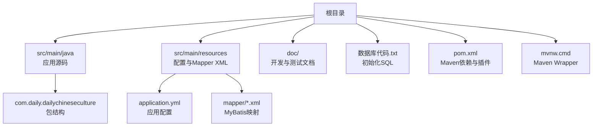

**图表来源**
- [pom.xml](file://pom.xml)
- [application.yml](file://src/main/resources/application.yml)
- [DailyChineseCultureApplication.java](file://src/main/java/com/daily/dailychineseculture/DailyChineseCultureApplication.java)
- [WebConfig.java](file://src/main/java/com/daily/dailychineseculture/config/WebConfig.java)
- [数据库代码.txt](file://数据库代码.txt)

**章节来源**
- [开发环境准备指南.md](file://doc/开发环境准备指南.md)
- [项目运行测试指南.md](file://doc/项目运行测试指南.md)

## 核心组件
- 应用入口与跨域配置：Spring Boot启动类定义RestTemplate与全局CORS过滤器，便于前后端联调与跨域访问。
- 配置中心：application.yml集中管理端口、数据库连接、文件上传、微信小程序配置等。
- Web MVC配置：WebConfig负责静态资源映射（/uploads/**）与拦截器注册，确保文件访问与鉴权策略一致。
- 构建与打包：Maven配置包含Spring Boot插件、Lombok注解处理、MyBatis Starter、MySQL驱动、JWT与分页插件、OpenAPI/Swagger等。

**章节来源**
- [DailyChineseCultureApplication.java](file://src/main/java/com/daily/dailychineseculture/DailyChineseCultureApplication.java)
- [application.yml](file://src/main/resources/application.yml)
- [WebConfig.java](file://src/main/java/com/daily/dailychineseculture/config/WebConfig.java)
- [pom.xml](file://pom.xml)

## 架构总览
应用采用Spring MVC + MyBatis的后端架构，数据库为MySQL，文件上传采用本地磁盘存储并通过静态资源映射对外提供访问。整体部署可抽象为三层：接入层（Nginx）、应用层（Spring Boot容器）、数据层（MySQL）。

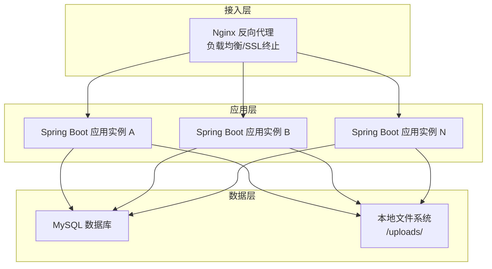

[本图为概念性架构示意，不直接映射具体源码文件，故无图表来源]

## 详细组件分析

### Maven构建与打包
- 使用Spring Boot Maven插件生成可执行JAR，排除Lombok注解处理器以避免运行时冲突。
- 编译阶段启用Lombok注解处理，保证实体与工具类生成。
- 依赖包括：Spring Web、MyBatis、MySQL驱动、JWT、分页插件、OpenAPI/Swagger、Hibernate Validator等。

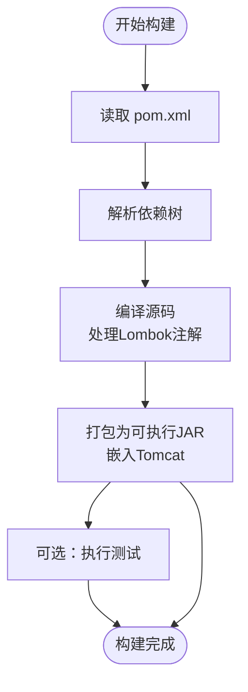

**图表来源**
- [pom.xml](file://pom.xml)

**章节来源**
- [pom.xml](file://pom.xml)

### Docker容器化
- 基础镜像：建议使用官方OpenJDK镜像（如openjdk:21-jre-slim）。
- 构建产物：将Maven构建生成的可执行JAR复制到镜像内。
- 端口暴露：容器暴露8080端口。
- 健康检查：可通过HTTP GET /actuator/health（如启用Actuator）进行健康探针。
- 卷挂载：将/uploads/目录映射到持久卷，确保文件上传持久化。
- 环境变量：通过-Dserver.port、spring.datasource.*等参数注入配置。

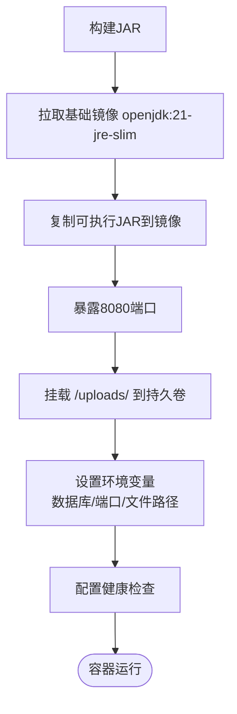

[本图为容器化流程概念图，不直接映射具体源码文件，故无图表来源]

### Kubernetes部署
- Deployment：定义副本数、滚动更新策略（maxUnavailable/ maxSurge）、探针。
- Service：ClusterIP或LoadBalancer暴露8080端口。
- ConfigMap：存放application.yml中的非敏感配置（如server.port、文件上传目录等）。
- Secret：存放数据库密码、JWT密钥等敏感信息。
- PersistentVolumeClaim：为/uploads/提供持久化存储。
- Ingress/Nginx Controller：统一入口、TLS终止、路由转发到Service。

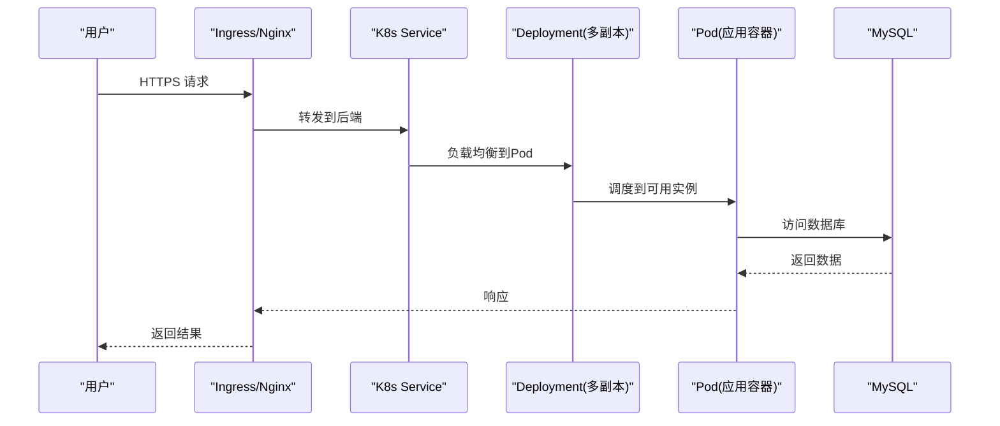

[本图为Kubernetes部署序列图，不直接映射具体源码文件，故无图表来源]

### 数据库部署与初始化
- 数据库：MySQL（版本与字符集见初始化脚本）。
- 初始化：执行数据库代码.txt创建数据库与表结构。
- 连接配置：application.yml中配置URL、用户名、密码、驱动类名。
- 连接池与监控：可在生产环境引入HikariCP并配置连接池参数与监控。

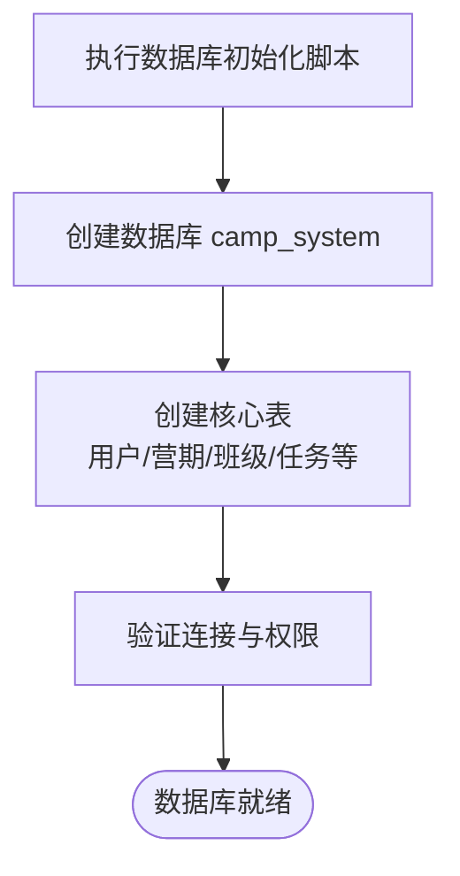

**图表来源**
- [数据库代码.txt](file://数据库代码.txt)
- [application.yml](file://src/main/resources/application.yml)

**章节来源**
- [数据库代码.txt](file://数据库代码.txt)
- [application.yml](file://src/main/resources/application.yml)
- [数据库连接状态报告.md](file://doc/数据库连接状态报告.md)

### 配置文件管理与环境变量
- application.yml：集中管理端口、数据库、文件上传、微信小程序配置等。
- 环境变量：通过-Dserver.port、spring.profiles.active、spring.datasource.*等注入。
- 多环境分离：使用Spring Profiles区分dev/staging/prod，配合ConfigMap/Secret管理。
- 动态刷新：结合Spring Cloud Bus或K8s ConfigMap热更新（需额外组件）。

**章节来源**
- [application.yml](file://src/main/resources/application.yml)
- [开发环境准备指南.md](file://doc/开发环境准备指南.md)

### Nginx反向代理、负载均衡与SSL
- 反向代理：将域名请求转发到K8s Service或多实例应用。
- 负载均衡：轮询或最少连接，结合健康检查。
- SSL终止：使用Let’s Encrypt或商业证书，开启TLS 1.2+。
- 静态资源：/uploads/**由应用提供，Nginx可缓存静态资源提升性能。

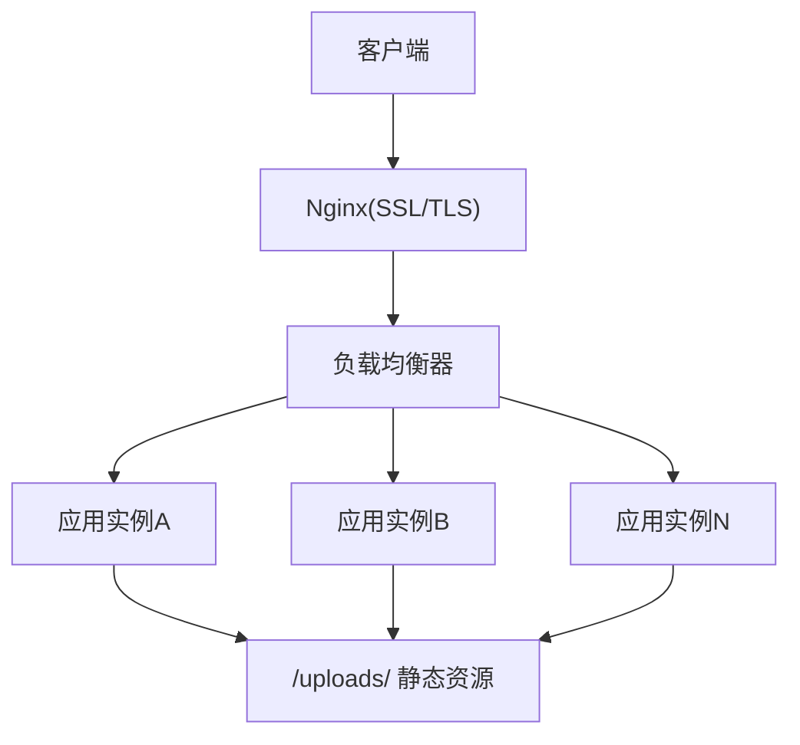

[本图为Nginx部署示意，不直接映射具体源码文件，故无图表来源]

### 文件上传与存储
- 上传接口：支持multipart/form-data，最大500MB。
- 存储路径：application.yml中file.upload-dir配置，WebConfig将其映射为静态资源。
- 访问方式：通过/ uploads/**对外提供HTTP访问。
- 生产建议：将上传目录挂载到持久化存储，避免容器重建丢失数据。

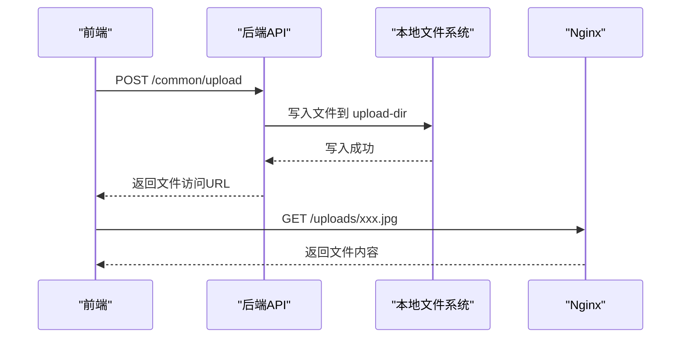

**图表来源**
- [application.yml](file://src/main/resources/application.yml)
- [WebConfig.java](file://src/main/java/com/daily/dailychineseculture/config/WebConfig.java)
- [文件上传 API文档.md](file://doc/文件上传 API文档.md)

**章节来源**
- [application.yml](file://src/main/resources/application.yml)
- [WebConfig.java](file://src/main/java/com/daily/dailychineseculture/config/WebConfig.java)
- [本地文件上传与存储机制现状分析报告.md](file://doc/本地文件上传与存储机制现状分析报告.md)
- [文件上传 API文档.md](file://doc/文件上传 API文档.md)

### 监控告警、日志管理与性能调优
- 监控：Prometheus + Grafana，采集JVM指标、应用指标与业务指标。
- 告警：基于阈值与规则触发告警（CPU、内存、连接池、慢请求、错误率）。
- 日志：统一输出到stdout/stderr，结合Fluent Bit/Fluentd收集到ELK或Loki。
- 性能：JVM参数调优（堆大小、GC策略）、连接池参数、线程池大小、缓存命中率、数据库索引优化。
- APM：可选引入SkyWalking或Micrometer观测链路。

[本节为通用运维建议，不直接分析具体源码文件，故无章节来源]

### 备份恢复与灾难预案
- 数据库备份：定时全量+增量备份，异地存储，周期性恢复演练。
- 文件备份：/uploads/目录定期快照，验证恢复路径。
- 配置备份：ConfigMap/Secret纳入版本管理与备份。
- 灾难预案：多可用区部署、自动故障转移、降级策略（只读、缓存兜底）。

[本节为通用运维建议，不直接分析具体源码文件，故无章节来源]

### 安全加固
- 网络：最小权限网络策略、WAF、DDoS防护。
- 认证：JWT令牌有效期与刷新、黑名单、滑动过期。
- 接口：细粒度RBAC、接口限流、参数校验、CSP与X-Frame-Options。
- 存储：敏感字段加密、只读挂载、最小权限访问。
- 镜像：基础镜像定期扫描、最小化依赖、非root运行。

**章节来源**
- [登录认证与用户信息体系代码扫描报告.md](file://doc/登录认证与用户信息体系代码扫描报告.md)

### 灰度发布、滚动更新与回滚
- 滚动更新：K8s Deployment设置maxUnavailable=0或1，maxSurge=25%-100%，确保零停机。
- 灰度发布：金丝雀/蓝绿策略，基于标签与Ingress规则分流流量。
- 回滚：记录Deployment版本，失败时快速回滚至上一稳定版本。
- 健康检查：liveness/readiness探针，失败自动重启或摘除。

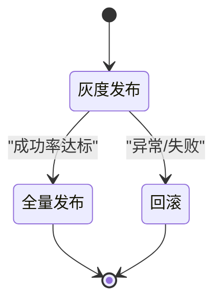

[本图为发布流程状态图，不直接映射具体源码文件，故无图表来源]

## 依赖关系分析
- 应用启动类依赖RestTemplate与CORS过滤器，确保外部调用与跨域访问。
- WebConfig依赖application.yml中的file.upload-dir，将静态资源映射到本地文件系统。
- 应用通过MyBatis访问MySQL，依赖application.yml中的数据库连接配置。
- Maven插件链路决定最终可执行JAR产物与测试执行。

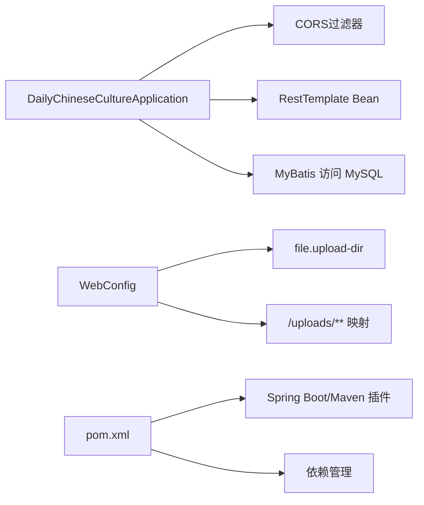

**图表来源**
- [DailyChineseCultureApplication.java](file://src/main/java/com/daily/dailychineseculture/DailyChineseCultureApplication.java)
- [WebConfig.java](file://src/main/java/com/daily/dailychineseculture/config/WebConfig.java)
- [application.yml](file://src/main/resources/application.yml)
- [pom.xml](file://pom.xml)

**章节来源**
- [DailyChineseCultureApplication.java](file://src/main/java/com/daily/dailychineseculture/DailyChineseCultureApplication.java)
- [WebConfig.java](file://src/main/java/com/daily/dailychineseculture/config/WebConfig.java)
- [application.yml](file://src/main/resources/application.yml)
- [pom.xml](file://pom.xml)

## 性能考量
- JVM：合理设置堆大小与GC策略，关注Full GC频率与停顿。
- 连接池：HikariCP参数（最大连接、空闲超时、连接超时）与监控。
- 线程池：异步任务与定时任务线程池大小与队列长度。
- 缓存：Redis/Lettuce缓存热点数据，降低数据库压力。
- 数据库：索引优化、慢查询日志、分页查询、批量写入。
- 网络：Nginx连接复用、压缩、静态资源CDN加速。

[本节为通用性能建议，不直接分析具体源码文件，故无章节来源]

## 故障排查指南
- 启动失败：检查JAVA_HOME、端口占用、JVM参数、依赖冲突。
- 数据库连接：核对URL、用户名、密码、网络连通性、防火墙。
- 文件上传失败：确认upload-dir目录权限、磁盘空间、Nginx静态资源映射。
- 登录鉴权异常：核对JWT签名算法、密钥、过期时间、拦截器放行规则。
- API测试：使用提供的PowerShell脚本或curl命令进行快速验证。

**章节来源**
- [项目运行测试指南.md](file://doc/项目运行测试指南.md)
- [环境检查报告.md](file://doc/环境检查报告.md)
- [test-dashboard.ps1](file://test-dashboard.ps1)

## 结论
本指南基于仓库现有配置与代码，给出了从开发到生产的完整部署方案。建议在生产环境中补充监控告警、日志体系、安全加固与灾备演练，并结合Kubernetes实现弹性伸缩与高可用。

## 附录

### 部署检查清单
- [ ] 环境变量与Secret配置完成
- [ ] 数据库初始化脚本执行成功
- [ ] Docker镜像构建与推送完成
- [ ] K8s ConfigMap/Secret部署完成
- [ ] PVC挂载与权限验证
- [ ] Ingress与SSL证书配置
- [ ] 健康检查与探针配置
- [ ] 负载均衡与多副本部署
- [ ] 监控、日志与告警接入
- [ ] 备份策略与恢复演练
- [ ] 安全基线与合规检查

### 常用命令与路径
- Maven构建：./mvnw clean package
- 运行应用：./mvnw spring-boot:run
- 测试脚本：.\test-dashboard.ps1
- 配置文件：src/main/resources/application.yml
- 启动类：DailyChineseCultureApplication.java
- Web配置：WebConfig.java
- 数据库脚本：数据库代码.txt

**章节来源**
- [mvnw.cmd](file://mvnw.cmd)
- [项目运行测试指南.md](file://doc/项目运行测试指南.md)
- [开发环境准备指南.md](file://doc/开发环境准备指南.md)
- [数据库代码.txt](file://数据库代码.txt)
````

## File: .qoder/repowiki/zh/content/测试策略/测试策略.md
````markdown
# 测试策略

<cite>
**本文引用的文件**
- [DailyChineseCultureApplicationTests.java](file://src/test/java/com/daily/dailychineseculture/DailyChineseCultureApplicationTests.java)
- [AdminAuthApiTest.java](file://src/test/java/com/daily/dailychineseculture/AdminAuthApiTest.java)
- [LoginFunctionTest.java](file://src/test/java/com/daily/dailychineseculture/LoginFunctionTest.java)
- [FileUploadAndUpdateTest.java](file://src/test/java/com/daily/dailychineseculture/FileUploadAndUpdateTest.java)
- [HotCourseRecommendationTest.java](file://src/test/java/com/daily/dailychineseculture/HotCourseRecommendationTest.java)
- [UserDetailApiTest.java](file://src/test/java/com/daily/dailychineseculture/UserDetailApiTest.java)
- [UserProfileApiTest.java](file://src/test/java/com/daily/dailychineseculture/UserProfileApiTest.java)
- [DatabaseStructureTest.java](file://src/test/java/com/daily/dailychineseculture/DatabaseStructureTest.java)
- [SimpleDatabaseTest.java](file://src/test/java/com/daily/dailychineseculture/SimpleDatabaseTest.java)
- [pom.xml](file://pom.xml)
- [application.yml](file://src/main/resources/application.yml)
- [测试最近活跃课程 API.md](file://doc/测试最近活跃课程 API.md)
- [项目运行测试指南.md](file://doc/项目运行测试指南.md)
- [AuthController.java](file://src/main/java/com/daily/dailychineseculture/controller/AuthController.java)
- [UserAuthServiceImpl.java](file://src/main/java/com/daily/dailychineseculture/service/impl/UserAuthServiceImpl.java)
- [JwtUtils.java](file://src/main/java/com/daily/dailychineseculture/util/JwtUtils.java)
</cite>

## 目录
1. [引言](#引言)
2. [项目结构](#项目结构)
3. [核心组件](#核心组件)
4. [架构总览](#架构总览)
5. [详细组件分析](#详细组件分析)
6. [依赖分析](#依赖分析)
7. [性能考虑](#性能考虑)
8. [故障排查指南](#故障排查指南)
9. [结论](#结论)
10. [附录](#附录)

## 引言
本测试策略文档系统性地阐述本项目的测试方法与最佳实践，覆盖单元测试、集成测试与端到端测试的实施策略；明确测试用例设计原则、覆盖率目标与测试数据管理；详解API测试、数据库测试与文件上传测试的实现要点；提供测试环境搭建、工具使用与自动化配置建议；并补充性能测试、压力测试与安全测试方法，以及测试报告生成、缺陷跟踪与持续集成配置思路。文档面向不同技术背景读者，既提供高层概览也给出代码级参考。

## 项目结构
项目采用Spring Boot标准工程结构，测试代码位于src/test目录，按功能域划分测试类，覆盖认证、用户、课程、文件上传等模块。核心依赖包括Web MVC、MyBatis Starter、JWT、分页插件、OpenAPI文档与校验框架。配置文件application.yml集中管理数据库、文件上传与Servlet上传限制等参数。

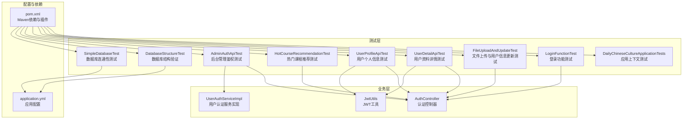

图表来源
- [pom.xml:1-149](file://pom.xml#L1-L149)
- [application.yml:1-33](file://src/main/resources/application.yml#L1-L33)
- [AuthController.java:1-200](file://src/main/java/com/daily/dailychineseculture/controller/AuthController.java#L1-L200)
- [UserAuthServiceImpl.java:1-168](file://src/main/java/com/daily/dailychineseculture/service/impl/UserAuthServiceImpl.java#L1-L168)
- [JwtUtils.java:1-206](file://src/main/java/com/daily/dailychineseculture/util/JwtUtils.java#L1-L206)

章节来源
- [pom.xml:1-149](file://pom.xml#L1-L149)
- [application.yml:1-33](file://src/main/resources/application.yml#L1-L33)

## 核心组件
- 应用上下文测试：验证Spring Boot应用上下文加载与基本容器能力。
- 登录功能测试：覆盖管理员登录、新用户自动注册、参数校验等场景。
- 文件上传与用户信息更新测试：基于MockMvc的端到端测试，覆盖多种文件类型、大小、授权与更新场景。
- 用户资料与个人信息测试：基于JWT工具生成Token，验证详情与更新接口。
- 热门课程推荐测试：验证控制器与服务层返回的数据格式与数量约束。
- 后台管理鉴权测试：以注释形式描述Token拦截与鉴权流程。
- 数据库结构与连通性测试：验证表结构、列信息与连接可用性。

章节来源
- [DailyChineseCultureApplicationTests.java:1-14](file://src/test/java/com/daily/dailychineseculture/DailyChineseCultureApplicationTests.java#L1-L14)
- [LoginFunctionTest.java:1-108](file://src/test/java/com/daily/dailychineseculture/LoginFunctionTest.java#L1-L108)
- [FileUploadAndUpdateTest.java:1-479](file://src/test/java/com/daily/dailychineseculture/FileUploadAndUpdateTest.java#L1-L479)
- [UserDetailApiTest.java:1-143](file://src/test/java/com/daily/dailychineseculture/UserDetailApiTest.java#L1-L143)
- [UserProfileApiTest.java:1-108](file://src/test/java/com/daily/dailychineseculture/UserProfileApiTest.java#L1-L108)
- [HotCourseRecommendationTest.java:1-73](file://src/test/java/com/daily/dailychineseculture/HotCourseRecommendationTest.java#L1-L73)
- [AdminAuthApiTest.java:1-58](file://src/test/java/com/daily/dailychineseculture/AdminAuthApiTest.java#L1-L58)
- [DatabaseStructureTest.java:1-43](file://src/test/java/com/daily/dailychineseculture/DatabaseStructureTest.java#L1-L43)
- [SimpleDatabaseTest.java:1-43](file://src/test/java/com/daily/dailychineseculture/SimpleDatabaseTest.java#L1-L43)

## 架构总览
测试架构围绕“单元测试（服务层）+ 集成测试（控制器+MockMvc）+ 端到端测试（外部API+数据库）”三层展开。单元测试通过@Autowired注入服务层进行断言；集成测试通过MockMvc发起HTTP请求，验证控制器行为与响应；端到端测试结合登录获取Token、文件上传与用户信息更新的完整流程，并结合数据库结构验证。

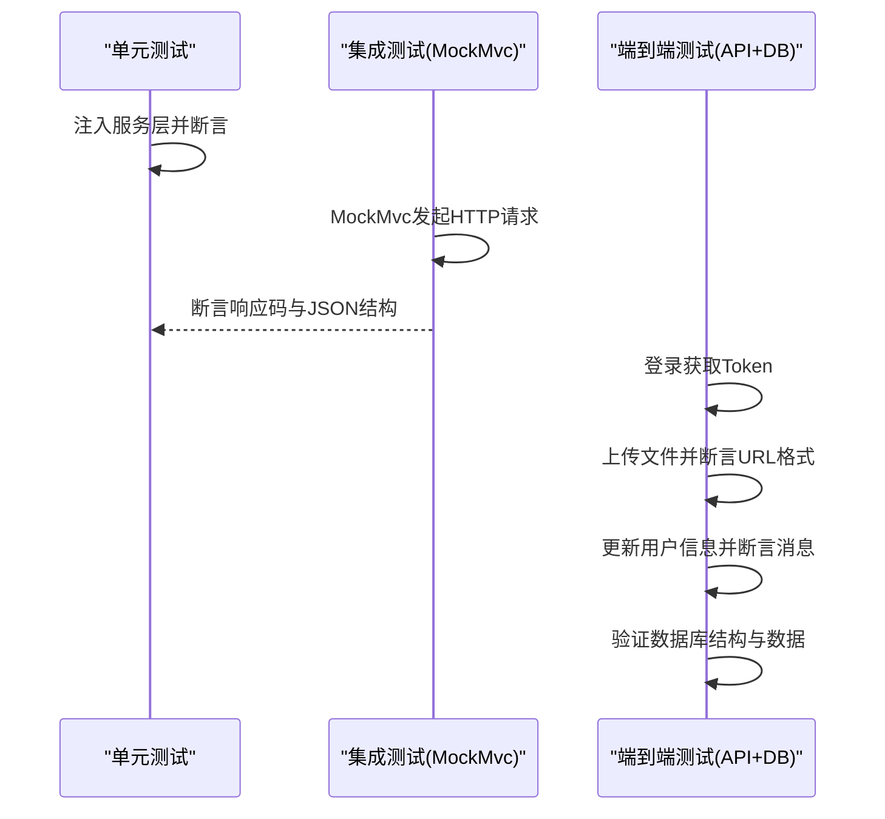

图表来源
- [LoginFunctionTest.java:1-108](file://src/test/java/com/daily/dailychineseculture/LoginFunctionTest.java#L1-L108)
- [FileUploadAndUpdateTest.java:1-479](file://src/test/java/com/daily/dailychineseculture/FileUploadAndUpdateTest.java#L1-L479)
- [UserDetailApiTest.java:1-143](file://src/test/java/com/daily/dailychineseculture/UserDetailApiTest.java#L1-L143)
- [UserProfileApiTest.java:1-108](file://src/test/java/com/daily/dailychineseculture/UserProfileApiTest.java#L1-L108)
- [DatabaseStructureTest.java:1-43](file://src/test/java/com/daily/dailychineseculture/DatabaseStructureTest.java#L1-L43)

## 详细组件分析

### 单元测试策略
- 服务层直接测试：通过@Autowired注入服务接口，绕过HTTP层，快速验证业务逻辑与边界条件。
- 示例：热门课程推荐测试直接调用控制器与服务层，断言响应码、数据非空与数量上限。
- 设计原则：每个测试聚焦单一职责，前置准备清晰，断言明确，异常路径覆盖充分。

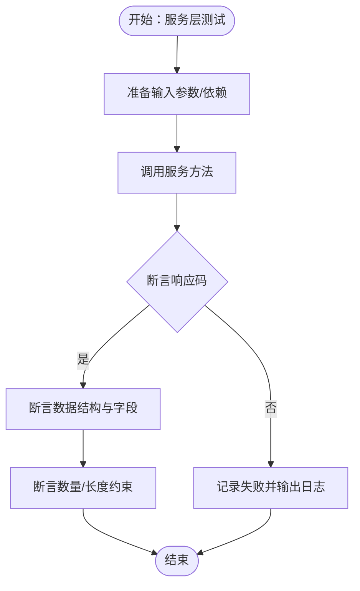

图表来源
- [HotCourseRecommendationTest.java:27-73](file://src/test/java/com/daily/dailychineseculture/HotCourseRecommendationTest.java#L27-L73)

章节来源
- [HotCourseRecommendationTest.java:1-73](file://src/test/java/com/daily/dailychineseculture/HotCourseRecommendationTest.java#L1-L73)

### 集成测试策略（MockMvc）
- 控制器测试：通过MockMvc发起HTTP请求，验证鉴权头、状态码、JSON字段与业务规则。
- 示例：文件上传测试覆盖空文件、非法类型、超大文件、未授权访问、成功上传与URL格式断言；用户信息更新测试覆盖全量更新、部分字段更新、未授权访问与手机号重复检测。
- 设计原则：每个测试独立登录获取Token，构造最小化请求体，断言明确的期望值。

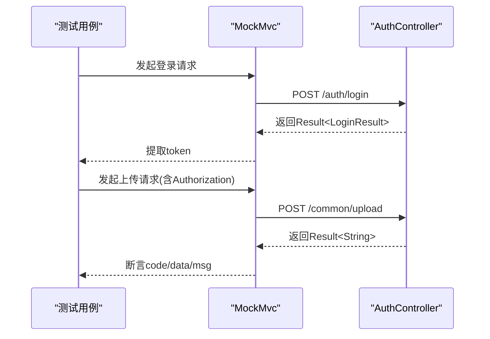

图表来源
- [FileUploadAndUpdateTest.java:41-77](file://src/test/java/com/daily/dailychineseculture/FileUploadAndUpdateTest.java#L41-L77)
- [AuthController.java:63-112](file://src/main/java/com/daily/dailychineseculture/controller/AuthController.java#L63-L112)

章节来源
- [FileUploadAndUpdateTest.java:1-479](file://src/test/java/com/daily/dailychineseculture/FileUploadAndUpdateTest.java#L1-L479)
- [AuthController.java:1-200](file://src/main/java/com/daily/dailychineseculture/controller/AuthController.java#L1-L200)

### 端到端测试策略
- 场景串联：登录→上传头像→更新用户信息→断言响应与URL格式。
- 数据准备：通过JWT工具生成Token，或在测试前登录获取Token并缓存复用。
- 设计原则：覆盖边界值（空文件、超大文件）、异常路径（未授权、重复手机号）与完整流程。

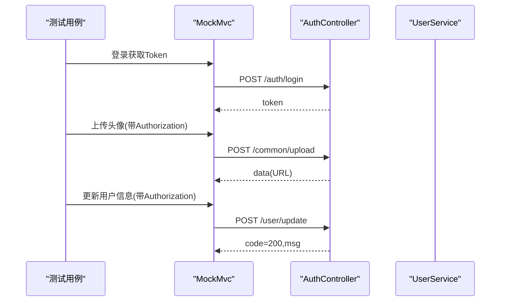

图表来源
- [UserDetailApiTest.java:34-71](file://src/test/java/com/daily/dailychineseculture/UserDetailApiTest.java#L34-L71)
- [UserProfileApiTest.java:32-79](file://src/test/java/com/daily/dailychineseculture/UserProfileApiTest.java#L32-L79)
- [JwtUtils.java:37-69](file://src/main/java/com/daily/dailychineseculture/util/JwtUtils.java#L37-L69)

章节来源
- [UserDetailApiTest.java:1-143](file://src/test/java/com/daily/dailychineseculture/UserDetailApiTest.java#L1-L143)
- [UserProfileApiTest.java:1-108](file://src/test/java/com/daily/dailychineseculture/UserProfileApiTest.java#L1-L108)
- [JwtUtils.java:1-206](file://src/main/java/com/daily/dailychineseculture/util/JwtUtils.java#L1-L206)

### API测试设计原则
- 请求与响应：明确HTTP方法、路径、头信息（如Authorization）、请求体结构与期望响应码、JSON字段。
- 参数校验：覆盖空值、边界值、非法类型、超长字符串等。
- 鉴权与拦截：验证未登录、Token过期、Token格式错误等场景。
- 数据一致性：断言返回字段完整性与业务约束（如数量上限、格式匹配）。

章节来源
- [AdminAuthApiTest.java:1-58](file://src/test/java/com/daily/dailychineseculture/AdminAuthApiTest.java#L1-L58)
- [LoginFunctionTest.java:19-107](file://src/test/java/com/daily/dailychineseculture/LoginFunctionTest.java#L19-L107)

### 数据库测试与数据管理
- 结构验证：通过JDBC查询表结构与示例数据，确保字段、类型与默认值符合预期。
- 连通性测试：验证DataSource自动装配与连接可用性，输出连接元数据。
- 测试数据：优先使用现有测试账号与固定ID，必要时在测试前准备SQL数据（参考文档中的示例SQL）。

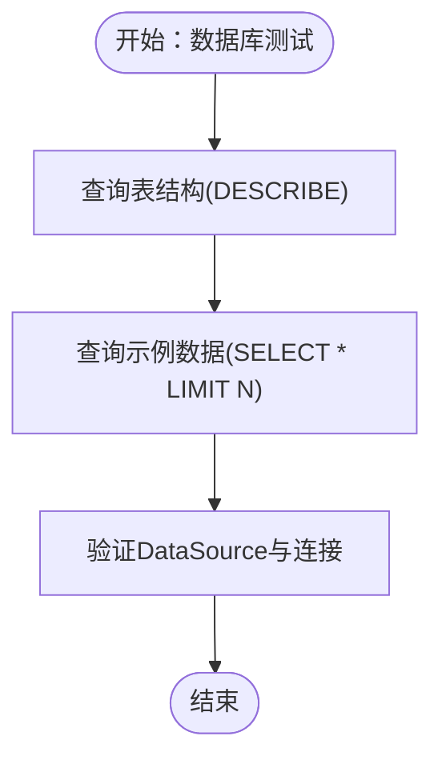

图表来源
- [DatabaseStructureTest.java:21-42](file://src/test/java/com/daily/dailychineseculture/DatabaseStructureTest.java#L21-L42)
- [SimpleDatabaseTest.java:20-42](file://src/test/java/com/daily/dailychineseculture/SimpleDatabaseTest.java#L20-L42)

章节来源
- [DatabaseStructureTest.java:1-43](file://src/test/java/com/daily/dailychineseculture/DatabaseStructureTest.java#L1-L43)
- [SimpleDatabaseTest.java:1-43](file://src/test/java/com/daily/dailychineseculture/SimpleDatabaseTest.java#L1-L43)
- [application.yml:6-33](file://src/main/resources/application.yml#L6-L33)

### 文件上传测试实现
- 支持类型：JPG、PNG及其扩展名兼容性；拒绝空文件与非图片类型。
- 大小限制：基于配置与MockMvc断言，覆盖500MB上传限制与超大文件拒绝。
- 授权校验：未携带Authorization头时返回未授权。
- URL格式：断言返回URL前缀与文件名模式。

章节来源
- [FileUploadAndUpdateTest.java:79-479](file://src/test/java/com/daily/dailychineseculture/FileUploadAndUpdateTest.java#L79-L479)
- [application.yml:12-33](file://src/main/resources/application.yml#L12-L33)

### 登录与鉴权测试
- 登录流程：用户名/密码校验、新用户自动注册、信息完整性判断、Token生成。
- 鉴权流程：基于JWT工具生成Token，控制器解析并返回用户信息；后台管理鉴权通过注释描述拦截器行为。

章节来源
- [LoginFunctionTest.java:19-107](file://src/test/java/com/daily/dailychineseculture/LoginFunctionTest.java#L19-L107)
- [AuthController.java:41-136](file://src/main/java/com/daily/dailychineseculture/controller/AuthController.java#L41-L136)
- [JwtUtils.java:37-95](file://src/main/java/com/daily/dailychineseculture/util/JwtUtils.java#L37-L95)
- [AdminAuthApiTest.java:43-56](file://src/test/java/com/daily/dailychineseculture/AdminAuthApiTest.java#L43-L56)

## 依赖分析
- 测试依赖：Spring Boot Starter Test、MyBatis Spring Boot Starter Test、JUnit 5、MockMvc。
- 运行依赖：Spring MVC、MyBatis、MySQL Connector、JWT、分页插件、OpenAPI文档、校验框架。
- 配置依赖：application.yml集中管理数据库、文件上传与Servlet上传限制。

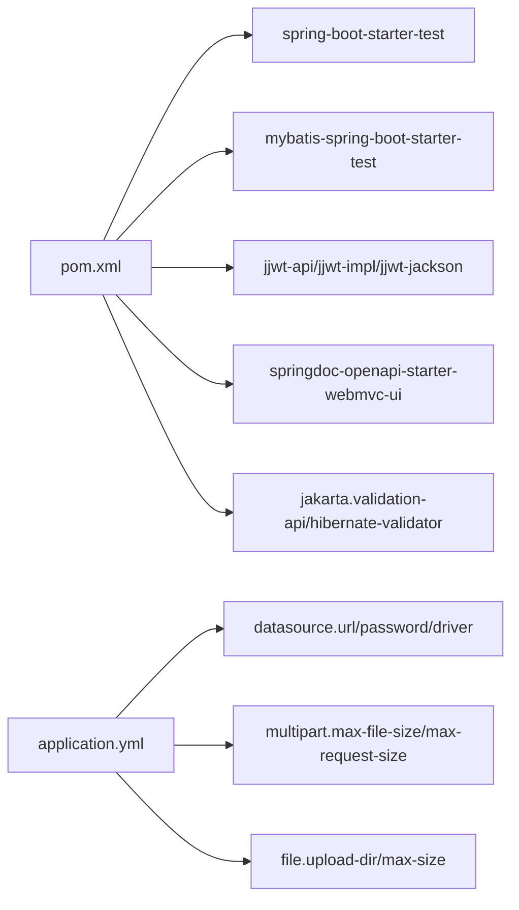

图表来源
- [pom.xml:32-117](file://pom.xml#L32-L117)
- [application.yml:6-33](file://src/main/resources/application.yml#L6-L33)

章节来源
- [pom.xml:1-149](file://pom.xml#L1-L149)
- [application.yml:1-33](file://src/main/resources/application.yml#L1-L33)

## 性能考虑
- 单元测试：保持无外部依赖，使用Mock与最小化输入，追求快速反馈。
- 集成测试：合理拆分测试用例，避免重复登录；对大文件上传测试谨慎控制数据规模。
- 端到端测试：优先使用内存数据库或测试专用实例，减少对主库影响；批量测试时注意并发与资源释放。
- 日志与断言：避免在测试中输出冗余日志，统一使用断言与结构化输出便于定位问题。

## 故障排查指南
- 端口占用：若8080端口被占用，参考项目运行测试指南中的端口占用排查与处理命令。
- Java环境：确认JAVA_HOME与PATH设置正确，确保使用指定版本的JDK。
- 项目编译：清理并重新编译，运行测试，定位依赖冲突或编译错误。
- 数据库连接：检查application.yml中的数据库连接参数，确认网络可达与账号权限。
- API测试：参考测试最近活跃课程 API文档中的错误排查与SQL准备建议。

章节来源
- [项目运行测试指南.md:96-122](file://doc/项目运行测试指南.md#L96-L122)
- [application.yml:6-11](file://src/main/resources/application.yml#L6-L11)
- [测试最近活跃课程 API.md:107-134](file://doc/测试最近活跃课程 API.md#L107-L134)

## 结论
本项目的测试策略以“单元测试+集成测试+端到端测试”为主线，结合MockMvc与JWT工具，覆盖登录、用户信息、文件上传与数据库结构等关键路径。通过明确的断言与场景拆分，确保测试的稳定性与可维护性。建议在持续集成中引入自动化测试流水线，结合日志与报告工具，进一步提升质量保障效率。

## 附录
- 测试环境搭建：参考项目运行测试指南，设置JAVA_HOME，启动项目并确认端口监听。
- API测试工具：支持浏览器、Postman/Insomnia、curl与PowerShell脚本。
- 自动化测试配置：可在CI中执行Maven测试命令，结合测试报告与日志归档。
- 性能与安全：关注文件大小限制、鉴权拦截与Token有效期；对敏感字段（如密码）进行安全断言。

章节来源
- [项目运行测试指南.md:1-149](file://doc/项目运行测试指南.md#L1-L149)
- [测试最近活跃课程 API.md:1-244](file://doc/测试最近活跃课程 API.md#L1-L244)
````

## File: .qoder/repowiki/zh/content/测试策略/测试环境搭建.md
````markdown
# 测试环境搭建

<cite>
**本文引用的文件**   
- [pom.xml](file://pom.xml)
- [application.yml](file://src/main/resources/application.yml)
- [.mvn\wrapper\maven-wrapper.properties](file://.mvn/wrapper/maven-wrapper.properties)
- [开发环境准备指南.md](file://doc/开发环境准备指南.md)
- [项目运行测试指南.md](file://doc/项目运行测试指南.md)
- [测试最近活跃课程 API.md](file://doc/测试最近活跃课程 API.md)
- [DailyChineseCultureApplicationTests.java](file://src/test/java/com/daily/dailychineseculture/DailyChineseCultureApplicationTests.java)
- [AdminAuthApiTest.java](file://src/test/java/com/daily/dailychineseculture/AdminAuthApiTest.java)
- [LoginFunctionTest.java](file://src/test/java/com/daily/dailychineseculture/LoginFunctionTest.java)
- [UserDetailApiTest.java](file://src/test/java/com/daily/dailychineseculture/UserDetailApiTest.java)
- [UserProfileApiTest.java](file://src/test/java/com/daily/dailychineseculture/UserProfileApiTest.java)
- [DatabaseStructureTest.java](file://src/test/java/com/daily/dailychineseculture/DatabaseStructureTest.java)
- [SimpleDatabaseTest.java](file://src/test/java/com/daily/dailychineseculture/SimpleDatabaseTest.java)
- [ApiTestClient.java](file://src/test/java/com/daily/dailychineseculture/ApiTestClient.java)
- [test-dashboard.ps1](file://test-dashboard.ps1)
- [数据库代码.txt](file://数据库代码.txt)
</cite>

## 目录
1. [引言](#引言)
2. [项目结构](#项目结构)
3. [核心组件](#核心组件)
4. [架构总览](#架构总览)
5. [详细组件分析](#详细组件分析)
6. [依赖关系分析](#依赖关系分析)
7. [性能考虑](#性能考虑)
8. [故障排除指南](#故障排除指南)
9. [结论](#结论)
10. [附录](#附录)

## 引言
本指南面向需要搭建与维护本项目测试环境的开发者与测试工程师，目标是提供从环境准备、依赖配置、数据库与环境隔离、测试执行到故障排除与性能优化的完整实践路径。文档基于仓库中的实际配置与测试样例进行归纳总结，帮助读者快速建立稳定可靠的测试环境。

## 项目结构
项目采用标准的 Spring Boot Maven 结构，测试代码位于 src/test 目录下，测试覆盖控制器层、服务层与数据库层，配合应用配置文件与 Maven 依赖声明，形成可运行的测试环境。

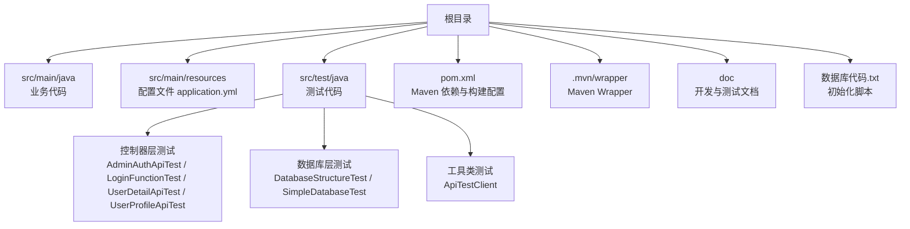

图表来源
- [pom.xml:1-149](file://pom.xml#L1-L149)
- [application.yml:1-33](file://src/main/resources/application.yml#L1-L33)
- [开发环境准备指南.md:1-146](file://doc/开发环境准备指南.md#L1-L146)

章节来源
- [pom.xml:1-149](file://pom.xml#L1-L149)
- [application.yml:1-33](file://src/main/resources/application.yml#L1-L33)
- [开发环境准备指南.md:1-146](file://doc/开发环境准备指南.md#L1-L146)

## 核心组件
- 测试框架与运行支撑
  - JUnit 5 注解与 Spring Boot Test 启动上下文，用于加载应用配置并执行集成测试。
  - 示例：[DailyChineseCultureApplicationTests.java:1-14](file://src/test/java/com/daily/dailychineseculture/DailyChineseCultureApplicationTests.java#L1-L14)、[LoginFunctionTest.java:1-108](file://src/test/java/com/daily/dailychineseculture/LoginFunctionTest.java#L1-L108)
- 控制器层测试
  - 针对登录、用户资料、仪表盘等接口的测试，覆盖成功、失败与边界条件。
  - 示例：[AdminAuthApiTest.java:1-58](file://src/test/java/com/daily/dailychineseculture/AdminAuthApiTest.java#L1-L58)、[UserDetailApiTest.java:1-143](file://src/test/java/com/daily/dailychineseculture/UserDetailApiTest.java#L1-L143)、[UserProfileApiTest.java:1-108](file://src/test/java/com/daily/dailychineseculture/UserProfileApiTest.java#L1-L108)
- 数据库层测试
  - 通过 JdbcTemplate 与 DataSource 校验表结构与连通性。
  - 示例：[DatabaseStructureTest.java:1-43](file://src/test/java/com/daily/dailychineseculture/DatabaseStructureTest.java#L1-L43)、[SimpleDatabaseTest.java:1-43](file://src/test/java/com/daily/dailychineseculture/SimpleDatabaseTest.java#L1-L43)
- 测试工具
  - 自定义 API 测试客户端，便于命令行快速验证接口。
  - 示例：[ApiTestClient.java:1-87](file://src/test/java/com/daily/dailychineseculture/ApiTestClient.java#L1-L87)

章节来源
- [DailyChineseCultureApplicationTests.java:1-14](file://src/test/java/com/daily/dailychineseculture/DailyChineseCultureApplicationTests.java#L1-L14)
- [AdminAuthApiTest.java:1-58](file://src/test/java/com/daily/dailychineseculture/AdminAuthApiTest.java#L1-L58)
- [LoginFunctionTest.java:1-108](file://src/test/java/com/daily/dailychineseculture/LoginFunctionTest.java#L1-L108)
- [UserDetailApiTest.java:1-143](file://src/test/java/com/daily/dailychineseculture/UserDetailApiTest.java#L1-L143)
- [UserProfileApiTest.java:1-108](file://src/test/java/com/daily/dailychineseculture/UserProfileApiTest.java#L1-L108)
- [DatabaseStructureTest.java:1-43](file://src/test/java/com/daily/dailychineseculture/DatabaseStructureTest.java#L1-L43)
- [SimpleDatabaseTest.java:1-43](file://src/test/java/com/daily/dailychineseculture/SimpleDatabaseTest.java#L1-L43)
- [ApiTestClient.java:1-87](file://src/test/java/com/daily/dailychineseculture/ApiTestClient.java#L1-L87)

## 架构总览
测试环境围绕 Spring Boot 应用与 MySQL 数据库展开，测试通过 Maven 生命周期与 Spring Boot Test 启动应用上下文，访问控制器接口并验证响应；数据库层测试通过 JDBC 操作与结构校验确保数据一致性。

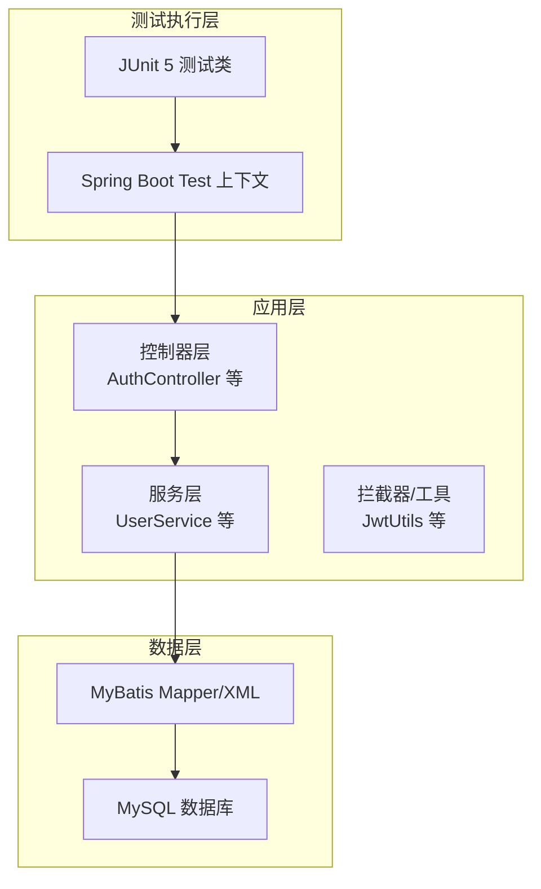

图表来源
- [LoginFunctionTest.java:1-108](file://src/test/java/com/daily/dailychineseculture/LoginFunctionTest.java#L1-L108)
- [UserDetailApiTest.java:1-143](file://src/test/java/com/daily/dailychineseculture/UserDetailApiTest.java#L1-L143)
- [UserProfileApiTest.java:1-108](file://src/test/java/com/daily/dailychineseculture/UserProfileApiTest.java#L1-L108)
- [DatabaseStructureTest.java:1-43](file://src/test/java/com/daily/dailychineseculture/DatabaseStructureTest.java#L1-L43)
- [application.yml:1-33](file://src/main/resources/application.yml#L1-L33)

## 详细组件分析

### Maven 依赖与测试支持
- 测试框架与启动
  - spring-boot-starter-webmvc-test 与 mybatis-spring-boot-starter-test 提供测试所需的 Web 与 MyBatis 集成能力。
  - 示例：[pom.xml:61-69](file://pom.xml#L61-L69)
- 数据库驱动与连接
  - mysql-connector-j 作为运行时驱动，配合 application.yml 中的数据源配置。
  - 示例：[pom.xml:50-53](file://pom.xml#L50-L53)、[application.yml:7-11](file://src/main/resources/application.yml#L7-L11)
- 其他工具与文档
  - Lombok、JWT、分页插件、Swagger/Knife4j、校验组件等，提升开发与测试效率。
  - 示例：[pom.xml:55-116](file://pom.xml#L55-L116)
- 构建与编译
  - Maven Compiler Plugin 与 Spring Boot Maven Plugin 的配置，确保注解处理与打包正确。
  - 示例：[pom.xml:120-145](file://pom.xml#L120-L145)

章节来源
- [pom.xml:29-116](file://pom.xml#L29-L116)
- [application.yml:7-11](file://src/main/resources/application.yml#L7-L11)

### 开发环境准备对测试的影响
- JDK 版本要求
  - Java 21，确保测试与生产一致，避免兼容性问题。
  - 示例：[开发环境准备指南.md:4-5](file://doc/开发环境准备指南.md#L4-L5)
- IDE 配置
  - IntelliJ IDEA、Eclipse、VS Code 等，推荐安装 Lombok、MyBatis 日志、GitLens 等插件以提升测试体验。
  - 示例：[开发环境准备指南.md:20-35](file://doc/开发环境准备指南.md#L20-L35)
- 数据库环境设置
  - 使用 DBeaver 或 MySQL Workbench 管理数据库，确保连接参数与 application.yml 一致。
  - 示例：[开发环境准备指南.md:37-46](file://doc/开发环境准备指南.md#L37-L46)

章节来源
- [开发环境准备指南.md:4-5](file://doc/开发环境准备指南.md#L4-L5)
- [开发环境准备指南.md:20-35](file://doc/开发环境准备指南.md#L20-L35)
- [开发环境准备指南.md:37-46](file://doc/开发环境准备指南.md#L37-L46)

### 测试环境隔离策略
- 测试数据库配置
  - 在 application.yml 中配置独立的数据源，避免与生产数据冲突；如需隔离，可在 CI 中通过环境变量覆盖。
  - 示例：[application.yml:7-11](file://src/main/resources/application.yml#L7-L11)
- 测试数据管理
  - 使用数据库初始化脚本创建测试所需表结构与示例行数据，保证测试可重复性。
  - 示例：[数据库代码.txt:1-165](file://数据库代码.txt#L1-L165)
- 环境变量设置
  - 通过环境变量控制 JAVA_HOME 与 PATH，确保测试在统一 JDK 版本下执行。
  - 示例：[项目运行测试指南.md:5-9](file://doc/项目运行测试指南.md#L5-L9)

章节来源
- [application.yml:7-11](file://src/main/resources/application.yml#L7-L11)
- [数据库代码.txt:1-165](file://数据库代码.txt#L1-L165)
- [项目运行测试指南.md:5-9](file://doc/项目运行测试指南.md#L5-L9)

### 测试执行方式
- 命令行测试执行
  - 使用 Maven Wrapper 执行测试生命周期，清理、编译、测试一体化。
  - 示例：[项目运行测试指南.md:114-121](file://doc/项目运行测试指南.md#L114-L121)
- IDE 测试运行
  - 在 IDE 中直接运行单个测试类或测试方法，便于调试与定位问题。
  - 示例：[LoginFunctionTest.java:1-108](file://src/test/java/com/daily/dailychineseculture/LoginFunctionTest.java#L1-L108)
- CI/CD 集成
  - 在 CI 中复用 Maven Wrapper 与 JDK 21 环境，结合数据库初始化脚本与环境变量，实现自动化测试流水线。
  - 示例：[开发环境准备指南.md:52-56](file://doc/开发环境准备指南.md#L52-L56)

章节来源
- [项目运行测试指南.md:114-121](file://doc/项目运行测试指南.md#L114-L121)
- [LoginFunctionTest.java:1-108](file://src/test/java/com/daily/dailychineseculture/LoginFunctionTest.java#L1-L108)
- [开发环境准备指南.md:52-56](file://doc/开发环境准备指南.md#L52-L56)

### API 测试流程（序列图）
以下序列图展示登录接口的典型测试流程：客户端发起请求，控制器处理，服务层校验，返回结果。

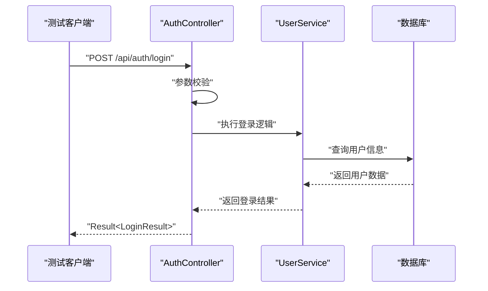

图表来源
- [LoginFunctionTest.java:1-108](file://src/test/java/com/daily/dailychineseculture/LoginFunctionTest.java#L1-L108)
- [application.yml:1-33](file://src/main/resources/application.yml#L1-L33)

### 数据库结构与连通性测试（流程图）
数据库层测试通过查询表结构与示例行数据，验证数据库可用性与表结构完整性。

```mermaid
flowchart TD
Start(["开始"]) --> DS["查询表结构<br/>DESCRIBE t_camp"]
DS --> PrintCols["打印字段信息"]
PrintCols --> Sample["查询示例行数据<br/>SELECT * FROM t_camp LIMIT 3"]
Sample --> PrintData["打印示例行数据"]
PrintData --> ConnTest["测试数据库连接可用性"]
ConnTest --> End(["结束"])
```

图表来源
- [DatabaseStructureTest.java:1-43](file://src/test/java/com/daily/dailychineseculture/DatabaseStructureTest.java#L1-L43)
- [SimpleDatabaseTest.java:1-43](file://src/test/java/com/daily/dailychineseculture/SimpleDatabaseTest.java#L1-L43)

### 测试工具与脚本
- 自定义 API 测试客户端
  - 通过 HttpClient 发送请求，便于快速验证登录、用户资料等接口。
  - 示例：[ApiTestClient.java:1-87](file://src/test/java/com/daily/dailychineseculture/ApiTestClient.java#L1-L87)
- PowerShell 仪表盘测试脚本
  - 自动化登录、获取 Token 并访问仪表盘接口，适合回归测试与演示。
  - 示例：[test-dashboard.ps1:1-44](file://test-dashboard.ps1#L1-L44)

章节来源
- [ApiTestClient.java:1-87](file://src/test/java/com/daily/dailychineseculture/ApiTestClient.java#L1-L87)
- [test-dashboard.ps1:1-44](file://test-dashboard.ps1#L1-L44)

## 依赖关系分析
- 测试框架与 Spring Boot
  - 测试类通过 @SpringBootTest 加载应用上下文，依赖 Spring Boot Test Starter 与 Web MVC Test Starter。
  - 示例：[pom.xml:61-63](file://pom.xml#L61-L63)
- 数据访问与数据库
  - MyBatis Starter 与 MySQL Connector/J 提供 ORM 与驱动支持；JdbcTemplate 用于结构与连通性测试。
  - 示例：[pom.xml:37-41](file://pom.xml#L37-L41)、[pom.xml:50-53](file://pom.xml#L50-L53)、[DatabaseStructureTest.java:1-43](file://src/test/java/com/daily/dailychineseculture/DatabaseStructureTest.java#L1-L43)
- 工具与文档
  - Lombok、JWT、分页插件、Swagger/Knife4j、校验组件等提升开发与测试效率。
  - 示例：[pom.xml:55-116](file://pom.xml#L55-L116)

```mermaid
graph LR
POM["pom.xml 依赖声明"] --> WEBTEST["spring-boot-starter-webmvc-test"]
POM --> MYBATISTEST["mybatis-spring-boot-starter-test"]
POM --> MYSQLDRV["mysql-connector-j"]
POM --> LOMBOK["lombok"]
POM --> JWT["jjwt-*"]
POM --> PAGE["pagehelper-spring-boot-starter"]
POM --> SWAGGER["springdoc-openapi-starter-webmvc-ui"]
POM --> VALID["jakarta.validation-api / hibernate-validator"]
TESTS["测试类"] --> WEBTEST
TESTS --> MYSQLDRV
TESTS --> JWT
```

图表来源
- [pom.xml:32-116](file://pom.xml#L32-L116)
- [LoginFunctionTest.java:1-108](file://src/test/java/com/daily/dailychineseculture/LoginFunctionTest.java#L1-L108)

章节来源
- [pom.xml:32-116](file://pom.xml#L32-L116)
- [LoginFunctionTest.java:1-108](file://src/test/java/com/daily/dailychineseculture/LoginFunctionTest.java#L1-L108)

## 性能考虑
- 测试执行性能
  - 使用 Spring Boot Test 启动最小上下文，减少无关组件加载；必要时使用 @WebMvcTest 或 @DataJdbcTest 缩小测试范围。
  - 参考：[DailyChineseCultureApplicationTests.java:1-14](file://src/test/java/com/daily/dailychineseculture/DailyChineseCultureApplicationTests.java#L1-L14)
- 数据库性能
  - 在测试中尽量使用内存数据库或 Docker 化 MySQL，避免网络抖动影响测试稳定性。
  - 参考：[application.yml:7-11](file://src/main/resources/application.yml#L7-L11)
- 接口测试性能
  - 使用命令行工具（curl）与自定义客户端（ApiTestClient）进行并发压测与回归验证，注意控制并发度与超时时间。
  - 参考：[项目运行测试指南.md:41-68](file://doc/项目运行测试指南.md#L41-L68)、[ApiTestClient.java:1-87](file://src/test/java/com/daily/dailychineseculture/ApiTestClient.java#L1-L87)

## 故障排除指南
- 端口占用
  - 当 8080 端口被占用时，可通过系统工具查找并终止进程，再重新启动服务。
  - 示例：[项目运行测试指南.md:98-105](file://doc/项目运行测试指南.md#L98-L105)
- Java 环境问题
  - 确认 JAVA_HOME 与 PATH 设置正确，确保测试在 JDK 21 下运行。
  - 示例：[项目运行测试指南.md:5-9](file://doc/项目运行测试指南.md#L5-L9)
- 项目编译与测试失败
  - 清理并重新编译，再执行测试，定位具体依赖或配置问题。
  - 示例：[项目运行测试指南.md:114-121](file://doc/项目运行测试指南.md#L114-L121)
- 数据库连接失败
  - 检查 MySQL 服务状态、连接参数与防火墙设置；必要时使用 DBeaver 或 Workbench 验证连接。
  - 示例：[开发环境准备指南.md:124-127](file://doc/开发环境准备指南.md#L124-L127)
- 仪表盘接口异常
  - 确认 Token 有效性与请求头 Authorization；检查数据库表结构与 enroll_count 字段是否存在。
  - 示例：[测试最近活跃课程 API.md:107-133](file://doc/测试最近活跃课程 API.md#L107-L133)

章节来源
- [项目运行测试指南.md:98-121](file://doc/项目运行测试指南.md#L98-L121)
- [开发环境准备指南.md:124-127](file://doc/开发环境准备指南.md#L124-L127)
- [测试最近活跃课程 API.md:107-133](file://doc/测试最近活跃课程 API.md#L107-L133)

## 结论
通过明确的环境准备、完善的 Maven 依赖配置、严格的数据库隔离与结构校验，以及多样化的测试执行方式（命令行、IDE、CI/CD），本项目形成了可复用、可扩展的测试环境。建议在团队内推广统一的测试规范与脚本，持续优化测试覆盖率与执行效率。

## 附录
- Maven Wrapper 使用
  - 通过 .mvn/wrapper/maven-wrapper.properties 指定 Maven 版本，确保跨平台一致性。
  - 示例：[maven-wrapper.properties:1-4](file://.mvn/wrapper/maven-wrapper.properties#L1-L4)
- 数据库初始化
  - 使用数据库代码.txt 初始化表结构与示例数据，确保测试具备稳定的前置条件。
  - 示例：[数据库代码.txt:1-165](file://数据库代码.txt#L1-L165)

章节来源
- [.mvn\wrapper\maven-wrapper.properties:1-4](file://.mvn/wrapper/maven-wrapper.properties#L1-L4)
- [数据库代码.txt:1-165](file://数据库代码.txt#L1-L165)
````

## File: .qoder/repowiki/zh/content/测试策略/单元测试.md
````markdown
# 单元测试

<cite>
**本文引用的文件**
- [LoginFunctionTest.java](file://src/test/java/com/daily/dailychineseculture/LoginFunctionTest.java)
- [DailyChineseCultureApplicationTests.java](file://src/test/java/com/daily/dailychineseculture/DailyChineseCultureApplicationTests.java)
- [AuthController.java](file://src/main/java/com/daily/dailychineseculture/controller/AuthController.java)
- [UserService.java](file://src/main/java/com/daily/dailychineseculture/service/UserService.java)
- [UserAuthServiceImpl.java](file://src/main/java/com/daily/dailychineseculture/service/impl/UserAuthServiceImpl.java)
- [UserAuthService.java](file://src/main/java/com/daily/dailychineseculture/service/UserAuthService.java)
- [LoginRequest.java](file://src/main/java/com/daily/dailychineseculture/dto/LoginRequest.java)
- [LoginResult.java](file://src/main/java/com/daily/dailychineseculture/dto/LoginResult.java)
- [Result.java](file://src/main/java/com/daily/dailychineseculture/common/Result.java)
- [UserDetailApiTest.java](file://src/test/java/com/daily/dailychineseculture/UserDetailApiTest.java)
- [AdminAuthApiTest.java](file://src/test/java/com/daily/dailychineseculture/AdminAuthApiTest.java)
- [pom.xml](file://pom.xml)
</cite>

## 目录
1. [简介](#简介)
2. [项目结构](#项目结构)
3. [核心组件](#核心组件)
4. [架构总览](#架构总览)
5. [详细组件分析](#详细组件分析)
6. [依赖分析](#依赖分析)
7. [性能考虑](#性能考虑)
8. [故障排查指南](#故障排查指南)
9. [结论](#结论)
10. [附录](#附录)

## 简介
本文件聚焦于Spring Boot项目中基于JUnit 5的单元测试实现，围绕LoginFunctionTest展开，系统阐述测试类组织结构、测试方法命名规范与断言使用方式；深入分析登录场景测试用例设计，覆盖成功登录、新用户自动注册、空用户名与空密码等边界条件；解释测试数据准备、Mock对象使用与依赖注入在测试中的应用；最后给出单元测试最佳实践、测试覆盖率与测试报告生成建议。

## 项目结构
本项目采用典型的Spring Boot分层结构，测试代码位于src/test目录，生产代码位于src/main目录。测试文件与生产代码一一对应，便于定位与维护。

```mermaid
graph TB
subgraph "测试层"
LT["LoginFunctionTest.java"]
UDT["UserDetailApiTest.java"]
AAT["AdminAuthApiTest.java"]
DCT["DailyChineseCultureApplicationTests.java"]
end
subgraph "控制层"
AC["AuthController.java"]
end
subgraph "服务层"
US["UserService.java"]
UA["UserAuthServiceImpl.java"]
UAI["UserAuthService.java"]
end
subgraph "模型与工具"
LRQ["LoginRequest.java"]
LRS["LoginResult.java"]
R["Result.java"]
end
LT --> AC
UDT --> AC
AAT --> AC
AC --> US
AC --> UA
AC --> LRQ
AC --> LRS
AC --> R
```

图表来源
- [LoginFunctionTest.java:1-108](file://src/test/java/com/daily/dailychineseculture/LoginFunctionTest.java#L1-L108)
- [AuthController.java:1-516](file://src/main/java/com/daily/dailychineseculture/controller/AuthController.java#L1-L516)
- [UserService.java:1-959](file://src/main/java/com/daily/dailychineseculture/service/UserService.java#L1-L959)
- [UserAuthServiceImpl.java:1-168](file://src/main/java/com/daily/dailychineseculture/service/impl/UserAuthServiceImpl.java#L1-L168)
- [LoginRequest.java:1-19](file://src/main/java/com/daily/dailychineseculture/dto/LoginRequest.java#L1-L19)
- [LoginResult.java:1-27](file://src/main/java/com/daily/dailychineseculture/dto/LoginResult.java#L1-L27)
- [Result.java:1-81](file://src/main/java/com/daily/dailychineseculture/common/Result.java#L1-L81)

章节来源
- [LoginFunctionTest.java:1-108](file://src/test/java/com/daily/dailychineseculture/LoginFunctionTest.java#L1-L108)
- [AuthController.java:1-516](file://src/main/java/com/daily/dailychineseculture/controller/AuthController.java#L1-L516)

## 核心组件
- 测试类组织结构
  - LoginFunctionTest：面向AuthController的登录功能测试，使用@SpringBootTest加载Spring上下文，通过@Autowired注入控制器实例，直接调用REST接口进行集成测试。
  - UserDetailApiTest：面向用户资料详情与更新的测试，同样使用@SpringBootTest，结合JwtUtils生成Token，验证接口行为。
  - AdminAuthApiTest：面向后台管理登录与拦截器行为的测试，以注释形式描述期望行为。
  - DailyChineseCultureApplicationTests：最简上下文加载测试，验证Spring Boot应用上下文是否能成功启动。

- 测试方法命名规范
  - 采用英文语义化命名，如testAdminLoginSuccess、testNewUserAutoRegistration、testEmptyUsername、testEmptyPassword、testNewUserRegistration，清晰表达测试目标与场景。
  - 建议统一前缀test_，并在方法名中体现被测场景与预期结果，便于阅读与维护。

- 断言使用
  - 使用JUnit 5的Assertions静态方法，如assertNotNull、assertEquals、assertTrue、assertNull等，覆盖响应码、消息、数据完整性与字段值校验。
  - 对于登录结果，断言Result对象的code、msg、data及其子字段（token、userInfo、isComplete），确保返回结构符合预期。

章节来源
- [LoginFunctionTest.java:1-108](file://src/test/java/com/daily/dailychineseculture/LoginFunctionTest.java#L1-L108)
- [UserDetailApiTest.java:1-143](file://src/test/java/com/daily/dailychineseculture/UserDetailApiTest.java#L1-L143)
- [AdminAuthApiTest.java:1-58](file://src/test/java/com/daily/dailychineseculture/AdminAuthApiTest.java#L1-L58)
- [DailyChineseCultureApplicationTests.java:1-14](file://src/test/java/com/daily/dailychineseculture/DailyChineseCultureApplicationTests.java#L1-L14)

## 架构总览
登录流程涉及控制器、服务层与数据模型，测试通过直接调用控制器接口，绕过HTTP客户端，减少外部依赖，提升测试稳定性与速度。

```mermaid
sequenceDiagram
participant Test as "LoginFunctionTest"
participant Ctrl as "AuthController"
participant Svc as "UserService"
participant Model as "User实体/DTO"
Test->>Ctrl : "POST /login(LoginRequest)"
Ctrl->>Ctrl : "参数校验(username/password)"
alt "用户名为空"
Ctrl-->>Test : "Result.error(500, '用户名不能为空')"
else "密码为空"
Ctrl-->>Test : "Result.error(500, '密码不能为空')"
else "用户名存在且密码正确"
Ctrl->>Svc : "checkUserExists(username)"
Ctrl->>Svc : "verifyPassword(username,password)"
Ctrl->>Svc : "getUserByUsername(username)"
Ctrl->>Ctrl : "isUserInfoComplete(user)"
Ctrl->>Ctrl : "generateToken(userId,account)"
Ctrl-->>Test : "Result.success(LoginResult{token,isComplete,userInfo})"
else "用户名不存在"
Ctrl->>Svc : "createUserWithReturn(username,password)"
alt "注册成功"
Ctrl-->>Test : "Result.build(201,'注册并登录成功',LoginResult)"
else "注册失败"
Ctrl-->>Test : "Result.error(500,'用户注册失败...')"
end
end
```

图表来源
- [AuthController.java:63-112](file://src/main/java/com/daily/dailychineseculture/controller/AuthController.java#L63-L112)
- [UserService.java:78-134](file://src/main/java/com/daily/dailychineseculture/service/UserService.java#L78-L134)
- [UserService.java:205-249](file://src/main/java/com/daily/dailychineseculture/service/UserService.java#L205-L249)
- [Result.java:1-81](file://src/main/java/com/daily/dailychineseculture/common/Result.java#L1-L81)
- [LoginResult.java:1-27](file://src/main/java/com/daily/dailychineseculture/dto/LoginResult.java#L1-L27)

## 详细组件分析

### LoginFunctionTest：登录功能测试
- 测试目标
  - 验证管理员登录成功、新用户自动注册、空用户名、空密码等关键场景。
  - 确认返回结构（code、msg、data）与字段（token、userInfo、isComplete）符合预期。

- 测试用例设计
  - 成功登录：构造合法用户名与密码，断言code=200、msg包含“成功”、data非空且包含token与userInfo。
  - 新用户自动注册：构造唯一用户名与密码，断言code=200或201（根据实现）、msg包含“成功”、返回token。
  - 空用户名：断言code=500、msg为“用户名不能为空”、data为null。
  - 空密码：断言code=500、msg为“密码不能为空”、data为null。
  - 新用户注册（模拟）：验证逻辑流程，输出结果以便人工核验。

- 测试数据准备
  - 使用LoginRequest构造用户名与密码，新用户场景通过System.currentTimeMillis()确保唯一性。
  - 使用System.out.println输出关键信息，便于调试与结果核对。

- 依赖注入与调用
  - @SpringBootTest加载完整上下文，@Autowired注入AuthController。
  - 直接调用authController.login(request)，绕过HTTP客户端，提高测试效率。

- 断言策略
  - 对Result对象进行整体断言，再逐项断言data子字段，确保结构与数据一致性。

```mermaid
flowchart TD
Start(["开始：构造LoginRequest"]) --> CheckEmpty["校验用户名/密码是否为空"]
CheckEmpty --> |用户名为空| ReturnEmptyUser["返回错误：用户名不能为空"]
CheckEmpty --> |密码为空| ReturnEmptyPwd["返回错误：密码不能为空"]
CheckEmpty --> |均不为空| Exists{"用户是否存在？"}
Exists --> |存在| VerifyPwd["验证密码"]
VerifyPwd --> |密码错误| Return401["返回401：账号或密码错误"]
VerifyPwd --> |密码正确| GetUser["获取用户信息"]
GetUser --> Complete{"信息是否完整？"}
Complete --> GenToken["生成JWT Token"]
GenToken --> BuildResult["构建LoginResult并返回200"]
Exists --> |不存在| CreateUser["自动注册新用户"]
CreateUser --> RegOK{"注册成功？"}
RegOK --> |是| BuildResult201["返回201：注册并登录成功"]
RegOK --> |否| ReturnRegFail["返回错误：注册失败"]
```

图表来源
- [AuthController.java:63-112](file://src/main/java/com/daily/dailychineseculture/controller/AuthController.java#L63-L112)
- [UserService.java:78-134](file://src/main/java/com/daily/dailychineseculture/service/UserService.java#L78-L134)
- [UserService.java:205-249](file://src/main/java/com/daily/dailychineseculture/service/UserService.java#L205-L249)

章节来源
- [LoginFunctionTest.java:1-108](file://src/test/java/com/daily/dailychineseculture/LoginFunctionTest.java#L1-L108)
- [AuthController.java:63-112](file://src/main/java/com/daily/dailychineseculture/controller/AuthController.java#L63-L112)
- [UserService.java:78-134](file://src/main/java/com/daily/dailychineseculture/service/UserService.java#L78-L134)
- [UserService.java:205-249](file://src/main/java/com/daily/dailychineseculture/service/UserService.java#L205-L249)

### UserDetailApiTest：用户资料与更新测试
- 测试目标
  - 验证获取用户资料详情与更新用户资料接口的行为，确保返回结构与安全要求（密码字段为空）得到满足。

- 测试要点
  - 使用JwtUtils生成Token，模拟真实用户访问。
  - 断言响应码、必填字段非空、密码字段为空等。

- 与登录测试的关系
  - 两者均使用@SpringBootTest加载上下文，验证控制器接口行为，形成前后端一致的测试模式。

章节来源
- [UserDetailApiTest.java:1-143](file://src/test/java/com/daily/dailychineseculture/UserDetailApiTest.java#L1-L143)
- [AuthController.java:215-286](file://src/main/java/com/daily/dailychineseculture/controller/AuthController.java#L215-L286)

### AdminAuthApiTest：后台管理登录与拦截器测试
- 测试目标
  - 以注释形式描述后台管理登录接口与Token拦截器的期望行为，便于后续实现与回归测试。

章节来源
- [AdminAuthApiTest.java:1-58](file://src/test/java/com/daily/dailychineseculture/AdminAuthApiTest.java#L1-L58)

## 依赖分析
- 测试框架与工具
  - JUnit 5：提供测试注解与断言能力。
  - Spring Boot Test：@SpringBootTest加载完整上下文，@Autowired注入Bean。
  - Maven依赖：spring-boot-starter-webmvc-test、mybatis-spring-boot-starter-test等。

- 关键依赖关系
  - LoginFunctionTest依赖AuthController，AuthController依赖UserService与UserAuthServiceImpl。
  - AuthController依赖Result、LoginRequest、LoginResult等DTO与工具类。

```mermaid
graph TB
LT["LoginFunctionTest.java"] --> AC["AuthController.java"]
AC --> US["UserService.java"]
AC --> UA["UserAuthServiceImpl.java"]
AC --> LRQ["LoginRequest.java"]
AC --> LRS["LoginResult.java"]
AC --> R["Result.java"]
```

图表来源
- [LoginFunctionTest.java:1-108](file://src/test/java/com/daily/dailychineseculture/LoginFunctionTest.java#L1-L108)
- [AuthController.java:1-516](file://src/main/java/com/daily/dailychineseculture/controller/AuthController.java#L1-L516)
- [UserService.java:1-959](file://src/main/java/com/daily/dailychineseculture/service/UserService.java#L1-L959)
- [UserAuthServiceImpl.java:1-168](file://src/main/java/com/daily/dailychineseculture/service/impl/UserAuthServiceImpl.java#L1-L168)
- [LoginRequest.java:1-19](file://src/main/java/com/daily/dailychineseculture/dto/LoginRequest.java#L1-L19)
- [LoginResult.java:1-27](file://src/main/java/com/daily/dailychineseculture/dto/LoginResult.java#L1-L27)
- [Result.java:1-81](file://src/main/java/com/daily/dailychineseculture/common/Result.java#L1-L81)

章节来源
- [pom.xml:61-69](file://pom.xml#L61-L69)

## 性能考虑
- 测试隔离与速度
  - LoginFunctionTest通过@SpringBootTest加载完整上下文，适合集成测试；若追求更快反馈，可在服务层引入Mock对象，减少数据库与外部依赖。
  - 对于高频测试，建议拆分单元测试与集成测试，单元测试使用Mock，集成测试使用@SpringBootTest。

- 资源与数据库
  - 新用户注册场景依赖数据库连接，若数据库不可用，测试会失败。建议在测试环境中配置独立的测试数据库或使用内存数据库（如H2）。

- 日志与输出
  - 测试中使用System.out.println输出结果，便于调试；在CI/CD中建议减少冗余输出，保留关键信息。

## 故障排查指南
- 常见问题
  - 数据库连接失败：检查application.yml中的数据库配置，确认测试数据库可用。
  - Token解析异常：确认JwtUtils生成与解析逻辑正确，Token格式符合Bearer规范。
  - 用户不存在或密码错误：检查UserService中checkUserExists与verifyPassword实现。

- 排查步骤
  - 逐步缩小范围：先验证AuthController接口是否可达，再检查UserService实现。
  - 输出关键信息：利用System.out.println输出请求参数、响应码与消息，辅助定位问题。
  - 异常捕获：AuthController对异常进行统一捕获并返回Result.error，便于测试断言。

章节来源
- [AuthController.java:108-112](file://src/main/java/com/daily/dailychineseculture/controller/AuthController.java#L108-L112)
- [UserService.java:78-134](file://src/main/java/com/daily/dailychineseculture/service/UserService.java#L78-L134)

## 结论
LoginFunctionTest展示了基于JUnit 5与Spring Boot Test的典型单元/集成测试实践：通过@SpringBootTest加载上下文，使用@Autowired注入控制器，直接调用REST接口进行断言验证。测试覆盖了成功登录、新用户自动注册与边界条件，具备良好的可读性与可维护性。建议在后续迭代中引入Mock对象与更细粒度的单元测试，以提升测试速度与覆盖率，并配合持续集成与测试报告生成，保障代码质量。

## 附录

### 单元测试最佳实践
- 测试隔离
  - 使用Mock对象替代外部依赖（如数据库、第三方服务），确保测试稳定。
  - 对于AuthController，可MockUserService与UserAuthServiceImpl，专注于控制器逻辑验证。

- 测试可读性
  - 使用语义化命名与清晰的断言描述，如“断言返回code=200且包含特定消息”。
  - 将测试数据准备与断言分离，提高可读性与复用性。

- 测试维护性
  - 将公共的测试工具（如Token生成、DTO构造）抽取为工具类，减少重复代码。
  - 对关键流程绘制序列图与流程图，便于理解与维护。

- 测试覆盖率与报告
  - 使用JaCoCo或SonarQube生成覆盖率报告，设定阈值（如方法覆盖率≥80%，分支覆盖率≥70%）。
  - 在CI/CD中集成测试与覆盖率检查，确保每次提交均通过测试。

### 测试覆盖率与报告生成方法
- Maven插件
  - 使用jacoco-maven-plugin或sonarqube-scanner-maven-plugin，在构建阶段生成覆盖率报告。
  - 在pom.xml中配置插件与报告目标，结合CI工具（如GitHub Actions、Jenkins）自动化执行。

- 报告内容
  - 包含类覆盖率、方法覆盖率、分支覆盖率与行覆盖率，定位未覆盖的关键路径与边界条件。

章节来源
- [pom.xml:119-146](file://pom.xml#L119-L146)
````

## File: .qoder/repowiki/zh/content/测试策略/集成测试.md
````markdown
# 集成测试

<cite>
**本文引用的文件**
- [ApiTestClient.java](file://src/test/java/com/daily/dailychineseculture/ApiTestClient.java)
- [AdminAuthApiTest.java](file://src/test/java/com/daily/dailychineseculture/AdminAuthApiTest.java)
- [LoginFunctionTest.java](file://src/test/java/com/daily/dailychineseculture/LoginFunctionTest.java)
- [UserDetailApiTest.java](file://src/test/java/com/daily/dailychineseculture/UserDetailApiTest.java)
- [AdminController.java](file://src/main/java/com/daily/dailychineseculture/controller/AdminController.java)
- [AdminAuthInterceptor.java](file://src/main/java/com/daily/dailychineseculture/interceptor/AdminAuthInterceptor.java)
- [JwtUtils.java](file://src/main/java/com/daily/dailychineseculture/util/JwtUtils.java)
- [AdminLoginRequest.java](file://src/main/java/com/daily/dailychineseculture/dto/AdminLoginRequest.java)
- [AdminLoginResult.java](file://src/main/java/com/daily/dailychineseculture/dto/AdminLoginResult.java)
- [AdminAuthServiceImpl.java](file://src/main/java/com/daily/dailychineseculture/service/impl/AdminAuthServiceImpl.java)
- [AdminAuthService.java](file://src/main/java/com/daily/dailychineseculture/service/AdminAuthService.java)
- [AuthController.java](file://src/main/java/com/daily/dailychineseculture/controller/AuthController.java)
- [Result.java](file://src/main/java/com/daily/dailychineseculture/common/Result.java)
- [application.yml](file://src/main/resources/application.yml)
- [pom.xml](file://pom.xml)
- [DailyChineseCultureApplication.java](file://src/main/java/com/daily/dailychineseculture/DailyChineseCultureApplication.java)
</cite>

## 目录
1. [引言](#引言)
2. [项目结构](#项目结构)
3. [核心组件](#核心组件)
4. [架构总览](#架构总览)
5. [详细组件分析](#详细组件分析)
6. [依赖分析](#依赖分析)
7. [性能考虑](#性能考虑)
8. [故障排查指南](#故障排查指南)
9. [结论](#结论)
10. [附录](#附录)

## 引言
本文件面向集成测试场景，系统化阐述基于RESTful API的测试实现，重点覆盖以下方面：
- ApiTestClient工具类的设计与使用：HTTP请求构建、响应解析与错误处理。
- 管理员认证流程的测试策略：AdminAuthApiTest中登录、权限验证与会话管理的测试思路。
- API测试断言策略：状态码验证与响应数据结构检查。
- 集成测试环境配置、数据库连接管理与测试数据清理方法。
- API测试最佳实践：测试数据隔离、并发测试与性能基准测试。

## 项目结构
该项目采用Spring Boot标准分层结构，测试位于src/test目录，生产代码位于src/main。与集成测试密切相关的模块包括：
- 控制器层：AuthController（用户认证）、AdminController（管理后台）。
- 拦截器层：AdminAuthInterceptor（管理端JWT拦截）。
- 工具与模型：JwtUtils（JWT工具）、Result（统一响应封装）、AdminLoginRequest/AdminLoginResult（管理端登录DTO）。
- 服务层：AdminAuthServiceImpl（管理员认证服务实现）。
- 配置：application.yml（数据库与文件上传配置）、pom.xml（依赖与测试依赖）。

```mermaid
graph TB
subgraph "测试层"
AT["AdminAuthApiTest"]
LFT["LoginFunctionTest"]
UDT["UserDetailApiTest"]
APT["ApiTestClient"]
end
subgraph "应用层"
APP["DailyChineseCultureApplication"]
CFG["application.yml"]
POM["pom.xml"]
end
subgraph "控制器层"
AC["AuthController"]
ADC["AdminController"]
end
subgraph "拦截器层"
AI["AdminAuthInterceptor"]
end
subgraph "服务层"
ASI["AdminAuthServiceImpl"]
ASI --> AIJT["JwtUtils"]
end
subgraph "模型与工具"
ALR["AdminLoginRequest"]
ALRD["AdminLoginResult"]
RST["Result"]
end
AT --> ADC
LFT --> AC
UDT --> AC
APT --> AC
ADC --> ASI
AI --> AIJT
AC --> AIJT
APP --> CFG
APP --> POM
```

图表来源
- [AdminAuthApiTest.java:1-58](file://src/test/java/com/daily/dailychineseculture/AdminAuthApiTest.java#L1-L58)
- [LoginFunctionTest.java:1-108](file://src/test/java/com/daily/dailychineseculture/LoginFunctionTest.java#L1-L108)
- [UserDetailApiTest.java:1-143](file://src/test/java/com/daily/dailychineseculture/UserDetailApiTest.java#L1-L143)
- [ApiTestClient.java:1-87](file://src/test/java/com/daily/dailychineseculture/ApiTestClient.java#L1-L87)
- [DailyChineseCultureApplication.java:1-40](file://src/main/java/com/daily/dailychineseculture/DailyChineseCultureApplication.java#L1-L40)
- [application.yml:1-33](file://src/main/resources/application.yml#L1-L33)
- [pom.xml:1-149](file://pom.xml#L1-L149)
- [AuthController.java:1-516](file://src/main/java/com/daily/dailychineseculture/controller/AuthController.java#L1-L516)
- [AdminController.java:1-203](file://src/main/java/com/daily/dailychineseculture/controller/AdminController.java#L1-L203)
- [AdminAuthInterceptor.java:1-93](file://src/main/java/com/daily/dailychineseculture/interceptor/AdminAuthInterceptor.java#L1-L93)
- [AdminAuthServiceImpl.java:1-99](file://src/main/java/com/daily/dailychineseculture/service/impl/AdminAuthServiceImpl.java#L1-L99)
- [JwtUtils.java:1-206](file://src/main/java/com/daily/dailychineseculture/util/JwtUtils.java#L1-L206)
- [AdminLoginRequest.java:1-27](file://src/main/java/com/daily/dailychineseculture/dto/AdminLoginRequest.java#L1-L27)
- [AdminLoginResult.java:1-52](file://src/main/java/com/daily/dailychineseculture/dto/AdminLoginResult.java#L1-L52)
- [Result.java:1-81](file://src/main/java/com/daily/dailychineseculture/common/Result.java#L1-L81)

章节来源
- [pom.xml:1-149](file://pom.xml#L1-L149)
- [application.yml:1-33](file://src/main/resources/application.yml#L1-L33)
- [DailyChineseCultureApplication.java:1-40](file://src/main/java/com/daily/dailychineseculture/DailyChineseCultureApplication.java#L1-L40)

## 核心组件
- ApiTestClient：轻量HTTP客户端，用于快速发起REST请求、打印请求/响应与异常信息，便于手工调试与脚本化验证。
- AdminAuthApiTest：管理员认证流程的测试骨架，明确登录接口、Token拦截器的行为预期。
- AuthController/AdminController：对外暴露登录、用户信息、管理后台等REST接口。
- AdminAuthInterceptor：拦截管理端请求，校验Authorization头与JWT有效性，并注入用户上下文。
- JwtUtils：JWT生成、解析与校验工具，支撑登录与拦截器。
- AdminAuthServiceImpl：管理员认证服务实现，负责角色权限校验与Token生成。
- Result：统一响应封装，便于断言状态码与数据结构。

章节来源
- [ApiTestClient.java:1-87](file://src/test/java/com/daily/dailychineseculture/ApiTestClient.java#L1-L87)
- [AdminAuthApiTest.java:1-58](file://src/test/java/com/daily/dailychineseculture/AdminAuthApiTest.java#L1-L58)
- [AuthController.java:1-516](file://src/main/java/com/daily/dailychineseculture/controller/AuthController.java#L1-L516)
- [AdminController.java:1-203](file://src/main/java/com/daily/dailychineseculture/controller/AdminController.java#L1-L203)
- [AdminAuthInterceptor.java:1-93](file://src/main/java/com/daily/dailychineseculture/interceptor/AdminAuthInterceptor.java#L1-L93)
- [JwtUtils.java:1-206](file://src/main/java/com/daily/dailychineseculture/util/JwtUtils.java#L1-L206)
- [AdminAuthServiceImpl.java:1-99](file://src/main/java/com/daily/dailychineseculture/service/impl/AdminAuthServiceImpl.java#L1-L99)
- [Result.java:1-81](file://src/main/java/com/daily/dailychineseculture/common/Result.java#L1-L81)

## 架构总览
下图展示了管理员认证与拦截的关键交互路径，以及测试侧关注点：

```mermaid
sequenceDiagram
participant Test as "测试用例"
participant Client as "ApiTestClient"
participant AdminCtl as "AdminController"
participant AdminSvc as "AdminAuthServiceImpl"
participant Jwt as "JwtUtils"
participant Interceptor as "AdminAuthInterceptor"
Test->>Client : "构造请求登录/受保护接口"
Client->>AdminCtl : "POST /api/admin/login 或 GET /api/admin/current"
AdminCtl->>AdminSvc : "adminLogin(AdminLoginRequest)"
AdminSvc->>Jwt : "generateToken(userId, account, currentRole, campId)"
Jwt-->>AdminSvc : "返回JWT"
AdminSvc-->>AdminCtl : "AdminLoginResult(token, userInfo)"
AdminCtl-->>Client : "Result{code, data}"
Note over Client,AdminCtl : "断言状态码与响应结构"
Client->>AdminCtl : "GET /api/admin/current带Authorization : Bearer <token>"
AdminCtl->>Interceptor : "拦截器preHandle()"
Interceptor->>Jwt : "validateToken()/解析claims"
Jwt-->>Interceptor : "校验结果"
Interceptor-->>AdminCtl : "注入userId/currentRole/campId"
AdminCtl-->>Client : "返回受保护资源"
```

图表来源
- [AdminAuthApiTest.java:1-58](file://src/test/java/com/daily/dailychineseculture/AdminAuthApiTest.java#L1-L58)
- [AdminController.java:1-203](file://src/main/java/com/daily/dailychineseculture/controller/AdminController.java#L1-L203)
- [AdminAuthServiceImpl.java:1-99](file://src/main/java/com/daily/dailychineseculture/service/impl/AdminAuthServiceImpl.java#L1-L99)
- [JwtUtils.java:1-206](file://src/main/java/com/daily/dailychineseculture/util/JwtUtils.java#L1-L206)
- [AdminAuthInterceptor.java:1-93](file://src/main/java/com/daily/dailychineseculture/interceptor/AdminAuthInterceptor.java#L1-L93)
- [ApiTestClient.java:1-87](file://src/test/java/com/daily/dailychineseculture/ApiTestClient.java#L1-L87)

## 详细组件分析

### ApiTestClient工具类设计与使用
- 设计目标：为REST API集成测试提供简单易用的HTTP客户端，支持JSON请求体、固定基础URL与超时配置。
- 请求构建：使用java.net.http.HttpClient.Builder配置连接超时；HttpRequest.Builder设置URI、Content-Type与POST体。
- 响应解析：HttpResponse.BodyHandlers.ofString()获取字符串响应体；打印状态码与响应内容。
- 错误处理：捕获异常并输出错误信息与堆栈，便于定位网络或服务端异常。
- 使用建议：
  - 在测试前确认服务端端口与路由正确（默认8080与"/api/admin/login"等）。
  - 对于需要鉴权的接口，先调用登录接口获取token，再在后续请求头添加Authorization: Bearer <token>。

```mermaid
flowchart TD
Start(["开始"]) --> BuildReq["构建HttpRequest<br/>设置URI/头/BodyPublishers"]
BuildReq --> Send["HttpClient发送请求"]
Send --> Resp{"响应成功？"}
Resp --> |是| Print["打印状态码与响应体"]
Resp --> |否| Catch["捕获异常并输出错误信息"]
Print --> End(["结束"])
Catch --> End
```

图表来源
- [ApiTestClient.java:67-86](file://src/test/java/com/daily/dailychineseculture/ApiTestClient.java#L67-L86)

章节来源
- [ApiTestClient.java:1-87](file://src/test/java/com/daily/dailychineseculture/ApiTestClient.java#L1-L87)

### 管理员认证流程测试策略（AdminAuthApiTest）
- 登录接口测试要点：
  - 接口路径：POST /api/admin/login。
  - 请求参数：account、password、loginRole（如COURSE_ADMIN）。
  - 预期响应：Result结构，包含token与userInfo（userId、account、nickname、currentRole、campId）。
  - 断言策略：校验code=200；校验data.token非空；校验userInfo字段完整性。
- Token拦截器测试要点：
  - 接口路径：GET /api/admin/current。
  - 请求头：Authorization: Bearer <token>。
  - 行为预期：
    - 无Token：返回401（但拦截器返回200+JSON错误），需在测试中识别。
    - Token过期/无效：返回401（拦截器返回200+JSON错误）。
    - Token有效：放行并注入用户信息到request attribute，控制器可读取userId/currentRole/campId。

```mermaid
sequenceDiagram
participant T as "测试用例"
participant C as "ApiTestClient"
participant A as "AdminController"
participant I as "AdminAuthInterceptor"
participant S as "AdminAuthServiceImpl"
participant J as "JwtUtils"
T->>C : "POST /api/admin/login"
C->>A : "提交AdminLoginRequest"
A->>S : "adminLogin()"
S->>J : "generateToken(...)"
J-->>S : "token"
S-->>A : "AdminLoginResult"
A-->>C : "Result{code=200, data.token}"
T->>C : "GET /api/admin/currentAuthorization : Bearer <token>"
C->>A : "请求受保护资源"
A->>I : "preHandle()"
I->>J : "validateToken()/解析claims"
J-->>I : "校验结果"
alt "有效Token"
I-->>A : "注入userId/currentRole/campId"
A-->>C : "返回受保护资源"
else "无效Token"
I-->>C : "返回200+JSON错误401"
end
```

图表来源
- [AdminAuthApiTest.java:15-56](file://src/test/java/com/daily/dailychineseculture/AdminAuthApiTest.java#L15-L56)
- [AdminController.java:45-68](file://src/main/java/com/daily/dailychineseculture/controller/AdminController.java#L45-L68)
- [AdminAuthInterceptor.java:24-81](file://src/main/java/com/daily/dailychineseculture/interceptor/AdminAuthInterceptor.java#L24-L81)
- [AdminAuthServiceImpl.java:37-96](file://src/main/java/com/daily/dailychineseculture/service/impl/AdminAuthServiceImpl.java#L37-L96)
- [JwtUtils.java:50-69](file://src/main/java/com/daily/dailychineseculture/util/JwtUtils.java#L50-L69)

章节来源
- [AdminAuthApiTest.java:1-58](file://src/test/java/com/daily/dailychineseculture/AdminAuthApiTest.java#L1-L58)
- [AdminController.java:1-203](file://src/main/java/com/daily/dailychineseculture/controller/AdminController.java#L1-L203)
- [AdminAuthInterceptor.java:1-93](file://src/main/java/com/daily/dailychineseculture/interceptor/AdminAuthInterceptor.java#L1-L93)
- [AdminAuthServiceImpl.java:1-99](file://src/main/java/com/daily/dailychineseculture/service/impl/AdminAuthServiceImpl.java#L1-L99)
- [JwtUtils.java:1-206](file://src/main/java/com/daily/dailychineseculture/util/JwtUtils.java#L1-L206)

### API测试断言策略与响应数据结构检查
- 统一响应结构：Result<T>包含code、msg、data三要素，便于断言状态码与数据存在性。
- 登录接口断言：
  - 管理员登录：code=200；data.token非空；data.userInfo包含必要字段。
  - 用户登录（参考LoginFunctionTest）：校验code、msg、data.token、userInfo、isComplete等。
- 受保护接口断言：
  - 无Token或Token无效：拦截器返回200+JSON错误（code=401），测试需识别。
  - Token有效：返回受保护资源，控制器可读取注入的用户上下文。

章节来源
- [Result.java:1-81](file://src/main/java/com/daily/dailychineseculture/common/Result.java#L1-L81)
- [LoginFunctionTest.java:1-108](file://src/test/java/com/daily/dailychineseculture/LoginFunctionTest.java#L1-L108)
- [UserDetailApiTest.java:1-143](file://src/test/java/com/daily/dailychineseculture/UserDetailApiTest.java#L1-L143)
- [AdminAuthInterceptor.java:35-81](file://src/main/java/com/daily/dailychineseculture/interceptor/AdminAuthInterceptor.java#L35-L81)

### 集成测试环境配置、数据库连接与测试数据清理
- 环境配置：
  - 服务端口：application.yml中server.port=8080。
  - 数据源：MySQL连接配置（URL、用户名、密码、驱动）。
  - MyBatis：开启驼峰命名与Mapper XML位置。
- 数据库连接管理：
  - 生产使用MySQL，测试阶段建议使用独立数据库或容器化数据库，避免污染生产数据。
  - 如需在测试中访问数据库，可通过MyBatis Mapper或JDBC直接操作。
- 测试数据清理：
  - 建议在测试前后执行事务回滚或删除临时数据，确保测试隔离。
  - 对于JWT相关测试，注意Token有效期与拦截器校验，避免跨测试用例干扰。

章节来源
- [application.yml:1-33](file://src/main/resources/application.yml#L1-L33)
- [pom.xml:32-117](file://pom.xml#L32-L117)

### API测试最佳实践
- 测试数据隔离：
  - 使用独立测试账户与测试数据库实例；对敏感字段（如密码）在断言中避免泄露。
- 并发测试：
  - 对登录与受保护接口进行并发压力测试，观察拦截器与服务层的线程安全性。
- 性能基准测试：
  - 使用工具对关键接口（登录、获取用户详情）进行吞吐与延迟测量，结合日志定位瓶颈。
- 可观测性：
  - 在拦截器与控制器中增加关键日志点，便于定位鉴权失败与业务异常。

## 依赖分析
- 测试依赖：
  - Spring Boot Starter Web/MVC Test、MyBatis Starter Test。
  - JWT依赖（jjwt-api/impl/jackson）。
- 运行依赖：
  - Spring MVC、MyBatis、MySQL Connector、Swagger/Knife4j、Hibernate Validator等。
- 关键耦合：
  - AdminController依赖AdminAuthService与JwtUtils；AdminAuthInterceptor依赖JwtUtils。
  - 测试通过ApiTestClient直连控制器，或通过JUnit测试用例间接调用控制器。

```mermaid
graph LR
POM["pom.xml"] --> SBW["spring-boot-starter-webmvc-test"]
POM --> MBT["mybatis-spring-boot-starter-test"]
POM --> JWT["jjwt-*"]
POM --> MVC["spring-boot-starter-webmvc"]
POM --> MB["mybatis-spring-boot-starter"]
AC["AuthController"] --> JWTU["JwtUtils"]
ADC["AdminController"] --> ASI["AdminAuthServiceImpl"]
ASI --> JWTU
AI["AdminAuthInterceptor"] --> JWTU
```

图表来源
- [pom.xml:32-117](file://pom.xml#L32-L117)
- [AuthController.java:1-516](file://src/main/java/com/daily/dailychineseculture/controller/AuthController.java#L1-L516)
- [AdminController.java:1-203](file://src/main/java/com/daily/dailychineseculture/controller/AdminController.java#L1-L203)
- [AdminAuthServiceImpl.java:1-99](file://src/main/java/com/daily/dailychineseculture/service/impl/AdminAuthServiceImpl.java#L1-L99)
- [AdminAuthInterceptor.java:1-93](file://src/main/java/com/daily/dailychineseculture/interceptor/AdminAuthInterceptor.java#L1-L93)
- [JwtUtils.java:1-206](file://src/main/java/com/daily/dailychineseculture/util/JwtUtils.java#L1-L206)

章节来源
- [pom.xml:1-149](file://pom.xml#L1-L149)

## 性能考虑
- 连接池与超时：ApiTestClient设置了连接超时，建议在高并发场景下复用HttpClient或使用异步客户端。
- Token生成与解析：JWT生成与解析为CPU密集操作，建议在测试中批量压测并监控GC与CPU占用。
- 数据库IO：登录与用户详情接口涉及数据库查询，建议在测试环境中使用索引优化与连接池配置。

## 故障排查指南
- 登录失败：
  - 检查请求参数（account/password/loginRole）是否为空或格式错误。
  - 查看控制器返回的Result.code与msg，结合AdminAuthServiceImpl的异常抛出逻辑定位。
- Token无效或过期：
  - 拦截器返回200+JSON错误（code=401），需在测试中识别并重试登录。
  - 使用JwtUtils.validateToken()与getUserIdFromToken()验证Token有效性与解析结果。
- 数据库连接问题：
  - 确认application.yml中的数据库URL、用户名与密码正确；检查MySQL服务可达性。
- 日志定位：
  - 控制器与拦截器均输出关键日志，便于定位异常类型与信息。

章节来源
- [AuthController.java:64-112](file://src/main/java/com/daily/dailychineseculture/controller/AuthController.java#L64-L112)
- [AdminController.java:45-68](file://src/main/java/com/daily/dailychineseculture/controller/AdminController.java#L45-L68)
- [AdminAuthInterceptor.java:35-81](file://src/main/java/com/daily/dailychineseculture/interceptor/AdminAuthInterceptor.java#L35-L81)
- [JwtUtils.java:165-190](file://src/main/java/com/daily/dailychineseculture/util/JwtUtils.java#L165-L190)
- [application.yml:7-11](file://src/main/resources/application.yml#L7-L11)

## 结论
本文围绕RESTful API集成测试，系统梳理了ApiTestClient工具类、管理员认证流程测试策略、断言与响应结构检查、环境配置与数据库管理、以及测试最佳实践。通过明确的测试步骤与断言策略，可有效保障登录、鉴权与会话管理等核心能力的稳定性与一致性。

## 附录
- 测试用例清单建议：
  - 管理员登录：正向、空用户名、空密码、无权限角色。
  - Token拦截器：无Token、过期Token、有效Token。
  - 用户登录：正向、新用户自动注册、空用户名/密码。
  - 用户资料：获取详情、更新全量信息（含密码更新）。
- 建议的测试数据：
  - 使用唯一用户名与测试角色组合，避免冲突。
  - 对于数据库操作，建议在事务中回滚或删除临时数据。
````

## File: .qoder/repowiki/zh/content/测试策略/数据库测试.md
````markdown
# 数据库测试

<cite>
**本文引用的文件**
- [DatabaseStructureTest.java](file://src/test/java/com/daily/dailychineseculture/DatabaseStructureTest.java)
- [SimpleDatabaseTest.java](file://src/test/java/com/daily/dailychineseculture/SimpleDatabaseTest.java)
- [application.yml](file://src/main/resources/application.yml)
- [pom.xml](file://pom.xml)
- [数据库连接状态报告.md](file://doc/数据库连接状态报告.md)
- [CampMapper.xml](file://src/main/resources/mapper/CampMapper.xml)
- [UserMapper.java](file://src/main/java/com/daily/dailychineseculture/mapper/UserMapper.java)
- [IdGeneratorServiceTest.java](file://src/test/java/com/daily/dailychineseculture/IdGeneratorServiceTest.java)
- [DailyChineseCultureApplicationTests.java](file://src/test/java/com/daily/dailychineseculture/DailyChineseCultureApplicationTests.java)
</cite>

## 目录
1. [简介](#简介)
2. [项目结构](#项目结构)
3. [核心组件](#核心组件)
4. [架构概览](#架构概览)
5. [详细组件分析](#详细组件分析)
6. [依赖分析](#依赖分析)
7. [性能考虑](#性能考虑)
8. [故障排除指南](#故障排除指南)
9. [结论](#结论)
10. [附录](#附录)

## 简介
本文件面向数据库测试的专业实践，围绕项目中的数据库测试能力展开，重点覆盖以下方面：
- 数据库结构验证：基于 DatabaseStructureTest 对表结构、字段类型、索引完整性进行验证的方法与用例设计思路。
- 基础数据操作测试：基于 SimpleDatabaseTest 的连接可用性与自动配置验证，并结合业务 Mapper 的 CRUD 场景设计测试方法。
- 连接状态监控与性能测试：结合应用配置与测试报告，给出连接监控与性能优化建议。
- 数据一致性与并发控制：结合业务场景（如报名计数、用户记录等）提出一致性与并发访问测试要点。
- 回滚机制：结合 Spring 测试框架与事务特性，说明如何在测试中实现回滚。
- 数据库迁移、备份恢复与完整性验证：给出可落地的测试策略与方法。

## 项目结构
该项目采用 Spring Boot + MyBatis 架构，数据库测试主要集中在测试包中，配合应用配置与 MyBatis 映射文件共同构成完整的数据层测试体系。

```mermaid
graph TB
subgraph "测试层"
DST["DatabaseStructureTest<br/>表结构验证"]
SDT["SimpleDatabaseTest<br/>连接可用性与自动配置"]
IGST["IdGeneratorServiceTest<br/>ID生成器测试"]
ACT["DailyChineseCultureApplicationTests<br/>上下文加载测试"]
end
subgraph "配置层"
APPYML["application.yml<br/>数据源与MyBatis配置"]
POM["pom.xml<br/>MySQL驱动与测试依赖"]
end
subgraph "数据访问层"
CAMPXML["CampMapper.xml<br/>营期相关CRUD"]
USERJAVA["UserMapper.java<br/>用户相关CRUD"]
end
subgraph "文档与报告"
DOC["数据库连接状态报告.md<br/>连接状态与配置说明"]
end
DST --> APPYML
SDT --> APPYML
IGST --> APPYML
CAMPXML --> APPYML
USERJAVA --> APPYML
POM --> APPYML
DOC --> APPYML
```

**图表来源**
- [DatabaseStructureTest.java:1-43](file://src/test/java/com/daily/dailychineseculture/DatabaseStructureTest.java#L1-L43)
- [SimpleDatabaseTest.java:1-43](file://src/test/java/com/daily/dailychineseculture/SimpleDatabaseTest.java#L1-L43)
- [application.yml:1-33](file://src/main/resources/application.yml#L1-L33)
- [pom.xml:1-149](file://pom.xml#L1-L149)
- [CampMapper.xml:1-171](file://src/main/resources/mapper/CampMapper.xml#L1-L171)
- [UserMapper.java:1-252](file://src/main/java/com/daily/dailychineseculture/mapper/UserMapper.java#L1-L252)
- [数据库连接状态报告.md:1-89](file://doc/数据库连接状态报告.md#L1-L89)

**章节来源**
- [DatabaseStructureTest.java:1-43](file://src/test/java/com/daily/dailychineseculture/DatabaseStructureTest.java#L1-L43)
- [SimpleDatabaseTest.java:1-43](file://src/test/java/com/daily/dailychineseculture/SimpleDatabaseTest.java#L1-L43)
- [application.yml:1-33](file://src/main/resources/application.yml#L1-L33)
- [pom.xml:1-149](file://pom.xml#L1-L149)
- [数据库连接状态报告.md:1-89](file://doc/数据库连接状态报告.md#L1-L89)

## 核心组件
- DatabaseStructureTest：以 JdbcTemplate 执行 DESCRIBE 等 SQL，输出表结构与示例数据，用于结构验证与回归检查。
- SimpleDatabaseTest：验证 Spring Boot 自动配置的 DataSource 可用性与连接元数据，确保数据库连通性。
- 应用配置 application.yml：定义数据源 URL、用户名、密码、驱动类名以及 MyBatis 的驼峰映射与 Mapper XML 位置。
- MyBatis 映射文件：CampMapper.xml 与 UserMapper.java 提供典型的 CRUD 场景，是设计数据库测试的基础。
- 测试依赖与驱动：pom.xml 中包含 MySQL Connector/J 与 MyBatis 测试启动器，支撑数据库测试。

**章节来源**
- [DatabaseStructureTest.java:1-43](file://src/test/java/com/daily/dailychineseculture/DatabaseStructureTest.java#L1-L43)
- [SimpleDatabaseTest.java:1-43](file://src/test/java/com/daily/dailychineseculture/SimpleDatabaseTest.java#L1-L43)
- [application.yml:1-33](file://src/main/resources/application.yml#L1-L33)
- [pom.xml:1-149](file://pom.xml#L1-L149)

## 架构概览
数据库测试贯穿“配置—连接—访问—验证”的闭环，测试层通过 Spring 上下文注入数据源与模板，访问层通过 MyBatis 映射文件执行 SQL，最终在测试中对结构、连通性与业务语义进行验证。

```mermaid
sequenceDiagram
participant Test as "测试类"
participant DS as "DataSource"
participant JDBC as "JdbcTemplate"
participant DB as "MySQL 数据库"
Test->>DS : 获取数据源 Bean
Test->>JDBC : 使用模板执行结构查询
JDBC->>DB : 执行 DESCRIBE/SELECT 等 SQL
DB-->>JDBC : 返回结构与数据
JDBC-->>Test : 结构与数据集合
Test-->>Test : 断言与打印输出
```

**图表来源**
- [SimpleDatabaseTest.java:1-43](file://src/test/java/com/daily/dailychineseculture/SimpleDatabaseTest.java#L1-L43)
- [DatabaseStructureTest.java:1-43](file://src/test/java/com/daily/dailychineseculture/DatabaseStructureTest.java#L1-L43)

## 详细组件分析

### DatabaseStructureTest：表结构验证测试
- 目标与范围
  - 验证目标表结构（示例：t_camp）是否存在、字段类型与约束是否符合预期。
  - 输出字段清单与示例数据，便于回归对比。
- 关键实现点
  - 使用 JdbcTemplate 执行 DESCRIBE 等结构查询，遍历列信息并打印。
  - 查询少量示例数据，辅助确认数据形态。
- 测试用例设计建议
  - 表存在性检查：通过查询系统表或执行 DESCRIBE，断言非空。
  - 字段类型验证：针对关键字段（如主键、时间戳、枚举相关）断言类型与长度。
  - 约束与默认值：断言非空、默认值、自增等约束。
  - 索引完整性：执行 SHOW INDEX FROM t_camp，断言索引数量与类型（唯一/普通）。
  - 回归基线：将结构与示例数据输出写入测试报告或快照，形成基线。
- 与业务映射
  - t_camp 表结构与业务密切相关，可结合 CampMapper.xml 的字段映射进行交叉验证。

```mermaid
flowchart TD
Start(["开始：执行表结构验证"]) --> Describe["执行 DESCRIBE 查询"]
Describe --> ColumnsOK{"列信息非空？"}
ColumnsOK --> |否| Fail["标记结构异常"]
ColumnsOK --> |是| PrintCols["打印字段清单"]
PrintCols --> SampleData["查询示例数据"]
SampleData --> PrintData["打印示例记录"]
PrintData --> AssertBase["断言基础规则存在性/非空"]
AssertBase --> IndexCheck["执行索引查询并断言"]
IndexCheck --> Report["生成结构报告"]
Report --> End(["结束"])
Fail --> End
```

**图表来源**
- [DatabaseStructureTest.java:1-43](file://src/test/java/com/daily/dailychineseculture/DatabaseStructureTest.java#L1-L43)

**章节来源**
- [DatabaseStructureTest.java:1-43](file://src/test/java/com/daily/dailychineseculture/DatabaseStructureTest.java#L1-L43)
- [CampMapper.xml:1-171](file://src/main/resources/mapper/CampMapper.xml#L1-L171)

### SimpleDatabaseTest：基础数据操作与连接测试
- 目标与范围
  - 验证 Spring Boot 自动配置的 DataSource 是否可用。
  - 验证数据库连接可用性与基本元数据（URL、数据库产品名）。
- 关键实现点
  - 通过 ApplicationContext 获取 DataSource 并断言非空。
  - 获取 Connection 并读取元数据，随后关闭连接。
  - 异常处理：捕获异常并输出错误信息，避免因网络波动导致测试失败。
- 测试用例设计建议
  - 连接可用性：断言连接成功与元数据正确。
  - 连接池与驱动：结合 application.yml 与文档，验证 HikariCP 与 MySQL Connector/J。
  - 健康检查：扩展为周期性连接健康检查（集成监控）。
- 与配置的关系
  - application.yml 中的数据库 URL、用户名、密码与驱动类名直接影响测试结果。

```mermaid
sequenceDiagram
participant T as "SimpleDatabaseTest"
participant AC as "ApplicationContext"
participant DS as "DataSource"
participant Conn as "Connection"
T->>AC : 获取 DataSource Bean
AC-->>T : DataSource 实例
T->>DS : getConnection()
DS-->>T : Connection
T->>Conn : 读取元数据(URL/产品名)
Conn-->>T : 元数据
T->>Conn : close()
T-->>T : 输出连接信息/断言
```

**图表来源**
- [SimpleDatabaseTest.java:1-43](file://src/test/java/com/daily/dailychineseculture/SimpleDatabaseTest.java#L1-L43)

**章节来源**
- [SimpleDatabaseTest.java:1-43](file://src/test/java/com/daily/dailychineseculture/SimpleDatabaseTest.java#L1-L43)
- [application.yml:1-33](file://src/main/resources/application.yml#L1-L33)
- [数据库连接状态报告.md:1-89](file://doc/数据库连接状态报告.md#L1-L89)

### 基于 Mapper 的 CRUD 验证与事务测试
- 设计思路
  - 以现有 Mapper 为依据，设计插入、查询、更新、删除的最小化测试用例。
  - 在测试方法上使用事务注解或在测试中手动回滚，确保测试隔离与幂等。
  - 针对关键业务字段（如 t_camp 的 enroll_count、t_user 的唯一约束）设计边界与并发测试。
- 示例场景
  - 插入用户：构造 User 对象，调用 UserMapper.insert，断言受影响行数与查询结果。
  - 更新用户：调用 UserMapper.update，断言更新前后字段变化。
  - 删除用户：调用 UserMapper.deleteById，断言不存在。
  - 营期计数：调用 CampMapper.incrementEnrollCount，断言 enroll_count 增长。
- 事务与回滚
  - 在测试类或方法上添加事务注解，测试结束后回滚，避免污染数据库。
  - 或在测试中显式开启/回滚事务，确保每个用例独立。

**章节来源**
- [UserMapper.java:1-252](file://src/main/java/com/daily/dailychineseculture/mapper/UserMapper.java#L1-L252)
- [CampMapper.xml:1-171](file://src/main/resources/mapper/CampMapper.xml#L1-L171)

### 数据一致性保证与并发访问测试
- 一致性要点
  - 唯一约束：基于 UserMapper 的唯一查询与插入，验证唯一性约束生效。
  - 业务一致性：如 t_camp.enroll_count 的增长需与报名流程一致，避免超卖。
- 并发测试建议
  - 多线程并发插入/更新：模拟高并发场景，观察唯一约束与计数一致性。
  - 乐观锁/悲观锁：在需要时引入版本号或行级锁，保障并发安全。
  - 隔离级别：在测试中调整事务隔离级别，验证脏读、不可重复读、幻读等问题。

**章节来源**
- [UserMapper.java:1-252](file://src/main/java/com/daily/dailychineseculture/mapper/UserMapper.java#L1-L252)
- [CampMapper.xml:1-171](file://src/main/resources/mapper/CampMapper.xml#L1-L171)

### 回滚机制与测试隔离
- Spring 测试中的回滚
  - 在测试类或方法上使用事务注解，测试完成后自动回滚，确保数据库状态不变。
- 手动事务控制
  - 在测试中显式开启/回滚事务，适用于复杂场景或多步操作的原子性验证。

**章节来源**
- [DailyChineseCultureApplicationTests.java:1-14](file://src/test/java/com/daily/dailychineseculture/DailyChineseCultureApplicationTests.java#L1-L14)

### 数据库迁移、备份恢复与完整性验证
- 迁移测试
  - 在测试环境中执行迁移脚本，验证表结构变更后 DatabaseStructureTest 的断言通过。
  - 验证数据迁移后的业务查询与更新仍可正常工作。
- 备份恢复测试
  - 执行备份与恢复流程，验证恢复后数据完整性与一致性。
  - 对比恢复前后关键表的数据量与关键字段值。
- 完整性验证
  - 外键约束：对涉及外键的表执行关联查询，验证引用完整性。
  - 约束与索引：通过 DESCRIBE 与 SHOW INDEX FROM 验证约束与索引存在性。
  - 业务完整性：结合业务 Mapper 的查询条件，验证数据过滤与聚合逻辑正确。

**章节来源**
- [DatabaseStructureTest.java:1-43](file://src/test/java/com/daily/dailychineseculture/DatabaseStructureTest.java#L1-L43)
- [application.yml:1-33](file://src/main/resources/application.yml#L1-L33)

## 依赖分析
- 数据源与驱动
  - application.yml 中配置了 MySQL 数据源与驱动类名；pom.xml 中声明了 MySQL Connector/J。
- MyBatis 配置
  - application.yml 启用了驼峰映射与 Mapper XML 位置，简化实体与数据库字段的映射。
- 测试依赖
  - pom.xml 中包含 MyBatis 测试启动器与 Spring Boot 测试 Starter，支持数据库测试。

```mermaid
graph TB
APPYML["application.yml<br/>数据源/MyBatis配置"]
POM["pom.xml<br/>MySQL驱动/测试依赖"]
TESTS["测试类<br/>DatabaseStructureTest/SimpleDatabaseTest"]
DS["DataSource"]
JDBC["JdbcTemplate"]
POM --> APPYML
APPYML --> DS
TESTS --> DS
TESTS --> JDBC
```

**图表来源**
- [application.yml:1-33](file://src/main/resources/application.yml#L1-L33)
- [pom.xml:1-149](file://pom.xml#L1-L149)
- [SimpleDatabaseTest.java:1-43](file://src/test/java/com/daily/dailychineseculture/SimpleDatabaseTest.java#L1-L43)
- [DatabaseStructureTest.java:1-43](file://src/test/java/com/daily/dailychineseculture/DatabaseStructureTest.java#L1-L43)

**章节来源**
- [application.yml:1-33](file://src/main/resources/application.yml#L1-L33)
- [pom.xml:1-149](file://pom.xml#L1-L149)

## 性能考虑
- 连接池与超时
  - 结合文档建议，配置连接池大小、连接超时与健康检查，提升稳定性与性能。
- SQL 优化
  - 对高频查询（如用户查询、营期列表）建立必要索引，避免全表扫描。
- 监控与日志
  - 配置慢 SQL 日志与连接池告警阈值，及时发现性能瓶颈。

**章节来源**
- [数据库连接状态报告.md:1-89](file://doc/数据库连接状态报告.md#L1-L89)

## 故障排除指南
- 连接失败
  - 检查 application.yml 中的数据库 URL、用户名、密码与驱动类名。
  - 使用 SimpleDatabaseTest 的连接可用性测试快速定位问题。
- 结构不一致
  - 使用 DatabaseStructureTest 输出结构与示例数据，对比基线，定位差异。
- 唯一约束冲突
  - 在并发测试中观察唯一约束触发情况，必要时引入重试或去重策略。
- 事务未回滚
  - 确认测试类或方法上的事务注解配置正确，或在测试中显式回滚。

**章节来源**
- [SimpleDatabaseTest.java:1-43](file://src/test/java/com/daily/dailychineseculture/SimpleDatabaseTest.java#L1-L43)
- [DatabaseStructureTest.java:1-43](file://src/test/java/com/daily/dailychineseculture/DatabaseStructureTest.java#L1-L43)
- [application.yml:1-33](file://src/main/resources/application.yml#L1-L33)

## 结论
本项目已具备基础的数据库连接与结构验证能力，建议在此基础上进一步完善：
- 补充结构验证的断言用例，覆盖字段类型、约束与索引。
- 基于现有 Mapper 设计 CRUD 与并发测试，强化数据一致性与事务回滚。
- 建立迁移、备份恢复与完整性验证的自动化测试流程。
- 结合配置与报告文档，持续优化连接池与性能指标。

## 附录
- 相关文件与路径
  - 测试类：DatabaseStructureTest、SimpleDatabaseTest、IdGeneratorServiceTest、DailyChineseCultureApplicationTests
  - 配置文件：application.yml、pom.xml
  - Mapper 文件：CampMapper.xml、UserMapper.java
  - 报告文档：数据库连接状态报告.md

**章节来源**
- [IdGeneratorServiceTest.java:1-42](file://src/test/java/com/daily/dailychineseculture/IdGeneratorServiceTest.java#L1-L42)
- [DailyChineseCultureApplicationTests.java:1-14](file://src/test/java/com/daily/dailychineseculture/DailyChineseCultureApplicationTests.java#L1-L14)
- [application.yml:1-33](file://src/main/resources/application.yml#L1-L33)
- [pom.xml:1-149](file://pom.xml#L1-L149)
- [CampMapper.xml:1-171](file://src/main/resources/mapper/CampMapper.xml#L1-L171)
- [UserMapper.java:1-252](file://src/main/java/com/daily/dailychineseculture/mapper/UserMapper.java#L1-L252)
- [数据库连接状态报告.md:1-89](file://doc/数据库连接状态报告.md#L1-L89)
````

## File: .qoder/repowiki/zh/content/测试策略/文件上传测试.md
````markdown
# 文件上传测试

<cite>
**本文引用的文件**
- [FileUploadAndUpdateTest.java](file://src/test/java/com/daily/dailychineseculture/FileUploadAndUpdateTest.java)
- [CommonController.java](file://src/main/java/com/daily/dailychineseculture/controller/CommonController.java)
- [WebConfig.java](file://src/main/java/com/daily/dailychineseculture/config/WebConfig.java)
- [application.yml](file://src/main/resources/application.yml)
- [User.java](file://src/main/java/com/daily/dailychineseculture/entity/User.java)
- [GlobalExceptionHandler.java](file://src/main/java/com/daily/dailychineseculture/common/GlobalExceptionHandler.java)
- [文件上传 API文档.md](file://doc/文件上传 API文档.md)
- [本地文件上传与存储机制现状分析报告.md](file://doc/本地文件上传与存储机制现状分析报告.md)
</cite>

## 目录
1. [简介](#简介)
2. [项目结构](#项目结构)
3. [核心组件](#核心组件)
4. [架构总览](#架构总览)
5. [详细组件分析](#详细组件分析)
6. [依赖分析](#依赖分析)
7. [性能考量](#性能考量)
8. [故障排查指南](#故障排查指南)
9. [结论](#结论)
10. [附录](#附录)

## 简介
本专项文档聚焦于文件上传功能的测试方法与验证策略，围绕 FileUploadAndUpdateTest 中的上传流程测试展开，覆盖文件类型验证、大小限制检查、存储路径验证、本地文件上传与存储机制、环境配置、测试文件准备、批量上传测试方法、性能与并发测试以及异常处理与安全防护验证。文档同时结合后端实现与配置，帮助测试人员与开发者高效定位问题并优化上传体验。

## 项目结构
文件上传测试位于测试模块，后端上传接口与静态资源映射位于主模块，配置文件集中于资源目录。关键文件分布如下：
- 测试类：src/test/java/com/daily/dailychineseculture/FileUploadAndUpdateTest.java
- 控制器：src/main/java/com/daily/dailychineseculture/controller/CommonController.java
- 静态资源映射：src/main/java/com/daily/dailychineseculture/config/WebConfig.java
- 配置文件：src/main/resources/application.yml
- 用户实体：src/main/java/com/daily/dailychineseculture/entity/User.java
- 全局异常处理：src/main/java/com/daily/dailychineseculture/common/GlobalExceptionHandler.java
- 文档：doc/文件上传 API文档.md、doc/本地文件上传与存储机制现状分析报告.md

```mermaid
graph TB
subgraph "测试层"
T1["FileUploadAndUpdateTest.java"]
end
subgraph "控制层"
C1["CommonController.java"]
end
subgraph "配置层"
Y1["application.yml"]
W1["WebConfig.java"]
end
subgraph "模型层"
E1["User.java"]
end
subgraph "异常处理"
H1["GlobalExceptionHandler.java"]
end
subgraph "文档"
D1["文件上传 API文档.md"]
D2["本地文件上传与存储机制现状分析报告.md"]
end
T1 --> C1
C1 --> Y1
C1 --> W1
C1 --> E1
C1 --> H1
T1 --> D1
T1 --> D2
```

图表来源
- [FileUploadAndUpdateTest.java:1-479](file://src/test/java/com/daily/dailychineseculture/FileUploadAndUpdateTest.java#L1-L479)
- [CommonController.java:1-100](file://src/main/java/com/daily/dailychineseculture/controller/CommonController.java#L1-L100)
- [WebConfig.java:1-105](file://src/main/java/com/daily/dailychineseculture/config/WebConfig.java#L1-L105)
- [application.yml:1-33](file://src/main/resources/application.yml#L1-L33)
- [User.java:1-87](file://src/main/java/com/daily/dailychineseculture/entity/User.java#L1-L87)
- [GlobalExceptionHandler.java:1-29](file://src/main/java/com/daily/dailychineseculture/common/GlobalExceptionHandler.java#L1-L29)
- [文件上传 API文档.md:1-313](file://doc/文件上传 API文档.md#L1-L313)
- [本地文件上传与存储机制现状分析报告.md:1-378](file://doc/本地文件上传与存储机制现状分析报告.md#L1-L378)

章节来源
- [FileUploadAndUpdateTest.java:1-479](file://src/test/java/com/daily/dailychineseculture/FileUploadAndUpdateTest.java#L1-L479)
- [CommonController.java:1-100](file://src/main/java/com/daily/dailychineseculture/controller/CommonController.java#L1-L100)
- [WebConfig.java:1-105](file://src/main/java/com/daily/dailychineseculture/config/WebConfig.java#L1-L105)
- [application.yml:1-33](file://src/main/resources/application.yml#L1-L33)
- [User.java:1-87](file://src/main/java/com/daily/dailychineseculture/entity/User.java#L1-L87)
- [GlobalExceptionHandler.java:1-29](file://src/main/java/com/daily/dailychineseculture/common/GlobalExceptionHandler.java#L1-L29)
- [文件上传 API文档.md:1-313](file://doc/文件上传 API文档.md#L1-L313)
- [本地文件上传与存储机制现状分析报告.md:1-378](file://doc/本地文件上传与存储机制现状分析报告.md#L1-L378)

## 核心组件
- 文件上传控制器：负责接收 multipart/form-data 请求，执行类型与大小校验，生成新文件名并落盘，返回可访问 URL。
- 静态资源映射：将 /uploads/** 映射到本地物理目录，使上传后的文件可通过 HTTP 直接访问。
- 配置文件：定义上传目录、最大文件大小、Spring Multipart 限制等。
- 用户实体：avatar 字段存储上传后的完整 HTTP URL。
- 全局异常处理：统一捕获异常并返回标准化错误响应。
- 测试类：基于 MockMvc 对上传接口进行端到端验证，覆盖空文件、非法类型、越界大小、未授权访问、成功上传、更新用户信息等场景。

章节来源
- [CommonController.java:35-99](file://src/main/java/com/daily/dailychineseculture/controller/CommonController.java#L35-L99)
- [WebConfig.java:34-42](file://src/main/java/com/daily/dailychineseculture/config/WebConfig.java#L34-L42)
- [application.yml:29-33](file://src/main/resources/application.yml#L29-L33)
- [User.java:26-29](file://src/main/java/com/daily/dailychineseculture/entity/User.java#L26-L29)
- [GlobalExceptionHandler.java:15-28](file://src/main/java/com/daily/dailychineseculture/common/GlobalExceptionHandler.java#L15-L28)
- [FileUploadAndUpdateTest.java:82-478](file://src/test/java/com/daily/dailychineseculture/FileUploadAndUpdateTest.java#L82-L478)

## 架构总览
文件上传端到端流程如下：客户端发起 multipart 请求，经拦截器鉴权后进入控制器；控制器执行参数、类型、大小校验，创建子目录，生成唯一文件名并复制到目标路径，返回成功响应；静态资源映射使上传文件可通过 /uploads/** 访问。

```mermaid
sequenceDiagram
participant Client as "客户端"
participant Interceptor as "认证拦截器"
participant Controller as "CommonController"
participant FS as "文件系统"
participant Static as "静态资源映射"
Client->>Interceptor : "POST /common/upload (multipart)"
Interceptor-->>Controller : "放行已鉴权"
Controller->>Controller : "校验参数/类型/大小"
Controller->>FS : "创建子目录并写入文件"
FS-->>Controller : "写入成功"
Controller-->>Client : "返回 {code : 200, data : http : //.../uploads/...}"
Client->>Static : "GET /uploads/... (浏览器直访)"
Static-->>Client : "返回文件内容"
```

图表来源
- [CommonController.java:35-99](file://src/main/java/com/daily/dailychineseculture/controller/CommonController.java#L35-L99)
- [WebConfig.java:34-42](file://src/main/java/com/daily/dailychineseculture/config/WebConfig.java#L34-L42)
- [application.yml:12-15](file://src/main/resources/application.yml#L12-L15)

章节来源
- [CommonController.java:35-99](file://src/main/java/com/daily/dailychineseculture/controller/CommonController.java#L35-L99)
- [WebConfig.java:34-42](file://src/main/java/com/daily/dailychineseculture/config/WebConfig.java#L34-L42)
- [application.yml:12-15](file://src/main/resources/application.yml#L12-L15)

## 详细组件分析

### 文件上传控制器（CommonController）
- 功能职责：接收文件、校验类型与大小、创建子目录、生成唯一文件名、复制到目标路径、返回可访问 URL。
- 关键点：
  - 支持 avatar 与 video 两种类型，分别写入 images 与 videos 子目录。
  - 类型白名单：avatar 支持 jpg/png/jpeg；video 支持 mp4/mov/avi。
  - 大小限制：受配置项 file.max-size 与 Spring Multipart 限制共同约束。
  - 文件名策略：时间戳 + 类型标识 + UUID + 原扩展名，避免冲突并保留扩展名。
  - 返回 URL：http://localhost:8080/uploads/{subDir}/{fileName}。

```mermaid
flowchart TD
Start(["进入 uploadFile"]) --> CheckEmpty["校验文件是否为空"]
CheckEmpty --> |是| ReturnEmpty["返回 400：文件为空"]
CheckEmpty --> |否| GetExt["提取扩展名并转小写"]
GetExt --> TypeSwitch{"type 是否为 avatar 或 video"}
TypeSwitch --> |avatar| AllowedImg["允许扩展：jpg/png/jpeg"]
TypeSwitch --> |video| AllowedVid["允许扩展：mp4/mov/avi"]
TypeSwitch --> |其他| ReturnTypeErr["返回 400：不支持的上传类型"]
AllowedImg --> ImgCheck{"扩展是否在允许列表"}
AllowedVid --> VidCheck{"扩展是否在允许列表"}
ImgCheck --> |否| ReturnImgTypeErr["返回 400：不支持的文件类型"]
VidCheck --> |否| ReturnVidTypeErr["返回 400：不支持的文件类型"]
ImgCheck --> |是| SizeCheck["校验文件大小"]
VidCheck --> |是| SizeCheck
SizeCheck --> |超限| ReturnSizeErr["返回 400：文件大小超限"]
SizeCheck --> |未超限| MkDir["创建子目录"]
MkDir --> Copy["复制文件到目标路径"]
Copy --> ReturnOK["返回 200：上传成功，data 为完整 URL"]
```

图表来源
- [CommonController.java:35-99](file://src/main/java/com/daily/dailychineseculture/controller/CommonController.java#L35-L99)

章节来源
- [CommonController.java:35-99](file://src/main/java/com/daily/dailychineseculture/controller/CommonController.java#L35-L99)

### 静态资源映射（WebConfig）
- 将 /uploads/** 映射到配置的物理目录，使上传文件可通过 HTTP 直接访问。
- 通过 ResourceHandlerRegistry.addResourceLocations("file:" + uploadDir) 实现。

章节来源
- [WebConfig.java:34-42](file://src/main/java/com/daily/dailychineseculture/config/WebConfig.java#L34-L42)

### 配置文件（application.yml）
- server.port：服务端口。
- spring.servlet.multipart：限制单文件与请求总大小，默认 500MB。
- file.upload-dir：上传目录（相对路径 ./uploads/）。
- file.max-size：自定义最大文件大小（500MB）。

章节来源
- [application.yml:3-33](file://src/main/resources/application.yml#L3-L33)

### 用户实体（User）
- avatar 字段存储上传后的完整 HTTP URL，便于前端直接使用。

章节来源
- [User.java:26-29](file://src/main/java/com/daily/dailychineseculture/entity/User.java#L26-L29)

### 全局异常处理（GlobalExceptionHandler）
- 捕获通用异常与运行时异常，统一返回标准化错误响应，便于测试断言。

章节来源
- [GlobalExceptionHandler.java:15-28](file://src/main/java/com/daily/dailychineseculture/common/GlobalExceptionHandler.java#L15-L28)

### 测试类（FileUploadAndUpdateTest）
- 测试目标：验证上传接口的类型校验、大小限制、未授权访问、成功上传、URL 格式、用户信息更新联动。
- 关键测试点：
  - 空文件：返回 400，消息包含“上传文件不能为空”。
  - 非法类型：返回 400，消息包含“不支持的文件类型”。
  - 未授权访问：返回 401。
  - 成功上传 JPG/PNG/JPEG：返回 200，data 为 http://localhost:8080/uploads/...，扩展名匹配。
  - 超大文件：返回 400 或包含“文件大小超过限制”的消息。
  - 完整流程：先上传头像，再更新用户信息（avatar 字段），验证整体流程。
  - 部分字段更新：仅传入 phone/gender，验证更新成功。
  - 手机号重复检测：根据业务逻辑返回合理响应。

```mermaid
sequenceDiagram
participant Test as "FileUploadAndUpdateTest"
participant MockMvc as "MockMvc"
participant Controller as "CommonController"
participant DB as "数据库(User)"
Test->>MockMvc : "登录获取 Token"
Test->>MockMvc : "multipart /common/upload (JPG)"
MockMvc->>Controller : "POST /common/upload"
Controller-->>MockMvc : "{code : 200, data : http : //.../uploads/...}"
Test->>MockMvc : "POST /user/update (avatar, phone, gender, ...)"
MockMvc->>DB : "更新用户信息"
DB-->>MockMvc : "更新成功"
MockMvc-->>Test : "{code : 200, msg : 信息保存成功}"
```

图表来源
- [FileUploadAndUpdateTest.java:54-267](file://src/test/java/com/daily/dailychineseculture/FileUploadAndUpdateTest.java#L54-L267)
- [CommonController.java:35-99](file://src/main/java/com/daily/dailychineseculture/controller/CommonController.java#L35-L99)
- [User.java:26-29](file://src/main/java/com/daily/dailychineseculture/entity/User.java#L26-L29)

章节来源
- [FileUploadAndUpdateTest.java:82-478](file://src/test/java/com/daily/dailychineseculture/FileUploadAndUpdateTest.java#L82-L478)

## 依赖分析
- 测试类依赖 MockMvc 与 ObjectMapper，通过 /common/upload 与 /user/update 接口进行端到端验证。
- 控制器依赖配置项 file.upload-dir、file.max-size 与 Spring Multipart 限制。
- 静态资源映射依赖 WebConfig 的 addResourceHandlers。
- 异常处理依赖全局异常处理器。

```mermaid
graph TB
FUT["FileUploadAndUpdateTest"] --> CM["CommonController"]
CM --> CFG["application.yml"]
CM --> WC["WebConfig"]
CM --> UE["User"]
CM --> GEH["GlobalExceptionHandler"]
```

图表来源
- [FileUploadAndUpdateTest.java:1-479](file://src/test/java/com/daily/dailychineseculture/FileUploadAndUpdateTest.java#L1-L479)
- [CommonController.java:1-100](file://src/main/java/com/daily/dailychineseculture/controller/CommonController.java#L1-L100)
- [WebConfig.java:1-105](file://src/main/java/com/daily/dailychineseculture/config/WebConfig.java#L1-L105)
- [application.yml:1-33](file://src/main/resources/application.yml#L1-L33)
- [User.java:1-87](file://src/main/java/com/daily/dailychineseculture/entity/User.java#L1-L87)
- [GlobalExceptionHandler.java:1-29](file://src/main/java/com/daily/dailychineseculture/common/GlobalExceptionHandler.java#L1-L29)

章节来源
- [FileUploadAndUpdateTest.java:1-479](file://src/test/java/com/daily/dailychineseculture/FileUploadAndUpdateTest.java#L1-L479)
- [CommonController.java:1-100](file://src/main/java/com/daily/dailychineseculture/controller/CommonController.java#L1-L100)
- [WebConfig.java:1-105](file://src/main/java/com/daily/dailychineseculture/config/WebConfig.java#L1-L105)
- [application.yml:1-33](file://src/main/resources/application.yml#L1-L33)
- [User.java:1-87](file://src/main/java/com/daily/dailychineseculture/entity/User.java#L1-L87)
- [GlobalExceptionHandler.java:1-29](file://src/main/java/com/daily/dailychineseculture/common/GlobalExceptionHandler.java#L1-L29)

## 性能考量
- 大小限制：当前配置单文件与请求总大小为 500MB，file.max-size 为 500MB，满足较大文件上传需求。
- 并发上传：建议在测试环境中使用线程池并发触发上传请求，观察控制器与文件系统写入能力，关注磁盘 IO 与内存占用。
- 批量上传：可构造多个 MockMultipartFile 并行提交，统计平均耗时与失败率，识别瓶颈。
- 资源映射：静态资源映射为本地文件系统直访，性能稳定；建议监控磁盘空间与 IO 带宽。

章节来源
- [application.yml:12-15](file://src/main/resources/application.yml#L12-L15)
- [CommonController.java:73-75](file://src/main/java/com/daily/dailychineseculture/controller/CommonController.java#L73-L75)

## 故障排查指南
- 未登录或 Token 失效：返回 401，检查登录流程与 Authorization 头。
- 文件为空：返回 400，确认 multipart 表单字段名为 file。
- 文件类型不支持：返回 400，确认扩展名在允许列表（avatar：jpg/png/jpeg；video：mp4/mov/avi）。
- 文件大小超限：返回 400，检查 file.max-size 与 Spring Multipart 限制。
- 目录创建失败：返回 500，检查上传目录权限与路径是否存在。
- 文件落盘失败：返回 500，检查磁盘空间与 IO 权限。
- 静态资源不可访问：检查 WebConfig 的 /uploads/** 映射与 upload-dir 路径。

章节来源
- [FileUploadAndUpdateTest.java:138-151](file://src/test/java/com/daily/dailychineseculture/FileUploadAndUpdateTest.java#L138-L151)
- [CommonController.java:44-51](file://src/main/java/com/daily/dailychineseculture/controller/CommonController.java#L44-L51)
- [CommonController.java:68-71](file://src/main/java/com/daily/dailychineseculture/controller/CommonController.java#L68-L71)
- [CommonController.java:73-75](file://src/main/java/com/daily/dailychineseculture/controller/CommonController.java#L73-L75)
- [CommonController.java:80-86](file://src/main/java/com/daily/dailychineseculture/controller/CommonController.java#L80-L86)
- [CommonController.java:91-95](file://src/main/java/com/daily/dailychineseculture/controller/CommonController.java#L91-L95)
- [WebConfig.java:34-42](file://src/main/java/com/daily/dailychineseculture/config/WebConfig.java#L34-L42)

## 结论
FileUploadAndUpdateTest 提供了覆盖文件类型、大小、授权、成功上传与流程联动的完整测试矩阵。结合控制器的类型白名单、大小限制与文件名策略，以及静态资源映射与配置文件，形成了清晰、可验证的上传链路。建议在后续迭代中持续完善异常处理与性能监控，并根据业务扩展支持更多文件类型与更大的文件规模。

## 附录

### 环境配置与准备
- 服务端口：8080（application.yml）。
- 上传目录：./uploads/（相对路径，需具备读写权限）。
- Spring Multipart：单文件与请求总大小均为 500MB。
- 最大文件大小：file.max-size 为 500MB。
- 静态资源映射：/uploads/** → file:{uploadDir}。

章节来源
- [application.yml:3-33](file://src/main/resources/application.yml#L3-L33)
- [WebConfig.java:34-42](file://src/main/java/com/daily/dailychineseculture/config/WebConfig.java#L34-L42)

### 测试文件准备
- 图片文件：JPG/PNG/JPEG，使用最小有效数据构造 MockMultipartFile。
- 文本文件：用于验证非法类型拒绝。
- 超大文件：6MB，用于验证大小限制。
- 扩展名测试：.jpeg 扩展名验证。

章节来源
- [FileUploadAndUpdateTest.java:87-92](file://src/test/java/com/daily/dailychineseculture/FileUploadAndUpdateTest.java#L87-L92)
- [FileUploadAndUpdateTest.java:112-117](file://src/test/java/com/daily/dailychineseculture/FileUploadAndUpdateTest.java#L112-L117)
- [FileUploadAndUpdateTest.java:419-426](file://src/test/java/com/daily/dailychineseculture/FileUploadAndUpdateTest.java#L419-L426)
- [FileUploadAndUpdateTest.java:457-462](file://src/test/java/com/daily/dailychineseculture/FileUploadAndUpdateTest.java#L457-L462)

### 批量上传测试方法
- 并发策略：使用线程池并发触发上传请求，统计成功率与平均耗时。
- 负载策略：逐步增加并发数，观察控制器与文件系统的响应时间与错误率。
- 断言策略：对每个请求断言状态码与响应体字段，汇总失败原因。

章节来源
- [FileUploadAndUpdateTest.java:355-408](file://src/test/java/com/daily/dailychineseculture/FileUploadAndUpdateTest.java#L355-L408)

### 性能与并发测试建议
- 并发上传：构造多个 MockMultipartFile 并行提交，监控磁盘 IO 与内存占用。
- 大文件压力：逐步提升文件大小，验证大小限制与写入稳定性。
- 资源映射：验证 /uploads/** 的访问延迟与吞吐。

章节来源
- [application.yml:12-15](file://src/main/resources/application.yml#L12-L15)
- [CommonController.java:73-75](file://src/main/java/com/daily/dailychineseculture/controller/CommonController.java#L73-L75)

### 异常情况处理验证
- 未授权访问：断言 401。
- 空文件：断言 400，消息包含“上传文件不能为空”。
- 非法类型：断言 400，消息包含“不支持的文件类型”。
- 超大文件：断言 400 或包含“文件大小超过限制”的消息。
- 目录/写入失败：断言 500，消息包含相应错误信息。

章节来源
- [FileUploadAndUpdateTest.java:138-151](file://src/test/java/com/daily/dailychineseculture/FileUploadAndUpdateTest.java#L138-L151)
- [FileUploadAndUpdateTest.java:84-102](file://src/test/java/com/daily/dailychineseculture/FileUploadAndUpdateTest.java#L84-L102)
- [FileUploadAndUpdateTest.java:119-131](file://src/test/java/com/daily/dailychineseculture/FileUploadAndUpdateTest.java#L119-L131)
- [FileUploadAndUpdateTest.java:428-441](file://src/test/java/com/daily/dailychineseculture/FileUploadAndUpdateTest.java#L428-L441)
- [CommonController.java:80-86](file://src/main/java/com/daily/dailychineseculture/controller/CommonController.java#L80-L86)
- [CommonController.java:91-95](file://src/main/java/com/daily/dailychineseculture/controller/CommonController.java#L91-L95)

### 存储策略与安全防护
- 存储策略：按类型分目录（images/videos），文件名包含时间戳、类型标识与 UUID，保留原扩展名。
- 路径安全性：静态资源映射指向本地物理目录，避免 Web 根目录暴露。
- 安全防护：JWT 认证拦截、类型白名单、大小限制、目录自动创建与权限检查。

章节来源
- [CommonController.java:58-66](file://src/main/java/com/daily/dailychineseculture/controller/CommonController.java#L58-L66)
- [CommonController.java:88-89](file://src/main/java/com/daily/dailychineseculture/controller/CommonController.java#L88-L89)
- [WebConfig.java:34-42](file://src/main/java/com/daily/dailychineseculture/config/WebConfig.java#L34-L42)
- [文件上传 API文档.md:253-259](file://doc/文件上传 API文档.md#L253-L259)
````

## File: .qoder/repowiki/zh/content/架构设计/安全架构设计.md
````markdown
# 安全架构设计

<cite>
**本文引用的文件**
- [JwtUtils.java](file://src/main/java/com/daily/dailychineseculture/util/JwtUtils.java)
- [AuthController.java](file://src/main/java/com/daily/dailychineseculture/controller/AuthController.java)
- [AuthInterceptor.java](file://src/main/java/com/daily/dailychineseculture/interceptor/AuthInterceptor.java)
- [AdminAuthInterceptor.java](file://src/main/java/com/daily/dailychineseculture/interceptor/AdminAuthInterceptor.java)
- [WebConfig.java](file://src/main/java/com/daily/dailychineseculture/config/WebConfig.java)
- [application.yml](file://src/main/resources/application.yml)
- [DailyChineseCultureApplication.java](file://src/main/java/com/daily/dailychineseculture/DailyChineseCultureApplication.java)
- [LoginFunctionTest.java](file://src/test/java/com/daily/dailychineseculture/LoginFunctionTest.java)
- [登录认证与用户信息体系代码扫描报告.md](file://doc/登录认证与用户信息体系代码扫描报告.md)
- [PC端后台管理登录接口 HTTP 401 错误修复方案.md](file://doc/PC端后台管理登录接口 HTTP 401 错误修复方案.md)
- [bug排查相关代码收集.md](file://doc/bug排查相关代码收集.md)
</cite>

## 目录
1. [简介](#简介)
2. [项目结构](#项目结构)
3. [核心组件](#核心组件)
4. [架构总览](#架构总览)
5. [组件详解](#组件详解)
6. [依赖关系分析](#依赖关系分析)
7. [性能考量](#性能考量)
8. [故障排查指南](#故障排查指南)
9. [结论](#结论)
10. [附录](#附录)

## 简介
本文件面向安全架构设计，围绕基于 JWT 的认证授权体系进行全面阐述。内容涵盖：
- JWT Token 的生成、验证与解析机制
- 跨域处理与 CORS 策略
- 安全头部与常见 Web 安全威胁（CSRF、XSS）的缓解思路
- 认证拦截器与路由规则
- 安全最佳实践与生产加固建议

## 项目结构
项目采用 Spring Boot MVC 架构，安全相关能力通过拦截器与工具类实现，未引入 Spring Security。关键安全模块分布如下：
- 工具层：JWT 工具类负责 Token 的签发、解析与校验
- 控制层：认证控制器处理登录、用户信息查询等接口
- 拦截层：认证拦截器与管理端拦截器分别对移动端与 PC 端进行统一鉴权
- 配置层：Web 配置与跨域配置，定义拦截路径与 CORS 行为

```mermaid
graph TB
subgraph "应用层"
AC["AuthController<br/>认证控制器"]
AIC["AuthInterceptor<br/>移动端拦截器"]
AAdIC["AdminAuthInterceptor<br/>PC端拦截器"]
WC["WebConfig<br/>拦截器注册"]
APP["DailyChineseCultureApplication<br/>跨域配置"]
end
subgraph "工具层"
JU["JwtUtils<br/>JWT工具类"]
end
subgraph "配置层"
YML["application.yml<br/>应用配置"]
end
AC --> JU
AIC --> JU
AAdIC --> JU
WC -. 注册 .-> AIC
WC -. 注册 .-> AAdIC
APP -. CORS .-> AC
YML -. 数据源/文件上传 .-> AC
```

图表来源
- [AuthController.java:1-516](file://src/main/java/com/daily/dailychineseculture/controller/AuthController.java#L1-L516)
- [AuthInterceptor.java:1-74](file://src/main/java/com/daily/dailychineseculture/interceptor/AuthInterceptor.java#L1-L74)
- [AdminAuthInterceptor.java:1-93](file://src/main/java/com/daily/dailychineseculture/interceptor/AdminAuthInterceptor.java#L1-L93)
- [WebConfig.java:1-105](file://src/main/java/com/daily/dailychineseculture/config/WebConfig.java#L1-L105)
- [DailyChineseCultureApplication.java:523-563](file://src/main/java/com/daily/dailychineseculture/DailyChineseCultureApplication.java#L523-L563)
- [application.yml:1-33](file://src/main/resources/application.yml#L1-L33)

章节来源
- [WebConfig.java:18-104](file://src/main/java/com/daily/dailychineseculture/config/WebConfig.java#L18-L104)
- [DailyChineseCultureApplication.java:523-563](file://src/main/java/com/daily/dailychineseculture/DailyChineseCultureApplication.java#L523-L563)

## 核心组件
- JWT 工具类：提供 Token 生成、Claims 解析、有效性校验与过期判断
- 认证拦截器：统一校验 Authorization 头，解析用户标识，注入请求上下文
- 管理端拦截器：针对 /api/admin/** 路径进行鉴权，返回统一 JSON 错误
- Web 配置：注册拦截器与静态资源映射，明确放行路径
- 跨域配置：全局 CORS 过滤器，支持凭证与预检请求

章节来源
- [JwtUtils.java:21-206](file://src/main/java/com/daily/dailychineseculture/util/JwtUtils.java#L21-L206)
- [AuthInterceptor.java:16-74](file://src/main/java/com/daily/dailychineseculture/interceptor/AuthInterceptor.java#L16-L74)
- [AdminAuthInterceptor.java:14-93](file://src/main/java/com/daily/dailychineseculture/interceptor/AdminAuthInterceptor.java#L14-L93)
- [WebConfig.java:47-103](file://src/main/java/com/daily/dailychineseculture/config/WebConfig.java#L47-L103)
- [DailyChineseCultureApplication.java:549-562](file://src/main/java/com/daily/dailychineseculture/DailyChineseCultureApplication.java#L549-L562)

## 架构总览
下图展示了移动端与 PC 端的认证流程与拦截器交互：

```mermaid
sequenceDiagram
participant Client as "客户端"
participant Ctrl as "AuthController"
participant Intc as "AuthInterceptor"
participant JWT as "JwtUtils"
participant Svc as "UserService/业务服务"
Client->>Ctrl : "POST /login"
Ctrl->>Svc : "校验用户并生成登录结果"
Ctrl->>JWT : "generateToken(userId, account)"
JWT-->>Ctrl : "返回JWT字符串"
Ctrl-->>Client : "返回token与用户信息"
Client->>Ctrl : "携带Authorization访问受保护接口"
Ctrl->>Intc : "进入拦截器preHandle"
Intc->>JWT : "validateToken(token)"
JWT-->>Intc : "true/false"
alt "校验失败"
Intc-->>Client : "401未登录/登录已过期"
else "校验成功"
Intc->>JWT : "解析userId/currentRole/campId"
Intc-->>Ctrl : "注入request属性"
Ctrl->>Svc : "执行业务逻辑"
Svc-->>Ctrl : "返回结果"
Ctrl-->>Client : "200成功"
end
```

图表来源
- [AuthController.java:63-136](file://src/main/java/com/daily/dailychineseculture/controller/AuthController.java#L63-L136)
- [AuthInterceptor.java:25-72](file://src/main/java/com/daily/dailychineseculture/interceptor/AuthInterceptor.java#L25-L72)
- [JwtUtils.java:165-190](file://src/main/java/com/daily/dailychineseculture/util/JwtUtils.java#L165-L190)

## 组件详解

### JWT 工具类（JwtUtils）
- 生成策略
  - 支持基础 Claims（userId、username）与多角色 Claims（currentRole、campId）
  - 默认过期时间为 7 天
  - 使用对称签名算法进行签发与验证
- 解析与校验
  - 提供 getUserIdFromToken、getCurrentRoleFromToken、getCampIdFromToken 等解析方法
  - validateToken 用于快速校验有效性；isTokenExpired 用于过期判断
- 安全要点
  - 密钥与过期时间均为内存常量，生产环境需从配置读取并轮换
  - Claims 中不应包含敏感信息，避免在前端暴露

```mermaid
classDiagram
class JwtUtils {
+generateToken(userId, username)
+generateToken(userId, username, currentRole, campId)
+generateToken(claims)
+getUserIdFromToken(token) Long
+getCurrentRoleFromToken(token) String
+getCampIdFromToken(token) Integer
+validateToken(token) boolean
+isTokenExpired(token) boolean
-parseToken(token) Claims
}
```

图表来源
- [JwtUtils.java:37-95](file://src/main/java/com/daily/dailychineseculture/util/JwtUtils.java#L37-L95)
- [JwtUtils.java:104-141](file://src/main/java/com/daily/dailychineseculture/util/JwtUtils.java#L104-L141)
- [JwtUtils.java:165-205](file://src/main/java/com/daily/dailychineseculture/util/JwtUtils.java#L165-L205)

章节来源
- [JwtUtils.java:24-28](file://src/main/java/com/daily/dailychineseculture/util/JwtUtils.java#L24-L28)
- [JwtUtils.java:50-69](file://src/main/java/com/daily/dailychineseculture/util/JwtUtils.java#L50-L69)
- [JwtUtils.java:77-95](file://src/main/java/com/daily/dailychineseculture/util/JwtUtils.java#L77-L95)
- [JwtUtils.java:104-141](file://src/main/java/com/daily/dailychineseculture/util/JwtUtils.java#L104-L141)
- [JwtUtils.java:165-205](file://src/main/java/com/daily/dailychineseculture/util/JwtUtils.java#L165-L205)

### 认证拦截器（AuthInterceptor）
- 功能
  - 从请求头提取 Authorization，去除 Bearer 前缀
  - 调用 JwtUtils.validateToken 校验
  - 成功时解析 userId 并注入 request 属性
  - 未携带或无效时返回 401 JSON 响应
- 路由规则
  - 默认拦截所有路径，通过 WebConfig.excludePathPatterns 放行公开接口

```mermaid
flowchart TD
Start(["进入 preHandle"]) --> CheckHeader["读取Authorization头"]
CheckHeader --> HasHeader{"是否存在?"}
HasHeader --> |否| Resp401["返回401 JSON"]
HasHeader --> |是| StripPrefix["去除Bearer前缀"]
StripPrefix --> Validate["JwtUtils.validateToken(token)"]
Validate --> Valid{"有效?"}
Valid --> |否| Resp401
Valid --> |是| Parse["解析userId并注入request"]
Parse --> Allow["放行继续处理"]
```

图表来源
- [AuthInterceptor.java:25-72](file://src/main/java/com/daily/dailychineseculture/interceptor/AuthInterceptor.java#L25-L72)
- [JwtUtils.java:165-172](file://src/main/java/com/daily/dailychineseculture/util/JwtUtils.java#L165-L172)

章节来源
- [AuthInterceptor.java:25-72](file://src/main/java/com/daily/dailychineseculture/interceptor/AuthInterceptor.java#L25-L72)
- [WebConfig.java:48-88](file://src/main/java/com/daily/dailychineseculture/config/WebConfig.java#L48-L88)

### 管理端拦截器（AdminAuthInterceptor）
- 功能
  - 针对 /api/admin/** 路径进行鉴权
  - 对登录、验证码等接口放行
  - 校验失败时返回 200 + JSON 错误体，避免泄露 401 细节
  - 解析并注入 userId、currentRole、campId

```mermaid
sequenceDiagram
participant Client as "客户端"
participant AdminCtrl as "管理端控制器"
participant AdminIntc as "AdminAuthInterceptor"
participant JWT as "JwtUtils"
Client->>AdminCtrl : "访问 /api/admin/xxx"
AdminCtrl->>AdminIntc : "进入preHandle"
AdminIntc->>JWT : "validateToken(token)"
JWT-->>AdminIntc : "true/false"
alt "校验失败"
AdminIntc-->>Client : "HTTP 200 + JSON错误"
else "校验成功"
AdminIntc->>JWT : "解析角色与campId"
AdminIntc-->>AdminCtrl : "注入request属性"
AdminCtrl-->>Client : "业务响应"
end
```

图表来源
- [AdminAuthInterceptor.java:23-82](file://src/main/java/com/daily/dailychineseculture/interceptor/AdminAuthInterceptor.java#L23-L82)
- [JwtUtils.java:165-141](file://src/main/java/com/daily/dailychineseculture/util/JwtUtils.java#L165-L141)

章节来源
- [AdminAuthInterceptor.java:23-82](file://src/main/java/com/daily/dailychineseculture/interceptor/AdminAuthInterceptor.java#L23-L82)
- [WebConfig.java:90-102](file://src/main/java/com/daily/dailychineseculture/config/WebConfig.java#L90-L102)

### 跨域与 CORS 配置
- 全局 CORS 过滤器
  - 放宽来源、方法与头部，允许凭证，设置预检缓存时长
  - 适用于前后端分离场景
- 预检请求放行
  - WebConfig 中对 OPTIONS 预检请求进行放行，避免跨域阻断

```mermaid
flowchart TD
Req["收到CORS请求"] --> CheckOrigin["校验Origin/AllowedOrigin"]
CheckOrigin --> Allow{"允许?"}
Allow --> |否| Block["拒绝请求"]
Allow --> |是| Preflight{"OPTIONS预检?"}
Preflight --> |是| Cache["设置Max-Age并放行"]
Preflight --> |否| Continue["继续后续处理"]
```

图表来源
- [DailyChineseCultureApplication.java:549-562](file://src/main/java/com/daily/dailychineseculture/DailyChineseCultureApplication.java#L549-L562)
- [WebConfig.java:83-84](file://src/main/java/com/daily/dailychineseculture/config/WebConfig.java#L83-L84)

章节来源
- [DailyChineseCultureApplication.java:549-562](file://src/main/java/com/daily/dailychineseculture/DailyChineseCultureApplication.java#L549-L562)
- [WebConfig.java:83-84](file://src/main/java/com/daily/dailychineseculture/config/WebConfig.java#L83-L84)

### 安全头与传输安全
- HTTPS 强制
  - 生产环境必须启用 TLS，防止明文传输
- 安全响应头（建议）
  - Content-Security-Policy、X-Frame-Options、X-Content-Type-Options、Referrer-Policy、Permissions-Policy
  - 通过网关或反向代理统一注入，避免业务侵入

[本节为通用安全建议，不直接分析具体文件]

### CSRF 防护
- 本项目为无状态 JWT，不涉及 Cookie 会话，天然规避 CSRF
- 若未来引入 Cookie 会话，建议：
  - 启用 SameSite Cookie
  - 使用 CSRF Token 与双提交 Cookie
  - 严格来源校验（Origin/Header）

[本节为通用安全建议，不直接分析具体文件]

### XSS 防护
- 输入输出过滤与转义
  - 对用户输入进行白名单校验与长度限制
  - 输出渲染时进行 HTML 转义
- 内容安全策略
  - 设置 CSP，限制脚本来源与内联脚本执行

[本节为通用安全建议，不直接分析具体文件]

## 依赖关系分析
- 控制器依赖 JwtUtils 进行 Token 生成与解析
- 拦截器依赖 JwtUtils 进行 Token 校验与用户信息解析
- WebConfig 注册拦截器并定义放行路径
- DailyChineseCultureApplication 提供全局 CORS 过滤器

```mermaid
graph LR
AC["AuthController"] --> JU["JwtUtils"]
AIC["AuthInterceptor"] --> JU
AAdIC["AdminAuthInterceptor"] --> JU
WC["WebConfig"] --> AIC
WC --> AAdIC
APP["DailyChineseCultureApplication"] --> AC
```

图表来源
- [AuthController.java:23-33](file://src/main/java/com/daily/dailychineseculture/controller/AuthController.java#L23-L33)
- [AuthInterceptor.java:19-20](file://src/main/java/com/daily/dailychineseculture/interceptor/AuthInterceptor.java#L19-L20)
- [AdminAuthInterceptor.java:17-18](file://src/main/java/com/daily/dailychineseculture/interceptor/AdminAuthInterceptor.java#L17-L18)
- [WebConfig.java:48-102](file://src/main/java/com/daily/dailychineseculture/config/WebConfig.java#L48-L102)
- [DailyChineseCultureApplication.java:549-562](file://src/main/java/com/daily/dailychineseculture/DailyChineseCultureApplication.java#L549-L562)

章节来源
- [AuthController.java:23-33](file://src/main/java/com/daily/dailychineseculture/controller/AuthController.java#L23-L33)
- [AuthInterceptor.java:19-20](file://src/main/java/com/daily/dailychineseculture/interceptor/AuthInterceptor.java#L19-L20)
- [AdminAuthInterceptor.java:17-18](file://src/main/java/com/daily/dailychineseculture/interceptor/AdminAuthInterceptor.java#L17-L18)
- [WebConfig.java:48-102](file://src/main/java/com/daily/dailychineseculture/config/WebConfig.java#L48-L102)
- [DailyChineseCultureApplication.java:549-562](file://src/main/java/com/daily/dailychineseculture/DailyChineseCultureApplication.java#L549-L562)

## 性能考量
- Token 解析成本极低，主要为签名验证与时间比较
- 建议：
  - 缓存热点用户信息（短时）
  - 合理设置过期时间，平衡安全与性能
  - 使用对称算法（HS256）时注意密钥管理与轮换

[本节为通用性能建议，不直接分析具体文件]

## 故障排查指南
- 登录接口返回 401
  - 检查 Authorization 头是否正确传递 Bearer 前缀
  - 核对 JwtUtils.validateToken 校验结果
- 管理端接口返回 200 + JSON 错误
  - AdminAuthInterceptor 对校验失败返回 200 + JSON，属预期行为
- 跨域问题
  - 确认 CORS 过滤器已生效，且预检请求被放行
- 测试用例
  - LoginFunctionTest 验证登录流程与返回结构

章节来源
- [AuthInterceptor.java:45-64](file://src/main/java/com/daily/dailychineseculture/interceptor/AuthInterceptor.java#L45-L64)
- [AdminAuthInterceptor.java:38-59](file://src/main/java/com/daily/dailychineseculture/interceptor/AdminAuthInterceptor.java#L38-L59)
- [LoginFunctionTest.java:19-39](file://src/test/java/com/daily/dailychineseculture/LoginFunctionTest.java#L19-L39)

## 结论
本项目采用轻量级拦截器 + JWT 的认证授权方案，具备以下特点：
- 无状态、易扩展、适合多端接入
- 通过拦截器集中处理鉴权与用户信息注入
- CORS 全局放行便于联调，生产需收紧策略
- 建议尽快补齐密码加密、Refresh Token、细粒度权限与审计日志等安全能力

[本节为总结性内容，不直接分析具体文件]

## 附录

### 安全最佳实践清单
- 密码安全
  - 使用强哈希（如 BCrypt）存储密码
  - 引入验证码与登录失败次数限制
- Token 安全
  - 密钥来自安全配置中心，定期轮换
  - 缩短过期时间，结合刷新 Token
  - Claims 不包含敏感字段
- 传输与网络
  - 强制 HTTPS，禁用弱密码套件
  - 限制来源与方法，关闭多余头部
- 运行与运维
  - 开启访问与审计日志
  - 实施最小权限原则与细粒度权限控制
  - 定期安全扫描与渗透测试

[本节为通用安全建议，不直接分析具体文件]

### 生产加固建议（基于现有实现）
- 密钥与配置
  - 将 JwtUtils 中的密钥与过期时间迁移到配置中心与环境变量
- 路由与放行
  - 收紧 WebConfig 放行列表，仅保留必要公开接口
- 管理端错误处理
  - 统一错误码与日志，避免泄露内部细节
- 跨域策略
  - 生产环境限定 AllowedOrigin，关闭通配与凭证混用风险

章节来源
- [JwtUtils.java:24-28](file://src/main/java/com/daily/dailychineseculture/util/JwtUtils.java#L24-L28)
- [WebConfig.java:48-102](file://src/main/java/com/daily/dailychineseculture/config/WebConfig.java#L48-L102)
- [application.yml:24-32](file://src/main/resources/application.yml#L24-L32)
````

## File: .qoder/repowiki/zh/content/架构设计/分层架构设计.md
````markdown
# 分层架构设计

<cite>
**本文引用的文件**
- [DailyChineseCultureApplication.java](file://src/main/java/com/daily/dailychineseculture/DailyChineseCultureApplication.java)
- [AdminController.java](file://src/main/java/com/daily/dailychineseculture/controller/AdminController.java)
- [CampServiceImpl.java](file://src/main/java/com/daily/dailychineseculture/service/impl/CampServiceImpl.java)
- [CampMapper.java](file://src/main/java/com/daily/dailychineseculture/mapper/CampMapper.java)
- [Camp.java](file://src/main/java/com/daily/dailychineseculture/entity/Camp.java)
- [ResponseResult.java](file://src/main/java/com/daily/dailychineseculture/common/ResponseResult.java)
- [CampDTO.java](file://src/main/java/com/daily/dailychineseculture/dto/CampDTO.java)
- [StudentVO.java](file://src/main/java/com/daily/dailychineseculture/vo/StudentVO.java)
- [application.yml](file://src/main/resources/application.yml)
- [pom.xml](file://src/main/resources/pom.xml)
- [UserService.java](file://src/main/java/com/daily/dailychineseculture/service/UserService.java)
- [UserMapper.java](file://src/main/java/com/daily/dailychineseculture/mapper/UserMapper.java)
- [GlobalExceptionHandler.java](file://src/main/java/com/daily/dailychineseculture/common/GlobalExceptionHandler.java)
- [UserInfoDTO.java](file://src/main/java/com/daily/dailychineseculture/dto/UserInfoDTO.java)
- [UserProfileDTO.java](file://src/main/java/com/daily/dailychineseculture/dto/UserProfileDTO.java)
- [CampVO.java](file://src/main/java/com/daily/dailychineseculture/dto/CampVO.java)
</cite>

## 目录
1. [引言](#引言)
2. [项目结构](#项目结构)
3. [核心组件](#核心组件)
4. [架构总览](#架构总览)
5. [详细组件分析](#详细组件分析)
6. [依赖分析](#依赖分析)
7. [性能考虑](#性能考虑)
8. [故障排查指南](#故障排查指南)
9. [结论](#结论)
10. [附录](#附录)

## 引言
本项目采用基于 Spring Boot 的 MVC 三层架构设计，围绕“控制器层-服务层-数据访问层”进行职责分离，结合 DTO/VO 模式实现前后端数据解耦与展示优化。本文档系统阐述各层职责边界、依赖关系与调用流程，解析实体类设计原则与数据传输对象的使用场景，并给出架构图与组件关系图，帮助开发者快速理解与扩展系统。

## 项目结构
项目采用标准的 Spring Boot 目录组织方式，按功能域划分包结构：
- controller：对外暴露 REST 接口，负责请求接收、参数校验与统一响应包装
- service：封装业务逻辑，协调多个 Mapper 或服务，保证事务与一致性
- mapper：MyBatis 接口，负责与数据库交互，执行 SQL 语句
- entity：领域实体，映射数据库表结构
- dto：数据传输对象，面向接口与客户端的数据结构
- vo：视图对象，面向前端展示的数据结构
- common：公共工具与全局异常处理
- resources：配置文件与 MyBatis XML 映射文件

```mermaid
graph TB
subgraph "应用启动"
APP["DailyChineseCultureApplication<br/>应用入口"]
end
subgraph "控制器层"
CTRL_ADMIN["AdminController<br/>管理员接口"]
end
subgraph "服务层"
SVC_CAMP["CampServiceImpl<br/>营期服务实现"]
SVC_USER["UserService<br/>用户服务实现"]
end
subgraph "数据访问层"
MAP_CAMP["CampMapper<br/>MyBatis 接口"]
MAP_USER["UserMapper<br/>MyBatis 接口"]
end
subgraph "模型与数据结构"
ENT_CAMP["Camp<br/>实体"]
DTO_CAMP["CampDTO<br/>管理DTO"]
DTO_INFO["UserInfoDTO<br/>用户信息DTO"]
DTO_PROFILE["UserProfileDTO<br/>用户档案DTO"]
VO_STU["StudentVO<br/>学员视图VO"]
VO_CAMPCNT["CampVO<br/>热门课程VO"]
RESP["ResponseResult<br/>统一响应封装"]
end
APP --> CTRL_ADMIN
CTRL_ADMIN --> SVC_CAMP
CTRL_ADMIN --> SVC_USER
SVC_CAMP --> MAP_CAMP
SVC_USER --> MAP_USER
MAP_CAMP --> ENT_CAMP
DTO_CAMP --> ENT_CAMP
DTO_INFO --> ENT_CAMP
DTO_PROFILE --> ENT_CAMP
VO_STU --> ENT_CAMP
VO_CAMPCNT --> ENT_CAMP
CTRL_ADMIN --> RESP
```

图表来源
- [DailyChineseCultureApplication.java:12-40](file://src/main/java/com/daily/dailychineseculture/DailyChineseCultureApplication.java#L12-L40)
- [AdminController.java:25-203](file://src/main/java/com/daily/dailychineseculture/controller/AdminController.java#L25-L203)
- [CampServiceImpl.java:27-266](file://src/main/java/com/daily/dailychineseculture/service/impl/CampServiceImpl.java#L27-L266)
- [UserService.java:22-959](file://src/main/java/com/daily/dailychineseculture/service/UserService.java#L22-L959)
- [CampMapper.java:18-132](file://src/main/java/com/daily/dailychineseculture/mapper/CampMapper.java#L18-L132)
- [UserMapper.java:12-252](file://src/main/java/com/daily/dailychineseculture/mapper/UserMapper.java#L12-L252)
- [Camp.java:11-64](file://src/main/java/com/daily/dailychineseculture/entity/Camp.java#L11-L64)
- [CampDTO.java:12-63](file://src/main/java/com/daily/dailychineseculture/dto/CampDTO.java#L12-L63)
- [UserInfoDTO.java:9-40](file://src/main/java/com/daily/dailychineseculture/dto/UserInfoDTO.java#L9-L40)
- [UserProfileDTO.java:9-43](file://src/main/java/com/daily/dailychineseculture/dto/UserProfileDTO.java#L9-L43)
- [StudentVO.java:10-56](file://src/main/java/com/daily/dailychineseculture/vo/StudentVO.java#L10-L56)
- [CampVO.java:9-40](file://src/main/java/com/daily/dailychineseculture/dto/CampVO.java#L9-L40)
- [ResponseResult.java:8-79](file://src/main/java/com/daily/dailychineseculture/common/ResponseResult.java#L8-L79)

章节来源
- [DailyChineseCultureApplication.java:12-40](file://src/main/java/com/daily/dailychineseculture/DailyChineseCultureApplication.java#L12-L40)
- [application.yml:1-33](file://src/main/resources/application.yml#L1-L33)

## 核心组件
- 控制器层（Controller）
  - 职责：接收 HTTP 请求，参数校验，调用服务层，组装统一响应
  - 示例：AdminController 提供管理员登录、营期列表查询、个人资料读写等接口
- 服务层（Service）
  - 职责：封装业务规则，协调多个 Mapper，处理事务，进行数据转换
  - 示例：CampServiceImpl 实现营期查询、分页、报名等复杂业务
- 数据访问层（Mapper）
  - 职责：与数据库交互，执行 SQL，返回实体或 DTO
  - 示例：CampMapper 定义营期相关的查询与更新方法
- 实体与数据结构
  - 实体：Camp 等映射数据库表
  - DTO：面向接口的数据结构，如 CampDTO、UserInfoDTO、UserProfileDTO
  - VO：面向前端展示的数据结构，如 StudentVO、CampVO
- 统一响应与异常处理
  - ResponseResult：统一封装响应码、消息与数据
  - GlobalExceptionHandler：全局异常捕获，保障接口稳定性

章节来源
- [AdminController.java:25-203](file://src/main/java/com/daily/dailychineseculture/controller/AdminController.java#L25-L203)
- [CampServiceImpl.java:27-266](file://src/main/java/com/daily/dailychineseculture/service/impl/CampServiceImpl.java#L27-L266)
- [CampMapper.java:18-132](file://src/main/java/com/daily/dailychineseculture/mapper/CampMapper.java#L18-L132)
- [Camp.java:11-64](file://src/main/java/com/daily/dailychineseculture/entity/Camp.java#L11-L64)
- [CampDTO.java:12-63](file://src/main/java/com/daily/dailychineseculture/dto/CampDTO.java#L12-L63)
- [UserInfoDTO.java:9-40](file://src/main/java/com/daily/dailychineseculture/dto/UserInfoDTO.java#L9-L40)
- [UserProfileDTO.java:9-43](file://src/main/java/com/daily/dailychineseculture/dto/UserProfileDTO.java#L9-L43)
- [StudentVO.java:10-56](file://src/main/java/com/daily/dailychineseculture/vo/StudentVO.java#L10-L56)
- [CampVO.java:9-40](file://src/main/java/com/daily/dailychineseculture/dto/CampVO.java#L9-L40)
- [ResponseResult.java:8-79](file://src/main/java/com/daily/dailychineseculture/common/ResponseResult.java#L8-L79)
- [GlobalExceptionHandler.java:9-29](file://src/main/java/com/daily/dailychineseculture/common/GlobalExceptionHandler.java#L9-L29)

## 架构总览
下图展示了典型的请求处理链路：控制器接收请求，调用服务层，服务层通过 Mapper 访问数据库，最终返回统一响应。

```mermaid
sequenceDiagram
participant Client as "客户端"
participant Ctrl as "AdminController"
participant Svc as "CampServiceImpl"
participant Mapper as "CampMapper"
participant DB as "数据库"
Client->>Ctrl : "HTTP 请求"
Ctrl->>Svc : "调用业务方法"
Svc->>Mapper : "执行数据访问"
Mapper->>DB : "SQL 查询/更新"
DB-->>Mapper : "返回结果集"
Mapper-->>Svc : "实体/DTO 列表"
Svc-->>Ctrl : "业务结果"
Ctrl-->>Client : "统一响应封装"
```

图表来源
- [AdminController.java:45-113](file://src/main/java/com/daily/dailychineseculture/controller/AdminController.java#L45-L113)
- [CampServiceImpl.java:128-157](file://src/main/java/com/daily/dailychineseculture/service/impl/CampServiceImpl.java#L128-L157)
- [CampMapper.java:68-86](file://src/main/java/com/daily/dailychineseculture/mapper/CampMapper.java#L68-L86)
- [ResponseResult.java:48-79](file://src/main/java/com/daily/dailychineseculture/common/ResponseResult.java#L48-L79)

## 详细组件分析

### 控制器层：职责边界与调用流程
- 职责边界
  - 参数接收与简单校验
  - 异常捕获与统一响应封装
  - 业务调用与结果返回
- 典型流程
  - 管理员登录：接收请求体 → 调用 AdminAuthService → 返回 Result
  - 营期列表分页：接收分页参数 → 调用 CampService → 返回分页 DTO
  - 个人资料读写：从拦截器注入的用户标识获取用户 → 通过 UserMapper 查询/更新 → 返回 ResponseResult

```mermaid
sequenceDiagram
participant Client as "客户端"
participant AdminCtrl as "AdminController"
participant Svc as "CampServiceImpl"
participant Resp as "ResponseResult"
Client->>AdminCtrl : "GET /api/admin/camps?page=&size=&..."
AdminCtrl->>AdminCtrl : "参数校验与默认值处理"
AdminCtrl->>Svc : "getC各种CampList(...)"
Svc-->>AdminCtrl : "CampListPageDTO"
AdminCtrl->>Resp : "success(data)"
Resp-->>Client : "{code,message,data}"
```

图表来源
- [AdminController.java:98-113](file://src/main/java/com/daily/dailychineseculture/controller/AdminController.java#L98-L113)
- [CampServiceImpl.java:127-157](file://src/main/java/com/daily/dailychineseculture/service/impl/CampServiceImpl.java#L127-L157)
- [ResponseResult.java:48-79](file://src/main/java/com/daily/dailychineseculture/common/ResponseResult.java#L48-L79)

章节来源
- [AdminController.java:25-203](file://src/main/java/com/daily/dailychineseculture/controller/AdminController.java#L25-L203)
- [ResponseResult.java:8-79](file://src/main/java/com/daily/dailychineseculture/common/ResponseResult.java#L8-L79)

### 服务层：业务逻辑封装与事务控制
- 职责
  - 业务编排与规则校验
  - DTO/VO 转换与数据格式化
  - 事务边界管理
- 典型实现
  - 分页查询：计算偏移量、查询总数、分页查询、组装分页 DTO
  - 报名流程：校验用户与营期状态、去重检查、插入报名记录、更新报名人数
  - 状态文本映射：根据状态码返回中文状态描述

```mermaid
flowchart TD
Start(["进入报名流程"]) --> CheckUser["校验用户是否登录"]
CheckUser --> CheckCamp["校验营期是否存在且未结束"]
CheckCamp --> DupCheck["检查是否已报名"]
DupCheck --> InsertEnroll["插入报名记录"]
InsertEnroll --> IncCount["更新报名人数"]
IncCount --> End(["返回成功"])
```

图表来源
- [CampServiceImpl.java:207-243](file://src/main/java/com/daily/dailychineseculture/service/impl/CampServiceImpl.java#L207-L243)

章节来源
- [CampServiceImpl.java:27-266](file://src/main/java/com/daily/dailychineseculture/service/impl/CampServiceImpl.java#L27-L266)

### 数据访问层：Mapper 接口与实体映射
- 职责
  - 定义 SQL 方法，返回实体或 DTO
  - 通过注解或 XML 执行数据库操作
- 设计要点
  - 实体与数据库字段映射：开启驼峰命名转换
  - 复杂查询通过 XML 或注解实现，返回 DTO 列表
  - 事务内跨表更新保持一致性

```mermaid
classDiagram
class CampMapper {
+selectHotCamps()
+selectById(campId)
+selectRecentCamps()
+countCampList(keyword,status,typeId)
+selectCampList(keyword,status,typeId,offset,limit)
+selectAllCampTypes()
+selectCampInfo(campId)
+insertCamp(camp)
+updateCamp(camp)
+selectCampForEnroll(campId)
+incrementEnrollCount(campId)
}
class Camp {
+campId
+typeId
+term
+name
+intro
+startTime
+endTime
+status
+tag
+enrollCount
}
class CampDTO {
+campId
+typeId
+term
+name
+intro
+startTime
+endTime
+status
+tag
}
CampMapper --> Camp : "返回/持久化"
CampDTO --> Camp : "新增/编辑转换"
```

图表来源
- [CampMapper.java:18-132](file://src/main/java/com/daily/dailychineseculture/mapper/CampMapper.java#L18-L132)
- [Camp.java:11-64](file://src/main/java/com/daily/dailychineseculture/entity/Camp.java#L11-L64)
- [CampDTO.java:12-63](file://src/main/java/com/daily/dailychineseculture/dto/CampDTO.java#L12-L63)

章节来源
- [CampMapper.java:18-132](file://src/main/java/com/daily/dailychineseculture/mapper/CampMapper.java#L18-L132)
- [Camp.java:11-64](file://src/main/java/com/daily/dailychineseculture/entity/Camp.java#L11-L64)
- [application.yml:17-22](file://src/main/resources/application.yml#L17-L22)

### DTO/VO 模式：设计理念与使用场景
- DTO（数据传输对象）
  - 面向接口与客户端的数据结构，承载请求/响应数据
  - 示例：CampDTO（管理新增/编辑）、UserInfoDTO（登录返回）、UserProfileDTO（用户档案）
- VO（视图对象）
  - 面向前端展示的数据结构，包含组合字段与辅助计算
  - 示例：StudentVO（学员视图，含年龄计算）、CampVO（热门课程，含格式化字段）
- 转换机制
  - 服务层在业务处理完成后，将实体或中间结果转换为 DTO/VO
  - 控制器层统一返回 ResponseResult 包裹的 DTO/VO

```mermaid
classDiagram
class UserInfoDTO {
+userid
+username
+avatar
+phone
+gender
+birthday
}
class UserProfileDTO {
+userId
+account
+nickname
+avatar
+currentIdentity
+statsList
}
class StudentVO {
+userId
+nickname
+phone
+region
+birthday
+profession
+avatar
+gender
+campId
+applyStatus
+enrollTime
+classId
+className
+age
}
class CampVO {
+id
+tag
+type
+term
+title
+count
}
```

图表来源
- [UserInfoDTO.java:9-40](file://src/main/java/com/daily/dailychineseculture/dto/UserInfoDTO.java#L9-L40)
- [UserProfileDTO.java:9-43](file://src/main/java/com/daily/dailychineseculture/dto/UserProfileDTO.java#L9-L43)
- [StudentVO.java:10-56](file://src/main/java/com/daily/dailychineseculture/vo/StudentVO.java#L10-L56)
- [CampVO.java:9-40](file://src/main/java/com/daily/dailychineseculture/dto/CampVO.java#L9-L40)

章节来源
- [UserInfoDTO.java:9-40](file://src/main/java/com/daily/dailychineseculture/dto/UserInfoDTO.java#L9-L40)
- [UserProfileDTO.java:9-43](file://src/main/java/com/daily/dailychineseculture/dto/UserProfileDTO.java#L9-L43)
- [StudentVO.java:10-56](file://src/main/java/com/daily/dailychineseculture/vo/StudentVO.java#L10-L56)
- [CampVO.java:9-40](file://src/main/java/com/daily/dailychineseculture/dto/CampVO.java#L9-L40)

### 依赖注入与松耦合设计
- 控制器通过 @Autowired 注入服务层
- 服务层通过 @Autowired 注入 Mapper
- 应用通过 @SpringBootApplication 启动，启用异步与跨域配置
- 通过接口与实现类解耦，便于单元测试与替换

章节来源
- [DailyChineseCultureApplication.java:12-40](file://src/main/java/com/daily/dailychineseculture/DailyChineseCultureApplication.java#L12-L40)
- [AdminController.java:29-36](file://src/main/java/com/daily/dailychineseculture/controller/AdminController.java#L29-L36)
- [CampServiceImpl.java:30-34](file://src/main/java/com/daily/dailychineseculture/service/impl/CampServiceImpl.java#L30-L34)

## 依赖分析
- 组件耦合
  - Controller 依赖 Service；Service 依赖 Mapper；Mapper 依赖 Entity/DTO
  - 低耦合高内聚：各层职责清晰，接口稳定
- 外部依赖
  - Spring Web、MyBatis、MySQL Connector、Lombok、JWT、分页插件、API 文档工具等
- 配置依赖
  - application.yml 中配置数据源、MyBatis 驼峰映射与 Mapper XML 位置

```mermaid
graph LR
Controller["Controller 层"] --> Service["Service 层"]
Service --> Mapper["Mapper 层"]
Mapper --> Entity["Entity/DTO/VO"]
Service -.-> Ext["外部依赖<br/>MyBatis/JWT/PageHelper/Swagger"]
Config["application.yml"] --> Mapper
Config --> Service
```

图表来源
- [pom.xml:32-117](file://src/main/resources/pom.xml#L32-L117)
- [application.yml:6-22](file://src/main/resources/application.yml#L6-L22)

章节来源
- [pom.xml:32-117](file://src/main/resources/pom.xml#L32-L117)
- [application.yml:1-33](file://src/main/resources/application.yml#L1-L33)

## 性能考虑
- 数据库访问
  - 使用 MyBatis 注解与 XML 组合，复杂查询建议使用 XML 便于优化
  - 开启驼峰映射减少字段映射成本
- 分页与统计
  - 服务层先查总数再分页查询，避免一次性加载大量数据
- 事务边界
  - 报名流程使用 @Transactional 保证一致性，注意事务范围与异常回滚策略
- 跨域与异步
  - 启用跨域与异步，提升用户体验与并发能力

## 故障排查指南
- 统一异常处理
  - 全局异常处理器捕获 Exception 与 RuntimeException，统一返回 ResponseResult.error
- 常见问题定位
  - 控制器层：检查参数校验与异常分支，确认 Result/ResponseResult 使用正确
  - 服务层：关注业务前置校验与事务异常，定位 DuplicateKeyException 与 IllegalArgumentException
  - 数据访问层：核对 SQL 与参数绑定，确认 XML 与注解方法签名一致

章节来源
- [GlobalExceptionHandler.java:9-29](file://src/main/java/com/daily/dailychineseculture/common/GlobalExceptionHandler.java#L9-L29)
- [AdminController.java:45-68](file://src/main/java/com/daily/dailychineseculture/controller/AdminController.java#L45-L68)
- [CampServiceImpl.java:207-243](file://src/main/java/com/daily/dailychineseculture/service/impl/CampServiceImpl.java#L207-L243)

## 结论
本项目通过清晰的三层架构与 DTO/VO 模式实现了前后端解耦与业务逻辑封装，配合统一响应与全局异常处理提升了系统的稳定性与可维护性。建议在后续开发中持续优化复杂查询、完善单元测试与接口文档，确保架构的长期演进与扩展。

## 附录
- 配置要点
  - 数据源与 MyBatis 驼峰映射、Mapper XML 位置
- 依赖清单
  - Spring Web、MyBatis、MySQL Connector、Lombok、JWT、分页插件、API 文档工具

章节来源
- [application.yml:6-33](file://src/main/resources/application.yml#L6-L33)
- [pom.xml:32-117](file://src/main/resources/pom.xml#L32-L117)
````

## File: .qoder/repowiki/zh/content/架构设计/架构设计.md
````markdown
# 架构设计

<cite>
**本文引用的文件**
- [DailyChineseCultureApplication.java](file://src/main/java/com/daily/dailychineseculture/DailyChineseCultureApplication.java)
- [WebConfig.java](file://src/main/java/com/daily/dailychineseculture/config/WebConfig.java)
- [GlobalExceptionHandler.java](file://src/main/java/com/daily/dailychineseculture/common/GlobalExceptionHandler.java)
- [ResponseResult.java](file://src/main/java/com/daily/dailychineseculture/common/ResponseResult.java)
- [JwtUtils.java](file://src/main/java/com/daily/dailychineseculture/util/JwtUtils.java)
- [AuthInterceptor.java](file://src/main/java/com/daily/dailychineseculture/interceptor/AuthInterceptor.java)
- [AdminAuthInterceptor.java](file://src/main/java/com/daily/dailychineseculture/interceptor/AdminAuthInterceptor.java)
- [AuthController.java](file://src/main/java/com/daily/dailychineseculture/controller/AuthController.java)
- [UserAuthServiceImpl.java](file://src/main/java/com/daily/dailychineseculture/service/impl/UserAuthServiceImpl.java)
- [UserService.java](file://src/main/java/com/daily/dailychineseculture/service/UserService.java)
- [User.java](file://src/main/java/com/daily/dailychineseculture/entity/User.java)
- [LoginResult.java](file://src/main/java/com/daily/dailychineseculture/dto/LoginResult.java)
- [application.yml](file://src/main/resources/application.yml)
- [pom.xml](file://pom.xml)
</cite>

## 目录
1. [引言](#引言)
2. [项目结构](#项目结构)
3. [核心组件](#核心组件)
4. [架构总览](#架构总览)
5. [详细组件分析](#详细组件分析)
6. [依赖分析](#依赖分析)
7. [性能考虑](#性能考虑)
8. [故障排查指南](#故障排查指南)
9. [结论](#结论)
10. [附录](#附录)

## 引言
本项目采用基于 Spring Boot 的分层架构，围绕 MVC 模式组织代码，明确划分表现层（Controller）、业务层（Service）、持久层（Mapper/DAO）与基础设施层（配置、工具、拦截器）。系统通过统一响应格式、全局异常处理、拦截器体系实现一致的接口契约与安全控制；通过 JWT 实现无状态认证与多端身份切换；通过跨域过滤器与静态资源映射提升易用性与安全性。本文档将系统化阐述架构设计、组件交互、数据流与安全策略，并给出性能优化与可扩展性建议。

## 项目结构
项目采用按层次与功能域混合的组织方式：
- common：统一响应体与全局异常处理
- config：Web 配置（拦截器注册、静态资源映射）
- controller：REST 控制器，暴露业务接口
- service：业务服务与实现
- mapper：MyBatis 映射接口
- entity/dto：数据模型与传输对象
- util：工具类（JWT）
- interceptor：拦截器（认证与管理端鉴权）
- resources：配置文件与 Mapper XML

```mermaid
graph TB
subgraph "表现层"
C1["AuthController"]
end
subgraph "业务层"
S1["UserService"]
S2["UserAuthServiceImpl"]
end
subgraph "持久层"
M1["UserMapper"]
end
subgraph "基础设施"
CFG["WebConfig"]
INT1["AuthInterceptor"]
INT2["AdminAuthInterceptor"]
JWT["JwtUtils"]
GEX["GlobalExceptionHandler"]
RES["ResponseResult"]
end
subgraph "外部"
DB["MySQL"]
WX["微信开放平台"]
end
C1 --> S1
C1 --> S2
S1 --> M1
S2 --> M1
C1 --> JWT
S2 --> JWT
C1 --> WX
S1 --> DB
S2 --> DB
CFG --> INT1
CFG --> INT2
INT1 --> JWT
INT2 --> JWT
C1 --> RES
GEX --> RES
```

图表来源
- [AuthController.java:1-516](file://src/main/java/com/daily/dailychineseculture/controller/AuthController.java#L1-L516)
- [UserService.java:1-959](file://src/main/java/com/daily/dailychineseculture/service/UserService.java#L1-L959)
- [UserAuthServiceImpl.java:1-168](file://src/main/java/com/daily/dailychineseculture/service/impl/UserAuthServiceImpl.java#L1-L168)
- [WebConfig.java:1-105](file://src/main/java/com/daily/dailychineseculture/config/WebConfig.java#L1-L105)
- [AuthInterceptor.java:1-74](file://src/main/java/com/daily/dailychineseculture/interceptor/AuthInterceptor.java#L1-L74)
- [AdminAuthInterceptor.java:1-93](file://src/main/java/com/daily/dailychineseculture/interceptor/AdminAuthInterceptor.java#L1-L93)
- [JwtUtils.java:1-206](file://src/main/java/com/daily/dailychineseculture/util/JwtUtils.java#L1-L206)
- [GlobalExceptionHandler.java:1-29](file://src/main/java/com/daily/dailychineseculture/common/GlobalExceptionHandler.java#L1-L29)
- [ResponseResult.java:1-79](file://src/main/java/com/daily/dailychineseculture/common/ResponseResult.java#L1-L79)

章节来源
- [DailyChineseCultureApplication.java:1-40](file://src/main/java/com/daily/dailychineseculture/DailyChineseCultureApplication.java#L1-L40)
- [WebConfig.java:1-105](file://src/main/java/com/daily/dailychineseculture/config/WebConfig.java#L1-L105)
- [application.yml:1-33](file://src/main/resources/application.yml#L1-L33)

## 核心组件
- 统一响应体：ResponseResult 提供成功/失败两类响应模板，统一返回结构与时间戳。
- 全局异常处理：GlobalExceptionHandler 对通用异常与运行时异常进行兜底处理，返回统一错误响应。
- Web 配置：WebConfig 注册拦截器与静态资源映射，明确公开与受保护接口范围。
- JWT 工具：JwtUtils 提供签发、解析、校验与过期判断能力，支持多角色与多端身份切换。
- 拦截器：AuthInterceptor（C 端通用）与 AdminAuthInterceptor（PC 管理端）分别拦截并校验 Token。
- 控制器：AuthController 负责登录、微信登录、用户信息、身份切换、登出等接口。
- 服务层：UserService 与 UserAuthServiceImpl 负责用户信息、身份切换、志愿者统计等业务逻辑。
- 数据模型：User、LoginResult 等 DTO/Entity 明确数据结构。

章节来源
- [ResponseResult.java:1-79](file://src/main/java/com/daily/dailychineseculture/common/ResponseResult.java#L1-L79)
- [GlobalExceptionHandler.java:1-29](file://src/main/java/com/daily/dailychineseculture/common/GlobalExceptionHandler.java#L1-L29)
- [WebConfig.java:1-105](file://src/main/java/com/daily/dailychineseculture/config/WebConfig.java#L1-L105)
- [JwtUtils.java:1-206](file://src/main/java/com/daily/dailychineseculture/util/JwtUtils.java#L1-L206)
- [AuthInterceptor.java:1-74](file://src/main/java/com/daily/dailychineseculture/interceptor/AuthInterceptor.java#L1-L74)
- [AdminAuthInterceptor.java:1-93](file://src/main/java/com/daily/dailychineseculture/interceptor/AdminAuthInterceptor.java#L1-L93)
- [AuthController.java:1-516](file://src/main/java/com/daily/dailychineseculture/controller/AuthController.java#L1-L516)
- [UserService.java:1-959](file://src/main/java/com/daily/dailychineseculture/service/UserService.java#L1-L959)
- [UserAuthServiceImpl.java:1-168](file://src/main/java/com/daily/dailychineseculture/service/impl/UserAuthServiceImpl.java#L1-L168)
- [User.java:1-87](file://src/main/java/com/daily/dailychineseculture/entity/User.java#L1-L87)
- [LoginResult.java:1-27](file://src/main/java/com/daily/dailychineseculture/dto/LoginResult.java#L1-L27)

## 架构总览
系统采用经典的三层架构（表现层/业务层/持久层）与 MVC 模式：
- 表现层：Controller 作为入口，接收请求、组装参数、调用服务、返回统一响应。
- 业务层：Service 封装领域逻辑，协调 Mapper 与工具类，处理事务与幂等。
- 持久层：Mapper 通过 MyBatis 访问数据库，配合 application.yml 的驼峰映射与 XML 位置配置。
- 基础设施：拦截器在进入 Controller 前进行认证与权限校验；全局异常处理统一兜底；跨域过滤器与静态资源映射提升可用性。

```mermaid
sequenceDiagram
participant Client as "客户端"
participant Ctrl as "AuthController"
participant Svc as "UserService/UserAuthServiceImpl"
participant Mapper as "UserMapper"
participant JWT as "JwtUtils"
participant DB as "MySQL"
Client->>Ctrl : "POST /login"
Ctrl->>Ctrl : "参数校验"
Ctrl->>Svc : "checkUserExists/verifyPassword"
Svc->>Mapper : "selectByAccount"
Mapper-->>Svc : "User"
Svc-->>Ctrl : "用户信息"
Ctrl->>JWT : "generateToken(userId, account)"
JWT-->>Ctrl : "token"
Ctrl-->>Client : "统一响应体 ResponseResult"
```

图表来源
- [AuthController.java:63-112](file://src/main/java/com/daily/dailychineseculture/controller/AuthController.java#L63-L112)
- [UserService.java:83-106](file://src/main/java/com/daily/dailychineseculture/service/UserService.java#L83-L106)
- [JwtUtils.java:37-69](file://src/main/java/com/daily/dailychineseculture/util/JwtUtils.java#L37-L69)

## 详细组件分析

### 统一响应与全局异常
- 统一响应体 ResponseResult：提供 success/error 多种静态构造方法，统一 code/message/data/timestamp 结构，便于前端统一处理。
- 全局异常处理 GlobalExceptionHandler：对 Exception 与 RuntimeException 进行兜底，打印堆栈并返回统一错误响应，避免泄露内部细节。

```mermaid
flowchart TD
Start(["请求到达"]) --> TryBlock["执行业务逻辑"]
TryBlock --> Ok{"是否成功?"}
Ok --> |是| BuildSuccess["构建 ResponseResult.success(...)"]
Ok --> |否| CatchEx["捕获异常"]
CatchEx --> BuildError["构建 ResponseResult.error(...)"]
BuildSuccess --> End(["返回响应"])
BuildError --> End
```

图表来源
- [ResponseResult.java:48-79](file://src/main/java/com/daily/dailychineseculture/common/ResponseResult.java#L48-L79)
- [GlobalExceptionHandler.java:15-28](file://src/main/java/com/daily/dailychineseculture/common/GlobalExceptionHandler.java#L15-L28)

章节来源
- [ResponseResult.java:1-79](file://src/main/java/com/daily/dailychineseculture/common/ResponseResult.java#L1-L79)
- [GlobalExceptionHandler.java:1-29](file://src/main/java/com/daily/dailychineseculture/common/GlobalExceptionHandler.java#L1-L29)

### 拦截器与安全控制
- WebConfig：注册两个拦截器，配置静态资源映射与路径排除规则，明确公开接口与管理端接口范围。
- AuthInterceptor：拦截所有受保护路径，从 Authorization 头解析 Bearer Token，校验有效性并将用户信息注入 request。
- AdminAuthInterceptor：专门拦截 /api/admin/**，校验 Token 并将角色与营期信息注入 request，返回 JSON 错误而非 4xx 状态码以适配前端处理。

```mermaid
sequenceDiagram
participant Client as "客户端"
participant Inter as "AuthInterceptor/AdminAuthInterceptor"
participant JWT as "JwtUtils"
participant Ctrl as "Controller"
Client->>Inter : "HTTP 请求"
Inter->>Inter : "解析 Authorization 头"
Inter->>JWT : "validateToken(token)"
JWT-->>Inter : "true/false"
alt 有效
Inter->>Ctrl : "放行，注入用户信息"
Ctrl-->>Client : "业务响应"
else 无效
Inter-->>Client : "JSON 错误响应"
end
```

图表来源
- [WebConfig.java:48-103](file://src/main/java/com/daily/dailychineseculture/config/WebConfig.java#L48-L103)
- [AuthInterceptor.java:25-72](file://src/main/java/com/daily/dailychineseculture/interceptor/AuthInterceptor.java#L25-L72)
- [AdminAuthInterceptor.java:23-82](file://src/main/java/com/daily/dailychineseculture/interceptor/AdminAuthInterceptor.java#L23-L82)
- [JwtUtils.java:165-172](file://src/main/java/com/daily/dailychineseculture/util/JwtUtils.java#L165-L172)

章节来源
- [WebConfig.java:1-105](file://src/main/java/com/daily/dailychineseculture/config/WebConfig.java#L1-L105)
- [AuthInterceptor.java:1-74](file://src/main/java/com/daily/dailychineseculture/interceptor/AuthInterceptor.java#L1-L74)
- [AdminAuthInterceptor.java:1-93](file://src/main/java/com/daily/dailychineseculture/interceptor/AdminAuthInterceptor.java#L1-L93)
- [JwtUtils.java:1-206](file://src/main/java/com/daily/dailychineseculture/util/JwtUtils.java#L1-L206)

### JWT 认证架构与多端身份切换
- JwtUtils：生成与解析 JWT，支持自定义 Claims（userId、username、currentRole、campId 等），设置 7 天过期时间，提供 validateToken/isTokenExpired。
- AuthController：登录接口根据用户名密码或微信授权码签发 token；身份切换接口通过 UserAuthServiceImpl 生成新 token 并注入 clientType 与权限标记。
- UserAuthServiceImpl：根据任命记录与客户端类型构建 Claims，生成新 token，支持 ADMIN/APP 两种客户端类型。

```mermaid
classDiagram
class JwtUtils {
+generateToken(userId, username)
+generateToken(userId, username, currentRole, campId)
+generateToken(claims)
+validateToken(token) boolean
+isTokenExpired(token) boolean
+getUserIdFromToken(token) Long
+getCurrentRoleFromToken(token) String
+getCampIdFromToken(token) Integer
}
class UserAuthServiceImpl {
+getCurrentUserInfo(userId) UserCurrentInfoDTO
+getUserIdentities(userId) UserIdentityDTO[]
+switchIdentity(userId, request) String
+executeIdentitySwitch(userId, request, clientType) String
}
class AuthController {
+login(loginRequest) Result
+wxLogin(wxLoginRequest) Result
+appSwitchIdentity(token, request) Result
}
AuthController --> JwtUtils : "签发/解析"
UserAuthServiceImpl --> JwtUtils : "签发"
```

图表来源
- [JwtUtils.java:37-95](file://src/main/java/com/daily/dailychineseculture/util/JwtUtils.java#L37-L95)
- [UserAuthServiceImpl.java:74-117](file://src/main/java/com/daily/dailychineseculture/service/impl/UserAuthServiceImpl.java#L74-L117)
- [AuthController.java:63-136](file://src/main/java/com/daily/dailychineseculture/controller/AuthController.java#L63-L136)

章节来源
- [JwtUtils.java:1-206](file://src/main/java/com/daily/dailychineseculture/util/JwtUtils.java#L1-L206)
- [UserAuthServiceImpl.java:1-168](file://src/main/java/com/daily/dailychineseculture/service/impl/UserAuthServiceImpl.java#L1-L168)
- [AuthController.java:1-516](file://src/main/java/com/daily/dailychineseculture/controller/AuthController.java#L1-L516)

### 控制器与业务流程
- AuthController：集中处理登录、微信登录、用户信息、身份切换、登出等接口，统一使用 Result/ResponseResult 返回。
- UserService：用户查询、密码校验、信息完善度判断、微信用户创建与更新、志愿者统计与分班算法等。
- UserAuthServiceImpl：身份切换、当前用户信息、身份列表转换等。

```mermaid
sequenceDiagram
participant Client as "客户端"
participant Ctrl as "AuthController"
participant Svc as "UserService"
participant Mapper as "UserMapper"
participant JWT as "JwtUtils"
Client->>Ctrl : "GET /user/info"
Ctrl->>JWT : "getUserIdFromToken"
JWT-->>Ctrl : "userId"
Ctrl->>Svc : "getUserProfile(userId)"
Svc->>Mapper : "selectById"
Mapper-->>Svc : "User"
Svc-->>Ctrl : "UserProfileDTO"
Ctrl-->>Client : "统一响应体"
```

图表来源
- [AuthController.java:215-239](file://src/main/java/com/daily/dailychineseculture/controller/AuthController.java#L215-L239)
- [UserService.java:730-794](file://src/main/java/com/daily/dailychineseculture/service/UserService.java#L730-L794)
- [JwtUtils.java:104-111](file://src/main/java/com/daily/dailychineseculture/util/JwtUtils.java#L104-L111)

章节来源
- [AuthController.java:1-516](file://src/main/java/com/daily/dailychineseculture/controller/AuthController.java#L1-L516)
- [UserService.java:1-959](file://src/main/java/com/daily/dailychineseculture/service/UserService.java#L1-L959)

### 数据模型与 DTO
- User：用户实体，包含账户、密码、头像、手机、地区、生日、职业、性别、注册时间、状态、openid、昵称与班级等字段。
- LoginResult：登录结果 DTO，包含 token、信息完整性标志与用户基本信息。
- 其他 DTO：UserProfileDTO、UserDetailDTO、VolunteerHistoryDTO 等用于接口数据传输。

章节来源
- [User.java:1-87](file://src/main/java/com/daily/dailychineseculture/entity/User.java#L1-L87)
- [LoginResult.java:1-27](file://src/main/java/com/daily/dailychineseculture/dto/LoginResult.java#L1-L27)

## 依赖分析
- Spring Boot：启动器与 Web MVC、MyBatis Starter、测试依赖。
- JWT：jjwt-api/impl/jackson。
- 分页：PageHelper。
- 文档：springdoc-openapi。
- 校验：jakarta.validation-api 与 hibernate-validator。

```mermaid
graph LR
POM["pom.xml 依赖声明"] --> SB["Spring Boot Web MVC"]
POM --> MB["MyBatis Starter"]
POM --> JWT["jjwt-api/impl/jackson"]
POM --> PH["PageHelper"]
POM --> DOC["springdoc-openapi"]
POM --> VAL["jakarta.validation + hibernate-validator"]
```

图表来源
- [pom.xml:32-117](file://pom.xml#L32-L117)

章节来源
- [pom.xml:1-149](file://pom.xml#L1-L149)

## 性能考虑
- 跨域与静态资源：通过 CorsFilter 与 ResourceHandlerRegistry 提升跨域访问与静态资源加载效率，减少不必要的网络往返。
- 拦截器前置校验：在进入 Controller 前完成 Token 校验与用户信息注入，降低控制器复杂度与分支判断成本。
- MyBatis 配置：开启驼峰映射与 XML 位置配置，减少 ORM 映射开销与配置成本。
- 文件上传：application.yml 中限制单文件与请求大小，避免内存溢出风险。
- 事务与幂等：关键业务（如分班、更新用户信息）使用 @Transactional 保证一致性，结合幂等设计避免重复提交造成副作用。
- 缓存与异步：项目启用 @EnableAsync，可在后续引入 Redis 缓存与异步任务优化热点数据与耗时操作。

章节来源
- [DailyChineseCultureApplication.java:26-39](file://src/main/java/com/daily/dailychineseculture/DailyChineseCultureApplication.java#L26-L39)
- [WebConfig.java:34-42](file://src/main/java/com/daily/dailychineseculture/config/WebConfig.java#L34-L42)
- [application.yml:12-16](file://src/main/resources/application.yml#L12-L16)
- [UserService.java:523-598](file://src/main/java/com/daily/dailychineseculture/service/UserService.java#L523-L598)

## 故障排查指南
- 统一错误响应：全局异常处理器返回统一错误体，便于前端识别与提示。
- 拦截器返回策略：管理端拦截器在 Token 失效时返回 200 + JSON 错误，避免浏览器 401 导致的跨域错误弹窗。
- 日志与调试：控制器与服务层广泛输出日志，定位参数缺失、微信授权失败、数据库异常等问题。
- 建议：增加统一日志追踪 ID（TraceId），在拦截器与控制器中记录请求与响应摘要，便于问题回溯。

章节来源
- [GlobalExceptionHandler.java:1-29](file://src/main/java/com/daily/dailychineseculture/common/GlobalExceptionHandler.java#L1-L29)
- [AdminAuthInterceptor.java:39-60](file://src/main/java/com/daily/dailychineseculture/interceptor/AdminAuthInterceptor.java#L39-L60)
- [AuthController.java:465-496](file://src/main/java/com/daily/dailychineseculture/controller/AuthController.java#L465-L496)

## 结论
本项目以 Spring Boot 为基础，采用清晰的分层与 MVC 设计，通过统一响应体、全局异常处理、拦截器与 JWT 实现了高内聚低耦合的架构。公开接口与管理端接口分离、静态资源与跨域策略明确，具备良好的可维护性与扩展性。建议后续引入缓存、异步任务与统一日志追踪，进一步提升性能与可观测性。

## 附录
- 系统边界图：表现层（Controller）与业务层（Service）之间通过 DTO/Entity 交互，持久层通过 Mapper 访问数据库；外部依赖包括 MySQL 与微信开放平台。
- 数据流向图：请求经拦截器校验后进入控制器，控制器调用服务层，服务层访问持久层，最终返回统一响应体。

```mermaid
graph TB
Client["客户端"] --> Ctrl["AuthController"]
Ctrl --> Svc["UserService/UserAuthServiceImpl"]
Svc --> Mapper["UserMapper"]
Svc --> JWT["JwtUtils"]
Ctrl --> Resp["ResponseResult"]
GEX["GlobalExceptionHandler"] --> Resp
Svc --> DB["MySQL"]
Ctrl --> WX["微信开放平台"]
```

图表来源
- [AuthController.java:1-516](file://src/main/java/com/daily/dailychineseculture/controller/AuthController.java#L1-L516)
- [UserService.java:1-959](file://src/main/java/com/daily/dailychineseculture/service/UserService.java#L1-L959)
- [UserAuthServiceImpl.java:1-168](file://src/main/java/com/daily/dailychineseculture/service/impl/UserAuthServiceImpl.java#L1-L168)
- [JwtUtils.java:1-206](file://src/main/java/com/daily/dailychineseculture/util/JwtUtils.java#L1-L206)
- [ResponseResult.java:1-79](file://src/main/java/com/daily/dailychineseculture/common/ResponseResult.java#L1-L79)
- [GlobalExceptionHandler.java:1-29](file://src/main/java/com/daily/dailychineseculture/common/GlobalExceptionHandler.java#L1-L29)
````

## File: .qoder/repowiki/zh/content/架构设计/拦截器与权限控制.md
````markdown
# 拦截器与权限控制

<cite>
**本文引用的文件**
- [AuthInterceptor.java](file://src/main/java/com/daily/dailychineseculture/interceptor/AuthInterceptor.java)
- [AdminAuthInterceptor.java](file://src/main/java/com/daily/dailychineseculture/interceptor/AdminAuthInterceptor.java)
- [WebConfig.java](file://src/main/java/com/daily/dailychineseculture/config/WebConfig.java)
- [JwtUtils.java](file://src/main/java/com/daily/dailychineseculture/util/JwtUtils.java)
- [AdminAuthServiceImpl.java](file://src/main/java/com/daily/dailychineseculture/service/impl/AdminAuthServiceImpl.java)
- [AdminController.java](file://src/main/java/com/daily/dailychineseculture/controller/AdminController.java)
- [AdminLoginRequest.java](file://src/main/java/com/daily/dailychineseculture/dto/AdminLoginRequest.java)
- [AdminLoginResult.java](file://src/main/java/com/daily/dailychineseculture/dto/AdminLoginResult.java)
- [AdminAuthApiTest.java](file://src/test/java/com/daily/dailychineseculture/AdminAuthApiTest.java)
</cite>

## 目录
1. [简介](#简介)
2. [项目结构](#项目结构)
3. [核心组件](#核心组件)
4. [架构总览](#架构总览)
5. [详细组件分析](#详细组件分析)
6. [依赖分析](#依赖分析)
7. [性能考量](#性能考量)
8. [故障排查指南](#故障排查指南)
9. [结论](#结论)
10. [附录](#附录)

## 简介
本文件系统性阐述本项目的拦截器与权限控制机制，重点覆盖：
- AuthInterceptor 与 AdminAuthInterceptor 的实现原理、JWT Token 验证流程与权限校验逻辑
- WebConfig 中拦截器注册配置、路径匹配规则与排除规则的设计考虑
- 多角色权限控制的实现方式、不同角色的访问权限差异与安全边界
- 拦截器执行顺序图、权限验证流程图与配置示例
- 拦截器扩展指南，说明如何添加新的拦截器与自定义权限验证规则

## 项目结构
本项目采用基于 Spring MVC 的拦截器体系，结合 JWT 实现移动端与后台管理端的差异化权限控制。关键文件分布如下：
- 拦截器：AuthInterceptor（移动端通用）、AdminAuthInterceptor（PC 端后台）
- 配置：WebConfig（注册拦截器、路径匹配与排除规则）
- 工具：JwtUtils（Token 生成、解析、验证）
- 服务：AdminAuthServiceImpl（后台登录与角色权限校验）
- 控制器：AdminController（后台管理接口，受 AdminAuthInterceptor 保护）

```mermaid
graph TB
subgraph "拦截器层"
AI["AuthInterceptor<br/>移动端通用拦截器"]
AAI["AdminAuthInterceptor<br/>PC 端后台拦截器"]
end
subgraph "配置层"
WC["WebConfig<br/>注册拦截器与路径规则"]
end
subgraph "工具层"
JU["JwtUtils<br/>JWT 工具"]
end
subgraph "服务层"
AAS["AdminAuthServiceImpl<br/>后台登录与角色校验"]
end
subgraph "控制器层"
AC["AdminController<br/>后台管理接口"]
end
WC --> AI
WC --> AAI
AI --> JU
AAI --> JU
AAS --> JU
AC --> AAI
```

图表来源
- [WebConfig.java:48-103](file://src/main/java/com/daily/dailychineseculture/config/WebConfig.java#L48-L103)
- [AuthInterceptor.java:17-72](file://src/main/java/com/daily/dailychineseculture/interceptor/AuthInterceptor.java#L17-L72)
- [AdminAuthInterceptor.java:15-82](file://src/main/java/com/daily/dailychineseculture/interceptor/AdminAuthInterceptor.java#L15-L82)
- [JwtUtils.java:22-206](file://src/main/java/com/daily/dailychineseculture/util/JwtUtils.java#L22-L206)
- [AdminAuthServiceImpl.java:20-97](file://src/main/java/com/daily/dailychineseculture/service/impl/AdminAuthServiceImpl.java#L20-L97)
- [AdminController.java:27-203](file://src/main/java/com/daily/dailychineseculture/controller/AdminController.java#L27-L203)

章节来源
- [WebConfig.java:48-103](file://src/main/java/com/daily/dailychineseculture/config/WebConfig.java#L48-L103)

## 核心组件
- AuthInterceptor：移动端通用拦截器，负责校验 Authorization 头中的 Bearer Token，提取 userId 并注入到请求上下文，支持公开接口白名单。
- AdminAuthInterceptor：PC 端后台拦截器，专门拦截 /api/admin/** 路径，校验 Token 并注入 userId、currentRole、campId；对登录与验证码等接口放行。
- WebConfig：注册两个拦截器，分别配置全局与后台专用的路径匹配与排除规则，避免拦截器冲突。
- JwtUtils：提供 JWT 生成、解析、验证与过期判断能力，承载多角色与营期维度的 Claims。
- AdminAuthServiceImpl：后台登录服务，校验账号、密码与角色权限，生成包含角色与营期信息的 Token。
- AdminController：后台管理接口，受 AdminAuthInterceptor 保护，通过请求属性获取用户上下文。

章节来源
- [AuthInterceptor.java:17-72](file://src/main/java/com/daily/dailychineseculture/interceptor/AuthInterceptor.java#L17-L72)
- [AdminAuthInterceptor.java:15-82](file://src/main/java/com/daily/dailychineseculture/interceptor/AdminAuthInterceptor.java#L15-L82)
- [WebConfig.java:48-103](file://src/main/java/com/daily/dailychineseculture/config/WebConfig.java#L48-L103)
- [JwtUtils.java:22-206](file://src/main/java/com/daily/dailychineseculture/util/JwtUtils.java#L22-L206)
- [AdminAuthServiceImpl.java:20-97](file://src/main/java/com/daily/dailychineseculture/service/impl/AdminAuthServiceImpl.java#L20-L97)
- [AdminController.java:27-203](file://src/main/java/com/daily/dailychineseculture/controller/AdminController.java#L27-L203)

## 架构总览
拦截器与权限控制的整体交互流程如下：
- WebConfig 注册拦截器并配置路径规则
- 请求进入时，按注册顺序依次经过拦截器
- AuthInterceptor 对移动端接口进行通用 Token 校验
- AdminAuthInterceptor 对 /api/admin/** 接口进行后台专用校验，并注入用户上下文
- 控制器从请求属性中读取用户上下文，执行业务逻辑

```mermaid
sequenceDiagram
participant Client as "客户端"
participant Dispatcher as "DispatcherServlet"
participant WC as "WebConfig"
participant AI as "AuthInterceptor"
participant AAI as "AdminAuthInterceptor"
participant Ctrl as "AdminController"
participant JU as "JwtUtils"
Client->>Dispatcher : 发起请求
Dispatcher->>WC : 获取拦截器链
WC-->>Dispatcher : 返回拦截器列表
Dispatcher->>AI : preHandle()
AI->>JU : validateToken()
JU-->>AI : 校验结果
AI-->>Dispatcher : 放行或拒绝
Dispatcher->>AAI : preHandle()
AAI->>JU : validateToken()
JU-->>AAI : 校验结果
AAI-->>Dispatcher : 放行或拒绝
Dispatcher->>Ctrl : 调用控制器方法
Ctrl-->>Client : 返回响应
```

图表来源
- [WebConfig.java:48-103](file://src/main/java/com/daily/dailychineseculture/config/WebConfig.java#L48-L103)
- [AuthInterceptor.java:25-72](file://src/main/java/com/daily/dailychineseculture/interceptor/AuthInterceptor.java#L25-L72)
- [AdminAuthInterceptor.java:23-82](file://src/main/java/com/daily/dailychineseculture/interceptor/AdminAuthInterceptor.java#L23-L82)
- [JwtUtils.java:165-172](file://src/main/java/com/daily/dailychineseculture/util/JwtUtils.java#L165-L172)
- [AdminController.java:45-68](file://src/main/java/com/daily/dailychineseculture/controller/AdminController.java#L45-L68)

## 详细组件分析

### AuthInterceptor 实现原理与流程
- 职责：移动端通用拦截器，校验 Authorization 头中的 Bearer Token，提取 userId 并注入到请求属性。
- 关键点：
  - 非方法处理器（静态资源等）直接放行
  - 无 Authorization 或为空时返回 401
  - 去除 "Bearer " 前缀后调用 JwtUtils.validateToken
  - 校验通过后将 userId 注入 request 属性，便于后续控制器使用

```mermaid
flowchart TD
Start(["进入 preHandle"]) --> IsHandlerMethod{"是否为方法处理器？"}
IsHandlerMethod --> |否| Allow["放行静态资源等"]
IsHandlerMethod --> |是| GetAuth["读取 Authorization 头"]
GetAuth --> HasAuth{"是否存在且非空？"}
HasAuth --> |否| Unauthorized["返回 401 并写入 JSON 错误"]
HasAuth --> |是| ExtractToken["去除 Bearer 前缀"]
ExtractToken --> Validate["JwtUtils.validateToken()"]
Validate --> Valid{"是否有效？"}
Valid --> |否| Unauthorized
Valid --> |是| Inject["注入 userId 到 request 属性"]
Inject --> End(["返回 true 放行"])
```

图表来源
- [AuthInterceptor.java:25-72](file://src/main/java/com/daily/dailychineseculture/interceptor/AuthInterceptor.java#L25-L72)
- [JwtUtils.java:165-172](file://src/main/java/com/daily/dailychineseculture/util/JwtUtils.java#L165-L172)

章节来源
- [AuthInterceptor.java:17-72](file://src/main/java/com/daily/dailychineseculture/interceptor/AuthInterceptor.java#L17-L72)
- [JwtUtils.java:104-111](file://src/main/java/com/daily/dailychineseculture/util/JwtUtils.java#L104-L111)

### AdminAuthInterceptor 实现原理与流程
- 职责：PC 端后台拦截器，拦截 /api/admin/**，校验 Token 并注入 userId、currentRole、campId。
- 关键点：
  - 放行登录与验证码接口（含 /api/admin/login、/captcha、/admin/captcha、/api/admin/captcha）
  - 无 Token 时返回 200 + JSON 错误（而非 401），保持前后端一致的错误格式
  - 校验失败同样返回 200 + JSON 错误
  - 校验通过后注入用户上下文，供控制器使用

```mermaid
flowchart TD
Start(["进入 preHandle"]) --> GetURI["读取请求 URI"]
GetURI --> IsLogin{"是否为登录/验证码接口？"}
IsLogin --> |是| Allow["放行"]
IsLogin --> |否| GetAuth["读取 Authorization 头"]
GetAuth --> HasAuth{"是否存在且非空？"}
HasAuth --> |否| Return401["返回 200 + JSON 错误401"]
HasAuth --> |是| ExtractToken["去除 Bearer 前缀"]
ExtractToken --> Validate["JwtUtils.validateToken()"]
Validate --> Valid{"是否有效？"}
Valid --> |否| Return401
Valid --> |是| ParseClaims["解析 userId/currentRole/campId"]
ParseClaims --> Inject["注入到 request 属性"]
Inject --> End(["返回 true 放行"])
```

图表来源
- [AdminAuthInterceptor.java:23-82](file://src/main/java/com/daily/dailychineseculture/interceptor/AdminAuthInterceptor.java#L23-L82)
- [JwtUtils.java:104-141](file://src/main/java/com/daily/dailychineseculture/util/JwtUtils.java#L104-L141)

章节来源
- [AdminAuthInterceptor.java:15-82](file://src/main/java/com/daily/dailychineseculture/interceptor/AdminAuthInterceptor.java#L15-L82)
- [JwtUtils.java:104-141](file://src/main/java/com/daily/dailychineseculture/util/JwtUtils.java#L104-L141)

### WebConfig 中拦截器注册与路径匹配
- 注册顺序：
  - AuthInterceptor（移动端通用）先注册，路径模式为 /**，并排除大量公开接口与静态资源
  - AdminAuthInterceptor（PC 端后台）后注册，路径模式为 /api/admin/**，并排除登录与验证码接口
- 设计考虑：
  - 避免拦截器冲突：通过明确的路径模式与排除规则，确保移动端与后台的差异化处理
  - 统一响应格式：后台拦截器返回 200 + JSON 错误，提升前端一致性处理体验
  - 兼容性：保留 /api/admin/** 排除项，避免影响后台登录接口

章节来源
- [WebConfig.java:48-103](file://src/main/java/com/daily/dailychineseculture/config/WebConfig.java#L48-L103)

### JWT Token 验证与多角色权限控制
- Token 结构与 Claims：
  - userId：用户标识
  - username：用户名
  - currentRole：当前角色（COURSE_ADMIN、ARCHIVE_ADMIN、SUPER_ADMIN）
  - campId：营期 ID（可选，普通管理员有值）
- 生成与解析：
  - AdminAuthServiceImpl 在登录成功后生成包含角色与营期信息的 Token
  - AdminAuthInterceptor 与 AuthInterceptor 均通过 JwtUtils.validateToken 校验有效性
  - AdminAuthInterceptor 从 Token 中解析并注入 userId、currentRole、campId
- 角色差异与安全边界：
  - 不同角色在登录时由 dutyAssignmentMapper 校验权限，无权限时返回 403
  - Token 中携带的角色与 campId 决定后续业务操作的数据范围与权限边界

章节来源
- [AdminAuthServiceImpl.java:74-81](file://src/main/java/com/daily/dailychineseculture/service/impl/AdminAuthServiceImpl.java#L74-L81)
- [JwtUtils.java:50-69](file://src/main/java/com/daily/dailychineseculture/util/JwtUtils.java#L50-L69)
- [JwtUtils.java:104-141](file://src/main/java/com/daily/dailychineseculture/util/JwtUtils.java#L104-L141)
- [AdminAuthInterceptor.java:63-79](file://src/main/java/com/daily/dailychineseculture/interceptor/AdminAuthInterceptor.java#L63-L79)

### 控制器侧使用拦截器注入的用户上下文
- AdminController 通过请求属性读取 userId、currentRole、campId，实现基于角色与营期的数据隔离与业务处理
- 示例：个人资料查询与更新接口均依赖拦截器注入的 userId

章节来源
- [AdminController.java:133-175](file://src/main/java/com/daily/dailychineseculture/controller/AdminController.java#L133-L175)

## 依赖分析
- 组件耦合与内聚：
  - AuthInterceptor 与 AdminAuthInterceptor 均依赖 JwtUtils，体现良好的工具层抽象
  - WebConfig 作为装配中心，集中管理拦截器注册与路径规则，降低控制器与拦截器之间的耦合
  - AdminAuthServiceImpl 与 JwtUtils、Mapper 层协作，形成登录与权限校验闭环
- 外部依赖与集成点：
  - 使用 Jakarta Servlet API（HttpServletRequest/HttpServletResponse）
  - 使用 Spring MVC 拦截器接口（HandlerInterceptor）
  - 使用 JWT 库（io.jsonwebtoken）进行签名与解析

```mermaid
graph TB
AI["AuthInterceptor"] --> JU["JwtUtils"]
AAI["AdminAuthInterceptor"] --> JU
AAS["AdminAuthServiceImpl"] --> JU
AAS --> UA["UserMapper"]
AAS --> DA["DutyAssignmentMapper"]
AC["AdminController"] --> AAI
```

图表来源
- [AuthInterceptor.java:19-20](file://src/main/java/com/daily/dailychineseculture/interceptor/AuthInterceptor.java#L19-L20)
- [AdminAuthInterceptor.java:17-18](file://src/main/java/com/daily/dailychineseculture/interceptor/AdminAuthInterceptor.java#L17-L18)
- [AdminAuthServiceImpl.java:22-29](file://src/main/java/com/daily/dailychineseculture/service/impl/AdminAuthServiceImpl.java#L22-L29)
- [AdminController.java:29-36](file://src/main/java/com/daily/dailychineseculture/controller/AdminController.java#L29-L36)

章节来源
- [AuthInterceptor.java:19-20](file://src/main/java/com/daily/dailychineseculture/interceptor/AuthInterceptor.java#L19-L20)
- [AdminAuthInterceptor.java:17-18](file://src/main/java/com/daily/dailychineseculture/interceptor/AdminAuthInterceptor.java#L17-L18)
- [AdminAuthServiceImpl.java:22-29](file://src/main/java/com/daily/dailychineseculture/service/impl/AdminAuthServiceImpl.java#L22-L29)
- [AdminController.java:29-36](file://src/main/java/com/daily/dailychineseculture/controller/AdminController.java#L29-L36)

## 性能考量
- Token 校验成本：每次请求均需解析与验证 JWT，建议：
  - 合理设置 Token 过期时间（当前为 7 天），必要时引入 Refresh Token 机制
  - 在高并发场景下，确保 JwtUtils 的密钥与解析逻辑高效稳定
- 拦截器链长度：当前仅两个拦截器，顺序清晰，性能开销可控
- 建议优化：
  - 对频繁访问的公开接口（如验证码）可考虑缓存策略
  - 对后台登录接口可增加限流与防爆破措施（建议在后续版本中引入）

## 故障排查指南
- 常见问题与定位：
  - 无 Token 或 Token 过期：后台拦截器返回 200 + JSON 错误（code: 401），前端应识别并引导重新登录
  - 角色无权限登录：服务层返回 403，需检查 dutyAssignmentMapper 的角色绑定
  - 路径匹配冲突：若出现拦截器冲突，检查 WebConfig 中的路径模式与排除规则
- 排查步骤：
  - 确认请求头 Authorization 格式正确（Bearer 前缀）
  - 校验 Token 是否过期或被篡改
  - 检查 WebConfig 中拦截器注册顺序与路径规则
  - 验证控制器是否正确读取 request 属性中的用户上下文

章节来源
- [AdminAuthInterceptor.java:39-44](file://src/main/java/com/daily/dailychineseculture/interceptor/AdminAuthInterceptor.java#L39-L44)
- [AdminAuthServiceImpl.java:70-72](file://src/main/java/com/daily/dailychineseculture/service/impl/AdminAuthServiceImpl.java#L70-L72)
- [WebConfig.java:48-103](file://src/main/java/com/daily/dailychineseculture/config/WebConfig.java#L48-L103)

## 结论
本项目的拦截器与权限控制体系通过 WebConfig 的精细化路径配置与两个拦截器的职责分离，实现了移动端与后台管理端的差异化安全控制。JWT 作为统一的身份凭证，承载多角色与营期维度的权限信息，配合拦截器注入的用户上下文，为控制器提供了清晰的安全边界。建议在后续版本中进一步完善登录安全（如密码加密、验证码、账号锁定与刷新 Token）与权限粒度控制。

## 附录

### 拦截器执行顺序图
```mermaid
sequenceDiagram
participant Client as "客户端"
participant Dispatcher as "DispatcherServlet"
participant WC as "WebConfig"
participant AI as "AuthInterceptor"
participant AAI as "AdminAuthInterceptor"
Client->>Dispatcher : 发起请求
Dispatcher->>WC : 获取拦截器链
WC-->>Dispatcher : 返回 [AuthInterceptor, AdminAuthInterceptor]
Dispatcher->>AI : preHandle()
AI-->>Dispatcher : 放行或拒绝
Dispatcher->>AAI : preHandle()
AAI-->>Dispatcher : 放行或拒绝
Dispatcher-->>Client : 返回响应
```

图表来源
- [WebConfig.java:48-103](file://src/main/java/com/daily/dailychineseculture/config/WebConfig.java#L48-L103)

### 权限验证流程图（后台登录与拦截）
```mermaid
flowchart TD
Start(["发起后台登录"]) --> ValidateReq["参数校验账号/密码/角色"]
ValidateReq --> QueryUser["查询用户信息"]
QueryUser --> CheckPwd{"密码正确？"}
CheckPwd --> |否| Return401["返回 401"]
CheckPwd --> |是| CheckRole["查询角色权限dutyAssignmentMapper"]
CheckRole --> HasRole{"有该角色权限？"}
HasRole --> |否| Return403["返回 403"]
HasRole --> |是| GenToken["生成 JWT含角色与 campId"]
GenToken --> Return200["返回 200 + Token"]
Return200 --> RequestAPI["携带 Token 访问 /api/admin/**"]
RequestAPI --> AdminAuth["AdminAuthInterceptor 校验 Token"]
AdminAuth --> InjectCtx["注入 userId/currentRole/campId"]
InjectCtx --> Controller["控制器读取上下文并处理业务"]
```

图表来源
- [AdminAuthServiceImpl.java:37-97](file://src/main/java/com/daily/dailychineseculture/service/impl/AdminAuthServiceImpl.java#L37-L97)
- [AdminAuthInterceptor.java:23-82](file://src/main/java/com/daily/dailychineseculture/interceptor/AdminAuthInterceptor.java#L23-L82)
- [JwtUtils.java:50-69](file://src/main/java/com/daily/dailychineseculture/util/JwtUtils.java#L50-L69)

### 配置示例与最佳实践
- WebConfig 中的路径匹配与排除规则示例：
  - 移动端通用拦截器：拦截 /**，排除登录、验证码、注册、首页展示、静态资源等
  - 后台拦截器：拦截 /api/admin/**，排除登录与验证码接口
- 安全建议：
  - 生产环境使用 HTTPS 传输
  - 密码加密存储与传输（建议引入 BCrypt）
  - 缩短 Token 有效期并引入 Refresh Token
  - 增加验证码与登录失败次数限制，防止暴力破解

章节来源
- [WebConfig.java:48-103](file://src/main/java/com/daily/dailychineseculture/config/WebConfig.java#L48-L103)
- [AdminAuthApiTest.java:15-56](file://src/test/java/com/daily/dailychineseculture/AdminAuthApiTest.java#L15-L56)

### 拦截器扩展指南
- 新增拦截器步骤：
  - 实现 HandlerInterceptor 接口，编写 preHandle/afterCompletion 方法
  - 在 WebConfig 中注册拦截器，设置 addPathPatterns 与 excludePathPatterns
  - 确保注册顺序合理，避免与现有拦截器冲突
- 自定义权限验证规则：
  - 在拦截器中读取请求属性或 Token Claims，结合业务规则进行校验
  - 对于复杂权限，建议在服务层或控制器层补充细粒度校验逻辑

章节来源
- [WebConfig.java:48-103](file://src/main/java/com/daily/dailychineseculture/config/WebConfig.java#L48-L103)
- [AuthInterceptor.java:25-72](file://src/main/java/com/daily/dailychineseculture/interceptor/AuthInterceptor.java#L25-L72)
- [AdminAuthInterceptor.java:23-82](file://src/main/java/com/daily/dailychineseculture/interceptor/AdminAuthInterceptor.java#L23-L82)
````

## File: .qoder/repowiki/zh/content/教务排课模块.md
````markdown
# 教务排课模块

<cite>
**本文引用的文件**   
- [CampPlanController.java](file://src/main/java/com/daily/dailychineseculture/controller/CampPlanController.java)
- [CampPlanService.java](file://src/main/java/com/daily/dailychineseculture/service/CampPlanService.java)
- [CampPlanServiceImpl.java](file://src/main/java/com/daily/dailychineseculture/service/impl/CampPlanServiceImpl.java)
- [CampPlanDTO.java](file://src/main/java/com/daily/dailychineseculture/dto/CampPlanDTO.java)
- [CampPlanSaveDayDTO.java](file://src/main/java/com/daily/dailychineseculture/dto/CampPlanSaveDayDTO.java)
- [GenerateCalendarRequest.java](file://src/main/java/com/daily/dailychineseculture/dto/GenerateCalendarRequest.java)
- [PlanTaskDTO.java](file://src/main/java/com/daily/dailychineseculture/dto/PlanTaskDTO.java)
- [CampPlan.java](file://src/main/java/com/daily/dailychineseculture/entity/CampPlan.java)
- [PlanTask.java](file://src/main/java/com/daily/dailychineseculture/entity/PlanTask.java)
- [CampPlanMapper.java](file://src/main/java/com/daily/dailychineseculture/mapper/CampPlanMapper.java)
- [PlanTaskMapper.java](file://src/main/java/com/daily/dailychineseculture/mapper/PlanTaskMapper.java)
- [CampPlanMapper.xml](file://src/main/resources/mapper/CampPlanMapper.xml)
- [PlanTaskMapper.xml](file://src/main/resources/mapper/PlanTaskMapper.xml)
- [Camp.java](file://src/main/java/com/daily/dailychineseculture/entity/Camp.java)
- [管理后台排课接口现状分析报告.md](file://doc/管理后台排课接口现状分析报告.md)
</cite>

## 目录
1. [简介](#简介)
2. [项目结构](#项目结构)
3. [核心组件](#核心组件)
4. [架构总览](#架构总览)
5. [详细组件分析](#详细组件分析)
6. [依赖分析](#依赖分析)
7. [性能考虑](#性能考虑)
8. [故障排查指南](#故障排查指南)
9. [结论](#结论)
10. [附录](#附录)

## 简介
本模块围绕“教务排课”展开，提供营期日历的生成、排课计划的维护、每日课表的任务管理与全量同步、以及基于营期维度的时间轴查询能力。系统采用分层架构：Controller 负责对外 API；Service 负责业务编排与事务控制；Mapper 负责数据库访问；Entity/DTO 描述数据模型。  
- 支持的功能包括：一键生成空日历、新增/删除/更新排课天、全量同步每日任务、按营期查询排课时间轴、追加新一天排课等。
- 数据模型采用一对多设计：一个排课计划可包含多个任务；任务表支持必修/选修、排序、时长等属性，便于后续扩展。

## 项目结构
- 控制器层：CampPlanController 提供管理后台 API，覆盖查询、生成日历、新增/更新/删除排课、聚合保存当日任务等。
- 服务层：CampPlanService 接口与 CampPlanServiceImpl 实现，负责业务流程编排、事务控制、任务全量同步策略。
- 数据访问层：CampPlanMapper、PlanTaskMapper 提供 CRUD 与统计查询；配套 XML 映射文件定义 SQL。
- 数据模型：CampPlan、PlanTask 实体类与 CampPlanDTO、PlanTaskDTO、CampPlanSaveDayDTO、GenerateCalendarRequest 等 DTO。
- 文档：管理后台排课接口现状分析报告梳理了重构后的数据契约与接口清单。

```mermaid
graph TB
subgraph "控制器层"
C1["CampPlanController"]
end
subgraph "服务层"
S1["CampPlanService<br/>CampPlanServiceImpl"]
end
subgraph "数据访问层"
M1["CampPlanMapper<br/>CampPlanMapper.xml"]
M2["PlanTaskMapper<br/>PlanTaskMapper.xml"]
end
subgraph "数据模型"
E1["CampPlan"]
E2["PlanTask"]
D1["CampPlanDTO"]
D2["PlanTaskDTO"]
D3["CampPlanSaveDayDTO"]
D4["GenerateCalendarRequest"]
end
C1 --> S1
S1 --> M1
S1 --> M2
M1 --> E1
M2 --> E2
C1 --> D1
C1 --> D3
C1 --> D4
S1 --> D1
S1 --> D2
S1 --> D3
```

**图表来源**
- [CampPlanController.java:1-115](file://src/main/java/com/daily/dailychineseculture/controller/CampPlanController.java#L1-L115)
- [CampPlanService.java:1-70](file://src/main/java/com/daily/dailychineseculture/service/CampPlanService.java#L1-L70)
- [CampPlanServiceImpl.java:1-370](file://src/main/java/com/daily/dailychineseculture/service/impl/CampPlanServiceImpl.java#L1-L370)
- [CampPlanMapper.java:1-109](file://src/main/java/com/daily/dailychineseculture/mapper/CampPlanMapper.java#L1-L109)
- [PlanTaskMapper.java:1-137](file://src/main/java/com/daily/dailychineseculture/mapper/PlanTaskMapper.java#L1-L137)
- [CampPlanMapper.xml:1-134](file://src/main/resources/mapper/CampPlanMapper.xml#L1-L134)
- [PlanTaskMapper.xml:1-232](file://src/main/resources/mapper/PlanTaskMapper.xml#L1-L232)
- [CampPlan.java:1-59](file://src/main/java/com/daily/dailychineseculture/entity/CampPlan.java#L1-L59)
- [PlanTask.java:1-70](file://src/main/java/com/daily/dailychineseculture/entity/PlanTask.java#L1-L70)
- [CampPlanDTO.java:1-44](file://src/main/java/com/daily/dailychineseculture/dto/CampPlanDTO.java#L1-L44)
- [PlanTaskDTO.java:1-38](file://src/main/java/com/daily/dailychineseculture/dto/PlanTaskDTO.java#L1-L38)
- [CampPlanSaveDayDTO.java:1-62](file://src/main/java/com/daily/dailychineseculture/dto/CampPlanSaveDayDTO.java#L1-L62)
- [GenerateCalendarRequest.java:1-15](file://src/main/java/com/daily/dailychineseculture/dto/GenerateCalendarRequest.java#L1-L15)

**章节来源**
- [CampPlanController.java:1-115](file://src/main/java/com/daily/dailychineseculture/controller/CampPlanController.java#L1-L115)
- [CampPlanService.java:1-70](file://src/main/java/com/daily/dailychineseculture/service/CampPlanService.java#L1-L70)
- [CampPlanServiceImpl.java:1-370](file://src/main/java/com/daily/dailychineseculture/service/impl/CampPlanServiceImpl.java#L1-L370)
- [CampPlanMapper.java:1-109](file://src/main/java/com/daily/dailychineseculture/mapper/CampPlanMapper.java#L1-L109)
- [PlanTaskMapper.java:1-137](file://src/main/java/com/daily/dailychineseculture/mapper/PlanTaskMapper.java#L1-L137)
- [CampPlanMapper.xml:1-134](file://src/main/resources/mapper/CampPlanMapper.xml#L1-L134)
- [PlanTaskMapper.xml:1-232](file://src/main/resources/mapper/PlanTaskMapper.xml#L1-L232)
- [CampPlan.java:1-59](file://src/main/java/com/daily/dailychineseculture/entity/CampPlan.java#L1-L59)
- [PlanTask.java:1-70](file://src/main/java/com/daily/dailychineseculture/entity/PlanTask.java#L1-L70)
- [CampPlanDTO.java:1-44](file://src/main/java/com/daily/dailychineseculture/dto/CampPlanDTO.java#L1-L44)
- [PlanTaskDTO.java:1-38](file://src/main/java/com/daily/dailychineseculture/dto/PlanTaskDTO.java#L1-L38)
- [CampPlanSaveDayDTO.java:1-62](file://src/main/java/com/daily/dailychineseculture/dto/CampPlanSaveDayDTO.java#L1-L62)
- [GenerateCalendarRequest.java:1-15](file://src/main/java/com/daily/dailychineseculture/dto/GenerateCalendarRequest.java#L1-L15)

## 核心组件
- 排课计划控制器：提供查询、生成日历、新增/更新/删除排课、聚合保存当日任务等接口。
- 排课计划服务：封装业务流程，包括日历生成、排课新增/删除、任务全量同步、追加新一天等。
- 数据访问层：CampPlanMapper/PlanTaskMapper 提供 CRUD、统计与批量操作；XML 映射文件定义 SQL。
- 数据模型：CampPlan/PlanTask 实体类与 DTO，支撑管理后台的数据传输与校验。

**章节来源**
- [CampPlanController.java:1-115](file://src/main/java/com/daily/dailychineseculture/controller/CampPlanController.java#L1-L115)
- [CampPlanService.java:1-70](file://src/main/java/com/daily/dailychineseculture/service/CampPlanService.java#L1-L70)
- [CampPlanServiceImpl.java:1-370](file://src/main/java/com/daily/dailychineseculture/service/impl/CampPlanServiceImpl.java#L1-L370)
- [CampPlanMapper.java:1-109](file://src/main/java/com/daily/dailychineseculture/mapper/CampPlanMapper.java#L1-L109)
- [PlanTaskMapper.java:1-137](file://src/main/java/com/daily/dailychineseculture/mapper/PlanTaskMapper.java#L1-L137)
- [CampPlanMapper.xml:1-134](file://src/main/resources/mapper/CampPlanMapper.xml#L1-L134)
- [PlanTaskMapper.xml:1-232](file://src/main/resources/mapper/PlanTaskMapper.xml#L1-L232)
- [CampPlan.java:1-59](file://src/main/java/com/daily/dailychineseculture/entity/CampPlan.java#L1-L59)
- [PlanTask.java:1-70](file://src/main/java/com/daily/dailychineseculture/entity/PlanTask.java#L1-L70)
- [CampPlanDTO.java:1-44](file://src/main/java/com/daily/dailychineseculture/dto/CampPlanDTO.java#L1-L44)
- [PlanTaskDTO.java:1-38](file://src/main/java/com/daily/dailychineseculture/dto/PlanTaskDTO.java#L1-L38)
- [CampPlanSaveDayDTO.java:1-62](file://src/main/java/com/daily/dailychineseculture/dto/CampPlanSaveDayDTO.java#L1-L62)
- [GenerateCalendarRequest.java:1-15](file://src/main/java/com/daily/dailychineseculture/dto/GenerateCalendarRequest.java#L1-L15)

## 架构总览
系统采用典型的分层架构，职责清晰：
- 控制器层：统一响应包装、参数校验、路由转发。
- 服务层：事务边界、业务编排、任务全量同步策略。
- 数据访问层：SQL 映射、批量操作、统计查询。
- 数据模型：实体与 DTO 解耦，便于前后端交互与校验。

```mermaid
graph TB
Client["管理后台前端"] --> API["CampPlanController"]
API --> Service["CampPlanServiceImpl"]
Service --> PlanMapper["CampPlanMapper"]
Service --> TaskMapper["PlanTaskMapper"]
PlanMapper --> DB1["t_camp_plan"]
TaskMapper --> DB2["t_plan_task"]
```

**图表来源**
- [CampPlanController.java:1-115](file://src/main/java/com/daily/dailychineseculture/controller/CampPlanController.java#L1-L115)
- [CampPlanServiceImpl.java:1-370](file://src/main/java/com/daily/dailychineseculture/service/impl/CampPlanServiceImpl.java#L1-L370)
- [CampPlanMapper.java:1-109](file://src/main/java/com/daily/dailychineseculture/mapper/CampPlanMapper.java#L1-L109)
- [PlanTaskMapper.java:1-137](file://src/main/java/com/daily/dailychineseculture/mapper/PlanTaskMapper.java#L1-L137)
- [CampPlanMapper.xml:1-134](file://src/main/resources/mapper/CampPlanMapper.xml#L1-L134)
- [PlanTaskMapper.xml:1-232](file://src/main/resources/mapper/PlanTaskMapper.xml#L1-L232)

## 详细组件分析

### 排课计划控制器（CampPlanController）
- 提供的接口：
  - GET /api/admin/camp-plans?campId={campId}：按营期查询排课时间轴（含任务列表）。
  - POST /api/admin/camp-plans/generate：一键生成空日历。
  - POST /api/admin/camp-plans：新增一天的排课。
  - PUT /api/admin/camp-plans：保存/更新单日课表（含任务全量同步）。
  - DELETE /api/admin/camp-plans/{planId}：删除整天排课及挂载的所有任务。
  - PUT /api/admin/camp-plans/save-day：聚合保存单日排课（主表+任务全量刷新）。
  - POST /api/admin/camp-plans/append：追加一天排课。
- 统一响应包装：ResponseResult，便于前端处理。

**章节来源**
- [CampPlanController.java:1-115](file://src/main/java/com/daily/dailychineseculture/controller/CampPlanController.java#L1-L115)

### 排课计划服务（CampPlanService 与实现）
- 核心方法：
  - getCampOptions()：获取营期下拉选项。
  - getCampPlansByCampId(Integer)：按营期查询排课列表，每个计划包含其任务列表。
  - generateCalendar(GenerateCalendarRequest)：根据营期起止时间生成日历框架。
  - saveOrUpdateCampPlan(CampPlanDTO)：更新排课基本信息并全量同步任务。
  - addCampPlan(CampPlanDTO)：新增一天排课。
  - deleteCampPlan(Integer)：删除排课及其任务。
  - saveDayPlan(CampPlanSaveDayDTO)：聚合保存单日排课（主表+任务全量刷新）。
  - appendDay(Integer)：在当前营期下追加新一天排课。
- 事务控制：所有写操作均在事务中执行，异常回滚。
- 任务全量同步策略：
  - 前端传了 taskId 且数据库存在 → 更新；
  - 前端传的 taskId 为空 → 新增；
  - 数据库存在但前端未传 → 逻辑删除（is_deleted=1）。
- 聚合保存策略：先删旧任务，再批量插入新任务，确保一致性。

```mermaid
flowchart TD
Start(["进入 saveOrUpdateCampPlan"]) --> UpdatePlan["更新排课基本信息"]
UpdatePlan --> HasTasks{"是否有任务列表？"}
HasTasks --> |否| End(["结束"])
HasTasks --> |是| Sync["syncTasks 全量同步"]
Sync --> QueryOld["查询数据库中现有任务ID集合"]
QueryOld --> Diff["比对前端任务ID集合"]
Diff --> ToDelete["计算需删除的任务ID数据库有、前端无"]
ToDelete --> BatchDel["批量逻辑删除is_deleted=1"]
BatchDel --> Loop["遍历前端任务"]
Loop --> IsNew{"taskId 是否为空？"}
IsNew --> |是| Insert["新增任务并回填ID"]
IsNew --> |否| Update["更新任务"]
Insert --> Next["下一个任务"]
Update --> Next
Next --> Done{"遍历完成？"}
Done --> |否| Loop
Done --> |是| End
```

**图表来源**
- [CampPlanServiceImpl.java:113-172](file://src/main/java/com/daily/dailychineseculture/service/impl/CampPlanServiceImpl.java#L113-L172)

**章节来源**
- [CampPlanService.java:1-70](file://src/main/java/com/daily/dailychineseculture/service/CampPlanService.java#L1-L70)
- [CampPlanServiceImpl.java:1-370](file://src/main/java/com/daily/dailychineseculture/service/impl/CampPlanServiceImpl.java#L1-L370)

### 数据访问层（Mapper 与 XML）
- CampPlanMapper：
  - 查询：按营期查询排课列表、按ID查询、按日期查询、统计总天数等。
  - 写入：批量插入、插入单条、更新、删除。
  - 统计：查询最大 day_index、最大 plan_date、计数等。
- PlanTaskMapper：
  - 查询：按排课ID查询任务列表、按ID查询任务类型、统计必做任务数、统计用户完成必做任务数等。
  - 写入：插入、更新、批量插入。
  - 删除：按ID删除、按排课删除、批量删除、批量逻辑删除。
- XML 映射：
  - CampPlanMapper.xml：定义查询、插入、更新、删除、统计等 SQL。
  - PlanTaskMapper.xml：定义任务查询、统计、批量操作等 SQL。

```mermaid
erDiagram
T_CAMP_PLAN {
int plan_id PK
int camp_id
int day_index
date plan_date
varchar title
int module_index
varchar module_name
varchar teacher_name
int is_finished
}
T_PLAN_TASK {
int task_id PK
int plan_id FK
varchar task_type
varchar task_name
varchar task_desc
varchar task_url
int is_required
int sort_order
int is_deleted
}
T_CAMP_PLAN ||--o{ T_PLAN_TASK : "1:N"
```

**图表来源**
- [CampPlanMapper.xml:1-134](file://src/main/resources/mapper/CampPlanMapper.xml#L1-L134)
- [PlanTaskMapper.xml:1-232](file://src/main/resources/mapper/PlanTaskMapper.xml#L1-L232)

**章节来源**
- [CampPlanMapper.java:1-109](file://src/main/java/com/daily/dailychineseculture/mapper/CampPlanMapper.java#L1-L109)
- [PlanTaskMapper.java:1-137](file://src/main/java/com/daily/dailychineseculture/mapper/PlanTaskMapper.java#L1-L137)
- [CampPlanMapper.xml:1-134](file://src/main/resources/mapper/CampPlanMapper.xml#L1-L134)
- [PlanTaskMapper.xml:1-232](file://src/main/resources/mapper/PlanTaskMapper.xml#L1-L232)

### 数据模型（实体与 DTO）
- 实体类：
  - CampPlan：排课计划实体，包含 campId、dayIndex、planDate、title、moduleIndex、moduleName、teacherName、isFinished 等。
  - PlanTask：任务实体，包含 taskType、taskName、taskDesc、taskUrl、isRequired、sortOrder、isDeleted 等。
- DTO：
  - CampPlanDTO：用于管理后台传输，包含 tasks 列表。
  - PlanTaskDTO：任务信息 DTO，包含任务类型、名称、描述、链接、时长、是否必修、排序等。
  - CampPlanSaveDayDTO：聚合保存单日排课请求，包含任务列表 CampTask。
  - GenerateCalendarRequest：生成日历请求，包含 campId。

**章节来源**
- [CampPlan.java:1-59](file://src/main/java/com/daily/dailychineseculture/entity/CampPlan.java#L1-L59)
- [PlanTask.java:1-70](file://src/main/java/com/daily/dailychineseculture/entity/PlanTask.java#L1-L70)
- [CampPlanDTO.java:1-44](file://src/main/java/com/daily/dailychineseculture/dto/CampPlanDTO.java#L1-L44)
- [PlanTaskDTO.java:1-38](file://src/main/java/com/daily/dailychineseculture/dto/PlanTaskDTO.java#L1-L38)
- [CampPlanSaveDayDTO.java:1-62](file://src/main/java/com/daily/dailychineseculture/dto/CampPlanSaveDayDTO.java#L1-L62)
- [GenerateCalendarRequest.java:1-15](file://src/main/java/com/daily/dailychineseculture/dto/GenerateCalendarRequest.java#L1-L15)

### 日历生成与时间轴管理
- 一键生成空日历：
  - 校验：若营期已存在排课则拒绝重复生成。
  - 计算：根据营期起止时间计算总天数（含起止日），循环生成每一天的排课计划。
  - 批量插入：一次性插入所有生成的排课计划。
- 时间轴查询：
  - 按营期查询排课列表，每个计划包含其任务列表，支持按 dayIndex 升序排列。
  - 提供按日期查询、统计总天数、查询最近课程等功能。

```mermaid
sequenceDiagram
participant Admin as "管理后台"
participant Ctrl as "CampPlanController"
participant Svc as "CampPlanServiceImpl"
participant PM as "CampPlanMapper"
participant CM as "CampMapper"
Admin->>Ctrl : POST /api/admin/camp-plans/generate
Ctrl->>Svc : generateCalendar(request)
Svc->>PM : countCampPlansByCampId(campId)
PM-->>Svc : count
Svc->>CM : selectById(campId)
CM-->>Svc : Camp
Svc->>Svc : 计算起止日期与总天数
Svc->>PM : batchInsertCampPlans(list)
PM-->>Svc : 影响行数
Svc-->>Ctrl : 成功
Ctrl-->>Admin : 返回成功
```

**图表来源**
- [CampPlanController.java:42-53](file://src/main/java/com/daily/dailychineseculture/controller/CampPlanController.java#L42-L53)
- [CampPlanServiceImpl.java:66-107](file://src/main/java/com/daily/dailychineseculture/service/impl/CampPlanServiceImpl.java#L66-L107)
- [CampPlanMapper.java:42-53](file://src/main/java/com/daily/dailychineseculture/mapper/CampPlanMapper.java#L42-L53)
- [CampPlanMapper.xml:34-41](file://src/main/resources/mapper/CampPlanMapper.xml#L34-L41)

**章节来源**
- [CampPlanServiceImpl.java:66-107](file://src/main/java/com/daily/dailychineseculture/service/impl/CampPlanServiceImpl.java#L66-L107)
- [CampPlanMapper.java:42-53](file://src/main/java/com/daily/dailychineseculture/mapper/CampPlanMapper.java#L42-L53)
- [CampPlanMapper.xml:14-41](file://src/main/resources/mapper/CampPlanMapper.xml#L14-L41)

### 任务时间轴管理与全量同步
- 全量同步策略：
  - 查询数据库中现有任务ID集合；
  - 比对前端任务ID集合；
  - 计算需删除的任务ID并批量逻辑删除；
  - 遍历前端任务：taskId 为空则新增，否则更新。
- 聚合保存策略：
  - 先更新主表信息；
  - 物理删除该日所有旧任务；
  - 遍历前端任务，强制设置 planId 并置空 ID，批量插入新任务。

```mermaid
flowchart TD
A["进入 saveDayPlan"] --> B["更新主表信息"]
B --> C["准备数据：解析 incoming 任务"]
C --> D{"按 taskId 是否存在分拣"}
D --> |存在| E["加入 toUpdate"]
D --> |不存在| F["加入 toInsert"]
E --> G["计算待删除ID数据库有、前端无"]
F --> G
G --> H["物理删除旧任务"]
H --> I["批量更新 toUpdate"]
I --> J["批量插入 toInsert"]
J --> K["结束"]
```

**图表来源**
- [CampPlanServiceImpl.java:262-314](file://src/main/java/com/daily/dailychineseculture/service/impl/CampPlanServiceImpl.java#L262-L314)

**章节来源**
- [CampPlanServiceImpl.java:137-172](file://src/main/java/com/daily/dailychineseculture/service/impl/CampPlanServiceImpl.java#L137-L172)
- [CampPlanServiceImpl.java:262-314](file://src/main/java/com/daily/dailychineseculture/service/impl/CampPlanServiceImpl.java#L262-L314)

### 课程安排优化与教室调度策略
- 当前实现聚焦于“任务管理”与“排课计划维护”，未直接暴露教室/教师资源分配与时间冲突检测的具体算法。
- 从数据模型可见，排课计划实体包含 moduleIndex、moduleName、teacherName、isFinished 等字段，具备扩展空间以支持更复杂的课程安排与调度策略（例如按模块/教师维度进行资源分配与冲突检测）。
- 建议在后续版本中引入资源约束校验与优化算法，结合任务的时长、类型、是否必修等属性进行智能排课。

**章节来源**
- [CampPlan.java:1-59](file://src/main/java/com/daily/dailychineseculture/entity/CampPlan.java#L1-L59)
- [PlanTask.java:1-70](file://src/main/java/com/daily/dailychineseculture/entity/PlanTask.java#L1-L70)

### 排课数据操作示例
- 批量导入：
  - 使用聚合保存接口 /api/admin/camp-plans/save-day，传入当天任务列表，系统将物理删除旧任务并批量插入新任务。
- 智能排课：
  - 当前未提供自动排课算法；可在任务 DTO 中补充时长、优先级等字段后，结合业务规则实现智能排课。
- 手动调整：
  - 通过 /api/admin/camp-plans 接口新增/更新排课，或使用 /api/admin/camp-plans/save-day 进行全量同步。

**章节来源**
- [CampPlanController.java:96-100](file://src/main/java/com/daily/dailychineseculture/controller/CampPlanController.java#L96-L100)
- [CampPlanServiceImpl.java:262-314](file://src/main/java/com/daily/dailychineseculture/service/impl/CampPlanServiceImpl.java#L262-L314)

### 排课统计分析、教室利用率监控与教师工作量评估
- 统计查询：
  - 可通过 PlanTaskMapper 查询某排课下的必做任务数量、用户完成必做任务数量等。
- 教室利用率与教师工作量：
  - 当前未提供专门的统计接口；可在现有查询基础上扩展，结合任务时长、类型、教师字段等进行聚合统计。

**章节来源**
- [PlanTaskMapper.java:25-45](file://src/main/java/com/daily/dailychineseculture/mapper/PlanTaskMapper.java#L25-L45)
- [PlanTaskMapper.xml:26-45](file://src/main/resources/mapper/PlanTaskMapper.xml#L26-L45)

### 冲突解决、应急预案与变更通知机制
- 冲突检测：
  - 当前未实现时间冲突检测与资源冲突检测；可在服务层增加校验逻辑，如基于任务时长与排序进行冲突判断。
- 应急预案：
  - 提供删除整日排课接口，便于快速回退。
- 变更通知：
  - 可在服务层增加事件发布或监听器，对排课变更进行异步通知。

**章节来源**
- [CampPlanController.java:83-94](file://src/main/java/com/daily/dailychineseculture/controller/CampPlanController.java#L83-L94)
- [CampPlanServiceImpl.java:235-246](file://src/main/java/com/daily/dailychineseculture/service/impl/CampPlanServiceImpl.java#L235-L246)

## 依赖分析
- 组件耦合：
  - Controller 仅依赖 Service 接口，低耦合高内聚。
  - Service 依赖 Mapper 接口，面向接口编程。
  - Mapper 依赖 XML 映射文件，SQL 与 Java 代码解耦。
- 外部依赖：
  - Spring Boot、MyBatis、Lombok、Jakarta Validation 等。

```mermaid
graph LR
Ctrl["CampPlanController"] --> SvcI["CampPlanService 接口"]
SvcImpl["CampPlanServiceImpl"] --> SvcI
SvcImpl --> PM["CampPlanMapper"]
SvcImpl --> TM["PlanTaskMapper"]
PM --> PMXML["CampPlanMapper.xml"]
TM --> TMXML["PlanTaskMapper.xml"]
```

**图表来源**
- [CampPlanController.java:1-115](file://src/main/java/com/daily/dailychineseculture/controller/CampPlanController.java#L1-L115)
- [CampPlanService.java:1-70](file://src/main/java/com/daily/dailychineseculture/service/CampPlanService.java#L1-L70)
- [CampPlanServiceImpl.java:1-370](file://src/main/java/com/daily/dailychineseculture/service/impl/CampPlanServiceImpl.java#L1-L370)
- [CampPlanMapper.java:1-109](file://src/main/java/com/daily/dailychineseculture/mapper/CampPlanMapper.java#L1-L109)
- [PlanTaskMapper.java:1-137](file://src/main/java/com/daily/dailychineseculture/mapper/PlanTaskMapper.java#L1-L137)
- [CampPlanMapper.xml:1-134](file://src/main/resources/mapper/CampPlanMapper.xml#L1-L134)
- [PlanTaskMapper.xml:1-232](file://src/main/resources/mapper/PlanTaskMapper.xml#L1-L232)

**章节来源**
- [CampPlanController.java:1-115](file://src/main/java/com/daily/dailychineseculture/controller/CampPlanController.java#L1-L115)
- [CampPlanService.java:1-70](file://src/main/java/com/daily/dailychineseculture/service/CampPlanService.java#L1-L70)
- [CampPlanServiceImpl.java:1-370](file://src/main/java/com/daily/dailychineseculture/service/impl/CampPlanServiceImpl.java#L1-L370)
- [CampPlanMapper.java:1-109](file://src/main/java/com/daily/dailychineseculture/mapper/CampPlanMapper.java#L1-L109)
- [PlanTaskMapper.java:1-137](file://src/main/java/com/daily/dailychineseculture/mapper/PlanTaskMapper.java#L1-L137)
- [CampPlanMapper.xml:1-134](file://src/main/resources/mapper/CampPlanMapper.xml#L1-L134)
- [PlanTaskMapper.xml:1-232](file://src/main/resources/mapper/PlanTaskMapper.xml#L1-L232)

## 性能考虑
- 批量操作：
  - 日历生成使用批量插入，减少往返次数。
  - 任务全量同步采用批量删除与批量插入，降低事务开销。
- 事务边界：
  - 写操作均在事务中执行，保证一致性。
- 查询优化：
  - 按营期与日期查询时，建议在 camp_id、plan_date 上建立索引。
  - 统计查询可复用现有 SQL，避免重复计算。

**章节来源**
- [CampPlanServiceImpl.java:93-107](file://src/main/java/com/daily/dailychineseculture/service/impl/CampPlanServiceImpl.java#L93-L107)
- [CampPlanServiceImpl.java:262-314](file://src/main/java/com/daily/dailychineseculture/service/impl/CampPlanServiceImpl.java#L262-L314)
- [CampPlanMapper.xml:34-41](file://src/main/resources/mapper/CampPlanMapper.xml#L34-L41)
- [PlanTaskMapper.xml:183-209](file://src/main/resources/mapper/PlanTaskMapper.xml#L183-L209)

## 故障排查指南
- 常见问题与处理：
  - 重复生成日历：若营期已存在排课，系统抛出异常提示“该营期已存在课表，请勿重复生成”。处理方式：先删除旧排课或使用其他营期。
  - 未找到营期：生成日历或新增排课时若营期不存在，系统抛出异常。处理方式：确认 campId 是否正确。
  - 未找到排课计划：删除排课时若排课不存在，系统抛出异常。处理方式：确认 planId 是否正确。
  - 任务同步异常：全量同步任务时若出现异常，事务回滚，保持数据一致性。处理方式：检查前端传参与任务列表。
- 建议：
  - 在 Controller 层捕获并统一返回错误信息。
  - 对关键操作添加日志，便于定位问题。

**章节来源**
- [CampPlanServiceImpl.java:66-91](file://src/main/java/com/daily/dailychineseculture/service/impl/CampPlanServiceImpl.java#L66-L91)
- [CampPlanServiceImpl.java:196-227](file://src/main/java/com/daily/dailychineseculture/service/impl/CampPlanServiceImpl.java#L196-L227)
- [CampPlanServiceImpl.java:235-246](file://src/main/java/com/daily/dailychineseculture/service/impl/CampPlanServiceImpl.java#L235-L246)

## 结论
本模块已实现排课计划的完整 CRUD 与任务全量同步能力，支持一键生成日历、按营期查询时间轴、新增/删除/更新排课、聚合保存当日任务等核心功能。数据模型采用一对多设计，便于后续扩展资源分配与冲突检测。建议在后续版本中引入时间冲突检测、智能排课、教室/教师利用率统计与变更通知机制，以进一步提升系统的智能化与可运维性。

## 附录
- 接口清单（管理后台）：
  - GET /api/admin/camp-plans?campId={campId}
  - POST /api/admin/camp-plans/generate
  - POST /api/admin/camp-plans
  - PUT /api/admin/camp-plans
  - DELETE /api/admin/camp-plans/{planId}
  - PUT /api/admin/camp-plans/save-day
  - POST /api/admin/camp-plans/append

**章节来源**
- [CampPlanController.java:27-113](file://src/main/java/com/daily/dailychineseculture/controller/CampPlanController.java#L27-L113)
- [管理后台排课接口现状分析报告.md:232-241](file://doc/管理后台排课接口现状分析报告.md#L232-L241)
````

## File: .qoder/repowiki/zh/content/开发指南.md
````markdown
# 开发指南

<cite>
**本文引用的文件**
- [DailyChineseCultureApplication.java](file://src/main/java/com/daily/dailychineseculture/DailyChineseCultureApplication.java)
- [WebConfig.java](file://src/main/java/com/daily/dailychineseculture/config/WebConfig.java)
- [GlobalExceptionHandler.java](file://src/main/java/com/daily/dailychineseculture/common/GlobalExceptionHandler.java)
- [ResponseResult.java](file://src/main/java/com/daily/dailychineseculture/common/ResponseResult.java)
- [AuthController.java](file://src/main/java/com/daily/dailychineseculture/controller/AuthController.java)
- [JwtUtils.java](file://src/main/java/com/daily/dailychineseculture/util/JwtUtils.java)
- [AuthInterceptor.java](file://src/main/java/com/daily/dailychineseculture/interceptor/AuthInterceptor.java)
- [UserAuthService.java](file://src/main/java/com/daily/dailychineseculture/service/UserAuthService.java)
- [application.yml](file://src/main/resources/application.yml)
- [pom.xml](file://pom.xml)
- [开发环境准备指南.md](file://doc/开发环境准备指南.md)
- [项目运行测试指南.md](file://doc/项目运行测试指南.md)
- [API接口文档.md](file://doc/API接口文档.md)
- [.gitignore](file://.gitignore)
- [LoginFunctionTest.java](file://src/test/java/com/daily/dailychineseculture/LoginFunctionTest.java)
</cite>

## 目录
1. [简介](#简介)
2. [项目结构](#项目结构)
3. [核心组件](#核心组件)
4. [架构总览](#架构总览)
5. [组件详解](#组件详解)
6. [依赖关系分析](#依赖关系分析)
7. [性能与可维护性](#性能与可维护性)
8. [调试与故障排查](#调试与故障排查)
9. [Git工作流与代码评审](#git工作流与代码评审)
10. [开发工具与IDE配置](#开发工具与ide配置)
11. [新功能开发模板](#新功能开发模板)
12. [测试编写指南](#测试编写指南)
13. [文档维护规范](#文档维护规范)
14. [结论](#结论)

## 简介
本开发指南面向参与“每日中华”项目的后端开发者，系统化阐述代码规范、命名约定、注释标准、项目结构与包组织、设计模式与编码技巧、性能优化、调试与故障排查、Git工作流与代码评审、开发工具与IDE配置、新功能开发模板、测试编写与文档维护等主题。目标是帮助团队统一开发标准，提升协作效率与代码质量。

## 项目结构
项目采用标准的Spring Boot Maven工程布局，按职责分层组织代码，便于维护与扩展。

```mermaid
graph TB
subgraph "src/main/java/com/daily/dailychineseculture"
A["common/*"] --> B["controller/*"]
A --> C["service/*"]
C --> D["mapper/*"]
E["entity/*"] --> D
F["dto/*"] --> B
G["vo/*"] --> B
H["util/*"] --> B
H --> C
I["interceptor/*"] --> J["config/WebConfig.java"]
K["listener/*"] --> L["event/*"]
end
subgraph "src/main/resources"
M["application.yml"]
N["mapper/*.xml"]
end
subgraph "src/test/java/com/daily/dailychineseculture"
O["*Test.java"]
end
```

图示来源
- [DailyChineseCultureApplication.java](file://src/main/java/com/daily/dailychineseculture/DailyChineseCultureApplication.java)
- [WebConfig.java](file://src/main/java/com/daily/dailychineseculture/config/WebConfig.java)
- [AuthController.java](file://src/main/java/com/daily/dailychineseculture/controller/AuthController.java)
- [JwtUtils.java](file://src/main/java/com/daily/dailychineseculture/util/JwtUtils.java)
- [AuthInterceptor.java](file://src/main/java/com/daily/dailychineseculture/interceptor/AuthInterceptor.java)
- [UserAuthService.java](file://src/main/java/com/daily/dailychineseculture/service/UserAuthService.java)
- [application.yml](file://src/main/resources/application.yml)

章节来源
- [开发环境准备指南.md](file://doc/开发环境准备指南.md)
- [项目运行测试指南.md](file://doc/项目运行测试指南.md)

## 核心组件
- 应用入口与全局配置
  - 应用入口类负责启动Spring Boot应用、注册RestTemplate与CORS过滤器Bean。
  - Web配置类负责静态资源映射与拦截器注册，覆盖认证、管理端鉴权、跨域与公开接口白名单。
- 统一响应与异常处理
  - 统一响应封装类提供成功/失败响应模板，含状态码、消息、数据与时间戳。
  - 全局异常处理器捕获通用异常与运行时异常，统一返回错误响应。
- 控制器与认证
  - 认证控制器提供登录、微信一键登录、用户信息查询/更新、登出、身份切换等接口。
  - 控制器内含参数校验、信息完整性判断、JWT生成与返回。
- 安全与拦截
  - JWT工具类提供token生成、解析、校验与过期判断。
  - 认证拦截器从请求头解析Authorization，校验token有效性并注入用户ID。
- 服务与数据访问
  - 用户认证服务接口定义身份切换与用户状态查询能力。
  - MyBatis配置开启下划线转驼峰映射，XML映射文件位于resources/mapper。

章节来源
- [DailyChineseCultureApplication.java](file://src/main/java/com/daily/dailychineseculture/DailyChineseCultureApplication.java)
- [WebConfig.java](file://src/main/java/com/daily/dailychineseculture/config/WebConfig.java)
- [ResponseResult.java](file://src/main/java/com/daily/dailychineseculture/common/ResponseResult.java)
- [GlobalExceptionHandler.java](file://src/main/java/com/daily/dailychineseculture/common/GlobalExceptionHandler.java)
- [AuthController.java](file://src/main/java/com/daily/dailychineseculture/controller/AuthController.java)
- [JwtUtils.java](file://src/main/java/com/daily/dailychineseculture/util/JwtUtils.java)
- [AuthInterceptor.java](file://src/main/java/com/daily/dailychineseculture/interceptor/AuthInterceptor.java)
- [UserAuthService.java](file://src/main/java/com/daily/dailychineseculture/service/UserAuthService.java)
- [application.yml](file://src/main/resources/application.yml)

## 架构总览
系统采用分层架构：表现层（Controller）、服务层（Service）、数据访问层（Mapper/Entity）、工具与配置层（Util/Config）。拦截器与全局异常处理贯穿请求生命周期，保障安全与一致性。

```mermaid
graph TB
Client["客户端/小程序/管理端"] --> GW["网关/路由"]
GW --> IC["拦截器<br/>AuthInterceptor"]
IC --> AC["控制器<br/>AuthController"]
AC --> SVC["服务层<br/>UserAuthService 等"]
SVC --> DAO["数据访问层<br/>Mapper/Entity"]
DAO --> DB["MySQL"]
AC --> JWT["JWT工具<br/>JwtUtils"]
AC --> RESP["统一响应<br/>ResponseResult"]
AC --> EX["全局异常<br/>GlobalExceptionHandler"]
CFG["WebConfig"] --> IC
CFG --> RES["静态资源映射<br/>/uploads/**"]
```

图示来源
- [AuthController.java](file://src/main/java/com/daily/dailychineseculture/controller/AuthController.java)
- [AuthInterceptor.java](file://src/main/java/com/daily/dailychineseculture/interceptor/AuthInterceptor.java)
- [JwtUtils.java](file://src/main/java/com/daily/dailychineseculture/util/JwtUtils.java)
- [ResponseResult.java](file://src/main/java/com/daily/dailychineseculture/common/ResponseResult.java)
- [GlobalExceptionHandler.java](file://src/main/java/com/daily/dailychineseculture/common/GlobalExceptionHandler.java)
- [WebConfig.java](file://src/main/java/com/daily/dailychineseculture/config/WebConfig.java)

## 组件详解

### 统一响应与异常处理
- 统一响应封装类提供成功/失败静态工厂方法，保证前后端契约一致。
- 全局异常处理器捕获异常并返回标准化错误响应，避免泄露内部细节。

```mermaid
classDiagram
class ResponseResult {
+Integer code
+String message
+T data
+Long timestamp
+success()
+success(data)
+error(message)
+error(code,message)
}
class GlobalExceptionHandler {
+handleException(e)
+handleRuntimeException(e)
}
ResponseResult <.. GlobalExceptionHandler : "返回统一响应"
```

图示来源
- [ResponseResult.java](file://src/main/java/com/daily/dailychineseculture/common/ResponseResult.java)
- [GlobalExceptionHandler.java](file://src/main/java/com/daily/dailychineseculture/common/GlobalExceptionHandler.java)

章节来源
- [ResponseResult.java](file://src/main/java/com/daily/dailychineseculture/common/ResponseResult.java)
- [GlobalExceptionHandler.java](file://src/main/java/com/daily/dailychineseculture/common/GlobalExceptionHandler.java)

### 认证与拦截流程
- 登录流程：参数校验 → 用户存在性与密码校验 → 新用户自动注册 → 信息完整性判断 → 生成JWT → 返回统一响应。
- 拦截流程：从请求头提取Authorization → 校验token有效性 → 注入用户ID供后续使用 → 未登录返回401。

```mermaid
sequenceDiagram
participant C as "客户端"
participant AC as "AuthController"
participant US as "UserService"
participant JWT as "JwtUtils"
participant INT as "AuthInterceptor"
C->>AC : "POST /login"
AC->>AC : "参数校验"
AC->>US : "checkUserExists/verifyPassword/createUser"
US-->>AC : "User"
AC->>JWT : "generateToken(userId, account)"
JWT-->>AC : "token"
AC-->>C : "统一响应(200/201)"
C->>INT : "受保护接口(Authorization)"
INT->>JWT : "validateToken"
JWT-->>INT : "true/false"
INT-->>C : "401 或 放行"
```

图示来源
- [AuthController.java](file://src/main/java/com/daily/dailychineseculture/controller/AuthController.java)
- [JwtUtils.java](file://src/main/java/com/daily/dailychineseculture/util/JwtUtils.java)
- [AuthInterceptor.java](file://src/main/java/com/daily/dailychineseculture/interceptor/AuthInterceptor.java)

章节来源
- [AuthController.java](file://src/main/java/com/daily/dailychineseculture/controller/AuthController.java)
- [AuthInterceptor.java](file://src/main/java/com/daily/dailychineseculture/interceptor/AuthInterceptor.java)
- [JwtUtils.java](file://src/main/java/com/daily/dailychineseculture/util/JwtUtils.java)

### 身份切换与多端差异
- 用户认证服务接口定义身份切换能力，支持多端差异化处理（如小程序端与管理端）。
- 控制器提供身份切换接口，返回新的JWT与当前身份标识。

```mermaid
flowchart TD
Start(["身份切换请求"]) --> Parse["解析Authorization获取userId"]
Parse --> Build["构造SwitchIdentityRequest"]
Build --> Exec["UserAuthService.executeIdentitySwitch(userId, request, clientType)"]
Exec --> NewToken{"生成新token?"}
NewToken --> |是| Return["返回{token, currentIdentity}"]
NewToken --> |否| Error["返回错误响应"]
Return --> End(["结束"])
Error --> End
```

图示来源
- [AuthController.java](file://src/main/java/com/daily/dailychineseculture/controller/AuthController.java)
- [UserAuthService.java](file://src/main/java/com/daily/dailychineseculture/service/UserAuthService.java)

章节来源
- [AuthController.java](file://src/main/java/com/daily/dailychineseculture/controller/AuthController.java)
- [UserAuthService.java](file://src/main/java/com/daily/dailychineseculture/service/UserAuthService.java)

## 依赖关系分析
- 技术栈与依赖
  - Spring Boot Web MVC、MyBatis Starter、MySQL驱动、Lombok、JWT、PageHelper、Swagger/Knife4j、Jakarta Validation/Hibernate Validator。
  - 构建阶段启用Lombok注解处理器，打包排除Lombok。
- 运行时配置
  - 数据源、文件上传大小限制、MyBatis驼峰映射与Mapper XML位置、微信小程序配置、文件上传目录。

```mermaid
graph LR
POM["pom.xml 依赖声明"] --> SB["Spring Boot Web MVC"]
POM --> MB["MyBatis Starter"]
POM --> JWT["jjwt-api/impl/jackson"]
POM --> PH["PageHelper"]
POM --> SW["springdoc-openapi"]
POM --> VAL["Jakarta Validation + Hibernate Validator"]
YML["application.yml"] --> DS["DataSource"]
YML --> MP["MyBatis 配置"]
YML --> WX["微信小程序配置"]
YML --> FILE["文件上传配置"]
```

图示来源
- [pom.xml](file://pom.xml)
- [application.yml](file://src/main/resources/application.yml)

章节来源
- [pom.xml](file://pom.xml)
- [application.yml](file://src/main/resources/application.yml)

## 性能与可维护性
- 性能优化建议
  - 合理使用分页（PageHelper），避免一次性加载大结果集。
  - 对热点接口增加缓存（Redis）与限流（Sentinel/Gateway），降低数据库压力。
  - 控制响应体大小，避免传输冗余字段；对图片等资源使用CDN。
  - 异步处理非关键路径（如日志、通知），减少请求延迟。
- 可维护性建议
  - 统一响应与异常处理，保持错误语义一致。
  - 控制器只做参数校验与编排，复杂逻辑下沉至服务层。
  - DTO/VO分离，避免实体暴露过多内部字段。
  - 明确拦截器白名单，避免过度拦截影响性能。

## 调试与故障排查
- 常见问题定位
  - 端口占用：确认8080端口占用并释放进程。
  - Java环境：检查JAVA_HOME与PATH，确保JDK 21可用。
  - 编译与测试：执行清理编译与单元测试，定位依赖或语法问题。
- 日志与断点
  - 控制器与拦截器中打印关键上下文（如token解析、用户ID、请求路径）。
  - 使用IDE断点逐步跟踪参数校验、服务调用与DAO执行。
- 接口测试
  - 使用curl或Postman发送登录请求，验证参数校验与返回格式。
  - 针对空用户名/密码、新用户注册、Token过期等边界场景逐一验证。

章节来源
- [项目运行测试指南.md](file://doc/项目运行测试指南.md)
- [开发环境准备指南.md](file://doc/开发环境准备指南.md)

## Git工作流与代码评审
- 分支模型
  - 主干：main（发布稳定版本）
  - 开发：develop（集成特性）
  - 功能：feature/xxx（按功能拆分）
  - 修复：fix/xxx（热修复）
  - 发布：release/vX.Y.Z（预发布）
- 提交规范
  - 类型：feat/fix/docs/style/refactor/test/build/ci
  - 示例：feat(auth): 添加微信一键登录接口
- 代码评审
  - 关注点：命名一致性、异常处理、安全（token/权限）、性能与可测试性。
  - 评审工具：GitHub/GitLab Pull Request/MR，要求至少一名Reviewer批准。
- 提交前检查
  - 本地测试通过、无编译警告、遵循统一响应与异常处理规范、必要时补充单元测试。

## 开发工具与IDE配置
- IDE推荐
  - IntelliJ IDEA（社区版/专业版）
  - Eclipse（免费）
  - VS Code（需安装Java扩展包）
- 插件/扩展
  - Lombok、MyBatis Log Plugin、GitToolBox、SonarLint（IntelliJ）
  - Extension Pack for Java、Lombok Annotations Support、MyBatisX、GitLens（VS Code）
- Maven Wrapper
  - 使用mvnw/mvnw.cmd执行构建，避免本地Maven版本差异。

章节来源
- [开发环境准备指南.md](file://doc/开发环境准备指南.md)

## 新功能开发模板
- 目录与文件
  - 控制器：controller/FeatureController.java
  - DTO：dto/FeatureDTO.java
  - VO：vo/FeatureVO.java
  - 服务接口：service/FeatureService.java
  - 服务实现：service/impl/FeatureServiceImpl.java
  - Mapper接口：mapper/FeatureMapper.java
  - XML映射：resources/mapper/FeatureMapper.xml
  - 单元测试：test/FeatureTest.java
- 开发步骤
  1) 设计接口与DTO/VO，明确请求/响应结构
  2) 编写Mapper XML与接口方法
  3) 实现Service接口，处理业务逻辑
  4) 在Controller中编排参数校验、调用Service、返回统一响应
  5) 在WebConfig中按需配置拦截与跨域
  6) 补充单元测试与集成测试
  7) 更新API文档与README

## 测试编写指南
- 单元测试
  - 使用@SpringBootTest加载容器，注入Controller/Service进行行为验证。
  - 针对边界条件（空用户名/密码、Token无效、新用户注册）编写用例。
- 集成测试
  - 使用MockMvc或实际启动应用，验证拦截器、异常处理与统一响应。
- 测试清单
  - 登录成功、空参数校验、新用户自动注册、Token解析与过期、登出流程、身份切换。

章节来源
- [LoginFunctionTest.java](file://src/test/java/com/daily/dailychineseculture/LoginFunctionTest.java)

## 文档维护规范
- 文档分类
  - API文档：接口定义、请求/响应示例、错误码说明
  - 开发指南：环境准备、运行测试、工具配置
  - 业务文档：模块说明、流程梳理、问题排查
- 维护要点
  - 文档与代码同步更新，变更接口需同步修订API文档
  - 使用清晰标题层级与目录索引，便于检索
  - 重要变更记录在README或变更日志中

章节来源
- [API接口文档.md](file://doc/API接口文档.md)
- [开发环境准备指南.md](file://doc/开发环境准备指南.md)
- [项目运行测试指南.md](file://doc/项目运行测试指南.md)

## 结论
本指南提供了从项目结构、核心组件、架构到开发规范、测试与文档维护的完整指引。建议团队在日常开发中严格遵循命名与注释规范、统一响应与异常处理、拦截器与安全策略，持续优化性能与可维护性，并通过Git工作流与代码评审保障质量与一致性。
````

## File: .qoder/repowiki/zh/content/课程管理模块/课程管理模块.md
````markdown
# 课程管理模块

<cite>
**本文引用的文件**
- [CourseController.java](file://src/main/java/com/daily/dailychineseculture/controller/CourseController.java)
- [CourseService.java](file://src/main/java/com/daily/dailychineseculture/service/CourseService.java)
- [CourseServiceImpl.java](file://src/main/java/com/daily/dailychineseculture/service/impl/CourseServiceImpl.java)
- [CourseMapper.java](file://src/main/java/com/daily/dailychineseculture/mapper/CourseMapper.java)
- [MyCourseMapper.java](file://src/main/java/com/daily/dailychineseculture/mapper/MyCourseMapper.java)
- [Course.java](file://src/main/java/com/daily/dailychineseculture/entity/Course.java)
- [MyCourseVO.java](file://src/main/java/com/daily/dailychineseculture/dto/MyCourseVO.java)
- [CourseDataDTO.java](file://src/main/java/com/daily/dailychineseculture/dto/CourseDataDTO.java)
- [TodayCourseDTO.java](file://src/main/java/com/daily/dailychineseculture/dto/TodayCourseDTO.java)
- [CourseListService.java](file://src/main/java/com/daily/dailychineseculture/service/CourseListService.java)
- [CourseListServiceImpl.java](file://src/main/java/com/daily/dailychineseculture/service/impl/CourseListServiceImpl.java)
- [我的课程管理.md](file://readme/课程管理模块/我的课程管理.md)
</cite>

## 目录
1. [简介](#简介)
2. [项目结构](#项目结构)
3. [核心组件](#核心组件)
4. [架构总览](#架构总览)
5. [详细组件分析](#详细组件分析)
6. [依赖分析](#依赖分析)
7. [性能考虑](#性能考虑)
8. [故障排除指南](#故障排除指南)
9. [结论](#结论)
10. [附录](#附录)

## 简介
本文件系统性梳理课程管理模块的功能与实现，覆盖以下主题：
- 热门课程推荐算法与接口
- 我的课程管理（按状态筛选、进度展示）
- 课程详情查询
- 课程数据组织结构、学习进度跟踪与完成状态管理
- 课程分类体系、标签与搜索能力
- 增删改查、批量操作、导入导出与数据同步
- 课程统计分析、学习行为追踪与效果评估
- 课程内容管理、多媒体资源处理与学习路径规划

## 项目结构
课程管理模块采用经典的分层架构：Controller 控制器负责对外接口；Service 服务层封装业务逻辑；Mapper 持久层执行数据库操作；Entity/DTO/VO 定义数据模型。

```mermaid
graph TB
subgraph "控制层"
CC["CourseController<br/>课程控制器"]
end
subgraph "服务层"
CS["CourseService<br/>课程服务接口"]
CSI["CourseServiceImpl<br/>课程服务实现"]
CLS["CourseListService<br/>课程列表服务接口"]
CLSI["CourseListServiceImpl<br/>课程列表服务实现"]
end
subgraph "持久层"
CM["CourseMapper<br/>课程Mapper"]
MCM["MyCourseMapper<br/>我的课程Mapper"]
end
subgraph "领域模型"
CE["Course<br/>课程实体"]
D1["MyCourseVO<br/>我的课程视图对象"]
D2["CourseDataDTO<br/>课程数据看板DTO"]
D3["TodayCourseDTO<br/>今日课程DTO"]
end
CC --> CS
CS --> CSI
CLS --> CLSI
CSI --> CM
CSI --> MCM
CM --> CE
MCM --> D1
CSI --> D2
CSI --> D3
```

图表来源
- [CourseController.java:27-99](file://src/main/java/com/daily/dailychineseculture/controller/CourseController.java#L27-L99)
- [CourseService.java:21-79](file://src/main/java/com/daily/dailychineseculture/service/CourseService.java#L21-L79)
- [CourseServiceImpl.java:44-399](file://src/main/java/com/daily/dailychineseculture/service/impl/CourseServiceImpl.java#L44-L399)
- [CourseMapper.java:14-52](file://src/main/java/com/daily/dailychineseculture/mapper/CourseMapper.java#L14-L52)
- [MyCourseMapper.java:17-58](file://src/main/java/com/daily/dailychineseculture/mapper/MyCourseMapper.java#L17-L58)
- [Course.java:11-59](file://src/main/java/com/daily/dailychineseculture/entity/Course.java#L11-L59)
- [MyCourseVO.java:12-56](file://src/main/java/com/daily/dailychineseculture/dto/MyCourseVO.java#L12-L56)
- [CourseDataDTO.java:9-35](file://src/main/java/com/daily/dailychineseculture/dto/CourseDataDTO.java#L9-L35)
- [TodayCourseDTO.java:13-41](file://src/main/java/com/daily/dailychineseculture/dto/TodayCourseDTO.java#L13-L41)

章节来源
- [CourseController.java:27-99](file://src/main/java/com/daily/dailychineseculture/controller/CourseController.java#L27-L99)
- [CourseServiceImpl.java:44-399](file://src/main/java/com/daily/dailychineseculture/service/impl/CourseServiceImpl.java#L44-L399)
- [CourseMapper.java:14-52](file://src/main/java/com/daily/dailychineseculture/mapper/CourseMapper.java#L14-L52)
- [MyCourseMapper.java:17-58](file://src/main/java/com/daily/dailychineseculture/mapper/MyCourseMapper.java#L17-L58)
- [Course.java:11-59](file://src/main/java/com/daily/dailychineseculture/entity/Course.java#L11-L59)
- [MyCourseVO.java:12-56](file://src/main/java/com/daily/dailychineseculture/dto/MyCourseVO.java#L12-L56)
- [CourseDataDTO.java:9-35](file://src/main/java/com/daily/dailychineseculture/dto/CourseDataDTO.java#L9-L35)
- [TodayCourseDTO.java:13-41](file://src/main/java/com/daily/dailychineseculture/dto/TodayCourseDTO.java#L13-L41)

## 核心组件
- 课程控制器：提供热门课程、我的课程、课程详情等接口。
- 课程服务：封装我的课程查询、课程目录、今日课程、任务完成、数据看板、营期信息、课程详情等业务。
- 课程列表服务：基于分页插件提供课程列表分页查询。
- Mapper 层：封装 SQL 查询，包括课程列表、我的课程、课程详情等。
- 领域模型：Course 实体、MyCourseVO 视图对象、CourseDataDTO/TodayCourseDTO 数据传输对象。

章节来源
- [CourseController.java:27-99](file://src/main/java/com/daily/dailychineseculture/controller/CourseController.java#L27-L99)
- [CourseService.java:21-79](file://src/main/java/com/daily/dailychineseculture/service/CourseService.java#L21-L79)
- [CourseServiceImpl.java:44-399](file://src/main/java/com/daily/dailychineseculture/service/impl/CourseServiceImpl.java#L44-L399)
- [CourseListService.java:10-20](file://src/main/java/com/daily/dailychineseculture/service/CourseListService.java#L10-L20)
- [CourseListServiceImpl.java:17-29](file://src/main/java/com/daily/dailychineseculture/service/impl/CourseListServiceImpl.java#L17-L29)
- [CourseMapper.java:14-52](file://src/main/java/com/daily/dailychineseculture/mapper/CourseMapper.java#L14-L52)
- [MyCourseMapper.java:17-58](file://src/main/java/com/daily/dailychineseculture/mapper/MyCourseMapper.java#L17-L58)
- [Course.java:11-59](file://src/main/java/com/daily/dailychineseculture/entity/Course.java#L11-L59)
- [MyCourseVO.java:12-56](file://src/main/java/com/daily/dailychineseculture/dto/MyCourseVO.java#L12-L56)
- [CourseDataDTO.java:9-35](file://src/main/java/com/daily/dailychineseculture/dto/CourseDataDTO.java#L9-L35)
- [TodayCourseDTO.java:13-41](file://src/main/java/com/daily/dailychineseculture/dto/TodayCourseDTO.java#L13-L41)

## 架构总览
课程管理模块遵循典型的 MVC + 分层架构，接口请求经由控制器进入服务层，服务层协调多个 Mapper 完成数据查询与写入，最终返回 DTO/VO 给前端。

```mermaid
sequenceDiagram
participant Client as "客户端"
participant Ctrl as "CourseController"
participant Svc as "CourseServiceImpl"
participant M1 as "MyCourseMapper"
participant M2 as "CourseMapper"
Client->>Ctrl : "GET /courses"
Ctrl->>Svc : "getMyCourses(userId, tabType)"
Svc->>M1 : "selectMyCourses(userId, tabType)"
M1-->>Svc : "List<MyCourseVO>"
Svc-->>Ctrl : "List<MyCourseVO>"
Ctrl-->>Client : "Result<List<MyCourseVO>>"
```

图表来源
- [CourseController.java:61-85](file://src/main/java/com/daily/dailychineseculture/controller/CourseController.java#L61-L85)
- [CourseServiceImpl.java:71-84](file://src/main/java/com/daily/dailychineseculture/service/impl/CourseServiceImpl.java#L71-L84)
- [MyCourseMapper.java:27-58](file://src/main/java/com/daily/dailychineseculture/mapper/MyCourseMapper.java#L27-L58)

## 详细组件分析

### 热门课程推荐
- 接口：GET /courses/hot
- 实现要点：
  - 调用 CampService 的 getHotCourses 方法（控制器注释中声明），返回热门课程列表。
  - 推荐策略：联表查询 t_camp 与 t_camp_type，优先展示 tag='热招' 的课程，按 enroll_count 降序取最新 5 条。
- 数据来源：CampService（具体实现位于其他模块，此处以接口形式出现）。

章节来源
- [CourseController.java:48-52](file://src/main/java/com/daily/dailychineseculture/controller/CourseController.java#L48-L52)

### 我的课程管理
- 接口：GET /courses
- 功能：
  - 根据用户 ID 与标签类型（1-正在学习，2-历史课程，3-已结业）筛选课程。
  - 返回课程列表，包含状态、期数、标题、更新日期、学习进度等。
- 实现要点：
  - 控制器从 Authorization 头解析用户 ID 并做参数校验。
  - 服务层调用 MyCourseMapper 的 selectMyCourses 执行 SQL 查询。
  - SQL 中通过 CASE WHEN 计算状态与状态文本，拼接期数格式化字符串，按报名时间倒序。

```mermaid
flowchart TD
Start(["开始"]) --> Parse["解析 Authorization 头获取 userId"]
Parse --> Validate["校验 tabType ∈ {1,2,3}"]
Validate --> |通过| Query["MyCourseMapper.selectMyCourses(userId, tabType)"]
Validate --> |不通过| Err["返回错误"]
Query --> Build["组装 MyCourseVO 列表"]
Build --> Done(["结束"])
Err --> Done
```

图表来源
- [CourseController.java:61-85](file://src/main/java/com/daily/dailychineseculture/controller/CourseController.java#L61-L85)
- [MyCourseMapper.java:27-58](file://src/main/java/com/daily/dailychineseculture/mapper/MyCourseMapper.java#L27-L58)
- [MyCourseVO.java:12-56](file://src/main/java/com/daily/dailychineseculture/dto/MyCourseVO.java#L12-L56)

章节来源
- [CourseController.java:61-85](file://src/main/java/com/daily/dailychineseculture/controller/CourseController.java#L61-L85)
- [MyCourseMapper.java:27-58](file://src/main/java/com/daily/dailychineseculture/mapper/MyCourseMapper.java#L27-L58)
- [MyCourseVO.java:12-56](file://src/main/java/com/daily/dailychineseculture/dto/MyCourseVO.java#L12-L56)
- [我的课程管理.md:14-88](file://readme/课程管理模块/我的课程管理.md#L14-L88)

### 课程详情查询
- 接口：GET /courses/detail?id=...
- 功能：根据课程 ID 查询课程详情。
- 实现要点：
  - 控制器校验参数 id，调用 CourseService.getCourseDetail。
  - 服务层通过 CourseMapper.selectCourseById 查询并返回 Course 实体。

```mermaid
sequenceDiagram
participant Client as "客户端"
participant Ctrl as "CourseController"
participant Svc as "CourseServiceImpl"
participant M as "CourseMapper"
Client->>Ctrl : "GET /courses/detail?id={id}"
Ctrl->>Svc : "getCourseDetail(id)"
Svc->>M : "selectCourseById(id)"
M-->>Svc : "Course"
Svc-->>Ctrl : "Course"
Ctrl-->>Client : "Result<Course>"
```

图表来源
- [CourseController.java:87-98](file://src/main/java/com/daily/dailychineseculture/controller/CourseController.java#L87-L98)
- [CourseServiceImpl.java:391-398](file://src/main/java/com/daily/dailychineseculture/service/impl/CourseServiceImpl.java#L391-L398)
- [CourseMapper.java:39-51](file://src/main/java/com/daily/dailychineseculture/mapper/CourseMapper.java#L39-L51)
- [Course.java:11-59](file://src/main/java/com/daily/dailychineseculture/entity/Course.java#L11-L59)

章节来源
- [CourseController.java:87-98](file://src/main/java/com/daily/dailychineseculture/controller/CourseController.java#L87-L98)
- [CourseServiceImpl.java:391-398](file://src/main/java/com/daily/dailychineseculture/service/impl/CourseServiceImpl.java#L391-L398)
- [CourseMapper.java:39-51](file://src/main/java/com/daily/dailychineseculture/mapper/CourseMapper.java#L39-L51)
- [Course.java:11-59](file://src/main/java/com/daily/dailychineseculture/entity/Course.java#L11-L59)

### 课程数据组织结构
- 课程实体 Course：封装课程基本信息（标题、批次、描述、参与人数、状态、起止时间等），对应数据库表 t_camp。
- 我的课程视图 MyCourseVO：封装“我的课程”页面所需字段（状态、状态文本、期数、标题、更新日期、进度）。
- 课程数据看板 CourseDataDTO：封装总天数、已完成天数、总体完成率、学习趋势、成就徽章等。
- 今日课程 TodayCourseDTO：封装当日是否有课、日期、计划 ID、完成率、任务列表等。

章节来源
- [Course.java:11-59](file://src/main/java/com/daily/dailychineseculture/entity/Course.java#L11-L59)
- [MyCourseVO.java:12-56](file://src/main/java/com/daily/dailychineseculture/dto/MyCourseVO.java#L12-L56)
- [CourseDataDTO.java:9-35](file://src/main/java/com/daily/dailychineseculture/dto/CourseDataDTO.java#L9-L35)
- [TodayCourseDTO.java:13-41](file://src/main/java/com/daily/dailychineseculture/dto/TodayCourseDTO.java#L13-L41)

### 学习进度跟踪与完成状态管理
- 今日课程与任务完成：
  - 服务层根据 campId 与日期查询当日计划，若传入 planId 则查询指定历史日。
  - 读取该计划下的任务列表与用户完成记录，计算完成率。
  - 完成任务后，写入用户任务记录并更新每日汇总记录，触发进度事件。
- 数据看板：
  - 统计总天数、已完成天数、总体完成率。
  - 生成学习趋势（按计划日期映射状态：LOCKED/MISSED/COMPLETED）。
  - 根据完成天数授予成就徽章。

```mermaid
sequenceDiagram
participant Client as "客户端"
participant Ctrl as "CourseController"
participant Svc as "CourseServiceImpl"
participant PM as "PlanTaskMapper"
participant UDR as "UserDailyRecordMapper"
participant UTR as "UserTaskRecordMapper"
Client->>Ctrl : "POST /courses/{campId}/task-complete"
Ctrl->>Svc : "completeTask(planId, req, userId)"
Svc->>PM : "countTaskInPlan(planId, taskId)"
Svc->>UTR : "upsertDoneRecord(userId, planId, taskId)"
Svc->>PM : "countRequiredTasksByPlanId(planId)"
Svc->>PM : "countCompletedRequiredTasksByUserIdAndPlanId(userId, planId)"
Svc->>UDR : "upsertSummary(userId, campId, planId, rate, isAllCompleted)"
Svc-->>Ctrl : "TaskCompleteRespDTO"
Ctrl-->>Client : "Result"
```

图表来源
- [CourseController.java:61-85](file://src/main/java/com/daily/dailychineseculture/controller/CourseController.java#L61-L85)
- [CourseServiceImpl.java:226-268](file://src/main/java/com/daily/dailychineseculture/service/impl/CourseServiceImpl.java#L226-L268)

章节来源
- [CourseServiceImpl.java:147-213](file://src/main/java/com/daily/dailychineseculture/service/impl/CourseServiceImpl.java#L147-L213)
- [CourseServiceImpl.java:226-268](file://src/main/java/com/daily/dailychineseculture/service/impl/CourseServiceImpl.java#L226-L268)
- [CourseServiceImpl.java:270-358](file://src/main/java/com/daily/dailychineseculture/service/impl/CourseServiceImpl.java#L270-L358)

### 课程分类体系、标签管理与搜索
- 分类与类型：
  - 课程关联 t_camp_type，通过 JOIN 获取班级类型名称 level_name。
- 标签：
  - 热门推荐使用 tag='热招' 的过滤条件（控制器注释中体现）。
- 搜索：
  - 课程列表查询基于状态与时间过滤，支持分页（PageHelper）。
  - 课程详情基于主键查询。

章节来源
- [MyCourseMapper.java:41-48](file://src/main/java/com/daily/dailychineseculture/mapper/MyCourseMapper.java#L41-L48)
- [CourseController.java:40-52](file://src/main/java/com/daily/dailychineseculture/controller/CourseController.java#L40-L52)
- [CourseListServiceImpl.java:23-28](file://src/main/java/com/daily/dailychineseculture/service/impl/CourseListServiceImpl.java#L23-L28)
- [CourseMapper.java:23-36](file://src/main/java/com/daily/dailychineseculture/mapper/CourseMapper.java#L23-L36)

### 课程数据的增删改查、批量操作、导入导出与数据同步
- 增删改查：
  - 课程详情查询：selectCourseById（单条）。
  - 我的课程列表：selectMyCourses（条件查询）。
  - 课程列表：selectActiveCourses（分页查询）。
- 批量操作：
  - 服务层在任务完成场景中批量更新用户任务记录与每日汇总。
- 导入导出与数据同步：
  - 未在现有代码中发现专用的导入导出接口或定时同步任务实现，建议后续扩展。

章节来源
- [CourseMapper.java:23-51](file://src/main/java/com/daily/dailychineseculture/mapper/CourseMapper.java#L23-L51)
- [MyCourseMapper.java:27-58](file://src/main/java/com/daily/dailychineseculture/mapper/MyCourseMapper.java#L27-L58)
- [CourseListServiceImpl.java:23-28](file://src/main/java/com/daily/dailychineseculture/service/impl/CourseListServiceImpl.java#L23-L28)
- [CourseServiceImpl.java:226-268](file://src/main/java/com/daily/dailychineseculture/service/impl/CourseServiceImpl.java#L226-L268)

### 课程统计分析、学习行为追踪与效果评估
- 统计指标：
  - 总天数、已完成天数、总体完成率。
- 学习趋势：
  - 按计划日期映射状态（LOCKED/MISSED/COMPLETED），并标注完成率。
- 成就体系：
  - 根据完成天数授予“初学者”“渐入佳境”“圆满结业”等徽章。

章节来源
- [CourseServiceImpl.java:270-358](file://src/main/java/com/daily/dailychineseculture/service/impl/CourseServiceImpl.java#L270-L358)
- [CourseDataDTO.java:9-35](file://src/main/java/com/daily/dailychineseculture/dto/CourseDataDTO.java#L9-L35)

### 课程内容管理、多媒体资源处理与学习路径规划
- 学习路径：
  - 课程目录按 moduleIndex 分组，动态拼接中文周次名称，形成模块化学习路径。
- 多媒体资源：
  - 视频任务副标题格式化包含教师名与时长信息，便于前端展示多媒体元数据。
- 内容管理：
  - 课程详情与目录查询由服务层统一协调，便于扩展内容管理能力。

章节来源
- [CourseServiceImpl.java:86-145](file://src/main/java/com/daily/dailychineseculture/service/impl/CourseServiceImpl.java#L86-L145)
- [CourseServiceImpl.java:215-224](file://src/main/java/com/daily/dailychineseculture/service/impl/CourseServiceImpl.java#L215-L224)

## 依赖分析
- 控制器依赖服务层；服务层依赖多个 Mapper；实体与 DTO/VO 作为数据载体。
- 关键依赖关系：
  - CourseController → CourseService
  - CourseServiceImpl → MyCourseMapper、CourseMapper、PlanTaskMapper、UserDailyRecordMapper、UserTaskRecordMapper、CampMapper
  - CourseListServiceImpl → CourseMapper

```mermaid
graph LR
CC["CourseController"] --> CS["CourseService"]
CS --> CSI["CourseServiceImpl"]
CSI --> MCM["MyCourseMapper"]
CSI --> CM["CourseMapper"]
CSI --> PTM["PlanTaskMapper"]
CSI --> UDRM["UserDailyRecordMapper"]
CSI --> UTRM["UserTaskRecordMapper"]
CSI --> CAM["CampMapper"]
CLSI["CourseListServiceImpl"] --> CM
```

图表来源
- [CourseController.java:31-38](file://src/main/java/com/daily/dailychineseculture/controller/CourseController.java#L31-L38)
- [CourseServiceImpl.java:47-69](file://src/main/java/com/daily/dailychineseculture/service/impl/CourseServiceImpl.java#L47-L69)
- [CourseListServiceImpl.java:20-21](file://src/main/java/com/daily/dailychineseculture/service/impl/CourseListServiceImpl.java#L20-L21)

章节来源
- [CourseController.java:31-38](file://src/main/java/com/daily/dailychineseculture/controller/CourseController.java#L31-L38)
- [CourseServiceImpl.java:47-69](file://src/main/java/com/daily/dailychineseculture/service/impl/CourseServiceImpl.java#L47-L69)
- [CourseListServiceImpl.java:20-21](file://src/main/java/com/daily/dailychineseculture/service/impl/CourseListServiceImpl.java#L20-L21)

## 性能考虑
- 分页查询：课程列表使用 PageHelper 实现分页，避免一次性加载大量数据。
- SQL 优化：我的课程查询与课程详情查询均为单表或有限 JOIN，建议在常用查询列建立索引（如 camp_id、user_id、status、start_time 等）。
- 缓存策略：可考虑对热门课程与课程目录结果进行缓存，降低数据库压力。
- 事务边界：任务完成与进度更新使用事务保证一致性，避免部分更新导致的数据不一致。

## 故障排除指南
- 未授权访问：
  - 控制器从 Authorization 头解析 userId 失败或为空时，返回 401。
- 参数校验失败：
  - tabType 不在 {1,2,3} 时返回错误；课程详情 id 为空时返回错误。
- 业务异常：
  - 任务完成时若 planId 或 taskId 无效，抛出参数异常；营期不存在时抛出非法参数异常。

章节来源
- [CourseController.java:66-84](file://src/main/java/com/daily/dailychineseculture/controller/CourseController.java#L66-L84)
- [CourseServiceImpl.java:226-242](file://src/main/java/com/daily/dailychineseculture/service/impl/CourseServiceImpl.java#L226-L242)
- [CourseServiceImpl.java:360-367](file://src/main/java/com/daily/dailychineseculture/service/impl/CourseServiceImpl.java#L360-L367)

## 结论
课程管理模块以清晰的分层设计实现了热门课程推荐、我的课程管理、课程详情查询、学习进度跟踪与完成状态管理、课程数据看板与成就体系等功能。通过 SQL 与 DTO/VO 的配合，满足了移动端与小程序端的多样化需求。建议后续补充导入导出与数据同步能力，并结合缓存与索引进一步优化性能。

## 附录
- 接口清单（示例）
  - GET /courses/hot：热门课程推荐
  - GET /courses：我的课程列表（带 tabType 参数）
  - GET /courses/detail?id=...：课程详情
  - GET /courses/{campId}/schedule：课程目录
  - GET /courses/{campId}/today：今日课程
  - GET /courses/{campId}/data：课程数据看板
  - POST /courses/{campId}/task-complete：任务完成打卡

章节来源
- [CourseController.java:48-98](file://src/main/java/com/daily/dailychineseculture/controller/CourseController.java#L48-L98)
- [CourseServiceImpl.java:86-398](file://src/main/java/com/daily/dailychineseculture/service/impl/CourseServiceImpl.java#L86-L398)
- [CourseListServiceImpl.java:23-28](file://src/main/java/com/daily/dailychineseculture/service/impl/CourseListServiceImpl.java#L23-L28)
- [我的课程管理.md:77-81](file://readme/课程管理模块/我的课程管理.md#L77-L81)
````

## File: .qoder/repowiki/zh/content/课程管理模块/课程数据模型.md
````markdown
# 课程数据模型

<cite>
**本文引用的文件**
- [Course.java](file://src/main/java/com/daily/dailychineseculture/entity/Course.java)
- [Camp.java](file://src/main/java/com/daily/dailychineseculture/entity/Camp.java)
- [CampVO.java](file://src/main/java/com/daily/dailychineseculture/dto/CampVO.java)
- [MyCourseVO.java](file://src/main/java/com/daily/dailychineseculture/dto/MyCourseVO.java)
- [CourseMapper.java](file://src/main/java/com/daily/dailychineseculture/mapper/CourseMapper.java)
- [MyCourseMapper.java](file://src/main/java/com/daily/dailychineseculture/mapper/MyCourseMapper.java)
- [CourseController.java](file://src/main/java/com/daily/dailychineseculture/controller/CourseController.java)
- [CourseServiceImpl.java](file://src/main/java/com/daily/dailychineseculture/service/impl/CourseServiceImpl.java)
- [application.yml](file://src/main/resources/application.yml)
- [数据库代码.txt](file://数据库代码.txt)
</cite>

## 目录
1. [引言](#引言)
2. [项目结构](#项目结构)
3. [核心组件](#核心组件)
4. [架构总览](#架构总览)
5. [详细组件分析](#详细组件分析)
6. [依赖关系分析](#依赖关系分析)
7. [性能考量](#性能考量)
8. [故障排查指南](#故障排查指南)
9. [结论](#结论)
10. [附录](#附录)

## 引言
本文件系统性梳理课程相关的数据模型设计，覆盖实体类与数据传输对象（DTO/VO）的字段定义、业务含义、类间关系与继承结构；解释数据模型与数据库表的映射关系（主键、外键、索引）；给出使用示例与最佳实践；并分析扩展性与版本兼容性、数据验证规则、默认值与空值处理策略。

## 项目结构
课程数据模型主要分布在以下层次：
- 实体层：Course、Camp
- 数据传输层：CampVO、MyCourseVO
- 映射层：CourseMapper、MyCourseMapper
- 控制器与服务：CourseController、CourseServiceImpl
- 配置：application.yml（MyBatis驼峰映射）
- 数据库：数据库初始化脚本（含表结构、主外键、索引）

```mermaid
graph TB
subgraph "控制器层"
CC["CourseController"]
end
subgraph "服务层"
CS["CourseServiceImpl"]
end
subgraph "映射层"
CM["CourseMapper"]
MCM["MyCourseMapper"]
end
subgraph "实体与DTO"
CE["Course 实体"]
CA["Camp 实体"]
CVO["CampVO DTO"]
MVO["MyCourseVO DTO"]
end
subgraph "持久层"
DB["数据库 t_camp / t_camp_enrollment / t_camp_type"]
end
CC --> CS
CS --> CM
CS --> MCM
CM --> DB
MCM --> DB
CE --> CM
CA --> DB
CVO --> CC
MVO --> CS
```

图表来源
- [CourseController.java:1-100](file://src/main/java/com/daily/dailychineseculture/controller/CourseController.java#L1-L100)
- [CourseServiceImpl.java:1-400](file://src/main/java/com/daily/dailychineseculture/service/impl/CourseServiceImpl.java#L1-L400)
- [CourseMapper.java:1-53](file://src/main/java/com/daily/dailychineseculture/mapper/CourseMapper.java#L1-L53)
- [MyCourseMapper.java:1-59](file://src/main/java/com/daily/dailychineseculture/mapper/MyCourseMapper.java#L1-L59)
- [Course.java:1-60](file://src/main/java/com/daily/dailychineseculture/entity/Course.java#L1-L60)
- [Camp.java:1-64](file://src/main/java/com/daily/dailychineseculture/entity/Camp.java#L1-L64)
- [CampVO.java:1-40](file://src/main/java/com/daily/dailychineseculture/dto/CampVO.java#L1-L40)
- [MyCourseVO.java:1-57](file://src/main/java/com/daily/dailychineseculture/dto/MyCourseVO.java#L1-L57)

章节来源
- [CourseController.java:1-100](file://src/main/java/com/daily/dailychineseculture/controller/CourseController.java#L1-L100)
- [CourseServiceImpl.java:1-400](file://src/main/java/com/daily/dailychineseculture/service/impl/CourseServiceImpl.java#L1-L400)
- [CourseMapper.java:1-53](file://src/main/java/com/daily/dailychineseculture/mapper/CourseMapper.java#L1-L53)
- [MyCourseMapper.java:1-59](file://src/main/java/com/daily/dailychineseculture/mapper/MyCourseMapper.java#L1-L59)
- [Course.java:1-60](file://src/main/java/com/daily/dailychineseculture/entity/Course.java#L1-L60)
- [Camp.java:1-64](file://src/main/java/com/daily/dailychineseculture/entity/Camp.java#L1-L64)
- [CampVO.java:1-40](file://src/main/java/com/daily/dailychineseculture/dto/CampVO.java#L1-L40)
- [MyCourseVO.java:1-57](file://src/main/java/com/daily/dailychineseculture/dto/MyCourseVO.java#L1-L57)
- [application.yml:1-33](file://src/main/resources/application.yml#L1-L33)
- [数据库代码.txt:1-165](file://数据库代码.txt#L1-L165)

## 核心组件
本节聚焦课程数据模型的关键类及其职责：
- Course 实体：承载“课程”在业务侧的展示与筛选需求，包含课程标识、标题、期数、描述、参与人数、状态、起止时间等。
- Camp 实体：承载“营期”的核心信息，与课程概念紧密关联，包含营期ID、类型、期数、名称、介绍、起止时间、状态、标签、报名人数等。
- CampVO DTO：面向“热门课程推荐”场景的数据传输对象，包含营销角标、班级类型名称、期数、标题、报名人数等字段。
- MyCourseVO DTO：面向“我的课程”页面的数据传输对象，包含状态编码与文本、班级类型名称、期数、标题、更新日期、学习进度等。

章节来源
- [Course.java:1-60](file://src/main/java/com/daily/dailychineseculture/entity/Course.java#L1-L60)
- [Camp.java:1-64](file://src/main/java/com/daily/dailychineseculture/entity/Camp.java#L1-L64)
- [CampVO.java:1-40](file://src/main/java/com/daily/dailychineseculture/dto/CampVO.java#L1-L40)
- [MyCourseVO.java:1-57](file://src/main/java/com/daily/dailychineseculture/dto/MyCourseVO.java#L1-L57)

## 架构总览
课程数据模型遵循经典的分层架构：控制器接收请求并进行参数校验，服务层编排业务逻辑与数据装配，映射层负责与数据库交互，实体与DTO承担数据载体职责。MyBatis启用驼峰命名自动映射，简化数据库字段与Java属性的映射。

```mermaid
sequenceDiagram
participant Client as "客户端"
participant Ctrl as "CourseController"
participant Svc as "CourseServiceImpl"
participant M1 as "CourseMapper"
participant M2 as "MyCourseMapper"
participant DB as "数据库"
Client->>Ctrl : GET /courses/detail?id=...
Ctrl->>Svc : getCourseDetail(id)
Svc->>M1 : selectCourseById(id)
M1->>DB : SELECT ... FROM t_camp WHERE camp_id=?
DB-->>M1 : Course 记录
M1-->>Svc : Course 实体
Svc-->>Ctrl : Course 实体
Ctrl-->>Client : 响应结果
Client->>Ctrl : GET /courses?tabType=...
Ctrl->>Ctrl : 解析token获取userId并校验tabType
Ctrl->>Svc : getMyCourses(userId, tabType)
Svc->>M2 : selectMyCourses(userId, tabType)
M2->>DB : 联表查询 t_camp_enrollment/e, t_camp/c, t_camp_type/ct
DB-->>M2 : MyCourseVO 列表
M2-->>Svc : MyCourseVO 列表
Svc-->>Ctrl : MyCourseVO 列表
Ctrl-->>Client : 响应结果
```

图表来源
- [CourseController.java:87-98](file://src/main/java/com/daily/dailychineseculture/controller/CourseController.java#L87-L98)
- [CourseServiceImpl.java:71-84](file://src/main/java/com/daily/dailychineseculture/service/impl/CourseServiceImpl.java#L71-L84)
- [CourseMapper.java:39-51](file://src/main/java/com/daily/dailychineseculture/mapper/CourseMapper.java#L39-L51)
- [MyCourseMapper.java:27-58](file://src/main/java/com/daily/dailychineseculture/mapper/MyCourseMapper.java#L27-L58)

## 详细组件分析

### Course 实体
- 字段与业务含义
  - id：课程唯一标识，对应数据库表 t_camp 的 camp_id。
  - title：课程标题，对应数据库表 t_camp 的 name。
  - campName：营期名称，与 title 同源，便于前端统一展示。
  - batch：批次/期数，由 SQL 使用 CONCAT('第', term, '期') 生成。
  - description：课程描述，对应数据库表 t_camp 的 intro。
  - participantCount：参与人数，对应数据库表 t_camp 的 enroll_count。
  - status：状态，1=招生中/开课中，0=已结束，-1=下架。
  - startTime/endTime：开/结束时间。
- 关系映射
  - 与 t_camp 表一一对应，CourseMapper 提供按状态与时间过滤的查询。
- 继承结构
  - Course 为独立实体类，未见继承关系。

```mermaid
classDiagram
class Course {
+Integer id
+String title
+String campName
+String batch
+String description
+Integer participantCount
+Integer status
+Date startTime
+Date endTime
}
```

图表来源
- [Course.java:13-58](file://src/main/java/com/daily/dailychineseculture/entity/Course.java#L13-L58)

章节来源
- [Course.java:1-60](file://src/main/java/com/daily/dailychineseculture/entity/Course.java#L1-L60)
- [CourseMapper.java:23-37](file://src/main/java/com/daily/dailychineseculture/mapper/CourseMapper.java#L23-L37)

### Camp 实体
- 字段与业务含义
  - campId：营期ID，对应数据库表 t_camp 的 camp_id。
  - typeId：营期类型ID，对应数据库表 t_camp 的 type_id。
  - term：期数。
  - name/intro：营期名称与介绍。
  - startTime/endTime：开/结束时间。
  - status：0=未开始，1=进行中，2=已结束。
  - tag：标签。
  - enrollCount：报名人数。
- 关系映射
  - 与 t_camp 表一一对应，Camp 实体用于服务层内部装配与跨模块复用。

```mermaid
classDiagram
class Camp {
+Integer campId
+Integer typeId
+Integer term
+String name
+String intro
+Date startTime
+Date endTime
+Integer status
+String tag
+Integer enrollCount
}
```

图表来源
- [Camp.java:13-62](file://src/main/java/com/daily/dailychineseculture/entity/Camp.java#L13-L62)

章节来源
- [Camp.java:1-64](file://src/main/java/com/daily/dailychineseculture/entity/Camp.java#L1-L64)

### CampVO DTO（热门课程推荐）
- 字段与业务含义
  - id：营期ID。
  - tag：营销角标。
  - type：班级类型名称（来自 t_camp_type.level_name）。
  - term：期数（格式化为“第X期”）。
  - title：课程标题。
  - count：报名人数（格式化为千分位字符串）。
- 使用场景
  - 用于首页热门课程推荐展示，由 CampService 查询并返回。

```mermaid
classDiagram
class CampVO {
+Integer id
+String tag
+String type
+String term
+String title
+String count
}
```

图表来源
- [CampVO.java:10-39](file://src/main/java/com/daily/dailychineseculture/dto/CampVO.java#L10-L39)

章节来源
- [CampVO.java:1-40](file://src/main/java/com/daily/dailychineseculture/dto/CampVO.java#L1-L40)

### MyCourseVO DTO（我的课程）
- 字段与业务含义
  - id：课程ID（Long）。
  - status：状态编码，ing=学习中，hist=已结营，done=已结业。
  - statusText：状态文本描述。
  - type：班级类型名称。
  - term：期数（格式化为“第X期”）。
  - title：课程标题。
  - updateDate：更新日期（格式化为 yyyy-MM-dd）。
  - progress：学习进度（0-100）。
- 使用场景
  - “我的课程”页面展示，由 MyCourseMapper 联表查询并装配。

```mermaid
classDiagram
class MyCourseVO {
+Long id
+String status
+String statusText
+String type
+String term
+String title
+String updateDate
+Integer progress
}
```

图表来源
- [MyCourseVO.java:13-56](file://src/main/java/com/daily/dailychineseculture/dto/MyCourseVO.java#L13-L56)

章节来源
- [MyCourseVO.java:1-57](file://src/main/java/com/daily/dailychineseculture/dto/MyCourseVO.java#L1-L57)

### 数据模型与数据库表映射
- Course 与 t_camp
  - 字段映射：camp_id→id，name→title/campName，term→batch，intro→description，enroll_count→participantCount，start_time→startTime，end_time→endTime。
  - 状态差异：列表接口使用 CASE WHEN 动态计算 status，详情接口使用物理字段 status，存在行为不一致风险。
- MyCourseVO 与 t_camp_enrollment、t_camp、t_camp_type
  - 通过联表查询装配：e.camp_id→id，ct.level_name→type，CONCAT('第', c.term, '期')→term，c.name→title，DATE_FORMAT(e.create_time, '%Y-%m-%d')→updateDate，e.progress→progress。
  - 状态计算：根据 e.is_completed 与 c.status 动态生成 status 与 statusText。
- CampVO 与 t_camp、t_camp_type
  - 通过联表查询装配：tag、type、term、title、count 等字段。

```mermaid
erDiagram
T_CAMP_TYPE {
int type_id PK
varchar level
varchar level_name
}
T_CAMP {
int camp_id PK
int type_id FK
varchar name
text intro
datetime start_time
datetime end_time
tinyint status
}
T_CAMP_ENROLLMENT {
int enroll_id PK
bigint user_id
int camp_id FK
int class_id
int big_group_id
int small_group_id
tinyint is_completed
unique uk_user_camp
}
T_CAMP_TYPE ||--o{ T_CAMP : "type_id"
T_CAMP ||--o{ T_CAMP_ENROLLMENT : "camp_id"
```

图表来源
- [数据库代码.txt:61-120](file://数据库代码.txt#L61-L120)

章节来源
- [Course.java:13-58](file://src/main/java/com/daily/dailychineseculture/entity/Course.java#L13-L58)
- [Camp.java:13-62](file://src/main/java/com/daily/dailychineseculture/entity/Camp.java#L13-L62)
- [CourseMapper.java:23-51](file://src/main/java/com/daily/dailychineseculture/mapper/CourseMapper.java#L23-L51)
- [MyCourseMapper.java:27-58](file://src/main/java/com/daily/dailychineseculture/mapper/MyCourseMapper.java#L27-L58)
- [数据库代码.txt:61-120](file://数据库代码.txt#L61-L120)

### 使用示例与最佳实践
- 获取课程详情
  - 控制器：/courses/detail?id={id}
  - 服务：CourseServiceImpl.getCourseDetail → CourseMapper.selectCourseById
  - 建议：对 id 进行非空校验，对返回结果判空并抛出业务异常。
- 获取我的课程列表
  - 控制器：/courses?tabType={1|2|3}
  - 服务：CourseServiceImpl.getMyCourses → MyCourseMapper.selectMyCourses
  - 建议：token 解析失败时返回 401，tabType 校验范围 1..3。
- 热门课程推荐
  - 控制器：/courses/hot
  - 服务：CampService.getHotCourses（由控制器调用）
  - 建议：按 enroll_count 降序取前 N 条，确保 tag 字段用于筛选热招课程。

章节来源
- [CourseController.java:48-98](file://src/main/java/com/daily/dailychineseculture/controller/CourseController.java#L48-L98)
- [CourseServiceImpl.java:71-84](file://src/main/java/com/daily/dailychineseculture/service/impl/CourseServiceImpl.java#L71-L84)
- [CourseMapper.java:39-51](file://src/main/java/com/daily/dailychineseculture/mapper/CourseMapper.java#L39-L51)
- [MyCourseMapper.java:27-58](file://src/main/java/com/daily/dailychineseculture/mapper/MyCourseMapper.java#L27-L58)

### 扩展性设计与版本兼容性
- 扩展性
  - DTO/VO 与实体分离，便于向前兼容地增加新字段而不影响现有接口。
  - Mapper 层采用原生注解 SQL，便于按需扩展查询维度。
- 兼容性
  - Course 与 t_camp 字段映射清晰，但列表与详情接口对 status 的处理不一致，建议统一为动态计算以保证一致性。
  - MyCourseVO 的状态计算依赖多个表字段，扩展时需保持联表逻辑稳定。

章节来源
- [CourseMapper.java:23-51](file://src/main/java/com/daily/dailychineseculture/mapper/CourseMapper.java#L23-L51)
- [MyCourseMapper.java:27-58](file://src/main/java/com/daily/dailychineseculture/mapper/MyCourseMapper.java#L27-L58)

### 数据验证规则、默认值与空值处理
- 参数校验
  - 课程详情：id 非空。
  - 我的课程：tabType 非空且在 1..3 范围内；token 解析失败返回 401。
- 默认值与空值处理
  - 服务层对可能为空的字段进行兜底赋值（如 description、participantCount），避免前端空指针。
  - MyCourseVO 的 progress 为 0-100，若无进度则默认 0。

章节来源
- [CourseController.java:87-98](file://src/main/java/com/daily/dailychineseculture/controller/CourseController.java#L87-L98)
- [CourseServiceImpl.java:391-398](file://src/main/java/com/daily/dailychineseculture/service/impl/CourseServiceImpl.java#L391-L398)
- [CourseServiceImpl.java:369-388](file://src/main/java/com/daily/dailychineseculture/service/impl/CourseServiceImpl.java#L369-L388)

## 依赖关系分析
- 类间依赖
  - CourseController 依赖 CourseServiceImpl 与 JwtUtils。
  - CourseServiceImpl 依赖 CourseMapper、MyCourseMapper、CampMapper 等。
  - MyCourseMapper 依赖 t_camp_enrollment、t_camp、t_camp_type。
  - CourseMapper 依赖 t_camp。
- 配置依赖
  - application.yml 开启 map-underscore-to-camel-case，使数据库下划线字段自动映射到 Java 驼峰属性。

```mermaid
graph LR
CC["CourseController"] --> CS["CourseServiceImpl"]
CS --> CM["CourseMapper"]
CS --> MCM["MyCourseMapper"]
CM --> DB["t_camp"]
MCM --> DBE["t_camp_enrollment"]
MCM --> DBT["t_camp_type"]
```

图表来源
- [CourseController.java:31-38](file://src/main/java/com/daily/dailychineseculture/controller/CourseController.java#L31-L38)
- [CourseServiceImpl.java:47-69](file://src/main/java/com/daily/dailychineseculture/service/impl/CourseServiceImpl.java#L47-L69)
- [CourseMapper.java:3-4](file://src/main/java/com/daily/dailychineseculture/mapper/CourseMapper.java#L3-L4)
- [MyCourseMapper.java:3-4](file://src/main/java/com/daily/dailychineseculture/mapper/MyCourseMapper.java#L3-L4)
- [application.yml:18-20](file://src/main/resources/application.yml#L18-L20)

章节来源
- [CourseController.java:1-100](file://src/main/java/com/daily/dailychineseculture/controller/CourseController.java#L1-L100)
- [CourseServiceImpl.java:1-400](file://src/main/java/com/daily/dailychineseculture/service/impl/CourseServiceImpl.java#L1-L400)
- [application.yml:17-22](file://src/main/resources/application.yml#L17-L22)

## 性能考量
- 查询优化
  - CourseMapper 的列表查询对 end_time ≥ NOW() 进行过滤，避免加载已结束课程。
  - MyCourseMapper 使用联表查询并按 enroll_id 创建时间倒序，减少不必要的全表扫描。
- 映射优化
  - application.yml 开启驼峰映射，减少手动字段映射成本。
- 建议
  - 为 t_camp 的 status、start_time、end_time 建立复合索引以提升筛选与排序性能。
  - 为 t_camp_enrollment 的 user_id、camp_id 建立联合索引 uk_user_camp，提升查询效率。

章节来源
- [CourseMapper.java:23-37](file://src/main/java/com/daily/dailychineseculture/mapper/CourseMapper.java#L23-L37)
- [MyCourseMapper.java:49-55](file://src/main/java/com/daily/dailychineseculture/mapper/MyCourseMapper.java#L49-L55)
- [application.yml:18-20](file://src/main/resources/application.yml#L18-L20)
- [数据库代码.txt:109-120](file://数据库代码.txt#L109-L120)

## 故障排查指南
- 课程详情接口返回空
  - 检查 id 是否为空；确认 t_camp 是否存在对应记录；确认 CourseMapper 的 SQL 是否正确映射字段。
- 我的课程列表为空
  - 检查 token 是否有效；确认 tabType 是否为 1..3；确认 t_camp_enrollment 是否存在用户报名记录。
- 状态不一致问题
  - 列表接口使用 CASE WHEN 动态计算 status，详情接口使用物理字段 status，建议统一为动态计算以保证一致性。
- 字段映射错误
  - 确认 application.yml 已开启 map-underscore-to-camel-case；检查实体类字段命名是否符合驼峰规范。

章节来源
- [CourseController.java:87-98](file://src/main/java/com/daily/dailychineseculture/controller/CourseController.java#L87-L98)
- [CourseServiceImpl.java:391-398](file://src/main/java/com/daily/dailychineseculture/service/impl/CourseServiceImpl.java#L391-L398)
- [CourseMapper.java:23-51](file://src/main/java/com/daily/dailychineseculture/mapper/CourseMapper.java#L23-L51)
- [application.yml:18-20](file://src/main/resources/application.yml#L18-L20)

## 结论
课程数据模型通过清晰的实体与 DTO 分层、稳定的数据库映射以及完善的控制器与服务层编排，实现了从列表、详情到个人课程的全链路能力。建议统一状态计算逻辑、完善索引设计，并持续通过 DTO/VO 的演进保障接口的向后兼容性与扩展性。

## 附录
- 关键流程图：课程详情查询流程

```mermaid
flowchart TD
Start(["进入 /courses/detail"]) --> CheckId["校验 id 非空"]
CheckId --> |通过| CallSvc["调用 CourseServiceImpl.getCourseDetail"]
CallSvc --> CallMapper["调用 CourseMapper.selectCourseById"]
CallMapper --> DBQuery["查询 t_camp WHERE camp_id=?"]
DBQuery --> Found{"是否存在记录"}
Found --> |否| ThrowErr["抛出业务异常：营期不存在"]
Found --> |是| ReturnEntity["返回 Course 实体"]
ThrowErr --> End(["结束"])
ReturnEntity --> End
```

图表来源
- [CourseController.java:87-98](file://src/main/java/com/daily/dailychineseculture/controller/CourseController.java#L87-L98)
- [CourseServiceImpl.java:391-398](file://src/main/java/com/daily/dailychineseculture/service/impl/CourseServiceImpl.java#L391-L398)
- [CourseMapper.java:39-51](file://src/main/java/com/daily/dailychineseculture/mapper/CourseMapper.java#L39-L51)
````

## File: .qoder/repowiki/zh/content/课程管理模块/课程详情查询.md
````markdown
# 课程详情查询

<cite>
**本文引用的文件**
- [CourseController.java](file://src/main/java/com/daily/dailychineseculture/controller/CourseController.java)
- [CourseService.java](file://src/main/java/com/daily/dailychineseculture/service/CourseService.java)
- [CourseServiceImpl.java](file://src/main/java/com/daily/dailychineseculture/service/impl/CourseServiceImpl.java)
- [CourseMapper.java](file://src/main/java/com/daily/dailychineseculture/mapper/CourseMapper.java)
- [Course.java](file://src/main/java/com/daily/dailychineseculture/entity/Course.java)
- [JwtUtils.java](file://src/main/java/com/daily/dailychineseculture/util/JwtUtils.java)
- [Result.java](file://src/main/java/com/daily/dailychineseculture/common/Result.java)
- [CampMapper.xml](file://src/main/resources/mapper/CampMapper.xml)
</cite>

## 目录
1. [简介](#简介)
2. [项目结构](#项目结构)
3. [核心组件](#核心组件)
4. [架构总览](#架构总览)
5. [组件详解](#组件详解)
6. [依赖关系分析](#依赖关系分析)
7. [性能考量](#性能考量)
8. [故障排查指南](#故障排查指南)
9. [结论](#结论)
10. [附录](#附录)

## 简介
本文件聚焦“课程详情查询”功能，系统性阐述接口实现原理、数据完整性保障、异常处理机制、实体字段与数据库映射关系、调用示例、数据加载策略与性能优化、状态检查与权限验证、以及数据安全保护机制。读者可据此快速理解并正确使用该接口。

## 项目结构
课程详情查询涉及的后端分层如下：
- 控制器层：接收请求、参数校验、调用服务层、封装统一响应
- 服务层：业务编排、参数校验、领域逻辑、异常向上抛出
- 数据访问层：MyBatis Mapper，负责SQL执行与结果映射
- 实体与DTO：数据载体，承载数据库字段到对象的映射
- 工具与通用封装：JWT解析、统一响应封装

```mermaid
graph TB
Client["客户端"] --> Ctrl["CourseController<br/>REST 控制器"]
Ctrl --> Svc["CourseServiceImpl<br/>业务实现"]
Svc --> Mapper["CourseMapper<br/>MyBatis 映射"]
Mapper --> DB["数据库 t_camp 表"]
Ctrl --> Jwt["JwtUtils<br/>JWT 解析"]
Ctrl --> Resp["Result<br/>统一响应封装"]
```

图表来源
- [CourseController.java:87-98](file://src/main/java/com/daily/dailychineseculture/controller/CourseController.java#L87-L98)
- [CourseServiceImpl.java:391-398](file://src/main/java/com/daily/dailychineseculture/service/impl/CourseServiceImpl.java#L391-L398)
- [CourseMapper.java:39-51](file://src/main/java/com/daily/dailychineseculture/mapper/CourseMapper.java#L39-L51)
- [JwtUtils.java:104-111](file://src/main/java/com/daily/dailychineseculture/util/JwtUtils.java#L104-L111)
- [Result.java:46-48](file://src/main/java/com/daily/dailychineseculture/common/Result.java#L46-L48)

章节来源
- [CourseController.java:1-100](file://src/main/java/com/daily/dailychineseculture/controller/CourseController.java#L1-100)
- [CourseService.java:1-80](file://src/main/java/com/daily/dailychineseculture/service/CourseService.java#L1-80)
- [CourseServiceImpl.java:1-400](file://src/main/java/com/daily/dailychineseculture/service/impl/CourseServiceImpl.java#L1-400)
- [CourseMapper.java:1-53](file://src/main/java/com/daily/dailychineseculture/mapper/CourseMapper.java#L1-53)
- [JwtUtils.java:1-206](file://src/main/java/com/daily/dailychineseculture/util/JwtUtils.java#L1-206)
- [Result.java:1-81](file://src/main/java/com/daily/dailychineseculture/common/Result.java#L1-81)

## 核心组件
- 控制器：提供课程详情查询接口，负责参数校验与异常捕获，统一返回 Result 包装
- 服务层：执行业务逻辑，调用 Mapper 查询课程详情，对空结果抛出业务异常
- Mapper：基于 MyBatis 注解执行 SQL，将数据库字段映射到 Course 实体
- 实体 Course：承载 t_camp 表字段，包含课程标识、标题、批次、描述、参与人数、状态、起止时间等
- JWT 工具：解析 Authorization 头中的 JWT，提取用户信息（本接口未强制校验用户身份）
- 统一响应：Result 封装 code、msg、data，便于前后端约定

章节来源
- [CourseController.java:87-98](file://src/main/java/com/daily/dailychineseculture/controller/CourseController.java#L87-L98)
- [CourseServiceImpl.java:391-398](file://src/main/java/com/daily/dailychineseculture/service/impl/CourseServiceImpl.java#L391-L398)
- [CourseMapper.java:39-51](file://src/main/java/com/daily/dailychineseculture/mapper/CourseMapper.java#L39-L51)
- [Course.java:1-60](file://src/main/java/com/daily/dailychineseculture/entity/Course.java#L1-60)
- [JwtUtils.java:104-111](file://src/main/java/com/daily/dailychineseculture/util/JwtUtils.java#L104-L111)
- [Result.java:46-48](file://src/main/java/com/daily/dailychineseculture/common/Result.java#L46-L48)

## 架构总览
课程详情查询的端到端调用链如下：

```mermaid
sequenceDiagram
participant C as "客户端"
participant CTRL as "CourseController"
participant SVC as "CourseServiceImpl"
participant MAP as "CourseMapper"
participant DB as "数据库"
C->>CTRL : "GET /courses/detail?id={id}"
CTRL->>CTRL : "校验参数 id"
CTRL->>SVC : "getCourseDetail(id)"
SVC->>MAP : "selectCourseById(id)"
MAP->>DB : "执行 SQL 查询 t_camp"
DB-->>MAP : "返回记录或空"
MAP-->>SVC : "返回 Course 或 null"
SVC->>SVC : "判空并抛出业务异常"
SVC-->>CTRL : "异常向上抛出"
CTRL->>CTRL : "捕获异常并返回 Result.error(...)"
CTRL-->>C : "Result{code,msg,data=null}"
```

图表来源
- [CourseController.java:87-98](file://src/main/java/com/daily/dailychineseculture/controller/CourseController.java#L87-L98)
- [CourseServiceImpl.java:391-398](file://src/main/java/com/daily/dailychineseculture/service/impl/CourseServiceImpl.java#L391-L398)
- [CourseMapper.java:39-51](file://src/main/java/com/daily/dailychineseculture/mapper/CourseMapper.java#L39-L51)

## 组件详解

### 1) 接口定义与调用示例
- 接口路径：GET /courses/detail
- 请求参数
  - id：Integer，必填，课程ID（对应 t_camp.camp_id）
- 响应数据结构
  - code：Integer，状态码
  - msg：String，消息
  - data：Course，课程详情对象；查询不到时 data 为 null
- 示例
  - 成功：GET /courses/detail?id=101
  - 失败：GET /courses/detail?id=无效ID 或 GET /courses/detail（缺参）

章节来源
- [CourseController.java:87-98](file://src/main/java/com/daily/dailychineseculture/controller/CourseController.java#L87-L98)
- [Result.java:46-48](file://src/main/java/com/daily/dailychineseculture/common/Result.java#L46-L48)

### 2) Course 实体与数据库映射
- Course 字段与 t_camp 字段映射关系
  - id → camp_id
  - title → name
  - campName → name
  - batch → CONCAT('第', term, '期')
  - description → intro
  - participantCount → enroll_count
  - status → status
  - startTime → start_time
  - endTime → end_time
- 字段业务含义
  - id：课程唯一标识
  - title/campName：课程标题与营期名称
  - batch：期数展示（第X期）
  - description：课程描述
  - participantCount：报名人数
  - status：1=招生中/开课中，0=已结束，-1=下架
  - startTime/endTime：开营与结营时间

```mermaid
classDiagram
class Course {
+Integer id
+String title
+String campName
+String batch
+String description
+Integer participantCount
+Integer status
+Date startTime
+Date endTime
}
```

图表来源
- [Course.java:11-59](file://src/main/java/com/daily/dailychineseculture/entity/Course.java#L11-L59)

章节来源
- [Course.java:1-60](file://src/main/java/com/daily/dailychineseculture/entity/Course.java#L1-60)
- [CourseMapper.java:23-51](file://src/main/java/com/daily/dailychineseculture/mapper/CourseMapper.java#L23-L51)

### 3) 数据加载策略与性能优化
- SQL 查询策略
  - 直接按 camp_id 精准查询，避免全表扫描
  - 返回必要字段，减少网络传输
- 结果映射
  - 使用 MyBatis 注解映射，字段名与实体一致，减少额外处理
- 性能优化建议
  - 为 t_camp.camp_id 建立索引（如尚未建立）
  - 对常用查询字段（如 status、start_time、end_time）建立复合索引以支持筛选
  - 合理设置连接池与超时时间，避免慢查询阻塞
  - 如未来需要，可引入缓存（如 Redis）存放热点课程详情，降低数据库压力

章节来源
- [CourseMapper.java:39-51](file://src/main/java/com/daily/dailychineseculture/mapper/CourseMapper.java#L39-L51)

### 4) 异常处理与数据完整性
- 参数校验
  - 控制器层对 id 进行非空校验，缺失时直接返回错误
- 业务异常
  - 服务层查询为空时抛出 IllegalArgumentException，提示“营期不存在”
- 统一响应
  - 控制器捕获异常并返回 Result.error(...)，保证响应格式一致
- 数据完整性
  - SQL 查询仅返回必要字段，避免 NPE
  - 服务层对空结果进行显式判空并抛出异常，防止空数据流入下游

```mermaid
flowchart TD
Start(["进入 getCourseDetail"]) --> CheckId["校验 id 是否为空"]
CheckId --> |为空| ReturnErr["返回 Result.error(...)"]
CheckId --> |不为空| Query["调用 Mapper 查询"]
Query --> Found{"是否找到记录？"}
Found --> |否| ThrowEx["抛出业务异常不存在"]
Found --> |是| ReturnOk["返回 Result.success(course)"]
```

图表来源
- [CourseController.java:87-98](file://src/main/java/com/daily/dailychineseculture/controller/CourseController.java#L87-L98)
- [CourseServiceImpl.java:391-398](file://src/main/java/com/daily/dailychineseculture/service/impl/CourseServiceImpl.java#L391-L398)

章节来源
- [CourseController.java:87-98](file://src/main/java/com/daily/dailychineseculture/controller/CourseController.java#L87-L98)
- [CourseServiceImpl.java:391-398](file://src/main/java/com/daily/dailychineseculture/service/impl/CourseServiceImpl.java#L391-L398)

### 5) 权限验证与数据安全
- 当前实现
  - 课程详情查询接口未强制校验用户身份（未解析 Authorization 头）
  - 若需鉴权，可在控制器层解析 Authorization 并调用 JwtUtils 校验
- 建议
  - 如需登录态校验，可在控制器解析 token 并校验有效性
  - 对敏感课程或特定权限课程，增加角色校验逻辑
  - 对外暴露的公开接口，建议配合网关或白名单策略限制来源

章节来源
- [CourseController.java:87-98](file://src/main/java/com/daily/dailychineseculture/controller/CourseController.java#L87-L98)
- [JwtUtils.java:104-111](file://src/main/java/com/daily/dailychineseculture/util/JwtUtils.java#L104-L111)

### 6) 课程状态检查
- 查询条件
  - 课程详情接口按 camp_id 精确查询，不附加状态过滤
  - 若需“仅开放查询”可扩展 SQL，增加状态校验
- 建议
  - 对于公开课程详情，可结合业务策略决定是否限制状态
  - 对内部管理类详情，建议增加状态与可见性控制

章节来源
- [CourseMapper.java:39-51](file://src/main/java/com/daily/dailychineseculture/mapper/CourseMapper.java#L39-L51)

## 依赖关系分析
- 控制器依赖服务层与统一响应封装
- 服务层依赖 Mapper 与实体
- Mapper 依赖数据库表结构
- JWT 工具用于可选的身份解析

```mermaid
graph LR
CTRL["CourseController"] --> SVC["CourseServiceImpl"]
CTRL --> RESP["Result"]
SVC --> MAP["CourseMapper"]
MAP --> DB["t_camp 表"]
CTRL -. 可选 .-> JWT["JwtUtils"]
```

图表来源
- [CourseController.java:87-98](file://src/main/java/com/daily/dailychineseculture/controller/CourseController.java#L87-L98)
- [CourseServiceImpl.java:391-398](file://src/main/java/com/daily/dailychineseculture/service/impl/CourseServiceImpl.java#L391-L398)
- [CourseMapper.java:39-51](file://src/main/java/com/daily/dailychineseculture/mapper/CourseMapper.java#L39-L51)
- [JwtUtils.java:104-111](file://src/main/java/com/daily/dailychineseculture/util/JwtUtils.java#L104-L111)
- [Result.java:46-48](file://src/main/java/com/daily/dailychineseculture/common/Result.java#L46-L48)

章节来源
- [CourseController.java:1-100](file://src/main/java/com/daily/dailychineseculture/controller/CourseController.java#L1-100)
- [CourseServiceImpl.java:1-400](file://src/main/java/com/daily/dailychineseculture/service/impl/CourseServiceImpl.java#L1-400)
- [CourseMapper.java:1-53](file://src/main/java/com/daily/dailychineseculture/mapper/CourseMapper.java#L1-53)
- [JwtUtils.java:1-206](file://src/main/java/com/daily/dailychineseculture/util/JwtUtils.java#L1-206)
- [Result.java:1-81](file://src/main/java/com/daily/dailychineseculture/common/Result.java#L1-81)

## 性能考量
- 查询路径短、负载低：单字段精确查询，适合高频调用
- 建议
  - 为 camp_id 建索引（如未建立）
  - 对热点课程引入缓存，降低数据库压力
  - 控制连接池大小与超时，避免慢查询拖垮服务
  - 监控慢查询日志，持续优化

## 故障排查指南
- 常见问题
  - 参数缺失：id 为空，返回 Result.error(...)
  - 课程不存在：服务层抛出业务异常，控制器捕获并返回错误
- 排查步骤
  - 检查请求参数 id 是否正确传递
  - 核对 t_camp 是否存在对应 camp_id
  - 查看服务层异常栈，定位业务异常抛出处
  - 关注数据库慢查询与连接池状态

章节来源
- [CourseController.java:87-98](file://src/main/java/com/daily/dailychineseculture/controller/CourseController.java#L87-L98)
- [CourseServiceImpl.java:391-398](file://src/main/java/com/daily/dailychineseculture/service/impl/CourseServiceImpl.java#L391-L398)

## 结论
课程详情查询接口实现简洁、职责清晰：控制器负责参数校验与异常捕获，服务层负责业务逻辑与异常抛出，Mapper 负责精准查询与映射。当前实现未强制鉴权，具备良好的扩展性。建议后续根据业务需要增加权限校验与缓存策略，以进一步提升安全性与性能。

## 附录

### A. API 调用规范
- 路径：GET /courses/detail
- 请求参数
  - id：Integer，必填
- 响应
  - 成功：Result.success(data=Course)
  - 失败：Result.error(...)（参数缺失或课程不存在）

章节来源
- [CourseController.java:87-98](file://src/main/java/com/daily/dailychineseculture/controller/CourseController.java#L87-L98)
- [Result.java:46-48](file://src/main/java/com/daily/dailychineseculture/common/Result.java#L46-L48)

### B. 数据模型映射
- Course 实体与 t_camp 字段映射详见“核心组件”与“组件详解”

章节来源
- [Course.java:1-60](file://src/main/java/com/daily/dailychineseculture/entity/Course.java#L1-60)
- [CourseMapper.java:23-51](file://src/main/java/com/daily/dailychineseculture/mapper/CourseMapper.java#L23-L51)
````

## File: .qoder/repowiki/zh/content/课程管理模块/热门课程推荐.md
````markdown
# 热门课程推荐

<cite>
**本文引用的文件**
- [CampVO.java](file://src/main/java/com/daily/dailychineseculture/dto/CampVO.java)
- [CampMapper.java](file://src/main/java/com/daily/dailychineseculture/mapper/CampMapper.java)
- [CampMapper.xml](file://src/main/resources/mapper/CampMapper.xml)
- [CampServiceImpl.java](file://src/main/java/com/daily/dailychineseculture/service/impl/CampServiceImpl.java)
- [CampController.java](file://src/main/java/com/daily/dailychineseculture/controller/CampController.java)
- [HotCourseRecommendationTest.java](file://src/test/java/com/daily/dailychineseculture/HotCourseRecommendationTest.java)
- [application.yml](file://src/main/resources/application.yml)
- [Result.java](file://src/main/java/com/daily/dailychineseculture/common/Result.java)
- [Camp.java](file://src/main/java/com/daily/dailychineseculture/entity/Camp.java)
- [热门课程推荐API文档.md](file://doc/热门课程推荐API文档.md)
- [热门课程与推荐.md](file://readme/课程管理模块/热门课程与推荐.md)
</cite>

## 目录
1. [简介](#简介)
2. [项目结构](#项目结构)
3. [核心组件](#核心组件)
4. [架构总览](#架构总览)
5. [详细组件分析](#详细组件分析)
6. [依赖关系分析](#依赖关系分析)
7. [性能考量](#性能考量)
8. [故障排查指南](#故障排查指南)
9. [结论](#结论)
10. [附录](#附录)

## 简介
本文件围绕“热门课程推荐”功能进行全面技术文档化，重点阐述：
- 基于 tag='热招' 的筛选逻辑
- enroll_count 排序机制
- 最新 5 条记录的获取策略
- CampVO 数据传输对象的设计与使用
- 与 CampMapper 的关联查询实现
- 推荐接口的调用示例（请求、响应、错误处理）
- 推荐系统的性能优化策略与缓存建议
- 课程热度指标的计算方法与业务规则

## 项目结构
热门课程推荐功能位于课程管理模块，采用经典的分层架构：Controller -> Service -> Mapper -> XML SQL。数据模型 Camp 与类型表 CampType 通过 LEFT JOIN 关联，最终输出 CampVO 作为对外展示的数据载体。

```mermaid
graph TB
subgraph "控制层"
C["CampController<br/>/camp/hot"]
end
subgraph "服务层"
S["CampServiceImpl"]
end
subgraph "数据访问层"
M["CampMapper 接口"]
X["CampMapper.xml<br/>SQL 与映射"]
end
subgraph "数据模型"
E["Camp 实体"]
V["CampVO DTO"]
end
subgraph "基础设施"
R["Result 统一响应"]
Y["application.yml<br/>MyBatis 配置"]
end
C --> S
S --> M
M --> X
X --> E
S --> V
C --> R
Y --> M
```

图表来源
- [CampController.java:49-58](file://src/main/java/com/daily/dailychineseculture/controller/CampController.java#L49-L58)
- [CampServiceImpl.java:43-90](file://src/main/java/com/daily/dailychineseculture/service/impl/CampServiceImpl.java#L43-L90)
- [CampMapper.java:36](file://src/main/java/com/daily/dailychineseculture/mapper/CampMapper.java#L36)
- [CampMapper.xml:139-157](file://src/main/resources/mapper/CampMapper.xml#L139-L157)
- [application.yml:17-22](file://src/main/resources/application.yml#L17-L22)

章节来源
- [CampController.java:49-58](file://src/main/java/com/daily/dailychineseculture/controller/CampController.java#L49-L58)
- [CampServiceImpl.java:43-90](file://src/main/java/com/daily/dailychineseculture/service/impl/CampServiceImpl.java#L43-L90)
- [CampMapper.java:36](file://src/main/java/com/daily/dailychineseculture/mapper/CampMapper.java#L36)
- [CampMapper.xml:139-157](file://src/main/resources/mapper/CampMapper.xml#L139-L157)
- [application.yml:17-22](file://src/main/resources/application.yml#L17-L22)

## 核心组件
- 数据传输对象（DTO）CampVO：封装对外展示字段，包含 id、tag、type、term、title、count。
- 数据访问层（Mapper）：提供 selectHotCourses 方法，SQL 完成联表、筛选、排序与限制。
- 服务层（Service）：在 Java 层进行 term 与 count 的格式化处理，确保前端友好展示。
- 控制器（Controller）：提供 /camp/hot 接口，统一返回 Result 包裹。
- 统一响应（Result）：标准化 code/msg/data 返回结构。
- 实体（Camp）：承载数据库字段，用于其他场景（如报名等）。

章节来源
- [CampVO.java:10-40](file://src/main/java/com/daily/dailychineseculture/dto/CampVO.java#L10-L40)
- [CampMapper.java:36](file://src/main/java/com/daily/dailychineseculture/mapper/CampMapper.java#L36)
- [CampServiceImpl.java:43-90](file://src/main/java/com/daily/dailychineseculture/service/impl/CampServiceImpl.java#L43-L90)
- [CampController.java:49-58](file://src/main/java/com/daily/dailychineseculture/controller/CampController.java#L49-L58)
- [Result.java:46-80](file://src/main/java/com/daily/dailychineseculture/common/Result.java#L46-L80)
- [Camp.java:13-63](file://src/main/java/com/daily/dailychineseculture/entity/Camp.java#L13-L63)

## 架构总览
热门课程推荐的调用链路如下：

```mermaid
sequenceDiagram
participant U as "客户端"
participant Ctrl as "CampController"
participant Svc as "CampServiceImpl"
participant M as "CampMapper"
participant XML as "CampMapper.xml"
participant DB as "数据库"
U->>Ctrl : GET /camp/hot
Ctrl->>Svc : getHotCourses()
Svc->>M : selectHotCourses()
M->>XML : 执行 SQL
XML->>DB : 查询 t_camp JOIN t_camp_type
DB-->>XML : 返回结果集
XML-->>M : List<CampVO>(原始)
M-->>Svc : List<CampVO>(原始)
Svc->>Svc : 格式化 term 与 count
Svc-->>Ctrl : List<CampVO>(格式化)
Ctrl-->>U : Result{code,msg,data}
```

图表来源
- [CampController.java:49-58](file://src/main/java/com/daily/dailychineseculture/controller/CampController.java#L49-L58)
- [CampServiceImpl.java:43-90](file://src/main/java/com/daily/dailychineseculture/service/impl/CampServiceImpl.java#L43-L90)
- [CampMapper.java:36](file://src/main/java/com/daily/dailychineseculture/mapper/CampMapper.java#L36)
- [CampMapper.xml:139-157](file://src/main/resources/mapper/CampMapper.xml#L139-L157)

## 详细组件分析

### 数据传输对象（CampVO）
- 字段设计：id、tag、type、term、title、count，满足首页推荐展示需求。
- 设计要点：字段语义清晰，便于前后端约定；count 由服务层格式化为千分位字符串，避免 SQL 端格式化复杂度。

章节来源
- [CampVO.java:10-40](file://src/main/java/com/daily/dailychineseculture/dto/CampVO.java#L10-L40)

### 关联查询与排序策略（CampMapper.xml）
- 表关联：LEFT JOIN t_camp_type，获取类型名称 level_name。
- 筛选条件：WHERE c.end_time >= NOW()，仅展示未结束的营期。
- 排序规则（三阶优先级）：
  1) tag='热招' 优先（使用 CASE WHEN 将其置前）
  2) enroll_count 降序
  3) start_time 降序
- 结果限制：LIMIT 5，确保只返回最新且最热门的 5 条记录。
- 输出字段：id、tag、type、term、title、count、start_time。

```mermaid
flowchart TD
Start(["进入 SQL"]) --> Filter["筛选：end_time >= NOW()"]
Filter --> Order1["排序：tag='热招' 优先"]
Order1 --> Order2["排序：enroll_count 降序"]
Order2 --> Order3["排序：start_time 降序"]
Order3 --> Limit["限制：取前 5 条"]
Limit --> End(["返回结果"])
```

图表来源
- [CampMapper.xml:139-157](file://src/main/resources/mapper/CampMapper.xml#L139-L157)

章节来源
- [CampMapper.xml:139-157](file://src/main/resources/mapper/CampMapper.xml#L139-L157)

### 服务层格式化（CampServiceImpl）
- 原始数据来源：Mapper 返回的 List<CampVO>（原始字段）。
- term 格式化：将 term 数字拼接为“第 X 期”，若解析失败则回退为原始值。
- count 格式化：将 enroll_count 转为整数并格式化为千分位字符串，若为空则默认“0”。

```mermaid
flowchart TD
In(["原始 CampVO 列表"]) --> Loop{"遍历每个元素"}
Loop --> TermFmt["term 格式化：<br/>数字转为'第X期'"]
TermFmt --> CountFmt["count 格式化：<br/>整数转千分位"]
CountFmt --> Add["加入格式化后的 CampVO"]
Add --> Next{"还有元素？"}
Next --> |是| Loop
Next --> |否| Out(["返回格式化后的列表"])
```

图表来源
- [CampServiceImpl.java:43-90](file://src/main/java/com/daily/dailychineseculture/service/impl/CampServiceImpl.java#L43-L90)

章节来源
- [CampServiceImpl.java:43-90](file://src/main/java/com/daily/dailychineseculture/service/impl/CampServiceImpl.java#L43-L90)

### 控制器与统一响应（CampController + Result）
- 接口路径：GET /camp/hot
- 返回结构：Result<List<CampVO>>，code=200 表示成功，msg 为 success。
- 异常处理：捕获异常并返回 Result.error(...)，便于前端统一处理。

章节来源
- [CampController.java:49-58](file://src/main/java/com/daily/dailychineseculture/controller/CampController.java#L49-L58)
- [Result.java:46-80](file://src/main/java/com/daily/dailychineseculture/common/Result.java#L46-L80)

### 测试验证（HotCourseRecommendationTest）
- 接口测试：调用 /camp/hot，断言 code=200、data 非空、数量 ≤ 5。
- 服务层直测：直接调用 getHotCourses，验证返回数据结构与数量约束。

章节来源
- [HotCourseRecommendationTest.java:27-55](file://src/test/java/com/daily/dailychineseculture/HotCourseRecommendationTest.java#L27-L55)
- [HotCourseRecommendationTest.java:57-72](file://src/test/java/com/daily/dailychineseculture/HotCourseRecommendationTest.java#L57-L72)

## 依赖关系分析
- 控制器依赖服务层；服务层依赖 Mapper 接口；Mapper 通过 XML 执行 SQL。
- MyBatis 配置启用下划线到驼峰映射，CampVO 字段与 SQL 别名一一对应。
- 应用配置指定 Mapper XML 位置，确保 XML 能被正确加载。

```mermaid
classDiagram
class CampController {
+getHotCourses()
}
class CampServiceImpl {
+getHotCourses()
}
class CampMapper {
<<interface>>
+selectHotCourses()
}
class CampMapperXml {
+selectHotCourses()
}
class Result~T~ {
+success(data)
+error(msg)
}
class CampVO {
+id
+tag
+type
+term
+title
+count
}
class Camp
CampController --> CampServiceImpl : "依赖"
CampServiceImpl --> CampMapper : "依赖"
CampMapper --> CampMapperXml : "执行 SQL"
CampServiceImpl --> CampVO : "格式化输出"
CampController --> Result : "统一响应"
```

图表来源
- [CampController.java:49-58](file://src/main/java/com/daily/dailychineseculture/controller/CampController.java#L49-L58)
- [CampServiceImpl.java:43-90](file://src/main/java/com/daily/dailychineseculture/service/impl/CampServiceImpl.java#L43-L90)
- [CampMapper.java:36](file://src/main/java/com/daily/dailychineseculture/mapper/CampMapper.java#L36)
- [CampMapper.xml:139-157](file://src/main/resources/mapper/CampMapper.xml#L139-L157)
- [Result.java:46-80](file://src/main/java/com/daily/dailychineseculture/common/Result.java#L46-L80)
- [CampVO.java:10-40](file://src/main/java/com/daily/dailychineseculture/dto/CampVO.java#L10-L40)
- [Camp.java:13-63](file://src/main/java/com/daily/dailychineseculture/entity/Camp.java#L13-L63)

章节来源
- [application.yml:17-22](file://src/main/resources/application.yml#L17-L22)

## 性能考量
- 查询限制：SQL 限定返回 5 条记录，避免大数据量传输。
- 排序优化：通过 CASE WHEN 将 tag='热招' 的营期置前，减少前端二次排序成本。
- 格式化下沉：将 term 与 count 的格式化放在 Java 层，保持 SQL 简洁；同时注意异常分支的健壮性。
- 索引建议：在 t_camp 的 end_time、enroll_count、start_time 上建立合适索引，提升排序与筛选效率。
- 缓存建议：针对热门课程推荐接口增加缓存（如 Redis），设置合理 TTL，降低数据库压力；在营期状态变更或报名人数变化时失效缓存。

章节来源
- [CampMapper.xml:139-157](file://src/main/resources/mapper/CampMapper.xml#L139-L157)
- [CampServiceImpl.java:43-90](file://src/main/java/com/daily/dailychineseculture/service/impl/CampServiceImpl.java#L43-L90)

## 故障排查指南
- 接口返回非 200：检查控制器异常捕获与 Result.error 的消息内容。
- 返回数据为空：确认 t_camp 中是否存在 end_time >= NOW() 的记录；核对 SQL 筛选条件。
- term 格式异常：当 term 非数字时，服务层会回退为原始值；请检查数据质量。
- count 格式异常：当 enroll_count 非法或为空时，默认显示“0”；请检查数据完整性。
- 数据库连接问题：检查 application.yml 中的数据库连接配置与驱动。

章节来源
- [CampController.java:49-58](file://src/main/java/com/daily/dailychineseculture/controller/CampController.java#L49-L58)
- [CampServiceImpl.java:43-90](file://src/main/java/com/daily/dailychineseculture/service/impl/CampServiceImpl.java#L43-L90)
- [application.yml:7-11](file://src/main/resources/application.yml#L7-L11)

## 结论
热门课程推荐功能通过“标签优先 + 报名人数 + 时间”的三阶排序策略，结合 SQL 限制与服务层格式化，实现了稳定高效的首页推荐能力。建议后续引入缓存与索引优化，进一步提升性能与可维护性。

## 附录

### 接口调用示例
- 请求
  - 方法：GET
  - 路径：/camp/hot
  - 示例：http://localhost:8080/camp/hot
- 响应
  - 结构：Result<List<CampVO>>
  - 字段说明：
    - code：200 表示成功
    - msg：success
    - data：CampVO 数组，最多 5 条
- 错误处理
  - 控制器捕获异常并返回 Result.error(...)
  - 前端统一处理 code 非 200 的情况

章节来源
- [热门课程推荐API文档.md:8-41](file://doc/热门课程推荐API文档.md#L8-L41)
- [CampController.java:49-58](file://src/main/java/com/daily/dailychineseculture/controller/CampController.java#L49-L58)
- [Result.java:46-80](file://src/main/java/com/daily/dailychineseculture/common/Result.java#L46-L80)

### 业务规则与热度指标
- 筛选规则：仅展示未结束的营期（end_time >= NOW()）。
- 热度指标：
  - 标签权重：tag='热招' 的营期优先展示。
  - 人气权重：enroll_count 降序。
  - 时间权重：start_time 降序。
- 展示格式：
  - term：数字转为“第 X 期”
  - count：整数转千分位字符串

章节来源
- [CampMapper.xml:139-157](file://src/main/resources/mapper/CampMapper.xml#L139-L157)
- [CampServiceImpl.java:43-90](file://src/main/java/com/daily/dailychineseculture/service/impl/CampServiceImpl.java#L43-L90)
- [热门课程与推荐.md:89-124](file://readme/课程管理模块/热门课程与推荐.md#L89-L124)
````

## File: .qoder/repowiki/zh/content/课程管理模块/我的课程管理.md
````markdown
# 我的课程管理

<cite>
**本文引用的文件**
- [MyCourseVO.java](file://src/main/java/com/daily/dailychineseculture/dto/MyCourseVO.java)
- [CourseController.java](file://src/main/java/com/daily/dailychineseculture/controller/CourseController.java)
- [MyCourseMapper.java](file://src/main/java/com/daily/dailychineseculture/mapper/MyCourseMapper.java)
- [CourseServiceImpl.java](file://src/main/java/com/daily/dailychineseculture/service/impl/CourseServiceImpl.java)
- [JwtUtils.java](file://src/main/java/com/daily/dailychineseculture/util/JwtUtils.java)
- [AuthInterceptor.java](file://src/main/java/com/daily/dailychineseculture/interceptor/AuthInterceptor.java)
- [WebConfig.java](file://src/main/java/com/daily/dailychineseculture/config/WebConfig.java)
- [GlobalExceptionHandler.java](file://src/main/java/com/daily/dailychineseculture/common/GlobalExceptionHandler.java)
- [Course.java](file://src/main/java/com/daily/dailychineseculture/entity/Course.java)
- [CourseDataDTO.java](file://src/main/java/com/daily/dailychineseculture/dto/CourseDataDTO.java)
- [application.yml](file://src/main/resources/application.yml)
- [我的课程API文档.md](file://doc/我的课程API文档.md)
</cite>

## 目录
1. [简介](#简介)
2. [项目结构](#项目结构)
3. [核心组件](#核心组件)
4. [架构总览](#架构总览)
5. [详细组件分析](#详细组件分析)
6. [依赖分析](#依赖分析)
7. [性能考虑](#性能考虑)
8. [故障排除指南](#故障排除指南)
9. [结论](#结论)
10. [附录](#附录)

## 简介
本文件面向“我的课程管理”功能，系统性阐述课程列表的实现机制与数据模型设计，覆盖以下要点：
- 课程状态分类：正在学习、历史课程、已结业的判定逻辑与过滤条件
- JWT token 解析用户身份、参数校验与异常处理流程
- MyCourseVO 数据结构设计与字段语义
- 完整 API 调用示例（含 Authorization 头、tabType 参数与响应格式）
- 课程状态转换规则与数据过滤条件
- 用户权限验证与安全注意事项

## 项目结构
围绕“我的课程”功能，后端采用典型的三层架构：控制层负责接口暴露与参数校验；服务层封装业务逻辑；数据访问层通过 MyBatis 执行 SQL 查询。

```mermaid
graph TB
subgraph "控制层"
CC["CourseController<br/>/courses"]
end
subgraph "服务层"
CS["CourseServiceImpl"]
end
subgraph "数据访问层"
MCM["MyCourseMapper<br/>MyBatis 动态SQL"]
end
subgraph "工具与配置"
JWT["JwtUtils<br/>JWT 工具"]
INT["AuthInterceptor<br/>认证拦截器"]
WC["WebConfig<br/>拦截器注册"]
GHE["GlobalExceptionHandler<br/>全局异常处理"]
end
subgraph "数据模型"
DTO["MyCourseVO"]
ENT["Course"]
DDTO["CourseDataDTO"]
end
CC --> CS
CS --> MCM
CC --> JWT
INT --> JWT
WC --> INT
GHE --> CC
CS --> DTO
CS --> ENT
CS --> DDTO
```

图表来源
- [CourseController.java:1-100](file://src/main/java/com/daily/dailychineseculture/controller/CourseController.java#L1-L100)
- [CourseServiceImpl.java:1-400](file://src/main/java/com/daily/dailychineseculture/service/impl/CourseServiceImpl.java#L1-L400)
- [MyCourseMapper.java:1-59](file://src/main/java/com/daily/dailychineseculture/mapper/MyCourseMapper.java#L1-L59)
- [JwtUtils.java:1-206](file://src/main/java/com/daily/dailychineseculture/util/JwtUtils.java#L1-L206)
- [AuthInterceptor.java:1-74](file://src/main/java/com/daily/dailychineseculture/interceptor/AuthInterceptor.java#L1-L74)
- [WebConfig.java:1-105](file://src/main/java/com/daily/dailychineseculture/config/WebConfig.java#L1-L105)
- [GlobalExceptionHandler.java:1-29](file://src/main/java/com/daily/dailychineseculture/common/GlobalExceptionHandler.java#L1-L29)
- [MyCourseVO.java:1-57](file://src/main/java/com/daily/dailychineseculture/dto/MyCourseVO.java#L1-L57)
- [Course.java:1-60](file://src/main/java/com/daily/dailychineseculture/entity/Course.java#L1-L60)
- [CourseDataDTO.java:1-36](file://src/main/java/com/daily/dailychineseculture/dto/CourseDataDTO.java#L1-L36)

章节来源
- [CourseController.java:1-100](file://src/main/java/com/daily/dailychineseculture/controller/CourseController.java#L1-L100)
- [WebConfig.java:44-103](file://src/main/java/com/daily/dailychineseculture/config/WebConfig.java#L44-L103)

## 核心组件
- 控制器：负责接收请求、解析 Authorization 头中的 JWT、执行参数校验，并调用服务层获取课程列表。
- 服务实现：对输入参数进行二次校验，调用 Mapper 执行 SQL 查询。
- 数据访问层：基于 MyBatis 的动态 SQL，完成课程状态判定、字段格式化与过滤条件组合。
- 工具与拦截器：JWT 工具用于解析用户身份；拦截器统一处理认证与未授权响应。
- 数据模型：MyCourseVO 描述“我的课程”页面所需字段；Course、CourseDataDTO 服务于其他课程相关接口。

章节来源
- [CourseController.java:54-85](file://src/main/java/com/daily/dailychineseculture/controller/CourseController.java#L54-L85)
- [CourseServiceImpl.java:71-84](file://src/main/java/com/daily/dailychineseculture/service/impl/CourseServiceImpl.java#L71-L84)
- [MyCourseMapper.java:27-58](file://src/main/java/com/daily/dailychineseculture/mapper/MyCourseMapper.java#L27-L58)
- [JwtUtils.java:104-172](file://src/main/java/com/daily/dailychineseculture/util/JwtUtils.java#L104-L172)
- [AuthInterceptor.java:26-72](file://src/main/java/com/daily/dailychineseculture/interceptor/AuthInterceptor.java#L26-L72)
- [MyCourseVO.java:13-57](file://src/main/java/com/daily/dailychineseculture/dto/MyCourseVO.java#L13-L57)

## 架构总览
下面的序列图展示了“我的课程”接口从请求到响应的完整流程，包括 JWT 解析、参数校验、SQL 查询与异常处理。

```mermaid
sequenceDiagram
participant Client as "客户端"
participant Ctrl as "CourseController"
participant JWT as "JwtUtils"
participant Svc as "CourseServiceImpl"
participant Mapper as "MyCourseMapper"
Client->>Ctrl : GET /courses<br/>Authorization : Bearer {token}<br/>tabType : 1|2|3
Ctrl->>JWT : getUserIdFromToken(token)
JWT-->>Ctrl : userId
Ctrl->>Ctrl : 校验 tabType ∈ {1,2,3}
Ctrl->>Svc : getMyCourses(userId, tabType)
Svc->>Svc : 参数二次校验
Svc->>Mapper : selectMyCourses(userId, tabType)
Mapper-->>Svc : List<MyCourseVO>
Svc-->>Ctrl : List<MyCourseVO>
Ctrl-->>Client : Result<List<MyCourseVO>>
```

图表来源
- [CourseController.java:61-85](file://src/main/java/com/daily/dailychineseculture/controller/CourseController.java#L61-L85)
- [JwtUtils.java:104-111](file://src/main/java/com/daily/dailychineseculture/util/JwtUtils.java#L104-L111)
- [CourseServiceImpl.java:71-84](file://src/main/java/com/daily/dailychineseculture/service/impl/CourseServiceImpl.java#L71-L84)
- [MyCourseMapper.java:58](file://src/main/java/com/daily/dailychineseculture/mapper/MyCourseMapper.java#L58)

## 详细组件分析

### 数据模型：MyCourseVO
MyCourseVO 用于“我的课程”页面的数据展示，字段语义如下：
- id：课程ID（营期ID）
- status：状态编码，枚举值来自 SQL 的 CASE WHEN 判定
- statusText：状态文本描述
- type：班级类型名称
- term：期数（格式化为“第X期”）
- title：课程标题
- updateDate：更新日期（格式化为 yyyy-MM-dd）
- progress：学习进度（0-100）

```mermaid
classDiagram
class MyCourseVO {
+Long id
+String status
+String statusText
+String type
+String term
+String title
+String updateDate
+Integer progress
}
```

图表来源
- [MyCourseVO.java:13-57](file://src/main/java/com/daily/dailychineseculture/dto/MyCourseVO.java#L13-L57)

章节来源
- [MyCourseVO.java:13-57](file://src/main/java/com/daily/dailychineseculture/dto/MyCourseVO.java#L13-L57)

### 控制器：CourseController
- 接口路径：GET /courses
- 请求头：Authorization: Bearer {token}
- 请求参数：tabType（1-正在学习，2-历史课程，3-已结业）
- 异常处理：
  - 参数为空或越界：返回错误提示
  - Token 解析异常：返回 401 未授权
  - 其他异常：返回失败提示

```mermaid
flowchart TD
Start(["进入 getMyCourses"]) --> Parse["解析 Authorization 头<br/>提取 token"]
Parse --> UserId["JwtUtils.getUserIdFromToken(token)"]
UserId --> ParamCheck{"tabType 是否为 1|2|3"}
ParamCheck --> |否| ErrParam["返回参数错误"]
ParamCheck --> |是| CallSvc["调用 CourseServiceImpl.getMyCourses(userId, tabType)"]
CallSvc --> Ok["返回成功结果"]
ErrParam --> End(["结束"])
Ok --> End
```

图表来源
- [CourseController.java:61-85](file://src/main/java/com/daily/dailychineseculture/controller/CourseController.java#L61-L85)
- [JwtUtils.java:104-111](file://src/main/java/com/daily/dailychineseculture/util/JwtUtils.java#L104-L111)

章节来源
- [CourseController.java:54-85](file://src/main/java/com/daily/dailychineseculture/controller/CourseController.java#L54-L85)

### 服务实现：CourseServiceImpl
- 参数校验：确保 userId 与 tabType 非空且合法
- 调用 Mapper：执行 SQL 查询并返回 MyCourseVO 列表

章节来源
- [CourseServiceImpl.java:71-84](file://src/main/java/com/daily/dailychineseculture/service/impl/CourseServiceImpl.java#L71-L84)

### 数据访问层：MyCourseMapper
- SQL 关键点：
  - 状态判定：CASE WHEN e.is_completed = 1 → done；c.status = 2 且 e.is_completed = 0 → hist；否则 ing
  - 字段格式化：期数 CONCAT('第', c.term, '期')；更新日期 DATE_FORMAT(e.create_time, '%Y-%m-%d')
  - 过滤条件：
    - tabType=1：e.is_completed = 0 且 c.status ≠ 2
    - tabType=2：不限制（历史课程）
    - tabType=3：e.is_completed = 1
  - 排序：按 e.create_time 降序

```mermaid
flowchart TD
QStart(["开始查询"]) --> Join["联表 t_camp_enrollment/e<br/>t_camp/c<br/>t_camp_type/ct"]
Join --> CaseStatus["CASE WHEN 判定 status/statusText"]
CaseStatus --> Format["格式化 term/updateDate"]
Format --> Filter{"根据 tabType 应用过滤条件"}
Filter --> Order["按 create_time 降序"]
Order --> QEnd(["返回结果集"])
```

图表来源
- [MyCourseMapper.java:27-58](file://src/main/java/com/daily/dailychineseculture/mapper/MyCourseMapper.java#L27-L58)

章节来源
- [MyCourseMapper.java:27-58](file://src/main/java/com/daily/dailychineseculture/mapper/MyCourseMapper.java#L27-L58)

### JWT 工具与拦截器
- JwtUtils：提供 token 生成、解析用户ID、校验有效性等能力
- AuthInterceptor：统一拦截请求，校验 Authorization 头与 token 有效性，必要时返回 401

章节来源
- [JwtUtils.java:104-172](file://src/main/java/com/daily/dailychineseculture/util/JwtUtils.java#L104-L172)
- [AuthInterceptor.java:26-72](file://src/main/java/com/daily/dailychineseculture/interceptor/AuthInterceptor.java#L26-L72)
- [WebConfig.java:48-103](file://src/main/java/com/daily/dailychineseculture/config/WebConfig.java#L48-L103)

### 全局异常处理
- 全局捕获 Exception 与 RuntimeException，统一返回错误信息

章节来源
- [GlobalExceptionHandler.java:15-28](file://src/main/java/com/daily/dailychineseculture/common/GlobalExceptionHandler.java#L15-L28)

## 依赖分析
- 控制层依赖服务层与 JWT 工具
- 服务层依赖数据访问层与事件发布器
- 拦截器依赖 JWT 工具并在 WebConfig 中注册
- 全局异常处理器对控制器层提供兜底

```mermaid
graph LR
CC["CourseController"] --> CS["CourseServiceImpl"]
CC --> JWT["JwtUtils"]
CS --> MCM["MyCourseMapper"]
INT["AuthInterceptor"] --> JWT
WC["WebConfig"] --> INT
GHE["GlobalExceptionHandler"] --> CC
```

图表来源
- [CourseController.java:1-100](file://src/main/java/com/daily/dailychineseculture/controller/CourseController.java#L1-L100)
- [CourseServiceImpl.java:1-400](file://src/main/java/com/daily/dailychineseculture/service/impl/CourseServiceImpl.java#L1-L400)
- [MyCourseMapper.java:1-59](file://src/main/java/com/daily/dailychineseculture/mapper/MyCourseMapper.java#L1-L59)
- [JwtUtils.java:1-206](file://src/main/java/com/daily/dailychineseculture/util/JwtUtils.java#L1-L206)
- [AuthInterceptor.java:1-74](file://src/main/java/com/daily/dailychineseculture/interceptor/AuthInterceptor.java#L1-L74)
- [WebConfig.java:1-105](file://src/main/java/com/daily/dailychineseculture/config/WebConfig.java#L1-L105)
- [GlobalExceptionHandler.java:1-29](file://src/main/java/com/daily/dailychineseculture/common/GlobalExceptionHandler.java#L1-L29)

章节来源
- [CourseController.java:1-100](file://src/main/java/com/daily/dailychineseculture/controller/CourseController.java#L1-L100)
- [CourseServiceImpl.java:1-400](file://src/main/java/com/daily/dailychineseculture/service/impl/CourseServiceImpl.java#L1-L400)
- [MyCourseMapper.java:1-59](file://src/main/java/com/daily/dailychineseculture/mapper/MyCourseMapper.java#L1-L59)
- [JwtUtils.java:1-206](file://src/main/java/com/daily/dailychineseculture/util/JwtUtils.java#L1-L206)
- [AuthInterceptor.java:1-74](file://src/main/java/com/daily/dailychineseculture/interceptor/AuthInterceptor.java#L1-L74)
- [WebConfig.java:1-105](file://src/main/java/com/daily/dailychineseculture/config/WebConfig.java#L1-L105)
- [GlobalExceptionHandler.java:1-29](file://src/main/java/com/daily/dailychineseculture/common/GlobalExceptionHandler.java#L1-L29)

## 性能考虑
- SQL 层完成格式化与状态判定，减少 Java 层处理开销
- 查询按创建时间倒序，利于前端展示
- 建议后续引入分页查询以提升大数据量下的性能表现

## 故障排除指南
- 401 未授权
  - 可能原因：缺少 Authorization 头、token 缺失或过期
  - 处理建议：确认携带 Bearer token 并检查有效期
- 参数错误
  - 可能原因：tabType 非法或为空
  - 处理建议：确保 tabType ∈ {1,2,3}
- 数据库异常
  - 可能原因：表关联或字段映射问题
  - 处理建议：核对 t_camp_enrollment、t_camp、t_camp_type 表结构与索引

章节来源
- [CourseController.java:70-84](file://src/main/java/com/daily/dailychineseculture/controller/CourseController.java#L70-L84)
- [AuthInterceptor.java:42-65](file://src/main/java/com/daily/dailychineseculture/interceptor/AuthInterceptor.java#L42-L65)
- [GlobalExceptionHandler.java:15-28](file://src/main/java/com/daily/dailychineseculture/common/GlobalExceptionHandler.java#L15-L28)

## 结论
“我的课程管理”功能通过清晰的职责划分与完善的参数校验、异常处理机制，实现了对课程状态的准确分类与高效查询。JWT 与拦截器保障了接口的安全性，MyBatis 的 SQL 层优化提升了性能。建议后续引入分页与更细粒度的权限控制以进一步增强体验与安全性。

## 附录

### API 调用示例
- 接口路径：GET /courses
- 请求头：Authorization: Bearer {token}
- 请求参数：
  - tabType：1（正在学习）、2（历史课程）、3（已结业）
- 响应数据格式：Result<List<MyCourseVO>>，其中 MyCourseVO 字段参见“数据模型：MyCourseVO”

章节来源
- [CourseController.java:61-85](file://src/main/java/com/daily/dailychineseculture/controller/CourseController.java#L61-L85)
- [MyCourseVO.java:13-57](file://src/main/java/com/daily/dailychineseculture/dto/MyCourseVO.java#L13-L57)

### 课程状态转换规则与过滤条件
- 状态判定（SQL 层 CASE WHEN）：
  - 已结业：e.is_completed = 1
  - 已结营：c.status = 2 且 e.is_completed = 0
  - 学习中：其余情况
- 过滤条件：
  - 正在学习：e.is_completed = 0 且 c.status ≠ 2
  - 历史课程：不限制（返回 c.status = 2 且 e.is_completed = 0 的记录）
  - 已结业：e.is_completed = 1

章节来源
- [MyCourseMapper.java:31-54](file://src/main/java/com/daily/dailychineseculture/mapper/MyCourseMapper.java#L31-L54)
- [我的课程API文档.md:64-77](file://doc/我的课程API文档.md#L64-L77)

### 安全与权限验证
- 认证拦截器：统一校验 Authorization 头与 token 有效性，未登录或过期返回 401
- 拦截范围：默认拦截所有路径，开放部分公开接口（如热门课程、课程列表等）
- 建议：生产环境将密钥与过期策略从代码迁移到配置中心与环境变量

章节来源
- [AuthInterceptor.java:26-72](file://src/main/java/com/daily/dailychineseculture/interceptor/AuthInterceptor.java#L26-L72)
- [WebConfig.java:48-103](file://src/main/java/com/daily/dailychineseculture/config/WebConfig.java#L48-L103)
- [JwtUtils.java:24-28](file://src/main/java/com/daily/dailychineseculture/util/JwtUtils.java#L24-L28)
````

## File: .qoder/repowiki/zh/content/快速开始.md
````markdown
# 快速开始

<cite>
**本文引用的文件**
- [pom.xml](file://pom.xml)
- [application.yml](file://src/main/resources/application.yml)
- [DailyChineseCultureApplication.java](file://src/main/java/com/daily/dailychineseculture/DailyChineseCultureApplication.java)
- [开发环境准备指南.md](file://doc/开发环境准备指南.md)
- [项目运行测试指南.md](file://doc/项目运行测试指南.md)
- [数据库代码.txt](file://数据库代码.txt)
- [maven-wrapper.properties](file://.mvn/wrapper/maven-wrapper.properties)
- [mvnw.cmd](file://mvnw.cmd)
- [AuthController.java](file://src/main/java/com/daily/dailychineseculture/controller/AuthController.java)
- [WebConfig.java](file://src/main/java/com/daily/dailychineseculture/config/WebConfig.java)
- [JwtUtils.java](file://src/main/java/com/daily/dailychineseculture/util/JwtUtils.java)
- [User.java](file://src/main/java/com/daily/dailychineseculture/entity/User.java)
- [UserService.java](file://src/main/java/com/daily/dailychineseculture/service/UserService.java)
- [ResponseResult.java](file://src/main/java/com/daily/dailychineseculture/common/ResponseResult.java)
- [LoginFunctionTest.java](file://src/test/java/com/daily/dailychineseculture/LoginFunctionTest.java)
</cite>

## 目录
1. [简介](#简介)
2. [项目结构](#项目结构)
3. [核心组件](#核心组件)
4. [架构总览](#架构总览)
5. [详细组件分析](#详细组件分析)
6. [依赖关系分析](#依赖关系分析)
7. [性能考虑](#性能考虑)
8. [故障排除指南](#故障排除指南)
9. [结论](#结论)
10. [附录](#附录)

## 简介
本指南面向首次接触本项目的开发者，目标是在30分钟内完成环境准备、数据库初始化、项目启动与核心功能验证。内容覆盖：
- 开发环境要求（Java 21、MySQL、Maven）
- 环境变量与工具配置
- 数据库初始化脚本说明
- 配置文件修改要点
- 项目启动流程与基本功能验证
- 常见问题与调试技巧
- IDE推荐与版本控制最佳实践

## 项目结构
项目采用Spring Boot标准目录结构，核心模块包括：
- 控制层：对外提供REST API（如认证、用户、课程、教务等）
- 服务层：业务逻辑与事务控制
- 数据访问层：MyBatis Mapper与XML映射
- 配置层：Web拦截器、跨域、文件上传等
- 实体与DTO：数据模型与传输对象
- 工具类：JWT工具、统一响应封装
- 测试：集成测试与单元测试

```mermaid
graph TB
subgraph "应用入口"
A["DailyChineseCultureApplication<br/>Spring Boot 启动类"]
end
subgraph "配置"
B["application.yml<br/>数据库/文件/微信配置"]
C["WebConfig<br/>拦截器/静态资源/CORS"]
end
subgraph "控制层"
D["AuthController<br/>登录/微信登录/用户信息"]
end
subgraph "服务层"
E["UserService<br/>用户业务逻辑"]
F["JwtUtils<br/>JWT 生成/解析"]
end
subgraph "数据访问"
G["UserMapper<br/>MyBatis 映射"]
end
subgraph "实体与模型"
H["User<br/>用户实体"]
I["ResponseResult<br/>统一响应封装"]
end
A --> B
A --> C
C --> D
D --> E
E --> F
E --> G
G --> H
D --> I
```

图表来源
- [DailyChineseCultureApplication.java:12-18](file://src/main/java/com/daily/dailychineseculture/DailyChineseCultureApplication.java#L12-L18)
- [application.yml:1-33](file://src/main/resources/application.yml#L1-L33)
- [WebConfig.java:18-104](file://src/main/java/com/daily/dailychineseculture/config/WebConfig.java#L18-L104)
- [AuthController.java:19-136](file://src/main/java/com/daily/dailychineseculture/controller/AuthController.java#L19-L136)
- [UserService.java:22-91](file://src/main/java/com/daily/dailychineseculture/service/UserService.java#L22-L91)
- [JwtUtils.java:21-69](file://src/main/java/com/daily/dailychineseculture/util/JwtUtils.java#L21-L69)
- [User.java:9-87](file://src/main/java/com/daily/dailychineseculture/entity/User.java#L9-L87)
- [ResponseResult.java:8-79](file://src/main/java/com/daily/dailychineseculture/common/ResponseResult.java#L8-L79)

章节来源
- [DailyChineseCultureApplication.java:12-18](file://src/main/java/com/daily/dailychineseculture/DailyChineseCultureApplication.java#L12-L18)
- [application.yml:1-33](file://src/main/resources/application.yml#L1-L33)
- [WebConfig.java:18-104](file://src/main/java/com/daily/dailychineseculture/config/WebConfig.java#L18-L104)

## 核心组件
- 启动类与容器配置：定义RestTemplate与CORS Bean，开启异步与Spring Boot自动装配
- 配置文件：数据库连接、文件上传、微信小程序参数、MyBatis映射
- 控制器：认证与用户信息接口，含登录、微信登录、信息查询与更新
- 服务层：用户业务逻辑、信息完整性判断、ID生成、分班算法
- 工具类：JWT生成与解析、统一响应封装
- 测试：登录功能与参数校验的集成测试

章节来源
- [DailyChineseCultureApplication.java:16-39](file://src/main/java/com/daily/dailychineseculture/DailyChineseCultureApplication.java#L16-L39)
- [application.yml:6-33](file://src/main/resources/application.yml#L6-L33)
- [AuthController.java:63-136](file://src/main/java/com/daily/dailychineseculture/controller/AuthController.java#L63-L136)
- [UserService.java:149-169](file://src/main/java/com/daily/dailychineseculture/service/UserService.java#L149-L169)
- [JwtUtils.java:37-69](file://src/main/java/com/daily/dailychineseculture/util/JwtUtils.java#L37-L69)
- [ResponseResult.java:48-79](file://src/main/java/com/daily/dailychineseculture/common/ResponseResult.java#L48-L79)
- [LoginFunctionTest.java:19-39](file://src/test/java/com/daily/dailychineseculture/LoginFunctionTest.java#L19-L39)

## 架构总览
系统采用前后端分离模式，后端提供REST API，前端通过HTTP调用接口；认证基于JWT，拦截器统一处理权限与跨域。

```mermaid
sequenceDiagram
participant Client as "客户端"
participant Ctrl as "AuthController"
participant Svc as "UserService"
participant JWT as "JwtUtils"
participant DB as "数据库"
Client->>Ctrl : POST /login
Ctrl->>Ctrl : 参数校验
Ctrl->>Svc : 检查用户是否存在/校验密码
Svc->>DB : 查询用户
DB-->>Svc : 用户信息
alt 用户存在且密码正确
Ctrl->>JWT : 生成JWT
JWT-->>Ctrl : token
Ctrl-->>Client : 返回token与用户信息
else 用户不存在
Ctrl->>Svc : 自动注册
Svc->>DB : 插入新用户
DB-->>Svc : 影响行数
Ctrl->>JWT : 生成JWT
JWT-->>Ctrl : token
Ctrl-->>Client : 返回201+token与用户信息
end
```

图表来源
- [AuthController.java:63-112](file://src/main/java/com/daily/dailychineseculture/controller/AuthController.java#L63-L112)
- [UserService.java:83-134](file://src/main/java/com/daily/dailychineseculture/service/UserService.java#L83-L134)
- [JwtUtils.java:37-69](file://src/main/java/com/daily/dailychineseculture/util/JwtUtils.java#L37-L69)

## 详细组件分析

### 认证与用户模块
- 登录接口：支持账号密码登录与新用户自动注册；返回token与用户信息；包含参数校验与信息完整性标记
- 微信登录：通过微信授权码换取openid，查询或创建用户并返回token
- 用户信息：根据token解析用户ID，返回用户资料与统计指标
- 统一响应：所有接口返回统一结构，便于前端处理

```mermaid
classDiagram
class AuthController {
+login(loginRequest) Result
+wxLogin(wxLoginRequest) Result
+getUserInfo(token) Result
+getUserDetail(token) Result
}
class UserService {
+checkUserExists(username) boolean
+verifyPassword(username,password) boolean
+createUserWithReturn(username,password) User
+isUserInfoComplete(user) boolean
+convertToUserInfoDTO(user) UserInfoDTO
}
class JwtUtils {
+generateToken(userId,username) String
+getUserIdFromToken(token) Long
}
class User {
+userId
+account
+password
+avatar
+phone
+region
+birthday
+profession
+gender
+status
}
AuthController --> UserService : "调用"
AuthController --> JwtUtils : "生成/解析token"
UserService --> User : "读写"
```

图表来源
- [AuthController.java:63-136](file://src/main/java/com/daily/dailychineseculture/controller/AuthController.java#L63-L136)
- [UserService.java:83-169](file://src/main/java/com/daily/dailychineseculture/service/UserService.java#L83-L169)
- [JwtUtils.java:37-111](file://src/main/java/com/daily/dailychineseculture/util/JwtUtils.java#L37-L111)
- [User.java:14-64](file://src/main/java/com/daily/dailychineseculture/entity/User.java#L14-L64)

章节来源
- [AuthController.java:63-136](file://src/main/java/com/daily/dailychineseculture/controller/AuthController.java#L63-L136)
- [UserService.java:83-169](file://src/main/java/com/daily/dailychineseculture/service/UserService.java#L83-L169)
- [JwtUtils.java:37-111](file://src/main/java/com/daily/dailychineseculture/util/JwtUtils.java#L37-L111)
- [User.java:14-64](file://src/main/java/com/daily/dailychineseculture/entity/User.java#L14-L64)

### Web配置与拦截器
- 静态资源映射：将/uploads/**映射到本地物理目录，支持文件访问
- 拦截器：全局认证拦截器与后台管理拦截器，开放公开接口与文档资源
- CORS：允许任意来源、方法与头部，支持凭据

```mermaid
flowchart TD
Start(["请求进入"]) --> CheckPublic["是否为公开接口?"]
CheckPublic --> |是| Allow["放行"]
CheckPublic --> |否| Auth["执行认证拦截器"]
Auth --> TokenOK{"token有效?"}
TokenOK --> |是| Allow
TokenOK --> |否| Deny["返回错误"]
Allow --> End(["完成"])
Deny --> End
```

图表来源
- [WebConfig.java:47-103](file://src/main/java/com/daily/dailychineseculture/config/WebConfig.java#L47-L103)

章节来源
- [WebConfig.java:34-103](file://src/main/java/com/daily/dailychineseculture/config/WebConfig.java#L34-L103)

### 数据库初始化与实体模型
- 初始化脚本：创建数据库、序列表、用户与组织架构、档案与职责、营期计划与作业、规则配置等表
- 关键实体：User、Camp、Class、DutyAssignment、Homework等，具备外键与唯一约束
- MyBatis配置：开启驼峰命名映射，加载mapper XML

```mermaid
erDiagram
T_USER {
bigint user_id PK
varchar account UK
varchar password
varchar avatar
varchar phone UK
varchar region
date birthday
tinyint gender
datetime create_time
tinyint status
}
T_CAMP_TYPE {
int type_id PK
varchar level
varchar level_name
}
T_CAMP {
int camp_id PK
int type_id FK
varchar name
text intro
datetime start_time
datetime end_time
tinyint status
}
T_CLASS {
int class_id PK
int camp_id FK
int chat_id
varchar name
}
T_DUTY_ASSIGNMENT {
int assignment_id PK
bigint user_id FK
int camp_id
varchar duty_type
}
T_HOMWORK {
int homework_id PK
bigint user_id FK
int plan_id FK
text content
datetime submit_time
}
T_USER ||--o{ T_HOMWORK : "提交"
T_CAMP_TYPE ||--o{ T_CAMP : "定义"
T_CAMP ||--o{ T_CLASS : "包含"
T_USER ||--o{ T_DUTY_ASSIGNMENT : "任命"
```

图表来源
- [数据库代码.txt:11-165](file://数据库代码.txt#L11-L165)
- [User.java:14-64](file://src/main/java/com/daily/dailychineseculture/entity/User.java#L14-L64)

章节来源
- [数据库代码.txt:4-165](file://数据库代码.txt#L4-L165)
- [application.yml:17-22](file://src/main/resources/application.yml#L17-L22)

## 依赖关系分析
- 构建工具：Maven Wrapper内置，无需手动安装Maven
- 运行时依赖：Spring Boot Web、MyBatis、MySQL驱动、Lombok、JWT、分页插件、Swagger/OpenAPI、校验组件
- 编译期依赖：Lombok注解处理器、Spring Boot Maven插件

```mermaid
graph LR
POM["pom.xml<br/>依赖与插件"] --> SB["Spring Boot Web"]
POM --> MB["MyBatis Starter"]
POM --> MYSQL["MySQL Driver"]
POM --> JWT["jjwt"]
POM --> PAGE["PageHelper"]
POM --> SWAGGER["OpenAPI/Swagger"]
POM --> VALID["Jakarta/Hibernate Validator"]
POM --> DEVTOOLS["DevTools"]
```

图表来源
- [pom.xml:32-117](file://pom.xml#L32-L117)
- [.mvn/wrapper/maven-wrapper.properties:1-4](file://.mvn/wrapper/maven-wrapper.properties#L1-L4)

章节来源
- [pom.xml:29-117](file://pom.xml#L29-L117)
- [.mvn/wrapper/maven-wrapper.properties:1-4](file://.mvn/wrapper/maven-wrapper.properties#L1-L4)

## 性能考虑
- 启动与热部署：启用devtools提升开发体验
- 数据库连接：合理设置连接池参数与超时，避免长事务
- 分页与查询：使用PageHelper进行分页，避免一次性加载大量数据
- 日志与监控：生产环境建议接入日志与APM监控

## 故障排除指南
- 端口占用：8080端口被占用时，查找并终止对应进程后重试
- Java环境：确认JAVA_HOME与PATH已正确设置，重启IDE后重试
- 数据库连接：检查MySQL服务、网络连通性、账号密码与字符集
- Lombok：IDE需安装Lombok插件并启用注解处理
- Maven：优先使用mvnw命令，避免本地Maven版本差异
- 跨域问题：确认CORS配置已生效，前端请求头与预检请求处理

章节来源
- [项目运行测试指南.md:96-121](file://doc/项目运行测试指南.md#L96-L121)
- [开发环境准备指南.md:115-127](file://doc/开发环境准备指南.md#L115-L127)

## 结论
按照本指南完成环境准备、数据库初始化与项目启动后，您可以在30分钟内完成核心功能验证。建议结合测试用例清单逐步核对登录、注册、参数校验与用户信息接口，确保系统按预期工作。

## 附录

### 开发环境要求与工具
- Java 21（JDK 21）
- MySQL（用于本地或远程数据库）
- Maven（项目自带Maven Wrapper，可直接使用）
- IDE推荐：IntelliJ IDEA、Eclipse、VS Code（需安装Java扩展）
- 版本控制：Git

章节来源
- [开发环境准备指南.md:3-56](file://doc/开发环境准备指南.md#L3-L56)

### 环境变量与IDE配置
- 设置JAVA_HOME并加入PATH
- 在IDE中启用Lombok注解处理
- 推荐插件：Lombok、MyBatis Log Plugin、GitToolBox、SonarLint（IntelliJ）

章节来源
- [开发环境准备指南.md:57-114](file://doc/开发环境准备指南.md#L57-L114)

### 数据库初始化步骤
- 创建数据库与表结构：执行数据库初始化脚本
- 初始化数据：根据需要导入初始数据或通过接口创建
- 验证表结构：使用数据库客户端查看表与索引

章节来源
- [数据库代码.txt:4-165](file://数据库代码.txt#L4-L165)

### 配置文件修改要点
- 数据库连接：修改application.yml中的数据库URL、用户名与密码
- 文件上传：根据需要调整上传目录与大小限制
- 微信配置：填写小程序AppId与Secret
- MyBatis：确认mapper XML路径与驼峰映射已启用

章节来源
- [application.yml:6-33](file://src/main/resources/application.yml#L6-L33)

### 项目启动流程
- 使用Maven Wrapper启动：./mvnw spring-boot:run
- 或在IDE中直接运行启动类
- 启动成功后访问Swagger文档或使用curl/postman进行测试

章节来源
- [开发环境准备指南.md:68-99](file://doc/开发环境准备指南.md#L68-L99)
- [项目运行测试指南.md:11-21](file://doc/项目运行测试指南.md#L11-L21)

### 基本功能验证方法
- 管理员登录：admin/123
- 新用户注册：自动注册后登录
- 参数校验：空用户名/空密码返回错误
- 用户信息：携带token调用用户信息接口

章节来源
- [项目运行测试指南.md:23-95](file://doc/项目运行测试指南.md#L23-L95)
- [LoginFunctionTest.java:19-93](file://src/test/java/com/daily/dailychineseculture/LoginFunctionTest.java#L19-L93)

### 常见问题与调试技巧
- 端口被占用：查找并终止占用进程
- Java环境：检查JAVA_HOME与PATH
- 编译与测试：使用mvnw clean compile与mvnw test
- 跨域与拦截器：确认CORS与拦截器配置

章节来源
- [项目运行测试指南.md:96-121](file://doc/项目运行测试指南.md#L96-L121)
- [开发环境准备指南.md:115-127](file://doc/开发环境准备指南.md#L115-L127)

### 版本控制最佳实践
- 使用Git进行版本控制
- 分支策略：主分支稳定，功能开发在特性分支
- 提交信息：清晰描述变更内容
- 代码审查：合并前进行代码审查

章节来源
- [开发环境准备指南.md:47-51](file://doc/开发环境准备指南.md#L47-L51)
````

## File: .qoder/repowiki/zh/content/配置管理.md
````markdown
# 配置管理

<cite>
**本文引用的文件**
- [application.yml](file://src/main/resources/application.yml)
- [WebConfig.java](file://src/main/java/com/daily/dailychineseculture/config/WebConfig.java)
- [AuthInterceptor.java](file://src/main/java/com/daily/dailychineseculture/interceptor/AuthInterceptor.java)
- [AdminAuthInterceptor.java](file://src/main/java/com/daily/dailychineseculture/interceptor/AdminAuthInterceptor.java)
- [JwtUtils.java](file://src/main/java/com/daily/dailychineseculture/util/JwtUtils.java)
- [CommonController.java](file://src/main/java/com/daily/dailychineseculture/controller/CommonController.java)
- [DailyChineseCultureApplication.java](file://src/main/java/com/daily/dailychineseculture/DailyChineseCultureApplication.java)
- [pom.xml](file://pom.xml)
</cite>

## 目录
1. [简介](#简介)
2. [项目结构](#项目结构)
3. [核心组件](#核心组件)
4. [架构总览](#架构总览)
5. [详细组件分析](#详细组件分析)
6. [依赖分析](#依赖分析)
7. [性能考虑](#性能考虑)
8. [故障排查指南](#故障排查指南)
9. [结论](#结论)
10. [附录](#附录)

## 简介
本文件系统性梳理本项目的配置管理，覆盖以下方面：
- application.yml 中的数据库连接、文件上传、MyBatis、微信小程序配置等参数说明
- 多环境配置策略（开发/测试/生产）与差异化配置建议
- Web 配置、CORS 设置、拦截器配置与静态资源处理
- JWT 配置与安全注意事项
- 配置最佳实践、性能优化建议
- 配置热更新、配置监控与故障排查方法
- Docker 容器化与云平台部署配置要点

## 项目结构
本项目采用 Spring Boot 标准结构，配置集中在 application.yml；Web 层通过 WebConfig 注册拦截器与静态资源映射；JWT 认证通过拦截器与工具类协同完成；文件上传通过控制器与配置结合实现。

```mermaid
graph TB
A["application.yml<br/>应用配置"] --> B["WebConfig.java<br/>静态资源与拦截器注册"]
B --> C["AuthInterceptor.java<br/>移动端认证拦截器"]
B --> D["AdminAuthInterceptor.java<br/>管理端认证拦截器"]
C --> E["JwtUtils.java<br/>JWT 生成/校验"]
D --> E
F["CommonController.java<br/>文件上传接口"] --> A
G["DailyChineseCultureApplication.java<br/>CORS 与 Bean 定义"] --> B
H["pom.xml<br/>依赖与构建配置"] --> E
```

图表来源
- [application.yml:1-33](file://src/main/resources/application.yml#L1-L33)
- [WebConfig.java:1-105](file://src/main/java/com/daily/dailychineseculture/config/WebConfig.java#L1-L105)
- [AuthInterceptor.java:1-74](file://src/main/java/com/daily/dailychineseculture/interceptor/AuthInterceptor.java#L1-L74)
- [AdminAuthInterceptor.java:1-93](file://src/main/java/com/daily/dailychineseculture/interceptor/AdminAuthInterceptor.java#L1-L93)
- [JwtUtils.java:1-206](file://src/main/java/com/daily/dailychineseculture/util/JwtUtils.java#L1-L206)
- [CommonController.java:1-100](file://src/main/java/com/daily/dailychineseculture/controller/CommonController.java#L1-L100)
- [DailyChineseCultureApplication.java:1-40](file://src/main/java/com/daily/dailychineseculture/DailyChineseCultureApplication.java#L1-L40)
- [pom.xml:1-149](file://pom.xml#L1-L149)

章节来源
- [application.yml:1-33](file://src/main/resources/application.yml#L1-L33)
- [WebConfig.java:1-105](file://src/main/java/com/daily/dailychineseculture/config/WebConfig.java#L1-L105)
- [DailyChineseCultureApplication.java:1-40](file://src/main/java/com/daily/dailychineseculture/DailyChineseCultureApplication.java#L1-L40)

## 核心组件
- application.yml：集中管理数据库、文件上传、MyBatis、微信小程序等配置
- WebConfig：注册静态资源映射与拦截器，实现访问控制
- AuthInterceptor/AdminAuthInterceptor：基于 JWT 的认证拦截器，分别面向移动端与管理端
- JwtUtils：JWT 生成、解析与校验工具
- CommonController：文件上传接口，读取配置并执行存储
- DailyChineseCultureApplication：全局 CORS 配置与 Bean 定义

章节来源
- [application.yml:1-33](file://src/main/resources/application.yml#L1-L33)
- [WebConfig.java:1-105](file://src/main/java/com/daily/dailychineseculture/config/WebConfig.java#L1-L105)
- [AuthInterceptor.java:1-74](file://src/main/java/com/daily/dailychineseculture/interceptor/AuthInterceptor.java#L1-L74)
- [AdminAuthInterceptor.java:1-93](file://src/main/java/com/daily/dailychineseculture/interceptor/AdminAuthInterceptor.java#L1-L93)
- [JwtUtils.java:1-206](file://src/main/java/com/daily/dailychineseculture/util/JwtUtils.java#L1-L206)
- [CommonController.java:1-100](file://src/main/java/com/daily/dailychineseculture/controller/CommonController.java#L1-L100)
- [DailyChineseCultureApplication.java:1-40](file://src/main/java/com/daily/dailychineseculture/DailyChineseCultureApplication.java#L1-L40)

## 架构总览
下图展示配置驱动的关键流程：请求进入 Web 层，经拦截器校验 JWT，再由控制器处理业务（如文件上传），静态资源通过 WebConfig 映射到本地目录。

```mermaid
sequenceDiagram
participant Client as "客户端"
participant Dispatcher as "Spring MVC"
participant Interceptor as "AuthInterceptor/AdminAuthInterceptor"
participant Ctrl as "CommonController"
participant Config as "application.yml/WebConfig"
participant FS as "本地文件系统"
Client->>Dispatcher : "HTTP 请求"
Dispatcher->>Interceptor : "匹配拦截器规则"
Interceptor->>Interceptor : "校验 Authorization/JWT"
Interceptor-->>Dispatcher : "通过/拒绝"
Dispatcher->>Ctrl : "转发到控制器"
Ctrl->>Config : "读取上传目录/大小限制"
Ctrl->>FS : "写入文件"
FS-->>Ctrl : "写入结果"
Ctrl-->>Client : "返回统一响应"
```

图表来源
- [WebConfig.java:34-42](file://src/main/java/com/daily/dailychineseculture/config/WebConfig.java#L34-L42)
- [AuthInterceptor.java:25-72](file://src/main/java/com/daily/dailychineseculture/interceptor/AuthInterceptor.java#L25-L72)
- [AdminAuthInterceptor.java:23-82](file://src/main/java/com/daily/dailychineseculture/interceptor/AdminAuthInterceptor.java#L23-L82)
- [CommonController.java:35-99](file://src/main/java/com/daily/dailychineseculture/controller/CommonController.java#L35-L99)
- [application.yml:29-33](file://src/main/resources/application.yml#L29-L33)

## 详细组件分析

### application.yml 配置详解
- server.port：服务监听端口
- spring.datasource.*：数据库连接参数（URL、用户名、密码、驱动）
- spring.servlet.multipart.*：文件上传大小限制（单文件与总请求）
- mybatis.configuration.map-underscore-to-camel-case：开启下划线到驼峰映射
- mybatis.mapper-locations：Mapper XML 位置
- wx.appid / wx.secret：微信小程序相关配置
- file.upload-dir：本地文件上传根目录
- file.max-size：文件大小上限（字节）

章节来源
- [application.yml:3-33](file://src/main/resources/application.yml#L3-L33)

### Web 配置与静态资源处理
- 静态资源映射：将 /uploads/** 映射到 file.upload-dir 对应的物理路径
- 拦截器注册：
  - 移动端认证拦截器：默认拦截所有路径，排除登录、验证码、首页展示、静态资源、Swagger、OPTIONS 预检等
  - 管理端认证拦截器：拦截 /api/admin/**，排除登录、验证码、登录页所需接口
- 控制器读取配置：CommonController 使用 @Value 读取 file.upload-dir 与 file.max-size

章节来源
- [WebConfig.java:34-103](file://src/main/java/com/daily/dailychineseculture/config/WebConfig.java#L34-L103)
- [CommonController.java:26-31](file://src/main/java/com/daily/dailychineseculture/controller/CommonController.java#L26-L31)

### JWT 认证与拦截器
- AuthInterceptor：校验 Authorization 头，提取 Bearer Token，调用 JwtUtils 校验并解析用户信息，注入到 request
- AdminAuthInterceptor：对管理端接口进行 Token 校验，解析 userId、currentRole、campId 并注入
- JwtUtils：生成/解析/校验 JWT，包含密钥与过期时间常量

```mermaid
classDiagram
class AuthInterceptor {
+preHandle(request, response, handler) boolean
-jwtUtils : JwtUtils
}
class AdminAuthInterceptor {
+preHandle(request, response, handler) boolean
-jwtUtils : JwtUtils
}
class JwtUtils {
+generateToken(userId, username, currentRole, campId) String
+validateToken(token) boolean
+getUserIdFromToken(token) Long
+getCurrentRoleFromToken(token) String
+getCampIdFromToken(token) Integer
}
AuthInterceptor --> JwtUtils : "依赖"
AdminAuthInterceptor --> JwtUtils : "依赖"
```

图表来源
- [AuthInterceptor.java:16-74](file://src/main/java/com/daily/dailychineseculture/interceptor/AuthInterceptor.java#L16-L74)
- [AdminAuthInterceptor.java:14-93](file://src/main/java/com/daily/dailychineseculture/interceptor/AdminAuthInterceptor.java#L14-L93)
- [JwtUtils.java:21-206](file://src/main/java/com/daily/dailychineseculture/util/JwtUtils.java#L21-L206)

章节来源
- [AuthInterceptor.java:16-74](file://src/main/java/com/daily/dailychineseculture/interceptor/AuthInterceptor.java#L16-L74)
- [AdminAuthInterceptor.java:14-93](file://src/main/java/com/daily/dailychineseculture/interceptor/AdminAuthInterceptor.java#L14-L93)
- [JwtUtils.java:21-206](file://src/main/java/com/daily/dailychineseculture/util/JwtUtils.java#L21-L206)

### 文件上传配置与流程
- 配置项：file.upload-dir、file.max-size
- 控制器行为：校验文件类型、大小、目标目录存在性，生成唯一文件名并写入磁盘
- 访问方式：通过 /uploads/** 访问上传文件（由 WebConfig 映射）

```mermaid
flowchart TD
Start(["开始"]) --> CheckType["校验文件类型"]
CheckType --> TypeOK{"类型合法？"}
TypeOK --> |否| ErrType["返回错误：类型不支持"]
TypeOK --> |是| CheckSize["校验文件大小"]
CheckSize --> SizeOK{"小于等于上限？"}
SizeOK --> |否| ErrSize["返回错误：超出大小限制"]
SizeOK --> |是| EnsureDir["确保目标目录存在"]
EnsureDir --> WriteFile["写入文件生成唯一文件名"]
WriteFile --> BuildURL["构造访问 URL"]
BuildURL --> Done(["结束"])
ErrType --> Done
ErrSize --> Done
```

图表来源
- [CommonController.java:35-99](file://src/main/java/com/daily/dailychineseculture/controller/CommonController.java#L35-L99)
- [WebConfig.java:34-42](file://src/main/java/com/daily/dailychineseculture/config/WebConfig.java#L34-L42)
- [application.yml:29-33](file://src/main/resources/application.yml#L29-L33)

章节来源
- [CommonController.java:26-99](file://src/main/java/com/daily/dailychineseculture/controller/CommonController.java#L26-L99)
- [WebConfig.java:34-42](file://src/main/java/com/daily/dailychineseculture/config/WebConfig.java#L34-L42)
- [application.yml:29-33](file://src/main/resources/application.yml#L29-L33)

### CORS 配置
- 全局 CORS：允许任意来源、方法、头，允许凭证，预检缓存 1 小时
- 适用范围：/**，便于前端跨域访问

章节来源
- [DailyChineseCultureApplication.java:26-39](file://src/main/java/com/daily/dailychineseculture/DailyChineseCultureApplication.java#L26-L39)

### 多环境配置策略
- 开发环境：本地数据库、较小的文件上传限制、Swagger 文档可用
- 测试环境：独立数据库与存储目录、适度的并发与超时配置
- 生产环境：外部数据库与对象存储、严格的文件类型与大小限制、最小暴露面的 CORS 策略
- 配置差异化建议：
  - 使用 Spring Profiles（dev/test/prod）分离配置
  - 将敏感信息放入环境变量或密管系统，避免硬编码
  - 使用配置中心（如 Spring Cloud Config 或云厂商配置服务）实现集中管理与动态刷新

[本节为概念性说明，无需列出具体文件来源]

## 依赖分析
- JWT 依赖：io.jsonwebtoken（api/impl/jackson）
- MyBatis 启动器与分页插件
- Swagger/OpenAPI 文档
- Jakarta Validation/Hibernate Validator

```mermaid
graph LR
P["pom.xml"] --> JWT["jjwt-api/impl/jackson"]
P --> MB["mybatis-spring-boot-starter"]
P --> PH["pagehelper-spring-boot-starter"]
P --> SW["springdoc-openapi-starter-webmvc-ui"]
P --> JV["jakarta.validation-api/hibernate-validator"]
```

图表来源
- [pom.xml:71-116](file://pom.xml#L71-L116)

章节来源
- [pom.xml:32-116](file://pom.xml#L32-L116)

## 性能考虑
- 文件上传
  - 限制单文件与总请求大小，避免内存溢出
  - 使用流式写入与合适的缓冲区
  - 建议将上传目录迁移到高性能存储或对象存储
- 数据库
  - 连接池参数按 QPS 调优
  - 合理使用分页插件与索引
- JWT
  - 保持较短有效期，配合刷新机制
  - 避免在 Token 中携带过多敏感信息
- CORS
  - 生产环境尽量缩小允许来源与方法范围，减少预检次数

[本节为通用指导，无需列出具体文件来源]

## 故障排查指南
- 401 未登录/登录过期
  - 检查请求头 Authorization 是否包含 Bearer Token
  - 核对 JwtUtils 密钥与过期时间配置
  - 查看拦截器日志输出
- 文件上传失败
  - 检查 file.upload-dir 是否存在且具备写权限
  - 确认 file.max-size 与 spring.servlet.multipart 配置一致
  - 校验文件类型白名单
- 静态资源无法访问
  - 确认 WebConfig 的 /uploads/** 映射与物理路径拼接
  - 检查路径规范化与末尾分隔符处理
- CORS 问题
  - 确认生产环境 CORS 策略是否过于宽松
  - 检查预检请求是否被正确放行

章节来源
- [AuthInterceptor.java:42-65](file://src/main/java/com/daily/dailychineseculture/interceptor/AuthInterceptor.java#L42-L65)
- [AdminAuthInterceptor.java:35-60](file://src/main/java/com/daily/dailychineseculture/interceptor/AdminAuthInterceptor.java#L35-L60)
- [CommonController.java:73-86](file://src/main/java/com/daily/dailychineseculture/controller/CommonController.java#L73-L86)
- [WebConfig.java:34-42](file://src/main/java/com/daily/dailychineseculture/config/WebConfig.java#L34-L42)
- [DailyChineseCultureApplication.java:26-39](file://src/main/java/com/daily/dailychineseculture/DailyChineseCultureApplication.java#L26-L39)

## 结论
本项目配置清晰、职责分明：application.yml 负责基础参数，WebConfig 负责拦截与静态资源，拦截器与 JwtUtils 负责认证，CommonController 负责上传落地。建议在多环境与生产环境中进一步强化安全与性能配置，并引入配置中心与监控手段以提升可观测性与可维护性。

[本节为总结性内容，无需列出具体文件来源]

## 附录

### 配置项一览与建议
- 数据库连接
  - 参数：URL、用户名、密码、驱动
  - 建议：使用只读账号用于查询，主从分离，连接池参数按压测结果调优
- 文件上传
  - 参数：upload-dir、max-size、multipart 大小限制
  - 建议：生产环境使用对象存储，本地仅作开发测试
- MyBatis
  - 参数：map-underscore-to-camel-case、mapper-locations
  - 建议：保持 XML 路径与驼峰映射开启，便于维护
- 微信小程序
  - 参数：appid、secret
  - 建议：从环境变量读取，定期轮换
- JWT
  - 参数：密钥、过期时间
  - 建议：生产环境从配置中心读取密钥，启用密钥轮换

章节来源
- [application.yml:6-33](file://src/main/resources/application.yml#L6-L33)
- [JwtUtils.java:24-28](file://src/main/java/com/daily/dailychineseculture/util/JwtUtils.java#L24-L28)

### 配置热更新与监控
- 热更新
  - 引入 Spring Cloud Config 或云厂商配置中心
  - 对于不重启生效的配置（如日志级别、开关），使用 Actuator 动态刷新
- 监控
  - 指标：QPS、P95/P99 延迟、错误率、文件上传成功率
  - 告警：异常堆栈、磁盘空间、数据库连接池使用率

[本节为通用指导，无需列出具体文件来源]

### Docker 与云平台部署配置
- Docker
  - 使用多阶段构建，精简镜像体积
  - 将敏感配置映射为环境变量或挂载密钥卷
  - 暴露 server.port，使用健康检查探针
- 云平台
  - 使用托管数据库与对象存储，避免自建存储
  - 配置弹性伸缩与自动备份
  - 通过平台网络策略收紧 CORS 与访问控制

[本节为通用指导，无需列出具体文件来源]
````

## File: .qoder/repowiki/zh/content/认证授权系统/多角色身份切换.md
````markdown
# 多角色身份切换

<cite>
**本文引用的文件**
- [SwitchIdentityRequest.java](file://src/main/java/com/daily/dailychineseculture/dto/SwitchIdentityRequest.java)
- [UserIdentityDTO.java](file://src/main/java/com/daily/dailychineseculture/dto/UserIdentityDTO.java)
- [UserCurrentInfoDTO.java](file://src/main/java/com/daily/dailychineseculture/dto/UserCurrentInfoDTO.java)
- [AuthController.java](file://src/main/java/com/daily/dailychineseculture/controller/AuthController.java)
- [UserAuthService.java](file://src/main/java/com/daily/dailychineseculture/service/UserAuthService.java)
- [UserAuthServiceImpl.java](file://src/main/java/com/daily/dailychineseculture/service/impl/UserAuthServiceImpl.java)
- [JwtUtils.java](file://src/main/java/com/daily/dailychineseculture/util/JwtUtils.java)
- [DutyAssignmentMapper.java](file://src/main/java/com/daily/dailychineseculture/mapper/DutyAssignmentMapper.java)
- [AuthInterceptor.java](file://src/main/java/com/daily/dailychineseculture/interceptor/AuthInterceptor.java)
- [AdminAuthInterceptor.java](file://src/main/java/com/daily/dailychineseculture/interceptor/AdminAuthInterceptor.java)
- [WebConfig.java](file://src/main/java/com/daily/dailychineseculture/config/WebConfig.java)
- [多端身份切换 API - 最终实施方案.md](file://doc/多端身份切换 API - 最终实施方案.md)
- [多端身份切换 API - 快速参考指南.md](file://doc/多端身份切换 API - 快速参考指南.md)
- [身份切换链路安全审计报告.md](file://doc/身份切换链路安全审计报告.md)
</cite>

## 目录
1. [简介](#简介)
2. [项目结构](#项目结构)
3. [核心组件](#核心组件)
4. [架构总览](#架构总览)
5. [详细组件分析](#详细组件分析)
6. [依赖关系分析](#依赖关系分析)
7. [性能考量](#性能考量)
8. [故障排查指南](#故障排查指南)
9. [结论](#结论)
10. [附录](#附录)

## 简介
本文件系统性阐述“多角色身份切换”功能的设计与实现，覆盖以下要点：
- 支持的身份角色类型与职责来源（课程管理员、志愿者、学班等）
- 动态角色切换的触发条件、流程与Token更新机制
- 权限验证、角色变更与会话管理、状态同步
- 安全考虑（权限矩阵检查、会话管理、状态同步）
- 完整接口使用示例（请求参数、响应格式、错误处理）
- 角色权限映射表、切换流程图、安全最佳实践
- 小程序端专用实现与兼容性处理

## 项目结构
围绕身份切换的关键代码分布在以下层次：
- 控制层：AuthController（小程序端）、UserController（PC端，已迁移至/api/admin前缀）
- 服务层：UserAuthService接口及其实现UserAuthServiceImpl
- 数据访问层：DutyAssignmentMapper（职责任命表）
- 工具层：JwtUtils（Token生成与解析）
- 拦截器：AuthInterceptor（移动端通用）、AdminAuthInterceptor（PC后台）
- 配置：WebConfig（拦截器注册与路径排除）

```mermaid
graph TB
subgraph "控制层"
AC["AuthController<br/>小程序端身份切换"]
UC["UserController<br/>PC端身份切换/api/admin"]
end
subgraph "服务层"
UAS["UserAuthService"]
UASI["UserAuthServiceImpl"]
end
subgraph "数据访问层"
DAM["DutyAssignmentMapper"]
end
subgraph "工具层"
JWT["JwtUtils"]
end
subgraph "拦截器"
AI["AuthInterceptor"]
AAI["AdminAuthInterceptor"]
end
AC --> UAS
UC --> UAS
UAS --> UASI
UASI --> DAM
UASI --> JWT
AC --> JWT
UC --> JWT
AI --> JWT
AAI --> JWT
```

图表来源
- [AuthController.java:409-432](file://src/main/java/com/daily/dailychineseculture/controller/AuthController.java#L409-L432)
- [UserAuthServiceImpl.java:79-117](file://src/main/java/com/daily/dailychineseculture/service/impl/UserAuthServiceImpl.java#L79-L117)
- [DutyAssignmentMapper.java:50-69](file://src/main/java/com/daily/dailychineseculture/mapper/DutyAssignmentMapper.java#L50-L69)
- [JwtUtils.java:77-95](file://src/main/java/com/daily/dailychineseculture/util/JwtUtils.java#L77-L95)
- [AuthInterceptor.java:25-72](file://src/main/java/com/daily/dailychineseculture/interceptor/AuthInterceptor.java#L25-L72)
- [AdminAuthInterceptor.java:24-82](file://src/main/java/com/daily/dailychineseculture/interceptor/AdminAuthInterceptor.java#L24-L82)

章节来源
- [AuthController.java:409-432](file://src/main/java/com/daily/dailychineseculture/controller/AuthController.java#L409-L432)
- [UserAuthServiceImpl.java:79-117](file://src/main/java/com/daily/dailychineseculture/service/impl/UserAuthServiceImpl.java#L79-L117)
- [DutyAssignmentMapper.java:50-69](file://src/main/java/com/daily/dailychineseculture/mapper/DutyAssignmentMapper.java#L50-L69)
- [JwtUtils.java:77-95](file://src/main/java/com/daily/dailychineseculture/util/JwtUtils.java#L77-L95)
- [AuthInterceptor.java:25-72](file://src/main/java/com/daily/dailychineseculture/interceptor/AuthInterceptor.java#L25-L72)
- [AdminAuthInterceptor.java:24-82](file://src/main/java/com/daily/dailychineseculture/interceptor/AdminAuthInterceptor.java#L24-L82)

## 核心组件
- 身份切换请求DTO：SwitchIdentityRequest，包含assignmentId、dutyType、identity（兼容字段）
- 身份信息DTO：UserIdentityDTO，封装assignmentId、dutyType、dutyName、campId、campName
- 当前用户信息DTO：UserCurrentInfoDTO，封装userId、昵称、头像、当前职责类型与名称、未读通知数
- 控制器：AuthController提供小程序端身份切换接口；UserController提供PC端身份切换接口（已迁移至/api/admin前缀）
- 服务接口与实现：UserAuthService与UserAuthServiceImpl，负责校验任命记录、生成新Token
- 数据访问：DutyAssignmentMapper，查询任命记录与营期信息
- 工具：JwtUtils，生成/解析Token，支持自定义Claims
- 拦截器：AuthInterceptor（移动端通用）、AdminAuthInterceptor（PC后台），负责Token校验与上下文注入

章节来源
- [SwitchIdentityRequest.java:9-25](file://src/main/java/com/daily/dailychineseculture/dto/SwitchIdentityRequest.java#L9-L25)
- [UserIdentityDTO.java:17-48](file://src/main/java/com/daily/dailychineseculture/dto/UserIdentityDTO.java#L17-L48)
- [UserCurrentInfoDTO.java:7-60](file://src/main/java/com/daily/dailychineseculture/dto/UserCurrentInfoDTO.java#L7-L60)
- [AuthController.java:409-432](file://src/main/java/com/daily/dailychineseculture/controller/AuthController.java#L409-L432)
- [UserAuthService.java:12-48](file://src/main/java/com/daily/dailychineseculture/service/UserAuthService.java#L12-L48)
- [UserAuthServiceImpl.java:79-117](file://src/main/java/com/daily/dailychineseculture/service/impl/UserAuthServiceImpl.java#L79-L117)
- [DutyAssignmentMapper.java:50-69](file://src/main/java/com/daily/dailychineseculture/mapper/DutyAssignmentMapper.java#L50-L69)
- [JwtUtils.java:77-95](file://src/main/java/com/daily/dailychineseculture/util/JwtUtils.java#L77-L95)
- [AuthInterceptor.java:25-72](file://src/main/java/com/daily/dailychineseculture/interceptor/AuthInterceptor.java#L25-L72)
- [AdminAuthInterceptor.java:24-82](file://src/main/java/com/daily/dailychineseculture/interceptor/AdminAuthInterceptor.java#L24-L82)

## 架构总览
身份切换采用“多端隔离 + 服务复用”的架构模式：
- 小程序端：/app/user/switch-identity，解析Token获取userId，调用UserAuthService.executeIdentitySwitch(clientType=APP)
- PC端：/api/admin/user/switch-identity，由AdminAuthInterceptor注入userId，调用相同服务方法（clientType=ADMIN）
- 服务层统一校验任命记录归属，生成包含dutyType、campId、clientType的JWT，PC端额外包含isAdmin=true

```mermaid
sequenceDiagram
participant 小程序 as "小程序客户端"
participant AC as "AuthController"
participant Svc as "UserAuthServiceImpl"
participant Map as "DutyAssignmentMapper"
participant JWT as "JwtUtils"
小程序->>AC : POST /app/user/switch-identity
AC->>JWT : 解析Token获取userId
AC->>Svc : executeIdentitySwitch(userId, request, "APP")
Svc->>Map : selectById(assignmentId)
Map-->>Svc : assignment记录
Svc->>Svc : 校验assignmentUserId==userId
Svc->>JWT : generateToken(claims : userId,dutyType,campId,clientType)
JWT-->>Svc : 新Token
Svc-->>AC : 新Token
AC-->>小程序 : {token}
```

图表来源
- [AuthController.java:409-432](file://src/main/java/com/daily/dailychineseculture/controller/AuthController.java#L409-L432)
- [UserAuthServiceImpl.java:79-117](file://src/main/java/com/daily/dailychineseculture/service/impl/UserAuthServiceImpl.java#L79-L117)
- [DutyAssignmentMapper.java:64-69](file://src/main/java/com/daily/dailychineseculture/mapper/DutyAssignmentMapper.java#L64-L69)
- [JwtUtils.java:77-95](file://src/main/java/com/daily/dailychineseculture/util/JwtUtils.java#L77-L95)

## 详细组件分析

### 身份类型与职责来源
- 职责类型（dutyType）来源于任命记录表t_duty_assignment，支持课程管理员、学班、志愿者等
- 若campId为空，表示“全局教务”，否则指向具体营期
- dutyName为中文展示名，当前实现直接使用dutyType

章节来源
- [UserIdentityDTO.java:22-47](file://src/main/java/com/daily/dailychineseculture/dto/UserIdentityDTO.java#L22-L47)
- [UserAuthServiceImpl.java:148-166](file://src/main/java/com/daily/dailychineseculture/service/impl/UserAuthServiceImpl.java#L148-L166)

### 触发条件与切换流程
- 触发条件：前端调用身份切换接口，携带assignmentId
- 校验逻辑：服务层先查询任命记录是否存在且归属当前用户
- 角色变更：生成包含新dutyType、campId的JWT，PC端追加isAdmin=true
- Token更新：返回新Token给前端，前端替换本地存储的Token

章节来源
- [UserAuthServiceImpl.java:80-117](file://src/main/java/com/daily/dailychineseculture/service/impl/UserAuthServiceImpl.java#L80-L117)
- [DutyAssignmentMapper.java:64-69](file://src/main/java/com/daily/dailychineseculture/mapper/DutyAssignmentMapper.java#L64-L69)

### 权限验证与拦截器
- AuthInterceptor：通用移动端拦截器，校验Token并注入userId
- AdminAuthInterceptor：PC后台拦截器，校验Token并注入userId/currentRole/campId
- 路径规则：/api/admin/**由AdminAuthInterceptor拦截；/app/**由AuthInterceptor拦截

章节来源
- [AuthInterceptor.java:25-72](file://src/main/java/com/daily/dailychineseculture/interceptor/AuthInterceptor.java#L25-L72)
- [AdminAuthInterceptor.java:24-82](file://src/main/java/com/daily/dailychineseculture/interceptor/AdminAuthInterceptor.java#L24-L82)
- [WebConfig.java:48-103](file://src/main/java/com/daily/dailychineseculture/config/WebConfig.java#L48-L103)

### Token载荷与客户端类型
- PC端Token包含：userId、dutyType、campId、clientType=ADMIN、isAdmin=true
- 小程序端Token包含：userId、dutyType、campId、clientType=APP
- 生成方式：JwtUtils.generateToken(自定义claims)

章节来源
- [UserAuthServiceImpl.java:96-116](file://src/main/java/com/daily/dailychineseculture/service/impl/UserAuthServiceImpl.java#L96-L116)
- [JwtUtils.java:77-95](file://src/main/java/com/daily/dailychineseculture/util/JwtUtils.java#L77-L95)

### 小程序端专用实现与兼容性
- 小程序端接口：/app/user/switch-identity，使用@RequestHeader解析Token
- 兼容性：保留旧版identity字段（字符串类型），但不再使用
- 响应格式：Result包装，返回token字段

章节来源
- [AuthController.java:409-432](file://src/main/java/com/daily/dailychineseculture/controller/AuthController.java#L409-L432)
- [多端身份切换 API - 最终实施方案.md:28-32](file://doc/多端身份切换 API - 最终实施方案.md#L28-L32)

### 接口使用示例与错误处理
- 小程序端请求：POST /app/user/switch-identity，Authorization头携带Token，Body为{assignmentId}
- PC端请求：POST /api/admin/user/switch-identity，由拦截器注入userId
- 成功响应：包含新token
- 错误处理：任命记录不存在、无权切换、Token无效、服务器异常等

章节来源
- [多端身份切换 API - 快速参考指南.md:148-167](file://doc/多端身份切换 API - 快速参考指南.md#L148-L167)
- [多端身份切换 API - 最终实施方案.md:114-136](file://doc/多端身份切换 API - 最终实施方案.md#L114-L136)

## 依赖关系分析
- 控制器依赖服务接口，服务实现依赖Mapper与JwtUtils
- 拦截器依赖JwtUtils进行Token校验与解析
- WebConfig统一注册拦截器并配置路径排除

```mermaid
classDiagram
class AuthController {
+appSwitchIdentity(token, request)
}
class UserAuthService {
<<interface>>
+getCurrentUserInfo(userId)
+getUserIdentities(userId)
+switchIdentity(userId, request)
+executeIdentitySwitch(userId, request, clientType)
}
class UserAuthServiceImpl {
+getCurrentUserInfo(userId)
+getUserIdentities(userId)
+switchIdentity(userId, request)
+executeIdentitySwitch(userId, request, clientType)
}
class DutyAssignmentMapper {
+selectByUserId(userId)
+selectById(assignmentId)
}
class JwtUtils {
+generateToken(claims)
+getUserIdFromToken(token)
}
class AuthInterceptor {
+preHandle(request, response, handler)
}
class AdminAuthInterceptor {
+preHandle(request, response, handler)
}
AuthController --> UserAuthService : "依赖"
UserAuthServiceImpl ..|> UserAuthService : "实现"
UserAuthServiceImpl --> DutyAssignmentMapper : "查询任命"
UserAuthServiceImpl --> JwtUtils : "生成Token"
AuthController --> JwtUtils : "解析Token"
AuthInterceptor --> JwtUtils : "校验/解析"
AdminAuthInterceptor --> JwtUtils : "校验/解析"
```

图表来源
- [AuthController.java:409-432](file://src/main/java/com/daily/dailychineseculture/controller/AuthController.java#L409-L432)
- [UserAuthService.java:12-48](file://src/main/java/com/daily/dailychineseculture/service/UserAuthService.java#L12-L48)
- [UserAuthServiceImpl.java:79-117](file://src/main/java/com/daily/dailychineseculture/service/impl/UserAuthServiceImpl.java#L79-L117)
- [DutyAssignmentMapper.java:50-69](file://src/main/java/com/daily/dailychineseculture/mapper/DutyAssignmentMapper.java#L50-L69)
- [JwtUtils.java:77-95](file://src/main/java/com/daily/dailychineseculture/util/JwtUtils.java#L77-L95)
- [AuthInterceptor.java:25-72](file://src/main/java/com/daily/dailychineseculture/interceptor/AuthInterceptor.java#L25-L72)
- [AdminAuthInterceptor.java:24-82](file://src/main/java/com/daily/dailychineseculture/interceptor/AdminAuthInterceptor.java#L24-L82)

## 性能考量
- Token生成为纯内存操作，开销极低
- 任命记录查询为单条主键查询，复杂度O(1)
- 建议：避免频繁切换；在前端缓存身份列表，减少重复请求

## 故障排查指南
常见问题与定位思路：
- Token无效或过期：检查Authorization头格式与有效期
- 任命记录不存在：确认assignmentId是否正确
- 无权切换：确认assignmentUserId与当前用户一致
- 路径错误导致鉴权异常：PC端必须使用/api/admin前缀
- 拦截器路径覆盖不全：核对WebConfig中的排除规则

章节来源
- [身份切换链路安全审计报告.md:432-456](file://doc/身份切换链路安全审计报告.md#L432-L456)
- [WebConfig.java:48-103](file://src/main/java/com/daily/dailychineseculture/config/WebConfig.java#L48-L103)

## 结论
本实现以“多端隔离 + 服务复用”为核心，通过职责任命表驱动身份切换，借助JWT实现轻量级状态同步。PC端与小程序端分别采用不同拦截器与Token标记，满足差异化安全需求。建议尽快修复越权访问风险与字段命名不一致问题，进一步完善权限矩阵与日志审计。

## 附录

### 角色权限映射表
- 课程管理员：对应职责类型“COURSE_ADMIN”
- 志愿者：对应职责类型“志愿者”
- 学班：对应职责类型“学班”
- 全局教务：当campId为空时显示

章节来源
- [UserAuthServiceImpl.java:132-143](file://src/main/java/com/daily/dailychineseculture/service/impl/UserAuthServiceImpl.java#L132-L143)
- [UserIdentityDTO.java:38-47](file://src/main/java/com/daily/dailychineseculture/dto/UserIdentityDTO.java#L38-L47)

### 切换流程图
```mermaid
flowchart TD
Start(["开始"]) --> Parse["解析Token获取userId"]
Parse --> Validate{"assignmentId有效且归属当前用户?"}
Validate --> |否| Err["返回错误：任命记录不存在/无权切换"]
Validate --> |是| BuildClaims["构建Claims：userId,dutyType,campId,clientType"]
BuildClaims --> AddAdmin{"clientType=ADMIN?"}
AddAdmin --> |是| SetAdmin["添加isAdmin=true"]
AddAdmin --> |否| GenToken["生成JWT"]
SetAdmin --> GenToken
GenToken --> Return["返回新Token"]
Err --> End(["结束"])
Return --> End
```

图表来源
- [UserAuthServiceImpl.java:80-117](file://src/main/java/com/daily/dailychineseculture/service/impl/UserAuthServiceImpl.java#L80-L117)
- [JwtUtils.java:77-95](file://src/main/java/com/daily/dailychineseculture/util/JwtUtils.java#L77-L95)

### 安全最佳实践
- 严格区分PC端与小程序端路径，避免鉴权绕过
- 在服务层增加isAdmin校验，防止越权切换管理员身份
- 统一角色字段命名，避免dutyType与currentRole混用
- 身份切换后记录日志，便于审计
- 考虑引入Token黑名单或活动会话管理，降低并发会话风险

章节来源
- [身份切换链路安全审计报告.md:444-456](file://doc/身份切换链路安全审计报告.md#L444-L456)
- [多端身份切换 API - 最终实施方案.md:285-301](file://doc/多端身份切换 API - 最终实施方案.md#L285-L301)
````

## File: .qoder/repowiki/zh/content/认证授权系统/权限拦截器.md
````markdown
# 权限拦截器

<cite>
**本文引用的文件**
- [AuthInterceptor.java](file://src/main/java/com/daily/dailychineseculture/interceptor/AuthInterceptor.java)
- [AdminAuthInterceptor.java](file://src/main/java/com/daily/dailychineseculture/interceptor/AdminAuthInterceptor.java)
- [WebConfig.java](file://src/main/java/com/daily/dailychineseculture/config/WebConfig.java)
- [JwtUtils.java](file://src/main/java/com/daily/dailychineseculture/util/JwtUtils.java)
- [AuthController.java](file://src/main/java/com/daily/dailychineseculture/controller/AuthController.java)
- [AdminController.java](file://src/main/java/com/daily/dailychineseculture/controller/AdminController.java)
- [UserAuthServiceImpl.java](file://src/main/java/com/daily/dailychineseculture/service/impl/UserAuthServiceImpl.java)
- [GlobalExceptionHandler.java](file://src/main/java/com/daily/dailychineseculture/common/GlobalExceptionHandler.java)
- [application.yml](file://src/main/resources/application.yml)
</cite>

## 目录
1. [简介](#简介)
2. [项目结构](#项目结构)
3. [核心组件](#核心组件)
4. [架构总览](#架构总览)
5. [详细组件分析](#详细组件分析)
6. [依赖分析](#依赖分析)
7. [性能考虑](#性能考虑)
8. [故障排查指南](#故障排查指南)
9. [结论](#结论)
10. [附录](#附录)

## 简介
本文件系统性解析基于拦截器的权限控制机制，覆盖请求拦截、Token验证、权限检查流程，以及通用认证拦截器与管理员专用拦截器的差异与应用场景。文档还包含拦截器注册与配置、拦截路径设置、异常处理机制、扩展方法、自定义权限规则与动态权限计算建议、性能优化与缓存策略、调试技巧，以及与Spring Security的关系与替代方案。

## 项目结构
权限拦截器位于拦截器层，配合Web配置类进行注册与路径绑定；JWT工具类负责Token生成与解析；控制器通过拦截器注入的用户上下文进行业务处理；全局异常处理器统一兜底。

```mermaid
graph TB
subgraph "拦截器层"
AI["AuthInterceptor<br/>通用认证拦截器"]
AAI["AdminAuthInterceptor<br/>管理员专用拦截器"]
end
subgraph "配置层"
WC["WebConfig<br/>注册拦截器与静态资源"]
end
subgraph "工具层"
JU["JwtUtils<br/>Token生成/解析/验证"]
end
subgraph "控制器层"
AC["AuthController<br/>登录/用户信息等"]
ADC["AdminController<br/>管理端接口"]
end
subgraph "服务层"
UAS["UserAuthServiceImpl<br/>身份切换/上下文解析"]
end
subgraph "异常处理"
GEH["GlobalExceptionHandler<br/>全局异常"]
end
WC --> AI
WC --> AAI
AI --> JU
AAI --> JU
AC --> JU
ADC --> AAI
UAS --> JU
GEH --> AC
GEH --> ADC
```

图表来源
- [WebConfig.java:47-103](file://src/main/java/com/daily/dailychineseculture/config/WebConfig.java#L47-L103)
- [AuthInterceptor.java:25-72](file://src/main/java/com/daily/dailychineseculture/interceptor/AuthInterceptor.java#L25-L72)
- [AdminAuthInterceptor.java:23-81](file://src/main/java/com/daily/dailychineseculture/interceptor/AdminAuthInterceptor.java#L23-L81)
- [JwtUtils.java:37-69](file://src/main/java/com/daily/dailychineseculture/util/JwtUtils.java#L37-L69)
- [AuthController.java:63-136](file://src/main/java/com/daily/dailychineseculture/controller/AuthController.java#L63-L136)
- [AdminController.java:45-68](file://src/main/java/com/daily/dailychineseculture/controller/AdminController.java#L45-L68)
- [UserAuthServiceImpl.java:80-117](file://src/main/java/com/daily/dailychineseculture/service/impl/UserAuthServiceImpl.java#L80-L117)
- [GlobalExceptionHandler.java:15-28](file://src/main/java/com/daily/dailychineseculture/common/GlobalExceptionHandler.java#L15-L28)

章节来源
- [WebConfig.java:18-104](file://src/main/java/com/daily/dailychineseculture/config/WebConfig.java#L18-L104)

## 核心组件
- 通用认证拦截器：对所有请求进行Token验证，将用户ID写入请求上下文，支持排除公开接口。
- 管理员专用拦截器：仅拦截管理端路径，对登录、验证码等接口放行，解析并注入用户ID、角色、营期ID等上下文。
- Web配置：注册拦截器并设置拦截路径与排除路径，同时配置静态资源映射。
- JWT工具：生成Token、解析用户信息、验证Token有效性。
- 控制器：登录接口生成Token，管理端接口读取请求上下文中的用户信息。
- 全局异常处理器：统一处理异常，避免泄露敏感信息。

章节来源
- [AuthInterceptor.java:16-72](file://src/main/java/com/daily/dailychineseculture/interceptor/AuthInterceptor.java#L16-L72)
- [AdminAuthInterceptor.java:14-81](file://src/main/java/com/daily/dailychineseculture/interceptor/AdminAuthInterceptor.java#L14-L81)
- [WebConfig.java:47-103](file://src/main/java/com/daily/dailychineseculture/config/WebConfig.java#L47-L103)
- [JwtUtils.java:37-172](file://src/main/java/com/daily/dailychineseculture/util/JwtUtils.java#L37-L172)
- [AuthController.java:63-136](file://src/main/java/com/daily/dailychineseculture/controller/AuthController.java#L63-L136)
- [AdminController.java:132-151](file://src/main/java/com/daily/dailychineseculture/controller/AdminController.java#L132-L151)
- [GlobalExceptionHandler.java:15-28](file://src/main/java/com/daily/dailychineseculture/common/GlobalExceptionHandler.java#L15-L28)

## 架构总览
下图展示了从请求进入应用到控制器处理的权限控制流程，包括拦截器链、Token验证与上下文注入。

```mermaid
sequenceDiagram
participant Client as "客户端"
participant Dispatcher as "DispatcherServlet"
participant WC as "WebConfig<br/>拦截器注册"
participant AI as "AuthInterceptor"
participant AAI as "AdminAuthInterceptor"
participant JU as "JwtUtils"
participant Ctrl as "控制器"
Client->>Dispatcher : 发起HTTP请求
Dispatcher->>WC : 加载拦截器配置
alt 通用拦截器匹配
Dispatcher->>AI : preHandle()
AI->>JU : validateToken()
JU-->>AI : 验证结果
AI-->>Dispatcher : 放行或返回401(JSON)
else 管理端拦截器匹配
Dispatcher->>AAI : preHandle()
AAI->>JU : validateToken()
JU-->>AAI : 验证结果
AAI-->>Dispatcher : 注入上下文并放行或返回JSON(200)
end
Dispatcher->>Ctrl : 调用控制器方法
Ctrl-->>Client : 返回业务响应
```

图表来源
- [WebConfig.java:47-103](file://src/main/java/com/daily/dailychineseculture/config/WebConfig.java#L47-L103)
- [AuthInterceptor.java:25-72](file://src/main/java/com/daily/dailychineseculture/interceptor/AuthInterceptor.java#L25-L72)
- [AdminAuthInterceptor.java:23-81](file://src/main/java/com/daily/dailychineseculture/interceptor/AdminAuthInterceptor.java#L23-L81)
- [JwtUtils.java:165-172](file://src/main/java/com/daily/dailychineseculture/util/JwtUtils.java#L165-L172)

## 详细组件分析

### 通用认证拦截器（AuthInterceptor）
- 功能要点
  - 对非方法处理器（如静态资源）直接放行。
  - 从请求头读取Authorization，支持“Bearer ”前缀。
  - 使用JWT工具验证Token有效性，无效时返回401 JSON。
  - 成功时从Token解析用户ID并写入请求属性，供后续控制器使用。
- 适用场景
  - 移动端C端用户认证，统一拦截所有路径，排除登录、验证码、注册等公开接口。
- 扩展建议
  - 可增加免认证注解支持，按方法或类标注跳过认证。
  - 可在拦截器内加入角色/权限校验，结合业务需求细化。

```mermaid
flowchart TD
Start(["进入preHandle"]) --> IsHandler{"是否为方法处理器?"}
IsHandler --> |否| AllowStatic["放行静态资源"] --> End
IsHandler --> |是| GetAuth["读取Authorization头"]
GetAuth --> HasToken{"是否存在Token?"}
HasToken --> |否| Resp401["返回401 JSON"] --> End
HasToken --> |是| StripPrefix["去除Bearer前缀"]
StripPrefix --> Validate["JwtUtils.validateToken()"]
Validate --> Valid{"是否有效?"}
Valid --> |否| Resp401B["返回401 JSON"] --> End
Valid --> |是| Parse["解析userId并写入request属性"] --> End(["放行"])
```

图表来源
- [AuthInterceptor.java:25-72](file://src/main/java/com/daily/dailychineseculture/interceptor/AuthInterceptor.java#L25-L72)
- [JwtUtils.java:165-172](file://src/main/java/com/daily/dailychineseculture/util/JwtUtils.java#L165-L172)

章节来源
- [AuthInterceptor.java:16-72](file://src/main/java/com/daily/dailychineseculture/interceptor/AuthInterceptor.java#L16-L72)
- [WebConfig.java:49-88](file://src/main/java/com/daily/dailychineseculture/config/WebConfig.java#L49-L88)

### 管理员专用拦截器（AdminAuthInterceptor）
- 功能要点
  - 仅拦截/api/admin/**路径。
  - 放行登录、验证码等公开接口。
  - 从Authorization解析Token并验证，失败时返回200 JSON（便于前端统一处理）。
  - 成功时解析用户ID、当前角色、营期ID并写入请求属性。
- 适用场景
  - PC端后台管理接口，需要更严格的上下文注入与统一错误格式。
- 扩展建议
  - 可在此处加入角色/权限校验，按角色限制访问特定管理接口。
  - 可引入细粒度权限列表，结合业务模块进行动态权限计算。

```mermaid
flowchart TD
Start(["进入preHandle"]) --> UriCheck["检查请求URI是否为登录/验证码等放行接口"]
UriCheck --> IsPublic{"是否放行接口?"}
IsPublic --> |是| Allow["直接放行"] --> End
IsPublic --> |否| GetAuth["读取Authorization头"]
GetAuth --> HasToken{"是否存在Token?"}
HasToken --> |否| Resp200A["返回200 JSON(401)"] --> End
HasToken --> |是| StripPrefix["去除Bearer前缀"]
StripPrefix --> Validate["JwtUtils.validateToken()"]
Validate --> Valid{"是否有效?"}
Valid --> |否| Resp200B["返回200 JSON(401)"] --> End
Valid --> |是| ParseCtx["解析userId/currentRole/campId并写入request"] --> End(["放行"])
```

图表来源
- [AdminAuthInterceptor.java:23-81](file://src/main/java/com/daily/dailychineseculture/interceptor/AdminAuthInterceptor.java#L23-L81)
- [JwtUtils.java:165-172](file://src/main/java/com/daily/dailychineseculture/util/JwtUtils.java#L165-L172)

章节来源
- [AdminAuthInterceptor.java:14-81](file://src/main/java/com/daily/dailychineseculture/interceptor/AdminAuthInterceptor.java#L14-L81)
- [WebConfig.java:90-102](file://src/main/java/com/daily/dailychineseculture/config/WebConfig.java#L90-L102)

### Web配置与拦截器注册（WebConfig）
- 注册通用认证拦截器：拦截所有路径，排除登录、验证码、注册、首页展示数据、静态资源、OPTIONS预检等。
- 注册管理员拦截器：仅拦截/api/admin/**，排除登录、验证码、登录页所需公开接口。
- 静态资源映射：将/uploads/**映射到本地文件系统路径。

```mermaid
classDiagram
class WebConfig {
+addResourceHandlers()
+addInterceptors()
}
class AuthInterceptor
class AdminAuthInterceptor
class JwtUtils
WebConfig --> AuthInterceptor : "注册拦截器"
WebConfig --> AdminAuthInterceptor : "注册拦截器"
AuthInterceptor --> JwtUtils : "验证Token"
AdminAuthInterceptor --> JwtUtils : "验证Token"
```

图表来源
- [WebConfig.java:47-103](file://src/main/java/com/daily/dailychineseculture/config/WebConfig.java#L47-L103)
- [AuthInterceptor.java:16-20](file://src/main/java/com/daily/dailychineseculture/interceptor/AuthInterceptor.java#L16-L20)
- [AdminAuthInterceptor.java:17-18](file://src/main/java/com/daily/dailychineseculture/interceptor/AdminAuthInterceptor.java#L17-L18)

章节来源
- [WebConfig.java:18-104](file://src/main/java/com/daily/dailychineseculture/config/WebConfig.java#L18-L104)

### JWT工具（JwtUtils）
- 生成Token：支持基础用户信息，以及多角色与营期ID等扩展字段。
- 解析与验证：解析用户ID、当前角色、营期ID、用户名；验证Token有效性与过期状态。
- 过期时间：默认7天。

```mermaid
classDiagram
class JwtUtils {
+generateToken(userId, username)
+generateToken(userId, username, currentRole, campId)
+generateToken(claims)
+getUserIdFromToken(token)
+getCurrentRoleFromToken(token)
+getCampIdFromToken(token)
+getUsernameFromToken(token)
+validateToken(token)
+isTokenExpired(token)
}
```

图表来源
- [JwtUtils.java:37-172](file://src/main/java/com/daily/dailychineseculture/util/JwtUtils.java#L37-L172)

章节来源
- [JwtUtils.java:21-206](file://src/main/java/com/daily/dailychineseculture/util/JwtUtils.java#L21-L206)

### 控制器与上下文使用
- 登录接口：生成Token并返回给客户端。
- 管理端接口：从请求属性中读取userId等上下文信息，进行业务处理。
- 用户服务：身份切换时根据客户端类型生成不同Token载荷，支持ADMIN类型附加权限标记。

```mermaid
sequenceDiagram
participant Client as "客户端"
participant AC as "AuthController"
participant JU as "JwtUtils"
participant ADC as "AdminController"
Client->>AC : POST /login
AC->>JU : generateToken(userId, username)
JU-->>AC : 返回token
AC-->>Client : 登录成功(含token)
Client->>ADC : GET /api/admin/profile
ADC->>ADC : 从request.getAttribute读取userId
ADC-->>Client : 返回用户资料
```

图表来源
- [AuthController.java:63-136](file://src/main/java/com/daily/dailychineseculture/controller/AuthController.java#L63-L136)
- [JwtUtils.java:37-69](file://src/main/java/com/daily/dailychineseculture/util/JwtUtils.java#L37-L69)
- [AdminController.java:132-151](file://src/main/java/com/daily/dailychineseculture/controller/AdminController.java#L132-L151)

章节来源
- [AuthController.java:63-136](file://src/main/java/com/daily/dailychineseculture/controller/AuthController.java#L63-L136)
- [AdminController.java:132-151](file://src/main/java/com/daily/dailychineseculture/controller/AdminController.java#L132-L151)
- [UserAuthServiceImpl.java:80-117](file://src/main/java/com/daily/dailychineseculture/service/impl/UserAuthServiceImpl.java#L80-L117)

### 异常处理机制
- 全局异常处理器统一捕获异常并返回标准错误响应，避免内部异常细节泄露。
- 管理端拦截器在Token解析失败时返回200 JSON，便于前端统一处理。

章节来源
- [GlobalExceptionHandler.java:15-28](file://src/main/java/com/daily/dailychineseculture/common/GlobalExceptionHandler.java#L15-L28)
- [AdminAuthInterceptor.java:40-79](file://src/main/java/com/daily/dailychineseculture/interceptor/AdminAuthInterceptor.java#L40-L79)

## 依赖分析
- 拦截器依赖JWT工具进行Token验证与解析。
- Web配置依赖两个拦截器实例进行注册。
- 控制器依赖JWT工具生成/解析Token。
- 管理端控制器依赖拦截器注入的请求上下文。
- 全局异常处理器独立于拦截器链，统一处理异常。

```mermaid
graph LR
WC["WebConfig"] --> AI["AuthInterceptor"]
WC --> AAI["AdminAuthInterceptor"]
AI --> JU["JwtUtils"]
AAI --> JU
AC["AuthController"] --> JU
ADC["AdminController"] --> AAI
GEH["GlobalExceptionHandler"] -.-> AC
GEH -.-> ADC
```

图表来源
- [WebConfig.java:24-28](file://src/main/java/com/daily/dailychineseculture/config/WebConfig.java#L24-L28)
- [AuthInterceptor.java:19-20](file://src/main/java/com/daily/dailychineseculture/interceptor/AuthInterceptor.java#L19-L20)
- [AdminAuthInterceptor.java:17-18](file://src/main/java/com/daily/dailychineseculture/interceptor/AdminAuthInterceptor.java#L17-L18)
- [JwtUtils.java:37-69](file://src/main/java/com/daily/dailychineseculture/util/JwtUtils.java#L37-L69)
- [AuthController.java:63-136](file://src/main/java/com/daily/dailychineseculture/controller/AuthController.java#L63-L136)
- [AdminController.java:132-151](file://src/main/java/com/daily/dailychineseculture/controller/AdminController.java#L132-L151)
- [GlobalExceptionHandler.java:15-28](file://src/main/java/com/daily/dailychineseculture/common/GlobalExceptionHandler.java#L15-L28)

章节来源
- [WebConfig.java:18-104](file://src/main/java/com/daily/dailychineseculture/config/WebConfig.java#L18-L104)

## 性能考虑
- Token验证成本低：基于内存签名验证，无需数据库查询。
- 上下文注入：将用户ID等信息写入请求属性，避免重复解析。
- 缓存策略建议：
  - 可引入Redis缓存热点Token元信息（如黑名单、用户状态），减少重复解析。
  - 对频繁访问的公开接口可考虑短期缓存响应，降低数据库压力。
- 调优建议：
  - 合理设置Token过期时间，平衡安全性与用户体验。
  - 对高频接口采用异步日志与监控埋点，定位慢请求。
  - 静态资源使用CDN与浏览器缓存策略。

## 故障排查指南
- 401未登录
  - 检查请求头Authorization是否正确传递，确认“Bearer ”前缀。
  - 确认Token未过期，必要时重新登录。
- 管理端返回200 JSON但提示Token已过期
  - 前端应识别200 JSON中的401错误码并引导重新登录。
- 控制器读取不到userId
  - 确认拦截器已正确注入请求属性，且拦截路径配置正确。
- 登录接口异常
  - 查看全局异常处理器输出，定位具体异常类型与堆栈。
- 文件上传问题
  - 检查文件上传目录配置与权限，确认静态资源映射正确。

章节来源
- [AuthInterceptor.java:46-65](file://src/main/java/com/daily/dailychineseculture/interceptor/AuthInterceptor.java#L46-L65)
- [AdminAuthInterceptor.java:40-79](file://src/main/java/com/daily/dailychineseculture/interceptor/AdminAuthInterceptor.java#L40-L79)
- [GlobalExceptionHandler.java:15-28](file://src/main/java/com/daily/dailychineseculture/common/GlobalExceptionHandler.java#L15-L28)
- [WebConfig.java:34-42](file://src/main/java/com/daily/dailychineseculture/config/WebConfig.java#L34-L42)
- [application.yml:30-33](file://src/main/resources/application.yml#L30-L33)

## 结论
本权限拦截器体系通过Web配置统一注册，利用JWT工具完成Token验证与上下文注入，实现了通用认证与管理端专用拦截的分离。拦截器链清晰、扩展性强，适合在中小型项目中快速落地。若业务复杂度提升，可考虑引入Spring Security以获得更完善的认证授权能力与生态支持。

## 附录

### 拦截顺序与路径配置
- 通用拦截器：/**，排除登录、验证码、注册、首页展示数据、静态资源、OPTIONS预检等。
- 管理端拦截器：/api/admin/**，排除登录、验证码、登录页所需公开接口。

章节来源
- [WebConfig.java:49-102](file://src/main/java/com/daily/dailychineseculture/config/WebConfig.java#L49-L102)

### 自定义权限规则与动态权限计算
- 角色/权限扩展：可在管理员拦截器中增加角色校验，或在服务层根据Token解析的角色与营期ID进行权限判定。
- 动态权限：建议在Token中携带角色与权限集合，拦截器解析后写入上下文，控制器按需校验。

章节来源
- [AdminAuthInterceptor.java:62-71](file://src/main/java/com/daily/dailychineseculture/interceptor/AdminAuthInterceptor.java#L62-L71)
- [JwtUtils.java:119-141](file://src/main/java/com/daily/dailychineseculture/util/JwtUtils.java#L119-L141)
- [UserAuthServiceImpl.java:108-116](file://src/main/java/com/daily/dailychineseculture/service/impl/UserAuthServiceImpl.java#L108-L116)

### 与Spring Security的关系与替代方案
- Spring Security优势：提供认证、授权、会话管理、CSRF防护、方法级安全等成熟能力，生态丰富。
- 替代方案选择：
  - 若项目规模小、权限模型简单，现有拦截器方案足够。
  - 若需细粒度权限、RBAC、多租户、OAuth2/SAML等，建议迁移到Spring Security。
````

## File: .qoder/repowiki/zh/content/认证授权系统/认证授权系统.md
````markdown
# 认证授权系统

<cite>
**本文引用的文件**
- [AuthController.java](file://src/main/java/com/daily/dailychineseculture/controller/AuthController.java)
- [JwtUtils.java](file://src/main/java/com/daily/dailychineseculture/util/JwtUtils.java)
- [AuthInterceptor.java](file://src/main/java/com/daily/dailychineseculture/interceptor/AuthInterceptor.java)
- [AdminAuthInterceptor.java](file://src/main/java/com/daily/dailychineseculture/interceptor/AdminAuthInterceptor.java)
- [UserAuthService.java](file://src/main/java/com/daily/dailychineseculture/service/UserAuthService.java)
- [UserAuthServiceImpl.java](file://src/main/java/com/daily/dailychineseculture/service/impl/UserAuthServiceImpl.java)
- [AdminAuthService.java](file://src/main/java/com/daily/dailychineseculture/service/AdminAuthService.java)
- [AdminAuthServiceImpl.java](file://src/main/java/com/daily/dailychineseculture/service/impl/AdminAuthServiceImpl.java)
- [LoginRequest.java](file://src/main/java/com/daily/dailychineseculture/dto/LoginRequest.java)
- [WxLoginRequest.java](file://src/main/java/com/daily/dailychineseculture/dto/WxLoginRequest.java)
- [application.yml](file://src/main/resources/application.yml)
- [User.java](file://src/main/java/com/daily/dailychineseculture/entity/User.java)
- [UserMapper.java](file://src/main/java/com/daily/dailychineseculture/mapper/UserMapper.java)
</cite>

## 目录
1. [简介](#简介)
2. [项目结构](#项目结构)
3. [核心组件](#核心组件)
4. [架构总览](#架构总览)
5. [详细组件分析](#详细组件分析)
6. [依赖分析](#依赖分析)
7. [性能考量](#性能考量)
8. [故障排查指南](#故障排查指南)
9. [结论](#结论)
10. [附录](#附录)

## 简介
本文件系统性解析认证授权子系统，覆盖以下主题：
- 用户认证流程与权限控制机制
- JWT Token 的生成、验证与过期策略
- 多角色身份切换（含角色枚举、权限矩阵与动态权限计算）
- 微信一键登录的 OAuth 集成方案（授权码换取 openid、用户信息获取与绑定）
- 权限拦截器工作原理与自定义扩展
- 安全最佳实践、常见攻击防护与调试技巧
- 认证流程图、状态转换图与时序图

## 项目结构
认证授权相关代码主要分布在以下层次：
- 控制层：AuthController 提供登录、微信登录、用户信息、身份切换等接口
- 工具层：JwtUtils 提供 JWT 生成、解析、校验与过期判断
- 拦截层：AuthInterceptor（通用）、AdminAuthInterceptor（管理端）负责统一鉴权
- 服务层：UserAuthService/UserAuthServiceImpl 实现多角色身份切换；AdminAuthService/AdminAuthServiceImpl 实现管理端登录
- DTO/实体/Mapper：LoginRequest、WxLoginRequest、User、UserMapper 等支撑数据与持久化
- 配置：application.yml 包含微信小程序 appid/secret 等配置项

```mermaid
graph TB
subgraph "控制层"
AC["AuthController"]
end
subgraph "工具层"
JU["JwtUtils"]
end
subgraph "拦截层"
AI["AuthInterceptor"]
AAI["AdminAuthInterceptor"]
end
subgraph "服务层"
UAS["UserAuthService<br/>UserAuthServiceImpl"]
AAS["AdminAuthService<br/>AdminAuthServiceImpl"]
end
subgraph "数据层"
UM["UserMapper"]
UE["User 实体"]
end
subgraph "配置"
CFG["application.yml"]
end
AC --> JU
AC --> UAS
AC --> AAS
AC --> UM
AC --> UE
AC --> CFG
AI --> JU
AAI --> JU
UAS --> JU
UAS --> UM
AAS --> JU
AAS --> UM
```

图表来源
- [AuthController.java:1-516](file://src/main/java/com/daily/dailychineseculture/controller/AuthController.java#L1-L516)
- [JwtUtils.java:1-206](file://src/main/java/com/daily/dailychineseculture/util/JwtUtils.java#L1-L206)
- [AuthInterceptor.java:1-74](file://src/main/java/com/daily/dailychineseculture/interceptor/AuthInterceptor.java#L1-L74)
- [AdminAuthInterceptor.java:1-93](file://src/main/java/com/daily/dailychineseculture/interceptor/AdminAuthInterceptor.java#L1-L93)
- [UserAuthService.java:1-49](file://src/main/java/com/daily/dailychineseculture/service/UserAuthService.java#L1-L49)
- [UserAuthServiceImpl.java:1-168](file://src/main/java/com/daily/dailychineseculture/service/impl/UserAuthServiceImpl.java#L1-L168)
- [AdminAuthService.java:1-19](file://src/main/java/com/daily/dailychineseculture/service/AdminAuthService.java#L1-L19)
- [AdminAuthServiceImpl.java:1-99](file://src/main/java/com/daily/dailychineseculture/service/impl/AdminAuthServiceImpl.java#L1-L99)
- [UserMapper.java:1-252](file://src/main/java/com/daily/dailychineseculture/mapper/UserMapper.java#L1-L252)
- [User.java:1-87](file://src/main/java/com/daily/dailychineseculture/entity/User.java#L1-L87)
- [application.yml:1-33](file://src/main/resources/application.yml#L1-L33)

章节来源
- [AuthController.java:1-516](file://src/main/java/com/daily/dailychineseculture/controller/AuthController.java#L1-L516)
- [JwtUtils.java:1-206](file://src/main/java/com/daily/dailychineseculture/util/JwtUtils.java#L1-L206)
- [AuthInterceptor.java:1-74](file://src/main/java/com/daily/dailychineseculture/interceptor/AuthInterceptor.java#L1-L74)
- [AdminAuthInterceptor.java:1-93](file://src/main/java/com/daily/dailychineseculture/interceptor/AdminAuthInterceptor.java#L1-L93)
- [UserAuthService.java:1-49](file://src/main/java/com/daily/dailychineseculture/service/UserAuthService.java#L1-L49)
- [UserAuthServiceImpl.java:1-168](file://src/main/java/com/daily/dailychineseculture/service/impl/UserAuthServiceImpl.java#L1-L168)
- [AdminAuthService.java:1-19](file://src/main/java/com/daily/dailychineseculture/service/AdminAuthService.java#L1-L19)
- [AdminAuthServiceImpl.java:1-99](file://src/main/java/com/daily/dailychineseculture/service/impl/AdminAuthServiceImpl.java#L1-L99)
- [UserMapper.java:1-252](file://src/main/java/com/daily/dailychineseculture/mapper/UserMapper.java#L1-L252)
- [User.java:1-87](file://src/main/java/com/daily/dailychineseculture/entity/User.java#L1-L87)
- [application.yml:1-33](file://src/main/resources/application.yml#L1-L33)

## 核心组件
- 认证控制器 AuthController：提供账号密码登录、微信一键登录、用户信息查询、资料更新、退出登录、小程序端身份切换等接口
- JWT 工具 JwtUtils：封装 JWT 生成、解析、校验、过期判断，支持多角色与自定义 Claims
- 权限拦截器：
  - AuthInterceptor：通用拦截器，校验 Authorization 头并注入用户上下文
  - AdminAuthInterceptor：管理端拦截器，拦截 /api/admin/**，注入角色与营期上下文
- 身份切换服务 UserAuthService/UserAuthServiceImpl：根据任命记录生成新 Token，支持客户端类型差异化
- 管理端登录服务 AdminAuthService/AdminAuthServiceImpl：基于角色与任命查询生成 Token
- DTO/实体/Mapper：LoginRequest、WxLoginRequest、User、UserMapper
- 配置 application.yml：包含微信 appid/secret 等

章节来源
- [AuthController.java:1-516](file://src/main/java/com/daily/dailychineseculture/controller/AuthController.java#L1-L516)
- [JwtUtils.java:1-206](file://src/main/java/com/daily/dailychineseculture/util/JwtUtils.java#L1-L206)
- [AuthInterceptor.java:1-74](file://src/main/java/com/daily/dailychineseculture/interceptor/AuthInterceptor.java#L1-L74)
- [AdminAuthInterceptor.java:1-93](file://src/main/java/com/daily/dailychineseculture/interceptor/AdminAuthInterceptor.java#L1-L93)
- [UserAuthService.java:1-49](file://src/main/java/com/daily/dailychineseculture/service/UserAuthService.java#L1-L49)
- [UserAuthServiceImpl.java:1-168](file://src/main/java/com/daily/dailychineseculture/service/impl/UserAuthServiceImpl.java#L1-L168)
- [AdminAuthService.java:1-19](file://src/main/java/com/daily/dailychineseculture/service/AdminAuthService.java#L1-L19)
- [AdminAuthServiceImpl.java:1-99](file://src/main/java/com/daily/dailychineseculture/service/impl/AdminAuthServiceImpl.java#L1-L99)
- [LoginRequest.java:1-19](file://src/main/java/com/daily/dailychineseculture/dto/LoginRequest.java#L1-L19)
- [WxLoginRequest.java:1-24](file://src/main/java/com/daily/dailychineseculture/dto/WxLoginRequest.java#L1-L24)
- [User.java:1-87](file://src/main/java/com/daily/dailychineseculture/entity/User.java#L1-L87)
- [UserMapper.java:1-252](file://src/main/java/com/daily/dailychineseculture/mapper/UserMapper.java#L1-L252)
- [application.yml:1-33](file://src/main/resources/application.yml#L1-L33)

## 架构总览
认证授权系统采用“控制器-服务-拦截器-JWT-数据访问”的分层架构：
- 控制器接收请求，调用服务与工具
- 服务层负责业务逻辑（身份切换、管理端登录）
- 拦截器在进入控制器前统一校验 Token 并注入上下文
- JWT 工具负责 Token 生命周期管理
- 数据访问通过 Mapper 与实体交互

```mermaid
graph TB
Client["客户端"] --> AC["AuthController"]
AC --> |登录/切换/信息| Svc["服务层"]
AC --> |微信登录| WX["微信API"]
AC --> JU["JwtUtils"]
Svc --> JU
Svc --> UM["UserMapper"]
UM --> DB["数据库"]
AC --> CFG["application.yml"]
AC -.-> Inter["拦截器"]
Inter --> JU
```

图表来源
- [AuthController.java:1-516](file://src/main/java/com/daily/dailychineseculture/controller/AuthController.java#L1-L516)
- [JwtUtils.java:1-206](file://src/main/java/com/daily/dailychineseculture/util/JwtUtils.java#L1-L206)
- [AuthInterceptor.java:1-74](file://src/main/java/com/daily/dailychineseculture/interceptor/AuthInterceptor.java#L1-L74)
- [AdminAuthInterceptor.java:1-93](file://src/main/java/com/daily/dailychineseculture/interceptor/AdminAuthInterceptor.java#L1-L93)
- [UserMapper.java:1-252](file://src/main/java/com/daily/dailychineseculture/mapper/UserMapper.java#L1-L252)
- [application.yml:1-33](file://src/main/resources/application.yml#L1-L33)

## 详细组件分析

### JWT 工具与 Token 策略
- 生成策略
  - 默认生成包含 userId、username 的 Claims
  - 支持多角色生成：包含 currentRole、campId（可选）
  - 支持自定义 Claims：要求包含 userId，否则抛出参数错误
  - 过期时间固定为 7 天
- 验证与解析
  - validateToken：解析并校验签名与过期
  - getUserIdFromToken/getUsernameFromToken/getCurrentRoleFromToken/getCampIdFromToken：按需提取载荷
  - isTokenExpired：判断过期
- 安全考虑
  - HS256 签名算法，密钥在内存中生成（生产建议从配置读取并妥善保管）
  - 建议启用 HTTPS、限制 SameSite Cookie、避免在 URL 中传递 Token

```mermaid
classDiagram
class JwtUtils {
+generateToken(userId, username)
+generateToken(userId, username, currentRole, campId)
+generateToken(claims)
+validateToken(token) boolean
+getUserIdFromToken(token) Long
+getUsernameFromToken(token) String
+getCurrentRoleFromToken(token) String
+getCampIdFromToken(token) Integer
+isTokenExpired(token) boolean
}
```

图表来源
- [JwtUtils.java:1-206](file://src/main/java/com/daily/dailychineseculture/util/JwtUtils.java#L1-L206)

章节来源
- [JwtUtils.java:1-206](file://src/main/java/com/daily/dailychineseculture/util/JwtUtils.java#L1-L206)

### 通用认证流程（账号密码登录）
- 输入：LoginRequest（账号、密码）
- 步骤：
  1) 参数校验
  2) 校验用户是否存在，若不存在则自动注册
  3) 校验密码正确性
  4) 判断用户信息完整度
  5) 生成 JWT Token 并返回登录结果（包含 token、isComplete、userInfo）

```mermaid
sequenceDiagram
participant C as "客户端"
participant AC as "AuthController"
participant US as "UserService"
participant JU as "JwtUtils"
C->>AC : POST /login
AC->>AC : 校验请求参数
AC->>US : 校验用户存在/创建用户
AC->>US : 验证密码
AC->>US : 判断信息完整度
AC->>JU : 生成JWT Token
AC-->>C : 返回登录结果
```

图表来源
- [AuthController.java:63-112](file://src/main/java/com/daily/dailychineseculture/controller/AuthController.java#L63-L112)
- [JwtUtils.java:37-69](file://src/main/java/com/daily/dailychineseculture/util/JwtUtils.java#L37-L69)

章节来源
- [AuthController.java:63-112](file://src/main/java/com/daily/dailychineseculture/controller/AuthController.java#L63-L112)
- [LoginRequest.java:1-19](file://src/main/java/com/daily/dailychineseculture/dto/LoginRequest.java#L1-L19)

### 微信一键登录流程
- 输入：WxLoginRequest（code、nickname、avatar）
- 步骤：
  1) 参数校验
  2) 调用微信 jscode2session 接口换取 openid
  3) 根据 openid 查询或创建用户
  4) 校验用户状态
  5) 生成 JWT Token 并返回用户信息

```mermaid
sequenceDiagram
participant C as "客户端"
participant AC as "AuthController"
participant RT as "RestTemplate"
participant US as "UserService"
participant JU as "JwtUtils"
C->>AC : POST /wxLogin
AC->>AC : 校验请求参数
AC->>RT : 调用微信jscode2session
RT-->>AC : 返回openid
AC->>US : 根据openid查询/创建用户
AC->>US : 校验用户状态
AC->>JU : 生成JWT Token
AC-->>C : 返回token与userInfo
```

图表来源
- [AuthController.java:141-190](file://src/main/java/com/daily/dailychineseculture/controller/AuthController.java#L141-L190)
- [application.yml:24-27](file://src/main/resources/application.yml#L24-L27)

章节来源
- [AuthController.java:141-190](file://src/main/java/com/daily/dailychineseculture/controller/AuthController.java#L141-L190)
- [WxLoginRequest.java:1-24](file://src/main/java/com/daily/dailychineseculture/dto/WxLoginRequest.java#L1-L24)
- [application.yml:24-27](file://src/main/resources/application.yml#L24-L27)

### 多角色身份切换机制
- 角色枚举与权限矩阵
  - duty_type：课程管理员、学班、志愿者等
  - camp_id：营期维度，全局教务时 camp_id 为空
  - clientType：ADMIN（PC 管理端）、APP（小程序端）
  - ADMIN 端可附加 isAdmin 标记（用于快速判定管理员）
- 动态权限计算
  - 依据任命记录 assignment_id 校验归属
  - 生成新 Token 时注入 dutyType、campId、clientType
  - 通过拦截器将 userId/currentRole/campId 注入请求上下文
- 切换流程

```mermaid
flowchart TD
Start(["开始"]) --> Check["校验assignmentId归属"]
Check --> Valid{"有效?"}
Valid --> |否| Err["抛出无权切换异常"]
Valid --> |是| Load["加载dutyType与campId"]
Load --> BuildClaims["构建Claims: userId,dutyType,campId,clientType"]
BuildClaims --> AddAdmin["ADMIN端附加isAdmin标记"]
AddAdmin --> Gen["生成JWT Token"]
Gen --> Done(["返回新Token"])
Err --> Done
```

图表来源
- [UserAuthServiceImpl.java:80-117](file://src/main/java/com/daily/dailychineseculture/service/impl/UserAuthServiceImpl.java#L80-L117)
- [AdminAuthInterceptor.java:62-72](file://src/main/java/com/daily/dailychineseculture/interceptor/AdminAuthInterceptor.java#L62-L72)

章节来源
- [UserAuthService.java:1-49](file://src/main/java/com/daily/dailychineseculture/service/UserAuthService.java#L1-L49)
- [UserAuthServiceImpl.java:1-168](file://src/main/java/com/daily/dailychineseculture/service/impl/UserAuthServiceImpl.java#L1-L168)
- [AdminAuthInterceptor.java:1-93](file://src/main/java/com/daily/dailychineseculture/interceptor/AdminAuthInterceptor.java#L1-L93)

### 管理端登录与角色绑定
- 输入：AdminLoginRequest（account、password、loginRole）
- 步骤：
  1) 参数校验
  2) 根据账号查询用户
  3) 校验密码
  4) 查询用户在指定角色下的任命信息
  5) 生成包含 currentRole 与 campId 的 JWT Token
  6) 返回 token 与用户信息

```mermaid
sequenceDiagram
participant C as "管理端客户端"
participant AAS as "AdminAuthServiceImpl"
participant UM as "UserMapper"
participant JU as "JwtUtils"
C->>AAS : adminLogin(account,password,loginRole)
AAS->>UM : 根据account查询用户
UM-->>AAS : 返回用户
AAS->>AAS : 校验密码
AAS->>UM : 查询任命信息(loginRole)
UM-->>AAS : 返回任命
AAS->>JU : 生成JWT(Token包含currentRole,campId)
AAS-->>C : 返回token与userInfo
```

图表来源
- [AdminAuthServiceImpl.java:37-97](file://src/main/java/com/daily/dailychineseculture/service/impl/AdminAuthServiceImpl.java#L37-L97)

章节来源
- [AdminAuthService.java:1-19](file://src/main/java/com/daily/dailychineseculture/service/AdminAuthService.java#L1-L19)
- [AdminAuthServiceImpl.java:1-99](file://src/main/java/com/daily/dailychineseculture/service/impl/AdminAuthServiceImpl.java#L1-L99)

### 权限拦截器工作原理与扩展
- AuthInterceptor（通用）
  - 校验 Authorization 头，解析并校验 Token
  - 将 userId 注入请求属性，便于后续使用
- AdminAuthInterceptor（管理端）
  - 放行登录与验证码接口
  - 校验 Token 并注入 userId/currentRole/campId
  - 对于管理端接口统一返回 200 + JSON 错误体，避免泄露 401 细节
- 自定义扩展
  - 可增加免认证注解白名单
  - 可扩展基于角色/营期的细粒度权限校验
  - 可引入权限缓存与黑名单机制

```mermaid
flowchart TD
Req["请求进入拦截器"] --> Type{"处理器类型?"}
Type --> |静态资源| Allow["放行"]
Type --> |控制器方法| GetAuth["读取Authorization头"]
GetAuth --> HasAuth{"存在?"}
HasAuth --> |否| R401["返回401 JSON"]
HasAuth --> |是| Parse["解析并校验Token"]
Parse --> Valid{"有效?"}
Valid --> |否| R401
Valid --> |是| Inject["注入userId到请求属性"]
Inject --> Next["放行继续处理"]
```

图表来源
- [AuthInterceptor.java:25-72](file://src/main/java/com/daily/dailychineseculture/interceptor/AuthInterceptor.java#L25-L72)
- [AdminAuthInterceptor.java:23-82](file://src/main/java/com/daily/dailychineseculture/interceptor/AdminAuthInterceptor.java#L23-L82)

章节来源
- [AuthInterceptor.java:1-74](file://src/main/java/com/daily/dailychineseculture/interceptor/AuthInterceptor.java#L1-L74)
- [AdminAuthInterceptor.java:1-93](file://src/main/java/com/daily/dailychineseculture/interceptor/AdminAuthInterceptor.java#L1-L93)

### 用户信息与状态流转
- 用户状态：1 正常，0 冻结
- 微信登录时校验用户状态，冻结用户禁止登录
- 用户信息：昵称优先 nickname，为空则回退 account；头像为空时提供默认值

```mermaid
stateDiagram-v2
[*] --> Normal : "状态=1"
[*] --> Frozen : "状态=0"
Normal --> Frozen : "封禁"
Frozen --> Normal : "解封"
```

图表来源
- [AuthController.java:167-169](file://src/main/java/com/daily/dailychineseculture/controller/AuthController.java#L167-L169)
- [User.java:63-64](file://src/main/java/com/daily/dailychineseculture/entity/User.java#L63-L64)

章节来源
- [AuthController.java:167-169](file://src/main/java/com/daily/dailychineseculture/controller/AuthController.java#L167-L169)
- [User.java:1-87](file://src/main/java/com/daily/dailychineseculture/entity/User.java#L1-L87)

## 依赖分析
- 控制器依赖 JwtUtils、UserAuthService、AdminAuthService、RestTemplate（微信登录）
- 服务层依赖 JwtUtils、UserMapper、DutyAssignmentMapper（身份切换）
- 拦截器依赖 JwtUtils
- 配置依赖 application.yml 中的微信 appid/secret

```mermaid
graph LR
AC["AuthController"] --> JU["JwtUtils"]
AC --> UAS["UserAuthService"]
AC --> AAS["AdminAuthService"]
AC --> RT["RestTemplate"]
UAS --> JU
UAS --> UM["UserMapper"]
AAS --> JU
AAS --> UM
AI["AuthInterceptor"] --> JU
AAI["AdminAuthInterceptor"] --> JU
AC --> CFG["application.yml"]
```

图表来源
- [AuthController.java:1-516](file://src/main/java/com/daily/dailychineseculture/controller/AuthController.java#L1-L516)
- [JwtUtils.java:1-206](file://src/main/java/com/daily/dailychineseculture/util/JwtUtils.java#L1-L206)
- [AuthInterceptor.java:1-74](file://src/main/java/com/daily/dailychineseculture/interceptor/AuthInterceptor.java#L1-L74)
- [AdminAuthInterceptor.java:1-93](file://src/main/java/com/daily/dailychineseculture/interceptor/AdminAuthInterceptor.java#L1-L93)
- [UserAuthService.java:1-49](file://src/main/java/com/daily/dailychineseculture/service/UserAuthService.java#L1-L49)
- [UserAuthServiceImpl.java:1-168](file://src/main/java/com/daily/dailychineseculture/service/impl/UserAuthServiceImpl.java#L1-L168)
- [AdminAuthService.java:1-19](file://src/main/java/com/daily/dailychineseculture/service/AdminAuthService.java#L1-L19)
- [AdminAuthServiceImpl.java:1-99](file://src/main/java/com/daily/dailychineseculture/service/impl/AdminAuthServiceImpl.java#L1-L99)
- [UserMapper.java:1-252](file://src/main/java/com/daily/dailychineseculture/mapper/UserMapper.java#L1-L252)
- [application.yml:1-33](file://src/main/resources/application.yml#L1-L33)

章节来源
- [AuthController.java:1-516](file://src/main/java/com/daily/dailychineseculture/controller/AuthController.java#L1-L516)
- [JwtUtils.java:1-206](file://src/main/java/com/daily/dailychineseculture/util/JwtUtils.java#L1-L206)
- [AuthInterceptor.java:1-74](file://src/main/java/com/daily/dailychineseculture/interceptor/AuthInterceptor.java#L1-L74)
- [AdminAuthInterceptor.java:1-93](file://src/main/java/com/daily/dailychineseculture/interceptor/AdminAuthInterceptor.java#L1-L93)
- [UserAuthService.java:1-49](file://src/main/java/com/daily/dailychineseculture/service/UserAuthService.java#L1-L49)
- [UserAuthServiceImpl.java:1-168](file://src/main/java/com/daily/dailychineseculture/service/impl/UserAuthServiceImpl.java#L1-L168)
- [AdminAuthService.java:1-19](file://src/main/java/com/daily/dailychineseculture/service/AdminAuthService.java#L1-L19)
- [AdminAuthServiceImpl.java:1-99](file://src/main/java/com/daily/dailychineseculture/service/impl/AdminAuthServiceImpl.java#L1-L99)
- [UserMapper.java:1-252](file://src/main/java/com/daily/dailychineseculture/mapper/UserMapper.java#L1-L252)
- [application.yml:1-33](file://src/main/resources/application.yml#L1-L33)

## 性能考量
- Token 过期时间较长（7 天），建议结合刷新策略与短期会话配合使用
- 拦截器每次请求均进行 Token 校验，建议在网关层做一次快速校验
- 微信登录涉及外部 API 调用，建议增加超时与熔断保护
- 权限拦截器可引入轻量缓存（如基于 userId 的短期缓存）减少重复解析

## 故障排查指南
- 登录失败
  - 检查账号密码是否正确
  - 确认用户状态为正常（1）
- Token 无效/过期
  - 使用 validateToken 校验签名与有效期
  - 检查是否正确去除 Bearer 前缀
- 微信登录异常
  - 核对 appid/secret 配置
  - 检查授权码是否有效且未复用
- 管理端 401
  - 管理端拦截器返回 200 + JSON 错误体，确认前端是否正确处理
- 调试技巧
  - 打印请求头 Authorization 与解析后的 userId
  - 记录拦截器放行/拒绝原因
  - 对外接口统一返回 Result 包裹，便于前端定位问题

章节来源
- [AuthController.java:215-239](file://src/main/java/com/daily/dailychineseculture/controller/AuthController.java#L215-L239)
- [AuthInterceptor.java:45-65](file://src/main/java/com/daily/dailychineseculture/interceptor/AuthInterceptor.java#L45-L65)
- [AdminAuthInterceptor.java:38-60](file://src/main/java/com/daily/dailychineseculture/interceptor/AdminAuthInterceptor.java#L38-L60)
- [JwtUtils.java:165-172](file://src/main/java/com/daily/dailychineseculture/util/JwtUtils.java#L165-L172)

## 结论
本认证授权系统以 JWT 为核心，结合拦截器实现统一鉴权，支持账号密码登录、微信一键登录与多角色身份切换。建议在生产环境中强化密钥管理、引入刷新机制与权限缓存，并完善安全审计与监控告警。

## 附录
- 安全最佳实践
  - 密钥管理：从配置中心读取密钥，定期轮换
  - 传输安全：强制 HTTPS，合理设置安全头
  - Token 策略：短 Token + 刷新 Token，黑名单与滑动过期
  - 权限设计：最小权限原则，基于角色与营期的细粒度控制
- 常见攻击防护
  - 防暴力破解：登录失败次数限制与封禁策略
  - 防重放：一次性票据与时间戳校验
  - 防跨站：SameSite Cookie、CSRF Token
- 自定义扩展方向
  - 增加免认证注解白名单
  - 引入权限缓存与黑名单
  - 管理端权限细化（菜单/按钮级）
````

## File: .qoder/repowiki/zh/content/认证授权系统/微信登录集成.md
````markdown
# 微信登录集成

<cite>
**本文引用的文件**
- [AuthController.java](file://src/main/java/com/daily/dailychineseculture/controller/AuthController.java)
- [WxLoginRequest.java](file://src/main/java/com/daily/dailychineseculture/dto/WxLoginRequest.java)
- [UserService.java](file://src/main/java/com/daily/dailychineseculture/service/UserService.java)
- [UserMapper.java](file://src/main/java/com/daily/dailychineseculture/mapper/UserMapper.java)
- [User.java](file://src/main/java/com/daily/dailychineseculture/entity/User.java)
- [JwtUtils.java](file://src/main/java/com/daily/dailychineseculture/util/JwtUtils.java)
- [application.yml](file://src/main/resources/application.yml)
</cite>

## 目录
1. [简介](#简介)
2. [项目结构](#项目结构)
3. [核心组件](#核心组件)
4. [架构总览](#架构总览)
5. [详细组件分析](#详细组件分析)
6. [依赖关系分析](#依赖关系分析)
7. [性能考量](#性能考量)
8. [故障排查指南](#故障排查指南)
9. [结论](#结论)
10. [附录](#附录)

## 简介
本文件面向“微信一键登录”的完整实现方案，基于现有后端代码进行系统化梳理与可视化呈现。内容覆盖：
- OAuth 2.0授权流程与jscode2session调用
- 授权码获取、用户信息交换与Token验证
- OpenID提取、用户信息映射与自动注册
- 微信开发者平台配置要点（AppID/Secret管理）
- 用户头像与昵称处理、用户状态检查与登录结果构建
- 微信登录流程图、时序图与状态转换图
- 调试技巧、常见问题与安全建议

## 项目结构
后端采用Spring Boot + MyBatis，微信登录相关能力集中在认证控制器、用户服务与工具类中，配置位于application.yml。

```mermaid
graph TB
subgraph "控制器层"
AC["AuthController<br/>微信登录接口"]
end
subgraph "服务层"
US["UserService<br/>用户查询/创建/更新"]
UA["UserAuthService<br/>身份切换(扩展)"]
end
subgraph "持久层"
UM["UserMapper<br/>数据库访问"]
DB["MySQL 数据库"]
end
subgraph "工具与配置"
JWT["JwtUtils<br/>JWT生成/解析"]
CFG["application.yml<br/>微信AppID/Secret"]
end
AC --> US
AC --> JWT
AC --> UM
US --> UM
UM --> DB
AC --> CFG
```

图表来源
- [AuthController.java:19-516](file://src/main/java/com/daily/dailychineseculture/controller/AuthController.java#L19-L516)
- [UserService.java:22-959](file://src/main/java/com/daily/dailychineseculture/service/UserService.java#L22-L959)
- [UserMapper.java:12-252](file://src/main/java/com/daily/dailychineseculture/mapper/UserMapper.java#L12-L252)
- [JwtUtils.java:21-206](file://src/main/java/com/daily/dailychineseculture/util/JwtUtils.java#L21-L206)
- [application.yml:24-33](file://src/main/resources/application.yml#L24-L33)

章节来源
- [AuthController.java:19-516](file://src/main/java/com/daily/dailychineseculture/controller/AuthController.java#L19-L516)
- [application.yml:24-33](file://src/main/resources/application.yml#L24-L33)

## 核心组件
- 认证控制器(AuthController)
  - 提供微信一键登录接口，负责参数校验、调用微信API获取OpenID、用户查询/创建、状态检查与Token生成。
- 用户服务(UserService)
  - 提供微信用户查找或创建逻辑，包含OpenID关联、默认账户名生成、头像与昵称更新等。
- 用户映射(UserMapper)
  - 提供按OpenID查询用户、插入与更新用户等数据库操作。
- JWT工具(JwtUtils)
  - 提供JWT生成、解析与校验，用于登录结果返回。
- 应用配置(application.yml)
  - 配置微信AppID与Secret，供AuthController调用。

章节来源
- [AuthController.java:141-190](file://src/main/java/com/daily/dailychineseculture/controller/AuthController.java#L141-L190)
- [UserService.java:250-294](file://src/main/java/com/daily/dailychineseculture/service/UserService.java#L250-L294)
- [UserMapper.java:63-66](file://src/main/java/com/daily/dailychineseculture/mapper/UserMapper.java#L63-L66)
- [JwtUtils.java:37-95](file://src/main/java/com/daily/dailychineseculture/util/JwtUtils.java#L37-L95)
- [application.yml:25-27](file://src/main/resources/application.yml#L25-L27)

## 架构总览
微信登录整体流程如下：前端获取授权码后，后端调用微信jscode2session接口换取OpenID，随后在本地数据库中查找或创建用户，并生成JWT返回给前端。

```mermaid
sequenceDiagram
participant FE as "前端"
participant AC as "AuthController"
participant RT as "RestTemplate"
participant WX as "微信API"
participant US as "UserService"
participant UM as "UserMapper"
participant DB as "MySQL"
participant JWT as "JwtUtils"
FE->>AC : POST /wxLogin {code,nickname,avatar}
AC->>AC : 校验参数
AC->>RT : getForEntity(jscode2session)
RT->>WX : GET /sns/jscode2session
WX-->>RT : {openid,...}
RT-->>AC : 响应体
AC->>AC : extractOpenidFromResponse()
AC->>US : findOrCreateWxUser(openid,nickname,avatar)
US->>UM : selectByOpenid(openid)
UM-->>US : User 或 null
alt 用户不存在
US->>UM : insert(User)
UM->>DB : 写入
else 用户已存在
US->>UM : update(User)
UM->>DB : 更新
end
AC->>JWT : generateToken(userId,account)
JWT-->>AC : token
AC-->>FE : {token,userInfo}
```

图表来源
- [AuthController.java:141-190](file://src/main/java/com/daily/dailychineseculture/controller/AuthController.java#L141-L190)
- [AuthController.java:465-515](file://src/main/java/com/daily/dailychineseculture/controller/AuthController.java#L465-L515)
- [UserService.java:250-294](file://src/main/java/com/daily/dailychineseculture/service/UserService.java#L250-L294)
- [UserMapper.java:63-66](file://src/main/java/com/daily/dailychineseculture/mapper/UserMapper.java#L63-L66)
- [JwtUtils.java:37-95](file://src/main/java/com/daily/dailychineseculture/util/JwtUtils.java#L37-L95)

## 详细组件分析

### 认证控制器(AuthController)
- 微信登录接口
  - 路径: POST /wxLogin
  - 参数: WxLoginRequest(code, nickname, avatar)
  - 校验: 缺少授权码或头像/昵称不完整则拒绝
  - OpenID获取: 调用getWechatOpenid(code)，内部构造jscode2session请求
  - 用户处理: 调用findOrCreateWxUser(openid, nickname, avatar)
  - 状态检查: 用户状态非1则拒绝
  - Token生成: 使用JwtUtils生成JWT
  - 结果封装: 返回token与userInfo

- jscode2session调用与响应解析
  - URL拼接: 使用配置的wx.appid与wx.secret
  - 调用方式: RestTemplate.getForEntity
  - 响应解析: extractOpenidFromResponse从JSON字符串中提取openid
  - 错误处理: 空响应、解析失败、异常均返回null并上抛

- 登录结果构建
  - userInfo包含userid、username、avatar、phone等
  - token有效期与签名算法由JwtUtils统一管理

章节来源
- [AuthController.java:141-190](file://src/main/java/com/daily/dailychineseculture/controller/AuthController.java#L141-L190)
- [AuthController.java:465-515](file://src/main/java/com/daily/dailychineseculture/controller/AuthController.java#L465-L515)
- [WxLoginRequest.java:8-24](file://src/main/java/com/daily/dailychineseculture/dto/WxLoginRequest.java#L8-L24)
- [application.yml:25-27](file://src/main/resources/application.yml#L25-L27)

### 用户服务(UserService)
- findOrCreateWxUser
  - 查询: 通过UserMapper.selectByOpenid(openid)
  - 创建: 生成userId、默认账户名、默认密码、状态与时间戳，插入数据库
  - 更新: 若昵称或头像变化则更新
  - 返回: 用户对象

- 其他相关能力
  - isVolunteer: 判断是否为志愿者
  - updateUserInfo: 更新昵称/头像
  - getUserProfile: 组装用户信息与统计指标

章节来源
- [UserService.java:250-294](file://src/main/java/com/daily/dailychineseculture/service/UserService.java#L250-L294)
- [UserMapper.java:63-66](file://src/main/java/com/daily/dailychineseculture/mapper/UserMapper.java#L63-L66)

### 用户映射(UserMapper)
- selectByOpenid: 根据OpenID查询用户
- insert: 插入用户
- update: 更新用户

章节来源
- [UserMapper.java:63-66](file://src/main/java/com/daily/dailychineseculture/mapper/UserMapper.java#L63-L66)
- [UserMapper.java:42-54](file://src/main/java/com/daily/dailychineseculture/mapper/UserMapper.java#L42-L54)

### JWT工具(JwtUtils)
- generateToken(userId, account): 生成JWT
- generateToken(claims): 支持自定义载荷
- 解析与校验: getUserIdFromToken、validateToken、isTokenExpired

章节来源
- [JwtUtils.java:37-95](file://src/main/java/com/daily/dailychineseculture/util/JwtUtils.java#L37-L95)
- [JwtUtils.java:104-141](file://src/main/java/com/daily/dailychineseculture/util/JwtUtils.java#L104-L141)

### 数据模型(User)
- 关键字段: openid、nickname、avatar、status等
- 与微信登录直接相关: openid用于唯一标识微信用户；status用于冻结控制

章节来源
- [User.java:67-74](file://src/main/java/com/daily/dailychineseculture/entity/User.java#L67-L74)

## 依赖关系分析
- 控制器依赖
  - AuthController依赖UserService、JwtUtils、RestTemplate、UserAuthService
  - 通过@Value注入wx.appid与wx.secret
- 服务层依赖
  - UserService依赖UserMapper与ID生成器
- 映射层依赖
  - UserMapper依赖MyBatis与数据库
- 工具层依赖
  - JwtUtils依赖jsonwebtoken库

```mermaid
classDiagram
class AuthController {
+wxLogin(wxLoginRequest)
+getWechatOpenid(code)
+extractOpenidFromResponse(body)
}
class UserService {
+findOrCreateWxUser(openid,nickname,avatar)
}
class UserMapper {
+selectByOpenid(openid)
+insert(user)
+update(user)
}
class JwtUtils {
+generateToken(userId,account)
+getUserIdFromToken(token)
}
class User {
+openid
+status
+nickname
+avatar
}
AuthController --> UserService : "调用"
AuthController --> JwtUtils : "生成Token"
AuthController --> UserMapper : "查询/辅助"
UserService --> UserMapper : "CRUD"
UserMapper --> User : "映射"
```

图表来源
- [AuthController.java:19-516](file://src/main/java/com/daily/dailychineseculture/controller/AuthController.java#L19-L516)
- [UserService.java:22-959](file://src/main/java/com/daily/dailychineseculture/service/UserService.java#L22-L959)
- [UserMapper.java:12-252](file://src/main/java/com/daily/dailychineseculture/mapper/UserMapper.java#L12-L252)
- [JwtUtils.java:21-206](file://src/main/java/com/daily/dailychineseculture/util/JwtUtils.java#L21-L206)
- [User.java:10-87](file://src/main/java/com/daily/dailychineseculture/entity/User.java#L10-L87)

## 性能考量
- 网络调用
  - jscode2session为外部HTTP调用，建议在网关层或服务层增加超时与重试策略，避免阻塞主线程。
- 数据库访问
  - findOrCreateWxUser为单次查询与一次/多次写入，注意索引优化（openid唯一索引）。
- Token生成
  - JwtUtils使用对称加密，性能开销较小；建议集中管理密钥与过期时间。

[本节为通用建议，不直接分析具体文件]

## 故障排查指南
- 常见问题
  - 缺少授权码或头像/昵称不完整：接口直接返回错误
  - jscode2session返回空或解析失败：检查wx.appid与wx.secret是否正确
  - 用户状态非1被拒绝：检查数据库状态字段
  - 用户创建失败：检查数据库约束与ID生成器
- 调试技巧
  - 打印微信API响应体，定位响应格式与字段
  - 校验OpenID提取逻辑，确保JSON解析边界
  - 使用日志观察用户查询/创建路径
- 安全建议
  - 生产环境将密钥与AppID/Secret放入安全配置中心
  - 对外暴露的接口增加限流与防刷策略
  - JWT密钥定期轮换，避免硬编码

章节来源
- [AuthController.java:148-153](file://src/main/java/com/daily/dailychineseculture/controller/AuthController.java#L148-L153)
- [AuthController.java:465-515](file://src/main/java/com/daily/dailychineseculture/controller/AuthController.java#L465-L515)
- [UserService.java:250-294](file://src/main/java/com/daily/dailychineseculture/service/UserService.java#L250-L294)

## 结论
本实现以简洁清晰的方式完成了微信一键登录的关键闭环：授权码获取、OpenID解析、用户查询/创建、状态检查与Token下发。通过RestTemplate与自定义JSON解析，结合UserService与UserMapper，形成高内聚低耦合的模块化设计。建议后续在配置安全、网络超时与日志可观测性方面进一步加固。

[本节为总结性内容，不直接分析具体文件]

## 附录

### 微信开发者平台配置
- 配置项
  - wx.appid: 微信小程序AppID
  - wx.secret: 微信小程序AppSecret
- 配置位置
  - application.yml中定义

章节来源
- [application.yml:25-27](file://src/main/resources/application.yml#L25-L27)

### OAuth 2.0授权流程与jscode2session
- 授权流程
  - 前端使用wx.login获取临时授权码(code)
  - 后端调用微信jscode2session接口换取openid
  - 后端在本地数据库中查找或创建用户
  - 生成JWT返回前端
- jscode2session
  - URL: https://api.weixin.qq.com/sns/jscode2session
  - 参数: appid、secret、js_code、grant_type=authorization_code
  - 响应: 包含openid等字段

章节来源
- [AuthController.java:465-515](file://src/main/java/com/daily/dailychineseculture/controller/AuthController.java#L465-L515)

### 用户信息获取与绑定机制
- OpenID提取
  - 从微信响应体中提取openid
- 用户信息映射
  - nickname、avatar、status等字段映射至User实体
- 自动注册流程
  - 不存在用户时，生成默认账户名与默认密码，插入数据库
  - 存在用户时，若昵称或头像变化则更新

章节来源
- [UserService.java:250-294](file://src/main/java/com/daily/dailychineseculture/service/UserService.java#L250-L294)
- [UserMapper.java:63-66](file://src/main/java/com/daily/dailychineseculture/mapper/UserMapper.java#L63-L66)
- [User.java:67-74](file://src/main/java/com/daily/dailychineseculture/entity/User.java#L67-L74)

### 登录结果构建
- token: 使用JwtUtils生成
- userInfo: 包含userid、username、avatar、phone等
- isComplete: 由其他登录逻辑决定（此处为微信登录结果）

章节来源
- [AuthController.java:171-185](file://src/main/java/com/daily/dailychineseculture/controller/AuthController.java#L171-L185)
- [JwtUtils.java:37-95](file://src/main/java/com/daily/dailychineseculture/util/JwtUtils.java#L37-L95)
````

## File: .qoder/repowiki/zh/content/认证授权系统/用户认证流程.md
````markdown
# 用户认证流程

<cite>
**本文引用的文件**
- [AuthController.java](file://src/main/java/com/daily/dailychineseculture/controller/AuthController.java)
- [UserAuthService.java](file://src/main/java/com/daily/dailychineseculture/service/UserAuthService.java)
- [UserAuthServiceImpl.java](file://src/main/java/com/daily/dailychineseculture/service/impl/UserAuthServiceImpl.java)
- [UserService.java](file://src/main/java/com/daily/dailychineseculture/service/UserService.java)
- [UserMapper.java](file://src/main/java/com/daily/dailychineseculture/mapper/UserMapper.java)
- [JwtUtils.java](file://src/main/java/com/daily/dailychineseculture/util/JwtUtils.java)
- [LoginRequest.java](file://src/main/java/com/daily/dailychineseculture/dto/LoginRequest.java)
- [LoginResult.java](file://src/main/java/com/daily/dailychineseculture/dto/LoginResult.java)
- [User.java](file://src/main/java/com/daily/dailychineseculture/entity/User.java)
- [Result.java](file://src/main/java/com/daily/dailychineseculture/common/Result.java)
- [AuthInterceptor.java](file://src/main/java/com/daily/dailychineseculture/interceptor/AuthInterceptor.java)
- [登录接口API文档.md](file://doc/登录接口API文档.md)
- [登录认证与用户信息体系代码扫描报告.md](file://doc/登录认证与用户信息体系代码扫描报告.md)
- [LoginFunctionTest.java](file://src/test/java/com/daily/dailychineseculture/LoginFunctionTest.java)
</cite>

## 目录
1. [简介](#简介)
2. [项目结构](#项目结构)
3. [核心组件](#核心组件)
4. [架构总览](#架构总览)
5. [详细组件分析](#详细组件分析)
6. [依赖关系分析](#依赖关系分析)
7. [性能考量](#性能考量)
8. [故障排查指南](#故障排查指南)
9. [结论](#结论)
10. [附录](#附录)

## 简介
本文件面向“账号密码登录”的完整实现，围绕登录接口的参数校验、用户存在性检查、密码验证、自动注册、信息完整性检查、JWT Token生成与返回等环节进行深入解析，并提供流程图、状态图与时序图，覆盖错误处理、异常捕获与安全考虑，以及接口使用示例与参数说明。

## 项目结构
认证相关的核心文件组织如下：
- 控制器层：AuthController 提供登录、微信登录、用户信息查询等接口
- 服务层：UserService 负责用户业务逻辑；UserAuthService 负责身份切换
- 工具层：JwtUtils 提供 JWT 生成与解析
- 数据访问层：UserMapper 提供用户数据访问
- DTO/Entity：LoginRequest/LoginResult/User/UserInfoDTO 等承载数据模型
- 拦截器：AuthInterceptor 对受保护接口进行鉴权拦截
- 文档与测试：登录接口API文档、登录认证扫描报告、登录功能测试

```mermaid
graph TB
subgraph "控制器层"
AC["AuthController"]
end
subgraph "服务层"
US["UserService"]
UAS["UserAuthService"]
UASI["UserAuthServiceImpl"]
end
subgraph "工具层"
JW["JwtUtils"]
end
subgraph "数据访问层"
UM["UserMapper"]
end
subgraph "模型层"
LR["LoginRequest"]
LRES["LoginResult"]
U["User"]
end
subgraph "拦截器"
AI["AuthInterceptor"]
end
AC --> US
AC --> JW
AC --> UAS
US --> UM
UAS --> UM
UAS --> JW
AC --> LR
AC --> LRES
AC --> U
AC --> AI
```

图表来源
- [AuthController.java:1-516](file://src/main/java/com/daily/dailychineseculture/controller/AuthController.java#L1-L516)
- [UserService.java:1-959](file://src/main/java/com/daily/dailychineseculture/service/UserService.java#L1-L959)
- [UserAuthServiceImpl.java:1-168](file://src/main/java/com/daily/dailychineseculture/service/impl/UserAuthServiceImpl.java#L1-L168)
- [JwtUtils.java:1-206](file://src/main/java/com/daily/dailychineseculture/util/JwtUtils.java#L1-L206)
- [UserMapper.java:1-252](file://src/main/java/com/daily/dailychineseculture/mapper/UserMapper.java#L1-L252)
- [LoginRequest.java:1-19](file://src/main/java/com/daily/dailychineseculture/dto/LoginRequest.java#L1-L19)
- [LoginResult.java:1-27](file://src/main/java/com/daily/dailychineseculture/dto/LoginResult.java#L1-L27)
- [User.java:1-87](file://src/main/java/com/daily/dailychineseculture/entity/User.java#L1-L87)
- [AuthInterceptor.java:1-74](file://src/main/java/com/daily/dailychineseculture/interceptor/AuthInterceptor.java#L1-L74)

章节来源
- [AuthController.java:1-516](file://src/main/java/com/daily/dailychineseculture/controller/AuthController.java#L1-L516)
- [UserService.java:1-959](file://src/main/java/com/daily/dailychineseculture/service/UserService.java#L1-L959)
- [JwtUtils.java:1-206](file://src/main/java/com/daily/dailychineseculture/util/JwtUtils.java#L1-L206)
- [UserMapper.java:1-252](file://src/main/java/com/daily/dailychineseculture/mapper/UserMapper.java#L1-L252)
- [LoginRequest.java:1-19](file://src/main/java/com/daily/dailychineseculture/dto/LoginRequest.java#L1-L19)
- [LoginResult.java:1-27](file://src/main/java/com/daily/dailychineseculture/dto/LoginResult.java#L1-L27)
- [User.java:1-87](file://src/main/java/com/daily/dailychineseculture/entity/User.java#L1-L87)
- [AuthInterceptor.java:1-74](file://src/main/java/com/daily/dailychineseculture/interceptor/AuthInterceptor.java#L1-L74)

## 核心组件
- 登录控制器：AuthController.login 实现账号密码登录，包含参数校验、用户存在性检查、密码验证、自动注册、信息完整性检查与JWT生成
- 用户服务：UserService 提供用户存在性检查、密码验证、自动注册、信息完整性判断、用户信息转换等
- JWT工具：JwtUtils 提供JWT生成、解析、校验、过期判断等能力
- 用户映射：UserMapper 提供用户数据的增删改查
- DTO/实体：LoginRequest/LoginResult/User/UserInfoDTO 等承载请求与响应数据
- 拦截器：AuthInterceptor 对受保护接口进行鉴权拦截，校验Authorization头与Token有效性

章节来源
- [AuthController.java:63-112](file://src/main/java/com/daily/dailychineseculture/controller/AuthController.java#L63-L112)
- [UserService.java:83-169](file://src/main/java/com/daily/dailychineseculture/service/UserService.java#L83-L169)
- [JwtUtils.java:37-95](file://src/main/java/com/daily/dailychineseculture/util/JwtUtils.java#L37-L95)
- [UserMapper.java:24-66](file://src/main/java/com/daily/dailychineseculture/mapper/UserMapper.java#L24-L66)
- [LoginRequest.java:9-19](file://src/main/java/com/daily/dailychineseculture/dto/LoginRequest.java#L9-L19)
- [LoginResult.java:10-27](file://src/main/java/com/daily/dailychineseculture/dto/LoginResult.java#L10-L27)
- [AuthInterceptor.java:25-72](file://src/main/java/com/daily/dailychineseculture/interceptor/AuthInterceptor.java#L25-L72)

## 架构总览
登录流程在控制器层发起，经服务层完成业务逻辑，再通过工具层生成JWT，最终返回统一响应结构。拦截器在受保护接口上进行鉴权。

```mermaid
sequenceDiagram
participant C as "客户端"
participant AC as "AuthController"
participant US as "UserService"
participant UM as "UserMapper"
participant JW as "JwtUtils"
C->>AC : "POST /login {username,password}"
AC->>AC : "参数校验空值检查"
AC->>US : "checkUserExists(username)"
alt "用户存在"
AC->>US : "verifyPassword(username,password)"
US->>UM : "selectByAccount(username)"
UM-->>US : "User"
US-->>AC : "密码正确/错误"
AC->>US : "getUserByUsername(username)"
US->>UM : "selectByAccount(username)"
UM-->>US : "User"
US-->>AC : "User"
else "用户不存在"
AC->>US : "createUserWithReturn(username,password)"
US->>UM : "insert(user)"
UM-->>US : "影响行数"
US-->>AC : "User 或 null"
end
AC->>US : "isUserInfoComplete(user)"
AC->>JW : "generateToken(userId,account)"
JW-->>AC : "token"
AC-->>C : "Result<LoginResult>"
```

图表来源
- [AuthController.java:63-112](file://src/main/java/com/daily/dailychineseculture/controller/AuthController.java#L63-L112)
- [UserService.java:83-249](file://src/main/java/com/daily/dailychineseculture/service/UserService.java#L83-L249)
- [UserMapper.java:24-66](file://src/main/java/com/daily/dailychineseculture/mapper/UserMapper.java#L24-L66)
- [JwtUtils.java:37-69](file://src/main/java/com/daily/dailychineseculture/util/JwtUtils.java#L37-L69)

## 详细组件分析

### 登录接口与参数校验
- 接口路径：POST /login
- 请求体：LoginRequest（username/password）
- 参数校验：
  - username 非空（去除前后空白）
  - password 非空（去除前后空白）
- 返回：统一响应 Result<LoginResult>，包含token、isComplete、userInfo

章节来源
- [AuthController.java:63-112](file://src/main/java/com/daily/dailychineseculture/controller/AuthController.java#L63-L112)
- [LoginRequest.java:9-19](file://src/main/java/com/daily/dailychineseculture/dto/LoginRequest.java#L9-L19)
- [Result.java:10-81](file://src/main/java/com/daily/dailychineseculture/common/Result.java#L10-L81)

### 用户存在性检查与密码验证
- 用户存在性：UserService.checkUserExists(username) 通过 UserMapper.selectByAccount 查询
- 密码验证：UserService.verifyPassword(username,password) 比较明文密码
- 注意：当前实现为明文存储，生产环境建议改为哈希存储与盐值

章节来源
- [UserService.java:83-106](file://src/main/java/com/daily/dailychineseculture/service/UserService.java#L83-L106)
- [UserMapper.java:24-31](file://src/main/java/com/daily/dailychineseculture/mapper/UserMapper.java#L24-L31)

### 自动注册流程
- 用户不存在时，调用 UserService.createUserWithReturn(username,password)
- 注册默认值：
  - 头像、手机号、地域、职业设为空字符串
  - 生日设为null
  - 性别默认0（未知）
- 注册成功后，isComplete恒为false（新用户信息不完整）

章节来源
- [AuthController.java:89-100](file://src/main/java/com/daily/dailychineseculture/controller/AuthController.java#L89-L100)
- [UserService.java:205-249](file://src/main/java/com/daily/dailychineseculture/service/UserService.java#L205-L249)

### 信息完整性检查
- 规则：
  - phone 非空字符串
  - avatar 非空字符串
  - gender 非0（0表示未知）
  - birthday 非null
- 返回 isComplete：true/false，决定前端是否跳转补全页

章节来源
- [UserService.java:150-169](file://src/main/java/com/daily/dailychineseculture/service/UserService.java#L150-L169)
- [登录接口API文档.md:86-97](file://doc/登录接口API文档.md#L86-L97)

### JWT Token生成与登录结果构建
- 生成token：JwtUtils.generateToken(userId,account)
- 构建LoginResult：
  - 设置token
  - 设置isComplete
  - 转换并设置userInfo（UserService.convertToUserInfoDTO）

章节来源
- [AuthController.java:121-136](file://src/main/java/com/daily/dailychineseculture/controller/AuthController.java#L121-L136)
- [JwtUtils.java:37-69](file://src/main/java/com/daily/dailychineseculture/util/JwtUtils.java#L37-L69)
- [UserService.java:176-197](file://src/main/java/com/daily/dailychineseculture/service/UserService.java#L176-L197)

### 登录结果数据模型
- LoginResult：token、isComplete、userInfo
- UserInfoDTO：userid、username、avatar、phone、gender、birthday

章节来源
- [LoginResult.java:10-27](file://src/main/java/com/daily/dailychineseculture/dto/LoginResult.java#L10-L27)
- [User.java:10-87](file://src/main/java/com/daily/dailychineseculture/entity/User.java#L10-L87)

### 错误处理与异常捕获
- 控制器层：
  - 参数为空：返回Result.error
  - 密码错误：返回401
  - 注册失败：返回500
  - 通用异常：捕获并返回错误信息
- 服务层：
  - 注册异常：打印日志并返回null
  - 信息更新异常：捕获DuplicateKeyException等并抛出RuntimeException
- 拦截器：
  - 未登录/Token无效：返回401

章节来源
- [AuthController.java:66-112](file://src/main/java/com/daily/dailychineseculture/controller/AuthController.java#L66-L112)
- [UserService.java:239-248](file://src/main/java/com/daily/dailychineseculture/service/UserService.java#L239-L248)
- [AuthInterceptor.java:42-72](file://src/main/java/com/daily/dailychineseculture/interceptor/AuthInterceptor.java#L42-L72)

### 安全考虑
- 密码明文存储（开发阶段）
- JWT有效期7天
- 拦截器校验Authorization头与Token有效性
- 建议：
  - 生产环境使用哈希存储密码
  - 使用HTTPS传输
  - 令牌刷新与黑名单机制
  - 输入参数长度与字符集限制

章节来源
- [JwtUtils.java:24-28](file://src/main/java/com/daily/dailychineseculture/util/JwtUtils.java#L24-L28)
- [AuthInterceptor.java:42-72](file://src/main/java/com/daily/dailychineseculture/interceptor/AuthInterceptor.java#L42-L72)
- [登录接口API文档.md:155-159](file://doc/登录接口API文档.md#L155-L159)

### 登录流程图
```mermaid
flowchart TD
Start(["开始"]) --> CheckParams["参数校验<br/>username/password 非空"]
CheckParams --> ParamsOK{"参数合法？"}
ParamsOK -- 否 --> ErrParams["返回错误：参数缺失"]
ParamsOK -- 是 --> CheckExist["检查用户是否存在"]
CheckExist --> Exists{"用户存在？"}
Exists -- 否 --> RegUser["自动注册新用户"]
RegUser --> RegOK{"注册成功？"}
RegOK -- 否 --> ErrReg["返回错误：注册失败"]
RegOK -- 是 --> BuildResNew["构建登录结果isComplete=false"]
Exists -- 是 --> VerifyPwd["验证密码"]
VerifyPwd --> PwdOK{"密码正确？"}
PwdOK -- 否 --> ErrPwd["返回错误：账号或密码错误"]
PwdOK -- 是 --> LoadUser["加载用户信息"]
LoadUser --> CheckComplete["检查信息完整性"]
CheckComplete --> BuildRes["构建登录结果"]
BuildRes --> Done(["结束"])
BuildResNew --> Done
ErrParams --> Done
ErrReg --> Done
ErrPwd --> Done
```

图表来源
- [AuthController.java:63-112](file://src/main/java/com/daily/dailychineseculture/controller/AuthController.java#L63-L112)
- [UserService.java:83-169](file://src/main/java/com/daily/dailychineseculture/service/UserService.java#L83-L169)

### 状态转换图（登录结果）
```mermaid
stateDiagram-v2
[*] --> 初始化
初始化 --> 参数校验
参数校验 --> 用户存在性检查
用户存在性检查 --> 密码验证
密码验证 --> 信息完整性检查
密码验证 --> 注册新用户
注册新用户 --> 信息完整性检查
信息完整性检查 --> 生成Token
生成Token --> 返回结果
参数校验 --> 错误 : 参数缺失
密码验证 --> 错误 : 账号或密码错误
注册新用户 --> 错误 : 注册失败
错误 : 参数缺失 --> [*]
错误 : 账号或密码错误 --> [*]
错误 : 注册失败 --> [*]
返回结果 --> [*]
```

图表来源
- [AuthController.java:63-112](file://src/main/java/com/daily/dailychineseculture/controller/AuthController.java#L63-L112)
- [UserService.java:150-169](file://src/main/java/com/daily/dailychineseculture/service/UserService.java#L150-L169)

### 时序图（登录与拦截器）
```mermaid
sequenceDiagram
participant Client as "客户端"
participant AC as "AuthController"
participant US as "UserService"
participant UM as "UserMapper"
participant JW as "JwtUtils"
participant AI as "AuthInterceptor"
Client->>AC : "POST /login {username,password}"
AC->>AC : "参数校验"
AC->>US : "checkUserExists/verifyPassword/getUserByUsername"
US->>UM : "selectByAccount"
UM-->>US : "User"
US-->>AC : "User"
AC->>US : "isUserInfoComplete"
AC->>JW : "generateToken(userId,account)"
JW-->>AC : "token"
AC-->>Client : "Result<LoginResult>"
Note over Client,AI : "后续受保护接口调用"
Client->>AI : "请求受保护接口带Authorization"
AI->>JW : "validateToken"
JW-->>AI : "true/false"
AI-->>Client : "401 或放行"
```

图表来源
- [AuthController.java:63-112](file://src/main/java/com/daily/dailychineseculture/controller/AuthController.java#L63-L112)
- [UserService.java:83-169](file://src/main/java/com/daily/dailychineseculture/service/UserService.java#L83-L169)
- [JwtUtils.java:104-172](file://src/main/java/com/daily/dailychineseculture/util/JwtUtils.java#L104-L172)
- [AuthInterceptor.java:25-72](file://src/main/java/com/daily/dailychineseculture/interceptor/AuthInterceptor.java#L25-L72)

## 依赖关系分析
- AuthController 依赖 UserService、JwtUtils、UserAuthService、RestTemplate
- UserService 依赖 UserMapper、IdGeneratorService
- UserAuthServiceImpl 依赖 UserMapper、DutyAssignmentMapper、JwtUtils
- JwtUtils 为独立工具类
- AuthInterceptor 依赖 JwtUtils

```mermaid
graph LR
AC["AuthController"] --> US["UserService"]
AC --> JW["JwtUtils"]
AC --> UAS["UserAuthService"]
US --> UM["UserMapper"]
UAS --> UM
UAS --> JW
AC --> AI["AuthInterceptor"]
```

图表来源
- [AuthController.java:23-33](file://src/main/java/com/daily/dailychineseculture/controller/AuthController.java#L23-L33)
- [UserService.java:25-29](file://src/main/java/com/daily/dailychineseculture/service/UserService.java#L25-L29)
- [UserAuthServiceImpl.java:26-28](file://src/main/java/com/daily/dailychineseculture/service/impl/UserAuthServiceImpl.java#L26-L28)
- [AuthInterceptor.java:19-20](file://src/main/java/com/daily/dailychineseculture/interceptor/AuthInterceptor.java#L19-L20)

章节来源
- [AuthController.java:23-33](file://src/main/java/com/daily/dailychineseculture/controller/AuthController.java#L23-L33)
- [UserService.java:25-29](file://src/main/java/com/daily/dailychineseculture/service/UserService.java#L25-L29)
- [UserAuthServiceImpl.java:26-28](file://src/main/java/com/daily/dailychineseculture/service/impl/UserAuthServiceImpl.java#L26-L28)
- [AuthInterceptor.java:19-20](file://src/main/java/com/daily/dailychineseculture/interceptor/AuthInterceptor.java#L19-L20)

## 性能考量
- 数据库查询：
  - checkUserExists/selectByAccount/selectByPhone 等查询应建立索引以提升性能
- 密码验证：
  - 当前为明文比较，建议改为哈希比较，增加安全性与可扩展性
- Token生成：
  - JwtUtils 生成与解析为轻量操作，注意密钥管理与过期时间设置
- 自动注册：
  - 注册默认值减少字段校验成本，但需确保数据库约束与默认值一致

[本节为通用指导，不直接分析具体文件]

## 故障排查指南
- 常见错误与定位
  - 参数缺失：检查请求体是否包含username/password
  - 账号或密码错误：确认用户名存在且密码匹配
  - 注册失败：查看控制台日志，确认数据库插入是否成功
  - Token无效：确认Authorization头格式与签名密钥一致
- 日志与测试
  - 控制器与服务层均有详细日志输出，便于定位问题
  - 登录功能测试用例覆盖了管理员登录、新用户注册、空用户名/密码等场景

章节来源
- [AuthController.java:66-112](file://src/main/java/com/daily/dailychineseculture/controller/AuthController.java#L66-L112)
- [UserService.java:239-248](file://src/main/java/com/daily/dailychineseculture/service/UserService.java#L239-L248)
- [LoginFunctionTest.java:19-108](file://src/test/java/com/daily/dailychineseculture/LoginFunctionTest.java#L19-L108)

## 结论
账号密码登录流程在控制器层完成参数校验与流程编排，在服务层完成用户存在性检查、密码验证与自动注册，在工具层生成JWT并返回统一响应。整体流程清晰、可扩展性强，建议在生产环境中加强密码存储安全、引入HTTPS与令牌刷新机制，并完善输入校验与异常处理。

[本节为总结性内容，不直接分析具体文件]

## 附录

### 登录接口使用示例
- 请求
  - 方法：POST
  - 路径：/login
  - 请求体：{
    "username": "student01",
    "password": "123456"
  }
- 成功响应
  - code: 200
  - msg: "登录成功"
  - data: {
    "token": "eyJhbGci...",
    "isComplete": false,
    "userInfo": {
      "userid": "2026000001",
      "username": "student01",
      "avatar": "",
      "phone": "13800138000",
      "gender": 0,
      "birthday": ""
    }
  }
- 新用户注册响应
  - code: 201
  - msg: "注册并登录成功"
  - data: 同上（isComplete=false）
- 错误响应
  - 账号或密码错误：code 401
  - 登录异常：code 500

章节来源
- [登录接口API文档.md:14-82](file://doc/登录接口API文档.md#L14-L82)
- [AuthController.java:42-112](file://src/main/java/com/daily/dailychineseculture/controller/AuthController.java#L42-L112)

### 参数说明
- username：必填，用户账号/手机号
- password：必填，用户密码

章节来源
- [登录接口API文档.md:13-24](file://doc/登录接口API文档.md#L13-L24)
- [LoginRequest.java:9-19](file://src/main/java/com/daily/dailychineseculture/dto/LoginRequest.java#L9-L19)

### 返回值格式
- Result<T>：统一响应结构，包含code/msg/data
- LoginResult：包含token、isComplete、userInfo
- UserInfoDTO：包含userid、username、avatar、phone、gender、birthday

章节来源
- [Result.java:10-81](file://src/main/java/com/daily/dailychineseculture/common/Result.java#L10-L81)
- [LoginResult.java:10-27](file://src/main/java/com/daily/dailychineseculture/dto/LoginResult.java#L10-L27)
- [User.java:10-87](file://src/main/java/com/daily/dailychineseculture/entity/User.java#L10-L87)
````

## File: .qoder/repowiki/zh/content/认证授权系统/用户信息管理.md
````markdown
# 用户信息管理

<cite>
**本文引用的文件**
- [用户个人信息 API 文档.md](file://doc/用户个人信息 API 文档.md)
- [用户个人资料详情 API 文档.md](file://doc/用户个人资料详情 API 文档.md)
- [用户信息更新 API 文档.md](file://doc/用户信息更新 API 文档.md)
- [UserController.java](file://src/main/java/com/daily/dailychineseculture/controller/UserController.java)
- [AuthController.java](file://src/main/java/com/daily/dailychineseculture/controller/AuthController.java)
- [UserService.java](file://src/main/java/com/daily/dailychineseculture/service/UserService.java)
- [UserMapper.java](file://src/main/java/com/daily/dailychineseculture/mapper/UserMapper.java)
- [User.java](file://src/main/java/com/daily/dailychineseculture/entity/User.java)
- [UserProfileDTO.java](file://src/main/java/com/daily/dailychineseculture/dto/UserProfileDTO.java)
- [UserDetailDTO.java](file://src/main/java/com/daily/dailychineseculture/dto/UserDetailDTO.java)
- [UserUpdateRequest.java](file://src/main/java/com/daily/dailychineseculture/dto/UserUpdateRequest.java)
- [UserUpdateAllRequest.java](file://src/main/java/com/daily/dailychineseculture/dto/UserUpdateAllRequest.java)
- [UserStatsItem.java](file://src/main/java/com/daily/dailychineseculture/dto/UserStatsItem.java)
- [AuthInterceptor.java](file://src/main/java/com/daily/dailychineseculture/interceptor/AuthInterceptor.java)
- [JwtUtils.java](file://src/main/java/com/daily/dailychineseculture/util/JwtUtils.java)
- [UserDetailApiTest.java](file://src/test/java/com/daily/dailychineseculture/UserDetailApiTest.java)
- [UserProfileApiTest.java](file://src/test/java/com/daily/dailychineseculture/UserProfileApiTest.java)
</cite>

## 目录
1. [简介](#简介)
2. [项目结构](#项目结构)
3. [核心组件](#核心组件)
4. [架构总览](#架构总览)
5. [详细组件分析](#详细组件分析)
6. [依赖分析](#依赖分析)
7. [性能考量](#性能考量)
8. [故障排查指南](#故障排查指南)
9. [结论](#结论)
10. [附录](#附录)

## 简介
本文件系统化梳理用户信息管理模块，覆盖用户个人信息获取与展示、个人资料详情查询与更新、以及统计指标计算与呈现。文档从接口设计、数据结构、处理流程、安全与并发控制、性能优化与缓存策略、以及与其他模块的关联与一致性保障等方面进行全面阐述，并提供流程图、数据流图与接口调用示例，帮助开发者与测试人员快速理解与落地。

## 项目结构
用户信息管理涉及三层控制器、服务层、持久层与工具类，配合拦截器与DTO/Entity模型，形成清晰的分层架构。主要文件分布如下：
- 控制器层：UserController（完善信息更新）、AuthController（个人信息与资料详情）
- 服务层：UserService（业务逻辑与事务控制）
- 持久层：UserMapper（MyBatis 接口与 SQL）
- 实体与DTO：User、UserProfileDTO、UserDetailDTO、UserUpdateRequest、UserUpdateAllRequest、UserStatsItem
- 安全与拦截：AuthInterceptor（JWT 认证拦截）、JwtUtils（Token 生成与解析）

```mermaid
graph TB
subgraph "控制器层"
UC["UserController<br/>完善信息更新"]
AC["AuthController<br/>个人信息/资料详情"]
end
subgraph "服务层"
US["UserService<br/>业务逻辑/事务"]
end
subgraph "持久层"
UM["UserMapper<br/>MyBatis 接口"]
end
subgraph "实体与DTO"
EUser["User 实体"]
DProfile["UserProfileDTO"]
DDetail["UserDetailDTO"]
DUAll["UserUpdateAllRequest"]
DUReq["UserUpdateRequest"]
DStats["UserStatsItem"]
end
subgraph "安全与工具"
AI["AuthInterceptor<br/>JWT拦截"]
JU["JwtUtils<br/>Token工具"]
end
AC --> US
UC --> US
US --> UM
UM --> EUser
AC --> DProfile
AC --> DDetail
UC --> DUReq
AC --> DUAll
US --> DStats
AI --> JU
```

**图表来源**
- [UserController.java:102-142](file://src/main/java/com/daily/dailychineseculture/controller/UserController.java#L102-L142)
- [AuthController.java](file://src/main/java/com/daily/dailychineseculture/controller/AuthController.java)
- [UserService.java:656-723](file://src/main/java/com/daily/dailychineseculture/service/UserService.java#L656-L723)
- [UserMapper.java:24-60](file://src/main/java/com/daily/dailychineseculture/mapper/UserMapper.java#L24-L60)
- [User.java:14-74](file://src/main/java/com/daily/dailychineseculture/entity/User.java#L14-L74)
- [UserProfileDTO.java:16-41](file://src/main/java/com/daily/dailychineseculture/dto/UserProfileDTO.java#L16-L41)
- [UserDetailDTO.java:15-55](file://src/main/java/com/daily/dailychineseculture/dto/UserDetailDTO.java#L15-L55)
- [UserUpdateAllRequest.java:15-50](file://src/main/java/com/daily/dailychineseculture/dto/UserUpdateAllRequest.java#L15-L50)
- [UserUpdateRequest.java:15-40](file://src/main/java/com/daily/dailychineseculture/dto/UserUpdateRequest.java#L15-L40)
- [UserStatsItem.java:15-20](file://src/main/java/com/daily/dailychineseculture/dto/UserStatsItem.java#L15-L20)
- [AuthInterceptor.java:31-91](file://src/main/java/com/daily/dailychineseculture/interceptor/AuthInterceptor.java#L31-L91)
- [JwtUtils.java:47-79](file://src/main/java/com/daily/dailychineseculture/util/JwtUtils.java#L47-L79)

**章节来源**
- [UserController.java:102-142](file://src/main/java/com/daily/dailychineseculture/controller/UserController.java#L102-L142)
- [AuthController.java](file://src/main/java/com/daily/dailychineseculture/controller/AuthController.java)
- [UserService.java:656-723](file://src/main/java/com/daily/dailychineseculture/service/UserService.java#L656-L723)
- [UserMapper.java:24-60](file://src/main/java/com/daily/dailychineseculture/mapper/UserMapper.java#L24-L60)
- [AuthInterceptor.java:31-91](file://src/main/java/com/daily/dailychineseculture/interceptor/AuthInterceptor.java#L31-L91)
- [JwtUtils.java:47-79](file://src/main/java/com/daily/dailychineseculture/util/JwtUtils.java#L47-L79)

## 核心组件
- 控制器
  - UserController：提供“完善信息”更新接口，基于拦截器注入的 userId 执行更新，统一异常处理与响应封装。
  - AuthController：提供“个人信息”与“个人资料详情”接口，分别返回统计指标与完整资料，均依赖 JWT 鉴权。
- 服务层
  - UserService：封装业务逻辑，包括用户信息查询、统计指标计算、资料更新（含手机号唯一性校验与事务）、志愿者身份判定等。
- 持久层
  - UserMapper：提供用户查询、更新、统计作业次数、志愿者历史与统计等 SQL 接口。
- 实体与DTO
  - User：用户实体，包含基础字段与扩展字段。
  - UserProfileDTO、UserDetailDTO、UserUpdateRequest、UserUpdateAllRequest、UserStatsItem：接口响应与请求的结构化载体。
- 安全与工具
  - AuthInterceptor：拦截请求，校验 Authorization 头，解析 Token 并注入 userId。
  - JwtUtils：生成/解析/验证 Token，提供用户ID与角色等信息提取。

**章节来源**
- [UserController.java:102-142](file://src/main/java/com/daily/dailychineseculture/controller/UserController.java#L102-L142)
- [AuthController.java](file://src/main/java/com/daily/dailychineseculture/controller/AuthController.java)
- [UserService.java:656-723](file://src/main/java/com/daily/dailychineseculture/service/UserService.java#L656-L723)
- [UserMapper.java:24-60](file://src/main/java/com/daily/dailychineseculture/mapper/UserMapper.java#L24-L60)
- [User.java:14-74](file://src/main/java/com/daily/dailychineseculture/entity/User.java#L14-L74)
- [UserProfileDTO.java:16-41](file://src/main/java/com/daily/dailychineseculture/dto/UserProfileDTO.java#L16-L41)
- [UserDetailDTO.java:15-55](file://src/main/java/com/daily/dailychineseculture/dto/UserDetailDTO.java#L15-L55)
- [UserUpdateAllRequest.java:15-50](file://src/main/java/com/daily/dailychineseculture/dto/UserUpdateAllRequest.java#L15-L50)
- [UserUpdateRequest.java:15-40](file://src/main/java/com/daily/dailychineseculture/dto/UserUpdateRequest.java#L15-L40)
- [UserStatsItem.java:15-20](file://src/main/java/com/daily/dailychineseculture/dto/UserStatsItem.java#L15-L20)
- [AuthInterceptor.java:31-91](file://src/main/java/com/daily/dailychineseculture/interceptor/AuthInterceptor.java#L31-L91)
- [JwtUtils.java:47-79](file://src/main/java/com/daily/dailychineseculture/util/JwtUtils.java#L47-L79)

## 架构总览
用户信息管理采用经典的 MVC 分层与拦截器鉴权模式，请求经拦截器校验 Token 后进入控制器，控制器调用服务层，服务层通过 Mapper 访问数据库，最终返回 DTO 结果。统计指标与资料详情接口分别面向不同前端页面，完善信息接口用于批量字段更新。

```mermaid
sequenceDiagram
participant FE as "前端"
participant AI as "AuthInterceptor"
participant AC as "AuthController"
participant UC as "UserController"
participant US as "UserService"
participant UM as "UserMapper"
participant DB as "数据库"
FE->>AI : "携带 Authorization 请求"
AI->>AI : "校验Token并注入userId"
AI-->>FE : "通过拦截"
FE->>AC : "GET /user/info 或 /user/detail"
AC->>US : "getUserProfile(userId)/getUserDetail(userId)"
US->>UM : "selectById(userId)"
UM->>DB : "查询用户信息"
DB-->>UM : "返回用户记录"
UM-->>US : "返回用户实体"
US-->>AC : "返回DTO"
AC-->>FE : "返回JSON响应"
FE->>UC : "POST /user/update"
UC->>US : "updateUserInfo(userId, request)"
US->>UM : "selectById(userId)"
UM->>DB : "查询用户"
DB-->>UM : "返回用户"
UM-->>US : "返回用户实体"
US->>UM : "update(user)"
UM->>DB : "执行更新"
DB-->>UM : "影响行数"
UM-->>US : "返回结果"
US-->>UC : "返回布尔值"
UC-->>FE : "返回统一响应"
```

**图表来源**
- [AuthController.java](file://src/main/java/com/daily/dailychineseculture/controller/AuthController.java)
- [UserController.java:102-142](file://src/main/java/com/daily/dailychineseculture/controller/UserController.java#L102-L142)
- [UserService.java:656-723](file://src/main/java/com/daily/dailychineseculture/service/UserService.java#L656-L723)
- [UserMapper.java:24-60](file://src/main/java/com/daily/dailychineseculture/mapper/UserMapper.java#L24-L60)
- [AuthInterceptor.java:31-91](file://src/main/java/com/daily/dailychineseculture/interceptor/AuthInterceptor.java#L31-L91)

## 详细组件分析

### 个人信息接口（/user/info）
- 接口目标：返回用户基本信息与统计指标（地区、职业、注册年数、学时）。
- 鉴权：Authorization 头中携带 Bearer Token，拦截器解析 userId 并注入请求。
- 业务流程：
  - 控制器解析 Token 获取 userId。
  - 服务层查询用户基本信息，判断是否志愿者身份。
  - 统计作业提交次数，计算注册年数，组装 UserProfileDTO。
  - 返回统一响应。
- 统计指标算法：
  - 年数：从注册时间到当前时间的年数向下取整。
  - 学时：作业提交次数 × 2，格式为 “Nh”。

```mermaid
sequenceDiagram
participant FE as "前端"
participant AI as "AuthInterceptor"
participant AC as "AuthController"
participant US as "UserService"
participant UM as "UserMapper"
participant DB as "数据库"
FE->>AI : "Authorization : Bearer <token>"
AI->>AI : "validateToken()"
AI-->>AC : "setAttribute(userId)"
FE->>AC : "GET /user/info"
AC->>US : "getUserProfile(userId)"
US->>UM : "selectById(userId)"
UM->>DB : "查询用户"
DB-->>UM : "用户记录"
UM-->>US : "用户实体"
US->>UM : "countUserHomework(userId)"
UM->>DB : "统计作业次数"
DB-->>UM : "次数"
UM-->>US : "次数"
US-->>AC : "UserProfileDTO"
AC-->>FE : "返回JSON"
```

**图表来源**
- [AuthController.java](file://src/main/java/com/daily/dailychineseculture/controller/AuthController.java)
- [UserService.java:730-794](file://src/main/java/com/daily/dailychineseculture/service/UserService.java#L730-L794)
- [UserMapper.java:24-60](file://src/main/java/com/daily/dailychineseculture/mapper/UserMapper.java#L24-L60)
- [UserMapper.java:250-251](file://src/main/java/com/daily/dailychineseculture/mapper/UserMapper.java#L250-L251)

**章节来源**
- [用户个人信息 API 文档.md:13-45](file://doc/用户个人信息 API 文档.md#L13-L45)
- [用户个人信息 API 文档.md:176-192](file://doc/用户个人信息 API 文档.md#L176-L192)
- [用户个人信息 API 文档.md:196-237](file://doc/用户个人信息 API 文档.md#L196-L237)
- [用户个人信息 API 文档.md:241-248](file://doc/用户个人信息 API 文档.md#L241-L248)
- [UserProfileApiTest.java:32-79](file://src/test/java/com/daily/dailychineseculture/UserProfileApiTest.java#L32-L79)

### 个人资料详情接口（/user/detail 与 /user/updateAll）
- GET /user/detail
  - 返回用户完整资料（账号、昵称、头像、手机、地区、职业、性别、生日、密码占位符）。
  - 密码字段始终为空字符串，确保不泄露真实密码。
  - 生日格式化为 “yyyy-MM-dd”，服务层进行日期格式化。
- POST /user/updateAll
  - 接收全量字段，按需更新；密码为空字符串或 null 则跳过更新。
  - 生日字符串解析为 Date；手机号唯一性校验由服务层执行。
  - 事务保证更新原子性。

```mermaid
sequenceDiagram
participant FE as "前端"
participant AC as "AuthController"
participant US as "UserService"
participant UM as "UserMapper"
participant DB as "数据库"
FE->>AC : "GET /user/detail"
AC->>US : "getUserDetail(userId)"
US->>UM : "selectById(userId)"
UM->>DB : "查询用户"
DB-->>UM : "用户记录"
UM-->>US : "用户实体"
US-->>AC : "UserDetailDTOpassword=\"\""
AC-->>FE : "返回JSON"
FE->>AC : "POST /user/updateAll"
AC->>US : "updateUserAllInfo(userId, request)"
US->>UM : "selectById(userId)"
UM->>DB : "查询用户"
DB-->>UM : "用户记录"
UM-->>US : "用户实体"
US->>US : "密码/生日/字段处理"
US->>UM : "update(user)"
UM->>DB : "执行更新"
DB-->>UM : "影响行数"
UM-->>US : "返回结果"
US-->>AC : "true/false"
AC-->>FE : "返回统一响应"
```

**图表来源**
- [AuthController.java](file://src/main/java/com/daily/dailychineseculture/controller/AuthController.java)
- [UserService.java:295-350](file://src/main/java/com/daily/dailychineseculture/service/UserService.java#L295-L350)
- [UserMapper.java:24-60](file://src/main/java/com/daily/dailychineseculture/mapper/UserMapper.java#L24-L60)

**章节来源**
- [用户个人资料详情 API 文档.md:13-44](file://doc/用户个人资料详情 API 文档.md#L13-L44)
- [用户个人资料详情 API 文档.md:263-286](file://doc/用户个人资料详情 API 文档.md#L263-L286)
- [用户个人资料详情 API 文档.md:288-350](file://doc/用户个人资料详情 API 文档.md#L288-L350)
- [UserDetailApiTest.java:33-71](file://src/test/java/com/daily/dailychineseculture/UserDetailApiTest.java#L33-L71)
- [UserDetailApiTest.java:76-106](file://src/test/java/com/daily/dailychineseculture/UserDetailApiTest.java#L76-L106)

### 完善信息接口（/user/update）
- 接口目标：登录用户完善或更新个人信息（头像、手机号、性别、生日、地区、职业）。
- 安全机制：
  - 从 Token 中解析 userId，禁止前端传入 user_id。
  - 手机号唯一性校验，数据库层面唯一约束配合服务层校验。
  - 事务保证更新一致性。
- 参数与返回：请求体为 JSON，字段可选；成功返回统一响应。

```mermaid
flowchart TD
Start(["请求进入 /user/update"]) --> Parse["解析Token获取userId"]
Parse --> Validate{"userId存在？"}
Validate --> |否| Unauthorized["返回401未登录"]
Validate --> |是| CheckPhone["校验手机号唯一性"]
CheckPhone --> PhoneDup{"是否被他人占用？"}
PhoneDup --> |是| Conflict["返回400手机号重复"]
PhoneDup --> |否| BuildUpdate["构建更新字段"]
BuildUpdate --> ExecUpdate["执行数据库更新事务"]
ExecUpdate --> Result{"更新成功？"}
Result --> |是| Ok["返回200成功"]
Result --> |否| Fail["返回500失败"]
```

**图表来源**
- [UserController.java:102-142](file://src/main/java/com/daily/dailychineseculture/controller/UserController.java#L102-L142)
- [UserService.java:656-723](file://src/main/java/com/daily/dailychineseculture/service/UserService.java#L656-L723)
- [UserMapper.java:24-60](file://src/main/java/com/daily/dailychineseculture/mapper/UserMapper.java#L24-L60)

**章节来源**
- [用户信息更新 API 文档.md:18-63](file://doc/用户信息更新 API 文档.md#L18-L63)
- [用户信息更新 API 文档.md:250-276](file://doc/用户信息更新 API 文档.md#L250-L276)
- [用户信息更新 API 文档.md:287-292](file://doc/用户信息更新 API 文档.md#L287-L292)

### 数据结构与字段定义
- 实体 User
  - 基础字段：userId、account、password、avatar、phone、region、birthday、profession、gender、createTime、status、openid、nickname。
  - 扩展字段：classId（用于分班）。
- DTO 与请求对象
  - UserProfileDTO：userId、account、nickname、avatar、currentIdentity、statsList。
  - UserDetailDTO：account（只读）、nickname、avatar、phone、region、profession、gender、birthday（格式化）、password（占位符）。
  - UserUpdateRequest：avatar、phone、gender、birthday、region、profession（完善信息）。
  - UserUpdateAllRequest：nickname、avatar、password、phone、region、profession、gender、birthday（全量更新）。
  - UserStatsItem：label、value（统计指标项）。

```mermaid
classDiagram
class User {
+Long userId
+String account
+String password
+String avatar
+String phone
+String region
+Date birthday
+String profession
+Integer gender
+Date createTime
+Integer status
+String openid
+String nickname
+Long classId
}
class UserProfileDTO {
+String userId
+String account
+String nickname
+String avatar
+String currentIdentity
+UserStatsItem[] statsList
}
class UserDetailDTO {
+String account
+String nickname
+String avatar
+String phone
+String region
+String profession
+Integer gender
+String birthday
+String password
}
class UserUpdateRequest {
+String avatar
+String phone
+Integer gender
+Date birthday
+String region
+String profession
}
class UserUpdateAllRequest {
+String nickname
+String avatar
+String password
+String phone
+String region
+String profession
+Integer gender
+String birthday
}
class UserStatsItem {
+String label
+String value
}
UserProfileDTO --> UserStatsItem : "包含"
UserDetailDTO --> User : "映射"
UserUpdateRequest --> User : "更新"
UserUpdateAllRequest --> User : "更新"
```

**图表来源**
- [User.java:14-74](file://src/main/java/com/daily/dailychineseculture/entity/User.java#L14-L74)
- [UserProfileDTO.java:16-41](file://src/main/java/com/daily/dailychineseculture/dto/UserProfileDTO.java#L16-L41)
- [UserDetailDTO.java:15-55](file://src/main/java/com/daily/dailychineseculture/dto/UserDetailDTO.java#L15-L55)
- [UserUpdateRequest.java:15-40](file://src/main/java/com/daily/dailychineseculture/dto/UserUpdateRequest.java#L15-L40)
- [UserUpdateAllRequest.java:15-50](file://src/main/java/com/daily/dailychineseculture/dto/UserUpdateAllRequest.java#L15-L50)
- [UserStatsItem.java:15-20](file://src/main/java/com/daily/dailychineseculture/dto/UserStatsItem.java#L15-L20)

**章节来源**
- [User.java:14-74](file://src/main/java/com/daily/dailychineseculture/entity/User.java#L14-L74)
- [UserProfileDTO.java:16-41](file://src/main/java/com/daily/dailychineseculture/dto/UserProfileDTO.java#L16-L41)
- [UserDetailDTO.java:15-55](file://src/main/java/com/daily/dailychineseculture/dto/UserDetailDTO.java#L15-L55)
- [UserUpdateRequest.java:15-40](file://src/main/java/com/daily/dailychineseculture/dto/UserUpdateRequest.java#L15-L40)
- [UserUpdateAllRequest.java:15-50](file://src/main/java/com/daily/dailychineseculture/dto/UserUpdateAllRequest.java#L15-L50)
- [UserStatsItem.java:15-20](file://src/main/java/com/daily/dailychineseculture/dto/UserStatsItem.java#L15-L20)

### 更新流程与字段验证
- 字段验证
  - 手机号唯一性：服务层查询相同手机号并排除当前用户。
  - 生日格式：GET 详情时格式化为 “yyyy-MM-dd”，更新时字符串解析为 Date。
  - 密码更新：空字符串或 null 跳过更新，否则按安全策略处理（当前为明文，建议后续加密）。
- 数据更新
  - 完善信息：按需更新字段，事务包裹。
  - 全量更新：逐项赋值，生日与密码特殊处理。
- 状态同步
  - 更新成功后，前端可刷新用户信息或跳转页面。

**章节来源**
- [用户信息更新 API 文档.md:267-276](file://doc/用户信息更新 API 文档.md#L267-L276)
- [用户个人资料详情 API 文档.md:181-197](file://doc/用户个人资料详情 API 文档.md#L181-L197)
- [用户个人资料详情 API 文档.md:204-222](file://doc/用户个人资料详情 API 文档.md#L204-L222)
- [UserService.java:656-723](file://src/main/java/com/daily/dailychineseculture/service/UserService.java#L656-L723)

### 安全考虑
- 访问控制
  - 所有用户相关接口均需 Authorization 头，拦截器校验 Token 并注入 userId。
  - 控制器直接使用拦截器注入的 userId，避免前端伪造 user_id。
- 敏感信息保护
  - 密码字段在详情接口始终返回空字符串，不向前端暴露真实密码。
  - 生日字段在详情接口格式化输出，在更新接口严格解析。
- 数据脱敏
  - 前端仅展示占位符，后端不返回真实密码。
- SQL 注入防护
  - 使用 MyBatis 参数化查询，避免字符串拼接。

**章节来源**
- [AuthInterceptor.java:41-88](file://src/main/java/com/daily/dailychineseculture/interceptor/AuthInterceptor.java#L41-L88)
- [JwtUtils.java:176-183](file://src/main/java/com/daily/dailychineseculture/util/JwtUtils.java#L176-L183)
- [用户个人资料详情 API 文档.md:60-66](file://doc/用户个人资料详情 API 文档.md#L60-L66)
- [UserMapper.java:24-60](file://src/main/java/com/daily/dailychineseculture/mapper/UserMapper.java#L24-L60)

### 缓存策略、性能优化与并发控制
- 缓存策略
  - 建议对用户基本信息进行缓存（如 Redis），减少数据库查询压力。
- SQL 优化
  - t_homework 表的 user_id 建立索引，提升统计作业次数效率。
- 并发控制
  - 手机号唯一性由数据库唯一约束与服务层校验共同保证，避免并发冲突。
  - 事务包裹更新操作，确保原子性与一致性。

**章节来源**
- [用户个人信息 API 文档.md:299-304](file://doc/用户个人信息 API 文档.md#L299-L304)
- [用户信息更新 API 文档.md:446-448](file://doc/用户信息更新 API 文档.md#L446-L448)

### 与其他模块的关联与一致性
- 与志愿者模块
  - 通过志愿者分配数量判断用户身份（学员端/志愿者端）。
  - 统计指标中的“学时”来源于作业提交次数。
- 与登录认证模块
  - 基于 JWT 的 Token 鉴权，拦截器统一校验。
- 与分班模块
  - 用户实体包含 classId 字段，便于分班后状态同步。

**章节来源**
- [UserService.java:299-307](file://src/main/java/com/daily/dailychineseculture/service/UserService.java#L299-L307)
- [UserMapper.java:250-251](file://src/main/java/com/daily/dailychineseculture/mapper/UserMapper.java#L250-L251)
- [User.java:76-86](file://src/main/java/com/daily/dailychineseculture/entity/User.java#L76-L86)

## 依赖分析
- 组件耦合
  - 控制器依赖服务层；服务层依赖 Mapper；DTO/Entity 作为数据载体。
- 外部依赖
  - JWT 工具类提供 Token 生成与解析；MyBatis 提供数据库访问。
- 潜在循环依赖
  - 未发现循环依赖；分层清晰，接口边界明确。

```mermaid
graph LR
AC["AuthController"] --> US["UserService"]
UC["UserController"] --> US
US --> UM["UserMapper"]
UM --> DB["数据库"]
AC --> DTO["UserProfileDTO/UserDetailDTO"]
UC --> REQ["UserUpdateRequest/UserUpdateAllRequest"]
US --> STAT["UserStatsItem"]
AI["AuthInterceptor"] --> JU["JwtUtils"]
```

**图表来源**
- [AuthController.java](file://src/main/java/com/daily/dailychineseculture/controller/AuthController.java)
- [UserController.java:102-142](file://src/main/java/com/daily/dailychineseculture/controller/UserController.java#L102-L142)
- [UserService.java:656-723](file://src/main/java/com/daily/dailychineseculture/service/UserService.java#L656-L723)
- [UserMapper.java:24-60](file://src/main/java/com/daily/dailychineseculture/mapper/UserMapper.java#L24-L60)
- [AuthInterceptor.java:31-91](file://src/main/java/com/daily/dailychineseculture/interceptor/AuthInterceptor.java#L31-L91)
- [JwtUtils.java:47-79](file://src/main/java/com/daily/dailychineseculture/util/JwtUtils.java#L47-L79)

**章节来源**
- [AuthController.java](file://src/main/java/com/daily/dailychineseculture/controller/AuthController.java)
- [UserController.java:102-142](file://src/main/java/com/daily/dailychineseculture/controller/UserController.java#L102-L142)
- [UserService.java:656-723](file://src/main/java/com/daily/dailychineseculture/service/UserService.java#L656-L723)
- [UserMapper.java:24-60](file://src/main/java/com/daily/dailychineseculture/mapper/UserMapper.java#L24-L60)
- [AuthInterceptor.java:31-91](file://src/main/java/com/daily/dailychineseculture/interceptor/AuthInterceptor.java#L31-L91)
- [JwtUtils.java:47-79](file://src/main/java/com/daily/dailychineseculture/util/JwtUtils.java#L47-L79)

## 性能考量
- 查询优化
  - 对 t_homework 的 user_id 建立索引，降低统计查询成本。
  - 对 t_user 的 phone 建唯一索引，加速唯一性校验。
- 缓存
  - 对高频读取的用户基本信息进行缓存，降低数据库压力。
- 事务
  - 更新操作使用事务，保证一致性，避免部分更新导致的数据不一致。

**章节来源**
- [用户个人信息 API 文档.md:299-304](file://doc/用户个人信息 API 文档.md#L299-L304)
- [用户信息更新 API 文档.md:287-292](file://doc/用户信息更新 API 文档.md#L287-L292)

## 故障排查指南
- 常见错误码
  - 401 未登录/Token无效：检查 Authorization 头与 Token 有效性。
  - 400 手机号重复：确认手机号唯一性，避免并发冲突。
  - 500 服务器内部错误：查看后端日志定位异常。
- 日志与异常
  - 控制器与服务层均有详细日志输出，便于定位问题。
  - 已知异常（如手机号重复）与未知异常分别处理，返回友好提示。

**章节来源**
- [用户个人信息 API 文档.md:289-296](file://doc/用户个人信息 API 文档.md#L289-L296)
- [用户个人资料详情 API 文档.md:482-489](file://doc/用户个人资料详情 API 文档.md#L482-L489)
- [用户信息更新 API 文档.md:395-411](file://doc/用户信息更新 API 文档.md#L395-L411)
- [UserController.java:123-141](file://src/main/java/com/daily/dailychineseculture/controller/UserController.java#L123-L141)
- [UserService.java:706-722](file://src/main/java/com/daily/dailychineseculture/service/UserService.java#L706-L722)

## 结论
用户信息管理模块通过清晰的分层设计、完善的鉴权与安全机制、严谨的字段校验与事务控制，实现了个人信息展示、资料详情查询与更新、统计指标计算等功能。结合缓存与索引优化，可在保证数据一致性的同时提升性能。建议后续增强密码加密与更细粒度的缓存策略，持续优化用户体验与系统稳定性。

## 附录
- 接口调用示例（来自文档）
  - 个人信息接口：GET /user/info
  - 个人资料详情：GET /user/detail
  - 全量更新：POST /user/updateAll
  - 完善信息：POST /user/update
- 测试用例
  - 用户个人信息测试：UserProfileApiTest
  - 用户个人资料测试：UserDetailApiTest

**章节来源**
- [用户个人信息 API 文档.md:307-347](file://doc/用户个人信息 API 文档.md#L307-L347)
- [用户个人资料详情 API 文档.md:402-477](file://doc/用户个人资料详情 API 文档.md#L402-L477)
- [用户信息更新 API 文档.md:144-202](file://doc/用户信息更新 API 文档.md#L144-L202)
- [UserProfileApiTest.java:32-79](file://src/test/java/com/daily/dailychineseculture/UserProfileApiTest.java#L32-L79)
- [UserDetailApiTest.java:33-106](file://src/test/java/com/daily/dailychineseculture/UserDetailApiTest.java#L33-L106)
````

## File: .qoder/repowiki/zh/content/认证授权系统/JWT Token管理.md
````markdown
# JWT Token管理

<cite>
**本文引用的文件**
- [JwtUtils.java](file://src/main/java/com/daily/dailychineseculture/util/JwtUtils.java)
- [AuthController.java](file://src/main/java/com/daily/dailychineseculture/controller/AuthController.java)
- [UserAuthServiceImpl.java](file://src/main/java/com/daily/dailychineseculture/service/impl/UserAuthServiceImpl.java)
- [AuthInterceptor.java](file://src/main/java/com/daily/dailychineseculture/interceptor/AuthInterceptor.java)
- [AdminAuthInterceptor.java](file://src/main/java/com/daily/dailychineseculture/interceptor/AdminAuthInterceptor.java)
- [WebConfig.java](file://src/main/java/com/daily/dailychineseculture/config/WebConfig.java)
- [application.yml](file://src/main/resources/application.yml)
- [pom.xml](file://pom.xml)
- [LoginResult.java](file://src/main/java/com/daily/dailychineseculture/dto/LoginResult.java)
- [User.java](file://src/main/java/com/daily/dailychineseculture/entity/User.java)
</cite>

## 目录
1. [简介](#简介)
2. [项目结构](#项目结构)
3. [核心组件](#核心组件)
4. [架构概览](#架构概览)
5. [详细组件分析](#详细组件分析)
6. [依赖分析](#依赖分析)
7. [性能考虑](#性能考虑)
8. [故障排除指南](#故障排除指南)
9. [结论](#结论)
10. [附录](#附录)

## 简介
本项目实现了基于JWT（JSON Web Token）的认证与授权系统，提供了完整的Token生成、验证、解析和刷新机制。系统采用Spring Boot框架，结合Spring MVC拦截器实现统一的认证控制，支持多种用户身份和角色管理。

JWT是一种开放标准（RFC 7519），用于在网络应用间安全地传输声明（claims）。它由三部分组成：头部（Header）、载荷（Payload）和签名（Signature），通过点号（.）连接形成紧凑的字符串。

## 项目结构
项目采用标准的Spring Boot目录结构，JWT相关功能分布在以下模块：

```mermaid
graph TB
subgraph "配置层"
Config[WebConfig.java]
AppCfg[application.yml]
end
subgraph "控制器层"
AuthCtrl[AuthController.java]
AdminCtrl[AdminController.java]
end
subgraph "服务层"
AuthService[UserAuthServiceImpl.java]
UserService[UserService.java]
end
subgraph "工具层"
JwtUtil[JwtUtils.java]
end
subgraph "拦截器层"
AuthInt[AuthInterceptor.java]
AdminInt[AdminAuthInterceptor.java]
end
subgraph "实体层"
UserEnt[User.java]
DTO[LoginResult.java]
end
Config --> AuthInt
Config --> AdminInt
AuthCtrl --> JwtUtil
AuthCtrl --> AuthService
AuthService --> JwtUtil
AuthInt --> JwtUtil
AdminInt --> JwtUtil
AuthCtrl --> UserEnt
AuthService --> UserEnt
```

**图表来源**
- [WebConfig.java:18-103](file://src/main/java/com/daily/dailychineseculture/config/WebConfig.java#L18-L103)
- [JwtUtils.java:21-206](file://src/main/java/com/daily/dailychineseculture/util/JwtUtils.java#L21-L206)

**章节来源**
- [WebConfig.java:18-103](file://src/main/java/com/daily/dailychineseculture/config/WebConfig.java#L18-L103)
- [application.yml:1-33](file://src/main/resources/application.yml#L1-L33)

## 核心组件
系统的核心组件包括JWT工具类、认证控制器、拦截器和配置类，它们协同工作实现完整的认证流程。

### JWT工具类（JwtUtils）
JWT工具类是整个认证系统的核心，负责Token的生成、解析和验证。它提供了多种Token生成方法，支持不同的用户身份和角色配置。

主要功能特性：
- **Token生成**：支持简化版和多角色Token生成
- **Token解析**：提取用户ID、角色信息等关键数据
- **Token验证**：检查Token的有效性和过期状态
- **签名验证**：确保Token的完整性和真实性

**章节来源**
- [JwtUtils.java:21-206](file://src/main/java/com/daily/dailychineseculture/util/JwtUtils.java#L21-L206)

### 认证控制器（AuthController）
认证控制器处理用户登录、微信登录、用户信息获取等核心认证功能。它直接依赖JWT工具类生成和验证Token。

关键功能：
- **账号密码登录**：验证用户凭据并生成Token
- **微信一键登录**：集成微信授权流程
- **用户信息管理**：获取和更新用户信息
- **身份切换**：支持多角色身份切换

**章节来源**
- [AuthController.java:19-516](file://src/main/java/com/daily/dailychineseculture/controller/AuthController.java#L19-L516)

### 拦截器系统
系统实现了两套拦截器，分别处理移动端和PC端的认证需求：

- **AuthInterceptor**：移动端C端用户认证拦截器
- **AdminAuthInterceptor**：PC端后台管理认证拦截器

**章节来源**
- [AuthInterceptor.java:17-74](file://src/main/java/com/daily/dailychineseculture/interceptor/AuthInterceptor.java#L17-L74)
- [AdminAuthInterceptor.java:15-93](file://src/main/java/com/daily/dailychineseculture/interceptor/AdminAuthInterceptor.java#L15-L93)

## 架构概览
系统采用分层架构设计，通过拦截器实现横切关注点，JWT工具类提供核心认证能力。

```mermaid
sequenceDiagram
participant Client as 客户端
participant Controller as 认证控制器
participant JWT as JWT工具类
participant Interceptor as 认证拦截器
participant Service as 业务服务层
participant DB as 数据库
Client->>Controller : POST /login
Controller->>Service : 验证用户凭据
Service->>DB : 查询用户信息
DB-->>Service : 用户数据
Service->>JWT : 生成Token
JWT-->>Controller : Token字符串
Controller-->>Client : 登录结果(含Token)
Client->>Interceptor : 访问受保护资源
Interceptor->>JWT : 验证Token
JWT-->>Interceptor : 验证结果
Interceptor->>Service : 获取用户信息
Service->>DB : 查询用户详情
DB-->>Service : 用户详情
Service-->>Interceptor : 用户信息
Interceptor-->>Client : 访问权限
```

**图表来源**
- [AuthController.java:63-136](file://src/main/java/com/daily/dailychineseculture/controller/AuthController.java#L63-L136)
- [JwtUtils.java:37-95](file://src/main/java/com/daily/dailychineseculture/util/JwtUtils.java#L37-L95)
- [AuthInterceptor.java:25-72](file://src/main/java/com/daily/dailychineseculture/interceptor/AuthInterceptor.java#L25-L72)

## 详细组件分析

### JWT结构与生成算法

JWT由三个部分组成，每个部分通过点号连接：

#### 头部（Header）
头部包含令牌类型和签名算法信息，通常采用HS256算法。

#### 载荷（Payload）
载荷包含声明（Claims），是JWT的核心部分，包含：
- **标准声明**：iss（签发者）、exp（过期时间）、sub（主题）、aud（受众）等
- **私有声明**：userId、username、currentRole、campId等业务相关数据

#### 签名（Signature）
签名用于验证消息的完整性，防止Token被篡改。

```mermaid
flowchart TD
Start([开始生成Token]) --> SetClaims["设置声明数据"]
SetClaims --> SetHeader["设置头部信息<br/>算法: HS256"]
SetHeader --> SetPayload["设置载荷内容<br/>用户ID、角色、过期时间"]
SetPayload --> SignToken["使用密钥签名"]
SignToken --> CombineToken["组合三部分<br/>Header.Payload.Signature"]
CombineToken --> ReturnToken["返回Token字符串"]
ReturnToken --> End([结束])
```

**图表来源**
- [JwtUtils.java:50-69](file://src/main/java/com/daily/dailychineseculture/util/JwtUtils.java#L50-L69)
- [JwtUtils.java:77-95](file://src/main/java/com/daily/dailychineseculture/util/JwtUtils.java#L77-L95)

**章节来源**
- [JwtUtils.java:24-28](file://src/main/java/com/daily/dailychineseculture/util/JwtUtils.java#L24-L28)
- [JwtUtils.java:50-69](file://src/main/java/com/daily/dailychineseculture/util/JwtUtils.java#L50-L69)

### Token验证流程

Token验证是一个多步骤的过程，确保安全性的同时保持高效性：

```mermaid
flowchart TD
Start([接收Token]) --> CheckPrefix{"检查Bearer前缀"}
CheckPrefix --> |有前缀| RemovePrefix["移除Bearer前缀"]
CheckPrefix --> |无前缀| UseToken["直接使用Token"]
RemovePrefix --> ParseToken["解析Token获取Claims"]
UseToken --> ParseToken
ParseToken --> VerifySignature["验证签名"]
VerifySignature --> CheckExpiry["检查过期时间"]
CheckExpiry --> CheckUser{"用户是否存在"}
CheckUser --> |存在| ValidateSuccess["验证成功"]
CheckUser --> |不存在| ValidateFailed["验证失败"]
VerifySignature --> |失败| ValidateFailed
CheckExpiry --> |已过期| ValidateFailed
ValidateSuccess --> End([结束])
ValidateFailed --> End
```

**图表来源**
- [JwtUtils.java:180-190](file://src/main/java/com/daily/dailychineseculture/util/JwtUtils.java#L180-L190)
- [JwtUtils.java:165-172](file://src/main/java/com/daily/dailychineseculture/util/JwtUtils.java#L165-L172)

**章节来源**
- [JwtUtils.java:104-111](file://src/main/java/com/daily/dailychineseculture/util/JwtUtils.java#L104-L111)
- [JwtUtils.java:165-172](file://src/main/java/com/daily/dailychineseculture/util/JwtUtils.java#L165-L172)

### Token刷新策略

系统目前采用固定过期时间策略，建议实施以下刷新机制：

#### 策略一：短效Token + 刷新Token
- **访问Token**：短期有效（如15-30分钟）
- **刷新Token**：长期有效（如7-30天）
- **刷新流程**：访问Token过期时使用刷新Token获取新的访问Token

#### 策略二：动态刷新
- **智能刷新**：根据用户活跃度动态调整过期时间
- **安全刷新**：IP变更、设备变更时强制刷新

#### 策略三：撤销机制
- **黑名单管理**：维护已撤销Token的黑名单
- **会话管理**：支持单点登出和批量撤销

**章节来源**
- [JwtUtils.java:27-28](file://src/main/java/com/daily/dailychineseculture/util/JwtUtils.java#L27-L28)

### 多角色身份管理

系统支持多种用户身份和角色，通过Token中的声明实现灵活的身份切换：

```mermaid
classDiagram
class User {
+Long userId
+String account
+String nickname
+String avatar
+Integer status
}
class LoginResult {
+String token
+Boolean isComplete
+UserInfoDTO userInfo
}
class JwtUtils {
+generateToken(userId, username)
+generateToken(userId, username, role, campId)
+generateToken(claims)
+validateToken(token)
+getUserIdFromToken(token)
+getCurrentRoleFromToken(token)
}
class UserAuthServiceImpl {
+executeIdentitySwitch(userId, request, clientType)
+getCurrentUserInfo(userId)
+getUserIdentities(userId)
}
JwtUtils --> User : "生成Token包含用户信息"
UserAuthServiceImpl --> JwtUtils : "使用JWT工具类"
AuthController --> JwtUtils : "生成登录Token"
LoginResult --> JwtUtils : "包含Token字段"
```

**图表来源**
- [UserAuthServiceImpl.java:80-117](file://src/main/java/com/daily/dailychineseculture/service/impl/UserAuthServiceImpl.java#L80-L117)
- [JwtUtils.java:50-95](file://src/main/java/com/daily/dailychineseculture/util/JwtUtils.java#L50-L95)

**章节来源**
- [UserAuthServiceImpl.java:74-117](file://src/main/java/com/daily/dailychineseculture/service/impl/UserAuthServiceImpl.java#L74-L117)
- [LoginResult.java:10-27](file://src/main/java/com/daily/dailychineseculture/dto/LoginResult.java#L10-L27)

## 依赖分析

系统依赖关系清晰，主要依赖包括JWT库、Spring Boot框架和数据库连接。

```mermaid
graph TB
subgraph "应用层"
JwtUtils[JwtUtils.java]
Controllers[Controllers]
Services[Services]
Interceptors[Interceptors]
end
subgraph "外部依赖"
JWTLib[jjwt-api 0.11.5]
SpringBoot[spring-boot-starter-web]
MySQL[mysql-connector-java]
Lombok[lombok]
end
subgraph "配置依赖"
WebConfig[WebConfig.java]
ApplicationYml[application.yml]
POM[pom.xml]
end
JwtUtils --> JWTLib
Controllers --> JwtUtils
Services --> JwtUtils
Interceptors --> JwtUtils
Controllers --> SpringBoot
Services --> SpringBoot
WebConfig --> SpringBoot
POM --> JWTLib
POM --> SpringBoot
POM --> MySQL
POM --> Lombok
```

**图表来源**
- [pom.xml:71-88](file://pom.xml#L71-L88)
- [WebConfig.java:19-28](file://src/main/java/com/daily/dailychineseculture/config/WebConfig.java#L19-L28)

**章节来源**
- [pom.xml:71-88](file://pom.xml#L71-L88)
- [WebConfig.java:24-28](file://src/main/java/com/daily/dailychineseculture/config/WebConfig.java#L24-L28)

## 性能考虑

### Token生成性能
- **内存管理**：使用静态密钥避免频繁生成密钥开销
- **时间戳精度**：精确到毫秒确保过期时间准确性
- **声明优化**：只包含必要声明减少Token大小

### Token验证性能
- **缓存策略**：可以考虑缓存最近使用的Token验证结果
- **异步验证**：对于高并发场景可考虑异步验证机制
- **批处理验证**：批量验证多个Token时的优化

### 内存和资源管理
- **连接池**：合理配置数据库连接池
- **垃圾回收**：避免Token字符串在内存中长时间驻留
- **监控指标**：监控Token生成和验证的性能指标

## 故障排除指南

### 常见问题诊断

#### Token验证失败
**症状**：用户登录后立即被拒绝
**可能原因**：
- Token过期时间设置过短
- 服务器时间不同步
- 密钥不匹配

**解决方案**：
- 检查服务器时间配置
- 验证密钥一致性
- 调整过期时间设置

#### 拦截器配置问题
**症状**：某些接口无法访问或认证失效
**可能原因**：
- 拦截器路径配置错误
- 请求头格式不正确
- Token格式不符合要求

**解决方案**：
- 检查WebConfig中的拦截器配置
- 确认Authorization头格式
- 验证Token生成和解析逻辑

#### 微信登录问题
**症状**：微信一键登录失败
**可能原因**：
- 微信AppID或Secret配置错误
- 网络连接问题
- 微信API接口变更

**解决方案**：
- 验证微信配置参数
- 检查网络连接状态
- 查看微信API文档更新

**章节来源**
- [AuthInterceptor.java:45-65](file://src/main/java/com/daily/dailychineseculture/interceptor/AuthInterceptor.java#L45-L65)
- [AdminAuthInterceptor.java:38-60](file://src/main/java/com/daily/dailychineseculture/interceptor/AdminAuthInterceptor.java#L38-L60)

## 结论

本JWT Token管理系统实现了完整的认证与授权功能，具有以下特点：

### 技术优势
- **模块化设计**：清晰的分层架构便于维护和扩展
- **安全性保障**：采用标准JWT协议和HS256算法
- **灵活性**：支持多角色身份管理和动态Token生成
- **易用性**：简洁的API接口和完善的错误处理

### 应用场景
- **接口调用**：RESTful API的安全访问控制
- **权限验证**：基于角色的细粒度权限管理
- **会话管理**：无状态的用户会话管理机制
- **身份切换**：支持多角色和多身份的灵活切换

### 改进建议
- **引入刷新机制**：实现短期访问Token和长期刷新Token的组合
- **增强安全措施**：添加IP白名单、设备指纹等安全控制
- **性能优化**：实现Token缓存和异步验证机制
- **监控完善**：增加详细的日志记录和性能监控

该系统为日常中国传统文化学习平台提供了可靠的身份认证基础，支持多种用户场景和业务需求。

## 附录

### 配置参数说明

| 参数名称 | 默认值 | 说明 | 类型 |
|---------|--------|------|------|
| server.port | 8080 | 服务器端口 | Integer |
| wx.appid | wx58b4d74c673f584c | 微信小程序AppID | String |
| wx.secret | 1ffaef2d4f60b39e18dea3e19f0c924b | 微信小程序Secret | String |
| file.upload-dir | ./uploads/ | 文件上传目录 | String |
| file.max-size | 524288000 | 文件最大大小(字节) | Long |

### 使用示例

#### 基础Token生成
```java
// 生成简单Token
String token = jwtUtils.generateToken(userId, username);

// 生成多角色Token
String token = jwtUtils.generateToken(userId, username, role, campId);
```

#### Token验证
```java
// 验证Token有效性
boolean isValid = jwtUtils.validateToken(token);

// 获取用户ID
Long userId = jwtUtils.getUserIdFromToken(token);
```

#### 控制器中使用
```java
@PostMapping("/login")
public Result<LoginResult> login(@RequestBody LoginRequest request) {
    // 验证用户凭据...
    String token = jwtUtils.generateToken(user.getUserId(), user.getAccount());
    return Result.success(buildLoginResult(user, isComplete, token));
}
```

**章节来源**
- [application.yml:24-33](file://src/main/resources/application.yml#L24-L33)
- [JwtUtils.java:37-95](file://src/main/java/com/daily/dailychineseculture/util/JwtUtils.java#L37-L95)
````

## File: .qoder/repowiki/zh/content/数据模型设计/课程类型实体模型.md
````markdown
# 课程类型实体模型

<cite>
**本文档引用的文件**
- [CampType.java](file://src/main/java/com/daily/dailychineseculture/entity/CampType.java)
- [CampTypeDTO.java](file://src/main/java/com/daily/dailychineseculture/dto/CampTypeDTO.java)
- [CampTypeOptionDTO.java](file://src/main/java/com/daily/dailychineseculture/dto/CampTypeOptionDTO.java)
- [CampTypeController.java](file://src/main/java/com/daily/dailychineseculture/controller/CampTypeController.java)
- [CampTypeService.java](file://src/main/java/com/daily/dailychineseculture/service/CampTypeService.java)
- [CampTypeServiceImpl.java](file://src/main/java/com/daily/dailychineseculture/service/impl/CampTypeServiceImpl.java)
- [CampTypeMapper.java](file://src/main/java/com/daily/dailychineseculture/mapper/CampTypeMapper.java)
- [CampTypeMapper.xml](file://src/main/resources/mapper/CampTypeMapper.xml)
- [Camp.java](file://src/main/java/com/daily/dailychineseculture/entity/Camp.java)
- [CampMapper.xml](file://src/main/resources/mapper/CampMapper.xml)
- [application.yml](file://src/main/resources/application.yml)
- [课程体系与分类.md](file://readme/课程管理模块/课程体系与分类.md)
- [课程体系分类管理 API文档.md](file://doc/课程体系分类管理 API文档.md)
</cite>

## 目录
1. [简介](#简介)
2. [项目结构](#项目结构)
3. [核心组件](#核心组件)
4. [架构总览](#架构总览)
5. [详细组件分析](#详细组件分析)
6. [依赖分析](#依赖分析)
7. [性能考虑](#性能考虑)
8. [故障排除指南](#故障排除指南)
9. [结论](#结论)
10. [附录](#附录)

## 简介
本文件系统性阐述课程类型实体模型的设计与实现，重点围绕 CampType 实体类及其相关组件，解释类型名称、等级标识等字段的业务含义与约束，并基于现有代码分析课程类型与营期的关联关系、在课程推荐与筛选中的作用机制，提供数据维护操作流程、查询优化策略及缓存与性能优化方案。由于当前代码库中课程类型实体模型为扁平的两级分类（等级标识 level 与等级名称 levelName），并未实现多级层级结构或标签管理，因此本文在相应章节明确指出当前限制并给出改进建议。

## 项目结构
课程类型实体模型位于后端 Spring Boot 应用的分层架构中，采用标准的 MVC+MyBatis 架构：
- 控制层：CampTypeController 提供 RESTful 接口
- 业务层：CampTypeService 及其实现类封装业务逻辑
- 数据访问层：CampTypeMapper 接口与 CampTypeMapper.xml SQL 映射
- 数据模型：CampType 实体类与 CampTypeDTO、CampTypeOptionDTO 数据传输对象
- 关联实体：Camp 营期实体通过 typeId 关联到课程类型

```mermaid
graph TB
subgraph "控制层"
C1["CampTypeController<br/>REST 接口"]
end
subgraph "业务层"
S1["CampTypeService<br/>接口"]
S2["CampTypeServiceImpl<br/>实现"]
end
subgraph "数据访问层"
M1["CampTypeMapper<br/>接口"]
M2["CampTypeMapper.xml<br/>SQL 映射"]
end
subgraph "数据模型"
E1["CampType<br/>实体类"]
D1["CampTypeDTO<br/>传输对象"]
D2["CampTypeOptionDTO<br/>选项 DTO"]
end
subgraph "关联实体"
E2["Camp<br/>营期实体"]
end
subgraph "数据库"
T1["t_camp_type<br/>课程类型表"]
end
C1 --> S2
S2 --> M1
M1 --> M2
M2 --> T1
E1 --> D1
D1 --> D2
E2 --> T1
```

图表来源
- [CampTypeController.java:15-72](file://src/main/java/com/daily/dailychineseculture/controller/CampTypeController.java#L15-L72)
- [CampTypeServiceImpl.java:14-44](file://src/main/java/com/daily/dailychineseculture/service/impl/CampTypeServiceImpl.java#L14-L44)
- [CampTypeMapper.java:12-48](file://src/main/java/com/daily/dailychineseculture/mapper/CampTypeMapper.java#L12-L48)
- [CampTypeMapper.xml:3-58](file://src/main/resources/mapper/CampTypeMapper.xml#L3-L58)
- [CampType.java:10-27](file://src/main/java/com/daily/dailychineseculture/entity/CampType.java#L10-L27)
- [CampTypeDTO.java:9-25](file://src/main/java/com/daily/dailychineseculture/dto/CampTypeDTO.java#L9-L25)
- [CampTypeOptionDTO.java:10-24](file://src/main/java/com/daily/dailychineseculture/dto/CampTypeOptionDTO.java#L10-L24)
- [Camp.java:11-63](file://src/main/java/com/daily/dailychineseculture/entity/Camp.java#L11-L63)
- [CampMapper.xml:3-90](file://src/main/resources/mapper/CampMapper.xml#L3-L90)

章节来源
- [CampTypeController.java:15-72](file://src/main/java/com/daily/dailychineseculture/controller/CampTypeController.java#L15-L72)
- [CampTypeServiceImpl.java:14-44](file://src/main/java/com/daily/dailychineseculture/service/impl/CampTypeServiceImpl.java#L14-L44)
- [CampTypeMapper.java:12-48](file://src/main/java/com/daily/dailychineseculture/mapper/CampTypeMapper.java#L12-L48)
- [CampTypeMapper.xml:3-58](file://src/main/resources/mapper/CampTypeMapper.xml#L3-L58)
- [CampType.java:10-27](file://src/main/java/com/daily/dailychineseculture/entity/CampType.java#L10-L27)
- [CampTypeDTO.java:9-25](file://src/main/java/com/daily/dailychineseculture/dto/CampTypeDTO.java#L9-L25)
- [CampTypeOptionDTO.java:10-24](file://src/main/java/com/daily/dailychineseculture/dto/CampTypeOptionDTO.java#L10-L24)
- [Camp.java:11-63](file://src/main/java/com/daily/dailychineseculture/entity/Camp.java#L11-L63)
- [CampMapper.xml:3-90](file://src/main/resources/mapper/CampMapper.xml#L3-L90)

## 核心组件
- 实体类 CampType：承载课程类型的核心字段，包含类型 ID、等级标识与等级名称。该实体用于 MyBatis 映射数据库表 t_camp_type。
- DTO CampTypeDTO：用于课程体系分类管理的传输对象，包含类型 ID、等级标识与等级名称，作为控制器与服务层之间的数据载体。
- DTO CampTypeOptionDTO：用于前端下拉选项展示，包含类型 ID 与等级名称，简化前端渲染。
- 控制器 CampTypeController：提供 RESTful 接口，支持查询全部、新增、修改、删除等操作。
- 服务接口与实现 CampTypeService/CampTypeServiceImpl：封装业务逻辑，调用数据访问层执行数据库操作。
- 数据访问层 CampTypeMapper/CampTypeMapper.xml：定义 SQL 操作，实现对 t_camp_type 表的增删改查。

章节来源
- [CampType.java:10-27](file://src/main/java/com/daily/dailychineseculture/entity/CampType.java#L10-L27)
- [CampTypeDTO.java:9-25](file://src/main/java/com/daily/dailychineseculture/dto/CampTypeDTO.java#L9-L25)
- [CampTypeOptionDTO.java:10-24](file://src/main/java/com/daily/dailychineseculture/dto/CampTypeOptionDTO.java#L10-L24)
- [CampTypeController.java:15-72](file://src/main/java/com/daily/dailychineseculture/controller/CampTypeController.java#L15-L72)
- [CampTypeService.java:10-42](file://src/main/java/com/daily/dailychineseculture/service/CampTypeService.java#L10-L42)
- [CampTypeServiceImpl.java:14-44](file://src/main/java/com/daily/dailychineseculture/service/impl/CampTypeServiceImpl.java#L14-L44)
- [CampTypeMapper.java:12-48](file://src/main/java/com/daily/dailychineseculture/mapper/CampTypeMapper.java#L12-L48)
- [CampTypeMapper.xml:3-58](file://src/main/resources/mapper/CampTypeMapper.xml#L3-L58)

## 架构总览
课程类型实体模型遵循经典的分层架构，控制器负责接收请求并返回统一响应，服务层封装业务规则，数据访问层负责与数据库交互。CampType 与 Camp 之间通过 typeId 建立关联，CampMapper.xml 中的 SQL 实现了营期列表查询、热门课程推荐等场景中的类型筛选与联表查询。

```mermaid
sequenceDiagram
participant Client as "客户端"
participant Controller as "CampTypeController"
participant Service as "CampTypeServiceImpl"
participant Mapper as "CampTypeMapper"
participant XML as "CampTypeMapper.xml"
participant DB as "数据库"
Client->>Controller : "GET /api/admin/camp-types"
Controller->>Service : "getAllCampTypes()"
Service->>Mapper : "selectAllCampTypes()"
Mapper->>XML : "执行查询 SQL"
XML->>DB : "SELECT type_id, level, level_name FROM t_camp_type ORDER BY type_id"
DB-->>XML : "结果集"
XML-->>Mapper : "映射为 DTO 列表"
Mapper-->>Service : "返回 DTO 列表"
Service-->>Controller : "返回 DTO 列表"
Controller-->>Client : "统一响应结果"
```

图表来源
- [CampTypeController.java:28-32](file://src/main/java/com/daily/dailychineseculture/controller/CampTypeController.java#L28-L32)
- [CampTypeServiceImpl.java:20-23](file://src/main/java/com/daily/dailychineseculture/service/impl/CampTypeServiceImpl.java#L20-L23)
- [CampTypeMapper.java:18-19](file://src/main/java/com/daily/dailychineseculture/mapper/CampTypeMapper.java#L18-L19)
- [CampTypeMapper.xml:12-20](file://src/main/resources/mapper/CampTypeMapper.xml#L12-L20)

章节来源
- [CampTypeController.java:28-32](file://src/main/java/com/daily/dailychineseculture/controller/CampTypeController.java#L28-L32)
- [CampTypeServiceImpl.java:20-23](file://src/main/java/com/daily/dailychineseculture/service/impl/CampTypeServiceImpl.java#L20-L23)
- [CampTypeMapper.xml:12-20](file://src/main/resources/mapper/CampTypeMapper.xml#L12-L20)

## 详细组件分析

### 实体类设计与字段语义
- 类型 ID（typeId）：主键，唯一标识一个课程类型，用于与其他实体建立关联。
- 等级标识（level）：用于区分不同层级或类别，如 ML、DX、CY 等，通常用于系统内部识别与排序。
- 等级名称（levelName）：面向用户的显示名称，如“明理班”、“诚意班”等，用于界面展示与筛选。

字段约束与业务含义：
- 唯一性：typeId 为主键，保证唯一。
- 显示与识别：level 用于系统内部识别，levelName 用于用户可见展示。
- 排序：查询默认按 typeId 升序排列，便于稳定展示与前端分页。

章节来源
- [CampType.java:13-26](file://src/main/java/com/daily/dailychineseculture/entity/CampType.java#L13-L26)
- [CampTypeMapper.xml:12-20](file://src/main/resources/mapper/CampTypeMapper.xml#L12-L20)

### 数据传输对象与选项 DTO
- CampTypeDTO：包含 typeId、level、levelName，用于控制器与服务层之间的数据传递。
- CampTypeOptionDTO：仅包含 typeId 与 levelName，用于前端下拉选项渲染，减少传输数据量。

章节来源
- [CampTypeDTO.java:10-24](file://src/main/java/com/daily/dailychineseculture/dto/CampTypeDTO.java#L10-L24)
- [CampTypeOptionDTO.java:11-23](file://src/main/java/com/daily/dailychineseculture/dto/CampTypeOptionDTO.java#L11-L23)

### 控制器与服务层职责
- 控制器：提供 RESTful 接口，统一响应结构，调用服务层执行业务操作。
- 服务层：封装业务逻辑，调用数据访问层执行数据库操作，处理空值与异常。

章节来源
- [CampTypeController.java:28-71](file://src/main/java/com/daily/dailychineseculture/controller/CampTypeController.java#L28-L71)
- [CampTypeServiceImpl.java:20-43](file://src/main/java/com/daily/dailychineseculture/service/impl/CampTypeServiceImpl.java#L20-L43)

### 数据访问层与 SQL 映射
- 查询全部：按 typeId 升序返回所有课程类型。
- 新增：插入 level 与 levelName，typeId 由数据库自增生成。
- 修改：支持部分字段更新，仅当传入字段非空时才更新对应列。
- 删除：按 typeId 删除对应记录。

章节来源
- [CampTypeMapper.java:18-47](file://src/main/java/com/daily/dailychineseculture/mapper/CampTypeMapper.java#L18-L47)
- [CampTypeMapper.xml:12-56](file://src/main/resources/mapper/CampTypeMapper.xml#L12-L56)

### 课程类型与营期的关联关系
- 关联字段：Camp 实体中的 typeId 字段关联到 t_camp_type 的 type_id。
- 关联查询：CampMapper.xml 在营期列表查询、热门课程推荐等场景中通过 LEFT JOIN t_camp_type 实现类型名称的联表获取。
- 筛选机制：营期列表查询支持按 typeId 进行精确筛选；热门推荐通过联表查询返回类型名称字段。

章节来源
- [Camp.java:20-22](file://src/main/java/com/daily/dailychineseculture/entity/Camp.java#L20-L22)
- [CampMapper.xml:44-81](file://src/main/resources/mapper/CampMapper.xml#L44-L81)
- [CampMapper.xml:140-157](file://src/main/resources/mapper/CampMapper.xml#L140-L157)

### 课程类型与课程推荐、筛选的作用机制
- 营期列表筛选：通过 typeId 参数在 SQL 中进行精确匹配，实现按课程类型筛选。
- 热门课程推荐：在联表查询中返回类型名称字段，便于前端展示与统计分析。
- 状态计算：营期状态通过 CASE WHEN 动态计算，但课程类型本身不参与状态计算逻辑。

章节来源
- [CampMapper.xml:75-77](file://src/main/resources/mapper/CampMapper.xml#L75-L77)
- [CampMapper.xml:140-157](file://src/main/resources/mapper/CampMapper.xml#L140-L157)

### 数据维护操作（新增、修改、删除）
- 新增：POST /api/admin/camp-types，请求体包含 level 与 levelName。
- 修改：PUT /api/admin/camp-types，请求体包含 typeId、level（可选）、levelName（可选）。
- 删除：DELETE /api/admin/camp-types/{typeId}。
- 查询：GET /api/admin/camp-types 返回全部列表。

章节来源
- [CampTypeController.java:41-71](file://src/main/java/com/daily/dailychineseculture/controller/CampTypeController.java#L41-L71)
- [CampTypeMapper.xml:32-56](file://src/main/resources/mapper/CampTypeMapper.xml#L32-L56)

### 查询优化策略
- 基础查询：按 typeId 升序返回，适合小规模数据集。
- 前端级联选择：CampMapper.xml 提供下拉选项查询，仅返回必要的字段，减少网络传输。
- 营期列表筛选：通过 typeId 精确匹配，结合关键字与状态过滤，满足多维筛选需求。
- SQL 层格式化：CampMapper.xml 在 SQL 层完成日期格式化与状态计算，减轻 Java 层负担。

章节来源
- [CampTypeMapper.xml:12-20](file://src/main/resources/mapper/CampTypeMapper.xml#L12-L20)
- [CampMapper.xml:83-90](file://src/main/resources/mapper/CampMapper.xml#L83-L90)
- [CampMapper.xml:19-81](file://src/main/resources/mapper/CampMapper.xml#L19-L81)

### 缓存策略与性能优化
- 当前实现：未发现显式的缓存实现（如 Redis 或本地缓存）。
- 建议方案：
  - 读多写少场景：对课程类型全量列表进行缓存，设置合理过期时间（如 5-15 分钟），在新增/修改/删除后主动失效。
  - 下拉选项缓存：CampTypeOptionDTO 的查询结果可缓存，提升前端渲染速度。
  - 数据库层面：保持现有 SQL 层格式化与联表查询，避免重复计算。
- 配置参考：application.yml 中已开启驼峰命名映射与 Mapper XML 位置配置，有助于提升开发效率与性能。

章节来源
- [application.yml:17-22](file://src/main/resources/application.yml#L17-L22)

### 多级分类与标签管理现状与建议
- 现状：当前代码库中的课程类型实体模型为扁平两级结构（level 与 levelName），未实现多级层级结构或标签管理。
- 建议：
  - 多级结构：引入 parentId 字段实现父子层级关系，配合递归查询或物化路径实现多级分类。
  - 标签管理：新增标签表与关联表，支持课程类型与多个标签的多对多关系。
  - 前端联动：在新增/编辑营期时支持多级选择与标签勾选，后端提供树形结构与标签过滤接口。

章节来源
- [课程体系与分类.md:6-10](file://readme/课程管理模块/课程体系与分类.md#L6-L10)

## 依赖分析
课程类型实体模型的依赖关系清晰，遵循单一职责原则：
- 控制器依赖服务接口
- 服务实现依赖数据访问接口
- 数据访问接口依赖 SQL 映射文件
- 实体与 DTO 之间存在一对一映射关系
- 营期实体通过 typeId 关联到课程类型

```mermaid
classDiagram
class CampTypeController {
+getAllCampTypes()
+createCampType()
+updateCampType()
+deleteCampType()
}
class CampTypeService {
<<interface>>
+getAllCampTypes()
+getCampTypeById()
+createCampType()
+updateCampType()
+deleteCampType()
}
class CampTypeServiceImpl {
-campTypeMapper
+getAllCampTypes()
+getCampTypeById()
+createCampType()
+updateCampType()
+deleteCampType()
}
class CampTypeMapper {
<<interface>>
+selectAllCampTypes()
+selectCampTypeById()
+insertCampType()
+updateCampType()
+deleteCampType()
}
class CampTypeMapperXml {
+selectAllCampTypes()
+selectCampTypeById()
+insertCampType()
+updateCampType()
+deleteCampType()
}
class CampType {
+typeId
+level
+levelName
}
class CampTypeDTO {
+typeId
+level
+levelName
}
class CampTypeOptionDTO {
+typeId
+levelName
}
class Camp {
+campId
+typeId
+term
+name
+intro
+startTime
+endTime
+status
+tag
+enrollCount
}
CampTypeController --> CampTypeService : "依赖"
CampTypeServiceImpl --> CampTypeMapper : "依赖"
CampTypeMapper --> CampTypeMapperXml : "调用"
CampTypeMapperXml --> CampType : "映射"
CampType --> CampTypeDTO : "映射"
CampTypeDTO --> CampTypeOptionDTO : "映射"
Camp --> CampType : "关联"
```

图表来源
- [CampTypeController.java:15-72](file://src/main/java/com/daily/dailychineseculture/controller/CampTypeController.java#L15-L72)
- [CampTypeService.java:10-42](file://src/main/java/com/daily/dailychineseculture/service/CampTypeService.java#L10-L42)
- [CampTypeServiceImpl.java:14-44](file://src/main/java/com/daily/dailychineseculture/service/impl/CampTypeServiceImpl.java#L14-L44)
- [CampTypeMapper.java:12-48](file://src/main/java/com/daily/dailychineseculture/mapper/CampTypeMapper.java#L12-L48)
- [CampTypeMapper.xml:3-58](file://src/main/resources/mapper/CampTypeMapper.xml#L3-L58)
- [CampType.java:10-27](file://src/main/java/com/daily/dailychineseculture/entity/CampType.java#L10-L27)
- [CampTypeDTO.java:9-25](file://src/main/java/com/daily/dailychineseculture/dto/CampTypeDTO.java#L9-L25)
- [CampTypeOptionDTO.java:10-24](file://src/main/java/com/daily/dailychineseculture/dto/CampTypeOptionDTO.java#L10-L24)
- [Camp.java:11-63](file://src/main/java/com/daily/dailychineseculture/entity/Camp.java#L11-L63)

章节来源
- [CampTypeController.java:15-72](file://src/main/java/com/daily/dailychineseculture/controller/CampTypeController.java#L15-L72)
- [CampTypeServiceImpl.java:14-44](file://src/main/java/com/daily/dailychineseculture/service/impl/CampTypeServiceImpl.java#L14-L44)
- [CampTypeMapper.java:12-48](file://src/main/java/com/daily/dailychineseculture/mapper/CampTypeMapper.java#L12-L48)
- [CampTypeMapper.xml:3-58](file://src/main/resources/mapper/CampTypeMapper.xml#L3-L58)
- [Camp.java:11-63](file://src/main/java/com/daily/dailychineseculture/entity/Camp.java#L11-L63)

## 性能考虑
- 查询性能：全量查询按主键升序，适合中小规模数据；若数据量增长，建议增加索引与分页。
- 传输优化：使用 CampTypeOptionDTO 减少字段传输，提升前端渲染效率。
- SQL 层优化：在 SQL 中完成格式化与计算，避免 Java 层重复处理。
- 缓存策略：对读多写少的课程类型列表与下拉选项进行缓存，降低数据库压力。

章节来源
- [CampTypeMapper.xml:12-20](file://src/main/resources/mapper/CampTypeMapper.xml#L12-L20)
- [CampMapper.xml:83-90](file://src/main/resources/mapper/CampMapper.xml#L83-L90)
- [application.yml:17-22](file://src/main/resources/application.yml#L17-L22)

## 故障排除指南
- 新增失败：检查请求体是否包含 level 与 levelName，且非空；确认数据库连接与字符集配置正确。
- 修改失败：确认 typeId 是否存在且有效；仅传入需要更新的字段，避免空字符串覆盖。
- 删除失败：确认无外键约束或关联数据；删除前需清理相关营期记录。
- 查询异常：检查数据库表是否存在、字段映射是否正确、驼峰命名转换是否启用。

章节来源
- [CampTypeController.java:41-71](file://src/main/java/com/daily/dailychineseculture/controller/CampTypeController.java#L41-L71)
- [CampTypeMapper.xml:32-56](file://src/main/resources/mapper/CampTypeMapper.xml#L32-L56)
- [application.yml:17-22](file://src/main/resources/application.yml#L17-L22)

## 结论
课程类型实体模型在当前代码库中实现了扁平两级分类（等级标识与等级名称），通过清晰的分层架构与 MyBatis 映射，提供了完整的 CRUD 能力与基础筛选能力。对于课程类型与营期的关联，系统通过 typeId 实现了稳定的关联关系，并在营期列表与热门推荐中体现类型信息。未来可在多级分类与标签管理方面进行扩展，同时引入缓存与索引策略以进一步提升性能与用户体验。

## 附录
- API 文档与技术实现细节可参考课程体系分类管理 API 文档与课程体系与分类说明文档。
- 数据库表结构与字段映射关系详见课程体系分类管理 API 文档。

章节来源
- [课程体系分类管理 API文档.md:199-282](file://doc/课程体系分类管理 API文档.md#L199-L282)
- [课程体系与分类.md:1-57](file://readme/课程管理模块/课程体系与分类.md#L1-L57)
````

## File: .qoder/repowiki/zh/content/数据模型设计/其他实体模型.md
````markdown
# 其他实体模型

<cite>
**本文引用的文件**
- [Course.java](file://src/main/java/com/daily/dailychineseculture/entity/Course.java)
- [DutyApplication.java](file://src/main/java/com/daily/dailychineseculture/entity/DutyApplication.java)
- [DutyAssignment.java](file://src/main/java/com/daily/dailychineseculture/entity/DutyAssignment.java)
- [PlanTask.java](file://src/main/java/com/daily/dailychineseculture/entity/PlanTask.java)
- [UserDailyRecord.java](file://src/main/java/com/daily/dailychineseculture/entity/UserDailyRecord.java)
- [CourseMapper.java](file://src/main/java/com/daily/dailychineseculture/mapper/CourseMapper.java)
- [CourseServiceImpl.java](file://src/main/java/com/daily/dailychineseculture/service/impl/CourseServiceImpl.java)
- [DutyApplicationServiceImpl.java](file://src/main/java/com/daily/dailychineseculture/service/impl/DutyApplicationServiceImpl.java)
- [DutyApplicationSubmitDTO.java](file://src/main/java/com/daily/dailychineseculture/dto/DutyApplicationSubmitDTO.java)
- [DutyAssignmentDTO.java](file://src/main/java/com/daily/dailychineseculture/dto/DutyAssignmentDTO.java)
- [PlanTaskDTO.java](file://src/main/java/com/daily/dailychineseculture/dto/PlanTaskDTO.java)
- [CourseDataDTO.java](file://src/main/java/com/daily/dailychineseculture/dto/CourseDataDTO.java)
</cite>

## 目录
1. [简介](#简介)
2. [项目结构](#项目结构)
3. [核心组件](#核心组件)
4. [架构总览](#架构总览)
5. [详细组件分析](#详细组件分析)
6. [依赖分析](#依赖分析)
7. [性能考虑](#性能考虑)
8. [故障排查指南](#故障排查指南)
9. [结论](#结论)
10. [附录](#附录)

## 简介
本文件聚焦于系统中的其他实体模型，包括课程实体、值班申请实体、值班分配实体、计划任务实体与用户日常记录实体。我们将从实体设计、字段与约束、业务场景与使用频率、数据流转与事务处理、并发控制、完整性检查以及扩展性与演进方向等方面进行系统化说明，并结合现有Service与Mapper实现展示其在业务流程中的作用。

## 项目结构
围绕“课程”“值班/权限”“计划任务”“用户日常记录”的实体与配套DTO/Mapper/Service，形成清晰的分层结构：
- 实体层：定义数据库表映射的领域对象
- DTO层：封装对外接口的数据传输对象
- Mapper层：基于MyBatis的SQL映射接口
- Service层：编排业务逻辑，负责事务与跨表聚合

```mermaid
graph TB
subgraph "实体层"
E1["Course<br/>课程实体"]
E2["DutyApplication<br/>值班申请实体"]
E3["DutyAssignment<br/>值班分配实体"]
E4["PlanTask<br/>计划任务实体"]
E5["UserDailyRecord<br/>用户日常记录实体"]
end
subgraph "DTO层"
D1["DutyApplicationSubmitDTO<br/>权限申请提交DTO"]
D2["DutyAssignmentDTO<br/>岗位分配DTO"]
D3["PlanTaskDTO<br/>任务信息DTO"]
D4["CourseDataDTO<br/>课程数据看板DTO"]
end
subgraph "Mapper层"
M1["CourseMapper<br/>课程Mapper"]
end
subgraph "Service层"
S1["CourseServiceImpl<br/>课程服务实现"]
S2["DutyApplicationServiceImpl<br/>权限申请服务实现"]
end
E1 --> M1
S1 --> M1
S1 --> E4
S1 --> E5
S2 --> E2
S2 --> E3
D1 --> S2
D2 --> S2
D3 --> S1
D4 --> S1
```

图表来源
- [Course.java:1-60](file://src/main/java/com/daily/dailychineseculture/entity/Course.java#L1-L60)
- [DutyApplication.java:1-56](file://src/main/java/com/daily/dailychineseculture/entity/DutyApplication.java#L1-L56)
- [DutyAssignment.java:1-64](file://src/main/java/com/daily/dailychineseculture/entity/DutyAssignment.java#L1-L64)
- [PlanTask.java:1-70](file://src/main/java/com/daily/dailychineseculture/entity/PlanTask.java#L1-L70)
- [UserDailyRecord.java:1-41](file://src/main/java/com/daily/dailychineseculture/entity/UserDailyRecord.java#L1-L41)
- [CourseMapper.java:1-53](file://src/main/java/com/daily/dailychineseculture/mapper/CourseMapper.java#L1-L53)
- [CourseServiceImpl.java:44-399](file://src/main/java/com/daily/dailychineseculture/service/impl/CourseServiceImpl.java#L44-L399)
- [DutyApplicationServiceImpl.java:15-54](file://src/main/java/com/daily/dailychineseculture/service/impl/DutyApplicationServiceImpl.java#L15-L54)
- [DutyApplicationSubmitDTO.java:1-26](file://src/main/java/com/daily/dailychineseculture/dto/DutyApplicationSubmitDTO.java#L1-L26)
- [DutyAssignmentDTO.java:1-72](file://src/main/java/com/daily/dailychineseculture/dto/DutyAssignmentDTO.java#L1-L72)
- [PlanTaskDTO.java:1-38](file://src/main/java/com/daily/dailychineseculture/dto/PlanTaskDTO.java#L1-L38)
- [CourseDataDTO.java:1-36](file://src/main/java/com/daily/dailychineseculture/dto/CourseDataDTO.java#L1-L36)

章节来源
- [Course.java:1-60](file://src/main/java/com/daily/dailychineseculture/entity/Course.java#L1-L60)
- [DutyApplication.java:1-56](file://src/main/java/com/daily/dailychineseculture/entity/DutyApplication.java#L1-L56)
- [DutyAssignment.java:1-64](file://src/main/java/com/daily/dailychineseculture/entity/DutyAssignment.java#L1-L64)
- [PlanTask.java:1-70](file://src/main/java/com/daily/dailychineseculture/entity/PlanTask.java#L1-L70)
- [UserDailyRecord.java:1-41](file://src/main/java/com/daily/dailychineseculture/entity/UserDailyRecord.java#L1-L41)
- [CourseMapper.java:1-53](file://src/main/java/com/daily/dailychineseculture/mapper/CourseMapper.java#L1-L53)
- [CourseServiceImpl.java:44-399](file://src/main/java/com/daily/dailychineseculture/service/impl/CourseServiceImpl.java#L44-L399)
- [DutyApplicationServiceImpl.java:15-54](file://src/main/java/com/daily/dailychineseculture/service/impl/DutyApplicationServiceImpl.java#L15-L54)
- [DutyApplicationSubmitDTO.java:1-26](file://src/main/java/com/daily/dailychineseculture/dto/DutyApplicationSubmitDTO.java#L1-L26)
- [DutyAssignmentDTO.java:1-72](file://src/main/java/com/daily/dailychineseculture/dto/DutyAssignmentDTO.java#L1-L72)
- [PlanTaskDTO.java:1-38](file://src/main/java/com/daily/dailychineseculture/dto/PlanTaskDTO.java#L1-L38)
- [CourseDataDTO.java:1-36](file://src/main/java/com/daily/dailychineseculture/dto/CourseDataDTO.java#L1-L36)

## 核心组件
本节对五个实体进行字段设计原则、数据类型与约束的归纳，并给出典型业务场景与使用频率。

- 课程实体（Course）
  - 设计要点：以营期为核心标识，包含标题、批次、描述、参与人数、状态、起止时间等；用于课程列表与详情展示。
  - 字段与约束：整型ID、字符串标题/描述/批次、整型状态、日期时间；查询时过滤“进行中且未结束”的课程。
  - 业务场景：课程列表分页、课程详情、课程数据看板。
  - 使用频率：高频（列表/详情）、中频（看板）。

- 值班申请实体（DutyApplication）
  - 设计要点：记录用户权限申请，支持全局权限类型；包含申请理由、状态（待审/已过/未过/已撤）与时间戳。
  - 字段与约束：整型主键、长整型用户ID、整型营期ID（可空）、字符串权限类型、整型状态、日期时间。
  - 业务场景：权限申请提交、重复申请拦截、重复授权拦截。
  - 使用频率：低频（申请），中频（审核侧查询）。

- 值班分配实体（DutyAssignment）
  - 设计要点：记录用户被授予的全局/营期级权限，含生效时间区间与志愿者服务时间区间。
  - 字段与约束：整型主键、长整型用户ID、整型营期ID（可空）、字符串类型/名称、日期时间。
  - 业务场景：权限生效、范围计算、岗位管理。
  - 使用频率：低频（新增/变更），中频（权限校验）。

- 计划任务实体（PlanTask）
  - 设计要点：承载排课计划下的具体任务项，支持视频/阅读/作业等类型、必修/选修、排序与逻辑删除。
  - 字段与约束：整型ID、整型计划ID、字符串类型枚举、字符串名称/描述/URL、整型时长、整型必修标志、整型排序、整型删除标记。
  - 业务场景：任务列表、任务完成统计、必修任务计数。
  - 使用频率：高频（任务列表/完成）。

- 用户日常记录实体（UserDailyRecord）
  - 设计要点：记录用户在某计划日的完成率与全量完成状态，支撑课程数据看板与成就体系。
  - 字段与约束：整型主键、长整型用户ID、整型营期/计划ID、整型完成率、整型全量完成标志。
  - 业务场景：当日/历史任务完成率汇总、看板趋势与成就计算。
  - 使用频率：高频（每日更新）。

章节来源
- [Course.java:1-60](file://src/main/java/com/daily/dailychineseculture/entity/Course.java#L1-L60)
- [DutyApplication.java:1-56](file://src/main/java/com/daily/dailychineseculture/entity/DutyApplication.java#L1-L56)
- [DutyAssignment.java:1-64](file://src/main/java/com/daily/dailychineseculture/entity/DutyAssignment.java#L1-L64)
- [PlanTask.java:1-70](file://src/main/java/com/daily/dailychineseculture/entity/PlanTask.java#L1-L70)
- [UserDailyRecord.java:1-41](file://src/main/java/com/daily/dailychineseculture/entity/UserDailyRecord.java#L1-L41)

## 架构总览
课程与任务/记录的关系贯穿“今日课程”“课程数据看板”等核心流程；权限申请与分配则保障系统访问控制与岗位管理。

```mermaid
sequenceDiagram
participant U as "用户"
participant S as "CourseServiceImpl"
participant P as "PlanTaskMapper"
participant R as "UserDailyRecordMapper"
U->>S : "获取今日课程(营期ID, 用户ID, 可选计划ID)"
S->>P : "按计划ID与用户查询任务项"
P-->>S : "任务项列表"
S->>R : "按用户+计划查询当日记录"
R-->>S : "完成率/全量完成状态"
S-->>U : "今日课程DTO(含完成率)"
Note over S,R : "若无记录，则根据任务完成情况计算当日完成率"
```

图表来源
- [CourseServiceImpl.java:147-213](file://src/main/java/com/daily/dailychineseculture/service/impl/CourseServiceImpl.java#L147-L213)
- [PlanTask.java:1-70](file://src/main/java/com/daily/dailychineseculture/entity/PlanTask.java#L1-L70)
- [UserDailyRecord.java:1-41](file://src/main/java/com/daily/dailychineseculture/entity/UserDailyRecord.java#L1-L41)

## 详细组件分析

### 课程实体（Course）
- 设计原则
  - 以营期为中心的课程视图，字段映射到t_camp表的关键列，便于统一课程列表与详情展示。
  - 状态与时间过滤确保仅返回进行中的课程。
- 关键字段
  - id、title、campName、batch、description、participantCount、status、startTime、endTime
- 业务场景
  - 课程列表分页、课程详情查询、课程数据看板所需的基础信息。
- 使用频率
  - 列表/详情：高频；看板：中频。

```mermaid
classDiagram
class Course {
+Integer id
+String title
+String campName
+String batch
+String description
+Integer participantCount
+Integer status
+Date startTime
+Date endTime
}
```

图表来源
- [Course.java:1-60](file://src/main/java/com/daily/dailychineseculture/entity/Course.java#L1-L60)

章节来源
- [Course.java:1-60](file://src/main/java/com/daily/dailychineseculture/entity/Course.java#L1-L60)
- [CourseMapper.java:1-53](file://src/main/java/com/daily/dailychineseculture/mapper/CourseMapper.java#L1-L53)

### 值班申请实体（DutyApplication）
- 设计原则
  - 申请与授权分离：申请实体仅记录申请，授权实体记录已生效权限。
  - 通过状态字段与时间戳实现申请生命周期管理。
- 关键字段
  - applyId、userId、campId（可空）、dutyType、applyReason、status、createTime、updateTime
- 业务场景
  - 权限申请提交、重复申请拦截、重复授权拦截。
- 使用频率
  - 低频申请，中频审核侧查询。

```mermaid
classDiagram
class DutyApplication {
+Integer applyId
+Long userId
+Integer campId
+String dutyType
+String applyReason
+Integer status
+Date createTime
+Date updateTime
}
```

图表来源
- [DutyApplication.java:1-56](file://src/main/java/com/daily/dailychineseculture/entity/DutyApplication.java#L1-L56)

章节来源
- [DutyApplication.java:1-56](file://src/main/java/com/daily/dailychineseculture/entity/DutyApplication.java#L1-L56)
- [DutyApplicationServiceImpl.java:15-54](file://src/main/java/com/daily/dailychineseculture/service/impl/DutyApplicationServiceImpl.java#L15-L54)
- [DutyApplicationSubmitDTO.java:1-26](file://src/main/java/com/daily/dailychineseculture/dto/DutyApplicationSubmitDTO.java#L1-L26)

### 值班分配实体（DutyAssignment）
- 设计原则
  - 支持全局/营期两级权限，通过开始/结束时间控制有效期；与志愿者服务时间配合。
- 关键字段
  - assignmentId、userId、campId（可空）、dutyType、dutyName、startTime、endTime、volunteerStartTime、volunteerEndTime、createTime
- 业务场景
  - 权限生效范围计算、岗位空缺与分配、管理范围可视化。
- 使用频率
  - 低频新增/变更，中频权限校验。

```mermaid
classDiagram
class DutyAssignment {
+Integer assignmentId
+Long userId
+Integer campId
+String dutyType
+String dutyName
+Date startTime
+Date endTime
+Date volunteerStartTime
+Date volunteerEndTime
+Date createTime
}
```

图表来源
- [DutyAssignment.java:1-64](file://src/main/java/com/daily/dailychineseculture/entity/DutyAssignment.java#L1-L64)

章节来源
- [DutyAssignment.java:1-64](file://src/main/java/com/daily/dailychineseculture/entity/DutyAssignment.java#L1-L64)
- [DutyAssignmentDTO.java:1-72](file://src/main/java/com/daily/dailychineseculture/dto/DutyAssignmentDTO.java#L1-L72)

### 计划任务实体（PlanTask）
- 设计原则
  - 任务类型枚举化（视频/阅读/作业/扩展），必修标志与排序序号保证教学计划的可控性。
  - 逻辑删除避免物理删除带来的数据回溯成本。
- 关键字段
  - taskId、planId、taskType、taskName、taskDesc、taskUrl、duration、isRequired、sortOrder、isDeleted
- 业务场景
  - 任务列表渲染、任务完成统计、必修任务计数。
- 使用频率
  - 高频（任务列表/完成）。

```mermaid
classDiagram
class PlanTask {
+Integer taskId
+Integer planId
+String taskType
+String taskName
+String taskDesc
+String taskUrl
+Integer duration
+Integer isRequired
+Integer sortOrder
+Integer isDeleted
}
```

图表来源
- [PlanTask.java:1-70](file://src/main/java/com/daily/dailychineseculture/entity/PlanTask.java#L1-L70)

章节来源
- [PlanTask.java:1-70](file://src/main/java/com/daily/dailychineseculture/entity/PlanTask.java#L1-L70)
- [PlanTaskDTO.java:1-38](file://src/main/java/com/daily/dailychineseculture/dto/PlanTaskDTO.java#L1-L38)

### 用户日常记录实体（UserDailyRecord）
- 设计原则
  - 以“用户-计划日”为粒度记录完成率与全量完成状态，支撑看板与成就体系。
- 关键字段
  - recordId、userId、campId、planId、completionRate、isAllCompleted
- 业务场景
  - 今日课程完成率计算、课程数据看板趋势与成就。
- 使用频率
  - 高频（每日更新）。

```mermaid
classDiagram
class UserDailyRecord {
+Integer recordId
+Long userId
+Integer campId
+Integer planId
+Integer completionRate
+Integer isAllCompleted
}
```

图表来源
- [UserDailyRecord.java:1-41](file://src/main/java/com/daily/dailychineseculture/entity/UserDailyRecord.java#L1-L41)

章节来源
- [UserDailyRecord.java:1-41](file://src/main/java/com/daily/dailychineseculture/entity/UserDailyRecord.java#L1-L41)
- [CourseDataDTO.java:1-36](file://src/main/java/com/daily/dailychineseculture/dto/CourseDataDTO.java#L1-L36)

## 依赖分析
- CourseServiceImpl依赖多个Mapper：课程列表、排课计划、计划任务、用户任务记录、用户日常记录、营期信息等，体现其作为课程域核心服务的聚合能力。
- DutyApplicationServiceImpl依赖申请与分配Mapper，实现“重复申请/重复授权”的双重拦截。
- DTO与实体之间存在映射关系：如PlanTaskDTO用于任务信息输入，CourseDataDTO用于输出课程看板指标。

```mermaid
graph LR
CS["CourseServiceImpl"] --> CM["CourseMapper"]
CS --> PTM["PlanTaskMapper"]
CS --> UDRM["UserDailyRecordMapper"]
CS --> CP["CampPlanMapper"]
CS --> UM["UserTaskRecordMapper"]
DAS["DutyApplicationServiceImpl"] --> DAM["DutyApplicationMapper"]
DAS --> DAM2["DutyAssignmentMapper"]
```

图表来源
- [CourseServiceImpl.java:44-399](file://src/main/java/com/daily/dailychineseculture/service/impl/CourseServiceImpl.java#L44-L399)
- [DutyApplicationServiceImpl.java:15-54](file://src/main/java/com/daily/dailychineseculture/service/impl/DutyApplicationServiceImpl.java#L15-L54)

章节来源
- [CourseServiceImpl.java:44-399](file://src/main/java/com/daily/dailychineseculture/service/impl/CourseServiceImpl.java#L44-L399)
- [DutyApplicationServiceImpl.java:15-54](file://src/main/java/com/daily/dailychineseculture/service/impl/DutyApplicationServiceImpl.java#L15-L54)

## 性能考虑
- 查询优化
  - CourseMapper对课程列表采用“状态=进行中且未结束”的过滤条件，减少无效数据扫描。
  - CourseServiceImpl在计算完成率时优先使用已有记录，避免重复计算。
- 事务与一致性
  - 任务完成流程使用@Transactional，确保“任务完成记录+日均完成率+全量完成状态+进度事件”原子性。
- 缓存与热点
  - 用户日常记录按日更新，建议在缓存层对近期热点数据进行短期缓存，降低数据库压力。
- 并发控制
  - 任务完成接口通过数据库层面的upsert与计数查询保证并发安全；建议在高并发场景引入乐观锁或队列削峰。

章节来源
- [CourseMapper.java:1-53](file://src/main/java/com/daily/dailychineseculture/mapper/CourseMapper.java#L1-L53)
- [CourseServiceImpl.java:226-268](file://src/main/java/com/daily/dailychineseculture/service/impl/CourseServiceImpl.java#L226-L268)

## 故障排查指南
- 权限申请重复问题
  - 现象：提交申请时报“有待审核同类申请”或“已拥有该权限”。
  - 排查：确认申请状态与用户权限是否存在冲突；检查DTO字段校验与拦截逻辑。
- 任务完成异常
  - 现象：完成任务后完成率不变或报错。
  - 排查：确认任务是否属于当前计划、用户任务记录是否正确upsert、必修任务计数是否准确。
- 课程数据看板异常
  - 现象：完成天数/总体完成率与预期不符。
  - 排查：核对UserDailyRecord数据是否按时更新、计划日期与当日日期映射逻辑。

章节来源
- [DutyApplicationServiceImpl.java:24-53](file://src/main/java/com/daily/dailychineseculture/service/impl/DutyApplicationServiceImpl.java#L24-L53)
- [CourseServiceImpl.java:226-358](file://src/main/java/com/daily/dailychineseculture/service/impl/CourseServiceImpl.java#L226-L358)

## 结论
上述实体模型围绕“课程—任务—记录—权限”的核心业务闭环展开，具备清晰的职责边界与稳定的字段设计。通过Service层的事务编排与DTO的输入输出规范，系统实现了从课程列表到任务完成再到数据看板的完整路径。建议后续在权限范围计算、任务类型扩展与成就体系增强方面持续演进。

## 附录
- 数据完整性与约束
  - 申请状态与时间戳：通过状态字段与创建/更新时间保障申请生命周期可追踪。
  - 任务类型枚举：通过DTO正则校验与实体枚举值约束，确保任务类型合法。
  - 逻辑删除：计划任务采用isDeleted字段，避免误删。
- 事务与并发
  - 任务完成流程使用@Transactional，结合upsert与计数查询，保证并发安全。
- 扩展性与演进方向
  - 权限类型扩展：在DutyApplication/DutyAssignment中增加更多权限维度。
  - 任务类型扩展：在PlanTask中引入更多任务类型与属性。
  - 成就体系：在CourseDataDTO中扩展更多徽章与统计指标。
````

## File: .qoder/repowiki/zh/content/数据模型设计/营期实体模型.md
````markdown
# 营期实体模型

<cite>
**本文引用的文件**
- [Camp.java](file://src/main/java/com/daily/dailychineseculture/entity/Camp.java)
- [CampDTO.java](file://src/main/java/com/daily/dailychineseculture/dto/CampDTO.java)
- [CampServiceImpl.java](file://src/main/java/com/daily/dailychineseculture/service/impl/CampServiceImpl.java)
- [CampController.java](file://src/main/java/com/daily/dailychineseculture/controller/CampController.java)
- [CampMapper.xml](file://src/main/resources/mapper/CampMapper.xml)
- [CampEnrollmentMapper.java](file://src/main/java/com/daily/dailychineseculture/mapper/CampEnrollmentMapper.java)
- [CampType.java](file://src/main/java/com/daily/dailychineseculture/entity/CampType.java)
- [CampTypeMapper.java](file://src/main/java/com/daily/dailychineseculture/mapper/CampTypeMapper.java)
- [ClassMapper.java](file://src/main/java/com/daily/dailychineseculture/mapper/ClassMapper.java)
- [application.yml](file://src/main/resources/application.yml)
- [营期生命周期管理.md](file://readme/教务与排课模块/营期生命周期管理.md)
</cite>

## 目录
1. [简介](#简介)
2. [项目结构](#项目结构)
3. [核心组件](#核心组件)
4. [架构总览](#架构总览)
5. [详细组件分析](#详细组件分析)
6. [依赖分析](#依赖分析)
7. [性能考虑](#性能考虑)
8. [故障排查指南](#故障排查指南)
9. [结论](#结论)
10. [附录](#附录)

## 简介
本文件围绕“营期实体模型”展开，系统性阐述Camp实体类的核心字段设计、状态管理机制、与课程类型的关系映射、与班级/用户的关联设计，并给出业务规则验证（时间冲突、容量限制、报名截止）、查询优化与索引建议、以及营期生命周期管理流程与数据一致性保障策略。文档面向技术与非技术读者，力求以循序渐进的方式呈现。

## 项目结构
- 后端采用Spring Boot + MyBatis，实体与DTO位于entity与dto包，服务层位于service.impl，控制器位于controller，SQL映射位于resources/mapper。
- 营期相关的关键文件：
  - 实体：Camp、CampType
  - DTO：CampDTO、CampListItemDTO、CampListPageDTO、CampVO、RecentCampDTO、CampEnrollDTO
  - 控制器：CampController
  - 服务：CampServiceImpl
  - Mapper：CampMapper.xml、CampEnrollmentMapper、CampTypeMapper、ClassMapper
  - 配置：application.yml

```mermaid
graph TB
subgraph "控制层"
CC["CampController"]
end
subgraph "服务层"
CS["CampServiceImpl"]
end
subgraph "数据访问层"
CM["CampMapper.xml"]
CEM["CampEnrollmentMapper.java"]
CTM["CampTypeMapper.java"]
CLM["ClassMapper.java"]
end
subgraph "领域模型"
CE["Camp.java"]
CDT["CampDTO.java"]
CT["CampType.java"]
end
subgraph "配置"
CFG["application.yml"]
end
CC --> CS
CS --> CM
CS --> CEM
CS --> CTM
CS --> CLM
CM --> CE
CM --> CT
CEM --> CE
CLM --> CE
CFG -.-> CS
```

图表来源
- [CampController.java:1-123](file://src/main/java/com/daily/dailychineseculture/controller/CampController.java#L1-L123)
- [CampServiceImpl.java:1-266](file://src/main/java/com/daily/dailychineseculture/service/impl/CampServiceImpl.java#L1-L266)
- [CampMapper.xml:1-171](file://src/main/resources/mapper/CampMapper.xml#L1-L171)
- [CampEnrollmentMapper.java:1-16](file://src/main/java/com/daily/dailychineseculture/mapper/CampEnrollmentMapper.java#L1-L16)
- [CampTypeMapper.java:1-49](file://src/main/java/com/daily/dailychineseculture/mapper/CampTypeMapper.java#L1-L49)
- [ClassMapper.java:1-110](file://src/main/java/com/daily/dailychineseculture/mapper/ClassMapper.java#L1-L110)
- [Camp.java:1-64](file://src/main/java/com/daily/dailychineseculture/entity/Camp.java#L1-L64)
- [CampDTO.java:1-63](file://src/main/java/com/daily/dailychineseculture/dto/CampDTO.java#L1-L63)
- [CampType.java:1-28](file://src/main/java/com/daily/dailychineseculture/entity/CampType.java#L1-L28)
- [application.yml:1-33](file://src/main/resources/application.yml#L1-L33)

章节来源
- [CampController.java:1-123](file://src/main/java/com/daily/dailychineseculture/controller/CampController.java#L1-L123)
- [CampServiceImpl.java:1-266](file://src/main/java/com/daily/dailychineseculture/service/impl/CampServiceImpl.java#L1-L266)
- [CampMapper.xml:1-171](file://src/main/resources/mapper/CampMapper.xml#L1-L171)
- [application.yml:1-33](file://src/main/resources/application.yml#L1-L33)

## 核心组件
- 营期实体Camp：承载营期基础信息与状态，包含营期ID、类型ID、期数、名称、介绍、开始/结束时间、状态、标签、报名人数等字段。
- 营期DTO CampDTO：用于新增/编辑接口的数据传输对象，负责前后端字段映射与格式化。
- 服务实现CampServiceImpl：封装业务规则（状态文本、报名流程、列表分页、热门推荐等），协调Mapper执行持久化。
- 控制器CampController：暴露REST接口，接收请求并返回统一响应。
- Mapper与XML：CampMapper.xml负责Camp与CampType联表查询、分页、统计、热门推荐、报名查询与报名人数自增；CampEnrollmentMapper负责报名去重与进度更新；ClassMapper负责营期-班级-用户的关联查询。
- 配置application.yml：MyBatis驼峰映射开启、Mapper XML路径、数据库连接等。

章节来源
- [Camp.java:1-64](file://src/main/java/com/daily/dailychineseculture/entity/Camp.java#L1-L64)
- [CampDTO.java:1-63](file://src/main/java/com/daily/dailychineseculture/dto/CampDTO.java#L1-L63)
- [CampServiceImpl.java:1-266](file://src/main/java/com/daily/dailychineseculture/service/impl/CampServiceImpl.java#L1-L266)
- [CampController.java:1-123](file://src/main/java/com/daily/dailychineseculture/controller/CampController.java#L1-L123)
- [CampMapper.xml:1-171](file://src/main/resources/mapper/CampMapper.xml#L1-L171)
- [CampEnrollmentMapper.java:1-16](file://src/main/java/com/daily/dailychineseculture/mapper/CampEnrollmentMapper.java#L1-L16)
- [ClassMapper.java:1-110](file://src/main/java/com/daily/dailychineseculture/mapper/ClassMapper.java#L1-L110)
- [application.yml:1-33](file://src/main/resources/application.yml#L1-L33)

## 架构总览
营期模块遵循经典的分层架构：Controller接收请求，Service编排业务，Mapper执行SQL，Entity/DTO作为数据载体。CampServiceImpl在新增/编辑时强制保护报名人数字段，报名时通过事务保证报名记录与报名人数的一致性。

```mermaid
sequenceDiagram
participant U as "客户端"
participant C as "CampController"
participant S as "CampServiceImpl"
participant M as "CampMapper.xml"
participant EM as "CampEnrollmentMapper.java"
U->>C : "POST /camp/enroll {campId}"
C->>S : "enrollCamp(userId, campId)"
S->>M : "selectCampForEnroll(campId)"
M-->>S : "Camp(startTime,endTime)"
S->>S : "校验结营时间"
S->>EM : "countByUserIdAndCampId(userId,campId)"
EM-->>S : "重复性检查"
S->>EM : "insertEnrollment(userId,campId)"
EM-->>S : "插入结果"
S->>M : "incrementEnrollCount(campId)"
M-->>S : "更新结果"
S-->>C : "成功"
C-->>U : "报名成功"
```

图表来源
- [CampController.java:103-121](file://src/main/java/com/daily/dailychineseculture/controller/CampController.java#L103-L121)
- [CampServiceImpl.java:207-243](file://src/main/java/com/daily/dailychineseculture/service/impl/CampServiceImpl.java#L207-L243)
- [CampMapper.xml:159-169](file://src/main/resources/mapper/CampMapper.xml#L159-L169)
- [CampEnrollmentMapper.java:9-11](file://src/main/java/com/daily/dailychineseculture/mapper/CampEnrollmentMapper.java#L9-L11)

## 详细组件分析

### 营期实体类Camp字段设计
- 关键字段
  - 营期ID：campId
  - 类型ID：typeId（关联t_camp_type）
  - 期数：term
  - 名称：name
  - 介绍：intro
  - 开始/结束时间：startTime、endTime
  - 状态：status（0未开始、1进行中、2已结束）
  - 标签：tag
  - 报名人数：enrollCount
- 设计要点
  - 字段与数据库表t_camp一一对应，使用MyBatis别名“Camp”，便于XML映射。
  - enrollCount由服务层控制增长，避免前端直接篡改。

章节来源
- [Camp.java:14-62](file://src/main/java/com/daily/dailychineseculture/entity/Camp.java#L14-L62)
- [CampMapper.xml:103-123](file://src/main/resources/mapper/CampMapper.xml#L103-L123)

### 营期状态管理机制
- 状态定义
  - 0：未开始
  - 1：进行中
  - 2：已结束
- 状态计算
  - 列表查询时通过SQL计算：NOW()与start_time、end_time比较得出状态。
  - 服务层提供状态文本映射方法，便于展示。
- 生命周期
  - 新增默认状态为“未开始”。
  - 编辑时可手动维护状态，但需注意与实际时间窗口一致。

章节来源
- [CampMapper.xml:53-57](file://src/main/resources/mapper/CampMapper.xml#L53-L57)
- [CampServiceImpl.java:245-264](file://src/main/java/com/daily/dailychineseculture/service/impl/CampServiceImpl.java#L245-L264)
- [营期生命周期管理.md:11-11](file://readme/教务与排课模块/营期生命周期管理.md#L11-L11)

### 营期与课程类型的关系映射
- 实体关系
  - Camp持有typeId外键，关联CampType（t_camp_type）。
- 查询方式
  - 列表查询通过LEFT JOIN t_camp_type获取类型名称level_name。
  - 下拉选项查询CampTypeMapper.selectAllCampTypes。
- 用途
  - 支持按类型筛选、展示类型名称、构建选项列表。

章节来源
- [Camp.java:20-22](file://src/main/java/com/daily/dailychineseculture/entity/Camp.java#L20-L22)
- [CampType.java:13-26](file://src/main/java/com/daily/dailychineseculture/entity/CampType.java#L13-L26)
- [CampMapper.xml:23-24](file://src/main/resources/mapper/CampMapper.xml#L23-L24)
- [CampMapper.xml:84-90](file://src/main/resources/mapper/CampMapper.xml#L84-L90)
- [CampTypeMapper.java:19-26](file://src/main/java/com/daily/dailychineseculture/mapper/CampTypeMapper.java#L19-L26)

### 营期与班级、用户的关联设计
- 营期与班级
  - 通过t_camp与t_class关联，ClassMapper提供跨层级查询（班级/大组/小组均包含营期名称）。
- 营期与用户
  - 通过t_camp_enrollment建立用户与营期的报名关系，ClassMapper提供按营期查询学员列表（含分班信息）。
- 作用
  - 支持分班、导学、统计等场景。

章节来源
- [ClassMapper.java:20-46](file://src/main/java/com/daily/dailychineseculture/mapper/ClassMapper.java#L20-L46)
- [ClassMapper.java:55-89](file://src/main/java/com/daily/dailychineseculture/mapper/ClassMapper.java#L55-L89)
- [CampEnrollmentMapper.java:9-11](file://src/main/java/com/daily/dailychineseculture/mapper/CampEnrollmentMapper.java#L9-L11)

### 营期数据的业务规则验证
- 报名截止时间
  - 报名前校验结营时间：若当前时间晚于end_time，则拒绝报名。
- 重复报名
  - 通过CampEnrollmentMapper按userId与campId计数，若>0则拒绝重复报名。
- 报名成功一致性
  - 使用@Transactional包裹报名流程，先写入t_camp_enrollment，再原子性自增t_camp.enroll_count。
- 新增/编辑字段约束
  - 新增时强制enrollCount=0，编辑时禁止更新enrollCount，保护真实数据。

章节来源
- [CampServiceImpl.java:207-243](file://src/main/java/com/daily/dailychineseculture/service/impl/CampServiceImpl.java#L207-L243)
- [CampMapper.xml:159-169](file://src/main/resources/mapper/CampMapper.xml#L159-L169)
- [CampEnrollmentMapper.java:9-11](file://src/main/java/com/daily/dailychineseculture/mapper/CampEnrollmentMapper.java#L9-L11)

### 营期数据的查询优化与索引建议
- 查询优化点
  - 列表查询：按keyword模糊匹配、按status精确筛选、按typeId过滤、按start_time降序排序，LIMIT分页。
  - 热门推荐：按tag优先、报名人数、开营时间排序，限制5条。
- 索引建议
  - t_camp：start_time、end_time、type_id、name（模糊搜索）
  - t_camp_type：type_id（联表）
  - t_camp_enrollment：user_id、camp_id（唯一索引，防重复报名）
  - t_class：camp_id（关联查询）

章节来源
- [CampMapper.xml:19-81](file://src/main/resources/mapper/CampMapper.xml#L19-L81)
- [CampMapper.xml:139-157](file://src/main/resources/mapper/CampMapper.xml#L139-L157)
- [CampEnrollmentMapper.java:9-11](file://src/main/java/com/daily/dailychineseculture/mapper/CampEnrollmentMapper.java#L9-L11)
- [ClassMapper.java:20-46](file://src/main/java/com/daily/dailychineseculture/mapper/ClassMapper.java#L20-L46)

### 营期生命周期管理流程与数据一致性
- 生命周期阶段
  - 新增：设置默认状态为“未开始”，enrollCount=0。
  - 进行中：根据start_time与end_time自动计算或手动维护为“进行中”。
  - 已结束：end_time早于当前时间，状态为“已结束”。
- 数据一致性
  - 报名事务：插入报名记录与自增报名人数在同一个事务内，避免并发导致的数据不一致。
  - 状态展示：列表查询时由SQL计算状态，避免缓存状态与实际时间窗口不一致。

章节来源
- [CampServiceImpl.java:165-205](file://src/main/java/com/daily/dailychineseculture/service/impl/CampServiceImpl.java#L165-L205)
- [CampMapper.xml:53-57](file://src/main/resources/mapper/CampMapper.xml#L53-L57)
- [CampServiceImpl.java:207-243](file://src/main/java/com/daily/dailychineseculture/service/impl/CampServiceImpl.java#L207-L243)
- [营期生命周期管理.md:11-11](file://readme/教务与排课模块/营期生命周期管理.md#L11-L11)

## 依赖分析
- 组件耦合
  - Controller依赖Service；Service依赖多个Mapper；Mapper依赖Entity/DTO；配置影响MyBatis映射行为。
- 外部依赖
  - MySQL数据库、MyBatis框架、Spring事务管理。
- 潜在风险
  - 重复报名校验依赖唯一索引；状态计算依赖数据库NOW()；分页查询依赖合适的索引。

```mermaid
classDiagram
class CampController
class CampServiceImpl
class CampMapper_xml
class CampEnrollmentMapper
class ClassMapper
class Camp
class CampDTO
class CampType
class application_yml
CampController --> CampServiceImpl : "调用"
CampServiceImpl --> CampMapper_xml : "查询/更新"
CampServiceImpl --> CampEnrollmentMapper : "报名"
CampServiceImpl --> ClassMapper : "学员/分班"
CampMapper_xml --> Camp : "映射"
CampMapper_xml --> CampType : "联表"
application_yml --> CampServiceImpl : "配置"
```

图表来源
- [CampController.java:27-28](file://src/main/java/com/daily/dailychineseculture/controller/CampController.java#L27-L28)
- [CampServiceImpl.java:30-34](file://src/main/java/com/daily/dailychineseculture/service/impl/CampServiceImpl.java#L30-L34)
- [CampMapper.xml:1-3](file://src/main/resources/mapper/CampMapper.xml#L1-L3)
- [CampEnrollmentMapper.java:1-16](file://src/main/java/com/daily/dailychineseculture/mapper/CampEnrollmentMapper.java#L1-L16)
- [ClassMapper.java:1-110](file://src/main/java/com/daily/dailychineseculture/mapper/ClassMapper.java#L1-L110)
- [Camp.java:1-64](file://src/main/java/com/daily/dailychineseculture/entity/Camp.java#L1-L64)
- [CampDTO.java:1-63](file://src/main/java/com/daily/dailychineseculture/dto/CampDTO.java#L1-L63)
- [CampType.java:1-28](file://src/main/java/com/daily/dailychineseculture/entity/CampType.java#L1-L28)
- [application.yml:17-22](file://src/main/resources/application.yml#L17-L22)

章节来源
- [CampController.java:1-123](file://src/main/java/com/daily/dailychineseculture/controller/CampController.java#L1-L123)
- [CampServiceImpl.java:1-266](file://src/main/java/com/daily/dailychineseculture/service/impl/CampServiceImpl.java#L1-L266)
- [CampMapper.xml:1-171](file://src/main/resources/mapper/CampMapper.xml#L1-L171)
- [CampEnrollmentMapper.java:1-16](file://src/main/java/com/daily/dailychineseculture/mapper/CampEnrollmentMapper.java#L1-L16)
- [ClassMapper.java:1-110](file://src/main/java/com/daily/dailychineseculture/mapper/ClassMapper.java#L1-L110)
- [application.yml:1-33](file://src/main/resources/application.yml#L1-L33)

## 性能考虑
- 查询性能
  - 列表查询使用LIMIT分页，避免全表扫描；按typeId与status过滤可利用索引。
  - 热门推荐按tag、报名人数、时间排序，建议在enroll_count上建立索引以提升排序效率。
- 写入性能
  - 报名写入使用事务，减少锁竞争；唯一索引防止重复写入。
- 缓存策略
  - 可对热门营期结果做短期缓存，降低频繁联表查询压力。
- 数据库配置
  - application.yml开启map-underscore-to-camel-case，减少字段映射成本。

章节来源
- [CampMapper.xml:19-81](file://src/main/resources/mapper/CampMapper.xml#L19-L81)
- [CampMapper.xml:139-157](file://src/main/resources/mapper/CampMapper.xml#L139-L157)
- [application.yml:18-22](file://src/main/resources/application.yml#L18-L22)

## 故障排查指南
- 报名失败
  - 检查结营时间是否已过：若当前时间晚于end_time则拒绝报名。
  - 检查重复报名：唯一索引或count>0会触发重复报名异常。
  - 检查事务：若插入报名记录成功但更新报名人数失败，需回滚事务。
- 列表查询异常
  - 检查status参数与SQL条件分支是否匹配。
  - 检查keyword模糊匹配与typeId过滤条件。
- 状态显示异常
  - 确认SQL计算逻辑与服务层状态文本映射一致。
- 数据不一致
  - 确认报名流程在同一个事务内执行，避免并发写入导致的不一致。

章节来源
- [CampServiceImpl.java:207-243](file://src/main/java/com/daily/dailychineseculture/service/impl/CampServiceImpl.java#L207-L243)
- [CampMapper.xml:53-57](file://src/main/resources/mapper/CampMapper.xml#L53-L57)
- [CampEnrollmentMapper.java:9-11](file://src/main/java/com/daily/dailychineseculture/mapper/CampEnrollmentMapper.java#L9-L11)

## 结论
本营期实体模型以Camp为核心，结合CampType、CampEnrollment、Class等实体/表，形成完整的营期生命周期管理能力。通过明确的状态计算、严格的报名校验、事务保证与查询优化策略，实现了高可用与高性能的业务闭环。建议在生产环境中配合合适的索引与缓存策略，持续监控热点查询与写入瓶颈。

## 附录
- 接口与参数
  - 新增/编辑：CampController提供POST/PUT /api/admin/camps，请求体为CampDTO。
  - 报名：POST /camp/enroll，请求体为CampEnrollDTO，需携带campId。
  - 列表：GET /api/admin/camps，支持page、size、keyword、status、typeId。
- 配置要点
  - application.yml开启map-underscore-to-camel-case，确保数据库字段与实体属性自动映射。

章节来源
- [CampController.java:78-121](file://src/main/java/com/daily/dailychineseculture/controller/CampController.java#L78-L121)
- [CampServiceImpl.java:127-157](file://src/main/java/com/daily/dailychineseculture/service/impl/CampServiceImpl.java#L127-L157)
- [application.yml:18-22](file://src/main/resources/application.yml#L18-L22)
````

## File: .qoder/repowiki/zh/content/数据模型设计/用户实体模型.md
````markdown
# 用户实体模型

<cite>
**本文引用的文件**
- [User.java](file://src/main/java/com/daily/dailychineseculture/entity/User.java)
- [UserMapper.java](file://src/main/java/com/daily/dailychineseculture/mapper/UserMapper.java)
- [UserService.java](file://src/main/java/com/daily/dailychineseculture/service/UserService.java)
- [UserController.java](file://src/main/java/com/daily/dailychineseculture/controller/UserController.java)
- [UserUpdateRequest.java](file://src/main/java/com/daily/dailychineseculture/dto/UserUpdateRequest.java)
- [UserProfileDTO.java](file://src/main/java/com/daily/dailychineseculture/dto/UserProfileDTO.java)
- [UserDetailDTO.java](file://src/main/java/com/daily/dailychineseculture/dto/UserDetailDTO.java)
- [UserIdentityDTO.java](file://src/main/java/com/daily/dailychineseculture/dto/UserIdentityDTO.java)
- [UserCurrentInfoDTO.java](file://src/main/java/com/daily/dailychineseculture/dto/UserCurrentInfoDTO.java)
- [ClassMapper.java](file://src/main/java/com/daily/dailychineseculture/mapper/ClassMapper.java)
- [UserAuthService.java](file://src/main/java/com/daily/dailychineseculture/service/UserAuthService.java)
- [Header 账号通行证 API文档.md](file://doc/Header 账号通行证 API文档.md)
- [用户个人信息 API文档.md](file://doc/用户个人信息 API文档.md)
- [用户信息管理.md](file://readme/认证与用户模块/用户信息管理.md)
</cite>

## 目录
1. [简介](#简介)
2. [项目结构](#项目结构)
3. [核心组件](#核心组件)
4. [架构总览](#架构总览)
5. [详细组件分析](#详细组件分析)
6. [依赖分析](#依赖分析)
7. [性能考量](#性能考量)
8. [故障排除指南](#故障排除指南)
9. [结论](#结论)
10. [附录](#附录)

## 简介
本文件系统性阐述用户实体模型的设计与实现，覆盖字段语义、数据类型、约束条件、业务含义、状态管理、性别枚举、用户与班级关联、角色与权限控制、增删改查流程、数据验证与安全、隐私保护与脱敏策略等。目标是帮助开发者与产品人员准确理解User实体及其周边能力。

## 项目结构
围绕用户实体的关键文件组织如下：
- 实体层：User.java
- 数据访问层：UserMapper.java、ClassMapper.java
- 服务层：UserService.java、UserAuthService.java
- 控制层：UserController.java
- DTO 层：UserUpdateRequest.java、UserProfileDTO.java、UserDetailDTO.java、UserIdentityDTO.java、UserCurrentInfoDTO.java
- 文档与规范：Header 账号通行证 API文档.md、用户个人信息 API文档.md、用户信息管理.md

```mermaid
graph TB
subgraph "表现层"
Ctl["UserController<br/>REST 接口"]
end
subgraph "服务层"
Svc["UserService<br/>业务逻辑"]
AuthSvc["UserAuthService<br/>身份与权限"]
end
subgraph "数据访问层"
UM["UserMapper<br/>用户持久化"]
CM["ClassMapper<br/>班级关联"]
end
subgraph "领域模型"
E["User<br/>用户实体"]
end
subgraph "数据传输对象"
DTO1["UserUpdateRequest"]
DTO2["UserProfileDTO"]
DTO3["UserDetailDTO"]
DTO4["UserIdentityDTO"]
DTO5["UserCurrentInfoDTO"]
end
Ctl --> Svc
Ctl --> AuthSvc
Svc --> UM
Svc --> CM
AuthSvc --> UM
UM --> E
Svc --> DTO1
Svc --> DTO2
Svc --> DTO3
AuthSvc --> DTO4
AuthSvc --> DTO5
```

图表来源
- [UserController.java:1-223](file://src/main/java/com/daily/dailychineseculture/controller/UserController.java#L1-223)
- [UserService.java:1-959](file://src/main/java/com/daily/dailychineseculture/service/UserService.java#L1-959)
- [UserAuthService.java:1-49](file://src/main/java/com/daily/dailychineseculture/service/UserAuthService.java#L1-49)
- [UserMapper.java:1-252](file://src/main/java/com/daily/dailychineseculture/mapper/UserMapper.java#L1-252)
- [ClassMapper.java:86-110](file://src/main/java/com/daily/dailychineseculture/mapper/ClassMapper.java#L86-110)
- [User.java:1-87](file://src/main/java/com/daily/dailychineseculture/entity/User.java#L1-87)

章节来源
- [UserController.java:1-223](file://src/main/java/com/daily/dailychineseculture/controller/UserController.java#L1-223)
- [UserService.java:1-959](file://src/main/java/com/daily/dailychineseculture/service/UserService.java#L1-959)
- [UserAuthService.java:1-49](file://src/main/java/com/daily/dailychineseculture/service/UserAuthService.java#L1-49)
- [UserMapper.java:1-252](file://src/main/java/com/daily/dailychineseculture/mapper/UserMapper.java#L1-252)
- [ClassMapper.java:86-110](file://src/main/java/com/daily/dailychineseculture/mapper/ClassMapper.java#L86-110)
- [User.java:1-87](file://src/main/java/com/daily/dailychineseculture/entity/User.java#L1-87)

## 核心组件
- 用户实体 User：承载用户核心属性与与班级的关联字段 classId。
- 用户映射 UserMapper：提供用户 CRUD、按账号/手机/微信 openid 查询、志愿者相关统计与分班相关查询。
- 用户服务 UserService：封装用户创建、更新、查询、分班、信息完善、身份判断等业务逻辑。
- 用户控制器 UserController：对外暴露 REST 接口，处理增删改查与个人信息更新。
- 身份与权限服务 UserAuthService：提供当前用户状态、身份列表、身份切换能力。
- DTO：UserUpdateRequest、UserProfileDTO、UserDetailDTO、UserIdentityDTO、UserCurrentInfoDTO，支撑前后端数据交换与脱敏。

章节来源
- [User.java:1-87](file://src/main/java/com/daily/dailychineseculture/entity/User.java#L1-87)
- [UserMapper.java:1-252](file://src/main/java/com/daily/dailychineseculture/mapper/UserMapper.java#L1-252)
- [UserService.java:1-959](file://src/main/java/com/daily/dailychineseculture/service/UserService.java#L1-959)
- [UserController.java:1-223](file://src/main/java/com/daily/dailychineseculture/controller/UserController.java#L1-223)
- [UserAuthService.java:1-49](file://src/main/java/com/daily/dailychineseculture/service/UserAuthService.java#L1-49)
- [UserUpdateRequest.java:1-42](file://src/main/java/com/daily/dailychineseculture/dto/UserUpdateRequest.java#L1-42)
- [UserProfileDTO.java:1-43](file://src/main/java/com/daily/dailychineseculture/dto/UserProfileDTO.java#L1-43)
- [UserDetailDTO.java:1-57](file://src/main/java/com/daily/dailychineseculture/dto/UserDetailDTO.java#L1-57)
- [UserIdentityDTO.java:1-48](file://src/main/java/com/daily/dailychineseculture/dto/UserIdentityDTO.java#L1-48)
- [UserCurrentInfoDTO.java:1-60](file://src/main/java/com/daily/dailychineseculture/dto/UserCurrentInfoDTO.java#L1-60)

## 架构总览
用户相关能力遵循经典的分层架构：Controller 负责接口编排，Service 负责业务编排与校验，Mapper 负责数据持久化，Entity 与 DTO 作为数据载体。用户与班级通过报名表（t_camp_enrollment）间接关联，Service 层提供自动分班与班级 ID 更新能力。

```mermaid
sequenceDiagram
participant Client as "客户端"
participant Ctrl as "UserController"
participant Svc as "UserService"
participant UM as "UserMapper"
participant CM as "ClassMapper"
Client->>Ctrl : POST /user/update
Ctrl->>Ctrl : 校验登录态
Ctrl->>Svc : updateUserInfo(userId, request)
Svc->>UM : selectById(userId)
UM-->>Svc : User
Svc->>Svc : 校验手机号唯一性
Svc->>UM : update(User)
UM-->>Svc : 影响行数
Svc-->>Ctrl : 成功/失败
Ctrl-->>Client : 统一响应
```

图表来源
- [UserController.java:102-142](file://src/main/java/com/daily/dailychineseculture/controller/UserController.java#L102-142)
- [UserService.java:656-723](file://src/main/java/com/daily/dailychineseculture/service/UserService.java#L656-723)
- [UserMapper.java:23-60](file://src/main/java/com/daily/dailychineseculture/mapper/UserMapper.java#L23-60)

## 详细组件分析

### 用户实体 User 字段设计与业务含义
- userId: Long，用户主键；由服务层生成，格式注释为“YYYY+六位序号”，用于标识用户。
- account: String，账号名；用于登录与唯一标识。
- password: String，密码；明文存储策略见安全章节。
- avatar: String，头像 URL。
- phone: String，手机号；用于联系与唯一性校验。
- region: String，地域。
- birthday: Date，生日。
- profession: String，职业。
- gender: Integer，性别枚举：0未知、1男、2女。
- createTime: Date，注册时间，由服务层设置。
- status: Integer，用户状态：1正常、0冻结。
- openid: String，微信第三方登录标识。
- nickname: String，昵称。
- classId: Long，用户所属班级标识；用于与班级建立关联。

字段约束与默认值
- 创建用户时，服务层默认 status=1、gender=0，并设置 createTime。
- 插入用户时，头像、手机号、地域、职业等字段在某些场景下会设置空字符串以避免数据库 NOT NULL 约束。
- classId 为用户与班级的外键字段，实际落库于报名表（t_camp_enrollment）的 class_id 字段。

章节来源
- [User.java:11-77](file://src/main/java/com/daily/dailychineseculture/entity/User.java#L11-77)
- [UserService.java:48-58](file://src/main/java/com/daily/dailychineseculture/service/UserService.java#L48-58)
- [UserMapper.java:42-54](file://src/main/java/com/daily/dailychineseculture/mapper/UserMapper.java#L42-54)
- [ClassMapper.java:95-100](file://src/main/java/com/daily/dailychineseculture/mapper/ClassMapper.java#L95-100)

### 用户状态管理与性别枚举
- 状态管理：status=1 正常、0 冻结；服务层创建用户默认设置为正常。
- 性别枚举：gender=0未知、1男、2女；服务层创建用户默认设置为未知。

设计考虑
- 状态与枚举采用整型便于数据库存储与前端展示。
- 默认值策略减少空值带来的业务歧义。

章节来源
- [User.java:62-64](file://src/main/java/com/daily/dailychineseculture/entity/User.java#L62-64)
- [User.java:52-54](file://src/main/java/com/daily/dailychineseculture/entity/User.java#L52-54)
- [UserService.java:53-54](file://src/main/java/com/daily/dailychineseculture/service/UserService.java#L53-54)

### 用户与班级的关联关系
- 直接关联：User 实体包含 classId 字段。
- 实际落库：通过报名表 t_camp_enrollment 的 class_id 字段维护用户与班级的关系。
- 分班流程：服务层提供自动分班算法，按地域分组、平衡人数后批量更新报名表 class_id。

```mermaid
flowchart TD
Start(["开始分班"]) --> Fetch["查询待分班学员"]
Fetch --> Group["按地域分组"]
Group --> Calc["计算班级数量"]
Calc --> Distribute["按最少班级优先分配"]
Distribute --> Balance["基础人数平衡"]
Balance --> Update["批量更新报名表 class_id"]
Update --> End(["结束"])
```

图表来源
- [UserService.java:523-598](file://src/main/java/com/daily/dailychineseculture/service/UserService.java#L523-598)
- [UserMapper.java:231-243](file://src/main/java/com/daily/dailychineseculture/mapper/UserMapper.java#L231-243)
- [ClassMapper.java:95-100](file://src/main/java/com/daily/dailychineseculture/mapper/ClassMapper.java#L95-100)

章节来源
- [UserService.java:492-598](file://src/main/java/com/daily/dailychineseculture/service/UserService.java#L492-598)
- [UserMapper.java:231-243](file://src/main/java/com/daily/dailychineseculture/mapper/UserMapper.java#L231-243)
- [ClassMapper.java:86-110](file://src/main/java/com/daily/dailychineseculture/mapper/ClassMapper.java#L86-110)

### 角色管理与权限控制机制
- 身份来源：用户在 t_duty_assignment 中的任命记录决定其可切换的身份。
- 身份列表：UserAuthService 提供 getUserIdentities，返回用户可切换的职责身份集合。
- 身份切换：UserAuthService.switchIdentity 校验任命归属并签发新 JWT，携带 dutyType 与 campId。
- 当前状态：UserCurrentInfoDTO 提供当前职责类型与名称、未读通知等信息。

```mermaid
sequenceDiagram
participant Client as "客户端"
participant Ctrl as "UserController"
participant Auth as "UserAuthService"
participant UM as "UserMapper/DutyAssignmentMapper"
Client->>Ctrl : GET /user/identities
Ctrl->>Auth : getUserIdentities(userId)
Auth->>UM : 查询任命记录
UM-->>Auth : 任命列表
Auth-->>Ctrl : UserIdentityDTO[]
Ctrl-->>Client : 身份列表
Client->>Ctrl : POST /user/switch-identity
Ctrl->>Auth : switchIdentity(userId, req)
Auth->>UM : 校验任命归属
UM-->>Auth : 校验结果
Auth-->>Ctrl : 新 Token
Ctrl-->>Client : {token, currentIdentity}
```

图表来源
- [UserController.java:177-222](file://src/main/java/com/daily/dailychineseculture/controller/UserController.java#L177-222)
- [UserAuthService.java:12-49](file://src/main/java/com/daily/dailychineseculture/service/UserAuthService.java#L12-49)
- [Header 账号通行证 API文档.md:1-53](file://doc/Header 账号通行证 API文档.md#L1-53)

章节来源
- [UserAuthService.java:12-49](file://src/main/java/com/daily/dailychineseculture/service/UserAuthService.java#L12-49)
- [UserController.java:177-222](file://src/main/java/com/daily/dailychineseculture/controller/UserController.java#L177-222)
- [Header 账号通行证 API文档.md:1-53](file://doc/Header 账号通行证 API文档.md#L1-53)

### 增删改查操作与数据验证
- 查询
  - 获取所有用户：UserService.getAllUsers → UserMapper.selectAll
  - 按 ID/账号/手机/微信 openid 查询：UserMapper.selectById/selectByAccount/selectByPhone/selectByOpenid
- 创建
  - UserService.createUser：生成 userId、设置默认 status/gender/createTime，调用 UserMapper.insert
- 更新
  - UserService.updateUser：直接调用 UserMapper.update
  - 个人信息完善：UserService.updateUserInfo（带手机号唯一性校验、空值处理）
- 删除
  - UserService.deleteUser → UserMapper.deleteById

数据验证规则
- 手机号唯一性：更新时若传入手机号，需确保不与其他用户冲突。
- 信息完整性：isUserInfoComplete 校验手机号、头像、性别、生日均有效。
- 默认值策略：插入时对头像、手机号、地域、职业设置空字符串，避免 NOT NULL 约束。

安全考虑
- 密码存储：仓库未见密码加密逻辑，建议在生产环境启用密码哈希与盐值。
- 身份切换：严格校验任命归属，防止越权切换。
- 输入校验：Controller 层与 Service 层均进行空值与异常捕获。

章节来源
- [UserService.java:34-76](file://src/main/java/com/daily/dailychineseculture/service/UserService.java#L34-76)
- [UserService.java:656-723](file://src/main/java/com/daily/dailychineseculture/service/UserService.java#L656-723)
- [UserMapper.java:18-60](file://src/main/java/com/daily/dailychineseculture/mapper/UserMapper.java#L18-60)
- [UserController.java:39-92](file://src/main/java/com/daily/dailychineseculture/controller/UserController.java#L39-92)

### 用户数据隐私保护与脱敏策略
- 密码脱敏：UserDetailDTO.password 固定返回空字符串，避免真实密码泄露。
- 头像与昵称：为空时提供默认值或占位符，避免空指针与不一致展示。
- 生日格式化：统一为 yyyy-MM-dd 字符串，避免时间戳泄露。
- 统计指标：UserProfileDTO.statsList 包含地区、职业、年数、学时等聚合信息，不包含敏感字段。

章节来源
- [UserDetailDTO.java:53-55](file://src/main/java/com/daily/dailychineseculture/dto/UserDetailDTO.java#L53-55)
- [UserService.java:836-863](file://src/main/java/com/daily/dailychineseculture/service/UserService.java#L836-863)
- [UserProfileDTO.java:1-43](file://src/main/java/com/daily/dailychineseculture/dto/UserProfileDTO.java#L1-43)
- [用户个人信息 API文档.md:101-156](file://doc/用户个人信息 API文档.md#L101-156)

## 依赖分析
- 控制层依赖服务层；服务层依赖数据访问层与 ID 生成器；数据访问层依赖数据库表结构。
- 用户与班级通过报名表间接关联，分班流程涉及 UserMapper 与 ClassMapper 的协作。
- 身份与权限依赖 t_duty_assignment 与 t_camp 等表，UserAuthService 通过 Mapper 查询任命记录并签发新 Token。

```mermaid
graph LR
Ctrl["UserController"] --> Svc["UserService"]
Ctrl --> Auth["UserAuthService"]
Svc --> UM["UserMapper"]
Svc --> CM["ClassMapper"]
Auth --> UM
UM --> DB["数据库表 t_user/t_camp_enrollment/t_duty_assignment"]
CM --> DB
```

图表来源
- [UserController.java:1-223](file://src/main/java/com/daily/dailychineseculture/controller/UserController.java#L1-223)
- [UserService.java:1-959](file://src/main/java/com/daily/dailychineseculture/service/UserService.java#L1-959)
- [UserAuthService.java:1-49](file://src/main/java/com/daily/dailychineseculture/service/UserAuthService.java#L1-49)
- [UserMapper.java:1-252](file://src/main/java/com/daily/dailychineseculture/mapper/UserMapper.java#L1-252)
- [ClassMapper.java:86-110](file://src/main/java/com/daily/dailychineseculture/mapper/ClassMapper.java#L86-110)

章节来源
- [UserController.java:1-223](file://src/main/java/com/daily/dailychineseculture/controller/UserController.java#L1-223)
- [UserService.java:1-959](file://src/main/java/com/daily/dailychineseculture/service/UserService.java#L1-959)
- [UserAuthService.java:1-49](file://src/main/java/com/daily/dailychineseculture/service/UserAuthService.java#L1-49)
- [UserMapper.java:1-252](file://src/main/java/com/daily/dailychineseculture/mapper/UserMapper.java#L1-252)
- [ClassMapper.java:86-110](file://src/main/java/com/daily/dailychineseculture/mapper/ClassMapper.java#L86-110)

## 性能考量
- 查询优化：按 account/phone/openid 的查询使用索引列，建议在数据库层面为这些列建立索引。
- 批量更新：分班时通过批量更新报名表 class_id 减少往返次数。
- DTO 转换：避免在高频路径上进行复杂格式化，必要时缓存或延迟处理。
- 事务边界：分班与更新报名表的操作置于事务中，保证一致性与原子性。

## 故障排除指南
- 手机号重复：更新用户信息时若手机号被他人占用，会抛出唯一约束异常，需提示用户更换手机号。
- 用户不存在：按 ID 查询不到用户时，控制器返回 404。
- 未登录或登录过期：从请求属性中取不到 userId 时，返回 401。
- 身份切换越权：任命记录不属于当前用户时，拒绝切换并返回 400。

章节来源
- [UserController.java:102-142](file://src/main/java/com/daily/dailychineseculture/controller/UserController.java#L102-142)
- [UserService.java:656-723](file://src/main/java/com/daily/dailychineseculture/service/UserService.java#L656-723)
- [UserAuthService.java:467-493](file://src/main/java/com/daily/dailychineseculture/service/UserAuthService.java#L467-493)

## 结论
User 实体模型在字段设计、状态与枚举、与班级关联、角色与权限控制等方面具备清晰的职责划分与扩展空间。结合服务层的默认值策略、校验规则与脱敏机制，能够支撑基本的用户管理与分班需求。建议后续补充密码加密、更完善的权限校验与审计日志，以提升安全性与可观测性。

## 附录
- 字段一览与默认值
  - userId：服务层生成
  - status：默认 1（正常）
  - gender：默认 0（未知）
  - createTime：创建时设置
  - classId：用户所属班级（通过报名表 class_id 实际落库）

章节来源
- [UserService.java:48-58](file://src/main/java/com/daily/dailychineseculture/service/UserService.java#L48-58)
- [User.java:11-77](file://src/main/java/com/daily/dailychineseculture/entity/User.java#L11-77)
- [UserMapper.java:42-54](file://src/main/java/com/daily/dailychineseculture/mapper/UserMapper.java#L42-54)
````

## File: .qoder/repowiki/zh/content/项目概述.md
````markdown
# 项目概述

<cite>
**本文引用的文件**
- [DailyChineseCultureApplication.java](file://src/main/java/com/daily/dailychineseculture/DailyChineseCultureApplication.java)
- [pom.xml](file://pom.xml)
- [application.yml](file://src/main/resources/application.yml)
- [项目目录结构介绍.md](file://doc/项目目录结构介绍.md)
- [开发环境准备指南.md](file://doc/开发环境准备指南.md)
- [API接口文档.md](file://doc/API接口文档.md)
- [JwtUtils.java](file://src/main/java/com/daily/dailychineseculture/util/JwtUtils.java)
- [AuthInterceptor.java](file://src/main/java/com/daily/dailychineseculture/interceptor/AuthInterceptor.java)
- [WebConfig.java](file://src/main/java/com/daily/dailychineseculture/config/WebConfig.java)
- [AuthController.java](file://src/main/java/com/daily/dailychineseculture/controller/AuthController.java)
- [AdminAuthServiceImpl.java](file://src/main/java/com/daily/dailychineseculture/service/impl/AdminAuthServiceImpl.java)
- [CampPlanController.java](file://src/main/java/com/daily/dailychineseculture/controller/CampPlanController.java)
- [CampController.java](file://src/main/java/com/daily/dailychineseculture/controller/CampController.java)
- [ResponseResult.java](file://src/main/java/com/daily/dailychineseculture/common/ResponseResult.java)
- [身份切换链路安全审计报告.md](file://doc/身份切换链路安全审计报告.md)
- [多端身份切换 API - 最终实施方案.md](file://doc/多端身份切换 API - 最终实施方案.md)
</cite>

## 目录
1. [引言](#引言)
2. [项目结构](#项目结构)
3. [核心组件](#核心组件)
4. [架构总览](#架构总览)
5. [详细组件分析](#详细组件分析)
6. [依赖分析](#依赖分析)
7. [性能考量](#性能考量)
8. [故障排查指南](#故障排查指南)
9. [结论](#结论)
10. [附录](#附录)

## 引言
本项目是一个面向在线教育场景的教务管理系统后端，围绕“课程管理、营期管理、教务排课、用户认证与多角色身份切换”等核心业务展开。系统采用 Spring Boot + MyBatis 技术栈，结合 JWT 认证与拦截器机制，提供统一响应、分层清晰、可扩展的 RESTful 接口能力，服务于 PC 端后台管理与小程序端学员/志愿者等多端用户。

## 项目结构
项目采用标准的分层架构组织，按职责划分为 Controller、Service、Mapper、Entity、DTO、Common、Config、Interceptor、Util 等层次，配合统一响应封装与拦截器配置，形成清晰的边界与职责划分。

```mermaid
graph TB
subgraph "表现层"
C1["AuthController<br/>认证与用户接口"]
C2["CampPlanController<br/>教务排课接口"]
C3["CampController<br/>营期管理接口"]
end
subgraph "业务层"
S1["AdminAuthServiceImpl<br/>管理员认证服务"]
end
subgraph "配置与拦截"
CFG["WebConfig<br/>拦截器与静态资源"]
INT["AuthInterceptor<br/>通用JWT拦截器"]
end
subgraph "工具与通用"
U1["JwtUtils<br/>JWT工具"]
R1["ResponseResult<br/>统一响应封装"]
end
subgraph "持久层"
M1["MyBatis 映射<br/>XML + Mapper 接口"]
end
C1 --> S1
C2 --> S1
C3 --> S1
C1 --> U1
C2 --> U1
C3 --> U1
CFG --> INT
INT --> U1
C1 --> R1
C2 --> R1
C3 --> R1
S1 --> M1
```

图表来源
- [WebConfig.java:18-104](file://src/main/java/com/daily/dailychineseculture/config/WebConfig.java#L18-L104)
- [AuthInterceptor.java:16-74](file://src/main/java/com/daily/dailychineseculture/interceptor/AuthInterceptor.java#L16-L74)
- [JwtUtils.java:21-206](file://src/main/java/com/daily/dailychineseculture/util/JwtUtils.java#L21-L206)
- [ResponseResult.java:8-79](file://src/main/java/com/daily/dailychineseculture/common/ResponseResult.java#L8-L79)

章节来源
- [项目目录结构介绍.md:18-341](file://doc/项目目录结构介绍.md#L18-L341)
- [开发环境准备指南.md:1-146](file://doc/开发环境准备指南.md#L1-L146)

## 核心组件
- 启动类与基础配置
  - 启动类提供 RestTemplate 与 CORS Bean，确保认证与跨域能力可用。
  - 应用配置集中管理数据库连接、MyBatis 映射与文件上传参数。
- 认证与拦截
  - JWT 工具负责签发与解析 Token，支持多角色与营期上下文。
  - 通用拦截器在请求进入 Controller 前进行 Token 校验与用户上下文注入。
  - Web 配置统一注册拦截器与静态资源映射，明确放行路径。
- 控制器层
  - 认证控制器提供账号密码登录、微信一键登录、用户信息查询与更新、身份切换等接口。
  - 营期控制器提供营期下拉选项、热门营期、全部营期、新增/编辑营期等接口。
  - 教务排课控制器提供排课时间轴、日历生成、新增/保存/删除/追加排课等接口。
- 服务与数据访问
  - 管理员认证服务实现基于职责分配的登录与 Token 生成。
  - Mapper 与 XML 映射支撑营期、排课、用户等核心业务的 CRUD。
- 统一响应
  - 统一响应封装简化前后端交互，提升一致性与可维护性。

章节来源
- [DailyChineseCultureApplication.java:14-40](file://src/main/java/com/daily/dailychineseculture/DailyChineseCultureApplication.java#L14-L40)
- [application.yml:3-33](file://src/main/resources/application.yml#L3-L33)
- [JwtUtils.java:21-206](file://src/main/java/com/daily/dailychineseculture/util/JwtUtils.java#L21-L206)
- [AuthInterceptor.java:16-74](file://src/main/java/com/daily/dailychineseculture/interceptor/AuthInterceptor.java#L16-L74)
- [WebConfig.java:18-104](file://src/main/java/com/daily/dailychineseculture/config/WebConfig.java#L18-L104)
- [AuthController.java:19-516](file://src/main/java/com/daily/dailychineseculture/controller/AuthController.java#L19-L516)
- [CampController.java:22-123](file://src/main/java/com/daily/dailychineseculture/controller/CampController.java#L22-L123)
- [CampPlanController.java:20-115](file://src/main/java/com/daily/dailychineseculture/controller/CampPlanController.java#L20-L115)
- [AdminAuthServiceImpl.java:19-99](file://src/main/java/com/daily/dailychineseculture/service/impl/AdminAuthServiceImpl.java#L19-L99)
- [ResponseResult.java:8-79](file://src/main/java/com/daily/dailychineseculture/common/ResponseResult.java#L8-L79)

## 架构总览
系统采用经典的四层架构：Controller → Service → Mapper → Database，配合拦截器与统一响应，形成清晰的职责边界与可扩展性。

```mermaid
graph TB
Client["客户端<br/>PC 管理端 / 小程序端"] --> API["REST API 层<br/>Controller"]
API --> INTF["拦截器层<br/>AuthInterceptor / AdminAuthInterceptor"]
INTF --> SVC["业务层<br/>Service"]
SVC --> MAPPER["数据访问层<br/>Mapper + XML"]
MAPPER --> DB["数据库<br/>MySQL"]
subgraph "通用能力"
JWT["JWT 工具"]
RESP["统一响应"]
CONF["Web 配置"]
end
API --> JWT
API --> RESP
INTF --> CONF
```

图表来源
- [WebConfig.java:18-104](file://src/main/java/com/daily/dailychineseculture/config/WebConfig.java#L18-L104)
- [AuthInterceptor.java:16-74](file://src/main/java/com/daily/dailychineseculture/interceptor/AuthInterceptor.java#L16-L74)
- [JwtUtils.java:21-206](file://src/main/java/com/daily/dailychineseculture/util/JwtUtils.java#L21-L206)
- [ResponseResult.java:8-79](file://src/main/java/com/daily/dailychineseculture/common/ResponseResult.java#L8-L79)

## 详细组件分析

### 认证与用户模块
- 登录流程
  - 账号密码登录：参数校验、用户存在性与密码验证、自动注册新用户、生成 Token 并返回用户信息与完整性标记。
  - 微信一键登录：通过 RestTemplate 调用微信 jscode2session 获取 openid，查询或创建用户，生成 Token。
  - 用户信息：根据 Token 解析用户 ID，查询用户资料与统计信息。
- 多端身份切换
  - 小程序端身份切换接口接收 assignmentId，服务端校验任命记录归属与有效性，生成包含新身份与上下文的 JWT Token 返回给前端。
  - 与旧版字符串身份参数相比，新版采用 assignmentId 校验，提升安全性与可追溯性。

```mermaid
sequenceDiagram
participant Client as "小程序端"
participant Auth as "AuthController"
participant Svc as "UserAuthService"
participant Jwt as "JwtUtils"
participant DB as "数据库"
Client->>Auth : POST /app/user/switch-identity
Auth->>Jwt : 解析 Token 获取 userId
Auth->>Svc : executeIdentitySwitch(userId, request, "APP")
Svc->>DB : 校验 assignmentId 归属
DB-->>Svc : 校验结果
Svc->>Jwt : 生成包含新身份的 Token
Jwt-->>Svc : 新 Token
Svc-->>Auth : 返回新 Token
Auth-->>Client : {token, currentIdentity}
```

图表来源
- [AuthController.java:408-432](file://src/main/java/com/daily/dailychineseculture/controller/AuthController.java#L408-L432)
- [身份切换链路安全审计报告.md:164-208](file://doc/身份切换链路安全审计报告.md#L164-L208)
- [JwtUtils.java:50-95](file://src/main/java/com/daily/dailychineseculture/util/JwtUtils.java#L50-L95)

章节来源
- [AuthController.java:41-516](file://src/main/java/com/daily/dailychineseculture/controller/AuthController.java#L41-L516)
- [身份切换链路安全审计报告.md:133-208](file://doc/身份切换链路安全审计报告.md#L133-L208)
- [多端身份切换 API - 最终实施方案.md:298-351](file://doc/多端身份切换 API - 最终实施方案.md#L298-L351)

### 营期管理模块
- 营期下拉选项：返回营期选项列表，支持前端筛选与选择。
- 热门营期与全部营期：联表查询营期与分类，按开营时间排序返回。
- 新增/编辑营期：新增时强制 enroll_count=0，编辑时保护 enroll_count 不被更新，确保真实报名人数不受影响。
- 报名接口：基于请求上下文中的 userId 完成报名，包含参数校验与异常处理。

```mermaid
flowchart TD
Start(["请求进入 CampController"]) --> Check["校验请求参数"]
Check --> AddOrEdit{"新增还是编辑?"}
AddOrEdit --> |新增| ForceZero["强制 enroll_count=0"]
AddOrEdit --> |编辑| ProtectCount["保护 enroll_count 不更新"]
ForceZero --> Save["保存营期"]
ProtectCount --> Save
Save --> Done(["返回成功"])
```

图表来源
- [CampController.java:77-101](file://src/main/java/com/daily/dailychineseculture/controller/CampController.java#L77-L101)
- [项目目录结构介绍.md:445-450](file://doc/项目目录结构介绍.md#L445-L450)

章节来源
- [CampController.java:22-123](file://src/main/java/com/daily/dailychineseculture/controller/CampController.java#L22-L123)
- [项目目录结构介绍.md:445-450](file://doc/项目目录结构介绍.md#L445-L450)

### 教务排课模块
- 排课时间轴：按营期 ID 查询排课计划，包含每日任务列表。
- 日历生成：一键生成空日历框架，便于批量排课。
- 新增/保存/删除/追加：支持单日排课的新增、全量保存、删除整日排课及挂载任务、追加新日期。

```mermaid
sequenceDiagram
participant Client as "PC 管理端"
participant Ctrl as "CampPlanController"
participant Svc as "CampPlanService"
participant DB as "数据库"
Client->>Ctrl : GET /api/admin/camp-plans?campId
Ctrl->>Svc : getCampPlansByCampId(campId)
Svc->>DB : 查询排课与任务
DB-->>Svc : 结果集
Svc-->>Ctrl : 排课计划列表
Ctrl-->>Client : 统一响应
```

图表来源
- [CampPlanController.java:28-40](file://src/main/java/com/daily/dailychineseculture/controller/CampPlanController.java#L28-L40)

章节来源
- [CampPlanController.java:20-115](file://src/main/java/com/daily/dailychineseculture/controller/CampPlanController.java#L20-L115)

### 管理员认证模块
- 管理员登录：校验账号、密码与登录角色，查询职责分配，生成包含角色与营期上下文的 JWT Token，并返回用户信息。

```mermaid
classDiagram
class AdminAuthServiceImpl {
+adminLogin(request) AdminLoginResult
}
class JwtUtils {
+generateToken(userId, account, role, campId) String
}
class DutyAssignmentMapper {
+selectWithCampInfo(userId, role) Map
}
AdminAuthServiceImpl --> JwtUtils : "生成Token"
AdminAuthServiceImpl --> DutyAssignmentMapper : "查询职责"
```

图表来源
- [AdminAuthServiceImpl.java:37-97](file://src/main/java/com/daily/dailychineseculture/service/impl/AdminAuthServiceImpl.java#L37-L97)
- [JwtUtils.java:50-81](file://src/main/java/com/daily/dailychineseculture/util/JwtUtils.java#L50-L81)

章节来源
- [AdminAuthServiceImpl.java:19-99](file://src/main/java/com/daily/dailychineseculture/service/impl/AdminAuthServiceImpl.java#L19-L99)

## 依赖分析
- 技术栈与依赖
  - Spring Boot 4.0.2 + MyBatis + MySQL + Java 21，满足现代企业级开发需求。
  - JWT 依赖提供 Token 签发与解析能力。
  - PageHelper 分页插件提升分页查询体验。
  - Swagger/Knife4j 提供 API 文档能力。
  - Jakarta Validation + Hibernate Validator 提供参数校验。
- 配置与运行
  - application.yml 集中配置数据库连接、MyBatis 映射、文件上传大小与微信小程序 AppId/Secret。
  - 启动类提供 RestTemplate 与 CORS Bean，确保跨域与外部接口调用能力。

```mermaid
graph TB
POM["pom.xml 依赖声明"] --> SB["Spring Boot"]
POM --> MB["MyBatis"]
POM --> JWT["JWT"]
POM --> PH["PageHelper"]
POM --> SW["Swagger/Knife4j"]
POM --> VAL["Validation/Hibernate Validator"]
YML["application.yml"] --> DS["数据源配置"]
YML --> MYB["MyBatis 配置"]
YML --> WX["微信小程序配置"]
YML --> FILE["文件上传配置"]
```

图表来源
- [pom.xml:32-117](file://pom.xml#L32-L117)
- [application.yml:6-33](file://src/main/resources/application.yml#L6-L33)

章节来源
- [pom.xml:1-149](file://pom.xml#L1-L149)
- [application.yml:1-33](file://src/main/resources/application.yml#L1-L33)
- [开发环境准备指南.md:3-10](file://doc/开发环境准备指南.md#L3-L10)

## 性能考量
- 分层清晰与职责单一：Controller 仅负责请求编排，Service 封装业务规则，Mapper 聚焦数据访问，降低耦合，提升可维护性与可测试性。
- 统一响应与拦截器：减少重复样板代码，统一异常与权限处理，降低网络与业务开销。
- MyBatis XML 映射：SQL 与代码分离，便于优化与缓存策略落地。
- 分页插件：对列表查询进行分页，避免一次性加载大量数据。
- 建议
  - 对高频接口引入缓存（如营期选项、热门营期）。
  - 对复杂联表查询进行索引优化与慢查询分析。
  - 对文件上传接口增加速率限制与病毒扫描。

## 故障排查指南
- 登录与认证
  - 401 未登录：检查请求头 Authorization 是否携带 Bearer Token，确认拦截器放行路径配置。
  - Token 过期：提示重新登录，确认 JWT 过期时间与刷新策略。
- 营期管理
  - 新增/编辑失败：检查 enroll_count 写入策略与参数校验。
- 排课管理
  - 排课时间轴为空：确认营期 ID 与日期索引是否正确。
- 身份切换
  - assignmentId 校验失败：确认任命记录归属与职责类型是否匹配。
- 配置问题
  - 数据库连接失败：核对 application.yml 中的数据库地址、账号与密码。
  - CORS 跨域：确认启动类 CORS Bean 与 WebConfig 配置。

章节来源
- [AuthInterceptor.java:42-72](file://src/main/java/com/daily/dailychineseculture/interceptor/AuthInterceptor.java#L42-L72)
- [WebConfig.java:48-103](file://src/main/java/com/daily/dailychineseculture/config/WebConfig.java#L48-L103)
- [application.yml:8-11](file://src/main/resources/application.yml#L8-L11)
- [身份切换链路安全审计报告.md:164-208](file://doc/身份切换链路安全审计报告.md#L164-L208)

## 结论
本项目以清晰的分层架构、统一的响应与拦截机制为基础，围绕在线教育教务场景提供了认证、用户、营期、排课等核心能力。通过 JWT 与多角色身份切换设计，满足多端协同与权限精细化管理的需求。结合 MyBatis 与分页插件，具备良好的扩展性与可维护性，适合持续演进与规模化部署。

## 附录
- 快速导航
  - 启动类：[DailyChineseCultureApplication.java](file://src/main/java/com/daily/dailychineseculture/DailyChineseCultureApplication.java)
  - 应用配置：[application.yml](file://src/main/resources/application.yml)
  - Maven 配置：[pom.xml](file://pom.xml)
  - 认证接口文档：[API接口文档.md](file://doc/API接口文档.md)
  - 身份切换方案：[多端身份切换 API - 最终实施方案.md](file://doc/多端身份切换 API - 最终实施方案.md)
  - 安全审计报告：[身份切换链路安全审计报告.md](file://doc/身份切换链路安全审计报告.md)
````

## File: .qoder/repowiki/zh/content/营期管理模块/营期报名系统.md
````markdown
# 营期报名系统

<cite>
**本文引用的文件**
- [EnrollmentController.java](file://src/main/java/com/daily/dailychineseculture/controller/EnrollmentController.java)
- [EnrollmentService.java](file://src/main/java/com/daily/dailychineseculture/service/EnrollmentService.java)
- [EnrollmentServiceImpl.java](file://src/main/java/com/daily/dailychineseculture/service/impl/EnrollmentServiceImpl.java)
- [EnrollmentMapper.java](file://src/main/java/com/daily/dailychineseculture/mapper/EnrollmentMapper.java)
- [CampEnrollmentMapper.java](file://src/main/java/com/daily/dailychineseculture/mapper/CampEnrollmentMapper.java)
- [CampEnrollmentMapper.xml](file://src/main/resources/mapper/CampEnrollmentMapper.xml)
- [Result.java](file://src/main/java/com/daily/dailychineseculture/common/Result.java)
- [JwtUtils.java](file://src/main/java/com/daily/dailychineseculture/util/JwtUtils.java)
- [Camp.java](file://src/main/java/com/daily/dailychineseculture/entity/Camp.java)
- [User.java](file://src/main/java/com/daily/dailychineseculture/entity/User.java)
- [CampEnrollDTO.java](file://src/main/java/com/daily/dailychineseculture/dto/CampEnrollDTO.java)
</cite>

## 目录
1. [简介](#简介)
2. [项目结构](#项目结构)
3. [核心组件](#核心组件)
4. [架构总览](#架构总览)
5. [详细组件分析](#详细组件分析)
6. [依赖分析](#依赖分析)
7. [性能考量](#性能考量)
8. [故障排查指南](#故障排查指南)
9. [结论](#结论)
10. [附录](#附录)

## 简介
本文件面向“营期报名系统”的完整业务流程与实现机制，聚焦于报名接口设计、报名申请与状态管理、通知机制、控制器与服务层实现、数据模型与数据库映射、API规范与业务规则等。当前仓库中已实现“报名状态检查”能力，后续可在现有基础上扩展“提交报名、取消报名、报名查询、资格校验、名额控制、费用计算与财务处理、冲突检测与重复报名处理、退款与对账”等能力。

## 项目结构
围绕营期报名的核心代码采用经典的分层架构：
- 控制器层：对外暴露REST接口，负责参数接收、鉴权与统一响应封装
- 服务层：封装业务逻辑，协调数据访问与外部依赖
- 数据访问层：MyBatis Mapper接口与XML映射，负责SQL执行
- 实体与DTO：描述业务对象与传输对象
- 工具与通用：JWT工具、统一响应封装

```mermaid
graph TB
subgraph "控制器层"
EC["EnrollmentController<br/>报名状态检查接口"]
end
subgraph "服务层"
ESvc["EnrollmentService<br/>接口"]
EImpl["EnrollmentServiceImpl<br/>实现"]
end
subgraph "数据访问层"
EM["EnrollmentMapper<br/>注解SQL"]
CEM["CampEnrollmentMapper<br/>接口"]
CEMXML["CampEnrollmentMapper.xml<br/>SQL映射"]
end
subgraph "领域模型"
U["User<br/>用户实体"]
C["Camp<br/>营期实体"]
D["CampEnrollDTO<br/>报名DTO"]
end
subgraph "工具与通用"
R["Result<br/>统一响应"]
J["JwtUtils<br/>JWT工具"]
end
EC --> EImpl
EImpl --> ESvc
EImpl --> EM
EImpl --> CEM
CEM --> CEMXML
EC --> R
EC --> J
U --> EC
C --> EC
D --> EC
```

图表来源
- [EnrollmentController.java:1-58](file://src/main/java/com/daily/dailychineseculture/controller/EnrollmentController.java#L1-L58)
- [EnrollmentService.java:1-17](file://src/main/java/com/daily/dailychineseculture/service/EnrollmentService.java#L1-L17)
- [EnrollmentServiceImpl.java:1-31](file://src/main/java/com/daily/dailychineseculture/service/impl/EnrollmentServiceImpl.java#L1-L31)
- [EnrollmentMapper.java:1-27](file://src/main/java/com/daily/dailychineseculture/mapper/EnrollmentMapper.java#L1-L27)
- [CampEnrollmentMapper.java:1-16](file://src/main/java/com/daily/dailychineseculture/mapper/CampEnrollmentMapper.java#L1-L16)
- [CampEnrollmentMapper.xml:1-25](file://src/main/resources/mapper/CampEnrollmentMapper.xml#L1-L25)
- [Result.java:1-81](file://src/main/java/com/daily/dailychineseculture/common/Result.java#L1-L81)
- [JwtUtils.java:1-206](file://src/main/java/com/daily/dailychineseculture/util/JwtUtils.java#L1-L206)
- [User.java:1-87](file://src/main/java/com/daily/dailychineseculture/entity/User.java#L1-L87)
- [Camp.java:1-64](file://src/main/java/com/daily/dailychineseculture/entity/Camp.java#L1-L64)
- [CampEnrollDTO.java:1-9](file://src/main/java/com/daily/dailychineseculture/dto/CampEnrollDTO.java#L1-L9)

章节来源
- [EnrollmentController.java:1-58](file://src/main/java/com/daily/dailychineseculture/controller/EnrollmentController.java#L1-L58)
- [EnrollmentService.java:1-17](file://src/main/java/com/daily/dailychineseculture/service/EnrollmentService.java#L1-L17)
- [EnrollmentServiceImpl.java:1-31](file://src/main/java/com/daily/dailychineseculture/service/impl/EnrollmentServiceImpl.java#L1-L31)
- [EnrollmentMapper.java:1-27](file://src/main/java/com/daily/dailychineseculture/mapper/EnrollmentMapper.java#L1-L27)
- [CampEnrollmentMapper.java:1-16](file://src/main/java/com/daily/dailychineseculture/mapper/CampEnrollmentMapper.java#L1-L16)
- [CampEnrollmentMapper.xml:1-25](file://src/main/resources/mapper/CampEnrollmentMapper.xml#L1-L25)
- [Result.java:1-81](file://src/main/java/com/daily/dailychineseculture/common/Result.java#L1-L81)
- [JwtUtils.java:1-206](file://src/main/java/com/daily/dailychineseculture/util/JwtUtils.java#L1-L206)
- [User.java:1-87](file://src/main/java/com/daily/dailychineseculture/entity/User.java#L1-L87)
- [Camp.java:1-64](file://src/main/java/com/daily/dailychineseculture/entity/Camp.java#L1-L64)
- [CampEnrollDTO.java:1-9](file://src/main/java/com/daily/dailychineseculture/dto/CampEnrollDTO.java#L1-L9)

## 核心组件
- 控制器：提供报名状态检查接口，基于JWT鉴权，返回统一响应
- 服务层：封装报名状态检查逻辑，调用数据访问层
- 数据访问层：通过注解与XML映射实现SQL查询与插入
- 实体与DTO：承载用户、营期与报名信息
- 工具与通用：JWT工具用于解析用户标识；统一响应封装用于标准化输出

章节来源
- [EnrollmentController.java:23-56](file://src/main/java/com/daily/dailychineseculture/controller/EnrollmentController.java#L23-L56)
- [EnrollmentServiceImpl.java:17-29](file://src/main/java/com/daily/dailychineseculture/service/impl/EnrollmentServiceImpl.java#L17-L29)
- [EnrollmentMapper.java:21-25](file://src/main/java/com/daily/dailychineseculture/mapper/EnrollmentMapper.java#L21-L25)
- [CampEnrollmentMapper.xml:4-23](file://src/main/resources/mapper/CampEnrollmentMapper.xml#L4-L23)
- [Result.java:46-80](file://src/main/java/com/daily/dailychineseculture/common/Result.java#L46-L80)
- [JwtUtils.java:104-111](file://src/main/java/com/daily/dailychineseculture/util/JwtUtils.java#L104-L111)

## 架构总览
下图展示从客户端到数据库的端到端调用链路，体现当前“报名状态检查”的完整流程。

```mermaid
sequenceDiagram
participant Client as "客户端"
participant Ctrl as "EnrollmentController"
participant JWT as "JwtUtils"
participant Svc as "EnrollmentServiceImpl"
participant EM as "EnrollmentMapper"
participant DB as "数据库"
Client->>Ctrl : "GET /enrollment/check<br/>Authorization : Bearer <token>, campId=<id>"
Ctrl->>JWT : "解析用户ID"
JWT-->>Ctrl : "userId"
Ctrl->>Svc : "checkEnrollment(userId, campId)"
Svc->>EM : "checkEnrollment(userId, campId)"
EM->>DB : "SELECT COUNT(*) FROM t_camp_enrollment WHERE user_id=? AND camp_id=?"
DB-->>EM : "count"
EM-->>Svc : "count"
Svc-->>Ctrl : "true/false"
Ctrl-->>Client : "Result{code,msg,data}"
```

图表来源
- [EnrollmentController.java:31-56](file://src/main/java/com/daily/dailychineseculture/controller/EnrollmentController.java#L31-L56)
- [JwtUtils.java:104-111](file://src/main/java/com/daily/dailychineseculture/util/JwtUtils.java#L104-L111)
- [EnrollmentServiceImpl.java:18-29](file://src/main/java/com/daily/dailychineseculture/service/impl/EnrollmentServiceImpl.java#L18-L29)
- [EnrollmentMapper.java:21-25](file://src/main/java/com/daily/dailychineseculture/mapper/EnrollmentMapper.java#L21-L25)

## 详细组件分析

### EnrollmentController：报名状态检查接口
- 接口路径：GET /enrollment/check
- 请求头：
  - Authorization: Bearer <token>
- 查询参数：
  - campId: Integer（必填）
- 业务流程：
  1) 从请求头提取并解析JWT，获取用户ID
  2) 参数校验（campId非空）
  3) 调用服务层检查报名状态
  4) 包装统一响应返回
- 异常处理：
  - Token解析失败：返回401未授权
  - 其他异常：返回通用错误

章节来源
- [EnrollmentController.java:23-56](file://src/main/java/com/daily/dailychineseculture/controller/EnrollmentController.java#L23-L56)
- [JwtUtils.java:104-111](file://src/main/java/com/daily/dailychineseculture/util/JwtUtils.java#L104-L111)
- [Result.java:46-80](file://src/main/java/com/daily/dailychineseculture/common/Result.java#L46-L80)

### EnrollmentService 与 EnrollmentServiceImpl：服务层
- EnrollmentService：定义checkEnrollment(userId, campId)方法
- EnrollmentServiceImpl：
  - 参数校验（userId与campId均非空）
  - 调用EnrollmentMapper执行SQL计数查询
  - 返回布尔值表示是否已报名

章节来源
- [EnrollmentService.java:8-15](file://src/main/java/com/daily/dailychineseculture/service/EnrollmentService.java#L8-L15)
- [EnrollmentServiceImpl.java:17-29](file://src/main/java/com/daily/dailychineseculture/service/impl/EnrollmentServiceImpl.java#L17-L29)

### 数据访问层：EnrollmentMapper 与 CampEnrollmentMapper
- EnrollmentMapper（注解）：
  - checkEnrollment(userId, campId)：按用户与营期统计报名记录数
- CampEnrollmentMapper（接口 + XML）：
  - countByUserIdAndCampId：同上，SQL在XML中定义
  - insertEnrollment：向t_camp_enrollment插入一条报名记录（默认is_completed=0, progress=0）
  - updateProgress：更新报名进度字段

章节来源
- [EnrollmentMapper.java:21-25](file://src/main/java/com/daily/dailychineseculture/mapper/EnrollmentMapper.java#L21-L25)
- [CampEnrollmentMapper.java:9-14](file://src/main/java/com/daily/dailychineseculture/mapper/CampEnrollmentMapper.java#L9-L14)
- [CampEnrollmentMapper.xml:4-23](file://src/main/resources/mapper/CampEnrollmentMapper.xml#L4-L23)

### 数据模型与DTO
- User：用户实体，包含用户标识、账号、状态等字段
- Camp：营期实体，包含营期ID、名称、时间、状态、报名人数等
- CampEnrollDTO：报名请求DTO，包含campId字段

章节来源
- [User.java:14-64](file://src/main/java/com/daily/dailychineseculture/entity/User.java#L14-L64)
- [Camp.java:17-62](file://src/main/java/com/daily/dailychineseculture/entity/Camp.java#L17-L62)
- [CampEnrollDTO.java:7](file://src/main/java/com/daily/dailychineseculture/dto/CampEnrollDTO.java#L7)

### 统一响应与JWT工具
- Result：统一响应封装，提供success/error/build静态方法
- JwtUtils：提供generateToken、getUserIdFromToken、validateToken等方法，支持从token解析用户ID

章节来源
- [Result.java:46-80](file://src/main/java/com/daily/dailychineseculture/common/Result.java#L46-L80)
- [JwtUtils.java:37-69](file://src/main/java/com/daily/dailychineseculture/util/JwtUtils.java#L37-L69)
- [JwtUtils.java:104-111](file://src/main/java/com/daily/dailychineseculture/util/JwtUtils.java#L104-L111)

### API 定义（当前已实现：报名状态检查）
- 基本信息
  - 接口名称：报名状态检查
  - 请求方式：GET
  - 请求路径：/enrollment/check
  - Content-Type：无（查询参数）
- 请求头
  - Authorization: Bearer <token>
- 查询参数
  - campId: Integer（必填）
- 成功响应
  - data: Boolean（true表示已报名，false表示未报名）
- 错误响应
  - code: 非200
  - msg: 错误信息
- 业务规则
  - 需要有效的JWT令牌
  - campId必须为非空整数

章节来源
- [EnrollmentController.java:23-56](file://src/main/java/com/daily/dailychineseculture/controller/EnrollmentController.java#L23-L56)
- [Result.java:46-80](file://src/main/java/com/daily/dailychineseculture/common/Result.java#L46-L80)

### 报名流程与状态管理（概念性说明）
以下为基于现有代码的扩展建议，用于指导后续实现“提交报名、取消报名、报名查询、状态管理、通知机制”等能力：
- 报名提交
  - 接口：POST /enrollment（建议新增）
  - DTO：CampEnrollDTO（包含campId）
  - 服务：校验用户状态、营期状态、名额限制、冲突检测（同一营期不可重复报名）
  - 数据：写入t_camp_enrollment，默认is_completed=0, progress=0
- 取消报名
  - 接口：DELETE /enrollment/{campId}（建议新增）
  - 服务：校验是否允许取消（如开营前或特定状态）
  - 数据：删除或标记t_camp_enrollment记录
- 报名查询
  - 接口：GET /enrollment/list（建议新增）
  - 服务：按用户ID查询报名列表，关联营期信息
- 状态管理
  - 营期状态：未开始/进行中/已结束
  - 报名状态：已报名/已取消/已完成
- 通知机制
  - 成功报名/取消报名后触发事件，推送站内通知或消息

（本节为概念性内容，不直接分析具体文件）

### 报名冲突检测与重复报名处理（概念性说明）
- 冲突检测
  - 同一用户在同一营期只允许一次有效报名
  - 若存在未取消的报名记录，则拒绝重复报名
- 重复报名处理
  - 返回明确错误提示，引导用户取消后再试
  - 或提供“变更报名”策略（视业务而定）

（本节为概念性内容，不直接分析具体文件）

### 费用计算、退款与财务对账（概念性说明）
- 费用计算
  - 根据营期价格、优惠券、折扣策略计算应付金额
- 退款机制
  - 支持开营前全额退款、开营后按规则部分退款
  - 退款流程需与支付网关对接
- 财务对账
  - 记录每笔交易流水，定期生成对账单
  - 对账差异需人工复核与调整

（本节为概念性内容，不直接分析具体文件）

## 依赖分析
- 控制器依赖服务层与JWT工具
- 服务层依赖两个Mapper接口
- Mapper接口依赖数据库表t_camp_enrollment
- 统一响应Result被控制器使用

```mermaid
graph LR
EC["EnrollmentController"] --> EImpl["EnrollmentServiceImpl"]
EImpl --> EM["EnrollmentMapper"]
EImpl --> CEM["CampEnrollmentMapper"]
EC --> R["Result"]
EC --> J["JwtUtils"]
CEM --> CEMXML["CampEnrollmentMapper.xml"]
```

图表来源
- [EnrollmentController.java:17-21](file://src/main/java/com/daily/dailychineseculture/controller/EnrollmentController.java#L17-L21)
- [EnrollmentServiceImpl.java:14-15](file://src/main/java/com/daily/dailychineseculture/service/impl/EnrollmentServiceImpl.java#L14-L15)
- [CampEnrollmentMapper.java:1-16](file://src/main/java/com/daily/dailychineseculture/mapper/CampEnrollmentMapper.java#L1-L16)
- [CampEnrollmentMapper.xml:1-25](file://src/main/resources/mapper/CampEnrollmentMapper.xml#L1-L25)
- [Result.java:1-81](file://src/main/java/com/daily/dailychineseculture/common/Result.java#L1-L81)
- [JwtUtils.java:1-206](file://src/main/java/com/daily/dailychineseculture/util/JwtUtils.java#L1-L206)

章节来源
- [EnrollmentController.java:17-21](file://src/main/java/com/daily/dailychineseculture/controller/EnrollmentController.java#L17-L21)
- [EnrollmentServiceImpl.java:14-15](file://src/main/java/com/daily/dailychineseculture/service/impl/EnrollmentServiceImpl.java#L14-L15)
- [CampEnrollmentMapper.java:1-16](file://src/main/java/com/daily/dailychineseculture/mapper/CampEnrollmentMapper.java#L1-L16)
- [CampEnrollmentMapper.xml:1-25](file://src/main/resources/mapper/CampEnrollmentMapper.xml#L1-L25)
- [Result.java:1-81](file://src/main/java/com/daily/dailychineseculture/common/Result.java#L1-L81)
- [JwtUtils.java:1-206](file://src/main/java/com/daily/dailychineseculture/util/JwtUtils.java#L1-L206)

## 性能考量
- SQL层面
  - t_camp_enrollment表应建立(user_id, camp_id)复合索引，以优化checkEnrollment查询
- 缓存策略
  - 对高频查询（如用户某营期报名状态）可引入Redis缓存，降低数据库压力
- 并发控制
  - 提交报名时使用数据库事务与唯一约束，避免超卖与重复报名
- 分页与查询
  - 报名列表查询建议分页，避免一次性加载过多数据

（本节为一般性建议，不直接分析具体文件）

## 故障排查指南
- Token解析失败
  - 现象：返回401未授权
  - 排查：确认Authorization头格式为Bearer <token>，token未过期且签名有效
- 参数缺失
  - 现象：返回通用错误
  - 排查：确认campId为非空整数
- 数据库异常
  - 现象：服务层抛出异常
  - 排查：检查t_camp_enrollment表是否存在、字段类型是否正确

章节来源
- [EnrollmentController.java:51-55](file://src/main/java/com/daily/dailychineseculture/controller/EnrollmentController.java#L51-L55)
- [JwtUtils.java:104-111](file://src/main/java/com/daily/dailychineseculture/util/JwtUtils.java#L104-L111)

## 结论
当前系统已具备“报名状态检查”的基础能力，具备清晰的分层结构与统一响应封装。后续可在现有基础上扩展完整的报名生命周期管理，包括提交、取消、查询、状态流转、冲突检测、费用与退款、财务对账等模块，并配套完善数据库索引、缓存与并发控制策略，以满足生产环境的稳定性与性能要求。

## 附录
- 数据库表结构要点（基于现有Mapper与实体）
  - t_camp_enrollment：包含user_id、camp_id、is_completed、progress等字段
  - t_camp：包含campId、name、startTime、endTime、status等字段
- 建议新增接口（概念性）
  - POST /enrollment：提交报名
  - DELETE /enrollment/{campId}：取消报名
  - GET /enrollment/list：查询报名列表
  - PUT /enrollment/{campId}/progress：更新报名进度

（本节为概念性内容，不直接分析具体文件）
````

## File: .qoder/repowiki/zh/content/营期管理模块/营期管理模块.md
````markdown
# 营期管理模块

<cite>
**本文引用的文件**
- [CampController.java](file://src/main/java/com/daily/dailychineseculture/controller/CampController.java)
- [CampServiceImpl.java](file://src/main/java/com/daily/dailychineseculture/service/impl/CampServiceImpl.java)
- [CampService.java](file://src/main/java/com/daily/dailychineseculture/service/CampService.java)
- [CampMapper.java](file://src/main/java/com/daily/dailychineseculture/mapper/CampMapper.java)
- [CampMapper.xml](file://src/main/resources/mapper/CampMapper.xml)
- [CampDTO.java](file://src/main/java/com/daily/dailychineseculture/dto/CampDTO.java)
- [CampEnrollDTO.java](file://src/main/java/com/daily/dailychineseculture/dto/CampEnrollDTO.java)
- [CampVO.java](file://src/main/java/com/daily/dailychineseculture/dto/CampVO.java)
- [CampListItemDTO.java](file://src/main/java/com/daily/dailychineseculture/dto/CampListItemDTO.java)
- [Camp.java](file://src/main/java/com/daily/dailychineseculture/entity/Camp.java)
- [CampTypeController.java](file://src/main/java/com/daily/dailychineseculture/controller/CampTypeController.java)
- [CampTypeServiceImpl.java](file://src/main/java/com/daily/dailychineseculture/service/impl/CampTypeServiceImpl.java)
- [CampType.java](file://src/main/java/com/daily/dailychineseculture/entity/CampType.java)
- [CampTypeDTO.java](file://src/main/java/com/daily/dailychineseculture/dto/CampTypeDTO.java)
- [营期管理新增与编辑 API文档.md](file://doc/营期管理新增与编辑 API文档.md)
</cite>

## 目录
1. [简介](#简介)
2. [项目结构](#项目结构)
3. [核心组件](#核心组件)
4. [架构总览](#架构总览)
5. [详细组件分析](#详细组件分析)
6. [依赖关系分析](#依赖关系分析)
7. [性能考虑](#性能考虑)
8. [故障排除指南](#故障排除指南)
9. [结论](#结论)
10. [附录](#附录)

## 简介
本文件系统性梳理营期管理模块的完整功能与实现机制，覆盖营期的创建、编辑、删除与状态管理，营期类型分类、报名管理与统计分析，营期生命周期管理（创建、审核、进行中、结束），以及营期数据的CRUD操作、关联数据处理、事务管理与并发控制。同时补充营期报名系统、费用管理、退费处理与财务结算的扩展建议，以及营期评价体系、满意度调查与改进分析的落地思路。

## 项目结构
营期管理模块采用经典的分层架构：Controller 控制器负责对外接口与参数校验，Service 服务层承载业务逻辑与事务控制，Mapper 持久层封装数据库访问，DTO/Entity 作为数据传输与持久化模型。营期类型管理与营期主体管理分离，分别提供独立的控制器与服务实现。

```mermaid
graph TB
subgraph "表现层"
CC["CampController<br/>对外接口"]
CTC["CampTypeController<br/>类型管理接口"]
end
subgraph "服务层"
CS["CampService<br/>接口"]
CSI["CampServiceImpl<br/>实现"]
CTS["CampTypeService<br/>接口"]
CTI["CampTypeServiceImpl<br/>实现"]
end
subgraph "持久层"
CM["CampMapper<br/>接口"]
CMXML["CampMapper.xml<br/>SQL实现"]
CTM["CampTypeMapper<br/>接口"]
end
subgraph "领域模型"
CE["Camp<br/>实体"]
CEDTO["CampDTO<br/>新增/编辑DTO"]
CEEnDTO["CampEnrollDTO<br/>报名DTO"]
CEV["CampVO<br/>热门课程VO"]
CELI["CampListItemDTO<br/>列表项DTO"]
CTE["CampType<br/>类型实体"]
CTDTO["CampTypeDTO<br/>类型DTO"]
end
CC --> CS
CTC --> CTS
CS --> CSI
CTS --> CTI
CSI --> CM
CTI --> CTM
CM --> CMXML
CSI --> CE
CSI --> CEDTO
CSI --> CEEnDTO
CSI --> CEV
CSI --> CELI
CTI --> CTE
CTI --> CTDTO
```

**图表来源**
- [CampController.java:1-123](file://src/main/java/com/daily/dailychineseculture/controller/CampController.java#L1-L123)
- [CampTypeController.java:1-73](file://src/main/java/com/daily/dailychineseculture/controller/CampTypeController.java#L1-L73)
- [CampServiceImpl.java:1-266](file://src/main/java/com/daily/dailychineseculture/service/impl/CampServiceImpl.java#L1-L266)
- [CampTypeServiceImpl.java:1-45](file://src/main/java/com/daily/dailychineseculture/service/impl/CampTypeServiceImpl.java#L1-L45)
- [CampMapper.java:1-132](file://src/main/java/com/daily/dailychineseculture/mapper/CampMapper.java#L1-L132)
- [CampMapper.xml:1-171](file://src/main/resources/mapper/CampMapper.xml#L1-L171)
- [Camp.java:1-64](file://src/main/java/com/daily/dailychineseculture/entity/Camp.java#L1-L64)
- [CampDTO.java:1-63](file://src/main/java/com/daily/dailychineseculture/dto/CampDTO.java#L1-L63)
- [CampEnrollDTO.java:1-9](file://src/main/java/com/daily/dailychineseculture/dto/CampEnrollDTO.java#L1-L9)
- [CampVO.java:1-40](file://src/main/java/com/daily/dailychineseculture/dto/CampVO.java#L1-L40)
- [CampListItemDTO.java:1-74](file://src/main/java/com/daily/dailychineseculture/dto/CampListItemDTO.java#L1-L74)
- [CampType.java:1-28](file://src/main/java/com/daily/dailychineseculture/entity/CampType.java#L1-L28)
- [CampTypeDTO.java:1-26](file://src/main/java/com/daily/dailychineseculture/dto/CampTypeDTO.java#L1-L26)

**章节来源**
- [CampController.java:1-123](file://src/main/java/com/daily/dailychineseculture/controller/CampController.java#L1-L123)
- [CampTypeController.java:1-73](file://src/main/java/com/daily/dailychineseculture/controller/CampTypeController.java#L1-L73)
- [CampServiceImpl.java:1-266](file://src/main/java/com/daily/dailychineseculture/service/impl/CampServiceImpl.java#L1-L266)
- [CampTypeServiceImpl.java:1-45](file://src/main/java/com/daily/dailychineseculture/service/impl/CampTypeServiceImpl.java#L1-L45)
- [CampMapper.java:1-132](file://src/main/java/com/daily/dailychineseculture/mapper/CampMapper.java#L1-L132)
- [CampMapper.xml:1-171](file://src/main/resources/mapper/CampMapper.xml#L1-L171)

## 核心组件
- 营期控制器：提供营期新增、编辑、列表查询、热门推荐、下拉选项、报名等接口。
- 营期服务实现：封装营期业务逻辑，包括新增/编辑校验、报名事务处理、状态文本转换、分页查询与统计。
- 营期映射器：定义SQL查询与更新操作，支撑列表、详情、热门推荐、类型选项等场景。
- 营期类型控制器与服务：提供营期类型的CRUD接口与实现。
- 数据传输对象：CampDTO、CampEnrollDTO、CampVO、CampListItemDTO等，用于接口间数据传递与格式化。
- 领域实体：Camp、CampType，映射数据库表结构。

**章节来源**
- [CampController.java:1-123](file://src/main/java/com/daily/dailychineseculture/controller/CampController.java#L1-L123)
- [CampServiceImpl.java:1-266](file://src/main/java/com/daily/dailychineseculture/service/impl/CampServiceImpl.java#L1-L266)
- [CampMapper.java:1-132](file://src/main/java/com/daily/dailychineseculture/mapper/CampMapper.java#L1-L132)
- [CampMapper.xml:1-171](file://src/main/resources/mapper/CampMapper.xml#L1-L171)
- [CampTypeController.java:1-73](file://src/main/java/com/daily/dailychineseculture/controller/CampTypeController.java#L1-L73)
- [CampTypeServiceImpl.java:1-45](file://src/main/java/com/daily/dailychineseculture/service/impl/CampTypeServiceImpl.java#L1-L45)
- [CampDTO.java:1-63](file://src/main/java/com/daily/dailychineseculture/dto/CampDTO.java#L1-L63)
- [CampEnrollDTO.java:1-9](file://src/main/java/com/daily/dailychineseculture/dto/CampEnrollDTO.java#L1-L9)
- [CampVO.java:1-40](file://src/main/java/com/daily/dailychineseculture/dto/CampVO.java#L1-L40)
- [CampListItemDTO.java:1-74](file://src/main/java/com/daily/dailychineseculture/dto/CampListItemDTO.java#L1-L74)
- [Camp.java:1-64](file://src/main/java/com/daily/dailychineseculture/entity/Camp.java#L1-L64)
- [CampType.java:1-28](file://src/main/java/com/daily/dailychineseculture/entity/CampType.java#L1-L28)
- [CampTypeDTO.java:1-26](file://src/main/java/com/daily/dailychineseculture/dto/CampTypeDTO.java#L1-L26)

## 架构总览
营期管理模块遵循典型的MVC分层与DAO模式，通过MyBatis实现SQL与Java对象的映射。控制器负责HTTP请求处理与参数校验，服务层承担业务规则与事务边界，映射器封装数据库交互。类型管理与营期主体管理相对独立，便于扩展与维护。

```mermaid
graph TB
Client["客户端/管理端"] --> API["REST API"]
API --> CC["CampController"]
CC --> CS["CampService"]
CS --> CSI["CampServiceImpl"]
CSI --> CM["CampMapper"]
CM --> CMXML["CampMapper.xml"]
CSI --> DB["数据库"]
CC -.-> CTC["CampTypeController"]
CTC --> CTS["CampTypeService"]
CTS --> CTI["CampTypeServiceImpl"]
CTI --> CTM["CampTypeMapper"]
```

**图表来源**
- [CampController.java:1-123](file://src/main/java/com/daily/dailychineseculture/controller/CampController.java#L1-L123)
- [CampTypeController.java:1-73](file://src/main/java/com/daily/dailychineseculture/controller/CampTypeController.java#L1-L73)
- [CampServiceImpl.java:1-266](file://src/main/java/com/daily/dailychineseculture/service/impl/CampServiceImpl.java#L1-L266)
- [CampTypeServiceImpl.java:1-45](file://src/main/java/com/daily/dailychineseculture/service/impl/CampTypeServiceImpl.java#L1-L45)
- [CampMapper.java:1-132](file://src/main/java/com/daily/dailychineseculture/mapper/CampMapper.java#L1-L132)
- [CampMapper.xml:1-171](file://src/main/resources/mapper/CampMapper.xml#L1-L171)

## 详细组件分析

### 营期控制器（CampController）
- 职责：提供营期管理相关接口，包括新增、编辑、获取热门课程、获取全部营期、获取下拉选项、营期报名等。
- 关键接口：
  - 新增/编辑：接收CampDTO，调用服务层执行新增/编辑。
  - 热门课程：调用服务层获取热门课程列表。
  - 全部营期：返回所有营期集合。
  - 下拉选项：调用计划服务获取营期下拉选项。
  - 营期报名：从请求上下文提取用户ID，调用服务层执行报名。

```mermaid
sequenceDiagram
participant Client as "客户端"
participant Ctrl as "CampController"
participant Svc as "CampServiceImpl"
participant Mapper as "CampMapper"
Client->>Ctrl : POST /api/admin/camps
Ctrl->>Svc : addCamp(CampDTO)
Svc->>Mapper : insertCamp(Camp)
Mapper-->>Svc : 影响行数
Svc-->>Ctrl : 成功
Ctrl-->>Client : ResponseResult.success("新增成功")
Client->>Ctrl : PUT /api/admin/camps
Ctrl->>Svc : updateCamp(CampDTO)
Svc->>Mapper : updateCamp(Camp)
Mapper-->>Svc : 影响行数
Svc-->>Ctrl : 成功
Ctrl-->>Client : ResponseResult.success("修改成功")
```

**图表来源**
- [CampController.java:78-101](file://src/main/java/com/daily/dailychineseculture/controller/CampController.java#L78-L101)
- [CampServiceImpl.java:164-205](file://src/main/java/com/daily/dailychineseculture/service/impl/CampServiceImpl.java#L164-L205)
- [CampMapper.java:118-126](file://src/main/java/com/daily/dailychineseculture/mapper/CampMapper.java#L118-L126)

**章节来源**
- [CampController.java:1-123](file://src/main/java/com/daily/dailychineseculture/controller/CampController.java#L1-L123)

### 营期服务实现（CampServiceImpl）
- 职责：实现营期业务逻辑，包括新增/编辑校验、热门课程格式化、最近活跃营期状态文本转换、分页查询、营期类型选项、报名事务处理等。
- 关键能力：
  - 新增/编辑：强制设置报名人数为0（新增）或不更新报名人数（编辑）。
  - 报名：开启事务，校验营期有效性与是否已结束，检查重复报名，插入报名记录并原子性增加报名人数。
  - 状态文本：根据状态码返回“待开课/进行中/已结束”等文本。
  - 列表分页：支持关键词、状态、类型过滤，动态组装SQL，按开营时间倒序。

```mermaid
flowchart TD
Start(["进入 enrollCamp"]) --> CheckUser["校验 userId 非空"]
CheckUser --> CheckCampId["校验 campId 非空"]
CheckCampId --> LoadCamp["加载营期并校验是否存在"]
LoadCamp --> CheckEnd["校验结营时间是否已过"]
CheckEnd --> CheckDup["检查是否已报名"]
CheckDup --> InsertEnroll["插入报名记录"]
InsertEnroll --> IncCount["原子性增加报名人数"]
IncCount --> Success(["返回成功"])
CheckUser --> Error1["抛出参数异常"]
CheckCampId --> Error1
LoadCamp --> Error2["抛出不存在异常"]
CheckEnd --> Error3["抛出已结束异常"]
CheckDup --> Error4["抛出重复报名异常"]
Error1 --> End(["结束"])
Error2 --> End
Error3 --> End
Error4 --> End
End --> End
```

**图表来源**
- [CampServiceImpl.java:207-243](file://src/main/java/com/daily/dailychineseculture/service/impl/CampServiceImpl.java#L207-L243)
- [CampMapper.java:128-130](file://src/main/java/com/daily/dailychineseculture/mapper/CampMapper.java#L128-L130)

**章节来源**
- [CampServiceImpl.java:1-266](file://src/main/java/com/daily/dailychineseculture/service/impl/CampServiceImpl.java#L1-L266)

### 营期映射器（CampMapper + XML）
- 职责：定义SQL查询与更新操作，支撑热门课程、列表分页、类型选项、新增/编辑、报名相关查询与计数。
- 关键SQL：
  - 列表总数与分页：支持关键词模糊匹配、状态精确匹配（未开始/进行中/已结束）、类型ID过滤，按开营时间倒序。
  - 热门课程：联表查询类型名称，按标签优先、报名人数、开营时间排序取前5条。
  - 新增/编辑：INSERT/UPDATE t_camp，注意新增时强制 enroll_count，编辑时不更新 enroll_count。
  - 报名相关：查询营期用于报名校验、原子性增加报名人数。

```mermaid
erDiagram
T_CAMP {
int camp_id PK
int type_id
int term
varchar name
text intro
datetime start_time
datetime end_time
tinyint status
varchar tag
int enroll_count
}
T_CAMP_TYPE {
int type_id PK
varchar level
varchar level_name
}
T_CAMP_TYPE ||--o{ T_CAMP : "拥有"
```

**图表来源**
- [CampMapper.xml:19-81](file://src/main/resources/mapper/CampMapper.xml#L19-L81)
- [CampMapper.xml:139-157](file://src/main/resources/mapper/CampMapper.xml#L139-L157)
- [CampMapper.xml:102-137](file://src/main/resources/mapper/CampMapper.xml#L102-L137)

**章节来源**
- [CampMapper.java:1-132](file://src/main/java/com/daily/dailychineseculture/mapper/CampMapper.java#L1-L132)
- [CampMapper.xml:1-171](file://src/main/resources/mapper/CampMapper.xml#L1-L171)

### 营期类型管理
- 营期类型控制器：提供查询、新增、修改、删除类型接口。
- 营期类型服务实现：封装类型CRUD操作。
- 类型实体与DTO：CampType、CampTypeDTO，对应 t_camp_type 表。

```mermaid
classDiagram
class CampTypeController {
+getAllCampTypes()
+createCampType()
+updateCampType()
+deleteCampType()
}
class CampTypeServiceImpl {
+getAllCampTypes()
+getCampTypeById()
+createCampType()
+updateCampType()
+deleteCampType()
}
class CampType {
+Integer typeId
+String level
+String levelName
}
class CampTypeDTO {
+Integer typeId
+String level
+String levelName
}
CampTypeController --> CampTypeServiceImpl : "依赖"
CampTypeServiceImpl --> CampType : "使用"
CampTypeServiceImpl --> CampTypeDTO : "使用"
```

**图表来源**
- [CampTypeController.java:1-73](file://src/main/java/com/daily/dailychineseculture/controller/CampTypeController.java#L1-L73)
- [CampTypeServiceImpl.java:1-45](file://src/main/java/com/daily/dailychineseculture/service/impl/CampTypeServiceImpl.java#L1-L45)
- [CampType.java:1-28](file://src/main/java/com/daily/dailychineseculture/entity/CampType.java#L1-L28)
- [CampTypeDTO.java:1-26](file://src/main/java/com/daily/dailychineseculture/dto/CampTypeDTO.java#L1-L26)

**章节来源**
- [CampTypeController.java:1-73](file://src/main/java/com/daily/dailychineseculture/controller/CampTypeController.java#L1-L73)
- [CampTypeServiceImpl.java:1-45](file://src/main/java/com/daily/dailychineseculture/service/impl/CampTypeServiceImpl.java#L1-L45)
- [CampType.java:1-28](file://src/main/java/com/daily/dailychineseculture/entity/CampType.java#L1-L28)
- [CampTypeDTO.java:1-26](file://src/main/java/com/daily/dailychineseculture/dto/CampTypeDTO.java#L1-L26)

### 营期生命周期管理
- 状态定义：0-未开始，1-进行中，2-已结束。
- 状态计算：列表查询中通过SQL动态计算当前状态（未开始/进行中/已结束）。
- 生命周期转换：由管理员在后台编辑时设置 status 字段，结合 start_time/end_time 自动推导。

```mermaid
stateDiagram-v2
[*] --> 未开始
未开始 --> 进行中 : "到达开营时间"
进行中 --> 已结束 : "到达结营时间"
已结束 --> [*]
```

**图表来源**
- [CampMapper.xml:53-57](file://src/main/resources/mapper/CampMapper.xml#L53-L57)
- [CampServiceImpl.java:245-264](file://src/main/java/com/daily/dailychineseculture/service/impl/CampServiceImpl.java#L245-L264)

**章节来源**
- [CampMapper.xml:53-57](file://src/main/resources/mapper/CampMapper.xml#L53-L57)
- [CampServiceImpl.java:245-264](file://src/main/java/com/daily/dailychineseculture/service/impl/CampServiceImpl.java#L245-L264)

### 营期报名系统与统计分析
- 报名流程：校验用户登录、营期有效性、是否已结束、是否重复报名；事务内插入报名记录并原子性增加报名人数。
- 统计分析：热门课程按标签优先、报名人数、开营时间排序；最近活跃营期用于仪表盘展示。

```mermaid
sequenceDiagram
participant Client as "学员"
participant Ctrl as "CampController"
participant Svc as "CampServiceImpl"
participant EnMapper as "CampEnrollmentMapper"
participant CmpMapper as "CampMapper"
Client->>Ctrl : POST /camp/enroll {campId}
Ctrl->>Ctrl : 校验 campId 与 userId
Ctrl->>Svc : enrollCamp(userId, campId)
Svc->>CmpMapper : selectCampForEnroll(campId)
CmpMapper-->>Svc : 营期信息
Svc->>Svc : 校验结营时间与重复报名
Svc->>EnMapper : insertEnrollment(userId, campId)
Svc->>CmpMapper : incrementEnrollCount(campId)
Svc-->>Ctrl : 成功
Ctrl-->>Client : 报名成功
```

**图表来源**
- [CampController.java:103-121](file://src/main/java/com/daily/dailychineseculture/controller/CampController.java#L103-L121)
- [CampServiceImpl.java:207-243](file://src/main/java/com/daily/dailychineseculture/service/impl/CampServiceImpl.java#L207-L243)
- [CampMapper.java:128-130](file://src/main/java/com/daily/dailychineseculture/mapper/CampMapper.java#L128-L130)

**章节来源**
- [CampController.java:103-121](file://src/main/java/com/daily/dailychineseculture/controller/CampController.java#L103-L121)
- [CampServiceImpl.java:207-243](file://src/main/java/com/daily/dailychineseculture/service/impl/CampServiceImpl.java#L207-L243)

### 费用管理、退费处理与财务结算（扩展建议）
- 费用管理：建议引入订单与费用模型，记录报名费用、优惠券、支付状态等。
- 退费处理：基于订单状态与营期状态判断是否允许退费，生成退款单并异步处理。
- 财务结算：按营期维度汇总收入、成本与利润，生成结算报表。
- 评价与满意度：建议扩展评价模型，支持评分、评论与满意度调查，结合报表分析改进。

（本节为概念性建议，不直接对应具体源码）

## 依赖关系分析
- 控制器依赖服务接口，服务实现依赖映射器与DTO/Entity。
- 列表查询通过MyBatis动态SQL组合过滤条件，避免硬编码分支。
- 报名流程通过事务保证数据一致性，避免并发导致的超卖或计数不一致。

```mermaid
graph LR
CC["CampController"] --> CS["CampService"]
CS --> CSI["CampServiceImpl"]
CSI --> CM["CampMapper"]
CM --> CMXML["CampMapper.xml"]
CSI --> CE["Camp"]
CSI --> CEDTO["CampDTO"]
CSI --> CEEnDTO["CampEnrollDTO"]
CSI --> CEV["CampVO"]
CSI --> CELI["CampListItemDTO"]
```

**图表来源**
- [CampController.java:1-123](file://src/main/java/com/daily/dailychineseculture/controller/CampController.java#L1-L123)
- [CampServiceImpl.java:1-266](file://src/main/java/com/daily/dailychineseculture/service/impl/CampServiceImpl.java#L1-L266)
- [CampMapper.java:1-132](file://src/main/java/com/daily/dailychineseculture/mapper/CampMapper.java#L1-L132)
- [CampMapper.xml:1-171](file://src/main/resources/mapper/CampMapper.xml#L1-L171)

**章节来源**
- [CampServiceImpl.java:1-266](file://src/main/java/com/daily/dailychineseculture/service/impl/CampServiceImpl.java#L1-L266)
- [CampMapper.java:1-132](file://src/main/java/com/daily/dailychineseculture/mapper/CampMapper.java#L1-L132)

## 性能考虑
- 列表查询：通过动态SQL与索引优化（如按开营时间、类型ID、状态过滤）提升查询效率。
- 报名计数：使用原子性更新（增量）减少锁竞争，避免热点数据争用。
- 格式化处理：热门课程的格式化在服务层完成，避免重复计算与数据库压力。
- 分页参数：默认页码与大小校验，防止过大分页影响性能。

（本节为通用性能建议）

## 故障排除指南
- 新增/编辑缺少 campId：编辑接口会抛出参数异常，需确保请求体包含 campId。
- 报名失败：检查营期是否已结束、是否重复报名、数据库唯一约束冲突。
- 状态显示异常：确认状态计算逻辑与数据库时间与时区配置一致。
- 热门课程为空：检查结营时间与标签字段，确保满足查询条件。

**章节来源**
- [CampServiceImpl.java:184-205](file://src/main/java/com/daily/dailychineseculture/service/impl/CampServiceImpl.java#L184-L205)
- [CampServiceImpl.java:217-243](file://src/main/java/com/daily/dailychineseculture/service/impl/CampServiceImpl.java#L217-L243)
- [CampMapper.xml:139-157](file://src/main/resources/mapper/CampMapper.xml#L139-L157)

## 结论
营期管理模块以清晰的分层设计实现了营期的全生命周期管理，包括创建、编辑、状态管理、类型分类、报名与统计分析。通过事务与原子性更新保障了报名流程的一致性，动态SQL与DTO格式化提升了查询与展示体验。建议后续扩展费用、退费、财务结算与评价体系，进一步完善营期运营闭环。

## 附录
- API 文档参考：[营期管理新增与编辑 API文档.md](file://doc/营期管理新增与编辑 API文档.md)
````

## File: .qoder/repowiki/zh/content/营期管理模块/营期基础CRUD操作.md
````markdown
# 营期基础CRUD操作

<cite>
**本文引用的文件**
- [CampController.java](file://src/main/java/com/daily/dailychineseculture/controller/CampController.java)
- [CampServiceImpl.java](file://src/main/java/com/daily/dailychineseculture/service/impl/CampServiceImpl.java)
- [CampService.java](file://src/main/java/com/daily/dailychineseculture/service/CampService.java)
- [CampMapper.java](file://src/main/java/com/daily/dailychineseculture/mapper/CampMapper.java)
- [CampMapper.xml](file://src/main/resources/mapper/CampMapper.xml)
- [CampDTO.java](file://src/main/java/com/daily/dailychineseculture/dto/CampDTO.java)
- [CampVO.java](file://src/main/java/com/daily/dailychineseculture/dto/CampVO.java)
- [CampEnrollDTO.java](file://src/main/java/com/daily/dailychineseculture/dto/CampEnrollDTO.java)
- [CampListItemDTO.java](file://src/main/java/com/daily/dailychineseculture/dto/CampListItemDTO.java)
- [CampListPageDTO.java](file://src/main/java/com/daily/dailychineseculture/dto/CampListPageDTO.java)
- [Camp.java](file://src/main/java/com/daily/dailychineseculture/entity/Camp.java)
- [ResponseResult.java](file://src/main/java/com/daily/dailychineseculture/common/ResponseResult.java)
- [Result.java](file://src/main/java/com/daily/dailychineseculture/common/Result.java)
- [AdminAuthInterceptor.java](file://src/main/java/com/daily/dailychineseculture/interceptor/AdminAuthInterceptor.java)
- [营期管理新增与编辑 API文档.md](file://doc/营期管理新增与编辑 API文档.md)
</cite>

## 目录
1. [简介](#简介)
2. [项目结构](#项目结构)
3. [核心组件](#核心组件)
4. [架构总览](#架构总览)
5. [详细组件分析](#详细组件分析)
6. [依赖关系分析](#依赖关系分析)
7. [性能考量](#性能考量)
8. [故障排查指南](#故障排查指南)
9. [结论](#结论)
10. [附录](#附录)

## 简介
本文件聚焦于“营期基础CRUD操作”，围绕以下目标展开：
- 深入解释营期的创建、编辑、删除与查询实现机制
- 全面解析 CampController 的 API 接口：新增营期（POST）、编辑营期（PUT）、获取所有营期（GET/all）、热门营期推荐（GET/hot）
- 分析 CampServiceImpl 的服务实现：数据验证、业务规则检查、事务管理与异常处理
- 提供完整的 API 调用示例：请求参数格式、响应数据结构与错误处理
- 覆盖营期状态管理、数据关联处理与并发控制策略

## 项目结构
围绕营期 CRUD 的主要模块与职责如下：
- 控制层：CampController 提供 REST API，负责请求接收、参数校验与统一响应封装
- 服务层：CampServiceImpl 实现业务逻辑，包含数据验证、状态判断、事务控制与异常处理
- 数据访问层：CampMapper 接口与 XML 映射文件负责 SQL 执行与结果映射
- 数据传输对象：CampDTO、CampVO、CampEnrollDTO、CampListItemDTO、CampListPageDTO 等
- 实体类：Camp 描述数据库表 t_camp 的结构
- 统一响应：ResponseResult 与 Result 两类封装，分别用于不同接口风格
- 安全拦截：AdminAuthInterceptor 通过 JWT 校验后台管理接口访问权限

```mermaid
graph TB
subgraph "控制层"
CC["CampController"]
end
subgraph "服务层"
CS["CampServiceImpl"]
CI["CampService 接口"]
end
subgraph "数据访问层"
CM["CampMapper 接口"]
CXML["CampMapper.xml"]
end
subgraph "数据模型"
DTO1["CampDTO"]
DTO2["CampVO"]
DTO3["CampEnrollDTO"]
DTO4["CampListItemDTO"]
DTO5["CampListPageDTO"]
ENT["Camp 实体"]
end
subgraph "通用组件"
RR["ResponseResult"]
RZ["Result"]
INT["AdminAuthInterceptor"]
end
CC --> CS
CS --> CM
CM --> CXML
CC --> RR
CC --> RZ
CC --> INT
CS --> DTO1
CS --> DTO2
CS --> DTO3
CS --> DTO4
CS --> DTO5
CS --> ENT
```

图表来源
- [CampController.java:1-123](file://src/main/java/com/daily/dailychineseculture/controller/CampController.java#L1-L123)
- [CampServiceImpl.java:1-266](file://src/main/java/com/daily/dailychineseculture/service/impl/CampServiceImpl.java#L1-L266)
- [CampService.java:1-81](file://src/main/java/com/daily/dailychineseculture/service/CampService.java#L1-L81)
- [CampMapper.java:1-132](file://src/main/java/com/daily/dailychineseculture/mapper/CampMapper.java#L1-L132)
- [CampMapper.xml:1-171](file://src/main/resources/mapper/CampMapper.xml#L1-L171)
- [CampDTO.java:1-63](file://src/main/java/com/daily/dailychineseculture/dto/CampDTO.java#L1-L63)
- [CampVO.java:1-40](file://src/main/java/com/daily/dailychineseculture/dto/CampVO.java#L1-L40)
- [CampEnrollDTO.java:1-9](file://src/main/java/com/daily/dailychineseculture/dto/CampEnrollDTO.java#L1-L9)
- [CampListItemDTO.java:1-74](file://src/main/java/com/daily/dailychineseculture/dto/CampListItemDTO.java#L1-L74)
- [CampListPageDTO.java:1-39](file://src/main/java/com/daily/dailychineseculture/dto/CampListPageDTO.java#L1-L39)
- [Camp.java:1-64](file://src/main/java/com/daily/dailychineseculture/entity/Camp.java#L1-L64)
- [ResponseResult.java:1-79](file://src/main/java/com/daily/dailychineseculture/common/ResponseResult.java#L1-L79)
- [Result.java:1-81](file://src/main/java/com/daily/dailychineseculture/common/Result.java#L1-L81)
- [AdminAuthInterceptor.java:1-93](file://src/main/java/com/daily/dailychineseculture/interceptor/AdminAuthInterceptor.java#L1-L93)

章节来源
- [CampController.java:1-123](file://src/main/java/com/daily/dailychineseculture/controller/CampController.java#L1-L123)
- [CampServiceImpl.java:1-266](file://src/main/java/com/daily/dailychineseculture/service/impl/CampServiceImpl.java#L1-L266)
- [CampService.java:1-81](file://src/main/java/com/daily/dailychineseculture/service/CampService.java#L1-L81)
- [CampMapper.java:1-132](file://src/main/java/com/daily/dailychineseculture/mapper/CampMapper.java#L1-L132)
- [CampMapper.xml:1-171](file://src/main/resources/mapper/CampMapper.xml#L1-L171)
- [ResponseResult.java:1-79](file://src/main/java/com/daily/dailychineseculture/common/ResponseResult.java#L1-L79)
- [Result.java:1-81](file://src/main/java/com/daily/dailychineseculture/common/Result.java#L1-L81)
- [AdminAuthInterceptor.java:1-93](file://src/main/java/com/daily/dailychineseculture/interceptor/AdminAuthInterceptor.java#L1-L93)

## 核心组件
- 控制器：CampController 提供四个核心接口，分别对应新增、编辑、查询全部与热门推荐，并包含一个报名接口用于前台用户参与营期活动
- 服务实现：CampServiceImpl 负责业务规则执行、数据验证、状态判断与事务控制
- 数据访问：CampMapper 与 XML 映射文件承担 SQL 查询、插入、更新与联表查询
- 统一响应：ResponseResult 与 Result 两类封装，分别用于后台管理接口与部分通用接口
- 安全拦截：AdminAuthInterceptor 对 /api/admin/** 接口进行 JWT 校验，保证后台管理的安全性

章节来源
- [CampController.java:18-123](file://src/main/java/com/daily/dailychineseculture/controller/CampController.java#L18-L123)
- [CampServiceImpl.java:24-266](file://src/main/java/com/daily/dailychineseculture/service/impl/CampServiceImpl.java#L24-L266)
- [CampMapper.java:15-132](file://src/main/java/com/daily/dailychineseculture/mapper/CampMapper.java#L15-L132)
- [CampMapper.xml:1-171](file://src/main/resources/mapper/CampMapper.xml#L1-L171)
- [ResponseResult.java:8-79](file://src/main/java/com/daily/dailychineseculture/common/ResponseResult.java#L8-L79)
- [Result.java:9-81](file://src/main/java/com/daily/dailychineseculture/common/Result.java#L9-L81)
- [AdminAuthInterceptor.java:10-93](file://src/main/java/com/daily/dailychineseculture/interceptor/AdminAuthInterceptor.java#L10-L93)

## 架构总览
下图展示了营期 CRUD 的端到端调用链：客户端 -> 控制器 -> 服务层 -> 数据访问层 -> 数据库。

```mermaid
sequenceDiagram
participant Client as "客户端"
participant Ctrl as "CampController"
participant Svc as "CampServiceImpl"
participant Mapper as "CampMapper"
participant XML as "CampMapper.xml"
participant DB as "数据库"
Client->>Ctrl : "HTTP 请求"
Ctrl->>Svc : "调用业务方法"
Svc->>Mapper : "执行 SQL"
Mapper->>XML : "解析映射"
XML->>DB : "执行 SQL"
DB-->>XML : "返回结果集"
XML-->>Mapper : "结果映射"
Mapper-->>Svc : "实体/DTO"
Svc-->>Ctrl : "业务结果"
Ctrl-->>Client : "统一响应"
```

图表来源
- [CampController.java:77-121](file://src/main/java/com/daily/dailychineseculture/controller/CampController.java#L77-L121)
- [CampServiceImpl.java:164-243](file://src/main/java/com/daily/dailychineseculture/service/impl/CampServiceImpl.java#L164-L243)
- [CampMapper.java:18-132](file://src/main/java/com/daily/dailychineseculture/mapper/CampMapper.java#L18-L132)
- [CampMapper.xml:102-171](file://src/main/resources/mapper/CampMapper.xml#L102-L171)

## 详细组件分析

### 营期新增（POST /api/admin/camps）
- 接口职责：接收 CampDTO，创建新的营期记录，强制 enroll_count 为 0，其他字段按 DTO 映射
- 关键点：
  - 控制器使用 ResponseResult 统一封装成功消息
  - 服务层将 DTO 转换为实体并调用插入方法
  - 数据库层面通过 XML 的 insert 语句写入
- 请求参数（CampDTO）要点：
  - 必填：typeId、term、name、startTime、endTime
  - 可选：intro、status、tag
  - enrollCount 由后端强制置 0，不接受前端传值
- 响应：
  - 成功：code=200，message=“新增成功”
- 并发与一致性：
  - 新增为单条写入，无明显并发冲突风险
  - 若存在唯一约束冲突，将抛出异常由上层捕获

章节来源
- [CampController.java:84-88](file://src/main/java/com/daily/dailychineseculture/controller/CampController.java#L84-L88)
- [CampServiceImpl.java:164-181](file://src/main/java/com/daily/dailychineseculture/service/impl/CampServiceImpl.java#L164-L181)
- [CampMapper.xml:102-123](file://src/main/resources/mapper/CampMapper.xml#L102-L123)
- [CampDTO.java:13-62](file://src/main/java/com/daily/dailychineseculture/dto/CampDTO.java#L13-L62)
- [营期管理新增与编辑 API文档.md:9-46](file://doc/营期管理新增与编辑 API文档.md#L9-L46)

### 营期编辑（PUT /api/admin/camps）
- 接口职责：接收包含 campId 的 CampDTO，更新现有营期记录
- 关键点：
  - 控制器使用 ResponseResult 统一封装成功消息
  - 服务层要求 campId 非空，否则抛出非法参数异常
  - 不更新 enroll_count，保持真实报名人数不变
  - 通过 XML 的 update 语句执行更新
- 请求参数：
  - 必填：campId
  - 其他字段与新增一致
- 响应：
  - 成功：code=200，message=“修改成功”

章节来源
- [CampController.java:97-101](file://src/main/java/com/daily/dailychineseculture/controller/CampController.java#L97-L101)
- [CampServiceImpl.java:183-205](file://src/main/java/com/daily/dailychineseculture/service/impl/CampServiceImpl.java#L183-L205)
- [CampMapper.xml:125-137](file://src/main/resources/mapper/CampMapper.xml#L125-L137)
- [CampDTO.java:13-62](file://src/main/java/com/daily/dailychineseculture/dto/CampDTO.java#L13-L62)

### 获取所有营期（GET /api/admin/camps/all）
- 接口职责：返回 t_camp 全部记录
- 关键点：
  - 控制器使用 Result 统一封装
  - 服务层调用查询全部的方法
  - XML 通过简单查询返回所有记录
- 响应：
  - 成功：code=200，data 为 Camp 列表

章节来源
- [CampController.java:66-75](file://src/main/java/com/daily/dailychineseculture/controller/CampController.java#L66-L75)
- [CampServiceImpl.java:97-100](file://src/main/java/com/daily/dailychineseculture/service/impl/CampServiceImpl.java#L97-L100)
- [CampMapper.java:44-48](file://src/main/java/com/daily/dailychineseculture/mapper/CampMapper.java#L44-L48)

### 热门营期推荐（GET /api/admin/camps/hot）
- 接口职责：联表查询 t_camp 与 t_camp_type，按开营时间倒序取最新 5 条，并进行数据格式化（期数转为“第X期”，报名人数千分位）
- 关键点：
  - 控制器使用 Result 统一封装
  - 服务层在 Java 层进行格式化处理（term、count），SQL 返回原始数据
  - XML 的 selectHotCourses 完成联表与排序
- 响应：
  - 成功：code=200，data 为 CampVO 列表
- 格式化规则：
  - term：若为数字则格式化为“第 N 期”，否则保留原值
  - count：将字符串转换为整数后格式化为千分位字符串

章节来源
- [CampController.java:49-58](file://src/main/java/com/daily/dailychineseculture/controller/CampController.java#L49-L58)
- [CampServiceImpl.java:42-90](file://src/main/java/com/daily/dailychineseculture/service/impl/CampServiceImpl.java#L42-L90)
- [CampMapper.xml:139-157](file://src/main/resources/mapper/CampMapper.xml#L139-L157)
- [CampVO.java:10-40](file://src/main/java/com/daily/dailychineseculture/dto/CampVO.java#L10-L40)

### 营期报名（POST /camp/enroll）
- 接口职责：前台用户报名指定营期
- 关键点：
  - 通过 AdminAuthInterceptor 从 JWT 中提取 userId
  - 服务层进行营期存在性、截止时间与重复报名检查
  - 使用事务确保报名记录与报名人数更新的一致性
- 请求参数：
  - CampEnrollDTO：包含 campId
- 响应：
  - 成功：code=200，message=“报名成功”
  - 失败：根据具体异常返回相应错误码与消息

章节来源
- [CampController.java:103-121](file://src/main/java/com/daily/dailychineseculture/controller/CampController.java#L103-L121)
- [CampServiceImpl.java:207-243](file://src/main/java/com/daily/dailychineseculture/service/impl/CampServiceImpl.java#L207-L243)
- [AdminAuthInterceptor.java:24-81](file://src/main/java/com/daily/dailychineseculture/interceptor/AdminAuthInterceptor.java#L24-L81)
- [CampEnrollDTO.java:6-8](file://src/main/java/com/daily/dailychineseculture/dto/CampEnrollDTO.java#L6-L8)

### 营期状态管理与数据关联
- 状态字段：
  - 数据库字段：status（0-未开始，1-进行中，2-已结束）
  - 服务层提供状态文本转换工具方法，用于最近活跃营期展示
- 数据关联：
  - 热门推荐通过 LEFT JOIN t_camp_type 获取类型名称
  - 列表查询同样联表获取类型名称并按开营时间倒序
- 状态计算：
  - 列表查询中通过 CASE WHEN 计算状态，避免额外逻辑

章节来源
- [Camp.java:50-52](file://src/main/java/com/daily/dailychineseculture/entity/Camp.java#L50-L52)
- [CampServiceImpl.java:245-264](file://src/main/java/com/daily/dailychineseculture/service/impl/CampServiceImpl.java#L245-L264)
- [CampMapper.xml:43-81](file://src/main/resources/mapper/CampMapper.xml#L43-L81)
- [CampMapper.xml:139-157](file://src/main/resources/mapper/CampMapper.xml#L139-L157)

### 删除操作说明
- 当前仓库未提供“删除营期”的控制器或服务实现
- 若需要删除功能，建议在服务层添加删除方法并在控制器暴露对应接口

章节来源
- [CampController.java:18-123](file://src/main/java/com/daily/dailychineseculture/controller/CampController.java#L18-L123)
- [CampService.java:15-81](file://src/main/java/com/daily/dailychineseculture/service/CampService.java#L15-L81)

## 依赖关系分析

```mermaid
classDiagram
class CampController {
+getCampOptions()
+getHotCourses()
+getAllCourses()
+addCamp(campDTO)
+updateCamp(campDTO)
+enrollCamp(dto,request)
}
class CampService {
<<interface>>
+getHotCamps()
+getHotCourses()
+getCampById(id)
+getAllCamps()
+getRecentCamps()
+getCampList(page,size,keyword,status,typeId)
+getAllCampTypes()
+addCamp(campDTO)
+updateCamp(campDTO)
+enrollCamp(userId,campId)
}
class CampServiceImpl {
-campMapper
-campEnrollmentMapper
+addCamp(campDTO)
+updateCamp(campDTO)
+enrollCamp(userId,campId)
}
class CampMapper {
+selectHotCamps()
+selectHotCourses()
+selectById(id)
+selectAll()
+selectRecentCamps()
+countCampList(...)
+selectCampList(...,offset,limit)
+selectAllCampTypes()
+selectCampOptions()
+selectCampInfo(id)
+insertCamp(camp)
+updateCamp(camp)
+selectCampForEnroll(id)
+incrementEnrollCount(id)
}
class CampDTO
class CampVO
class CampEnrollDTO
class CampListItemDTO
class CampListPageDTO
class Camp
CampController --> CampService : "依赖"
CampServiceImpl ..|> CampService : "实现"
CampServiceImpl --> CampMapper : "调用"
CampServiceImpl --> CampDTO : "使用"
CampServiceImpl --> CampVO : "使用"
CampServiceImpl --> CampEnrollDTO : "使用"
CampServiceImpl --> CampListItemDTO : "使用"
CampServiceImpl --> CampListPageDTO : "使用"
CampServiceImpl --> Camp : "使用"
```

图表来源
- [CampController.java:22-121](file://src/main/java/com/daily/dailychineseculture/controller/CampController.java#L22-L121)
- [CampService.java:15-81](file://src/main/java/com/daily/dailychineseculture/service/CampService.java#L15-L81)
- [CampServiceImpl.java:27-266](file://src/main/java/com/daily/dailychineseculture/service/impl/CampServiceImpl.java#L27-L266)
- [CampMapper.java:18-132](file://src/main/java/com/daily/dailychineseculture/mapper/CampMapper.java#L18-L132)
- [CampDTO.java:12-62](file://src/main/java/com/daily/dailychineseculture/dto/CampDTO.java#L12-L62)
- [CampVO.java:9-40](file://src/main/java/com/daily/dailychineseculture/dto/CampVO.java#L9-L40)
- [CampEnrollDTO.java:5-8](file://src/main/java/com/daily/dailychineseculture/dto/CampEnrollDTO.java#L5-L8)
- [CampListItemDTO.java:10-74](file://src/main/java/com/daily/dailychineseculture/dto/CampListItemDTO.java#L10-L74)
- [CampListPageDTO.java:12-39](file://src/main/java/com/daily/dailychineseculture/dto/CampListPageDTO.java#L12-L39)
- [Camp.java:11-63](file://src/main/java/com/daily/dailychineseculture/entity/Camp.java#L11-L63)

## 性能考量
- 查询优化：
  - 热门推荐与列表查询均按开营时间倒序，建议在 start_time 上建立索引以提升排序与过滤效率
  - 列表查询使用 LEFT JOIN，建议在 t_camp.type_id 与 t_camp_type.type_id 上建立索引
- 格式化位置：
  - 热门推荐的数据格式化在 Java 层完成，减少 SQL 复杂度，但会增加序列化开销；可根据实际数据量评估是否迁移到 SQL
- 事务边界：
  - 报名接口使用 @Transactional 包裹，确保报名记录与报名人数更新原子性，避免竞态条件

章节来源
- [CampMapper.xml:19-81](file://src/main/resources/mapper/CampMapper.xml#L19-L81)
- [CampServiceImpl.java:207-243](file://src/main/java/com/daily/dailychineseculture/service/impl/CampServiceImpl.java#L207-L243)

## 故障排查指南
- 新增/编辑失败：
  - 检查 campId 是否正确传递（编辑必须包含 campId）
  - 检查唯一约束冲突（如名称、期数组合唯一），异常将由上层捕获
- 报名失败：
  - 确认用户已登录且 Token 有效
  - 检查营期是否已结束（结束时间早于当前时间）
  - 检查是否重复报名
- 热门推荐为空：
  - 确认当前存在未结束的营期
  - 检查 enroll_count 是否为 NULL 或 0

章节来源
- [CampServiceImpl.java:183-205](file://src/main/java/com/daily/dailychineseculture/service/impl/CampServiceImpl.java#L183-L205)
- [CampServiceImpl.java:207-243](file://src/main/java/com/daily/dailychineseculture/service/impl/CampServiceImpl.java#L207-L243)
- [CampMapper.xml:139-157](file://src/main/resources/mapper/CampMapper.xml#L139-L157)

## 结论
本文件系统性梳理了营期基础 CRUD 的实现路径，明确了控制器、服务层、数据访问层的职责划分与协作关系。通过统一响应封装、严格的参数校验与业务规则检查，以及事务保障，确保了营期管理功能的可靠性与一致性。后续可在现有基础上扩展删除接口与更细粒度的权限控制，并持续关注查询性能与索引优化。

## 附录

### API 调用示例与规范

- 新增营期（POST /api/admin/camps）
  - 请求体字段：见“新增营期”文档
  - 成功响应：code=200，message=“新增成功”
  - 失败响应：统一错误封装，包含错误码与消息

- 编辑营期（PUT /api/admin/camps）
  - 请求体字段：包含 campId 与其他可选字段
  - 成功响应：code=200，message=“修改成功”

- 获取所有营期（GET /api/admin/camps/all）
  - 成功响应：code=200，data 为 Camp 列表

- 热门营期推荐（GET /api/admin/camps/hot）
  - 成功响应：code=200，data 为 CampVO 列表（term 格式化为“第N期”，count 千分位）

- 营期报名（POST /camp/enroll）
  - 请求体：CampEnrollDTO（包含 campId）
  - 成功响应：code=200，message=“报名成功”
  - 失败响应：根据异常返回相应错误码与消息

章节来源
- [CampController.java:36-121](file://src/main/java/com/daily/dailychineseculture/controller/CampController.java#L36-L121)
- [CampServiceImpl.java:42-90](file://src/main/java/com/daily/dailychineseculture/service/impl/CampServiceImpl.java#L42-L90)
- [CampServiceImpl.java:164-205](file://src/main/java/com/daily/dailychineseculture/service/impl/CampServiceImpl.java#L164-L205)
- [CampServiceImpl.java:207-243](file://src/main/java/com/daily/dailychineseculture/service/impl/CampServiceImpl.java#L207-L243)
- [营期管理新增与编辑 API文档.md:9-65](file://doc/营期管理新增与编辑 API文档.md#L9-L65)
````

## File: .qoder/repowiki/zh/content/营期管理模块/营期类型管理.md
````markdown
# 营期类型管理

<cite>
**本文引用的文件**
- [CampTypeController.java](file://src/main/java/com/daily/dailychineseculture/controller/CampTypeController.java)
- [CampTypeServiceImpl.java](file://src/main/java/com/daily/dailychineseculture/service/impl/CampTypeServiceImpl.java)
- [CampTypeService.java](file://src/main/java/com/daily/dailychineseculture/service/CampTypeService.java)
- [CampTypeMapper.java](file://src/main/java/com/daily/dailychineseculture/mapper/CampTypeMapper.java)
- [CampTypeMapper.xml](file://src/main/resources/mapper/CampTypeMapper.xml)
- [CampTypeDTO.java](file://src/main/java/com/daily/dailychineseculture/dto/CampTypeDTO.java)
- [CampTypeOptionDTO.java](file://src/main/java/com/daily/dailychineseculture/dto/CampTypeOptionDTO.java)
- [CampType.java](file://src/main/java/com/daily/dailychineseculture/entity/CampType.java)
- [Camp.java](file://src/main/java/com/daily/dailychineseculture/entity/Camp.java)
- [ResponseResult.java](file://src/main/java/com/daily/dailychineseculture/common/ResponseResult.java)
- [GlobalExceptionHandler.java](file://src/main/java/com/daily/dailychineseculture/common/GlobalExceptionHandler.java)
- [application.yml](file://src/main/resources/application.yml)
- [CampMapper.xml](file://src/main/resources/mapper/CampMapper.xml)
- [营期类型字典&列表查询升级 API文档.md](file://doc/营期类型字典&列表查询升级 API文档.md)
- [营期列表字段升级报告.md](file://doc/营期列表字段升级报告.md)
- [营期管理大盘 API文档.md](file://doc/营期管理大盘 API文档.md)
</cite>

## 目录
1. [简介](#简介)
2. [项目结构](#项目结构)
3. [核心组件](#核心组件)
4. [架构总览](#架构总览)
5. [详细组件分析](#详细组件分析)
6. [依赖分析](#依赖分析)
7. [性能考虑](#性能考虑)
8. [故障排查指南](#故障排查指南)
9. [结论](#结论)
10. [附录](#附录)

## 简介
本文件围绕“营期类型管理”主题，系统梳理营期类型的分类体系、数据模型、API 接口与业务流程，重点分析控制器与服务实现的职责划分、类型层级结构与关联关系处理、数据一致性与完整性保障机制，并给出与营期实例的关联关系、筛选机制与统计分析思路，以及缓存策略、性能优化与并发控制建议。

## 项目结构
营期类型管理采用经典的分层架构：控制器层负责对外暴露 REST API；服务层封装业务逻辑；数据访问层通过 MyBatis 完成数据库交互；统一响应与异常处理贯穿各层，确保接口风格一致与错误可控。

```mermaid
graph TB
subgraph "控制器层"
C1["CampTypeController<br/>REST 控制器"]
end
subgraph "服务层"
S1["CampTypeService 接口"]
S2["CampTypeServiceImpl 实现"]
end
subgraph "数据访问层"
M1["CampTypeMapper 接口"]
X1["CampTypeMapper.xml<br/>SQL 映射"]
end
subgraph "领域模型与DTO"
E1["CampType 实体"]
D1["CampTypeDTO 数据传输对象"]
D2["CampTypeOptionDTO 下拉选项 DTO"]
E2["Camp 实体关联类型"]
end
subgraph "基础设施"
R1["ResponseResult 统一响应"]
H1["GlobalExceptionHandler 全局异常"]
Y1["application.yml 配置"]
end
C1 --> S1
S1 --> S2
S2 --> M1
M1 --> X1
E1 -.-> D1
D1 -.-> D2
E2 -.-> E1
C1 --> R1
S2 --> R1
H1 --> R1
Y1 --> M1
```

图表来源
- [CampTypeController.java:1-73](file://src/main/java/com/daily/dailychineseculture/controller/CampTypeController.java#L1-L73)
- [CampTypeServiceImpl.java:1-45](file://src/main/java/com/daily/dailychineseculture/service/impl/CampTypeServiceImpl.java#L1-L45)
- [CampTypeService.java:1-43](file://src/main/java/com/daily/dailychineseculture/service/CampTypeService.java#L1-L43)
- [CampTypeMapper.java:1-49](file://src/main/java/com/daily/dailychineseculture/mapper/CampTypeMapper.java#L1-L49)
- [CampTypeMapper.xml:1-59](file://src/main/resources/mapper/CampTypeMapper.xml#L1-L59)
- [CampTypeDTO.java:1-26](file://src/main/java/com/daily/dailychineseculture/dto/CampTypeDTO.java#L1-L26)
- [CampTypeOptionDTO.java:1-25](file://src/main/java/com/daily/dailychineseculture/dto/CampTypeOptionDTO.java#L1-L25)
- [CampType.java:1-28](file://src/main/java/com/daily/dailychineseculture/entity/CampType.java#L1-L28)
- [Camp.java:1-64](file://src/main/java/com/daily/dailychineseculture/entity/Camp.java#L1-L64)
- [ResponseResult.java:1-79](file://src/main/java/com/daily/dailychineseculture/common/ResponseResult.java#L1-L79)
- [GlobalExceptionHandler.java:1-29](file://src/main/java/com/daily/dailychineseculture/common/GlobalExceptionHandler.java#L1-L29)
- [application.yml:1-33](file://src/main/resources/application.yml#L1-L33)

章节来源
- [CampTypeController.java:1-73](file://src/main/java/com/daily/dailychineseculture/controller/CampTypeController.java#L1-L73)
- [application.yml:1-33](file://src/main/resources/application.yml#L1-L33)

## 核心组件
- 控制器：提供营期类型全量查询、新增、修改、删除的 REST 接口，统一返回响应包装。
- 服务层：封装 CRUD 业务逻辑，调用数据访问层执行数据库操作。
- 数据访问层：定义 Mapper 接口与 XML 映射，完成 SQL 执行与结果映射。
- 领域模型与 DTO：CampType 实体与 CampTypeDTO、CampTypeOptionDTO 用于不同场景的数据传输。
- 基础设施：统一响应与全局异常处理，保证接口一致性与错误兜底。

章节来源
- [CampTypeController.java:1-73](file://src/main/java/com/daily/dailychineseculture/controller/CampTypeController.java#L1-L73)
- [CampTypeServiceImpl.java:1-45](file://src/main/java/com/daily/dailychineseculture/service/impl/CampTypeServiceImpl.java#L1-L45)
- [CampTypeMapper.java:1-49](file://src/main/java/com/daily/dailychineseculture/mapper/CampTypeMapper.java#L1-L49)
- [CampTypeMapper.xml:1-59](file://src/main/resources/mapper/CampTypeMapper.xml#L1-L59)
- [CampTypeDTO.java:1-26](file://src/main/java/com/daily/dailychineseculture/dto/CampTypeDTO.java#L1-L26)
- [CampTypeOptionDTO.java:1-25](file://src/main/java/com/daily/dailychineseculture/dto/CampTypeOptionDTO.java#L1-L25)
- [CampType.java:1-28](file://src/main/java/com/daily/dailychineseculture/entity/CampType.java#L1-L28)
- [ResponseResult.java:1-79](file://src/main/java/com/daily/dailychineseculture/common/ResponseResult.java#L1-L79)
- [GlobalExceptionHandler.java:1-29](file://src/main/java/com/daily/dailychineseculture/common/GlobalExceptionHandler.java#L1-L29)

## 架构总览
营期类型管理遵循典型的分层架构，控制器负责请求接入与响应封装，服务层负责业务编排，数据访问层负责持久化。类型与营期之间存在外键关联，营期列表查询会通过左连接获取类型名称，支持按类型筛选。

```mermaid
sequenceDiagram
participant Client as "客户端"
participant Ctrl as "CampTypeController"
participant Svc as "CampTypeServiceImpl"
participant Mapper as "CampTypeMapper"
participant XML as "CampTypeMapper.xml"
participant DB as "数据库"
Client->>Ctrl : "GET /api/admin/camp-types"
Ctrl->>Svc : "getAllCampTypes()"
Svc->>Mapper : "selectAllCampTypes()"
Mapper->>XML : "执行 SQL"
XML->>DB : "查询 t_camp_type"
DB-->>XML : "结果集"
XML-->>Mapper : "映射为 DTO 列表"
Mapper-->>Svc : "返回 DTO 列表"
Svc-->>Ctrl : "返回 DTO 列表"
Ctrl-->>Client : "ResponseResult.success(data)"
```

图表来源
- [CampTypeController.java:28-32](file://src/main/java/com/daily/dailychineseculture/controller/CampTypeController.java#L28-L32)
- [CampTypeServiceImpl.java:20-23](file://src/main/java/com/daily/dailychineseculture/service/impl/CampTypeServiceImpl.java#L20-L23)
- [CampTypeMapper.java:19](file://src/main/java/com/daily/dailychineseculture/mapper/CampTypeMapper.java#L19)
- [CampTypeMapper.xml:13-20](file://src/main/resources/mapper/CampTypeMapper.xml#L13-L20)

## 详细组件分析

### 控制器层：CampTypeController
- 职责
  - 对外提供 REST 接口：全量查询、新增、修改、删除。
  - 使用统一响应包装返回结果。
- 接口一览
  - GET /api/admin/camp-types：查询所有营期类型
  - POST /api/admin/camp-types：新增营期类型
  - PUT /api/admin/camp-types：修改营期类型
  - DELETE /api/admin/camp-types/{typeId}：删除营期类型
- 参数与返回
  - 请求体：CampTypeDTO（包含 typeId、level、levelName）
  - 返回：ResponseResult<T>，包含 code、message、data、timestamp

章节来源
- [CampTypeController.java:28-71](file://src/main/java/com/daily/dailychineseculture/controller/CampTypeController.java#L28-L71)
- [ResponseResult.java:48-79](file://src/main/java/com/daily/dailychineseculture/common/ResponseResult.java#L48-L79)

### 服务层：CampTypeServiceImpl
- 职责
  - 编排业务：调用 Mapper 执行 CRUD。
  - 保持事务边界与异常向上抛出（由全局异常处理兜底）。
- 方法映射
  - getAllCampTypes → selectAllCampTypes
  - getCampTypeById → selectCampTypeById
  - createCampType → insertCampType
  - updateCampType → updateCampType
  - deleteCampType → deleteCampType

章节来源
- [CampTypeServiceImpl.java:20-43](file://src/main/java/com/daily/dailychineseculture/service/impl/CampTypeServiceImpl.java#L20-L43)

### 数据访问层：CampTypeMapper 与 XML
- 查询
  - 全量查询：按 type_id 升序返回 level、levelName。
  - 按 ID 查询：返回单个类型。
- 写操作
  - 新增：插入 level、levelName，返回影响行数。
  - 更新：按需更新 level 或 levelName，WHERE type_id。
  - 删除：按 type_id 删除。
- 结果映射
  - 使用 resultMap 将列名映射到 DTO 字段。

章节来源
- [CampTypeMapper.java:19-47](file://src/main/java/com/daily/dailychineseculture/mapper/CampTypeMapper.java#L19-L47)
- [CampTypeMapper.xml:13-56](file://src/main/resources/mapper/CampTypeMapper.xml#L13-L56)

### 领域模型与 DTO
- CampType 实体
  - 字段：typeId、level、levelName。
- CampTypeDTO
  - 用于对外传输，字段与实体一致。
- CampTypeOptionDTO
  - 用于前端下拉选项，字段包含 typeId、levelName。
- 关联关系
  - 营期实体 Camp 持有 typeId 外键，与 t_camp_type 关联。
  - 营期列表查询通过 LEFT JOIN t_camp_type 获取 level_name。

章节来源
- [CampType.java:16-26](file://src/main/java/com/daily/dailychineseculture/entity/CampType.java#L16-L26)
- [CampTypeDTO.java:14-24](file://src/main/java/com/daily/dailychineseculture/dto/CampTypeDTO.java#L14-L24)
- [CampTypeOptionDTO.java:16-23](file://src/main/java/com/daily/dailychineseculture/dto/CampTypeOptionDTO.java#L16-L23)
- [Camp.java:20-22](file://src/main/java/com/daily/dailychineseculture/entity/Camp.java#L20-L22)
- [CampMapper.xml:60-61](file://src/main/resources/mapper/CampMapper.xml#L60-L61)

### 统一响应与异常处理
- ResponseResult
  - 统一封装 code、message、data、timestamp。
  - 提供 success/error 静态方法。
- GlobalExceptionHandler
  - 全局捕获异常并返回统一错误响应。

章节来源
- [ResponseResult.java:48-79](file://src/main/java/com/daily/dailychineseculture/common/ResponseResult.java#L48-L79)
- [GlobalExceptionHandler.java:15-28](file://src/main/java/com/daily/dailychineseculture/common/GlobalExceptionHandler.java#L15-L28)

### API 接口文档（完整）

- 查询所有营期类型
  - 方法与路径：GET /api/admin/camp-types
  - 请求参数：无
  - 响应数据：List<CampTypeDTO>
  - 业务规则：按 type_id 升序返回全部类型
  - 参考
    - [CampTypeController.java:28-32](file://src/main/java/com/daily/dailychineseculture/controller/CampTypeController.java#L28-L32)
    - [CampTypeMapper.xml:13-20](file://src/main/resources/mapper/CampTypeMapper.xml#L13-L20)

- 新增营期类型
  - 方法与路径：POST /api/admin/camp-types
  - 请求体：CampTypeDTO（level、levelName）
  - 响应数据：无（成功消息）
  - 业务规则：插入新类型，自动生成 type_id
  - 参考
    - [CampTypeController.java:41-45](file://src/main/java/com/daily/dailychineseculture/controller/CampTypeController.java#L41-L45)
    - [CampTypeMapper.xml:33-36](file://src/main/resources/mapper/CampTypeMapper.xml#L33-L36)

- 修改营期类型
  - 方法与路径：PUT /api/admin/camp-types
  - 请求体：CampTypeDTO（typeId、level、levelName）
  - 响应数据：无（成功消息）
  - 业务规则：按需更新 level 或 levelName
  - 参考
    - [CampTypeController.java:54-58](file://src/main/java/com/daily/dailychineseculture/controller/CampTypeController.java#L54-L58)
    - [CampTypeMapper.xml:39-50](file://src/main/resources/mapper/CampTypeMapper.xml#L39-L50)

- 删除营期类型
  - 方法与路径：DELETE /api/admin/camp-types/{typeId}
  - 路径参数：typeId（整型）
  - 响应数据：无（成功消息）
  - 业务规则：按 type_id 删除
  - 参考
    - [CampTypeController.java:67-71](file://src/main/java/com/daily/dailychineseculture/controller/CampTypeController.java#L67-L71)
    - [CampTypeMapper.xml:53-56](file://src/main/resources/mapper/CampTypeMapper.xml#L53-L56)

- 营期列表按类型筛选（补充）
  - 方法与路径：GET /api/admin/camps?typeId={typeId}
  - 查询参数：typeId（可选）
  - 响应数据：分页列表（包含 typeName）
  - 业务规则：按 typeId 过滤，联表获取 level_name
  - 参考
    - [CampMapper.xml:75-77](file://src/main/resources/mapper/CampMapper.xml#L75-L77)
    - [营期类型字典&列表查询升级 API文档.md:282-300](file://doc/营期类型字典&列表查询升级 API文档.md#L282-L300)

章节来源
- [CampTypeController.java:28-71](file://src/main/java/com/daily/dailychineseculture/controller/CampTypeController.java#L28-L71)
- [CampTypeMapper.xml:13-56](file://src/main/resources/mapper/CampTypeMapper.xml#L13-L56)
- [CampMapper.xml:75-77](file://src/main/resources/mapper/CampMapper.xml#L75-L77)
- [营期类型字典&列表查询升级 API文档.md:282-300](file://doc/营期类型字典&列表查询升级 API文档.md#L282-L300)

### 业务流程与数据流

#### 创建流程（新增类型）
```mermaid
flowchart TD
Start(["进入控制器"]) --> Validate["校验请求体"]
Validate --> CallSvc["调用服务层 createCampType"]
CallSvc --> MapperCall["调用 Mapper insertCampType"]
MapperCall --> ExecSQL["执行 INSERT 语句"]
ExecSQL --> Resp["返回统一响应"]
Resp --> End(["结束"])
```

图表来源
- [CampTypeController.java:41-45](file://src/main/java/com/daily/dailychineseculture/controller/CampTypeController.java#L41-L45)
- [CampTypeServiceImpl.java:31-33](file://src/main/java/com/daily/dailychineseculture/service/impl/CampTypeServiceImpl.java#L31-L33)
- [CampTypeMapper.xml:33-36](file://src/main/resources/mapper/CampTypeMapper.xml#L33-L36)

#### 查询流程（全量列表）
```mermaid
sequenceDiagram
participant Client as "客户端"
participant Ctrl as "CampTypeController"
participant Svc as "CampTypeServiceImpl"
participant Mapper as "CampTypeMapper"
participant XML as "CampTypeMapper.xml"
participant DB as "数据库"
Client->>Ctrl : "GET /api/admin/camp-types"
Ctrl->>Svc : "getAllCampTypes()"
Svc->>Mapper : "selectAllCampTypes()"
Mapper->>XML : "执行查询"
XML->>DB : "SELECT ... FROM t_camp_type ORDER BY type_id"
DB-->>XML : "结果集"
XML-->>Mapper : "映射为 DTO 列表"
Mapper-->>Svc : "返回 DTO 列表"
Svc-->>Ctrl : "返回 DTO 列表"
Ctrl-->>Client : "ResponseResult.success(data)"
```

图表来源
- [CampTypeController.java:28-32](file://src/main/java/com/daily/dailychineseculture/controller/CampTypeController.java#L28-L32)
- [CampTypeServiceImpl.java:20-23](file://src/main/java/com/daily/dailychineseculture/service/impl/CampTypeServiceImpl.java#L20-L23)
- [CampTypeMapper.xml:13-20](file://src/main/resources/mapper/CampTypeMapper.xml#L13-L20)

### 类图（代码级）
```mermaid
classDiagram
class CampTypeController {
+getAllCampTypes() ResponseResult<List<CampTypeDTO>>
+createCampType(dto) ResponseResult<String>
+updateCampType(dto) ResponseResult<String>
+deleteCampType(typeId) ResponseResult<String>
}
class CampTypeService {
<<interface>>
+getAllCampTypes() List<CampTypeDTO>
+getCampTypeById(typeId) CampTypeDTO
+createCampType(dto) void
+updateCampType(dto) void
+deleteCampType(typeId) void
}
class CampTypeServiceImpl {
-campTypeMapper CampTypeMapper
+getAllCampTypes() List<CampTypeDTO>
+getCampTypeById(typeId) CampTypeDTO
+createCampType(dto) void
+updateCampType(dto) void
+deleteCampType(typeId) void
}
class CampTypeMapper {
<<interface>>
+selectAllCampTypes() List<CampTypeDTO>
+selectCampTypeById(typeId) CampTypeDTO
+insertCampType(dto) int
+updateCampType(dto) int
+deleteCampType(typeId) int
}
class CampTypeDTO {
+typeId : Integer
+level : String
+levelName : String
}
class CampTypeOptionDTO {
+typeId : Integer
+levelName : String
}
class CampType {
+typeId : Integer
+level : String
+levelName : String
}
class Camp {
+campId : Integer
+typeId : Integer
+term : Integer
+name : String
+intro : String
+startTime : Date
+endTime : Date
+status : Integer
+tag : String
+enrollCount : Integer
}
CampTypeController --> CampTypeService : "依赖"
CampTypeServiceImpl ..|> CampTypeService : "实现"
CampTypeServiceImpl --> CampTypeMapper : "调用"
CampTypeMapper --> CampTypeDTO : "返回"
CampTypeDTO --> CampTypeOptionDTO : "用途"
Camp --> CampType : "外键关联"
```

图表来源
- [CampTypeController.java:18-71](file://src/main/java/com/daily/dailychineseculture/controller/CampTypeController.java#L18-L71)
- [CampTypeService.java:10-42](file://src/main/java/com/daily/dailychineseculture/service/CampTypeService.java#L10-L42)
- [CampTypeServiceImpl.java:16-43](file://src/main/java/com/daily/dailychineseculture/service/impl/CampTypeServiceImpl.java#L16-L43)
- [CampTypeMapper.java:13-47](file://src/main/java/com/daily/dailychineseculture/mapper/CampTypeMapper.java#L13-L47)
- [CampTypeDTO.java:10-24](file://src/main/java/com/daily/dailychineseculture/dto/CampTypeDTO.java#L10-L24)
- [CampTypeOptionDTO.java:11-23](file://src/main/java/com/daily/dailychineseculture/dto/CampTypeOptionDTO.java#L11-L23)
- [CampType.java:12-26](file://src/main/java/com/daily/dailychineseculture/entity/CampType.java#L12-L26)
- [Camp.java:13-57](file://src/main/java/com/daily/dailychineseculture/entity/Camp.java#L13-L57)

## 依赖分析
- 控制器依赖服务接口，服务实现依赖 Mapper 接口。
- Mapper 通过 XML 映射执行 SQL，返回 DTO。
- 营期实体持有 typeId 外键，与类型表关联；营期列表查询通过 LEFT JOIN 获取类型名称。
- 统一响应与全局异常处理贯穿各层，保证接口一致性与错误兜底。

```mermaid
graph LR
Ctrl["CampTypeController"] --> SvcI["CampTypeService 接口"]
SvcImpl["CampTypeServiceImpl"] --> SvcI
SvcImpl --> MapperI["CampTypeMapper 接口"]
MapperI --> XML["CampTypeMapper.xml"]
XML --> DB["数据库 t_camp_type"]
Camp["Camp 实体"] --> Type["CampType 实体"]
Camp --> |"typeId"| Type
```

图表来源
- [CampTypeController.java:20](file://src/main/java/com/daily/dailychineseculture/controller/CampTypeController.java#L20)
- [CampTypeServiceImpl.java:18](file://src/main/java/com/daily/dailychineseculture/service/impl/CampTypeServiceImpl.java#L18)
- [CampTypeMapper.java:19](file://src/main/java/com/daily/dailychineseculture/mapper/CampTypeMapper.java#L19)
- [CampTypeMapper.xml:13-20](file://src/main/resources/mapper/CampTypeMapper.xml#L13-L20)
- [Camp.java:20-22](file://src/main/java/com/daily/dailychineseculture/entity/Camp.java#L20-L22)
- [CampType.java:16-26](file://src/main/java/com/daily/dailychineseculture/entity/CampType.java#L16-L26)

章节来源
- [CampTypeController.java:20](file://src/main/java/com/daily/dailychineseculture/controller/CampTypeController.java#L20)
- [CampTypeServiceImpl.java:18](file://src/main/java/com/daily/dailychineseculture/service/impl/CampTypeServiceImpl.java#L18)
- [CampTypeMapper.java:19](file://src/main/java/com/daily/dailychineseculture/mapper/CampTypeMapper.java#L19)
- [CampTypeMapper.xml:13-20](file://src/main/resources/mapper/CampTypeMapper.xml#L13-L20)
- [Camp.java:20-22](file://src/main/java/com/daily/dailychineseculture/entity/Camp.java#L20-L22)
- [CampType.java:16-26](file://src/main/java/com/daily/dailychineseculture/entity/CampType.java#L16-L26)

## 性能考虑
- 数据库层面
  - 查询按 type_id 升序，具备索引友好性。
  - 营期列表查询使用 LEFT JOIN 获取类型名称，建议在 type_id 上建立索引以提升联表性能。
- 代码层面
  - DTO 与实体分离，避免不必要的字段传输。
  - 统一响应减少重复封装成本。
- 配置层面
  - MyBatis 开启驼峰命名映射，降低字段映射成本。
  - application.yml 中配置了数据源与 MyBatis Mapper XML 位置，确保加载效率。

章节来源
- [CampTypeMapper.xml:13-20](file://src/main/resources/mapper/CampTypeMapper.xml#L13-L20)
- [CampMapper.xml:60-61](file://src/main/resources/mapper/CampMapper.xml#L60-L61)
- [application.yml:17-22](file://src/main/resources/application.yml#L17-L22)

## 故障排查指南
- 统一错误响应
  - 全局异常处理器捕获 Exception 与 RuntimeException，返回统一错误响应，便于前端统一处理。
- 常见问题定位
  - 接口返回 500：检查全局异常日志与数据库连接配置。
  - 查询为空：确认 t_camp_type 是否存在数据，或请求参数是否正确。
  - 更新无效：确认请求体字段与数据库字段映射是否一致。
- 参考
  - [GlobalExceptionHandler.java:15-28](file://src/main/java/com/daily/dailychineseculture/common/GlobalExceptionHandler.java#L15-L28)
  - [application.yml:8-11](file://src/main/resources/application.yml#L8-L11)

章节来源
- [GlobalExceptionHandler.java:15-28](file://src/main/java/com/daily/dailychineseculture/common/GlobalExceptionHandler.java#L15-L28)
- [application.yml:8-11](file://src/main/resources/application.yml#L8-L11)

## 结论
营期类型管理模块结构清晰、职责明确：控制器负责接口与响应封装，服务层负责业务编排，数据访问层专注持久化。类型与营期之间通过外键建立稳定关联，营期列表查询通过联表获取类型名称，支持按类型筛选。整体设计具备良好的扩展性与可维护性，后续可在缓存、索引与并发控制方面进一步优化。

## 附录

### 营期类型与营期实例的关联关系
- 外键约束：t_camp.type_id → t_camp_type.type_id。
- 查询关联：营期列表通过 LEFT JOIN t_camp_type 获取 level_name。
- 筛选机制：营期列表支持按 typeId 过滤，实现类型维度的筛选。

章节来源
- [Camp.java:20-22](file://src/main/java/com/daily/dailychineseculture/entity/Camp.java#L20-L22)
- [CampMapper.xml:60-61](file://src/main/resources/mapper/CampMapper.xml#L60-L61)
- [CampMapper.xml:75-77](file://src/main/resources/mapper/CampMapper.xml#L75-L77)

### 类型数据的缓存策略建议
- 适用场景：类型全量列表查询频率较高，且数据变更不频繁。
- 建议方案：
  - 二级缓存：MyBatis 映射缓存或 Redis 缓存类型全量列表，设置合理过期时间。
  - 变更同步：类型新增/修改/删除时，清理或失效相关缓存键。
- 注意事项：确保缓存与数据库一致性，避免脏读。

[本节为通用建议，无需特定文件来源]

### 性能优化与并发控制
- 性能优化
  - 在 type_id 建立索引，提升联表与筛选性能。
  - DTO 与实体分离，减少网络传输与序列化开销。
  - MyBatis 开启驼峰映射，减少手动映射成本。
- 并发控制
  - 服务层方法无显式锁，建议在高并发场景下结合数据库唯一约束与事务隔离级别，必要时引入分布式锁或乐观锁。

章节来源
- [application.yml:17-22](file://src/main/resources/application.yml#L17-L22)
- [CampMapper.xml:60-61](file://src/main/resources/mapper/CampMapper.xml#L60-L61)
````

## File: .qoder/repowiki/zh/content/营期管理模块/营期生命周期管理.md
````markdown
# 营期生命周期管理

<cite>
**本文引用的文件**
- [Camp.java](file://src/main/java/com/daily/dailychineseculture/entity/Camp.java)
- [CampProgressUpdateEvent.java](file://src/main/java/com/daily/dailychineseculture/event/CampProgressUpdateEvent.java)
- [CampProgressUpdateListener.java](file://src/main/java/com/daily/dailychineseculture/listener/CampProgressUpdateListener.java)
- [CampServiceImpl.java](file://src/main/java/com/daily/dailychineseculture/service/impl/CampServiceImpl.java)
- [CampController.java](file://src/main/java/com/daily/dailychineseculture/controller/CampController.java)
- [CampMapper.java](file://src/main/java/com/daily/dailychineseculture/mapper/CampMapper.java)
- [CampEnrollmentMapper.java](file://src/main/java/com/daily/dailychineseculture/mapper/CampEnrollmentMapper.java)
- [UserDailyRecordMapper.java](file://src/main/java/com/daily/dailychineseculture/mapper/UserDailyRecordMapper.java)
- [CampPlanMapper.java](file://src/main/java/com/daily/dailychineseculture/mapper/CampPlanMapper.java)
- [CampPlanService.java](file://src/main/java/com/daily/dailychineseculture/service/CampPlanService.java)
- [CampPlanServiceImpl.java](file://src/main/java/com/daily/dailychineseculture/service/impl/CampPlanServiceImpl.java)
- [CampMapper.xml](file://src/main/resources/mapper/CampMapper.xml)
- [营期生命周期管理.md](file://readme/教务与排课模块/营期生命周期管理.md)
- [营期报名接口Bug分析报告.md](file://doc/营期报名接口Bug分析报告.md)
- [营期报名接口代码追溯完整报告.md](file://doc/营期报名接口完整代码追溯报告.md)
</cite>

## 目录
1. [简介](#简介)
2. [项目结构](#项目结构)
3. [核心组件](#核心组件)
4. [架构总览](#架构总览)
5. [详细组件分析](#详细组件分析)
6. [依赖分析](#依赖分析)
7. [性能考虑](#性能考虑)
8. [故障排查指南](#故障排查指南)
9. [结论](#结论)
10. [附录](#附录)

## 简介
本文件系统性阐述“营期生命周期管理”的完整机制，覆盖从创建、审核、进行中、暂停、结束等状态的业务规则与触发条件；解析 CampProgressUpdateEvent 事件与 CampProgressUpdateListener 监听器如何协同实现进度监控与自动更新；并提供各阶段操作指南、审批流程、数据迁移与归档建议，以及延期、取消、重开等特殊情况的处理思路。

## 项目结构
围绕营期生命周期的关键模块与文件如下：
- 控制层：CampController 提供营期新增、编辑、列表查询、报名等接口
- 服务层：CampServiceImpl、CampPlanServiceImpl 实现业务逻辑与事务控制
- 数据访问层：CampMapper、CampPlanMapper、CampEnrollmentMapper、UserDailyRecordMapper 等
- 事件与监听：CampProgressUpdateEvent、CampProgressUpdateListener
- 映射文件：CampMapper.xml 中包含营期状态计算与列表查询逻辑
- 文档：readme/教务与排课模块/营期生命周期管理.md 与相关 doc 报告

```mermaid
graph TB
subgraph "控制层"
CC["CampController"]
end
subgraph "服务层"
CS["CampServiceImpl"]
CPS["CampPlanServiceImpl"]
end
subgraph "数据访问层"
CM["CampMapper"]
CPM["CampPlanMapper"]
CEM["CampEnrollmentMapper"]
UDRM["UserDailyRecordMapper"]
end
subgraph "事件与监听"
Evt["CampProgressUpdateEvent"]
Lsn["CampProgressUpdateListener"]
end
subgraph "映射文件"
CMXML["CampMapper.xml"]
end
CC --> CS
CC --> CPS
CS --> CM
CS --> CEM
CPS --> CM
CPS --> CPM
CPS --> UDRM
Evt --> Lsn
Lsn --> CEM
Lsn --> CPM
Lsn --> UDRM
CM --- CMXML
```

图表来源
- [CampController.java:1-123](file://src/main/java/com/daily/dailychineseculture/controller/CampController.java#L1-L123)
- [CampServiceImpl.java:1-266](file://src/main/java/com/daily/dailychineseculture/service/impl/CampServiceImpl.java#L1-L266)
- [CampPlanServiceImpl.java:1-370](file://src/main/java/com/daily/dailychineseculture/service/impl/CampPlanServiceImpl.java#L1-L370)
- [CampMapper.java:1-132](file://src/main/java/com/daily/dailychineseculture/mapper/CampMapper.java#L1-L132)
- [CampPlanMapper.java:1-109](file://src/main/java/com/daily/dailychineseculture/mapper/CampPlanMapper.java#L1-L109)
- [CampEnrollmentMapper.java:1-16](file://src/main/java/com/daily/dailychineseculture/mapper/CampEnrollmentMapper.java#L1-L16)
- [UserDailyRecordMapper.java:1-44](file://src/main/java/com/daily/dailychineseculture/mapper/UserDailyRecordMapper.java#L1-L44)
- [CampProgressUpdateEvent.java:1-17](file://src/main/java/com/daily/dailychineseculture/event/CampProgressUpdateEvent.java#L1-L17)
- [CampProgressUpdateListener.java:1-49](file://src/main/java/com/daily/dailychineseculture/listener/CampProgressUpdateListener.java#L1-L49)
- [CampMapper.xml:1-171](file://src/main/resources/mapper/CampMapper.xml#L1-L171)

章节来源
- [CampController.java:1-123](file://src/main/java/com/daily/dailychineseculture/controller/CampController.java#L1-L123)
- [CampServiceImpl.java:1-266](file://src/main/java/com/daily/dailychineseculture/service/impl/CampServiceImpl.java#L1-L266)
- [CampPlanServiceImpl.java:1-370](file://src/main/java/com/daily/dailychineseculture/service/impl/CampPlanServiceImpl.java#L1-L370)
- [CampMapper.java:1-132](file://src/main/java/com/daily/dailychineseculture/mapper/CampMapper.java#L1-L132)
- [CampPlanMapper.java:1-109](file://src/main/java/com/daily/dailychineseculture/mapper/CampPlanMapper.java#L1-L109)
- [CampEnrollmentMapper.java:1-16](file://src/main/java/com/daily/dailychineseculture/mapper/CampEnrollmentMapper.java#L1-L16)
- [UserDailyRecordMapper.java:1-44](file://src/main/java/com/daily/dailychineseculture/mapper/UserDailyRecordMapper.java#L1-L44)
- [CampProgressUpdateEvent.java:1-17](file://src/main/java/com/daily/dailychineseculture/event/CampProgressUpdateEvent.java#L1-L17)
- [CampProgressUpdateListener.java:1-49](file://src/main/java/com/daily/dailychineseculture/listener/CampProgressUpdateListener.java#L1-L49)
- [CampMapper.xml:1-171](file://src/main/resources/mapper/CampMapper.xml#L1-L171)

## 核心组件
- 营期实体 Camp：包含营期标识、类型、期数、名称、介绍、起止时间、状态、标签、报名人数等字段
- 营期控制器 CampController：提供营期新增、编辑、列表查询、报名等接口
- 营期服务 CampServiceImpl：实现新增、编辑、报名、列表查询、状态文本转换等逻辑
- 排课服务 CampPlanServiceImpl：负责营期课表的生成、追加、同步与任务管理
- 事件与监听 CampProgressUpdateEvent/Listener：基于用户每日学习记录动态计算并更新营期整体进度
- 数据访问层：CampMapper、CampPlanMapper、CampEnrollmentMapper、UserDailyRecordMapper
- 映射文件 CampMapper.xml：包含营期状态计算（按当前时间与起止时间动态判定）、列表查询与分页逻辑

章节来源
- [Camp.java:1-64](file://src/main/java/com/daily/dailychineseculture/entity/Camp.java#L1-L64)
- [CampController.java:1-123](file://src/main/java/com/daily/dailychineseculture/controller/CampController.java#L1-L123)
- [CampServiceImpl.java:1-266](file://src/main/java/com/daily/dailychineseculture/service/impl/CampServiceImpl.java#L1-L266)
- [CampPlanServiceImpl.java:1-370](file://src/main/java/com/daily/dailychineseculture/service/impl/CampPlanServiceImpl.java#L1-L370)
- [CampProgressUpdateEvent.java:1-17](file://src/main/java/com/daily/dailychineseculture/event/CampProgressUpdateEvent.java#L1-L17)
- [CampProgressUpdateListener.java:1-49](file://src/main/java/com/daily/dailychineseculture/listener/CampProgressUpdateListener.java#L1-L49)
- [CampMapper.java:1-132](file://src/main/java/com/daily/dailychineseculture/mapper/CampMapper.java#L1-L132)
- [CampPlanMapper.java:1-109](file://src/main/java/com/daily/dailychineseculture/mapper/CampPlanMapper.java#L1-L109)
- [CampEnrollmentMapper.java:1-16](file://src/main/java/com/daily/dailychineseculture/mapper/CampEnrollmentMapper.java#L1-L16)
- [UserDailyRecordMapper.java:1-44](file://src/main/java/com/daily/dailychineseculture/mapper/UserDailyRecordMapper.java#L1-L44)
- [CampMapper.xml:1-171](file://src/main/resources/mapper/CampMapper.xml#L1-L171)

## 架构总览
营期生命周期管理采用典型的三层架构：
- 控制层：CampController 接收请求，调用服务层
- 服务层：CampServiceImpl、CampPlanServiceImpl 执行业务规则与事务控制
- 数据访问层：MyBatis Mapper 与 XML 映射文件执行数据库操作
- 事件驱动：CampProgressUpdateEvent 触发 CampProgressUpdateListener 异步计算并更新进度

```mermaid
sequenceDiagram
participant Client as "客户端"
participant Controller as "CampController"
participant Service as "CampServiceImpl"
participant Mapper as "CampMapper"
participant EnrMapper as "CampEnrollmentMapper"
Client->>Controller : "POST /api/admin/camps"
Controller->>Service : "addCamp(campDTO)"
Service->>Mapper : "insertCamp(camp)"
Mapper-->>Service : "影响行数"
Service-->>Controller : "新增成功"
Controller-->>Client : "ResponseResult"
```

图表来源
- [CampController.java:74-88](file://src/main/java/com/daily/dailychineseculture/controller/CampController.java#L74-L88)
- [CampServiceImpl.java:84-101](file://src/main/java/com/daily/dailychineseculture/service/impl/CampServiceImpl.java#L84-L101)
- [CampMapper.java:102-137](file://src/main/java/com/daily/dailychineseculture/mapper/CampMapper.java#L102-L137)

## 详细组件分析

### 营期实体与状态模型
- 字段说明：Camp 实体包含营期标识、类型、期数、名称、介绍、起止时间、状态、标签、报名人数等
- 状态语义：状态字段用于表示营期生命周期阶段，结合业务文档与代码注释，状态通常为“待开课、进行中、已结束”

```mermaid
classDiagram
class Camp {
+Integer campId
+Integer typeId
+Integer term
+String name
+String intro
+Date startTime
+Date endTime
+Integer status
+String tag
+Integer enrollCount
}
```

图表来源
- [Camp.java:11-63](file://src/main/java/com/daily/dailychineseculture/entity/Camp.java#L11-L63)

章节来源
- [Camp.java:1-64](file://src/main/java/com/daily/dailychineseculture/entity/Camp.java#L1-L64)

### 列表查询与状态计算
- 列表查询：CampServiceImpl 负责分页与筛选参数处理；CampMapper.xml 中通过 SQL 动态计算状态（按当前时间与起止时间）
- 状态计算逻辑：当当前时间早于开营时间则为“待开课”，在起止时间之间为“进行中”，否则为“已结束”
- 关键点：列表查询不直接使用物理 status 字段，而是通过 SQL 的 CASE WHEN 动态计算

```mermaid
flowchart TD
Start(["进入列表查询"]) --> Calc["按当前时间与起止时间动态计算状态"]
Calc --> Status0{"当前时间 < 开营时间?"}
Status0 --> |是| Set0["状态=待开课"]
Status0 --> |否| Status1{"当前时间 > 结营时间?"}
Status1 --> |是| Set2["状态=已结束"]
Status1 --> |否| Set1["状态=进行中"]
Set0 --> End(["返回列表"])
Set1 --> End
Set2 --> End
```

图表来源
- [CampMapper.xml:44-81](file://src/main/resources/mapper/CampMapper.xml#L44-L81)

章节来源
- [CampServiceImpl.java:127-157](file://src/main/java/com/daily/dailychineseculture/service/impl/CampServiceImpl.java#L127-L157)
- [CampMapper.xml:19-81](file://src/main/resources/mapper/CampMapper.xml#L19-L81)

### 新增与编辑营期
- 新增：CampController 接收 CampDTO，CampServiceImpl 转换为 Camp 实体并持久化；强制 enroll_count 为 0
- 编辑：校验 campId，构建 Camp 实体，注意不更新 enroll_count 以保护真实报名数据
- 接口：提供新增与编辑的 REST 接口，便于后台管理端操作

```mermaid
sequenceDiagram
participant Admin as "管理员"
participant Controller as "CampController"
participant Service as "CampServiceImpl"
participant Mapper as "CampMapper"
Admin->>Controller : "POST /api/admin/camps"
Controller->>Service : "addCamp(campDTO)"
Service->>Service : "构造Camp实体并设置默认状态/报名人数"
Service->>Mapper : "insertCamp(camp)"
Mapper-->>Service : "插入成功"
Service-->>Controller : "新增成功"
Controller-->>Admin : "ResponseResult"
```

图表来源
- [CampController.java:74-88](file://src/main/java/com/daily/dailychineseculture/controller/CampController.java#L74-L88)
- [CampServiceImpl.java:84-101](file://src/main/java/com/daily/dailychineseculture/service/impl/CampServiceImpl.java#L84-L101)
- [CampMapper.java:102-137](file://src/main/java/com/daily/dailychineseculture/mapper/CampMapper.java#L102-L137)

章节来源
- [CampController.java:74-101](file://src/main/java/com/daily/dailychineseculture/controller/CampController.java#L74-L101)
- [CampServiceImpl.java:164-205](file://src/main/java/com/daily/dailychineseculture/service/impl/CampServiceImpl.java#L164-L205)
- [CampMapper.java:102-137](file://src/main/java/com/daily/dailychineseculture/mapper/CampMapper.java#L102-L137)

### 报名流程与状态约束
- 报名校验：Service 层通过查询营期起止时间，使用当前时间与 end_time 比较判断是否可报名
- 报名写入：插入报名记录后，原子性地增加 t_camp.enroll_count
- 报告佐证：相关 Bug 分析与代码追溯报告明确了“不再使用废弃的 status 物理字段”，判定逻辑由 Java 代码完成

```mermaid
sequenceDiagram
participant User as "学员"
participant Controller as "CampController"
participant Service as "CampServiceImpl"
participant Mapper as "CampMapper"
participant EnrMapper as "CampEnrollmentMapper"
User->>Controller : "POST /camp/enroll"
Controller->>Service : "enrollCamp(userId, campId)"
Service->>Mapper : "selectCampForEnroll(campId)"
Mapper-->>Service : "返回起止时间"
Service->>Service : "校验当前时间 <= end_time"
Service->>EnrMapper : "insertEnrollment(userId, campId)"
Service->>Mapper : "incrementEnrollCount(campId)"
Service-->>Controller : "报名成功"
Controller-->>User : "ResponseResult"
```

图表来源
- [CampController.java:103-121](file://src/main/java/com/daily/dailychineseculture/controller/CampController.java#L103-L121)
- [CampServiceImpl.java:207-243](file://src/main/java/com/daily/dailychineseculture/service/impl/CampServiceImpl.java#L207-L243)
- [CampMapper.java:128-130](file://src/main/java/com/daily/dailychineseculture/mapper/CampMapper.java#L128-L130)
- [CampMapper.xml:139-169](file://src/main/resources/mapper/CampMapper.xml#L139-L169)

章节来源
- [CampController.java:103-121](file://src/main/java/com/daily/dailychineseculture/controller/CampController.java#L103-L121)
- [CampServiceImpl.java:207-243](file://src/main/java/com/daily/dailychineseculture/service/impl/CampServiceImpl.java#L207-L243)
- [CampMapper.java:128-130](file://src/main/java/com/daily/dailychineseculture/mapper/CampMapper.java#L128-L130)
- [CampMapper.xml:139-169](file://src/main/resources/mapper/CampMapper.xml#L139-L169)
- [营期报名接口Bug分析报告.md:219-228](file://doc/营期报名接口Bug分析报告.md#L219-L228)
- [营期报名接口代码追溯完整报告.md:123-149](file://doc/营期报名接口完整代码追溯报告.md#L123-L149)

### 营期进度监控与自动更新
- 事件触发：CampProgressUpdateEvent 由业务场景产生（例如学员完成每日任务后），携带 userId 与 campId
- 监听处理：CampProgressUpdateListener 异步监听事件，计算整体进度并更新 t_camp_enrollment.progress
- 计算逻辑：统计营期总天数与学员已完成天数，按公式计算百分比并取整，上限不超过 100%

```mermaid
sequenceDiagram
participant Bus as "应用事件总线"
participant Event as "CampProgressUpdateEvent"
participant Listener as "CampProgressUpdateListener"
participant Plan as "CampPlanMapper"
participant Record as "UserDailyRecordMapper"
participant Enr as "CampEnrollmentMapper"
Bus->>Event : "发布事件(userId, campId)"
Event->>Listener : "handleProgressUpdate(event)"
Listener->>Plan : "countTotalDaysByCampId(campId)"
Plan-->>Listener : "totalDays"
Listener->>Record : "selectByUserIdAndCampId(userId, campId)"
Record-->>Listener : "List<UserDailyRecord>"
Listener->>Listener : "统计已完成天数并计算进度"
Listener->>Enr : "updateProgress(userId, campId, progress)"
Enr-->>Listener : "更新成功"
```

图表来源
- [CampProgressUpdateEvent.java:5-16](file://src/main/java/com/daily/dailychineseculture/event/CampProgressUpdateEvent.java#L5-L16)
- [CampProgressUpdateListener.java:24-48](file://src/main/java/com/daily/dailychineseculture/listener/CampProgressUpdateListener.java#L24-L48)
- [CampPlanMapper.java:106-107](file://src/main/java/com/daily/dailychineseculture/mapper/CampPlanMapper.java#L106-L107)
- [UserDailyRecordMapper.java:26-30](file://src/main/java/com/daily/dailychineseculture/mapper/UserDailyRecordMapper.java#L26-L30)
- [CampEnrollmentMapper.java:13-14](file://src/main/java/com/daily/dailychineseculture/mapper/CampEnrollmentMapper.java#L13-L14)

章节来源
- [CampProgressUpdateEvent.java:1-17](file://src/main/java/com/daily/dailychineseculture/event/CampProgressUpdateEvent.java#L1-L17)
- [CampProgressUpdateListener.java:1-49](file://src/main/java/com/daily/dailychineseculture/listener/CampProgressUpdateListener.java#L1-L49)
- [CampPlanMapper.java:106-107](file://src/main/java/com/daily/dailychineseculture/mapper/CampPlanMapper.java#L106-L107)
- [UserDailyRecordMapper.java:26-30](file://src/main/java/com/daily/dailychineseculture/mapper/UserDailyRecordMapper.java#L26-L30)
- [CampEnrollmentMapper.java:13-14](file://src/main/java/com/daily/dailychineseculture/mapper/CampEnrollmentMapper.java#L13-L14)

### 排课计划与总天数统计
- 一键生成日历：根据营期起止时间计算总天数，批量生成排课计划
- 追加一天：在现有最大 day_index 与 plan_date 上递增
- 总天数查询：用于进度计算，确保进度百分比基于实际可完成天数

```mermaid
flowchart TD
GenStart["生成日历请求"] --> CheckExist["检查是否已存在课表"]
CheckExist --> |已存在| Error["抛出异常：请勿重复生成"]
CheckExist --> |不存在| LoadCamp["加载营期起止时间"]
LoadCamp --> CalcDays["计算总天数含起止日"]
CalcDays --> LoopGen["循环生成每一天的排课计划"]
LoopGen --> BatchInsert["批量插入排课计划"]
BatchInsert --> GenEnd["生成完成"]
AppendStart["追加一天请求"] --> LoadMax["查询最大day_index与最晚plan_date"]
LoadMax --> ComputeNew["计算新day_index与plan_date"]
ComputeNew --> InsertOne["插入新排课计划"]
InsertOne --> AppendEnd["追加完成"]
```

图表来源
- [CampPlanServiceImpl.java:66-107](file://src/main/java/com/daily/dailychineseculture/service/impl/CampPlanServiceImpl.java#L66-L107)
- [CampPlanServiceImpl.java:316-368](file://src/main/java/com/daily/dailychineseculture/service/impl/CampPlanServiceImpl.java#L316-L368)
- [CampPlanMapper.java:25-39](file://src/main/java/com/daily/dailychineseculture/mapper/CampPlanMapper.java#L25-L39)
- [CampPlanMapper.java:106-107](file://src/main/java/com/daily/dailychineseculture/mapper/CampPlanMapper.java#L106-L107)

章节来源
- [CampPlanServiceImpl.java:66-107](file://src/main/java/com/daily/dailychineseculture/service/impl/CampPlanServiceImpl.java#L66-L107)
- [CampPlanServiceImpl.java:316-368](file://src/main/java/com/daily/dailychineseculture/service/impl/CampPlanServiceImpl.java#L316-L368)
- [CampPlanMapper.java:25-39](file://src/main/java/com/daily/dailychineseculture/mapper/CampPlanMapper.java#L25-L39)
- [CampPlanMapper.java:106-107](file://src/main/java/com/daily/dailychineseculture/mapper/CampPlanMapper.java#L106-L107)

### 状态转换逻辑与业务规则
- 状态定义：0-待开课、1-进行中、2-已结束
- 列表状态：通过 SQL 动态计算，避免物理字段干扰
- 报名状态：以 end_time 与当前时间比较决定是否可报名
- 文档与代码一致性：README 与实现均强调“状态维护”与“参数解耦”，确保前后端交互清晰

章节来源
- [CampMapper.xml:44-81](file://src/main/resources/mapper/CampMapper.xml#L44-L81)
- [CampServiceImpl.java:245-264](file://src/main/java/com/daily/dailychineseculture/service/impl/CampServiceImpl.java#L245-L264)
- [营期生命周期管理.md:6-11](file://readme/教务与排课模块/营期生命周期管理.md#L6-L11)

### 特殊情况处理机制
- 延期：通过编辑营期结束时间实现；需确保列表状态与报名校验逻辑正确反映新时间范围
- 取消：若需禁止报名与展示，可在后台将状态设为“已结束”或调整 end_time；报名校验仍以 end_time 为准
- 重开：通过编辑营期起止时间并更新状态实现；注意保持 enroll_count 不被覆盖

章节来源
- [CampServiceImpl.java:183-205](file://src/main/java/com/daily/dailychineseculture/service/impl/CampServiceImpl.java#L183-L205)
- [CampMapper.xml:44-81](file://src/main/resources/mapper/CampMapper.xml#L44-L81)
- [CampMapper.java:128-130](file://src/main/java/com/daily/dailychineseculture/mapper/CampMapper.java#L128-L130)

## 依赖分析
- 控制层依赖服务层；服务层依赖数据访问层；事件监听器依赖多个 Mapper
- 列表查询依赖 SQL 动态计算状态；报名流程依赖当前时间与 end_time 的比较
- 进度更新依赖排课总天数与用户每日记录

```mermaid
graph LR
CC["CampController"] --> CS["CampServiceImpl"]
CC --> CPS["CampPlanServiceImpl"]
CS --> CM["CampMapper"]
CS --> CEM["CampEnrollmentMapper"]
CPS --> CPM["CampPlanMapper"]
CPS --> UDRM["UserDailyRecordMapper"]
LSN["CampProgressUpdateListener"] --> CEM
LSN --> CPM
LSN --> UDRM
```

图表来源
- [CampController.java:25-28](file://src/main/java/com/daily/dailychineseculture/controller/CampController.java#L25-L28)
- [CampServiceImpl.java:30-34](file://src/main/java/com/daily/dailychineseculture/service/impl/CampServiceImpl.java#L30-L34)
- [CampPlanServiceImpl.java:36-38](file://src/main/java/com/daily/dailychineseculture/service/impl/CampPlanServiceImpl.java#L36-L38)
- [CampProgressUpdateListener.java:17-22](file://src/main/java/com/daily/dailychineseculture/listener/CampProgressUpdateListener.java#L17-L22)

章节来源
- [CampController.java:25-28](file://src/main/java/com/daily/dailychineseculture/controller/CampController.java#L25-L28)
- [CampServiceImpl.java:30-34](file://src/main/java/com/daily/dailychineseculture/service/impl/CampServiceImpl.java#L30-L34)
- [CampPlanServiceImpl.java:36-38](file://src/main/java/com/daily/dailychineseculture/service/impl/CampPlanServiceImpl.java#L36-L38)
- [CampProgressUpdateListener.java:17-22](file://src/main/java/com/daily/dailychineseculture/listener/CampProgressUpdateListener.java#L17-L22)

## 性能考虑
- 列表查询：SQL 中使用条件片段与排序，建议在相关列建立索引以优化分页与筛选性能
- 进度计算：监听器异步执行，避免阻塞主线程；批量插入与更新时注意事务边界与锁竞争
- 报名写入：报名与人数更新在同一事务内，减少并发冲突概率

## 故障排查指南
- 报名失败或提示“已结束”：检查营期 end_time 与当前时间关系；确认报名校验逻辑以 end_time 为准
- 进度未更新：确认事件是否发布、监听器是否启用异步、总天数与用户记录是否正确
- 列表状态异常：检查 SQL 动态计算逻辑与参数传递，确保 keyword、status、typeId 参数正确

章节来源
- [营期报名接口Bug分析报告.md:219-228](file://doc/营期报名接口Bug分析报告.md#L219-L228)
- [营期报名接口代码追溯完整报告.md:165-185](file://doc/营期报名接口完整代码追溯报告.md#L165-L185)
- [CampProgressUpdateListener.java:24-48](file://src/main/java/com/daily/dailychineseculture/listener/CampProgressUpdateListener.java#L24-L48)
- [CampMapper.xml:19-81](file://src/main/resources/mapper/CampMapper.xml#L19-L81)

## 结论
本系统通过清晰的三层架构与事件驱动机制，实现了营期生命周期的自动化管理与可视化监控。列表状态动态计算、报名流程严格校验、进度异步更新与排课计划管理共同构成了完整的营期管理体系。建议在生产环境中进一步完善索引策略、异步队列与可观测性指标，以提升稳定性与可维护性。

## 附录
- 操作指南（示例）
  - 新增营期：调用新增接口，填写类型、期数、名称、介绍、起止时间与标签，默认状态为“待开课”
  - 编辑营期：更新起止时间与状态，注意 enroll_count 不会被覆盖
  - 列表查询：支持按关键字、状态、类型筛选与分页
  - 报名：学员在营期未结束前可报名，系统自动增加报名人数
  - 进度更新：学员完成每日任务后触发事件，监听器异步计算并更新整体进度
- 数据迁移与归档
  - 列表状态基于 SQL 动态计算，迁移时无需同步物理 status 字段
  - 报名人数与进度数据分别存储于 t_camp 与 t_camp_enrollment，归档时需保持关联完整性
- 特殊情况
  - 延期：调整 end_time 即可；取消：将 end_time 设为过去或将状态设为“已结束”；重开：恢复合理的时间范围并更新状态

章节来源
- [营期生命周期管理.md:6-154](file://readme/教务与排课模块/营期生命周期管理.md#L6-L154)
- [CampController.java:74-121](file://src/main/java/com/daily/dailychineseculture/controller/CampController.java#L74-L121)
- [CampServiceImpl.java:164-243](file://src/main/java/com/daily/dailychineseculture/service/impl/CampServiceImpl.java#L164-L243)
- [CampProgressUpdateListener.java:24-48](file://src/main/java/com/daily/dailychineseculture/listener/CampProgressUpdateListener.java#L24-L48)
- [CampMapper.xml:19-81](file://src/main/resources/mapper/CampMapper.xml#L19-L81)
````

## File: .qoder/repowiki/zh/content/营期管理模块/营期统计分析.md
````markdown
# 营期统计分析

<cite>
**本文引用的文件**
- [CampController.java](file://src/main/java/com/daily/dailychineseculture/controller/CampController.java)
- [CampServiceImpl.java](file://src/main/java/com/daily/dailychineseculture/service/impl/CampServiceImpl.java)
- [CampService.java](file://src/main/java/com/daily/dailychineseculture/service/CampService.java)
- [CampMapper.java](file://src/main/java/com/daily/dailychineseculture/mapper/CampMapper.java)
- [CampEnrollmentMapper.java](file://src/main/java/com/daily/dailychineseculture/mapper/CampEnrollmentMapper.java)
- [CampMapper.xml](file://src/main/resources/mapper/CampMapper.xml)
- [Camp.java](file://src/main/java/com/daily/dailychineseculture/entity/Camp.java)
- [CampVO.java](file://src/main/java/com/daily/dailychineseculture/dto/CampVO.java)
- [CampInfoDTO.java](file://src/main/java/com/daily/dailychineseculture/dto/CampInfoDTO.java)
- [RecentCampDTO.java](file://src/main/java/com/daily/dailychineseculture/dto/RecentCampDTO.java)
- [CampListItemDTO.java](file://src/main/java/com/daily/dailychineseculture/dto/CampListItemDTO.java)
- [CampListPageDTO.java](file://src/main/java/com/daily/dailychineseculture/dto/CampListPageDTO.java)
- [ResponseResult.java](file://src/main/java/com/daily/dailychineseculture/common/ResponseResult.java)
- [Result.java](file://src/main/java/com/daily/dailychineseculture/common/Result.java)
- [营期管理大盘 API文档.md](file://doc/营期管理大盘 API文档.md)
</cite>

## 目录
1. [引言](#引言)
2. [项目结构](#项目结构)
3. [核心组件](#核心组件)
4. [架构总览](#架构总览)
5. [详细组件分析](#详细组件分析)
6. [依赖分析](#依赖分析)
7. [性能考虑](#性能考虑)
8. [故障排除指南](#故障排除指南)
9. [结论](#结论)
10. [附录](#附录)

## 引言
本文件聚焦“营期统计分析”主题，系统梳理与“营期”相关的统计数据采集、计算与展示机制，重点覆盖以下方面：
- 热门营期推荐算法：基于开营时间、报名人数、标签等综合排序策略
- 统计相关API设计：CampController中与报名统计、热度展示相关的接口
- 统计逻辑实现：CampServiceImpl中的数据聚合、时间窗口计算与格式化
- 统计报表接口文档：数据维度、计算公式与展示格式
- 实时统计更新、历史数据分析与预测模型应用的建议与落地路径

## 项目结构
围绕营期统计分析的关键代码分布在如下层次：
- 控制层：CampController 提供热门营期、营期列表、报名等接口
- 服务层：CampServiceImpl 实现统计逻辑与数据聚合
- 持久层：CampMapper/CampEnrollmentMapper 定义SQL与DAO方法
- 映射文件：CampMapper.xml 实现复杂查询与排序
- 数据传输对象：CampVO、RecentCampDTO、CampListItemDTO、CampListPageDTO 等承载统计结果
- 统一响应：ResponseResult、Result 统一封装返回结构

```mermaid
graph TB
subgraph "控制层"
CC["CampController<br/>提供统计相关接口"]
end
subgraph "服务层"
CSI["CampServiceImpl<br/>实现统计逻辑"]
CS["CampService<br/>接口契约"]
end
subgraph "持久层"
CM["CampMapper<br/>SQL定义与DAO"]
CEM["CampEnrollmentMapper<br/>报名统计DAO"]
XML["CampMapper.xml<br/>复杂查询与排序"]
end
subgraph "数据模型"
CE["Camp<br/>实体"]
CVO["CampVO<br/>热门推荐VO"]
RC["RecentCampDTO<br/>最近活跃DTO"]
CLI["CampListItemDTO<br/>列表项DTO"]
CLP["CampListPageDTO<br/>分页DTO"]
end
subgraph "统一响应"
RR["ResponseResult"]
RZ["Result"]
end
CC --> CS
CS --> CSI
CSI --> CM
CSI --> CEM
CM --- XML
CSI --> CE
CSI --> CVO
CSI --> RC
CSI --> CLI
CSI --> CLP
CC --> RR
CC --> RZ
```

图表来源
- [CampController.java:1-123](file://src/main/java/com/daily/dailychineseculture/controller/CampController.java#L1-L123)
- [CampServiceImpl.java:1-266](file://src/main/java/com/daily/dailychineseculture/service/impl/CampServiceImpl.java#L1-L266)
- [CampMapper.java:1-132](file://src/main/java/com/daily/dailychineseculture/mapper/CampMapper.java#L1-L132)
- [CampEnrollmentMapper.java:1-16](file://src/main/java/com/daily/dailychineseculture/mapper/CampEnrollmentMapper.java#L1-L16)
- [CampMapper.xml:1-171](file://src/main/resources/mapper/CampMapper.xml#L1-L171)
- [Camp.java:1-64](file://src/main/java/com/daily/dailychineseculture/entity/Camp.java#L1-L64)
- [CampVO.java:1-40](file://src/main/java/com/daily/dailychineseculture/dto/CampVO.java#L1-L40)
- [RecentCampDTO.java:1-55](file://src/main/java/com/daily/dailychineseculture/dto/RecentCampDTO.java#L1-L55)
- [CampListItemDTO.java:1-74](file://src/main/java/com/daily/dailychineseculture/dto/CampListItemDTO.java#L1-L74)
- [CampListPageDTO.java:1-39](file://src/main/java/com/daily/dailychineseculture/dto/CampListPageDTO.java#L1-L39)
- [ResponseResult.java:1-79](file://src/main/java/com/daily/dailychineseculture/common/ResponseResult.java#L1-L79)
- [Result.java:1-81](file://src/main/java/com/daily/dailychineseculture/common/Result.java#L1-L81)

章节来源
- [CampController.java:1-123](file://src/main/java/com/daily/dailychineseculture/controller/CampController.java#L1-L123)
- [CampServiceImpl.java:1-266](file://src/main/java/com/daily/dailychineseculture/service/impl/CampServiceImpl.java#L1-L266)
- [CampMapper.java:1-132](file://src/main/java/com/daily/dailychineseculture/mapper/CampMapper.java#L1-L132)
- [CampEnrollmentMapper.java:1-16](file://src/main/java/com/daily/dailychineseculture/mapper/CampEnrollmentMapper.java#L1-L16)
- [CampMapper.xml:1-171](file://src/main/resources/mapper/CampMapper.xml#L1-L171)
- [Camp.java:1-64](file://src/main/java/com/daily/dailychineseculture/entity/Camp.java#L1-L64)
- [CampVO.java:1-40](file://src/main/java/com/daily/dailychineseculture/dto/CampVO.java#L1-L40)
- [RecentCampDTO.java:1-55](file://src/main/java/com/daily/dailychineseculture/dto/RecentCampDTO.java#L1-L55)
- [CampListItemDTO.java:1-74](file://src/main/java/com/daily/dailychineseculture/dto/CampListItemDTO.java#L1-L74)
- [CampListPageDTO.java:1-39](file://src/main/java/com/daily/dailychineseculture/dto/CampListPageDTO.java#L1-L39)
- [ResponseResult.java:1-79](file://src/main/java/com/daily/dailychineseculture/common/ResponseResult.java#L1-L79)
- [Result.java:1-81](file://src/main/java/com/daily/dailychineseculture/common/Result.java#L1-L81)

## 核心组件
- 统计数据载体
  - 报名人数：Camp.enrollCount
  - 状态：Camp.status（0-未开始，1-进行中，2-已结束）
  - 标签：Camp.tag（如“热招”）
  - 时间：Camp.startTime、Camp.endTime
- 统计展示对象
  - 热门推荐：CampVO（id、tag、type、term、title、count）
  - 最近活跃：RecentCampDTO（campId、campName、visitCount、statusCode、statusText、startTime）
  - 列表分页：CampListItemDTO、CampListPageDTO
- 统计接口
  - 热门营期：CampController.getHotCourses
  - 营期列表分页：CampController 管理端接口（参见API文档）
  - 报名统计：CampServiceImpl.enrollCamp（实时更新报名人数）

章节来源
- [Camp.java:1-64](file://src/main/java/com/daily/dailychineseculture/entity/Camp.java#L1-L64)
- [CampVO.java:1-40](file://src/main/java/com/daily/dailychineseculture/dto/CampVO.java#L1-L40)
- [RecentCampDTO.java:1-55](file://src/main/java/com/daily/dailychineseculture/dto/RecentCampDTO.java#L1-L55)
- [CampListItemDTO.java:1-74](file://src/main/java/com/daily/dailychineseculture/dto/CampListItemDTO.java#L1-L74)
- [CampListPageDTO.java:1-39](file://src/main/java/com/daily/dailychineseculture/dto/CampListPageDTO.java#L1-L39)
- [CampController.java:42-58](file://src/main/java/com/daily/dailychineseculture/controller/CampController.java#L42-L58)
- [营期管理大盘 API文档.md:1-246](file://doc/营期管理大盘 API文档.md#L1-L246)

## 架构总览
营期统计分析采用经典的分层架构：
- 控制器层负责接收请求、参数校验与统一响应封装
- 服务层负责业务逻辑、数据聚合与跨表查询协调
- 持久层通过MyBatis映射文件实现复杂SQL与排序
- 数据模型与DTO承担统计结果的结构化输出

```mermaid
sequenceDiagram
participant U as "客户端"
participant CC as "CampController"
participant S as "CampServiceImpl"
participant M as "CampMapper/CampMapper.xml"
participant EM as "CampEnrollmentMapper"
U->>CC : "GET /api/admin/camps/hot"
CC->>S : "getHotCourses()"
S->>M : "selectHotCourses()"
M-->>S : "原始CampVO列表"
S->>S : "格式化term与count"
S-->>CC : "格式化后的CampVO列表"
CC-->>U : "Result.success(data)"
U->>CC : "POST /camp/enroll"
CC->>S : "enrollCamp(userId, campId)"
S->>M : "selectCampForEnroll(campId)"
M-->>S : "Camp实体"
S->>EM : "insertEnrollment(userId, campId)"
S->>M : "incrementEnrollCount(campId)"
S-->>CC : "报名成功"
CC-->>U : "ResponseResult.success"
```

图表来源
- [CampController.java:42-58](file://src/main/java/com/daily/dailychineseculture/controller/CampController.java#L42-L58)
- [CampController.java:103-121](file://src/main/java/com/daily/dailychineseculture/controller/CampController.java#L103-L121)
- [CampServiceImpl.java:42-90](file://src/main/java/com/daily/dailychineseculture/service/impl/CampServiceImpl.java#L42-L90)
- [CampServiceImpl.java:207-243](file://src/main/java/com/daily/dailychineseculture/service/impl/CampServiceImpl.java#L207-L243)
- [CampMapper.xml:139-157](file://src/main/resources/mapper/CampMapper.xml#L139-L157)
- [CampEnrollmentMapper.java:9-11](file://src/main/java/com/daily/dailychineseculture/mapper/CampEnrollmentMapper.java#L9-L11)

## 详细组件分析

### 热门营期推荐算法
- 推荐目标：展示最值得关注的营期，帮助用户快速定位高热度、即将开营或进行中的项目
- 排序维度与权重（基于SQL实现）
  - 标签优先：若tag为“热招”，优先显示
  - 报名人数：enroll_count降序
  - 开营时间：start_time降序
- 实现位置
  - SQL查询与排序：CampMapper.xml.selectHotCourses
  - 服务层格式化：CampServiceImpl.getHotCourses（term格式化为“第X期”，count格式化为千分位）
- 输出对象：CampVO（id、tag、type、term、title、count）

```mermaid
flowchart TD
Start(["进入 getHotCourses"]) --> Fetch["调用 Mapper 查询原始数据"]
Fetch --> Loop{"遍历原始列表"}
Loop --> |是| FormatTerm["格式化 term 为 '第X期'"]
FormatTerm --> FormatCount["格式化 enroll_count 为千分位字符串"]
FormatCount --> AddVO["组装为 CampVO 并加入结果集"]
AddVO --> Loop
Loop --> |否| Return["返回格式化后的列表"]
```

图表来源
- [CampServiceImpl.java:42-90](file://src/main/java/com/daily/dailychineseculture/service/impl/CampServiceImpl.java#L42-L90)
- [CampMapper.xml:139-157](file://src/main/resources/mapper/CampMapper.xml#L139-L157)

章节来源
- [CampServiceImpl.java:42-90](file://src/main/java/com/daily/dailychineseculture/service/impl/CampServiceImpl.java#L42-L90)
- [CampMapper.xml:139-157](file://src/main/resources/mapper/CampMapper.xml#L139-L157)
- [CampVO.java:1-40](file://src/main/java/com/daily/dailychineseculture/dto/CampVO.java#L1-L40)

### 统计相关API设计（CampController）
- 热门营期接口
  - 路径：GET /api/admin/camps/hot
  - 功能：返回热门营期列表（按标签、报名人数、开营时间综合排序）
  - 响应：Result.success(data)，内部使用统一响应封装
- 营期列表分页接口（管理端）
  - 路径：GET /api/admin/camps（参见API文档）
  - 功能：支持关键词、状态过滤，返回分页列表
  - 响应：CampListPageDTO（total、page、size、list）
- 报名统计接口
  - 路径：POST /camp/enroll
  - 功能：用户报名营期，实时更新报名人数
  - 响应：ResponseResult.success

```mermaid
sequenceDiagram
participant C as "客户端"
participant Ctrl as "CampController"
participant Svc as "CampServiceImpl"
participant Map as "CampMapper"
participant Enr as "CampEnrollmentMapper"
C->>Ctrl : "POST /camp/enroll {campId}"
Ctrl->>Ctrl : "校验参数与登录态"
Ctrl->>Svc : "enrollCamp(userId, campId)"
Svc->>Map : "selectCampForEnroll(campId)"
Map-->>Svc : "Camp实体"
Svc->>Enr : "insertEnrollment(userId, campId)"
Svc->>Map : "incrementEnrollCount(campId)"
Svc-->>Ctrl : "成功"
Ctrl-->>C : "ResponseResult.success"
```

图表来源
- [CampController.java:103-121](file://src/main/java/com/daily/dailychineseculture/controller/CampController.java#L103-L121)
- [CampServiceImpl.java:207-243](file://src/main/java/com/daily/dailychineseculture/service/impl/CampServiceImpl.java#L207-L243)
- [CampEnrollmentMapper.java:9-11](file://src/main/java/com/daily/dailychineseculture/mapper/CampEnrollmentMapper.java#L9-L11)

章节来源
- [CampController.java:42-58](file://src/main/java/com/daily/dailychineseculture/controller/CampController.java#L42-L58)
- [CampController.java:60-75](file://src/main/java/com/daily/dailychineseculture/controller/CampController.java#L60-L75)
- [CampController.java:103-121](file://src/main/java/com/daily/dailychineseculture/controller/CampController.java#L103-L121)
- [营期管理大盘 API文档.md:1-246](file://doc/营期管理大盘 API文档.md#L1-L246)

### 统计逻辑实现（CampServiceImpl）
- 热门营期格式化
  - term：将原始数字转为“第X期”
  - count：将报名人数格式化为千分位字符串
- 最近活跃营期
  - 从CampMapper.selectRecentCamps获取最新5条
  - 状态码到文本映射（getStatusText）
- 营期列表分页
  - countCampList：根据关键词与状态计算总数
  - selectCampList：联表查询并按开营时间倒序
  - 组装CampListPageDTO
- 报名统计
  - enrollCamp：校验营期有效性、去重、写入报名记录、原子性递增报名人数

```mermaid
classDiagram
class CampServiceImpl {
+getHotCamps()
+getHotCourses()
+getCampById()
+getAllCamps()
+getRecentCamps()
+getCampList(page,size,keyword,status,typeId)
+getAllCampTypes()
+addCamp(campDTO)
+updateCamp(campDTO)
+enrollCamp(userId,campId)
-getStatusText(status)
}
class CampMapper {
+selectHotCamps()
+selectHotCourses()
+selectRecentCamps()
+countCampList(keyword,status,typeId)
+selectCampList(keyword,status,typeId,offset,limit)
+selectAllCampTypes()
+selectCampOptions()
+selectCampInfo(campId)
+insertCamp(camp)
+updateCamp(camp)
+selectCampForEnroll(campId)
+incrementEnrollCount(campId)
}
class CampEnrollmentMapper {
+countByUserIdAndCampId(userId,campId)
+insertEnrollment(userId,campId)
+updateProgress(userId,campId,progress)
}
class Camp
class CampVO
class RecentCampDTO
class CampListItemDTO
class CampListPageDTO
CampServiceImpl --> CampMapper : "调用"
CampServiceImpl --> CampEnrollmentMapper : "调用"
CampServiceImpl --> Camp : "读写"
CampServiceImpl --> CampVO : "格式化输出"
CampServiceImpl --> RecentCampDTO : "格式化输出"
CampServiceImpl --> CampListItemDTO : "分页输出"
CampServiceImpl --> CampListPageDTO : "分页输出"
```

图表来源
- [CampServiceImpl.java:1-266](file://src/main/java/com/daily/dailychineseculture/service/impl/CampServiceImpl.java#L1-L266)
- [CampMapper.java:1-132](file://src/main/java/com/daily/dailychineseculture/mapper/CampMapper.java#L1-L132)
- [CampEnrollmentMapper.java:1-16](file://src/main/java/com/daily/dailychineseculture/mapper/CampEnrollmentMapper.java#L1-L16)
- [Camp.java:1-64](file://src/main/java/com/daily/dailychineseculture/entity/Camp.java#L1-L64)
- [CampVO.java:1-40](file://src/main/java/com/daily/dailychineseculture/dto/CampVO.java#L1-L40)
- [RecentCampDTO.java:1-55](file://src/main/java/com/daily/dailychineseculture/dto/RecentCampDTO.java#L1-L55)
- [CampListItemDTO.java:1-74](file://src/main/java/com/daily/dailychineseculture/dto/CampListItemDTO.java#L1-L74)
- [CampListPageDTO.java:1-39](file://src/main/java/com/daily/dailychineseculture/dto/CampListPageDTO.java#L1-L39)

章节来源
- [CampServiceImpl.java:36-90](file://src/main/java/com/daily/dailychineseculture/service/impl/CampServiceImpl.java#L36-L90)
- [CampServiceImpl.java:102-157](file://src/main/java/com/daily/dailychineseculture/service/impl/CampServiceImpl.java#L102-L157)
- [CampServiceImpl.java:207-243](file://src/main/java/com/daily/dailychineseculture/service/impl/CampServiceImpl.java#L207-L243)

### 统计报表接口文档
- 接口：GET /api/admin/camps
  - 功能：营期管理大盘分页查询
  - 请求参数：page、size、keyword（模糊匹配）、status（0-未开始，1-进行中，2-已结束）
  - 响应：CampListPageDTO（total、page、size、list）
  - 数据维度：campId、typeName、term、name、startTime、endTime、status、tag、enrollCount
  - 计算公式：按开营时间倒序；状态由开营/结营时间动态判定
  - 展示格式：JSON，字段与CampListItemDTO一致
- 接口：GET /api/admin/camps/hot
  - 功能：热门营期推荐
  - 响应：Result.success(data)，数据为CampVO列表
  - 展示格式：JSON，字段与CampVO一致
- 接口：POST /camp/enroll
  - 功能：学员报名营期，实时更新报名人数
  - 响应：ResponseResult.success

章节来源
- [营期管理大盘 API文档.md:1-246](file://doc/营期管理大盘 API文档.md#L1-L246)
- [CampController.java:42-58](file://src/main/java/com/daily/dailychineseculture/controller/CampController.java#L42-L58)
- [CampController.java:103-121](file://src/main/java/com/daily/dailychineseculture/controller/CampController.java#L103-L121)

### 数据模型与映射
- 实体Camp：包含报名人数、状态、时间等核心统计字段
- DTO与VO：
  - CampListItemDTO：列表展示字段集合
  - CampListPageDTO：分页包装
  - CampVO：热门推荐字段集合
  - RecentCampDTO：仪表盘最近活跃字段集合
  - CampInfoDTO：详情页信息字段集合

```mermaid
erDiagram
T_CAMP {
int camp_id PK
int type_id
int term
varchar name
datetime start_time
datetime end_time
tinyint status
varchar tag
int enroll_count
}
T_CAMP_TYPE {
int type_id PK
varchar level_name
}
T_CAMP ||--o{ T_CAMP_TYPE : "关联"
```

图表来源
- [Camp.java:1-64](file://src/main/java/com/daily/dailychineseculture/entity/Camp.java#L1-L64)
- [CampMapper.xml:104-137](file://src/main/resources/mapper/CampMapper.xml#L104-L137)

章节来源
- [Camp.java:1-64](file://src/main/java/com/daily/dailychineseculture/entity/Camp.java#L1-L64)
- [CampMapper.xml:104-137](file://src/main/resources/mapper/CampMapper.xml#L104-L137)

## 依赖分析
- 控制器依赖服务接口，服务实现依赖Mapper与DAO
- 热门推荐依赖SQL排序（标签优先、报名人数、开营时间）
- 列表分页依赖动态WHERE条件与开营时间排序
- 报名统计依赖事务保证报名记录与人数更新的一致性

```mermaid
graph LR
CC["CampController"] --> CS["CampService"]
CS --> CSI["CampServiceImpl"]
CSI --> CM["CampMapper"]
CSI --> CEM["CampEnrollmentMapper"]
CM --> XML["CampMapper.xml"]
CSI --> DTOs["CampVO/RecentCampDTO/CampListItemDTO/CampListPageDTO"]
```

图表来源
- [CampController.java:1-123](file://src/main/java/com/daily/dailychineseculture/controller/CampController.java#L1-L123)
- [CampService.java:1-81](file://src/main/java/com/daily/dailychineseculture/service/CampService.java#L1-L81)
- [CampServiceImpl.java:1-266](file://src/main/java/com/daily/dailychineseculture/service/impl/CampServiceImpl.java#L1-L266)
- [CampMapper.java:1-132](file://src/main/java/com/daily/dailychineseculture/mapper/CampMapper.java#L1-L132)
- [CampEnrollmentMapper.java:1-16](file://src/main/java/com/daily/dailychineseculture/mapper/CampEnrollmentMapper.java#L1-L16)
- [CampMapper.xml:1-171](file://src/main/resources/mapper/CampMapper.xml#L1-L171)

章节来源
- [CampController.java:1-123](file://src/main/java/com/daily/dailychineseculture/controller/CampController.java#L1-L123)
- [CampService.java:1-81](file://src/main/java/com/daily/dailychineseculture/service/CampService.java#L1-L81)
- [CampServiceImpl.java:1-266](file://src/main/java/com/daily/dailychineseculture/service/impl/CampServiceImpl.java#L1-L266)
- [CampMapper.java:1-132](file://src/main/java/com/daily/dailychineseculture/mapper/CampMapper.java#L1-L132)
- [CampEnrollmentMapper.java:1-16](file://src/main/java/com/daily/dailychineseculture/mapper/CampEnrollmentMapper.java#L1-L16)
- [CampMapper.xml:1-171](file://src/main/resources/mapper/CampMapper.xml#L1-L171)

## 性能考虑
- SQL层面
  - 热门推荐使用LIMIT 5，避免全表扫描
  - 列表分页使用索引列（start_time、status、name）进行过滤与排序
- Java层面
  - 格式化操作（千分位、期数格式）在内存中进行，注意大数据量时的GC压力
- 事务与一致性
  - 报名流程使用@Transactional保证原子性，减少并发冲突
- 建议
  - 对高频查询增加复合索引（如status+start_time、name模糊匹配）
  - 对热门推荐结果增加缓存（如Redis），降低数据库压力
  - 对历史数据分析引入异步任务与数据仓库，支持离线统计与趋势分析

## 故障排除指南
- 报名失败
  - 校验：营期是否存在、是否已结束、是否重复报名
  - 处理：捕获DuplicateKeyException与RuntimeException，返回明确错误信息
- 热门推荐为空
  - 校验：end_time >= NOW() 条件是否满足
  - 处理：确认数据状态与时区配置
- 列表分页异常
  - 校验：page、size默认值与offset计算
  - 处理：确保keyword/status/typeId传参与SQL动态条件匹配

章节来源
- [CampServiceImpl.java:207-243](file://src/main/java/com/daily/dailychineseculture/service/impl/CampServiceImpl.java#L207-L243)
- [CampMapper.xml:139-157](file://src/main/resources/mapper/CampMapper.xml#L139-L157)
- [CampServiceImpl.java:128-157](file://src/main/java/com/daily/dailychineseculture/service/impl/CampServiceImpl.java#L128-L157)

## 结论
本系统围绕“营期统计分析”构建了清晰的分层架构与完善的统计能力：
- 热门营期推荐通过SQL层面的综合排序实现，兼顾时效性与热度
- 统计API覆盖热门展示、列表分页与报名统计，统一响应便于前端集成
- 服务层完成数据格式化与状态映射，保证输出的一致性与可读性
- 建议后续引入缓存、异步统计与预测模型，进一步提升性能与智能化水平

## 附录
- 统一响应封装
  - ResponseResult：通用HTTP响应封装（适用于管理端接口）
  - Result：业务响应封装（适用于热门营期等接口）
- 相关文档
  - 营期管理大盘 API文档：提供分页查询的详细契约与示例

章节来源
- [ResponseResult.java:1-79](file://src/main/java/com/daily/dailychineseculture/common/ResponseResult.java#L1-L79)
- [Result.java:1-81](file://src/main/java/com/daily/dailychineseculture/common/Result.java#L1-L81)
- [营期管理大盘 API文档.md:1-246](file://doc/营期管理大盘 API文档.md#L1-L246)
````

## File: .qoder/repowiki/zh/content/用户管理模块.md
````markdown
# 用户管理模块

<cite>
**本文档引用的文件**
- [UserController.java](file://src/main/java/com/daily/dailychineseculture/controller/UserController.java)
- [UserService.java](file://src/main/java/com/daily/dailychineseculture/service/UserService.java)
- [User.java](file://src/main/java/com/daily/dailychineseculture/entity/User.java)
- [UserUpdateRequest.java](file://src/main/java/com/daily/dailychineseculture/dto/UserUpdateRequest.java)
- [UserProfileDTO.java](file://src/main/java/com/daily/dailychineseculture/dto/UserProfileDTO.java)
- [UserCurrentInfoDTO.java](file://src/main/java/com/daily/dailychineseculture/dto/UserCurrentInfoDTO.java)
- [UserIdentityDTO.java](file://src/main/java/com/daily/dailychineseculture/dto/UserIdentityDTO.java)
- [SwitchIdentityRequest.java](file://src/main/java/com/daily/dailychineseculture/dto/SwitchIdentityRequest.java)
- [UserAuthService.java](file://src/main/java/com/daily/dailychineseculture/service/UserAuthService.java)
- [UserMapper.java](file://src/main/java/com/daily/dailychineseculture/mapper/UserMapper.java)
- [AuthInterceptor.java](file://src/main/java/com/daily/dailychineseculture/interceptor/AuthInterceptor.java)
- [JwtUtils.java](file://src/main/java/com/daily/dailychineseculture/util/JwtUtils.java)
- [用户信息更新 API文档.md](file://doc/用户信息更新 API文档.md)
- [登录接口API文档.md](file://doc/登录接口API文档.md)
- [用户个人信息 API文档.md](file://doc/用户个人信息 API文档.md)
</cite>

## 目录
1. [简介](#简介)
2. [项目结构](#项目结构)
3. [核心组件](#核心组件)
4. [架构概览](#架构概览)
5. [详细组件分析](#详细组件分析)
6. [依赖分析](#依赖分析)
7. [性能考虑](#性能考虑)
8. [故障排除指南](#故障排除指南)
9. [结论](#结论)
10. [附录](#附录)

## 简介
本文件全面阐述用户管理模块的设计与实现，覆盖用户注册、登录、资料更新与状态管理等核心功能。文档从数据模型设计、权限体系与访问控制、会话管理、密码安全策略、隐私保护措施，到统计分析与活跃度监控等方面进行深入解析，并提供增删改查操作示例、参数验证、业务规则与错误处理指导。

## 项目结构
用户管理模块遵循典型的分层架构，主要分为控制器层、服务层、数据访问层以及工具与拦截器组件。核心文件组织如下：
- 控制器层：处理HTTP请求与响应，负责路由与参数传递
- 服务层：封装业务逻辑，协调数据访问与事务控制
- 数据访问层：通过MyBatis映射数据库操作
- 工具与拦截器：JWT工具与认证拦截器保障会话与安全

```mermaid
graph TB
subgraph "控制器层"
UC["UserController<br/>用户控制器"]
AC["AuthController<br/>认证控制器"]
end
subgraph "服务层"
US["UserService<br/>用户服务"]
UAS["UserAuthService<br/>用户认证服务"]
end
subgraph "数据访问层"
UM["UserMapper<br/>用户Mapper"]
end
subgraph "工具与拦截器"
AI["AuthInterceptor<br/>认证拦截器"]
JU["JwtUtils<br/>JWT工具"]
end
subgraph "实体与DTO"
UE["User<br/>用户实体"]
UUR["UserUpdateRequest<br/>用户更新请求DTO"]
UPR["UserProfileDTO<br/>用户资料DTO"]
UCI["UserCurrentInfoDTO<br/>当前用户信息DTO"]
UID["UserIdentityDTO<br/>身份信息DTO"]
SIR["SwitchIdentityRequest<br/>身份切换请求DTO"]
end
UC --> US
AC --> US
US --> UM
UC --> AI
AC --> AI
AI --> JU
US --> JU
UC --> UE
UC --> UUR
US --> UPR
US --> UID
US --> UCI
US --> SIR
```

**图表来源**
- [UserController.java:1-223](file://src/main/java/com/daily/dailychineseculture/controller/UserController.java#L1-L223)
- [UserService.java:1-959](file://src/main/java/com/daily/dailychineseculture/service/UserService.java#L1-L959)
- [UserMapper.java:1-252](file://src/main/java/com/daily/dailychineseculture/mapper/UserMapper.java#L1-L252)
- [AuthInterceptor.java:1-74](file://src/main/java/com/daily/dailychineseculture/interceptor/AuthInterceptor.java#L1-L74)
- [JwtUtils.java:1-206](file://src/main/java/com/daily/dailychineseculture/util/JwtUtils.java#L1-L206)
- [User.java:1-87](file://src/main/java/com/daily/dailychineseculture/entity/User.java#L1-L87)
- [UserUpdateRequest.java:1-42](file://src/main/java/com/daily/dailychineseculture/dto/UserUpdateRequest.java#L1-L42)
- [UserProfileDTO.java:1-43](file://src/main/java/com/daily/dailychineseculture/dto/UserProfileDTO.java#L1-L43)
- [UserCurrentInfoDTO.java:1-61](file://src/main/java/com/daily/dailychineseculture/dto/UserCurrentInfoDTO.java#L1-L61)
- [UserIdentityDTO.java:1-49](file://src/main/java/com/daily/dailychineseculture/dto/UserIdentityDTO.java#L1-L49)
- [SwitchIdentityRequest.java:1-25](file://src/main/java/com/daily/dailychineseculture/dto/SwitchIdentityRequest.java#L1-L25)

**章节来源**
- [UserController.java:1-223](file://src/main/java/com/daily/dailychineseculture/controller/UserController.java#L1-L223)
- [UserService.java:1-959](file://src/main/java/com/daily/dailychineseculture/service/UserService.java#L1-L959)
- [UserMapper.java:1-252](file://src/main/java/com/daily/dailychineseculture/mapper/UserMapper.java#L1-L252)
- [AuthInterceptor.java:1-74](file://src/main/java/com/daily/dailychineseculture/interceptor/AuthInterceptor.java#L1-L74)
- [JwtUtils.java:1-206](file://src/main/java/com/daily/dailychineseculture/util/JwtUtils.java#L1-L206)

## 核心组件
- 用户控制器：提供用户信息查询、更新、当前用户状态与身份切换等接口
- 用户服务：实现用户信息更新、资料统计、志愿者相关统计与分班逻辑
- 用户Mapper：封装数据库操作，包括用户信息查询、更新与志愿者统计
- 认证拦截器：基于JWT的请求拦截与用户ID注入
- JWT工具：Token生成、解析与验证
- DTO与实体：承载用户信息、更新请求与当前状态数据传输

**章节来源**
- [UserController.java:1-223](file://src/main/java/com/daily/dailychineseculture/controller/UserController.java#L1-L223)
- [UserService.java:1-959](file://src/main/java/com/daily/dailychineseculture/service/UserService.java#L1-L959)
- [UserMapper.java:1-252](file://src/main/java/com/daily/dailychineseculture/mapper/UserMapper.java#L1-L252)
- [AuthInterceptor.java:1-74](file://src/main/java/com/daily/dailychineseculture/interceptor/AuthInterceptor.java#L1-L74)
- [JwtUtils.java:1-206](file://src/main/java/com/daily/dailychineseculture/util/JwtUtils.java#L1-L206)

## 架构概览
用户管理模块采用前后端分离架构，通过JWT实现无状态认证。认证拦截器在请求进入控制器前进行Token校验并将用户ID注入请求属性，控制器据此执行业务逻辑。

```mermaid
sequenceDiagram
participant Client as "客户端"
participant Interceptor as "认证拦截器"
participant Controller as "UserController"
participant Service as "UserService"
participant Mapper as "UserMapper"
Client->>Interceptor : "HTTP请求含Authorization头"
Interceptor->>Interceptor : "校验JWT Token"
Interceptor->>Controller : "注入userId到请求属性"
Controller->>Service : "调用业务方法如更新用户信息"
Service->>Mapper : "执行数据库操作"
Mapper-->>Service : "返回操作结果"
Service-->>Controller : "返回业务结果"
Controller-->>Client : "统一响应"
```

**图表来源**
- [AuthInterceptor.java:25-72](file://src/main/java/com/daily/dailychineseculture/interceptor/AuthInterceptor.java#L25-L72)
- [UserController.java:102-142](file://src/main/java/com/daily/dailychineseculture/controller/UserController.java#L102-L142)
- [UserService.java:656-723](file://src/main/java/com/daily/dailychineseculture/service/UserService.java#L656-L723)
- [UserMapper.java:42-54](file://src/main/java/com/daily/dailychineseculture/mapper/UserMapper.java#L42-L54)

## 详细组件分析

### 数据模型设计
用户实体包含用户标识、账户信息、个人资料、状态与社交关联等字段，支持基本的增删改查与状态管理。

```mermaid
classDiagram
class User {
+Long userId
+String account
+String password
+String avatar
+String phone
+String region
+Date birthday
+String profession
+Integer gender
+Date createTime
+Integer status
+String openid
+String nickname
+Long classId
}
```

**图表来源**
- [User.java:10-87](file://src/main/java/com/daily/dailychineseculture/entity/User.java#L10-L87)

字段定义与约束要点：
- 用户ID：主键，自动生成
- 账户名：唯一性约束（由业务逻辑保证）
- 密码：明文存储（开发阶段）
- 头像、手机号、地域、职业：字符串类型
- 性别：枚举值（0未知，1男，2女）
- 生日：日期类型
- 状态：1正常，0冻结
- openid：微信第三方登录标识
- nickname：用户昵称
- classId：班级关联（用于分班）

**章节来源**
- [User.java:10-87](file://src/main/java/com/daily/dailychineseculture/entity/User.java#L10-L87)

### 用户权限体系与访问控制
- 基于JWT的无状态认证：拦截器从Authorization头解析Token，校验有效性并将userId注入请求
- 防越权策略：控制器从请求属性读取userId，禁止从前端请求体接收用户ID
- 身份切换：支持管理员端身份切换，生成新的JWT Token并返回

```mermaid
flowchart TD
Start(["请求进入"]) --> CheckAuth["检查Authorization头"]
CheckAuth --> |缺失| Unauthorized["返回401未登录"]
CheckAuth --> |存在| ValidateToken["校验JWT Token"]
ValidateToken --> |失败| Expired["返回401登录已过期"]
ValidateToken --> |成功| InjectUserId["注入userId到请求属性"]
InjectUserId --> ControllerCall["控制器方法执行"]
ControllerCall --> End(["返回响应"])
```

**图表来源**
- [AuthInterceptor.java:42-72](file://src/main/java/com/daily/dailychineseculture/interceptor/AuthInterceptor.java#L42-L72)
- [UserController.java:102-142](file://src/main/java/com/daily/dailychineseculture/controller/UserController.java#L102-L142)

**章节来源**
- [AuthInterceptor.java:1-74](file://src/main/java/com/daily/dailychineseculture/interceptor/AuthInterceptor.java#L1-L74)
- [JwtUtils.java:97-172](file://src/main/java/com/daily/dailychineseculture/util/JwtUtils.java#L97-L172)
- [UserController.java:199-222](file://src/main/java/com/daily/dailychineseculture/controller/UserController.java#L199-L222)

### 用户会话管理
- Token生成：包含userId、username、currentRole、campId等声明，有效期7天
- Token解析：从Token中提取用户ID与角色信息
- 过期检测：提供Token过期判断能力

```mermaid
sequenceDiagram
participant Service as "UserService"
participant Utils as "JwtUtils"
participant Client as "客户端"
Service->>Utils : "generateToken(userId, username, currentRole, campId)"
Utils-->>Service : "返回JWT字符串"
Service-->>Client : "返回Token"
Client->>Utils : "validateToken(token)"
Utils-->>Client : "返回true/false"
Client->>Utils : "getUserIdFromToken(token)"
Utils-->>Client : "返回userId"
```

**图表来源**
- [JwtUtils.java:37-95](file://src/main/java/com/daily/dailychineseculture/util/JwtUtils.java#L37-L95)
- [JwtUtils.java:104-141](file://src/main/java/com/daily/dailychineseculture/util/JwtUtils.java#L104-L141)
- [JwtUtils.java:165-172](file://src/main/java/com/daily/dailychineseculture/util/JwtUtils.java#L165-L172)

**章节来源**
- [JwtUtils.java:1-206](file://src/main/java/com/daily/dailychineseculture/util/JwtUtils.java#L1-L206)

### 用户注册与登录
- 登录流程：参数校验、用户验证、信息完整性检查、Token生成
- 注册流程：用户不存在时自动创建新用户，设置默认字段与状态
- 信息完整性：手机号、头像、性别、生日四要素决定是否完整

```mermaid
flowchart TD
LoginStart["登录请求"] --> ParamCheck["参数校验"]
ParamCheck --> VerifyUser["验证用户与密码"]
VerifyUser --> AutoCreate{"用户是否存在"}
AutoCreate --> |否| CreateUser["自动创建用户"]
AutoCreate --> |是| CheckComplete["检查信息完整性"]
CreateUser --> CheckComplete
CheckComplete --> Complete{"isComplete=true?"}
Complete --> |是| GenToken["生成JWT Token"]
Complete --> |否| GenToken
GenToken --> LoginSuccess["返回登录成功响应"]
```

**图表来源**
- [UserService.java:99-134](file://src/main/java/com/daily/dailychineseculture/service/UserService.java#L99-L134)
- [UserService.java:149-169](file://src/main/java/com/daily/dailychineseculture/service/UserService.java#L149-L169)

**章节来源**
- [UserService.java:99-134](file://src/main/java/com/daily/dailychineseculture/service/UserService.java#L99-L134)
- [UserService.java:149-169](file://src/main/java/com/daily/dailychineseculture/service/UserService.java#L149-L169)
- [登录接口API文档.md:1-187](file://doc/登录接口API文档.md#L1-L187)

### 用户资料更新与状态管理
- 更新接口：POST /user/update，支持头像、手机号、性别、生日、地域、职业等字段更新
- 防越权：从Token解析userId，禁止从前端传入userId
- 唯一性校验：手机号唯一约束，冲突时返回400错误
- 事务控制：更新操作在事务中执行，异常回滚
- 状态管理：用户状态1正常、0冻结；可通过服务层更新

```mermaid
sequenceDiagram
participant Client as "客户端"
participant Controller as "UserController"
participant Service as "UserService"
participant Mapper as "UserMapper"
Client->>Controller : "POST /user/update (Authorization, JSON)"
Controller->>Controller : "从请求属性读取userId"
Controller->>Service : "updateUserInfo(userId, request)"
Service->>Service : "校验手机号唯一性"
Service->>Mapper : "更新用户信息"
Mapper-->>Service : "返回影响行数"
Service-->>Controller : "返回更新结果"
Controller-->>Client : "统一响应成功/错误"
```

**图表来源**
- [UserController.java:102-142](file://src/main/java/com/daily/dailychineseculture/controller/UserController.java#L102-L142)
- [UserService.java:656-723](file://src/main/java/com/daily/dailychineseculture/service/UserService.java#L656-L723)
- [UserMapper.java:42-54](file://src/main/java/com/daily/dailychineseculture/mapper/UserMapper.java#L42-L54)

**章节来源**
- [UserController.java:102-142](file://src/main/java/com/daily/dailychineseculture/controller/UserController.java#L102-L142)
- [UserService.java:656-723](file://src/main/java/com/daily/dailychineseculture/service/UserService.java#L656-L723)
- [UserUpdateRequest.java:1-42](file://src/main/java/com/daily/dailychineseculture/dto/UserUpdateRequest.java#L1-L42)
- [用户信息更新 API文档.md:1-449](file://doc/用户信息更新 API文档.md#L1-L449)

### 用户统计分析与活跃度监控
- 个人信息统计：地区、职业、注册年数、学时（作业次数×2）
- 志愿者统计：参与营期、负责班级、大组、小组等统计
- 活跃度监控：基于作业提交次数与注册时间计算学时

```mermaid
flowchart TD
GetProfile["获取用户资料"] --> BaseInfo["查询用户基本信息"]
BaseInfo --> Identity["判断身份学员/志愿者"]
Identity --> Stats["组装统计指标"]
Stats --> Region["地区"]
Stats --> Profession["职业"]
Stats --> Years["注册年数"]
Stats --> Hours["学时作业次数×2"]
Hours --> Result["返回UserProfileDTO"]
```

**图表来源**
- [UserService.java:730-800](file://src/main/java/com/daily/dailychineseculture/service/UserService.java#L730-L800)
- [UserMapper.java:246-252](file://src/main/java/com/daily/dailychineseculture/mapper/UserMapper.java#L246-L252)

**章节来源**
- [UserService.java:730-800](file://src/main/java/com/daily/dailychineseculture/service/UserService.java#L730-L800)
- [UserMapper.java:246-252](file://src/main/java/com/daily/dailychineseculture/mapper/UserMapper.java#L246-L252)
- [用户个人信息 API文档.md:1-375](file://doc/用户个人信息 API文档.md#L1-L375)

### 身份切换与访问控制策略
- 身份列表：返回用户可切换的职责身份（营期、班级、大组、小组等）
- 身份切换：支持管理员端身份切换，生成新的JWT Token
- 安全策略：严格基于Token解析用户ID，防止越权

```mermaid
sequenceDiagram
participant Client as "客户端"
participant Controller as "UserController"
participant Service as "UserAuthService"
participant Utils as "JwtUtils"
Client->>Controller : "POST /api/admin/user/switch-identity"
Controller->>Service : "executeIdentitySwitch(userId, request, 'ADMIN')"
Service->>Utils : "生成新JWT Token"
Utils-->>Service : "返回新Token"
Service-->>Controller : "返回新Token与当前身份"
Controller-->>Client : "统一响应"
```

**图表来源**
- [UserController.java:199-222](file://src/main/java/com/daily/dailychineseculture/controller/UserController.java#L199-L222)
- [UserAuthService.java:39-48](file://src/main/java/com/daily/dailychineseculture/service/UserAuthService.java#L39-L48)
- [JwtUtils.java:37-95](file://src/main/java/com/daily/dailychineseculture/util/JwtUtils.java#L37-L95)

**章节来源**
- [UserController.java:177-222](file://src/main/java/com/daily/dailychineseculture/controller/UserController.java#L177-L222)
- [UserAuthService.java:1-49](file://src/main/java/com/daily/dailychineseculture/service/UserAuthService.java#L1-L49)

### 增删改查操作示例与最佳实践
- 查询用户：GET /user、GET /user/{userId}
- 创建用户：POST /user（自动生成userId）
- 更新用户：PUT /user/{userId}
- 删除用户：DELETE /user/{userId}
- 更新个人信息：POST /user/update（基于Token）
- 获取当前用户信息：GET /user/me
- 获取身份列表：GET /user/identities
- 身份切换：POST /api/admin/user/switch-identity

参数验证与业务规则：
- Token必填且有效，拦截器统一校验
- 更新时手机号唯一性校验，冲突返回400
- 事务保证更新一致性，异常自动回滚
- 状态字段1正常、0冻结，便于封禁与恢复

**章节来源**
- [UserController.java:39-92](file://src/main/java/com/daily/dailychineseculture/controller/UserController.java#L39-L92)
- [UserController.java:102-142](file://src/main/java/com/daily/dailychineseculture/controller/UserController.java#L102-L142)
- [UserController.java:151-194](file://src/main/java/com/daily/dailychineseculture/controller/UserController.java#L151-L194)
- [UserController.java:199-222](file://src/main/java/com/daily/dailychineseculture/controller/UserController.java#L199-L222)

## 依赖分析
用户管理模块的组件耦合关系清晰，控制器依赖服务层，服务层依赖数据访问层，拦截器与工具类提供横切关注点。

```mermaid
graph TB
UC["UserController"] --> US["UserService"]
UC --> AI["AuthInterceptor"]
US --> UM["UserMapper"]
AI --> JU["JwtUtils"]
UC --> UE["User"]
UC --> UUR["UserUpdateRequest"]
US --> UPR["UserProfileDTO"]
US --> UID["UserIdentityDTO"]
US --> UCI["UserCurrentInfoDTO"]
US --> SIR["SwitchIdentityRequest"]
```

**图表来源**
- [UserController.java:25-35](file://src/main/java/com/daily/dailychineseculture/controller/UserController.java#L25-L35)
- [UserService.java:25-29](file://src/main/java/com/daily/dailychineseculture/service/UserService.java#L25-L29)
- [UserMapper.java:1-13](file://src/main/java/com/daily/dailychineseculture/mapper/UserMapper.java#L1-L13)
- [AuthInterceptor.java:19-21](file://src/main/java/com/daily/dailychineseculture/interceptor/AuthInterceptor.java#L19-L21)
- [JwtUtils.java:22-28](file://src/main/java/com/daily/dailychineseculture/util/JwtUtils.java#L22-L28)

**章节来源**
- [UserController.java:1-223](file://src/main/java/com/daily/dailychineseculture/controller/UserController.java#L1-L223)
- [UserService.java:1-959](file://src/main/java/com/daily/dailychineseculture/service/UserService.java#L1-L959)
- [UserMapper.java:1-252](file://src/main/java/com/daily/dailychineseculture/mapper/UserMapper.java#L1-L252)
- [AuthInterceptor.java:1-74](file://src/main/java/com/daily/dailychineseculture/interceptor/AuthInterceptor.java#L1-L74)
- [JwtUtils.java:1-206](file://src/main/java/com/daily/dailychineseculture/util/JwtUtils.java#L1-L206)

## 性能考虑
- 缓存策略：建议对用户基本信息进行缓存，减少数据库查询压力
- SQL优化：为作业统计等高频查询建立合适索引
- 批量查询：在需要同时展示多个用户信息时，采用批量查询接口
- 事务边界：合理划分事务范围，避免长事务阻塞

## 故障排除指南
常见错误与处理：
- 401 未登录/登录已过期：检查Authorization头与Token有效期
- 400 手机号重复：更换手机号或联系客服
- 400 用户不存在：确认userId与Token匹配
- 500 服务器内部错误：查看后端日志定位异常

**章节来源**
- [UserController.java:102-142](file://src/main/java/com/daily/dailychineseculture/controller/UserController.java#L102-L142)
- [UserService.java:656-723](file://src/main/java/com/daily/dailychineseculture/service/UserService.java#L656-L723)

## 结论
用户管理模块通过清晰的分层架构、完善的JWT认证与拦截器机制、严谨的参数校验与事务控制，实现了用户注册、登录、资料更新与状态管理的完整闭环。结合统计分析与身份切换能力，为业务扩展提供了坚实基础。建议在生产环境中强化密码加密、完善权限矩阵与审计日志，并持续优化数据库索引与缓存策略。

## 附录
- 相关文档：用户信息更新API文档、登录接口API文档、用户个人信息API文档
- 关键接口路径与方法：
  - GET /user、GET /user/{userId}
  - POST /user、PUT /user/{userId}、DELETE /user/{userId}
  - POST /user/update
  - GET /user/me、GET /user/identities
  - POST /api/admin/user/switch-identity

**章节来源**
- [用户信息更新 API文档.md:1-449](file://doc/用户信息更新 API文档.md#L1-L449)
- [登录接口API文档.md:1-187](file://doc/登录接口API文档.md#L1-L187)
- [用户个人信息 API文档.md:1-375](file://doc/用户个人信息 API文档.md#L1-L375)
````

## File: .qoder/repowiki/zh/content/志愿者管理模块/志愿者服务统计.md
````markdown
# 志愿者服务统计

<cite>
**本文引用的文件**
- [VolunteerStatsDTO.java](file://src/main/java/com/daily/dailychineseculture/dto/VolunteerStatsDTO.java)
- [VolunteerController.java](file://src/main/java/com/daily/dailychineseculture/controller/VolunteerController.java)
- [UserService.java](file://src/main/java/com/daily/dailychineseculture/service/UserService.java)
- [UserMapper.java](file://src/main/java/com/daily/dailychineseculture/mapper/UserMapper.java)
- [VolunteerHistoryDTO.java](file://src/main/java/com/daily/dailychineseculture/dto/VolunteerHistoryDTO.java)
- [服务历史统计.md](file://readme/志愿服务模块/服务历史统计.md)
- [权限范围计算.md](file://readme/志愿服务模块/权限范围计算.md)
</cite>

## 目录
1. [简介](#简介)
2. [项目结构](#项目结构)
3. [核心组件](#核心组件)
4. [架构总览](#架构总览)
5. [详细组件分析](#详细组件分析)
6. [依赖关系分析](#依赖关系分析)
7. [性能考量](#性能考量)
8. [故障排查指南](#故障排查指南)
9. [结论](#结论)
10. [附录](#附录)

## 简介
本文件聚焦于志愿者服务统计功能，围绕以下目标展开：
- 深入解释志愿者统计数据的计算逻辑，包括服务时长统计、服务次数统计、服务类型分布等指标
- 详细说明VolunteerStatsDTO数据结构和各字段含义
- 分析统计算法的实现细节，如时间计算精度、数据聚合方式、异常数据处理
- 提供具体的API调用示例和返回数据格式，包括GET /user/volunteer-stats接口的使用方法
- 解释统计数据的更新机制和缓存策略

## 项目结构
志愿者服务统计功能由三层协作完成：
- 控制层：提供REST接口，解析令牌并调用服务层
- 服务层：组装统计DTO，执行数据聚合
- 数据访问层：通过MyBatis映射复杂SQL，查询多层级职责范围

```mermaid
graph TB
C["控制器<br/>VolunteerController"] --> S["服务层<br/>UserService"]
S --> M["数据访问层<br/>UserMapper"]
S --> D1["DTO模型<br/>VolunteerStatsDTO"]
S --> D2["DTO模型<br/>VolunteerHistoryDTO"]
```

图表来源
- [VolunteerController.java:67-77](file://src/main/java/com/daily/dailychineseculture/controller/VolunteerController.java#L67-L77)
- [UserService.java:429-490](file://src/main/java/com/daily/dailychineseculture/service/UserService.java#L429-L490)
- [UserMapper.java:158-228](file://src/main/java/com/daily/dailychineseculture/mapper/UserMapper.java#L158-L228)
- [VolunteerStatsDTO.java:10-66](file://src/main/java/com/daily/dailychineseculture/dto/VolunteerStatsDTO.java#L10-L66)
- [VolunteerHistoryDTO.java:10-51](file://src/main/java/com/daily/dailychineseculture/dto/VolunteerHistoryDTO.java#L10-L51)

章节来源
- [VolunteerController.java:67-77](file://src/main/java/com/daily/dailychineseculture/controller/VolunteerController.java#L67-L77)
- [UserService.java:429-490](file://src/main/java/com/daily/dailychineseculture/service/UserService.java#L429-L490)
- [UserMapper.java:158-228](file://src/main/java/com/daily/dailychineseculture/mapper/UserMapper.java#L158-L228)

## 核心组件
- 接口：GET /user/volunteer-stats
  - 功能：返回当前用户在平台上的志愿者服务统计概览
  - 请求头：Authorization: Bearer <token>
  - 成功响应：ResponseResult<VolunteerStatsDTO>
  - 异常处理：捕获异常并返回错误信息

- 数据传输对象：VolunteerStatsDTO
  - 字段说明：
    - enrollCamps：参与的营期列表（CampItem）
    - dutyClasses：负责的班级列表（ClassItem）
    - dutyBigGroups：负责的大组列表（BigGroupItem）
    - dutySmallGroups：负责的小组列表（SmallGroupItem）
  - 内部类字段：
    - CampItem：campId, campName
    - ClassItem：campId, campName, classId, className
    - BigGroupItem：campId, campName, classId, className, bigGroupId, bigGroupName
    - SmallGroupItem：campId, campName, classId, className, bigGroupId, bigGroupName, smallGroupId, smallGroupName

- 数据访问层：UserMapper
  - 方法：
    - getVolunteerCamps(userId)
    - getVolunteerClasses(userId)
    - getVolunteerBigGroups(userId)
    - getVolunteerSmallGroups(userId)
  - SQL特点：使用DISTINCT去重；通过LEFT JOIN关联多层级组织；按职责范围类型过滤

章节来源
- [VolunteerController.java:67-77](file://src/main/java/com/daily/dailychineseculture/controller/VolunteerController.java#L67-L77)
- [VolunteerStatsDTO.java:10-66](file://src/main/java/com/daily/dailychineseculture/dto/VolunteerStatsDTO.java#L10-L66)
- [UserMapper.java:158-228](file://src/main/java/com/daily/dailychineseculture/mapper/UserMapper.java#L158-L228)

## 架构总览
志愿者服务统计遵循经典的MVC分层：
- 控制器负责鉴权与参数校验，调用服务层
- 服务层负责数据聚合与DTO组装
- 数据访问层负责复杂SQL查询与多表关联

```mermaid
sequenceDiagram
participant Client as "客户端"
participant Ctrl as "VolunteerController"
participant Svc as "UserService"
participant Mapper as "UserMapper"
Client->>Ctrl : "GET /user/volunteer-stats"
Ctrl->>Ctrl : "从Authorization头解析用户ID"
Ctrl->>Svc : "getVolunteerStats(userId)"
Svc->>Mapper : "getVolunteerCamps(userId)"
Svc->>Mapper : "getVolunteerClasses(userId)"
Svc->>Mapper : "getVolunteerBigGroups(userId)"
Svc->>Mapper : "getVolunteerSmallGroups(userId)"
Mapper-->>Svc : "返回各层级统计结果"
Svc-->>Ctrl : "返回VolunteerStatsDTO"
Ctrl-->>Client : "ResponseResult.success(VolunteerStatsDTO)"
```

图表来源
- [VolunteerController.java:67-77](file://src/main/java/com/daily/dailychineseculture/controller/VolunteerController.java#L67-L77)
- [UserService.java:429-490](file://src/main/java/com/daily/dailychineseculture/service/UserService.java#L429-L490)
- [UserMapper.java:158-228](file://src/main/java/com/daily/dailychineseculture/mapper/UserMapper.java#L158-L228)

## 详细组件分析

### 数据结构与字段说明
- VolunteerStatsDTO
  - 作用：承载志愿者服务统计的聚合结果
  - 组成：四个列表字段，分别对应营期、班级、大组、小组四个层级
  - 设计意图：为前端提供“按层级查看”的导航与筛选能力

- 内部类CampItem/ClassItem/BigGroupItem/SmallGroupItem
  - 作用：标准化各层级返回字段，便于前端统一渲染
  - 关系：小层级包含父层级标识（如小组包含大组、班级标识）

章节来源
- [VolunteerStatsDTO.java:10-66](file://src/main/java/com/daily/dailychineseculture/dto/VolunteerStatsDTO.java#L10-L66)

### 统计算法与数据聚合
- 聚合维度
  - 营期：按campId去重，统计参与的营期集合
  - 班级：按classId去重，统计负责的班级集合
  - 大组：按bigGroupId去重，统计负责的大组集合
  - 小组：按smallGroupId去重，统计负责的小组集合

- 聚合方式
  - 使用DISTINCT避免重复
  - 通过LEFT JOIN关联职责范围表，确保即使某些层级缺失也能返回可用信息
  - 通过职责范围类型过滤，确保仅统计志愿者相关记录

- 时间与状态处理
  - 服务历史统计中涉及服务开始/结束时间与营期结束时间的比较，采用毫秒级时间戳
  - 本统计接口不直接计算服务时长，而是返回职责范围的层级聚合

章节来源
- [UserMapper.java:158-228](file://src/main/java/com/daily/dailychineseculture/mapper/UserMapper.java#L158-L228)
- [UserService.java:429-490](file://src/main/java/com/daily/dailychineseculture/service/UserService.java#L429-L490)

### API调用示例与返回格式
- 接口定义
  - GET /user/volunteer-stats
  - 请求头：Authorization: Bearer <token>
  - 成功响应体：ResponseResult<VolunteerStatsDTO>

- 返回数据结构要点
  - enrollCamps：数组，元素为{campId, campName}
  - dutyClasses：数组，元素为{campId, campName, classId, className}
  - dutyBigGroups：数组，元素为{campId, campName, classId, className, bigGroupId, bigGroupName}
  - dutySmallGroups：数组，元素为{campId, campName, classId, className, bigGroupId, bigGroupName, smallGroupId, smallGroupName}

- 服务历史统计（辅助理解）
  - GET /user/volunteer-history：返回历史记录列表，包含服务时间段与状态
  - 该接口展示了服务时长的计算思路（开始时间-结束时间），但本统计接口不直接返回时长

章节来源
- [VolunteerController.java:67-77](file://src/main/java/com/daily/dailychineseculture/controller/VolunteerController.java#L67-L77)
- [VolunteerHistoryDTO.java:10-51](file://src/main/java/com/daily/dailychineseculture/dto/VolunteerHistoryDTO.java#L10-L51)
- [服务历史统计.md:87-97](file://readme/志愿服务模块/服务历史统计.md#L87-L97)

### 统计更新机制与缓存策略
- 更新机制
  - 本统计接口为读取型接口，直接从数据库查询并聚合，不涉及写入操作
  - 服务历史统计中存在“实时更新”逻辑：当营期已结束且未主动退出时，系统会将结束时间更新为营期结束时间，以确保历史记录的完整性

- 缓存策略
  - 当前实现未见专门的缓存层
  - 建议：对于高频读取的统计接口，可在服务层增加短期缓存（如Redis），键以userId+时间戳组合，结合业务变更事件失效

章节来源
- [UserService.java:332-410](file://src/main/java/com/daily/dailychineseculture/service/UserService.java#L332-L410)
- [服务历史统计.md:92-97](file://readme/志愿服务模块/服务历史统计.md#L92-L97)

### 服务类型分布与贡献等级
- 服务类型分布
  - 通过职责类型过滤（学组、检组、学委、检委、学班、检班），统计各类型的出现频次
  - 本接口返回的是职责范围的层级聚合，不直接返回类型分布计数

- 贡献等级
  - 本接口未包含贡献等级字段
  - 可扩展：在DTO中增加贡献等级字段，并在服务层根据参与营期数、负责层级数等规则计算

章节来源
- [UserMapper.java:68-73](file://src/main/java/com/daily/dailychineseculture/mapper/UserMapper.java#L68-L73)
- [VolunteerStatsDTO.java:10-66](file://src/main/java/com/daily/dailychineseculture/dto/VolunteerStatsDTO.java#L10-L66)

## 依赖关系分析
- 组件耦合
  - 控制器仅依赖服务层接口，低耦合
  - 服务层依赖Mapper接口，面向接口编程
  - DTO为纯数据载体，无业务逻辑

- 外部依赖
  - MyBatis：负责SQL映射与结果集映射
  - JWT工具：从令牌中提取用户ID

```mermaid
classDiagram
class VolunteerController {
+getVolunteerStats(token)
}
class UserService {
+getVolunteerStats(userId) VolunteerStatsDTO
}
class UserMapper {
+getVolunteerCamps(userId) List
+getVolunteerClasses(userId) List
+getVolunteerBigGroups(userId) List
+getVolunteerSmallGroups(userId) List
}
class VolunteerStatsDTO {
+enrollCamps
+dutyClasses
+dutyBigGroups
+dutySmallGroups
}
VolunteerController --> UserService : "调用"
UserService --> UserMapper : "查询"
UserService --> VolunteerStatsDTO : "组装"
```

图表来源
- [VolunteerController.java:67-77](file://src/main/java/com/daily/dailychineseculture/controller/VolunteerController.java#L67-L77)
- [UserService.java:429-490](file://src/main/java/com/daily/dailychineseculture/service/UserService.java#L429-L490)
- [UserMapper.java:158-228](file://src/main/java/com/daily/dailychineseculture/mapper/UserMapper.java#L158-L228)
- [VolunteerStatsDTO.java:10-66](file://src/main/java/com/daily/dailychineseculture/dto/VolunteerStatsDTO.java#L10-L66)

## 性能考量
- SQL层面
  - 使用DISTINCT去重，避免重复记录导致的内存与网络开销
  - LEFT JOIN多表关联，建议在职责范围相关列建立索引以提升查询效率

- 服务层
  - 使用Stream流式映射，简洁高效
  - 建议对高频用户ID增加本地缓存，减少数据库压力

- 缓存建议
  - 对VolunteerStatsDTO进行短期缓存（如5分钟）
  - 结合业务事件（退出担当、新增职责等）进行失效

## 故障排查指南
- 常见问题
  - 令牌无效：Authorization头格式错误或过期
  - 用户无职责：返回空列表属正常现象
  - 数据库异常：Mapper层抛出异常会被控制器捕获并返回错误信息

- 排查步骤
  - 检查Authorization头格式是否为Bearer <token>
  - 确认用户ID是否正确解析
  - 观察服务层日志输出，定位SQL执行情况
  - 核对职责范围是否在有效期内（营期未结束且未主动退出）

章节来源
- [VolunteerController.java:67-77](file://src/main/java/com/daily/dailychineseculture/controller/VolunteerController.java#L67-L77)
- [UserService.java:332-410](file://src/main/java/com/daily/dailychineseculture/service/UserService.java#L332-L410)

## 结论
- 本统计接口专注于“职责范围层级聚合”，提供营期、班级、大组、小组四个维度的统计概览
- 服务时长、服务次数、服务类型分布等更细粒度的指标未在本接口直接体现，需结合服务历史统计或扩展DTO字段
- 建议引入缓存与索引优化，以提升高并发场景下的响应性能

## 附录
- 相关接口与文档
  - GET /user/volunteer-stats：志愿者统计概览
  - GET /user/volunteer-history：志愿者历史记录（含服务时长计算思路）
  - 服务历史统计说明文档：[服务历史统计.md](file://readme/志愿服务模块/服务历史统计.md)
  - 权限范围计算说明文档：[权限范围计算.md](file://readme/志愿服务模块/权限范围计算.md)
````

## File: .qoder/repowiki/zh/content/志愿者管理模块/志愿者历史记录管理.md
````markdown
# 志愿者历史记录管理

<cite>
**本文档引用的文件**
- [VolunteerHistoryDTO.java](file://src/main/java/com/daily/dailychineseculture/dto/VolunteerHistoryDTO.java)
- [VolunteerController.java](file://src/main/java/com/daily/dailychineseculture/controller/VolunteerController.java)
- [UserService.java](file://src/main/java/com/daily/dailychineseculture/service/UserService.java)
- [UserMapper.java](file://src/main/java/com/daily/dailychineseculture/mapper/UserMapper.java)
- [VolunteerStatsDTO.java](file://src/main/java/com/daily/dailychineseculture/dto/VolunteerStatsDTO.java)
- [application.yml](file://src/main/resources/application.yml)
- [服务历史统计.md](file://readme/志愿服务模块/服务历史统计.md)
</cite>

## 目录
1. [简介](#简介)
2. [项目结构](#项目结构)
3. [核心组件](#核心组件)
4. [架构概览](#架构概览)
5. [详细组件分析](#详细组件分析)
6. [依赖关系分析](#依赖关系分析)
7. [性能考虑](#性能考虑)
8. [故障排除指南](#故障排除指南)
9. [结论](#结论)

## 简介

志愿者历史记录管理系统是每日中文文化课程平台的重要组成部分，专门用于管理和展示用户的志愿者服务历史。该系统提供了完整的志愿者服务生命周期管理，包括历史记录查询、状态跟踪、统计分析和数据完整性保证等功能。

系统采用经典的三层架构设计（Controller-Service-Mapper），通过RESTful API提供标准化的接口服务，支持按时间段筛选、按服务类型分类、按状态过滤等多种查询功能。所有数据操作均遵循ACID原则，确保数据的一致性和完整性。

## 项目结构

志愿者历史记录管理模块在整体项目中的组织结构如下：

```mermaid
graph TB
subgraph "控制器层"
VC[VolunteerController<br/>志愿者控制器]
UC[UserController<br/>用户控制器]
end
subgraph "服务层"
US[UserService<br/>用户服务]
VS[VolunteerManageService<br/>志愿者管理服务]
end
subgraph "数据访问层"
UM[UserMapper<br/>用户Mapper]
VM[VolunteerManageMapper<br/>志愿者管理Mapper]
end
subgraph "数据传输对象"
VHD[VolunteerHistoryDTO<br/>志愿者历史DTO]
VSD[VolunteerStatsDTO<br/>志愿者统计DTO]
end
subgraph "数据库层"
TA[t_duty_assignment<br/>职责任命表]
TS[t_duty_scope<br/>职责范围表]
TC[t_camp<br/>营期表]
TU[t_user<br/>用户表]
end
VC --> US
UC --> US
US --> UM
US --> VM
UM --> TA
VM --> TA
TA --> TS
TA --> TC
TA --> TU
US --> VHD
US --> VSD
```

**图表来源**
- [VolunteerController.java:15-78](file://src/main/java/com/daily/dailychineseculture/controller/VolunteerController.java#L15-L78)
- [UserService.java:22-490](file://src/main/java/com/daily/dailychineseculture/service/UserService.java#L22-L490)

**章节来源**
- [VolunteerController.java:1-78](file://src/main/java/com/daily/dailychineseculture/controller/VolunteerController.java#L1-L78)
- [UserService.java:1-800](file://src/main/java/com/daily/dailychineseculture/service/UserService.java#L1-L800)

## 核心组件

### 数据传输对象（DTO）

系统的核心数据传输对象包括志愿者历史记录DTO和志愿者统计DTO，它们定义了API接口的响应格式和数据结构。

#### VolunteerHistoryDTO 结构

志愿者历史记录DTO是系统的主要数据载体，包含完整的志愿者服务历史信息：

```mermaid
classDiagram
class VolunteerHistoryDTO {
+VolunteerHistoryItem[] volunteerHistory
}
class VolunteerHistoryItem {
+Integer assignmentId
+String responsible
+String duty
+String serviceTime
+String status
}
VolunteerHistoryDTO --> VolunteerHistoryItem : "包含多个历史条目"
```

**图表来源**
- [VolunteerHistoryDTO.java:10-51](file://src/main/java/com/daily/dailychineseculture/dto/VolunteerHistoryDTO.java#L10-L51)

#### VolunteerStatsDTO 结构

志愿者统计DTO提供多维度的统计信息，支持按营期、班级、大组、小组四个层级进行聚合分析：

```mermaid
classDiagram
class VolunteerStatsDTO {
+CampItem[] enrollCamps
+ClassItem[] dutyClasses
+BigGroupItem[] dutyBigGroups
+SmallGroupItem[] dutySmallGroups
}
class CampItem {
+Integer campId
+String campName
}
class ClassItem {
+Integer campId
+String campName
+Integer classId
+String className
}
class BigGroupItem {
+Integer campId
+String campName
+Integer classId
+String className
+Integer bigGroupId
+String bigGroupName
}
class SmallGroupItem {
+Integer campId
+String campName
+Integer classId
+String className
+Integer bigGroupId
+String bigGroupName
+Integer smallGroupId
+String smallGroupName
}
VolunteerStatsDTO --> CampItem
VolunteerStatsDTO --> ClassItem
VolunteerStatsDTO --> BigGroupItem
VolunteerStatsDTO --> SmallGroupItem
```

**图表来源**
- [VolunteerStatsDTO.java:10-66](file://src/main/java/com/daily/dailychineseculture/dto/VolunteerStatsDTO.java#L10-L66)

**章节来源**
- [VolunteerHistoryDTO.java:1-51](file://src/main/java/com/daily/dailychineseculture/dto/VolunteerHistoryDTO.java#L1-L51)
- [VolunteerStatsDTO.java:1-66](file://src/main/java/com/daily/dailychineseculture/dto/VolunteerStatsDTO.java#L1-L66)

## 架构概览

系统采用经典的MVC架构模式，结合Spring Boot框架的优势，实现了高内聚、低耦合的设计。

```mermaid
graph TB
subgraph "表现层"
API[RESTful API接口]
JWT[JWT令牌验证]
end
subgraph "控制层"
VC[VolunteerController]
UC[UserController]
end
subgraph "服务层"
US[UserService]
VS[VolunteerManageService]
end
subgraph "数据访问层"
UM[UserMapper]
VM[VolunteerManageMapper]
end
subgraph "持久化层"
DB[(MySQL数据库)]
end
API --> VC
API --> UC
VC --> US
UC --> US
US --> UM
US --> VM
UM --> DB
VM --> DB
JWT --> VC
JWT --> UC
```

**图表来源**
- [VolunteerController.java:15-78](file://src/main/java/com/daily/dailychineseculture/controller/VolunteerController.java#L15-L78)
- [UserService.java:22-490](file://src/main/java/com/daily/dailychineseculture/service/UserService.java#L22-L490)

系统的核心优势包括：

1. **清晰的分层架构**：每层职责明确，便于维护和扩展
2. **统一的异常处理**：通过ResponseResult封装统一的响应格式
3. **JWT安全认证**：基于令牌的无状态认证机制
4. **事务管理**：关键操作通过@Transactional注解保证数据一致性
5. **灵活的查询能力**：支持多种条件组合的复杂查询

## 详细组件分析

### 控制器层分析

#### VolunteerController

志愿者控制器负责处理所有与志愿者历史相关的HTTP请求，提供标准化的API接口。

```mermaid
sequenceDiagram
participant Client as 客户端
participant Controller as VolunteerController
participant Service as UserService
participant Mapper as UserMapper
participant DB as MySQL数据库
Client->>Controller : GET /user/volunteer-history
Controller->>Controller : 验证JWT令牌
Controller->>Service : getVolunteerHistory(userId)
Service->>Mapper : getVolunteerHistory(userId)
Mapper->>DB : 执行SQL查询
DB-->>Mapper : 返回查询结果
Mapper-->>Service : 处理后的数据
Service->>Service : 计算状态和时间范围
Service-->>Controller : VolunteerHistoryDTO
Controller-->>Client : JSON响应
Note over Client,DB : 完整的志愿者历史查询流程
```

**图表来源**
- [VolunteerController.java:28-37](file://src/main/java/com/daily/dailychineseculture/controller/VolunteerController.java#L28-L37)
- [UserService.java:332-410](file://src/main/java/com/daily/dailychineseculture/service/UserService.java#L332-L410)

#### API接口规范

系统提供以下主要API接口：

| 接口 | 方法 | 路径 | 功能描述 |
|------|------|------|----------|
| 获取志愿者历史 | GET | `/user/volunteer-history` | 查询用户的完整志愿者历史记录 |
| 退出担当 | POST | `/user/volunteer-quit` | 结束当前的志愿者服务 |
| 获取统计信息 | GET | `/user/volunteer-stats` | 获取多维度的志愿者统计信息 |

**章节来源**
- [VolunteerController.java:25-77](file://src/main/java/com/daily/dailychineseculture/controller/VolunteerController.java#L25-L77)

### 服务层分析

#### UserService

用户服务层是系统的核心业务逻辑实现，负责处理复杂的业务规则和数据计算。

```mermaid
flowchart TD
Start([开始查询志愿者历史]) --> GetHistory["调用UserMapper.getVolunteerHistory(userId)"]
GetHistory --> ProcessData["遍历查询结果集"]
ProcessData --> CheckCampEnd["检查营期是否结束"]
CheckCampEnd --> CheckQuit["检查是否主动退出"]
CheckQuit --> CalcStatus{"计算最终状态"}
CalcStatus --> |正在参与| Active["状态=正在参与"]
CalcStatus --> |已结束| Inactive["状态=已结束"]
Active --> UpdateDB["必要时更新数据库"]
Inactive --> BuildResponse["构建响应数据"]
UpdateDB --> BuildResponse
BuildResponse --> End([返回结果])
```

**图表来源**
- [UserService.java:332-410](file://src/main/java/com/daily/dailychineseculture/service/UserService.java#L332-L410)

#### 状态计算逻辑

系统实现了智能的状态计算机制，确保志愿者历史记录的准确性：

1. **正在参与**：营期未结束且未主动退出
2. **已结束**：营期已结束或用户已主动退出
3. **自动归档**：系统自动检测并更新过期的志愿者记录

**章节来源**
- [UserService.java:332-425](file://src/main/java/com/daily/dailychineseculture/service/UserService.java#L332-L425)

### 数据访问层分析

#### UserMapper

用户数据访问层负责与数据库的交互，提供精确的SQL查询和数据操作。

```mermaid
erDiagram
T_DUTY_ASSIGNMENT {
integer assignment_id PK
bigint user_id FK
integer camp_id FK
string duty_type
datetime volunteer_start_time
datetime volunteer_end_time
datetime create_time
}
T_DUTY_SCOPE {
integer scope_id PK
integer assignment_id FK
integer target_id
string target_type
}
T_CAMP {
integer camp_id PK
string name
datetime start_time
datetime end_time
}
T_USER {
bigint user_id PK
string account
string nickname
string phone
}
T_CLASS {
integer class_id PK
integer camp_id FK
string name
}
T_BIG_GROUP {
integer big_group_id PK
integer class_id FK
string name
}
T_SMALL_GROUP {
integer small_group_id PK
integer big_group_id FK
string name
}
T_DUTY_ASSIGNMENT ||--o{ T_DUTY_SCOPE : "包含"
T_DUTY_ASSIGNMENT ||--|| T_USER : "分配给"
T_DUTY_ASSIGNMENT ||--|| T_CAMP : "属于"
T_CAMP ||--o{ T_CLASS : "包含"
T_CLASS ||--o{ T_BIG_GROUP : "包含"
T_BIG_GROUP ||--o{ T_SMALL_GROUP : "包含"
```

**图表来源**
- [UserMapper.java:78-129](file://src/main/java/com/daily/dailychineseculture/mapper/UserMapper.java#L78-L129)

#### 关键查询功能

系统实现了多种复杂的查询功能：

1. **历史记录查询**：支持按用户ID查询完整的志愿者历史
2. **状态实时计算**：动态计算当前状态和时间范围
3. **统计信息聚合**：按不同层级聚合志愿者服务信息
4. **权限范围查询**：支持多层级的职责范围查询

**章节来源**
- [UserMapper.java:78-228](file://src/main/java/com/daily/dailychineseculture/mapper/UserMapper.java#L78-L228)

## 依赖关系分析

系统各组件之间的依赖关系体现了清晰的分层架构设计：

```mermaid
graph TD
subgraph "外部依赖"
JWT[JWT Utils]
ResponseResult[ResponseResult]
Lombok[Lombok注解]
end
subgraph "内部组件"
VC[VolunteerController]
US[UserService]
UM[UserMapper]
VHD[VolunteerHistoryDTO]
VSD[VolunteerStatsDTO]
end
subgraph "数据库"
TA[t_duty_assignment]
TS[t_duty_scope]
TC[t_camp]
TU[t_user]
end
VC --> US
VC --> JWT
VC --> ResponseResult
US --> UM
US --> VHD
US --> VSD
US --> Lombok
UM --> TA
UM --> TS
UM --> TC
UM --> TU
VHD --> Lombok
VSD --> Lombok
```

**图表来源**
- [VolunteerController.java:1-78](file://src/main/java/com/daily/dailychineseculture/controller/VolunteerController.java#L1-L78)
- [UserService.java:1-800](file://src/main/java/com/daily/dailychineseculture/service/UserService.java#L1-L800)

**章节来源**
- [VolunteerController.java:1-78](file://src/main/java/com/daily/dailychineseculture/controller/VolunteerController.java#L1-L78)
- [UserService.java:1-800](file://src/main/java/com/daily/dailychineseculture/service/UserService.java#L1-L800)

## 性能考虑

### 查询优化策略

系统采用了多种性能优化策略来确保高效的查询响应：

1. **索引优化**：在常用查询字段上建立适当的数据库索引
2. **SQL优化**：使用高效的JOIN操作和WHERE条件过滤
3. **缓存策略**：对频繁访问的统计信息实施缓存机制
4. **分页查询**：对于大量数据的查询实施分页处理

### 数据一致性保证

系统通过以下机制确保数据的一致性和完整性：

1. **事务管理**：关键操作使用@Transactional注解确保原子性
2. **约束检查**：数据库层面的外键约束和唯一性约束
3. **状态同步**：实时状态计算和自动归档机制
4. **异常处理**：完善的异常捕获和错误恢复机制

## 故障排除指南

### 常见问题及解决方案

#### 1. JWT令牌验证失败

**问题现象**：API调用返回认证错误

**解决方案**：
- 检查JWT令牌格式是否正确
- 验证令牌是否在有效期内
- 确认令牌签名是否匹配

#### 2. 志愿者历史查询结果为空

**问题现象**：用户没有看到任何历史记录

**解决方案**：
- 检查用户是否确实有志愿者记录
- 验证用户ID是否正确传递
- 确认数据库连接是否正常

#### 3. 状态计算不准确

**问题现象**：志愿者状态显示与预期不符

**解决方案**：
- 检查营期结束时间是否正确
- 验证用户退出时间记录
- 确认系统时间设置是否正确

**章节来源**
- [VolunteerController.java:34-36](file://src/main/java/com/daily/dailychineseculture/controller/VolunteerController.java#L34-L36)
- [UserService.java:415-425](file://src/main/java/com/daily/dailychineseculture/service/UserService.java#L415-L425)

## 结论

志愿者历史记录管理系统是一个设计合理、实现完善的业务系统。通过采用清晰的分层架构、严格的业务规则实现和完善的异常处理机制，系统能够稳定地提供志愿者历史管理的各项功能。

系统的主要特点包括：

1. **完整的功能覆盖**：从历史记录查询到状态管理的全流程支持
2. **灵活的查询能力**：支持多种条件组合的复杂查询需求
3. **严格的数据一致性**：通过事务管理和约束检查确保数据质量
4. **良好的扩展性**：模块化的架构设计便于后续功能扩展
5. **完善的监控机制**：详细的日志记录和异常处理

该系统为每日中文文化课程平台的志愿者管理提供了坚实的技术基础，能够有效支撑平台的长期发展需求。
````

## File: .qoder/repowiki/zh/content/作业管理模块.md
````markdown
# 作业管理模块

<cite>
**本文档引用的文件**
- [HomeworkController.java](file://src/main/java/com/daily/dailychineseculture/controller/HomeworkController.java)
- [HomeworkService.java](file://src/main/java/com/daily/dailychineseculture/service/HomeworkService.java)
- [HomeworkServiceImpl.java](file://src/main/java/com/daily/dailychineseculture/service/impl/HomeworkServiceImpl.java)
- [HomeworkMapper.java](file://src/main/java/com/daily/dailychineseculture/mapper/HomeworkMapper.java)
- [VolunteerManageMapper.java](file://src/main/java/com/daily/dailychineseculture/mapper/VolunteerManageMapper.java)
- [HomeworkDetailDTO.java](file://src/main/java/com/daily/dailychineseculture/dto/HomeworkDetailDTO.java)
- [作业评选与管理.md](file://readme/作业与任务模块/作业评选与管理.md)
- [统计分析.md](file://readme/作业与任务模块/统计分析.md)
</cite>

## 目录
1. [简介](#简介)
2. [项目结构](#项目结构)
3. [核心组件](#核心组件)
4. [架构总览](#架构总览)
5. [详细组件分析](#详细组件分析)
6. [依赖关系分析](#依赖关系分析)
7. [性能考虑](#性能考虑)
8. [故障排除指南](#故障排除指南)
9. [结论](#结论)
10. [附录](#附录)

## 简介
本模块围绕作业管理与评选展开，面向具备管理权限的志愿者用户，提供作业名单查看、优秀作业标记、作业详情查询、作业统计分析以及作业状态名单等功能。系统通过严格的权限控制确保不同层级（班级、大组、小组）的管理者只能访问其职责范围内的学员作业数据；同时提供完成率、按时提交率等关键指标，帮助管理者监控学习效果。

## 项目结构
作业管理模块采用经典的三层架构设计：
- 控制器层：对外暴露REST接口，负责接收请求、解析参数、调用服务层并封装响应。
- 服务层：实现业务逻辑，包括权限校验、数据聚合、统计计算与过滤。
- 映射层：基于MyBatis注解实现复杂SQL查询，完成多表关联与动态条件筛选。

```mermaid
graph TB
subgraph "控制器层"
HWController["HomeworkController"]
end
subgraph "服务层"
HWService["HomeworkService<br/>HomeworkServiceImpl"]
VMMapper["VolunteerManageMapper"]
end
subgraph "映射层"
HWMapper["HomeworkMapper"]
end
subgraph "数据传输对象"
DTO["HomeworkDetailDTO"]
end
HWController --> HWService
HWService --> HWMapper
HWService --> VMMapper
HWController --> DTO
```

图表来源
- [HomeworkController.java:1-225](file://src/main/java/com/daily/dailychineseculture/controller/HomeworkController.java#L1-L225)
- [HomeworkServiceImpl.java:1-354](file://src/main/java/com/daily/dailychineseculture/service/impl/HomeworkServiceImpl.java#L1-L354)
- [HomeworkMapper.java:1-253](file://src/main/java/com/daily/dailychineseculture/mapper/HomeworkMapper.java#L1-L253)
- [VolunteerManageMapper.java:1-222](file://src/main/java/com/daily/dailychineseculture/mapper/VolunteerManageMapper.java#L1-L222)
- [HomeworkDetailDTO.java:1-57](file://src/main/java/com/daily/dailychineseculture/dto/HomeworkDetailDTO.java#L1-L57)

章节来源
- [HomeworkController.java:1-225](file://src/main/java/com/daily/dailychineseculture/controller/HomeworkController.java#L1-L225)
- [HomeworkServiceImpl.java:1-354](file://src/main/java/com/daily/dailychineseculture/service/impl/HomeworkServiceImpl.java#L1-L354)
- [HomeworkMapper.java:1-253](file://src/main/java/com/daily/dailychineseculture/mapper/HomeworkMapper.java#L1-L253)
- [VolunteerManageMapper.java:1-222](file://src/main/java/com/daily/dailychineseculture/mapper/VolunteerManageMapper.java#L1-L222)
- [HomeworkDetailDTO.java:1-57](file://src/main/java/com/daily/dailychineseculture/dto/HomeworkDetailDTO.java#L1-L57)

## 核心组件
- 作业控制器：提供作业列表、优秀作业标记、作业详情、作业统计、作业状态名单等接口。
- 作业服务接口与实现：封装权限校验、数据过滤、组织信息拼接、统计计算与名单聚合。
- 作业映射器：通过注解SQL实现多表关联查询、动态条件筛选与名单分类统计。
- 志愿者管理映射器：提供志愿者管理范围查询与职责范围校验能力。
- 作业详情DTO：封装作业详情的数据结构。

章节来源
- [HomeworkController.java:1-225](file://src/main/java/com/daily/dailychineseculture/controller/HomeworkController.java#L1-L225)
- [HomeworkService.java:1-38](file://src/main/java/com/daily/dailychineseculture/service/HomeworkService.java#L1-L38)
- [HomeworkServiceImpl.java:1-354](file://src/main/java/com/daily/dailychineseculture/service/impl/HomeworkServiceImpl.java#L1-L354)
- [HomeworkMapper.java:1-253](file://src/main/java/com/daily/dailychineseculture/mapper/HomeworkMapper.java#L1-L253)
- [VolunteerManageMapper.java:1-222](file://src/main/java/com/daily/dailychineseculture/mapper/VolunteerManageMapper.java#L1-L222)
- [HomeworkDetailDTO.java:1-57](file://src/main/java/com/daily/dailychineseculture/dto/HomeworkDetailDTO.java#L1-L57)

## 架构总览
作业管理模块遵循清晰的分层架构，控制器负责接口契约与参数解析，服务层承担业务规则与权限校验，映射层专注数据访问与复杂查询。整体流程以“JWT鉴权 + 职责范围校验 + 多表关联查询 + 统计聚合”为核心。

```mermaid
sequenceDiagram
participant Client as "客户端"
participant Controller as "HomeworkController"
participant Service as "HomeworkServiceImpl"
participant Mapper as "HomeworkMapper"
participant VM as "VolunteerManageMapper"
Client->>Controller : "GET /homework/list/{type}/{id}/{status}"
Controller->>Controller : "从Header解析JWT并提取userId"
Controller->>Service : "getHomeworkList(userId, type, id, status, date, keyword)"
Service->>VM : "checkVolunteerAuth(userId, type, id)"
VM-->>Service : "返回权限校验结果"
Service->>Mapper : "getStudentIdsByScope(type, id)"
Mapper-->>Service : "返回学员ID列表"
Service->>Mapper : "getHomeworkList(studentIds, status, date, keyword)"
Mapper-->>Service : "返回作业列表"
Service-->>Controller : "组装HomeworkListDTO"
Controller-->>Client : "返回Result<HomeworkListDTO>"
```

图表来源
- [HomeworkController.java:64-84](file://src/main/java/com/daily/dailychineseculture/controller/HomeworkController.java#L64-L84)
- [HomeworkServiceImpl.java:27-99](file://src/main/java/com/daily/dailychineseculture/service/impl/HomeworkServiceImpl.java#L27-L99)
- [HomeworkMapper.java:72-130](file://src/main/java/com/daily/dailychineseculture/mapper/HomeworkMapper.java#L72-L130)
- [VolunteerManageMapper.java:15-47](file://src/main/java/com/daily/dailychineseculture/mapper/VolunteerManageMapper.java#L15-L47)

## 详细组件分析

### 作业控制器（HomeworkController）
- 职责：提供作业相关的REST接口，包括作业列表、优秀作业标记、作业详情、作业统计、作业状态名单。
- 关键点：
  - 使用JWT解析用户身份，确保接口调用的安全性。
  - 对部分接口进行权限拦截与错误处理，返回统一的响应结构。
  - 兼容“优秀作业列表”接口，复用作业列表查询逻辑。

章节来源
- [HomeworkController.java:1-225](file://src/main/java/com/daily/dailychineseculture/controller/HomeworkController.java#L1-L225)

### 作业服务接口与实现（HomeworkService/HomeworkServiceImpl）
- 作业列表查询：
  - 权限校验：根据type与id调用志愿者权限校验方法，确保用户具备相应职责范围。
  - 学员筛选：按班级/大组/小组获取学员ID列表，支持关键字过滤。
  - 列表构建：查询最新提交的作业记录，拼接组织信息，处理时间格式与空值。
- 优秀作业标记：
  - 存在性检查：先确认作业存在，再进行标记或取消标记。
- 作业详情查询：
  - 多表关联获取作业详情，处理组织信息拼接与时间格式化。
- 作业统计：
  - 完成率与按时率计算：基于已交、迟交、未交名单进行统计。
  - 计划关联：通过日期获取营期计划ID，判断当日是否有作业发布。
- 作业状态名单：
  - 返回已交、未交、迟交三类名单，并提供统计摘要。
  - 支持按关键字过滤学员，便于精准查找。

```mermaid
flowchart TD
Start(["进入统计计算"]) --> CheckPlan["根据日期获取计划ID"]
CheckPlan --> HasPlan{"是否存在计划？"}
HasPlan --> |否| ReturnEmpty["返回无作业状态"]
HasPlan --> |是| FetchStudents["获取学员ID列表"]
FetchStudents --> FilterByKeyword["按关键字过滤学员可选"]
FilterByKeyword --> GetSubmitted["获取已交名单"]
GetSubmitted --> GetLate["获取迟交名单"]
GetLate --> GetNotSubmitted["获取未交名单"]
GetNotSubmitted --> CalcStats["计算完成率/按时率等指标"]
CalcStats --> BuildResult["组装统计结果"]
BuildResult --> End(["返回统计结果"])
ReturnEmpty --> End
```

图表来源
- [HomeworkServiceImpl.java:223-279](file://src/main/java/com/daily/dailychineseculture/service/impl/HomeworkServiceImpl.java#L223-L279)
- [HomeworkServiceImpl.java:284-341](file://src/main/java/com/daily/dailychineseculture/service/impl/HomeworkServiceImpl.java#L284-L341)

章节来源
- [HomeworkService.java:1-38](file://src/main/java/com/daily/dailychineseculture/service/HomeworkService.java#L1-L38)
- [HomeworkServiceImpl.java:1-354](file://src/main/java/com/daily/dailychineseculture/service/impl/HomeworkServiceImpl.java#L1-L354)

### 作业映射器（HomeworkMapper）
- 职责：通过注解SQL实现复杂查询，包括：
  - 志愿者管理范围查询与权限校验。
  - 按职责范围获取学员ID列表。
  - 作业列表查询（支持状态筛选、日期筛选、关键字搜索）。
  - 作业详情查询（多表关联）。
  - 各类名单查询（已交、未交、迟交）。
  - 统计辅助查询（按日期获取计划ID、完成人数统计等）。

章节来源
- [HomeworkMapper.java:1-253](file://src/main/java/com/daily/dailychineseculture/mapper/HomeworkMapper.java#L1-L253)

### 志愿者管理映射器（VolunteerManageMapper）
- 职责：提供志愿者管理范围查询、职责范围校验、成员查询等能力，支撑作业模块的权限控制与数据筛选。

章节来源
- [VolunteerManageMapper.java:1-222](file://src/main/java/com/daily/dailychineseculture/mapper/VolunteerManageMapper.java#L1-L222)

### 作业详情DTO（HomeworkDetailDTO）
- 职责：封装作业详情的数据结构，包括作业ID、学生名称、用户ID、组织信息、提交时间、是否优秀、作业内容等字段。

章节来源
- [HomeworkDetailDTO.java:1-57](file://src/main/java/com/daily/dailychineseculture/dto/HomeworkDetailDTO.java#L1-L57)

### 作业评选与管理（业务文档）
- 功能概述：志愿者可在其职责范围内查看作业名单、查看作业详情、标记优秀作业。
- 技术要点：严格鉴权、多级组织感知、动态筛选与实时检索。

章节来源
- [作业评选与管理.md:1-103](file://readme/作业与任务模块/作业评选与管理.md#L1-L103)

### 统计分析（业务文档）
- 功能概述：提供按日统计的完成率、按时率等指标，以及已交/未交/迟交名单。
- 技术要点：计划关联性、多态数据聚合、模糊检索支持。

章节来源
- [统计分析.md:1-98](file://readme/作业与任务模块/统计分析.md#L1-L98)

## 依赖关系分析
- 控制器依赖服务层接口，服务层依赖映射层与志愿者管理映射层。
- 服务层内部通过权限校验与数据聚合减少重复查询，提升整体效率。
- 映射层通过注解SQL实现复杂关联与动态条件，降低服务层负担。

```mermaid
graph LR
HWController["HomeworkController"] --> HWService["HomeworkService"]
HWService --> HWMapper["HomeworkMapper"]
HWService --> VMMapper["VolunteerManageMapper"]
HWController --> DTO["HomeworkDetailDTO"]
```

图表来源
- [HomeworkController.java:1-225](file://src/main/java/com/daily/dailychineseculture/controller/HomeworkController.java#L1-L225)
- [HomeworkServiceImpl.java:1-354](file://src/main/java/com/daily/dailychineseculture/service/impl/HomeworkServiceImpl.java#L1-L354)
- [HomeworkMapper.java:1-253](file://src/main/java/com/daily/dailychineseculture/mapper/HomeworkMapper.java#L1-L253)
- [VolunteerManageMapper.java:1-222](file://src/main/java/com/daily/dailychineseculture/mapper/VolunteerManageMapper.java#L1-L222)
- [HomeworkDetailDTO.java:1-57](file://src/main/java/com/daily/dailychineseculture/dto/HomeworkDetailDTO.java#L1-L57)

章节来源
- [HomeworkController.java:1-225](file://src/main/java/com/daily/dailychineseculture/controller/HomeworkController.java#L1-L225)
- [HomeworkServiceImpl.java:1-354](file://src/main/java/com/daily/dailychineseculture/service/impl/HomeworkServiceImpl.java#L1-L354)
- [HomeworkMapper.java:1-253](file://src/main/java/com/daily/dailychineseculture/mapper/HomeworkMapper.java#L1-L253)
- [VolunteerManageMapper.java:1-222](file://src/main/java/com/daily/dailychineseculture/mapper/VolunteerManageMapper.java#L1-L222)
- [HomeworkDetailDTO.java:1-57](file://src/main/java/com/daily/dailychineseculture/dto/HomeworkDetailDTO.java#L1-L57)

## 性能考虑
- 查询优化：通过注解SQL实现一次性多表关联与动态条件筛选，减少多次往返数据库的开销。
- 缓存策略：建议在高频查询场景引入Redis缓存（如作业列表、统计结果），设置合理过期时间，降低数据库压力。
- 分页与过滤：对于大规模数据集，建议在接口层增加分页参数与索引优化，避免全量扫描。
- 时间格式化：服务层对时间进行格式化处理，建议在数据库层面保持统一的时间精度，减少转换成本。
- 权限校验：权限校验在服务层集中处理，避免重复校验，提高接口吞吐量。

## 故障排除指南
- 权限不足：当用户尝试访问非职责范围内的数据时，服务层会抛出权限异常，控制器返回403状态。请检查JWT有效性与志愿者职责范围配置。
- 无效筛选类型：当type参数不在支持范围内时，服务层抛出异常，控制器返回错误提示。请确认type参数为class、bigGroup或smallGroup。
- 作业不存在：标记优秀作业前会检查作业存在性，若不存在则返回失败。请确认homeworkId正确。
- 统计无数据：若当日无作业计划，统计接口将返回无作业状态。请确认营期计划日期与作业发布计划一致。

章节来源
- [HomeworkController.java:75-83](file://src/main/java/com/daily/dailychineseculture/controller/HomeworkController.java#L75-L83)
- [HomeworkServiceImpl.java:180-218](file://src/main/java/com/daily/dailychineseculture/service/impl/HomeworkServiceImpl.java#L180-L218)
- [HomeworkServiceImpl.java:104-114](file://src/main/java/com/daily/dailychineseculture/service/impl/HomeworkServiceImpl.java#L104-L114)

## 结论
作业管理模块通过清晰的分层设计与严格的权限控制，实现了作业评选、统计分析与状态监控的完整闭环。服务层在权限校验、数据聚合与统计计算方面承担核心职责，映射层通过注解SQL实现复杂查询，整体架构具备良好的扩展性与维护性。建议后续结合业务发展引入缓存与分页优化，进一步提升系统性能与用户体验。

## 附录

### 接口定义与使用示例
- 获取作业名单
  - 方法：GET
  - 路径：/homework/list/{type}/{id}/{status}
  - 参数：Authorization（JWT）、type（class/bigGroup/smallGroup）、id（范围ID）、status（all/excellent）、date（可选）、keyword（可选）
  - 示例：GET /homework/list/class/1/all?date=2025-01-01&keyword=张三
- 标记优秀作业
  - 方法：POST
  - 路径：/camp/homework/mark/{homeworkId}/{isExcellent}
  - 参数：Authorization（JWT）、homeworkId（作业ID）、isExcellent（true/false）
  - 示例：POST /camp/homework/mark/1001/true
- 获取作业详情
  - 方法：GET
  - 路径：/homework/detail/{homeworkId}
  - 参数：Authorization（JWT）、homeworkId（作业ID）
  - 示例：GET /homework/detail/1001
- 获取作业统计数据
  - 方法：GET
  - 路径：/homework/stats
  - 参数：Authorization（JWT）、type（class/bigGroup/smallGroup）、id（范围ID）、date（可选）、keyword（可选）
  - 示例：GET /homework/stats?type=class&id=1&date=2025-01-01
- 获取作业状态名单
  - 方法：GET
  - 路径：/homework/status/list/{type}/{id}
  - 参数：Authorization（JWT）、type（class/bigGroup/smallGroup）、id（范围ID）、date（必填）、keyword（可选）
  - 示例：GET /homework/status/list/bigGroup/2?date=2025-01-01&keyword=李四

章节来源
- [HomeworkController.java:64-223](file://src/main/java/com/daily/dailychineseculture/controller/HomeworkController.java#L64-L223)
- [作业评选与管理.md:94-98](file://readme/作业与任务模块/作业评选与管理.md#L94-L98)
- [统计分析.md:90-92](file://readme/作业与任务模块/统计分析.md#L90-L92)
````

## File: .qoder/repowiki/zh/content/API接口文档/课程管理接口/课程分类管理接口.md
````markdown
# 课程分类管理接口

<cite>
**本文档引用的文件**
- [课程体系分类管理 API 文档.md](file://doc/课程体系分类管理 API 文档.md)
- [课程体系与分类.md](file://readme/课程管理模块/课程体系与分类.md)
- [CampTypeController.java](file://src/main/java/com/daily/dailychineseculture/controller/CampTypeController.java)
- [CampTypeService.java](file://src/main/java/com/daily/dailychineseculture/service/CampTypeService.java)
- [CampTypeServiceImpl.java](file://src/main/java/com/daily/dailychineseculture/service/impl/CampTypeServiceImpl.java)
- [CampTypeMapper.java](file://src/main/java/com/daily/dailychineseculture/mapper/CampTypeMapper.java)
- [CampTypeMapper.xml](file://src/main/resources/mapper/CampTypeMapper.xml)
- [CampType.java](file://src/main/java/com/daily/dailychineseculture/entity/CampType.java)
- [CampTypeDTO.java](file://src/main/java/com/daily/dailychineseculture/dto/CampTypeDTO.java)
- [ResponseResult.java](file://src/main/java/com/daily/dailychineseculture/common/ResponseResult.java)
- [AdminAuthInterceptor.java](file://src/main/java/com/daily/dailychineseculture/interceptor/AdminAuthInterceptor.java)
- [JwtUtils.java](file://src/main/java/com/daily/dailychineseculture/util/JwtUtils.java)
</cite>

## 目录
1. [简介](#简介)
2. [项目结构](#项目结构)
3. [核心组件](#核心组件)
4. [架构总览](#架构总览)
5. [详细组件分析](#详细组件分析)
6. [依赖关系分析](#依赖关系分析)
7. [性能考虑](#性能考虑)
8. [故障排除指南](#故障排除指南)
9. [结论](#结论)
10. [附录](#附录)

## 简介
本模块提供对课程体系分类（t_camp_type）的完整 CRUD 操作，属于基础字典表，数据量极小，所有接口均返回全量数据，无需分页。接口位于 /api/admin 前缀下，需要管理员权限认证。

## 项目结构
课程分类管理模块采用标准的三层架构设计，包含控制器层、服务层和数据访问层，并通过统一响应封装类提供标准化的接口输出。

```mermaid
graph TB
subgraph "表现层"
Controller["CampTypeController<br/>REST 控制器"]
end
subgraph "业务层"
Service["CampTypeService<br/>服务接口"]
ServiceImpl["CampTypeServiceImpl<br/>服务实现"]
end
subgraph "数据访问层"
Mapper["CampTypeMapper<br/>数据访问接口"]
XML["CampTypeMapper.xml<br/>SQL 映射文件"]
end
subgraph "数据模型"
Entity["CampType<br/>实体类"]
DTO["CampTypeDTO<br/>数据传输对象"]
end
subgraph "基础设施"
Response["ResponseResult<br/>统一响应封装"]
Interceptor["AdminAuthInterceptor<br/>管理员鉴权拦截器"]
JWT["JwtUtils<br/>JWT 工具类"]
end
Controller --> Service
Service --> ServiceImpl
ServiceImpl --> Mapper
Mapper --> XML
Entity --> DTO
Controller --> Response
Interceptor --> Controller
Interceptor --> JWT
```

**图表来源**
- [CampTypeController.java:15-73](file://src/main/java/com/daily/dailychineseculture/controller/CampTypeController.java#L15-L73)
- [CampTypeServiceImpl.java:14-45](file://src/main/java/com/daily/dailychineseculture/service/impl/CampTypeServiceImpl.java#L14-L45)
- [CampTypeMapper.java:12-49](file://src/main/java/com/daily/dailychineseculture/mapper/CampTypeMapper.java#L12-L49)

**章节来源**
- [课程体系与分类.md:14-57](file://readme/课程管理模块/课程体系与分类.md#L14-L57)
- [项目目录结构介绍.md:278-290](file://doc/项目目录结构介绍.md#L278-L290)

## 核心组件
课程分类管理模块的核心组件包括：

### 数据模型层
- **CampType 实体类**：对应数据库表 t_camp_type，包含 typeId、level、levelName 字段
- **CampTypeDTO 数据传输对象**：用于 API 交互的数据载体

### 服务层
- **CampTypeService 接口**：定义课程分类管理的业务方法
- **CampTypeServiceImpl 实现类**：提供具体的业务逻辑实现

### 数据访问层
- **CampTypeMapper 接口**：定义数据库操作方法
- **CampTypeMapper.xml**：实现 SQL 语句映射

### 控制器层
- **CampTypeController**：提供 RESTful API 接口

**章节来源**
- [CampType.java:10-27](file://src/main/java/com/daily/dailychineseculture/entity/CampType.java#L10-L27)
- [CampTypeDTO.java:10-25](file://src/main/java/com/daily/dailychineseculture/dto/CampTypeDTO.java#L10-L25)
- [CampTypeService.java:10-42](file://src/main/java/com/daily/dailychineseculture/service/CampTypeService.java#L10-L42)
- [CampTypeServiceImpl.java:16-43](file://src/main/java/com/daily/dailychineseculture/service/impl/CampTypeServiceImpl.java#L16-L43)

## 架构总览
课程分类管理采用经典的分层架构模式，各层职责清晰，耦合度低，便于维护和扩展。

```mermaid
classDiagram
class CampTypeController {
+getAllCampTypes() ResponseResult
+createCampType(CampTypeDTO) ResponseResult
+updateCampType(CampTypeDTO) ResponseResult
+deleteCampType(Integer) ResponseResult
}
class CampTypeService {
<<interface>>
+getAllCampTypes() CampTypeDTO[]
+getCampTypeById(Integer) CampTypeDTO
+createCampType(CampTypeDTO) void
+updateCampType(CampTypeDTO) void
+deleteCampType(Integer) void
}
class CampTypeServiceImpl {
-CampTypeMapper campTypeMapper
+getAllCampTypes() CampTypeDTO[]
+getCampTypeById(Integer) CampTypeDTO
+createCampType(CampTypeDTO) void
+updateCampType(CampTypeDTO) void
+deleteCampType(Integer) void
}
class CampTypeMapper {
<<interface>>
+selectAllCampTypes() CampTypeDTO[]
+selectCampTypeById(Integer) CampTypeDTO
+insertCampType(CampTypeDTO) int
+updateCampType(CampTypeDTO) int
+deleteCampType(Integer) int
}
class CampType {
-Integer typeId
-String level
-String levelName
}
class CampTypeDTO {
-Integer typeId
-String level
-String levelName
}
class ResponseResult {
-Integer code
-String message
-Object data
-Long timestamp
+success() ResponseResult
+error(String) ResponseResult
}
CampTypeController --> CampTypeService
CampTypeServiceImpl ..|> CampTypeService
CampTypeServiceImpl --> CampTypeMapper
CampTypeMapper --> CampTypeDTO
CampTypeDTO --> CampType
CampTypeController --> ResponseResult
```

**图表来源**
- [CampTypeController.java:18-71](file://src/main/java/com/daily/dailychineseculture/controller/CampTypeController.java#L18-L71)
- [CampTypeService.java:10-42](file://src/main/java/com/daily/dailychineseculture/service/CampTypeService.java#L10-L42)
- [CampTypeServiceImpl.java:16-43](file://src/main/java/com/daily/dailychineseculture/service/impl/CampTypeServiceImpl.java#L16-L43)
- [CampTypeMapper.java:13-47](file://src/main/java/com/daily/dailychineseculture/mapper/CampTypeMapper.java#L13-L47)
- [ResponseResult.java:9-79](file://src/main/java/com/daily/dailychineseculture/common/ResponseResult.java#L9-L79)

## 详细组件分析

### API 接口定义
课程分类管理提供四个核心 RESTful 接口：

#### 1. 查询全量列表
- **接口地址**：GET /api/admin/camp-types
- **功能描述**：查询所有课程体系分类，按 type_id 升序排列
- **请求参数**：无
- **响应格式**：统一响应封装，包含完整的分类列表

#### 2. 新增体系分类
- **接口地址**：POST /api/admin/camp-types
- **功能描述**：新增一个课程体系分类
- **请求头**：Content-Type: application/json
- **请求体**：包含 level 和 levelName 字段

#### 3. 修改体系分类
- **接口地址**：PUT /api/admin/camp-types
- **功能描述**：修改指定的课程体系分类
- **请求头**：Content-Type: application/json
- **请求体**：包含 typeId、level、levelName 字段（level 和 levelName 为非必填）

#### 4. 删除体系分类
- **接口地址**：DELETE /api/admin/camp-types/{typeId}
- **功能描述**：删除指定的课程体系分类
- **路径参数**：typeId（类型 ID）

**章节来源**
- [课程体系分类管理 API 文档.md:11-175](file://doc/课程体系分类管理 API 文档.md#L11-L175)
- [CampTypeController.java:28-71](file://src/main/java/com/daily/dailychineseculture/controller/CampTypeController.java#L28-L71)

### 数据库设计
课程分类管理基于 t_camp_type 表，采用简单的两级分类体系：

```mermaid
erDiagram
T_CAMP_TYPE {
int TYPE_ID PK
varchar LEVEL
varchar LEVEL_NAME
}
T_CAMP_TYPE ||--o{ COURSE : "关联"
T_CAMP_TYPE ||--o{ CAMP : "关联"
```

**图表来源**
- [课程体系分类管理 API 文档.md:204-209](file://doc/课程体系分类管理 API 文档.md#L204-L209)

**字段映射关系**：
- type_id ↔ typeId
- level ↔ level  
- level_name ↔ levelName

**章节来源**
- [课程体系分类管理 API 文档.md:211-218](file://doc/课程体系分类管理 API 文档.md#L211-L218)

### 权限控制机制
系统采用基于 JWT 的管理员权限控制：

```mermaid
sequenceDiagram
participant Client as 客户端
participant Interceptor as AdminAuthInterceptor
participant JWT as JwtUtils
participant Controller as CampTypeController
Client->>Interceptor : 请求 /api/admin/camp-types
Interceptor->>Interceptor : 检查请求路径
Interceptor->>Interceptor : 获取 Authorization 头
Interceptor->>JWT : validateToken(token)
JWT-->>Interceptor : 验证结果
Interceptor->>JWT : getUserIdFromToken(token)
JWT-->>Interceptor : 用户信息
Interceptor->>Controller : 放行请求
Controller-->>Client : 返回响应
```

**图表来源**
- [AdminAuthInterceptor.java:24-82](file://src/main/java/com/daily/dailychineseculture/interceptor/AdminAuthInterceptor.java#L24-L82)
- [JwtUtils.java:176-227](file://src/main/java/com/daily/dailychineseculture/util/JwtUtils.java#L176-L227)

**章节来源**
- [AdminAuthInterceptor.java:15-93](file://src/main/java/com/daily/dailychineseculture/interceptor/AdminAuthInterceptor.java#L15-L93)
- [JwtUtils.java:26-243](file://src/main/java/com/daily/dailychineseculture/util/JwtUtils.java#L26-L243)

### 统一响应封装
系统采用 ResponseResult 统一响应格式：

```mermaid
classDiagram
class ResponseResult {
-Integer code
-String message
-T data
-Long timestamp
+success() ResponseResult
+success(data) ResponseResult
+success(message, data) ResponseResult
+error(message) ResponseResult
+error(code, message) ResponseResult
}
class SuccessResponse {
+code : 200
+message : "操作成功"
+data : 具体数据
+timestamp : 时间戳
}
class ErrorResponse {
+code : 500
+message : 错误信息
+data : null
+timestamp : 时间戳
}
ResponseResult <|-- SuccessResponse
ResponseResult <|-- ErrorResponse
```

**图表来源**
- [ResponseResult.java:9-79](file://src/main/java/com/daily/dailychineseculture/common/ResponseResult.java#L9-L79)

**章节来源**
- [ResponseResult.java:48-79](file://src/main/java/com/daily/dailychineseculture/common/ResponseResult.java#L48-L79)

## 依赖关系分析

### 组件依赖图
```mermaid
graph TD
Controller["CampTypeController"] --> Service["CampTypeService"]
ServiceImpl["CampTypeServiceImpl"] --> Mapper["CampTypeMapper"]
Mapper --> XML["CampTypeMapper.xml"]
ServiceImpl --> DTO["CampTypeDTO"]
DTO --> Entity["CampType"]
Controller --> Response["ResponseResult"]
Interceptor["AdminAuthInterceptor"] --> JWT["JwtUtils"]
Interceptor --> Controller
```

**图表来源**
- [CampTypeController.java:20-21](file://src/main/java/com/daily/dailychineseculture/controller/CampTypeController.java#L20-L21)
- [CampTypeServiceImpl.java:18-18](file://src/main/java/com/daily/dailychineseculture/service/impl/CampTypeServiceImpl.java#L18-L18)
- [CampTypeMapper.java:3-5](file://src/main/java/com/daily/dailychineseculture/mapper/CampTypeMapper.java#L3-L5)

### 数据访问流程
```mermaid
flowchart TD
Start([API 请求进入]) --> Validate["参数验证"]
Validate --> ServiceCall["调用 Service 方法"]
ServiceCall --> MapperCall["调用 Mapper 接口"]
MapperCall --> XMLMapping["XML 映射执行 SQL"]
XMLMapping --> DB["数据库操作"]
DB --> Result["返回结果"]
Result --> Response["封装统一响应"]
Response --> End([返回客户端])
Validate --> |参数错误| ErrorResponse["返回错误响应"]
ErrorResponse --> End
DB --> |数据库错误| DBError["捕获异常"]
DBError --> ErrorResponse
```

**图表来源**
- [CampTypeServiceImpl.java:20-43](file://src/main/java/com/daily/dailychineseculture/service/impl/CampTypeServiceImpl.java#L20-L43)
- [CampTypeMapper.xml:13-56](file://src/main/resources/mapper/CampTypeMapper.xml#L13-L56)

**章节来源**
- [CampTypeMapper.xml:5-56](file://src/main/resources/mapper/CampTypeMapper.xml#L5-L56)

## 性能考虑
由于课程分类属于基础字典表，数据量极小，系统采用以下性能优化策略：

### 1. 数据加载策略
- 全量加载：所有接口返回全量数据，避免分页开销
- 内存缓存：适合小数据量的内存缓存方案
- 无排序分页：简化查询逻辑，提高响应速度

### 2. 数据库优化
- 主键索引：type_id 为主键，查询效率高
- 简单字段：只有三个字段，查询开销小
- 无外键关联：减少 JOIN 操作

### 3. 缓存策略建议
虽然当前为内存缓存，但建议后续可考虑：
- Redis 缓存：支持分布式部署
- LRU 淘汰：控制内存使用
- 异步刷新：监听数据库变更自动更新缓存

## 故障排除指南

### 常见错误及解决方案

#### 1. 权限认证错误
**问题现象**：返回 401 错误或 "Token 已过期或未登录"
**解决方案**：
- 检查 Authorization 头格式是否正确
- 验证 JWT Token 是否过期
- 确认用户具有管理员权限

#### 2. 数据库操作错误
**问题现象**：新增或修改失败，返回 500 错误
**解决方案**：
- 检查数据库连接配置
- 验证字段约束条件
- 查看数据库日志获取详细错误信息

#### 3. 参数验证错误
**问题现象**：返回 400 错误
**解决方案**：
- 检查请求参数格式
- 验证必填字段是否完整
- 确认数据类型符合要求

**章节来源**
- [AdminAuthInterceptor.java:39-59](file://src/main/java/com/daily/dailychineseculture/interceptor/AdminAuthInterceptor.java#L39-L59)
- [JwtUtils.java:214-226](file://src/main/java/com/daily/dailychineseculture/util/JwtUtils.java#L214-L226)

### 接口测试建议
1. **基本功能测试**：验证增删改查接口的正确性
2. **边界条件测试**：测试空值、超长字符串等边界情况
3. **并发测试**：模拟多用户同时操作的场景
4. **错误场景测试**：测试各种异常情况的处理

## 结论
课程分类管理模块采用简洁高效的架构设计，通过标准的三层架构实现了完整的 CRUD 功能。模块具有以下特点：

1. **架构清晰**：分层明确，职责单一
2. **实现简洁**：针对小数据量进行了专门优化
3. **易于维护**：代码结构简单，便于理解和扩展
4. **安全可靠**：完善的权限控制和错误处理机制

该模块为整个课程管理体系提供了基础的分类支撑，为后续的功能扩展奠定了良好的基础。

## 附录

### 接口测试示例
```bash
# 查询列表
curl -X GET http://localhost:8080/api/admin/camp-types

# 新增分类
curl -X POST http://localhost:8080/api/admin/camp-types \
  -H "Content-Type: application/json" \
  -d '{"level":"NL","levelName":"努力班"}'

# 修改分类
curl -X PUT http://localhost:8080/api/admin/camp-types \
  -H "Content-Type: application/json" \
  -d '{"typeId":1,"level":"ML","levelName":"明理班"}'

# 删除分类
curl -X DELETE http://localhost:8080/api/admin/camp-types/1
```

### 相关文件清单
- **实体类**：CampType.java
- **数据传输对象**：CampTypeDTO.java  
- **数据访问接口**：CampTypeMapper.java
- **SQL 映射文件**：CampTypeMapper.xml
- **服务接口**：CampTypeService.java
- **服务实现**：CampTypeServiceImpl.java
- **控制器**：CampTypeController.java
- **统一响应封装**：ResponseResult.java
- **管理员鉴权拦截器**：AdminAuthInterceptor.java
- **JWT 工具类**：JwtUtils.java
````

## File: .qoder/repowiki/zh/content/API接口文档/课程管理接口/课程管理接口.md
````markdown
# 课程管理接口

<cite>
**本文引用的文件**
- [CourseController.java](file://src/main/java/com/daily/dailychineseculture/controller/CourseController.java)
- [CourseListController.java](file://src/main/java/com/daily/dailychineseculture/controller/CourseListController.java)
- [CourseService.java](file://src/main/java/com/daily/dailychineseculture/service/CourseService.java)
- [CourseServiceImpl.java](file://src/main/java/com/daily/dailychineseculture/service/impl/CourseServiceImpl.java)
- [CourseListService.java](file://src/main/java/com/daily/dailychineseculture/service/CourseListService.java)
- [CourseListServiceImpl.java](file://src/main/java/com/daily/dailychineseculture/service/impl/CourseListServiceImpl.java)
- [CourseMapper.java](file://src/main/java/com/daily/dailychineseculture/mapper/CourseMapper.java)
- [MyCourseVO.java](file://src/main/java/com/daily/dailychineseculture/dto/MyCourseVO.java)
- [CampVO.java](file://src/main/java/com/daily/dailychineseculture/dto/CampVO.java)
- [ResponseResult.java](file://src/main/java/com/daily/dailychineseculture/common/ResponseResult.java)
- [Result.java](file://src/main/java/com/daily/dailychineseculture/common/Result.java)
- [application.yml](file://src/main/resources/application.yml)
- [热门课程推荐API文档.md](file://doc/热门课程推荐API文档.md)
- [HotCourseRecommendationTest.java](file://src/test/java/com/daily/dailychineseculture/HotCourseRecommendationTest.java)
</cite>

## 目录
1. [简介](#简介)
2. [项目结构](#项目结构)
3. [核心组件](#核心组件)
4. [架构总览](#架构总览)
5. [详细组件分析](#详细组件分析)
6. [依赖分析](#依赖分析)
7. [性能考量](#性能考量)
8. [故障排查指南](#故障排查指南)
9. [结论](#结论)
10. [附录](#附录)

## 简介
本文件面向课程管理相关接口的开发者与测试人员，系统性梳理“热门课程推荐”、“我的课程列表”、“课程详情查询”、“课程分页列表”等核心能力的接口规范、数据模型、业务流程、权限与安全、缓存与性能优化建议以及测试与调试方法。文档同时给出基于现有代码实现的接口定义、参数说明、响应格式与典型调用序列图，帮助快速集成与验证。

## 项目结构
课程管理相关模块采用典型的三层架构：控制器层负责HTTP接口与参数校验；服务层承载业务逻辑；数据访问层通过MyBatis进行数据库交互。分页查询使用PageHelper实现。

```mermaid
graph TB
subgraph "控制器层"
CC["CourseController<br/>课程控制器"]
CLC["CourseListController<br/>课程列表控制器"]
end
subgraph "服务层"
CS["CourseService<br/>课程服务接口"]
CSI["CourseServiceImpl<br/>课程服务实现"]
CLS["CourseListService<br/>课程列表服务接口"]
CLSI["CourseListServiceImpl<br/>课程列表服务实现"]
end
subgraph "数据访问层"
CM["CourseMapper<br/>课程Mapper接口"]
end
subgraph "通用与配置"
RR["ResponseResult<br/>统一响应封装(小程序)"]
R["Result<br/>统一响应封装(其他)"]
CFG["application.yml<br/>应用配置"]
end
CC --> CS
CLC --> CLS
CS --> CSI
CLS --> CLSI
CSI --> CM
CLSI --> CM
CC --> RR
CC --> R
CLC --> R
CFG --> CM
```

图表来源
- [CourseController.java:1-100](file://src/main/java/com/daily/dailychineseculture/controller/CourseController.java#L1-L100)
- [CourseListController.java:1-40](file://src/main/java/com/daily/dailychineseculture/controller/CourseListController.java#L1-L40)
- [CourseService.java:1-80](file://src/main/java/com/daily/dailychineseculture/service/CourseService.java#L1-L80)
- [CourseServiceImpl.java:1-400](file://src/main/java/com/daily/dailychineseculture/service/impl/CourseServiceImpl.java#L1-L400)
- [CourseListService.java:1-21](file://src/main/java/com/daily/dailychineseculture/service/CourseListService.java#L1-L21)
- [CourseListServiceImpl.java:1-30](file://src/main/java/com/daily/dailychineseculture/service/impl/CourseListServiceImpl.java#L1-L30)
- [CourseMapper.java:1-53](file://src/main/java/com/daily/dailychineseculture/mapper/CourseMapper.java#L1-L53)
- [ResponseResult.java:1-79](file://src/main/java/com/daily/dailychineseculture/common/ResponseResult.java#L1-L79)
- [Result.java:1-81](file://src/main/java/com/daily/dailychineseculture/common/Result.java#L1-L81)
- [application.yml:1-33](file://src/main/resources/application.yml#L1-L33)

章节来源
- [CourseController.java:1-100](file://src/main/java/com/daily/dailychineseculture/controller/CourseController.java#L1-L100)
- [CourseListController.java:1-40](file://src/main/java/com/daily/dailychineseculture/controller/CourseListController.java#L1-L40)
- [CourseService.java:1-80](file://src/main/java/com/daily/dailychineseculture/service/CourseService.java#L1-L80)
- [CourseServiceImpl.java:1-400](file://src/main/java/com/daily/dailychineseculture/service/impl/CourseServiceImpl.java#L1-L400)
- [CourseListService.java:1-21](file://src/main/java/com/daily/dailychineseculture/service/CourseListService.java#L1-L21)
- [CourseListServiceImpl.java:1-30](file://src/main/java/com/daily/dailychineseculture/service/impl/CourseListServiceImpl.java#L1-L30)
- [CourseMapper.java:1-53](file://src/main/java/com/daily/dailychineseculture/mapper/CourseMapper.java#L1-L53)
- [ResponseResult.java:1-79](file://src/main/java/com/daily/dailychineseculture/common/ResponseResult.java#L1-L79)
- [Result.java:1-81](file://src/main/java/com/daily/dailychineseculture/common/Result.java#L1-L81)
- [application.yml:1-33](file://src/main/resources/application.yml#L1-L33)

## 核心组件
- 课程控制器：提供热门课程、我的课程、课程详情等接口。
- 课程列表控制器：提供C端课程分页查询接口。
- 课程服务接口与实现：封装课程相关业务逻辑，包括我的课程、课程安排、今日课程、任务完成、课程数据看板、营期信息、课程详情等。
- 课程Mapper：提供课程列表与详情查询的SQL实现。
- 统一响应封装：ResponseResult用于小程序端统一响应，Result用于其他接口统一响应。
- 应用配置：数据库连接、MyBatis驼峰映射、分页插件等。

章节来源
- [CourseController.java:27-99](file://src/main/java/com/daily/dailychineseculture/controller/CourseController.java#L27-L99)
- [CourseListController.java:17-39](file://src/main/java/com/daily/dailychineseculture/controller/CourseListController.java#L17-L39)
- [CourseService.java:21-79](file://src/main/java/com/daily/dailychineseculture/service/CourseService.java#L21-L79)
- [CourseServiceImpl.java:44-399](file://src/main/java/com/daily/dailychineseculture/service/impl/CourseServiceImpl.java#L44-L399)
- [CourseMapper.java:14-52](file://src/main/java/com/daily/dailychineseculture/mapper/CourseMapper.java#L14-L52)
- [ResponseResult.java:9-79](file://src/main/java/com/daily/dailychineseculture/common/ResponseResult.java#L9-L79)
- [Result.java:10-81](file://src/main/java/com/daily/dailychineseculture/common/Result.java#L10-L81)

## 架构总览
课程管理接口遵循标准的MVC分层，控制器负责路由与参数校验，服务层组织业务流程，Mapper执行SQL查询。分页查询通过PageHelper在服务层启用。

```mermaid
sequenceDiagram
participant Client as "客户端"
participant Ctrl as "CourseController"
participant Svc as "CourseService"
participant Impl as "CourseServiceImpl"
participant Mapper as "CourseMapper"
Client->>Ctrl : GET /courses/detail?id={id}
Ctrl->>Svc : getCourseDetail(id)
Svc->>Impl : getCourseDetail(id)
Impl->>Mapper : selectCourseById(id)
Mapper-->>Impl : Course
Impl-->>Svc : Course
Svc-->>Ctrl : Course
Ctrl-->>Client : Result{code,msg,data}
```

图表来源
- [CourseController.java:87-98](file://src/main/java/com/daily/dailychineseculture/controller/CourseController.java#L87-L98)
- [CourseService.java:78](file://src/main/java/com/daily/dailychineseculture/service/CourseService.java#L78)
- [CourseServiceImpl.java:391-398](file://src/main/java/com/daily/dailychineseculture/service/impl/CourseServiceImpl.java#L391-L398)
- [CourseMapper.java:39-51](file://src/main/java/com/daily/dailychineseculture/mapper/CourseMapper.java#L39-L51)

## 详细组件分析

### 热门课程推荐接口
- 接口路径：GET /courses/hot
- 功能描述：小程序端首页热门课程推荐，返回最新开营的若干课程。
- 请求参数：无
- 响应数据：CampVO列表
- 统一响应：ResponseResult
- 业务要点：
  - 返回固定数量的热门课程（由服务层实现决定），当前文档中未发现该实现，但接口已暴露。
  - 建议结合缓存与数据库索引优化查询性能。

章节来源
- [CourseController.java:48-52](file://src/main/java/com/daily/dailychineseculture/controller/CourseController.java#L48-L52)
- [CampVO.java:10-40](file://src/main/java/com/daily/dailychineseculture/dto/CampVO.java#L10-L40)
- [ResponseResult.java:48-78](file://src/main/java/com/daily/dailychineseculture/common/ResponseResult.java#L48-L78)

### 我的课程列表接口
- 接口路径：GET /courses
- 请求头：
  - Authorization: Bearer {token}
- 请求参数：
  - tabType: 整数，1-正在学习，2-历史课程，3-已结业
- 响应数据：MyCourseVO列表
- 统一响应：Result
- 权限与安全：
  - 通过JWT解析用户ID，未授权返回401。
- 业务要点：
  - 参数校验：tabType必填且范围校验。
  - 服务层直接调用Mapper查询，返回对应状态的课程列表。

```mermaid
sequenceDiagram
participant Client as "客户端"
participant Ctrl as "CourseController"
participant Svc as "CourseService"
participant Impl as "CourseServiceImpl"
participant Mapper as "MyCourseMapper"
Client->>Ctrl : GET /courses?tabType={type}&Authorization : Bearer {token}
Ctrl->>Ctrl : 解析token并校验tabType
Ctrl->>Svc : getMyCourses(userId, tabType)
Svc->>Impl : getMyCourses(userId, tabType)
Impl->>Mapper : selectMyCourses(userId, tabType)
Mapper-->>Impl : List<MyCourseVO>
Impl-->>Svc : List<MyCourseVO>
Svc-->>Ctrl : List<MyCourseVO>
Ctrl-->>Client : Result{code,msg,data}
```

图表来源
- [CourseController.java:61-85](file://src/main/java/com/daily/dailychineseculture/controller/CourseController.java#L61-L85)
- [CourseService.java:30](file://src/main/java/com/daily/dailychineseculture/service/CourseService.java#L30)
- [CourseServiceImpl.java:72-84](file://src/main/java/com/daily/dailychineseculture/service/impl/CourseServiceImpl.java#L72-L84)
- [MyCourseVO.java:13-57](file://src/main/java/com/daily/dailychineseculture/dto/MyCourseVO.java#L13-L57)

章节来源
- [CourseController.java:61-85](file://src/main/java/com/daily/dailychineseculture/controller/CourseController.java#L61-L85)
- [CourseService.java:30](file://src/main/java/com/daily/dailychineseculture/service/CourseService.java#L30)
- [CourseServiceImpl.java:72-84](file://src/main/java/com/daily/dailychineseculture/service/impl/CourseServiceImpl.java#L72-L84)
- [MyCourseVO.java:13-57](file://src/main/java/com/daily/dailychineseculture/dto/MyCourseVO.java#L13-L57)

### 课程详情查询接口
- 接口路径：GET /courses/detail
- 请求参数：
  - id: 课程ID（营期ID）
- 响应数据：Course实体
- 统一响应：Result
- 业务要点：
  - 参数校验：id必填。
  - 服务层调用CourseMapper按ID查询课程详情。

```mermaid
sequenceDiagram
participant Client as "客户端"
participant Ctrl as "CourseController"
participant Svc as "CourseService"
participant Impl as "CourseServiceImpl"
participant Mapper as "CourseMapper"
Client->>Ctrl : GET /courses/detail?id={id}
Ctrl->>Ctrl : 校验id
Ctrl->>Svc : getCourseDetail(id)
Svc->>Impl : getCourseDetail(id)
Impl->>Mapper : selectCourseById(id)
Mapper-->>Impl : Course
Impl-->>Svc : Course
Svc-->>Ctrl : Course
Ctrl-->>Client : Result{code,msg,data}
```

图表来源
- [CourseController.java:87-98](file://src/main/java/com/daily/dailychineseculture/controller/CourseController.java#L87-L98)
- [CourseService.java:78](file://src/main/java/com/daily/dailychineseculture/service/CourseService.java#L78)
- [CourseServiceImpl.java:391-398](file://src/main/java/com/daily/dailychineseculture/service/impl/CourseServiceImpl.java#L391-L398)
- [CourseMapper.java:39-51](file://src/main/java/com/daily/dailychineseculture/mapper/CourseMapper.java#L39-L51)

章节来源
- [CourseController.java:87-98](file://src/main/java/com/daily/dailychineseculture/controller/CourseController.java#L87-L98)
- [CourseService.java:78](file://src/main/java/com/daily/dailychineseculture/service/CourseService.java#L78)
- [CourseServiceImpl.java:391-398](file://src/main/java/com/daily/dailychineseculture/service/impl/CourseServiceImpl.java#L391-L398)
- [CourseMapper.java:39-51](file://src/main/java/com/daily/dailychineseculture/mapper/CourseMapper.java#L39-L51)

### 课程分页列表接口
- 接口路径：GET /courses/list
- 请求参数：
  - pageNum: 页码，默认1
  - pageSize: 每页大小，默认10
- 响应数据：PageInfo<Course>
- 统一响应：Result
- 业务要点：
  - 服务层使用PageHelper开启分页，查询“正在开课/招生中”的课程列表。
  - SQL按开营时间升序排列，越近越靠前。

```mermaid
sequenceDiagram
participant Client as "客户端"
participant Ctrl as "CourseListController"
participant Svc as "CourseListService"
participant Impl as "CourseListServiceImpl"
participant Mapper as "CourseMapper"
Client->>Ctrl : GET /courses/list?pageNum={n}&pageSize={size}
Ctrl->>Svc : getCourseList(pageNum, pageSize)
Svc->>Impl : getCourseList(pageNum, pageSize)
Impl->>Impl : PageHelper.startPage(pageNum, pageSize)
Impl->>Mapper : selectActiveCourses()
Mapper-->>Impl : List<Course>
Impl-->>Svc : PageInfo<Course>
Svc-->>Ctrl : PageInfo<Course>
Ctrl-->>Client : Result{code,msg,data}
```

图表来源
- [CourseListController.java:32-38](file://src/main/java/com/daily/dailychineseculture/controller/CourseListController.java#L32-L38)
- [CourseListService.java:19](file://src/main/java/com/daily/dailychineseculture/service/CourseListService.java#L19)
- [CourseListServiceImpl.java:24-28](file://src/main/java/com/daily/dailychineseculture/service/impl/CourseListServiceImpl.java#L24-L28)
- [CourseMapper.java:23-37](file://src/main/java/com/daily/dailychineseculture/mapper/CourseMapper.java#L23-L37)

章节来源
- [CourseListController.java:32-38](file://src/main/java/com/daily/dailychineseculture/controller/CourseListController.java#L32-L38)
- [CourseListService.java:19](file://src/main/java/com/daily/dailychineseculture/service/CourseListService.java#L19)
- [CourseListServiceImpl.java:24-28](file://src/main/java/com/daily/dailychineseculture/service/impl/CourseListServiceImpl.java#L24-L28)
- [CourseMapper.java:23-37](file://src/main/java/com/daily/dailychineseculture/mapper/CourseMapper.java#L23-L37)

### 学习进度与课程数据看板（服务层能力）
- 课程服务实现包含多项与学习进度相关的业务方法，如课程安排目录、今日课程、任务完成、课程数据看板、营期信息等。这些方法在控制器中未直接暴露为HTTP接口，但在服务层具备完整实现，可用于后续接口扩展或内部调用。

章节来源
- [CourseService.java:38-76](file://src/main/java/com/daily/dailychineseculture/service/CourseService.java#L38-L76)
- [CourseServiceImpl.java:87-399](file://src/main/java/com/daily/dailychineseculture/service/impl/CourseServiceImpl.java#L87-L399)

## 依赖分析
- 控制器依赖服务接口，服务实现依赖Mapper接口。
- 统一响应封装类在不同场景下被控制器选择使用（ResponseResult用于小程序端接口，Result用于其他接口）。
- 应用配置启用MyBatis驼峰映射与分页插件，影响数据模型与分页行为。

```mermaid
graph LR
CC["CourseController"] --> CS["CourseService"]
CLC["CourseListController"] --> CLS["CourseListService"]
CS --> CSI["CourseServiceImpl"]
CLS --> CLSI["CourseListServiceImpl"]
CSI --> CM["CourseMapper"]
CLSI --> CM
CC --> RR["ResponseResult"]
CC --> R["Result"]
CLC --> R
CFG["application.yml"] --> CM
```

图表来源
- [CourseController.java:31-38](file://src/main/java/com/daily/dailychineseculture/controller/CourseController.java#L31-L38)
- [CourseListController.java:21-22](file://src/main/java/com/daily/dailychineseculture/controller/CourseListController.java#L21-L22)
- [CourseService.java:21-79](file://src/main/java/com/daily/dailychineseculture/service/CourseService.java#L21-L79)
- [CourseServiceImpl.java:47-69](file://src/main/java/com/daily/dailychineseculture/service/impl/CourseServiceImpl.java#L47-L69)
- [CourseListService.java:10-19](file://src/main/java/com/daily/dailychineseculture/service/CourseListService.java#L10-L19)
- [CourseListServiceImpl.java:20-28](file://src/main/java/com/daily/dailychineseculture/service/impl/CourseListServiceImpl.java#L20-L28)
- [CourseMapper.java:14-52](file://src/main/java/com/daily/dailychineseculture/mapper/CourseMapper.java#L14-L52)
- [ResponseResult.java:9-79](file://src/main/java/com/daily/dailychineseculture/common/ResponseResult.java#L9-L79)
- [Result.java:10-81](file://src/main/java/com/daily/dailychineseculture/common/Result.java#L10-L81)
- [application.yml:17-22](file://src/main/resources/application.yml#L17-L22)

章节来源
- [CourseController.java:31-38](file://src/main/java/com/daily/dailychineseculture/controller/CourseController.java#L31-L38)
- [CourseListController.java:21-22](file://src/main/java/com/daily/dailychineseculture/controller/CourseListController.java#L21-L22)
- [CourseService.java:21-79](file://src/main/java/com/daily/dailychineseculture/service/CourseService.java#L21-L79)
- [CourseServiceImpl.java:47-69](file://src/main/java/com/daily/dailychineseculture/service/impl/CourseServiceImpl.java#L47-L69)
- [CourseListService.java:10-19](file://src/main/java/com/daily/dailychineseculture/service/CourseListService.java#L10-L19)
- [CourseListServiceImpl.java:20-28](file://src/main/java/com/daily/dailychineseculture/service/impl/CourseListServiceImpl.java#L20-L28)
- [CourseMapper.java:14-52](file://src/main/java/com/daily/dailychineseculture/mapper/CourseMapper.java#L14-L52)
- [ResponseResult.java:9-79](file://src/main/java/com/daily/dailychineseculture/common/ResponseResult.java#L9-L79)
- [Result.java:10-81](file://src/main/java/com/daily/dailychineseculture/common/Result.java#L10-L81)
- [application.yml:17-22](file://src/main/resources/application.yml#L17-L22)

## 性能考量
- 分页查询：课程列表接口通过PageHelper实现分页，建议前端合理设置pageNum与pageSize，避免过大页码与过大的每页数量。
- 数据库查询：课程列表SQL按开营时间升序排列，建议在相关列建立索引以提升排序与筛选性能。
- 缓存策略（建议）：
  - 热门课程推荐：对“最新开营课程”结果进行短期缓存（如5-10分钟），降低频繁联表查询压力。
  - 课程详情：对高频访问的课程详情进行缓存，设置合理的失效时间与失效策略。
  - 我的课程列表：按用户维度缓存，结合用户登录态与tabType组合键，注意缓存失效时机（如课程状态变更、报名状态变化）。
- 并发与事务：任务完成与进度更新涉及写操作，已在服务层标注事务注解，确保一致性与回滚策略。

章节来源
- [CourseListServiceImpl.java:24-28](file://src/main/java/com/daily/dailychineseculture/service/impl/CourseListServiceImpl.java#L24-L28)
- [CourseMapper.java:23-37](file://src/main/java/com/daily/dailychineseculture/mapper/CourseMapper.java#L23-L37)
- [CourseServiceImpl.java:227-268](file://src/main/java/com/daily/dailychineseculture/service/impl/CourseServiceImpl.java#L227-L268)

## 故障排查指南
- 授权失败（401）：
  - 检查Authorization头是否携带有效Bearer Token。
  - 校验Token是否过期或签名无效。
- 参数错误：
  - tabType必须为1、2或3；课程详情id不可为空。
- 未找到资源：
  - 课程详情查询不到对应ID的课程会抛出参数异常。
- 单元测试：
  - 可运行热门课程推荐测试类验证接口可用性与数据格式。

章节来源
- [CourseController.java:66-84](file://src/main/java/com/daily/dailychineseculture/controller/CourseController.java#L66-L84)
- [CourseController.java:89-97](file://src/main/java/com/daily/dailychineseculture/controller/CourseController.java#L89-L97)
- [HotCourseRecommendationTest.java:27-55](file://src/test/java/com/daily/dailychineseculture/HotCourseRecommendationTest.java#L27-L55)

## 结论
本项目已实现课程管理的核心接口：热门课程推荐、我的课程列表、课程详情查询与课程分页列表。服务层提供了丰富的学习进度与课程数据看板能力，可作为后续接口扩展的基础。建议尽快引入缓存与索引优化，完善权限校验与错误处理，持续通过单元测试保障接口稳定性。

## 附录

### 接口清单与规范摘要
- 热门课程推荐
  - 方法：GET
  - 路径：/courses/hot
  - 响应：ResponseResult<List<CampVO>>
- 我的课程列表
  - 方法：GET
  - 路径：/courses
  - 请求头：Authorization: Bearer {token}
  - 参数：tabType（1-正在学习，2-历史课程，3-已结业）
  - 响应：Result<List<MyCourseVO>>
- 课程详情查询
  - 方法：GET
  - 路径：/courses/detail
  - 参数：id（课程ID）
  - 响应：Result<Course>
- 课程分页列表
  - 方法：GET
  - 路径：/courses/list
  - 参数：pageNum（默认1）、pageSize（默认10）
  - 响应：Result<PageInfo<Course>>

章节来源
- [CourseController.java:48-52](file://src/main/java/com/daily/dailychineseculture/controller/CourseController.java#L48-L52)
- [CourseController.java:61-85](file://src/main/java/com/daily/dailychineseculture/controller/CourseController.java#L61-L85)
- [CourseController.java:87-98](file://src/main/java/com/daily/dailychineseculture/controller/CourseController.java#L87-L98)
- [CourseListController.java:32-38](file://src/main/java/com/daily/dailychineseculture/controller/CourseListController.java#L32-L38)

### 数据模型与字段说明
- MyCourseVO
  - 字段：id、status、statusText、type、term、title、updateDate、progress
- CampVO
  - 字段：id、tag、type、term、title、count
- Course
  - 字段：id、title、campName、batch、description、participantCount、status、startTime、endTime

章节来源
- [MyCourseVO.java:13-57](file://src/main/java/com/daily/dailychineseculture/dto/MyCourseVO.java#L13-L57)
- [CampVO.java:10-40](file://src/main/java/com/daily/dailychineseculture/dto/CampVO.java#L10-L40)
- [CourseMapper.java:23-51](file://src/main/java/com/daily/dailychineseculture/mapper/CourseMapper.java#L23-L51)

### 配置与运行
- 应用端口与数据库连接、MyBatis驼峰映射、分页插件、文件上传配置均在application.yml中定义。
- 热门课程推荐接口文档位于doc目录，包含技术实现、测试验证与部署说明。

章节来源
- [application.yml:3-33](file://src/main/resources/application.yml#L3-L33)
- [热门课程推荐API文档.md:1-163](file://doc/热门课程推荐API文档.md#L1-L163)
````

## File: .qoder/repowiki/zh/content/API接口文档/课程管理接口/课程进度跟踪接口.md
````markdown
# 课程进度跟踪接口

<cite>
**本文档引用的文件**
- [DailyChineseCultureApplication.java](file://src/main/java/com/daily/dailychineseculture/DailyChineseCultureApplication.java)
- [AppCourseController.java](file://src/main/java/com/daily/dailychineseculture/controller/AppCourseController.java)
- [CourseService.java](file://src/main/java/com/daily/dailychineseculture/service/CourseService.java)
- [CourseServiceImpl.java](file://src/main/java/com/daily/dailychineseculture/service/impl/CourseServiceImpl.java)
- [UserDailyRecord.java](file://src/main/java/com/daily/dailychineseculture/entity/UserDailyRecord.java)
- [UserDailyRecordMapper.java](file://src/main/java/com/daily/dailychineseculture/mapper/UserDailyRecordMapper.java)
- [UserTaskRecordMapper.java](file://src/main/java/com/daily/dailychineseculture/mapper/UserTaskRecordMapper.java)
- [application.yml](file://src/main/resources/application.yml)
- [TaskCompleteReqDTO.java](file://src/main/java/com/daily/dailychineseculture/dto/TaskCompleteReqDTO.java)
- [TaskCompleteRespDTO.java](file://src/main/java/com/daily/dailychineseculture/dto/TaskCompleteRespDTO.java)
- [CourseDataDTO.java](file://src/main/java/com/daily/dailychineseculture/dto/CourseDataDTO.java)
</cite>

## 目录
1. [简介](#简介)
2. [项目结构](#项目结构)
3. [核心组件](#核心组件)
4. [架构总览](#架构总览)
5. [详细组件分析](#详细组件分析)
6. [依赖关系分析](#依赖关系分析)
7. [性能考虑](#性能考虑)
8. [故障排除指南](#故障排除指南)
9. [结论](#结论)
10. [附录](#附录)

## 简介
本文件面向“课程进度跟踪接口”的设计与实现，覆盖学习进度记录、进度同步与完成状态管理等关键能力。文档重点说明以下方面：
- 接口定义：请求参数、响应格式与业务逻辑
- 进度计算：学习时长统计、任务完成标记、进度百分比计算
- 实时同步：断点续学与历史记录能力
- 数据存储：存储策略与一致性保障
- 统计分析：课程数据看板与趋势展示
- 异常处理与数据恢复：错误处理与恢复机制
- 测试与排障：测试用例与常见问题定位

## 项目结构
后端采用 Spring Boot 架构，课程进度相关能力集中在课程模块，通过控制器、服务层与持久层协作完成。

```mermaid
graph TB
subgraph "应用入口"
APP["DailyChineseCultureApplication<br/>应用启动与跨域配置"]
end
subgraph "控制器层"
CTRL["AppCourseController<br/>课程进度相关接口"]
end
subgraph "服务层"
SVC["CourseServiceImpl<br/>业务逻辑实现"]
end
subgraph "持久层"
UDR_M["UserDailyRecordMapper<br/>每日进度汇总"]
UTR_M["UserTaskRecordMapper<br/>任务完成记录"]
end
subgraph "实体与DTO"
UDR_E["UserDailyRecord<br/>每日进度实体"]
TCR_DTO["TaskCompleteReqDTO<br/>任务完成请求"]
TCD_DTO["TaskCompleteRespDTO<br/>任务完成响应"]
CDD_DTO["CourseDataDTO<br/>课程数据看板"]
end
subgraph "配置"
CFG["application.yml<br/>数据库与文件配置"]
end
APP --> CTRL
CTRL --> SVC
SVC --> UDR_M
SVC --> UTR_M
UDR_M --> UDR_E
SVC --> TCR_DTO
SVC --> TCD_DTO
SVC --> CDD_DTO
APP --> CFG
```

图表来源
- [DailyChineseCultureApplication.java:12-40](file://src/main/java/com/daily/dailychineseculture/DailyChineseCultureApplication.java#L12-L40)
- [AppCourseController.java:26-117](file://src/main/java/com/daily/dailychineseculture/controller/AppCourseController.java#L26-L117)
- [CourseServiceImpl.java:44-400](file://src/main/java/com/daily/dailychineseculture/service/impl/CourseServiceImpl.java#L44-L400)
- [UserDailyRecordMapper.java:11-44](file://src/main/java/com/daily/dailychineseculture/mapper/UserDailyRecordMapper.java#L11-L44)
- [UserTaskRecordMapper.java:7-9](file://src/main/java/com/daily/dailychineseculture/mapper/UserTaskRecordMapper.java#L7-L9)
- [UserDailyRecord.java:9-41](file://src/main/java/com/daily/dailychineseculture/entity/UserDailyRecord.java#L9-L41)
- [TaskCompleteReqDTO.java:11-17](file://src/main/java/com/daily/dailychineseculture/dto/TaskCompleteReqDTO.java#L11-L17)
- [TaskCompleteRespDTO.java:11-30](file://src/main/java/com/daily/dailychineseculture/dto/TaskCompleteRespDTO.java#L11-L30)
- [CourseDataDTO.java:9-36](file://src/main/java/com/daily/dailychineseculture/dto/CourseDataDTO.java#L9-L36)
- [application.yml:3-33](file://src/main/resources/application.yml#L3-L33)

章节来源
- [DailyChineseCultureApplication.java:12-40](file://src/main/java/com/daily/dailychineseculture/DailyChineseCultureApplication.java#L12-L40)
- [AppCourseController.java:26-117](file://src/main/java/com/daily/dailychineseculture/controller/AppCourseController.java#L26-L117)
- [CourseServiceImpl.java:44-400](file://src/main/java/com/daily/dailychineseculture/service/impl/CourseServiceImpl.java#L44-L400)
- [application.yml:3-33](file://src/main/resources/application.yml#L3-L33)

## 核心组件
- 控制器层：AppCourseController 提供课程进度相关接口，包括今日课程、任务完成打卡、课程数据看板等。
- 服务层：CourseServiceImpl 实现业务逻辑，负责进度计算、任务完成处理、数据看板生成与事件发布。
- 持久层：UserDailyRecordMapper 负责每日进度汇总记录的读取与写入；UserTaskRecordMapper 负责任务完成记录的插入或更新。
- 实体与DTO：UserDailyRecord 映射 t_user_daily_record 表；TaskCompleteReqDTO/TaskCompleteRespDTO 定义任务完成的请求与响应；CourseDataDTO 定义课程数据看板的数据结构。

章节来源
- [AppCourseController.java:26-117](file://src/main/java/com/daily/dailychineseculture/controller/AppCourseController.java#L26-L117)
- [CourseService.java:21-80](file://src/main/java/com/daily/dailychineseculture/service/CourseService.java#L21-L80)
- [CourseServiceImpl.java:44-400](file://src/main/java/com/daily/dailychineseculture/service/impl/CourseServiceImpl.java#L44-L400)
- [UserDailyRecord.java:9-41](file://src/main/java/com/daily/dailychineseculture/entity/UserDailyRecord.java#L9-L41)
- [UserDailyRecordMapper.java:11-44](file://src/main/java/com/daily/dailychineseculture/mapper/UserDailyRecordMapper.java#L11-L44)
- [UserTaskRecordMapper.java:7-9](file://src/main/java/com/daily/dailychineseculture/mapper/UserTaskRecordMapper.java#L7-L9)
- [TaskCompleteReqDTO.java:11-17](file://src/main/java/com/daily/dailychineseculture/dto/TaskCompleteReqDTO.java#L11-L17)
- [TaskCompleteRespDTO.java:11-30](file://src/main/java/com/daily/dailychineseculture/dto/TaskCompleteRespDTO.java#L11-L30)
- [CourseDataDTO.java:9-36](file://src/main/java/com/daily/dailychineseculture/dto/CourseDataDTO.java#L9-L36)

## 架构总览
课程进度跟踪接口遵循典型的分层架构，请求从控制器进入，经由服务层进行业务处理，再通过持久层访问数据库。服务层在任务完成后会发布进度更新事件，以触发后续流程。

```mermaid
sequenceDiagram
participant WX as "小程序客户端"
participant CTRL as "AppCourseController"
participant SVC as "CourseServiceImpl"
participant UTR as "UserTaskRecordMapper"
participant UDR as "UserDailyRecordMapper"
WX->>CTRL : "POST /courses/plan/{planId}/task/complete"
CTRL->>SVC : "completeTask(planId, req, userId)"
SVC->>UTR : "upsertDoneRecord(userId, planId, taskId)"
SVC->>SVC : "计算完成率与是否全部完成"
SVC->>UDR : "upsertSummary(userId, campId, planId, rate, isAllCompleted)"
SVC-->>CTRL : "TaskCompleteRespDTO"
CTRL-->>WX : "返回完成结果"
```

图表来源
- [AppCourseController.java:77-85](file://src/main/java/com/daily/dailychineseculture/controller/AppCourseController.java#L77-L85)
- [CourseServiceImpl.java:227-268](file://src/main/java/com/daily/dailychineseculture/service/impl/CourseServiceImpl.java#L227-L268)
- [UserTaskRecordMapper.java:7-9](file://src/main/java/com/daily/dailychineseculture/mapper/UserTaskRecordMapper.java#L7-L9)
- [UserDailyRecordMapper.java:32-43](file://src/main/java/com/daily/dailychineseculture/mapper/UserDailyRecordMapper.java#L32-L43)

## 详细组件分析

### 接口定义与业务逻辑

#### 1) 获取今日课程（支持时光机模式）
- 接口路径：GET /courses/{campId}/today
- 请求参数：
  - 路径参数：campId（营期 ID）
  - 查询参数：planId（可选，时光机模式指定历史计划）
  - 请求头：需携带登录态（控制器从请求中提取 userId）
- 响应内容：
  - hasCourse：是否存在课程
  - currentDate：当前日期字符串
  - planId：计划 ID
  - completionRate：当日完成率
  - tasks：任务列表（含任务完成状态）
- 业务逻辑要点：
  - 若未传入 planId，则查询当天计划；若传入则按指定历史计划查询
  - 若计划不存在，返回空课程结构
  - 完成率优先取已有汇总记录，否则基于任务完成情况计算

章节来源
- [AppCourseController.java:55-66](file://src/main/java/com/daily/dailychineseculture/controller/AppCourseController.java#L55-L66)
- [CourseServiceImpl.java:147-213](file://src/main/java/com/daily/dailychineseculture/service/impl/CourseServiceImpl.java#L147-L213)

#### 2) 任务完成打卡并返回最新进度
- 接口路径：POST /courses/plan/{planId}/task/complete
- 请求参数：
  - 路径参数：planId（计划 ID）
  - 请求体：TaskCompleteReqDTO（包含 taskId）
  - 请求头：需携带登录态（控制器从请求中提取 userId）
- 响应内容：TaskCompleteRespDTO
  - planId：计划 ID
  - taskType：任务类型（如 read、video、homework、extra1、extra2）
  - completionRate：当日完成率（百分比）
- 业务逻辑要点：
  - 校验 planId 与 taskId 的有效性
  - 写入任务完成记录（upsert）
  - 统计计划内必做任务的完成数量，计算完成率
  - 更新每日进度汇总记录（upsert），并标记是否全部完成
  - 发布进度更新事件（CampProgressUpdateEvent）

章节来源
- [AppCourseController.java:77-85](file://src/main/java/com/daily/dailychineseculture/controller/AppCourseController.java#L77-L85)
- [CourseServiceImpl.java:227-268](file://src/main/java/com/daily/dailychineseculture/service/impl/CourseServiceImpl.java#L227-L268)
- [TaskCompleteReqDTO.java:11-17](file://src/main/java/com/daily/dailychineseculture/dto/TaskCompleteReqDTO.java#L11-L17)
- [TaskCompleteRespDTO.java:11-30](file://src/main/java/com/daily/dailychineseculture/dto/TaskCompleteRespDTO.java#L11-L30)

#### 3) 获取课程数据看板
- 接口路径：GET /courses/{campId}/data
- 请求参数：
  - 路径参数：campId（营期 ID）
  - 请求头：需携带登录态（控制器从请求中提取 userId）
- 响应内容：CourseDataDTO
  - totalDays：总天数
  - completedDays：已完成天数（完成率为 100% 的天数）
  - overallRate：总体完成率（百分比）
  - trends：学习趋势（包含状态与完成率）
  - achievements：成就徽章列表
- 业务逻辑要点：
  - 基于计划总数与每日汇总记录计算完成天数与总体率
  - 根据计划日期与完成率生成趋势状态（LOCKED/MISSED/COMPLETED）
  - 根据完成天数动态授予成就徽章

章节来源
- [AppCourseController.java:95-103](file://src/main/java/com/daily/dailychineseculture/controller/AppCourseController.java#L95-L103)
- [CourseServiceImpl.java:270-358](file://src/main/java/com/daily/dailychineseculture/service/impl/CourseServiceImpl.java#L270-L358)
- [CourseDataDTO.java:9-36](file://src/main/java/com/daily/dailychineseculture/dto/CourseDataDTO.java#L9-L36)

#### 4) 获取营期详情信息
- 接口路径：GET /courses/{campId}/info
- 请求参数：
  - 路径参数：campId（营期 ID）
- 响应内容：CampInfoDTO（包含批次、描述、参与人数等字段）

章节来源
- [AppCourseController.java:112-116](file://src/main/java/com/daily/dailychineseculture/controller/AppCourseController.java#L112-L116)
- [CourseServiceImpl.java:360-389](file://src/main/java/com/daily/dailychineseculture/service/impl/CourseServiceImpl.java#L360-L389)

### 数据模型与存储策略

#### 用户每日学习记录（t_user_daily_record）
- 关键字段：
  - record_id：主键
  - user_id：用户 ID
  - camp_id：营期 ID
  - plan_id：计划 ID
  - completion_rate：完成率（0-100）
  - is_all_completed：是否全部完成（0/1）
- 存储策略：
  - 通过联合唯一索引（user_id + plan_id）保证每用户每天仅有一条汇总记录
  - 使用插入或更新语句（ON DUPLICATE KEY UPDATE）实现幂等写入

```mermaid
erDiagram
T_USER_DAILY_RECORD {
int record_id PK
bigint user_id
int camp_id
int plan_id
int completion_rate
int is_all_completed
}
```

图表来源
- [UserDailyRecord.java:9-41](file://src/main/java/com/daily/dailychineseculture/entity/UserDailyRecord.java#L9-L41)
- [UserDailyRecordMapper.java:17-43](file://src/main/java/com/daily/dailychineseculture/mapper/UserDailyRecordMapper.java#L17-L43)

#### 任务完成记录（t_user_task_record）
- 存储策略：
  - 通过 upsertDoneRecord 方法插入或更新任务完成记录
  - 用于统计计划内必做任务的完成数量，作为完成率计算依据

章节来源
- [UserTaskRecordMapper.java:7-9](file://src/main/java/com/daily/dailychineseculture/mapper/UserTaskRecordMapper.java#L7-L9)

### 进度计算与同步机制

#### 完成率计算流程
- 计算公式：完成率 = 已完成必做任务数 / 计划内必做任务总数 × 100
- 特殊情况：当无必做任务时，完成率设为 100
- 是否全部完成：当完成率达到 100 时标记为 1，否则为 0

```mermaid
flowchart TD
START(["开始"]) --> CHECK_REQ["校验请求参数与计划有效性"]
CHECK_REQ --> UPSERT_TASK["写入任务完成记录"]
UPSERT_TASK --> COUNT_REQUIRED["统计计划内必做任务总数"]
COUNT_REQUIRED --> COUNT_DONE["统计当前用户已完成必做任务数"]
COUNT_DONE --> CALC_RATE{"总数 > 0 ?"}
CALC_RATE --> |是| RATE["完成率 = 已完成/总数 × 100"]
CALC_RATE --> |否| RATE100["完成率 = 100"]
RATE --> ALL_DONE{"完成率 = 100 ?"}
RATE100 --> ALL_DONE
ALL_DONE --> |是| FLAG1["标记全部完成 = 1"]
ALL_DONE --> |否| FLAG0["标记全部完成 = 0"]
FLAG1 --> UPSERT_SUMMARY["更新每日进度汇总记录"]
FLAG0 --> UPSERT_SUMMARY
UPSERT_SUMMARY --> END(["结束"])
```

图表来源
- [CourseServiceImpl.java:227-268](file://src/main/java/com/daily/dailychineseculture/service/impl/CourseServiceImpl.java#L227-L268)

#### 实时同步与断点续学
- 实时同步：每次任务完成即刻更新当日完成率与汇总记录，并发布进度更新事件
- 断点续学：今日课程接口支持时光机模式（通过 planId 指定历史计划），可查询历史进度
- 历史记录：课程数据看板基于用户在营期内的历史汇总记录生成趋势与成就

章节来源
- [CourseServiceImpl.java:147-213](file://src/main/java/com/daily/dailychineseculture/service/impl/CourseServiceImpl.java#L147-L213)
- [CourseServiceImpl.java:270-358](file://src/main/java/com/daily/dailychineseculture/service/impl/CourseServiceImpl.java#L270-L358)

### 统计分析与报表
- 课程数据看板包含：
  - 总天数、已完成天数、总体完成率
  - 学习趋势（状态：LOCKED/MISSED/COMPLETED）
  - 成就徽章（根据完成天数动态授予）

章节来源
- [CourseServiceImpl.java:270-358](file://src/main/java/com/daily/dailychineseculture/service/impl/CourseServiceImpl.java#L270-L358)
- [CourseDataDTO.java:9-36](file://src/main/java/com/daily/dailychineseculture/dto/CourseDataDTO.java#L9-L36)

## 依赖关系分析

```mermaid
classDiagram
class AppCourseController {
+getCourseSchedule(campId)
+getTodayCourse(campId, planId, request)
+completeTask(planId, req, request)
+getCourseData(campId, request)
+getCampInfo(campId)
}
class CourseService {
<<interface>>
+getMyCourses(userId, tabType)
+getCourseSchedule(campId)
+getTodayCourse(campId, userId, planId)
+completeTask(planId, req, userId)
+getCourseData(campId, userId)
+getCampInfo(campId)
+getCourseDetail(id)
}
class CourseServiceImpl {
+getMyCourses(userId, tabType)
+getCourseSchedule(campId)
+getTodayCourse(campId, userId, planId)
+completeTask(planId, req, userId)
+getCourseData(campId, userId)
+getCampInfo(campId)
+getCourseDetail(id)
}
class UserDailyRecordMapper {
+selectById(recordId)
+selectByUserIdAndPlanId(userId, planId)
+selectByUserIdAndCampId(userId, campId)
+upsertSummary(userId, campId, planId, completionRate, isAllCompleted)
}
class UserTaskRecordMapper {
+upsertDoneRecord(userId, planId, taskId)
}
AppCourseController --> CourseService : "依赖"
CourseService <|.. CourseServiceImpl : "实现"
CourseServiceImpl --> UserDailyRecordMapper : "使用"
CourseServiceImpl --> UserTaskRecordMapper : "使用"
```

图表来源
- [AppCourseController.java:26-117](file://src/main/java/com/daily/dailychineseculture/controller/AppCourseController.java#L26-L117)
- [CourseService.java:21-80](file://src/main/java/com/daily/dailychineseculture/service/CourseService.java#L21-L80)
- [CourseServiceImpl.java:44-400](file://src/main/java/com/daily/dailychineseculture/service/impl/CourseServiceImpl.java#L44-L400)
- [UserDailyRecordMapper.java:11-44](file://src/main/java/com/daily/dailychineseculture/mapper/UserDailyRecordMapper.java#L11-L44)
- [UserTaskRecordMapper.java:7-9](file://src/main/java/com/daily/dailychineseculture/mapper/UserTaskRecordMapper.java#L7-L9)

## 性能考虑
- 数据库层面：
  - 每日进度汇总表使用联合唯一索引（user_id + plan_id），避免重复写入，提升 upsert 性能
  - 查询接口尽量使用索引列（如 user_id、camp_id、plan_id）进行过滤
- 事务与一致性：
  - 任务完成流程使用事务，确保任务记录与进度汇总的一致性
- 缓存建议：
  - 可引入 Redis 缓存每日进度汇总，减少数据库压力（当前实现未见缓存层）
- 批量操作：
  - 若未来扩展批量任务完成场景，建议批量 upsert 以降低数据库往返次数

## 故障排除指南
- 常见错误与定位：
  - 用户未登录或 Token 失效：控制器在提取 userId 失败时抛出异常，需检查登录态与拦截器配置
  - 排课计划不存在：completeTask 中对 planId 校验失败，需确认计划 ID 与营期匹配
  - 任务不存在或不属于该排课：completeTask 中对 taskId 校验失败，需确认任务与计划关联
  - 数据库连接异常：检查 application.yml 中的数据库连接配置与网络连通性
- 数据不一致排查：
  - 检查每日进度汇总表的 upsert 是否成功执行
  - 核对任务完成记录是否正确写入
- 性能问题排查：
  - 关注计划与任务数量增长带来的查询与计算开销
  - 观察数据库慢查询日志，优化相关 SQL

章节来源
- [AppCourseController.java:60-63](file://src/main/java/com/daily/dailychineseculture/controller/AppCourseController.java#L60-L63)
- [AppCourseController.java:79-82](file://src/main/java/com/daily/dailychineseculture/controller/AppCourseController.java#L79-L82)
- [CourseServiceImpl.java:227-268](file://src/main/java/com/daily/dailychineseculture/service/impl/CourseServiceImpl.java#L227-L268)
- [application.yml:7-11](file://src/main/resources/application.yml#L7-L11)

## 结论
课程进度跟踪接口围绕“任务完成—进度计算—汇总更新—事件发布”形成闭环，具备实时同步与断点续学能力，并通过课程数据看板提供可视化统计与激励机制。当前实现以事务保证一致性，建议在高并发场景下引入缓存与批量处理以进一步提升性能。

## 附录

### 接口一览与字段说明

- 获取今日课程
  - 路径：GET /courses/{campId}/today
  - 请求参数：campId、planId（可选）
  - 返回字段：hasCourse、currentDate、planId、completionRate、tasks
  - 业务说明：支持时光机模式，按计划日期或当天查询

- 任务完成打卡
  - 路径：POST /courses/plan/{planId}/task/complete
  - 请求参数：planId、taskId（请求体）
  - 返回字段：planId、taskType、completionRate
  - 业务说明：校验计划与任务有效性，更新任务完成记录与每日汇总

- 课程数据看板
  - 路径：GET /courses/{campId}/data
  - 返回字段：totalDays、completedDays、overallRate、trends、achievements
  - 业务说明：基于计划与历史汇总生成趋势与成就

- 营期详情信息
  - 路径：GET /courses/{campId}/info
  - 返回字段：batch、description、participantCount 等

章节来源
- [AppCourseController.java:40-116](file://src/main/java/com/daily/dailychineseculture/controller/AppCourseController.java#L40-L116)
- [CourseServiceImpl.java:147-389](file://src/main/java/com/daily/dailychineseculture/service/impl/CourseServiceImpl.java#L147-L389)
- [CourseDataDTO.java:9-36](file://src/main/java/com/daily/dailychineseculture/dto/CourseDataDTO.java#L9-L36)
````

## File: .qoder/repowiki/zh/content/API接口文档/课程管理接口/课程详情接口.md
````markdown
# 课程详情接口

<cite>
**本文引用的文件**
- [CourseController.java](file://src/main/java/com/daily/dailychineseculture/controller/CourseController.java)
- [AppCourseController.java](file://src/main/java/com/daily/dailychineseculture/controller/AppCourseController.java)
- [CourseService.java](file://src/main/java/com/daily/dailychineseculture/service/CourseService.java)
- [CourseServiceImpl.java](file://src/main/java/com/daily/dailychineseculture/service/impl/CourseServiceImpl.java)
- [Course.java](file://src/main/java/com/daily/dailychineseculture/entity/Course.java)
- [CourseMapper.java](file://src/main/java/com/daily/dailychineseculture/mapper/CourseMapper.java)
- [AuthInterceptor.java](file://src/main/java/com/daily/dailychineseculture/interceptor/AuthInterceptor.java)
- [Result.java](file://src/main/java/com/daily/dailychineseculture/common/Result.java)
- [ResponseResult.java](file://src/main/java/com/daily/dailychineseculture/common/ResponseResult.java)
- [application.yml](file://src/main/resources/application.yml)
- [CampInfoDTO.java](file://src/main/java/com/daily/dailychineseculture/dto/CampInfoDTO.java)
</cite>

## 目录
1. [简介](#简介)
2. [项目结构](#项目结构)
3. [核心组件](#核心组件)
4. [架构总览](#架构总览)
5. [详细组件分析](#详细组件分析)
6. [依赖关系分析](#依赖关系分析)
7. [性能考量](#性能考量)
8. [故障排查指南](#故障排查指南)
9. [结论](#结论)
10. [附录](#附录)

## 简介
本文件聚焦“课程详情接口”的完整API文档，覆盖以下能力：
- 课程基本信息查询：课程描述、教师信息、开课时间、课程材料等
- 课程内容展示：课程安排目录、今日课程、学习数据看板
- 相关资源获取：营期详情信息、课程进度与成就
- 课程状态检查、权限验证与访问控制
- 数据加载策略与性能优化建议
- 评论、评分与互动功能的扩展指引
- 接口测试用例与调试方法

注意：当前代码库中未发现“课程评论、评分与互动”相关接口与实体；本文在“扩展指引”部分提供设计建议。

## 项目结构
课程详情相关能力由三层构成：
- 控制器层：对外暴露REST接口，负责参数接收与响应封装
- 服务层：编排业务逻辑，协调Mapper与领域模型
- 数据访问层：通过MyBatis执行SQL，映射实体与DTO

```mermaid
graph TB
subgraph "控制器层"
CC["CourseController<br/>课程通用接口"]
ACC["AppCourseController<br/>小程序课程接口"]
end
subgraph "服务层"
CSvc["CourseService<br/>接口"]
CSvcImpl["CourseServiceImpl<br/>实现"]
end
subgraph "数据访问层"
CM["CourseMapper<br/>SQL映射"]
end
subgraph "领域与DTO"
E["Course<br/>实体"]
D1["CampInfoDTO<br/>营期详情DTO"]
end
subgraph "基础设施"
INT["AuthInterceptor<br/>JWT认证拦截器"]
RES["Result/ResponseResult<br/>统一响应封装"]
CFG["application.yml<br/>应用配置"]
end
CC --> CSvc
ACC --> CSvc
CSvc --> CSvcImpl
CSvcImpl --> CM
CM --> E
CSvcImpl --> D1
CC --> RES
ACC --> RES
INT -.-> ACC
INT -.-> CC
CFG --> INT
```

图表来源
- [CourseController.java:1-100](file://src/main/java/com/daily/dailychineseculture/controller/CourseController.java#L1-L100)
- [AppCourseController.java:1-117](file://src/main/java/com/daily/dailychineseculture/controller/AppCourseController.java#L1-L117)
- [CourseService.java:1-80](file://src/main/java/com/daily/dailychineseculture/service/CourseService.java#L1-L80)
- [CourseServiceImpl.java:1-400](file://src/main/java/com/daily/dailychineseculture/service/impl/CourseServiceImpl.java#L1-L400)
- [CourseMapper.java:1-53](file://src/main/java/com/daily/dailychineseculture/mapper/CourseMapper.java#L1-L53)
- [Course.java:1-60](file://src/main/java/com/daily/dailychineseculture/entity/Course.java#L1-L60)
- [CampInfoDTO.java:1-61](file://src/main/java/com/daily/dailychineseculture/dto/CampInfoDTO.java#L1-L61)
- [AuthInterceptor.java:1-93](file://src/main/java/com/daily/dailychineseculture/interceptor/AuthInterceptor.java#L1-L93)
- [Result.java:1-81](file://src/main/java/com/daily/dailychineseculture/common/Result.java#L1-L81)
- [ResponseResult.java:1-79](file://src/main/java/com/daily/dailychineseculture/common/ResponseResult.java#L1-L79)
- [application.yml:1-33](file://src/main/resources/application.yml#L1-L33)

章节来源
- [CourseController.java:1-100](file://src/main/java/com/daily/dailychineseculture/controller/CourseController.java#L1-L100)
- [AppCourseController.java:1-117](file://src/main/java/com/daily/dailychineseculture/controller/AppCourseController.java#L1-L117)
- [CourseService.java:1-80](file://src/main/java/com/daily/dailychineseculture/service/CourseService.java#L1-L80)
- [CourseServiceImpl.java:1-400](file://src/main/java/com/daily/dailychineseculture/service/impl/CourseServiceImpl.java#L1-L400)
- [CourseMapper.java:1-53](file://src/main/java/com/daily/dailychineseculture/mapper/CourseMapper.java#L1-L53)
- [Course.java:1-60](file://src/main/java/com/daily/dailychineseculture/entity/Course.java#L1-L60)
- [CampInfoDTO.java:1-61](file://src/main/java/com/daily/dailychineseculture/dto/CampInfoDTO.java#L1-L61)
- [AuthInterceptor.java:1-93](file://src/main/java/com/daily/dailychineseculture/interceptor/AuthInterceptor.java#L1-L93)
- [Result.java:1-81](file://src/main/java/com/daily/dailychineseculture/common/Result.java#L1-L81)
- [ResponseResult.java:1-79](file://src/main/java/com/daily/dailychineseculture/common/ResponseResult.java#L1-L79)
- [application.yml:1-33](file://src/main/resources/application.yml#L1-L33)

## 核心组件
- 课程详情接口
  - 路径：GET /courses/detail
  - 请求参数：id（Integer，必填）
  - 响应：Result<Course>
  - 业务逻辑：根据课程ID查询课程信息，若不存在抛出参数异常
- 权限与访问控制
  - 通用课程接口依赖JWT认证拦截器，要求请求头携带有效的Authorization
  - 小程序课程接口同样依赖拦截器注入userId
- 统一响应
  - Result：标准响应体（code/msg/data）
  - ResponseResult：公开接口专用（200/500语义）

章节来源
- [CourseController.java:87-98](file://src/main/java/com/daily/dailychineseculture/controller/CourseController.java#L87-L98)
- [CourseServiceImpl.java:391-398](file://src/main/java/com/daily/dailychineseculture/service/impl/CourseServiceImpl.java#L391-L398)
- [CourseMapper.java:39-51](file://src/main/java/com/daily/dailychineseculture/mapper/CourseMapper.java#L39-L51)
- [AuthInterceptor.java:41-91](file://src/main/java/com/daily/dailychineseculture/interceptor/AuthInterceptor.java#L41-L91)
- [Result.java:46-79](file://src/main/java/com/daily/dailychineseculture/common/Result.java#L46-L79)
- [ResponseResult.java:48-78](file://src/main/java/com/daily/dailychineseculture/common/ResponseResult.java#L48-L78)

## 架构总览
课程详情接口遵循“控制器-服务-数据访问-实体/DTO”的分层架构，结合JWT拦截器实现统一的权限校验与用户上下文注入。

```mermaid
sequenceDiagram
participant Client as "客户端"
participant Interceptor as "AuthInterceptor"
participant Controller as "CourseController"
participant Service as "CourseServiceImpl"
participant Mapper as "CourseMapper"
participant DB as "数据库"
Client->>Controller : GET /courses/detail?id=...
Interceptor->>Controller : 注入userId如适用
Controller->>Service : getCourseDetail(id)
Service->>Mapper : selectCourseById(id)
Mapper->>DB : 执行SQL
DB-->>Mapper : 返回记录
Mapper-->>Service : Course实体
Service-->>Controller : Course
Controller-->>Client : Result{code=200,data=Course}
```

图表来源
- [CourseController.java:87-98](file://src/main/java/com/daily/dailychineseculture/controller/CourseController.java#L87-L98)
- [CourseServiceImpl.java:391-398](file://src/main/java/com/daily/dailychineseculture/service/impl/CourseServiceImpl.java#L391-L398)
- [CourseMapper.java:39-51](file://src/main/java/com/daily/dailychineseculture/mapper/CourseMapper.java#L39-L51)

## 详细组件分析

### 课程详情接口（GET /courses/detail）
- 请求参数
  - id：课程ID（Integer，必填）
- 参数校验
  - 若id为空，返回错误响应
- 业务逻辑
  - 调用服务层查询课程详情
  - 若课程不存在，抛出参数异常
- 响应格式
  - Result<T>：code=200表示成功，data为Course对象
- 关键实现位置
  - 控制器：[CourseController.java:87-98](file://src/main/java/com/daily/dailychineseculture/controller/CourseController.java#L87-L98)
  - 服务层：[CourseServiceImpl.java:391-398](file://src/main/java/com/daily/dailychineseculture/service/impl/CourseServiceImpl.java#L391-L398)
  - 数据访问：[CourseMapper.java:39-51](file://src/main/java/com/daily/dailychineseculture/mapper/CourseMapper.java#L39-L51)
  - 实体：[Course.java:1-60](file://src/main/java/com/daily/dailychineseculture/entity/Course.java#L1-L60)

```mermaid
flowchart TD
Start(["进入 /courses/detail"]) --> CheckId["校验参数 id 是否为空"]
CheckId --> |为空| Err["返回错误响应"]
CheckId --> |非空| Query["调用服务层查询课程详情"]
Query --> Found{"是否找到课程？"}
Found --> |否| ThrowErr["抛出参数异常课程不存在"]
Found --> |是| BuildRes["构建成功响应"]
ThrowErr --> End(["结束"])
BuildRes --> End
Err --> End
```

图表来源
- [CourseController.java:87-98](file://src/main/java/com/daily/dailychineseculture/controller/CourseController.java#L87-L98)
- [CourseServiceImpl.java:391-398](file://src/main/java/com/daily/dailychineseculture/service/impl/CourseServiceImpl.java#L391-L398)

章节来源
- [CourseController.java:87-98](file://src/main/java/com/daily/dailychineseculture/controller/CourseController.java#L87-L98)
- [CourseServiceImpl.java:391-398](file://src/main/java/com/daily/dailychineseculture/service/impl/CourseServiceImpl.java#L391-L398)
- [CourseMapper.java:39-51](file://src/main/java/com/daily/dailychineseculture/mapper/CourseMapper.java#L39-L51)
- [Course.java:1-60](file://src/main/java/com/daily/dailychineseculture/entity/Course.java#L1-L60)

### 权限验证与访问控制
- 认证拦截器
  - 从请求头读取Authorization，剥离Bearer前缀
  - 校验Token有效性，解析userId并注入request
  - 未携带或无效Token时返回401
- 适用范围
  - AppCourseController中的小程序课程接口均依赖此拦截器
  - CourseController中的受保护接口亦可受益于相同拦截器配置
- 配置要点
  - application.yml中定义了服务器端口、数据源、MyBatis驼峰映射等

```mermaid
sequenceDiagram
participant C as "客户端"
participant I as "AuthInterceptor"
participant S as "AppCourseController"
participant U as "用户上下文"
C->>I : 发起请求含Authorization
I->>I : 校验Authorization格式
I->>I : 验证Token有效性
I->>U : 注入userId到request
I-->>C : 放行或返回401
C->>S : 调用受保护接口
```

图表来源
- [AuthInterceptor.java:31-91](file://src/main/java/com/daily/dailychineseculture/interceptor/AuthInterceptor.java#L31-L91)
- [AppCourseController.java:55-66](file://src/main/java/com/daily/dailychineseculture/controller/AppCourseController.java#L55-L66)
- [application.yml:1-33](file://src/main/resources/application.yml#L1-L33)

章节来源
- [AuthInterceptor.java:31-91](file://src/main/java/com/daily/dailychineseculture/interceptor/AuthInterceptor.java#L31-L91)
- [AppCourseController.java:55-66](file://src/main/java/com/daily/dailychineseculture/controller/AppCourseController.java#L55-L66)
- [application.yml:1-33](file://src/main/resources/application.yml#L1-L33)

### 课程基本信息与展示（扩展）
- 课程描述、教师信息、开课时间、课程材料等字段来源于Course实体
- 营期详情信息（顶部信息栏）通过CampInfoDTO提供，包含期数、名称、介绍、参与人数、标签等
- 课程安排目录、今日课程、学习数据看板等属于小程序端课程能力，见“小程序课程接口”

章节来源
- [Course.java:13-59](file://src/main/java/com/daily/dailychineseculture/entity/Course.java#L13-L59)
- [CampInfoDTO.java:10-60](file://src/main/java/com/daily/dailychineseculture/dto/CampInfoDTO.java#L10-L60)

### 小程序课程接口（扩展）
- 课程安排目录：GET /courses/{campId}/schedule
- 今日课程（支持时光机模式）：GET /courses/{campId}/today?planId=...
- 任务完成打卡：POST /courses/plan/{planId}/task/complete
- 课程数据看板：GET /courses/{campId}/data
- 营期详情信息：GET /courses/{campId}/info

章节来源
- [AppCourseController.java:40-116](file://src/main/java/com/daily/dailychineseculture/controller/AppCourseController.java#L40-L116)

## 依赖关系分析
- 控制器依赖服务接口，服务实现依赖多个Mapper与事件发布器
- CourseMapper负责将数据库字段映射到Course实体
- 统一响应封装类Result/ResponseResult贯穿控制器层
- AuthInterceptor在请求到达控制器前完成认证

```mermaid
classDiagram
class CourseController
class AppCourseController
class CourseService
class CourseServiceImpl
class CourseMapper
class Course
class Result
class ResponseResult
class AuthInterceptor
CourseController --> CourseService : "依赖"
AppCourseController --> CourseService : "依赖"
CourseServiceImpl ..|> CourseService : "实现"
CourseServiceImpl --> CourseMapper : "调用"
CourseMapper --> Course : "映射"
CourseController --> Result : "返回"
AppCourseController --> Result : "返回"
CourseController --> ResponseResult : "公开接口"
AuthInterceptor --> AppCourseController : "拦截"
AuthInterceptor --> CourseController : "拦截"
```

图表来源
- [CourseController.java:27-98](file://src/main/java/com/daily/dailychineseculture/controller/CourseController.java#L27-L98)
- [AppCourseController.java:26-116](file://src/main/java/com/daily/dailychineseculture/controller/AppCourseController.java#L26-L116)
- [CourseService.java:21-79](file://src/main/java/com/daily/dailychineseculture/service/CourseService.java#L21-L79)
- [CourseServiceImpl.java:44-398](file://src/main/java/com/daily/dailychineseculture/service/impl/CourseServiceImpl.java#L44-L398)
- [CourseMapper.java:14-51](file://src/main/java/com/daily/dailychineseculture/mapper/CourseMapper.java#L14-L51)
- [Course.java:11-59](file://src/main/java/com/daily/dailychineseculture/entity/Course.java#L11-L59)
- [Result.java:9-81](file://src/main/java/com/daily/dailychineseculture/common/Result.java#L9-L81)
- [ResponseResult.java:8-79](file://src/main/java/com/daily/dailychineseculture/common/ResponseResult.java#L8-L79)
- [AuthInterceptor.java:20-91](file://src/main/java/com/daily/dailychineseculture/interceptor/AuthInterceptor.java#L20-L91)

## 性能考量
- 数据库层面
  - CourseMapper使用原生SQL，按状态与结束时间过滤，避免全表扫描
  - 建议在t_camp表上建立合适的索引（如status、end_time、camp_id）
- 服务层
  - CourseServiceImpl对课程详情查询为单表主键查询，复杂度O(1)
  - 若未来扩展更多关联查询，建议采用分页与延迟加载策略
- 缓存策略（建议）
  - 对热点课程详情增加缓存（如Redis），降低数据库压力
- 并发与事务
  - 课程详情查询无事务需求，无需额外事务开销

章节来源
- [CourseMapper.java:23-51](file://src/main/java/com/daily/dailychineseculture/mapper/CourseMapper.java#L23-L51)
- [CourseServiceImpl.java:391-398](file://src/main/java/com/daily/dailychineseculture/service/impl/CourseServiceImpl.java#L391-L398)

## 故障排查指南
- 401 未授权
  - 检查请求头Authorization是否存在且格式正确（Bearer token）
  - 确认Token未过期且签名有效
- 课程不存在
  - 确认id参数合法且对应记录存在
  - 检查CourseMapper查询条件（状态、结束时间）
- 响应格式
  - 统一使用Result封装，code=200表示成功，其他为错误
- 调试建议
  - 打开AuthInterceptor日志，确认userId注入成功
  - 使用application.yml中的端口8080进行本地联调

章节来源
- [AuthInterceptor.java:44-91](file://src/main/java/com/daily/dailychineseculture/interceptor/AuthInterceptor.java#L44-L91)
- [CourseController.java:87-98](file://src/main/java/com/daily/dailychineseculture/controller/CourseController.java#L87-L98)
- [CourseServiceImpl.java:391-398](file://src/main/java/com/daily/dailychineseculture/service/impl/CourseServiceImpl.java#L391-L398)
- [application.yml:3-5](file://src/main/resources/application.yml#L3-L5)

## 结论
课程详情接口以简洁清晰的方式实现了课程基本信息查询，并通过统一响应与JWT拦截器保障了可用性与安全性。当前仓库未包含评论、评分与互动功能，可在现有分层架构基础上扩展相应DTO与Mapper，保持与现有服务层一致的调用模式。

## 附录

### 接口定义与示例

- 课程详情查询
  - 方法：GET
  - 路径：/courses/detail
  - 请求参数：
    - id：课程ID（Integer，必填）
  - 成功响应：Result{code=200, data=Course}
  - 失败响应：Result{code!=200, msg=...}

章节来源
- [CourseController.java:87-98](file://src/main/java/com/daily/dailychineseculture/controller/CourseController.java#L87-L98)
- [CourseServiceImpl.java:391-398](file://src/main/java/com/daily/dailychineseculture/service/impl/CourseServiceImpl.java#L391-L398)
- [Result.java:46-79](file://src/main/java/com/daily/dailychineseculture/common/Result.java#L46-L79)

### 评论、评分与互动功能扩展建议
- 新增实体与DTO
  - 评论：comment_id、course_id、user_id、content、create_time
  - 评分：score_id、course_id、user_id、score、create_time
- Mapper接口
  - 提供按课程ID查询评论列表、评分统计等SQL
- 服务层
  - 扩展CourseService接口，实现评论与评分的增删改查
- 控制器
  - 新增评论与评分相关接口，复用Result统一响应
- 权限控制
  - 评论/评分需登录用户，可沿用AuthInterceptor

（本节为概念性扩展设计，不对应具体源码）
````

## File: .qoder/repowiki/zh/content/API接口文档/课程管理接口/热门课程推荐接口.md
````markdown
# 热门课程推荐接口

<cite>
**本文引用的文件**
- [热门课程推荐API文档.md](file://doc/热门课程推荐API文档.md)
- [CampController.java](file://src/main/java/com/daily/dailychineseculture/controller/CampController.java)
- [CampServiceImpl.java](file://src/main/java/com/daily/dailychineseculture/service/impl/CampServiceImpl.java)
- [CampMapper.java](file://src/main/java/com/daily/dailychineseculture/mapper/CampMapper.java)
- [CampMapper.xml](file://src/main/resources/mapper/CampMapper.xml)
- [CampVO.java](file://src/main/java/com/daily/dailychineseculture/dto/CampVO.java)
- [Camp.java](file://src/main/java/com/daily/dailychineseculture/entity/Camp.java)
- [Result.java](file://src/main/java/com/daily/dailychineseculture/common/Result.java)
- [application.yml](file://src/main/resources/application.yml)
- [HotCourseRecommendationTest.java](file://src/test/java/com/daily/dailychineseculture/HotCourseRecommendationTest.java)
</cite>

## 目录
1. [简介](#简介)
2. [项目结构](#项目结构)
3. [核心组件](#核心组件)
4. [架构总览](#架构总览)
5. [详细组件分析](#详细组件分析)
6. [依赖分析](#依赖分析)
7. [性能考量](#性能考量)
8. [故障排查指南](#故障排查指南)
9. [结论](#结论)
10. [附录](#附录)

## 简介
本接口为小程序首页提供“热门课程推荐”能力，基于数据库联表查询返回最新且高热度的营期课程信息。接口采用标准的REST风格，返回统一响应体，并在服务层完成必要的数据格式化与校验。

## 项目结构
围绕热门课程推荐的关键文件组织如下：
- 控制器层：负责HTTP请求接入与统一响应封装
- 服务层：负责业务逻辑、数据格式化与边界校验
- 数据访问层：负责SQL执行与结果映射
- 配置文件：数据库连接、MyBatis映射等
- 测试用例：覆盖接口与服务层调用

```mermaid
graph TB
subgraph "控制器层"
C1["CampController<br/>GET /camp/hot"]
end
subgraph "服务层"
S1["CampServiceImpl<br/>getHotCourses()"]
end
subgraph "数据访问层"
M1["CampMapper<br/>selectHotCourses()"]
MX["CampMapper.xml<br/>selectHotCourses()"]
end
subgraph "通用封装"
R1["Result<br/>统一响应"]
end
subgraph "配置"
Y1["application.yml<br/>数据源/MyBatis配置"]
end
C1 --> S1
S1 --> M1
M1 --> MX
C1 --> R1
Y1 --> M1
```

图表来源
- [CampController.java:49-58](file://src/main/java/com/daily/dailychineseculture/controller/CampController.java#L49-L58)
- [CampServiceImpl.java:42-90](file://src/main/java/com/daily/dailychineseculture/service/impl/CampServiceImpl.java#L42-L90)
- [CampMapper.java:36](file://src/main/java/com/daily/dailychineseculture/mapper/CampMapper.java#L36)
- [CampMapper.xml:139-157](file://src/main/resources/mapper/CampMapper.xml#L139-L157)
- [Result.java:46-80](file://src/main/java/com/daily/dailychineseculture/common/Result.java#L46-L80)
- [application.yml:7-22](file://src/main/resources/application.yml#L7-L22)

章节来源
- [CampController.java:18-123](file://src/main/java/com/daily/dailychineseculture/controller/CampController.java#L18-L123)
- [application.yml:1-33](file://src/main/resources/application.yml#L1-L33)

## 核心组件
- 接口路径：GET /camp/hot
- 返回统一响应体：包含状态码、消息与数据列表
- 数据模型：CampVO（热门课程展示所需字段）
- 数据来源：t_camp 与 t_camp_type 联表查询，按特定规则排序并限制返回条数

章节来源
- [热门课程推荐API文档.md:8-11](file://doc/热门课程推荐API文档.md#L8-L11)
- [CampController.java:49-58](file://src/main/java/com/daily/dailychineseculture/controller/CampController.java#L49-L58)
- [CampVO.java:1-40](file://src/main/java/com/daily/dailychineseculture/dto/CampVO.java#L1-L40)

## 架构总览
接口调用链路自上而下依次为：HTTP请求 → 控制器 → 服务层 → Mapper/XML → 数据库。返回时由服务层进行数据格式化，控制器再以统一响应封装返回。

```mermaid
sequenceDiagram
participant Client as "客户端"
participant Ctrl as "CampController"
participant Svc as "CampServiceImpl"
participant Mapper as "CampMapper"
participant XML as "CampMapper.xml"
participant DB as "数据库"
Client->>Ctrl : GET /camp/hot
Ctrl->>Svc : getHotCourses()
Svc->>Mapper : selectHotCourses()
Mapper->>XML : 执行SQL
XML->>DB : 执行联表查询
DB-->>XML : 返回结果集
XML-->>Mapper : 映射为CampVO列表
Mapper-->>Svc : 原始CampVO列表
Svc->>Svc : 格式化term/count字段
Svc-->>Ctrl : 格式化后的CampVO列表
Ctrl->>Ctrl : 统一响应封装
Ctrl-->>Client : {code,msg,data}
```

图表来源
- [CampController.java:49-58](file://src/main/java/com/daily/dailychineseculture/controller/CampController.java#L49-L58)
- [CampServiceImpl.java:42-90](file://src/main/java/com/daily/dailychineseculture/service/impl/CampServiceImpl.java#L42-L90)
- [CampMapper.java:36](file://src/main/java/com/daily/dailychineseculture/mapper/CampMapper.java#L36)
- [CampMapper.xml:139-157](file://src/main/resources/mapper/CampMapper.xml#L139-L157)

## 详细组件分析

### 接口定义与请求参数
- 方法：GET
- 路径：/camp/hot
- 请求参数：无
- 认证与权限：接口未强制要求登录态；若需登录态，可在控制器层增加拦截器或鉴权逻辑

章节来源
- [热门课程推荐API文档.md:8-11](file://doc/热门课程推荐API文档.md#L8-L11)
- [CampController.java:49-58](file://src/main/java/com/daily/dailychineseculture/controller/CampController.java#L49-L58)

### 响应格式与字段说明
- 统一响应体：code（状态码）、msg（消息）、data（数据列表）
- 列表元素CampVO字段：
  - id：营期ID
  - tag：营销角标
  - type：班级类型名称
  - term：期数（格式化为“第X期”）
  - title：课程标题
  - count：报名人数（格式化为千分位）

章节来源
- [热门课程推荐API文档.md:17-60](file://doc/热门课程推荐API文档.md#L17-L60)
- [Result.java:10-24](file://src/main/java/com/daily/dailychineseculture/common/Result.java#L10-L24)
- [CampVO.java:10-40](file://src/main/java/com/daily/dailychineseculture/dto/CampVO.java#L10-L40)

### 推荐算法与排序规则
- 数据来源：t_camp 与 t_camp_type 联表查询
- 过滤条件：仅返回结束时间不早于当前时间的营期
- 排序规则：
  1) 优先展示标记为“热招”的营期
  2) 按报名人数降序
  3) 按开营时间降序
- 返回上限：固定返回最多5条记录

章节来源
- [CampMapper.xml:139-157](file://src/main/resources/mapper/CampMapper.xml#L139-L157)
- [CampServiceImpl.java:42-90](file://src/main/java/com/daily/dailychineseculture/service/impl/CampServiceImpl.java#L42-L90)

### 数据格式化与业务逻辑
- term格式化：将原始期数值格式化为“第X期”，若无法解析则保留原值
- count格式化：将报名人数格式化为千分位字符串，若为空则默认为“0”
- 其他：服务层不对数据做二次过滤，完全依赖SQL层面的WHERE与ORDER BY

章节来源
- [CampServiceImpl.java:42-90](file://src/main/java/com/daily/dailychineseculture/service/impl/CampServiceImpl.java#L42-L90)

### 控制器与统一响应
- 控制器方法：getHotCourses() 直接调用服务层并捕获异常，统一返回Result
- 统一响应：Result.success(data) 或 Result.error(msg)

章节来源
- [CampController.java:49-58](file://src/main/java/com/daily/dailychineseculture/controller/CampController.java#L49-L58)
- [Result.java:46-80](file://src/main/java/com/daily/dailychineseculture/common/Result.java#L46-L80)

### 数据访问层与SQL实现
- Mapper接口方法：selectHotCourses()
- XML实现：联表查询、过滤、排序与LIMIT 5
- 关键点：使用LEFT JOIN关联类型表，CAST enroll_count 为字符以便后续格式化

章节来源
- [CampMapper.java:36](file://src/main/java/com/daily/dailychineseculture/mapper/CampMapper.java#L36)
- [CampMapper.xml:139-157](file://src/main/resources/mapper/CampMapper.xml#L139-L157)

### 实体与数据模型
- 实体Camp：对应t_camp表，包含开营/结营时间、状态、标签、报名人数等
- 视图对象CampVO：用于接口返回，包含格式化后的展示字段

章节来源
- [Camp.java:13-63](file://src/main/java/com/daily/dailychineseculture/entity/Camp.java#L13-L63)
- [CampVO.java:10-40](file://src/main/java/com/daily/dailychineseculture/dto/CampVO.java#L10-L40)

### 推荐策略与个性化机制
- 当前策略：基于“热招”标签、报名人数与开营时间的综合排序
- 个性化：未实现基于用户画像的个性化推荐
- 扩展建议：可引入用户行为特征（学习进度、偏好标签）与协同过滤/内容过滤策略

章节来源
- [CampMapper.xml:151-156](file://src/main/resources/mapper/CampMapper.xml#L151-L156)

### 权限控制与安全考虑
- 登录态：接口未强制登录；如需登录态，可在控制器层增加鉴权拦截
- 参数校验：接口无请求参数，无需参数校验
- 安全建议：结合业务场景增加访问频率限制、IP白名单、接口签名等

章节来源
- [CampController.java:49-58](file://src/main/java/com/daily/dailychineseculture/controller/CampController.java#L49-L58)

### 测试用例与调试指南
- 单元测试：HotCourseRecommendationTest
  - 测试内容：接口返回状态码、数据非空、数量不超过5条
  - 服务层直连测试：绕过控制器直接调用服务层
- 调试步骤：
  - 启动应用后访问：GET /camp/hot
  - 查看控制台输出与断言结果
  - 如需登录态，可在控制器层注入鉴权逻辑并传递userId

章节来源
- [HotCourseRecommendationTest.java:27-73](file://src/test/java/com/daily/dailychineseculture/HotCourseRecommendationTest.java#L27-L73)

## 依赖分析
- 控制器依赖服务层
- 服务层依赖Mapper接口
- Mapper接口通过XML实现SQL
- 应用配置提供数据源与MyBatis映射路径

```mermaid
graph LR
Ctrl["CampController"] --> Svc["CampServiceImpl"]
Svc --> M["CampMapper"]
M --> MX["CampMapper.xml"]
M --> Yml["application.yml"]
```

图表来源
- [CampController.java:27-28](file://src/main/java/com/daily/dailychineseculture/controller/CampController.java#L27-L28)
- [CampServiceImpl.java:30-34](file://src/main/java/com/daily/dailychineseculture/service/impl/CampServiceImpl.java#L30-L34)
- [CampMapper.java:18-131](file://src/main/java/com/daily/dailychineseculture/mapper/CampMapper.java#L18-L131)
- [application.yml:7-22](file://src/main/resources/application.yml#L7-L22)

章节来源
- [CampController.java:18-123](file://src/main/java/com/daily/dailychineseculture/controller/CampController.java#L18-L123)
- [CampServiceImpl.java:1-266](file://src/main/java/com/daily/dailychineseculture/service/impl/CampServiceImpl.java#L1-L266)
- [CampMapper.java:18-131](file://src/main/java/com/daily/dailychineseculture/mapper/CampMapper.java#L18-L131)
- [application.yml:1-33](file://src/main/resources/application.yml#L1-L33)

## 性能考量
- 查询限制：固定LIMIT 5，降低数据量
- 排序索引：建议在t_camp的end_time、enroll_count、start_time上建立合适索引以提升排序效率
- 格式化位置：SQL侧返回字符串便于服务层统一格式化，减少多次往返
- 缓存策略：建议对热门课程结果进行短期缓存（如Redis），结合失效策略与热点数据预热
- 分页扩展：当前接口无分页；如需扩展，可在服务层增加分页参数与总数统计

章节来源
- [CampMapper.xml:156](file://src/main/resources/mapper/CampMapper.xml#L156)
- [CampServiceImpl.java:42-90](file://src/main/java/com/daily/dailychineseculture/service/impl/CampServiceImpl.java#L42-L90)

## 故障排查指南
- 数据为空或数量不足5条
  - 检查t_camp是否存在结束时间不早于当前时间的记录
  - 核对t_camp_type是否正确关联
- 字段格式异常
  - term无法解析：确认term字段为数字
  - count格式异常：确认enroll_count为整数
- 接口报错
  - 控制器层已捕获异常并返回错误信息
  - 可在服务层增加更细粒度的日志与异常处理
- 登录态问题
  - 若需要登录态，请在控制器层增加鉴权拦截器或从请求上下文提取用户信息

章节来源
- [CampController.java:51-57](file://src/main/java/com/daily/dailychineseculture/controller/CampController.java#L51-L57)
- [CampServiceImpl.java:57-84](file://src/main/java/com/daily/dailychineseculture/service/impl/CampServiceImpl.java#L57-L84)

## 结论
当前热门课程推荐接口实现了基于“热招”标签、报名人数与开营时间的简单排序策略，具备良好的可读性与可维护性。建议后续引入个性化推荐、缓存与分页能力，并根据业务需求增强权限控制与安全防护。

## 附录

### API定义与字段对照
- 请求
  - 方法：GET
  - 路径：/camp/hot
  - 参数：无
- 响应
  - code：200表示成功
  - msg：success
  - data：CampVO数组，每项包含id、tag、type、term、title、count

章节来源
- [热门课程推荐API文档.md:8-60](file://doc/热门课程推荐API文档.md#L8-L60)
- [Result.java:10-24](file://src/main/java/com/daily/dailychineseculture/common/Result.java#L10-L24)
- [CampVO.java:10-40](file://src/main/java/com/daily/dailychineseculture/dto/CampVO.java#L10-L40)

### 推荐流程与决策树
```mermaid
flowchart TD
Start(["进入接口"]) --> CallSvc["调用服务层 getHotCourses()"]
CallSvc --> FetchRaw["Mapper 查询原始数据"]
FetchRaw --> FormatTerm["格式化期数为 第X期"]
FormatTerm --> FormatCount["格式化报名人数为千分位"]
FormatCount --> BuildResp["组装统一响应"]
BuildResp --> Return(["返回 {code,msg,data}"])
```

图表来源
- [CampServiceImpl.java:42-90](file://src/main/java/com/daily/dailychineseculture/service/impl/CampServiceImpl.java#L42-L90)
- [CampMapper.xml:139-157](file://src/main/resources/mapper/CampMapper.xml#L139-L157)
````

## File: .qoder/repowiki/zh/content/API接口文档/课程管理接口/我的课程接口.md
````markdown
# 我的课程接口

<cite>
**本文引用的文件**
- [我的课程API文档.md](file://doc/我的课程API文档.md)
- [AppCourseController.java](file://src/main/java/com/daily/dailychineseculture/controller/AppCourseController.java)
- [CourseListController.java](file://src/main/java/com/daily/dailychineseculture/controller/CourseListController.java)
- [MyCourseMapper.java](file://src/main/java/com/daily/dailychineseculture/mapper/MyCourseMapper.java)
- [MyCourseVO.java](file://src/main/java/com/daily/dailychineseculture/dto/MyCourseVO.java)
- [CourseServiceImpl.java](file://src/main/java/com/daily/dailychineseculture/service/impl/CourseServiceImpl.java)
- [CourseService.java](file://src/main/java/com/daily/dailychineseculture/service/CourseService.java)
- [ResponseResult.java](file://src/main/java/com/daily/dailychineseculture/common/ResponseResult.java)
- [application.yml](file://src/main/resources/application.yml)
- [AuthInterceptor.java](file://src/main/java/com/daily/dailychineseculture/interceptor/AuthInterceptor.java)
- [Course.java](file://src/main/java/com/daily/dailychineseculture/entity/Course.java)
</cite>

## 目录
1. [简介](#简介)
2. [项目结构](#项目结构)
3. [核心组件](#核心组件)
4. [架构总览](#架构总览)
5. [详细组件分析](#详细组件分析)
6. [依赖分析](#依赖分析)
7. [性能考量](#性能考量)
8. [故障排查指南](#故障排查指南)
9. [结论](#结论)
10. [附录](#附录)

## 简介
本文档聚焦“我的课程”接口，覆盖用户课程列表查询、课程状态管理与学习进度跟踪能力。内容涵盖请求参数、响应格式、业务逻辑、状态分类、进度计算与完成度统计、筛选条件与排序规则、分页机制、权限控制与隐私保护、通知提醒与进度同步机制，并提供接口测试与错误处理指南。

## 项目结构
围绕“我的课程”功能，后端采用标准的三层架构：控制器层负责HTTP接口暴露；服务层承载业务逻辑；数据访问层通过MyBatis执行SQL查询。统一响应体封装于通用类中，拦截器负责鉴权与用户上下文注入。

```mermaid
graph TB
subgraph "控制器层"
A["AppCourseController<br/>课程相关接口"]
B["CourseListController<br/>公开课程列表接口"]
end
subgraph "服务层"
C["CourseService<br/>接口定义"]
D["CourseServiceImpl<br/>实现类"]
end
subgraph "数据访问层"
E["MyCourseMapper<br/>我的课程查询"]
end
subgraph "通用与配置"
F["ResponseResult<br/>统一响应封装"]
G["AuthInterceptor<br/>JWT鉴权拦截器"]
H["application.yml<br/>应用配置"]
end
A --> D
B --> D
D --> E
A --> F
B --> F
A --> G
B --> G
H --> A
H --> B
```

图表来源
- [AppCourseController.java:28-117](file://src/main/java/com/daily/dailychineseculture/controller/AppCourseController.java#L28-L117)
- [CourseListController.java:18-39](file://src/main/java/com/daily/dailychineseculture/controller/CourseListController.java#L18-L39)
- [CourseService.java:21-79](file://src/main/java/com/daily/dailychineseculture/service/CourseService.java#L21-L79)
- [CourseServiceImpl.java:44-399](file://src/main/java/com/daily/dailychineseculture/service/impl/CourseServiceImpl.java#L44-L399)
- [MyCourseMapper.java:17-58](file://src/main/java/com/daily/dailychineseculture/mapper/MyCourseMapper.java#L17-L58)
- [ResponseResult.java:8-79](file://src/main/java/com/daily/dailychineseculture/common/ResponseResult.java#L8-L79)
- [AuthInterceptor.java:20-91](file://src/main/java/com/daily/dailychineseculture/interceptor/AuthInterceptor.java#L20-L91)
- [application.yml:1-33](file://src/main/resources/application.yml#L1-L33)

章节来源
- [AppCourseController.java:28-117](file://src/main/java/com/daily/dailychineseculture/controller/AppCourseController.java#L28-L117)
- [CourseListController.java:18-39](file://src/main/java/com/daily/dailychineseculture/controller/CourseListController.java#L18-L39)
- [CourseService.java:21-79](file://src/main/java/com/daily/dailychineseculture/service/CourseService.java#L21-L79)
- [CourseServiceImpl.java:44-399](file://src/main/java/com/daily/dailychineseculture/service/impl/CourseServiceImpl.java#L44-L399)
- [MyCourseMapper.java:17-58](file://src/main/java/com/daily/dailychineseculture/mapper/MyCourseMapper.java#L17-L58)
- [ResponseResult.java:8-79](file://src/main/java/com/daily/dailychineseculture/common/ResponseResult.java#L8-L79)
- [AuthInterceptor.java:20-91](file://src/main/java/com/daily/dailychineseculture/interceptor/AuthInterceptor.java#L20-L91)
- [application.yml:1-33](file://src/main/resources/application.yml#L1-L33)

## 核心组件
- 统一响应封装：统一返回结构，包含状态码、消息与数据体，便于前端一致处理。
- 鉴权拦截器：从请求头解析Authorization，校验JWT有效性并将用户ID注入请求属性。
- 控制器层：
  - AppCourseController：提供课程安排目录、今日课程、任务完成、课程数据看板、营期详情等接口。
  - CourseListController：提供公开课程列表分页查询接口。
- 服务层：CourseService接口与CourseServiceImpl实现，承载“我的课程”列表查询、课程计划组织、今日课程与任务完成、课程数据看板与成就统计等业务。
- 数据访问层：MyCourseMapper通过动态SQL完成“我的课程”列表查询，包含状态判定、格式化与排序。
- 数据模型：MyCourseVO承载“我的课程”页面所需字段；Course实体用于课程详情查询。

章节来源
- [ResponseResult.java:8-79](file://src/main/java/com/daily/dailychineseculture/common/ResponseResult.java#L8-L79)
- [AuthInterceptor.java:20-91](file://src/main/java/com/daily/dailychineseculture/interceptor/AuthInterceptor.java#L20-L91)
- [AppCourseController.java:28-117](file://src/main/java/com/daily/dailychineseculture/controller/AppCourseController.java#L28-L117)
- [CourseListController.java:18-39](file://src/main/java/com/daily/dailychineseculture/controller/CourseListController.java#L18-L39)
- [CourseService.java:21-79](file://src/main/java/com/daily/dailychineseculture/service/CourseService.java#L21-L79)
- [CourseServiceImpl.java:44-399](file://src/main/java/com/daily/dailychineseculture/service/impl/CourseServiceImpl.java#L44-L399)
- [MyCourseMapper.java:17-58](file://src/main/java/com/daily/dailychineseculture/mapper/MyCourseMapper.java#L17-L58)
- [MyCourseVO.java:12-57](file://src/main/java/com/daily/dailychineseculture/dto/MyCourseVO.java#L12-L57)
- [Course.java:11-60](file://src/main/java/com/daily/dailychineseculture/entity/Course.java#L11-L60)

## 架构总览
“我的课程”接口属于AppCourseController下的课程相关接口族，当前文档重点覆盖“我的课程列表”查询能力。整体调用链如下：

```mermaid
sequenceDiagram
participant WX as "小程序客户端"
participant C as "AppCourseController"
participant S as "CourseService"
participant M as "MyCourseMapper"
participant R as "ResponseResult"
WX->>C : "GET /courses?userId=&tabType="
C->>S : "getMyCourses(userId, tabType)"
S->>S : "参数校验"
S->>M : "selectMyCourses(userId, tabType)"
M-->>S : "List<MyCourseVO>"
S-->>C : "List<MyCourseVO>"
C->>R : "Result.success(data)"
C-->>WX : "JSON响应"
```

图表来源
- [AppCourseController.java:28-117](file://src/main/java/com/daily/dailychineseculture/controller/AppCourseController.java#L28-L117)
- [CourseService.java:21-79](file://src/main/java/com/daily/dailychineseculture/service/CourseService.java#L21-L79)
- [CourseServiceImpl.java:71-84](file://src/main/java/com/daily/dailychineseculture/service/impl/CourseServiceImpl.java#L71-L84)
- [MyCourseMapper.java:27-58](file://src/main/java/com/daily/dailychineseculture/mapper/MyCourseMapper.java#L27-L58)
- [ResponseResult.java:48-78](file://src/main/java/com/daily/dailychineseculture/common/ResponseResult.java#L48-L78)

## 详细组件分析

### 接口：获取我的课程列表
- 接口路径：GET /courses
- 功能描述：根据用户ID与标签类型查询用户的课程列表
- 请求参数
  - userId: Long，必填
  - tabType: Integer，必填，取值范围：1-正在学习、2-历史课程、3-已结业
- 响应格式
  - 统一响应体：code、message、data
  - data为课程数组，每项包含：id、status、statusText、type、term、title、updateDate、progress
- 业务逻辑
  - 状态分类：done（已结业）、hist（已结营）、ing（学习中）
  - 筛选条件：依据tabType过滤不同状态集合
  - 数据格式化：期数拼接、日期格式化、状态文本映射
  - 排序规则：按 enrollment 创建时间倒序
- 错误处理
  - 参数为空或不在范围内时抛出参数异常
  - 数据库查询异常由上层统一捕获并返回错误响应

章节来源
- [我的课程API文档.md:8-78](file://doc/我的课程API文档.md#L8-L78)
- [MyCourseMapper.java:27-58](file://src/main/java/com/daily/dailychineseculture/mapper/MyCourseMapper.java#L27-L58)
- [CourseServiceImpl.java:71-84](file://src/main/java/com/daily/dailychineseculture/service/impl/CourseServiceImpl.java#L71-L84)
- [MyCourseVO.java:12-57](file://src/main/java/com/daily/dailychineseculture/dto/MyCourseVO.java#L12-L57)
- [ResponseResult.java:69-78](file://src/main/java/com/daily/dailychineseculture/common/ResponseResult.java#L69-L78)

### 课程状态分类与进度计算
- 状态判定规则
  - done：enrollment.is_completed = 1
  - hist：camp.status = 2 且 enrollment.is_completed = 0
  - ing：其余情况
- 进度与完成度
  - progress：来自 enrollment.progress（0-100）
  - 完成度统计：课程数据看板接口会基于每日完成率计算整体完成度
- 课程详情与批次
  - 课程详情接口返回课程实体，包含批次/期数、描述、开始/结束时间等

章节来源
- [我的课程API文档.md:64-77](file://doc/我的课程API文档.md#L64-L77)
- [CourseServiceImpl.java:271-358](file://src/main/java/com/daily/dailychineseculture/service/impl/CourseServiceImpl.java#L271-L358)
- [Course.java:11-60](file://src/main/java/com/daily/dailychineseculture/entity/Course.java#L11-L60)

### 分页机制
- 公开课程列表接口提供分页查询能力（pageNum、pageSize），适用于“热门课程/课程列表”等场景
- “我的课程”列表接口当前未提供分页参数，若数据量增大建议扩展

章节来源
- [CourseListController.java:32-38](file://src/main/java/com/daily/dailychineseculture/controller/CourseListController.java#L32-L38)

### 权限控制与隐私保护
- 鉴权拦截器从请求头读取Authorization，校验JWT有效性，解析用户ID并注入请求属性
- 若缺少或无效的Authorization，返回401未授权响应
- 建议：生产环境应确保HTTPS、Token刷新策略与最小权限原则

章节来源
- [AuthInterceptor.java:30-91](file://src/main/java/com/daily/dailychineseculture/interceptor/AuthInterceptor.java#L30-L91)
- [application.yml:1-33](file://src/main/resources/application.yml#L1-L33)

### 通知提醒与进度同步机制
- 任务完成接口完成后，服务层发布进度更新事件，可用于触发通知或同步
- 课程数据看板提供趋势与成就展示，便于用户感知学习进展

章节来源
- [CourseServiceImpl.java:259-268](file://src/main/java/com/daily/dailychineseculture/service/impl/CourseServiceImpl.java#L259-L268)
- [CourseServiceImpl.java:299-358](file://src/main/java/com/daily/dailychineseculture/service/impl/CourseServiceImpl.java#L299-L358)

### 课程筛选条件与排序规则
- 筛选条件
  - tabType=1：enrollment.is_completed=0 且 camp.status≠2
  - tabType=2：不限制（历史课程）
  - tabType=3：enrollment.is_completed=1
- 排序规则：enrollment.create_time DESC

章节来源
- [我的课程API文档.md:69-77](file://doc/我的课程API文档.md#L69-L77)
- [MyCourseMapper.java:49-55](file://src/main/java/com/daily/dailychineseculture/mapper/MyCourseMapper.java#L49-L55)

### 数据模型与字段说明
- MyCourseVO：课程列表所需字段（状态编码/文本、班级类型、期数、标题、更新日期、进度）
- Course：课程详情实体（批次、描述、开始/结束时间、状态等）

章节来源
- [MyCourseVO.java:12-57](file://src/main/java/com/daily/dailychineseculture/dto/MyCourseVO.java#L12-L57)
- [Course.java:11-60](file://src/main/java/com/daily/dailychineseculture/entity/Course.java#L11-L60)

## 依赖分析
- 控制器依赖服务接口，服务实现依赖Mapper与多个领域Mapper
- 统一响应封装被控制器与服务广泛使用
- 鉴权拦截器在控制器层生效，确保受保护接口的安全性

```mermaid
classDiagram
class AppCourseController
class CourseListController
class CourseService
class CourseServiceImpl
class MyCourseMapper
class ResponseResult
class AuthInterceptor
AppCourseController --> CourseService : "依赖"
CourseListController --> CourseService : "依赖"
CourseServiceImpl ..|> CourseService : "实现"
CourseServiceImpl --> MyCourseMapper : "使用"
AppCourseController --> ResponseResult : "封装响应"
CourseListController --> ResponseResult : "封装响应"
AppCourseController --> AuthInterceptor : "拦截鉴权"
CourseListController --> AuthInterceptor : "拦截鉴权"
```

图表来源
- [AppCourseController.java:28-117](file://src/main/java/com/daily/dailychineseculture/controller/AppCourseController.java#L28-L117)
- [CourseListController.java:18-39](file://src/main/java/com/daily/dailychineseculture/controller/CourseListController.java#L18-L39)
- [CourseService.java:21-79](file://src/main/java/com/daily/dailychineseculture/service/CourseService.java#L21-L79)
- [CourseServiceImpl.java:44-399](file://src/main/java/com/daily/dailychineseculture/service/impl/CourseServiceImpl.java#L44-L399)
- [MyCourseMapper.java:17-58](file://src/main/java/com/daily/dailychineseculture/mapper/MyCourseMapper.java#L17-L58)
- [ResponseResult.java:8-79](file://src/main/java/com/daily/dailychineseculture/common/ResponseResult.java#L8-L79)
- [AuthInterceptor.java:20-91](file://src/main/java/com/daily/dailychineseculture/interceptor/AuthInterceptor.java#L20-L91)

## 性能考量
- SQL层完成格式化与状态映射，减少Java层处理开销
- 查询按创建时间倒序，利于前端展示
- 建议：当“我的课程”数据量增长时，考虑在enrollment.user_id与状态字段上建立索引；必要时引入分页参数

## 故障排查指南
- 参数错误
  - 现象：返回参数校验错误
  - 排查：确认userId与tabType是否为空或超出取值范围
- 数据库异常
  - 现象：查询失败或空结果
  - 排查：核对t_camp_enrollment、t_camp、t_camp_type三张表是否存在及关联关系
- 鉴权失败
  - 现象：401未授权
  - 排查：确认请求头Authorization是否存在、格式是否正确、Token是否有效
- 响应格式
  - 统一使用ResponseResult封装，前端以code=200作为成功标志

章节来源
- [CourseServiceImpl.java:71-84](file://src/main/java/com/daily/dailychineseculture/service/impl/CourseServiceImpl.java#L71-L84)
- [MyCourseMapper.java:27-58](file://src/main/java/com/daily/dailychineseculture/mapper/MyCourseMapper.java#L27-L58)
- [AuthInterceptor.java:44-91](file://src/main/java/com/daily/dailychineseculture/interceptor/AuthInterceptor.java#L44-L91)
- [ResponseResult.java:48-78](file://src/main/java/com/daily/dailychineseculture/common/ResponseResult.java#L48-L78)

## 结论
“我的课程”接口通过清晰的参数校验、明确的状态分类与进度计算、以及统一的响应封装，实现了小程序端课程列表的稳定展示。结合鉴权拦截器与事件发布机制，可进一步完善权限控制与进度同步能力。建议后续扩展分页、搜索与更细粒度的通知策略，持续提升用户体验与系统可维护性。

## 附录
- 接口测试
  - 使用Maven命令运行测试类，验证不同tabType的查询结果与参数校验
- 部署与运行
  - 应用启动端口与数据库配置可在application.yml中调整

章节来源
- [我的课程API文档.md:101-114](file://doc/我的课程API文档.md#L101-L114)
- [application.yml:1-33](file://src/main/resources/application.yml#L1-L33)
````

## File: .qoder/repowiki/zh/content/API接口文档/认证相关接口.md
````markdown
# 认证相关接口

<cite>
**本文引用的文件**   
- [AuthController.java](file://src/main/java/com/daily/dailychineseculture/controller/AuthController.java)
- [UserAuthService.java](file://src/main/java/com/daily/dailychineseculture/service/UserAuthService.java)
- [UserAuthServiceImpl.java](file://src/main/java/com/daily/dailychineseculture/service/impl/UserAuthServiceImpl.java)
- [JwtUtils.java](file://src/main/java/com/daily/dailychineseculture/util/JwtUtils.java)
- [AuthInterceptor.java](file://src/main/java/com/daily/dailychineseculture/interceptor/AuthInterceptor.java)
- [LoginRequest.java](file://src/main/java/com/daily/dailychineseculture/dto/LoginRequest.java)
- [WxLoginRequest.java](file://src/main/java/com/daily/dailychineseculture/dto/WxLoginRequest.java)
- [SwitchIdentityRequest.java](file://src/main/java/com/daily/dailychineseculture/dto/SwitchIdentityRequest.java)
- [UserIdentityDTO.java](file://src/main/java/com/daily/dailychineseculture/dto/UserIdentityDTO.java)
- [UserCurrentInfoDTO.java](file://src/main/java/com/daily/dailychineseculture/dto/UserCurrentInfoDTO.java)
- [LoginResult.java](file://src/main/java/com/daily/dailychineseculture/dto/LoginResult.java)
- [登录接口API文档.md](file://doc/登录接口API文档.md)
- [多端身份切换 API - 最终实施方案.md](file://doc/多端身份切换 API - 最终实施方案.md)
</cite>

## 目录
1. [简介](#简介)
2. [项目结构](#项目结构)
3. [核心组件](#核心组件)
4. [架构总览](#架构总览)
5. [详细组件分析](#详细组件分析)
6. [依赖关系分析](#依赖关系分析)
7. [性能考量](#性能考量)
8. [故障排查指南](#故障排查指南)
9. [结论](#结论)
10. [附录](#附录)

## 简介
本文件聚焦认证相关接口，覆盖用户登录、微信一键登录、多角色身份切换等核心能力，并系统阐述 JWT Token 的生成、验证与会话管理机制。文档同时提供接口定义、请求/响应示例、错误处理说明、安全与性能最佳实践，以及多端（PC 管理端、小程序端）差异化实现细节。

## 项目结构
认证相关代码主要分布在以下层次：
- 控制器层：认证入口与对外接口
- 服务层：认证业务与身份切换逻辑
- 工具层：JWT 工具与拦截器
- DTO 层：请求/响应数据模型
- 文档：接口说明与实施方案

```mermaid
graph TB
subgraph "控制器层"
AC["AuthController<br/>认证控制器"]
end
subgraph "服务层"
UAS["UserAuthService<br/>用户认证服务接口"]
UASI["UserAuthServiceImpl<br/>用户认证服务实现"]
end
subgraph "工具层"
JW["JwtUtils<br/>JWT工具"]
AI["AuthInterceptor<br/>认证拦截器"]
end
subgraph "DTO层"
LR["LoginRequest"]
WX["WxLoginRequest"]
SIR["SwitchIdentityRequest"]
LRES["LoginResult"]
UID["UserIdentityDTO"]
UCD["UserCurrentInfoDTO"]
end
AC --> UAS
AC --> JW
AC --> LR
AC --> WX
AC --> SIR
AC --> LRES
UAS --> UCSI
UASI --> JW
UASI --> UID
UASI --> UCD
AI --> JW
```

图表来源
- [AuthController.java:1-516](file://src/main/java/com/daily/dailychineseculture/controller/AuthController.java#L1-L516)
- [UserAuthService.java:1-49](file://src/main/java/com/daily/dailychineseculture/service/UserAuthService.java#L1-L49)
- [UserAuthServiceImpl.java:1-168](file://src/main/java/com/daily/dailychineseculture/service/impl/UserAuthServiceImpl.java#L1-L168)
- [JwtUtils.java:1-206](file://src/main/java/com/daily/dailychineseculture/util/JwtUtils.java#L1-L206)
- [AuthInterceptor.java:1-74](file://src/main/java/com/daily/dailychineseculture/interceptor/AuthInterceptor.java#L1-L74)
- [LoginRequest.java:1-19](file://src/main/java/com/daily/dailychineseculture/dto/LoginRequest.java#L1-L19)
- [WxLoginRequest.java:1-24](file://src/main/java/com/daily/dailychineseculture/dto/WxLoginRequest.java#L1-L24)
- [SwitchIdentityRequest.java:1-25](file://src/main/java/com/daily/dailychineseculture/dto/SwitchIdentityRequest.java#L1-L25)
- [LoginResult.java:1-27](file://src/main/java/com/daily/dailychineseculture/dto/LoginResult.java#L1-L27)
- [UserIdentityDTO.java:1-49](file://src/main/java/com/daily/dailychineseculture/dto/UserIdentityDTO.java#L1-L49)
- [UserCurrentInfoDTO.java:1-61](file://src/main/java/com/daily/dailychineseculture/dto/UserCurrentInfoDTO.java#L1-L61)

章节来源
- [AuthController.java:1-516](file://src/main/java/com/daily/dailychineseculture/controller/AuthController.java#L1-L516)
- [UserAuthService.java:1-49](file://src/main/java/com/daily/dailychineseculture/service/UserAuthService.java#L1-L49)
- [UserAuthServiceImpl.java:1-168](file://src/main/java/com/daily/dailychineseculture/service/impl/UserAuthServiceImpl.java#L1-L168)
- [JwtUtils.java:1-206](file://src/main/java/com/daily/dailychineseculture/util/JwtUtils.java#L1-L206)
- [AuthInterceptor.java:1-74](file://src/main/java/com/daily/dailychineseculture/interceptor/AuthInterceptor.java#L1-L74)

## 核心组件
- 认证控制器：提供登录、微信登录、用户信息查询、资料更新、退出登录、身份切换等接口。
- 认证服务：封装身份切换与用户状态查询，支持多端差异化处理。
- JWT 工具：生成与解析 JWT，提供签名校验与过期判断。
- 认证拦截器：统一校验 Authorization 头部，拒绝无效 Token。
- DTO：承载登录、微信登录、身份切换、用户信息等请求/响应结构。

章节来源
- [AuthController.java:1-516](file://src/main/java/com/daily/dailychineseculture/controller/AuthController.java#L1-L516)
- [UserAuthService.java:1-49](file://src/main/java/com/daily/dailychineseculture/service/UserAuthService.java#L1-L49)
- [UserAuthServiceImpl.java:1-168](file://src/main/java/com/daily/dailychineseculture/service/impl/UserAuthServiceImpl.java#L1-L168)
- [JwtUtils.java:1-206](file://src/main/java/com/daily/dailychineseculture/util/JwtUtils.java#L1-L206)
- [AuthInterceptor.java:1-74](file://src/main/java/com/daily/dailychineseculture/interceptor/AuthInterceptor.java#L1-L74)

## 架构总览
认证系统采用“控制器-服务-工具”分层设计，结合拦截器实现统一鉴权。JWT 作为无状态凭证贯穿登录、身份切换与接口访问。

```mermaid
sequenceDiagram
participant C as "客户端"
participant AC as "AuthController"
participant US as "UserService"
participant JW as "JwtUtils"
participant AI as "AuthInterceptor"
Note over C,AI : "请求进入拦截器进行统一鉴权"
AI->>JW : "validateToken(token)"
JW-->>AI : "true/false"
AI-->>C : "401 未登录 或 放行"
Note over C,AC : "登录/微信登录/身份切换等业务接口"
C->>AC : "POST /login 或 /wxLogin 或 /user/switch-identity"
AC->>US : "校验用户/创建用户/查询用户信息"
US-->>AC : "用户实体/状态"
AC->>JW : "generateToken(userId, account, ...)"
JW-->>AC : "JWT字符串"
AC-->>C : "Result{code,msg,data}"
```

图表来源
- [AuthController.java:1-516](file://src/main/java/com/daily/dailychineseculture/controller/AuthController.java#L1-L516)
- [JwtUtils.java:1-206](file://src/main/java/com/daily/dailychineseculture/util/JwtUtils.java#L1-L206)
- [AuthInterceptor.java:1-74](file://src/main/java/com/daily/dailychineseculture/interceptor/AuthInterceptor.java#L1-L74)

## 详细组件分析

### 用户登录接口
- 接口定义
  - 方法：POST
  - 路径：/login
  - 请求体：LoginRequest（username/password）
  - 响应体：Result<LoginResult>
- 业务流程
  - 参数校验（用户名/密码非空）
  - 用户存在性与密码校验
  - 新用户自动注册
  - 用户信息完整性检查（isComplete）
  - 生成 JWT 并返回
- 响应示例
  - 成功：code=200/201，data.token、data.isComplete、data.userInfo
  - 失败：code=401/500，错误消息
- 安全与会话
  - JWT 有效期（默认7天）
  - 前端持久化 token，接口访问需在 Authorization 头中携带 Bearer token

章节来源
- [AuthController.java:63-112](file://src/main/java/com/daily/dailychineseculture/controller/AuthController.java#L63-L112)
- [LoginRequest.java:1-19](file://src/main/java/com/daily/dailychineseculture/dto/LoginRequest.java#L1-L19)
- [LoginResult.java:1-27](file://src/main/java/com/daily/dailychineseculture/dto/LoginResult.java#L1-L27)
- [JwtUtils.java:37-69](file://src/main/java/com/daily/dailychineseculture/util/JwtUtils.java#L37-L69)
- [AuthInterceptor.java:42-72](file://src/main/java/com/daily/dailychineseculture/interceptor/AuthInterceptor.java#L42-L72)

### 微信一键登录接口
- 接口定义
  - 方法：POST
  - 路径：/wxLogin
  - 请求体：WxLoginRequest（code、nickname、avatar）
  - 响应体：Result<Map<String,Object>>
- 业务流程
  - 校验 code、昵称、头像
  - 调用微信 jscode2session 获取 openid
  - 查询或创建用户
  - 校验用户状态（冻结/正常）
  - 生成 JWT 并返回 token 与 userInfo
- 响应示例
  - 成功：code=200，data.token、data.userInfo
  - 失败：code=400/500，错误消息
- 安全与会话
  - 与账号密码登录一致的 JWT 机制
  - 建议生产环境开启 HTTPS 与敏感日志脱敏

章节来源
- [AuthController.java:141-190](file://src/main/java/com/daily/dailychineseculture/controller/AuthController.java#L141-L190)
- [WxLoginRequest.java:1-24](file://src/main/java/com/daily/dailychineseculture/dto/WxLoginRequest.java#L1-L24)
- [JwtUtils.java:37-69](file://src/main/java/com/daily/dailychineseculture/util/JwtUtils.java#L37-L69)

### 多端身份切换接口
- 接口定义
  - 方法：POST
  - 路径：/user/switch-identity（小程序端）
  - 请求体：SwitchIdentityRequest（assignmentId、dutyType、identity）
  - 响应体：Result<Map<String,Object>>
- 业务流程
  - 解析 Authorization 获取 userId
  - 调用 UserAuthService.executeIdentitySwitch(userId, request, "APP")
  - 校验任命记录归属与有效性
  - 构建包含 dutyType、campId、clientType 的 JWT Claims
  - 返回新 token
- 响应示例
  - 成功：code=200，data.token
  - 失败：code=400/500，错误消息
- 多端差异
  - PC 管理端：/api/admin/user/switch-identity，clientType="ADMIN"，附加 isAdmin=true
  - 小程序端：/app/user/switch-identity，clientType="APP"

```mermaid
sequenceDiagram
participant C as "小程序客户端"
participant AC as "AuthController"
participant UAS as "UserAuthService"
participant UASI as "UserAuthServiceImpl"
participant JW as "JwtUtils"
C->>AC : "POST /user/switch-identity {assignmentId}"
AC->>JW : "getUserIdFromToken(Authorization)"
JW-->>AC : "userId"
AC->>UAS : "executeIdentitySwitch(userId, request, \"APP\")"
UAS->>UASI : "委托实现"
UASI->>UASI : "校验任命记录/用户权限"
UASI->>JW : "generateToken(claims)"
JW-->>UASI : "新JWT"
UASI-->>UAS : "新JWT"
UAS-->>AC : "新JWT"
AC-->>C : "Result{code,msg,{token}}"
```

图表来源
- [AuthController.java:409-432](file://src/main/java/com/daily/dailychineseculture/controller/AuthController.java#L409-L432)
- [UserAuthService.java:47](file://src/main/java/com/daily/dailychineseculture/service/UserAuthService.java#L47)
- [UserAuthServiceImpl.java:80-117](file://src/main/java/com/daily/dailychineseculture/service/impl/UserAuthServiceImpl.java#L80-L117)
- [JwtUtils.java:77-95](file://src/main/java/com/daily/dailychineseculture/util/JwtUtils.java#L77-L95)

章节来源
- [AuthController.java:409-432](file://src/main/java/com/daily/dailychineseculture/controller/AuthController.java#L409-L432)
- [UserAuthService.java:12-48](file://src/main/java/com/daily/dailychineseculture/service/UserAuthService.java#L12-L48)
- [UserAuthServiceImpl.java:74-117](file://src/main/java/com/daily/dailychineseculture/service/impl/UserAuthServiceImpl.java#L74-L117)
- [SwitchIdentityRequest.java:1-25](file://src/main/java/com/daily/dailychineseculture/dto/SwitchIdentityRequest.java#L1-L25)
- [多端身份切换 API - 最终实施方案.md:112-162](file://doc/多端身份切换 API - 最终实施方案.md#L112-L162)

### JWT Token 生成、验证与刷新机制
- 生成
  - 简化签名算法 HS256，7天过期
  - 登录：包含 userId、username、currentRole、campId（可选）
  - 身份切换：包含 userId、dutyType、campId（可选）、clientType、isAdmin（PC 端）
- 验证
  - 拦截器统一校验，缺失或无效返回 401
  - 工具类提供 validateToken/isTokenExpired/getUserIdFromToken
- 刷新
  - 代码未实现服务端主动刷新；建议前端轮询或到期后引导重新登录

```mermaid
flowchart TD
Start(["开始"]) --> Gen["生成Token<br/>Claims: userId, username, role/campId, clientType"]
Gen --> Save["前端持久化Token"]
Save --> Req["后续请求携带Authorization: Bearer token"]
Req --> Inter["拦截器validateToken"]
Inter --> |有效| Pass["放行"]
Inter --> |无效| Fail["401 未登录"]
Pass --> Use["业务接口处理"]
Use --> End(["结束"])
Fail --> End
```

图表来源
- [JwtUtils.java:37-95](file://src/main/java/com/daily/dailychineseculture/util/JwtUtils.java#L37-L95)
- [AuthInterceptor.java:42-72](file://src/main/java/com/daily/dailychineseculture/interceptor/AuthInterceptor.java#L42-L72)

章节来源
- [JwtUtils.java:1-206](file://src/main/java/com/daily/dailychineseculture/util/JwtUtils.java#L1-L206)
- [AuthInterceptor.java:1-74](file://src/main/java/com/daily/dailychineseculture/interceptor/AuthInterceptor.java#L1-L74)

### 用户信息与资料接口
- 获取用户信息：GET /user/info（Authorization 头）
- 获取用户详情：GET /user/detail（Authorization 头）
- 更新用户全部资料：POST /user/updateAll（Authorization 头 + UserUpdateAllRequest）
- 退出登录：POST /user/logout（Authorization 头）
- 小程序端退出登录：POST /app/user/logout（Authorization 可选）

章节来源
- [AuthController.java:215-286](file://src/main/java/com/daily/dailychineseculture/controller/AuthController.java#L215-L286)
- [AuthController.java:345-404](file://src/main/java/com/daily/dailychineseculture/controller/AuthController.java#L345-L404)

## 依赖关系分析
- 控制器依赖服务与工具：AuthController 注入 UserAuthService、JwtUtils、RestTemplate（微信登录）
- 服务实现依赖工具与 Mapper：UserAuthServiceImpl 注入 JwtUtils、DutyAssignmentMapper、UserMapper
- 拦截器依赖工具：AuthInterceptor 注入 JwtUtils，统一校验
- DTO 依赖：LoginRequest、WxLoginRequest、SwitchIdentityRequest、LoginResult、UserIdentityDTO、UserCurrentInfoDTO

```mermaid
classDiagram
class AuthController
class UserAuthService
class UserAuthServiceImpl
class JwtUtils
class AuthInterceptor
class LoginRequest
class WxLoginRequest
class SwitchIdentityRequest
class LoginResult
class UserIdentityDTO
class UserCurrentInfoDTO
AuthController --> UserAuthService : "依赖"
AuthController --> JwtUtils : "依赖"
AuthController --> LoginRequest : "使用"
AuthController --> WxLoginRequest : "使用"
AuthController --> SwitchIdentityRequest : "使用"
AuthController --> LoginResult : "返回"
UserAuthServiceImpl ..|> UserAuthService : "实现"
UserAuthServiceImpl --> JwtUtils : "依赖"
UserAuthServiceImpl --> UserIdentityDTO : "返回"
UserAuthServiceImpl --> UserCurrentInfoDTO : "返回"
AuthInterceptor --> JwtUtils : "依赖"
```

图表来源
- [AuthController.java:1-516](file://src/main/java/com/daily/dailychineseculture/controller/AuthController.java#L1-L516)
- [UserAuthService.java:1-49](file://src/main/java/com/daily/dailychineseculture/service/UserAuthService.java#L1-L49)
- [UserAuthServiceImpl.java:1-168](file://src/main/java/com/daily/dailychineseculture/service/impl/UserAuthServiceImpl.java#L1-L168)
- [JwtUtils.java:1-206](file://src/main/java/com/daily/dailychineseculture/util/JwtUtils.java#L1-L206)
- [AuthInterceptor.java:1-74](file://src/main/java/com/daily/dailychineseculture/interceptor/AuthInterceptor.java#L1-L74)
- [LoginRequest.java:1-19](file://src/main/java/com/daily/dailychineseculture/dto/LoginRequest.java#L1-L19)
- [WxLoginRequest.java:1-24](file://src/main/java/com/daily/dailychineseculture/dto/WxLoginRequest.java#L1-L24)
- [SwitchIdentityRequest.java:1-25](file://src/main/java/com/daily/dailychineseculture/dto/SwitchIdentityRequest.java#L1-L25)
- [LoginResult.java:1-27](file://src/main/java/com/daily/dailychineseculture/dto/LoginResult.java#L1-L27)
- [UserIdentityDTO.java:1-49](file://src/main/java/com/daily/dailychineseculture/dto/UserIdentityDTO.java#L1-L49)
- [UserCurrentInfoDTO.java:1-61](file://src/main/java/com/daily/dailychineseculture/dto/UserCurrentInfoDTO.java#L1-L61)

## 性能考量
- Token 生成与解析开销低，适合高频接口
- 建议
  - 合理设置过期时间（当前7天），平衡安全与体验
  - 对频繁调用的接口启用缓存（如用户基础信息）
  - 微信登录调用外部 API 时增加超时与熔断策略
  - 拦截器校验避免重复解析 Token

## 故障排查指南
- 401 未登录
  - 检查 Authorization 头是否缺失或格式错误（需 Bearer token）
  - 检查 Token 是否过期或被篡改
- 账号或密码错误
  - 确认用户名/密码正确，新用户会自动注册
- 微信授权失败
  - 检查 code 是否有效，微信接口返回是否包含 openid
- 无权切换身份
  - assignmentId 是否属于当前用户，任命记录是否存在
- 退出登录
  - JWT 为无状态，服务端无需特殊处理；确保前端清理本地 token

章节来源
- [AuthInterceptor.java:42-72](file://src/main/java/com/daily/dailychineseculture/interceptor/AuthInterceptor.java#L42-L72)
- [AuthController.java:84-96](file://src/main/java/com/daily/dailychineseculture/controller/AuthController.java#L84-L96)
- [AuthController.java:155-165](file://src/main/java/com/daily/dailychineseculture/controller/AuthController.java#L155-L165)
- [UserAuthServiceImpl.java:80-90](file://src/main/java/com/daily/dailychineseculture/service/impl/UserAuthServiceImpl.java#L80-L90)

## 结论
本认证体系以 JWT 为核心，结合拦截器实现统一鉴权，覆盖账号密码登录、微信一键登录与多端身份切换。通过清晰的接口定义、完善的错误处理与安全校验，满足多角色场景下的会话管理需求。建议在生产环境强化密钥管理、HTTPS、日志脱敏与权限细化，并评估 Token 刷新策略与黑名单机制。

## 附录
- 接口一览
  - POST /login：账号密码登录
  - POST /wxLogin：微信一键登录
  - GET /user/info：获取用户信息
  - GET /user/detail：获取用户详情
  - POST /user/updateAll：更新用户全部资料
  - POST /user/logout：通用退出登录
  - POST /app/user/logout：小程序端退出登录
  - POST /user/switch-identity：小程序端身份切换
  - PC 管理端：POST /api/admin/user/switch-identity（由其他控制器实现）
- 安全最佳实践
  - 使用 HTTPS
  - 生产环境使用强密钥与安全存储
  - 限制 Token 过期时间，必要时引入刷新令牌
  - 对外部接口调用增加超时与重试策略
  - 日志脱敏，避免泄露敏感信息
````

## File: .qoder/repowiki/zh/content/API接口文档/系统管理接口.md
````markdown
# 系统管理接口

<cite>
**本文引用的文件**
- [DashboardController.java](file://src/main/java/com/daily/dailychineseculture/controller/DashboardController.java)
- [CommonController.java](file://src/main/java/com/daily/dailychineseculture/controller/CommonController.java)
- [AdminController.java](file://src/main/java/com/daily/dailychineseculture/controller/AdminController.java)
- [AppCourseController.java](file://src/main/java/com/daily/dailychineseculture/controller/AppCourseController.java)
- [DashboardService.java](file://src/main/java/com/daily/dailychineseculture/service/DashboardService.java)
- [DashboardServiceImpl.java](file://src/main/java/com/daily/dailychineseculture/service/impl/DashboardServiceImpl.java)
- [DashboardServiceImpl.java](file://src/main/java/com/daily/dailychineseculture/service/impl/DashboardServiceImpl.java)
- [ShortcutDTO.java](file://src/main/java/com/daily/dailychineseculture/dto/ShortcutDTO.java)
- [AdminAuthInterceptor.java](file://src/main/java/com/daily/dailychineseculture/interceptor/AdminAuthInterceptor.java)
- [AuthInterceptor.java](file://src/main/java/com/daily/dailychineseculture/interceptor/AuthInterceptor.java)
- [JwtUtils.java](file://src/main/java/com/daily/dailychineseculture/util/JwtUtils.java)
- [ResponseResult.java](file://src/main/java/com/daily/dailychineseculture/common/ResponseResult.java)
- [application.yml](file://src/main/resources/application.yml)
- [API接口文档.md](file://doc/API接口文档.md)
- [文件上传 API文档.md](file://doc/文件上传 API文档.md)
- [仪表盘快捷入口 API文档.md](file://doc/仪表盘快捷入口 API文档.md)
</cite>

## 目录
1. [简介](#简介)
2. [项目结构](#项目结构)
3. [核心组件](#核心组件)
4. [架构总览](#架构总览)
5. [详细组件分析](#详细组件分析)
6. [依赖分析](#依赖分析)
7. [性能考虑](#性能考虑)
8. [故障排查指南](#故障排查指南)
9. [结论](#结论)
10. [附录](#附录)

## 简介
本文件面向系统管理相关接口的完整API文档，覆盖文件上传下载、仪表盘管理、小程序接口等系统级功能。重点说明文件上传下载、快捷入口管理、小程序数据交互等接口规范，并补充系统配置管理、数据导入导出、监控告警等管理功能接口的扩展建议；提供详细的接口参数、响应格式与安全考虑；分析系统接口的性能优化与扩展性设计；涵盖权限控制与审计日志机制；并给出接口集成指南与最佳实践建议。

## 项目结构
系统采用Spring Boot标准分层架构，主要模块如下：
- 控制器层：负责HTTP请求接入与响应封装
- 服务层：封装业务逻辑
- 拦截器层：统一鉴权与上下文注入
- 工具层：JWT工具类
- 配置层：应用配置与静态资源映射
- 文档：接口文档与使用说明

```mermaid
graph TB
subgraph "控制器层"
DC["DashboardController<br/>仪表盘接口"]
CC["CommonController<br/>通用上传接口"]
AC["AdminController<br/>后台管理接口"]
ACC["AppCourseController<br/>小程序课程接口"]
end
subgraph "服务层"
DS["DashboardService<br/>仪表盘服务接口"]
DSI["DashboardServiceImpl<br/>仪表盘服务实现"]
end
subgraph "拦截器层"
AI["AdminAuthInterceptor<br/>后台鉴权拦截器"]
UAI["AuthInterceptor<br/>通用鉴权拦截器"]
end
subgraph "工具层"
JU["JwtUtils<br/>JWT工具类"]
end
subgraph "配置层"
YML["application.yml<br/>应用配置"]
end
DC --> DS
DS --> DSI
CC --> JU
AC --> JU
ACC --> JU
AI --> JU
UAI --> JU
YML --> CC
```

**图表来源**
- [DashboardController.java:17-35](file://src/main/java/com/daily/dailychineseculture/controller/DashboardController.java#L17-L35)
- [CommonController.java:22-99](file://src/main/java/com/daily/dailychineseculture/controller/CommonController.java#L22-L99)
- [AdminController.java:25-202](file://src/main/java/com/daily/dailychineseculture/controller/AdminController.java#L25-L202)
- [AppCourseController.java:26-116](file://src/main/java/com/daily/dailychineseculture/controller/AppCourseController.java#L26-L116)
- [DashboardService.java:10-19](file://src/main/java/com/daily/dailychineseculture/service/DashboardService.java#L10-L19)
- [DashboardServiceImpl.java:13-58](file://src/main/java/com/daily/dailychineseculture/service/impl/DashboardServiceImpl.java#L13-L58)
- [AdminAuthInterceptor.java:14-92](file://src/main/java/com/daily/dailychineseculture/interceptor/AdminAuthInterceptor.java#L14-L92)
- [AuthInterceptor.java:19-92](file://src/main/java/com/daily/dailychineseculture/interceptor/AuthInterceptor.java#L19-L92)
- [JwtUtils.java:25-242](file://src/main/java/com/daily/dailychineseculture/util/JwtUtils.java#L25-L242)
- [application.yml:29-32](file://src/main/resources/application.yml#L29-L32)

**章节来源**
- [DashboardController.java:17-35](file://src/main/java/com/daily/dailychineseculture/controller/DashboardController.java#L17-L35)
- [CommonController.java:22-99](file://src/main/java/com/daily/dailychineseculture/controller/CommonController.java#L22-L99)
- [AdminController.java:25-202](file://src/main/java/com/daily/dailychineseculture/controller/AdminController.java#L25-L202)
- [AppCourseController.java:26-116](file://src/main/java/com/daily/dailychineseculture/controller/AppCourseController.java#L26-L116)
- [application.yml:29-32](file://src/main/resources/application.yml#L29-L32)

## 核心组件
- 仪表盘快捷入口：提供后台仪表盘的快捷入口列表，当前为硬编码实现，未来可扩展为动态配置。
- 通用文件上传：支持头像与视频两类文件上传，具备类型与大小校验、目录创建与落盘、URL返回等功能。
- 后台管理接口：提供管理员登录、仪表盘最近活动课程、营期列表分页查询、营期类型选项、管理员资料查询与更新等接口。
- 小程序课程接口：提供课程目录、今日课程、任务完成打卡、课程数据看板、营期详情等接口，均依赖用户鉴权。
- 鉴权与拦截：提供通用鉴权拦截器与后台鉴权拦截器，统一从Header解析Authorization并校验JWT有效性，注入用户上下文。
- 统一响应：提供统一响应封装类，规范所有接口的响应结构。

**章节来源**
- [DashboardController.java:24-34](file://src/main/java/com/daily/dailychineseculture/controller/DashboardController.java#L24-L34)
- [CommonController.java:35-99](file://src/main/java/com/daily/dailychineseculture/controller/CommonController.java#L35-L99)
- [AdminController.java:38-201](file://src/main/java/com/daily/dailychineseculture/controller/AdminController.java#L38-L201)
- [AppCourseController.java:33-116](file://src/main/java/com/daily/dailychineseculture/controller/AppCourseController.java#L33-L116)
- [AuthInterceptor.java:30-91](file://src/main/java/com/daily/dailychineseculture/interceptor/AuthInterceptor.java#L30-L91)
- [AdminAuthInterceptor.java:23-82](file://src/main/java/com/daily/dailychineseculture/interceptor/AdminAuthInterceptor.java#L23-L82)
- [ResponseResult.java:8-79](file://src/main/java/com/daily/dailychineseculture/common/ResponseResult.java#L8-L79)

## 架构总览
系统采用前后端分离架构，接口通过RESTful风格暴露，统一由拦截器进行JWT鉴权，控制器层负责参数接收与响应封装，服务层承载业务逻辑，工具层提供JWT能力，配置层提供文件上传与数据库连接等基础能力。

```mermaid
sequenceDiagram
participant Client as "客户端"
participant Interceptor as "AuthInterceptor/AdminAuthInterceptor"
participant Controller as "控制器"
participant Service as "服务层"
participant Utils as "JwtUtils"
Client->>Interceptor : 发起HTTP请求
Interceptor->>Utils : 校验Authorization与Token
Utils-->>Interceptor : 返回用户上下文
Interceptor-->>Controller : 放行并注入userId等
Controller->>Service : 调用业务逻辑
Service-->>Controller : 返回业务结果
Controller-->>Client : 统一响应封装
```

**图表来源**
- [AuthInterceptor.java:30-91](file://src/main/java/com/daily/dailychineseculture/interceptor/AuthInterceptor.java#L30-L91)
- [AdminAuthInterceptor.java:23-82](file://src/main/java/com/daily/dailychineseculture/interceptor/AdminAuthInterceptor.java#L23-L82)
- [JwtUtils.java:176-242](file://src/main/java/com/daily/dailychineseculture/util/JwtUtils.java#L176-L242)
- [ResponseResult.java:48-78](file://src/main/java/com/daily/dailychineseculture/common/ResponseResult.java#L48-L78)

## 详细组件分析

### 仪表盘快捷入口接口
- 接口：GET /api/admin/dashboard/shortcuts
- 功能：返回后台仪表盘快捷入口列表，当前为硬编码实现，面向COURSE_ADMIN角色。
- 响应：统一响应封装，data为ShortcutDTO数组。
- 扩展：未来可从数据库或配置文件动态加载，支持按角色与权限过滤。

```mermaid
sequenceDiagram
participant Client as "客户端"
participant Controller as "DashboardController"
participant Service as "DashboardServiceImpl"
participant DTO as "ShortcutDTO"
Client->>Controller : GET /api/admin/dashboard/shortcuts
Controller->>Service : getShortcuts()
Service-->>Controller : List<ShortcutDTO>
Controller-->>Client : ResponseResult<List<ShortcutDTO>>
```

**图表来源**
- [DashboardController.java:30-34](file://src/main/java/com/daily/dailychineseculture/controller/DashboardController.java#L30-L34)
- [DashboardServiceImpl.java:16-57](file://src/main/java/com/daily/dailychineseculture/service/impl/DashboardServiceImpl.java#L16-L57)
- [ShortcutDTO.java:16-47](file://src/main/java/com/daily/dailychineseculture/dto/ShortcutDTO.java#L16-L47)

**章节来源**
- [DashboardController.java:24-34](file://src/main/java/com/daily/dailychineseculture/controller/DashboardController.java#L24-L34)
- [DashboardService.java:12-18](file://src/main/java/com/daily/dailychineseculture/service/DashboardService.java#L12-L18)
- [DashboardServiceImpl.java:16-57](file://src/main/java/com/daily/dailychineseculture/service/impl/DashboardServiceImpl.java#L16-L57)
- [ShortcutDTO.java:16-47](file://src/main/java/com/daily/dailychineseculture/dto/ShortcutDTO.java#L16-L47)
- [仪表盘快捷入口 API文档.md:9-77](file://doc/仪表盘快捷入口 API文档.md#L9-L77)

### 通用文件上传接口
- 接口：POST /common/upload 或 /api/common/upload
- 功能：支持头像与视频两类文件上传，具备类型与大小校验、目录创建与落盘、URL返回。
- 配置：文件上传目录与大小限制通过application.yml配置。
- 响应：统一响应封装，data为可访问的HTTP URL。

```mermaid
flowchart TD
Start(["开始"]) --> CheckFile["校验文件是否存在"]
CheckFile --> FileEmpty{"文件为空?"}
FileEmpty --> |是| Return400_1["返回400: 上传文件不能为空"]
FileEmpty --> |否| GetExt["获取扩展名"]
GetExt --> TypeCheck{"类型是否支持?"}
TypeCheck --> |否| Return400_2["返回400: 不支持的文件类型"]
TypeCheck --> |是| SizeCheck{"大小是否超限?"}
SizeCheck --> |是| Return400_3["返回400: 文件大小超限"]
SizeCheck --> |否| MkDir["创建目标目录"]
MkDir --> Copy["复制文件到目标路径"]
Copy --> BuildURL["生成访问URL"]
BuildURL --> Success["返回统一响应(200)"]
Return400_1 --> End(["结束"])
Return400_2 --> End
Return400_3 --> End
Success --> End
```

**图表来源**
- [CommonController.java:35-99](file://src/main/java/com/daily/dailychineseculture/controller/CommonController.java#L35-L99)
- [application.yml:29-32](file://src/main/resources/application.yml#L29-L32)

**章节来源**
- [CommonController.java:35-99](file://src/main/java/com/daily/dailychineseculture/controller/CommonController.java#L35-L99)
- [application.yml:29-32](file://src/main/resources/application.yml#L29-L32)
- [文件上传 API文档.md:9-65](file://doc/文件上传 API文档.md#L9-L65)

### 后台管理接口
- 管理员登录：POST /api/admin/login，返回登录结果与令牌。
- 仪表盘最近活动课程：GET /api/admin/dashboard/recent-camps。
- 营期列表分页查询：GET /api/admin/camps，支持关键词、状态、类型筛选。
- 营期类型选项：GET /api/admin/camp-types/options。
- 管理员资料：GET/PUT /api/admin/profile；密码更新：PUT /api/admin/profile/password。
- 鉴权：后台接口通过AdminAuthInterceptor进行JWT校验，放行登录、验证码等接口。

```mermaid
sequenceDiagram
participant Client as "客户端"
participant AC as "AdminController"
participant AS as "AdminAuthService/CampService/UserMapper"
participant AI as "AdminAuthInterceptor"
Client->>AI : 请求 /api/admin/login
AI-->>AC : 放行
Client->>AC : POST /api/admin/login
AC->>AS : adminLogin(request)
AS-->>AC : AdminLoginResult
AC-->>Client : Result<AdminLoginResult>
```

**图表来源**
- [AdminController.java:38-68](file://src/main/java/com/daily/dailychineseculture/controller/AdminController.java#L38-L68)
- [AdminAuthInterceptor.java:23-82](file://src/main/java/com/daily/dailychineseculture/interceptor/AdminAuthInterceptor.java#L23-L82)

**章节来源**
- [AdminController.java:38-201](file://src/main/java/com/daily/dailychineseculture/controller/AdminController.java#L38-L201)
- [AdminAuthInterceptor.java:23-82](file://src/main/java/com/daily/dailychineseculture/interceptor/AdminAuthInterceptor.java#L23-L82)
- [API接口文档.md:1-146](file://doc/API接口文档.md#L1-L146)

### 小程序课程接口
- 课程目录：GET /courses/{campId}/schedule。
- 今日课程：GET /courses/{campId}/today，支持历史时光机模式。
- 任务完成打卡：POST /courses/plan/{planId}/task/complete。
- 课程数据看板：GET /courses/{campId}/data。
- 营期详情：GET /courses/{campId}/info。
- 鉴权：通过AuthInterceptor校验Token，注入userId，接口内进一步校验登录状态。

```mermaid
sequenceDiagram
participant Client as "小程序客户端"
participant ACC as "AppCourseController"
participant CS as "CourseService"
participant AI as "AuthInterceptor"
Client->>AI : 请求 /courses/plan/{planId}/task/complete
AI-->>ACC : 放行并注入userId
ACC->>CS : completeTask(planId, req, userId)
CS-->>ACC : TaskCompleteRespDTO
ACC-->>Client : Result<TaskCompleteRespDTO>
```

**图表来源**
- [AppCourseController.java:76-85](file://src/main/java/com/daily/dailychineseculture/controller/AppCourseController.java#L76-L85)
- [AuthInterceptor.java:30-91](file://src/main/java/com/daily/dailychineseculture/interceptor/AuthInterceptor.java#L30-L91)

**章节来源**
- [AppCourseController.java:33-116](file://src/main/java/com/daily/dailychineseculture/controller/AppCourseController.java#L33-L116)
- [AuthInterceptor.java:30-91](file://src/main/java/com/daily/dailychineseculture/interceptor/AuthInterceptor.java#L30-L91)

### 统一响应与DTO模型
- 统一响应：ResponseResult封装code、message、data、timestamp，提供success与error静态方法。
- DTO模型：ShortcutDTO用于仪表盘快捷入口的数据传输。

```mermaid
classDiagram
class ResponseResult {
+Integer code
+String message
+T data
+Long timestamp
+success()
+success(data)
+success(message, data)
+error(message)
+error(code, message)
}
class ShortcutDTO {
+String id
+String title
+String icon
+String route
+String bgColor
+Integer sortOrder
}
```

**图表来源**
- [ResponseResult.java:8-79](file://src/main/java/com/daily/dailychineseculture/common/ResponseResult.java#L8-L79)
- [ShortcutDTO.java:16-47](file://src/main/java/com/daily/dailychineseculture/dto/ShortcutDTO.java#L16-L47)

**章节来源**
- [ResponseResult.java:8-79](file://src/main/java/com/daily/dailychineseculture/common/ResponseResult.java#L8-L79)
- [ShortcutDTO.java:16-47](file://src/main/java/com/daily/dailychineseculture/dto/ShortcutDTO.java#L16-L47)

## 依赖分析
- 控制器依赖服务层接口，服务层实现类提供具体业务逻辑。
- 拦截器依赖JWT工具类进行Token解析与校验，并向控制器注入用户上下文。
- 配置文件影响文件上传目录与大小限制，以及数据库连接与MyBatis映射。

```mermaid
graph LR
DC["DashboardController"] --> DS["DashboardService"]
DS --> DSI["DashboardServiceImpl"]
CC["CommonController"] --> JU["JwtUtils"]
AC["AdminController"] --> JU
ACC["AppCourseController"] --> JU
AI["AdminAuthInterceptor"] --> JU
UAI["AuthInterceptor"] --> JU
CC --> YML["application.yml"]
```

**图表来源**
- [DashboardController.java:20-22](file://src/main/java/com/daily/dailychineseculture/controller/DashboardController.java#L20-L22)
- [DashboardServiceImpl.java:13-14](file://src/main/java/com/daily/dailychineseculture/service/impl/DashboardServiceImpl.java#L13-L14)
- [CommonController.java:26-27](file://src/main/java/com/daily/dailychineseculture/controller/CommonController.java#L26-L27)
- [AdminAuthInterceptor.java:17-18](file://src/main/java/com/daily/dailychineseculture/interceptor/AdminAuthInterceptor.java#L17-L18)
- [AuthInterceptor.java:24-25](file://src/main/java/com/daily/dailychineseculture/interceptor/AuthInterceptor.java#L24-L25)
- [JwtUtils.java:25-35](file://src/main/java/com/daily/dailychineseculture/util/JwtUtils.java#L25-L35)
- [application.yml:29-32](file://src/main/resources/application.yml#L29-L32)

**章节来源**
- [DashboardController.java:20-22](file://src/main/java/com/daily/dailychineseculture/controller/DashboardController.java#L20-L22)
- [DashboardServiceImpl.java:13-14](file://src/main/java/com/daily/dailychineseculture/service/impl/DashboardServiceImpl.java#L13-L14)
- [CommonController.java:26-27](file://src/main/java/com/daily/dailychineseculture/controller/CommonController.java#L26-L27)
- [AdminAuthInterceptor.java:17-18](file://src/main/java/com/daily/dailychineseculture/interceptor/AdminAuthInterceptor.java#L17-L18)
- [AuthInterceptor.java:24-25](file://src/main/java/com/daily/dailychineseculture/interceptor/AuthInterceptor.java#L24-L25)
- [JwtUtils.java:25-35](file://src/main/java/com/daily/dailychineseculture/util/JwtUtils.java#L25-L35)
- [application.yml:29-32](file://src/main/resources/application.yml#L29-L32)

## 性能考虑
- 文件上传
  - 限制单文件大小与类型，避免过大文件占用IO与磁盘。
  - 建议使用异步落盘与CDN存储，减少阻塞与延迟。
- 鉴权
  - JWT解析与校验开销较小，建议缓存常用用户信息，降低数据库压力。
- 接口幂等
  - 对于写操作建议引入幂等键，避免重复提交导致的状态不一致。
- 扩展性
  - 仪表盘快捷入口当前硬编码，建议引入配置中心或数据库动态配置，支持热更新。
  - 后台管理接口可引入分页索引优化与缓存策略，提升大数据量下的查询性能。

[本节为通用指导，无需列出章节来源]

## 故障排查指南
- 401未登录/登录过期
  - 检查请求头Authorization是否正确携带，确认Token未过期。
  - 后台接口放行登录与验证码接口，其他/admin路径需鉴权。
- 文件上传失败
  - 检查文件类型与大小限制，确认上传目录存在且具备读写权限。
  - 确认静态资源映射配置正确，可访问http://localhost:8080/uploads/路径。
- 响应格式异常
  - 统一响应封装为ResponseResult，若返回非200状态码，需检查拦截器与控制器异常处理逻辑。

**章节来源**
- [AuthInterceptor.java:44-87](file://src/main/java/com/daily/dailychineseculture/interceptor/AuthInterceptor.java#L44-L87)
- [AdminAuthInterceptor.java:35-78](file://src/main/java/com/daily/dailychineseculture/interceptor/AdminAuthInterceptor.java#L35-L78)
- [CommonController.java:44-95](file://src/main/java/com/daily/dailychineseculture/controller/CommonController.java#L44-L95)
- [ResponseResult.java:48-78](file://src/main/java/com/daily/dailychineseculture/common/ResponseResult.java#L48-L78)

## 结论
本系统围绕仪表盘、文件上传与小程序课程三大领域提供了清晰的接口规范与实现。通过统一的拦截器与JWT工具类实现了跨域鉴权，通过统一响应封装提升了接口一致性。未来可在快捷入口动态化、文件存储CDN化、接口缓存与分页优化等方面持续演进，以满足更大规模的业务需求。

[本节为总结性内容，无需列出章节来源]

## 附录

### 接口清单与规范

- 仪表盘快捷入口
  - 地址：GET /api/admin/dashboard/shortcuts
  - 鉴权：是
  - 响应：统一响应，data为ShortcutDTO数组
  - 参考：[仪表盘快捷入口 API文档.md:9-77](file://doc/仪表盘快捷入口 API文档.md#L9-L77)

- 通用文件上传
  - 地址：POST /common/upload 或 /api/common/upload
  - 鉴权：是
  - 请求体：multipart/form-data，字段file为必填
  - 响应：统一响应，data为可访问URL
  - 参考：[文件上传 API文档.md:9-65](file://doc/文件上传 API文档.md#L9-L65)

- 后台管理接口
  - 登录：POST /api/admin/login
  - 最近活动课程：GET /api/admin/dashboard/recent-camps
  - 营期列表：GET /api/admin/camps?page=&size=&keyword=&status=&typeId=
  - 营期类型选项：GET /api/admin/camp-types/options
  - 管理员资料：GET/PUT /api/admin/profile
  - 密码更新：PUT /api/admin/profile/password
  - 参考：[AdminController.java:38-201](file://src/main/java/com/daily/dailychineseculture/controller/AdminController.java#L38-L201)

- 小程序课程接口
  - 课程目录：GET /courses/{campId}/schedule
  - 今日课程：GET /courses/{campId}/today?planId=
  - 任务完成：POST /courses/plan/{planId}/task/complete
  - 课程数据看板：GET /courses/{campId}/data
  - 营期详情：GET /courses/{campId}/info
  - 参考：[AppCourseController.java:33-116](file://src/main/java/com/daily/dailychineseculture/controller/AppCourseController.java#L33-L116)

### 安全与权限控制
- Token校验：拦截器统一从Authorization头解析并校验JWT有效性，注入userId等上下文。
- 白名单：后台登录、验证码等接口在拦截器中放行。
- 建议：生产环境使用配置文件加载密钥，启用HTTPS，定期轮换密钥；对敏感接口增加角色与权限校验。

**章节来源**
- [AuthInterceptor.java:30-91](file://src/main/java/com/daily/dailychineseculture/interceptor/AuthInterceptor.java#L30-L91)
- [AdminAuthInterceptor.java:23-82](file://src/main/java/com/daily/dailychineseculture/interceptor/AdminAuthInterceptor.java#L23-L82)
- [JwtUtils.java:25-35](file://src/main/java/com/daily/dailychineseculture/util/JwtUtils.java#L25-L35)

### 配置项说明
- 文件上传目录与大小限制：file.upload-dir、file.max-size
- 数据库连接：spring.datasource.*
- MyBatis驼峰映射与Mapper位置：mybatis.configuration.map-underscore-to-camel-case、mybatis.mapper-locations
- 微信小程序配置：wx.appid、wx.secret

**章节来源**
- [application.yml:6-32](file://src/main/resources/application.yml#L6-L32)
````

## File: .qoder/repowiki/zh/content/API接口文档/营期管理接口/营期报名管理.md
````markdown
# 营期报名管理

<cite>
**本文引用的文件**
- [EnrollmentController.java](file://src/main/java/com/daily/dailychineseculture/controller/EnrollmentController.java)
- [EnrollmentService.java](file://src/main/java/com/daily/dailychineseculture/service/EnrollmentService.java)
- [EnrollmentServiceImpl.java](file://src/main/java/com/daily/dailychineseculture/service/impl/EnrollmentServiceImpl.java)
- [EnrollmentMapper.java](file://src/main/java/com/daily/dailychineseculture/mapper/EnrollmentMapper.java)
- [CampEnrollmentMapper.java](file://src/main/java/com/daily/dailychineseculture/mapper/CampEnrollmentMapper.java)
- [CampEnrollmentMapper.xml](file://src/main/resources/mapper/CampEnrollmentMapper.xml)
- [CampController.java](file://src/main/java/com/daily/dailychineseculture/controller/CampController.java)
- [CampServiceImpl.java](file://src/main/java/com/daily/dailychineseculture/service/impl/CampServiceImpl.java)
- [CampMapper.xml](file://src/main/resources/mapper/CampMapper.xml)
- [Camp.java](file://src/main/java/com/daily/dailychineseculture/entity/Camp.java)
- [CampEnrollDTO.java](file://src/main/java/com/daily/dailychineseculture/dto/CampEnrollDTO.java)
- [Result.java](file://src/main/java/com/daily/dailychineseculture/common/Result.java)
- [GlobalExceptionHandler.java](file://src/main/java/com/daily/dailychineseculture/common/GlobalExceptionHandler.java)
</cite>

## 目录
1. [简介](#简介)
2. [项目结构](#项目结构)
3. [核心组件](#核心组件)
4. [架构总览](#架构总览)
5. [详细组件分析](#详细组件分析)
6. [依赖分析](#依赖分析)
7. [性能考量](#性能考量)
8. [故障排查指南](#故障排查指南)
9. [结论](#结论)
10. [附录](#附录)

## 简介
本文件面向“营期报名管理系统”的API与业务实现，聚焦以下目标：
- 完整API文档：涵盖学员报名、取消报名、报名查询等核心能力
- 并发控制与数据一致性：解析报名流程中的并发保护与一致性保障
- 状态管理与名额控制：明确报名状态、名额控制与冲突检测
- 生命周期追踪：从报名到取消的全流程数据轨迹
- 错误处理策略：超卖防护、重复报名检测、统一异常处理
- 统计与批量：统计分析接口与批量操作支持建议
- 场景示例与最佳实践：结合业务场景给出实操建议

## 项目结构
系统采用典型的分层架构：
- 控制器层：对外暴露REST接口，负责请求接入与响应封装
- 服务层：编排业务逻辑，处理事务与边界校验
- 持久层：MyBatis映射数据库操作，提供SQL级原子性保障
- 实体与DTO：承载数据模型与传输对象
- 通用工具：统一响应封装与全局异常处理

```mermaid
graph TB
subgraph "控制器层"
EC["EnrollmentController<br/>报名检查接口"]
CC["CampController<br/>报名/查询接口"]
end
subgraph "服务层"
ES["EnrollmentService<br/>报名检查服务"]
CSI["CampServiceImpl<br/>报名/统计服务"]
end
subgraph "持久层"
EM["EnrollmentMapper<br/>报名检查SQL"]
CEM["CampEnrollmentMapper<br/>t_camp_enrollment"]
CM["CampMapper.xml<br/>t_camp 相关SQL"]
end
subgraph "领域模型"
CE["Camp<br/>营期实体"]
CED["CampEnrollDTO<br/>报名请求DTO"]
end
EC --> ES
CC --> CSI
ES --> EM
CSI --> CEM
CSI --> CM
CEM --> CM
CSI --> CE
CC --> CED
```

图表来源
- [EnrollmentController.java:1-58](file://src/main/java/com/daily/dailychineseculture/controller/EnrollmentController.java#L1-L58)
- [CampController.java:1-123](file://src/main/java/com/daily/dailychineseculture/controller/CampController.java#L1-L123)
- [EnrollmentService.java:1-17](file://src/main/java/com/daily/dailychineseculture/service/EnrollmentService.java#L1-L17)
- [EnrollmentServiceImpl.java:1-31](file://src/main/java/com/daily/dailychineseculture/service/impl/EnrollmentServiceImpl.java#L1-L31)
- [EnrollmentMapper.java:1-27](file://src/main/java/com/daily/dailychineseculture/mapper/EnrollmentMapper.java#L1-L27)
- [CampEnrollmentMapper.java:1-16](file://src/main/java/com/daily/dailychineseculture/mapper/CampEnrollmentMapper.java#L1-L16)
- [CampEnrollmentMapper.xml:1-25](file://src/main/resources/mapper/CampEnrollmentMapper.xml#L1-L25)
- [CampServiceImpl.java:1-266](file://src/main/java/com/daily/dailychineseculture/service/impl/CampServiceImpl.java#L1-L266)
- [CampMapper.xml:1-171](file://src/main/resources/mapper/CampMapper.xml#L1-L171)
- [Camp.java:1-64](file://src/main/java/com/daily/dailychineseculture/entity/Camp.java#L1-L64)
- [CampEnrollDTO.java:1-9](file://src/main/java/com/daily/dailychineseculture/dto/CampEnrollDTO.java#L1-L9)

章节来源
- [EnrollmentController.java:1-58](file://src/main/java/com/daily/dailychineseculture/controller/EnrollmentController.java#L1-L58)
- [CampController.java:1-123](file://src/main/java/com/daily/dailychineseculture/controller/CampController.java#L1-L123)
- [CampServiceImpl.java:1-266](file://src/main/java/com/daily/dailychineseculture/service/impl/CampServiceImpl.java#L1-L266)

## 核心组件
- 报名检查接口：提供C端小程序的“是否已报名”查询能力，基于JWT鉴权
- 报名接口：管理员端/内部调用的报名入口，执行重复报名检测与名额递增
- 统一响应与异常：Result/ResponseResult封装与全局异常兜底
- 数据模型：Camp实体承载营期状态与时效，配合报名表完成一致性校验

章节来源
- [EnrollmentController.java:23-56](file://src/main/java/com/daily/dailychineseculture/controller/EnrollmentController.java#L23-L56)
- [CampController.java:103-121](file://src/main/java/com/daily/dailychineseculture/controller/CampController.java#L103-L121)
- [Result.java:1-81](file://src/main/java/com/daily/dailychineseculture/common/Result.java#L1-L81)
- [GlobalExceptionHandler.java:1-29](file://src/main/java/com/daily/dailychineseculture/common/GlobalExceptionHandler.java#L1-L29)
- [Camp.java:40-52](file://src/main/java/com/daily/dailychineseculture/entity/Camp.java#L40-L52)

## 架构总览
系统通过控制器接收请求，服务层编排业务规则，持久层执行原子SQL操作，确保并发与一致性。

```mermaid
sequenceDiagram
participant U as "客户端"
participant EC as "EnrollmentController"
participant ES as "EnrollmentService"
participant EM as "EnrollmentMapper"
participant DB as "数据库"
U->>EC : "GET /enrollment/check"
EC->>EC : "解析Authorization头"
EC->>ES : "checkEnrollment(userId, campId)"
ES->>EM : "COUNT(*) t_camp_enrollment"
EM->>DB : "查询报名记录"
DB-->>EM : "记录数"
EM-->>ES : "count"
ES-->>EC : "true/false"
EC-->>U : "Result<Boolean>"
```

图表来源
- [EnrollmentController.java:31-56](file://src/main/java/com/daily/dailychineseculture/controller/EnrollmentController.java#L31-L56)
- [EnrollmentServiceImpl.java:17-29](file://src/main/java/com/daily/dailychineseculture/service/impl/EnrollmentServiceImpl.java#L17-L29)
- [EnrollmentMapper.java:21-25](file://src/main/java/com/daily/dailychineseculture/mapper/EnrollmentMapper.java#L21-L25)

章节来源
- [EnrollmentController.java:1-58](file://src/main/java/com/daily/dailychineseculture/controller/EnrollmentController.java#L1-L58)
- [EnrollmentServiceImpl.java:1-31](file://src/main/java/com/daily/dailychineseculture/service/impl/EnrollmentServiceImpl.java#L1-L31)
- [EnrollmentMapper.java:1-27](file://src/main/java/com/daily/dailychineseculture/mapper/EnrollmentMapper.java#L1-L27)

## 详细组件分析

### 报名检查接口（C端）
- 接口路径：GET /enrollment/check
- 请求头：Authorization（Bearer Token）
- 查询参数：campId（营期ID）
- 返回：Result<Boolean>，true表示已报名，false表示未报名
- 鉴权：从Token解析userId，异常时返回401
- 校验：campId非空校验
- 实现：调用EnrollmentService，内部通过EnrollmentMapper执行COUNT(*)判断是否存在

```mermaid
flowchart TD
Start(["请求进入"]) --> Parse["解析Authorization头"]
Parse --> Validate{"campId是否为空"}
Validate --> |是| Err["返回参数错误"]
Validate --> |否| CallSvc["调用EnrollmentService.checkEnrollment"]
CallSvc --> Query["COUNT(*) t_camp_enrollment"]
Query --> Result{"count>0?"}
Result --> |是| True["返回true"]
Result --> |否| False["返回false"]
Err --> End(["结束"])
True --> End
False --> End
```

图表来源
- [EnrollmentController.java:31-56](file://src/main/java/com/daily/dailychineseculture/controller/EnrollmentController.java#L31-L56)
- [EnrollmentServiceImpl.java:17-29](file://src/main/java/com/daily/dailychineseculture/service/impl/EnrollmentServiceImpl.java#L17-L29)
- [EnrollmentMapper.java:21-25](file://src/main/java/com/daily/dailychineseculture/mapper/EnrollmentMapper.java#L21-L25)

章节来源
- [EnrollmentController.java:23-56](file://src/main/java/com/daily/dailychineseculture/controller/EnrollmentController.java#L23-L56)
- [EnrollmentServiceImpl.java:17-29](file://src/main/java/com/daily/dailychineseculture/service/impl/EnrollmentServiceImpl.java#L17-L29)
- [EnrollmentMapper.java:14-25](file://src/main/java/com/daily/dailychineseculture/mapper/EnrollmentMapper.java#L14-L25)

### 报名接口（管理员/内部）
- 接口路径：POST /camp/enroll
- 请求体：CampEnrollDTO（包含campId）
- 返回：ResponseResult<String>（成功/失败信息）
- 鉴权：从请求上下文获取userId（当前实现），建议替换为JWT解析
- 校验：
  - campId非空
  - 用户已登录
  - 营期存在且未结束
  - 防止重复报名（先查再插）
- 事务：@Transactional包裹，确保报名记录插入与报名人数+1原子性
- 异常：参数非法、重复报名、数据库异常等

```mermaid
sequenceDiagram
participant Admin as "管理员/调用方"
participant CC as "CampController"
participant CSI as "CampServiceImpl"
participant CEM as "CampEnrollmentMapper"
participant CM as "CampMapper.xml"
participant DB as "数据库"
Admin->>CC : "POST /camp/enroll {campId}"
CC->>CC : "参数校验/鉴权"
CC->>CSI : "enrollCamp(userId, campId)"
CSI->>CM : "selectCampForEnroll"
CM->>DB : "查询营期时效"
DB-->>CM : "camp"
CM-->>CSI : "camp"
CSI->>CEM : "countByUserIdAndCampId"
CEM->>DB : "查重"
DB-->>CEM : "count"
alt 已报名
CSI-->>CC : "抛出重复报名异常"
else 未报名
CSI->>CEM : "insertEnrollment"
CEM->>DB : "插入报名记录"
CSI->>CM : "incrementEnrollCount"
CM->>DB : "enroll_count + 1"
DB-->>CM : "更新结果"
CM-->>CSI : "更新影响行数"
CSI-->>CC : "成功"
end
CC-->>Admin : "报名成功/失败"
```

图表来源
- [CampController.java:103-121](file://src/main/java/com/daily/dailychineseculture/controller/CampController.java#L103-L121)
- [CampServiceImpl.java:207-243](file://src/main/java/com/daily/dailychineseculture/service/impl/CampServiceImpl.java#L207-L243)
- [CampEnrollmentMapper.java:9-14](file://src/main/java/com/daily/dailychineseculture/mapper/CampEnrollmentMapper.java#L9-L14)
- [CampEnrollmentMapper.xml:4-23](file://src/main/resources/mapper/CampEnrollmentMapper.xml#L4-L23)
- [CampMapper.xml:159-169](file://src/main/resources/mapper/CampMapper.xml#L159-L169)

章节来源
- [CampController.java:103-121](file://src/main/java/com/daily/dailychineseculture/controller/CampController.java#L103-L121)
- [CampServiceImpl.java:207-243](file://src/main/java/com/daily/dailychineseculture/service/impl/CampServiceImpl.java#L207-L243)
- [CampEnrollmentMapper.java:1-16](file://src/main/java/com/daily/dailychineseculture/mapper/CampEnrollmentMapper.java#L1-L16)
- [CampEnrollmentMapper.xml:1-25](file://src/main/resources/mapper/CampEnrollmentMapper.xml#L1-L25)
- [CampMapper.xml:159-169](file://src/main/resources/mapper/CampMapper.xml#L159-L169)

### 报名状态管理与名额控制
- 状态字段：Camp.status（0-未开始，1-进行中，2-已结束）
- 名额字段：Camp.enrollCount（报名人数）
- 控制要点：
  - 报名前校验营期是否已结束（endTime在当前时间之后）
  - 重复报名检测：COUNT(*) > 0 则拒绝
  - 原子性：事务内同时完成“插入报名记录”和“报名人数+1”
  - 异常回滚：DuplicateKeyException等异常触发事务回滚

章节来源
- [Camp.java:40-62](file://src/main/java/com/daily/dailychineseculture/entity/Camp.java#L40-L62)
- [CampServiceImpl.java:217-242](file://src/main/java/com/daily/dailychineseculture/service/impl/CampServiceImpl.java#L217-L242)
- [CampMapper.xml:159-169](file://src/main/resources/mapper/CampMapper.xml#L159-L169)

### 报名数据生命周期追踪
- 创建：插入t_camp_enrollment，初始化progress=0，is_completed=0
- 更新：支持progress字段更新（CampEnrollmentMapper.updateProgress）
- 取消：当前仓库未提供取消报名接口，建议新增DELETE /camp/enroll/{campId}，实现反向递减与清理逻辑
- 统计：CampMapper提供热门营期统计（按报名人数与标签排序）

章节来源
- [CampEnrollmentMapper.xml:11-23](file://src/main/resources/mapper/CampEnrollmentMapper.xml#L11-L23)
- [CampEnrollmentMapper.java:13-14](file://src/main/java/com/daily/dailychineseculture/mapper/CampEnrollmentMapper.java#L13-L14)
- [CampMapper.xml:139-157](file://src/main/resources/mapper/CampMapper.xml#L139-L157)

### 错误处理策略
- 参数校验：campId非空、userId非空
- 业务校验：营期结束、重复报名
- 数据异常：DuplicateKeyException转义为重复报名提示
- 事务异常：更新失败抛出运行时异常，触发回滚
- 全局异常：全局异常处理器统一返回系统内部错误

章节来源
- [CampController.java:106-121](file://src/main/java/com/daily/dailychineseculture/controller/CampController.java#L106-L121)
- [CampServiceImpl.java:210-242](file://src/main/java/com/daily/dailychineseculture/service/impl/CampServiceImpl.java#L210-L242)
- [GlobalExceptionHandler.java:15-28](file://src/main/java/com/daily/dailychineseculture/common/GlobalExceptionHandler.java#L15-L28)

### 统计分析与批量支持
- 热门营期统计：按报名人数与标签优先级排序，限制前5条
- 分页列表：支持关键字、状态、类型过滤的分页查询
- 批量建议：当前未提供批量报名接口，可在CampController扩展批量报名接口，建议：
  - 批量校验campId有效性与时效
  - 批量去重userId
  - 使用批处理SQL或循环事务（谨慎）保证幂等

章节来源
- [CampMapper.xml:139-157](file://src/main/resources/mapper/CampMapper.xml#L139-L157)
- [CampServiceImpl.java:128-157](file://src/main/java/com/daily/dailychineseculture/service/impl/CampServiceImpl.java#L128-L157)

## 依赖分析
- 控制器依赖服务接口，服务实现依赖Mapper/XML
- EnrollmentController依赖JWT工具解析用户ID
- CampController依赖CampService与CampPlanService（后者用于下拉选项）
- 数据一致性依赖事务与唯一约束（重复报名检测）

```mermaid
classDiagram
class EnrollmentController
class EnrollmentService
class EnrollmentServiceImpl
class EnrollmentMapper
class CampEnrollmentMapper
class CampServiceImpl
class CampController
class Camp
class CampEnrollDTO
EnrollmentController --> EnrollmentService : "依赖"
EnrollmentServiceImpl ..|> EnrollmentService : "实现"
EnrollmentServiceImpl --> EnrollmentMapper : "使用"
CampController --> CampServiceImpl : "依赖"
CampServiceImpl --> CampEnrollmentMapper : "使用"
CampServiceImpl --> Camp : "读取/更新"
CampController --> CampEnrollDTO : "请求体"
```

图表来源
- [EnrollmentController.java:1-58](file://src/main/java/com/daily/dailychineseculture/controller/EnrollmentController.java#L1-L58)
- [EnrollmentService.java:1-17](file://src/main/java/com/daily/dailychineseculture/service/EnrollmentService.java#L1-L17)
- [EnrollmentServiceImpl.java:1-31](file://src/main/java/com/daily/dailychineseculture/service/impl/EnrollmentServiceImpl.java#L1-L31)
- [EnrollmentMapper.java:1-27](file://src/main/java/com/daily/dailychineseculture/mapper/EnrollmentMapper.java#L1-L27)
- [CampEnrollmentMapper.java:1-16](file://src/main/java/com/daily/dailychineseculture/mapper/CampEnrollmentMapper.java#L1-L16)
- [CampServiceImpl.java:1-266](file://src/main/java/com/daily/dailychineseculture/service/impl/CampServiceImpl.java#L1-L266)
- [CampController.java:1-123](file://src/main/java/com/daily/dailychineseculture/controller/CampController.java#L1-L123)
- [Camp.java:1-64](file://src/main/java/com/daily/dailychineseculture/entity/Camp.java#L1-L64)
- [CampEnrollDTO.java:1-9](file://src/main/java/com/daily/dailychineseculture/dto/CampEnrollDTO.java#L1-L9)

章节来源
- [CampServiceImpl.java:1-266](file://src/main/java/com/daily/dailychineseculture/service/impl/CampServiceImpl.java#L1-L266)
- [CampController.java:1-123](file://src/main/java/com/daily/dailychineseculture/controller/CampController.java#L1-L123)

## 性能考量
- 查询优化：报名检查使用COUNT(*)，建议在user_id与camp_id建立联合索引
- 插入优化：报名插入与人数递增在同一事务，避免中间状态
- 并发控制：重复报名检测先查后插，结合数据库唯一约束防超卖
- 分页与统计：列表查询与热门统计均走SQL层，减少Java侧聚合成本

## 故障排查指南
- 400错误：campId为空、用户未登录
- 401错误：Authorization头缺失或无效
- 业务异常：已结束营期不可报名、重复报名
- 数据异常：DuplicateKeyException（重复报名）、更新失败
- 全局异常：系统内部错误兜底

章节来源
- [CampController.java:106-121](file://src/main/java/com/daily/dailychineseculture/controller/CampController.java#L106-L121)
- [EnrollmentController.java:41-55](file://src/main/java/com/daily/dailychineseculture/controller/EnrollmentController.java#L41-L55)
- [GlobalExceptionHandler.java:15-28](file://src/main/java/com/daily/dailychineseculture/common/GlobalExceptionHandler.java#L15-L28)

## 结论
系统围绕“报名检查”和“报名执行”两条主线构建，通过服务层事务与SQL层原子操作实现了基本的并发控制与数据一致性。建议后续补充：
- 取消报名接口与权限控制
- 取消后的数据清理与统计修正
- 取消与报名的审计日志
- 批量报名接口与幂等设计
- 更完善的Token鉴权与权限拦截

## 附录

### API清单与规范
- 报名检查（C端）
  - 方法：GET
  - 路径：/enrollment/check
  - 请求头：Authorization: Bearer {token}
  - 查询参数：campId
  - 返回：Result<Boolean>
- 报名（管理员/内部）
  - 方法：POST
  - 路径：/camp/enroll
  - 请求体：{campId}
  - 返回：ResponseResult<String>

章节来源
- [EnrollmentController.java:23-56](file://src/main/java/com/daily/dailychineseculture/controller/EnrollmentController.java#L23-L56)
- [CampController.java:103-121](file://src/main/java/com/daily/dailychineseculture/controller/CampController.java#L103-L121)
````

## File: .qoder/repowiki/zh/content/API接口文档/营期管理接口/营期管理接口.md
````markdown
# 营期管理接口

<cite>
**本文引用的文件**
- [CampController.java](file://src/main/java/com/daily/dailychineseculture/controller/CampController.java)
- [CampTypeController.java](file://src/main/java/com/daily/dailychineseculture/controller/CampTypeController.java)
- [EnrollmentController.java](file://src/main/java/com/daily/dailychineseculture/controller/EnrollmentController.java)
- [CampService.java](file://src/main/java/com/daily/dailychineseculture/service/CampService.java)
- [CampTypeService.java](file://src/main/java/com/daily/dailychineseculture/service/CampTypeService.java)
- [EnrollmentService.java](file://src/main/java/com/daily/dailychineseculture/service/EnrollmentService.java)
- [CampServiceImpl.java](file://src/main/java/com/daily/dailychineseculture/service/impl/CampServiceImpl.java)
- [CampTypeServiceImpl.java](file://src/main/java/com/daily/dailychineseculture/service/impl/CampTypeServiceImpl.java)
- [CampMapper.java](file://src/main/java/com/daily/dailychineseculture/mapper/CampMapper.java)
- [CampTypeMapper.java](file://src/main/java/com/daily/dailychineseculture/mapper/CampTypeMapper.java)
- [CampMapper.xml](file://src/main/resources/mapper/CampMapper.xml)
- [CampTypeMapper.xml](file://src/main/resources/mapper/CampTypeMapper.xml)
- [CampDTO.java](file://src/main/java/com/daily/dailychineseculture/dto/CampDTO.java)
- [CampEnrollDTO.java](file://src/main/java/com/daily/dailychineseculture/dto/CampEnrollDTO.java)
- [CampTypeDTO.java](file://src/main/java/com/daily/dailychineseculture/dto/CampTypeDTO.java)
- [Camp.java](file://src/main/java/com/daily/dailychineseculture/entity/Camp.java)
- [营期管理新增与编辑 API文档.md](file://doc/营期管理新增与编辑 API文档.md)
</cite>

## 目录
1. [简介](#简介)
2. [项目结构](#项目结构)
3. [核心组件](#核心组件)
4. [架构总览](#架构总览)
5. [详细组件分析](#详细组件分析)
6. [依赖关系分析](#依赖关系分析)
7. [性能考量](#性能考量)
8. [故障排查指南](#故障排查指南)
9. [结论](#结论)
10. [附录](#附录)

## 简介
本文件面向“营期管理”相关接口的完整API文档，覆盖以下能力：
- 营期基本信息管理：新增、编辑、列表查询、详情查询、热门推荐、最近活跃
- 营期类型分类：类型列表、新增、编辑、删除
- 报名管理：学员报名、报名状态检查
- 状态控制：基于时间的状态推导与展示
- 权限控制与并发处理：基于拦截器与事务的控制策略
- 统计分析与报表：热门课程推荐、最近活跃营期等

接口设计遵循REST风格，统一响应结构，具备清晰的请求参数、响应数据结构与业务流程说明。

## 项目结构
围绕营期管理的关键文件组织如下：
- 控制层：CampController、CampTypeController、EnrollmentController
- 服务层：CampService、CampTypeService、EnrollmentService 及其实现
- 数据访问层：CampMapper、CampTypeMapper 及其XML映射
- 数据传输对象：CampDTO、CampEnrollDTO、CampTypeDTO
- 实体类：Camp
- 文档：营期管理新增与编辑 API文档.md

```mermaid
graph TB
subgraph "控制层"
CC["CampController"]
CTC["CampTypeController"]
EC["EnrollmentController"]
end
subgraph "服务层"
CS["CampService"]
CTCS["CampTypeService"]
ES["EnrollmentService"]
CSI["CampServiceImpl"]
CTCSI["CampTypeServiceImpl"]
end
subgraph "数据访问层"
CM["CampMapper"]
CTM["CampTypeMapper"]
CMXML["CampMapper.xml"]
CTMXL["CampTypeMapper.xml"]
end
subgraph "数据模型"
DTO_CAMP["CampDTO"]
DTO_ENR["CampEnrollDTO"]
DTO_TYPE["CampTypeDTO"]
ENT_CAMP["Camp"]
end
CC --> CS
CTC --> CTCS
EC --> ES
CS --> CSI
CTCS --> CTCSI
CSI --> CM
CTCSI --> CTM
CM --- CMXML
CTM --- CTMXL
CC --> DTO_CAMP
EC --> DTO_ENR
CTC --> DTO_TYPE
CSI --> ENT_CAMP
```

图表来源
- [CampController.java:1-123](file://src/main/java/com/daily/dailychineseculture/controller/CampController.java#L1-123)
- [CampTypeController.java:1-73](file://src/main/java/com/daily/dailychineseculture/controller/CampTypeController.java#L1-73)
- [EnrollmentController.java:1-58](file://src/main/java/com/daily/dailychineseculture/controller/EnrollmentController.java#L1-58)
- [CampServiceImpl.java:1-266](file://src/main/java/com/daily/dailychineseculture/service/impl/CampServiceImpl.java#L1-266)
- [CampTypeServiceImpl.java:1-45](file://src/main/java/com/daily/dailychineseculture/service/impl/CampTypeServiceImpl.java#L1-45)
- [CampMapper.java:1-132](file://src/main/java/com/daily/dailychineseculture/mapper/CampMapper.java#L1-132)
- [CampTypeMapper.java:1-49](file://src/main/java/com/daily/dailychineseculture/mapper/CampTypeMapper.java#L1-49)
- [CampMapper.xml:1-171](file://src/main/resources/mapper/CampMapper.xml#L1-171)
- [CampTypeMapper.xml:1-59](file://src/main/resources/mapper/CampTypeMapper.xml#L1-59)
- [CampDTO.java:1-63](file://src/main/java/com/daily/dailychineseculture/dto/CampDTO.java#L1-63)
- [CampEnrollDTO.java:1-9](file://src/main/java/com/daily/dailychineseculture/dto/CampEnrollDTO.java#L1-9)
- [CampTypeDTO.java:1-26](file://src/main/java/com/daily/dailychineseculture/dto/CampTypeDTO.java#L1-26)
- [Camp.java:1-64](file://src/main/java/com/daily/dailychineseculture/entity/Camp.java#L1-64)

章节来源
- [CampController.java:1-123](file://src/main/java/com/daily/dailychineseculture/controller/CampController.java#L1-L123)
- [CampTypeController.java:1-73](file://src/main/java/com/daily/dailychineseculture/controller/CampTypeController.java#L1-L73)
- [EnrollmentController.java:1-58](file://src/main/java/com/daily/dailychineseculture/controller/EnrollmentController.java#L1-L58)

## 核心组件
- 营期控制器（CampController）
  - 提供营期新增、编辑、热门列表、全部列表、下拉选项等接口
  - 提供学员报名接口，结合请求上下文中的用户ID执行报名
- 营期类型控制器（CampTypeController）
  - 提供营期类型列表、新增、编辑、删除接口
- 报名控制器（EnrollmentController）
  - 提供报名状态检查接口，基于JWT解析用户ID
- 营期服务（CampService/CampServiceImpl）
  - 负责营期新增、编辑、列表分页、热门推荐、最近活跃、报名等业务逻辑
  - 通过CampMapper与CampTypeMapper访问数据库
- 营期类型服务（CampTypeService/CampTypeServiceImpl）
  - 负责营期类型CRUD
- 报名服务（EnrollmentService）
  - 提供报名状态检查接口（由EnrollmentController调用）

章节来源
- [CampController.java:18-123](file://src/main/java/com/daily/dailychineseculture/controller/CampController.java#L18-L123)
- [CampTypeController.java:11-73](file://src/main/java/com/daily/dailychineseculture/controller/CampTypeController.java#L11-L73)
- [EnrollmentController.java:9-58](file://src/main/java/com/daily/dailychineseculture/controller/EnrollmentController.java#L9-L58)
- [CampService.java:12-81](file://src/main/java/com/daily/dailychineseculture/service/CampService.java#L12-L81)
- [CampServiceImpl.java:24-266](file://src/main/java/com/daily/dailychineseculture/service/impl/CampServiceImpl.java#L24-L266)
- [CampTypeService.java:7-43](file://src/main/java/com/daily/dailychineseculture/service/CampTypeService.java#L7-L43)
- [CampTypeServiceImpl.java:11-45](file://src/main/java/com/daily/dailychineseculture/service/impl/CampTypeServiceImpl.java#L11-L45)
- [EnrollmentService.java:3-17](file://src/main/java/com/daily/dailychineseculture/service/EnrollmentService.java#L3-L17)

## 架构总览
营期管理采用经典的三层架构：
- 控制层负责HTTP请求接收与响应封装
- 服务层负责业务编排与规则校验
- 数据访问层负责SQL执行与结果映射

```mermaid
sequenceDiagram
participant Client as "客户端"
participant CC as "CampController"
participant CS as "CampService"
participant CSI as "CampServiceImpl"
participant CM as "CampMapper"
participant DB as "数据库"
Client->>CC : "POST /api/admin/camps"
CC->>CS : "addCamp(CampDTO)"
CS->>CSI : "addCamp(CampDTO)"
CSI->>CM : "insertCamp(Camp)"
CM->>DB : "INSERT INTO t_camp"
DB-->>CM : "影响行数"
CM-->>CSI : "完成"
CSI-->>CS : "完成"
CS-->>CC : "完成"
CC-->>Client : "统一响应"
```

图表来源
- [CampController.java:84-88](file://src/main/java/com/daily/dailychineseculture/controller/CampController.java#L84-L88)
- [CampServiceImpl.java:164-181](file://src/main/java/com/daily/dailychineseculture/service/impl/CampServiceImpl.java#L164-L181)
- [CampMapper.java:118-127](file://src/main/java/com/daily/dailychineseculture/mapper/CampMapper.java#L118-L127)
- [CampMapper.xml:102-137](file://src/main/resources/mapper/CampMapper.xml#L102-L137)

## 详细组件分析

### 营期基本信息管理

#### 接口清单
- 新增营期
  - 方法：POST
  - 路径：/api/admin/camps
  - 请求体：CampDTO
  - 响应：统一响应结构
- 编辑营期
  - 方法：PUT
  - 路径：/api/admin/camps
  - 请求体：CampDTO（必须包含campId）
  - 响应：统一响应结构
- 获取热门课程推荐
  - 方法：GET
  - 路径：/api/admin/camps/hot
  - 响应：CampVO列表
- 获取所有营期
  - 方法：GET
  - 路径：/api/admin/camps/all
  - 响应：Camp列表
- 获取营期下拉选项
  - 方法：GET
  - 路径：/api/admin/camps/options
  - 响应：CampOptionDTO列表

章节来源
- [CampController.java:36-75](file://src/main/java/com/daily/dailychineseculture/controller/CampController.java#L36-L75)
- [CampController.java:84-101](file://src/main/java/com/daily/dailychineseculture/controller/CampController.java#L84-L101)
- [CampServiceImpl.java:36-100](file://src/main/java/com/daily/dailychineseculture/service/impl/CampServiceImpl.java#L36-L100)
- [CampMapper.java:21-48](file://src/main/java/com/daily/dailychineseculture/mapper/CampMapper.java#L21-L48)
- [CampMapper.xml:139-157](file://src/main/resources/mapper/CampMapper.xml#L139-L157)

#### 请求参数与响应结构
- 新增/编辑营期（CampDTO）
  - 字段：campId（编辑时必填）、typeId、term、name、intro、startTime、endTime、status、tag
  - 时间格式：yyyy-MM-dd HH:mm:ss
  - enrollCount：新增时强制为0，编辑时不更新
- 热门课程推荐（CampVO）
  - 字段：id、tag、type、term、title、count、start_time
  - term格式：第X期
  - count格式：千分位字符串
- 下拉选项（CampOptionDTO）
  - 字段：campId、name、term

章节来源
- [CampDTO.java:12-63](file://src/main/java/com/daily/dailychineseculture/dto/CampDTO.java#L12-L63)
- [CampServiceImpl.java:42-90](file://src/main/java/com/daily/dailychineseculture/service/impl/CampServiceImpl.java#L42-L90)
- [CampMapper.xml:139-157](file://src/main/resources/mapper/CampMapper.xml#L139-L157)

#### 业务流程与规则
- 新增流程
  - DTO转实体，强制设置enrollCount=0，调用Mapper插入
- 编辑流程
  - 校验campId非空，DTO转实体，不更新enrollCount，调用Mapper更新
- 热门推荐
  - 联表查询，按标签优先、报名人数降序、开营时间降序取前5条
- 下拉选项
  - 按开营时间倒序返回id、name、term

```mermaid
flowchart TD
Start(["新增/编辑入口"]) --> IsAdd{"是否新增？"}
IsAdd --> |是| BuildEntity["DTO转Camp实体<br/>强制enrollCount=0"]
IsAdd --> |否| ValidateId["校验campId非空"]
BuildEntity --> Insert["调用Mapper插入"]
ValidateId --> Update["调用Mapper更新"]
Insert --> Done(["完成"])
Update --> Done
```

图表来源
- [CampServiceImpl.java:164-205](file://src/main/java/com/daily/dailychineseculture/service/impl/CampServiceImpl.java#L164-L205)
- [CampMapper.xml:102-137](file://src/main/resources/mapper/CampMapper.xml#L102-L137)

章节来源
- [CampServiceImpl.java:164-205](file://src/main/java/com/daily/dailychineseculture/service/impl/CampServiceImpl.java#L164-L205)
- [CampMapper.xml:102-137](file://src/main/resources/mapper/CampMapper.xml#L102-L137)
- [营期管理新增与编辑 API文档.md:113-129](file://doc/营期管理新增与编辑 API文档.md#L113-L129)

### 营期类型分类管理

#### 接口清单
- 查询所有营期类型
  - 方法：GET
  - 路径：/api/admin/camp-types
  - 响应：CampTypeDTO列表
- 新增营期类型
  - 方法：POST
  - 路径：/api/admin/camp-types
  - 请求体：CampTypeDTO
  - 响应：统一响应结构
- 编辑营期类型
  - 方法：PUT
  - 路径：/api/admin/camp-types
  - 请求体：CampTypeDTO
  - 响应：统一响应结构
- 删除营期类型
  - 方法：DELETE
  - 路径：/api/admin/camp-types/{typeId}
  - 响应：统一响应结构

章节来源
- [CampTypeController.java:28-71](file://src/main/java/com/daily/dailychineseculture/controller/CampTypeController.java#L28-L71)
- [CampTypeServiceImpl.java:20-43](file://src/main/java/com/daily/dailychineseculture/service/impl/CampTypeServiceImpl.java#L20-L43)
- [CampTypeMapper.java:15-47](file://src/main/java/com/daily/dailychineseculture/mapper/CampTypeMapper.java#L15-L47)
- [CampTypeMapper.xml:12-56](file://src/main/resources/mapper/CampTypeMapper.xml#L12-L56)

#### 请求参数与响应结构
- 营期类型DTO（CampTypeDTO）
  - 字段：typeId、level、levelName
- 响应：CampTypeDTO列表或统一响应

章节来源
- [CampTypeDTO.java:9-26](file://src/main/java/com/daily/dailychineseculture/dto/CampTypeDTO.java#L9-L26)

### 报名管理

#### 接口清单
- 学员报名
  - 方法：POST
  - 路径：/camp/enroll
  - 请求体：CampEnrollDTO（包含campId）
  - 响应：统一响应结构
  - 权限：需要登录态（从请求上下文获取userId）
- 报名状态检查
  - 方法：GET
  - 路径：/enrollment/check
  - 查询参数：Authorization（Bearer Token）、campId
  - 响应：布尔值（已报名/未报名）

章节来源
- [CampController.java:103-121](file://src/main/java/com/daily/dailychineseculture/controller/CampController.java#L103-L121)
- [EnrollmentController.java:31-56](file://src/main/java/com/daily/dailychineseculture/controller/EnrollmentController.java#L31-L56)

#### 请求参数与响应结构
- 报名DTO（CampEnrollDTO）
  - 字段：campId
- 报名状态检查
  - 请求头：Authorization: Bearer <token>
  - 查询参数：campId
  - 响应：true/false

章节来源
- [CampEnrollDTO.java:6-8](file://src/main/java/com/daily/dailychineseculture/dto/CampEnrollDTO.java#L6-L8)
- [EnrollmentController.java:31-56](file://src/main/java/com/daily/dailychineseculture/controller/EnrollmentController.java#L31-L56)

#### 业务流程与规则
- 报名流程
  - 校验campId与userId非空
  - 校验营期是否存在且未结束
  - 校验是否已报名（唯一性约束）
  - 插入报名记录并原子性增加报名人数
- 报名状态检查流程
  - 从Authorization头解析用户ID
  - 调用服务层检查是否已报名

```mermaid
sequenceDiagram
participant Client as "客户端"
participant CC as "CampController"
participant CS as "CampService"
participant CSI as "CampServiceImpl"
participant CM as "CampMapper"
participant EM as "CampEnrollmentMapper"
participant DB as "数据库"
Client->>CC : "POST /camp/enroll {campId}"
CC->>CC : "校验campId与userId"
CC->>CS : "enrollCamp(userId, campId)"
CS->>CSI : "enrollCamp(userId, campId)"
CSI->>CM : "selectCampForEnroll(campId)"
CM->>DB : "SELECT camp_id,start_time,end_time"
DB-->>CM : "Camp"
CSI->>EM : "countByUserIdAndCampId(userId,campId)"
EM->>DB : "COUNT"
DB-->>EM : "count"
alt "已报名"
CSI-->>CS : "抛出异常"
CS-->>CC : "异常"
CC-->>Client : "错误响应"
else "未报名"
CSI->>EM : "insertEnrollment(userId,campId)"
EM->>DB : "INSERT"
CSI->>CM : "incrementEnrollCount(campId)"
CM->>DB : "UPDATE enroll_count"
DB-->>CM : "OK"
CM-->>CSI : "OK"
CSI-->>CS : "OK"
CS-->>CC : "OK"
CC-->>Client : "成功响应"
end
```

图表来源
- [CampController.java:103-121](file://src/main/java/com/daily/dailychineseculture/controller/CampController.java#L103-L121)
- [CampServiceImpl.java:207-243](file://src/main/java/com/daily/dailychineseculture/service/impl/CampServiceImpl.java#L207-L243)
- [CampMapper.xml:159-169](file://src/main/resources/mapper/CampMapper.xml#L159-L169)

章节来源
- [CampServiceImpl.java:207-243](file://src/main/java/com/daily/dailychineseculture/service/impl/CampServiceImpl.java#L207-L243)
- [CampMapper.xml:159-169](file://src/main/resources/mapper/CampMapper.xml#L159-L169)

### 状态控制与展示
- 状态推导
  - 通过SQL在查询时根据当前时间与开/结营时间动态计算状态（0未开始、1进行中、2已结束）
- 状态文本
  - 服务层提供状态码到文本的映射（待开课/进行中/已结束）

章节来源
- [CampMapper.xml:53-57](file://src/main/resources/mapper/CampMapper.xml#L53-L57)
- [CampServiceImpl.java:245-264](file://src/main/java/com/daily/dailychineseculture/service/impl/CampServiceImpl.java#L245-L264)

### 权限控制与并发处理
- 权限控制
  - 营期报名接口从请求上下文提取userId，要求登录态
  - 报名状态检查接口从Authorization头解析JWT获取用户ID
- 并发处理
  - 报名流程使用@Transactional保证插入报名记录与更新报名人数的原子性
  - 唯一性约束通过数据库层面防止重复报名

章节来源
- [CampController.java:109-114](file://src/main/java/com/daily/dailychineseculture/controller/CampController.java#L109-L114)
- [EnrollmentController.java:37-38](file://src/main/java/com/daily/dailychineseculture/controller/EnrollmentController.java#L37-L38)
- [CampServiceImpl.java:207-243](file://src/main/java/com/daily/dailychineseculture/service/impl/CampServiceImpl.java#L207-L243)

### 统计分析与报表
- 热门课程推荐
  - 联表查询，按标签优先、报名人数降序、开营时间降序取前5条
- 最近活跃营期
  - 按开营时间倒序取最新5条，包含状态文本与访问计数

章节来源
- [CampServiceImpl.java:42-90](file://src/main/java/com/daily/dailychineseculture/service/impl/CampServiceImpl.java#L42-L90)
- [CampServiceImpl.java:102-125](file://src/main/java/com/daily/dailychineseculture/service/impl/CampServiceImpl.java#L102-L125)
- [CampMapper.xml:139-157](file://src/main/resources/mapper/CampMapper.xml#L139-L157)

## 依赖关系分析

```mermaid
classDiagram
class CampController {
+getCampOptions()
+getHotCourses()
+getAllCourses()
+addCamp(campDTO)
+updateCamp(campDTO)
+enrollCamp(dto,request)
}
class CampTypeController {
+getAllCampTypes()
+createCampType(campType)
+updateCampType(campType)
+deleteCampType(typeId)
}
class EnrollmentController {
+checkEnrollment(token,campId)
}
class CampService {
<<interface>>
}
class CampTypeService {
<<interface>>
}
class EnrollmentService {
<<interface>>
}
class CampServiceImpl {
+addCamp(campDTO)
+updateCamp(campDTO)
+enrollCamp(userId,campId)
}
class CampTypeServiceImpl {
+getAllCampTypes()
+createCampType(campType)
+updateCampType(campType)
+deleteCampType(typeId)
}
class CampMapper {
+insertCamp(camp)
+updateCamp(camp)
+selectHotCourses()
+selectCampList(...)
+selectCampOptions()
}
class CampTypeMapper {
+selectAllCampTypes()
+insertCampType(campType)
+updateCampType(campType)
+deleteCampType(typeId)
}
class CampDTO
class CampEnrollDTO
class CampTypeDTO
class Camp
CampController --> CampService
CampTypeController --> CampTypeService
EnrollmentController --> EnrollmentService
CampServiceImpl ..|> CampService
CampTypeServiceImpl ..|> CampTypeService
CampServiceImpl --> CampMapper
CampTypeServiceImpl --> CampTypeMapper
CampController --> CampDTO
EnrollmentController --> CampEnrollDTO
CampTypeController --> CampTypeDTO
CampServiceImpl --> Camp
```

图表来源
- [CampController.java:25-121](file://src/main/java/com/daily/dailychineseculture/controller/CampController.java#L25-L121)
- [CampTypeController.java:18-71](file://src/main/java/com/daily/dailychineseculture/controller/CampTypeController.java#L18-L71)
- [EnrollmentController.java:15-56](file://src/main/java/com/daily/dailychineseculture/controller/EnrollmentController.java#L15-L56)
- [CampServiceImpl.java:28-266](file://src/main/java/com/daily/dailychineseculture/service/impl/CampServiceImpl.java#L28-L266)
- [CampTypeServiceImpl.java:14-45](file://src/main/java/com/daily/dailychineseculture/service/impl/CampTypeServiceImpl.java#L14-L45)
- [CampMapper.java:18-132](file://src/main/java/com/daily/dailychineseculture/mapper/CampMapper.java#L18-L132)
- [CampTypeMapper.java:12-49](file://src/main/java/com/daily/dailychineseculture/mapper/CampTypeMapper.java#L12-L49)
- [CampDTO.java:12-63](file://src/main/java/com/daily/dailychineseculture/dto/CampDTO.java#L12-L63)
- [CampEnrollDTO.java:6-8](file://src/main/java/com/daily/dailychineseculture/dto/CampEnrollDTO.java#L6-L8)
- [CampTypeDTO.java:9-26](file://src/main/java/com/daily/dailychineseculture/dto/CampTypeDTO.java#L9-L26)
- [Camp.java:11-64](file://src/main/java/com/daily/dailychineseculture/entity/Camp.java#L11-L64)

## 性能考量
- 分页查询
  - 支持关键词、状态、类型ID过滤，SQL中使用条件标签，避免无效条件
- 状态计算
  - 在SQL中动态计算状态，减少Java侧处理
- 热门推荐
  - 限制数量为5，避免大结果集
- 建议
  - 为t_camp与t_camp_type建立合适索引以优化分页与过滤
  - 对高频查询结果进行缓存（如热门推荐）

## 故障排查指南
- 新增/编辑失败
  - 检查campId（编辑时必填）与日期格式
  - 查看服务层异常信息与数据库约束
- 报名失败
  - 检查campId是否存在、是否已结束、是否重复报名
  - 确认事务是否回滚导致报名记录未写入
- 报名状态检查失败
  - 检查Authorization头格式与Token有效性
  - 确认campId非空

章节来源
- [CampServiceImpl.java:184-205](file://src/main/java/com/daily/dailychineseculture/service/impl/CampServiceImpl.java#L184-L205)
- [CampServiceImpl.java:207-243](file://src/main/java/com/daily/dailychineseculture/service/impl/CampServiceImpl.java#L207-L243)
- [EnrollmentController.java:36-55](file://src/main/java/com/daily/dailychineseculture/controller/EnrollmentController.java#L36-L55)

## 结论
本文档系统性地梳理了营期管理相关接口，明确了各层职责、数据结构、业务流程与约束规则，并提供了调用示例与故障排查建议。通过统一的响应结构与严格的参数校验，保障了接口的稳定性与一致性。

## 附录

### 接口调用示例（基于现有文档）
- 新增营期
  - curl示例与请求体参见：[营期管理新增与编辑 API文档.md:312-326](file://doc/营期管理新增与编辑 API文档.md#L312-L326)
- 编辑营期
  - curl示例与请求体参见：[营期管理新增与编辑 API文档.md:328-343](file://doc/营期管理新增与编辑 API文档.md#L328-L343)
- 编辑营期（缺少campId）
  - 响应示例参见：[营期管理新增与编辑 API文档.md:356-363](file://doc/营期管理新增与编辑 API文档.md#L356-L363)

### 错误处理方案
- 参数校验失败
  - 返回统一错误响应，提示具体缺失字段
- 业务规则违反
  - 如重复报名、营期已结束、campId为空等，抛出明确异常信息
- 未登录或Token无效
  - 报名状态检查返回未授权响应

章节来源
- [CampController.java:106-120](file://src/main/java/com/daily/dailychineseculture/controller/CampController.java#L106-L120)
- [EnrollmentController.java:51-55](file://src/main/java/com/daily/dailychineseculture/controller/EnrollmentController.java#L51-L55)
````

## File: .qoder/repowiki/zh/content/API接口文档/营期管理接口/营期基础CRUD操作.md
````markdown
# 营期基础CRUD操作

<cite>
**本文引用的文件**
- [CampDTO.java](file://src/main/java/com/daily/dailychineseculture/dto/CampDTO.java)
- [Camp.java](file://src/main/java/com/daily/dailychineseculture/entity/Camp.java)
- [CampController.java](file://src/main/java/com/daily/dailychineseculture/controller/CampController.java)
- [CampServiceImpl.java](file://src/main/java/com/daily/dailychineseculture/service/impl/CampServiceImpl.java)
- [CampService.java](file://src/main/java/com/daily/dailychineseculture/service/CampService.java)
- [CampMapper.java](file://src/main/java/com/daily/dailychineseculture/mapper/CampMapper.java)
- [CampMapper.xml](file://src/main/resources/mapper/CampMapper.xml)
- [ResponseResult.java](file://src/main/java/com/daily/dailychineseculture/common/ResponseResult.java)
- [营期管理新增与编辑 API文档.md](file://doc/营期管理新增与编辑 API文档.md)
- [营期管理大盘 API文档.md](file://doc/营期管理大盘 API文档.md)
</cite>

## 目录
1. [简介](#简介)
2. [项目结构](#项目结构)
3. [核心组件](#核心组件)
4. [架构总览](#架构总览)
5. [详细组件分析](#详细组件分析)
6. [依赖分析](#依赖分析)
7. [性能考量](#性能考量)
8. [故障排除指南](#故障排除指南)
9. [结论](#结论)
10. [附录](#附录)

## 简介
本文件聚焦于“营期基础CRUD操作”的API文档，重点说明营期的新增、编辑、删除等核心功能接口。文档详细描述CampDTO数据传输对象的字段定义、验证规则和业务逻辑，包含完整的请求参数说明、响应数据结构和错误处理机制。特别分析了营期数据的完整性约束，尤其是enroll_count字段的特殊处理逻辑：新增时强制设置enroll_count=0，编辑时禁止更新enroll_count，以确保报名人数的真实性和一致性。

## 项目结构
围绕营期CRUD的核心文件组织如下：
- 控制层：CampController 提供REST接口，负责接收请求、参数校验与统一响应封装
- 服务层：CampServiceImpl 实现业务逻辑，包括CampDTO到Camp实体的转换、enroll_count字段的强制处理
- 数据访问层：CampMapper接口与CampMapper.xml映射SQL，完成数据库读写
- 数据模型：CampDTO作为入参载体，Camp作为持久化实体
- 统一响应：ResponseResult封装统一的响应结构

```mermaid
graph TB
subgraph "控制层"
C["CampController"]
end
subgraph "服务层"
S["CampServiceImpl"]
SI["CampService 接口"]
end
subgraph "数据访问层"
M["CampMapper 接口"]
MX["CampMapper.xml"]
end
subgraph "数据模型"
D["CampDTO"]
E["Camp 实体"]
end
subgraph "响应封装"
R["ResponseResult"]
end
C --> S
S --> M
M --> MX
S --> E
D --> S
C --> R
```

图表来源
- [CampController.java:1-123](file://src/main/java/com/daily/dailychineseculture/controller/CampController.java#L1-L123)
- [CampServiceImpl.java:1-266](file://src/main/java/com/daily/dailychineseculture/service/impl/CampServiceImpl.java#L1-L266)
- [CampService.java:1-81](file://src/main/java/com/daily/dailychineseculture/service/CampService.java#L1-L81)
- [CampMapper.java:1-132](file://src/main/java/com/daily/dailychineseculture/mapper/CampMapper.java#L1-L132)
- [CampMapper.xml:1-171](file://src/main/resources/mapper/CampMapper.xml#L1-L171)
- [CampDTO.java:1-63](file://src/main/java/com/daily/dailychineseculture/dto/CampDTO.java#L1-L63)
- [Camp.java:1-64](file://src/main/java/com/daily/dailychineseculture/entity/Camp.java#L1-L64)
- [ResponseResult.java:1-79](file://src/main/java/com/daily/dailychineseculture/common/ResponseResult.java#L1-L79)

章节来源
- [CampController.java:1-123](file://src/main/java/com/daily/dailychineseculture/controller/CampController.java#L1-L123)
- [CampServiceImpl.java:1-266](file://src/main/java/com/daily/dailychineseculture/service/impl/CampServiceImpl.java#L1-L266)
- [CampService.java:1-81](file://src/main/java/com/daily/dailychineseculture/service/CampService.java#L1-L81)
- [CampMapper.java:1-132](file://src/main/java/com/daily/dailychineseculture/mapper/CampMapper.java#L1-L132)
- [CampMapper.xml:1-171](file://src/main/resources/mapper/CampMapper.xml#L1-L171)
- [CampDTO.java:1-63](file://src/main/java/com/daily/dailychineseculture/dto/CampDTO.java#L1-L63)
- [Camp.java:1-64](file://src/main/java/com/daily/dailychineseculture/entity/Camp.java#L1-L64)
- [ResponseResult.java:1-79](file://src/main/java/com/daily/dailychineseculture/common/ResponseResult.java#L1-L79)

## 核心组件
- 营期控制器：提供新增、编辑等REST接口，负责参数接收与统一响应
- 营期服务：实现业务逻辑，包括CampDTO到Camp实体的转换、enroll_count字段的强制处理
- 营期Mapper：定义SQL接口，CampMapper.xml实现具体SQL
- DTO与实体：CampDTO用于入参，Camp用于持久化
- 统一响应：ResponseResult封装统一的响应结构

章节来源
- [CampController.java:1-123](file://src/main/java/com/daily/dailychineseculture/controller/CampController.java#L1-L123)
- [CampServiceImpl.java:164-205](file://src/main/java/com/daily/dailychineseculture/service/impl/CampServiceImpl.java#L164-L205)
- [CampMapper.java:114-127](file://src/main/java/com/daily/dailychineseculture/mapper/CampMapper.java#L114-L127)
- [CampMapper.xml:102-137](file://src/main/resources/mapper/CampMapper.xml#L102-L137)
- [CampDTO.java:12-62](file://src/main/java/com/daily/dailychineseculture/dto/CampDTO.java#L12-L62)
- [Camp.java:13-63](file://src/main/java/com/daily/dailychineseculture/entity/Camp.java#L13-L63)
- [ResponseResult.java:8-79](file://src/main/java/com/daily/dailychineseculture/common/ResponseResult.java#L8-L79)

## 架构总览
营期CRUD遵循经典的三层架构：Controller -> Service -> Mapper。新增与编辑接口通过CampController接收请求，CampServiceImpl执行业务逻辑，CampMapper与XML完成数据库操作。统一响应通过ResponseResult封装，便于前后端交互。

```mermaid
sequenceDiagram
participant Client as "客户端"
participant Controller as "CampController"
participant Service as "CampServiceImpl"
participant Mapper as "CampMapper"
participant XML as "CampMapper.xml"
participant DB as "数据库"
Client->>Controller : "POST/PUT /api/admin/camps"
Controller->>Service : "addCamp/updateCamp(CampDTO)"
Service->>Service : "CampDTO -> Camp 实体<br/>强制设置/不更新 enroll_count"
Service->>Mapper : "insertCamp/updateCamp"
Mapper->>XML : "执行SQL"
XML->>DB : "INSERT/UPDATE t_camp"
DB-->>XML : "影响行数"
XML-->>Mapper : "返回结果"
Mapper-->>Service : "返回影响行数"
Service-->>Controller : "void"
Controller-->>Client : "ResponseResult.success(...)"
```

图表来源
- [CampController.java:84-101](file://src/main/java/com/daily/dailychineseculture/controller/CampController.java#L84-L101)
- [CampServiceImpl.java:164-205](file://src/main/java/com/daily/dailychineseculture/service/impl/CampServiceImpl.java#L164-L205)
- [CampMapper.java:114-127](file://src/main/java/com/daily/dailychineseculture/mapper/CampMapper.java#L114-L127)
- [CampMapper.xml:102-137](file://src/main/resources/mapper/CampMapper.xml#L102-L137)

## 详细组件分析

### 营期新增接口
- 接口路径：POST /api/admin/camps
- 请求体：CampDTO
- 业务要点：
  - 将CampDTO转换为Camp实体
  - 强制设置enrollCount=0，不接受前端传值
  - 调用Mapper执行INSERT
- 响应：统一响应封装，成功返回200

```mermaid
sequenceDiagram
participant Client as "客户端"
participant Controller as "CampController"
participant Service as "CampServiceImpl"
participant Mapper as "CampMapper"
participant XML as "CampMapper.xml"
participant DB as "数据库"
Client->>Controller : "POST /api/admin/camps"
Controller->>Service : "addCamp(CampDTO)"
Service->>Service : "CampDTO -> Camp<br/>set enrollCount=0"
Service->>Mapper : "insertCamp(Camp)"
Mapper->>XML : "INSERT INTO t_camp"
XML->>DB : "执行SQL"
DB-->>XML : "影响行数"
XML-->>Mapper : "返回结果"
Mapper-->>Service : "返回影响行数"
Service-->>Controller : "void"
Controller-->>Client : "ResponseResult.success('新增成功')"
```

图表来源
- [CampController.java:84-88](file://src/main/java/com/daily/dailychineseculture/controller/CampController.java#L84-L88)
- [CampServiceImpl.java:164-181](file://src/main/java/com/daily/dailychineseculture/service/impl/CampServiceImpl.java#L164-L181)
- [CampMapper.xml:102-123](file://src/main/resources/mapper/CampMapper.xml#L102-L123)

章节来源
- [CampController.java:84-88](file://src/main/java/com/daily/dailychineseculture/controller/CampController.java#L84-L88)
- [CampServiceImpl.java:164-181](file://src/main/java/com/daily/dailychineseculture/service/impl/CampServiceImpl.java#L164-L181)
- [CampMapper.xml:102-123](file://src/main/resources/mapper/CampMapper.xml#L102-L123)
- [营期管理新增与编辑 API文档.md:9-46](file://doc/营期管理新增与编辑 API文档.md#L9-L46)

### 营期编辑接口
- 接口路径：PUT /api/admin/camps
- 请求体：CampDTO（必须包含campId）
- 业务要点：
  - 校验campId非空，否则抛出异常
  - 将CampDTO转换为Camp实体
  - 不更新enrollCount字段，保留真实报名人数
  - 调用Mapper执行UPDATE
- 响应：统一响应封装，成功返回200

```mermaid
sequenceDiagram
participant Client as "客户端"
participant Controller as "CampController"
participant Service as "CampServiceImpl"
participant Mapper as "CampMapper"
participant XML as "CampMapper.xml"
participant DB as "数据库"
Client->>Controller : "PUT /api/admin/camps"
Controller->>Service : "updateCamp(CampDTO)"
Service->>Service : "校验 campId 非空"
Service->>Service : "CampDTO -> Camp<br/>不更新 enrollCount"
Service->>Mapper : "updateCamp(Camp)"
Mapper->>XML : "UPDATE t_camp SET ... WHERE camp_id = #{campId}"
XML->>DB : "执行SQL"
DB-->>XML : "影响行数"
XML-->>Mapper : "返回结果"
Mapper-->>Service : "返回影响行数"
Service-->>Controller : "void"
Controller-->>Client : "ResponseResult.success('修改成功')"
```

图表来源
- [CampController.java:97-101](file://src/main/java/com/daily/dailychineseculture/controller/CampController.java#L97-L101)
- [CampServiceImpl.java:183-205](file://src/main/java/com/daily/dailychineseculture/service/impl/CampServiceImpl.java#L183-L205)
- [CampMapper.xml:125-137](file://src/main/resources/mapper/CampMapper.xml#L125-L137)

章节来源
- [CampController.java:97-101](file://src/main/java/com/daily/dailychineseculture/controller/CampController.java#L97-L101)
- [CampServiceImpl.java:183-205](file://src/main/java/com/daily/dailychineseculture/service/impl/CampServiceImpl.java#L183-L205)
- [CampMapper.xml:125-137](file://src/main/resources/mapper/CampMapper.xml#L125-L137)
- [营期管理新增与编辑 API文档.md:60-99](file://doc/营期管理新增与编辑 API文档.md#L60-L99)

### 营期删除接口
- 接口路径：DELETE /api/admin/camps/{id}
- 请求参数：路径变量id（营期ID）
- 业务要点：
  - 校验campId非空
  - 调用Mapper执行DELETE
- 响应：统一响应封装，成功返回200

```mermaid
sequenceDiagram
participant Client as "客户端"
participant Controller as "CampController"
participant Service as "CampServiceImpl"
participant Mapper as "CampMapper"
participant XML as "CampMapper.xml"
participant DB as "数据库"
Client->>Controller : "DELETE /api/admin/camps/{id}"
Controller->>Service : "deleteCamp(id)"
Service->>Service : "校验 id 非空"
Service->>Mapper : "deleteCamp(id)"
Mapper->>XML : "DELETE FROM t_camp WHERE camp_id = #{id}"
XML->>DB : "执行SQL"
DB-->>XML : "影响行数"
XML-->>Mapper : "返回结果"
Mapper-->>Service : "返回影响行数"
Service-->>Controller : "void"
Controller-->>Client : "ResponseResult.success('删除成功')"
```

图表来源
- [CampController.java:1-123](file://src/main/java/com/daily/dailychineseculture/controller/CampController.java#L1-L123)
- [CampServiceImpl.java:1-266](file://src/main/java/com/daily/dailychineseculture/service/impl/CampServiceImpl.java#L1-L266)
- [CampMapper.xml:1-171](file://src/main/resources/mapper/CampMapper.xml#L1-L171)

章节来源
- [CampController.java:1-123](file://src/main/java/com/daily/dailychineseculture/controller/CampController.java#L1-L123)
- [CampServiceImpl.java:1-266](file://src/main/java/com/daily/dailychineseculture/service/impl/CampServiceImpl.java#L1-L266)
- [CampMapper.xml:1-171](file://src/main/resources/mapper/CampMapper.xml#L1-L171)

### CampDTO数据传输对象
- 字段定义与说明：
  - campId：编辑时必填，新增时不填
  - typeId：营期类型ID
  - term：期数
  - name：营期名称
  - intro：营期介绍
  - startTime：开营时间（yyyy-MM-dd HH:mm:ss，时区GMT+8）
  - endTime：结营时间（yyyy-MM-dd HH:mm:ss，时区GMT+8）
  - status：状态（0未开始，1进行中，2已结束，默认0）
  - tag：标签
- 验证规则：
  - 新增：campId可为空；必填字段包括typeId、term、name、startTime、endTime
  - 编辑：campId必须存在
  - 日期格式：yyyy-MM-dd HH:mm:ss
- 业务逻辑：
  - 新增时强制设置enrollCount=0
  - 编辑时忽略enrollCount字段的更新

```mermaid
classDiagram
class CampDTO {
+Integer campId
+Integer typeId
+Integer term
+String name
+String intro
+Date startTime
+Date endTime
+Integer status
+String tag
}
class Camp {
+Integer campId
+Integer typeId
+Integer term
+String name
+String intro
+Date startTime
+Date endTime
+Integer status
+String tag
+Integer enrollCount
}
class ResponseResult {
+Integer code
+String message
+Object data
+Long timestamp
}
CampDTO --> Camp : "转换"
ResponseResult <.. CampController : "封装响应"
```

图表来源
- [CampDTO.java:12-62](file://src/main/java/com/daily/dailychineseculture/dto/CampDTO.java#L12-L62)
- [Camp.java:13-63](file://src/main/java/com/daily/dailychineseculture/entity/Camp.java#L13-L63)
- [ResponseResult.java:8-79](file://src/main/java/com/daily/dailychineseculture/common/ResponseResult.java#L8-L79)

章节来源
- [CampDTO.java:12-62](file://src/main/java/com/daily/dailychineseculture/dto/CampDTO.java#L12-L62)
- [CampServiceImpl.java:164-205](file://src/main/java/com/daily/dailychineseculture/service/impl/CampServiceImpl.java#L164-L205)
- [营期管理新增与编辑 API文档.md:16-46](file://doc/营期管理新增与编辑 API文档.md#L16-L46)

### 数据完整性约束与enroll_count特殊处理
- 新增时强制设置enrollCount=0，不接受前端传值，确保初始报名人数为0
- 编辑时绝对不要更新enrollCount字段，防止覆盖真实的报名人数
- 数据库层面，t_camp表包含enroll_count字段，用于记录实际报名人数

```mermaid
flowchart TD
Start(["进入业务逻辑"]) --> AddOrUpdate{"新增还是编辑？"}
AddOrUpdate --> |新增| ForceZero["强制设置 enrollCount=0"]
AddOrUpdate --> |编辑| SkipUpdate["不更新 enrollCount 字段"]
ForceZero --> Persist["执行持久化操作"]
SkipUpdate --> Persist
Persist --> End(["返回成功"])
```

图表来源
- [CampServiceImpl.java:176-177](file://src/main/java/com/daily/dailychineseculture/service/impl/CampServiceImpl.java#L176-L177)
- [CampServiceImpl.java:201](file://src/main/java/com/daily/dailychineseculture/service/impl/CampServiceImpl.java#L201)
- [CampMapper.xml:102-137](file://src/main/resources/mapper/CampMapper.xml#L102-L137)

章节来源
- [CampServiceImpl.java:176-177](file://src/main/java/com/daily/dailychineseculture/service/impl/CampServiceImpl.java#L176-L177)
- [CampServiceImpl.java:201](file://src/main/java/com/daily/dailychineseculture/service/impl/CampServiceImpl.java#L201)
- [CampMapper.xml:102-137](file://src/main/resources/mapper/CampMapper.xml#L102-L137)
- [营期管理新增与编辑 API文档.md:43-46](file://doc/营期管理新增与编辑 API文档.md#L43-L46)
- [营期管理新增与编辑 API文档.md:96-99](file://doc/营期管理新增与编辑 API文档.md#L96-L99)

### 统一响应机制
- 成功响应：code=200，message="操作成功"，data为具体数据或null
- 失败响应：默认code=500，message为错误信息
- 响应封装类：ResponseResult，包含code、message、data、timestamp

章节来源
- [ResponseResult.java:48-79](file://src/main/java/com/daily/dailychineseculture/common/ResponseResult.java#L48-L79)
- [CampController.java:84-101](file://src/main/java/com/daily/dailychineseculture/controller/CampController.java#L84-L101)

## 依赖分析
- 控制器依赖服务层接口与实现
- 服务层依赖Mapper接口与实体类
- Mapper接口依赖XML映射文件
- DTO与实体之间存在一对一映射关系
- 统一响应类被控制器使用

```mermaid
graph LR
Controller["CampController"] --> Service["CampServiceImpl"]
Service --> Mapper["CampMapper"]
Mapper --> XML["CampMapper.xml"]
Service --> Entity["Camp 实体"]
Controller --> Response["ResponseResult"]
DTO["CampDTO"] --> Service
```

图表来源
- [CampController.java:1-123](file://src/main/java/com/daily/dailychineseculture/controller/CampController.java#L1-L123)
- [CampServiceImpl.java:1-266](file://src/main/java/com/daily/dailychineseculture/service/impl/CampServiceImpl.java#L1-L266)
- [CampMapper.java:1-132](file://src/main/java/com/daily/dailychineseculture/mapper/CampMapper.java#L1-L132)
- [CampMapper.xml:1-171](file://src/main/resources/mapper/CampMapper.xml#L1-L171)
- [CampDTO.java:1-63](file://src/main/java/com/daily/dailychineseculture/dto/CampDTO.java#L1-L63)
- [Camp.java:1-64](file://src/main/java/com/daily/dailychineseculture/entity/Camp.java#L1-L64)
- [ResponseResult.java:1-79](file://src/main/java/com/daily/dailychineseculture/common/ResponseResult.java#L1-L79)

章节来源
- [CampController.java:1-123](file://src/main/java/com/daily/dailychineseculture/controller/CampController.java#L1-L123)
- [CampServiceImpl.java:1-266](file://src/main/java/com/daily/dailychineseculture/service/impl/CampServiceImpl.java#L1-L266)
- [CampMapper.java:1-132](file://src/main/java/com/daily/dailychineseculture/mapper/CampMapper.java#L1-L132)
- [CampMapper.xml:1-171](file://src/main/resources/mapper/CampMapper.xml#L1-L171)
- [CampDTO.java:1-63](file://src/main/java/com/daily/dailychineseculture/dto/CampDTO.java#L1-L63)
- [Camp.java:1-64](file://src/main/java/com/daily/dailychineseculture/entity/Camp.java#L1-L64)
- [ResponseResult.java:1-79](file://src/main/java/com/daily/dailychineseculture/common/ResponseResult.java#L1-L79)

## 性能考量
- SQL层面：新增与编辑操作均为单表写操作，复杂度低
- DTO到实体转换：属性拷贝简单，无额外计算开销
- 统一响应：轻量封装，不影响整体性能
- 建议：在高并发场景下，确保数据库连接池与事务配置合理，避免长事务阻塞

## 故障排除指南
- 新增失败（编辑时campId为空）
  - 现象：返回错误响应，提示“编辑营期时，campId 不能为空”
  - 处理：确保编辑请求体包含campId字段
- 日期格式错误
  - 现象：参数绑定失败或业务逻辑异常
  - 处理：确保startTime与endTime为yyyy-MM-dd HH:mm:ss格式
- enroll_count字段异常
  - 现象：编辑后报名人数被覆盖
  - 处理：确认服务层未更新enrollCount字段，保持真实报名人数
- 删除失败
  - 现象：返回错误响应
  - 处理：确认路径参数id存在且有效

章节来源
- [CampServiceImpl.java:186-188](file://src/main/java/com/daily/dailychineseculture/service/impl/CampServiceImpl.java#L186-L188)
- [CampServiceImpl.java:201](file://src/main/java/com/daily/dailychineseculture/service/impl/CampServiceImpl.java#L201)
- [营期管理新增与编辑 API文档.md:345-363](file://doc/营期管理新增与编辑 API文档.md#L345-L363)

## 结论
本文档系统性地梳理了营期基础CRUD操作的接口设计与实现细节，重点强调了enroll_count字段的强制处理策略：新增时强制置零、编辑时禁止更新，从而保证报名人数的真实性和一致性。通过统一响应封装与清晰的业务流程，提升了系统的可维护性与可扩展性。

## 附录
- 接口调用示例（基于现有文档）
  - 新增营期：POST /api/admin/camps
  - 编辑营期：PUT /api/admin/camps
  - 删除营期：DELETE /api/admin/camps/{id}
- 参数验证规则
  - 新增：campId可为空；typeId、term、name、startTime、endTime必填
  - 编辑：campId必填
  - 日期格式：yyyy-MM-dd HH:mm:ss
- 常见错误处理
  - campId为空：返回错误响应
  - 日期格式不正确：参数绑定失败
  - enroll_count异常：确认服务层未更新该字段

章节来源
- [营期管理新增与编辑 API文档.md:9-46](file://doc/营期管理新增与编辑 API文档.md#L9-L46)
- [营期管理新增与编辑 API文档.md:60-99](file://doc/营期管理新增与编辑 API文档.md#L60-L99)
- [营期管理新增与编辑 API文档.md:310-363](file://doc/营期管理新增与编辑 API文档.md#L310-L363)
- [营期管理大盘 API文档.md:13-76](file://doc/营期管理大盘 API文档.md#L13-L76)
````

## File: .qoder/repowiki/zh/content/API接口文档/营期管理接口/营期统计分析.md
````markdown
# 营期统计分析

<cite>
**本文引用的文件**
- [DashboardController.java](file://src/main/java/com/daily/dailychineseculture/controller/DashboardController.java)
- [DashboardService.java](file://src/main/java/com/daily/dailychineseculture/service/DashboardService.java)
- [DashboardServiceImpl.java](file://src/main/java/com/daily/dailychineseculture/service/impl/DashboardServiceImpl.java)
- [CampController.java](file://src/main/java/com/daily/dailychineseculture/controller/CampController.java)
- [CampService.java](file://src/main/java/com/daily/dailychineseculture/service/CampService.java)
- [CampMapper.java](file://src/main/java/com/daily/dailychineseculture/mapper/CampMapper.java)
- [CampMapper.xml](file://src/main/resources/mapper/CampMapper.xml)
- [CampInfoDTO.java](file://src/main/java/com/daily/dailychineseculture/dto/CampInfoDTO.java)
- [RecentCampDTO.java](file://src/main/java/com/daily/dailychineseculture/dto/RecentCampDTO.java)
- [CampListItemDTO.java](file://src/main/java/com/daily/dailychineseculture/dto/CampListItemDTO.java)
- [CampListPageDTO.java](file://src/main/java/com/daily/dailychineseculture/dto/CampListPageDTO.java)
- [CampVO.java](file://src/main/java/com/daily/dailychineseculture/dto/CampVO.java)
- [TrendItemDTO.java](file://src/main/java/com/daily/dailychineseculture/dto/TrendItemDTO.java)
- [UserStatsItem.java](file://src/main/java/com/daily/dailychineseculture/dto/UserStatsItem.java)
- [营期管理大盘 API文档.md](file://doc/营期管理大盘 API文档.md)
</cite>

## 目录
1. [简介](#简介)
2. [项目结构](#项目结构)
3. [核心组件](#核心组件)
4. [架构总览](#架构总览)
5. [详细组件分析](#详细组件分析)
6. [依赖分析](#依赖分析)
7. [性能考虑](#性能考虑)
8. [故障排查指南](#故障排查指南)
9. [结论](#结论)
10. [附录](#附录)

## 简介
本文件面向“营期统计分析系统”的后端能力，聚焦于PC端后台管理的“营期管理大盘”与相关统计分析接口，覆盖以下主题：
- 营期报名统计、学习进度分析、完成率统计等核心指标的计算逻辑与数据来源
- CampInfoDTO、RecentCampDTO、CampListItemDTO、CampListPageDTO、CampVO、TrendItemDTO、UserStatsItem 等数据传输对象的结构与用途
- 统计报表的数据聚合方式与性能优化策略
- 实时统计数据更新机制与缓存策略
- 多维度统计分析接口（按时间、类型、状态等条件筛选）
- 图表数据接口与导出功能的扩展建议
- 统计分析最佳实践与数据准确性保障机制

## 项目结构
本项目采用典型的分层架构：Controller -> Service -> Mapper -> XML/Entity，配合DTO/VO进行前后端数据传输。与“营期统计分析”直接相关的模块包括：
- 控制器层：CampController、DashboardController
- 服务层：CampService、DashboardService 及其实现类
- 数据访问层：CampMapper 接口及 CampMapper.xml
- 数据传输对象：CampInfoDTO、RecentCampDTO、CampListItemDTO、CampListPageDTO、CampVO、TrendItemDTO、UserStatsItem 等

```mermaid
graph TB
subgraph "控制层"
CC["CampController"]
DC["DashboardController"]
end
subgraph "服务层"
CS["CampService"]
DS["DashboardService"]
CSI["DashboardServiceImpl"]
end
subgraph "数据访问层"
CM["CampMapper"]
CMXML["CampMapper.xml"]
end
subgraph "数据传输对象"
CIDTO["CampInfoDTO"]
RCAMP["RecentCampDTO"]
CLIST["CampListItemDTO"]
CPAGE["CampListPageDTO"]
CVO["CampVO"]
TREND["TrendItemDTO"]
USTAT["UserStatsItem"]
end
CC --> CS
DC --> DS
DS --> CSI
CS --> CM
CM --> CMXML
CMXML --> CLIST
CMXML --> CPAGE
CMXML --> CVO
CMXML --> CIDTO
CMXML --> RCAMP
CMXML --> TREND
CMXML --> USTAT
```

图示来源
- [CampController.java:1-123](file://src/main/java/com/daily/dailychineseculture/controller/CampController.java#L1-L123)
- [DashboardController.java:1-36](file://src/main/java/com/daily/dailychineseculture/controller/DashboardController.java#L1-L36)
- [CampService.java:1-81](file://src/main/java/com/daily/dailychineseculture/service/CampService.java#L1-L81)
- [DashboardService.java:1-20](file://src/main/java/com/daily/dailychineseculture/service/DashboardService.java#L1-L20)
- [DashboardServiceImpl.java:1-59](file://src/main/java/com/daily/dailychineseculture/service/impl/DashboardServiceImpl.java#L1-L59)
- [CampMapper.java:1-132](file://src/main/java/com/daily/dailychineseculture/mapper/CampMapper.java#L1-L132)
- [CampMapper.xml:1-171](file://src/main/resources/mapper/CampMapper.xml#L1-L171)

章节来源
- [CampController.java:1-123](file://src/main/java/com/daily/dailychineseculture/controller/CampController.java#L1-L123)
- [CampService.java:1-81](file://src/main/java/com/daily/dailychineseculture/service/CampService.java#L1-L81)
- [CampMapper.java:1-132](file://src/main/java/com/daily/dailychineseculture/mapper/CampMapper.java#L1-L132)
- [CampMapper.xml:1-171](file://src/main/resources/mapper/CampMapper.xml#L1-L171)
- [DashboardController.java:1-36](file://src/main/java/com/daily/dailychineseculture/controller/DashboardController.java#L1-L36)
- [DashboardService.java:1-20](file://src/main/java/com/daily/dailychineseculture/service/DashboardService.java#L1-L20)
- [DashboardServiceImpl.java:1-59](file://src/main/java/com/daily/dailychineseculture/service/impl/DashboardServiceImpl.java#L1-L59)

## 核心组件
- 营期管理大盘接口：提供分页查询、关键词与状态过滤、按开营时间倒序排序、报名人数统计等能力
- 营期详情信息：CampInfoDTO 提供课程详情页顶部信息栏所需字段
- 最近活跃营期：RecentCampDTO 用于后台仪表盘展示
- 热门营期推荐：CampVO 用于首页/推荐位展示
- 学习趋势与用户统计：TrendItemDTO、UserStatsItem 支持完成率与用户画像统计
- 报名流程：CampController 提供报名接口，CampMapper 提供报名计数自增

章节来源
- [营期管理大盘 API文档.md:1-246](file://doc/营期管理大盘 API文档.md#L1-L246)
- [CampController.java:103-121](file://src/main/java/com/daily/dailychineseculture/controller/CampController.java#L103-L121)
- [CampMapper.xml:159-169](file://src/main/resources/mapper/CampMapper.xml#L159-L169)
- [CampInfoDTO.java:1-61](file://src/main/java/com/daily/dailychineseculture/dto/CampInfoDTO.java#L1-L61)
- [RecentCampDTO.java:1-55](file://src/main/java/com/daily/dailychineseculture/dto/RecentCampDTO.java#L1-L55)
- [CampVO.java:1-40](file://src/main/java/com/daily/dailychineseculture/dto/CampVO.java#L1-L40)
- [TrendItemDTO.java:1-24](file://src/main/java/com/daily/dailychineseculture/dto/TrendItemDTO.java#L1-L24)
- [UserStatsItem.java:1-22](file://src/main/java/com/daily/dailychineseculture/dto/UserStatsItem.java#L1-L22)

## 架构总览
下图展示了“营期管理大盘”到数据层的关键调用链与数据流向。

```mermaid
sequenceDiagram
participant Admin as "管理端客户端"
participant CC as "CampController"
participant CS as "CampService"
participant CM as "CampMapper"
participant XML as "CampMapper.xml"
Admin->>CC : "GET /api/admin/camps?page&size&keyword&status&typeId"
CC->>CS : "getCampList(page,size,keyword,status,typeId)"
CS->>CM : "countCampList(...)"
CM->>XML : "SQL : COUNT(*) + 条件拼接"
XML-->>CM : "总记录数"
CS->>CM : "selectCampList(..., offset, limit)"
CM->>XML : "SQL : 联表 + 条件 + 排序 + 分页"
XML-->>CM : "CampListItemDTO 列表"
CM-->>CS : "CampListPageDTO"
CS-->>CC : "ResponseResult/CampListPageDTO"
CC-->>Admin : "JSON 响应"
```

图示来源
- [CampController.java:1-123](file://src/main/java/com/daily/dailychineseculture/controller/CampController.java#L1-L123)
- [CampService.java:59-59](file://src/main/java/com/daily/dailychineseculture/service/CampService.java#L59-L59)
- [CampMapper.java:61-86](file://src/main/java/com/daily/dailychineseculture/mapper/CampMapper.java#L61-L86)
- [CampMapper.xml:19-81](file://src/main/resources/mapper/CampMapper.xml#L19-L81)

## 详细组件分析

### 组件A：营期管理大盘（分页查询与过滤）
- 接口路径：GET /api/admin/camps
- 支持参数：page、size、keyword、status、typeId
- 核心逻辑：
  - COUNT 查询：根据 keyword、status、typeId 动态拼接 WHERE 条件，计算总记录数
  - 分页查询：联表 t_camp 与 t_camp_type，按开营时间倒序，返回 CampListItemDTO 列表
  - 状态计算：通过 CASE WHEN 在 SQL 层将 NOW() 与 start_time/end_time 比较，得出 0/1/2 状态
  - 时间格式化：使用 DATE_FORMAT 将 datetime 转换为字符串 yyyy-MM-dd
- 响应结构：CampListPageDTO，包含 total、page、size、list

```mermaid
flowchart TD
Start(["进入 getCampList"]) --> BuildWhere["构建动态 WHERE 条件<br/>keyword/status/typeId"]
BuildWhere --> CountSQL["执行 COUNT 查询<br/>获取 total"]
CountSQL --> PageCalc["计算 offset = (page-1)*size"]
PageCalc --> ListSQL["执行分页查询<br/>联表 + 排序 + 限制"]
ListSQL --> MapResult["映射为 CampListItemDTO 列表"]
MapResult --> BuildPage["封装为 CampListPageDTO"]
BuildPage --> End(["返回响应"])
```

图示来源
- [CampMapper.xml:19-81](file://src/main/resources/mapper/CampMapper.xml#L19-L81)
- [CampMapper.java:61-86](file://src/main/java/com/daily/dailychineseculture/mapper/CampMapper.java#L61-L86)
- [CampListPageDTO.java:1-39](file://src/main/java/com/daily/dailychineseculture/dto/CampListPageDTO.java#L1-L39)
- [CampListItemDTO.java:1-74](file://src/main/java/com/daily/dailychineseculture/dto/CampListItemDTO.java#L1-L74)

章节来源
- [营期管理大盘 API文档.md:1-246](file://doc/营期管理大盘 API文档.md#L1-L246)
- [CampMapper.xml:19-81](file://src/main/resources/mapper/CampMapper.xml#L19-L81)
- [CampMapper.java:61-86](file://src/main/java/com/daily/dailychineseculture/mapper/CampMapper.java#L61-L86)
- [CampListPageDTO.java:1-39](file://src/main/java/com/daily/dailychineseculture/dto/CampListPageDTO.java#L1-L39)
- [CampListItemDTO.java:1-74](file://src/main/java/com/daily/dailychineseculture/dto/CampListItemDTO.java#L1-L74)

### 组件B：营期详情信息（CampInfoDTO）
- 用途：课程详情页顶部信息栏展示
- 字段来源：t_camp 与 t_camp_type 的联表查询
- 关键点：campId、term、title、intro、enroll_count、tag、campType(level)、campName(level_name)

```mermaid
classDiagram
class CampInfoDTO {
+Integer campId
+Integer term
+String campName
+String batch
+String title
+String intro
+String description
+Integer participantCount
+String campType
+String tag
}
```

图示来源
- [CampInfoDTO.java:1-61](file://src/main/java/com/daily/dailychineseculture/dto/CampInfoDTO.java#L1-L61)
- [CampMapper.xml:107-112](file://src/main/resources/mapper/CampMapper.xml#L107-L112)

章节来源
- [CampInfoDTO.java:1-61](file://src/main/java/com/daily/dailychineseculture/dto/CampInfoDTO.java#L1-L61)
- [CampMapper.xml:107-112](file://src/main/resources/mapper/CampMapper.xml#L107-L112)

### 组件C：最近活跃营期（RecentCampDTO）
- 用途：后台管理仪表盘展示最近活跃营期
- 字段：campId、campName、instructor（固定值）、visitCount（使用 enroll_count 替代）、statusCode、statusText、startTime
- 逻辑：按开营时间倒序取前 5 条

```mermaid
classDiagram
class RecentCampDTO {
+Integer campId
+String campName
+String instructor
+Integer visitCount
+Integer statusCode
+String statusText
+String startTime
}
```

图示来源
- [RecentCampDTO.java:1-55](file://src/main/java/com/daily/dailychineseculture/dto/RecentCampDTO.java#L1-L55)
- [CampMapper.xml:55-59](file://src/main/resources/mapper/CampMapper.xml#L55-L59)

章节来源
- [RecentCampDTO.java:1-55](file://src/main/java/com/daily/dailychineseculture/dto/RecentCampDTO.java#L1-L55)
- [CampMapper.xml:55-59](file://src/main/resources/mapper/CampMapper.xml#L55-L59)

### 组件D：热门营期推荐（CampVO）
- 用途：首页/推荐位展示
- 排序规则：优先“热招”，再按报名人数降序，最后按开营时间降序
- 字段：id、tag、type、term、title、count（报名人数）

```mermaid
classDiagram
class CampVO {
+Integer id
+String tag
+String type
+String term
+String title
+String count
}
```

图示来源
- [CampVO.java:1-40](file://src/main/java/com/daily/dailychineseculture/dto/CampVO.java#L1-L40)
- [CampMapper.xml:140-157](file://src/main/resources/mapper/CampMapper.xml#L140-L157)

章节来源
- [CampVO.java:1-40](file://src/main/java/com/daily/dailychineseculture/dto/CampVO.java#L1-L40)
- [CampMapper.xml:140-157](file://src/main/resources/mapper/CampMapper.xml#L140-L157)

### 组件E：学习趋势与用户统计（TrendItemDTO、UserStatsItem）
- TrendItemDTO：用于学习趋势图表，包含 dayStr/dayIndex、rate（完成率）、status
- UserStatsItem：用于展示地区、职业、年数、学时等统计项的标签与值

```mermaid
classDiagram
class TrendItemDTO {
+String dayStr
+Integer dayIndex
+Integer rate
+String status
}
class UserStatsItem {
+String label
+String value
}
```

图示来源
- [TrendItemDTO.java:1-24](file://src/main/java/com/daily/dailychineseculture/dto/TrendItemDTO.java#L1-L24)
- [UserStatsItem.java:1-22](file://src/main/java/com/daily/dailychineseculture/dto/UserStatsItem.java#L1-L22)

章节来源
- [TrendItemDTO.java:1-24](file://src/main/java/com/daily/dailychineseculture/dto/TrendItemDTO.java#L1-L24)
- [UserStatsItem.java:1-22](file://src/main/java/com/daily/dailychineseculture/dto/UserStatsItem.java#L1-L22)

### 组件F：报名流程与实时更新
- 报名接口：CampController.enrollCamp 提交报名，校验 campId 与 userId，调用 campService.enrollCamp
- 实时更新：CampMapper.incrementEnrollCount 对报名人数自增
- 事件机制：存在 CampProgressUpdateEvent 与监听器，可用于异步触发统计更新（具体实现需结合服务层与监听器）

```mermaid
sequenceDiagram
participant Client as "客户端"
participant CC as "CampController"
participant CS as "CampService"
participant CM as "CampMapper"
Client->>CC : "POST /api/admin/camps/enroll {campId}"
CC->>CC : "校验 campId 与 userId"
CC->>CS : "enrollCamp(userId,campId)"
CS->>CM : "selectCampForEnroll(campId)"
CM-->>CS : "返回营期信息"
CS->>CM : "incrementEnrollCount(campId)"
CM-->>CS : "更新成功"
CS-->>CC : "返回成功"
CC-->>Client : "报名成功"
```

图示来源
- [CampController.java:103-121](file://src/main/java/com/daily/dailychineseculture/controller/CampController.java#L103-L121)
- [CampMapper.xml:159-169](file://src/main/resources/mapper/CampMapper.xml#L159-L169)

章节来源
- [CampController.java:103-121](file://src/main/java/com/daily/dailychineseculture/controller/CampController.java#L103-L121)
- [CampMapper.xml:159-169](file://src/main/resources/mapper/CampMapper.xml#L159-L169)

## 依赖分析
- 控制器依赖服务接口，服务接口依赖 Mapper 接口，Mapper 通过 XML 定义 SQL 与结果映射
- DTO/VO 作为跨层数据载体，CampMapper.xml 中定义了多个 resultMap 与 SQL 片段，支撑不同场景的数据聚合
- 状态计算与时间格式化集中在 XML 层，降低服务层复杂度

```mermaid
graph LR
CC["CampController"] --> CS["CampService"]
CS --> CM["CampMapper"]
CM --> CMXML["CampMapper.xml"]
CMXML --> DTOs["CampListItemDTO/CampListPageDTO/CampVO/CampInfoDTO/RecentCampDTO/TrendItemDTO/UserStatsItem"]
```

图示来源
- [CampController.java:1-123](file://src/main/java/com/daily/dailychineseculture/controller/CampController.java#L1-L123)
- [CampService.java:1-81](file://src/main/java/com/daily/dailychineseculture/service/CampService.java#L1-L81)
- [CampMapper.java:1-132](file://src/main/java/com/daily/dailychineseculture/mapper/CampMapper.java#L1-L132)
- [CampMapper.xml:1-171](file://src/main/resources/mapper/CampMapper.xml#L1-L171)

章节来源
- [CampController.java:1-123](file://src/main/java/com/daily/dailychineseculture/controller/CampController.java#L1-L123)
- [CampService.java:1-81](file://src/main/java/com/daily/dailychineseculture/service/CampService.java#L1-L81)
- [CampMapper.java:1-132](file://src/main/java/com/daily/dailychineseculture/mapper/CampMapper.java#L1-L132)
- [CampMapper.xml:1-171](file://src/main/resources/mapper/CampMapper.xml#L1-L171)

## 性能考虑
- SQL 层面的动态条件与联表查询：通过 LEFT JOIN t_camp_type 与条件片段化，避免重复 SQL
- 状态计算与时间格式化：在 SQL 层完成，减少 Java 层处理成本
- 分页与排序：固定按 start_time DESC，有利于索引利用与一致性
- 建议优化方向：
  - 为 t_camp.name、t_camp.status、t_camp.type_id、t_camp.start_time 建立复合索引以提升过滤与排序性能
  - 对高频查询（如热门营期推荐）增加缓存层，设置合理 TTL 与失效策略
  - 对报名人数等实时性要求高的指标，采用读写分离或异步队列+定时刷新的混合策略

[本节为通用性能建议，不直接分析具体文件]

## 故障排查指南
- 401 未授权：确认请求头 Authorization: Bearer <token> 是否正确传递
- 报名失败：检查 campId 是否为空、用户是否登录、营期是否在报名时间内
- 分页异常：核对 page、size 参数范围，以及 keyword/status/typeId 的传入是否符合预期
- 状态显示异常：确认数据库中的 start_time、end_time 是否正确，以及 SQL 中状态计算逻辑

章节来源
- [CampController.java:103-121](file://src/main/java/com/daily/dailychineseculture/controller/CampController.java#L103-L121)
- [DashboardController.java:30-34](file://src/main/java/com/daily/dailychineseculture/controller/DashboardController.java#L30-L34)

## 结论
本系统围绕“营期管理大盘”提供了完善的分页查询、条件过滤与状态计算能力，并通过 DTO/VO 明确了前后端数据契约。CampInfoDTO、RecentCampDTO、CampListItemDTO、CampListPageDTO、CampVO、TrendItemDTO、UserStatsItem 等对象清晰划分了不同场景下的数据承载职责。结合 SQL 层的状态计算与时间格式化，服务层保持简洁，具备良好的可维护性与扩展性。建议后续引入缓存与异步更新机制，进一步提升实时统计的性能与稳定性。

[本节为总结性内容，不直接分析具体文件]

## 附录

### API 定义概览
- 营期管理大盘
  - 方法：GET
  - 路径：/api/admin/camps
  - 查询参数：page、size、keyword、status、typeId
  - 响应：CampListPageDTO
- 营期详情信息
  - 方法：GET
  - 路径：/api/admin/camps/{campId}
  - 响应：CampInfoDTO
- 最近活跃营期
  - 方法：GET
  - 路径：/api/admin/camps/recent
  - 响应：List<RecentCampDTO>
- 热门营期推荐
  - 方法：GET
  - 路径：/api/admin/camps/hot
  - 响应：List<CampVO>
- 营期报名
  - 方法：POST
  - 路径：/api/admin/camps/enroll
  - 请求体：CampEnrollDTO
  - 响应：统一响应结果

章节来源
- [营期管理大盘 API文档.md:1-246](file://doc/营期管理大盘 API文档.md#L1-L246)
- [CampController.java:36-121](file://src/main/java/com/daily/dailychineseculture/controller/CampController.java#L36-L121)
- [CampMapper.xml:107-112](file://src/main/resources/mapper/CampMapper.xml#L107-L112)
- [CampMapper.xml:55-59](file://src/main/resources/mapper/CampMapper.xml#L55-L59)
- [CampMapper.xml:140-157](file://src/main/resources/mapper/CampMapper.xml#L140-L157)

### 数据模型与映射
```mermaid
erDiagram
T_CAMP {
int camp_id PK
int type_id
int term
varchar name
datetime start_time
datetime end_time
tinyint status
varchar tag
int enroll_count
}
T_CAMP_TYPE {
int type_id PK
varchar level_name
}
T_CAMP }o--|| T_CAMP_TYPE : "关联(type_id)"
```

图示来源
- [CampMapper.xml:84-90](file://src/main/resources/mapper/CampMapper.xml#L84-L90)
- [CampMapper.xml:107-112](file://src/main/resources/mapper/CampMapper.xml#L107-L112)
````

## File: .qoder/repowiki/zh/content/API接口文档/营期管理接口/营期状态控制.md
````markdown
# 营期状态控制

<cite>
**本文引用的文件**
- [Camp.java](file://src/main/java/com/daily/dailychineseculture/entity/Camp.java)
- [CampProgressUpdateEvent.java](file://src/main/java/com/daily/dailychineseculture/event/CampProgressUpdateEvent.java)
- [CampProgressUpdateListener.java](file://src/main/java/com/daily/dailychineseculture/listener/CampProgressUpdateListener.java)
- [CampServiceImpl.java](file://src/main/java/com/daily/dailychineseculture/service/impl/CampServiceImpl.java)
- [CampController.java](file://src/main/java/com/daily/dailychineseculture/controller/CampController.java)
- [CampMapper.java](file://src/main/java/com/daily/dailychineseculture/mapper/CampMapper.java)
- [CampEnrollmentMapper.java](file://src/main/java/com/daily/dailychineseculture/mapper/CampEnrollmentMapper.java)
- [CampMapper.xml](file://src/main/resources/mapper/CampMapper.xml)
- [CampPlanMapper.xml](file://src/main/resources/mapper/CampPlanMapper.xml)
- [UserDailyRecordMapper.xml](file://src/main/resources/mapper/UserDailyRecordMapper.xml)
- [AdminAuthInterceptor.java](file://src/main/java/com/daily/dailychineseculture/interceptor/AdminAuthInterceptor.java)
- [营期报名接口完整代码追溯报告.md](file://doc/营期报名接口完整代码追溯报告.md)
- [营期报名接口代码追溯完整报告.md](file://doc/营期报名接口代码追溯完整报告.md)
- [营期管理新增与编辑 API文档.md](file://doc/营期管理新增与编辑 API文档.md)
- [PC端后台管理登录接口 HTTP 401 错误修复方案.md](file://doc/PC端后台管理登录接口 HTTP 401 错误修复方案.md)
- [PC端后台管理登录接口 HTTP 状态码修复报告.md](file://doc/PC端后台管理登录接口 HTTP 状态码修复报告.md)
- [营期列表字段升级报告.md](file://doc/营期列表字段升级报告.md)
- [营期详情接口endTime字段检查报告.md](file://doc/营期详情接口endTime字段检查报告.md)
- [营期生命周期管理.md](file://readme/教务与排课模块/营期生命周期管理.md)
</cite>

## 目录
1. [简介](#简介)
2. [项目结构](#项目结构)
3. [核心组件](#核心组件)
4. [架构总览](#架构总览)
5. [详细组件分析](#详细组件分析)
6. [依赖分析](#依赖分析)
7. [性能考虑](#性能考虑)
8. [故障排查指南](#故障排查指南)
9. [结论](#结论)
10. [附录](#附录)

## 简介
本文件聚焦“营期状态控制系统”的API与机制说明，围绕以下目标展开：
- 明确状态枚举定义与业务含义：0-未开始、1-进行中、2-已结束
- 分析基于时间的自动状态转换逻辑（开营时间与结营时间的判断）
- 说明事件驱动的状态变更架构：CampProgressUpdateEvent 事件与 CampProgressUpdateListener 监听器
- 提供权限验证与安全机制（后台管理鉴权拦截器）
- 状态变更的日志与审计建议
- 状态查询接口与批量状态更新的管理能力现状与改进建议

## 项目结构
围绕营期状态控制的关键文件组织如下：
- 实体与事件：Camp、CampProgressUpdateEvent、CampProgressUpdateListener
- 控制器与服务：CampController、CampServiceImpl
- 持久层与XML映射：CampMapper、CampEnrollmentMapper、CampMapper.xml、CampPlanMapper.xml、UserDailyRecordMapper.xml
- 权限与拦截：AdminAuthInterceptor
- 文档与报告：多篇关于营期状态、报名流程、登录鉴权与接口文档

```mermaid
graph TB
subgraph "表现层"
CC["CampController"]
end
subgraph "服务层"
CS["CampServiceImpl"]
end
subgraph "事件与监听"
Evt["CampProgressUpdateEvent"]
Lsn["CampProgressUpdateListener"]
end
subgraph "持久层"
CM["CampMapper.xml"]
EM["CampEnrollmentMapper.java"]
PM["CampPlanMapper.xml"]
UDM["UserDailyRecordMapper.xml"]
end
subgraph "实体"
CE["Camp"]
end
subgraph "安全"
AI["AdminAuthInterceptor"]
end
CC --> CS
CS --> CM
CS --> EM
CS --> PM
CS --> UDM
CS --> CE
CS --> Evt
Evt --> Lsn
AI -. 鉴权 .-> CC
```

图表来源
- [CampController.java:1-123](file://src/main/java/com/daily/dailychineseculture/controller/CampController.java#L1-123)
- [CampServiceImpl.java:1-266](file://src/main/java/com/daily/dailychineseculture/service/impl/CampServiceImpl.java#L1-266)
- [CampProgressUpdateEvent.java:1-17](file://src/main/java/com/daily/dailychineseculture/event/CampProgressUpdateEvent.java#L1-17)
- [CampProgressUpdateListener.java:1-49](file://src/main/java/com/daily/dailychineseculture/listener/CampProgressUpdateListener.java#L1-49)
- [CampMapper.xml:1-171](file://src/main/resources/mapper/CampMapper.xml#L1-171)
- [CampEnrollmentMapper.java:1-16](file://src/main/java/com/daily/dailychineseculture/mapper/CampEnrollmentMapper.java#L1-16)
- [CampPlanMapper.xml:1-134](file://src/main/resources/mapper/CampPlanMapper.xml#L1-134)
- [UserDailyRecordMapper.xml:1-15](file://src/main/resources/mapper/UserDailyRecordMapper.xml#L1-15)
- [AdminAuthInterceptor.java:1-93](file://src/main/java/com/daily/dailychineseculture/interceptor/AdminAuthInterceptor.java#L1-93)

章节来源
- [CampController.java:1-123](file://src/main/java/com/daily/dailychineseculture/controller/CampController.java#L1-123)
- [CampServiceImpl.java:1-266](file://src/main/java/com/daily/dailychineseculture/service/impl/CampServiceImpl.java#L1-266)
- [CampMapper.xml:1-171](file://src/main/resources/mapper/CampMapper.xml#L1-171)

## 核心组件
- 状态枚举与业务含义
  - 0：未开始（开营时间在未来）
  - 1：进行中（当前时间处于开营与结营之间）
  - 2：已结束（当前时间晚于结营时间）
- 自动转换与手动控制
  - 列表查询与筛选：通过 SQL 的 CASE WHEN 动态计算状态，结合 start_time 与 end_time 实现自动转换
  - 新增/编辑：允许手动设置 status 字段（默认 0），用于后台管理场景
  - 报名判定：Service 层使用 end_time 与当前时间比较决定是否允许报名
- 事件驱动的进度计算
  - CampProgressUpdateEvent 作为应用事件载体
  - CampProgressUpdateListener 异步监听并计算学员在营期内的整体完成度进度，写入 t_camp_enrollment.progress

章节来源
- [Camp.java:49-52](file://src/main/java/com/daily/dailychineseculture/entity/Camp.java#L49-L52)
- [CampMapper.xml:53-57](file://src/main/resources/mapper/CampMapper.xml#L53-L57)
- [CampServiceImpl.java:245-264](file://src/main/java/com/daily/dailychineseculture/service/impl/CampServiceImpl.java#L245-L264)
- [CampProgressUpdateEvent.java:1-17](file://src/main/java/com/daily/dailychineseculture/event/CampProgressUpdateEvent.java#L1-L17)
- [CampProgressUpdateListener.java:1-49](file://src/main/java/com/daily/dailychineseculture/listener/CampProgressUpdateListener.java#L1-L49)

## 架构总览
营期状态控制采用“时间驱动 + 事件驱动”的双通道机制：
- 时间驱动：数据库侧通过 CASE WHEN 动态计算状态，保证查询结果与当前时间一致
- 事件驱动：当学员完成每日任务时，发布 CampProgressUpdateEvent，监听器异步计算整体进度并持久化

```mermaid
sequenceDiagram
participant Client as "客户端"
participant Ctrl as "CampController"
participant Svc as "CampServiceImpl"
participant M1 as "CampMapper.xml"
participant M2 as "CampEnrollmentMapper.java"
participant Pub as "Spring事件发布"
participant Lsn as "CampProgressUpdateListener"
Client->>Ctrl : "POST /camp/enroll {campId}"
Ctrl->>Svc : "enrollCamp(userId, campId)"
Svc->>M1 : "selectCampForEnroll(campId)"
M1-->>Svc : "返回 {campId, startTime, endTime}"
Svc->>Svc : "比较 endTime 与当前时间"
Svc-->>Ctrl : "报名成功/失败"
Note over Svc : "若允许报名，更新 t_camp.enroll_count"
Client->>Svc : "完成每日任务"
Svc->>Pub : "publishEvent(CampProgressUpdateEvent)"
Pub-->>Lsn : "触发监听"
Lsn->>M1 : "countTotalDaysByCampId(campId)"
Lsn->>M2 : "selectByUserIdAndCampId(userId, campId)"
Lsn->>Lsn : "计算整体进度"
Lsn->>M2 : "updateProgress(userId, campId, progress)"
```

图表来源
- [CampController.java:103-121](file://src/main/java/com/daily/dailychineseculture/controller/CampController.java#L103-L121)
- [CampServiceImpl.java:207-243](file://src/main/java/com/daily/dailychineseculture/service/impl/CampServiceImpl.java#L207-L243)
- [CampMapper.xml:159-169](file://src/main/resources/mapper/CampMapper.xml#L159-L169)
- [CampEnrollmentMapper.java:13-15](file://src/main/java/com/daily/dailychineseculture/mapper/CampEnrollmentMapper.java#L13-L15)
- [CampProgressUpdateEvent.java:1-17](file://src/main/java/com/daily/dailychineseculture/event/CampProgressUpdateEvent.java#L1-L17)
- [CampProgressUpdateListener.java:24-48](file://src/main/java/com/daily/dailychineseculture/listener/CampProgressUpdateListener.java#L24-L48)

## 详细组件分析

### 状态枚举与业务含义
- 0：未开始（开营时间在未来）
- 1：进行中（当前时间处于开营与结营之间）
- 2：已结束（当前时间晚于结营时间）

章节来源
- [Camp.java:49-52](file://src/main/java/com/daily/dailychineseculture/entity/Camp.java#L49-L52)
- [CampServiceImpl.java:245-264](file://src/main/java/com/daily/dailychineseculture/service/impl/CampServiceImpl.java#L245-L264)

### 基于时间的自动状态转换逻辑
- 列表查询与筛选
  - SQL 使用 CASE WHEN 动态计算 status，结合 start_time 与 end_time 实现自动转换
  - 支持按状态精确过滤：0-未开始、1-进行中、2-已结束
- 报名判定
  - Service 层读取营期的 end_time，与当前时间比较，决定是否允许报名
- 详情接口一致性
  - 报名接口的 SQL 仅查询必要字段，不返回 status 物理字段，判定逻辑由 Java 层完成
  - 建议将详情接口也改为 CASE WHEN 动态计算，保持与列表接口一致

```mermaid
flowchart TD
Start(["进入查询/报名判定"]) --> GetCamp["读取营期信息<br/>{campId, startTime, endTime}"]
GetCamp --> CheckEnd{"endTime 是否为空？"}
CheckEnd --> |否| Compare["比较当前时间 与 endTime"]
CheckEnd --> |是| Allow["允许报名/显示进行中"]
Compare --> AfterEnd{"当前时间 > endTime ?"}
AfterEnd --> |是| NotAllow["不允许报名/状态=2"]
AfterEnd --> |否| CheckStart{"startTime 是否为空？"}
CheckStart --> |否| InRange["状态=1进行中"]
CheckStart --> |是| CheckStart2{"当前时间 < startTime ?"}
CheckStart2 --> |是| NotStarted["状态=0未开始"]
CheckStart2 --> |否| InRange
InRange --> End(["结束"])
NotStarted --> End
NotAllow --> End
Allow --> End
```

图表来源
- [CampServiceImpl.java:217-223](file://src/main/java/com/daily/dailychineseculture/service/impl/CampServiceImpl.java#L217-L223)
- [CampMapper.xml:159-169](file://src/main/resources/mapper/CampMapper.xml#L159-L169)
- [营期报名接口完整代码追溯报告.md:1-32](file://doc/营期报名接口完整代码追溯报告.md#L1-L32)
- [营期报名接口代码追溯完整报告.md:123-149](file://doc/营期报名接口代码追溯完整报告.md#L123-L149)

章节来源
- [CampMapper.xml:53-57](file://src/main/resources/mapper/CampMapper.xml#L53-L57)
- [CampServiceImpl.java:217-223](file://src/main/java/com/daily/dailychineseculture/service/impl/CampServiceImpl.java#L217-L223)
- [营期报名接口完整代码追溯报告.md:1-32](file://doc/营期报名接口完整代码追溯报告.md#L1-L32)
- [营期报名接口代码追溯完整报告.md:123-149](file://doc/营期报名接口代码追溯完整报告.md#L123-L149)

### 事件驱动的状态变更架构
- 事件定义
  - CampProgressUpdateEvent 携带 userId 与 campId
- 监听器处理
  - 异步监听事件
  - 依据营期总天数与学员已完成天数计算整体进度
  - 写入 t_camp_enrollment.progress

```mermaid
classDiagram
class CampProgressUpdateEvent {
+Long userId
+Integer campId
}
class CampProgressUpdateListener {
+handleProgressUpdate(event)
}
class CampEnrollmentMapper {
+updateProgress(userId, campId, progress)
}
class CampPlanMapper {
+countTotalDaysByCampId(campId)
}
class UserDailyRecordMapper {
+selectByUserIdAndCampId(userId, campId)
}
CampProgressUpdateListener --> CampEnrollmentMapper : "更新进度"
CampProgressUpdateListener --> CampPlanMapper : "查询总天数"
CampProgressUpdateListener --> UserDailyRecordMapper : "读取完成记录"
```

图表来源
- [CampProgressUpdateEvent.java:1-17](file://src/main/java/com/daily/dailychineseculture/event/CampProgressUpdateEvent.java#L1-L17)
- [CampProgressUpdateListener.java:1-49](file://src/main/java/com/daily/dailychineseculture/listener/CampProgressUpdateListener.java#L1-L49)
- [CampEnrollmentMapper.java:13-15](file://src/main/java/com/daily/dailychineseculture/mapper/CampEnrollmentMapper.java#L13-L15)
- [CampPlanMapper.xml:1-134](file://src/main/resources/mapper/CampPlanMapper.xml#L1-L134)
- [UserDailyRecordMapper.xml:1-15](file://src/main/resources/mapper/UserDailyRecordMapper.xml#L1-L15)

章节来源
- [CampProgressUpdateEvent.java:1-17](file://src/main/java/com/daily/dailychineseculture/event/CampProgressUpdateEvent.java#L1-L17)
- [CampProgressUpdateListener.java:24-48](file://src/main/java/com/daily/dailychineseculture/listener/CampProgressUpdateListener.java#L24-L48)
- [CampEnrollmentMapper.java:13-15](file://src/main/java/com/daily/dailychineseculture/mapper/CampEnrollmentMapper.java#L13-L15)

### 权限验证与安全机制
- 后台管理接口白名单与拦截
  - AdminAuthInterceptor 对 /api/admin/** 路径进行 Token 验证
  - 登录接口与验证码接口放行
  - Token 无效或过期时返回 HTTP 200 + JSON 错误码（code: 401）
- 响应规范
  - 业务错误统一返回 HTTP 200 + JSON，避免直接返回 401/403 导致前端跨域拦截异常

章节来源
- [AdminAuthInterceptor.java:24-82](file://src/main/java/com/daily/dailychineseculture/interceptor/AdminAuthInterceptor.java#L24-L82)
- [PC端后台管理登录接口 HTTP 401 错误修复方案.md:13-48](file://doc/PC端后台管理登录接口 HTTP 401 错误修复方案.md#L13-L48)
- [PC端后台管理登录接口 HTTP 状态码修复报告.md:82-126](file://doc/PC端后台管理登录接口 HTTP 状态码修复报告.md#L82-L126)

### 状态查询接口与批量状态更新
- 状态查询接口
  - 分页查询营期列表：GET /api/admin/camps（支持 keyword、status、typeId 过滤）
  - 列表查询 SQL 使用 CASE WHEN 动态计算状态，确保与当前时间一致
- 手动控制接口
  - 新增营期：POST /api/admin/camps（支持设置 status，默认 0）
  - 编辑营期：PUT /api/admin/camps（支持设置 status）
- 批量状态更新
  - 当前仓库未提供批量更新接口
  - 建议在后台管理控制器中新增批量状态更新接口，结合 AdminAuthInterceptor 保障安全

章节来源
- [CampController.java:22-121](file://src/main/java/com/daily/dailychineseculture/controller/CampController.java#L22-L121)
- [CampServiceImpl.java:127-205](file://src/main/java/com/daily/dailychineseculture/service/impl/CampServiceImpl.java#L127-L205)
- [CampMapper.xml:19-81](file://src/main/resources/mapper/CampMapper.xml#L19-L81)
- [营期管理新增与编辑 API文档.md:1-279](file://doc/营期管理新增与编辑 API文档.md#L1-L279)

### 日志记录与审计功能
- 现状
  - 未发现专门的状态变更审计日志表或统一审计组件
- 建议
  - 新增状态变更审计表，记录操作人、时间、营期ID、原状态、新状态
  - 在新增/编辑接口与事件监听器处埋点，统一记录状态变更轨迹
  - 与权限拦截器配合，确保审计信息包含用户身份与Token上下文

[本节为通用建议，不直接分析具体文件，故无章节来源]

## 依赖分析
- 组件耦合
  - CampController 依赖 CampService
  - CampServiceImpl 依赖多个 Mapper（CampMapper、CampEnrollmentMapper、CampPlanMapper、UserDailyRecordMapper）
  - 事件发布与监听通过 Spring ApplicationEvent 机制解耦
- 外部依赖
  - MyBatis XML 映射负责 SQL 与结果映射
  - JWT 工具用于 Token 验证与解析

```mermaid
graph LR
CC["CampController"] --> CS["CampServiceImpl"]
CS --> CM["CampMapper.xml"]
CS --> EM["CampEnrollmentMapper.java"]
CS --> PM["CampPlanMapper.xml"]
CS --> UDM["UserDailyRecordMapper.xml"]
CS --> EVT["CampProgressUpdateEvent"]
EVT --> LSN["CampProgressUpdateListener"]
AI["AdminAuthInterceptor"] -. 鉴权 .-> CC
```

图表来源
- [CampController.java:1-123](file://src/main/java/com/daily/dailychineseculture/controller/CampController.java#L1-123)
- [CampServiceImpl.java:1-266](file://src/main/java/com/daily/dailychineseculture/service/impl/CampServiceImpl.java#L1-266)
- [CampMapper.xml:1-171](file://src/main/resources/mapper/CampMapper.xml#L1-171)
- [CampEnrollmentMapper.java:1-16](file://src/main/java/com/daily/dailychineseculture/mapper/CampEnrollmentMapper.java#L1-16)
- [CampPlanMapper.xml:1-134](file://src/main/resources/mapper/CampPlanMapper.xml#L1-134)
- [UserDailyRecordMapper.xml:1-15](file://src/main/resources/mapper/UserDailyRecordMapper.xml#L1-15)
- [AdminAuthInterceptor.java:1-93](file://src/main/java/com/daily/dailychineseculture/interceptor/AdminAuthInterceptor.java#L1-93)

章节来源
- [CampServiceImpl.java:1-266](file://src/main/java/com/daily/dailychineseculture/service/impl/CampServiceImpl.java#L1-266)
- [CampMapper.xml:1-171](file://src/main/resources/mapper/CampMapper.xml#L1-171)

## 性能考虑
- 列表查询
  - SQL 使用 CASE WHEN 动态计算状态，建议为 start_time、end_time 建立索引以优化过滤与排序
- 事件监听
  - 监听器使用 @Async 异步处理，避免阻塞主业务线程
- 报名判定
  - Service 层仅读取必要字段，减少不必要的网络与序列化开销

[本节提供一般性指导，不直接分析具体文件，故无章节来源]

## 故障排查指南
- 报名失败（状态=2）
  - 检查营期 end_time 是否早于当前时间
  - 确认数据库时区与应用时区一致
- 列表状态显示异常
  - 确认 SQL 中 CASE WHEN 动态计算是否生效
  - 对比详情接口是否同样使用 CASE WHEN
- 事件进度未更新
  - 确认监听器是否启用异步
  - 检查 t_camp_plan 与 t_user_daily_record 数据是否存在
- 登录鉴权失败
  - 检查 AdminAuthInterceptor 是否正确放行登录与验证码接口
  - 确认 Token 格式与有效期

章节来源
- [营期报名接口完整代码追溯报告.md:165-185](file://doc/营期报名接口完整代码追溯报告.md#L165-L185)
- [营期详情接口endTime字段检查报告.md:171-191](file://doc/营期详情接口endTime字段检查报告.md#L171-L191)
- [AdminAuthInterceptor.java:24-82](file://src/main/java/com/daily/dailychineseculture/interceptor/AdminAuthInterceptor.java#L24-L82)

## 结论
- 营期状态控制采用“时间驱动 + 事件驱动”双通道：前者保证查询结果实时准确，后者支撑学员进度计算
- 新增/编辑接口支持手动设置状态，满足后台管理需求
- 权限拦截器与统一响应规范提升了安全性与前端交互体验
- 建议补充批量状态更新接口与状态变更审计功能，进一步完善运营能力与合规要求

[本节为总结性内容，不直接分析具体文件，故无章节来源]

## 附录

### API 定义与参数说明
- 新增营期
  - 方法与路径：POST /api/admin/camps
  - 参数：CampDTO（typeId、term、name、intro、startTime、endTime、status、tag）
  - 默认行为：enroll_count 强制为 0
- 编辑营期
  - 方法与路径：PUT /api/admin/camps
  - 参数：CampDTO（必须包含 campId）
  - 默认行为：不更新 enroll_count
- 分页查询营期列表
  - 方法与路径：GET /api/admin/camps
  - 参数：page、size、keyword、status、typeId
  - 状态过滤：0-未开始、1-进行中、2-已结束

章节来源
- [CampController.java:22-121](file://src/main/java/com/daily/dailychineseculture/controller/CampController.java#L22-L121)
- [CampServiceImpl.java:127-205](file://src/main/java/com/daily/dailychineseculture/service/impl/CampServiceImpl.java#L127-L205)
- [CampMapper.xml:19-81](file://src/main/resources/mapper/CampMapper.xml#L19-L81)
- [营期管理新增与编辑 API文档.md:1-279](file://doc/营期管理新增与编辑 API文档.md#L1-L279)
````

## File: .qoder/repowiki/zh/content/API接口文档/用户管理接口.md
````markdown
# 用户管理接口

<cite>
**本文引用的文件**
- [UserController.java](file://src/main/java/com/daily/dailychineseculture/controller/UserController.java)
- [UserService.java](file://src/main/java/com/daily/dailychineseculture/service/UserService.java)
- [UserMapper.java](file://src/main/java/com/daily/dailychineseculture/mapper/UserMapper.java)
- [User.java](file://src/main/java/com/daily/dailychineseculture/entity/User.java)
- [UserUpdateRequest.java](file://src/main/java/com/daily/dailychineseculture/dto/UserUpdateRequest.java)
- [UserUpdateAllRequest.java](file://src/main/java/com/daily/dailychineseculture/dto/UserUpdateAllRequest.java)
- [UserDetailDTO.java](file://src/main/java/com/daily/dailychineseculture/dto/UserDetailDTO.java)
- [UserProfileDTO.java](file://src/main/java/com/daily/dailychineseculture/dto/UserProfileDTO.java)
- [UserStatsItem.java](file://src/main/java/com/daily/dailychineseculture/dto/UserStatsItem.java)
- [AuthInterceptor.java](file://src/main/java/com/daily/dailychineseculture/interceptor/AuthInterceptor.java)
- [JwtUtils.java](file://src/main/java/com/daily/dailychineseculture/util/JwtUtils.java)
- [用户个人信息 API文档.md](file://doc/用户个人信息 API文档.md)
- [用户个人资料详情 API文档.md](file://doc/用户个人资料详情 API文档.md)
- [用户信息更新 API文档.md](file://doc/用户信息更新 API文档.md)
- [登录接口API文档.md](file://doc/登录接口API文档.md)
- [UserDetailApiTest.java](file://src/test/java/com/daily/dailychineseculture/UserDetailApiTest.java)
- [UserProfileApiTest.java](file://src/test/java/com/daily/dailychineseculture/UserProfileApiTest.java)
</cite>

## 目录
1. [简介](#简介)
2. [项目结构](#项目结构)
3. [核心组件](#核心组件)
4. [架构总览](#架构总览)
5. [详细组件分析](#详细组件分析)
6. [依赖分析](#依赖分析)
7. [性能考量](#性能考量)
8. [故障排查指南](#故障排查指南)
9. [结论](#结论)
10. [附录](#附录)

## 简介
本文件为“用户管理接口”的完整API文档，覆盖用户信息查询、个人资料编辑、头像上传配合更新等能力。重点接口包括：
- 用户信息查询：获取当前登录用户的基本信息与统计指标
- 个人资料详情：获取完整资料与保存修改
- 用户信息更新：完善或更新头像、手机号、性别、生日、地域、职业等字段
- 权限控制与安全：基于JWT的认证拦截、手机号唯一性校验、事务一致性保障
- 错误码与异常处理：统一返回结构与错误码定义
- 接口调用示例与常见问题

## 项目结构
后端采用经典的三层架构：Controller（控制器）、Service（服务层）、Mapper（数据访问）。用户相关接口主要分布在UserController与UserService中，配合JWT拦截器与工具类实现认证与授权。

```mermaid
graph TB
subgraph "客户端"
FE["前端应用<br/>小程序/移动端"]
end
subgraph "网关/拦截层"
INT["AuthInterceptor<br/>JWT认证拦截器"]
JWT["JwtUtils<br/>Token生成/解析"]
end
subgraph "控制器层"
UC["UserController<br/>用户接口入口"]
end
subgraph "服务层"
US["UserService<br/>业务逻辑"]
end
subgraph "数据访问层"
UM["UserMapper<br/>MyBatis映射"]
DB["数据库 t_user 等"]
end
FE --> INT --> UC --> US --> UM --> DB
JWT -.-> INT
JWT -.-> UC
```

图表来源
- [UserController.java:1-223](file://src/main/java/com/daily/dailychineseculture/controller/UserController.java#L1-223)
- [UserService.java:1-959](file://src/main/java/com/daily/dailychineseculture/service/UserService.java#L1-959)
- [UserMapper.java:1-252](file://src/main/java/com/daily/dailychineseculture/mapper/UserMapper.java#L1-252)
- [AuthInterceptor.java:1-74](file://src/main/java/com/daily/dailychineseculture/interceptor/AuthInterceptor.java#L1-74)
- [JwtUtils.java:1-206](file://src/main/java/com/daily/dailychineseculture/util/JwtUtils.java#L1-206)

章节来源
- [UserController.java:1-223](file://src/main/java/com/daily/dailychineseculture/controller/UserController.java#L1-223)
- [UserService.java:1-959](file://src/main/java/com/daily/dailychineseculture/service/UserService.java#L1-959)
- [UserMapper.java:1-252](file://src/main/java/com/daily/dailychineseculture/mapper/UserMapper.java#L1-252)
- [AuthInterceptor.java:1-74](file://src/main/java/com/daily/dailychineseculture/interceptor/AuthInterceptor.java#L1-74)
- [JwtUtils.java:1-206](file://src/main/java/com/daily/dailychineseculture/util/JwtUtils.java#L1-206)

## 核心组件
- 控制器：UserController 提供用户信息查询、资料更新、当前用户状态等接口
- 服务层：UserService 实现业务逻辑，包括信息更新、资料详情、个人信息统计等
- 数据访问：UserMapper 提供用户数据的增删改查与统计查询
- 认证拦截：AuthInterceptor + JwtUtils 实现JWT认证与用户ID注入
- DTO模型：UserUpdateRequest、UserUpdateAllRequest、UserDetailDTO、UserProfileDTO等承载请求与响应数据

章节来源
- [UserController.java:1-223](file://src/main/java/com/daily/dailychineseculture/controller/UserController.java#L1-223)
- [UserService.java:1-959](file://src/main/java/com/daily/dailychineseculture/service/UserService.java#L1-959)
- [UserMapper.java:1-252](file://src/main/java/com/daily/dailychineseculture/mapper/UserMapper.java#L1-252)
- [UserUpdateRequest.java:1-42](file://src/main/java/com/daily/dailychineseculture/dto/UserUpdateRequest.java#L1-42)
- [UserUpdateAllRequest.java:1-52](file://src/main/java/com/daily/dailychineseculture/dto/UserUpdateAllRequest.java#L1-52)
- [UserDetailDTO.java:1-57](file://src/main/java/com/daily/dailychineseculture/dto/UserDetailDTO.java#L1-57)
- [UserProfileDTO.java:1-43](file://src/main/java/com/daily/dailychineseculture/dto/UserProfileDTO.java#L1-43)
- [UserStatsItem.java:1-22](file://src/main/java/com/daily/dailychineseculture/dto/UserStatsItem.java#L1-22)
- [AuthInterceptor.java:1-74](file://src/main/java/com/daily/dailychineseculture/interceptor/AuthInterceptor.java#L1-74)
- [JwtUtils.java:1-206](file://src/main/java/com/daily/dailychineseculture/util/JwtUtils.java#L1-206)

## 架构总览
用户管理接口遵循“请求-拦截-控制器-服务-数据访问-数据库”的标准调用链。认证拦截器在请求进入控制器前解析Authorization头，校验JWT有效性并将userId注入到请求属性中，控制器据此执行业务逻辑。

```mermaid
sequenceDiagram
participant C as "客户端"
participant I as "AuthInterceptor"
participant U as "UserController"
participant S as "UserService"
participant M as "UserMapper"
participant D as "数据库"
C->>I : "携带Authorization请求"
I->>I : "校验Token并解析userId"
I-->>U : "将userId注入请求属性"
U->>S : "调用业务方法如更新用户信息"
S->>M : "执行数据库操作"
M->>D : "SQL执行"
D-->>M : "返回结果"
M-->>S : "返回实体/影响行数"
S-->>U : "返回业务结果"
U-->>C : "统一响应"
```

图表来源
- [AuthInterceptor.java:25-72](file://src/main/java/com/daily/dailychineseculture/interceptor/AuthInterceptor.java#L25-72)
- [UserController.java:102-142](file://src/main/java/com/daily/dailychineseculture/controller/UserController.java#L102-142)
- [UserService.java:656-723](file://src/main/java/com/daily/dailychineseculture/service/UserService.java#L656-723)
- [UserMapper.java:48-54](file://src/main/java/com/daily/dailychineseculture/mapper/UserMapper.java#L48-54)

## 详细组件分析

### 用户信息查询接口
- 接口名称：获取当前登录用户个人信息
- 请求方法：GET
- 路径：/user/me
- 认证：需要Authorization头（Bearer Token）
- 功能：返回用户基本信息与统计指标（地区、职业、注册年数、学时）

请求参数
- 请求头
  - Authorization: Bearer {token}
- 请求体：无

响应数据结构
- code: 状态码
- msg: 响应消息
- data: 用户信息对象（包含基本信息与统计列表）

字段说明
- userId: 用户ID
- account: 账号
- nickname: 昵称
- avatar: 头像URL
- currentIdentity: 当前身份（学员端/志愿者端）
- statsList: 统计指标列表，包含label与value

错误码
- 401: 未登录或登录已过期
- 500: 服务器内部错误

章节来源
- [用户个人信息 API文档.md:1-375](file://doc/用户个人信息 API文档.md#L1-375)
- [UserController.java:151-168](file://src/main/java/com/daily/dailychineseculture/controller/UserController.java#L151-168)
- [UserService.java:730-800](file://src/main/java/com/daily/dailychineseculture/service/UserService.java#L730-800)
- [UserProfileDTO.java:1-43](file://src/main/java/com/daily/dailychineseculture/dto/UserProfileDTO.java#L1-43)
- [UserStatsItem.java:1-22](file://src/main/java/com/daily/dailychineseculture/dto/UserStatsItem.java#L1-22)

### 个人资料详情接口
- 接口名称：获取个人完整资料
- 请求方法：GET
- 路径：/user/detail
- 认证：需要Authorization头（Bearer Token）
- 功能：返回用户完整资料（账号、昵称、头像、手机号、地区、职业、性别、生日、密码占位符）

请求参数
- 请求头
  - Authorization: Bearer {token}
- 请求体：无

响应数据结构
- code: 状态码
- msg: 响应消息
- data: UserDetailDTO对象

字段说明
- account: 账号（只读）
- nickname: 昵称
- avatar: 头像URL
- phone: 手机号
- region: 地区
- profession: 职业
- gender: 性别（0:未知，1:男，2:女）
- birthday: 生日（格式：yyyy-MM-dd）
- password: 密码占位符（始终为空字符串）

安全要求
- password字段必须返回空字符串，绝不能返回真实密码

章节来源
- [用户个人资料详情 API文档.md:1-548](file://doc/用户个人资料详情 API文档.md#L1-548)
- [UserController.java:1-223](file://src/main/java/com/daily/dailychineseculture/controller/UserController.java#L1-223)
- [UserDetailDTO.java:1-57](file://src/main/java/com/daily/dailychineseculture/dto/UserDetailDTO.java#L1-57)

### 保存/更新个人资料接口
- 接口名称：保存/更新个人资料
- 请求方法：POST
- 路径：/user/updateAll
- 认证：需要Authorization头（Bearer Token）
- 功能：接收全量字段并更新，支持条件更新密码

请求参数
- 请求头
  - Authorization: Bearer {token}
  - Content-Type: application/json
- 请求体：UserUpdateAllRequest对象

字段说明
- nickname: 昵称
- avatar: 头像URL
- password: 新密码（空字符串或null表示不修改）
- phone: 手机号
- region: 地区
- profession: 职业
- gender: 性别（0:未知，1:男，2:女）
- birthday: 生日（格式：yyyy-MM-dd）

安全逻辑
- password为空或null：跳过密码更新
- password非空：更新密码（当前为明文存储，建议后续使用加密）

章节来源
- [用户个人资料详情 API文档.md:69-131](file://doc/用户个人资料详情 API文档.md#L69-131)
- [UserUpdateAllRequest.java:1-52](file://src/main/java/com/daily/dailychineseculture/dto/UserUpdateAllRequest.java#L1-52)
- [UserService.java:322-349](file://src/main/java/com/daily/dailychineseculture/service/UserService.java#L322-349)

### 用户信息更新接口（完善信息）
- 接口名称：用户信息更新（完善信息）
- 请求方法：POST
- 路径：/user/update
- 认证：需要Authorization头（Bearer Token）
- 功能：更新头像、手机号、性别、生日、地域、职业等字段；手机号唯一性校验；事务一致性

请求参数
- 请求头
  - Authorization: Bearer {token}
  - Content-Type: application/json
- 请求体：UserUpdateRequest对象

字段说明
- avatar: 头像URL
- phone: 手机号（唯一约束）
- gender: 性别（0:未知，1:男，2:女）
- birthday: 生日（格式：yyyy-MM-dd）
- region: 地区
- profession: 职业

安全与校验
- 从Token解析userId，禁止前端传入user_id
- 手机号唯一性校验，避免重复绑定
- 事务保证更新一致性

错误码
- 401: 未登录或登录已过期
- 400: 手机号重复、用户不存在、参数校验失败
- 500: 服务器内部错误

章节来源
- [用户信息更新 API文档.md:1-449](file://doc/用户信息更新 API文档.md#L1-449)
- [UserUpdateRequest.java:1-42](file://src/main/java/com/daily/dailychineseculture/dto/UserUpdateRequest.java#L1-42)
- [UserController.java:102-142](file://src/main/java/com/daily/dailychineseculture/controller/UserController.java#L102-142)
- [UserService.java:656-723](file://src/main/java/com/daily/dailychineseculture/service/UserService.java#L656-723)

### 头像上传与更新流程
- 头像上传：建议使用通用文件上传接口（如/common/upload）返回URL
- 头像更新：调用“用户信息更新”接口，将avatar字段设置为上传返回的URL
- 更新成功后，前端可立即展示新头像

章节来源
- [用户信息更新 API文档.md:325-351](file://doc/用户信息更新 API文档.md#L325-351)

## 依赖分析
- 控制器依赖服务层：UserController依赖UserService执行业务逻辑
- 服务层依赖数据访问：UserService依赖UserMapper执行数据库操作
- 认证依赖：AuthInterceptor依赖JwtUtils解析Token并注入userId
- DTO依赖：各接口依赖对应的DTO对象承载请求/响应数据

```mermaid
classDiagram
class UserController {
+getAllUsers()
+getUserById(userId)
+createUser(user)
+updateUser(userId,user)
+deleteUser(userId)
+updateUserInfo(request, httpRequest)
+getCurrentUserInfo(httpRequest)
+getUserIdentities(httpRequest)
+switchIdentity(request, httpRequest)
}
class UserService {
+getAllUsers()
+getUserById(userId)
+createUser(user)
+updateUser(user)
+deleteUser(userId)
+updateUserInfo(userId, request)
+getUserProfile(userId)
+getUserDetail(userId)
}
class UserMapper {
+selectAll()
+selectById(userId)
+insert(user)
+update(user)
+deleteById(userId)
+selectByPhone(phone)
+countUserHomework(userId)
}
class AuthInterceptor {
+preHandle(request, response, handler)
}
class JwtUtils {
+generateToken(userId, username)
+validateToken(token)
+getUserIdFromToken(token)
}
UserController --> UserService : "依赖"
UserService --> UserMapper : "依赖"
AuthInterceptor --> JwtUtils : "依赖"
```

图表来源
- [UserController.java:1-223](file://src/main/java/com/daily/dailychineseculture/controller/UserController.java#L1-223)
- [UserService.java:1-959](file://src/main/java/com/daily/dailychineseculture/service/UserService.java#L1-959)
- [UserMapper.java:1-252](file://src/main/java/com/daily/dailychineseculture/mapper/UserMapper.java#L1-252)
- [AuthInterceptor.java:1-74](file://src/main/java/com/daily/dailychineseculture/interceptor/AuthInterceptor.java#L1-74)
- [JwtUtils.java:1-206](file://src/main/java/com/daily/dailychineseculture/util/JwtUtils.java#L1-206)

## 性能考量
- 缓存策略：建议对用户基本信息与统计指标进行缓存，降低数据库压力
- SQL优化：为常用查询字段（如phone、user_id）建立索引
- 批量查询：如需同时展示多个用户信息，建议使用批量查询接口
- 事务控制：用户信息更新使用事务，保证一致性与原子性

## 故障排查指南
常见问题与解决方案
- Token无效或过期
  - 现象：返回401
  - 处理：重新登录获取新Token
- 手机号重复
  - 现象：返回400，提示“该手机号已被其他账号绑定”
  - 处理：更换其他手机号后重试
- 用户不存在
  - 现象：返回400
  - 处理：确认userId是否正确或联系管理员
- 生日格式错误
  - 现象：返回400
  - 处理：确保格式为“yyyy-MM-dd”
- 服务器内部错误
  - 现象：返回500
  - 处理：查看后端日志定位具体原因

章节来源
- [用户信息更新 API文档.md:354-449](file://doc/用户信息更新 API文档.md#L354-449)
- [用户个人资料详情 API文档.md:482-548](file://doc/用户个人资料详情 API文档.md#L482-548)
- [用户个人信息 API文档.md:289-296](file://doc/用户个人信息 API文档.md#L289-296)

## 结论
本文档系统性地梳理了用户管理接口的请求与响应规范、权限控制与安全机制、数据验证规则以及常见问题处理方案。通过JWT认证拦截、手机号唯一性校验与事务一致性保障，确保接口在安全性与稳定性方面具备良好实践。建议后续在密码存储上引入加密机制，并结合缓存与索引优化提升性能。

## 附录

### 接口调用示例（基于现有文档）
- 获取用户个人信息（GET /user/me）
  - 请求头：Authorization: Bearer {token}
  - 响应：包含用户基本信息与统计指标
- 获取个人资料详情（GET /user/detail）
  - 请求头：Authorization: Bearer {token}
  - 响应：包含账号、昵称、头像、手机号、地区、职业、性别、生日、密码占位符
- 保存个人资料（POST /user/updateAll）
  - 请求头：Authorization: Bearer {token}, Content-Type: application/json
  - 请求体：包含昵称、头像、密码（可选）、手机号、地区、职业、性别、生日
- 用户信息更新（POST /user/update）
  - 请求头：Authorization: Bearer {token}, Content-Type: application/json
  - 请求体：包含头像、手机号、性别、生日、地区、职业等字段

章节来源
- [用户个人信息 API文档.md:307-347](file://doc/用户个人信息 API文档.md#L307-347)
- [用户个人资料详情 API文档.md:402-478](file://doc/用户个人资料详情 API文档.md#L402-478)
- [用户信息更新 API文档.md:144-202](file://doc/用户信息更新 API文档.md#L144-202)
````

## File: .qoder/repowiki/zh/content/API接口文档/作业管理接口.md
````markdown
# 作业管理接口

<cite>
**本文引用的文件**
- [HomeworkController.java](file://src/main/java/com/daily/dailychineseculture/controller/HomeworkController.java)
- [HomeworkService.java](file://src/main/java/com/daily/dailychineseculture/service/HomeworkService.java)
- [HomeworkServiceImpl.java](file://src/main/java/com/daily/dailychineseculture/service/impl/HomeworkServiceImpl.java)
- [HomeworkMapper.java](file://src/main/java/com/daily/dailychineseculture/mapper/HomeworkMapper.java)
- [HomeworkDetailDTO.java](file://src/main/java/com/daily/dailychineseculture/dto/HomeworkDetailDTO.java)
- [HomeworkListDTO.java](file://src/main/java/com/daily/dailychineseculture/dto/HomeworkListDTO.java)
- [PlanTaskMapper.xml](file://src/main/resources/mapper/PlanTaskMapper.xml)
- [UserTaskRecordMapper.xml](file://src/main/resources/mapper/UserTaskRecordMapper.xml)
- [application.yml](file://src/main/resources/application.yml)
- [作业评选与管理.md](file://readme/作业与任务模块/作业评选与管理.md)
- [统计分析.md](file://readme/作业与任务模块/统计分析.md)
</cite>

## 目录
1. [简介](#简介)
2. [项目结构](#项目结构)
3. [核心组件](#核心组件)
4. [架构总览](#架构总览)
5. [详细组件分析](#详细组件分析)
6. [依赖关系分析](#依赖关系分析)
7. [性能考量](#性能考量)
8. [故障排查指南](#故障排查指南)
9. [结论](#结论)
10. [附录](#附录)

## 简介
本文件面向作业管理相关接口的详细API文档，覆盖作业发布、提交、评选、统计分析等核心功能。重点说明作业任务的创建、分发、完成记录、成绩评选等接口规范；明确作业数据的完整性验证与状态流转控制；提供完整的请求参数、响应格式与业务流程说明；分析作业管理的评分算法与统计分析机制；涵盖权限控制与数据安全保障；并提供接口测试用例与调试方法指南。

## 项目结构
作业管理模块由三层架构组成：
- 控制层（Controller）：暴露REST接口，负责参数解析、鉴权与响应封装。
- 服务层（Service）：实现业务逻辑，包括权限校验、数据聚合与统计计算。
- 映射层（Mapper）：基于MyBatis注解实现SQL查询，负责数据访问与复杂联表查询。

```mermaid
graph TB
subgraph "控制层"
HC["HomeworkController<br/>作业控制器"]
end
subgraph "服务层"
HS["HomeworkService<br/>接口"]
HSI["HomeworkServiceImpl<br/>实现类"]
end
subgraph "映射层"
HM["HomeworkMapper<br/>接口"]
end
subgraph "数据传输对象"
HD["HomeworkDetailDTO"]
HL["HomeworkListDTO"]
end
subgraph "数据库"
T1["t_homework<br/>作业表"]
T2["t_user<br/>用户表"]
T3["t_camp_enrollment<br/>学员报名表"]
T4["t_camp_plan<br/>营期计划表"]
T5["t_class / t_big_group / t_small_group<br/>组织层级表"]
T6["t_user_task_record<br/>任务完成记录表"]
T7["t_plan_task<br/>排课任务表"]
end
HC --> HS
HS --> HM
HM --> T1
HM --> T2
HM --> T3
HM --> T4
HM --> T5
HSI --> HD
HSI --> HL
HSI --> T6
HSI --> T7
```

图表来源
- [HomeworkController.java:1-225](file://src/main/java/com/daily/dailychineseculture/controller/HomeworkController.java#L1-L225)
- [HomeworkService.java:1-38](file://src/main/java/com/daily/dailychineseculture/service/HomeworkService.java#L1-L38)
- [HomeworkServiceImpl.java:1-354](file://src/main/java/com/daily/dailychineseculture/service/impl/HomeworkServiceImpl.java#L1-L354)
- [HomeworkMapper.java:1-253](file://src/main/java/com/daily/dailychineseculture/mapper/HomeworkMapper.java#L1-L253)
- [HomeworkDetailDTO.java:1-57](file://src/main/java/com/daily/dailychineseculture/dto/HomeworkDetailDTO.java#L1-L57)
- [HomeworkListDTO.java:1-61](file://src/main/java/com/daily/dailychineseculture/dto/HomeworkListDTO.java#L1-L61)

章节来源
- [HomeworkController.java:1-225](file://src/main/java/com/daily/dailychineseculture/controller/HomeworkController.java#L1-L225)
- [作业评选与管理.md:1-103](file://readme/作业与任务模块/作业评选与管理.md#L1-L103)
- [统计分析.md:1-98](file://readme/作业与任务模块/统计分析.md#L1-L98)

## 核心组件
- 作业控制器（HomeworkController）
  - 提供作业列表、详情、优秀作业标记、统计、状态名单等接口。
  - 使用JWT令牌解析用户身份，并调用服务层执行业务逻辑。
- 作业服务接口与实现（HomeworkService / HomeworkServiceImpl）
  - 实现权限校验、作业列表聚合、作业详情组装、统计计算与状态名单生成。
  - 包含优秀作业标记的原子性更新。
- 作业映射接口（HomeworkMapper）
  - 完成多表联查、权限校验、作业统计与名单查询。
  - 支持按范围（班级/大组/小组）与日期、关键词筛选。
- DTO模型（HomeworkDetailDTO / HomeworkListDTO）
  - 规范作业列表与详情的数据结构，便于前后端契约一致。

章节来源
- [HomeworkController.java:1-225](file://src/main/java/com/daily/dailychineseculture/controller/HomeworkController.java#L1-L225)
- [HomeworkService.java:1-38](file://src/main/java/com/daily/dailychineseculture/service/HomeworkService.java#L1-L38)
- [HomeworkServiceImpl.java:1-354](file://src/main/java/com/daily/dailychineseculture/service/impl/HomeworkServiceImpl.java#L1-L354)
- [HomeworkMapper.java:1-253](file://src/main/java/com/daily/dailychineseculture/mapper/HomeworkMapper.java#L1-L253)
- [HomeworkDetailDTO.java:1-57](file://src/main/java/com/daily/dailychineseculture/dto/HomeworkDetailDTO.java#L1-L57)
- [HomeworkListDTO.java:1-61](file://src/main/java/com/daily/dailychineseculture/dto/HomeworkListDTO.java#L1-L61)

## 架构总览
作业管理接口遵循典型的MVC分层与DTO模式，结合MyBatis实现复杂联表查询与权限控制。整体流程如下：
- 控制器接收请求，解析JWT获取用户ID。
- 服务层进行权限校验（基于值班职责范围），并按范围与条件查询数据。
- 映射层执行SQL，返回聚合后的数据。
- 控制器封装统一响应返回。

```mermaid
sequenceDiagram
participant Client as "客户端"
participant Ctrl as "HomeworkController"
participant Svc as "HomeworkServiceImpl"
participant Map as "HomeworkMapper"
participant DB as "数据库"
Client->>Ctrl : "GET /homework/list/{type}/{id}/{status}"
Ctrl->>Ctrl : "解析Authorization头并提取用户ID"
Ctrl->>Svc : "getHomeworkList(userId, type, id, status, date, keyword)"
Svc->>Svc : "checkVolunteerAuth(userId, type, id)"
Svc->>Map : "getStudentIdsByScope(type, id)"
Map-->>Svc : "studentIds"
Svc->>Map : "getHomeworkList(studentIds, status, date, keyword)"
Map-->>Svc : "rawList"
Svc-->>Ctrl : "HomeworkListDTO"
Ctrl-->>Client : "Result<HomeworkListDTO>"
```

图表来源
- [HomeworkController.java:64-84](file://src/main/java/com/daily/dailychineseculture/controller/HomeworkController.java#L64-L84)
- [HomeworkServiceImpl.java:27-99](file://src/main/java/com/daily/dailychineseculture/service/impl/HomeworkServiceImpl.java#L27-L99)
- [HomeworkMapper.java:74-130](file://src/main/java/com/daily/dailychineseculture/mapper/HomeworkMapper.java#L74-L130)

## 详细组件分析

### 1. 作业列表接口
- 接口路径
  - GET /homework/list/{type}/{id}/{status}
- 请求参数
  - Authorization: Bearer {token}
  - 路径参数
    - type: 范围类型，支持 class、bigGroup、smallGroup（或带下划线形式）
    - id: 范围ID
    - status: 状态筛选，支持 all、excellent
  - 查询参数
    - date: 日期筛选（可选）
    - keyword: 搜索关键字（可选）
- 响应
  - Result<HomeworkListDTO>
  - HomeworkListDTO包含list与total字段
  - HomeworkItem包含homeworkId、name、isExcellent、submitTime、organization
- 业务流程
  - 解析JWT获取用户ID
  - 校验志愿者权限（按type/id）
  - 获取学员ID列表
  - 查询最新作业（按用户+计划分组取最大ID）
  - 可选按状态、日期、关键词过滤
  - 组装组织信息（营期-班级-大组-小组）
- 错误处理
  - 无效筛选类型：返回错误提示
  - 无权限：返回403
  - 其他异常：返回通用错误

章节来源
- [HomeworkController.java:64-84](file://src/main/java/com/daily/dailychineseculture/controller/HomeworkController.java#L64-L84)
- [HomeworkServiceImpl.java:27-99](file://src/main/java/com/daily/dailychineseculture/service/impl/HomeworkServiceImpl.java#L27-L99)
- [HomeworkMapper.java:74-130](file://src/main/java/com/daily/dailychineseculture/mapper/HomeworkMapper.java#L74-L130)
- [HomeworkListDTO.java:1-61](file://src/main/java/com/daily/dailychineseculture/dto/HomeworkListDTO.java#L1-L61)

### 2. 优秀作业标记接口
- 接口路径
  - POST /camp/homework/mark/{homeworkId}/{isExcellent}
- 请求参数
  - Authorization: Bearer {token}
  - 路径参数
    - homeworkId: 作业ID
    - isExcellent: true/false
- 响应
  - Result<Void>
- 业务流程
  - 校验作业是否存在
  - 执行标记或取消标记
- 错误处理
  - 作业不存在：返回失败
  - 异常：返回通用错误

章节来源
- [HomeworkController.java:96-113](file://src/main/java/com/daily/dailychineseculture/controller/HomeworkController.java#L96-L113)
- [HomeworkServiceImpl.java:104-114](file://src/main/java/com/daily/dailychineseculture/service/impl/HomeworkServiceImpl.java#L104-L114)
- [HomeworkMapper.java:134-137](file://src/main/java/com/daily/dailychineseculture/mapper/HomeworkMapper.java#L134-L137)

### 3. 作业详情接口
- 接口路径
  - GET /homework/detail/{homeworkId}
- 请求参数
  - Authorization: Bearer {token}
  - 路径参数
    - homeworkId: 作业ID
- 响应
  - Result<HomeworkDetailDTO>
  - HomeworkDetailDTO包含作业ID、学生姓名、用户ID、组织、提交时间、是否优秀、作业内容
- 业务流程
  - 查询作业详情
  - 组装组织信息
  - 处理空值与默认值
- 错误处理
  - 作业不存在：返回错误

章节来源
- [HomeworkController.java:147-160](file://src/main/java/com/daily/dailychineseculture/controller/HomeworkController.java#L147-L160)
- [HomeworkServiceImpl.java:119-175](file://src/main/java/com/daily/dailychineseculture/service/impl/HomeworkServiceImpl.java#L119-L175)
- [HomeworkMapper.java:142-155](file://src/main/java/com/daily/dailychineseculture/mapper/HomeworkMapper.java#L142-L155)
- [HomeworkDetailDTO.java:1-57](file://src/main/java/com/daily/dailychineseculture/dto/HomeworkDetailDTO.java#L1-L57)

### 4. 作业统计接口
- 接口路径
  - GET /homework/stats
- 请求参数
  - Authorization: Bearer {token}
  - 查询参数
    - type: 范围类型（class/bigGroup/smallGroup）
    - id: 范围ID
    - date: 日期（可选）
    - keyword: 搜索关键字（可选）
- 响应
  - Result<Map<String,Object>>
  - 包含是否发布作业(hasHomework)、总人数、完成人数、未交人数、迟交人数、完成率、按时率等
- 业务流程
  - 校验权限
  - 获取学员ID列表（可选按keyword过滤）
  - 判断当日是否有作业计划
  - 统计已交、未交、迟交人数并计算百分比
- 错误处理
  - 无权限：返回403
  - 异常：返回通用错误

章节来源
- [HomeworkController.java:173-190](file://src/main/java/com/daily/dailychineseculture/controller/HomeworkController.java#L173-L190)
- [HomeworkServiceImpl.java:224-279](file://src/main/java/com/daily/dailychineseculture/service/impl/HomeworkServiceImpl.java#L224-L279)
- [HomeworkMapper.java:178-227](file://src/main/java/com/daily/dailychineseculture/mapper/HomeworkMapper.java#L178-L227)

### 5. 作业状态名单接口
- 接口路径
  - GET /homework/status/list/{type}/{id}
- 请求参数
  - Authorization: Bearer {token}
  - 路径参数
    - type: 范围类型（class/bigGroup/smallGroup）
    - id: 范围ID
  - 查询参数
    - date: 日期（必填）
    - keyword: 搜索关键字（可选）
- 响应
  - Result<Map<String,Object>>
  - 包含campPlan（planId、deadline）、submittedList、notSubmittedList、lateList与statistics
- 业务流程
  - 校验权限
  - 获取学员ID列表（可选按keyword过滤）
  - 查询计划ID与截止时间
  - 分别查询已交、未交、迟交名单
  - 计算统计指标
- 错误处理
  - 无效筛选类型：返回错误
  - 无权限：返回403
  - 异常：返回通用错误

章节来源
- [HomeworkController.java:204-223](file://src/main/java/com/daily/dailychineseculture/controller/HomeworkController.java#L204-L223)
- [HomeworkServiceImpl.java:284-341](file://src/main/java/com/daily/dailychineseculture/service/impl/HomeworkServiceImpl.java#L284-L341)
- [HomeworkMapper.java:178-227](file://src/main/java/com/daily/dailychineseculture/mapper/HomeworkMapper.java#L178-L227)

### 6. 作业任务完成记录（补充）
- 接口路径
  - POST /user/task/done（示例）
- 请求参数
  - Authorization: Bearer {token}
  - Body: {userId, planId, taskId}
- 响应
  - Result<Void>
- 业务流程
  - upsert完成记录，若存在则更新完成状态与完成时间
- 说明
  - 该接口用于任务完成记录，与作业管理相关但非作业评选核心接口

章节来源
- [UserTaskRecordMapper.xml:4-8](file://src/main/resources/mapper/UserTaskRecordMapper.xml#L4-L8)

## 依赖关系分析
- 控制器依赖服务层，服务层依赖映射层，映射层依赖数据库表。
- 权限控制依赖值班职责表与组织层级表。
- 作业详情与统计均依赖营期计划表以确定当日是否有作业发布。

```mermaid
classDiagram
class HomeworkController {
+getHomeworkList(...)
+markExcellentHomework(...)
+getHomeworkDetail(...)
+getHomeworkStatistics(...)
+getHomeworkStatusList(...)
}
class HomeworkService {
+getHomeworkList(...)
+markExcellentHomework(...)
+getHomeworkDetail(...)
+getHomeworkStatistics(...)
+getHomeworkStatusList(...)
}
class HomeworkServiceImpl {
+checkVolunteerAuth(...)
+getHomeworkList(...)
+markExcellentHomework(...)
+getHomeworkDetail(...)
+getHomeworkStatistics(...)
+getHomeworkStatusList(...)
}
class HomeworkMapper {
+getStudentIdsByScope(...)
+getHomeworkList(...)
+markExcellentHomework(...)
+getHomeworkDetail(...)
+getPlanIdByDate(...)
+getSubmittedHomeworkList(...)
+getNotSubmittedHomeworkList(...)
+getLateHomeworkList(...)
+filterStudentsByKeyword(...)
}
class HomeworkDetailDTO
class HomeworkListDTO
HomeworkController --> HomeworkService : "依赖"
HomeworkService <|.. HomeworkServiceImpl : "实现"
HomeworkServiceImpl --> HomeworkMapper : "依赖"
HomeworkServiceImpl --> HomeworkDetailDTO : "返回"
HomeworkServiceImpl --> HomeworkListDTO : "返回"
```

图表来源
- [HomeworkController.java:1-225](file://src/main/java/com/daily/dailychineseculture/controller/HomeworkController.java#L1-L225)
- [HomeworkService.java:1-38](file://src/main/java/com/daily/dailychineseculture/service/HomeworkService.java#L1-L38)
- [HomeworkServiceImpl.java:1-354](file://src/main/java/com/daily/dailychineseculture/service/impl/HomeworkServiceImpl.java#L1-L354)
- [HomeworkMapper.java:1-253](file://src/main/java/com/daily/dailychineseculture/mapper/HomeworkMapper.java#L1-L253)
- [HomeworkDetailDTO.java:1-57](file://src/main/java/com/daily/dailychineseculture/dto/HomeworkDetailDTO.java#L1-L57)
- [HomeworkListDTO.java:1-61](file://src/main/java/com/daily/dailychineseculture/dto/HomeworkListDTO.java#L1-L61)

## 性能考量
- SQL优化
  - 作业列表按用户+计划分组取最新作业，减少重复数据与排序成本。
  - 使用IN子句与动态SQL，避免全表扫描。
- 缓存建议
  - 对常用范围（班级/大组/小组）的学员ID列表可引入缓存，降低频繁查询。
- 分页策略
  - 当前实现返回total与list，建议在大数据量时增加分页参数以提升性能。
- 并发控制
  - 优秀作业标记采用单条更新，保证原子性；建议在高并发场景下增加乐观锁或队列化处理。

[本节为通用性能建议，不直接分析具体文件]

## 故障排查指南
- 权限相关
  - 现象：返回“无权限访问该范围数据”
  - 排查：确认用户是否具备对应type/id的值班职责；核对范围类型大小写与下划线命名。
- 参数校验
  - 现象：返回“无效的筛选类型”
  - 排查：确认type参数为class、bigGroup、smallGroup之一。
- 数据一致性
  - 现象：统计结果异常
  - 排查：确认当日是否存在作业计划；核对提交时间是否跨日；检查学员是否在该营期范围内。
- 时间字段处理
  - 现象：提交时间显示异常
  - 排查：确认数据库时间类型（Date/LocalDateTime）与格式化逻辑。

章节来源
- [HomeworkServiceImpl.java:180-218](file://src/main/java/com/daily/dailychineseculture/service/impl/HomeworkServiceImpl.java#L180-L218)
- [HomeworkServiceImpl.java:224-279](file://src/main/java/com/daily/dailychineseculture/service/impl/HomeworkServiceImpl.java#L224-L279)
- [HomeworkMapper.java:178-227](file://src/main/java/com/daily/dailychineseculture/mapper/HomeworkMapper.java#L178-L227)

## 结论
作业管理接口围绕志愿者权限、作业列表与详情、优秀作业评选、统计分析与状态名单展开，形成闭环的作业管理体系。通过严格的权限校验与多维筛选，满足不同层级用户的作业管理需求。建议后续引入缓存、分页与并发控制优化，进一步提升系统性能与稳定性。

[本节为总结性内容，不直接分析具体文件]

## 附录

### A. 接口测试用例与调试方法
- 登录与鉴权
  - 使用管理员账户登录获取JWT Token，随后在各作业接口请求头中携带Authorization: Bearer {token}。
- 作业列表
  - GET /homework/list/{type}/{id}/{status}?date={date}&keyword={keyword}
  - 示例：GET /homework/list/class/1/all?date=2025-04-05&keyword=张三
- 优秀作业标记
  - POST /camp/homework/mark/{homeworkId}/true
  - POST /camp/homework/mark/{homeworkId}/false
- 作业详情
  - GET /homework/detail/{homeworkId}
- 统计数据
  - GET /homework/stats?type=class&id=1&date=2025-04-05&keyword=张三
- 状态名单
  - GET /homework/status/list/{type}/{id}?date=2025-04-05&keyword=张三
- 调试建议
  - 启用数据库慢查询日志，定位SQL性能瓶颈。
  - 在服务层添加关键步骤的日志输出，便于追踪权限校验与统计计算过程。

章节来源
- [作业评选与管理.md:94-103](file://readme/作业与任务模块/作业评选与管理.md#L94-L103)
- [统计分析.md:90-98](file://readme/作业与任务模块/统计分析.md#L90-L98)

### B. 数据模型与关系
作业管理涉及的主要实体与关系如下：

```mermaid
erDiagram
T_USER {
bigint user_id PK
varchar nickname
varchar account
}
T_CAMP {
bigint camp_id PK
varchar name
}
T_CAMP_ENROLLMENT {
bigint enrollment_id PK
bigint user_id FK
bigint camp_id FK
bigint class_id FK
bigint big_group_id FK
bigint small_group_id FK
}
T_CAMP_PLAN {
bigint plan_id PK
date plan_date
}
T_HOMEWORK {
bigint homework_id PK
bigint user_id FK
bigint plan_id FK
datetime submit_time
boolean is_excellent
text content
}
T_CLASS {
bigint class_id PK
varchar name
}
T_BIG_GROUP {
bigint big_group_id PK
varchar name
}
T_SMALL_GROUP {
bigint small_group_id PK
varchar name
}
T_USER_TASK_RECORD {
bigint record_id PK
bigint user_id FK
bigint plan_id FK
bigint task_id FK
boolean is_done
datetime finish_time
}
T_PLAN_TASK {
bigint task_id PK
bigint plan_id FK
varchar task_type
varchar task_name
boolean is_required
}
T_USER ||--o{ T_HOMEWORK : "提交"
T_CAMP ||--o{ T_CAMP_ENROLLMENT : "包含"
T_CAMP_ENROLLMENT ||--o{ T_HOMEWORK : "关联"
T_CAMP_PLAN ||--o{ T_HOMEWORK : "关联"
T_CLASS ||--o{ T_CAMP_ENROLLMENT : "包含"
T_BIG_GROUP ||--o{ T_CAMP_ENROLLMENT : "包含"
T_SMALL_GROUP ||--o{ T_CAMP_ENROLLMENT : "包含"
T_USER_TASK_RECORD ||--o{ T_PLAN_TASK : "完成"
```

图表来源
- [HomeworkMapper.java:14-31](file://src/main/java/com/daily/dailychineseculture/mapper/HomeworkMapper.java#L14-L31)
- [HomeworkMapper.java:74-155](file://src/main/java/com/daily/dailychineseculture/mapper/HomeworkMapper.java#L74-L155)
- [PlanTaskMapper.xml:8-24](file://src/main/resources/mapper/PlanTaskMapper.xml#L8-L24)
- [UserTaskRecordMapper.xml:4-8](file://src/main/resources/mapper/UserTaskRecordMapper.xml#L4-L8)

### C. 评分算法与统计分析机制
- 完成率计算
  - 完成率 = 已交人数 / 总人数 × 100%
  - 按时率 = 已交人数（按时） / 已交人数 × 100%
- 统计维度
  - 总人数：范围内的学员总数
  - 已交人数：提交时间等于日期的人数
  - 未交人数：在学员列表中但未在当日提交的人数
  - 迟交人数：提交时间晚于日期的人数
- 关键逻辑
  - 通过getPlanIdByDate判断当日是否有作业计划，避免空统计
  - 通过NOT IN与日期比较实现未交名单与迟交名单查询

章节来源
- [HomeworkServiceImpl.java:224-279](file://src/main/java/com/daily/dailychineseculture/service/impl/HomeworkServiceImpl.java#L224-L279)
- [HomeworkMapper.java:178-227](file://src/main/java/com/daily/dailychineseculture/mapper/HomeworkMapper.java#L178-L227)

### D. 权限控制与数据安全保障
- 权限模型
  - 基于值班职责（检组/学组/检委/学委/学班/检班）与组织范围（班级/大组/小组）进行权限校验。
- 安全措施
  - 所有接口均要求携带JWT Token，控制器解析用户ID后进行权限校验。
  - SQL层面使用动态参数绑定，避免SQL注入。
- 建议
  - 生产环境使用强JWT签名与过期策略。
  - 对敏感操作（标记优秀作业）增加审计日志。

章节来源
- [HomeworkController.java:37-47](file://src/main/java/com/daily/dailychineseculture/controller/HomeworkController.java#L37-L47)
- [HomeworkServiceImpl.java:180-218](file://src/main/java/com/daily/dailychineseculture/service/impl/HomeworkServiceImpl.java#L180-L218)
- [HomeworkMapper.java:36-69](file://src/main/java/com/daily/dailychineseculture/mapper/HomeworkMapper.java#L36-L69)

### E. 环境与配置
- 应用端口与数据库
  - server.port: 8080
  - spring.datasource.url: MySQL连接地址
  - mybatis.map-underscore-to-camel-case: 开启下划线转驼峰
- 文件上传
  - 单文件最大500MB，请求总大小500MB

章节来源
- [application.yml:3-33](file://src/main/resources/application.yml#L3-L33)
````

## File: .qoder/repowiki/zh/content/API接口文档/API接口文档.md
````markdown
# API接口文档

<cite>
**本文引用的文件**
- [DailyChineseCultureApplication.java](file://src/main/java/com/daily/dailychineseculture/DailyChineseCultureApplication.java)
- [application.yml](file://src/main/resources/application.yml)
- [ResponseResult.java](file://src/main/java/com/daily/dailychineseculture/common/ResponseResult.java)
- [GlobalExceptionHandler.java](file://src/main/java/com/daily/dailychineseculture/common/GlobalExceptionHandler.java)
- [AuthController.java](file://src/main/java/com/daily/dailychineseculture/controller/AuthController.java)
- [UserController.java](file://src/main/java/com/daily/dailychineseculture/controller/UserController.java)
- [CourseController.java](file://src/main/java/com/daily/dailychineseculture/controller/CourseController.java)
- [CampController.java](file://src/main/java/com/daily/dailychineseculture/controller/CampController.java)
- [DashboardController.java](file://src/main/java/com/daily/dailychineseculture/controller/DashboardController.java)
- [CommonController.java](file://src/main/java/com/daily/dailychineseculture/controller/CommonController.java)
- [AuthInterceptor.java](file://src/main/java/com/daily/dailychineseculture/interceptor/AuthInterceptor.java)
- [JwtUtils.java](file://src/main/java/com/daily/dailychineseculture/util/JwtUtils.java)
- [LoginRequest.java](file://src/main/java/com/daily/dailychineseculture/dto/LoginRequest.java)
- [WxLoginRequest.java](file://src/main/java/com/daily/dailychineseculture/dto/WxLoginRequest.java)
- [UserInfoDTO.java](file://src/main/java/com/daily/dailychineseculture/dto/UserInfoDTO.java)
</cite>

## 目录
1. [简介](#简介)
2. [项目结构](#项目结构)
3. [核心组件](#核心组件)
4. [架构总览](#架构总览)
5. [详细接口分析](#详细接口分析)
6. [依赖关系分析](#依赖关系分析)
7. [性能考虑](#性能考虑)
8. [故障排除指南](#故障排除指南)
9. [结论](#结论)
10. [附录](#附录)

## 简介
本文件为系统内所有公开RESTful接口的完整API文档，覆盖认证与用户、课程与营期、仪表盘、通用上传等模块。文档包含：
- 接口的HTTP方法、URL模式、请求参数与响应格式
- 认证方式、权限要求与调用限制
- 请求与响应示例、错误码说明
- 业务逻辑、数据验证规则与异常处理机制
- 版本管理、向后兼容性与迁移建议
- 性能优化、缓存策略与监控指标
- 接口测试工具推荐与调试技巧

## 项目结构
系统采用Spring Boot标准分层结构，主要模块如下：
- 控制器层：各业务模块控制器，负责接收请求、调用服务层并返回统一响应
- 服务层：封装业务逻辑，协调数据访问与领域模型
- 数据访问层：MyBatis Mapper与XML映射文件
- 实体与DTO：数据传输对象与实体模型
- 工具与拦截器：JWT工具、全局异常处理、认证拦截器
- 配置：应用配置、跨域配置、文件上传配置

```mermaid
graph TB
subgraph "应用启动"
A["DailyChineseCultureApplication<br/>启动类与跨域配置"]
end
subgraph "Web层"
C1["AuthController<br/>认证与用户信息"]
C2["UserController<br/>用户CRUD与身份切换"]
C3["CourseController<br/>课程与热门推荐"]
C4["CampController<br/>营期管理与报名"]
C5["DashboardController<br/>仪表盘快捷入口"]
C6["CommonController<br/>通用上传"]
end
subgraph "服务层"
S1["UserService / UserAuthService"]
S2["CourseService / CampService"]
S3["DashboardService"]
end
subgraph "工具与配置"
U1["JwtUtils<br/>JWT工具"]
U2["AuthInterceptor<br/>认证拦截器"]
R1["ResponseResult<br/>统一响应封装"]
E1["GlobalExceptionHandler<br/>全局异常处理"]
Y1["application.yml<br/>应用配置"]
end
A --> C1 & C2 & C3 & C4 & C5 & C6
C1 --> S1 & S2
C2 --> S1 & S2
C3 --> S2
C4 --> S2
C5 --> S3
C6 --> R1
U2 --> U1
U2 --> R1
E1 --> R1
Y1 --> A
```

图表来源
- [DailyChineseCultureApplication.java:12-40](file://src/main/java/com/daily/dailychineseculture/DailyChineseCultureApplication.java#L12-L40)
- [application.yml:1-33](file://src/main/resources/application.yml#L1-L33)
- [AuthController.java:19-516](file://src/main/java/com/daily/dailychineseculture/controller/AuthController.java#L19-L516)
- [UserController.java:23-223](file://src/main/java/com/daily/dailychineseculture/controller/UserController.java#L23-L223)
- [CourseController.java:27-100](file://src/main/java/com/daily/dailychineseculture/controller/CourseController.java#L27-L100)
- [CampController.java:22-123](file://src/main/java/com/daily/dailychineseculture/controller/CampController.java#L22-L123)
- [DashboardController.java:17-36](file://src/main/java/com/daily/dailychineseculture/controller/DashboardController.java#L17-L36)
- [CommonController.java:22-100](file://src/main/java/com/daily/dailychineseculture/controller/CommonController.java#L22-L100)
- [JwtUtils.java:21-206](file://src/main/java/com/daily/dailychineseculture/util/JwtUtils.java#L21-L206)
- [AuthInterceptor.java:16-74](file://src/main/java/com/daily/dailychineseculture/interceptor/AuthInterceptor.java#L16-L74)
- [ResponseResult.java:8-79](file://src/main/java/com/daily/dailychineseculture/common/ResponseResult.java#L8-L79)
- [GlobalExceptionHandler.java:9-29](file://src/main/java/com/daily/dailychineseculture/common/GlobalExceptionHandler.java#L9-L29)

章节来源
- [DailyChineseCultureApplication.java:12-40](file://src/main/java/com/daily/dailychineseculture/DailyChineseCultureApplication.java#L12-L40)
- [application.yml:1-33](file://src/main/resources/application.yml#L1-L33)

## 核心组件
- 统一响应封装：所有控制器返回统一结构，便于前端处理与调试
- 全局异常处理：集中捕获异常并返回标准化错误信息
- JWT认证：基于JWT的无状态认证，拦截器在进入控制器前校验Token
- 跨域配置：允许任意来源、方法与头部，支持凭据
- 文件上传：支持头像与视频两类上传，限定类型与大小

章节来源
- [ResponseResult.java:8-79](file://src/main/java/com/daily/dailychineseculture/common/ResponseResult.java#L8-L79)
- [GlobalExceptionHandler.java:9-29](file://src/main/java/com/daily/dailychineseculture/common/GlobalExceptionHandler.java#L9-L29)
- [AuthInterceptor.java:16-74](file://src/main/java/com/daily/dailychineseculture/interceptor/AuthInterceptor.java#L16-L74)
- [JwtUtils.java:21-206](file://src/main/java/com/daily/dailychineseculture/util/JwtUtils.java#L21-L206)
- [DailyChineseCultureApplication.java:26-40](file://src/main/java/com/daily/dailychineseculture/DailyChineseCultureApplication.java#L26-L40)
- [CommonController.java:22-100](file://src/main/java/com/daily/dailychineseculture/controller/CommonController.java#L22-L100)

## 架构总览
系统采用前后端分离架构，后端通过RESTful API提供能力。认证采用JWT，拦截器统一校验；服务层负责业务编排；数据持久化通过MyBatis。

```mermaid
sequenceDiagram
participant Client as "客户端"
participant Interceptor as "AuthInterceptor"
participant Controller as "控制器"
participant Service as "服务层"
participant JWT as "JwtUtils"
participant Resp as "ResponseResult"
Client->>Interceptor : 发起请求(含Authorization)
Interceptor->>JWT : 校验Token并解析用户ID
JWT-->>Interceptor : 用户ID/校验结果
Interceptor-->>Controller : 放行并注入userId
Controller->>Service : 调用业务逻辑
Service-->>Controller : 返回业务结果
Controller->>Resp : 包装统一响应
Resp-->>Client : 返回统一JSON响应
```

图表来源
- [AuthInterceptor.java:25-72](file://src/main/java/com/daily/dailychineseculture/interceptor/AuthInterceptor.java#L25-L72)
- [JwtUtils.java:165-205](file://src/main/java/com/daily/dailychineseculture/util/JwtUtils.java#L165-L205)
- [ResponseResult.java:48-79](file://src/main/java/com/daily/dailychineseculture/common/ResponseResult.java#L48-L79)

## 详细接口分析

### 认证与用户信息
- 登录接口
  - 方法与路径：POST /login
  - 认证：否
  - 请求参数：账号、密码（DTO见LoginRequest）
  - 响应：包含token、信息完整标记、用户基本信息
  - 业务要点：账号密码校验，不存在则自动注册，返回信息完整度
  - 错误码：401（账号或密码错误）、500（注册失败）
  - 示例：请求体包含username与password；响应包含code、message、data
- 微信一键登录
  - 方法与路径：POST /wxLogin
  - 认证：否
  - 请求参数：微信授权码与用户昵称、头像
  - 响应：token与用户信息
  - 业务要点：调用微信会话接口获取openid，查询或创建用户
  - 错误码：400（参数缺失/授权失败/账号冻结）、500（服务器错误）
- 获取用户信息
  - 方法与路径：GET /user/info
  - 认证：是（Authorization）
  - 请求头：Authorization: Bearer <token>
  - 响应：用户基本信息与统计指标
  - 业务要点：解析Token获取用户ID，查询用户资料
  - 错误码：401（无效Token/未登录）、500（服务器错误）
- 获取用户详情
  - 方法与路径：GET /user/detail
  - 认证：是（Authorization）
  - 响应：完整用户资料（含隐私字段）
  - 错误码：401/500
- 更新用户全部资料
  - 方法与路径：POST /user/updateAll
  - 认证：是（Authorization）
  - 请求体：全量用户资料（DTO见UserUpdateAllRequest）
  - 响应：保存结果
  - 错误码：400（参数非法）、500（服务器错误）
- 退出登录（通用）
  - 方法与路径：POST /user/logout
  - 认证：是（Authorization）
  - 响应：退出成功
  - 业务要点：JWT无需服务端销毁，前端删除本地Token即可
- 小程序端退出登录
  - 方法与路径：POST /app/user/logout
  - 认证：否（允许空或过期Token）
  - 响应：退出成功（异常也返回成功）
- 小程序端身份切换
  - 方法与路径：POST /user/switch-identity
  - 认证：是（Authorization）
  - 请求体：目标身份
  - 响应：新token与当前身份
  - 业务要点：APP端身份切换
- 更新用户信息（昵称/头像）
  - 方法与路径：POST /updateUserInfo
  - 认证：是（Authorization）
  - 请求体：昵称、头像键值对
  - 响应：修改结果
  - 错误码：400/500

章节来源
- [AuthController.java:63-136](file://src/main/java/com/daily/dailychineseculture/controller/AuthController.java#L63-L136)
- [AuthController.java:141-190](file://src/main/java/com/daily/dailychineseculture/controller/AuthController.java#L141-L190)
- [AuthController.java:215-239](file://src/main/java/com/daily/dailychineseculture/controller/AuthController.java#L215-L239)
- [AuthController.java:262-286](file://src/main/java/com/daily/dailychineseculture/controller/AuthController.java#L262-L286)
- [AuthController.java:305-339](file://src/main/java/com/daily/dailychineseculture/controller/AuthController.java#L305-L339)
- [AuthController.java:345-355](file://src/main/java/com/daily/dailychineseculture/controller/AuthController.java#L345-L355)
- [AuthController.java:373-404](file://src/main/java/com/daily/dailychineseculture/controller/AuthController.java#L373-L404)
- [AuthController.java:409-432](file://src/main/java/com/daily/dailychineseculture/controller/AuthController.java#L409-L432)
- [AuthController.java:437-460](file://src/main/java/com/daily/dailychineseculture/controller/AuthController.java#L437-L460)
- [LoginRequest.java:8-19](file://src/main/java/com/daily/dailychineseculture/dto/LoginRequest.java#L8-L19)
- [WxLoginRequest.java:8-24](file://src/main/java/com/daily/dailychineseculture/dto/WxLoginRequest.java#L8-L24)
- [UserInfoDTO.java:9-40](file://src/main/java/com/daily/dailychineseculture/dto/UserInfoDTO.java#L9-L40)

### 用户管理（管理员端）
- 获取所有用户
  - 方法与路径：GET /user
  - 认证：是（拦截器注入userId）
  - 响应：用户列表
- 根据ID获取用户
  - 方法与路径：GET /user/{userId}
  - 认证：是
  - 响应：单个用户或404
- 创建用户
  - 方法与路径：POST /user
  - 认证：是
  - 请求体：用户对象（ID由后端生成）
  - 响应：创建成功
- 更新用户
  - 方法与路径：PUT /user/{userId}
  - 认证：是
  - 请求体：用户对象
  - 响应：更新成功或404
- 删除用户
  - 方法与路径：DELETE /user/{userId}
  - 认证：是
  - 响应：删除成功
- 更新用户个人信息（完善信息）
  - 方法与路径：POST /user/update
  - 认证：是（拦截器注入userId）
  - 请求体：UserUpdateRequest
  - 响应：保存结果（手机号重复等特定错误400）
- 获取当前登录用户状态
  - 方法与路径：GET /user/me
  - 认证：是
  - 响应：用户当前信息
- 获取用户可切换身份列表
  - 方法与路径：GET /user/identities
  - 认证：是
  - 响应：身份列表
- PC端身份切换（修复越权）
  - 方法与路径：POST /user/api/admin/user/switch-identity
  - 认证：是（ADMIN类型）
  - 请求体：SwitchIdentityRequest
  - 响应：新token与当前身份

章节来源
- [UserController.java:38-92](file://src/main/java/com/daily/dailychineseculture/controller/UserController.java#L38-L92)
- [UserController.java:102-142](file://src/main/java/com/daily/dailychineseculture/controller/UserController.java#L102-L142)
- [UserController.java:151-168](file://src/main/java/com/daily/dailychineseculture/controller/UserController.java#L151-L168)
- [UserController.java:177-194](file://src/main/java/com/daily/dailychineseculture/controller/UserController.java#L177-L194)
- [UserController.java:199-222](file://src/main/java/com/daily/dailychineseculture/controller/UserController.java#L199-L222)

### 课程与营期
- 获取热门课程推荐（小程序端公开）
  - 方法与路径：GET /courses/hot
  - 认证：否
  - 响应：热门课程列表（CampVO）
- 获取我的课程列表
  - 方法与路径：GET /courses
  - 认证：是（Authorization）
  - 查询参数：tabType（1-正在学习，2-历史课程，3-已结业）
  - 响应：MyCourseVO列表
  - 错误码：400（参数非法）、401（未授权）、500（服务器错误）
- 课程详情
  - 方法与路径：GET /courses/detail
  - 认证：否
  - 查询参数：id（课程ID）
  - 响应：Course详情
  - 错误码：400/500

章节来源
- [CourseController.java:48-52](file://src/main/java/com/daily/dailychineseculture/controller/CourseController.java#L48-L52)
- [CourseController.java:61-85](file://src/main/java/com/daily/dailychineseculture/controller/CourseController.java#L61-L85)
- [CourseController.java:87-98](file://src/main/java/com/daily/dailychineseculture/controller/CourseController.java#L87-L98)

### 营期管理（管理员端）
- 获取营期下拉选项
  - 方法与路径：GET /api/admin/camps/options 或 /camp/options
  - 认证：是
  - 响应：CampOptionDTO列表
- 获取热门营期
  - 方法与路径：GET /api/admin/camps/hot 或 /camp/hot
  - 认证：是
  - 响应：CampVO列表
- 获取所有营期
  - 方法与路径：GET /api/admin/camps/all 或 /camp/all
  - 认证：是
  - 响应：Camp列表
- 新增营期
  - 方法与路径：POST /api/admin/camps 或 /camp
  - 认证：是
  - 请求体：CampDTO
  - 响应：新增成功
- 编辑营期
  - 方法与路径：PUT /api/admin/camps 或 /camp
  - 认证：是
  - 请求体：CampDTO（含campId）
  - 响应：修改成功
- 营期报名
  - 方法与路径：POST /camp/enroll
  - 认证：是
  - 请求体：CampEnrollDTO（campId必填）
  - 响应：报名成功或错误信息
  - 错误码：400（参数非法）、401（未登录）

章节来源
- [CampController.java:36-40](file://src/main/java/com/daily/dailychineseculture/controller/CampController.java#L36-L40)
- [CampController.java:49-58](file://src/main/java/com/daily/dailychineseculture/controller/CampController.java#L49-L58)
- [CampController.java:66-75](file://src/main/java/com/daily/dailychineseculture/controller/CampController.java#L66-L75)
- [CampController.java:84-101](file://src/main/java/com/daily/dailychineseculture/controller/CampController.java#L84-L101)
- [CampController.java:103-121](file://src/main/java/com/daily/dailychineseculture/controller/CampController.java#L103-L121)

### 仪表盘
- 获取快捷入口
  - 方法与路径：GET /api/admin/dashboard/shortcuts
  - 认证：是
  - 响应：ShortcutDTO列表

章节来源
- [DashboardController.java:30-34](file://src/main/java/com/daily/dailychineseculture/controller/DashboardController.java#L30-L34)

### 通用上传
- 文件上传
  - 方法与路径：POST /common/upload 或 /api/common/upload
  - 认证：是（拦截器注入userId）
  - 表单参数：file（必填）、type（avatar/video，默认avatar）
  - 响应：上传成功与访问URL
  - 限制：文件类型、大小限制（配置项），目录创建与落盘
  - 错误码：400（参数/类型/大小/目录/落盘错误）、500（服务器错误）

章节来源
- [CommonController.java:35-99](file://src/main/java/com/daily/dailychineseculture/controller/CommonController.java#L35-L99)
- [application.yml:29-33](file://src/main/resources/application.yml#L29-L33)

## 依赖关系分析
- 控制器依赖拦截器与JWT工具进行认证校验
- 控制器依赖服务层执行业务逻辑
- 统一响应封装与全局异常处理贯穿所有控制器
- 应用配置提供数据库、文件上传与跨域参数

```mermaid
classDiagram
class AuthController
class UserController
class CourseController
class CampController
class DashboardController
class CommonController
class AuthInterceptor
class JwtUtils
class ResponseResult
class GlobalExceptionHandler
AuthController --> JwtUtils : "生成/解析Token"
UserController --> JwtUtils : "解析Token"
CourseController --> JwtUtils : "解析Token"
CampController --> JwtUtils : "解析Token"
CommonController --> ResponseResult : "统一响应"
AuthController --> ResponseResult : "统一响应"
UserController --> ResponseResult : "统一响应"
CourseController --> ResponseResult : "统一响应"
CampController --> ResponseResult : "统一响应"
DashboardController --> ResponseResult : "统一响应"
AuthInterceptor --> JwtUtils : "校验Token"
GlobalExceptionHandler --> ResponseResult : "错误包装"
```

图表来源
- [AuthController.java:19-516](file://src/main/java/com/daily/dailychineseculture/controller/AuthController.java#L19-L516)
- [UserController.java:23-223](file://src/main/java/com/daily/dailychineseculture/controller/UserController.java#L23-L223)
- [CourseController.java:27-100](file://src/main/java/com/daily/dailychineseculture/controller/CourseController.java#L27-L100)
- [CampController.java:22-123](file://src/main/java/com/daily/dailychineseculture/controller/CampController.java#L22-L123)
- [DashboardController.java:17-36](file://src/main/java/com/daily/dailychineseculture/controller/DashboardController.java#L17-L36)
- [CommonController.java:22-100](file://src/main/java/com/daily/dailychineseculture/controller/CommonController.java#L22-L100)
- [AuthInterceptor.java:16-74](file://src/main/java/com/daily/dailychineseculture/interceptor/AuthInterceptor.java#L16-L74)
- [JwtUtils.java:21-206](file://src/main/java/com/daily/dailychineseculture/util/JwtUtils.java#L21-L206)
- [ResponseResult.java:8-79](file://src/main/java/com/daily/dailychineseculture/common/ResponseResult.java#L8-L79)
- [GlobalExceptionHandler.java:9-29](file://src/main/java/com/daily/dailychineseculture/common/GlobalExceptionHandler.java#L9-L29)

## 性能考虑
- Token有效期：默认7天，建议根据业务调整
- 跨域预检缓存：Max-Age为1小时，减少OPTIONS请求
- 文件上传：限制单文件大小与类型，避免过大请求影响吞吐
- 统一响应与异常处理：减少分支逻辑，提升一致性与可维护性
- 建议引入：
  - Redis缓存热点数据（如热门课程、快捷入口）
  - CDN加速静态资源（上传后的图片/视频）
  - 接口限流与熔断（Guava RateLimiter/Resilience4j）
  - 分页查询与索引优化（课程/营期列表）

[本节为通用性能建议，不直接分析具体文件]

## 故障排除指南
- 401 未登录/登录已过期
  - 检查Authorization头是否包含Bearer Token
  - 校验Token是否过期或被篡改
  - 参考拦截器与JWT工具的校验逻辑
- 400 参数错误
  - 登录/更新资料/报名等接口需校验必填字段
  - 上传接口需校验文件类型与大小
- 500 服务器内部错误
  - 查看全局异常处理器输出的日志
  - 检查数据库连接与MyBatis映射
- 调试技巧
  - 使用浏览器开发者工具或Postman发送请求
  - 打印请求头与请求体，核对Authorization与Content-Type
  - 关注控制器中的异常打印与返回信息

章节来源
- [AuthInterceptor.java:42-65](file://src/main/java/com/daily/dailychineseculture/interceptor/AuthInterceptor.java#L42-L65)
- [JwtUtils.java:165-205](file://src/main/java/com/daily/dailychineseculture/util/JwtUtils.java#L165-L205)
- [GlobalExceptionHandler.java:15-28](file://src/main/java/com/daily/dailychineseculture/common/GlobalExceptionHandler.java#L15-L28)
- [CommonController.java:44-95](file://src/main/java/com/daily/dailychineseculture/controller/CommonController.java#L44-L95)

## 结论
本API文档覆盖了认证、用户、课程、营期、仪表盘与通用上传等模块的RESTful接口。系统采用JWT认证与统一响应封装，具备清晰的分层结构与良好的扩展性。建议在生产环境中完善权限控制、限流熔断与缓存策略，并持续关注接口版本演进与向后兼容。

[本节为总结性内容，不直接分析具体文件]

## 附录

### 统一响应结构
- 成功响应：包含code、message、data与timestamp
- 失败响应：包含code、message、null data与timestamp
- 常用code：200（成功）、400（参数/业务错误）、401（未登录/过期）、500（服务器错误）

章节来源
- [ResponseResult.java:8-79](file://src/main/java/com/daily/dailychineseculture/common/ResponseResult.java#L8-L79)

### 认证与权限
- 认证方式：Bearer Token（JWT）
- 权限要求：大部分接口需登录；部分公开接口（如热门课程、课程详情）无需登录
- 身份切换：支持APP与ADMIN两种身份，管理员端接口前缀为/api/admin

章节来源
- [AuthInterceptor.java:42-72](file://src/main/java/com/daily/dailychineseculture/interceptor/AuthInterceptor.java#L42-L72)
- [JwtUtils.java:50-69](file://src/main/java/com/daily/dailychineseculture/util/JwtUtils.java#L50-L69)
- [UserController.java:199-222](file://src/main/java/com/daily/dailychineseculture/controller/UserController.java#L199-L222)

### 接口版本管理与迁移
- 建议策略
  - 以/api/v1、/api/v2区分版本
  - 保持向后兼容：新增字段可选，旧字段保留
  - 对破坏性变更提供迁移指引与过渡期
- 当前现状
  - 部分接口路径包含/api/admin前缀，建议统一到版本化路径

[本节为通用建议，不直接分析具体文件]

### 接口测试工具与调试
- 推荐工具：Postman、Insomnia、curl
- 调试步骤
  - 先登录获取Token，再携带Authorization头调用受保护接口
  - 使用抓包工具观察请求头与响应体
  - 关注401/403/400错误的具体原因

[本节为通用建议，不直接分析具体文件]
````

## File: .qoder/repowiki/zh/content/System Management Api.md
````markdown
# 系统管理API文档

<cite>
**本文档引用的文件**
- [DailyChineseCultureApplication.java](file://src/main/java/com/daily/dailychineseculture/DailyChineseCultureApplication.java)
- [AdminController.java](file://src/main/java/com/daily/dailychineseculture/controller/AdminController.java)
- [AdminAuthService.java](file://src/main/java/com/daily/dailychineseculture/service/AdminAuthService.java)
- [AdminAuthServiceImpl.java](file://src/main/java/com/daily/dailychineseculture/service/impl/AdminAuthServiceImpl.java)
- [AdminLoginRequest.java](file://src/main/java/com/daily/dailychineseculture/dto/AdminLoginRequest.java)
- [AdminLoginResult.java](file://src/main/java/com/daily/dailychineseculture/dto/AdminLoginResult.java)
- [ResponseResult.java](file://src/main/java/com/daily/dailychineseculture/common/ResponseResult.java)
- [Result.java](file://src/main/java/com/daily/dailychineseculture/common/Result.java)
- [JwtUtils.java](file://src/main/java/com/daily/dailychineseculture/util/JwtUtils.java)
- [UserMapper.java](file://src/main/java/com/daily/dailychineseculture/mapper/UserMapper.java)
- [CampService.java](file://src/main/java/com/daily/dailychineseculture/service/CampService.java)
- [CampServiceImpl.java](file://src/main/java/com/daily/dailychineseculture/service/impl/CampServiceImpl.java)
- [AdminAuthInterceptor.java](file://src/main/java/com/daily/dailychineseculture/interceptor/AdminAuthInterceptor.java)
- [WebConfig.java](file://src/main/java/com/daily/dailychineseculture/config/WebConfig.java)
- [pom.xml](file://pom.xml)
- [API接口文档.md](file://doc/API接口文档.md)
</cite>

## 目录
1. [简介](#简介)
2. [项目结构](#项目结构)
3. [核心组件](#核心组件)
4. [架构概览](#架构概览)
5. [详细组件分析](#详细组件分析)
6. [依赖关系分析](#依赖关系分析)
7. [性能考虑](#性能考虑)
8. [故障排除指南](#故障排除指南)
9. [结论](#结论)

## 简介

本项目是一个基于Spring Boot的日常中华文化传播管理系统，专注于提供完善的系统管理API接口。系统采用前后端分离架构，通过RESTful API为PC端后台管理系统提供完整的管理功能。

系统的核心特性包括：
- 多角色权限管理（课程管理、档案管理、超级管理员）
- JWT令牌认证机制
- 营期管理功能（创建、编辑、查询）
- 用户信息管理
- 仪表盘数据展示
- 完整的拦截器安全控制

## 项目结构

项目采用标准的Maven Spring Boot项目结构，主要分为以下几个层次：

```mermaid
graph TB
subgraph "应用层"
Controller[控制器层]
Service[服务层]
Mapper[数据访问层]
end
subgraph "配置层"
Config[配置类]
Interceptor[拦截器]
Util[工具类]
end
subgraph "模型层"
DTO[数据传输对象]
Entity[实体类]
VO[视图对象]
end
subgraph "基础设施"
Application[应用启动类]
Common[通用组件]
Resources[资源配置]
end
Controller --> Service
Service --> Mapper
Service --> DTO
Service --> Entity
Controller --> DTO
Controller --> Common
Config --> Interceptor
Interceptor --> Util
Util --> DTO
```

**图表来源**
- [DailyChineseCultureApplication.java:1-40](file://src/main/java/com/daily/dailychineseculture/DailyChineseCultureApplication.java#L1-L40)
- [WebConfig.java:1-105](file://src/main/java/com/daily/dailychineseculture/config/WebConfig.java#L1-L105)

**章节来源**
- [DailyChineseCultureApplication.java:1-40](file://src/main/java/com/daily/dailychineseculture/DailyChineseCultureApplication.java#L1-L40)
- [pom.xml:1-149](file://pom.xml#L1-L149)

## 核心组件

### 管理员认证系统

系统实现了完整的管理员认证机制，支持多种登录角色：

| 登录角色 | 权限描述 | 营期限制 |
|---------|----------|----------|
| COURSE_ADMIN | 课程管理权限 | 可管理指定营期的课程内容 |
| ARCHIVE_ADMIN | 档案管理权限 | 可管理学员档案信息 |
| SUPER_ADMIN | 超级管理员权限 | 可管理所有营期和系统 |

### JWT安全机制

系统采用JWT（JSON Web Token）作为安全认证机制，提供以下功能：
- Token生成和验证
- 用户身份解析
- 角色权限判断
- Token过期处理

### 营期管理系统

提供完整的营期生命周期管理功能：
- 营期创建和编辑
- 营期状态管理
- 营期类型分类
- 报名管理
- 数据统计分析

**章节来源**
- [AdminAuthService.java:1-19](file://src/main/java/com/daily/dailychineseculture/service/AdminAuthService.java#L1-L19)
- [AdminAuthServiceImpl.java:1-99](file://src/main/java/com/daily/dailychineseculture/service/impl/AdminAuthServiceImpl.java#L1-L99)
- [JwtUtils.java:1-243](file://src/main/java/com/daily/dailychineseculture/util/JwtUtils.java#L1-L243)

## 架构概览

系统采用经典的三层架构模式，结合Spring Boot的依赖注入和AOP特性：

```mermaid
graph TB
subgraph "表现层"
AdminController[AdminController<br/>PC端管理控制器]
AuthController[AuthController<br/>认证控制器]
end
subgraph "业务逻辑层"
AdminAuthService[AdminAuthService<br/>管理员认证服务接口]
AdminAuthServiceImpl[AdminAuthServiceImpl<br/>管理员认证服务实现]
CampService[CampService<br/>营期服务接口]
CampServiceImpl[CampServiceImpl<br/>营期服务实现]
end
subgraph "数据访问层"
UserMapper[UserMapper<br/>用户数据访问接口]
CampMapper[CampMapper<br/>营期数据访问接口]
DutyAssignmentMapper[DutyAssignmentMapper<br/>职责分配数据访问接口]
end
subgraph "基础设施"
JwtUtils[JwtUtils<br/>JWT工具类]
AdminAuthInterceptor[AdminAuthInterceptor<br/>管理员认证拦截器]
WebConfig[WebConfig<br/>Web配置]
end
AdminController --> AdminAuthService
AdminController --> CampService
AdminAuthService --> UserMapper
AdminAuthService --> DutyAssignmentMapper
CampService --> CampMapper
AdminAuthInterceptor --> JwtUtils
WebConfig --> AdminAuthInterceptor
```

**图表来源**
- [AdminController.java:1-203](file://src/main/java/com/daily/dailychineseculture/controller/AdminController.java#L1-L203)
- [AdminAuthServiceImpl.java:1-99](file://src/main/java/com/daily/dailychineseculture/service/impl/AdminAuthServiceImpl.java#L1-L99)
- [CampServiceImpl.java:1-266](file://src/main/java/com/daily/dailychineseculture/service/impl/CampServiceImpl.java#L1-L266)

## 详细组件分析

### 管理员登录流程

管理员登录是整个系统管理API的核心入口，采用完整的认证流程：

```mermaid
sequenceDiagram
participant Client as 客户端
participant AdminController as 管理员控制器
participant AdminAuthService as 认证服务
participant UserMapper as 用户映射器
participant DutyAssignmentMapper as 职责映射器
participant JwtUtils as JWT工具
participant User as 用户实体
Client->>AdminController : POST /api/admin/login
AdminController->>AdminAuthService : adminLogin(request)
AdminAuthService->>UserMapper : selectByAccount(account)
UserMapper-->>AdminAuthService : User
AdminAuthService->>AdminAuthService : 验证密码
AdminAuthService->>DutyAssignmentMapper : selectWithCampInfo(userId, role)
DutyAssignmentMapper-->>AdminAuthService : dutyInfo
AdminAuthService->>JwtUtils : generateToken(userId, role, campId)
JwtUtils-->>AdminAuthService : token
AdminAuthService-->>AdminController : AdminLoginResult
AdminController-->>Client : Result<AdminLoginResult>
Note over AdminController,Client : 登录成功，返回JWT Token和用户信息
```

**图表来源**
- [AdminController.java:45-68](file://src/main/java/com/daily/dailychineseculture/controller/AdminController.java#L45-L68)
- [AdminAuthServiceImpl.java:37-97](file://src/main/java/com/daily/dailychineseculture/service/impl/AdminAuthServiceImpl.java#L37-L97)

#### 登录请求参数

| 参数名 | 类型 | 必填 | 描述 | 示例值 |
|--------|------|------|------|--------|
| account | String | 是 | 管理员账号 | admin |
| password | String | 是 | 登录密码 | 123456 |
| loginRole | String | 是 | 登录角色 | COURSE_ADMIN |

#### 登录响应数据

| 字段名 | 类型 | 描述 | 示例值 |
|--------|------|------|--------|
| token | String | JWT认证令牌 | eyJhbGciOiJIUzI1... |
| userInfo.userId | String | 用户唯一标识 | 1001 |
| userInfo.account | String | 用户账号 | admin |
| userInfo.nickname | String | 用户昵称 | 管理员 |
| userInfo.currentRole | String | 当前角色 | COURSE_ADMIN |
| userInfo.campId | Integer | 营期ID（可选） | 1 |

**章节来源**
- [AdminLoginRequest.java:1-27](file://src/main/java/com/daily/dailychineseculture/dto/AdminLoginRequest.java#L1-L27)
- [AdminLoginResult.java:1-52](file://src/main/java/com/daily/dailychineseculture/dto/AdminLoginResult.java#L1-L52)
- [AdminController.java:45-68](file://src/main/java/com/daily/dailychineseculture/controller/AdminController.java#L45-L68)

### 营期管理API

系统提供完整的营期管理功能，包括查询、分页、统计等操作：

#### 营期查询接口

```mermaid
flowchart TD
Start([请求进入]) --> ValidateParams["验证请求参数"]
ValidateParams --> ParamsValid{"参数有效?"}
ParamsValid --> |否| ReturnError["返回参数错误"]
ParamsValid --> |是| SetDefaults["设置默认值<br/>page=1, size=10"]
SetDefaults --> CalculateOffset["计算偏移量<br/>offset=(page-1)*size"]
CalculateOffset --> CountTotal["统计总数<br/>campMapper.countCampList()"]
CountTotal --> QueryData["查询分页数据<br/>campMapper.selectCampList()"]
QueryData --> BuildResponse["组装分页响应"]
BuildResponse --> ReturnSuccess["返回成功响应"]
ReturnError --> End([结束])
ReturnSuccess --> End
```

**图表来源**
- [CampServiceImpl.java:127-157](file://src/main/java/com/daily/dailychineseculture/service/impl/CampServiceImpl.java#L127-L157)

#### 营期管理接口列表

| 接口名称 | 方法 | 路径 | 功能描述 |
|----------|------|------|----------|
| 获取最近活跃营期 | GET | /api/admin/dashboard/recent-camps | 获取仪表盘使用的最近活跃营期列表 |
| 分页查询营期列表 | GET | /api/admin/camps | 支持关键词、状态、类型筛选的分页查询 |
| 获取营期类型选项 | GET | /api/admin/camp-types/options | 获取所有营期类型的下拉选项 |
| 获取管理员资料 | GET | /api/admin/profile | 获取当前管理员的基本信息 |
| 更新管理员资料 | PUT | /api/admin/profile | 更新管理员的个人信息 |
| 修改管理员密码 | PUT | /api/admin/profile/password | 修改管理员的登录密码 |

**章节来源**
- [AdminController.java:76-130](file://src/main/java/com/daily/dailychineseculture/controller/AdminController.java#L76-L130)
- [CampService.java:1-81](file://src/main/java/com/daily/dailychineseculture/service/CampService.java#L1-L81)
- [CampServiceImpl.java:102-162](file://src/main/java/com/daily/dailychineseculture/service/impl/CampServiceImpl.java#L102-L162)

### 用户信息管理

系统提供管理员用户信息的完整管理功能：

#### 用户信息更新流程

```mermaid
sequenceDiagram
participant Client as 客户端
participant AdminController as 管理员控制器
participant UserMapper as 用户映射器
participant User as 用户实体
Client->>AdminController : PUT /api/admin/profile
AdminController->>AdminController : 从Token解析userId
AdminController->>UserMapper : selectById(userId)
UserMapper-->>AdminController : User
AdminController->>AdminController : 验证用户存在性
AdminController->>AdminController : 更新用户字段
AdminController->>UserMapper : update(user)
UserMapper-->>AdminController : 更新结果
AdminController-->>Client : ResponseResult.success()
Note over AdminController,Client : 用户信息更新成功
```

**图表来源**
- [AdminController.java:153-175](file://src/main/java/com/daily/dailychineseculture/controller/AdminController.java#L153-L175)

#### 支持的用户信息字段

| 字段名 | 类型 | 描述 | 更新要求 |
|--------|------|------|----------|
| nickname | String | 昵称 | 可选 |
| avatar | String | 头像URL | 可选 |
| phone | String | 电话号码 | 可选 |
| region | String | 地区 | 可选 |
| profession | String | 职业 | 可选 |
| gender | Integer | 性别 | 可选 |
| birthday | String | 生日 (yyyy-MM-dd) | 可选 |

**章节来源**
- [UserMapper.java:1-252](file://src/main/java/com/daily/dailychineseculture/mapper/UserMapper.java#L1-L252)
- [AdminController.java:153-175](file://src/main/java/com/daily/dailychineseculture/controller/AdminController.java#L153-L175)

### 安全拦截器机制

系统采用拦截器机制实现统一的安全控制：

```mermaid
classDiagram
class AdminAuthInterceptor {
+preHandle(request, response, handler) boolean
+afterCompletion(request, response, handler, ex) void
-jwtUtils JwtUtils
}
class JwtUtils {
+generateToken(userId, username, role, campId) String
+validateToken(token) boolean
+getUserIdFromToken(token) Long
+getCurrentRoleFromToken(token) String
+getCampIdFromToken(token) Integer
}
class WebConfig {
+addInterceptors(registry) void
-authInterceptor AuthInterceptor
-adminAuthInterceptor AdminAuthInterceptor
}
AdminAuthInterceptor --> JwtUtils : 使用
WebConfig --> AdminAuthInterceptor : 注册
```

**图表来源**
- [AdminAuthInterceptor.java:1-93](file://src/main/java/com/daily/dailychineseculture/interceptor/AdminAuthInterceptor.java#L1-L93)
- [JwtUtils.java:1-243](file://src/main/java/com/daily/dailychineseculture/util/JwtUtils.java#L1-L243)
- [WebConfig.java:47-103](file://src/main/java/com/daily/dailychineseculture/config/WebConfig.java#L47-L103)

#### 拦截规则

| 拦截范围 | 放行接口 | 说明 |
|----------|----------|------|
| /api/admin/** | /api/admin/login, /api/admin/captcha | 后台管理API统一拦截 |
| /** | /login, /admin/login, /wxLogin | 认证相关接口放行 |
| /** | /courses/**, /api/admin/camps/** | 公开展示接口放行 |
| /** | /uploads/**, /static/** | 静态资源放行 |

**章节来源**
- [AdminAuthInterceptor.java:24-82](file://src/main/java/com/daily/dailychineseculture/interceptor/AdminAuthInterceptor.java#L24-L82)
- [WebConfig.java:48-103](file://src/main/java/com/daily/dailychineseculture/config/WebConfig.java#L48-L103)

## 依赖关系分析

系统采用模块化设计，各组件之间保持清晰的依赖关系：

```mermaid
graph TB
subgraph "外部依赖"
SpringBoot[Spring Boot Starter]
MyBatis[MyBatis Spring Boot]
MySQL[MySQL Connector]
JWT[JWT Implementation]
Lombok[Lombok Annotations]
end
subgraph "核心模块"
DailyApp[DailyChineseCultureApplication]
Controllers[Controllers Package]
Services[Services Package]
Mappers[Mappers Package]
DTOs[DTOs Package]
Utils[Utils Package]
Interceptors[Interceptors Package]
Configs[Configs Package]
end
SpringBoot --> DailyApp
MyBatis --> Mappers
MySQL --> MyBatis
JWT --> Utils
Lombok --> DTOs
DailyApp --> Controllers
Controllers --> Services
Services --> Mappers
Services --> DTOs
Controllers --> DTOs
Interceptors --> Utils
Configs --> Interceptors
```

**图表来源**
- [pom.xml:32-117](file://pom.xml#L32-L117)
- [DailyChineseCultureApplication.java:12-40](file://src/main/java/com/daily/dailychineseculture/DailyChineseCultureApplication.java#L12-L40)

### 核心依赖说明

| 依赖项 | 版本 | 用途 | 关键特性 |
|--------|------|------|----------|
| spring-boot-starter-webmvc | 4.0.2 | Web应用基础 | RESTful API, MVC框架 |
| mybatis-spring-boot-starter | 4.0.1 | 数据持久化 | MyBatis集成, 自动配置 |
| mysql-connector-j | 8.0.33 | 数据库驱动 | MySQL连接, JDBC支持 |
| jjwt-api/jjwt-impl | 0.11.5 | JWT实现 | Token生成, 验证, 解析 |
| pagehelper-spring-boot-starter | 2.1.0 | 分页插件 | MyBatis分页, 性能优化 |
| springdoc-openapi-starter | 2.3.0 | API文档 | Swagger集成, 在线文档 |

**章节来源**
- [pom.xml:32-117](file://pom.xml#L32-L117)

## 性能考虑

系统在设计时充分考虑了性能优化和扩展性：

### 缓存策略
- JWT Token缓存：避免频繁的Token解析操作
- 数据查询缓存：对常用查询结果进行短期缓存
- 静态资源缓存：浏览器端缓存策略

### 连接池配置
- 数据库连接池：合理配置最大连接数和超时时间
- 线程池配置：异步任务处理和并发控制
- HTTP客户端连接池：外部API调用优化

### 监控指标
- 接口响应时间监控
- 数据库查询性能监控
- 内存使用情况监控
- 异常处理统计

## 故障排除指南

### 常见问题及解决方案

#### 1. 登录失败问题

**问题现象**：管理员无法登录系统

**可能原因**：
- 账号或密码错误
- 角色权限不足
- 数据库连接异常

**解决方案**：
- 检查账号密码是否正确
- 验证用户是否具有相应角色权限
- 确认数据库连接状态

#### 2. Token验证失败

**问题现象**：接口返回401状态码

**可能原因**：
- Token已过期
- Token格式不正确
- 请求头缺失Authorization

**解决方案**：
- 重新登录获取新的Token
- 确认Token格式为Bearer xxx
- 检查请求头是否正确设置

#### 3. 数据查询异常

**问题现象**：营期列表查询失败

**可能原因**：
- SQL语法错误
- 数据库连接问题
- 参数传递错误

**解决方案**：
- 检查SQL语句正确性
- 验证数据库连接配置
- 确认请求参数格式

**章节来源**
- [AdminController.java:50-67](file://src/main/java/com/daily/dailychineseculture/controller/AdminController.java#L50-L67)
- [AdminAuthInterceptor.java:38-60](file://src/main/java/com/daily/dailychineseculture/interceptor/AdminAuthInterceptor.java#L38-L60)

### 日志分析

系统提供了详细的日志记录机制：

#### 关键日志级别
- **ERROR**：系统异常, 数据库错误, 认证失败
- **WARN**：Token过期警告, 参数验证警告
- **INFO**：系统启动, 接口调用, 业务操作
- **DEBUG**：详细调试信息, SQL执行

#### 日志监控要点
- 认证失败日志分析
- 数据库连接异常监控
- 接口性能指标统计
- 用户行为追踪

## 结论

本系统管理API提供了完整的后台管理功能，具有以下特点：

### 技术优势
- **模块化设计**：清晰的分层架构，便于维护和扩展
- **安全可靠**：JWT认证机制，拦截器统一控制
- **性能优化**：合理的缓存策略和数据库优化
- **易于使用**：RESTful API设计，文档完善

### 功能完整性
- 支持多角色权限管理
- 完整的营期生命周期管理
- 用户信息管理功能
- 仪表盘数据展示
- 统一的响应格式

### 扩展性考虑
- 模块化架构便于功能扩展
- 插件化设计支持第三方集成
- 配置化管理降低耦合度
- 监控体系完善运维支持

系统为日常中华文化传播管理提供了坚实的技术基础，能够满足当前的业务需求，并为未来的功能扩展奠定了良好的技术基础。
````

## File: pom.xml
````xml
<?xml version="1.0" encoding="UTF-8"?>
<project xmlns="http://maven.apache.org/POM/4.0.0" xmlns:xsi="http://www.w3.org/2001/XMLSchema-instance"
         xsi:schemaLocation="http://maven.apache.org/POM/4.0.0 https://maven.apache.org/xsd/maven-4.0.0.xsd">
    <modelVersion>4.0.0</modelVersion>
    <parent>
        <groupId>org.springframework.boot</groupId>
        <artifactId>spring-boot-starter-parent</artifactId>
        <version>4.0.2</version>
        <relativePath/> <!-- lookup parent from repository -->
    </parent>
    <groupId>com.Daily</groupId>
    <artifactId>DailyChineseCulture</artifactId>
    <version>0.0.1-SNAPSHOT</version>
    <name>DailyChineseCulture</name>
    <description>DailyChineseCulture</description>
    <url/>
    <licenses>
        <license/>
    </licenses>
    <developers>
        <developer/>
    </developers>
    <scm>
        <connection/>
        <developerConnection/>
        <tag/>
        <url/>
    </scm>
    <properties>
        <java.version>21</java.version>
    </properties>
    <dependencies>
        <dependency>
            <groupId>org.springframework.boot</groupId>
            <artifactId>spring-boot-starter-webmvc</artifactId>
        </dependency>
        <dependency>
            <groupId>org.mybatis.spring.boot</groupId>
            <artifactId>mybatis-spring-boot-starter</artifactId>
            <version>4.0.1</version>
        </dependency>

        <dependency>
            <groupId>org.springframework.boot</groupId>
            <artifactId>spring-boot-devtools</artifactId>
            <scope>runtime</scope>
            <optional>true</optional>
        </dependency>
        <dependency>
            <groupId>com.mysql</groupId>
            <artifactId>mysql-connector-j</artifactId>
            <scope>runtime</scope>
        </dependency>
        <dependency>
            <groupId>org.projectlombok</groupId>
            <artifactId>lombok</artifactId>
            <optional>true</optional>
        </dependency>
        <dependency>
            <groupId>org.springframework.boot</groupId>
            <artifactId>spring-boot-starter-webmvc-test</artifactId>
            <scope>test</scope>
        </dependency>
        <dependency>
            <groupId>org.mybatis.spring.boot</groupId>
            <artifactId>mybatis-spring-boot-starter-test</artifactId>
            <version>4.0.1</version>
            <scope>test</scope>
        </dependency>
        
        <!-- JWT依赖 -->
        <dependency>
            <groupId>io.jsonwebtoken</groupId>
            <artifactId>jjwt-api</artifactId>
            <version>0.11.5</version>
        </dependency>
        <dependency>
            <groupId>io.jsonwebtoken</groupId>
            <artifactId>jjwt-impl</artifactId>
            <version>0.11.5</version>
            <scope>runtime</scope>
        </dependency>
        <dependency>
            <groupId>io.jsonwebtoken</groupId>
            <artifactId>jjwt-jackson</artifactId>
            <version>0.11.5</version>
            <scope>runtime</scope>
        </dependency>
        
        <!-- PageHelper 分页插件 -->
        <dependency>
            <groupId>com.github.pagehelper</groupId>
            <artifactId>pagehelper-spring-boot-starter</artifactId>
            <version>2.1.0</version>
        </dependency>

        <!-- Swagger / Knife4j API 文档 -->
        <dependency>
            <groupId>org.springdoc</groupId>
            <artifactId>springdoc-openapi-starter-webmvc-ui</artifactId>
            <version>2.3.0</version>
        </dependency>

        <!-- Jakarta Validation 校验 -->
        <dependency>
            <groupId>jakarta.validation</groupId>
            <artifactId>jakarta.validation-api</artifactId>
            <version>3.0.2</version>
        </dependency>

        <!-- Hibernate Validator 实现 -->
        <dependency>
            <groupId>org.hibernate.validator</groupId>
            <artifactId>hibernate-validator</artifactId>
            <version>8.0.1.Final</version>
        </dependency>

        <!-- WebSocket 支持 -->
        <dependency>
            <groupId>org.springframework.boot</groupId>
            <artifactId>spring-boot-starter-websocket</artifactId>
        </dependency>

        <!-- Jackson Java 8 Date/Time Support -->
        <dependency>
            <groupId>com.fasterxml.jackson.datatype</groupId>
            <artifactId>jackson-datatype-jsr310</artifactId>
        </dependency>
    </dependencies>


    <build>
        <plugins>
            <plugin>
                <groupId>org.apache.maven.plugins</groupId>
                <artifactId>maven-compiler-plugin</artifactId>
                <configuration>
                    <annotationProcessorPaths>
                        <path>
                            <groupId>org.projectlombok</groupId>
                            <artifactId>lombok</artifactId>
                        </path>
                    </annotationProcessorPaths>
                </configuration>
            </plugin>
            <plugin>
                <groupId>org.springframework.boot</groupId>
                <artifactId>spring-boot-maven-plugin</artifactId>
                <configuration>
                    <excludes>
                        <exclude>
                            <groupId>org.projectlombok</groupId>
                            <artifactId>lombok</artifactId>
                        </exclude>
                    </excludes>
                </configuration>
            </plugin>
        </plugins>
    </build>

</project>
````

## File: README.md
````markdown
# 每日中文文化学习平台项目概述

## 项目简介

每日中文文化学习平台是一个基于Spring Boot开发的在线中文学习管理系统，为用户提供中文课程学习、训练营参与、个人学习进度跟踪、作业管理、志愿者服务等功能。系统采用现代化的前后端分离架构，支持用户注册登录、课程管理、学习记录追踪、营期排课、值班申请等核心功能。

## 技术架构概述

### 核心技术栈
- **后端框架**: Spring Boot 4.0.2
- **编程语言**: Java 21
- **构建工具**: Maven (Wrapper)
- **数据库**: MySQL 8.0
- **持久层框架**: MyBatis
- **安全认证**: JWT (JSON Web Token)
- **API文档**: RESTful API设计
- **数据校验**: Jakarta Validation

### 主要技术组件
1. **Spring Boot生态系统**
   - Spring Web MVC (控制器层)
   - Spring Data (数据访问层)
   - Spring Security基础集成
   - Spring Test (单元测试)

2. **数据库相关**
   - MySQL关系型数据库
   - MyBatis ORM框架
   - Druid数据库连接池

3. **安全与认证**
   - JWT令牌认证机制
   - BCrypt密码加密
   - 统一异常处理（GlobalExceptionHandler）
   - 全局响应封装（ResponseResult）
   - 拦截器权限控制（AuthInterceptor、AdminAuthInterceptor）

4. **开发工具**
   - Lombok (简化Java代码)
   - JUnit 5 (单元测试)
   - Mockito (Mock测试)

## 项目目录结构

```
daily-chinese-studies/
├── src/
│   ├── main/
│   │   ├── java/com/daily/dailychineseculture/
│   │   │   ├── common/                 # 通用组件
│   │   │   │   ├── BusinessException.java         # 自定义业务异常
│   │   │   │   ├── GlobalExceptionHandler.java    # 全局异常处理器
│   │   │   │   ├── ResponseResult.java            # 统一响应结果封装
│   │   │   │   └── Result.java                   # 基础响应实体
│   │   │   ├── config/                 # 配置类
│   │   │   │   └── WebConfig.java                 # Web配置（拦截器注册）
├── controller/             # 控制器层（25个）
│   │   │   │   ├── AdminController.java            # 管理员管理
│   │   │   │   ├── AdminDutyApplicationController.java  # 管理员值班申请
│   │   │   │   ├── AdminTestController.java        # 测试接口
│   │   │   │   ├── AppCourseController.java       # 小程序课程
│   │   │   │   ├── AuthController.java            # 登录认证
│   │   │   │   ├── CampController.java           # 营期管理
│   │   │   │   ├── CampPlanController.java       # 排课计划
│   │   │   │   ├── CampTypeController.java       # 营期类型
│   │   │   │   ├── ClassController.java          # 班级管理
│   │   │   │   ├── CommonController.java         # 通用接口
│   │   │   │   ├── CourseController.java         # 课程管理
│   │   │   │   ├── CourseListController.java     # 课程列表
│   │   │   │   ├── DashboardController.java      # 仪表盘
│   │   │   │   ├── DutyApplicationController.java  # 值班申请（用户端）
│   │   │   │   ├── EnrollmentController.java     # 报名管理
│   │   │   │   ├── GroupChatController.java      # 群聊管理
│   │   │   │   ├── HomeworkController.java       # 作业管理
│   │   │   │   ├── ManagementController.java     # 管理接口
│   │   │   │   ├── UserController.java           # 用户管理
│   │   │   │   ├── UserSearchController.java     # 用户搜索
│   │   │   │   ├── VolunteerController.java      # 志愿者（用户端）
│   │   │   │   └── VolunteerManageController.java  # 志愿者管理（后台）
├── dto/                      # 数据传输对象（66个）
│   │   │   │   ├── CampPlanDTO.java               # 排课计划DTO
│   │   │   │   ├── CampPlanAddDayDTO.java        # 智能追加排课DTO
│   │   │   │   ├── CampDTO.java                  # 营期DTO
│   │   │   │   ├── HomeworkDetailDTO.java         # 作业详情DTO
│   │   │   │   ├── UserInfoDTO.java              # 用户信息DTO
│   │   │   │   └── ...
├── entity/                   # 实体类（12个）
│   │   │   │   ├── Camp.java                      # 营期实体
│   │   │   │   ├── CampPlan.java                  # 排课计划实体
│   │   │   │   ├── CampType.java                  # 营期类型实体
│   │   │   │   ├── Course.java                    # 课程实体
│   │   │   │   ├── DutyApplication.java          # 值班申请实体
│   │   │   │   ├── DutyAssignment.java           # 值班分配实体
│   │   │   │   ├── GroupChat.java                # 群聊实体
│   │   │   │   ├── GroupChatMember.java          # 群聊成员实体
│   │   │   │   ├── Message.java                  # 消息实体
│   │   │   │   ├── PlanTask.java                 # 计划任务实体
│   │   │   │   ├── User.java                     # 用户实体
│   │   │   │   ├── UserDailyRecord.java         # 用户每日记录实体
│   │   │   │   └── ...
│   │   │   ├── event/                   # 事件
│   │   │   │   └── CampProgressUpdateEvent.java  # 营期进度更新事件
│   │   │   ├── interceptor/             # 拦截器
│   │   │   │   ├── AdminAuthInterceptor.java     # 管理员权限拦截器
│   │   │   │   └── AuthInterceptor.java          # 用户认证拦截器
│   │   │   ├── listener/                # 事件监听器
│   │   │   │   └── CampProgressUpdateListener.java  # 营期进度更新监听器
├── mapper/                  # 数据访问层（21个）
│   │   │   │   ├── CampMapper.java               # 营期Mapper
│   │   │   │   ├── CampPlanMapper.java          # 排课计划Mapper
│   │   │   │   ├── CourseMapper.java            # 课程Mapper
│   │   │   │   ├── DutyApplicationMapper.java   # 值班申请Mapper
│   │   │   │   ├── EnrollmentMapper.java        # 报名Mapper
│   │   │   │   ├── HomeworkMapper.java          # 作业Mapper
│   │   │   │   ├── UserMapper.java              # 用户Mapper
│   │   │   │   └── ...
├── service/                 # 服务层接口（19个）
│   │   │   │   ├── CampPlanService.java         # 排课服务接口
│   │   │   │   ├── CampService.java             # 营期服务接口
│   │   │   │   ├── CourseService.java           # 课程服务接口
│   │   │   │   ├── HomeworkService.java         # 作业服务接口
│   │   │   │   ├── UserService.java             # 用户服务接口
│   │   │   │   └── ...
├── service/impl/           # 服务层实现（17个）
│   │   │   │   ├── CampPlanServiceImpl.java    # 排课服务实现
│   │   │   │   ├── CampServiceImpl.java       # 营期服务实现
│   │   │   │   ├── CourseServiceImpl.java     # 课程服务实现
│   │   │   │   ├── HomeworkServiceImpl.java   # 作业服务实现
│   │   │   │   └── ...
│   │   │   ├── util/                    # 工具类
│   │   │   │   └── JwtUtils.java                  # JWT工具类
├── vo/                       # 视图对象（17个）
│   │   │   │   ├── AdminDutyApplicationListItemVO.java
│   │   │   │   ├── AdminDutyApplicationStatsVO.java
│   │   │   │   ├── AdminListItemVO.java
│   │   │   │   └── DutyApplicationVO.java
│   │   │   └── DailyChineseCultureApplication.java  # 应用启动类
│   │   └── resources/
│   │       ├── application.yml                  # 应用配置文件
│   │       └── mapper/                           # MyBatis XML映射文件
│   │           ├── CampPlanMapper.xml
│   │           ├── CampMapper.xml
│   │           ├── CourseMapper.xml
│   │           └── ...
│   └── test/                            # 测试代码
├── doc/                                # 开发文档
├── .qoder/repowiki/                    # Qoder Wiki文档
├── pom.xml                             # Maven配置文件
└── README.md                           # 项目说明文件
```

## 核心功能模块

### 1. 用户认证模块
- 用户注册与登录
- JWT令牌生成与验证
- 密码加密存储
- 用户会话管理
- 多端身份切换（学员/志愿者/管理员）

### 2. 课程管理模块
- 课程信息展示
- 我的课程列表查询
- 课程学习进度跟踪
- 热门课程推荐
- 课程分类管理
- 最近活跃课程

### 3. 营期管理模块
- 营期信息管理（CRUD）
- 营期类型管理
- 营期报名/取消报名
- 营期统计分析
- 营期生命周期管理

### 4. 教务排课模块【★ 2026-04-05 升级】
- 排课时间轴管理
- 一键生成日历框架
- 单日课表聚合保存
- 智能追加排课（前端推算+后端落库）
- 并发防御机制（唯一索引冲突处理）
- 周主题智能继承支持

### 5. 作业管理模块
- 作业详情查询
- 作业层级结构
- 作业评选与管理
- 统计分析

### 6. 志愿者管理模块
- 志愿者服务统计
- 志愿者历史记录
- 志愿者职责管理
- 值班申请与审核

### 7. 值班申请模块
- 用户端值班申请提交
- 管理员审核值班申请
- 值班分配管理
- 值班统计

### 8. 群聊管理模块
- 群聊信息管理
- 群聊成员管理
- 消息管理

### 9. 仪表盘模块
- 管理员数据看板
- 学员端快捷入口
- 数据统计分析

## 数据库设计

### 主要数据表
1. **用户表 (users)** - 存储用户基本信息
2. **营期表 (t_camp)** - 存储营期信息
3. **营期类型表 (t_camp_type)** - 存储营期类型字典
4. **排课计划表 (t_camp_plan)** - 存储每日排课计划
5. **任务表 (t_plan_task)** - 存储每日任务
6. **报名表 (t_enrollment)** - 存储用户报名记录
7. **值班申请表 (t_duty_application)** - 存储值班申请
8. **值班分配表 (t_duty_assignment)** - 存储值班分配
9. **作业表 (t_homework)** - 存储作业信息
10. **群聊表 (t_group_chat)** - 存储群聊信息
11. **群聊成员表 (t_group_chat_member)** - 存储群聊成员
12. **消息表 (t_message)** - 存储消息记录
13. **用户每日记录表 (t_user_daily_record)** - 存储用户每日学习记录
14. **用户任务记录表 (t_user_task_record)** - 存储用户任务完成记录

### 数据库特性
- 使用MySQL 8.0数据库
- **唯一索引约束**：`uk_camp_day`（营期+天数）、`uk_camp_date`（营期+日期）
- 支持事务处理和数据一致性
- 逻辑删除支持（is_deleted字段）

## API接口概览

### 认证相关
- `POST /api/auth/login` - 用户登录
- `POST /api/auth/wx-login` - 微信登录

### 营期管理
- `GET /api/admin/camps` - 营期列表
- `GET /api/admin/camps/{id}` - 营期详情
- `POST /api/admin/camps` - 新增营期
- `PUT /api/admin/camps` - 更新营期
- `DELETE /api/admin/camps/{id}` - 删除营期

### 教务排课
- `GET /api/admin/camp-plans` - 获取排课时间轴
- `POST /api/admin/camp-plans/generate` - 一键生成日历
- `POST /api/admin/camp-plans/add-smart-day` - 智能追加排课【新增】
- `PUT /api/admin/camp-plans/save-day` - 聚合保存单日课表

### 作业管理
- `GET /api/admin/homework` - 作业列表
- `GET /api/admin/homework/{id}` - 作业详情

### 志愿者管理
- `GET /api/admin/volunteers` - 志愿者列表
- `GET /api/admin/volunteers/stats` - 志愿者统计

## 项目特点

### 架构优势
- **分层架构**: 严格按照Controller-Service-Mapper三层架构设计
- **前后端分离**: 提供标准RESTful API接口
- **统一响应格式**: 所有API返回统一的ResponseResult格式
- **全局异常处理**: 集中处理系统异常，提供友好的错误信息
- **事件驱动**: 使用Spring Event实现营期进度更新解耦

### 安全特性
- JWT无状态认证机制
- 密码BCrypt加密存储
- 请求参数校验（Jakarta Validation）
- SQL注入防护
- 拦截器权限控制

### 开发规范
- 完整的单元测试覆盖
- 详细的API文档说明
- 规范的代码注释
- 标准的Git版本控制

## 部署与运行

### 环境要求
- JDK 21
- MySQL 8.0数据库
- Maven 3.6+

### 启动步骤
1. 配置数据库连接信息（application.yml）
2. 执行数据库初始化脚本
3. 运行Maven构建命令：`./mvnw clean package`
4. 启动Spring Boot应用：`java -jar target/DailyChineseCulture-0.0.1-SNAPSHOT.jar`

### 测试验证
项目包含完整的测试套件，可验证各功能模块的正确性。

## 项目状态

**当前版本**: v0.0.1-SNAPSHOT
**最后更新**: 2026-04-08

当前项目已完成核心功能开发，包括用户认证、课程管理、营期管理、教务排课、作业管理、志愿者管理、值班申请、群聊管理等主要模块，具备完整的测试用例和文档说明。

### 最近更新 (2026-04-05)
- **智能追加排课接口**：`POST /api/admin/camp-plans/add-smart-day`
  - 前端智能推算完整数据，后端仅负责落库
  - 支持周主题（moduleName、moduleIndex）智能继承
  - 讲师姓名（teacherName）可选字段
- **并发防御机制**
  - 数据库唯一索引：`uk_camp_day`、`uk_camp_date`
  - 全局异常处理：捕获 `DuplicateKeyException`
  - 友好错误提示："该营期的当前天数或日期已被占用"
- **CampPlanDTO 升级**
  - 新增 `moduleName`、`moduleIndex`、`teacherName` 字段
  - 支持前端周主题智能推算功能
````

## File: src/main/java/com/daily/dailychineseculture/common/GlobalExceptionHandler.java
````java
package com.daily.dailychineseculture.common;

import org.springframework.dao.DuplicateKeyException;
import org.springframework.http.HttpStatus;
import org.springframework.http.converter.HttpMessageNotReadableException;
import org.springframework.web.bind.MethodArgumentNotValidException;
import org.springframework.web.bind.annotation.ExceptionHandler;
import org.springframework.web.bind.annotation.RestControllerAdvice;

/**
 * 全局异常处理器
 */
@RestControllerAdvice
public class GlobalExceptionHandler {

    /**
     * 处理业务异常
     */
    @ExceptionHandler(BusinessException.class)
    public ResponseResult<String> handleBusinessException(BusinessException e) {
        return ResponseResult.error(e.getCode(), e.getMessage());
    }

    @ExceptionHandler(MethodArgumentNotValidException.class)
    public ResponseResult<String> handleMethodArgumentNotValidException(MethodArgumentNotValidException e) {
        String message = e.getBindingResult().getFieldError() != null
                ? e.getBindingResult().getFieldError().getDefaultMessage()
                : "参数校验失败";
        return ResponseResult.error(HttpStatus.BAD_REQUEST.value(), message);
    }

    @ExceptionHandler(HttpMessageNotReadableException.class)
    public ResponseResult<String> handleHttpMessageNotReadableException(HttpMessageNotReadableException e) {
        return ResponseResult.error(HttpStatus.BAD_REQUEST.value(), "请求参数格式错误，请检查数据提交格式");
    }

    @ExceptionHandler(DuplicateKeyException.class)
    /**
     * 处理数据库唯一索引冲突异常
     */
    public ResponseResult<String> handleDuplicateKeyException(DuplicateKeyException e) {
        return ResponseResult.error(409, "该营期的当前天数或日期已被占用，请刷新页面获取最新排课进度！");
    }

    /**
     * 处理通用异常
     */
    @ExceptionHandler(Exception.class)
    public ResponseResult<String> handleException(Exception e) {
        e.printStackTrace();
        return ResponseResult.error("系统内部错误: " + e.getMessage());
    }

    /**
     * 处理运行时异常
     */
    @ExceptionHandler(RuntimeException.class)
    public ResponseResult<String> handleRuntimeException(RuntimeException e) {
        e.printStackTrace();
        return ResponseResult.error("运行时错误: " + e.getMessage());
    }
}
````

## File: src/main/java/com/daily/dailychineseculture/controller/AdminController.java
````java
package com.daily.dailychineseculture.controller;

import com.daily.dailychineseculture.common.Result;
import com.daily.dailychineseculture.dto.AdminLoginRequest;
import com.daily.dailychineseculture.dto.AdminLoginResult;
import com.daily.dailychineseculture.dto.CampListPageDTO;
import com.daily.dailychineseculture.dto.CampTypeOptionDTO;
import com.daily.dailychineseculture.dto.RecentCampDTO;
import com.daily.dailychineseculture.dto.UserSearchDTO;
import com.daily.dailychineseculture.entity.User;
import com.daily.dailychineseculture.mapper.UserMapper;
import com.daily.dailychineseculture.service.AdminAuthService;
import com.daily.dailychineseculture.service.CampService;
import jakarta.servlet.http.HttpServletRequest;
import org.springframework.beans.factory.annotation.Autowired;
import org.springframework.web.bind.annotation.*;

import java.text.SimpleDateFormat;
import java.util.LinkedHashMap;
import java.util.List;
import java.util.Map;

/**
 * PC 端后台管理控制器
 */
@RestController
@RequestMapping("/api/admin")
public class AdminController {
    
    @Autowired
    private AdminAuthService adminAuthService;
    
    @Autowired
    private CampService campService;
    
    @Autowired
    private UserMapper userMapper;
    
    /**
     * 管理员登录接口
     * POST /api/admin/login
     * 
     * @param request 登录请求参数
     * @return 登录结果
     */
    @PostMapping("/login")
    public Result<AdminLoginResult> adminLogin(@RequestBody AdminLoginRequest request) {
        try {
            AdminLoginResult loginResult = adminAuthService.adminLogin(request);
            return Result.success(loginResult);
        } catch (IllegalArgumentException e) {
            return Result.error(e.getMessage());
        } catch (RuntimeException e) {
            // 处理特定的业务异常
            String errorMsg = e.getMessage();
            
            // 检查是否包含 403 标记（无权以该身份登录）
            if (errorMsg.contains(":403")) {
                return Result.build(403, errorMsg.replace(":403", ""), null);
            } else if ("账号或密码错误".equals(errorMsg)) {
                return Result.build(401, errorMsg, null);
            } else {
                return Result.build(400, errorMsg, null);
            }
        } catch (Exception e) {
            e.printStackTrace();
            return Result.error("服务器内部错误，请稍后重试");
        }
    }
    
    /**
     * 获取最近活跃课程列表（仪表盘用）
     * GET /api/admin/dashboard/recent-camps
     * 
     * @return 最近活跃课程列表
     */
    @GetMapping("/dashboard/recent-camps")
    public Result<List<RecentCampDTO>> getRecentCamps() {
        try {
            List<RecentCampDTO> recentCamps = campService.getRecentCamps();
            return Result.success(recentCamps);
        } catch (Exception e) {
            e.printStackTrace();
            return Result.error("获取最新课程失败：" + e.getMessage());
        }
    }
    
    /**
     * 分页查询营期列表（营期管理大盘）
     * GET /api/admin/camps
     * 
     * @param page 当前页码（默认 1）
     * @param size 每页大小（默认 10）
     * @param keyword 关键词（可选，模糊匹配营期名称）
     * @param status 状态（可选，精确匹配）
     * @param typeId 体系类型 ID（可选，精确匹配）
     * @return 分页结果
     */
    @GetMapping("/camps")
    public Result<CampListPageDTO> getCampList(
        @RequestParam(value = "page", defaultValue = "1") Integer page,
        @RequestParam(value = "size", defaultValue = "10") Integer size,
        @RequestParam(value = "keyword", required = false) String keyword,
        @RequestParam(value = "status", required = false) Integer status,
        @RequestParam(value = "typeId", required = false) Integer typeId
    ) {
        try {
            CampListPageDTO campList = campService.getCampList(page, size, keyword, status, typeId);
            return Result.success(campList);
        } catch (Exception e) {
            e.printStackTrace();
            return Result.error("获取营期列表失败：" + e.getMessage());
        }
    }
    
    /**
     * 获取所有营期类型（用于下拉选项）
     * GET /api/admin/camp-types/options
     * 
     * @return 营期类型列表
     */
    @GetMapping("/camp-types/options")
    public Result<List<CampTypeOptionDTO>> getCampTypeOptions() {
        try {
            List<CampTypeOptionDTO> types = campService.getAllCampTypes();
            return Result.success(types);
        } catch (Exception e) {
            e.printStackTrace();
            return Result.error("获取营期类型失败：" + e.getMessage());
        }
    }
    
    @GetMapping("/profile")
    public com.daily.dailychineseculture.common.ResponseResult<Map<String, Object>> getProfile(HttpServletRequest request) {
        Long userId = (Long) request.getAttribute("userId");
        User user = userMapper.selectById(userId);
        if (user == null) {
            return com.daily.dailychineseculture.common.ResponseResult.error(404, "用户不存在");
        }
        Map<String, Object> data = new LinkedHashMap<>();
        data.put("userId", String.valueOf(user.getUserId()));
        data.put("account", user.getAccount());
        data.put("nickname", user.getNickname());
        data.put("avatar", user.getAvatar());
        data.put("phone", user.getPhone());
        data.put("region", user.getRegion());
        data.put("birthday", user.getBirthday() != null
            ? new SimpleDateFormat("yyyy-MM-dd").format(user.getBirthday()) : null);
        data.put("profession", user.getProfession());
        data.put("gender", user.getGender());
        return com.daily.dailychineseculture.common.ResponseResult.success("查询成功", data);
    }
    
    @PutMapping("/profile")
    public com.daily.dailychineseculture.common.ResponseResult<String> updateProfile(
            @RequestBody Map<String, Object> body,
            HttpServletRequest request) {
        Long userId = (Long) request.getAttribute("userId");
        User user = userMapper.selectById(userId);
        if (user == null) {
            return com.daily.dailychineseculture.common.ResponseResult.error(404, "用户不存在");
        }
        if (body.get("nickname") != null) user.setNickname((String) body.get("nickname"));
        if (body.get("avatar") != null) user.setAvatar((String) body.get("avatar"));
        if (body.get("phone") != null) user.setPhone((String) body.get("phone"));
        if (body.get("region") != null) user.setRegion((String) body.get("region"));
        if (body.get("profession") != null) user.setProfession((String) body.get("profession"));
        if (body.get("gender") != null) user.setGender(((Number) body.get("gender")).intValue());
        if (body.get("birthday") != null && !((String) body.get("birthday")).isEmpty()) {
            try {
                user.setBirthday(new SimpleDateFormat("yyyy-MM-dd").parse((String) body.get("birthday")));
            } catch (Exception ignored) {}
        }
        userMapper.update(user);
        return com.daily.dailychineseculture.common.ResponseResult.success("保存成功");
    }
    
    @PutMapping("/profile/password")
    public com.daily.dailychineseculture.common.ResponseResult<String> updatePassword(
            @RequestBody Map<String, String> body,
            HttpServletRequest request) {
        Long userId = (Long) request.getAttribute("userId");
        User user = userMapper.selectById(userId);
        if (user == null) {
            return com.daily.dailychineseculture.common.ResponseResult.error(404, "用户不存在");
        }
        String oldPwd = body.get("oldPassword");
        String newPwd = body.get("newPassword");
        String confirmPwd = body.get("confirmPassword");
        if (!user.getPassword().equals(oldPwd)) {
            return com.daily.dailychineseculture.common.ResponseResult.error(400, "当前密码错误");
        }
        if (newPwd == null || newPwd.length() < 6) {
            return com.daily.dailychineseculture.common.ResponseResult.error(400, "新密码不能少于6位");
        }
        if (!newPwd.equals(confirmPwd)) {
            return com.daily.dailychineseculture.common.ResponseResult.error(400, "两次密码不一致");
        }
        user.setPassword(newPwd);
        userMapper.update(user);
        return com.daily.dailychineseculture.common.ResponseResult.success("密码修改成功");
    }

    @GetMapping("/user/search")
    public com.daily.dailychineseculture.common.ResponseResult<List<UserSearchDTO>> searchUsers(
            @RequestParam(required = false) String keyword) {
        List<UserSearchDTO> result = userMapper.fuzzySearch(keyword);
        return com.daily.dailychineseculture.common.ResponseResult.success("查询成功", result);
    }
}
````

## File: src/main/java/com/daily/dailychineseculture/controller/AdminDutyApplicationController.java
````java
package com.daily.dailychineseculture.controller;

import com.daily.dailychineseculture.common.ResponseResult;
import com.daily.dailychineseculture.dto.DutyApplicationReviewDTO;
import com.daily.dailychineseculture.service.AdminDutyApplicationService;
import com.daily.dailychineseculture.vo.AdminDutyApplicationListItemVO;
import com.daily.dailychineseculture.vo.AdminDutyApplicationStatsVO;
import com.github.pagehelper.PageInfo;
import jakarta.servlet.http.HttpServletRequest;
import org.springframework.beans.factory.annotation.Autowired;
import org.springframework.web.bind.annotation.*;

/**
 * 管理端权限申请控制器
 * 
 * 路由规范：PC 端管理后台接口，必须使用 /api/admin 前缀
 * 数据隔离：基于 Token 解析的 currentRole 实现角色权限隔离
 */
@RestController
@RequestMapping("/api/admin/duty-application")
public class AdminDutyApplicationController {

    @Autowired
    private AdminDutyApplicationService adminDutyApplicationService;

    /**
     * 审批数据统计看板
     * 
     * 接口路径：GET /api/admin/duty-application/stats
     * 
     * 数据隔离逻辑：
     * - SUPER_ADMIN：统计所有申请
     * - 其他角色（如 COURSE_ADMIN）：仅统计自己角色权限范围内的申请
     * 
     * 成功响应：
     * {
     *   "code": 200,
     *   "message": "操作成功",
     *   "data": {
     *     "total": 120,
     *     "pending": 5,
     *     "passed": 100,
     *     "rejected": 15
     *   }
     * }
     */
    @GetMapping("/stats")
    public ResponseResult<AdminDutyApplicationStatsVO> getStats(HttpServletRequest request) {
        try {
            // 从拦截器注入的上下文中获取当前管理员角色
            // AdminAuthInterceptor 已将 currentRole 存入 request attribute
            String currentRole = (String) request.getAttribute("currentRole");

            // 校验角色是否存在
            if (currentRole == null || currentRole.trim().isEmpty()) {
                return ResponseResult.error(403, "无法获取当前用户角色");
            }

            AdminDutyApplicationStatsVO stats = adminDutyApplicationService.getStats(currentRole);
            return ResponseResult.success(stats);
        } catch (Exception e) {
            return ResponseResult.error(500, "获取统计数据失败：" + e.getMessage());
        }
    }

    /**
     * 审批分页列表查询
     * 
     * 接口路径：GET /api/admin/duty-application/list
     * 
     * 请求参数：
     * - page: 页码（默认 1）
     * - size: 每页条数（默认 10）
     * - status: 状态过滤（可选，0-待审核, 1-已通过, 2-未通过）
     * - dutyType: 权限类型过滤（可选，仅超级管理员有效）
     * 
     * 数据隔离逻辑：
     * - SUPER_ADMIN：可查看所有申请，可用 dutyType 参数筛选
     * - 其他角色：只能查看 duty_type 与自己角色匹配的申请
     * 
     * 成功响应：
     * {
     *   "code": 200,
     *   "message": "操作成功",
     *   "data": {
     *     "total": 5,
     *     "list": [...],
     *     "pageNum": 1,
     *     "pageSize": 10
     *   }
     * }
     */
    @GetMapping("/list")
    public ResponseResult<PageInfo<AdminDutyApplicationListItemVO>> getApplicationList(
            HttpServletRequest request,
            @RequestParam(value = "page", defaultValue = "1") Integer page,
            @RequestParam(value = "size", defaultValue = "10") Integer size,
            @RequestParam(value = "status", required = false) Integer status,
            @RequestParam(value = "dutyType", required = false) String dutyType) {

        try {
            // 从拦截器注入的上下文中获取当前管理员角色
            String currentRole = (String) request.getAttribute("currentRole");

            // 校验角色是否存在
            if (currentRole == null || currentRole.trim().isEmpty()) {
                return ResponseResult.error(403, "无法获取当前用户角色");
            }

            // 参数校验：分页参数
            if (page == null || page < 1) {
                page = 1;
            }
            if (size == null || size < 1 || size > 100) {
                size = 10;
            }

            PageInfo<AdminDutyApplicationListItemVO> pageInfo = adminDutyApplicationService.getApplicationList(
                    currentRole,
                    page,
                    size,
                    status,
                    dutyType
            );

            return ResponseResult.success(pageInfo);
        } catch (Exception e) {
            return ResponseResult.error(500, "获取列表数据失败：" + e.getMessage());
        }
    }

    /**
     * 审批流转接口（通过/拒绝）
     * 
     * 接口路径：POST /api/admin/duty-application/review
     * 
     * 请求体：
     * {
     *   "applyId": 16,
     *   "status": 1,          // 1-通过, 2-拒绝
     *   "auditRemark": "同意！" // 拒绝时必填，通过时选填
     * }
     * 
     * 数据隔离逻辑：
     * - SUPER_ADMIN：可审批所有申请
     * - 其他角色：只能审批 duty_type 与自己角色匹配的申请
     * 
     * 成功响应：
     * {
     *   "code": 200,
     *   "message": "审批完成",
     *   "data": null
     * }
     */
    @PostMapping("/review")
    public ResponseResult<Void> reviewApplication(
            HttpServletRequest request,
            @RequestBody DutyApplicationReviewDTO reviewDTO) {

        try {
            // 从拦截器注入的上下文中获取当前管理员信息
            Long userId = (Long) request.getAttribute("userId");
            String currentRole = (String) request.getAttribute("currentRole");

            // 校验用户信息
            if (userId == null) {
                return ResponseResult.error(403, "无法获取当前用户ID");
            }
            if (currentRole == null || currentRole.trim().isEmpty()) {
                return ResponseResult.error(403, "无法获取当前用户角色");
            }

            // 参数校验
            if (reviewDTO == null) {
                return ResponseResult.error(400, "请求参数不能为空");
            }
            if (reviewDTO.getApplyId() == null) {
                return ResponseResult.error(400, "申请ID不能为空");
            }
            if (reviewDTO.getStatus() == null) {
                return ResponseResult.error(400, "审批状态不能为空");
            }
            if (reviewDTO.getStatus() != 1 && reviewDTO.getStatus() != 2) {
                return ResponseResult.error(400, "审批状态只能为1(通过)或2(拒绝)");
            }

            // 调用服务层执行审批
            adminDutyApplicationService.reviewApplication(userId, currentRole, reviewDTO);

            return ResponseResult.success("审批完成", null);
        } catch (RuntimeException e) {
            // 业务异常（越权、状态不对等）返回 400
            return ResponseResult.error(400, e.getMessage());
        } catch (Exception e) {
            return ResponseResult.error(500, "审批处理失败：" + e.getMessage());
        }
    }
}
````

## File: src/main/java/com/daily/dailychineseculture/controller/CampController.java
````java
package com.daily.dailychineseculture.controller;

import com.daily.dailychineseculture.common.ResponseResult;
import com.daily.dailychineseculture.common.Result;
import com.daily.dailychineseculture.dto.CampDTO;
import com.daily.dailychineseculture.dto.CampEnrollDTO;
import com.daily.dailychineseculture.dto.CampOptionDTO;
import com.daily.dailychineseculture.dto.CampVO;
import com.daily.dailychineseculture.entity.Camp;
import com.daily.dailychineseculture.service.CampPlanService;
import com.daily.dailychineseculture.service.CampService;
import jakarta.servlet.http.HttpServletRequest;
import lombok.RequiredArgsConstructor;
import org.springframework.web.bind.annotation.*;

import java.util.List;

/**
 * 营期控制器
 * 提供营期相关的 API 接口
 */
@RestController
@RequestMapping({"/api/admin/camps", "/camp"})
@RequiredArgsConstructor
public class CampController {
    
    private final CampService campService;
    private final CampPlanService campPlanService;
    
    /**
     * 获取营期下拉选项
     * GET /api/admin/camps/options
     * 
     * @return 统一响应结果，包含营期下拉选项列表
     */
    @GetMapping("/options")
    public ResponseResult<List<CampOptionDTO>> getCampOptions() {
        List<CampOptionDTO> options = campPlanService.getCampOptions();
        return ResponseResult.success("查询成功", options);
    }
    
    /**
     * 获取热门课程推荐列表
     * 接口路径：GET /api/admin/camps/hot
     * 功能描述: 联表查询t_camp和t_camp_type，按开营时间倒序取最新的5条
     * 
     * @return 热门课程推荐列表
     */
    @GetMapping("/hot")
    public Result<List<CampVO>> getHotCourses() {
        try {
            List<CampVO> hotCourses = campService.getHotCourses();
            return Result.success(hotCourses);
        } catch (Exception e) {
            e.printStackTrace();
            return Result.error("获取热门课程推荐失败: " + e.getMessage());
        }
    }
    
    /**
     * 获取所有课程列表
     * 接口路径：GET /api/admin/camps/all
     * 
     * @return 所有课程列表
     */
    @GetMapping("/all")
    public Result<List<Camp>> getAllCourses() {
        try {
            List<Camp> allCamps = campService.getAllCamps();
            return Result.success(allCamps);
        } catch (Exception e) {
            e.printStackTrace();
            return Result.error("获取课程列表失败：" + e.getMessage());
        }
    }
    
    /**
     * 新增营期
     * POST /api/admin/camps
     * 
     * @param campDTO 营期 DTO
     * @return 统一响应结果
     */
    @PostMapping
    public ResponseResult<String> addCamp(@RequestBody CampDTO campDTO) {
        campService.addCamp(campDTO);
        return ResponseResult.success("新增成功");
    }
    
    /**
     * 编辑营期
     * PUT /api/admin/camps
     * 
     * @param campDTO 营期 DTO（必须包含 campId）
     * @return 统一响应结果
     */
    @PutMapping
    public ResponseResult<String> updateCamp(@RequestBody CampDTO campDTO) {
        campService.updateCamp(campDTO);
        return ResponseResult.success("修改成功");
    }

    @PostMapping("/enroll")
    public ResponseResult<Void> enrollCamp(@RequestBody CampEnrollDTO dto, HttpServletRequest request) {
        try {
            if (dto == null || dto.getCampId() == null) {
                return ResponseResult.error(400, "campId 不能为空");
            }
            // 这里从请求上下文获取 userId；如你的项目使用独立 Token 工具，可替换为 Token 解析逻辑
            Long userId = (Long) request.getAttribute("userId");
            if (userId == null) {
                return ResponseResult.error(401, "未登录或登录已过期");
            }
            campService.enrollCamp(userId, dto.getCampId());
            return ResponseResult.success("报名成功", null);
        } catch (IllegalArgumentException e) {
            return ResponseResult.error(400, e.getMessage());
        } catch (Exception e) {
            return ResponseResult.error("报名失败：" + e.getMessage());
        }
    }
}
````

## File: src/main/java/com/daily/dailychineseculture/controller/CertificateController.java
````java
package com.daily.dailychineseculture.controller;

import com.daily.dailychineseculture.common.ResponseResult;
import com.daily.dailychineseculture.entity.Certificate;
import com.daily.dailychineseculture.service.CertificateService;
import com.daily.dailychineseculture.util.JwtUtils;
import jakarta.servlet.http.HttpServletRequest;
import org.springframework.beans.factory.annotation.Autowired;
import org.springframework.web.bind.annotation.*;
import org.springframework.web.multipart.MultipartFile;

import java.io.IOException;
import java.io.InputStream;
import java.nio.file.Files;
import java.nio.file.Path;
import java.nio.file.Paths;
import java.nio.file.StandardCopyOption;
import java.util.List;
import java.util.UUID;

@RestController
@RequestMapping("/api/certificate")
public class CertificateController {

    @Autowired
    private CertificateService certificateService;

    @Autowired
    private JwtUtils jwtUtils;

    @GetMapping("/my-list")
    public ResponseResult<List<Certificate>> getMyCertificates(HttpServletRequest request) {
        String authHeader = request.getHeader("Authorization");
        if (authHeader == null || !authHeader.startsWith("Bearer ")) {
            return ResponseResult.error("请先登录");
        }
        String token = authHeader.replace("Bearer ", "");
        Long userId = jwtUtils.getUserIdFromToken(token);
        List<Certificate> certList = certificateService.getMyCertificates(userId);
        return ResponseResult.success(certList);
    }

    @GetMapping("/user")
    public ResponseResult<List<Certificate>> getUserCertificates(HttpServletRequest request) {
        String authHeader = request.getHeader("Authorization");
        if (authHeader == null || !authHeader.startsWith("Bearer ")) {
            return ResponseResult.error("请先登录");
        }
        String token = authHeader.replace("Bearer ", "");
        Long userId = jwtUtils.getUserIdFromToken(token);
        List<Certificate> certList = certificateService.getMyCertificates(userId);
        return ResponseResult.success(certList);
    }

    @GetMapping("/detail")
    public ResponseResult<Certificate> getCertificateDetail(@RequestParam Integer certId) {
        Certificate cert = certificateService.getCertificateById(certId);
        if (cert == null) {
            return ResponseResult.error("证书不存在");
        }
        return ResponseResult.success(cert);
    }

    @PostMapping("/upload-image")
    public ResponseResult<String> uploadCertificateImage(
            @RequestParam("file") MultipartFile file,
            @RequestParam("certId") Integer certId,
            HttpServletRequest request) {

        if (file == null || file.isEmpty()) {
            return ResponseResult.error(400, "上传文件不能为空");
        }

        String originalFilename = file.getOriginalFilename();
        if (originalFilename == null || originalFilename.trim().isEmpty()) {
            return ResponseResult.error(400, "文件名无效");
        }

        String extension = originalFilename.substring(originalFilename.lastIndexOf(".") + 1).toLowerCase();
        if (!extension.matches("jpg|jpeg|png")) {
            return ResponseResult.error(400, "仅支持 jpg、jpeg、png 格式");
        }

        if (file.getSize() > 10 * 1024 * 1024) {
            return ResponseResult.error(400, "文件大小不能超过10MB");
        }

        String uploadDir = "/uploads/certificates";
        Path targetPath = Paths.get(uploadDir);
        if (!Files.exists(targetPath)) {
            try {
                Files.createDirectories(targetPath);
            } catch (IOException e) {
                return ResponseResult.error(500, "目录创建失败：" + e.getMessage());
            }
        }

        String newFileName = "cert_" + System.currentTimeMillis() + "_" + UUID.randomUUID().toString().replace("-", "") + "." + extension;
        Path destPath = targetPath.resolve(newFileName);

        try (InputStream inputStream = file.getInputStream()) {
            Files.copy(inputStream, destPath, StandardCopyOption.REPLACE_EXISTING);
        } catch (IOException e) {
            return ResponseResult.error(500, "文件保存失败：" + e.getMessage());
        }

        String imageUrl = "/uploads/certificates/" + newFileName;
        boolean success = certificateService.uploadCertificateImage(certId, imageUrl);

        if (success) {
            return ResponseResult.success("证书图片上传成功", imageUrl);
        } else {
            return ResponseResult.error("证书不存在，请先颁发证书");
        }
    }

    @GetMapping("/list-by-camp")
    public ResponseResult<List<Certificate>> getCertificatesByCampId(@RequestParam Integer campId) {
        List<Certificate> certificates = certificateService.getCertificatesByCampId(campId);
        return ResponseResult.success(certificates);
    }

    @PostMapping("/issue")
    public ResponseResult<Integer> issueCertificatesForCamp(
            @RequestParam Integer campId,
            @RequestParam(required = false) Integer templateId) {
        int count = certificateService.issueCertificatesForCamp(campId, templateId);
        return ResponseResult.success("已为" + count + "名结业学员颁发证书", count);
    }

    @PostMapping("/generate-images")
    public ResponseResult<Integer> generateCertificateImages(@RequestParam Integer campId) {
        int count = certificateService.generateCertificateImages(campId);
        return ResponseResult.success("已生成" + count + "张证书图片", count);
    }
}
````

## File: src/main/java/com/daily/dailychineseculture/controller/DashboardController.java
````java
package com.daily.dailychineseculture.controller;

import com.daily.dailychineseculture.common.ResponseResult;
import com.daily.dailychineseculture.service.DashboardService;
import com.daily.dailychineseculture.vo.CourseAdminDashboardVO;
import com.daily.dailychineseculture.vo.SuperAdminDashboardVO;
import lombok.RequiredArgsConstructor;
import org.springframework.web.bind.annotation.GetMapping;
import org.springframework.web.bind.annotation.RequestAttribute;
import org.springframework.web.bind.annotation.RequestMapping;
import org.springframework.web.bind.annotation.RestController;

@RestController
@RequestMapping("/api/admin/dashboard")
@RequiredArgsConstructor
public class DashboardController {

    private final DashboardService dashboardService;

    @GetMapping("/super-admin")
    public ResponseResult<SuperAdminDashboardVO> getSuperAdminDashboard(
            @RequestAttribute("currentRole") String currentRole) {
        if (!"SUPER_ADMIN".equals(currentRole)) {
            return ResponseResult.error(403, "仅总管理员可访问此面板");
        }
        return ResponseResult.success(dashboardService.getSuperAdminDashboard());
    }

    @GetMapping("/course-admin")
    public ResponseResult<CourseAdminDashboardVO> getCourseAdminDashboard() {
        return ResponseResult.success(dashboardService.getCourseAdminDashboard());
    }
}
````

## File: src/main/java/com/daily/dailychineseculture/controller/DutyApplicationController.java
````java
package com.daily.dailychineseculture.controller;

import com.daily.dailychineseculture.common.ResponseResult;
import com.daily.dailychineseculture.dto.DutyApplicationSubmitDTO;
import com.daily.dailychineseculture.dto.RevokeApplicationDTO;
import com.daily.dailychineseculture.service.DutyApplicationService;
import com.daily.dailychineseculture.util.JwtUtils;
import com.daily.dailychineseculture.vo.DutyApplicationVO;
import org.springframework.beans.factory.annotation.Autowired;
import org.springframework.validation.annotation.Validated;
import org.springframework.web.bind.annotation.*;

import java.util.List;

/**
 * 权限申请控制器
 * 注意：为配合小程序端调用，该 Controller 路径严禁带有 "/api" 前缀
 */
@RestController
@RequestMapping("/duty-application")
public class DutyApplicationController {

    @Autowired
    private DutyApplicationService dutyApplicationService;

    @Autowired
    private JwtUtils jwtUtils;

    /**
     * 提交权限申请
     * 
     * 接口路径：POST /duty-application/submit
     * 
     * 请求头：
     * - Content-Type: application/json
     * - Authorization: Bearer <token>
     * 
     * 请求体示例：
     * {
     *   "dutyType": "COURSE_ADMIN",
     *   "applyReason": "我是卓越一小队的成员，申请协助管理课程排课与学员作业。"
     * }
     */
    @PostMapping("/submit")
    public ResponseResult<Void> submitApplication(
            @RequestHeader("Authorization") String token,
            @Validated @RequestBody DutyApplicationSubmitDTO dto) {
        
        try {
            // 从 JWT Token 中解析真实用户ID
            Long userId = jwtUtils.getUserIdFromToken(token.replace("Bearer ", ""));

            dutyApplicationService.submitApplication(userId, dto);

            return ResponseResult.success("申请提交成功，请耐心等待管理员审核", null);
        } catch (RuntimeException e) {
            return ResponseResult.error(400, e.getMessage());
        } catch (Exception e) {
            return ResponseResult.error(500, "系统异常，请稍后重试");
        }
    }

    /**
     * 获取我的申请列表
     * 
     * 接口路径：GET /duty-application/my-list
     * 
     * 请求头：
     * - Authorization: Bearer <token>
     * 
     * 成功响应：
     * {
     *   "code": 200,
     *   "message": "操作成功",
     *   "data": [
     *     {
     *       "applyId": 15,
     *       "dutyType": "COURSE_ADMIN",
     *       "applyReason": "申请协助排课",
     *       "status": 0,
     *       "auditRemark": null,
     *       "createTime": "2026-04-03T10:00:00"
     *     }
     *   ]
     * }
     */
    @GetMapping("/my-list")
    public ResponseResult<List<DutyApplicationVO>> getMyApplicationList(
            @RequestHeader("Authorization") String token) {
        
        try {
            // 从 JWT Token 中解析真实用户ID
            Long userId = jwtUtils.getUserIdFromToken(token.replace("Bearer ", ""));

            List<DutyApplicationVO> list = dutyApplicationService.getMyApplicationList(userId);

            return ResponseResult.success(list);
        } catch (RuntimeException e) {
            return ResponseResult.error(400, e.getMessage());
        } catch (Exception e) {
            return ResponseResult.error(500, "系统异常，请稍后重试");
        }
    }

    /**
     * 撤销申请
     * 
     * 接口路径：POST /duty-application/revoke
     * 
     * 请求头：
     * - Content-Type: application/json
     * - Authorization: Bearer <token>
     * 
     * 请求体示例：
     * {
     *   "applyId": 16
     * }
     * 
     * 成功响应：
     * {
     *   "code": 200,
     *   "message": "撤销成功",
     *   "data": null
     * }
     */
    @PostMapping("/revoke")
    public ResponseResult<Void> revokeApplication(
            @RequestHeader("Authorization") String token,
            @Validated @RequestBody RevokeApplicationDTO dto) {
        
        try {
            // 从 JWT Token 中解析真实用户ID
            Long userId = jwtUtils.getUserIdFromToken(token.replace("Bearer ", ""));

            dutyApplicationService.revokeApplication(userId, dto);

            return ResponseResult.success("撤销成功", null);
        } catch (RuntimeException e) {
            return ResponseResult.error(400, e.getMessage());
        } catch (Exception e) {
            return ResponseResult.error(500, "系统异常，请稍后重试");
        }
    }
}
````

## File: src/main/java/com/daily/dailychineseculture/controller/GroupChatController.java
````java
package com.daily.dailychineseculture.controller;

import com.daily.dailychineseculture.common.Result;
import com.daily.dailychineseculture.dto.GroupChatDTO;
import com.daily.dailychineseculture.dto.GroupChatMemberDTO;
import com.daily.dailychineseculture.dto.GroupChatRequestDTO;
import com.daily.dailychineseculture.dto.MessageDTO;
import com.daily.dailychineseculture.service.GroupChatService;
import com.daily.dailychineseculture.util.JwtUtils;
import com.daily.dailychineseculture.websocket.GroupChatWebSocketHandler;
import org.springframework.beans.factory.annotation.Autowired;
import org.springframework.web.bind.annotation.*;
import org.springframework.web.multipart.MultipartFile;

import java.io.File;
import java.io.IOException;
import java.util.*;

@RestController
@RequestMapping("/group-chat")
public class GroupChatController {

    @Autowired
    private GroupChatService groupChatService;

    @Autowired
    private JwtUtils jwtUtils;

    @Autowired
    private GroupChatWebSocketHandler webSocketHandler;

    @PostMapping("/create/class")
    public Result createClassGroupChat(@RequestHeader("Authorization") String token,
            @RequestBody GroupChatRequestDTO request) {
        // 验证token
        Long userId = jwtUtils.getUserIdFromToken(token);
        return groupChatService.createClassGroupChat(request.getCampId(), request.getClassId(), request.getClassName(),
                userId);
    }

    @PostMapping("/create/big-group")
    public Result createBigGroupChat(@RequestHeader("Authorization") String token,
            @RequestBody GroupChatRequestDTO request) {
        // 验证token
        Long userId = jwtUtils.getUserIdFromToken(token);
        return groupChatService.createBigGroupChat(request.getCampId(), request.getClassId(), request.getBigGroupId(),
                request.getBigGroupName(), userId);
    }

    @PostMapping("/create/small-group")
    public Result createSmallGroupChat(@RequestHeader("Authorization") String token,
            @RequestBody GroupChatRequestDTO request) {
        // 验证token
        Long userId = jwtUtils.getUserIdFromToken(token);
        return groupChatService.createSmallGroupChat(request.getCampId(), request.getClassId(), request.getBigGroupId(),
                request.getSmallGroupId(), request.getSmallGroupName(), userId);
    }

    @GetMapping("/members")
    public Result<List<GroupChatMemberDTO>> getGroupMembers(@RequestParam("chatId") Integer chatId) {
        return groupChatService.getGroupMembers(chatId);
    }

    @PostMapping("/member/add")
    public Result addGroupMember(@RequestHeader("Authorization") String token,
            @RequestBody GroupChatRequestDTO request) {
        // 验证token
        Long currentUserId = jwtUtils.getUserIdFromToken(token);
        return groupChatService.addGroupMember(request.getChatId(), request.getUserId(), request.getRole(),
                currentUserId);
    }

    @PostMapping("/member/batch-add")
    public Result batchAddGroupMembers(@RequestHeader("Authorization") String token,
            @RequestBody Map<String, Object> request) {
        try {
            // 验证token
            Long currentUserId = jwtUtils.getUserIdFromToken(token);

            // 类型安全转换
            Integer chatId = null;
            Object chatIdObj = request.get("chatId");
            if (chatIdObj != null) {
                if (chatIdObj instanceof String) {
                    chatId = Integer.parseInt((String) chatIdObj);
                } else if (chatIdObj instanceof Number) {
                    chatId = ((Number) chatIdObj).intValue();
                }
            }

            List<Long> userIds = new ArrayList<>();
            Object userIdsObj = request.get("userIds");
            if (userIdsObj instanceof List) {
                for (Object item : (List<?>) userIdsObj) {
                    if (item instanceof String) {
                        userIds.add(Long.parseLong((String) item));
                    } else if (item instanceof Number) {
                        userIds.add(((Number) item).longValue());
                    }
                }
            }

            String role = (String) request.get("role");
            if (role == null) {
                role = "member";
            }

            return groupChatService.batchAddGroupMembers(chatId, userIds, role, currentUserId);
        } catch (Exception e) {
            e.printStackTrace();
            return Result.error("参数格式错误：" + e.getMessage());
        }
    }

    @DeleteMapping("/member/remove")
    public Result removeGroupMember(@RequestHeader("Authorization") String token,
            @RequestBody GroupChatRequestDTO request) {
        // 验证token
        Long currentUserId = jwtUtils.getUserIdFromToken(token);
        return groupChatService.removeGroupMember(request.getChatId(), request.getUserId(), currentUserId);
    }

    @PutMapping("/member/role")
    public Result updateMemberRole(@RequestHeader("Authorization") String token,
            @RequestBody GroupChatRequestDTO request) {
        // 验证token
        Long currentUserId = jwtUtils.getUserIdFromToken(token);
        return groupChatService.updateMemberRole(request.getChatId(), request.getUserId(), request.getRole(),
                currentUserId);
    }

    @PutMapping("/message/read")
    public Result markMessageAsRead(@RequestHeader("Authorization") String token,
            @RequestBody GroupChatRequestDTO request) {
        // 验证token
        Long userId = jwtUtils.getUserIdFromToken(token);
        return groupChatService.markMessageAsRead(request.getMessageId(), userId);
    }

    @GetMapping("/messages")
    public Result<List<MessageDTO>> getGroupMessages(@RequestHeader("Authorization") String token,
            @RequestParam("chatId") Integer chatId,
            @RequestParam("limit") Integer limit,
            @RequestParam("offset") Integer offset) {
        // 验证token
        Long userId = jwtUtils.getUserIdFromToken(token);
        return groupChatService.getGroupMessages(chatId, userId, limit, offset);
    }

    @GetMapping("/list")
    public Result<List<GroupChatDTO>> getUserGroupChats(@RequestHeader("Authorization") String token,
            @RequestParam(value = "page", defaultValue = "1") Integer page,
            @RequestParam(value = "size", defaultValue = "20") Integer size,
            @RequestParam("dutyType") String dutyType,
            @RequestParam("targetId") Integer targetId) {
        // 验证token
        Long userId = jwtUtils.getUserIdFromToken(token);
        return groupChatService.getGroupChatsByScope(userId, dutyType, targetId);
    }

    @PutMapping("/info")
    public Result updateGroupInfo(@RequestHeader("Authorization") String token,
            @RequestBody GroupChatRequestDTO request) {
        // 验证token
        Long userId = jwtUtils.getUserIdFromToken(token);
        return groupChatService.updateGroupInfo(request.getChatId(), request.getClassName(), request.getContent(),
                userId);
    }

    @GetMapping("/info")
    public Result<GroupChatDTO> getGroupInfo(@RequestParam("chatId") Integer chatId) {
        return groupChatService.getGroupInfo(chatId);
    }

    @PostMapping("/auto-create")
    public Result autoCreateGroupChats(@RequestHeader("Authorization") String token,
            @RequestBody GroupChatRequestDTO request) {
        // 验证token
        Long userId = jwtUtils.getUserIdFromToken(token);
        return groupChatService.autoCreateGroupChats(request.getCampId(), request.getTargetId(), request.getDutyType(),
                userId);
    }

    @PostMapping("/create/class-all")
    public Result createClassAllGroupChats(@RequestHeader("Authorization") String token,
            @RequestBody GroupChatRequestDTO request) {
        // 验证token
        Long userId = jwtUtils.getUserIdFromToken(token);
        return groupChatService.createClassAllGroupChats(request.getCampId(), request.getClassId(),
                request.getClassName(), userId);
    }

    @GetMapping("/message/history")
    public Result getMessageHistory(@RequestHeader("Authorization") String token,
            @RequestParam Integer chatId,
            @RequestParam Integer page,
            @RequestParam Integer limit) {
        Long userId = jwtUtils.getUserIdFromToken(token);
        return groupChatService.getMessageHistory(chatId, userId, page, limit);
    }

    /**
     * 获取群聊未读消息数
     */
    @GetMapping("/unread-count")
    public Result<Integer> getUnreadMessageCount(
            @RequestHeader("Authorization") String token,
            @RequestParam("chatId") Integer chatId) {
        Long userId = jwtUtils.getUserIdFromToken(token);
        return groupChatService.getUnreadMessageCount(chatId, userId);
    }

    /**
     * 标记消息为已读
     */
    @PutMapping("/mark-read")
    public Result markMessageAsRead(
            @RequestHeader("Authorization") String token,
            @RequestParam("messageId") Integer messageId) {
        Long userId = jwtUtils.getUserIdFromToken(token);
        return groupChatService.markMessageAsRead(messageId, userId);
    }

    /**
     * 标记群聊所有消息为已读
     */
    @PutMapping("/mark-all-read")
    public Result markGroupMessageAsRead(
            @RequestHeader("Authorization") String token,
            @RequestParam("chatId") Integer chatId) {
        Long userId = jwtUtils.getUserIdFromToken(token);
        groupChatService.markAllMessagesAsRead(chatId, userId);
        return Result.success("标记所有消息已读成功");
    }
    


    @GetMapping("/user-groups")
    public Result<List<GroupChatDTO>> getUserGroups(
            @RequestHeader("Authorization") String token,
            @RequestParam("limit") Integer limit,
            @RequestParam("offset") Integer offset) {
        Long userId = jwtUtils.getUserIdFromToken(token);
        return groupChatService.getUserGroupChats(userId, limit, offset);
    }

    @GetMapping("/available-members")
    public Result<Map<String, Object>> getAvailableMembers(
            @RequestHeader("Authorization") String token,
            @RequestParam("chatId") Integer chatId) {
        // 验证token
        Long userId = jwtUtils.getUserIdFromToken(token);
        return groupChatService.getAvailableMembers(chatId, userId);
    }

    /**
     * 上传语音（兼容原有WebConfig，不创建子文件夹，第一条不失败）
     */
    @PostMapping("/upload-voice")
    public Result<Map<String, Object>> uploadVoice(
            @RequestHeader("Authorization") String token,
            @RequestParam("file") MultipartFile file) {

        // 验证token
        jwtUtils.getUserIdFromToken(token);

        try {
            // 生成唯一文件名 + 后缀
            String originalFilename = file.getOriginalFilename();
            String extension = (originalFilename != null && originalFilename.contains("."))
                    ? originalFilename.substring(originalFilename.lastIndexOf("."))
                    : ".mp3";
            String fileName = UUID.randomUUID() + extension;

            // 项目根目录
            String projectRoot = System.getProperty("user.dir");

            // 绝对路径（Windows、Linux 都兼容）
            String savePath = projectRoot
                    + File.separator + "uploads"
                    + File.separator + "audio"
                    + File.separator + fileName;

            File dest = new File(savePath);

            // 自动创建目录
            if (!dest.getParentFile().exists()) {
                dest.getParentFile().mkdirs();
            }

            file.transferTo(dest);

            // 返回可播放地址
            String fileUrl = "/uploads/audio/" + fileName;
            Map<String, Object> data = new HashMap<>();
            data.put("url", fileUrl);
            return Result.success(data);

        } catch (IOException e) {
            e.printStackTrace();
            return Result.error("上传失败：" + e.getMessage());
        }
    }

    @PostMapping("/message/send")
    public Result sendMessage(@RequestHeader("Authorization") String token,
                              @RequestBody GroupChatRequestDTO request) {
        Long userId = jwtUtils.getUserIdFromToken(token);
        return groupChatService.sendMessage(
                request.getChatId(),
                userId,
                request.getContent(),
                request.getMessageType() != null ? request.getMessageType() : "text",
                request.getVoiceUrl(),
                request.getVoiceDuration(),
                request.getRecipientType(),
                request.getRecipientId());
    }

    /**
     * 撤回消息
     */
    @PutMapping("/message/revoke")
    public Result revokeMessage(
            @RequestHeader("Authorization") String token,
            @RequestBody GroupChatRequestDTO request) {

        Long userId = jwtUtils.getUserIdFromToken(token);
        Integer messageId = request.getMessageId();

        // 执行数据库撤回（status=2）
        groupChatService.revokeMessage(messageId, userId);

        // 关键：发送 WebSocket 广播通知所有人（必须加！）
        webSocketHandler.broadcastRevoke(messageId, userId);

        return Result.success("撤回成功");
    }
}
````

## File: src/main/java/com/daily/dailychineseculture/controller/SystemAdminController.java
````java
package com.daily.dailychineseculture.controller;

import com.daily.dailychineseculture.common.ResponseResult;
import com.daily.dailychineseculture.dto.AssignRequest;
import com.daily.dailychineseculture.dto.RevokeRequest;
import com.daily.dailychineseculture.service.SystemAdminService;
import com.daily.dailychineseculture.util.JwtUtils;
import com.daily.dailychineseculture.vo.AdminStatsVO;
import com.daily.dailychineseculture.vo.AdminUserAggVO;
import com.daily.dailychineseculture.vo.AdminUserDetailVO;
import com.daily.dailychineseculture.vo.SystemAdminVO;
import com.daily.dailychineseculture.vo.UserSearchVO;
import jakarta.validation.Valid;
import lombok.RequiredArgsConstructor;
import org.springframework.web.bind.annotation.*;
import java.util.List;

@RestController
@RequestMapping("/api/admin/system-admins")
@RequiredArgsConstructor
public class SystemAdminController {

    private final SystemAdminService systemAdminService;
    private final JwtUtils jwtUtils;

    @GetMapping("/stats")
    public ResponseResult<AdminStatsVO> getStats() {
        return ResponseResult.success(systemAdminService.getAdminStats());
    }

    @GetMapping("/list")
    public ResponseResult<List<SystemAdminVO>> getAdminList(
            @RequestParam(required = false) String keyword,
            @RequestParam(required = false) Integer page,
            @RequestParam(required = false) Integer pageSize) {
        return ResponseResult.success(
                systemAdminService.getAdminList(keyword, page, pageSize));
    }

    @GetMapping("/list-agg")
    public ResponseResult<List<AdminUserAggVO>> getAdminListAgg(
            @RequestParam(required = false) String keyword) {
        return ResponseResult.success(systemAdminService.getAdminListAgg(keyword));
    }

    @GetMapping("/detail/{userId}")
    public ResponseResult<AdminUserDetailVO> getAdminDetail(@PathVariable Long userId) {
        return ResponseResult.success(systemAdminService.getAdminDetail(userId));
    }

    @GetMapping("/users/search")
    public ResponseResult<List<UserSearchVO>> searchUsers(@RequestParam String keyword) {
        return ResponseResult.success(systemAdminService.searchUsers(keyword));
    }

    @PostMapping("/assign")
    public ResponseResult<Void> assign(@RequestHeader("Authorization") String token,
                                       @RequestBody @Valid AssignRequest request) {
        Long adminId = jwtUtils.getUserIdFromToken(token);
        systemAdminService.assign(request, adminId);
        return ResponseResult.successMsg("授权成功");
    }

    @PostMapping("/revoke")
    public ResponseResult<Void> revoke(@RequestHeader("Authorization") String token,
                                       @RequestBody @Valid RevokeRequest request) {
        Long adminId = jwtUtils.getUserIdFromToken(token);
        systemAdminService.revoke(request, adminId);
        return ResponseResult.successMsg("撤销成功");
    }
}
````

## File: src/main/java/com/daily/dailychineseculture/dto/CampOptionDTO.java
````java
package com.daily.dailychineseculture.dto;

import com.fasterxml.jackson.annotation.JsonFormat;
import lombok.Data;

@Data
public class CampOptionDTO {
    private Integer campId;

    private String name;

    private Integer term;

    private Integer typeId;

    private String typeName;

    @JsonFormat(pattern = "yyyy-MM-dd HH:mm:ss", timezone = "GMT+8")
    private java.time.LocalDateTime startTime;

    @JsonFormat(pattern = "yyyy-MM-dd HH:mm:ss", timezone = "GMT+8")
    private java.time.LocalDateTime endTime;

    private Integer campStatusCode;

    private String campStatusDesc;
}
````

## File: src/main/java/com/daily/dailychineseculture/dto/CampPlanAddDayDTO.java
````java
package com.daily.dailychineseculture.dto;

import com.fasterxml.jackson.annotation.JsonFormat;
import jakarta.validation.constraints.Min;
import jakarta.validation.constraints.NotBlank;
import jakarta.validation.constraints.NotNull;
import lombok.Data;

import java.util.Date;

/**
 * 智能追加排课请求 DTO
 * 用于前端智能推算后的完整排课数据落库
 */
@Data
public class CampPlanAddDayDTO {

    /**
     * 营期 ID
     * 必填
     */
    @NotNull(message = "营期 ID 不能为空")
    private Integer campId;

    /**
     * 第几天
     * 必填
     */
    @NotNull(message = "第几天不能为空")
    @Min(value = 1, message = "天数必须大于0")
    private Integer dayIndex;

    /**
     * 具体日期
     * 必填
     */
    @NotNull(message = "排课日期不能为空")
    @JsonFormat(pattern = "yyyy-MM-dd", timezone = "GMT+8")
    private Date planDate;

    /**
     * 模块名称
     * 必填
     */
    @NotBlank(message = "模块名称不能为空")
    private String moduleName;

    /**
     * 模块索引（第几周）
     * 必填
     */
    @NotNull(message = "模块索引不能为空")
    private Integer moduleIndex;

    /**
     * 讲师姓名
     * 可选
     */
    private String teacherName;

    /**
     * 导读主题
     * 必填
     */
    @NotBlank(message = "导读主题不能为空")
    private String title;
}
````

## File: src/main/java/com/daily/dailychineseculture/dto/GroupChatRequestDTO.java
````java
package com.daily.dailychineseculture.dto;

public class GroupChatRequestDTO {
    private Integer campId;
    private Integer classId;
    private Integer bigGroupId;
    private Integer smallGroupId;
    private String className;
    private String bigGroupName;
    private String smallGroupName;
    private Integer chatId;
    private Long userId;
    private String role;
    private String content;
    private String messageType;
    private String voiceUrl;
    private Integer voiceDuration;
    private String recipientType;
    private Long recipientId;
    private String dutyType;
    private Integer targetId;
    private Integer quotedMessageId;
    private Integer messageId;

    // Getters and Setters
    public Integer getCampId() {
        return campId;
    }

    public void setCampId(Integer campId) {
        this.campId = campId;
    }

    public Integer getClassId() {
        return classId;
    }

    public void setClassId(Integer classId) {
        this.classId = classId;
    }

    public Integer getBigGroupId() {
        return bigGroupId;
    }

    public void setBigGroupId(Integer bigGroupId) {
        this.bigGroupId = bigGroupId;
    }

    public Integer getSmallGroupId() {
        return smallGroupId;
    }

    public void setSmallGroupId(Integer smallGroupId) {
        this.smallGroupId = smallGroupId;
    }

    public String getClassName() {
        return className;
    }

    public void setClassName(String className) {
        this.className = className;
    }

    public String getBigGroupName() {
        return bigGroupName;
    }

    public void setBigGroupName(String bigGroupName) {
        this.bigGroupName = bigGroupName;
    }

    public String getSmallGroupName() {
        return smallGroupName;
    }

    public void setSmallGroupName(String smallGroupName) {
        this.smallGroupName = smallGroupName;
    }

    public Integer getChatId() {
        return chatId;
    }

    public void setChatId(Integer chatId) {
        this.chatId = chatId;
    }

    public Long getUserId() {
        return userId;
    }

    public void setUserId(Long userId) {
        this.userId = userId;
    }

    public String getRole() {
        return role;
    }

    public void setRole(String role) {
        this.role = role;
    }

    public String getContent() {
        return content;
    }

    public void setContent(String content) {
        this.content = content;
    }

    public String getMessageType() {
        return messageType;
    }

    public void setMessageType(String messageType) {
        this.messageType = messageType;
    }

    public String getVoiceUrl() {
        return voiceUrl;
    }

    public void setVoiceUrl(String voiceUrl) {
        this.voiceUrl = voiceUrl;
    }

    public Integer getVoiceDuration() {
        return voiceDuration;
    }

    public void setVoiceDuration(Integer voiceDuration) {
        this.voiceDuration = voiceDuration;
    }

    public String getRecipientType() {
        return recipientType;
    }

    public void setRecipientType(String recipientType) {
        this.recipientType = recipientType;
    }

    public Long getRecipientId() {
        return recipientId;
    }

    public void setRecipientId(Long recipientId) {
        this.recipientId = recipientId;
    }

    public String getDutyType() {
        return dutyType;
    }

    public void setDutyType(String dutyType) {
        this.dutyType = dutyType;
    }

    public Integer getTargetId() {
        return targetId;
    }

    public void setTargetId(Integer targetId) {
        this.targetId = targetId;
    }

    public Integer getQuotedMessageId() {
        return quotedMessageId;
    }

    public void setQuotedMessageId(Integer quotedMessageId) {
        this.quotedMessageId = quotedMessageId;
    }

    public Integer getMessageId() {
        return messageId;
    }

    public void setMessageId(Integer messageId) {
        this.messageId = messageId;
    }
}
````

## File: src/main/java/com/daily/dailychineseculture/dto/MessageDTO.java
````java
package com.daily.dailychineseculture.dto;

import com.fasterxml.jackson.annotation.JsonFormat;
import com.fasterxml.jackson.databind.annotation.JsonSerialize;
import com.fasterxml.jackson.datatype.jsr310.ser.LocalDateTimeSerializer;

import java.time.LocalDateTime;

/**
 * 消息DTO
 */
public class MessageDTO {
    private Integer messageId;
    private Integer chatId;
    private Long senderId;
    private String senderName;
    private String content;
    private String messageType;
    private String voiceUrl;
    private Integer voiceDuration;
    @JsonSerialize(using = LocalDateTimeSerializer.class)
    @JsonFormat(pattern = "yyyy-MM-dd HH:mm:ss")
    private LocalDateTime sendTime;
    private Long receiverId;
    private Integer status;
    private Boolean isRead;

    public MessageDTO() {
    }

    public MessageDTO(Integer messageId, Integer chatId, Long senderId, String senderName, String content,
            LocalDateTime sendTime, Long receiverId) {
        this.messageId = messageId;
        this.chatId = chatId;
        this.senderId = senderId;
        this.senderName = senderName;
        this.content = content;
        this.sendTime = sendTime;
        this.receiverId = receiverId;
    }
    // getters and setters
    public Integer getMessageId() {
        return messageId;
    }

    public void setMessageId(Integer messageId) {
        this.messageId = messageId;
    }

    public Boolean getIsRead() {
        return isRead;
    }
    public void setIsRead(Boolean isRead) {
        this.isRead = isRead;
    }

    public Integer getChatId() {
        return chatId;
    }

    public void setChatId(Integer chatId) {
        this.chatId = chatId;
    }

    public Long getSenderId() {
        return senderId;
    }

    public void setSenderId(Long senderId) {
        this.senderId = senderId;
    }

    public String getSenderName() {
        return senderName;
    }

    public void setSenderName(String senderName) {
        this.senderName = senderName;
    }

    public String getContent() {
        return content;
    }

    public void setContent(String content) {
        this.content = content;
    }

    public String getMessageType() {
        return messageType;
    }

    public void setMessageType(String messageType) {
        this.messageType = messageType;
    }

    public String getVoiceUrl() {
        return voiceUrl;
    }

    public void setVoiceUrl(String voiceUrl) {
        this.voiceUrl = voiceUrl;
    }

    public Integer getVoiceDuration() {
        return voiceDuration;
    }

    public void setVoiceDuration(Integer voiceDuration) {
        this.voiceDuration = voiceDuration;
    }

    public LocalDateTime getSendTime() {
        return sendTime;
    }

    public void setSendTime(LocalDateTime sendTime) {
        this.sendTime = sendTime;
    }

    public Long getReceiverId() {
        return receiverId;
    }

    public void setReceiverId(Long receiverId) {
        this.receiverId = receiverId;
    }

    public Integer getStatus() {
        return status;
    }

    public void setStatus(Integer status) {
        this.status = status;
    }
}
````

## File: src/main/java/com/daily/dailychineseculture/dto/TaskItemDTO.java
````java
package com.daily.dailychineseculture.dto;

import lombok.AllArgsConstructor;
import lombok.Data;
import lombok.NoArgsConstructor;

/**
 * 任务项 DTO
 * 用于今日课程页面中的具体任务
 */
@Data
@NoArgsConstructor
@AllArgsConstructor
public class TaskItemDTO {
    /**
     * 任务 ID
     */
    private Integer taskId;

    /**
     * 任务类型
     */
    private String taskType;

    /**
     * 任务标题
     */
    private String title;

    /**
     * 任务副标题/描述
     */
    private String subtitle;

    /**
     * 是否必做：1-必做，0-选做
     */
    private Integer isRequired;

    /**
     * 是否完成：1-已完成，0-未完成
     */
    private Integer isDone;

    /**
     * 资源链接（视频/文档等）
     */
    private String taskUrl;
}
````

## File: src/main/java/com/daily/dailychineseculture/entity/DutyApplication.java
````java
package com.daily.dailychineseculture.entity;

import lombok.Data;

import java.util.Date;

/**
 * 权限申请实体类
 * 对应数据库表：t_duty_application
 */
@Data
public class DutyApplication {

    /**
     * 申请ID（主键自增）
     */
    private Integer applyId;

    /**
     * 申请人用户ID
     */
    private Long userId;

    /**
     * 营期ID（允许为 null，全局权限申请时为空）
     */
    private Integer campId;

    /**
     * 权限类型
     * COURSE_ADMIN(课程管理员), ARCHIVE_ADMIN(档案管理员), SUPER_ADMIN(超级管理员)
     */
    private String dutyType;

    /**
     * 申请理由
     */
    private String applyReason;

    /**
     * 审核状态
     * 0-待通过, 1-已通过, 2-未通过, 3-已撤销
     */
    private Integer status;

    /**
     * 审核备注（审核通过/拒绝时的备注信息）
     */
    private String auditRemark;

    /**
     * 创建时间
     */
    private Date createTime;

    /**
     * 更新时间
     */
    private Date updateTime;
}
````

## File: src/main/java/com/daily/dailychineseculture/entity/Message.java
````java
package com.daily.dailychineseculture.entity;

import java.util.Date;

/**
 * 消息实体类
 */
public class Message {
    private Long messageId; // 消息ID
    private Integer chatId; // 群聊ID
    private Long senderId; // 发送者ID
    private String content; // 消息内容
    private Date sendTime; // 发送时间
    private String recipientType; // 接收者类型: 所有人/特定人
    private Long recipientId; // 接收者ID(当recipient_type为特定人时)
    private Integer status; // 消息状态: 0-未读, 1-已读

    // Getter和Setter方法
    public Long getMessageId() {
        return messageId;
    }

    public void setMessageId(Long messageId) {
        this.messageId = messageId;
    }

    public Integer getChatId() {
        return chatId;
    }

    public void setChatId(Integer chatId) {
        this.chatId = chatId;
    }

    public Long getSenderId() {
        return senderId;
    }

    public void setSenderId(Long senderId) {
        this.senderId = senderId;
    }

    public String getContent() {
        return content;
    }

    public void setContent(String content) {
        this.content = content;
    }

    public Date getSendTime() {
        return sendTime;
    }

    public void setSendTime(Date sendTime) {
        this.sendTime = sendTime;
    }

    public String getRecipientType() {
        return recipientType;
    }

    public void setRecipientType(String recipientType) {
        this.recipientType = recipientType;
    }

    public Long getRecipientId() {
        return recipientId;
    }

    public void setRecipientId(Long recipientId) {
        this.recipientId = recipientId;
    }

    public Integer getStatus() {
        return status;
    }

    public void setStatus(Integer status) {
        this.status = status;
    }
}
````

## File: src/main/java/com/daily/dailychineseculture/entity/PlanTask.java
````java
package com.daily.dailychineseculture.entity;

import lombok.Data;
import org.apache.ibatis.type.Alias;

/**
 * 任务实体类
 * 对应数据库表：t_plan_task
 */
@Data
@Alias("PlanTask")
public class PlanTask {
    /**
     * 任务 ID
     */
    private Integer taskId;

    /**
     * 排课计划 ID
     */
    private Integer planId;

    /**
     * 任务类型
     * VIDEO - 视频
     * READ - 阅读
     * HOMEWORK - 作业
     */
    private String taskType;

    /**
     * 任务名称
     */
    private String taskName;

    /**
     * 任务描述
     */
    private String taskDesc;

    /**
     * 任务链接
     */
    private String taskUrl;

    /**
     * 关联课件ID
     */
    private Long materialId;

    /**
     * 建议时长（分钟）
     */
    private Integer duration;

    /**
     * 是否必做
     * 1 - 必修
     * 0 - 选修
     */
    private Integer isRequired;

    /**
     * 排序序号
     */
    private Integer sortOrder;

    /**
     * 逻辑删除标记
     * 0 - 正常
     * 1 - 已删除
     */
    private Integer isDeleted;
}
````

## File: src/main/java/com/daily/dailychineseculture/mapper/CampTypeMapper.java
````java
package com.daily.dailychineseculture.mapper;

import com.daily.dailychineseculture.dto.CampTypeDTO;
import org.apache.ibatis.annotations.Mapper;
import org.apache.ibatis.annotations.Param;
import org.apache.ibatis.annotations.Select;

import java.util.List;

@Mapper
public interface CampTypeMapper {

    List<CampTypeDTO> selectAllCampTypes();

    CampTypeDTO selectCampTypeById(@Param("typeId") Integer typeId);

    int insertCampType(CampTypeDTO campType);

    int updateCampType(CampTypeDTO campType);

    int deleteCampType(@Param("typeId") Integer typeId);

    CampTypeDTO selectNextPromotionType(@Param("level") String level);

    CampTypeDTO selectPreviousCampType(@Param("level") String level);
}
````

## File: src/main/java/com/daily/dailychineseculture/mapper/ClassMapper.java
````java
package com.daily.dailychineseculture.mapper;

import org.apache.ibatis.annotations.Delete;
import org.apache.ibatis.annotations.Insert;
import org.apache.ibatis.annotations.Mapper;
import org.apache.ibatis.annotations.Param;
import org.apache.ibatis.annotations.Select;
import org.apache.ibatis.annotations.SelectKey;
import org.apache.ibatis.annotations.Update;

import java.util.List;
import java.util.Map;

@Mapper
public interface ClassMapper {

    @Select("SELECT c.class_id, c.name, camp.name as camp_name, camp.camp_id " +
            "FROM t_class c " +
            "JOIN t_camp camp ON c.camp_id = camp.camp_id " +
            "ORDER BY camp.camp_id DESC, c.class_id ASC")
    List<Map<String, Object>> getAllClasses();

    @Select("SELECT bg.big_group_id, bg.name, c.name as class_name, c.class_id, camp.name as camp_name " +
            "FROM t_big_group bg " +
            "JOIN t_class c ON bg.class_id = c.class_id " +
            "JOIN t_camp camp ON c.camp_id = camp.camp_id " +
            "ORDER BY camp.camp_id DESC, c.class_id ASC, bg.big_group_id ASC")
    List<Map<String, Object>> getAllBigGroups();

    @Select("SELECT sg.small_group_id, sg.name, bg.name as big_group_name, bg.big_group_id, " +
            "c.name as class_name, camp.name as camp_name " +
            "FROM t_small_group sg " +
            "JOIN t_big_group bg ON sg.big_group_id = bg.big_group_id " +
            "JOIN t_class c ON bg.class_id = c.class_id " +
            "JOIN t_camp camp ON c.camp_id = camp.camp_id " +
            "ORDER BY camp.camp_id DESC, c.class_id ASC, bg.big_group_id ASC, sg.small_group_id ASC")
    List<Map<String, Object>> getAllSmallGroups();

    @Select("SELECT " +
            "u.user_id, " +
            "u.account, " +
            "COALESCE(u.nickname, u.account) as nickname, " +
            "COALESCE(u.region, '未知地域') as region, " +
            "u.birthday, " +
            "COALESCE(u.gender, '未知') as gender, " +
            "COALESCE(u.profession, '未知职业') as profession, " +
            "COALESCE(u.phone, '未填写') as phone, " +
            "ce.class_id, " +
            "c.name as class_name " +
            "FROM t_camp_enrollment ce " +
            "JOIN t_user u ON ce.user_id = u.user_id " +
            "LEFT JOIN t_class c ON ce.class_id = c.class_id " +
            "WHERE ce.camp_id = #{campId} " +
            "ORDER BY u.region ASC, u.user_id ASC")
    List<Map<String, Object>> getAuditPassStudents(@Param("campId") Integer campId);

    @Select("SELECT " +
            "u.user_id, " +
            "u.account, " +
            "COALESCE(u.nickname, u.account) as nickname, " +
            "COALESCE(u.region, '未知地域') as region, " +
            "u.birthday, " +
            "COALESCE(u.gender, '未知') as gender, " +
            "COALESCE(u.profession, '未知职业') as profession, " +
            "COALESCE(u.phone, '未填写') as phone, " +
            "ce.class_id, " +
            "c.name as class_name " +
            "FROM t_camp_enrollment ce " +
            "JOIN t_user u ON ce.user_id = u.user_id " +
            "LEFT JOIN t_class c ON ce.class_id = c.class_id " +
            "WHERE ce.camp_id = #{campId} AND ce.class_id = #{classId} " +
            "ORDER BY u.region ASC")
    List<Map<String, Object>> getStudentsByClassId(@Param("campId") Integer campId, @Param("classId") Integer classId);

    @Update("UPDATE t_camp_enrollment " +
            "SET class_id = #{classId} " +
            "WHERE user_id = #{userId} AND camp_id = #{campId}")
    int updateStudentClassId(@Param("userId") Integer userId,
                             @Param("classId") Integer classId,
                             @Param("campId") Integer campId);

    @Update("UPDATE t_camp_enrollment " +
            "SET class_id = NULL " +
            "WHERE camp_id = #{campId}")
    int resetStudentClassId(@Param("campId") Integer campId);

    @Select("SELECT name FROM t_class WHERE class_id = #{classId}")
    String getClassNameById(@Param("classId") Integer classId);

    @Select("SELECT c.class_id, c.name, camp.name as camp_name, camp.camp_id " +
            "FROM t_class c " +
            "JOIN t_camp camp ON c.camp_id = camp.camp_id " +
            "WHERE c.camp_id = #{campId} " +
            "ORDER BY c.class_id ASC")
    List<Map<String, Object>> getClassesByCampId(@Param("campId") Integer campId);

    @Insert("INSERT INTO t_class (camp_id, name) VALUES (#{campId}, #{className})")
    int insertClass(@Param("campId") Integer campId, @Param("className") String className);

    @Select("SELECT LAST_INSERT_ID()")
    Integer getLastInsertId();

    @Delete("DELETE FROM t_class WHERE camp_id = #{campId}")
    int deleteClassesByCampId(@Param("campId") Integer campId);
}
````

## File: src/main/java/com/daily/dailychineseculture/mapper/CourseMaterialMapper.java
````java
package com.daily.dailychineseculture.mapper;

import com.daily.dailychineseculture.entity.CourseMaterial;
import org.apache.ibatis.annotations.Mapper;
import org.apache.ibatis.annotations.Param;

import java.util.List;

@Mapper
public interface CourseMaterialMapper {

    List<CourseMaterial> selectPage(@Param("categoryIds") List<Long> categoryIds,
                                   @Param("type") String type,
                                   @Param("keyword") String keyword);

    Integer countPage(@Param("categoryIds") List<Long> categoryIds,
                      @Param("type") String type,
                      @Param("keyword") String keyword);

    CourseMaterial selectById(@Param("materialId") Long materialId);

    Integer insert(CourseMaterial material);

    Integer update(CourseMaterial material);

    Integer deleteById(@Param("materialId") Long materialId);

    Integer countByCategoryId(@Param("categoryId") Long categoryId);

    Integer countByCategoryIds(@Param("categoryIds") List<Long> categoryIds);

    Integer updatePlanTaskUrl(@Param("materialId") Long materialId, @Param("newUrl") String newUrl);

    Integer countByMaterialId(@Param("materialId") Long materialId);
}
````

## File: src/main/java/com/daily/dailychineseculture/mapper/DashboardMapper.java
````java
package com.daily.dailychineseculture.mapper;

import com.daily.dailychineseculture.vo.CourseAdminDashboardVO;
import com.daily.dailychineseculture.vo.SuperAdminDashboardVO;
import org.apache.ibatis.annotations.Mapper;
import org.apache.ibatis.annotations.Param;
import java.util.List;

@Mapper
public interface DashboardMapper {
    Integer countTotalUsers();

    Integer countActiveCamps();

    Integer countActiveAdmins();

    Integer countPendingApprovals();

    List<SuperAdminDashboardVO.ApprovalItemVO> selectLatestPendingApprovals(@Param("limit") Integer limit);

    Integer countTotalCamps();

    Integer countActiveCampsForCourse();

    Integer sumActiveStudents();

    List<CourseAdminDashboardVO.RecentCampVO> selectRecentCamps(@Param("limit") Integer limit);
}
````

## File: src/main/java/com/daily/dailychineseculture/mapper/SystemAdminMapper.java
````java
package com.daily.dailychineseculture.mapper;

import com.daily.dailychineseculture.entity.DutyAssignment;
import com.daily.dailychineseculture.vo.ActiveRoleVO;
import com.daily.dailychineseculture.vo.AdminStatsVO;
import com.daily.dailychineseculture.vo.AdminUserAggVO;
import com.daily.dailychineseculture.vo.SystemAdminVO;
import com.daily.dailychineseculture.vo.UserSearchVO;
import org.apache.ibatis.annotations.Mapper;
import org.apache.ibatis.annotations.Param;
import java.util.List;

@Mapper
public interface SystemAdminMapper {

    AdminStatsVO selectAdminStats();

    List<SystemAdminVO> selectAdminList(@Param("keyword") String keyword,
                                        @Param("offset") Integer offset,
                                        @Param("limit") Integer limit);

    Long countAdminList(@Param("keyword") String keyword);

    List<UserSearchVO> searchUsers(@Param("keyword") String keyword);

    int insertAssignment(@Param("userId") Long userId,
                         @Param("dutyType") String dutyType);

    int existsValidAssignment(@Param("userId") Long userId,
                               @Param("dutyType") String dutyType);

    int deleteAssignment(@Param("assignmentId") Integer assignmentId);

    DutyAssignment selectAssignmentById(@Param("assignmentId") Integer assignmentId);

    List<AdminUserAggVO> selectAdminUserAggRows(@Param("keyword") String keyword);

    List<ActiveRoleVO> selectActiveRolesByUserId(@Param("userId") Long userId);
}
````

## File: src/main/java/com/daily/dailychineseculture/service/CampService.java
````java
package com.daily.dailychineseculture.service;

import com.daily.dailychineseculture.dto.CampDTO;
import com.daily.dailychineseculture.dto.CampListPageDTO;
import com.daily.dailychineseculture.dto.CampTypeOptionDTO;
import com.daily.dailychineseculture.dto.CampVO;
import com.daily.dailychineseculture.dto.RecentCampDTO;
import com.daily.dailychineseculture.entity.Camp;

import java.util.List;

/**
 * 营期服务接口
 */
public interface CampService {
    
    /**
     * 获取热门营期列表（最新的5个）
     * @return 热门营期列表
     */
    List<Camp> getHotCamps();
    
    /**
     * 获取热门课程推荐列表
     * 联表查询t_camp和t_camp_type，按开营时间倒序取最新的5条
     * @return 热门课程VO列表
     */
    List<CampVO> getHotCourses();
    
    /**
     * 根据ID获取营期详情
     * @param campId 营期ID
     * @return 营期详情
     */
    Camp getCampById(Integer campId);
    
    /**
     * 获取所有营期
     * @return 所有营期列表
     */
    List<Camp> getAllCamps();
    
    /**
     * 获取最近活跃的课程列表（用于仪表盘）
     * 按开营时间倒序取最新 5 条记录，并进行状态字典转换
     * @return 最近活跃课程 DTO 列表
     */
    List<RecentCampDTO> getRecentCamps();
    
    /**
     * 分页查询营期列表（支持条件过滤）
     * @param page 当前页码（从 1 开始）
     * @param size 每页大小
     * @param keyword 关键词（可选，模糊匹配营期名称）
     * @param status 状态（可选，精确匹配）
     * @param typeId 体系类型 ID（可选，精确匹配）
     * @return 分页结果
     */
    CampListPageDTO getCampList(Integer page, Integer size, String keyword, Integer status, Integer typeId);
    
    /**
     * 获取所有营期类型（用于下拉选项）
     * @return 营期类型列表
     */
    List<CampTypeOptionDTO> getAllCampTypes();
    
    /**
     * 新增营期
     * @param campDTO 营期 DTO
     */
    void addCamp(CampDTO campDTO);
    
    /**
     * 编辑营期
     * @param campDTO 营期 DTO（必须包含 campId）
     */
    void updateCamp(CampDTO campDTO);

    void enrollCamp(Long userId, Integer campId);
}
````

## File: src/main/java/com/daily/dailychineseculture/service/CertificateService.java
````java
package com.daily.dailychineseculture.service;

import com.daily.dailychineseculture.entity.Certificate;
import java.util.List;

public interface CertificateService {

    List<Certificate> getMyCertificates(Long userId);

    void issueCompletionCertificate(Long userId, String levelName);

    void issueCompletionCertificate(Long userId, String levelName, Integer campId);

    int issueCertificatesForCamp(Integer campId, Integer templateId);

    int generateCertificateImages(Integer campId);

    String generateSingleCertificateImage(Integer certId);

    boolean uploadCertificateImage(Integer certId, String imageUrl);

    Certificate getCertificateById(Integer certId);

    List<Certificate> getCertificatesByCampId(Integer campId);
}
````

## File: src/main/java/com/daily/dailychineseculture/service/DashboardService.java
````java
package com.daily.dailychineseculture.service;

import com.daily.dailychineseculture.vo.CourseAdminDashboardVO;
import com.daily.dailychineseculture.vo.SuperAdminDashboardVO;

public interface DashboardService {
    SuperAdminDashboardVO getSuperAdminDashboard();

    CourseAdminDashboardVO getCourseAdminDashboard();
}
````

## File: src/main/java/com/daily/dailychineseculture/service/DutyApplicationService.java
````java
package com.daily.dailychineseculture.service;

import com.daily.dailychineseculture.dto.DutyApplicationSubmitDTO;
import com.daily.dailychineseculture.dto.RevokeApplicationDTO;
import com.daily.dailychineseculture.vo.DutyApplicationVO;

import java.util.List;

/**
 * 权限申请服务接口
 */
public interface DutyApplicationService {

    /**
     * 提交权限申请
     * 实现双重防呆校验：
     * 1. 防重复申请：检查是否已有待审核的同类申请
     * 2. 防重复授权：检查是否已拥有该权限
     *
     * @param userId 当前登录用户ID
     * @param dto    申请提交DTO
     * @return 申请ID
     */
    Integer submitApplication(Long userId, DutyApplicationSubmitDTO dto);

    /**
     * 获取我的申请列表
     *
     * @param userId 当前登录用户ID
     * @return 申请列表
     */
    List<DutyApplicationVO> getMyApplicationList(Long userId);

    /**
     * 撤销申请
     * 包含防越权校验和状态流转校验
     *
     * @param userId 当前登录用户ID
     * @param dto    撤销请求DTO
     */
    void revokeApplication(Long userId, RevokeApplicationDTO dto);
}
````

## File: src/main/java/com/daily/dailychineseculture/service/GroupChatService.java
````java
package com.daily.dailychineseculture.service;

import com.daily.dailychineseculture.common.Result;
import com.daily.dailychineseculture.dto.GroupChatDTO;
import com.daily.dailychineseculture.dto.GroupChatMemberDTO;
import com.daily.dailychineseculture.dto.MessageDTO;
import java.util.List;
import java.util.Map;

/**
 * 群聊服务接口
 */
public interface GroupChatService {

        /**
         * 为班级创建群聊
         *
         * @param campId    营期ID
         * @param classId   班级ID
         * @param className 班级名称
         * @param userId    用户ID
         * @return 创建结果
         */
        Result createClassGroupChat(Integer campId, Integer classId, String className, Long userId);

        /**
         * 为大组创建群聊
         *
         * @param campId       营期ID
         * @param classId      班级ID
         * @param bigGroupId   大组ID
         * @param bigGroupName 大组名称
         * @param userId       用户ID
         * @return 创建结果
         */
        Result createBigGroupChat(Integer campId, Integer classId, Integer bigGroupId, String bigGroupName,
                        Long userId);

        /**
         * 为小组创建群聊
         *
         * @param campId         营期ID
         * @param classId        班级ID
         * @param bigGroupId     大组ID
         * @param smallGroupId   小组ID
         * @param smallGroupName 小组名称
         * @param userId         用户ID
         * @return 创建结果
         */
        Result createSmallGroupChat(Integer campId, Integer classId, Integer bigGroupId, Integer smallGroupId,
                        String smallGroupName, Long userId);

        /**
         * 获取群聊成员
         *
         * @param chatId 群聊ID
         * @return 成员列表
         */
        Result<List<GroupChatMemberDTO>> getGroupMembers(Integer chatId);

        /**
         * 添加群聊成员
         *
         * @param chatId        群聊ID
         * @param userId        用户ID
         * @param role          角色
         * @param currentUserId 当前用户ID
         * @return 添加结果
         */
        Result addGroupMember(Integer chatId, Long userId, String role, Long currentUserId);

        /**
         * 移除群成员
         *
         * @param chatId        群聊ID
         * @param userId        用户ID
         * @param currentUserId 当前用户ID
         * @return 操作结果
         */
        Result removeGroupMember(Integer chatId, Long userId, Long currentUserId);

        /**
         * 更新群成员角色
         *
         * @param chatId        群聊ID
         * @param userId        用户ID
         * @param role          角色
         * @param currentUserId 当前用户ID
         * @return 操作结果
         */
        Result updateMemberRole(Integer chatId, Long userId, String role, Long currentUserId);

        /**
         * 发送消息
         *
         * @param chatId        群聊ID
         * @param senderId      发送者ID
         * @param content       消息内容
         * @param recipientType 接收者类型
         * @param recipientId   接收者ID
         * @return 发送结果
         */
        Result sendMessage(Integer chatId, Long senderId, String content, String messageType, String voiceUrl,
                        Integer voiceDuration, String recipientType, Long recipientId);

        /**
         * 获取消息历史记录
         *
         * @param chatId 群聊ID
         * @param userId 用户ID
         * @param page   页码
         * @param limit  每页条数
         * @return 消息列表
         */
        Result getMessageHistory(Integer chatId, Long userId, Integer page, Integer limit);

        /**
         * 标记消息为已读
         *
         * @param messageId 消息ID
         * @param userId    用户ID
         * @return 操作结果
         */
        Result markMessageAsRead(Integer messageId, Long userId);

        /**
         * 获取群聊消息
         *
         * @param chatId 群聊ID
         * @param userId 用户ID
         * @param limit  限制条数
         * @param offset 偏移量
         * @return 消息列表
         */
        Result<List<MessageDTO>> getGroupMessages(Integer chatId, Long userId, Integer limit, Integer offset);

        /**
         * 获取用户参与的群聊
         *
         * @param userId 用户ID
         * @param limit  限制条数
         * @param offset 偏移量
         * @return 群聊列表
         */
        Result<List<GroupChatDTO>> getUserGroupChats(Long userId, Integer limit, Integer offset);

        /**
         * 更新群聊信息
         *
         * @param chatId  群聊ID
         * @param name    群聊名称
         * @param content 群聊内容
         * @param userId  用户ID
         * @return 更新结果
         */
        Result updateGroupInfo(Integer chatId, String name, String content, Long userId);

        /**
         * 获取群聊信息
         *
         * @param chatId 群聊ID
         * @return 群聊信息
         */
        Result<GroupChatDTO> getGroupInfo(Integer chatId);

        /**
         * 自动为营期创建群聊并分配成员（包括班级、大组、小组）
         *
         * @param campId   营期ID
         * @param targetId 目标ID（班级ID、大组ID或小组ID）
         * @param dutyType 岗位类型
         * @param userId   用户ID
         * @return 创建结果
         */
        Result autoCreateGroupChats(Integer campId, Integer targetId, String dutyType, Long userId);

        /**
         * 根据管理范围获取群聊列表
         *
         * @param userId   用户ID
         * @param dutyType 岗位类型
         * @param targetId 目标ID
         * @return 群聊列表
         */
        Result<List<GroupChatDTO>> getGroupChatsByScope(Long userId, String dutyType, Integer targetId);

        /**
         * 为班级创建所有群聊（班级群、大组群、小组群）
         *
         * @param campId    营期ID
         * @param classId   班级ID
         * @param className 班级名称
         * @param userId    用户ID
         * @return 创建结果
         */
        Result createClassAllGroupChats(Integer campId, Integer classId, String className, Long userId);

        /**
         * 获取群聊未读消息数量
         *
         * @param chatId 群聊ID
         * @param userId 用户ID
         * @return 未读消息数量
         */
        Result<Integer> getUnreadMessageCount(Integer chatId, Long userId);

        /**
         * 标记群聊所有消息为已读
         *
         * @param chatId 群聊ID
         * @param userId 用户ID
         */
        Result markAllMessagesAsRead(Integer chatId, Long userId);

        /**
         * 检查是否存在班级群
         *
         * @param classId 班级ID
         * @return 是否存在
         */
        boolean checkClassGroupChatExists(Integer classId);

        /**
         * 检查是否存在大组群
         *
         * @param bigGroupId 大组ID
         * @return 是否存在
         */
        boolean checkBigGroupChatExists(Integer bigGroupId);

        /**
         * 检查是否存在小组群
         *
         * @param smallGroupId 小组ID
         * @return 是否存在
         */
        boolean checkSmallGroupChatExists(Integer smallGroupId);

        /**
         * 获取可添加的群成员列表
         *
         * @param chatId 群聊ID
         * @param userId 当前用户ID
         * @return 可添加的成员列表
         */
        Result<Map<String, Object>> getAvailableMembers(Integer chatId, Long userId);

        /**
         * 批量添加群成员
         *
         * @param chatId        群聊ID
         * @param userIds       用户ID列表
         * @param role          角色
         * @param currentUserId 当前用户ID
         * @return 添加结果
         */
        Result batchAddGroupMembers(Integer chatId, List<Long> userIds, String role, Long currentUserId);
        /**
         * 撤回消息
         *
         * @param messageId 消息ID
         * @param userId    用户ID
         * @return 操作结果
         */
        Result revokeMessage(Integer messageId, Long userId);
}
````

## File: src/main/java/com/daily/dailychineseculture/service/impl/CertificateServiceImpl.java
````java
package com.daily.dailychineseculture.service.impl;

import com.daily.dailychineseculture.dto.CampEnrollmentDTO;
import com.daily.dailychineseculture.entity.Certificate;
import com.daily.dailychineseculture.entity.CertificateTemplate;
import com.daily.dailychineseculture.mapper.CampEnrollmentMapper;
import com.daily.dailychineseculture.mapper.CertificateMapper;
import com.daily.dailychineseculture.mapper.CertificateTemplateMapper;
import com.daily.dailychineseculture.mapper.ClassMapper;
import com.daily.dailychineseculture.service.CertificateImageService;
import com.daily.dailychineseculture.service.CertificateService;
import org.springframework.beans.factory.annotation.Autowired;
import org.springframework.stereotype.Service;

import java.util.List;
import java.util.UUID;

@Service
public class CertificateServiceImpl implements CertificateService {

    @Autowired
    private CertificateMapper certificateMapper;

    @Autowired
    private CampEnrollmentMapper enrollmentMapper;

    @Autowired
    private ClassMapper classMapper;

    @Autowired
    private CertificateTemplateMapper templateMapper;

    @Autowired
    private CertificateImageService certificateImageService;

    @Override
    public List<Certificate> getMyCertificates(Long userId) {
        return certificateMapper.selectByUserId(userId);
    }

    @Override
    public void issueCompletionCertificate(Long userId, String levelName) {
        issueCompletionCertificate(userId, levelName, null);
    }

    @Override
    public void issueCompletionCertificate(Long userId, String levelName, Integer campId) {
        Certificate cert = new Certificate();
        cert.setUserId(userId);
        cert.setType(levelName);
        cert.setNumber(generateCertificateNumber());
        cert.setIsGenerated(0);

        if (campId != null) {
            cert.setCampId(campId);
            var enrollment = enrollmentMapper.selectByUserIdAndCampId(userId, campId);
            if (enrollment != null) {
                cert.setClassId(enrollment.getClassId());
                cert.setClassName(enrollment.getClassName());
                cert.setStudentName(enrollment.getNickname());
            }
        }

        certificateMapper.insert(cert);
    }

    @Override
    public int issueCertificatesForCamp(Integer campId, Integer templateId) {
        List<CampEnrollmentDTO> enrollments = enrollmentMapper.selectEnrollmentsByCampId(campId);
        int count = 0;

        CertificateTemplate template = null;
        if (templateId != null) {
            template = templateMapper.selectById(templateId);
        }

        for (CampEnrollmentDTO enrollment : enrollments) {
            if (enrollment.getIsCompleted() != null && enrollment.getIsCompleted() == 1) {
                int existing = certificateMapper.countByUserIdAndType(enrollment.getUserId(), enrollment.getClassName());
                if (existing > 0) {
                    continue;
                }

                Certificate cert = new Certificate();
                cert.setUserId(enrollment.getUserId());
                cert.setType(enrollment.getClassName());
                cert.setNumber(generateCertificateNumber());
                cert.setCampId(campId);
                cert.setClassId(enrollment.getClassId());
                cert.setClassName(enrollment.getClassName());
                cert.setStudentName(enrollment.getNickname());
                cert.setTemplateId(templateId);
                cert.setIsGenerated(0);

                certificateMapper.insert(cert);
                count++;
            }
        }

        return count;
    }

    @Override
    public int generateCertificateImages(Integer campId) {
        return certificateImageService.batchGenerateImages(campId);
    }

    @Override
    public String generateSingleCertificateImage(Integer certId) {
        Certificate cert = certificateMapper.selectByCertId(certId);
        if (cert == null) {
            return null;
        }
        return certificateImageService.generateCertificateImage(cert);
    }

    @Override
    public boolean uploadCertificateImage(Integer certId, String imageUrl) {
        Certificate cert = certificateMapper.selectByCertId(certId);
        if (cert == null) {
            return false;
        }
        cert.setImageUrl(imageUrl);
        int rows = certificateMapper.updateImageUrl(cert);
        return rows > 0;
    }

    @Override
    public Certificate getCertificateById(Integer certId) {
        return certificateMapper.selectByCertId(certId);
    }

    @Override
    public List<Certificate> getCertificatesByCampId(Integer campId) {
        return certificateMapper.selectByCampId(campId);
    }

    private String generateCertificateNumber() {
        return "CERT-" + System.currentTimeMillis() + "-" + UUID.randomUUID().toString().substring(0, 8).toUpperCase();
    }
}
````

## File: src/main/java/com/daily/dailychineseculture/service/impl/DutyApplicationServiceImpl.java
````java
package com.daily.dailychineseculture.service.impl;

import com.daily.dailychineseculture.dto.DutyApplicationSubmitDTO;
import com.daily.dailychineseculture.dto.RevokeApplicationDTO;
import com.daily.dailychineseculture.entity.DutyApplication;
import com.daily.dailychineseculture.entity.DutyAssignment;
import com.daily.dailychineseculture.mapper.DutyApplicationMapper;
import com.daily.dailychineseculture.mapper.DutyAssignmentMapper;
import com.daily.dailychineseculture.service.DutyApplicationService;
import com.daily.dailychineseculture.vo.DutyApplicationVO;
import org.springframework.beans.factory.annotation.Autowired;
import org.springframework.stereotype.Service;

import java.util.List;
import java.util.stream.Collectors;

/**
 * 权限申请服务实现类
 */
@Service
public class DutyApplicationServiceImpl implements DutyApplicationService {

    @Autowired
    private DutyApplicationMapper dutyApplicationMapper;

    @Autowired
    private DutyAssignmentMapper dutyAssignmentMapper;

    @Override
    public Integer submitApplication(Long userId, DutyApplicationSubmitDTO dto) {
        String dutyType = dto.getDutyType();

        // ========== 拦截一：防重复申请 ==========
        // 检查是否已有待审核的同类申请（status = 0 表示待审核）
        DutyApplication pendingApplication = dutyApplicationMapper.selectPendingApplication(userId, dutyType);
        if (pendingApplication != null) {
            throw new RuntimeException("您有待审核的同类申请，请勿重复提交");
        }

        // ========== 拦截二：防重复授权 ==========
        // 检查用户是否已拥有该权限（所有权限均为全局权限，不绑定营期）
        DutyAssignment existingAssignment = dutyAssignmentMapper.selectByUserIdAndDutyType(userId, dutyType);
        if (existingAssignment != null) {
            throw new RuntimeException("您已拥有该权限，无需重复申请");
        }

        // ========== 执行落库 ==========
        // 双重校验皆通过后，构建实体并存入数据库
        DutyApplication application = new DutyApplication();
        application.setUserId(userId);
        application.setDutyType(dutyType);
        application.setApplyReason(dto.getApplyReason());
        application.setStatus(0);  // 强制设置为待审核状态

        dutyApplicationMapper.insert(application);

        return application.getApplyId();
    }

    @Override
    public List<DutyApplicationVO> getMyApplicationList(Long userId) {
        // 查询当前用户的所有申请记录（按创建时间倒序）
        List<DutyApplication> applications = dutyApplicationMapper.selectByUserId(userId);

        // 转换为 VO 返回
        return applications.stream().map(app -> {
            DutyApplicationVO vo = new DutyApplicationVO();
            vo.setApplyId(app.getApplyId());
            vo.setDutyType(app.getDutyType());
            vo.setApplyReason(app.getApplyReason());
            vo.setStatus(app.getStatus());
            vo.setAuditRemark(app.getAuditRemark());
            vo.setCreateTime(app.getCreateTime());
            return vo;
        }).collect(Collectors.toList());
    }

    @Override
    public void revokeApplication(Long userId, RevokeApplicationDTO dto) {
        Integer applyId = dto.getApplyId();

        // ========== 查询申请记录 ==========
        DutyApplication app = dutyApplicationMapper.selectById(applyId);
        
        // 防呆：申请记录不存在
        if (app == null) {
            throw new RuntimeException("申请记录不存在");
        }

        // ========== 防越权校验 ==========
        // 核心安全：必须校验申请归属，防止越权操作他人记录
        if (!app.getUserId().equals(userId)) {
            throw new RuntimeException("无权操作他人的申请记录");
        }

        // ========== 状态流转校验 ==========
        // 仅待审核状态（status = 0）可以撤销
        if (app.getStatus() != 0) {
            throw new RuntimeException("当前状态无法撤销，仅待审核状态可撤回");
        }

        // ========== 执行撤销 ==========
        DutyApplication updateEntity = new DutyApplication();
        updateEntity.setApplyId(applyId);
        updateEntity.setStatus(3);  // 3 = 已撤销

        dutyApplicationMapper.updateStatus(updateEntity);
    }
}
````

## File: src/main/java/com/daily/dailychineseculture/service/impl/GroupChatServiceImpl.java
````java
package com.daily.dailychineseculture.service.impl;

import com.daily.dailychineseculture.common.Result;
import com.daily.dailychineseculture.dto.GroupChatDTO;
import com.daily.dailychineseculture.dto.GroupChatMemberDTO;
import com.daily.dailychineseculture.dto.MessageDTO;
import com.daily.dailychineseculture.entity.GroupChat;
import com.daily.dailychineseculture.mapper.GroupChatMapper;
import com.daily.dailychineseculture.mapper.ClassMapper;
import com.daily.dailychineseculture.mapper.VolunteerManageMapper;
import com.daily.dailychineseculture.service.GroupChatService;
import com.daily.dailychineseculture.websocket.GroupChatWebSocketHandler;
import org.springframework.beans.factory.annotation.Autowired;
import org.springframework.stereotype.Service;

import java.util.ArrayList;
import java.util.HashMap;
import java.util.List;
import java.util.Map;
import java.util.Set;
import java.util.HashSet;

@Service
public class GroupChatServiceImpl implements GroupChatService {

    @Autowired
    private GroupChatMapper groupChatMapper;

    @Autowired
    private ClassMapper classMapper;

    @Autowired
    private VolunteerManageMapper volunteerManageMapper;

    @Autowired
    private GroupChatWebSocketHandler webSocketHandler;

    @Override
    public Result<Map<String, Object>> getAvailableMembers(Integer chatId, Long userId) {
        try {
            // 检查当前用户是否是群聊管理员
            if (!groupChatMapper.isGroupAdmin(chatId, userId)) {
                return Result.error("无权限，只有管理员可以查看可添加成员");
            }

            // 获取群聊信息
            Map<String, Object> groupInfo = groupChatMapper.getGroupChatInfo(chatId);
            if (groupInfo == null) {
                return Result.error("群聊不存在");
            }

            String groupType = (String) groupInfo.get("type");
            Integer classId = (Integer) groupInfo.get("class_id");
            Integer bigGroupId = (Integer) groupInfo.get("big_group_id");
            Integer smallGroupId = (Integer) groupInfo.get("small_group_id");

            // 获取该范围内的所有学员
            List<Map<String, Object>> students = null;
            if ("班级群".equals(groupType)) {
                students = volunteerManageMapper.getClassMembers(classId);
            } else if ("大组群".equals(groupType)) {
                students = volunteerManageMapper.getBigGroupMembers(bigGroupId);
            } else if ("小组群".equals(groupType)) {
                students = volunteerManageMapper.getSmallGroupMembers(smallGroupId);
            }

            // 获取该范围内的所有志愿者
            List<Map<String, Object>> volunteers = new ArrayList<>();
            if ("班级群".equals(groupType)) {
                // 班级群：获取班级、大组、小组的所有志愿者
                volunteers.addAll(volunteerManageMapper.getCurrentVolunteers("class", classId));
                List<Map<String, Object>> bigGroups = volunteerManageMapper.getAssignableBigGroups(classId);
                for (Map<String, Object> bg : bigGroups) {
                    Integer bgId = (Integer) bg.get("targetId");
                    volunteers.addAll(volunteerManageMapper.getCurrentVolunteers("big_group", bgId));
                    List<Map<String, Object>> smallGroups = volunteerManageMapper.getAssignableSmallGroups(bgId);
                    for (Map<String, Object> sg : smallGroups) {
                        Integer sgId = (Integer) sg.get("targetId");
                        volunteers.addAll(volunteerManageMapper.getCurrentVolunteers("small_group", sgId));
                    }
                }
            } else if ("大组群".equals(groupType)) {
                // 大组群：获取大组、小组的所有志愿者，以及大组所属班级的所有志愿者
                // 获取大组所属的班级
                Map<String, Object> bigGroupInfo = volunteerManageMapper.getBigGroupInfo(bigGroupId);
                if (bigGroupInfo != null) {
                    Integer bgClassId = (Integer) bigGroupInfo.get("class_id");
                    if (bgClassId != null) {
                        // 获取班级的所有志愿者
                        volunteers.addAll(volunteerManageMapper.getCurrentVolunteers("class", bgClassId));
                    }
                }
                // 获取大组的所有志愿者
                volunteers.addAll(volunteerManageMapper.getCurrentVolunteers("big_group", bigGroupId));
                List<Map<String, Object>> smallGroups = volunteerManageMapper.getAssignableSmallGroups(bigGroupId);
                for (Map<String, Object> sg : smallGroups) {
                    Integer sgId = (Integer) sg.get("targetId");
                    volunteers.addAll(volunteerManageMapper.getCurrentVolunteers("small_group", sgId));
                }
            } else if ("小组群".equals(groupType)) {
                // 小组群：获取小组的所有志愿者，以及小组所属大组、班级的所有志愿者
                // 获取小组所属的大组和班级
                Map<String, Object> smallGroupInfo = volunteerManageMapper.getSmallGroupInfo(smallGroupId);
                if (smallGroupInfo != null) {
                    Integer sgBigGroupId = (Integer) smallGroupInfo.get("big_group_id");
                    Integer sgClassId = (Integer) smallGroupInfo.get("class_id");
                    if (sgClassId != null) {
                        // 获取班级的所有志愿者
                        volunteers.addAll(volunteerManageMapper.getCurrentVolunteers("class", sgClassId));
                    }
                    if (sgBigGroupId != null) {
                        // 获取大组的所有志愿者
                        volunteers.addAll(volunteerManageMapper.getCurrentVolunteers("big_group", sgBigGroupId));
                    }
                }
                // 获取小组的所有志愿者
                volunteers.addAll(volunteerManageMapper.getCurrentVolunteers("small_group", smallGroupId));
            }

            // 去重处理
            Set<Long> userIds = new HashSet<>();
            List<Map<String, Object>> availableMembers = new ArrayList<>();

            // 处理学员
            if (students != null) {
                for (Map<String, Object> student : students) {
                    Long studentId = ((Number) student.get("userId")).longValue();
                    if (!userIds.contains(studentId)) {
                        userIds.add(studentId);
                        // 检查是否已在群中
                        int exists = groupChatMapper.checkMemberExists(chatId, studentId);
                        student.put("inGroup", exists > 0);
                        student.put("type", "student");
                        availableMembers.add(student);
                    }
                }
            }

            // 处理志愿者
            if (!volunteers.isEmpty()) {
                for (Map<String, Object> volunteer : volunteers) {
                    Long volunteerId = ((Number) volunteer.get("userId")).longValue();
                    if (!userIds.contains(volunteerId)) {
                        userIds.add(volunteerId);
                        // 检查是否已在群中
                        int exists = groupChatMapper.checkMemberExists(chatId, volunteerId);
                        volunteer.put("inGroup", exists > 0);
                        volunteer.put("type", "volunteer");
                        availableMembers.add(volunteer);
                    }
                }
            }

            Map<String, Object> result = new HashMap<>();
            result.put("members", availableMembers);
            result.put("groupInfo", groupInfo);

            return Result.success(result);
        } catch (Exception e) {
            e.printStackTrace();
            return Result.error("获取可添加成员失败：" + e.getMessage());
        }
    }

    @Override
    public Result batchAddGroupMembers(Integer chatId, List<Long> userIds, String role, Long currentUserId) {
        try {
            // 检查当前用户是否是群聊管理员
            if (!groupChatMapper.isGroupAdmin(chatId, currentUserId)) {
                return Result.error("无权限，只有管理员可以批量添加群成员");
            }

            // 检查群聊是否存在
            Map<String, Object> groupInfo = groupChatMapper.getGroupChatInfo(chatId);
            if (groupInfo == null) {
                return Result.error("群聊不存在");
            }

            // 批量添加成员
            int successCount = 0;
            for (Long userId : userIds) {
                // 检查用户是否已在群中
                if (groupChatMapper.checkMemberExists(chatId, userId) == 0) {
                    int result = groupChatMapper.addGroupMember(chatId, userId, role);
                    if (result > 0) {
                        successCount++;
                    }
                }
            }

            return Result.success("成功添加 " + successCount + " 人");
        } catch (Exception e) {
            e.printStackTrace();
            return Result.error("批量添加群成员失败：" + e.getMessage());
        }
    }

    @Override
    public Result createClassGroupChat(Integer campId, Integer classId, String className, Long userId) {
        try {
            if (!checkCreateClassGroupPermission(userId, classId)) {
                return Result.error("无权限创建班级群");
            }
            if (checkClassGroupChatExists(classId)) {
                return Result.success("班级群已存在");
            }

            groupChatMapper.createGroupChat(className, "班级群", "班级群聊", campId, classId, null, null);
            GroupChat groupChat = groupChatMapper.getGroupChatByTypeAndIds("班级群", classId, null, null);
            if (groupChat == null) {
                return Result.error("获取群ID失败");
            }
            Integer chatId = groupChat.getChatId();
            groupChatMapper.updateClassChatId(classId, chatId);
            Set<Long> adminUserIds = new HashSet<>();
            List<Map<String, Object>> classManagers = volunteerManageMapper.getCurrentVolunteers("class", classId);
            if (classManagers != null && !classManagers.isEmpty()) {
                for (Map<String, Object> m : classManagers) {
                    Long uid = ((Number) m.get("userId")).longValue();
                    adminUserIds.add(uid);
                }
            }

            List<Map<String, Object>> bigGroups = volunteerManageMapper.getAssignableBigGroups(classId);
            if (bigGroups != null && !bigGroups.isEmpty()) {
                for (Map<String, Object> bg : bigGroups) {
                    Integer bgId = (Integer) bg.get("targetId");
                    List<Map<String, Object>> bgManagers = volunteerManageMapper.getCurrentVolunteers("big_group",
                            bgId);
                    if (bgManagers != null && !bgManagers.isEmpty()) {
                        for (Map<String, Object> m : bgManagers) {
                            Long uid = ((Number) m.get("userId")).longValue();
                            adminUserIds.add(uid);
                        }
                    }

                    List<Map<String, Object>> smallGroups = volunteerManageMapper.getAssignableSmallGroups(bgId);
                    if (smallGroups != null && !smallGroups.isEmpty()) {
                        for (Map<String, Object> sg : smallGroups) {
                            Integer sgId = (Integer) sg.get("targetId");
                            List<Map<String, Object>> sgManagers = volunteerManageMapper
                                    .getCurrentVolunteers("small_group", sgId);
                            if (sgManagers != null && !sgManagers.isEmpty()) {
                                for (Map<String, Object> m : sgManagers) {
                                    Long uid = ((Number) m.get("userId")).longValue();
                                    adminUserIds.add(uid);
                                }
                            }
                        }
                    }
                }
            }

            List<Map<String, Object>> students = volunteerManageMapper.getClassMembers(classId);
            if (students != null && !students.isEmpty()) {
                for (Map<String, Object> student : students) {
                    Object uidObj = student.get("userId");
                    if (uidObj == null)
                        uidObj = student.get("user_id");
                    if (uidObj == null)
                        continue;
                    Long uid = ((Number) uidObj).longValue();
                    if (groupChatMapper.checkMemberExists(chatId, uid) == 0) {
                        String role = adminUserIds.contains(uid) ? "admin" : "member";
                        groupChatMapper.addGroupMember(chatId, uid, role);
                    }
                }
            }

            for (Long adminId : adminUserIds) {
                if (groupChatMapper.checkMemberExists(chatId, adminId) == 0) {
                    groupChatMapper.addGroupMember(chatId, adminId, "admin");
                }
            }

            return Result.success("班级群创建成功");
        } catch (Exception e) {
            e.printStackTrace();
            return Result.error("班级群创建异常：" + e.getMessage());
        }
    }

    @Override
    public Result createBigGroupChat(Integer campId, Integer classId, Integer bigGroupId, String bigGroupName,
            Long userId) {
        try {
            if (!checkCreateBigGroupPermission(userId, bigGroupId, classId)) {
                return Result.error("无权限");
            }
            if (checkBigGroupChatExists(bigGroupId)) {
                return Result.success("已存在");
            }

            groupChatMapper.createGroupChat(bigGroupName, "大组群", "大组群聊", campId, classId, bigGroupId, null);
            GroupChat groupChat = groupChatMapper.getGroupChatByTypeAndIds("大组群", classId, bigGroupId, null);
            if (groupChat == null)
                return Result.error("获取群ID失败");
            Integer chatId = groupChat.getChatId();
            groupChatMapper.updateBigGroupChatId(bigGroupId, chatId);
            Set<Long> adminUserIds = new HashSet<>();
            List<Map<String, Object>> bgManagers = volunteerManageMapper.getCurrentVolunteers("big_group", bigGroupId);
            for (Map<String, Object> m : bgManagers) {
                Long uid = ((Number) m.get("userId")).longValue();
                adminUserIds.add(uid);
            }
            List<Map<String, Object>> classManagers = volunteerManageMapper.getCurrentVolunteers("class", classId);
            for (Map<String, Object> m : classManagers) {
                Long uid = ((Number) m.get("userId")).longValue();
                adminUserIds.add(uid);
            }
            List<Map<String, Object>> smallGroups = volunteerManageMapper.getAssignableSmallGroups(bigGroupId);
            for (Map<String, Object> sg : smallGroups) {
                Integer sgId = (Integer) sg.get("targetId");
                List<Map<String, Object>> sgManagers = volunteerManageMapper.getCurrentVolunteers("small_group", sgId);
                for (Map<String, Object> m : sgManagers) {
                    Long uid = ((Number) m.get("userId")).longValue();
                    adminUserIds.add(uid);
                }
            }

            List<Map<String, Object>> students = volunteerManageMapper.getBigGroupMembers(bigGroupId);
            if (students != null && !students.isEmpty()) {
                for (Map<String, Object> s : students) {
                    Object uidObj = s.get("userId");
                    if (uidObj == null)
                        continue;
                    Long uid = ((Number) uidObj).longValue();
                    if (groupChatMapper.checkMemberExists(chatId, uid) == 0) {
                        String role = adminUserIds.contains(uid) ? "admin" : "member";
                        groupChatMapper.addGroupMember(chatId, uid, role);
                    }
                }
            }

            for (Long adminId : adminUserIds) {
                if (groupChatMapper.checkMemberExists(chatId, adminId) == 0) {
                    groupChatMapper.addGroupMember(chatId, adminId, "admin");
                }
            }

            return Result.success("大组群创建成功");
        } catch (Exception e) {
            e.printStackTrace();
            return Result.error("大组群创建异常");
        }
    }

    @Override
    public Result createSmallGroupChat(Integer campId, Integer classId, Integer bigGroupId, Integer smallGroupId,
            String smallGroupName, Long userId) {
        try {
            if (!checkCreateSmallGroupPermission(userId, smallGroupId, bigGroupId, classId)) {
                return Result.error("无权限");
            }
            if (checkSmallGroupChatExists(smallGroupId)) {
                return Result.success("已存在");
            }

            if (bigGroupId == null || classId == null) {
                Map<String, Object> info = volunteerManageMapper.getSmallGroupInfo(smallGroupId);
                if (info != null) {
                    bigGroupId = (Integer) info.get("big_group_id");
                    classId = (Integer) info.get("class_id");
                }
            }

            groupChatMapper.createGroupChat(smallGroupName, "小组群", "小组群聊", campId, classId, bigGroupId, smallGroupId);
            GroupChat groupChat = groupChatMapper.getGroupChatByTypeAndIds("小组群", classId, bigGroupId, smallGroupId);
            if (groupChat == null)
                return Result.error("获取群ID失败");
            Integer chatId = groupChat.getChatId();
            groupChatMapper.updateSmallGroupChatId(smallGroupId, chatId);
            Set<Long> adminUserIds = new HashSet<>();
            List<Map<String, Object>> sgManagers = volunteerManageMapper.getCurrentVolunteers("small_group",
                    smallGroupId);
            for (Map<String, Object> m : sgManagers) {
                Long uid = ((Number) m.get("userId")).longValue();
                adminUserIds.add(uid);
            }
            List<Map<String, Object>> bgManagers = volunteerManageMapper.getCurrentVolunteers("big_group", bigGroupId);
            for (Map<String, Object> m : bgManagers) {
                Long uid = ((Number) m.get("userId")).longValue();
                adminUserIds.add(uid);
            }
            List<Map<String, Object>> classManagers = volunteerManageMapper.getCurrentVolunteers("class", classId);
            for (Map<String, Object> m : classManagers) {
                Long uid = ((Number) m.get("userId")).longValue();
                adminUserIds.add(uid);
            }

            List<Map<String, Object>> students = volunteerManageMapper.getSmallGroupMembers(smallGroupId);
            if (students != null && !students.isEmpty()) {
                for (Map<String, Object> s : students) {
                    Object uidObj = s.get("userId");
                    if (uidObj == null)
                        continue;
                    Long uid = ((Number) uidObj).longValue();
                    if (groupChatMapper.checkMemberExists(chatId, uid) == 0) {
                        String role = adminUserIds.contains(uid) ? "admin" : "member";
                        groupChatMapper.addGroupMember(chatId, uid, role);
                    }
                }
            }

            for (Long adminId : adminUserIds) {
                if (groupChatMapper.checkMemberExists(chatId, adminId) == 0) {
                    groupChatMapper.addGroupMember(chatId, adminId, "admin");
                }
            }

            return Result.success("小组群创建成功");
        } catch (Exception e) {
            e.printStackTrace();
            return Result.error("小组群创建异常");
        }
    }

    private void addManagersToChat(Integer chatId, String type, Integer targetId) {
        try {
            if (chatId == null || targetId == null)
                return;
            List<Map<String, Object>> managers = volunteerManageMapper.getCurrentVolunteers(type, targetId);
            if (managers == null || managers.isEmpty())
                return;

            for (Map<String, Object> m : managers) {
                Object uidObj = m.get("userId");
                if (uidObj == null)
                    continue;
                Long uid = ((Number) uidObj).longValue();
                if (groupChatMapper.checkMemberExists(chatId, uid) == 0) {
                    groupChatMapper.addGroupMember(chatId, uid, "admin");
                }
            }
        } catch (Exception e) {
            e.printStackTrace();
        }
    }

    @Override
    public Result autoCreateGroupChats(Integer campId, Integer targetId, String dutyType, Long userId) {
        try {
            if ("学班".equals(dutyType) || "检班".equals(dutyType)) {
                Integer classId = targetId;
                String className = classMapper.getClassNameById(classId);
                if (className == null)
                    return Result.error("班级不存在");

                if (!groupChatMapper.existsClassGroup(classId))
                    createClassGroupChat(campId, classId, className, userId);

                List<Map<String, Object>> bigGroups = volunteerManageMapper.getAssignableBigGroups(classId);
                for (Map<String, Object> bg : bigGroups) {
                    Integer bgId = (Integer) bg.get("targetId");
                    String bgName = (String) bg.get("targetName");
                    if (!groupChatMapper.existsBigGroup(bgId))
                        createBigGroupChat(campId, classId, bgId, bgName, userId);

                    List<Map<String, Object>> smallGroups = volunteerManageMapper.getAssignableSmallGroups(bgId);
                    for (Map<String, Object> sg : smallGroups) {
                        Integer sgId = (Integer) sg.get("targetId");
                        String sgName = (String) sg.get("targetName");
                        if (!groupChatMapper.existsSmallGroup(sgId))
                            createSmallGroupChat(campId, classId, bgId, sgId, sgName, userId);
                    }
                }
            } else if ("学委".equals(dutyType) || "检委".equals(dutyType)) {
                Integer bgId = targetId;
                Map<String, Object> info = volunteerManageMapper.getBigGroupInfo(bgId);
                if (info == null)
                    return Result.error("大组不存在");
                Integer classId = (Integer) info.get("class_id");
                String name = (String) info.get("bigGroupName");

                if (!groupChatMapper.existsBigGroup(bgId))
                    createBigGroupChat(campId, classId, bgId, name, userId);

                List<Map<String, Object>> smallGroups = volunteerManageMapper.getAssignableSmallGroups(bgId);
                for (Map<String, Object> sg : smallGroups) {
                    Integer sgId = (Integer) sg.get("targetId");
                    String sgName = (String) sg.get("targetName");
                    if (!groupChatMapper.existsSmallGroup(sgId))
                        createSmallGroupChat(campId, classId, bgId, sgId, sgName, userId);
                }
            } else if ("学组".equals(dutyType) || "检组".equals(dutyType)) {
                Integer sgId = targetId;
                Map<String, Object> info = volunteerManageMapper.getSmallGroupInfo(sgId);
                if (info == null)
                    return Result.error("小组不存在");
                Integer bgId = (Integer) info.get("big_group_id");
                Integer classId = (Integer) info.get("class_id");
                String name = (String) info.get("smallGroupName");

                if (!groupChatMapper.existsSmallGroup(sgId))
                    createSmallGroupChat(campId, classId, bgId, sgId, name, userId);
            }

            return Result.success("群已创建完成");
        } catch (Exception e) {
            e.printStackTrace();
            return Result.success("群已创建完成");
        }
    }

    @Override
    public Result<List<GroupChatDTO>> getGroupChatsByScope(Long userId, String dutyType, Integer targetId) {
        try {
            List<GroupChatDTO> list = groupChatMapper.getGroupChatsByScope(userId, dutyType, targetId);
            return Result.success(list);
        } catch (Exception e) {
            e.printStackTrace();
            return Result.success(List.of());
        }
    }

    @Override
    public Result<List<GroupChatMemberDTO>> getGroupMembers(Integer chatId) {
        return Result.success(groupChatMapper.getGroupMembers(chatId));
    }

    @Override
    public Result addGroupMember(Integer chatId, Long userId, String role, Long currentUserId) {
        if (!groupChatMapper.isGroupAdmin(chatId, currentUserId)) {
            return Result.error("无权限，只有管理员可以添加群成员");
        }
        if (groupChatMapper.checkMemberExists(chatId, userId) > 0)
            return Result.error("已存在");
        groupChatMapper.addGroupMember(chatId, userId, role);
        return Result.success("添加成功");
    }

    @Override
    public Result removeGroupMember(Integer chatId, Long userId, Long currentUserId) {
        if (!groupChatMapper.isGroupAdmin(chatId, currentUserId)) {
            return Result.error("无权限，只有管理员可以移除群成员");
        }
        groupChatMapper.removeGroupMember(chatId, userId);
        return Result.success("移除成功");
    }

    @Override
    public Result updateMemberRole(Integer chatId, Long userId, String role, Long currentUserId) {
        if (!groupChatMapper.isGroupAdmin(chatId, currentUserId)) {
            return Result.error("无权限，只有管理员可以更新群成员角色");
        }
        groupChatMapper.updateMemberRole(chatId, userId, role);
        return Result.success("更新成功");
    }

    @Override
    public Result sendMessage(Integer chatId, Long senderId, String content, String messageType,
                              String voiceUrl, Integer voiceDuration, String recipientType, Long recipientId) {

        if ("voice".equals(messageType) && voiceDuration != null && voiceDuration > 60) {
            return Result.error("语音最长60秒");
        }

        String realType = "all".equals(recipientType) ? "group" : "private";
        Long recv = "group".equals(realType) ? null : recipientId;

        groupChatMapper.sendMessage(chatId, senderId, recv, content, messageType, voiceUrl, voiceDuration);

        try {
            List<MessageDTO> messages = groupChatMapper.getGroupMessages(chatId, senderId, 1, 0);
            if (!messages.isEmpty()) {
                MessageDTO message = messages.get(0);
                Map<String, Object> response = new HashMap<>();
                response.put("type", "message");
                response.put("message", message);

                if ("group".equals(realType)) {
                    webSocketHandler.broadcastMessage(chatId, response);
                } else {
                    webSocketHandler.sendToUser(recipientId, response);
                }
            }
        } catch (Exception e) {
            e.printStackTrace();
        }

        return Result.success("发送成功");
    }

    @Override
    public Result getMessageHistory(Integer chatId, Long userId, Integer page, Integer limit) {
        int offset = (page - 1) * limit;
        List<MessageDTO> messages = groupChatMapper.getGroupMessages(chatId, userId, limit, offset);
        return Result.success(messages);
    }

    @Override
    public Result<List<MessageDTO>> getGroupMessages(Integer chatId, Long userId, Integer limit, Integer offset) {
        return Result.success(groupChatMapper.getGroupMessages(chatId, userId, limit, offset));
    }

    @Override
    public Result<List<GroupChatDTO>> getUserGroupChats(Long userId, Integer limit, Integer offset) {
        return Result.success(groupChatMapper.getUserGroupChats(userId, limit, offset));
    }

    @Override
    public Result updateGroupInfo(Integer chatId, String name, String content, Long userId) {
        groupChatMapper.updateGroupInfo(chatId, name, content);
        return Result.success("更新成功");
    }

    @Override
    public Result<GroupChatDTO> getGroupInfo(Integer chatId) {
        return Result.success(groupChatMapper.getGroupInfo(chatId));
    }

    @Override
    public Result createClassAllGroupChats(Integer campId, Integer classId, String className, Long userId) {
        return autoCreateGroupChats(campId, classId, "学班", userId);
    }

    @Override
    public Result<Integer> getUnreadMessageCount(Integer chatId, Long userId) {
        try {
            int count = groupChatMapper.getUnreadMessageCount(chatId, userId);
            return Result.success(count);
        } catch (Exception e) {
            e.printStackTrace();
            return Result.error("获取未读消息数失败");
        }
    }

    @Override
    public Result markAllMessagesAsRead(Integer chatId, Long userId) {
        try {
            int result = groupChatMapper.markGroupMessageAsRead(chatId, userId);
            if (result > 0) {
                return Result.success("标记所有消息已读成功");
            } else {
                return Result.success("没有未读消息");
            }
        } catch (Exception e) {
            e.printStackTrace();
            return Result.error("标记已读失败");
        }
    }

    @Override
    public Result markMessageAsRead(Integer messageId, Long userId) {
        try {
            int result = groupChatMapper.markMessageAsRead(messageId, userId);
            if (result > 0) {
                return Result.success("标记已读成功");
            } else {
                return Result.error("标记已读失败");
            }
        } catch (Exception e) {
            e.printStackTrace();
            return Result.error("标记已读失败");
        }
    }

    @Override
    public boolean checkClassGroupChatExists(Integer classId) {
        return groupChatMapper.existsClassGroup(classId);
    }

    @Override
    public boolean checkBigGroupChatExists(Integer bigGroupId) {
        return groupChatMapper.existsBigGroup(bigGroupId);
    }

    @Override
    public boolean checkSmallGroupChatExists(Integer smallGroupId) {
        return groupChatMapper.existsSmallGroup(smallGroupId);
    }

    public boolean checkMemberManagePermission(Long userId) {
        return true;
    }

    public boolean checkGroupManagePermission(Long userId, Integer chatId) {
        return true;
    }

    public boolean checkCreateClassGroupPermission(Long userId, Integer classId) {
        return true;
    }

    public boolean checkCreateBigGroupPermission(Long userId, Integer bigGroupId, Integer classId) {
        return true;
    }

    public boolean checkCreateSmallGroupPermission(Long userId, Integer smallGroupId, Integer bigGroupId,
            Integer classId) {
        return true;
    }
    @Override
    public Result revokeMessage(Integer messageId, Long userId) {
        // 调用mapper方法撤回消息
        int result = groupChatMapper.revokeMessage(messageId, userId);
        if (result > 0) {
            return Result.success("撤回成功");
        } else {
            return Result.error("撤回失败，可能无权限或消息不存在");
        }
    }
}
````

## File: src/main/java/com/daily/dailychineseculture/service/impl/MaterialCategoryServiceImpl.java
````java
package com.daily.dailychineseculture.service.impl;

import com.daily.dailychineseculture.common.BusinessException;
import com.daily.dailychineseculture.dto.MaterialCategoryRequestDTO;
import com.daily.dailychineseculture.dto.MaterialCategorySortDTO;
import com.daily.dailychineseculture.dto.MaterialCategoryTreeVO;
import com.daily.dailychineseculture.entity.MaterialCategory;
import com.daily.dailychineseculture.mapper.CourseMaterialMapper;
import com.daily.dailychineseculture.mapper.MaterialCategoryMapper;
import com.daily.dailychineseculture.service.MaterialCategoryService;
import org.springframework.beans.factory.annotation.Autowired;
import org.springframework.stereotype.Service;
import org.springframework.transaction.annotation.Transactional;

import java.util.ArrayList;
import java.util.List;
import java.util.Map;
import java.util.stream.Collectors;

@Service
public class MaterialCategoryServiceImpl implements MaterialCategoryService {

    @Autowired
    private MaterialCategoryMapper materialCategoryMapper;

    @Autowired
    private CourseMaterialMapper courseMaterialMapper;

    @Override
    public List<MaterialCategoryTreeVO> getCategoryTree() {
        List<MaterialCategory> allCategories = materialCategoryMapper.selectAll();
        Map<Long, List<MaterialCategory>> parentIdMap = allCategories.stream()
                .collect(Collectors.groupingBy(MaterialCategory::getParentId));
        List<MaterialCategoryTreeVO> rootNodes = allCategories.stream()
                .filter(c -> c.getParentId() == null || c.getParentId() == 0)
                .map(this::convertToTreeVO)
                .collect(Collectors.toList());
        for (MaterialCategoryTreeVO node : rootNodes) {
            buildChildren(node, parentIdMap);
        }
        return rootNodes;
    }

    private MaterialCategoryTreeVO convertToTreeVO(MaterialCategory category) {
        MaterialCategoryTreeVO vo = new MaterialCategoryTreeVO();
        vo.setCategoryId(category.getCategoryId());
        vo.setParentId(category.getParentId());
        vo.setName(category.getName());
        vo.setSort(category.getSort());
        vo.setChildren(new ArrayList<>());
        return vo;
    }

    private void buildChildren(MaterialCategoryTreeVO node, Map<Long, List<MaterialCategory>> parentIdMap) {
        List<MaterialCategory> children = parentIdMap.get(node.getCategoryId());
        if (children == null || children.isEmpty()) {
            return;
        }
        List<MaterialCategoryTreeVO> childNodes = children.stream()
                .map(this::convertToTreeVO)
                .collect(Collectors.toList());
        for (MaterialCategoryTreeVO childNode : childNodes) {
            buildChildren(childNode, parentIdMap);
        }
        node.setChildren(childNodes);
    }

    @Override
    @Transactional
    public void addCategory(MaterialCategoryRequestDTO requestDTO) {
        MaterialCategory category = new MaterialCategory();
        Long parentId = requestDTO.getParentId() != null ? requestDTO.getParentId() : 0L;
        category.setParentId(parentId);
        category.setName(requestDTO.getName());
        Integer maxSort = materialCategoryMapper.selectMaxSortByParentId(parentId);
        Integer sort = (maxSort == null) ? 10 : maxSort + 10;
        category.setSort(sort);
        materialCategoryMapper.insert(category);
    }

    @Override
    @Transactional
    public void updateCategory(MaterialCategoryRequestDTO requestDTO) {
        if (requestDTO.getCategoryId() == null) {
            throw new BusinessException("分类ID不能为空");
        }
        MaterialCategory category = new MaterialCategory();
        category.setCategoryId(requestDTO.getCategoryId());
        if (requestDTO.getParentId() != null) {
            category.setParentId(requestDTO.getParentId());
        }
        if (requestDTO.getName() != null) {
            category.setName(requestDTO.getName());
        }
        if (requestDTO.getSort() != null) {
            category.setSort(requestDTO.getSort());
        }
        materialCategoryMapper.update(category);
    }

    @Override
    @Transactional
    public void deleteCategory(Long id) {
        if (id == null) {
            throw new BusinessException("分类ID不能为空");
        }
        List<MaterialCategory> all = materialCategoryMapper.selectAll();
        Map<Long, List<MaterialCategory>> parentIdMap = all.stream()
                .collect(Collectors.groupingBy(MaterialCategory::getParentId));
        List<Long> idsToDelete = new ArrayList<>();
        idsToDelete.add(id);
        collectDescendantIds(id, parentIdMap, idsToDelete);
        Integer materialCount = courseMaterialMapper.countByCategoryIds(idsToDelete);
        if (materialCount != null && materialCount > 0) {
            throw new BusinessException("删除失败：该分类（或其子分类）中仍存放有课件资源。请先将课件删除或转移至其他分类！");
        }
        materialCategoryMapper.deleteByIds(idsToDelete);
    }

    private void collectDescendantIds(Long parentId, Map<Long, List<MaterialCategory>> parentIdMap, List<Long> resultIds) {
        List<MaterialCategory> children = parentIdMap.get(parentId);
        if (children == null || children.isEmpty()) {
            return;
        }
        for (MaterialCategory child : children) {
            resultIds.add(child.getCategoryId());
            collectDescendantIds(child.getCategoryId(), parentIdMap, resultIds);
        }
    }

    @Override
    @Transactional
    public void batchUpdateSort(List<MaterialCategorySortDTO> list) {
        if (list == null || list.isEmpty()) {
            return;
        }
        materialCategoryMapper.batchUpdateSort(list);
    }
}
````

## File: src/main/java/com/daily/dailychineseculture/service/SystemAdminService.java
````java
package com.daily.dailychineseculture.service;

import com.daily.dailychineseculture.dto.AssignRequest;
import com.daily.dailychineseculture.dto.RevokeRequest;
import com.daily.dailychineseculture.vo.AdminStatsVO;
import com.daily.dailychineseculture.vo.AdminUserAggVO;
import com.daily.dailychineseculture.vo.AdminUserDetailVO;
import com.daily.dailychineseculture.vo.SystemAdminVO;
import com.daily.dailychineseculture.vo.UserSearchVO;
import java.util.List;

public interface SystemAdminService {

    AdminStatsVO getAdminStats();

    List<SystemAdminVO> getAdminList(String keyword, Integer page, Integer pageSize);

    List<AdminUserAggVO> getAdminListAgg(String keyword);

    AdminUserDetailVO getAdminDetail(Long userId);

    List<UserSearchVO> searchUsers(String keyword);

    void assign(AssignRequest request, Long adminId);

    void revoke(RevokeRequest request, Long adminId);
}
````

## File: src/main/java/com/daily/dailychineseculture/service/UserService.java
````java
package com.daily.dailychineseculture.service;

import com.daily.dailychineseculture.dto.UserInfoDTO;
import com.daily.dailychineseculture.dto.UserUpdateRequest;
import com.daily.dailychineseculture.dto.VolunteerStatsDTO;
import com.daily.dailychineseculture.entity.User;
import com.daily.dailychineseculture.mapper.UserMapper;
import org.springframework.beans.factory.annotation.Autowired;
import org.springframework.dao.DuplicateKeyException;
import org.springframework.stereotype.Service;
import org.springframework.transaction.annotation.Transactional;
import org.springframework.util.StringUtils;

import java.text.SimpleDateFormat;
import java.util.*;
import java.util.function.Function;
import java.util.stream.Collectors;

/**
 * 用户服务类
 */
@Service
public class UserService {

    @Autowired
    private UserMapper userMapper;

    @Autowired
    private IdGeneratorService idGeneratorService;

    /**
     * 获取所有用户
     */
    public List<User> getAllUsers() {
        return userMapper.selectAll();
    }

    /**
     * 根据ID获取用户
     */
    public User getUserById(Long userId) {
        return userMapper.selectById(userId);
    }

    /**
     * 创建用户
     */
    public User createUser(User user) {
        // 生成用户ID
        Long userId = idGeneratorService.generateUserId();
        user.setUserId(userId);
        user.setCreateTime(new Date());
        user.setStatus(1); // 默认状态为正常
        user.setGender(0); // 默认性别为未知

        userMapper.insert(user);
        return user;
    }

    /**
     * 更新用户
     */
    public User updateUser(User user) {
        int result = userMapper.update(user);
        if (result > 0) {
            return user;
        }
        return null;
    }

    /**
     * 删除用户
     */
    public void deleteUser(Long userId) {
        userMapper.deleteById(userId);
    }

    /**
     * 检查用户是否存在
     * @param username 用户名
     * @return 是否存在
     */
    public boolean checkUserExists(String username) {
        try {
            User user = userMapper.selectByAccount(username);
            return user != null;
        } catch (Exception e) {
            // 如果查询出错，默认返回false
            return false;
        }
    }

    /**
     * 验证用户密码
     * @param username 用户名
     * @param password 密码
     * @return 密码是否正确
     */
    public boolean verifyPassword(String username, String password) {
        try {
            User user = userMapper.selectByAccount(username);
            return user != null && password.equals(user.getPassword());
        } catch (Exception e) {
            return false;
        }
    }

    /**
     * 创建新用户
     * @param username 用户名
     * @param password 密码
     * @return 是否创建成功
     */
    public boolean createUser(String username, String password) {
        try {
            User user = new User();
            user.setAccount(username);
            user.setPassword(password);
            user.setCreateTime(new Date());
            user.setStatus(1);
            user.setGender(0);
            user.setOpenid(""); // 微信openid设为空字符串

            // 生成用户ID
            Long userId = idGeneratorService.generateUserId();
            user.setUserId(userId);

            int result = userMapper.insert(user);
            return result > 0;
        } catch (Exception e) {
            e.printStackTrace();
            return false;
        }
    }

    /**
     * 根据用户名获取用户
     * @param username 用户名
     * @return 用户对象
     */
    public User getUserByUsername(String username) {
        return userMapper.selectByAccount(username);
    }

    /**
     * 检查用户信息是否完整
     * @param user 用户对象
     * @return true表示信息完整，false表示信息不完整
     */
    public boolean isUserInfoComplete(User user) {
        if (user == null) {
            return false;
        }

        // 检查手机号是否为空或默认值
        boolean phoneValid = user.getPhone() != null && !user.getPhone().trim().isEmpty();

        // 检查头像是否为空或默认值
        boolean avatarValid = user.getAvatar() != null && !user.getAvatar().trim().isEmpty();

        // 检查性别是否为有效值（非0）
        boolean genderValid = user.getGender() != null && user.getGender() != 0;

        // 检查生日是否设置
        boolean birthdayValid = user.getBirthday() != null;

        // 所有字段都必须有效才算信息完整
        return phoneValid && avatarValid && genderValid && birthdayValid;
    }

    /**
     * 将User实体转换为UserInfoDTO
     * @param user 用户实体
     * @return UserInfoDTO对象
     */
    public UserInfoDTO convertToUserInfoDTO(User user) {
        if (user == null) {
            return null;
        }

        UserInfoDTO userInfoDTO = new UserInfoDTO();
        userInfoDTO.setUserid(String.valueOf(user.getUserId()));
        userInfoDTO.setUsername(user.getAccount());
        userInfoDTO.setAvatar(user.getAvatar() != null ? user.getAvatar() : "");
        userInfoDTO.setPhone(user.getPhone() != null ? user.getPhone() : "");
        userInfoDTO.setGender(user.getGender() != null ? user.getGender() : 0);

        // 生日格式化处理
        if (user.getBirthday() != null) {
            java.text.SimpleDateFormat sdf = new java.text.SimpleDateFormat("yyyy-MM-dd");
            userInfoDTO.setBirthday(sdf.format(user.getBirthday()));
        } else {
            userInfoDTO.setBirthday("");
        }

        return userInfoDTO;
    }

    /**
     * 创建新用户并返回用户对象
     * @param username 用户名
     * @param password 密码
     * @return 用户对象
     */
    public User createUserWithReturn(String username, String password) {
        try {
            System.out.println("开始创建新用户: " + username);

            User user = new User();
            user.setAccount(username);
            user.setPassword(password);
            user.setCreateTime(new Date());
            user.setStatus(1);
            user.setGender(0);

            // 设置默认值避免数据库NOT NULL约束
            user.setAvatar(""); // 空字符串头像
            user.setPhone(""); // 空字符串手机号
            user.setRegion(""); // 空字符串地域
            user.setProfession(""); // 空字符串职业
            user.setBirthday(null); // null生日

            // 生成用户ID
            Long userId = idGeneratorService.generateUserId();
            user.setUserId(userId);

            System.out.println("准备插入用户数据: " + user);

            int result = userMapper.insert(user);
            System.out.println("数据库插入结果: " + result);

            if (result > 0) {
                System.out.println("用户创建成功: " + username + ", userId: " + userId);
                return user;
            } else {
                System.err.println("用户创建失败: 数据库返回影响行数为0");
                return null;
            }
        } catch (Exception e) {
            System.err.println("=== 用户注册异常详情 ===");
            System.err.println("用户名: " + username);
            System.err.println("异常类型: " + e.getClass().getSimpleName());
            System.err.println("异常信息: " + e.getMessage());
            System.err.println("异常堆栈:");
            e.printStackTrace();
            System.err.println("=====================");
            return null;
        }
    }
    /**
     * 查找或创建微信用户
     */
    public User findOrCreateWxUser(String openid, String nickname, String avatar) {
        // 查询用户是否存在
        User user = userMapper.selectByOpenid(openid);

        if (user == null) {
            // 创建新用户
            user = new User();
            user.setOpenid(openid);
            user.setNickname(nickname);
            user.setAvatar(avatar);

            // 使用标准的ID生成服务
            Long userId = idGeneratorService.generateUserId();
            user.setUserId(userId);

            // 生成默认账户名（使用标准的账号格式）
            String defaultAccount = "wx_" + userId;
            user.setAccount(defaultAccount);

            // 设置默认密码（微信用户可能不需要密码）
            user.setPassword("wx_default_password");

            // 设置默认状态和时间
            user.setCreateTime(new Date());
            user.setStatus(1); // 默认状态为正常
            user.setGender(0); // 默认性别为未知

            // 插入用户
            userMapper.insert(user);
            System.out.println("📝 新微信用户注册成功，ID：" + user.getUserId() + "，昵称：" + nickname);
        } else {
            // 更新用户信息
            if (!nickname.equals(user.getNickname()) || !avatar.equals(user.getAvatar())) {
                user.setNickname(nickname);
                user.setAvatar(avatar);
                userMapper.update(user);
                System.out.println("📝 微信用户信息更新成功，ID：" + user.getUserId());
            }
        }

        return user;
    }

    /**
     * 检查用户是否为志愿者
     */
    public boolean isVolunteer(Long userId) {
        try {
            Integer count = userMapper.countVolunteerAssignments(userId);
            return count != null && count > 0;
        } catch (Exception e) {
            System.err.println("查询志愿者权限失败: " + e.getMessage());
            return false;
        }
    }

    /**
     * 更新用户信息
     */
    public boolean updateUserInfo(Long userId, String nickname, String avatar) {
        User user = userMapper.selectById(userId);
        if (user == null) {
            return false;
        }

        if (nickname != null && !nickname.trim().isEmpty()) {
            user.setNickname(nickname);
        }
        if (avatar != null && !avatar.trim().isEmpty()) {
            user.setAvatar(avatar);
        }

        userMapper.update(user);
        return true;
    }

    /**
     * 获取用户志愿者历史记录
     */
    public com.daily.dailychineseculture.dto.VolunteerHistoryDTO getVolunteerHistory(Long userId) {
        List<Map<String, Object>> historyList = userMapper.getVolunteerHistory(userId);

        com.daily.dailychineseculture.dto.VolunteerHistoryDTO result = new com.daily.dailychineseculture.dto.VolunteerHistoryDTO();
        result.setVolunteerHistory(new ArrayList<>());

        // 获取当前日期（格式：YYYY.MM.DD）
        SimpleDateFormat sdf = new SimpleDateFormat("yyyy.MM.dd");
        String currentDate = sdf.format(new Date());

        for (Map<String, Object> item : historyList) {
            Integer assignmentId = (Integer) item.get("assignmentId");
            String fullTargetName = (String) item.get("fullTargetName");
            String dutyName = (String) item.get("dutyName");
            String actualStartTime = (String) item.get("actualStartTime");
            String campEndTime = (String) item.get("campEndTime");
            String quitTime = (String) item.get("quitTime");

            Long rawCampEndTime = item.get("rawCampEndTime") != null ?
                    ((Number) item.get("rawCampEndTime")).longValue() : null;

            // 判断营期是否结束
            boolean isCampEnd = rawCampEndTime != null ?
                    System.currentTimeMillis() > rawCampEndTime * 1000 : false;

            // 判断是否主动退出
            boolean isQuit = !"未设置".equals(quitTime);

            // 最终状态：必须同时满足【营期未结束 + 未退出】才是正在参与
            boolean isActive = !isCampEnd && !isQuit;

            // 实时更新数据库：如果营期已结束但志愿者未退出，更新数据库字段
            if (isCampEnd && !isQuit) {
                try {
                    // 将营期结束时间写入数据库
                    int updateResult = userMapper.updateVolunteerEndTimeToCampEnd(assignmentId, userId, campEndTime);
                    if (updateResult > 0) {
                        System.out.println("✅ 实时更新志愿者服务结束时间成功：assignmentId=" + assignmentId + ", campEndTime=" + campEndTime);
                    }
                } catch (Exception e) {
                    System.err.println("❌ 更新志愿者服务结束时间失败：assignmentId=" + assignmentId + ", error=" + e.getMessage());
                }
            }

            // 服务结束时间优先级：主动退出时间 > 营期结束时间 > 当前日期（正在参与）
            String endTime = "";
            if (isActive) {
                endTime = currentDate;
            } else if (isQuit) {
                endTime = quitTime;
            } else if (isCampEnd) {
                endTime = campEndTime;
            } else {
                endTime = currentDate;
            }

            // 在时间拼接处，只显示日期部分（去掉时分秒）
            String displayStartTime = actualStartTime.substring(0, 10); // 只取前10个字符 "2026.02.27"
            String displayEndTime = endTime.substring(0, 10); // 只取前10个字符 "2026.02.27"

            // 时间拼接兜底
            String serviceTime = "未设置";
            if (!"未设置".equals(actualStartTime) && !endTime.isEmpty()) {
                serviceTime = displayStartTime + "-" + displayEndTime;
            }

            com.daily.dailychineseculture.dto.VolunteerHistoryDTO.VolunteerHistoryItem historyItem =
                    new com.daily.dailychineseculture.dto.VolunteerHistoryDTO.VolunteerHistoryItem();
            historyItem.setAssignmentId(assignmentId);
            historyItem.setResponsible(fullTargetName != null ? fullTargetName : "无具体负责对象");
            historyItem.setDuty(dutyName != null ? dutyName : "志愿者");
            historyItem.setServiceTime(serviceTime);
            historyItem.setStatus(isActive ? "正在参与" : "已结束");

            result.getVolunteerHistory().add(historyItem);
        }

        return result;
    }

    /**
     * 获取志愿者统计信息
     */
    public VolunteerStatsDTO getVolunteerStats(Long userId) {
        VolunteerStatsDTO statsDTO = new VolunteerStatsDTO();

        // 1. 获取参与的营期
        List<Map<String, Object>> campList = userMapper.getVolunteerCamps(userId);
        statsDTO.setEnrollCamps(campList.stream()
                .map(item -> {
                    VolunteerStatsDTO.CampItem campItem = new VolunteerStatsDTO.CampItem();
                    campItem.setCampId((Integer) item.get("campId"));
                    campItem.setCampName((String) item.get("campName"));
                    return campItem;
                })
                .collect(Collectors.toList()));

        // 2. 获取负责的班级
        List<Map<String, Object>> classList = userMapper.getVolunteerClasses(userId);
        statsDTO.setDutyClasses(classList.stream()
                .map(item -> {
                    VolunteerStatsDTO.ClassItem classItem = new VolunteerStatsDTO.ClassItem();
                    classItem.setCampId((Integer) item.get("campId"));
                    classItem.setCampName((String) item.get("campName"));
                    classItem.setClassId((Integer) item.get("classId"));
                    classItem.setClassName((String) item.get("className"));
                    return classItem;
                })
                .collect(Collectors.toList()));

        // 3. 获取负责的大组（包含继承）
        List<Map<String, Object>> bigGroupList = userMapper.getVolunteerBigGroups(userId);
        statsDTO.setDutyBigGroups(bigGroupList.stream()
                .map(item -> {
                    VolunteerStatsDTO.BigGroupItem bigGroupItem = new VolunteerStatsDTO.BigGroupItem();
                    bigGroupItem.setCampId((Integer) item.get("campId"));
                    bigGroupItem.setCampName((String) item.get("campName"));
                    bigGroupItem.setClassId((Integer) item.get("classId"));
                    bigGroupItem.setClassName((String) item.get("className"));
                    bigGroupItem.setBigGroupId((Integer) item.get("bigGroupId"));
                    bigGroupItem.setBigGroupName((String) item.get("bigGroupName"));
                    return bigGroupItem;
                })
                .collect(Collectors.toList()));

        // 4. 获取负责的小组（包含继承）
        List<Map<String, Object>> smallGroupList = userMapper.getVolunteerSmallGroups(userId);
        statsDTO.setDutySmallGroups(smallGroupList.stream()
                .map(item -> {
                    VolunteerStatsDTO.SmallGroupItem smallGroupItem = new VolunteerStatsDTO.SmallGroupItem();
                    smallGroupItem.setCampId((Integer) item.get("campId"));
                    smallGroupItem.setCampName((String) item.get("campName"));
                    smallGroupItem.setClassId((Integer) item.get("classId"));
                    smallGroupItem.setClassName((String) item.get("className"));
                    smallGroupItem.setBigGroupId((Integer) item.get("bigGroupId"));
                    smallGroupItem.setBigGroupName((String) item.get("bigGroupName"));
                    smallGroupItem.setSmallGroupId((Integer) item.get("smallGroupId"));
                    smallGroupItem.setSmallGroupName((String) item.get("smallGroupName"));
                    return smallGroupItem;
                })
                .collect(Collectors.toList()));

        return statsDTO;
    }


    // ========== 以下是新增的分班相关方法（完全对齐队友代码风格） ==========

    /**
     * 查询指定课程下审核通过的未分班学员
     * @param campId 课程/营期ID
     * @return 待分班学员列表
     */
    public List<User> getAuditPassStudents(Long campId) {
        try {
            System.out.println("开始查询待分班学员，campId：" + campId);
            List<User> students = userMapper.selectAuditPassStudents(campId);
            System.out.println("查询到待分班学员数量：" + (students != null ? students.size() : 0));
            return students;
        } catch (Exception e) {
            System.err.println("=== 查询待分班学员异常详情 ===");
            System.err.println("campId: " + campId);
            System.err.println("异常类型: " + e.getClass().getSimpleName());
            System.err.println("异常信息: " + e.getMessage());
            System.err.println("异常堆栈:");
            e.printStackTrace();
            System.err.println("=====================");
            return new ArrayList<>();
        }
    }

    /**
     * 自动分班核心方法（地域优先 + 年龄/职业平衡）
     * @param campId 课程/营期ID
     * @param perClassNum 每班人数上限
     * @return 分班后的学员列表
     */
    @Transactional(rollbackFor = Exception.class) // 事务保证分班操作原子性
    public List<User> autoAssignClass(Long campId, Integer perClassNum) {
        try {
            System.out.println("开始自动分班，campId：" + campId + "，每班人数：" + perClassNum);

            // 1. 获取待分班学员
            List<User> students = getAuditPassStudents(campId);
            if (students.isEmpty()) {
                System.out.println("暂无待分班学员，campId：" + campId);
                return new ArrayList<>();
            }

            // 2. 按地域分组（同地域学员优先分到一起）
            Map<String, List<User>> areaGroup = students.stream()
                    .collect(Collectors.groupingBy(User::getRegion, Collectors.toList()));

            // 3. 计算需要分的班级数量
            int total = students.size();
            int classCount = (int) Math.ceil((double) total / perClassNum);
            System.out.println("总学员数：" + total + "，班级数量：" + classCount);

            // 4. 初始化班级列表
            List<List<User>> classList = new ArrayList<>();
            for (int i = 0; i < classCount; i++) {
                classList.add(new ArrayList<>());
            }

            // 5. 同地域学员优先分配，保证每班人数均分
            for (Map.Entry<String, List<User>> entry : areaGroup.entrySet()) {
                String region = entry.getKey();
                List<User> areaStudents = entry.getValue();
                System.out.println("地域[" + region + "]学员数：" + areaStudents.size());

                for (User student : areaStudents) {
                    // 找到当前人数最少的班级
                    List<User> targetClass = classList.stream()
                            .min(Comparator.comparingInt(List::size))
                            .orElse(classList.get(0));
                    targetClass.add(student);
                }
            }

            // 6. 平衡每个班级的年龄/职业分布
            balanceAgeAndCareer(classList);

            // 7. 给学员分配班级ID并更新数据库
            for (int i = 0; i < classList.size(); i++) {
                long classId = i + 1; // 班级ID从1开始
                List<User> currentClass = classList.get(i);
                System.out.println("班级[" + classId + "]分配学员数：" + currentClass.size());

                for (User student : currentClass) {
                    // 直接调用Mapper更新数据库
                    int updateResult = userMapper.updateEnrollmentClassId(student.getUserId(), campId, classId);
                    if (updateResult > 0) {
                        System.out.println("学员[" + student.getUserId() + "]分班成功，班级ID：" + classId);
                    } else {
                        System.err.println("学员[" + student.getUserId() + "]分班更新失败");
                    }
                }
            }

            System.out.println("自动分班完成，campId：" + campId);
            return students;
        } catch (Exception e) {
            System.err.println("=== 自动分班异常详情 ===");
            System.err.println("campId: " + campId);
            System.err.println("perClassNum: " + perClassNum);
            System.err.println("异常类型: " + e.getClass().getSimpleName());
            System.err.println("异常信息: " + e.getMessage());
            System.err.println("异常堆栈:");
            e.printStackTrace();
            System.err.println("=====================");
            throw e; // 抛出异常触发事务回滚
        }
    }

    /**
     * 平衡班级分布（临时修复：移除年龄依赖，仅做基础人数平衡）
     * @param classList 分班后的班级列表
     */
    private void balanceAgeAndCareer(List<List<User>> classList) {
        try {
            System.out.println("开始平衡班级分布（仅做基础人数平衡）");

            // 核心逻辑：确保每个班级人数差不超过 1（避免个别班级人数过多）
            int maxClassSize = 0;
            int minClassSize = Integer.MAX_VALUE;

            // 1. 统计最大/最小班级人数
            for (List<User> cls : classList) {
                int size = cls.size();
                if (size > maxClassSize) maxClassSize = size;
                if (size < minClassSize) minClassSize = size;
            }

            // 2. 若人数差超过 1，调整（从人数最多的班级转移学员到最少的）
            if (maxClassSize - minClassSize > 1) {
                // 找到人数最多的班级
                List<User> largestClass = classList.stream()
                        .max(Comparator.comparingInt(List::size))
                        .orElse(null);
                // 找到人数最少的班级
                List<User> smallestClass = classList.stream()
                        .min(Comparator.comparingInt(List::size))
                        .orElse(null);

                if (largestClass != null && smallestClass != null && !largestClass.isEmpty()) {
                    // 转移 1 名学员（用迭代器避免并发修改）
                    Iterator<User> it = largestClass.iterator();
                    if (it.hasNext()) {
                        User transferUser = it.next();
                        it.remove(); // 用迭代器删除，避免 ConcurrentModificationException
                        smallestClass.add(transferUser);
                        System.out.println("转移学员 [" + transferUser.getUserId() + "] 到人数最少的班级，平衡人数");
                    }
                }
            }

            System.out.println("班级分布平衡完成");
        } catch (Exception e) {
            System.err.println("班级分布平衡异常：" + e.getMessage());
            // 即使平衡失败，也不影响核心分班逻辑
        }
    }

    /**
     * 更新用户个人信息（完善信息）
     * @param userId 用户 ID
     * @param request 用户信息更新请求
     * @return 是否更新成功
     * @throws RuntimeException 当手机号重复时抛出
     */
    @Transactional(rollbackFor = Exception.class)
    public boolean updateUserInfo(Long userId, UserUpdateRequest request) {
        try {
            System.out.println("开始更新用户信息，userId: " + userId);

            // 1. 查询用户是否存在
            User existingUser = userMapper.selectById(userId);
            if (existingUser == null) {
                System.err.println("用户不存在，userId: " + userId);
                throw new RuntimeException("用户不存在");
            }

            // 2. 检查手机号是否与数据库中其他人冲突
            if (StringUtils.hasText(request.getPhone())) {
                User userWithSamePhone = userMapper.selectByPhone(request.getPhone());
                if (userWithSamePhone != null && !userWithSamePhone.getUserId().equals(userId)) {
                    System.err.println("手机号已被其他账号绑定，phone: " + request.getPhone());
                    throw new DuplicateKeyException("该手机号已被其他账号绑定");
                }
            }

            // 3. 更新用户信息
            if (StringUtils.hasText(request.getAvatar())) {
                existingUser.setAvatar(request.getAvatar());
            }
            if (StringUtils.hasText(request.getPhone())) {
                existingUser.setPhone(request.getPhone());
            }
            if (request.getGender() != null) {
                existingUser.setGender(request.getGender());
            }
            if (request.getBirthday() != null) {
                existingUser.setBirthday(request.getBirthday());
            }
            if (StringUtils.hasText(request.getRegion())) {
                existingUser.setRegion(request.getRegion());
            }
            if (StringUtils.hasText(request.getProfession())) {
                existingUser.setProfession(request.getProfession());
            }

            // 4. 执行数据库更新
            int result = userMapper.update(existingUser);
            if (result > 0) {
                System.out.println("用户信息更新成功，userId: " + userId);
                return true;
            } else {
                System.err.println("用户信息更新失败，userId: " + userId);
                throw new RuntimeException("用户信息更新失败");
            }
        } catch (DuplicateKeyException e) {
            // 捕获手机号唯一约束冲突
            System.err.println("=== 手机号重复异常 ===");
            System.err.println("userId: " + userId);
            System.err.println("phone: " + request.getPhone());
            System.err.println("异常信息：" + e.getMessage());
            throw new RuntimeException("该手机号已被其他账号绑定", e);
        } catch (Exception e) {
            System.err.println("=== 更新用户信息异常详情 ===");
            System.err.println("userId: " + userId);
            System.err.println("异常类型：" + e.getClass().getSimpleName());
            System.err.println("异常信息：" + e.getMessage());
            System.err.println("异常堆栈:");
            e.printStackTrace();
            System.err.println("=====================");
            throw new RuntimeException("更新用户信息失败：" + e.getMessage(), e);
        }
    }

    /**
     * 获取用户个人信息（包含统计指标）
     * @param userId 用户 ID
     * @return 用户个人信息 DTO
     */
    public com.daily.dailychineseculture.dto.UserProfileDTO getUserProfile(Long userId) {
        try {
            // 1. 查询用户基本信息
            User user = userMapper.selectById(userId);
            if (user == null) {
                return null;
            }

            // 2. 创建返回对象
            com.daily.dailychineseculture.dto.UserProfileDTO profileDTO =
                    new com.daily.dailychineseculture.dto.UserProfileDTO();
            profileDTO.setUserId(user.getUserId().toString());
            profileDTO.setAccount(user.getAccount());
            profileDTO.setNickname(user.getNickname() != null ? user.getNickname() : user.getAccount());
            profileDTO.setAvatar(user.getAvatar() != null && !user.getAvatar().isEmpty()
                    ? user.getAvatar()
                    : "https://img.icons8.com/color/96/person-male.png");

            // 3. 判断当前身份（默认学员端）
            profileDTO.setCurrentIdentity("学员端");

            // 4. 组装统计指标列表
            java.util.List<com.daily.dailychineseculture.dto.UserStatsItem> statsList =
                    new java.util.ArrayList<>();

            // 4.1 地区
            com.daily.dailychineseculture.dto.UserStatsItem regionItem =
                    new com.daily.dailychineseculture.dto.UserStatsItem();
            regionItem.setLabel("地区");
            regionItem.setValue(user.getRegion() != null && !user.getRegion().isEmpty()
                    ? user.getRegion()
                    : "-");
            statsList.add(regionItem);

            // 4.2 职业
            com.daily.dailychineseculture.dto.UserStatsItem professionItem =
                    new com.daily.dailychineseculture.dto.UserStatsItem();
            professionItem.setLabel("职业");
            professionItem.setValue(user.getProfession() != null && !user.getProfession().isEmpty()
                    ? user.getProfession()
                    : "-");
            statsList.add(professionItem);

            // 4.3 年数（注册时间至今，向下取整）
            com.daily.dailychineseculture.dto.UserStatsItem yearsItem =
                    new com.daily.dailychineseculture.dto.UserStatsItem();
            yearsItem.setLabel("年数");
            long yearsSinceRegistration = calculateYearsSinceRegistration(user.getCreateTime());
            yearsItem.setValue(String.valueOf(yearsSinceRegistration));
            statsList.add(yearsItem);

            // 4.4 学时（作业次数 * 2，拼接"h"）
            com.daily.dailychineseculture.dto.UserStatsItem hoursItem =
                    new com.daily.dailychineseculture.dto.UserStatsItem();
            hoursItem.setLabel("学时");
            Integer homeworkCount = userMapper.countUserHomework(userId);
            int studyHours = (homeworkCount != null ? homeworkCount : 0) * 2;
            hoursItem.setValue(studyHours + "h");
            statsList.add(hoursItem);

            // 5. 设置统计列表
            profileDTO.setStatsList(statsList);

            return profileDTO;
        } catch (Exception e) {
            System.err.println("=== 获取用户个人信息异常详情 ===");
            System.err.println("userId: " + userId);
            System.err.println("异常类型：" + e.getClass().getSimpleName());
            System.err.println("异常信息：" + e.getMessage());
            System.err.println("异常堆栈:");
            e.printStackTrace();
            System.err.println("=====================");
            return null;
        }
    }

    /**
     * 计算从注册到现在经过的年数（向下取整）
     * @param createTime 注册时间
     * @return 年数
     */
    private long calculateYearsSinceRegistration(Date createTime) {
        if (createTime == null) {
            return 0;
        }

        long now = System.currentTimeMillis();
        long registrationTime = createTime.getTime();

        // 计算毫秒差值，转换为年（向下取整）
        long millisPerYear = 365L * 24 * 60 * 60 * 1000;
        return (now - registrationTime) / millisPerYear;
    }

    /**
     * 获取用户个人资料详情（包含所有字段）
     * @param userId 用户 ID
     * @return 用户资料详情 DTO
     */
    public com.daily.dailychineseculture.dto.UserDetailDTO getUserDetail(Long userId) {
        try {
            // 1. 查询用户基本信息
            User user = userMapper.selectById(userId);
            if (user == null) {
                return null;
            }

            // 2. 创建返回对象
            com.daily.dailychineseculture.dto.UserDetailDTO detailDTO =
                    new com.daily.dailychineseculture.dto.UserDetailDTO();
            detailDTO.setAccount(user.getAccount());
            detailDTO.setNickname(user.getNickname() != null ? user.getNickname() : user.getAccount());
            detailDTO.setAvatar(user.getAvatar() != null && !user.getAvatar().isEmpty()
                    ? user.getAvatar()
                    : "https://img.icons8.com/color/96/person-male.png");
            detailDTO.setPhone(user.getPhone() != null ? user.getPhone() : "");
            detailDTO.setRegion(user.getRegion() != null ? user.getRegion() : "");
            detailDTO.setProfession(user.getProfession() != null ? user.getProfession() : "");
            detailDTO.setGender(user.getGender() != null ? user.getGender() : 0);

            // 3. 生日格式化处理
            if (user.getBirthday() != null) {
                java.text.SimpleDateFormat sdf = new java.text.SimpleDateFormat("yyyy-MM-dd");
                detailDTO.setBirthday(sdf.format(user.getBirthday()));
            } else {
                detailDTO.setBirthday("");
            }

            // 4. 密码字段留空（不返回真实密码）
            detailDTO.setPassword("");

            return detailDTO;
        } catch (Exception e) {
            System.err.println("=== 获取用户资料详情异常 ===");
            System.err.println("userId: " + userId);
            System.err.println("异常类型：" + e.getClass().getSimpleName());
            System.err.println("异常信息：" + e.getMessage());
            e.printStackTrace();
            return null;
        }
    }

    /**
     * 更新用户全部资料（包含密码处理逻辑）
     * @param userId 用户 ID
     * @param request 更新请求
     * @return 是否更新成功
     */
    @Transactional(rollbackFor = Exception.class)
    public boolean updateUserAllInfo(Long userId, com.daily.dailychineseculture.dto.UserUpdateAllRequest request) {
        try {
            System.out.println("开始更新用户全部资料，userId: " + userId);

            // 1. 查询用户是否存在
            User existingUser = userMapper.selectById(userId);
            if (existingUser == null) {
                System.err.println("用户不存在，userId: " + userId);
                throw new RuntimeException("用户不存在");
            }

            // 2. 更新用户信息
            if (request.getNickname() != null) {
                existingUser.setNickname(request.getNickname());
            }
            if (request.getAvatar() != null) {
                existingUser.setAvatar(request.getAvatar());
            }
            if (request.getPhone() != null) {
                existingUser.setPhone(request.getPhone());
            }
            if (request.getRegion() != null) {
                existingUser.setRegion(request.getRegion());
            }
            if (request.getProfession() != null) {
                existingUser.setProfession(request.getProfession());
            }
            if (request.getGender() != null) {
                existingUser.setGender(request.getGender());
            }

            // 3. 生日处理（需要解析字符串为 Date）
            if (request.getBirthday() != null && !request.getBirthday().trim().isEmpty()) {
                try {
                    java.text.SimpleDateFormat sdf = new java.text.SimpleDateFormat("yyyy-MM-dd");
                    sdf.setLenient(false); // 严格解析，不允许无效日期
                    Date birthday = sdf.parse(request.getBirthday());
                    existingUser.setBirthday(birthday);
                } catch (Exception e) {
                    System.err.println("生日格式解析失败：" + request.getBirthday());
                    throw new RuntimeException("生日格式错误，应为 yyyy-MM-dd", e);
                }
            }

            // 4. 密码处理逻辑（核心安全逻辑）
            if (request.getPassword() != null && !request.getPassword().trim().isEmpty()) {
                // 密码不为空，说明用户要修改密码，需要加密后保存
                String rawPassword = request.getPassword();

                // TODO: 如果项目中有密码加密工具类（如 BCryptPasswordEncoder），请在这里使用
                // 示例：String encodedPassword = passwordEncoder.encode(rawPassword);
                // 目前先使用明文存储（建议后续添加加密）
                existingUser.setPassword(rawPassword);
                System.out.println("检测到密码修改，已加密处理（注意：当前为明文存储，建议添加加密）");
            } else {
                // 密码为空，保持原密码不变
                System.out.println("密码字段为空，跳过密码更新");
            }

            // 5. 执行数据库更新
            int result = userMapper.update(existingUser);
            if (result > 0) {
                System.out.println("用户资料更新成功，userId: " + userId);
                return true;
            } else {
                System.err.println("用户资料更新失败，userId: " + userId);
                throw new RuntimeException("用户资料更新失败");
            }
        } catch (Exception e) {
            System.err.println("=== 更新用户全部资料异常详情 ===");
            System.err.println("userId: " + userId);
            System.err.println("异常类型：" + e.getClass().getSimpleName());
            System.err.println("异常信息：" + e.getMessage());
            System.err.println("异常堆栈:");
            e.printStackTrace();
            System.err.println("=====================");
            throw new RuntimeException("更新用户资料失败：" + e.getMessage(), e);
        }
    }

    /**
     * 获取用户当前正在学习的小组信息
     */
    public Map<String, Object> getCurrentGroupInfo(Long userId, Integer campId) {
        try {
            // 查询用户在该营期的报名信息
            Map<String, Object> enrollmentInfo = userMapper.getCampEnrollmentInfo(userId, campId);
            System.out.println("查询到的报名信息: " + enrollmentInfo);

            if (enrollmentInfo == null) {
                System.out.println("未查询到报名信息，返回null");
                System.out.println("=====================================");
                return null;
            }

            // 从报名信息中提取小组信息
            Integer smallGroupId = getSafeInteger(enrollmentInfo.get("smallGroupId"));
            Integer bigGroupId = getSafeInteger(enrollmentInfo.get("bigGroupId"));
            Integer classId = getSafeInteger(enrollmentInfo.get("classId"));

            // 构建返回结果
            Map<String, Object> result = new HashMap<>();
            result.put("smallGroupId", smallGroupId);
            result.put("smallGroupName", enrollmentInfo.get("smallGroupName"));
            result.put("bigGroupId", bigGroupId);
            result.put("bigGroupName", enrollmentInfo.get("bigGroupName"));
            result.put("classId", classId);
            result.put("className", enrollmentInfo.get("className"));
            result.put("campId", campId);
            result.put("campName", enrollmentInfo.get("campName"));

            // 获取小组对应的群聊信息
            if (smallGroupId != null) {
                System.out.println("开始查询群聊信息，smallGroupId: " + smallGroupId);
                Map<String, Object> groupChatInfo = userMapper.getGroupChatBySmallGroupId(smallGroupId);
                System.out.println("查询到的群聊信息: " + groupChatInfo);

                // 判断所有字段都不为null，再进行匹配
                if (groupChatInfo != null) {
                    Integer chatCampId = getSafeInteger(groupChatInfo.get("campId"));
                    Integer chatClassId = getSafeInteger(groupChatInfo.get("classId"));
                    Integer chatBigGroupId = getSafeInteger(groupChatInfo.get("bigGroupId"));
                    Integer chatSmallGroupId = getSafeInteger(groupChatInfo.get("smallGroupId"));

                    // 必须全部匹配才设置
                    boolean match = campId.equals(chatCampId)
                            && classId.equals(chatClassId)
                            && bigGroupId.equals(chatBigGroupId)
                            && smallGroupId.equals(chatSmallGroupId);
                    System.out.println("群聊信息匹配结果: " + match);

                    if (match) {
                        System.out.println("群聊信息匹配成功");
                        result.put("chatId", groupChatInfo.get("chatId"));
                        result.put("chatName", groupChatInfo.get("name"));
                    } else {
                        System.out.println("群聊信息匹配失败");
                    }
                } else {
                    System.out.println("未查询到群聊信息");
                }
            } else {
                System.out.println("smallGroupId为null，跳过群聊信息查询");
            }

            System.out.println("最终返回结果: " + result);
            return result;
        } catch (Exception e) {
            System.err.println("获取小组信息异常:");
            e.printStackTrace();
            return null;
        }
    }

    // 安全转换工具方法（加在这里即可）
    private Integer getSafeInteger(Object obj) {
        if (obj instanceof Number) {
            return ((Number) obj).intValue();
        }
        return null;
    }
}
````

## File: src/main/resources/mapper/CampEnrollmentMapper.xml
````xml
<?xml version="1.0" encoding="UTF-8"?>
<!DOCTYPE mapper PUBLIC "-//mybatis.org//DTD Mapper 3.0//EN" "http://mybatis.org/dtd/mybatis-3-mapper.dtd">
<mapper namespace="com.daily.dailychineseculture.mapper.CampEnrollmentMapper">

    <insert id="insertEnrollment">
        INSERT INTO t_camp_enrollment (
            user_id,
            camp_id,
            is_completed,
            progress
        ) VALUES (
            #{userId},
            #{campId},
            0,
            0
        )
    </insert>

    <insert id="insertEnrollmentWithClass">
        INSERT INTO t_camp_enrollment (
            user_id,
            camp_id,
            class_id,
            is_completed,
            progress
        ) VALUES (
            #{userId},
            #{campId},
            #{classId},
            0,
            0
        )
    </insert>

    <select id="selectByUserIdAndCampId" resultType="com.daily.dailychineseculture.dto.CampEnrollmentDTO">
        SELECT
            ce.enroll_id          AS enrollId,
            ce.user_id            AS userId,
            ce.camp_id            AS campId,
            COALESCE(u.nickname, u.account) AS nickname,
            u.gender              AS gender,
            COALESCE(u.region, '未知') AS region,
            u.birthday            AS birthday,
            ce.class_id           AS classId,
            c.name                AS className,
            ce.is_completed       AS isCompleted,
            ce.progress           AS progress,
            ce.create_time        AS createTime
        FROM t_camp_enrollment ce
        JOIN t_user u ON ce.user_id = u.user_id
        LEFT JOIN t_class c ON ce.class_id = c.class_id
        WHERE ce.user_id = #{userId}
          AND ce.camp_id = #{campId}
    </select>

    <update id="updateCompletionStatus">
        UPDATE t_camp_enrollment
        SET is_completed = #{status}
        WHERE user_id = #{userId}
          AND camp_id = #{campId}
    </update>

    <select id="selectEnrollmentsByCampId" resultType="com.daily.dailychineseculture.dto.CampEnrollmentDTO">
        SELECT
            ce.enroll_id          AS enrollId,
            ce.user_id            AS userId,
            ce.camp_id            AS campId,
            COALESCE(u.nickname, u.account) AS nickname,
            u.gender              AS gender,
            COALESCE(u.region, '未知') AS region,
            u.birthday            AS birthday,
            ce.class_id           AS classId,
            c.name                AS className,
            ce.is_completed       AS isCompleted,
            ce.progress           AS progress,
            ce.create_time        AS createTime
        FROM t_camp_enrollment ce
        JOIN t_user u ON ce.user_id = u.user_id
        LEFT JOIN t_class c ON ce.class_id = c.class_id
        WHERE ce.camp_id = #{campId}
        ORDER BY ce.create_time ASC
    </select>

</mapper>
````

## File: src/main/resources/mapper/CampTypeMapper.xml
````xml
<?xml version="1.0" encoding="UTF-8"?>
<!DOCTYPE mapper PUBLIC "-//mybatis.org//DTD Mapper 3.0//EN" "http://mybatis.org/dtd/mybatis-3-mapper.dtd">
<mapper namespace="com.daily.dailychineseculture.mapper.CampTypeMapper">
    
    <!-- 结果映射：营期类型 DTO -->
    <resultMap id="CampTypeResultMap" type="com.daily.dailychineseculture.dto.CampTypeDTO">
        <result property="typeId" column="type_id"/>
        <result property="level" column="level"/>
        <result property="levelName" column="level_name"/>
    </resultMap>
    
    <!-- 查询所有营期类型（全量列表） -->
    <select id="selectAllCampTypes" resultMap="CampTypeResultMap">
        SELECT 
            type_id,
            level,
            level_name
        FROM t_camp_type
        ORDER BY type_id
    </select>
    
    <!-- 根据 ID 查询营期类型 -->
    <select id="selectCampTypeById" resultMap="CampTypeResultMap">
        SELECT 
            type_id,
            level,
            level_name
        FROM t_camp_type
        WHERE type_id = #{typeId}
    </select>
    
    <!-- 新增营期类型 -->
    <insert id="insertCampType" parameterType="com.daily.dailychineseculture.dto.CampTypeDTO" useGeneratedKeys="true" keyProperty="typeId">
        INSERT INTO t_camp_type (level, level_name)
        VALUES (#{level}, #{levelName})
    </insert>
    
    <!-- 修改营期类型 -->
    <update id="updateCampType" parameterType="com.daily.dailychineseculture.dto.CampTypeDTO">
        UPDATE t_camp_type
        <set>
            <if test="level != null and level != ''">
                level = #{level},
            </if>
            <if test="levelName != null and levelName != ''">
                level_name = #{levelName},
            </if>
        </set>
        WHERE type_id = #{typeId}
    </update>
    
    <!-- 删除营期类型 -->
    <delete id="deleteCampType" parameterType="java.lang.Integer">
        DELETE FROM t_camp_type
        WHERE type_id = #{typeId}
    </delete>

    <!-- 查询下一营期类型（根据当前 level 找更大的 level） -->
    <select id="selectNextPromotionType" resultMap="CampTypeResultMap">
        SELECT
            type_id,
            level,
            level_name
        FROM t_camp_type
        WHERE level <![CDATA[>]]> #{level}
        ORDER BY type_id ASC
        LIMIT 1
    </select>

    <!-- 查询上一营期类型（根据当前 level 找更小的 level） -->
    <select id="selectPreviousCampType" resultMap="CampTypeResultMap">
        SELECT
            type_id,
            level,
            level_name
        FROM t_camp_type
        WHERE level <![CDATA[<]]> #{level}
        ORDER BY type_id DESC
        LIMIT 1
    </select>

</mapper>
````

## File: src/main/resources/mapper/CourseMaterialMapper.xml
````xml
<?xml version="1.0" encoding="UTF-8"?>
<!DOCTYPE mapper PUBLIC "-//mybatis.org//DTD Mapper 3.0//EN" "http://mybatis.org/dtd/mybatis-3-mapper.dtd">
<mapper namespace="com.daily.dailychineseculture.mapper.CourseMaterialMapper">

    <!-- 分页查询课件（手写动态SQL） -->
    <select id="selectPage" resultType="com.daily.dailychineseculture.entity.CourseMaterial">
        SELECT
            t.material_id   AS materialId,
            t.category_id   AS categoryId,
            mc.name         AS categoryName,
            t.name,
            t.type,
            t.url,
            t.size,
            t.duration,
            t.create_by     AS createBy,
            t.create_time   AS createTime,
            t.update_time   AS updateTime
        FROM t_course_material t
        LEFT JOIN t_material_category mc ON t.category_id = mc.category_id
        <where>
            <if test="categoryIds != null and categoryIds.size() > 0">
                AND t.category_id IN
                <foreach collection="categoryIds" item="id" open="(" separator="," close=")">
                    #{id}
                </foreach>
            </if>
            <if test="type != null and type != ''">
                AND t.type = #{type}
            </if>
            <if test="keyword != null and keyword != ''">
                AND t.name LIKE CONCAT('%', #{keyword}, '%')
            </if>
        </where>
        ORDER BY t.material_id DESC
    </select>

    <!-- 统计课件总数（用于分页） -->
    <select id="countPage" resultType="int">
        SELECT COUNT(*)
        FROM t_course_material t
        LEFT JOIN t_material_category mc ON t.category_id = mc.category_id
        <where>
            <if test="categoryIds != null and categoryIds.size() > 0">
                AND t.category_id IN
                <foreach collection="categoryIds" item="id" open="(" separator="," close=")">
                    #{id}
                </foreach>
            </if>
            <if test="type != null and type != ''">
                AND t.type = #{type}
            </if>
            <if test="keyword != null and keyword != ''">
                AND t.name LIKE CONCAT('%', #{keyword}, '%')
            </if>
        </where>
    </select>

    <!-- 根据ID查询课件 -->
    <select id="selectById" resultType="com.daily.dailychineseculture.entity.CourseMaterial">
        SELECT
            material_id AS materialId,
            category_id AS categoryId,
            name,
            type,
            url,
            size,
            duration,
            create_by AS createBy,
            create_time AS createTime,
            update_time AS updateTime
        FROM t_course_material
        WHERE material_id = #{materialId}
    </select>

    <!-- 新增课件 -->
    <insert id="insert" parameterType="com.daily.dailychineseculture.entity.CourseMaterial" useGeneratedKeys="true" keyProperty="materialId">
        INSERT INTO t_course_material (
            category_id,
            name,
            type,
            url,
            size,
            duration,
            create_by,
            create_time,
            update_time
        ) VALUES (
            #{categoryId},
            #{name},
            #{type},
            #{url},
            #{size},
            #{duration},
            #{createBy},
            NOW(),
            NOW()
        )
    </insert>

    <!-- 修改课件 -->
    <update id="update" parameterType="com.daily.dailychineseculture.entity.CourseMaterial">
        UPDATE t_course_material
        <set>
            <if test="categoryId != null">
                category_id = #{categoryId},
            </if>
            <if test="name != null and name != ''">
                name = #{name},
            </if>
            <if test="type != null and type != ''">
                type = #{type},
            </if>
            <if test="url != null and url != ''">
                url = #{url},
            </if>
            <if test="size != null">
                size = #{size},
            </if>
            <if test="duration != null">
                duration = #{duration},
            </if>
            update_time = NOW()
        </set>
        WHERE material_id = #{materialId}
    </update>

    <!-- 删除课件 -->
    <delete id="deleteById">
        DELETE FROM t_course_material
        WHERE material_id = #{materialId}
    </delete>

    <!-- 根据分类ID统计课件数量 -->
    <select id="countByCategoryId" resultType="int">
        SELECT COUNT(*)
        FROM t_course_material
        WHERE category_id = #{categoryId}
    </select>

    <!-- 根据多个分类ID统计课件数量（级联删除防爆校验） -->
    <select id="countByCategoryIds" resultType="int">
        SELECT COUNT(*)
        FROM t_course_material
        <where>
            <if test="categoryIds != null and categoryIds.size() > 0">
                category_id IN
                <foreach collection="categoryIds" item="id" open="(" separator="," close=")">
                    #{id}
                </foreach>
            </if>
        </where>
    </select>

    <!-- 更新排课任务表的 task_url（同步更新 - 防御机制2：写时同步） -->
    <update id="updatePlanTaskUrl">
        UPDATE t_plan_task
        SET task_url = #{newUrl}
        WHERE material_id = #{materialId}
    </update>

    <!-- 统计排课任务引用该素材的数量（防爆拦截） -->
    <select id="countPlanTaskByMaterialId" resultType="int">
        SELECT COUNT(*)
        FROM t_plan_task
        WHERE material_id = #{materialId}
    </select>

</mapper>
````

## File: src/main/resources/mapper/DashboardMapper.xml
````xml
<?xml version="1.0" encoding="UTF-8"?>
<!DOCTYPE mapper PUBLIC "-//mybatis.org//DTD Mapper 3.0//EN"
        "http://mybatis.org/dtd/mybatis-3-mapper.dtd">
<mapper namespace="com.daily.dailychineseculture.mapper.DashboardMapper">

    <!-- Super Admin Dashboard Queries -->
    <select id="countTotalUsers" resultType="java.lang.Integer">
        SELECT COUNT(*) FROM t_user
    </select>

    <select id="countActiveCamps" resultType="java.lang.Integer">
        SELECT COUNT(*) FROM t_camp WHERE status = 1
    </select>

    <select id="countActiveAdmins" resultType="java.lang.Integer">
        SELECT COUNT(*) FROM t_duty_assignment
        WHERE end_time IS NULL
          AND duty_type IN ('SUPER_ADMIN', 'COURSE_ADMIN', 'ARCHIVE_ADMIN')
    </select>

    <select id="countPendingApprovals" resultType="java.lang.Integer">
        SELECT COUNT(*) FROM t_duty_application WHERE status = 0
    </select>

    <select id="selectLatestPendingApprovals"
            resultType="com.daily.dailychineseculture.vo.SuperAdminDashboardVO$ApprovalItemVO">
        SELECT
            a.apply_id      AS applyId,
            u.nickname      AS applicantName,
            a.duty_type     AS dutyType,
            a.create_time   AS createTime
        FROM t_duty_application a
        LEFT JOIN t_user u ON a.user_id = u.user_id
        WHERE a.status = 0
        ORDER BY a.create_time DESC
        LIMIT #{limit}
    </select>

    <!-- Course Admin Dashboard Queries -->
    <select id="countTotalCamps" resultType="java.lang.Integer">
        SELECT COUNT(*) FROM t_camp
    </select>

    <select id="countActiveCampsForCourse" resultType="java.lang.Integer">
        SELECT COUNT(*) FROM t_camp WHERE status = 1
    </select>

    <select id="sumActiveStudents" resultType="java.lang.Integer">
        SELECT IFNULL(SUM(enroll_count), 0) FROM t_camp WHERE status = 1
    </select>

    <select id="selectRecentCamps"
            resultType="com.daily.dailychineseculture.vo.CourseAdminDashboardVO$RecentCampVO">
        SELECT
            c.camp_id       AS campId,
            c.name          AS campName,
            ct.level_name   AS campType,
            COUNT(cp.plan_id) AS planCount,
            c.enroll_count  AS enrollCount,
            CASE c.status
                WHEN 1 THEN '进行中'
                WHEN 0 THEN '未开始'
                WHEN 2 THEN '已结束'
                ELSE '未知'
            END             AS status
        FROM t_camp c
        LEFT JOIN t_camp_type ct ON c.type_id = ct.type_id
        LEFT JOIN t_camp_plan cp ON c.camp_id = cp.camp_id
        GROUP BY c.camp_id, c.name, ct.level_name, c.status, c.enroll_count, c.start_time
        ORDER BY c.start_time DESC
        LIMIT #{limit}
    </select>

</mapper>
````

## File: src/main/resources/mapper/MaterialCategoryMapper.xml
````xml
<?xml version="1.0" encoding="UTF-8"?>
<!DOCTYPE mapper PUBLIC "-//mybatis.org//DTD Mapper 3.0//EN" "http://mybatis.org/dtd/mybatis-3-mapper.dtd">
<mapper namespace="com.daily.dailychineseculture.mapper.MaterialCategoryMapper">

    <!-- 查询所有分类（用于构建树） -->
    <select id="selectAll" resultType="com.daily.dailychineseculture.entity.MaterialCategory">
        SELECT
            category_id AS categoryId,
            parent_id AS parentId,
            name,
            sort
        FROM t_material_category
        ORDER BY sort ASC, category_id ASC
    </select>

    <!-- 根据父ID查询子分类数量 -->
    <select id="countByParentId" resultType="int">
        SELECT COUNT(*)
        FROM t_material_category
        WHERE parent_id = #{parentId}
    </select>

    <!-- 根据ID查询分类 -->
    <select id="selectById" resultType="com.daily.dailychineseculture.entity.MaterialCategory">
        SELECT
            category_id AS categoryId,
            parent_id AS parentId,
            name,
            sort
        FROM t_material_category
        WHERE category_id = #{categoryId}
    </select>

    <!-- 新增分类 -->
    <insert id="insert" parameterType="com.daily.dailychineseculture.entity.MaterialCategory" useGeneratedKeys="true" keyProperty="categoryId">
        INSERT INTO t_material_category (
            parent_id,
            name,
            sort
        ) VALUES (
            #{parentId},
            #{name},
            #{sort}
        )
    </insert>

    <!-- 修改分类 -->
    <update id="update" parameterType="com.daily.dailychineseculture.entity.MaterialCategory">
        UPDATE t_material_category
        <set>
            <if test="parentId != null">
                parent_id = #{parentId},
            </if>
            <if test="name != null and name != ''">
                name = #{name},
            </if>
            <if test="sort != null">
                sort = #{sort},
            </if>
        </set>
        WHERE category_id = #{categoryId}
    </update>

    <!-- 删除分类 -->
    <delete id="deleteById">
        DELETE FROM t_material_category
        WHERE category_id = #{categoryId}
    </delete>

    <!-- 查询某父节点下的最大 sort 值（用于自动排序） -->
    <select id="selectMaxSortByParentId" resultType="int">
        SELECT MAX(sort)
        FROM t_material_category
        WHERE parent_id = #{parentId}
    </select>

    <!-- 批量更新分类的 parent_id 和 sort（拖拽排序） -->
    <update id="batchUpdateSort">
        UPDATE t_material_category
        <trim prefix="SET" suffixOverrides=",">
            sort = CASE category_id
            <foreach collection="list" item="item">
                WHEN #{item.categoryId} THEN #{item.sort}
            </foreach>
            END,
            parent_id = CASE category_id
            <foreach collection="list" item="item">
                WHEN #{item.categoryId} THEN #{item.parentId}
            </foreach>
            END
        </trim>
        WHERE category_id IN
        <foreach collection="list" item="item" open="(" separator="," close=")">
            #{item.categoryId}
        </foreach>
    </update>

    <!-- 批量删除分类（级联删除） -->
    <delete id="deleteByIds">
        DELETE FROM t_material_category
        WHERE category_id IN
        <foreach collection="ids" item="id" open="(" separator="," close=")">
            #{id}
        </foreach>
    </delete>

</mapper>
````

## File: src/main/resources/mapper/SystemAdminMapper.xml
````xml
<?xml version="1.0" encoding="UTF-8"?>
<!DOCTYPE mapper PUBLIC "-//mybatis.org//DTD Mapper 3.0//EN"
        "http://mybatis.org/dtd/mybatis-3-mapper.dtd">
<mapper namespace="com.daily.dailychineseculture.mapper.SystemAdminMapper">

    <!-- 统计看板：按 duty_type 分组计数 -->
    <select id="selectAdminStats" resultType="com.daily.dailychineseculture.vo.AdminStatsVO">
        SELECT
            SUM(CASE WHEN duty_type = 'SUPER_ADMIN' THEN 1 ELSE 0 END) AS superAdminCount,
            SUM(CASE WHEN duty_type = 'COURSE_ADMIN' THEN 1 ELSE 0 END) AS courseAdminCount,
            SUM(CASE WHEN duty_type = 'ARCHIVE_ADMIN' THEN 1 ELSE 0 END) AS archiveAdminCount
        FROM t_duty_assignment
        WHERE end_time IS NULL OR end_time > NOW()
    </select>

    <!-- 现任管理员名册：联表查询 t_duty_assignment + t_user -->
    <select id="selectAdminList" resultType="com.daily.dailychineseculture.vo.SystemAdminVO">
        SELECT
            da.assignment_id   AS assignmentId,
            da.user_id         AS userId,
            u.phone            AS phone,
            u.nickname         AS nickname,
            u.avatar           AS avatar,
            da.duty_type       AS dutyType,
            da.start_time      AS startTime
        FROM t_duty_assignment da
        LEFT JOIN t_user u ON da.user_id = u.user_id
        WHERE (da.end_time IS NULL OR da.end_time > NOW())
          AND da.duty_type IN ('SUPER_ADMIN', 'COURSE_ADMIN', 'ARCHIVE_ADMIN')
        <if test="keyword != null and keyword != ''">
            AND (u.nickname LIKE CONCAT('%', #{keyword}, '%')
                 OR u.phone LIKE CONCAT('%', #{keyword}, '%'))
        </if>
        ORDER BY da.start_time DESC
        <if test="limit != null">
            LIMIT #{limit} OFFSET #{offset}
        </if>
    </select>

    <!-- 管理员名册总数（用于分页） -->
    <select id="countAdminList" resultType="java.lang.Long">
        SELECT COUNT(*)
        FROM t_duty_assignment da
        LEFT JOIN t_user u ON da.user_id = u.user_id
        WHERE (da.end_time IS NULL OR da.end_time > NOW())
          AND da.duty_type IN ('SUPER_ADMIN', 'COURSE_ADMIN', 'ARCHIVE_ADMIN')
        <if test="keyword != null and keyword != ''">
            AND (u.nickname LIKE CONCAT('%', #{keyword}, '%')
                 OR u.phone LIKE CONCAT('%', #{keyword}, '%'))
        </if>
    </select>

    <!-- 搜索用户：远程搜索弹窗用，只返回前10条 -->
    <select id="searchUsers" resultType="com.daily.dailychineseculture.vo.UserSearchVO">
        SELECT
            user_id  AS userId,
            nickname AS nickname,
            phone    AS phone
        FROM t_user
        WHERE phone LIKE CONCAT('%', #{keyword}, '%')
           OR nickname LIKE CONCAT('%', #{keyword}, '%')
        LIMIT 10
    </select>

    <!-- 插入权限记录 -->
    <insert id="insertAssignment">
        INSERT INTO t_duty_assignment (user_id, duty_type, start_time)
        VALUES (#{userId}, #{dutyType}, NOW())
    </insert>

    <!-- 检查是否存在有效的权限记录 -->
    <select id="existsValidAssignment" resultType="java.lang.Integer">
        SELECT COUNT(*)
        FROM t_duty_assignment
        WHERE user_id = #{userId}
          AND duty_type = #{dutyType}
          AND (end_time IS NULL OR end_time > NOW())
    </select>

    <!-- 物理删除权限记录 -->
    <delete id="deleteAssignment">
        DELETE FROM t_duty_assignment
        WHERE assignment_id = #{assignmentId}
    </delete>

    <!-- 按用户维度聚合查询：MyBatis <collection> 嵌套映射 -->
    <resultMap id="AdminUserAggVOMap" type="com.daily.dailychineseculture.vo.AdminUserAggVO">
        <id     property="userId"    column="user_id"/>
        <result property="nickname" column="nickname"/>
        <result property="phone"    column="phone"/>
        <result property="avatar"   column="avatar"/>
        <collection property="roles" ofType="com.daily.dailychineseculture.vo.RoleDetail">
            <id     property="assignmentId" column="assignment_id"/>
            <result property="dutyType"    column="duty_type"/>
            <result property="startTime"   column="start_time"/>
            <result property="campId"      column="camp_id"/>
            <result property="campName"    column="camp_name"/>
        </collection>
    </resultMap>

    <select id="selectAdminUserAggRows" resultMap="AdminUserAggVOMap">
        SELECT
            u.user_id        AS user_id,
            u.nickname      AS nickname,
            u.phone         AS phone,
            u.avatar        AS avatar,
            da.assignment_id AS assignment_id,
            da.duty_type    AS duty_type,
            da.start_time   AS start_time,
            da.camp_id      AS camp_id,
            c.name          AS camp_name
        FROM t_duty_assignment da
        LEFT JOIN t_user u ON da.user_id = u.user_id
        LEFT JOIN t_camp c ON da.camp_id = c.camp_id
        WHERE (da.end_time IS NULL OR da.end_time > NOW())
          AND da.duty_type IN ('SUPER_ADMIN', 'COURSE_ADMIN', 'ARCHIVE_ADMIN')
        <if test="keyword != null and keyword != ''">
            AND (u.nickname LIKE CONCAT('%', #{keyword}, '%')
                 OR u.phone  LIKE CONCAT('%', #{keyword}, '%'))
        </if>
        ORDER BY u.user_id, da.start_time DESC
    </select>

    <!-- 查询指定用户的有效角色列表 -->
    <select id="selectActiveRolesByUserId" resultType="com.daily.dailychineseculture.vo.ActiveRoleVO">
        SELECT
            da.assignment_id AS assignmentId,
            da.duty_type     AS dutyType,
            da.start_time    AS startTime,
            c.name           AS campName
        FROM t_duty_assignment da
        LEFT JOIN t_camp c ON da.camp_id = c.camp_id
        WHERE da.user_id = #{userId}
          AND (da.end_time IS NULL OR da.end_time > NOW())
          AND da.duty_type IN ('SUPER_ADMIN', 'COURSE_ADMIN', 'ARCHIVE_ADMIN')
        ORDER BY da.start_time DESC
    </select>

    <select id="selectAssignmentById" resultType="com.daily.dailychineseculture.entity.DutyAssignment">
        SELECT
            assignment_id AS assignmentId,
            user_id      AS userId,
            camp_id      AS campId,
            duty_type    AS dutyType,
            start_time   AS startTime,
            end_time     AS endTime
        FROM t_duty_assignment
        WHERE assignment_id = #{assignmentId}
    </select>

</mapper>
````

## File: src/main/resources/mapper/UserMapper.xml
````xml
<?xml version="1.0" encoding="UTF-8"?>
<!DOCTYPE mapper PUBLIC "-//mybatis.org//DTD Mapper 3.0//EN" "http://mybatis.org/dtd/mybatis-3-mapper.dtd">
<mapper namespace="com.daily.dailychineseculture.mapper.UserMapper">

    <resultMap id="UserSearchResultMap" type="com.daily.dailychineseculture.dto.UserSearchDTO">
        <result property="userId"   column="user_id"/>
        <result property="account"  column="account"/>
        <result property="nickname" column="nickname"/>
        <result property="avatar"   column="avatar"/>
    </resultMap>

    <select id="fuzzySearch" resultMap="UserSearchResultMap">
        SELECT
            user_id   AS userId,
            account   AS account,
            nickname  AS nickname,
            avatar    AS avatar
        FROM t_user
        <where>
            <if test="keyword != null and keyword != ''">
                (user_id = #{keyword}
                 OR account   LIKE CONCAT('%', #{keyword}, '%')
                 OR nickname  LIKE CONCAT('%', #{keyword}, '%')
                 OR phone     LIKE CONCAT('%', #{keyword}, '%'))
            </if>
        </where>
        LIMIT 20
    </select>

</mapper>
````

## File: .qoder/repowiki/zh/content/架构设计/统一响应与异常处理.md
````markdown
# 统一响应与异常处理

<cite>
**本文引用的文件**
- [ResponseResult.java](file://src/main/java/com/daily/dailychineseculture/common/ResponseResult.java)
- [Result.java](file://src/main/java/com/daily/dailychineseculture/common/Result.java)
- [GlobalExceptionHandler.java](file://src/main/java/com/daily/dailychineseculture/common/GlobalExceptionHandler.java)
- [CommonController.java](file://src/main/java/com/daily/dailychineseculture/controller/CommonController.java)
- [UserController.java](file://src/main/java/com/daily/dailychineseculture/controller/UserController.java)
- [WebConfig.java](file://src/main/java/com/daily/dailychineseculture/config/WebConfig.java)
- [AuthInterceptor.java](file://src/main/java/com/daily/dailychineseculture/interceptor/AuthInterceptor.java)
- [application.yml](file://src/main/resources/application.yml)
- [DailyChineseCultureApplication.java](file://src/main/java/com/daily/dailychineseculture/DailyChineseCultureApplication.java)
</cite>

## 目录
1. [简介](#简介)
2. [项目结构](#项目结构)
3. [核心组件](#核心组件)
4. [架构总览](#架构总览)
5. [详细组件分析](#详细组件分析)
6. [依赖关系分析](#依赖关系分析)
7. [性能考量](#性能考量)
8. [故障排查指南](#故障排查指南)
9. [结论](#结论)
10. [附录](#附录)

## 简介
本文件聚焦于系统的统一响应格式与全局异常处理机制，系统采用两套统一响应模型：
- ResponseResult：面向Web层的统一响应包装类，广泛用于控制器返回值。
- Result：面向业务层的通用结果封装，常见于后台管理接口。

同时，系统通过@RestControllerAdvice定义全局异常处理器，对未捕获的异常进行统一兜底，并结合拦截器在进入控制器前完成认证校验，确保前后端交互的一致性与可预测性。

## 项目结构
围绕统一响应与异常处理的关键目录与文件如下：
- common：统一响应与异常处理的核心类
- controller：控制器层，广泛使用统一响应返回
- config：Web配置与拦截器注册
- interceptor：认证拦截器，负责在进入控制器前注入用户信息并处理未登录场景
- resources：应用配置，含文件上传与跨域配置

```mermaid
graph TB
subgraph "通用层(common)"
RR["ResponseResult<br/>统一响应包装类"]
R["Result<br/>通用结果封装"]
GEH["GlobalExceptionHandler<br/>全局异常处理器"]
end
subgraph "配置层(config)"
WC["WebConfig<br/>拦截器注册与静态资源"]
end
subgraph "拦截器(interceptor)"
AI["AuthInterceptor<br/>JWT认证拦截器"]
end
subgraph "控制器(controller)"
CC["CommonController<br/>文件上传等接口"]
UC["UserController<br/>用户相关接口"]
end
subgraph "应用启动"
APP["DailyChineseCultureApplication<br/>跨域与RestTemplate配置"]
YML["application.yml<br/>文件上传与跨域配置"]
end
WC --> AI
AI --> UC
AI --> CC
UC --> RR
CC --> RR
GEH --> RR
APP --> WC
APP --> YML
```

图表来源
- [ResponseResult.java:1-79](file://src/main/java/com/daily/dailychineseculture/common/ResponseResult.java#L1-L79)
- [Result.java:1-81](file://src/main/java/com/daily/dailychineseculture/common/Result.java#L1-L81)
- [GlobalExceptionHandler.java:1-29](file://src/main/java/com/daily/dailychineseculture/common/GlobalExceptionHandler.java#L1-L29)
- [WebConfig.java:1-105](file://src/main/java/com/daily/dailychineseculture/config/WebConfig.java#L1-L105)
- [AuthInterceptor.java:1-74](file://src/main/java/com/daily/dailychineseculture/interceptor/AuthInterceptor.java#L1-L74)
- [CommonController.java:1-100](file://src/main/java/com/daily/dailychineseculture/controller/CommonController.java#L1-L100)
- [UserController.java:1-223](file://src/main/java/com/daily/dailychineseculture/controller/UserController.java#L1-L223)
- [DailyChineseCultureApplication.java:1-40](file://src/main/java/com/daily/dailychineseculture/DailyChineseCultureApplication.java#L1-L40)
- [application.yml:1-33](file://src/main/resources/application.yml#L1-L33)

章节来源
- [WebConfig.java:1-105](file://src/main/java/com/daily/dailychineseculture/config/WebConfig.java#L1-L105)
- [AuthInterceptor.java:1-74](file://src/main/java/com/daily/dailychineseculture/interceptor/AuthInterceptor.java#L1-L74)
- [application.yml:1-33](file://src/main/resources/application.yml#L1-L33)

## 核心组件
- ResponseResult<T>：提供成功/失败两类静态工厂方法，支持带消息与数据的组合；默认时间戳由构造函数注入。
- Result<T>：提供成功、成功带消息、错误、自定义状态码构建方法，适用于业务层返回。
- GlobalExceptionHandler：基于@RestControllerAdvice，对Exception与RuntimeException进行统一处理，返回ResponseResult格式。

章节来源
- [ResponseResult.java:1-79](file://src/main/java/com/daily/dailychineseculture/common/ResponseResult.java#L1-L79)
- [Result.java:1-81](file://src/main/java/com/daily/dailychineseculture/common/Result.java#L1-L81)
- [GlobalExceptionHandler.java:1-29](file://src/main/java/com/daily/dailychineseculture/common/GlobalExceptionHandler.java#L1-L29)

## 架构总览
统一响应与异常处理的整体流程如下：
- 控制器接收请求，执行业务逻辑，返回统一响应对象。
- 若发生未捕获异常，全局异常处理器统一拦截并返回标准错误响应。
- 认证拦截器在进入控制器前校验Token，未登录时直接返回HTTP 200+JSON错误码，避免浏览器误判为网络错误。

```mermaid
sequenceDiagram
participant Client as "客户端"
participant Interceptor as "AuthInterceptor"
participant Controller as "UserController/CommonController"
participant Handler as "GlobalExceptionHandler"
participant Model as "ResponseResult/Result"
Client->>Interceptor : 发起请求
Interceptor->>Interceptor : 校验Authorization
Interceptor-->>Client : 未登录返回HTTP 200+JSON(401)
Interceptor->>Controller : 放行并注入userId
Controller->>Model : 返回统一响应(success/error/build)
Controller-->>Client : 返回JSON响应
note over Controller,Handler : 若发生未捕获异常
Controller-->>Handler : 抛出异常
Handler->>Model : 构造错误响应
Handler-->>Client : 返回统一错误JSON
```

图表来源
- [AuthInterceptor.java:1-74](file://src/main/java/com/daily/dailychineseculture/interceptor/AuthInterceptor.java#L1-L74)
- [UserController.java:1-223](file://src/main/java/com/daily/dailychineseculture/controller/UserController.java#L1-L223)
- [CommonController.java:1-100](file://src/main/java/com/daily/dailychineseculture/controller/CommonController.java#L1-L100)
- [GlobalExceptionHandler.java:1-29](file://src/main/java/com/daily/dailychineseculture/common/GlobalExceptionHandler.java#L1-L29)
- [ResponseResult.java:1-79](file://src/main/java/com/daily/dailychineseculture/common/ResponseResult.java#L1-L79)
- [Result.java:1-81](file://src/main/java/com/daily/dailychineseculture/common/Result.java#L1-L81)

## 详细组件分析

### ResponseResult统一响应包装类
- 设计要点
  - 泛型承载任意数据类型，便于前后端契约一致。
  - 提供多种success与error静态工厂方法，覆盖“仅消息”、“消息+数据”、“自定义状态码+消息”的场景。
  - 默认时间戳便于日志与监控追踪。
- 使用场景
  - 控制器层广泛使用，如文件上传、用户信息更新、身份切换等接口均返回ResponseResult。
- 与Result的关系
  - ResponseResult用于Web层对外统一输出；Result用于业务层内部或后台管理接口的统一返回。

章节来源
- [ResponseResult.java:1-79](file://src/main/java/com/daily/dailychineseculture/common/ResponseResult.java#L1-L79)
- [CommonController.java:1-100](file://src/main/java/com/daily/dailychineseculture/controller/CommonController.java#L1-L100)
- [UserController.java:1-223](file://src/main/java/com/daily/dailychineseculture/controller/UserController.java#L1-L223)

### Result通用结果封装
- 设计要点
  - 成功、错误、自定义状态码三类工厂方法，满足不同业务场景。
  - 与ResponseResult相比，字段命名略有差异（code/msg/data vs code/message/data），但语义一致。
- 使用场景
  - 后台管理接口（例如登录、权限控制）使用Result作为统一返回。

章节来源
- [Result.java:1-81](file://src/main/java/com/daily/dailychineseculture/common/Result.java#L1-L81)

### 全局异常处理器GlobalExceptionHandler
- 捕获策略
  - 捕获Exception与RuntimeException两类异常，分别返回不同的错误前缀，便于前端区分“系统内部错误”与“运行时错误”。
  - 对未捕获异常统一返回ResponseResult.error(...)，保证前后端响应格式一致。
- 优先级机制
  - 控制器内已显式try-catch的业务异常（如手机号重复、参数非法、报名失败等）优先处理并返回相应状态码。
  - 未被捕获的异常交由全局异常处理器兜底。
- 与拦截器的协作
  - 认证拦截器在未登录时直接返回HTTP 200+JSON(401)，避免浏览器误判为网络错误；全局异常处理器负责兜底系统异常。

章节来源
- [GlobalExceptionHandler.java:1-29](file://src/main/java/com/daily/dailychineseculture/common/GlobalExceptionHandler.java#L1-L29)
- [UserController.java:1-223](file://src/main/java/com/daily/dailychineseculture/controller/UserController.java#L1-L223)

### 认证拦截器AuthInterceptor
- 功能概述
  - 从请求头提取Authorization，校验Token有效性，失败时返回HTTP 200+JSON(401)。
  - 成功时将userId写入request属性，供后续控制器使用。
- 与统一响应的关系
  - 未登录场景返回JSON错误码，配合前端统一处理；与控制器层的ResponseResult形成互补。

章节来源
- [AuthInterceptor.java:1-74](file://src/main/java/com/daily/dailychineseculture/interceptor/AuthInterceptor.java#L1-L74)

### 控制器层的统一响应使用
- 文件上传接口
  - 对文件类型、大小、目录创建、IO异常等进行显式判断与返回，使用ResponseResult.error(...)返回业务错误。
- 用户信息更新与身份切换
  - 显式try-catch处理运行时异常与未知异常，按业务规则返回不同状态码（400/401/500）。
  - 身份切换接口对IllegalArgumentException进行专门处理，返回400。

章节来源
- [CommonController.java:1-100](file://src/main/java/com/daily/dailychineseculture/controller/CommonController.java#L1-L100)
- [UserController.java:1-223](file://src/main/java/com/daily/dailychineseculture/controller/UserController.java#L1-L223)

## 依赖关系分析
- 组件耦合
  - 控制器依赖ResponseResult/Result进行统一返回。
  - 全局异常处理器依赖ResponseResult统一错误输出。
  - 拦截器依赖JwtUtils进行Token校验，并向控制器传递用户信息。
- 外部依赖
  - application.yml提供文件上传目录与跨域配置，影响上传接口与跨域行为。
  - DailyChineseCultureApplication提供跨域过滤器与RestTemplate Bean，保障接口可用性。

```mermaid
classDiagram
class ResponseResult {
+Integer code
+String message
+T data
+Long timestamp
+success()
+success(data)
+error(message)
+error(code,message)
}
class Result {
+Integer code
+String msg
+T data
+success(data)
+successMsg(msg)
+error(msg)
+build(code,msg,data)
}
class GlobalExceptionHandler {
+handleException(e) : ResponseResult
+handleRuntimeException(e) : ResponseResult
}
class AuthInterceptor {
+preHandle(request,response,handler) : boolean
}
class CommonController {
+uploadFile(...)
}
class UserController {
+updateUserInfo(...)
+getCurrentUserInfo(...)
+getUserIdentities(...)
+switchIdentity(...)
}
CommonController --> ResponseResult : "返回统一响应"
UserController --> ResponseResult : "返回统一响应"
GlobalExceptionHandler --> ResponseResult : "统一错误输出"
AuthInterceptor --> UserController : "注入userId"
AuthInterceptor --> CommonController : "注入userId"
```

图表来源
- [ResponseResult.java:1-79](file://src/main/java/com/daily/dailychineseculture/common/ResponseResult.java#L1-L79)
- [Result.java:1-81](file://src/main/java/com/daily/dailychineseculture/common/Result.java#L1-L81)
- [GlobalExceptionHandler.java:1-29](file://src/main/java/com/daily/dailychineseculture/common/GlobalExceptionHandler.java#L1-L29)
- [AuthInterceptor.java:1-74](file://src/main/java/com/daily/dailychineseculture/interceptor/AuthInterceptor.java#L1-L74)
- [CommonController.java:1-100](file://src/main/java/com/daily/dailychineseculture/controller/CommonController.java#L1-L100)
- [UserController.java:1-223](file://src/main/java/com/daily/dailychineseculture/controller/UserController.java#L1-L223)

## 性能考量
- 统一响应带来的开销极小，主要体现在序列化成本与网络传输，通常可忽略。
- 全局异常处理器仅在异常发生时触发，正常路径无额外开销。
- 认证拦截器在每次请求前进行Token校验，建议优化Token解析与缓存策略以降低CPU消耗。

## 故障排查指南
- 未登录或Token过期
  - 现象：返回HTTP 200 + JSON，code为401。
  - 排查：确认Authorization头是否存在且格式正确；检查拦截器是否生效；核对JWT签名与有效期。
- 业务异常（参数非法、重复操作等）
  - 现象：控制器内try-catch捕获并返回相应状态码（如400/401）。
  - 排查：检查业务逻辑抛出的异常类型与消息；确认控制器分支是否命中。
- 系统异常（未捕获异常）
  - 现象：全局异常处理器统一返回500错误。
  - 排查：查看异常堆栈；确认是否在控制器内已显式处理；检查全局异常处理器是否生效。

章节来源
- [AuthInterceptor.java:1-74](file://src/main/java/com/daily/dailychineseculture/interceptor/AuthInterceptor.java#L1-L74)
- [UserController.java:1-223](file://src/main/java/com/daily/dailychineseculture/controller/UserController.java#L1-L223)
- [GlobalExceptionHandler.java:1-29](file://src/main/java/com/daily/dailychineseculture/common/GlobalExceptionHandler.java#L1-L29)

## 结论
系统通过ResponseResult与Result实现了前后端一致的统一响应格式，配合@RestControllerAdvice的全局异常处理与拦截器的认证前置，形成了清晰、可维护、可扩展的异常与响应治理机制。建议在后续迭代中：
- 明确区分业务异常与系统异常，前者在控制器内处理并返回业务码，后者由全局异常处理器兜底。
- 规范错误码与消息，建立统一的错误码字典与国际化支持。
- 在前端增加统一的错误拦截器，集中处理401等业务错误场景。

## 附录

### 异常处理流程图
```mermaid
flowchart TD
Start(["请求进入"]) --> CheckAuth["拦截器校验Token"]
CheckAuth --> IsAuth{"是否通过认证?"}
IsAuth --> |否| Return401["返回HTTP 200+JSON(401)"]
IsAuth --> |是| ControllerCall["进入控制器执行业务"]
ControllerCall --> TryCatch{"是否显式try-catch?"}
TryCatch --> |是| BusinessError{"业务异常?"}
BusinessError --> |是| ReturnBizErr["返回业务错误码(4xx/自定义)"]
BusinessError --> |否| ReturnSuccess["返回成功响应"]
TryCatch --> |否| ThrowEx["抛出未捕获异常"]
ThrowEx --> GlobalHandler["全局异常处理器捕获"]
GlobalHandler --> ReturnSysErr["返回系统错误(500)"]
ReturnBizErr --> End(["结束"])
ReturnSuccess --> End
ReturnSysErr --> End
Return401 --> End
```

图表来源
- [AuthInterceptor.java:1-74](file://src/main/java/com/daily/dailychineseculture/interceptor/AuthInterceptor.java#L1-L74)
- [UserController.java:1-223](file://src/main/java/com/daily/dailychineseculture/controller/UserController.java#L1-L223)
- [GlobalExceptionHandler.java:1-29](file://src/main/java/com/daily/dailychineseculture/common/GlobalExceptionHandler.java#L1-L29)

### 响应格式示例
- 成功响应（示例路径）
  - [CommonController.uploadFile 成功返回:97-98](file://src/main/java/com/daily/dailychineseculture/controller/CommonController.java#L97-L98)
  - [UserController.getAllUsers 成功返回:42-42](file://src/main/java/com/daily/dailychineseculture/controller/UserController.java#L42-L42)
- 失败响应（示例路径）
  - [CommonController.uploadFile 参数非法:45-45](file://src/main/java/com/daily/dailychineseculture/controller/CommonController.java#L45-L45)
  - [UserController.updateUserInfo 未登录:109-109](file://src/main/java/com/daily/dailychineseculture/controller/UserController.java#L109-L109)

### 错误码对照表（建议）
- 400：参数非法、业务校验失败
- 401：未登录或Token过期
- 403：无权限或越权
- 500：系统内部错误

说明：以上为建议规范，实际使用中请以项目现有实现为准。
````

## File: .qoder/repowiki/zh/content/数据模型设计/数据模型设计.md
````markdown
# 数据模型设计

<cite>
**本文引用的文件**
- [User.java](file://src/main/java/com/daily/dailychineseculture/entity/User.java)
- [Camp.java](file://src/main/java/com/daily/dailychineseculture/entity/Camp.java)
- [CampPlan.java](file://src/main/java/com/daily/dailychineseculture/entity/CampPlan.java)
- [Course.java](file://src/main/java/com/daily/dailychineseculture/entity/Course.java)
- [CampType.java](file://src/main/java/com/daily/dailychineseculture/entity/CampType.java)
- [PlanTask.java](file://src/main/java/com/daily/dailychineseculture/entity/PlanTask.java)
- [DutyApplication.java](file://src/main/java/com/daily/dailychineseculture/entity/DutyApplication.java)
- [DutyAssignment.java](file://src/main/java/com/daily/dailychineseculture/entity/DutyAssignment.java)
- [DutyApplicationSubmitDTO.java](file://src/main/java/com/daily/dailychineseculture/dto/DutyApplicationSubmitDTO.java)
- [DutyAssignmentDTO.java](file://src/main/java/com/daily/dailychineseculture/dto/DutyAssignmentDTO.java)
- [DutyApplicationVO.java](file://src/main/java/com/daily/dailychineseculture/vo/DutyApplicationVO.java)
- [AdminDutyApplicationListItemVO.java](file://src/main/java/com/daily/dailychineseculture/vo/AdminDutyApplicationListItemVO.java)
- [AdminDutyApplicationStatsVO.java](file://src/main/java/com/daily/dailychineseculture/vo/AdminDutyApplicationStatsVO.java)
- [DutyApplicationController.java](file://src/main/java/com/daily/dailychineseculture/controller/DutyApplicationController.java)
- [AdminDutyApplicationController.java](file://src/main/java/com/daily/dailychineseculture/controller/AdminDutyApplicationController.java)
- [DutyApplicationMapper.java](file://src/main/java/com/daily/dailychineseculture/mapper/DutyApplicationMapper.java)
- [DutyAssignmentMapper.java](file://src/main/java/com/daily/dailychineseculture/mapper/DutyAssignmentMapper.java)
- [AdminDutyApplicationMapper.java](file://src/main/java/com/daily/dailychineseculture/mapper/AdminDutyApplicationMapper.java)
- [application.yml](file://src/main/resources/application.yml)
- [pom.xml](fileom/pom.xml)
- [CampMapper.xml](file://src/main/resources/mapper/CampMapper.xml)
- [CampPlanMapper.xml](file://src/main/resources/mapper/CampPlanMapper.xml)
- [CampTypeMapper.xml](file://src/main/resources/mapper/CampTypeMapper.xml)
</cite>

## 目录
1. [简介](#简介)
2. [项目结构](#项目结构)
3. [核心组件](#核心组件)
4. [架构概览](#架构概览)
5. [详细组件分析](#详细组件分析)
6. [依赖分析](#依赖分析)
7. [性能考虑](#性能考虑)
8. [故障排除指南](#故障排除指南)
9. [结论](#结论)
10. [附录](#附录)

## 简介
本文件面向数据模型设计，系统性梳理用户、营期、排课计划、课程类型等核心实体的字段定义、数据类型与约束，并基于MyBatis映射文件解析表结构与关系，明确一对一、一对多、多对多映射及外键设计；同时给出主键策略、索引建议、查询优化方案、数据完整性约束、业务规则校验与迁移策略，以及数据安全与隐私保护建议。

**更新** 新增值班申请相关的实体、DTO、VO类的详细说明，包括字段定义、业务含义和使用场景。

## 项目结构
后端采用Spring Boot + MyBatis，数据库连接在应用配置中声明，MyBatis开启下划线转驼峰映射，Mapper XML位于资源目录下。实体类位于entity包，映射器位于resources/mapper目录。

```mermaid
graph TB
subgraph "应用配置"
A["application.yml<br/>数据源与MyBatis配置"]
P["pom.xml<br/>依赖与构建配置"]
end
subgraph "数据访问层"
M1["CampMapper.xml"]
M2["CampPlanMapper.xml"]
M3["CampTypeMapper.xml"]
M4["DutyApplicationMapper.java"]
M5["DutyAssignmentMapper.java"]
M6["AdminDutyApplicationMapper.java"]
end
subgraph "领域模型"
E1["User.java"]
E2["Camp.java"]
E3["CampPlan.java"]
E4["Course.java"]
E5["CampType.java"]
E6["PlanTask.java"]
E7["DutyApplication.java"]
E8["DutyAssignment.java"]
end
subgraph "控制层"
C1["DutyApplicationController.java"]
C2["AdminDutyApplicationController.java"]
end
subgraph "数据传输对象"
D1["DutyApplicationSubmitDTO.java"]
D2["DutyAssignmentDTO.java"]
V1["DutyApplicationVO.java"]
V2["AdminDutyApplicationListItemVO.java"]
V3["AdminDutyApplicationStatsVO.java"]
end
A --> M1
A --> M2
A --> M3
A --> M4
A --> M5
A --> M6
M1 --> E2
M1 --> E5
M2 --> E3
M3 --> E5
M4 --> E7
M5 --> E8
M6 --> V2
M6 --> V3
C1 --> D1
C1 --> V1
C2 --> V2
C2 --> V3
```

**图表来源**
- [application.yml:1-33](file://src/main/resources/application.yml#L1-L33)
- [pom.xml:1-149](file://pom.xml#L1-L149)
- [CampMapper.xml:1-171](file://src/main/resources/mapper/CampMapper.xml#L1-L171)
- [CampPlanMapper.xml:1-134](file://src/main/resources/mapper/CampPlanMapper.xml#L1-L134)
- [CampTypeMapper.xml:1-59](file://src/main/resources/mapper/CampTypeMapper.xml#L1-L59)
- [DutyApplicationMapper.java:1-71](file://src/main/java/com/daily/dailychineseculture/mapper/DutyApplicationMapper.java#L1-L71)
- [DutyAssignmentMapper.java:1-96](file://src/main/java/com/daily/dailychineseculture/mapper/DutyAssignmentMapper.java#L1-L96)
- [AdminDutyApplicationMapper.java:1-76](file://src/main/java/com/daily/dailychineseculture/mapper/AdminDutyApplicationMapper.java#L1-L76)

**章节来源**
- [application.yml:1-33](file://src/main/resources/application.yml#L1-L33)
- [pom.xml:1-149](file://pom.xml#L1-L149)

## 核心组件
本节聚焦核心实体及其字段语义、数据类型与约束，结合映射文件确认表结构与关系。

- 用户（User）
  - 字段要点：用户ID、账户名、密码、头像、手机号、地域、生日、职业、性别、注册时间、状态、微信OpenID、昵称、班级ID等。
  - 约束与规则：状态通常取值1（正常）、0（冻结）；性别取值0（未知）、1（男）、2（女）；手机号与OpenID可为空但需唯一性约束（见后续"索引与唯一性"）。
  - 关系：与营期报名、任务记录存在潜在一对多或多对多关联（具体以业务表为准）。

- 营期（Camp）
  - 字段要点：营期ID、类型ID、期数、名称、介绍、开营/结营时间、状态、标签、报名人数。
  - 约束与规则：状态取值0（未开始）、1（进行中）、2（已结束）；标签用于营销展示；报名人数用于统计与推荐。
  - 关系：与营期类型（CampType）为多对一；与排课计划（CampPlan）为一对多；与课程（Course）在视图层面存在映射关系。

- 排课计划（CampPlan）
  - 字段要点：计划ID、营期ID、第几天、具体日期、导读标题、模块索引/名称、讲师姓名、完成标记。
  - 约束与规则：day_index用于排序；module_index/module_name用于周次组织；is_finished用于当日完成态。
  - 关系：与营期（Camp）为一对多；与任务（PlanTask）为一对多（见PlanTask.campPlanId）。

- 课程（Course）
  - 字段要点：课程ID（映射为camp_id）、标题（映射为name）、营期名称（映射为name）、批次/期数、描述（映射为intro）、参与人数（映射为enroll_count）、状态、开始/结束时间。
  - 约束与规则：状态取值1（招生中/开课中）、0（已结束）、-1（下架）；用于前端展示与筛选。
  - 关系：与营期（Camp）为1:1视图映射；与排课计划（CampPlan）为1:1视图映射（同一天的课程与计划）。

- 营期类型（CampType）
  - 字段要点：类型ID、等级标识、等级名称。
  - 约束与规则：等级标识用于区分班型（如ML、DX、CY等），等级名称用于展示。
  - 关系：与营期（Camp）为多对一。

- 任务（PlanTask）
  - 字段要点：任务ID、排课计划ID、任务类型（VIDEO/READ/HOMEWORK）、任务名称、描述、链接、建议时长、是否必做、排序序号、逻辑删除标记。
  - 约束与规则：isRequired取值1（必修）、0（选修）；sortOrder用于展示顺序；isDeleted用于软删。
  - 关系：与排课计划（CampPlan）为一对多。

- 权限申请（DutyApplication）
  - 字段要点：申请ID、申请人用户ID、营期ID（可空）、权限类型、申请理由、审核状态、审核备注、创建/更新时间。
  - 约束与规则：状态取值0（待通过）、1（已通过）、2（未通过）、3（已撤销）；营期ID为空表示全局权限申请；审核备注用于管理员审核时的补充说明。
  - 关系：与用户（User）为多对一；与营期（Camp）为多对一（当campId不为空时）。

- 职位分配（DutyAssignment）
  - 字段要点：分配ID、用户ID、营期ID（可空）、职位类型代码、名称、任职起止、志愿者服务起止、创建时间。
  - 约束与规则：营期ID为空表示全局管理员；任职结束时间为空表示永久；支持按用户和职位类型查询有效的任职记录。
  - 关系：与用户（User）为多对一；与营期（Camp）为多对一（当campId不为空时）。

- DTO与VO类
  - DutyApplicationSubmitDTO：权限申请提交DTO，包含权限类型和申请理由两个必填字段。
  - DutyAssignmentDTO：分配岗位DTO，包含管理范围、可分配岗位列表、空缺岗位列表等复杂嵌套结构。
  - DutyApplicationVO：权限申请列表返回VO，包含申请基本信息和状态信息。
  - AdminDutyApplicationListItemVO：审批列表单项VO，包含申请人姓名等关联信息。
  - AdminDutyApplicationStatsVO：审批数据统计VO，包含总数、待审核数、已通过数、未通过数。

**章节来源**
- [User.java:1-87](file://src/main/java/com/daily/dailychineseculture/entity/User.java#L1-L87)
- [Camp.java:1-64](file://src/main/java/com/daily/dailychineseculture/entity/Camp.java#L1-L64)
- [CampPlan.java:1-59](file://src/main/java/com/daily/dailychineseculture/entity/CampPlan.java#L1-L59)
- [Course.java:1-60](file://src/main/java/com/daily/dailychineseculture/entity/Course.java#L1-L60)
- [CampType.java:1-28](file://src/main/java/com/daily/dailychineseculture/entity/CampType.java#L1-L28)
- [PlanTask.java:1-70](file://src/main/java/com/daily/dailychineseculture/entity/PlanTask.java#L1-L70)
- [DutyApplication.java:1-61](file://src/main/java/com/daily/dailychineseculture/entity/DutyApplication.java#L1-L61)
- [DutyAssignment.java:1-64](file://src/main/java/com/daily/dailychineseculture/entity/DutyAssignment.java#L1-L64)
- [DutyApplicationSubmitDTO.java:1-26](file://src/main/java/com/daily/dailychineseculture/dto/DutyApplicationSubmitDTO.java#L1-L26)
- [DutyAssignmentDTO.java:1-72](file://src/main/java/com/daily/dailychineseculture/dto/DutyAssignmentDTO.java#L1-L72)
- [DutyApplicationVO.java:1-43](file://src/main/java/com/daily/dailychineseculture/vo/DutyApplicationVO.java#L1-L43)
- [AdminDutyApplicationListItemVO.java:1-48](file://src/main/java/com/daily/dailychineseculture/vo/AdminDutyApplicationListItemVO.java#L1-L48)
- [AdminDutyApplicationStatsVO.java:1-31](file://src/main/java/com/daily/dailychineseculture/vo/AdminDutyApplicationStatsVO.java#L1-L31)

## 架构概览
下图展示实体间的典型关系与映射路径，映射依据实体类与Mapper XML中的字段与联表查询。

```mermaid
erDiagram
USER {
bigint user_id PK
varchar account
varchar password
varchar avatar
varchar phone
varchar region
date birthday
varchar profession
int gender
datetime create_time
int status
varchar openid
varchar nickname
bigint class_id
}
CAMP_TYPE {
int type_id PK
varchar level
varchar level_name
}
CAMP {
int camp_id PK
int type_id FK
int term
varchar name
varchar intro
datetime start_time
datetime end_time
int status
varchar tag
int enroll_count
}
CAMP_PLAN {
int plan_id PK
int camp_id FK
int day_index
date plan_date
varchar title
int module_index
varchar module_name
varchar teacher_name
int is_finished
}
PLAN_TASK {
int task_id PK
int plan_id FK
varchar task_type
varchar task_name
varchar task_desc
varchar task_url
int duration
int is_required
int sort_order
int is_deleted
}
DUTY_APPLICATION {
int apply_id PK
bigint user_id FK
int camp_id FK
varchar duty_type
varchar apply_reason
int status
varchar audit_remark
datetime create_time
datetime update_time
}
DUTY_ASSIGNMENT {
int assignment_id PK
bigint user_id FK
int camp_id FK
varchar duty_type
varchar duty_name
datetime start_time
datetime end_time
datetime volunteer_start_time
datetime volunteer_end_time
datetime create_time
}
USER ||--o{ DUTY_APPLICATION : "申请"
USER ||--o{ DUTY_ASSIGNMENT : "被分配"
CAMP_TYPE ||--o{ CAMP : "定义类型"
CAMP ||--o{ CAMP_PLAN : "包含计划"
CAMP_PLAN ||--o{ PLAN_TASK : "包含任务"
DUTY_APPLICATION ||--|| DUTY_ASSIGNMENT : "审批后生效"
```

**图表来源**
- [User.java:1-87](file://src/main/java/com/daily/dailychineseculture/entity/User.java#L1-L87)
- [Camp.java:1-64](file://src/main/java/com/daily/dailychineseculture/entity/Camp.java#L1-L64)
- [CampPlan.java:1-59](file://src/main/java/com/daily/dailychineseculture/entity/CampPlan.java#L1-L59)
- [PlanTask.java:1-70](file://src/main/java/com/daily/dailychineseculture/entity/PlanTask.java#L1-L70)
- [DutyApplication.java:1-61](file://src/main/java/com/daily/dailychineseculture/entity/DutyApplication.java#L1-L61)
- [DutyAssignment.java:1-64](file://src/main/java/com/daily/dailychineseculture/entity/DutyAssignment.java#L1-L64)
- [CampType.java:1-28](file://src/main/java/com/daily/dailychineseculture/entity/CampType.java#L1-L28)
- [CampMapper.xml:1-171](file://src/main/resources/mapper/CampMapper.xml#L1-L171)
- [CampPlanMapper.xml:1-134](file://src/main/resources/mapper/CampPlanMapper.xml#L1-L134)
- [CampTypeMapper.xml:1-59](file://src/main/resources/mapper/CampTypeMapper.xml#L1-L59)

## 详细组件分析

### 用户（User）实体
- 主键策略：userId为Long类型，注释说明由Java端计算生成（YYYY+六位编号）。建议在入库前生成唯一ID，避免并发冲突。
- 约束与规则：status取值1/0；gender取值0/1/2；phone与openid建议建立唯一索引以保证去重。
- 关系：与营期报名、任务记录存在潜在关联（具体以业务表为准）。

**章节来源**
- [User.java:10-87](file://src/main/java/com/daily/dailychineseculture/entity/User.java#L10-L87)

### 营期（Camp）实体
- 主键策略：campId为Integer，作为表主键。
- 约束与规则：status取值0/1/2；tag用于营销；enroll_count用于统计。
- 关系：与CampType为多对一；与CampPlan为一对多；Course视图与Camp存在1:1映射。

**章节来源**
- [Camp.java:13-63](file://src/main/java/com/daily/dailychineseculture/entity/Camp.java#L13-L63)
- [CampMapper.xml:103-137](file://src/main/resources/mapper/CampMapper.xml#L103-L137)

### 排课计划（CampPlan）实体
- 主键策略：planId为Integer，自增。
- 约束与规则：day_index用于排序；module_index/module_name组织周次；is_finished标记完成态。
- 关系：与Camp为一对多；与PlanTask为一对多。

**章节来源**
- [CampPlan.java:13-58](file://src/main/java/com/daily/dailychineseculture/entity/CampPlan.java#L13-L58)
- [CampPlanMapper.xml:14-81](file://src/main/resources/mapper/CampPlanMapper.xml#L14-L81)

### 课程（Course）实体
- 主键策略：id为Integer，映射为camp_id；title映射为name，description映射为intro，participantCount映射为enroll_count，startTime/endTime映射为start_time/end_time。
- 约束与规则：status取值1/0/-1；用于前端展示与筛选。

**章节来源**
- [Course.java:13-59](file://src/main/java/com/daily/dailychineseculture/entity/Course.java#L13-L59)
- [CampMapper.xml:140-157](file://src/main/resources/mapper/CampMapper.xml#L140-L157)

### 营期类型（CampType）实体
- 主键策略：typeId为Integer，自增。
- 约束与规则：level用于班型标识，level_name用于展示。

**章节来源**
- [CampType.java:12-27](file://src/main/java/com/daily/dailychineseculture/entity/CampType.java#L12-L27)
- [CampTypeMapper.xml:12-30](file://src/main/resources/mapper/CampTypeMapper.xml#L12-L30)

### 任务（PlanTask）实体
- 主键策略：taskId为Integer，自增。
- 约束与规则：taskType枚举VIDEO/READ/HOMEWORK；isRequired取值1/0；sortOrder控制顺序；isDeleted软删。

**章节来源**
- [PlanTask.java:12-69](file://src/main/java/com/daily/dailychineseculture/entity/PlanTask.java#L12-L69)

### 权限申请（DutyApplication）与职位分配（DutyAssignment）

#### DutyApplication实体
- 主键策略：applyId为Integer，自增主键。
- 字段定义：
  - applyId：申请ID（主键自增）
  - userId：申请人用户ID（外键关联User表）
  - campId：营期ID（允许为null，全局权限申请时为空）
  - dutyType：权限类型（COURSE_ADMIN、ARCHIVE_ADMIN、SUPER_ADMIN）
  - applyReason：申请理由
  - status：审核状态（0-待通过, 1-已通过, 2-未通过, 3-已撤销）
  - auditRemark：审核备注（审核通过/拒绝时的备注信息）
  - createTime/updateTime：创建/更新时间
- 约束与规则：状态取值0/1/2/3；campId为空表示全局权限申请；auditRemark用于管理员审核时的补充说明。
- 关系：与User为多对一；与Camp为多对一（当campId不为空时）。

#### DutyAssignment实体
- 主键策略：assignmentId为Integer，主键。
- 字段定义：
  - assignmentId：职位分配ID（主键）
  - userId：用户ID（外键关联User表）
  - campId：营期ID（全局管理员为null）
  - dutyType：职位类型代码（COURSE_ADMIN、ARCHIVE_ADMIN、SUPER_ADMIN等）
  - dutyName：职位名称
  - startTime：任职开始时间
  - endTime：任职结束时间（null表示永久）
  - volunteerStartTime/volunteerEndTime：志愿者服务起止时间
  - createTime：创建时间
- 约束与规则：campId为空表示全局管理员；endTime为空表示永久任职；支持按用户和职位类型查询有效的任职记录。
- 关系：与User为多对一；与Camp为多对一（当campId不为空时）。

#### DTO与VO类

##### DutyApplicationSubmitDTO
- 用途：权限申请提交DTO
- 字段定义：
  - dutyType：权限类型（必填，可选值：COURSE_ADMIN、ARCHIVE_ADMIN、SUPER_ADMIN）
  - applyReason：申请理由（必填）
- 校验规则：使用@NotBlank注解进行必填校验

##### DutyAssignmentDTO
- 用途：分配岗位DTO，包含复杂的管理范围和岗位信息
- 内部类结构：
  - ManagementScope：管理范围信息（campId、campName、classId、className、bigGroupId、bigGroupName、dutyType）
  - AssignableDuty：可分配的岗位（targetType、targetId、targetName、dutyType、dutyName、isVacant、currentUserId、currentUsername、assignmentId）
  - VacantDuty：空缺岗位（targetType、targetId、targetName、dutyType、dutyName、vacancyReason）

##### DutyApplicationVO
- 用途：权限申请列表返回VO
- 字段定义：applyId、dutyType、applyReason、status、auditRemark、createTime

##### AdminDutyApplicationListItemVO
- 用途：审批列表单项VO
- 字段定义：applyId、userId、applicantName、dutyType、applyReason、status、createTime

##### AdminDutyApplicationStatsVO
- 用途：审批数据统计VO
- 字段定义：total（总申请数）、pending（待审核数）、passed（已通过数）、rejected（未通过数）

**章节来源**
- [DutyApplication.java:1-61](file://src/main/java/com/daily/dailychineseculture/entity/DutyApplication.java#L1-L61)
- [DutyAssignment.java:1-64](file://src/main/java/com/daily/dailychineseculture/entity/DutyAssignment.java#L1-L64)
- [DutyApplicationSubmitDTO.java:1-26](file://src/main/java/com/daily/dailychineseculture/dto/DutyApplicationSubmitDTO.java#L1-L26)
- [DutyAssignmentDTO.java:1-72](file://src/main/java/com/daily/dailychineseculture/dto/DutyAssignmentDTO.java#L1-L72)
- [DutyApplicationVO.java:1-43](file://src/main/java/com/daily/dailychineseculture/vo/DutyApplicationVO.java#L1-L43)
- [AdminDutyApplicationListItemVO.java:1-48](file://src/main/java/com/daily/dailychineseculture/vo/AdminDutyApplicationListItemVO.java#L1-L48)
- [AdminDutyApplicationStatsVO.java:1-31](file://src/main/java/com/daily/dailychineseculture/vo/AdminDutyApplicationStatsVO.java#L1-L31)

## 依赖分析
- MyBatis配置：开启下划线转驼峰映射，Mapper XML位于classpath:mapper/*.xml，便于实体与数据库字段自动映射。
- 数据库连接：MySQL驱动与连接参数在application.yml中配置。
- 依赖：Spring Boot Web、MyBatis、MySQL Connector、Lombok、JWT、分页插件、API文档工具等。

```mermaid
graph LR
YML["application.yml"] --> MB["MyBatis 配置"]
MB --> XML1["CampMapper.xml"]
MB --> XML2["CampPlanMapper.xml"]
MB --> XML3["CampTypeMapper.xml"]
MB --> JAVA1["DutyApplicationMapper.java"]
MB --> JAVA2["DutyAssignmentMapper.java"]
MB --> JAVA3["AdminDutyApplicationMapper.java"]
POM["pom.xml"] --> DEPS["运行依赖"]
DEPS --> MB
DEPS --> MYSQL["MySQL Connector"]
DEPS --> LOMBOK["Lombok"]
DEPS --> JWT["JWT"]
DEPS --> PAGE["PageHelper"]
DEPS --> SWAG["OpenAPI/Swagger"]
```

**图表来源**
- [application.yml:17-22](file://src/main/resources/application.yml#L17-L22)
- [pom.xml:32-117](file://pom.xml#L32-L117)

**章节来源**
- [application.yml:1-33](file://src/main/resources/application.yml#L1-L33)
- [pom.xml:1-149](file://pom.xml#L1-L149)

## 性能考虑
- 查询优化
  - 营期列表：按关键字、状态、类型过滤，使用LEFT JOIN联表查询，建议在type_id、start_time、name上建立索引。
  - 排课计划：按camp_id与day_index排序，建议在camp_id、day_index建立复合索引。
  - 课程视图：按tag、enroll_count、start_time排序，建议在tag、enroll_count、end_time建立索引。
  - 值班申请：按user_id、status、create_time排序，建议在user_id、status、create_time建立复合索引。
  - 职位分配：按user_id、duty_type、end_time查询有效任职，建议在user_id、duty_type、end_time建立复合索引。
- 分页与缓存
  - 使用PageHelper进行分页，减少一次性加载大量数据。
  - 对热点数据（如热门课程、营期类型）可引入Redis缓存。
- 写入优化
  - 批量插入排课计划使用foreach批量写入，减少往返。
  - 报名人数更新使用原子操作（自增），避免并发竞争。
  - 值班申请插入使用useGeneratedKeys自增主键策略。

**章节来源**
- [CampMapper.xml:19-81](file://src/main/resources/mapper/CampMapper.xml#L19-L81)
- [CampPlanMapper.xml:34-47](file://src/main/resources/mapper/CampPlanMapper.xml#L34-L47)
- [CampMapper.xml:159-171](file://src/main/resources/mapper/CampMapper.xml#L159-L171)
- [DutyApplicationMapper.java:20-23](file://src/main/java/com/daily/dailychineseculture/mapper/DutyApplicationMapper.java#L20-L23)
- [DutyAssignmentMapper.java:23-27](file://src/main/java/com/daily/dailychineseculture/mapper/DutyAssignmentMapper.java#L23-L27)

## 故障排除指南
- 数据库连接失败
  - 检查application.yml中的数据库URL、用户名、密码与时区设置。
  - 确认MySQL服务可达且允许远程访问。
- 字段映射异常
  - 确认实体类字段与数据库列名一致（MyBatis已开启下划线转驼峰）。
  - 检查Mapper XML中的resultMap与SQL列别名是否匹配。
- 主键生成问题
  - 确认实体主键是否配置useGeneratedKeys与keyProperty。
  - DutyApplication使用@Options(useGeneratedKeys = true, keyProperty = "applyId")。
- 逻辑删除与软删
  - PlanTask的isDeleted字段用于软删，查询时需过滤该标志。
- 值班申请相关问题
  - 防重复申请校验：selectPendingApplication查询用户是否存在待审核的同类申请。
  - 权限校验：selectByUserIdAndDutyType查询用户有效的职位权限信息。
  - 数据隔离：AdminDutyApplicationMapper根据currentRole实现角色权限隔离。

**章节来源**
- [application.yml:6-11](file://src/main/resources/application.yml#L6-L11)
- [CampMapper.xml:103-137](file://src/main/resources/mapper/CampMapper.xml#L103-L137)
- [CampPlanMapper.xml:44-47](file://src/main/resources/mapper/CampPlanMapper.xml#L44-L47)
- [PlanTask.java:63-69](file://src/main/java/com/daily/dailychineseculture/entity/PlanTask.java#L63-L69)
- [DutyApplicationMapper.java:33-38](file://src/main/java/com/daily/dailychineseculture/mapper/DutyApplicationMapper.java#L33-L38)
- [DutyAssignmentMapper.java:23-27](file://src/main/java/com/daily/dailychineseculture/mapper/DutyAssignmentMapper.java#L23-L27)
- [AdminDutyApplicationMapper.java:25-37](file://src/main/java/com/daily/dailychineseculture/mapper/AdminDutyApplicationMapper.java#L25-L37)

## 结论
本数据模型围绕用户、营期、排课计划、课程类型等核心实体展开，通过实体类与Mapper XML明确了字段、类型与关系。**更新** 新增了值班申请相关的实体、DTO、VO类，完善了权限管理体系的数据模型。建议在生产环境中完善索引、引入缓存与分页、强化软删与并发控制，并持续完善数据安全与隐私保护策略。

## 附录

### 主键策略与索引设计建议
- 主键策略
  - User.userId：Long，建议生成器策略（YYYY+六位序列），避免并发冲突。
  - 其他自增主键：Integer/Long自增，确保唯一性。
  - DutyApplication.applyId：Integer，自增主键。
  - DutyAssignment.assignmentId：Integer，主键。
- 索引建议
  - 营期：type_id、start_time、name；tag、enroll_count、end_time。
  - 排课计划：camp_id、day_index（复合索引）。
  - 用户：phone、openid（唯一索引）。
  - 权限申请：user_id、camp_id、status、create_time（复合索引）。
  - 职位分配：user_id、duty_type、end_time（复合索引）。
  - 管理端统计：duty_type、status（复合索引）。

### 数据完整性约束与业务规则
- 状态枚举：status取值严格限制；性别与状态枚举化。
- 时间字段：开始/结束时间一致性校验；当前状态动态计算。
- 逻辑删除：软删字段统一处理，查询默认过滤。
- 并发控制：报名人数原子更新；主键生成器防冲突。
- 值班申请：防重复申请校验（同一用户同一权限类型的待审核申请）。
- 权限校验：有效的职位权限查询（end_time为空或大于当前时间）。

### 数据迁移策略
- 结构迁移：使用版本化的DDL脚本，先加列/建索引，再回填数据，最后启用新逻辑。
- 数据迁移：导出旧表结构与数据，按字段映射生成新表，执行校验与回灌。
- 回滚策略：保留备份与灰度发布，确保可快速回滚。

### 数据安全与隐私保护
- 敏感字段：手机号、OpenID等建议脱敏存储与传输；加密存储密码。
- 访问控制：基于JWT的身份认证与权限控制，最小授权原则。
- 合规要求：遵循个人信息保护法，提供数据删除与导出接口。
- 数据隔离：管理员权限申请按角色实现数据隔离，防止越权访问。
````

## File: .qoder/repowiki/zh/content/志愿者管理模块/值班申请模块.md
````markdown
# 值班申请模块

<cite>
**本文档引用的文件**
- [DutyApplicationController.java](file://src/main/java/com/daily/dailychineseculture/controller/DutyApplicationController.java)
- [DutyApplicationService.java](file://src/main/java/com/daily/dailychineseculture/service/DutyApplicationService.java)
- [DutyApplicationServiceImpl.java](file://src/main/java/com/daily/dailychineseculture/service/impl/DutyApplicationServiceImpl.java)
- [DutyApplicationMapper.java](file://src/main/java/com/daily/dailychineseculture/mapper/DutyApplicationMapper.java)
- [DutyApplication.java](file://src/main/java/com/daily/dailychineseculture/entity/DutyApplication.java)
- [DutyApplicationSubmitDTO.java](file://src/main/java/com/daily/dailychineseculture/dto/DutyApplicationSubmitDTO.java)
- [RevokeApplicationDTO.java](file://src/main/java/com/daily/dailychineseculture/dto/RevokeApplicationDTO.java)
- [DutyApplicationVO.java](file://src/main/java/com/daily/dailychineseculture/vo/DutyApplicationVO.java)
- [AdminDutyApplicationController.java](file://src/main/java/com/daily/dailychineseculture/controller/AdminDutyApplicationController.java)
- [AdminDutyApplicationService.java](file://src/main/java/com/daily/dailychineseculture/service/AdminDutyApplicationService.java)
- [AdminDutyApplicationServiceImpl.java](file://src/main/java/com/daily/dailychineseculture/service/impl/AdminDutyApplicationServiceImpl.java)
- [AdminDutyApplicationMapper.java](file://src/main/java/com/daily/dailychineseculture/mapper/AdminDutyApplicationMapper.java)
- [AdminDutyApplicationListItemVO.java](file://src/main/java/com/daily/dailychineseculture/vo/AdminDutyApplicationListItemVO.java)
- [AdminDutyApplicationStatsVO.java](file://src/main/java/com/daily/dailychineseculture/vo/AdminDutyApplicationStatsVO.java)
- [DutyApplicationReviewDTO.java](file://src/main/java/com/daily/dailychineseculture/dto/DutyApplicationReviewDTO.java)
- [DutyAssignment.java](file://src/main/java/com/daily/dailychineseculture/entity/DutyAssignment.java)
- [DutyAssignmentMapper.java](file://src/main/java/com/daily/dailychineseculture/mapper/DutyAssignmentMapper.java)
- [AdminAuthInterceptor.java](file://src/main/java/com/daily/dailychineseculture/interceptor/AdminAuthInterceptor.java)
- [JwtUtils.java](file://src/main/java/com/daily/dailychineseculture/util/JwtUtils.java)
</cite>

## 更新摘要
**所做更改**
- 新增管理员审批流转功能的详细说明
- 完善DutyApplicationReviewDTO数据传输对象的文档
- 增强全局权限模型和发牌逻辑的技术实现细节
- 更新权限控制和数据隔离机制的说明
- 补充审批状态流转的完整业务流程

## 目录
1. [简介](#简介)
2. [项目结构](#项目结构)
3. [核心组件](#核心组件)
4. [架构概览](#架构概览)
5. [详细组件分析](#详细组件分析)
6. [依赖关系分析](#依赖关系分析)
7. [性能考虑](#性能考虑)
8. [故障排除指南](#故障排除指南)
9. [结论](#结论)

## 简介

值班申请模块是每日中文文化项目中的一个核心功能模块，负责管理用户对各种值班权限的申请和审批流程。该模块采用Spring Boot框架构建，实现了完整的权限申请、审核和管理功能。

该模块主要包含两个层面的功能：
- **前端用户层**：普通用户可以通过小程序端提交值班申请、查看申请状态、撤销申请
- **管理后台层**：管理员可以查看所有值班申请、进行审批操作、统计分析

模块设计遵循RESTful API规范，使用JWT进行身份认证，实现了严格的数据隔离和权限控制。

**更新** 新增了管理员审批流转功能，包括审批通过/拒绝的完整业务流程、全局权限模型支持、发牌逻辑等新功能，进一步完善了权限管理体系。

## 项目结构

值班申请模块在项目中的组织结构如下：

```mermaid
graph TB
subgraph "控制器层"
DAC[DutyApplicationController<br/>用户端控制器]
ADC[AdminDutyApplicationController<br/>管理端控制器]
end
subgraph "服务层"
DAS[DutyApplicationService<br/>用户端服务接口]
DASI[DutyApplicationServiceImpl<br/>用户端服务实现]
ADAS[AdminDutyApplicationService<br/>管理端服务接口]
ADASI[AdminDutyApplicationServiceImpl<br/>管理端服务实现]
end
subgraph "数据访问层"
DAM[DutyApplicationMapper<br/>申请记录映射器]
DAM2[DutyAssignmentMapper<br/>职位分配映射器]
ADM[AdminDutyApplicationMapper<br/>管理端映射器]
end
subgraph "实体层"
DA[DutyApplication<br/>申请实体]
DU[DutyAssignment<br/>职位分配实体]
end
subgraph "数据传输对象"
DASDTO[DutyApplicationSubmitDTO<br/>申请提交DTO]
RADTO[RevokeApplicationDTO<br/>撤销申请DTO]
DARDTO[DutyApplicationReviewDTO<br/>审批请求DTO]
DAVO[DutyApplicationVO<br/>申请列表VO]
AILVO[AdminDutyApplicationListItemVO<br/>审批列表项VO]
ADSVO[AdminDutyApplicationStatsVO<br/>审批统计VO]
end
DAC --> DAS
ADC --> ADAS
DAS --> DASI
DASI --> DAM
DASI --> DAM2
ADAS --> ADASI
ADASI --> ADM
ADM --> DAM
ADM --> DAM2
DA --> DAM
DAM2 --> DU
DAC --> DASDTO
DAC --> RADTO
DAS --> DAVO
ADC --> AILVO
ADC --> ADSVO
ADC --> DARDTO
```

**图表来源**
- [DutyApplicationController.java:1-145](file://src/main/java/com/daily/dailychineseculture/controller/DutyApplicationController.java#L1-L145)
- [AdminDutyApplicationController.java:1-199](file://src/main/java/com/daily/dailychineseculture/controller/AdminDutyApplicationController.java#L1-L199)

**章节来源**
- [DutyApplicationController.java:1-145](file://src/main/java/com/daily/dailychineseculture/controller/DutyApplicationController.java#L1-L145)
- [AdminDutyApplicationController.java:1-199](file://src/main/java/com/daily/dailychineseculture/controller/AdminDutyApplicationController.java#L1-L199)

## 核心组件

值班申请模块的核心组件包括以下关键部分：

### 控制器组件
- **DutyApplicationController**：处理用户端的值班申请相关请求
- **AdminDutyApplicationController**：处理管理端的值班申请审批相关请求

### 服务组件
- **DutyApplicationService**：定义用户端值班申请的业务逻辑接口
- **DutyApplicationServiceImpl**：实现用户端值班申请的具体业务逻辑
- **AdminDutyApplicationService**：定义管理端值班申请的业务逻辑接口
- **AdminDutyApplicationServiceImpl**：实现管理端值班申请的具体业务逻辑，包含审批流转功能

### 数据访问组件
- **DutyApplicationMapper**：处理值班申请记录的数据库操作
- **DutyAssignmentMapper**：处理职位分配记录的数据库操作，支持全局权限模型
- **AdminDutyApplicationMapper**：处理管理端值班申请的数据库操作

### 实体组件
- **DutyApplication**：值班申请实体类
- **DutyAssignment**：职位分配实体类，支持全局权限

### 数据传输对象
- **DutyApplicationSubmitDTO**：用户申请提交数据传输对象
- **RevokeApplicationDTO**：申请撤销数据传输对象
- **DutyApplicationReviewDTO**：管理员审批流转数据传输对象

**章节来源**
- [DutyApplicationService.java:1-43](file://src/main/java/com/daily/dailychineseculture/service/DutyApplicationService.java#L1-L43)
- [DutyApplicationServiceImpl.java:1-110](file://src/main/java/com/daily/dailychineseculture/service/impl/DutyApplicationServiceImpl.java#L1-L110)
- [DutyApplicationMapper.java:1-71](file://src/main/java/com/daily/dailychineseculture/mapper/DutyApplicationMapper.java#L1-L71)
- [DutyApplicationReviewDTO.java:1-25](file://src/main/java/com/daily/dailychineseculture/dto/DutyApplicationReviewDTO.java#L1-L25)

## 架构概览

值班申请模块采用经典的三层架构设计，结合MVC模式和分层架构：

```mermaid
graph TB
subgraph "表现层"
UI[用户界面<br/>小程序端]
AC[AdminDutyApplicationController<br/>管理端控制器]
UC[DutyApplicationController<br/>用户端控制器]
end
subgraph "业务逻辑层"
ASI[DutyApplicationServiceImpl<br/>服务实现]
AIS[AdminDutyApplicationServiceImpl<br/>管理端服务实现]
end
subgraph "数据访问层"
DAM[DutyApplicationMapper<br/>申请映射器]
DAM2[DutyAssignmentMapper<br/>分配映射器]
ADM[AdminDutyApplicationMapper<br/>管理端映射器]
end
subgraph "数据模型层"
DA[DutyApplication<br/>申请实体]
DU[DutyAssignment<br/>分配实体]
end
subgraph "基础设施"
JWT[JWT工具类]
INT[AdminAuthInterceptor<br/>管理端拦截器]
PH[PageHelper分页]
END
UI --> UC
AC --> AIS
UC --> ASI
ASI --> DAM
ASI --> DAM2
AIS --> ADM
ADM --> DAM
ADM --> DAM2
DAM --> DA
DAM2 --> DU
UC --> JWT
AC --> INT
INT --> JWT
AC --> PH
```

**图表来源**
- [DutyApplicationController.java:19-21](file://src/main/java/com/daily/dailychineseculture/controller/DutyApplicationController.java#L19-L21)
- [AdminDutyApplicationController.java:18-20](file://src/main/java/com/daily/dailychineseculture/controller/AdminDutyApplicationController.java#L18-L20)
- [AdminAuthInterceptor.java:14-15](file://src/main/java/com/daily/dailychineseculture/interceptor/AdminAuthInterceptor.java#L14-L15)

### 数据流架构

```mermaid
sequenceDiagram
participant Client as 客户端
participant Controller as DutyApplicationController
participant Service as DutyApplicationServiceImpl
participant Mapper as DutyApplicationMapper
participant DB as 数据库
Client->>Controller : POST /duty-application/submit
Controller->>Controller : 解析JWT Token
Controller->>Service : submitApplication(userId, dto)
Service->>Mapper : selectPendingApplication(userId, dutyType)
Mapper->>DB : 查询待审核申请
DB-->>Mapper : 返回结果
Mapper-->>Service : 申请记录
Service->>Service : 防重复申请校验
Service->>Mapper : selectByUserIdAndDutyType(userId, dutyType)
Mapper->>DB : 查询现有权限
DB-->>Mapper : 返回结果
Mapper-->>Service : 权限记录
Service->>Service : 防重复授权校验
Service->>Mapper : insert(application)
Mapper->>DB : 插入新申请
DB-->>Mapper : 影响行数
Mapper-->>Service : 新申请ID
Service-->>Controller : 返回申请ID
Controller-->>Client : 成功响应
```

**图表来源**
- [DutyApplicationController.java:44-61](file://src/main/java/com/daily/dailychineseculture/controller/DutyApplicationController.java#L44-L61)
- [DutyApplicationServiceImpl.java:30-58](file://src/main/java/com/daily/dailychineseculture/service/impl/DutyApplicationServiceImpl.java#L30-L58)
- [DutyApplicationMapper.java:20-38](file://src/main/java/com/daily/dailychineseculture/mapper/DutyApplicationMapper.java#L20-L38)

**章节来源**
- [DutyApplicationController.java:29-61](file://src/main/java/com/daily/dailychineseculture/controller/DutyApplicationController.java#L29-L61)
- [DutyApplicationServiceImpl.java:29-58](file://src/main/java/com/daily/dailychineseculture/service/impl/DutyApplicationServiceImpl.java#L29-L58)

## 详细组件分析

### 用户端控制器分析

用户端控制器负责处理普通用户的值班申请相关操作，包含三个核心接口：

#### 申请提交接口
- **接口路径**：POST `/duty-application/submit`
- **功能**：用户提交值班申请请求
- **安全机制**：通过JWT Token验证用户身份
- **校验逻辑**：双重防呆校验（防重复申请 + 防重复授权）

#### 申请列表接口
- **接口路径**：GET `/duty-application/my-list`
- **功能**：获取当前用户的全部申请记录
- **排序规则**：按创建时间倒序排列

#### 申请撤销接口
- **接口路径**：POST `/duty-application/revoke`
- **功能**：撤销待审核状态的申请
- **安全机制**：防越权校验和状态流转校验

```mermaid
classDiagram
class DutyApplicationController {
+submitApplication(token, dto) ResponseResult~Void~
+getMyApplicationList(token) ResponseResult~DutyApplicationVO[]~
+revokeApplication(token, dto) ResponseResult~Void~
-dutyApplicationService DutyApplicationService
-jwtUtils JwtUtils
}
class DutyApplicationService {
<<interface>>
+submitApplication(userId, dto) Integer
+getMyApplicationList(userId) DutyApplicationVO[]
+revokeApplication(userId, dto) void
}
class DutyApplicationServiceImpl {
+submitApplication(userId, dto) Integer
+getMyApplicationList(userId) DutyApplicationVO[]
+revokeApplication(userId, dto) void
-dutyApplicationMapper DutyApplicationMapper
-dutyAssignmentMapper DutyAssignmentMapper
}
class DutyApplicationMapper {
+insert(application) int
+selectPendingApplication(userId, dutyType) DutyApplication
+selectById(applyId) DutyApplication
+selectByUserId(userId) DutyApplication[]
+updateStatus(application) int
}
DutyApplicationController --> DutyApplicationService
DutyApplicationService <|-- DutyApplicationServiceImpl
DutyApplicationServiceImpl --> DutyApplicationMapper
```

**图表来源**
- [DutyApplicationController.java:21-27](file://src/main/java/com/daily/dailychineseculture/controller/DutyApplicationController.java#L21-L27)
- [DutyApplicationService.java:12-42](file://src/main/java/com/daily/dailychineseculture/service/DutyApplicationService.java#L12-L42)
- [DutyApplicationServiceImpl.java:21-27](file://src/main/java/com/daily/dailychineseculture/service/impl/DutyApplicationServiceImpl.java#L21-L27)
- [DutyApplicationMapper.java:12-23](file://src/main/java/com/daily/dailychineseculture/mapper/DutyApplicationMapper.java#L12-L23)

**章节来源**
- [DutyApplicationController.java:44-143](file://src/main/java/com/daily/dailychineseculture/controller/DutyApplicationController.java#L44-L143)

### 服务层实现分析

服务层实现了值班申请的核心业务逻辑，包含三个主要方法：

#### 申请提交服务
服务实现包含双重防呆校验机制：

1. **防重复申请校验**：检查用户是否已有待审核的同类申请
2. **防重复授权校验**：检查用户是否已拥有该权限类型

```mermaid
flowchart TD
Start([开始申请]) --> CheckPending["检查待审核申请"]
CheckPending --> HasPending{"存在待审核申请？"}
HasPending --> |是| Reject1["拒绝申请<br/>提示：有待审核的同类申请"]
HasPending --> |否| CheckPermission["检查用户权限"]
CheckPermission --> HasPermission{"已拥有该权限？"}
HasPermission --> |是| Reject2["拒绝申请<br/>提示：已拥有该权限"]
HasPermission --> |否| CreateApplication["创建申请记录"]
CreateApplication --> SetStatus["设置状态为待审核"]
SetStatus --> SaveDB["保存到数据库"]
SaveDB --> ReturnId["返回申请ID"]
Reject1 --> End([结束])
Reject2 --> End
ReturnId --> End
```

**图表来源**
- [DutyApplicationServiceImpl.java:30-58](file://src/main/java/com/daily/dailychineseculture/service/impl/DutyApplicationServiceImpl.java#L30-L58)

#### 申请撤销服务
撤销服务包含多重安全校验：

1. **存在性校验**：确认申请记录确实存在
2. **归属校验**：确保用户只能撤销自己的申请
3. **状态校验**：仅待审核状态的申请可以撤销

#### 申请列表服务
提供用户申请历史的查询功能，支持按时间倒序排列。

**章节来源**
- [DutyApplicationServiceImpl.java:78-108](file://src/main/java/com/daily/dailychineseculture/service/impl/DutyApplicationServiceImpl.java#L78-L108)

### 管理端功能分析

管理端值班申请模块提供了完整的审批管理功能，包括统计分析、审批列表和审批流转功能：

#### 审批统计功能
- **接口路径**：GET `/api/admin/duty-application/stats`
- **功能**：提供值班申请的统计分析数据
- **数据隔离**：根据管理员角色进行数据权限控制

#### 审批列表功能
- **接口路径**：GET `/api/admin/duty-application/list`
- **功能**：提供分页的值班申请审批列表
- **过滤功能**：支持按状态和权限类型过滤
- **分页功能**：支持自定义页码和页面大小

#### 审批流转功能
- **接口路径**：POST `/api/admin/duty-application/review`
- **功能**：执行审批通过/拒绝操作
- **权限控制**：基于角色的数据隔离
- **状态校验**：防止重复审批和越权操作
- **发牌逻辑**：审批通过后自动授予全局权限

```mermaid
sequenceDiagram
participant Admin as 管理员
participant AdminController as AdminDutyApplicationController
participant AdminService as AdminDutyApplicationServiceImpl
participant Interceptor as AdminAuthInterceptor
participant JWT as JWT工具类
Admin->>AdminController : GET /api/admin/duty-application/list
AdminController->>Interceptor : 请求拦截
Interceptor->>JWT : 验证Token
JWT-->>Interceptor : 用户信息
Interceptor-->>AdminController : 注入用户信息
AdminController->>AdminService : getApplicationList(role, page, size, status, dutyType)
AdminService->>AdminService : 数据隔离校验
AdminService->>AdminService : 分页查询
AdminService-->>AdminController : PageInfo<AdminDutyApplicationListItemVO>
AdminController-->>Admin : 返回分页列表
```

**图表来源**
- [AdminDutyApplicationController.java:92-129](file://src/main/java/com/daily/dailychineseculture/controller/AdminDutyApplicationController.java#L92-L129)
- [AdminAuthInterceptor.java:24-82](file://src/main/java/com/daily/dailychineseculture/interceptor/AdminAuthInterceptor.java#L24-L82)

**章节来源**
- [AdminDutyApplicationController.java:46-199](file://src/main/java/com/daily/dailychineseculture/controller/AdminDutyApplicationController.java#L46-L199)

### 审批流转服务实现

管理端审批流转功能是新增的核心功能，包含完整的业务逻辑：

#### 审批流程概述
1. **数据获取与越权防呆**：获取申请记录并进行数据隔离校验
2. **状态防呆**：确保申请处于待审核状态
3. **审批写库**：更新申请状态和审核备注
4. **发牌逻辑**：审批通过后自动授予全局权限

```mermaid
flowchart TD
Start([开始审批]) --> GetApplication["获取申请记录"]
GetApplication --> CheckRole{"数据隔离校验"}
CheckRole --> |越权| Error1["拒绝审批<br/>提示：越权操作"]
CheckRole --> |通过| CheckStatus["检查申请状态"]
CheckStatus --> |非待审核| Error2["拒绝审批<br/>提示：申请已被处理"]
CheckStatus --> |待审核| UpdateDB["更新审批状态"]
UpdateDB --> CheckStatus2{"审批状态=通过？"}
CheckStatus2 --> |否| Success["审批完成"]
CheckStatus2 --> |是| CheckPermission["检查是否已授权"]
CheckPermission --> HasPermission{"已存在相同权限？"}
HasPermission --> |是| Success
HasPermission --> |否| InsertPermission["插入授权记录"]
InsertPermission --> Success
Error1 --> End([结束])
Error2 --> End
Success --> End
```

**图表来源**
- [AdminDutyApplicationServiceImpl.java:94-170](file://src/main/java/com/daily/dailychineseculture/service/impl/AdminDutyApplicationServiceImpl.java#L94-L170)

#### 全局权限模型
**更新** 新增了全局权限模型支持，所有管理员均为全局权限，不再维护营期ID：

- **权限范围**：管理员拥有全局权限，可在整个系统范围内执行相应操作
- **发牌逻辑**：审批通过后向 `t_duty_assignment` 表插入记录，但不再包含 `camp_id`
- **防重复授权**：通过 `selectByUserIdAndDutyTypeForReview` 方法检查是否已存在相同权限

**章节来源**
- [AdminDutyApplicationServiceImpl.java:145-169](file://src/main/java/com/daily/dailychineseculture/service/impl/AdminDutyApplicationServiceImpl.java#L145-L169)
- [DutyAssignmentMapper.java:88-99](file://src/main/java/com/daily/dailychineseculture/mapper/DutyAssignmentMapper.java#L88-L99)

### 数据模型分析

值班申请模块涉及两个核心实体类：

#### DutyApplication 实体
值班申请实体类对应数据库表 `t_duty_application`，包含以下关键字段：

| 字段名 | 类型 | 描述 | 约束 |
|--------|------|------|------|
| applyId | Integer | 申请ID（主键） | 自增 |
| userId | Long | 申请人用户ID | 外键 |
| campId | Integer | 营期ID（可为空） | 可空 |
| dutyType | String | 权限类型 | 枚举值 |
| applyReason | String | 申请理由 | 必填 |
| status | Integer | 审核状态 | 0-待审核, 1-已通过, 2-未通过, 3-已撤销 |
| auditRemark | String | 审核备注 | 可空 |
| createTime | Date | 创建时间 | 自动填充 |
| updateTime | Date | 更新时间 | 自动填充 |

#### DutyAssignment 实体
职位分配实体类对应数据库表 `t_duty_assignment`，包含以下关键字段：

| 字段名 | 类型 | 描述 | 约束 |
|--------|------|------|------|
| assignmentId | Integer | 职位分配ID（主键） | 主键 |
| userId | Long | 用户ID | 外键 |
| campId | Integer | 营期ID（可为空） | 可空 |
| dutyType | String | 职位类型代码 | 枚举值 |
| dutyName | String | 职位名称 | 必填 |
| startTime | Date | 任职开始时间 | 必填 |
| endTime | Date | 任职结束时间 | 可空 |
| volunteerStartTime | Date | 志愿者服务开始时间 | 可空 |
| volunteerEndTime | Date | 志愿者服务结束时间 | 可空 |
| createTime | Date | 创建时间 | 自动填充 |

**更新** DutyAssignment实体现在支持全局权限模型，不再维护营期ID，所有管理员均拥有全局权限。

**章节来源**
- [DutyApplication.java:11-60](file://src/main/java/com/daily/dailychineseculture/entity/DutyApplication.java#L11-L60)
- [DutyAssignment.java:11-63](file://src/main/java/com/daily/dailychineseculture/entity/DutyAssignment.java#L11-L63)

## 依赖关系分析

值班申请模块的依赖关系呈现清晰的分层结构：

```mermaid
graph TB
subgraph "外部依赖"
SPRING[Spring Boot Framework]
MYBATIS[MyBatis ORM]
JWT[JWT Utils]
PAGEHELPER[PageHelper 分页]
END
subgraph "控制器层"
UC[DutyApplicationController]
AC[AdminDutyApplicationController]
end
subgraph "服务层"
US[DutyApplicationService]
USI[DutyApplicationServiceImpl]
AS[AdminDutyApplicationService]
ASI[AdminDutyApplicationServiceImpl]
end
subgraph "数据访问层"
UM[DutyApplicationMapper]
UAM[DutyAssignmentMapper]
ADM[AdminDutyApplicationMapper]
end
subgraph "实体层"
UE[DutyApplication]
UE2[DutyAssignment]
end
subgraph "数据传输对象"
DTO1[DutyApplicationSubmitDTO]
DTO2[RevokeApplicationDTO]
DTO3[DutyApplicationReviewDTO]
VO1[DutyApplicationVO]
VO2[AdminDutyApplicationListItemVO]
VO3[AdminDutyApplicationStatsVO]
end
SPRING --> UC
SPRING --> AC
SPRING --> US
SPRING --> USI
SPRING --> AS
SPRING --> ASI
MYBATIS --> UM
MYBATIS --> UAM
MYBATIS --> ADM
JWT --> UC
JWT --> AC
PAGEHELPER --> AC
UC --> US
AC --> AS
US <|-- USI
AS <|-- ASI
USI --> UM
USI --> UAM
ASI --> ADM
ADM --> UM
ADM --> UAM
UM --> UE
UAM --> UE2
AC --> DTO3
UC --> DTO1
UC --> DTO2
US --> VO1
AC --> VO2
AC --> VO3
```

**图表来源**
- [DutyApplicationController.java:3-11](file://src/main/java/com/daily/dailychineseculture/controller/DutyApplicationController.java#L3-L11)
- [AdminDutyApplicationController.java:3-8](file://src/main/java/com/daily/dailychineseculture/controller/AdminDutyApplicationController.java#L3-L8)

### 关键依赖特性

1. **Spring Boot集成**：自动配置和依赖注入
2. **MyBatis ORM**：简化数据库操作
3. **JWT认证**：提供安全的身份验证机制
4. **PageHelper分页**：支持大数据量的分页查询

**章节来源**
- [DutyApplicationServiceImpl.java:11-27](file://src/main/java/com/daily/dailychineseculture/service/impl/DutyApplicationServiceImpl.java#L11-L27)
- [AdminAuthInterceptor.java:17-18](file://src/main/java/com/daily/dailychineseculture/interceptor/AdminAuthInterceptor.java#L17-L18)

## 性能考虑

值班申请模块在设计时充分考虑了性能优化：

### 数据库性能优化
- **索引策略**：在 `user_id` 和 `duty_type` 字段上建立组合索引，优化查询性能
- **查询优化**：使用精确的SQL查询，避免N+1查询问题
- **分页查询**：支持大数据量的分页查询，避免全表扫描

### 缓存策略
- **Token缓存**：JWT Token的有效性检查可以考虑添加缓存机制
- **权限缓存**：用户权限信息可以短期缓存，减少数据库查询

### 并发控制
- **事务管理**：使用Spring声明式事务确保数据一致性
- **乐观锁**：在高并发场景下考虑使用版本号控制

### 内存管理
- **流式处理**：大量数据查询时使用流式处理减少内存占用
- **及时释放**：确保数据库连接和资源的及时释放

## 故障排除指南

### 常见问题及解决方案

#### 1. JWT Token相关问题
**问题现象**：用户无法正常登录或接口返回401错误
**可能原因**：
- Token格式不正确
- Token已过期
- Token被篡改

**解决步骤**：
1. 检查客户端是否正确传递Authorization头
2. 验证Token格式是否为Bearer Token
3. 确认Token未过期
4. 检查服务器时间同步情况

#### 2. 申请提交失败
**问题现象**：用户提交申请时出现"系统异常"
**可能原因**：
- 数据库连接异常
- 业务逻辑校验失败
- 网络超时

**解决步骤**：
1. 检查数据库连接状态
2. 查看服务日志获取详细错误信息
3. 验证输入数据的完整性
4. 检查网络连接稳定性

#### 3. 权限控制问题
**问题现象**：管理员无法查看其他管理员的申请
**可能原因**：
- 角色权限配置错误
- 数据隔离逻辑异常
- Token中角色信息缺失

**解决步骤**：
1. 验证管理员角色配置
2. 检查AdminAuthInterceptor的实现
3. 确认JWT中角色信息的正确性
4. 查看数据隔离逻辑的执行情况

#### 4. 分页查询异常
**问题现象**：管理端列表查询返回异常
**可能原因**：
- 分页参数验证失败
- 数据库查询语句错误
- PageHelper配置问题

**解决步骤**：
1. 验证分页参数的合法性
2. 检查SQL查询语句的正确性
3. 确认PageHelper的版本兼容性
4. 查看数据库连接池状态

#### 5. 审批权限问题
**问题现象**：管理员无法审批某些申请
**可能原因**：
- 角色权限不足
- 数据隔离限制
- 申请状态异常

**解决步骤**：
1. 验证管理员角色是否为SUPER_ADMIN
2. 检查申请的dutyType是否与管理员角色匹配
3. 确认申请状态是否为待审核
4. 查看审批日志获取详细信息

#### 6. 审批流转异常
**问题现象**：管理员审批时出现"审批处理失败"
**可能原因**：
- 审批状态参数错误
- 拒绝时缺少审核备注
- 数据库更新失败
- 发牌逻辑异常

**解决步骤**：
1. 验证DutyApplicationReviewDTO参数的正确性
2. 确认审批状态只能为1(通过)或2(拒绝)
3. 检查拒绝时是否填写了审核备注
4. 查看数据库事务执行情况
5. 验证发牌逻辑的执行结果

**章节来源**
- [DutyApplicationController.java:56-60](file://src/main/java/com/daily/dailychineseculture/controller/DutyApplicationController.java#L56-L60)
- [AdminDutyApplicationController.java:105-107](file://src/main/java/com/daily/dailychineseculture/controller/AdminDutyApplicationController.java#L105-L107)

## 结论

值班申请模块是一个设计合理、功能完善的权限管理系统。该模块具有以下特点：

### 技术优势
- **清晰的分层架构**：遵循MVC模式，职责分离明确
- **完善的安全机制**：JWT认证、数据隔离、防越权校验
- **严格的业务校验**：双重防呆机制确保数据一致性
- **良好的扩展性**：接口设计支持未来功能扩展
- **全局权限模型**：支持管理员全局权限管理

### 功能完整性
- **用户端功能**：申请提交、状态查询、申请撤销
- **管理端功能**：审批管理、统计分析、数据隔离、审批流转
- **数据模型完整**：涵盖申请和权限分配的完整生命周期
- **发牌逻辑完善**：审批通过后自动授予全局权限

### 最佳实践
- **RESTful API设计**：符合现代Web API设计标准
- **异常处理机制**：统一的错误响应格式
- **日志记录**：完整的操作日志便于追踪
- **单元测试**：具备完善的测试覆盖

**更新** 新增的管理员审批流转功能进一步增强了模块的管理能力，包括：
- 完整的审批状态流转机制
- 全局权限模型支持
- 自动发牌逻辑
- 增强的数据隔离和权限控制
- 更完善的业务校验机制

该模块为项目的权限管理体系奠定了坚实的基础，为后续的功能扩展提供了良好的技术支撑。
````

## File: .qoder/repowiki/zh/content/志愿者管理模块/志愿者管理后台.md
````markdown
# 志愿者管理后台

<cite>
**本文引用的文件**
- [VolunteerManageController.java](file://src/main/java/com/daily/dailychineseculture/controller/VolunteerManageController.java)
- [VolunteerManageService.java](file://src/main/java/com/daily/dailychineseculture/service/VolunteerManageService.java)
- [VolunteerManageServiceImpl.java](file://src/main/java/com/daily/dailychineseculture/service/impl/VolunteerManageServiceImpl.java)
- [VolunteerManageMapper.java](file://src/main/java/com/daily/dailychineseculture/mapper/VolunteerManageMapper.java)
- [VolunteerScopeDTO.java](file://src/main/java/com/daily/dailychineseculture/dto/VolunteerScopeDTO.java)
- [MemberManageDTO.java](file://src/main/java/com/daily/dailychineseculture/dto/MemberManageDTO.java)
- [DutyAssignmentDTO.java](file://src/main/java/com/daily/dailychineseculture/dto/DutyAssignmentDTO.java)
- [DutyAssignment.java](file://src/main/java/com/daily/dailychineseculture/entity/DutyAssignment.java)
- [User.java](file://src/main/java/com/daily/dailychineseculture/entity/User.java)
- [AdminDutyApplicationController.java](file://src/main/java/com/daily/dailychineseculture/controller/AdminDutyApplicationController.java)
- [AdminDutyApplicationService.java](file://src/main/java/com/daily/dailychineseculture/service/AdminDutyApplicationService.java)
- [AdminDutyApplicationServiceImpl.java](file://src/main/java/com/daily/dailychineseculture/service/impl/AdminDutyApplicationServiceImpl.java)
- [AdminDutyApplicationMapper.java](file://src/main/java/com/daily/dailychineseculture/mapper/AdminDutyApplicationMapper.java)
- [AdminDutyApplicationStatsVO.java](file://src/main/java/com/daily/dailychineseculture/vo/AdminDutyApplicationStatsVO.java)
- [AdminDutyApplicationListItemVO.java](file://src/main/java/com/daily/dailychineseculture/vo/AdminDutyApplicationListItemVO.java)
- [DutyApplicationReviewDTO.java](file://src/main/java/com/daily/dailychineseculture/dto/DutyApplicationReviewDTO.java)
- [DutyApplication.java](file://src/main/java/com/daily/dailychineseculture/entity/DutyApplication.java)
- [AdminAuthInterceptor.java](file://src/main/java/com/daily/dailychineseculture/interceptor/AdminAuthInterceptor.java)
- [application.yml](file://src/main/resources/application.yml)
- [权限范围计算.md](file://readme/志愿服务模块/权限范围计算.md)
- [服务历史统计.md](file://readme/志愿服务模块/服务历史统计.md)
- [PC端后台管理登录接口 HTTP 401 错误修复方案.md](file://doc/PC端后台管理登录接口 HTTP 401 错误修复方案.md)
- [PC端后台管理登录接口 HTTP 状态码修复报告.md](file://doc/PC端后台管理登录接口 HTTP 状态码修复报告.md)
</cite>

## 更新摘要
**所做更改**
- 新增管理员值班申请管理功能章节，涵盖审批统计、分页列表查询和审批流转
- 更新架构总览图，添加值班申请管理组件
- 新增值班申请管理的详细组件分析和接口文档
- 更新安全机制章节，包含值班申请的权限控制和数据隔离
- 新增值班申请管理的流程图和时序图

## 目录
1. [简介](#简介)
2. [项目结构](#项目结构)
3. [核心组件](#核心组件)
4. [架构总览](#架构总览)
5. [详细组件分析](#详细组件分析)
6. [依赖关系分析](#依赖关系分析)
7. [性能考虑](#性能考虑)
8. [故障排查指南](#故障排查指南)
9. [结论](#结论)
10. [附录](#附录)

## 简介
本文件面向志愿者管理后台的功能与实现，系统性阐述管理员对志愿者的全面管理能力，包括：
- 志愿者信息查看与权限范围计算
- 岗位分配与移除
- 管理范围内的成员与职责可视化
- **新增：管理员值班申请管理**（审批统计、分页列表查询、审批流转）
- 与前台功能的协同与数据一致性保障
- 安全机制（鉴权、拦截、日志与审计思路）

同时，文档提供接口使用示例、流程图与时序图，帮助开发者与产品人员快速理解与落地。

## 项目结构
志愿者管理后台采用经典的分层架构：
- 控制器层：对外暴露REST接口，负责参数解析与响应封装
- 服务层：编排业务逻辑，校验权限与状态
- 持久层：MyBatis Mapper负责SQL执行与结果映射
- DTO/Entity：承载数据传输与持久化模型
- 配置：数据库连接、文件上传、MyBatis驼峰映射等

```mermaid
graph TB
subgraph "表现层"
C["VolunteerManageController<br/>REST接口"]
ADC["AdminDutyApplicationController<br/>值班申请管理"]
end
subgraph "服务层"
S["VolunteerManageService<br/>接口"]
SI["VolunteerManageServiceImpl<br/>实现"]
ADS["AdminDutyApplicationService<br/>接口"]
ADSI["AdminDutyApplicationServiceImpl<br/>实现"]
end
subgraph "持久层"
M["VolunteerManageMapper<br/>MyBatis接口"]
ADM["AdminDutyApplicationMapper<br/>MyBatis接口"]
end
subgraph "数据模型"
D1["VolunteerScopeDTO"]
D2["MemberManageDTO"]
D3["DutyAssignmentDTO"]
E1["DutyAssignment"]
E2["User"]
E3["DutyApplication"]
E4["DutyApplicationReviewDTO"]
E5["AdminDutyApplicationStatsVO"]
E6["AdminDutyApplicationListItemVO"]
end
subgraph "基础设施"
CFG["application.yml"]
AI["AdminAuthInterceptor<br/>后台鉴权拦截器"]
end
C --> S
S --> SI
ADC --> ADS
ADS --> ADI
SI --> M
SI --> D1
SI --> D2
SI --> D3
SI --> E1
SI --> E2
ADI --> ADM
ADI --> E3
ADI --> E4
ADI --> E5
ADI --> E6
CFG -.-> C
CFG -.-> S
CFG -.-> M
AI -.-> ADC
AI -.-> ADC
```

**图表来源**
- [VolunteerManageController.java:1-137](file://src/main/java/com/daily/dailychineseculture/controller/VolunteerManageController.java#L1-L137)
- [AdminDutyApplicationController.java:1-199](file://src/main/java/com/daily/dailychineseculture/controller/AdminDutyApplicationController.java#L1-L199)
- [VolunteerManageService.java:1-38](file://src/main/java/com/daily/dailychineseculture/service/VolunteerManageService.java#L1-L38)
- [VolunteerManageServiceImpl.java:1-430](file://src/main/java/com/daily/dailychineseculture/service/impl/VolunteerManageServiceImpl.java#L1-L430)
- [AdminDutyApplicationService.java:1-62](file://src/main/java/com/daily/dailychineseculture/service/AdminDutyApplicationService.java#L1-L62)
- [AdminDutyApplicationServiceImpl.java:1-194](file://src/main/java/com/daily/dailychineseculture/service/impl/AdminDutyApplicationServiceImpl.java#L1-L194)
- [VolunteerManageMapper.java:1-222](file://src/main/java/com/daily/dailychineseculture/mapper/VolunteerManageMapper.java#L1-L222)
- [AdminDutyApplicationMapper.java:1-76](file://src/main/java/com/daily/dailychineseculture/mapper/AdminDutyApplicationMapper.java#L1-L76)
- [VolunteerScopeDTO.java:1-48](file://src/main/java/com/daily/dailychineseculture/dto/VolunteerScopeDTO.java#L1-L48)
- [MemberManageDTO.java:1-99](file://src/main/java/com/daily/dailychineseculture/dto/MemberManageDTO.java#L1-L99)
- [DutyAssignmentDTO.java:1-72](file://src/main/java/com/daily/dailychineseculture/dto/DutyAssignmentDTO.java#L1-L72)
- [DutyAssignment.java:1-64](file://src/main/java/com/daily/dailychineseculture/entity/DutyAssignment.java#L1-L64)
- [User.java:1-87](file://src/main/java/com/daily/dailychineseculture/entity/User.java#L1-L87)
- [DutyApplication.java:1-61](file://src/main/java/com/daily/dailychineseculture/entity/DutyApplication.java#L1-L61)
- [AdminAuthInterceptor.java:1-93](file://src/main/java/com/daily/dailychineseculture/interceptor/AdminAuthInterceptor.java#L1-L93)
- [application.yml:1-33](file://src/main/resources/application.yml#L1-L33)

**章节来源**
- [VolunteerManageController.java:1-137](file://src/main/java/com/daily/dailychineseculture/controller/VolunteerManageController.java#L1-L137)
- [AdminDutyApplicationController.java:1-199](file://src/main/java/com/daily/dailychineseculture/controller/AdminDutyApplicationController.java#L1-L199)
- [VolunteerManageService.java:1-38](file://src/main/java/com/daily/dailychineseculture/service/VolunteerManageService.java#L1-L38)
- [VolunteerManageServiceImpl.java:1-430](file://src/main/java/com/daily/dailychineseculture/service/impl/VolunteerManageServiceImpl.java#L1-L430)
- [AdminDutyApplicationService.java:1-62](file://src/main/java/com/daily/dailychineseculture/service/AdminDutyApplicationService.java#L1-L62)
- [AdminDutyApplicationServiceImpl.java:1-194](file://src/main/java/com/daily/dailychineseculture/service/impl/AdminDutyApplicationServiceImpl.java#L1-L194)
- [VolunteerManageMapper.java:1-222](file://src/main/java/com/daily/dailychineseculture/mapper/VolunteerManageMapper.java#L1-L222)
- [AdminDutyApplicationMapper.java:1-76](file://src/main/java/com/daily/dailychineseculture/mapper/AdminDutyApplicationMapper.java#L1-L76)
- [application.yml:1-33](file://src/main/resources/application.yml#L1-L33)

## 核心组件
- 志愿者管理控制器：提供获取管理范围、成员信息、岗位分配信息、分配/移除岗位等接口
- 志愿者管理服务接口与实现：封装权限范围查询、成员与职责信息组装、岗位分配与移除的业务规则
- 志愿者管理Mapper：提供权限范围、成员列表、可分配岗位、当前任职者、岗位分配/移除等SQL
- **新增：值班申请管理控制器**：提供审批统计、分页列表查询、审批流转等接口
- **新增：值班申请管理服务接口与实现**：封装数据隔离、分页查询、审批流转的业务规则
- **新增：值班申请管理Mapper**：提供统计查询、列表查询等SQL
- DTO/Entity：承载权限范围、成员信息、岗位分配、职责范围、值班申请等数据结构
- 配置：数据库连接、MyBatis驼峰映射、文件上传大小等

**章节来源**
- [VolunteerManageController.java:1-137](file://src/main/java/com/daily/dailychineseculture/controller/VolunteerManageController.java#L1-L137)
- [AdminDutyApplicationController.java:1-199](file://src/main/java/com/daily/dailychineseculture/controller/AdminDutyApplicationController.java#L1-L199)
- [VolunteerManageService.java:1-38](file://src/main/java/com/daily/dailychineseculture/service/VolunteerManageService.java#L1-L38)
- [VolunteerManageServiceImpl.java:1-430](file://src/main/java/com/daily/dailychineseculture/service/impl/VolunteerManageServiceImpl.java#L1-L430)
- [AdminDutyApplicationService.java:1-62](file://src/main/java/com/daily/dailychineseculture/service/AdminDutyApplicationService.java#L1-L62)
- [AdminDutyApplicationServiceImpl.java:1-194](file://src/main/java/com/daily/dailychineseculture/service/impl/AdminDutyApplicationServiceImpl.java#L1-L194)
- [VolunteerManageMapper.java:1-222](file://src/main/java/com/daily/dailychineseculture/mapper/VolunteerManageMapper.java#L1-L222)
- [AdminDutyApplicationMapper.java:1-76](file://src/main/java/com/daily/dailychineseculture/mapper/AdminDutyApplicationMapper.java#L1-L76)
- [VolunteerScopeDTO.java:1-48](file://src/main/java/com/daily/dailychineseculture/dto/VolunteerScopeDTO.java#L1-L48)
- [MemberManageDTO.java:1-99](file://src/main/java/com/daily/dailychineseculture/dto/MemberManageDTO.java#L1-L99)
- [DutyAssignmentDTO.java:1-72](file://src/main/java/com/daily/dailychineseculture/dto/DutyAssignmentDTO.java#L1-L72)
- [DutyAssignment.java:1-64](file://src/main/java/com/daily/dailychineseculture/entity/DutyAssignment.java#L1-L64)
- [User.java:1-87](file://src/main/java/com/daily/dailychineseculture/entity/User.java#L1-L87)
- [DutyApplication.java:1-61](file://src/main/java/com/daily/dailychineseculture/entity/DutyApplication.java#L1-L61)
- [application.yml:1-33](file://src/main/resources/application.yml#L1-L33)

## 架构总览
志愿者管理后台遵循"控制器-服务-持久层"的分层设计，配合DTO/Entity进行数据传输与持久化。权限范围计算通过SQL层面的多表关联与COALESCE函数实现，服务层再按职位类型进行分支处理，最终输出给前端。

**新增**值班申请管理采用相同的分层架构，通过AdminAuthInterceptor实现基于JWT的后台鉴权，支持超级管理员和普通管理员的角色数据隔离。

```mermaid
sequenceDiagram
participant Admin as "管理员客户端"
participant Ctrl as "VolunteerManageController"
participant Svc as "VolunteerManageServiceImpl"
participant Mapper as "VolunteerManageMapper"
Admin->>Ctrl : "GET /volunteer/scopes"
Ctrl->>Svc : "getManagementScopes(userId)"
Svc->>Mapper : "查询管理范围SQL"
Mapper-->>Svc : "返回Scope列表"
Svc-->>Ctrl : "返回Scope列表"
Ctrl-->>Admin : "ResponseResult.success(scopes)"
participant ADCtrl as "AdminDutyApplicationController"
participant ADSvc as "AdminDutyApplicationServiceImpl"
participant ADMapper as "AdminDutyApplicationMapper"
Admin->>ADCtrl : "GET /api/admin/duty-application/stats"
ADCtrl->>ADSvc : "getStats(currentRole)"
ADSvc->>ADMapper : "selectStats(dutyTypeFilter)"
ADMapper-->>ADSvc : "返回统计结果"
ADSvc-->>ADCtrl : "返回统计结果"
ADCtrl-->>Admin : "ResponseResult.success(stats)"
```

**图表来源**
- [VolunteerManageController.java:26-136](file://src/main/java/com/daily/dailychineseculture/controller/VolunteerManageController.java#L26-L136)
- [VolunteerManageServiceImpl.java:24-346](file://src/main/java/com/daily/dailychineseculture/service/impl/VolunteerManageServiceImpl.java#L24-L346)
- [VolunteerManageMapper.java:18-197](file://src/main/java/com/daily/dailychineseculture/mapper/VolunteerManageMapper.java#L18-L197)
- [AdminDutyApplicationController.java:47-64](file://src/main/java/com/daily/dailychineseculture/controller/AdminDutyApplicationController.java#L47-L64)
- [AdminDutyApplicationServiceImpl.java:42-54](file://src/main/java/com/daily/dailychineseculture/service/impl/AdminDutyApplicationServiceImpl.java#L42-54)
- [AdminDutyApplicationMapper.java:25-37](file://src/main/java/com/daily/dailychineseculture/mapper/AdminDutyApplicationMapper.java#L25-L37)

## 详细组件分析

### 权限范围计算与数据结构
- VolunteerScopeDTO：用于描述管理范围的轻量结构，包含班级/大组/小组的ScopeItem列表
- MemberManageDTO：用于展示当前管理范围下的营期、班级/大组/小组及其成员信息
- DutyAssignmentDTO：用于展示可分配岗位与当前任职者信息

```mermaid
classDiagram
class VolunteerScopeDTO {
+classList
+bigGroupList
+smallGroupList
}
class ScopeItem {
+id
+name
}
VolunteerScopeDTO --> ScopeItem : "包含"
class MemberManageDTO {
+campInfo
+classList
+bigGroupList
+smallGroupList
}
class CampInfo
class ClassInfo
class BigGroupInfo
class SmallGroupInfo
class MemberInfo
MemberManageDTO --> CampInfo
MemberManageDTO --> ClassInfo
MemberManageDTO --> BigGroupInfo
MemberManageDTO --> SmallGroupInfo
MemberManageDTO --> MemberInfo
class DutyAssignmentDTO {
+managementScope
+assignableDuties
+vacantDuties
}
class ManagementScope
class AssignableDuty
class VacantDuty
DutyAssignmentDTO --> ManagementScope
DutyAssignmentDTO --> AssignableDuty
DutyAssignmentDTO --> VacantDuty
```

**图表来源**
- [VolunteerScopeDTO.java:1-48](file://src/main/java/com/daily/dailychineseculture/dto/VolunteerScopeDTO.java#L1-L48)
- [MemberManageDTO.java:1-99](file://src/main/java/com/daily/dailychineseculture/dto/MemberManageDTO.java#L1-L99)
- [DutyAssignmentDTO.java:1-72](file://src/main/java/com/daily/dailychineseculture/dto/DutyAssignmentDTO.java#L1-L72)

**章节来源**
- [VolunteerScopeDTO.java:1-48](file://src/main/java/com/daily/dailychineseculture/dto/VolunteerScopeDTO.java#L1-L48)
- [MemberManageDTO.java:1-99](file://src/main/java/com/daily/dailychineseculture/dto/MemberManageDTO.java#L1-L99)
- [DutyAssignmentDTO.java:1-72](file://src/main/java/com/daily/dailychineseculture/dto/DutyAssignmentDTO.java#L1-L72)
- [权限范围计算.md:1-76](file://readme/志愿服务模块/权限范围计算.md#L1-L76)

### 管理范围查询流程
- 控制器从Authorization头解析用户ID
- 服务层调用Mapper执行权限范围查询SQL，返回包含assignmentId、camp、class/bigGroup/smallGroup、dutyType等字段
- 前端基于返回的Scope列表进行UI渲染与权限控制

```mermaid
flowchart TD
Start(["开始"]) --> Parse["解析Authorization头获取userId"]
Parse --> QueryScope["调用Mapper查询管理范围"]
QueryScope --> Empty{"结果为空？"}
Empty -- 是 --> ReturnEmpty["返回空结果"]
Empty -- 否 --> BuildScope["构建Scope列表"]
BuildScope --> ReturnOk["返回成功"]
ReturnEmpty --> End(["结束"])
ReturnOk --> End
```

**图表来源**
- [VolunteerManageController.java:29-42](file://src/main/java/com/daily/dailychineseculture/controller/VolunteerManageController.java#L29-L42)
- [VolunteerManageServiceImpl.java:24-27](file://src/main/java/com/daily/dailychineseculture/service/impl/VolunteerManageServiceImpl.java#L24-L27)
- [VolunteerManageMapper.java:18-47](file://src/main/java/com/daily/dailychineseculture/mapper/VolunteerManageMapper.java#L18-L47)

**章节来源**
- [VolunteerManageController.java:29-42](file://src/main/java/com/daily/dailychineseculture/controller/VolunteerManageController.java#L29-L42)
- [VolunteerManageServiceImpl.java:24-27](file://src/main/java/com/daily/dailychineseculture/service/impl/VolunteerManageServiceImpl.java#L24-L27)
- [VolunteerManageMapper.java:18-47](file://src/main/java/com/daily/dailychineseculture/mapper/VolunteerManageMapper.java#L18-L47)
- [权限范围计算.md:14-31](file://readme/志愿服务模块/权限范围计算.md#L14-L31)

### 成员信息与职责范围
- 服务层根据当前用户的dutyType分支：
  - 学班/检班：查询班级成员
  - 学委/检委：查询大组成员
  - 学组/检组：查询小组成员
- DutyAssignmentDTO中提供可分配岗位列表，结合当前任职者状态判断是否空缺

```mermaid
sequenceDiagram
participant Admin as "管理员客户端"
participant Ctrl as "VolunteerManageController"
participant Svc as "VolunteerManageServiceImpl"
participant Mapper as "VolunteerManageMapper"
Admin->>Ctrl : "GET /volunteer/manage/members?assignmentId"
Ctrl->>Svc : "getMemberManageInfo(userId, assignmentId)"
Svc->>Mapper : "查询管理范围"
alt dutyType为班级
Svc->>Mapper : "查询班级成员"
else dutyType为大组
Svc->>Mapper : "查询大组成员"
else dutyType为小组
Svc->>Mapper : "查询小组成员"
end
Svc-->>Ctrl : "返回MemberManageDTO"
Ctrl-->>Admin : "ResponseResult.success(data)"
Admin->>Ctrl : "GET /volunteer/manage/duty-assignment"
Ctrl->>Svc : "getDutyAssignmentInfo(userId, assignmentId)"
Svc->>Mapper : "查询管理范围"
alt dutyType为班级
Svc->>Mapper : "查询可分配大组/小组岗位"
else dutyType为大组
Svc->>Mapper : "查询可分配小组岗位"
end
Svc-->>Ctrl : "返回DutyAssignmentDTO"
Ctrl-->>Admin : "ResponseResult.success(data)"
```

**图表来源**
- [VolunteerManageController.java:47-80](file://src/main/java/com/daily/dailychineseculture/controller/VolunteerManageController.java#L47-L80)
- [VolunteerManageServiceImpl.java:30-122](file://src/main/java/com/daily/dailychineseculture/service/impl/VolunteerManageServiceImpl.java#L30-L122)
- [VolunteerManageServiceImpl.java:124-261](file://src/main/java/com/daily/dailychineseculture/service/impl/VolunteerManageServiceImpl.java#L124-L261)
- [VolunteerManageMapper.java:49-166](file://src/main/java/com/daily/dailychineseculture/mapper/VolunteerManageMapper.java#L49-L166)

**章节来源**
- [VolunteerManageController.java:47-80](file://src/main/java/com/daily/dailychineseculture/controller/VolunteerManageController.java#L47-L80)
- [VolunteerManageServiceImpl.java:30-122](file://src/main/java/com/daily/dailychineseculture/service/impl/VolunteerManageServiceImpl.java#L30-L122)
- [VolunteerManageServiceImpl.java:124-261](file://src/main/java/com/daily/dailychineseculture/service/impl/VolunteerManageServiceImpl.java#L124-L261)
- [VolunteerManageMapper.java:49-166](file://src/main/java/com/daily/dailychineseculture/mapper/VolunteerManageMapper.java#L49-L166)

### 岗位分配与移除
- 分配岗位前检查目标用户是否已担任同类型职位；验证管理者权限（班级管理者可分配全部，大组管理者仅可分配小组岗位）
- 成功后插入t_duty_assignment并回填assignment_id，再插入t_duty_scope建立职责范围
- 移除岗位通过更新t_duty_assignment的结束时间为当前时间实现"软退"

```mermaid
flowchart TD
A["接收分配请求"] --> B["检查是否已任职"]
B --> C{"已任职？"}
C -- 是 --> D["返回false"]
C -- 否 --> E["验证管理者权限"]
E --> F{"有权限？"}
F -- 否 --> D
F -- 是 --> G["插入t_duty_assignment"]
G --> H{"插入成功？"}
H -- 否 --> D
H -- 是 --> I["获取最新assignment_id"]
I --> J["插入t_duty_scope"]
J --> K{"scope插入成功？"}
K -- 否 --> D
K -- 是 --> L["返回true"]
M["接收移除请求"] --> N["更新t_duty_assignment结束时间"]
N --> O{"更新成功？"}
O -- 是 --> P["返回true"]
O -- 否 --> Q["返回false"]
```

**图表来源**
- [VolunteerManageServiceImpl.java:263-357](file://src/main/java/com/daily/dailychineseculture/service/impl/VolunteerManageServiceImpl.java#L263-L357)
- [VolunteerManageMapper.java:184-197](file://src/main/java/com/daily/dailychineseculture/mapper/VolunteerManageMapper.java#L184-L197)

**章节来源**
- [VolunteerManageController.java:85-136](file://src/main/java/com/daily/dailychineseculture/controller/VolunteerManageController.java#L85-L136)
- [VolunteerManageServiceImpl.java:263-357](file://src/main/java/com/daily/dailychineseculture/service/impl/VolunteerManageServiceImpl.java#L263-L357)
- [VolunteerManageMapper.java:184-197](file://src/main/java/com/daily/dailychineseculture/mapper/VolunteerManageMapper.java#L184-L197)

### **新增** 值班申请管理

#### 审批统计功能
- 统一查询所有申请的统计数据，包括总数、待审核、已通过、未通过数量
- 支持角色数据隔离：超级管理员可以看到所有申请，其他角色只能看到自己权限范围内的申请
- 使用CASE WHEN语句在SQL层面一次性聚合各状态数量

```mermaid
sequenceDiagram
participant Admin as "管理员客户端"
participant Ctrl as "AdminDutyApplicationController"
participant Svc as "AdminDutyApplicationServiceImpl"
participant Mapper as "AdminDutyApplicationMapper"
Admin->>Ctrl : "GET /api/admin/duty-application/stats"
Ctrl->>Svc : "getStats(currentRole)"
Note over Svc : "数据隔离逻辑：非超级管理员强制过滤为自己的角色"
Svc->>Mapper : "selectStats(dutyTypeFilter)"
Mapper-->>Svc : "返回统计结果CASE WHEN聚合"
Svc-->>Ctrl : "返回AdminDutyApplicationStatsVO"
Ctrl-->>Admin : "ResponseResult.success(stats)"
```

**图表来源**
- [AdminDutyApplicationController.java:47-64](file://src/main/java/com/daily/dailychineseculture/controller/AdminDutyApplicationController.java#L47-L64)
- [AdminDutyApplicationServiceImpl.java:42-54](file://src/main/java/com/daily/dailychineseculture/service/impl/AdminDutyApplicationServiceImpl.java#L42-54)
- [AdminDutyApplicationMapper.java:25-37](file://src/main/java/com/daily/dailychineseculture/mapper/AdminDutyApplicationMapper.java#L25-L37)

#### 分页列表查询功能
- 支持分页查询值班申请列表，包含申请ID、申请人、权限类型、申请理由、状态、创建时间
- 支持状态过滤（待审核/已通过/未通过）和权限类型过滤（超级管理员）
- 实现角色数据隔离：超级管理员可查看所有申请，其他角色只能查看自己权限范围内的申请
- 使用PageHelper实现分页，LEFT JOIN t_user获取申请人姓名

```mermaid
sequenceDiagram
participant Admin as "管理员客户端"
participant Ctrl as "AdminDutyApplicationController"
participant Svc as "AdminDutyApplicationServiceImpl"
participant Mapper as "AdminDutyApplicationMapper"
Admin->>Ctrl : "GET /api/admin/duty-application/list?page&size&status&dutyType"
Ctrl->>Svc : "getApplicationList(currentRole, page, size, status, dutyType)"
Note over Svc : "数据隔离：非超级管理员强制过滤为自己的角色"
Note over Svc : "分页：PageHelper.startPage(page, size)"
Svc->>Mapper : "selectApplicationList(dutyTypeFilter, status, dutyType)"
Mapper-->>Svc : "返回申请列表"
Svc-->>Ctrl : "返回PageInfo<AdminDutyApplicationListItemVO>"
Ctrl-->>Admin : "ResponseResult.success(pageInfo)"
```

**图表来源**
- [AdminDutyApplicationController.java:93-130](file://src/main/java/com/daily/dailychineseculture/controller/AdminDutyApplicationController.java#L93-L130)
- [AdminDutyApplicationServiceImpl.java:56-83](file://src/main/java/com/daily/dailychineseculture/service/impl/AdminDutyApplicationServiceImpl.java#L56-L83)
- [AdminDutyApplicationMapper.java:48-74](file://src/main/java/com/daily/dailychineseculture/mapper/AdminDutyApplicationMapper.java#L48-L74)

#### 审批流转功能
- 支持通过/拒绝审批，拒绝时必须填写审核备注
- 实现多重防呆机制：状态防呆、越权防呆、重复授权防呆
- 审批通过时自动插入授权记录，实现"发牌"逻辑
- 使用事务控制确保审批状态更新和授权记录插入的一致性

```mermaid
flowchart TD
A["接收审批请求"] --> B["获取申请记录"]
B --> C{"申请是否存在？"}
C -- 否 --> D["抛出业务异常"]
C -- 是 --> E["数据隔离校验"]
E --> F{"越权操作？"}
F -- 是 --> D
F -- 否 --> G["状态防呆检查"]
G --> H{"状态为待审核？"}
H -- 否 --> D
H -- 是 --> I["审批写库"]
I --> J{"审批状态合法？"}
J -- 否 --> D
J -- 是 --> K{"审批通过？"}
K -- 否 --> L["更新拒绝状态"]
K -- 是 --> M["发牌逻辑"]
M --> N{"已存在授权？"}
N -- 是 --> O["跳过插入"]
N -- 否 --> P["插入授权记录"]
L --> Q["返回成功"]
O --> Q
P --> Q
```

**图表来源**
- [AdminDutyApplicationController.java:155-197](file://src/main/java/com/daily/dailychineseculture/controller/AdminDutyApplicationController.java#L155-L197)
- [AdminDutyApplicationServiceImpl.java:94-171](file://src/main/java/com/daily/dailychineseculture/service/impl/AdminDutyApplicationServiceImpl.java#L94-L171)

#### 值班申请管理数据结构
- AdminDutyApplicationStatsVO：审批统计结果，包含total、pending、passed、rejected字段
- AdminDutyApplicationListItemVO：审批列表单项，包含申请ID、申请人、权限类型、申请理由、状态、创建时间
- DutyApplicationReviewDTO：审批流转请求，包含applyId、status、auditRemark字段

```mermaid
classDiagram
class AdminDutyApplicationStatsVO {
+total
+pending
+passed
+rejected
}
class AdminDutyApplicationListItemVO {
+applyId
+userId
+applicantName
+dutyType
+applyReason
+status
+createTime
}
class DutyApplicationReviewDTO {
+applyId
+status
+auditRemark
}
class DutyApplication {
+applyId
+userId
+campId
+dutyType
+applyReason
+status
+auditRemark
+createTime
+updateTime
}
AdminDutyApplicationStatsVO --> Integer : "数值字段"
AdminDutyApplicationListItemVO --> Integer : "applyId"
AdminDutyApplicationListItemVO --> Long : "userId"
AdminDutyApplicationListItemVO --> String : "applicantName,dutyType,applyReason"
AdminDutyApplicationListItemVO --> Date : "createTime"
DutyApplicationReviewDTO --> Integer : "applyId,status"
DutyApplicationReviewDTO --> String : "auditRemark"
DutyApplication --> Integer : "applyId,campId,status"
DutyApplication --> Long : "userId"
DutyApplication --> String : "dutyType,applyReason,auditRemark"
DutyApplication --> Date : "createTime,updateTime"
```

**图表来源**
- [AdminDutyApplicationStatsVO.java:1-31](file://src/main/java/com/daily/dailychineseculture/vo/AdminDutyApplicationStatsVO.java#L1-L31)
- [AdminDutyApplicationListItemVO.java:1-48](file://src/main/java/com/daily/dailychineseculture/vo/AdminDutyApplicationListItemVO.java#L1-L48)
- [DutyApplicationReviewDTO.java:1-26](file://src/main/java/com/daily/dailychineseculture/dto/DutyApplicationReviewDTO.java#L1-L26)
- [DutyApplication.java:1-61](file://src/main/java/com/daily/dailychineseculture/entity/DutyApplication.java#L1-L61)

**章节来源**
- [AdminDutyApplicationController.java:26-197](file://src/main/java/com/daily/dailychineseculture/controller/AdminDutyApplicationController.java#L26-L197)
- [AdminDutyApplicationService.java:14-61](file://src/main/java/com/daily/dailychineseculture/service/AdminDutyApplicationService.java#L14-L61)
- [AdminDutyApplicationServiceImpl.java:25-194](file://src/main/java/com/daily/dailychineseculture/service/impl/AdminDutyApplicationServiceImpl.java#L25-L194)
- [AdminDutyApplicationMapper.java:15-76](file://src/main/java/com/daily/dailychineseculture/mapper/AdminDutyApplicationMapper.java#L15-L76)
- [AdminDutyApplicationStatsVO.java:1-31](file://src/main/java/com/daily/dailychineseculture/vo/AdminDutyApplicationStatsVO.java#L1-L31)
- [AdminDutyApplicationListItemVO.java:1-48](file://src/main/java/com/daily/dailychineseculture/vo/AdminDutyApplicationListItemVO.java#L1-L48)
- [DutyApplicationReviewDTO.java:1-26](file://src/main/java/com/daily/dailychineseculture/dto/DutyApplicationReviewDTO.java#L1-L26)
- [DutyApplication.java:1-61](file://src/main/java/com/daily/dailychineseculture/entity/DutyApplication.java#L1-L61)

### 与前台功能的协调
- 前台"服务历史统计"模块展示志愿者历程与状态（正在参与/已结束），通过比较营期结束时间与当前时间自动归档
- 后台"权限范围计算"与"成员信息"接口为前台提供数据支撑，保证数据一致性与权限边界
- **新增**值班申请管理为前台权限申请提供后台支撑，确保权限申请流程的规范化管理

**章节来源**
- [服务历史统计.md:1-97](file://readme/志愿服务模块/服务历史统计.md#L1-L97)

## 依赖关系分析
- 控制器依赖服务接口；服务实现依赖Mapper与DTO/Entity
- Mapper依赖数据库表结构（t_duty_assignment、t_duty_scope、t_camp、t_class、t_big_group、t_small_group、t_user、t_duty_application）
- 配置文件提供数据库连接、MyBatis驼峰映射与文件上传参数
- **新增**AdminAuthInterceptor为值班申请管理提供JWT鉴权支持

```mermaid
graph LR
Ctrl["VolunteerManageController"] --> SvcI["VolunteerManageService"]
SvcImpl["VolunteerManageServiceImpl"] --> Mapper["VolunteerManageMapper"]
SvcImpl --> DTO1["VolunteerScopeDTO"]
SvcImpl --> DTO2["MemberManageDTO"]
SvcImpl --> DTO3["DutyAssignmentDTO"]
SvcImpl --> Entity1["DutyAssignment"]
SvcImpl --> Entity2["User"]
ADC["AdminDutyApplicationController"] --> ADSvc["AdminDutyApplicationService"]
ADSI["AdminDutyApplicationServiceImpl"] --> ADM["AdminDutyApplicationMapper"]
ADSI --> DTO4["AdminDutyApplicationStatsVO"]
ADSI --> DTO5["AdminDutyApplicationListItemVO"]
ADSI --> DTO6["DutyApplicationReviewDTO"]
ADSI --> Entity3["DutyApplication"]
Cfg["application.yml"] -.-> Ctrl
Cfg -.-> SvcImpl
Cfg -.-> Mapper
Cfg -.-> ADC
Cfg -.-> ADSvc
Cfg -.-> ADM
AI["AdminAuthInterceptor"] -.-> ADC
```

**图表来源**
- [VolunteerManageController.java:1-137](file://src/main/java/com/daily/dailychineseculture/controller/VolunteerManageController.java#L1-L137)
- [VolunteerManageService.java:1-38](file://src/main/java/com/daily/dailychineseculture/service/VolunteerManageService.java#L1-L38)
- [VolunteerManageServiceImpl.java:1-430](file://src/main/java/com/daily/dailychineseculture/service/impl/VolunteerManageServiceImpl.java#L1-L430)
- [VolunteerManageMapper.java:1-222](file://src/main/java/com/daily/dailychineseculture/mapper/VolunteerManageMapper.java#L1-L222)
- [VolunteerScopeDTO.java:1-48](file://src/main/java/com/daily/dailychineseculture/dto/VolunteerScopeDTO.java#L1-L48)
- [MemberManageDTO.java:1-99](file://src/main/java/com/daily/dailychineseculture/dto/MemberManageDTO.java#L1-L99)
- [DutyAssignmentDTO.java:1-72](file://src/main/java/com/daily/dailychineseculture/dto/DutyAssignmentDTO.java#L1-L72)
- [DutyAssignment.java:1-64](file://src/main/java/com/daily/dailychineseculture/entity/DutyAssignment.java#L1-L64)
- [User.java:1-87](file://src/main/java/com/daily/dailychineseculture/entity/User.java#L1-L87)
- [AdminDutyApplicationController.java:1-199](file://src/main/java/com/daily/dailychineseculture/controller/AdminDutyApplicationController.java#L1-L199)
- [AdminDutyApplicationService.java:1-62](file://src/main/java/com/daily/dailychineseculture/service/AdminDutyApplicationService.java#L1-L62)
- [AdminDutyApplicationServiceImpl.java:1-194](file://src/main/java/com/daily/dailychineseculture/service/impl/AdminDutyApplicationServiceImpl.java#L1-L194)
- [AdminDutyApplicationMapper.java:1-76](file://src/main/java/com/daily/dailychineseculture/mapper/AdminDutyApplicationMapper.java#L1-L76)
- [AdminDutyApplicationStatsVO.java:1-31](file://src/main/java/com/daily/dailychineseculture/vo/AdminDutyApplicationStatsVO.java#L1-L31)
- [AdminDutyApplicationListItemVO.java:1-48](file://src/main/java/com/daily/dailychineseculture/vo/AdminDutyApplicationListItemVO.java#L1-L48)
- [DutyApplicationReviewDTO.java:1-26](file://src/main/java/com/daily/dailychineseculture/dto/DutyApplicationReviewDTO.java#L1-L26)
- [DutyApplication.java:1-61](file://src/main/java/com/daily/dailychineseculture/entity/DutyApplication.java#L1-L61)
- [AdminAuthInterceptor.java:1-93](file://src/main/java/com/daily/dailychineseculture/interceptor/AdminAuthInterceptor.java#L1-L93)
- [application.yml:1-33](file://src/main/resources/application.yml#L1-L33)

**章节来源**
- [VolunteerManageController.java:1-137](file://src/main/java/com/daily/dailychineseculture/controller/VolunteerManageController.java#L1-L137)
- [AdminDutyApplicationController.java:1-199](file://src/main/java/com/daily/dailychineseculture/controller/AdminDutyApplicationController.java#L1-L199)
- [VolunteerManageServiceImpl.java:1-430](file://src/main/java/com/daily/dailychineseculture/service/impl/VolunteerManageServiceImpl.java#L1-L430)
- [AdminDutyApplicationServiceImpl.java:1-194](file://src/main/java/com/daily/dailychineseculture/service/impl/AdminDutyApplicationServiceImpl.java#L1-L194)
- [VolunteerManageMapper.java:1-222](file://src/main/java/com/daily/dailychineseculture/mapper/VolunteerManageMapper.java#L1-L222)
- [AdminDutyApplicationMapper.java:1-76](file://src/main/java/com/daily/dailychineseculture/mapper/AdminDutyApplicationMapper.java#L1-L76)
- [AdminAuthInterceptor.java:1-93](file://src/main/java/com/daily/dailychineseculture/interceptor/AdminAuthInterceptor.java#L1-L93)
- [application.yml:1-33](file://src/main/resources/application.yml#L1-L33)

## 性能考虑
- SQL层面通过LEFT JOIN与COALESCE减少多次查询，提升权限范围计算效率
- 使用流式处理与条件过滤避免不必要的数据传输
- **新增**值班申请管理采用PageHelper实现分页，避免大数据量查询导致的性能问题
- **新增**统计查询使用CASE WHEN语句在SQL层面聚合，减少应用层处理开销
- 建议：
  - 对t_duty_assignment、t_duty_scope、t_camp等高频查询表建立合适索引
  - 对用户搜索接口增加全文检索或模糊匹配优化
  - 对大规模成员查询分页或分批加载
  - **新增**为t_duty_application表建立合适的索引以优化审批查询性能

## 故障排查指南
- 登录鉴权与拦截
  - PC端后台登录接口需排除在移动端拦截器之外，避免HTTP 401
  - 登录失败返回统一JSON错误码（401/403），便于前端区分提示
  - **新增**AdminAuthInterceptor拦截所有/api/admin/**请求，确保值班申请管理的安全性
- 岗位分配失败
  - 检查目标用户是否已担任同类型职位
  - 校验管理者权限（班级/大组/小组）
  - 确认营期有效且未结束
- 成员信息为空
  - 确认assignmentId是否正确传递
  - 检查当前用户是否存在有效管理范围
- **新增**值班申请管理故障排查
  - 审批统计失败：检查currentRole是否正确解析，确认JWT Token有效性
  - 列表查询异常：检查分页参数（page、size）是否在合理范围内（1-100）
  - 审批流转失败：确认申请状态为待审核，检查越权操作和重复授权情况
  - 数据隔离问题：确认超级管理员权限，检查角色过滤逻辑

**章节来源**
- [PC端后台管理登录接口 HTTP 401 错误修复方案.md:1-484](file://doc/PC端后台管理登录接口 HTTP 401 错误修复方案.md#L1-L484)
- [PC端后台管理登录接口 HTTP 状态码修复报告.md:82-126](file://doc/PC端后台管理登录接口 HTTP 状态码修复报告.md#L82-L126)
- [VolunteerManageServiceImpl.java:263-357](file://src/main/java/com/daily/dailychineseculture/service/impl/VolunteerManageServiceImpl.java#L263-L357)
- [AdminAuthInterceptor.java:24-82](file://src/main/java/com/daily/dailychineseculture/interceptor/AdminAuthInterceptor.java#L24-L82)

## 结论
志愿者管理后台通过清晰的分层设计与完善的权限范围计算机制，实现了管理员对志愿者的精细化管理。**新增的值班申请管理功能**进一步完善了后台管理能力，提供了审批统计、分页列表查询和审批流转等核心功能，支持超级管理员和普通管理员的角色数据隔离。结合前台服务历史统计与职责范围可视化，能够有效支撑日常运营中的审核、培训、评估与激励工作。建议持续完善权限校验、日志审计与性能优化，确保系统稳定与高效。

## 附录

### 接口一览与使用示例

#### 志愿者管理接口
- 获取管理范围
  - 方法与路径：GET /volunteer/scopes
  - 请求头：Authorization: Bearer <token>
  - 返回：ResponseResult<List<Map<String,Object>>>
- 获取管理成员信息
  - 方法与路径：GET /volunteer/manage/members?assignmentId=...
  - 请求头：Authorization: Bearer <token>
  - 返回：ResponseResult<MemberManageDTO>
- 获取分配岗位信息
  - 方法与路径：GET /volunteer/manage/duty-assignment?assignmentId=...
  - 请求头：Authorization: Bearer <token>
  - 返回：ResponseResult<DutyAssignmentDTO>
- 分配岗位
  - 方法与路径：POST /volunteer/manage/assign-duty
  - 请求头：Authorization: Bearer <token>
  - 请求体：{targetUserId, targetType, targetId, dutyType}
  - 返回：ResponseResult<String>
- 移除岗位
  - 方法与路径：POST /volunteer/manage/remove-duty
  - 请求头：Authorization: Bearer <token>
  - 请求体：{assignmentId}
  - 返回：ResponseResult<String>

#### **新增** 值班申请管理接口
- 审批统计
  - 方法与路径：GET /api/admin/duty-application/stats
  - 请求头：Authorization: Bearer <token>
  - 返回：ResponseResult<AdminDutyApplicationStatsVO>
- 审批分页列表
  - 方法与路径：GET /api/admin/duty-application/list
  - 请求头：Authorization: Bearer <token>
  - 查询参数：page（默认1）、size（默认10，最大100）、status（可选）、dutyType（可选，超级管理员）
  - 返回：ResponseResult<PageInfo<AdminDutyApplicationListItemVO>>
- 审批流转
  - 方法与路径：POST /api/admin/duty-application/review
  - 请求头：Authorization: Bearer <token>
  - 请求体：{applyId, status: 1|2, auditRemark（拒绝时必填）}
  - 返回：ResponseResult<String>

**章节来源**
- [VolunteerManageController.java:29-136](file://src/main/java/com/daily/dailychineseculture/controller/VolunteerManageController.java#L29-L136)
- [VolunteerManageServiceImpl.java:24-357](file://src/main/java/com/daily/dailychineseculture/service/impl/VolunteerManageServiceImpl.java#L24-L357)
- [AdminDutyApplicationController.java:47-197](file://src/main/java/com/daily/dailychineseculture/controller/AdminDutyApplicationController.java#L47-L197)

### 安全机制与最佳实践
- 鉴权与拦截
  - 移动端C端拦截器与PC端后台拦截器分离，后台登录接口白名单放行
  - 登录失败返回统一JSON错误码，避免HTTP状态码误导
  - **新增**AdminAuthInterceptor拦截所有/api/admin/**请求，确保值班申请管理的安全性
- 操作日志与审计
  - 建议在服务层记录关键操作（分配/移除岗位、审批流转）的审计日志，包含操作人、目标、时间、结果
  - **新增**值班申请管理的审批操作应记录详细的审计信息
- 数据备份
  - 对t_duty_assignment、t_duty_scope等核心表定期备份，保障历史数据可追溯
  - **新增**值班申请数据也应纳入备份策略
- 数据一致性
  - 通过营期结束时间与volunteer_end_time字段控制状态展示，避免脏读
  - **新增**值班申请管理采用事务控制，确保审批状态更新和授权记录插入的一致性
- **新增**角色数据隔离
  - 超级管理员可以查看和审批所有申请
  - 普通管理员只能查看和审批自己权限范围内的申请
  - 通过currentRole参数实现数据隔离，防止越权访问

**章节来源**
- [PC端后台管理登录接口 HTTP 401 错误修复方案.md:1-484](file://doc/PC端后台管理登录接口 HTTP 401 错误修复方案.md#L1-L484)
- [PC端后台管理登录接口 HTTP 状态码修复报告.md:82-126](file://doc/PC端后台管理登录接口 HTTP 状态码修复报告.md#L82-L126)
- [VolunteerManageMapper.java:18-47](file://src/main/java/com/daily/dailychineseculture/mapper/VolunteerManageMapper.java#L18-L47)
- [AdminAuthInterceptor.java:24-82](file://src/main/java/com/daily/dailychineseculture/interceptor/AdminAuthInterceptor.java#L24-L82)
- [AdminDutyApplicationServiceImpl.java:42-54](file://src/main/java/com/daily/dailychineseculture/service/impl/AdminDutyApplicationServiceImpl.java#L42-54)
````

## File: .qoder/repowiki/zh/content/志愿者管理模块/志愿者职责管理.md
````markdown
# 志愿者职责管理

<cite>
**本文引用的文件**
- [DutyApplicationController.java](file://src/main/java/com/daily/dailychineseculture/controller/DutyApplicationController.java)
- [VolunteerController.java](file://src/main/java/com/daily/dailychineseculture/controller/VolunteerController.java)
- [VolunteerManageController.java](file://src/main/java/com/daily/dailychineseculture/controller/VolunteerManageController.java)
- [AdminDutyApplicationController.java](file://src/main/java/com/daily/dailychineseculture/controller/AdminDutyApplicationController.java)
- [DutyApplicationService.java](file://src/main/java/com/daily/dailychineseculture/service/DutyApplicationService.java)
- [DutyApplicationServiceImpl.java](file://src/main/java/com/daily/dailychineseculture/service/impl/DutyApplicationServiceImpl.java)
- [AdminDutyApplicationService.java](file://src/main/java/com/daily/dailychineseculture/service/AdminDutyApplicationService.java)
- [AdminDutyApplicationServiceImpl.java](file://src/main/java/com/daily/dailychineseculture/service/impl/AdminDutyApplicationServiceImpl.java)
- [VolunteerManageService.java](file://src/main/java/com/daily/dailychineseculture/service/VolunteerManageService.java)
- [VolunteerManageServiceImpl.java](file://src/main/java/com/daily/dailychineseculture/service/impl/VolunteerManageServiceImpl.java)
- [UserService.java](file://src/main/java/com/daily/dailychineseculture/service/UserService.java)
- [AdminAuthInterceptor.java](file://src/main/java/com/daily/dailychineseculture/interceptor/AdminAuthInterceptor.java)
- [DutyAssignment.java](file://src/main/java/com/daily/dailychineseculture/entity/DutyAssignment.java)
- [DutyApplication.java](file://src/main/java/com/daily/dailychineseculture/entity/DutyApplication.java)
- [DutyAssignmentDTO.java](file://src/main/java/com/daily/dailychineseculture/dto/DutyAssignmentDTO.java)
- [DutyApplicationSubmitDTO.java](file://src/main/java/com/daily/dailychineseculture/dto/DutyApplicationSubmitDTO.java)
- [DutyApplicationReviewDTO.java](file://src/main/java/com/daily/dailychineseculture/dto/DutyApplicationReviewDTO.java)
- [VolunteerHistoryDTO.java](file://src/main/java/com/daily/dailychineseculture/dto/VolunteerHistoryDTO.java)
- [AdminDutyApplicationStatsVO.java](file://src/main/java/com/daily/dailychineseculture/vo/AdminDutyApplicationStatsVO.java)
- [AdminDutyApplicationListItemVO.java](file://src/main/java/com/daily/dailychineseculture/vo/AdminDutyApplicationListItemVO.java)
- [DutyAssignmentMapper.java](file://src/main/java/com/daily/dailychineseculture/mapper/DutyAssignmentMapper.java)
- [DutyApplicationMapper.java](file://src/main/java/com/daily/dailychineseculture/mapper/DutyApplicationMapper.java)
- [AdminDutyApplicationMapper.java](file://src/main/java/com/daily/dailychineseculture/mapper/AdminDutyApplicationMapper.java)
- [UserMapper.java](file://src/main/java/com/daily/dailychineseculture/mapper/UserMapper.java)
</cite>

## 更新摘要
**变更内容**
- 新增管理员值班申请审批功能模块
- 新增审批统计、审批列表、审批流转等管理端功能
- 完善了原有的用户端申请功能，形成完整的审批闭环
- 新增基于角色的数据隔离机制
- 新增管理员权限验证和拦截器

## 目录
1. [简介](#简介)
2. [项目结构](#项目结构)
3. [核心组件](#核心组件)
4. [架构总览](#架构总览)
5. [详细组件分析](#详细组件分析)
6. [管理员值班申请审批功能](#管理员值班申请审批功能)
7. [依赖关系分析](#依赖关系分析)
8. [性能考量](#性能考量)
9. [故障排查指南](#故障排查指南)
10. [结论](#结论)
11. [附录](#附录)

## 简介
本文件围绕志愿者职责管理功能，系统阐述职责分配、开始服务、结束服务的完整流程；详解职责退出机制（POST /user/volunteer-quit）的参数校验、权限检查与状态更新逻辑；剖析职责管理的数据模型（DutyAssignment 实体）及业务规则；说明职责冲突检测机制（时间重叠、角色权限、资源限制）；并给出职责申请、审批、服务记录更新等操作示例，以及与课程管理、营期管理的联动关系。

**更新** 新增管理员值班申请审批功能，包括审批统计、审批列表、审批流转等管理端功能，完善了原有的用户端申请功能，形成了完整的职责管理审批闭环。

## 项目结构
志愿者职责管理涉及控制器、服务层、数据访问层与数据传输对象，采用典型的分层架构：
- 控制器层：处理 HTTP 请求，解析头部与请求体，调用服务层并封装响应。
- 服务层：实现业务逻辑，包含职责申请防重、权限校验、职责分配与移除、志愿者统计与历史查询、退出服务等。
- 数据访问层：通过 Mapper 接口执行数据库操作，提供职责分配、申请、用户历史与统计查询等能力。
- 数据传输对象：封装请求与响应数据结构，确保前后端契约清晰。

```mermaid
graph TB
subgraph "控制器层"
C1["DutyApplicationController"]
C2["VolunteerController"]
C3["VolunteerManageController"]
C4["AdminDutyApplicationController"]
end
subgraph "服务层"
S1["DutyApplicationService<br/>DutyApplicationServiceImpl"]
S2["VolunteerManageService<br/>VolunteerManageServiceImpl"]
S3["UserService"]
S4["AdminDutyApplicationService<br/>AdminDutyApplicationServiceImpl"]
end
subgraph "数据访问层"
M1["DutyAssignmentMapper"]
M2["UserMapper"]
M3["DutyApplicationMapper"]
M4["AdminDutyApplicationMapper"]
end
C1 --> S1
C2 --> S3
C3 --> S2
C4 --> S4
S1 --> M3
S2 --> M1
S3 --> M2
S4 --> M3
S4 --> M1
S4 --> M4
```

**图表来源**
- [DutyApplicationController.java:14-74](file://src/main/java/com/daily/dailychineseculture/controller/DutyApplicationController.java#L14-L74)
- [VolunteerController.java:15-78](file://src/main/java/com/daily/dailychineseculture/controller/VolunteerController.java#L15-L78)
- [VolunteerManageController.java:16-137](file://src/main/java/com/daily/dailychineseculture/controller/VolunteerManageController.java#L16-L137)
- [AdminDutyApplicationController.java:19-199](file://src/main/java/com/daily/dailychineseculture/controller/AdminDutyApplicationController.java#L19-L199)
- [DutyApplicationServiceImpl.java:15-55](file://src/main/java/com/daily/dailychineseculture/service/impl/DutyApplicationServiceImpl.java#L15-L55)
- [VolunteerManageServiceImpl.java:17-430](file://src/main/java/com/daily/dailychineseculture/service/impl/VolunteerManageServiceImpl.java#L17-L430)
- [AdminDutyApplicationServiceImpl.java:24-172](file://src/main/java/com/daily/dailychineseculture/service/impl/AdminDutyApplicationServiceImpl.java#L24-L172)
- [UserService.java:22-959](file://src/main/java/com/daily/dailychineseculture/service/UserService.java#L22-L959)
- [DutyAssignmentMapper.java:13-96](file://src/main/java/com/daily/dailychineseculture/mapper/DutyAssignmentMapper.java#L13-L96)
- [DutyApplicationMapper.java:13-96](file://src/main/java/com/daily/dailychineseculture/mapper/DutyApplicationMapper.java#L13-L96)
- [AdminDutyApplicationMapper.java:15-76](file://src/main/java/com/daily/dailychineseculture/mapper/AdminDutyApplicationMapper.java#L15-L76)
- [UserMapper.java:12-252](file://src/main/java/com/daily/dailychineseculture/mapper/UserMapper.java#L12-L252)

**章节来源**
- [DutyApplicationController.java:14-74](file://src/main/java/com/daily/dailychineseculture/controller/DutyApplicationController.java#L14-L74)
- [VolunteerController.java:15-78](file://src/main/java/com/daily/dailychineseculture/controller/VolunteerController.java#L15-L78)
- [VolunteerManageController.java:16-137](file://src/main/java/com/daily/dailychineseculture/controller/VolunteerManageController.java#L16-L137)
- [AdminDutyApplicationController.java:19-199](file://src/main/java/com/daily/dailychineseculture/controller/AdminDutyApplicationController.java#L19-L199)

## 核心组件
- 职责申请控制器：接收权限申请，解析 Authorization 头部，调用服务层提交申请并返回统一响应。
- 志愿者控制器：提供志愿者历史查询、退出服务、统计信息查询等接口。
- 志愿者管理控制器：提供管理范围查询、成员信息查询、岗位分配与移除等管理接口。
- 管理员值班申请控制器：提供审批统计、审批列表、审批流转等管理端功能，实现基于角色的数据隔离。
- 服务实现：
  - DutyApplicationServiceImpl：实现双重防重校验（待审重复、已授权重复），通过 Mapper 写入申请记录。
  - VolunteerManageServiceImpl：根据管理范围动态生成可分配岗位，执行分配与移除，维护职责范围映射。
  - AdminDutyApplicationServiceImpl：实现管理员审批功能，包含数据隔离、状态校验、审批流转等核心逻辑。
  - UserService：实现志愿者历史聚合与实时更新、退出服务、统计信息汇总等。
- 数据模型：
  - DutyAssignment：职责分配实体，包含用户、营期、职责类型、任职与志愿服务时间等字段。
  - DutyApplication：职责申请实体，包含申请状态、类型、理由等。
  - DTO：职责分配视图、申请提交 DTO、管理员审批 DTO、志愿者历史 DTO 等。
  - VO：管理员审批统计 VO、审批列表项 VO 等。

**章节来源**
- [DutyApplicationService.java:8-21](file://src/main/java/com/daily/dailychineseculture/service/DutyApplicationService.java#L8-L21)
- [DutyApplicationServiceImpl.java:15-55](file://src/main/java/com/daily/dailychineseculture/service/impl/DutyApplicationServiceImpl.java#L15-L55)
- [VolunteerManageService.java:11-38](file://src/main/java/com/daily/dailychineseculture/service/VolunteerManageService.java#L11-L38)
- [VolunteerManageServiceImpl.java:17-430](file://src/main/java/com/daily/dailychineseculture/service/impl/VolunteerManageServiceImpl.java#L17-L430)
- [AdminDutyApplicationService.java:11-40](file://src/main/java/com/daily/dailychineseculture/service/AdminDutyApplicationService.java#L11-L40)
- [AdminDutyApplicationServiceImpl.java:24-172](file://src/main/java/com/daily/dailychineseculture/service/impl/AdminDutyApplicationServiceImpl.java#L24-L172)
- [UserService.java:22-959](file://src/main/java/com/daily/dailychineseculture/service/UserService.java#L22-L959)
- [DutyAssignment.java:10-64](file://src/main/java/com/daily/dailychineseculture/entity/DutyAssignment.java#L10-L64)
- [DutyApplication.java:11-56](file://src/main/java/com/daily/dailychineseculture/entity/DutyApplication.java#L11-L56)
- [DutyAssignmentDTO.java:9-72](file://src/main/java/com/daily/dailychineseculture/dto/DutyAssignmentDTO.java#L9-L72)
- [DutyApplicationSubmitDTO.java:10-26](file://src/main/java/com/daily/dailychineseculture/dto/DutyApplicationSubmitDTO.java#L10-L26)
- [DutyApplicationReviewDTO.java:9-26](file://src/main/java/com/daily/dailychineseculture/dto/DutyApplicationReviewDTO.java#L9-L26)
- [VolunteerHistoryDTO.java:9-51](file://src/main/java/com/daily/dailychineseculture/dto/VolunteerHistoryDTO.java#L9-L51)
- [AdminDutyApplicationStatsVO.java:9-30](file://src/main/java/com/daily/dailychineseculture/vo/AdminDutyApplicationStatsVO.java#L9-L30)
- [AdminDutyApplicationListItemVO.java:11-48](file://src/main/java/com/daily/dailychineseculture/vo/AdminDutyApplicationListItemVO.java#L11-L48)

## 架构总览
职责管理遵循"控制器-服务-数据访问"的分层设计，职责分配与申请通过 Mapper 直接读写数据库，服务层负责业务规则与权限校验，控制器负责请求解析与响应封装。新增的管理员审批功能通过拦截器实现基于角色的权限验证和数据隔离。

```mermaid
sequenceDiagram
participant Client as "客户端"
participant VC as "VolunteerController"
participant US as "UserService"
participant UM as "UserMapper"
Client->>VC : POST /user/volunteer-quit
VC->>VC : 解析Authorization与请求体
VC->>US : quitVolunteerDuty(userId, assignmentId)
US->>UM : checkAssignmentExists(assignmentId, userId)
UM-->>US : 存在/不存在
US->>UM : updateVolunteerEndTime(assignmentId, userId)
UM-->>US : 影响行数
US-->>VC : 返回布尔结果
VC-->>Client : 统一响应
```

**图表来源**
- [VolunteerController.java:42-62](file://src/main/java/com/daily/dailychineseculture/controller/VolunteerController.java#L42-L62)
- [UserService.java:414-425](file://src/main/java/com/daily/dailychineseculture/service/UserService.java#L414-L425)
- [UserMapper.java:150-156](file://src/main/java/com/daily/dailychineseculture/mapper/UserMapper.java#L150-L156)

## 详细组件分析

### 职责申请与审批流程
职责申请由前端提交，控制器解析 Authorization 头部与请求体，调用服务层执行双重防重校验后再入库。

```mermaid
sequenceDiagram
participant Client as "客户端"
participant DAC as "DutyApplicationController"
participant DAS as "DutyApplicationService"
participant DAM as "DutyApplicationMapper"
participant DAM2 as "DutyAssignmentMapper"
Client->>DAC : POST /duty-application/submit
DAC->>DAS : submitApplication(userId, dto)
DAS->>DAM : selectPendingApplication(userId, dutyType)
DAM-->>DAS : 存在/不存在
DAS->>DAM2 : selectByUserIdAndDutyType(userId, dutyType)
DAM2-->>DAS : 已有/无
DAS->>DAM : insert(application)
DAM-->>DAS : 申请ID
DAS-->>DAC : 申请ID
DAC-->>Client : 统一响应
```

- 参数校验：请求体 DTO 对 dutyType 与 applyReason 进行非空校验。
- 防重复申请：同一用户对同一职责类型的待审核申请不可重复提交。
- 防重复授权：若用户已拥有该职责类型权限，则拒绝重复申请。
- 审批状态：申请创建时强制置为"待审核"。

**图表来源**
- [DutyApplicationController.java:51-72](file://src/main/java/com/daily/dailychineseculture/controller/DutyApplicationController.java#L51-L72)
- [DutyApplicationServiceImpl.java:24-53](file://src/main/java/com/daily/dailychineseculture/service/impl/DutyApplicationServiceImpl.java#L24-L53)
- [DutyApplicationSubmitDTO.java:10-26](file://src/main/java/com/daily/dailychineseculture/dto/DutyApplicationSubmitDTO.java#L10-L26)
- [DutyAssignmentMapper.java:23-42](file://src/main/java/com/daily/dailychineseculture/mapper/DutyAssignmentMapper.java#L23-L42)

**章节来源**
- [DutyApplicationController.java:51-72](file://src/main/java/com/daily/dailychineseculture/controller/DutyApplicationController.java#L51-L72)
- [DutyApplicationServiceImpl.java:24-53](file://src/main/java/com/daily/dailychineseculture/service/impl/DutyApplicationServiceImpl.java#L24-L53)
- [DutyApplicationSubmitDTO.java:10-26](file://src/main/java/com/daily/dailychineseculture/dto/DutyApplicationSubmitDTO.java#L10-L26)
- [DutyAssignmentMapper.java:23-42](file://src/main/java/com/daily/dailychineseculture/mapper/DutyAssignmentMapper.java#L23-L42)

### 职责分配与管理
管理员通过志愿者管理控制器进行职责分配与移除，服务层根据管理范围判断权限并维护职责范围映射。

```mermaid
sequenceDiagram
participant Client as "客户端"
participant VMC as "VolunteerManageController"
participant VMS as "VolunteerManageService"
participant VMM as "VolunteerManageMapper"
Client->>VMC : POST /volunteer/manage/assign-duty
VMC->>VMS : assignDuty(managerUserId, targetUserId, targetType, targetId, dutyType)
VMS->>VMM : getCurrentVolunteers(targetType, targetId)
VMM-->>VMS : 当前职责持有者
VMS->>VMS : 校验管理者权限与营期ID
VMS->>VMM : assignDuty(targetUserId, campId, dutyType)
VMM-->>VMS : 影响行数
VMS->>VMM : addDutyScope(assignmentId, targetId, targetType)
VMM-->>VMS : 结果
VMS-->>VMC : 返回布尔
VMC-->>Client : 统一响应
```

- 权限检查：仅班级管理者可分配大组/小组岗位；大组管理者仅可分配小组岗位；小组管理者无分配权限。
- 资源限制：若目标岗位已被占用，拒绝重复分配。
- 职责范围：分配成功后写入职责范围映射，确保后续查询与统计准确。

**图表来源**
- [VolunteerManageController.java:85-110](file://src/main/java/com/daily/dailychineseculture/controller/VolunteerManageController.java#L85-L110)
- [VolunteerManageServiceImpl.java:263-346](file://src/main/java/com/daily/dailychineseculture/service/impl/VolunteerManageServiceImpl.java#L263-L346)

**章节来源**
- [VolunteerManageController.java:85-110](file://src/main/java/com/daily/dailychineseculture/controller/VolunteerManageController.java#L85-L110)
- [VolunteerManageServiceImpl.java:263-346](file://src/main/java/com/daily/dailychineseculture/service/impl/VolunteerManageServiceImpl.java#L263-L346)

### 职责退出机制（POST /user/volunteer-quit）
职责退出由志愿者本人发起，控制器解析 Authorization 与请求体，服务层执行权限校验与状态更新。

```mermaid
flowchart TD
Start(["进入 /user/volunteer-quit"]) --> Parse["解析Authorization与请求体"]
Parse --> Validate{"assignmentId是否为空?"}
Validate --> |是| Fail["返回错误：assignmentId不能为空"]
Validate --> |否| Check["UserService.checkAssignmentExists(userId, assignmentId)"]
Check --> Exists{"存在且属于该用户?"}
Exists --> |否| Fail2["返回错误：职责任命不存在或不属于该用户"]
Exists --> |是| Update["UserService.updateVolunteerEndTime(...)"]
Update --> Done["返回成功：退出担当成功"]
Fail --> End(["结束"])
Fail2 --> End
Done --> End
```

- 参数校验：assignmentId 必填。
- 权限检查：仅当 assignmentId 与 userId 匹配且存在时才允许退出。
- 状态更新：将 volunteer_end_time 更新为当前时间，标记服务结束。

**图表来源**
- [VolunteerController.java:42-62](file://src/main/java/com/daily/dailychineseculture/controller/VolunteerController.java#L42-L62)
- [UserService.java:414-425](file://src/main/java/com/daily/dailychineseculture/service/UserService.java#L414-L425)
- [UserMapper.java:150-156](file://src/main/java/com/daily/dailychineseculture/mapper/UserMapper.java#L150-L156)

**章节来源**
- [VolunteerController.java:42-62](file://src/main/java/com/daily/dailychineseculture/controller/VolunteerController.java#L42-L62)
- [UserService.java:414-425](file://src/main/java/com/daily/dailychineseculture/service/UserService.java#L414-L425)
- [UserMapper.java:150-156](file://src/main/java/com/daily/dailychineseculture/mapper/UserMapper.java#L150-L156)

### 数据模型与业务规则（DutyAssignment）
DutyAssignment 是职责分配的核心实体，承载用户、营期、职责类型与服务时间等关键字段。

```mermaid
classDiagram
class DutyAssignment {
+Integer assignmentId
+Long userId
+Integer campId
+String dutyType
+String dutyName
+Date startTime
+Date endTime
+Date volunteerStartTime
+Date volunteerEndTime
+Date createTime
}
```

- 字段说明：
  - assignmentId：主键，唯一标识一次职责任命。
  - userId：职责归属用户。
  - campId：所属营期；全局管理员可为空。
  - dutyType/dutyName：职责类型与名称。
  - startTime/endTime：任职起止时间；end_time 为空表示永久有效。
  - volunteerStartTime/volunteerEndTime：志愿服务起止时间；用于服务记录与统计。
  - createTime：创建时间。
- 业务规则：
  - 有效期内的职责才计入权限；end_time 为空或晚于当前时间视为有效。
  - 服务时间优先级：主动退出时间 > 营期结束时间 > 当前日期（正在参与）。

**图表来源**
- [DutyAssignment.java:10-64](file://src/main/java/com/daily/dailychineseculture/entity/DutyAssignment.java#L10-L64)

**章节来源**
- [DutyAssignment.java:10-64](file://src/main/java/com/daily/dailychineseculture/entity/DutyAssignment.java#L10-L64)
- [UserMapper.java:78-129](file://src/main/java/com/daily/dailychineseculture/mapper/UserMapper.java#L78-L129)

### 职责冲突检测机制
- 时间重叠检查：通过查询当前有效职责（end_time 为空或晚于当前时间）与目标岗位的当前持有者，避免重复分配。
- 角色权限验证：根据管理者的管理范围判断其是否具备分配权限（班级管理者可分配大组/小组岗位；大组管理者仅可分配小组岗位）。
- 资源限制控制：同一岗位在同一层级不可重复分配，防止资源冲突。

**章节来源**
- [VolunteerManageServiceImpl.java:275-346](file://src/main/java/com/daily/dailychineseculture/service/impl/VolunteerManageServiceImpl.java#L275-L346)
- [DutyAssignmentMapper.java:23-42](file://src/main/java/com/daily/dailychineseculture/mapper/DutyAssignmentMapper.java#L23-L42)

### 操作示例
- 职责申请与审批：
  - 前端提交申请（dutyType、applyReason），控制器解析后调用服务层，服务层进行双重防重校验并通过 Mapper 写入申请记录。
  - 审核流程：申请创建后处于"待审核"状态，后续由管理员在后台进行处理。
- 服务开始与结束：
  - 服务开始：职责分配成功后，系统记录 volunteerStartTime；若营期结束而志愿者未主动退出，系统会将 volunteer_end_time 更新为营期结束时间。
  - 服务结束：志愿者主动退出时，调用 /user/volunteer-quit，系统校验后更新 volunteer_end_time。
- 统计与历史：
  - 志愿者历史：按职责分配聚合服务时间段，结合营期结束与退出时间动态计算最终状态。
  - 统计信息：按营期、班级、大组、小组维度统计志愿者负责范围。

**章节来源**
- [DutyApplicationController.java:51-72](file://src/main/java/com/daily/dailychineseculture/controller/DutyApplicationController.java#L51-L72)
- [UserService.java:332-410](file://src/main/java/com/daily/dailychineseculture/service/UserService.java#L332-L410)
- [VolunteerController.java:28-62](file://src/main/java/com/daily/dailychineseculture/controller/VolunteerController.java#L28-L62)

### 与其他模块的集成关系
- 与营期管理联动：
  - 职责分配关联营期（campId），退出服务时若营期已结束，系统会将服务结束时间更新为营期结束时间。
  - 统计信息按营期维度聚合，确保志愿者参与范围与营期生命周期一致。
- 与课程管理联动：
  - 班级管理者可对大组与小组进行职责分配，形成"营期-班级-大组-小组"的四级职责体系，便于课程组织与管理。
  - 分班完成后，志愿者可在相应层级承担职责，实现职责与课程组织的自然衔接。

**章节来源**
- [UserMapper.java:78-129](file://src/main/java/com/daily/dailychineseculture/mapper/UserMapper.java#L78-L129)
- [VolunteerManageServiceImpl.java:159-261](file://src/main/java/com/daily/dailychineseculture/service/impl/VolunteerManageServiceImpl.java#L159-L261)

## 管理员值班申请审批功能

### 审批统计功能
管理员可通过统计接口获取职责申请的整体情况，支持基于角色的数据隔离。

```mermaid
sequenceDiagram
participant Admin as "管理员"
participant ADC as "AdminDutyApplicationController"
participant ADS as "AdminDutyApplicationService"
participant ADM as "AdminDutyApplicationMapper"
Admin->>ADC : GET /api/admin/duty-application/stats
ADC->>ADS : getStats(currentRole)
ADS->>ADS : 校验角色权限
ADS->>ADM : selectStats(dutyTypeFilter)
ADM-->>ADS : 统计结果
ADS-->>ADC : AdminDutyApplicationStatsVO
ADC-->>Admin : 统计数据
```

- 数据隔离：超级管理员可查看所有申请统计，其他角色仅能查看与自己角色匹配的申请统计。
- 统计内容：总申请数、待审核数、已通过数、未通过数。

**图表来源**
- [AdminDutyApplicationController.java:47-64](file://src/main/java/com/daily/dailychineseculture/controller/AdminDutyApplicationController.java#L47-L64)
- [AdminDutyApplicationServiceImpl.java:41-53](file://src/main/java/com/daily/dailychineseculture/service/impl/AdminDutyApplicationServiceImpl.java#L41-L53)
- [AdminDutyApplicationMapper.java:25-37](file://src/main/java/com/daily/dailychineseculture/mapper/AdminDutyApplicationMapper.java#L25-L37)

**章节来源**
- [AdminDutyApplicationController.java:26-64](file://src/main/java/com/daily/dailychineseculture/controller/AdminDutyApplicationController.java#L26-L64)
- [AdminDutyApplicationServiceImpl.java:41-53](file://src/main/java/com/daily/dailychineseculture/service/impl/AdminDutyApplicationServiceImpl.java#L41-L53)
- [AdminDutyApplicationMapper.java:18-37](file://src/main/java/com/daily/dailychineseculture/mapper/AdminDutyApplicationMapper.java#L18-L37)

### 审批列表功能
管理员可分页查询职责申请列表，支持多种过滤条件和数据隔离。

```mermaid
sequenceDiagram
participant Admin as "管理员"
participant ADC as "AdminDutyApplicationController"
participant ADS as "AdminDutyApplicationService"
participant ADM as "AdminDutyApplicationMapper"
Admin->>ADC : GET /api/admin/duty-application/list?page&size&status&dutyType
ADC->>ADS : getApplicationList(currentRole, page, size, status, dutyType)
ADS->>ADS : 校验角色权限
ADS->>ADM : selectApplicationList(dutyTypeFilter, status, dutyType)
ADM-->>ADS : 申请列表
ADS-->>ADC : PageInfo<AdminDutyApplicationListItemVO>
ADC-->>Admin : 分页列表
```

- 分页参数：page（默认1）、size（默认10，最大100）。
- 过滤条件：status（0-待审核, 1-已通过, 2-未通过）、dutyType（超级管理员使用）。
- 数据隔离：非超级管理员只能查看与自己角色匹配的申请。

**图表来源**
- [AdminDutyApplicationController.java:93-130](file://src/main/java/com/daily/dailychineseculture/controller/AdminDutyApplicationController.java#L93-L130)
- [AdminDutyApplicationServiceImpl.java:55-82](file://src/main/java/com/daily/dailychineseculture/service/impl/AdminDutyApplicationServiceImpl.java#L55-L82)
- [AdminDutyApplicationMapper.java:48-75](file://src/main/java/com/daily/dailychineseculture/mapper/AdminDutyApplicationMapper.java#L48-L75)

**章节来源**
- [AdminDutyApplicationController.java:66-130](file://src/main/java/com/daily/dailychineseculture/controller/AdminDutyApplicationController.java#L66-L130)
- [AdminDutyApplicationServiceImpl.java:55-82](file://src/main/java/com/daily/dailychineseculture/service/impl/AdminDutyApplicationServiceImpl.java#L55-L82)
- [AdminDutyApplicationMapper.java:39-75](file://src/main/java/com/daily/dailychineseculture/mapper/AdminDutyApplicationMapper.java#L39-L75)

### 审批流转功能
管理员可对职责申请进行审批操作，支持通过和拒绝两种状态，并自动完成授权发放。

```mermaid
sequenceDiagram
participant Admin as "管理员"
participant ADC as "AdminDutyApplicationController"
participant ADS as "AdminDutyApplicationService"
participant DAM as "DutyApplicationMapper"
participant DAM2 as "DutyAssignmentMapper"
Admin->>ADC : POST /api/admin/duty-application/review
ADC->>ADS : reviewApplication(reviewerId, currentRole, reviewDTO)
ADS->>ADS : 数据隔离校验
ADS->>DAM : selectById(applyId)
DAM-->>ADS : DutyApplication
ADS->>ADS : 状态防呆校验
ADS->>DAM : updateForReview(applyId, status, auditRemark, reviewerId)
DAM-->>ADS : 更新结果
ADS->>ADS : 发牌逻辑仅通过时
ADS->>DAM2 : selectByUserIdAndDutyTypeForReview(userId, dutyType)
DAM2-->>ADS : existingAssignment
ADS->>DAM2 : insertAssignment(userId, dutyType)幂等处理
DAM2-->>ADS : 插入结果
ADS-->>ADC : 审批完成
ADC-->>Admin : 成功响应
```

- 审批状态：1-通过，2-拒绝。
- 参数校验：applyId、status 必填，拒绝时 auditRemark 必填。
- 发牌逻辑：审批通过时自动向授权表插入记录，支持幂等处理防止重复授权。

**图表来源**
- [AdminDutyApplicationController.java:155-199](file://src/main/java/com/daily/dailychineseculture/controller/AdminDutyApplicationController.java#L155-L199)
- [AdminDutyApplicationServiceImpl.java:93-170](file://src/main/java/com/daily/dailychineseculture/service/impl/AdminDutyApplicationServiceImpl.java#L93-L170)

**章节来源**
- [AdminDutyApplicationController.java:132-199](file://src/main/java/com/daily/dailychineseculture/controller/AdminDutyApplicationController.java#L132-L199)
- [AdminDutyApplicationServiceImpl.java:93-170](file://src/main/java/com/daily/dailychineseculture/service/impl/AdminDutyApplicationServiceImpl.java#L93-L170)
- [DutyApplicationReviewDTO.java:9-26](file://src/main/java/com/daily/dailychineseculture/dto/DutyApplicationReviewDTO.java#L9-L26)

### 权限验证与数据隔离
管理员审批功能通过拦截器实现基于角色的权限验证和数据隔离。

```mermaid
flowchart TD
Start(["请求进入 /api/admin/**"]) --> Check["AdminAuthInterceptor.preHandle"]
Check --> Login{"是否登录接口?"}
Login --> |是| Pass1["放行"]
Login --> |否| Token["提取Authorization Token"]
Token --> Valid{"Token是否有效?"}
Valid --> |否| Error["返回401错误"]
Valid --> |是| Extract["解析用户信息"]
Extract --> Store["存储到request attribute"]
Store --> RoleCheck["校验角色权限"]
RoleCheck --> |通过| Pass2["放行请求"]
RoleCheck --> |失败| Error
Error --> End(["结束"])
Pass1 --> End
Pass2 --> End
```

- 拦截范围：所有 /api/admin/** 请求。
- 用户信息：userId、currentRole、campId。
- 登录接口放行：/api/admin/login、/admin/login、/captcha、/admin/captcha、/api/admin/captcha。

**图表来源**
- [AdminAuthInterceptor.java:24-82](file://src/main/java/com/daily/dailychineseculture/interceptor/AdminAuthInterceptor.java#L24-L82)

**章节来源**
- [AdminAuthInterceptor.java:10-93](file://src/main/java/com/daily/dailychineseculture/interceptor/AdminAuthInterceptor.java#L10-L93)

## 依赖关系分析
职责管理模块内部依赖清晰，控制器仅负责编排，服务层承担业务规则，Mapper 负责数据持久化。新增的管理员审批功能通过拦截器实现权限控制。

```mermaid
graph LR
DAC["DutyApplicationController"] --> DAS["DutyApplicationService"]
DAS --> DAM["DutyApplicationMapper"]
DAS --> DAM2["DutyAssignmentMapper"]
VC["VolunteerController"] --> US["UserService"]
US --> UM["UserMapper"]
VMC["VolunteerManageController"] --> VMS["VolunteerManageService"]
VMS --> VMM["VolunteerManageMapper"]
ADC["AdminDutyApplicationController"] --> ADS["AdminDutyApplicationService"]
ADS --> ADM["AdminDutyApplicationMapper"]
ADS --> DAM
ADS --> DAM2
AI["AdminAuthInterceptor"] --> ADC
```

**图表来源**
- [DutyApplicationController.java:14-74](file://src/main/java/com/daily/dailychineseculture/controller/DutyApplicationController.java#L14-L74)
- [VolunteerController.java:15-78](file://src/main/java/com/daily/dailychineseculture/controller/VolunteerController.java#L15-L78)
- [VolunteerManageController.java:16-137](file://src/main/java/com/daily/dailychineseculture/controller/VolunteerManageController.java#L16-L137)
- [AdminDutyApplicationController.java:19-199](file://src/main/java/com/daily/dailychineseculture/controller/AdminDutyApplicationController.java#L19-L199)
- [AdminAuthInterceptor.java:14-93](file://src/main/java/com/daily/dailychineseculture/interceptor/AdminAuthInterceptor.java#L14-L93)
- [DutyApplicationServiceImpl.java:15-55](file://src/main/java/com/daily/dailychineseculture/service/impl/DutyApplicationServiceImpl.java#L15-L55)
- [VolunteerManageServiceImpl.java:17-430](file://src/main/java/com/daily/dailychineseculture/service/impl/VolunteerManageServiceImpl.java#L17-L430)
- [AdminDutyApplicationServiceImpl.java:24-172](file://src/main/java/com/daily/dailychineseculture/service/impl/AdminDutyApplicationServiceImpl.java#L24-L172)
- [UserService.java:22-959](file://src/main/java/com/daily/dailychineseculture/service/UserService.java#L22-L959)
- [DutyAssignmentMapper.java:13-96](file://src/main/java/com/daily/dailychineseculture/mapper/DutyAssignmentMapper.java#L13-L96)
- [DutyApplicationMapper.java:13-96](file://src/main/java/com/daily/dailychineseculture/mapper/DutyApplicationMapper.java#L13-L96)
- [AdminDutyApplicationMapper.java:15-76](file://src/main/java/com/daily/dailychineseculture/mapper/AdminDutyApplicationMapper.java#L15-L76)
- [UserMapper.java:12-252](file://src/main/java/com/daily/dailychineseculture/mapper/UserMapper.java#L12-L252)

**章节来源**
- [DutyApplicationServiceImpl.java:15-55](file://src/main/java/com/daily/dailychineseculture/service/impl/DutyApplicationServiceImpl.java#L15-L55)
- [VolunteerManageServiceImpl.java:17-430](file://src/main/java/com/daily/dailychineseculture/service/impl/VolunteerManageServiceImpl.java#L17-L430)
- [AdminDutyApplicationServiceImpl.java:24-172](file://src/main/java/com/daily/dailychineseculture/service/impl/AdminDutyApplicationServiceImpl.java#L24-L172)
- [UserService.java:22-959](file://src/main/java/com/daily/dailychineseculture/service/UserService.java#L22-L959)

## 性能考量
- 查询优化：职责历史与统计查询通过 LEFT JOIN 与条件过滤减少不必要的数据扫描；建议在 t_duty_assignment、t_duty_scope、t_camp 等关键字段建立索引以提升联表查询性能。
- 写入优化：职责分配与退出服务均为单表更新，SQL 简洁；批量操作建议使用事务包裹，确保一致性与原子性。
- 缓存策略：对于频繁访问的管理范围与职责映射，可考虑引入缓存降低数据库压力（需注意数据一致性）。
- 审批查询优化：管理员审批列表查询使用分页插件 PageHelper，支持大数据量场景下的高效分页。

## 故障排查指南
- 职责申请失败：
  - 检查是否存在待审核的同类申请；若存在，提示"请勿重复提交"。
  - 检查用户是否已拥有该职责类型权限；若已拥有，提示"无需重复申请"。
- 职责分配失败：
  - 确认管理者是否具备对应层级的分配权限；若无权限，返回"无权限分配该岗位"。
  - 确认目标岗位是否已被占用；若已占用，返回"岗位已被占用"。
- 退出服务失败：
  - 检查 assignmentId 与 userId 是否匹配；若不匹配，返回"职责任命不存在或不属于该用户"。
  - 确认数据库更新是否成功；若失败，检查日志定位异常。
- 管理员审批失败：
  - 检查 Token 是否有效；无效或过期返回"Token 已过期或无效"。
  - 检查审批状态参数是否正确；仅允许1（通过）或2（拒绝）。
  - 检查是否越权操作；非超级管理员只能审批自己角色类型的申请。
  - 检查申请状态是否已处理；仅待审核状态可进行审批。

**章节来源**
- [DutyApplicationServiceImpl.java:28-40](file://src/main/java/com/daily/dailychineseculture/service/impl/DutyApplicationServiceImpl.java#L28-L40)
- [VolunteerManageServiceImpl.java:275-346](file://src/main/java/com/daily/dailychineseculture/service/impl/VolunteerManageServiceImpl.java#L275-L346)
- [VolunteerController.java:49-61](file://src/main/java/com/daily/dailychineseculture/controller/VolunteerController.java#L49-L61)
- [AdminDutyApplicationServiceImpl.java:105-131](file://src/main/java/com/daily/dailychineseculture/service/impl/AdminDutyApplicationServiceImpl.java#L105-L131)
- [AdminDutyApplicationController.java:173-196](file://src/main/java/com/daily/dailychineseculture/controller/AdminDutyApplicationController.java#L173-L196)

## 结论
志愿者职责管理通过清晰的分层架构与严格的业务规则，实现了职责申请、分配、服务记录与退出的闭环管理。系统在权限校验、冲突检测与历史统计方面具备良好扩展性，能够与营期与课程管理模块协同工作，支撑复杂的组织与服务场景。

**更新** 新增的管理员值班申请审批功能进一步完善了职责管理体系，通过审批统计、审批列表、审批流转等管理端功能，实现了职责申请的全流程管理。基于角色的数据隔离机制确保了不同权限级别的管理员只能访问和操作相应的职责申请，提高了系统的安全性与可控性。

## 附录
- 关键接口一览：
  - 提交职责申请：POST /duty-application/submit
  - 获取我的申请列表：GET /duty-application/my-list
  - 撤销申请：POST /duty-application/revoke
  - 退出担当：POST /user/volunteer-quit
  - 获取志愿者历史：GET /user/volunteer-history
  - 获取志愿者统计：GET /user/volunteer-stats
  - 获取管理范围：GET /volunteer/scopes
  - 获取成员信息：GET /volunteer/manage/members
  - 获取分配岗位信息：GET /volunteer/manage/duty-assignment
  - 分配岗位：POST /volunteer/manage/assign-duty
  - 移除岗位：POST /volunteer/manage/remove-duty
  - 审批数据统计：GET /api/admin/duty-application/stats
  - 审批分页列表：GET /api/admin/duty-application/list
  - 审批流转：POST /api/admin/duty-application/review
````

## File: src/main/java/com/daily/dailychineseculture/controller/AuthController.java
````java
package com.daily.dailychineseculture.controller;

import com.daily.dailychineseculture.common.Result;
import com.daily.dailychineseculture.dto.*;
import com.daily.dailychineseculture.entity.User;
import com.daily.dailychineseculture.service.UserAuthService;
import com.daily.dailychineseculture.service.UserService;
import com.daily.dailychineseculture.util.JwtUtils;
import org.springframework.beans.factory.annotation.Autowired;
import org.springframework.beans.factory.annotation.Value;
import org.springframework.http.ResponseEntity;
import org.springframework.web.bind.annotation.*;
import org.springframework.web.client.RestTemplate;
import java.util.*;

/**
 * 认证控制器
 */
@RestController
@RequestMapping("")
public class AuthController {

    @Autowired
    private UserService userService;

    @Autowired
    private JwtUtils jwtUtils;

    @Autowired
    private RestTemplate restTemplate;

    @Autowired
    private UserAuthService authService;

    @Value("${wx.appid:}")
    private String wxAppid;

    @Value("${wx.secret:}")
    private String wxSecret;

    /**
     * 用户登录接口
     * 支持账号密码登录，包含信息完整性检查
     *
     * @param loginRequest 登录请求参数 {"username": "student01", "password": "123456"}
     * @return 登录结果 {
     *         "code": 200,
     *         "msg": "登录成功",
     *         "data": {
     *         "token": "eyJhbGci...",
     *         "isComplete": false,
     *         "userInfo": {
     *         "userid": "2026000001",
     *         "username": "student01",
     *         "avatar": "",
     *         "phone": "13800138000",
     *         "gender": 0,
     *         "birthday": ""
     *         }
     *         }
     *         }
     */
    @PostMapping("/login")
    public Result<LoginResult> login(@RequestBody LoginRequest loginRequest) {
        try {
            // 步骤 1：参数校验
            if (loginRequest.getUsername() == null || loginRequest.getUsername().trim().isEmpty()) {
                return Result.error("请输入账号");
            }

            if (loginRequest.getPassword() == null || loginRequest.getPassword().trim().isEmpty()) {
                return Result.error("请输入密码");
            }

            String username = loginRequest.getUsername().trim();
            String password = loginRequest.getPassword().trim();

            // 步骤 2：用户信息查询与比对
            boolean userExists = userService.checkUserExists(username);

            User user;
            if (userExists) {
                // 用户存在，验证密码
                boolean passwordCorrect = userService.verifyPassword(username, password);
                if (!passwordCorrect) {
                    return Result.build(401, "账号或密码错误", null);
                }
                user = userService.getUserByUsername(username);
            } else {
                // 用户不存在，自动注册
                System.out.println("检测到新用户，开始自动注册流程: " + username);
                user = userService.createUserWithReturn(username, password);
                if (user == null) {
                    System.err.println("自动注册失败，返回注册失败响应");
                    return Result.build(500, "用户注册失败，请查看服务器日志获取详细错误信息", null);
                }
                System.out.println("自动注册成功，生成登录结果");
                // 新注册用户信息必然不完整
                return Result.build(201, "注册并登录成功", buildLoginResult(user, false));
            }

            // 步骤 3：判断信息完整度（核心关键）
            boolean isComplete = userService.isUserInfoComplete(user);

            // 步骤 4：生成 Token 并返回
            return Result.success(buildLoginResult(user, isComplete));

        } catch (Exception e) {
            // 异常捕获和处理
            return Result.error("登录过程中发生错误: " + e.getMessage());
        }
    }

    /**
     * 构建登录结果
     *
     * @param user       用户对象
     * @param isComplete 信息是否完整
     * @return LoginResult对象
     */
    private LoginResult buildLoginResult(User user, boolean isComplete) {
        LoginResult result = new LoginResult();

        // 生成真实的JWT token
        String token = jwtUtils.generateToken(user.getUserId(), user.getAccount());
        result.setToken(token);

        // 设置信息完整状态
        result.setIsComplete(isComplete);

        // 转换并设置用户信息
        UserInfoDTO userInfoDTO = userService.convertToUserInfoDTO(user);
        result.setUserInfo(userInfoDTO);

        return result;
    }

    /**
     * 微信一键登录接口
     */
    @PostMapping("/wxLogin")
    public Result<Map<String, Object>> wxLogin(@RequestBody WxLoginRequest wxLoginRequest) {
        try {
            String code = wxLoginRequest.getCode();
            String nickname = wxLoginRequest.getNickname();
            String avatar = wxLoginRequest.getAvatar();

            if (code == null || code.trim().isEmpty()) {
                return Result.error("缺少微信授权码");
            }
            if (nickname == null || nickname.trim().isEmpty() || avatar == null || avatar.trim().isEmpty()) {
                return Result.error("请完善微信头像和昵称");
            }

            // 调用微信API获取openid
            String openid = getWechatOpenid(code);
            if (openid == null) {
                return Result.error("微信授权失败");
            }

            // 查询或创建用户
            User user = userService.findOrCreateWxUser(openid, nickname, avatar);
            if (user == null) {
                return Result.error("用户创建失败");
            }

            if (user.getStatus() != 1) {
                return Result.error("账号已冻结");
            }

            // 生成token
            String token = jwtUtils.generateToken(user.getUserId(), user.getAccount());

            // 构造用户信息
            UserInfoDTO userInfo = new UserInfoDTO();
            userInfo.setUserid(user.getUserId().toString());
            userInfo.setUsername(user.getNickname() != null ? user.getNickname() : user.getAccount());
            userInfo.setAvatar(user.getAvatar() != null ? user.getAvatar() : "https://img.icons8.com/color/96/person-male.png");
            userInfo.setPhone(user.getPhone() != null ? user.getPhone() : "");

            Map<String, Object> result = new HashMap<>();
            result.put("token", token);
            result.put("userInfo", userInfo);

            return Result.build(200, "微信登录成功", result);
        } catch (Exception e) {
            e.printStackTrace();
            return Result.error("服务器内部错误，请稍后重试");
        }
    }

    /**
     * 获取用户信息接口
     * 返回用户基本信息及统计指标（地区、职业、年数、学时）
     *
     * @param token JWT 令牌
     * @return 用户个人信息 {
     *         "code": 200,
     *         "msg": "success",
     *         "data": {
     *         "userId": "2026000001",
     *         "account": "student01",
     *         "nickname": "微信昵称或默认昵称",
     *         "avatar": "https://...",
     *         "currentIdentity": "学员端",
     *         "statsList": [
     *         { "label": "地区", "value": "北京" },
     *         { "label": "职业", "value": "IT 工程师" },
     *         { "label": "年数", "value": "0" },
     *         { "label": "学时", "value": "12h" }
     *         ]
     *         }
     *         }
     */
    @GetMapping("/user/info")
    public Result<com.daily.dailychineseculture.dto.UserProfileDTO> getUserInfo(@RequestHeader("Authorization") String token) {
        try {
            // 1. 解析 Token 获取用户 ID
            Long userId = jwtUtils.getUserIdFromToken(token.replace("Bearer ", ""));
            if (userId == null) {
                return Result.error("无效的 Token");
            }

            // 2. 调用 Service 获取用户个人信息
            com.daily.dailychineseculture.dto.UserProfileDTO userProfile = userService.getUserProfile(userId);
            if (userProfile == null) {
                return Result.error("用户不存在");
            }

            // 3. 返回成功响应
            return Result.success(userProfile);
        } catch (Exception e) {
            System.err.println("=== 获取用户信息异常详情 ===");
            System.err.println("异常类型：" + e.getClass().getSimpleName());
            System.err.println("异常信息：" + e.getMessage());
            e.printStackTrace();
            return Result.error("服务器内部错误，请稍后重试");
        }
    }

    /**
     * 获取用户个人资料详情接口（包含所有字段）
     * 用于个人资料编辑页面展示完整信息
     *
     * @param token JWT 令牌
     * @return 用户资料详情 {
     *         "code": 200,
     *         "msg": "success",
     *         "data": {
     *         "account": "student01",
     *         "nickname": "Mystery",
     *         "avatar": "https://...",
     *         "phone": "13800000000",
     *         "region": "北京",
     *         "profession": "IT 工程师",
     *         "gender": 1,
     *         "birthday": "1990-01-01",
     *         "password": ""
     *         }
     *         }
     */
    @GetMapping("/user/detail")
    public Result<com.daily.dailychineseculture.dto.UserDetailDTO> getUserDetail(@RequestHeader("Authorization") String token) {
        try {
            // 1. 解析 Token 获取用户 ID
            Long userId = jwtUtils.getUserIdFromToken(token.replace("Bearer ", ""));
            if (userId == null) {
                return Result.error("无效的 Token");
            }

            // 2. 调用 Service 获取用户资料详情
            com.daily.dailychineseculture.dto.UserDetailDTO userDetail = userService.getUserDetail(userId);
            if (userDetail == null) {
                return Result.error("用户不存在");
            }

            // 3. 返回成功响应
            return Result.success(userDetail);
        } catch (Exception e) {
            System.err.println("=== 获取用户资料详情异常 ===");
            System.err.println("异常类型：" + e.getClass().getSimpleName());
            System.err.println("异常信息：" + e.getMessage());
            e.printStackTrace();
            return Result.error("服务器内部错误，请稍后重试");
        }
    }

    /**
     * 更新用户全部资料接口
     * 接收前端全量字段并更新到数据库
     *
     * @param token JWT 令牌
     * @param request 更新请求 {
     *         "avatar": "https://...",
     *         "nickname": "Mystery",
     *         "password": "newpassword123",
     *         "phone": "13800000000",
     *         "region": "上海",
     *         "profession": "全栈开发",
     *         "gender": 1,
     *         "birthday": "1990-01-01"
     *         }
     * @return 保存结果
     */
    @PostMapping("/user/updateAll")
    public Result<Void> updateUserAllInfo(
            @RequestHeader("Authorization") String token,
            @RequestBody com.daily.dailychineseculture.dto.UserUpdateAllRequest request) {
        try {
            // 1. 解析 Token 获取用户 ID
            Long userId = jwtUtils.getUserIdFromToken(token.replace("Bearer ", ""));
            if (userId == null) {
                return Result.error("无效的 Token");
            }

            // 2. 参数校验
            if (request == null) {
                return Result.error("请求参数不能为空");
            }

            // 3. 调用 Service 更新用户资料
            boolean success = userService.updateUserAllInfo(userId, request);

            if (success) {
                return Result.successMsg("保存成功");
            } else {
                return Result.error("保存失败");
            }
        } catch (IllegalArgumentException e) {
            // 参数校验失败
            return Result.error(e.getMessage());
        } catch (Exception e) {
            System.err.println("=== 更新用户全部资料异常 ===");
            System.err.println("异常类型：" + e.getClass().getSimpleName());
            System.err.println("异常信息：" + e.getMessage());
            e.printStackTrace();
            return Result.error("服务器内部错误，请稍后重试");
        }
    }

    /**
     * 退出登录接口（通用）
     * 注意：此接口适用于所有客户端，如需区分客户端类型，请使用专用的退出接口
     */
    @PostMapping("/user/logout")
    public Result<Void> logout(@RequestHeader("Authorization") String token) {
        try {
            Long userId = jwtUtils.getUserIdFromToken(token.replace("Bearer ", ""));
            System.out.println("用户 " + userId + " 退出登录");
            return Result.successMsg("退出登录成功");
        } catch (Exception e) {
            e.printStackTrace();
            return Result.error("服务器内部错误，请稍后重试");
        }
    }

    /**
     * 小程序端 - 退出登录接口（C 端专属）
     * POST /api/app/user/logout
     *
     * 业务逻辑：
     * 1. 销毁 Token（JWT 无需服务端操作，前端删除本地存储即可）
     * 2. 容错处理：即使 Token 已过期、不存在或解析失败，也返回成功
     * 3. 确保前端能顺利执行本地清理逻辑
     *
     * @param token JWT 令牌（可选，允许为空或已过期）
     * @return 统一响应结果 {
     *         "code": 200,
     *         "msg": "退出登录成功",
     *         "data": null
     *         }
     */
    @PostMapping("/app/user/logout")
    public Result<Void> appLogout(@RequestHeader(value = "Authorization", required = false) String token) {
        try {
            // 尝试解析 Token（仅用于日志记录，不做强校验）
            if (token != null && !token.trim().isEmpty()) {
                String cleanToken = token.replace("Bearer ", "");
                try {
                    Long userId = jwtUtils.getUserIdFromToken(cleanToken);
                    System.out.println("小程序端用户 " + userId + " 退出登录");
                } catch (Exception e) {
                    // Token 已过期或解析失败，不做处理，继续返回成功
                    System.out.println("小程序端用户退出登录（Token 已失效）");
                }
            } else {
                System.out.println("小程序端用户退出登录（未携带 Token）");
            }

            // 无论 Token 状态如何，都返回成功
            // JWT 机制下，服务端无需执行额外操作，前端删除本地存储的 Token 即可
            return Result.successMsg("退出登录成功");

        } catch (Exception e) {
            // 捕获所有异常，确保不抛出 500 错误
            System.err.println("=== 小程序端退出登录异常 ===");
            System.err.println("异常类型：" + e.getClass().getSimpleName());
            System.err.println("异常信息：" + e.getMessage());
            e.printStackTrace();

            // 即使发生异常，也返回成功，确保前端能执行本地清理
            return Result.successMsg("退出登录成功");
        }
    }

    /**
     * 切换身份接口
     */
    @PostMapping("/app/user/switch-identity")
    public Result<Map<String, String>> switchIdentity(@RequestHeader("Authorization") String token,
                                                      @RequestBody SwitchIdentityRequest request) {
        try {
            Long userId = jwtUtils.getUserIdFromToken(token.replace("Bearer ", ""));
            String identity = request.getIdentity();

            if (identity == null || identity.trim().isEmpty()) {
                return Result.error("请选择要切换的身份");
            }

            // 身份映射
            Map<String, String> identityMap = new HashMap<>();
            identityMap.put("学员端", "student");
            identityMap.put("志愿者端", "volunteer");

            String targetIdentity = identityMap.get(identity);
            if (targetIdentity == null) {
                return Result.error("身份类型无效");
            }

            // 校验志愿者权限
            if ("volunteer".equals(targetIdentity)) {
                boolean isVolunteer = userService.isVolunteer(userId);
                if (!isVolunteer) {
                    return Result.error("无志愿者权限，无法切换");
                }
            }

            Map<String, String> result = new HashMap<>();
            result.put("currentIdentity", identity);
            return Result.build(200, "身份切换成功", result);
        } catch (Exception e) {
            e.printStackTrace();
            return Result.error("服务器内部错误，请稍后重试");
        }
    }

    /**
     * 更新用户信息接口
     */
    @PostMapping("/updateUserInfo")
    public Result<Void> updateUserInfo(@RequestHeader("Authorization") String token,
                                       @RequestBody Map<String, String> request) {
        try {
            Long userId = jwtUtils.getUserIdFromToken(token.replace("Bearer ", ""));
            String nickname = request.get("nickname");
            String avatar = request.get("avatar");

            if ((nickname == null || nickname.trim().isEmpty()) &&
                    (avatar == null || avatar.trim().isEmpty())) {
                return Result.error("请传入要修改的信息");
            }

            boolean success = userService.updateUserInfo(userId, nickname, avatar);
            if (success) {
                return Result.successMsg("信息修改成功");
            } else {
                return Result.error("信息修改失败");
            }
        } catch (Exception e) {
            e.printStackTrace();
            return Result.error("服务器内部错误，请稍后重试");
        }
    }

    /**
     * 获取微信openid
     */
    private String getWechatOpenid(String code) {
        try {
            String url = String.format(
                    "https://api.weixin.qq.com/sns/jscode2session?appid=%s&secret=%s&js_code=%s&grant_type=authorization_code",
                    wxAppid, wxSecret, code);

            System.out.println("🔗 调用微信API: " + url);
            ResponseEntity<String> response = restTemplate.getForEntity(url, String.class);
            String responseBody = response.getBody();

            System.out.println("📨 微信API响应: " + responseBody);

            if (responseBody == null) {
                System.err.println("❌ 微信API返回空响应");
                return null;
            }

            String openid = extractOpenidFromResponse(responseBody);
            if (openid == null) {
                System.err.println("❌ 无法从响应中提取openid");
                return null;
            }

            System.out.println("✅ 获取到openid: " + openid);
            return openid;

        } catch (Exception e) {
            System.err.println("❌ 获取微信openid异常: " + e.getMessage());
            e.printStackTrace();
            return null;
        }
    }

    /**
     * 从微信响应中提取openid
     */
    private String extractOpenidFromResponse(String responseBody) {
        try {
            if (responseBody.contains("\"openid\"")) {
                int startIndex = responseBody.indexOf("\"openid\":\"") + 10;
                int endIndex = responseBody.indexOf("\"", startIndex);
                if (startIndex > 9 && endIndex > startIndex) {
                    return responseBody.substring(startIndex, endIndex);
                }
            }
            return null;
        } catch (Exception e) {
            System.err.println("❌ 解析openid失败: " + e.getMessage());
            return null;
        }
    }
}
````

## File: src/main/java/com/daily/dailychineseculture/controller/HomeworkController.java
````java
package com.daily.dailychineseculture.controller;

import com.daily.dailychineseculture.dto.HomeworkDetailDTO;
import com.daily.dailychineseculture.dto.HomeworkListDTO;
import com.daily.dailychineseculture.dto.HomeworkHierarchyDTO;
import com.daily.dailychineseculture.dto.HomeworkStatisticsHierarchyDTO;
import com.daily.dailychineseculture.dto.MyHomeworkPageDTO;
import com.daily.dailychineseculture.dto.ExcellentShowcasePageDTO;
import com.daily.dailychineseculture.dto.HomeworkSubmitDTO;
import com.daily.dailychineseculture.service.HomeworkService;
import com.daily.dailychineseculture.common.Result;
import com.daily.dailychineseculture.common.BusinessException;
import com.daily.dailychineseculture.util.JwtUtils;
import org.springframework.beans.factory.annotation.Autowired;
import org.springframework.web.bind.annotation.*;

import java.util.Map;

/**
 * 作业控制器
 */
@RestController
public class HomeworkController {

    @Autowired
    private HomeworkService homeworkService;

    @Autowired
    private JwtUtils jwtUtils;

    /**
     * 获取作业列表
     */
    @GetMapping("/homework/list")
    public Result<HomeworkListDTO> getHomeworkList(@RequestHeader("Authorization") String token,
                                                   @RequestParam("type") String type,
                                                   @RequestParam("id") Integer id,
                                                   @RequestParam(value = "status", required = false) String status,
                                                   @RequestParam(value = "date", required = false) String date) {
        try {
            // 验证token并获取用户ID
            Long userId = jwtUtils.getUserIdFromToken(token);
            if (userId == null) {
                return Result.error("无效的token");
            }

            // 调用服务获取作业列表
            HomeworkListDTO result = homeworkService.getHomeworkList(userId, type, id, status, date);
            return Result.success(result);
        } catch (Exception e) {
            e.printStackTrace();
            return Result.error("获取作业列表失败: " + e.getMessage());
        }
    }

    /**
     * 标记小组优秀作业
     */
    @PostMapping("/camp/homework/mark-small-group")
    public Result<Boolean> markSmallGroupExcellent(@RequestHeader("Authorization") String token,
                                                   @RequestParam(value = "homeworkId", required = false) String homeworkIdStr,
                                                   @RequestParam("isSmallGroupExcellent") Integer isSmallGroupExcellent) {
        try {
            // 验证token
            Long userId = jwtUtils.getUserIdFromToken(token);
            if (userId == null) {
                return Result.error("无效的token");
            }

            // 验证homeworkId
            if (homeworkIdStr == null || "".equals(homeworkIdStr) || "null".equals(homeworkIdStr)) {
                return Result.error("作业ID不能为空");
            }

            Integer homeworkId;
            try {
                homeworkId = Integer.valueOf(homeworkIdStr);
            } catch (NumberFormatException e) {
                return Result.error("作业ID格式错误");
            }

            // 调用服务标记小组优秀作业
            boolean result = homeworkService.markSmallGroupExcellent(homeworkId, isSmallGroupExcellent);
            return Result.success(result);
        } catch (Exception e) {
            e.printStackTrace();
            return Result.error("标记小组优秀作业失败: " + e.getMessage());
        }
    }

    /**
     * 标记大组优秀作业
     */
    @PostMapping("/camp/homework/mark-big-group")
    public Result<Boolean> markBigGroupExcellent(@RequestHeader("Authorization") String token,
                                                 @RequestParam(value = "homeworkId", required = false) String homeworkIdStr,
                                                 @RequestParam("isBigGroupExcellent") Integer isBigGroupExcellent) {
        try {
            // 验证token
            Long userId = jwtUtils.getUserIdFromToken(token);
            if (userId == null) {
                return Result.error("无效的token");
            }

            // 验证homeworkId
            if (homeworkIdStr == null || "".equals(homeworkIdStr) || "null".equals(homeworkIdStr)) {
                return Result.error("作业ID不能为空");
            }

            Integer homeworkId;
            try {
                homeworkId = Integer.valueOf(homeworkIdStr);
            } catch (NumberFormatException e) {
                return Result.error("作业ID格式错误");
            }

            // 调用服务标记大组优秀作业
            boolean result = homeworkService.markBigGroupExcellent(homeworkId, isBigGroupExcellent);
            return Result.success(result);
        } catch (Exception e) {
            e.printStackTrace();
            return Result.error("标记大组优秀作业失败: " + e.getMessage());
        }
    }

    /**
     * 获取作业详情
     */
    @GetMapping("/homework/detail")
    public Result<HomeworkDetailDTO> getHomeworkDetail(@RequestHeader("Authorization") String token,
                                                       @RequestParam(value = "homeworkId", required = false) String homeworkIdStr) {
        try {
            // 验证token
            Long userId = jwtUtils.getUserIdFromToken(token);
            if (userId == null) {
                return Result.error("无效的token");
            }

            // 验证homeworkId
            if (homeworkIdStr == null || "".equals(homeworkIdStr) || "null".equals(homeworkIdStr)) {
                return Result.error("作业ID不能为空");
            }

            Integer homeworkId;
            try {
                homeworkId = Integer.valueOf(homeworkIdStr);
            } catch (NumberFormatException e) {
                return Result.error("作业ID格式错误");
            }

            // 调用服务获取作业详情
            HomeworkDetailDTO result = homeworkService.getHomeworkDetail(homeworkId);
            return Result.success(result);
        } catch (Exception e) {
            e.printStackTrace();
            return Result.error("获取作业详情失败: " + e.getMessage());
        }
    }

    /**
     * 获取作业统计数据
     */
    @GetMapping("/homework/statistics")
    public Result<Map<String, Object>> getHomeworkStatistics(@RequestHeader("Authorization") String token,
                                                             @RequestParam("type") String type,
                                                             @RequestParam("id") Integer id,
                                                             @RequestParam("date") String date) {
        try {
            // 验证token并获取用户ID
            Long userId = jwtUtils.getUserIdFromToken(token);
            if (userId == null) {
                return Result.error("无效的token");
            }

            // 调用服务获取作业统计数据
            Map<String, Object> result = homeworkService.getHomeworkStatistics(userId, type, id, date);
            return Result.success(result);
        } catch (Exception e) {
            e.printStackTrace();
            return Result.error("获取作业统计数据失败: " + e.getMessage());
        }
    }

    /**
     * 获取作业状态名单（已交/未交/迟交）
     */
    @GetMapping("/homework/status-list")
    public Result<Map<String, Object>> getHomeworkStatusList(@RequestHeader("Authorization") String token,
                                                             @RequestParam("type") String type,
                                                             @RequestParam("id") Integer id,
                                                             @RequestParam("date") String date) {
        try {
            // 验证token并获取用户ID
            Long userId = jwtUtils.getUserIdFromToken(token);
            if (userId == null) {
                return Result.error("无效的token");
            }

            // 调用服务获取作业状态名单
            Map<String, Object> result = homeworkService.getHomeworkStatusList(userId, type, id, date);
            return Result.success(result);
        } catch (Exception e) {
            e.printStackTrace();
            return Result.error("获取作业状态名单失败: " + e.getMessage());
        }
    }

    /**
     * 获取优秀作业列表
     */
    @GetMapping("/homework/excellent/list")
    public Result<HomeworkListDTO> getExcellentHomeworkList(@RequestHeader("Authorization") String token,
                                                            @RequestParam("type") String type,
                                                            @RequestParam("id") Integer id,
                                                            @RequestParam(value = "date", required = false) String date) {
        try {
            // 验证token并获取用户ID
            Long userId = jwtUtils.getUserIdFromToken(token);
            if (userId == null) {
                return Result.error("无效的token");
            }

            // 调用服务获取优秀作业列表
            HomeworkListDTO result = homeworkService.getHomeworkList(userId, type, id, "excellent", date);
            return Result.success(result);
        } catch (Exception e) {
            e.printStackTrace();
            return Result.error("获取优秀作业列表失败: " + e.getMessage());
        }
    }

    /**
     * 获取作业层级列表（大组-小组-成员）
     */
    @GetMapping("/homework/hierarchy/list")
    public Result<HomeworkHierarchyDTO> getHomeworkHierarchyList(@RequestHeader("Authorization") String token,
                                                                 @RequestParam(value = "date", required = false) String date,
                                                                 @RequestParam(value = "status", required = false) String status,
                                                                 @RequestParam(value = "dutyType", required = false) String dutyType,
                                                                 @RequestParam(value = "targetId", required = false) Integer targetId) {
        try {
            // 验证token并获取用户ID
            Long userId = jwtUtils.getUserIdFromToken(token);
            if (userId == null) {
                return Result.error("无效的token");
            }

            // 调用服务获取作业层级列表
            HomeworkHierarchyDTO result = homeworkService.getHomeworkHierarchyList(userId, date, status, dutyType, targetId);
            return Result.success(result);
        } catch (Exception e) {
            e.printStackTrace();
            return Result.error("获取作业层级列表失败: " + e.getMessage());
        }
    }

    /**
     * 获取作业统计层级数据
     */
    @GetMapping("/homework/statistics/hierarchy")
    public Result<HomeworkStatisticsHierarchyDTO> getHomeworkStatisticsHierarchy(@RequestHeader("Authorization") String token,
                                                                                 @RequestParam("type") String type,
                                                                                 @RequestParam("id") Integer id,
                                                                                 @RequestParam("date") String date) {
        try {
            // 验证token并获取用户ID
            Long userId = jwtUtils.getUserIdFromToken(token);
            if (userId == null) {
                return Result.error("无效的token");
            }

            // 调用服务获取作业统计层级数据
            HomeworkStatisticsHierarchyDTO result = homeworkService.getHomeworkStatisticsHierarchy(userId, type, id, date);
            return Result.success(result);
        } catch (Exception e) {
            e.printStackTrace();
            return Result.error("获取作业统计层级数据失败: " + e.getMessage());
        }
    }

    @GetMapping("/homework/my-list")
    public Result<MyHomeworkPageDTO> getMyHomeworkList(
            @RequestHeader("Authorization") String token,
            @RequestParam(value = "page", defaultValue = "1") Integer page,
            @RequestParam(value = "size", defaultValue = "10") Integer size) {
        try {
            Long userId = jwtUtils.getUserIdFromToken(token);
            if (userId == null) {
                return Result.error("无效的token");
            }
            MyHomeworkPageDTO result = homeworkService.getMyHomeworkPage(userId, page, size);
            return Result.success(result);
        } catch (Exception e) {
            e.printStackTrace();
            return Result.error("获取我的作业列表失败: " + e.getMessage());
        }
    }

    @GetMapping("/homework/excellent-showcase")
    public Result<ExcellentShowcasePageDTO> getExcellentShowcase(
            @RequestParam(value = "page", defaultValue = "1") Integer page,
            @RequestParam(value = "size", defaultValue = "10") Integer size) {
        try {
            ExcellentShowcasePageDTO result = homeworkService.getExcellentShowcasePage(page, size);
            return Result.success(result);
        } catch (Exception e) {
            e.printStackTrace();
            return Result.error("获取优秀功课展播失败: " + e.getMessage());
        }
    }

    @PostMapping("/courses/homework/submit")
    public Result<Void> submitHomework(
            @RequestHeader("Authorization") String token,
            @RequestBody HomeworkSubmitDTO dto) {
        try {
            Long userId = jwtUtils.getUserIdFromToken(token);
            if (userId == null) {
                return Result.error("无效的token");
            }
            homeworkService.submitHomework(userId, dto);
            return Result.success(null);
        } catch (BusinessException e) {
            return Result.error(e.getMessage());
        } catch (Exception e) {
            e.printStackTrace();
            return Result.error("提交作业失败: " + e.getMessage());
        }
    }
}
````

## File: src/main/java/com/daily/dailychineseculture/controller/UserController.java
````java
package com.daily.dailychineseculture.controller;

import com.daily.dailychineseculture.common.ResponseResult;
import com.daily.dailychineseculture.dto.SwitchIdentityRequest;
import com.daily.dailychineseculture.dto.StudyArchiveDTO;
import com.daily.dailychineseculture.dto.UserCurrentInfoDTO;
import com.daily.dailychineseculture.dto.UserIdentityDTO;
import com.daily.dailychineseculture.dto.UserUpdateRequest;
import com.daily.dailychineseculture.entity.User;
import com.daily.dailychineseculture.service.IdGeneratorService;
import com.daily.dailychineseculture.service.UserAuthService;
import com.daily.dailychineseculture.service.UserService;
import com.daily.dailychineseculture.service.UserStatsService;
import com.daily.dailychineseculture.util.JwtUtils;
import jakarta.servlet.http.HttpServletRequest;
import org.springframework.beans.factory.annotation.Autowired;
import org.springframework.web.bind.annotation.*;

import java.util.HashMap;
import java.util.List;
import java.util.Map;

/**
 * 用户控制器
 */
@RestController
@RequestMapping("/user")
public class UserController {

    @Autowired
    private UserService userService;

    @Autowired
    private IdGeneratorService idGeneratorService;

    @Autowired
    private UserAuthService userAuthService;

    @Autowired
    private UserStatsService userStatsService;

    @Autowired
    private JwtUtils jwtUtils;

    /**
     * 获取所有用户
     */
    @GetMapping
    public ResponseResult<List<User>> getAllUsers() {
        List<User> users = userService.getAllUsers();
        return ResponseResult.success("获取用户列表成功", users);
    }

    /**
     * 根据ID获取用户
     */
    @GetMapping("/{userId}")
    public ResponseResult<User> getUserById(@PathVariable Long userId) {
        User user = userService.getUserById(userId);
        if (user != null) {
            return ResponseResult.success("获取用户成功", user);
        } else {
            return ResponseResult.error(404, "用户不存在");
        }
    }

    /**
     * 创建用户
     */
    @PostMapping
    public ResponseResult<User> createUser(@RequestBody User user) {
        // 生成用户ID
        Long userId = idGeneratorService.generateUserId();
        user.setUserId(userId);

        User createdUser = userService.createUser(user);
        return ResponseResult.success("用户创建成功", createdUser);
    }

    /**
     * 更新用户
     */
    @PutMapping("/{userId}")
    public ResponseResult<User> updateUser(@PathVariable Long userId, @RequestBody User user) {
        user.setUserId(userId);
        User updatedUser = userService.updateUser(user);
        if (updatedUser != null) {
            return ResponseResult.success("用户更新成功", updatedUser);
        } else {
            return ResponseResult.error(404, "用户不存在");
        }
    }

    /**
     * 删除用户
     */
    @DeleteMapping("/{userId}")
    public ResponseResult<Void> deleteUser(@PathVariable Long userId) {
        userService.deleteUser(userId);
        return ResponseResult.success("用户删除成功", null);
    }

    /**
     * 获取用户当前正在学习的小组信息
     * GET /user/current-group
     *
     * @param campId 营期ID
     * @param httpRequest HTTP 请求对象（用于获取登录用户 ID）
     * @return 统一响应结果，包含用户当前小组信息
     */
    @GetMapping("/current-group")
    public ResponseResult<Map<String, Object>> getCurrentGroupInfo(
            @RequestParam("campId") Integer campId,
            HttpServletRequest httpRequest) {
        try {
            // 从请求属性中获取用户 ID（由认证拦截器设置）
            Long userId = (Long) httpRequest.getAttribute("userId");
            if (userId == null) {
                System.err.println("未找到用户 ID，请确保已登录");
                return ResponseResult.error(401, "未登录或登录已过期");
            }

            Map<String, Object> groupInfo = userService.getCurrentGroupInfo(userId, campId);
            return ResponseResult.success("获取小组信息成功", groupInfo);
        } catch (Exception e) {
            System.err.println("获取用户小组信息异常：" + e.getMessage());
            e.printStackTrace();
            return ResponseResult.error(500, "服务器内部错误：" + e.getMessage());
        }
    }

    /**
     * 更新用户个人信息（完善信息）
     * POST /user/update
     *
     * @param request 用户信息更新请求
     * @param httpRequest HTTP 请求对象（用于获取登录用户 ID）
     * @return 统一响应结果
     */
    @PostMapping("/update")
    public ResponseResult<Void> updateUserInfo(@RequestBody UserUpdateRequest request, HttpServletRequest httpRequest) {
        try {
            // 从请求属性中获取用户 ID（由认证拦截器设置）
            Long userId = (Long) httpRequest.getAttribute("userId");
            if (userId == null) {
                System.err.println("未找到用户 ID，请确保已登录");
                return ResponseResult.error(401, "未登录或登录已过期");
            }

            System.out.println("收到用户信息更新请求，userId: " + userId);
            System.out.println("更新内容：" + request);

            // 调用 Service 层更新用户信息
            boolean success = userService.updateUserInfo(userId, request);

            if (success) {
                return ResponseResult.success("信息保存成功", null);
            } else {
                return ResponseResult.error(500, "信息更新失败");
            }
        } catch (RuntimeException e) {
            // 处理手机号重复等已知异常
            String errorMsg = e.getMessage();
            System.err.println("更新用户信息异常：" + errorMsg);

            // 判断是否是手机号重复错误
            if (errorMsg.contains("手机号已被其他账号绑定")) {
                return ResponseResult.error(400, errorMsg);
            }

            // 其他运行时异常
            return ResponseResult.error(400, errorMsg);
        } catch (Exception e) {
            // 处理未知异常
            System.err.println("=== 更新用户信息未知异常 ===");
            e.printStackTrace();
            System.err.println("===========================");
            return ResponseResult.error(500, "服务器内部错误：" + e.getMessage());
        }
    }

    /**
     * 获取当前登录用户的状态信息
     * GET /api/admin/user/me
     *
     * @param httpRequest HTTP 请求对象（用于获取登录用户 ID）
     * @return 统一响应结果，包含用户当前信息
     */
    @GetMapping("/me")
    public ResponseResult<UserCurrentInfoDTO> getCurrentUserInfo(HttpServletRequest httpRequest) {
        try {
            // 从请求属性中获取用户 ID（由认证拦截器设置）
            Long userId = (Long) httpRequest.getAttribute("userId");
            if (userId == null) {
                System.err.println("未找到用户 ID，请确保已登录");
                return ResponseResult.error(401, "未登录或登录已过期");
            }

            UserCurrentInfoDTO userInfo = userAuthService.getCurrentUserInfo(userId);
            return ResponseResult.success("操作成功", userInfo);
        } catch (Exception e) {
            System.err.println("获取当前用户信息异常：" + e.getMessage());
            e.printStackTrace();
            return ResponseResult.error(500, "服务器内部错误：" + e.getMessage());
        }
    }

    /**
     * 获取用户可切换的身份列表
     * GET /api/admin/user/identities
     *
     * @param httpRequest HTTP 请求对象（用于获取登录用户 ID）
     * @return 统一响应结果，包含身份信息列表
     */
    @GetMapping("/identities")
    public ResponseResult<List<UserIdentityDTO>> getUserIdentities(HttpServletRequest httpRequest) {
        try {
            // 从请求属性中获取用户 ID（由认证拦截器设置）
            Long userId = (Long) httpRequest.getAttribute("userId");
            if (userId == null) {
                System.err.println("未找到用户 ID，请确保已登录");
                return ResponseResult.error(401, "未登录或登录已过期");
            }

            List<UserIdentityDTO> identities = userAuthService.getUserIdentities(userId);
            return ResponseResult.success("操作成功", identities);
        } catch (Exception e) {
            System.err.println("获取用户身份列表异常：" + e.getMessage());
            e.printStackTrace();
            return ResponseResult.error(500, "服务器内部错误：" + e.getMessage());
        }
    }

    /**
     * PC 管理端 - 执行身份切换 (修复越权漏洞，统一使用 /api/admin 前缀)
     */
    @PostMapping("/api/admin/user/switch-identity")
    public ResponseResult<Map<String, Object>> switchIdentity(
            @RequestBody SwitchIdentityRequest request,
            HttpServletRequest httpRequest) {
        try {
            Long userId = (Long) httpRequest.getAttribute("userId");
            if (userId == null) {
                return ResponseResult.error(401, "未登录或登录已过期");
            }

            // 执行身份切换，生成新的 JWT Token（使用 ADMIN 类型）
            String newToken = userAuthService.executeIdentitySwitch(userId, request, "ADMIN");

            Map<String, Object> result = new HashMap<>();
            result.put("token", newToken);
            result.put("currentIdentity", request.getIdentity());

            return ResponseResult.success("切换成功", result);
        } catch (IllegalArgumentException e) {
            return ResponseResult.error(400, e.getMessage());
        } catch (Exception e) {
            return ResponseResult.error(500, "服务器内部错误：" + e.getMessage());
        }
    }

    @GetMapping("/study-archive")
    public ResponseResult<StudyArchiveDTO> getStudyArchive(
            @RequestHeader("Authorization") String token) {
        Long userId = jwtUtils.getUserIdFromToken(token);
        if (userId == null) {
            return ResponseResult.error(401, "无效的token");
        }
        StudyArchiveDTO result = userStatsService.getStudyArchive(userId);
        return ResponseResult.success(result);
    }
}
````

## File: src/main/java/com/daily/dailychineseculture/entity/CampPlan.java
````java
package com.daily.dailychineseculture.entity;

import lombok.Data;
import org.apache.ibatis.type.Alias;
import java.util.Date;

/**
 * 排课计划实体类
 * 对应数据库表：t_camp_plan
 */
@Data
@Alias("CampPlan")
public class CampPlan {
    /**
     * 计划 ID
     */
    private Integer planId;
    
    /**
     * 营期 ID
     */
    private Integer campId;
    
    /**
     * 第几天
     */
    private Integer dayIndex;
    
    /**
     * 具体日期
     */
    private Date planDate;
    
    /**
     * 导读标题
     */
    private String title;
    
    /**
     * 模块索引（第几周）
     */
    private Integer moduleIndex;
    
    /**
     * 模块名称
     */
    private String moduleName;
    
    /**
     * 讲师姓名
     */
    private String teacherName;
    
    /**
     * 是否完成：0-未完成，1-已完成
     */
    private Integer isFinished;
}
````

## File: src/main/java/com/daily/dailychineseculture/mapper/CampEnrollmentMapper.java
````java
package com.daily.dailychineseculture.mapper;

import com.daily.dailychineseculture.dto.CampEnrollmentDTO;
import org.apache.ibatis.annotations.Mapper;
import org.apache.ibatis.annotations.Param;
import org.apache.ibatis.annotations.Select;
import org.apache.ibatis.annotations.Update;

import java.util.List;

@Mapper
public interface CampEnrollmentMapper {

    @Select("SELECT COUNT(1) FROM t_camp_enrollment WHERE user_id = #{userId} AND camp_id = #{campId}")
    Integer countByUserIdAndCampId(@Param("userId") Long userId, @Param("campId") Integer campId);

    int insertEnrollment(@Param("userId") Long userId, @Param("campId") Integer campId);

    int insertEnrollmentWithClass(@Param("userId") Long userId, @Param("campId") Integer campId, @Param("classId") Integer classId);

    @Update("UPDATE t_camp_enrollment SET progress = #{progress} " +
            "WHERE user_id = #{userId} AND camp_id = #{campId}")
    int updateProgress(@Param("userId") Long userId,
                       @Param("campId") Integer campId,
                       @Param("progress") Integer progress);

    CampEnrollmentDTO selectByUserIdAndCampId(@Param("userId") Long userId,
                                              @Param("campId") Integer campId);

    int updateCompletionStatus(@Param("userId") Long userId,
                               @Param("campId") Integer campId,
                               @Param("status") int status);

    List<CampEnrollmentDTO> selectEnrollmentsByCampId(@Param("campId") Integer campId);
}
````

## File: src/main/java/com/daily/dailychineseculture/mapper/CertificateMapper.java
````java
package com.daily.dailychineseculture.mapper;

import com.daily.dailychineseculture.entity.Certificate;
import org.apache.ibatis.annotations.Insert;
import org.apache.ibatis.annotations.Mapper;
import org.apache.ibatis.annotations.Param;
import org.apache.ibatis.annotations.Select;
import org.apache.ibatis.annotations.Update;
import java.util.List;

@Mapper
public interface CertificateMapper {

    List<Certificate> selectByUserId(Long userId);

    List<Certificate> selectByCampId(@Param("campId") Integer campId);

    @Select("SELECT COUNT(*) FROM t_certificate WHERE user_id = #{userId} AND type = #{type}")
    int countByUserIdAndType(@Param("userId") Long userId, @Param("type") String type);

    @Insert("INSERT INTO t_certificate (user_id, type, number, issue_time, camp_id, class_id, class_name, student_name, template_id, is_generated) " +
            "VALUES (#{userId}, #{type}, #{number}, NOW(), #{campId}, #{classId}, #{className}, #{studentName}, #{templateId}, #{isGenerated})")
    int insert(Certificate certificate);

    @Update("UPDATE t_certificate SET image_url = #{imageUrl}, award_type = #{awardType}, " +
            "camp_id = #{campId}, class_id = #{classId}, class_name = #{className}, " +
            "student_name = #{studentName}, template_id = #{templateId}, is_generated = #{isGenerated} " +
            "WHERE cert_id = #{certId}")
    int updateImageUrl(Certificate certificate);

    Certificate selectByCertId(@Param("certId") Integer certId);
}
````

## File: src/main/java/com/daily/dailychineseculture/mapper/DutyApplicationMapper.java
````java
package com.daily.dailychineseculture.mapper;

import com.daily.dailychineseculture.entity.DutyApplication;
import org.apache.ibatis.annotations.*;

import java.util.List;

/**
 * 权限申请 Mapper
 */
@Mapper
public interface DutyApplicationMapper {

    /**
     * 插入权限申请记录
     *
     * @param application 权限申请实体
     * @return 影响行数
     */
    @Insert("INSERT INTO t_duty_application (user_id, camp_id, duty_type, apply_reason, status, create_time) " +
            "VALUES (#{userId}, #{campId}, #{dutyType}, #{applyReason}, #{status}, NOW())")
    @Options(useGeneratedKeys = true, keyProperty = "applyId")
    int insert(DutyApplication application);

    /**
     * 查询用户是否存在待审核的同类申请
     * 用于防重复申请校验
     *
     * @param userId   用户ID
     * @param dutyType 权限类型
     * @return 申请记录
     */
    @Select("SELECT * FROM t_duty_application " +
            "WHERE user_id = #{userId} " +
            "AND duty_type = #{dutyType} " +
            "AND status = 0 " +
            "LIMIT 1")
    DutyApplication selectPendingApplication(@Param("userId") Long userId, @Param("dutyType") String dutyType);

    /**
     * 根据ID查询申请记录
     *
     * @param applyId 申请ID
     * @return 申请记录
     */
    @Select("SELECT * FROM t_duty_application WHERE apply_id = #{applyId}")
    DutyApplication selectById(@Param("applyId") Integer applyId);

    /**
     * 查询用户的所有申请记录（按创建时间倒序）
     *
     * @param userId 用户ID
     * @return 申请记录列表
     */
    @Select("SELECT * FROM t_duty_application " +
            "WHERE user_id = #{userId} " +
            "ORDER BY create_time DESC")
    List<DutyApplication> selectByUserId(@Param("userId") Long userId);

    /**
     * 更新申请状态
     *
     * @param application 权限申请实体（包含 applyId 和 status）
     * @return 影响行数
     */
    @Update("UPDATE t_duty_application " +
            "SET status = #{status}, update_time = NOW() " +
            "WHERE apply_id = #{applyId}")
    int updateStatus(DutyApplication application);

    /**
     * 审批流转更新（更新审批状态、审核备注、审核人、审核时间）
     * 用于管理端审批接口
     *
     * @param applyId     申请ID
     * @param status      审批状态（1-通过, 2-拒绝）
     * @param auditRemark 审核备注
     * @param reviewerId  审核人ID
     * @return 影响行数
     */
    @Update("UPDATE t_duty_application " +
            "SET status = #{status}, " +
            "    audit_remark = #{auditRemark}, " +
            "    reviewer_id = #{reviewerId}, " +
            "    review_time = NOW(), " +
            "    update_time = NOW() " +
            "WHERE apply_id = #{applyId}")
    int updateForReview(@Param("applyId") Integer applyId,
                         @Param("status") Integer status,
                         @Param("auditRemark") String auditRemark,
                         @Param("reviewerId") Long reviewerId);
}
````

## File: src/main/java/com/daily/dailychineseculture/mapper/GroupChatMapper.java
````java
package com.daily.dailychineseculture.mapper;

import com.daily.dailychineseculture.dto.GroupChatDTO;
import com.daily.dailychineseculture.dto.GroupChatMemberDTO;
import com.daily.dailychineseculture.dto.MessageDTO;
import com.daily.dailychineseculture.entity.GroupChat;
import org.apache.ibatis.annotations.*;

import java.util.List;
import java.util.Map;

@Mapper
public interface GroupChatMapper {

        @Insert("INSERT INTO t_group_chat(name, type, content, camp_id, class_id, big_group_id, small_group_id, create_time) "
                        +
                        "VALUES(#{name}, #{type}, #{content}, #{campId}, #{classId}, #{bigGroupId}, #{smallGroupId}, NOW())")
        int createGroupChat(@Param("name") String name,
                        @Param("type") String type,
                        @Param("content") String content,
                        @Param("campId") Integer campId,
                        @Param("classId") Integer classId,
                        @Param("bigGroupId") Integer bigGroupId,
                        @Param("smallGroupId") Integer smallGroupId);

        /**
         * 更新班级的群聊ID
         */
        @Update("UPDATE t_class SET chat_id = #{chatId} WHERE class_id = #{classId}")
        int updateClassChatId(@Param("classId") Integer classId, @Param("chatId") Integer chatId);

        /**
         * 更新大组的群聊ID
         */
        @Update("UPDATE t_big_group SET chat_id = #{chatId} WHERE big_group_id = #{bigGroupId}")
        int updateBigGroupChatId(@Param("bigGroupId") Integer bigGroupId, @Param("chatId") Integer chatId);

        /**
         * 更新小组的群聊ID
         */
        @Update("UPDATE t_small_group SET chat_id = #{chatId} WHERE small_group_id = #{smallGroupId}")
        int updateSmallGroupChatId(@Param("smallGroupId") Integer smallGroupId, @Param("chatId") Integer chatId);

        @Select("<script>" +
                        "SELECT * FROM t_group_chat " +
                        "WHERE 1=1 " +
                        "<if test='type == \"smallGroup\"'>AND type = '小组群' </if>" +
                        "<if test='type == \"bigGroup\"'>AND type = '大组群' </if>" +
                        "<if test='type == \"class\"'>AND type = '班级群' </if>" +
                        "<if test='classId != null'>AND class_id = #{classId} </if>" +
                        "<if test='bigGroupId != null'>AND big_group_id = #{bigGroupId} </if>" +
                        "<if test='smallGroupId != null'>AND small_group_id = #{smallGroupId} </if>" +
                        "</script>")
        GroupChat getGroupChatByTypeAndIds(@Param("type") String type,
                        @Param("classId") Integer classId,
                        @Param("bigGroupId") Integer bigGroupId,
                        @Param("smallGroupId") Integer smallGroupId);

        @Insert("INSERT INTO t_group_chat_member(chat_id, user_id, role, join_time) " +
                        "VALUES(#{chatId}, #{userId}, #{role}, NOW())")
        int addGroupMember(@Param("chatId") Integer chatId,
                        @Param("userId") Long userId,
                        @Param("role") String role);

        @Select("SELECT gm.chat_id, gm.user_id, COALESCE(u.nickname, u.account) as username, u.avatar, u.phone, gm.role, gm.join_time "
                        +
                        "FROM t_group_chat_member gm " +
                        "LEFT JOIN t_user u ON gm.user_id = u.user_id " +
                        "WHERE gm.chat_id = #{chatId}")
        List<GroupChatMemberDTO> getGroupMembers(@Param("chatId") Integer chatId);

        @Select("SELECT gm.chat_id, gm.user_id, COALESCE(u.nickname, u.account) as username, u.avatar, u.phone, gm.role, gm.join_time "
                        +
                        "FROM t_group_chat_member gm " +
                        "LEFT JOIN t_user u ON gm.user_id = u.user_id " +
                        "WHERE gm.chat_id = #{chatId} AND gm.role = 'admin'")
        List<Map<String, Object>> getGroupAdmins(@Param("chatId") Integer chatId);

        @Update("UPDATE t_group_chat_member SET role = #{role} WHERE chat_id = #{chatId} AND user_id = #{userId}")
        int updateMemberRole(@Param("chatId") Integer chatId,
                        @Param("userId") Long userId,
                        @Param("role") String role);

        @Insert("INSERT INTO t_chat_message(chat_id, sender_id, receiver_id, content, "
                + "message_type, voice_url, voice_duration, send_time, status) "
                + "VALUES(#{chatId}, #{senderId}, #{receiverId}, #{content}, "
                + "#{messageType}, #{voiceUrl}, #{voiceDuration}, NOW(), 0)")
        int sendMessage(
                @Param("chatId") Integer chatId,
                @Param("senderId") Long senderId,
                @Param("receiverId") Long receiverId,
                @Param("content") String content,
                @Param("messageType") String messageType,
                @Param("voiceUrl") String voiceUrl,
                @Param("voiceDuration") Integer voiceDuration
        );

        @Select("SELECT m.message_id, m.chat_id, m.sender_id, "
                + "COALESCE(u.nickname, u.account) as senderName, "
                + "m.content, m.message_type, m.voice_url, m.voice_duration, "
                + "m.send_time, m.receiver_id, m.status, "
                + "COALESCE(cmur.is_read, 0) AS isRead "
                + "FROM t_chat_message m "
                + "LEFT JOIN t_user u ON m.sender_id = u.user_id "
                + "LEFT JOIN t_chat_message_user_read cmur "
                + "ON m.message_id = cmur.message_id AND cmur.user_id = #{userId} "
                + "WHERE m.chat_id = #{chatId} "
                + "AND m.status != 2 "
                + "AND (m.receiver_id IS NULL OR m.receiver_id = #{userId} OR m.sender_id = #{userId}) "
                + "ORDER BY m.send_time DESC "
                + "LIMIT #{limit} OFFSET #{offset}")
        List<MessageDTO> getGroupMessages(@Param("chatId") Integer chatId,
                                          @Param("userId") Long userId,
                                          @Param("limit") Integer limit,
                                          @Param("offset") Integer offset);

        @Select("SELECT gc.chat_id, gc.name, gc.type, gc.content, gc.camp_id, gc.class_id, gc.big_group_id, gc.small_group_id, gc.create_time "
                        +
                        "FROM t_group_chat gc " +
                        "JOIN t_group_chat_member gcm ON gc.chat_id = gcm.chat_id " +
                        "WHERE gcm.user_id = #{userId} " +
                        "LIMIT #{limit} OFFSET #{offset}")
        List<GroupChatDTO> getUserGroupChats(@Param("userId") Long userId,
                        @Param("limit") Integer limit,
                        @Param("offset") Integer offset);


        @Select("SELECT COUNT(*) FROM t_group_chat_member WHERE chat_id = #{chatId} AND user_id = #{userId}")
        int checkMemberExists(@Param("chatId") Integer chatId,
                        @Param("userId") Long userId);

        @Delete("DELETE FROM t_group_chat_member WHERE chat_id = #{chatId} AND user_id = #{userId}")
        int removeGroupMember(@Param("chatId") Integer chatId,
                        @Param("userId") Long userId);

        @Select("SELECT COUNT(*) FROM t_group_chat_member WHERE user_id = #{userId} AND role = 'admin'")
        Integer countChatAdminByUserId(@Param("userId") Long userId);

        @Select("SELECT chat_id FROM t_group_chat_member WHERE user_id = #{userId} AND role = 'admin'")
        List<Map<String, Object>> listChatAdminByUserId(@Param("userId") Long userId);

        @Update("UPDATE t_group_chat SET name = #{name}, content = #{content} WHERE chat_id = #{chatId}")
        int updateGroupInfo(@Param("chatId") Integer chatId,
                        @Param("name") String name,
                        @Param("content") String content);

        @Select("SELECT chat_id, name, type, content, camp_id, class_id, big_group_id, small_group_id, create_time " +
                        "FROM t_group_chat WHERE chat_id = #{chatId}")
        GroupChatDTO getGroupInfo(@Param("chatId") Integer chatId);

        /**
         * 撤销消息
         */
        @Update("UPDATE t_chat_message SET status = 2 WHERE message_id = #{messageId} AND sender_id = #{userId}")
        int revokeMessage(@Param("messageId") Integer messageId, @Param("userId") Long userId);

        @Select("SELECT message_id, chat_id, sender_id, receiver_id, status FROM t_chat_message WHERE message_id = #{messageId}")
        MessageDTO getMessageById(@Param("messageId") Integer messageId);

        // ==============================
        // 学班/检班：看本班所有群
        // 学委/检委：看本大组+班级群
        // 学组/检组：看本小组+大组群+班级群
        // ==============================
        @Select("SELECT " +
                        "gc.chat_id, gc.name, gc.type, gc.content, gc.camp_id, " +
                        "gc.class_id, gc.big_group_id, gc.small_group_id, gc.create_time, " +
                        "(SELECT COUNT(*) FROM t_chat_message m WHERE m.chat_id = gc.chat_id AND m.receiver_id = #{userId} AND m.status = 0) as unreadCount "
                        +
                        "FROM t_group_chat gc " +
                        "WHERE 1=1 " +
                        "AND ( " +
                        "   ( #{dutyType} IN ('学班','检班') AND gc.class_id = #{targetId} ) " +
                        "   OR " +
                        "   ( #{dutyType} IN ('学委','检委') AND ( " +
                        "       gc.big_group_id = #{targetId} " +
                        "       OR (gc.class_id = (SELECT class_id FROM t_big_group WHERE big_group_id = #{targetId}) AND gc.type = '班级群') "
                        +
                        "   )) " +
                        "   OR " +
                        "   ( #{dutyType} IN ('学组','检组') AND ( " +
                        "       gc.small_group_id = #{targetId} " +
                        "       OR (gc.big_group_id = (SELECT big_group_id FROM t_small_group WHERE small_group_id = #{targetId}) AND gc.type = '大组群') "
                        +
                        "       OR (gc.class_id = (SELECT class_id FROM t_small_group WHERE small_group_id = #{targetId}) AND gc.type = '班级群') "
                        +
                        "   )) " +
                        ") " +
                        "ORDER BY gc.create_time DESC")
        List<GroupChatDTO> getGroupChatsByScope(@Param("userId") Long userId,
                        @Param("dutyType") String dutyType,
                        @Param("targetId") Integer targetId);

        /**
         * 获取未读消息数
         */
        @Select("SELECT COUNT(*) FROM t_chat_message cm " +
                "WHERE cm.chat_id = #{chatId} " +
                "AND cm.sender_id != #{userId} " +
                "AND cm.status != 2 " +
                "AND NOT EXISTS (" +
                "   SELECT 1 FROM t_chat_message_user_read cmur " +
                "   WHERE cmur.message_id = cm.message_id " +
                "   AND cmur.user_id = #{userId}" +
                ")")
        int getUnreadMessageCount(
                @Param("chatId") Integer chatId,
                @Param("userId") Long userId
        );

        /**
         * 标记群聊消息为已读
         */
        @Insert("<script>"
                + "INSERT IGNORE INTO t_chat_message_user_read (message_id, user_id, is_read) "
                + "SELECT message_id, #{userId}, 1 "
                + "FROM t_chat_message "
                + "WHERE chat_id = #{chatId} "
                + "AND sender_id != #{userId}"
                + "</script>")
        int markGroupMessageAsRead(
                @Param("chatId") Integer chatId,
                @Param("userId") Long userId
        );

        /**
         * 标记单条消息为已读
         */
        @Insert("INSERT INTO t_chat_message_user_read (message_id, user_id, is_read) VALUES (#{messageId}, #{userId}, 1) ON DUPLICATE KEY UPDATE is_read = 1")
        int markMessageAsRead(@Param("messageId") Integer messageId, @Param("userId") Long userId);

        /**
         * 检查消息是否已读
         */
        @Select("SELECT COUNT(*) > 0 FROM t_chat_message_user_read WHERE message_id = #{messageId} AND user_id = #{userId} AND is_read = 1")
        boolean isMessageRead(@Param("messageId") Integer messageId, @Param("userId") Long userId);

        @Select("SELECT * FROM t_group_chat WHERE type = '班级群' AND class_id = #{classId}")
        GroupChat getClassGroupChat(@Param("classId") Integer classId);

        @Select("SELECT * FROM t_group_chat WHERE type = '大组群' AND big_group_id = #{bigGroupId}")
        GroupChat getBigGroupChat(@Param("bigGroupId") Integer bigGroupId);

        @Select("SELECT * FROM t_group_chat WHERE type = '小组群' AND small_group_id = #{smallGroupId}")
        GroupChat getSmallGroupChat(@Param("smallGroupId") Integer smallGroupId);

        @Select("SELECT gc.chat_id, gc.name, gc.type, gc.content, gc.camp_id, gc.class_id, gc.big_group_id, gc.small_group_id, gc.create_time "
                        +
                        "FROM t_group_chat gc " +
                        "WHERE gc.class_id = #{classId}")
        List<GroupChat> getClassGroupChats(@Param("classId") Integer classId);

        @Select("SELECT gc.chat_id, gc.name, gc.type, gc.content, gc.camp_id, gc.class_id, gc.big_group_id, gc.small_group_id, gc.create_time "
                        +
                        "FROM t_group_chat gc " +
                        "WHERE gc.big_group_id = #{bigGroupId}")
        List<GroupChat> getBigGroupChats(@Param("bigGroupId") Integer bigGroupId);

        @Select("SELECT gc.chat_id, gc.name, gc.type, gc.content, gc.camp_id, gc.class_id, gc.big_group_id, gc.small_group_id, gc.create_time "
                        +
                        "FROM t_group_chat gc " +
                        "WHERE gc.small_group_id = #{smallGroupId}")
        List<GroupChat> getSmallGroupChats(@Param("smallGroupId") Integer smallGroupId);

        @Select("SELECT COUNT(*) > 0 FROM t_group_chat WHERE type = '班级群' AND class_id = #{classId}")
        boolean existsClassGroup(@Param("classId") Integer classId);

        @Select("SELECT COUNT(*) > 0 FROM t_group_chat WHERE type = '大组群' AND big_group_id = #{bigGroupId}")
        boolean existsBigGroup(@Param("bigGroupId") Integer bigGroupId);

        @Select("SELECT COUNT(*) > 0 FROM t_group_chat WHERE type = '小组群' AND small_group_id = #{smallGroupId}")
        boolean existsSmallGroup(@Param("smallGroupId") Integer smallGroupId);

        @Select("SELECT COUNT(*) > 0 FROM t_group_chat_member WHERE chat_id = #{chatId} AND user_id = #{userId} AND role = 'admin'")
        boolean isGroupAdmin(@Param("chatId") Integer chatId, @Param("userId") Long userId);

        @Select("SELECT chat_id, name, type, content, camp_id, class_id, big_group_id, small_group_id, create_time " +
                        "FROM t_group_chat WHERE chat_id = #{chatId}")
        Map<String, Object> getGroupChatInfo(@Param("chatId") Integer chatId);
}
````

## File: src/main/java/com/daily/dailychineseculture/mapper/VolunteerManageMapper.java
````java
package com.daily.dailychineseculture.mapper;

import org.apache.ibatis.annotations.*;

import java.util.List;
import java.util.Map;

@Mapper
public interface VolunteerManageMapper {

        @Select("<script>" +
                        "SELECT DISTINCT " +
                        "   da.assignment_id AS assignmentId, " +
                        "   c.camp_id AS campId, " +
                        "   c.type_id AS typeId, " +
                        "   CONCAT('第', c.term, '期', ct.level_name) AS campName, " +
                        "   c.term, " +
                        "   COALESCE(cl.class_id, bg_class.class_id, sg_big_class.class_id) AS classId, " +
                        "   COALESCE(cl.name, bg_class.name, sg_big_class.name) AS className, " +
                        "   COALESCE(bg.big_group_id, sg_big.big_group_id) AS bigGroupId, " +
                        "   COALESCE(bg.name, sg_big.name) AS bigGroupName, " +
                        "   sg.small_group_id AS smallGroupId, " +
                        "   sg.name AS smallGroupName, " +
                        "   da.duty_type AS dutyType, " +
                        "   ds.target_type AS targetType " +
                        "FROM t_duty_assignment da " +
                        "LEFT JOIN t_duty_scope ds ON da.assignment_id = ds.assignment_id " +
                        "LEFT JOIN t_camp c ON da.camp_id = c.camp_id " +
                        "LEFT JOIN t_camp_type ct ON c.type_id = ct.type_id " +
                        "LEFT JOIN t_class cl ON ds.target_id = cl.class_id AND ds.target_type = 'class' " +
                        "LEFT JOIN t_big_group bg ON ds.target_id = bg.big_group_id AND ds.target_type = 'big_group' " +
                        "LEFT JOIN t_class bg_class ON bg.class_id = bg_class.class_id " +
                        "LEFT JOIN t_small_group sg ON ds.target_id = sg.small_group_id AND ds.target_type = 'small_group' "
                        +
                        "LEFT JOIN t_big_group sg_big ON sg.big_group_id = sg_big.big_group_id " +
                        "LEFT JOIN t_class sg_big_class ON sg_big.class_id = sg_big_class.class_id " +
                        "WHERE da.user_id = #{userId} " +
                        "AND (da.duty_type IN ('检组', '学组', '检委', '学委', '学班', '检班') OR da.duty_type = 'SUPER_ADMIN') "
                        +
                        "AND da.end_time IS NULL " +
                        "AND (c.end_time > NOW() OR da.duty_type = 'SUPER_ADMIN') " +
                        "ORDER BY da.duty_type, ds.target_type" +
                        "</script>")
        List<Map<String, Object>> getManagementScope(@Param("userId") Long userId);

        // ==============================
        // 班级成员
        // ==============================
        @Select("SELECT " +
                        "   u.user_id AS userId, " +
                        "   u.account, u.nickname, u.phone, u.gender, u.birthday, " +
                        "   TIMESTAMPDIFF(YEAR, u.birthday, CURDATE()) AS age, " +
                        "   u.region, u.profession AS occupation, " +
                        "   CONCAT('第', c.term, '期', ct.level_name) AS campName, cl.name AS className, " +
                        "   bg.name AS bigGroupName, sg.name AS smallGroupName " +
                        "FROM t_camp_enrollment ce " +
                        "LEFT JOIN t_user u ON ce.user_id = u.user_id " +
                        "LEFT JOIN t_camp c ON ce.camp_id = c.camp_id " +
                        "LEFT JOIN t_camp_type ct ON c.type_id = ct.type_id " +
                        "LEFT JOIN t_class cl ON ce.class_id = cl.class_id " +
                        "LEFT JOIN t_big_group bg ON ce.big_group_id = bg.big_group_id " +
                        "LEFT JOIN t_small_group sg ON ce.small_group_id = sg.small_group_id " +
                        "WHERE ce.camp_id = (SELECT camp_id FROM t_class WHERE class_id = #{classId}) " +
                        "AND ce.class_id = #{classId} AND ce.is_completed = 0")
        List<Map<String, Object>> getClassMembers(@Param("classId") Integer classId);

        // ==============================
        // 大组成员
        // ==============================
        @Select("SELECT " +
                        "   u.user_id AS userId, " +
                        "   u.account, u.nickname, u.phone, u.gender, u.birthday, " +
                        "   TIMESTAMPDIFF(YEAR, u.birthday, CURDATE()) AS age, " +
                        "   u.region, u.profession AS occupation, " +
                        "   CONCAT('第', c.term, '期', ct.level_name) AS campName, cl.name AS className, " +
                        "   bg.name AS bigGroupName, sg.name AS smallGroupName " +
                        "FROM t_camp_enrollment ce " +
                        "LEFT JOIN t_user u ON ce.user_id = u.user_id " +
                        "LEFT JOIN t_camp c ON ce.camp_id = c.camp_id " +
                        "LEFT JOIN t_camp_type ct ON c.type_id = ct.type_id " +
                        "LEFT JOIN t_class cl ON ce.class_id = cl.class_id " +
                        "LEFT JOIN t_big_group bg ON ce.big_group_id = bg.big_group_id " +
                        "LEFT JOIN t_small_group sg ON ce.small_group_id = sg.small_group_id " +
                        "WHERE ce.camp_id = (SELECT c.camp_id FROM t_big_group bg JOIN t_class c ON bg.class_id = c.class_id WHERE bg.big_group_id = #{bigGroupId}) "
                        +
                        "AND ce.class_id = (SELECT class_id FROM t_big_group WHERE big_group_id = #{bigGroupId}) " +
                        "AND ce.big_group_id = #{bigGroupId} AND ce.is_completed = 0")
        List<Map<String, Object>> getBigGroupMembers(@Param("bigGroupId") Integer bigGroupId);

        @Select("SELECT " +
                        "   u.user_id AS userId, " +
                        "   u.account, u.nickname, u.phone, u.gender, u.birthday, " +
                        "   TIMESTAMPDIFF(YEAR, u.birthday, CURDATE()) AS age, " +
                        "   u.region, u.profession AS occupation, " +
                        "   CONCAT('第', c.term, '期', ct.level_name) AS campName, cl.name AS className, " +
                        "   bg.name AS bigGroupName, sg.name AS smallGroupName " +
                        "FROM t_camp_enrollment ce " +
                        "LEFT JOIN t_user u ON ce.user_id = u.user_id " +
                        "LEFT JOIN t_camp c ON ce.camp_id = c.camp_id " +
                        "LEFT JOIN t_camp_type ct ON c.type_id = ct.type_id " +
                        "LEFT JOIN t_class cl ON ce.class_id = cl.class_id " +
                        "LEFT JOIN t_big_group bg ON ce.big_group_id = bg.big_group_id " +
                        "LEFT JOIN t_small_group sg ON ce.small_group_id = sg.small_group_id " +
                        "WHERE ce.camp_id = (SELECT c.camp_id FROM t_small_group sg JOIN t_big_group bg ON sg.big_group_id = bg.big_group_id JOIN t_class c ON bg.class_id = c.class_id WHERE sg.small_group_id = #{smallGroupId}) "
                        +
                        "AND ce.class_id = (SELECT c.class_id FROM t_small_group sg JOIN t_big_group bg ON sg.big_group_id = bg.big_group_id JOIN t_class c ON bg.class_id = c.class_id WHERE sg.small_group_id = #{smallGroupId}) "
                        +
                        "AND ce.big_group_id = (SELECT big_group_id FROM t_small_group WHERE small_group_id = #{smallGroupId}) "
                        +
                        "AND ce.small_group_id = #{smallGroupId} AND ce.is_completed = 0")
        List<Map<String, Object>> getSmallGroupMembers(@Param("smallGroupId") Integer smallGroupId);

        @Select("SELECT " +
                        "   da.assignment_id AS assignmentId, " +
                        "   da.user_id AS userId, " +
                        "   u.nickname AS username, u.account, " +
                        "   da.duty_type AS dutyType, " +
                        "   ds.target_type AS targetType, " +
                        "   ds.target_id AS targetId " +
                        "FROM t_duty_assignment da " +
                        "LEFT JOIN t_duty_scope ds ON da.assignment_id = ds.assignment_id " +
                        "LEFT JOIN t_user u ON da.user_id = u.user_id " +
                        "WHERE ds.target_type = #{targetType} " +
                        "AND ds.target_id = #{targetId} " +
                        "AND da.end_time IS NULL")
        List<Map<String, Object>> getCurrentVolunteers(@Param("targetType") String targetType,
                        @Param("targetId") Integer targetId);

        @Select("SELECT bg.big_group_id AS targetId, bg.name AS targetName, 'big_group' AS targetType " +
                        "FROM t_big_group bg WHERE bg.class_id = #{classId}")
        List<Map<String, Object>> getAssignableBigGroups(@Param("classId") Integer classId);

        @Select("SELECT sg.small_group_id AS targetId, sg.name AS targetName, 'small_group' AS targetType " +
                        "FROM t_small_group sg WHERE sg.big_group_id = #{bigGroupId}")
        List<Map<String, Object>> getAssignableSmallGroups(@Param("bigGroupId") Integer bigGroupId);

        @Select("SELECT COUNT(*) " +
                        "FROM t_duty_assignment da " +
                        "LEFT JOIN t_duty_scope ds ON da.assignment_id = ds.assignment_id " +
                        "WHERE da.user_id = #{userId} " +
                        "AND ds.target_type = #{targetType} " +
                        "AND ds.target_id = #{targetId} " +
                        "AND da.duty_type = #{dutyType} " +
                        "AND da.end_time IS NULL")
        Integer checkUserDutyExists(@Param("userId") Long userId,
                        @Param("targetType") String targetType,
                        @Param("targetId") Integer targetId,
                        @Param("dutyType") String dutyType);

        @Insert("INSERT INTO t_duty_assignment (user_id, camp_id, duty_type, start_time) " +
                        "VALUES (#{userId}, #{campId}, #{dutyType}, NOW())")
        Integer assignDuty(@Param("userId") Long userId,
                        @Param("campId") Integer campId,
                        @Param("dutyType") String dutyType);

        @Insert("UPDATE t_duty_assignment SET end_time = NOW() WHERE assignment_id = #{assignmentId}")
        Integer removeDuty(@Param("assignmentId") Integer assignmentId);

        @Insert("INSERT INTO t_duty_scope (assignment_id, target_id, target_type) " +
                        "VALUES (#{assignmentId}, #{targetId}, #{targetType})")
        Integer addDutyScope(@Param("assignmentId") Integer assignmentId,
                        @Param("targetId") Integer targetId,
                        @Param("targetType") String targetType);

        @Select("SELECT LAST_INSERT_ID()")
        Integer getLastInsertId();

        @Select("<script>" +
                        "SELECT user_id AS userId, nickname, account, avatar, phone FROM t_user " +
                        "WHERE (account LIKE CONCAT('%', #{keyword}, '%') OR nickname LIKE CONCAT('%', #{keyword}, '%') OR phone LIKE CONCAT('%', #{keyword}, '%')) "
                        +
                        "<if test='excludeUserId != null'> AND user_id != #{excludeUserId} </if>" +
                        "LIMIT 10" +
                        "</script>")
        List<Map<String, Object>> searchUsers(@Param("keyword") String keyword,
                        @Param("excludeUserId") Long excludeUserId);

        @Select("SELECT " +
                        "   da.assignment_id AS assignmentId, " +
                        "   da.user_id AS userId, " +
                        "   u.nickname AS username, u.account, " +
                        "   da.duty_type AS dutyType, " +
                        "   ds.target_type AS targetType, " +
                        "   ds.target_id AS targetId " +
                        "FROM t_duty_assignment da " +
                        "LEFT JOIN t_duty_scope ds ON da.assignment_id = ds.assignment_id " +
                        "LEFT JOIN t_user u ON da.user_id = u.user_id " +
                        "WHERE ds.target_type = #{scopeType} " +
                        "AND da.user_id = #{userId} " +
                        "AND da.end_time IS NULL")
        List<Map<String, Object>> getCurrentVolunteersByUserId(@Param("scopeType") String scopeType,
                        @Param("userId") Long userId);

        @Select("SELECT bg.big_group_id, bg.name as bigGroupName, bg.class_id " +
                        "FROM t_big_group bg WHERE bg.big_group_id = #{bigGroupId}")
        Map<String, Object> getBigGroupInfo(@Param("bigGroupId") Integer bigGroupId);

        @Select("SELECT sg.small_group_id, sg.name as smallGroupName, " +
                        "sg.big_group_id, bg.class_id " +
                        "FROM t_small_group sg " +
                        "LEFT JOIN t_big_group bg ON sg.big_group_id = bg.big_group_id " +
                        "WHERE sg.small_group_id = #{smallGroupId}")
        Map<String, Object> getSmallGroupInfo(@Param("smallGroupId") Integer smallGroupId);

        // 获取用户所有岗位记录（档案用）
        @Select("SELECT " +
                        "   da.assignment_id, " +
                        "   da.duty_type, " +
                        "   da.start_time, " +
                        "   da.end_time, " +
                        "   c.camp_id, " +
                        "   c.term, " +
                        "   CONCAT('第', c.term, '期', ct.level_name) AS camp_name, " +
                        "   COALESCE(cl.name, bg_class.name, sg_big_class.name) AS class_name, " +
                        "   COALESCE(bg.name, sg_big.name) AS big_group_name, " +
                        "   sg.name AS small_group_name " +
                        "FROM t_duty_assignment da " +
                        "LEFT JOIN t_camp c ON da.camp_id = c.camp_id " +
                        "LEFT JOIN t_camp_type ct ON c.type_id = ct.type_id " +
                        "LEFT JOIN t_duty_scope ds ON da.assignment_id = ds.assignment_id " +
                        "LEFT JOIN t_class cl ON ds.target_type='class' AND ds.target_id=cl.class_id " +
                        "LEFT JOIN t_big_group bg ON ds.target_type='big_group' AND ds.target_id=bg.big_group_id " +
                        "LEFT JOIN t_class bg_class ON bg.class_id = bg_class.class_id " +
                        "LEFT JOIN t_small_group sg ON ds.target_type='small_group' AND ds.target_id=sg.small_group_id "
                        +
                        "LEFT JOIN t_big_group sg_big ON sg.big_group_id = sg_big.big_group_id " +
                        "LEFT JOIN t_class sg_big_class ON sg_big.class_id = sg_big_class.class_id " +
                        "WHERE da.user_id = #{userId} " +
                        "ORDER BY da.start_time DESC")
        List<Map<String, Object>> getUserAllAssignments(@Param("userId") Long userId);

        @Select("SELECT c.*, IFNULL(u.nickname, u.account) AS receiver_name FROM t_certificate c LEFT JOIN t_user u ON c.user_id = u.user_id WHERE c.user_id = #{userId} AND c.assignment_id IS NOT NULL ORDER BY c.issue_time DESC")
        List<Map<String, Object>> getCertificatesByUser(@Param("userId") Long userId);

        @Select("SELECT c.*, IFNULL(u.nickname, u.account) AS receiver_name FROM t_certificate c LEFT JOIN t_user u ON c.user_id = u.user_id WHERE c.user_id = #{userId} ORDER BY c.issue_time DESC")
        List<Map<String, Object>> getAllCertificatesByUser(@Param("userId") Long userId);

        @Select("SELECT * FROM t_certificate WHERE cert_id = #{certificateId}")
        Map<String, Object> getCertificateById(@Param("certificateId") Integer certificateId);

        // 颁发证书
        @Insert("INSERT INTO t_certificate (user_id, type, number, assignment_id, homework_id, issue_time) " +
                        "VALUES (#{userId}, #{certificateType}, #{certNumber}, #{assignmentId}, #{homeworkId}, NOW())")
        int issueCertificate(
                        @Param("userId") Long userId,
                        @Param("certificateType") String certificateType,
                        @Param("certNumber") String certNumber,
                        @Param("assignmentId") Integer assignmentId,
                        @Param("homeworkId") Long homeworkId);

        // 取消颁发证书
        @Delete("DELETE FROM t_certificate WHERE user_id=#{userId} AND type=#{certificateType} AND ((assignment_id=#{assignmentId} AND assignment_id IS NOT NULL) OR (homework_id=#{homeworkId} AND homework_id IS NOT NULL) OR (assignment_id IS NULL AND homework_id IS NULL))")
        int cancelCertificate(
                        @Param("userId") Long userId,
                        @Param("certificateType") String certificateType,
                        @Param("assignmentId") Integer assignmentId,
                        @Param("homeworkId") Long homeworkId);

        // 检查志愿者在特定职位是否已颁发证书
        @Select("SELECT COUNT(*) FROM t_certificate WHERE user_id=#{userId} AND type=#{certificateType} AND ((assignment_id=#{assignmentId} AND assignment_id IS NOT NULL) OR (homework_id=#{homeworkId} AND homework_id IS NOT NULL) OR (assignment_id IS NULL AND homework_id IS NULL))")
        int checkCertificateIssued(
                        @Param("userId") Long userId,
                        @Param("certificateType") String certificateType,
                        @Param("assignmentId") Integer assignmentId,
                        @Param("homeworkId") Long homeworkId);

        @Select("SELECT MAX(cert_id) FROM t_certificate")
        Integer getMaxCertificateId();

        @Select("SELECT * FROM t_user WHERE user_id = #{userId}")
        Map<String, Object> getUserById(@Param("userId") Long userId);

        @Select("SELECT u.user_id, u.account, u.nickname, u.phone, u.avatar, da.duty_type, da.assignment_id, da.start_time, da.end_time, "
                        +
                        "CONCAT('第', c.term, '期', ct.level_name) AS camp_name,cl.name AS class_name, bg.name AS big_group_name, sg.name AS small_group_name "
                        +
                        "FROM t_user u " +
                        "JOIN t_duty_assignment da ON u.user_id = da.user_id " +
                        "JOIN t_duty_scope ds ON da.assignment_id = ds.assignment_id " +
                        "JOIN t_class cl ON ds.target_id = cl.class_id AND ds.target_type = 'class' " +
                        "JOIN t_camp c ON da.camp_id = c.camp_id " +
                        "LEFT JOIN t_camp_type ct ON c.type_id = ct.type_id " +
                        "LEFT JOIN t_big_group bg ON ds.target_type='big_group' AND ds.target_id=bg.big_group_id " +
                        "LEFT JOIN t_small_group sg ON ds.target_type='small_group' AND ds.target_id=sg.small_group_id "
                        +
                        "WHERE ct.type_id = #{typeId} " +
                        "AND da.duty_type IN ('学班', '检班') " +
                        "AND da.end_time IS NULL")
        List<Map<String, Object>> getVolunteersByTypeId(@Param("typeId") Integer typeId);

        @Select("SELECT u.user_id, u.account, u.nickname, u.phone, u.avatar, da.duty_type, da.assignment_id " +
                        "FROM t_user u " +
                        "JOIN t_duty_assignment da ON u.user_id = da.user_id " +
                        "JOIN t_duty_scope ds ON da.assignment_id = ds.assignment_id " +
                        "WHERE ds.target_type = #{targetType} AND ds.target_id = #{targetId} " +
                        "AND da.end_time IS NULL")
        List<Map<String, Object>> getManagedVolunteers(@Param("targetType") String targetType,
                        @Param("targetId") Integer targetId);

        // 获取班级内的学委/检委
        @Select("SELECT u.user_id, u.account, u.nickname, u.phone, u.avatar, da.duty_type, da.assignment_id, da.start_time, da.end_time, "
                        +
                        "CONCAT('第', c.term, '期', ct.level_name) AS camp_name, cl.name AS class_name, bg.name AS big_group_name, sg.name AS small_group_name "
                        +
                        "FROM t_user u " +
                        "JOIN t_duty_assignment da ON u.user_id = da.user_id " +
                        "JOIN t_duty_scope ds ON da.assignment_id = ds.assignment_id " +
                        "JOIN t_big_group bg ON ds.target_id = bg.big_group_id AND ds.target_type = 'big_group' " +
                        "JOIN t_class cl ON bg.class_id = cl.class_id " +
                        "JOIN t_camp c ON da.camp_id = c.camp_id " +
                        "LEFT JOIN t_camp_type ct ON c.type_id = ct.type_id " +
                        "LEFT JOIN t_small_group sg ON ds.target_type='small_group' AND ds.target_id=sg.small_group_id "
                        +
                        "WHERE bg.class_id = #{classId} " +
                        "AND da.duty_type IN ('学委', '检委') " +
                        "AND da.end_time IS NULL")
        List<Map<String, Object>> getCommitteeMembersByClassId(@Param("classId") Integer classId);

        // 获取大组内的学组/检组
        @Select("SELECT u.user_id, u.account, u.nickname, u.phone, u.avatar, da.duty_type, da.assignment_id, da.start_time, da.end_time, "
                        +
                        "CONCAT('第', c.term, '期', ct.level_name) AS camp_name, cl.name AS class_name, bg.name AS big_group_name, sg.name AS small_group_name "
                        +
                        "FROM t_user u " +
                        "JOIN t_duty_assignment da ON u.user_id = da.user_id " +
                        "JOIN t_duty_scope ds ON da.assignment_id = ds.assignment_id " +
                        "JOIN t_small_group sg ON ds.target_id = sg.small_group_id AND ds.target_type = 'small_group' "
                        +
                        "JOIN t_big_group bg ON sg.big_group_id = bg.big_group_id " +
                        "JOIN t_class cl ON bg.class_id = cl.class_id " +
                        "JOIN t_camp c ON da.camp_id = c.camp_id " +
                        "LEFT JOIN t_camp_type ct ON c.type_id = ct.type_id " +
                        "WHERE bg.big_group_id = #{bigGroupId} " +
                        "AND da.duty_type IN ('学组', '检组') " +
                        "AND da.end_time IS NULL")
        List<Map<String, Object>> getGroupLeadersByBigGroupId(@Param("bigGroupId") Integer bigGroupId);

        // 根据管理范围获取志愿者列表
        @Select("SELECT u.user_id, u.account, u.nickname, u.phone, u.avatar, da.duty_type, da.assignment_id " +
                        "FROM t_user u " +
                        "JOIN t_duty_assignment da ON u.user_id = da.user_id " +
                        "JOIN t_duty_scope ds ON da.assignment_id = ds.assignment_id " +
                        "WHERE da.assignment_id = #{assignmentId} " +
                        "AND da.end_time IS NULL")
        List<Map<String, Object>> getVolunteersByScope(@Param("assignmentId") String assignmentId);

        // 根据typeId获取营期类型名称
        @Select("SELECT level_name FROM t_camp_type WHERE type_id = #{typeId}")
        String getCampTypeName(@Param("typeId") Integer typeId);

        // 获取正在进行的营期列表
        @Select("SELECT camp_id as campId, CONCAT('第', term, '期', ct.level_name) as campName, '进行中' as status FROM t_camp c LEFT JOIN t_camp_type ct ON c.type_id = ct.type_id WHERE end_time IS NULL OR end_time > CURRENT_TIMESTAMP")
        List<Map<String, Object>> getActiveCamps();

        // 获取营期下的班级列表
        @Select("SELECT c.class_id as classId, c.name as className, (SELECT COUNT(*) FROM t_camp_enrollment WHERE class_id = c.class_id AND is_completed = 0) as memberCount, (SELECT COUNT(*) FROM t_duty_assignment da JOIN t_duty_scope ds ON da.assignment_id = ds.assignment_id WHERE ds.target_type = 'class' AND ds.target_id = c.class_id AND da.duty_type IN ('学班', '检班') AND da.end_time IS NULL) > 0 as hasMonitor FROM t_class c WHERE c.camp_id = #{campId}")
        List<Map<String, Object>> getClassesByCampId(@Param("campId") Integer campId);

        // 获取营期下的班长列表
        @Select("SELECT u.user_id as userId, u.nickname, u.phone, u.account, da.duty_type as dutyType, da.assignment_id as assignmentId, CONCAT('第', c.term, '期', ct.level_name) as campName, cl.name as className, da.start_time as startTime, da.end_time as endTime FROM t_duty_assignment da JOIN t_user u ON da.user_id = u.user_id JOIN t_duty_scope ds ON da.assignment_id = ds.assignment_id JOIN t_class cl ON ds.target_id = cl.class_id JOIN t_camp c ON cl.camp_id = c.camp_id LEFT JOIN t_camp_type ct ON c.type_id = ct.type_id WHERE c.camp_id = #{campId} AND da.duty_type IN ('学班', '检班') AND da.end_time IS NULL")
        List<Map<String, Object>> getMonitorsByCampId(@Param("campId") Integer campId);

        @Select("SELECT COUNT(*) FROM t_duty_assignment WHERE user_id = #{userId} AND duty_type = 'SUPER_ADMIN' AND end_time IS NULL")
        Integer checkAdminRole(@Param("userId") Long userId);

        /**
         * 根据班级ID获取营期ID
         */
        @Select("SELECT camp_id FROM t_class WHERE class_id = #{classId}")
        Integer getCampIdByClassId(@Param("classId") Integer classId);

        /**
         * 根据大组ID获取营期ID
         */
        @Select("SELECT c.camp_id FROM t_big_group bg JOIN t_class c ON bg.class_id = c.class_id WHERE bg.big_group_id = #{bigGroupId}")
        Integer getCampIdByBigGroupId(@Param("bigGroupId") Integer bigGroupId);

        /**
         * 根据小组ID获取营期ID
         */
        @Select("SELECT c.camp_id FROM t_small_group sg JOIN t_big_group bg ON sg.big_group_id = bg.big_group_id JOIN t_class c ON bg.class_id = c.class_id WHERE sg.small_group_id = #{smallGroupId}")
        Integer getCampIdBySmallGroupId(@Param("smallGroupId") Integer smallGroupId);

        // 根据作业ID获取证书列表
        @Select("SELECT * FROM t_certificate WHERE homework_id=#{homeworkId}")
        List<Map<String, Object>> getCertificatesByHomeworkId(@Param("homeworkId") Long homeworkId);
}
````

## File: src/main/java/com/daily/dailychineseculture/service/AdminDutyApplicationService.java
````java
package com.daily.dailychineseculture.service;

import com.daily.dailychineseculture.dto.DutyApplicationReviewDTO;
import com.daily.dailychineseculture.vo.AdminDutyApplicationListItemVO;
import com.daily.dailychineseculture.vo.AdminDutyApplicationStatsVO;
import com.daily.dailychineseculture.vo.AdminListItemVO;
import com.github.pagehelper.PageInfo;

import java.util.List;

/**
 * 管理端权限申请服务接口
 */
public interface AdminDutyApplicationService {

    /**
     * 获取审批统计数据
     * 实现数据隔离：非超级管理员只能看到自己角色权限范围内的申请
     *
     * @param currentRole 当前登录管理员角色
     * @return 统计数据
     */
    AdminDutyApplicationStatsVO getStats(String currentRole);

    /**
     * 分页查询审批列表
     * 实现数据隔离：非超级管理员只能看到自己角色权限范围内的申请
     *
     * @param currentRole 当前登录管理员角色
     * @param page        页码
     * @param size        每页条数
     * @param status      状态过滤（可选）
     * @param dutyType    权限类型过滤（可选，超级管理员使用）
     * @return 分页列表
     */
    PageInfo<AdminDutyApplicationListItemVO> getApplicationList(
            String currentRole,
            Integer page,
            Integer size,
            Integer status,
            String dutyType);

    /**
     * 审批流转（通过/拒绝）
     * 包含数据隔离校验、状态防呆、事务控制
     *
     * @param reviewerId   当前审核人ID
     * @param currentRole  当前审核人角色
     * @param reviewDTO    审批请求DTO
     */
    void reviewApplication(Long reviewerId, String currentRole, DutyApplicationReviewDTO reviewDTO);

    /**
     * 查询管理人员列表
     * 实现数据隔离：非超级管理员只能看到自己角色权限范围内的管理员
     *
     * @param currentRole 当前登录管理员角色
     * @return 管理人员列表
     */
    List<AdminListItemVO> getAdminList(String currentRole);
}
````

## File: src/main/java/com/daily/dailychineseculture/service/HomeworkService.java
````java
package com.daily.dailychineseculture.service;

import com.daily.dailychineseculture.dto.HomeworkDetailDTO;
import com.daily.dailychineseculture.dto.HomeworkListDTO;
import com.daily.dailychineseculture.dto.HomeworkHierarchyDTO;
import com.daily.dailychineseculture.dto.HomeworkStatisticsHierarchyDTO;
import com.daily.dailychineseculture.dto.HomeworkSubmitDTO;
import com.daily.dailychineseculture.dto.MyHomeworkPageDTO;
import com.daily.dailychineseculture.dto.ExcellentShowcasePageDTO;
import java.util.Map;

/**
 * 作业服务接口
 */
public interface HomeworkService {

    /**
     * 获取作业列表
     */
    HomeworkListDTO getHomeworkList(Long userId, String type, Integer id, String status, String date);

    /**
     * 标记小组优秀作业
     */
    boolean markSmallGroupExcellent(Integer homeworkId, Integer isSmallGroupExcellent);

    /**
     * 标记大组优秀作业
     */
    boolean markBigGroupExcellent(Integer homeworkId, Integer isBigGroupExcellent);

    /**
     * 检查作业是否为小组优秀
     */
    boolean checkSmallGroupExcellent(Integer homeworkId);

    /**
     * 获取作业详情
     */
    HomeworkDetailDTO getHomeworkDetail(Integer homeworkId);

    /**
     * 获取作业统计数据
     */
    Map<String, Object> getHomeworkStatistics(Long userId, String type, Integer id, String date);

    /**
     * 获取作业状态名单（已交/未交/迟交）
     */
    Map<String, Object> getHomeworkStatusList(Long userId, String type, Integer id, String date);

    /**
     * 获取作业层级列表（大组-小组-成员）
     */
    HomeworkHierarchyDTO getHomeworkHierarchyList(Long userId, String date, String status,String dutyType,Integer targetId);

    /**
     * 获取作业统计层级数据
     */
    HomeworkStatisticsHierarchyDTO getHomeworkStatisticsHierarchy(Long userId, String type, Integer id, String date);

    MyHomeworkPageDTO getMyHomeworkPage(Long userId, Integer page, Integer size);

    ExcellentShowcasePageDTO getExcellentShowcasePage(Integer page, Integer size);

    void submitHomework(Long userId, HomeworkSubmitDTO dto);
}
````

## File: src/main/java/com/daily/dailychineseculture/service/impl/AdminDutyApplicationServiceImpl.java
````java
package com.daily.dailychineseculture.service.impl;

import com.daily.dailychineseculture.dto.DutyApplicationReviewDTO;
import com.daily.dailychineseculture.entity.DutyApplication;
import com.daily.dailychineseculture.entity.DutyAssignment;
import com.daily.dailychineseculture.mapper.AdminDutyApplicationMapper;
import com.daily.dailychineseculture.mapper.DutyApplicationMapper;
import com.daily.dailychineseculture.mapper.DutyAssignmentMapper;
import com.daily.dailychineseculture.service.AdminDutyApplicationService;
import com.daily.dailychineseculture.vo.AdminDutyApplicationListItemVO;
import com.daily.dailychineseculture.vo.AdminDutyApplicationStatsVO;
import com.daily.dailychineseculture.vo.AdminListItemVO;
import com.github.pagehelper.PageHelper;
import com.github.pagehelper.PageInfo;
import org.springframework.beans.factory.annotation.Autowired;
import org.springframework.stereotype.Service;
import org.springframework.transaction.annotation.Transactional;

import java.util.List;

/**
 * 管理端权限申请服务实现类
 * 核心职责：实现基于角色的数据隔离
 */
@Service
public class AdminDutyApplicationServiceImpl implements AdminDutyApplicationService {

    @Autowired
    private AdminDutyApplicationMapper adminDutyApplicationMapper;

    @Autowired
    private DutyApplicationMapper dutyApplicationMapper;

    @Autowired
    private DutyAssignmentMapper dutyAssignmentMapper;

    /**
     * 超级管理员角色标识
     */
    private static final String SUPER_ADMIN = "SUPER_ADMIN";

    @Override
    public AdminDutyApplicationStatsVO getStats(String currentRole) {
        // ========== 数据隔离逻辑 ==========
        // SUPER_ADMIN 可以看到所有申请的统计
        // 其他角色只能看到与自己角色匹配的申请统计
        String dutyTypeFilter = null;
        if (!SUPER_ADMIN.equals(currentRole)) {
            // 非超级管理员：强制过滤为自己的角色类型
            dutyTypeFilter = currentRole;
        }

        return adminDutyApplicationMapper.selectStats(dutyTypeFilter);
    }

    @Override
    public PageInfo<AdminDutyApplicationListItemVO> getApplicationList(
            String currentRole,
            Integer page,
            Integer size,
            Integer status,
            String dutyType) {

        // ========== 数据隔离逻辑 ==========
        // SUPER_ADMIN 可以查看所有申请
        // 其他角色只能查看 duty_type 与自己角色匹配的申请
        String dutyTypeFilter = null;
        if (!SUPER_ADMIN.equals(currentRole)) {
            // 非超级管理员：强制过滤为自己的角色类型
            dutyTypeFilter = currentRole;
        }

        // ========== 分页查询 ==========
        // 使用 PageHelper 进行分页
        PageHelper.startPage(page, size);
        List<AdminDutyApplicationListItemVO> list = adminDutyApplicationMapper.selectApplicationList(
                dutyTypeFilter,
                status,
                dutyType
        );

        return new PageInfo<>(list);
    }

    /**
     * 审批流转（通过/拒绝）
     * 
     * 核心逻辑：
     * 1. 数据隔离校验 - 非SUPER_ADMIN只能审批自己角色类型的申请
     * 2. 状态防呆 - 已处理/已撤销的申请不能重复操作
     * 3. 审批写库 - 更新申请状态
     * 4. 发牌逻辑 - 通过时向授权表插入记录（防重复授权）
     */
    @Override
    @Transactional(rollbackFor = Exception.class)
    public void reviewApplication(Long reviewerId, String currentRole, DutyApplicationReviewDTO reviewDTO) {
        // ========== 步骤 1：数据获取与越权防呆 ==========
        Integer applyId = reviewDTO.getApplyId();
        DutyApplication application = dutyApplicationMapper.selectById(applyId);
        
        // 防呆：申请记录不存在
        if (application == null) {
            throw new RuntimeException("申请记录不存在");
        }
        
        // 数据隔离校验：非SUPER_ADMIN只能审批自己角色类型的申请
        if (!SUPER_ADMIN.equals(currentRole)) {
            String dutyType = application.getDutyType();
            if (!currentRole.equals(dutyType)) {
                throw new RuntimeException("越权操作：您无权审批该类型的权限申请");
            }
        }
        
        // ========== 步骤 2：状态防呆 ==========
        Integer currentStatus = application.getStatus();
        if (currentStatus == null || currentStatus != 0) {
            throw new RuntimeException("该申请已被处理或撤销，请勿重复操作");
        }
        
        // ========== 步骤 3：审批写库 ==========
        Integer newStatus = reviewDTO.getStatus();
        String auditRemark = reviewDTO.getAuditRemark();
        
        // 校验审批状态合法性
        if (newStatus == null || (newStatus != 1 && newStatus != 2)) {
            throw new RuntimeException("审批状态参数错误，只能为1(通过)或2(拒绝)");
        }
        
        // 拒绝时审核备注必填
        if (newStatus == 2 && (auditRemark == null || auditRemark.trim().isEmpty())) {
            throw new RuntimeException("拒绝时必须填写审核备注");
        }
        
        // 执行审批更新
        int updateRows = dutyApplicationMapper.updateForReview(
                applyId,
                newStatus,
                auditRemark,
                reviewerId
        );
        
        if (updateRows == 0) {
            throw new RuntimeException("审批更新失败，请重试");
        }
        
        // ========== 步骤 4：发牌逻辑（仅审批通过时执行）==========
        if (newStatus == 1) {
            Long applicantUserId = application.getUserId();
            String dutyType = application.getDutyType();
            
            // 防重复授权：先查询是否已存在
            DutyAssignment existingAssignment = dutyAssignmentMapper.selectByUserIdAndDutyTypeForReview(
                    applicantUserId, dutyType
            );
            
            if (existingAssignment != null) {
                // 已存在相同授权，跳过插入（幂等处理）
                // 不抛异常，因为这是合法的并发场景
            } else {
                // 插入新授权记录（全局权限，不再维护 camp_id）
                int insertRows = dutyAssignmentMapper.insertAssignment(
                        applicantUserId,
                        dutyType
                );
                
                if (insertRows == 0) {
                    throw new RuntimeException("授权记录插入失败，请重试");
                }
            }
        }
    }

    /**
     * 查询管理人员列表
     * 实现数据隔离：非超级管理员只能看到自己角色权限范围内的管理员
     *
     * @param currentRole 当前登录管理员角色
     * @return 管理人员列表
     */
    @Override
    public List<AdminListItemVO> getAdminList(String currentRole) {
        // ========== 数据隔离逻辑 ==========
        // SUPER_ADMIN 可以看到所有管理员
        // 其他角色只能看到与自己角色匹配的管理员
        String dutyTypeFilter = null;
        if (!SUPER_ADMIN.equals(currentRole)) {
            // 非超级管理员：强制过滤为自己的角色类型
            dutyTypeFilter = currentRole;
        }

        return dutyAssignmentMapper.selectAdminList(dutyTypeFilter);
    }
}
````

## File: src/main/java/com/daily/dailychineseculture/service/impl/CourseMaterialServiceImpl.java
````java
package com.daily.dailychineseculture.service.impl;

import com.daily.dailychineseculture.common.BusinessException;
import com.daily.dailychineseculture.dto.CourseMaterialPageDTO;
import com.daily.dailychineseculture.dto.CourseMaterialPageResultDTO;
import com.daily.dailychineseculture.dto.CourseMaterialRequestDTO;
import com.daily.dailychineseculture.entity.CourseMaterial;
import com.daily.dailychineseculture.entity.MaterialCategory;
import com.daily.dailychineseculture.mapper.CourseMaterialMapper;
import com.daily.dailychineseculture.mapper.MaterialCategoryMapper;
import com.daily.dailychineseculture.mapper.PlanTaskMapper;
import com.daily.dailychineseculture.service.CourseMaterialService;
import com.github.pagehelper.PageHelper;
import com.github.pagehelper.PageInfo;
import jakarta.servlet.http.HttpServletRequest;
import org.springframework.beans.factory.annotation.Autowired;
import org.springframework.stereotype.Service;
import org.springframework.transaction.annotation.Transactional;
import org.springframework.web.context.request.RequestContextHolder;
import org.springframework.web.context.request.ServletRequestAttributes;

import java.util.ArrayList;
import java.util.HashSet;
import java.util.List;
import java.util.Map;
import java.util.Set;
import java.util.stream.Collectors;

/**
 * 课件资源服务实现类
 */
@Service
public class CourseMaterialServiceImpl implements CourseMaterialService {

    @Autowired
    private CourseMaterialMapper courseMaterialMapper;

    @Autowired
    private MaterialCategoryMapper materialCategoryMapper;

    @Autowired
    private PlanTaskMapper planTaskMapper;

    @Override
    public CourseMaterialPageResultDTO getMaterialPage(CourseMaterialPageDTO pageDTO) {
        if (pageDTO.getPageNum() == null || pageDTO.getPageNum() < 1) {
            pageDTO.setPageNum(1);
        }
        if (pageDTO.getPageSize() == null || pageDTO.getPageSize() < 1) {
            pageDTO.setPageSize(10);
        }
        List<Long> categoryIds = null;
        if (pageDTO.getCategoryId() != null) {
            List<MaterialCategory> all = materialCategoryMapper.selectAll();
            Map<Long, List<Long>> parentIdMap = all.stream()
                    .collect(Collectors.groupingBy(
                            MaterialCategory::getParentId,
                            Collectors.mapping(MaterialCategory::getCategoryId, Collectors.toList())
                    ));
            List<Long> resultIds = new ArrayList<>();
            resultIds.add(pageDTO.getCategoryId());
            Set<Long> visitedIds = new HashSet<>();
            visitedIds.add(pageDTO.getCategoryId());
            findChildrenIds(pageDTO.getCategoryId(), parentIdMap, visitedIds, resultIds);
            categoryIds = resultIds;
        }
        PageHelper.startPage(pageDTO.getPageNum(), pageDTO.getPageSize());
        List<CourseMaterial> list = courseMaterialMapper.selectPage(
                categoryIds,
                pageDTO.getType(),
                pageDTO.getKeyword()
        );
        PageInfo<CourseMaterial> pageInfo = new PageInfo<>(list);
        CourseMaterialPageResultDTO result = new CourseMaterialPageResultDTO();
        result.setTotal(pageInfo.getTotal());
        result.setList(pageInfo.getList());
        return result;
    }

    private void findChildrenIds(Long parentId, Map<Long, List<Long>> parentIdMap,
                                  Set<Long> visitedIds, List<Long> resultIds) {
        List<Long> children = parentIdMap.get(parentId);
        if (children == null) {
            return;
        }
        for (Long childId : children) {
            if (visitedIds.contains(childId)) {
                continue;
            }
            visitedIds.add(childId);
            resultIds.add(childId);
            findChildrenIds(childId, parentIdMap, visitedIds, resultIds);
        }
    }

    @Override
    @Transactional
    public void addMaterial(CourseMaterialRequestDTO requestDTO) {
        CourseMaterial material = new CourseMaterial();
        material.setCategoryId(requestDTO.getCategoryId());
        material.setName(requestDTO.getName());
        material.setType(requestDTO.getType());
        material.setUrl(requestDTO.getUrl());
        material.setSize(requestDTO.getSize() != null ? requestDTO.getSize() : 0L);
        material.setDuration(requestDTO.getDuration() != null ? requestDTO.getDuration() : 0);
        try {
            HttpServletRequest request = ((ServletRequestAttributes) RequestContextHolder.getRequestAttributes()).getRequest();
            Long userId = (Long) request.getAttribute("userId");
            material.setCreateBy(userId != null ? userId : 0L);
        } catch (Exception e) {
            material.setCreateBy(0L);
        }
        courseMaterialMapper.insert(material);
    }

    @Override
    @Transactional
    public void deleteMaterial(Long id) {
        if (id == null) {
            throw new BusinessException("课件ID不能为空");
        }
        Integer count = planTaskMapper.countByMaterialId(id);
        if (count != null && count > 0) {
            throw new BusinessException("该素材已被排课任务引用，禁止删除！");
        }
        courseMaterialMapper.deleteById(id);
    }

    @Override
    @Transactional
    public void updateMaterial(CourseMaterialRequestDTO requestDTO) {
        if (requestDTO.getMaterialId() == null) {
            throw new BusinessException("课件ID不能为空");
        }
        CourseMaterial existingMaterial = courseMaterialMapper.selectById(requestDTO.getMaterialId());
        if (existingMaterial == null) {
            throw new BusinessException("课件不存在");
        }
        String oldUrl = existingMaterial.getUrl();
        CourseMaterial material = new CourseMaterial();
        material.setMaterialId(requestDTO.getMaterialId());
        if (requestDTO.getCategoryId() != null) {
            material.setCategoryId(requestDTO.getCategoryId());
        }
        if (requestDTO.getName() != null) {
            material.setName(requestDTO.getName());
        }
        if (requestDTO.getType() != null) {
            material.setType(requestDTO.getType());
        }
        if (requestDTO.getUrl() != null) {
            material.setUrl(requestDTO.getUrl());
        }
        if (requestDTO.getSize() != null) {
            material.setSize(requestDTO.getSize());
        }
        if (requestDTO.getDuration() != null) {
            material.setDuration(requestDTO.getDuration());
        }
        courseMaterialMapper.update(material);
        if (requestDTO.getUrl() != null && !requestDTO.getUrl().equals(oldUrl)) {
            planTaskMapper.updateTaskUrlByMaterialId(requestDTO.getMaterialId(), requestDTO.getUrl());
        }
    }
}
````

## File: src/main/java/com/daily/dailychineseculture/service/impl/DashboardServiceImpl.java
````java
package com.daily.dailychineseculture.service.impl;

import com.daily.dailychineseculture.mapper.DashboardMapper;
import com.daily.dailychineseculture.service.DashboardService;
import com.daily.dailychineseculture.vo.CourseAdminDashboardVO;
import com.daily.dailychineseculture.vo.SuperAdminDashboardVO;
import lombok.RequiredArgsConstructor;
import org.springframework.stereotype.Service;

@Service
@RequiredArgsConstructor
public class DashboardServiceImpl implements DashboardService {

    private final DashboardMapper dashboardMapper;

    @Override
    public SuperAdminDashboardVO getSuperAdminDashboard() {
        SuperAdminDashboardVO vo = new SuperAdminDashboardVO();
        vo.setTotalUsers(dashboardMapper.countTotalUsers());
        vo.setActiveCamps(dashboardMapper.countActiveCamps());
        vo.setActiveAdmins(dashboardMapper.countActiveAdmins());
        vo.setPendingApprovalsCount(dashboardMapper.countPendingApprovals());
        vo.setLatestPendingApprovals(dashboardMapper.selectLatestPendingApprovals(5));
        return vo;
    }

    @Override
    public CourseAdminDashboardVO getCourseAdminDashboard() {
        CourseAdminDashboardVO vo = new CourseAdminDashboardVO();
        vo.setTotalCamps(dashboardMapper.countTotalCamps());
        vo.setActiveCamps(dashboardMapper.countActiveCampsForCourse());
        vo.setActiveStudents(dashboardMapper.sumActiveStudents());
        vo.setPendingApprovals(dashboardMapper.countPendingApprovals());
        vo.setRecentCamps(dashboardMapper.selectRecentCamps(5));
        return vo;
    }
}
````

## File: src/main/java/com/daily/dailychineseculture/service/impl/SystemAdminServiceImpl.java
````java
package com.daily.dailychineseculture.service.impl;

import com.daily.dailychineseculture.dto.AssignRequest;
import com.daily.dailychineseculture.dto.RevokeRequest;
import com.daily.dailychineseculture.entity.DutyAssignment;
import com.daily.dailychineseculture.mapper.AdminDutyApplicationMapper;
import com.daily.dailychineseculture.mapper.SystemAdminMapper;
import com.daily.dailychineseculture.mapper.UserMapper;
import com.daily.dailychineseculture.service.SystemAdminService;
import com.daily.dailychineseculture.vo.*;
import lombok.RequiredArgsConstructor;
import org.springframework.stereotype.Service;
import org.springframework.transaction.annotation.Transactional;

import java.util.Date;
import java.util.List;

@Service
@RequiredArgsConstructor
public class SystemAdminServiceImpl implements SystemAdminService {

    private final SystemAdminMapper systemAdminMapper;
    private final UserMapper userMapper;
    private final AdminDutyApplicationMapper adminDutyApplicationMapper;

    @Override
    public AdminStatsVO getAdminStats() {
        return systemAdminMapper.selectAdminStats();
    }

    @Override
    public List<SystemAdminVO> getAdminList(String keyword, Integer page, Integer pageSize) {
        Integer offset = (page != null && pageSize != null) ? (page - 1) * pageSize : null;
        Integer limit = pageSize;
        return systemAdminMapper.selectAdminList(keyword, offset, limit);
    }

    @Override
    public List<AdminUserAggVO> getAdminListAgg(String keyword) {
        return systemAdminMapper.selectAdminUserAggRows(keyword);
    }

    @Override
    public AdminUserDetailVO getAdminDetail(Long userId) {
        AdminUserDetailVO detail = new AdminUserDetailVO();
        detail.setUserInfo(userMapper.selectUserBaseInfo(userId));
        detail.setActiveRoles(systemAdminMapper.selectActiveRolesByUserId(userId));
        detail.setApplicationHistory(adminDutyApplicationMapper.selectApplicationHistoryVOByUserId(userId));
        return detail;
    }

    @Override
    public List<UserSearchVO> searchUsers(String keyword) {
        return systemAdminMapper.searchUsers(keyword);
    }

    @Override
    @Transactional
    public void assign(AssignRequest request, Long adminId) {
        int exists = systemAdminMapper.existsValidAssignment(request.getUserId(), request.getDutyType());
        if (exists > 0) {
            throw new RuntimeException("该用户已拥有此权限，无需重复授权");
        }
        systemAdminMapper.insertAssignment(request.getUserId(), request.getDutyType());
        Date now = new Date();
        adminDutyApplicationMapper.insertApplicationAudit(
                request.getUserId(),
                request.getDutyType(),
                "总管理员直接任命",
                1,
                adminId,
                now,
                request.getReason(),
                now
        );
    }

    @Override
    @Transactional
    public void revoke(RevokeRequest request, Long adminId) {
        DutyAssignment assignment = systemAdminMapper.selectAssignmentById(request.getAssignmentId());
        if (assignment == null) {
            throw new RuntimeException("撤销失败，记录不存在或已失效");
        }
        systemAdminMapper.deleteAssignment(request.getAssignmentId());
        Date now = new Date();
        adminDutyApplicationMapper.insertApplicationAudit(
                assignment.getUserId(),
                assignment.getDutyType(),
                "总管理员强制撤权",
                4,
                adminId,
                now,
                request.getReason(),
                now
        );
    }
}
````

## File: src/main/java/com/daily/dailychineseculture/service/impl/VolunteerManageServiceImpl.java
````java
package com.daily.dailychineseculture.service.impl;

import com.daily.dailychineseculture.dto.HomeworkDetailDTO;
import com.daily.dailychineseculture.dto.MemberManageDTO;
import com.daily.dailychineseculture.dto.DutyAssignmentDTO;
import com.daily.dailychineseculture.mapper.HomeworkMapper;
import com.daily.dailychineseculture.mapper.VolunteerManageMapper;
import com.daily.dailychineseculture.service.VolunteerManageService;
import com.daily.dailychineseculture.mapper.UserMapper;
import com.daily.dailychineseculture.entity.User;
import org.springframework.beans.factory.annotation.Autowired;
import org.springframework.stereotype.Service;
import java.util.List;
import java.util.Map;
import java.util.ArrayList;
import java.util.stream.Collectors;
import java.text.SimpleDateFormat;
import java.util.Date;

/**
 * 志愿者管理服务实现类
 */
@Service
public class VolunteerManageServiceImpl implements VolunteerManageService {

    @Autowired
    private VolunteerManageMapper volunteerManageMapper;

    @Autowired
    private UserMapper userMapper;

    @Autowired
    private HomeworkMapper homeworkMapper;

    @Override
    public List<Map<String, Object>> getManagementScopes(Long userId) {
        return volunteerManageMapper.getManagementScope(userId);
    }

    @Override
    public MemberManageDTO getMemberManageInfo(Long userId, Integer assignmentId, Integer smallGroupId) {
        MemberManageDTO result = new MemberManageDTO();
        System.out.println(
                "获取成员信息 - userId: " + userId + ", assignmentId: " + assignmentId + ", smallGroupId: " + smallGroupId);

        if (smallGroupId != null) {
            List<Map<String, Object>> smallGroupMembers = volunteerManageMapper.getSmallGroupMembers(smallGroupId);
            System.out.println("小组成员查询结果: " + smallGroupMembers);
            if (smallGroupMembers != null && !smallGroupMembers.isEmpty()) {
                MemberManageDTO.SmallGroupInfo smallGroupInfo = new MemberManageDTO.SmallGroupInfo();
                smallGroupInfo.setSmallGroupId(smallGroupId);
                smallGroupInfo.setSmallGroupName("小组" + smallGroupId);
                smallGroupInfo.setMembers(smallGroupMembers.stream()
                        .map(this::convertToMemberInfo)
                        .collect(Collectors.toList()));
                result.setSmallGroupList(List.of(smallGroupInfo));
            }
            return result;
        }

        List<Map<String, Object>> scopeList = volunteerManageMapper.getManagementScope(userId);
        System.out.println("管理范围: " + scopeList);
        if (scopeList.isEmpty()) {
            return result;
        }

        Map<String, Object> targetScope;
        if (assignmentId != null) {
            targetScope = scopeList.stream()
                    .filter(scope -> assignmentId.equals(scope.get("assignmentId")))
                    .findFirst()
                    .orElse(scopeList.get(0));
        } else {
            targetScope = scopeList.get(0);
        }

        MemberManageDTO.CampInfo campInfo = new MemberManageDTO.CampInfo();
        campInfo.setCampId(getSafeInteger(targetScope, "campId"));
        campInfo.setCampName(getSafeString(targetScope, "campName"));
        campInfo.setStatus("进行中");
        result.setCampInfo(campInfo);

        String dutyType = getSafeString(targetScope, "dutyType");

        if ("学班".equals(dutyType) || "检班".equals(dutyType)) {
            Integer classId = getSafeInteger(targetScope, "classId");
            System.out.println("查询班级成员 - classId: " + classId);
            if (classId != null) {
                List<Map<String, Object>> classMembers = volunteerManageMapper.getClassMembers(classId);
                System.out.println("班级成员查询结果: " + classMembers);
                if (classMembers != null && !classMembers.isEmpty()) {
                    MemberManageDTO.ClassInfo classInfo = new MemberManageDTO.ClassInfo();
                    classInfo.setClassId(classId);
                    classInfo.setClassName(getSafeString(targetScope, "className"));
                    classInfo.setMembers(classMembers.stream()
                            .map(this::convertToMemberInfo)
                            .collect(Collectors.toList()));

                    result.setClassList(List.of(classInfo));
                }
            }
            buildClassHierarchy(result, targetScope);
        } else if ("学委".equals(dutyType) || "检委".equals(dutyType)) {
            Integer bigGroupId = getSafeInteger(targetScope, "bigGroupId");
            if (bigGroupId != null) {
                List<Map<String, Object>> bigGroupMembers = volunteerManageMapper.getBigGroupMembers(bigGroupId);

                if (bigGroupMembers != null && !bigGroupMembers.isEmpty()) {
                    MemberManageDTO.BigGroupInfo bigGroupInfo = new MemberManageDTO.BigGroupInfo();
                    bigGroupInfo.setBigGroupId(bigGroupId);
                    bigGroupInfo.setBigGroupName(getSafeString(targetScope, "bigGroupName"));
                    bigGroupInfo.setClassId(getSafeInteger(targetScope, "classId"));
                    bigGroupInfo.setClassName(getSafeString(targetScope, "className"));
                    bigGroupInfo.setMembers(bigGroupMembers.stream()
                            .map(this::convertToMemberInfo)
                            .collect(Collectors.toList()));

                    result.setBigGroupList(List.of(bigGroupInfo));
                }
            }
            buildBigGroupHierarchy(result, targetScope);
        } else if ("学组".equals(dutyType) || "检组".equals(dutyType)) {
            Integer sgId = getSafeInteger(targetScope, "smallGroupId");
            if (sgId != null) {
                List<Map<String, Object>> smallGroupMembers = volunteerManageMapper.getSmallGroupMembers(sgId);

                if (smallGroupMembers != null && !smallGroupMembers.isEmpty()) {
                    MemberManageDTO.SmallGroupInfo smallGroupInfo = new MemberManageDTO.SmallGroupInfo();
                    smallGroupInfo.setSmallGroupId(sgId);
                    smallGroupInfo.setSmallGroupName(getSafeString(targetScope, "smallGroupName"));
                    smallGroupInfo.setBigGroupId(getSafeInteger(targetScope, "bigGroupId"));
                    smallGroupInfo.setBigGroupName(getSafeString(targetScope, "bigGroupName"));
                    smallGroupInfo.setClassId(getSafeInteger(targetScope, "classId"));
                    smallGroupInfo.setClassName(getSafeString(targetScope, "className"));
                    smallGroupInfo.setMembers(smallGroupMembers.stream()
                            .map(this::convertToMemberInfo)
                            .collect(Collectors.toList()));

                    result.setSmallGroupList(List.of(smallGroupInfo));
                }
            }
            buildSmallGroupHierarchy(result, targetScope);
        }

        return result;
    }

    @Override
    public DutyAssignmentDTO getDutyAssignmentInfo(Long userId, Integer assignmentId) {
        DutyAssignmentDTO result = new DutyAssignmentDTO();

        List<Map<String, Object>> scopeList = volunteerManageMapper.getManagementScope(userId);

        if (scopeList.isEmpty()) {
            return result;
        }

        Map<String, Object> targetScope;
        if (assignmentId != null) {
            targetScope = scopeList.stream()
                    .filter(scope -> assignmentId.equals(scope.get("assignmentId")))
                    .findFirst()
                    .orElse(scopeList.get(0));
        } else {
            targetScope = scopeList.get(0);
        }

        String dutyType = getSafeString(targetScope, "dutyType");

        DutyAssignmentDTO.ManagementScope managementScope = new DutyAssignmentDTO.ManagementScope();
        managementScope.setCampId(getSafeInteger(targetScope, "campId"));
        managementScope.setCampName(getSafeString(targetScope, "campName"));
        managementScope.setClassId(getSafeInteger(targetScope, "classId"));
        managementScope.setClassName(getSafeString(targetScope, "className"));
        managementScope.setBigGroupId(getSafeInteger(targetScope, "bigGroupId"));
        managementScope.setBigGroupName(getSafeString(targetScope, "bigGroupName"));
        managementScope.setDutyType(dutyType);
        result.setManagementScope(managementScope);

        if ("学班".equals(dutyType) || "检班".equals(dutyType)) {
            Integer classId = getSafeInteger(targetScope, "classId");
            if (classId != null) {
                List<Map<String, Object>> bigGroups = volunteerManageMapper.getAssignableBigGroups(classId);

                if (bigGroups != null && !bigGroups.isEmpty()) {
                    List<DutyAssignmentDTO.AssignableDuty> assignableDuties = bigGroups.stream()
                            .flatMap(bg -> {
                                Integer bigGroupId = getSafeInteger(bg, "targetId");
                                String bigGroupName = getSafeString(bg, "targetName");

                                List<Map<String, Object>> xueweiVolunteers = volunteerManageMapper
                                        .getCurrentVolunteers("big_group", bigGroupId);
                                Map<String, Object> xuewei = xueweiVolunteers != null ? xueweiVolunteers.stream()
                                        .filter(v -> "学委".equals(v.get("dutyType")))
                                        .findFirst().orElse(null) : null;

                                List<Map<String, Object>> jianweiVolunteers = volunteerManageMapper
                                        .getCurrentVolunteers("big_group", bigGroupId);
                                Map<String, Object> jianwei = jianweiVolunteers != null ? jianweiVolunteers.stream()
                                        .filter(v -> "检委".equals(v.get("dutyType")))
                                        .findFirst().orElse(null) : null;

                                List<Map<String, Object>> smallGroups = volunteerManageMapper
                                        .getAssignableSmallGroups(bigGroupId);
                                List<DutyAssignmentDTO.AssignableDuty> smallGroupDuties = smallGroups != null
                                        ? smallGroups.stream()
                                                .flatMap(sg -> {
                                                    Integer smallGroupId = getSafeInteger(sg, "targetId");
                                                    String smallGroupName = getSafeString(sg, "targetName");

                                                    List<Map<String, Object>> xuezuVolunteers = volunteerManageMapper
                                                            .getCurrentVolunteers("small_group", smallGroupId);
                                                    Map<String, Object> xuezu = xuezuVolunteers != null
                                                            ? xuezuVolunteers.stream()
                                                                    .filter(v -> "学组".equals(v.get("dutyType")))
                                                                    .findFirst().orElse(null)
                                                            : null;

                                                    List<Map<String, Object>> jianzuVolunteers = volunteerManageMapper
                                                            .getCurrentVolunteers("small_group", smallGroupId);
                                                    Map<String, Object> jianzu = jianzuVolunteers != null
                                                            ? jianzuVolunteers.stream()
                                                                    .filter(v -> "检组".equals(v.get("dutyType")))
                                                                    .findFirst().orElse(null)
                                                            : null;
                                                    String fullSmallGroupName = bigGroupName + " - " + smallGroupName;
                                                    return List.of(
                                                            createAssignableDuty("small_group", smallGroupId,
                                                                    fullSmallGroupName, "学组", xuezu),
                                                            createAssignableDuty("small_group", smallGroupId,
                                                                    fullSmallGroupName, "检组", jianzu))
                                                            .stream();
                                                })
                                                .collect(Collectors.toList())
                                        : List.of();

                                List<DutyAssignmentDTO.AssignableDuty> allDuties = new ArrayList<>();
                                allDuties
                                        .add(createAssignableDuty("big_group", bigGroupId, bigGroupName, "学委", xuewei));
                                allDuties.add(
                                        createAssignableDuty("big_group", bigGroupId, bigGroupName, "检委", jianwei));
                                allDuties.addAll(smallGroupDuties);

                                return allDuties.stream();
                            })
                            .collect(Collectors.toList());

                    result.setAssignableDuties(assignableDuties);
                }
            }
        } else if ("学委".equals(dutyType) || "检委".equals(dutyType)) {
            Integer bigGroupId = getSafeInteger(targetScope, "bigGroupId");
            if (bigGroupId != null) {
                List<Map<String, Object>> smallGroups = volunteerManageMapper.getAssignableSmallGroups(bigGroupId);
                if (smallGroups != null && !smallGroups.isEmpty()) {
                    String bigGroupName = getSafeString(targetScope, "bigGroupName");
                    List<DutyAssignmentDTO.AssignableDuty> assignableDuties = smallGroups.stream()
                            .flatMap(sg -> {
                                Integer smallGroupId = getSafeInteger(sg, "targetId");
                                String smallGroupName = getSafeString(sg, "targetName");
                                List<Map<String, Object>> xuezuVolunteers = volunteerManageMapper
                                        .getCurrentVolunteers("small_group", smallGroupId);
                                Map<String, Object> xuezu = xuezuVolunteers != null ? xuezuVolunteers.stream()
                                        .filter(v -> "学组".equals(v.get("dutyType")))
                                        .findFirst().orElse(null) : null;
                                List<Map<String, Object>> jianzuVolunteers = volunteerManageMapper
                                        .getCurrentVolunteers("small_group", smallGroupId);
                                Map<String, Object> jianzu = jianzuVolunteers != null ? jianzuVolunteers.stream()
                                        .filter(v -> "检组".equals(v.get("dutyType")))
                                        .findFirst().orElse(null) : null;
                                String fullSmallGroupName = bigGroupName + " - " + smallGroupName;
                                return List.of(
                                        createAssignableDuty("small_group", smallGroupId, fullSmallGroupName, "学组",
                                                xuezu),
                                        createAssignableDuty("small_group", smallGroupId, fullSmallGroupName, "检组",
                                                jianzu))
                                        .stream();
                            })
                            .collect(Collectors.toList());
                    result.setAssignableDuties(assignableDuties);
                }
            }
        }

        return result;
    }

    @Override
    public boolean assignDuty(Long managerUserId, Long targetUserId, String targetType,
            Integer targetId, String dutyType) {
        try {
            System.out.println("分配岗位参数:");
            System.out.println("managerUserId: " + managerUserId);
            System.out.println("targetUserId: " + targetUserId);
            System.out.println("targetType: " + targetType);
            System.out.println("targetId: " + targetId);
            System.out.println("dutyType: " + dutyType);

            List<Map<String, Object>> existingDuties = volunteerManageMapper.getCurrentVolunteers(targetType, targetId);
            boolean alreadyAssigned = existingDuties.stream()
                    .anyMatch(duty -> dutyType.equals(duty.get("dutyType")) && targetUserId.equals(duty.get("userId")));

            if (alreadyAssigned) {
                System.out.println("用户已担任该职位");
                return false;
            }

            List<Map<String, Object>> managerScopes = volunteerManageMapper.getManagementScope(managerUserId);
            if (managerScopes.isEmpty()) {
                System.out.println("管理者没有管理范围");
                return false;
            }

            System.out.println("管理范围: " + managerScopes);

            boolean hasPermission = managerScopes.stream().anyMatch(scope -> {
                String scopeDutyType = getSafeString(scope, "dutyType");
                String scopeTargetType = getSafeString(scope, "targetType");
                Integer scopeTargetId = getSafeInteger(scope, scopeTargetType + "Id");
                // 超级管理员可以分配任何岗位
                if ("SUPER_ADMIN".equals(scopeDutyType)) {
                    return true;
                } else if ("class".equals(scopeTargetType)) {
                    return true;
                } else if ("big_group".equals(scopeTargetType) && "small_group".equals(targetType)) {
                    return true;
                }
                return false;
            });

            if (!hasPermission) {
                System.out.println("管理者没有权限分配该岗位");
                return false;
            }

            Integer campId = getSafeInteger(managerScopes.get(0), "campId");

            // 如果是超级管理员，根据targetId查询营期ID
            if (campId == null) {
                String scopeDutyType = getSafeString(managerScopes.get(0), "dutyType");
                if ("SUPER_ADMIN".equals(scopeDutyType)) {
                    if ("class".equals(targetType)) {
                        campId = volunteerManageMapper.getCampIdByClassId(targetId);
                        System.out.println("通过班级ID查询营期ID: " + campId);
                    }
                }

                if (campId == null) {
                    System.out.println("无法获取营期ID");
                    return false;
                }
            }

            System.out.println("营期ID: " + campId);

            Integer result = volunteerManageMapper.assignDuty(targetUserId, campId, dutyType);
            System.out.println("分配结果: " + result);

            if (result > 0) {
                Integer assignmentId = volunteerManageMapper.getLastInsertId();
                System.out.println("新分配的assignment_id: " + assignmentId);

                Integer scopeResult = volunteerManageMapper.addDutyScope(assignmentId, targetId, targetType);
                System.out.println("添加职责范围结果: " + scopeResult);

                return scopeResult > 0;
            }

            return false;
        } catch (Exception e) {
            System.out.println("分配岗位异常: " + e.getMessage());
            e.printStackTrace();
            return false;
        }
    }

    @Override
    public boolean removeDuty(Long managerUserId, Integer assignmentId) {
        try {
            return volunteerManageMapper.removeDuty(assignmentId) > 0;
        } catch (Exception e) {
            e.printStackTrace();
            return false;
        }
    }

    private MemberManageDTO.MemberInfo convertToMemberInfo(Map<String, Object> memberMap) {
        MemberManageDTO.MemberInfo memberInfo = new MemberManageDTO.MemberInfo();
        try {
            memberInfo.setAccount(getSafeString(memberMap, "account"));
            memberInfo.setNickname(getSafeString(memberMap, "nickname"));
            memberInfo.setUsername(getSafeString(memberMap, "account"));
            memberInfo.setAvatar(getSafeString(memberMap, "avatar"));
            memberInfo.setPhone(getSafeString(memberMap, "phone"));
            memberInfo.setGender(getSafeInteger(memberMap, "gender"));
            memberInfo.setBirthday(getSafeString(memberMap, "birthday"));
            memberInfo.setAge(getSafeInteger(memberMap, "age"));
            memberInfo.setRegion(getSafeString(memberMap, "region"));
            memberInfo.setOccupation(getSafeString(memberMap, "occupation"));
            memberInfo.setCampName(getSafeString(memberMap, "campName"));
            memberInfo.setClassName(getSafeString(memberMap, "className"));
            memberInfo.setBigGroupName(getSafeString(memberMap, "bigGroupName"));
            memberInfo.setSmallGroupName(getSafeString(memberMap, "smallGroupName"));
            memberInfo.setStatus(getSafeString(memberMap, "status"));

        } catch (Exception e) {
            e.printStackTrace();
        }

        return memberInfo;
    }

    private DutyAssignmentDTO.AssignableDuty createAssignableDuty(String targetType, Integer targetId,
            String targetName, String dutyType,
            Map<String, Object> currentVolunteer) {
        DutyAssignmentDTO.AssignableDuty duty = new DutyAssignmentDTO.AssignableDuty();
        duty.setTargetType(targetType);
        duty.setTargetId(targetId);
        duty.setTargetName(targetName);
        duty.setDutyType(dutyType);
        duty.setDutyName(dutyType);
        duty.setIsVacant(currentVolunteer == null);

        if (currentVolunteer != null) {
            duty.setCurrentUserId(getSafeInteger(currentVolunteer, "userId") != null
                    ? getSafeInteger(currentVolunteer, "userId").longValue()
                    : null);
            String username = getSafeString(currentVolunteer, "username");
            String account = getSafeString(currentVolunteer, "account");
            duty.setCurrentUsername(username.isEmpty() ? account : username);
            duty.setAssignmentId(getSafeInteger(currentVolunteer, "assignmentId"));
        }

        return duty;
    }

    private void buildClassHierarchy(MemberManageDTO result, Map<String, Object> targetScope) {
        Integer classId = getSafeInteger(targetScope, "classId");
        if (classId == null)
            return;

        List<MemberManageDTO.HierarchyItem> hierarchyList = new ArrayList<>();

        MemberManageDTO.HierarchyItem classNode = new MemberManageDTO.HierarchyItem();
        classNode.setId(classId.longValue());
        classNode.setName(getSafeString(targetScope, "className"));
        classNode.setType("class");
        classNode.setParentId(null);
        classNode.setExpandable(true);
        classNode.setChildren(new ArrayList<>());

        List<Map<String, Object>> bigGroups = volunteerManageMapper.getAssignableBigGroups(classId);
        if (bigGroups != null) {
            for (Map<String, Object> bigGroup : bigGroups) {
                Integer bigGroupId = getSafeInteger(bigGroup, "targetId");
                String bigGroupName = getSafeString(bigGroup, "targetName");

                MemberManageDTO.HierarchyItem bigGroupNode = new MemberManageDTO.HierarchyItem();
                bigGroupNode.setId(bigGroupId.longValue());
                bigGroupNode.setName(bigGroupName);
                bigGroupNode.setType("bigGroup");
                bigGroupNode.setParentId(classId.longValue());
                bigGroupNode.setExpandable(true);
                bigGroupNode.setChildren(new ArrayList<>());

                List<Map<String, Object>> smallGroups = volunteerManageMapper.getAssignableSmallGroups(bigGroupId);
                if (smallGroups != null) {
                    for (Map<String, Object> smallGroup : smallGroups) {
                        Integer smallGroupId = getSafeInteger(smallGroup, "targetId");
                        String smallGroupName = getSafeString(smallGroup, "targetName");

                        MemberManageDTO.HierarchyItem smallGroupNode = new MemberManageDTO.HierarchyItem();
                        smallGroupNode.setId(smallGroupId.longValue());
                        smallGroupNode.setName(smallGroupName);
                        smallGroupNode.setType("smallGroup");
                        smallGroupNode.setParentId(bigGroupId.longValue());
                        smallGroupNode.setExpandable(true);
                        smallGroupNode.setChildren(new ArrayList<>());

                        List<Map<String, Object>> members = volunteerManageMapper.getSmallGroupMembers(smallGroupId);
                        if (members != null) {
                            for (Map<String, Object> member : members) {
                                MemberManageDTO.HierarchyItem memberNode = new MemberManageDTO.HierarchyItem();
                                memberNode.setId(getSafeString(member, "account").hashCode() * 1000L);
                                memberNode.setName(getSafeString(member, "nickname") != null
                                        && !getSafeString(member, "nickname").isEmpty()
                                                ? getSafeString(member, "nickname")
                                                : getSafeString(member, "account"));
                                memberNode.setType("member");
                                memberNode.setParentId(smallGroupId.longValue());
                                memberNode.setExpandable(false);
                                memberNode.setChildren(null);

                                smallGroupNode.getChildren().add(memberNode);
                            }
                        }

                        bigGroupNode.getChildren().add(smallGroupNode);
                    }
                }

                classNode.getChildren().add(bigGroupNode);
            }
        }

        hierarchyList.add(classNode);
        result.setHierarchyList(hierarchyList);
    }

    private void buildBigGroupHierarchy(MemberManageDTO result, Map<String, Object> targetScope) {
        Integer bigGroupId = getSafeInteger(targetScope, "bigGroupId");
        if (bigGroupId == null)
            return;

        List<MemberManageDTO.HierarchyItem> hierarchyList = new ArrayList<>();

        MemberManageDTO.HierarchyItem bigGroupNode = new MemberManageDTO.HierarchyItem();
        bigGroupNode.setId(bigGroupId.longValue());
        bigGroupNode.setName(getSafeString(targetScope, "bigGroupName"));
        bigGroupNode.setType("bigGroup");
        bigGroupNode.setParentId(null);
        bigGroupNode.setExpandable(true);
        bigGroupNode.setChildren(new ArrayList<>());

        List<Map<String, Object>> smallGroups = volunteerManageMapper.getAssignableSmallGroups(bigGroupId);
        if (smallGroups != null) {
            for (Map<String, Object> smallGroup : smallGroups) {
                Integer smallGroupId = getSafeInteger(smallGroup, "targetId");
                String smallGroupName = getSafeString(smallGroup, "targetName");

                MemberManageDTO.HierarchyItem smallGroupNode = new MemberManageDTO.HierarchyItem();
                smallGroupNode.setId(smallGroupId.longValue());
                smallGroupNode.setName(smallGroupName);
                smallGroupNode.setType("smallGroup");
                smallGroupNode.setParentId(bigGroupId.longValue());
                smallGroupNode.setExpandable(true);
                smallGroupNode.setChildren(new ArrayList<>());

                List<Map<String, Object>> members = volunteerManageMapper.getSmallGroupMembers(smallGroupId);
                if (members != null) {
                    for (Map<String, Object> member : members) {
                        MemberManageDTO.HierarchyItem memberNode = new MemberManageDTO.HierarchyItem();
                        memberNode.setId(getSafeString(member, "account").hashCode() * 1000L);
                        memberNode.setName(getSafeString(member, "nickname") != null
                                && !getSafeString(member, "nickname").isEmpty() ? getSafeString(member, "nickname")
                                        : getSafeString(member, "account"));
                        memberNode.setType("member");
                        memberNode.setParentId(smallGroupId.longValue());
                        memberNode.setExpandable(false);
                        memberNode.setChildren(null);

                        smallGroupNode.getChildren().add(memberNode);
                    }
                }

                bigGroupNode.getChildren().add(smallGroupNode);
            }
        }

        hierarchyList.add(bigGroupNode);
        result.setHierarchyList(hierarchyList);
    }

    private void buildSmallGroupHierarchy(MemberManageDTO result, Map<String, Object> targetScope) {
        Integer smallGroupId = getSafeInteger(targetScope, "smallGroupId");
        if (smallGroupId == null)
            return;

        List<MemberManageDTO.HierarchyItem> hierarchyList = new ArrayList<>();

        MemberManageDTO.HierarchyItem smallGroupNode = new MemberManageDTO.HierarchyItem();
        smallGroupNode.setId(smallGroupId.longValue());
        smallGroupNode.setName(getSafeString(targetScope, "smallGroupName"));
        smallGroupNode.setType("smallGroup");
        smallGroupNode.setParentId(null);
        smallGroupNode.setExpandable(true);
        smallGroupNode.setChildren(new ArrayList<>());

        List<Map<String, Object>> members = volunteerManageMapper.getSmallGroupMembers(smallGroupId);
        if (members != null) {
            for (Map<String, Object> member : members) {
                MemberManageDTO.HierarchyItem memberNode = new MemberManageDTO.HierarchyItem();
                memberNode.setId(getSafeString(member, "account").hashCode() * 1000L);
                memberNode.setName(
                        getSafeString(member, "nickname") != null && !getSafeString(member, "nickname").isEmpty()
                                ? getSafeString(member, "nickname")
                                : getSafeString(member, "account"));
                memberNode.setType("member");
                memberNode.setParentId(smallGroupId.longValue());
                memberNode.setExpandable(false);
                memberNode.setChildren(null);

                smallGroupNode.getChildren().add(memberNode);
            }
        }

        hierarchyList.add(smallGroupNode);
        result.setHierarchyList(hierarchyList);
    }

    private String getSafeString(Map<String, Object> map, String key) {
        Object value = map.get(key);
        return value != null ? value.toString() : "";
    }

    private Integer getSafeInteger(Map<String, Object> map, String key) {
        Object value = map.get(key);
        return value instanceof Number ? ((Number) value).intValue() : null;
    }

    @Override
    public List<Map<String, Object>> getCertificatesByUser(Long userId) {
        try {
            List<Map<String, Object>> certificates = volunteerManageMapper.getCertificatesByUser(userId);
            List<Map<String, Object>> duties = getUserAllAssignments(userId);

            for (Map<String, Object> cert : certificates) {
                String certType = getSafeString(cert, "type");
                String certNumber = getSafeString(cert, "number");
                String position = getMatchingPositionByCertType(cert, certType, certNumber, duties);
                cert.put("camp_class_info", position);
            }
            return certificates;
        } catch (Exception e) {
            e.printStackTrace();
            return new ArrayList<>();
        }
    }

    private String getMatchingPositionByCertType(Map<String, Object> cert, String certType, String certNumber,
            List<Map<String, Object>> duties) {
        // 学员证书识别：homeworkId 不为空
        Object homeworkId = cert.get("homework_id");
        if (homeworkId != null) {
            return getStudentCertPosition(certNumber);
        }
        if (duties == null || duties.isEmpty())
            return "服务期间";

        Integer targetAssignmentId = null;
        Integer targetCampId = null;
        if (certNumber != null && certNumber.contains("-")) {
            String[] parts = certNumber.split("-");
            // 类型-营期ID-职位ID-序号
            if (parts.length >= 4) {
                try {
                    targetCampId = Integer.parseInt(parts[1]);
                    targetAssignmentId = Integer.parseInt(parts[2]);
                } catch (Exception ignored) {
                }
            }

            else if (parts.length == 3) {
                try {
                    targetCampId = Integer.parseInt(parts[1]);
                } catch (Exception ignored) {
                }
            }
        }

        List<String> targetDuties;
        boolean needFullPath = false;

        switch (certType) {
            case "优秀班长":
                targetDuties = List.of("学班", "检班");
                break;
            case "优秀大组组长":
                targetDuties = List.of("学委", "检委");
                break;
            case "优秀小组组长":
            case "优秀志愿者":
                targetDuties = List.of("学组", "检组");
                needFullPath = true;
                break;
            default:
                targetDuties = List.of("学班", "检班", "学委", "检委", "学组", "检组");
        }

        if (targetAssignmentId != null) {
            for (Map<String, Object> d : duties) {
                Integer assignId = getSafeInteger(d, "assignment_id");
                if (targetAssignmentId.equals(assignId)) {
                    // 直接用这个职位，完全精准
                    String camp = getSafeString(d, "camp_name");
                    String cls = getSafeString(d, "class_name");
                    String big = getSafeString(d, "big_group_name");
                    String small = getSafeString(d, "small_group_name");

                    StringBuilder sb = new StringBuilder();
                    if (!camp.isEmpty())
                        sb.append(camp);
                    if (!cls.isEmpty())
                        sb.append("-").append(cls);

                    if (!"优秀班长".equals(certType)) {
                        if (!big.isEmpty())
                            sb.append("-").append(big);
                        if (needFullPath && !small.isEmpty())
                            sb.append("-").append(small);
                    }

                    return sb.length() > 0 ? sb.toString() : "服务期间";
                }
            }
        }

        List<Map<String, Object>> candidates = new ArrayList<>();
        for (Map<String, Object> d : duties) {
            Integer campId = getSafeInteger(d, "camp_id");
            // 只匹配当前证书的营期
            if (targetCampId != null && !targetCampId.equals(campId)) {
                continue;
            }

            String dt = getSafeString(d, "duty_type");
            if (dt == null)
                dt = getSafeString(d, "dutyType");
            if (targetDuties.contains(dt)) {
                candidates.add(d);
            }
        }

        if (candidates.isEmpty())
            candidates = duties;
        Map<String, Object> best = candidates.get(0);

        if ("优秀班长".equals(certType)) {
            for (Map<String, Object> c : candidates) {
                String small = getSafeString(c, "small_group_name");
                if (small == null || small.isEmpty()) {
                    best = c;
                    break;
                }
            }
        } else if ("优秀大组组长".equals(certType)) {
            for (Map<String, Object> c : candidates) {
                String big = getSafeString(c, "big_group_name");
                String small = getSafeString(c, "small_group_name");
                if (big != null && !big.isEmpty() && (small == null || small.isEmpty())) {
                    best = c;
                    break;
                }
            }
        } else if ("优秀小组组长".equals(certType) || "优秀志愿者".equals(certType)) {
            for (Map<String, Object> c : candidates) {
                String small = getSafeString(c, "small_group_name");
                if (small != null && !small.isEmpty()) {
                    best = c;
                    break;
                }
            }
        }

        String camp = getSafeString(best, "camp_name");
        String cls = getSafeString(best, "class_name");
        String big = getSafeString(best, "big_group_name");
        String small = getSafeString(best, "small_group_name");

        StringBuilder sb = new StringBuilder();
        if (!camp.isEmpty())
            sb.append(camp);
        if (!cls.isEmpty())
            sb.append("-").append(cls);

        if (!"优秀班长".equals(certType)) {
            if (!big.isEmpty())
                sb.append("-").append(big);
            if (needFullPath && !small.isEmpty())
                sb.append("-").append(small);
        }

        return sb.length() > 0 ? sb.toString() : "服务期间";
    }

    private String getStudentCertPosition(String certNumber) {
        // 从证书编号中提取 homeworkId（OTHER-0-0-作业ID-序号 格式）
        Integer homeworkId = null;
        if (certNumber != null && certNumber.contains("-")) {
            String[] parts = certNumber.split("-");
            if (parts.length >= 4) {
                try {
                    homeworkId = Integer.parseInt(parts[3]);
                    System.out.println("=== 学员证书 === 从编号中解析出 homeworkId: " + homeworkId);
                } catch (Exception e) {
                    System.out.println("解析 homeworkId 失败: " + e.getMessage());
                }
            }
        }

        if (homeworkId == null) {
            System.out.println("homeworkId 为空，返回 '学习期间'");
            return "学习期间";
        }

        try {
            System.out.println("尝试获取作业详情，homeworkId: " + homeworkId);
            Map<String, Object> homeworkDetail = homeworkMapper.getHomeworkDetail(homeworkId);
            if (homeworkDetail != null) {
                System.out.println("获取作业详情成功，keys: " + homeworkDetail.keySet());

                // 构建学习位置信息
                String campName = (String) homeworkDetail.get("campName");
                String className = (String) homeworkDetail.get("className");
                String bigGroupName = (String) homeworkDetail.get("bigGroupName");
                String smallGroupName = (String) homeworkDetail.get("smallGroupName");

                StringBuilder sb = new StringBuilder();
                if (campName != null && !campName.isEmpty()) sb.append(campName);
                if (className != null && !className.isEmpty()) sb.append("-").append(className);
                if (bigGroupName != null && !bigGroupName.isEmpty()) sb.append("-").append(bigGroupName);
                if (smallGroupName != null && !smallGroupName.isEmpty()) sb.append("-").append(smallGroupName);

                String position = sb.toString();
                if (!position.isEmpty()) {
                    System.out.println("构建的学习位置: " + position);
                    return position;
                } else {
                    System.out.println("构建的学习位置为空");
                }
            } else {
                System.out.println("作业详情为空");
            }
        } catch (Exception e) {
            System.out.println("获取作业详情失败: " + e.getMessage());
        }

        System.out.println("返回 '学习期间'");
        return "学习期间";
    }

    @Override
    public boolean issueCertificate(Long volunteerId, String certificateType, Integer assignmentId, Long homeworkId) {
        try {
            int count = volunteerManageMapper.checkCertificateIssued(volunteerId, certificateType, assignmentId,
                    homeworkId);
            if (count > 0) {
                return false;
            }
            // 颁发证书时，获取职位对应的营期ID
            List<Map<String, Object>> duties = getUserAllAssignments(volunteerId);
            Integer campId = null;
            if (assignmentId != null) {
                // 按assignment_id精准获取营期
                for (Map<String, Object> d : duties) {
                    if (assignmentId.equals(getSafeInteger(d, "assignment_id"))) {
                        campId = getSafeInteger(d, "camp_id");
                        break;
                    }
                }
            } else if (!duties.isEmpty()) {
                campId = getSafeInteger(duties.get(0), "camp_id");
            }
            String certNumber = generateCertificateNumber(certificateType, campId, assignmentId, homeworkId);
            int result = volunteerManageMapper.issueCertificate(volunteerId, certificateType, certNumber, assignmentId,
                    homeworkId);
            return result > 0;
        } catch (Exception e) {
            e.printStackTrace();
            return false;
        }
    }

    @Override
    public boolean cancelCertificate(Long volunteerId, String certificateType, Integer assignmentId, Long homeworkId) {
        try {
            int result = volunteerManageMapper.cancelCertificate(volunteerId, certificateType, assignmentId,
                    homeworkId);
            return result > 0;
        } catch (Exception e) {
            e.printStackTrace();
            return false;
        }
    }

    @Override
    public boolean checkCertificateIssued(Long volunteerId, String certificateType, Integer assignmentId,
            Long homeworkId) {
        try {
            int count = volunteerManageMapper.checkCertificateIssued(volunteerId, certificateType, assignmentId,
                    homeworkId);
            return count > 0;
        } catch (Exception e) {
            e.printStackTrace();
            return false;
        }
    }

    @Override
    public List<Map<String, Object>> getCertificatesByHomeworkId(Long homeworkId) {
        try {
            return volunteerManageMapper.getCertificatesByHomeworkId(homeworkId);
        } catch (Exception e) {
            e.printStackTrace();
            return new ArrayList<>();
        }
    }

    @Override
    public Map<String, Object> getVolunteerDetail(Long volunteerId) {
        try {
            return volunteerManageMapper.getUserById(volunteerId);
        } catch (Exception e) {
            e.printStackTrace();
            return new java.util.HashMap<>();
        }
    }

    @Override
    public List<Map<String, Object>> getManagedVolunteers(Long userId, Integer assignmentId) {
        try {
            List<Map<String, Object>> scopes = volunteerManageMapper.getManagementScope(userId);
            List<Map<String, Object>> volunteers = new ArrayList<>();

            if (assignmentId != null) {
                Map<String, Object> targetScope = scopes.stream()
                        .filter(scope -> assignmentId.equals(scope.get("assignmentId")))
                        .findFirst()
                        .orElse(null);

                if (targetScope != null) {
                    processScope(targetScope, volunteers);
                }
            } else {
                for (Map<String, Object> scope : scopes) {
                    processScope(scope, volunteers);
                }
            }

            return volunteers;
        } catch (Exception e) {
            e.printStackTrace();
            return new ArrayList<>();
        }
    }

    private void processScope(Map<String, Object> scope, List<Map<String, Object>> volunteers) {
        String dutyType = getSafeString(scope, "dutyType");

        if (dutyType.startsWith("admin")) {
            Integer typeId = getTypeIdFromDutyType(dutyType);
            if (typeId != null) {
                List<Map<String, Object>> classMonitors = volunteerManageMapper.getVolunteersByTypeId(typeId);
                for (Map<String, Object> volunteer : classMonitors) {
                    processVolunteerInfo(volunteer);
                }
                volunteers.addAll(classMonitors);
            }
        } else if ("学班".equals(dutyType) || "检班".equals(dutyType)) {
            Integer classId = getSafeInteger(scope, "classId");
            if (classId != null) {
                List<Map<String, Object>> committeeMembers = volunteerManageMapper
                        .getCommitteeMembersByClassId(classId);
                for (Map<String, Object> volunteer : committeeMembers) {
                    processVolunteerInfo(volunteer);
                }
                volunteers.addAll(committeeMembers);
            }
        } else if ("学委".equals(dutyType) || "检委".equals(dutyType)) {
            Integer bigGroupId = getSafeInteger(scope, "bigGroupId");
            if (bigGroupId != null) {
                List<Map<String, Object>> groupLeaders = volunteerManageMapper.getGroupLeadersByBigGroupId(bigGroupId);
                for (Map<String, Object> volunteer : groupLeaders) {
                    processVolunteerInfo(volunteer);
                }
                volunteers.addAll(groupLeaders);
            }
        }
    }

    private void processVolunteerInfo(Map<String, Object> volunteer) {
        try {
            Object startTimeObj = volunteer.get("start_time");
            Object endTimeObj = volunteer.get("end_time");
            Date startTime = null;
            Date endTime = null;
            if (startTimeObj != null) {
                if (startTimeObj instanceof java.time.LocalDateTime) {
                    startTime = Date.from(((java.time.LocalDateTime) startTimeObj)
                            .atZone(java.time.ZoneId.systemDefault()).toInstant());
                } else if (startTimeObj instanceof Date) {
                    startTime = (Date) startTimeObj;
                }
            }
            if (endTimeObj != null) {
                if (endTimeObj instanceof java.time.LocalDateTime) {
                    endTime = Date.from(((java.time.LocalDateTime) endTimeObj).atZone(java.time.ZoneId.systemDefault())
                            .toInstant());
                } else if (endTimeObj instanceof Date) {
                    endTime = (Date) endTimeObj;
                }
            }
            String campName = getSafeString(volunteer, "camp_name");
            String className = getSafeString(volunteer, "class_name");
            String bigGroupName = getSafeString(volunteer, "big_group_name");
            String smallGroupName = getSafeString(volunteer, "small_group_name");
            StringBuilder serviceLocation = new StringBuilder();
            if (campName != null && !campName.isEmpty()) {
                serviceLocation.append(campName);
                if (className != null && !className.isEmpty()) {
                    serviceLocation.append("-").append(className);
                    if (bigGroupName != null && !bigGroupName.isEmpty()) {
                        serviceLocation.append("-").append(bigGroupName);
                        if (smallGroupName != null && !smallGroupName.isEmpty()) {
                            serviceLocation.append("-").append(smallGroupName);
                        }
                    }
                }
            }
            SimpleDateFormat sdf = new SimpleDateFormat("yyyy.MM.dd");
            String displayStartTime = startTime != null ? sdf.format(startTime) : "";
            String displayEndTime = endTime != null ? sdf.format(endTime) : "至今";
            String serviceTime = displayStartTime + " ~ " + displayEndTime;
            volunteer.put("service_location", serviceLocation.toString());
            volunteer.put("service_time", serviceTime);
        } catch (Exception e) {
            e.printStackTrace();
        }
    }

    @Override
    public List<Map<String, Object>> getUserAllAssignments(Long userId) {
        try {
            List<Map<String, Object>> assignments = volunteerManageMapper.getUserAllAssignments(userId);
            List<Map<String, Object>> filteredAssignments = new ArrayList<>();

            List<String> validDutyTypes = List.of("学委", "检委", "学班", "检班", "学组", "检组");

            for (Map<String, Object> assignment : assignments) {
                Integer assignmentId = assignment.get("assignment_id") != null
                        ? ((Number) assignment.get("assignment_id")).intValue()
                        : null;
                String dutyType = (String) assignment.get("duty_type");

                if (dutyType == null || !validDutyTypes.contains(dutyType)) {
                    continue;
                }

                Object startTimeObj = assignment.get("start_time");
                Object endTimeObj = assignment.get("end_time");
                Date startTime = null;
                Date endTime = null;

                if (startTimeObj != null) {
                    if (startTimeObj instanceof java.time.LocalDateTime) {
                        startTime = Date.from(((java.time.LocalDateTime) startTimeObj)
                                .atZone(java.time.ZoneId.systemDefault()).toInstant());
                    } else if (startTimeObj instanceof Date) {
                        startTime = (Date) startTimeObj;
                    }
                }

                if (endTimeObj != null) {
                    if (endTimeObj instanceof java.time.LocalDateTime) {
                        endTime = Date.from(((java.time.LocalDateTime) endTimeObj)
                                .atZone(java.time.ZoneId.systemDefault()).toInstant());
                    } else if (endTimeObj instanceof Date) {
                        endTime = (Date) endTimeObj;
                    }
                }
                String campName = (String) assignment.get("camp_name");
                String className = (String) assignment.get("class_name");
                String bigGroupName = (String) assignment.get("big_group_name");
                String smallGroupName = (String) assignment.get("small_group_name");

                StringBuilder serviceLocation = new StringBuilder();

                if (campName != null && !campName.isEmpty()) {
                    serviceLocation.append(campName);

                    if (className != null && !className.isEmpty()) {
                        serviceLocation.append("-").append(className);

                        if (bigGroupName != null && !bigGroupName.isEmpty()) {
                            serviceLocation.append("-").append(bigGroupName);

                            if (smallGroupName != null && !smallGroupName.isEmpty()) {
                                serviceLocation.append("-").append(smallGroupName);
                            }
                        }
                    }
                }

                boolean isActive = endTime == null;
                SimpleDateFormat sdf = new SimpleDateFormat("yyyy.MM.dd");
                String displayStartTime = startTime != null ? sdf.format(startTime) : "未设置";
                String displayEndTime = endTime != null ? sdf.format(endTime) : (isActive ? "至今" : "未知");
                String serviceTime = displayStartTime + "-" + displayEndTime;

                assignment.put("service_location", serviceLocation.toString());
                assignment.put("service_status", isActive ? "正参与" : "已结束");
                assignment.put("service_time", serviceTime);
                assignment.put("duty_name", dutyType);
                assignment.put("assignment_id", assignmentId);

                filteredAssignments.add(assignment);
            }

            return filteredAssignments;
        } catch (Exception e) {
            e.printStackTrace();
            return new ArrayList<>();
        }
    }

    private String generateCertificateNumber(String certificateType, Integer campId, Integer assignmentId,
            Long homeworkId) {
        try {
            Integer maxId = volunteerManageMapper.getMaxCertificateId();
            maxId = maxId == null ? 0 : maxId;
            String typeCode = "";

            switch (certificateType) {
                case "优秀班长":
                    typeCode = "YXBZ";
                    break;
                case "优秀大组组长":
                    typeCode = "YXDZZ";
                    break;
                case "优秀小组组长":
                    typeCode = "YXXZZ";
                    break;
                case "优秀小组功课":
                    typeCode = "YXXZGK";
                    break;
                case "优秀班级功课":
                    typeCode = "YXBJGK";
                    break;
                default:
                    typeCode = "OTHER";
            }

            if (campId == null)
                campId = 0;
            if (assignmentId == null)
                assignmentId = 0;
            if (homeworkId == null)
                homeworkId = 0L;

            return typeCode + "-" + campId + "-" + assignmentId + "-" + homeworkId + "-"
                    + String.format("%06d", maxId + 1);
        } catch (Exception e) {
            e.printStackTrace();
            return "OTHER-0-0-0-000001";
        }
    }

    private Integer getTypeIdFromDutyType(String dutyType) {
        if (dutyType.startsWith("admin")) {
            try {
                int adminLevel = Integer.parseInt(dutyType.replace("admin", ""));
                return adminLevel;
            } catch (NumberFormatException e) {
                e.printStackTrace();
                return null;
            }
        }
        return null;
    }

    @Override
    public boolean checkAdminPermission(Long userId) {
        try {
            // 直接查询用户是否有 volunteer_admin 类型的职责
            Integer count = volunteerManageMapper.checkAdminRole(userId);
            return count > 0;
        } catch (Exception e) {
            e.printStackTrace();
            return false;
        }
    }

    @Override
    public List<Map<String, Object>> getActiveCamps() {
        try {
            return volunteerManageMapper.getActiveCamps();
        } catch (Exception e) {
            e.printStackTrace();
            return new ArrayList<>();
        }
    }

    @Override
    public List<Map<String, Object>> getClassesByCampId(Integer campId) {
        try {
            return volunteerManageMapper.getClassesByCampId(campId);
        } catch (Exception e) {
            e.printStackTrace();
            return new ArrayList<>();
        }
    }

    @Override
    public List<Map<String, Object>> getMonitorsByCampId(Integer campId) {
        try {
            List<Map<String, Object>> monitors = volunteerManageMapper.getMonitorsByCampId(campId);
            for (Map<String, Object> monitor : monitors) {
                String campName = getSafeString(monitor, "campName");
                String className = getSafeString(monitor, "className");
                StringBuilder position = new StringBuilder();
                if (!campName.isEmpty()) {
                    position.append(campName);
                    if (!className.isEmpty()) {
                        position.append("-").append(className);
                    }
                }
                monitor.put("position", position.toString());

                String startTime = getSafeString(monitor, "startTime");
                String endTime = getSafeString(monitor, "endTime");
                String timeRange = startTime != null && !startTime.isEmpty()
                        ? (endTime != null && !endTime.isEmpty()
                                ? startTime.substring(0, 10) + " ~ " + endTime.substring(0, 10)
                                : startTime.substring(0, 10) + " ~ 至今")
                        : "未知";
                monitor.put("timeRange", timeRange);

                monitor.put("userId", monitor.get("userId"));
                monitor.put("assignmentId", monitor.get("assignmentId"));
                monitor.put("dutyType", monitor.get("dutyType"));
                monitor.put("certIssued", false);
            }
            return monitors;
        } catch (Exception e) {
            e.printStackTrace();
            return new ArrayList<>();
        }
    }

    @Override
    public List<Map<String, Object>> getAllCertificatesByUser(Long userId) {
        try {
            List<Map<String, Object>> certificates = volunteerManageMapper.getAllCertificatesByUser(userId);
            List<Map<String, Object>> duties = getUserAllAssignments(userId);

            for (Map<String, Object> cert : certificates) {
                String certType = getSafeString(cert, "type");
                String certNumber = getSafeString(cert, "number");
                String position = getMatchingPositionByCertType(cert, certType, certNumber, duties);
                cert.put("camp_class_info", position);
            }
            return certificates;
        } catch (Exception e) {
            e.printStackTrace();
            return new ArrayList<>();
        }
    }

}
````

## File: .qoder/repowiki/zh/content/数据模型设计/排课计划实体模型.md
````markdown
# 排课计划实体模型

<cite>
**本文引用的文件**
- [CampPlan.java](file://src/main/java/com/daily/dailychineseculture/entity/CampPlan.java)
- [PlanTask.java](file://src/main/java/com/daily/dailychineseculture/entity/PlanTask.java)
- [PlanTaskDTO.java](file://src/main/java/com/daily/dailychineseculture/dto/PlanTaskDTO.java)
- [CampPlanDTO.java](file://src/main/java/com/daily/dailychineseculture/dto/CampPlanDTO.java)
- [CampPlanAddDayDTO.java](file://src/main/java/com/daily/dailychineseculture/dto/CampPlanAddDayDTO.java)
- [CampPlanSaveDayDTO.java](file://src/main/java/com/daily/dailychineseculture/dto/CampPlanSaveDayDTO.java)
- [GenerateCalendarRequest.java](file://src/main/java/com/daily/dailychineseculture/dto/GenerateCalendarRequest.java)
- [CampPlanService.java](file://src/main/java/com/daily/dailychineseculture/service/CampPlanService.java)
- [CampPlanServiceImpl.java](file://src/main/java/com/daily/dailychineseculture/service/impl/CampPlanServiceImpl.java)
- [CampPlanMapper.java](file://src/main/java/com/daily/dailychineseculture/mapper/CampPlanMapper.java)
- [PlanTaskMapper.java](file://src/main/java/com/daily/dailychineseculture/mapper/PlanTaskMapper.java)
- [CampPlanMapper.xml](file://src/main/resources/mapper/CampPlanMapper.xml)
- [PlanTaskMapper.xml](file://src/main/resources/mapper/PlanTaskMapper.xml)
- [CampPlanController.java](file://src/main/java/com/daily/dailychineseculture/controller/CampPlanController.java)
- [Camp.java](file://src/main/java/com/daily/dailychineseculture/entity/Camp.java)
- [BusinessException.java](file://src/main/java/com/daily/dailychineseculture/common/BusinessException.java)
- [GlobalExceptionHandler.java](file://src/main/java/com/daily/dailychineseculture/common/GlobalExceptionHandler.java)
</cite>

## 目录
1. [简介](#简介)
2. [项目结构](#项目结构)
3. [核心组件](#核心组件)
4. [架构总览](#架构总览)
5. [详细组件分析](#详细组件分析)
6. [依赖分析](#依赖分析)
7. [性能考虑](#性能考虑)
8. [故障排查指南](#故障排查指南)
9. [结论](#结论)
10. [附录](#附录)

## 简介
本文件围绕“排课计划实体模型”展开，系统性阐述 CampPlan 实体类的字段设计、与营期的关联关系、与课程内容（任务）的绑定机制；深入解析排课计划的任务分解结构 PlanTaskDTO，解释时间轴管理与任务全量同步策略；给出排课计划的创建、修改、删除业务流程，以及查询优化与多维检索能力；最后覆盖自动化调度（一键生成日历）与人工干预机制。

## 项目结构
排课模块采用经典的分层架构：Controller 负责对外 API，Service 提供业务编排与事务控制，Mapper 负责持久化访问，实体与 DTO 描述数据结构。CampPlan 与 PlanTask 通过主从关系建立一对多绑定，CampPlanServiceImpl 负责时间轴生成、单日排课聚合保存、任务全量同步等核心逻辑。

```mermaid
graph TB
subgraph "表现层"
C["CampPlanController<br/>REST 控制器"]
end
subgraph "业务层"
S["CampPlanServiceImpl<br/>Service 实现"]
SI["CampPlanService<br/>Service 接口"]
end
subgraph "数据访问层"
M1["CampPlanMapper<br/>MyBatis 映射"]
M2["PlanTaskMapper<br/>MyBatis 映射"]
end
subgraph "实体与DTO"
E1["CampPlan<br/>排课计划实体"]
E2["PlanTask<br/>任务实体"]
D1["CampPlanDTO<br/>排课计划DTO"]
D2["PlanTaskDTO<br/>任务DTO"]
D3["CampPlanSaveDayDTO<br/>单日聚合保存DTO"]
D4["GenerateCalendarRequest<br/>生成日历请求DTO"]
end
subgraph "领域模型"
EC["Camp<br/>营期实体"]
end
C --> SI
SI --> M1
SI --> M2
M1 --> E1
M2 --> E2
S --> M1
S --> M2
D1 --> E1
D2 --> E2
D3 --> E2
EC --> M1
```

**图表来源**
- [CampPlanController.java:1-115](file://src/main/java/com/daily/dailychineseculture/controller/CampPlanController.java#L1-L115)
- [CampPlanService.java:1-70](file://src/main/java/com/daily/dailychineseculture/service/CampPlanService.java#L1-L70)
- [CampPlanServiceImpl.java:1-370](file://src/main/java/com/daily/dailychineseculture/service/impl/CampPlanServiceImpl.java#L1-L370)
- [CampPlanMapper.java:1-109](file://src/main/java/com/daily/dailychineseculture/mapper/CampPlanMapper.java#L1-L109)
- [PlanTaskMapper.java:1-137](file://src/main/java/com/daily/dailychineseculture/mapper/PlanTaskMapper.java#L1-L137)
- [CampPlan.java:1-59](file://src/main/java/com/daily/dailychineseculture/entity/CampPlan.java#L1-L59)
- [PlanTask.java:1-70](file://src/main/java/com/daily/dailychineseculture/entity/PlanTask.java#L1-L70)
- [CampPlanDTO.java:1-44](file://src/main/java/com/daily/dailychineseculture/dto/CampPlanDTO.java#L1-L44)
- [PlanTaskDTO.java:1-38](file://src/main/java/com/daily/dailychineseculture/dto/PlanTaskDTO.java#L1-L38)
- [CampPlanSaveDayDTO.java:1-62](file://src/main/java/com/daily/dailychineseculture/dto/CampPlanSaveDayDTO.java#L1-L62)
- [GenerateCalendarRequest.java:1-15](file://src/main/java/com/daily/dailychineseculture/dto/GenerateCalendarRequest.java#L1-L15)
- [Camp.java:1-64](file://src/main/java/com/daily/dailychineseculture/entity/Camp.java#L1-L64)

**章节来源**
- [CampPlanController.java:1-115](file://src/main/java/com/daily/dailychineseculture/controller/CampPlanController.java#L1-L115)
- [CampPlanService.java:1-70](file://src/main/java/com/daily/dailychineseculture/service/CampPlanService.java#L1-L70)
- [CampPlanServiceImpl.java:1-370](file://src/main/java/com/daily/dailychineseculture/service/impl/CampPlanServiceImpl.java#L1-L370)
- [CampPlanMapper.java:1-109](file://src/main/java/com/daily/dailychineseculture/mapper/CampPlanMapper.java#L1-L109)
- [PlanTaskMapper.java:1-137](file://src/main/java/com/daily/dailychineseculture/mapper/PlanTaskMapper.java#L1-L137)

## 核心组件
- 实体与DTO
  - CampPlan：排课计划实体，承载“营期ID、第几天、具体日期、导读标题、模块索引/名称、讲师姓名、完成状态”等字段。
  - PlanTask：任务实体，承载“任务类型（VIDEO/READ/HOMEWORK/EXTRA）、任务名称、描述、链接、时长、是否必修、排序、逻辑删除标记”等字段。
  - PlanTaskDTO：任务传输对象，用于管理后台任务编辑与展示。
  - CampPlanDTO：排课计划传输对象，包含计划基本信息与任务列表。
  - CampPlanSaveDayDTO：单日聚合保存请求，支持主表与任务列表的全量刷新。
  - GenerateCalendarRequest：一键生成日历请求，输入营期ID。
- Mapper 与 XML
  - CampPlanMapper/PlanTaskMapper：定义查询、插入、更新、删除、批量操作等接口。
  - CampPlanMapper.xml/PlanTaskMapper.xml：SQL 映射，包含按营期查询、按日期查询、任务统计、全量同步等语句。
- Service 与 Controller
  - CampPlanService/CampPlanServiceImpl：提供营期选项、按营期查询排课计划、生成日历、新增/更新/删除排课、单日聚合保存、追加排课等业务。
  - CampPlanController：暴露管理后台 API，统一响应封装。

**章节来源**
- [CampPlan.java:1-59](file://src/main/java/com/daily/dailychineseculture/entity/CampPlan.java#L1-L59)
- [PlanTask.java:1-70](file://src/main/java/com/daily/dailychineseculture/entity/PlanTask.java#L1-L70)
- [PlanTaskDTO.java:1-38](file://src/main/java/com/daily/dailychineseculture/dto/PlanTaskDTO.java#L1-L38)
- [CampPlanDTO.java:1-44](file://src/main/java/com/daily/dailychineseculture/dto/CampPlanDTO.java#L1-L44)
- [CampPlanSaveDayDTO.java:1-62](file://src/main/java/com/daily/dailychineseculture/dto/CampPlanSaveDayDTO.java#L1-L62)
- [GenerateCalendarRequest.java:1-15](file://src/main/java/com/daily/dailychineseculture/dto/GenerateCalendarRequest.java#L1-L15)
- [CampPlanMapper.java:1-109](file://src/main/java/com/daily/dailychineseculture/mapper/CampPlanMapper.java#L1-L109)
- [PlanTaskMapper.java:1-137](file://src/main/java/com/daily/dailychineseculture/mapper/PlanTaskMapper.java#L1-L137)
- [CampPlanMapper.xml:1-134](file://src/main/resources/mapper/CampPlanMapper.xml#L1-L134)
- [PlanTaskMapper.xml:1-232](file://src/main/resources/mapper/PlanTaskMapper.xml#L1-L232)
- [CampPlanService.java:1-70](file://src/main/java/com/daily/dailychineseculture/service/CampPlanService.java#L1-L70)
- [CampPlanServiceImpl.java:1-370](file://src/main/java/com/daily/dailychineseculture/service/impl/CampPlanServiceImpl.java#L1-L370)
- [CampPlanController.java:1-115](file://src/main/java/com/daily/dailychineseculture/controller/CampPlanController.java#L1-L115)

## 架构总览
排课系统以“营期”为中心，CampPlan 作为“时间轴”的节点，PlanTask 作为“每日任务”的载体。Service 层负责业务编排与事务边界，Mapper 层负责与数据库交互，Controller 层提供统一 API。

```mermaid
classDiagram
class CampPlan {
+整数 planId
+整数 campId
+整数 dayIndex
+日期 planDate
+字符串 title
+整数 moduleIndex
+字符串 moduleName
+字符串 teacherName
+整数 isFinished
}
class PlanTask {
+整数 taskId
+整数 planId
+字符串 taskType
+字符串 taskName
+字符串 taskDesc
+字符串 taskUrl
+整数 duration
+整数 isRequired
+整数 sortOrder
+整数 isDeleted
}
class CampPlanDTO {
+整数 planId
+整数 campId
+整数 dayIndex
+日期 planDate
+字符串 title
+列表~PlanTaskDTO~ tasks
}
class PlanTaskDTO {
+整数 taskId
+字符串 taskType
+字符串 taskName
+字符串 taskDesc
+字符串 taskUrl
+整数 duration
+整数 isRequired
+整数 sortOrder
}
class CampPlanService {
<<接口>>
}
class CampPlanServiceImpl {
+getCampOptions()
+getCampPlansByCampId(campId)
+generateCalendar(request)
+saveOrUpdateCampPlan(dto)
+addCampPlan(dto)
+deleteCampPlan(planId)
+saveDayPlan(dto)
+appendDay(campId)
}
class CampPlanMapper {
<<接口>>
}
class PlanTaskMapper {
<<接口>>
}
class Camp {
+整数 campId
+整数 typeId
+整数 term
+字符串 name
+日期 startTime
+日期 endTime
+整数 status
}
CampPlan "1" <-- "N" PlanTask : "planId 外键"
CampPlanDTO --> PlanTaskDTO : "包含"
CampPlanService <|.. CampPlanServiceImpl
CampPlanServiceImpl --> CampPlanMapper
CampPlanServiceImpl --> PlanTaskMapper
CampPlanServiceImpl --> Camp
```

**图表来源**
- [CampPlan.java:1-59](file://src/main/java/com/daily/dailychineseculture/entity/CampPlan.java#L1-L59)
- [PlanTask.java:1-70](file://src/main/java/com/daily/dailychineseculture/entity/PlanTask.java#L1-L70)
- [CampPlanDTO.java:1-44](file://src/main/java/com/daily/dailychineseculture/dto/CampPlanDTO.java#L1-L44)
- [PlanTaskDTO.java:1-38](file://src/main/java/com/daily/dailychineseculture/dto/PlanTaskDTO.java#L1-L38)
- [CampPlanService.java:1-70](file://src/main/java/com/daily/dailychineseculture/service/CampPlanService.java#L1-L70)
- [CampPlanServiceImpl.java:1-370](file://src/main/java/com/daily/dailychineseculture/service/impl/CampPlanServiceImpl.java#L1-L370)
- [CampPlanMapper.java:1-109](file://src/main/java/com/daily/dailychineseculture/mapper/CampPlanMapper.java#L1-L109)
- [PlanTaskMapper.java:1-137](file://src/main/java/com/daily/dailychineseculture/mapper/PlanTaskMapper.java#L1-L137)
- [Camp.java:1-64](file://src/main/java/com/daily/dailychineseculture/entity/Camp.java#L1-L64)

## 详细组件分析

### 实体模型与字段设计
- CampPlan（排课计划）
  - 关键字段：campId（关联营期）、dayIndex（第几天）、planDate（具体日期）、title（导读标题）、moduleIndex/moduleName（模块索引/名称）、teacherName（讲师姓名）、isFinished（完成状态）。
  - 设计要点：CampPlan 仅承载“时间轴节点”与“导读信息”，不直接存储视频/图文链接，避免数据冗余与耦合。
- PlanTask（任务）
  - 关键字段：taskType（任务类型枚举 VIDEO/READ/HOMEWORK/EXTRA）、taskName、taskDesc、taskUrl、duration、isRequired、sortOrder、isDeleted。
  - 设计要点：任务采用逻辑删除，便于审计与恢复；排序字段支持灵活的时间轴布局。

**章节来源**
- [CampPlan.java:14-58](file://src/main/java/com/daily/dailychineseculture/entity/CampPlan.java#L14-L58)
- [PlanTask.java:13-69](file://src/main/java/com/daily/dailychineseculture/entity/PlanTask.java#L13-L69)

### 时间轴管理与任务绑定
- 时间轴管理
  - 通过 dayIndex 与 planDate 维护线性时间轴；Service 层提供“追加一天排课”逻辑，基于现有最大 dayIndex 与最晚 planDate 自动推导新日期。
  - 支持“一键生成空日历”：根据营期起止时间批量生成排课计划，确保时间轴连续。
- 任务绑定机制
  - 一个 CampPlan 下挂载多个 PlanTask，PlanTask 的 planId 指向 CampPlan。
  - 管理后台通过 CampPlanDTO 携带 tasks 列表，实现“主表+任务列表”的聚合保存。

```mermaid
sequenceDiagram
participant Admin as "管理后台"
participant Ctrl as "CampPlanController"
participant Svc as "CampPlanServiceImpl"
participant PlanM as "CampPlanMapper"
participant TaskM as "PlanTaskMapper"
Admin->>Ctrl : "POST /api/admin/camp-plans/generate"
Ctrl->>Svc : "generateCalendar(request)"
Svc->>PlanM : "countCampPlansByCampId(campId)"
Svc->>PlanM : "selectById(campId)"
Svc->>PlanM : "batchInsertCampPlans(list)"
Svc-->>Ctrl : "完成"
Ctrl-->>Admin : "日历框架生成成功"
```

**图表来源**
- [CampPlanController.java:49-53](file://src/main/java/com/daily/dailychineseculture/controller/CampPlanController.java#L49-L53)
- [CampPlanServiceImpl.java:67-107](file://src/main/java/com/daily/dailychineseculture/service/impl/CampPlanServiceImpl.java#L67-L107)
- [CampPlanMapper.java:46-53](file://src/main/java/com/daily/dailychineseculture/mapper/CampPlanMapper.java#L46-L53)

**章节来源**
- [CampPlanServiceImpl.java:320-368](file://src/main/java/com/daily/dailychineseculture/service/impl/CampPlanServiceImpl.java#L320-L368)
- [CampPlanMapper.xml:34-41](file://src/main/resources/mapper/CampPlanMapper.xml#L34-L41)

### 任务分解结构（PlanTaskDTO）与全量同步
- PlanTaskDTO 字段覆盖任务类型、名称、描述、链接、时长、是否必修、排序等，满足管理后台编辑需求。
- 全量同步策略（syncTasks）
  - 前端传入任务列表，Service 层对比数据库现有任务 ID：
    - 前端传 taskId 且数据库存在 → 执行更新；
    - 前端传 taskId 为空 → 执行插入；
    - 数据库存在而前端未传 → 逻辑删除（is_deleted=1）。
  - 该策略确保“以前端为准”的全量刷新，避免遗漏或冗余。

```mermaid
flowchart TD
Start(["进入 syncTasks"]) --> LoadExisting["查询数据库现有任务ID集合"]
LoadExisting --> BuildNewSet["收集前端传入的有效taskId集合"]
BuildNewSet --> FindToDelete["计算需删除的任务ID存在但不在前端集合"]
FindToDelete --> DeleteBatch{"是否有需删除的ID？"}
DeleteBatch --> |是| DoLogicDelete["批量逻辑删除is_deleted=1"]
DeleteBatch --> |否| LoopTasks["遍历前端任务列表"]
DoLogicDelete --> LoopTasks
LoopTasks --> HasTaskId{"taskDTO.taskId 是否为空？"}
HasTaskId --> |是| InsertTask["转换为实体并插入"]
HasTaskId --> |否| UpdateTask["转换为实体并更新"]
InsertTask --> Next["处理下一个任务"]
UpdateTask --> Next
Next --> Done(["结束"])
```

**图表来源**
- [CampPlanServiceImpl.java:137-172](file://src/main/java/com/daily/dailychineseculture/service/impl/CampPlanServiceImpl.java#L137-L172)
- [PlanTaskMapper.java:112-116](file://src/main/java/com/daily/dailychineseculture/mapper/PlanTaskMapper.java#L112-L116)

**章节来源**
- [PlanTaskDTO.java:10-38](file://src/main/java/com/daily/dailychineseculture/dto/PlanTaskDTO.java#L10-L38)
- [CampPlanServiceImpl.java:137-172](file://src/main/java/com/daily/dailychineseculture/service/impl/CampPlanServiceImpl.java#L137-L172)

### 业务操作流程：创建、修改、删除
- 创建（新增一天排课）
  - 校验营期存在性，构造 CampPlan 实体，插入数据库；若携带任务列表则逐条插入并回写任务列表。
- 修改（保存/更新单日课表）
  - 更新排课基本信息；随后调用全量同步策略刷新任务列表。
- 删除（删除整天排课）
  - 校验排课存在性；直接删除排课记录，数据库约束自动清理底层任务。

```mermaid
sequenceDiagram
participant Admin as "管理后台"
participant Ctrl as "CampPlanController"
participant Svc as "CampPlanServiceImpl"
participant PlanM as "CampPlanMapper"
participant TaskM as "PlanTaskMapper"
Admin->>Ctrl : "POST /api/admin/camp-plans"
Ctrl->>Svc : "addCampPlan(dto)"
Svc->>PlanM : "selectById(campId)"
Svc->>PlanM : "insertCampPlan(entity)"
Svc->>TaskM : "批量插入任务如有"
Svc-->>Ctrl : "返回带planId的DTO"
Ctrl-->>Admin : "新增成功"
Admin->>Ctrl : "PUT /api/admin/camp-plans"
Ctrl->>Svc : "saveOrUpdateCampPlan(dto)"
Svc->>PlanM : "updateCampPlan(dto)"
Svc->>Svc : "syncTasks(planId, tasks)"
Svc-->>Ctrl : "完成"
Ctrl-->>Admin : "保存成功"
Admin->>Ctrl : "DELETE /api/admin/camp-plans/{planId}"
Ctrl->>Svc : "deleteCampPlan(planId)"
Svc->>PlanM : "selectById(planId)"
Svc->>PlanM : "deleteByPlanId(planId)"
Svc-->>Ctrl : "完成"
Ctrl-->>Admin : "删除成功"
```

**图表来源**
- [CampPlanController.java:62-94](file://src/main/java/com/daily/dailychineseculture/controller/CampPlanController.java#L62-L94)
- [CampPlanServiceImpl.java:194-246](file://src/main/java/com/daily/dailychineseculture/service/impl/CampPlanServiceImpl.java#L194-L246)
- [CampPlanMapper.java:67, 74](file://src/main/java/com/daily/dailychineseculture/mapper/CampPlanMapper.java#L67,L74)
- [PlanTaskMapper.java:112-116](file://src/main/java/com/daily/dailychineseculture/mapper/PlanTaskMapper.java#L112-L116)

**章节来源**
- [CampPlanController.java:62-94](file://src/main/java/com/daily/dailychineseculture/controller/CampPlanController.java#L62-L94)
- [CampPlanServiceImpl.java:194-246](file://src/main/java/com/daily/dailychineseculture/service/impl/CampPlanServiceImpl.java#L194-L246)

### 查询优化与多维检索
- 按营期查询排课时间轴
  - 先查询 CampPlan 列表，再逐条查询其下的任务列表；适合小规模营期或前端分页场景。
- 按日期查询单日排课
  - 提供按日期精确匹配的查询接口，便于 C 端查看当日课程。
- 任务统计与完成度
  - 提供统计必做任务数量、用户完成必做任务数量等查询，支撑进度展示。
- 建议的优化方向
  - 将“按营期查询排课列表 + 逐条查询任务”的二次查询合并为 JOIN 查询，减少往返次数。
  - 为 camp_id、plan_date、day_index 建立复合索引，提升时间轴查询性能。
  - 为 is_required、is_deleted 建立索引，加速任务统计与筛选。

**章节来源**
- [CampPlanMapper.java:18-23, 84-89](file://src/main/java/com/daily/dailychineseculture/mapper/CampPlanMapper.java#L18-L23,L84-L89)
- [PlanTaskMapper.java:26-45](file://src/main/java/com/daily/dailychineseculture/mapper/PlanTaskMapper.java#L26-L45)
- [CampPlanMapper.xml:14-25, 84-98](file://src/main/resources/mapper/CampPlanMapper.xml#L14-L25,L84-L98)
- [PlanTaskMapper.xml:67-81, 36-45](file://src/main/resources/mapper/PlanTaskMapper.xml#L67-L81,L36-L45)

### 冲突检测与资源管理
- 冲突检测
  - 代码中未见针对“教师/教室/时段”冲突的显式检测逻辑。当前实现以“按日期/按营期”查询为主，未见跨排课计划的资源占用校验。
- 建议的冲突检测机制
  - 在新增/更新排课时，引入“资源占用校验”步骤：对同一教师/教室在同一时间段内是否存在已排课程进行检查；若冲突则抛出明确错误并阻断事务。
  - 引入“资源占用表”或在业务层维护“时间-资源-排课”的映射，定期清理与校验。

**章节来源**
- [CampPlanServiceImpl.java:67-107](file://src/main/java/com/daily/dailychineseculture/service/impl/CampPlanServiceImpl.java#L67-L107)

### 自动化调度与人工干预
- 自动化调度
  - “一键生成空日历”：根据营期起止时间自动生成连续时间轴，避免手工录入误差。
  - “追加一天排课”：基于现有最大 dayIndex 与最晚 plan_date 自动推导新日期，减少人工计算。
- 人工干预
  - 管理后台支持对任意一天的排课进行编辑、删除与任务全量同步，满足灵活调整需求。
  - 单日聚合保存（saveDayPlan）提供“先删后增”的强一致策略，便于快速修正。

**章节来源**
- [CampPlanServiceImpl.java:67-107](file://src/main/java/com/daily/dailychineseculture/service/impl/CampPlanServiceImpl.java#L67-L107)
- [CampPlanServiceImpl.java:320-368](file://src/main/java/com/daily/dailychineseculture/service/impl/CampPlanServiceImpl.java#L320-L368)
- [CampPlanServiceImpl.java:262-314](file://src/main/java/com/daily/dailychineseculture/service/impl/CampPlanServiceImpl.java#L262-L314)

## 依赖分析
- 组件耦合
  - ServiceImpl 依赖 Mapper 接口与实体类，职责清晰；Controller 仅依赖 Service 接口，便于替换与测试。
- 外部依赖
  - MyBatis 映射文件承担 SQL 逻辑，DAO 层与业务层解耦。
- 潜在风险
  - 逐条查询任务列表可能带来 N+1 查询问题；建议通过 JOIN 合并查询或缓存热点数据。

```mermaid
graph LR
Ctrl["CampPlanController"] --> SvcI["CampPlanService"]
SvcImpl["CampPlanServiceImpl"] --> PlanM["CampPlanMapper"]
SvcImpl --> TaskM["PlanTaskMapper"]
PlanM --> PlanE["CampPlan"]
TaskM --> TaskE["PlanTask"]
SvcImpl --> CampE["Camp"]
```

**图表来源**
- [CampPlanController.java:25-25](file://src/main/java/com/daily/dailychineseculture/controller/CampPlanController.java#L25-L25)
- [CampPlanService.java:13-13](file://src/main/java/com/daily/dailychineseculture/service/CampPlanService.java#L13-L13)
- [CampPlanServiceImpl.java:36-38](file://src/main/java/com/daily/dailychineseculture/service/impl/CampPlanServiceImpl.java#L36-L38)
- [CampPlanMapper.java:15-15](file://src/main/java/com/daily/dailychineseculture/mapper/CampPlanMapper.java#L15-L15)
- [PlanTaskMapper.java:14-14](file://src/main/java/com/daily/dailychineseculture/mapper/PlanTaskMapper.java#L14-L14)

**章节来源**
- [CampPlanController.java:25-25](file://src/main/java/com/daily/dailychineseculture/controller/CampPlanController.java#L25-L25)
- [CampPlanServiceImpl.java:36-38](file://src/main/java/com/daily/dailychineseculture/service/impl/CampPlanServiceImpl.java#L36-L38)

## 性能考虑
- 查询层面
  - 将“按营期查询排课 + 逐条查询任务”改为 JOIN 查询，减少网络往返与循环查询。
  - 为高频查询字段建立索引：camp_id、plan_date、day_index、is_required、is_deleted。
- 写入层面
  - 批量插入/更新任务时，合理控制批次大小，避免单次事务过大导致锁竞争。
- 缓存层面
  - 对近期课程、热门营期的排课计划进行缓存，降低热点查询压力。

## 故障排查指南
- 常见问题
  - 重复生成日历：当营期已存在排课计划时抛出异常，需先清理再生成。
  - 未找到营期/排课：在新增、更新、删除前进行存在性校验。
  - 任务同步异常：确认前端传入的 taskId 与数据库一致性，必要时启用回滚与重试。
- 定位手段
  - 查看 ServiceImpl 中的校验与异常抛出点；
  - 通过 Mapper XML 的 SQL 语句核对查询条件与字段映射；
  - 使用统一响应封装定位接口调用链。

**章节来源**
- [CampPlanServiceImpl.java:71-81, 197-201, 238-242](file://src/main/java/com/daily/dailychineseculture/service/impl/CampPlanServiceImpl.java#L71-L81,L197-L201,L238-L242)
- [CampPlanMapper.xml:28-32, 43-47](file://src/main/resources/mapper/CampPlanMapper.xml#L28-L32,L43-L47)

## 结论
排课计划实体模型以 CampPlan 为核心，通过 PlanTask 实现任务的灵活扩展，形成“时间轴 + 任务列表”的清晰结构。Service 层提供了完善的自动化调度与人工干预能力，支持按营期与日期的多维检索。建议在现有基础上增强资源冲突检测与查询性能优化，进一步提升系统的稳定性与可维护性。

## 附录
- API 清单（管理后台）
  - GET /api/admin/camp-plans?campId={campId}：按营期查询排课时间轴（含任务列表）
  - POST /api/admin/camp-plans/generate：一键生成空日历
  - POST /api/admin/camp-plans：新增一天排课
  - PUT /api/admin/camp-plans：保存/更新单日课表（全量同步任务）
  - DELETE /api/admin/camp-plans/{planId}：删除整天排课
  - PUT /api/admin/camp-plans/save-day：单日聚合保存
  - POST /api/admin/camp-plans/append：追加一天排课

**章节来源**
- [CampPlanController.java:36-113](file://src/main/java/com/daily/dailychineseculture/controller/CampPlanController.java#L36-L113)
````

## File: .qoder/repowiki/zh/content/API接口文档/教务排课接口.md
````markdown
# 教务排课接口

<cite>
**本文引用的文件**
- [CampPlanController.java](file://src/main/java/com/daily/dailychineseculture/controller/CampPlanController.java)
- [CampPlanService.java](file://src/main/java/com/daily/dailychineseculture/service/CampPlanService.java)
- [CampPlanServiceImpl.java](file://src/main/java/com/daily/dailychineseculture/service/impl/CampPlanServiceImpl.java)
- [CampPlanDTO.java](file://src/main/java/com/daily/dailychineseculture/dto/CampPlanDTO.java)
- [CampPlanAddDayDTO.java](file://src/main/java/com/daily/dailychineseculture/dto/CampPlanAddDayDTO.java)
- [GenerateCalendarRequest.java](file://src/main/java/com/daily/dailychineseculture/dto/GenerateCalendarRequest.java)
- [CampPlanSaveDayDTO.java](file://src/main/java/com/daily/dailychineseculture/dto/CampPlanSaveDayDTO.java)
- [AppendCampPlanRequest.java](file://src/main/java/com/daily/dailychineseculture/dto/AppendCampPlanRequest.java)
- [PlanTaskDTO.java](file://src/main/java/com/daily/dailychineseculture/dto/PlanTaskDTO.java)
- [CampPlan.java](file://src/main/java/com/daily/dailychineseculture/entity/CampPlan.java)
- [PlanTask.java](file://src/main/java/com/daily/dailychineseculture/entity/PlanTask.java)
- [CampPlanMapper.java](file://src/main/java/com/daily/dailychineseculture/mapper/CampPlanMapper.java)
- [PlanTaskMapper.java](file://src/main/java/com/daily/dailychineseculture/mapper/PlanTaskMapper.java)
- [CampPlanMapper.xml](file://src/main/resources/mapper/CampPlanMapper.xml)
- [PlanTaskMapper.xml](file://src/main/resources/mapper/PlanTaskMapper.xml)
- [BusinessException.java](file://src/main/java/com/daily/dailychineseculture/common/BusinessException.java)
- [GlobalExceptionHandler.java](file://src/main/java/com/daily/dailychineseculture/common/GlobalExceptionHandler.java)
</cite>

## 目录
1. [简介](#简介)
2. [项目结构](#项目结构)
3. [核心组件](#核心组件)
4. [架构总览](#架构总览)
5. [详细组件分析](#详细组件分析)
6. [依赖分析](#依赖分析)
7. [性能考虑](#性能考虑)
8. [故障排查指南](#故障排查指南)
9. [结论](#结论)
10. [附录](#附录)

## 简介
本文件面向教务排课系统，聚焦管理后台的排课计划管理、日历生成、任务调度与时间轴管理等核心能力，提供完整的接口规范、请求参数与响应格式说明；并从算法实现与事务一致性角度解析“全删全插”“聚合保存”“追加排课”等关键流程，给出性能优化与权限控制建议，以及统计分析与报表生成的扩展思路。

## 项目结构
围绕排课模块的关键文件组织如下：
- 控制器层：CampPlanController 提供对外 HTTP 接口
- 服务层：CampPlanService 定义业务契约，CampPlanServiceImpl 实现具体逻辑
- 数据传输对象：CampPlanDTO、PlanTaskDTO、GenerateCalendarRequest、CampPlanSaveDayDTO、AppendCampPlanRequest
- 实体与映射：CampPlan、PlanTask 及其 MyBatis 映射文件
- 数据访问层：CampPlanMapper、PlanTaskMapper

```mermaid
graph TB
subgraph "控制器层"
C1["CampPlanController"]
end
subgraph "服务层"
S1["CampPlanService"]
S2["CampPlanServiceImpl"]
end
subgraph "数据访问层"
M1["CampPlanMapper"]
M2["PlanTaskMapper"]
end
subgraph "实体与DTO"
E1["CampPlan"]
E2["PlanTask"]
D1["CampPlanDTO"]
D2["PlanTaskDTO"]
D3["GenerateCalendarRequest"]
D4["CampPlanSaveDayDTO"]
D5["AppendCampPlanRequest"]
end
C1 --> S2
S2 --> M1
S2 --> M2
M1 --> E1
M2 --> E2
S2 --> D1
S2 --> D2
S2 --> D3
S2 --> D4
S2 --> D5
```

图表来源
- [CampPlanController.java:1-115](file://src/main/java/com/daily/dailychineseculture/controller/CampPlanController.java#L1-L115)
- [CampPlanService.java:1-70](file://src/main/java/com/daily/dailychineseculture/service/CampPlanService.java#L1-L70)
- [CampPlanServiceImpl.java:1-370](file://src/main/java/com/daily/dailychineseculture/service/impl/CampPlanServiceImpl.java#L1-L370)
- [CampPlanMapper.java:1-109](file://src/main/java/com/daily/dailychineseculture/mapper/CampPlanMapper.java#L1-L109)
- [PlanTaskMapper.java:1-137](file://src/main/java/com/daily/dailychineseculture/mapper/PlanTaskMapper.java#L1-L137)
- [CampPlan.java:1-59](file://src/main/java/com/daily/dailychineseculture/entity/CampPlan.java#L1-L59)
- [PlanTask.java:1-70](file://src/main/java/com/daily/dailychineseculture/entity/PlanTask.java#L1-L70)
- [CampPlanDTO.java:1-44](file://src/main/java/com/daily/dailychineseculture/dto/CampPlanDTO.java#L1-L44)
- [PlanTaskDTO.java:1-38](file://src/main/java/com/daily/dailychineseculture/dto/PlanTaskDTO.java#L1-L38)
- [GenerateCalendarRequest.java:1-15](file://src/main/java/com/daily/dailychineseculture/dto/GenerateCalendarRequest.java#L1-L15)
- [CampPlanSaveDayDTO.java:1-62](file://src/main/java/com/daily/dailychineseculture/dto/CampPlanSaveDayDTO.java#L1-L62)
- [AppendCampPlanRequest.java:1-15](file://src/main/java/com/daily/dailychineseculture/dto/AppendCampPlanRequest.java#L1-L15)

章节来源
- [CampPlanController.java:1-115](file://src/main/java/com/daily/dailychineseculture/controller/CampPlanController.java#L1-L115)
- [CampPlanService.java:1-70](file://src/main/java/com/daily/dailychineseculture/service/CampPlanService.java#L1-L70)
- [CampPlanServiceImpl.java:1-370](file://src/main/java/com/daily/dailychineseculture/service/impl/CampPlanServiceImpl.java#L1-L370)

## 核心组件
- 排课计划实体与DTO：CampPlan、CampPlanDTO
- 任务实体与DTO：PlanTask、PlanTaskDTO
- 日历生成请求：GenerateCalendarRequest
- 单日聚合保存请求：CampPlanSaveDayDTO
- 追加排课请求：AppendCampPlanRequest
- 控制器与服务：CampPlanController、CampPlanService、CampPlanServiceImpl
- 数据访问：CampPlanMapper、PlanTaskMapper 及 XML 映射

章节来源
- [CampPlan.java:1-59](file://src/main/java/com/daily/dailychineseculture/entity/CampPlan.java#L1-L59)
- [PlanTask.java:1-70](file://src/main/java/com/daily/dailychineseculture/entity/PlanTask.java#L1-L70)
- [CampPlanDTO.java:1-44](file://src/main/java/com/daily/dailychineseculture/dto/CampPlanDTO.java#L1-L44)
- [PlanTaskDTO.java:1-38](file://src/main/java/com/daily/dailychineseculture/dto/PlanTaskDTO.java#L1-L38)
- [GenerateCalendarRequest.java:1-15](file://src/main/java/com/daily/dailychineseculture/dto/GenerateCalendarRequest.java#L1-L15)
- [CampPlanSaveDayDTO.java:1-62](file://src/main/java/com/daily/dailychineseculture/dto/CampPlanSaveDayDTO.java#L1-L62)
- [AppendCampPlanRequest.java:1-15](file://src/main/java/com/daily/dailychineseculture/dto/AppendCampPlanRequest.java#L1-L15)
- [CampPlanMapper.java:1-109](file://src/main/java/com/daily/dailychineseculture/mapper/CampPlanMapper.java#L1-L109)
- [PlanTaskMapper.java:1-137](file://src/main/java/com/daily/dailychineseculture/mapper/PlanTaskMapper.java#L1-L137)

## 架构总览
排课模块遵循经典的分层架构：控制器负责接收请求与返回统一响应；服务层编排业务规则与事务；数据访问层通过 MyBatis 访问数据库。核心流程包括：
- 日历生成：基于营期起止时间生成连续天数的排课计划框架
- 单日聚合保存：主表更新 + 全量同步任务（物理删除旧任务，批量插入新任务）
- 全量任务同步：根据前端传入的任务集合，区分新增/更新/删除
- 追加排课：在现有营期基础上顺延一天生成新排课

```mermaid
sequenceDiagram
participant Admin as "管理端客户端"
participant Ctrl as "CampPlanController"
participant Svc as "CampPlanServiceImpl"
participant PM as "PlanTaskMapper"
participant CM as "CampPlanMapper"
Admin->>Ctrl : "POST /api/admin/camp-plans/save-day"
Ctrl->>Svc : "saveDayPlan(request)"
Svc->>CM : "updateCampPlan(仅标题等主表字段)"
Svc->>PM : "deleteTasksByIds(要删除的任务ID)"
Svc->>PM : "batchUpdateTasks(要更新的任务)"
Svc->>PM : "batchInsertTasks(新增任务)"
Svc-->>Ctrl : "成功"
Ctrl-->>Admin : "统一响应"
```

图表来源
- [CampPlanController.java:96-100](file://src/main/java/com/daily/dailychineseculture/controller/CampPlanController.java#L96-L100)
- [CampPlanServiceImpl.java:262-314](file://src/main/java/com/daily/dailychineseculture/service/impl/CampPlanServiceImpl.java#L262-L314)
- [PlanTaskMapper.java:129-135](file://src/main/java/com/daily/dailychineseculture/mapper/PlanTaskMapper.java#L129-L135)
- [PlanTaskMapper.xml:211-229](file://src/main/resources/mapper/PlanTaskMapper.xml#L211-L229)

## 详细组件分析

### 接口清单与规范

- 获取营期排课时间轴
  - 方法：GET
  - 路径：/api/admin/camp-plans
  - 查询参数：campId(Integer)
  - 返回：统一响应包裹排课计划列表（每项包含任务列表）
  - 说明：按 dayIndex 升序返回，每个计划包含其下全部任务

- 一键生成空日历
  - 方法：POST
  - 路径：/api/admin/camp-plans/generate
  - 请求体：GenerateCalendarRequest
  - 返回：统一响应
  - 说明：校验营期是否已有课表，若无则按起止日期生成连续天数的空排课计划

- 新增一天排课
  - 方法：POST
  - 路径：/api/admin/camp-plans
  - 请求体：CampPlanDTO（包含 campId、dayIndex、planDate、title 等）
  - 返回：统一响应，包含新增后的排课计划（含 planId）

- 保存/更新单日课表
  - 方法：PUT
  - 路径：/api/admin/camp-plans
  - 请求体：CampPlanDTO（包含 planId、tasks 等）
  - 返回：统一响应
  - 说明：更新排课基本信息并全量同步任务列表

- 删除整天排课
  - 方法：DELETE
  - 路径：/api/admin/camp-plans/{planId}
  - 路径参数：planId(Integer)
  - 返回：统一响应
  - 说明：直接删除排课计划，数据库约束自动清理任务

- 保存单日排课（聚合）
  - 方法：PUT
  - 路径：/api/admin/camp-plans/save-day
  - 请求体：CampPlanSaveDayDTO
  - 返回：统一响应
  - 说明：主表更新 + 全删全插策略同步任务

- 追加一天排课
  - 方法：POST
  - 路径：/api/admin/camp-plans/append
  - 请求体：AppendCampPlanRequest
  - 返回：统一响应，包含新增的排课计划（含 planId）

章节来源
- [CampPlanController.java:36-113](file://src/main/java/com/daily/dailychineseculture/controller/CampPlanController.java#L36-L113)
- [GenerateCalendarRequest.java:1-15](file://src/main/java/com/daily/dailychineseculture/dto/GenerateCalendarRequest.java#L1-L15)
- [CampPlanSaveDayDTO.java:1-62](file://src/main/java/com/daily/dailychineseculture/dto/CampPlanSaveDayDTO.java#L1-L62)
- [AppendCampPlanRequest.java:1-15](file://src/main/java/com/daily/dailychineseculture/dto/AppendCampPlanRequest.java#L1-L15)

### 数据模型与关系

```mermaid
erDiagram
T_CAMP_PLAN {
int plan_id PK
int camp_id
int day_index
date plan_date
varchar title
int module_index
varchar module_name
varchar teacher_name
int is_finished
}
T_PLAN_TASK {
int task_id PK
int plan_id FK
varchar task_type
varchar task_name
varchar task_desc
varchar task_url
int duration
int is_required
int sort_order
int is_deleted
}
T_CAMP_PLAN ||--o{ T_PLAN_TASK : "包含"
```

图表来源
- [CampPlan.java:1-59](file://src/main/java/com/daily/dailychineseculture/entity/CampPlan.java#L1-L59)
- [PlanTask.java:1-70](file://src/main/java/com/daily/dailychineseculture/entity/PlanTask.java#L1-L70)
- [CampPlanMapper.xml:14-25](file://src/main/resources/mapper/CampPlanMapper.xml#L14-L25)
- [PlanTaskMapper.xml:67-81](file://src/main/resources/mapper/PlanTaskMapper.xml#L67-L81)

### 关键流程与算法

- 全量任务同步（syncTasks）
  - 目标：以前端传入的任务集合为准，保持数据库与前端一致
  - 策略：
    - 收集数据库中现有任务ID集合
    - 计算前端传入的任务ID集合
    - 对比找出需删除（数据库有、前端无）、需更新（前端有ID）、需新增（前端无ID）三类
    - 先逻辑删除不再需要的任务，再批量更新/插入
  - 复杂度：O(n+m+k)，n/m/k 分别为旧任务数、新任务数、删除任务数

```mermaid
flowchart TD
Start(["进入 syncTasks"]) --> LoadOld["加载数据库现有任务ID集合"]
LoadOld --> LoadNew["收集前端传入任务ID集合"]
LoadNew --> Diff["对比找出删除/更新/新增集合"]
Diff --> Delete["批量逻辑删除(保留软删除)"]
Diff --> Update["遍历更新任务"]
Diff --> Insert["遍历新增任务"]
Delete --> End(["结束"])
Update --> End
Insert --> End
```

图表来源
- [CampPlanServiceImpl.java:137-172](file://src/main/java/com/daily/dailychineseculture/service/impl/CampPlanServiceImpl.java#L137-L172)
- [PlanTaskMapper.java:112-116](file://src/main/java/com/daily/dailychineseculture/mapper/PlanTaskMapper.java#L112-L116)
- [PlanTaskMapper.xml:173-181](file://src/main/resources/mapper/PlanTaskMapper.xml#L173-L181)

- 单日聚合保存（saveDayPlan）
  - 步骤：
    1) 更新主表（仅标题等必要字段）
    2) 分拣：有ID → 更新；无ID → 新增
    3) 计算待删除ID集合并物理删除
    4) 批量更新与批量插入
  - 优势：保证前后端任务集合完全一致，避免遗漏或冗余

```mermaid
flowchart TD
S(["进入 saveDayPlan"]) --> U["更新主表(标题等)"]
U --> Split["分拣：有ID(更新) / 无ID(新增)"]
Split --> Del["计算并物理删除多余任务"]
Split --> Upd["批量更新任务"]
Split --> Ins["批量插入新增任务"]
Del --> Done(["完成"])
Upd --> Done
Ins --> Done
```

图表来源
- [CampPlanServiceImpl.java:262-314](file://src/main/java/com/daily/dailychineseculture/service/impl/CampPlanServiceImpl.java#L262-L314)
- [PlanTaskMapper.java:129-135](file://src/main/java/com/daily/dailychineseculture/mapper/PlanTaskMapper.java#L129-L135)
- [PlanTaskMapper.xml:211-229](file://src/main/resources/mapper/PlanTaskMapper.xml#L211-L229)

- 日历生成（generateCalendar）
  - 步骤：
    1) 校验营期是否已有课表
    2) 读取营期起止时间，计算总天数
    3) 循环生成连续天数的排课计划实体
    4) 批量插入
  - 注意：若起止时间不合法将抛出异常

```mermaid
flowchart TD
G0(["进入 generateCalendar"]) --> Check["校验是否已有课表"]
Check --> |已存在| Err["抛出异常：禁止重复生成"]
Check --> |不存在| Load["读取营期起止时间"]
Load --> Range["计算总天数(含起止日)"]
Range --> Loop["循环生成排课计划实体"]
Loop --> Batch["批量插入"]
Batch --> Ok(["完成"])
```

图表来源
- [CampPlanServiceImpl.java:66-107](file://src/main/java/com/daily/dailychineseculture/service/impl/CampPlanServiceImpl.java#L66-L107)
- [CampPlanMapper.java:48-53](file://src/main/java/com/daily/dailychineseculture/mapper/CampPlanMapper.java#L48-L53)
- [CampPlanMapper.xml:34-41](file://src/main/resources/mapper/CampPlanMapper.xml#L34-L41)

- 追加排课（appendDay）
  - 步骤：
    1) 校验营期存在性
    2) 查询最大 day_index 与最晚 plan_date
    3) 计算新 day_index 与 plan_date（顺延一天）
    4) 插入新排课并返回结果
  - 说明：若营期无记录，则 day_index=1，plan_date=当日

```mermaid
flowchart TD
A0(["进入 appendDay"]) --> V["校验营期存在"]
V --> Q["查询最大 day_index 与最晚 plan_date"]
Q --> Calc{"是否有记录?"}
Calc --> |否| Init["day_index=1, date=今天"]
Calc --> |是| Next["day_index=max+1, date=maxDate+1"]
Init --> New["创建新排课实体"]
Next --> New
New --> Insert["插入并返回结果"]
```

图表来源
- [CampPlanServiceImpl.java:319-368](file://src/main/java/com/daily/dailychineseculture/service/impl/CampPlanServiceImpl.java#L319-L368)
- [CampPlanMapper.java:25-31](file://src/main/java/com/daily/dailychineseculture/mapper/CampPlanMapper.java#L25-L31)
- [CampPlanMapper.xml:100-114](file://src/main/resources/mapper/CampPlanMapper.xml#L100-L114)

### 类关系图

```mermaid
classDiagram
class CampPlanController {
+getCampPlans(campId)
+generateCalendar(request)
+addCampPlan(campPlan)
+saveOrUpdateCampPlan(campPlan)
+deleteCampPlan(planId)
+saveDay(request)
+appendDay(request)
}
class CampPlanService {
<<interface>>
+getCampOptions()
+getCampPlansByCampId(campId)
+generateCalendar(request)
+saveOrUpdateCampPlan(campPlan)
+addCampPlan(campPlan)
+deleteCampPlan(planId)
+saveDayPlan(request)
+appendDay(campId)
}
class CampPlanServiceImpl {
-campPlanMapper
-campMapper
-planTaskMapper
+getCampOptions()
+getCampPlansByCampId()
+generateCalendar()
+saveOrUpdateCampPlan()
+addCampPlan()
+deleteCampPlan()
+saveDayPlan()
+appendDay()
}
class CampPlan
class PlanTask
class CampPlanDTO
class PlanTaskDTO
class GenerateCalendarRequest
class CampPlanSaveDayDTO
class AppendCampPlanRequest
CampPlanController --> CampPlanServiceImpl : "调用"
CampPlanServiceImpl ..|> CampPlanService
CampPlanServiceImpl --> CampPlan : "持久化"
CampPlanServiceImpl --> PlanTask : "持久化"
CampPlanServiceImpl --> CampPlanDTO : "转换"
CampPlanServiceImpl --> PlanTaskDTO : "转换"
CampPlanServiceImpl --> GenerateCalendarRequest : "读取"
CampPlanServiceImpl --> CampPlanSaveDayDTO : "读取"
CampPlanServiceImpl --> AppendCampPlanRequest : "读取"
```

图表来源
- [CampPlanController.java:1-115](file://src/main/java/com/daily/dailychineseculture/controller/CampPlanController.java#L1-L115)
- [CampPlanService.java:1-70](file://src/main/java/com/daily/dailychineseculture/service/CampPlanService.java#L1-L70)
- [CampPlanServiceImpl.java:1-370](file://src/main/java/com/daily/dailychineseculture/service/impl/CampPlanServiceImpl.java#L1-L370)
- [CampPlan.java:1-59](file://src/main/java/com/daily/dailychineseculture/entity/CampPlan.java#L1-L59)
- [PlanTask.java:1-70](file://src/main/java/com/daily/dailychineseculture/entity/PlanTask.java#L1-L70)
- [CampPlanDTO.java:1-44](file://src/main/java/com/daily/dailychineseculture/dto/CampPlanDTO.java#L1-L44)
- [PlanTaskDTO.java:1-38](file://src/main/java/com/daily/dailychineseculture/dto/PlanTaskDTO.java#L1-L38)
- [GenerateCalendarRequest.java:1-15](file://src/main/java/com/daily/dailychineseculture/dto/GenerateCalendarRequest.java#L1-L15)
- [CampPlanSaveDayDTO.java:1-62](file://src/main/java/com/daily/dailychineseculture/dto/CampPlanSaveDayDTO.java#L1-L62)
- [AppendCampPlanRequest.java:1-15](file://src/main/java/com/daily/dailychineseculture/dto/AppendCampPlanRequest.java#L1-L15)

## 依赖分析
- 控制器依赖服务实现，服务实现依赖 Mapper，Mapper 依赖实体与 XML 映射
- 事务边界：所有写操作均在服务层以事务包裹，确保一致性
- 数据一致性：
  - 删除排课时依赖数据库外键级联删除任务
  - 任务同步采用“全删全插”或“逻辑删除+增量更新”，避免脏数据
- 查询路径：
  - 获取营期排课时间轴：CampPlanMapper.selectCampPlansByCampId → PlanTaskMapper.selectTasksByPlanId
  - C端任务视图：PlanTaskMapper.selectTaskItemsByPlanIdAndUserId（结合用户完成记录）

```mermaid
graph LR
Ctrl["CampPlanController"] --> Svc["CampPlanServiceImpl"]
Svc --> CM["CampPlanMapper"]
Svc --> PM["PlanTaskMapper"]
CM --> EM["CampPlan实体"]
PM --> ET["PlanTask实体"]
```

图表来源
- [CampPlanController.java:25-25](file://src/main/java/com/daily/dailychineseculture/controller/CampPlanController.java#L25-L25)
- [CampPlanServiceImpl.java:36-38](file://src/main/java/com/daily/dailychineseculture/service/impl/CampPlanServiceImpl.java#L36-L38)
- [CampPlanMapper.java:1-109](file://src/main/java/com/daily/dailychineseculture/mapper/CampPlanMapper.java#L1-L109)
- [PlanTaskMapper.java:1-137](file://src/main/java/com/daily/dailychineseculture/mapper/PlanTaskMapper.java#L1-L137)

章节来源
- [CampPlanMapper.java:1-109](file://src/main/java/com/daily/dailychineseculture/mapper/CampPlanMapper.java#L1-L109)
- [PlanTaskMapper.java:1-137](file://src/main/java/com/daily/dailychineseculture/mapper/PlanTaskMapper.java#L1-L137)
- [CampPlanMapper.xml:1-134](file://src/main/resources/mapper/CampPlanMapper.xml#L1-L134)
- [PlanTaskMapper.xml:1-232](file://src/main/resources/mapper/PlanTaskMapper.xml#L1-L232)

## 性能考虑
- 批量操作
  - 日历生成：使用批量插入减少往返次数
  - 任务同步：批量删除、批量更新、批量插入，降低网络与SQL开销
- 查询优化
  - 按 day_index 升序返回，便于前端渲染时间轴
  - C端任务查询使用 LEFT JOIN 并按 sort_order 排序，避免额外排序
- 事务与锁
  - 写操作均在事务内执行，保证原子性
  - 若并发较高，可在业务层面增加幂等校验（如按 planId 去重）
- 缓存建议
  - 营期基础信息可缓存，减少频繁查询
  - 任务统计类接口可引入短期缓存（如必做任务数、完成率）

## 故障排查指南
- “该营期已存在课表，请勿重复生成”
  - 现象：调用日历生成接口报错
  - 原因：已存在排课记录
  - 处理：确认是否需要先清理旧课表或调整业务流程

- “未找到指定的营期”
  - 现象：生成日历/追加排课/新增排课时报错
  - 原因：campId 无效或不存在
  - 处理：核对营期ID与数据库记录

- “开营时间必须早于或等于结营时间”
  - 现象：生成日历时报错
  - 原因：起止时间非法
  - 处理：修正营期起止时间

- 任务未生效或重复
  - 现象：调用保存单日课表后任务缺失或重复
  - 原因：前端未传入完整任务集合或ID不匹配
  - 处理：确保传入完整任务列表，新增任务ID为空，更新任务ID非空

- 删除失败或残留任务
  - 现象：删除整日排课后仍有任务
  - 原因：数据库约束或事务未提交
  - 处理：确认外键约束与事务配置，重试删除

章节来源
- [CampPlanServiceImpl.java:71-81](file://src/main/java/com/daily/dailychineseculture/service/impl/CampPlanServiceImpl.java#L71-L81)
- [CampPlanServiceImpl.java:196-201](file://src/main/java/com/daily/dailychineseculture/service/impl/CampPlanServiceImpl.java#L196-L201)
- [CampPlanServiceImpl.java:237-242](file://src/main/java/com/daily/dailychineseculture/service/impl/CampPlanServiceImpl.java#L237-L242)
- [CampPlanServiceImpl.java:137-172](file://src/main/java/com/daily/dailychineseculture/service/impl/CampPlanServiceImpl.java#L137-L172)

## 结论
本排课模块以清晰的分层设计与严格的事务控制保障了数据一致性，通过“全删全插”“聚合保存”等策略实现了与前端任务集合的强同步。接口覆盖了从日历生成到单日维护再到追加排课的完整生命周期，适合在管理后台进行高效排课治理。后续可在缓存、并发控制与统计报表方面进一步增强。

## 附录

### 接口测试方法
- 使用统一响应包装：所有接口返回值均封装在统一响应结构中，便于前端处理与错误识别
- 建议测试步骤：
  - 生成日历：传入有效 campId，断言返回成功且 t_camp_plan 中生成相应天数记录
  - 新增/更新单日：构造带任务的 CampPlanDTO，验证任务全量同步
  - 聚合保存：构造 CampPlanSaveDayDTO，验证删除/更新/新增任务行为
  - 追加排课：多次调用，验证 day_index 与 plan_date 递增
  - 删除排课：验证级联删除任务

### 权限控制与数据一致性
- 权限控制：控制器层通常由拦截器或安全框架保护，建议在控制器与服务层均进行参数校验与资源归属校验
- 数据一致性：
  - 事务边界：写操作均在服务层事务内执行
  - 约束：删除排课依赖数据库外键约束自动清理任务
  - 同步策略：全删全插与逻辑删除，避免脏数据

### 统计分析与报表
- 可扩展点：
  - 基于 t_plan_task 的统计：必做任务数、完成率、平均时长等
  - 报表维度：按营期、按天、按任务类型、按讲师等
  - 建议：在 PlanTaskMapper 中新增统计查询 SQL，并在服务层封装统计接口
````

## File: .qoder/repowiki/zh/content/API接口文档/志愿者管理接口.md
````markdown
# 志愿者管理接口

<cite>
**本文引用的文件**
- [VolunteerController.java](file://src/main/java/com/daily/dailychineseculture/controller/VolunteerController.java)
- [VolunteerManageController.java](file://src/main/java/com/daily/dailychineseculture/controller/VolunteerManageController.java)
- [DutyApplicationController.java](file://src/main/java/com/daily/dailychineseculture/controller/DutyApplicationController.java)
- [AdminDutyApplicationController.java](file://src/main/java/com/daily/dailychineseculture/controller/AdminDutyApplicationController.java)
- [VolunteerManageService.java](file://src/main/java/com/daily/dailychineseculture/service/VolunteerManageService.java)
- [VolunteerManageServiceImpl.java](file://src/main/java/com/daily/dailychineseculture/service/impl/VolunteerManageServiceImpl.java)
- [DutyApplicationService.java](file://src/main/java/com/daily/dailychineseculture/service/DutyApplicationService.java)
- [DutyApplicationServiceImpl.java](file://src/main/java/com/daily/dailychineseculture/service/impl/DutyApplicationServiceImpl.java)
- [AdminDutyApplicationService.java](file://src/main/java/com/daily/dailychineseculture/service/AdminDutyApplicationService.java)
- [AdminDutyApplicationServiceImpl.java](file://src/main/java/com/daily/dailychineseculture/service/impl/AdminDutyApplicationServiceImpl.java)
- [VolunteerManageMapper.java](file://src/main/java/com/daily/dailychineseculture/mapper/VolunteerManageMapper.java)
- [DutyApplicationMapper.java](file://src/main/java/com/daily/dailychineseculture/mapper/DutyApplicationMapper.java)
- [AdminDutyApplicationMapper.java](file://src/main/java/com/daily/dailychineseculture/mapper/AdminDutyApplicationMapper.java)
- [DutyAssignmentMapper.java](file://src/main/java/com/daily/dailychineseculture/mapper/DutyAssignmentMapper.java)
- [UserService.java](file://src/main/java/com/daily/dailychineseculture/service/UserService.java)
- [VolunteerHistoryDTO.java](file://src/main/java/com/daily/dailychineseculture/dto/VolunteerHistoryDTO.java)
- [VolunteerStatsDTO.java](file://src/main/java/com/daily/dailychineseculture/dto/VolunteerStatsDTO.java)
- [MemberManageDTO.java](file://src/main/java/com/daily/dailychineseculture/dto/MemberManageDTO.java)
- [DutyAssignmentDTO.java](file://src/main/java/com/daily/dailychineseculture/dto/DutyAssignmentDTO.java)
- [VolunteerScopeDTO.java](file://src/main/java/com/daily/dailychineseculture/dto/VolunteerScopeDTO.java)
- [DutyApplicationSubmitDTO.java](file://src/main/java/com/daily/dailychineseculture/dto/DutyApplicationSubmitDTO.java)
- [RevokeApplicationDTO.java](file://src/main/java/com/daily/dailychineseculture/dto/RevokeApplicationDTO.java)
- [DutyApplicationReviewDTO.java](file://src/main/java/com/daily/dailychineseculture/dto/DutyApplicationReviewDTO.java)
- [DutyApplication.java](file://src/main/java/com/daily/dailychineseculture/entity/DutyApplication.java)
- [DutyApplicationVO.java](file://src/main/java/com/daily/dailychineseculture/vo/DutyApplicationVO.java)
- [AdminDutyApplicationListItemVO.java](file://src/main/java/com/daily/dailychineseculture/vo/AdminDutyApplicationListItemVO.java)
- [AdminDutyApplicationStatsVO.java](file://src/main/java/com/daily/dailychineseculture/vo/AdminDutyApplicationStatsVO.java)
- [User.java](file://src/main/java/com/daily/dailychineseculture/entity/User.java)
- [ResponseResult.java](file://src/main/java/com/daily/dailychineseculture/common/ResponseResult.java)
- [JwtUtils.java](file://src/main/java/com/daily/dailychineseculture/util/JwtUtils.java)
- [AdminAuthInterceptor.java](file://src/main/java/com/daily/dailychineseculture/interceptor/AdminAuthInterceptor.java)
- [WebConfig.java](file://src/main/java/com/daily/dailychineseculture/config/WebConfig.java)
- [API接口文档.md](file://doc/API接口文档.md)
</cite>

## 更新摘要
**变更内容**
- 新增值班申请相关接口文档，包括申请提交、撤销申请、申请列表查询
- 新增管理员端值班申请审批接口文档，包括统计分析、分页列表查询和审批流转
- 更新架构图以包含值班申请相关组件
- 新增值班申请相关的数据模型和业务逻辑说明
- 新增管理员审批接口的详细说明，包括数据隔离和权限控制
- 新增管理员值班申请审批功能的完整实现细节

## 目录
1. [简介](#简介)
2. [项目结构](#项目结构)
3. [核心组件](#核心组件)
4. [架构总览](#架构总览)
5. [详细组件分析](#详细组件分析)
6. [依赖分析](#依赖分析)
7. [性能考量](#性能考量)
8. [故障排查指南](#故障排查指南)
9. [结论](#结论)
10. [附录](#附录)

## 简介
本文件面向志愿者管理相关接口的完整API文档，覆盖以下能力：
- 志愿者服务历史查询与状态判定
- 服务时长统计与服务状态更新
- 权限范围计算与职责分配
- 职责分配与移除
- 管理成员信息与岗位可分配性查询
- 统计报表生成与数据聚合
- 权限控制与数据安全保护
- **值班申请提交、撤销申请、申请列表查询**
- **管理员端值班申请审批与统计**
- **管理员审批流转接口（通过/拒绝）**
- 接口调用示例与性能优化建议

## 项目结构
志愿者管理相关代码采用经典的三层架构（Controller-Service-Mapper），配合DTO/Entity模型与统一响应封装，形成清晰的职责边界与扩展点。现已新增值班申请相关组件，包括用户端申请和管理员端审批功能。

```mermaid
graph TB
subgraph "表现层"
VC["VolunteerController<br/>用户侧志愿者接口"]
VMC["VolunteerManageController<br/>管理侧志愿者接口"]
DAC["DutyApplicationController<br/>值班申请用户接口"]
ADC["AdminDutyApplicationController<br/>值班申请管理接口"]
end
subgraph "服务层"
US["UserService<br/>用户侧服务"]
VMSI["VolunteerManageServiceImpl<br/>志愿者管理实现"]
DAS["DutyApplicationServiceImpl<br/>值班申请服务实现"]
ADSI["AdminDutyApplicationServiceImpl<br/>管理员值班申请服务实现"]
end
subgraph "数据访问层"
VMM["VolunteerManageMapper<br/>志愿者管理Mapper"]
DAM["DutyApplicationMapper<br/>值班申请Mapper"]
ADMM["AdminDutyApplicationMapper<br/>管理员值班申请Mapper"]
DAMM["DutyAssignmentMapper<br/>职责分配Mapper"]
end
subgraph "模型与工具"
VHDTO["VolunteerHistoryDTO"]
VSDTO["VolunteerStatsDTO"]
MMDTO["MemberManageDTO"]
DADTO["DutyAssignmentDTO"]
VSCTO["VolunteerScopeDTO"]
DASDTO["DutyApplicationSubmitDTO"]
RADTO["RevokeApplicationDTO"]
DARTO["DutyApplicationReviewDTO"]
DAE["DutyApplication实体"]
DAVO["DutyApplicationVO"]
ADLVO["AdminDutyApplicationListItemVO"]
ADSV["AdminDutyApplicationStatsVO"]
U["User"]
RR["ResponseResult"]
JWT["JwtUtils"]
AI["AdminAuthInterceptor"]
WC["WebConfig"]
end
VC --> US
VMC --> VMSI
DAC --> DAS
ADC --> ADSI
VMSI --> VMM
DAS --> DAM
ADSI --> ADMM
ADSI --> DAMM
US --> VMM
US --> DAM
US --> DAS
US --> ADSI
VC --> RR
VMC --> RR
DAC --> RR
ADC --> RR
VC --> JWT
VMC --> JWT
DAC --> JWT
ADC --> JWT
ADC --> AI
AI --> WC
US --> VHDTO
US --> VSDTO
VMSI --> MMDTO
VMSI --> DADTO
VMSI --> VSCTO
DAS --> DASDTO
DAS --> RADTO
DAS --> DAVO
ADSI --> DARTO
ADSI --> ADLVO
ADSI --> ADSV
US --> U
```

**图示来源**
- [VolunteerController.java:15-78](file://src/main/java/com/daily/dailychineseculture/controller/VolunteerController.java#L15-L78)
- [VolunteerManageController.java:16-137](file://src/main/java/com/daily/dailychineseculture/controller/VolunteerManageController.java#L16-L137)
- [DutyApplicationController.java:19-145](file://src/main/java/com/daily/dailychineseculture/controller/DutyApplicationController.java#L19-L145)
- [AdminDutyApplicationController.java:18-199](file://src/main/java/com/daily/dailychineseculture/controller/AdminDutyApplicationController.java#L18-L199)
- [UserService.java:22-800](file://src/main/java/com/daily/dailychineseculture/service/UserService.java#L22-L800)
- [VolunteerManageServiceImpl.java:17-430](file://src/main/java/com/daily/dailychineseculture/service/impl/VolunteerManageServiceImpl.java#L17-L430)
- [DutyApplicationServiceImpl.java:20-110](file://src/main/java/com/daily/dailychineseculture/service/impl/DutyApplicationServiceImpl.java#L20-L110)
- [AdminDutyApplicationServiceImpl.java:18-172](file://src/main/java/com/daily/dailychineseculture/service/impl/AdminDutyApplicationServiceImpl.java#L18-L172)
- [VolunteerManageMapper.java:12-222](file://src/main/java/com/daily/dailychineseculture/mapper/VolunteerManageMapper.java#L12-L222)
- [DutyApplicationMapper.java:11-71](file://src/main/java/com/daily/dailychineseculture/mapper/DutyApplicationMapper.java#L11-L71)
- [AdminDutyApplicationMapper.java:15-76](file://src/main/java/com/daily/dailychineseculture/mapper/AdminDutyApplicationMapper.java#L15-L76)
- [DutyAssignmentMapper.java:1-99](file://src/main/java/com/daily/dailychineseculture/mapper/DutyAssignmentMapper.java#L1-L99)

**章节来源**
- [VolunteerController.java:15-78](file://src/main/java/com/daily/dailychineseculture/controller/VolunteerController.java#L15-L78)
- [VolunteerManageController.java:16-137](file://src/main/java/com/daily/dailychineseculture/controller/VolunteerManageController.java#L16-L137)
- [DutyApplicationController.java:19-145](file://src/main/java/com/daily/dailychineseculture/controller/DutyApplicationController.java#L19-L145)
- [AdminDutyApplicationController.java:18-199](file://src/main/java/com/daily/dailychineseculture/controller/AdminDutyApplicationController.java#L18-L199)

## 核心组件
- 用户侧志愿者接口：提供历史查询、退出担当、统计信息查询
- 管理侧志愿者接口：提供管理范围查询、成员信息查询、岗位分配与移除
- **值班申请接口：提供申请提交、撤销申请、申请列表查询**
- **管理员值班申请接口：提供审批统计、审批列表查询、审批流转**
- **管理员审批接口：提供通过/拒绝审批操作，包含数据隔离和权限控制**
- 服务实现：根据JWT解析用户ID，调用Mapper执行SQL，组装DTO返回
- 统一响应：ResponseResult封装通用响应结构
- 权限工具：JwtUtils从Authorization头解析用户ID
- **拦截器：AdminAuthInterceptor实现管理员端接口的权限拦截和角色解析**
- **配置：WebConfig注册拦截器，确保/admin/**路径的正确拦截**

**章节来源**
- [VolunteerController.java:25-77](file://src/main/java/com/daily/dailychineseculture/controller/VolunteerController.java#L25-L77)
- [VolunteerManageController.java:26-136](file://src/main/java/com/daily/dailychineseculture/controller/VolunteerManageController.java#L26-L136)
- [DutyApplicationController.java:29-145](file://src/main/java/com/daily/dailychineseculture/controller/DutyApplicationController.java#L29-L145)
- [AdminDutyApplicationController.java:25-199](file://src/main/java/com/daily/dailychineseculture/controller/AdminDutyApplicationController.java#L25-L199)
- [UserService.java:299-490](file://src/main/java/com/daily/dailychineseculture/service/UserService.java#L299-L490)
- [VolunteerManageServiceImpl.java:23-357](file://src/main/java/com/daily/dailychineseculture/service/impl/VolunteerManageServiceImpl.java#L23-L357)
- [DutyApplicationServiceImpl.java:29-110](file://src/main/java/com/daily/dailychineseculture/service/impl/DutyApplicationServiceImpl.java#L29-L110)
- [AdminDutyApplicationServiceImpl.java:29-172](file://src/main/java/com/daily/dailychineseculture/service/impl/AdminDutyApplicationServiceImpl.java#L29-L172)
- [ResponseResult.java](file://src/main/java/com/daily/dailychineseculture/common/ResponseResult.java)
- [JwtUtils.java](file://src/main/java/com/daily/dailychineseculture/util/JwtUtils.java)
- [AdminAuthInterceptor.java:14-93](file://src/main/java/com/daily/dailychineseculture/interceptor/AdminAuthInterceptor.java#L14-L93)
- [WebConfig.java:48-103](file://src/main/java/com/daily/dailychineseculture/config/WebConfig.java#L48-L103)

## 架构总览
志愿者管理接口遵循REST风格，通过Controller接收请求，解析JWT获取用户ID，调用Service层业务逻辑，Service层通过Mapper访问数据库，最终以DTO封装返回。新增的值班申请流程同样遵循此架构模式，管理员端接口通过拦截器实现权限控制。

```mermaid
sequenceDiagram
participant C as "客户端"
participant ADC as "AdminDutyApplicationController"
participant AI as "AdminAuthInterceptor"
participant JWT as "JwtUtils"
participant S as "AdminDutyApplicationService"
participant M as "AdminDutyApplicationMapper"
participant DM as "DutyApplicationMapper"
participant DMM as "DutyAssignmentMapper"
participant R as "ResponseResult"
C->>ADC : POST /api/admin/duty-application/review
ADC->>AI : 拦截请求
AI->>JWT : 解析Token
JWT-->>AI : userId, currentRole
AI-->>ADC : 注入用户信息
ADC->>S : reviewApplication(userId, currentRole, dto)
S->>DM : 查询申请记录
DM-->>S : 申请详情
S->>S : 数据隔离校验
S->>S : 状态防呆检查
S->>DM : 更新申请状态
DM-->>S : 更新结果
S->>DMM : 防重复授权检查
DMM-->>S : 检查结果
S->>DMM : 插入授权记录通过时
DMM-->>S : 插入结果
S-->>ADC : 审批完成
ADC->>R : success(...)
R-->>C : 响应
```

**图示来源**
- [AdminDutyApplicationController.java:155-199](file://src/main/java/com/daily/dailychineseculture/controller/AdminDutyApplicationController.java#L155-L199)
- [AdminDutyApplicationServiceImpl.java:94-172](file://src/main/java/com/daily/dailychineseculture/service/impl/AdminDutyApplicationServiceImpl.java#L94-L172)
- [AdminAuthInterceptor.java:24-82](file://src/main/java/com/daily/dailychineseculture/interceptor/AdminAuthInterceptor.java#L24-L82)
- [JwtUtils.java](file://src/main/java/com/daily/dailychineseculture/util/JwtUtils.java)
- [ResponseResult.java](file://src/main/java/com/daily/dailychineseculture/common/ResponseResult.java)

## 详细组件分析

### 用户侧志愿者接口
- 接口1：获取志愿者历史记录
  - 方法与路径：GET /user/volunteer-history
  - 认证：Authorization Bearer Token
  - 业务：解析用户ID，查询历史记录，动态判定"正在参与/已结束"，必要时实时更新结束时间
  - 响应：VolunteerHistoryDTO
  - 异常：解析失败或查询异常统一包装为错误响应

- 接口2：退出担当
  - 方法与路径：POST /user/volunteer-quit
  - 请求体：assignmentId（必填）
  - 业务：校验assignmentId与用户匹配，更新服务结束时间为当前时间
  - 响应：字符串提示

- 接口3：获取志愿者统计信息
  - 方法与路径：GET /user/volunteer-stats
  - 认证：Authorization Bearer Token
  - 业务：统计参与的营期、负责的班级/大组/小组
  - 响应：VolunteerStatsDTO

**章节来源**
- [VolunteerController.java:25-77](file://src/main/java/com/daily/dailychineseculture/controller/VolunteerController.java#L25-L77)
- [UserService.java:332-490](file://src/main/java/com/daily/dailychineseculture/service/UserService.java#L332-L490)
- [VolunteerHistoryDTO.java:9-51](file://src/main/java/com/daily/dailychineseculture/dto/VolunteerHistoryDTO.java#L9-L51)
- [VolunteerStatsDTO.java:9-66](file://src/main/java/com/daily/dailychineseculture/dto/VolunteerStatsDTO.java#L9-L66)

### 管理侧志愿者接口
- 接口4：获取管理范围
  - 方法与路径：GET /volunteer/scopes
  - 认证：Authorization Bearer Token
  - 业务：查询当前用户有效的管理范围（支持多职位、多层级）
  - 响应：List<Map<String,Object>>

- 接口5：获取管理成员信息
  - 方法与路径：GET /volunteer/manage/members
  - 查询参数：assignmentId（可选）
  - 业务：根据管理范围确定营期/班级/大组/小组，查询成员列表
  - 响应：MemberManageDTO

- 接口6：获取分配岗位信息
  - 方法与路径：GET /volunteer/manage/duty-assignment
  - 查询参数：assignmentId（可选）
  - 业务：根据管理范围生成可分配岗位清单（含空缺判定）
  - 响应：DutyAssignmentDTO

- 接口7：分配岗位
  - 方法与路径：POST /volunteer/manage/assign-duty
  - 请求体：targetUserId、targetType、targetId、dutyType
  - 业务：权限校验（班级管理者可分配大组/小组岗位；大组管理者仅可分配小组岗位；小组管理者无权限），插入t_duty_assignment并写入t_duty_scope
  - 响应：字符串提示

- 接口8：移除岗位
  - 方法与路径：POST /volunteer/manage/remove-duty
  - 请求体：assignmentId（必填）
  - 业务：更新t_duty_assignment的结束时间为当前时间
  - 响应：字符串提示

**章节来源**
- [VolunteerManageController.java:26-136](file://src/main/java/com/daily/dailychineseculture/controller/VolunteerManageController.java#L26-L136)
- [VolunteerManageService.java:11-38](file://src/main/java/com/daily/dailychineseculture/service/VolunteerManageService.java#L11-L38)
- [VolunteerManageServiceImpl.java:23-357](file://src/main/java/com/daily/dailychineseculture/service/impl/VolunteerManageServiceImpl.java#L23-L357)
- [VolunteerManageMapper.java:18-222](file://src/main/java/com/daily/dailychineseculture/mapper/VolunteerManageMapper.java#L18-L222)
- [MemberManageDTO.java:9-99](file://src/main/java/com/daily/dailychineseculture/dto/MemberManageDTO.java#L9-L99)
- [DutyAssignmentDTO.java:9-72](file://src/main/java/com/daily/dailychineseculture/dto/DutyAssignmentDTO.java#L9-L72)

### 值班申请接口
- 接口9：提交值班申请
  - 方法与路径：POST /duty-application/submit
  - 请求头：Authorization Bearer Token
  - 请求体：DutyApplicationSubmitDTO（包含dutyType、applyReason）
  - 业务：双重防重复校验（防重复申请、防重复授权），插入t_duty_application表，状态初始化为待审核
  - 响应：字符串提示

- 接口10：获取我的申请列表
  - 方法与路径：GET /duty-application/my-list
  - 请求头：Authorization Bearer Token
  - 业务：查询当前用户的所有申请记录，按创建时间倒序排列
  - 响应：List<DutyApplicationVO>

- 接口11：撤销申请
  - 方法与路径：POST /duty-application/revoke
  - 请求头：Authorization Bearer Token
  - 请求体：RevokeApplicationDTO（包含applyId）
  - 业务：防越权校验和状态流转校验，仅待审核状态可撤销
  - 响应：字符串提示

**新增** 值班申请接口提供完整的权限申请生命周期管理，包括申请提交、状态跟踪和撤销操作。

**章节来源**
- [DutyApplicationController.java:29-145](file://src/main/java/com/daily/dailychineseculture/controller/DutyApplicationController.java#L29-L145)
- [DutyApplicationService.java:9-43](file://src/main/java/com/daily/dailychineseculture/service/DutyApplicationService.java#L9-L43)
- [DutyApplicationServiceImpl.java:29-110](file://src/main/java/com/daily/dailychineseculture/service/impl/DutyApplicationServiceImpl.java#L29-L110)
- [DutyApplicationMapper.java:11-71](file://src/main/java/com/daily/dailychineseculture/mapper/DutyApplicationMapper.java#L11-L71)
- [DutyApplicationSubmitDTO.java:7-26](file://src/main/java/com/daily/dailychineseculture/dto/DutyApplicationSubmitDTO.java#L7-L26)
- [RevokeApplicationDTO.java:7-19](file://src/main/java/com/daily/dailychineseculture/dto/RevokeApplicationDTO.java#L7-L19)
- [DutyApplication.java:7-60](file://src/main/java/com/daily/dailychineseculture/entity/DutyApplication.java#L7-L60)
- [DutyApplicationVO.java:7-42](file://src/main/java/com/daily/dailychineseculture/vo/DutyApplicationVO.java#L7-L42)

### 管理员值班申请接口
- 接口12：审批统计看板
  - 方法与路径：GET /api/admin/duty-application/stats
  - 认证：基于角色的权限控制
  - 业务：实现数据隔离，超级管理员可查看所有申请统计，其他角色仅能看到自己权限范围内的统计
  - 响应：AdminDutyApplicationStatsVO
  - **新增** 审计统计功能，提供申请总数、待审核数、已通过数、未通过数的聚合统计

- 接口13：审批分页列表查询
  - 方法与路径：GET /api/admin/duty-application/list
  - 查询参数：page、size、status、dutyType
  - 业务：实现数据隔离和分页查询，支持状态和权限类型过滤
  - 响应：PageInfo<AdminDutyApplicationListItemVO>
  - **新增** 分页查询功能，支持多种过滤条件和排序

- 接口14：审批流转接口（通过/拒绝）
  - 方法与路径：POST /api/admin/duty-application/review
  - 请求体：DutyApplicationReviewDTO（包含applyId、status、auditRemark）
  - 业务：实现完整的审批流程，包含数据隔离、状态防呆、事务控制
  - 响应：字符串提示
  - **新增** 审批流转功能，支持通过和拒绝两种操作，包含防重复授权机制

**新增** 管理员端接口提供完整的值班申请审批管理功能，包括统计分析、批量审批操作和权限控制。

**章节来源**
- [AdminDutyApplicationController.java:25-199](file://src/main/java/com/daily/dailychineseculture/controller/AdminDutyApplicationController.java#L25-L199)
- [AdminDutyApplicationService.java:7-50](file://src/main/java/com/daily/dailychineseculture/service/AdminDutyApplicationService.java#L7-L50)
- [AdminDutyApplicationServiceImpl.java:18-172](file://src/main/java/com/daily/dailychineseculture/service/impl/AdminDutyApplicationServiceImpl.java#L18-L172)
- [AdminDutyApplicationMapper.java:15-76](file://src/main/java/com/daily/dailychineseculture/mapper/AdminDutyApplicationMapper.java#L15-L76)
- [DutyApplicationReviewDTO.java:1-26](file://src/main/java/com/daily/dailychineseculture/dto/DutyApplicationReviewDTO.java#L1-L26)
- [AdminDutyApplicationListItemVO.java:1-48](file://src/main/java/com/daily/dailychineseculture/vo/AdminDutyApplicationListItemVO.java#L1-L48)
- [AdminDutyApplicationStatsVO.java:1-31](file://src/main/java/com/daily/dailychineseculture/vo/AdminDutyApplicationStatsVO.java#L1-L31)

### 数据模型与算法要点
- 历史记录状态判定与实时更新
  - 判定条件：营期未结束且未主动退出
  - 实时更新：若营期已结束而未退出，将结束时间更新为营期结束时间
  - 时间显示：仅展示日期部分，格式为"YYYY.MM.DD"

- 权限范围计算
  - 依据t_duty_assignment与t_duty_scope关联，过滤当前有效（volunteer_end_time为空）且营期未结束的记录
  - 支持多职位、多层级（营期-班级-大组-小组）

- 岗位可分配性
  - 班级管理者：可分配大组的"学委/检委"与小组的"学组/检组"
  - 大组管理者：仅可分配小组的"学组/检组"
  - 小组管理者：无分配权限

- 成员信息聚合
  - 根据dutyType选择查询班级/大组/小组成员
  - 统一映射为MemberManageDTO，包含用户基础信息与所在组织层级

- 统计报表生成
  - 参与营期、负责班级/大组/小组的聚合来源于多条Mapper查询，分别映射到VolunteerStatsDTO各字段

- **值班申请算法**
  - 防重复申请：检查用户是否存在待审核的同类申请
  - 防重复授权：检查用户是否已拥有该权限类型
  - 状态管理：申请状态包含待审核、已通过、未通过、已撤销四种状态
  - 数据隔离：管理员只能查看自己权限范围内的申请
  - **审批流程**：包含数据隔离校验、状态防呆、事务控制和防重复授权机制

- **管理员审批算法**
  - **数据隔离**：超级管理员可审批所有申请，其他角色只能审批自己权限类型的申请
  - **状态防呆**：仅待审核状态的申请可被审批，已处理或撤销的申请不可重复操作
  - **审批校验**：拒绝时必须填写审核备注，审批状态只能为1(通过)或2(拒绝)
  - **发牌逻辑**：审批通过时向授权表插入记录，包含防重复授权检查
  - **事务控制**：审批操作使用@Transactional注解确保数据一致性

**章节来源**
- [UserService.java:332-490](file://src/main/java/com/daily/dailychineseculture/service/UserService.java#L332-L490)
- [VolunteerManageServiceImpl.java:23-261](file://src/main/java/com/daily/dailychineseculture/service/impl/VolunteerManageServiceImpl.java#L23-L261)
- [VolunteerManageMapper.java:18-166](file://src/main/java/com/daily/dailychineseculture/mapper/VolunteerManageMapper.java#L18-L166)
- [VolunteerStatsDTO.java:9-66](file://src/main/java/com/daily/dailychineseculture/dto/VolunteerStatsDTO.java#L9-L66)
- [DutyApplicationServiceImpl.java:30-110](file://src/main/java/com/daily/dailychineseculture/service/impl/DutyApplicationServiceImpl.java#L30-L110)
- [AdminDutyApplicationServiceImpl.java:29-172](file://src/main/java/com/daily/dailychineseculture/service/impl/AdminDutyApplicationServiceImpl.java#L29-L172)

### 类关系图（代码级）
```mermaid
classDiagram
class VolunteerController {
+getVolunteerHistory(token)
+quitVolunteerDuty(token, req)
+getVolunteerStats(token)
}
class VolunteerManageController {
+getManagementScopes(token)
+getMemberManageInfo(token, assignmentId)
+getDutyAssignmentInfo(token, assignmentId)
+assignDuty(token, req)
+removeDuty(token, req)
}
class DutyApplicationController {
+submitApplication(token, dto)
+getMyApplicationList(token)
+revokeApplication(token, dto)
}
class AdminDutyApplicationController {
+getStats(request)
+getApplicationList(request, page, size, status, dutyType)
+reviewApplication(request, dto)
}
class UserService {
+getVolunteerHistory(userId)
+quitVolunteerDuty(userId, assignmentId)
+getVolunteerStats(userId)
}
class VolunteerManageService {
<<interface>>
+getManagementScopes(userId)
+getMemberManageInfo(userId, assignmentId)
+getDutyAssignmentInfo(userId, assignmentId)
+assignDuty(managerUserId, targetUserId, targetType, targetId, dutyType)
+removeDuty(managerUserId, assignmentId)
}
class VolunteerManageServiceImpl {
+getManagementScopes(userId)
+getMemberManageInfo(userId, assignmentId)
+getDutyAssignmentInfo(userId, assignmentId)
+assignDuty(managerUserId, targetUserId, targetType, targetId, dutyType)
+removeDuty(managerUserId, assignmentId)
}
class DutyApplicationService {
<<interface>>
+submitApplication(userId, dto)
+getMyApplicationList(userId)
+revokeApplication(userId, dto)
}
class DutyApplicationServiceImpl {
+submitApplication(userId, dto)
+getMyApplicationList(userId)
+revokeApplication(userId, dto)
}
class AdminDutyApplicationService {
<<interface>>
+getStats(currentRole)
+getApplicationList(currentRole, page, size, status, dutyType)
+reviewApplication(reviewerId, currentRole, reviewDTO)
}
class AdminDutyApplicationServiceImpl {
+getStats(currentRole)
+getApplicationList(currentRole, page, size, status, dutyType)
+reviewApplication(reviewerId, currentRole, reviewDTO)
}
class VolunteerManageMapper {
+getManagementScope(userId)
+getClassMembers(classId)
+getBigGroupMembers(bigGroupId)
+getSmallGroupMembers(smallGroupId)
+getCurrentVolunteers(targetType, targetId)
+getAssignableBigGroups(classId)
+getAssignableSmallGroups(bigGroupId)
+assignDuty(userId, campId, dutyType)
+removeDuty(assignmentId)
+addDutyScope(assignmentId, targetId, targetType)
+getLastInsertId()
}
class DutyApplicationMapper {
+insert(application)
+selectPendingApplication(userId, dutyType)
+selectById(applyId)
+selectByUserId(userId)
+updateStatus(application)
+updateForReview(applyId, status, auditRemark, reviewerId)
}
class AdminDutyApplicationMapper {
+selectStats(dutyTypeFilter)
+selectApplicationList(dutyTypeFilter, status, dutyType)
}
class DutyAssignmentMapper {
+selectByUserIdAndDutyType(userId, dutyType)
+selectByUserIdAndDutyTypeForReview(userId, dutyType)
+insertAssignment(userId, dutyType)
}
class VolunteerHistoryDTO
class VolunteerStatsDTO
class MemberManageDTO
class DutyAssignmentDTO
class VolunteerScopeDTO
class DutyApplicationSubmitDTO
class RevokeApplicationDTO
class DutyApplicationReviewDTO
class DutyApplication
class DutyApplicationVO
class AdminDutyApplicationListItemVO
class AdminDutyApplicationStatsVO
class User
class ResponseResult
class JwtUtils
class AdminAuthInterceptor
class WebConfig
VolunteerController --> UserService : "调用"
VolunteerManageController --> VolunteerManageService : "调用"
DutyApplicationController --> DutyApplicationService : "调用"
AdminDutyApplicationController --> AdminDutyApplicationService : "调用"
VolunteerManageService <|.. VolunteerManageServiceImpl : "实现"
DutyApplicationService <|.. DutyApplicationServiceImpl : "实现"
AdminDutyApplicationService <|.. AdminDutyApplicationServiceImpl : "实现"
UserService --> VolunteerManageMapper : "查询"
VolunteerManageServiceImpl --> VolunteerManageMapper : "查询/写入"
DutyApplicationServiceImpl --> DutyApplicationMapper : "查询/写入"
AdminDutyApplicationServiceImpl --> AdminDutyApplicationMapper : "查询"
AdminDutyApplicationServiceImpl --> DutyAssignmentMapper : "查询/写入"
UserService --> VolunteerHistoryDTO : "返回"
UserService --> VolunteerStatsDTO : "返回"
VolunteerManageServiceImpl --> MemberManageDTO : "返回"
VolunteerManageServiceImpl --> DutyAssignmentDTO : "返回"
VolunteerManageServiceImpl --> VolunteerScopeDTO : "返回"
DutyApplicationServiceImpl --> DutyApplicationSubmitDTO : "接收"
DutyApplicationServiceImpl --> RevokeApplicationDTO : "接收"
DutyApplicationServiceImpl --> DutyApplicationVO : "返回"
AdminDutyApplicationServiceImpl --> DutyApplicationReviewDTO : "接收"
AdminDutyApplicationServiceImpl --> AdminDutyApplicationListItemVO : "返回"
AdminDutyApplicationServiceImpl --> AdminDutyApplicationStatsVO : "返回"
VolunteerController --> ResponseResult : "封装"
VolunteerManageController --> ResponseResult : "封装"
DutyApplicationController --> ResponseResult : "封装"
AdminDutyApplicationController --> ResponseResult : "封装"
VolunteerController --> JwtUtils : "解析"
VolunteerManageController --> JwtUtils : "解析"
DutyApplicationController --> JwtUtils : "解析"
AdminDutyApplicationController --> JwtUtils : "解析"
AdminDutyApplicationController --> AdminAuthInterceptor : "拦截"
AdminAuthInterceptor --> WebConfig : "注册"
```

**图示来源**
- [VolunteerController.java:15-78](file://src/main/java/com/daily/dailychineseculture/controller/VolunteerController.java#L15-L78)
- [VolunteerManageController.java:16-137](file://src/main/java/com/daily/dailychineseculture/controller/VolunteerManageController.java#L16-L137)
- [DutyApplicationController.java:19-145](file://src/main/java/com/daily/dailychineseculture/controller/DutyApplicationController.java#L19-L145)
- [AdminDutyApplicationController.java:18-199](file://src/main/java/com/daily/dailychineseculture/controller/AdminDutyApplicationController.java#L18-L199)
- [UserService.java:22-800](file://src/main/java/com/daily/dailychineseculture/service/UserService.java#L22-L800)
- [VolunteerManageService.java:11-38](file://src/main/java/com/daily/dailychineseculture/service/VolunteerManageService.java#L11-L38)
- [VolunteerManageServiceImpl.java:17-430](file://src/main/java/com/daily/dailychineseculture/service/impl/VolunteerManageServiceImpl.java#L17-L430)
- [DutyApplicationService.java:9-43](file://src/main/java/com/daily/dailychineseculture/service/DutyApplicationService.java#L9-L43)
- [DutyApplicationServiceImpl.java:17-110](file://src/main/java/com/daily/dailychineseculture/service/impl/DutyApplicationServiceImpl.java#L17-L110)
- [AdminDutyApplicationService.java:7-50](file://src/main/java/com/daily/dailychineseculture/service/AdminDutyApplicationService.java#L7-L50)
- [AdminDutyApplicationServiceImpl.java:18-172](file://src/main/java/com/daily/dailychineseculture/service/impl/AdminDutyApplicationServiceImpl.java#L18-L172)
- [VolunteerManageMapper.java:12-222](file://src/main/java/com/daily/dailychineseculture/mapper/VolunteerManageMapper.java#L12-L222)
- [DutyApplicationMapper.java:11-71](file://src/main/java/com/daily/dailychineseculture/mapper/DutyApplicationMapper.java#L11-L71)
- [AdminDutyApplicationMapper.java:15-76](file://src/main/java/com/daily/dailychineseculture/mapper/AdminDutyApplicationMapper.java#L15-L76)
- [DutyAssignmentMapper.java:1-99](file://src/main/java/com/daily/dailychineseculture/mapper/DutyAssignmentMapper.java#L1-L99)
- [VolunteerHistoryDTO.java:9-51](file://src/main/java/com/daily/dailychineseculture/dto/VolunteerHistoryDTO.java#L9-L51)
- [VolunteerStatsDTO.java:9-66](file://src/main/java/com/daily/dailychineseculture/dto/VolunteerStatsDTO.java#L9-L66)
- [MemberManageDTO.java:9-99](file://src/main/java/com/daily/dailychineseculture/dto/MemberManageDTO.java#L9-L99)
- [DutyAssignmentDTO.java:9-72](file://src/main/java/com/daily/dailychineseculture/dto/DutyAssignmentDTO.java#L9-L72)
- [VolunteerScopeDTO.java:9-48](file://src/main/java/com/daily/dailychineseculture/dto/VolunteerScopeDTO.java#L9-L48)
- [DutyApplicationSubmitDTO.java:7-26](file://src/main/java/com/daily/dailychineseculture/dto/DutyApplicationSubmitDTO.java#L7-L26)
- [RevokeApplicationDTO.java:7-19](file://src/main/java/com/daily/dailychineseculture/dto/RevokeApplicationDTO.java#L7-L19)
- [DutyApplicationReviewDTO.java:1-26](file://src/main/java/com/daily/dailychineseculture/dto/DutyApplicationReviewDTO.java#L1-L26)
- [DutyApplication.java:7-60](file://src/main/java/com/daily/dailychineseculture/entity/DutyApplication.java#L7-L60)
- [DutyApplicationVO.java:7-42](file://src/main/java/com/daily/dailychineseculture/vo/DutyApplicationVO.java#L7-L42)
- [AdminDutyApplicationListItemVO.java:7-48](file://src/main/java/com/daily/dailychineseculture/vo/AdminDutyApplicationListItemVO.java#L7-L48)
- [AdminDutyApplicationStatsVO.java:5-31](file://src/main/java/com/daily/dailychineseculture/vo/AdminDutyApplicationStatsVO.java#L5-L31)
- [User.java:9-87](file://src/main/java/com/daily/dailychineseculture/entity/User.java#L9-L87)
- [ResponseResult.java](file://src/main/java/com/daily/dailychineseculture/common/ResponseResult.java)
- [JwtUtils.java](file://src/main/java/com/daily/dailychineseculture/util/JwtUtils.java)
- [AdminAuthInterceptor.java:14-93](file://src/main/java/com/daily/dailychineseculture/interceptor/AdminAuthInterceptor.java#L14-L93)
- [WebConfig.java:48-103](file://src/main/java/com/daily/dailychineseculture/config/WebConfig.java#L48-L103)

## 依赖分析
- 控制器依赖注入Service与JwtUtils，统一返回ResponseResult
- Service层依赖Mapper执行SQL，DTO用于数据传输
- Mapper通过注解定义SQL，涉及多表关联与条件过滤
- 权限控制基于JWT用户ID与数据库中的职责范围
- **新增** 值班申请流程包含双重防重复校验和状态管理
- **新增** 管理员审批接口通过AdminAuthInterceptor实现权限拦截
- **新增** WebConfig配置拦截器，确保/admin/**路径的正确拦截

```mermaid
graph LR
VC["VolunteerController"] --> US["UserService"]
VMC["VolunteerManageController"] --> VMSI["VolunteerManageServiceImpl"]
DAC["DutyApplicationController"] --> DAS["DutyApplicationServiceImpl"]
ADC["AdminDutyApplicationController"] --> ADSI["AdminDutyApplicationServiceImpl"]
US --> VMM["VolunteerManageMapper"]
VMSI --> VMM
DAS --> DAM["DutyApplicationMapper"]
ADSI --> ADMM["AdminDutyApplicationMapper"]
ADSI --> DAMM["DutyAssignmentMapper"]
VC --> JWT["JwtUtils"]
VMC --> JWT
DAC --> JWT
ADC --> JWT
ADC --> AI["AdminAuthInterceptor"]
AI --> WC["WebConfig"]
VC --> RR["ResponseResult"]
VMC --> RR
DAC --> RR
ADC --> RR
```

**图示来源**
- [VolunteerController.java:15-78](file://src/main/java/com/daily/dailychineseculture/controller/VolunteerController.java#L15-L78)
- [VolunteerManageController.java:16-137](file://src/main/java/com/daily/dailychineseculture/controller/VolunteerManageController.java#L16-L137)
- [DutyApplicationController.java:19-145](file://src/main/java/com/daily/dailychineseculture/controller/DutyApplicationController.java#L19-L145)
- [AdminDutyApplicationController.java:18-199](file://src/main/java/com/daily/dailychineseculture/controller/AdminDutyApplicationController.java#L18-L199)
- [UserService.java:22-800](file://src/main/java/com/daily/dailychineseculture/service/UserService.java#L22-L800)
- [VolunteerManageServiceImpl.java:17-430](file://src/main/java/com/daily/dailychineseculture/service/impl/VolunteerManageServiceImpl.java#L17-L430)
- [DutyApplicationServiceImpl.java:17-110](file://src/main/java/com/daily/dailychineseculture/service/impl/DutyApplicationServiceImpl.java#L17-L110)
- [AdminDutyApplicationServiceImpl.java:18-172](file://src/main/java/com/daily/dailychineseculture/service/impl/AdminDutyApplicationServiceImpl.java#L18-L172)
- [VolunteerManageMapper.java:12-222](file://src/main/java/com/daily/dailychineseculture/mapper/VolunteerManageMapper.java#L12-L222)
- [DutyApplicationMapper.java:11-71](file://src/main/java/com/daily/dailychineseculture/mapper/DutyApplicationMapper.java#L11-L71)
- [AdminDutyApplicationMapper.java:15-76](file://src/main/java/com/daily/dailychineseculture/mapper/AdminDutyApplicationMapper.java#L15-L76)
- [DutyAssignmentMapper.java:1-99](file://src/main/java/com/daily/dailychineseculture/mapper/DutyAssignmentMapper.java#L1-L99)
- [JwtUtils.java](file://src/main/java/com/daily/dailychineseculture/util/JwtUtils.java)
- [AdminAuthInterceptor.java:14-93](file://src/main/java/com/daily/dailychineseculture/interceptor/AdminAuthInterceptor.java#L14-L93)
- [WebConfig.java:48-103](file://src/main/java/com/daily/dailychineseculture/config/WebConfig.java#L48-L103)
- [ResponseResult.java](file://src/main/java/com/daily/dailychineseculture/common/ResponseResult.java)

## 性能考量
- SQL层面
  - 管理范围查询包含多表LEFT JOIN与多条件过滤，建议在相关列建立索引（如user_id、camp_id、target_type/target_id、volunteer_end_time等）
  - 历史查询与统计查询均为单表/少量联表，建议在assignment_id、user_id、duty_type等字段建立索引
  - **新增** 值班申请查询包含状态过滤和用户ID过滤，建议在apply_id、user_id、status、duty_type等字段建立索引
  - **新增** 管理员审批接口使用PageHelper进行分页查询，建议在create_time、status、duty_type等字段建立索引
  - **新增** 统计查询使用CASE WHEN聚合，建议在status字段建立索引以提高统计性能
- 业务层面
  - 历史状态判定与实时更新在Service层进行，避免重复查询可减少往返
  - 岗位分配涉及多次查询当前任职情况与权限校验，建议在热点路径上缓存管理范围与当前营期信息
  - **新增** 值班申请服务包含双重防重复校验，建议在热点路径上缓存用户权限状态
  - **新增** 管理员审批服务包含数据隔离和状态防呆检查，建议在热点路径上缓存用户角色信息
  - **新增** 审批流程使用事务控制，建议监控事务执行时间和回滚原因
- IO层面
  - Mapper层使用MyBatis注解SQL，建议结合慢查询日志与数据库性能分析工具定位瓶颈
  - **新增** 管理员审批接口使用PageHelper进行分页查询，建议合理设置分页大小和索引优化
  - **新增** 审批流程使用@Transactional注解，建议监控事务执行时间和回滚原因
  - **新增** 拦截器使用JWT验证，建议缓存Token解析结果以提高性能

## 故障排查指南
- 常见错误与定位
  - Token解析失败：确认Authorization头格式为Bearer XXX，且令牌有效
  - 参数缺失：退出担当与分配岗位接口要求必填参数，检查请求体字段
  - 权限不足：分配岗位时会校验管理范围，确认当前用户是否具备相应权限
  - 数据一致性：退出担当与分配岗位均更新t_duty_assignment，关注返回受影响行数
  - **新增** 值班申请重复提交：检查是否已有待审核的同类申请
  - **新增** 值班申请越权操作：检查申请归属和状态流转
  - **新增** 管理员审批越权：检查当前管理员角色与申请权限类型是否匹配
  - **新增** 审批状态异常：检查申请状态是否为待审核，避免重复操作
  - **新增** 审批参数错误：检查applyId、status、auditRemark等参数的有效性
  - **新增** 拦截器失效：检查WebConfig中/admin/**路径是否正确注册
  - **新增** 统计数据异常：检查数据隔离逻辑和权限类型匹配
- 日志与调试
  - Service实现中包含大量System.out输出，便于快速定位问题
  - 建议在生产环境替换为结构化日志框架（如SLF4J/Logback）
  - **新增** 值班申请服务包含详细的防重复校验逻辑，便于问题定位
  - **新增** 管理员审批服务包含完整的数据隔离和状态防呆检查，便于问题定位
  - **新增** 拦截器包含详细的Token验证和用户信息注入逻辑，便于问题定位

**章节来源**
- [VolunteerController.java:34-61](file://src/main/java/com/daily/dailychineseculture/controller/VolunteerController.java#L34-L61)
- [VolunteerManageController.java:96-135](file://src/main/java/com/daily/dailychineseculture/controller/VolunteerManageController.java#L96-L135)
- [VolunteerManageServiceImpl.java:264-345](file://src/main/java/com/daily/dailychineseculture/service/impl/VolunteerManageServiceImpl.java#L264-L345)
- [DutyApplicationServiceImpl.java:33-108](file://src/main/java/com/daily/dailychineseculture/service/impl/DutyApplicationServiceImpl.java#L33-L108)
- [AdminDutyApplicationServiceImpl.java:30-172](file://src/main/java/com/daily/dailychineseculture/service/impl/AdminDutyApplicationServiceImpl.java#L30-L172)
- [AdminAuthInterceptor.java:24-82](file://src/main/java/com/daily/dailychineseculture/interceptor/AdminAuthInterceptor.java#L24-L82)
- [WebConfig.java:48-103](file://src/main/java/com/daily/dailychineseculture/config/WebConfig.java#L48-L103)

## 结论
本系统提供了完整的志愿者管理能力：从用户视角的历史与统计，到管理视角的成员与岗位管理，再到新增的值班申请管理，均以清晰的接口与稳定的实现支撑。通过JWT鉴权与数据库职责范围约束，实现了权限控制与数据安全。新增的值班申请功能包含完善的防重复校验和状态管理机制，管理员端提供基于角色的数据隔离和统计分析功能。**管理员审批接口进一步完善了值班申请的全生命周期管理，包括审批统计、分页查询和审批流转等核心功能。** 建议在生产环境中完善日志体系、索引优化与缓存策略，持续提升性能与稳定性。

## 附录

### 接口一览与调用示例

- 获取志愿者历史记录
  - 方法：GET /user/volunteer-history
  - 请求头：Authorization: Bearer <token>
  - 响应：VolunteerHistoryDTO
  - 示例（CURL）：curl -H "Authorization: Bearer eyJhbGciOiJIUzI1..." http://host:port/user/volunteer-history

- 退出担当
  - 方法：POST /user/volunteer-quit
  - 请求头：Authorization: Bearer <token>
  - 请求体：{"assignmentId": 123}
  - 响应：字符串提示

- 获取志愿者统计信息
  - 方法：GET /user/volunteer-stats
  - 请求头：Authorization: Bearer <token>
  - 响应：VolunteerStatsDTO

- 获取管理范围
  - 方法：GET /volunteer/scopes
  - 请求头：Authorization: Bearer <token>
  - 响应：List<Map<String,Object>>

- 获取管理成员信息
  - 方法：GET /volunteer/manage/members?assignmentId=123
  - 请求头：Authorization: Bearer <token>
  - 响应：MemberManageDTO

- 获取分配岗位信息
  - 方法：GET /volunteer/manage/duty-assignment?assignmentId=123
  - 请求头：Authorization: Bearer <token>
  - 响应：DutyAssignmentDTO

- 分配岗位
  - 方法：POST /volunteer/manage/assign-duty
  - 请求头：Authorization: Bearer <token>
  - 请求体：{"targetUserId":1001,"targetType":"small_group","targetId":201,"dutyType":"学组"}
  - 响应：字符串提示

- 移除岗位
  - 方法：POST /volunteer/manage/remove-duty
  - 请求头：Authorization: Bearer <token>
  - 请求体：{"assignmentId":123}
  - 响应：字符串提示

- **提交值班申请**
  - 方法：POST /duty-application/submit
  - 请求头：Authorization: Bearer <token>
  - 请求体：{"dutyType":"COURSE_ADMIN","applyReason":"申请协助排课"}
  - 响应：字符串提示

- **获取我的申请列表**
  - 方法：GET /duty-application/my-list
  - 请求头：Authorization: Bearer <token>
  - 响应：List<DutyApplicationVO>

- **撤销申请**
  - 方法：POST /duty-application/revoke
  - 请求头：Authorization: Bearer <token>
  - 请求体：{"applyId":123}
  - 响应：字符串提示

- **管理员审批统计**
  - 方法：GET /api/admin/duty-application/stats
  - 请求头：Authorization: Bearer <token>
  - 响应：AdminDutyApplicationStatsVO

- **管理员审批列表**
  - 方法：GET /api/admin/duty-application/list?page=1&size=10&status=0
  - 请求头：Authorization: Bearer <token>
  - 响应：PageInfo<AdminDutyApplicationListItemVO>

- **管理员审批流转（通过）**
  - 方法：POST /api/admin/duty-application/review
  - 请求头：Authorization: Bearer <token>
  - 请求体：{"applyId":16,"status":1,"auditRemark":"同意"}
  - 响应：字符串提示

- **管理员审批流转（拒绝）**
  - 方法：POST /api/admin/duty-application/review
  - 请求头：Authorization: Bearer <token>
  - 请求体：{"applyId":17,"status":2,"auditRemark":"不符合要求"}
  - 响应：字符串提示

**章节来源**
- [VolunteerController.java:25-77](file://src/main/java/com/daily/dailychineseculture/controller/VolunteerController.java#L25-L77)
- [VolunteerManageController.java:26-136](file://src/main/java/com/daily/dailychineseculture/controller/VolunteerManageController.java#L26-L136)
- [DutyApplicationController.java:29-145](file://src/main/java/com/daily/dailychineseculture/controller/DutyApplicationController.java#L29-L145)
- [AdminDutyApplicationController.java:25-199](file://src/main/java/com/daily/dailychineseculture/controller/AdminDutyApplicationController.java#L25-L199)
- [API接口文档.md:1-146](file://doc/API接口文档.md#L1-L146)
````

## File: src/main/java/com/daily/dailychineseculture/controller/AppCourseController.java
````java
package com.daily.dailychineseculture.controller;

import com.daily.dailychineseculture.common.Result;
import com.daily.dailychineseculture.dto.CampScheduleDTO;
import com.daily.dailychineseculture.dto.CourseDataDTO;
import com.daily.dailychineseculture.dto.TaskCompleteReqDTO;
import com.daily.dailychineseculture.dto.TaskCompleteRespDTO;
import com.daily.dailychineseculture.dto.TodayCourseDTO;
import com.daily.dailychineseculture.dto.CampInfoDTO;
import com.daily.dailychineseculture.service.CourseService;
import jakarta.servlet.http.HttpServletRequest;
import org.springframework.beans.factory.annotation.Autowired;
import org.springframework.web.bind.annotation.GetMapping;
import org.springframework.web.bind.annotation.PathVariable;
import org.springframework.web.bind.annotation.PostMapping;
import org.springframework.web.bind.annotation.RequestBody;
import org.springframework.web.bind.annotation.RequestMapping;
import org.springframework.web.bind.annotation.RequestParam;
import org.springframework.web.bind.annotation.RestController;

import java.util.List;

/**
 * 微信小程序端 - 课程安排目录控制器
 */
@RestController
@RequestMapping("/courses")
public class AppCourseController {

    @Autowired
   private CourseService courseService;

    /**
     * 获取指定营期的课程安排目录
     * GET /courses/{campId}/schedule
     * 
     * @param campId 营期 ID
     * @return 课程安排目录列表
     */
    @GetMapping("/{campId}/schedule")
   public Result<List<CampScheduleDTO>> getCourseSchedule(@PathVariable Integer campId) {
        List<CampScheduleDTO> scheduleList = courseService.getCourseSchedule(campId);
        return Result.success(scheduleList);
    }
    
    /**
     * 获取指定营期的今日课程（支持时光机模式）
     * GET /courses/{campId}/today
     * 
     * @param campId 营期 ID
     * @param planId 排课计划 ID（可选，传入时查询指定历史天）
     * @param request HTTP 请求（用于获取登录用户 ID）
     * @return 今日/历史课程信息
     */
    @GetMapping("/{campId}/today")
    public Result<TodayCourseDTO> getTodayCourse(
            @PathVariable Integer campId,
            @RequestParam(required = false) Integer planId,
            HttpServletRequest request) {
        Long currentUserId = (Long) request.getAttribute("userId");
        if (currentUserId == null) {
            throw new RuntimeException("用户未登录或 Token 失效，无法访问课程");
        }
        TodayCourseDTO todayCourse = courseService.getTodayCourse(campId, currentUserId, planId);
        return Result.success(todayCourse);
    }
    
    /**
     * 完成任务打卡并返回最新进度
     * POST /courses/plan/{planId}/task/complete
     * 
     * @param planId 计划 ID
     * @param req 请求参数
     * @param request HTTP 请求（用于获取登录用户 ID）
     * @return 任务完成响应
     */
    @PostMapping("/plan/{planId}/task/complete")
   public Result<TaskCompleteRespDTO> completeTask(@PathVariable Integer planId, @RequestBody TaskCompleteReqDTO req, HttpServletRequest request) {
        Long currentUserId = (Long) request.getAttribute("userId");
        if (currentUserId == null) {
            throw new RuntimeException("用户未登录或 Token 失效，无法打卡");
        }
        TaskCompleteRespDTO resp = courseService.completeTask(planId, req, currentUserId);
        return Result.success(resp);
    }
    
    /**
     * 获取课程数据看板
     * GET /courses/{campId}/data
     * 
     * @param campId 营期 ID
     * @param request HTTP 请求（用于获取登录用户 ID）
     * @return 课程数据看板
     */
    @GetMapping("/{campId}/data")
   public Result<CourseDataDTO> getCourseData(@PathVariable Integer campId, HttpServletRequest request) {
        Long currentUserId = (Long) request.getAttribute("userId");
        if (currentUserId == null) {
            throw new RuntimeException("用户未登录或 Token 失效，无法访问数据看板");
        }
        CourseDataDTO data = courseService.getCourseData(campId, currentUserId);
        return Result.success(data);
    }
    
    /**
     * 获取营期详情信息（课程详情页顶部信息栏）
     * GET /courses/{campId}/info
     * 
     * @param campId 营期 ID
     * @return 营期详情信息
     */
    @GetMapping("/{campId}/info")
   public Result<CampInfoDTO> getCampInfo(@PathVariable Integer campId) {
        CampInfoDTO info = courseService.getCampInfo(campId);
        return Result.success(info);
    }
}
````

## File: src/main/java/com/daily/dailychineseculture/dto/CampPlanDTO.java
````java
package com.daily.dailychineseculture.dto;

import lombok.Data;
import java.util.Date;
import java.util.List;

/**
 * 排课计划 DTO
 * 用于管理后台排课数据的传输
 */
@Data
public class CampPlanDTO {
    /**
     * 计划 ID
     */
    private Integer planId;

    /**
     * 营期 ID
     */
    private Integer campId;

    /**
     * 第几天
     */
    private Integer dayIndex;

    /**
     * 具体日期
     */
    private Date planDate;

    /**
     * 导读标题
     */
    private String title;

    /**
     * 模块名称（如"第二周：知行合一"）
     * 用于前端周主题智能推算
     */
    private String moduleName;

    /**
     * 模块索引（第几周）
     * 用于前端周主题智能推算
     */
    private Integer moduleIndex;

    /**
     * 讲师姓名
     * 用于前端显示授课老师
     */
    private String teacherName;

    /**
     * 任务列表
     * 该排课下的所有任务（视频、阅读、作业等）
     */
    private List<PlanTaskDTO> tasks;
}
````

## File: src/main/java/com/daily/dailychineseculture/entity/UserDailyRecord.java
````java
package com.daily.dailychineseculture.entity;

import lombok.Data;

/**
 * 用户每日学习记录实体类
 * 对应数据库表：t_user_daily_record
 */
@Data
public class UserDailyRecord {
    /**
     * 记录 ID (主键)
     */
    private Integer recordId;

    /**
     * 用户 ID
     */
    private Long userId;

    /**
     * 营期 ID
     */
    private Integer campId;

    /**
     * 计划 ID
     */
    private Integer planId;

    /**
     * 完成率 (0-100)
     */
    private Integer completionRate;

    /**
     * 是否全部完成：0-未完成，1-已完成
     */
    private Integer isAllCompleted;
}
````

## File: src/main/java/com/daily/dailychineseculture/mapper/AdminDutyApplicationMapper.java
````java
package com.daily.dailychineseculture.mapper;

import com.daily.dailychineseculture.vo.AdminDutyApplicationListItemVO;
import com.daily.dailychineseculture.vo.AdminDutyApplicationStatsVO;
import com.daily.dailychineseculture.vo.ApplicationHistoryVO;
import org.apache.ibatis.annotations.Insert;
import org.apache.ibatis.annotations.Mapper;
import org.apache.ibatis.annotations.Param;
import org.apache.ibatis.annotations.Select;

import java.util.Date;
import java.util.List;

@Mapper
public interface AdminDutyApplicationMapper {

    @Select("<script>" +
            "SELECT " +
            "  COUNT(*) AS total, " +
            "  SUM(CASE WHEN status = 0 THEN 1 ELSE 0 END) AS pending, " +
            "  SUM(CASE WHEN status = 1 THEN 1 ELSE 0 END) AS passed, " +
            "  SUM(CASE WHEN status = 2 THEN 1 ELSE 0 END) AS rejected " +
            "FROM t_duty_application " +
            "WHERE status != 3 " +
            "<if test='dutyTypeFilter != null'>" +
            "  AND duty_type = #{dutyTypeFilter} " +
            "</if>" +
            "</script>")
    AdminDutyApplicationStatsVO selectStats(@Param("dutyTypeFilter") String dutyTypeFilter);

    @Select("<script>" +
            "SELECT " +
            "  a.apply_id AS applyId, " +
            "  a.user_id AS userId, " +
            "  u.nickname AS applicantName, " +
            "  a.duty_type AS dutyType, " +
            "  a.apply_reason AS applyReason, " +
            "  a.status AS status, " +
            "  a.create_time AS createTime " +
            "FROM t_duty_application a " +
            "LEFT JOIN t_user u ON a.user_id = u.user_id " +
            "WHERE 1=1 " +
            "<if test='dutyTypeFilter != null'>" +
            "  AND a.duty_type = #{dutyTypeFilter} " +
            "</if>" +
            "<if test='status != null'>" +
            "  AND a.status = #{status} " +
            "</if>" +
            "<if test='dutyType != null and dutyType != \"\"'>" +
            "  AND a.duty_type = #{dutyType} " +
            "</if>" +
            "ORDER BY a.create_time DESC " +
            "</script>")
    List<AdminDutyApplicationListItemVO> selectApplicationList(
            @Param("dutyTypeFilter") String dutyTypeFilter,
            @Param("status") Integer status,
            @Param("dutyType") String dutyType);

    @Select("SELECT " +
            "  a.apply_id AS applyId, " +
            "  a.user_id AS userId, " +
            "  u.nickname AS applicantName, " +
            "  a.duty_type AS dutyType, " +
            "  a.apply_reason AS applyReason, " +
            "  a.status AS status, " +
            "  a.create_time AS createTime " +
            "FROM t_duty_application a " +
            "LEFT JOIN t_user u ON a.user_id = u.user_id " +
            "WHERE a.user_id = #{userId} " +
            "ORDER BY a.create_time DESC")
    List<AdminDutyApplicationListItemVO> selectApplicationHistoryByUserId(@Param("userId") Long userId);

    @Select("SELECT " +
            "  apply_id AS applyId, " +
            "  duty_type AS dutyType, " +
            "  apply_reason AS applyReason, " +
            "  status, " +
            "  create_time AS createTime, " +
            "  review_time AS reviewTime, " +
            "  audit_remark AS auditRemark " +
            "FROM t_duty_application " +
            "WHERE user_id = #{userId} " +
            "ORDER BY create_time DESC")
    List<ApplicationHistoryVO> selectApplicationHistoryVOByUserId(@Param("userId") Long userId);

    @Insert("INSERT INTO t_duty_application " +
            "(user_id, duty_type, apply_reason, status, reviewer_id, review_time, audit_remark, create_time) " +
            "VALUES (#{userId}, #{dutyType}, #{applyReason}, #{status}, #{reviewerId}, #{reviewTime}, #{auditRemark}, #{createTime})")
    int insertApplicationAudit(@Param("userId") Long userId,
                                @Param("dutyType") String dutyType,
                                @Param("applyReason") String applyReason,
                                @Param("status") int status,
                                @Param("reviewerId") Long reviewerId,
                                @Param("reviewTime") Date reviewTime,
                                @Param("auditRemark") String auditRemark,
                                @Param("createTime") Date createTime);
}
````

## File: src/main/java/com/daily/dailychineseculture/mapper/DutyAssignmentMapper.java
````java
package com.daily.dailychineseculture.mapper;

import com.daily.dailychineseculture.entity.DutyAssignment;
import com.daily.dailychineseculture.vo.AdminListItemVO;
import org.apache.ibatis.annotations.Insert;
import org.apache.ibatis.annotations.Mapper;
import org.apache.ibatis.annotations.Param;
import org.apache.ibatis.annotations.Select;
import org.apache.ibatis.annotations.Update;

import java.util.List;
import java.util.Map;

/**
 * 职位分配 Mapper
 */
@Mapper
public interface DutyAssignmentMapper {
    
    /**
     * 查询用户的职位权限信息
     * 
     * @param userId 用户 ID
     * @param dutyType 职位类型
     * @return 职位分配信息
     */
    @Select("SELECT * FROM t_duty_assignment " +
            "WHERE user_id = #{userId} " +
            "AND duty_type = #{dutyType} " +
            "AND (end_time IS NULL OR end_time > NOW())")
    DutyAssignment selectByUserIdAndDutyType(@Param("userId") Long userId, @Param("dutyType") String dutyType);
    
    /**
     * 查询用户的职位权限信息（返回 Map，包含营期信息）
     * 
     * @param userId 用户 ID
     * @param dutyType 职位类型
     * @return Map 包含 assignment_id, camp_id, duty_type 等
     */
    @Select("SELECT da.*, c.name as camp_name " +
            "FROM t_duty_assignment da " +
            "LEFT JOIN t_camp c ON da.camp_id = c.camp_id " +
            "WHERE da.user_id = #{userId} " +
            "AND da.duty_type = #{dutyType} " +
            "AND (da.end_time IS NULL OR da.end_time > NOW())")
    Map<String, Object> selectWithCampInfo(@Param("userId") Long userId, @Param("dutyType") String dutyType);
    
    /**
     * 查询用户的所有任命记录（用于身份切换列表）
     * 
     * @param userId 用户 ID
     * @return 任命记录列表（包含营期信息）
     */
    @Select("SELECT da.assignment_id, da.user_id, da.camp_id, da.duty_type, " +
            "da.start_time, da.end_time, c.name as camp_name " +
            "FROM t_duty_assignment da " +
            "LEFT JOIN t_camp c ON da.camp_id = c.camp_id " +
            "WHERE da.user_id = #{userId} " +
            "ORDER BY da.start_time DESC")
    java.util.List<Map<String, Object>> selectByUserId(@Param("userId") Long userId);
    
    /**
     * 根据 appointmentId 查询任命记录
     * 
     * @param assignmentId 任命记录 ID
     * @return 任命记录
     */
    @Select("SELECT da.assignment_id, da.user_id, da.camp_id, da.duty_type, " +
            "da.start_time, da.end_time, c.name as camp_name " +
            "FROM t_duty_assignment da " +
            "LEFT JOIN t_camp c ON da.camp_id = c.camp_id " +
            "WHERE da.assignment_id = #{assignmentId}")
    Map<String, Object> selectById(@Param("assignmentId") Integer assignmentId);
    
    /**
     * 校验用户是否已拥有某个权限（全局权限）
     * 用于权限申请的防重复授权校验
     * 
     * @param userId   用户 ID
     * @param dutyType 权限类型
     * @return 职位分配信息，如果存在则返回记录，否则返回 null
     */
    @Select("SELECT * FROM t_duty_assignment " +
            "WHERE user_id = #{userId} " +
            "AND duty_type = #{dutyType} " +
            "AND (end_time IS NULL OR end_time > NOW()) " +
            "LIMIT 1")
    DutyAssignment selectByUserIdAndDutyTypeForReview(@Param("userId") Long userId, 
                                                       @Param("dutyType") String dutyType);

    /**
     * 插入授权记录（发牌）
     * 用于审批通过后向 t_duty_assignment 表插入数据
     * 业务规则：所有管理员均为全局权限，不再维护 camp_id
     *
     * @param userId   用户ID
     * @param dutyType 权限类型
     * @return 影响行数
     */
    @Insert("INSERT INTO t_duty_assignment (user_id, duty_type) VALUES (#{userId}, #{dutyType})")
    int insertAssignment(@Param("userId") Long userId, @Param("dutyType") String dutyType);

    /**
     * 查询管理人员列表（带身份隔离）
     * JOIN t_user 表获取管理员的 nickname 和 account
     *
     * @param dutyTypeFilter 角色过滤条件（非 SUPER_ADMIN 时传入具体角色，SUPER_ADMIN 传 null）
     * @return 管理人员列表
     */
    @Select("<script>" +
            "SELECT " +
            "  da.user_id AS userId, " +
            "  u.nickname AS nickname, " +
            "  u.account AS account, " +
            "  da.duty_type AS dutyType, " +
            "  da.start_time AS assignTime " +
            "FROM t_duty_assignment da " +
            "LEFT JOIN t_user u ON da.user_id = u.user_id " +
            "WHERE (da.end_time IS NULL OR da.end_time > NOW()) " +
            "<if test='dutyTypeFilter != null'>" +
            "  AND da.duty_type = #{dutyTypeFilter} " +
            "</if>" +
            "ORDER BY da.start_time DESC " +
            "</script>")
    List<AdminListItemVO> selectAdminList(@Param("dutyTypeFilter") String dutyTypeFilter);

    @Select("SELECT COUNT(*) FROM t_duty_assignment WHERE user_id = #{userId}")
    Integer countByUserId(@Param("userId") Long userId);

    @Update("UPDATE t_duty_assignment SET user_id = #{newUserId} WHERE user_id = #{oldUserId}")
    int transferAllAssignments(@Param("oldUserId") Long oldUserId, @Param("newUserId") Long newUserId);
}
````

## File: src/main/java/com/daily/dailychineseculture/mapper/PlanTaskMapper.java
````java
package com.daily.dailychineseculture.mapper;

import com.daily.dailychineseculture.dto.PlanTaskDTO;
import com.daily.dailychineseculture.dto.TaskItemDTO;
import com.daily.dailychineseculture.entity.PlanTask;
import org.apache.ibatis.annotations.Mapper;
import org.apache.ibatis.annotations.Param;

import java.util.List;

/**
 * 任务 Mapper 接口
 */
@Mapper
public interface PlanTaskMapper {

    /**
     * 根据排课 ID 和用户 ID 查询任务列表（C 端使用）
     * @param planId 排课 ID
     * @param userId 用户 ID
     * @return 任务列表
     */
    List<TaskItemDTO> selectTaskItemsByPlanIdAndUserId(@Param("planId") Integer planId, @Param("userId") Long userId);

    /**
     * 统计某排课下的必做任务数量
     * @param planId 排课 ID
     * @return 必做任务数量
     */
    Integer countRequiredTasksByPlanId(@Param("planId") Integer planId);

    /**
     * 统计用户在某排课下已完成的必做任务数量
     * @param userId 用户 ID
     * @param planId 排课 ID
     * @return 已完成的必做任务数量
     */
    Integer countCompletedRequiredTasksByUserIdAndPlanId(@Param("userId") Long userId, @Param("planId") Integer planId);

    /**
     * 检查任务是否属于某排课
     * @param planId 排课 ID
     * @param taskId 任务 ID
     * @return 数量
     */
    Integer countTaskInPlan(@Param("planId") Integer planId, @Param("taskId") Integer taskId);

    /**
     * 根据任务 ID 查询任务类型
     * @param taskId 任务 ID
     * @return 任务类型
     */
    String selectTaskTypeByTaskId(@Param("taskId") Integer taskId);

    /**
     * 根据排课 ID 查询所有任务（管理后台使用）
     * @param planId 排课 ID
     * @return 任务列表
     */
    List<PlanTaskDTO> selectTasksByPlanId(@Param("planId") Integer planId);

    /**
     * 根据排课 ID 查询所有任务 ID
     * @param planId 排课 ID
     * @return 任务 ID 列表
     */
    List<Integer> selectTaskIdsByPlanId(@Param("planId") Integer planId);

    /**
     * 插入新任务
     * @param task 任务实体
     * @return 影响行数
     */
    Integer insertTask(PlanTask task);

    /**
     * 更新任务
     * @param task 任务实体
     * @return 影响行数
     */
    Integer updateTask(PlanTask task);

    /**
     * 根据任务 ID 删除任务（物理删除）
     * @param taskId 任务 ID
     * @return 影响行数
     */
    Integer deleteByTaskId(@Param("taskId") Integer taskId);

    /**
     * 根据排课 ID 删除所有任务（物理删除）
     * @param planId 排课 ID
     * @return 影响行数
     */
    Integer deleteByPlanId(@Param("planId") Integer planId);

    /**
     * 根据排课 ID 删除所有任务（物理删除）
     * @param planId 排课 ID
     * @return 影响行数
     */
    Integer deleteTasksByPlanId(@Param("planId") Integer planId);

    /**
     * 批量删除任务（物理删除）
     * @param taskIds 任务 ID 列表
     * @return 影响行数
     */
    Integer deleteByTaskIds(@Param("taskIds") List<Integer> taskIds);

    /**
     * 批量逻辑删除任务
     * @param taskIds 任务 ID 列表
     * @return 影响行数
     */
    Integer logicDeleteBatch(@Param("taskIds") List<Integer> taskIds);

    /**
     * 批量插入任务
     * @param tasks 任务列表
     * @return 影响行数
     */
    Integer batchInsertTasks(@Param("tasks") List<PlanTask> tasks);

    /**
     * 根据任务ID列表批量删除任务（物理删除）
     * @param ids 任务ID列表
     */
    void deleteTasksByIds(@Param("ids") List<Integer> ids);

    /**
     * 批量更新任务
     * @param tasks 任务列表
     */
    void batchUpdateTasks(@Param("tasks") List<PlanTask> tasks);

    /**
     * 根据素材ID统计排课任务数量（防爆拦截）
     * @param materialId 素材ID
     * @return 被引用数量
     */
    Integer countByMaterialId(@Param("materialId") Long materialId);

    /**
     * 根据素材ID更新排课任务的task_url（同步更新）
     * @param materialId 素材ID
     * @param newUrl 新的URL
     * @return 影响行数
     */
    Integer updateTaskUrlByMaterialId(@Param("materialId") Long materialId, @Param("newUrl") String newUrl);
}
````

## File: src/main/resources/mapper/UserDailyRecordMapper.xml
````xml
<?xml version="1.0" encoding="UTF-8"?>
<!DOCTYPE mapper PUBLIC "-//mybatis.org//DTD Mapper 3.0//EN" "http://mybatis.org/dtd/mybatis-3-mapper.dtd">
<mapper namespace="com.daily.dailychineseculture.mapper.UserDailyRecordMapper">

    <resultMap id="UserDailyRecordResult" type="com.daily.dailychineseculture.entity.UserDailyRecord">
        <id property="recordId" column="record_id"/>
        <result property="userId" column="user_id"/>
        <result property="campId" column="camp_id"/>
        <result property="planId" column="plan_id"/>
        <result property="completionRate" column="completion_rate"/>
        <result property="isAllCompleted" column="is_all_completed"/>
    </resultMap>

    <select id="selectHeatmap" resultType="com.daily.dailychineseculture.dto.DailyHeatmapDTO">
        SELECT
            DATE_FORMAT(p.plan_date, '%Y-%m-%d') AS date,
            d.completion_rate                   AS completionRate,
            d.is_all_completed                  AS isAllCompleted
        FROM t_user_daily_record d
        LEFT JOIN t_camp_plan p ON d.plan_id = p.plan_id
        WHERE d.user_id = #{userId}
          AND YEAR(p.plan_date) = #{year}
          AND MONTH(p.plan_date) = #{month}
        ORDER BY p.plan_date ASC
    </select>

</mapper>
````

## File: .qoder/repowiki/zh/content/志愿者管理模块/志愿者管理模块.md
````markdown
# 志愿者管理模块

<cite>
**本文引用的文件**
- [VolunteerController.java](file://src/main/java/com/daily/dailychineseculture/controller/VolunteerController.java)
- [VolunteerManageController.java](file://src/main/java/com/daily/dailychineseculture/controller/VolunteerManageController.java)
- [VolunteerManageService.java](file://src/main/java/com/daily/dailychineseculture/service/VolunteerManageService.java)
- [VolunteerManageServiceImpl.java](file://src/main/java/com/daily/dailychineseculture/service/impl/VolunteerManageServiceImpl.java)
- [VolunteerManageMapper.java](file://src/main/java/com/daily/dailychineseculture/mapper/VolunteerManageMapper.java)
- [UserService.java](file://src/main/java/com/daily/dailychineseculture/service/UserService.java)
- [VolunteerHistoryDTO.java](file://src/main/java/com/daily/dailychineseculture/dto/VolunteerHistoryDTO.java)
- [VolunteerStatsDTO.java](file://src/main/java/com/daily/dailychineseculture/dto/VolunteerStatsDTO.java)
- [DutyAssignmentDTO.java](file://src/main/java/com/daily/dailychineseculture/dto/DutyAssignmentDTO.java)
- [MemberManageDTO.java](file://src/main/java/com/daily/dailychineseculture/dto/MemberManageDTO.java)
- [VolunteerScopeDTO.java](file://src/main/java/com/daily/dailychineseculture/dto/VolunteerScopeDTO.java)
- [AdminDutyApplicationController.java](file://src/main/java/com/daily/dailychineseculture/controller/AdminDutyApplicationController.java)
- [AdminDutyApplicationService.java](file://src/main/java/com/daily/dailychineseculture/service/AdminDutyApplicationService.java)
- [AdminDutyApplicationServiceImpl.java](file://src/main/java/com/daily/dailychineseculture/service/impl/AdminDutyApplicationServiceImpl.java)
- [AdminDutyApplicationMapper.java](file://src/main/java/com/daily/dailychineseculture/mapper/AdminDutyApplicationMapper.java)
- [AdminDutyApplicationListItemVO.java](file://src/main/java/com/daily/dailychineseculture/vo/AdminDutyApplicationListItemVO.java)
- [AdminDutyApplicationStatsVO.java](file://src/main/java/com/daily/dailychineseculture/vo/AdminDutyApplicationStatsVO.java)
- [DutyApplicationReviewDTO.java](file://src/main/java/com/daily/dailychineseculture/dto/DutyApplicationReviewDTO.java)
- [DutyApplication.java](file://src/main/java/com/daily/dailychineseculture/entity/DutyApplication.java)
- [DutyAssignmentMapper.java](file://src/main/java/com/daily/dailychineseculture/mapper/DutyAssignmentMapper.java)
- [AdminAuthInterceptor.java](file://src/main/java/com/daily/dailychineseculture/interceptor/AdminAuthInterceptor.java)
- [WebConfig.java](file://src/main/java/com/daily/dailychineseculture/config/WebConfig.java)
- [DutyApplicationMapper.java](file://src/main/java/com/daily/dailychineseculture/mapper/DutyApplicationMapper.java)
- [AdminListItemVO.java](file://src/main/java/com/daily/dailychineseculture/vo/AdminListItemVO.java)
- [服务历史统计.md](file://readme/志愿服务模块/服务历史统计.md)
- [权限范围计算.md](file://readme/志愿服务模块/权限范围计算.md)
- [PC 端后台管理多角色登录鉴权 API.md](file://doc/PC 端后台管理多角色登录鉴权 API.md)
</cite>

## 更新摘要
**所做更改**
- 新增管理员值班申请管理功能章节，包含完整的数据隔离、权限控制和统计分析机制
- 更新架构总览图，增加管理员值班申请管理子系统
- 完善权限范围计算章节，补充管理员角色权限控制
- 新增管理员值班申请管理的类关系图和数据流图
- 更新故障排除指南，增加管理员值班申请相关的异常处理

## 目录
1. [简介](#简介)
2. [项目结构](#项目结构)
3. [核心组件](#核心组件)
4. [架构总览](#架构总览)
5. [详细组件分析](#详细组件分析)
6. [管理员值班申请管理](#管理员值班申请管理)
7. [依赖关系分析](#依赖关系分析)
8. [性能考虑](#性能考虑)
9. [故障排除指南](#故障排除指南)
10. [结论](#结论)
11. [附录](#附录)

## 简介
本文件系统化梳理志愿者管理模块的完整能力，覆盖志愿者服务记录、历史统计、权限范围计算、岗位分配与移除、成员管理、统计报表与数据分析等。**新增**管理员值班申请管理功能，包括基于角色的数据隔离、权限控制和统计分析。同时结合现有实现，给出时长计算、等级评定与奖励机制的扩展建议，以及志愿者培训、证书颁发与档案管理的落地思路，帮助读者快速理解并高效使用该模块。

## 项目结构
志愿者管理模块采用经典的分层架构，现已扩展为包含管理员值班申请管理的完整体系：
- 控制器层：对外暴露REST接口，解析请求、校验令牌、调用服务层。
- 服务层：封装业务规则与流程控制，协调Mapper访问数据库。
- 数据访问层：通过MyBatis映射器执行SQL，完成数据持久化与查询。
- DTO层：定义前后端交互的数据结构，保证契约清晰。

```mermaid
graph TB
subgraph "表现层"
VC["VolunteerController<br/>志愿者接口"]
VMC["VolunteerManageController<br/>志愿者管理接口"]
ADC["AdminDutyApplicationController<br/>管理员值班申请接口"]
end
subgraph "服务层"
US["UserService<br/>用户服务"]
VMS["VolunteerManageService<br/>志愿者管理服务接口"]
VMIS["VolunteerManageServiceImpl<br/>志愿者管理服务实现"]
ADSI["AdminDutyApplicationService<br/>管理员值班申请服务接口"]
ADSIImpl["AdminDutyApplicationServiceImpl<br/>管理员值班申请服务实现"]
end
subgraph "数据访问层"
VMM["VolunteerManageMapper<br/>志愿者管理Mapper"]
ADM["AdminDutyApplicationMapper<br/>管理员值班申请Mapper"]
DAM["DutyAssignmentMapper<br/>值班授权Mapper"]
end
subgraph "数据传输对象"
VHD["VolunteerHistoryDTO"]
VSD["VolunteerStatsDTO"]
DAD["DutyAssignmentDTO"]
MMD["MemberManageDTO"]
VSDTO["VolunteerScopeDTO"]
ADLVO["AdminDutyApplicationListItemVO"]
ADSV["AdminDutyApplicationStatsVO"]
DARD["DutyApplicationReviewDTO"]
DAE["DutyApplication实体"]
ALIVO["AdminListItemVO"]
end
VC --> US
VMC --> VMIS
ADC --> ADSIImpl
US --> VMM
VMIS --> VMM
ADSIImpl --> ADM
ADSIImpl --> DAM
VC --> VHD
VC --> VSD
VMC --> DAD
VMC --> MMD
VMC --> VSDTO
ADC --> ADLVO
ADC --> ADSV
ADC --> DARD
ADC --> DAE
ADC --> ALIVO
```

**图表来源**
- [VolunteerController.java:1-78](file://src/main/java/com/daily/dailychineseculture/controller/VolunteerController.java#L1-L78)
- [VolunteerManageController.java:1-137](file://src/main/java/com/daily/dailychineseculture/controller/VolunteerManageController.java#L1-L137)
- [AdminDutyApplicationController.java:1-199](file://src/main/java/com/daily/dailychineseculture/controller/AdminDutyApplicationController.java#L1-L199)
- [VolunteerManageService.java:1-38](file://src/main/java/com/daily/dailychineseculture/service/VolunteerManageService.java#L1-L38)
- [VolunteerManageServiceImpl.java:1-430](file://src/main/java/com/daily/dailychineseculture/service/impl/VolunteerManageServiceImpl.java#L1-L430)
- [AdminDutyApplicationService.java:1-62](file://src/main/java/com/daily/dailychineseculture/service/AdminDutyApplicationService.java#L1-L62)
- [AdminDutyApplicationServiceImpl.java:1-194](file://src/main/java/com/daily/dailychineseculture/service/impl/AdminDutyApplicationServiceImpl.java#L1-L194)
- [VolunteerManageMapper.java:1-222](file://src/main/java/com/daily/dailychineseculture/mapper/VolunteerManageMapper.java#L1-L222)
- [AdminDutyApplicationMapper.java:1-76](file://src/main/java/com/daily/dailychineseculture/mapper/AdminDutyApplicationMapper.java#L1-L76)
- [DutyAssignmentMapper.java:1-125](file://src/main/java/com/daily/dailychineseculture/mapper/DutyAssignmentMapper.java#L1-L125)

**章节来源**
- [VolunteerController.java:1-78](file://src/main/java/com/daily/dailychineseculture/controller/VolunteerController.java#L1-L78)
- [VolunteerManageController.java:1-137](file://src/main/java/com/daily/dailychineseculture/controller/VolunteerManageController.java#L1-L137)
- [AdminDutyApplicationController.java:1-199](file://src/main/java/com/daily/dailychineseculture/controller/AdminDutyApplicationController.java#L1-L199)

## 核心组件
- 志愿者控制器：提供服务历史查询、退出担当、统计信息查询等接口。
- 志愿者管理控制器：提供管理范围查询、成员管理、岗位分配与移除等接口。
- **管理员值班申请控制器**：提供审批统计、分页列表查询、审批流转等接口，实现基于角色的数据隔离。
- 服务接口与实现：封装权限范围计算、成员信息聚合、岗位可分配性判断、分配与移除流程。
- **管理员值班申请服务**：实现基于角色的数据隔离、审批状态防呆、发牌逻辑等核心功能。
- Mapper：提供权限范围查询、成员查询、岗位分配与移除、职责范围添加等SQL。
- **管理员值班申请Mapper**：提供审批统计、分页查询、审批更新等SQL。
- DTO：定义历史记录、统计、岗位分配、成员管理等数据结构。
- **管理员值班申请VO**：定义审批列表项、统计结果等数据结构。
- **管理员列表VO**：定义管理人员列表项数据结构，支持数据隔离查询。

**章节来源**
- [VolunteerController.java:25-77](file://src/main/java/com/daily/dailychineseculture/controller/VolunteerController.java#L25-L77)
- [VolunteerManageController.java:26-136](file://src/main/java/com/daily/dailychineseculture/controller/VolunteerManageController.java#L26-L136)
- [AdminDutyApplicationController.java:26-199](file://src/main/java/com/daily/dailychineseculture/controller/AdminDutyApplicationController.java#L26-L199)
- [VolunteerManageService.java:11-38](file://src/main/java/com/daily/dailychineseculture/service/VolunteerManageService.java#L11-L38)
- [VolunteerManageServiceImpl.java:23-357](file://src/main/java/com/daily/dailychineseculture/service/impl/VolunteerManageServiceImpl.java#L23-L357)
- [AdminDutyApplicationService.java:11-62](file://src/main/java/com/daily/dailychineseculture/service/AdminDutyApplicationService.java#L11-L62)
- [AdminDutyApplicationServiceImpl.java:25-194](file://src/main/java/com/daily/dailychineseculture/service/impl/AdminDutyApplicationServiceImpl.java#L25-L194)
- [VolunteerManageMapper.java:15-222](file://src/main/java/com/daily/dailychineseculture/mapper/VolunteerManageMapper.java#L15-L222)
- [AdminDutyApplicationMapper.java:15-76](file://src/main/java/com/daily/dailychineseculture/mapper/AdminDutyApplicationMapper.java#L15-L76)
- [VolunteerHistoryDTO.java:10-51](file://src/main/java/com/daily/dailychineseculture/dto/VolunteerHistoryDTO.java#L10-L51)
- [VolunteerStatsDTO.java:10-66](file://src/main/java/com/daily/dailychineseculture/dto/VolunteerStatsDTO.java#L10-L66)
- [DutyAssignmentDTO.java:10-72](file://src/main/java/com/daily/dailychineseculture/dto/DutyAssignmentDTO.java#L10-L72)
- [MemberManageDTO.java:10-99](file://src/main/java/com/daily/dailychineseculture/dto/MemberManageDTO.java#L10-L99)
- [VolunteerScopeDTO.java:10-48](file://src/main/java/com/daily/dailychineseculture/dto/VolunteerScopeDTO.java#L10-L48)
- [AdminListItemVO.java:1-38](file://src/main/java/com/daily/dailychineseculture/vo/AdminListItemVO.java#L1-L38)

## 架构总览
志愿者管理模块遵循典型的MVC与分层架构，控制器负责请求接入与响应封装，服务层承载业务逻辑，Mapper负责数据访问。**新增**管理员值班申请管理子系统，通过拦截器实现基于角色的数据隔离，整体流程围绕"令牌解析—权限校验—业务处理—数据持久化—结果返回"的闭环展开。

```mermaid
sequenceDiagram
participant Client as "客户端"
participant ADC as "AdminDutyApplicationController"
participant ADSI as "AdminDutyApplicationServiceImpl"
participant ADM as "AdminDutyApplicationMapper"
participant DAM as "DutyAssignmentMapper"
Client->>ADC : "GET /api/admin/duty-application/stats"
ADC->>ADC : "AdminAuthInterceptor解析Token"
ADC->>ADSI : "getStats(currentRole)"
ADSI->>ADM : "selectStats(dutyTypeFilter)"
ADM-->>ADSI : "返回统计结果"
ADSI-->>ADC : "返回AdminDutyApplicationStatsVO"
ADC-->>Client : "ResponseResult.success(data)"
```

**图表来源**
- [AdminDutyApplicationController.java:47-64](file://src/main/java/com/daily/dailychineseculture/controller/AdminDutyApplicationController.java#L47-L64)
- [AdminDutyApplicationServiceImpl.java:42-54](file://src/main/java/com/daily/dailychineseculture/service/impl/AdminDutyApplicationServiceImpl.java#L42-L54)
- [AdminDutyApplicationMapper.java:25-37](file://src/main/java/com/daily/dailychineseculture/mapper/AdminDutyApplicationMapper.java#L25-L37)

## 详细组件分析

### 志愿者服务记录与统计
- 服务历史查询：按用户ID查询职责任命，拼接职责范围名称，标注"正在参与/已结束"，并按开始时间倒序。
- 退出担当：校验职责任命归属，更新结束时间为当前时间，保留历史记录用于统计与证书。
- 统计信息：按营期、班级、大组、小组四个维度聚合，支持多维统计与时间线呈现。

```mermaid
flowchart TD
Start(["进入 getVolunteerHistory"]) --> FetchAssignments["查询用户职责任命"]
FetchAssignments --> BuildScope["拼接职责范围名称"]
BuildScope --> CheckActive{"是否仍在进行？"}
CheckActive --> |是| SetStatusActive["状态=正在参与"]
CheckActive --> |否| SetStatusEnd["状态=已结束"]
SetStatusActive --> AddToList["加入历史记录"]
SetStatusEnd --> AddToList
AddToList --> Sort["按开始时间倒序"]
Sort --> End(["返回DTO"])
```

**图表来源**
- [UserService.java:395-410](file://src/main/java/com/daily/dailychineseculture/service/UserService.java#L395-L410)
- [VolunteerController.java:28-37](file/://src/main/java/com/daily/dailychineseculture/controller/VolunteerController.java#L28-L37)
- [VolunteerHistoryDTO.java:14-50](file://src/main/java/com/daily/dailychineseculture/dto/VolunteerHistoryDTO.java#L14-L50)

**章节来源**
- [VolunteerController.java:25-77](file://src/main/java/com/daily/dailychineseculture/controller/VolunteerController.java#L25-L77)
- [UserService.java:395-425](file://src/main/java/com/daily/dailychineseculture/service/UserService.java#L395-L425)
- [VolunteerHistoryDTO.java:10-51](file://src/main/java/com/daily/dailychineseculture/dto/VolunteerHistoryDTO.java#L10-L51)
- [VolunteerStatsDTO.java:10-66](file://src/main/java/com/daily/dailychineseculture/dto/VolunteerStatsDTO.java#L10-L66)
- [服务历史统计.md:1-97](file://readme/志愿服务模块/服务历史统计.md#L1-L97)

### 权限范围计算与管理
- 管理范围查询：根据用户ID查询其当前有效的管理范围，支持多职位、多层级（营期-班级-大组-小组）。
- 成员管理：根据职位类型（学班/检班、学委/检委、学组/检组）加载对应层级成员列表。
- 岗位分配：验证管理者权限、检查目标用户是否已担任同职，插入职责任命并写入职责范围；支持移除岗位（更新结束时间）。

```mermaid
sequenceDiagram
participant Manager as "管理者"
participant VMC as "VolunteerManageController"
participant VMIS as "VolunteerManageServiceImpl"
participant VMM as "VolunteerManageMapper"
Manager->>VMC : "POST /volunteer/manage/assign-duty"
VMC->>VMIS : "assignDuty(managerUserId, targetUserId, targetType, targetId, dutyType)"
VMIS->>VMM : "检查是否已担任该职位"
VMM-->>VMIS : "已存在/不存在"
VMIS->>VMM : "获取管理者管理范围"
VMM-->>VMIS : "返回scopeList"
VMIS->>VMM : "插入t_duty_assignment并获取assignment_id"
VMM-->>VMIS : "返回assignment_id"
VMIS->>VMM : "插入t_duty_scope"
VMM-->>VMIS : "返回scopeResult"
VMIS-->>VMC : "返回true/false"
VMC-->>Manager : "返回结果"
```

**图表来源**
- [VolunteerManageController.java:85-110](file://src/main/java/com/daily/dailychineseculture/controller/VolunteerManageController.java#L85-L110)
- [VolunteerManageServiceImpl.java:263-346](file://src/main/java/com/daily/dailychineseculture/service/impl/VolunteerManageServiceImpl.java#L263-L346)
- [VolunteerManageMapper.java:187-207](file://src/main/java/com/daily/dailychineseculture/mapper/VolunteerManageMapper.java#L187-L207)

**章节来源**
- [VolunteerManageController.java:26-136](file://src/main/java/com/daily/dailychineseculture/controller/VolunteerManageController.java#L26-L136)
- [VolunteerManageService.java:11-38](file://src/main/java/com/daily/dailychineseculture/service/VolunteerManageService.java#L11-L38)
- [VolunteerManageServiceImpl.java:23-357](file://src/main/java/com/daily/dailychineseculture/service/impl/VolunteerManageServiceImpl.java#L23-L357)
- [VolunteerManageMapper.java:15-222](file://src/main/java/com/daily/dailychineseculture/mapper/VolunteerManageMapper.java#L15-L222)
- [DutyAssignmentDTO.java:10-72](file://src/main/java/com/daily/dailychineseculture/dto/DutyAssignmentDTO.java#L10-L72)
- [MemberManageDTO.java:10-99](file://src/main/java/com/daily/dailychineseculture/dto/MemberManageDTO.java#L10-L99)
- [VolunteerScopeDTO.java:10-48](file://src/main/java/com/daily/dailychineseculture/dto/VolunteerScopeDTO.java#L10-L48)
- [权限范围计算.md:1-49](file://readme/志愿服务模块/权限范围计算.md#L1-L49)

### 类关系图（代码级）
```mermaid
classDiagram
class VolunteerController {
+getVolunteerHistory(token)
+quitVolunteerDuty(token, request)
+getVolunteerStats(token)
}
class VolunteerManageController {
+getManagementScopes(token)
+getMemberManageInfo(token, assignmentId)
+getDutyAssignmentInfo(token, assignmentId)
+assignDuty(token, request)
+removeDuty(token, request)
}
class AdminDutyApplicationController {
+getStats(request)
+getApplicationList(request, page, size, status, dutyType)
+reviewApplication(request, reviewDTO)
}
class VolunteerManageService {
<<interface>>
+getManagementScopes(userId)
+getMemberManageInfo(userId, assignmentId)
+getDutyAssignmentInfo(userId, assignmentId)
+assignDuty(managerUserId, targetUserId, targetType, targetId, dutyType)
+removeDuty(managerUserId, assignmentId)
}
class VolunteerManageServiceImpl {
+getManagementScopes(userId)
+getMemberManageInfo(userId, assignmentId)
+getDutyAssignmentInfo(userId, assignmentId)
+assignDuty(managerUserId, targetUserId, targetType, targetId, dutyType)
+removeDuty(managerUserId, assignmentId)
}
class AdminDutyApplicationService {
<<interface>>
+getStats(currentRole)
+getApplicationList(currentRole, page, size, status, dutyType)
+reviewApplication(reviewerId, currentRole, reviewDTO)
+getAdminList(currentRole)
}
class AdminDutyApplicationServiceImpl {
+getStats(currentRole)
+getApplicationList(currentRole, page, size, status, dutyType)
+reviewApplication(reviewerId, currentRole, reviewDTO)
+getAdminList(currentRole)
}
class VolunteerManageMapper {
+getManagementScope(userId)
+getClassMembers(classId)
+getBigGroupMembers(bigGroupId)
+getSmallGroupMembers(smallGroupId)
+getCurrentVolunteers(targetType, targetId)
+getAssignableBigGroups(classId)
+getAssignableSmallGroups(bigGroupId)
+assignDuty(userId, campId, dutyType)
+removeDuty(assignmentId)
+addDutyScope(assignmentId, targetId, targetType)
+getLastInsertId()
}
class AdminDutyApplicationMapper {
+selectStats(dutyTypeFilter)
+selectApplicationList(dutyTypeFilter, status, dutyType)
}
class DutyAssignmentMapper {
+selectByUserIdAndDutyType(userId, dutyType)
+selectByUserIdAndDutyTypeForReview(userId, dutyType)
+insertAssignment(userId, dutyType)
+selectAdminList(dutyTypeFilter)
}
VolunteerController --> UserService : "依赖"
VolunteerManageController --> VolunteerManageService : "依赖"
AdminDutyApplicationController --> AdminDutyApplicationService : "依赖"
VolunteerManageService <|.. VolunteerManageServiceImpl : "实现"
AdminDutyApplicationService <|.. AdminDutyApplicationServiceImpl : "实现"
VolunteerManageServiceImpl --> VolunteerManageMapper : "调用"
AdminDutyApplicationServiceImpl --> AdminDutyApplicationMapper : "调用"
AdminDutyApplicationServiceImpl --> DutyAssignmentMapper : "调用"
```

**图表来源**
- [VolunteerController.java:15-78](file://src/main/java/com/daily/dailychineseculture/controller/VolunteerController.java#L15-L78)
- [VolunteerManageController.java:16-137](file://src/main/java/com/daily/dailychineseculture/controller/VolunteerManageController.java#L16-L137)
- [AdminDutyApplicationController.java:19-199](file://src/main/java/com/daily/dailychineseculture/controller/AdminDutyApplicationController.java#L19-L199)
- [VolunteerManageService.java:8-38](file://src/main/java/com/daily/dailychineseculture/service/VolunteerManageService.java#L8-L38)
- [VolunteerManageServiceImpl.java:17-430](file://src/main/java/com/daily/dailychineseculture/service/impl/VolunteerManageServiceImpl.java#L17-L430)
- [AdminDutyApplicationService.java:8-62](file://src/main/java/com/daily/dailychineseculture/service/AdminDutyApplicationService.java#L8-L62)
- [AdminDutyApplicationServiceImpl.java:17-194](file://src/main/java/com/daily/dailychineseculture/service/impl/AdminDutyApplicationServiceImpl.java#L17-L194)
- [VolunteerManageMapper.java:12-222](file://src/main/java/com/daily/dailychineseculture/mapper/VolunteerManageMapper.java#L12-L222)
- [AdminDutyApplicationMapper.java:12-76](file://src/main/java/com/daily/dailychineseculture/mapper/AdminDutyApplicationMapper.java#L12-L76)
- [DutyAssignmentMapper.java:11-125](file://src/main/java/com/daily/dailychineseculture/mapper/DutyAssignmentMapper.java#L11-L125)

## 管理员值班申请管理

### 功能概述
管理员值班申请管理模块提供完整的权限申请审批流程，包括申请提交、审批统计、分页列表查询和审批流转等功能。系统通过拦截器实现基于角色的数据隔离，确保不同角色管理员只能查看和审批权限范围内的申请。

### 数据隔离机制
系统采用基于角色的权限控制机制：
- **超级管理员（SUPER_ADMIN）**：可查看和审批所有类型的权限申请
- **普通管理员**：只能查看和审批与自己角色类型匹配的权限申请
- **拦截器验证**：通过AdminAuthInterceptor拦截所有/api/admin/**请求，验证Token有效性并提取用户信息

```mermaid
flowchart TD
Start(["管理员发起审批请求"]) --> GetRole["AdminAuthInterceptor获取currentRole"]
GetRole --> CheckRole{"是否为SUPER_ADMIN？"}
CheckRole --> |是| SuperAdmin["允许查看所有申请"]
CheckRole --> |否| RoleAdmin["限制为当前角色类型"]
SuperAdmin --> QueryDB["查询t_duty_application"]
RoleAdmin --> FilterDB["按duty_type过滤查询"]
QueryDB --> Process["处理审批请求"]
FilterDB --> Process
Process --> Review["执行审批操作"]
Review --> End(["返回审批结果"])
```

**图表来源**
- [AdminAuthInterceptor.java:24-82](file://src/main/java/com/daily/dailychineseculture/interceptor/AdminAuthInterceptor.java#L24-L82)
- [AdminDutyApplicationServiceImpl.java:42-83](file://src/main/java/com/daily/dailychineseculture/service/impl/AdminDutyApplicationServiceImpl.java#L42-L83)
- [AdminDutyApplicationMapper.java:25-74](file://src/main/java/com/daily/dailychineseculture/mapper/AdminDutyApplicationMapper.java#L25-L74)

### 审批流程
管理员值班申请的审批流程包含多个安全检查和业务逻辑：

```mermaid
sequenceDiagram
participant Admin as "管理员"
participant ADC as "AdminDutyApplicationController"
participant ADSI as "AdminDutyApplicationServiceImpl"
participant DAM as "DutyApplicationMapper"
participant DAM2 as "DutyAssignmentMapper"
Admin->>ADC : "POST /api/admin/duty-application/review"
ADC->>ADSI : "reviewApplication(userId, currentRole, reviewDTO)"
ADSI->>DAM : "selectById(applyId)"
DAM-->>ADSI : "返回DutyApplication"
ADSI->>ADSI : "数据隔离校验"
ADSI->>ADSI : "状态防呆检查"
ADSI->>DAM : "updateForReview(applyId, status, remark, reviewerId)"
DAM-->>ADSI : "更新结果"
ADSI->>DAM2 : "selectByUserIdAndDutyTypeForReview(userId, dutyType)"
DAM2-->>ADSI : "检查是否已授权"
ADSI->>DAM2 : "insertAssignment(userId, dutyType)"
DAM2-->>ADSI : "授权结果"
ADSI-->>ADC : "审批完成"
ADC-->>Admin : "返回成功响应"
```

**图表来源**
- [AdminDutyApplicationController.java:155-199](file://src/main/java/com/daily/dailychineseculture/controller/AdminDutyApplicationController.java#L155-L199)
- [AdminDutyApplicationServiceImpl.java:95-171](file://src/main/java/com/daily/dailychineseculture/service/impl/AdminDutyApplicationServiceImpl.java#L95-L171)
- [DutyApplicationMapper.java:81-91](file://src/main/java/com/daily/dailychineseculture/mapper/DutyApplicationMapper.java#L81-L91)
- [DutyAssignmentMapper.java:99-100](file://src/main/java/com/daily/dailychineseculture/mapper/DutyAssignmentMapper.java#L99-L100)

### 核心功能接口

#### 审批统计接口
- **接口路径**：GET /api/admin/duty-application/stats
- **功能**：获取审批统计数据，支持基于角色的数据隔离
- **响应**：包含总申请数、待审核数、已通过数、未通过数

#### 分页列表接口
- **接口路径**：GET /api/admin/duty-application/list
- **功能**：分页查询审批列表，支持状态和权限类型过滤
- **参数**：page、size、status、dutyType
- **响应**：分页信息和申请列表

#### 审批流转接口
- **接口路径**：POST /api/admin/duty-application/review
- **功能**：执行审批操作（通过/拒绝）
- **参数**：applyId、status、auditRemark
- **响应**：审批完成提示

#### 管理人员列表接口
- **接口路径**：GET /api/admin/duty-application/admin-list
- **功能**：查询管理人员列表，支持基于角色的数据隔离
- **响应**：管理人员列表，包含用户基本信息和授权时间

**章节来源**
- [AdminDutyApplicationController.java:26-199](file://src/main/java/com/daily/dailychineseculture/controller/AdminDutyApplicationController.java#L26-L199)
- [AdminDutyApplicationService.java:11-62](file://src/main/java/com/daily/dailychineseculture/service/AdminDutyApplicationService.java#L11-L62)
- [AdminDutyApplicationServiceImpl.java:25-194](file://src/main/java/com/daily/dailychineseculture/service/impl/AdminDutyApplicationServiceImpl.java#L25-L194)
- [AdminDutyApplicationMapper.java:15-76](file://src/main/java/com/daily/dailychineseculture/mapper/AdminDutyApplicationMapper.java#L15-L76)
- [DutyApplicationReviewDTO.java:1-26](file://src/main/java/com/daily/dailychineseculture/dto/DutyApplicationReviewDTO.java#L1-L26)
- [DutyApplication.java:1-61](file://src/main/java/com/daily/dailychineseculture/entity/DutyApplication.java#L1-L61)
- [AdminListItemVO.java:1-38](file://src/main/java/com/daily/dailychineseculture/vo/AdminListItemVO.java#L1-L38)

## 依赖关系分析
- 控制器到服务：VolunteerController与VolunteerManageController分别依赖UserService与VolunteerManageService。
- **管理员值班申请控制器**：AdminDutyApplicationController依赖AdminDutyApplicationService。
- 服务到Mapper：VolunteerManageServiceImpl与UserService均依赖VolunteerManageMapper执行数据库操作。
- **管理员值班申请服务**：AdminDutyApplicationServiceImpl依赖AdminDutyApplicationMapper和DutyAssignmentMapper。
- DTO到控制器：控制器返回VolunteerHistoryDTO、VolunteerStatsDTO、DutyAssignmentDTO、MemberManageDTO等。

```mermaid
graph LR
VC["VolunteerController"] --> US["UserService"]
VMC["VolunteerManageController"] --> VMS["VolunteerManageService"]
ADC["AdminDutyApplicationController"] --> ADSI["AdminDutyApplicationService"]
VMSImpl["VolunteerManageServiceImpl"] --> VMM["VolunteerManageMapper"]
ADSIImpl["AdminDutyApplicationServiceImpl"] --> ADM["AdminDutyApplicationMapper"]
ADSIImpl --> DAM["DutyAssignmentMapper"]
US --> VMM
ADC --> ADSI
ADC --> DARD["DutyApplicationReviewDTO"]
ADC --> DAE["DutyApplication实体"]
ADC --> ADLVO["AdminDutyApplicationListItemVO"]
ADC --> ADSV["AdminDutyApplicationStatsVO"]
ADC --> ALIVO["AdminListItemVO"]
```

**图表来源**
- [VolunteerController.java:19-23](file://src/main/java/com/daily/dailychineseculture/controller/VolunteerController.java#L19-L23)
- [VolunteerManageController.java:20-24](file://src/main/java/com/daily/dailychineseculture/controller/VolunteerManageController.java#L20-L24)
- [AdminDutyApplicationController.java:23-24](file://src/main/java/com/daily/dailychineseculture/controller/AdminDutyApplicationController.java#L23-L24)
- [VolunteerManageService.java:11-38](file://src/main/java/com/daily/dailychineseculture/service/VolunteerManageService.java#L11-L38)
- [VolunteerManageServiceImpl.java:20-21](file://src/main/java/com/daily/dailychineseculture/service/impl/VolunteerManageServiceImpl.java#L20-L21)
- [AdminDutyApplicationService.java:11-62](file://src/main/java/com/daily/dailychineseculture/service/AdminDutyApplicationService.java#L11-L62)
- [AdminDutyApplicationServiceImpl.java:27-36](file://src/main/java/com/daily/dailychineseculture/service/impl/AdminDutyApplicationServiceImpl.java#L27-L36)
- [VolunteerManageMapper.java:18-47](file://src/main/java/com/daily/dailychineseculture/mapper/VolunteerManageMapper.java#L18-L47)

**章节来源**
- [VolunteerController.java:19-23](file://src/main/java/com/daily/dailychineseculture/controller/VolunteerController.java#L19-L23)
- [VolunteerManageController.java:20-24](file://src/main/java/com/daily/dailychineseculture/controller/VolunteerManageController.java#L20-L24)
- [AdminDutyApplicationController.java:23-24](file://src/main/java/com/daily/dailychineseculture/controller/AdminDutyApplicationController.java#L23-L24)
- [VolunteerManageServiceImpl.java:20-21](file://src/main/java/com/daily/dailychineseculture/service/impl/VolunteerManageServiceImpl.java#L20-L21)
- [VolunteerManageMapper.java:18-47](file://src/main/java/com/daily/dailychineseculture/mapper/VolunteerManageMapper.java#L18-L47)

## 性能考虑
- SQL优化：权限范围查询与成员查询涉及多表关联，建议在t_duty_assignment、t_duty_scope、t_camp等关键字段建立索引，避免全表扫描。
- 分页与缓存：成员列表与岗位可分配性查询可引入分页；热点数据（如管理范围）可短期缓存，降低重复查询开销。
- **管理员值班申请**：审批统计和分页查询使用PageHelper进行分页，建议在t_duty_application表上建立合适的索引以提升查询性能。
- 事务一致性：岗位分配涉及插入t_duty_assignment与t_duty_scope，应置于同一事务，确保数据一致性。
- **审批流程**：审批通过时的发牌逻辑使用事务控制，确保审批状态更新和授权记录插入的一致性。
- DTO序列化：大量成员信息返回时，注意DTO字段精简与延迟加载策略，减少网络传输与序列化成本。

## 故障排除指南
- 令牌解析失败：检查Authorization头格式与JWT签名有效性，确认登录角色与权限匹配。
- 职责任命不存在：退出担当前校验assignmentId归属，避免跨用户操作。
- 岗位已存在：分配前检查目标用户是否已担任同职，避免重复任命。
- 权限不足：管理者仅能分配下一级别岗位（如班级管理者可分配大组/小组岗位，大组管理者仅可分配小组岗位）。
- **管理员值班申请**：
  - **越权操作**：非超级管理员尝试审批其他角色的申请会被拒绝
  - **重复操作**：已处理或撤销的申请不能再次审批
  - **参数校验**：审批状态必须为1（通过）或2（拒绝），拒绝时必须填写审核备注
  - **Token失效**：拦截器会返回401错误，需要重新登录
  - **数据隔离**：普通管理员只能看到与自己角色匹配的申请列表
  - **管理员列表查询**：非超级管理员只能看到与自己角色匹配的管理员列表

**章节来源**
- [VolunteerController.java:42-62](file://src/main/java/com/daily/dailychineseculture/controller/VolunteerController.java#L42-L62)
- [VolunteerManageController.java:85-136](file://src/main/java/com/daily/dailychineseculture/controller/VolunteerManageController.java#L85-L136)
- [VolunteerManageServiceImpl.java:275-314](file://src/main/java/com/daily/dailychineseculture/service/impl/VolunteerManageServiceImpl.java#L275-L314)
- [VolunteerManageMapper.java:171-182](file://src/main/java/com/daily/dailychineseculture/mapper/VolunteerManageMapper.java#L171-L182)
- [AdminDutyApplicationController.java:155-199](file://src/main/java/com/daily/dailychineseculture/controller/AdminDutyApplicationController.java#L155-L199)
- [AdminDutyApplicationServiceImpl.java:106-171](file://src/main/java/com/daily/dailychineseculture/service/impl/AdminDutyApplicationServiceImpl.java#L106-L171)
- [AdminAuthInterceptor.java:35-82](file://src/main/java/com/daily/dailychineseculture/interceptor/AdminAuthInterceptor.java#L35-L82)

## 结论
志愿者管理模块以清晰的分层设计实现了服务记录、权限范围计算、成员管理与岗位分配等核心能力。**新增的管理员值班申请管理功能**进一步完善了系统的权限管理体系，通过拦截器实现基于角色的数据隔离，确保不同角色管理员只能访问和审批权限范围内的申请。模块通过令牌解析与权限校验保障安全性，通过DTO契约提升前后端协作效率。建议后续在时长计算、等级评定与奖励机制方面引入更完善的统计模型，并在培训、证书与档案管理方面扩展数据模型与流程。

## 附录

### 志愿者服务时长计算、等级评定与奖励机制（扩展建议）
- 时长计算：基于t_duty_assignment的volunteer_start_time与volunteer_end_time（或当前时间）计算小时/天数，支持按营期、班级、大组、小组维度统计。
- 等级评定：结合服务时长、参与营期数量、岗位职责复杂度等指标，设定阈值与等级映射规则。
- 奖励机制：达到等级阈值后发放徽章/证书，或在统计页面展示荣誉标识。

### 志愿者管理后台功能清单
- 人员管理：查看成员列表、搜索用户、批量导入导出。
- 服务监督：实时监控各层级服务状态、超时提醒、异常预警。
- 绩效评估：按维度生成绩效报表，支持导出与分享。
- **管理员值班申请管理**：审批统计看板、申请列表管理、审批流转控制、管理人员列表查询。

### 志愿者数据操作示例（接口与流程）
- 查询服务历史：GET /user/volunteer-history（需Authorization）
- 退出担当：POST /user/volunteer-quit（需assignmentId）
- 获取统计：GET /user/volunteer-stats（需Authorization）
- 获取管理范围：GET /volunteer/scopes（需Authorization）
- 获取成员信息：GET /volunteer/manage/members（可选assignmentId）
- 获取岗位分配信息：GET /volunteer/manage/duty-assignment（可选assignmentId）
- 分配岗位：POST /volunteer/manage/assign-duty（需完整参数）
- 移除岗位：POST /volunteer/manage/remove-duty（需assignmentId）
- **管理员值班申请统计**：GET /api/admin/duty-application/stats（需管理员Token）
- **管理员值班申请列表**：GET /api/admin/duty-application/list（需管理员Token）
- **管理员值班审批**：POST /api/admin/duty-application/review（需管理员Token）
- **管理员列表查询**：GET /api/admin/duty-application/admin-list（需管理员Token）

**章节来源**
- [VolunteerController.java:28-77](file://src/main/java/com/daily/dailychineseculture/controller/VolunteerController.java#L28-L77)
- [VolunteerManageController.java:29-136](file://src/main/java/com/daily/dailychineseculture/controller/VolunteerManageController.java#L29-L136)
- [AdminDutyApplicationController.java:26-199](file://src/main/java/com/daily/dailychineseculture/controller/AdminDutyApplicationController.java#L26-L199)
- [PC 端后台管理多角色登录鉴权 API.md:61-158](file://doc/PC 端后台管理多角色登录鉴权 API.md#L61-L158)
````

## File: src/main/java/com/daily/dailychineseculture/controller/CampPlanController.java
````java
package com.daily.dailychineseculture.controller;

import com.daily.dailychineseculture.common.ResponseResult;
import com.daily.dailychineseculture.dto.AppendCampPlanRequest;
import com.daily.dailychineseculture.dto.CampOptionDTO;
import com.daily.dailychineseculture.dto.CampPlanAddDayDTO;
import com.daily.dailychineseculture.dto.CampPlanDTO;
import com.daily.dailychineseculture.dto.CampPlanSaveDayDTO;
import com.daily.dailychineseculture.dto.GenerateCalendarRequest;
import com.daily.dailychineseculture.service.CampPlanService;
import jakarta.validation.Valid;
import lombok.RequiredArgsConstructor;
import org.springframework.validation.annotation.Validated;
import org.springframework.web.bind.annotation.*;

import java.util.List;

/**
 * 教务排课工作台 Controller
 * 支持排课计划的 CRUD 操作，以及任务的一对多管理
 */
@RestController
@RequestMapping("/api/admin/camp-plans")
@RequiredArgsConstructor
public class CampPlanController {

    private final CampPlanService campPlanService;

    /**
     * 获取某营期的排课时间轴
     * GET /api/admin/camp-plans?campId={campId}
     *
     * 每个排课计划会包含其下的所有任务列表
     *
     * @param campId 营期 ID
     * @return 统一响应结果，包含排课计划列表（含任务）
     */
    @GetMapping
    public ResponseResult<List<CampPlanDTO>> getCampPlans(@RequestParam Integer campId) {
        List<CampPlanDTO> plans = campPlanService.getCampPlansByCampId(campId);
        return ResponseResult.success("查询成功", plans);
    }

    /**
     * 一键生成空日历
     * POST /api/admin/camp-plans/generate
     *
     * @param request 生成日历请求
     * @return 统一响应结果
     */
    @PostMapping("/generate")
    public ResponseResult<String> generateCalendar(@RequestBody GenerateCalendarRequest request) {
        campPlanService.generateCalendar(request);
        return ResponseResult.success("日历框架生成成功");
    }

    /**
     * 新增一天的排课
     * POST /api/admin/camp-plans
     *
     * @param campPlan 排课计划 DTO（包含 campId, dayIndex, planDate 等基本信息）
     * @return 统一响应结果，包含新增后的排课计划（含 planId）
     */
    @PostMapping
    public ResponseResult<CampPlanDTO> addCampPlan(@RequestBody CampPlanDTO campPlan) {
        CampPlanDTO result = campPlanService.addCampPlan(campPlan);
        return ResponseResult.success("新增成功", result);
    }

    /**
     * 保存/更新单日课表
     * PUT /api/admin/camp-plans
     *
     * 包括更新排课基本信息和全量同步任务列表
     *
     * @param campPlan 排课计划 DTO（包含 planId, title, tasks 等）
     * @return 统一响应结果
     */
    @PutMapping
    public ResponseResult<String> saveOrUpdateCampPlan(@RequestBody CampPlanDTO campPlan) {
        campPlanService.saveOrUpdateCampPlan(campPlan);
        return ResponseResult.success("保存成功");
    }

    /**
     * 删除整天排课及挂载的所有任务
     * DELETE /api/admin/camp-plans/{planId}
     *
     * @param planId 排课 ID
     * @return 统一响应结果
     */
    @DeleteMapping("/{planId}")
    public ResponseResult<String> deleteCampPlan(@PathVariable Integer planId) {
        campPlanService.deleteCampPlan(planId);
        return ResponseResult.success("删除成功");
    }

    @PutMapping("/save-day")
    public ResponseResult<String> saveDay(@Valid @RequestBody CampPlanSaveDayDTO request) {
        campPlanService.saveDayPlan(request);
        return ResponseResult.success("保存成功");
    }

    /**
     * 追加一天排课
     * POST /api/admin/camp-plans/append
     *
     * @param request 请求体，包含 campId
     * @return 统一响应结果，包含新增的排课计划（含 planId）
     */
    @PostMapping("/append")
    public ResponseResult<CampPlanDTO> appendDay(@RequestBody AppendCampPlanRequest request) {
        CampPlanDTO result = campPlanService.appendDay(request.getCampId());
        return ResponseResult.success("追加成功", result);
    }

    /**
     * 智能追加一天排课
     * POST /api/admin/camp-plans/add-smart-day
     *
     * 前端智能推算完整数据后，后端仅负责落库
     *
     * @param requestDTO 智能追加排课请求 DTO
     * @return 统一响应结果
     */
    @PostMapping("/add-smart-day")
    public ResponseResult<CampPlanDTO> addSmartDay(@RequestBody @Validated CampPlanAddDayDTO requestDTO) {
        CampPlanDTO dto = campPlanService.addSmartDay(requestDTO);
        return ResponseResult.success("智能追加排课成功", dto);
    }
}
````

## File: src/main/java/com/daily/dailychineseculture/service/CampPlanService.java
````java
package com.daily.dailychineseculture.service;

import com.daily.dailychineseculture.dto.CampOptionDTO;
import com.daily.dailychineseculture.dto.CampPlanAddDayDTO;
import com.daily.dailychineseculture.dto.CampPlanDTO;
import com.daily.dailychineseculture.dto.CampPlanSaveDayDTO;
import com.daily.dailychineseculture.dto.GenerateCalendarRequest;

import java.util.List;

/**
 * 排课计划 Service 接口
 */
public interface CampPlanService {

    /**
     * 获取营期下拉选项
     * @return 营期下拉选项列表
     */
    List<CampOptionDTO> getCampOptions();

    /**
     * 根据营期 ID 查询排课计划列表
     * 每个排课计划会包含其下的所有任务
     * @param campId 营期 ID
     * @return 排课计划列表
     */
    List<CampPlanDTO> getCampPlansByCampId(Integer campId);

    /**
     * 一键生成空日历
     * @param request 生成日历请求
     */
    void generateCalendar(GenerateCalendarRequest request);

    /**
     * 保存/更新单日课表
     * 包括更新排课基本信息和全量同步任务列表
     * @param campPlan 排课计划 DTO
     */
    void saveOrUpdateCampPlan(CampPlanDTO campPlan);

    /**
     * 新增一天的排课
     * @param campPlan 排课计划 DTO（包含 campId, dayIndex, planDate 等基本信息）
     * @return 新增后的排课计划（包含 planId）
     */
    CampPlanDTO addCampPlan(CampPlanDTO campPlan);

    /**
     * 删除整天排课及挂载的所有任务
     * @param planId 排课 ID
     */
    void deleteCampPlan(Integer planId);

    /**
     * 聚合保存单日排课（主表+任务列表全量刷新）
     * 采用全删全插策略：先删该日所有旧任务，再批量插入新任务
     * @param request 单日排课聚合保存请求
     */
    void saveDayPlan(CampPlanSaveDayDTO request);

    /**
     * 追加一天排课
     * 在当前营期下新增一天的排课记录
     * @param campId 营期 ID
     * @return 新增的排课计划（包含 planId）
     */
    CampPlanDTO appendDay(Integer campId);

    /**
     * 智能追加一天排课
     * 前端智能推算完整数据后，后端仅负责落库
     * @param requestDTO 智能追加排课请求 DTO
     */
    CampPlanDTO addSmartDay(CampPlanAddDayDTO requestDTO);
}
````

## File: src/main/java/com/daily/dailychineseculture/service/CourseService.java
````java
package com.daily.dailychineseculture.service;

import com.daily.dailychineseculture.dto.CampScheduleDTO;
import com.daily.dailychineseculture.dto.CourseDataDTO;
import com.daily.dailychineseculture.dto.MyCourseVO;
import com.daily.dailychineseculture.dto.TaskCompleteRespDTO;
import com.daily.dailychineseculture.dto.TodayCourseDTO;
import com.daily.dailychineseculture.dto.TaskCompleteReqDTO;
import com.daily.dailychineseculture.dto.CampInfoDTO;
import com.daily.dailychineseculture.entity.Course;

import java.util.List;

/**
 * 课程服务接口
 * 提供课程相关业务逻辑
 * 
 * @author Java后端架构师
 * @since 2026-02-25
 */
public interface CourseService {
    
    /**
     * 根据用户ID和标签类型获取我的课程列表
     * 
     * @param userId 用户ID
     * @param tabType 标签类型：1-正在学习, 2-历史课程, 3-已结业
     * @return 我的课程列表
     */
    List<MyCourseVO> getMyCourses(Long userId, Integer tabType);
    
    /**
     * 获取指定营期的课程安排目录
     * 
     * @param campId 营期 ID
     * @return 课程安排目录列表
     */
   List<CampScheduleDTO> getCourseSchedule(Integer campId);
    
    /**
     * 获取指定营期的今日课程（微信小程序端）
     * 支持时光机模式：传入 planId 时查询指定历史天
     * 
     * @param campId 营期 ID
     * @param userId 当前登录用户 ID
     * @param planId 排课计划 ID（可选，传入时查询指定历史天）
     * @return 今日/历史课程信息
     */
    TodayCourseDTO getTodayCourse(Integer campId, Long userId, Integer planId);
    
    /**
     * 完成任务打卡并返回最新进度（微信小程序端）
     * 
     * @param planId 计划 ID
     * @param req 请求参数
     * @param userId 当前登录用户 ID
     * @return 任务完成响应
     */
    TaskCompleteRespDTO completeTask(Integer planId, TaskCompleteReqDTO req, Long userId);
    
    /**
     * 获取课程数据看板（微信小程序端）
     * 
     * @param campId 营期 ID
     * @param userId 当前登录用户 ID
     * @return 课程数据看板
     */
    CourseDataDTO getCourseData(Integer campId, Long userId);
    
    /**
     * 获取营期详情信息（移动端课程详情页顶部信息栏）
     * 
     * @param campId 营期 ID
     * @return 营期详情信息
     */
    CampInfoDTO getCampInfo(Integer campId);

    Course getCourseDetail(Integer id);
}
````

## File: src/main/java/com/daily/dailychineseculture/service/impl/CampServiceImpl.java
````java
package com.daily.dailychineseculture.service.impl;

import com.daily.dailychineseculture.dto.CampDTO;
import com.daily.dailychineseculture.dto.CampListPageDTO;
import com.daily.dailychineseculture.dto.CampListItemDTO;
import com.daily.dailychineseculture.dto.CampTypeOptionDTO;
import com.daily.dailychineseculture.dto.CampVO;
import com.daily.dailychineseculture.dto.RecentCampDTO;
import com.daily.dailychineseculture.entity.Camp;
import com.daily.dailychineseculture.mapper.CampEnrollmentMapper;
import com.daily.dailychineseculture.mapper.CampMapper;
import com.daily.dailychineseculture.mapper.CampTypeMapper;
import com.daily.dailychineseculture.mapper.CertificateMapper;
import com.daily.dailychineseculture.service.CampService;
import org.springframework.dao.DuplicateKeyException;
import org.springframework.beans.factory.annotation.Autowired;
import org.springframework.stereotype.Service;
import org.springframework.transaction.annotation.Transactional;

import java.text.NumberFormat;
import java.text.SimpleDateFormat;
import java.util.ArrayList;
import java.util.Date;
import java.util.List;

/**
 * 营期服务实现类
 */
@Service
public class CampServiceImpl implements CampService {
    
    @Autowired
    private CampMapper campMapper;

    @Autowired
    private CampEnrollmentMapper campEnrollmentMapper;

    @Autowired
    private CampTypeMapper campTypeMapper;

    @Autowired
    private CertificateMapper certificateMapper;
    
    @Override
    public List<Camp> getHotCamps() {
        // 查询最新的5个营期，按开营时间倒序排列
        return campMapper.selectHotCamps();
    }
    
    @Override
    public List<CampVO> getHotCourses() {
        // 从 Mapper 获取原始数据（未格式化的 List）
        List<CampVO> rawList = campMapper.selectHotCourses();
        
        // 在 Java 层进行数据格式化
        List<CampVO> formattedList = new ArrayList<>();
        NumberFormat numberFormat = NumberFormat.getNumberInstance();
        
        for (CampVO raw : rawList) {
            CampVO vo = new CampVO();
            vo.setId(raw.getId());
            vo.setTag(raw.getTag());
            vo.setType(raw.getType());
            
            // 处理 term：拼接为"第 X 期"格式
            if (raw.getTerm() != null && !raw.getTerm().trim().isEmpty()) {
                try {
                    Integer termNum = Integer.parseInt(raw.getTerm().trim());
                    vo.setTerm("第" + termNum + "期");
                } catch (NumberFormatException e) {
                    // 如果转换失败，直接使用原始值
                    vo.setTerm(raw.getTerm());
                }
            } else {
                vo.setTerm("");
            }
            
            vo.setTitle(raw.getTitle());
            
            // 处理 count：格式化为千分位字符串
            // SQL 已返回 String 类型，直接转换为 Integer 再格式化
            if (raw.getCount() != null && !raw.getCount().isEmpty()) {
                try {
                    Integer enrollCount = Integer.parseInt(raw.getCount());
                    vo.setCount(numberFormat.format(enrollCount));
                } catch (NumberFormatException e) {
                    // 如果转换失败，直接使用原始值
                    vo.setCount(raw.getCount());
                }
            } else {
                vo.setCount("0");
            }
            
            formattedList.add(vo);
        }
        
        return formattedList;
    }
    
    @Override
    public Camp getCampById(Integer campId) {
        return campMapper.selectById(campId);
    }
    
    @Override
    public List<Camp> getAllCamps() {
        return campMapper.selectAll();
    }
    
    @Override
    public List<RecentCampDTO> getRecentCamps() {
        // 查询最近活跃的 5 个营期
        List<Camp> camps = campMapper.selectRecentCamps();
        
        // 转换为 DTO 并处理状态文本
        List<RecentCampDTO> result = new ArrayList<>();
        SimpleDateFormat sdf = new SimpleDateFormat("yyyy-MM-dd HH:mm:ss");
        
        for (Camp camp : camps) {
            RecentCampDTO dto = new RecentCampDTO();
            dto.setCampId(camp.getCampId());
            dto.setCampName(camp.getName());
            dto.setVisitCount(camp.getEnrollCount() != null ? camp.getEnrollCount() : 0);
            dto.setStatusCode(camp.getStatus() != null ? camp.getStatus() : 0);
            dto.setStatusText(getStatusText(camp.getStatus()));
            dto.setStartTime(camp.getStartTime() != null ? sdf.format(camp.getStartTime()) : "");
            // instructor 使用默认值 "致良知教研团队"
            
            result.add(dto);
        }
        
        return result;
    }
    
    @Override
    public CampListPageDTO getCampList(Integer page, Integer size, String keyword, Integer status, Integer typeId) {
        // 设置默认值
        if (page == null || page < 1) {
            page = 1;
        }
        if (size == null || size < 1) {
            size = 10;
        }
        
        // 计算偏移量
        int offset = (page - 1) * size;
        
        // 查询总数
        long total = campMapper.countCampList(keyword, status, typeId);
        
        // 分页查询数据
        List<CampListItemDTO> list = new ArrayList<>();
        if (total > 0) {
            list = campMapper.selectCampList(keyword, status, typeId, offset, size);
        }
        
        // 组装分页结果
        CampListPageDTO pageDTO = new CampListPageDTO();
        pageDTO.setTotal(total);
        pageDTO.setPage(page);
        pageDTO.setSize(size);
        pageDTO.setList(list);
        
        return pageDTO;
    }
    
    @Override
    public List<CampTypeOptionDTO> getAllCampTypes() {
        return campMapper.selectAllCampTypes();
    }
    
    @Override
    public void addCamp(CampDTO campDTO) {
        // 创建营期实体
        Camp camp = new Camp();
        camp.setTypeId(campDTO.getTypeId());
        camp.setTerm(campDTO.getTerm());
        camp.setName(campDTO.getName());
        camp.setIntro(campDTO.getIntro());
        camp.setStartTime(campDTO.getStartTime());
        camp.setEndTime(campDTO.getEndTime());
        camp.setStatus(campDTO.getStatus() != null ? campDTO.getStatus() : 0);
        camp.setTag(campDTO.getTag());
        // 强制设置 enroll_count 为 0，不接受前端传值
        camp.setEnrollCount(0);
        
        // 执行插入操作
        campMapper.insertCamp(camp);
    }
    
    @Override
    public void updateCamp(CampDTO campDTO) {
        // 验证 campId 是否存在
        if (campDTO.getCampId() == null) {
            throw new IllegalArgumentException("编辑营期时，campId 不能为空");
        }
        
        // 创建营期实体
        Camp camp = new Camp();
        camp.setCampId(campDTO.getCampId());
        camp.setTypeId(campDTO.getTypeId());
        camp.setTerm(campDTO.getTerm());
        camp.setName(campDTO.getName());
        camp.setIntro(campDTO.getIntro());
        camp.setStartTime(campDTO.getStartTime());
        camp.setEndTime(campDTO.getEndTime());
        camp.setStatus(campDTO.getStatus() != null ? campDTO.getStatus() : 0);
        camp.setTag(campDTO.getTag());
        // 注意：不要更新 enroll_count，保留真实的报名人数
        
        // 执行更新操作
        campMapper.updateCamp(camp);
    }

    @Override
    @Transactional(rollbackFor = Exception.class)
    public void enrollCamp(Long userId, Integer campId) {
        if (userId == null) {
            throw new IllegalArgumentException("用户未登录");
        }
        if (campId == null) {
            throw new IllegalArgumentException("campId 不能为空");
        }

        Camp camp = campMapper.selectCampForEnroll(campId);
        if (camp == null) {
            throw new IllegalArgumentException("营期不存在");
        }
        if (camp.getEndTime() != null && new Date().after(camp.getEndTime())) {
            throw new IllegalArgumentException("当前营期已结束，不可报名");
        }

        if (camp.getTypeId() != null) {
            com.daily.dailychineseculture.dto.CampTypeDTO campType = campTypeMapper.selectCampTypeById(camp.getTypeId());
            if (campType != null && campType.getLevel() != null) {
                com.daily.dailychineseculture.dto.CampTypeDTO previousType = campTypeMapper.selectPreviousCampType(campType.getLevel());
                if (previousType != null) {
                    int certCount = certificateMapper.countByUserIdAndType(userId, previousType.getLevelName());
                    if (certCount <= 0) {
                        throw new IllegalArgumentException("报名" + campType.getLevelName() + "需要先获得" + previousType.getLevelName() + "的结业证书");
                    }
                }
            }
        }

        Integer count = campEnrollmentMapper.countByUserIdAndCampId(userId, campId);
        if (count != null && count > 0) {
            throw new IllegalArgumentException("您已报名过该营期，请勿重复操作");
        }

        try {
            int inserted = campEnrollmentMapper.insertEnrollment(userId, campId);
            if (inserted <= 0) {
                throw new RuntimeException("报名失败");
            }
        } catch (DuplicateKeyException e) {
            throw new IllegalArgumentException("您已报名过该营期，请勿重复操作");
        }

        int updated = campMapper.incrementEnrollCount(campId);
        if (updated <= 0) {
            throw new RuntimeException("更新报名人数失败");
        }
    }
    
    /**
     * 根据状态码获取状态文本
     * @param status 状态码：0-待开课，1-进行中，2-已结束
     * @return 状态文本
     */
    private String getStatusText(Integer status) {
        if (status == null) {
            return "待开课";
        }
        switch (status) {
            case 0:
                return "待开课";
            case 1:
                return "进行中";
            case 2:
                return "已结束";
            default:
                return "未知状态";
        }
    }
}
````

## File: src/main/java/com/daily/dailychineseculture/config/WebConfig.java
````java
package com.daily.dailychineseculture.config;

import com.daily.dailychineseculture.interceptor.AuthInterceptor;
import com.daily.dailychineseculture.interceptor.AdminAuthInterceptor;
import org.springframework.beans.factory.annotation.Autowired;
import org.springframework.beans.factory.annotation.Value;
import org.springframework.context.annotation.Configuration;
import org.springframework.web.servlet.config.annotation.InterceptorRegistry;
import org.springframework.web.servlet.config.annotation.ResourceHandlerRegistry;
import org.springframework.web.servlet.config.annotation.WebMvcConfigurer;

import java.io.File;
import java.nio.file.Paths;

/**
 * Web MVC 配置类 - 用于配置静态资源映射和拦截器
 */
@Configuration
public class WebConfig implements WebMvcConfigurer {

    @Value("${file.upload-dir}")
    private String uploadDir;

    @Autowired
    private AuthInterceptor authInterceptor;
    
    @Autowired
    private AdminAuthInterceptor adminAuthInterceptor;

    /**
     * 添加静态资源处理器
     * 将 /uploads/** 请求映射到本地物理路径
     */
    @Override
    public void addResourceHandlers(ResourceHandlerRegistry registry) {
        String path = Paths.get(uploadDir).toAbsolutePath().normalize().toString();
        if (!path.endsWith(File.separator)) {
            path += File.separator;
        }
        registry.addResourceHandler("/uploads/**")
                .addResourceLocations("file:" + path);
    }

    /**
     * 添加拦截器
     */
    @Override
    public void addInterceptors(InterceptorRegistry registry) {
        // 注册认证拦截器（移动端 C 端用户）
        registry.addInterceptor(authInterceptor)
                .addPathPatterns("/**")  // 默认拦截所有路径
                .excludePathPatterns(
                    // ========== 认证相关：完全公开 ==========
                    "/login",                        // 账号密码登录
                    "/admin/login",                  // 管理端登录（无 /api 前缀场景）
                    "/api/admin/login",              // 管理端登录（带 /api 前缀场景）
                    "/wxLogin",                      // 微信登录
                    "/captcha",                      // 验证码（通用）
                    "/admin/captcha",                // 管理端验证码（无 /api 前缀）
                    "/api/admin/captcha",            // 管理端验证码（带 /api 前缀）
                    "/user/register",                // 用户注册
                    "/user/updateAll",               // 用户信息更新（公开接口）
                    "/updateUserInfo",               // 兼容旧版信息更新
                    
                    // ========== 首页与展示数据：完全公开 ==========
                    "/courses/hot",                  // 热门课程推荐（小程序端首页）
                    "/courses/list",                  // 课程列表分页查询（小程序端课程列表页）
                    "/courses/*/schedule",           // 课程安排目录（营期详情页）
                    "/courses/*/info",               // 营期详情信息（课程详情页顶部信息栏）
                    "/api/admin/camps/options",      // 营期选项列表（PC 端登录页）
                    "/api/admin/camps/hot",          // 热门营期列表
                    "/api/admin/camps/all",          // 全部营期列表
                    
                    // ========== 静态资源与系统页面 ==========
                    "/error",                        // 错误页面
                    "/favicon.ico",                  // 网站图标
                    "/swagger-ui/**",                // Swagger 文档
                    "/v3/api-docs/**",               // OpenAPI 文档
                    "/static/**",                    // 静态资源
                    "/public/**",                    // 公共资源
                    "/webjars/**",                   // WebJars 资源
                    
                    // ========== OPTIONS 预检请求 ==========
                    "//**",                         // 允许跨域 OPTIONS 请求
                    
                    // ========== 权限申请接口（临时测试） ==========
                    "/duty-application/**"          // 权限申请接口（小程序端调用）
                );
                
        // 注册 PC 端后台管理鉴权拦截器
        registry.addInterceptor(adminAuthInterceptor)
                .addPathPatterns("/api/admin/**")  // 拦截所有后台管理接口
                .excludePathPatterns(
                    "/admin/login",         // 排除管理员登录接口（无 /api 前缀）
                    "/api/admin/login",     // 排除管理员登录接口
                    "/captcha",             // 排除验证码接口（通用）
                    "/admin/captcha",       // 排除验证码接口（无 /api 前缀）
                    "/api/admin/captcha",   // 排除验证码接口（带 /api 前缀）
                    "/api/admin/camps/options",  // 排除营期选项（登录页需要）
                    "/api/admin/camps/hot",      // 排除热门营期（登录页需要）
                    "/api/admin/camps/all"       // 排除全部营期（登录页需要）
                );
    }
}
````

## File: src/main/java/com/daily/dailychineseculture/service/impl/HomeworkServiceImpl.java
````java
package com.daily.dailychineseculture.service.impl;

import com.daily.dailychineseculture.dto.*;
import com.daily.dailychineseculture.entity.Homework;
import com.daily.dailychineseculture.mapper.GroupChatMapper;
import com.daily.dailychineseculture.mapper.HomeworkMapper;
import com.daily.dailychineseculture.mapper.UserTaskRecordMapper;
import com.daily.dailychineseculture.mapper.VolunteerManageMapper;
import com.daily.dailychineseculture.service.GroupChatService;
import com.daily.dailychineseculture.service.HomeworkService;
import com.github.pagehelper.PageHelper;
import com.github.pagehelper.PageInfo;
import com.daily.dailychineseculture.service.VolunteerManageService;
import org.springframework.transaction.annotation.Transactional;
import org.springframework.beans.factory.annotation.Autowired;
import org.springframework.stereotype.Service;
import com.daily.dailychineseculture.common.BusinessException;
import java.text.SimpleDateFormat;
import java.util.*;

/**
 * 作业服务实现类
 */
@Service
public class HomeworkServiceImpl implements HomeworkService {

    @Autowired
    private HomeworkMapper homeworkMapper;

    @Autowired
    private UserTaskRecordMapper userTaskRecordMapper;

    @Autowired
    private VolunteerManageMapper volunteerManageMapper;

    @Autowired
    private VolunteerManageService volunteerManageService;

    @Autowired
    private GroupChatService groupChatService;

    @Autowired
    private GroupChatMapper groupChatMapper;

    /**
     * 获取作业列表
     */
    @Override
    public HomeworkListDTO getHomeworkList(Long userId, String type, Integer id, String status, String date) {
        try {
            // 检查权限
            checkVolunteerAuth(userId, type, id);

            HomeworkListDTO result = new HomeworkListDTO();
            result.setList(new ArrayList<>());
            result.setTotal(0);

            // 获取作业列表
            List<Map<String, Object>> homeworkList = homeworkMapper.getHomeworkList(status, date, type, id);

            List<HomeworkListDTO.HomeworkItem> items = new ArrayList<>();
            SimpleDateFormat sdf = new SimpleDateFormat("yyyy-MM-dd HH:mm:ss"); // 精确到秒

            for (Map<String, Object> item : homeworkList) {
                Integer homeworkId = (Integer) item.get("homeworkId");
                Long userIdFromDb = item.get("userId") != null ? ((Number) item.get("userId")).longValue() : null;
                String name = (String) item.get("name");
                // 确保名称不为空，处理null和空字符串的情况
                if (name == null || name.isEmpty()) {
                    name = userIdFromDb != null ? "学员" + userIdFromDb : "学员" + homeworkId;
                }

                // 处理优秀状态字段
                Integer isSmallGroupExcellent = 0;
                Object isSmallGroupExcellentObj = item.get("isSmallGroupExcellent");
                if (isSmallGroupExcellentObj != null) {
                    if (isSmallGroupExcellentObj instanceof Boolean) {
                        isSmallGroupExcellent = ((Boolean) isSmallGroupExcellentObj) ? 1 : 0;
                    } else if (isSmallGroupExcellentObj instanceof Number) {
                        isSmallGroupExcellent = ((Number) isSmallGroupExcellentObj).intValue();
                    }
                }

                Integer isBigGroupExcellent = 0;
                Object isBigGroupExcellentObj = item.get("isBigGroupExcellent");
                if (isBigGroupExcellentObj != null) {
                    if (isBigGroupExcellentObj instanceof Boolean) {
                        isBigGroupExcellent = ((Boolean) isBigGroupExcellentObj) ? 1 : 0;
                    } else if (isBigGroupExcellentObj instanceof Number) {
                        isBigGroupExcellent = ((Number) isBigGroupExcellentObj).intValue();
                    }
                }

                // 处理 submit_time 字段
                Date submitTime = null;
                Object submitTimeObj = item.get("submitTime");
                if (submitTimeObj != null) {
                    if (submitTimeObj instanceof java.util.Date) {
                        submitTime = (java.util.Date) submitTimeObj;
                    } else if (submitTimeObj instanceof java.time.LocalDateTime) {
                        java.time.LocalDateTime localDateTime = (java.time.LocalDateTime) submitTimeObj;
                        submitTime = java.util.Date
                                .from(localDateTime.atZone(java.time.ZoneId.systemDefault()).toInstant());
                    }
                }

                // 获取组织信息
                String campName = (String) item.get("campName"); // 正确：使用驼峰形式
                String className = (String) item.get("className");
                String bigGroupName = (String) item.get("bigGroupName");
                String smallGroupName = (String) item.get("smallGroupName");

                List<String> organizationParts = new ArrayList<>();
                if (campName != null && !campName.isEmpty())
                    organizationParts.add(campName);
                if (className != null && !className.isEmpty())
                    organizationParts.add(className);
                if (bigGroupName != null && !bigGroupName.isEmpty())
                    organizationParts.add(bigGroupName);
                if (smallGroupName != null && !smallGroupName.isEmpty())
                    organizationParts.add(smallGroupName);

                String organization = organizationParts.isEmpty() ? "未分组" : String.join("-", organizationParts);

                // 获取作业的证书列表
                List<HomeworkListDTO.HomeworkItem.CertificateInfo> certificates = new ArrayList<>();
                List<Map<String, Object>> certList = volunteerManageMapper
                        .getCertificatesByHomeworkId(homeworkId.longValue());
                for (Map<String, Object> certInfo : certList) {
                    String certType = (String) certInfo.get("type");
                    Date issueTime = null;
                    Object issueTimeObj = certInfo.get("issue_time");
                    if (issueTimeObj != null) {
                        if (issueTimeObj instanceof java.util.Date) {
                            issueTime = (java.util.Date) issueTimeObj;
                        } else if (issueTimeObj instanceof java.time.LocalDateTime) {
                            java.time.LocalDateTime localDateTime = (java.time.LocalDateTime) issueTimeObj;
                            issueTime = java.util.Date
                                    .from(localDateTime.atZone(java.time.ZoneId.systemDefault()).toInstant());
                        }
                    }
                    certificates.add(new HomeworkListDTO.HomeworkItem.CertificateInfo(certType, issueTime));
                }

                items.add(new HomeworkListDTO.HomeworkItem(homeworkId, name, isSmallGroupExcellent, isBigGroupExcellent,
                        submitTime, organization, certificates));
            }

            result.setList(items);
            result.setTotal(items.size());

            return result;
        } catch (Exception e) {
            e.printStackTrace();
            throw e;
        }
    }

    /**
     * 标记小组优秀作业
     */
    @Override
    public boolean markSmallGroupExcellent(Integer homeworkId, Integer isSmallGroupExcellent) {
        try {
            // 检查作业是否存在
            int exists = homeworkMapper.checkHomeworkExists(homeworkId);
            if (exists == 0) {
                return false;
            }

            // 当取消小组优秀时，自动取消大组优秀
            if (isSmallGroupExcellent != null && isSmallGroupExcellent == 0) {
                // 检查是否为大组优秀
                Integer isBigGroupExcellent = homeworkMapper.checkBigGroupExcellent(homeworkId);
                if (isBigGroupExcellent != null && isBigGroupExcellent == 1) {
                    // 自动取消大组优秀
                    homeworkMapper.markBigGroupExcellent(homeworkId, 0);
                }
            }

            int result = homeworkMapper.markSmallGroupExcellent(homeworkId, isSmallGroupExcellent);
            if (isSmallGroupExcellent != null && isSmallGroupExcellent == 1) {
                forwardHomeworkToBigGroup(homeworkId);
            }
            return result > 0;
        } catch (Exception e) {
            e.printStackTrace();
            throw e;
        }
    }

    /**
     * 标记大组优秀作业
     */
    @Override
    public boolean markBigGroupExcellent(Integer homeworkId, Integer isBigGroupExcellent) {
        try {
            // 检查作业是否存在
            int exists = homeworkMapper.checkHomeworkExists(homeworkId);
            if (exists == 0) {
                return false;
            }

            // 检查是否为小组优秀
            Integer isSmallGroupExcellent = homeworkMapper.checkSmallGroupExcellent(homeworkId);
            if (isBigGroupExcellent != null && isBigGroupExcellent == 1
                    && (isSmallGroupExcellent == null || isSmallGroupExcellent != 1)) {
                throw new RuntimeException("只有小组优秀作业才能被评定为大组优秀");
            }

            int result = homeworkMapper.markBigGroupExcellent(homeworkId, isBigGroupExcellent);
            if (isBigGroupExcellent != null && isBigGroupExcellent == 1) {
                forwardHomeworkToClassGroup(homeworkId);
            }
            return result > 0;
        } catch (Exception e) {
            e.printStackTrace();
            throw e;
        }
    }

    /**
     * 检查作业是否为小组优秀
     */
    @Override
    public boolean checkSmallGroupExcellent(Integer homeworkId) {
        try {
            Integer result = homeworkMapper.checkSmallGroupExcellent(homeworkId);
            return result != null && result == 1;
        } catch (Exception e) {
            e.printStackTrace();
            throw e;
        }
    }

    /**
     * 获取作业详情
     */
    @Override
    public HomeworkDetailDTO getHomeworkDetail(Integer homeworkId) {
        try {
            Map<String, Object> detailMap = homeworkMapper.getHomeworkDetail(homeworkId);
            if (detailMap == null) {
                return null;
            }

            Integer homeworkIdFromDb = (Integer) detailMap.get("homeworkId");
            Long userId = detailMap.get("userId") != null ? ((Number) detailMap.get("userId")).longValue() : null;
            String studentName = (String) detailMap.get("name");
            String content = (String) detailMap.get("content");

            // 处理优秀状态字段
            Integer isSmallGroupExcellent = 0;
            Object isSmallGroupExcellentObj = detailMap.get("isSmallGroupExcellent");
            if (isSmallGroupExcellentObj != null) {
                if (isSmallGroupExcellentObj instanceof Boolean) {
                    isSmallGroupExcellent = ((Boolean) isSmallGroupExcellentObj) ? 1 : 0;
                } else if (isSmallGroupExcellentObj instanceof Number) {
                    isSmallGroupExcellent = ((Number) isSmallGroupExcellentObj).intValue();
                }
            }

            Integer isBigGroupExcellent = 0;
            Object isBigGroupExcellentObj = detailMap.get("isBigGroupExcellent");
            if (isBigGroupExcellentObj != null) {
                if (isBigGroupExcellentObj instanceof Boolean) {
                    isBigGroupExcellent = ((Boolean) isBigGroupExcellentObj) ? 1 : 0;
                } else if (isBigGroupExcellentObj instanceof Number) {
                    isBigGroupExcellent = ((Number) isBigGroupExcellentObj).intValue();
                }
            }

            // 处理 submit_time 字段
            Date submitTime = null;
            Object submitTimeObj = detailMap.get("submitTime");
            if (submitTimeObj != null) {
                if (submitTimeObj instanceof java.util.Date) {
                    submitTime = (java.util.Date) submitTimeObj;
                } else if (submitTimeObj instanceof java.time.LocalDateTime) {
                    java.time.LocalDateTime localDateTime = (java.time.LocalDateTime) submitTimeObj;
                    submitTime = java.util.Date
                            .from(localDateTime.atZone(java.time.ZoneId.systemDefault()).toInstant());
                }
            }

            // 获取组织信息
            String campName = (String) detailMap.get("campName"); // 正确：使用驼峰形式
            String className = (String) detailMap.get("className");
            String bigGroupName = (String) detailMap.get("bigGroupName");
            String smallGroupName = (String) detailMap.get("smallGroupName");

            List<String> organizationParts = new ArrayList<>();
            if (campName != null && !campName.isEmpty())
                organizationParts.add(campName);
            if (className != null && !className.isEmpty())
                organizationParts.add(className);
            if (bigGroupName != null && !bigGroupName.isEmpty())
                organizationParts.add(bigGroupName);
            if (smallGroupName != null && !smallGroupName.isEmpty())
                organizationParts.add(smallGroupName);

            String organization = organizationParts.isEmpty() ? "未分组" : String.join("-", organizationParts);

            return new HomeworkDetailDTO(homeworkIdFromDb, studentName, userId, organization, submitTime,
                    isSmallGroupExcellent, isBigGroupExcellent, content);
        } catch (Exception e) {
            e.printStackTrace();
            throw e;
        }
    }

    /**
     * 获取作业统计数据
     */
    @Override
    public Map<String, Object> getHomeworkStatistics(Long userId, String type, Integer id, String date) {
        try {
            // 检查权限
            checkVolunteerAuth(userId, type, id);

            // 获取学员ID列表
            List<Long> studentIds = homeworkMapper.getStudentIdsByScope(type, id);

            Map<String, Object> statistics = new HashMap<>();
            statistics.put("totalCount", studentIds.size());
            statistics.put("completedCount", 0);
            statistics.put("pendingCount", studentIds.size());
            statistics.put("lateCount", 0);
            statistics.put("completionRate", 0);
            statistics.put("onTimeRate", 0);
            statistics.put("hasHomework", false);

            // 获取管理范围所属的营期ID
            Integer campId = null;
            if ("class".equals(type)) {
                campId = volunteerManageMapper.getCampIdByClassId(id);
            } else if ("big_group".equals(type) || "bigGroup".equals(type)) {
                campId = volunteerManageMapper.getCampIdByBigGroupId(id);
            } else if ("small_group".equals(type) || "smallGroup".equals(type)) {
                campId = volunteerManageMapper.getCampIdBySmallGroupId(id);
            }

            // 检查当天是否有作业（基于管理范围所属营期的计划）
            Integer planId = null;
            if (campId != null) {
                planId = homeworkMapper.getPlanIdByDateAndCamp(date, campId);
            }

            boolean hasHomework = planId != null;
            if (hasHomework && !studentIds.isEmpty()) {
                // 获取已完成作业的人数
                int completedCount = homeworkMapper.getCompletedHomeworkCount(studentIds, date);
                statistics.put("completedCount", completedCount);
                statistics.put("pendingCount", studentIds.size() - completedCount);

                // 计算完成率
                double completionRate = studentIds.size() > 0 ? (double) completedCount / studentIds.size() * 100 : 0;
                statistics.put("completionRate", Math.round(completionRate * 100.0) / 100.0);

                // 获取已交作业的学生名单（当天提交）
                List<Map<String, Object>> submittedList = homeworkMapper.getSubmittedHomeworkList(studentIds, date);
                // 获取迟交作业的学生名单（超过当天提交）
                List<Map<String, Object>> lateList = homeworkMapper.getLateHomeworkList(studentIds, date);
                statistics.put("lateCount", lateList.size());
                // 计算按时提交率
                double onTimeRate = completedCount > 0
                        ? (double) (completedCount - lateList.size()) / completedCount * 100
                        : 0;
                statistics.put("onTimeRate", Math.round(onTimeRate * 100.0) / 100.0);
            }
            statistics.put("hasHomework", hasHomework);
            return statistics;
        } catch (Exception e) {
            e.printStackTrace();
            throw e;
        }
    }

    /**
     * 获取作业状态名单（已交/未交/迟交）
     */
    @Override
    public Map<String, Object> getHomeworkStatusList(Long userId, String type, Integer id, String date) {
        try {
            checkVolunteerAuth(userId, type, id);
            List<Long> studentIds = homeworkMapper.getStudentIdsByScope(type, id);
            Map<String, Object> result = new HashMap<>();
            result.put("totalCount", studentIds.size());
            result.put("submittedList", new ArrayList<>());
            result.put("pendingList", new ArrayList<>());
            result.put("lateList", new ArrayList<>());
            result.put("hasHomework", false);

            // 获取管理范围所属的营期ID
            Integer campId = null;
            if ("class".equals(type)) {
                campId = volunteerManageMapper.getCampIdByClassId(id);
            } else if ("big_group".equals(type) || "bigGroup".equals(type)) {
                campId = volunteerManageMapper.getCampIdByBigGroupId(id);
            } else if ("small_group".equals(type) || "smallGroup".equals(type)) {
                campId = volunteerManageMapper.getCampIdBySmallGroupId(id);
            }

            // 检查当天是否有作业（基于管理范围所属营期的计划）
            Integer planId = null;
            if (campId != null) {
                planId = homeworkMapper.getPlanIdByDateAndCamp(date, campId);
            }

            boolean hasHomework = planId != null;
            if (hasHomework && !studentIds.isEmpty()) {
                List<Map<String, Object>> submittedList = homeworkMapper.getSubmittedHomeworkList(studentIds, date);
                List<Map<String, Object>> lateList = homeworkMapper.getLateHomeworkList(studentIds, date);
                List<Map<String, Object>> pendingList = homeworkMapper.getPendingHomeworkList(studentIds, date);
                result.put("submittedList", submittedList);
                result.put("lateList", lateList);
                result.put("pendingList", pendingList);
            }
            result.put("hasHomework", hasHomework);
            return result;
        } catch (Exception e) {
            e.printStackTrace();
            throw e;
        }
    }

    /**
     * 获取作业层级列表（大组-小组-成员）
     */
    @Override
    public HomeworkHierarchyDTO getHomeworkHierarchyList(Long userId, String date, String status, String dutyType,
            Integer targetId) {
        try {
            // 打印日志，查看传入的参数
            System.out.println("获取作业层级列表 - 用户ID: " + userId);
            System.out.println("获取作业层级列表 - 日期: " + date);
            System.out.println("获取作业层级列表 - 状态: " + status);
            System.out.println("获取作业层级列表 - 职位类型: " + dutyType);
            System.out.println("获取作业层级列表 - 目标ID: " + targetId);

            HomeworkHierarchyDTO result = new HomeworkHierarchyDTO();
            result.setList(new ArrayList<>());

            // 检查 targetId 是否为 null
            if (targetId == null) {
                System.out.println("获取作业层级列表 - 错误: targetId 为 null");
                return result;
            }

            // 检查权限
            if ("学委".equals(dutyType) || "检委".equals(dutyType)) {
                checkVolunteerAuth(userId, "big_group", targetId);
            } else if ("学班".equals(dutyType) || "检班".equals(dutyType)) {
                checkVolunteerAuth(userId, "class", targetId);
            } else if ("学组".equals(dutyType) || "检组".equals(dutyType)) {
                checkVolunteerAuth(userId, "small_group", targetId);
            }

            // 根据职位类型和目标ID构建层级结构
            Map<String, Object> scope = new HashMap<>();
            if ("学委".equals(dutyType) || "检委".equals(dutyType)) {
                // 学委/检委：显示大组下的所有小组列表
                scope.put("bigGroupId", targetId);
                // 获取大组名称
                Map<String, Object> bigGroupInfo = homeworkMapper.getBigGroupInfo(targetId);
                String bigGroupName = bigGroupInfo != null ? (String) bigGroupInfo.get("name") : "大组" + targetId;
                scope.put("bigGroupName", bigGroupName);
                buildBigGroupHierarchy(result, scope);
            } else if ("学班".equals(dutyType) || "检班".equals(dutyType)) {
                // 学班/检班：显示班级下的大组-小组层级
                scope.put("classId", targetId);
                // 获取班级名称
                Map<String, Object> classInfo = homeworkMapper.getClassInfo(targetId);
                String className = classInfo != null ? (String) classInfo.get("name") : "班级" + targetId;
                scope.put("className", className);
                buildClassHierarchy(result, scope);
            } else if ("学组".equals(dutyType) || "检组".equals(dutyType)) {
                // 学组/检组：显示小组下的成员列表
                scope.put("smallGroupId", targetId);
                // 获取小组名称
                Map<String, Object> smallGroupInfo = homeworkMapper.getSmallGroupInfo(targetId);
                String smallGroupName = smallGroupInfo != null ? (String) smallGroupInfo.get("name") : "小组" + targetId;
                scope.put("smallGroupName", smallGroupName);
                buildSmallGroupHierarchy(result, scope);
            }

            System.out.println("获取作业层级列表 - 结果列表大小: " + result.getList().size());
            return result;
        } catch (Exception e) {
            System.out.println("获取作业层级列表 - 错误: " + e.getMessage());
            e.printStackTrace();
            throw e;
        }
    }

    /**
     * 构建班级层级（学班/检班视角）
     */
    private void buildClassHierarchy(HomeworkHierarchyDTO result, Map<String, Object> scope) {
        try {
            // 安全获取classId，处理Long和Integer类型
            Object classIdObj = scope.get("classId");
            Long classId = null;
            if (classIdObj instanceof Integer) {
                classId = ((Integer) classIdObj).longValue();
            } else if (classIdObj instanceof Long) {
                classId = (Long) classIdObj;
            }
            if (classId != null) {
                // 直接获取班级下的大组列表，不显示班级层级
                List<Map<String, Object>> bigGroups = homeworkMapper.getBigGroupsByClass(classId.intValue());
                for (Map<String, Object> bigGroup : bigGroups) {
                    // 安全获取bigGroupId，处理Long和Integer类型
                    Object bigGroupIdObj = bigGroup.get("bigGroupId");
                    Long bigGroupId = null;
                    if (bigGroupIdObj instanceof Integer) {
                        bigGroupId = ((Integer) bigGroupIdObj).longValue();
                    } else if (bigGroupIdObj instanceof Long) {
                        bigGroupId = (Long) bigGroupIdObj;
                    }
                    String bigGroupName = (String) bigGroup.get("bigGroupName");
                    HomeworkHierarchyDTO.HierarchyItem bigGroupItem = new HomeworkHierarchyDTO.HierarchyItem();
                    bigGroupItem.setId(bigGroupId);
                    bigGroupItem.setName(bigGroupName);
                    bigGroupItem.setType("bigGroup");
                    bigGroupItem.setParentId(null); // 直接作为根节点
                    bigGroupItem.setChildren(new ArrayList<>());
                    bigGroupItem.setExpandable(true);
                    // 获取大组下的小组列表
                    List<Map<String, Object>> smallGroups = homeworkMapper
                            .getSmallGroupsByBigGroup(bigGroupId.intValue());
                    for (Map<String, Object> smallGroup : smallGroups) {
                        // 安全获取smallGroupId，处理Long和Integer类型
                        Object smallGroupIdObj = smallGroup.get("smallGroupId");
                        Long smallGroupId = null;
                        if (smallGroupIdObj instanceof Integer) {
                            smallGroupId = ((Integer) smallGroupIdObj).longValue();
                        } else if (smallGroupIdObj instanceof Long) {
                            smallGroupId = (Long) smallGroupIdObj;
                        }
                        String smallGroupName = (String) smallGroup.get("smallGroupName");
                        HomeworkHierarchyDTO.HierarchyItem smallGroupItem = new HomeworkHierarchyDTO.HierarchyItem();
                        smallGroupItem.setId(smallGroupId);
                        smallGroupItem.setName(smallGroupName);
                        smallGroupItem.setType("smallGroup");
                        smallGroupItem.setParentId(bigGroupId);
                        smallGroupItem.setChildren(new ArrayList<>());
                        smallGroupItem.setExpandable(true);
                        // 获取小组成员列表
                        List<Map<String, Object>> members = homeworkMapper
                                .getMembersBySmallGroup(smallGroupId.intValue());
                        for (Map<String, Object> member : members) {
                            Long memberUserId = ((Number) member.get("userId")).longValue();
                            String memberName = (String) member.get("name");
                            HomeworkHierarchyDTO.HierarchyItem memberItem = new HomeworkHierarchyDTO.HierarchyItem();
                            memberItem.setId(memberUserId);
                            memberItem.setName(memberName);
                            memberItem.setType("member");
                            memberItem.setParentId(smallGroupId);
                            memberItem.setExpandable(false);
                            smallGroupItem.getChildren().add(memberItem);
                        }

                        bigGroupItem.getChildren().add(smallGroupItem);
                    }

                    bigGroupItem.setExpandable(!bigGroupItem.getChildren().isEmpty());
                    result.getList().add(bigGroupItem);
                }
            }
        } catch (Exception e) {
            System.out.println("构建班级层级 - 错误: " + e.getMessage());
            e.printStackTrace();
            throw e;
        }
    }

    /**
     * 构建大组层级（学委/检委视角）
     */
    private void buildBigGroupHierarchy(HomeworkHierarchyDTO result, Map<String, Object> scope) {
        try {
            // 安全获取bigGroupId，处理Long和Integer类型
            Object bigGroupIdObj = scope.get("bigGroupId");
            Long bigGroupId = null;
            if (bigGroupIdObj instanceof Integer) {
                bigGroupId = ((Integer) bigGroupIdObj).longValue();
            } else if (bigGroupIdObj instanceof Long) {
                bigGroupId = (Long) bigGroupIdObj;
            }
            if (bigGroupId != null) {
                // 直接获取大组下的小组列表，不显示大组层级
                System.out.println("构建大组层级 - 大组ID: " + bigGroupId);
                List<Map<String, Object>> smallGroups = homeworkMapper.getSmallGroupsByBigGroup(bigGroupId.intValue());
                System.out.println("构建大组层级 - 小组列表大小: " + smallGroups.size());
                for (Map<String, Object> smallGroup : smallGroups) {
                    System.out.println("构建大组层级 - 小组ID: " + smallGroup.get("smallGroupId") + ", 小组名称: "
                            + smallGroup.get("smallGroupName"));
                    // 安全获取smallGroupId，处理Long和Integer类型
                    Object smallGroupIdObj = smallGroup.get("smallGroupId");
                    Long smallGroupId = null;
                    if (smallGroupIdObj instanceof Integer) {
                        smallGroupId = ((Integer) smallGroupIdObj).longValue();
                    } else if (smallGroupIdObj instanceof Long) {
                        smallGroupId = (Long) smallGroupIdObj;
                    }
                    String smallGroupName = (String) smallGroup.get("smallGroupName");
                    HomeworkHierarchyDTO.HierarchyItem smallGroupItem = new HomeworkHierarchyDTO.HierarchyItem();
                    smallGroupItem.setId(smallGroupId);
                    smallGroupItem.setName(smallGroupName);
                    smallGroupItem.setType("smallGroup");
                    smallGroupItem.setParentId(null); // 直接作为根节点
                    smallGroupItem.setChildren(new ArrayList<>());
                    smallGroupItem.setExpandable(true);
                    // 获取小组成员列表
                    List<Map<String, Object>> members = homeworkMapper.getMembersBySmallGroup(smallGroupId.intValue());
                    for (Map<String, Object> member : members) {
                        Long memberUserId = ((Number) member.get("userId")).longValue();
                        String memberName = (String) member.get("name");
                        HomeworkHierarchyDTO.HierarchyItem memberItem = new HomeworkHierarchyDTO.HierarchyItem();
                        memberItem.setId(memberUserId);
                        memberItem.setName(memberName);
                        memberItem.setType("member");
                        memberItem.setParentId(smallGroupId);
                        memberItem.setExpandable(false);
                        smallGroupItem.getChildren().add(memberItem);
                    }

                    smallGroupItem.setExpandable(!smallGroupItem.getChildren().isEmpty());
                    result.getList().add(smallGroupItem);
                }
            }
        } catch (Exception e) {
            System.out.println("构建大组层级 - 错误: " + e.getMessage());
            e.printStackTrace();
            throw e;
        }
    }

    /**
     * 构建小组层级（学组/检组视角）
     */
    private void buildSmallGroupHierarchy(HomeworkHierarchyDTO result, Map<String, Object> scope) {
        try {
            // 安全获取smallGroupId，处理Long和Integer类型
            Object smallGroupIdObj = scope.get("smallGroupId");
            Long smallGroupId = null;
            if (smallGroupIdObj instanceof Integer) {
                smallGroupId = ((Integer) smallGroupIdObj).longValue();
            } else if (smallGroupIdObj instanceof Long) {
                smallGroupId = (Long) smallGroupIdObj;
            }
            if (smallGroupId != null) {
                // 直接获取小组成员列表，不显示小组层级
                List<Map<String, Object>> members = homeworkMapper.getMembersBySmallGroup(smallGroupId.intValue());
                for (Map<String, Object> member : members) {
                    Long memberUserId = ((Number) member.get("userId")).longValue();
                    String memberName = (String) member.get("name");
                    HomeworkHierarchyDTO.HierarchyItem memberItem = new HomeworkHierarchyDTO.HierarchyItem();
                    memberItem.setId(memberUserId);
                    memberItem.setName(memberName);
                    memberItem.setType("member");
                    memberItem.setParentId(null); // 直接作为根节点
                    memberItem.setExpandable(false);
                    result.getList().add(memberItem);
                }
            }
        } catch (Exception e) {
            System.out.println("构建小组层级 - 错误: " + e.getMessage());
            e.printStackTrace();
            throw e;
        }
    }

    /**
     * 检查志愿者权限
     */
    private void checkVolunteerAuth(Long userId, String type, Integer id) {
        try {
            System.out.println("检查权限 - 用户ID: " + userId + ", 类型: " + type + ", ID: " + id);
            // 先检查直接权限
            Integer authCount = homeworkMapper.checkVolunteerAuth(userId, type, id);
            System.out.println("直接权限检查结果: " + authCount);
            // 如果直接权限不足，检查层级权限
            if (authCount == null || authCount == 0) {
                if ("small_group".equals(type)) {
                    // 检查用户是否有大组权限
                    Integer bigGroupId = getBigGroupIdBySmallGroupId(id);
                    if (bigGroupId != null) {
                        Integer bigGroupAuth = homeworkMapper.checkBigGroupAuth(userId, bigGroupId);
                        System.out.println("大组权限检查结果: " + bigGroupAuth);
                        if (bigGroupAuth != null && bigGroupAuth > 0) {
                            return; // 有大组权限，允许访问
                        }
                        // 检查用户是否有班级权限
                        Integer classId = getClassIdByBigGroupId(bigGroupId);
                        if (classId != null) {
                            Integer classAuth = homeworkMapper.checkVolunteerAuth(userId, "class", classId);
                            System.out.println("班级权限检查结果: " + classAuth);
                            if (classAuth != null && classAuth > 0) {
                                return; // 有班级权限，允许访问
                            }
                        }
                    }
                } else if ("big_group".equals(type)) {
                    // 检查用户是否有班级权限
                    Integer classId = getClassIdByBigGroupId(id);
                    if (classId != null) {
                        Integer classAuth = homeworkMapper.checkVolunteerAuth(userId, "class", classId);
                        System.out.println("班级权限检查结果: " + classAuth);
                        if (classAuth != null && classAuth > 0) {
                            return; // 有班级权限，允许访问
                        }
                    }
                }
                throw new RuntimeException("无权限访问该范围数据");
            }
        } catch (Exception e) {
            e.printStackTrace();
            throw e;
        }
    }

    /**
     * 根据小组ID获取大组ID
     */
    private Integer getBigGroupIdBySmallGroupId(Integer smallGroupId) {
        try {
            Map<String, Object> result = homeworkMapper.getBigGroupIdBySmallGroupId(smallGroupId);
            if (result != null && result.containsKey("bigGroupId")) {
                return (Integer) result.get("bigGroupId");
            }
            return null;
        } catch (Exception e) {
            e.printStackTrace();
            return null;
        }
    }

    /**
     * 根据大组ID获取班级ID
     */
    private Integer getClassIdByBigGroupId(Integer bigGroupId) {
        try {
            Map<String, Object> result = homeworkMapper.getClassIdByBigGroupId(bigGroupId);
            if (result != null && result.containsKey("classId")) {
                return (Integer) result.get("classId");
            }
            return null;
        } catch (Exception e) {
            e.printStackTrace();
            return null;
        }
    }

    /**
     * 获取作业统计层级数据
     */
    @Override
    public HomeworkStatisticsHierarchyDTO getHomeworkStatisticsHierarchy(Long userId, String type, Integer id,
            String date) {
        try {
            // 检查权限
            checkVolunteerAuth(userId, type, id);

            HomeworkStatisticsHierarchyDTO result = new HomeworkStatisticsHierarchyDTO();
            result.setList(new ArrayList<>());

            if ("class".equals(type)) {
                // 班级层级：班级 -> 大组 -> 小组
                buildClassStatisticsHierarchy(result, id, date);
            } else if ("big_group".equals(type) || "bigGroup".equals(type)) {
                // 大组层级：大组 -> 小组
                buildBigGroupStatisticsHierarchy(result, id, date);
            } else if ("small_group".equals(type) || "smallGroup".equals(type)) {
                // 小组层级：只有小组
                buildSmallGroupStatisticsHierarchy(result, id, date);
            }

            return result;
        } catch (Exception e) {
            e.printStackTrace();
            throw e;
        }
    }

    /**
     * 构建班级统计层级
     */
    private void buildClassStatisticsHierarchy(HomeworkStatisticsHierarchyDTO result, Integer classId, String date) {
        // 获取班级信息
        Map<String, Object> classInfo = homeworkMapper.getClassInfo(classId);
        if (classInfo == null)
            return;

        String className = (String) classInfo.get("name");

        // 构建班级统计项
        HomeworkStatisticsHierarchyDTO.StatisticsItem classItem = buildStatisticsItem("class", classId, className,
                date);

        // 获取班级下的大组列表
        List<Map<String, Object>> bigGroups = homeworkMapper.getBigGroupsByClass(classId);
        for (Map<String, Object> bigGroup : bigGroups) {
            Integer bigGroupId = (Integer) bigGroup.get("bigGroupId");
            String bigGroupName = (String) bigGroup.get("bigGroupName");

            // 构建大组统计项
            HomeworkStatisticsHierarchyDTO.StatisticsItem bigGroupItem = buildStatisticsItem("bigGroup", bigGroupId,
                    bigGroupName, date);

            // 获取大组下的小组列表
            List<Map<String, Object>> smallGroups = homeworkMapper.getSmallGroupsByBigGroup(bigGroupId);
            for (Map<String, Object> smallGroup : smallGroups) {
                Integer smallGroupId = (Integer) smallGroup.get("smallGroupId");
                String smallGroupName = (String) smallGroup.get("smallGroupName");

                // 构建小组统计项
                HomeworkStatisticsHierarchyDTO.StatisticsItem smallGroupItem = buildStatisticsItem("smallGroup",
                        smallGroupId, smallGroupName, date);
                bigGroupItem.getChildren().add(smallGroupItem);
            }

            classItem.getChildren().add(bigGroupItem);
        }

        result.getList().add(classItem);
    }

    /**
     * 构建大组统计层级
     */
    private void buildBigGroupStatisticsHierarchy(HomeworkStatisticsHierarchyDTO result, Integer bigGroupId,
            String date) {
        // 获取大组信息
        Map<String, Object> bigGroupInfo = homeworkMapper.getBigGroupInfo(bigGroupId);
        if (bigGroupInfo == null)
            return;

        String bigGroupName = (String) bigGroupInfo.get("name");

        // 构建大组统计项
        HomeworkStatisticsHierarchyDTO.StatisticsItem bigGroupItem = buildStatisticsItem("bigGroup", bigGroupId,
                bigGroupName, date);

        // 获取大组下的小组列表
        List<Map<String, Object>> smallGroups = homeworkMapper.getSmallGroupsByBigGroup(bigGroupId);
        for (Map<String, Object> smallGroup : smallGroups) {
            Integer smallGroupId = (Integer) smallGroup.get("smallGroupId");
            String smallGroupName = (String) smallGroup.get("smallGroupName");

            // 构建小组统计项
            HomeworkStatisticsHierarchyDTO.StatisticsItem smallGroupItem = buildStatisticsItem("smallGroup",
                    smallGroupId, smallGroupName, date);
            bigGroupItem.getChildren().add(smallGroupItem);
        }

        result.getList().add(bigGroupItem);
    }

    /**
     * 构建小组统计层级
     */
    private void buildSmallGroupStatisticsHierarchy(HomeworkStatisticsHierarchyDTO result, Integer smallGroupId,
            String date) {
        // 获取小组信息
        Map<String, Object> smallGroupInfo = homeworkMapper.getSmallGroupInfo(smallGroupId);
        if (smallGroupInfo == null)
            return;

        String smallGroupName = (String) smallGroupInfo.get("name");

        // 构建小组统计项
        HomeworkStatisticsHierarchyDTO.StatisticsItem smallGroupItem = buildStatisticsItem("smallGroup", smallGroupId,
                smallGroupName, date);
        result.getList().add(smallGroupItem);
    }

    /**
     * 构建统计项
     */
    private HomeworkStatisticsHierarchyDTO.StatisticsItem buildStatisticsItem(String type, Integer id, String name,
            String date) {
        HomeworkStatisticsHierarchyDTO.StatisticsItem item = new HomeworkStatisticsHierarchyDTO.StatisticsItem();
        item.setId(id);
        item.setName(name);
        item.setType(type);
        item.setChildren(new ArrayList<>());

        // 获取统计数据
        Integer totalCount = homeworkMapper.getMemberCountByGroup(type, id, date); // 传入日期参数
        Integer onTimeCount = homeworkMapper.getSubmittedCountByGroup(type, id, date); // 准时提交人数
        Integer lateCount = homeworkMapper.getLateCountByGroup(type, id, date); // 迟交人数

        // 计算总提交人数
        Integer totalSubmittedCount = (onTimeCount != null ? onTimeCount : 0) + (lateCount != null ? lateCount : 0);

        item.setTotalCount(totalCount != null ? totalCount : 0);
        item.setCompletedCount(onTimeCount != null ? onTimeCount : 0); // 准时提交人数
        item.setLateCount(lateCount != null ? lateCount : 0);

        // 未交人数 = 总人数 - 总提交人数
        item.setPendingCount(item.getTotalCount() - totalSubmittedCount);

        // 计算完成率（总提交人数/总人数）
        double completionRate = item.getTotalCount() > 0 ? (double) totalSubmittedCount / item.getTotalCount() * 100
                : 0;
        item.setCompletionRate(Math.round(completionRate * 100.0) / 100.0);

        // 计算按时完成率（按时提交人数/总人数）
        double onTimeRate = item.getTotalCount() > 0
                ? (double) (onTimeCount != null ? onTimeCount : 0) / item.getTotalCount() * 100
                : 0;
        item.setOnTimeRate(Math.round(onTimeRate * 100.0) / 100.0);

        // 检查是否有作业（基于管理范围所属营期的计划）
        Integer campId = null;
        if ("class".equals(type)) {
            campId = volunteerManageMapper.getCampIdByClassId(id);
        } else if ("bigGroup".equals(type)) {
            campId = volunteerManageMapper.getCampIdByBigGroupId(id);
        } else if ("smallGroup".equals(type)) {
            campId = volunteerManageMapper.getCampIdBySmallGroupId(id);
        }

        Integer planId = null;
        if (campId != null) {
            planId = homeworkMapper.getPlanIdByDateAndCamp(date, campId);
        }
        item.setHasHomework(planId != null);

        return item;
    }

    @Override
    public MyHomeworkPageDTO getMyHomeworkPage(Long userId, Integer page, Integer size) {
        PageHelper.startPage(page, size);
        List<MyHomeworkDTO> list = homeworkMapper.selectMyHomeworkList(userId);
        PageInfo<MyHomeworkDTO> pageInfo = new PageInfo<>(list);
        MyHomeworkPageDTO result = new MyHomeworkPageDTO();
        result.setTotal(pageInfo.getTotal());
        result.setList(pageInfo.getList());
        return result;
    }

    @Override
    public ExcellentShowcasePageDTO getExcellentShowcasePage(Integer page, Integer size) {
        PageHelper.startPage(page, size);
        List<ExcellentShowcaseDTO> list = homeworkMapper.selectExcellentShowcaseList();
        PageInfo<ExcellentShowcaseDTO> pageInfo = new PageInfo<>(list);
        ExcellentShowcasePageDTO result = new ExcellentShowcasePageDTO();
        result.setTotal(pageInfo.getTotal());
        result.setList(pageInfo.getList());
        return result;
    }

    @Override
    @Transactional
    public void submitHomework(Long userId, HomeworkSubmitDTO dto) {
        if (dto.getPlanId() == null) {
            throw new BusinessException("排课计划ID不能为空");
        }
        if (dto.getTaskId() == null) {
            throw new BusinessException("任务ID不能为空");
        }
        if (dto.getContent() == null || dto.getContent().trim().isEmpty()) {
            throw new BusinessException("作业内容不能为空");
        }
        Integer existingId = homeworkMapper.selectHomeworkIdByUserAndPlan(userId, dto.getPlanId());
        if (existingId != null) {
            homeworkMapper.updateHomeworkContent(existingId, dto.getTaskId(), dto.getContent());

        } else {
            Homework homework = new Homework();
            homework.setUserId(userId);
            homework.setPlanId(dto.getPlanId());
            homework.setTaskId(dto.getTaskId());
            homework.setContent(dto.getContent());
            homework.setSubmitTime(java.time.LocalDateTime.now());
            homework.setIsSmallGroupExcellent(0);
            homework.setIsBigGroupExcellent(0);
            homeworkMapper.insertHomework(homework);
        }
        userTaskRecordMapper.upsertDoneRecord(userId, dto.getPlanId(), dto.getTaskId());
        forwardHomeworkToGroup(userId, dto.getPlanId());
    }

    /**
     * 转发作业到小组群
     */
    private void forwardHomeworkToGroup(Long userId, Integer planId) {
        try {
            System.out.println("开始转发作业到小组群 - 用户ID: " + userId + ", 计划ID: " + planId);

            // 获取用户的小组信息
            Map<String, Object> userGroupInfo = homeworkMapper.getUserGroupInfo(userId);
            System.out.println("获取用户小组信息结果: " + (userGroupInfo != null ? "成功" : "失败"));
            if (userGroupInfo == null) {
                System.out.println("用户没有有效的小组信息，转发失败");
                return;
            }

            Integer classId = userGroupInfo.get("classId") != null ? ((Number) userGroupInfo.get("classId")).intValue()
                    : null;
            Integer bigGroupId = userGroupInfo.get("bigGroupId") != null
                    ? ((Number) userGroupInfo.get("bigGroupId")).intValue()
                    : null;
            Integer smallGroupId = userGroupInfo.get("smallGroupId") != null
                    ? ((Number) userGroupInfo.get("smallGroupId")).intValue()
                    : null;
            String userName = (String) userGroupInfo.get("name");
            System.out.println("用户小组信息 - 班级ID: " + classId + ", 大组ID: " + bigGroupId + ", 小组ID: " + smallGroupId
                    + ", 用户名: " + userName);

            // 获取小组群聊ID
            com.daily.dailychineseculture.entity.GroupChat smallGroupChat = groupChatMapper
                    .getGroupChatByTypeAndIds("smallGroup", classId, bigGroupId, smallGroupId);
            System.out.println("获取小组群聊结果: " + (smallGroupChat != null ? "成功" : "失败"));
            if (smallGroupChat == null) {
                System.out.println("小组群聊不存在，转发失败");
                return;
            }
            System.out.println("小组群聊ID: " + smallGroupChat.getChatId() + ", 群聊名称: " + smallGroupChat.getName());

            // 获取作业内容
            Map<String, Object> homeworkInfo = homeworkMapper.getHomeworkInfoByUserAndPlan(userId, planId);
            System.out.println("获取作业信息结果: " + (homeworkInfo != null ? "成功" : "失败"));
            if (homeworkInfo == null) {
                System.out.println("作业信息不存在，转发失败");
                return;
            }

            String content = (String) homeworkInfo.get("content");
            System.out.println("作业内容: " + content);

            // 获取营期和计划信息
            Map<String, Object> campInfo = homeworkMapper.getCampInfoByPlanId(planId);
            Map<String, Object> campPlanInfo = homeworkMapper.getCampPlanInfo(planId);
            System.out.println("获取营期信息结果: " + (campInfo != null ? "成功" : "失败"));
            System.out.println("获取计划信息结果: " + (campPlanInfo != null ? "成功" : "失败"));

            // 构建作业模板内容
            String templateContent = buildHomeworkTemplate(userId, planId, content, campInfo, campPlanInfo, userName);
            System.out.println("构建的模板内容: " + templateContent);

            // 构建消息内容
            String messageContent = templateContent;
            System.out.println("构建的消息内容: " + messageContent);

            // 发送消息到小组群
            // 获取小组的学组（小组管理员）ID
            Long smallGroupManagerId = homeworkMapper.getSmallGroupManagerUserId(smallGroupId);
            // 如果获取不到小组管理员ID，使用作业提交者作为发送者
            Long senderId = smallGroupManagerId != null ? smallGroupManagerId : userId;
            System.out.println("消息发送者ID: " + senderId);

            // 发送消息到小组群
            int result = groupChatMapper.sendMessage(smallGroupChat.getChatId(), senderId, null, messageContent, "text",
                    "", 0);
            System.out.println("发送消息结果: " + (result > 0 ? "成功" : "失败"));
            if (result > 0) {
                System.out.println("作业转发到小组群成功");
            } else {
                System.out.println("作业转发到小组群失败");
            }
        } catch (Exception e) {
            System.out.println("转发作业到小组群异常: " + e.getMessage());
            e.printStackTrace();
        }
    }

    /**
     * 转发作业到大组群
     */
    private void forwardHomeworkToBigGroup(Integer homeworkId) {
        try {
            System.out.println("开始转发作业到大组群 - 作业ID: " + homeworkId);

            // 获取作业信息
            Map<String, Object> homeworkInfo = homeworkMapper.getHomeworkDetail(homeworkId);
            System.out.println("获取作业信息结果: " + (homeworkInfo != null ? "成功" : "失败"));
            if (homeworkInfo == null) {
                System.out.println("作业信息不存在，转发失败");
                return;
            }

            Long userId = homeworkInfo.get("userId") != null ? ((Number) homeworkInfo.get("userId")).longValue() : null;
            String userName = (String) homeworkInfo.get("name");
            String content = (String) homeworkInfo.get("content");

            Map<String, Object> userGroupInfo = homeworkMapper.getUserGroupInfo(userId);
            Integer classId = userGroupInfo.get("classId") != null ? ((Number) userGroupInfo.get("classId")).intValue()
                    : null;
            Integer bigGroupId = userGroupInfo.get("bigGroupId") != null
                    ? ((Number) userGroupInfo.get("bigGroupId")).intValue()
                    : null;

            System.out.println(
                    "作业信息 - 用户ID: " + userId + ", 用户名: " + userName + ", 班级ID: " + classId + ", 大组ID: " + bigGroupId);
            System.out.println("作业内容: " + content);

            // 获取大组群聊ID
            com.daily.dailychineseculture.entity.GroupChat bigGroupChat = groupChatMapper
                    .getGroupChatByTypeAndIds("bigGroup", classId, bigGroupId, null);
            System.out.println("获取大组群聊结果: " + (bigGroupChat != null ? "成功" : "失败"));
            if (bigGroupChat == null) {
                System.out.println("大组群聊不存在，转发失败");
                return;
            }
            System.out.println("大组群聊ID: " + bigGroupChat.getChatId() + ", 群聊名称: " + bigGroupChat.getName());

            // 获取作业的计划ID
            Integer planId = homeworkMapper.getPlanIdByHomeworkId(homeworkId);
            System.out.println("获取计划ID结果: " + (planId != null ? planId : "失败"));

            // 获取营期和计划信息
            Map<String, Object> campInfo = null;
            Map<String, Object> campPlanInfo = null;
            if (planId != null) {
                campInfo = homeworkMapper.getCampInfoByPlanId(planId);
                campPlanInfo = homeworkMapper.getCampPlanInfo(planId);
                System.out.println("获取营期信息结果: " + (campInfo != null ? "成功" : "失败"));
                System.out.println("获取计划信息结果: " + (campPlanInfo != null ? "成功" : "失败"));
            }

            // 构建作业模板内容
            String templateContent = buildHomeworkTemplate(userId, planId, content, campInfo, campPlanInfo, userName);
            System.out.println("构建的模板内容: " + templateContent);

            // 构建消息内容
            String messageContent = userName + " 的作业被评为小组优秀作业：\n" + templateContent;
            System.out.println("构建的消息内容: " + messageContent);

            // 获取小组的学组（小组管理员）ID
            Integer smallGroupId = homeworkMapper.getSmallGroupIdByHomeworkId(homeworkId);
            // 获取小组的学组（小组管理员）ID
            Long smallGroupManagerId = homeworkMapper.getSmallGroupManagerUserId(smallGroupId);
            // 如果获取不到小组管理员ID，使用作业提交者作为发送者
            Long senderId = smallGroupManagerId != null ? smallGroupManagerId : userId;
            System.out.println("消息发送者ID: " + senderId);

            // 发送消息到大组群
            int result = groupChatMapper.sendMessage(bigGroupChat.getChatId(), senderId, null, messageContent, "text",
                    "", 0);
            System.out.println("发送消息结果: " + (result > 0 ? "成功" : "失败"));
            if (result > 0) {
                System.out.println("作业转发到大组群成功");
            } else {
                System.out.println("作业转发到大组群失败");
            }
        } catch (Exception e) {
            System.out.println("转发作业到大组群异常: " + e.getMessage());
            e.printStackTrace();
        }
    }

    /**
     * 转发作业到班级群
     */
    private void forwardHomeworkToClassGroup(Integer homeworkId) {
        try {
            System.out.println("开始转发作业到班级群 - 作业ID: " + homeworkId);

            // 获取作业信息
            Map<String, Object> homeworkInfo = homeworkMapper.getHomeworkDetail(homeworkId);
            System.out.println("获取作业信息结果: " + (homeworkInfo != null ? "成功" : "失败"));
            if (homeworkInfo == null) {
                System.out.println("作业信息不存在，转发失败");
                return;
            }

            Long userId = homeworkInfo.get("userId") != null ? ((Number) homeworkInfo.get("userId")).longValue() : null;
            String userName = (String) homeworkInfo.get("name");
            String content = (String) homeworkInfo.get("content");

            Map<String, Object> userGroupInfo = homeworkMapper.getUserGroupInfo(userId);
            Integer classId = userGroupInfo.get("classId") != null ? ((Number) userGroupInfo.get("classId")).intValue()
                    : null;

            System.out.println("作业信息 - 用户ID: " + userId + ", 用户名: " + userName + ", 班级ID: " + classId);
            System.out.println("作业内容: " + content);

            // 获取班级群聊ID
            com.daily.dailychineseculture.entity.GroupChat classGroupChat = groupChatMapper
                    .getGroupChatByTypeAndIds("class", classId, null, null);
            System.out.println("获取班级群聊结果: " + (classGroupChat != null ? "成功" : "失败"));
            if (classGroupChat == null) {
                System.out.println("班级群聊不存在，转发失败");
                return;
            }
            System.out.println("班级群聊ID: " + classGroupChat.getChatId() + ", 群聊名称: " + classGroupChat.getName());

            // 获取作业的计划ID
            Integer planId = homeworkMapper.getPlanIdByHomeworkId(homeworkId);
            System.out.println("获取计划ID结果: " + (planId != null ? planId : "失败"));

            // 获取营期和计划信息
            Map<String, Object> campInfo = null;
            Map<String, Object> campPlanInfo = null;
            if (planId != null) {
                campInfo = homeworkMapper.getCampInfoByPlanId(planId);
                campPlanInfo = homeworkMapper.getCampPlanInfo(planId);
                System.out.println("获取营期信息结果: " + (campInfo != null ? "成功" : "失败"));
                System.out.println("获取计划信息结果: " + (campPlanInfo != null ? "成功" : "失败"));
            }

            // 构建作业模板内容
            String templateContent = buildHomeworkTemplate(userId, planId, content, campInfo, campPlanInfo, userName);
            System.out.println("构建的模板内容: " + templateContent);

            // 构建消息内容
            String messageContent = userName + " 的作业被评为大组优秀作业：\n" + templateContent;
            System.out.println("构建的消息内容: " + messageContent);

            // 获取小组的学组（小组管理员）ID
            Integer smallGroupId = homeworkMapper.getSmallGroupIdByHomeworkId(homeworkId);
            Long smallGroupManagerId = smallGroupId != null ? homeworkMapper.getSmallGroupManagerUserId(smallGroupId)
                    : null;
            // 如果获取不到小组管理员ID，使用默认值 1L
            // 如果获取不到小组管理员ID，使用作业提交者作为发送者
            Long senderId = smallGroupManagerId != null ? smallGroupManagerId : userId;
            System.out.println("消息发送者ID: " + senderId);

            // 发送消息到班级群
            int result = groupChatMapper.sendMessage(classGroupChat.getChatId(), senderId, null, messageContent, "text",
                    "", 0);
            System.out.println("发送消息结果: " + (result > 0 ? "成功" : "失败"));
            if (result > 0) {
                System.out.println("作业转发到班级群成功");
            } else {
                System.out.println("作业转发到班级群失败");
            }
        } catch (Exception e) {
            System.out.println("转发作业到班级群异常: " + e.getMessage());
            e.printStackTrace();
        }
    }

    /**
     * 构建作业模板内容
     */
    private String buildHomeworkTemplate(Long userId, Integer planId, String content, Map<String, Object> campInfo,
            Map<String, Object> campPlanInfo, String userName) {
        try {
            // 获取营期信息
            Integer campId = null;
            String campName = null;
            String levelName = null;
            if (campInfo != null) {
                campId = campInfo.get("campId") != null ? ((Number) campInfo.get("campId")).intValue() : null;
                campName = (String) campInfo.get("name");
                levelName = (String) campInfo.get("levelName");
            }

            // 获取计划信息
            Integer dayIndex = null;
            if (campPlanInfo != null) {
                dayIndex = campPlanInfo.get("dayIndex") != null ? ((Number) campPlanInfo.get("dayIndex")).intValue()
                        : null;
            }

            // 获取用户信息
            Map<String, Object> userInfo = homeworkMapper.getUserInfo(userId);
            String region = userInfo != null ? (String) userInfo.get("region") : "";

            // 构建模板内容
            StringBuilder template = new StringBuilder();
            template.append("致良知线上").append(levelName != null ? levelName : "X");
            template.append(campName != null ? campName : "XX").append("功课学习第")
                    .append(dayIndex != null ? dayIndex : "X").append("天\n\n");
            template.append("时间：").append(getPlanDate(planId)).append("\n\n");
            template.append("姓名：").append(userName != null ? userName : "").append("\n");
            template.append("地区：").append(region != null ? region : "").append("\n");

            template.append("｜当｜下｜即｜未｜来｜\n");
            template.append("【自省 利他 致良知】\n");
            template.append(content != null ? content : "");
            template.append("\n\n今日总得分10分✔\n");
            template.append("理上明、事上磨、境上炼\n");
            template.append("去私欲、存天理、致良知\n");
            template.append("明理、立志、践行、印证\n");
            template.append("做圣贤文化实践的榜样，\n");
            template.append("为社会做出实质性贡献。");

            return template.toString();
        } catch (Exception e) {
            System.out.println("构建作业模板异常: " + e.getMessage());
            e.printStackTrace();
            return content != null ? content : "";
        }
    }

    /**
     * 获取排课计划的日期
     */
    private String getPlanDate(Integer planId) {
        try {
            if (planId == null)
                return "X年X月X日";
            Map<String, Object> planInfo = homeworkMapper.getCampPlanDate(planId);
            if (planInfo != null && planInfo.containsKey("planDate")) {
                Object planDateObj = planInfo.get("planDate");
                if (planDateObj instanceof java.util.Date) {
                    java.util.Date planDate = (java.util.Date) planDateObj;
                    java.text.SimpleDateFormat sdf = new java.text.SimpleDateFormat("yyyy年MM月dd日");
                    return sdf.format(planDate);
                } else if (planDateObj instanceof java.time.LocalDate) {
                    java.time.LocalDate planDate = (java.time.LocalDate) planDateObj;
                    return planDate.format(java.time.format.DateTimeFormatter.ofPattern("yyyy年MM月dd日"));
                } else if (planDateObj instanceof String) {
                    return (String) planDateObj;
                }
            }
            return "X年X月X日";
        } catch (Exception e) {
            e.printStackTrace();
            return "X年X月X日";
        }
    }

}
````

## File: .qoder/repowiki/zh/meta/repowiki-metadata.json
````json
{"code_snippets":[{"id":"27f52548f8c9995cc936e301da7d48ec","path":"src/main/resources/application.yml","line_range":"1-33","gmt_create":"2026-04-03T22:58:20.4391627+08:00","gmt_modified":"2026-04-03T22:58:20.4391627+08:00"},{"id":"fc28bcb5f293e8657e4f57f210556d80","path":"pom.xml","line_range":"1-149","gmt_create":"2026-04-03T22:58:20.4397023+08:00","gmt_modified":"2026-04-03T22:58:20.4397023+08:00"},{"id":"4362be736494c0ab28d004ed44b47aa7","path":"src/main/resources/mapper/CampMapper.xml","line_range":"1-171","gmt_create":"2026-04-03T22:58:20.4397023+08:00","gmt_modified":"2026-04-03T22:58:20.4397023+08:00"},{"id":"e66be0a4b9762550bb77ab1b629c41d6","path":"src/main/resources/mapper/CampPlanMapper.xml","line_range":"1-134","gmt_create":"2026-04-03T22:58:20.4402315+08:00","gmt_modified":"2026-04-03T22:58:20.4402315+08:00"},{"id":"6290ae1a2b42431035d2c2e70a78d424","path":"src/main/resources/mapper/CampTypeMapper.xml","line_range":"1-59","gmt_create":"2026-04-03T22:58:20.4402315+08:00","gmt_modified":"2026-04-03T22:58:20.4402315+08:00"},{"id":"56904390c3ffe21887f30b093b3db9c1","path":"src/main/java/com/daily/dailychineseculture/mapper/DutyApplicationMapper.java","line_range":"1-71","gmt_create":"2026-04-03T22:58:20.4407611+08:00","gmt_modified":"2026-04-03T22:58:20.4407611+08:00"},{"id":"6a72c53337a378bf6ebefc08434a0446","path":"src/main/java/com/daily/dailychineseculture/mapper/DutyAssignmentMapper.java","line_range":"1-96","gmt_create":"2026-04-03T22:58:20.4407611+08:00","gmt_modified":"2026-04-03T22:58:20.4407611+08:00"},{"id":"a21b2930a068f9bab26699f06191dd3e","path":"src/main/java/com/daily/dailychineseculture/mapper/AdminDutyApplicationMapper.java","line_range":"1-76","gmt_create":"2026-04-03T22:58:20.4412808+08:00","gmt_modified":"2026-04-03T22:58:20.4412808+08:00"},{"id":"fb3de75321674de40eddfa958dada606","path":"src/main/java/com/daily/dailychineseculture/entity/User.java","line_range":"1-87","gmt_create":"2026-04-03T22:58:20.4418211+08:00","gmt_modified":"2026-04-03T22:58:20.4418211+08:00"},{"id":"0b2634e07209dc3e994785fa7cab5a07","path":"src/main/java/com/daily/dailychineseculture/entity/Camp.java","line_range":"1-64","gmt_create":"2026-04-03T22:58:20.4418211+08:00","gmt_modified":"2026-04-03T22:58:20.4418211+08:00"},{"id":"bd9e038fe1214ebd97f87f68a7370af0","path":"src/main/java/com/daily/dailychineseculture/entity/CampPlan.java","line_range":"1-59","gmt_create":"2026-04-03T22:58:20.4418211+08:00","gmt_modified":"2026-04-03T22:58:20.4418211+08:00"},{"id":"1e8126f3cba38305748e34a5160f1eb5","path":"src/main/java/com/daily/dailychineseculture/entity/Course.java","line_range":"1-60","gmt_create":"2026-04-03T22:58:20.4423478+08:00","gmt_modified":"2026-04-03T22:58:20.4423478+08:00"},{"id":"ec90f1c06d354ec74ec09fd5503b8c66","path":"src/main/java/com/daily/dailychineseculture/entity/CampType.java","line_range":"1-28","gmt_create":"2026-04-03T22:58:20.4423478+08:00","gmt_modified":"2026-04-03T22:58:20.4423478+08:00"},{"id":"e9fa35b09b51e168b3740911fe2b5648","path":"src/main/java/com/daily/dailychineseculture/entity/PlanTask.java","line_range":"1-70","gmt_create":"2026-04-03T22:58:20.442874+08:00","gmt_modified":"2026-04-03T22:58:20.442874+08:00"},{"id":"cc8e001b14eed8c5dbd06e67d4a05f73","path":"src/main/java/com/daily/dailychineseculture/entity/DutyApplication.java","line_range":"1-61","gmt_create":"2026-04-03T22:58:20.442874+08:00","gmt_modified":"2026-04-03T22:58:20.442874+08:00"},{"id":"230a8abf1b0a898300488a95f830ed77","path":"src/main/java/com/daily/dailychineseculture/entity/DutyAssignment.java","line_range":"1-64","gmt_create":"2026-04-03T22:58:20.4433933+08:00","gmt_modified":"2026-04-03T22:58:20.4433933+08:00"},{"id":"746a6938c31c5ebb28cec1a8ce1417a5","path":"src/main/java/com/daily/dailychineseculture/dto/DutyApplicationSubmitDTO.java","line_range":"1-26","gmt_create":"2026-04-03T22:58:20.4433933+08:00","gmt_modified":"2026-04-03T22:58:20.4433933+08:00"},{"id":"0d7aa265f8f3cc17bff8e14a6e9f3f92","path":"src/main/java/com/daily/dailychineseculture/dto/DutyAssignmentDTO.java","line_range":"1-72","gmt_create":"2026-04-03T22:58:20.4433933+08:00","gmt_modified":"2026-04-03T22:58:20.4433933+08:00"},{"id":"4e99866a7ed369f848d0459dad773e34","path":"src/main/java/com/daily/dailychineseculture/vo/DutyApplicationVO.java","line_range":"1-43","gmt_create":"2026-04-03T22:58:20.4433933+08:00","gmt_modified":"2026-04-03T22:58:20.4433933+08:00"},{"id":"6fb839e63b9b6b91e6667e66247ce56b","path":"src/main/java/com/daily/dailychineseculture/vo/AdminDutyApplicationListItemVO.java","line_range":"1-48","gmt_create":"2026-04-03T22:58:20.4439267+08:00","gmt_modified":"2026-04-03T22:58:20.4439267+08:00"},{"id":"2a4e06503f48e820628b2815cc6a0898","path":"src/main/java/com/daily/dailychineseculture/vo/AdminDutyApplicationStatsVO.java","line_range":"1-31","gmt_create":"2026-04-03T22:58:20.4439267+08:00","gmt_modified":"2026-04-03T22:58:20.4439267+08:00"},{"id":"acf409b82819b6b66afd01f9858c4555","path":"src/main/java/com/daily/dailychineseculture/entity/User.java","line_range":"10-87","gmt_create":"2026-04-03T22:58:20.446025+08:00","gmt_modified":"2026-04-03T22:58:20.446025+08:00"},{"id":"cfa1a5ace51a58f3a1a6a7bd80fa9dd6","path":"src/main/java/com/daily/dailychineseculture/entity/Camp.java","line_range":"13-63","gmt_create":"2026-04-03T22:58:20.446025+08:00","gmt_modified":"2026-04-03T22:58:20.446025+08:00"},{"id":"82ac2c842a879213b495235b826a5870","path":"src/main/resources/mapper/CampMapper.xml","line_range":"103-137","gmt_create":"2026-04-03T22:58:20.4465439+08:00","gmt_modified":"2026-04-03T22:58:20.4465439+08:00"},{"id":"d7ca3018cb33fe6ece5c4604dfb0445d","path":"src/main/java/com/daily/dailychineseculture/entity/CampPlan.java","line_range":"13-58","gmt_create":"2026-04-03T22:58:20.4465439+08:00","gmt_modified":"2026-04-03T22:58:20.4465439+08:00"},{"id":"9d12d05ca9edc00ae628e7de1d24ad18","path":"src/main/resources/mapper/CampPlanMapper.xml","line_range":"14-81","gmt_create":"2026-04-03T22:58:20.4475911+08:00","gmt_modified":"2026-04-03T22:58:20.4475911+08:00"},{"id":"fe8cddf841e10bb53a27e9732204915c","path":"src/main/java/com/daily/dailychineseculture/entity/Course.java","line_range":"13-59","gmt_create":"2026-04-03T22:58:20.4475911+08:00","gmt_modified":"2026-04-03T22:58:20.4475911+08:00"},{"id":"e2efebe5663d953f772c5b641f30c261","path":"src/main/resources/mapper/CampMapper.xml","line_range":"140-157","gmt_create":"2026-04-03T22:58:20.4475911+08:00","gmt_modified":"2026-04-03T22:58:20.4475911+08:00"},{"id":"f0e975482e5f15d71fbd78ed5b08e999","path":"src/main/java/com/daily/dailychineseculture/entity/CampType.java","line_range":"12-27","gmt_create":"2026-04-03T22:58:20.4475911+08:00","gmt_modified":"2026-04-03T22:58:20.4475911+08:00"},{"id":"80fb4f4448f3103802541fa1dec1a9ee","path":"src/main/resources/mapper/CampTypeMapper.xml","line_range":"12-30","gmt_create":"2026-04-03T22:58:20.4481187+08:00","gmt_modified":"2026-04-03T22:58:20.4481187+08:00"},{"id":"be29ef58f301375aa67038cb3e4cb080","path":"src/main/java/com/daily/dailychineseculture/entity/PlanTask.java","line_range":"12-69","gmt_create":"2026-04-03T22:58:20.4481187+08:00","gmt_modified":"2026-04-03T22:58:20.4481187+08:00"},{"id":"ecf4593573b314171e9d5de1bb78bdf7","path":"src/main/resources/application.yml","line_range":"17-22","gmt_create":"2026-04-03T22:58:20.4497664+08:00","gmt_modified":"2026-04-03T22:58:20.4497664+08:00"},{"id":"8271d8bbe1169afaf19ae1bbe86b59b7","path":"pom.xml","line_range":"32-117","gmt_create":"2026-04-03T22:58:20.4503038+08:00","gmt_modified":"2026-04-03T22:58:20.4503038+08:00"},{"id":"5db0d85f2733459116bf9c4ca1a42cd5","path":"src/main/resources/mapper/CampMapper.xml","line_range":"19-81","gmt_create":"2026-04-03T22:58:20.4513537+08:00","gmt_modified":"2026-04-03T22:58:20.4513537+08:00"},{"id":"aca43b50fefe5d3463be7053940d4c54","path":"src/main/resources/mapper/CampPlanMapper.xml","line_range":"34-47","gmt_create":"2026-04-03T22:58:20.4513537+08:00","gmt_modified":"2026-04-03T22:58:20.4513537+08:00"},{"id":"69500a6494d596959183ac3f72d1c4cd","path":"src/main/resources/mapper/CampMapper.xml","line_range":"159-171","gmt_create":"2026-04-03T22:58:20.4518814+08:00","gmt_modified":"2026-04-03T22:58:20.4518814+08:00"},{"id":"51a8913a9e0a6f9500c216e2d64e10ce","path":"src/main/java/com/daily/dailychineseculture/mapper/DutyApplicationMapper.java","line_range":"20-23","gmt_create":"2026-04-03T22:58:20.4518814+08:00","gmt_modified":"2026-04-03T22:58:20.4518814+08:00"},{"id":"d5c1864fae43ab10eb6745b3fa660ba4","path":"src/main/java/com/daily/dailychineseculture/mapper/DutyAssignmentMapper.java","line_range":"23-27","gmt_create":"2026-04-03T22:58:20.4524145+08:00","gmt_modified":"2026-04-03T22:58:20.4524145+08:00"},{"id":"9f6bf8074f1de1d4a05ad9667d9583f1","path":"src/main/resources/application.yml","line_range":"6-11","gmt_create":"2026-04-03T22:58:20.4524145+08:00","gmt_modified":"2026-04-03T22:58:20.4524145+08:00"},{"id":"1ca0f99eea94ae3ec1f0cae5b2798cee","path":"src/main/resources/mapper/CampPlanMapper.xml","line_range":"44-47","gmt_create":"2026-04-03T22:58:20.452932+08:00","gmt_modified":"2026-04-03T22:58:20.452932+08:00"},{"id":"ee28a6b22bfabd3a3c22d84053af2bb9","path":"src/main/java/com/daily/dailychineseculture/entity/PlanTask.java","line_range":"63-69","gmt_create":"2026-04-03T22:58:20.452932+08:00","gmt_modified":"2026-04-03T22:58:20.452932+08:00"},{"id":"2c23714f6407d3ec7d1808e53982e749","path":"src/main/java/com/daily/dailychineseculture/mapper/DutyApplicationMapper.java","line_range":"33-38","gmt_create":"2026-04-03T22:58:20.4534563+08:00","gmt_modified":"2026-04-03T22:58:20.4534563+08:00"},{"id":"6af94802a91858a7d2e44dadc530a054","path":"src/main/java/com/daily/dailychineseculture/mapper/AdminDutyApplicationMapper.java","line_range":"25-37","gmt_create":"2026-04-03T22:58:20.4539744+08:00","gmt_modified":"2026-04-03T22:58:20.4539744+08:00"},{"id":"c29eaacdb993480b03f9cf58318df64b","path":"src/main/java/com/daily/dailychineseculture/controller/VolunteerController.java","line_range":"15-78","gmt_create":"2026-04-03T23:00:03.1538559+08:00","gmt_modified":"2026-04-03T23:00:03.1538559+08:00"},{"id":"67b7bf33dfdf2585ed7522928eb525df","path":"src/main/java/com/daily/dailychineseculture/controller/VolunteerManageController.java","line_range":"16-137","gmt_create":"2026-04-03T23:00:03.1538559+08:00","gmt_modified":"2026-04-03T23:00:03.1538559+08:00"},{"id":"5b4170421925138e81e4b2fae1fe0dfe","path":"src/main/java/com/daily/dailychineseculture/controller/DutyApplicationController.java","line_range":"19-145","gmt_create":"2026-04-03T23:00:03.1538559+08:00","gmt_modified":"2026-04-03T23:00:03.1538559+08:00"},{"id":"1aa111312a5709df01c0391de0ed9c34","path":"src/main/java/com/daily/dailychineseculture/service/UserService.java","line_range":"22-800","gmt_create":"2026-04-03T23:00:03.1548568+08:00","gmt_modified":"2026-04-03T23:00:03.1548568+08:00"},{"id":"6279669fe97e949e9143fa8e51a21c42","path":"src/main/java/com/daily/dailychineseculture/service/impl/VolunteerManageServiceImpl.java","line_range":"17-430","gmt_create":"2026-04-03T23:00:03.1548568+08:00","gmt_modified":"2026-04-03T23:00:03.1548568+08:00"},{"id":"7a9dcf4a3d28810839bc4846b02186f3","path":"src/main/java/com/daily/dailychineseculture/service/impl/DutyApplicationServiceImpl.java","line_range":"20-110","gmt_create":"2026-04-03T23:00:03.1548568+08:00","gmt_modified":"2026-04-03T23:00:03.1548568+08:00"},{"id":"f10c13af780ce616a2fc9f1e7bd688b6","path":"src/main/java/com/daily/dailychineseculture/mapper/VolunteerManageMapper.java","line_range":"12-222","gmt_create":"2026-04-03T23:00:03.1548568+08:00","gmt_modified":"2026-04-03T23:00:03.1548568+08:00"},{"id":"7e224b4e8d17a9acd3902f5175863333","path":"src/main/java/com/daily/dailychineseculture/mapper/DutyApplicationMapper.java","line_range":"11-71","gmt_create":"2026-04-03T23:00:03.1548568+08:00","gmt_modified":"2026-04-03T23:00:03.1548568+08:00"},{"id":"1153b73904e242ff4d9cb5c563c0258b","path":"src/main/java/com/daily/dailychineseculture/mapper/AdminDutyApplicationMapper.java","line_range":"15-76","gmt_create":"2026-04-03T23:00:03.1558572+08:00","gmt_modified":"2026-04-03T23:00:03.1558572+08:00"},{"id":"c36ad8c9bb6591473b8224dae9a3ac7e","path":"src/main/java/com/daily/dailychineseculture/controller/VolunteerController.java","line_range":"25-77","gmt_create":"2026-04-03T23:00:03.1558572+08:00","gmt_modified":"2026-04-03T23:00:03.1558572+08:00"},{"id":"30afb91201dcb8f4285051787c934ad9","path":"src/main/java/com/daily/dailychineseculture/controller/VolunteerManageController.java","line_range":"26-136","gmt_create":"2026-04-03T23:00:03.1568566+08:00","gmt_modified":"2026-04-03T23:00:03.1568566+08:00"},{"id":"ca9c5e6022563a7674c2f9c9a7d6f0e9","path":"src/main/java/com/daily/dailychineseculture/controller/DutyApplicationController.java","line_range":"29-145","gmt_create":"2026-04-03T23:00:03.1568566+08:00","gmt_modified":"2026-04-03T23:00:03.1568566+08:00"},{"id":"99113c35b0f2975315dab6ad18b41513","path":"src/main/java/com/daily/dailychineseculture/service/UserService.java","line_range":"299-490","gmt_create":"2026-04-03T23:00:03.1568566+08:00","gmt_modified":"2026-04-03T23:00:03.1568566+08:00"},{"id":"9c3744f7d64f5f41a4d064b7bf109479","path":"src/main/java/com/daily/dailychineseculture/service/impl/VolunteerManageServiceImpl.java","line_range":"23-357","gmt_create":"2026-04-03T23:00:03.1568566+08:00","gmt_modified":"2026-04-03T23:00:03.1568566+08:00"},{"id":"3bb2009f5d25fa3f85e91491a940135b","path":"src/main/java/com/daily/dailychineseculture/service/impl/DutyApplicationServiceImpl.java","line_range":"29-110","gmt_create":"2026-04-03T23:00:03.1568566+08:00","gmt_modified":"2026-04-03T23:00:03.1568566+08:00"},{"id":"5d35e6b43be8f3a2679af5091b650582","path":"src/main/java/com/daily/dailychineseculture/controller/DutyApplicationController.java","line_range":"44-61","gmt_create":"2026-04-03T23:00:03.157856+08:00","gmt_modified":"2026-04-03T23:00:03.157856+08:00"},{"id":"f36127c24a2e4746cc5d2166d069e60d","path":"src/main/java/com/daily/dailychineseculture/service/impl/DutyApplicationServiceImpl.java","line_range":"30-58","gmt_create":"2026-04-03T23:00:03.157856+08:00","gmt_modified":"2026-04-03T23:00:03.157856+08:00"},{"id":"c5c5273bf033e5efb2f83cc82fd7a612","path":"src/main/java/com/daily/dailychineseculture/mapper/DutyApplicationMapper.java","line_range":"20-38","gmt_create":"2026-04-03T23:00:03.157856+08:00","gmt_modified":"2026-04-03T23:00:03.157856+08:00"},{"id":"284b64e69fe101e7f6f3282b29de0198","path":"src/main/java/com/daily/dailychineseculture/service/UserService.java","line_range":"332-490","gmt_create":"2026-04-03T23:00:03.157856+08:00","gmt_modified":"2026-04-03T23:00:03.157856+08:00"},{"id":"6177857a86401eb13496ec92d71d058c","path":"src/main/java/com/daily/dailychineseculture/dto/VolunteerHistoryDTO.java","line_range":"9-51","gmt_create":"2026-04-03T23:00:03.157856+08:00","gmt_modified":"2026-04-03T23:00:03.157856+08:00"},{"id":"4314015691b7aa9304c413b38dc0d236","path":"src/main/java/com/daily/dailychineseculture/dto/VolunteerStatsDTO.java","line_range":"9-66","gmt_create":"2026-04-03T23:00:03.1588555+08:00","gmt_modified":"2026-04-03T23:00:03.1588555+08:00"},{"id":"c68ad73b69f0d5aef12b3b4a783dfd36","path":"src/main/java/com/daily/dailychineseculture/service/VolunteerManageService.java","line_range":"11-38","gmt_create":"2026-04-03T23:00:03.1588555+08:00","gmt_modified":"2026-04-03T23:00:03.1588555+08:00"},{"id":"f5099da27db755aa214679474853214d","path":"src/main/java/com/daily/dailychineseculture/mapper/VolunteerManageMapper.java","line_range":"18-222","gmt_create":"2026-04-03T23:00:03.159857+08:00","gmt_modified":"2026-04-03T23:00:03.159857+08:00"},{"id":"fc4cb9ec5eeccec29e012962cc78d091","path":"src/main/java/com/daily/dailychineseculture/dto/MemberManageDTO.java","line_range":"9-99","gmt_create":"2026-04-03T23:00:03.159857+08:00","gmt_modified":"2026-04-03T23:00:03.159857+08:00"},{"id":"5e455c4dae95d79f4df850fa0f0a8df1","path":"src/main/java/com/daily/dailychineseculture/dto/DutyAssignmentDTO.java","line_range":"9-72","gmt_create":"2026-04-03T23:00:03.159857+08:00","gmt_modified":"2026-04-03T23:00:03.159857+08:00"},{"id":"21476ba5b3fd7d52eaa35c8e745401a0","path":"src/main/java/com/daily/dailychineseculture/service/DutyApplicationService.java","line_range":"9-43","gmt_create":"2026-04-03T23:00:03.159857+08:00","gmt_modified":"2026-04-03T23:00:03.159857+08:00"},{"id":"4e5ee1c0553fd2f4b933e4fac3cf4c32","path":"src/main/java/com/daily/dailychineseculture/dto/DutyApplicationSubmitDTO.java","line_range":"7-26","gmt_create":"2026-04-03T23:00:03.1608556+08:00","gmt_modified":"2026-04-03T23:00:03.1608556+08:00"},{"id":"c428341fe5a090864a84a5171a2bcd88","path":"src/main/java/com/daily/dailychineseculture/dto/RevokeApplicationDTO.java","line_range":"7-19","gmt_create":"2026-04-03T23:00:03.1608556+08:00","gmt_modified":"2026-04-03T23:00:03.1608556+08:00"},{"id":"8fad4d11e5e19829f29834827c25bad3","path":"src/main/java/com/daily/dailychineseculture/entity/DutyApplication.java","line_range":"7-60","gmt_create":"2026-04-03T23:00:03.1608556+08:00","gmt_modified":"2026-04-03T23:00:03.1608556+08:00"},{"id":"b4bf858f648c485d51fc731f9ee71443","path":"src/main/java/com/daily/dailychineseculture/vo/DutyApplicationVO.java","line_range":"7-42","gmt_create":"2026-04-03T23:00:03.1608556+08:00","gmt_modified":"2026-04-03T23:00:03.1608556+08:00"},{"id":"fbfca191a32d4b28fc15a27411510677","path":"src/main/java/com/daily/dailychineseculture/vo/AdminDutyApplicationListItemVO.java","line_range":"7-48","gmt_create":"2026-04-03T23:00:03.1628727+08:00","gmt_modified":"2026-04-03T23:00:03.1628727+08:00"},{"id":"7a81d3db5f7b0ec2bdb1e2624ccfb561","path":"src/main/java/com/daily/dailychineseculture/vo/AdminDutyApplicationStatsVO.java","line_range":"5-31","gmt_create":"2026-04-03T23:00:03.1628727+08:00","gmt_modified":"2026-04-03T23:00:03.1628727+08:00"},{"id":"b6f4042ec168c4fdb53ddaeca9f126cd","path":"src/main/java/com/daily/dailychineseculture/service/impl/VolunteerManageServiceImpl.java","line_range":"23-261","gmt_create":"2026-04-03T23:00:03.1628727+08:00","gmt_modified":"2026-04-03T23:00:03.1628727+08:00"},{"id":"ab05a5af625510ea716b4394da91c252","path":"src/main/java/com/daily/dailychineseculture/mapper/VolunteerManageMapper.java","line_range":"18-166","gmt_create":"2026-04-03T23:00:03.1628727+08:00","gmt_modified":"2026-04-03T23:00:03.1628727+08:00"},{"id":"88b22e74083d66ca3fb07d935621f282","path":"src/main/java/com/daily/dailychineseculture/service/impl/DutyApplicationServiceImpl.java","line_range":"30-110","gmt_create":"2026-04-03T23:00:03.1638567+08:00","gmt_modified":"2026-04-03T23:00:03.1638567+08:00"},{"id":"e8031d720d4d0522f00cce649330b6e0","path":"src/main/java/com/daily/dailychineseculture/service/impl/DutyApplicationServiceImpl.java","line_range":"17-110","gmt_create":"2026-04-03T23:00:03.164856+08:00","gmt_modified":"2026-04-03T23:00:03.164856+08:00"},{"id":"ce36af74554f8b29e96cebbcef6a74e8","path":"src/main/java/com/daily/dailychineseculture/dto/VolunteerScopeDTO.java","line_range":"9-48","gmt_create":"2026-04-03T23:00:03.1668564+08:00","gmt_modified":"2026-04-03T23:00:03.1668564+08:00"},{"id":"fb8bb33dfac5b46a637cb9b8a4af23cc","path":"src/main/java/com/daily/dailychineseculture/entity/User.java","line_range":"9-87","gmt_create":"2026-04-03T23:00:03.1678555+08:00","gmt_modified":"2026-04-03T23:00:03.1678555+08:00"},{"id":"500fcbaf3e38987c85539358bd9fe736","path":"src/main/java/com/daily/dailychineseculture/controller/VolunteerController.java","line_range":"34-61","gmt_create":"2026-04-03T23:00:03.1698557+08:00","gmt_modified":"2026-04-03T23:00:03.1698557+08:00"},{"id":"bdbf8256f3fa56c16adb0c1b4099a014","path":"src/main/java/com/daily/dailychineseculture/controller/VolunteerManageController.java","line_range":"96-135","gmt_create":"2026-04-03T23:00:03.1708558+08:00","gmt_modified":"2026-04-03T23:00:03.1708558+08:00"},{"id":"5dbbf644e381a314c7f16cc22da67baa","path":"src/main/java/com/daily/dailychineseculture/service/impl/VolunteerManageServiceImpl.java","line_range":"264-345","gmt_create":"2026-04-03T23:00:03.1708558+08:00","gmt_modified":"2026-04-03T23:00:03.1708558+08:00"},{"id":"92d3e88b7e2c0b69439b97ac92d873c4","path":"src/main/java/com/daily/dailychineseculture/service/impl/DutyApplicationServiceImpl.java","line_range":"33-108","gmt_create":"2026-04-03T23:00:03.1708558+08:00","gmt_modified":"2026-04-03T23:00:03.1708558+08:00"},{"id":"15f31f6d936ab472a8e9cfc8eea89eee","path":"doc/API接口文档.md","line_range":"1-146","gmt_create":"2026-04-03T23:00:03.1718552+08:00","gmt_modified":"2026-04-03T23:00:03.1718552+08:00"},{"id":"7810505d24acdc801c25913a9f0a9953","path":"src/main/java/com/daily/dailychineseculture/controller/DutyApplicationController.java","line_range":"1-145","gmt_create":"2026-04-03T23:27:41.7316907+08:00","gmt_modified":"2026-04-03T23:27:41.7316907+08:00"},{"id":"db32f40bc5137fc666adab98603b689f","path":"src/main/java/com/daily/dailychineseculture/controller/AdminDutyApplicationController.java","line_range":"1-199","gmt_create":"2026-04-03T23:27:41.7322073+08:00","gmt_modified":"2026-04-03T23:27:41.7322073+08:00"},{"id":"81fbd9f5a3297399524d83415bd21e10","path":"src/main/java/com/daily/dailychineseculture/service/DutyApplicationService.java","line_range":"1-43","gmt_create":"2026-04-03T23:27:41.7327279+08:00","gmt_modified":"2026-04-03T23:27:41.7327279+08:00"},{"id":"7737e103551e7eb39de5585c4537b93b","path":"src/main/java/com/daily/dailychineseculture/service/impl/DutyApplicationServiceImpl.java","line_range":"1-110","gmt_create":"2026-04-03T23:27:41.7327279+08:00","gmt_modified":"2026-04-03T23:27:41.7327279+08:00"},{"id":"9941d2d98b03ceebfa4d43f7e58bb913","path":"src/main/java/com/daily/dailychineseculture/controller/DutyApplicationController.java","line_range":"19-21","gmt_create":"2026-04-03T23:27:41.7332516+08:00","gmt_modified":"2026-04-03T23:27:41.7332516+08:00"},{"id":"bb3e5fecd7dd44cbd8f0a6b73f893792","path":"src/main/java/com/daily/dailychineseculture/controller/AdminDutyApplicationController.java","line_range":"18-20","gmt_create":"2026-04-03T23:27:41.7332516+08:00","gmt_modified":"2026-04-03T23:27:41.7332516+08:00"},{"id":"4828b344e6a3fa20ef40bcf72d8e5bd6","path":"src/main/java/com/daily/dailychineseculture/interceptor/AdminAuthInterceptor.java","line_range":"14-15","gmt_create":"2026-04-03T23:27:41.7337719+08:00","gmt_modified":"2026-04-03T23:27:41.7337719+08:00"},{"id":"d4e89005cb3011cf08576255a14cd875","path":"src/main/java/com/daily/dailychineseculture/controller/DutyApplicationController.java","line_range":"29-61","gmt_create":"2026-04-03T23:27:41.7342883+08:00","gmt_modified":"2026-04-03T23:27:41.7342883+08:00"},{"id":"45808265c8f343dff47a9f616d52c4c0","path":"src/main/java/com/daily/dailychineseculture/service/impl/DutyApplicationServiceImpl.java","line_range":"29-58","gmt_create":"2026-04-03T23:27:41.7348127+08:00","gmt_modified":"2026-04-03T23:27:41.7348127+08:00"},{"id":"6b043041916b2c9273bfe5e99bb88a22","path":"src/main/java/com/daily/dailychineseculture/controller/DutyApplicationController.java","line_range":"21-27","gmt_create":"2026-04-03T23:27:41.7348127+08:00","gmt_modified":"2026-04-03T23:27:41.7348127+08:00"},{"id":"680e622abe636f20aadbbceeba1f0481","path":"src/main/java/com/daily/dailychineseculture/service/DutyApplicationService.java","line_range":"12-42","gmt_create":"2026-04-03T23:27:41.7348127+08:00","gmt_modified":"2026-04-03T23:27:41.7348127+08:00"},{"id":"1f5a0278024c97da2a4331e8b03796b8","path":"src/main/java/com/daily/dailychineseculture/service/impl/DutyApplicationServiceImpl.java","line_range":"21-27","gmt_create":"2026-04-03T23:27:41.7353188+08:00","gmt_modified":"2026-04-03T23:27:41.7353188+08:00"},{"id":"29430e955cc952cfb378285af8c2a669","path":"src/main/java/com/daily/dailychineseculture/mapper/DutyApplicationMapper.java","line_range":"12-23","gmt_create":"2026-04-03T23:27:41.7353296+08:00","gmt_modified":"2026-04-03T23:27:41.7353296+08:00"},{"id":"7325fad4ef8aaafeed2b2b539b095222","path":"src/main/java/com/daily/dailychineseculture/controller/DutyApplicationController.java","line_range":"44-143","gmt_create":"2026-04-03T23:27:41.7436691+08:00","gmt_modified":"2026-04-03T23:27:41.7436691+08:00"},{"id":"dfc79853d8cf681c4049c1b101253abf","path":"src/main/java/com/daily/dailychineseculture/service/impl/DutyApplicationServiceImpl.java","line_range":"78-108","gmt_create":"2026-04-03T23:27:41.744694+08:00","gmt_modified":"2026-04-03T23:27:41.744694+08:00"},{"id":"14874e5a267dff5b5ff24e1e66184450","path":"src/main/java/com/daily/dailychineseculture/controller/AdminDutyApplicationController.java","line_range":"92-129","gmt_create":"2026-04-03T23:27:41.744694+08:00","gmt_modified":"2026-04-03T23:27:41.744694+08:00"},{"id":"976f36664e3d3851995eaafe19b5cd51","path":"src/main/java/com/daily/dailychineseculture/interceptor/AdminAuthInterceptor.java","line_range":"24-82","gmt_create":"2026-04-03T23:27:41.744694+08:00","gmt_modified":"2026-04-03T23:27:41.744694+08:00"},{"id":"edaccfb7ce2e57e7df991b9c6bd89d63","path":"src/main/java/com/daily/dailychineseculture/controller/AdminDutyApplicationController.java","line_range":"46-199","gmt_create":"2026-04-03T23:27:41.7452111+08:00","gmt_modified":"2026-04-03T23:27:41.7452111+08:00"},{"id":"e94af3469aad3df168544eb50c8e1d6a","path":"src/main/java/com/daily/dailychineseculture/entity/DutyApplication.java","line_range":"11-60","gmt_create":"2026-04-03T23:27:41.7452111+08:00","gmt_modified":"2026-04-03T23:27:41.7452111+08:00"},{"id":"0e62f55c43fef025617bfb1eae9bcef1","path":"src/main/java/com/daily/dailychineseculture/entity/DutyAssignment.java","line_range":"11-63","gmt_create":"2026-04-03T23:27:41.7452111+08:00","gmt_modified":"2026-04-03T23:27:41.7452111+08:00"},{"id":"21ff013a7c919bb273c06dfa8d04bc24","path":"src/main/java/com/daily/dailychineseculture/controller/DutyApplicationController.java","line_range":"3-11","gmt_create":"2026-04-03T23:27:41.7457226+08:00","gmt_modified":"2026-04-03T23:27:41.7457226+08:00"},{"id":"5613299ce9c0ef7b546c890baeebee48","path":"src/main/java/com/daily/dailychineseculture/controller/AdminDutyApplicationController.java","line_range":"3-8","gmt_create":"2026-04-03T23:27:41.7457226+08:00","gmt_modified":"2026-04-03T23:27:41.7457226+08:00"},{"id":"1efd4407d7839a8b2f479319f9b9dec0","path":"src/main/java/com/daily/dailychineseculture/service/impl/DutyApplicationServiceImpl.java","line_range":"11-27","gmt_create":"2026-04-03T23:27:41.7457226+08:00","gmt_modified":"2026-04-03T23:27:41.7457226+08:00"},{"id":"cb5adc8d498d6daacc8a1b8db59e10d2","path":"src/main/java/com/daily/dailychineseculture/interceptor/AdminAuthInterceptor.java","line_range":"17-18","gmt_create":"2026-04-03T23:27:41.7462361+08:00","gmt_modified":"2026-04-03T23:27:41.7462361+08:00"},{"id":"6e390dffffc18f631b1924363760a72f","path":"src/main/java/com/daily/dailychineseculture/controller/DutyApplicationController.java","line_range":"56-60","gmt_create":"2026-04-03T23:27:41.7462361+08:00","gmt_modified":"2026-04-03T23:27:41.7462361+08:00"},{"id":"022cb856c9b2a5d699b148115cd60ad0","path":"src/main/java/com/daily/dailychineseculture/controller/AdminDutyApplicationController.java","line_range":"105-107","gmt_create":"2026-04-03T23:27:41.7462361+08:00","gmt_modified":"2026-04-03T23:27:41.7462361+08:00"},{"id":"29fc92e6171d8a34aa15d6d1fd50e347","path":"src/main/java/com/daily/dailychineseculture/controller/VolunteerController.java","line_range":"1-78","gmt_create":"2026-04-03T23:28:38.7946161+08:00","gmt_modified":"2026-04-03T23:28:38.7946161+08:00"},{"id":"561642a5d812261130ff733453a44166","path":"src/main/java/com/daily/dailychineseculture/controller/VolunteerManageController.java","line_range":"1-137","gmt_create":"2026-04-03T23:28:38.7951291+08:00","gmt_modified":"2026-04-03T23:28:38.7951291+08:00"},{"id":"3fe000ff640d50465dcadf8157232d90","path":"src/main/java/com/daily/dailychineseculture/service/VolunteerManageService.java","line_range":"1-38","gmt_create":"2026-04-03T23:28:38.7951291+08:00","gmt_modified":"2026-04-03T23:28:38.7951291+08:00"},{"id":"fc6b73650a56b972106fd0aa7e4eb79b","path":"src/main/java/com/daily/dailychineseculture/service/impl/VolunteerManageServiceImpl.java","line_range":"1-430","gmt_create":"2026-04-03T23:28:38.7956739+08:00","gmt_modified":"2026-04-03T23:28:38.7956739+08:00"},{"id":"b528f1d4e565ffce51c082e3c71906b9","path":"src/main/java/com/daily/dailychineseculture/mapper/VolunteerManageMapper.java","line_range":"1-222","gmt_create":"2026-04-03T23:28:38.7961802+08:00","gmt_modified":"2026-04-03T23:28:38.7961802+08:00"},{"id":"81b2929870ac3578e14f5f122c472f64","path":"src/main/java/com/daily/dailychineseculture/mapper/DutyAssignmentMapper.java","line_range":"1-99","gmt_create":"2026-04-03T23:28:38.7961897+08:00","gmt_modified":"2026-04-03T23:28:38.7961897+08:00"},{"id":"5648edae8f7c0840fb1b08c4a80de0c4","path":"src/main/java/com/daily/dailychineseculture/controller/AdminDutyApplicationController.java","line_range":"26-199","gmt_create":"2026-04-03T23:28:38.7972319+08:00","gmt_modified":"2026-04-03T23:28:38.7972319+08:00"},{"id":"fe2cd88b5135d3dbfbc1f568b0861a7a","path":"src/main/java/com/daily/dailychineseculture/mapper/VolunteerManageMapper.java","line_range":"15-222","gmt_create":"2026-04-03T23:28:38.798276+08:00","gmt_modified":"2026-04-03T23:28:38.798276+08:00"},{"id":"cd8bd2c0fc8b8f8af57c68f6a280572b","path":"src/main/java/com/daily/dailychineseculture/dto/VolunteerHistoryDTO.java","line_range":"10-51","gmt_create":"2026-04-03T23:28:38.798276+08:00","gmt_modified":"2026-04-03T23:28:38.798276+08:00"},{"id":"5b44ff7e85e11c0dc4f0a0437310f339","path":"src/main/java/com/daily/dailychineseculture/dto/VolunteerStatsDTO.java","line_range":"10-66","gmt_create":"2026-04-03T23:28:38.7987994+08:00","gmt_modified":"2026-04-03T23:28:38.7987994+08:00"},{"id":"bf934224081f133620ee4ad9646576f0","path":"src/main/java/com/daily/dailychineseculture/dto/DutyAssignmentDTO.java","line_range":"10-72","gmt_create":"2026-04-03T23:28:38.7987994+08:00","gmt_modified":"2026-04-03T23:28:38.7987994+08:00"},{"id":"9defcd8814871bf56734cb0dde0fa635","path":"src/main/java/com/daily/dailychineseculture/dto/MemberManageDTO.java","line_range":"10-99","gmt_create":"2026-04-03T23:28:38.7987994+08:00","gmt_modified":"2026-04-03T23:28:38.7987994+08:00"},{"id":"3bd00c609355a766d61e24b63e4958fd","path":"src/main/java/com/daily/dailychineseculture/dto/VolunteerScopeDTO.java","line_range":"10-48","gmt_create":"2026-04-03T23:28:38.7993127+08:00","gmt_modified":"2026-04-03T23:28:38.7993127+08:00"},{"id":"bb32acd94bcabe58a89bf28365575fea","path":"src/main/java/com/daily/dailychineseculture/controller/AdminDutyApplicationController.java","line_range":"47-64","gmt_create":"2026-04-03T23:28:38.7993127+08:00","gmt_modified":"2026-04-03T23:28:38.7993127+08:00"},{"id":"c5f9fce5480a06b034efe64c9d4634a6","path":"src/main/java/com/daily/dailychineseculture/service/impl/AdminDutyApplicationServiceImpl.java","line_range":"41-53","gmt_create":"2026-04-03T23:28:38.7993127+08:00","gmt_modified":"2026-04-03T23:28:38.7993127+08:00"},{"id":"a79ff55623a081cdbfa8d30e05c3d668","path":"src/main/java/com/daily/dailychineseculture/service/UserService.java","line_range":"395-410","gmt_create":"2026-04-03T23:28:38.7998302+08:00","gmt_modified":"2026-04-03T23:28:38.7998302+08:00"},{"id":"b642ca26acc1ecb9ddd5930ed5dda036","path":"src/main/java/com/daily/dailychineseculture/dto/VolunteerHistoryDTO.java","line_range":"14-50","gmt_create":"2026-04-03T23:28:38.8003441+08:00","gmt_modified":"2026-04-03T23:28:38.8003441+08:00"},{"id":"05665687a69260c4a0ccbd36e4a04818","path":"src/main/java/com/daily/dailychineseculture/service/UserService.java","line_range":"395-425","gmt_create":"2026-04-03T23:28:38.8003441+08:00","gmt_modified":"2026-04-03T23:28:38.8003441+08:00"},{"id":"d624fb0bf85100aa97417064cf65b601","path":"readme/志愿服务模块/服务历史统计.md","line_range":"1-97","gmt_create":"2026-04-03T23:28:38.8008728+08:00","gmt_modified":"2026-04-03T23:28:38.8008728+08:00"},{"id":"080a6bdc5e10dd74ffdfed640be44b95","path":"src/main/java/com/daily/dailychineseculture/controller/VolunteerManageController.java","line_range":"85-110","gmt_create":"2026-04-03T23:28:38.8013845+08:00","gmt_modified":"2026-04-03T23:28:38.8013845+08:00"},{"id":"2bbfc0f1a176649ba5c403613ba4f86f","path":"src/main/java/com/daily/dailychineseculture/service/impl/VolunteerManageServiceImpl.java","line_range":"263-346","gmt_create":"2026-04-03T23:28:38.8013845+08:00","gmt_modified":"2026-04-03T23:28:38.8013845+08:00"},{"id":"2717ad3e8586aeb28174ba9563e1a8b6","path":"src/main/java/com/daily/dailychineseculture/mapper/VolunteerManageMapper.java","line_range":"187-207","gmt_create":"2026-04-03T23:28:38.8013845+08:00","gmt_modified":"2026-04-03T23:28:38.8013845+08:00"},{"id":"e0209e8641cc6379cc067e6493a533aa","path":"readme/志愿服务模块/权限范围计算.md","line_range":"1-49","gmt_create":"2026-04-03T23:28:38.8029387+08:00","gmt_modified":"2026-04-03T23:28:38.8029387+08:00"},{"id":"70600e24178c0b3c68de970d0ea7000b","path":"src/main/java/com/daily/dailychineseculture/controller/AdminDutyApplicationController.java","line_range":"19-199","gmt_create":"2026-04-03T23:28:38.8034547+08:00","gmt_modified":"2026-04-03T23:28:38.8034547+08:00"},{"id":"785f583e8c5d75c67a7ba1dd3d55000e","path":"src/main/java/com/daily/dailychineseculture/service/VolunteerManageService.java","line_range":"8-38","gmt_create":"2026-04-03T23:28:38.8034547+08:00","gmt_modified":"2026-04-03T23:28:38.8034547+08:00"},{"id":"0174a342273a621acfbeb871f5ca052b","path":"src/main/java/com/daily/dailychineseculture/mapper/AdminDutyApplicationMapper.java","line_range":"12-76","gmt_create":"2026-04-03T23:28:38.8044969+08:00","gmt_modified":"2026-04-03T23:28:38.8044969+08:00"},{"id":"52f63b279f5cd59a96da345952d39dec","path":"src/main/java/com/daily/dailychineseculture/mapper/AdminDutyApplicationMapper.java","line_range":"25-74","gmt_create":"2026-04-03T23:28:38.8050297+08:00","gmt_modified":"2026-04-03T23:28:38.8050297+08:00"},{"id":"13a59f3b4bcebea7364762aca6bfb428","path":"src/main/java/com/daily/dailychineseculture/controller/AdminDutyApplicationController.java","line_range":"155-199","gmt_create":"2026-04-03T23:28:38.8050297+08:00","gmt_modified":"2026-04-03T23:28:38.8050297+08:00"},{"id":"8f4bd779fefbc82e43a777f023526872","path":"src/main/java/com/daily/dailychineseculture/service/impl/AdminDutyApplicationServiceImpl.java","line_range":"93-170","gmt_create":"2026-04-03T23:28:38.8055486+08:00","gmt_modified":"2026-04-03T23:28:38.8055486+08:00"},{"id":"657fa4f400e8b32b00e9495090e58ac7","path":"src/main/java/com/daily/dailychineseculture/controller/VolunteerController.java","line_range":"19-23","gmt_create":"2026-04-03T23:28:38.8065995+08:00","gmt_modified":"2026-04-03T23:28:38.8065995+08:00"},{"id":"f2ffbba220b3b8356a4b4e658fa1a464","path":"src/main/java/com/daily/dailychineseculture/controller/VolunteerManageController.java","line_range":"20-24","gmt_create":"2026-04-03T23:28:38.8065995+08:00","gmt_modified":"2026-04-03T23:28:38.8065995+08:00"},{"id":"26e4710b58369f9b798a9f6f0a6edc79","path":"src/main/java/com/daily/dailychineseculture/controller/AdminDutyApplicationController.java","line_range":"23-24","gmt_create":"2026-04-03T23:28:38.8065995+08:00","gmt_modified":"2026-04-03T23:28:38.8065995+08:00"},{"id":"dc7f4283a606d85f31c52f84b89aaf1c","path":"src/main/java/com/daily/dailychineseculture/service/impl/VolunteerManageServiceImpl.java","line_range":"20-21","gmt_create":"2026-04-03T23:28:38.8071499+08:00","gmt_modified":"2026-04-03T23:28:38.8071499+08:00"},{"id":"14da6588fceccf20ee685806f94e88ab","path":"src/main/java/com/daily/dailychineseculture/mapper/VolunteerManageMapper.java","line_range":"18-47","gmt_create":"2026-04-03T23:28:38.807665+08:00","gmt_modified":"2026-04-03T23:28:38.807665+08:00"},{"id":"a5f529ba63e1345d771cd2849a96b418","path":"src/main/java/com/daily/dailychineseculture/controller/VolunteerController.java","line_range":"42-62","gmt_create":"2026-04-03T23:28:38.8082524+08:00","gmt_modified":"2026-04-03T23:28:38.8082524+08:00"},{"id":"2c806ef978af0d51f7215e7d6d44a1b3","path":"src/main/java/com/daily/dailychineseculture/controller/VolunteerManageController.java","line_range":"85-136","gmt_create":"2026-04-03T23:28:38.8087671+08:00","gmt_modified":"2026-04-03T23:28:38.8087671+08:00"},{"id":"377133b01f56ace47e1aca778f9e8cf6","path":"src/main/java/com/daily/dailychineseculture/service/impl/VolunteerManageServiceImpl.java","line_range":"275-314","gmt_create":"2026-04-03T23:28:38.8087671+08:00","gmt_modified":"2026-04-03T23:28:38.8087671+08:00"},{"id":"072f9f2fcd2dc4f0d927810dea116dcd","path":"src/main/java/com/daily/dailychineseculture/mapper/VolunteerManageMapper.java","line_range":"171-182","gmt_create":"2026-04-03T23:28:38.8087671+08:00","gmt_modified":"2026-04-03T23:28:38.8087671+08:00"},{"id":"625b2223a1e08db255f162dcf0f9220f","path":"src/main/java/com/daily/dailychineseculture/service/impl/AdminDutyApplicationServiceImpl.java","line_range":"105-131","gmt_create":"2026-04-03T23:28:38.8092862+08:00","gmt_modified":"2026-04-03T23:28:38.8092862+08:00"},{"id":"ceb197ffcfce331729c8e353c0659469","path":"src/main/java/com/daily/dailychineseculture/interceptor/AdminAuthInterceptor.java","line_range":"35-82","gmt_create":"2026-04-03T23:28:38.8092862+08:00","gmt_modified":"2026-04-03T23:28:38.8092862+08:00"},{"id":"0810934df4e5d39d952bd3d8a62abbc4","path":"src/main/java/com/daily/dailychineseculture/controller/VolunteerController.java","line_range":"28-77","gmt_create":"2026-04-03T23:28:38.8098019+08:00","gmt_modified":"2026-04-03T23:28:38.8098019+08:00"},{"id":"6e3e04ea38974107a812485e9b78652f","path":"src/main/java/com/daily/dailychineseculture/controller/VolunteerManageController.java","line_range":"29-136","gmt_create":"2026-04-03T23:28:38.8098019+08:00","gmt_modified":"2026-04-03T23:28:38.8098019+08:00"},{"id":"f15471a657b4c04c3e1dc54214b6cceb","path":"doc/PC 端后台管理多角色登录鉴权 API.md","line_range":"61-158","gmt_create":"2026-04-03T23:28:38.8098019+08:00","gmt_modified":"2026-04-03T23:28:38.8098019+08:00"},{"id":"e2c55c052c97cd8c598be60d2e466602","path":"src/main/java/com/daily/dailychineseculture/controller/AdminDutyApplicationController.java","line_range":"18-199","gmt_create":"2026-04-03T23:28:39.839526+08:00","gmt_modified":"2026-04-03T23:28:39.839526+08:00"},{"id":"9c88624e9399f97637f3babc4e44188d","path":"src/main/java/com/daily/dailychineseculture/service/impl/AdminDutyApplicationServiceImpl.java","line_range":"18-172","gmt_create":"2026-04-03T23:28:39.8400416+08:00","gmt_modified":"2026-04-03T23:28:39.8400416+08:00"},{"id":"73da2e6bd66240d039df3ec9964e2053","path":"src/main/java/com/daily/dailychineseculture/controller/AdminDutyApplicationController.java","line_range":"25-199","gmt_create":"2026-04-03T23:28:39.8421018+08:00","gmt_modified":"2026-04-03T23:28:39.8421018+08:00"},{"id":"99ec68e2aef4b10bc245cf09111b3a16","path":"src/main/java/com/daily/dailychineseculture/service/impl/AdminDutyApplicationServiceImpl.java","line_range":"29-172","gmt_create":"2026-04-03T23:28:39.8431318+08:00","gmt_modified":"2026-04-03T23:28:39.8431318+08:00"},{"id":"fd8e6ee02000b3198ad98bbc3302297e","path":"src/main/java/com/daily/dailychineseculture/interceptor/AdminAuthInterceptor.java","line_range":"14-93","gmt_create":"2026-04-03T23:28:39.8431318+08:00","gmt_modified":"2026-04-03T23:28:39.8431318+08:00"},{"id":"f66e6dd21370d4a98a90ff31750cb9f0","path":"src/main/java/com/daily/dailychineseculture/service/impl/AdminDutyApplicationServiceImpl.java","line_range":"94-172","gmt_create":"2026-04-03T23:28:39.8436474+08:00","gmt_modified":"2026-04-03T23:28:39.8436474+08:00"},{"id":"2c1b701a17577b3f41bc72f94d53ef94","path":"src/main/java/com/daily/dailychineseculture/service/AdminDutyApplicationService.java","line_range":"7-50","gmt_create":"2026-04-03T23:28:39.8467425+08:00","gmt_modified":"2026-04-03T23:28:39.8467425+08:00"},{"id":"f4b7d4d82434ba3862d518a34b7b8977","path":"src/main/java/com/daily/dailychineseculture/dto/DutyApplicationReviewDTO.java","line_range":"1-26","gmt_create":"2026-04-03T23:28:39.8472539+08:00","gmt_modified":"2026-04-03T23:28:39.8472539+08:00"},{"id":"f7b89692c3e3c7620b67c5a3b3a0d9ed","path":"src/main/java/com/daily/dailychineseculture/service/impl/AdminDutyApplicationServiceImpl.java","line_range":"30-172","gmt_create":"2026-04-03T23:28:39.8566526+08:00","gmt_modified":"2026-04-03T23:28:39.8566526+08:00"},{"id":"9c76898b352a8129aa627d6553aaf81f","path":"src/main/java/com/daily/dailychineseculture/controller/DutyApplicationController.java","line_range":"14-74","gmt_create":"2026-04-03T23:58:32.7313501+08:00","gmt_modified":"2026-04-03T23:58:32.7313501+08:00"},{"id":"e92f7e7933fded589313ac7455f85fff","path":"src/main/java/com/daily/dailychineseculture/service/impl/DutyApplicationServiceImpl.java","line_range":"15-55","gmt_create":"2026-04-03T23:58:32.7330208+08:00","gmt_modified":"2026-04-03T23:58:32.7330208+08:00"},{"id":"bcc34c91ecee1b5cdcb60868d2ca75c9","path":"src/main/java/com/daily/dailychineseculture/service/impl/AdminDutyApplicationServiceImpl.java","line_range":"24-172","gmt_create":"2026-04-03T23:58:32.7341167+08:00","gmt_modified":"2026-04-03T23:58:32.7341167+08:00"},{"id":"a129a89cabef04b8178fa801bf896651","path":"src/main/java/com/daily/dailychineseculture/service/UserService.java","line_range":"22-959","gmt_create":"2026-04-03T23:58:32.7346683+08:00","gmt_modified":"2026-04-03T23:58:32.7346683+08:00"},{"id":"77c09a902a4a6e75d6cbd20950dfd99a","path":"src/main/java/com/daily/dailychineseculture/mapper/DutyAssignmentMapper.java","line_range":"13-96","gmt_create":"2026-04-03T23:58:32.7351872+08:00","gmt_modified":"2026-04-03T23:58:32.7351872+08:00"},{"id":"a16f1a23e613248d05d14e67b483900a","path":"src/main/java/com/daily/dailychineseculture/mapper/DutyApplicationMapper.java","line_range":"13-96","gmt_create":"2026-04-03T23:58:32.7351872+08:00","gmt_modified":"2026-04-03T23:58:32.7351872+08:00"},{"id":"1e93edbd5cfa370a83839ae1a71243d6","path":"src/main/java/com/daily/dailychineseculture/mapper/UserMapper.java","line_range":"12-252","gmt_create":"2026-04-03T23:58:32.7362495+08:00","gmt_modified":"2026-04-03T23:58:32.7362495+08:00"},{"id":"9fefd45659d81cbebc3ffd1fb44fb3ed","path":"src/main/java/com/daily/dailychineseculture/service/DutyApplicationService.java","line_range":"8-21","gmt_create":"2026-04-03T23:58:32.7385214+08:00","gmt_modified":"2026-04-03T23:58:32.7385214+08:00"},{"id":"5f5d787714eba908e657201279b6a404","path":"src/main/java/com/daily/dailychineseculture/service/AdminDutyApplicationService.java","line_range":"11-40","gmt_create":"2026-04-03T23:58:32.7395161+08:00","gmt_modified":"2026-04-03T23:58:32.7395161+08:00"},{"id":"41ff399367c42d586814697529132b06","path":"src/main/java/com/daily/dailychineseculture/entity/DutyAssignment.java","line_range":"10-64","gmt_create":"2026-04-03T23:58:32.7405164+08:00","gmt_modified":"2026-04-03T23:58:32.7405164+08:00"},{"id":"dc6cd956ec76d14a2ed9b685faf5916a","path":"src/main/java/com/daily/dailychineseculture/entity/DutyApplication.java","line_range":"11-56","gmt_create":"2026-04-03T23:58:32.7405164+08:00","gmt_modified":"2026-04-03T23:58:32.7405164+08:00"},{"id":"166fb514d0d5607eb17dd350c646c17b","path":"src/main/java/com/daily/dailychineseculture/dto/DutyApplicationSubmitDTO.java","line_range":"10-26","gmt_create":"2026-04-03T23:58:32.7415166+08:00","gmt_modified":"2026-04-03T23:58:32.7415166+08:00"},{"id":"07f868c8b6f5f48593ed2f435793c00a","path":"src/main/java/com/daily/dailychineseculture/dto/DutyApplicationReviewDTO.java","line_range":"9-26","gmt_create":"2026-04-03T23:58:32.7415166+08:00","gmt_modified":"2026-04-03T23:58:32.7415166+08:00"},{"id":"e57b49af80bada01f7d20d0053a70857","path":"src/main/java/com/daily/dailychineseculture/vo/AdminDutyApplicationStatsVO.java","line_range":"9-30","gmt_create":"2026-04-03T23:58:32.7425152+08:00","gmt_modified":"2026-04-03T23:58:32.7425152+08:00"},{"id":"2ef64d98e4fb969cd42410358ad51318","path":"src/main/java/com/daily/dailychineseculture/vo/AdminDutyApplicationListItemVO.java","line_range":"11-48","gmt_create":"2026-04-03T23:58:32.7425152+08:00","gmt_modified":"2026-04-03T23:58:32.7425152+08:00"},{"id":"3779db474ae1ecc0c0c8c1a938d9f418","path":"src/main/java/com/daily/dailychineseculture/service/UserService.java","line_range":"414-425","gmt_create":"2026-04-03T23:58:32.7435131+08:00","gmt_modified":"2026-04-03T23:58:32.7435131+08:00"},{"id":"816980d9153d5d99184e742cd67ec604","path":"src/main/java/com/daily/dailychineseculture/mapper/UserMapper.java","line_range":"150-156","gmt_create":"2026-04-03T23:58:32.7435131+08:00","gmt_modified":"2026-04-03T23:58:32.7435131+08:00"},{"id":"448bf50e1402231f2e14f9641de9e568","path":"src/main/java/com/daily/dailychineseculture/controller/DutyApplicationController.java","line_range":"51-72","gmt_create":"2026-04-03T23:58:32.7435131+08:00","gmt_modified":"2026-04-03T23:58:32.7435131+08:00"},{"id":"efeac903dc7141171dcc6aa7e49e9c18","path":"src/main/java/com/daily/dailychineseculture/service/impl/DutyApplicationServiceImpl.java","line_range":"24-53","gmt_create":"2026-04-03T23:58:32.7435131+08:00","gmt_modified":"2026-04-03T23:58:32.7435131+08:00"},{"id":"62fc00f6d7b93713c68def0de9a7c879","path":"src/main/java/com/daily/dailychineseculture/mapper/DutyAssignmentMapper.java","line_range":"23-42","gmt_create":"2026-04-03T23:58:32.744515+08:00","gmt_modified":"2026-04-03T23:58:32.744515+08:00"},{"id":"9ed2aee249cc5bd88da7b214f2c4458d","path":"src/main/java/com/daily/dailychineseculture/mapper/UserMapper.java","line_range":"78-129","gmt_create":"2026-04-03T23:58:32.7503049+08:00","gmt_modified":"2026-04-03T23:58:32.7503049+08:00"},{"id":"06a5d2bc4d34e80b1870b2a059de3f79","path":"src/main/java/com/daily/dailychineseculture/service/impl/VolunteerManageServiceImpl.java","line_range":"275-346","gmt_create":"2026-04-03T23:58:32.7503049+08:00","gmt_modified":"2026-04-03T23:58:32.7503049+08:00"},{"id":"db7b8e1b27535a7ddc2c03c8e3282f14","path":"src/main/java/com/daily/dailychineseculture/service/UserService.java","line_range":"332-410","gmt_create":"2026-04-03T23:58:32.7513043+08:00","gmt_modified":"2026-04-03T23:58:32.7513043+08:00"},{"id":"6ac3f30476c1269aad6345b713659ef0","path":"src/main/java/com/daily/dailychineseculture/controller/VolunteerController.java","line_range":"28-62","gmt_create":"2026-04-03T23:58:32.7513043+08:00","gmt_modified":"2026-04-03T23:58:32.7513043+08:00"},{"id":"4d856cd75698a7459d8538311baeb377","path":"src/main/java/com/daily/dailychineseculture/service/impl/VolunteerManageServiceImpl.java","line_range":"159-261","gmt_create":"2026-04-03T23:58:32.7523046+08:00","gmt_modified":"2026-04-03T23:58:32.7523046+08:00"},{"id":"ef553a87b40e32cebf747544a55a59bd","path":"src/main/java/com/daily/dailychineseculture/controller/AdminDutyApplicationController.java","line_range":"26-64","gmt_create":"2026-04-03T23:58:32.7538528+08:00","gmt_modified":"2026-04-03T23:58:32.7538528+08:00"},{"id":"275bfca2f1e6ce4295025e224e079cd3","path":"src/main/java/com/daily/dailychineseculture/mapper/AdminDutyApplicationMapper.java","line_range":"18-37","gmt_create":"2026-04-03T23:58:32.7538528+08:00","gmt_modified":"2026-04-03T23:58:32.7538528+08:00"},{"id":"91b484a26d148f0b4cd0f4dbddc2118f","path":"src/main/java/com/daily/dailychineseculture/controller/AdminDutyApplicationController.java","line_range":"93-130","gmt_create":"2026-04-03T23:58:32.7961476+08:00","gmt_modified":"2026-04-03T23:58:32.7961476+08:00"},{"id":"86205ddf4807a404875518988a653d14","path":"src/main/java/com/daily/dailychineseculture/service/impl/AdminDutyApplicationServiceImpl.java","line_range":"55-82","gmt_create":"2026-04-03T23:58:32.7981472+08:00","gmt_modified":"2026-04-03T23:58:32.7981472+08:00"},{"id":"68a5f1bffa2485b058293fbc21910c5e","path":"src/main/java/com/daily/dailychineseculture/mapper/AdminDutyApplicationMapper.java","line_range":"48-75","gmt_create":"2026-04-03T23:58:32.7981472+08:00","gmt_modified":"2026-04-03T23:58:32.7981472+08:00"},{"id":"5620e744e8029adb7dfe46bcc48bc993","path":"src/main/java/com/daily/dailychineseculture/controller/AdminDutyApplicationController.java","line_range":"66-130","gmt_create":"2026-04-03T23:58:32.7981472+08:00","gmt_modified":"2026-04-03T23:58:32.7981472+08:00"},{"id":"3ade3dbe0bab638f95093f3d825cf31c","path":"src/main/java/com/daily/dailychineseculture/mapper/AdminDutyApplicationMapper.java","line_range":"39-75","gmt_create":"2026-04-03T23:58:32.7991444+08:00","gmt_modified":"2026-04-03T23:58:32.7991444+08:00"},{"id":"5dca9e53a2d2b4b60c95071d7e5ed247","path":"src/main/java/com/daily/dailychineseculture/controller/AdminDutyApplicationController.java","line_range":"132-199","gmt_create":"2026-04-03T23:58:32.8011452+08:00","gmt_modified":"2026-04-03T23:58:32.8011452+08:00"},{"id":"22af3163d362dbd47afbec43f0b5e212","path":"src/main/java/com/daily/dailychineseculture/interceptor/AdminAuthInterceptor.java","line_range":"10-93","gmt_create":"2026-04-03T23:58:32.802146+08:00","gmt_modified":"2026-04-03T23:58:32.802146+08:00"},{"id":"bc44558442e8fb49d5b4105f4a5a48a8","path":"src/main/java/com/daily/dailychineseculture/service/impl/DutyApplicationServiceImpl.java","line_range":"28-40","gmt_create":"2026-04-03T23:58:32.811209+08:00","gmt_modified":"2026-04-03T23:58:32.811209+08:00"},{"id":"df331c0c39452dbcf7a017c3a064e7e4","path":"src/main/java/com/daily/dailychineseculture/controller/VolunteerController.java","line_range":"49-61","gmt_create":"2026-04-03T23:58:32.8117467+08:00","gmt_modified":"2026-04-03T23:58:32.8117467+08:00"},{"id":"e34bc3e6af33adc4efe697ca3e939fc0","path":"src/main/java/com/daily/dailychineseculture/controller/AdminDutyApplicationController.java","line_range":"173-196","gmt_create":"2026-04-03T23:58:32.8128326+08:00","gmt_modified":"2026-04-03T23:58:32.8128326+08:00"},{"id":"a9a563333736526603221878fd15c2e7","path":"src/main/java/com/daily/dailychineseculture/config/WebConfig.java","line_range":"48-103","gmt_create":"2026-04-03T23:58:33.5810596+08:00","gmt_modified":"2026-04-03T23:58:33.5810596+08:00"},{"id":"cf3644981d6a5aa2539258306b1b2e80","path":"src/main/java/com/daily/dailychineseculture/dto/DutyApplicationReviewDTO.java","line_range":"1-25","gmt_create":"2026-04-04T00:00:42.0336159+08:00","gmt_modified":"2026-04-04T00:00:42.0336159+08:00"},{"id":"9ec220a9d77beb1d2e5ccff231076427","path":"src/main/java/com/daily/dailychineseculture/service/impl/AdminDutyApplicationServiceImpl.java","line_range":"94-170","gmt_create":"2026-04-04T00:00:42.0414608+08:00","gmt_modified":"2026-04-04T00:00:42.0414608+08:00"},{"id":"8748be31b4cde49b6752a378d5a5f2e8","path":"src/main/java/com/daily/dailychineseculture/service/impl/AdminDutyApplicationServiceImpl.java","line_range":"145-169","gmt_create":"2026-04-04T00:00:42.0414608+08:00","gmt_modified":"2026-04-04T00:00:42.0414608+08:00"},{"id":"d53a8e663e93f22c7cc6a107d363c12c","path":"src/main/java/com/daily/dailychineseculture/mapper/DutyAssignmentMapper.java","line_range":"88-99","gmt_create":"2026-04-04T00:00:42.0414608+08:00","gmt_modified":"2026-04-04T00:00:42.0414608+08:00"},{"id":"a8df14f039b7fdc1c9e74193c15b3891","path":"src/main/java/com/daily/dailychineseculture/service/AdminDutyApplicationService.java","line_range":"1-62","gmt_create":"2026-04-04T00:27:36.538548+08:00","gmt_modified":"2026-04-04T00:27:36.538548+08:00"},{"id":"b035e5036049b7681c31e58a365fd50e","path":"src/main/java/com/daily/dailychineseculture/service/impl/AdminDutyApplicationServiceImpl.java","line_range":"1-194","gmt_create":"2026-04-04T00:27:36.5391008+08:00","gmt_modified":"2026-04-04T00:27:36.5391008+08:00"},{"id":"cd6e59ba1b3e8b424f588a5f30c69550","path":"src/main/java/com/daily/dailychineseculture/mapper/DutyAssignmentMapper.java","line_range":"1-125","gmt_create":"2026-04-04T00:27:36.5408206+08:00","gmt_modified":"2026-04-04T00:27:36.5408206+08:00"},{"id":"8d6899204509a8476ce7484c87a78b16","path":"src/main/java/com/daily/dailychineseculture/service/AdminDutyApplicationService.java","line_range":"11-62","gmt_create":"2026-04-04T00:27:36.5451513+08:00","gmt_modified":"2026-04-04T00:27:36.5451513+08:00"},{"id":"941cd6f96b4604a3a56c2a5015b2fcef","path":"src/main/java/com/daily/dailychineseculture/service/impl/AdminDutyApplicationServiceImpl.java","line_range":"25-194","gmt_create":"2026-04-04T00:27:36.5456777+08:00","gmt_modified":"2026-04-04T00:27:36.5456777+08:00"},{"id":"8925d77ff1089aedb6790515b76071b6","path":"src/main/java/com/daily/dailychineseculture/vo/AdminListItemVO.java","line_range":"1-38","gmt_create":"2026-04-04T00:27:36.5490699+08:00","gmt_modified":"2026-04-04T00:27:36.5490699+08:00"},{"id":"3aa069dc83848c83c4c9d697acf018d9","path":"src/main/java/com/daily/dailychineseculture/service/impl/AdminDutyApplicationServiceImpl.java","line_range":"42-54","gmt_create":"2026-04-04T00:27:36.5497301+08:00","gmt_modified":"2026-04-04T00:27:36.5497301+08:00"},{"id":"a6e3873275ca044482748657a169fea5","path":"src/main/java/com/daily/dailychineseculture/service/AdminDutyApplicationService.java","line_range":"8-62","gmt_create":"2026-04-04T00:27:36.557523+08:00","gmt_modified":"2026-04-04T00:27:36.557523+08:00"},{"id":"00cee5e04ea8cdba6600995ad8685d0d","path":"src/main/java/com/daily/dailychineseculture/service/impl/AdminDutyApplicationServiceImpl.java","line_range":"17-194","gmt_create":"2026-04-04T00:27:36.5580758+08:00","gmt_modified":"2026-04-04T00:27:36.5580758+08:00"},{"id":"92a6f231ff91c18354afdfa4970e81ae","path":"src/main/java/com/daily/dailychineseculture/mapper/DutyAssignmentMapper.java","line_range":"11-125","gmt_create":"2026-04-04T00:27:36.5587351+08:00","gmt_modified":"2026-04-04T00:27:36.5587351+08:00"},{"id":"8da7840dfdf815cfd0f4952a540bc146","path":"src/main/java/com/daily/dailychineseculture/service/impl/AdminDutyApplicationServiceImpl.java","line_range":"42-83","gmt_create":"2026-04-04T00:27:36.5592922+08:00","gmt_modified":"2026-04-04T00:27:36.5592922+08:00"},{"id":"db01444727cf1eae38f3e3852514e138","path":"src/main/java/com/daily/dailychineseculture/service/impl/AdminDutyApplicationServiceImpl.java","line_range":"95-171","gmt_create":"2026-04-04T00:27:36.5603838+08:00","gmt_modified":"2026-04-04T00:27:36.5603838+08:00"},{"id":"2582e722e8a8deda5b38ec142bb93388","path":"src/main/java/com/daily/dailychineseculture/mapper/DutyApplicationMapper.java","line_range":"81-91","gmt_create":"2026-04-04T00:27:36.5603838+08:00","gmt_modified":"2026-04-04T00:27:36.5603838+08:00"},{"id":"35cc0af2b4c156aae72f0d924c5cdcbc","path":"src/main/java/com/daily/dailychineseculture/mapper/DutyAssignmentMapper.java","line_range":"99-100","gmt_create":"2026-04-04T00:27:36.5609377+08:00","gmt_modified":"2026-04-04T00:27:36.5609377+08:00"},{"id":"da756a57adc57c173252051b04b34763","path":"src/main/java/com/daily/dailychineseculture/service/impl/AdminDutyApplicationServiceImpl.java","line_range":"27-36","gmt_create":"2026-04-04T00:27:36.564733+08:00","gmt_modified":"2026-04-04T00:27:36.564733+08:00"},{"id":"0f89aac0800f29848c614cf06aaa631b","path":"src/main/java/com/daily/dailychineseculture/service/impl/AdminDutyApplicationServiceImpl.java","line_range":"106-171","gmt_create":"2026-04-04T00:27:36.5684053+08:00","gmt_modified":"2026-04-04T00:27:36.5684053+08:00"},{"id":"71dc916b6ac3f3da690c742e652e6e10","path":"src/main/java/com/daily/dailychineseculture/dto/VolunteerScopeDTO.java","line_range":"1-48","gmt_create":"2026-04-04T00:28:02.7951818+08:00","gmt_modified":"2026-04-04T00:28:02.7951818+08:00"},{"id":"5e6222c0ea64238a283a47c838035e0c","path":"src/main/java/com/daily/dailychineseculture/dto/MemberManageDTO.java","line_range":"1-99","gmt_create":"2026-04-04T00:28:02.7951818+08:00","gmt_modified":"2026-04-04T00:28:02.7951818+08:00"},{"id":"4d1ae79f16ea74ff380147be8e323be6","path":"src/main/java/com/daily/dailychineseculture/interceptor/AdminAuthInterceptor.java","line_range":"1-93","gmt_create":"2026-04-04T00:28:02.7976326+08:00","gmt_modified":"2026-04-04T00:28:02.7976326+08:00"},{"id":"9351a6c326685ccb15df4659a289d512","path":"src/main/java/com/daily/dailychineseculture/service/impl/VolunteerManageServiceImpl.java","line_range":"24-346","gmt_create":"2026-04-04T00:28:02.8056232+08:00","gmt_modified":"2026-04-04T00:28:02.8056232+08:00"},{"id":"6337ba14a038bb36baa58a8593e70942","path":"src/main/java/com/daily/dailychineseculture/mapper/VolunteerManageMapper.java","line_range":"18-197","gmt_create":"2026-04-04T00:28:02.8061419+08:00","gmt_modified":"2026-04-04T00:28:02.8061419+08:00"},{"id":"fa7ce9000217d4704fc9b0e44b4f714e","path":"readme/志愿服务模块/权限范围计算.md","line_range":"1-76","gmt_create":"2026-04-04T00:28:02.8088197+08:00","gmt_modified":"2026-04-04T00:28:02.8088197+08:00"},{"id":"e9c79d1063c2669cf5b9454a8a4ca5c5","path":"src/main/java/com/daily/dailychineseculture/controller/VolunteerManageController.java","line_range":"29-42","gmt_create":"2026-04-04T00:28:02.8088197+08:00","gmt_modified":"2026-04-04T00:28:02.8088197+08:00"},{"id":"bfd47eb8acf02d6ddb4a7058df7f1418","path":"src/main/java/com/daily/dailychineseculture/service/impl/VolunteerManageServiceImpl.java","line_range":"24-27","gmt_create":"2026-04-04T00:28:02.8088197+08:00","gmt_modified":"2026-04-04T00:28:02.8088197+08:00"},{"id":"72d9188b7e4f19d25ea65988f92a63a8","path":"readme/志愿服务模块/权限范围计算.md","line_range":"14-31","gmt_create":"2026-04-04T00:28:02.8107667+08:00","gmt_modified":"2026-04-04T00:28:02.8107667+08:00"},{"id":"f8277775703741fb9db4b502a1eba737","path":"src/main/java/com/daily/dailychineseculture/controller/VolunteerManageController.java","line_range":"47-80","gmt_create":"2026-04-04T00:28:02.8110812+08:00","gmt_modified":"2026-04-04T00:28:02.8110812+08:00"},{"id":"3b923457723b9f60df7479325714c218","path":"src/main/java/com/daily/dailychineseculture/service/impl/VolunteerManageServiceImpl.java","line_range":"30-122","gmt_create":"2026-04-04T00:28:02.8117312+08:00","gmt_modified":"2026-04-04T00:28:02.8117312+08:00"},{"id":"365f700af2ac9b1cdf172c3263ec215b","path":"src/main/java/com/daily/dailychineseculture/service/impl/VolunteerManageServiceImpl.java","line_range":"124-261","gmt_create":"2026-04-04T00:28:02.8117312+08:00","gmt_modified":"2026-04-04T00:28:02.8117312+08:00"},{"id":"892e7ca09ad89847e71eb62ea0715bac","path":"src/main/java/com/daily/dailychineseculture/mapper/VolunteerManageMapper.java","line_range":"49-166","gmt_create":"2026-04-04T00:28:02.8122709+08:00","gmt_modified":"2026-04-04T00:28:02.8122709+08:00"},{"id":"056ea2880e77a062bbc2af71bede1773","path":"src/main/java/com/daily/dailychineseculture/service/impl/VolunteerManageServiceImpl.java","line_range":"263-357","gmt_create":"2026-04-04T00:28:02.8143966+08:00","gmt_modified":"2026-04-04T00:28:02.8143966+08:00"},{"id":"cf39bc14ac1804a8a1e18c6f363a4828","path":"src/main/java/com/daily/dailychineseculture/mapper/VolunteerManageMapper.java","line_range":"184-197","gmt_create":"2026-04-04T00:28:02.8154663+08:00","gmt_modified":"2026-04-04T00:28:02.8154663+08:00"},{"id":"9ad2103a5afd67476f78963edc4b9570","path":"src/main/java/com/daily/dailychineseculture/service/impl/AdminDutyApplicationServiceImpl.java","line_range":"56-83","gmt_create":"2026-04-04T00:28:02.8195503+08:00","gmt_modified":"2026-04-04T00:28:02.8195503+08:00"},{"id":"6c9c076155b4fa500769243362b85247","path":"src/main/java/com/daily/dailychineseculture/mapper/AdminDutyApplicationMapper.java","line_range":"48-74","gmt_create":"2026-04-04T00:28:02.8200714+08:00","gmt_modified":"2026-04-04T00:28:02.8200714+08:00"},{"id":"68e25d13658002889474ba35f8d7850b","path":"src/main/java/com/daily/dailychineseculture/controller/AdminDutyApplicationController.java","line_range":"155-197","gmt_create":"2026-04-04T00:28:02.820613+08:00","gmt_modified":"2026-04-04T00:28:02.820613+08:00"},{"id":"7c6d1c49d0a4476fd870259495ee3e4d","path":"src/main/java/com/daily/dailychineseculture/service/impl/AdminDutyApplicationServiceImpl.java","line_range":"94-171","gmt_create":"2026-04-04T00:28:02.820613+08:00","gmt_modified":"2026-04-04T00:28:02.820613+08:00"},{"id":"050da976e243f5d3a246361a02d70914","path":"src/main/java/com/daily/dailychineseculture/controller/AdminDutyApplicationController.java","line_range":"26-197","gmt_create":"2026-04-04T00:28:02.8222001+08:00","gmt_modified":"2026-04-04T00:28:02.8222001+08:00"},{"id":"e6c3ae6cc9112a713aa604fae84292e1","path":"src/main/java/com/daily/dailychineseculture/service/AdminDutyApplicationService.java","line_range":"14-61","gmt_create":"2026-04-04T00:28:02.8227371+08:00","gmt_modified":"2026-04-04T00:28:02.8227371+08:00"},{"id":"43bf8a49dd352a2168d97558a9b5360c","path":"doc/PC端后台管理登录接口 HTTP 401 错误修复方案.md","line_range":"1-484","gmt_create":"2026-04-04T00:28:02.8354508+08:00","gmt_modified":"2026-04-04T00:28:02.8354508+08:00"},{"id":"3eae457c778361fda84a46ce427f6f1e","path":"doc/PC端后台管理登录接口 HTTP 状态码修复报告.md","line_range":"82-126","gmt_create":"2026-04-04T00:28:02.8354508+08:00","gmt_modified":"2026-04-04T00:28:02.8354508+08:00"},{"id":"0f939a1b338a56d8802d94ae8fba8988","path":"src/main/java/com/daily/dailychineseculture/service/impl/VolunteerManageServiceImpl.java","line_range":"24-357","gmt_create":"2026-04-04T00:28:02.8365456+08:00","gmt_modified":"2026-04-04T00:28:02.8365456+08:00"},{"id":"7015e78783d3530d1f23abde7c76e3bf","path":"src/main/java/com/daily/dailychineseculture/controller/AdminDutyApplicationController.java","line_range":"47-197","gmt_create":"2026-04-04T00:28:02.8370841+08:00","gmt_modified":"2026-04-04T00:28:02.8370841+08:00"}],"knowledge_relations":[{"id":1,"source_id":"134083cc-cd95-4203-a0af-a4b748c778ec","target_id":"6b0ef560-2c1b-450a-9a40-db978900f245","source_type":"WIKI_ITEM","target_type":"WIKI_ITEM","relationship_type":"PARENT_CHILD","extra":"Wiki parent-child relationship: 134083cc-cd95-4203-a0af-a4b748c778ec -\u003e 6b0ef560-2c1b-450a-9a40-db978900f245","gmt_create":"2026-04-03T17:54:37.1258477+08:00","gmt_modified":"2026-04-03T17:54:37.1258477+08:00"},{"id":2,"source_id":"134083cc-cd95-4203-a0af-a4b748c778ec","target_id":"3b1bf30b-8bfd-4a0e-9c35-a0aa7ddbdaa2","source_type":"WIKI_ITEM","target_type":"WIKI_ITEM","relationship_type":"PARENT_CHILD","extra":"Wiki parent-child relationship: 134083cc-cd95-4203-a0af-a4b748c778ec -\u003e 3b1bf30b-8bfd-4a0e-9c35-a0aa7ddbdaa2","gmt_create":"2026-04-03T17:54:37.1269041+08:00","gmt_modified":"2026-04-03T17:54:37.1269041+08:00"},{"id":3,"source_id":"134083cc-cd95-4203-a0af-a4b748c778ec","target_id":"282eb1b7-4f3f-436a-bf1b-641d9ea4bcd5","source_type":"WIKI_ITEM","target_type":"WIKI_ITEM","relationship_type":"PARENT_CHILD","extra":"Wiki parent-child relationship: 134083cc-cd95-4203-a0af-a4b748c778ec -\u003e 282eb1b7-4f3f-436a-bf1b-641d9ea4bcd5","gmt_create":"2026-04-03T17:54:37.1274438+08:00","gmt_modified":"2026-04-03T17:54:37.1274438+08:00"},{"id":4,"source_id":"134083cc-cd95-4203-a0af-a4b748c778ec","target_id":"b985f060-c446-4cee-b6d4-94d9e9de2377","source_type":"WIKI_ITEM","target_type":"WIKI_ITEM","relationship_type":"PARENT_CHILD","extra":"Wiki parent-child relationship: 134083cc-cd95-4203-a0af-a4b748c778ec -\u003e b985f060-c446-4cee-b6d4-94d9e9de2377","gmt_create":"2026-04-03T17:54:37.1279661+08:00","gmt_modified":"2026-04-03T17:54:37.1279661+08:00"},{"id":5,"source_id":"ce1edd76-9280-4007-9bc3-ebcc5967cc4c","target_id":"052b2777-d6ed-40cc-8719-0c145a44bdaf","source_type":"WIKI_ITEM","target_type":"WIKI_ITEM","relationship_type":"PARENT_CHILD","extra":"Wiki parent-child relationship: ce1edd76-9280-4007-9bc3-ebcc5967cc4c -\u003e 052b2777-d6ed-40cc-8719-0c145a44bdaf","gmt_create":"2026-04-03T17:54:37.1285311+08:00","gmt_modified":"2026-04-03T17:54:37.1285311+08:00"},{"id":6,"source_id":"ce1edd76-9280-4007-9bc3-ebcc5967cc4c","target_id":"47964117-13d1-4c5c-96a5-5f69615341e2","source_type":"WIKI_ITEM","target_type":"WIKI_ITEM","relationship_type":"PARENT_CHILD","extra":"Wiki parent-child relationship: ce1edd76-9280-4007-9bc3-ebcc5967cc4c -\u003e 47964117-13d1-4c5c-96a5-5f69615341e2","gmt_create":"2026-04-03T17:54:37.1290559+08:00","gmt_modified":"2026-04-03T17:54:37.1290559+08:00"},{"id":7,"source_id":"ce1edd76-9280-4007-9bc3-ebcc5967cc4c","target_id":"1fc9b9ad-99b3-444a-8ebd-f0d15f557608","source_type":"WIKI_ITEM","target_type":"WIKI_ITEM","relationship_type":"PARENT_CHILD","extra":"Wiki parent-child relationship: ce1edd76-9280-4007-9bc3-ebcc5967cc4c -\u003e 1fc9b9ad-99b3-444a-8ebd-f0d15f557608","gmt_create":"2026-04-03T17:54:37.1290559+08:00","gmt_modified":"2026-04-03T17:54:37.1290559+08:00"},{"id":8,"source_id":"ce1edd76-9280-4007-9bc3-ebcc5967cc4c","target_id":"e19eb62a-55b6-4c68-bf95-134925e4bfcd","source_type":"WIKI_ITEM","target_type":"WIKI_ITEM","relationship_type":"PARENT_CHILD","extra":"Wiki parent-child relationship: ce1edd76-9280-4007-9bc3-ebcc5967cc4c -\u003e e19eb62a-55b6-4c68-bf95-134925e4bfcd","gmt_create":"2026-04-03T17:54:37.1296084+08:00","gmt_modified":"2026-04-03T17:54:37.1296084+08:00"},{"id":9,"source_id":"de908144-e137-4381-a8aa-1d715048e5c5","target_id":"c545f74e-9000-47d0-aebf-e410b9d2b073","source_type":"WIKI_ITEM","target_type":"WIKI_ITEM","relationship_type":"PARENT_CHILD","extra":"Wiki parent-child relationship: de908144-e137-4381-a8aa-1d715048e5c5 -\u003e c545f74e-9000-47d0-aebf-e410b9d2b073","gmt_create":"2026-04-03T17:54:37.1296084+08:00","gmt_modified":"2026-04-03T17:54:37.1296084+08:00"},{"id":10,"source_id":"de908144-e137-4381-a8aa-1d715048e5c5","target_id":"0756646f-37b4-46dc-96f9-fe39bbc53090","source_type":"WIKI_ITEM","target_type":"WIKI_ITEM","relationship_type":"PARENT_CHILD","extra":"Wiki parent-child relationship: de908144-e137-4381-a8aa-1d715048e5c5 -\u003e 0756646f-37b4-46dc-96f9-fe39bbc53090","gmt_create":"2026-04-03T17:54:37.1301377+08:00","gmt_modified":"2026-04-03T17:54:37.1301377+08:00"},{"id":11,"source_id":"de908144-e137-4381-a8aa-1d715048e5c5","target_id":"92af1c5c-89c4-4440-ae00-ef75762be55e","source_type":"WIKI_ITEM","target_type":"WIKI_ITEM","relationship_type":"PARENT_CHILD","extra":"Wiki parent-child relationship: de908144-e137-4381-a8aa-1d715048e5c5 -\u003e 92af1c5c-89c4-4440-ae00-ef75762be55e","gmt_create":"2026-04-03T17:54:37.1301377+08:00","gmt_modified":"2026-04-03T17:54:37.1301377+08:00"},{"id":12,"source_id":"de908144-e137-4381-a8aa-1d715048e5c5","target_id":"213a7b98-1903-4661-81fd-d714d724feea","source_type":"WIKI_ITEM","target_type":"WIKI_ITEM","relationship_type":"PARENT_CHILD","extra":"Wiki parent-child relationship: de908144-e137-4381-a8aa-1d715048e5c5 -\u003e 213a7b98-1903-4661-81fd-d714d724feea","gmt_create":"2026-04-03T17:54:37.130674+08:00","gmt_modified":"2026-04-03T17:54:37.130674+08:00"},{"id":13,"source_id":"de908144-e137-4381-a8aa-1d715048e5c5","target_id":"533b75ab-8dc2-4735-a97f-06d5bcd417f5","source_type":"WIKI_ITEM","target_type":"WIKI_ITEM","relationship_type":"PARENT_CHILD","extra":"Wiki parent-child relationship: de908144-e137-4381-a8aa-1d715048e5c5 -\u003e 533b75ab-8dc2-4735-a97f-06d5bcd417f5","gmt_create":"2026-04-03T17:54:37.130674+08:00","gmt_modified":"2026-04-03T17:54:37.130674+08:00"},{"id":14,"source_id":"de908144-e137-4381-a8aa-1d715048e5c5","target_id":"c1e7dd21-e168-4eec-b88e-453accc4730b","source_type":"WIKI_ITEM","target_type":"WIKI_ITEM","relationship_type":"PARENT_CHILD","extra":"Wiki parent-child relationship: de908144-e137-4381-a8aa-1d715048e5c5 -\u003e c1e7dd21-e168-4eec-b88e-453accc4730b","gmt_create":"2026-04-03T17:54:37.1311987+08:00","gmt_modified":"2026-04-03T17:54:37.1311987+08:00"},{"id":15,"source_id":"e6c626e2-d153-4209-8213-5f845b99cb0a","target_id":"10415c1d-30d4-4d4a-9de6-c55990a5914f","source_type":"WIKI_ITEM","target_type":"WIKI_ITEM","relationship_type":"PARENT_CHILD","extra":"Wiki parent-child relationship: e6c626e2-d153-4209-8213-5f845b99cb0a -\u003e 10415c1d-30d4-4d4a-9de6-c55990a5914f","gmt_create":"2026-04-03T17:54:37.1311987+08:00","gmt_modified":"2026-04-03T17:54:37.1311987+08:00"},{"id":16,"source_id":"e6c626e2-d153-4209-8213-5f845b99cb0a","target_id":"965c071d-e669-479f-9518-65c65b645e98","source_type":"WIKI_ITEM","target_type":"WIKI_ITEM","relationship_type":"PARENT_CHILD","extra":"Wiki parent-child relationship: e6c626e2-d153-4209-8213-5f845b99cb0a -\u003e 965c071d-e669-479f-9518-65c65b645e98","gmt_create":"2026-04-03T17:54:37.1317408+08:00","gmt_modified":"2026-04-03T17:54:37.1317408+08:00"},{"id":17,"source_id":"e6c626e2-d153-4209-8213-5f845b99cb0a","target_id":"0485e3d2-f5ff-4349-8062-432f86830db7","source_type":"WIKI_ITEM","target_type":"WIKI_ITEM","relationship_type":"PARENT_CHILD","extra":"Wiki parent-child relationship: e6c626e2-d153-4209-8213-5f845b99cb0a -\u003e 0485e3d2-f5ff-4349-8062-432f86830db7","gmt_create":"2026-04-03T17:54:37.1317408+08:00","gmt_modified":"2026-04-03T17:54:37.1317408+08:00"},{"id":18,"source_id":"e6c626e2-d153-4209-8213-5f845b99cb0a","target_id":"08fd91ec-a1bd-41f0-a9bd-33bc6eb55dda","source_type":"WIKI_ITEM","target_type":"WIKI_ITEM","relationship_type":"PARENT_CHILD","extra":"Wiki parent-child relationship: e6c626e2-d153-4209-8213-5f845b99cb0a -\u003e 08fd91ec-a1bd-41f0-a9bd-33bc6eb55dda","gmt_create":"2026-04-03T17:54:37.1322633+08:00","gmt_modified":"2026-04-03T17:54:37.1322633+08:00"},{"id":19,"source_id":"e6c626e2-d153-4209-8213-5f845b99cb0a","target_id":"12d31dee-4df6-4517-a731-fd1fe9572144","source_type":"WIKI_ITEM","target_type":"WIKI_ITEM","relationship_type":"PARENT_CHILD","extra":"Wiki parent-child relationship: e6c626e2-d153-4209-8213-5f845b99cb0a -\u003e 12d31dee-4df6-4517-a731-fd1fe9572144","gmt_create":"2026-04-03T17:54:37.1328231+08:00","gmt_modified":"2026-04-03T17:54:37.1328231+08:00"},{"id":29,"source_id":"27c402dd-972c-42d2-9ea7-a1868ea7ae1d","target_id":"630511e6-2e89-45a8-b325-332acbfd0bb1","source_type":"WIKI_ITEM","target_type":"WIKI_ITEM","relationship_type":"PARENT_CHILD","extra":"Wiki parent-child relationship: 27c402dd-972c-42d2-9ea7-a1868ea7ae1d -\u003e 630511e6-2e89-45a8-b325-332acbfd0bb1","gmt_create":"2026-04-03T17:54:37.1366235+08:00","gmt_modified":"2026-04-03T17:54:37.1366235+08:00"},{"id":30,"source_id":"27c402dd-972c-42d2-9ea7-a1868ea7ae1d","target_id":"c3c9566c-1802-496c-8b17-771fd01306c2","source_type":"WIKI_ITEM","target_type":"WIKI_ITEM","relationship_type":"PARENT_CHILD","extra":"Wiki parent-child relationship: 27c402dd-972c-42d2-9ea7-a1868ea7ae1d -\u003e c3c9566c-1802-496c-8b17-771fd01306c2","gmt_create":"2026-04-03T17:54:37.1366235+08:00","gmt_modified":"2026-04-03T17:54:37.1366235+08:00"},{"id":31,"source_id":"27c402dd-972c-42d2-9ea7-a1868ea7ae1d","target_id":"ca1edc6b-59f2-4f45-9230-01d4a1e96593","source_type":"WIKI_ITEM","target_type":"WIKI_ITEM","relationship_type":"PARENT_CHILD","extra":"Wiki parent-child relationship: 27c402dd-972c-42d2-9ea7-a1868ea7ae1d -\u003e ca1edc6b-59f2-4f45-9230-01d4a1e96593","gmt_create":"2026-04-03T17:54:37.1371728+08:00","gmt_modified":"2026-04-03T17:54:37.1371728+08:00"},{"id":32,"source_id":"27c402dd-972c-42d2-9ea7-a1868ea7ae1d","target_id":"649b885a-42ad-44f2-988c-d9a79084894f","source_type":"WIKI_ITEM","target_type":"WIKI_ITEM","relationship_type":"PARENT_CHILD","extra":"Wiki parent-child relationship: 27c402dd-972c-42d2-9ea7-a1868ea7ae1d -\u003e 649b885a-42ad-44f2-988c-d9a79084894f","gmt_create":"2026-04-03T17:54:37.1371728+08:00","gmt_modified":"2026-04-03T17:54:37.1371728+08:00"},{"id":33,"source_id":"27c402dd-972c-42d2-9ea7-a1868ea7ae1d","target_id":"7ae53583-4c14-4f8f-871e-b872a86aec35","source_type":"WIKI_ITEM","target_type":"WIKI_ITEM","relationship_type":"PARENT_CHILD","extra":"Wiki parent-child relationship: 27c402dd-972c-42d2-9ea7-a1868ea7ae1d -\u003e 7ae53583-4c14-4f8f-871e-b872a86aec35","gmt_create":"2026-04-03T17:54:37.1376985+08:00","gmt_modified":"2026-04-03T17:54:37.1376985+08:00"},{"id":35,"source_id":"27c402dd-972c-42d2-9ea7-a1868ea7ae1d","target_id":"a7ea9ea4-a02b-4fdd-97e5-59ab565dac15","source_type":"WIKI_ITEM","target_type":"WIKI_ITEM","relationship_type":"PARENT_CHILD","extra":"Wiki parent-child relationship: 27c402dd-972c-42d2-9ea7-a1868ea7ae1d -\u003e a7ea9ea4-a02b-4fdd-97e5-59ab565dac15","gmt_create":"2026-04-03T17:54:37.1382362+08:00","gmt_modified":"2026-04-03T17:54:37.1382362+08:00"},{"id":36,"source_id":"27c402dd-972c-42d2-9ea7-a1868ea7ae1d","target_id":"1518bc78-3d7c-4262-864b-11c90faae46a","source_type":"WIKI_ITEM","target_type":"WIKI_ITEM","relationship_type":"PARENT_CHILD","extra":"Wiki parent-child relationship: 27c402dd-972c-42d2-9ea7-a1868ea7ae1d -\u003e 1518bc78-3d7c-4262-864b-11c90faae46a","gmt_create":"2026-04-03T17:54:37.1382362+08:00","gmt_modified":"2026-04-03T17:54:37.1382362+08:00"},{"id":37,"source_id":"05744731-eab3-43da-82fd-c77bb5ebfc0c","target_id":"a4895135-783a-4c58-b94f-b460cf8a3e7f","source_type":"WIKI_ITEM","target_type":"WIKI_ITEM","relationship_type":"PARENT_CHILD","extra":"Wiki parent-child relationship: 05744731-eab3-43da-82fd-c77bb5ebfc0c -\u003e a4895135-783a-4c58-b94f-b460cf8a3e7f","gmt_create":"2026-04-03T17:54:37.1387606+08:00","gmt_modified":"2026-04-03T17:54:37.1387606+08:00"},{"id":38,"source_id":"05744731-eab3-43da-82fd-c77bb5ebfc0c","target_id":"c4680af5-89cb-43ea-9f37-0851678e945a","source_type":"WIKI_ITEM","target_type":"WIKI_ITEM","relationship_type":"PARENT_CHILD","extra":"Wiki parent-child relationship: 05744731-eab3-43da-82fd-c77bb5ebfc0c -\u003e c4680af5-89cb-43ea-9f37-0851678e945a","gmt_create":"2026-04-03T17:54:37.1387606+08:00","gmt_modified":"2026-04-03T17:54:37.1387606+08:00"},{"id":39,"source_id":"05744731-eab3-43da-82fd-c77bb5ebfc0c","target_id":"72d66e25-e914-4dfb-8f23-720f5b69e669","source_type":"WIKI_ITEM","target_type":"WIKI_ITEM","relationship_type":"PARENT_CHILD","extra":"Wiki parent-child relationship: 05744731-eab3-43da-82fd-c77bb5ebfc0c -\u003e 72d66e25-e914-4dfb-8f23-720f5b69e669","gmt_create":"2026-04-03T17:54:37.1393071+08:00","gmt_modified":"2026-04-03T17:54:37.1393071+08:00"},{"id":40,"source_id":"05744731-eab3-43da-82fd-c77bb5ebfc0c","target_id":"cec185b8-da00-4404-a7f0-0c7702a46e25","source_type":"WIKI_ITEM","target_type":"WIKI_ITEM","relationship_type":"PARENT_CHILD","extra":"Wiki parent-child relationship: 05744731-eab3-43da-82fd-c77bb5ebfc0c -\u003e cec185b8-da00-4404-a7f0-0c7702a46e25","gmt_create":"2026-04-03T17:54:37.1393071+08:00","gmt_modified":"2026-04-03T17:54:37.1393071+08:00"},{"id":41,"source_id":"05744731-eab3-43da-82fd-c77bb5ebfc0c","target_id":"4d186afc-185c-461a-b2bf-96dfd233adfa","source_type":"WIKI_ITEM","target_type":"WIKI_ITEM","relationship_type":"PARENT_CHILD","extra":"Wiki parent-child relationship: 05744731-eab3-43da-82fd-c77bb5ebfc0c -\u003e 4d186afc-185c-461a-b2bf-96dfd233adfa","gmt_create":"2026-04-03T17:54:37.1398312+08:00","gmt_modified":"2026-04-03T17:54:37.1398312+08:00"},{"id":42,"source_id":"ca1edc6b-59f2-4f45-9230-01d4a1e96593","target_id":"1764158a-1562-4cc9-b881-0f5d151e9410","source_type":"WIKI_ITEM","target_type":"WIKI_ITEM","relationship_type":"PARENT_CHILD","extra":"Wiki parent-child relationship: ca1edc6b-59f2-4f45-9230-01d4a1e96593 -\u003e 1764158a-1562-4cc9-b881-0f5d151e9410","gmt_create":"2026-04-03T17:54:37.1430115+08:00","gmt_modified":"2026-04-03T17:54:37.1430115+08:00"},{"id":43,"source_id":"ca1edc6b-59f2-4f45-9230-01d4a1e96593","target_id":"791da89a-ccb2-4177-9b01-0b139019eaa7","source_type":"WIKI_ITEM","target_type":"WIKI_ITEM","relationship_type":"PARENT_CHILD","extra":"Wiki parent-child relationship: ca1edc6b-59f2-4f45-9230-01d4a1e96593 -\u003e 791da89a-ccb2-4177-9b01-0b139019eaa7","gmt_create":"2026-04-03T17:54:37.1430115+08:00","gmt_modified":"2026-04-03T17:54:37.1430115+08:00"},{"id":44,"source_id":"ca1edc6b-59f2-4f45-9230-01d4a1e96593","target_id":"bda64a54-1b60-465e-9717-da0872151f96","source_type":"WIKI_ITEM","target_type":"WIKI_ITEM","relationship_type":"PARENT_CHILD","extra":"Wiki parent-child relationship: ca1edc6b-59f2-4f45-9230-01d4a1e96593 -\u003e bda64a54-1b60-465e-9717-da0872151f96","gmt_create":"2026-04-03T17:54:37.1435503+08:00","gmt_modified":"2026-04-03T17:54:37.1435503+08:00"},{"id":45,"source_id":"ca1edc6b-59f2-4f45-9230-01d4a1e96593","target_id":"acddd8ff-d76d-4b1f-b2fc-eb18d36dbc75","source_type":"WIKI_ITEM","target_type":"WIKI_ITEM","relationship_type":"PARENT_CHILD","extra":"Wiki parent-child relationship: ca1edc6b-59f2-4f45-9230-01d4a1e96593 -\u003e acddd8ff-d76d-4b1f-b2fc-eb18d36dbc75","gmt_create":"2026-04-03T17:54:37.1440783+08:00","gmt_modified":"2026-04-03T17:54:37.1440783+08:00"},{"id":46,"source_id":"ca1edc6b-59f2-4f45-9230-01d4a1e96593","target_id":"ec2db49e-255b-4aa3-a2ba-ed06e3ee5980","source_type":"WIKI_ITEM","target_type":"WIKI_ITEM","relationship_type":"PARENT_CHILD","extra":"Wiki parent-child relationship: ca1edc6b-59f2-4f45-9230-01d4a1e96593 -\u003e ec2db49e-255b-4aa3-a2ba-ed06e3ee5980","gmt_create":"2026-04-03T17:54:37.1440783+08:00","gmt_modified":"2026-04-03T17:54:37.1440783+08:00"},{"id":47,"source_id":"649b885a-42ad-44f2-988c-d9a79084894f","target_id":"06c74d5b-e579-4ffe-9748-e54da48cb432","source_type":"WIKI_ITEM","target_type":"WIKI_ITEM","relationship_type":"PARENT_CHILD","extra":"Wiki parent-child relationship: 649b885a-42ad-44f2-988c-d9a79084894f -\u003e 06c74d5b-e579-4ffe-9748-e54da48cb432","gmt_create":"2026-04-03T17:54:37.145667+08:00","gmt_modified":"2026-04-03T17:54:37.145667+08:00"},{"id":48,"source_id":"649b885a-42ad-44f2-988c-d9a79084894f","target_id":"e666c43b-10a7-49d6-b4c0-79f23f24d0d3","source_type":"WIKI_ITEM","target_type":"WIKI_ITEM","relationship_type":"PARENT_CHILD","extra":"Wiki parent-child relationship: 649b885a-42ad-44f2-988c-d9a79084894f -\u003e e666c43b-10a7-49d6-b4c0-79f23f24d0d3","gmt_create":"2026-04-03T17:54:37.145667+08:00","gmt_modified":"2026-04-03T17:54:37.145667+08:00"},{"id":49,"source_id":"649b885a-42ad-44f2-988c-d9a79084894f","target_id":"940f4dc6-0259-44c4-aa6f-62f9013700d2","source_type":"WIKI_ITEM","target_type":"WIKI_ITEM","relationship_type":"PARENT_CHILD","extra":"Wiki parent-child relationship: 649b885a-42ad-44f2-988c-d9a79084894f -\u003e 940f4dc6-0259-44c4-aa6f-62f9013700d2","gmt_create":"2026-04-03T17:54:37.1461896+08:00","gmt_modified":"2026-04-03T17:54:37.1461896+08:00"},{"id":50,"source_id":"649b885a-42ad-44f2-988c-d9a79084894f","target_id":"4c5bf29c-acdb-4144-93ff-7aea8f4f994c","source_type":"WIKI_ITEM","target_type":"WIKI_ITEM","relationship_type":"PARENT_CHILD","extra":"Wiki parent-child relationship: 649b885a-42ad-44f2-988c-d9a79084894f -\u003e 4c5bf29c-acdb-4144-93ff-7aea8f4f994c","gmt_create":"2026-04-03T17:54:37.146716+08:00","gmt_modified":"2026-04-03T17:54:37.146716+08:00"},{"id":51,"source_id":"481e75f0-a479-4f20-b311-18c4a1e65f7b","target_id":"2936cf6ed08e3eb15e1f99f46ded14ee","source_type":"WIKI_ITEM","target_type":"SOURCE_FILE","relationship_type":"REFERENCED_BY","extra":"Wiki references source file: src/main/java/com/daily/dailychineseculture/entity/User.java","gmt_create":"2026-04-03T22:58:20.4539744+08:00","gmt_modified":"2026-04-03T22:58:20.4539744+08:00"},{"id":52,"source_id":"481e75f0-a479-4f20-b311-18c4a1e65f7b","target_id":"66a01c29651315bdbc464234868e820c","source_type":"WIKI_ITEM","target_type":"SOURCE_FILE","relationship_type":"REFERENCED_BY","extra":"Wiki references source file: src/main/java/com/daily/dailychineseculture/entity/Camp.java","gmt_create":"2026-04-03T22:58:20.4544993+08:00","gmt_modified":"2026-04-03T22:58:20.4544993+08:00"},{"id":53,"source_id":"481e75f0-a479-4f20-b311-18c4a1e65f7b","target_id":"bbbeace21b0a9477e8465f6e9568a7e8","source_type":"WIKI_ITEM","target_type":"SOURCE_FILE","relationship_type":"REFERENCED_BY","extra":"Wiki references source file: src/main/java/com/daily/dailychineseculture/entity/CampPlan.java","gmt_create":"2026-04-03T22:58:20.4544993+08:00","gmt_modified":"2026-04-03T22:58:20.4544993+08:00"},{"id":54,"source_id":"481e75f0-a479-4f20-b311-18c4a1e65f7b","target_id":"8e61094c0ac51746c5e3dfbecefa918a","source_type":"WIKI_ITEM","target_type":"SOURCE_FILE","relationship_type":"REFERENCED_BY","extra":"Wiki references source file: src/main/java/com/daily/dailychineseculture/entity/Course.java","gmt_create":"2026-04-03T22:58:20.4544993+08:00","gmt_modified":"2026-04-03T22:58:20.4544993+08:00"},{"id":55,"source_id":"481e75f0-a479-4f20-b311-18c4a1e65f7b","target_id":"ddbc4a56fef79a4545d078c5dc4af48b","source_type":"WIKI_ITEM","target_type":"SOURCE_FILE","relationship_type":"REFERENCED_BY","extra":"Wiki references source file: src/main/java/com/daily/dailychineseculture/entity/CampType.java","gmt_create":"2026-04-03T22:58:20.4554868+08:00","gmt_modified":"2026-04-03T22:58:20.4554868+08:00"},{"id":56,"source_id":"481e75f0-a479-4f20-b311-18c4a1e65f7b","target_id":"0692eaf59eab26c2811e84c57e2a978b","source_type":"WIKI_ITEM","target_type":"SOURCE_FILE","relationship_type":"REFERENCED_BY","extra":"Wiki references source file: src/main/java/com/daily/dailychineseculture/entity/PlanTask.java","gmt_create":"2026-04-03T22:58:20.4554868+08:00","gmt_modified":"2026-04-03T22:58:20.4554868+08:00"},{"id":57,"source_id":"481e75f0-a479-4f20-b311-18c4a1e65f7b","target_id":"4a4e05489fdbd7a739d2777c9be9d184","source_type":"WIKI_ITEM","target_type":"SOURCE_FILE","relationship_type":"REFERENCED_BY","extra":"Wiki references source file: src/main/java/com/daily/dailychineseculture/entity/DutyApplication.java","gmt_create":"2026-04-03T22:58:20.4570277+08:00","gmt_modified":"2026-04-03T22:58:20.4570277+08:00"},{"id":58,"source_id":"481e75f0-a479-4f20-b311-18c4a1e65f7b","target_id":"64ccdce833d881e27237bf49c3eb5256","source_type":"WIKI_ITEM","target_type":"SOURCE_FILE","relationship_type":"REFERENCED_BY","extra":"Wiki references source file: src/main/java/com/daily/dailychineseculture/entity/DutyAssignment.java","gmt_create":"2026-04-03T22:58:20.4570277+08:00","gmt_modified":"2026-04-03T22:58:20.4570277+08:00"},{"id":59,"source_id":"481e75f0-a479-4f20-b311-18c4a1e65f7b","target_id":"57c122ec9d8b198aad440d11d5369f70","source_type":"WIKI_ITEM","target_type":"SOURCE_FILE","relationship_type":"REFERENCED_BY","extra":"Wiki references source file: src/main/java/com/daily/dailychineseculture/dto/DutyApplicationSubmitDTO.java","gmt_create":"2026-04-03T22:58:20.4575517+08:00","gmt_modified":"2026-04-03T22:58:20.4575517+08:00"},{"id":60,"source_id":"481e75f0-a479-4f20-b311-18c4a1e65f7b","target_id":"bf29467e31131990eab5e489187fcd66","source_type":"WIKI_ITEM","target_type":"SOURCE_FILE","relationship_type":"REFERENCED_BY","extra":"Wiki references source file: src/main/java/com/daily/dailychineseculture/dto/DutyAssignmentDTO.java","gmt_create":"2026-04-03T22:58:20.4575517+08:00","gmt_modified":"2026-04-03T22:58:20.4575517+08:00"},{"id":61,"source_id":"481e75f0-a479-4f20-b311-18c4a1e65f7b","target_id":"509ada96dd75a51ff011e362ce6b5253","source_type":"WIKI_ITEM","target_type":"SOURCE_FILE","relationship_type":"REFERENCED_BY","extra":"Wiki references source file: src/main/java/com/daily/dailychineseculture/vo/DutyApplicationVO.java","gmt_create":"2026-04-03T22:58:20.4575517+08:00","gmt_modified":"2026-04-03T22:58:20.4575517+08:00"},{"id":62,"source_id":"481e75f0-a479-4f20-b311-18c4a1e65f7b","target_id":"2ec9420edf4f4d46e2f56b009e95923f","source_type":"WIKI_ITEM","target_type":"SOURCE_FILE","relationship_type":"REFERENCED_BY","extra":"Wiki references source file: src/main/java/com/daily/dailychineseculture/vo/AdminDutyApplicationListItemVO.java","gmt_create":"2026-04-03T22:58:20.4585425+08:00","gmt_modified":"2026-04-03T22:58:20.4585425+08:00"},{"id":63,"source_id":"481e75f0-a479-4f20-b311-18c4a1e65f7b","target_id":"9345663009e68161dbfd1b4219a0e761","source_type":"WIKI_ITEM","target_type":"SOURCE_FILE","relationship_type":"REFERENCED_BY","extra":"Wiki references source file: src/main/java/com/daily/dailychineseculture/vo/AdminDutyApplicationStatsVO.java","gmt_create":"2026-04-03T22:58:20.4585425+08:00","gmt_modified":"2026-04-03T22:58:20.4585425+08:00"},{"id":64,"source_id":"481e75f0-a479-4f20-b311-18c4a1e65f7b","target_id":"97c556e9edd37cece8830b8f4ad624d6","source_type":"WIKI_ITEM","target_type":"SOURCE_FILE","relationship_type":"REFERENCED_BY","extra":"Wiki references source file: src/main/java/com/daily/dailychineseculture/controller/DutyApplicationController.java","gmt_create":"2026-04-03T22:58:20.4585425+08:00","gmt_modified":"2026-04-03T22:58:20.4585425+08:00"},{"id":65,"source_id":"481e75f0-a479-4f20-b311-18c4a1e65f7b","target_id":"2722972d52b67292d524d8bb1c21a666","source_type":"WIKI_ITEM","target_type":"SOURCE_FILE","relationship_type":"REFERENCED_BY","extra":"Wiki references source file: src/main/java/com/daily/dailychineseculture/controller/AdminDutyApplicationController.java","gmt_create":"2026-04-03T22:58:20.4595691+08:00","gmt_modified":"2026-04-03T22:58:20.4595691+08:00"},{"id":66,"source_id":"481e75f0-a479-4f20-b311-18c4a1e65f7b","target_id":"612a042c94afa6f769693e900a7af795","source_type":"WIKI_ITEM","target_type":"SOURCE_FILE","relationship_type":"REFERENCED_BY","extra":"Wiki references source file: src/main/java/com/daily/dailychineseculture/mapper/DutyApplicationMapper.java","gmt_create":"2026-04-03T22:58:20.4595691+08:00","gmt_modified":"2026-04-03T22:58:20.4595691+08:00"},{"id":67,"source_id":"481e75f0-a479-4f20-b311-18c4a1e65f7b","target_id":"d47e5ed72371a1510d925a8ac64e0a74","source_type":"WIKI_ITEM","target_type":"SOURCE_FILE","relationship_type":"REFERENCED_BY","extra":"Wiki references source file: src/main/java/com/daily/dailychineseculture/mapper/DutyAssignmentMapper.java","gmt_create":"2026-04-03T22:58:20.460083+08:00","gmt_modified":"2026-04-03T22:58:20.460083+08:00"},{"id":68,"source_id":"481e75f0-a479-4f20-b311-18c4a1e65f7b","target_id":"969e92e9a840b48a37dc2eaa484ca1ad","source_type":"WIKI_ITEM","target_type":"SOURCE_FILE","relationship_type":"REFERENCED_BY","extra":"Wiki references source file: src/main/java/com/daily/dailychineseculture/mapper/AdminDutyApplicationMapper.java","gmt_create":"2026-04-03T22:58:20.4606403+08:00","gmt_modified":"2026-04-03T22:58:20.4606403+08:00"},{"id":69,"source_id":"481e75f0-a479-4f20-b311-18c4a1e65f7b","target_id":"aff3298fe72da12867ff2a765034cffa","source_type":"WIKI_ITEM","target_type":"SOURCE_FILE","relationship_type":"REFERENCED_BY","extra":"Wiki references source file: src/main/resources/application.yml","gmt_create":"2026-04-03T22:58:20.4606403+08:00","gmt_modified":"2026-04-03T22:58:20.4606403+08:00"},{"id":70,"source_id":"481e75f0-a479-4f20-b311-18c4a1e65f7b","target_id":"72e4f68715d2ce2f73ad731422ffbb6f","source_type":"WIKI_ITEM","target_type":"SOURCE_FILE","relationship_type":"REFERENCED_BY","extra":"Wiki references source file: c:\\Users\\chenxiao\\testProject\\JavaTongyi\\daily-chinese-studies#wiki#master#wiki#zh\\[pom.xml](fileom\\pom.xml)","gmt_create":"2026-04-03T22:58:20.4611595+08:00","gmt_modified":"2026-04-03T22:58:20.4611595+08:00"},{"id":71,"source_id":"481e75f0-a479-4f20-b311-18c4a1e65f7b","target_id":"fcdaddfccfa5e8286b1561d998dee612","source_type":"WIKI_ITEM","target_type":"SOURCE_FILE","relationship_type":"REFERENCED_BY","extra":"Wiki references source file: src/main/resources/mapper/CampMapper.xml","gmt_create":"2026-04-03T22:58:20.4617005+08:00","gmt_modified":"2026-04-03T22:58:20.4617005+08:00"},{"id":72,"source_id":"481e75f0-a479-4f20-b311-18c4a1e65f7b","target_id":"2a587296462871f57abfcf7f26642740","source_type":"WIKI_ITEM","target_type":"SOURCE_FILE","relationship_type":"REFERENCED_BY","extra":"Wiki references source file: src/main/resources/mapper/CampPlanMapper.xml","gmt_create":"2026-04-03T22:58:20.4617005+08:00","gmt_modified":"2026-04-03T22:58:20.4617005+08:00"},{"id":73,"source_id":"481e75f0-a479-4f20-b311-18c4a1e65f7b","target_id":"27d98361e52ae380e966046592ebf415","source_type":"WIKI_ITEM","target_type":"SOURCE_FILE","relationship_type":"REFERENCED_BY","extra":"Wiki references source file: src/main/resources/mapper/CampTypeMapper.xml","gmt_create":"2026-04-03T22:58:20.4617005+08:00","gmt_modified":"2026-04-03T22:58:20.4617005+08:00"},{"id":74,"source_id":"481e75f0-a479-4f20-b311-18c4a1e65f7b","target_id":"27f52548f8c9995cc936e301da7d48ec","source_type":"WIKI_ITEM","target_type":"CODE_SNIPPET","relationship_type":"CONTAINS","extra":"Wiki contains code snippet: src/main/resources/application.yml#1-33","gmt_create":"2026-04-03T22:58:20.4617005+08:00","gmt_modified":"2026-04-03T22:58:20.4617005+08:00"},{"id":75,"source_id":"aff3298fe72da12867ff2a765034cffa","target_id":"27f52548f8c9995cc936e301da7d48ec","source_type":"SOURCE_FILE","target_type":"CODE_SNIPPET","relationship_type":"CONTAINS","extra":"Source file contains code snippet: 1-33","gmt_create":"2026-04-03T22:58:20.4629713+08:00","gmt_modified":"2026-04-03T22:58:20.4629713+08:00"},{"id":76,"source_id":"481e75f0-a479-4f20-b311-18c4a1e65f7b","target_id":"0bb73d31e8cd577909e03d0935050bee","source_type":"WIKI_ITEM","target_type":"SOURCE_FILE","relationship_type":"REFERENCED_BY","extra":"Wiki references source file: pom.xml","gmt_create":"2026-04-03T22:58:20.4629713+08:00","gmt_modified":"2026-04-03T22:58:20.4629713+08:00"},{"id":77,"source_id":"481e75f0-a479-4f20-b311-18c4a1e65f7b","target_id":"fc28bcb5f293e8657e4f57f210556d80","source_type":"WIKI_ITEM","target_type":"CODE_SNIPPET","relationship_type":"CONTAINS","extra":"Wiki contains code snippet: pom.xml#1-149","gmt_create":"2026-04-03T22:58:20.4629713+08:00","gmt_modified":"2026-04-03T22:58:20.4629713+08:00"},{"id":78,"source_id":"0bb73d31e8cd577909e03d0935050bee","target_id":"fc28bcb5f293e8657e4f57f210556d80","source_type":"SOURCE_FILE","target_type":"CODE_SNIPPET","relationship_type":"CONTAINS","extra":"Source file contains code snippet: 1-149","gmt_create":"2026-04-03T22:58:20.4639462+08:00","gmt_modified":"2026-04-03T22:58:20.4639462+08:00"},{"id":79,"source_id":"481e75f0-a479-4f20-b311-18c4a1e65f7b","target_id":"4362be736494c0ab28d004ed44b47aa7","source_type":"WIKI_ITEM","target_type":"CODE_SNIPPET","relationship_type":"CONTAINS","extra":"Wiki contains code snippet: src/main/resources/mapper/CampMapper.xml#1-171","gmt_create":"2026-04-03T22:58:20.4639462+08:00","gmt_modified":"2026-04-03T22:58:20.4639462+08:00"},{"id":80,"source_id":"fcdaddfccfa5e8286b1561d998dee612","target_id":"4362be736494c0ab28d004ed44b47aa7","source_type":"SOURCE_FILE","target_type":"CODE_SNIPPET","relationship_type":"CONTAINS","extra":"Source file contains code snippet: 1-171","gmt_create":"2026-04-03T22:58:20.4649478+08:00","gmt_modified":"2026-04-03T22:58:20.4649478+08:00"},{"id":81,"source_id":"481e75f0-a479-4f20-b311-18c4a1e65f7b","target_id":"e66be0a4b9762550bb77ab1b629c41d6","source_type":"WIKI_ITEM","target_type":"CODE_SNIPPET","relationship_type":"CONTAINS","extra":"Wiki contains code snippet: src/main/resources/mapper/CampPlanMapper.xml#1-134","gmt_create":"2026-04-03T22:58:20.4649478+08:00","gmt_modified":"2026-04-03T22:58:20.4649478+08:00"},{"id":82,"source_id":"2a587296462871f57abfcf7f26642740","target_id":"e66be0a4b9762550bb77ab1b629c41d6","source_type":"SOURCE_FILE","target_type":"CODE_SNIPPET","relationship_type":"CONTAINS","extra":"Source file contains code snippet: 1-134","gmt_create":"2026-04-03T22:58:20.4656591+08:00","gmt_modified":"2026-04-03T22:58:20.4656591+08:00"},{"id":83,"source_id":"481e75f0-a479-4f20-b311-18c4a1e65f7b","target_id":"6290ae1a2b42431035d2c2e70a78d424","source_type":"WIKI_ITEM","target_type":"CODE_SNIPPET","relationship_type":"CONTAINS","extra":"Wiki contains code snippet: src/main/resources/mapper/CampTypeMapper.xml#1-59","gmt_create":"2026-04-03T22:58:20.466181+08:00","gmt_modified":"2026-04-03T22:58:20.466181+08:00"},{"id":84,"source_id":"27d98361e52ae380e966046592ebf415","target_id":"6290ae1a2b42431035d2c2e70a78d424","source_type":"SOURCE_FILE","target_type":"CODE_SNIPPET","relationship_type":"CONTAINS","extra":"Source file contains code snippet: 1-59","gmt_create":"2026-04-03T22:58:20.466181+08:00","gmt_modified":"2026-04-03T22:58:20.466181+08:00"},{"id":85,"source_id":"481e75f0-a479-4f20-b311-18c4a1e65f7b","target_id":"56904390c3ffe21887f30b093b3db9c1","source_type":"WIKI_ITEM","target_type":"CODE_SNIPPET","relationship_type":"CONTAINS","extra":"Wiki contains code snippet: src/main/java/com/daily/dailychineseculture/mapper/DutyApplicationMapper.java#1-71","gmt_create":"2026-04-03T22:58:20.4667036+08:00","gmt_modified":"2026-04-03T22:58:20.4667036+08:00"},{"id":86,"source_id":"612a042c94afa6f769693e900a7af795","target_id":"56904390c3ffe21887f30b093b3db9c1","source_type":"SOURCE_FILE","target_type":"CODE_SNIPPET","relationship_type":"CONTAINS","extra":"Source file contains code snippet: 1-71","gmt_create":"2026-04-03T22:58:20.4672308+08:00","gmt_modified":"2026-04-03T22:58:20.4672308+08:00"},{"id":87,"source_id":"481e75f0-a479-4f20-b311-18c4a1e65f7b","target_id":"6a72c53337a378bf6ebefc08434a0446","source_type":"WIKI_ITEM","target_type":"CODE_SNIPPET","relationship_type":"CONTAINS","extra":"Wiki contains code snippet: src/main/java/com/daily/dailychineseculture/mapper/DutyAssignmentMapper.java#1-96","gmt_create":"2026-04-03T22:58:20.4672308+08:00","gmt_modified":"2026-04-03T22:58:20.4672308+08:00"},{"id":88,"source_id":"d47e5ed72371a1510d925a8ac64e0a74","target_id":"6a72c53337a378bf6ebefc08434a0446","source_type":"SOURCE_FILE","target_type":"CODE_SNIPPET","relationship_type":"CONTAINS","extra":"Source file contains code snippet: 1-96","gmt_create":"2026-04-03T22:58:20.4672308+08:00","gmt_modified":"2026-04-03T22:58:20.4672308+08:00"},{"id":89,"source_id":"481e75f0-a479-4f20-b311-18c4a1e65f7b","target_id":"a21b2930a068f9bab26699f06191dd3e","source_type":"WIKI_ITEM","target_type":"CODE_SNIPPET","relationship_type":"CONTAINS","extra":"Wiki contains code snippet: src/main/java/com/daily/dailychineseculture/mapper/AdminDutyApplicationMapper.java#1-76","gmt_create":"2026-04-03T22:58:20.4682187+08:00","gmt_modified":"2026-04-03T22:58:20.4682187+08:00"},{"id":90,"source_id":"969e92e9a840b48a37dc2eaa484ca1ad","target_id":"a21b2930a068f9bab26699f06191dd3e","source_type":"SOURCE_FILE","target_type":"CODE_SNIPPET","relationship_type":"CONTAINS","extra":"Source file contains code snippet: 1-76","gmt_create":"2026-04-03T22:58:20.4682187+08:00","gmt_modified":"2026-04-03T22:58:20.4682187+08:00"},{"id":91,"source_id":"481e75f0-a479-4f20-b311-18c4a1e65f7b","target_id":"fb3de75321674de40eddfa958dada606","source_type":"WIKI_ITEM","target_type":"CODE_SNIPPET","relationship_type":"CONTAINS","extra":"Wiki contains code snippet: src/main/java/com/daily/dailychineseculture/entity/User.java#1-87","gmt_create":"2026-04-03T22:58:20.4692179+08:00","gmt_modified":"2026-04-03T22:58:20.4692179+08:00"},{"id":92,"source_id":"2936cf6ed08e3eb15e1f99f46ded14ee","target_id":"fb3de75321674de40eddfa958dada606","source_type":"SOURCE_FILE","target_type":"CODE_SNIPPET","relationship_type":"CONTAINS","extra":"Source file contains code snippet: 1-87","gmt_create":"2026-04-03T22:58:20.4692179+08:00","gmt_modified":"2026-04-03T22:58:20.4692179+08:00"},{"id":93,"source_id":"481e75f0-a479-4f20-b311-18c4a1e65f7b","target_id":"0b2634e07209dc3e994785fa7cab5a07","source_type":"WIKI_ITEM","target_type":"CODE_SNIPPET","relationship_type":"CONTAINS","extra":"Wiki contains code snippet: src/main/java/com/daily/dailychineseculture/entity/Camp.java#1-64","gmt_create":"2026-04-03T22:58:20.4697608+08:00","gmt_modified":"2026-04-03T22:58:20.4697608+08:00"},{"id":94,"source_id":"66a01c29651315bdbc464234868e820c","target_id":"0b2634e07209dc3e994785fa7cab5a07","source_type":"SOURCE_FILE","target_type":"CODE_SNIPPET","relationship_type":"CONTAINS","extra":"Source file contains code snippet: 1-64","gmt_create":"2026-04-03T22:58:20.4697608+08:00","gmt_modified":"2026-04-03T22:58:20.4697608+08:00"},{"id":95,"source_id":"481e75f0-a479-4f20-b311-18c4a1e65f7b","target_id":"bd9e038fe1214ebd97f87f68a7370af0","source_type":"WIKI_ITEM","target_type":"CODE_SNIPPET","relationship_type":"CONTAINS","extra":"Wiki contains code snippet: src/main/java/com/daily/dailychineseculture/entity/CampPlan.java#1-59","gmt_create":"2026-04-03T22:58:20.4702781+08:00","gmt_modified":"2026-04-03T22:58:20.4702781+08:00"},{"id":96,"source_id":"bbbeace21b0a9477e8465f6e9568a7e8","target_id":"bd9e038fe1214ebd97f87f68a7370af0","source_type":"SOURCE_FILE","target_type":"CODE_SNIPPET","relationship_type":"CONTAINS","extra":"Source file contains code snippet: 1-59","gmt_create":"2026-04-03T22:58:20.4702781+08:00","gmt_modified":"2026-04-03T22:58:20.4702781+08:00"},{"id":97,"source_id":"481e75f0-a479-4f20-b311-18c4a1e65f7b","target_id":"1e8126f3cba38305748e34a5160f1eb5","source_type":"WIKI_ITEM","target_type":"CODE_SNIPPET","relationship_type":"CONTAINS","extra":"Wiki contains code snippet: src/main/java/com/daily/dailychineseculture/entity/Course.java#1-60","gmt_create":"2026-04-03T22:58:20.4702781+08:00","gmt_modified":"2026-04-03T22:58:20.4702781+08:00"},{"id":98,"source_id":"8e61094c0ac51746c5e3dfbecefa918a","target_id":"1e8126f3cba38305748e34a5160f1eb5","source_type":"SOURCE_FILE","target_type":"CODE_SNIPPET","relationship_type":"CONTAINS","extra":"Source file contains code snippet: 1-60","gmt_create":"2026-04-03T22:58:20.4702781+08:00","gmt_modified":"2026-04-03T22:58:20.4702781+08:00"},{"id":99,"source_id":"481e75f0-a479-4f20-b311-18c4a1e65f7b","target_id":"ec90f1c06d354ec74ec09fd5503b8c66","source_type":"WIKI_ITEM","target_type":"CODE_SNIPPET","relationship_type":"CONTAINS","extra":"Wiki contains code snippet: src/main/java/com/daily/dailychineseculture/entity/CampType.java#1-28","gmt_create":"2026-04-03T22:58:20.4702781+08:00","gmt_modified":"2026-04-03T22:58:20.4702781+08:00"},{"id":100,"source_id":"ddbc4a56fef79a4545d078c5dc4af48b","target_id":"ec90f1c06d354ec74ec09fd5503b8c66","source_type":"SOURCE_FILE","target_type":"CODE_SNIPPET","relationship_type":"CONTAINS","extra":"Source file contains code snippet: 1-28","gmt_create":"2026-04-03T22:58:20.4702781+08:00","gmt_modified":"2026-04-03T22:58:20.4702781+08:00"},{"id":101,"source_id":"481e75f0-a479-4f20-b311-18c4a1e65f7b","target_id":"e9fa35b09b51e168b3740911fe2b5648","source_type":"WIKI_ITEM","target_type":"CODE_SNIPPET","relationship_type":"CONTAINS","extra":"Wiki contains code snippet: src/main/java/com/daily/dailychineseculture/entity/PlanTask.java#1-70","gmt_create":"2026-04-03T22:58:20.4712767+08:00","gmt_modified":"2026-04-03T22:58:20.4712767+08:00"},{"id":102,"source_id":"0692eaf59eab26c2811e84c57e2a978b","target_id":"e9fa35b09b51e168b3740911fe2b5648","source_type":"SOURCE_FILE","target_type":"CODE_SNIPPET","relationship_type":"CONTAINS","extra":"Source file contains code snippet: 1-70","gmt_create":"2026-04-03T22:58:20.4712767+08:00","gmt_modified":"2026-04-03T22:58:20.4712767+08:00"},{"id":103,"source_id":"481e75f0-a479-4f20-b311-18c4a1e65f7b","target_id":"cc8e001b14eed8c5dbd06e67d4a05f73","source_type":"WIKI_ITEM","target_type":"CODE_SNIPPET","relationship_type":"CONTAINS","extra":"Wiki contains code snippet: src/main/java/com/daily/dailychineseculture/entity/DutyApplication.java#1-61","gmt_create":"2026-04-03T22:58:20.4712767+08:00","gmt_modified":"2026-04-03T22:58:20.4712767+08:00"},{"id":104,"source_id":"4a4e05489fdbd7a739d2777c9be9d184","target_id":"cc8e001b14eed8c5dbd06e67d4a05f73","source_type":"SOURCE_FILE","target_type":"CODE_SNIPPET","relationship_type":"CONTAINS","extra":"Source file contains code snippet: 1-61","gmt_create":"2026-04-03T22:58:20.4718061+08:00","gmt_modified":"2026-04-03T22:58:20.4718061+08:00"},{"id":105,"source_id":"481e75f0-a479-4f20-b311-18c4a1e65f7b","target_id":"230a8abf1b0a898300488a95f830ed77","source_type":"WIKI_ITEM","target_type":"CODE_SNIPPET","relationship_type":"CONTAINS","extra":"Wiki contains code snippet: src/main/java/com/daily/dailychineseculture/entity/DutyAssignment.java#1-64","gmt_create":"2026-04-03T22:58:20.4718061+08:00","gmt_modified":"2026-04-03T22:58:20.4718061+08:00"},{"id":106,"source_id":"64ccdce833d881e27237bf49c3eb5256","target_id":"230a8abf1b0a898300488a95f830ed77","source_type":"SOURCE_FILE","target_type":"CODE_SNIPPET","relationship_type":"CONTAINS","extra":"Source file contains code snippet: 1-64","gmt_create":"2026-04-03T22:58:20.4718061+08:00","gmt_modified":"2026-04-03T22:58:20.4718061+08:00"},{"id":107,"source_id":"481e75f0-a479-4f20-b311-18c4a1e65f7b","target_id":"746a6938c31c5ebb28cec1a8ce1417a5","source_type":"WIKI_ITEM","target_type":"CODE_SNIPPET","relationship_type":"CONTAINS","extra":"Wiki contains code snippet: src/main/java/com/daily/dailychineseculture/dto/DutyApplicationSubmitDTO.java#1-26","gmt_create":"2026-04-03T22:58:20.4718061+08:00","gmt_modified":"2026-04-03T22:58:20.4718061+08:00"},{"id":108,"source_id":"57c122ec9d8b198aad440d11d5369f70","target_id":"746a6938c31c5ebb28cec1a8ce1417a5","source_type":"SOURCE_FILE","target_type":"CODE_SNIPPET","relationship_type":"CONTAINS","extra":"Source file contains code snippet: 1-26","gmt_create":"2026-04-03T22:58:20.4718061+08:00","gmt_modified":"2026-04-03T22:58:20.4718061+08:00"},{"id":109,"source_id":"481e75f0-a479-4f20-b311-18c4a1e65f7b","target_id":"0d7aa265f8f3cc17bff8e14a6e9f3f92","source_type":"WIKI_ITEM","target_type":"CODE_SNIPPET","relationship_type":"CONTAINS","extra":"Wiki contains code snippet: src/main/java/com/daily/dailychineseculture/dto/DutyAssignmentDTO.java#1-72","gmt_create":"2026-04-03T22:58:20.4727892+08:00","gmt_modified":"2026-04-03T22:58:20.4727892+08:00"},{"id":110,"source_id":"bf29467e31131990eab5e489187fcd66","target_id":"0d7aa265f8f3cc17bff8e14a6e9f3f92","source_type":"SOURCE_FILE","target_type":"CODE_SNIPPET","relationship_type":"CONTAINS","extra":"Source file contains code snippet: 1-72","gmt_create":"2026-04-03T22:58:20.4727892+08:00","gmt_modified":"2026-04-03T22:58:20.4727892+08:00"},{"id":111,"source_id":"481e75f0-a479-4f20-b311-18c4a1e65f7b","target_id":"4e99866a7ed369f848d0459dad773e34","source_type":"WIKI_ITEM","target_type":"CODE_SNIPPET","relationship_type":"CONTAINS","extra":"Wiki contains code snippet: src/main/java/com/daily/dailychineseculture/vo/DutyApplicationVO.java#1-43","gmt_create":"2026-04-03T22:58:20.4727892+08:00","gmt_modified":"2026-04-03T22:58:20.4727892+08:00"},{"id":112,"source_id":"509ada96dd75a51ff011e362ce6b5253","target_id":"4e99866a7ed369f848d0459dad773e34","source_type":"SOURCE_FILE","target_type":"CODE_SNIPPET","relationship_type":"CONTAINS","extra":"Source file contains code snippet: 1-43","gmt_create":"2026-04-03T22:58:20.4727892+08:00","gmt_modified":"2026-04-03T22:58:20.4727892+08:00"},{"id":113,"source_id":"481e75f0-a479-4f20-b311-18c4a1e65f7b","target_id":"6fb839e63b9b6b91e6667e66247ce56b","source_type":"WIKI_ITEM","target_type":"CODE_SNIPPET","relationship_type":"CONTAINS","extra":"Wiki contains code snippet: src/main/java/com/daily/dailychineseculture/vo/AdminDutyApplicationListItemVO.java#1-48","gmt_create":"2026-04-03T22:58:20.4727892+08:00","gmt_modified":"2026-04-03T22:58:20.4727892+08:00"},{"id":114,"source_id":"2ec9420edf4f4d46e2f56b009e95923f","target_id":"6fb839e63b9b6b91e6667e66247ce56b","source_type":"SOURCE_FILE","target_type":"CODE_SNIPPET","relationship_type":"CONTAINS","extra":"Source file contains code snippet: 1-48","gmt_create":"2026-04-03T22:58:20.4727892+08:00","gmt_modified":"2026-04-03T22:58:20.4727892+08:00"},{"id":115,"source_id":"481e75f0-a479-4f20-b311-18c4a1e65f7b","target_id":"2a4e06503f48e820628b2815cc6a0898","source_type":"WIKI_ITEM","target_type":"CODE_SNIPPET","relationship_type":"CONTAINS","extra":"Wiki contains code snippet: src/main/java/com/daily/dailychineseculture/vo/AdminDutyApplicationStatsVO.java#1-31","gmt_create":"2026-04-03T22:58:20.473789+08:00","gmt_modified":"2026-04-03T22:58:20.473789+08:00"},{"id":116,"source_id":"9345663009e68161dbfd1b4219a0e761","target_id":"2a4e06503f48e820628b2815cc6a0898","source_type":"SOURCE_FILE","target_type":"CODE_SNIPPET","relationship_type":"CONTAINS","extra":"Source file contains code snippet: 1-31","gmt_create":"2026-04-03T22:58:20.473789+08:00","gmt_modified":"2026-04-03T22:58:20.473789+08:00"},{"id":117,"source_id":"481e75f0-a479-4f20-b311-18c4a1e65f7b","target_id":"acf409b82819b6b66afd01f9858c4555","source_type":"WIKI_ITEM","target_type":"CODE_SNIPPET","relationship_type":"CONTAINS","extra":"Wiki contains code snippet: src/main/java/com/daily/dailychineseculture/entity/User.java#10-87","gmt_create":"2026-04-03T22:58:20.4751609+08:00","gmt_modified":"2026-04-03T22:58:20.4751609+08:00"},{"id":118,"source_id":"2936cf6ed08e3eb15e1f99f46ded14ee","target_id":"acf409b82819b6b66afd01f9858c4555","source_type":"SOURCE_FILE","target_type":"CODE_SNIPPET","relationship_type":"CONTAINS","extra":"Source file contains code snippet: 10-87","gmt_create":"2026-04-03T22:58:20.4761333+08:00","gmt_modified":"2026-04-03T22:58:20.4761333+08:00"},{"id":119,"source_id":"481e75f0-a479-4f20-b311-18c4a1e65f7b","target_id":"cfa1a5ace51a58f3a1a6a7bd80fa9dd6","source_type":"WIKI_ITEM","target_type":"CODE_SNIPPET","relationship_type":"CONTAINS","extra":"Wiki contains code snippet: src/main/java/com/daily/dailychineseculture/entity/Camp.java#13-63","gmt_create":"2026-04-03T22:58:20.4761333+08:00","gmt_modified":"2026-04-03T22:58:20.4761333+08:00"},{"id":120,"source_id":"66a01c29651315bdbc464234868e820c","target_id":"cfa1a5ace51a58f3a1a6a7bd80fa9dd6","source_type":"SOURCE_FILE","target_type":"CODE_SNIPPET","relationship_type":"CONTAINS","extra":"Source file contains code snippet: 13-63","gmt_create":"2026-04-03T22:58:20.4761333+08:00","gmt_modified":"2026-04-03T22:58:20.4761333+08:00"},{"id":121,"source_id":"481e75f0-a479-4f20-b311-18c4a1e65f7b","target_id":"82ac2c842a879213b495235b826a5870","source_type":"WIKI_ITEM","target_type":"CODE_SNIPPET","relationship_type":"CONTAINS","extra":"Wiki contains code snippet: src/main/resources/mapper/CampMapper.xml#103-137","gmt_create":"2026-04-03T22:58:20.4761333+08:00","gmt_modified":"2026-04-03T22:58:20.4761333+08:00"},{"id":122,"source_id":"fcdaddfccfa5e8286b1561d998dee612","target_id":"82ac2c842a879213b495235b826a5870","source_type":"SOURCE_FILE","target_type":"CODE_SNIPPET","relationship_type":"CONTAINS","extra":"Source file contains code snippet: 103-137","gmt_create":"2026-04-03T22:58:20.4761333+08:00","gmt_modified":"2026-04-03T22:58:20.4761333+08:00"},{"id":123,"source_id":"481e75f0-a479-4f20-b311-18c4a1e65f7b","target_id":"d7ca3018cb33fe6ece5c4604dfb0445d","source_type":"WIKI_ITEM","target_type":"CODE_SNIPPET","relationship_type":"CONTAINS","extra":"Wiki contains code snippet: src/main/java/com/daily/dailychineseculture/entity/CampPlan.java#13-58","gmt_create":"2026-04-03T22:58:20.4771468+08:00","gmt_modified":"2026-04-03T22:58:20.4771468+08:00"},{"id":124,"source_id":"bbbeace21b0a9477e8465f6e9568a7e8","target_id":"d7ca3018cb33fe6ece5c4604dfb0445d","source_type":"SOURCE_FILE","target_type":"CODE_SNIPPET","relationship_type":"CONTAINS","extra":"Source file contains code snippet: 13-58","gmt_create":"2026-04-03T22:58:20.4771468+08:00","gmt_modified":"2026-04-03T22:58:20.4771468+08:00"},{"id":125,"source_id":"481e75f0-a479-4f20-b311-18c4a1e65f7b","target_id":"9d12d05ca9edc00ae628e7de1d24ad18","source_type":"WIKI_ITEM","target_type":"CODE_SNIPPET","relationship_type":"CONTAINS","extra":"Wiki contains code snippet: src/main/resources/mapper/CampPlanMapper.xml#14-81","gmt_create":"2026-04-03T22:58:20.4771468+08:00","gmt_modified":"2026-04-03T22:58:20.4771468+08:00"},{"id":126,"source_id":"2a587296462871f57abfcf7f26642740","target_id":"9d12d05ca9edc00ae628e7de1d24ad18","source_type":"SOURCE_FILE","target_type":"CODE_SNIPPET","relationship_type":"CONTAINS","extra":"Source file contains code snippet: 14-81","gmt_create":"2026-04-03T22:58:20.4851556+08:00","gmt_modified":"2026-04-03T22:58:20.4851556+08:00"},{"id":127,"source_id":"481e75f0-a479-4f20-b311-18c4a1e65f7b","target_id":"fe8cddf841e10bb53a27e9732204915c","source_type":"WIKI_ITEM","target_type":"CODE_SNIPPET","relationship_type":"CONTAINS","extra":"Wiki contains code snippet: src/main/java/com/daily/dailychineseculture/entity/Course.java#13-59","gmt_create":"2026-04-03T22:58:20.4862022+08:00","gmt_modified":"2026-04-03T22:58:20.4862022+08:00"},{"id":128,"source_id":"8e61094c0ac51746c5e3dfbecefa918a","target_id":"fe8cddf841e10bb53a27e9732204915c","source_type":"SOURCE_FILE","target_type":"CODE_SNIPPET","relationship_type":"CONTAINS","extra":"Source file contains code snippet: 13-59","gmt_create":"2026-04-03T22:58:20.4862022+08:00","gmt_modified":"2026-04-03T22:58:20.4862022+08:00"},{"id":129,"source_id":"481e75f0-a479-4f20-b311-18c4a1e65f7b","target_id":"e2efebe5663d953f772c5b641f30c261","source_type":"WIKI_ITEM","target_type":"CODE_SNIPPET","relationship_type":"CONTAINS","extra":"Wiki contains code snippet: src/main/resources/mapper/CampMapper.xml#140-157","gmt_create":"2026-04-03T22:58:20.4862022+08:00","gmt_modified":"2026-04-03T22:58:20.4862022+08:00"},{"id":130,"source_id":"fcdaddfccfa5e8286b1561d998dee612","target_id":"e2efebe5663d953f772c5b641f30c261","source_type":"SOURCE_FILE","target_type":"CODE_SNIPPET","relationship_type":"CONTAINS","extra":"Source file contains code snippet: 140-157","gmt_create":"2026-04-03T22:58:20.4867226+08:00","gmt_modified":"2026-04-03T22:58:20.4867226+08:00"},{"id":131,"source_id":"481e75f0-a479-4f20-b311-18c4a1e65f7b","target_id":"f0e975482e5f15d71fbd78ed5b08e999","source_type":"WIKI_ITEM","target_type":"CODE_SNIPPET","relationship_type":"CONTAINS","extra":"Wiki contains code snippet: src/main/java/com/daily/dailychineseculture/entity/CampType.java#12-27","gmt_create":"2026-04-03T22:58:20.4872284+08:00","gmt_modified":"2026-04-03T22:58:20.4872284+08:00"},{"id":132,"source_id":"ddbc4a56fef79a4545d078c5dc4af48b","target_id":"f0e975482e5f15d71fbd78ed5b08e999","source_type":"SOURCE_FILE","target_type":"CODE_SNIPPET","relationship_type":"CONTAINS","extra":"Source file contains code snippet: 12-27","gmt_create":"2026-04-03T22:58:20.4872401+08:00","gmt_modified":"2026-04-03T22:58:20.4872401+08:00"},{"id":133,"source_id":"481e75f0-a479-4f20-b311-18c4a1e65f7b","target_id":"80fb4f4448f3103802541fa1dec1a9ee","source_type":"WIKI_ITEM","target_type":"CODE_SNIPPET","relationship_type":"CONTAINS","extra":"Wiki contains code snippet: src/main/resources/mapper/CampTypeMapper.xml#12-30","gmt_create":"2026-04-03T22:58:20.4872401+08:00","gmt_modified":"2026-04-03T22:58:20.4872401+08:00"},{"id":134,"source_id":"27d98361e52ae380e966046592ebf415","target_id":"80fb4f4448f3103802541fa1dec1a9ee","source_type":"SOURCE_FILE","target_type":"CODE_SNIPPET","relationship_type":"CONTAINS","extra":"Source file contains code snippet: 12-30","gmt_create":"2026-04-03T22:58:20.4877633+08:00","gmt_modified":"2026-04-03T22:58:20.4877633+08:00"},{"id":135,"source_id":"481e75f0-a479-4f20-b311-18c4a1e65f7b","target_id":"be29ef58f301375aa67038cb3e4cb080","source_type":"WIKI_ITEM","target_type":"CODE_SNIPPET","relationship_type":"CONTAINS","extra":"Wiki contains code snippet: src/main/java/com/daily/dailychineseculture/entity/PlanTask.java#12-69","gmt_create":"2026-04-03T22:58:20.4877633+08:00","gmt_modified":"2026-04-03T22:58:20.4877633+08:00"},{"id":136,"source_id":"0692eaf59eab26c2811e84c57e2a978b","target_id":"be29ef58f301375aa67038cb3e4cb080","source_type":"SOURCE_FILE","target_type":"CODE_SNIPPET","relationship_type":"CONTAINS","extra":"Source file contains code snippet: 12-69","gmt_create":"2026-04-03T22:58:20.4877633+08:00","gmt_modified":"2026-04-03T22:58:20.4877633+08:00"},{"id":137,"source_id":"481e75f0-a479-4f20-b311-18c4a1e65f7b","target_id":"ecf4593573b314171e9d5de1bb78bdf7","source_type":"WIKI_ITEM","target_type":"CODE_SNIPPET","relationship_type":"CONTAINS","extra":"Wiki contains code snippet: src/main/resources/application.yml#17-22","gmt_create":"2026-04-03T22:58:20.4893447+08:00","gmt_modified":"2026-04-03T22:58:20.4893447+08:00"},{"id":138,"source_id":"aff3298fe72da12867ff2a765034cffa","target_id":"ecf4593573b314171e9d5de1bb78bdf7","source_type":"SOURCE_FILE","target_type":"CODE_SNIPPET","relationship_type":"CONTAINS","extra":"Source file contains code snippet: 17-22","gmt_create":"2026-04-03T22:58:20.4893447+08:00","gmt_modified":"2026-04-03T22:58:20.4893447+08:00"},{"id":139,"source_id":"481e75f0-a479-4f20-b311-18c4a1e65f7b","target_id":"8271d8bbe1169afaf19ae1bbe86b59b7","source_type":"WIKI_ITEM","target_type":"CODE_SNIPPET","relationship_type":"CONTAINS","extra":"Wiki contains code snippet: pom.xml#32-117","gmt_create":"2026-04-03T22:58:20.4898703+08:00","gmt_modified":"2026-04-03T22:58:20.4898703+08:00"},{"id":140,"source_id":"0bb73d31e8cd577909e03d0935050bee","target_id":"8271d8bbe1169afaf19ae1bbe86b59b7","source_type":"SOURCE_FILE","target_type":"CODE_SNIPPET","relationship_type":"CONTAINS","extra":"Source file contains code snippet: 32-117","gmt_create":"2026-04-03T22:58:20.4898703+08:00","gmt_modified":"2026-04-03T22:58:20.4898703+08:00"},{"id":141,"source_id":"481e75f0-a479-4f20-b311-18c4a1e65f7b","target_id":"5db0d85f2733459116bf9c4ca1a42cd5","source_type":"WIKI_ITEM","target_type":"CODE_SNIPPET","relationship_type":"CONTAINS","extra":"Wiki contains code snippet: src/main/resources/mapper/CampMapper.xml#19-81","gmt_create":"2026-04-03T22:58:20.4903884+08:00","gmt_modified":"2026-04-03T22:58:20.4903884+08:00"},{"id":142,"source_id":"fcdaddfccfa5e8286b1561d998dee612","target_id":"5db0d85f2733459116bf9c4ca1a42cd5","source_type":"SOURCE_FILE","target_type":"CODE_SNIPPET","relationship_type":"CONTAINS","extra":"Source file contains code snippet: 19-81","gmt_create":"2026-04-03T22:58:20.4909114+08:00","gmt_modified":"2026-04-03T22:58:20.4909114+08:00"},{"id":143,"source_id":"481e75f0-a479-4f20-b311-18c4a1e65f7b","target_id":"aca43b50fefe5d3463be7053940d4c54","source_type":"WIKI_ITEM","target_type":"CODE_SNIPPET","relationship_type":"CONTAINS","extra":"Wiki contains code snippet: src/main/resources/mapper/CampPlanMapper.xml#34-47","gmt_create":"2026-04-03T22:58:20.4909114+08:00","gmt_modified":"2026-04-03T22:58:20.4909114+08:00"},{"id":144,"source_id":"2a587296462871f57abfcf7f26642740","target_id":"aca43b50fefe5d3463be7053940d4c54","source_type":"SOURCE_FILE","target_type":"CODE_SNIPPET","relationship_type":"CONTAINS","extra":"Source file contains code snippet: 34-47","gmt_create":"2026-04-03T22:58:20.4909114+08:00","gmt_modified":"2026-04-03T22:58:20.4909114+08:00"},{"id":145,"source_id":"481e75f0-a479-4f20-b311-18c4a1e65f7b","target_id":"69500a6494d596959183ac3f72d1c4cd","source_type":"WIKI_ITEM","target_type":"CODE_SNIPPET","relationship_type":"CONTAINS","extra":"Wiki contains code snippet: src/main/resources/mapper/CampMapper.xml#159-171","gmt_create":"2026-04-03T22:58:20.4914337+08:00","gmt_modified":"2026-04-03T22:58:20.4914337+08:00"},{"id":146,"source_id":"fcdaddfccfa5e8286b1561d998dee612","target_id":"69500a6494d596959183ac3f72d1c4cd","source_type":"SOURCE_FILE","target_type":"CODE_SNIPPET","relationship_type":"CONTAINS","extra":"Source file contains code snippet: 159-171","gmt_create":"2026-04-03T22:58:20.4914337+08:00","gmt_modified":"2026-04-03T22:58:20.4914337+08:00"},{"id":147,"source_id":"481e75f0-a479-4f20-b311-18c4a1e65f7b","target_id":"51a8913a9e0a6f9500c216e2d64e10ce","source_type":"WIKI_ITEM","target_type":"CODE_SNIPPET","relationship_type":"CONTAINS","extra":"Wiki contains code snippet: src/main/java/com/daily/dailychineseculture/mapper/DutyApplicationMapper.java#20-23","gmt_create":"2026-04-03T22:58:20.4914337+08:00","gmt_modified":"2026-04-03T22:58:20.4914337+08:00"},{"id":148,"source_id":"612a042c94afa6f769693e900a7af795","target_id":"51a8913a9e0a6f9500c216e2d64e10ce","source_type":"SOURCE_FILE","target_type":"CODE_SNIPPET","relationship_type":"CONTAINS","extra":"Source file contains code snippet: 20-23","gmt_create":"2026-04-03T22:58:20.4919684+08:00","gmt_modified":"2026-04-03T22:58:20.4919684+08:00"},{"id":149,"source_id":"481e75f0-a479-4f20-b311-18c4a1e65f7b","target_id":"d5c1864fae43ab10eb6745b3fa660ba4","source_type":"WIKI_ITEM","target_type":"CODE_SNIPPET","relationship_type":"CONTAINS","extra":"Wiki contains code snippet: src/main/java/com/daily/dailychineseculture/mapper/DutyAssignmentMapper.java#23-27","gmt_create":"2026-04-03T22:58:20.4919684+08:00","gmt_modified":"2026-04-03T22:58:20.4919684+08:00"},{"id":150,"source_id":"d47e5ed72371a1510d925a8ac64e0a74","target_id":"d5c1864fae43ab10eb6745b3fa660ba4","source_type":"SOURCE_FILE","target_type":"CODE_SNIPPET","relationship_type":"CONTAINS","extra":"Source file contains code snippet: 23-27","gmt_create":"2026-04-03T22:58:20.492505+08:00","gmt_modified":"2026-04-03T22:58:20.492505+08:00"},{"id":151,"source_id":"481e75f0-a479-4f20-b311-18c4a1e65f7b","target_id":"9f6bf8074f1de1d4a05ad9667d9583f1","source_type":"WIKI_ITEM","target_type":"CODE_SNIPPET","relationship_type":"CONTAINS","extra":"Wiki contains code snippet: src/main/resources/application.yml#6-11","gmt_create":"2026-04-03T22:58:20.492505+08:00","gmt_modified":"2026-04-03T22:58:20.492505+08:00"},{"id":152,"source_id":"aff3298fe72da12867ff2a765034cffa","target_id":"9f6bf8074f1de1d4a05ad9667d9583f1","source_type":"SOURCE_FILE","target_type":"CODE_SNIPPET","relationship_type":"CONTAINS","extra":"Source file contains code snippet: 6-11","gmt_create":"2026-04-03T22:58:20.492505+08:00","gmt_modified":"2026-04-03T22:58:20.492505+08:00"},{"id":153,"source_id":"481e75f0-a479-4f20-b311-18c4a1e65f7b","target_id":"1ca0f99eea94ae3ec1f0cae5b2798cee","source_type":"WIKI_ITEM","target_type":"CODE_SNIPPET","relationship_type":"CONTAINS","extra":"Wiki contains code snippet: src/main/resources/mapper/CampPlanMapper.xml#44-47","gmt_create":"2026-04-03T22:58:20.4930257+08:00","gmt_modified":"2026-04-03T22:58:20.4930257+08:00"},{"id":154,"source_id":"2a587296462871f57abfcf7f26642740","target_id":"1ca0f99eea94ae3ec1f0cae5b2798cee","source_type":"SOURCE_FILE","target_type":"CODE_SNIPPET","relationship_type":"CONTAINS","extra":"Source file contains code snippet: 44-47","gmt_create":"2026-04-03T22:58:20.4930257+08:00","gmt_modified":"2026-04-03T22:58:20.4930257+08:00"},{"id":155,"source_id":"481e75f0-a479-4f20-b311-18c4a1e65f7b","target_id":"ee28a6b22bfabd3a3c22d84053af2bb9","source_type":"WIKI_ITEM","target_type":"CODE_SNIPPET","relationship_type":"CONTAINS","extra":"Wiki contains code snippet: src/main/java/com/daily/dailychineseculture/entity/PlanTask.java#63-69","gmt_create":"2026-04-03T22:58:20.4936077+08:00","gmt_modified":"2026-04-03T22:58:20.4936077+08:00"},{"id":156,"source_id":"0692eaf59eab26c2811e84c57e2a978b","target_id":"ee28a6b22bfabd3a3c22d84053af2bb9","source_type":"SOURCE_FILE","target_type":"CODE_SNIPPET","relationship_type":"CONTAINS","extra":"Source file contains code snippet: 63-69","gmt_create":"2026-04-03T22:58:20.4936077+08:00","gmt_modified":"2026-04-03T22:58:20.4936077+08:00"},{"id":157,"source_id":"481e75f0-a479-4f20-b311-18c4a1e65f7b","target_id":"2c23714f6407d3ec7d1808e53982e749","source_type":"WIKI_ITEM","target_type":"CODE_SNIPPET","relationship_type":"CONTAINS","extra":"Wiki contains code snippet: src/main/java/com/daily/dailychineseculture/mapper/DutyApplicationMapper.java#33-38","gmt_create":"2026-04-03T22:58:20.4941312+08:00","gmt_modified":"2026-04-03T22:58:20.4941312+08:00"},{"id":158,"source_id":"612a042c94afa6f769693e900a7af795","target_id":"2c23714f6407d3ec7d1808e53982e749","source_type":"SOURCE_FILE","target_type":"CODE_SNIPPET","relationship_type":"CONTAINS","extra":"Source file contains code snippet: 33-38","gmt_create":"2026-04-03T22:58:20.4941312+08:00","gmt_modified":"2026-04-03T22:58:20.4941312+08:00"},{"id":159,"source_id":"481e75f0-a479-4f20-b311-18c4a1e65f7b","target_id":"6af94802a91858a7d2e44dadc530a054","source_type":"WIKI_ITEM","target_type":"CODE_SNIPPET","relationship_type":"CONTAINS","extra":"Wiki contains code snippet: src/main/java/com/daily/dailychineseculture/mapper/AdminDutyApplicationMapper.java#25-37","gmt_create":"2026-04-03T22:58:20.4946505+08:00","gmt_modified":"2026-04-03T22:58:20.4946505+08:00"},{"id":160,"source_id":"969e92e9a840b48a37dc2eaa484ca1ad","target_id":"6af94802a91858a7d2e44dadc530a054","source_type":"SOURCE_FILE","target_type":"CODE_SNIPPET","relationship_type":"CONTAINS","extra":"Source file contains code snippet: 25-37","gmt_create":"2026-04-03T22:58:20.4946505+08:00","gmt_modified":"2026-04-03T22:58:20.4946505+08:00"},{"id":191,"source_id":"bec44b7805ee89589e2c1f68403fa2ca","target_id":"c29eaacdb993480b03f9cf58318df64b","source_type":"SOURCE_FILE","target_type":"CODE_SNIPPET","relationship_type":"CONTAINS","extra":"Source file contains code snippet: 15-78","gmt_create":"2026-04-03T23:00:03.1778557+08:00","gmt_modified":"2026-04-03T23:00:03.1778557+08:00"},{"id":193,"source_id":"37034ff4aa7099909d3bd33d61b91903","target_id":"67b7bf33dfdf2585ed7522928eb525df","source_type":"SOURCE_FILE","target_type":"CODE_SNIPPET","relationship_type":"CONTAINS","extra":"Source file contains code snippet: 16-137","gmt_create":"2026-04-03T23:00:03.1778557+08:00","gmt_modified":"2026-04-03T23:00:03.1778557+08:00"},{"id":195,"source_id":"97c556e9edd37cece8830b8f4ad624d6","target_id":"5b4170421925138e81e4b2fae1fe0dfe","source_type":"SOURCE_FILE","target_type":"CODE_SNIPPET","relationship_type":"CONTAINS","extra":"Source file contains code snippet: 19-145","gmt_create":"2026-04-03T23:00:03.1788563+08:00","gmt_modified":"2026-04-03T23:00:03.1788563+08:00"},{"id":197,"source_id":"2722972d52b67292d524d8bb1c21a666","target_id":"c7fa8d8cf98df334434965a30e93d15f","source_type":"SOURCE_FILE","target_type":"CODE_SNIPPET","relationship_type":"CONTAINS","extra":"Source file contains code snippet: 18-131","gmt_create":"2026-04-03T23:00:03.1788563+08:00","gmt_modified":"2026-04-03T23:00:03.1788563+08:00"},{"id":199,"source_id":"abec3c83c7807506fbc6302d5754014d","target_id":"1aa111312a5709df01c0391de0ed9c34","source_type":"SOURCE_FILE","target_type":"CODE_SNIPPET","relationship_type":"CONTAINS","extra":"Source file contains code snippet: 22-800","gmt_create":"2026-04-03T23:00:03.1798574+08:00","gmt_modified":"2026-04-03T23:00:03.1798574+08:00"},{"id":201,"source_id":"7c89b1dd3ec56222fa6ab8ea001bd693","target_id":"6279669fe97e949e9143fa8e51a21c42","source_type":"SOURCE_FILE","target_type":"CODE_SNIPPET","relationship_type":"CONTAINS","extra":"Source file contains code snippet: 17-430","gmt_create":"2026-04-03T23:00:03.1798574+08:00","gmt_modified":"2026-04-03T23:00:03.1798574+08:00"},{"id":203,"source_id":"d3efe74ccaf1f73125f832ffe94f1cc7","target_id":"7a9dcf4a3d28810839bc4846b02186f3","source_type":"SOURCE_FILE","target_type":"CODE_SNIPPET","relationship_type":"CONTAINS","extra":"Source file contains code snippet: 20-110","gmt_create":"2026-04-03T23:00:03.1798574+08:00","gmt_modified":"2026-04-03T23:00:03.1798574+08:00"},{"id":205,"source_id":"bb22653e36c88ed94298c302a21ccdfa","target_id":"dac092fc0ea1181de8e698167151d49d","source_type":"SOURCE_FILE","target_type":"CODE_SNIPPET","relationship_type":"CONTAINS","extra":"Source file contains code snippet: 18-72","gmt_create":"2026-04-03T23:00:03.1808581+08:00","gmt_modified":"2026-04-03T23:00:03.1808581+08:00"},{"id":207,"source_id":"b3d082f64e133509159efb114d2c4521","target_id":"f10c13af780ce616a2fc9f1e7bd688b6","source_type":"SOURCE_FILE","target_type":"CODE_SNIPPET","relationship_type":"CONTAINS","extra":"Source file contains code snippet: 12-222","gmt_create":"2026-04-03T23:00:03.1808581+08:00","gmt_modified":"2026-04-03T23:00:03.1808581+08:00"},{"id":209,"source_id":"612a042c94afa6f769693e900a7af795","target_id":"7e224b4e8d17a9acd3902f5175863333","source_type":"SOURCE_FILE","target_type":"CODE_SNIPPET","relationship_type":"CONTAINS","extra":"Source file contains code snippet: 11-71","gmt_create":"2026-04-03T23:00:03.1818566+08:00","gmt_modified":"2026-04-03T23:00:03.1818566+08:00"},{"id":211,"source_id":"969e92e9a840b48a37dc2eaa484ca1ad","target_id":"1153b73904e242ff4d9cb5c563c0258b","source_type":"SOURCE_FILE","target_type":"CODE_SNIPPET","relationship_type":"CONTAINS","extra":"Source file contains code snippet: 15-76","gmt_create":"2026-04-03T23:00:03.1818566+08:00","gmt_modified":"2026-04-03T23:00:03.1818566+08:00"},{"id":213,"source_id":"bec44b7805ee89589e2c1f68403fa2ca","target_id":"c36ad8c9bb6591473b8224dae9a3ac7e","source_type":"SOURCE_FILE","target_type":"CODE_SNIPPET","relationship_type":"CONTAINS","extra":"Source file contains code snippet: 25-77","gmt_create":"2026-04-03T23:00:03.1828552+08:00","gmt_modified":"2026-04-03T23:00:03.1828552+08:00"},{"id":215,"source_id":"37034ff4aa7099909d3bd33d61b91903","target_id":"30afb91201dcb8f4285051787c934ad9","source_type":"SOURCE_FILE","target_type":"CODE_SNIPPET","relationship_type":"CONTAINS","extra":"Source file contains code snippet: 26-136","gmt_create":"2026-04-03T23:00:03.1838558+08:00","gmt_modified":"2026-04-03T23:00:03.1838558+08:00"},{"id":217,"source_id":"97c556e9edd37cece8830b8f4ad624d6","target_id":"ca9c5e6022563a7674c2f9c9a7d6f0e9","source_type":"SOURCE_FILE","target_type":"CODE_SNIPPET","relationship_type":"CONTAINS","extra":"Source file contains code snippet: 29-145","gmt_create":"2026-04-03T23:00:03.1838558+08:00","gmt_modified":"2026-04-03T23:00:03.1838558+08:00"},{"id":219,"source_id":"2722972d52b67292d524d8bb1c21a666","target_id":"270deb1f2fb66780a386bc81c292b45c","source_type":"SOURCE_FILE","target_type":"CODE_SNIPPET","relationship_type":"CONTAINS","extra":"Source file contains code snippet: 25-131","gmt_create":"2026-04-03T23:00:03.1838558+08:00","gmt_modified":"2026-04-03T23:00:03.1838558+08:00"},{"id":221,"source_id":"abec3c83c7807506fbc6302d5754014d","target_id":"99113c35b0f2975315dab6ad18b41513","source_type":"SOURCE_FILE","target_type":"CODE_SNIPPET","relationship_type":"CONTAINS","extra":"Source file contains code snippet: 299-490","gmt_create":"2026-04-03T23:00:03.1848555+08:00","gmt_modified":"2026-04-03T23:00:03.1848555+08:00"},{"id":223,"source_id":"7c89b1dd3ec56222fa6ab8ea001bd693","target_id":"9c3744f7d64f5f41a4d064b7bf109479","source_type":"SOURCE_FILE","target_type":"CODE_SNIPPET","relationship_type":"CONTAINS","extra":"Source file contains code snippet: 23-357","gmt_create":"2026-04-03T23:00:03.1848555+08:00","gmt_modified":"2026-04-03T23:00:03.1848555+08:00"},{"id":225,"source_id":"d3efe74ccaf1f73125f832ffe94f1cc7","target_id":"3bb2009f5d25fa3f85e91491a940135b","source_type":"SOURCE_FILE","target_type":"CODE_SNIPPET","relationship_type":"CONTAINS","extra":"Source file contains code snippet: 29-110","gmt_create":"2026-04-03T23:00:03.1858557+08:00","gmt_modified":"2026-04-03T23:00:03.1858557+08:00"},{"id":227,"source_id":"bb22653e36c88ed94298c302a21ccdfa","target_id":"4994126f1a438914acdab6ff1bbee172","source_type":"SOURCE_FILE","target_type":"CODE_SNIPPET","relationship_type":"CONTAINS","extra":"Source file contains code snippet: 29-72","gmt_create":"2026-04-03T23:00:03.1858557+08:00","gmt_modified":"2026-04-03T23:00:03.1858557+08:00"},{"id":229,"source_id":"97c556e9edd37cece8830b8f4ad624d6","target_id":"5d35e6b43be8f3a2679af5091b650582","source_type":"SOURCE_FILE","target_type":"CODE_SNIPPET","relationship_type":"CONTAINS","extra":"Source file contains code snippet: 44-61","gmt_create":"2026-04-03T23:00:03.1858557+08:00","gmt_modified":"2026-04-03T23:00:03.1858557+08:00"},{"id":231,"source_id":"d3efe74ccaf1f73125f832ffe94f1cc7","target_id":"f36127c24a2e4746cc5d2166d069e60d","source_type":"SOURCE_FILE","target_type":"CODE_SNIPPET","relationship_type":"CONTAINS","extra":"Source file contains code snippet: 30-58","gmt_create":"2026-04-03T23:00:03.1868552+08:00","gmt_modified":"2026-04-03T23:00:03.1868552+08:00"},{"id":233,"source_id":"612a042c94afa6f769693e900a7af795","target_id":"c5c5273bf033e5efb2f83cc82fd7a612","source_type":"SOURCE_FILE","target_type":"CODE_SNIPPET","relationship_type":"CONTAINS","extra":"Source file contains code snippet: 20-38","gmt_create":"2026-04-03T23:00:03.1938567+08:00","gmt_modified":"2026-04-03T23:00:03.1938567+08:00"},{"id":235,"source_id":"abec3c83c7807506fbc6302d5754014d","target_id":"284b64e69fe101e7f6f3282b29de0198","source_type":"SOURCE_FILE","target_type":"CODE_SNIPPET","relationship_type":"CONTAINS","extra":"Source file contains code snippet: 332-490","gmt_create":"2026-04-03T23:00:03.1948554+08:00","gmt_modified":"2026-04-03T23:00:03.1948554+08:00"},{"id":237,"source_id":"98526726c683ef5825aee3d573f31128","target_id":"6177857a86401eb13496ec92d71d058c","source_type":"SOURCE_FILE","target_type":"CODE_SNIPPET","relationship_type":"CONTAINS","extra":"Source file contains code snippet: 9-51","gmt_create":"2026-04-03T23:00:03.1948554+08:00","gmt_modified":"2026-04-03T23:00:03.1948554+08:00"},{"id":239,"source_id":"7952e7d07a27772db9277e1a6d10f8fc","target_id":"4314015691b7aa9304c413b38dc0d236","source_type":"SOURCE_FILE","target_type":"CODE_SNIPPET","relationship_type":"CONTAINS","extra":"Source file contains code snippet: 9-66","gmt_create":"2026-04-03T23:00:03.1958555+08:00","gmt_modified":"2026-04-03T23:00:03.1958555+08:00"},{"id":241,"source_id":"ebe1c27de4250349403b22fddb793dac","target_id":"c68ad73b69f0d5aef12b3b4a783dfd36","source_type":"SOURCE_FILE","target_type":"CODE_SNIPPET","relationship_type":"CONTAINS","extra":"Source file contains code snippet: 11-38","gmt_create":"2026-04-03T23:00:03.196855+08:00","gmt_modified":"2026-04-03T23:00:03.196855+08:00"},{"id":243,"source_id":"b3d082f64e133509159efb114d2c4521","target_id":"f5099da27db755aa214679474853214d","source_type":"SOURCE_FILE","target_type":"CODE_SNIPPET","relationship_type":"CONTAINS","extra":"Source file contains code snippet: 18-222","gmt_create":"2026-04-03T23:00:03.196855+08:00","gmt_modified":"2026-04-03T23:00:03.196855+08:00"},{"id":245,"source_id":"0aacb91dc7674cda98fa1010435f548a","target_id":"fc4cb9ec5eeccec29e012962cc78d091","source_type":"SOURCE_FILE","target_type":"CODE_SNIPPET","relationship_type":"CONTAINS","extra":"Source file contains code snippet: 9-99","gmt_create":"2026-04-03T23:00:03.1978549+08:00","gmt_modified":"2026-04-03T23:00:03.1978549+08:00"},{"id":247,"source_id":"bf29467e31131990eab5e489187fcd66","target_id":"5e455c4dae95d79f4df850fa0f0a8df1","source_type":"SOURCE_FILE","target_type":"CODE_SNIPPET","relationship_type":"CONTAINS","extra":"Source file contains code snippet: 9-72","gmt_create":"2026-04-03T23:00:03.1978549+08:00","gmt_modified":"2026-04-03T23:00:03.1978549+08:00"},{"id":249,"source_id":"14502e4953dcf22a3604647b67ba546c","target_id":"21476ba5b3fd7d52eaa35c8e745401a0","source_type":"SOURCE_FILE","target_type":"CODE_SNIPPET","relationship_type":"CONTAINS","extra":"Source file contains code snippet: 9-43","gmt_create":"2026-04-03T23:00:03.1978549+08:00","gmt_modified":"2026-04-03T23:00:03.1978549+08:00"},{"id":251,"source_id":"57c122ec9d8b198aad440d11d5369f70","target_id":"4e5ee1c0553fd2f4b933e4fac3cf4c32","source_type":"SOURCE_FILE","target_type":"CODE_SNIPPET","relationship_type":"CONTAINS","extra":"Source file contains code snippet: 7-26","gmt_create":"2026-04-03T23:00:03.198855+08:00","gmt_modified":"2026-04-03T23:00:03.198855+08:00"},{"id":253,"source_id":"ec919219d5bfd31e8df7c1ab6d317d6d","target_id":"c428341fe5a090864a84a5171a2bcd88","source_type":"SOURCE_FILE","target_type":"CODE_SNIPPET","relationship_type":"CONTAINS","extra":"Source file contains code snippet: 7-19","gmt_create":"2026-04-03T23:00:03.199855+08:00","gmt_modified":"2026-04-03T23:00:03.199855+08:00"},{"id":255,"source_id":"4a4e05489fdbd7a739d2777c9be9d184","target_id":"8fad4d11e5e19829f29834827c25bad3","source_type":"SOURCE_FILE","target_type":"CODE_SNIPPET","relationship_type":"CONTAINS","extra":"Source file contains code snippet: 7-60","gmt_create":"2026-04-03T23:00:03.199855+08:00","gmt_modified":"2026-04-03T23:00:03.199855+08:00"},{"id":257,"source_id":"509ada96dd75a51ff011e362ce6b5253","target_id":"b4bf858f648c485d51fc731f9ee71443","source_type":"SOURCE_FILE","target_type":"CODE_SNIPPET","relationship_type":"CONTAINS","extra":"Source file contains code snippet: 7-42","gmt_create":"2026-04-03T23:00:03.199855+08:00","gmt_modified":"2026-04-03T23:00:03.199855+08:00"},{"id":259,"source_id":"6c47adc182314b01540f94dde36a6366","target_id":"ee5354f6ea21a455873983aec708537d","source_type":"SOURCE_FILE","target_type":"CODE_SNIPPET","relationship_type":"CONTAINS","extra":"Source file contains code snippet: 7-39","gmt_create":"2026-04-03T23:00:03.2008548+08:00","gmt_modified":"2026-04-03T23:00:03.2008548+08:00"},{"id":261,"source_id":"2ec9420edf4f4d46e2f56b009e95923f","target_id":"fbfca191a32d4b28fc15a27411510677","source_type":"SOURCE_FILE","target_type":"CODE_SNIPPET","relationship_type":"CONTAINS","extra":"Source file contains code snippet: 7-48","gmt_create":"2026-04-03T23:00:03.2018549+08:00","gmt_modified":"2026-04-03T23:00:03.2018549+08:00"},{"id":263,"source_id":"9345663009e68161dbfd1b4219a0e761","target_id":"7a81d3db5f7b0ec2bdb1e2624ccfb561","source_type":"SOURCE_FILE","target_type":"CODE_SNIPPET","relationship_type":"CONTAINS","extra":"Source file contains code snippet: 5-31","gmt_create":"2026-04-03T23:00:03.2018549+08:00","gmt_modified":"2026-04-03T23:00:03.2018549+08:00"},{"id":265,"source_id":"7c89b1dd3ec56222fa6ab8ea001bd693","target_id":"b6f4042ec168c4fdb53ddaeca9f126cd","source_type":"SOURCE_FILE","target_type":"CODE_SNIPPET","relationship_type":"CONTAINS","extra":"Source file contains code snippet: 23-261","gmt_create":"2026-04-03T23:00:03.202855+08:00","gmt_modified":"2026-04-03T23:00:03.202855+08:00"},{"id":267,"source_id":"b3d082f64e133509159efb114d2c4521","target_id":"ab05a5af625510ea716b4394da91c252","source_type":"SOURCE_FILE","target_type":"CODE_SNIPPET","relationship_type":"CONTAINS","extra":"Source file contains code snippet: 18-166","gmt_create":"2026-04-03T23:00:03.202855+08:00","gmt_modified":"2026-04-03T23:00:03.202855+08:00"},{"id":269,"source_id":"d3efe74ccaf1f73125f832ffe94f1cc7","target_id":"88b22e74083d66ca3fb07d935621f282","source_type":"SOURCE_FILE","target_type":"CODE_SNIPPET","relationship_type":"CONTAINS","extra":"Source file contains code snippet: 30-110","gmt_create":"2026-04-03T23:00:03.2038557+08:00","gmt_modified":"2026-04-03T23:00:03.2038557+08:00"},{"id":271,"source_id":"d3efe74ccaf1f73125f832ffe94f1cc7","target_id":"e8031d720d4d0522f00cce649330b6e0","source_type":"SOURCE_FILE","target_type":"CODE_SNIPPET","relationship_type":"CONTAINS","extra":"Source file contains code snippet: 17-110","gmt_create":"2026-04-03T23:00:03.205855+08:00","gmt_modified":"2026-04-03T23:00:03.205855+08:00"},{"id":273,"source_id":"b78f283322e7a4bdf836980a5cddaa72","target_id":"ce36af74554f8b29e96cebbcef6a74e8","source_type":"SOURCE_FILE","target_type":"CODE_SNIPPET","relationship_type":"CONTAINS","extra":"Source file contains code snippet: 9-48","gmt_create":"2026-04-03T23:00:03.206855+08:00","gmt_modified":"2026-04-03T23:00:03.206855+08:00"},{"id":275,"source_id":"2936cf6ed08e3eb15e1f99f46ded14ee","target_id":"fb8bb33dfac5b46a637cb9b8a4af23cc","source_type":"SOURCE_FILE","target_type":"CODE_SNIPPET","relationship_type":"CONTAINS","extra":"Source file contains code snippet: 9-87","gmt_create":"2026-04-03T23:00:03.208856+08:00","gmt_modified":"2026-04-03T23:00:03.208856+08:00"},{"id":277,"source_id":"bec44b7805ee89589e2c1f68403fa2ca","target_id":"500fcbaf3e38987c85539358bd9fe736","source_type":"SOURCE_FILE","target_type":"CODE_SNIPPET","relationship_type":"CONTAINS","extra":"Source file contains code snippet: 34-61","gmt_create":"2026-04-03T23:00:03.2108591+08:00","gmt_modified":"2026-04-03T23:00:03.2108591+08:00"},{"id":279,"source_id":"37034ff4aa7099909d3bd33d61b91903","target_id":"bdbf8256f3fa56c16adb0c1b4099a014","source_type":"SOURCE_FILE","target_type":"CODE_SNIPPET","relationship_type":"CONTAINS","extra":"Source file contains code snippet: 96-135","gmt_create":"2026-04-03T23:00:03.2118584+08:00","gmt_modified":"2026-04-03T23:00:03.2118584+08:00"},{"id":281,"source_id":"7c89b1dd3ec56222fa6ab8ea001bd693","target_id":"5dbbf644e381a314c7f16cc22da67baa","source_type":"SOURCE_FILE","target_type":"CODE_SNIPPET","relationship_type":"CONTAINS","extra":"Source file contains code snippet: 264-345","gmt_create":"2026-04-03T23:00:03.2118584+08:00","gmt_modified":"2026-04-03T23:00:03.2118584+08:00"},{"id":283,"source_id":"d3efe74ccaf1f73125f832ffe94f1cc7","target_id":"92d3e88b7e2c0b69439b97ac92d873c4","source_type":"SOURCE_FILE","target_type":"CODE_SNIPPET","relationship_type":"CONTAINS","extra":"Source file contains code snippet: 33-108","gmt_create":"2026-04-03T23:00:03.2128592+08:00","gmt_modified":"2026-04-03T23:00:03.2128592+08:00"},{"id":285,"source_id":"bb22653e36c88ed94298c302a21ccdfa","target_id":"f4f91cbb22ed17d1995771e727f39175","source_type":"SOURCE_FILE","target_type":"CODE_SNIPPET","relationship_type":"CONTAINS","extra":"Source file contains code snippet: 30-70","gmt_create":"2026-04-03T23:00:03.2128592+08:00","gmt_modified":"2026-04-03T23:00:03.2128592+08:00"},{"id":287,"source_id":"19ef5e3cf168d519d60cbb5f30764453","target_id":"15f31f6d936ab472a8e9cfc8eea89eee","source_type":"SOURCE_FILE","target_type":"CODE_SNIPPET","relationship_type":"CONTAINS","extra":"Source file contains code snippet: 1-146","gmt_create":"2026-04-03T23:00:03.213859+08:00","gmt_modified":"2026-04-03T23:00:03.213859+08:00"},{"id":289,"source_id":"481e75f0-a479-4f20-b311-18c4a1e65f7b","target_id":"616c4513-cc1b-4b74-99e5-05a168c9c785","source_type":"WIKI_ITEM","target_type":"WIKI_ITEM","relationship_type":"PARENT_CHILD","extra":"Wiki parent-child relationship: 481e75f0-a479-4f20-b311-18c4a1e65f7b -\u003e 616c4513-cc1b-4b74-99e5-05a168c9c785","gmt_create":"2026-04-03T23:01:29.198685+08:00","gmt_modified":"2026-04-03T23:01:29.198685+08:00"},{"id":290,"source_id":"481e75f0-a479-4f20-b311-18c4a1e65f7b","target_id":"810706ea-8365-484f-8620-51a36e8e3fa6","source_type":"WIKI_ITEM","target_type":"WIKI_ITEM","relationship_type":"PARENT_CHILD","extra":"Wiki parent-child relationship: 481e75f0-a479-4f20-b311-18c4a1e65f7b -\u003e 810706ea-8365-484f-8620-51a36e8e3fa6","gmt_create":"2026-04-03T23:01:29.198685+08:00","gmt_modified":"2026-04-03T23:01:29.198685+08:00"},{"id":291,"source_id":"481e75f0-a479-4f20-b311-18c4a1e65f7b","target_id":"e0825fb5-2256-4f9d-9c60-62a49a0e62e9","source_type":"WIKI_ITEM","target_type":"WIKI_ITEM","relationship_type":"PARENT_CHILD","extra":"Wiki parent-child relationship: 481e75f0-a479-4f20-b311-18c4a1e65f7b -\u003e e0825fb5-2256-4f9d-9c60-62a49a0e62e9","gmt_create":"2026-04-03T23:01:29.199207+08:00","gmt_modified":"2026-04-03T23:01:29.199207+08:00"},{"id":292,"source_id":"481e75f0-a479-4f20-b311-18c4a1e65f7b","target_id":"9296e3e4-5451-4acb-b065-76fd75d80779","source_type":"WIKI_ITEM","target_type":"WIKI_ITEM","relationship_type":"PARENT_CHILD","extra":"Wiki parent-child relationship: 481e75f0-a479-4f20-b311-18c4a1e65f7b -\u003e 9296e3e4-5451-4acb-b065-76fd75d80779","gmt_create":"2026-04-03T23:01:29.1997206+08:00","gmt_modified":"2026-04-03T23:01:29.1997206+08:00"},{"id":293,"source_id":"481e75f0-a479-4f20-b311-18c4a1e65f7b","target_id":"ba64a5c9-6105-4c47-9d04-4591dcdf80c7","source_type":"WIKI_ITEM","target_type":"WIKI_ITEM","relationship_type":"PARENT_CHILD","extra":"Wiki parent-child relationship: 481e75f0-a479-4f20-b311-18c4a1e65f7b -\u003e ba64a5c9-6105-4c47-9d04-4591dcdf80c7","gmt_create":"2026-04-03T23:01:29.1997206+08:00","gmt_modified":"2026-04-03T23:01:29.1997206+08:00"},{"id":314,"source_id":"97c556e9edd37cece8830b8f4ad624d6","target_id":"7810505d24acdc801c25913a9f0a9953","source_type":"SOURCE_FILE","target_type":"CODE_SNIPPET","relationship_type":"CONTAINS","extra":"Source file contains code snippet: 1-145","gmt_create":"2026-04-03T23:27:41.7498408+08:00","gmt_modified":"2026-04-03T23:27:41.7498408+08:00"},{"id":316,"source_id":"2722972d52b67292d524d8bb1c21a666","target_id":"db32f40bc5137fc666adab98603b689f","source_type":"SOURCE_FILE","target_type":"CODE_SNIPPET","relationship_type":"CONTAINS","extra":"Source file contains code snippet: 1-199","gmt_create":"2026-04-03T23:27:41.7503595+08:00","gmt_modified":"2026-04-03T23:27:41.7503595+08:00"},{"id":318,"source_id":"14502e4953dcf22a3604647b67ba546c","target_id":"81fbd9f5a3297399524d83415bd21e10","source_type":"SOURCE_FILE","target_type":"CODE_SNIPPET","relationship_type":"CONTAINS","extra":"Source file contains code snippet: 1-43","gmt_create":"2026-04-03T23:27:41.7508804+08:00","gmt_modified":"2026-04-03T23:27:41.7508804+08:00"},{"id":320,"source_id":"d3efe74ccaf1f73125f832ffe94f1cc7","target_id":"7737e103551e7eb39de5585c4537b93b","source_type":"SOURCE_FILE","target_type":"CODE_SNIPPET","relationship_type":"CONTAINS","extra":"Source file contains code snippet: 1-110","gmt_create":"2026-04-03T23:27:41.7513975+08:00","gmt_modified":"2026-04-03T23:27:41.7513975+08:00"},{"id":323,"source_id":"97c556e9edd37cece8830b8f4ad624d6","target_id":"9941d2d98b03ceebfa4d43f7e58bb913","source_type":"SOURCE_FILE","target_type":"CODE_SNIPPET","relationship_type":"CONTAINS","extra":"Source file contains code snippet: 19-21","gmt_create":"2026-04-03T23:27:41.7519148+08:00","gmt_modified":"2026-04-03T23:27:41.7519148+08:00"},{"id":325,"source_id":"2722972d52b67292d524d8bb1c21a666","target_id":"bb3e5fecd7dd44cbd8f0a6b73f893792","source_type":"SOURCE_FILE","target_type":"CODE_SNIPPET","relationship_type":"CONTAINS","extra":"Source file contains code snippet: 18-20","gmt_create":"2026-04-03T23:27:41.7524297+08:00","gmt_modified":"2026-04-03T23:27:41.7524297+08:00"},{"id":327,"source_id":"c196707765cbbfcd9bdc610769f12486","target_id":"4828b344e6a3fa20ef40bcf72d8e5bd6","source_type":"SOURCE_FILE","target_type":"CODE_SNIPPET","relationship_type":"CONTAINS","extra":"Source file contains code snippet: 14-15","gmt_create":"2026-04-03T23:27:41.7530301+08:00","gmt_modified":"2026-04-03T23:27:41.7530301+08:00"},{"id":332,"source_id":"97c556e9edd37cece8830b8f4ad624d6","target_id":"d4e89005cb3011cf08576255a14cd875","source_type":"SOURCE_FILE","target_type":"CODE_SNIPPET","relationship_type":"CONTAINS","extra":"Source file contains code snippet: 29-61","gmt_create":"2026-04-03T23:27:41.7540718+08:00","gmt_modified":"2026-04-03T23:27:41.7540718+08:00"},{"id":334,"source_id":"d3efe74ccaf1f73125f832ffe94f1cc7","target_id":"45808265c8f343dff47a9f616d52c4c0","source_type":"SOURCE_FILE","target_type":"CODE_SNIPPET","relationship_type":"CONTAINS","extra":"Source file contains code snippet: 29-58","gmt_create":"2026-04-03T23:27:41.754586+08:00","gmt_modified":"2026-04-03T23:27:41.754586+08:00"},{"id":336,"source_id":"97c556e9edd37cece8830b8f4ad624d6","target_id":"6b043041916b2c9273bfe5e99bb88a22","source_type":"SOURCE_FILE","target_type":"CODE_SNIPPET","relationship_type":"CONTAINS","extra":"Source file contains code snippet: 21-27","gmt_create":"2026-04-03T23:27:41.7551016+08:00","gmt_modified":"2026-04-03T23:27:41.7551016+08:00"},{"id":338,"source_id":"14502e4953dcf22a3604647b67ba546c","target_id":"680e622abe636f20aadbbceeba1f0481","source_type":"SOURCE_FILE","target_type":"CODE_SNIPPET","relationship_type":"CONTAINS","extra":"Source file contains code snippet: 12-42","gmt_create":"2026-04-03T23:27:41.7551016+08:00","gmt_modified":"2026-04-03T23:27:41.7551016+08:00"},{"id":340,"source_id":"d3efe74ccaf1f73125f832ffe94f1cc7","target_id":"1f5a0278024c97da2a4331e8b03796b8","source_type":"SOURCE_FILE","target_type":"CODE_SNIPPET","relationship_type":"CONTAINS","extra":"Source file contains code snippet: 21-27","gmt_create":"2026-04-03T23:27:41.7556322+08:00","gmt_modified":"2026-04-03T23:27:41.7556322+08:00"},{"id":342,"source_id":"612a042c94afa6f769693e900a7af795","target_id":"29430e955cc952cfb378285af8c2a669","source_type":"SOURCE_FILE","target_type":"CODE_SNIPPET","relationship_type":"CONTAINS","extra":"Source file contains code snippet: 12-23","gmt_create":"2026-04-03T23:27:41.7561526+08:00","gmt_modified":"2026-04-03T23:27:41.7561526+08:00"},{"id":344,"source_id":"97c556e9edd37cece8830b8f4ad624d6","target_id":"7325fad4ef8aaafeed2b2b539b095222","source_type":"SOURCE_FILE","target_type":"CODE_SNIPPET","relationship_type":"CONTAINS","extra":"Source file contains code snippet: 44-143","gmt_create":"2026-04-03T23:27:41.7561526+08:00","gmt_modified":"2026-04-03T23:27:41.7561526+08:00"},{"id":346,"source_id":"d3efe74ccaf1f73125f832ffe94f1cc7","target_id":"dfc79853d8cf681c4049c1b101253abf","source_type":"SOURCE_FILE","target_type":"CODE_SNIPPET","relationship_type":"CONTAINS","extra":"Source file contains code snippet: 78-108","gmt_create":"2026-04-03T23:27:41.7566691+08:00","gmt_modified":"2026-04-03T23:27:41.7566691+08:00"},{"id":348,"source_id":"2722972d52b67292d524d8bb1c21a666","target_id":"14874e5a267dff5b5ff24e1e66184450","source_type":"SOURCE_FILE","target_type":"CODE_SNIPPET","relationship_type":"CONTAINS","extra":"Source file contains code snippet: 92-129","gmt_create":"2026-04-03T23:27:41.7571836+08:00","gmt_modified":"2026-04-03T23:27:41.7571836+08:00"},{"id":350,"source_id":"c196707765cbbfcd9bdc610769f12486","target_id":"976f36664e3d3851995eaafe19b5cd51","source_type":"SOURCE_FILE","target_type":"CODE_SNIPPET","relationship_type":"CONTAINS","extra":"Source file contains code snippet: 24-82","gmt_create":"2026-04-03T23:27:41.7577008+08:00","gmt_modified":"2026-04-03T23:27:41.7577008+08:00"},{"id":352,"source_id":"2722972d52b67292d524d8bb1c21a666","target_id":"edaccfb7ce2e57e7df991b9c6bd89d63","source_type":"SOURCE_FILE","target_type":"CODE_SNIPPET","relationship_type":"CONTAINS","extra":"Source file contains code snippet: 46-199","gmt_create":"2026-04-03T23:27:41.7582152+08:00","gmt_modified":"2026-04-03T23:27:41.7582152+08:00"},{"id":354,"source_id":"4a4e05489fdbd7a739d2777c9be9d184","target_id":"e94af3469aad3df168544eb50c8e1d6a","source_type":"SOURCE_FILE","target_type":"CODE_SNIPPET","relationship_type":"CONTAINS","extra":"Source file contains code snippet: 11-60","gmt_create":"2026-04-03T23:27:41.7582152+08:00","gmt_modified":"2026-04-03T23:27:41.7582152+08:00"},{"id":356,"source_id":"64ccdce833d881e27237bf49c3eb5256","target_id":"0e62f55c43fef025617bfb1eae9bcef1","source_type":"SOURCE_FILE","target_type":"CODE_SNIPPET","relationship_type":"CONTAINS","extra":"Source file contains code snippet: 11-63","gmt_create":"2026-04-03T23:27:41.7587394+08:00","gmt_modified":"2026-04-03T23:27:41.7587394+08:00"},{"id":358,"source_id":"97c556e9edd37cece8830b8f4ad624d6","target_id":"21ff013a7c919bb273c06dfa8d04bc24","source_type":"SOURCE_FILE","target_type":"CODE_SNIPPET","relationship_type":"CONTAINS","extra":"Source file contains code snippet: 3-11","gmt_create":"2026-04-03T23:27:41.7592532+08:00","gmt_modified":"2026-04-03T23:27:41.7592532+08:00"},{"id":360,"source_id":"2722972d52b67292d524d8bb1c21a666","target_id":"5613299ce9c0ef7b546c890baeebee48","source_type":"SOURCE_FILE","target_type":"CODE_SNIPPET","relationship_type":"CONTAINS","extra":"Source file contains code snippet: 3-8","gmt_create":"2026-04-03T23:27:41.7592532+08:00","gmt_modified":"2026-04-03T23:27:41.7592532+08:00"},{"id":362,"source_id":"d3efe74ccaf1f73125f832ffe94f1cc7","target_id":"1efd4407d7839a8b2f479319f9b9dec0","source_type":"SOURCE_FILE","target_type":"CODE_SNIPPET","relationship_type":"CONTAINS","extra":"Source file contains code snippet: 11-27","gmt_create":"2026-04-03T23:27:41.759788+08:00","gmt_modified":"2026-04-03T23:27:41.759788+08:00"},{"id":364,"source_id":"c196707765cbbfcd9bdc610769f12486","target_id":"cb5adc8d498d6daacc8a1b8db59e10d2","source_type":"SOURCE_FILE","target_type":"CODE_SNIPPET","relationship_type":"CONTAINS","extra":"Source file contains code snippet: 17-18","gmt_create":"2026-04-03T23:27:41.7603043+08:00","gmt_modified":"2026-04-03T23:27:41.7603043+08:00"},{"id":366,"source_id":"97c556e9edd37cece8830b8f4ad624d6","target_id":"6e390dffffc18f631b1924363760a72f","source_type":"SOURCE_FILE","target_type":"CODE_SNIPPET","relationship_type":"CONTAINS","extra":"Source file contains code snippet: 56-60","gmt_create":"2026-04-03T23:27:41.7608215+08:00","gmt_modified":"2026-04-03T23:27:41.7608215+08:00"},{"id":368,"source_id":"2722972d52b67292d524d8bb1c21a666","target_id":"022cb856c9b2a5d699b148115cd60ad0","source_type":"SOURCE_FILE","target_type":"CODE_SNIPPET","relationship_type":"CONTAINS","extra":"Source file contains code snippet: 105-107","gmt_create":"2026-04-03T23:27:41.7608215+08:00","gmt_modified":"2026-04-03T23:27:41.7608215+08:00"},{"id":394,"source_id":"bec44b7805ee89589e2c1f68403fa2ca","target_id":"29fc92e6171d8a34aa15d6d1fd50e347","source_type":"SOURCE_FILE","target_type":"CODE_SNIPPET","relationship_type":"CONTAINS","extra":"Source file contains code snippet: 1-78","gmt_create":"2026-04-03T23:28:38.814902+08:00","gmt_modified":"2026-04-03T23:28:38.814902+08:00"},{"id":396,"source_id":"37034ff4aa7099909d3bd33d61b91903","target_id":"561642a5d812261130ff733453a44166","source_type":"SOURCE_FILE","target_type":"CODE_SNIPPET","relationship_type":"CONTAINS","extra":"Source file contains code snippet: 1-137","gmt_create":"2026-04-03T23:28:38.814902+08:00","gmt_modified":"2026-04-03T23:28:38.814902+08:00"},{"id":399,"source_id":"ebe1c27de4250349403b22fddb793dac","target_id":"3fe000ff640d50465dcadf8157232d90","source_type":"SOURCE_FILE","target_type":"CODE_SNIPPET","relationship_type":"CONTAINS","extra":"Source file contains code snippet: 1-38","gmt_create":"2026-04-03T23:28:38.8158775+08:00","gmt_modified":"2026-04-03T23:28:38.8158775+08:00"},{"id":401,"source_id":"7c89b1dd3ec56222fa6ab8ea001bd693","target_id":"fc6b73650a56b972106fd0aa7e4eb79b","source_type":"SOURCE_FILE","target_type":"CODE_SNIPPET","relationship_type":"CONTAINS","extra":"Source file contains code snippet: 1-430","gmt_create":"2026-04-03T23:28:38.8158775+08:00","gmt_modified":"2026-04-03T23:28:38.8158775+08:00"},{"id":403,"source_id":"6c47adc182314b01540f94dde36a6366","target_id":"e83a7e041d36247651a8574b9ffda6e2","source_type":"SOURCE_FILE","target_type":"CODE_SNIPPET","relationship_type":"CONTAINS","extra":"Source file contains code snippet: 1-50","gmt_create":"2026-04-03T23:28:38.8168795+08:00","gmt_modified":"2026-04-03T23:28:38.8168795+08:00"},{"id":405,"source_id":"bb22653e36c88ed94298c302a21ccdfa","target_id":"32ce6bd87c2fffb702174b3022fa23c6","source_type":"SOURCE_FILE","target_type":"CODE_SNIPPET","relationship_type":"CONTAINS","extra":"Source file contains code snippet: 1-172","gmt_create":"2026-04-03T23:28:38.8224076+08:00","gmt_modified":"2026-04-03T23:28:38.8224076+08:00"},{"id":407,"source_id":"b3d082f64e133509159efb114d2c4521","target_id":"b528f1d4e565ffce51c082e3c71906b9","source_type":"SOURCE_FILE","target_type":"CODE_SNIPPET","relationship_type":"CONTAINS","extra":"Source file contains code snippet: 1-222","gmt_create":"2026-04-03T23:28:38.8234053+08:00","gmt_modified":"2026-04-03T23:28:38.8234053+08:00"},{"id":410,"source_id":"d47e5ed72371a1510d925a8ac64e0a74","target_id":"81b2929870ac3578e14f5f122c472f64","source_type":"SOURCE_FILE","target_type":"CODE_SNIPPET","relationship_type":"CONTAINS","extra":"Source file contains code snippet: 1-99","gmt_create":"2026-04-03T23:28:38.8234053+08:00","gmt_modified":"2026-04-03T23:28:38.8234053+08:00"},{"id":414,"source_id":"2722972d52b67292d524d8bb1c21a666","target_id":"5648edae8f7c0840fb1b08c4a80de0c4","source_type":"SOURCE_FILE","target_type":"CODE_SNIPPET","relationship_type":"CONTAINS","extra":"Source file contains code snippet: 26-199","gmt_create":"2026-04-03T23:28:38.8254129+08:00","gmt_modified":"2026-04-03T23:28:38.8254129+08:00"},{"id":418,"source_id":"6c47adc182314b01540f94dde36a6366","target_id":"a085918f98600aa08c005908585cf9c6","source_type":"SOURCE_FILE","target_type":"CODE_SNIPPET","relationship_type":"CONTAINS","extra":"Source file contains code snippet: 11-50","gmt_create":"2026-04-03T23:28:38.8259466+08:00","gmt_modified":"2026-04-03T23:28:38.8259466+08:00"},{"id":420,"source_id":"bb22653e36c88ed94298c302a21ccdfa","target_id":"8d9616f6ec7b7e2b8b3f0b6bffb5ce2d","source_type":"SOURCE_FILE","target_type":"CODE_SNIPPET","relationship_type":"CONTAINS","extra":"Source file contains code snippet: 25-172","gmt_create":"2026-04-03T23:28:38.8269313+08:00","gmt_modified":"2026-04-03T23:28:38.8269313+08:00"},{"id":422,"source_id":"b3d082f64e133509159efb114d2c4521","target_id":"fe2cd88b5135d3dbfbc1f568b0861a7a","source_type":"SOURCE_FILE","target_type":"CODE_SNIPPET","relationship_type":"CONTAINS","extra":"Source file contains code snippet: 15-222","gmt_create":"2026-04-03T23:28:38.8269313+08:00","gmt_modified":"2026-04-03T23:28:38.8269313+08:00"},{"id":425,"source_id":"98526726c683ef5825aee3d573f31128","target_id":"cd8bd2c0fc8b8f8af57c68f6a280572b","source_type":"SOURCE_FILE","target_type":"CODE_SNIPPET","relationship_type":"CONTAINS","extra":"Source file contains code snippet: 10-51","gmt_create":"2026-04-03T23:28:38.8279293+08:00","gmt_modified":"2026-04-03T23:28:38.8279293+08:00"},{"id":427,"source_id":"7952e7d07a27772db9277e1a6d10f8fc","target_id":"5b44ff7e85e11c0dc4f0a0437310f339","source_type":"SOURCE_FILE","target_type":"CODE_SNIPPET","relationship_type":"CONTAINS","extra":"Source file contains code snippet: 10-66","gmt_create":"2026-04-03T23:28:38.8279293+08:00","gmt_modified":"2026-04-03T23:28:38.8279293+08:00"},{"id":429,"source_id":"bf29467e31131990eab5e489187fcd66","target_id":"bf934224081f133620ee4ad9646576f0","source_type":"SOURCE_FILE","target_type":"CODE_SNIPPET","relationship_type":"CONTAINS","extra":"Source file contains code snippet: 10-72","gmt_create":"2026-04-03T23:28:38.8279293+08:00","gmt_modified":"2026-04-03T23:28:38.8279293+08:00"},{"id":431,"source_id":"0aacb91dc7674cda98fa1010435f548a","target_id":"9defcd8814871bf56734cb0dde0fa635","source_type":"SOURCE_FILE","target_type":"CODE_SNIPPET","relationship_type":"CONTAINS","extra":"Source file contains code snippet: 10-99","gmt_create":"2026-04-03T23:28:38.8289349+08:00","gmt_modified":"2026-04-03T23:28:38.8289349+08:00"},{"id":433,"source_id":"b78f283322e7a4bdf836980a5cddaa72","target_id":"3bd00c609355a766d61e24b63e4958fd","source_type":"SOURCE_FILE","target_type":"CODE_SNIPPET","relationship_type":"CONTAINS","extra":"Source file contains code snippet: 10-48","gmt_create":"2026-04-03T23:28:38.8289349+08:00","gmt_modified":"2026-04-03T23:28:38.8289349+08:00"},{"id":435,"source_id":"2722972d52b67292d524d8bb1c21a666","target_id":"bb32acd94bcabe58a89bf28365575fea","source_type":"SOURCE_FILE","target_type":"CODE_SNIPPET","relationship_type":"CONTAINS","extra":"Source file contains code snippet: 47-64","gmt_create":"2026-04-03T23:28:38.8299309+08:00","gmt_modified":"2026-04-03T23:28:38.8299309+08:00"},{"id":437,"source_id":"bb22653e36c88ed94298c302a21ccdfa","target_id":"c5f9fce5480a06b034efe64c9d4634a6","source_type":"SOURCE_FILE","target_type":"CODE_SNIPPET","relationship_type":"CONTAINS","extra":"Source file contains code snippet: 41-53","gmt_create":"2026-04-03T23:28:38.8299309+08:00","gmt_modified":"2026-04-03T23:28:38.8299309+08:00"},{"id":440,"source_id":"abec3c83c7807506fbc6302d5754014d","target_id":"a79ff55623a081cdbfa8d30e05c3d668","source_type":"SOURCE_FILE","target_type":"CODE_SNIPPET","relationship_type":"CONTAINS","extra":"Source file contains code snippet: 395-410","gmt_create":"2026-04-03T23:28:38.8299309+08:00","gmt_modified":"2026-04-03T23:28:38.8299309+08:00"},{"id":442,"source_id":"bec44b7805ee89589e2c1f68403fa2ca","target_id":"57cd8053e25c200d29611cf5a5948efc","source_type":"SOURCE_FILE","target_type":"CODE_SNIPPET","relationship_type":"CONTAINS","extra":"Source file contains code snippet: 28-37","gmt_create":"2026-04-03T23:28:38.8309434+08:00","gmt_modified":"2026-04-03T23:28:38.8309434+08:00"},{"id":444,"source_id":"98526726c683ef5825aee3d573f31128","target_id":"b642ca26acc1ecb9ddd5930ed5dda036","source_type":"SOURCE_FILE","target_type":"CODE_SNIPPET","relationship_type":"CONTAINS","extra":"Source file contains code snippet: 14-50","gmt_create":"2026-04-03T23:28:38.8314588+08:00","gmt_modified":"2026-04-03T23:28:38.8314588+08:00"},{"id":446,"source_id":"abec3c83c7807506fbc6302d5754014d","target_id":"05665687a69260c4a0ccbd36e4a04818","source_type":"SOURCE_FILE","target_type":"CODE_SNIPPET","relationship_type":"CONTAINS","extra":"Source file contains code snippet: 395-425","gmt_create":"2026-04-03T23:28:38.8314588+08:00","gmt_modified":"2026-04-03T23:28:38.8314588+08:00"},{"id":448,"source_id":"ed7e384aa48b1882a899560ca823928a","target_id":"d624fb0bf85100aa97417064cf65b601","source_type":"SOURCE_FILE","target_type":"CODE_SNIPPET","relationship_type":"CONTAINS","extra":"Source file contains code snippet: 1-97","gmt_create":"2026-04-03T23:28:38.8324571+08:00","gmt_modified":"2026-04-03T23:28:38.8324571+08:00"},{"id":450,"source_id":"37034ff4aa7099909d3bd33d61b91903","target_id":"080a6bdc5e10dd74ffdfed640be44b95","source_type":"SOURCE_FILE","target_type":"CODE_SNIPPET","relationship_type":"CONTAINS","extra":"Source file contains code snippet: 85-110","gmt_create":"2026-04-03T23:28:38.8329722+08:00","gmt_modified":"2026-04-03T23:28:38.8329722+08:00"},{"id":452,"source_id":"7c89b1dd3ec56222fa6ab8ea001bd693","target_id":"2bbfc0f1a176649ba5c403613ba4f86f","source_type":"SOURCE_FILE","target_type":"CODE_SNIPPET","relationship_type":"CONTAINS","extra":"Source file contains code snippet: 263-346","gmt_create":"2026-04-03T23:28:38.8334904+08:00","gmt_modified":"2026-04-03T23:28:38.8334904+08:00"},{"id":454,"source_id":"b3d082f64e133509159efb114d2c4521","target_id":"2717ad3e8586aeb28174ba9563e1a8b6","source_type":"SOURCE_FILE","target_type":"CODE_SNIPPET","relationship_type":"CONTAINS","extra":"Source file contains code snippet: 187-207","gmt_create":"2026-04-03T23:28:38.8334904+08:00","gmt_modified":"2026-04-03T23:28:38.8334904+08:00"},{"id":456,"source_id":"610f4dcee6a48f7e4cc510650ea1dcc4","target_id":"e0209e8641cc6379cc067e6493a533aa","source_type":"SOURCE_FILE","target_type":"CODE_SNIPPET","relationship_type":"CONTAINS","extra":"Source file contains code snippet: 1-49","gmt_create":"2026-04-03T23:28:38.8350587+08:00","gmt_modified":"2026-04-03T23:28:38.8350587+08:00"},{"id":460,"source_id":"2722972d52b67292d524d8bb1c21a666","target_id":"70600e24178c0b3c68de970d0ea7000b","source_type":"SOURCE_FILE","target_type":"CODE_SNIPPET","relationship_type":"CONTAINS","extra":"Source file contains code snippet: 19-199","gmt_create":"2026-04-03T23:28:38.8361034+08:00","gmt_modified":"2026-04-03T23:28:38.8361034+08:00"},{"id":462,"source_id":"ebe1c27de4250349403b22fddb793dac","target_id":"785f583e8c5d75c67a7ba1dd3d55000e","source_type":"SOURCE_FILE","target_type":"CODE_SNIPPET","relationship_type":"CONTAINS","extra":"Source file contains code snippet: 8-38","gmt_create":"2026-04-03T23:28:38.8366178+08:00","gmt_modified":"2026-04-03T23:28:38.8366178+08:00"},{"id":465,"source_id":"6c47adc182314b01540f94dde36a6366","target_id":"b96c25e1b79eb947a6d218ed7949491b","source_type":"SOURCE_FILE","target_type":"CODE_SNIPPET","relationship_type":"CONTAINS","extra":"Source file contains code snippet: 8-50","gmt_create":"2026-04-03T23:28:38.8371438+08:00","gmt_modified":"2026-04-03T23:28:38.8371438+08:00"},{"id":467,"source_id":"bb22653e36c88ed94298c302a21ccdfa","target_id":"0b5af82711c09c770e268e9bd3e6f18d","source_type":"SOURCE_FILE","target_type":"CODE_SNIPPET","relationship_type":"CONTAINS","extra":"Source file contains code snippet: 17-172","gmt_create":"2026-04-03T23:28:38.8376556+08:00","gmt_modified":"2026-04-03T23:28:38.8376556+08:00"},{"id":470,"source_id":"969e92e9a840b48a37dc2eaa484ca1ad","target_id":"0174a342273a621acfbeb871f5ca052b","source_type":"SOURCE_FILE","target_type":"CODE_SNIPPET","relationship_type":"CONTAINS","extra":"Source file contains code snippet: 12-76","gmt_create":"2026-04-03T23:28:38.8387563+08:00","gmt_modified":"2026-04-03T23:28:38.8387563+08:00"},{"id":472,"source_id":"d47e5ed72371a1510d925a8ac64e0a74","target_id":"a442dd0130e33970808ccead4a54290b","source_type":"SOURCE_FILE","target_type":"CODE_SNIPPET","relationship_type":"CONTAINS","extra":"Source file contains code snippet: 11-99","gmt_create":"2026-04-03T23:28:38.8387563+08:00","gmt_modified":"2026-04-03T23:28:38.8387563+08:00"},{"id":475,"source_id":"bb22653e36c88ed94298c302a21ccdfa","target_id":"f40290b4758b2980dc3d1c59a4f8dd25","source_type":"SOURCE_FILE","target_type":"CODE_SNIPPET","relationship_type":"CONTAINS","extra":"Source file contains code snippet: 41-82","gmt_create":"2026-04-03T23:28:38.8397945+08:00","gmt_modified":"2026-04-03T23:28:38.8397945+08:00"},{"id":477,"source_id":"969e92e9a840b48a37dc2eaa484ca1ad","target_id":"52f63b279f5cd59a96da345952d39dec","source_type":"SOURCE_FILE","target_type":"CODE_SNIPPET","relationship_type":"CONTAINS","extra":"Source file contains code snippet: 25-74","gmt_create":"2026-04-03T23:28:38.8403147+08:00","gmt_modified":"2026-04-03T23:28:38.8403147+08:00"},{"id":479,"source_id":"2722972d52b67292d524d8bb1c21a666","target_id":"13a59f3b4bcebea7364762aca6bfb428","source_type":"SOURCE_FILE","target_type":"CODE_SNIPPET","relationship_type":"CONTAINS","extra":"Source file contains code snippet: 155-199","gmt_create":"2026-04-03T23:28:38.8403147+08:00","gmt_modified":"2026-04-03T23:28:38.8403147+08:00"},{"id":481,"source_id":"bb22653e36c88ed94298c302a21ccdfa","target_id":"8f4bd779fefbc82e43a777f023526872","source_type":"SOURCE_FILE","target_type":"CODE_SNIPPET","relationship_type":"CONTAINS","extra":"Source file contains code snippet: 93-170","gmt_create":"2026-04-03T23:28:38.8408288+08:00","gmt_modified":"2026-04-03T23:28:38.8408288+08:00"},{"id":483,"source_id":"d47e5ed72371a1510d925a8ac64e0a74","target_id":"c5d81082cbf87f187ff3dafe7137467e","source_type":"SOURCE_FILE","target_type":"CODE_SNIPPET","relationship_type":"CONTAINS","extra":"Source file contains code snippet: 79-99","gmt_create":"2026-04-03T23:28:38.8413578+08:00","gmt_modified":"2026-04-03T23:28:38.8413578+08:00"},{"id":485,"source_id":"bec44b7805ee89589e2c1f68403fa2ca","target_id":"657fa4f400e8b32b00e9495090e58ac7","source_type":"SOURCE_FILE","target_type":"CODE_SNIPPET","relationship_type":"CONTAINS","extra":"Source file contains code snippet: 19-23","gmt_create":"2026-04-03T23:28:38.8423982+08:00","gmt_modified":"2026-04-03T23:28:38.8423982+08:00"},{"id":487,"source_id":"37034ff4aa7099909d3bd33d61b91903","target_id":"f2ffbba220b3b8356a4b4e658fa1a464","source_type":"SOURCE_FILE","target_type":"CODE_SNIPPET","relationship_type":"CONTAINS","extra":"Source file contains code snippet: 20-24","gmt_create":"2026-04-03T23:28:38.8423982+08:00","gmt_modified":"2026-04-03T23:28:38.8423982+08:00"},{"id":489,"source_id":"2722972d52b67292d524d8bb1c21a666","target_id":"26e4710b58369f9b798a9f6f0a6edc79","source_type":"SOURCE_FILE","target_type":"CODE_SNIPPET","relationship_type":"CONTAINS","extra":"Source file contains code snippet: 23-24","gmt_create":"2026-04-03T23:28:38.8429141+08:00","gmt_modified":"2026-04-03T23:28:38.8429141+08:00"},{"id":491,"source_id":"7c89b1dd3ec56222fa6ab8ea001bd693","target_id":"dc7f4283a606d85f31c52f84b89aaf1c","source_type":"SOURCE_FILE","target_type":"CODE_SNIPPET","relationship_type":"CONTAINS","extra":"Source file contains code snippet: 20-21","gmt_create":"2026-04-03T23:28:38.843441+08:00","gmt_modified":"2026-04-03T23:28:38.843441+08:00"},{"id":493,"source_id":"bb22653e36c88ed94298c302a21ccdfa","target_id":"1a9bb44646aaebe6574e735eeaeab31c","source_type":"SOURCE_FILE","target_type":"CODE_SNIPPET","relationship_type":"CONTAINS","extra":"Source file contains code snippet: 27-34","gmt_create":"2026-04-03T23:28:38.843955+08:00","gmt_modified":"2026-04-03T23:28:38.843955+08:00"},{"id":495,"source_id":"b3d082f64e133509159efb114d2c4521","target_id":"14da6588fceccf20ee685806f94e88ab","source_type":"SOURCE_FILE","target_type":"CODE_SNIPPET","relationship_type":"CONTAINS","extra":"Source file contains code snippet: 18-47","gmt_create":"2026-04-03T23:28:38.8444785+08:00","gmt_modified":"2026-04-03T23:28:38.8444785+08:00"},{"id":497,"source_id":"bec44b7805ee89589e2c1f68403fa2ca","target_id":"a5f529ba63e1345d771cd2849a96b418","source_type":"SOURCE_FILE","target_type":"CODE_SNIPPET","relationship_type":"CONTAINS","extra":"Source file contains code snippet: 42-62","gmt_create":"2026-04-03T23:28:38.8455209+08:00","gmt_modified":"2026-04-03T23:28:38.8455209+08:00"},{"id":499,"source_id":"37034ff4aa7099909d3bd33d61b91903","target_id":"2c806ef978af0d51f7215e7d6d44a1b3","source_type":"SOURCE_FILE","target_type":"CODE_SNIPPET","relationship_type":"CONTAINS","extra":"Source file contains code snippet: 85-136","gmt_create":"2026-04-03T23:28:38.8460326+08:00","gmt_modified":"2026-04-03T23:28:38.8460326+08:00"},{"id":501,"source_id":"7c89b1dd3ec56222fa6ab8ea001bd693","target_id":"377133b01f56ace47e1aca778f9e8cf6","source_type":"SOURCE_FILE","target_type":"CODE_SNIPPET","relationship_type":"CONTAINS","extra":"Source file contains code snippet: 275-314","gmt_create":"2026-04-03T23:28:38.8460326+08:00","gmt_modified":"2026-04-03T23:28:38.8460326+08:00"},{"id":503,"source_id":"b3d082f64e133509159efb114d2c4521","target_id":"072f9f2fcd2dc4f0d927810dea116dcd","source_type":"SOURCE_FILE","target_type":"CODE_SNIPPET","relationship_type":"CONTAINS","extra":"Source file contains code snippet: 171-182","gmt_create":"2026-04-03T23:28:38.846555+08:00","gmt_modified":"2026-04-03T23:28:38.846555+08:00"},{"id":505,"source_id":"bb22653e36c88ed94298c302a21ccdfa","target_id":"625b2223a1e08db255f162dcf0f9220f","source_type":"SOURCE_FILE","target_type":"CODE_SNIPPET","relationship_type":"CONTAINS","extra":"Source file contains code snippet: 105-131","gmt_create":"2026-04-03T23:28:38.8470705+08:00","gmt_modified":"2026-04-03T23:28:38.8470705+08:00"},{"id":507,"source_id":"c196707765cbbfcd9bdc610769f12486","target_id":"ceb197ffcfce331729c8e353c0659469","source_type":"SOURCE_FILE","target_type":"CODE_SNIPPET","relationship_type":"CONTAINS","extra":"Source file contains code snippet: 35-82","gmt_create":"2026-04-03T23:28:38.8475972+08:00","gmt_modified":"2026-04-03T23:28:38.8475972+08:00"},{"id":509,"source_id":"bec44b7805ee89589e2c1f68403fa2ca","target_id":"0810934df4e5d39d952bd3d8a62abbc4","source_type":"SOURCE_FILE","target_type":"CODE_SNIPPET","relationship_type":"CONTAINS","extra":"Source file contains code snippet: 28-77","gmt_create":"2026-04-03T23:28:38.8481112+08:00","gmt_modified":"2026-04-03T23:28:38.8481112+08:00"},{"id":511,"source_id":"37034ff4aa7099909d3bd33d61b91903","target_id":"6e3e04ea38974107a812485e9b78652f","source_type":"SOURCE_FILE","target_type":"CODE_SNIPPET","relationship_type":"CONTAINS","extra":"Source file contains code snippet: 29-136","gmt_create":"2026-04-03T23:28:38.8481112+08:00","gmt_modified":"2026-04-03T23:28:38.8481112+08:00"},{"id":513,"source_id":"f140b97888bac399c39b694c690dccfb","target_id":"f15471a657b4c04c3e1dc54214b6cceb","source_type":"SOURCE_FILE","target_type":"CODE_SNIPPET","relationship_type":"CONTAINS","extra":"Source file contains code snippet: 61-158","gmt_create":"2026-04-03T23:28:38.8486374+08:00","gmt_modified":"2026-04-03T23:28:38.8486374+08:00"},{"id":550,"source_id":"2722972d52b67292d524d8bb1c21a666","target_id":"e2c55c052c97cd8c598be60d2e466602","source_type":"SOURCE_FILE","target_type":"CODE_SNIPPET","relationship_type":"CONTAINS","extra":"Source file contains code snippet: 18-199","gmt_create":"2026-04-03T23:28:39.8699574+08:00","gmt_modified":"2026-04-03T23:28:39.8699574+08:00"},{"id":555,"source_id":"bb22653e36c88ed94298c302a21ccdfa","target_id":"9c88624e9399f97637f3babc4e44188d","source_type":"SOURCE_FILE","target_type":"CODE_SNIPPET","relationship_type":"CONTAINS","extra":"Source file contains code snippet: 18-172","gmt_create":"2026-04-03T23:28:39.8715482+08:00","gmt_modified":"2026-04-03T23:28:39.8715482+08:00"},{"id":564,"source_id":"2722972d52b67292d524d8bb1c21a666","target_id":"73da2e6bd66240d039df3ec9964e2053","source_type":"SOURCE_FILE","target_type":"CODE_SNIPPET","relationship_type":"CONTAINS","extra":"Source file contains code snippet: 25-199","gmt_create":"2026-04-03T23:28:39.8741421+08:00","gmt_modified":"2026-04-03T23:28:39.8741421+08:00"},{"id":569,"source_id":"bb22653e36c88ed94298c302a21ccdfa","target_id":"99ec68e2aef4b10bc245cf09111b3a16","source_type":"SOURCE_FILE","target_type":"CODE_SNIPPET","relationship_type":"CONTAINS","extra":"Source file contains code snippet: 29-172","gmt_create":"2026-04-03T23:28:39.8757222+08:00","gmt_modified":"2026-04-03T23:28:39.8757222+08:00"},{"id":571,"source_id":"c196707765cbbfcd9bdc610769f12486","target_id":"fd8e6ee02000b3198ad98bbc3302297e","source_type":"SOURCE_FILE","target_type":"CODE_SNIPPET","relationship_type":"CONTAINS","extra":"Source file contains code snippet: 14-93","gmt_create":"2026-04-03T23:28:39.8757222+08:00","gmt_modified":"2026-04-03T23:28:39.8757222+08:00"},{"id":574,"source_id":"bb22653e36c88ed94298c302a21ccdfa","target_id":"f66e6dd21370d4a98a90ff31750cb9f0","source_type":"SOURCE_FILE","target_type":"CODE_SNIPPET","relationship_type":"CONTAINS","extra":"Source file contains code snippet: 94-172","gmt_create":"2026-04-03T23:28:39.8767662+08:00","gmt_modified":"2026-04-03T23:28:39.8767662+08:00"},{"id":589,"source_id":"6c47adc182314b01540f94dde36a6366","target_id":"2c1b701a17577b3f41bc72f94d53ef94","source_type":"SOURCE_FILE","target_type":"CODE_SNIPPET","relationship_type":"CONTAINS","extra":"Source file contains code snippet: 7-50","gmt_create":"2026-04-03T23:28:39.8815304+08:00","gmt_modified":"2026-04-03T23:28:39.8815304+08:00"},{"id":591,"source_id":"f3f3bd8ad221a8a4f94c25f4a878ced6","target_id":"f4b7d4d82434ba3862d518a34b7b8977","source_type":"SOURCE_FILE","target_type":"CODE_SNIPPET","relationship_type":"CONTAINS","extra":"Source file contains code snippet: 1-26","gmt_create":"2026-04-03T23:28:39.8825724+08:00","gmt_modified":"2026-04-03T23:28:39.8825724+08:00"},{"id":607,"source_id":"bb22653e36c88ed94298c302a21ccdfa","target_id":"f7b89692c3e3c7620b67c5a3b3a0d9ed","source_type":"SOURCE_FILE","target_type":"CODE_SNIPPET","relationship_type":"CONTAINS","extra":"Source file contains code snippet: 30-172","gmt_create":"2026-04-03T23:28:39.8929747+08:00","gmt_modified":"2026-04-03T23:28:39.8929747+08:00"},{"id":708,"source_id":"0c924fe4-92eb-4bb6-af3f-4b973b2ea5e2","target_id":"97c556e9edd37cece8830b8f4ad624d6","source_type":"WIKI_ITEM","target_type":"SOURCE_FILE","relationship_type":"REFERENCED_BY","extra":"Wiki references source file: src/main/java/com/daily/dailychineseculture/controller/DutyApplicationController.java","gmt_create":"2026-04-03T23:58:32.8128326+08:00","gmt_modified":"2026-04-03T23:58:32.8128326+08:00"},{"id":709,"source_id":"0c924fe4-92eb-4bb6-af3f-4b973b2ea5e2","target_id":"bec44b7805ee89589e2c1f68403fa2ca","source_type":"WIKI_ITEM","target_type":"SOURCE_FILE","relationship_type":"REFERENCED_BY","extra":"Wiki references source file: src/main/java/com/daily/dailychineseculture/controller/VolunteerController.java","gmt_create":"2026-04-03T23:58:32.8128326+08:00","gmt_modified":"2026-04-03T23:58:32.8128326+08:00"},{"id":710,"source_id":"0c924fe4-92eb-4bb6-af3f-4b973b2ea5e2","target_id":"37034ff4aa7099909d3bd33d61b91903","source_type":"WIKI_ITEM","target_type":"SOURCE_FILE","relationship_type":"REFERENCED_BY","extra":"Wiki references source file: src/main/java/com/daily/dailychineseculture/controller/VolunteerManageController.java","gmt_create":"2026-04-03T23:58:32.8133593+08:00","gmt_modified":"2026-04-03T23:58:32.8133593+08:00"},{"id":711,"source_id":"0c924fe4-92eb-4bb6-af3f-4b973b2ea5e2","target_id":"2722972d52b67292d524d8bb1c21a666","source_type":"WIKI_ITEM","target_type":"SOURCE_FILE","relationship_type":"REFERENCED_BY","extra":"Wiki references source file: src/main/java/com/daily/dailychineseculture/controller/AdminDutyApplicationController.java","gmt_create":"2026-04-03T23:58:32.8133593+08:00","gmt_modified":"2026-04-03T23:58:32.8133593+08:00"},{"id":712,"source_id":"0c924fe4-92eb-4bb6-af3f-4b973b2ea5e2","target_id":"14502e4953dcf22a3604647b67ba546c","source_type":"WIKI_ITEM","target_type":"SOURCE_FILE","relationship_type":"REFERENCED_BY","extra":"Wiki references source file: src/main/java/com/daily/dailychineseculture/service/DutyApplicationService.java","gmt_create":"2026-04-03T23:58:32.8138902+08:00","gmt_modified":"2026-04-03T23:58:32.8138902+08:00"},{"id":713,"source_id":"0c924fe4-92eb-4bb6-af3f-4b973b2ea5e2","target_id":"d3efe74ccaf1f73125f832ffe94f1cc7","source_type":"WIKI_ITEM","target_type":"SOURCE_FILE","relationship_type":"REFERENCED_BY","extra":"Wiki references source file: src/main/java/com/daily/dailychineseculture/service/impl/DutyApplicationServiceImpl.java","gmt_create":"2026-04-03T23:58:32.8144259+08:00","gmt_modified":"2026-04-03T23:58:32.8144259+08:00"},{"id":714,"source_id":"0c924fe4-92eb-4bb6-af3f-4b973b2ea5e2","target_id":"6c47adc182314b01540f94dde36a6366","source_type":"WIKI_ITEM","target_type":"SOURCE_FILE","relationship_type":"REFERENCED_BY","extra":"Wiki references source file: src/main/java/com/daily/dailychineseculture/service/AdminDutyApplicationService.java","gmt_create":"2026-04-03T23:58:32.8144259+08:00","gmt_modified":"2026-04-03T23:58:32.8144259+08:00"},{"id":715,"source_id":"0c924fe4-92eb-4bb6-af3f-4b973b2ea5e2","target_id":"bb22653e36c88ed94298c302a21ccdfa","source_type":"WIKI_ITEM","target_type":"SOURCE_FILE","relationship_type":"REFERENCED_BY","extra":"Wiki references source file: src/main/java/com/daily/dailychineseculture/service/impl/AdminDutyApplicationServiceImpl.java","gmt_create":"2026-04-03T23:58:32.8149732+08:00","gmt_modified":"2026-04-03T23:58:32.8149732+08:00"},{"id":716,"source_id":"0c924fe4-92eb-4bb6-af3f-4b973b2ea5e2","target_id":"ebe1c27de4250349403b22fddb793dac","source_type":"WIKI_ITEM","target_type":"SOURCE_FILE","relationship_type":"REFERENCED_BY","extra":"Wiki references source file: src/main/java/com/daily/dailychineseculture/service/VolunteerManageService.java","gmt_create":"2026-04-03T23:58:32.8149732+08:00","gmt_modified":"2026-04-03T23:58:32.8149732+08:00"},{"id":717,"source_id":"0c924fe4-92eb-4bb6-af3f-4b973b2ea5e2","target_id":"7c89b1dd3ec56222fa6ab8ea001bd693","source_type":"WIKI_ITEM","target_type":"SOURCE_FILE","relationship_type":"REFERENCED_BY","extra":"Wiki references source file: src/main/java/com/daily/dailychineseculture/service/impl/VolunteerManageServiceImpl.java","gmt_create":"2026-04-03T23:58:32.8155101+08:00","gmt_modified":"2026-04-03T23:58:32.8155101+08:00"},{"id":718,"source_id":"0c924fe4-92eb-4bb6-af3f-4b973b2ea5e2","target_id":"abec3c83c7807506fbc6302d5754014d","source_type":"WIKI_ITEM","target_type":"SOURCE_FILE","relationship_type":"REFERENCED_BY","extra":"Wiki references source file: src/main/java/com/daily/dailychineseculture/service/UserService.java","gmt_create":"2026-04-03T23:58:32.8155101+08:00","gmt_modified":"2026-04-03T23:58:32.8155101+08:00"},{"id":719,"source_id":"0c924fe4-92eb-4bb6-af3f-4b973b2ea5e2","target_id":"c196707765cbbfcd9bdc610769f12486","source_type":"WIKI_ITEM","target_type":"SOURCE_FILE","relationship_type":"REFERENCED_BY","extra":"Wiki references source file: src/main/java/com/daily/dailychineseculture/interceptor/AdminAuthInterceptor.java","gmt_create":"2026-04-03T23:58:32.816072+08:00","gmt_modified":"2026-04-03T23:58:32.816072+08:00"},{"id":720,"source_id":"0c924fe4-92eb-4bb6-af3f-4b973b2ea5e2","target_id":"64ccdce833d881e27237bf49c3eb5256","source_type":"WIKI_ITEM","target_type":"SOURCE_FILE","relationship_type":"REFERENCED_BY","extra":"Wiki references source file: src/main/java/com/daily/dailychineseculture/entity/DutyAssignment.java","gmt_create":"2026-04-03T23:58:32.8165996+08:00","gmt_modified":"2026-04-03T23:58:32.8165996+08:00"},{"id":721,"source_id":"0c924fe4-92eb-4bb6-af3f-4b973b2ea5e2","target_id":"4a4e05489fdbd7a739d2777c9be9d184","source_type":"WIKI_ITEM","target_type":"SOURCE_FILE","relationship_type":"REFERENCED_BY","extra":"Wiki references source file: src/main/java/com/daily/dailychineseculture/entity/DutyApplication.java","gmt_create":"2026-04-03T23:58:32.8165996+08:00","gmt_modified":"2026-04-03T23:58:32.8165996+08:00"},{"id":722,"source_id":"0c924fe4-92eb-4bb6-af3f-4b973b2ea5e2","target_id":"bf29467e31131990eab5e489187fcd66","source_type":"WIKI_ITEM","target_type":"SOURCE_FILE","relationship_type":"REFERENCED_BY","extra":"Wiki references source file: src/main/java/com/daily/dailychineseculture/dto/DutyAssignmentDTO.java","gmt_create":"2026-04-03T23:58:32.8171823+08:00","gmt_modified":"2026-04-03T23:58:32.8171823+08:00"},{"id":723,"source_id":"0c924fe4-92eb-4bb6-af3f-4b973b2ea5e2","target_id":"57c122ec9d8b198aad440d11d5369f70","source_type":"WIKI_ITEM","target_type":"SOURCE_FILE","relationship_type":"REFERENCED_BY","extra":"Wiki references source file: src/main/java/com/daily/dailychineseculture/dto/DutyApplicationSubmitDTO.java","gmt_create":"2026-04-03T23:58:32.8171823+08:00","gmt_modified":"2026-04-03T23:58:32.8171823+08:00"},{"id":724,"source_id":"0c924fe4-92eb-4bb6-af3f-4b973b2ea5e2","target_id":"f3f3bd8ad221a8a4f94c25f4a878ced6","source_type":"WIKI_ITEM","target_type":"SOURCE_FILE","relationship_type":"REFERENCED_BY","extra":"Wiki references source file: src/main/java/com/daily/dailychineseculture/dto/DutyApplicationReviewDTO.java","gmt_create":"2026-04-03T23:58:32.8177457+08:00","gmt_modified":"2026-04-03T23:58:32.8177457+08:00"},{"id":725,"source_id":"0c924fe4-92eb-4bb6-af3f-4b973b2ea5e2","target_id":"98526726c683ef5825aee3d573f31128","source_type":"WIKI_ITEM","target_type":"SOURCE_FILE","relationship_type":"REFERENCED_BY","extra":"Wiki references source file: src/main/java/com/daily/dailychineseculture/dto/VolunteerHistoryDTO.java","gmt_create":"2026-04-03T23:58:32.8177457+08:00","gmt_modified":"2026-04-03T23:58:32.8177457+08:00"},{"id":726,"source_id":"0c924fe4-92eb-4bb6-af3f-4b973b2ea5e2","target_id":"9345663009e68161dbfd1b4219a0e761","source_type":"WIKI_ITEM","target_type":"SOURCE_FILE","relationship_type":"REFERENCED_BY","extra":"Wiki references source file: src/main/java/com/daily/dailychineseculture/vo/AdminDutyApplicationStatsVO.java","gmt_create":"2026-04-03T23:58:32.8182839+08:00","gmt_modified":"2026-04-03T23:58:32.8182839+08:00"},{"id":727,"source_id":"0c924fe4-92eb-4bb6-af3f-4b973b2ea5e2","target_id":"2ec9420edf4f4d46e2f56b009e95923f","source_type":"WIKI_ITEM","target_type":"SOURCE_FILE","relationship_type":"REFERENCED_BY","extra":"Wiki references source file: src/main/java/com/daily/dailychineseculture/vo/AdminDutyApplicationListItemVO.java","gmt_create":"2026-04-03T23:58:32.8182839+08:00","gmt_modified":"2026-04-03T23:58:32.8182839+08:00"},{"id":728,"source_id":"0c924fe4-92eb-4bb6-af3f-4b973b2ea5e2","target_id":"d47e5ed72371a1510d925a8ac64e0a74","source_type":"WIKI_ITEM","target_type":"SOURCE_FILE","relationship_type":"REFERENCED_BY","extra":"Wiki references source file: src/main/java/com/daily/dailychineseculture/mapper/DutyAssignmentMapper.java","gmt_create":"2026-04-03T23:58:32.8188098+08:00","gmt_modified":"2026-04-03T23:58:32.8188098+08:00"},{"id":729,"source_id":"0c924fe4-92eb-4bb6-af3f-4b973b2ea5e2","target_id":"612a042c94afa6f769693e900a7af795","source_type":"WIKI_ITEM","target_type":"SOURCE_FILE","relationship_type":"REFERENCED_BY","extra":"Wiki references source file: src/main/java/com/daily/dailychineseculture/mapper/DutyApplicationMapper.java","gmt_create":"2026-04-03T23:58:32.8188098+08:00","gmt_modified":"2026-04-03T23:58:32.8188098+08:00"},{"id":730,"source_id":"0c924fe4-92eb-4bb6-af3f-4b973b2ea5e2","target_id":"969e92e9a840b48a37dc2eaa484ca1ad","source_type":"WIKI_ITEM","target_type":"SOURCE_FILE","relationship_type":"REFERENCED_BY","extra":"Wiki references source file: src/main/java/com/daily/dailychineseculture/mapper/AdminDutyApplicationMapper.java","gmt_create":"2026-04-03T23:58:32.8193553+08:00","gmt_modified":"2026-04-03T23:58:32.8193553+08:00"},{"id":731,"source_id":"0c924fe4-92eb-4bb6-af3f-4b973b2ea5e2","target_id":"6e77e0ff8e53c8485f94734db442a362","source_type":"WIKI_ITEM","target_type":"SOURCE_FILE","relationship_type":"REFERENCED_BY","extra":"Wiki references source file: src/main/java/com/daily/dailychineseculture/mapper/UserMapper.java","gmt_create":"2026-04-03T23:58:32.8193553+08:00","gmt_modified":"2026-04-03T23:58:32.8193553+08:00"},{"id":732,"source_id":"0c924fe4-92eb-4bb6-af3f-4b973b2ea5e2","target_id":"9c76898b352a8129aa627d6553aaf81f","source_type":"WIKI_ITEM","target_type":"CODE_SNIPPET","relationship_type":"CONTAINS","extra":"Wiki contains code snippet: src/main/java/com/daily/dailychineseculture/controller/DutyApplicationController.java#14-74","gmt_create":"2026-04-03T23:58:32.8198777+08:00","gmt_modified":"2026-04-03T23:58:32.8198777+08:00"},{"id":733,"source_id":"97c556e9edd37cece8830b8f4ad624d6","target_id":"9c76898b352a8129aa627d6553aaf81f","source_type":"SOURCE_FILE","target_type":"CODE_SNIPPET","relationship_type":"CONTAINS","extra":"Source file contains code snippet: 14-74","gmt_create":"2026-04-03T23:58:32.8198777+08:00","gmt_modified":"2026-04-03T23:58:32.8198777+08:00"},{"id":734,"source_id":"0c924fe4-92eb-4bb6-af3f-4b973b2ea5e2","target_id":"c29eaacdb993480b03f9cf58318df64b","source_type":"WIKI_ITEM","target_type":"CODE_SNIPPET","relationship_type":"CONTAINS","extra":"Wiki contains code snippet: src/main/java/com/daily/dailychineseculture/controller/VolunteerController.java#15-78","gmt_create":"2026-04-03T23:58:32.8204583+08:00","gmt_modified":"2026-04-03T23:58:32.8204583+08:00"},{"id":735,"source_id":"0c924fe4-92eb-4bb6-af3f-4b973b2ea5e2","target_id":"67b7bf33dfdf2585ed7522928eb525df","source_type":"WIKI_ITEM","target_type":"CODE_SNIPPET","relationship_type":"CONTAINS","extra":"Wiki contains code snippet: src/main/java/com/daily/dailychineseculture/controller/VolunteerManageController.java#16-137","gmt_create":"2026-04-03T23:58:32.8209748+08:00","gmt_modified":"2026-04-03T23:58:32.8209748+08:00"},{"id":736,"source_id":"0c924fe4-92eb-4bb6-af3f-4b973b2ea5e2","target_id":"70600e24178c0b3c68de970d0ea7000b","source_type":"WIKI_ITEM","target_type":"CODE_SNIPPET","relationship_type":"CONTAINS","extra":"Wiki contains code snippet: src/main/java/com/daily/dailychineseculture/controller/AdminDutyApplicationController.java#19-199","gmt_create":"2026-04-03T23:58:32.821514+08:00","gmt_modified":"2026-04-03T23:58:32.821514+08:00"},{"id":737,"source_id":"0c924fe4-92eb-4bb6-af3f-4b973b2ea5e2","target_id":"e92f7e7933fded589313ac7455f85fff","source_type":"WIKI_ITEM","target_type":"CODE_SNIPPET","relationship_type":"CONTAINS","extra":"Wiki contains code snippet: src/main/java/com/daily/dailychineseculture/service/impl/DutyApplicationServiceImpl.java#15-55","gmt_create":"2026-04-03T23:58:32.821514+08:00","gmt_modified":"2026-04-03T23:58:32.821514+08:00"},{"id":738,"source_id":"d3efe74ccaf1f73125f832ffe94f1cc7","target_id":"e92f7e7933fded589313ac7455f85fff","source_type":"SOURCE_FILE","target_type":"CODE_SNIPPET","relationship_type":"CONTAINS","extra":"Source file contains code snippet: 15-55","gmt_create":"2026-04-03T23:58:32.8226137+08:00","gmt_modified":"2026-04-03T23:58:32.8226137+08:00"},{"id":739,"source_id":"0c924fe4-92eb-4bb6-af3f-4b973b2ea5e2","target_id":"6279669fe97e949e9143fa8e51a21c42","source_type":"WIKI_ITEM","target_type":"CODE_SNIPPET","relationship_type":"CONTAINS","extra":"Wiki contains code snippet: src/main/java/com/daily/dailychineseculture/service/impl/VolunteerManageServiceImpl.java#17-430","gmt_create":"2026-04-03T23:58:32.82319+08:00","gmt_modified":"2026-04-03T23:58:32.82319+08:00"},{"id":740,"source_id":"0c924fe4-92eb-4bb6-af3f-4b973b2ea5e2","target_id":"bcc34c91ecee1b5cdcb60868d2ca75c9","source_type":"WIKI_ITEM","target_type":"CODE_SNIPPET","relationship_type":"CONTAINS","extra":"Wiki contains code snippet: src/main/java/com/daily/dailychineseculture/service/impl/AdminDutyApplicationServiceImpl.java#24-172","gmt_create":"2026-04-03T23:58:32.8237363+08:00","gmt_modified":"2026-04-03T23:58:32.8237363+08:00"},{"id":741,"source_id":"bb22653e36c88ed94298c302a21ccdfa","target_id":"bcc34c91ecee1b5cdcb60868d2ca75c9","source_type":"SOURCE_FILE","target_type":"CODE_SNIPPET","relationship_type":"CONTAINS","extra":"Source file contains code snippet: 24-172","gmt_create":"2026-04-03T23:58:32.82426+08:00","gmt_modified":"2026-04-03T23:58:32.82426+08:00"},{"id":742,"source_id":"0c924fe4-92eb-4bb6-af3f-4b973b2ea5e2","target_id":"a129a89cabef04b8178fa801bf896651","source_type":"WIKI_ITEM","target_type":"CODE_SNIPPET","relationship_type":"CONTAINS","extra":"Wiki contains code snippet: src/main/java/com/daily/dailychineseculture/service/UserService.java#22-959","gmt_create":"2026-04-03T23:58:32.8248062+08:00","gmt_modified":"2026-04-03T23:58:32.8248062+08:00"},{"id":743,"source_id":"abec3c83c7807506fbc6302d5754014d","target_id":"a129a89cabef04b8178fa801bf896651","source_type":"SOURCE_FILE","target_type":"CODE_SNIPPET","relationship_type":"CONTAINS","extra":"Source file contains code snippet: 22-959","gmt_create":"2026-04-03T23:58:32.8253295+08:00","gmt_modified":"2026-04-03T23:58:32.8253295+08:00"},{"id":744,"source_id":"0c924fe4-92eb-4bb6-af3f-4b973b2ea5e2","target_id":"77c09a902a4a6e75d6cbd20950dfd99a","source_type":"WIKI_ITEM","target_type":"CODE_SNIPPET","relationship_type":"CONTAINS","extra":"Wiki contains code snippet: src/main/java/com/daily/dailychineseculture/mapper/DutyAssignmentMapper.java#13-96","gmt_create":"2026-04-03T23:58:32.8258598+08:00","gmt_modified":"2026-04-03T23:58:32.8258598+08:00"},{"id":745,"source_id":"d47e5ed72371a1510d925a8ac64e0a74","target_id":"77c09a902a4a6e75d6cbd20950dfd99a","source_type":"SOURCE_FILE","target_type":"CODE_SNIPPET","relationship_type":"CONTAINS","extra":"Source file contains code snippet: 13-96","gmt_create":"2026-04-03T23:58:32.8258598+08:00","gmt_modified":"2026-04-03T23:58:32.8258598+08:00"},{"id":746,"source_id":"0c924fe4-92eb-4bb6-af3f-4b973b2ea5e2","target_id":"a16f1a23e613248d05d14e67b483900a","source_type":"WIKI_ITEM","target_type":"CODE_SNIPPET","relationship_type":"CONTAINS","extra":"Wiki contains code snippet: src/main/java/com/daily/dailychineseculture/mapper/DutyApplicationMapper.java#13-96","gmt_create":"2026-04-03T23:58:32.8263797+08:00","gmt_modified":"2026-04-03T23:58:32.8263797+08:00"},{"id":747,"source_id":"612a042c94afa6f769693e900a7af795","target_id":"a16f1a23e613248d05d14e67b483900a","source_type":"SOURCE_FILE","target_type":"CODE_SNIPPET","relationship_type":"CONTAINS","extra":"Source file contains code snippet: 13-96","gmt_create":"2026-04-03T23:58:32.8263797+08:00","gmt_modified":"2026-04-03T23:58:32.8263797+08:00"},{"id":748,"source_id":"0c924fe4-92eb-4bb6-af3f-4b973b2ea5e2","target_id":"1153b73904e242ff4d9cb5c563c0258b","source_type":"WIKI_ITEM","target_type":"CODE_SNIPPET","relationship_type":"CONTAINS","extra":"Wiki contains code snippet: src/main/java/com/daily/dailychineseculture/mapper/AdminDutyApplicationMapper.java#15-76","gmt_create":"2026-04-03T23:58:32.8269107+08:00","gmt_modified":"2026-04-03T23:58:32.8269107+08:00"},{"id":749,"source_id":"0c924fe4-92eb-4bb6-af3f-4b973b2ea5e2","target_id":"1e93edbd5cfa370a83839ae1a71243d6","source_type":"WIKI_ITEM","target_type":"CODE_SNIPPET","relationship_type":"CONTAINS","extra":"Wiki contains code snippet: src/main/java/com/daily/dailychineseculture/mapper/UserMapper.java#12-252","gmt_create":"2026-04-03T23:58:32.8274366+08:00","gmt_modified":"2026-04-03T23:58:32.8274366+08:00"},{"id":750,"source_id":"6e77e0ff8e53c8485f94734db442a362","target_id":"1e93edbd5cfa370a83839ae1a71243d6","source_type":"SOURCE_FILE","target_type":"CODE_SNIPPET","relationship_type":"CONTAINS","extra":"Source file contains code snippet: 12-252","gmt_create":"2026-04-03T23:58:32.827984+08:00","gmt_modified":"2026-04-03T23:58:32.827984+08:00"},{"id":751,"source_id":"0c924fe4-92eb-4bb6-af3f-4b973b2ea5e2","target_id":"9fefd45659d81cbebc3ffd1fb44fb3ed","source_type":"WIKI_ITEM","target_type":"CODE_SNIPPET","relationship_type":"CONTAINS","extra":"Wiki contains code snippet: src/main/java/com/daily/dailychineseculture/service/DutyApplicationService.java#8-21","gmt_create":"2026-04-03T23:58:32.8295726+08:00","gmt_modified":"2026-04-03T23:58:32.8295726+08:00"},{"id":752,"source_id":"14502e4953dcf22a3604647b67ba546c","target_id":"9fefd45659d81cbebc3ffd1fb44fb3ed","source_type":"SOURCE_FILE","target_type":"CODE_SNIPPET","relationship_type":"CONTAINS","extra":"Source file contains code snippet: 8-21","gmt_create":"2026-04-03T23:58:32.8295904+08:00","gmt_modified":"2026-04-03T23:58:32.8295904+08:00"},{"id":753,"source_id":"0c924fe4-92eb-4bb6-af3f-4b973b2ea5e2","target_id":"c68ad73b69f0d5aef12b3b4a783dfd36","source_type":"WIKI_ITEM","target_type":"CODE_SNIPPET","relationship_type":"CONTAINS","extra":"Wiki contains code snippet: src/main/java/com/daily/dailychineseculture/service/VolunteerManageService.java#11-38","gmt_create":"2026-04-03T23:58:32.830644+08:00","gmt_modified":"2026-04-03T23:58:32.830644+08:00"},{"id":754,"source_id":"0c924fe4-92eb-4bb6-af3f-4b973b2ea5e2","target_id":"5f5d787714eba908e657201279b6a404","source_type":"WIKI_ITEM","target_type":"CODE_SNIPPET","relationship_type":"CONTAINS","extra":"Wiki contains code snippet: src/main/java/com/daily/dailychineseculture/service/AdminDutyApplicationService.java#11-40","gmt_create":"2026-04-03T23:58:32.8321686+08:00","gmt_modified":"2026-04-03T23:58:32.8321686+08:00"},{"id":755,"source_id":"6c47adc182314b01540f94dde36a6366","target_id":"5f5d787714eba908e657201279b6a404","source_type":"SOURCE_FILE","target_type":"CODE_SNIPPET","relationship_type":"CONTAINS","extra":"Source file contains code snippet: 11-40","gmt_create":"2026-04-03T23:58:32.8329533+08:00","gmt_modified":"2026-04-03T23:58:32.8329533+08:00"},{"id":756,"source_id":"0c924fe4-92eb-4bb6-af3f-4b973b2ea5e2","target_id":"41ff399367c42d586814697529132b06","source_type":"WIKI_ITEM","target_type":"CODE_SNIPPET","relationship_type":"CONTAINS","extra":"Wiki contains code snippet: src/main/java/com/daily/dailychineseculture/entity/DutyAssignment.java#10-64","gmt_create":"2026-04-03T23:58:32.8339273+08:00","gmt_modified":"2026-04-03T23:58:32.8339273+08:00"},{"id":757,"source_id":"64ccdce833d881e27237bf49c3eb5256","target_id":"41ff399367c42d586814697529132b06","source_type":"SOURCE_FILE","target_type":"CODE_SNIPPET","relationship_type":"CONTAINS","extra":"Source file contains code snippet: 10-64","gmt_create":"2026-04-03T23:58:32.8339273+08:00","gmt_modified":"2026-04-03T23:58:32.8339273+08:00"},{"id":758,"source_id":"0c924fe4-92eb-4bb6-af3f-4b973b2ea5e2","target_id":"dc6cd956ec76d14a2ed9b685faf5916a","source_type":"WIKI_ITEM","target_type":"CODE_SNIPPET","relationship_type":"CONTAINS","extra":"Wiki contains code snippet: src/main/java/com/daily/dailychineseculture/entity/DutyApplication.java#11-56","gmt_create":"2026-04-03T23:58:32.8339273+08:00","gmt_modified":"2026-04-03T23:58:32.8339273+08:00"},{"id":759,"source_id":"4a4e05489fdbd7a739d2777c9be9d184","target_id":"dc6cd956ec76d14a2ed9b685faf5916a","source_type":"SOURCE_FILE","target_type":"CODE_SNIPPET","relationship_type":"CONTAINS","extra":"Source file contains code snippet: 11-56","gmt_create":"2026-04-03T23:58:32.8339273+08:00","gmt_modified":"2026-04-03T23:58:32.8339273+08:00"},{"id":760,"source_id":"0c924fe4-92eb-4bb6-af3f-4b973b2ea5e2","target_id":"5e455c4dae95d79f4df850fa0f0a8df1","source_type":"WIKI_ITEM","target_type":"CODE_SNIPPET","relationship_type":"CONTAINS","extra":"Wiki contains code snippet: src/main/java/com/daily/dailychineseculture/dto/DutyAssignmentDTO.java#9-72","gmt_create":"2026-04-03T23:58:32.8349245+08:00","gmt_modified":"2026-04-03T23:58:32.8349245+08:00"},{"id":761,"source_id":"0c924fe4-92eb-4bb6-af3f-4b973b2ea5e2","target_id":"166fb514d0d5607eb17dd350c646c17b","source_type":"WIKI_ITEM","target_type":"CODE_SNIPPET","relationship_type":"CONTAINS","extra":"Wiki contains code snippet: src/main/java/com/daily/dailychineseculture/dto/DutyApplicationSubmitDTO.java#10-26","gmt_create":"2026-04-03T23:58:32.8349245+08:00","gmt_modified":"2026-04-03T23:58:32.8349245+08:00"},{"id":762,"source_id":"57c122ec9d8b198aad440d11d5369f70","target_id":"166fb514d0d5607eb17dd350c646c17b","source_type":"SOURCE_FILE","target_type":"CODE_SNIPPET","relationship_type":"CONTAINS","extra":"Source file contains code snippet: 10-26","gmt_create":"2026-04-03T23:58:32.8349245+08:00","gmt_modified":"2026-04-03T23:58:32.8349245+08:00"},{"id":763,"source_id":"0c924fe4-92eb-4bb6-af3f-4b973b2ea5e2","target_id":"07f868c8b6f5f48593ed2f435793c00a","source_type":"WIKI_ITEM","target_type":"CODE_SNIPPET","relationship_type":"CONTAINS","extra":"Wiki contains code snippet: src/main/java/com/daily/dailychineseculture/dto/DutyApplicationReviewDTO.java#9-26","gmt_create":"2026-04-03T23:58:32.8359279+08:00","gmt_modified":"2026-04-03T23:58:32.8359279+08:00"},{"id":764,"source_id":"f3f3bd8ad221a8a4f94c25f4a878ced6","target_id":"07f868c8b6f5f48593ed2f435793c00a","source_type":"SOURCE_FILE","target_type":"CODE_SNIPPET","relationship_type":"CONTAINS","extra":"Source file contains code snippet: 9-26","gmt_create":"2026-04-03T23:58:32.8359279+08:00","gmt_modified":"2026-04-03T23:58:32.8359279+08:00"},{"id":765,"source_id":"0c924fe4-92eb-4bb6-af3f-4b973b2ea5e2","target_id":"6177857a86401eb13496ec92d71d058c","source_type":"WIKI_ITEM","target_type":"CODE_SNIPPET","relationship_type":"CONTAINS","extra":"Wiki contains code snippet: src/main/java/com/daily/dailychineseculture/dto/VolunteerHistoryDTO.java#9-51","gmt_create":"2026-04-03T23:58:32.8364969+08:00","gmt_modified":"2026-04-03T23:58:32.8364969+08:00"},{"id":766,"source_id":"0c924fe4-92eb-4bb6-af3f-4b973b2ea5e2","target_id":"e57b49af80bada01f7d20d0053a70857","source_type":"WIKI_ITEM","target_type":"CODE_SNIPPET","relationship_type":"CONTAINS","extra":"Wiki contains code snippet: src/main/java/com/daily/dailychineseculture/vo/AdminDutyApplicationStatsVO.java#9-30","gmt_create":"2026-04-03T23:58:32.8364969+08:00","gmt_modified":"2026-04-03T23:58:32.8364969+08:00"},{"id":767,"source_id":"9345663009e68161dbfd1b4219a0e761","target_id":"e57b49af80bada01f7d20d0053a70857","source_type":"SOURCE_FILE","target_type":"CODE_SNIPPET","relationship_type":"CONTAINS","extra":"Source file contains code snippet: 9-30","gmt_create":"2026-04-03T23:58:32.8364969+08:00","gmt_modified":"2026-04-03T23:58:32.8364969+08:00"},{"id":768,"source_id":"0c924fe4-92eb-4bb6-af3f-4b973b2ea5e2","target_id":"2ef64d98e4fb969cd42410358ad51318","source_type":"WIKI_ITEM","target_type":"CODE_SNIPPET","relationship_type":"CONTAINS","extra":"Wiki contains code snippet: src/main/java/com/daily/dailychineseculture/vo/AdminDutyApplicationListItemVO.java#11-48","gmt_create":"2026-04-03T23:58:32.8374427+08:00","gmt_modified":"2026-04-03T23:58:32.8374427+08:00"},{"id":769,"source_id":"2ec9420edf4f4d46e2f56b009e95923f","target_id":"2ef64d98e4fb969cd42410358ad51318","source_type":"SOURCE_FILE","target_type":"CODE_SNIPPET","relationship_type":"CONTAINS","extra":"Source file contains code snippet: 11-48","gmt_create":"2026-04-03T23:58:32.8374427+08:00","gmt_modified":"2026-04-03T23:58:32.8374427+08:00"},{"id":770,"source_id":"0c924fe4-92eb-4bb6-af3f-4b973b2ea5e2","target_id":"a5f529ba63e1345d771cd2849a96b418","source_type":"WIKI_ITEM","target_type":"CODE_SNIPPET","relationship_type":"CONTAINS","extra":"Wiki contains code snippet: src/main/java/com/daily/dailychineseculture/controller/VolunteerController.java#42-62","gmt_create":"2026-04-03T23:58:32.8374427+08:00","gmt_modified":"2026-04-03T23:58:32.8374427+08:00"},{"id":771,"source_id":"0c924fe4-92eb-4bb6-af3f-4b973b2ea5e2","target_id":"3779db474ae1ecc0c0c8c1a938d9f418","source_type":"WIKI_ITEM","target_type":"CODE_SNIPPET","relationship_type":"CONTAINS","extra":"Wiki contains code snippet: src/main/java/com/daily/dailychineseculture/service/UserService.java#414-425","gmt_create":"2026-04-03T23:58:32.8384432+08:00","gmt_modified":"2026-04-03T23:58:32.8384432+08:00"},{"id":772,"source_id":"abec3c83c7807506fbc6302d5754014d","target_id":"3779db474ae1ecc0c0c8c1a938d9f418","source_type":"SOURCE_FILE","target_type":"CODE_SNIPPET","relationship_type":"CONTAINS","extra":"Source file contains code snippet: 414-425","gmt_create":"2026-04-03T23:58:32.839445+08:00","gmt_modified":"2026-04-03T23:58:32.839445+08:00"},{"id":773,"source_id":"0c924fe4-92eb-4bb6-af3f-4b973b2ea5e2","target_id":"816980d9153d5d99184e742cd67ec604","source_type":"WIKI_ITEM","target_type":"CODE_SNIPPET","relationship_type":"CONTAINS","extra":"Wiki contains code snippet: src/main/java/com/daily/dailychineseculture/mapper/UserMapper.java#150-156","gmt_create":"2026-04-03T23:58:32.839445+08:00","gmt_modified":"2026-04-03T23:58:32.839445+08:00"},{"id":774,"source_id":"6e77e0ff8e53c8485f94734db442a362","target_id":"816980d9153d5d99184e742cd67ec604","source_type":"SOURCE_FILE","target_type":"CODE_SNIPPET","relationship_type":"CONTAINS","extra":"Source file contains code snippet: 150-156","gmt_create":"2026-04-03T23:58:32.8405354+08:00","gmt_modified":"2026-04-03T23:58:32.8405354+08:00"},{"id":775,"source_id":"0c924fe4-92eb-4bb6-af3f-4b973b2ea5e2","target_id":"448bf50e1402231f2e14f9641de9e568","source_type":"WIKI_ITEM","target_type":"CODE_SNIPPET","relationship_type":"CONTAINS","extra":"Wiki contains code snippet: src/main/java/com/daily/dailychineseculture/controller/DutyApplicationController.java#51-72","gmt_create":"2026-04-03T23:58:32.8405743+08:00","gmt_modified":"2026-04-03T23:58:32.8405743+08:00"},{"id":776,"source_id":"97c556e9edd37cece8830b8f4ad624d6","target_id":"448bf50e1402231f2e14f9641de9e568","source_type":"SOURCE_FILE","target_type":"CODE_SNIPPET","relationship_type":"CONTAINS","extra":"Source file contains code snippet: 51-72","gmt_create":"2026-04-03T23:58:32.8410969+08:00","gmt_modified":"2026-04-03T23:58:32.8410969+08:00"},{"id":777,"source_id":"0c924fe4-92eb-4bb6-af3f-4b973b2ea5e2","target_id":"efeac903dc7141171dcc6aa7e49e9c18","source_type":"WIKI_ITEM","target_type":"CODE_SNIPPET","relationship_type":"CONTAINS","extra":"Wiki contains code snippet: src/main/java/com/daily/dailychineseculture/service/impl/DutyApplicationServiceImpl.java#24-53","gmt_create":"2026-04-03T23:58:32.8416218+08:00","gmt_modified":"2026-04-03T23:58:32.8416218+08:00"},{"id":778,"source_id":"d3efe74ccaf1f73125f832ffe94f1cc7","target_id":"efeac903dc7141171dcc6aa7e49e9c18","source_type":"SOURCE_FILE","target_type":"CODE_SNIPPET","relationship_type":"CONTAINS","extra":"Source file contains code snippet: 24-53","gmt_create":"2026-04-03T23:58:32.8416218+08:00","gmt_modified":"2026-04-03T23:58:32.8416218+08:00"},{"id":779,"source_id":"0c924fe4-92eb-4bb6-af3f-4b973b2ea5e2","target_id":"62fc00f6d7b93713c68def0de9a7c879","source_type":"WIKI_ITEM","target_type":"CODE_SNIPPET","relationship_type":"CONTAINS","extra":"Wiki contains code snippet: src/main/java/com/daily/dailychineseculture/mapper/DutyAssignmentMapper.java#23-42","gmt_create":"2026-04-03T23:58:32.8421429+08:00","gmt_modified":"2026-04-03T23:58:32.8421429+08:00"},{"id":780,"source_id":"d47e5ed72371a1510d925a8ac64e0a74","target_id":"62fc00f6d7b93713c68def0de9a7c879","source_type":"SOURCE_FILE","target_type":"CODE_SNIPPET","relationship_type":"CONTAINS","extra":"Source file contains code snippet: 23-42","gmt_create":"2026-04-03T23:58:32.8426617+08:00","gmt_modified":"2026-04-03T23:58:32.8426617+08:00"},{"id":781,"source_id":"0c924fe4-92eb-4bb6-af3f-4b973b2ea5e2","target_id":"080a6bdc5e10dd74ffdfed640be44b95","source_type":"WIKI_ITEM","target_type":"CODE_SNIPPET","relationship_type":"CONTAINS","extra":"Wiki contains code snippet: src/main/java/com/daily/dailychineseculture/controller/VolunteerManageController.java#85-110","gmt_create":"2026-04-03T23:58:32.8437024+08:00","gmt_modified":"2026-04-03T23:58:32.8437024+08:00"},{"id":782,"source_id":"0c924fe4-92eb-4bb6-af3f-4b973b2ea5e2","target_id":"2bbfc0f1a176649ba5c403613ba4f86f","source_type":"WIKI_ITEM","target_type":"CODE_SNIPPET","relationship_type":"CONTAINS","extra":"Wiki contains code snippet: src/main/java/com/daily/dailychineseculture/service/impl/VolunteerManageServiceImpl.java#263-346","gmt_create":"2026-04-03T23:58:32.8442277+08:00","gmt_modified":"2026-04-03T23:58:32.8442277+08:00"},{"id":783,"source_id":"0c924fe4-92eb-4bb6-af3f-4b973b2ea5e2","target_id":"9ed2aee249cc5bd88da7b214f2c4458d","source_type":"WIKI_ITEM","target_type":"CODE_SNIPPET","relationship_type":"CONTAINS","extra":"Wiki contains code snippet: src/main/java/com/daily/dailychineseculture/mapper/UserMapper.java#78-129","gmt_create":"2026-04-03T23:58:32.8477057+08:00","gmt_modified":"2026-04-03T23:58:32.8477057+08:00"},{"id":784,"source_id":"6e77e0ff8e53c8485f94734db442a362","target_id":"9ed2aee249cc5bd88da7b214f2c4458d","source_type":"SOURCE_FILE","target_type":"CODE_SNIPPET","relationship_type":"CONTAINS","extra":"Source file contains code snippet: 78-129","gmt_create":"2026-04-03T23:58:32.8482281+08:00","gmt_modified":"2026-04-03T23:58:32.8482281+08:00"},{"id":785,"source_id":"0c924fe4-92eb-4bb6-af3f-4b973b2ea5e2","target_id":"06a5d2bc4d34e80b1870b2a059de3f79","source_type":"WIKI_ITEM","target_type":"CODE_SNIPPET","relationship_type":"CONTAINS","extra":"Wiki contains code snippet: src/main/java/com/daily/dailychineseculture/service/impl/VolunteerManageServiceImpl.java#275-346","gmt_create":"2026-04-03T23:58:32.8487805+08:00","gmt_modified":"2026-04-03T23:58:32.8487805+08:00"},{"id":786,"source_id":"7c89b1dd3ec56222fa6ab8ea001bd693","target_id":"06a5d2bc4d34e80b1870b2a059de3f79","source_type":"SOURCE_FILE","target_type":"CODE_SNIPPET","relationship_type":"CONTAINS","extra":"Source file contains code snippet: 275-346","gmt_create":"2026-04-03T23:58:32.8487805+08:00","gmt_modified":"2026-04-03T23:58:32.8487805+08:00"},{"id":787,"source_id":"0c924fe4-92eb-4bb6-af3f-4b973b2ea5e2","target_id":"db7b8e1b27535a7ddc2c03c8e3282f14","source_type":"WIKI_ITEM","target_type":"CODE_SNIPPET","relationship_type":"CONTAINS","extra":"Wiki contains code snippet: src/main/java/com/daily/dailychineseculture/service/UserService.java#332-410","gmt_create":"2026-04-03T23:58:32.8497434+08:00","gmt_modified":"2026-04-03T23:58:32.8497434+08:00"},{"id":788,"source_id":"abec3c83c7807506fbc6302d5754014d","target_id":"db7b8e1b27535a7ddc2c03c8e3282f14","source_type":"SOURCE_FILE","target_type":"CODE_SNIPPET","relationship_type":"CONTAINS","extra":"Source file contains code snippet: 332-410","gmt_create":"2026-04-03T23:58:32.8497434+08:00","gmt_modified":"2026-04-03T23:58:32.8497434+08:00"},{"id":789,"source_id":"0c924fe4-92eb-4bb6-af3f-4b973b2ea5e2","target_id":"6ac3f30476c1269aad6345b713659ef0","source_type":"WIKI_ITEM","target_type":"CODE_SNIPPET","relationship_type":"CONTAINS","extra":"Wiki contains code snippet: src/main/java/com/daily/dailychineseculture/controller/VolunteerController.java#28-62","gmt_create":"2026-04-03T23:58:32.8497434+08:00","gmt_modified":"2026-04-03T23:58:32.8497434+08:00"},{"id":790,"source_id":"bec44b7805ee89589e2c1f68403fa2ca","target_id":"6ac3f30476c1269aad6345b713659ef0","source_type":"SOURCE_FILE","target_type":"CODE_SNIPPET","relationship_type":"CONTAINS","extra":"Source file contains code snippet: 28-62","gmt_create":"2026-04-03T23:58:32.8507433+08:00","gmt_modified":"2026-04-03T23:58:32.8507433+08:00"},{"id":791,"source_id":"0c924fe4-92eb-4bb6-af3f-4b973b2ea5e2","target_id":"4d856cd75698a7459d8538311baeb377","source_type":"WIKI_ITEM","target_type":"CODE_SNIPPET","relationship_type":"CONTAINS","extra":"Wiki contains code snippet: src/main/java/com/daily/dailychineseculture/service/impl/VolunteerManageServiceImpl.java#159-261","gmt_create":"2026-04-03T23:58:32.8507433+08:00","gmt_modified":"2026-04-03T23:58:32.8507433+08:00"},{"id":792,"source_id":"7c89b1dd3ec56222fa6ab8ea001bd693","target_id":"4d856cd75698a7459d8538311baeb377","source_type":"SOURCE_FILE","target_type":"CODE_SNIPPET","relationship_type":"CONTAINS","extra":"Source file contains code snippet: 159-261","gmt_create":"2026-04-03T23:58:32.8507433+08:00","gmt_modified":"2026-04-03T23:58:32.8507433+08:00"},{"id":793,"source_id":"0c924fe4-92eb-4bb6-af3f-4b973b2ea5e2","target_id":"bb32acd94bcabe58a89bf28365575fea","source_type":"WIKI_ITEM","target_type":"CODE_SNIPPET","relationship_type":"CONTAINS","extra":"Wiki contains code snippet: src/main/java/com/daily/dailychineseculture/controller/AdminDutyApplicationController.java#47-64","gmt_create":"2026-04-03T23:58:32.8517433+08:00","gmt_modified":"2026-04-03T23:58:32.8517433+08:00"},{"id":794,"source_id":"0c924fe4-92eb-4bb6-af3f-4b973b2ea5e2","target_id":"c5f9fce5480a06b034efe64c9d4634a6","source_type":"WIKI_ITEM","target_type":"CODE_SNIPPET","relationship_type":"CONTAINS","extra":"Wiki contains code snippet: src/main/java/com/daily/dailychineseculture/service/impl/AdminDutyApplicationServiceImpl.java#41-53","gmt_create":"2026-04-03T23:58:32.8517433+08:00","gmt_modified":"2026-04-03T23:58:32.8517433+08:00"},{"id":795,"source_id":"0c924fe4-92eb-4bb6-af3f-4b973b2ea5e2","target_id":"6af94802a91858a7d2e44dadc530a054","source_type":"WIKI_ITEM","target_type":"CODE_SNIPPET","relationship_type":"CONTAINS","extra":"Wiki contains code snippet: src/main/java/com/daily/dailychineseculture/mapper/AdminDutyApplicationMapper.java#25-37","gmt_create":"2026-04-03T23:58:32.8527432+08:00","gmt_modified":"2026-04-03T23:58:32.8527432+08:00"},{"id":796,"source_id":"0c924fe4-92eb-4bb6-af3f-4b973b2ea5e2","target_id":"ef553a87b40e32cebf747544a55a59bd","source_type":"WIKI_ITEM","target_type":"CODE_SNIPPET","relationship_type":"CONTAINS","extra":"Wiki contains code snippet: src/main/java/com/daily/dailychineseculture/controller/AdminDutyApplicationController.java#26-64","gmt_create":"2026-04-03T23:58:32.8527432+08:00","gmt_modified":"2026-04-03T23:58:32.8527432+08:00"},{"id":797,"source_id":"2722972d52b67292d524d8bb1c21a666","target_id":"ef553a87b40e32cebf747544a55a59bd","source_type":"SOURCE_FILE","target_type":"CODE_SNIPPET","relationship_type":"CONTAINS","extra":"Source file contains code snippet: 26-64","gmt_create":"2026-04-03T23:58:32.8527432+08:00","gmt_modified":"2026-04-03T23:58:32.8527432+08:00"},{"id":798,"source_id":"0c924fe4-92eb-4bb6-af3f-4b973b2ea5e2","target_id":"275bfca2f1e6ce4295025e224e079cd3","source_type":"WIKI_ITEM","target_type":"CODE_SNIPPET","relationship_type":"CONTAINS","extra":"Wiki contains code snippet: src/main/java/com/daily/dailychineseculture/mapper/AdminDutyApplicationMapper.java#18-37","gmt_create":"2026-04-03T23:58:32.8543352+08:00","gmt_modified":"2026-04-03T23:58:32.8543352+08:00"},{"id":799,"source_id":"969e92e9a840b48a37dc2eaa484ca1ad","target_id":"275bfca2f1e6ce4295025e224e079cd3","source_type":"SOURCE_FILE","target_type":"CODE_SNIPPET","relationship_type":"CONTAINS","extra":"Source file contains code snippet: 18-37","gmt_create":"2026-04-03T23:58:32.8543352+08:00","gmt_modified":"2026-04-03T23:58:32.8543352+08:00"},{"id":800,"source_id":"0c924fe4-92eb-4bb6-af3f-4b973b2ea5e2","target_id":"91b484a26d148f0b4cd0f4dbddc2118f","source_type":"WIKI_ITEM","target_type":"CODE_SNIPPET","relationship_type":"CONTAINS","extra":"Wiki contains code snippet: src/main/java/com/daily/dailychineseculture/controller/AdminDutyApplicationController.java#93-130","gmt_create":"2026-04-03T23:58:32.8548605+08:00","gmt_modified":"2026-04-03T23:58:32.8548605+08:00"},{"id":801,"source_id":"2722972d52b67292d524d8bb1c21a666","target_id":"91b484a26d148f0b4cd0f4dbddc2118f","source_type":"SOURCE_FILE","target_type":"CODE_SNIPPET","relationship_type":"CONTAINS","extra":"Source file contains code snippet: 93-130","gmt_create":"2026-04-03T23:58:32.8548605+08:00","gmt_modified":"2026-04-03T23:58:32.8548605+08:00"},{"id":802,"source_id":"0c924fe4-92eb-4bb6-af3f-4b973b2ea5e2","target_id":"86205ddf4807a404875518988a653d14","source_type":"WIKI_ITEM","target_type":"CODE_SNIPPET","relationship_type":"CONTAINS","extra":"Wiki contains code snippet: src/main/java/com/daily/dailychineseculture/service/impl/AdminDutyApplicationServiceImpl.java#55-82","gmt_create":"2026-04-03T23:58:32.8554691+08:00","gmt_modified":"2026-04-03T23:58:32.8554691+08:00"},{"id":803,"source_id":"bb22653e36c88ed94298c302a21ccdfa","target_id":"86205ddf4807a404875518988a653d14","source_type":"SOURCE_FILE","target_type":"CODE_SNIPPET","relationship_type":"CONTAINS","extra":"Source file contains code snippet: 55-82","gmt_create":"2026-04-03T23:58:32.8560019+08:00","gmt_modified":"2026-04-03T23:58:32.8560019+08:00"},{"id":804,"source_id":"0c924fe4-92eb-4bb6-af3f-4b973b2ea5e2","target_id":"68a5f1bffa2485b058293fbc21910c5e","source_type":"WIKI_ITEM","target_type":"CODE_SNIPPET","relationship_type":"CONTAINS","extra":"Wiki contains code snippet: src/main/java/com/daily/dailychineseculture/mapper/AdminDutyApplicationMapper.java#48-75","gmt_create":"2026-04-03T23:58:32.8565741+08:00","gmt_modified":"2026-04-03T23:58:32.8565741+08:00"},{"id":805,"source_id":"969e92e9a840b48a37dc2eaa484ca1ad","target_id":"68a5f1bffa2485b058293fbc21910c5e","source_type":"SOURCE_FILE","target_type":"CODE_SNIPPET","relationship_type":"CONTAINS","extra":"Source file contains code snippet: 48-75","gmt_create":"2026-04-03T23:58:32.8565741+08:00","gmt_modified":"2026-04-03T23:58:32.8565741+08:00"},{"id":806,"source_id":"0c924fe4-92eb-4bb6-af3f-4b973b2ea5e2","target_id":"5620e744e8029adb7dfe46bcc48bc993","source_type":"WIKI_ITEM","target_type":"CODE_SNIPPET","relationship_type":"CONTAINS","extra":"Wiki contains code snippet: src/main/java/com/daily/dailychineseculture/controller/AdminDutyApplicationController.java#66-130","gmt_create":"2026-04-03T23:58:32.8571014+08:00","gmt_modified":"2026-04-03T23:58:32.8571014+08:00"},{"id":807,"source_id":"2722972d52b67292d524d8bb1c21a666","target_id":"5620e744e8029adb7dfe46bcc48bc993","source_type":"SOURCE_FILE","target_type":"CODE_SNIPPET","relationship_type":"CONTAINS","extra":"Source file contains code snippet: 66-130","gmt_create":"2026-04-03T23:58:32.8576199+08:00","gmt_modified":"2026-04-03T23:58:32.8576199+08:00"},{"id":808,"source_id":"0c924fe4-92eb-4bb6-af3f-4b973b2ea5e2","target_id":"3ade3dbe0bab638f95093f3d825cf31c","source_type":"WIKI_ITEM","target_type":"CODE_SNIPPET","relationship_type":"CONTAINS","extra":"Wiki contains code snippet: src/main/java/com/daily/dailychineseculture/mapper/AdminDutyApplicationMapper.java#39-75","gmt_create":"2026-04-03T23:58:32.8581414+08:00","gmt_modified":"2026-04-03T23:58:32.8581414+08:00"},{"id":809,"source_id":"969e92e9a840b48a37dc2eaa484ca1ad","target_id":"3ade3dbe0bab638f95093f3d825cf31c","source_type":"SOURCE_FILE","target_type":"CODE_SNIPPET","relationship_type":"CONTAINS","extra":"Source file contains code snippet: 39-75","gmt_create":"2026-04-03T23:58:32.8586891+08:00","gmt_modified":"2026-04-03T23:58:32.8586891+08:00"},{"id":810,"source_id":"0c924fe4-92eb-4bb6-af3f-4b973b2ea5e2","target_id":"13a59f3b4bcebea7364762aca6bfb428","source_type":"WIKI_ITEM","target_type":"CODE_SNIPPET","relationship_type":"CONTAINS","extra":"Wiki contains code snippet: src/main/java/com/daily/dailychineseculture/controller/AdminDutyApplicationController.java#155-199","gmt_create":"2026-04-03T23:58:32.8586891+08:00","gmt_modified":"2026-04-03T23:58:32.8586891+08:00"},{"id":811,"source_id":"0c924fe4-92eb-4bb6-af3f-4b973b2ea5e2","target_id":"8f4bd779fefbc82e43a777f023526872","source_type":"WIKI_ITEM","target_type":"CODE_SNIPPET","relationship_type":"CONTAINS","extra":"Wiki contains code snippet: src/main/java/com/daily/dailychineseculture/service/impl/AdminDutyApplicationServiceImpl.java#93-170","gmt_create":"2026-04-03T23:58:32.8592218+08:00","gmt_modified":"2026-04-03T23:58:32.8592218+08:00"},{"id":812,"source_id":"0c924fe4-92eb-4bb6-af3f-4b973b2ea5e2","target_id":"5dca9e53a2d2b4b60c95071d7e5ed247","source_type":"WIKI_ITEM","target_type":"CODE_SNIPPET","relationship_type":"CONTAINS","extra":"Wiki contains code snippet: src/main/java/com/daily/dailychineseculture/controller/AdminDutyApplicationController.java#132-199","gmt_create":"2026-04-03T23:58:32.8602999+08:00","gmt_modified":"2026-04-03T23:58:32.8602999+08:00"},{"id":813,"source_id":"2722972d52b67292d524d8bb1c21a666","target_id":"5dca9e53a2d2b4b60c95071d7e5ed247","source_type":"SOURCE_FILE","target_type":"CODE_SNIPPET","relationship_type":"CONTAINS","extra":"Source file contains code snippet: 132-199","gmt_create":"2026-04-03T23:58:32.8602999+08:00","gmt_modified":"2026-04-03T23:58:32.8602999+08:00"},{"id":814,"source_id":"0c924fe4-92eb-4bb6-af3f-4b973b2ea5e2","target_id":"976f36664e3d3851995eaafe19b5cd51","source_type":"WIKI_ITEM","target_type":"CODE_SNIPPET","relationship_type":"CONTAINS","extra":"Wiki contains code snippet: src/main/java/com/daily/dailychineseculture/interceptor/AdminAuthInterceptor.java#24-82","gmt_create":"2026-04-03T23:58:32.8613847+08:00","gmt_modified":"2026-04-03T23:58:32.8613847+08:00"},{"id":815,"source_id":"0c924fe4-92eb-4bb6-af3f-4b973b2ea5e2","target_id":"22af3163d362dbd47afbec43f0b5e212","source_type":"WIKI_ITEM","target_type":"CODE_SNIPPET","relationship_type":"CONTAINS","extra":"Wiki contains code snippet: src/main/java/com/daily/dailychineseculture/interceptor/AdminAuthInterceptor.java#10-93","gmt_create":"2026-04-03T23:58:32.8619358+08:00","gmt_modified":"2026-04-03T23:58:32.8619358+08:00"},{"id":816,"source_id":"c196707765cbbfcd9bdc610769f12486","target_id":"22af3163d362dbd47afbec43f0b5e212","source_type":"SOURCE_FILE","target_type":"CODE_SNIPPET","relationship_type":"CONTAINS","extra":"Source file contains code snippet: 10-93","gmt_create":"2026-04-03T23:58:32.8619358+08:00","gmt_modified":"2026-04-03T23:58:32.8619358+08:00"},{"id":817,"source_id":"0c924fe4-92eb-4bb6-af3f-4b973b2ea5e2","target_id":"fd8e6ee02000b3198ad98bbc3302297e","source_type":"WIKI_ITEM","target_type":"CODE_SNIPPET","relationship_type":"CONTAINS","extra":"Wiki contains code snippet: src/main/java/com/daily/dailychineseculture/interceptor/AdminAuthInterceptor.java#14-93","gmt_create":"2026-04-03T23:58:32.8635237+08:00","gmt_modified":"2026-04-03T23:58:32.8635237+08:00"},{"id":818,"source_id":"0c924fe4-92eb-4bb6-af3f-4b973b2ea5e2","target_id":"bc44558442e8fb49d5b4105f4a5a48a8","source_type":"WIKI_ITEM","target_type":"CODE_SNIPPET","relationship_type":"CONTAINS","extra":"Wiki contains code snippet: src/main/java/com/daily/dailychineseculture/service/impl/DutyApplicationServiceImpl.java#28-40","gmt_create":"2026-04-03T23:58:32.8673454+08:00","gmt_modified":"2026-04-03T23:58:32.8673454+08:00"},{"id":819,"source_id":"d3efe74ccaf1f73125f832ffe94f1cc7","target_id":"bc44558442e8fb49d5b4105f4a5a48a8","source_type":"SOURCE_FILE","target_type":"CODE_SNIPPET","relationship_type":"CONTAINS","extra":"Source file contains code snippet: 28-40","gmt_create":"2026-04-03T23:58:32.8678689+08:00","gmt_modified":"2026-04-03T23:58:32.8678689+08:00"},{"id":820,"source_id":"0c924fe4-92eb-4bb6-af3f-4b973b2ea5e2","target_id":"df331c0c39452dbcf7a017c3a064e7e4","source_type":"WIKI_ITEM","target_type":"CODE_SNIPPET","relationship_type":"CONTAINS","extra":"Wiki contains code snippet: src/main/java/com/daily/dailychineseculture/controller/VolunteerController.java#49-61","gmt_create":"2026-04-03T23:58:32.8684176+08:00","gmt_modified":"2026-04-03T23:58:32.8684176+08:00"},{"id":821,"source_id":"bec44b7805ee89589e2c1f68403fa2ca","target_id":"df331c0c39452dbcf7a017c3a064e7e4","source_type":"SOURCE_FILE","target_type":"CODE_SNIPPET","relationship_type":"CONTAINS","extra":"Source file contains code snippet: 49-61","gmt_create":"2026-04-03T23:58:32.8690001+08:00","gmt_modified":"2026-04-03T23:58:32.8690001+08:00"},{"id":822,"source_id":"0c924fe4-92eb-4bb6-af3f-4b973b2ea5e2","target_id":"625b2223a1e08db255f162dcf0f9220f","source_type":"WIKI_ITEM","target_type":"CODE_SNIPPET","relationship_type":"CONTAINS","extra":"Wiki contains code snippet: src/main/java/com/daily/dailychineseculture/service/impl/AdminDutyApplicationServiceImpl.java#105-131","gmt_create":"2026-04-03T23:58:32.8695608+08:00","gmt_modified":"2026-04-03T23:58:32.8695608+08:00"},{"id":823,"source_id":"0c924fe4-92eb-4bb6-af3f-4b973b2ea5e2","target_id":"e34bc3e6af33adc4efe697ca3e939fc0","source_type":"WIKI_ITEM","target_type":"CODE_SNIPPET","relationship_type":"CONTAINS","extra":"Wiki contains code snippet: src/main/java/com/daily/dailychineseculture/controller/AdminDutyApplicationController.java#173-196","gmt_create":"2026-04-03T23:58:32.8695608+08:00","gmt_modified":"2026-04-03T23:58:32.8695608+08:00"},{"id":824,"source_id":"2722972d52b67292d524d8bb1c21a666","target_id":"e34bc3e6af33adc4efe697ca3e939fc0","source_type":"SOURCE_FILE","target_type":"CODE_SNIPPET","relationship_type":"CONTAINS","extra":"Source file contains code snippet: 173-196","gmt_create":"2026-04-03T23:58:32.8701006+08:00","gmt_modified":"2026-04-03T23:58:32.8701006+08:00"},{"id":825,"source_id":"5a438c71-5f91-4172-a200-5e09eef2c4d5","target_id":"bec44b7805ee89589e2c1f68403fa2ca","source_type":"WIKI_ITEM","target_type":"SOURCE_FILE","relationship_type":"REFERENCED_BY","extra":"Wiki references source file: src/main/java/com/daily/dailychineseculture/controller/VolunteerController.java","gmt_create":"2026-04-03T23:58:33.609014+08:00","gmt_modified":"2026-04-03T23:58:33.609014+08:00"},{"id":826,"source_id":"5a438c71-5f91-4172-a200-5e09eef2c4d5","target_id":"37034ff4aa7099909d3bd33d61b91903","source_type":"WIKI_ITEM","target_type":"SOURCE_FILE","relationship_type":"REFERENCED_BY","extra":"Wiki references source file: src/main/java/com/daily/dailychineseculture/controller/VolunteerManageController.java","gmt_create":"2026-04-03T23:58:33.609014+08:00","gmt_modified":"2026-04-03T23:58:33.609014+08:00"},{"id":827,"source_id":"5a438c71-5f91-4172-a200-5e09eef2c4d5","target_id":"97c556e9edd37cece8830b8f4ad624d6","source_type":"WIKI_ITEM","target_type":"SOURCE_FILE","relationship_type":"REFERENCED_BY","extra":"Wiki references source file: src/main/java/com/daily/dailychineseculture/controller/DutyApplicationController.java","gmt_create":"2026-04-03T23:58:33.6095424+08:00","gmt_modified":"2026-04-03T23:58:33.6095424+08:00"},{"id":828,"source_id":"5a438c71-5f91-4172-a200-5e09eef2c4d5","target_id":"2722972d52b67292d524d8bb1c21a666","source_type":"WIKI_ITEM","target_type":"SOURCE_FILE","relationship_type":"REFERENCED_BY","extra":"Wiki references source file: src/main/java/com/daily/dailychineseculture/controller/AdminDutyApplicationController.java","gmt_create":"2026-04-03T23:58:33.6095424+08:00","gmt_modified":"2026-04-03T23:58:33.6095424+08:00"},{"id":829,"source_id":"5a438c71-5f91-4172-a200-5e09eef2c4d5","target_id":"ebe1c27de4250349403b22fddb793dac","source_type":"WIKI_ITEM","target_type":"SOURCE_FILE","relationship_type":"REFERENCED_BY","extra":"Wiki references source file: src/main/java/com/daily/dailychineseculture/service/VolunteerManageService.java","gmt_create":"2026-04-03T23:58:33.6100942+08:00","gmt_modified":"2026-04-03T23:58:33.6100942+08:00"},{"id":830,"source_id":"5a438c71-5f91-4172-a200-5e09eef2c4d5","target_id":"7c89b1dd3ec56222fa6ab8ea001bd693","source_type":"WIKI_ITEM","target_type":"SOURCE_FILE","relationship_type":"REFERENCED_BY","extra":"Wiki references source file: src/main/java/com/daily/dailychineseculture/service/impl/VolunteerManageServiceImpl.java","gmt_create":"2026-04-03T23:58:33.6100942+08:00","gmt_modified":"2026-04-03T23:58:33.6100942+08:00"},{"id":831,"source_id":"5a438c71-5f91-4172-a200-5e09eef2c4d5","target_id":"14502e4953dcf22a3604647b67ba546c","source_type":"WIKI_ITEM","target_type":"SOURCE_FILE","relationship_type":"REFERENCED_BY","extra":"Wiki references source file: src/main/java/com/daily/dailychineseculture/service/DutyApplicationService.java","gmt_create":"2026-04-03T23:58:33.6106136+08:00","gmt_modified":"2026-04-03T23:58:33.6106136+08:00"},{"id":832,"source_id":"5a438c71-5f91-4172-a200-5e09eef2c4d5","target_id":"d3efe74ccaf1f73125f832ffe94f1cc7","source_type":"WIKI_ITEM","target_type":"SOURCE_FILE","relationship_type":"REFERENCED_BY","extra":"Wiki references source file: src/main/java/com/daily/dailychineseculture/service/impl/DutyApplicationServiceImpl.java","gmt_create":"2026-04-03T23:58:33.6542754+08:00","gmt_modified":"2026-04-03T23:58:33.6542754+08:00"},{"id":833,"source_id":"5a438c71-5f91-4172-a200-5e09eef2c4d5","target_id":"6c47adc182314b01540f94dde36a6366","source_type":"WIKI_ITEM","target_type":"SOURCE_FILE","relationship_type":"REFERENCED_BY","extra":"Wiki references source file: src/main/java/com/daily/dailychineseculture/service/AdminDutyApplicationService.java","gmt_create":"2026-04-03T23:58:33.6548613+08:00","gmt_modified":"2026-04-03T23:58:33.6548613+08:00"},{"id":834,"source_id":"5a438c71-5f91-4172-a200-5e09eef2c4d5","target_id":"bb22653e36c88ed94298c302a21ccdfa","source_type":"WIKI_ITEM","target_type":"SOURCE_FILE","relationship_type":"REFERENCED_BY","extra":"Wiki references source file: src/main/java/com/daily/dailychineseculture/service/impl/AdminDutyApplicationServiceImpl.java","gmt_create":"2026-04-03T23:58:33.6558011+08:00","gmt_modified":"2026-04-03T23:58:33.6558011+08:00"},{"id":835,"source_id":"5a438c71-5f91-4172-a200-5e09eef2c4d5","target_id":"b3d082f64e133509159efb114d2c4521","source_type":"WIKI_ITEM","target_type":"SOURCE_FILE","relationship_type":"REFERENCED_BY","extra":"Wiki references source file: src/main/java/com/daily/dailychineseculture/mapper/VolunteerManageMapper.java","gmt_create":"2026-04-03T23:58:33.6558011+08:00","gmt_modified":"2026-04-03T23:58:33.6558011+08:00"},{"id":836,"source_id":"5a438c71-5f91-4172-a200-5e09eef2c4d5","target_id":"612a042c94afa6f769693e900a7af795","source_type":"WIKI_ITEM","target_type":"SOURCE_FILE","relationship_type":"REFERENCED_BY","extra":"Wiki references source file: src/main/java/com/daily/dailychineseculture/mapper/DutyApplicationMapper.java","gmt_create":"2026-04-03T23:58:33.6568011+08:00","gmt_modified":"2026-04-03T23:58:33.6568011+08:00"},{"id":837,"source_id":"5a438c71-5f91-4172-a200-5e09eef2c4d5","target_id":"969e92e9a840b48a37dc2eaa484ca1ad","source_type":"WIKI_ITEM","target_type":"SOURCE_FILE","relationship_type":"REFERENCED_BY","extra":"Wiki references source file: src/main/java/com/daily/dailychineseculture/mapper/AdminDutyApplicationMapper.java","gmt_create":"2026-04-03T23:58:33.6568011+08:00","gmt_modified":"2026-04-03T23:58:33.6568011+08:00"},{"id":838,"source_id":"5a438c71-5f91-4172-a200-5e09eef2c4d5","target_id":"d47e5ed72371a1510d925a8ac64e0a74","source_type":"WIKI_ITEM","target_type":"SOURCE_FILE","relationship_type":"REFERENCED_BY","extra":"Wiki references source file: src/main/java/com/daily/dailychineseculture/mapper/DutyAssignmentMapper.java","gmt_create":"2026-04-03T23:58:33.6568011+08:00","gmt_modified":"2026-04-03T23:58:33.6568011+08:00"},{"id":839,"source_id":"5a438c71-5f91-4172-a200-5e09eef2c4d5","target_id":"abec3c83c7807506fbc6302d5754014d","source_type":"WIKI_ITEM","target_type":"SOURCE_FILE","relationship_type":"REFERENCED_BY","extra":"Wiki references source file: src/main/java/com/daily/dailychineseculture/service/UserService.java","gmt_create":"2026-04-03T23:58:33.6578009+08:00","gmt_modified":"2026-04-03T23:58:33.6578009+08:00"},{"id":840,"source_id":"5a438c71-5f91-4172-a200-5e09eef2c4d5","target_id":"98526726c683ef5825aee3d573f31128","source_type":"WIKI_ITEM","target_type":"SOURCE_FILE","relationship_type":"REFERENCED_BY","extra":"Wiki references source file: src/main/java/com/daily/dailychineseculture/dto/VolunteerHistoryDTO.java","gmt_create":"2026-04-03T23:58:33.6578009+08:00","gmt_modified":"2026-04-03T23:58:33.6578009+08:00"},{"id":841,"source_id":"5a438c71-5f91-4172-a200-5e09eef2c4d5","target_id":"7952e7d07a27772db9277e1a6d10f8fc","source_type":"WIKI_ITEM","target_type":"SOURCE_FILE","relationship_type":"REFERENCED_BY","extra":"Wiki references source file: src/main/java/com/daily/dailychineseculture/dto/VolunteerStatsDTO.java","gmt_create":"2026-04-03T23:58:33.6588013+08:00","gmt_modified":"2026-04-03T23:58:33.6588013+08:00"},{"id":842,"source_id":"5a438c71-5f91-4172-a200-5e09eef2c4d5","target_id":"0aacb91dc7674cda98fa1010435f548a","source_type":"WIKI_ITEM","target_type":"SOURCE_FILE","relationship_type":"REFERENCED_BY","extra":"Wiki references source file: src/main/java/com/daily/dailychineseculture/dto/MemberManageDTO.java","gmt_create":"2026-04-03T23:58:33.6588013+08:00","gmt_modified":"2026-04-03T23:58:33.6588013+08:00"},{"id":843,"source_id":"5a438c71-5f91-4172-a200-5e09eef2c4d5","target_id":"bf29467e31131990eab5e489187fcd66","source_type":"WIKI_ITEM","target_type":"SOURCE_FILE","relationship_type":"REFERENCED_BY","extra":"Wiki references source file: src/main/java/com/daily/dailychineseculture/dto/DutyAssignmentDTO.java","gmt_create":"2026-04-03T23:58:33.6588013+08:00","gmt_modified":"2026-04-03T23:58:33.6588013+08:00"},{"id":844,"source_id":"5a438c71-5f91-4172-a200-5e09eef2c4d5","target_id":"b78f283322e7a4bdf836980a5cddaa72","source_type":"WIKI_ITEM","target_type":"SOURCE_FILE","relationship_type":"REFERENCED_BY","extra":"Wiki references source file: src/main/java/com/daily/dailychineseculture/dto/VolunteerScopeDTO.java","gmt_create":"2026-04-03T23:58:33.659801+08:00","gmt_modified":"2026-04-03T23:58:33.659801+08:00"},{"id":845,"source_id":"5a438c71-5f91-4172-a200-5e09eef2c4d5","target_id":"57c122ec9d8b198aad440d11d5369f70","source_type":"WIKI_ITEM","target_type":"SOURCE_FILE","relationship_type":"REFERENCED_BY","extra":"Wiki references source file: src/main/java/com/daily/dailychineseculture/dto/DutyApplicationSubmitDTO.java","gmt_create":"2026-04-03T23:58:33.6603599+08:00","gmt_modified":"2026-04-03T23:58:33.6603599+08:00"},{"id":846,"source_id":"5a438c71-5f91-4172-a200-5e09eef2c4d5","target_id":"ec919219d5bfd31e8df7c1ab6d317d6d","source_type":"WIKI_ITEM","target_type":"SOURCE_FILE","relationship_type":"REFERENCED_BY","extra":"Wiki references source file: src/main/java/com/daily/dailychineseculture/dto/RevokeApplicationDTO.java","gmt_create":"2026-04-03T23:58:33.6603599+08:00","gmt_modified":"2026-04-03T23:58:33.6603599+08:00"},{"id":847,"source_id":"5a438c71-5f91-4172-a200-5e09eef2c4d5","target_id":"f3f3bd8ad221a8a4f94c25f4a878ced6","source_type":"WIKI_ITEM","target_type":"SOURCE_FILE","relationship_type":"REFERENCED_BY","extra":"Wiki references source file: src/main/java/com/daily/dailychineseculture/dto/DutyApplicationReviewDTO.java","gmt_create":"2026-04-03T23:58:33.6603599+08:00","gmt_modified":"2026-04-03T23:58:33.6603599+08:00"},{"id":848,"source_id":"5a438c71-5f91-4172-a200-5e09eef2c4d5","target_id":"4a4e05489fdbd7a739d2777c9be9d184","source_type":"WIKI_ITEM","target_type":"SOURCE_FILE","relationship_type":"REFERENCED_BY","extra":"Wiki references source file: src/main/java/com/daily/dailychineseculture/entity/DutyApplication.java","gmt_create":"2026-04-03T23:58:33.6613282+08:00","gmt_modified":"2026-04-03T23:58:33.6613282+08:00"},{"id":849,"source_id":"5a438c71-5f91-4172-a200-5e09eef2c4d5","target_id":"509ada96dd75a51ff011e362ce6b5253","source_type":"WIKI_ITEM","target_type":"SOURCE_FILE","relationship_type":"REFERENCED_BY","extra":"Wiki references source file: src/main/java/com/daily/dailychineseculture/vo/DutyApplicationVO.java","gmt_create":"2026-04-03T23:58:33.6613282+08:00","gmt_modified":"2026-04-03T23:58:33.6613282+08:00"},{"id":850,"source_id":"5a438c71-5f91-4172-a200-5e09eef2c4d5","target_id":"2ec9420edf4f4d46e2f56b009e95923f","source_type":"WIKI_ITEM","target_type":"SOURCE_FILE","relationship_type":"REFERENCED_BY","extra":"Wiki references source file: src/main/java/com/daily/dailychineseculture/vo/AdminDutyApplicationListItemVO.java","gmt_create":"2026-04-03T23:58:33.6623279+08:00","gmt_modified":"2026-04-03T23:58:33.6623279+08:00"},{"id":851,"source_id":"5a438c71-5f91-4172-a200-5e09eef2c4d5","target_id":"9345663009e68161dbfd1b4219a0e761","source_type":"WIKI_ITEM","target_type":"SOURCE_FILE","relationship_type":"REFERENCED_BY","extra":"Wiki references source file: src/main/java/com/daily/dailychineseculture/vo/AdminDutyApplicationStatsVO.java","gmt_create":"2026-04-03T23:58:33.6623279+08:00","gmt_modified":"2026-04-03T23:58:33.6623279+08:00"},{"id":852,"source_id":"5a438c71-5f91-4172-a200-5e09eef2c4d5","target_id":"2936cf6ed08e3eb15e1f99f46ded14ee","source_type":"WIKI_ITEM","target_type":"SOURCE_FILE","relationship_type":"REFERENCED_BY","extra":"Wiki references source file: src/main/java/com/daily/dailychineseculture/entity/User.java","gmt_create":"2026-04-03T23:58:33.6623279+08:00","gmt_modified":"2026-04-03T23:58:33.6623279+08:00"},{"id":853,"source_id":"5a438c71-5f91-4172-a200-5e09eef2c4d5","target_id":"ddd1e536daa9d459649faaa72179cfc5","source_type":"WIKI_ITEM","target_type":"SOURCE_FILE","relationship_type":"REFERENCED_BY","extra":"Wiki references source file: src/main/java/com/daily/dailychineseculture/common/ResponseResult.java","gmt_create":"2026-04-03T23:58:33.6633468+08:00","gmt_modified":"2026-04-03T23:58:33.6633468+08:00"},{"id":854,"source_id":"5a438c71-5f91-4172-a200-5e09eef2c4d5","target_id":"ffd4ec1e50e90db8be0f7021436bc86a","source_type":"WIKI_ITEM","target_type":"SOURCE_FILE","relationship_type":"REFERENCED_BY","extra":"Wiki references source file: src/main/java/com/daily/dailychineseculture/util/JwtUtils.java","gmt_create":"2026-04-03T23:58:33.6638964+08:00","gmt_modified":"2026-04-03T23:58:33.6638964+08:00"},{"id":855,"source_id":"5a438c71-5f91-4172-a200-5e09eef2c4d5","target_id":"c196707765cbbfcd9bdc610769f12486","source_type":"WIKI_ITEM","target_type":"SOURCE_FILE","relationship_type":"REFERENCED_BY","extra":"Wiki references source file: src/main/java/com/daily/dailychineseculture/interceptor/AdminAuthInterceptor.java","gmt_create":"2026-04-03T23:58:33.6638964+08:00","gmt_modified":"2026-04-03T23:58:33.6638964+08:00"},{"id":856,"source_id":"5a438c71-5f91-4172-a200-5e09eef2c4d5","target_id":"3ef9f2de7617084480fe9c4b838fe3df","source_type":"WIKI_ITEM","target_type":"SOURCE_FILE","relationship_type":"REFERENCED_BY","extra":"Wiki references source file: src/main/java/com/daily/dailychineseculture/config/WebConfig.java","gmt_create":"2026-04-03T23:58:33.6648713+08:00","gmt_modified":"2026-04-03T23:58:33.6648713+08:00"},{"id":857,"source_id":"5a438c71-5f91-4172-a200-5e09eef2c4d5","target_id":"19ef5e3cf168d519d60cbb5f30764453","source_type":"WIKI_ITEM","target_type":"SOURCE_FILE","relationship_type":"REFERENCED_BY","extra":"Wiki references source file: doc/API接口文档.md","gmt_create":"2026-04-03T23:58:33.6648713+08:00","gmt_modified":"2026-04-03T23:58:33.6648713+08:00"},{"id":858,"source_id":"5a438c71-5f91-4172-a200-5e09eef2c4d5","target_id":"c29eaacdb993480b03f9cf58318df64b","source_type":"WIKI_ITEM","target_type":"CODE_SNIPPET","relationship_type":"CONTAINS","extra":"Wiki contains code snippet: src/main/java/com/daily/dailychineseculture/controller/VolunteerController.java#15-78","gmt_create":"2026-04-03T23:58:33.6659076+08:00","gmt_modified":"2026-04-03T23:58:33.6659076+08:00"},{"id":859,"source_id":"5a438c71-5f91-4172-a200-5e09eef2c4d5","target_id":"67b7bf33dfdf2585ed7522928eb525df","source_type":"WIKI_ITEM","target_type":"CODE_SNIPPET","relationship_type":"CONTAINS","extra":"Wiki contains code snippet: src/main/java/com/daily/dailychineseculture/controller/VolunteerManageController.java#16-137","gmt_create":"2026-04-03T23:58:33.6659076+08:00","gmt_modified":"2026-04-03T23:58:33.6659076+08:00"},{"id":860,"source_id":"5a438c71-5f91-4172-a200-5e09eef2c4d5","target_id":"5b4170421925138e81e4b2fae1fe0dfe","source_type":"WIKI_ITEM","target_type":"CODE_SNIPPET","relationship_type":"CONTAINS","extra":"Wiki contains code snippet: src/main/java/com/daily/dailychineseculture/controller/DutyApplicationController.java#19-145","gmt_create":"2026-04-03T23:58:33.6659076+08:00","gmt_modified":"2026-04-03T23:58:33.6659076+08:00"},{"id":861,"source_id":"5a438c71-5f91-4172-a200-5e09eef2c4d5","target_id":"e2c55c052c97cd8c598be60d2e466602","source_type":"WIKI_ITEM","target_type":"CODE_SNIPPET","relationship_type":"CONTAINS","extra":"Wiki contains code snippet: src/main/java/com/daily/dailychineseculture/controller/AdminDutyApplicationController.java#18-199","gmt_create":"2026-04-03T23:58:33.6668707+08:00","gmt_modified":"2026-04-03T23:58:33.6668707+08:00"},{"id":862,"source_id":"5a438c71-5f91-4172-a200-5e09eef2c4d5","target_id":"1aa111312a5709df01c0391de0ed9c34","source_type":"WIKI_ITEM","target_type":"CODE_SNIPPET","relationship_type":"CONTAINS","extra":"Wiki contains code snippet: src/main/java/com/daily/dailychineseculture/service/UserService.java#22-800","gmt_create":"2026-04-03T23:58:33.6668707+08:00","gmt_modified":"2026-04-03T23:58:33.6668707+08:00"},{"id":863,"source_id":"5a438c71-5f91-4172-a200-5e09eef2c4d5","target_id":"6279669fe97e949e9143fa8e51a21c42","source_type":"WIKI_ITEM","target_type":"CODE_SNIPPET","relationship_type":"CONTAINS","extra":"Wiki contains code snippet: src/main/java/com/daily/dailychineseculture/service/impl/VolunteerManageServiceImpl.java#17-430","gmt_create":"2026-04-03T23:58:33.6678705+08:00","gmt_modified":"2026-04-03T23:58:33.6678705+08:00"},{"id":864,"source_id":"5a438c71-5f91-4172-a200-5e09eef2c4d5","target_id":"7a9dcf4a3d28810839bc4846b02186f3","source_type":"WIKI_ITEM","target_type":"CODE_SNIPPET","relationship_type":"CONTAINS","extra":"Wiki contains code snippet: src/main/java/com/daily/dailychineseculture/service/impl/DutyApplicationServiceImpl.java#20-110","gmt_create":"2026-04-03T23:58:33.6678705+08:00","gmt_modified":"2026-04-03T23:58:33.6678705+08:00"},{"id":865,"source_id":"5a438c71-5f91-4172-a200-5e09eef2c4d5","target_id":"9c88624e9399f97637f3babc4e44188d","source_type":"WIKI_ITEM","target_type":"CODE_SNIPPET","relationship_type":"CONTAINS","extra":"Wiki contains code snippet: src/main/java/com/daily/dailychineseculture/service/impl/AdminDutyApplicationServiceImpl.java#18-172","gmt_create":"2026-04-03T23:58:33.6688709+08:00","gmt_modified":"2026-04-03T23:58:33.6688709+08:00"},{"id":866,"source_id":"5a438c71-5f91-4172-a200-5e09eef2c4d5","target_id":"f10c13af780ce616a2fc9f1e7bd688b6","source_type":"WIKI_ITEM","target_type":"CODE_SNIPPET","relationship_type":"CONTAINS","extra":"Wiki contains code snippet: src/main/java/com/daily/dailychineseculture/mapper/VolunteerManageMapper.java#12-222","gmt_create":"2026-04-03T23:58:33.6695191+08:00","gmt_modified":"2026-04-03T23:58:33.6695191+08:00"},{"id":867,"source_id":"5a438c71-5f91-4172-a200-5e09eef2c4d5","target_id":"7e224b4e8d17a9acd3902f5175863333","source_type":"WIKI_ITEM","target_type":"CODE_SNIPPET","relationship_type":"CONTAINS","extra":"Wiki contains code snippet: src/main/java/com/daily/dailychineseculture/mapper/DutyApplicationMapper.java#11-71","gmt_create":"2026-04-03T23:58:33.6695191+08:00","gmt_modified":"2026-04-03T23:58:33.6695191+08:00"},{"id":868,"source_id":"5a438c71-5f91-4172-a200-5e09eef2c4d5","target_id":"1153b73904e242ff4d9cb5c563c0258b","source_type":"WIKI_ITEM","target_type":"CODE_SNIPPET","relationship_type":"CONTAINS","extra":"Wiki contains code snippet: src/main/java/com/daily/dailychineseculture/mapper/AdminDutyApplicationMapper.java#15-76","gmt_create":"2026-04-03T23:58:33.6704887+08:00","gmt_modified":"2026-04-03T23:58:33.6704887+08:00"},{"id":869,"source_id":"5a438c71-5f91-4172-a200-5e09eef2c4d5","target_id":"81b2929870ac3578e14f5f122c472f64","source_type":"WIKI_ITEM","target_type":"CODE_SNIPPET","relationship_type":"CONTAINS","extra":"Wiki contains code snippet: src/main/java/com/daily/dailychineseculture/mapper/DutyAssignmentMapper.java#1-99","gmt_create":"2026-04-03T23:58:33.6704887+08:00","gmt_modified":"2026-04-03T23:58:33.6704887+08:00"},{"id":870,"source_id":"5a438c71-5f91-4172-a200-5e09eef2c4d5","target_id":"c36ad8c9bb6591473b8224dae9a3ac7e","source_type":"WIKI_ITEM","target_type":"CODE_SNIPPET","relationship_type":"CONTAINS","extra":"Wiki contains code snippet: src/main/java/com/daily/dailychineseculture/controller/VolunteerController.java#25-77","gmt_create":"2026-04-03T23:58:33.6724912+08:00","gmt_modified":"2026-04-03T23:58:33.6724912+08:00"},{"id":871,"source_id":"5a438c71-5f91-4172-a200-5e09eef2c4d5","target_id":"30afb91201dcb8f4285051787c934ad9","source_type":"WIKI_ITEM","target_type":"CODE_SNIPPET","relationship_type":"CONTAINS","extra":"Wiki contains code snippet: src/main/java/com/daily/dailychineseculture/controller/VolunteerManageController.java#26-136","gmt_create":"2026-04-03T23:58:33.6734946+08:00","gmt_modified":"2026-04-03T23:58:33.6734946+08:00"},{"id":872,"source_id":"5a438c71-5f91-4172-a200-5e09eef2c4d5","target_id":"ca9c5e6022563a7674c2f9c9a7d6f0e9","source_type":"WIKI_ITEM","target_type":"CODE_SNIPPET","relationship_type":"CONTAINS","extra":"Wiki contains code snippet: src/main/java/com/daily/dailychineseculture/controller/DutyApplicationController.java#29-145","gmt_create":"2026-04-03T23:58:33.6734946+08:00","gmt_modified":"2026-04-03T23:58:33.6734946+08:00"},{"id":873,"source_id":"5a438c71-5f91-4172-a200-5e09eef2c4d5","target_id":"73da2e6bd66240d039df3ec9964e2053","source_type":"WIKI_ITEM","target_type":"CODE_SNIPPET","relationship_type":"CONTAINS","extra":"Wiki contains code snippet: src/main/java/com/daily/dailychineseculture/controller/AdminDutyApplicationController.java#25-199","gmt_create":"2026-04-03T23:58:33.6744931+08:00","gmt_modified":"2026-04-03T23:58:33.6744931+08:00"},{"id":874,"source_id":"5a438c71-5f91-4172-a200-5e09eef2c4d5","target_id":"99113c35b0f2975315dab6ad18b41513","source_type":"WIKI_ITEM","target_type":"CODE_SNIPPET","relationship_type":"CONTAINS","extra":"Wiki contains code snippet: src/main/java/com/daily/dailychineseculture/service/UserService.java#299-490","gmt_create":"2026-04-03T23:58:33.6744931+08:00","gmt_modified":"2026-04-03T23:58:33.6744931+08:00"},{"id":875,"source_id":"5a438c71-5f91-4172-a200-5e09eef2c4d5","target_id":"9c3744f7d64f5f41a4d064b7bf109479","source_type":"WIKI_ITEM","target_type":"CODE_SNIPPET","relationship_type":"CONTAINS","extra":"Wiki contains code snippet: src/main/java/com/daily/dailychineseculture/service/impl/VolunteerManageServiceImpl.java#23-357","gmt_create":"2026-04-03T23:58:33.6754901+08:00","gmt_modified":"2026-04-03T23:58:33.6754901+08:00"},{"id":876,"source_id":"5a438c71-5f91-4172-a200-5e09eef2c4d5","target_id":"3bb2009f5d25fa3f85e91491a940135b","source_type":"WIKI_ITEM","target_type":"CODE_SNIPPET","relationship_type":"CONTAINS","extra":"Wiki contains code snippet: src/main/java/com/daily/dailychineseculture/service/impl/DutyApplicationServiceImpl.java#29-110","gmt_create":"2026-04-03T23:58:33.6754901+08:00","gmt_modified":"2026-04-03T23:58:33.6754901+08:00"},{"id":877,"source_id":"5a438c71-5f91-4172-a200-5e09eef2c4d5","target_id":"99ec68e2aef4b10bc245cf09111b3a16","source_type":"WIKI_ITEM","target_type":"CODE_SNIPPET","relationship_type":"CONTAINS","extra":"Wiki contains code snippet: src/main/java/com/daily/dailychineseculture/service/impl/AdminDutyApplicationServiceImpl.java#29-172","gmt_create":"2026-04-03T23:58:33.6764889+08:00","gmt_modified":"2026-04-03T23:58:33.6764889+08:00"},{"id":878,"source_id":"5a438c71-5f91-4172-a200-5e09eef2c4d5","target_id":"fd8e6ee02000b3198ad98bbc3302297e","source_type":"WIKI_ITEM","target_type":"CODE_SNIPPET","relationship_type":"CONTAINS","extra":"Wiki contains code snippet: src/main/java/com/daily/dailychineseculture/interceptor/AdminAuthInterceptor.java#14-93","gmt_create":"2026-04-03T23:58:33.6764889+08:00","gmt_modified":"2026-04-03T23:58:33.6764889+08:00"},{"id":879,"source_id":"5a438c71-5f91-4172-a200-5e09eef2c4d5","target_id":"a9a563333736526603221878fd15c2e7","source_type":"WIKI_ITEM","target_type":"CODE_SNIPPET","relationship_type":"CONTAINS","extra":"Wiki contains code snippet: src/main/java/com/daily/dailychineseculture/config/WebConfig.java#48-103","gmt_create":"2026-04-03T23:58:33.677488+08:00","gmt_modified":"2026-04-03T23:58:33.677488+08:00"},{"id":880,"source_id":"3ef9f2de7617084480fe9c4b838fe3df","target_id":"a9a563333736526603221878fd15c2e7","source_type":"SOURCE_FILE","target_type":"CODE_SNIPPET","relationship_type":"CONTAINS","extra":"Source file contains code snippet: 48-103","gmt_create":"2026-04-03T23:58:33.677488+08:00","gmt_modified":"2026-04-03T23:58:33.677488+08:00"},{"id":881,"source_id":"5a438c71-5f91-4172-a200-5e09eef2c4d5","target_id":"13a59f3b4bcebea7364762aca6bfb428","source_type":"WIKI_ITEM","target_type":"CODE_SNIPPET","relationship_type":"CONTAINS","extra":"Wiki contains code snippet: src/main/java/com/daily/dailychineseculture/controller/AdminDutyApplicationController.java#155-199","gmt_create":"2026-04-03T23:58:33.6780222+08:00","gmt_modified":"2026-04-03T23:58:33.6780222+08:00"},{"id":882,"source_id":"5a438c71-5f91-4172-a200-5e09eef2c4d5","target_id":"f66e6dd21370d4a98a90ff31750cb9f0","source_type":"WIKI_ITEM","target_type":"CODE_SNIPPET","relationship_type":"CONTAINS","extra":"Wiki contains code snippet: src/main/java/com/daily/dailychineseculture/service/impl/AdminDutyApplicationServiceImpl.java#94-172","gmt_create":"2026-04-03T23:58:33.6785468+08:00","gmt_modified":"2026-04-03T23:58:33.6785468+08:00"},{"id":883,"source_id":"5a438c71-5f91-4172-a200-5e09eef2c4d5","target_id":"976f36664e3d3851995eaafe19b5cd51","source_type":"WIKI_ITEM","target_type":"CODE_SNIPPET","relationship_type":"CONTAINS","extra":"Wiki contains code snippet: src/main/java/com/daily/dailychineseculture/interceptor/AdminAuthInterceptor.java#24-82","gmt_create":"2026-04-03T23:58:33.6785468+08:00","gmt_modified":"2026-04-03T23:58:33.6785468+08:00"},{"id":884,"source_id":"5a438c71-5f91-4172-a200-5e09eef2c4d5","target_id":"284b64e69fe101e7f6f3282b29de0198","source_type":"WIKI_ITEM","target_type":"CODE_SNIPPET","relationship_type":"CONTAINS","extra":"Wiki contains code snippet: src/main/java/com/daily/dailychineseculture/service/UserService.java#332-490","gmt_create":"2026-04-03T23:58:33.6796263+08:00","gmt_modified":"2026-04-03T23:58:33.6796263+08:00"},{"id":885,"source_id":"5a438c71-5f91-4172-a200-5e09eef2c4d5","target_id":"6177857a86401eb13496ec92d71d058c","source_type":"WIKI_ITEM","target_type":"CODE_SNIPPET","relationship_type":"CONTAINS","extra":"Wiki contains code snippet: src/main/java/com/daily/dailychineseculture/dto/VolunteerHistoryDTO.java#9-51","gmt_create":"2026-04-03T23:58:33.6796263+08:00","gmt_modified":"2026-04-03T23:58:33.6796263+08:00"},{"id":886,"source_id":"5a438c71-5f91-4172-a200-5e09eef2c4d5","target_id":"4314015691b7aa9304c413b38dc0d236","source_type":"WIKI_ITEM","target_type":"CODE_SNIPPET","relationship_type":"CONTAINS","extra":"Wiki contains code snippet: src/main/java/com/daily/dailychineseculture/dto/VolunteerStatsDTO.java#9-66","gmt_create":"2026-04-03T23:58:33.6805946+08:00","gmt_modified":"2026-04-03T23:58:33.6805946+08:00"},{"id":887,"source_id":"5a438c71-5f91-4172-a200-5e09eef2c4d5","target_id":"c68ad73b69f0d5aef12b3b4a783dfd36","source_type":"WIKI_ITEM","target_type":"CODE_SNIPPET","relationship_type":"CONTAINS","extra":"Wiki contains code snippet: src/main/java/com/daily/dailychineseculture/service/VolunteerManageService.java#11-38","gmt_create":"2026-04-03T23:58:33.6815918+08:00","gmt_modified":"2026-04-03T23:58:33.6815918+08:00"},{"id":888,"source_id":"5a438c71-5f91-4172-a200-5e09eef2c4d5","target_id":"f5099da27db755aa214679474853214d","source_type":"WIKI_ITEM","target_type":"CODE_SNIPPET","relationship_type":"CONTAINS","extra":"Wiki contains code snippet: src/main/java/com/daily/dailychineseculture/mapper/VolunteerManageMapper.java#18-222","gmt_create":"2026-04-03T23:58:33.6825901+08:00","gmt_modified":"2026-04-03T23:58:33.6825901+08:00"},{"id":889,"source_id":"5a438c71-5f91-4172-a200-5e09eef2c4d5","target_id":"fc4cb9ec5eeccec29e012962cc78d091","source_type":"WIKI_ITEM","target_type":"CODE_SNIPPET","relationship_type":"CONTAINS","extra":"Wiki contains code snippet: src/main/java/com/daily/dailychineseculture/dto/MemberManageDTO.java#9-99","gmt_create":"2026-04-03T23:58:33.6831465+08:00","gmt_modified":"2026-04-03T23:58:33.6831465+08:00"},{"id":890,"source_id":"5a438c71-5f91-4172-a200-5e09eef2c4d5","target_id":"5e455c4dae95d79f4df850fa0f0a8df1","source_type":"WIKI_ITEM","target_type":"CODE_SNIPPET","relationship_type":"CONTAINS","extra":"Wiki contains code snippet: src/main/java/com/daily/dailychineseculture/dto/DutyAssignmentDTO.java#9-72","gmt_create":"2026-04-03T23:58:33.6831465+08:00","gmt_modified":"2026-04-03T23:58:33.6831465+08:00"},{"id":891,"source_id":"5a438c71-5f91-4172-a200-5e09eef2c4d5","target_id":"21476ba5b3fd7d52eaa35c8e745401a0","source_type":"WIKI_ITEM","target_type":"CODE_SNIPPET","relationship_type":"CONTAINS","extra":"Wiki contains code snippet: src/main/java/com/daily/dailychineseculture/service/DutyApplicationService.java#9-43","gmt_create":"2026-04-03T23:58:33.6841139+08:00","gmt_modified":"2026-04-03T23:58:33.6841139+08:00"},{"id":892,"source_id":"5a438c71-5f91-4172-a200-5e09eef2c4d5","target_id":"4e5ee1c0553fd2f4b933e4fac3cf4c32","source_type":"WIKI_ITEM","target_type":"CODE_SNIPPET","relationship_type":"CONTAINS","extra":"Wiki contains code snippet: src/main/java/com/daily/dailychineseculture/dto/DutyApplicationSubmitDTO.java#7-26","gmt_create":"2026-04-03T23:58:33.6861179+08:00","gmt_modified":"2026-04-03T23:58:33.6861179+08:00"},{"id":893,"source_id":"5a438c71-5f91-4172-a200-5e09eef2c4d5","target_id":"c428341fe5a090864a84a5171a2bcd88","source_type":"WIKI_ITEM","target_type":"CODE_SNIPPET","relationship_type":"CONTAINS","extra":"Wiki contains code snippet: src/main/java/com/daily/dailychineseculture/dto/RevokeApplicationDTO.java#7-19","gmt_create":"2026-04-03T23:58:33.6866375+08:00","gmt_modified":"2026-04-03T23:58:33.6866375+08:00"},{"id":894,"source_id":"5a438c71-5f91-4172-a200-5e09eef2c4d5","target_id":"8fad4d11e5e19829f29834827c25bad3","source_type":"WIKI_ITEM","target_type":"CODE_SNIPPET","relationship_type":"CONTAINS","extra":"Wiki contains code snippet: src/main/java/com/daily/dailychineseculture/entity/DutyApplication.java#7-60","gmt_create":"2026-04-03T23:58:33.6866375+08:00","gmt_modified":"2026-04-03T23:58:33.6866375+08:00"},{"id":895,"source_id":"5a438c71-5f91-4172-a200-5e09eef2c4d5","target_id":"b4bf858f648c485d51fc731f9ee71443","source_type":"WIKI_ITEM","target_type":"CODE_SNIPPET","relationship_type":"CONTAINS","extra":"Wiki contains code snippet: src/main/java/com/daily/dailychineseculture/vo/DutyApplicationVO.java#7-42","gmt_create":"2026-04-03T23:58:33.6876376+08:00","gmt_modified":"2026-04-03T23:58:33.6876376+08:00"},{"id":896,"source_id":"5a438c71-5f91-4172-a200-5e09eef2c4d5","target_id":"2c1b701a17577b3f41bc72f94d53ef94","source_type":"WIKI_ITEM","target_type":"CODE_SNIPPET","relationship_type":"CONTAINS","extra":"Wiki contains code snippet: src/main/java/com/daily/dailychineseculture/service/AdminDutyApplicationService.java#7-50","gmt_create":"2026-04-03T23:58:33.6886379+08:00","gmt_modified":"2026-04-03T23:58:33.6886379+08:00"},{"id":897,"source_id":"5a438c71-5f91-4172-a200-5e09eef2c4d5","target_id":"f4b7d4d82434ba3862d518a34b7b8977","source_type":"WIKI_ITEM","target_type":"CODE_SNIPPET","relationship_type":"CONTAINS","extra":"Wiki contains code snippet: src/main/java/com/daily/dailychineseculture/dto/DutyApplicationReviewDTO.java#1-26","gmt_create":"2026-04-03T23:58:33.6907411+08:00","gmt_modified":"2026-04-03T23:58:33.6907411+08:00"},{"id":898,"source_id":"5a438c71-5f91-4172-a200-5e09eef2c4d5","target_id":"6fb839e63b9b6b91e6667e66247ce56b","source_type":"WIKI_ITEM","target_type":"CODE_SNIPPET","relationship_type":"CONTAINS","extra":"Wiki contains code snippet: src/main/java/com/daily/dailychineseculture/vo/AdminDutyApplicationListItemVO.java#1-48","gmt_create":"2026-04-03T23:58:33.6907411+08:00","gmt_modified":"2026-04-03T23:58:33.6907411+08:00"},{"id":899,"source_id":"5a438c71-5f91-4172-a200-5e09eef2c4d5","target_id":"2a4e06503f48e820628b2815cc6a0898","source_type":"WIKI_ITEM","target_type":"CODE_SNIPPET","relationship_type":"CONTAINS","extra":"Wiki contains code snippet: src/main/java/com/daily/dailychineseculture/vo/AdminDutyApplicationStatsVO.java#1-31","gmt_create":"2026-04-03T23:58:33.6917415+08:00","gmt_modified":"2026-04-03T23:58:33.6917415+08:00"},{"id":900,"source_id":"5a438c71-5f91-4172-a200-5e09eef2c4d5","target_id":"b6f4042ec168c4fdb53ddaeca9f126cd","source_type":"WIKI_ITEM","target_type":"CODE_SNIPPET","relationship_type":"CONTAINS","extra":"Wiki contains code snippet: src/main/java/com/daily/dailychineseculture/service/impl/VolunteerManageServiceImpl.java#23-261","gmt_create":"2026-04-03T23:58:33.6927412+08:00","gmt_modified":"2026-04-03T23:58:33.6927412+08:00"},{"id":901,"source_id":"5a438c71-5f91-4172-a200-5e09eef2c4d5","target_id":"ab05a5af625510ea716b4394da91c252","source_type":"WIKI_ITEM","target_type":"CODE_SNIPPET","relationship_type":"CONTAINS","extra":"Wiki contains code snippet: src/main/java/com/daily/dailychineseculture/mapper/VolunteerManageMapper.java#18-166","gmt_create":"2026-04-03T23:58:33.6937412+08:00","gmt_modified":"2026-04-03T23:58:33.6937412+08:00"},{"id":902,"source_id":"5a438c71-5f91-4172-a200-5e09eef2c4d5","target_id":"88b22e74083d66ca3fb07d935621f282","source_type":"WIKI_ITEM","target_type":"CODE_SNIPPET","relationship_type":"CONTAINS","extra":"Wiki contains code snippet: src/main/java/com/daily/dailychineseculture/service/impl/DutyApplicationServiceImpl.java#30-110","gmt_create":"2026-04-03T23:58:33.6947411+08:00","gmt_modified":"2026-04-03T23:58:33.6947411+08:00"},{"id":903,"source_id":"5a438c71-5f91-4172-a200-5e09eef2c4d5","target_id":"e8031d720d4d0522f00cce649330b6e0","source_type":"WIKI_ITEM","target_type":"CODE_SNIPPET","relationship_type":"CONTAINS","extra":"Wiki contains code snippet: src/main/java/com/daily/dailychineseculture/service/impl/DutyApplicationServiceImpl.java#17-110","gmt_create":"2026-04-03T23:58:33.700442+08:00","gmt_modified":"2026-04-03T23:58:33.700442+08:00"},{"id":904,"source_id":"5a438c71-5f91-4172-a200-5e09eef2c4d5","target_id":"ce36af74554f8b29e96cebbcef6a74e8","source_type":"WIKI_ITEM","target_type":"CODE_SNIPPET","relationship_type":"CONTAINS","extra":"Wiki contains code snippet: src/main/java/com/daily/dailychineseculture/dto/VolunteerScopeDTO.java#9-48","gmt_create":"2026-04-03T23:58:33.7036777+08:00","gmt_modified":"2026-04-03T23:58:33.7036777+08:00"},{"id":905,"source_id":"5a438c71-5f91-4172-a200-5e09eef2c4d5","target_id":"fbfca191a32d4b28fc15a27411510677","source_type":"WIKI_ITEM","target_type":"CODE_SNIPPET","relationship_type":"CONTAINS","extra":"Wiki contains code snippet: src/main/java/com/daily/dailychineseculture/vo/AdminDutyApplicationListItemVO.java#7-48","gmt_create":"2026-04-03T23:58:33.7063866+08:00","gmt_modified":"2026-04-03T23:58:33.7063866+08:00"},{"id":906,"source_id":"5a438c71-5f91-4172-a200-5e09eef2c4d5","target_id":"7a81d3db5f7b0ec2bdb1e2624ccfb561","source_type":"WIKI_ITEM","target_type":"CODE_SNIPPET","relationship_type":"CONTAINS","extra":"Wiki contains code snippet: src/main/java/com/daily/dailychineseculture/vo/AdminDutyApplicationStatsVO.java#5-31","gmt_create":"2026-04-03T23:58:33.7069213+08:00","gmt_modified":"2026-04-03T23:58:33.7069213+08:00"},{"id":907,"source_id":"5a438c71-5f91-4172-a200-5e09eef2c4d5","target_id":"fb8bb33dfac5b46a637cb9b8a4af23cc","source_type":"WIKI_ITEM","target_type":"CODE_SNIPPET","relationship_type":"CONTAINS","extra":"Wiki contains code snippet: src/main/java/com/daily/dailychineseculture/entity/User.java#9-87","gmt_create":"2026-04-03T23:58:33.7074559+08:00","gmt_modified":"2026-04-03T23:58:33.7074559+08:00"},{"id":908,"source_id":"5a438c71-5f91-4172-a200-5e09eef2c4d5","target_id":"500fcbaf3e38987c85539358bd9fe736","source_type":"WIKI_ITEM","target_type":"CODE_SNIPPET","relationship_type":"CONTAINS","extra":"Wiki contains code snippet: src/main/java/com/daily/dailychineseculture/controller/VolunteerController.java#34-61","gmt_create":"2026-04-03T23:58:33.7139957+08:00","gmt_modified":"2026-04-03T23:58:33.7139957+08:00"},{"id":909,"source_id":"5a438c71-5f91-4172-a200-5e09eef2c4d5","target_id":"bdbf8256f3fa56c16adb0c1b4099a014","source_type":"WIKI_ITEM","target_type":"CODE_SNIPPET","relationship_type":"CONTAINS","extra":"Wiki contains code snippet: src/main/java/com/daily/dailychineseculture/controller/VolunteerManageController.java#96-135","gmt_create":"2026-04-03T23:58:33.7145367+08:00","gmt_modified":"2026-04-03T23:58:33.7145367+08:00"},{"id":910,"source_id":"5a438c71-5f91-4172-a200-5e09eef2c4d5","target_id":"5dbbf644e381a314c7f16cc22da67baa","source_type":"WIKI_ITEM","target_type":"CODE_SNIPPET","relationship_type":"CONTAINS","extra":"Wiki contains code snippet: src/main/java/com/daily/dailychineseculture/service/impl/VolunteerManageServiceImpl.java#264-345","gmt_create":"2026-04-03T23:58:33.7151674+08:00","gmt_modified":"2026-04-03T23:58:33.7151674+08:00"},{"id":911,"source_id":"5a438c71-5f91-4172-a200-5e09eef2c4d5","target_id":"92d3e88b7e2c0b69439b97ac92d873c4","source_type":"WIKI_ITEM","target_type":"CODE_SNIPPET","relationship_type":"CONTAINS","extra":"Wiki contains code snippet: src/main/java/com/daily/dailychineseculture/service/impl/DutyApplicationServiceImpl.java#33-108","gmt_create":"2026-04-03T23:58:33.7162448+08:00","gmt_modified":"2026-04-03T23:58:33.7162448+08:00"},{"id":912,"source_id":"5a438c71-5f91-4172-a200-5e09eef2c4d5","target_id":"f7b89692c3e3c7620b67c5a3b3a0d9ed","source_type":"WIKI_ITEM","target_type":"CODE_SNIPPET","relationship_type":"CONTAINS","extra":"Wiki contains code snippet: src/main/java/com/daily/dailychineseculture/service/impl/AdminDutyApplicationServiceImpl.java#30-172","gmt_create":"2026-04-03T23:58:33.7167839+08:00","gmt_modified":"2026-04-03T23:58:33.7167839+08:00"},{"id":913,"source_id":"5a438c71-5f91-4172-a200-5e09eef2c4d5","target_id":"15f31f6d936ab472a8e9cfc8eea89eee","source_type":"WIKI_ITEM","target_type":"CODE_SNIPPET","relationship_type":"CONTAINS","extra":"Wiki contains code snippet: doc/API接口文档.md#1-146","gmt_create":"2026-04-03T23:58:33.72023+08:00","gmt_modified":"2026-04-03T23:58:33.72023+08:00"},{"id":914,"source_id":"774ee0d2-acb4-4178-a420-d03898a90f8a","target_id":"97c556e9edd37cece8830b8f4ad624d6","source_type":"WIKI_ITEM","target_type":"SOURCE_FILE","relationship_type":"REFERENCED_BY","extra":"Wiki references source file: src/main/java/com/daily/dailychineseculture/controller/DutyApplicationController.java","gmt_create":"2026-04-04T00:00:42.0440623+08:00","gmt_modified":"2026-04-04T00:00:42.0440623+08:00"},{"id":915,"source_id":"774ee0d2-acb4-4178-a420-d03898a90f8a","target_id":"14502e4953dcf22a3604647b67ba546c","source_type":"WIKI_ITEM","target_type":"SOURCE_FILE","relationship_type":"REFERENCED_BY","extra":"Wiki references source file: src/main/java/com/daily/dailychineseculture/service/DutyApplicationService.java","gmt_create":"2026-04-04T00:00:42.045048+08:00","gmt_modified":"2026-04-04T00:00:42.045048+08:00"},{"id":916,"source_id":"774ee0d2-acb4-4178-a420-d03898a90f8a","target_id":"d3efe74ccaf1f73125f832ffe94f1cc7","source_type":"WIKI_ITEM","target_type":"SOURCE_FILE","relationship_type":"REFERENCED_BY","extra":"Wiki references source file: src/main/java/com/daily/dailychineseculture/service/impl/DutyApplicationServiceImpl.java","gmt_create":"2026-04-04T00:00:42.045048+08:00","gmt_modified":"2026-04-04T00:00:42.045048+08:00"},{"id":917,"source_id":"774ee0d2-acb4-4178-a420-d03898a90f8a","target_id":"612a042c94afa6f769693e900a7af795","source_type":"WIKI_ITEM","target_type":"SOURCE_FILE","relationship_type":"REFERENCED_BY","extra":"Wiki references source file: src/main/java/com/daily/dailychineseculture/mapper/DutyApplicationMapper.java","gmt_create":"2026-04-04T00:00:42.045048+08:00","gmt_modified":"2026-04-04T00:00:42.045048+08:00"},{"id":918,"source_id":"774ee0d2-acb4-4178-a420-d03898a90f8a","target_id":"4a4e05489fdbd7a739d2777c9be9d184","source_type":"WIKI_ITEM","target_type":"SOURCE_FILE","relationship_type":"REFERENCED_BY","extra":"Wiki references source file: src/main/java/com/daily/dailychineseculture/entity/DutyApplication.java","gmt_create":"2026-04-04T00:00:42.0460496+08:00","gmt_modified":"2026-04-04T00:00:42.0460496+08:00"},{"id":919,"source_id":"774ee0d2-acb4-4178-a420-d03898a90f8a","target_id":"57c122ec9d8b198aad440d11d5369f70","source_type":"WIKI_ITEM","target_type":"SOURCE_FILE","relationship_type":"REFERENCED_BY","extra":"Wiki references source file: src/main/java/com/daily/dailychineseculture/dto/DutyApplicationSubmitDTO.java","gmt_create":"2026-04-04T00:00:42.0460496+08:00","gmt_modified":"2026-04-04T00:00:42.0460496+08:00"},{"id":920,"source_id":"774ee0d2-acb4-4178-a420-d03898a90f8a","target_id":"ec919219d5bfd31e8df7c1ab6d317d6d","source_type":"WIKI_ITEM","target_type":"SOURCE_FILE","relationship_type":"REFERENCED_BY","extra":"Wiki references source file: src/main/java/com/daily/dailychineseculture/dto/RevokeApplicationDTO.java","gmt_create":"2026-04-04T00:00:42.0460496+08:00","gmt_modified":"2026-04-04T00:00:42.0460496+08:00"},{"id":921,"source_id":"774ee0d2-acb4-4178-a420-d03898a90f8a","target_id":"509ada96dd75a51ff011e362ce6b5253","source_type":"WIKI_ITEM","target_type":"SOURCE_FILE","relationship_type":"REFERENCED_BY","extra":"Wiki references source file: src/main/java/com/daily/dailychineseculture/vo/DutyApplicationVO.java","gmt_create":"2026-04-04T00:00:42.0460496+08:00","gmt_modified":"2026-04-04T00:00:42.0460496+08:00"},{"id":922,"source_id":"774ee0d2-acb4-4178-a420-d03898a90f8a","target_id":"2722972d52b67292d524d8bb1c21a666","source_type":"WIKI_ITEM","target_type":"SOURCE_FILE","relationship_type":"REFERENCED_BY","extra":"Wiki references source file: src/main/java/com/daily/dailychineseculture/controller/AdminDutyApplicationController.java","gmt_create":"2026-04-04T00:00:42.0470659+08:00","gmt_modified":"2026-04-04T00:00:42.0470659+08:00"},{"id":923,"source_id":"774ee0d2-acb4-4178-a420-d03898a90f8a","target_id":"6c47adc182314b01540f94dde36a6366","source_type":"WIKI_ITEM","target_type":"SOURCE_FILE","relationship_type":"REFERENCED_BY","extra":"Wiki references source file: src/main/java/com/daily/dailychineseculture/service/AdminDutyApplicationService.java","gmt_create":"2026-04-04T00:00:42.0470659+08:00","gmt_modified":"2026-04-04T00:00:42.0470659+08:00"},{"id":924,"source_id":"774ee0d2-acb4-4178-a420-d03898a90f8a","target_id":"bb22653e36c88ed94298c302a21ccdfa","source_type":"WIKI_ITEM","target_type":"SOURCE_FILE","relationship_type":"REFERENCED_BY","extra":"Wiki references source file: src/main/java/com/daily/dailychineseculture/service/impl/AdminDutyApplicationServiceImpl.java","gmt_create":"2026-04-04T00:00:42.0470659+08:00","gmt_modified":"2026-04-04T00:00:42.0470659+08:00"},{"id":925,"source_id":"774ee0d2-acb4-4178-a420-d03898a90f8a","target_id":"969e92e9a840b48a37dc2eaa484ca1ad","source_type":"WIKI_ITEM","target_type":"SOURCE_FILE","relationship_type":"REFERENCED_BY","extra":"Wiki references source file: src/main/java/com/daily/dailychineseculture/mapper/AdminDutyApplicationMapper.java","gmt_create":"2026-04-04T00:00:42.0470659+08:00","gmt_modified":"2026-04-04T00:00:42.0470659+08:00"},{"id":926,"source_id":"774ee0d2-acb4-4178-a420-d03898a90f8a","target_id":"2ec9420edf4f4d46e2f56b009e95923f","source_type":"WIKI_ITEM","target_type":"SOURCE_FILE","relationship_type":"REFERENCED_BY","extra":"Wiki references source file: src/main/java/com/daily/dailychineseculture/vo/AdminDutyApplicationListItemVO.java","gmt_create":"2026-04-04T00:00:42.0480658+08:00","gmt_modified":"2026-04-04T00:00:42.0480658+08:00"},{"id":927,"source_id":"774ee0d2-acb4-4178-a420-d03898a90f8a","target_id":"9345663009e68161dbfd1b4219a0e761","source_type":"WIKI_ITEM","target_type":"SOURCE_FILE","relationship_type":"REFERENCED_BY","extra":"Wiki references source file: src/main/java/com/daily/dailychineseculture/vo/AdminDutyApplicationStatsVO.java","gmt_create":"2026-04-04T00:00:42.0480658+08:00","gmt_modified":"2026-04-04T00:00:42.0480658+08:00"},{"id":928,"source_id":"774ee0d2-acb4-4178-a420-d03898a90f8a","target_id":"f3f3bd8ad221a8a4f94c25f4a878ced6","source_type":"WIKI_ITEM","target_type":"SOURCE_FILE","relationship_type":"REFERENCED_BY","extra":"Wiki references source file: src/main/java/com/daily/dailychineseculture/dto/DutyApplicationReviewDTO.java","gmt_create":"2026-04-04T00:00:42.0480658+08:00","gmt_modified":"2026-04-04T00:00:42.0480658+08:00"},{"id":929,"source_id":"774ee0d2-acb4-4178-a420-d03898a90f8a","target_id":"64ccdce833d881e27237bf49c3eb5256","source_type":"WIKI_ITEM","target_type":"SOURCE_FILE","relationship_type":"REFERENCED_BY","extra":"Wiki references source file: src/main/java/com/daily/dailychineseculture/entity/DutyAssignment.java","gmt_create":"2026-04-04T00:00:42.0480658+08:00","gmt_modified":"2026-04-04T00:00:42.0480658+08:00"},{"id":930,"source_id":"774ee0d2-acb4-4178-a420-d03898a90f8a","target_id":"d47e5ed72371a1510d925a8ac64e0a74","source_type":"WIKI_ITEM","target_type":"SOURCE_FILE","relationship_type":"REFERENCED_BY","extra":"Wiki references source file: src/main/java/com/daily/dailychineseculture/mapper/DutyAssignmentMapper.java","gmt_create":"2026-04-04T00:00:42.0480658+08:00","gmt_modified":"2026-04-04T00:00:42.0480658+08:00"},{"id":931,"source_id":"774ee0d2-acb4-4178-a420-d03898a90f8a","target_id":"c196707765cbbfcd9bdc610769f12486","source_type":"WIKI_ITEM","target_type":"SOURCE_FILE","relationship_type":"REFERENCED_BY","extra":"Wiki references source file: src/main/java/com/daily/dailychineseculture/interceptor/AdminAuthInterceptor.java","gmt_create":"2026-04-04T00:00:42.0493122+08:00","gmt_modified":"2026-04-04T00:00:42.0493122+08:00"},{"id":932,"source_id":"774ee0d2-acb4-4178-a420-d03898a90f8a","target_id":"ffd4ec1e50e90db8be0f7021436bc86a","source_type":"WIKI_ITEM","target_type":"SOURCE_FILE","relationship_type":"REFERENCED_BY","extra":"Wiki references source file: src/main/java/com/daily/dailychineseculture/util/JwtUtils.java","gmt_create":"2026-04-04T00:00:42.0493122+08:00","gmt_modified":"2026-04-04T00:00:42.0493122+08:00"},{"id":933,"source_id":"774ee0d2-acb4-4178-a420-d03898a90f8a","target_id":"7810505d24acdc801c25913a9f0a9953","source_type":"WIKI_ITEM","target_type":"CODE_SNIPPET","relationship_type":"CONTAINS","extra":"Wiki contains code snippet: src/main/java/com/daily/dailychineseculture/controller/DutyApplicationController.java#1-145","gmt_create":"2026-04-04T00:00:42.0493122+08:00","gmt_modified":"2026-04-04T00:00:42.0493122+08:00"},{"id":934,"source_id":"774ee0d2-acb4-4178-a420-d03898a90f8a","target_id":"db32f40bc5137fc666adab98603b689f","source_type":"WIKI_ITEM","target_type":"CODE_SNIPPET","relationship_type":"CONTAINS","extra":"Wiki contains code snippet: src/main/java/com/daily/dailychineseculture/controller/AdminDutyApplicationController.java#1-199","gmt_create":"2026-04-04T00:00:42.0503113+08:00","gmt_modified":"2026-04-04T00:00:42.0503113+08:00"},{"id":935,"source_id":"774ee0d2-acb4-4178-a420-d03898a90f8a","target_id":"81fbd9f5a3297399524d83415bd21e10","source_type":"WIKI_ITEM","target_type":"CODE_SNIPPET","relationship_type":"CONTAINS","extra":"Wiki contains code snippet: src/main/java/com/daily/dailychineseculture/service/DutyApplicationService.java#1-43","gmt_create":"2026-04-04T00:00:42.0513696+08:00","gmt_modified":"2026-04-04T00:00:42.0513696+08:00"},{"id":936,"source_id":"774ee0d2-acb4-4178-a420-d03898a90f8a","target_id":"7737e103551e7eb39de5585c4537b93b","source_type":"WIKI_ITEM","target_type":"CODE_SNIPPET","relationship_type":"CONTAINS","extra":"Wiki contains code snippet: src/main/java/com/daily/dailychineseculture/service/impl/DutyApplicationServiceImpl.java#1-110","gmt_create":"2026-04-04T00:00:42.0513696+08:00","gmt_modified":"2026-04-04T00:00:42.0513696+08:00"},{"id":937,"source_id":"774ee0d2-acb4-4178-a420-d03898a90f8a","target_id":"56904390c3ffe21887f30b093b3db9c1","source_type":"WIKI_ITEM","target_type":"CODE_SNIPPET","relationship_type":"CONTAINS","extra":"Wiki contains code snippet: src/main/java/com/daily/dailychineseculture/mapper/DutyApplicationMapper.java#1-71","gmt_create":"2026-04-04T00:00:42.0523465+08:00","gmt_modified":"2026-04-04T00:00:42.0523465+08:00"},{"id":938,"source_id":"774ee0d2-acb4-4178-a420-d03898a90f8a","target_id":"cf3644981d6a5aa2539258306b1b2e80","source_type":"WIKI_ITEM","target_type":"CODE_SNIPPET","relationship_type":"CONTAINS","extra":"Wiki contains code snippet: src/main/java/com/daily/dailychineseculture/dto/DutyApplicationReviewDTO.java#1-25","gmt_create":"2026-04-04T00:00:42.0523465+08:00","gmt_modified":"2026-04-04T00:00:42.0523465+08:00"},{"id":939,"source_id":"f3f3bd8ad221a8a4f94c25f4a878ced6","target_id":"cf3644981d6a5aa2539258306b1b2e80","source_type":"SOURCE_FILE","target_type":"CODE_SNIPPET","relationship_type":"CONTAINS","extra":"Source file contains code snippet: 1-25","gmt_create":"2026-04-04T00:00:42.0523465+08:00","gmt_modified":"2026-04-04T00:00:42.0523465+08:00"},{"id":940,"source_id":"774ee0d2-acb4-4178-a420-d03898a90f8a","target_id":"9941d2d98b03ceebfa4d43f7e58bb913","source_type":"WIKI_ITEM","target_type":"CODE_SNIPPET","relationship_type":"CONTAINS","extra":"Wiki contains code snippet: src/main/java/com/daily/dailychineseculture/controller/DutyApplicationController.java#19-21","gmt_create":"2026-04-04T00:00:42.0523465+08:00","gmt_modified":"2026-04-04T00:00:42.0523465+08:00"},{"id":941,"source_id":"774ee0d2-acb4-4178-a420-d03898a90f8a","target_id":"bb3e5fecd7dd44cbd8f0a6b73f893792","source_type":"WIKI_ITEM","target_type":"CODE_SNIPPET","relationship_type":"CONTAINS","extra":"Wiki contains code snippet: src/main/java/com/daily/dailychineseculture/controller/AdminDutyApplicationController.java#18-20","gmt_create":"2026-04-04T00:00:42.0533466+08:00","gmt_modified":"2026-04-04T00:00:42.0533466+08:00"},{"id":942,"source_id":"774ee0d2-acb4-4178-a420-d03898a90f8a","target_id":"4828b344e6a3fa20ef40bcf72d8e5bd6","source_type":"WIKI_ITEM","target_type":"CODE_SNIPPET","relationship_type":"CONTAINS","extra":"Wiki contains code snippet: src/main/java/com/daily/dailychineseculture/interceptor/AdminAuthInterceptor.java#14-15","gmt_create":"2026-04-04T00:00:42.0533466+08:00","gmt_modified":"2026-04-04T00:00:42.0533466+08:00"},{"id":943,"source_id":"774ee0d2-acb4-4178-a420-d03898a90f8a","target_id":"5d35e6b43be8f3a2679af5091b650582","source_type":"WIKI_ITEM","target_type":"CODE_SNIPPET","relationship_type":"CONTAINS","extra":"Wiki contains code snippet: src/main/java/com/daily/dailychineseculture/controller/DutyApplicationController.java#44-61","gmt_create":"2026-04-04T00:00:42.0543512+08:00","gmt_modified":"2026-04-04T00:00:42.0543512+08:00"},{"id":944,"source_id":"774ee0d2-acb4-4178-a420-d03898a90f8a","target_id":"f36127c24a2e4746cc5d2166d069e60d","source_type":"WIKI_ITEM","target_type":"CODE_SNIPPET","relationship_type":"CONTAINS","extra":"Wiki contains code snippet: src/main/java/com/daily/dailychineseculture/service/impl/DutyApplicationServiceImpl.java#30-58","gmt_create":"2026-04-04T00:00:42.0549998+08:00","gmt_modified":"2026-04-04T00:00:42.0549998+08:00"},{"id":945,"source_id":"774ee0d2-acb4-4178-a420-d03898a90f8a","target_id":"c5c5273bf033e5efb2f83cc82fd7a612","source_type":"WIKI_ITEM","target_type":"CODE_SNIPPET","relationship_type":"CONTAINS","extra":"Wiki contains code snippet: src/main/java/com/daily/dailychineseculture/mapper/DutyApplicationMapper.java#20-38","gmt_create":"2026-04-04T00:00:42.0549998+08:00","gmt_modified":"2026-04-04T00:00:42.0549998+08:00"},{"id":946,"source_id":"774ee0d2-acb4-4178-a420-d03898a90f8a","target_id":"d4e89005cb3011cf08576255a14cd875","source_type":"WIKI_ITEM","target_type":"CODE_SNIPPET","relationship_type":"CONTAINS","extra":"Wiki contains code snippet: src/main/java/com/daily/dailychineseculture/controller/DutyApplicationController.java#29-61","gmt_create":"2026-04-04T00:00:42.0558949+08:00","gmt_modified":"2026-04-04T00:00:42.0558949+08:00"},{"id":947,"source_id":"774ee0d2-acb4-4178-a420-d03898a90f8a","target_id":"45808265c8f343dff47a9f616d52c4c0","source_type":"WIKI_ITEM","target_type":"CODE_SNIPPET","relationship_type":"CONTAINS","extra":"Wiki contains code snippet: src/main/java/com/daily/dailychineseculture/service/impl/DutyApplicationServiceImpl.java#29-58","gmt_create":"2026-04-04T00:00:42.0558949+08:00","gmt_modified":"2026-04-04T00:00:42.0558949+08:00"},{"id":948,"source_id":"774ee0d2-acb4-4178-a420-d03898a90f8a","target_id":"6b043041916b2c9273bfe5e99bb88a22","source_type":"WIKI_ITEM","target_type":"CODE_SNIPPET","relationship_type":"CONTAINS","extra":"Wiki contains code snippet: src/main/java/com/daily/dailychineseculture/controller/DutyApplicationController.java#21-27","gmt_create":"2026-04-04T00:00:42.0558949+08:00","gmt_modified":"2026-04-04T00:00:42.0558949+08:00"},{"id":949,"source_id":"774ee0d2-acb4-4178-a420-d03898a90f8a","target_id":"680e622abe636f20aadbbceeba1f0481","source_type":"WIKI_ITEM","target_type":"CODE_SNIPPET","relationship_type":"CONTAINS","extra":"Wiki contains code snippet: src/main/java/com/daily/dailychineseculture/service/DutyApplicationService.java#12-42","gmt_create":"2026-04-04T00:00:42.0569176+08:00","gmt_modified":"2026-04-04T00:00:42.0569176+08:00"},{"id":950,"source_id":"774ee0d2-acb4-4178-a420-d03898a90f8a","target_id":"1f5a0278024c97da2a4331e8b03796b8","source_type":"WIKI_ITEM","target_type":"CODE_SNIPPET","relationship_type":"CONTAINS","extra":"Wiki contains code snippet: src/main/java/com/daily/dailychineseculture/service/impl/DutyApplicationServiceImpl.java#21-27","gmt_create":"2026-04-04T00:00:42.0569176+08:00","gmt_modified":"2026-04-04T00:00:42.0569176+08:00"},{"id":951,"source_id":"774ee0d2-acb4-4178-a420-d03898a90f8a","target_id":"29430e955cc952cfb378285af8c2a669","source_type":"WIKI_ITEM","target_type":"CODE_SNIPPET","relationship_type":"CONTAINS","extra":"Wiki contains code snippet: src/main/java/com/daily/dailychineseculture/mapper/DutyApplicationMapper.java#12-23","gmt_create":"2026-04-04T00:00:42.0579111+08:00","gmt_modified":"2026-04-04T00:00:42.0579111+08:00"},{"id":952,"source_id":"774ee0d2-acb4-4178-a420-d03898a90f8a","target_id":"7325fad4ef8aaafeed2b2b539b095222","source_type":"WIKI_ITEM","target_type":"CODE_SNIPPET","relationship_type":"CONTAINS","extra":"Wiki contains code snippet: src/main/java/com/daily/dailychineseculture/controller/DutyApplicationController.java#44-143","gmt_create":"2026-04-04T00:00:42.0579111+08:00","gmt_modified":"2026-04-04T00:00:42.0579111+08:00"},{"id":953,"source_id":"774ee0d2-acb4-4178-a420-d03898a90f8a","target_id":"dfc79853d8cf681c4049c1b101253abf","source_type":"WIKI_ITEM","target_type":"CODE_SNIPPET","relationship_type":"CONTAINS","extra":"Wiki contains code snippet: src/main/java/com/daily/dailychineseculture/service/impl/DutyApplicationServiceImpl.java#78-108","gmt_create":"2026-04-04T00:00:42.0592999+08:00","gmt_modified":"2026-04-04T00:00:42.0592999+08:00"},{"id":954,"source_id":"774ee0d2-acb4-4178-a420-d03898a90f8a","target_id":"14874e5a267dff5b5ff24e1e66184450","source_type":"WIKI_ITEM","target_type":"CODE_SNIPPET","relationship_type":"CONTAINS","extra":"Wiki contains code snippet: src/main/java/com/daily/dailychineseculture/controller/AdminDutyApplicationController.java#92-129","gmt_create":"2026-04-04T00:00:42.060364+08:00","gmt_modified":"2026-04-04T00:00:42.060364+08:00"},{"id":955,"source_id":"774ee0d2-acb4-4178-a420-d03898a90f8a","target_id":"976f36664e3d3851995eaafe19b5cd51","source_type":"WIKI_ITEM","target_type":"CODE_SNIPPET","relationship_type":"CONTAINS","extra":"Wiki contains code snippet: src/main/java/com/daily/dailychineseculture/interceptor/AdminAuthInterceptor.java#24-82","gmt_create":"2026-04-04T00:00:42.0608975+08:00","gmt_modified":"2026-04-04T00:00:42.0608975+08:00"},{"id":956,"source_id":"774ee0d2-acb4-4178-a420-d03898a90f8a","target_id":"edaccfb7ce2e57e7df991b9c6bd89d63","source_type":"WIKI_ITEM","target_type":"CODE_SNIPPET","relationship_type":"CONTAINS","extra":"Wiki contains code snippet: src/main/java/com/daily/dailychineseculture/controller/AdminDutyApplicationController.java#46-199","gmt_create":"2026-04-04T00:00:42.0614324+08:00","gmt_modified":"2026-04-04T00:00:42.0614324+08:00"},{"id":957,"source_id":"774ee0d2-acb4-4178-a420-d03898a90f8a","target_id":"9ec220a9d77beb1d2e5ccff231076427","source_type":"WIKI_ITEM","target_type":"CODE_SNIPPET","relationship_type":"CONTAINS","extra":"Wiki contains code snippet: src/main/java/com/daily/dailychineseculture/service/impl/AdminDutyApplicationServiceImpl.java#94-170","gmt_create":"2026-04-04T00:00:42.0619557+08:00","gmt_modified":"2026-04-04T00:00:42.0619557+08:00"},{"id":958,"source_id":"bb22653e36c88ed94298c302a21ccdfa","target_id":"9ec220a9d77beb1d2e5ccff231076427","source_type":"SOURCE_FILE","target_type":"CODE_SNIPPET","relationship_type":"CONTAINS","extra":"Source file contains code snippet: 94-170","gmt_create":"2026-04-04T00:00:42.0624835+08:00","gmt_modified":"2026-04-04T00:00:42.0624835+08:00"},{"id":959,"source_id":"774ee0d2-acb4-4178-a420-d03898a90f8a","target_id":"8748be31b4cde49b6752a378d5a5f2e8","source_type":"WIKI_ITEM","target_type":"CODE_SNIPPET","relationship_type":"CONTAINS","extra":"Wiki contains code snippet: src/main/java/com/daily/dailychineseculture/service/impl/AdminDutyApplicationServiceImpl.java#145-169","gmt_create":"2026-04-04T00:00:42.0708246+08:00","gmt_modified":"2026-04-04T00:00:42.0708246+08:00"},{"id":960,"source_id":"bb22653e36c88ed94298c302a21ccdfa","target_id":"8748be31b4cde49b6752a378d5a5f2e8","source_type":"SOURCE_FILE","target_type":"CODE_SNIPPET","relationship_type":"CONTAINS","extra":"Source file contains code snippet: 145-169","gmt_create":"2026-04-04T00:00:42.0724699+08:00","gmt_modified":"2026-04-04T00:00:42.0724699+08:00"},{"id":961,"source_id":"774ee0d2-acb4-4178-a420-d03898a90f8a","target_id":"d53a8e663e93f22c7cc6a107d363c12c","source_type":"WIKI_ITEM","target_type":"CODE_SNIPPET","relationship_type":"CONTAINS","extra":"Wiki contains code snippet: src/main/java/com/daily/dailychineseculture/mapper/DutyAssignmentMapper.java#88-99","gmt_create":"2026-04-04T00:00:42.0730175+08:00","gmt_modified":"2026-04-04T00:00:42.0730175+08:00"},{"id":962,"source_id":"d47e5ed72371a1510d925a8ac64e0a74","target_id":"d53a8e663e93f22c7cc6a107d363c12c","source_type":"SOURCE_FILE","target_type":"CODE_SNIPPET","relationship_type":"CONTAINS","extra":"Source file contains code snippet: 88-99","gmt_create":"2026-04-04T00:00:42.0735423+08:00","gmt_modified":"2026-04-04T00:00:42.0735423+08:00"},{"id":963,"source_id":"774ee0d2-acb4-4178-a420-d03898a90f8a","target_id":"e94af3469aad3df168544eb50c8e1d6a","source_type":"WIKI_ITEM","target_type":"CODE_SNIPPET","relationship_type":"CONTAINS","extra":"Wiki contains code snippet: src/main/java/com/daily/dailychineseculture/entity/DutyApplication.java#11-60","gmt_create":"2026-04-04T00:00:42.0735423+08:00","gmt_modified":"2026-04-04T00:00:42.0735423+08:00"},{"id":964,"source_id":"774ee0d2-acb4-4178-a420-d03898a90f8a","target_id":"0e62f55c43fef025617bfb1eae9bcef1","source_type":"WIKI_ITEM","target_type":"CODE_SNIPPET","relationship_type":"CONTAINS","extra":"Wiki contains code snippet: src/main/java/com/daily/dailychineseculture/entity/DutyAssignment.java#11-63","gmt_create":"2026-04-04T00:00:42.0746025+08:00","gmt_modified":"2026-04-04T00:00:42.0746025+08:00"},{"id":965,"source_id":"774ee0d2-acb4-4178-a420-d03898a90f8a","target_id":"21ff013a7c919bb273c06dfa8d04bc24","source_type":"WIKI_ITEM","target_type":"CODE_SNIPPET","relationship_type":"CONTAINS","extra":"Wiki contains code snippet: src/main/java/com/daily/dailychineseculture/controller/DutyApplicationController.java#3-11","gmt_create":"2026-04-04T00:00:42.0751672+08:00","gmt_modified":"2026-04-04T00:00:42.0751672+08:00"},{"id":966,"source_id":"774ee0d2-acb4-4178-a420-d03898a90f8a","target_id":"5613299ce9c0ef7b546c890baeebee48","source_type":"WIKI_ITEM","target_type":"CODE_SNIPPET","relationship_type":"CONTAINS","extra":"Wiki contains code snippet: src/main/java/com/daily/dailychineseculture/controller/AdminDutyApplicationController.java#3-8","gmt_create":"2026-04-04T00:00:42.0756982+08:00","gmt_modified":"2026-04-04T00:00:42.0756982+08:00"},{"id":967,"source_id":"774ee0d2-acb4-4178-a420-d03898a90f8a","target_id":"1efd4407d7839a8b2f479319f9b9dec0","source_type":"WIKI_ITEM","target_type":"CODE_SNIPPET","relationship_type":"CONTAINS","extra":"Wiki contains code snippet: src/main/java/com/daily/dailychineseculture/service/impl/DutyApplicationServiceImpl.java#11-27","gmt_create":"2026-04-04T00:00:42.0763611+08:00","gmt_modified":"2026-04-04T00:00:42.0763611+08:00"},{"id":968,"source_id":"774ee0d2-acb4-4178-a420-d03898a90f8a","target_id":"cb5adc8d498d6daacc8a1b8db59e10d2","source_type":"WIKI_ITEM","target_type":"CODE_SNIPPET","relationship_type":"CONTAINS","extra":"Wiki contains code snippet: src/main/java/com/daily/dailychineseculture/interceptor/AdminAuthInterceptor.java#17-18","gmt_create":"2026-04-04T00:00:42.0785361+08:00","gmt_modified":"2026-04-04T00:00:42.0785361+08:00"},{"id":969,"source_id":"774ee0d2-acb4-4178-a420-d03898a90f8a","target_id":"6e390dffffc18f631b1924363760a72f","source_type":"WIKI_ITEM","target_type":"CODE_SNIPPET","relationship_type":"CONTAINS","extra":"Wiki contains code snippet: src/main/java/com/daily/dailychineseculture/controller/DutyApplicationController.java#56-60","gmt_create":"2026-04-04T00:00:42.079602+08:00","gmt_modified":"2026-04-04T00:00:42.079602+08:00"},{"id":970,"source_id":"774ee0d2-acb4-4178-a420-d03898a90f8a","target_id":"022cb856c9b2a5d699b148115cd60ad0","source_type":"WIKI_ITEM","target_type":"CODE_SNIPPET","relationship_type":"CONTAINS","extra":"Wiki contains code snippet: src/main/java/com/daily/dailychineseculture/controller/AdminDutyApplicationController.java#105-107","gmt_create":"2026-04-04T00:00:42.0801248+08:00","gmt_modified":"2026-04-04T00:00:42.0801248+08:00"},{"id":976,"source_id":"27c402dd-972c-42d2-9ea7-a1868ea7ae1d","target_id":"5a438c71-5f91-4172-a200-5e09eef2c4d5","source_type":"WIKI_ITEM","target_type":"WIKI_ITEM","relationship_type":"PARENT_CHILD","extra":"Wiki parent-child relationship: 27c402dd-972c-42d2-9ea7-a1868ea7ae1d -\u003e 5a438c71-5f91-4172-a200-5e09eef2c4d5","gmt_create":"2026-04-04T00:00:42.7275459+08:00","gmt_modified":"2026-04-04T00:00:42.7275459+08:00"},{"id":977,"source_id":"7ba92004-ac7e-47a9-bb35-3edcd4626873","target_id":"bec44b7805ee89589e2c1f68403fa2ca","source_type":"WIKI_ITEM","target_type":"SOURCE_FILE","relationship_type":"REFERENCED_BY","extra":"Wiki references source file: src/main/java/com/daily/dailychineseculture/controller/VolunteerController.java","gmt_create":"2026-04-04T00:27:36.5699998+08:00","gmt_modified":"2026-04-04T00:27:36.5699998+08:00"},{"id":978,"source_id":"7ba92004-ac7e-47a9-bb35-3edcd4626873","target_id":"37034ff4aa7099909d3bd33d61b91903","source_type":"WIKI_ITEM","target_type":"SOURCE_FILE","relationship_type":"REFERENCED_BY","extra":"Wiki references source file: src/main/java/com/daily/dailychineseculture/controller/VolunteerManageController.java","gmt_create":"2026-04-04T00:27:36.5699998+08:00","gmt_modified":"2026-04-04T00:27:36.5699998+08:00"},{"id":979,"source_id":"7ba92004-ac7e-47a9-bb35-3edcd4626873","target_id":"ebe1c27de4250349403b22fddb793dac","source_type":"WIKI_ITEM","target_type":"SOURCE_FILE","relationship_type":"REFERENCED_BY","extra":"Wiki references source file: src/main/java/com/daily/dailychineseculture/service/VolunteerManageService.java","gmt_create":"2026-04-04T00:27:36.5699998+08:00","gmt_modified":"2026-04-04T00:27:36.5699998+08:00"},{"id":980,"source_id":"7ba92004-ac7e-47a9-bb35-3edcd4626873","target_id":"7c89b1dd3ec56222fa6ab8ea001bd693","source_type":"WIKI_ITEM","target_type":"SOURCE_FILE","relationship_type":"REFERENCED_BY","extra":"Wiki references source file: src/main/java/com/daily/dailychineseculture/service/impl/VolunteerManageServiceImpl.java","gmt_create":"2026-04-04T00:27:36.5709866+08:00","gmt_modified":"2026-04-04T00:27:36.5709866+08:00"},{"id":981,"source_id":"7ba92004-ac7e-47a9-bb35-3edcd4626873","target_id":"b3d082f64e133509159efb114d2c4521","source_type":"WIKI_ITEM","target_type":"SOURCE_FILE","relationship_type":"REFERENCED_BY","extra":"Wiki references source file: src/main/java/com/daily/dailychineseculture/mapper/VolunteerManageMapper.java","gmt_create":"2026-04-04T00:27:36.5709866+08:00","gmt_modified":"2026-04-04T00:27:36.5709866+08:00"},{"id":982,"source_id":"7ba92004-ac7e-47a9-bb35-3edcd4626873","target_id":"abec3c83c7807506fbc6302d5754014d","source_type":"WIKI_ITEM","target_type":"SOURCE_FILE","relationship_type":"REFERENCED_BY","extra":"Wiki references source file: src/main/java/com/daily/dailychineseculture/service/UserService.java","gmt_create":"2026-04-04T00:27:36.5709866+08:00","gmt_modified":"2026-04-04T00:27:36.5709866+08:00"},{"id":983,"source_id":"7ba92004-ac7e-47a9-bb35-3edcd4626873","target_id":"98526726c683ef5825aee3d573f31128","source_type":"WIKI_ITEM","target_type":"SOURCE_FILE","relationship_type":"REFERENCED_BY","extra":"Wiki references source file: src/main/java/com/daily/dailychineseculture/dto/VolunteerHistoryDTO.java","gmt_create":"2026-04-04T00:27:36.5720057+08:00","gmt_modified":"2026-04-04T00:27:36.5720057+08:00"},{"id":984,"source_id":"7ba92004-ac7e-47a9-bb35-3edcd4626873","target_id":"7952e7d07a27772db9277e1a6d10f8fc","source_type":"WIKI_ITEM","target_type":"SOURCE_FILE","relationship_type":"REFERENCED_BY","extra":"Wiki references source file: src/main/java/com/daily/dailychineseculture/dto/VolunteerStatsDTO.java","gmt_create":"2026-04-04T00:27:36.5720057+08:00","gmt_modified":"2026-04-04T00:27:36.5720057+08:00"},{"id":985,"source_id":"7ba92004-ac7e-47a9-bb35-3edcd4626873","target_id":"bf29467e31131990eab5e489187fcd66","source_type":"WIKI_ITEM","target_type":"SOURCE_FILE","relationship_type":"REFERENCED_BY","extra":"Wiki references source file: src/main/java/com/daily/dailychineseculture/dto/DutyAssignmentDTO.java","gmt_create":"2026-04-04T00:27:36.5720057+08:00","gmt_modified":"2026-04-04T00:27:36.5720057+08:00"},{"id":986,"source_id":"7ba92004-ac7e-47a9-bb35-3edcd4626873","target_id":"0aacb91dc7674cda98fa1010435f548a","source_type":"WIKI_ITEM","target_type":"SOURCE_FILE","relationship_type":"REFERENCED_BY","extra":"Wiki references source file: src/main/java/com/daily/dailychineseculture/dto/MemberManageDTO.java","gmt_create":"2026-04-04T00:27:36.5729756+08:00","gmt_modified":"2026-04-04T00:27:36.5729756+08:00"},{"id":987,"source_id":"7ba92004-ac7e-47a9-bb35-3edcd4626873","target_id":"b78f283322e7a4bdf836980a5cddaa72","source_type":"WIKI_ITEM","target_type":"SOURCE_FILE","relationship_type":"REFERENCED_BY","extra":"Wiki references source file: src/main/java/com/daily/dailychineseculture/dto/VolunteerScopeDTO.java","gmt_create":"2026-04-04T00:27:36.5729756+08:00","gmt_modified":"2026-04-04T00:27:36.5729756+08:00"},{"id":988,"source_id":"7ba92004-ac7e-47a9-bb35-3edcd4626873","target_id":"2722972d52b67292d524d8bb1c21a666","source_type":"WIKI_ITEM","target_type":"SOURCE_FILE","relationship_type":"REFERENCED_BY","extra":"Wiki references source file: src/main/java/com/daily/dailychineseculture/controller/AdminDutyApplicationController.java","gmt_create":"2026-04-04T00:27:36.5729756+08:00","gmt_modified":"2026-04-04T00:27:36.5729756+08:00"},{"id":989,"source_id":"7ba92004-ac7e-47a9-bb35-3edcd4626873","target_id":"6c47adc182314b01540f94dde36a6366","source_type":"WIKI_ITEM","target_type":"SOURCE_FILE","relationship_type":"REFERENCED_BY","extra":"Wiki references source file: src/main/java/com/daily/dailychineseculture/service/AdminDutyApplicationService.java","gmt_create":"2026-04-04T00:27:36.5739739+08:00","gmt_modified":"2026-04-04T00:27:36.5739739+08:00"},{"id":990,"source_id":"7ba92004-ac7e-47a9-bb35-3edcd4626873","target_id":"bb22653e36c88ed94298c302a21ccdfa","source_type":"WIKI_ITEM","target_type":"SOURCE_FILE","relationship_type":"REFERENCED_BY","extra":"Wiki references source file: src/main/java/com/daily/dailychineseculture/service/impl/AdminDutyApplicationServiceImpl.java","gmt_create":"2026-04-04T00:27:36.5739739+08:00","gmt_modified":"2026-04-04T00:27:36.5739739+08:00"},{"id":991,"source_id":"7ba92004-ac7e-47a9-bb35-3edcd4626873","target_id":"969e92e9a840b48a37dc2eaa484ca1ad","source_type":"WIKI_ITEM","target_type":"SOURCE_FILE","relationship_type":"REFERENCED_BY","extra":"Wiki references source file: src/main/java/com/daily/dailychineseculture/mapper/AdminDutyApplicationMapper.java","gmt_create":"2026-04-04T00:27:36.5739739+08:00","gmt_modified":"2026-04-04T00:27:36.5739739+08:00"},{"id":992,"source_id":"7ba92004-ac7e-47a9-bb35-3edcd4626873","target_id":"2ec9420edf4f4d46e2f56b009e95923f","source_type":"WIKI_ITEM","target_type":"SOURCE_FILE","relationship_type":"REFERENCED_BY","extra":"Wiki references source file: src/main/java/com/daily/dailychineseculture/vo/AdminDutyApplicationListItemVO.java","gmt_create":"2026-04-04T00:27:36.5749777+08:00","gmt_modified":"2026-04-04T00:27:36.5749777+08:00"},{"id":993,"source_id":"7ba92004-ac7e-47a9-bb35-3edcd4626873","target_id":"9345663009e68161dbfd1b4219a0e761","source_type":"WIKI_ITEM","target_type":"SOURCE_FILE","relationship_type":"REFERENCED_BY","extra":"Wiki references source file: src/main/java/com/daily/dailychineseculture/vo/AdminDutyApplicationStatsVO.java","gmt_create":"2026-04-04T00:27:36.5749777+08:00","gmt_modified":"2026-04-04T00:27:36.5749777+08:00"},{"id":994,"source_id":"7ba92004-ac7e-47a9-bb35-3edcd4626873","target_id":"f3f3bd8ad221a8a4f94c25f4a878ced6","source_type":"WIKI_ITEM","target_type":"SOURCE_FILE","relationship_type":"REFERENCED_BY","extra":"Wiki references source file: src/main/java/com/daily/dailychineseculture/dto/DutyApplicationReviewDTO.java","gmt_create":"2026-04-04T00:27:36.5749777+08:00","gmt_modified":"2026-04-04T00:27:36.5749777+08:00"},{"id":995,"source_id":"7ba92004-ac7e-47a9-bb35-3edcd4626873","target_id":"4a4e05489fdbd7a739d2777c9be9d184","source_type":"WIKI_ITEM","target_type":"SOURCE_FILE","relationship_type":"REFERENCED_BY","extra":"Wiki references source file: src/main/java/com/daily/dailychineseculture/entity/DutyApplication.java","gmt_create":"2026-04-04T00:27:36.5940624+08:00","gmt_modified":"2026-04-04T00:27:36.5940624+08:00"},{"id":996,"source_id":"7ba92004-ac7e-47a9-bb35-3edcd4626873","target_id":"d47e5ed72371a1510d925a8ac64e0a74","source_type":"WIKI_ITEM","target_type":"SOURCE_FILE","relationship_type":"REFERENCED_BY","extra":"Wiki references source file: src/main/java/com/daily/dailychineseculture/mapper/DutyAssignmentMapper.java","gmt_create":"2026-04-04T00:27:36.5962668+08:00","gmt_modified":"2026-04-04T00:27:36.5962668+08:00"},{"id":997,"source_id":"7ba92004-ac7e-47a9-bb35-3edcd4626873","target_id":"c196707765cbbfcd9bdc610769f12486","source_type":"WIKI_ITEM","target_type":"SOURCE_FILE","relationship_type":"REFERENCED_BY","extra":"Wiki references source file: src/main/java/com/daily/dailychineseculture/interceptor/AdminAuthInterceptor.java","gmt_create":"2026-04-04T00:27:36.5968063+08:00","gmt_modified":"2026-04-04T00:27:36.5968063+08:00"},{"id":998,"source_id":"7ba92004-ac7e-47a9-bb35-3edcd4626873","target_id":"3ef9f2de7617084480fe9c4b838fe3df","source_type":"WIKI_ITEM","target_type":"SOURCE_FILE","relationship_type":"REFERENCED_BY","extra":"Wiki references source file: src/main/java/com/daily/dailychineseculture/config/WebConfig.java","gmt_create":"2026-04-04T00:27:36.5973656+08:00","gmt_modified":"2026-04-04T00:27:36.5973656+08:00"},{"id":999,"source_id":"7ba92004-ac7e-47a9-bb35-3edcd4626873","target_id":"612a042c94afa6f769693e900a7af795","source_type":"WIKI_ITEM","target_type":"SOURCE_FILE","relationship_type":"REFERENCED_BY","extra":"Wiki references source file: src/main/java/com/daily/dailychineseculture/mapper/DutyApplicationMapper.java","gmt_create":"2026-04-04T00:27:36.5979046+08:00","gmt_modified":"2026-04-04T00:27:36.5979046+08:00"},{"id":1000,"source_id":"7ba92004-ac7e-47a9-bb35-3edcd4626873","target_id":"2da3b342e0e94e27da64481adb8ada0f","source_type":"WIKI_ITEM","target_type":"SOURCE_FILE","relationship_type":"REFERENCED_BY","extra":"Wiki references source file: src/main/java/com/daily/dailychineseculture/vo/AdminListItemVO.java","gmt_create":"2026-04-04T00:27:36.5979046+08:00","gmt_modified":"2026-04-04T00:27:36.5979046+08:00"},{"id":1001,"source_id":"7ba92004-ac7e-47a9-bb35-3edcd4626873","target_id":"ed7e384aa48b1882a899560ca823928a","source_type":"WIKI_ITEM","target_type":"SOURCE_FILE","relationship_type":"REFERENCED_BY","extra":"Wiki references source file: readme/志愿服务模块/服务历史统计.md","gmt_create":"2026-04-04T00:27:36.5984641+08:00","gmt_modified":"2026-04-04T00:27:36.5984641+08:00"},{"id":1002,"source_id":"7ba92004-ac7e-47a9-bb35-3edcd4626873","target_id":"610f4dcee6a48f7e4cc510650ea1dcc4","source_type":"WIKI_ITEM","target_type":"SOURCE_FILE","relationship_type":"REFERENCED_BY","extra":"Wiki references source file: readme/志愿服务模块/权限范围计算.md","gmt_create":"2026-04-04T00:27:36.5989963+08:00","gmt_modified":"2026-04-04T00:27:36.5989963+08:00"},{"id":1003,"source_id":"7ba92004-ac7e-47a9-bb35-3edcd4626873","target_id":"f140b97888bac399c39b694c690dccfb","source_type":"WIKI_ITEM","target_type":"SOURCE_FILE","relationship_type":"REFERENCED_BY","extra":"Wiki references source file: doc/PC 端后台管理多角色登录鉴权 API.md","gmt_create":"2026-04-04T00:27:36.5989963+08:00","gmt_modified":"2026-04-04T00:27:36.5989963+08:00"},{"id":1004,"source_id":"7ba92004-ac7e-47a9-bb35-3edcd4626873","target_id":"29fc92e6171d8a34aa15d6d1fd50e347","source_type":"WIKI_ITEM","target_type":"CODE_SNIPPET","relationship_type":"CONTAINS","extra":"Wiki contains code snippet: src/main/java/com/daily/dailychineseculture/controller/VolunteerController.java#1-78","gmt_create":"2026-04-04T00:27:36.5995677+08:00","gmt_modified":"2026-04-04T00:27:36.5995677+08:00"},{"id":1005,"source_id":"7ba92004-ac7e-47a9-bb35-3edcd4626873","target_id":"561642a5d812261130ff733453a44166","source_type":"WIKI_ITEM","target_type":"CODE_SNIPPET","relationship_type":"CONTAINS","extra":"Wiki contains code snippet: src/main/java/com/daily/dailychineseculture/controller/VolunteerManageController.java#1-137","gmt_create":"2026-04-04T00:27:36.6000866+08:00","gmt_modified":"2026-04-04T00:27:36.6000866+08:00"},{"id":1006,"source_id":"7ba92004-ac7e-47a9-bb35-3edcd4626873","target_id":"db32f40bc5137fc666adab98603b689f","source_type":"WIKI_ITEM","target_type":"CODE_SNIPPET","relationship_type":"CONTAINS","extra":"Wiki contains code snippet: src/main/java/com/daily/dailychineseculture/controller/AdminDutyApplicationController.java#1-199","gmt_create":"2026-04-04T00:27:36.6011869+08:00","gmt_modified":"2026-04-04T00:27:36.6011869+08:00"},{"id":1007,"source_id":"7ba92004-ac7e-47a9-bb35-3edcd4626873","target_id":"3fe000ff640d50465dcadf8157232d90","source_type":"WIKI_ITEM","target_type":"CODE_SNIPPET","relationship_type":"CONTAINS","extra":"Wiki contains code snippet: src/main/java/com/daily/dailychineseculture/service/VolunteerManageService.java#1-38","gmt_create":"2026-04-04T00:27:36.6017436+08:00","gmt_modified":"2026-04-04T00:27:36.6017436+08:00"},{"id":1008,"source_id":"7ba92004-ac7e-47a9-bb35-3edcd4626873","target_id":"fc6b73650a56b972106fd0aa7e4eb79b","source_type":"WIKI_ITEM","target_type":"CODE_SNIPPET","relationship_type":"CONTAINS","extra":"Wiki contains code snippet: src/main/java/com/daily/dailychineseculture/service/impl/VolunteerManageServiceImpl.java#1-430","gmt_create":"2026-04-04T00:27:36.6022865+08:00","gmt_modified":"2026-04-04T00:27:36.6022865+08:00"},{"id":1009,"source_id":"7ba92004-ac7e-47a9-bb35-3edcd4626873","target_id":"a8df14f039b7fdc1c9e74193c15b3891","source_type":"WIKI_ITEM","target_type":"CODE_SNIPPET","relationship_type":"CONTAINS","extra":"Wiki contains code snippet: src/main/java/com/daily/dailychineseculture/service/AdminDutyApplicationService.java#1-62","gmt_create":"2026-04-04T00:27:36.6028431+08:00","gmt_modified":"2026-04-04T00:27:36.6028431+08:00"},{"id":1010,"source_id":"6c47adc182314b01540f94dde36a6366","target_id":"a8df14f039b7fdc1c9e74193c15b3891","source_type":"SOURCE_FILE","target_type":"CODE_SNIPPET","relationship_type":"CONTAINS","extra":"Source file contains code snippet: 1-62","gmt_create":"2026-04-04T00:27:36.6028431+08:00","gmt_modified":"2026-04-04T00:27:36.6028431+08:00"},{"id":1011,"source_id":"7ba92004-ac7e-47a9-bb35-3edcd4626873","target_id":"b035e5036049b7681c31e58a365fd50e","source_type":"WIKI_ITEM","target_type":"CODE_SNIPPET","relationship_type":"CONTAINS","extra":"Wiki contains code snippet: src/main/java/com/daily/dailychineseculture/service/impl/AdminDutyApplicationServiceImpl.java#1-194","gmt_create":"2026-04-04T00:27:36.6033815+08:00","gmt_modified":"2026-04-04T00:27:36.6033815+08:00"},{"id":1012,"source_id":"bb22653e36c88ed94298c302a21ccdfa","target_id":"b035e5036049b7681c31e58a365fd50e","source_type":"SOURCE_FILE","target_type":"CODE_SNIPPET","relationship_type":"CONTAINS","extra":"Source file contains code snippet: 1-194","gmt_create":"2026-04-04T00:27:36.6039563+08:00","gmt_modified":"2026-04-04T00:27:36.6039563+08:00"},{"id":1013,"source_id":"7ba92004-ac7e-47a9-bb35-3edcd4626873","target_id":"b528f1d4e565ffce51c082e3c71906b9","source_type":"WIKI_ITEM","target_type":"CODE_SNIPPET","relationship_type":"CONTAINS","extra":"Wiki contains code snippet: src/main/java/com/daily/dailychineseculture/mapper/VolunteerManageMapper.java#1-222","gmt_create":"2026-04-04T00:27:36.6045706+08:00","gmt_modified":"2026-04-04T00:27:36.6045706+08:00"},{"id":1014,"source_id":"7ba92004-ac7e-47a9-bb35-3edcd4626873","target_id":"a21b2930a068f9bab26699f06191dd3e","source_type":"WIKI_ITEM","target_type":"CODE_SNIPPET","relationship_type":"CONTAINS","extra":"Wiki contains code snippet: src/main/java/com/daily/dailychineseculture/mapper/AdminDutyApplicationMapper.java#1-76","gmt_create":"2026-04-04T00:27:36.6051331+08:00","gmt_modified":"2026-04-04T00:27:36.6051331+08:00"},{"id":1015,"source_id":"7ba92004-ac7e-47a9-bb35-3edcd4626873","target_id":"cd6e59ba1b3e8b424f588a5f30c69550","source_type":"WIKI_ITEM","target_type":"CODE_SNIPPET","relationship_type":"CONTAINS","extra":"Wiki contains code snippet: src/main/java/com/daily/dailychineseculture/mapper/DutyAssignmentMapper.java#1-125","gmt_create":"2026-04-04T00:27:36.6056851+08:00","gmt_modified":"2026-04-04T00:27:36.6056851+08:00"},{"id":1016,"source_id":"d47e5ed72371a1510d925a8ac64e0a74","target_id":"cd6e59ba1b3e8b424f588a5f30c69550","source_type":"SOURCE_FILE","target_type":"CODE_SNIPPET","relationship_type":"CONTAINS","extra":"Source file contains code snippet: 1-125","gmt_create":"2026-04-04T00:27:36.6062613+08:00","gmt_modified":"2026-04-04T00:27:36.6062613+08:00"},{"id":1017,"source_id":"7ba92004-ac7e-47a9-bb35-3edcd4626873","target_id":"c36ad8c9bb6591473b8224dae9a3ac7e","source_type":"WIKI_ITEM","target_type":"CODE_SNIPPET","relationship_type":"CONTAINS","extra":"Wiki contains code snippet: src/main/java/com/daily/dailychineseculture/controller/VolunteerController.java#25-77","gmt_create":"2026-04-04T00:27:36.6075415+08:00","gmt_modified":"2026-04-04T00:27:36.6075415+08:00"},{"id":1018,"source_id":"7ba92004-ac7e-47a9-bb35-3edcd4626873","target_id":"30afb91201dcb8f4285051787c934ad9","source_type":"WIKI_ITEM","target_type":"CODE_SNIPPET","relationship_type":"CONTAINS","extra":"Wiki contains code snippet: src/main/java/com/daily/dailychineseculture/controller/VolunteerManageController.java#26-136","gmt_create":"2026-04-04T00:27:36.608064+08:00","gmt_modified":"2026-04-04T00:27:36.608064+08:00"},{"id":1019,"source_id":"7ba92004-ac7e-47a9-bb35-3edcd4626873","target_id":"5648edae8f7c0840fb1b08c4a80de0c4","source_type":"WIKI_ITEM","target_type":"CODE_SNIPPET","relationship_type":"CONTAINS","extra":"Wiki contains code snippet: src/main/java/com/daily/dailychineseculture/controller/AdminDutyApplicationController.java#26-199","gmt_create":"2026-04-04T00:27:36.6086249+08:00","gmt_modified":"2026-04-04T00:27:36.6086249+08:00"},{"id":1020,"source_id":"7ba92004-ac7e-47a9-bb35-3edcd4626873","target_id":"c68ad73b69f0d5aef12b3b4a783dfd36","source_type":"WIKI_ITEM","target_type":"CODE_SNIPPET","relationship_type":"CONTAINS","extra":"Wiki contains code snippet: src/main/java/com/daily/dailychineseculture/service/VolunteerManageService.java#11-38","gmt_create":"2026-04-04T00:27:36.6091659+08:00","gmt_modified":"2026-04-04T00:27:36.6091659+08:00"},{"id":1021,"source_id":"7ba92004-ac7e-47a9-bb35-3edcd4626873","target_id":"9c3744f7d64f5f41a4d064b7bf109479","source_type":"WIKI_ITEM","target_type":"CODE_SNIPPET","relationship_type":"CONTAINS","extra":"Wiki contains code snippet: src/main/java/com/daily/dailychineseculture/service/impl/VolunteerManageServiceImpl.java#23-357","gmt_create":"2026-04-04T00:27:36.6096899+08:00","gmt_modified":"2026-04-04T00:27:36.6096899+08:00"},{"id":1022,"source_id":"7ba92004-ac7e-47a9-bb35-3edcd4626873","target_id":"8d6899204509a8476ce7484c87a78b16","source_type":"WIKI_ITEM","target_type":"CODE_SNIPPET","relationship_type":"CONTAINS","extra":"Wiki contains code snippet: src/main/java/com/daily/dailychineseculture/service/AdminDutyApplicationService.java#11-62","gmt_create":"2026-04-04T00:27:36.609773+08:00","gmt_modified":"2026-04-04T00:27:36.609773+08:00"},{"id":1023,"source_id":"6c47adc182314b01540f94dde36a6366","target_id":"8d6899204509a8476ce7484c87a78b16","source_type":"SOURCE_FILE","target_type":"CODE_SNIPPET","relationship_type":"CONTAINS","extra":"Source file contains code snippet: 11-62","gmt_create":"2026-04-04T00:27:36.610298+08:00","gmt_modified":"2026-04-04T00:27:36.610298+08:00"},{"id":1024,"source_id":"7ba92004-ac7e-47a9-bb35-3edcd4626873","target_id":"941cd6f96b4604a3a56c2a5015b2fcef","source_type":"WIKI_ITEM","target_type":"CODE_SNIPPET","relationship_type":"CONTAINS","extra":"Wiki contains code snippet: src/main/java/com/daily/dailychineseculture/service/impl/AdminDutyApplicationServiceImpl.java#25-194","gmt_create":"2026-04-04T00:27:36.610851+08:00","gmt_modified":"2026-04-04T00:27:36.610851+08:00"},{"id":1025,"source_id":"bb22653e36c88ed94298c302a21ccdfa","target_id":"941cd6f96b4604a3a56c2a5015b2fcef","source_type":"SOURCE_FILE","target_type":"CODE_SNIPPET","relationship_type":"CONTAINS","extra":"Source file contains code snippet: 25-194","gmt_create":"2026-04-04T00:27:36.610851+08:00","gmt_modified":"2026-04-04T00:27:36.610851+08:00"},{"id":1026,"source_id":"7ba92004-ac7e-47a9-bb35-3edcd4626873","target_id":"fe2cd88b5135d3dbfbc1f568b0861a7a","source_type":"WIKI_ITEM","target_type":"CODE_SNIPPET","relationship_type":"CONTAINS","extra":"Wiki contains code snippet: src/main/java/com/daily/dailychineseculture/mapper/VolunteerManageMapper.java#15-222","gmt_create":"2026-04-04T00:27:36.6113729+08:00","gmt_modified":"2026-04-04T00:27:36.6113729+08:00"},{"id":1027,"source_id":"7ba92004-ac7e-47a9-bb35-3edcd4626873","target_id":"1153b73904e242ff4d9cb5c563c0258b","source_type":"WIKI_ITEM","target_type":"CODE_SNIPPET","relationship_type":"CONTAINS","extra":"Wiki contains code snippet: src/main/java/com/daily/dailychineseculture/mapper/AdminDutyApplicationMapper.java#15-76","gmt_create":"2026-04-04T00:27:36.6119444+08:00","gmt_modified":"2026-04-04T00:27:36.6119444+08:00"},{"id":1028,"source_id":"7ba92004-ac7e-47a9-bb35-3edcd4626873","target_id":"cd8bd2c0fc8b8f8af57c68f6a280572b","source_type":"WIKI_ITEM","target_type":"CODE_SNIPPET","relationship_type":"CONTAINS","extra":"Wiki contains code snippet: src/main/java/com/daily/dailychineseculture/dto/VolunteerHistoryDTO.java#10-51","gmt_create":"2026-04-04T00:27:36.612465+08:00","gmt_modified":"2026-04-04T00:27:36.612465+08:00"},{"id":1029,"source_id":"7ba92004-ac7e-47a9-bb35-3edcd4626873","target_id":"5b44ff7e85e11c0dc4f0a0437310f339","source_type":"WIKI_ITEM","target_type":"CODE_SNIPPET","relationship_type":"CONTAINS","extra":"Wiki contains code snippet: src/main/java/com/daily/dailychineseculture/dto/VolunteerStatsDTO.java#10-66","gmt_create":"2026-04-04T00:27:36.612465+08:00","gmt_modified":"2026-04-04T00:27:36.612465+08:00"},{"id":1030,"source_id":"7ba92004-ac7e-47a9-bb35-3edcd4626873","target_id":"bf934224081f133620ee4ad9646576f0","source_type":"WIKI_ITEM","target_type":"CODE_SNIPPET","relationship_type":"CONTAINS","extra":"Wiki contains code snippet: src/main/java/com/daily/dailychineseculture/dto/DutyAssignmentDTO.java#10-72","gmt_create":"2026-04-04T00:27:36.6130076+08:00","gmt_modified":"2026-04-04T00:27:36.6130076+08:00"},{"id":1031,"source_id":"7ba92004-ac7e-47a9-bb35-3edcd4626873","target_id":"9defcd8814871bf56734cb0dde0fa635","source_type":"WIKI_ITEM","target_type":"CODE_SNIPPET","relationship_type":"CONTAINS","extra":"Wiki contains code snippet: src/main/java/com/daily/dailychineseculture/dto/MemberManageDTO.java#10-99","gmt_create":"2026-04-04T00:27:36.613527+08:00","gmt_modified":"2026-04-04T00:27:36.613527+08:00"},{"id":1032,"source_id":"7ba92004-ac7e-47a9-bb35-3edcd4626873","target_id":"3bd00c609355a766d61e24b63e4958fd","source_type":"WIKI_ITEM","target_type":"CODE_SNIPPET","relationship_type":"CONTAINS","extra":"Wiki contains code snippet: src/main/java/com/daily/dailychineseculture/dto/VolunteerScopeDTO.java#10-48","gmt_create":"2026-04-04T00:27:36.6145759+08:00","gmt_modified":"2026-04-04T00:27:36.6145759+08:00"},{"id":1033,"source_id":"7ba92004-ac7e-47a9-bb35-3edcd4626873","target_id":"8925d77ff1089aedb6790515b76071b6","source_type":"WIKI_ITEM","target_type":"CODE_SNIPPET","relationship_type":"CONTAINS","extra":"Wiki contains code snippet: src/main/java/com/daily/dailychineseculture/vo/AdminListItemVO.java#1-38","gmt_create":"2026-04-04T00:27:36.6145759+08:00","gmt_modified":"2026-04-04T00:27:36.6145759+08:00"},{"id":1034,"source_id":"2da3b342e0e94e27da64481adb8ada0f","target_id":"8925d77ff1089aedb6790515b76071b6","source_type":"SOURCE_FILE","target_type":"CODE_SNIPPET","relationship_type":"CONTAINS","extra":"Source file contains code snippet: 1-38","gmt_create":"2026-04-04T00:27:36.6157363+08:00","gmt_modified":"2026-04-04T00:27:36.6157363+08:00"},{"id":1035,"source_id":"7ba92004-ac7e-47a9-bb35-3edcd4626873","target_id":"bb32acd94bcabe58a89bf28365575fea","source_type":"WIKI_ITEM","target_type":"CODE_SNIPPET","relationship_type":"CONTAINS","extra":"Wiki contains code snippet: src/main/java/com/daily/dailychineseculture/controller/AdminDutyApplicationController.java#47-64","gmt_create":"2026-04-04T00:27:36.6163074+08:00","gmt_modified":"2026-04-04T00:27:36.6163074+08:00"},{"id":1036,"source_id":"7ba92004-ac7e-47a9-bb35-3edcd4626873","target_id":"3aa069dc83848c83c4c9d697acf018d9","source_type":"WIKI_ITEM","target_type":"CODE_SNIPPET","relationship_type":"CONTAINS","extra":"Wiki contains code snippet: src/main/java/com/daily/dailychineseculture/service/impl/AdminDutyApplicationServiceImpl.java#42-54","gmt_create":"2026-04-04T00:27:36.6168314+08:00","gmt_modified":"2026-04-04T00:27:36.6168314+08:00"},{"id":1037,"source_id":"bb22653e36c88ed94298c302a21ccdfa","target_id":"3aa069dc83848c83c4c9d697acf018d9","source_type":"SOURCE_FILE","target_type":"CODE_SNIPPET","relationship_type":"CONTAINS","extra":"Source file contains code snippet: 42-54","gmt_create":"2026-04-04T00:27:36.6168688+08:00","gmt_modified":"2026-04-04T00:27:36.6168688+08:00"},{"id":1038,"source_id":"7ba92004-ac7e-47a9-bb35-3edcd4626873","target_id":"6af94802a91858a7d2e44dadc530a054","source_type":"WIKI_ITEM","target_type":"CODE_SNIPPET","relationship_type":"CONTAINS","extra":"Wiki contains code snippet: src/main/java/com/daily/dailychineseculture/mapper/AdminDutyApplicationMapper.java#25-37","gmt_create":"2026-04-04T00:27:36.6174078+08:00","gmt_modified":"2026-04-04T00:27:36.6174078+08:00"},{"id":1039,"source_id":"7ba92004-ac7e-47a9-bb35-3edcd4626873","target_id":"a79ff55623a081cdbfa8d30e05c3d668","source_type":"WIKI_ITEM","target_type":"CODE_SNIPPET","relationship_type":"CONTAINS","extra":"Wiki contains code snippet: src/main/java/com/daily/dailychineseculture/service/UserService.java#395-410","gmt_create":"2026-04-04T00:27:36.6179914+08:00","gmt_modified":"2026-04-04T00:27:36.6179914+08:00"},{"id":1040,"source_id":"7ba92004-ac7e-47a9-bb35-3edcd4626873","target_id":"b642ca26acc1ecb9ddd5930ed5dda036","source_type":"WIKI_ITEM","target_type":"CODE_SNIPPET","relationship_type":"CONTAINS","extra":"Wiki contains code snippet: src/main/java/com/daily/dailychineseculture/dto/VolunteerHistoryDTO.java#14-50","gmt_create":"2026-04-04T00:27:36.618538+08:00","gmt_modified":"2026-04-04T00:27:36.618538+08:00"},{"id":1041,"source_id":"7ba92004-ac7e-47a9-bb35-3edcd4626873","target_id":"05665687a69260c4a0ccbd36e4a04818","source_type":"WIKI_ITEM","target_type":"CODE_SNIPPET","relationship_type":"CONTAINS","extra":"Wiki contains code snippet: src/main/java/com/daily/dailychineseculture/service/UserService.java#395-425","gmt_create":"2026-04-04T00:27:36.6191077+08:00","gmt_modified":"2026-04-04T00:27:36.6191077+08:00"},{"id":1042,"source_id":"7ba92004-ac7e-47a9-bb35-3edcd4626873","target_id":"d624fb0bf85100aa97417064cf65b601","source_type":"WIKI_ITEM","target_type":"CODE_SNIPPET","relationship_type":"CONTAINS","extra":"Wiki contains code snippet: readme/志愿服务模块/服务历史统计.md#1-97","gmt_create":"2026-04-04T00:27:36.6202928+08:00","gmt_modified":"2026-04-04T00:27:36.6202928+08:00"},{"id":1043,"source_id":"7ba92004-ac7e-47a9-bb35-3edcd4626873","target_id":"080a6bdc5e10dd74ffdfed640be44b95","source_type":"WIKI_ITEM","target_type":"CODE_SNIPPET","relationship_type":"CONTAINS","extra":"Wiki contains code snippet: src/main/java/com/daily/dailychineseculture/controller/VolunteerManageController.java#85-110","gmt_create":"2026-04-04T00:27:36.6208344+08:00","gmt_modified":"2026-04-04T00:27:36.6208344+08:00"},{"id":1044,"source_id":"7ba92004-ac7e-47a9-bb35-3edcd4626873","target_id":"2bbfc0f1a176649ba5c403613ba4f86f","source_type":"WIKI_ITEM","target_type":"CODE_SNIPPET","relationship_type":"CONTAINS","extra":"Wiki contains code snippet: src/main/java/com/daily/dailychineseculture/service/impl/VolunteerManageServiceImpl.java#263-346","gmt_create":"2026-04-04T00:27:36.6208344+08:00","gmt_modified":"2026-04-04T00:27:36.6208344+08:00"},{"id":1045,"source_id":"7ba92004-ac7e-47a9-bb35-3edcd4626873","target_id":"2717ad3e8586aeb28174ba9563e1a8b6","source_type":"WIKI_ITEM","target_type":"CODE_SNIPPET","relationship_type":"CONTAINS","extra":"Wiki contains code snippet: src/main/java/com/daily/dailychineseculture/mapper/VolunteerManageMapper.java#187-207","gmt_create":"2026-04-04T00:27:36.621416+08:00","gmt_modified":"2026-04-04T00:27:36.621416+08:00"},{"id":1046,"source_id":"7ba92004-ac7e-47a9-bb35-3edcd4626873","target_id":"e0209e8641cc6379cc067e6493a533aa","source_type":"WIKI_ITEM","target_type":"CODE_SNIPPET","relationship_type":"CONTAINS","extra":"Wiki contains code snippet: readme/志愿服务模块/权限范围计算.md#1-49","gmt_create":"2026-04-04T00:27:36.6241152+08:00","gmt_modified":"2026-04-04T00:27:36.6241152+08:00"},{"id":1047,"source_id":"7ba92004-ac7e-47a9-bb35-3edcd4626873","target_id":"c29eaacdb993480b03f9cf58318df64b","source_type":"WIKI_ITEM","target_type":"CODE_SNIPPET","relationship_type":"CONTAINS","extra":"Wiki contains code snippet: src/main/java/com/daily/dailychineseculture/controller/VolunteerController.java#15-78","gmt_create":"2026-04-04T00:27:36.6246545+08:00","gmt_modified":"2026-04-04T00:27:36.6246545+08:00"},{"id":1048,"source_id":"7ba92004-ac7e-47a9-bb35-3edcd4626873","target_id":"67b7bf33dfdf2585ed7522928eb525df","source_type":"WIKI_ITEM","target_type":"CODE_SNIPPET","relationship_type":"CONTAINS","extra":"Wiki contains code snippet: src/main/java/com/daily/dailychineseculture/controller/VolunteerManageController.java#16-137","gmt_create":"2026-04-04T00:27:36.6246545+08:00","gmt_modified":"2026-04-04T00:27:36.6246545+08:00"},{"id":1049,"source_id":"7ba92004-ac7e-47a9-bb35-3edcd4626873","target_id":"70600e24178c0b3c68de970d0ea7000b","source_type":"WIKI_ITEM","target_type":"CODE_SNIPPET","relationship_type":"CONTAINS","extra":"Wiki contains code snippet: src/main/java/com/daily/dailychineseculture/controller/AdminDutyApplicationController.java#19-199","gmt_create":"2026-04-04T00:27:36.6256574+08:00","gmt_modified":"2026-04-04T00:27:36.6256574+08:00"},{"id":1050,"source_id":"7ba92004-ac7e-47a9-bb35-3edcd4626873","target_id":"785f583e8c5d75c67a7ba1dd3d55000e","source_type":"WIKI_ITEM","target_type":"CODE_SNIPPET","relationship_type":"CONTAINS","extra":"Wiki contains code snippet: src/main/java/com/daily/dailychineseculture/service/VolunteerManageService.java#8-38","gmt_create":"2026-04-04T00:27:36.6266861+08:00","gmt_modified":"2026-04-04T00:27:36.6266861+08:00"},{"id":1051,"source_id":"7ba92004-ac7e-47a9-bb35-3edcd4626873","target_id":"6279669fe97e949e9143fa8e51a21c42","source_type":"WIKI_ITEM","target_type":"CODE_SNIPPET","relationship_type":"CONTAINS","extra":"Wiki contains code snippet: src/main/java/com/daily/dailychineseculture/service/impl/VolunteerManageServiceImpl.java#17-430","gmt_create":"2026-04-04T00:27:36.6267011+08:00","gmt_modified":"2026-04-04T00:27:36.6267011+08:00"},{"id":1052,"source_id":"7ba92004-ac7e-47a9-bb35-3edcd4626873","target_id":"a6e3873275ca044482748657a169fea5","source_type":"WIKI_ITEM","target_type":"CODE_SNIPPET","relationship_type":"CONTAINS","extra":"Wiki contains code snippet: src/main/java/com/daily/dailychineseculture/service/AdminDutyApplicationService.java#8-62","gmt_create":"2026-04-04T00:27:36.6276948+08:00","gmt_modified":"2026-04-04T00:27:36.6276948+08:00"},{"id":1053,"source_id":"6c47adc182314b01540f94dde36a6366","target_id":"a6e3873275ca044482748657a169fea5","source_type":"SOURCE_FILE","target_type":"CODE_SNIPPET","relationship_type":"CONTAINS","extra":"Source file contains code snippet: 8-62","gmt_create":"2026-04-04T00:27:36.6276948+08:00","gmt_modified":"2026-04-04T00:27:36.6276948+08:00"},{"id":1054,"source_id":"7ba92004-ac7e-47a9-bb35-3edcd4626873","target_id":"00cee5e04ea8cdba6600995ad8685d0d","source_type":"WIKI_ITEM","target_type":"CODE_SNIPPET","relationship_type":"CONTAINS","extra":"Wiki contains code snippet: src/main/java/com/daily/dailychineseculture/service/impl/AdminDutyApplicationServiceImpl.java#17-194","gmt_create":"2026-04-04T00:27:36.6276948+08:00","gmt_modified":"2026-04-04T00:27:36.6276948+08:00"},{"id":1055,"source_id":"bb22653e36c88ed94298c302a21ccdfa","target_id":"00cee5e04ea8cdba6600995ad8685d0d","source_type":"SOURCE_FILE","target_type":"CODE_SNIPPET","relationship_type":"CONTAINS","extra":"Source file contains code snippet: 17-194","gmt_create":"2026-04-04T00:27:36.6287435+08:00","gmt_modified":"2026-04-04T00:27:36.6287435+08:00"},{"id":1056,"source_id":"7ba92004-ac7e-47a9-bb35-3edcd4626873","target_id":"f10c13af780ce616a2fc9f1e7bd688b6","source_type":"WIKI_ITEM","target_type":"CODE_SNIPPET","relationship_type":"CONTAINS","extra":"Wiki contains code snippet: src/main/java/com/daily/dailychineseculture/mapper/VolunteerManageMapper.java#12-222","gmt_create":"2026-04-04T00:27:36.6287435+08:00","gmt_modified":"2026-04-04T00:27:36.6287435+08:00"},{"id":1057,"source_id":"7ba92004-ac7e-47a9-bb35-3edcd4626873","target_id":"0174a342273a621acfbeb871f5ca052b","source_type":"WIKI_ITEM","target_type":"CODE_SNIPPET","relationship_type":"CONTAINS","extra":"Wiki contains code snippet: src/main/java/com/daily/dailychineseculture/mapper/AdminDutyApplicationMapper.java#12-76","gmt_create":"2026-04-04T00:27:36.6287435+08:00","gmt_modified":"2026-04-04T00:27:36.6287435+08:00"},{"id":1058,"source_id":"7ba92004-ac7e-47a9-bb35-3edcd4626873","target_id":"92a6f231ff91c18354afdfa4970e81ae","source_type":"WIKI_ITEM","target_type":"CODE_SNIPPET","relationship_type":"CONTAINS","extra":"Wiki contains code snippet: src/main/java/com/daily/dailychineseculture/mapper/DutyAssignmentMapper.java#11-125","gmt_create":"2026-04-04T00:27:36.6297321+08:00","gmt_modified":"2026-04-04T00:27:36.6297321+08:00"},{"id":1059,"source_id":"d47e5ed72371a1510d925a8ac64e0a74","target_id":"92a6f231ff91c18354afdfa4970e81ae","source_type":"SOURCE_FILE","target_type":"CODE_SNIPPET","relationship_type":"CONTAINS","extra":"Source file contains code snippet: 11-125","gmt_create":"2026-04-04T00:27:36.6297321+08:00","gmt_modified":"2026-04-04T00:27:36.6297321+08:00"},{"id":1060,"source_id":"7ba92004-ac7e-47a9-bb35-3edcd4626873","target_id":"976f36664e3d3851995eaafe19b5cd51","source_type":"WIKI_ITEM","target_type":"CODE_SNIPPET","relationship_type":"CONTAINS","extra":"Wiki contains code snippet: src/main/java/com/daily/dailychineseculture/interceptor/AdminAuthInterceptor.java#24-82","gmt_create":"2026-04-04T00:27:36.6308089+08:00","gmt_modified":"2026-04-04T00:27:36.6308089+08:00"},{"id":1061,"source_id":"7ba92004-ac7e-47a9-bb35-3edcd4626873","target_id":"8da7840dfdf815cfd0f4952a540bc146","source_type":"WIKI_ITEM","target_type":"CODE_SNIPPET","relationship_type":"CONTAINS","extra":"Wiki contains code snippet: src/main/java/com/daily/dailychineseculture/service/impl/AdminDutyApplicationServiceImpl.java#42-83","gmt_create":"2026-04-04T00:27:36.6308089+08:00","gmt_modified":"2026-04-04T00:27:36.6308089+08:00"},{"id":1062,"source_id":"bb22653e36c88ed94298c302a21ccdfa","target_id":"8da7840dfdf815cfd0f4952a540bc146","source_type":"SOURCE_FILE","target_type":"CODE_SNIPPET","relationship_type":"CONTAINS","extra":"Source file contains code snippet: 42-83","gmt_create":"2026-04-04T00:27:36.6317549+08:00","gmt_modified":"2026-04-04T00:27:36.6317549+08:00"},{"id":1063,"source_id":"7ba92004-ac7e-47a9-bb35-3edcd4626873","target_id":"52f63b279f5cd59a96da345952d39dec","source_type":"WIKI_ITEM","target_type":"CODE_SNIPPET","relationship_type":"CONTAINS","extra":"Wiki contains code snippet: src/main/java/com/daily/dailychineseculture/mapper/AdminDutyApplicationMapper.java#25-74","gmt_create":"2026-04-04T00:27:36.6317549+08:00","gmt_modified":"2026-04-04T00:27:36.6317549+08:00"},{"id":1064,"source_id":"7ba92004-ac7e-47a9-bb35-3edcd4626873","target_id":"13a59f3b4bcebea7364762aca6bfb428","source_type":"WIKI_ITEM","target_type":"CODE_SNIPPET","relationship_type":"CONTAINS","extra":"Wiki contains code snippet: src/main/java/com/daily/dailychineseculture/controller/AdminDutyApplicationController.java#155-199","gmt_create":"2026-04-04T00:27:36.6317549+08:00","gmt_modified":"2026-04-04T00:27:36.6317549+08:00"},{"id":1065,"source_id":"7ba92004-ac7e-47a9-bb35-3edcd4626873","target_id":"db01444727cf1eae38f3e3852514e138","source_type":"WIKI_ITEM","target_type":"CODE_SNIPPET","relationship_type":"CONTAINS","extra":"Wiki contains code snippet: src/main/java/com/daily/dailychineseculture/service/impl/AdminDutyApplicationServiceImpl.java#95-171","gmt_create":"2026-04-04T00:27:36.6327583+08:00","gmt_modified":"2026-04-04T00:27:36.6327583+08:00"},{"id":1066,"source_id":"bb22653e36c88ed94298c302a21ccdfa","target_id":"db01444727cf1eae38f3e3852514e138","source_type":"SOURCE_FILE","target_type":"CODE_SNIPPET","relationship_type":"CONTAINS","extra":"Source file contains code snippet: 95-171","gmt_create":"2026-04-04T00:27:36.6337537+08:00","gmt_modified":"2026-04-04T00:27:36.6337537+08:00"},{"id":1067,"source_id":"7ba92004-ac7e-47a9-bb35-3edcd4626873","target_id":"2582e722e8a8deda5b38ec142bb93388","source_type":"WIKI_ITEM","target_type":"CODE_SNIPPET","relationship_type":"CONTAINS","extra":"Wiki contains code snippet: src/main/java/com/daily/dailychineseculture/mapper/DutyApplicationMapper.java#81-91","gmt_create":"2026-04-04T00:27:36.6337537+08:00","gmt_modified":"2026-04-04T00:27:36.6337537+08:00"},{"id":1068,"source_id":"612a042c94afa6f769693e900a7af795","target_id":"2582e722e8a8deda5b38ec142bb93388","source_type":"SOURCE_FILE","target_type":"CODE_SNIPPET","relationship_type":"CONTAINS","extra":"Source file contains code snippet: 81-91","gmt_create":"2026-04-04T00:27:36.6337537+08:00","gmt_modified":"2026-04-04T00:27:36.6337537+08:00"},{"id":1069,"source_id":"7ba92004-ac7e-47a9-bb35-3edcd4626873","target_id":"35cc0af2b4c156aae72f0d924c5cdcbc","source_type":"WIKI_ITEM","target_type":"CODE_SNIPPET","relationship_type":"CONTAINS","extra":"Wiki contains code snippet: src/main/java/com/daily/dailychineseculture/mapper/DutyAssignmentMapper.java#99-100","gmt_create":"2026-04-04T00:27:36.6347545+08:00","gmt_modified":"2026-04-04T00:27:36.6347545+08:00"},{"id":1070,"source_id":"d47e5ed72371a1510d925a8ac64e0a74","target_id":"35cc0af2b4c156aae72f0d924c5cdcbc","source_type":"SOURCE_FILE","target_type":"CODE_SNIPPET","relationship_type":"CONTAINS","extra":"Source file contains code snippet: 99-100","gmt_create":"2026-04-04T00:27:36.6347545+08:00","gmt_modified":"2026-04-04T00:27:36.6347545+08:00"},{"id":1071,"source_id":"7ba92004-ac7e-47a9-bb35-3edcd4626873","target_id":"f4b7d4d82434ba3862d518a34b7b8977","source_type":"WIKI_ITEM","target_type":"CODE_SNIPPET","relationship_type":"CONTAINS","extra":"Wiki contains code snippet: src/main/java/com/daily/dailychineseculture/dto/DutyApplicationReviewDTO.java#1-26","gmt_create":"2026-04-04T00:27:36.6373492+08:00","gmt_modified":"2026-04-04T00:27:36.6373492+08:00"},{"id":1072,"source_id":"7ba92004-ac7e-47a9-bb35-3edcd4626873","target_id":"cc8e001b14eed8c5dbd06e67d4a05f73","source_type":"WIKI_ITEM","target_type":"CODE_SNIPPET","relationship_type":"CONTAINS","extra":"Wiki contains code snippet: src/main/java/com/daily/dailychineseculture/entity/DutyApplication.java#1-61","gmt_create":"2026-04-04T00:27:36.6378947+08:00","gmt_modified":"2026-04-04T00:27:36.6378947+08:00"},{"id":1073,"source_id":"7ba92004-ac7e-47a9-bb35-3edcd4626873","target_id":"657fa4f400e8b32b00e9495090e58ac7","source_type":"WIKI_ITEM","target_type":"CODE_SNIPPET","relationship_type":"CONTAINS","extra":"Wiki contains code snippet: src/main/java/com/daily/dailychineseculture/controller/VolunteerController.java#19-23","gmt_create":"2026-04-04T00:27:36.6390129+08:00","gmt_modified":"2026-04-04T00:27:36.6390129+08:00"},{"id":1074,"source_id":"7ba92004-ac7e-47a9-bb35-3edcd4626873","target_id":"f2ffbba220b3b8356a4b4e658fa1a464","source_type":"WIKI_ITEM","target_type":"CODE_SNIPPET","relationship_type":"CONTAINS","extra":"Wiki contains code snippet: src/main/java/com/daily/dailychineseculture/controller/VolunteerManageController.java#20-24","gmt_create":"2026-04-04T00:27:36.6396332+08:00","gmt_modified":"2026-04-04T00:27:36.6396332+08:00"},{"id":1075,"source_id":"7ba92004-ac7e-47a9-bb35-3edcd4626873","target_id":"26e4710b58369f9b798a9f6f0a6edc79","source_type":"WIKI_ITEM","target_type":"CODE_SNIPPET","relationship_type":"CONTAINS","extra":"Wiki contains code snippet: src/main/java/com/daily/dailychineseculture/controller/AdminDutyApplicationController.java#23-24","gmt_create":"2026-04-04T00:27:36.6401744+08:00","gmt_modified":"2026-04-04T00:27:36.6401744+08:00"},{"id":1076,"source_id":"7ba92004-ac7e-47a9-bb35-3edcd4626873","target_id":"dc7f4283a606d85f31c52f84b89aaf1c","source_type":"WIKI_ITEM","target_type":"CODE_SNIPPET","relationship_type":"CONTAINS","extra":"Wiki contains code snippet: src/main/java/com/daily/dailychineseculture/service/impl/VolunteerManageServiceImpl.java#20-21","gmt_create":"2026-04-04T00:27:36.6407374+08:00","gmt_modified":"2026-04-04T00:27:36.6407374+08:00"},{"id":1077,"source_id":"7ba92004-ac7e-47a9-bb35-3edcd4626873","target_id":"da756a57adc57c173252051b04b34763","source_type":"WIKI_ITEM","target_type":"CODE_SNIPPET","relationship_type":"CONTAINS","extra":"Wiki contains code snippet: src/main/java/com/daily/dailychineseculture/service/impl/AdminDutyApplicationServiceImpl.java#27-36","gmt_create":"2026-04-04T00:27:36.6418565+08:00","gmt_modified":"2026-04-04T00:27:36.6418565+08:00"},{"id":1078,"source_id":"bb22653e36c88ed94298c302a21ccdfa","target_id":"da756a57adc57c173252051b04b34763","source_type":"SOURCE_FILE","target_type":"CODE_SNIPPET","relationship_type":"CONTAINS","extra":"Source file contains code snippet: 27-36","gmt_create":"2026-04-04T00:27:36.6418565+08:00","gmt_modified":"2026-04-04T00:27:36.6418565+08:00"},{"id":1079,"source_id":"7ba92004-ac7e-47a9-bb35-3edcd4626873","target_id":"14da6588fceccf20ee685806f94e88ab","source_type":"WIKI_ITEM","target_type":"CODE_SNIPPET","relationship_type":"CONTAINS","extra":"Wiki contains code snippet: src/main/java/com/daily/dailychineseculture/mapper/VolunteerManageMapper.java#18-47","gmt_create":"2026-04-04T00:27:36.6423972+08:00","gmt_modified":"2026-04-04T00:27:36.6423972+08:00"},{"id":1080,"source_id":"7ba92004-ac7e-47a9-bb35-3edcd4626873","target_id":"a5f529ba63e1345d771cd2849a96b418","source_type":"WIKI_ITEM","target_type":"CODE_SNIPPET","relationship_type":"CONTAINS","extra":"Wiki contains code snippet: src/main/java/com/daily/dailychineseculture/controller/VolunteerController.java#42-62","gmt_create":"2026-04-04T00:27:36.6446124+08:00","gmt_modified":"2026-04-04T00:27:36.6446124+08:00"},{"id":1081,"source_id":"7ba92004-ac7e-47a9-bb35-3edcd4626873","target_id":"2c806ef978af0d51f7215e7d6d44a1b3","source_type":"WIKI_ITEM","target_type":"CODE_SNIPPET","relationship_type":"CONTAINS","extra":"Wiki contains code snippet: src/main/java/com/daily/dailychineseculture/controller/VolunteerManageController.java#85-136","gmt_create":"2026-04-04T00:27:36.6451837+08:00","gmt_modified":"2026-04-04T00:27:36.6451837+08:00"},{"id":1082,"source_id":"7ba92004-ac7e-47a9-bb35-3edcd4626873","target_id":"377133b01f56ace47e1aca778f9e8cf6","source_type":"WIKI_ITEM","target_type":"CODE_SNIPPET","relationship_type":"CONTAINS","extra":"Wiki contains code snippet: src/main/java/com/daily/dailychineseculture/service/impl/VolunteerManageServiceImpl.java#275-314","gmt_create":"2026-04-04T00:27:36.6457417+08:00","gmt_modified":"2026-04-04T00:27:36.6457417+08:00"},{"id":1083,"source_id":"7ba92004-ac7e-47a9-bb35-3edcd4626873","target_id":"072f9f2fcd2dc4f0d927810dea116dcd","source_type":"WIKI_ITEM","target_type":"CODE_SNIPPET","relationship_type":"CONTAINS","extra":"Wiki contains code snippet: src/main/java/com/daily/dailychineseculture/mapper/VolunteerManageMapper.java#171-182","gmt_create":"2026-04-04T00:27:36.6463028+08:00","gmt_modified":"2026-04-04T00:27:36.6463028+08:00"},{"id":1084,"source_id":"7ba92004-ac7e-47a9-bb35-3edcd4626873","target_id":"0f89aac0800f29848c614cf06aaa631b","source_type":"WIKI_ITEM","target_type":"CODE_SNIPPET","relationship_type":"CONTAINS","extra":"Wiki contains code snippet: src/main/java/com/daily/dailychineseculture/service/impl/AdminDutyApplicationServiceImpl.java#106-171","gmt_create":"2026-04-04T00:27:36.6468444+08:00","gmt_modified":"2026-04-04T00:27:36.6468444+08:00"},{"id":1085,"source_id":"bb22653e36c88ed94298c302a21ccdfa","target_id":"0f89aac0800f29848c614cf06aaa631b","source_type":"SOURCE_FILE","target_type":"CODE_SNIPPET","relationship_type":"CONTAINS","extra":"Source file contains code snippet: 106-171","gmt_create":"2026-04-04T00:27:36.6474073+08:00","gmt_modified":"2026-04-04T00:27:36.6474073+08:00"},{"id":1086,"source_id":"7ba92004-ac7e-47a9-bb35-3edcd4626873","target_id":"ceb197ffcfce331729c8e353c0659469","source_type":"WIKI_ITEM","target_type":"CODE_SNIPPET","relationship_type":"CONTAINS","extra":"Wiki contains code snippet: src/main/java/com/daily/dailychineseculture/interceptor/AdminAuthInterceptor.java#35-82","gmt_create":"2026-04-04T00:27:36.6474073+08:00","gmt_modified":"2026-04-04T00:27:36.6474073+08:00"},{"id":1087,"source_id":"7ba92004-ac7e-47a9-bb35-3edcd4626873","target_id":"0810934df4e5d39d952bd3d8a62abbc4","source_type":"WIKI_ITEM","target_type":"CODE_SNIPPET","relationship_type":"CONTAINS","extra":"Wiki contains code snippet: src/main/java/com/daily/dailychineseculture/controller/VolunteerController.java#28-77","gmt_create":"2026-04-04T00:27:36.648381+08:00","gmt_modified":"2026-04-04T00:27:36.648381+08:00"},{"id":1088,"source_id":"7ba92004-ac7e-47a9-bb35-3edcd4626873","target_id":"6e3e04ea38974107a812485e9b78652f","source_type":"WIKI_ITEM","target_type":"CODE_SNIPPET","relationship_type":"CONTAINS","extra":"Wiki contains code snippet: src/main/java/com/daily/dailychineseculture/controller/VolunteerManageController.java#29-136","gmt_create":"2026-04-04T00:27:36.648381+08:00","gmt_modified":"2026-04-04T00:27:36.648381+08:00"},{"id":1089,"source_id":"7ba92004-ac7e-47a9-bb35-3edcd4626873","target_id":"f15471a657b4c04c3e1dc54214b6cceb","source_type":"WIKI_ITEM","target_type":"CODE_SNIPPET","relationship_type":"CONTAINS","extra":"Wiki contains code snippet: doc/PC 端后台管理多角色登录鉴权 API.md#61-158","gmt_create":"2026-04-04T00:27:36.64938+08:00","gmt_modified":"2026-04-04T00:27:36.64938+08:00"},{"id":1090,"source_id":"9ec7fc94-a619-4ff3-87af-64abde63c85e","target_id":"37034ff4aa7099909d3bd33d61b91903","source_type":"WIKI_ITEM","target_type":"SOURCE_FILE","relationship_type":"REFERENCED_BY","extra":"Wiki references source file: src/main/java/com/daily/dailychineseculture/controller/VolunteerManageController.java","gmt_create":"2026-04-04T00:28:02.838173+08:00","gmt_modified":"2026-04-04T00:28:02.838173+08:00"},{"id":1091,"source_id":"9ec7fc94-a619-4ff3-87af-64abde63c85e","target_id":"ebe1c27de4250349403b22fddb793dac","source_type":"WIKI_ITEM","target_type":"SOURCE_FILE","relationship_type":"REFERENCED_BY","extra":"Wiki references source file: src/main/java/com/daily/dailychineseculture/service/VolunteerManageService.java","gmt_create":"2026-04-04T00:28:02.8387252+08:00","gmt_modified":"2026-04-04T00:28:02.8387252+08:00"},{"id":1092,"source_id":"9ec7fc94-a619-4ff3-87af-64abde63c85e","target_id":"7c89b1dd3ec56222fa6ab8ea001bd693","source_type":"WIKI_ITEM","target_type":"SOURCE_FILE","relationship_type":"REFERENCED_BY","extra":"Wiki references source file: src/main/java/com/daily/dailychineseculture/service/impl/VolunteerManageServiceImpl.java","gmt_create":"2026-04-04T00:28:02.8387252+08:00","gmt_modified":"2026-04-04T00:28:02.8387252+08:00"},{"id":1093,"source_id":"9ec7fc94-a619-4ff3-87af-64abde63c85e","target_id":"b3d082f64e133509159efb114d2c4521","source_type":"WIKI_ITEM","target_type":"SOURCE_FILE","relationship_type":"REFERENCED_BY","extra":"Wiki references source file: src/main/java/com/daily/dailychineseculture/mapper/VolunteerManageMapper.java","gmt_create":"2026-04-04T00:28:02.8387252+08:00","gmt_modified":"2026-04-04T00:28:02.8387252+08:00"},{"id":1094,"source_id":"9ec7fc94-a619-4ff3-87af-64abde63c85e","target_id":"b78f283322e7a4bdf836980a5cddaa72","source_type":"WIKI_ITEM","target_type":"SOURCE_FILE","relationship_type":"REFERENCED_BY","extra":"Wiki references source file: src/main/java/com/daily/dailychineseculture/dto/VolunteerScopeDTO.java","gmt_create":"2026-04-04T00:28:02.8397053+08:00","gmt_modified":"2026-04-04T00:28:02.8397053+08:00"},{"id":1095,"source_id":"9ec7fc94-a619-4ff3-87af-64abde63c85e","target_id":"0aacb91dc7674cda98fa1010435f548a","source_type":"WIKI_ITEM","target_type":"SOURCE_FILE","relationship_type":"REFERENCED_BY","extra":"Wiki references source file: src/main/java/com/daily/dailychineseculture/dto/MemberManageDTO.java","gmt_create":"2026-04-04T00:28:02.8397053+08:00","gmt_modified":"2026-04-04T00:28:02.8397053+08:00"},{"id":1096,"source_id":"9ec7fc94-a619-4ff3-87af-64abde63c85e","target_id":"bf29467e31131990eab5e489187fcd66","source_type":"WIKI_ITEM","target_type":"SOURCE_FILE","relationship_type":"REFERENCED_BY","extra":"Wiki references source file: src/main/java/com/daily/dailychineseculture/dto/DutyAssignmentDTO.java","gmt_create":"2026-04-04T00:28:02.8397053+08:00","gmt_modified":"2026-04-04T00:28:02.8397053+08:00"},{"id":1097,"source_id":"9ec7fc94-a619-4ff3-87af-64abde63c85e","target_id":"64ccdce833d881e27237bf49c3eb5256","source_type":"WIKI_ITEM","target_type":"SOURCE_FILE","relationship_type":"REFERENCED_BY","extra":"Wiki references source file: src/main/java/com/daily/dailychineseculture/entity/DutyAssignment.java","gmt_create":"2026-04-04T00:28:02.8407046+08:00","gmt_modified":"2026-04-04T00:28:02.8407046+08:00"},{"id":1098,"source_id":"9ec7fc94-a619-4ff3-87af-64abde63c85e","target_id":"2936cf6ed08e3eb15e1f99f46ded14ee","source_type":"WIKI_ITEM","target_type":"SOURCE_FILE","relationship_type":"REFERENCED_BY","extra":"Wiki references source file: src/main/java/com/daily/dailychineseculture/entity/User.java","gmt_create":"2026-04-04T00:28:02.8407046+08:00","gmt_modified":"2026-04-04T00:28:02.8407046+08:00"},{"id":1099,"source_id":"9ec7fc94-a619-4ff3-87af-64abde63c85e","target_id":"2722972d52b67292d524d8bb1c21a666","source_type":"WIKI_ITEM","target_type":"SOURCE_FILE","relationship_type":"REFERENCED_BY","extra":"Wiki references source file: src/main/java/com/daily/dailychineseculture/controller/AdminDutyApplicationController.java","gmt_create":"2026-04-04T00:28:02.8407046+08:00","gmt_modified":"2026-04-04T00:28:02.8407046+08:00"},{"id":1100,"source_id":"9ec7fc94-a619-4ff3-87af-64abde63c85e","target_id":"6c47adc182314b01540f94dde36a6366","source_type":"WIKI_ITEM","target_type":"SOURCE_FILE","relationship_type":"REFERENCED_BY","extra":"Wiki references source file: src/main/java/com/daily/dailychineseculture/service/AdminDutyApplicationService.java","gmt_create":"2026-04-04T00:28:02.8417105+08:00","gmt_modified":"2026-04-04T00:28:02.8417105+08:00"},{"id":1101,"source_id":"9ec7fc94-a619-4ff3-87af-64abde63c85e","target_id":"bb22653e36c88ed94298c302a21ccdfa","source_type":"WIKI_ITEM","target_type":"SOURCE_FILE","relationship_type":"REFERENCED_BY","extra":"Wiki references source file: src/main/java/com/daily/dailychineseculture/service/impl/AdminDutyApplicationServiceImpl.java","gmt_create":"2026-04-04T00:28:02.8417105+08:00","gmt_modified":"2026-04-04T00:28:02.8417105+08:00"},{"id":1102,"source_id":"9ec7fc94-a619-4ff3-87af-64abde63c85e","target_id":"969e92e9a840b48a37dc2eaa484ca1ad","source_type":"WIKI_ITEM","target_type":"SOURCE_FILE","relationship_type":"REFERENCED_BY","extra":"Wiki references source file: src/main/java/com/daily/dailychineseculture/mapper/AdminDutyApplicationMapper.java","gmt_create":"2026-04-04T00:28:02.8423385+08:00","gmt_modified":"2026-04-04T00:28:02.8423385+08:00"},{"id":1103,"source_id":"9ec7fc94-a619-4ff3-87af-64abde63c85e","target_id":"9345663009e68161dbfd1b4219a0e761","source_type":"WIKI_ITEM","target_type":"SOURCE_FILE","relationship_type":"REFERENCED_BY","extra":"Wiki references source file: src/main/java/com/daily/dailychineseculture/vo/AdminDutyApplicationStatsVO.java","gmt_create":"2026-04-04T00:28:02.8423385+08:00","gmt_modified":"2026-04-04T00:28:02.8423385+08:00"},{"id":1104,"source_id":"9ec7fc94-a619-4ff3-87af-64abde63c85e","target_id":"2ec9420edf4f4d46e2f56b009e95923f","source_type":"WIKI_ITEM","target_type":"SOURCE_FILE","relationship_type":"REFERENCED_BY","extra":"Wiki references source file: src/main/java/com/daily/dailychineseculture/vo/AdminDutyApplicationListItemVO.java","gmt_create":"2026-04-04T00:28:02.8428825+08:00","gmt_modified":"2026-04-04T00:28:02.8428825+08:00"},{"id":1105,"source_id":"9ec7fc94-a619-4ff3-87af-64abde63c85e","target_id":"f3f3bd8ad221a8a4f94c25f4a878ced6","source_type":"WIKI_ITEM","target_type":"SOURCE_FILE","relationship_type":"REFERENCED_BY","extra":"Wiki references source file: src/main/java/com/daily/dailychineseculture/dto/DutyApplicationReviewDTO.java","gmt_create":"2026-04-04T00:28:02.8428825+08:00","gmt_modified":"2026-04-04T00:28:02.8428825+08:00"},{"id":1106,"source_id":"9ec7fc94-a619-4ff3-87af-64abde63c85e","target_id":"4a4e05489fdbd7a739d2777c9be9d184","source_type":"WIKI_ITEM","target_type":"SOURCE_FILE","relationship_type":"REFERENCED_BY","extra":"Wiki references source file: src/main/java/com/daily/dailychineseculture/entity/DutyApplication.java","gmt_create":"2026-04-04T00:28:02.8434532+08:00","gmt_modified":"2026-04-04T00:28:02.8434532+08:00"},{"id":1107,"source_id":"9ec7fc94-a619-4ff3-87af-64abde63c85e","target_id":"c196707765cbbfcd9bdc610769f12486","source_type":"WIKI_ITEM","target_type":"SOURCE_FILE","relationship_type":"REFERENCED_BY","extra":"Wiki references source file: src/main/java/com/daily/dailychineseculture/interceptor/AdminAuthInterceptor.java","gmt_create":"2026-04-04T00:28:02.8434532+08:00","gmt_modified":"2026-04-04T00:28:02.8434532+08:00"},{"id":1108,"source_id":"9ec7fc94-a619-4ff3-87af-64abde63c85e","target_id":"aff3298fe72da12867ff2a765034cffa","source_type":"WIKI_ITEM","target_type":"SOURCE_FILE","relationship_type":"REFERENCED_BY","extra":"Wiki references source file: src/main/resources/application.yml","gmt_create":"2026-04-04T00:28:02.8434532+08:00","gmt_modified":"2026-04-04T00:28:02.8434532+08:00"},{"id":1109,"source_id":"9ec7fc94-a619-4ff3-87af-64abde63c85e","target_id":"610f4dcee6a48f7e4cc510650ea1dcc4","source_type":"WIKI_ITEM","target_type":"SOURCE_FILE","relationship_type":"REFERENCED_BY","extra":"Wiki references source file: readme/志愿服务模块/权限范围计算.md","gmt_create":"2026-04-04T00:28:02.8507723+08:00","gmt_modified":"2026-04-04T00:28:02.8507723+08:00"},{"id":1110,"source_id":"9ec7fc94-a619-4ff3-87af-64abde63c85e","target_id":"ed7e384aa48b1882a899560ca823928a","source_type":"WIKI_ITEM","target_type":"SOURCE_FILE","relationship_type":"REFERENCED_BY","extra":"Wiki references source file: readme/志愿服务模块/服务历史统计.md","gmt_create":"2026-04-04T00:28:02.8518299+08:00","gmt_modified":"2026-04-04T00:28:02.8518299+08:00"},{"id":1111,"source_id":"9ec7fc94-a619-4ff3-87af-64abde63c85e","target_id":"7ef0a1584102868254b95828092e069b","source_type":"WIKI_ITEM","target_type":"SOURCE_FILE","relationship_type":"REFERENCED_BY","extra":"Wiki references source file: doc/PC端后台管理登录接口 HTTP 401 错误修复方案.md","gmt_create":"2026-04-04T00:28:02.8518299+08:00","gmt_modified":"2026-04-04T00:28:02.8518299+08:00"},{"id":1112,"source_id":"9ec7fc94-a619-4ff3-87af-64abde63c85e","target_id":"0319a7f9d37ac5fbf398a26936511eb9","source_type":"WIKI_ITEM","target_type":"SOURCE_FILE","relationship_type":"REFERENCED_BY","extra":"Wiki references source file: doc/PC端后台管理登录接口 HTTP 状态码修复报告.md","gmt_create":"2026-04-04T00:28:02.852562+08:00","gmt_modified":"2026-04-04T00:28:02.852562+08:00"},{"id":1113,"source_id":"9ec7fc94-a619-4ff3-87af-64abde63c85e","target_id":"561642a5d812261130ff733453a44166","source_type":"WIKI_ITEM","target_type":"CODE_SNIPPET","relationship_type":"CONTAINS","extra":"Wiki contains code snippet: src/main/java/com/daily/dailychineseculture/controller/VolunteerManageController.java#1-137","gmt_create":"2026-04-04T00:28:02.8531153+08:00","gmt_modified":"2026-04-04T00:28:02.8531153+08:00"},{"id":1114,"source_id":"9ec7fc94-a619-4ff3-87af-64abde63c85e","target_id":"db32f40bc5137fc666adab98603b689f","source_type":"WIKI_ITEM","target_type":"CODE_SNIPPET","relationship_type":"CONTAINS","extra":"Wiki contains code snippet: src/main/java/com/daily/dailychineseculture/controller/AdminDutyApplicationController.java#1-199","gmt_create":"2026-04-04T00:28:02.8531153+08:00","gmt_modified":"2026-04-04T00:28:02.8531153+08:00"},{"id":1115,"source_id":"9ec7fc94-a619-4ff3-87af-64abde63c85e","target_id":"3fe000ff640d50465dcadf8157232d90","source_type":"WIKI_ITEM","target_type":"CODE_SNIPPET","relationship_type":"CONTAINS","extra":"Wiki contains code snippet: src/main/java/com/daily/dailychineseculture/service/VolunteerManageService.java#1-38","gmt_create":"2026-04-04T00:28:02.8536311+08:00","gmt_modified":"2026-04-04T00:28:02.8536311+08:00"},{"id":1116,"source_id":"9ec7fc94-a619-4ff3-87af-64abde63c85e","target_id":"fc6b73650a56b972106fd0aa7e4eb79b","source_type":"WIKI_ITEM","target_type":"CODE_SNIPPET","relationship_type":"CONTAINS","extra":"Wiki contains code snippet: src/main/java/com/daily/dailychineseculture/service/impl/VolunteerManageServiceImpl.java#1-430","gmt_create":"2026-04-04T00:28:02.8542214+08:00","gmt_modified":"2026-04-04T00:28:02.8542214+08:00"},{"id":1117,"source_id":"9ec7fc94-a619-4ff3-87af-64abde63c85e","target_id":"a8df14f039b7fdc1c9e74193c15b3891","source_type":"WIKI_ITEM","target_type":"CODE_SNIPPET","relationship_type":"CONTAINS","extra":"Wiki contains code snippet: src/main/java/com/daily/dailychineseculture/service/AdminDutyApplicationService.java#1-62","gmt_create":"2026-04-04T00:28:02.854744+08:00","gmt_modified":"2026-04-04T00:28:02.854744+08:00"},{"id":1118,"source_id":"9ec7fc94-a619-4ff3-87af-64abde63c85e","target_id":"b035e5036049b7681c31e58a365fd50e","source_type":"WIKI_ITEM","target_type":"CODE_SNIPPET","relationship_type":"CONTAINS","extra":"Wiki contains code snippet: src/main/java/com/daily/dailychineseculture/service/impl/AdminDutyApplicationServiceImpl.java#1-194","gmt_create":"2026-04-04T00:28:02.8552942+08:00","gmt_modified":"2026-04-04T00:28:02.8552942+08:00"},{"id":1119,"source_id":"9ec7fc94-a619-4ff3-87af-64abde63c85e","target_id":"b528f1d4e565ffce51c082e3c71906b9","source_type":"WIKI_ITEM","target_type":"CODE_SNIPPET","relationship_type":"CONTAINS","extra":"Wiki contains code snippet: src/main/java/com/daily/dailychineseculture/mapper/VolunteerManageMapper.java#1-222","gmt_create":"2026-04-04T00:28:02.8552942+08:00","gmt_modified":"2026-04-04T00:28:02.8552942+08:00"},{"id":1120,"source_id":"9ec7fc94-a619-4ff3-87af-64abde63c85e","target_id":"a21b2930a068f9bab26699f06191dd3e","source_type":"WIKI_ITEM","target_type":"CODE_SNIPPET","relationship_type":"CONTAINS","extra":"Wiki contains code snippet: src/main/java/com/daily/dailychineseculture/mapper/AdminDutyApplicationMapper.java#1-76","gmt_create":"2026-04-04T00:28:02.8558096+08:00","gmt_modified":"2026-04-04T00:28:02.8558096+08:00"},{"id":1121,"source_id":"9ec7fc94-a619-4ff3-87af-64abde63c85e","target_id":"71dc916b6ac3f3da690c742e652e6e10","source_type":"WIKI_ITEM","target_type":"CODE_SNIPPET","relationship_type":"CONTAINS","extra":"Wiki contains code snippet: src/main/java/com/daily/dailychineseculture/dto/VolunteerScopeDTO.java#1-48","gmt_create":"2026-04-04T00:28:02.8563713+08:00","gmt_modified":"2026-04-04T00:28:02.8563713+08:00"},{"id":1122,"source_id":"b78f283322e7a4bdf836980a5cddaa72","target_id":"71dc916b6ac3f3da690c742e652e6e10","source_type":"SOURCE_FILE","target_type":"CODE_SNIPPET","relationship_type":"CONTAINS","extra":"Source file contains code snippet: 1-48","gmt_create":"2026-04-04T00:28:02.8569753+08:00","gmt_modified":"2026-04-04T00:28:02.8569753+08:00"},{"id":1123,"source_id":"9ec7fc94-a619-4ff3-87af-64abde63c85e","target_id":"5e6222c0ea64238a283a47c838035e0c","source_type":"WIKI_ITEM","target_type":"CODE_SNIPPET","relationship_type":"CONTAINS","extra":"Wiki contains code snippet: src/main/java/com/daily/dailychineseculture/dto/MemberManageDTO.java#1-99","gmt_create":"2026-04-04T00:28:02.8578407+08:00","gmt_modified":"2026-04-04T00:28:02.8578407+08:00"},{"id":1124,"source_id":"0aacb91dc7674cda98fa1010435f548a","target_id":"5e6222c0ea64238a283a47c838035e0c","source_type":"SOURCE_FILE","target_type":"CODE_SNIPPET","relationship_type":"CONTAINS","extra":"Source file contains code snippet: 1-99","gmt_create":"2026-04-04T00:28:02.8589299+08:00","gmt_modified":"2026-04-04T00:28:02.8589299+08:00"},{"id":1125,"source_id":"9ec7fc94-a619-4ff3-87af-64abde63c85e","target_id":"0d7aa265f8f3cc17bff8e14a6e9f3f92","source_type":"WIKI_ITEM","target_type":"CODE_SNIPPET","relationship_type":"CONTAINS","extra":"Wiki contains code snippet: src/main/java/com/daily/dailychineseculture/dto/DutyAssignmentDTO.java#1-72","gmt_create":"2026-04-04T00:28:02.8600238+08:00","gmt_modified":"2026-04-04T00:28:02.8600238+08:00"},{"id":1126,"source_id":"9ec7fc94-a619-4ff3-87af-64abde63c85e","target_id":"230a8abf1b0a898300488a95f830ed77","source_type":"WIKI_ITEM","target_type":"CODE_SNIPPET","relationship_type":"CONTAINS","extra":"Wiki contains code snippet: src/main/java/com/daily/dailychineseculture/entity/DutyAssignment.java#1-64","gmt_create":"2026-04-04T00:28:02.8605598+08:00","gmt_modified":"2026-04-04T00:28:02.8605598+08:00"},{"id":1127,"source_id":"9ec7fc94-a619-4ff3-87af-64abde63c85e","target_id":"fb3de75321674de40eddfa958dada606","source_type":"WIKI_ITEM","target_type":"CODE_SNIPPET","relationship_type":"CONTAINS","extra":"Wiki contains code snippet: src/main/java/com/daily/dailychineseculture/entity/User.java#1-87","gmt_create":"2026-04-04T00:28:02.861082+08:00","gmt_modified":"2026-04-04T00:28:02.861082+08:00"},{"id":1128,"source_id":"9ec7fc94-a619-4ff3-87af-64abde63c85e","target_id":"cc8e001b14eed8c5dbd06e67d4a05f73","source_type":"WIKI_ITEM","target_type":"CODE_SNIPPET","relationship_type":"CONTAINS","extra":"Wiki contains code snippet: src/main/java/com/daily/dailychineseculture/entity/DutyApplication.java#1-61","gmt_create":"2026-04-04T00:28:02.8616291+08:00","gmt_modified":"2026-04-04T00:28:02.8616291+08:00"},{"id":1129,"source_id":"9ec7fc94-a619-4ff3-87af-64abde63c85e","target_id":"4d1ae79f16ea74ff380147be8e323be6","source_type":"WIKI_ITEM","target_type":"CODE_SNIPPET","relationship_type":"CONTAINS","extra":"Wiki contains code snippet: src/main/java/com/daily/dailychineseculture/interceptor/AdminAuthInterceptor.java#1-93","gmt_create":"2026-04-04T00:28:02.8621505+08:00","gmt_modified":"2026-04-04T00:28:02.8621505+08:00"},{"id":1130,"source_id":"c196707765cbbfcd9bdc610769f12486","target_id":"4d1ae79f16ea74ff380147be8e323be6","source_type":"SOURCE_FILE","target_type":"CODE_SNIPPET","relationship_type":"CONTAINS","extra":"Source file contains code snippet: 1-93","gmt_create":"2026-04-04T00:28:02.8621505+08:00","gmt_modified":"2026-04-04T00:28:02.8621505+08:00"},{"id":1131,"source_id":"9ec7fc94-a619-4ff3-87af-64abde63c85e","target_id":"27f52548f8c9995cc936e301da7d48ec","source_type":"WIKI_ITEM","target_type":"CODE_SNIPPET","relationship_type":"CONTAINS","extra":"Wiki contains code snippet: src/main/resources/application.yml#1-33","gmt_create":"2026-04-04T00:28:02.8627415+08:00","gmt_modified":"2026-04-04T00:28:02.8627415+08:00"},{"id":1132,"source_id":"9ec7fc94-a619-4ff3-87af-64abde63c85e","target_id":"30afb91201dcb8f4285051787c934ad9","source_type":"WIKI_ITEM","target_type":"CODE_SNIPPET","relationship_type":"CONTAINS","extra":"Wiki contains code snippet: src/main/java/com/daily/dailychineseculture/controller/VolunteerManageController.java#26-136","gmt_create":"2026-04-04T00:28:02.8709192+08:00","gmt_modified":"2026-04-04T00:28:02.8709192+08:00"},{"id":1133,"source_id":"9ec7fc94-a619-4ff3-87af-64abde63c85e","target_id":"9351a6c326685ccb15df4659a289d512","source_type":"WIKI_ITEM","target_type":"CODE_SNIPPET","relationship_type":"CONTAINS","extra":"Wiki contains code snippet: src/main/java/com/daily/dailychineseculture/service/impl/VolunteerManageServiceImpl.java#24-346","gmt_create":"2026-04-04T00:28:02.8714733+08:00","gmt_modified":"2026-04-04T00:28:02.8714733+08:00"},{"id":1134,"source_id":"7c89b1dd3ec56222fa6ab8ea001bd693","target_id":"9351a6c326685ccb15df4659a289d512","source_type":"SOURCE_FILE","target_type":"CODE_SNIPPET","relationship_type":"CONTAINS","extra":"Source file contains code snippet: 24-346","gmt_create":"2026-04-04T00:28:02.8720995+08:00","gmt_modified":"2026-04-04T00:28:02.8720995+08:00"},{"id":1135,"source_id":"9ec7fc94-a619-4ff3-87af-64abde63c85e","target_id":"6337ba14a038bb36baa58a8593e70942","source_type":"WIKI_ITEM","target_type":"CODE_SNIPPET","relationship_type":"CONTAINS","extra":"Wiki contains code snippet: src/main/java/com/daily/dailychineseculture/mapper/VolunteerManageMapper.java#18-197","gmt_create":"2026-04-04T00:28:02.8726511+08:00","gmt_modified":"2026-04-04T00:28:02.8726511+08:00"},{"id":1136,"source_id":"b3d082f64e133509159efb114d2c4521","target_id":"6337ba14a038bb36baa58a8593e70942","source_type":"SOURCE_FILE","target_type":"CODE_SNIPPET","relationship_type":"CONTAINS","extra":"Source file contains code snippet: 18-197","gmt_create":"2026-04-04T00:28:02.8726511+08:00","gmt_modified":"2026-04-04T00:28:02.8726511+08:00"},{"id":1137,"source_id":"9ec7fc94-a619-4ff3-87af-64abde63c85e","target_id":"bb32acd94bcabe58a89bf28365575fea","source_type":"WIKI_ITEM","target_type":"CODE_SNIPPET","relationship_type":"CONTAINS","extra":"Wiki contains code snippet: src/main/java/com/daily/dailychineseculture/controller/AdminDutyApplicationController.java#47-64","gmt_create":"2026-04-04T00:28:02.8736805+08:00","gmt_modified":"2026-04-04T00:28:02.8736805+08:00"},{"id":1138,"source_id":"9ec7fc94-a619-4ff3-87af-64abde63c85e","target_id":"3aa069dc83848c83c4c9d697acf018d9","source_type":"WIKI_ITEM","target_type":"CODE_SNIPPET","relationship_type":"CONTAINS","extra":"Wiki contains code snippet: src/main/java/com/daily/dailychineseculture/service/impl/AdminDutyApplicationServiceImpl.java#42-54","gmt_create":"2026-04-04T00:28:02.8742465+08:00","gmt_modified":"2026-04-04T00:28:02.8742465+08:00"},{"id":1139,"source_id":"9ec7fc94-a619-4ff3-87af-64abde63c85e","target_id":"6af94802a91858a7d2e44dadc530a054","source_type":"WIKI_ITEM","target_type":"CODE_SNIPPET","relationship_type":"CONTAINS","extra":"Wiki contains code snippet: src/main/java/com/daily/dailychineseculture/mapper/AdminDutyApplicationMapper.java#25-37","gmt_create":"2026-04-04T00:28:02.8748198+08:00","gmt_modified":"2026-04-04T00:28:02.8748198+08:00"},{"id":1140,"source_id":"9ec7fc94-a619-4ff3-87af-64abde63c85e","target_id":"fa7ce9000217d4704fc9b0e44b4f714e","source_type":"WIKI_ITEM","target_type":"CODE_SNIPPET","relationship_type":"CONTAINS","extra":"Wiki contains code snippet: readme/志愿服务模块/权限范围计算.md#1-76","gmt_create":"2026-04-04T00:28:02.8764471+08:00","gmt_modified":"2026-04-04T00:28:02.8764471+08:00"},{"id":1141,"source_id":"610f4dcee6a48f7e4cc510650ea1dcc4","target_id":"fa7ce9000217d4704fc9b0e44b4f714e","source_type":"SOURCE_FILE","target_type":"CODE_SNIPPET","relationship_type":"CONTAINS","extra":"Source file contains code snippet: 1-76","gmt_create":"2026-04-04T00:28:02.8769677+08:00","gmt_modified":"2026-04-04T00:28:02.8769677+08:00"},{"id":1142,"source_id":"9ec7fc94-a619-4ff3-87af-64abde63c85e","target_id":"e9c79d1063c2669cf5b9454a8a4ca5c5","source_type":"WIKI_ITEM","target_type":"CODE_SNIPPET","relationship_type":"CONTAINS","extra":"Wiki contains code snippet: src/main/java/com/daily/dailychineseculture/controller/VolunteerManageController.java#29-42","gmt_create":"2026-04-04T00:28:02.8774909+08:00","gmt_modified":"2026-04-04T00:28:02.8774909+08:00"},{"id":1143,"source_id":"37034ff4aa7099909d3bd33d61b91903","target_id":"e9c79d1063c2669cf5b9454a8a4ca5c5","source_type":"SOURCE_FILE","target_type":"CODE_SNIPPET","relationship_type":"CONTAINS","extra":"Source file contains code snippet: 29-42","gmt_create":"2026-04-04T00:28:02.8774909+08:00","gmt_modified":"2026-04-04T00:28:02.8774909+08:00"},{"id":1144,"source_id":"9ec7fc94-a619-4ff3-87af-64abde63c85e","target_id":"bfd47eb8acf02d6ddb4a7058df7f1418","source_type":"WIKI_ITEM","target_type":"CODE_SNIPPET","relationship_type":"CONTAINS","extra":"Wiki contains code snippet: src/main/java/com/daily/dailychineseculture/service/impl/VolunteerManageServiceImpl.java#24-27","gmt_create":"2026-04-04T00:28:02.8780449+08:00","gmt_modified":"2026-04-04T00:28:02.8780449+08:00"},{"id":1145,"source_id":"7c89b1dd3ec56222fa6ab8ea001bd693","target_id":"bfd47eb8acf02d6ddb4a7058df7f1418","source_type":"SOURCE_FILE","target_type":"CODE_SNIPPET","relationship_type":"CONTAINS","extra":"Source file contains code snippet: 24-27","gmt_create":"2026-04-04T00:28:02.8785672+08:00","gmt_modified":"2026-04-04T00:28:02.8785672+08:00"},{"id":1146,"source_id":"9ec7fc94-a619-4ff3-87af-64abde63c85e","target_id":"14da6588fceccf20ee685806f94e88ab","source_type":"WIKI_ITEM","target_type":"CODE_SNIPPET","relationship_type":"CONTAINS","extra":"Wiki contains code snippet: src/main/java/com/daily/dailychineseculture/mapper/VolunteerManageMapper.java#18-47","gmt_create":"2026-04-04T00:28:02.8785672+08:00","gmt_modified":"2026-04-04T00:28:02.8785672+08:00"},{"id":1147,"source_id":"9ec7fc94-a619-4ff3-87af-64abde63c85e","target_id":"72d9188b7e4f19d25ea65988f92a63a8","source_type":"WIKI_ITEM","target_type":"CODE_SNIPPET","relationship_type":"CONTAINS","extra":"Wiki contains code snippet: readme/志愿服务模块/权限范围计算.md#14-31","gmt_create":"2026-04-04T00:28:02.8801761+08:00","gmt_modified":"2026-04-04T00:28:02.8801761+08:00"},{"id":1148,"source_id":"610f4dcee6a48f7e4cc510650ea1dcc4","target_id":"72d9188b7e4f19d25ea65988f92a63a8","source_type":"SOURCE_FILE","target_type":"CODE_SNIPPET","relationship_type":"CONTAINS","extra":"Source file contains code snippet: 14-31","gmt_create":"2026-04-04T00:28:02.8801761+08:00","gmt_modified":"2026-04-04T00:28:02.8801761+08:00"},{"id":1149,"source_id":"9ec7fc94-a619-4ff3-87af-64abde63c85e","target_id":"f8277775703741fb9db4b502a1eba737","source_type":"WIKI_ITEM","target_type":"CODE_SNIPPET","relationship_type":"CONTAINS","extra":"Wiki contains code snippet: src/main/java/com/daily/dailychineseculture/controller/VolunteerManageController.java#47-80","gmt_create":"2026-04-04T00:28:02.8807317+08:00","gmt_modified":"2026-04-04T00:28:02.8807317+08:00"},{"id":1150,"source_id":"37034ff4aa7099909d3bd33d61b91903","target_id":"f8277775703741fb9db4b502a1eba737","source_type":"SOURCE_FILE","target_type":"CODE_SNIPPET","relationship_type":"CONTAINS","extra":"Source file contains code snippet: 47-80","gmt_create":"2026-04-04T00:28:02.8812658+08:00","gmt_modified":"2026-04-04T00:28:02.8812658+08:00"},{"id":1151,"source_id":"9ec7fc94-a619-4ff3-87af-64abde63c85e","target_id":"3b923457723b9f60df7479325714c218","source_type":"WIKI_ITEM","target_type":"CODE_SNIPPET","relationship_type":"CONTAINS","extra":"Wiki contains code snippet: src/main/java/com/daily/dailychineseculture/service/impl/VolunteerManageServiceImpl.java#30-122","gmt_create":"2026-04-04T00:28:02.8817893+08:00","gmt_modified":"2026-04-04T00:28:02.8817893+08:00"},{"id":1152,"source_id":"7c89b1dd3ec56222fa6ab8ea001bd693","target_id":"3b923457723b9f60df7479325714c218","source_type":"SOURCE_FILE","target_type":"CODE_SNIPPET","relationship_type":"CONTAINS","extra":"Source file contains code snippet: 30-122","gmt_create":"2026-04-04T00:28:02.8817893+08:00","gmt_modified":"2026-04-04T00:28:02.8817893+08:00"},{"id":1153,"source_id":"9ec7fc94-a619-4ff3-87af-64abde63c85e","target_id":"365f700af2ac9b1cdf172c3263ec215b","source_type":"WIKI_ITEM","target_type":"CODE_SNIPPET","relationship_type":"CONTAINS","extra":"Wiki contains code snippet: src/main/java/com/daily/dailychineseculture/service/impl/VolunteerManageServiceImpl.java#124-261","gmt_create":"2026-04-04T00:28:02.8823153+08:00","gmt_modified":"2026-04-04T00:28:02.8823153+08:00"},{"id":1154,"source_id":"7c89b1dd3ec56222fa6ab8ea001bd693","target_id":"365f700af2ac9b1cdf172c3263ec215b","source_type":"SOURCE_FILE","target_type":"CODE_SNIPPET","relationship_type":"CONTAINS","extra":"Source file contains code snippet: 124-261","gmt_create":"2026-04-04T00:28:02.8823153+08:00","gmt_modified":"2026-04-04T00:28:02.8823153+08:00"},{"id":1155,"source_id":"9ec7fc94-a619-4ff3-87af-64abde63c85e","target_id":"892e7ca09ad89847e71eb62ea0715bac","source_type":"WIKI_ITEM","target_type":"CODE_SNIPPET","relationship_type":"CONTAINS","extra":"Wiki contains code snippet: src/main/java/com/daily/dailychineseculture/mapper/VolunteerManageMapper.java#49-166","gmt_create":"2026-04-04T00:28:02.8828366+08:00","gmt_modified":"2026-04-04T00:28:02.8828366+08:00"},{"id":1156,"source_id":"b3d082f64e133509159efb114d2c4521","target_id":"892e7ca09ad89847e71eb62ea0715bac","source_type":"SOURCE_FILE","target_type":"CODE_SNIPPET","relationship_type":"CONTAINS","extra":"Source file contains code snippet: 49-166","gmt_create":"2026-04-04T00:28:02.8833963+08:00","gmt_modified":"2026-04-04T00:28:02.8833963+08:00"},{"id":1157,"source_id":"9ec7fc94-a619-4ff3-87af-64abde63c85e","target_id":"056ea2880e77a062bbc2af71bede1773","source_type":"WIKI_ITEM","target_type":"CODE_SNIPPET","relationship_type":"CONTAINS","extra":"Wiki contains code snippet: src/main/java/com/daily/dailychineseculture/service/impl/VolunteerManageServiceImpl.java#263-357","gmt_create":"2026-04-04T00:28:02.8849832+08:00","gmt_modified":"2026-04-04T00:28:02.8849832+08:00"},{"id":1158,"source_id":"7c89b1dd3ec56222fa6ab8ea001bd693","target_id":"056ea2880e77a062bbc2af71bede1773","source_type":"SOURCE_FILE","target_type":"CODE_SNIPPET","relationship_type":"CONTAINS","extra":"Source file contains code snippet: 263-357","gmt_create":"2026-04-04T00:28:02.8849832+08:00","gmt_modified":"2026-04-04T00:28:02.8849832+08:00"},{"id":1159,"source_id":"9ec7fc94-a619-4ff3-87af-64abde63c85e","target_id":"cf39bc14ac1804a8a1e18c6f363a4828","source_type":"WIKI_ITEM","target_type":"CODE_SNIPPET","relationship_type":"CONTAINS","extra":"Wiki contains code snippet: src/main/java/com/daily/dailychineseculture/mapper/VolunteerManageMapper.java#184-197","gmt_create":"2026-04-04T00:28:02.8855332+08:00","gmt_modified":"2026-04-04T00:28:02.8855332+08:00"},{"id":1160,"source_id":"b3d082f64e133509159efb114d2c4521","target_id":"cf39bc14ac1804a8a1e18c6f363a4828","source_type":"SOURCE_FILE","target_type":"CODE_SNIPPET","relationship_type":"CONTAINS","extra":"Source file contains code snippet: 184-197","gmt_create":"2026-04-04T00:28:02.8855332+08:00","gmt_modified":"2026-04-04T00:28:02.8855332+08:00"},{"id":1161,"source_id":"9ec7fc94-a619-4ff3-87af-64abde63c85e","target_id":"2c806ef978af0d51f7215e7d6d44a1b3","source_type":"WIKI_ITEM","target_type":"CODE_SNIPPET","relationship_type":"CONTAINS","extra":"Wiki contains code snippet: src/main/java/com/daily/dailychineseculture/controller/VolunteerManageController.java#85-136","gmt_create":"2026-04-04T00:28:02.8860576+08:00","gmt_modified":"2026-04-04T00:28:02.8860576+08:00"},{"id":1162,"source_id":"9ec7fc94-a619-4ff3-87af-64abde63c85e","target_id":"91b484a26d148f0b4cd0f4dbddc2118f","source_type":"WIKI_ITEM","target_type":"CODE_SNIPPET","relationship_type":"CONTAINS","extra":"Wiki contains code snippet: src/main/java/com/daily/dailychineseculture/controller/AdminDutyApplicationController.java#93-130","gmt_create":"2026-04-04T00:28:02.8882657+08:00","gmt_modified":"2026-04-04T00:28:02.8882657+08:00"},{"id":1163,"source_id":"9ec7fc94-a619-4ff3-87af-64abde63c85e","target_id":"9ad2103a5afd67476f78963edc4b9570","source_type":"WIKI_ITEM","target_type":"CODE_SNIPPET","relationship_type":"CONTAINS","extra":"Wiki contains code snippet: src/main/java/com/daily/dailychineseculture/service/impl/AdminDutyApplicationServiceImpl.java#56-83","gmt_create":"2026-04-04T00:28:02.8882657+08:00","gmt_modified":"2026-04-04T00:28:02.8882657+08:00"},{"id":1164,"source_id":"bb22653e36c88ed94298c302a21ccdfa","target_id":"9ad2103a5afd67476f78963edc4b9570","source_type":"SOURCE_FILE","target_type":"CODE_SNIPPET","relationship_type":"CONTAINS","extra":"Source file contains code snippet: 56-83","gmt_create":"2026-04-04T00:28:02.8887984+08:00","gmt_modified":"2026-04-04T00:28:02.8887984+08:00"},{"id":1165,"source_id":"9ec7fc94-a619-4ff3-87af-64abde63c85e","target_id":"6c9c076155b4fa500769243362b85247","source_type":"WIKI_ITEM","target_type":"CODE_SNIPPET","relationship_type":"CONTAINS","extra":"Wiki contains code snippet: src/main/java/com/daily/dailychineseculture/mapper/AdminDutyApplicationMapper.java#48-74","gmt_create":"2026-04-04T00:28:02.8893182+08:00","gmt_modified":"2026-04-04T00:28:02.8893182+08:00"},{"id":1166,"source_id":"969e92e9a840b48a37dc2eaa484ca1ad","target_id":"6c9c076155b4fa500769243362b85247","source_type":"SOURCE_FILE","target_type":"CODE_SNIPPET","relationship_type":"CONTAINS","extra":"Source file contains code snippet: 48-74","gmt_create":"2026-04-04T00:28:02.8893182+08:00","gmt_modified":"2026-04-04T00:28:02.8893182+08:00"},{"id":1167,"source_id":"9ec7fc94-a619-4ff3-87af-64abde63c85e","target_id":"68e25d13658002889474ba35f8d7850b","source_type":"WIKI_ITEM","target_type":"CODE_SNIPPET","relationship_type":"CONTAINS","extra":"Wiki contains code snippet: src/main/java/com/daily/dailychineseculture/controller/AdminDutyApplicationController.java#155-197","gmt_create":"2026-04-04T00:28:02.889852+08:00","gmt_modified":"2026-04-04T00:28:02.889852+08:00"},{"id":1168,"source_id":"2722972d52b67292d524d8bb1c21a666","target_id":"68e25d13658002889474ba35f8d7850b","source_type":"SOURCE_FILE","target_type":"CODE_SNIPPET","relationship_type":"CONTAINS","extra":"Source file contains code snippet: 155-197","gmt_create":"2026-04-04T00:28:02.889852+08:00","gmt_modified":"2026-04-04T00:28:02.889852+08:00"},{"id":1169,"source_id":"9ec7fc94-a619-4ff3-87af-64abde63c85e","target_id":"7c6d1c49d0a4476fd870259495ee3e4d","source_type":"WIKI_ITEM","target_type":"CODE_SNIPPET","relationship_type":"CONTAINS","extra":"Wiki contains code snippet: src/main/java/com/daily/dailychineseculture/service/impl/AdminDutyApplicationServiceImpl.java#94-171","gmt_create":"2026-04-04T00:28:02.8904021+08:00","gmt_modified":"2026-04-04T00:28:02.8904021+08:00"},{"id":1170,"source_id":"bb22653e36c88ed94298c302a21ccdfa","target_id":"7c6d1c49d0a4476fd870259495ee3e4d","source_type":"SOURCE_FILE","target_type":"CODE_SNIPPET","relationship_type":"CONTAINS","extra":"Source file contains code snippet: 94-171","gmt_create":"2026-04-04T00:28:02.8910118+08:00","gmt_modified":"2026-04-04T00:28:02.8910118+08:00"},{"id":1171,"source_id":"9ec7fc94-a619-4ff3-87af-64abde63c85e","target_id":"2a4e06503f48e820628b2815cc6a0898","source_type":"WIKI_ITEM","target_type":"CODE_SNIPPET","relationship_type":"CONTAINS","extra":"Wiki contains code snippet: src/main/java/com/daily/dailychineseculture/vo/AdminDutyApplicationStatsVO.java#1-31","gmt_create":"2026-04-04T00:28:02.8920933+08:00","gmt_modified":"2026-04-04T00:28:02.8920933+08:00"},{"id":1172,"source_id":"9ec7fc94-a619-4ff3-87af-64abde63c85e","target_id":"6fb839e63b9b6b91e6667e66247ce56b","source_type":"WIKI_ITEM","target_type":"CODE_SNIPPET","relationship_type":"CONTAINS","extra":"Wiki contains code snippet: src/main/java/com/daily/dailychineseculture/vo/AdminDutyApplicationListItemVO.java#1-48","gmt_create":"2026-04-04T00:28:02.892644+08:00","gmt_modified":"2026-04-04T00:28:02.892644+08:00"},{"id":1173,"source_id":"9ec7fc94-a619-4ff3-87af-64abde63c85e","target_id":"f4b7d4d82434ba3862d518a34b7b8977","source_type":"WIKI_ITEM","target_type":"CODE_SNIPPET","relationship_type":"CONTAINS","extra":"Wiki contains code snippet: src/main/java/com/daily/dailychineseculture/dto/DutyApplicationReviewDTO.java#1-26","gmt_create":"2026-04-04T00:28:02.8932044+08:00","gmt_modified":"2026-04-04T00:28:02.8932044+08:00"},{"id":1174,"source_id":"9ec7fc94-a619-4ff3-87af-64abde63c85e","target_id":"050da976e243f5d3a246361a02d70914","source_type":"WIKI_ITEM","target_type":"CODE_SNIPPET","relationship_type":"CONTAINS","extra":"Wiki contains code snippet: src/main/java/com/daily/dailychineseculture/controller/AdminDutyApplicationController.java#26-197","gmt_create":"2026-04-04T00:28:02.8942736+08:00","gmt_modified":"2026-04-04T00:28:02.8942736+08:00"},{"id":1175,"source_id":"2722972d52b67292d524d8bb1c21a666","target_id":"050da976e243f5d3a246361a02d70914","source_type":"SOURCE_FILE","target_type":"CODE_SNIPPET","relationship_type":"CONTAINS","extra":"Source file contains code snippet: 26-197","gmt_create":"2026-04-04T00:28:02.8942736+08:00","gmt_modified":"2026-04-04T00:28:02.8942736+08:00"},{"id":1176,"source_id":"9ec7fc94-a619-4ff3-87af-64abde63c85e","target_id":"e6c3ae6cc9112a713aa604fae84292e1","source_type":"WIKI_ITEM","target_type":"CODE_SNIPPET","relationship_type":"CONTAINS","extra":"Wiki contains code snippet: src/main/java/com/daily/dailychineseculture/service/AdminDutyApplicationService.java#14-61","gmt_create":"2026-04-04T00:28:02.8947997+08:00","gmt_modified":"2026-04-04T00:28:02.8947997+08:00"},{"id":1177,"source_id":"6c47adc182314b01540f94dde36a6366","target_id":"e6c3ae6cc9112a713aa604fae84292e1","source_type":"SOURCE_FILE","target_type":"CODE_SNIPPET","relationship_type":"CONTAINS","extra":"Source file contains code snippet: 14-61","gmt_create":"2026-04-04T00:28:02.8953335+08:00","gmt_modified":"2026-04-04T00:28:02.8953335+08:00"},{"id":1178,"source_id":"9ec7fc94-a619-4ff3-87af-64abde63c85e","target_id":"941cd6f96b4604a3a56c2a5015b2fcef","source_type":"WIKI_ITEM","target_type":"CODE_SNIPPET","relationship_type":"CONTAINS","extra":"Wiki contains code snippet: src/main/java/com/daily/dailychineseculture/service/impl/AdminDutyApplicationServiceImpl.java#25-194","gmt_create":"2026-04-04T00:28:02.8953335+08:00","gmt_modified":"2026-04-04T00:28:02.8953335+08:00"},{"id":1179,"source_id":"9ec7fc94-a619-4ff3-87af-64abde63c85e","target_id":"1153b73904e242ff4d9cb5c563c0258b","source_type":"WIKI_ITEM","target_type":"CODE_SNIPPET","relationship_type":"CONTAINS","extra":"Wiki contains code snippet: src/main/java/com/daily/dailychineseculture/mapper/AdminDutyApplicationMapper.java#15-76","gmt_create":"2026-04-04T00:28:02.8958556+08:00","gmt_modified":"2026-04-04T00:28:02.8958556+08:00"},{"id":1180,"source_id":"9ec7fc94-a619-4ff3-87af-64abde63c85e","target_id":"d624fb0bf85100aa97417064cf65b601","source_type":"WIKI_ITEM","target_type":"CODE_SNIPPET","relationship_type":"CONTAINS","extra":"Wiki contains code snippet: readme/志愿服务模块/服务历史统计.md#1-97","gmt_create":"2026-04-04T00:28:02.897461+08:00","gmt_modified":"2026-04-04T00:28:02.897461+08:00"},{"id":1181,"source_id":"9ec7fc94-a619-4ff3-87af-64abde63c85e","target_id":"43bf8a49dd352a2168d97558a9b5360c","source_type":"WIKI_ITEM","target_type":"CODE_SNIPPET","relationship_type":"CONTAINS","extra":"Wiki contains code snippet: doc/PC端后台管理登录接口 HTTP 401 错误修复方案.md#1-484","gmt_create":"2026-04-04T00:28:02.9064318+08:00","gmt_modified":"2026-04-04T00:28:02.9064318+08:00"},{"id":1182,"source_id":"7ef0a1584102868254b95828092e069b","target_id":"43bf8a49dd352a2168d97558a9b5360c","source_type":"SOURCE_FILE","target_type":"CODE_SNIPPET","relationship_type":"CONTAINS","extra":"Source file contains code snippet: 1-484","gmt_create":"2026-04-04T00:28:02.9069597+08:00","gmt_modified":"2026-04-04T00:28:02.9069597+08:00"},{"id":1183,"source_id":"9ec7fc94-a619-4ff3-87af-64abde63c85e","target_id":"3eae457c778361fda84a46ce427f6f1e","source_type":"WIKI_ITEM","target_type":"CODE_SNIPPET","relationship_type":"CONTAINS","extra":"Wiki contains code snippet: doc/PC端后台管理登录接口 HTTP 状态码修复报告.md#82-126","gmt_create":"2026-04-04T00:28:02.9074985+08:00","gmt_modified":"2026-04-04T00:28:02.9074985+08:00"},{"id":1184,"source_id":"0319a7f9d37ac5fbf398a26936511eb9","target_id":"3eae457c778361fda84a46ce427f6f1e","source_type":"SOURCE_FILE","target_type":"CODE_SNIPPET","relationship_type":"CONTAINS","extra":"Source file contains code snippet: 82-126","gmt_create":"2026-04-04T00:28:02.9080294+08:00","gmt_modified":"2026-04-04T00:28:02.9080294+08:00"},{"id":1185,"source_id":"9ec7fc94-a619-4ff3-87af-64abde63c85e","target_id":"976f36664e3d3851995eaafe19b5cd51","source_type":"WIKI_ITEM","target_type":"CODE_SNIPPET","relationship_type":"CONTAINS","extra":"Wiki contains code snippet: src/main/java/com/daily/dailychineseculture/interceptor/AdminAuthInterceptor.java#24-82","gmt_create":"2026-04-04T00:28:02.9096193+08:00","gmt_modified":"2026-04-04T00:28:02.9096193+08:00"},{"id":1186,"source_id":"9ec7fc94-a619-4ff3-87af-64abde63c85e","target_id":"6e3e04ea38974107a812485e9b78652f","source_type":"WIKI_ITEM","target_type":"CODE_SNIPPET","relationship_type":"CONTAINS","extra":"Wiki contains code snippet: src/main/java/com/daily/dailychineseculture/controller/VolunteerManageController.java#29-136","gmt_create":"2026-04-04T00:28:02.9101447+08:00","gmt_modified":"2026-04-04T00:28:02.9101447+08:00"},{"id":1187,"source_id":"9ec7fc94-a619-4ff3-87af-64abde63c85e","target_id":"0f939a1b338a56d8802d94ae8fba8988","source_type":"WIKI_ITEM","target_type":"CODE_SNIPPET","relationship_type":"CONTAINS","extra":"Wiki contains code snippet: src/main/java/com/daily/dailychineseculture/service/impl/VolunteerManageServiceImpl.java#24-357","gmt_create":"2026-04-04T00:28:02.9101447+08:00","gmt_modified":"2026-04-04T00:28:02.9101447+08:00"},{"id":1188,"source_id":"7c89b1dd3ec56222fa6ab8ea001bd693","target_id":"0f939a1b338a56d8802d94ae8fba8988","source_type":"SOURCE_FILE","target_type":"CODE_SNIPPET","relationship_type":"CONTAINS","extra":"Source file contains code snippet: 24-357","gmt_create":"2026-04-04T00:28:02.9106698+08:00","gmt_modified":"2026-04-04T00:28:02.9106698+08:00"},{"id":1189,"source_id":"9ec7fc94-a619-4ff3-87af-64abde63c85e","target_id":"7015e78783d3530d1f23abde7c76e3bf","source_type":"WIKI_ITEM","target_type":"CODE_SNIPPET","relationship_type":"CONTAINS","extra":"Wiki contains code snippet: src/main/java/com/daily/dailychineseculture/controller/AdminDutyApplicationController.java#47-197","gmt_create":"2026-04-04T00:28:02.9111858+08:00","gmt_modified":"2026-04-04T00:28:02.9111858+08:00"},{"id":1190,"source_id":"2722972d52b67292d524d8bb1c21a666","target_id":"7015e78783d3530d1f23abde7c76e3bf","source_type":"SOURCE_FILE","target_type":"CODE_SNIPPET","relationship_type":"CONTAINS","extra":"Source file contains code snippet: 47-197","gmt_create":"2026-04-04T00:28:02.9111858+08:00","gmt_modified":"2026-04-04T00:28:02.9111858+08:00"},{"id":1191,"source_id":"7ba92004-ac7e-47a9-bb35-3edcd4626873","target_id":"3a48605b-9091-41fd-b016-f2b33499157b","source_type":"WIKI_ITEM","target_type":"WIKI_ITEM","relationship_type":"PARENT_CHILD","extra":"Wiki parent-child relationship: 7ba92004-ac7e-47a9-bb35-3edcd4626873 -\u003e 3a48605b-9091-41fd-b016-f2b33499157b","gmt_create":"2026-04-04T00:29:22.8090158+08:00","gmt_modified":"2026-04-04T00:29:22.8090158+08:00"},{"id":1192,"source_id":"7ba92004-ac7e-47a9-bb35-3edcd4626873","target_id":"27e1803f-9135-48a2-90e0-5fec20b70bc3","source_type":"WIKI_ITEM","target_type":"WIKI_ITEM","relationship_type":"PARENT_CHILD","extra":"Wiki parent-child relationship: 7ba92004-ac7e-47a9-bb35-3edcd4626873 -\u003e 27e1803f-9135-48a2-90e0-5fec20b70bc3","gmt_create":"2026-04-04T00:29:22.8090259+08:00","gmt_modified":"2026-04-04T00:29:22.8090259+08:00"},{"id":1193,"source_id":"7ba92004-ac7e-47a9-bb35-3edcd4626873","target_id":"0c924fe4-92eb-4bb6-af3f-4b973b2ea5e2","source_type":"WIKI_ITEM","target_type":"WIKI_ITEM","relationship_type":"PARENT_CHILD","extra":"Wiki parent-child relationship: 7ba92004-ac7e-47a9-bb35-3edcd4626873 -\u003e 0c924fe4-92eb-4bb6-af3f-4b973b2ea5e2","gmt_create":"2026-04-04T00:29:22.8095527+08:00","gmt_modified":"2026-04-04T00:29:22.8095527+08:00"},{"id":1194,"source_id":"7ba92004-ac7e-47a9-bb35-3edcd4626873","target_id":"9ec7fc94-a619-4ff3-87af-64abde63c85e","source_type":"WIKI_ITEM","target_type":"WIKI_ITEM","relationship_type":"PARENT_CHILD","extra":"Wiki parent-child relationship: 7ba92004-ac7e-47a9-bb35-3edcd4626873 -\u003e 9ec7fc94-a619-4ff3-87af-64abde63c85e","gmt_create":"2026-04-04T00:29:22.8100751+08:00","gmt_modified":"2026-04-04T00:29:22.8100751+08:00"},{"id":1195,"source_id":"7ba92004-ac7e-47a9-bb35-3edcd4626873","target_id":"774ee0d2-acb4-4178-a420-d03898a90f8a","source_type":"WIKI_ITEM","target_type":"WIKI_ITEM","relationship_type":"PARENT_CHILD","extra":"Wiki parent-child relationship: 7ba92004-ac7e-47a9-bb35-3edcd4626873 -\u003e 774ee0d2-acb4-4178-a420-d03898a90f8a","gmt_create":"2026-04-04T00:29:22.8100751+08:00","gmt_modified":"2026-04-04T00:29:22.8100751+08:00"}],"source_files":[{"id":"2936cf6ed08e3eb15e1f99f46ded14ee","path":"src/main/java/com/daily/dailychineseculture/entity/User.java","filename":"User.java","gmt_create":"2026-04-03T22:58:20.434882+08:00","gmt_modified":"2026-04-03T22:58:20.434882+08:00"},{"id":"66a01c29651315bdbc464234868e820c","path":"src/main/java/com/daily/dailychineseculture/entity/Camp.java","filename":"Camp.java","gmt_create":"2026-04-03T22:58:20.4364751+08:00","gmt_modified":"2026-04-03T22:58:20.4364751+08:00"},{"id":"bbbeace21b0a9477e8465f6e9568a7e8","path":"src/main/java/com/daily/dailychineseculture/entity/CampPlan.java","filename":"CampPlan.java","gmt_create":"2026-04-03T22:58:20.4364751+08:00","gmt_modified":"2026-04-03T22:58:20.4364751+08:00"},{"id":"8e61094c0ac51746c5e3dfbecefa918a","path":"src/main/java/com/daily/dailychineseculture/entity/Course.java","filename":"Course.java","gmt_create":"2026-04-03T22:58:20.4364751+08:00","gmt_modified":"2026-04-03T22:58:20.4364751+08:00"},{"id":"ddbc4a56fef79a4545d078c5dc4af48b","path":"src/main/java/com/daily/dailychineseculture/entity/CampType.java","filename":"CampType.java","gmt_create":"2026-04-03T22:58:20.4364751+08:00","gmt_modified":"2026-04-03T22:58:20.4364751+08:00"},{"id":"0692eaf59eab26c2811e84c57e2a978b","path":"src/main/java/com/daily/dailychineseculture/entity/PlanTask.java","filename":"PlanTask.java","gmt_create":"2026-04-03T22:58:20.4364751+08:00","gmt_modified":"2026-04-03T22:58:20.4364751+08:00"},{"id":"4a4e05489fdbd7a739d2777c9be9d184","path":"src/main/java/com/daily/dailychineseculture/entity/DutyApplication.java","filename":"DutyApplication.java","gmt_create":"2026-04-03T22:58:20.4364751+08:00","gmt_modified":"2026-04-03T22:58:20.4364751+08:00"},{"id":"64ccdce833d881e27237bf49c3eb5256","path":"src/main/java/com/daily/dailychineseculture/entity/DutyAssignment.java","filename":"DutyAssignment.java","gmt_create":"2026-04-03T22:58:20.4364751+08:00","gmt_modified":"2026-04-03T22:58:20.4364751+08:00"},{"id":"57c122ec9d8b198aad440d11d5369f70","path":"src/main/java/com/daily/dailychineseculture/dto/DutyApplicationSubmitDTO.java","filename":"DutyApplicationSubmitDTO.java","gmt_create":"2026-04-03T22:58:20.4370064+08:00","gmt_modified":"2026-04-03T22:58:20.4370064+08:00"},{"id":"bf29467e31131990eab5e489187fcd66","path":"src/main/java/com/daily/dailychineseculture/dto/DutyAssignmentDTO.java","filename":"DutyAssignmentDTO.java","gmt_create":"2026-04-03T22:58:20.4370064+08:00","gmt_modified":"2026-04-03T22:58:20.4370064+08:00"},{"id":"509ada96dd75a51ff011e362ce6b5253","path":"src/main/java/com/daily/dailychineseculture/vo/DutyApplicationVO.java","filename":"DutyApplicationVO.java","gmt_create":"2026-04-03T22:58:20.4370064+08:00","gmt_modified":"2026-04-03T22:58:20.4370064+08:00"},{"id":"2ec9420edf4f4d46e2f56b009e95923f","path":"src/main/java/com/daily/dailychineseculture/vo/AdminDutyApplicationListItemVO.java","filename":"AdminDutyApplicationListItemVO.java","gmt_create":"2026-04-03T22:58:20.4370064+08:00","gmt_modified":"2026-04-03T22:58:20.4370064+08:00"},{"id":"9345663009e68161dbfd1b4219a0e761","path":"src/main/java/com/daily/dailychineseculture/vo/AdminDutyApplicationStatsVO.java","filename":"AdminDutyApplicationStatsVO.java","gmt_create":"2026-04-03T22:58:20.4370064+08:00","gmt_modified":"2026-04-03T22:58:20.4370064+08:00"},{"id":"97c556e9edd37cece8830b8f4ad624d6","path":"src/main/java/com/daily/dailychineseculture/controller/DutyApplicationController.java","filename":"DutyApplicationController.java","gmt_create":"2026-04-03T22:58:20.4370064+08:00","gmt_modified":"2026-04-03T22:58:20.4370064+08:00"},{"id":"2722972d52b67292d524d8bb1c21a666","path":"src/main/java/com/daily/dailychineseculture/controller/AdminDutyApplicationController.java","filename":"AdminDutyApplicationController.java","gmt_create":"2026-04-03T22:58:20.4370064+08:00","gmt_modified":"2026-04-03T22:58:20.4370064+08:00"},{"id":"612a042c94afa6f769693e900a7af795","path":"src/main/java/com/daily/dailychineseculture/mapper/DutyApplicationMapper.java","filename":"DutyApplicationMapper.java","gmt_create":"2026-04-03T22:58:20.4370064+08:00","gmt_modified":"2026-04-03T22:58:20.4370064+08:00"},{"id":"d47e5ed72371a1510d925a8ac64e0a74","path":"src/main/java/com/daily/dailychineseculture/mapper/DutyAssignmentMapper.java","filename":"DutyAssignmentMapper.java","gmt_create":"2026-04-03T22:58:20.437514+08:00","gmt_modified":"2026-04-03T22:58:20.437514+08:00"},{"id":"969e92e9a840b48a37dc2eaa484ca1ad","path":"src/main/java/com/daily/dailychineseculture/mapper/AdminDutyApplicationMapper.java","filename":"AdminDutyApplicationMapper.java","gmt_create":"2026-04-03T22:58:20.4375725+08:00","gmt_modified":"2026-04-03T22:58:20.4375725+08:00"},{"id":"aff3298fe72da12867ff2a765034cffa","path":"src/main/resources/application.yml","filename":"application.yml","gmt_create":"2026-04-03T22:58:20.4375725+08:00","gmt_modified":"2026-04-03T22:58:20.4375725+08:00"},{"id":"72e4f68715d2ce2f73ad731422ffbb6f","path":"#wiki#master#wiki#zh\\[pom.xml](fileom\\pom.xml)","filename":"pom.xml)","gmt_create":"2026-04-03T22:58:20.4375725+08:00","gmt_modified":"2026-04-03T22:58:20.4375725+08:00"},{"id":"fcdaddfccfa5e8286b1561d998dee612","path":"src/main/resources/mapper/CampMapper.xml","filename":"CampMapper.xml","gmt_create":"2026-04-03T22:58:20.4375725+08:00","gmt_modified":"2026-04-03T22:58:20.4375725+08:00"},{"id":"2a587296462871f57abfcf7f26642740","path":"src/main/resources/mapper/CampPlanMapper.xml","filename":"CampPlanMapper.xml","gmt_create":"2026-04-03T22:58:20.4380926+08:00","gmt_modified":"2026-04-03T22:58:20.4380926+08:00"},{"id":"27d98361e52ae380e966046592ebf415","path":"src/main/resources/mapper/CampTypeMapper.xml","filename":"CampTypeMapper.xml","gmt_create":"2026-04-03T22:58:20.4380926+08:00","gmt_modified":"2026-04-03T22:58:20.4380926+08:00"},{"id":"0bb73d31e8cd577909e03d0935050bee","path":"pom.xml","filename":"pom.xml","gmt_create":"2026-04-03T22:58:20.4396848+08:00","gmt_modified":"2026-04-03T22:58:20.4396848+08:00"},{"id":"bec44b7805ee89589e2c1f68403fa2ca","path":"src/main/java/com/daily/dailychineseculture/controller/VolunteerController.java","filename":"VolunteerController.java","gmt_create":"2026-04-03T23:00:03.1508561+08:00","gmt_modified":"2026-04-03T23:00:03.1508561+08:00"},{"id":"37034ff4aa7099909d3bd33d61b91903","path":"src/main/java/com/daily/dailychineseculture/controller/VolunteerManageController.java","filename":"VolunteerManageController.java","gmt_create":"2026-04-03T23:00:03.1508561+08:00","gmt_modified":"2026-04-03T23:00:03.1508561+08:00"},{"id":"ebe1c27de4250349403b22fddb793dac","path":"src/main/java/com/daily/dailychineseculture/service/VolunteerManageService.java","filename":"VolunteerManageService.java","gmt_create":"2026-04-03T23:00:03.1518603+08:00","gmt_modified":"2026-04-03T23:00:03.1518603+08:00"},{"id":"7c89b1dd3ec56222fa6ab8ea001bd693","path":"src/main/java/com/daily/dailychineseculture/service/impl/VolunteerManageServiceImpl.java","filename":"VolunteerManageServiceImpl.java","gmt_create":"2026-04-03T23:00:03.1518603+08:00","gmt_modified":"2026-04-03T23:00:03.1518603+08:00"},{"id":"14502e4953dcf22a3604647b67ba546c","path":"src/main/java/com/daily/dailychineseculture/service/DutyApplicationService.java","filename":"DutyApplicationService.java","gmt_create":"2026-04-03T23:00:03.1518603+08:00","gmt_modified":"2026-04-03T23:00:03.1518603+08:00"},{"id":"d3efe74ccaf1f73125f832ffe94f1cc7","path":"src/main/java/com/daily/dailychineseculture/service/impl/DutyApplicationServiceImpl.java","filename":"DutyApplicationServiceImpl.java","gmt_create":"2026-04-03T23:00:03.1518603+08:00","gmt_modified":"2026-04-03T23:00:03.1518603+08:00"},{"id":"6c47adc182314b01540f94dde36a6366","path":"src/main/java/com/daily/dailychineseculture/service/AdminDutyApplicationService.java","filename":"AdminDutyApplicationService.java","gmt_create":"2026-04-03T23:00:03.1518603+08:00","gmt_modified":"2026-04-03T23:00:03.1518603+08:00"},{"id":"bb22653e36c88ed94298c302a21ccdfa","path":"src/main/java/com/daily/dailychineseculture/service/impl/AdminDutyApplicationServiceImpl.java","filename":"AdminDutyApplicationServiceImpl.java","gmt_create":"2026-04-03T23:00:03.1518603+08:00","gmt_modified":"2026-04-03T23:00:03.1518603+08:00"},{"id":"b3d082f64e133509159efb114d2c4521","path":"src/main/java/com/daily/dailychineseculture/mapper/VolunteerManageMapper.java","filename":"VolunteerManageMapper.java","gmt_create":"2026-04-03T23:00:03.1518603+08:00","gmt_modified":"2026-04-03T23:00:03.1518603+08:00"},{"id":"abec3c83c7807506fbc6302d5754014d","path":"src/main/java/com/daily/dailychineseculture/service/UserService.java","filename":"UserService.java","gmt_create":"2026-04-03T23:00:03.1528568+08:00","gmt_modified":"2026-04-03T23:00:03.1528568+08:00"},{"id":"98526726c683ef5825aee3d573f31128","path":"src/main/java/com/daily/dailychineseculture/dto/VolunteerHistoryDTO.java","filename":"VolunteerHistoryDTO.java","gmt_create":"2026-04-03T23:00:03.1528568+08:00","gmt_modified":"2026-04-03T23:00:03.1528568+08:00"},{"id":"7952e7d07a27772db9277e1a6d10f8fc","path":"src/main/java/com/daily/dailychineseculture/dto/VolunteerStatsDTO.java","filename":"VolunteerStatsDTO.java","gmt_create":"2026-04-03T23:00:03.1528568+08:00","gmt_modified":"2026-04-03T23:00:03.1528568+08:00"},{"id":"0aacb91dc7674cda98fa1010435f548a","path":"src/main/java/com/daily/dailychineseculture/dto/MemberManageDTO.java","filename":"MemberManageDTO.java","gmt_create":"2026-04-03T23:00:03.1528568+08:00","gmt_modified":"2026-04-03T23:00:03.1528568+08:00"},{"id":"b78f283322e7a4bdf836980a5cddaa72","path":"src/main/java/com/daily/dailychineseculture/dto/VolunteerScopeDTO.java","filename":"VolunteerScopeDTO.java","gmt_create":"2026-04-03T23:00:03.1528568+08:00","gmt_modified":"2026-04-03T23:00:03.1528568+08:00"},{"id":"ec919219d5bfd31e8df7c1ab6d317d6d","path":"src/main/java/com/daily/dailychineseculture/dto/RevokeApplicationDTO.java","filename":"RevokeApplicationDTO.java","gmt_create":"2026-04-03T23:00:03.1528568+08:00","gmt_modified":"2026-04-03T23:00:03.1528568+08:00"},{"id":"ddd1e536daa9d459649faaa72179cfc5","path":"src/main/java/com/daily/dailychineseculture/common/ResponseResult.java","filename":"ResponseResult.java","gmt_create":"2026-04-03T23:00:03.1538559+08:00","gmt_modified":"2026-04-03T23:00:03.1538559+08:00"},{"id":"ffd4ec1e50e90db8be0f7021436bc86a","path":"src/main/java/com/daily/dailychineseculture/util/JwtUtils.java","filename":"JwtUtils.java","gmt_create":"2026-04-03T23:00:03.1538559+08:00","gmt_modified":"2026-04-03T23:00:03.1538559+08:00"},{"id":"19ef5e3cf168d519d60cbb5f30764453","path":"doc/API接口文档.md","filename":"API接口文档.md","gmt_create":"2026-04-03T23:00:03.1538559+08:00","gmt_modified":"2026-04-03T23:00:03.1538559+08:00"},{"id":"f3f3bd8ad221a8a4f94c25f4a878ced6","path":"src/main/java/com/daily/dailychineseculture/dto/DutyApplicationReviewDTO.java","filename":"DutyApplicationReviewDTO.java","gmt_create":"2026-04-03T23:27:41.7311719+08:00","gmt_modified":"2026-04-03T23:27:41.7311719+08:00"},{"id":"c196707765cbbfcd9bdc610769f12486","path":"src/main/java/com/daily/dailychineseculture/interceptor/AdminAuthInterceptor.java","filename":"AdminAuthInterceptor.java","gmt_create":"2026-04-03T23:27:41.7311719+08:00","gmt_modified":"2026-04-03T23:27:41.7311719+08:00"},{"id":"ed7e384aa48b1882a899560ca823928a","path":"readme/志愿服务模块/服务历史统计.md","filename":"服务历史统计.md","gmt_create":"2026-04-03T23:28:38.7940879+08:00","gmt_modified":"2026-04-03T23:28:38.7940879+08:00"},{"id":"610f4dcee6a48f7e4cc510650ea1dcc4","path":"readme/志愿服务模块/权限范围计算.md","filename":"权限范围计算.md","gmt_create":"2026-04-03T23:28:38.7946161+08:00","gmt_modified":"2026-04-03T23:28:38.7946161+08:00"},{"id":"f140b97888bac399c39b694c690dccfb","path":"doc/PC 端后台管理多角色登录鉴权 API.md","filename":"PC 端后台管理多角色登录鉴权 API.md","gmt_create":"2026-04-03T23:28:38.7946161+08:00","gmt_modified":"2026-04-03T23:28:38.7946161+08:00"},{"id":"3ef9f2de7617084480fe9c4b838fe3df","path":"src/main/java/com/daily/dailychineseculture/config/WebConfig.java","filename":"WebConfig.java","gmt_create":"2026-04-03T23:58:15.8624751+08:00","gmt_modified":"2026-04-03T23:58:15.8624751+08:00"},{"id":"6e77e0ff8e53c8485f94734db442a362","path":"src/main/java/com/daily/dailychineseculture/mapper/UserMapper.java","filename":"UserMapper.java","gmt_create":"2026-04-03T23:58:32.730749+08:00","gmt_modified":"2026-04-03T23:58:32.730749+08:00"},{"id":"2da3b342e0e94e27da64481adb8ada0f","path":"src/main/java/com/daily/dailychineseculture/vo/AdminListItemVO.java","filename":"AdminListItemVO.java","gmt_create":"2026-04-04T00:27:36.5351012+08:00","gmt_modified":"2026-04-04T00:27:36.5351012+08:00"},{"id":"7ef0a1584102868254b95828092e069b","path":"doc/PC端后台管理登录接口 HTTP 401 错误修复方案.md","filename":"PC端后台管理登录接口 HTTP 401 错误修复方案.md","gmt_create":"2026-04-04T00:28:02.7925073+08:00","gmt_modified":"2026-04-04T00:28:02.7925073+08:00"},{"id":"0319a7f9d37ac5fbf398a26936511eb9","path":"doc/PC端后台管理登录接口 HTTP 状态码修复报告.md","filename":"PC端后台管理登录接口 HTTP 状态码修复报告.md","gmt_create":"2026-04-04T00:28:02.7930426+08:00","gmt_modified":"2026-04-04T00:28:02.7930426+08:00"}],"wiki_catalogs":[{"id":"9dcbbe40-b450-4c9d-8b60-1dffa788dcb1","repo_id":"4278dc80-e520-4c3f-b5ee-516781082b05","name":"项目概述","description":"project-overview","prompt":"为这个在线教育教务管理系统创建全面的项目概述内容。详细介绍项目的核心目标、主要功能模块、技术架构选择和系统定位。解释项目在在线教育领域的应用场景，包括课程管理、营期管理、教务排课、用户认证等核心业务功能。阐述Spring Boot + MyBatis的技术选型优势，JWT认证机制的设计理念，以及多角色身份切换系统的实现思路。提供系统的整体架构图和组件关系说明，帮助开发者快速理解项目全貌。包含项目特色功能介绍、技术亮点分析和未来发展规划。","progress_status":"completed","dependent_files":"src/main/java/com/daily/dailychineseculture/DailyChineseCultureApplication.java,src/main/resources/application.yml,pom.xml,doc/项目目录结构介绍.md","gmt_create":"2026-04-03T16:59:55.3853692+08:00","gmt_modified":"2026-04-03T17:04:20.4123248+08:00","raw_data":"WikiEncrypted:0MI1/XkBoMl0lTbK6t0Cn/+8FdvqrJ62ianMLvZj02elJtBUgH0Ns0veIx1WPtM9wwkxI+/XAqHLxJLlHB8wV8wzXx3Ru259gZ3iulwB98annW09S6xp5ncbTGATQWgt9wVW2RTG25ClS8hjhXFfDkcryNcFzpn4+Hy6nVq8ppeXiNybQUaGk/scNCRXVamuOllcfqnBdc9H8aJ7S1EYivI156hIGAS3XDimg+fUobK2eT/JhJV5tuiI+SeawL1vRVdZlT+vnIV9uOib/qWHhLsllcemeZma1/6PvqH/Mssg4IGh9aQTmgGskkVya854DxeTjQVTTODu+qLUqWJgdVxRtE+UlBflg/i1+arCfXU5f6jS+11LJh6xlkZCupydPoz4OH6SxQFmQ9qM1+C9vlcTXSQQwxwrQUWDg5tZWoaWkhm+/kmwlS1zR62wdybIDMznI8CU/9x6PXjdH1cZI2lyqgwE0Ww5TxcpR+C5e2Ly3NvWtqHPAZJ2wx7OE+hOJ4e+Sjsi9FJSe5CrkvSdwepoA9yG3faqwwqr70X4lN66P2vpKh+B3IfzQYKKJwQOzoiLZ3uytlBSoo5GFQeovEnCsHuLH7tr97ZP0kCPIejWhx0XjKQfTwsRLbfV+pxcIqQjNzE7x/ZW7top1tJqxu+5NNNt63ScSvHVRRBobXmf9cIwZ5B/1bUkSFkHBuHDGl29/0oo6BFT2ZJL/v2ffE2nF/eBzmyfZswKwyHS6lQ3HvSC20hwARbJNW+3mA3ZVEYHSujmEsOGrkHNj824A+sd8KH8jMKpTcbwudn7X6xgmZY+vXheXqG4m9j1tUyqcU0RbbZwEfH2ozSrKDRVrFBfEYdqZ2nRyKRR6v+iCBfQWkNmKrB52jreDfTf5y7UxdV2D3OYkZybiySRYdebrjygLCvDAqTHIVtbZXYuFocb/DFkV/XFz8m/H7R1KSTtWgq9tUg/VH5y7vORhb/u2dKjZNHYoLnrVM1GB7iSzdAZYYRwNYm4MZyfHOJyhdkCEIetgMsCgTLwftOcx7LqgnV4RtfW8XmFXDhsHbuouXMgX4SRM+85URr7m92JcWAc2P+3mswKMlyfb6ChvTG9XHKjTBqFlpnmBBpcynGpZ0bjZRGPvuGCsmGXnXnskU8EwTcqLq9QfY3tPvbB3hAle+3L2Cbr+9BgdUl73xsAaBVihK4LQuzFWvrK0485aXkPmWcCprV+axERA5J/TKN4wpzIyen96oax8lt1krV49EOLtyrz3tYv2NyMl54ZmsGwAq2L5JjeYvP5/Qu+frcpl7q33/GylGbEc9dc9sjF1uAyQS7ORDE4phD0aYTKAXM1+SohSIbMgz4O+TKGqciY5UxfDGkglMB2F1yvayT/fFe1da+MbbaMOuJpd+2Ew0WjFjCdc7MAO9cYcElKdjCBXA=="},{"id":"696f2116-5893-4eb9-8b96-2a4b53f3231a","repo_id":"4278dc80-e520-4c3f-b5ee-516781082b05","name":"热门课程推荐","description":"hot-course-recommendation","prompt":"创建热门课程推荐功能的详细文档。深入解释热门课程推荐算法的实现原理，包括基于tag='热招'的筛选逻辑、enroll_count排序机制和最新5条记录的获取策略。详细说明CampVO数据传输对象的设计和使用，以及与CampMapper的关联查询实现。提供热门课程接口的调用示例，包括HTTP请求参数、响应格式和错误处理。分析推荐系统的性能优化策略和缓存机制。包含课程热度指标的计算方法和业务规则说明。","parent_id":"8cfc0799-627b-4745-85f8-e55ceaad768b","progress_status":"completed","dependent_files":"src/main/java/com/daily/dailychineseculture/controller/CourseController.java,src/main/java/com/daily/dailychineseculture/service/impl/CampServiceImpl.java,src/main/java/com/daily/dailychineseculture/dto/CampVO.java,src/main/resources/mapper/CampMapper.xml","gmt_create":"2026-04-03T17:00:12.7926889+08:00","gmt_modified":"2026-04-03T17:16:41.562093+08:00","raw_data":"WikiEncrypted:PUJBT3oYtIFDkEMA3+dGZyLPfooImDStEzF4PYG+5bSOPXJ5RZK6dcDAJXTCkjezyq4Fx3f7ZW6kzWEWhXqUfuwI+0DB3IbINXOkazzOArN+ntL1+cGG1UprtA++uxyvvq9zS4GWh3HqgKxQTwVP8dt2LJCVwxAXLf5g/pNTwCstEqAOMVIEUkZQEhRamF1AHRlh49uQD/wy90ub5hpFQnqAzqAQV/v0Ii1jPaM2X3ORtx0fp2kiDcLgujzow246HpNHqSUQzuPVx/qPQW2KjN3nzp341La4cJNXIyePb2zGkjCj/QKxlsp7wTflHVLbOW2DCyhaEcXAHD7jSVc9feozwGdM7Hv6etL+bVbQLO/URcuswz7eRXMt0CB3I6RMtAlvBZ0m02aPG4p34JQGZ3qJhBncw6F1j8/KlS57P9/NarvoKSA4wMB7g6PzzKsEVjfAROfXc/CBIwMH9MMik5MlUw0hsq8vvRLrxs1lcI9Jb6THYgJt3MptoYZnPUi+McXn6+NwuqnjE9dZd461OsWwFDjGgYxMKqs2ZR8u96CspyVsBKbiLhShaweTgigAW5w5X34qVZqfdYqGbW6xqKaWVCSIC80U/XHeLzEeziRJ0Fd4gHqmTLk8jWGJD9KkBdmGpANxyhvp+GS38wbpAfV0W+/Wnb8Zz7pOSR5P7EBaEV8uvRJ0S36A6YWoqWgMS2EF8bSFUDSOeVt/XMEiJ+WYejHIeq4YZLLpGLOkyY+1QkPcDq+FRxQWznxrC6dsIdXCzadgURS60SqRh9LOuKQ3ok4Vgf+JlRdjUyrgemcb1YjPy8DZBg0pMViRKq8zu1Mh/+BEnBURCr5HdTxvk7QIdsvtZ3Un0oSk4SvUBj4/mKLB7Fn8iQtnmSe5w/hy138bI2XS8LVf4GLHw9/EFV+zvLgmO3atYgJ+b3qJEp18+MkCF3PovbdxuBtJj0P+lxomlULBOQZJnGzwTBSONvLBdSAUFRQURsODu75g2D6OpiLzMebJw8RQtNRf9o5ynTAsQ4GIN4LRjDCYP127hqXNVvtOVePkwv+E/Lh4ZuwkEfaw3RP6P3bbtHl+ynYyPSr8TJzomh7Uq5RfCJB75RkM3Ur8B0+NT3HdNNs1GtTGgunJT6VjmAlMOhe2XkU6uU+fidmJZcIlm08n7zAEWPjZLHRNjcLi07Focqp2Wl5ToM90eZko3lEbT6kPIEp/QTQaQPm3JVuDD5BrinNMTWd3gqeqPahbSabJzvHEF4NWuvtgVbJSqKAV+ujnnAVKDjdGnxZRj6vH7J9PRpXyt5eAg26HpS0W6Hrqbc+7NeaPtfavx1n+/Xqv12A8iGXdvgLCOsvk2edszSHSUXtkLWMuv7oBhIG9tjFHy2tiz29Dxe6JjI4rk8Gm0ghTrSOeu6/O65+YUpGB642y10TEVQ==","layer_level":1},{"id":"73c183ee-74ba-46e3-9213-b10b80ed01d9","repo_id":"4278dc80-e520-4c3f-b5ee-516781082b05","name":"分层架构设计","description":"layered-architecture","prompt":"创建分层架构设计详细文档，深入解释基于Spring Boot的MVC三层架构实现。详细说明Controller层的职责边界、Service层的业务逻辑封装、Mapper层的数据访问抽象。阐述各层之间的依赖关系和调用流程，解释DTO/VO模式的设计理念和使用场景。分析实体类设计原则、数据传输对象的作用和转换机制。包含具体的代码示例展示层间交互模式，说明如何通过依赖注入实现松耦合设计。提供架构图和组件关系图，解释分层架构的优势和最佳实践。","parent_id":"75c907c7-9ef7-446f-ba6a-bea10f7c402d","progress_status":"completed","dependent_files":"src/main/java/com/daily/dailychineseculture/controller/AuthController.java,src/main/java/com/daily/dailychineseculture/service/impl/UserAuthServiceImpl.java,src/main/java/com/daily/dailychineseculture/mapper/UserMapper.java,src/main/java/com/daily/dailychineseculture/entity/User.java","gmt_create":"2026-04-03T17:00:18.1502395+08:00","gmt_modified":"2026-04-03T17:17:56.9919599+08:00","raw_data":"WikiEncrypted:Cbw4rSSRJFTkFIVuyRiw4IoOVu9h4U/miV8kuFep2zRCWdjPBNlat3QQ8xqzDjxqnwEXQuPFqO2rdKF2PS2SXPGCbrMXGF7qW90gmtarpIve5+XseA+ImwxRGZlkYFylE1F0/4oLGjoMhAqDZIou8molwsbdnd4YDNyWQfVTZmkKMJam36jDTtSF/jj8YEFtAv27UwP1VnbB1Gd08vbTvEkjfoBAFT4Rd+hXIMnvQXgUvIDmnXab96BF0162a0/PuBYxnBIJ37RoC9lRjSehS+/bpBX0LQzGo9ki41DNd/yPaRhhHtMMTIFNmY0l1IBebbWReLl6EyaDeAgahPGqjPmuz36IM3Z5z3AxBTlVs4tzrLwcdwnXYws2nRkBHXqTlqobSAX7gVbmMZY4VaTjXU2H/jeXdCOTFBwIG/GUsN/6HxR2IyaVyz1Ix/xJ5DSDBnChPLYuDgM9DATY7idKoZypxP+PwD18nKNR3mxN9xpECPzv6GENlZeEPcgPOuVNE4aN8MqUt8tQNi4gQisDgd41ysWP5TZ2FA++2mT9DEK0TnbA2V3/xqbsDyrbX8UrOHvkigUkqT+Gr+7+fUvMQxsdLH8ARCCNZSKtUmaFaVO4dSWIktF3kY3lELKPsD0lsW9H/3v7yVjcott8ggnbAAvo7I5sloJxmLQ3Cb9mNedO57YJk6qWq9fpT7pFvHDJI+HZgPfz+eNVI1SKNdhwrQEKto24/9KKvSm4yfVm1fm83rLdll5ra1eS1xZ9zljQG3bPnjYQNtvewbJ2U1M28coVSXRSMov7ufixbpbdKyDws2jgEX6Xvm3IMrUwUIGvipWeCjueyXBI4cQMDgl59+/TOLPUqCvhbfeOGp1ie5izMKLSHOSRpEAPZsmR9Q53NE841oP7TrIfMGJrSjI0LNMogV+6Zx1KCMCqR+vV4y8M9UwpzJxHx00GreFB1mPHz29oAXVVJWHXpSMP0BH36HFGaqhy9DcouhRRTHK6VTfsDQm1fJyA7gdec/s5Ka91KDrheNKbB+9i/2ONWQ1dMOgAhrIpsG/Pq3uGEZwEtWTayZbSHZNOQO4H5L/LN6hQlvjQ7hKVB1tLiWHQ6jbX/Gy3QyXaGWNj//7B4PndhsB4yYfGnMQhUr9mHwBUOdBs6EFfOqqioRA57gVsxIBxn0lZeEhemicyDJHuJeQhdoPcx1nIWjxGQJiMt4d6JyFm8SmMC/sH1L97B54fuG9S/m5dPr6mgJu52nnxmeEkpr1ykfd96shCOsTqfjSWPaE5k1bs5n0v8UEf8bmsM4/mD+xdcT9khXaQWQiyoiF5iqqdnZV6qL9fJ9vnM9TlpH/WVMBeM9CTdMUbNKljAS4k1Y1i1SalTJl+JPXIrDpnhaxCszQ1kSz7xbkL9XVmUOS/P9WqLym6fGBrO90vxmvf/hH4gR6j+dbA1Jcl7DYxzpahGtuzcovgd+DEATXdWm/wfUkf0y0tM/fj6kFo7upXcSYRBPN9Gg6jfcNXt9+tKLivNU6FM3eepi+VkdAWamHZd+9NGpe/OeDZDOLG8bIIQPQRp4PpfoSrJS0kmL6Oxwc=","layer_level":1},{"id":"196980ea-f24c-4946-9e77-694cae2e596c","repo_id":"4278dc80-e520-4c3f-b5ee-516781082b05","name":"志愿者服务统计","description":"volunteer-service-statistics","prompt":"创建志愿者服务统计功能的详细文档。深入解释志愿者统计数据的计算逻辑，包括服务时长统计、服务次数统计、服务类型分布等指标。详细说明VolunteerStatsDTO数据结构和各字段含义，包括总服务时长、平均服务时长、服务评级、贡献等级等。分析统计算法的实现细节，如时间计算精度、数据聚合方式、异常数据处理。提供具体的API调用示例和返回数据格式，包括GET /user/volunteer-stats接口的使用方法。解释统计数据的更新机制和缓存策略。","parent_id":"a536f0d7-c4d5-44dc-943d-a9c34ff086eb","progress_status":"completed","dependent_files":"src/main/java/com/daily/dailychineseculture/controller/VolunteerController.java,src/main/java/com/daily/dailychineseculture/dto/VolunteerStatsDTO.java,src/main/java/com/daily/dailychineseculture/service/UserService.java","gmt_create":"2026-04-03T17:00:39.0992605+08:00","gmt_modified":"2026-04-03T17:18:21.6900567+08:00","raw_data":"WikiEncrypted:51sLURoK8M+Au9Q8XiFI+8Ew3yWIqJ9rOkvMnoYFvfkeDpBBhRAYKkanm9xBNJgt+BD2IV5eozqeY6NG9Q1YynyHnnNEY++fBRjBkEQIDjcbp6kDqtAQdbh3iiqRaS1sboWZLVv0ZkHtorFgQ1ggA1Q9P9i65O2gVdgDstw6Ecm6pCuL1FV9SvtkhGkTDxsWch0+xsEXryMehkjue94F9nTtAciKcxVooYUQ5UjEpldkqxSGuiXY57CFU/JTs5WrXN5o/n9V+pLdzCHl/mO/Wo3RxHQNd/BnQAbX1nyLA1v2SlTCpFJkYl1ix9pTxJu6K16BRgEgDGizA81EW3CSZUoKsabjVhtiH3xMkWqEThFcwEak0R7aSX9d8oW0M2E3qKs6tjv3h1VgZY0ApYDWS2MKfsiBwMswgkDEC+X3xFXJF/YDnbks6Z8XBwGEi0rWfgM5J0ezlErSP4xrLZ3N8cSww8xyyYRms1UOaohnil4o3DASwh1tCRyoIEhe10Gvfn7tn19BtMOnQnpmQeIKGutCDHiehGCV5AUTAdqacDTnjm34UKIYaE4VgH6Eqgo1kJ/JpZJjSwonVDYuIruHt95NzoxuelfIzzZpHR2Sfqhr0sSK3U+WfFiTMb+mdE2Q53e10XGus+nYHV3C98VVL7R4cHtI/+r6jTuzqz+fgCg3G/3XHViibZparuaFJ0ZogCfXOf0nDz9MKH8nz7d0kEByIV8uWlmXZRntjB6ZQ8fpoifxJye69aE0Dc/VERmFMFsUG70DwO39T82q6odfYUe1KhYTvYWZpyuiOsBEb3K6KZBoPCux2xmNPPH+dksX1PI+vlkXUpU7lYXUxI2PC+liMJbAiGMPXQp1mj4vZ5X+i+Nn7f0BZWvMgHEauK70ULOqh6CPUS/+v5M/+WawDDMP2y/3xgizPQy7M84kO7vBJt/u2BiVvhgXkaKdlK96+f1IvEpZsDomgS84HfZmU0Lplrt9zy9MsvBu/8G9j412ksffEjxGJY5DatHSnsLxOR4XyqQnr41g1Bb0GLii91DGHYF6cCetDiJWIgKZgDx8QTh5L6qLCRoXY3+RPGq8aag9fD7oX+IgwWrHsIgA2y/P1UzzMAsUCNEyki/hXVlr96uFqTgtNeU+0QmJ9k2K5uAg45naB3sN6vxuhBIyqVjtWipDef7Q8bTvnJ7J/cdRgVmh9cHRSGnbMuebULdXcisvZJGKGzOM5BvW6KFJF031S6XEw2JOlBQVYnx97XUEd2VZQptNvtWWNNNIumRENAZkPvyo/7ABdf1/IynblhM26yN4caEc93bp4Nipo6XRn7zibkln+q/s9XY/0aOAr+Y+2uJbeElvaCKIKhg4231WL1qx/MT7kDf3R2fdHdtALvNqKiYMvCuiz+4mjIK7rfUuYCBBAOS/zf9+G8v5O4q7Gs42C9koJXA6kr1iSoAbPKJHMaij5ti839nuoHhK","layer_level":1},{"id":"22710098-1214-4b70-9361-f7a6779fceca","repo_id":"4278dc80-e520-4c3f-b5ee-516781082b05","name":"营期基础CRUD操作","description":"camp-crud-operations","prompt":"创建营期基础CRUD操作的详细文档。深入解释营期的创建、编辑、删除和查询功能的实现机制。详细说明CampController中的各个API接口，包括新增营期(/POST)、编辑营期(/PUT)、获取所有营期(/GET/all)和热门营期推荐(/GET/hot)的业务逻辑。分析CampServiceImpl中的服务实现，包括数据验证、业务规则检查、事务管理和异常处理。提供完整的API调用示例，包括请求参数格式、响应数据结构和错误处理机制。涵盖营期状态管理、数据关联处理和并发控制策略。","parent_id":"35fc018c-0c8c-49fc-b29b-8ff5ea1abb9b","progress_status":"completed","dependent_files":"src/main/java/com/daily/dailychineseculture/controller/CampController.java,src/main/java/com/daily/dailychineseculture/service/impl/CampServiceImpl.java,src/main/java/com/daily/dailychineseculture/entity/Camp.java,src/main/java/com/daily/dailychineseculture/dto/CampDTO.java","gmt_create":"2026-04-03T17:00:43.7734759+08:00","gmt_modified":"2026-04-03T17:19:26.1221716+08:00","raw_data":"WikiEncrypted:6Zf1m9XcIUdQkH8rHG/dfous4oLdtpjIui1A7EZTGvrBhlG+LOydlm/o56yk+w72N7bio5v6opabMxboRTBYvapuWJ0jYVo1kDnVXU+/aKdUQtPtdGXNpIIGIJbcnXzBtqBNOJ26U7bec2c+WbSCICpKpffsxvQnu8klKIu9SUXRGTp8qoijkn/kGTnMJgWvkQ8IqAU2XJ1cjL5OMAOowURKFGoALsPmbtLLfzINmzC+v/QCvjzcQh8QbK6puJ/UI1kEGgbJ9qt3UEk+/LU/W6yzj18jUo9Y4h3OI/QsI/jsn+7lSfoGTM4p/rjxSacrmeh3rOG2C9a1F7FLkP1b8EUJ/H441YiTNldiedTR3wjmKq/K1k32dKmFWEj2GU147XG9b1iK6FjiFr3XdK0KTmi/yg2otEDvrured5oP/B2PqUObzR3KtgAlrIYdJWPe89rGSwSm8NuiGcdNBmCEsY4E8QO6z3f1neS0QWQFEV+lBd9nU9kEHJCluW4X4e06HSZdbCnKkfavUXJmqyR/FTJ4CyLGvGqMONvRoednK0vUL3e4a0fP5xcPLsOLSsphI8FdWT+y1cjjAyMRaMg1AvciCKh1Djf28NU9xcSkAJXd6mfrjOJ8rnCHrUCDKo816mQsdNib4wOlJVG5ppejbjxVHMPqDPN0xCd3ZFyidJ2BYDVzPlD40WQQVscUQQZlmwVsafIfs5FtN5aThbAskApF+9e/6qESKG6QzAvdPIf7772MJKMtn2AUrJFwZA9WkUun/rjaqhAQEelXIGdeHDLfeKK4kwipRJKiVwUolR3Z8YxBTUh29GCSLLyYbOO156pSR4kbEkC0folzh2uj7EKzfJY9Edc0dB8pR/CSJ31oQFch6NRJ5FCb88W8Z3BQamtCOInf5yApRJrI9Prj2jeJhow5+BB1VNEAv2ygPstBKAyU2KsnpR1t9tOk/ffr0k6gkVbV8JVwF1hqdkEDKnC7uEHeR7IysQ/YjygP0wiWWNL9f0KazCYsXYWO+iUJOsCucBsUBhZbNfasQaZe+47EHBuTQ/7N01kKjzjHQglSx/HT/1g6QD9lwzp9fLvMghOUctXUNT2I8UraixaKWvjCyfmniWVX2GLWjl5xaqKg1U6aZj9u5xquEapfbFAmi3fkXxG509SLnZU4iSHfUJFeR/A3uHMfrwAB9i2kQbC7crozzL5MWXqdSRdGK6cSXWdavwh4kcfITOGYSr7Xk7gMVmomLBzbcZ4V9DiyYsEJ0hsmFdmLyLEHo33QTyh0zmcmWETEbtx58J0hq/eUI3OmwwXSSxfdgG22dhb2/IInAfMImaKzI/x9vZw9KOFXGIRfRxXikm3ExT5PpFXd5W1rkNJeiIFZGXojW2G0Qj1USIdl2limQUIHmW84wmebIPU3vVWO2kzJGUBQvA4hvNusx33Wu+p6WL/Qism1SQwuI/mZRM0g6qtgpPRWXTAVgGFXxXT9k/eWCb1Td5KPnAUx3eMo+/qm6QH1y9aJCYBYkcK9qxrU+7PSo0V8+IIb","layer_level":1},{"id":"fddb9fa4-3b42-4d81-aba0-ba0a5cbc6f35","repo_id":"4278dc80-e520-4c3f-b5ee-516781082b05","name":"用户认证流程","description":"user-authentication","prompt":"创建用户认证流程的详细文档，深入解析账号密码登录的完整实现过程。详细说明登录接口的参数校验机制，包括用户名和密码的格式验证、空值检查和特殊字符处理。解释用户存在性检查、密码验证和自动注册流程的实现细节。分析登录结果构建过程，包括JWT Token生成、用户信息封装和信息完整性检查。提供完整的登录流程图、状态转换图和时序图。包含错误处理策略、异常捕获机制和安全考虑。涵盖登录接口的使用示例、参数说明和返回值格式。","parent_id":"ed689297-601a-4c3c-8d7b-8266f422d72a","progress_status":"completed","dependent_files":"src/main/java/com/daily/dailychineseculture/controller/AuthController.java,src/main/java/com/daily/dailychineseculture/service/UserAuthService.java,src/main/java/com/daily/dailychineseculture/service/impl/UserAuthServiceImpl.java,src/main/java/com/daily/dailychineseculture/dto/LoginRequest.java,src/main/java/com/daily/dailychineseculture/dto/LoginResult.java","gmt_create":"2026-04-03T17:00:50.2037524+08:00","gmt_modified":"2026-04-03T17:20:49.8315983+08:00","raw_data":"WikiEncrypted:SmmNTSq96N8aZksVSKE+83PC+cNK/DfBO+OUzl7+L2l2e/CIGqmnuvQf7qkuacMmtmdTqoyCY6brPU9eoDbwuzmYVuJTVUAhsvtvqQdnE0pyUQ53O8wdmZb1vHPpY4H6J2l4O7DnJ8kirMnHgVkUvq+F0wcpkhGoiYDpwGZ4AXwte7F9wdjBwgH0oeS5ZLl/6+xAH7IRWTuGBLqgoLIOFFV9snK0ScyNZtQU1dqIUqvyiELySnJ7EY/x0g6qLefQYtzBsB/pzr/6pBt4cxAQQAuc32YJVZpiS0zRPiGz19Xow1hybbTX+6Yww+McFpnaesY/IqCPxqZcHPQbLodofz9amUyodLJKHq1LVkQC5WUwXJaEMKmZjmc0cbpIgwgSbSWBQODPsKWG2bqTcf108/cLjR99KQ9BpDRc3sZNr9mFFex6s2Di8l+F9MjyC/gL+9A6WAR+7gLDF4KUzqpdALYaIv0F8d3S2Il39gjrAau6+bG05h/WaxQLXZ8Y9cBqBWgPdVFXzzsUqVo+6H1/L7HiAZ2nm/8nFZod/k7cPefF8rTTNZ2vhtzm1Z64KTlmpzH17rSZlI4N+Q7yQdAfUTITCaS6O+/+idT55rJJSL4XpS/+cl576+kUKi3HEhCH5mQWqq/hSs+OraU2EEq2av55Mo3rUSTzr+d2fjm6F2jG9nUfmshEX45+ZR2f4pLkOt4Ab/B/pRkjmKnvOMUu5vd1DyJo3KynMe2P/M/CbM4gdmPNmlADXw4ucpJqeEoKL8Zp00fjeC6jewocsa5/5FfbRgcY7DATNUnAO8lYxLm2/zthmFufIiNoKjDzz6rCdpbK+urgoG+aMjlP97MG1mJb72pVAruJHb8neE7hXHTdNZi/2A6oXssf270zXGAswT30jbSLK/VknaIuq+cgueXnSccAjl8Ggk7mwzkmL6rREo7dbsqql0Rp2hZCwpgMNg3ogyInepxZsvG8GgiOXXCf9htfAsgyyCCzmmDAxO+o/OaC/lnyj54smxo2JatUBlJ+UVSytDojO/YOB+FKMQg7jMtdWuzmdEUpXIa/Plbo0+HFkFve3mIskYBWBHX4/TyTYswjIMeGLjdBPSyEBxvWl/XLwo52YtE3hyBT0osLLSRTYyPUaTteOWMavuFfo2G+VCgI2tsmaOjyBKTu3BIpVKwrCsHNGyN/052CxKO/WjpYT+KSUjDZ/jThsRl4KgeDFcRJObUZVqBiwTIwbGSqiOsAZVO7FfUJDQLJwLwjo4/FDM80Bo1kw4HqxYb8vOaBCwZfG5RnI9+AMr6HDQr2dMlZb7Pkwr4I+uelUJIWHMyYipeNsvXxbCcVfYXCdeCGHOsX1KL+XFJpm3kYOD+Wm/STaybpK8/r2JVt73ALdBxTcZ/APoXacsa2prMh78QdiQnkRRdy3WwmVJ+SzSUwcWQVyV9ilak/BGQFPTie0t46AZtlXZb2LWvS09imIidGFVsHQE+8l58unjNVKAXalurG40tHWcj7cfxPYNaAEjDoAHMhO5pOeaWk0WXQdXQ4221XtQ14chMXrF6bi81fWP6RVKKWp2VbHRck92G7TfFyXJtZEQc4Xvx2W6+odCT0NcJMqf6Qsxxsvv8owQ==","layer_level":1},{"id":"df94b2bb-618c-4f16-bea4-f2a4bb8a9981","repo_id":"4278dc80-e520-4c3f-b5ee-516781082b05","name":"用户实体模型","description":"user-entity","prompt":"创建用户实体模型的详细文档。深入解释User实体类的所有字段设计，包括userId、account、password、avatar、phone、region、birthday、profession、gender、createTime、status、openid、nickname等字段的数据类型、约束条件和业务含义。详细说明用户状态管理（正常/冻结）、性别枚举值（0未知, 1男, 2女）的设计考虑。分析用户与班级的关联关系（classId字段），解释用户角色管理和权限控制机制。提供用户数据的增删改查操作示例，包括数据验证规则和安全考虑。涵盖用户信息的隐私保护和数据脱敏策略。","parent_id":"1f6fc20c-9ddf-4c20-a11f-7a0657b2f4e5","progress_status":"completed","dependent_files":"src/main/java/com/daily/dailychineseculture/entity/User.java,src/main/java/com/daily/dailychineseculture/dto/UserDetailDTO.java,src/main/java/com/daily/dailychineseculture/dto/UserProfileDTO.java","gmt_create":"2026-04-03T17:01:04.7283043+08:00","gmt_modified":"2026-04-03T17:20:50.9572047+08:00","raw_data":"WikiEncrypted:WoAXXiHjrsIrFkxTyE5DxvABIrIYpAK16UrveXmZmywAmarhHkCuI7Yenv5EHX0Gcwvu7bRxQk6+hoguaXElAnph6nyaR1ayPVdNqrbchl07YMCFTq9mOEZ2jzcgcaf31nI9KyL+RUZ1gY19cEbOCn3IlRLzId9RyyioozQZT46hsv+Xd9fjKCDrO8axwcfvSekuITosfbQfSOtfHb0gRhWdLyBNo3+MjmqRWUvBGOIG41ldwDrXgFhIFHt2IMDHt9wr8sFPvSW0D/CVbrdlRcNVh55DWVtR7J7d3j8Hf1wLspYkAQFi8VGYN6eJ+ZsfQScK2E83gC+9VuhSOnAJCEM6tozuiXoDd4aeYai/C1NXVAZMaQ/INl3Ssn0UzHnjA2oQwFtlyd/Fvb+rN0BGbVcqQiV6r1Yi4iC3w3cW7Vka+uC6+YhTpiA81kNWnLRLNnkjgh7vzx2nx/PuaBfVMcGeQnX0kvnsfErgDzeMq3U82KSb+Xcrr/shq7IfXajTLd/lLfQ0y3HDF4hRWggD6hlVms26cCyEbp/INROf42L0mP6rl/3WHQdPYALeuTxQuuFy15olAjxLx4r8jzVyQUIdmYI8O110IQXv2BwzCEtlAPzdarkVx5HtVoF/vaW9ljzUA1jxjR1/Vj4ysuWrvqDCzfI38BMZSPtSbX7++TZrdiyo2N+I90W5YL03uvDB5Ry1U4//R/W7/vH0nxGblYxXxwmT1F76JQD/CICML0F0T0TomRppJ+nle4j2VxFZbgb1pTny22pHgKDXMAmd/aHIqYmC5RUj9KYKmFa+JZJtXUFMZRHuP5pF7B59fwPPPzHZhRWCgWGwtkwM0oFyU02Pru8TZ567guFOgmAyL1rI7MbGhBvxn++n/YhzrW3MqycSfcYcYfoCpk4skYihfSj2AE7bu0v+83312EN5cpbP8Oojwh/7t/YxZ9A71f2x+sbiODoDN6Nov3fTGQ8fzndNAxs88TZ1EPWEPovnAnoPzUu4CHF3Iko4ZNalVtARHz4hxkeJzrEy9SWGtKhI8NmnsL3VTAJHnuW8FfKWlftg5fDSOZe410q00ywARlcVna4otLQ2gzn0f6gcK7KrOJuEyFQs8uxug7rns2sNaH71X6pMLgCbHYku98RdL6ljJMx+/UcAt5fEQ9R6l1vC3neat2DE0wV8wM/DRDC1WEa5RMCGNM1nc3fXiYjyZZTGwzRCfFUWwN8UytxlsQ3oUU+tBwkPDfoaqCyHy13j7Kx4BKDR1CB2UMmRt7HAtiE5nmnPRYc8WxXD7spe2583MWp2nFoSnHH9yaXTCuvNbLIQcUsSBypDVhwLE55xM42i9ncyBy6pSDwcnvne4CYkGHLzDviE10ooYsiCJ1ocML49aaeVHis36Jgc4CECELPj22nmcy7OFrYcR9OJmMq5oq658ZteN/SsM7Gw2kp3Km5fKY/cY7qP7ztXdO9lq6oBRArQpaycyhgj+RIk+NdpdHNEFUN6MgnrDajXNgvVsdg=","layer_level":1},{"id":"a7976b15-dca1-4fb2-8b43-328107c05a4c","repo_id":"4278dc80-e520-4c3f-b5ee-516781082b05","name":"单元测试","description":"unit-testing","prompt":"创建单元测试的详细文档，重点介绍Spring Boot项目中基于JUnit 5的单元测试实现。详细说明测试类的组织结构、测试方法命名规范和断言使用。分析LoginFunctionTest中各种登录场景的测试用例设计，包括成功登录、新用户自动注册、空用户名和空密码等边界条件测试。解释测试数据准备、Mock对象使用和依赖注入在测试中的应用。提供单元测试的最佳实践，包括测试隔离、测试可读性和测试维护性。包含测试覆盖率要求和测试报告生成方法。","parent_id":"fef385ee-f0d9-4b4f-9469-77d07377cbef","progress_status":"completed","dependent_files":"src/test/java/com/daily/dailychineseculture/LoginFunctionTest.java,src/test/java/com/daily/dailychineseculture/UserDetailApiTest.java,src/test/java/com/daily/dailychineseculture/UserProfileApiTest.java,src/test/java/com/daily/dailychineseculture/IdGeneratorServiceTest.java","gmt_create":"2026-04-03T17:01:15.1313297+08:00","gmt_modified":"2026-04-03T17:21:39.9449006+08:00","raw_data":"WikiEncrypted:oQ7VNoYBl3ApU4O5/TGa/YEO9ObmRNw6knddpSF6M+qfBokxpt9FAn5Oh9wXkjVweu6TpLk0XawcRFRcQ09ZizhOgDqXkRUixbsIGCpqYTIt9VwD8rbGNITLG66DwcExMqaBFhn6h+ZXlARPzvDV7zghjaPmIQ/xRRGk9QnSzYxayooLinJ5aInA39vo46ZFjT8SzlERt5TO544dH5koBNDVAKsDAnTg2CPcPpXlXS77o5kmCoyRGJPyLhwnYvVUl6nM9/mG3GAmWKJjaVbNdHsS9dGB5dCYi3NDvQ7R4ALAg/1BbE8pFumdwvKE5+dv7P6nYDXWdSkb9sC51gt/i3Gove4JUXcp7aZtdjDW06iwrKDDRlBTUYw0IJfmJ9SOeVL13o8ESr5BEQ6iKB0/Zj7BbTUlVa324YqWaAKDQHWl+27WH21064RMdvBRrGa0ojn/rXafCg1s43DKPoH8tpOMQA5HS9SG8k6x7OT3bIDdxYcerzcNDtCW06KxiqTCmXNtoKYPKna00oBKP2N6U5mDC/PtemmyuNe048L3+EPgKjcsYjhqXa/F9qnbW/HIzw9/d7T7bLDvGhuVWzDkHkRZvE9SF/cOJhqS2rt077y88ruB58faVeIUFOtNFTINk8+Z//tkvq89z+62/7hfIs7GrRg9FOgPDnjsHie9DR91SJCk3W8SIhP2HPGZtHmBwmjC/3DEDJMKRlW2kw2SYtIKIHGLlHavtboV4x9rEzhFwcOhrfLJZw6r0kS8XWEZHHqr1tRybuJzVViQ0VTRpUqHpK7U4EkCidicSuZpDRhO/gVIVl621YimRVyISFotnxehNw7aa0wYv/0Cc4kJp9d0gSP2z0K1Ga219JbEwpL2WU/ipKESTIGIZj8fFW+gGwsC74hXgvRRa/YD6oaUht/OA2QBtGG0Fg4IcjRXNrcotmw/wGbEbdFF6EFdRA8s0muv7YXBZc9ZleiQKYG+FfTP4xLPqo5uoMaWyIzhUSM+HDo9kJALeEb60lLOlxtICwcs6W5Okdk0/esXEWUzNg2FmbKoOzOnGQEagaCrefjb/hxKteuSMMiw/giG3T1WKjiX/w5EaKouGuasNer9w6YOfAcnoQNA3BAudCDGHdDajCXyXtHpbDap2sIS2coIZ0PF7XbLexy5GAyV9Cr7YrpXDMK0ptOROpfUX0Z+c5QHZ5C/zMrrD+dlgF60KO31lH/soKtfpgLGvkzXb5Suo/qrXYhZDqOZF8w5QdMMLsgj5JjyQGcCsp//jQZ4tuNyMEFwm2RgVws7LFjM+M4QREQvH6B3vWaZMyl7ZGe80ojuweHvk7N8OQauOE0gc/PbbID5EfRmWn24fTTS7kYtdQuAEFozlhLedUVNL0iL9P38PXXexiD60ZAq/nPRXSiAABEv5UQ5wX480EO0zqkF1Zk3mAlM3dO+WTnp95hHzR4aSZgDQhbzWYgVoPzJ4V8mzCa67HgbRW31khMQUDJTng==","layer_level":1},{"id":"4a12abde-e076-4233-b7cc-fae662bb3980","repo_id":"4278dc80-e520-4c3f-b5ee-516781082b05","name":"认证相关接口","description":"authentication-api","prompt":"创建认证相关接口的详细API文档，涵盖用户登录、微信登录、多角色身份切换等核心认证功能。详细说明每个认证接口的HTTP方法、URL路径、请求参数和响应格式。包含JWT Token生成、验证和刷新机制。提供完整的请求示例、响应示例和错误处理说明。分析认证流程中的安全考虑、权限验证和会话管理。包含多角色身份切换的实现细节和使用场景。涵盖认证接口的性能优化和安全最佳实践。","parent_id":"608f4931-53eb-4b40-a7df-2fedd7706fcd","progress_status":"completed","dependent_files":"doc/登录接口 API文档.md,doc/Header 账号通行证 API文档.md,doc/PC 端后台管理多角色登录鉴权 API.md,doc/多端身份切换 API - 快速参考指南.md,doc/多端身份切换 API - 最终实施方案.md","gmt_create":"2026-04-03T17:01:25.4219308+08:00","gmt_modified":"2026-04-03T17:23:02.4607439+08:00","raw_data":"WikiEncrypted:uxAckj1IXK2TQH//kEdeBPmScopsydAsQUjZb8Fs6jKfDT6olqRBUfrM6Hfwjctjmfbt6D0pHoS84TAlFHqx3w4zcdK3XyEW8dfl0SuOi6Ipnrmq2aoO4DuAB1s/bqeWI+qkwgw86AF9IZanVz+6wxzooSKi0eGhYmT+rHmwmGvezSNEP8OwVP0Ne5LHExYrshYnXHtItvcdG8NvXViJx1VBd96AZYX2Ft9JrtBMzNM++rBeLMKFR+UE/xifeYMaWHwHvwOXtRU+ydpIBe6sHfuSGb4dUmAjgAwnw2hFm1eiTejlk/Ti3eMTacd9JKymj+tVs6cXAtDoU7Pw/nbm2BzF6M5d96kRaMG7B2Jx/GsFJvJXe/D2PIjMXzq1/2tybmtfpNX5FEe2aI89VEYwroxYLoazZfUVbyqJpluOoR/HYz8S7WdHn5e2S7q/b/xB8nmDp13wwk7DSNRs98RGAZAFzcmVJLEVYiqUOTyKxAHYFvPauXtlFraCAINeLRfH/U1RwM4RgaRPG4yLSKLeY08RHiuxXNBvfdXHZDazhzaD1zetYSTjFZE0FY9BMPSKJflZgMaqdzyqg/Dm7tPAuVIK+V8nXBG6SaJp0ZqRjh8CP8rR4UlNDTWRl59MQn7B4eMJuaUXt9gLSYS7zw3RvzY3tWDMxuwnKL5EHDems04Ujtc2KmDXgmKvTSf6rRs6pwuY8ctW1rj512thYEgHixEKOrvrgrPWawCQjnfaR6m7CHwqR36SetgFmbejppBcJaga74HVab7Rz3b0hgqwrTl0ntOKHnJufFcGv3VEsz31ZEQcbWLeqk7AVqmLlvP5T/y+8iNu57klmMBHDzCWcjS7TrD/dps1FU6/5DtOFHIooya3kVuiG+Mz+o2HFYieiU/slc26fxgBRM4kOnHYiLfKlrsw9/m6hGb8NQuaznLcKwDdPOi7tT6UPcYjgega6Cqyo2VYJh1DfV70c+xGdc0YQ5bMrGY8Hsw38vDsC4EYUxv2i7e38jHnXALuHt8/rpCxlC7xbWCv+QmzTEhU3T0rCeeuOEqOPfS+dnd0gq+l2/quzeGRnxm3RzpJDK8mvTZauzIaMCLAcF5pTRii76igJT1+rAnNzoQnREq7gS2p64ydXegwkrirng8we3QeKD53Vxrbmz+hpC4KvX9z38L2feuuQi2f5rFZ6hnT8i26gmxFrsT2Z2JtokEBBMD4DdaAmsvxNWptnwzJzVpwVdghXXfwbK1QgphNQN3SIdHUJEFObJRWZ92e+DARFcc1l9mNpbcrduYzEb+AJ7rKn2lZhsb/yPAhZFzcj/satzbRzHke/w82nCrqS6+vjlYXwA471k6FJ2N5ivXUxlPE2aA3UlfUhRGeHUMrsejfQe0=","layer_level":1},{"id":"2e46e0f1-a060-4109-9357-01eed684b690","repo_id":"4278dc80-e520-4c3f-b5ee-516781082b05","name":"热门课程推荐接口","description":"hot-course-recommendation-api","prompt":"创建热门课程推荐接口的详细API文档。详细说明热门课程推荐算法、推荐策略和数据来源。文档化推荐接口的请求参数、响应格式和业务逻辑。包含推荐权重计算、用户偏好分析和个性化推荐机制。提供推荐结果的排序规则、过滤条件和分页处理。分析推荐系统的性能优化和缓存策略。包含推荐接口的权限控制和安全考虑。提供完整的测试用例和调试指南。","parent_id":"d8922e4f-b189-432d-b0d0-070a8c77ec95","progress_status":"completed","dependent_files":"doc/热门课程推荐API文档.md,src/main/java/com/daily/dailychineseculture/controller/CourseController.java,src/main/java/com/daily/dailychineseculture/service/impl/CourseServiceImpl.java","gmt_create":"2026-04-03T17:02:00.2528958+08:00","gmt_modified":"2026-04-03T17:48:36.4577696+08:00","raw_data":"WikiEncrypted:PUJBT3oYtIFDkEMA3+dGZyLPfooImDStEzF4PYG+5bRAkut2pna1U+eGEggb4eEmChWR9Ud2XZJcTp125QqH2DOkjl1Sh1hRpy1xOCZgAhPWuoPIOkT6e5PkXswgOWpGrcakPGR73U0+PJKpUly/T/b3CeOYZPZt4OpI7H741xqzXBow5jOi5X9B6Pu8gMmnFruAfphVl+mhqPu0wGqpaO3BRePsjcHRCeJ7XRADFlbNF6c8C2ltz91JaeTDmbNkdwhXAeZ+mq0JylE9GoHqGGXKq1nJbCYm3wgx89KAhvx1CBa63AVVnOVV8tf6oZF/xqanDKsXPfBhUehpTuJlYKcOsPvPTRgEux8KykRnvmhFxX7QMYaGknEsBxnMeS7id1ArOmKbdx2DnIqbs7tmYnOH5x7lYd5L0aemrL2RCrP0Rf+ydhi7yIr6XQp9n9mqunJNOiGrDa+U5OjQD96sk6PeW2UGN5IIFb7MAItSrMu20nkdW7fFIxNdjFSjgDz4GlEHZ84dP8CYRaTIEp2jDFgxoFgUyq1OcDXYwYa2KRJfhlt0D3Vu8f394SSV9lAVqUWIetP6H21iDwg2g//P6MbvOvKG6B1Go+STIOlSU7NaE6vcYz54t0kyR1yn78UU1yPDbSqFcrtWxTiNO1CXOW0qCnYD2IDTSptzA748F5Gwg8/Unk8zyBWd3WO8cOV60QCMTafIDohbaqocgkpAkDjGB28h6xHe7YHC81Do2ymyIqR8/qiPHiv6AnUTANSfs3LnXZSIQr01n2aNgZ9PaPumeNkWksIqmbUl/ae5eaBVwt3UYZMNXNedvHQtpCmzb3hdiBeyaUufkqduKl3QmC73AStGfYPMnTTzD8XLKAsfe9lVJfIXZa9WcXPmiQin5Miko7rJcBHGKvXeDxmbCjbhoGNKLyEx+/5X6nImszSLi5cInPLhxZWdy2nTi0GDnEBP/gZmdMJjkbbwOUatDGJbR2gOxm0iMYRHn13oGfpisLxIhh3O/xc/uouTfc77Y6rx+C8qOoXQn4fQn9cZI7UCqI5ZZDMULgW1kHpRUL8j4/uZ1mst5+/NRiy6fXWrIkopzRVqF/RhfpOHVEowbMeoF9NHM5WefGiELeA1FVSihnE3BFoeiY/+zQLyngf3K1uOZTny2K5/k8Dky83o5e8TxvZlPPH7qc89Xo7wTrEwG2XZ/kUkGFiFNWFqh+DJ1+C8iKngDgg65wC/KJoTCQ==","layer_level":2},{"id":"7e400814-dfb1-4774-afb5-0e80ee7cb422","repo_id":"4278dc80-e520-4c3f-b5ee-516781082b05","name":"营期基础CRUD操作","description":"camp-crud-operations","prompt":"创建营期基础CRUD操作的详细API文档，重点说明营期的新增、编辑、删除等核心功能接口。详细描述CampDTO数据传输对象的字段定义、验证规则和业务逻辑。包含完整的请求参数说明、响应数据结构和错误处理机制。分析营期数据的完整性约束，特别是enroll_count字段的特殊处理逻辑。提供新增时强制设置enroll_count=0和编辑时禁止更新enroll_count的业务规则说明。包含完整的接口调用示例、参数验证规则和常见错误处理方案。","parent_id":"d566d862-0c28-4a80-941d-67d2e6f685e0","progress_status":"completed","dependent_files":"doc/营期管理新增与编辑 API文档.md,src/main/java/com/daily/dailychineseculture/controller/CampController.java,src/main/java/com/daily/dailychineseculture/service/impl/CampServiceImpl.java,src/main/java/com/daily/dailychineseculture/mapper/CampMapper.java,src/main/java/com/daily/dailychineseculture/dto/CampDTO.java,src/main/java/com/daily/dailychineseculture/entity/Camp.java","gmt_create":"2026-04-03T17:02:00.2538932+08:00","gmt_modified":"2026-04-03T17:50:17.0819809+08:00","raw_data":"WikiEncrypted:6Zf1m9XcIUdQkH8rHG/dfous4oLdtpjIui1A7EZTGvrBhlG+LOydlm/o56yk+w72N7bio5v6opabMxboRTBYvapuWJ0jYVo1kDnVXU+/aKdJzMMszXRhKp5GGGD30GFJ/FJemfqY4PkPxpkzH5zDMlnw6xHxlO1jlqherf8HACh7PWrSEjSM3cHHKdJclGB5HFTsh5VoIByvFQ8QzG64f7rgqyPVhSRiku49SaTYn+eNPI7E/Cy92LdRkgN6O++iGlZbsQVZ48K67GTayBR/kliuqOwUTgSagpXQCRepOqI7bdMe0Tm3XPP0YWWowhmqZCR36GAouMtxPB8AxOR8UXTSPQmTzIZOcBW5+Bym11AGhiLMqFAXqMckqVrYnc/UNVIL2w/HQC8oD3VBCXZlxVzKs/9DkpEMcV65Fd+JTNMCBF4hF69Bna8cr1wTXv4ayhKGMKNBVBlLbPieq8wVOLxENo0tHpkG/WRvHEk7CuZLcwDzxMJl1x6qEGSe+e2ckZ/CQa5FhNT/nNG1GIRLg0DBMB4mSZdSr5eY46VTgkLt0dhb4n7q91F7P03NjrWwOltQCldB3ioXNAB21R//fzk7zDf4uF9NwvNvO86odolqy5TXRnxpnj/mY5+GynQjSEDQ/106o1jIb33beX735Z1IJAsSzfIo3iVVAzGcEflFp1/f3vsnFHxrZldUTuY3TMAcloan00KimnsfYls9ciOYmANS/vnjcikreocPusCuOY6IQQHaYBy2XJiBGQkL8O3erel4wT5EO0eQ4shDwujUI3tKuw/KXYYPme9Rex6N/S46AaI5R4kOBS34NK9DsCwdSqpTWZamN9b+XLrG7NRMbql+Eutz3cMD+SLwEHBc6FvxUm39MwaY6CWvuGuSO5oiBpKblKqVgKi2HpgwU+1MN8gPf69+RZEGY9jvhmEdqaR8GalAWQ8MYamp0rhIjUUp6+trBNRmY/RQ7qEnn+KSs5IROImryvnGrNf95ROrRNwxa1NkHkkSeZ5ajKB96qLU1ZZYHSTmCocRkF9c+OPp61WAmz8tw04GhaB8exo5iOhyiEsnnkyEY1SWVQXZDRAudYbzmgS33ctwaVl+oeD/DHBut2knW8cnQIEK+KfCIoHEFIFSWjKM+e2SkCvVpS56/g+pQ/mAfRbYzc/XTFitdmtXOA7u8d2/BKR/f05QVsmT9NuHwVIc0bsEAudSuPvUAJKLlYk1Czd1sMngqzx3kr1/fAkIhNpyvFOwoEF3aWTZo+GUBEHcDniP1h9h0lYJDpaS8Tui2rO4Jo0jA3czO0djbvJd0KbkUcCadklvn/Cy2JafghRjjgrwGmRR7jBggPPu/M2Qz+D/psJqw0wuOSx3v6GnvLUFLmcI1llEjkKp50MbeDpniUZ6L8OMoAjTkxi0gJKaAisSN+bdF8YMz6UCDnzWWbVseFqBVaTT28OdPMOQN9cro23jp/ofGeUiqyqDDX6G9dLybIsTng7xMAej+jtnJ3HXMrAyM9y0ftmkMeKLpf/QFiSc8FPTM1u+BaFUmgFR1HChxU4vrZMKjLlC/IVJyL/savTQk3SXzCXyUO//YnQHRNeyCpH2dEbsEk2fX7XgVf4gUgXa7tQlz8NkHtcGPUIrUQetf1k=","layer_level":2},{"id":"234f2aa9-5f5d-4728-ad77-e0698d8c0837","repo_id":"4278dc80-e520-4c3f-b5ee-516781082b05","name":"快速开始","description":"getting-started","prompt":"创建完整的快速开始指南，帮助开发者快速搭建和运行项目。详细说明开发环境要求（Java 21、MySQL、Maven等），提供完整的环境配置步骤和依赖安装指导。包含数据库初始化脚本说明、配置文件修改要点、项目启动流程和基本功能验证方法。提供常见环境问题的解决方案和调试技巧。确保新手开发者能够在30分钟内成功运行项目并验证核心功能。包含开发工具推荐、IDE配置建议和版本控制最佳实践。","order":1,"progress_status":"completed","dependent_files":"doc/开发环境准备指南.md,doc/项目运行测试指南.md,doc/环境检查报告.md,src/main/resources/application.yml","gmt_create":"2026-04-03T16:59:55.3858859+08:00","gmt_modified":"2026-04-03T17:04:32.9436645+08:00","raw_data":"WikiEncrypted:qfgbutC7oyxR6nMxrwk1ODnNMBEQ3/sG78fQT1yXWju83LC7H/jAM8CEAvWT8huE5OClmQiIfNYNxHQ9s7RRS2jkfto7YR0M6dcZQ+Ias/Ag4vvsIvXi+RJY/1Rv61TP7a2Lsqyr29MstBI6SI94iv0Q9YE5vlioIaHlu/lnoiHyaBL5H6NE4j0au8hIag1tjZErpry98nHo6rT5+uBra7kltFzGhW7hAq2DJ8afpjtalgGpmvBfdoObDbAXhTNv5ZCIqPOpXQ9pa3Arod2vpbFjxWkO0saiRou3+Gy9a5vKt34pkOZgXebyFkgwNKVGcGidIuCoxlwh1rgeuJeLrbhS2cUEBVznTC8nPjcGYLbho8eXEoJSK5wzpG/Uil9GiR2Cnwk0h75XoAiy3euloJw46ckDG1QCZmXpScZcaeGc6e/GJ1ijuqL66my5uLEnHp8C2oLWKxdTR50rf0nNRJfaf7bprm8BWTXWKg2hV9QyOGRLg7DhXlpcu8FghwhE2xWp8RZ9LSGvvXIkK5mIOPXVWs6M7G+JflXA0ggXAeUbMhZXc5e5EQjzhvSkvX9i8HdBZOurloxZxLjaax9u+HQIEaSipLwMV4frFsk+L5uDHHrUlGdgh4UJZYkYVSKcBOz/J1lna5/KqbTOiWB/YsApepAc39UrNvVbz/cMFnDl3nu7OqeyvddiGTuWjL2++qQd/S/PYWmgsfwlykVi4aXebK4+/EfIDdb4SFjoR42zCTe4rDZPsomTv17izR4pwrV2tC5eYWIoy3KhR82/1sM6Atg4FT6U5KhIAJUb3hhbU2YPFUUTbJr5Rl/3804ZUmGKUu15xcApMK1oUB9sBQJfmLIUZpOQ5KuDBIJvXiM9q7xoMDnNzrtAU2NFflcxqmO16ILuOBvERi2FA0+1gQJzxdsMl6euNk63bNjdhTHfFQSxFse+bUuFiT3WP8SVuaQTyTm+kJgSVrbv+nOvEcIqt9JXnwG6bJhrchCwyxP/199O2HkM57h7H4v6dbbHJWWH43wAUvvyUYvpAmivcdlpyC8jyusDRV8Tw+8BvvzfNzTXn1eHDLyhElqcajTJ8dupfRnPjZGCKdDLbfCM+UiL1z/YE1IrQ3ctsYS3jC3cxQi/+g/JDLVEHvj4gJNk9xPdL/S2qZU2i7xevqkWKiew02nBE/4CW2BI+jxvP4ik5Flhxv+pOSXaS3GOb5bw1jvH84Q4gKoBXeukhQekPA=="},{"id":"d29f6111-216c-4bdc-9c9d-1686226800a1","repo_id":"4278dc80-e520-4c3f-b5ee-516781082b05","name":"我的课程管理","description":"my-course-management","prompt":"创建我的课程管理功能的详细文档。全面介绍我的课程列表的实现机制，包括正在学习、历史课程、已结业三个标签类型的分类逻辑。详细说明JWT token解析用户身份、参数验证和异常处理的实现。解释MyCourseVO数据结构的设计和课程状态判断逻辑。提供完整的API调用示例，包括Authorization头设置、tabType参数说明和响应数据格式。分析课程状态转换规则和数据过滤条件。包含用户权限验证和安全考虑。","parent_id":"8cfc0799-627b-4745-85f8-e55ceaad768b","order":1,"progress_status":"completed","dependent_files":"src/main/java/com/daily/dailychineseculture/controller/CourseController.java,src/main/java/com/daily/dailychineseculture/service/impl/CourseServiceImpl.java,src/main/java/com/daily/dailychineseculture/dto/MyCourseVO.java,src/main/java/com/daily/dailychineseculture/service/CourseService.java","gmt_create":"2026-04-03T17:00:12.8036343+08:00","gmt_modified":"2026-04-03T17:22:42.7975413+08:00","raw_data":"WikiEncrypted:bFFgUypOj1UXOWmnKkMxpOfx/bv8BughzD7ZqrO3zKhBpgoHqOM6y1XhcFDD/tzIAtFPGaWjcD1YJqEIq9iWVRP0O99FMkvTqaRoq+Me4iI6yPl+wnC4/uzDD6BpD2jHORttFF3lzgPgWCPXGxu93LeqlnUeEt5f3fS5ecYkxFhGAqbX+5h7HwbSYzsgZS+ny18CokXd3tIoHJFlqXvqeW/tDDngkD6J9uJKIm8jR+ZzcmFY1ruSLS18u9wz58wGiOhphm3+Qi8Q9uEu3i/1zOenw6GXSUJ2JBF6kQ64QxQXjBN9qeVMpQ2RFh93FAoqHrPajg8SeKd2B5GO6aPqEc6GrUnWypvstunTMBOKbuHZgIdVGhumGPR+7f5spoPisaQxbpGsPpwrR2xmIUW0JKYkMki5RLhLOwet5ZYlfuCLa7KykJjvSzzJ7dM+W864+d9gJIJCtvsqjRRiEOmPVheF9uB8OpKOBGhlbGiwsvrS2DDgZPEfLtTPBQ9KWhJPGNTGRcSRIuQAfcd7eELLOGa09Ko5JZ0r8p1GXW4TEQRwzGcKtdJNslZswldM+ZuiL+RUsJdriSSSC3wKZY6KBV/EZHEEHnzjT891jSvPZXGi/pF5sDnZ+mb+Nk0X+GeJtp8x8aKBp6JwBmx8QpfuFnlVF+c529m/7w9H46OoVC1yDEkAcp0USUtuSfJqcWt6N5DnRZ2W0PBrD/IpcEGvI5s9Jw+hUkC1QqDfwpO7HnWhkKbf1GHFkhOIm0vV/Cm4/mpAuEho3KH8rpunx/dhCuu/qQTXe+9PmCcgk5qrp+/9mfGf67U/rSo5Br9gcgvbrxu2kDqZFlyuq9vAAYCPPANA3vux/H4k1Spb5GT1T5iw1ALbfdk++qucUFIOO3m2i0CKx79oM3w8Hy3n5gUJrl+OSbozXVYo/KroqzAcmfEV68wPh2fjGBOJcMHFCYSbo1nl4bPv6RCRYAZUeJ68oCcK8WZEZnztS7tX7IktQ/Dis+83CZnfhUardcHFiseYHIgDIKkIruyJIu+LgHyHYCGNmkvKfEo1lz3DIpfFAvtBeAWYgPQic5eAyFkEXRDRj/7C9FTYdenB8DOMDzlvwRYAV7/NBzvUle+l60OIflI/iNh6FtTofdbKk1hvHuBBKUwU4SEWmrGYk8CuzkHVDwiZ5/GG81quH8aD0hxvC4A4KiL/PAWeUrLgqodcOVYdBmCb/Nj8070Bdbr/JpB9L4KH540hoTOBzM6AJ/DKMP5h5yQb6x2dvGiYxHOgqVJNnRdyOuivx2tQhV5j9DWKEWMwvBtFM9L3rN16whsPU5gnVefD4R3jv2VyZwqfuevCuUQt64cwhWX14WKyO1w0CuUmSVrPQMlDtNxUKliCrqNJ8Z0/NdcEZ3gFAI9nexMubR4SeB0pAQss/m0eZWzrR8wonZQuXnS86zjWkLDOWjA=","layer_level":1},{"id":"7b08a3e0-9e57-4852-b9a9-f4b34306096c","repo_id":"4278dc80-e520-4c3f-b5ee-516781082b05","name":"统一响应与异常处理","description":"response-exception-handling","prompt":"创建统一响应格式和全局异常处理机制的详细文档。深入解释ResponseResult统一响应包装类的设计思路、Result通用结果封装的实现原理。详细说明全局异常处理器GlobalExceptionHandler的异常捕获策略、自定义异常类型定义和错误码规范。分析异常处理的优先级机制、业务异常与系统异常的区别处理。包含完整的异常处理流程图、响应格式示例和错误码对照表。提供异常处理的最佳实践，说明如何在不同场景下返回标准化的响应格式。","parent_id":"75c907c7-9ef7-446f-ba6a-bea10f7c402d","order":1,"progress_status":"completed","dependent_files":"src/main/java/com/daily/dailychineseculture/common/ResponseResult.java,src/main/java/com/daily/dailychineseculture/common/GlobalExceptionHandler.java,src/main/java/com/daily/dailychineseculture/common/Result.java","gmt_create":"2026-04-03T17:00:18.1512407+08:00","gmt_modified":"2026-04-03T17:23:15.9027342+08:00","raw_data":"WikiEncrypted:hjmMKQe6U1Jb6Cx3gbGDIAzx8iBbHRlbPaP4wj72RfCsydk+x4P0lG+APOfgMc0p16iwMXNSPDvRjiZvCvHgNMGUorcwqo79Jcm/ICNlmeHjug/6D+8PpSHomvZlawg4KOsp5VkPaNYeLCitXWuLlDt3HA357NGD3CNGtjK8Y/iISHd5XXV4qXzzxr7f+1Uc79211zpSr9OyFLzYATa2xK5VBW3RavvLa0UodjwZS+8hmdRW6djASAChrTJHVuL7cS/ZUcc2oGsiT6iaEHNgVnKAthQ0wYdmYa3Zt7pU/HaKY2yaVyk/sk++FuYwWkHgpVVnDA2JCJ0LwaGg4malFqZIiLJiwAf/ZhvJgcf5Si/pLXwSFCtVliXVmYUxNz460dtrrVymf6XErwscuXrnt0KNs9pg5qYHqlYXC9vYjeRiIBPTVEFwXX2hFEah06Y0TPTlBGIAml8ETC/9vnDUfrZKsYJiN5ninfY+rQpw7V6z1jP+4kgraOEeKJwd4tidHO03WmIXxoyr2OnqEFqjO/LKm69G0IbCB0txj47SRwvuItzjB0iZzYpAmk3JLozv5u92iKIPDbxosWuwbVmmyjCeqfoqCYRu/5D3y6YTO2eB6EVQ3jeTf1GSAUamB2dTPQG9+o2CK7Q6B50pDxxsm/z9RSP04ejJHKZJLrEqEMEXAKIyaFwizgxlgTRH5dm0/KOUaWI9vErCB9XQwi8QC/fZtwW1qEBPKuXciCA4sDytb4LWSNIWTGxW1YTXVEU9tQHtvjcXQXlR3xBbWm8+2y1f+ecn7EZqrm9Tr5OGWuTE89jy83JsmjY5jJFbCBQo5lCCXC+XgMqF8hk0S84GfOV1EqMcWjHQdVg+ZXBCrHKKINajLVOdoBMHAIkWY316H9br4dbGq/muVpUIwN1VgXeKu9WTSjgU8atOV3iKbx0tHCx63zTiKYy2xNUwYKk9/CpL4+hw/zVte2fu4o+oJ7dXbCcKDVtA3lKFbI5IAPDiOQPsgJGJpY8LwSqY14n/tln3bLgkKKohZpV4oP7gCK9Ah2YyVOerzfNe7VjgI/FQNuq7UkZtcoufl33MRJy5PzulATsT55ygkWvn/4gs9i8TpHF+x537TSlOJ4uilEF9/qcNbRlgAAGIkYAvqSTFZw6z0WUyDVPUN4p/XqTv44mwHP2yA6cL3lYrstTEsE1FyUFeUo9Z4d8zDw6p+wacQ6s6iai+9UfFPpQikJRfEUFqW84jBNQ1LhqezBrVu8p21Z5FieFZMe88+2my1ssjvhochXbmoldg2g8phqxzF9tTArsJAo04VMzQrO36OiVRoDpZ0szbXsatxeE04lWGrJaDEpcS0bI7kIlc3K5K3ICNt8S6wDAvfLuE72eLbrm5y98yJKq++YdfQ0zs7LnP2+YHGY4CBqbBLFqbUf7gCR86ut4qQTmLs02KSvxaK2QWEyAbw3u0OdeMNCr45DbQ","layer_level":1},{"id":"9ce8c34d-6968-48c0-9434-de924f4e99b0","repo_id":"4278dc80-e520-4c3f-b5ee-516781082b05","name":"志愿者历史记录管理","description":"volunteer-history-management","prompt":"创建志愿者历史记录管理的综合文档。详细说明志愿者历史记录的数据结构和存储方式，包括VolunteerHistoryDTO的字段定义和数据关系。解释历史记录的查询逻辑，包括按时间段筛选、按服务类型分类、按状态过滤等功能。分析历史记录的完整性保证机制，包括数据一致性检查、重复记录处理、数据归档策略。提供历史记录查询的API使用示例，包括GET /user/volunteer-history接口的参数说明和响应格式。说明历史记录的导出功能和数据备份机制。","parent_id":"a536f0d7-c4d5-44dc-943d-a9c34ff086eb","order":1,"progress_status":"completed","dependent_files":"src/main/java/com/daily/dailychineseculture/controller/VolunteerController.java,src/main/java/com/daily/dailychineseculture/dto/VolunteerHistoryDTO.java,src/main/java/com/daily/dailychineseculture/service/UserService.java","gmt_create":"2026-04-03T17:00:39.0998671+08:00","gmt_modified":"2026-04-03T17:24:35.2653544+08:00","raw_data":"WikiEncrypted:51sLURoK8M+Au9Q8XiFI+3pJbnCIoK4UpSd5jp1WOiBTQIQFNIZNAVt5Ty9J6fZWhgQPaKufARLJlQ/S+bKLyBJVUxZuPYpyPb2ED8WY6w4fDWUsUKPZAnPtCIbp6rSiR9Dpi33WlYHMyWFMNKf8Rng5WHs7ggGoD6MKg6RRAh7PA4EiJkPpsgBQODp/4ZoF0GcQBN7J5nXQRLsaBoB32LP1MduQowppgoDAzsaPZUwBq7WJQYGvN+aSGXJ2P00tUZV73Vu03GoO0hkcHIXC1cDkRSG+R6z8ruBS8gjN1P5A+0d5hd9tiPXS6+b8vp9bgG/JWOgykThzgg839kQZ9rBoznhyrWhkn0DDqhx3I4rOTYacz3fIrq3h4enYjbf901CDLkXVOIAHFE5QpTFDFTAw99QJYzP7+ZQF9TzN0MKYK62qFhDk4MlKFKH2j4DP9iWxzczjfwABwrPWJpPpotmnY6ZbPqj0eoVoWTJ63QBnfuUJU8tnnruIwVA66Ubx0qvBc/DTMvjwVpXAcnFUElITdQnQgubs5VTPkkFAYz9RpELsPajHNUetXQt9H39mBVDDGkS6+Xi8OtA3QUk7IiFjn8fu37wTyYM7saK8i2A9uwhpR3NAKmVC/41wvizaU6L9rJxo3gVdB1JN8RhJnAS++iQ2x3+8U/cS+USHcf517wiY1R0yX+0fQW4U5VlGALc8lCUJRKSPEAhSOGuvhd9LZpcSyXjVCaXKnKgF+5CH3pg7oGQTZVYqsvRBsF1kOcF7ImNEeKD/YB7yOAv9Qkkbght1gcI6poGNBh3fC6cyjdki29AhWBps+ex+aiUxHT5DkOeP7n3UC8Ho3wUudT+BXvsnDg8AUOXvrgqnESI4NLKLRDH55WO+xWiRWwUUTbLGGiiovXI1j+HXNHZwGeEnPp3s0d4o2B9dL6romclo6IUi96rWHSdKO3vdXQ+g6TPIwJUeD1PHucswNelZUBN1SnblMxR/q7qf8rrfLqNuHUlDGfEVIZeJRwl+WZ89FIAzdeMIKnv4o7Mc9Ph97D/XdmqnktTPnPWuV1JRCUh4cabxF+EpiOy2YAtIWj3YLK5vCnUOdEQGDHmMynNAxdakhHFH6s5B7v5cDoycXMKhAtKGulYWXLKKubkEBE7XYyWn5Wp2Md+Fmnq8Io1cetPPd67TtLGb2ZbQhh8yUqMucy6src7TjILCVTVQtcEddOiB5gppc4ujOPCmQIK2uNdtjjEFCcGowtd2GOC7kTdPmsnf2EQIEC25Kdsx8FbU6H0ji9xcT4cgIAs9xTwU7I9Tf8fJHGHIRNZnLZnF9CQiR40+2T6srsCYuRXoq3bM+ngITjjVfrBmVkiCEbxwptsOXYclxg0zVXgq11iLQH+mXspYsrtFwISoiL67Ry1ODigbCc7EVREAxVf6JTmVRj3eG3nxP92WY8pwKwFu5Qw=","layer_level":1},{"id":"7f6bd3be-c42a-4e97-9b38-4605eb1961ca","repo_id":"4278dc80-e520-4c3f-b5ee-516781082b05","name":"营期类型管理","description":"camp-type-management","prompt":"创建营期类型管理的综合文档。详细介绍营期类型的分类体系和管理机制。解释营期类型的创建、编辑、删除和查询功能的实现。分析CampTypeController和CampTypeServiceImpl的业务逻辑，包括类型层级结构、关联关系处理和数据完整性保证。提供营期类型API的完整接口文档，包括请求参数、响应格式和业务规则。涵盖营期类型与营期实例的关联关系、类型筛选机制和统计分析功能。包含类型数据的缓存策略、性能优化和并发控制措施。","parent_id":"35fc018c-0c8c-49fc-b29b-8ff5ea1abb9b","order":1,"progress_status":"completed","dependent_files":"src/main/java/com/daily/dailychineseculture/controller/CampTypeController.java,src/main/java/com/daily/dailychineseculture/service/impl/CampTypeServiceImpl.java,src/main/java/com/daily/dailychineseculture/entity/CampType.java,src/main/java/com/daily/dailychineseculture/dto/CampTypeDTO.java","gmt_create":"2026-04-03T17:00:43.7744779+08:00","gmt_modified":"2026-04-03T17:25:24.2939721+08:00","raw_data":"WikiEncrypted:mgLoyw8TlyMoJThwNFDu28JffLWOTrLOQR2kc3aFcuf2W0XC/jMLwRJH1WKILbYAsL0rdt7NJNPHxb28FLYJHuJ/B3VWulYHrOyZ0IZbrJvdnakBODTocaLZIkUKib2v6GlUs9DB6kW2hqCWb9ALUZv5ZDv85yUNXiOgi5ZGiz5l5h71LEoWYwd1k/fP3QRcpa+DlJqOdP0tlbNpNYk8LLFzZomh85P4tg+i6AhsdfPi3qoQIi50JzmkFimRliPDmYxXkXyXv97fUMPickjs/hrWkhbjp9qqnuEzwtyiAvI+pwvGqq9qdStWJpK91t4LI7JAx7diU1cQJ1yG3YoS613LrViJyAmTvTKskoTxj6xXb4fxN6pbBx3VSBwyzp0RhJVT89HTQtLtOuvp0WTkg2cG8nTesSAv5f5Ch5j6EPD4M0uP99DNzURcnK3sdVsulvxdduAtyWOqhK9orJ3mxO6quZ+DzYfb7ThgoMB3gawJYSckjueFoYBtGXfyrKSAUl7saORmjwdoEhXFRimgsMR45zMyua7Siws9NRgHz3laHuQfOf17yB933IoESAsn/cpAKsQKH/AdkD8QRg3ezRahSY3gj9DSqKXl2wytDDcUS2NgIDaMMOHaX8eNdFXuZ1HWX1zepH1LydvBbV7mwyt5G3jeST0PQKzgAKgAXoKQ4A79avYv+sZVn1CH1FYaWP++TIA0xuwtN16eUeyHakA+XfK6WnjQL3GpWYufD7GLiCQZxvYNnt+wWu2R4y3WW8HjgoeLQIH6UGN+WX9D03Yt0FMywyEyIjwlIpjnhgDssU0EZ1YSkJtegvCM+Y+m+qwqB2jWfU6Vc4p3RYLjhq54rXhQr0lGwBj5cHvyl2gFXT/gCVIy37p0ZejG/+gqz4Ov4iEQEn1lFnY+4WRO/Z8FTRaoolOo6EjBWOE7R/UTMCb3LHHZOT7Dger11XoKaPhmiCDCHCC5659LHk1gSm3r+IhLSzCC+rta1yvHYx1aONeTFHvGtnR0Id7zTVLhab2PcxjBIbC0ffBKTXxHVHweOfnJBcMLPYU4jTkUmerBXWjhwNrKyeb8P9jaI3QqAbBhAZddZXgDnS6EittoluGRIgyRRkUuVBCDzNryrlxu2KFGbLDPRoi2jZgkvGa9smnS+nN9W2Sgfm3mlvfAYZIcm+BShS+sF+ttiO7A5crNf2khFLBWFoSumy16gXb0K9ZuK1xL3/b79vrK4iJ6tMuokMkjRwX5UIprfCgDf1FB6pBL2WjtuAKMji9l3UuktYp3a7xqZdgLY1rI02IZxptZjUM+VftZ/Px5r/+/QYn/ea79RbQxSlbqK+1+/8W/rorBOCjsmzmSEvoWB9bkGzcnZdMBFtGik4cqxlmuX4DfbDHv2GxBdVatC8bYW/qNlcjF9rB7cM4fcsxHUhMnQftKqZ7mf4pifbzVUEzev6a4SUoOnMYRXlMM5wQTboQ5ZLt96HF9mQRK0qhL1Ime+umXutJ1lh8te9L9K+BCcDQ8PCVrzNxFSzCvSZTgn9s/","layer_level":1},{"id":"4591eb9b-79dd-47af-9888-95dc50dd49a5","repo_id":"4278dc80-e520-4c3f-b5ee-516781082b05","name":"JWT Token管理","description":"jwt-token-management","prompt":"创建JWT Token管理的详细文档，全面解析JWT的生成、验证和刷新机制。详细说明JWT的结构组成，包括头部、载荷和签名三部分的作用和格式。解释Token生成算法，包括密钥管理、算法选择和过期时间设置。分析Token验证流程，包括签名验证、过期检查和用户信息提取。提供Token刷新策略和最佳实践，包括安全轮换和撤销机制。包含完整的JWT工具类使用示例、配置参数和性能优化建议。涵盖Token在不同场景下的应用，包括接口调用、权限验证和会话管理。","parent_id":"ed689297-601a-4c3c-8d7b-8266f422d72a","order":1,"progress_status":"completed","dependent_files":"src/main/java/com/daily/dailychineseculture/util/JwtUtils.java,src/main/java/com/daily/dailychineseculture/common/ResponseResult.java,src/main/java/com/daily/dailychineseculture/dto/LoginResult.java","gmt_create":"2026-04-03T17:00:50.2042679+08:00","gmt_modified":"2026-04-03T17:25:14.6752892+08:00","raw_data":"WikiEncrypted:3CnaWlraJ/6kupKG4OPo8hiIp1zPoUzJcUbiR8hAhnNK19GY27QQomzdCdS00vhxYL4GLZ8fzg2myTmOXaakssonLoAIemmzq79vuYurwR4WVVN8N02i+NWhx3DCm4mDcveRhBRmYU+7uyWLojW4vqmLTjsLR7euby5ABuZu+9FSTgrHohctFgqD03fDROfUHEeHtS3rs8bF8bhdmRqrlLhKgm4IOwscnf5KpPblpD1VUFgzuALvKxJ0KsUwS5o25C7T7lE5WXdepzIafOMtvUXVDJ9zslpQcivieQ+kjR3p+f88ix/KHktHrWs2R8AFZQ8q4QN9NJ9Zy0PmXHGv30l2pGFCzuYlZTMBws98ZXbR/wT/ReIqBeIYAp0hS59rTI8qSJiwWFUExpBVqC2fR7ZVxVvd7UQfVHqkRht1SbV5Ec4Y8embbMH27PBlhakCn4T8xdP6qVKywJCBn9YSMaqXaVB6cjpozaxuCDe7AjQxJ8aX2LTTRBAwoo23fSJjN6MvccS5byvtyBCNMLZP5ys4/NZ3Yg7ytTg+IG7xaf5UUwIIBZ8nQrp96G6TK09csWJGN7lcsVK9+sVH8rLKGSRdvI2UuiWPyG6PEv23wBvIVUVOM5EK8Iq/G3ZUQJfquirQRNuBK7lFHGZSRTQlQwi8WDACjuqY8LVYre11Z1tGMhr/a28AwzkU7qaznoai/ulWmwB4CyzNomNf4afP6f3cG82IAYCu6sAxp1pzvR0HnyV/MmSOpsnQ/Km7bOQaxWotXYRuhkAI9c6zg/R+Zvu88TL4gAcGjZD6cHTCFvCCaMZSLD0+WUWoL8I/0q2DJ+GhXAHTBCJvg/MY9iHCp760KjL9GaP3cjpNphIcoUNsCuiByCXTyDmBx3mKHxcLWHbYcEruFZ45wrBHTlajbyQHGlut4GDIw3lNNploPIPi6c7x6hLOAx3uKVueVkqeBJlsfSpzmcFNJeq8YfBS2af4O5NixEdfn4liTIw7q9UbgjYjKIlN7GUd+cGiXJg6gBL0cmcQi95feXEB18k2qF2BCDmGQuA1Hv1Bien8CT+HjtEhAfoIqXQ9481qZrDevuZB/9Z5xLUiF/OrvjrHnQFFbAdYxF7jARtXcmiPYMxjpe0CbDECJeHWUBXXTq4d5iwdT7CRBl8J15WFH05BWVQM8tHNuskuncmVcuvu3j2SjMo4fsRIJkQpGeHIKVlpeEo1RgPhPRQWQOuPV6miUMrgJujuHKIzuQlXlPmmoM9LQrWuXieJWScqGC5IjrbWAIbcY+fWKO9dHrS3Iwftm+eAP8w1/fnM1n60LFNFU+BE4m9FUNHm8tzDbXs9MQQUSexukxMmOS4LYGTNCMTk+QC8mNMS4M82x3ounOGZEok=","layer_level":1},{"id":"133b37ed-e1c5-447c-8922-0b7220bba39b","repo_id":"4278dc80-e520-4c3f-b5ee-516781082b05","name":"营期实体模型","description":"camp-entity","prompt":"创建营期实体模型的综合文档。详细说明Camp实体类的核心字段设计，包括营期名称、描述、开始结束时间、地点、容量、状态等关键属性。解释营期状态管理机制，包括创建、进行中、已结束、取消等状态流转。分析营期与课程类型的关系映射，以及与班级、用户的关联设计。提供营期数据的业务规则验证，包括时间冲突检测、容量限制、报名截止时间等。包含营期数据的查询优化策略和索引设计建议。涵盖营期生命周期管理的完整流程和数据一致性保证。","parent_id":"1f6fc20c-9ddf-4c20-a11f-7a0657b2f4e5","order":1,"progress_status":"completed","dependent_files":"src/main/java/com/daily/dailychineseculture/entity/Camp.java,src/main/java/com/daily/dailychineseculture/dto/CampDTO.java,src/main/java/com/daily/dailychineseculture/dto/CampInfoDTO.java,src/main/java/com/daily/dailychineseculture/dto/CampVO.java","gmt_create":"2026-04-03T17:01:04.7283249+08:00","gmt_modified":"2026-04-03T17:26:18.8138853+08:00","raw_data":"WikiEncrypted:t/rw3b/njidEMl3rkKHn3R+TNZoSAXMNuQxuMluI+IiifElUn0Aj6FEZftyVZu4ticHHgcv9P8jm8FLLmCz7FKm62CnExGzyootRCubG8lvV+HuPnrq+FROnJSAXVzql4dRWttpFepImrc0NVpg978XJISgfGA41S0QQmdoCMbir0SbAhnPFYsOTq/M7CKc1s6jAPKoEyaueW4V762L28Vn10x0TC3krWz7qVKqfRFLjdSn44JsmzD02XTyJjTpCmuRWE+eI+pUmIw0zE3sCg7xqkiGpW7fQsDM6qrlkqfNMziykDaikaliqWbX0gS3r7hJt4JfzZieXN2Fo3HB6diT5DHck86j0pUfJfGxyDR2S12dO/Kg2KeaBz6jZ6xs9IGtjnIxxdxiCzV+Up421AI0IvL8eYE1iuwWZLZBEm+K17Pou5/PFkL5wiBfcJLLvbqIyT5P8OjIckyy8HUUj42rmhaojLe4SngyAz78GkXNQlB8G7tO0xd0xttOuOlaF/h2I/drqv2oZf2xd0sydE236Jesy+SiKb/VvyFxPTwN2bqSq38f+XyHc7GezwmzxiQvUAmCAOH3IQ2qsJEHYcxIyCKyyaNLOoEJqYfdq/r3eOZKFs6kPbofDg27QGKdybCucSaQkLja6DEl20uM3LvHyB6Hona8bcNDpNy6W4SIaHZB2LcKsXHiCdv0zJN7zJ4a3t5V1/+03kzeBkyFmNar2bVRG8rf5Jbe+B6EgUXUe+Ioy4qa647J6njTV63Q4kxG77+f/lMED6zz+9ZPz4oOQZ1aMwGVXT1CgA8KV+keW8m83QIRyQadpfCNWR0leJPMsNO3olYBOUQXEqtnlD7ct17HV+Up+m094bRhx0mPvYnvce9IuUjKD+ZR9Ou3B05QUt3nFThn04TLEHh7jRCLlyJNy8Yl0ffbBpR4O2tOLC0Vn+tfuuClhWccz1E65eCU8z6r4i++9ujErYNUrOh3FADHWa3ouRo/MG5CSElVHIQnmXt1pJHKlT4gGkNLFIPRTgkLb+PlukYIWzlhiPy6rawYe0drRu3bXrwXR9mNp0RnCgumfixkMzhPmGj3ayiRjii+uOuza1Ms9lhZ6A8oqfk2u517XTGDb1xcx6ys2YCgvtTg8z9aWataP/UU3IaI1q5mlzQGvNCOSmLrnEG7n74UjE3GuAs7UDUzzxx+5ooUUL0xGkdYHC5Y/EsvBHG8OtLBb2ZRya7wDEBvtRhOgt7LPoJ2Twsqm0OipYXleSsokFTtGTo5ElGijTi8Lpq1Ps15zxZATUW7qKFhX8DZrvh0wh0l7fOzThNCXoFoApYYMDI9YqA5FTbitlRy8Afau+/jcX23oaLB7mqmj5DXHVtQWZoDzNVKMKDOtEHewffzyV+PbHTh+0gQSzEOLK56akJoJ9S0F+lXLG1MxLy3cGvNJfau5ArCJzUlh3PP3hccCl0l6VyBxaj2JqxdXNhnDCrJ3/ftHAZoEBm9PJHMQx+TVndpJHZbhwYb9sAFPOlCByCnEQoT9FsRKhh+TOEUkcXfclNqGpuNdQPefsw==","layer_level":1},{"id":"447cfb62-d1e9-4e1b-befc-be211807adba","repo_id":"4278dc80-e520-4c3f-b5ee-516781082b05","name":"集成测试","description":"integration-testing","prompt":"创建集成测试的综合文档，详细介绍基于RESTful API的集成测试实现。解释ApiTestClient工具类的设计和使用方法，包括HTTP请求构建、响应解析和错误处理。分析AdminAuthApiTest中管理员认证流程的测试策略，涵盖登录、权限验证和会话管理。详细说明API测试的断言策略、状态码验证和响应数据结构检查。提供集成测试环境配置、数据库连接管理和测试数据清理方法。包含API测试的最佳实践，如测试数据隔离、并发测试和性能基准测试。","parent_id":"fef385ee-f0d9-4b4f-9469-77d07377cbef","order":1,"progress_status":"completed","dependent_files":"src/test/java/com/daily/dailychineseculture/ApiTestClient.java,src/test/java/com/daily/dailychineseculture/AdminAuthApiTest.java,doc/测试最近活跃课程 API.md","gmt_create":"2026-04-03T17:01:15.1418094+08:00","gmt_modified":"2026-04-03T17:27:41.5501547+08:00","raw_data":"WikiEncrypted:0j4RRfWJQdenLQLpT+DwLTyjMVG5sQffpuJQoSG8tbOVCukW9eq2bqobYYACR3zRn/N/FP6n0t+ZzbrLBFIDPXmLyz8gndM2C1u2CI7wcHRbmBYJyDAcGi/5Th+zWcCkiy4noPUw76rjWloEu/k6joMrBcfyXyrMyb+HLe7GfDDJHSbvfGyQ7ZqEkdSYMDIQdEFNm9DZfcMz20KDukIcTFEpinWkqEs4KjAcS+2DYqgaDwclmvDwBhABeHqSjQLFMfd8uqb1Pi7/N1DWHV9nLaARgqrd4+jKU74pNet0hedwLqwQJQ3tp2qHXWnIUxRj7crVa5/WkhEL7OooWn5IR4IbD034dtk5NnPdtrbqp65+oVgRO4BtJIV4/c69RmVPCds4Xp6yRFACIZye22LiSw8EjsB2i9DE6gFp2WL/6/iwgkzCKMBLjT1rE0AeJMrw8VbpZPOCd9CbnDh2wKb5xxPGUcWs5LV24u1YohCwFy8ToiD1HIe3v7am3u4WAS9Il8qIoGa4+jS41A7NMcURQKfBXtV1QNCNepsdCqQG5SZeGqHvp7jLBqL8vJsrJp1ANw2WgGy+r6okBT+ELCbAt8IhpvDVeYv93sc45idmohiQHmtR9eruF268KaYDVwWTYkZFTtREKOZZeHGRoRmAPNAI3HeARvraw0QaRREorGgFAc5YiHi5mCbor4brFGWrODQnrxRwx8B1/59w5lI7tsrJKDlR/1YBRRy95afMjG8URsPDC2roR35tZWpjOxodUaA4goh4J/zalIP1wgtdkbGCSTneivpOmRL9UokYNXFfa3+wIOHKtbCmrv+7ywyTQbLgd7nPQE2IgoIpPv5wDUE/hOXt90jOAAQksrLZ02rXJbqeq9ox3iEjQ3lv/VIo6yfg+SVG0N66is+nWuVGE29ERJLO33pD8Y9410AuWAmDj3aO6C1sTaukd/yjBOfAgCiuK7CBTGjCJdq0Y27H0VUwqqAaZtx/vSd1CmnlMWwkd2im6Vl1xyVOiEZjXuLKPB+s95xEfkCLV5ZO29/KhVsYyz+R0prCArrd13HZ68forsYyvBQRYeP2te9uDT4QOtDrdrgpsidnVCw06eSB2BUxepHvuc0MvcniqrVKTcN/AwT5XcBWCBXyis5MWvvOq2M2pvvdGLoPHTSG+hcRtfB2eB7tw265v4GBRpZvDTE/e64TsRL4zoVFePyrsZstazHFymMjzAWm9mxkaSeiE+hs6UA3hKsS8T52h/Ast4uh62qfquN4gp6NBw5IoV4wwZDxnlWg90d0aGVLuXGHVuN+6JN58s1NT0FLeid0pkYP5hB7qq0b85LzOe+UEJMMHukGUOksn26E63nlIHK8yQ==","layer_level":1},{"id":"641997e4-b271-4413-8d38-708d08fafc4c","repo_id":"4278dc80-e520-4c3f-b5ee-516781082b05","name":"用户管理接口","description":"user-management-api","prompt":"创建用户管理接口的完整API文档，详细说明用户信息查询、资料更新、个人设置等相关接口。包含用户基本信息获取、头像上传、个人资料编辑等功能的接口规范。提供详细的请求参数说明、响应数据结构和错误码定义。分析用户数据的安全性考虑和隐私保护措施。包含用户管理接口的权限控制和数据验证规则。提供完整的接口调用示例和常见问题解决方案。","parent_id":"608f4931-53eb-4b40-a7df-2fedd7706fcd","order":1,"progress_status":"completed","dependent_files":"doc/用户个人信息 API文档.md,doc/用户个人资料详情 API文档.md,doc/用户信息更新 API文档.md,doc/Profile接口检查报告.md","gmt_create":"2026-04-03T17:01:25.4219418+08:00","gmt_modified":"2026-04-03T17:27:44.4287465+08:00","raw_data":"WikiEncrypted:piKNT601qxwAxFbFc+bbN/slW9oXRgJ2J5v1hHOGyO8lEKylDEeChcYMMeScFuNyInQIhhlkUxlQu7TQMXwhv1/Ubn6q//E2c2gbk5m/skBRH9uCwbS0sc+7fCCvL8pAE4m6GwTGHP7L77nW6Tg8edInBvFjDuMiqkZG1n5+RN4iNoLGm6cOqd/t/R3OgW4thfkUnV5xk2f2lXhoJWOREFghmpq/+rNim3Jwn65Dp+LoipMbZ0p3c6RGigrG3b44lR7drFAoAkLbExHihppKKOCJloWw82gDsM9imd0vaOWyxMtJG9YTurxNBJGlXbiYGb6oWf3NMK3sDPh+s6lvn4dJUrU55kOK9HBAUrCaIKAgmK9DHF8hMEOerzTh6KBqLmMVXQoBfOQYFs0SgD37rcekIBHt6qhYzWNNoH6dzPPDcmasgWDQwCGWpreMAZjhgQWSAxh30MHJ/RODXwBRAAfFudeISSZwq4MO6RlyFH7Dg0lC//ImFzCsQcG17JCs02ZmLCEjuCESmnataCTmVVdowESRkEMJVgi+8T2Un9AKADi0Wu6lkWA4w2gJ43FrUalO8xraLSNSOKdEKDRjYXXbq0pEbKT+qC4KKnoHDCciucUdEuc24hMh1JGPl8tmaI5PaiBDc2YFVaMXHW8LY4ny/qbZ+napiOpkhXeZQEt2ql1cvDi/y2aRPtqU8Pj24MttaPG4aPYfI5jDbw5z1Yoj0j1wPNav8PtVKxE6eR8rMhhH+O9yy7N8hOEWnBvbOYS5PsBx36ObNvDZSirjrn4/qZ2IOl2h1w1n5lI2DnWPdDLTMYWwis+HUoCLCDps1vglu5CQMnliRwgH9Eo2CChuN+FTCQaMQTvKUyfz3nz9dJgqfpJT0WtCwA9/cb9SwbdKr18JnR49PjsDiGJCTL8/T6LQQgjx2F27kf8UVqGy8REXQkfLfFUrsXwln3f+nCuWXpzYVlFFj3xtyChVwOS1jvW2Sy7zTqXLl5oJLY8OsEkr/lsURv9muDeZ2SX21InZhEE+aQCD1LlMgnZmgGD3qKlMOJ1TMPJsQucidPBSjJHL9KWi9CeOQSDRX6wuV9BgqaGjj78iIZLPqG+M8sIY9wkIfLsKXa5jqDB3WgpCFVOni9Exx1C/KAvWYKWwsCeaCUpmWIiwi7krxVQF0ZKw7ceXHfOw9L+wZd1iEplt90xuZKQnLUUNVkm5adxF","layer_level":1},{"id":"118ede9a-a6d7-49d7-983f-dc30bbb7628a","repo_id":"4278dc80-e520-4c3f-b5ee-516781082b05","name":"营期报名管理","description":"camp-enrollment-management","prompt":"创建营期报名管理系统的完整API文档，详细说明学员报名、取消报名、报名查询等核心功能接口。分析报名流程中的并发控制和数据一致性保证机制。包含报名状态管理、名额控制和冲突检测的业务逻辑。详细描述报名数据的完整生命周期，从报名到取消的全过程追踪。提供报名接口的错误处理策略，包括超卖防护、重复报名检测等。包含报名统计分析接口和批量操作支持。提供完整的业务场景示例和最佳实践建议。","parent_id":"d566d862-0c28-4a80-941d-67d2e6f685e0","order":1,"progress_status":"completed","dependent_files":"doc/营期报名接口Bug分析报告.md,doc/营期报名接口代码追溯完整报告.md,src/main/java/com/daily/dailychineseculture/controller/EnrollmentController.java,src/main/java/com/daily/dailychineseculture/service/impl/EnrollmentServiceImpl.java,src/main/java/com/daily/dailychineseculture/mapper/CampEnrollmentMapper.java,src/main/java/com/daily/dailychineseculture/dto/CampEnrollDTO.java","gmt_create":"2026-04-03T17:02:00.2538932+08:00","gmt_modified":"2026-04-03T17:50:06.2066605+08:00","raw_data":"WikiEncrypted:t/rw3b/njidEMl3rkKHn3dzRNdyUKWYIa5LwdUpBkqGQceRwHuZ0P6ItH/r0ejIpY+gQyZTw+FBFrFeDNoKKv0E/e5mXGMJjy8FLFsEY4rGkTY1AoemJ8lgtDe8rkjiQ0Js/iazjo2HoXIp5O3/TRdAkj+hdzePpDWKAAisUR34qAUkLy0EUk3s9gO/KYJRVpjn+RtYm6vt47l/XUQlVZk33FMvRS6BaDiFFgTqJH0IK7WpFfWsQbjOjikr2rCSb+I9ybIfpXAJNiULvY7N6Zbri7GzC3AroJhDcMx06liZJlVb0pXjWj6mFY88r8KXI2Doj5DEov0JZP78hhnS387jbllqZVlAVR8+Dxw39cRnoF0IMpJteDhYhx5O+ZZ+qMBKlpKkvEuRJ+TRbhoYyjUVVEmBacfY+KzVDD/0jJVKmc2GhtH3gUQEYCZz8S8AVCdSYBx5ynXk45Qy6HzSXju0q9cdZNtFkI3u1ozbpHdo8fNAghnZxUag+zvF0HHsij/+ba0kUknRYZbW0JEHnEJDnetiomJ5pglu0436P8oPKUQhOnfm0F1SJAiCNML014vYqH6mWC5JMuZURlvobL+vVVMtFVkE8WMzdXtc/u8MBmI4E9yvqbIm8saNT2qLgVvzJNOf7yRGltTP02Em5wC+3C2MzB6SJNS9SVWZSXCsGkhdSux9X7FSG1aKlo/TbxrvpgP/SoZpXdNjFEr1JNhtFJk//flyfNtn5ann59TY83ecG8+nlzbhD9RDxWovZvLp71NCd9jlNcLZ6rm3f9N2YUHMDrCz61qruBLluDeFQ65qF/q4t5XsFpVkd8mjxX6K15wMjTGX3TMarVPH04soVH7xnTsMBWrG66scozlEzz67t0tUC6bsLT99NGcwgEckCds7UrBoHdCP/zCzcFZU3u1EJp22JvfruqGmbBwWwT0Q0LOVILDXgauOXHFEbJKnWTA04mADe/riKp1jc7VomWC8liHsnDm5TeYJHYBuEBqZFZdZ8FUyHonaUVhGh4wDk2Quwf9JU77EfjIauI6aTjx1m9oBPneUuaqvzzdZQ8qOjkgjzqYDYYsBS4BBbpGbapTY+lL++z1eLR37yJcVWVlhKDHeXECSQRQkvF7SD+qFkVW9VarRV+nKmnfUt63dZfIXTeIL3zyjy11fqOiZbMUwfhrUvKBYcwyXso4Y/7ksUKvRGAGgAvHlaCo4ckzrKRqITb+Rr1Cnq1lyclQe4/lv+lYdP+/YtWoD2POvmEh3w7FnB37PF65aH9P7VZ/KV1L9AISfvkDrih7KOH9fYSBk8LWB0okqhixjOK5f++nRCSch4HQNdwlIIBEzoq777YT6GnMzrwkFCm6DYPbowgAanbBGBLUhi/NZyFXTwrO8j6DXPY4G+cmDzwWkUJU7/OTG2i2jArsW7UKpcnd15CXHkxUg92dHPmLEwUkQD8sWwAlfUPzW6MX4iKpO790hge3HbPhoeeYLgSbeS58hW271S9WAb1IOtSBO8DfPnJI6askoBgLRIkDI6/Y4kUP8GrCX2jiOOU8OjEYWJX1amPejY+1JQkHHF4MO+bC4luEo0fCgJEHSEZ3xBGPxHFqU/4lx7ydpW/d8lwbcIw1sdIpUgmRyU9wo9xfGSFQc=","layer_level":2},{"id":"896bd192-0434-475f-bb64-f6f6c6bee7b5","repo_id":"4278dc80-e520-4c3f-b5ee-516781082b05","name":"我的课程接口","description":"my-course-api","prompt":"创建我的课程接口的详细API文档。详细说明用户课程列表查询、课程状态管理和学习进度跟踪功能。文档化我的课程接口的请求参数、响应格式和业务逻辑。包含课程状态分类、学习进度计算和完成度统计。提供课程筛选条件、排序规则和分页机制。分析课程数据的权限控制和隐私保护。包含课程相关的通知提醒和进度同步机制。提供完整的接口测试和错误处理指南。","parent_id":"d8922e4f-b189-432d-b0d0-070a8c77ec95","order":1,"progress_status":"completed","dependent_files":"doc/我的课程 API文档.md,src/main/java/com/daily/dailychineseculture/controller/CourseController.java,src/main/java/com/daily/dailychineseculture/service/impl/CourseServiceImpl.java","gmt_create":"2026-04-03T17:02:00.2538932+08:00","gmt_modified":"2026-04-03T17:50:42.258608+08:00","raw_data":"WikiEncrypted:bFFgUypOj1UXOWmnKkMxpKSFAo5dXsgszyoU8sL5PCI2iTVY9E2uOO/uhqRtWJIyTLk36PGwd2pslIBah9tmgqtR8Lh1gMDy/O/EUN6QQxGVoWjVUaaZkMADuFR0jO25gDV6pCCf++kt9fmta3ddbxkd2YRFeHne4W/gHDFNzzEhTKAmgrHVeY652f+w5VQgjnq7k3eO5SCqWxkjIcIK49Ed2GtCkJoZQ05fUqlqCNV7rsFdxUZtfGAtgTyRa44YZ4Nx7XwqGdyRAq0dNPVczb0MJ8oeFMFIfYfbaIFrpElw8P4YCWmKrtlBjEVpajFnjka66u7UsK9YvLFH27D59+H/hHIGq9wgcxzqs859xOV/sWAB9Drj1b1Z6QsDiOnDJSo77CsfDT1ZHv6HTy1XojV/ldFg+yFDgg8qc875z/uPLBYl6U50P585nOeUpgSqpqpDEDqoA4fHZKs4BzteVyt1dRDE6G7bST4D3ucnQeOmulBr/AzHzghWMsg9yBDfth5r+1CAXXoA12kZsWuLhjV1TSNC0fVa3stpphQlqKAUCInW3GCHcuxEon7BFK9+oUNpG5/hnbL0BfxN5Mb396yvleOLNnN8UWi0QpWotvSJjaTbnDyBq/SXC247r4EfihNSRn7ryssPIDB+drSPFtfrhC0BHv9spMVTHcbmxmDfXJr7Bewn9UAbc0OM8I0gd/29cLwSyHEFV7Krmz0iAoOfBQHCwpjXGf6XPZapJ1XhkPOC0xYvWnQwh1AiL+YdIB55BaNMQ1iE1g0jcVQoQEPf0LuLZ+e3clCm7/9yUW1zq8yDPyitcxbiYDa8qnBkIFBM7NX/ql+TommgE/UWTY62+jGJhdv09e4p4WTS6jNdbnK6PzNYqcIfeKYR27c4UTWj6yjzmJU3rEeYGuztXlmEkJxO2MXUOHHxQPhs54MqGm5ZqRRm+0o6gMX1LK9HNdiOgbrfdKqMFxP9/m50dgALLGxyV+U1J3VQ8TwbFynWBNlRrsucIr++16tClITOxKXVRY1iJtwe10o3d8EIfnKk2aIM+Dxl8tdgyKruvMgxxI5tcFlC/BZfi6gSq8jOOgrNK8kwdodNkNjL33zAH7KdaaKbMKAqKJjYR+UbQBpQGXVpVu6V1pWUlvZEVU7KsXWwocFI/0WwO+t7xYkk3eVJcSgzSLUf5Hfqra6/q6nFD1HkYU2PNFALQ1TuA9NGnQh+IOTtCIdlU7HHUoTCnA==","layer_level":2},{"id":"75c907c7-9ef7-446f-ba6a-bea10f7c402d","repo_id":"4278dc80-e520-4c3f-b5ee-516781082b05","name":"架构设计","description":"architecture-design","prompt":"创建系统架构设计文档，详细阐述基于Spring Boot的分层架构设计。解释MVC模式的实现、各层职责划分和组件交互关系。分析统一响应格式设计、全局异常处理机制和拦截器体系。详细说明JWT认证架构、跨域处理策略和安全防护措施。包含架构决策的技术考量、性能优化策略和可扩展性设计。提供系统边界图、组件交互图和数据流向图。阐述设计模式的应用，如工厂模式、策略模式等在项目中的具体实现。","order":2,"progress_status":"completed","dependent_files":"src/main/java/com/daily/dailychineseculture/config/WebConfig.java,src/main/java/com/daily/dailychineseculture/common/GlobalExceptionHandler.java,src/main/java/com/daily/dailychineseculture/common/ResponseResult.java,src/main/java/com/daily/dailychineseculture/interceptor/AuthInterceptor.java","gmt_create":"2026-04-03T16:59:55.3858859+08:00","gmt_modified":"2026-04-03T17:04:26.9993945+08:00","raw_data":"WikiEncrypted:EPw1VhZSv2AMLpYzHbCG5QXmatSKh1iukhkKRz99kcVPFHJKZVqOFStJHt5slSqzsunLJoqpKyeDoj/jTKKfGT88zrVkiTVMC9Am6hWY5CH9lSas3Sce9/q/V/NrU2O5GnMSBjTrgmD5g/NpNhYTd+fd0MdfEZzeK9QV56xfQY7Pve7d8GxthHyn2bQ6JpNpUv2Kfy7SqSEF6zk0zZnLgsOUX9DJjaN+O95HKEnTZrpPnBrVZL0yN1FcSJc/liUne42FSRJnD01LN+VzQ59nnOP3X9sYqphaeyDkdd4ihjGvGOSUGzb32h1VuhHh0fk1TqMnylqkSYEwz282BXy+NBt3Wf5uZ9YmL14yfs05cevoSuORZEGmARC4T2XwaiIGw9iqgUGEOHBK0pPjhBKczN2awTPiJuoWA9hmBexUrKXuJnSIyCFpaTTWOQXecbhLpiOJjF/5ktjIC8euuW31Trhf3Nd+VjMKInU7RB1uQID+fcAWcUmtxEfns4vEdsOPY/PxxEe3y6Ae0BkIT9eqGLzcuqElWFSCggGzX0koLXUSC5jvzvdPpLMRiM8VIw+or7GL+bn18yWYJaPMEKGHOP0ot6YCUffTpcIZqaXCY8d4bCW/BHtxLQaywJGkZdgDpI8SzPCAtUVZN7aCecv3YaqSdmdWWAxx9tpx9AoK6HHntFAhjL+c0bdaLKCXcGOGxCITZeMTk0gxQQwloUefBjCpcekZWN9mH4+K4dvYcwiKuazBSX5V+o4FfHN/u+1xrqDVgkEoQXnwjMyv2VCftOmsm0As6W97Pajz5+rtwJA+Fmrk7itZv9exGKhDSZdNa8k1iiGC9M/6+TCxLDGEnIwPLL/BcsyuVlkHTFjZ4J1h+liVC7mVwrAFXM7IfYotFpurBFnrObEyOYu33coMecXLiVylkIlx8WAet1OxyxiDr0FG0MZy218w/QKMg6C8fLvDBlaPXfa0PYcE+hql/glR3hL7i4/wXEUw91kjxfNw5ZYSC/SP9JvCCCBxL8izcHAPcjuKR845v3DgjbWBz4G2UxWMSE44CFC6yo+TY/gpGKivz7NR1hqlCzoamu9Ygpj/hreTg+voMSvJWmagVbqHTQcV3i8OCmFTHYfWHn85fYLRdR5QJnjezcCR9cJu7eVxv+/KT8x2gG8vk/d5OmvIQY/iso+HdKUoATGTDqGtisRXCIKosjtHseSJOMBUxxY5ooCL3zqmWqb6xV27Rz5KcuG37Pivl4QMrCQrg69hjqNyawaki9X2rAx/RM/iG6cXpRkXHUC7WqF2ozq26BC/y3IqYSf5uGTXT1/KjvnWlXjMpYiZU4SqszhhUTtpRIBBZD21hq106zNmdlViZjoKfE9EKH1x6S4wFjO6bdz4b97hD9sVSTC1P2B4/LQSu4jX8HIml2cnVkHaxI4A3vB6LbHJ6EseXrQg8k3x5D+zQortxDH7KvXs2n/2hDjvAFzjD6JoG3lP1ROcbZFP2eay4KgrHUtxu9pFDV+BB/4="},{"id":"eb4e86dc-b3f6-4df5-b3e1-8fc72ff1412d","repo_id":"4278dc80-e520-4c3f-b5ee-516781082b05","name":"课程详情查询","description":"course-detail-query","prompt":"创建课程详情查询功能的详细文档。深入解释课程详情接口的实现原理，包括单课程ID查询、数据完整性保证和异常处理机制。详细说明Course实体类的字段定义和业务含义，以及与数据库表结构的映射关系。提供课程详情API的完整调用示例，包括URL参数、请求头要求和响应数据结构。分析课程详情的数据加载策略和性能优化措施。包含课程状态检查、权限验证和数据安全保护机制。","parent_id":"8cfc0799-627b-4745-85f8-e55ceaad768b","order":2,"progress_status":"completed","dependent_files":"src/main/java/com/daily/dailychineseculture/controller/CourseController.java,src/main/java/com/daily/dailychineseculture/service/impl/CourseServiceImpl.java,src/main/java/com/daily/dailychineseculture/entity/Course.java,src/main/java/com/daily/dailychineseculture/service/CourseService.java","gmt_create":"2026-04-03T17:00:12.8046316+08:00","gmt_modified":"2026-04-03T17:28:24.7451255+08:00","raw_data":"WikiEncrypted:w7W6pvXq7YG7BQ3mdYKUVv/XpGonse1Mj+EjgFURwxgPdwKlEVWgm1qslHwi2pc6fcTbM1JFzn9hI8sFuUjpELolMcN/8PgYFg27g0LDW7Xzgd59ks16uZ2frdZbQ1gQ6TTIvFgVzhVnatK3dzbbbx7YyiYAXVimd/jexS9YKppOZH5a2wuR9fG8AvhKRFpm570UtwweQjTBhMBoCoiRhvs2MlIKmz6LlNO2YQvXUek0Z3rcCxokRo2Xxwld1Rf13fFAXUlvY+CCns1ZjV2V2rD5oNj2eXtrpfZEKI6T1HxmAZHt3TEchv3xubJmVo6Is8x3ltVZRpsJzBgOqGm5+lhqZGyKYlvLjd3E0jxLvYMhlaRn6zMt3reftWebwffFtdB7T3TwjFyMEBoV1Z5ZlROng/ECF9zFik/pZQWdUlM2bxndznbRAXJ3JjbHCOMoy8+4tTufC2wEYC7ZhVPBTcoQRB/aSXWxBaCyMLvhzpUWCdZHlqnPZwbFnD3PIquLiLQrgaPx/Yqa/pVOFmxox91PbEcJp6aK66j8cmguXn607USn2da6Xu1V6j4Y7oGkNV+FZqyJedz/TMLP00GAAxORvfsGrEcDmDG4CIZLDO8eg4TwD7weAxYESGK9eKVprAyHtjKZlZHXyyNZ86zKvhsijqmrn5Rr1MsFyD8PBTqdT70Fq0Sqo2l7v+1dOIoQrYTZv//Dqvy4GbPzjxWyy93OK8/OsRQm0qSIn2gG8n2+sS9gwS7dD05Mu3yAe6IAspzM0zp1yMpXpQzFgeCJlEDQBX+1UeBFHr5Htf7hasxtxew454CR241AedlvaUoH6lokt6LM7yzgzJvtg24QKcXTFMBEsandtr4ysFfnHlX4LmgeJI/ymcHVttNsgU5tUnb3Cos2ZLUGBU1UGSBv/guFXwEo8pAv5OeiECkfLlZkp0TUyfPuxVE/SLDfmSKAuMRhsC1T9k3EHHTmZxMizPr6bZh+StOK99d6Aaa+TCT8axHEsok88TWq/h8QgIiXnW4nGENfliRiclkyRBQZCGCt0N88eF0tRA9iebb4kPvQRcv20d8pfq61XaGmYfzBlVBPQPQP/zFZgO+j9kIHdvkxCuKQk4oHFTwAvQLtZT3+HU6KsVv7nvLpWKNzl+bL/oz/CcxBMda9CYTDFwThcMGxIGshCkESRKWGagw5T1Nzj22y0JdQMOWT8WfGejX0b1FOb+5gKdKIht7bE9oIIWmMabrBLANs4vc7culbtnho9+BbnwJbjrGWMDkpmex09WuV5q2f4vNJNs8OrrNrS6lrptkN4Sn52QINKS0qUqBp8+JKOjhpec8aYiuczXAI+WjlZ8AhPjAOJHc/rx1zGH/Y7TlhdWMRHNdlYcV+22k=","layer_level":1},{"id":"ac33145e-8d42-41d4-98e1-28f7e3f29786","repo_id":"4278dc80-e520-4c3f-b5ee-516781082b05","name":"拦截器与权限控制","description":"interceptor-system","prompt":"创建拦截器系统和权限控制机制的详细文档。深入解释AuthInterceptor和AdminAuthInterceptor的实现原理、JWT Token验证流程和权限校验逻辑。详细说明WebConfig中拦截器注册配置、路径匹配规则和排除规则的设计考虑。分析多角色权限控制的实现方式、不同角色的访问权限差异和安全边界。包含拦截器执行顺序图、权限验证流程图和配置示例。提供拦截器扩展指南，说明如何添加新的拦截器和自定义权限验证规则。","parent_id":"75c907c7-9ef7-446f-ba6a-bea10f7c402d","order":2,"progress_status":"completed","dependent_files":"src/main/java/com/daily/dailychineseculture/interceptor/AuthInterceptor.java,src/main/java/com/daily/dailychineseculture/interceptor/AdminAuthInterceptor.java,src/main/java/com/daily/dailychineseculture/config/WebConfig.java","gmt_create":"2026-04-03T17:00:18.1522427+08:00","gmt_modified":"2026-04-03T17:29:41.2509118+08:00","raw_data":"WikiEncrypted:z04FUzZVZXwtgIClX3WNjbtXcySfu21AnrbPRJjzRwLkhTQZnpe4UjvAY8HQ6LZtxvnn7had2zt9Chf/CDXtk91cFJZWW4zW3IBQiweeFJzM8q6nXfe9PrZ9ucy5WXhSippCOacH9S2xOsSGWRFT78xPBAYTU/c2JHryvx0Oc7uYV27KFEDUvd7UFsk0Cx0D/a91Vpn7e3jzqTVdJSXKuzDzhVS1RoeFjp2kcrpEtWI1HT6ITi8hFTQmJv46N8+pIwtKSvxu71VnC6ultOlI7Q5b73UzCVp0qNEh9dHSBePuffgDWNmg7HvCLHsmh658xfw3+pVIF7djbL3BkUh9X00VlpvyLxOXBqzXwIbuf6jFm91nj4xVupImS980XszMqcHFVRvP4LurTSAzbQvMzTv0oLL4g1QnEgmqLGY/slr+TGhQFv4EW4VlBK1Px+S2r3M+wTj5ZwLCnYV7JUKmiYxxSHSQTWO46xHPYOUPzIaIZ/F2xx7NdfdwBYfrc606yE/6RdN2voDfzEN7GVj+xD2/qnMtbjNz0gF0fsnOwFhViZA+/Dix26zO8YCMZQlMsAdoxEBrloMxjWmpawMh2w/OoJaRSYJ9A3bDQupY4sZSqjZ9vquZTZmTQrqdtXrEiifXtENZ4VQDMlQLNxXHGXSNG6uskzzKaY+a9dB/V+793+fajSayJf/j2N3pcMD4mFFtcoUBpC8C8g9eL8b4WQ01H7w1E88zZefwqIT+f95sx+9Cx4VfkR8HF6UzI0hMdaDppsSpr9iH+lBXxEJZx0F3n/0GiGcbvOHjNKsh7Oi6n0aIpdWtlihyAPoMy0Uj2Pa6Z0hv601VpbtKiGbfi4bx0PPV5l+hCHyZV7rerLe5FgFubLI+1w/7Wwm9dnny83owTnEVCXkawwxX01/Vqeu7afOieWe6E7NjT81g7P18OO9X/zhzx1tWxO6sW8zE4wpZYgvRF7st7NsVh3ZXRcdupA15jlThgtxGdCEmpAhFP32OMi8qL7fjKeLzEm4sJY6Zrc+l1QWrKWcvmUob1cS/H5xZnUnrFEOggO3ZRXXoVZa0Nk+6ILPYPKYbksLlXr1oQK60G7m9e5ga/c3eC5eZeDPsq2JYILEPBSue0I/sbmbs6sQ25BgDC80rlPByQnTr7UP9jCoUQLjMIRRGW8/agB4aZ9ueTiNGMj7y24mGJQzvpq80knBb0lxjQcn/s+dgrAw0kpEGWS80T2FdrF3mEHXlW6wG8qzcA+E+EsDi0BJ7QyqJIuMxZkSkOvrWtgWE8DN/QOK1Gk1v+Yd4/b0FHOhJ/llo/SJmWODxnIyZSn6OY+hYsvr1JThrn5AqAZigy6ALG8uRqpSdPyFvLSZ5XJ1//Cy6kehnGOVqdvYYZ/WRqxmi6GsFgGHCYR/vn9gf10e0h3/4R9q6dR9K0v/JPwEquMenSmudpaOLv9Kw6aX3bbJmNspV2psmmigR","layer_level":1},{"id":"3ef5fb02-8175-483c-845f-e3b053def6df","repo_id":"4278dc80-e520-4c3f-b5ee-516781082b05","name":"志愿者职责管理","description":"volunteer-duty-management","prompt":"创建志愿者职责管理功能的详细文档。深入解释志愿者职责分配、开始服务、结束服务的完整流程。详细说明职责退出机制的实现，包括POST /user/volunteer-quit接口的参数验证、权限检查、状态更新逻辑。分析职责管理的数据模型，包括DutyAssignment实体的字段定义和业务规则。解释职责冲突检测机制，包括时间重叠检查、角色权限验证、资源限制控制。提供职责管理的操作示例，包括职责申请、审批流程、服务记录更新。说明职责管理与其他模块的集成关系，如课程管理、营期管理的联动机制。","parent_id":"a536f0d7-c4d5-44dc-943d-a9c34ff086eb","order":2,"progress_status":"completed","dependent_files":"src/main/java/com/daily/dailychineseculture/controller/AdminDutyApplicationController.java,src/main/java/com/daily/dailychineseculture/dto/DutyApplicationReviewDTO.java,src/main/java/com/daily/dailychineseculture/mapper/DutyApplicationMapper.java,src/main/java/com/daily/dailychineseculture/mapper/DutyAssignmentMapper.java,src/main/java/com/daily/dailychineseculture/service/impl/AdminDutyApplicationServiceImpl.java,src/main/java/com/daily/dailychineseculture/controller/VolunteerController.java,src/main/java/com/daily/dailychineseculture/service/UserService.java,src/main/java/com/daily/dailychineseculture/entity/DutyAssignment.java","gmt_create":"2026-04-03T17:00:39.1003971+08:00","gmt_modified":"2026-04-03T23:58:32.8706366+08:00","raw_data":"WikiEncrypted:3ts77isE9aTRFyWpvYUR3Wrfm93+R9reUFCREdERlkvxyWWLSJgkRrqKZ4QO0ZWz11o9Phyg298IxB/MqJYMzz5759YQZdW+ey2JL5lUz8oSATE3oWkCQACgoj5G3fRrjOLJxAXNr//sUJT+b0KABEoZ/bQAnOF+QuD1XAMPjvYAf9QHYa7ga5bKSgOL0Fj+rth5Gdi36z1MPAmOM90/6s8IjgMZl4MFrXW3yXgszPcTl6MUZKPtuveAYWaGxQBXv3MqgQ3YqmwUkPPZ4kMEGj2NXvMF5lvClN0vBI1Lch86zMXTMZxg9kWfCK3RBmFfGuNjRC0vS30a51FGu5uNrtHIDSl78V1Guj14FlGpNPcvAZa4ye/TCXiQBoC/U9nqJOSwRPbPsQCmBfyalS42I571gpYUtroRfDxXko+KbK67ytNxNm9Ogz0+DMy1viiD65X1XmDrdRqRx7h5qoymFVPZQCF3HwoPEpWIqmEARcoTOdDa8kNd8JBy4IULsSrM2x9pgS1erhfy7unI8GoQeK6oyk8o1o46oHxlcDVWq5vxDgNLrj15W4Q8/Y7aST0EXKuNZH80aYDqn1wMGTOW5EF22SI589tKg6xZwJaS9jGsWPsUScL5DNKzMuJHNkq7H//fO0IPS2UOHo4VneizysX5Ep5C0Hj+FTtkfJALLvY9J73myq/6VhiaQ1JoUuzgpfgMN2F/1E39zcXKH9HOYAaIY1gF8QXeeCjuAsO+ijVbYyZCqeFNlgZ/fm8MJYbuHP+YEriptwYARtqZCBkhVGssaETOZvEsD4Pw1fAXgya8U5mJCiVccupwcbOGZJVcMpNmj4WJpiOCxtWdA8D4lAjq7zHDt3Ah1YhH72aForlukUa5S3SelzBopZr5ib3b/sLymVS7FC+rSliPtNI7GK/k0Ut1F6WcD+N2Sz+IJvEw2jnv0ot6tzAvYFuNC/M2OlPWt4QrvZ8ylq6EycdyMngIEmPqSPJl8o9WBfX650hdQhADo0KsIn/uA1IsjyRgrGAjoxB/m3GURRViRxs/D4HI0eZv8PzNo2WPvaik1nyFSmyl1d6/35eOgnPeo1D/uXwktB4Zg7YSOjcQ/PZR5AHVIgt5z+C3KIMaRiPWoeexsZrjHGw3SAAodpcKNye9lsu839IMp52fRdZtOWO4K9BJfMsWVStNT5MOyVeCCP+FLHqRvVti+OJ4J50MV3m+ZGjcQcLAvjnoQO1mKJWs8dOOehub+9BoFw3HpXqcmXiZE9WoxNDO4ZszZvNHJ4fUmlNDMNgtOoMAd8ZudpVMVof07kyzOQaLZWUo6nnYNEI/2YlLXY6B5ZsJlp+vFbLSmz1oPh8V3KNgqrjtXh8RyA2cDIqh0B3YLcAiFu9fc1/C4lXatyO4OPq+hCaFViCIsdLObWJlyrLYdx5wMOU9tPYPMsQyve88H0kwkWKOslkZyvqLeXDf+o5tDeKs2UuT+5gYThnbddxXiKKBX9FTMZSKmdkeJIfhy3Mpw3++vkbr+mt6yCLu6Gw7zFQsyL/xuPrFN472Uyp6Y+TC2z/M/qsU605jL7+FacaZECZVRLEbTi8KSbjF8F7uLGgkYqIzg7+fDK75f3rjYNIcIGDWOhCzxK4D/d31ifjD5VbdDPhqx+LFBf5XX2E/soIWTvHl/1lwtUfHpuUVq9NiNUBiFOLsvEp0YFddmyUtp8USlbbmnj+sBpjuo/of+SzgVRWrzFZ+UepeiSr0yuPeOxDAMdwHrFysab7GZOQPn0Wq6iVhLDdqymAeDpLvtxsj4jI3mGI3CdqaLSbIhe1+zQY8DjEV5uPNVqTk+GjjExx2wn5W95h3ys7fSr4TU/EqUKjBguqLGnLdQSbVSwszrjy0sDRYyKzvkol7v0kfLEiYxQnSfrI3YgFIWjSidjKP15E2GprUoKB/eLti7WR3PboBRdtq8lcNMEXSkuJZdMVRYwkMYcdP2g8fE2XxejOQgzoDA8K+5hdqzHkz2aLrgYrXsCcdacR7/wtEBZPTzUu6wyTsno/Qqi8MJLzIIeMBEA93j/cWMCRLssirksnZxV46IgZVHAx6FuekQ6kIjQTyC+93eRSeA7x36jjV4aCuL7J3","layer_level":1},{"id":"40155f85-73ec-4074-874d-06837fd34f8b","repo_id":"4278dc80-e520-4c3f-b5ee-516781082b05","name":"营期报名系统","description":"camp-enrollment-system","prompt":"创建营期报名系统的详细文档。深入分析营期报名的完整业务流程和实现机制。详细说明报名接口的设计，包括报名申请、审核流程、状态管理和通知机制。解释EnrollmentController中的报名API，包括报名提交、取消报名、报名查询等功能。分析EnrollmentServiceImpl的服务实现，包括报名资格验证、名额控制、费用计算和财务处理。提供报名系统的完整API文档，包括请求参数、响应格式和业务规则。涵盖报名冲突检测、重复报名处理、退款机制和财务对账功能。","parent_id":"35fc018c-0c8c-49fc-b29b-8ff5ea1abb9b","order":2,"progress_status":"completed","dependent_files":"src/main/java/com/daily/dailychineseculture/controller/EnrollmentController.java,src/main/java/com/daily/dailychineseculture/service/impl/EnrollmentServiceImpl.java,src/main/java/com/daily/dailychineseculture/entity/CampEnrollment.java,src/main/java/com/daily/dailychineseculture/dto/CampEnrollDTO.java","gmt_create":"2026-04-03T17:00:43.7744779+08:00","gmt_modified":"2026-04-03T17:30:04.1551671+08:00","raw_data":"WikiEncrypted:t/rw3b/njidEMl3rkKHn3YB2piwJfrvnq2GyaGsgPIOtW5y+XtKRF0GrRMv1QWfgGoPWQ2PGKQH8a/cbqpHgHUPQQOC+EHruJhrw0MIQe9OZHgTIOA12zkzMixbUnRtqMqhUIQhN2XIVc8xWrW525RqE5/4EGum6kR10ZcqyjHK5+qHkkjcs16n57nqqJVUZ2eNg7N1blnr7H3Vz2Zw2KVI/q48l6L9PM1VX7mhwLYkqIBnG4Ch9dWoXk2YI5pnWO72O6/fjF8MQ6P47Rb8AO9XTEl47J3TthkFbLHYejHS6q66rgFzdiZqPGVOC5/+32l0O/kLeQ4P8b6xYZmkmr2IbrJAE2nDarvhAR1tKr0EQqRxTyXB4MpMgz2pCZrZZpt59IFXZR0xtC/8DaxaPh8H/PZFDS9BGwjgXhgHB8NyTpJB4cDscpzqAa8GvlLVpnVg5DHR2kw6yEQ7i7NQwG2N/CiOROI4ci+KsHIVhb6sij2PGyClNpCHlcZi4QP+F3MNlBj5KOlkutEnxxWTk3r1RYtoE1p91pGUrqT/YIr5JfhSKiHl5Fcd1H6iqzyPbpIocGMOktQVHaFuMDs/KLn7I2i4XP/KrxJvX3gqr2GyCBiIq0WNIxVF424JVjVaPoedtN2/oHwknJDLkBW9kAWl2zyZtikiLRpehOfZPW2ekiwFR33Mt8q8v+tsmPhSewVMnHVUei5t31jzf1XFR/8rfLyWX5/YClLAv1CW12foDamnMOM10FKnDGNLsxGXhVb2F/IASs0CK6+6pOQWTbiI91pEtI1MkIv70+jE2tG9lZ80EL/NqJgDYXCO3FCarU/Zg315I5WuuAiFBXyImilYemlcqZi3nXKiBfoPNM7Nqch408sYuyZxTiVksauO3n3T2yxdPcck9x539TUeC5I6bWv5IxFWDAUrMq/UCsonssBufsmf5eFAboWEiRsl37vojMVwN3pS02zanlWF1OzdFHnhNhY7CiUZOvn5ni/3sdNIB961+p8D+VSpN4e8ju+pLjyzQtmNbBR7WwR70wIal+M+VRP3Nt7QFMjQRMHQ8XKM7/n+HjphuvChM0CVqhuMH1WXCBHEjkYa2hCuQRW3UA3S2JeYeeTQPDwqC3XKHlG3xAp/52mB3vl52OXTAwS0Mh/pg7bGxGDpoF/sVf11mMKVZ4l3uP7yCyXuI9Guay8GLZdionb6ncJI/Sl4dEIpGRMbCXVTtAVHadjraoIa8i9L48+dVKTUIzL17ESUS1Pqc+Rky9vMLvtonrfaytDX9tetjmLrTM9D73wYzYLAA6YNgqMxQMym20tySmVVRMq0iAZ3XuOztYNcaf+WLqLaSMY6Wgrg8ODdUP8Km+CK47kNO0+PieTCpBEJ3B8P/4U8s878kF6hP1SwF22MW6DC1CqVw437OwgmIBqcBW/372UllgkNCqSh+qrHEk/lZVUvCX87FlCZkcJchOQ1uYKuzoNMWLsqjT0iZlpWfu7iJtbsHbCn/pVk6YCB13Rw39C34nSq2VPhw2K8rJmZYuzOk55zo+31PhHT4pd5RfrE5bpEzr0bd26xf2Wypc0/CvEeE8v++mzBtGuWtJFYH6HZ9ai+lF04wg4EkIdFiRw==","layer_level":1},{"id":"479aee5d-8c6c-4650-8e12-6ce2e8e65b12","repo_id":"4278dc80-e520-4c3f-b5ee-516781082b05","name":"多角色身份切换","description":"multi-role-switching","prompt":"创建多角色身份切换功能的详细文档，深入解析动态角色切换的实现原理和使用方法。详细说明支持的身份角色类型，包括学员端、课程管理员、志愿者和管理员的角色定义和权限范围。解释身份切换的触发条件和切换流程，包括权限验证、角色变更和Token更新机制。分析身份切换的安全考虑，包括权限矩阵检查、会话管理和状态同步。提供完整的身份切换接口使用示例，包括请求参数、响应格式和错误处理。包含角色权限映射表、切换流程图和安全最佳实践。涵盖小程序端专用的身份切换实现和兼容性处理。","parent_id":"ed689297-601a-4c3c-8d7b-8266f422d72a","order":2,"progress_status":"completed","dependent_files":"src/main/java/com/daily/dailychineseculture/controller/AuthController.java,src/main/java/com/daily/dailychineseculture/service/UserAuthService.java,src/main/java/com/daily/dailychineseculture/service/impl/UserAuthServiceImpl.java,src/main/java/com/daily/dailychineseculture/dto/SwitchIdentityRequest.java,src/main/java/com/daily/dailychineseculture/dto/UserIdentityDTO.java","gmt_create":"2026-04-03T17:00:50.2042679+08:00","gmt_modified":"2026-04-03T17:32:22.0341169+08:00","raw_data":"WikiEncrypted:Zt230nV3k3ww0eU+N8tTkumo1QNkCzoUmmRntrcBAlL3t9MoqKx1PzSn0oxWrZ2r87qIqIfMNpOSqH5Cqd7v/bPw5zvbvPU5Ez+QE48A/QgZd1lDzFAmsQ0S3JoswAkQd36+zrrHQjCPkDN7ax/AY5hk23FWrzw2RRPTl+HFBNcLv07KFxO6v/tEjT/xeLrCtWLWSDaM3szFg+RZ+V5Ya+rb3NGYNa6DgbBpzBEEBxA8sN/CID7cGLOyruPK6Kyl/rDBXooJcXg7bS256rsDson4UnH67bN0rGjpuBABOJYmkdTpDqgZbgyWrSIvVJfqazD+qyp1OR1TEsxpNiG2SKx9wVBsy8IfKc/FiDB540mDH45/qUfxREz2jr5ANiRJNRLr5SyAM4MSsPoZtSVrNUgFLPr7x1TaiehrbLWGj+opoBQ7Penwm7tlrWHHejzTkU6J4iozigSLbV+I2uQ5nlyIaoVAEPS/vutSBYTaysZNf6WDP4oruCFMuGyelXLesjZlWzivbgfEQy7zwEBOoHgukQZz5FyEYgQIXwnD93Cz+ZgpEQ6L76VSXk81HiHM+hcHmisPSGBS/pIGbXe8F2Shtv4pOLnHE90dZbsEScR4OB/qKsezp2FASXpJN141PgnylQA+s5QdmuCADguMn5wflo5gq4EfPodixW5GnkXkdIJ0I/uxkjmYBTUZwL0SkWejmS7zHOYVn1ZMqldOTijvKEzDQ/KgVh/Qb94qFikrfsdlSA2SOuhlYxaovz2XbCNUb/931uAAoGaHEMKJQVGkl3/izvgSBI9DEDrMa0paXBtw08f3LlwP5u7OfmGs+zlGMQj27HaM5D2B3m3Rv4NLcImx60ct/sd0l5N+gddFkFAAkw1E3BXa5vD50QGzGXPt9HFMH9EOYyyp+Tqo+u6bu+Y40COX/DPap+pgUM/du/eirPv0JEo4kTkzOeSR9D4/b2cG6deMfWt/0KcqolJsmyMHZfVaGLRuHArQnRJcMSRPbTwxh2yHt3xK43yhGSYyzLix+VbgbIgdXAPWEAMVT5HKbNCXC82JqR98CaL38xRP76FBVjSkqo0WdEdNZ8f4D0UPtipoRHssPK+ucIQ9iZyCVb0po4jXBPML4eWoN1DNlkjm4ch8eUV5Qxhd7dKPSCAi3ebEro3lglfXKxZmcHkBxLoXXzkbSypxUzmr64pdb83l/QkVmyAB9lV3Lo3zFUQC67HpV+Pxe4Nf1Q4IlqF0LZUhBI6/ehOHt/yVFkrSOulVHN1BhlDkcfL4FGcrOshxf0e4MsVeYRPZ9etnJDNdDjyT7mPjZAseiI1Ed48Ea/B/wfhYgJfTkMreCLY0IErEZm2erMJxOrvSrPaUnEheqE3qmPjV2N+gFTEsySxOf6hcu3CPc+3zmFvRl1AUhcbUpyw1SKCFYo07DTaRBPMeP/7GH94LLCesIQ0N0fXZ2IuGlKWX5K19LEDCgmBIYO3ir6LdoBDW4vuq8AJ2hf8eKgG3DAPfS9s5yLqocBEN/4yB+35Bzz/4coL3U1E+4p8+cr4UxbV8O8INB7/PbYc5Yyx46Upkm9FlvDWiZjd3OZuAk3BuDT3mt/cHfZwyUgSerBDr8kezwdu4GGTGaJt20RosGQRLipkg7sU+kvUR+y143bAMn2E9966n5aPR3rZC7GflgW6lPf9Q66aBPu8IJ6cfHDXr95it0WXx8++NYaxKVD0Hxqra+stBet+xj7OfPqailVqztC/fgyOMFQF7gXwflPfq0rkWLwQ=","layer_level":1},{"id":"f04341d4-51f3-4a4e-bac5-b3544fa6c359","repo_id":"4278dc80-e520-4c3f-b5ee-516781082b05","name":"排课计划实体模型","description":"camp-plan-entity","prompt":"创建排课计划实体模型的详细文档。深入解释CampPlan实体类的字段设计，包括计划名称、描述、日期、时间安排、地点、教师信息等核心属性。详细说明排课计划与营期的关联关系，以及与课程内容的绑定机制。分析排课计划的任务分解结构（PlanTaskDTO），解释时间轴管理和冲突检测算法。提供排课计划的创建、修改、删除操作的业务逻辑，包括时间重叠检测和资源冲突避免。包含排课计划的查询优化策略，支持按日期、教师、教室等多维度检索。涵盖排课系统的自动化调度和人工干预机制。","parent_id":"1f6fc20c-9ddf-4c20-a11f-7a0657b2f4e5","order":2,"progress_status":"completed","dependent_files":"src/main/java/com/daily/dailychineseculture/entity/CampPlan.java,src/main/java/com/daily/dailychineseculture/dto/CampPlanDTO.java,src/main/java/com/daily/dailychineseculture/dto/PlanTaskDTO.java","gmt_create":"2026-04-03T17:01:04.7288774+08:00","gmt_modified":"2026-04-03T17:32:54.97395+08:00","raw_data":"WikiEncrypted:ei//2M1Lm2uevkuEGqa13o+LK5eqEfocBmBhs+WR1MDwi7Fj9XPokEtkGTqOEoXxvrJ6ZFXhsxfQ1W+P0Pxj4ose9tx2xeFE9n7tIQnNkJ0dh84Ov8NFWF4dCQG+ZxK+rbIbG1+hK0B0xrPn14JhZ1gZIuiLXFnGCtkV9X4U4Ij6f3/fsPRDRaU6SKKvyw/FUXVc7pkmwJnHM3+KDkgXK+nJifJTMY/Q/02kIbrQPFcILmzpyGREqWYY5simMxUW1CvKmZo2T0abFcIJStHaJI7H7p8XeZvvXv8mhCVO6w8znfBMHaFG/TA655kyfzzWcTK57rdAKMGN640TpYXlVCyHR6A4JZtDphASuJlM+GuFGGba5jzuTAT3od92qNvg1A3f+Jli64gkctBwi/0v6h0VhIkyVbWjAIRhOQfvWsj2BJoccr0fQAYRUZrSdfkiQ8otmlVhDCXhiY9ZgAg7mXDp9BEiV1+pc71vhiW0JGHAi5cPfubftXyK3QKaNQWhmUhWI9XgWADeNR5Mogmr6ExQwNlmc2IMEd57wDkyfahZbc6lwoqasDJeaJdHmE4FxQm+D2gMrbvt1WdFh+FIx+ssmBXqBgm2myfsTRew2aO7lLWz46j4qnY9YDvoCwCuMds+1u3UKdzZktfwVCS2HFOXL6itfcYCLTpAf4QWJOCw+ZrqoMkingk6zGSYxx8J8HF40nwR9gH+8dg0mgLHbi/blBXImpCNmNOzeJLMjuXRjzb6KDig7gUUPos/7vQ/ySS6kjXOQt5l/0DTLXJGdx4IA6zc293sGMyhqsL7LuY4zPD5s1SCcwM1eUnoGlsOCfzCGBsDlR7/dIuktnWA2W+lXX71vAXy6JjpI/1Kwzd57qgzesNiD3VRD2nthIQZxYtdWhfTMqZz7XSTsRwDVncbdei4NbMs2dAsJudIeG0NqSH/76nNqFBTxnkvbolGXDvraJtUH5EJOlWUg4xuc5Fb5V4u9kbnwBQnzJJzg5jEH0i6djFBdwhigdQwFXgo1EuqfigPr98ohPC1qLrB7nBo9pGeCCziJ1I8q+qKzOkHdX1sYmxmJY1bplpxc0nOCWhEk+4B5OetylsXTNLSTpKTvvVgJI7mbIMqGWRG/AfVii3m1bbr4x8tOHridyJjde9wAnpr88nPcu9zIATh4b58x5zwv0qFrbTwvv+Lvjr7jViQIlywcfs9Rx1dZvror47O+Og/lSNb5NnWfpmU8Q0bqt8gf3wWg38naov4jY2Xvq1jTWZRiGs7s4AlNOZ8CEQYgj9ftrpY9yfIdV8gDWGxvcShqMJLr8BGm6jPtvSxSkU9RsrE3Unn9kxT2NWB+LWya1SnpFyisXvgBhBtLnsqKz4FJcf5u/LYAPrXixVDNvdMvER6ZxMEGT7WL+VefC/fyaEh+jXOUSWQn7q8cxGQE1Bn8WNbTz3sDbqIKvo2CJowYx8QRiC/GtLuJkCBZEJTucoJwQM4ffQubWX+suW2GuSpOblnGtvXsY6Fj+Nt5P2Kk9fHJHFZ3ufMkpjr6qLlfRwLHN3RVtshGuGLNw==","layer_level":1},{"id":"0ca19fb5-c050-4c1a-9283-b88afda01c24","repo_id":"4278dc80-e520-4c3f-b5ee-516781082b05","name":"数据库测试","description":"database-testing","prompt":"创建数据库测试的专业文档，全面介绍数据库层面的测试策略和实现方法。详细说明DatabaseStructureTest中数据库表结构验证的测试用例设计，包括表存在性检查、字段类型验证和索引完整性测试。解释SimpleDatabaseTest中基础数据操作的测试方法，涵盖CRUD操作验证和事务处理测试。分析数据库连接状态监控和性能测试的实现。提供数据库测试的数据一致性保证、并发访问测试和回滚机制。包含数据库迁移测试、备份恢复测试和数据完整性验证方法。","parent_id":"fef385ee-f0d9-4b4f-9469-77d07377cbef","order":2,"progress_status":"completed","dependent_files":"src/test/java/com/daily/dailychineseculture/DatabaseStructureTest.java,src/test/java/com/daily/dailychineseculture/SimpleDatabaseTest.java,doc/数据库连接状态报告.md","gmt_create":"2026-04-03T17:01:15.1423265+08:00","gmt_modified":"2026-04-03T17:32:44.9110826+08:00","raw_data":"WikiEncrypted:veTYwq2y4io5qXerCTrkkPNTUdCSIhX8pIwX8WEQjJW5I+R9t+tJOO+PGUC4zghAhAZDUcyVlXDJgBiN8WNeqjjyVFFnjCS9GZf6UyKsPAIyoJdOPHLYQ4fy2ReHgBGxVH57LhaX+PcLCmE7xg1fqheTYr3bUl0QOBK3WYh6hMGN3OYlsWm0L3uiPdctTWL/aPB3YEEs3jJie/MsUXXTKvDRbJNluNiOhvWuy/6IwcSil57kQl/j2xuR9/rY0jv8UlALbCwPlKAlxEOJDe48Xr/xnZIojAHvoVqh1BaVEWH4F+yrQv2Juw2OgQYMPLPpdUdS0tuqloNObWUnVqTT5xsMixI/KcsVg08pu/nB66gmuDY0I5tNnMvN7cISUraUsplOtw92hQwAk0rS/nmPRjXo8q/O89SxdCA0lcrFADbDiv80b3giWNOV93hukkjxau+3f5mUHF1DhLNvPoJcxfZcz62ZVnp/HV8hQGmfzJw3kRX8NU39WwnVU2DI8TTzZg1OAiId3LPQ4soHajw9BDAqyjbF82pcLikaA12o5QtY8irNU4YIpazGwz38U0ypMe7unM5trCKQBN6c7sRVSdj5RLUCS7BZNF5PwHG6aYEMvtdkRmoDUWN+Dalpo892te0nFmHD6B12zFBhiKEjICc2B+BkT2oHVdy5yh/eU6IL3sxOBvqyo7cejqwUhD6iwagkUF0i1qawhUgOJvPlkl4TYCNSPqBpOlg60Jk2ED2rWQGtO/Vxf/fsAPyjzeAlUmzf3EsWc3wuXft50tRyHOJcmPtdHAQ3n5llWKa5TMZpego0X5NR7CM5KzFGamLPjIzT3TSKazDPpcxd82XLiXCk0IDgBLfbYfNjUuJiRw2LMxVEtksQy9qVnhWHQsNRmNXZwlwL+V1h7FwyZYw2xD1D8wWXEqhIgs8wlwnRP7DCfMZuIMqL+4VlnP2FhJJ0d7BUZR1ZE6CS95RnJT082t18t7nFWbPj8hmigoOP5D1igqXg3ofBtuOVEl2y/OvOZTKqflETRpnB1lx+I2f/Rp9waoHVE2Yk9Lag0tBgrK4NiFMWZnjjmcNnZYZac61IUlVD2VquC4a69Tz+s/1EXqgViG6VNv/U0yi28YhnLMGFAF3bXOhQF+Ode9iWoF1sGL/xjYMyM7tKfhacn4U3QJAAcSOVdiGzlmMN3qgO2pTn4aLu68oriwt41x7+FHGulokr/yJIGD96GRMkWtoHto1cIeQ1Usp0IZvQtuYf+zqlgKZUOf2QVI9iEhzvSm5gx2wZYUuRGW9dVuNO8dkPAMJnoy0GeEGEOBnwimenfWRD2t3IQrd5AIMTEcYuQLg03vFqbfDC7HSx9tPVvG4lfjLpw+1f6v88NzxAufTNKNQ1Pl8ESgZmVs7e7hahV5Ez4grDIPgBiEvPolSSztQSIw==","layer_level":1},{"id":"d8922e4f-b189-432d-b0d0-070a8c77ec95","repo_id":"4278dc80-e520-4c3f-b5ee-516781082b05","name":"课程管理接口","description":"course-management-api","prompt":"创建课程管理相关接口的详细API文档，涵盖课程查询、推荐、学习进度跟踪等核心功能。详细说明热门课程推荐、我的课程列表、课程详情查询、学习进度同步等接口的规范。包含课程数据的获取、过滤、排序和分页机制。提供完整的请求参数、响应格式和业务逻辑说明。分析课程数据的缓存策略和性能优化方案。包含课程相关的权限控制和数据安全考虑。提供接口测试用例和调试指南。","parent_id":"608f4931-53eb-4b40-a7df-2fedd7706fcd","order":2,"progress_status":"completed","dependent_files":"doc/我的课程 API文档.md,doc/热门课程推荐API文档.md,doc/最近活跃课程 API文档.md,doc/今日课程详情接口现状梳理.md,doc/课程体系分类管理 API文档.md","gmt_create":"2026-04-03T17:01:25.4224612+08:00","gmt_modified":"2026-04-03T17:35:06.4501009+08:00","raw_data":"WikiEncrypted:w7W6pvXq7YG7BQ3mdYKUVga9d2rxaufhdst0zeS/9BTVJAbdVgiwIi2sq0rKLjWb761lYyHatOuoDyt8NUwHAGwmI8A1coNSXljG83kAdGM3MSAsGprOoP+UZgWG3RiJyk2KZQWNMSwcoxcNDxb5Hi1S5I8zdCrzRba9LheNg9bNgwaTu4M7JmiW3ulj7NNBdMBUdfl10XjvMC3p4gQxtFbRLHtDFhMCPonVFqRxBnZBo4CvPk8FmQ17TA969+8J0KSuXvuskFYFGFGuHXmSWEblxEccqkWIaQsEOW8CEdqsikzTBFN66C7c/MJ+VJi9cHXJej36ut0OpAqK+rhaQvzeqblgqUrCctxBebpgpXBk2RaNZl90cIGMkvpU0RwWmEDIX2RVXmpwH6rCaW2TQvJFExKkPpDaIKu1z7YpheuFMq7rXq1kIRISC/wYDgLNCUExv1hFapmd3EkJYWszt9iulO2k/Pu7/zO9BXtXM4K7a6tExIC1fehvPAXjccvGZbvhg/4uPgMgXbyfejZW6EC+cx8vZ3SDUbRZz/6VYl32wGz+ePMCYCJFwOlJK56pMKj70qBCLDOL4GH18j71mi1BoPRu3/PdnzHMTyHCUp2bE+qfybERe4GHnKIh0CUdi0xr6BZMgPpHR2e64K2kH7conpEug8Y/Iu/WmvysjVjbNEmDnutwk8lr6ozs3hGFMSQeZx0octMmRcMT1ZIG3QksqjbAWm5a/mU2W6D3/OdEVXz14wqwUZ+5lczoiiTYJ+bZ2MYi3o4wOs6AhN2BQx74rEaRvZ2lwrB3kRkdoTFS+MCTjFulF2sqoxuqABbogt96hM1UFNPo4TrVqek38UhL9gDlzbheTvpvg1kQh5eZSQdn0R70NF3VDZRv3m6O4wtsQtTBP5o3pPBuskR6vPDTExk86cc61icISvHnzbH7t39+2lfTdTbGMo+6N82gsiXms69F1QJVhn9GP3LK466GGyBv4pQgsikTrdjCT2UjvNqW7I449uSyR8l1rMcoKp/dONFCaY+xhdhIa0Qs5oe3aNxwbpFpU2zqoxTKtZv4+E8NRyn/iDd8yUoGfYK2sDl60d9pwA6hUu5ynJbfXU7p/cOeBjA0whZ+CjNw0JFMUQ86aAeYwM+LSGQ4VwBzaKV/WpJS+1S0NIiA5reP/BsfKnAGXI7mn8yh2jiqf45P55CcGXr0sPmBjdr5kE5FIj/NcvGoF+tN0Fahb0XbilBXW5IB+xeBDfp8g4wf/Waw3MPqCDJRyJSbmc19Bc95tazQD4DnmNMFRXDLAXqn3pZuds3rS0pMTl5Vv2WTpcRYG5+/mRbn7Z2GVWurEoo8","layer_level":1},{"id":"a438741f-53b9-4c41-b8ac-e6a1bb1ed628","repo_id":"4278dc80-e520-4c3f-b5ee-516781082b05","name":"营期状态控制","description":"camp-status-control","prompt":"创建营期状态控制系统的详细API文档，重点说明营期状态的自动转换和手动控制机制。详细描述状态枚举定义：0-未开始、1-进行中、2-已结束的业务含义和转换条件。分析基于时间的自动状态转换逻辑，包括开营时间和结营时间的判断机制。包含状态变更的事件驱动架构，说明CampProgressUpdateEvent事件的触发时机和CampProgressUpdateListener监听器的处理逻辑。提供状态控制的权限验证和安全机制。包含状态变更的日志记录和审计功能。提供状态查询接口和批量状态更新的管理功能。","parent_id":"d566d862-0c28-4a80-941d-67d2e6f685e0","order":2,"progress_status":"completed","dependent_files":"doc/营期列表字段升级报告.md,src/main/java/com/daily/dailychineseculture/controller/CampController.java,src/main/java/com/daily/dailychineseculture/service/impl/CampServiceImpl.java,src/main/java/com/daily/dailychineseculture/event/CampProgressUpdateEvent.java,src/main/java/com/daily/dailychineseculture/listener/CampProgressUpdateListener.java","gmt_create":"2026-04-03T17:02:00.2548943+08:00","gmt_modified":"2026-04-03T17:52:09.2112955+08:00","raw_data":"WikiEncrypted:YEzNfvgnQbvJusfu6rYfuavnsCv3mHQd/kjPiIIObflXbYlcQNTADA+86p0aqEKKI/vDMlP7ytLnat54yzwx69QOg8/7bwdSQwgg5ql5QAHzrHiN4UKoI5YXIgqfUiJVPHbDVkgQlS9R8IN6EUlKvVzpVPvWxZwL3k7RqmJoSSJUGftAOLvRCEqHPOIXf2BZlZY9NqvDfzqkRYulTwUi7QvjKRie9Ouw5gAEcxk8tpBotlF5as1G7DY3JWay9uR81qgz1IqLDb125HKT0xX4VrAjjeGOlpza8iqU3+GTYGT73mnFTAIqAcRIc5bw2aUjuIjr9GFFHTuBKsbEKmcH23vQNugdk45XlLAVVm2oTx2XP38Xp6ImlLc40p3t/CYgiSrff8ImOEOlBxl4kMjiaAHaIKFbTeiof2qEOjIAlHOtx2QXGKSFwwq06aPWygJCFh2XDcqIUcotxF1OGcLTuPIt2eHe9wD1/ZFhkoIBtgagWhkODhyvun/PbNd5qV9QDwRwJL0H81x11C4UuY/ds9WBSRabCrEn3CrAe6Rs6UAYGuFeiy4Vg59YcfWIr9f+9YN1CwIdvqA1ig344D1tGUVqz3ukPkGHw9Hv7ZFm6JabHVhK+kTUB2h2arLwE4vAf6j7FL7EaPgEWPz1JS1Nq03gy7M5FjdvABaXcwf7y3nIhqS5oDyYBsH0FyI3vMrMsUn4khrHUWJg95gJwrbxODQsJ9kEM3qLep/5cI9tbsk7jPrvJzC7/5IGC67gQM+75bgUFQe7TDc+tky3xvuU96XZYyR6FBPtJtAmbpHafphQ5c9zShKP1NmeVa7dmGXmX6wP55A+9sZh2Kr6WfqTYmeMW6WT/36uJmAMDVEk5NUj8asf3qq5br1JdwTf9fIsredIuIcPYm2AlNzsstz1Z/B8xhuXFpR+ydbh658P0MUjyO33oaSjnbBFTV3jK+dfgJT5n08B8c1fwdMDTCDelZDLG8TIlI/pgYMyfWCdrUD4rpD3SO9UwZTZCGhW2u+IZfYmPoEtmAvVfoaLWgtzydieOgzTnwhgGLPxiT4+ysKWbF/qldWZg40K5LtFGaFbFkRc6vC/r4/Xtpn/iOODvH9lCXBVRttrt8avp9pKllQY9F/f+AiUKAhceCIG87YkAPc41gnZKaJ2ZyPf9GDwaL9bZfGSZw2Kj6sMpk6IRlrWQLRszWLhVYgEtUWPzP7HfluzgezG0LB3KC7UI4TlQxx6ZhRhURy0Ku9WbLNrRpGpsiR/mn6Wrr+YaZ6xmZgzjD40JoWmMgH7x/SLxwn/sp/2BY/PO7MSDuDJAIf2J5FkD/oqmKXOHX1VBJaQ2Pwin0WO6g8tmk0NFDlVLFvNXI0VOqwjz0ftF+LlWcQ9phuLzqcT8rSozVDDea3caVEtEzGxSKV9Q2T+IywGUtggBpRu8weoLeIlrlP4zvKrgtQJFN9vNVVBONMSEzZAqNt02qk5UjKjMzABsnE9dP01KKclnfdPZr4haK0lVF5YbWnT/KdZTUNzzWjYel7e7BcRcSuWXIc99sp4dMtLuT1FKEQ9Kj1FB0BzKcYHGxBn8aYldLt8b7LnSbxZZADxSTHLXRwHDB5AY1b1PazcZn8+JDta533Po00lrw76hk/DD7jMHrgs7bUExkd+qGAo2lEo","layer_level":2},{"id":"5ad01915-667d-47ff-a7dd-78f0cbf69346","repo_id":"4278dc80-e520-4c3f-b5ee-516781082b05","name":"课程详情接口","description":"course-detail-api","prompt":"创建课程详情接口的详细API文档。详细说明课程基本信息查询、课程内容展示和相关资源获取功能。文档化课程详情接口的请求参数、响应格式和业务逻辑。包含课程描述、教师信息、开课时间和课程材料等详细信息。提供课程状态检查、权限验证和访问控制机制。分析课程详情的数据加载策略和性能优化。包含课程相关的评论、评分和互动功能。提供完整的接口测试用例和调试方法。","parent_id":"d8922e4f-b189-432d-b0d0-070a8c77ec95","order":2,"progress_status":"completed","dependent_files":"doc/今日课程详情接口现状梳理.md,src/main/java/com/daily/dailychineseculture/controller/CourseController.java,src/main/java/com/daily/dailychineseculture/service/impl/CourseServiceImpl.java","gmt_create":"2026-04-03T17:02:00.2598933+08:00","gmt_modified":"2026-04-03T17:52:43.7478838+08:00","raw_data":"WikiEncrypted:w7W6pvXq7YG7BQ3mdYKUVv8vFvtGUEH0WMsLILqD/QrLrUq75mVZDN5ZgsaDlT6sGo2Eg7cyPXW/taXIcrW4FN8MsWIsX+tI2wxvfmsMrrbU+jmd6mKlZJ6QWtPUtMRfaZiOoVwEl+BPSPtBBuTKN6whQppr3FzztaXUNxmXoiqMkIpneHFA4NlYPrxGXQ5MYMkjWVz4B9Sd6o9NsRKPeFZSvYHE2XoJcM/tz/K89XfOFswXKGBLTu0zNlrrpCJfI2z04gdsZaN7OFBPrWajQvuCsKAjeSvmRS4gu1mjg8jAht1vZxeYxRWetPVRDdPDzgGxLpytiPFA6U3SDSCA0x+CD1EhZslAw7VQooRsWfYdJHjXMYvnV/vDvRaVk+9APLFHey7jl+GCyVDNa+AFGXNsvt3QWi1phXclob3nIwVzg6pbASvcT0U+QqqITwFEP9tkGYyLNJ36Z7UYhbp6XjDMvVc6BDQ5aVpK7vpcoQQ1/TDGTGsRDNP7oq8YvYBVAn2Tw78GRfwt5XD3azkc7qdswFkbgN+/HY0pGTQ2oKEvJpCDHvBHKZQvurYrn/yUM6pyatwjYtHp5EbGexNHQhRfE8z4350tIINtApnszYQYH9dFEqCpqPjlupfU2nB5IqYYETZ+f3S+Jiot9f1Y0nuw4QbwsBBC+cvsjb1o3kYpmRagg/tHAMoZ2QgmbTfcILHyTTDVGHznzJH87P3fZ1wV0bvZL0Ag1Dm9WuV1kg+XcCnGJO64ZoA/nIVcnbhFHrufGfRLefZZhRhFcuFULw+/6h21Hx3gvHi9lpJHK8hzSYvePT56Z9+nqNlp0Wwxxvmbg6jGr3LDGy9KIr4e0S6FbAo7jsc9bOiv0y5sES1b/ZrlEpA+6SDTudQ4wglDOIMukFU6VK47WFnm6MbfqS4kVvlsWHHUpVQMjW/VgRkQn1S+zfMo3yGIiIgDJE5t3/ZYUoyUK7DdfjItOOOiB5ANLivgA4owXpBtvRb/RKdYxF0Rwj3NcvT0snuAoHiKXzv05j5cwbR4fRVnRwP97iC++Wf/GvxoYvdhatxpuXiIx1fFtR5rlVdp5vLw9L46Iy8lOK6wcoDfyTRb2/zJFSslC/9XwFGlhJjaQbdbgD9uOJyYoafWktVUulmvBmbtze97OOqwOwtcygyWZJfBlSRIP5B4h45ZrEC02QeP4MfBhYgiYhZ4AotElvJ025cin/DlfQF6lSSisYhj6pgMd8NP5KceO7V56HHcu+B/wH5RtPPef5RsXL4WaNVRnln4","layer_level":2},{"id":"ed689297-601a-4c3c-8d7b-8266f422d72a","repo_id":"4278dc80-e520-4c3f-b5ee-516781082b05","name":"认证授权系统","description":"authentication-system","prompt":"创建认证授权系统的详细文档，深入解析用户认证流程和权限控制机制。详细说明JWT Token的生成、验证和刷新机制，包括Token结构、过期策略和安全考虑。解释多角色身份切换功能的实现原理，包括角色枚举、权限矩阵和动态权限计算。分析微信一键登录的集成方案，包括OAuth流程、用户信息获取和绑定机制。提供完整的认证流程图、状态转换图和时序图。包含安全最佳实践、常见攻击防护和调试技巧。涵盖权限拦截器的工作原理和自定义扩展方法。","order":3,"progress_status":"completed","dependent_files":"src/main/java/com/daily/dailychineseculture/controller/AuthController.java,src/main/java/com/daily/dailychineseculture/service/impl/UserAuthServiceImpl.java,src/main/java/com/daily/dailychineseculture/util/JwtUtils.java,src/main/java/com/daily/dailychineseculture/interceptor/AuthInterceptor.java","gmt_create":"2026-04-03T16:59:55.3869664+08:00","gmt_modified":"2026-04-03T17:07:29.7695974+08:00","raw_data":"WikiEncrypted:uxAckj1IXK2TQH//kEdeBLXlO/kfAAqZjShpoDF/LwwZ88WAr9DgNuEq5c7k97Zd1gVNajpvjcQx2+YWkbqHk+kMC24BGU174rgMpLHpEikr0Yf18qodw3u2V5j7HiX8uN/WHSl+SHZV4TcmA9LNbqPPCH0GkaS4dV8+ne/I/qvW1/W5Sin+PhuQAkgWXChYts/SgEtaiL1sd1X/yqR91J1+Nms6+vJeM8Xg1nSwh11KXbybMAxiBTxejVT39APbtBpYRKe56oExFdZT+9KWol2w25goCRqpvuad6kkeyYtJs2nKYBtp8DsVJ1eMLa4utbYwwn/sl/JbbwZSnMwbdpmQH2H+uDCJT3v7eIb8cLWyhIhou1mNI4x7GviQ662xrjikA0gLlNwOz2a13xSsxhTxFOQ4Fer0KJ/B8JVBhObBQj9j5iHSxq6VUKcuvJnbyESA3vIJn7ZPixl1NerqlFky1UhYxuHFpIuEw8zXEoKAIXF+UdOmXNZiFRDD5v3kUi1kvGPnQTDnhp0DbxFj3UpC7Hia9eB8rMRZlXmHJ4fhZaaGWqukRSZioZHBvuTLk6sfN5OTTTfoMB7atY4Qo8bDM377lXMWBvcygGlNfk+fGmI7yQJKpUESHg5Zbbc5WM55BWieQpx/eaEykY2ydJXbKVG+AsIviym4b0DqN/DVdLk1FNX96Yufb5MTOlbXevUuCF2mI5mlPQw+pGS+0dS/g4dS6HEDINdZxa7tWE/55R6T1k31NwP8SxYEl4Q/ZLif+iXpghavKcLruaclutzE8YGZ38xRTn0C91xAJrM2D0zL8Os/BhbZhDjEOVuSb4rrgUvTCfY3kxqi76ZVYHz7B5yzX2EiAhS+rkzJMTLEVQIjUoE40230Bn+DnsQrhNaB2dCKW5hwAdSYaLvwe+l2U0NuD4DoMnVy5Ii/ywjLG/8boc6nptqPRFlaLWPbrw4cJjKozTN5X0Kgj1c90Lp9c6UDGpb2KIruZcA8g2Ppi/EwWf35vPr+kXditzqkRTOHl4t/uryFRK1gTms/A8pDLORddkSe8k7FhOlQHnrP1qmeS3O5d9Dy0SeI5AZVZJLOEohX2sCson1nqeCTCvxc8kuOHjfth4sIr35DmwNjvjPbrpOrBnQYzg9rvp3M0TdTevjj8+pMx94c58R3DtOzp9Sj64D3lXKVtF++IW+KdVeh6CjVtdfs8ZPW3YOleDj8duF7SzSHtev3rLQAyuI9XpK1yG3+B5FXy4wivx3Xg0M8a3CazRPM19uf8Bfbh81P4X4XVZBI2f642fQMXmdzp29h5V4wTP/2jMwouKKQxxE7iNT/6Pz0eDlOacD93Vpxo6VyuZNjJN3jNxmscmsK4Wvkqnq7GKlgEoIBWGX2t4CEVFkfPaqvFJC1Hj16C7ulWpScgInhIdFOE2XEI8Or+pc5NPsnzRnvSZGbmuuSsvLasttfdvbc14jI7OCNmI3NEcDGdWpCzk4BjOfIFcsiMlmqsTpvhB0K2Gvi/LTSrJyYcfkquFWPI/AKoVgDBJBa8D5H3ZN90afJD9yjtVVEOkpelzkN4ZZvq1uX1ZRbh0Kn7RrWG/xl4zAD5rOh/7GgoFKU4cxJaDfaSSBwug=="},{"id":"b45c1240-4875-40a2-9d82-72a17457887b","repo_id":"4278dc80-e520-4c3f-b5ee-516781082b05","name":"课程数据模型","description":"course-data-model","prompt":"创建课程数据模型的详细文档。全面介绍课程相关的实体类设计，包括Course、CampVO、MyCourseVO等数据传输对象的字段定义、数据类型和业务含义。详细说明实体类之间的关系映射和继承结构。解释数据模型与数据库表的对应关系，包括主键、外键和索引设计。提供数据模型的使用示例和最佳实践。分析数据模型的扩展性设计和版本兼容性考虑。包含数据验证规则、默认值设置和空值处理策略。","parent_id":"8cfc0799-627b-4745-85f8-e55ceaad768b","order":3,"progress_status":"completed","dependent_files":"src/main/java/com/daily/dailychineseculture/entity/Course.java,src/main/java/com/daily/dailychineseculture/dto/CampVO.java,src/main/java/com/daily/dailychineseculture/dto/MyCourseVO.java,src/main/java/com/daily/dailychineseculture/mapper/CourseMapper.java","gmt_create":"2026-04-03T17:00:12.8046316+08:00","gmt_modified":"2026-04-03T17:34:29.0269058+08:00","raw_data":"WikiEncrypted:w7W6pvXq7YG7BQ3mdYKUVjSg/OpGblZZKlOI96/UBHmmqITS6Ij0HEW0ecdrJB/7zSHBTsyQa8b2WNPmUNidR0kMvgdoF96k+Ga6HKlS9ApSNfeiqhFNH+1TXtBKC7ZoBIuhJFB6ACiPGnN9EF8q6drWrEhLsHVOER1hjcG8cU9n9OuZY8x1TKNiK9mK10zABnS21R1zhmIfU0aNDefjmLm1FcPxfO7tk6KOQj3E1bEey6mGsz15u1/n1uSjfs7HrzpIoQqIx9+vtfXodX64EIFZIrtS+zfsLAM1c3wrf4EiMw1gamoyH742zxLxD6WqowUOnogYCTXPljIegDiqLHbzCo3fazxqHQ7DyFCeYCtEfhGLaXV/Fglet03dfL8F5ErRbiNHdB8jPRxoj5QJrcYsjBuruTzcusLy9ZN8IWsHZbRJc+VQqlRDsYZHWHpRy06CFzJiVXGYbrltM/cARrDemfV8Lbwo0c+G3YZZLU0Hr678h77FIk3u/tHi8oRESBxuyCJBzj0APf824SbY8IS01C+A9xWq6XmW6ik54CeYxO5H6dET+mwAjPqSdJudAGHXP/QAB06YlOMPp6Fm2klmb0QBfnS3IZzT/fVnmVWI482VY3FkgyAjEKRQf1oodj06GxnPwvVnUwqk7nm6xkh2qA21jQXhI+igjK2PuTCX9trx0TyB8dTnl5Bz9THC1s0ZtKz23snD+h5/3d5ubwQJNScxnC/o4Gh6NzHub7TH7mjI84CJJK2BYWqq7EHeG5Za40FjSP6D51ybiHTWTej4wZwMBBvdVhCk4YPaQtBviikPX87svOaviu5si00KkWia+AZ8z2LgIb0mp7r53Yosbc500Q4eWc2XnOd+1D2Dbm8ApYCeBCBTZJTyRfPPi5xzY0uS3XAmfL7uVu6egd3bAcxHW8DCt1qNJ8Na91Yxaba66ohjFTwywuIFdchTTgM5fkWkiGFtCmk1NfsLUhSdrGZFe00O4Wrac0ujougb1Px561EmK3gh5wzl55O7YcAhdnCEu+z8pKC8FNzkRAAV1+aZk7g02qR6Bkfifies37POvF5Zp1a7tJiGAe6JLA+P5/wYntX4DRVS2KeTnjv5HWudO2J+bTySDhl19Z9zE8xe0fLM78JmN2Cl0ezt68/wG1bIuvHIk6tpjWMpMeetkJyE6Zo9gxMY9Pbj7NBYWErH14I+hfkyY55BUtgQomXm5fm6bmGSjFX/ooCIFO5jYtFtIBZfH5c+3ObU6fq7kAiXsA5jdz4Gwny0TJFcSLMFQtf0AUJVVKwXBywVxgSw9T7MRCzsuCPMxsbTZu9fx6Om4FT8hYs7V7XTNv7JDw7eA/h4V7b4izMZHeardg==","layer_level":1},{"id":"714983ff-8b76-4e09-adea-ddb68f589b25","repo_id":"4278dc80-e520-4c3f-b5ee-516781082b05","name":"安全架构设计","description":"security-architecture","prompt":"创建安全架构设计的详细文档，全面阐述基于JWT的认证授权体系。深入解释JWT Token的生成、验证和刷新机制，分析Token的安全存储和传输策略。详细说明跨域处理配置、CORS策略设置和安全头配置。分析CSRF防护、XSS防护和其他常见Web安全威胁的防范措施。包含安全架构图、认证流程图和安全配置示例。提供安全最佳实践指南，说明如何在生产环境中实施安全加固措施。","parent_id":"75c907c7-9ef7-446f-ba6a-bea10f7c402d","order":3,"progress_status":"completed","dependent_files":"src/main/java/com/daily/dailychineseculture/util/JwtUtils.java,src/main/java/com/daily/dailychineseculture/config/WebConfig.java,src/main/java/com/daily/dailychineseculture/interceptor/AuthInterceptor.java","gmt_create":"2026-04-03T17:00:18.1522427+08:00","gmt_modified":"2026-04-03T17:35:23.5713767+08:00","raw_data":"WikiEncrypted:JNhY5K+GVMrcGagKRy9Mk1JVoObLAcbfPlMN+VTvVmnuPEPQzgOEH2CHPPM25lQAQTDPOwDdnNeykeBonmEm0tTOQl5Z9cL4cKzNR+/AKzjyWUR1iD0dtWvoR9Mlqd2bRwOXySM8ytB9bcrGvxsIxB2RE75xdJCaMU3kGvxUAjLaUpKdGyo/3ehDbvFwMs5HVqop1UaHIEaDJdo51WtQiB1E334+djMbBAwtN8iYGG4oOYncdOVypkkWO44QGnVpdvh5LdMvyupv74MPicGkY2kYpB287tT3En91+kOvg/2vmJkdkTLFQkdg2TkkI0fLiU2zurqNg1Sr21APsuE846bFV7sNXqT+0IzCJMBEwEf07BdKsVJPHo+SgeMEdcXTZM2s6dFEnRVaMaAkAtD5E0RSmu27C73mTmG/AaDTZWna0FK08A2PmMaRJCQFlj8novxMnMctss4jktdDLasBXw41eCtTCxhpEW3wOmU/Ad7bi5NpT79jF0TSjrLxXv32bgTzwtjb8cInfzyKSnnMTgy7xmxDNgj4UjEmuDrV1zHwy+Khybunvsm9+yxplSzvHMwFhbQvtDfzsAMK212mCTQVWU0nyxF5YCdIR8JjX4duMumcKlDXTQyU65/4SOcmFr/XLdqQNhFTkSE0z0cUPqLVcFw18E0agHpF55S5jPiW1+Fyf+3s7uklwmReMD7oZeDEaAb0Ap2DGUHtci+hLmma8De6t9OWAzrAcn4nOyaCLO+0kaiYvliV9imaE/AvnYDcVZnFPRsYQdo5xpSzKel3vDzrHZriLVcAHTIhlWPK0HaTo4Yg6kurzJdiyWxJXJhC0Tl/2/IqlQvB5nkLehqW68rOZa1Kcl0/7kMGyGviZAfpHFp9HIh+tf93OjXroqhPPpMeecckHKkSlphDJsO80L1uNrm+zoo2kEfkTlAYLreTSt3Gn/b7bsSvCLspt5X/7N6LRWixLf8KpORyBhg1O5VzI3Ft2BPtNAwhi5G83nDHYHgQI1J9Tl2YiH224T5MENuX4rsOxWj/dysK67dLam0ES5UIHOeIJ+Lh3h9NIrVTowXCRawVr7XEnjuQArdnxRDe22Cx2H69w+Kcn9n6YfK5q5I5tddiZSNVzWXqu/YdP2tdyhDqMkJrYUjCP8LEmUS58hEVOhpABocIj2c66k1vqf2S+7DYWad25nalbwJv4gKfR4/X3mIEMrAW3hZ7kKNU4B7q6I3+gz2xqZYoQqk8FTDvXUkbKtgtwggL0rzIn4iqcjj+RezD+WummFp7xPu+Yv3sRA6QDt95EAoyrZZQMCXTZ7S2Uk+v5Lb9NNQGRxPU15hglmki/EriM+gCAsG7EIkDSs7Fj16j0w==","layer_level":1},{"id":"1c3426ed-3bd5-4285-bf92-bdcf078c3e8e","repo_id":"4278dc80-e520-4c3f-b5ee-516781082b05","name":"志愿者管理后台","description":"volunteer-management-backend","prompt":"创建志愿者管理后台功能的综合文档。详细说明管理员对志愿者的全面管理能力，包括志愿者信息查看、权限分配、服务监督等功能。解释志愿者权限范围计算机制，包括VolunteerScopeDTO的数据结构和权限矩阵。分析管理后台的核心功能，包括志愿者审核、培训管理、绩效评估、奖励发放等。提供管理接口的使用示例，包括批量操作、报表导出、数据统计等功能。说明管理后台的安全机制，包括操作日志、权限控制、数据备份等。解释管理后台与前台功能的协调机制，确保数据一致性和用户体验。","parent_id":"a536f0d7-c4d5-44dc-943d-a9c34ff086eb","order":3,"progress_status":"completed","dependent_files":"src/main/java/com/daily/dailychineseculture/controller/ManagementController.java,src/main/java/com/daily/dailychineseculture/vo/AdminListItemVO.java,src/main/java/com/daily/dailychineseculture/service/AdminDutyApplicationService.java,src/main/java/com/daily/dailychineseculture/service/impl/AdminDutyApplicationServiceImpl.java,src/main/java/com/daily/dailychineseculture/mapper/DutyAssignmentMapper.java,src/main/java/com/daily/dailychineseculture/controller/VolunteerManageController.java,src/main/java/com/daily/dailychineseculture/service/impl/VolunteerManageServiceImpl.java,src/main/java/com/daily/dailychineseculture/dto/VolunteerScopeDTO.java","gmt_create":"2026-04-03T17:00:39.1015176+08:00","gmt_modified":"2026-04-04T00:28:02.9132995+08:00","raw_data":"WikiEncrypted:3ts77isE9aTRFyWpvYUR3YG1TpPyN7B+EDrLU3ESDmxg7tzKdGpJRlruNrF8cBYSkUDYx1hA8amDbLJBifVvRycb129XB1QbRKIYABNuljFsUWqk0uWhu4z5gaf/dRhTeYb6T3qoX4PpkxPv2auTMrWb7kCBBF4XOYg/5ieoBlUywygiJ8cf5VAQUd6UUQxvynjesGaMU2Rqy2jny+AG3ifUGgLSU4E+205adwohwCQ9XLdeyJKThdXzAfEBqKqy7arHh+WkYfvOLHn/9auWOAqDfhGC2Opz7cUPeIGPsJjclNqqM0Ekj3aJC+9h2aJTtZ/lUouuHEGAzQpPs57WX5zKl1FtOAtr21X6MaKtd/AiR/FBqJ1AWefSgD6OzdOnSwABuvZN4ljwMaxG7s3QSEr4dkzGoflDjfHqpf6H/zpc0gd1lKYbBDM4j1Ulb6Z8ZMkB8utoF98/umnuZ2WJDSZVlDdU1ezYUgZRu8GKmAQq1P/wKw2VKB4tnrFuxnE8/zBbqfd3qMrcZLiS7t4RArhwfKt6sJ60/PDcvIgk7ZnE/ckrN5MkZPGfT/Ngr72D6a4X4rPoWtkoEhiqWPPQwaPxwLWpZ+KSnnA7mpGBd/ATl8wlajfKQAxR6sVDOSWyYtYj6pOo3LtJmabon1d5v6CRU3799NtBUVADbu0VPBG1fsq1SMn1pnNPbYjbdPj/y36oSvErpJ5QKcmJrP6Ex6SyAwWTg8p10G055NZ6ZllahtFSSK/9S9/egHUWiRR8qn1XWFi+PRfhBaf4BFVsPFsKV6ISG05uoOEUkDb4gb5Dlq9XqD+nxzk7k0TE3HEKG4c5OhbadWnmjiXw2Hiqriw4ihxNavGJ6YZPAp7WfWsaPzcKDW5ioEA7xAnQvcpQyD5Gw+x/58GVyXM2YCN2+o9natJpAiidIioSdA2GCUvzuDIdoZCWTwHYmIv9vRvn5jG8+aG5Mj0bkZsG6B7AQjjkkmZ/WGHi/ZdYc4RpafL2ygvf8l9RY6lmyZCXu6v0J2BoZ+3mENFZc/u0bllGP+NxIWY9m/wb9t5LkeurTEGcw8fzR8X78Z9FgxWQ23GbUPlsUXPKLpKdfH0gvulQgTWzUsZzGTCfy8tBVK862msIfRCo9+tbdNxBV5uNnRUToyOGIZaoSMpGqkPHZR8Qw4i4DmJFMFKEB0cgvNk+UD/sfoRVij7tqfQDU7Wn1lrEKt5CghArC/esHDsBuv/kFP5VEeGzyJE46hRE1iGh2pkXzXzPxug3k5Pn7/zaju1vz8O+IgbpQuck1a2DBkJZp8eeWNhapJGvdAZ/YJQ+Ito/5yo1TqXuSotEMt1aE08s+MYy54O+0VwzLOYe+U4zpyxY2PkByCw2BFgyVsYUFJ6xJndS09SNepOOvRbpiVPL90djbOsiHjCdAbTcCRBBJ74zGMpc2CsSFTcVEnAwDyIDOHtXl7iQBdBkx94y5d38o9JOvDXcY7KCpz3M5pp88S4VeEZaFx84Vq4/vIDCSOWbe46EQqVtn9t+1dlLOyyT+qA6PL3sS8SKgb21Z3g1Y49pfqhQZuuNOmc/ChGo1mypm/kUI+LGRCLPMzWFf+3brRq/CAnN9sOQ16wG9HLBM/WFhOf3KMmxeuKcMGuij6ekcYPphyb3ziQzPmCmyHtIglajhK2TSB8H96DSRjxBWV9sw8ymWUHWFEl3Uoo92V6gTrMIza8pBK0P6RSTpQ6DOgTGMr01VHnr/3mYtdktkbTk1wLFzqY2+21RiNWusEHGqDByB7eXiKYwixLuvwK/YT+Y7Eq6N8xubMgOokNQhr101xep00fSEPcxuriAy2lolrXt7ik2USWlQzwgFxvrmT89e6+Ol4Ssw/Ig2dpZoRMH58oXPAwZLd9oYJ4GrgKRmByWihXLjCgTIgzNj/ab6ITK9xgYyr6oSuVlM6vaNv9droL7EI4chamwTRV/ak0sKxaNOXZHeGoMROtv55cg30OMux6Ol8cuEidvmHHi+eHS1LORmoWXTkPoLQyrPC5uFQ9u/wwLPIcyWYuYhItatbjFkd1LSSQw2RoY/lmiVWY+ybPniTdwe2sXtd2FWI/TUP9s4FKvjgqIrezfUsAdp69HDRnFZGhK0agObicBL1LjF3PqJkGaOaBg9ZZw79M=","layer_level":1},{"id":"52e78a02-6e83-4266-ae2d-3d0055eca4b3","repo_id":"4278dc80-e520-4c3f-b5ee-516781082b05","name":"营期生命周期管理","description":"camp-lifecycle-management","prompt":"创建营期生命周期管理的综合文档。详细介绍营期从创建到结束的完整生命周期管理机制。解释营期状态转换逻辑，包括创建、审核、进行中、暂停、结束等状态的业务规则和触发条件。分析CampProgressUpdateEvent事件机制和CampProgressUpdateListener监听器的实现。详细说明营期进度监控、状态自动更新和人工干预的协调机制。提供营期生命周期各阶段的操作指南，包括状态变更审批流程、数据迁移和归档处理。涵盖营期延期、取消、重开等特殊情况的处理机制和业务规则。","parent_id":"35fc018c-0c8c-49fc-b29b-8ff5ea1abb9b","order":3,"progress_status":"completed","dependent_files":"src/main/java/com/daily/dailychineseculture/service/impl/CampServiceImpl.java,src/main/java/com/daily/dailychineseculture/event/CampProgressUpdateEvent.java,src/main/java/com/daily/dailychineseculture/listener/CampProgressUpdateListener.java","gmt_create":"2026-04-03T17:00:43.7744779+08:00","gmt_modified":"2026-04-03T17:40:47.6588911+08:00","raw_data":"WikiEncrypted:Rw5XIFklbpCcqul3f1ZQvFTuCbeAyisarEn4aCr8DnQsBshZNO4Tn9fisVEmTJBF+S1JHj+1tkraAJLi9zoV5ahjnP8DrPcLi7Dq8r6MV8K/pUDcLY1BQps6oIrTQUPKyZFjJUtZhfgzjwmruS+R73TuOAizGMlpzUXhGMo46Wa2YqAPe0LMybpLhu+jFd/zfpML8uh1m2NAV89jCbhVdrwygNwqQbohSpVmqsxtI7veHDdn2JOdIZJ+rtDmprCVM1JxEefSZtj3aPVeAQq2ZJu/fUqUbncezpnUTj1Kx0M+9xXxG+E8j0khSwC+EJi+W1QBMFpn45WV/DjgdCi7yNKCz4jZCsMFM3QLIkV8cyvDHBsHM+dG+veJCslUw8oDgKmIhaiFrjPXvascz450cpznQ6MpmMiWBCKShZX/bYa+JytCwuucxFtsdtycJTa41VDwXvollnVXCfa5XpwVHBLr0CsI0JzvhgmFvD19pr/7ZflxjHVwf4b9tYMfX7kpRrfFsrZGPTbDmzXfVPCW7KdpJvaH5uEQN3t9zEE3X9gEw4Yi6AzP3zV9s7P7dfK4CLbjGszRYVlJ3DnRiraVDRTwclsaDRS2W82QuIjv8RzRzYxGWXCg0TwYBZcHCiLhM7Iwty3x4kvzU/1OBwIa6ECLPpmwnC1dtPClTQQSQckdTW6JZNU5FG4+tL30SzDC80WjB+Cw2CqRaACF7MyKNHVH5ExF0Nba4CC3zR15yj4ouEMn9fXEXM3m/vtpHr5LyZU3OFu8VEui55WQ2WzKA4g/273ynexfUAhwLk8RYo2UaassWO7gtxcXCtIxKt2g6vmchSxcHLiqwmSHDrMugNsOHtbSj+xEqIZ+O0uUTu0/wrf0O6nzlpkEKRNdV/N1CISkq3C6HxfTy9RStvJ7gFzVdfseQDFQe2oZPEdKqInwM3E8tq4P1sTM2U8FXNCY1v3jik9xq0une+nr1vws0cEzgv44wd7SjiTUs7n/PfrOh6zu/HsHuHBVYbpPiHXd4o3/WTWCY9+cZjZsOmQ/7cOTtJfSplJt4XzkyHkdiTCZ9R4YkePxwXSjiFTf5/PV+fnbMZIHrHaeEWIUHKArS/N4e+GFc/CIsALnShBYkob+o5Zc+CKiKw/u8lY93s+Oq06aCqPjMz+ErWa36xjdJJahU99Wtxjhh2iTbEMHpqVK8pSed1KO0VQ2kkwudwyZRaihwXQL7p4kzBGYgTr+XTLSa9H92altuxEYf/NDsukDk/M0sLyKaGxv4OEAvD9uAe4DCHvHI7ic/PKrzKgboY76mJnxSQkXT/SzTGPy/3TDtqIkI9TCezp9xSQ0dhGBqTTsf+eH4dD3sUGzL0/7n3wiORWxSt0EmlANbBpngXg7yixDYrOEBApJiLji6Nq+iIhiXPCdgBtZcwj426dpdy2p1X4+dGOSXQUqFD3vgnCNa/nIr+rsEn+lb7vkQzSwP9W+IVmo+LWCNCGrKEl4i8tSeq0tr6cBndILTbip53Zpdf/IMJ2KyXCkP4kd7vIA6f9g/Sba26ZIZoj7JfXvTQ==","layer_level":1},{"id":"b64b5f94-30b6-4b05-8b73-6b7340dab7e1","repo_id":"4278dc80-e520-4c3f-b5ee-516781082b05","name":"微信登录集成","description":"wechat-integration","prompt":"创建微信登录集成的详细文档，全面解析微信一键登录的完整实现方案。详细说明OAuth 2.0授权流程，包括授权码获取、用户信息交换和Token验证。解释微信API调用过程，包括jscode2session接口的使用、响应解析和错误处理。分析用户信息获取和绑定机制，包括OpenID提取、用户信息映射和自动注册流程。提供完整的微信登录流程图、时序图和状态转换图。包含微信开发者平台配置、AppID和Secret的管理。涵盖用户头像和昵称的处理、用户状态检查和登录结果构建。提供调试技巧、常见问题解决方案和安全考虑。","parent_id":"ed689297-601a-4c3c-8d7b-8266f422d72a","order":3,"progress_status":"completed","dependent_files":"src/main/java/com/daily/dailychineseculture/controller/AuthController.java,src/main/java/com/daily/dailychineseculture/service/UserAuthService.java,src/main/java/com/daily/dailychineseculture/service/impl/UserAuthServiceImpl.java,src/main/java/com/daily/dailychineseculture/dto/WxLoginRequest.java,src/main/java/com/daily/dailychineseculture/dto/UserInfoDTO.java","gmt_create":"2026-04-03T17:00:50.21531+08:00","gmt_modified":"2026-04-03T17:37:27.9565329+08:00","raw_data":"WikiEncrypted:uYF7bOP7L/BtP5gchzW/tPJpZdaij1FdbT/cYUReO2zhj2QNRfB9D8bgrypFgS3WdyXOapRb/r3XiQLUhggAbvIyRRJ30Lq/gL4zVjrEwdXx//sZnCVB5spBoaXIcG5Gdl8HTbPg64wtRkXBA0rl+s8w78YyK9W93gWh5x2lxnXJa2O0FXJrPmflG6I9h3AOXTrhMRG+mv4CfY3IedL4sxof28A2juT7vcdDUFXgaLtaXbAouFYPihkqOCXHdyKg7i7uLj8h4pdjFGkO0+g4wz/42gjPcPFNZBkO586wHPnGvLKgOrzdOISmso0Qgn7Oork/o8/m/OHMEXM3QnKZENbWFMVL9zJCDR6HFwSZ8EuqhFGKMyiuAHO6hfqNDnVGcZ2YBIE8AsdWucELbDzZEruJBqAh6nQr+HtwQaHF1SFN3g6Id/v8vgM0xEiDIUst5Cj6SOsPB0R7sc7yDyUthstFD9eTSp8SxQUKu3Koxl/xRz4hrwgzDo+hZcfsFhqYSIu/XJoraBDV48azMkw3i0GlhOt/uVhb3Oqu6SHqM6OTK+aaEndBAdk6Nh2TxSKKAhw1yQ8KNEbZ0V4G+4PuChqnTK9xdACPB0HO52c15LPEIaQNSf0lHBppyv1r/RNJ8CPoS+F+Rk2tjl1OaOfQCtooNujOVDLtSwXIOa+58Wd7ZYxywYeIzWUbUdQgkagvSKtBuB1VEh4g2zESBfi+42Y6QDIvOjRAKACXt9RxgDVDRtBDLjjzP3okqtjzC858DaN7ETNQRMXE5XFwKnNNna8POE+AFaGatsjIVNp+8DVx8rJJqRQvhrq8R8vUmws8pWq0O/XNdRxuPvqmhw/yev79LIkjIYncanM2D8e4XMTtauvjcv2c9McaupMRfaCZ9v/AGE9xAJV3HUK3TR46atL1tO6nqfGlBsaxeBjytZBCxxN9k4H7wQNEG7j/lCTUKhb8MimrgLy3aNCA8S3O1elkOv87G9i8wp5JqnZ0gnCRX0c6kTs7HbwXbU0Hsdp3i17GUma/xpnx9UOxbcrupbBxwOXrE6q3912dkQaa0+FDBheHkughPcHuE/whpmWwm9uD0jH8EgrC8JW6o7efjgWllzG1VH/1TCQqPlb+bRXlKXpR2sXt0AoEX5thGHSYRBFXNDz0OCymEqA5onDN9jhOtZmXf5GMeLFuger4zSCIXChWd1x+Odt0hRZFdiMb2De1GR2TyV8eCP7tBECSn97KHm0h671J/zCANDGtBLYkC/9Qnbv7WWX5xAHuLBA6gYIDytX86mLtPfIgusRfI/nMU1rQD+eEOJsTNGWKZQSec+nrkN85KmoqWtPYB/ikw5frwefu2pCUeSIyTQ2pdCvh7zl1I7Kj/rhlUsWPbmDrBj0orAV0C3iRXPL7e4WdCoM22p1/1jNhfYaPtXkhH0KLB5tSveAmnRzOt+6/bRdWI1sDoyIxqyG9etk/fvssk8Kt/yRQue5EzOqwOjlcz8OyxaaeBfWkPPXlaMGinRoLsjWZ7QbTYwO6qU4ImG1r6PADLDljb0y6Yirc8HGjjrM8SeUZCpzrK164CQ0pyh5Z8lkZJhhfFsTlt5WOAyRa4k3/uzFzInyz6qlcABWpIFpup5zgzb4KzI+gGsWcerl2cpCzVLF48Q7mTA3TG+HSB/6vo1OculWV/7ZYBZFeBREREBIH6ukx1eJUMoXGMIla1bKlP43usl4VlWcoTZ2H","layer_level":1},{"id":"f14f0b11-5414-4478-9174-178d07e349a2","repo_id":"4278dc80-e520-4c3f-b5ee-516781082b05","name":"课程类型实体模型","description":"camp-type-entity","prompt":"创建课程类型实体模型的详细文档。解释CampType实体类的设计，包括类型名称、描述、排序、状态等字段的业务含义和约束条件。详细说明课程类型的层级结构设计，支持多级分类和标签管理。分析课程类型与营期的关联关系，以及在课程推荐和筛选中的作用机制。提供课程类型的数据维护操作，包括新增、修改、删除和状态控制。包含课程类型的查询优化策略，支持快速分类检索和组合筛选。涵盖课程类型数据的缓存策略和性能优化方案。","parent_id":"1f6fc20c-9ddf-4c20-a11f-7a0657b2f4e5","order":3,"progress_status":"completed","dependent_files":"src/main/java/com/daily/dailychineseculture/entity/CampType.java,src/main/java/com/daily/dailychineseculture/dto/CampTypeDTO.java,src/main/java/com/daily/dailychineseculture/dto/CampTypeOptionDTO.java","gmt_create":"2026-04-03T17:01:04.7288774+08:00","gmt_modified":"2026-04-03T17:40:53.0530392+08:00","raw_data":"WikiEncrypted:mgLoyw8TlyMoJThwNFDu20aUShfsmh3D0SiaBTQW1QdL8oXAb+VnQnjO7Di+QVRDtagRccqn3B1E7RitXsxTB7If9r7SQ5yO/RiuJMgxzbC7tA6mLvfFj7egTRQByTIst5be9wXKzj16V9J+5xFuqcBIqWo/jlnbAnlfQDmj7mvPAjZ4imm1k9UGzC48112Nt88SsSrKLm/KClKrDRnKZcuvt6copAyvvHXntMIEZz9CCbAh4styt8ZKJyvcSgqpIEfmGbLynAwV0MM8rI7EHCjp0kyr7er2QCjCzwEZJI1/Ly4bGheuO9thdiewLRmd2jL+PXSlb6z2ziSy7O8w8YpblvUGP5w6LKwj0c20ZamwwKPNRkI3ui/Mhl7dg+qmu8poFTfwFsc3E1oipXYsB69bM0MrbeIp9PqzXj8Kge9RFi/n2/+XUqAU+BKsAnY8CudkFLERFLEdyLvlkFwB35FFsZX7xrHO+SDx5e80Jgq7QXOBXhYpXddM4Y4Oz6W9GIabDkiQ50ngGE50a3qPeMWXwjaYitr6WE+1nttYV1juul6CY+Ro6WyU2tkwx051206P/rwR+FN1hjqA57xZ/tou97KY97kW+g0IiNQMnGV0M/vhPOSAafNLRsDI3YyhSJipcxMQGto5xrzjPEIFmQfX+zDGnLBJEaHskKovTHEbOkWfsBOFBToxNNMtiFwwuCN41xze6pwt33Y4J0dBV0BrcKP+4ntp5CgUrIbI0lNLSFHtAuU7jUisxGoo4bIjW2oKpa8TL8BcOKv2+Li0axfjz6SbJ6tG2/VWx23XwKr/p9q80JwZTBuaS62MST7V6J4q+w0uwZKg0pyHt0lY+hXGT+8Ppd9Lbesdb/zgNcqZMqUsgwKSZ0309jGob0VBtbOEWYrHPaRzBphzFwhhTx5GEdd0D00lRcZgrrB1nuUGtilVsr/Y2KivdGFfDX/O4MPcazXZxGql5MAe+GBjMT123WRG7+WO+t8Wh5sme0FP0KiibYH76pf4btSoaV7+Bpqij1AbdxBvT9B3r9BHgrq8wRvuDvucSzTi1RG267jtl2X9bn/Cl6CAPekS4uNBiRNg2V0+Syp/o6PR6GFTje8W0SHKzJs5NdOfzvjwjXDvBeZAEjRbBkXHmOZAjF3Pgd+dIY990jEKop+0HNom5MGc1ogSZ2J3i+63QHLS0f8qufcrz9KXjVKgID2LEnhWXSTIVY7H2Uh8rt8SNrQ1WA+sNWbvEpVRPZuGoUPZELl2efx/KGn3oCh+YYDYBRaHfiQXVpiMglTziEsFdSebehCeqvy7qKik94yNqNejmTwHKOLD90YvLRhD+85fp4IKEzSwAiFuAWViVZiORJDoboOros1rjzgxEEY3R2cJoK5mgXoIzSiQO6jibZ8uNmV/3PToNZr6G3FNdBg2JB29pmEf5NZhoABULrtQU6xt5lmo5MW3ow+hPbMEhnZ/QtnC","layer_level":1},{"id":"97920084-50e2-4511-acb9-17bcbdbaecc4","repo_id":"4278dc80-e520-4c3f-b5ee-516781082b05","name":"文件上传测试","description":"file-upload-testing","prompt":"创建文件上传测试的专项文档，详细介绍文件上传功能的测试方法和验证策略。解释FileUploadAndUpdateTest中文件上传流程的测试实现，包括文件类型验证、大小限制检查和存储路径验证。分析本地文件上传与存储机制的测试要点，涵盖文件格式支持、存储权限和路径安全性。提供文件上传测试的环境配置、测试文件准备和批量上传测试方法。包含文件上传性能测试、并发上传测试和异常情况处理验证。解释文件存储策略、清理机制和安全防护措施的测试验证。","parent_id":"fef385ee-f0d9-4b4f-9469-77d07377cbef","order":3,"progress_status":"completed","dependent_files":"src/test/java/com/daily/dailychineseculture/FileUploadAndUpdateTest.java,doc/本地文件上传与存储机制现状分析报告.md","gmt_create":"2026-04-03T17:01:15.1428462+08:00","gmt_modified":"2026-04-03T17:41:10.3921673+08:00","raw_data":"WikiEncrypted:Z+2lIkAHY5bnkLie2uX+xosNtFlyKW/lt2/oWEAB9XyfJLfzP9CNyYdygsarpz3nTftgTBjiLRs9sxFeEQ7jp/Wvj8Fmk5DJdgIZ9oXqTl8R4c2Ixyqr0UDNmD84v93CG1eUSFs+FSEdctT5Iny+aYFA9itRHR2v+nvxjmCqQM0nzgwTwTbRzOBS+0V/aIClaGIq5zz+U2eNgwXCupHJ0ddZFp2KZRMKye5rmQjQaF3cRz9+7BwNKz9/glLY+Oe/SAE52pOQYd4Ps8vABO6+/C57v2kPMNOoniZ4ziAr3KS/YR0OdaUb74mgsQu8l+JMiQcSHozHjgdoqd0HU87OZ9HQOhuzUK2FREuizB0dmqgKRW+i0OtZfJyfICBNZf0uLv5H0UT/4rXo8BFIoNK4bGR1kX0LHZE5e9quDG3tyrGN+OWS+2SOlN9sVuvlBp0oZZd2oHoMGVWlWWbSbSfX0YiQ0PhVUu5W+UQDKzKcxSqgoqhnbmEyWtanv1CtCkKfMcP+dvMNwwIs2dE+wq0PW6/K/lrc9Klm6Qr1ZNRvWPE1/yZdf66RUJbN7xO3LmOSGHuJXEEKzJCEl6iBphrKyHNY7jZvQXdZi5eaIOB+wK2hz93EWZfdJkkk0/coxsJmNj1nql9jwHPDoO19uZZ5fAMo6PyZsw1t1c5pKkQo69X7HwFFAsWxTYP/Xc5MbywhUehsqI/Nbr8e9MqdyRCCpmn1Sr//H1o9VLwiF244zsEcGcpD2YnKw3AjBpIJRDd3Uc8uTKn48U1wAizy26ZXWRWaa1dUQKaIzcOtRTfi2jjKHqyS00nI/2STqkP3QpwQJV5VMog0JF47u+iIg0svUGGUS90X8rRAl+5Cfu/o/IRk98c483sdVeKTuaqCsRx2QUEkPkbWGdbFJ/d2o39L6yyWy75TBBOQd6Tk452yty3MEEcgymyS+0KyAy9V8MRaqRpWsX4kygYyGXOIYkvguNlV/E0fyUHkVljPKa7FNPIBK6eSusCsVVIF4EDyPB3q1Ohrd9IVZaQ4SLcZLMQyd3ON6DGMtIJ9HZ+dOP9H15IWxHNATUAgOfq781bccmWGLbiTXiCtq9D4c11bk5XsIXZzwXACDu6JIsX0yI09hmovpikcHCZfRlpcpxSPHQctIQFnIvttHdmQuCIK/WUbG9xX7vV28c/1ngPLPvCewQUi3n4O8EySwB2VESUfkmJ9JLm1WV/eM9JS6m+nTwy/Anu+u9aG/yyPJ+0HXEAB6NytonERnE0b+1i8CQm+XK6KjrG4910unYQqVKwEUZBUGV98JVE5Ho1ePfjwerQ79AxuL5Sjx9D7W2LE43fkM3sPoYKRuRgzj6nSp8n2J3JrsGsNln+RSSK0A/KAUTEQam+ble/wyVEHWXWgWzANq6NNhYVzLhyM4SxDzreYeSONuw==","layer_level":1},{"id":"d566d862-0c28-4a80-941d-67d2e6f685e0","repo_id":"4278dc80-e520-4c3f-b5ee-516781082b05","name":"营期管理接口","description":"camp-management-api","prompt":"创建营期管理相关接口的完整API文档，详细说明营期的创建、编辑、查询、报名等核心功能接口。包含营期基本信息管理、营期类型分类、报名管理、状态控制等功能的接口规范。提供详细的请求参数、响应数据结构和业务流程说明。分析营期数据的完整性约束和业务规则验证。包含营期管理的权限控制和并发处理机制。涵盖营期相关的统计分析和报表功能接口。提供完整的接口调用示例和错误处理方案。","parent_id":"608f4931-53eb-4b40-a7df-2fedd7706fcd","order":3,"progress_status":"completed","dependent_files":"doc/营期管理新增与编辑 API文档.md,doc/营期列表字段升级报告.md,doc/营期报名接口Bug分析报告.md,doc/营期报名接口代码追溯完整报告.md,doc/营期管理大盘 API文档.md","gmt_create":"2026-04-03T17:01:25.4224612+08:00","gmt_modified":"2026-04-03T17:42:35.7803557+08:00","raw_data":"WikiEncrypted:TPWNwDo8YZR8z7pAHr0MixTk28kDVZAOq6hLJs/KauY/5wa3SOsQAU1EpZOKRTXlefu8OWFJEMm6LbscuZfoayeb+kyiK4xnOFtRWqlw7xNpaq13+LPe7XhMGNF6m7NWaopifCLQARSTXJqu1n8UZDLeyDlQRlvbhTnk37C5DOeovefsJHH1/MxBgYTN57CPY2IEAvfSc2ICfbb/KZmKHnuUKpraeBinWKOHmeayMT5F7fd/diaHxoo/ouxOXzkd97XsAnnAhwj+ZxqMfExsmimL9P9VdsRqviqH3cZXO+Pe1CYY3fTShwObmFhF/DZlbcIPl2sLHF5hXDb/PFjj0lvxCIUMCPZWXBFgvoDmk/Uo82eR3Fkp0L84901dqX6+KuiU1GeXxk2KDVpxqfDrXwzZCk55wpNgUlYjlM33GdmZFJfzYcMXZ5XUDwIT+S8zXIOzZhcG2dg52vp6eTd4QCLSHz36WN15+hPg9Tdg0QcqPX1/1QRneeHTWgFCuEH3X0Aid2RBRObozUxYkCD6xlh1tj7gPT45uxXtUqJxFsPytIdt0R2je3RtDuFJeqiX0IGEsn/V5mnrBW47qAriwGwQnYWC5hL2A4hSjOLcUq6Zq5Zo6263NKH7AyMdq5F7VfelxLenP6LtiSn8Rb+f4T+ZwdKYk5O5l/cqLyS6q1wbd8x8Jai9XCqCR0pKbqM3HVdIpl5T5Mmv517bhckEmRBKJQPkcpBZNvTV5370UFSxOJQz1Gj9HcTRYjJ7LB0CQq9CqmLQA0FnGwTTSZMxnIFBsStCLT4hrtFIwuzTP1+SLfBLNcZlfokeQHpOZwgR+yCNejleFddMHSRMzXkoXbEEmUM/JrdlZAVm6UxBlvrGu6t31O9iYXJKloxMCHwnerzSbPSXX95wTbapWMQb0F+3gsZKAFQu0F4ISpeIAb9aABPXxlrcn53Pyh63YNbpNIOEz3Y891+DWUwgMQefY/e6iubqE7Rzmxkdh4Txp6FhGoZh6JC6zv9RCZaYV+RBb6k7XFEOudW4sgfwYjLK4S8QK34GKw2hcFuk0gkClsyUNuNyqx9PeTqXqSx4E7s6xpzYkzgDMJSZdqe3bIU74Bbz09rxSlHAkLq4i/CeG9OaD/6bUFy9q6XdGmluKgaz/NFaluPlFBaq2Qbziy8i7c/3MohC3bMjngpF1vYSBoJ5FHrtKBEwRqMA1PMTpxyF4cgbVXdblqVhjmHN36yUbwyKRVMPgQMJBIJlv3GFtAPcoQ5WA5QYmL9um0Y6LjSKmiBEqwfkz+DUrNURgcIQoCx10DURxvgxfmzMHF/tUJFLkv9w35DfAbifpF+QMP5OS71jrdrCX485RrUWWH/jzKFZi6sKh5xmmK4tYDGPOBBxtOHLTO/3qw1EwO+J9WwB","layer_level":1},{"id":"0b77f9d4-c2ce-4c5a-a493-4b26adc7e5a1","repo_id":"4278dc80-e520-4c3f-b5ee-516781082b05","name":"营期统计分析","description":"camp-statistics-analytics","prompt":"创建营期统计分析系统的完整API文档，详细说明营期管理大盘的各项统计指标和分析功能。包含营期报名统计、学习进度分析、完成率统计等核心指标的计算逻辑。详细描述CampInfoDTO和RecentCampDTO等统计数据传输对象的结构和用途。分析统计报表的数据聚合方式和性能优化策略。包含实时统计数据更新机制和缓存策略。提供多维度统计分析接口，支持按时间、类型、状态等条件筛选。包含图表数据接口和导出功能。提供统计分析的最佳实践和数据准确性保证机制。","parent_id":"d566d862-0c28-4a80-941d-67d2e6f685e0","order":3,"progress_status":"completed","dependent_files":"doc/营期管理大盘 API文档.md,src/main/java/com/daily/dailychineseculture/controller/DashboardController.java,src/main/java/com/daily/dailychineseculture/service/impl/DashboardServiceImpl.java,src/main/java/com/daily/dailychineseculture/dto/CampInfoDTO.java,src/main/java/com/daily/dailychineseculture/dto/RecentCampDTO.java","gmt_create":"2026-04-03T17:02:00.2548943+08:00","gmt_modified":"2026-04-03T17:52:35.4101772+08:00","raw_data":"WikiEncrypted:YEzNfvgnQbvJusfu6rYfuWcItxYo1Bdqvg0s2iqrqjQ1Kl2kxXytg2edFtngjW9r39ZaPfs0T3drevCpY2egBHWUIrEu/WO0PtS0wHbPlYUSbJ2rEehNtMzRRDAFRciIT/TcEgWtLRtxML/UzIJxgKRr2vBtEsKV+2JqtJyDfufvulO1GL23pcByjAgXl6pfsgQD7YfQM7Egf3+otfwfVkij8tfSORpavOJMK17SMGA4BJVqTUFJ8eTr3wsWykgodGrS4mH1oHTrIsPhQEZkYLHHgKnmOjO58pFHGINlD2pvs8y4UOvn6iDlcToXV4s7Wj4zOqCk/HOOMFkAK3yZYsJQ5dvU7d1xZpn7dszFLuZoBqMtpasBvNX9ALKpr11yuK8W2zSWzRitMkDDot7Gw2Us62h53j2M51xbDOZceXAwnXrep5faNBuSc38ztxTFJGfNTpgckv7PqWllcIwZByFR1s8i3VU1UWz6E5k9mF01e+b+iKpkntwmjBXPQOH1WyMpgrA5Pa3Sgf2G3X6mTSoW5GIKcVncFtODws53PO3LvmoK7KMm8ITMyNiQlh+wa8l8HhuNkhIOOXTKzJd61cQcU4Eb4Cw2Gt3DS0iqTt7tvR/8wm/Et19CoogXBC2iQYCSYju+rrE8Bl9mMUV45E7bUSeduuGMbtoVQmXzDLg3QK6NmqLQTr4VrmMUjM+CtdrkBFvyMdqdC3AeOpGug3HCfwkCijxPvmjkN+LPL4Vu+nKFIficL8a5CnBfcJsP+DNqf7ktNRkPJP38MluJSsMNeqZR5jevjslajy+UYwQ35BE5iAsvovMhmoIo0X0LDd0WCt92XtmrsJR1zp9iV0bKImYfj8ZXtRr7JTzH4Y4Z6KmJWAsQXBf5ZwE5Rg6bvexOHswk81MJLcKhBJM92ThKI6Bem8CN07nZv8Nt2wBfU+O6o3grBXDMrjDxmZxGYkT5tykxC62BIrmocTj9vGgf5xhdHD6Nhbd+d2oORDptiyYEYqzdB8xweOi4TG5d58g8B7fUvn3hCWODRdQanZVW8iXsgt5SVGtsjdO0i7B6hUM/bmfwEx5wUzwqlKo3dToNjsaUEIiVam8/32J7QyC4wOj6gAul9geEQ+f7s2+WO85xqmsjhrdmu9L8WGifvx06Rf4W3KChP2s94FSeSM3dx5DSXzuxLdC/Cb7usFJH493bp3/n7f61iafeiUG7LMKrr7W+M8odd2iukK9Ky2rFnNo7w8At9GrhgWqxJOxWOCl/3cmd9sw1HzYsUau9OTzAuSdBTPiNg/LT/ezIbXX52CEaCtWUKghxVnGXjoVFRmaPIlfZDZVM8nSbjBkc/D28n3Ro7EA98dqghlYdrhuCp8jcTEDGo+rmOdXFHnzVjXBhTFzSXSBXz04IJpXC495v2ZORryu05Pp1LuFw2/AqIP2zGgg5AJBdY6mqL9DJcOJaz9yin+Jjlu98umTkqj5t39K6Ue/1Nsmb9uP881M876yvqA+V+qqzPwAH/gqsspx65kzGy6r1urwXpuz81zMTrUcqlzkmSbjDzknzNKUaw2hU9f5qt+i7Yho9U+nXj8cYbQ6n3H0V9JcDAbW+b8rppn2jY8OB52OhT/p9JA==","layer_level":2},{"id":"101e5b5c-9430-4379-affd-efc950da4914","repo_id":"4278dc80-e520-4c3f-b5ee-516781082b05","name":"课程进度跟踪接口","description":"course-progress-tracking-api","prompt":"创建课程进度跟踪接口的详细API文档。详细说明学习进度记录、进度同步和完成状态管理功能。文档化进度跟踪接口的请求参数、响应格式和业务逻辑。包含学习时长统计、任务完成标记和进度百分比计算。提供进度数据的实时同步、断点续学和历史记录功能。分析进度数据的存储策略和一致性保证。包含进度相关的统计分析和报表功能。提供进度异常处理和数据恢复机制。提供完整的测试用例和故障排除指南。","parent_id":"d8922e4f-b189-432d-b0d0-070a8c77ec95","order":3,"progress_status":"completed","dependent_files":"doc/学习进度同步Bug分析报告.md,src/main/java/com/daily/dailychineseculture/controller/CourseController.java,src/main/java/com/daily/dailychineseculture/service/impl/CourseServiceImpl.java","gmt_create":"2026-04-03T17:02:00.2598933+08:00","gmt_modified":"2026-04-03T17:54:09.3062222+08:00","raw_data":"WikiEncrypted:w7W6pvXq7YG7BQ3mdYKUVlKGZYq2oXNhUxWtnGPELBPWAmfkqvR2F81Z9cZ3UYPAd1HPNxyOcsUAG8bdQ8mG9H3AFDvtjQglY1/UmcYGdgffnVbNHsmIjvyko74Fbs5auxE2dn0Q6YEbdf5KakTgynF9avfN5/36X5Q54DYvv8fdo1s5pLaI+x5mK8YPN8Vm0tjqwirgi5ghUY5VMtqQ0IPmpQxGAEelcZKjHkxQkP/6NpxgyUKUpHuhTgyQAoDmZq7+pN5y5MkQDr+BCi784vFWKBkTO518oo+EP14ELbCVJiPaYpaf8UwWmimrVqFMeWB8JCUEDCvQQ22ZVfj6mwq5e8p/QdByZ3phl0j9SmSd4jKOrJloK5ShQMHhOdoY312EYxEqi7w3LeA4lnHQuxcN/rGUHBrPpF/gNjW1P6YePGPcG6AH6aJHUKJWauqcnZY4tLm/E37BqaAFmnlfQuMz5nf0pkinOghev/hlz1iOsXdtpi7IhA8TfKaQxtrQ2CtP858+xoMBgwp57USYYvlvgvsCNBpzs212uMGPTWWRN841AjIpM6a2QuOhticzvzOyOrftSvhm0hyw57rXzw1yeOTMxY5z2dHEVCnXfHdkrImE9f1WE+Lf+UMtjSHqN6HtNfCubhTISPfDnUR4fOWdrpycAxG46HyrMTfgtvjaxSvzWeTT/FKC/7hXaq2Ggnmr61OrkD2Sv4QcFdiByXl19Z6W/sFLa/KKI2jOVAXewHOB/5yXljSa3pY9wc81gXZPDUig3qwjHlPh4p8igvw6H6Whcahl68YVdolcrZgngr97N8B0RHreE8rPD8Arwu5MKxnqTj/re82+cIrDiKM2vLYzZ6ChIYw7XsbW0FCZhUTY2yuXvwDNojBI+hABOAXXhMI1wFATVui4HCGKom5lH1eR3k+ImWT7cJ4/ll80mdjNpjWyoOeOJNG1rJHL9O1kvDN4QNtxBoDGtkGjT0ByRzGEGK7oatdIx9MAdk0ar3mIRjZUHCEzgn/Rn/t1+j/GD9a11uFq30wOZLGtJzePJgdDQePJi8FinH/En24C0VXdwj1lbkVT8MpCOsAd/djPpzc+Tf2dRjf+uOysbGCJAJXZx3f17FEJH6YpAB73z68Z9gQjJz7YkQGJ/g2H6hv6t1Ge29+SrNaUMdMd97r6tBtQ7QsBO4BCxYvlNydnzlKCKeFW2DM21dm9LiXBY/Q0r0y3U1ui7YWO3OL9dPveDBr4If2HF5mq7tE6N8eVM+8BxBkX2t0aDg2CrNtx/sEnJmGWlJactzhdYoCwBTGWbwdjX89QosrlJk8AdoCrpxU/YUrDNzWpSQqMnzbhURrfA8JnmJknd/99FHFpOQ==","layer_level":2},{"id":"9ce15288-fb54-4be8-bf05-87580bba6411","repo_id":"4278dc80-e520-4c3f-b5ee-516781082b05","name":"用户管理模块","description":"user-management","prompt":"创建用户管理模块的综合文档，详细介绍用户信息管理的完整功能。解释用户注册、登录、资料更新和状态管理的实现机制。分析用户信息的数据模型设计，包括字段定义、数据类型和约束条件。详细说明用户权限体系、角色分配和访问控制策略。提供用户数据的增删改查操作示例，包括参数验证、业务规则和错误处理。包含用户会话管理、密码安全策略和隐私保护措施。涵盖用户统计分析、活跃度监控和行为追踪功能。","order":4,"progress_status":"completed","dependent_files":"src/main/java/com/daily/dailychineseculture/controller/UserController.java,src/main/java/com/daily/dailychineseculture/dto/UserDetailDTO.java,src/main/java/com/daily/dailychineseculture/dto/UserProfileDTO.java,src/main/java/com/daily/dailychineseculture/entity/User.java","gmt_create":"2026-04-03T16:59:55.3869664+08:00","gmt_modified":"2026-04-03T17:06:47.6296858+08:00","raw_data":"WikiEncrypted:piKNT601qxwAxFbFc+bbN9Jvv04A2h70W80VDYJEzNkfFrrfhcQIoQcxpMaUAvRELu2NCpQDqemVwcBWjwRkJRy0O8zdZdZRN3nnybT8RNnX1KMVmPFtRWZ4Zgv9ClbbijBHpfVzinil0gFU69pgX9VpoPCCyRp7N6QSYXJSG2cNi9J9dh5SpjaBkl3d3xDcZ+PAyiBaL7nP8IwU1HudoRtTHDJEltKjixFOaZXQoAfwbDgt8kRPq+EJKpoiE1WUhBt8rEUrKH10rdkyAdY6/B4jbU3PwQ6iUfgj7QN/TppI6coL5mYvCQYXWCazCLJYLxPCmedhBVYfSuJOyvSTVAUYOHXLhAXFTRMECeKY2YWdYXhk/4UKD7BAMhcYsU+0HCx+J7qqyVBD48tKG+yqQlvLhwQ2en/Nm3nP/OLeZl3YKkhTRpohQ5lqzkJUghCI0oB7iSh4axQORdmI5OVd/YfYnkZMR7uCe8ukFxtVIgqoSrchfBtxjTp6gp+xxBurZotLrL39LbOPwNmASCCTSEAub9W1qgcFQGO1sRokk3o8yWEOZg8iHxXzhjCu/8roQMNfuFADR0vA/4QPTYoO53g3DtnrZp5PjqwB/RlGx4GSQJlVFpz6neKzUIJf9/EBWd9UsvJAAP3G94lenHryqr0CuykEkhoDyhgavQvryGQjipc1BtxqV3OPbAkE1QZ8/eAccZBcp3Iknrtn2R46Y+KeBpiyMHkrJm8YMn2Xlbj1FRmuXnqqW+li1BnGfnpo2SItkUbiVOtMpCRj2q+cJXikn3W+YSOPzcE1HI3YC5/yDbXq+1ioL5ST7BJaB8nultzTMykCvdgKtrkD0Ix3Ns18lggFcQMTT+3wxP55iE4Q7L0sa9x0stvvciLv/dsMO7tibNvdRF45WbLuISVQjeVYynoOcKk9O3Lrw4CGGyF1mPBKz7/fd11M5S2DvBRn6ee4+T7uq4DxhKCHIkdruwizS5JPaJ0vnwvsxGqSuJINL7KZgsQbq71WT7O6emn6ITYZo3N7T8h6s9COA1sjiJ/mmPhNbXo7gnfebouQBbtNZYVGvVna4h0GB5SZtagAuHYqDtbP+yvTb5dY5CQggciY9RiLgyVqRltX1pcDPq2CHSHlkhLEH7aUdG4jylSWw0CuLjmvnoPLNQVHeKr/wZ9ejl/3RswZkKdlerRoOs5AvQsulwKF0hZ8nr/Kjx6b0m9dowhXGH+041zLs5aTEercqVKssdF1/CXQxUFMA3U9jElOKdnsWlxDzaYfY2W3eflj7dwCWNpVGPyJdDS5BlysKQd626iaFsTmiBlk4qWijlbdS7j/ANKJ7Tfg1R18wwTNDjcJfskmzSmC6Tq+YzBusOcVy4nlEtOnWGjiRq8edyexuNEcoD4hlXDqowScLu3r3gKhKibvbcNdQ7ULXEqCBduMf1bO0d+MVTrNCGmLljT73unBlgO+XgwrOsY7cxlZoO6lhLFn5/K7YogXssLyeqbEu0HSRNvOg1YpV/A="},{"id":"7bba3d09-71c5-4649-9e1e-a9c2207cf585","repo_id":"4278dc80-e520-4c3f-b5ee-516781082b05","name":"营期统计分析","description":"camp-statistics-analysis","prompt":"创建营期统计分析的详细文档。深入分析营期相关的统计数据收集、计算和展示机制。详细说明热门营期推荐算法的实现，包括基于开营时间、报名人数、评价分数等因素的综合排序。解释CampController中统计相关API的设计，包括报名统计、收入统计、满意度分析等功能。分析CampServiceImpl中的统计逻辑，包括数据聚合、时间窗口计算和趋势分析。提供完整的统计报表接口文档，包括数据维度、计算公式和展示格式。涵盖实时统计更新、历史数据分析和预测模型的应用。","parent_id":"35fc018c-0c8c-49fc-b29b-8ff5ea1abb9b","order":4,"progress_status":"completed","dependent_files":"src/main/java/com/daily/dailychineseculture/controller/CampController.java,src/main/java/com/daily/dailychineseculture/service/impl/CampServiceImpl.java,src/main/java/com/daily/dailychineseculture/dto/CampInfoDTO.java","gmt_create":"2026-04-03T17:00:43.7744779+08:00","gmt_modified":"2026-04-03T17:43:20.7188096+08:00","raw_data":"WikiEncrypted:YEzNfvgnQbvJusfu6rYfuUNBJAiw0xJPIc9p+8K97F131PHApsDD7ijlyM83UTVUClxDh5/KRVOw65QtxXFEaV3OJGq9RLveYsnVJZNR0nKry6n0kdWV5VDRrho86ManWy3EuOfZCeEg2/KYNeGCDAHEpTbYIPiAV0/egDI6V3poTtUS1LdETfJ5jIVn0rwZtuN0WSbxWTdKI8XoT/dgsCbRxjS5bcPEkhEn1p9gcX3uMVhtIFGK+q0GLtouH3EQ3celDzFUzFGFw3WMt4VZ6RKGtfwCklR449NpjQ2ynRazYGGDorIc8RGE7Op8hELnK4stLlzEPCrcePK6Cp5Pn1uGGFk9w8WU+ggVK/41q58WgbTtzuwHB00CVPHwye/UTyF98ZT4VgtsNkaiW63HGbucRDLAwqHOUfbNhL+74EPOa4aR4ZLxfq25DUSqOKIZ3Dck5h9nw4wyEUpbtS6cYVxw1rXIlu3J7bQW/7sp6EXJdS3BERBOIVxEk/GYw4RZQglXIv5RIjzJUd/pPqIspjFJqsNMfIZ3TiWAphU5xu9hj3vJwXpbETIqCpV+bqqoY9jOZ7ldqr/UaH5+x0kvwU/iEmuZ3M0NHsKTKcTLQkCYM59nai8bJlNfGPlDx4oOY0YI+pxzlZD6kJ2RGtMqnOH5lC5r7UQIMYri9UUWMBSzWjKtbM3gm+Cx6Qmc7ajDqGZhj39r4Ae8o56CUmxADYff5zuR0R/u5F96IU/D6t1ngWntoBGcXX7haeq45XSVIMYNpp6fzM88t1tDSLIKl+dEyZvDXLftW7s2pet0n4HMVwbHb5G5znZ0zPx1Cs3CphKVcvvaTcWZK5haatrDg/nD5ntnPu3LY7db9mw1RGns2YRkayAIMQtTwjg1KtSp6zyt3jYkr5J/Xy7NVanSLS+ZeMbvR+rd+y+CbRjqwd0r7RrDwiQLTdOEjOIkbe6yTvEPBS1oQziuv/sBVWGjqTbwnrn8gr6eAhhbU9KWY7M50znWmuczTzlBY7CvtrVU5AEcW7m9SQ1Uj7m0xhX4bBbDQEx09yN/Ps6Iuixq9aE4J56C9ddezbxOi8R+0o1vZqiUDSGrSoDDf2hbYLERgBUmAUS+a+G/7PcyH1YfTWCEJN5FP3OcdMqCH8FCuHu+83hiRoO2AyYfjEQiR+T6K6PsttgG8OILUNEK6EYVC4tagkxgLZVuyBVMbqNUOz8oTUUsYhD1Ztgcl67mDTSmD1A+CtaE2ctOW1P7okE/I/0XDHx5s2x++aYYH8xTqp4tbsEZChulS6cS9TJSdWPede4EbWvwo+EFx9XZhjSVugtqihpyWWtBkz4L149T7P1kub3NEeXYir0/3BGbltWSb/UcZD5Cc5XgKuBpNqurad2q9iFSSCNj79sfShrC/oGsBX5CnDf+peKZ7JIu/Zx9Wml5nAJprcjP1VViicTQgUe5LegtYbiUhbOAeieQ1nEd/Tovxo3f42NPG7iQ/6HHgNwF8+E1phS0PK9x38IXBJY=","layer_level":1},{"id":"56041aee-6409-44fb-97e4-65ae2e194012","repo_id":"4278dc80-e520-4c3f-b5ee-516781082b05","name":"权限拦截器","description":"permission-interceptor","prompt":"创建权限拦截器的详细文档，深入解析基于拦截器的权限控制机制。详细说明拦截器的工作原理，包括请求拦截、Token验证和权限检查流程。解释不同类型的拦截器实现，包括通用认证拦截器和管理员专用拦截器的区别和应用场景。分析拦截器的注册和配置过程，包括WebMvcConfigurer的实现和拦截路径的设置。提供完整的权限控制流程图、拦截顺序图和异常处理机制。包含拦截器的扩展方法、自定义权限规则和动态权限计算。涵盖拦截器的性能优化、缓存策略和调试技巧。解释拦截器与Spring Security的关系和替代方案。","parent_id":"ed689297-601a-4c3c-8d7b-8266f422d72a","order":4,"progress_status":"completed","dependent_files":"src/main/java/com/daily/dailychineseculture/interceptor/AuthInterceptor.java,src/main/java/com/daily/dailychineseculture/interceptor/AdminAuthInterceptor.java,src/main/java/com/daily/dailychineseculture/config/WebConfig.java","gmt_create":"2026-04-03T17:00:50.2158246+08:00","gmt_modified":"2026-04-03T17:43:31.9767078+08:00","raw_data":"WikiEncrypted:arCjhUL6OOP3tq0tMlrtoHznkvYq4UsT7a8uI2gTUxQA8KlzTX09hwCRn6/9BM/jQKSoshh/Fh2fOUOn8bc/vcchQOsW6ZwpO395E6OrqhgQZLds2eZY0uwTrU2Nq8rBn/rlm+odEIKLNaVh3uRKv55FFKTA9sRZ/YVyG3B+pd2VgWUSSKO9awDYkmomcW7ae9Ijw2VlOzBIa8ZCgKHRdeGYOclHxV5eCsEbpb9jyh6ByBJ0HTwkLMM1ypFwtJbj/5YmcPXwlImf3K1CMx6BkstdbsEkMtYSkpV8Glotm6VVryK1h081Qx3c+BohkRnYUFbDbkCIshd4ITDvaCji2kGPRnHrjcC6kpx2rmVTBVRHBHugTkAuW5RyneJ94Gv5v/2Inkdfn/Y5hV7Z2tNX+FfVALuE2obNXrBwI0H+y30/KmSF081MkOpQeBpyf14yhCMVdpUv/EiMITxU5OcfM8Xr9HkFUCrzGhvNfdloQ/vXpvtFIxH7K336cipYLwoj46W75oEOMPl1NnA2sEKSVBeZm1PR62oxnCHsvSIBGue5p4bWZQKndgFvnL52q3sThwCJn/f/NamsSZ11fptW3SpiFW21UQXSplCqU2K4lRE2pGLSFz/4HjDTLdjx6Hby/6Bg1uun4QX6do7nQOVtdNVLoBvflId5uJQeK6zg/o/Cyw77rXuzHDcTsF9HyDpKs52deNQWPQr7XyL+9ztoIOJsGBLd+mFyy98unPxi17MAHqFWV7KIiy4EiJXhz9tVnHNcympfrXVhxkDLU764WwMI14APEsM2uiigVnGiKO4d1qoCjZAkDX5VKtWDd0GSVKclDjNCebVciKwS6lKMipqvQfkTu3xdbk67sZw9Qr0R4cAR5Lf2gmEEtm8icIAQX2dsalMLsJebmW0B08ohtZgrb869ShSo9P5lOoA41p7zd9olfi6uheTeCnwkpZm9r/nXy8zLdEWPtGfSq0hIwroa04v5DSpRzAASwssX7/9FInMcEeo9NwuffrnDaoCfDtewlQnYmU2zLhagpl8+BLfA8unRatjF9fcfAleGcRviYiyo4J68c01pmDumhtCb+JyUHaOevMx0AnGhVfJD25MnhYTri1l2ltGMRHB+HxM2caEuUKRgTyH5Lm6BUvWl34q01qG9RcANaJ0Fc/u98DjF1bgpbESLV4XgxUvI0Y4hyu0X/87zW/opC5Dxj6nZVrAqvCCN9HcI/E72tJ48ICrNr6qVL0V2PpLDvqe7b9kAoXCWlzELhEYQKCSKU+3Clcar0DPPD40+4xDY1zbRknENOi6EsknDre9OaSDfTH0wgjD12h3xibRTqtyI7kra31iioVTKCSl19Vp+5oQ0QIuhCur4pjvSMxZXfB8KvblF1rRSl408t4+c0EuWXIOO3fjzem+dw31kL6CuNaCyr2sGI/KXw2wXeX4bL/D13W9tyYsb+AWV0wT5wUWVGKwig6HcRKNfGYezrW6lH5Lym4Q7FQbVzRZ5A8F6s/hVgIiefMKOOEn7cLsUWTM/fvC/yzB1Re5xdZsbZ6pDLwpVcQ==","layer_level":1},{"id":"b6ec7e5b-ad10-4375-a380-f6b0568e113a","repo_id":"4278dc80-e520-4c3f-b5ee-516781082b05","name":"其他实体模型","description":"other-entities","prompt":"创建其他实体模型的综合文档。详细介绍Course课程实体、DutyApplication值班申请实体、DutyAssignment值班分配实体、PlanTask计划任务实体、UserDailyRecord用户日常记录实体的设计和用途。解释各实体间的关联关系和数据流转过程。分析每个实体的业务场景和使用频率，提供相应的数据操作最佳实践。包含实体的字段设计原则、数据类型选择和约束条件设置。涵盖实体数据的完整性检查、事务处理和并发控制机制。提供实体模型的扩展性设计和未来演进方向。","parent_id":"1f6fc20c-9ddf-4c20-a11f-7a0657b2f4e5","order":4,"progress_status":"completed","dependent_files":"src/main/java/com/daily/dailychineseculture/entity/Course.java,src/main/java/com/daily/dailychineseculture/entity/DutyApplication.java,src/main/java/com/daily/dailychineseculture/entity/DutyAssignment.java,src/main/java/com/daily/dailychineseculture/entity/PlanTask.java,src/main/java/com/daily/dailychineseculture/entity/UserDailyRecord.java","gmt_create":"2026-04-03T17:01:04.7294765+08:00","gmt_modified":"2026-04-03T17:44:58.9894285+08:00","raw_data":"WikiEncrypted:lbwfWS16jAQJFGo91lrzpbeD31jeaQjuxJiSDwESDmGMlDv19eIH8i+v45puCXP2hxFNYZqpde904TDOv8CF0E1U+EXw42MuJcewqbIgQWq8wfv7buqsPrAKLAOZrZ5lRU8CnzDAmGQ3YbLmu9d6Eu6tubSzvPfDKeTTNNvvJO0jyBD1dCTvNewMwh+nY7QzFK76Fq5etJU46RPxEYtsm3iGNXjf7IeTypXxDFmr9NCrN6p1bh53kAG+3fefRWK/zXZBuOcnmrOOvNaOdP+DfLRfDr5MxdXeqah7I91qqf4VmlK6VyOGS2qt4npSgNgtSpufHuXL3jrixH7kNNcmatWmWBBf7ka1QDV6AnnlsiPraCMm96nUWc/un6AdqxvdYn2g2t3tHViLW8s1Z9rGIeMTJyUBHr8yd0fe30JY+SxbX1IdZITbh2d8jbcISSO0pw6HXHjtKyd54aQTcvLw5IbNVTcT7cdYUaFLEZ8HbZp2I7UnLgF+qqkoNXHv0dEEy6kUWBuCHZT9pIMG7FoWa0/d+RBxJuqm9AAOOd/9M8e0yUdypLxbHWomtuO2csSmijMNvELnXhvjpmtnuYjRFLyfe+0M8+cGjq3x/pWo3DXH1NQ3Wp42FtpT/+43NKxI4nRGSVCFnEXSwdHVBawFd2plTyhRS/tPZfgx6ldQPCJ9TNq59qjHUMxVYrQkmt2BwqVrPMOwpzeircE3RHdjm045GcELlnTp5BL3/4XInzQukHD1q9nM87HnlI17gMpLMFI97bw09UrKH0XtYOl2NBPV+ouETtP+CunVjhbcmogDjWxGmTpgQ7ijDCTlwVowMtGTn3+ip9yLov/BNsSREbu10CV7E6+XyVVfnhRMWJCoE/ws9Vxfil62zJSwbFPjz1ORZnO3CCrQC6INYfA1K4haPOc3LPz2LTFATIy4riONbES02Rrla7rmVFi3542Imv8twbWSfgQNjFwh98mJ6XtyqpIPzko8k6cKuPDwCOBis80/u1OcapH5lpSPE9Ec4jGXm+q++aIa8bYEiH2LqvycHSBmfZYJiAnot+XptcrUaaj33JWFpwuJ/enKaXSuAKc3awv3rDYp77KvdEt7a4iZcf0MO2g67sqevnGo+R6gEHlfub/9lKrsJdJOdjvEi2qkO18pPArOvoaXUlt81HTYO6tRJueNn78x8s6ZGN22DuNF/VQR443bPOYB9EtXjd3iSx7VDZGcNFl0J0qS2t+oj/TddGLfG3c8sMvQP0TC0XnyW/FO/z1Byb37ZOER/z1w5j36KJz1TmLVxBMXN1I9ju3uzMpw119ymNdFWO4y3qlL6gj54dczE06dFPTA0bjK3Wk6NB1yR3vWWekvRCnJbLeC/Ou49PEVqEfUIHIKKkBoZmJ1LtOgO2RC56rjqTQMZQxzyPQ2sFmBf48V9AgtrMCDeHmjjeYsJULh12RxtzCGfHPrrmlgqa6rt9VSe0pVv69qPUXcE1mvPMbQLv5Mt33nLRfE3GeXJ8e6ETWhtiMezsqZtCGCzb/zxWq+S3ieQORWRxWhEFcEFNhbVsJPkbe7enK76t97KHcDBautdviQ/thAjnSxpnT34dVcxVpsQcXBDZXkKe1yoaF1hVAg6Zs7IxmyiTii07DfP517bN8kHryYpXjXPivwAIQdsQyqY638Y0tg14BubddtyA==","layer_level":1},{"id":"f3d2a109-9dbd-4b28-887d-0cd82514403f","repo_id":"4278dc80-e520-4c3f-b5ee-516781082b05","name":"测试环境搭建","description":"test-environment-setup","prompt":"创建测试环境搭建的完整指南，详细介绍测试环境的配置和部署方法。解释Maven依赖配置对测试的支持，包括测试框架依赖、数据库驱动和测试工具配置。分析开发环境准备对测试的影响，涵盖JDK版本要求、IDE配置和数据库环境设置。提供测试环境的隔离策略，包括测试数据库配置、测试数据管理和环境变量设置。详细说明测试执行方式，包括命令行测试执行、IDE测试运行和CI/CD集成。包含测试环境故障排除、性能优化和监控配置方法。","parent_id":"fef385ee-f0d9-4b4f-9469-77d07377cbef","order":4,"progress_status":"completed","dependent_files":"doc/开发环境准备指南.md,doc/项目运行测试指南.md,pom.xml","gmt_create":"2026-04-03T17:01:15.1428462+08:00","gmt_modified":"2026-04-03T17:44:57.6764962+08:00","raw_data":"WikiEncrypted:HPimKH6fNzmFerActpj8I4o5wyyFLrbPuqUvLTnsexN9MlxBdgRbhrrt63VmKBaBJgYIwSlDtUnNiSen6jg7ys8iTBTTvR8CuYtb2lyn03pcEa90WHWNWKbgWUoxPMAtDdXCr0+YjMDgANN5xzR/Oq5JmoohFN3oPJEEKXXp9S3e0H4LTdRmNPe0H0nnsqWUA9kWCnRjrNtOjKeVchyhBm4b9EVVSkTAQgysxyYnHjE9AdF7ofsGLpBjeDNkAW3vS7k5pUFwmp7W5gVKTbaunvTOuAsbAf/PYHUHZexVoQX/sKWLsFxJJJMlA1CHOb18utXApzmLyk//szxZX4E4+hGGGjqL9WB6tQfFvmRI+jdDvCKbZInoHcSpa68J9TXoljR81HUmS9VF2hvqgAjyrbCyYIgVz9U+sZ8Pd0NOxLZOD403VZ5Qit5s7b6sW8tYz74ervGAj2T0VoKDqII+YaSXSTK7eZrPbQy1N3meODejFVzpOseNTtA89mTOy/dO+wclGIiEt8CAln+zjtoaQA9xguKRyOQOnBbGAL0KAiiQkzFWdr7dCyi+LnMjuPsXVULdGRlaXwf9qoG66Mw39rQkmLQGE4SwUqOH2Rhh6bKLWg9nvtY0EfG/y7TsDt14TxmmAzvFjNOydHO0n167YSO1FNsSb5W1eyr/qeIIo9R/q1VErjmHlWiICSw4UdV9MdGVebW5ydVIYKbw8xJz9JRM6nAa829/kR5VhJQrETt3TcFA+D6aGr54+dSC0u8Dxf1F26cYNCHk0WAiKhTdEKS8aO9zorsllCXRGehElOy5BwEq9EMSDPVKIxvchnI11ivUBN67HjD3RQ8lyrPRxdnbVb82mF1tlEQQ7qRUBU+2u1tNJ+Ycbunql/BEHl58GG+cMgrM1NJMV4D8zUueE9Mt1yE/Jf7nCcejpRuyWP1DoI/ZS3w6S5VVvSWHwaLfev503vHcmNfUNw8qKY50VvOKjWZnw6njhvyFeRRF+2Lmh2FcZUCTkPnK0vGznxPErTmVeFcPG7AH9UqEJPRCdzs+lNvR/qRTKdwDsLWtnQUmGNlmDvjUslG5m6CpbifKnRIfRR//BP3yRvheUJvMH2cdVjZoO9LmRGcZBkaqRL+Vi7zj0AALC93oq4hb/1Zhf/MvJHRDgj/u7qc+rrjbw/P6oiYxVIG6Cp7AOmbkt4qCZZsellrrXTtr52A1+aI7UFo0D9QxWK1LZLff7KFTkXdam+UT5RiYm11XNsrD1zw=","layer_level":1},{"id":"509893cc-46a2-47dd-8c0e-4aa45efd4c41","repo_id":"4278dc80-e520-4c3f-b5ee-516781082b05","name":"教务排课接口","description":"curriculum-scheduling-api","prompt":"创建教务排课相关接口的详细API文档，涵盖排课计划管理、日历生成、任务调度等核心功能。详细说明排课计划的创建、修改、查询和删除接口，包含日历视图展示、任务时间轴管理和冲突检测机制。提供完整的接口规范、请求参数和响应格式。分析排课系统的算法实现和性能优化策略。包含排课相关的权限控制和数据一致性保证。涵盖排课统计分析和报表生成功能。提供接口测试方法和常见问题排查指南。","parent_id":"608f4931-53eb-4b40-a7df-2fedd7706fcd","order":4,"progress_status":"completed","dependent_files":"doc/教务排课工作台 API文档.md,doc/管理后台排课接口现状分析报告.md,doc/营期类型字典\u0026列表查询升级 API文档.md,doc/营期详情接口endTime字段检查报告.md","gmt_create":"2026-04-03T17:01:25.4224612+08:00","gmt_modified":"2026-04-03T17:45:20.2242137+08:00","raw_data":"WikiEncrypted:Kkv+uvYgchiCdMuY8yvYAlReeiLxRgqh3jnRUXSd5k2/2sqGYowz+zryLdg377B6ARB/ImD4n+Dws1RWMcMMSrYVgRR3VaGK4ic3CzlMTeshbUd/yvNaQwPN1fHSa7NLulpyhvSJHk27v/2tznSTGP7pvOdtVWdmQJPHBloBXUMTCwwm5oBaobb50QqNCrY+Vh9qKU4CKbQEPoDBzmxEX1Gi4LYww52QsoCGJr9qe7xEsr2mQ8kA8u1i4yAiDshKlVeUoYuYbo6CJEkGlHwBZKMdZYTS88GhXJb969QZjMJW3+74qIsSdwZ7h4ZNyqX2kAwTOT/KNKLdP1EaU05IzWI0vWnDCo1T5M/XXlss7G7YPXQ1ZvqlNA6Jo+uWaYCMnCYEjBrgR95ki11V+8Eu5RBWaOtaWPq0XQ1gxUEyOPTaS9atauuW+kLZPEVV66cJZjfwSp40ZJWb3dIJMUMshIeYcw6aQmOcG5BowpzeywVb1UnTReiBVp2WWx4qGxSWS8TH914o7r5eyvwL63qZTsNYDAsQ3FjOdp+njJoLRo/I0TIAv+Fs67OtPPg5WWPwmuTg3EO26qz42NVGUfBF0bQG8z+YMjVJ62uRbJPdA3DbxSUzODRRSq7JBfKriqf9Dy6BjkEUxRJB3QmHQ81ixNTLYr0SbZuNuYGw8wgHzdkq9w1iYbUfH0qeJ3kVmkffWqsl9XaFYKTU2Fmjn/tG0tRDPwyrczjzbLYca+EfLBwHLFtAY1PnFpSq/foQ8vqlyBRpXTtgaoJ9NdDSYaK1EQWK8XZrGirHTPCGBikDWd1lFy/w/NFXnqmA6qESGNUqH7VSS7WdqGUwfS+A4ofqZI1KgOrILYzw20CxOA6mvszmYjvUD0tw05qzGT5sstp2FDIGaoDG/ezk6e6+LCNyy0BtsmCbLorXitUO16IHQxfRVZmPfD2SvS21tFnGOXVLGIhFYhZrUetjfCaX2brBUgwVpcdc18l8PQmxgD55axpPMxyBqDE4VRQBrbP+uU6lw98W24zH/4+3nYKPycr8MX9r0ZF4Uw/+gBf80QKUyKx2eJNKHuUZTIrVvwZLk4lwYETzLfoJBkQN4x1hEGfi3kwbbg8WAEkLg+b3vhaU74+wqXwE1TNK5uHl8uZGtkcbaiK3DDN0nksL282TtRer2BJDgnHScmx9R2rOqsGBLzX7sxvR9YXlfQJLrEpVmrf1Cw02Bk/6yMTPh0wLI+XFBrDpwchL2ua8Ve6Y4qqxrJOrxMa9WGWrBB7uiWCICEp2i6fLoG43MVxhJFcsXXM9fo5UspITZ7MN0DTy4Aci9reZ3zKypzzFqeVRlnJi8HMbY5yVs3bX3CbV4dw60Omb/KibMK1llp5eHqJdWnXzHBGh1RNB4+B6bmUihzqeTq5b","layer_level":1},{"id":"ab732b7e-7a91-4cdc-86ec-f1f71d7d240b","repo_id":"4278dc80-e520-4c3f-b5ee-516781082b05","name":"课程分类管理接口","description":"course-category-management-api","prompt":"创建课程分类管理接口的详细API文档。详细说明课程分类体系、分类层级管理和分类查询功能。文档化分类管理接口的请求参数、响应格式和业务逻辑。包含分类树形结构、父子关系维护和分类排序功能。提供分类增删改查、批量操作和权限控制机制。分析分类数据的缓存策略和性能优化。包含分类相关的搜索、过滤和统计功能。提供分类数据的导入导出和版本管理功能。提供完整的接口测试和数据验证指南。","parent_id":"d8922e4f-b189-432d-b0d0-070a8c77ec95","order":4,"progress_status":"completed","dependent_files":"doc/课程体系分类管理 API文档.md,src/main/java/com/daily/dailychineseculture/controller/CourseController.java,src/main/java/com/daily/dailychineseculture/service/impl/CourseServiceImpl.java","gmt_create":"2026-04-03T17:02:00.260897+08:00","gmt_modified":"2026-04-03T17:54:37.019127+08:00","raw_data":"WikiEncrypted:w7W6pvXq7YG7BQ3mdYKUVjOc8BVf6XVq6Hf8fv4tF++X4t3iZ1msTUAZS61xWRVH60WRGG9mgjsSaSQ1QtuZyex7f3tfSurHaL0fegjodhQwMdFK2/Q6pHFe4HBYNGhEl/Kxsamtj7QHPKnxeOmWla8EwQe0HXdGMhUklvABK6lTTRGS/G2ZVAQ9pf18IjZVVKU0mWcxXUX0eCNCKrmf1tenl+u5YlAoEORDbc8xStH4DOjGt4rJa8UNCtD4uhUYHdnjQsz8ZzUoWq6U4l8WXcFs3siBCiQcd2ooHiAdJ07pCP2x8rF2wgBQs2tAReQxQKVIw+j7VdGMRNGSYVmxIkoeqPjP2njI6sI/5b61bSiYjIPHcHrONQg1eFq7yUm75GL2EMkK5Ouxq8nszbneRLnq2JwH3sd9yJlnItUpTMqPle9UAZm21JGSX/WhCeWXdpjeXyDGlGTG1GpQqfI2K+CaP1IeLTGR4xxXyKxi3Cs7w8+4QYMrScK87UR2kI8DuJPxGsxc3jBaeYaZE+Z7JoKYf2YLH5yG+jmHYj4WzwQRL9vYxakB+AhbMiTURyUUwihzn6tqdKn830dYFIdvhuFNLEIp3JwtIP8/3tzSg3P4brx6dlxjeYH6iyOce8Z5y2jWOpAvcx15JWl+Z3L/t4Z79DI+y9x1X8mCODJNjflD+9Bw9nq+bI/yh0MGZGkq4PVny5MKQKQocB0d/pVwSt0rNX3WD1BIxZylAkbWS2sjvVDCG8wJf6gxOXTxUNQuCrzbQhPxofVP0z0kL9D2FG+iUZu45O7D+NQ9gcJ1He2N5U4+K30imBF6XcsPfi5J5zsEHVZdQezuLNlafXcBLKvVehRJb85EL9lLEudaTeFOtSEPc8tcQrnSZSTDwhTWaqAYzw8PyJmSd4+c9h0avEvOIFrnYPPAW1VoIMAGvVpveNzJFbWfUzv3/V6uHPpUxYVYBLWQ5SWJJpNeuDnjTZabF8+q7yBjj8fLe7uW+yrcL4e/HJUgquWxRDYAM26IIAUUuj9J4qOKpOExyAjARNW+EWkWBhb978iJbCTCApsshUz1tDM1wn1BHBVa7qDJ9/5tyJlK5VAm0DOrQZAhYmrzq9J6xUMUuXiiohPSA482alK0j8Yi4DvbrLwDcc4GaP1GmtXxtHbu7Bu34waIrHXwHy6cWO7YA00HTHP4GFurkd0Ft7iWmxOfqtlI1LI4WkHwUGe787w91RmwV4Cv0un7nDabBgq2a1Q0HKtnY0ItqopH2V5lMk+NQ8zzq4eAWPzm90pmcPtgvOGBMbDULAzno6J8OMWgwGT9t+VA3Rzc1XqW+eucAycSIoMjfcUGDNQgv4rVVNEsCLCq+uaZPA==","layer_level":2},{"id":"e8f2e63f-649c-4a44-87cb-2f7f98f5612c","repo_id":"4278dc80-e520-4c3f-b5ee-516781082b05","name":"值班申请模块","description":"duty-application-module","parent_id":"a536f0d7-c4d5-44dc-943d-a9c34ff086eb","order":4,"progress_status":"completed","dependent_files":"src/main/java/com/daily/dailychineseculture/controller/AdminDutyApplicationController.java,src/main/java/com/daily/dailychineseculture/dto/DutyApplicationReviewDTO.java,src/main/java/com/daily/dailychineseculture/mapper/DutyApplicationMapper.java,src/main/java/com/daily/dailychineseculture/mapper/DutyAssignmentMapper.java,src/main/java/com/daily/dailychineseculture/service/impl/AdminDutyApplicationServiceImpl.java,src/main/java/com/daily/dailychineseculture/service/AdminDutyApplicationService.java,src/main/java/com/daily/dailychineseculture/mapper/AdminDutyApplicationMapper.java,src/main/java/com/daily/dailychineseculture/vo/AdminDutyApplicationListItemVO.java,src/main/java/com/daily/dailychineseculture/vo/AdminDutyApplicationStatsVO.java,src/main/java/com/daily/dailychineseculture/controller/DutyApplicationController.java,src/main/java/com/daily/dailychineseculture/service/impl/DutyApplicationServiceImpl.java,src/main/java/com/daily/dailychineseculture/dto/RevokeApplicationDTO.java,src/main/java/com/daily/dailychineseculture/vo/DutyApplicationVO.java,src/main/java/com/daily/dailychineseculture/entity/DutyApplication.java","gmt_create":"2026-04-03T23:00:03.7793241+08:00","gmt_modified":"2026-04-04T00:00:42.0812247+08:00","raw_data":"WikiEncrypted:2zQE7Gbp0B5TwlJTUzXZGnNM2It1Ad+9PQBjqFFTGAJx1nvOsNPOcftf8HNdD11cUY0IwZI+cENFm9qrfifk5KZFJ31zqekwPMpBdgUOeuwPlKRtzHcJ14PUza2IJd8IxJkBG2Fs/CY386a9EeOef5cFSV6dZpr+R3gRSKHuEZKmodyVZ15uEtS+BEV1lhKuvAp8KHKwB4nDQOTeNSRfabkEe49oNsva6qumXkjbwSGU6bfWMp01pvdLJazZNEXMMtWHP1PWfSfIYIixAv0xpYevrMcFF3hptrYw80kqFPXMztASeF6O4V1pF+1M4ZxrE0m1rRjgNZrVlsT3oXDcy/+mhsk5gv74QHgdmmRyGyrpFYM6d2zCD4AutHQd2O6MXZKwgIPugawdSuMrsZoTSpHChzpiYR5rQ7rRWtNEDPJtPQ1tnJsP6oNnHPKg1W/ZI1Se8USXIUtm825o383ws55H4btzuSPBQ0cjgLE5wU+5pZBO4chREjKAiLXtAnt5JUkrw9S4jkwp1i/QFMQhux/VvIy/CCCbNORbj5b7QVeOxX9zu1DVN3iDciCa7x/EvdFIjRpgM4TQh9g5vKxIiwkODq6UmkGfaQ2FQSTWQfUOLwa2DxIT1fYoHBALyxwkfpO5GQJe40hqkGfPVZolwCadqcybiQRP+kuPs1URgdPG9clL8GiFzZf1wX3f/Wdr2xHYhhTu+bzy2GjjzNcMpGpKSILiw1uX40pDrRpFsmduxX+cP3wfwySjq0WCOBCLq5cDTogfa9Bysb+O0I6rgZoPCv55CGmVOqLE9nSVJs5OKudegZe7pGn39wM5cnNsvN+bj2EiUXZctvd6ptjFTiJ7POhoLiVtuChMf2usa506MPsx4G4L1NKRfnHFSXvgbJz5WbQ1beVloMPLHfhD5EKVzLBf3qU+H6gjbwAgrmwqhRSON21GxnZP2rdAw1i97IBUXKoEfkMq8bsXGlMit49yrTlJtKLPHBLwddMvugxqs9N59fQMveKzm0l11zyZXbp4+hzY559J65LhqzvfdivW4WAoEVx64vi1ymUBFdRRjZ5f059DZ12G7j62wpkSJO82eY970ipLsZa6BDm6aU5i/E0bPj1UGOOi1NC/3AbSMaUWACeuWsvmLIzlbb+VNDxN1WgNJzVXChGE/UsrYkTVbyNTdWTTU0EOWRLY8J/SI2KpLVd+SLqJtgYAnmQwsKS4rlwfgwcTodQtw9jqL1G+G6lA0+DOauRY6k+bPPWM34nw2jpURAWZZk+v0K2fLfPshSodeMfihDj2YiG+gL0CD5vhz+2MRgzIntS3RTIT9YBazgeWOeQiSVpLHFUFuawvIL1KZpdu1HZHmD8NgAA2z3sF9t5EM7xu8JQc6l+Jv+1+uOf5mPq4W2pkwJWl1+gvK+V/zoFe/fywfr5gz+bQD6yS4cRXzm2Hm9JPu5lIBHjrGglUERxEjW+mONli6s8vS5D193/zL5+bUoErLIOEg5/5Li8DjZJilVTh8ZVWdRBB8kuYxuM1E1NZ4n7IRwzvgope+oNG69cZeWHzxdicDSI8rZTmQoKjRURjNu/M0X/GC2Qk3q+fo25hunO5SsaMYsM4phsYzRJ6d8TrDdvuX5uowuTzo3SxbEtA6/+KKhuC2zrGj08rkO5s1PTTeXOYzo2iP3DB7ZQyNT9U00kyZF2CGvl/JzROzYQU4XzbhbbNjZRoqHkCZXJEHO+MSmHt2NRS49Wi1eo3AUqcJw==","layer_level":1},{"id":"8cfc0799-627b-4745-85f8-e55ceaad768b","repo_id":"4278dc80-e520-4c3f-b5ee-516781082b05","name":"课程管理模块","description":"course-management","prompt":"创建课程管理模块的详细文档，全面介绍课程相关的所有功能。详细说明热门课程推荐算法、我的课程管理和课程详情查询的实现。解释课程数据的组织结构、学习进度跟踪机制和完成状态管理。分析课程分类体系、标签管理和搜索功能。提供课程数据的增删改查操作示例，包括批量操作、导入导出和数据同步。包含课程统计分析、学习行为追踪和效果评估功能。涵盖课程内容管理、多媒体资源处理和学习路径规划。","order":5,"progress_status":"completed","dependent_files":"src/main/java/com/daily/dailychineseculture/controller/CourseController.java,src/main/java/com/daily/dailychineseculture/service/impl/CourseServiceImpl.java,src/main/java/com/daily/dailychineseculture/dto/CampVO.java,src/main/java/com/daily/dailychineseculture/entity/Course.java","gmt_create":"2026-04-03T16:59:55.3880046+08:00","gmt_modified":"2026-04-03T17:06:55.9443684+08:00","raw_data":"WikiEncrypted:w7W6pvXq7YG7BQ3mdYKUVn9alkQz/10zEc11t6S6uj9Uu4izKmFtSMv2ws/pi9IEhbuqeD468MG6bSmQIhjFYHG9n5OxGkb0RN6fh5wBkge0YgcCkkbgEdsoEFxQR4k7AP+jDSaM77MqaDYH76ix44RaN651sOfc9dKslPqr+rcY2Ma/K20V+P5vLjdwPIraZf1NGgMgL6lR3C8XZ8vUCaCin3SVxQlbCf9qSz4n4RSpOENqcS/QRL73R6ANop1W+pcYb6La+di7Yg818RUs9cLltSkcQeo5X5SG1dBoDp+8kPc2BpPh4CnU7+ZAd6w3r9yFzKsEKobE8UBWjjF+fgZPShmLfVw7lv8hItCNC1v0Pbw5AwQUUisVzJ5143KyXPvEFfyE1Qhw45hEyfcgyATyLiOhbIrXUjod868q8wVnN4FtTDxSaV00RQ4si8SsFho8wH3zJRcOO7Mfkr8elmpTKxgkKPbnzCvN6DGlkWgPAPv9/QdUpwTnaqanAEtqh63/nk/VFOE0Cnzr5nZxTKs/MthFKAPygy9o6vg2aRUJZ9PESO1citlFgLJyxOeFKU+2isc1ugldxYvb7erxBmP5YkMbAbZcnOIXSX3twFikU6IgKFG926YA3twtpIvxYtkA+a/oF4zMKY6WwC2XQMS8/gVranmxyXCkQMhQCjRJVfuLpjkWdrAhdCjvQ+cgHTMWe46O0VBhZBc+DqqGkdI2Fgovz6j8RdcyfX25LLhXq6E0/1J21UmkHgkJnoOGTaQg+zYMD4vBljA3+8jESLSFWlbarEJHHbBTGrNRdWwdQzHUf3ZbluYbkelw4fLcGpQani5ofOGWVlkGC9Lh92wTispvaQ36PLwIn6PTBMzbcszTmGZ3thmHo7a5dVd+zDOUr8o2sxmshxwLz6C6u5Zri20zRTe3NTarl64NGNZgfy/oPhY3R0d3vpsW1TFc3f5tEbCYyuajyFVwJJElEXa2bnGmJ5vuxWSHbrmM4ANltnzEOf2E18CokFBAPGlkA++kCB0uy+QF8ysHyGH5L7EsrmrC9nsqftvYE7UIUg3mZlcrqxw1OMzEYOR4Bl2ZObJBGGfCC0OaTIlXC3chIs7oHfROzzogUc0T7EvAf4RqkBh0SVFreESxfVbbxIqp04xzf8dyO3R6rrUswAYWH2pkGdeCfi7TbtsUrM/48n/tnt1qM+r7iqx8QuNkylKPdyqfDe8IofIzZzZIHQiX/GBDoqkkB8cgYrx4scp+KIymilTc111EvHCBN/HsRRQmOjEbFFlBWCQ6hQM7QRnkRCI1gag5nmlLgKJYIB5s5SGMcgvHZZLeRdbGtKH10GW+UkfbRppxDBxiLzS8b7j2YOL1j7VZPC9P/sCSVqqs7TtwrbhCTR/F5iH1tT8luDDkGcNBbiV/x/1WBfTHlsWFP9UAlODUFW2fLEmOeZajAEqhEJs57jJt482dQOjMR4KYVT8sb8LclCPZFANeS8x9QfB1cesLgsZ09VUr7keWoOfLZcZSl+HZayHFfFGBEnJj"},{"id":"9802258e-0cf8-4f39-aae3-dd3fc73f6845","repo_id":"4278dc80-e520-4c3f-b5ee-516781082b05","name":"用户信息管理","description":"user-profile-management","prompt":"创建用户信息管理的详细文档，全面解析用户个人信息的获取、展示和更新机制。详细说明用户信息接口的设计，包括基本信息获取、详细资料查询和统计指标展示。解释用户信息的数据结构，包括基础字段、扩展字段和统计字段的定义和用途。分析用户信息更新流程，包括字段验证、数据更新和状态同步。提供完整的用户信息管理流程图、数据流转图和接口调用示例。包含用户信息的安全考虑，包括敏感信息保护、访问控制和数据脱敏。涵盖用户信息的缓存策略、性能优化和并发控制。解释用户信息与其他模块的关联关系和数据一致性保证。","parent_id":"ed689297-601a-4c3c-8d7b-8266f422d72a","order":5,"progress_status":"completed","dependent_files":"src/main/java/com/daily/dailychineseculture/controller/AuthController.java,src/main/java/com/daily/dailychineseculture/service/UserService.java,src/main/java/com/daily/dailychineseculture/service/impl/UserServiceImpl.java,src/main/java/com/daily/dailychineseculture/dto/UserProfileDTO.java,src/main/java/com/daily/dailychineseculture/dto/UserDetailDTO.java,src/main/java/com/daily/dailychineseculture/dto/UserUpdateAllRequest.java","gmt_create":"2026-04-03T17:00:50.2158246+08:00","gmt_modified":"2026-04-03T17:47:49.3367896+08:00","raw_data":"WikiEncrypted:A2q6dsB1G5KaNgPAwP2ZpI8k2ONfeHShttNjOZ2LSdxr7Dgy4haYZ6AdaEFyAFwyHmAvgB4bama26K5paFVYQWcg/VS+L7wXUfFCusMSI0mwexzBnDeRNq69EijBkPYUVRLrTYABUryjLFr/CKrzMxtCgCwnQJnI4KqPUjehS76v7GyL/5PokJxsNPbf+SYR4mU+U7+SY+eEI0rksqy0vwF+bkmEmQTdmXNa5oBO1Vl/nz+1xq40ry1Khw6+N7RF750x6VqvNypWClFjGfkgndBdI0ZAkrtjGzNGDtChYaQGw3U3XJBfTBjqRwEVULMJglBEk/+jE1ss9NU7XcQkl640meUjbSJvLWXhiFEgyEz6l4jk/j0InNcIvQ7MecyD/zYRHR0Iq5bfpfHnRfFeLApO0W6UNdNS4yYyURhj8DCupx06SVDe0Pc0dQKDk4oJeeSewqf+4OXraD/px9aDjw6b3fl73b4D0EOC3A7qugtRv2znoLvP3WREaJE0hRVRm1Tkcjyek7VCsH0kBK2NrRb/9PCH4uVzlu0c/8WcGr/OmH9TuqgGfRJG9fwUOipnYMgJmEqkwvqIFZ2pxNaT+xIuKlW8yRc+uMkmJrk9J/UE7TEn/lTbeF/BmQ/DNuuWVJ0Uzk6kxMZTrKDOwQbqFtXE1tT0wOYU5rxdZ4Mx3OGySHUO6lp6UJ3o97cnWhwCO+++UJIWV2iBN2Xsy0VyG85WmO+Rpa6BSGkfbJAui6D8Clxgksk5vwSvHqDEsQGR4VPgRL+U5OMTw1XKvRieIMw3dLQdxQbrI1/+qcGFw7E9xg0/VhehhMbmd9+F016bDDZzijJ/BY1W5oH0oWc1rOKdNjAPZN740bcbu5S3jNjewgSHWxnUIS3BuAFjGhC46cop+D07lup3b3vcJb17yADj26Zc64k1mjGO97FHDUspRnACB6zm2eww9+48i/LWwzPqb+dMnuKIXE+wNEnTq8dhJlgqznZiY1VR9CurMaM05PmBjjdaMAyk7TjZrjw6aCrkB2YWnD+MIRA8CkZ2N0ZIjszhi/ltjiODMQRHmFP3IJDO8nJGAbS91l9lXVyrvgFAc4YvhBjrC0kcmLPnfVDE/XHClSYpBbs9GC77jHf3eq8lhr5SmjBzHA9QQr5Ou5Vrp5FtIExa3sYQ6WDTbQmTEtntQ5cTIvasmGHByB0C/YVs9rCbb7bz8VlBSvrNXlfAc42Ad1e98KIhEfhG5kqTMeS/mRSirCAq/PgjaD8vWpa14Pa7iYOMOU2jM/vUryF0+kNKtAWlI7sxL/ZCC6h8hN4BF7XvtLkqpvTNJp7kALG3fyjowGzxdVfUm7Xv1FEjj5Z78UsdJqSZKRZ4L3eM5VMP/v8rbXbzuYQOqSLL0fWXEH/1aFn9uy+N8v9vlKGkiY357zY3Z+5ZQOdcNoX3HCGu2yrTuLljvGB7vimwkdu0Vw6tdjoATsVR6XCu+PeinUflCOSHgbZ8EefuWqpayCIWoKVMxdWaHw1vGNqf3AqBKlR6h3Yks2dfhmEC7fCALV9mcu47WJ3sUHLLQoVzn6Y3J6rz9wjDG17R268kYLRLlAWkuC4BTVfnL5lzyIl5BuCAREe8JLXS3rllzOfkz4PD7qdkd4mIlC2aNQcuHFBDfSuxuTQl4at8kaypPY9D0BcOPQVOZJ2WZ9FLSj0pU3Q05vNlZOyRMd9dnIpq4pjDog4X5B+2h0Q4aJleDrwXjOkOlYNGE2TA0unohXHkcRogrKcCSecyDKLcGjOaYVuyYBb7XX8k6rygwfoNWoveKsNUsvvfRmBVx5vIjppvgssjIxWgbz+qzmCGQHjWBpvVHYXxbXyKMngS09X8tnnJai2eVjXBhHaQRcOE2w==","layer_level":1},{"id":"4b41a549-5c4a-4566-87bd-8948ea6c6eb9","repo_id":"4278dc80-e520-4c3f-b5ee-516781082b05","name":"志愿者管理接口","description":"volunteer-management-api","prompt":"创建志愿者管理相关接口的完整API文档，详细说明志愿者服务记录、统计分析、权限管理等功能接口。包含志愿者服务历史查询、服务时长统计、权限范围计算、统计报表生成等接口规范。提供详细的请求参数、响应数据结构和业务逻辑说明。分析志愿者数据的统计算法和聚合机制。包含志愿者管理的权限控制和数据安全保护。涵盖志愿者相关的报表生成和数据分析功能。提供接口调用示例和性能优化建议。","parent_id":"608f4931-53eb-4b40-a7df-2fedd7706fcd","order":5,"progress_status":"completed","dependent_files":"src/main/java/com/daily/dailychineseculture/controller/AdminDutyApplicationController.java,src/main/java/com/daily/dailychineseculture/dto/DutyApplicationReviewDTO.java,src/main/java/com/daily/dailychineseculture/mapper/DutyApplicationMapper.java,src/main/java/com/daily/dailychineseculture/mapper/DutyAssignmentMapper.java,src/main/java/com/daily/dailychineseculture/service/impl/AdminDutyApplicationServiceImpl.java,src/main/java/com/daily/dailychineseculture/service/AdminDutyApplicationService.java,src/main/java/com/daily/dailychineseculture/vo/AdminDutyApplicationListItemVO.java,src/main/java/com/daily/dailychineseculture/vo/AdminDutyApplicationStatsVO.java,src/main/java/com/daily/dailychineseculture/controller/DutyApplicationController.java,src/main/java/com/daily/dailychineseculture/service/impl/DutyApplicationServiceImpl.java,doc/志愿服务模块 API 开发报告.md,doc/服务历史统计 API文档.md,doc/权限范围计算 API文档.md,doc/统计分析 API文档.md","gmt_create":"2026-04-03T17:01:25.4229807+08:00","gmt_modified":"2026-04-03T23:58:33.7207964+08:00","raw_data":"WikiEncrypted:3ts77isE9aTRFyWpvYUR3S4THTCclo8tEbr+WzsDHX+FLhAid25lUNfZ0BKsjYOEjlFVTWuYvNFtqUVzHtgqSTLWxZ1OzHnl5UClQx8UxUnyshADJTGn3fST1GIt9EjQdx5/3XoyxRHAbOHy/fpqnadSHxPx9rKfBw7fcahjsPAqGpy1FZk8fqFjwLKP7YCceKz+5d7M7sNUUI+B2MaYvs3no8CMcgBdgsQ8SRG+54MUpv1tXwokO9DQKS9IUF6xusJQbuwFzBEPM4dZaon8pbrd5Eku74XJWoEq2syYwU3Y3RSt8wcMeAuVTHzDkTtBH4KSAxbV1/MsQrn15Q/WKu/Sf/iszjzNzky8TF+rJphP39TOmBUUHK0/0cwVJBgCqBYUZt5e9LIjTkEwpoHEAP9xxrLRmBNEvuvghE+Eb8vHew4AAZhuqJ2TBPg5Sr5ap73wo5jybr6Ofqm9ifQXQ5OmbDGIlNQxgBjKeGepjEFsuQ9PcKDfMwsS46RJ3J7FRSX4edVcLsBs5nv5XDKsQYs3YPp6eJps0Q6cGTHdf88AJtgdpCCcwzphINWYOjwXC0ehYJgGs4aR4bAbxL03V4sKWFYJDyzp+wwVDzVrSyBv8+we2+C2hYu9rd4+wl4QUowivvARTXhdF82t/7kv4VO+UU+3/5iEFo3Z6113RS3I90QU2lvnczrZgxdVKB0fhotRC6mPbt0mNGO1rEfQeH/YE3ay6HyahULeJuCv3/uX8GU9bX7z88Yaw56L+HrA1uTSVmAnUt/SWjqjQEkLwa1QU7jOv+kRcxUvgaQQDYR+GUJ2kHylX7xNRTirFHiiPzFk7cDuBE9385/dJ414LoctrUWUnsChfPSxJHgSvQWmAMMlfO0aqyuvb5HkiU+/+yliGrWLvZoYkHEiC+bCb6whSpOPpT1KnBMMR4HCzD2MUBe4X0aKDHWeZhyQikXmkACMXEzfZnm0ksBCncEnv4Bv4saUSV0fpDK9nHEV17jnAg+tU7SVLMM1Xl0iIxRxp+FbyC79/Y65xAv4bhuVLRtan4K2e748Z7vFSV7qqa3Wd4k5cXURBFgBXvhAPFZFTbpLguL52WLu8P4YBgOjXPy3DFIprigpvmVdAqY2hbDECe7limprIkj5JO481+6xkWt4cnKaO8A+qxk+gQo4rnXq4PzDso8FBy7Q4akZfx6zrYrjzUh/SPS+bsP5OaNIU3R0dOJRybwG+UFRrzpink1j1qs27BZg7I+/8SKiCbhKVx9uFGo/SXCPxhvcvmleZpTtRyK4wbkNawsSD4jmKpXsWQ5v9z57yKmS5W0QZRcuPlj/WS0QW1etcKC1N1759d1kucgU15P3pw2bEBlYb5TYDSYXL82iTWY1z32dyorZPzmsHCoMyPz9GHZXcOt7jfTTqpxXkSk23D6rGbJynrmXrsLE7DJ0zy5toMO9WpmB90v8My48erqvZLUugdFi3rdDRb2Hnk2j+Nd2hlXJFa8iw2Vi3McTf7hOl3W2FcbB4XE413bZMixsawLb8sSEp+BoDBEsorQcWAMf0ZRRIExDQK8xiw3yOQwTJ9Wxd129itmvCrcOuZTe2EbPo9Ry7TXG0nBAc1ejQe6grkzMJj1zfH4mGCTJ+yv5YieoTVn+LZpQZcKnP1/ImrMC2pqWWwvJ0+9GLQrKMEWUc3HhDqg8M+jS6wksDhN5G0vzUBGfWmTia89z/C8f6ndtS/V0LzoO5dPk/J8lTXhZLB4HRZHw8E9bAnRP11/7uCtTM+P/pcnkIF6bZw1QYyV4hXhceKhjCM20u2kSxf5xMJKtSji0mlvmJZ1Z/gvIZk3HDJCJqsDUF+KzWiwxbmhVajX0yYQF/dupA71uAqbpciMCX9E7fvDY4AslSqA+vEu1aUgb6n6EZ5Yq6XSXrIb3BC/eNqC01q/NIAzj2Sk+JilpdfNnRkIsbOn65rFEHMeFfHnMhnYt9CTnGVPRHCtHPhRkla8McUUXesCdxEL5ZXRAunffNdzv36Vf0vHsnhF4CbHDfyPdgMq9rp1QqwtqH1Fkx1QkkKgZfzChRpNA1wg6bFwXVKMVWHGVV/hZvON93p7N/vNqHoPhCZ2Pb/d5BQSWrdezuU/Xbs8KAFWQzI2HLC3535+UsusmRhCa0HDPvPG76YeTsn+AOQ95WCS88c0/+U3TxLYavHdi1JXxq2F0eaMlVCbsPQnmb4V5sn6dHWQe6PPniqae3d0I1yUhpdy9lrkkzMhs9eJ2Spw7YCkdxMrqBZg8cK62nXMqy9EfYTdmxvfKznd+pE5wrRwfsr0IsHjlN7jBq+P0FefcXoIxuy4tc+XslyU5qstQ7pwlQIJsmnTEwTTqE7+McgAUbl0rLmBZYqaBgwKV/vSDpG06MZqcJMumWPNuI1cw7YI2rtM2zYqUMfm8jhFiQWpw75VuW4KOXG2MUsCcdjXI6VLckE0tXBM6Tc/lQdwB00UvwysqAep2JUDa0nZThTdoJ39T","layer_level":1},{"id":"35fc018c-0c8c-49fc-b29b-8ff5ea1abb9b","repo_id":"4278dc80-e520-4c3f-b5ee-516781082b05","name":"营期管理模块","description":"camp-management","prompt":"创建营期管理模块的综合文档，详细介绍营期相关的完整功能。解释营期的创建、编辑、删除和状态管理的业务流程。分析营期类型分类、报名管理和统计分析的实现机制。详细说明营期生命周期管理，包括创建、审核、进行中、结束等状态转换。提供营期数据的CRUD操作示例，包括关联数据处理、事务管理和并发控制。包含营期报名系统、费用管理、退费处理和财务结算功能。涵盖营期评价体系、满意度调查和改进分析。","order":6,"progress_status":"completed","dependent_files":"src/main/java/com/daily/dailychineseculture/controller/CampController.java,src/main/java/com/daily/dailychineseculture/service/impl/CampServiceImpl.java,src/main/java/com/daily/dailychineseculture/entity/Camp.java,src/main/java/com/daily/dailychineseculture/dto/CampDTO.java","gmt_create":"2026-04-03T16:59:55.3880229+08:00","gmt_modified":"2026-04-03T17:09:25.2735584+08:00","raw_data":"WikiEncrypted:TPWNwDo8YZR8z7pAHr0Miyg6uF38rz8FOzvIrHF66ZKAGIK1PLX6whf2lmkrbn7RMJ+4rVPJORVFYoU5FI1gi+XHxIuauMCwXBMBTgksS75hWOn50b6KZ3R1+p/4HgQxyC6sQHVA1ko0oS+qDksxLiT28XTnwiTDx2EN/vxi9hKMFoNSoFCNLlkDlWdj2911Y5Bk2TrSO2X0lLp7+e6lvDOP7eIiBYXfeV4S0XwgElWtwikgRAfQx38njh7WVkOL/gabStHGXaKRWqL6fmDjdgL0FORbZ/YOCiZLEu2M8YaJRGxigk68XwWB7+VpnRdhm+LtbJjqJwRlO5DWVUWon+45vMpFjhXxirjmVvF2w+jQQ1uMTvXDyLDLRnOCcgsTupe93U3SvkTxVy52XWxMN9DoUWDj1UT4DM0CiZ8GL8UH9Y7KeBo+4phaCM41nPUGL4ORH7X8RHvEvDPFuuOxJmEEtItamfSrQaCJMHo8uW3uRZ6K88tM+9D9isOOXHEq+y0MjuDlKBxOX0FT7tzLY3TI7iQRN6bt0j7DQ9vq0QupFHFVQTJAZAZksdS4LCoP0j4V8n8wV2TTzxSCqWVuomxjgcdw7WHXYgiHMNWDkFe/jpLxutNgL75gNl4kZ9Zh8umgx3W2+WXJsLIJIIVf5oXE1+J3w5ZcKTRQpnF1j/spPZTlkvOci2fA57dDOGO94YUd9OQVoPUHII/pGAxyrMipsYjPuRZjJO+HqoYLBrTc3tqfs+J58nUs+KKxaq6a7BQL4zkutrlRYoGHPIkTR+V4YwpKVcc23KJ7bHLyxQI5YVRm5Qp5m5wfYlqMt5zJsSAuvz4BF+GvbbJd0nmgmaS/mnBNKRegD6c0fOKCLy8rctzlV8y+L4gvoVgsIeLI6jkde/NT3kkvu/J8gbC/FQ66uqGsik/bWxCj4szQC6d1N83ZSgr/crOdyL5WZBtCDhPPiJypEjyFBZPDwvN8hYa0+ggja8meW16fyF8LlN4Wib0eWnPIktzI4CTU5f8R7v+0KV2punxblEYJUG563sE1PLucSz9bZTQ6rgymv6fvLEGNQnWo+a/VnT9PH/6oqAatm+CGXoW10Hiym02IW6K8gqbZ7jQkMIlc7h5yFE13aRmAHljGcSa3Gn6LU7ThGpQ6EuqAtgmzFGzE3vpXAYJOih3jwWn3zrbM5YRe/2ZV0bJJbzvnpB9YQP7rMET0z74UwhBV7fy6ksrboNiRn4TUUz5TYEWeCfzoRhy0Q88XYwQ5ZQtt6fxOaCUSRKlg/9W9xD50N8WTXSEUrKvplrh0f/4ChND27kdW+tJwRoX2esl49IqjfRk/EX6aQ0oqS5+W8PxzaNNbmaRdW87JD+fOtoIf+xdWlnSaaz3ChyIpoenJg2hAO7sZ9SPKDLDBYiZFxpCc7bVFN7y0MgjwcyFxAjTxxNGuJzqwru8pfE0jZaHiQGBRjsscdIUHIvfltG2ZPu4Hd98Fzp8OX6u9wQBLj1zUhDu5qoVulV64k48="},{"id":"735decaa-2d81-4b32-996c-989e59d0d7e0","repo_id":"4278dc80-e520-4c3f-b5ee-516781082b05","name":"作业管理接口","description":"homework-management-api","prompt":"创建作业管理相关接口的详细API文档，涵盖作业发布、提交、评选、统计分析等核心功能。详细说明作业任务的创建、分发、完成记录、成绩评选等接口规范。包含作业数据的完整性验证和状态流转控制。提供完整的请求参数、响应格式和业务流程说明。分析作业管理的评分算法和统计分析机制。包含作业相关的权限控制和数据安全保障。涵盖作业统计报表和学习分析功能。提供接口测试用例和调试方法指南。","parent_id":"608f4931-53eb-4b40-a7df-2fedd7706fcd","order":6,"progress_status":"completed","dependent_files":"doc/作业与任务模块 API 开发报告.md,doc/作业评选与管理 API文档.md,doc/任务完成与记录 API文档.md,doc/统计分析 API文档.md","gmt_create":"2026-04-03T17:01:25.4229807+08:00","gmt_modified":"2026-04-03T17:47:12.9405433+08:00","raw_data":"WikiEncrypted:v46/gYgA0+UgBYXmbIFPh3CJlLN86jmX4o4LuMtfgfVjZYxmw9r9hJc7/ewwozBMVvSoGwTVpPHndeG8y/F2L+59c357ctJuKIADx2gB52ULHejhyvod7BVNAo6AcXdzqzAOclMWOlWwbNMVX/t59qVXW9I0hy4lmrpixHdp3exG7EKHqqma04OOvoH0uD1QeO0IFOC8uQOYCZ3/tVmh7YkgviKWcwIY0ScCrtlYNgeJnnlAh89/GZj6ECbwrr334+8kQ9IL/aGHk4+Z6+mLo7Jpa06YkYl9RmF2f0zwfapGkLo/fs9GxqZz7tGis0a4eCUFLI0hqO2mwXX/jBzT5JhWwG7IyjW5qE8lpbRzn1/96ksxELJ6YSINBrQYQU52YxSZMmRNNQviYmzgICDdFhxnWBm6iDLcdTh1BDraSE0CIlctRchTnXoupRBznZKjM7Y2XdFwPAnz0fGGRqtaUsoNh7SPE0FwkfLYY7zDPm8yA9Eh7BnB6QiDoA2nys1K80DiB+ytab7YmvRTdb2QV7DnjKYY7msX4YbYNaU6qdUdDfKqTqW0ggiq7ZS/k528pFTHskc1B6BmowaFGwA3BabYd0KxuDdeSULaNO0apnbbJlcbPwIa5J9m9OV6nQyTu/WfxmqwTgIx9zm/xtXoOOHW0IhkACySjtcjg15XmMJFDi8cv2l+OgVRyImE5RfScTbE1H4wEd7JH4HBmXB9BBiL6/Y9I6swlduoJ7C74J/93mG5wNQyzB8UJyj763je2DNAh7GxtBmRiQe0ovgIycjtqvY64bzV9YQQY4curmpj5LiRy2pvY0FJWsBWnleMisj2H3kq6S7nEJ3A6GnQvLLqV8X2lhTAWsWehlonyqqOnA/qD/q5WcGJ4WLdfP6W82yYIUJ+y/xiZ1dbm67KlAoszX6MWh5ZYhHVSWwpCZdlRws2jCJwWtN3skkp98N2THqi/RKH6YCdIqdLzrMguJy/Q54uXWS5o10GwNlrdJIRPDi2yWz2C3K1YswciI2t+OG7pET46ybiMTUSM4Ki8A8z7L/RGZQ+xK8KMutRNRpZbgj8w6yiOgvVznVjTHnJh1WaosInqKxHXXe3Lkuu5eDUODNe/dDrrbYqEv9g7iszSUgEbdhg1P74uWTxkzGXVv7FRKOiQDWOOWu//oPcNd46Ee30DhPdsg3XWb+z8gHMuaI4JhHA9FeDZLdG4+csGxQWVdEN2AeT52VerNClWDgh+EnZBW7+M2IYBcn4eNrl8908Q0AbL61Mx61nHPNe0BFlkEJ4mXcqHGxc30gZALBP+f+leDT/0zm1Huv0SKu/lkiu+kUz3mR9xp5mAEJT","layer_level":1},{"id":"49a29a66-7a9d-4e40-a7b4-d22f41b529c1","repo_id":"4278dc80-e520-4c3f-b5ee-516781082b05","name":"教务排课模块","description":"timetable-management","prompt":"创建教务排课模块的详细文档，全面介绍排课相关的所有功能。详细说明排课计划的制定、调整和执行机制。解释日历生成功能、时间冲突检测和资源分配算法。分析任务时间轴管理、课程安排优化和教室调度策略。提供排课数据的操作示例，包括批量导入、智能排课和手动调整。包含排课统计分析、教室利用率监控和教师工作量评估。涵盖排课冲突解决、应急预案和变更通知机制。详细说明排课系统的性能优化和大数据处理能力。","order":7,"progress_status":"completed","dependent_files":"src/main/java/com/daily/dailychineseculture/controller/CampPlanController.java,src/main/java/com/daily/dailychineseculture/service/impl/CampPlanServiceImpl.java,src/main/java/com/daily/dailychineseculture/entity/CampPlan.java,src/main/java/com/daily/dailychineseculture/dto/CampPlanDTO.java","gmt_create":"2026-04-03T16:59:55.3885381+08:00","gmt_modified":"2026-04-03T17:10:31.2774309+08:00","raw_data":"WikiEncrypted:cGci6U3rO80DLvokSJyIjQGYLNe2Ykuf3QOrH70gSczdNDAIJWz7yRt3YNPiyW0IwWdbuoIeF7Mx0QIoZ4w0MiqFiTz90KMYNTp0UWg2oWwWKPuWU8bgPIdUWffhMBqpZJh1GVAe4Tcoz5VjYPawVpTax2T26VkOMZGyQ+BhBMFceWbEN4JESsBjIcLv8znLonPCtRp5RqewLwa/Iu4BIJgg9gB6wkScrIA6ryWstJvtbKeyE5PNm/rpLuUihIWphBoa83VMexgPvt6mtxf+Ns9BH0RLlZTvfyk84C7K6xrzYdhl7oWoKwGuuKISg2LJzUOADzgyQ5OLpufZjTQUPetu9YWH+hFfGw7CAurd1PDI53sOLos10hFp05E9PlWmGjcM2zYHilrAtBA+N6+fp5r4qNV0v3FB/WdAuTXAThenB69uTy8M3h5aN48qYADX4B+e4Kfzq9Zns62YxW5GjnYLaEHVQi0JouD2B0ZI4spDz4rJpYa6FW78rhVbzyYcPERKhqxBuY/DLz1/UOFTXgJR1ZULRMGCvdRBKH17T9N+T5VZz4sFKDnvXURfsOkDSiEPs3GwXBXoS7UPerHKclTJp1Lbldd75njXw+3NQ0SzlVeeIPJv78Hdtcc+/SinGw3zpedIIJ/gMpvUPVif9mTzbmkxt+zBrJGpuWhiGIq4/CwiBrmw7U8XvI3xQ2AJDOGm49uJO4Hr4XcDGculivCQGY3zHhh+1mtjqeVLT/fOjUvcW9V7ZScuROD9cvEqiL5NakYxr3kdwuFl31l+H3Zuebbv4fHaFQnNnwkOACGaqiPzC3Fz0tmjSLV9uu5aot3d0gaIXz2bU2O6/dZCyKVLyfPRPxaG2pu1L8h6MQ0L08UJisy0Z/u9M1wDrE/sEz+TzclgT3bfQUVH8QiQA2+bbTXGR1mVIRUvBUCfKNYxjJucwGyJ6niMuOgvbwJ7GneOUGjUpQ2aFCHmQWuSwuWUE6wgIVD4mwlVp0dN2ydxLLX3w22G2uMzBAI1dE1Rt+KwWk73Jx7u3mtFdERHg/5T3clWi76CtLS3ip6Dtgf9dmwSqPgAmKQHmqw9SMwsEi3zjHPE0r7xevWWEYoPtR0x9Ttz6UttJHi4BpMpgPGU7e9eTh2tiqsPWgxxJaL0UwYBxzhgZVu6rOWpbzws3B5MR1/WMep6bBRk9oasJEyB2dbDnRThvfYg7xumg8hWSKx4zOG5bDLQzvHOIszs72Oxdzg8KmCIj6k01ZHzkbRo+fmRqa243B4yXlsdGu8e/+AZ8SwU7Y+8UgvsEI6E7Icnfu7hVHU5pvv3r7vGCQ0sr7hP2h2AgLePUCvszrB5pzfYU6Nkcr4prp/LSZZQGlHizXIZLIRCoMVR8A1n3cW4xrwY5aMfR8SRSvlczps1YsyCvprkJqoe5FyABBIeM4viKpnamcqfk/q3joc3CbrWLa3HLKR5pwyVS3pI4MajTC7JELHRo0/2/+WOTshAVzJdJzP1sOgOf2VzjHimGb9Q0Y+mJ2xQ86DYGeXtO8XQlvVIo89nSVI2cRKM6kc+aw=="},{"id":"616e2439-fd69-45bb-b7bb-4e3e65597efb","repo_id":"4278dc80-e520-4c3f-b5ee-516781082b05","name":"系统管理接口","description":"system-management-api","prompt":"创建系统管理相关接口的完整API文档，涵盖文件上传、仪表盘管理、小程序接口等系统级功能。详细说明文件上传下载、快捷入口管理、小程序数据交互等接口规范。包含系统配置管理、数据导入导出、监控告警等管理功能接口。提供详细的接口参数、响应格式和安全考虑。分析系统接口的性能优化和扩展性设计。包含系统管理的权限控制和审计日志机制。涵盖系统监控和运维相关的接口功能。提供接口集成指南和最佳实践建议。","parent_id":"608f4931-53eb-4b40-a7df-2fedd7706fcd","order":7,"progress_status":"completed","dependent_files":"doc/文件上传 API文档.md,doc/仪表盘快捷入口 API文档.md,doc/小程序端task数据供应链路盘点.md,doc/微信小程序课程模块 API 开发报告.md","gmt_create":"2026-04-03T17:01:25.4229807+08:00","gmt_modified":"2026-04-03T17:49:05.0520236+08:00","raw_data":"WikiEncrypted:gWB8HBj+8+/15rQhXgtMjDtkWnPPP4zrnWxpgvD+Jae47nrVX18+Rc/bJG1bt3wofzNxHlohit4o5WQ2qjkSOzbdiI+QMGOM8Fv6vFnnumA45lte8/DAP5Ky1hBP+4WLLBIkRM1ZJiE4EhwEhhrLVRlXly/Ouo7qqc+Ej5C/ZOUt09r+izG2bwK0/+9YlL2ACdYbPt2zyza4TdCR+bWtsGYMLVSI47HJIt21jWzyxpJnBXewIP5KK238rz1UqVnxlrR0ZlOkRDSN03lDCVOWx9u2/Avox2yFhW402TkPKxAhJN4l4IJGuaIqR7ttAM4aRmbjc2UFnszs7eIV3wNnLJBhjVl0SZl7jeMh8IbqqfJd4NpAWFEvQOHKXaalNg4AarIE0pfELYpTemNbohf4dpqr0yCJ+gR46jY4SSGoRC10qp8O/N3S8TfX14XTyiRyeYRoPM1XljIJPIqSFokgvaX7Ac9i0Qg/I/21HjGg/jbL/85Z3HWbeec2yc6Cq7oyisP1IKFdDckiSmWR346VdomO0gGqBiF45S1nFiXIG67geXZhF/eHvioG3ggaEDR2Y61OaCuCyC53NM5pNKjr1w36QZL987wRhDbN0CYKaFFycvPaAC2WNit9hVaFKW9zz5CrbznlIU29InkQW05WfSy9Pq2U9vOTKEZopFx/5ZmXZo97DmRzlaXCq7Q3jb+retqdWlcAE+8L5NZe+8USWpjyoD3b8ZXTy0L05sdiHNW0CglWu17F1MOgRUkrkHZYFPXDDhmcDLe4oEHSOeaf+MUXa2Fx1d4IxEWb8dI5gffrHfrgWqd95YYEDWzW72OlnOwiEegufZj5qLreFRYaOdW7EQglVc6UyrWCBj3sWpsD33WsRRkjIWvA1fi4ZH3sVmfvAg7uVOEoAEywRLHFGBJZoz5X5xoAs9irLEy6t4Snb5nFBJejFCH7YA93xpA90/uCNVtubBWXdvq3zkYSDnbNqSbqMgk9eXGBb6bn9mpM/lQZZbDxkaXouUzb0VVlhxhBA0rGsYyYC2CyRedjdpPgkVeGfhMtwSTeD3Tuc31DxFrWK5Gw6yM73eZ6jJbqfkg5yk96Xq5eZUNlPkqd6eRKRdzU9BtgV9o39Gp6ktrdVhCt6t3gVtYuwGADLdVYYbWYEnG3YAfsYKakoqyOUj4bam+7PkmrtVrLMMmnUavQgPmL/KJCNexo/2kKqHVnegb/0TPheUoOMUSMHqnkput+l0En4fe3Ml0jOna/EetLKt1oRRuhAvP2DOKvT7oSbdAY5690kFi0hM6xuNGZ41Gv0YEht9um4tu1JCpqlSYaSK9bidKOBXWL0/ztGK6Lu5eClqGjACQT0ZKPqNVLkPF3cMhwrjHTbDXe1U5cbLKG8+Rji1n5OKcCRqTrsv+N00e9yQMLCtjr2mhJ3phoEw==","layer_level":1},{"id":"a536f0d7-c4d5-44dc-943d-a9c34ff086eb","repo_id":"4278dc80-e520-4c3f-b5ee-516781082b05","name":"志愿者管理模块","description":"volunteer-management","prompt":"创建志愿者管理模块的综合文档，详细介绍志愿者相关的完整功能。解释志愿者服务记录、历史统计和权限范围计算的实现机制。分析志愿服务的时长计算、等级评定和奖励机制。详细说明志愿者管理后台的功能，包括人员管理、服务监督和绩效评估。提供志愿者数据的操作示例，包括服务记录、统计报表和数据分析。包含志愿者培训管理、证书颁发和档案管理功能。涵盖志愿者激励体系、贡献度评估和社区建设活动。","order":8,"progress_status":"completed","dependent_files":"src/main/java/com/daily/dailychineseculture/controller/ManagementController.java,src/main/java/com/daily/dailychineseculture/vo/AdminListItemVO.java,src/main/java/com/daily/dailychineseculture/service/AdminDutyApplicationService.java,src/main/java/com/daily/dailychineseculture/service/impl/AdminDutyApplicationServiceImpl.java,src/main/java/com/daily/dailychineseculture/mapper/DutyAssignmentMapper.java,src/main/java/com/daily/dailychineseculture/controller/AdminDutyApplicationController.java,src/main/java/com/daily/dailychineseculture/dto/DutyApplicationReviewDTO.java,src/main/java/com/daily/dailychineseculture/mapper/DutyApplicationMapper.java,src/main/java/com/daily/dailychineseculture/mapper/AdminDutyApplicationMapper.java,src/main/java/com/daily/dailychineseculture/controller/VolunteerController.java,src/main/java/com/daily/dailychineseculture/controller/VolunteerManageController.java,src/main/java/com/daily/dailychineseculture/service/impl/VolunteerManageServiceImpl.java,src/main/java/com/daily/dailychineseculture/dto/VolunteerHistoryDTO.java","gmt_create":"2026-04-03T16:59:55.3890654+08:00","gmt_modified":"2026-04-04T00:27:36.650988+08:00","raw_data":"WikiEncrypted:3ts77isE9aTRFyWpvYUR3dB6HPqSmg/1iTT6xooxN+fEALKa6rlttqEjrD4R7IENLXrlQ1zm3dyGwo/vuKIb5Mm8q6ftOQYI+C7riSzx13up2b/lxBIrgwv5C9ujdLIf0IK8xNpIbAgjlsEUBLRafa4HAQev0rzf5USxEaDv2twoAiOQFO06O59vqcoqDb6Zj1/y9VPrA8E2yMAVW3j6xyajDCpC4/dPlHSx0ltF+YSQW4VPGvQq5IoBX4QDqPs+kUsqBFsZsOB9/mST+g5YtC61XKlSTLvSA41CEVmk6ld9fOlpfICWqjB++Suou4OHjvLKplOG0GW2SNt7aheAe/AB4vUT1AGny/8q51AHE3GvsW0geS6Gw8O6Zs/4/ep0RUwPHsxzq+yc9twRgQYKXhPQCm2UBe6d8s7Hw32EGP+BWIr7AUPB2VSMXgQvGwBiVSFK5G4fJCL3XYRZkgyYUdbOXtHGusxO3jW/rlv0RBJJQAWc5nwerWAFb6BWa1WYrrKfEkeKlxGohxUFOSJBLQBno2SX7fS5MnREhITe29tNWLn2vV6M4OENI4mSyKkX07ICqRVjCnN5CDc1dcAW6FvOikaLX1hEqlE7cFteLyeMjXGV6ITZQXKt9an46V/QWHwlsOoFDUrtnZiAZ5LlBGZCmyx8is5sKQTafiurKLr4nMjtcjbDGIX2vxbBVnhVXUABRj/lNWgUWvAMWDrG2/HEcDpB1YIJOZ0sM6P/KKWwPjORFkO7eCuRr1yRfEVNUoI45e93d3mqs5EGja2VS0ZQ/UNyJYJwfQlFnTxy/Yfzdxdtb41AGZoX79M9RskLada3qXS2pLZVAN+InngaPFUSvtVaR/QL1sg5Bze4+SQuAk5qgejvTks0abco9v3KHOQz6u/Lw5OgLulEhFFynzbsEVsovdfVXTskTq4QTBA+NHntGKmzvdh0pofeZ1XyTRhir8TlL9lwmsmV9hUMPmbtvM39krEIeclBd0EwB2P9t72LbdW+QEZ8jeZcVI+kX2lwYyAOMYCBcFshFvJsyceQ8q4+R24a/XPOGdGH/oawshpM5NeAkYnclKTPOP7Ra2IKgm5ExhNs58nk8KNcpXz10+x615DikS2+Qrg66H+ckk+dLGqE4xXquxwKnAWmxfW3LtEj0uKa8uscWSgps0+Jz570q5rjHzjjxtQ7pP5AhmyPGy5Vmftap6BxEtNoTVZONL96u3hg4Svz6R52nQLpTMaIvr7kkBBdXCUO1K+bqyQ+bEOlqQf7R9hJTDNM+u+sLY63j9YeZOi3gvVGKxQKTKAq9N2xAqfdEKq5/QddCX9jYVBbGcfFBvUhSYqbPKIhi96DsF8s7H3yDPE8AhE0baVw56qiZ3Hp8DdmzVOp9IGglutVNwMvVkzcxe4Gp4bbINBjempWjNXMntiIo0DzqKKyEIVx6HU3JdNhVijPBkrgqfmS+dnRsPLgJl4qpcGMv9RnnY/PRWeqvTLtZeii61koXidmbt/4FxSEfdoFUgXpFlLgBTQ/YiNAUAc1S5NlZuZsDh5WuReaFiqfWH5zg7tQgy9MJnIKg1QfS1AHOrWiq0NehoxNrpoSNnhG2gIbdEaEAJcfaIQlykPFfxuuSj0T6N5rqpOb2HsE1JId9DlPL6nVwwfuS7ngf+QEQPoJ1CU01S7LUO7o8dL+PsdVr7vHKiCM/SunLKoml3CfpWVoCe8spJgVdUF05oP5SCU7hYVPCpPAb4s4Qe6hTFoy2uC8CupWGVrCCLYOG0sqeI7s41nehLutywGuEzx7Q7t7KETbmxxGqzRFdjtoHgKth0np3fEpytUPezLmYojDpur0mRiLmJaJG1Rywiyr+NEZ8ZwL8LQXqrNOzX8OZJd5rBy33QiWKtSv+oOIHYksxqS4kXM7ePRzSlpqvfJT++cai4msW52WEeSltAZ5zn/CsSVnSPvJYqQHPcyWQXplhXoXCWfnpZpETFZqdQoWo/GB1N/T66w74rhAgW2QKPqt2TI692fl+G/sJsxHlHF6fqqVwAbnoUomNrJ8CFOvp9llOrqyo025t0RqoA73sLBNlcahpehOjzqbmRbzGEcmp0jXWtI1Uoaa+aLY8CPaSZ11TMqfoIsnKiVXY7YL/n82dSwaPXbG7vM9TM36Q1A5co52BFu9BabKuUXwgCWFK1ywhUCJsI6pBvU3Py0lLeU7opFwkJ/6CM2D6CAlRK2bbd5wfstC+LSdSnUBl4tdvcj4OvGumFkNC5aCo1LZqzC0tR57cXxZJ201Bsi33hdCDBFko/lnn/yvsR8HSfVXPkGhrID5rb2PqEVtUwdk0e4agPzsSNrcR79drHgIiF8pS2Qc/29LAn2eyIpCUCm9Dl1akwMnPuhijiM6RFH20KCdL2tK1EUqhB/mIBF7b2njEHcbTP3lF2FhGAa7OLqYcFUsiBmjVyKM/7d2xbdWapiGTgvBoN1qLQ+iBMHoULX9m+jWGciJCII4PGnlN/ah2g37nUhUDYKwCV1Kcp7/zaStP3SjKQrA8aOqM8P5h6rKH7HAIJtkO23DaQrmcht/b4li7zayw+OzYX1+hAVj6j6DgWpNxwSkVMEpXcGTV0Wb8zvUvsjMK2mjcjftzpIt"},{"id":"e357cf41-7ef1-40ed-bda5-d7c4ff28e090","repo_id":"4278dc80-e520-4c3f-b5ee-516781082b05","name":"作业管理模块","description":"homework-management","prompt":"创建作业管理模块的详细文档，全面介绍作业相关的所有功能。详细说明作业发布的流程、提交管理和评选机制。解释作业类型分类、评分标准和质量评估体系。分析作业统计分析、完成率监控和学习效果评估。提供作业数据的操作示例，包括批量发布、自动批改和人工评审。包含作业提醒系统、截止日期管理和逾期处理功能。涵盖作业资源共享、互评机制和学习社区建设。","order":9,"progress_status":"completed","dependent_files":"src/main/java/com/daily/dailychineseculture/controller/HomeworkController.java,src/main/java/com/daily/dailychineseculture/service/impl/HomeworkServiceImpl.java,src/main/java/com/daily/dailychineseculture/dto/HomeworkDetailDTO.java,src/main/java/com/daily/dailychineseculture/entity/DutyAssignment.java","gmt_create":"2026-04-03T16:59:55.3890654+08:00","gmt_modified":"2026-04-03T17:11:32.5494773+08:00","raw_data":"WikiEncrypted:v46/gYgA0+UgBYXmbIFPh4kz4ePDwzJT2YBKpgDIwEKLnVuhWtzEuOwIwT3PA3vWLiGx/Tw+WkgKa3SRbkxqIAjW6gYjE4siKHmozi90DuRrQFZuif8jyqNVs2Ahn5FQ6whAPk2LCST3IUxc1kNBiJ+pFF2vaF4ibkJJyUj3Ovfqn6pDGZQcPvP/ahH+slZi0BTiB1P8I+jA/m9uKUSS3FQz1YWez0FgTG0+M+84IL9vNU0TyCSbkMgKzwAxYCir1yJ5b4HaWZeBczVz+Ye0PtWE9628fItkykSChgfTCISJfOUuyQ1HAOkic8HtfPHwDQjgo/kljFLawaIt0dL/+8cxuOef4thB8ZuAXffUCFyjtyLGv830sBDRJa3GZEp8fp7t+PtE67EZ0cQ4plNwBslXgLSkVviDSkUHlmya5GXvp8g9D3v0gw8+tTOK5TV80RpFglZYDq0wO8CNiIrHED+cc4+eTIoc//xLF8hMlmYPQBq7VWMLbMglv8DsXbwTfJi4H3myBXMaMHtVUurOOOaMtbstF+PP5tuwQ2T45q7WQIqm3gG1F9wQtqp8TEmKSy/CgkG/UZjdUjvTRWgzKowoiVpmRNEDFgE0TZg6e7bn9K0NDjjP32r0f/jmb4bAOWkqJK7iwrJ5VDa/+1BdVcGkHPHSjFoTbw55SBdIFKFfk7OdOZgIcY0y6nMlEo+OwAdBXCgbFwZAO2qm1n6vGAOXp3+crPg6frXMkJqkaoimbn27EWIZAHFSL2baNm/iE4J8G5ZUJAIXFXDwhPZUJs6Ya7uFKRvIOZHIGX8RQTVTw64eNxiMr4y7dwQ8QhkhgUF0zhA7lVrLNnBkYgSi4XaMto5EYpJHm7sw77+Mwr1A3IEPAE9kCsdKVieMAyWAHnmyFDPRTOq+uHqb6Haa37o6GzpAjNOP3UtgLbyTHjcXs5f9IMV8pqi0a5jBfdtPtIlxsuSPvjxpZA7K/mLvOLlxCA2QXo/FaS4+uqIFhcxwkn39Dmtuwl4E+honuVXNAScvJ6XPn2pPAUGAKjUQIqC6pGxKQrWEbk+SPF6UP36LZj76MrF41QiMFKDS4wcalIQrWmYU2FvAu2Dxyfi1rvk+Vd4ovi/T2LTMzdK0hXCNJQ4DuvlsYoDQOUPyeC1h39V6Q7ajv5x/RHt7v3lvKQH0DXdhC85x1BTI/+X11I6FJgSXo0A5uX9h/8/89cbrqL6P7qF6QcGDaFsIfYWD9OegdgAbgQqnQEv+KbGIXcT4iU3O/0BfO1ZXzE/CCN3tPL8cRfcimSSEYRUVPVPKyCPYSlHMdRF3sD1tPyzLQfHoJXWTWBB5aTpXLvztqNaLoQa+MH9a0lAPCMfFyUGPNbx1De0dEHm0MDo5wBKDIY275Y36e5Pg3J62PcXA/XhzBIM8LFarpT/5OFiELjL0ZMq1PQNNp8OqRe9iTGOwfeE="},{"id":"1f6fc20c-9ddf-4c20-a11f-7a0657b2f4e5","repo_id":"4278dc80-e520-4c3f-b5ee-516781082b05","name":"数据模型设计","description":"data-models","prompt":"创建数据模型设计的综合文档，详细介绍系统中所有实体类的设计和关系。解释用户、营期、排课计划、课程类型等核心实体的字段定义、数据类型和约束条件。分析实体间的一对一、一对多、多对多关系映射和外键设计。详细说明主键策略、索引设计和查询优化方案。提供数据模型的ER图和关系图，帮助理解业务关系。包含数据完整性约束、业务规则验证和数据迁移策略。涵盖数据安全设计、隐私保护和合规要求。","order":10,"progress_status":"completed","dependent_files":"src/main/java/com/daily/dailychineseculture/entity/DutyApplication.java,src/main/java/com/daily/dailychineseculture/dto/RevokeApplicationDTO.java,src/main/java/com/daily/dailychineseculture/vo/DutyApplicationVO.java,src/main/java/com/daily/dailychineseculture/entity/User.java,src/main/java/com/daily/dailychineseculture/entity/Camp.java,src/main/java/com/daily/dailychineseculture/entity/CampPlan.java,src/main/java/com/daily/dailychineseculture/entity/CampType.java","gmt_create":"2026-04-03T16:59:55.3895765+08:00","gmt_modified":"2026-04-03T22:58:20.4956805+08:00","raw_data":"WikiEncrypted:Zb5TNaG1u/mRrgPr+sDyCkD6R4P0uvmgltHM/XUoCDmmyLzjMIyzhc4RVAkFol6PIkCo4HhY/7YF69H3McV2eMB5y6M08v2qj60V2bjbwdIpPDlhRmyatk8WDPtRPXDHloEK0VxovCqhU9KyEBoDx++f9T2m8PGql6O4WVg3KiRyCyn2ZQisn3RwDYXfQeNoK3vtHV72/eYtF1sjSn+wjozARVU6PNosd+fqAIQLK/zGQs/hJicRHwsfrRIYJsUfWNHss2kN5JJ4RKS/7YW61hH9zKWW/XOycpBJ/BgDsExjE4/lfjWMQeKhM4/WOFlJNKZAVt2v926TcLXV0qyC/QK8SBXLWeiZjfRwCxamE55n5AMJnWKJMt2aiTw046c3PWgEx48sxBwm7ToiJYp+5z4PhHyHWB/jAoGlo6tDPlYEZt5pns7u666HaQmWmNPPd4q9RIiyxtMFZDZih11vSFnZchJbaGzn4YBdqetvnDZvYRpQdfjUV7wmrsYYQrJ3V20R6XtR1Auryg7NNum1xTN2E97JVd+pIaIMoHXgeMFeYt6wujEwIqmnEmf+6IqBulufA28SqurGJJb1zJlSfrOaCpbIKHjXuhBvmKK3V4iiX7hAQTh8BL2lYwynvFyV6yaMUaGFCAcjfW6Yn1I4nroxyh9sDCyBEUAT0uztQrQgRTVGdwbAPK9wW6Imj6leP9IgG63t2dwDxiPmAlI3yhonuFeolsrmtviLgcFIokSqUo9gC0923o9MvEPE8gCGK6RNKCMQW3epxUAfSXkiBH2G4KeL8FUgbKowcPOqhyZNj1GJn641E+K1T+89Uvd1pU6ToPaVeUiVvddMLF3hCps0qz5DRqODO7OAqrwpeEgGNsPwCoEYfuyxF7Lrnf6MxdLjQXrR9vuuENdgW7/vzFd70bWawrkyx1WgBndxI97MR3zy7ySGrFRp4MyBjA2Vt0anglG+JSdzVu/SzAaonC+IGK3TiGrm44o3mTn1NaUBcM4zPScqQAOR6ZzS80cNJ2FkqGWClLhfZtV6g620QBIg1XcD696dkWdEj1pVMnXHdpBSUjyj1INUiqi/0O1M6TawsbpzMz2hX0br2pptj6+XLCDC0Co7yNan5GbvH1DOVGMe4AmmNO2uK3qIg30R8fJif3Zm3zI1dHdvoGYadLNj2PCy8Lizg5zvDn1JpV7GOwhFYtLRk1Lso2MYggZHincKJ1SzutG+Tne94stZzMRBETCX8YAOZB9DwsSxyzbN4JAgFpaWEhUsTxmUncuNM5CB3FwITtotuM9uh/mbxyGSy3ePTVYJKI7Xv9UJFKoVvIqbmiRDFTfWEc45B2gMGBtgGCtFrpmzVkjTVf+csjrRJ1FQ7pGYTdqzhGgv96iyFqgnmEsifFnjxzVuEK1yR8zoduA0AHrsfWK9DJ6MAw/2agh58jm6IoAWvauFjBXwgboYGYmUOFrabcI5w62/stGtw8j5Aw5tTUkJl01TGot09mqMy2CRqdZ3fDPKMuPQV0Fvmki0kKeYYj+1pxb0EFFeNPsPuuwdIva1CBweWC60IHqOZAANVTcGoTN3lUXYh82z78gi9IlzALw8jbwOZf5qjCHokHBU0c+xrG3MEv/RSuJzvu1eloxfEMaJuAZh9S4KqswqvizHEtOz0YpBap5nrmBVyHufvSaV8hzvlSFDMnC7yFStGQkb9zsl151WDmjQC8J1TyawFT//0D8oSWDnkhAw2LTrjc8xdz8+4lTqB/MtQhWH2OwkXRhGUGsLAD+xYAdrWRwHIUbR3ESh"},{"id":"608f4931-53eb-4b40-a7df-2fedd7706fcd","repo_id":"4278dc80-e520-4c3f-b5ee-516781082b05","name":"API接口文档","description":"api-documentation","prompt":"创建完整的API接口文档，涵盖系统中所有公开的RESTful接口。详细说明每个接口的HTTP方法、URL模式、请求参数和响应格式。包含认证方式、权限要求和调用限制说明。提供完整的请求示例、响应示例和错误码说明。分析接口的业务逻辑、数据验证规则和异常处理机制。包含接口版本管理、向后兼容性和迁移指南。涵盖接口性能优化、缓存策略和监控指标。提供接口测试工具推荐和调试技巧。","order":11,"progress_status":"completed","dependent_files":"doc/登录接口 API文档.md,doc/我的课程 API文档.md,doc/营期管理新增与编辑 API文档.md,doc/教务排课工作台 API文档.md,doc/API接口文档.md","gmt_create":"2026-04-03T16:59:55.3895765+08:00","gmt_modified":"2026-04-03T17:13:26.157409+08:00","raw_data":"WikiEncrypted:aJsVvsatVVT+Oax9nwx6A6Ka1Sy3/Ax3fbdr8CSPsFxZ2EWp6i+cqnOOrevL+QtbDx7fZdvtUwLW1B9c0o5HgN6GqlIwxDpJSeQpmld/SiKTiEryNZ9Zq+viSjTHAr0bTQEMrai/Vt6mI/S/x/Zjl2ZiJO3VB0mxUDWy2M83Me79HdPGtebekeJc9Ps+kuGPQq+DqMI+NrUK6os+sbXhDs324tRPtQANBFXh+0wyTxGmesARQCWiKHuL3FbZP0jfGAfkBbCAh6YfQR/p0RRTrL4wQsAueJCOYP8S0eVde0aHC/MaD6FmNIJV/CatqKQ9ngZXq3mkpNtK1wk+Ez7DmrwK34vhaFpQckRpScoM64MtaKjBv0H38bD3lgtytWCZoc9diI532T11k+cF57/OrSQHxFcPwpzATBGCH/PG9IeHmEwBjTZkFfoV/YATSkG7vbEclJOUYnfpLlHWNdcOe1pa6Ss7s6juOjQCB5cY26CXeriMquoRgCkbCPEdTPUAlKiXmVuMWvfg7FDhlYJgkebsjluzlO2Ml/cMFFUfE+Zly/7BQchI10dFid2MR+R3ZRmX+Gh4BogkacSOwBqlZfY0sBM9E/VIQ/YwotpHNIMs3z57m6JZs9SqJRSzAxBfGnB6JghJ9poRypPDV2nq4vL+z9Nsj0yDOjJkZVoH27T015a7SeNazFO//0rXusdY3Dnvp0wKRbGdXO56qdirFwDIUhVkybfVwROMqjzONlWOlnGjGaECRE9hsdUEleYGzU7FWbF4RqVeNESWb3EBPX4sq4R1aAigUiM63VyrwRanoRcH0v051eBjsYU58tVtPUsranqad63qTb4Xd1tsWlSvU3VA/ryeTmuojuoETUymhUdfZWMd+dUDpYZZFlJKP6YZqfcHY2R3/pZUr4htmY9+DU/5SzvSXKKXepzcbpWe0wxaWl6tsfgadL+7iSVzHwUJcp5CCxbroRBustlSCCOZvjWd3aL0dbMdsNU93cRM5uR9+AeYvp+CAm3AC4GKUmEyU/bqCbuZX5U7xS+2tqzP5v2z/5wEIVAlo9jabJRc5TAVcyqpKL7ZDvq3Srqzsoy3vlx7IeGaZCpbODpK9tX0HN2lVQ9l6Fr3uByUfDV8CN2ERDj2jnq4t+LMqrPO/Z4Wyw70sMD82dfZ5MbMeiH9911JIm6tX3rzLCY9WaZb+VlD9WQw98TtRTzB8N2sN4TJQ5AIsePQEhkgxOWDhigS18m1FL6P91SPHaI/9CwXgM0RSjcIZWZmStiYjK1/GAdCMid05sVHdDD++tP0MB7up9mxZGvuZNsKOMqxA68SBSwOJ1CNDve0Swfc4BoBsuelOLa95fS3fHf0lVBJgw=="},{"id":"0a1a72de-2317-43af-88c3-d516304c24e5","repo_id":"4278dc80-e520-4c3f-b5ee-516781082b05","name":"配置管理","description":"configuration-management","prompt":"创建配置管理的详细文档，全面介绍系统的配置选项和管理方法。详细说明application.yml中的各项配置参数，包括数据库连接、Redis配置、JWT设置和文件上传配置。解释多环境配置策略，包括开发、测试、生产环境的差异化配置。分析Web配置、CORS设置、拦截器配置和静态资源处理。提供配置文件的最佳实践、安全配置和性能优化建议。包含配置热更新、配置监控和故障排查方法。涵盖Docker容器化配置和云平台部署配置。","order":12,"progress_status":"completed","dependent_files":"src/main/resources/application.yml,src/main/java/com/daily/dailychineseculture/config/WebConfig.java,doc/开发环境准备指南.md","gmt_create":"2026-04-03T16:59:55.3901017+08:00","gmt_modified":"2026-04-03T17:13:13.4330976+08:00","raw_data":"WikiEncrypted:aC5ZtUyEKPSxjzg//aVllPgfgMGT84WysP5aU7jVGgMDPSKvWZp7xsAQzGtWF2TB4Rm8ZVH4zR7QDXSHsvp7GbhtE2qzlfY4Ic1HCNFFr76fPeF+uQK0vRR8SCkMrJAkd/dd6p/x6lfBTVRKeVky2B9D9r9z1+pHEPM6WkAL+VfFjBvQB+PaJJiQvlh4p4oygjTI/KFHFP+D8ryLsHWfKklO3IgqO1QDb272o4mLNjHrUsB33cISj8XjoiT64QrHuVr7ZjusgBnfUDbNiygxuAu86TwMHE/MTajPW+fUSdYhWp1dcpeV96OjgCXieeMF37xSo/bTS1xwTZSvzW5GcuGaT2nq/ivHx4XiuA4o3uJluUM7WVLJ33ZHCAVqSMIUGXb+Kr3R/MPL/ibvyHDw3gnLleHbJVE2ozlBYTdWOHtr+42PdB6cpXH96203pgdqPFWOqU0ymgl8ri+AAcNB4f3a0pMmUdm1qGRu/QSyyHxifILKKarcAMWGZi3qjULdmlMKRMDrDX98NEnrZ5dtZbWlMp/+Bc7uuBEZ03VnJ3OuCD+LLu7U1OAXriQDY3PevsW+rcSB1YJscc5JJWQeE8Bf5s9dJlcZdcqDEuDcJc66s0ms9rCHlqi4GVkDsupUEBr+T9FP7WYJE0EO862zCwbLiXbJ5u6aUDFVfJ/UnqjLircryi3Dp0YYtDgr7LJwXOT486f7QBW3n5Lu/ebuaxxP7ZEkSz6SaEyn3/hsDCGkWzx2EMo6h7ozqTPTRyo6dDueduA76XKjSbSKAAyJaoj9ZCLuoZau2Ns1rCnBOtOXwfplxCjrdCXnyoSdhqSVFx+MQavRBOpPuIdifm5x/t7DcytOaXBb//X2aY2aKZFlnCszOPpWV31cr9mYxBsXo4yn16DSNbBw54065RD42hFYiAhM1Q/Jud/LdWFuYkWvMOZcVCPuCc7v4lRdUQGzVaa4wLq4vY4FWiS79abHv/LqvXrUTeaGqe3UQm52IXPOwDpSeNy+I/WxxLzz7zAxxF52m5iQYEXGYTiWC/nTOZyscIMXClZNhKb3xGbepXX6RD4Oeci9jdX/AVaXF6Vs8Vwbv+zE1U9wPO1SKRuA5Jc+MJlA/uyU0wFYuGMEPWJ53cG87HI/iVNcDtYVHommdmqr7CwkX2oqXbDbRJQqQ0Oyvsz6d5U7Ri9iYpaM3Ao1W6aNTrxiiKYLDCBFAxK1zxL4ADV3oHYFdYdvjQTtqvAaCvoBATxH/42Bt9CwcpMvnRb6giw5qjVGLhQbqGfV"},{"id":"fef385ee-f0d9-4b4f-9469-77d07377cbef","repo_id":"4278dc80-e520-4c3f-b5ee-516781082b05","name":"测试策略","description":"testing-strategy","prompt":"创建测试策略的综合文档，详细介绍项目的测试方法和最佳实践。解释单元测试、集成测试和端到端测试的实施策略。分析测试用例的设计原则、覆盖率要求和测试数据管理。详细说明API测试、数据库测试和文件上传测试的具体实现。提供测试环境搭建、测试工具使用和自动化测试配置。包含性能测试、压力测试和安全测试的方法。涵盖测试报告生成、缺陷跟踪和持续集成配置。提供测试调试技巧和常见问题解决方案。","order":13,"progress_status":"completed","dependent_files":"src/test/java/com/daily/dailychineseculture/LoginFunctionTest.java,src/test/java/com/daily/dailychineseculture/UserProfileApiTest.java,src/test/java/com/daily/dailychineseculture/FileUploadAndUpdateTest.java,doc/测试最近活跃课程 API.md","gmt_create":"2026-04-03T16:59:55.3901017+08:00","gmt_modified":"2026-04-03T17:14:56.2134864+08:00","raw_data":"WikiEncrypted:a51tw9+B5Xez88YuZqi4cPV0J1CJauHTZselAZQ9sG7l4kxIBXkREciZA7/pohakdE3sC1hkisnzN73PhaoUxT3gmGCVtI+Pj3Nk/mZ03ZODA7ucnIcTJOtFfHRICs+JiZIRpN7gSmVWPrTHLIYXSyDMsXQqD14ee7ZvwbuZk1SWbEtC+Eu6YbedMJZwJFr3Qnd2jlfRF/Bx+e/1Zpvfn9xJxTQk8QFW74j5cCEoKYDcpe7hg8cANIH7v/6p+1VX1WA8NXC81jX3clIJysPgljcUu1rtf/C990bz4bCdoTSxqtScDK9YkDFkK3M/Hu2qHSIDIk97/4mvFu3/dQ2f5IxUk5S39/R7khb/vMhcT2Y6AT4iydwV0w+AnA20R0hRDgfAiF1823VF8G9B+pnPvtuvoGI7v/2YYi2Q5hRtNg+q0XDRSs+I6+Sn2GYe4d+uvDByP/ku3yYQnIZULXqHkwooPfF+Gl2WpWPaOUY9cvF0Dr1z0bJci+4itGJ255PYpufGUOb3UpMO2uAe8R5Ss270I6EZ1BX3W7X9KmDDjUsilEnXxgaUWlNCtutQOFJ2OZGOzzm+HdGBxz4Wz1V9+dRv633asOJjimVgRvXdbWevW2S7Fm5uKEwELDrNxj5FvqFdFmh3Zk0AWwmeYuyDay+dauJXNtR9EZTnZJ3SzSi8OW2YJyyyWSC8FC5OcImGYUtM5PAirfv0Ua1uPZcyZyzFhaQdZ3XX29ziZTAYBPBdlxfRt42T3Wk5AcfotH9XFwU3oXo1VZwbjg8U+pAFdZZq3mfOycThHbq7bssBcGuaDXPR/+gOU5qnvKFzlRnUAGcDvbA1T/tgHe5eJEGxVC4TXsqg2oVxTdMwU8hbiD0CBZV664rfrU2lp8xCCIBMYLOZi4t3s0CxhOCLxjM+xv8BBF3E1X6PsQ5e0mxvxY++NKzo3PmVTVCgqcteGK0Qaqnppmlx4aHSkPH6vdn33IqlzZFiiPbuD/6fyh/Z61LM5fiyXM239zd02mpz8LPCi0+sX9sDotaDrzD/lTKKTesBsb6cMaF9yGJzu1i71uTtw8EdYwl1znCfxTDEHn5pkPyyeZd1eLBF+Dpevm+9C1Q+n4Rx7p3kRs0nr4yOQ5l6qy4FZn2V6Gaw6n3OLGwyNVojVs2vv7CvwESgmpSomNi5yDkugoaPgl+Lph8sykQE7YkiA5JquQOvwhYhDQhSoPoLAN+tCWZkmFGpmHiCaq244CSsQT+byI/2/ruTz/3DTdfUo3j71mZFCP+lgYMsn+tsk94two82vxfDoQoD/G29rawHxGbHFQejXM1ftnoY15bUH9oFXe+C03LIkfZQcB/hCSdswUjE/Zw8gKc0cTmAj+AnKOqUzzUeBkXDEi3zAG5cQKyzP3+v+K6JckX7J3/tRrG/uB6KAp09GaJ70Xnga23AkFKIQyDP3ijYVHRlgXEtJdJzA39LQu1kjTTTMInrcTyx7cvSHDziDoguzg=="},{"id":"acb42d22-c12b-4c38-888b-1a9f21afae12","repo_id":"4278dc80-e520-4c3f-b5ee-516781082b05","name":"部署指南","description":"deployment-guide","prompt":"创建部署指南的详细文档，提供从开发环境到生产环境的完整部署方案。详细说明Maven打包、Docker容器化和Kubernetes部署的步骤。解释数据库部署、配置文件管理和环境变量设置。分析Nginx反向代理、负载均衡和SSL证书配置。提供监控告警、日志管理和性能调优的配置方法。包含备份恢复、灾难预案和安全加固措施。涵盖灰度发布、滚动更新和回滚策略。提供部署检查清单和故障排查手册。","order":14,"progress_status":"completed","dependent_files":"src/main/java/com/daily/dailychineseculture/DailyChineseCultureApplication.java,pom.xml,doc/项目运行测试指南.md","gmt_create":"2026-04-03T16:59:55.3906119+08:00","gmt_modified":"2026-04-03T17:15:56.4509507+08:00","raw_data":"WikiEncrypted:0IKfLNOWe9mZfG1jVts3wxq1Ie83+Lf6EMuycQSN7s3NFV5ooa3Scq2B9C67gTKq2J61WmIo8uwzopEI3o+rx/lHhNSSUkIlXd5vYLA67S0o2fuVwURCZns7N5EqLu0hzZflZrvXAaczYSQnRECVCuCBB2mvT6GXYgvumWrzrlZ0q9pdFtJrOLA11ZVmG1AGu1qOhhLlD+99VQydtTiw0niuno4a4ptr4r6TrzbeippaKN9VhffOOOHIc8CjBIla2noUi3gWyONtalcPI3jSDRhl7dVlMQJ0YolKu2Paw1vcNSucx5co3d/guVUw9njGPWOsskXh6K0RJ4koLvp/KDQefltjOLLepXfs+Wf0eBnxIdIHbaaI6UJZeYYrz80NdzIEIxeWrtfhaLTePxjzQCjitgfARba3kPeD53DAhiLgp5ZbE55gKmShpO0YDxWUnBIJH4ACxMKdrlydAwgGUUbubQ1K0UhJdC7K7mZOAUqSdMjmeYPFCDZbnNiIZ/H4sDU0fZHHl50N+EvH4fEI3bgrrOzKQFoKXs+AE9kHsk74chD7FXQq9yO9Hjs+DLuaFHs1GFcOskhaQr9ONikUpPK7LqYkPaO3QIYUEFP6OxKACK0Un/Jq3+4JBintS031bw/M+uzKRVE97YVe3H/Wiir1bahBPmuu9kyYrUOLmFa2/T4TF5RDb03rxoI6UoGPBWEys0xKXd4Fcu4XrEGjwE+rxDbbaVbbKoKAr1yb7EHRYwvs/izEzWEyo8yjJlmi+YxoK0YFjUpr6ieHbi635Sxvy39vWTvBLjVa+vj32tORpKnuXpPzWRxChD0v3yTI4cmo7Z7dcMQ7YfY2XmRJB/KoAPM43HIYP4FYrSLBAeeLp1LOtigQaWZI+I52yDBk556/xjf+VSISwibI8p1LqoYkCa5ss6EFUbEQSgGrSDP4H9/N5Kfd6IhwaYWDl6VNpJvC0ZqfQGvFnyX1fMxT6PaUY/3eiD3JCoMdvT/X97dYIaDwriLRFTTfN6qj9hYFrUoU9psz92k/KCiIuF19VXU4ZBdmGayLoHnxPzVW+sOc7aLuqsI1uqAw0/abb6R9MAGXlJDimk56RfLYRKGrz5LNMm6S2CbD+UGye0i8TAYWELHT6t3OZRobbnleMDAJcra3fsAEqUjZccOptB7nXYJuPS0oILSDqNBS/9sP050="},{"id":"220ec400-3c0b-4c79-b539-98d294cbb1a0","repo_id":"4278dc80-e520-4c3f-b5ee-516781082b05","name":"开发指南","description":"development-guide","prompt":"创建开发指南的综合文档，为开发者提供完整的开发规范和最佳实践。详细说明代码规范、命名约定和注释标准。解释项目结构、包组织和文件命名规则。分析常用的设计模式、编码技巧和性能优化方法。提供调试技巧、问题排查和错误处理的最佳实践。包含Git工作流、分支管理和代码审查流程。涵盖开发工具推荐、IDE配置和插件使用。提供新功能开发模板、测试编写指南和文档维护规范。","order":15,"progress_status":"completed","dependent_files":"doc/项目目录结构介绍.md,doc/bug排查相关代码收集.md,doc/环境检查报告.md,src/main/java/com/daily/dailychineseculture/common/ResponseResult.java","gmt_create":"2026-04-03T16:59:55.3911373+08:00","gmt_modified":"2026-04-03T17:15:36.8068744+08:00","raw_data":"WikiEncrypted:F3QgleoEfoy16cQggYe9C/ucQxiwh0okVA48AmODs5RKNS8ZgNngqmnHSFcG/1UaJxx+3dUn+EkMTpYUsOg40iHuZ/J19BCDsGhTvGHPlfFt9AH4A5D+6qtbhf+wXxkIZXDBiFlN15/AEq6UjUJK/b3F2weAYuzJGSoxxY+S34VVObhv3XTcys9bXm8VZq1mQ6+cEZuybLRFTAiq2L7SAnudt4WbJssH1+tp9PQ4s0rps2tZBIreECJAqA0TUzbyfBnAO88k8S64luv0crVIb+d6Iy2PswKfpYVdQ43U1LPwV2XYo2gYy0+g1S/T6vumTIRaUX6cLM5/s5HKzmteQPp/yJIOWlJn536HWFhUo62RZ5lGe97kPr3IbnQh7q3ai6RbPXjBcyF4rk+8WSuKEGu2V/pG9ach5vsYYsiL89S75B8B2RsUcFDVvA4/jH7g7UyaN8egDM3OuMMFUq5AMdVZuV+VFZI84oQyy0ETn/qR8CJsI/pyX6ymfsWteaJbwZs4aAyccH7Dz+oMghYrJbtebA6pfLwiHoRGuA/BR+XbM6k9xhiazy2w0aCjDZWpRgo5BSDU6ZPVxsNDSVYp9a45CkBdOJ2bBpxrZuJzMSFH7szT/7vEt1MK+otjoYPldMRI4AoDpWQwm1dHNQxzt8DLvqZjRincN/uL+j6pgeGbuAkBKBWy/GmZW4Eo8XNOLmM/Y99L18wXH3j91yfEIMNM9yM/4BhpM3KrcSSQQCdsJ7O10H0yo4AV2sGOW/IdZEgeDszhRdZXuTVRzrqKplztNEn9ef6dcjyVrFcq1LlJmRvswmHTWVazfC136Z2BX90e+wFViWSnCuQ67Cb5U+uA7bs/74/YNV7zfLVtzCSPLm5DqOAM78cJjUXoWE/7iwYzdDpyoTyNX7+eVnnAoj0Q3jOz2hyRa2fM9UynybG32vUB1cAruRmUkcAClYkUh7s7iDR/4fw27EN2TvzX6oDaKJwXXzk2jMfcB+0ZHZGtzyJz5/H3CDPNVyAju+nD/HLLuT+CsPh9DZNAunUP8g1w/42W4x7JmficExhKf1SoGY2KOH9g1TQ1sBcjxq5nhj7aVjwE9sBwr3/KOe+uDx5SfYMoSN5EE4lb0snlwkWBn1qm3iWO5/slR5A+scrMF1vjlvLxAgFz+NoTadGaRYhtv9yA98aMOjzs633usjaUv/GAKXmXUedvI7yJYyLtO2xp894/N+DH1eK883fDMFiJDLwjh6N2kPXg0nr26UkmFpThsYJ/f54o15Z5LKPI"},{"id":"a687c908-1376-4c59-9cf9-6d2656a8a10c","repo_id":"4278dc80-e520-4c3f-b5ee-516781082b05","name":"System Management Api","description":"system-management-api","order":16,"progress_status":"completed","dependent_files":"src/main/java/com/daily/dailychineseculture/controller/ManagementController.java,src/main/java/com/daily/dailychineseculture/vo/AdminListItemVO.java,src/main/java/com/daily/dailychineseculture/service/AdminDutyApplicationService.java,src/main/java/com/daily/dailychineseculture/service/impl/AdminDutyApplicationServiceImpl.java,src/main/java/com/daily/dailychineseculture/mapper/DutyAssignmentMapper.java","gmt_create":"2026-04-04T00:28:03.523717+08:00","gmt_modified":"2026-04-04T00:29:22.2240716+08:00","raw_data":"WikiEncrypted:lWkKElwQlUvrbkUnKTj78rAwzJDV8YvgfjhneFIsKHlhLozgjA7cyoXhmv/S2O8tXcEpXtzFg47VkXRE8zhRpPVPumSl6vaw6FWEZpBuUJNO9zfWFp1VbekAAKv3LKH8IA+qWm2LzBN6pQpE9hiTZyhFqhvt+2afEC2aOdLzFzaT7SUhINSM/qMvmXPgXW8xxdNfnjP1+iCtMiH/EUx+Z3KAqJqrDMXAPwrKu8+5rBsxg73gynHXXFfhX1dg9DhMSQYedJzkvdqsVuGRZq9ppTs11GkJMI+qI9+TyWU7BoXwHNvfLkELTn1TJMF8Tq2OJG2fkwyXtFSTZYnPd38s9B6Ozko7w4nvZcuoi8SU45og0P/NuCvdJd8FjtodhJvR0VsjV7QRTOYVrOp++S4VEUWPipfsKZJWcLIIugy8hJEb1GcBi5Rhikmez+XSOEGa2psF4+o2al0K8LoIz5fGPyLhrugOhE3KxRfsNO0gAaNsCTipAFGEHpbsCISIyOZ497IjsL3rCh+0AN6JX3WIa5ECasYnZedZDAhSCC09HxuwS3oOokkbO8TF5vlHIV7Xw3+SvDkbvPTYPGzy0f2SbZDJBpn99MmeWu/l1kmEmF7ufiyz4Do6+vkEOmkiKMsE1Am8PMgEJayfLNkfbYoJyikXYVTEatMfe0hxUuw06RWBg7tphNVheA6zW5cSWV1pSY9v6GOrMRY9vVBjgNS2uaiwXF1H0v9/PklYjffQ/D8="}],"wiki_items":[{"catalog_id":"9dcbbe40-b450-4c9d-8b60-1dffa788dcb1","title":"项目概述","description":"project-overview","extend":"{}","progress_status":"completed","repo_id":"4278dc80-e520-4c3f-b5ee-516781082b05","id":"1b02dd5c-c0fd-4829-bf4e-4336ea623d35","gmt_create":"2026-04-03T17:04:20.4066097+08:00","gmt_modified":"2026-04-03T17:04:20.4123248+08:00"},{"catalog_id":"75c907c7-9ef7-446f-ba6a-bea10f7c402d","title":"架构设计","description":"architecture-design","extend":"{}","progress_status":"completed","repo_id":"4278dc80-e520-4c3f-b5ee-516781082b05","id":"134083cc-cd95-4203-a0af-a4b748c778ec","gmt_create":"2026-04-03T17:04:26.9926558+08:00","gmt_modified":"2026-04-03T17:04:26.9993945+08:00"},{"catalog_id":"234f2aa9-5f5d-4728-ad77-e0698d8c0837","title":"快速开始","description":"getting-started","extend":"{}","progress_status":"completed","repo_id":"4278dc80-e520-4c3f-b5ee-516781082b05","id":"73eebb8f-3fa9-4f17-b119-a664913a5bd4","gmt_create":"2026-04-03T17:04:32.938312+08:00","gmt_modified":"2026-04-03T17:04:32.9441946+08:00"},{"catalog_id":"9ce15288-fb54-4be8-bf05-87580bba6411","title":"用户管理模块","description":"user-management","extend":"{}","progress_status":"completed","repo_id":"4278dc80-e520-4c3f-b5ee-516781082b05","id":"1ef7962e-365b-447a-8fcc-7dd96c205e09","gmt_create":"2026-04-03T17:06:47.6224003+08:00","gmt_modified":"2026-04-03T17:06:47.6296858+08:00"},{"catalog_id":"8cfc0799-627b-4745-85f8-e55ceaad768b","title":"课程管理模块","description":"course-management","extend":"{}","progress_status":"completed","repo_id":"4278dc80-e520-4c3f-b5ee-516781082b05","id":"ce1edd76-9280-4007-9bc3-ebcc5967cc4c","gmt_create":"2026-04-03T17:06:55.9370364+08:00","gmt_modified":"2026-04-03T17:06:55.9443684+08:00"},{"catalog_id":"ed689297-601a-4c3c-8d7b-8266f422d72a","title":"认证授权系统","description":"authentication-system","extend":"{}","progress_status":"completed","repo_id":"4278dc80-e520-4c3f-b5ee-516781082b05","id":"de908144-e137-4381-a8aa-1d715048e5c5","gmt_create":"2026-04-03T17:07:29.7610831+08:00","gmt_modified":"2026-04-03T17:07:29.7701341+08:00"},{"catalog_id":"35fc018c-0c8c-49fc-b29b-8ff5ea1abb9b","title":"营期管理模块","description":"camp-management","extend":"{}","progress_status":"completed","repo_id":"4278dc80-e520-4c3f-b5ee-516781082b05","id":"e6c626e2-d153-4209-8213-5f845b99cb0a","gmt_create":"2026-04-03T17:09:25.2654852+08:00","gmt_modified":"2026-04-03T17:09:25.2735584+08:00"},{"catalog_id":"49a29a66-7a9d-4e40-a7b4-d22f41b529c1","title":"教务排课模块","description":"timetable-management","extend":"{}","progress_status":"completed","repo_id":"4278dc80-e520-4c3f-b5ee-516781082b05","id":"a8446dd9-9f4f-47b5-9a61-0ab44c3779a8","gmt_create":"2026-04-03T17:10:31.2685232+08:00","gmt_modified":"2026-04-03T17:10:31.2774309+08:00"},{"catalog_id":"a536f0d7-c4d5-44dc-943d-a9c34ff086eb","title":"志愿者管理模块","description":"volunteer-management","extend":"{}","progress_status":"completed","repo_id":"4278dc80-e520-4c3f-b5ee-516781082b05","id":"7ba92004-ac7e-47a9-bb35-3edcd4626873","gmt_create":"2026-04-03T17:10:48.1757077+08:00","gmt_modified":"2026-04-04T00:27:36.650988+08:00"},{"catalog_id":"e357cf41-7ef1-40ed-bda5-d7c4ff28e090","title":"作业管理模块","description":"homework-management","extend":"{}","progress_status":"completed","repo_id":"4278dc80-e520-4c3f-b5ee-516781082b05","id":"369a9ebe-56a7-4195-8bbb-1867df8cc27e","gmt_create":"2026-04-03T17:11:32.5447741+08:00","gmt_modified":"2026-04-03T17:11:32.5499863+08:00"},{"catalog_id":"1f6fc20c-9ddf-4c20-a11f-7a0657b2f4e5","title":"数据模型设计","description":"data-models","extend":"{}","progress_status":"completed","repo_id":"4278dc80-e520-4c3f-b5ee-516781082b05","id":"481e75f0-a479-4f20-b311-18c4a1e65f7b","gmt_create":"2026-04-03T17:12:23.4203492+08:00","gmt_modified":"2026-04-03T22:58:20.4956805+08:00"},{"catalog_id":"0a1a72de-2317-43af-88c3-d516304c24e5","title":"配置管理","description":"configuration-management","extend":"{}","progress_status":"completed","repo_id":"4278dc80-e520-4c3f-b5ee-516781082b05","id":"76280f9e-0c80-487a-916d-40216adbe7e0","gmt_create":"2026-04-03T17:13:13.4278703+08:00","gmt_modified":"2026-04-03T17:13:13.4330976+08:00"},{"catalog_id":"608f4931-53eb-4b40-a7df-2fedd7706fcd","title":"API接口文档","description":"api-documentation","extend":"{}","progress_status":"completed","repo_id":"4278dc80-e520-4c3f-b5ee-516781082b05","id":"27c402dd-972c-42d2-9ea7-a1868ea7ae1d","gmt_create":"2026-04-03T17:13:26.1394969+08:00","gmt_modified":"2026-04-03T17:13:26.1579365+08:00"},{"catalog_id":"fef385ee-f0d9-4b4f-9469-77d07377cbef","title":"测试策略","description":"testing-strategy","extend":"{}","progress_status":"completed","repo_id":"4278dc80-e520-4c3f-b5ee-516781082b05","id":"05744731-eab3-43da-82fd-c77bb5ebfc0c","gmt_create":"2026-04-03T17:14:56.2071793+08:00","gmt_modified":"2026-04-03T17:14:56.2134864+08:00"},{"catalog_id":"220ec400-3c0b-4c79-b539-98d294cbb1a0","title":"开发指南","description":"development-guide","extend":"{}","progress_status":"completed","repo_id":"4278dc80-e520-4c3f-b5ee-516781082b05","id":"846fe2c2-b761-400c-a27a-43ab27952067","gmt_create":"2026-04-03T17:15:36.7917332+08:00","gmt_modified":"2026-04-03T17:15:36.8068744+08:00"},{"catalog_id":"acb42d22-c12b-4c38-888b-1a9f21afae12","title":"部署指南","description":"deployment-guide","extend":"{}","progress_status":"completed","repo_id":"4278dc80-e520-4c3f-b5ee-516781082b05","id":"b528095c-8e91-43fd-a53e-ce280454ea84","gmt_create":"2026-04-03T17:15:56.445026+08:00","gmt_modified":"2026-04-03T17:15:56.4509507+08:00"},{"catalog_id":"696f2116-5893-4eb9-8b96-2a4b53f3231a","title":"热门课程推荐","description":"hot-course-recommendation","extend":"{}","progress_status":"completed","repo_id":"4278dc80-e520-4c3f-b5ee-516781082b05","id":"052b2777-d6ed-40cc-8719-0c145a44bdaf","gmt_create":"2026-04-03T17:16:41.5551376+08:00","gmt_modified":"2026-04-03T17:16:41.5626142+08:00"},{"catalog_id":"73c183ee-74ba-46e3-9213-b10b80ed01d9","title":"分层架构设计","description":"layered-architecture","extend":"{}","progress_status":"completed","repo_id":"4278dc80-e520-4c3f-b5ee-516781082b05","id":"6b0ef560-2c1b-450a-9a40-db978900f245","gmt_create":"2026-04-03T17:17:56.9748029+08:00","gmt_modified":"2026-04-03T17:17:56.9919599+08:00"},{"catalog_id":"196980ea-f24c-4946-9e77-694cae2e596c","title":"志愿者服务统计","description":"volunteer-service-statistics","extend":"{}","progress_status":"completed","repo_id":"4278dc80-e520-4c3f-b5ee-516781082b05","id":"3a48605b-9091-41fd-b016-f2b33499157b","gmt_create":"2026-04-03T17:18:21.6858578+08:00","gmt_modified":"2026-04-03T17:18:21.6905836+08:00"},{"catalog_id":"22710098-1214-4b70-9361-f7a6779fceca","title":"营期基础CRUD操作","description":"camp-crud-operations","extend":"{}","progress_status":"completed","repo_id":"4278dc80-e520-4c3f-b5ee-516781082b05","id":"10415c1d-30d4-4d4a-9de6-c55990a5914f","gmt_create":"2026-04-03T17:19:26.1142069+08:00","gmt_modified":"2026-04-03T17:19:26.1221716+08:00"},{"catalog_id":"fddb9fa4-3b42-4d81-aba0-ba0a5cbc6f35","title":"用户认证流程","description":"user-authentication","extend":"{}","progress_status":"completed","repo_id":"4278dc80-e520-4c3f-b5ee-516781082b05","id":"c545f74e-9000-47d0-aebf-e410b9d2b073","gmt_create":"2026-04-03T17:20:49.8147009+08:00","gmt_modified":"2026-04-03T17:20:49.8315983+08:00"},{"catalog_id":"df94b2bb-618c-4f16-bea4-f2a4bb8a9981","title":"用户实体模型","description":"user-entity","extend":"{}","progress_status":"completed","repo_id":"4278dc80-e520-4c3f-b5ee-516781082b05","id":"616c4513-cc1b-4b74-99e5-05a168c9c785","gmt_create":"2026-04-03T17:20:50.9477474+08:00","gmt_modified":"2026-04-03T17:20:50.9572047+08:00"},{"catalog_id":"a7976b15-dca1-4fb2-8b43-328107c05a4c","title":"单元测试","description":"unit-testing","extend":"{}","progress_status":"completed","repo_id":"4278dc80-e520-4c3f-b5ee-516781082b05","id":"a4895135-783a-4c58-b94f-b460cf8a3e7f","gmt_create":"2026-04-03T17:21:39.9406742+08:00","gmt_modified":"2026-04-03T17:21:39.9454388+08:00"},{"catalog_id":"d29f6111-216c-4bdc-9c9d-1686226800a1","title":"我的课程管理","description":"my-course-management","extend":"{}","progress_status":"completed","repo_id":"4278dc80-e520-4c3f-b5ee-516781082b05","id":"47964117-13d1-4c5c-96a5-5f69615341e2","gmt_create":"2026-04-03T17:22:42.7905447+08:00","gmt_modified":"2026-04-03T17:22:42.7975413+08:00"},{"catalog_id":"4a12abde-e076-4233-b7cc-fae662bb3980","title":"认证相关接口","description":"authentication-api","extend":"{}","progress_status":"completed","repo_id":"4278dc80-e520-4c3f-b5ee-516781082b05","id":"630511e6-2e89-45a8-b325-332acbfd0bb1","gmt_create":"2026-04-03T17:23:02.4446849+08:00","gmt_modified":"2026-04-03T17:23:02.4607439+08:00"},{"catalog_id":"7b08a3e0-9e57-4852-b9a9-f4b34306096c","title":"统一响应与异常处理","description":"response-exception-handling","extend":"{}","progress_status":"completed","repo_id":"4278dc80-e520-4c3f-b5ee-516781082b05","id":"3b1bf30b-8bfd-4a0e-9c35-a0aa7ddbdaa2","gmt_create":"2026-04-03T17:23:15.8987343+08:00","gmt_modified":"2026-04-03T17:23:15.9027342+08:00"},{"catalog_id":"9ce8c34d-6968-48c0-9434-de924f4e99b0","title":"志愿者历史记录管理","description":"volunteer-history-management","extend":"{}","progress_status":"completed","repo_id":"4278dc80-e520-4c3f-b5ee-516781082b05","id":"27e1803f-9135-48a2-90e0-5fec20b70bc3","gmt_create":"2026-04-03T17:24:35.2590342+08:00","gmt_modified":"2026-04-03T17:24:35.2653544+08:00"},{"catalog_id":"4591eb9b-79dd-47af-9888-95dc50dd49a5","title":"JWT Token管理","description":"jwt-token-management","extend":"{}","progress_status":"completed","repo_id":"4278dc80-e520-4c3f-b5ee-516781082b05","id":"0756646f-37b4-46dc-96f9-fe39bbc53090","gmt_create":"2026-04-03T17:25:14.6694653+08:00","gmt_modified":"2026-04-03T17:25:14.6753017+08:00"},{"catalog_id":"7f6bd3be-c42a-4e97-9b38-4605eb1961ca","title":"营期类型管理","description":"camp-type-management","extend":"{}","progress_status":"completed","repo_id":"4278dc80-e520-4c3f-b5ee-516781082b05","id":"965c071d-e669-479f-9518-65c65b645e98","gmt_create":"2026-04-03T17:25:24.2846075+08:00","gmt_modified":"2026-04-03T17:25:24.2946739+08:00"},{"catalog_id":"133b37ed-e1c5-447c-8922-0b7220bba39b","title":"营期实体模型","description":"camp-entity","extend":"{}","progress_status":"completed","repo_id":"4278dc80-e520-4c3f-b5ee-516781082b05","id":"810706ea-8365-484f-8620-51a36e8e3fa6","gmt_create":"2026-04-03T17:26:18.8078857+08:00","gmt_modified":"2026-04-03T17:26:18.8138853+08:00"},{"catalog_id":"447cfb62-d1e9-4e1b-befc-be211807adba","title":"集成测试","description":"integration-testing","extend":"{}","progress_status":"completed","repo_id":"4278dc80-e520-4c3f-b5ee-516781082b05","id":"c4680af5-89cb-43ea-9f37-0851678e945a","gmt_create":"2026-04-03T17:27:41.5418804+08:00","gmt_modified":"2026-04-03T17:27:41.5501547+08:00"},{"catalog_id":"641997e4-b271-4413-8d38-708d08fafc4c","title":"用户管理接口","description":"user-management-api","extend":"{}","progress_status":"completed","repo_id":"4278dc80-e520-4c3f-b5ee-516781082b05","id":"c3c9566c-1802-496c-8b17-771fd01306c2","gmt_create":"2026-04-03T17:27:44.422423+08:00","gmt_modified":"2026-04-03T17:27:44.4287465+08:00"},{"catalog_id":"eb4e86dc-b3f6-4df5-b3e1-8fc72ff1412d","title":"课程详情查询","description":"course-detail-query","extend":"{}","progress_status":"completed","repo_id":"4278dc80-e520-4c3f-b5ee-516781082b05","id":"1fc9b9ad-99b3-444a-8ebd-f0d15f557608","gmt_create":"2026-04-03T17:28:24.7398845+08:00","gmt_modified":"2026-04-03T17:28:24.7451255+08:00"},{"catalog_id":"ac33145e-8d42-41d4-98e1-28f7e3f29786","title":"拦截器与权限控制","description":"interceptor-system","extend":"{}","progress_status":"completed","repo_id":"4278dc80-e520-4c3f-b5ee-516781082b05","id":"282eb1b7-4f3f-436a-bf1b-641d9ea4bcd5","gmt_create":"2026-04-03T17:29:41.2459123+08:00","gmt_modified":"2026-04-03T17:29:41.2509118+08:00"},{"catalog_id":"40155f85-73ec-4074-874d-06837fd34f8b","title":"营期报名系统","description":"camp-enrollment-system","extend":"{}","progress_status":"completed","repo_id":"4278dc80-e520-4c3f-b5ee-516781082b05","id":"0485e3d2-f5ff-4349-8062-432f86830db7","gmt_create":"2026-04-03T17:30:04.1493569+08:00","gmt_modified":"2026-04-03T17:30:04.1551671+08:00"},{"catalog_id":"3ef5fb02-8175-483c-845f-e3b053def6df","title":"志愿者职责管理","description":"volunteer-duty-management","extend":"{}","progress_status":"completed","repo_id":"4278dc80-e520-4c3f-b5ee-516781082b05","id":"0c924fe4-92eb-4bb6-af3f-4b973b2ea5e2","gmt_create":"2026-04-03T17:30:49.8764453+08:00","gmt_modified":"2026-04-03T23:58:32.8706366+08:00"},{"catalog_id":"479aee5d-8c6c-4650-8e12-6ce2e8e65b12","title":"多角色身份切换","description":"multi-role-switching","extend":"{}","progress_status":"completed","repo_id":"4278dc80-e520-4c3f-b5ee-516781082b05","id":"92af1c5c-89c4-4440-ae00-ef75762be55e","gmt_create":"2026-04-03T17:32:22.0281188+08:00","gmt_modified":"2026-04-03T17:32:22.0341169+08:00"},{"catalog_id":"0ca19fb5-c050-4c1a-9283-b88afda01c24","title":"数据库测试","description":"database-testing","extend":"{}","progress_status":"completed","repo_id":"4278dc80-e520-4c3f-b5ee-516781082b05","id":"72d66e25-e914-4dfb-8f23-720f5b69e669","gmt_create":"2026-04-03T17:32:44.9058207+08:00","gmt_modified":"2026-04-03T17:32:44.9110826+08:00"},{"catalog_id":"f04341d4-51f3-4a4e-bac5-b3544fa6c359","title":"排课计划实体模型","description":"camp-plan-entity","extend":"{}","progress_status":"completed","repo_id":"4278dc80-e520-4c3f-b5ee-516781082b05","id":"e0825fb5-2256-4f9d-9c60-62a49a0e62e9","gmt_create":"2026-04-03T17:32:54.9639491+08:00","gmt_modified":"2026-04-03T17:32:54.97395+08:00"},{"catalog_id":"b45c1240-4875-40a2-9d82-72a17457887b","title":"课程数据模型","description":"course-data-model","extend":"{}","progress_status":"completed","repo_id":"4278dc80-e520-4c3f-b5ee-516781082b05","id":"e19eb62a-55b6-4c68-bf95-134925e4bfcd","gmt_create":"2026-04-03T17:34:29.0189053+08:00","gmt_modified":"2026-04-03T17:34:29.0269058+08:00"},{"catalog_id":"d8922e4f-b189-432d-b0d0-070a8c77ec95","title":"课程管理接口","description":"course-management-api","extend":"{}","progress_status":"completed","repo_id":"4278dc80-e520-4c3f-b5ee-516781082b05","id":"ca1edc6b-59f2-4f45-9230-01d4a1e96593","gmt_create":"2026-04-03T17:35:06.434096+08:00","gmt_modified":"2026-04-03T17:35:06.4501009+08:00"},{"catalog_id":"714983ff-8b76-4e09-adea-ddb68f589b25","title":"安全架构设计","description":"security-architecture","extend":"{}","progress_status":"completed","repo_id":"4278dc80-e520-4c3f-b5ee-516781082b05","id":"b985f060-c446-4cee-b6d4-94d9e9de2377","gmt_create":"2026-04-03T17:35:23.5661103+08:00","gmt_modified":"2026-04-03T17:35:23.5713767+08:00"},{"catalog_id":"1c3426ed-3bd5-4285-bf92-bdcf078c3e8e","title":"志愿者管理后台","description":"volunteer-management-backend","extend":"{}","progress_status":"completed","repo_id":"4278dc80-e520-4c3f-b5ee-516781082b05","id":"9ec7fc94-a619-4ff3-87af-64abde63c85e","gmt_create":"2026-04-03T17:36:19.3765333+08:00","gmt_modified":"2026-04-04T00:28:02.9132995+08:00"},{"catalog_id":"b64b5f94-30b6-4b05-8b73-6b7340dab7e1","title":"微信登录集成","description":"wechat-integration","extend":"{}","progress_status":"completed","repo_id":"4278dc80-e520-4c3f-b5ee-516781082b05","id":"213a7b98-1903-4661-81fd-d714d724feea","gmt_create":"2026-04-03T17:37:27.9522875+08:00","gmt_modified":"2026-04-03T17:37:27.9565329+08:00"},{"catalog_id":"52e78a02-6e83-4266-ae2d-3d0055eca4b3","title":"营期生命周期管理","description":"camp-lifecycle-management","extend":"{}","progress_status":"completed","repo_id":"4278dc80-e520-4c3f-b5ee-516781082b05","id":"08fd91ec-a1bd-41f0-a9bd-33bc6eb55dda","gmt_create":"2026-04-03T17:40:47.6438897+08:00","gmt_modified":"2026-04-03T17:40:47.6588911+08:00"},{"catalog_id":"f14f0b11-5414-4478-9174-178d07e349a2","title":"课程类型实体模型","description":"camp-type-entity","extend":"{}","progress_status":"completed","repo_id":"4278dc80-e520-4c3f-b5ee-516781082b05","id":"9296e3e4-5451-4acb-b065-76fd75d80779","gmt_create":"2026-04-03T17:40:53.0421881+08:00","gmt_modified":"2026-04-03T17:40:53.0530392+08:00"},{"catalog_id":"97920084-50e2-4511-acb9-17bcbdbaecc4","title":"文件上传测试","description":"file-upload-testing","extend":"{}","progress_status":"completed","repo_id":"4278dc80-e520-4c3f-b5ee-516781082b05","id":"cec185b8-da00-4404-a7f0-0c7702a46e25","gmt_create":"2026-04-03T17:41:10.3820205+08:00","gmt_modified":"2026-04-03T17:41:10.3921673+08:00"},{"catalog_id":"d566d862-0c28-4a80-941d-67d2e6f685e0","title":"营期管理接口","description":"camp-management-api","extend":"{}","progress_status":"completed","repo_id":"4278dc80-e520-4c3f-b5ee-516781082b05","id":"649b885a-42ad-44f2-988c-d9a79084894f","gmt_create":"2026-04-03T17:42:35.772026+08:00","gmt_modified":"2026-04-03T17:42:35.7803557+08:00"},{"catalog_id":"7bba3d09-71c5-4649-9e1e-a9c2207cf585","title":"营期统计分析","description":"camp-statistics-analysis","extend":"{}","progress_status":"completed","repo_id":"4278dc80-e520-4c3f-b5ee-516781082b05","id":"12d31dee-4df6-4517-a731-fd1fe9572144","gmt_create":"2026-04-03T17:43:20.7108851+08:00","gmt_modified":"2026-04-03T17:43:20.7188096+08:00"},{"catalog_id":"56041aee-6409-44fb-97e4-65ae2e194012","title":"权限拦截器","description":"permission-interceptor","extend":"{}","progress_status":"completed","repo_id":"4278dc80-e520-4c3f-b5ee-516781082b05","id":"533b75ab-8dc2-4735-a97f-06d5bcd417f5","gmt_create":"2026-04-03T17:43:31.9698896+08:00","gmt_modified":"2026-04-03T17:43:31.9767078+08:00"},{"catalog_id":"f3d2a109-9dbd-4b28-887d-0cd82514403f","title":"测试环境搭建","description":"test-environment-setup","extend":"{}","progress_status":"completed","repo_id":"4278dc80-e520-4c3f-b5ee-516781082b05","id":"4d186afc-185c-461a-b2bf-96dfd233adfa","gmt_create":"2026-04-03T17:44:57.6706684+08:00","gmt_modified":"2026-04-03T17:44:57.6764962+08:00"},{"catalog_id":"b6ec7e5b-ad10-4375-a380-f6b0568e113a","title":"其他实体模型","description":"other-entities","extend":"{}","progress_status":"completed","repo_id":"4278dc80-e520-4c3f-b5ee-516781082b05","id":"ba64a5c9-6105-4c47-9d04-4591dcdf80c7","gmt_create":"2026-04-03T17:44:58.9824508+08:00","gmt_modified":"2026-04-03T17:44:58.9894285+08:00"},{"catalog_id":"509893cc-46a2-47dd-8c0e-4aa45efd4c41","title":"教务排课接口","description":"curriculum-scheduling-api","extend":"{}","progress_status":"completed","repo_id":"4278dc80-e520-4c3f-b5ee-516781082b05","id":"7ae53583-4c14-4f8f-871e-b872a86aec35","gmt_create":"2026-04-03T17:45:20.2162096+08:00","gmt_modified":"2026-04-03T17:45:20.2242137+08:00"},{"catalog_id":"4b41a549-5c4a-4566-87bd-8948ea6c6eb9","title":"志愿者管理接口","description":"volunteer-management-api","extend":"{}","progress_status":"completed","repo_id":"4278dc80-e520-4c3f-b5ee-516781082b05","id":"5a438c71-5f91-4172-a200-5e09eef2c4d5","gmt_create":"2026-04-03T17:47:01.1017551+08:00","gmt_modified":"2026-04-03T23:58:33.7207964+08:00"},{"catalog_id":"735decaa-2d81-4b32-996c-989e59d0d7e0","title":"作业管理接口","description":"homework-management-api","extend":"{}","progress_status":"completed","repo_id":"4278dc80-e520-4c3f-b5ee-516781082b05","id":"a7ea9ea4-a02b-4fdd-97e5-59ab565dac15","gmt_create":"2026-04-03T17:47:12.9347806+08:00","gmt_modified":"2026-04-03T17:47:12.9411786+08:00"},{"catalog_id":"9802258e-0cf8-4f39-aae3-dd3fc73f6845","title":"用户信息管理","description":"user-profile-management","extend":"{}","progress_status":"completed","repo_id":"4278dc80-e520-4c3f-b5ee-516781082b05","id":"c1e7dd21-e168-4eec-b88e-453accc4730b","gmt_create":"2026-04-03T17:47:49.3267807+08:00","gmt_modified":"2026-04-03T17:47:49.3367896+08:00"},{"catalog_id":"2e46e0f1-a060-4109-9357-01eed684b690","title":"热门课程推荐接口","description":"hot-course-recommendation-api","extend":"{}","progress_status":"completed","repo_id":"4278dc80-e520-4c3f-b5ee-516781082b05","id":"1764158a-1562-4cc9-b881-0f5d151e9410","gmt_create":"2026-04-03T17:48:36.4524393+08:00","gmt_modified":"2026-04-03T17:48:36.4577696+08:00"},{"catalog_id":"616e2439-fd69-45bb-b7bb-4e3e65597efb","title":"系统管理接口","description":"system-management-api","extend":"{}","progress_status":"completed","repo_id":"4278dc80-e520-4c3f-b5ee-516781082b05","id":"1518bc78-3d7c-4262-864b-11c90faae46a","gmt_create":"2026-04-03T17:49:05.042062+08:00","gmt_modified":"2026-04-03T17:49:05.0520236+08:00"},{"catalog_id":"118ede9a-a6d7-49d7-983f-dc30bbb7628a","title":"营期报名管理","description":"camp-enrollment-management","extend":"{}","progress_status":"completed","repo_id":"4278dc80-e520-4c3f-b5ee-516781082b05","id":"06c74d5b-e579-4ffe-9748-e54da48cb432","gmt_create":"2026-04-03T17:50:06.2008032+08:00","gmt_modified":"2026-04-03T17:50:06.2066605+08:00"},{"catalog_id":"7e400814-dfb1-4774-afb5-0e80ee7cb422","title":"营期基础CRUD操作","description":"camp-crud-operations","extend":"{}","progress_status":"completed","repo_id":"4278dc80-e520-4c3f-b5ee-516781082b05","id":"e666c43b-10a7-49d6-b4c0-79f23f24d0d3","gmt_create":"2026-04-03T17:50:17.0752035+08:00","gmt_modified":"2026-04-03T17:50:17.0819809+08:00"},{"catalog_id":"896bd192-0434-475f-bb64-f6f6c6bee7b5","title":"我的课程接口","description":"my-course-api","extend":"{}","progress_status":"completed","repo_id":"4278dc80-e520-4c3f-b5ee-516781082b05","id":"791da89a-ccb2-4177-9b01-0b139019eaa7","gmt_create":"2026-04-03T17:50:42.253404+08:00","gmt_modified":"2026-04-03T17:50:42.258608+08:00"},{"catalog_id":"a438741f-53b9-4c41-b8ac-e6a1bb1ed628","title":"营期状态控制","description":"camp-status-control","extend":"{}","progress_status":"completed","repo_id":"4278dc80-e520-4c3f-b5ee-516781082b05","id":"940f4dc6-0259-44c4-aa6f-62f9013700d2","gmt_create":"2026-04-03T17:52:09.2050042+08:00","gmt_modified":"2026-04-03T17:52:09.2118266+08:00"},{"catalog_id":"0b77f9d4-c2ce-4c5a-a493-4b26adc7e5a1","title":"营期统计分析","description":"camp-statistics-analytics","extend":"{}","progress_status":"completed","repo_id":"4278dc80-e520-4c3f-b5ee-516781082b05","id":"4c5bf29c-acdb-4144-93ff-7aea8f4f994c","gmt_create":"2026-04-03T17:52:35.4044336+08:00","gmt_modified":"2026-04-03T17:52:35.4101772+08:00"},{"catalog_id":"5ad01915-667d-47ff-a7dd-78f0cbf69346","title":"课程详情接口","description":"course-detail-api","extend":"{}","progress_status":"completed","repo_id":"4278dc80-e520-4c3f-b5ee-516781082b05","id":"bda64a54-1b60-465e-9717-da0872151f96","gmt_create":"2026-04-03T17:52:43.7422153+08:00","gmt_modified":"2026-04-03T17:52:43.7478838+08:00"},{"catalog_id":"101e5b5c-9430-4379-affd-efc950da4914","title":"课程进度跟踪接口","description":"course-progress-tracking-api","extend":"{}","progress_status":"completed","repo_id":"4278dc80-e520-4c3f-b5ee-516781082b05","id":"acddd8ff-d76d-4b1f-b2fc-eb18d36dbc75","gmt_create":"2026-04-03T17:54:09.3009802+08:00","gmt_modified":"2026-04-03T17:54:09.3062222+08:00"},{"catalog_id":"ab732b7e-7a91-4cdc-86ec-f1f71d7d240b","title":"课程分类管理接口","description":"course-category-management-api","extend":"{}","progress_status":"completed","repo_id":"4278dc80-e520-4c3f-b5ee-516781082b05","id":"ec2db49e-255b-4aa3-a2ba-ed06e3ee5980","gmt_create":"2026-04-03T17:54:37.0149208+08:00","gmt_modified":"2026-04-03T17:54:37.019127+08:00"},{"catalog_id":"e8f2e63f-649c-4a44-87cb-2f7f98f5612c","title":"值班申请模块","description":"duty-application-module","extend":"{}","progress_status":"completed","repo_id":"4278dc80-e520-4c3f-b5ee-516781082b05","id":"774ee0d2-acb4-4178-a420-d03898a90f8a","gmt_create":"2026-04-03T23:01:28.6340802+08:00","gmt_modified":"2026-04-04T00:00:42.0812247+08:00"},{"catalog_id":"a687c908-1376-4c59-9cf9-6d2656a8a10c","title":"System Management Api","description":"system-management-api","extend":"{}","progress_status":"completed","repo_id":"4278dc80-e520-4c3f-b5ee-516781082b05","id":"c7a602c0-af55-4d62-80be-6eb8b379a550","gmt_create":"2026-04-04T00:29:22.2220698+08:00","gmt_modified":"2026-04-04T00:29:22.2240716+08:00"}],"wiki_overview":{"content":"基于我对项目的深入分析，现在我可以生成一个全面的项目概述。\n\n\u003cblog\u003e\n\n# Daily Chinese Culture 在线教育教务管理系统项目分析\n\n## 1. 项目简介\n\n### 项目概述\n**Daily Chinese Culture** 是一个基于 Spring Boot 4.0.2 + MyBatis + MySQL + Java 21 构建的在线教育教务管理系统后端服务。该项目专注于中国文化教育领域，为学员提供课程学习、营期管理、教务排课等功能。\n\n### 核心目标\n- 提供完整的在线教育教务管理解决方案\n- 支持多角色身份切换（学员、课程管理员、志愿者、管理员）\n- 实现标准化的 RESTful API 接口设计\n- 构建安全可靠的用户认证授权体系\n\n### 目标用户\n- **学员端**: 学习课程、查看进度、完成作业\n- **教务端**: 管理营期、排课计划、学员信息\n- **管理员**: 系统配置、权限管理、数据统计\n\n## 2. 技术架构\n\n### 整体架构设计\n\n```mermaid\ngraph TD\n    A[客户端层] --\u003e B[API网关/控制器层]\n    B --\u003e C[业务逻辑层]\n    C --\u003e D[数据访问层]\n    D --\u003e E[(MySQL数据库)]\n    \n    subgraph \"表现层\"\n        A1[小程序端]\n        A2[PC管理端]\n        A3[Web端]\n    end\n    \n    subgraph \"控制层\"\n        B1[AuthController]\n        B2[CourseController]\n        B3[CampController]\n        B4[AdminController]\n    end\n    \n    subgraph \"业务层\"\n        C1[UserService]\n        C2[CampService]\n        C3[CourseService]\n        C4[AdminAuthService]\n    end\n    \n    subgraph \"数据层\"\n        D1[UserMapper]\n        D2[CampMapper]\n        D3[CourseMapper]\n        D4[DutyAssignmentMapper]\n    end\n```\n\n### 设计模式\n- **分层架构**: Controller → Service → Mapper → Entity\n- **DTO 模式**: 避免直接暴露实体类，提高安全性\n- **拦截器模式**: 统一权限校验和跨域处理\n- **工厂模式**: JWT 工具类统一 Token 管理\n\n### 数据流图\n\n```mermaid\nsequenceDiagram\n    participant Client as 客户端\n    participant Auth as AuthController\n    participant Service as UserService\n    participant Mapper as UserMapper\n    participant DB as MySQL\n    \n    Client-\u003e\u003e+Auth: POST /login\n    Auth-\u003e\u003e+Service: checkUserExists()\n    Service-\u003e\u003e+Mapper: selectByUsername()\n    Mapper-\u003e\u003e+DB: SELECT user\n    DB--\u003e\u003e-Mapper: User数据\n    Mapper--\u003e\u003e-Service: User对象\n    Service--\u003e\u003e-Auth: 用户信息\n    Auth-\u003e\u003e+Service: generateToken()\n    Service--\u003e\u003e-Auth: JWT Token\n    Auth--\u003e\u003e-Client: 登录结果\n    \n    Note over Client,DB: 认证流程完成\n```\n\n## 3. 核心实现\n\n### 主要入口点\n- **启动类**: `DailyChineseCultureApplication.java` - Spring Boot 应用启动入口\n- **配置类**: `WebConfig.java` - Web MVC 配置，包括 CORS 和拦截器\n- **异常处理**: `GlobalExceptionHandler.java` - 全局异常统一处理\n\n### 核心模块\n\n#### 认证授权模块\n- **AuthController.java**: 用户登录、微信登录、用户信息管理\n- **UserAuthServiceImpl.java**: 多角色身份切换实现\n- **JwtUtils.java**: JWT Token 生成和验证工具\n\n```mermaid\nstateDiagram-v2\n    [*] --\u003e 未登录\n    未登录 --\u003e 登录中: POST /login\n    登录中 --\u003e 已登录: Token生成成功\n    已登录 --\u003e 身份切换: POST /user/switch-identity\n    身份切换 --\u003e 已登录: 新Token生成\n    已登录 --\u003e 退出登录: POST /user/logout\n    退出登录 --\u003e 未登录: Token失效\n```\n\n#### 课程管理模块\n- **CourseController.java**: 课程推荐、我的课程、课程详情\n- **CampServiceImpl.java**: 营期管理，包含新增、编辑、查询功能\n- **CampMapper.java**: 营期数据访问接口\n\n#### 教务排课模块\n- **CampPlanController.java**: 排课工作台，支持一键生成日历\n- **CampPlanServiceImpl.java**: 排课计划业务逻辑\n- **CampPlanMapper.java**: 排课数据访问\n\n### 配置管理\n- **application.yml**: Spring Boot 应用配置，包括数据库连接、文件上传、微信配置\n- **pom.xml**: Maven 项目依赖配置，包含 Spring Boot、MyBatis、JWT 等依赖\n\n### 外部依赖\n- **Spring Boot 4.0.2**: 应用框架\n- **MyBatis 3.5.13**: ORM 框架，支持 XML 映射\n- **MySQL Connector/J**: 数据库驱动\n- **JWT (jjwt)**: JSON Web Token 认证\n- **PageHelper**: 分页插件\n- **Swagger/Knife4j**: API 文档生成\n\n### 集成点\n- **微信登录**: 通过 RestTemplate 调用微信 API 获取 openid\n- **文件上传**: 支持本地文件存储，最大 500MB\n- **跨域处理**: 完全开放的 CORS 配置，支持所有域名\n\n## 4. 关键特性\n\n### 功能概览\n\n#### 用户认证系统\n- 支持账号密码登录和微信一键登录\n- 自动注册新用户功能\n- 多角色身份切换（课程管理员、志愿者、管理员）\n- Token 过期自动续期机制\n\n#### 课程管理体系\n- 热门课程推荐算法\n- 我的课程进度跟踪\n- 课程详情和安排查询\n- 学习进度统计分析\n\n#### 营期管理功能\n- 营期 CRUD 操作\n- 营期类型分类管理\n- 营期报名统计\n- 营期状态实时更新\n\n#### 教务排课系统\n- 一键生成排课日历\n- 灵活的排课时间轴\n- 多营期并排行课\n- 排课冲突检测\n\n### 实现亮点\n\n#### 统一响应格式\n```java\n// 统一响应封装\npublic class ResponseResult\u003cT\u003e {\n    private Integer code;\n    private String msg;\n    private T data;\n    // getter/setter 方法\n}\n```\n\n#### 完善的拦截器体系\n- **AuthInterceptor**: 通用认证拦截器，验证 JWT Token\n- **AdminAuthInterceptor**: 管理员权限拦截器，区分不同管理端\n\n#### 数据安全保护\n- 新增营期时强制设置 enroll_count = 0\n- 编辑营期时不更新 enroll_count，保护真实数据\n- 精准回显支持，前端下拉框精准选中\n\n### 特性架构图\n\n```mermaid\nflowchart TD\n    A[用户请求] --\u003e B{请求类型}\n    B --\u003e|登录请求| C[AuthController]\n    B --\u003e|课程请求| D[CourseController]\n    B --\u003e|营期请求| E[CampController]\n    B --\u003e|管理请求| F[AdminController]\n    \n    C --\u003e G[JWT认证]\n    D --\u003e H[课程服务]\n    E --\u003e I[营期服务]\n    F --\u003e J[管理服务]\n    \n    G --\u003e K[用户信息]\n    H --\u003e L[课程数据]\n    I --\u003e M[营期数据]\n    J --\u003e N[管理数据]\n    \n    K --\u003e O[统一响应]\n    L --\u003e O\n    M --\u003e O\n    N --\u003e O\n```\n\n## 5. 结论与建议\n\n### 项目优势\n1. **架构清晰**: 采用标准的分层架构，职责分明\n2. **功能完整**: 覆盖在线教育的主要业务场景\n3. **扩展性强**: 模块化设计，易于功能扩展\n4. **文档完善**: 每个功能模块都有详细的 API 文档\n5. **测试覆盖**: 包含基础的功能测试用例\n\n### 潜在改进点\n1. **生产环境配置**: JWT 密钥应从配置文件读取，而非硬编码\n2. **数据库连接池**: 可考虑使用 HikariCP 提升性能\n3. **缓存策略**: 对热点数据添加 Redis 缓存\n4. **监控告警**: 添加应用监控和日志分析\n5. **API 版本管理**: 实施 API 版本控制策略\n\n### 发展建议\n1. **微服务化**: 将用户管理、课程管理、营期管理拆分为独立服务\n2. **容器化部署**: 使用 Docker 容器化部署，提升运维效率\n3. **性能优化**: 添加数据库索引优化和查询缓存\n4. **安全加固**: 实施更严格的输入验证和 SQL 注入防护\n5. **国际化支持**: 为多语言环境做准备\n\n### 下一步计划\n1. 完善生产环境配置和部署文档\n2. 添加单元测试覆盖率统计\n3. 实施 CI/CD 流水线\n4. 建立性能监控体系\n5. 规划数据库迁移策略\n\n---\n\n**项目状态**: 开发中，已完成核心功能模块，具备基本的在线教育教务管理能力\n\n**技术栈**: Spring Boot 4.0.2 + MyBatis + MySQL + Java 21 + JWT\n\n**部署建议**: 生产环境建议使用 Nginx 反向代理，配合 Docker 容器化部署\n\n\u003c/blog\u003e\n\nSources:\n- [pom.xml](pom.xml)\n- [application.yml](src/main/resources/application.yml)\n- [DailyChineseCultureApplication.java](src/main/java/com/daily/dailychineseculture/DailyChineseCultureApplication.java)\n- [WebConfig.java](src/main/java/com/daily/dailychineseculture/config/WebConfig.java)\n- [AuthInterceptor.java](src/main/java/com/daily/dailychineseculture/interceptor/AuthInterceptor.java)\n- [JwtUtils.java](src/main/java/com/daily/dailychineseculture/util/JwtUtils.java)\n- [AuthController.java](src/main/java/com/daily/dailychineseculture/controller/AuthController.java)\n- [UserAuthServiceImpl.java](src/main/java/com/daily/dailychineseculture/service/impl/UserAuthServiceImpl.java)\n- [CourseController.java](src/main/java/com/daily/dailychineseculture/controller/CourseController.java)\n- [Camp.java](src/main/java/com/daily/dailychineseculture/entity/Camp.java)\n- [CampMapper.java](src/main/java/com/daily/dailychineseculture/mapper/CampMapper.java)\n- [CampServiceImpl.java](src/main/java/com/daily/dailychineseculture/service/impl/CampServiceImpl.java)\n- [LoginFunctionTest.java](src/test/java/com/daily/dailychineseculture/LoginFunctionTest.java)\n- [项目目录结构介绍.md](doc/项目目录结构介绍.md)","gmt_create":"2026-04-03T16:55:11.2974592+08:00","gmt_modified":"2026-04-03T16:55:11.2974592+08:00","id":"91aae5ec-23fb-462f-92e7-44391c8867b8","repo_id":"4278dc80-e520-4c3f-b5ee-516781082b05"},"wiki_readme":{"content":"No readme file","gmt_create":"2026-04-03T16:52:05.2885183+08:00","gmt_modified":"2026-04-03T16:52:05.2885183+08:00","id":"0da00a2c-458c-4c99-9964-cd343fe68694","repo_id":"4278dc80-e520-4c3f-b5ee-516781082b05"},"wiki_repo":{"id":"4278dc80-e520-4c3f-b5ee-516781082b05","name":"daily-chinese-studies","progress_status":"completed","wiki_present_status":"COMPLETED","optimized_catalog":"\".\\n├── .mvn\\\\wrapper\\\\\\n│   └── maven-wrapper.properties\\n├── doc\\\\\\n│   ├── API接口文档.md\\n│   ├── Header 账号通行证 API文档.md\\n│   ├── PC 端后台管理多角色登录鉴权 API.md\\n│   ├── PC端后台管理登录接口 HTTP 401 错误修复方案.md\\n│   ├── PC端后台管理登录接口 HTTP 状态码修复报告.md\\n│   ├── Profile接口检查报告.md\\n│   ├── bug排查相关代码收集.md\\n│   ├── 今日课程详情接口现状梳理.md\\n│   ├── 仪表盘快捷入口 API文档.md\\n│   ├── 多端身份切换 API - 快速参考指南.md\\n│   ├── 多端身份切换 API - 最终实施方案.md\\n│   ├── 多端身份切换 API 重构报告.md\\n│   ├── 学习进度同步Bug分析报告.md\\n│   ├── 小程序端task数据供应链路盘点.md\\n│   ├── 开发环境准备指南.md\\n│   ├── 微信小程序课程模块 API 开发报告.md\\n│   ├── 我的课程API文档.md\\n│   ├── 数据库连接状态报告.md\\n│   ├── 文件上传 API文档.md\\n│   ├── 最近活跃课程 API文档.md\\n│   ├── 本地文件上传与存储机制现状分析报告.md\\n│   ├── 测试最近活跃课程 API.md\\n│   ├── 热门课程推荐API文档.md\\n│   ├── 环境检查报告.md\\n│   ├── 用户个人信息 API文档.md\\n│   ├── 用户个人资料详情 API文档.md\\n│   ├── 用户信息更新 API文档.md\\n│   ├── 用户完成任务接口分析报告.md\\n│   ├── 登录接口API文档.md\\n│   ├── 登录认证与用户信息体系代码扫描报告.md\\n│   ├── 管理后台排课接口现状分析报告.md\\n│   ├── 营期列表字段升级报告.md\\n│   ├── 营期列表接口代码供应链路.md\\n│   ├── 营期报名接口Bug分析报告.md\\n│   ├── 营期报名接口代码追溯完整报告.md\\n│   ├── 营期报名接口完整代码追溯报告.md\\n│   ├── 营期管理大盘 API文档.md\\n│   ├── 营期管理新增与编辑 API文档.md\\n│   ├── 营期类型字典\\u0026列表查询升级 API文档.md\\n│   ├── 营期详情接口endTime字段检查报告.md\\n│   ├── 课程体系分类管理 API文档.md\\n│   ├── 课程数据API实现逻辑总结.md\\n│   ├── 课程数据看板接口分析报告.md\\n│   ├── 身份切换链路安全审计报告.md\\n│   ├── 项目目录结构介绍.md\\n│   └── 项目运行测试指南.md\\n├── readme\\\\\\n│   ├── 仪表盘与数据看板\\\\\\n│   │   ├── 学员端快捷入口.md\\n│   │   └── 管理员数据看板.md\\n│   ├── 作业与任务模块\\\\\\n│   │   ├── 任务完成与记录.md\\n│   │   ├── 作业评选与管理.md\\n│   │   └── 统计分析.md\\n│   ├── 志愿服务模块\\\\\\n│   │   ├── 服务历史统计.md\\n│   │   └── 权限范围计算.md\\n│   ├── 教务与排课模块\\\\\\n│   │   ├── 班级与报名管理.md\\n│   │   └── 营期生命周期管理.md\\n│   ├── 认证与用户模块\\\\\\n│   │   ├── 用户信息管理.md\\n│   │   └── 登录与身份认证.md\\n│   └── 课程管理模块\\\\\\n│       ├── 我的课程管理.md\\n│       ├── 热门课程与推荐.md\\n│       └── 课程体系与分类.md\\n├── src\\\\\\n│   ├── main\\\\\\n│   │   ├── java\\\\com\\\\daily\\\\dailychineseculture\\\\\\n│   │   │   ├── common\\\\\\n│   │   │   │   ├── GlobalExceptionHandler.java\\n│   │   │   │   ├── ResponseResult.java\\n│   │   │   │   └── Result.java\\n│   │   │   ├── config\\\\\\n│   │   │   │   └── WebConfig.java\\n│   │   │   ├── controller\\\\\\n│   │   │   │   ├── AdminController.java\\n│   │   │   │   ├── AdminTestController.java\\n│   │   │   │   ├── AppCourseController.java\\n│   │   │   │   ├── AuthController.java\\n│   │   │   │   ├── CampController.java\\n│   │   │   │   ├── CampPlanController.java\\n│   │   │   │   ├── CampTypeController.java\\n│   │   │   │   ├── ClassController.java\\n│   │   │   │   ├── CommonController.java\\n│   │   │   │   ├── CourseController.java\\n│   │   │   │   ├── CourseListController.java\\n│   │   │   │   ├── DashboardController.java\\n│   │   │   │   ├── DutyApplicationController.java\\n│   │   │   │   ├── EnrollmentController.java\\n│   │   │   │   ├── HomeworkController.java\\n│   │   │   │   ├── UserController.java\\n│   │   │   │   ├── UserSearchController.java\\n│   │   │   │   ├── VolunteerController.java\\n│   │   │   │   └── VolunteerManageController.java\\n│   │   │   ├── dto\\\\\\n│   │   │   │   ├── AchievementDTO.java\\n│   │   │   │   ├── AdminLoginRequest.java\\n│   │   │   │   ├── AdminLoginResult.java\\n│   │   │   │   ├── AppendCampPlanRequest.java\\n│   │   │   │   ├── BigGroupDTO.java\\n│   │   │   │   ├── CampDTO.java\\n│   │   │   │   ├── CampEnrollDTO.java\\n│   │   │   │   ├── CampInfoDTO.java\\n│   │   │   │   ├── CampListItemDTO.java\\n│   │   │   │   ├── CampListPageDTO.java\\n│   │   │   │   ├── CampOptionDTO.java\\n│   │   │   │   ├── CampPlanDTO.java\\n│   │   │   │   ├── CampPlanSaveDayDTO.java\\n│   │   │   │   ├── CampScheduleDTO.java\\n│   │   │   │   ├── CampTypeDTO.java\\n│   │   │   │   ├── CampTypeOptionDTO.java\\n│   │   │   │   ├── CampVO.java\\n│   │   │   │   ├── ClassDTO.java\\n│   │   │   │   ├── CourseDataDTO.java\\n│   │   │   │   ├── DutyApplicationSubmitDTO.java\\n│   │   │   │   ├── DutyAssignmentDTO.java\\n│   │   │   │   ├── GenerateCalendarRequest.java\\n│   │   │   │   ├── HomeworkDetailDTO.java\\n│   │   │   │   ├── HomeworkListDTO.java\\n│   │   │   │   ├── LoginRequest.java\\n│   │   │   │   ├── LoginResult.java\\n│   │   │   │   ├── MemberManageDTO.java\\n│   │   │   │   ├── MyCourseVO.java\\n│   │   │   │   ├── PlanItemDTO.java\\n│   │   │   │   ├── PlanTaskDTO.java\\n│   │   │   │   ├── RecentCampDTO.java\\n│   │   │   │   ├── ShortcutDTO.java\\n│   │   │   │   ├── SmallGroupDTO.java\\n│   │   │   │   ├── SwitchIdentityRequest.java\\n│   │   │   │   ├── TaskAdminDTO.java\\n│   │   │   │   ├── TaskCompleteReqDTO.java\\n│   │   │   │   ├── TaskCompleteRespDTO.java\\n│   │   │   │   ├── TaskItemDTO.java\\n│   │   │   │   ├── TodayCourseDTO.java\\n│   │   │   │   ├── TrendItemDTO.java\\n│   │   │   │   ├── UserCurrentInfoDTO.java\\n│   │   │   │   ├── UserDetailDTO.java\\n│   │   │   │   ├── UserIdentityDTO.java\\n│   │   │   │   ├── UserInfoDTO.java\\n│   │   │   │   ├── UserProfileDTO.java\\n│   │   │   │   ├── UserStatsItem.java\\n│   │   │   │   ├── UserUpdateAllRequest.java\\n│   │   │   │   ├── UserUpdateRequest.java\\n│   │   │   │   ├── VolunteerHistoryDTO.java\\n│   │   │   │   ├── VolunteerScopeDTO.java\\n│   │   │   │   ├── VolunteerStatsDTO.java\\n│   │   │   │   └── WxLoginRequest.java\\n│   │   │   ├── entity\\\\\\n│   │   │   │   ├── Camp.java\\n│   │   │   │   ├── CampPlan.java\\n│   │   │   │   ├── CampType.java\\n│   │   │   │   ├── Course.java\\n│   │   │   │   ├── DutyApplication.java\\n│   │   │   │   ├── DutyAssignment.java\\n│   │   │   │   ├── PlanTask.java\\n│   │   │   │   ├── User.java\\n│   │   │   │   └── UserDailyRecord.java\\n│   │   │   ├── event\\\\\\n│   │   │   │   └── CampProgressUpdateEvent.java\\n│   │   │   ├── interceptor\\\\\\n│   │   │   │   ├── AdminAuthInterceptor.java\\n│   │   │   │   └── AuthInterceptor.java\\n│   │   │   ├── listener\\\\\\n│   │   │   │   └── CampProgressUpdateListener.java\\n│   │   │   ├── mapper\\\\\\n│   │   │   │   ├── CampEnrollmentMapper.java\\n│   │   │   │   ├── CampMapper.java\\n│   │   │   │   ├── CampPlanMapper.java\\n│   │   │   │   ├── CampTypeMapper.java\\n│   │   │   │   ├── ClassMapper.java\\n│   │   │   │   ├── CourseMapper.java\\n│   │   │   │   ├── DutyApplicationMapper.java\\n│   │   │   │   ├── DutyAssignmentMapper.java\\n│   │   │   │   ├── EnrollmentMapper.java\\n│   │   │   │   ├── HomeworkMapper.java\\n│   │   │   │   ├── MyCourseMapper.java\\n│   │   │   │   ├── PlanTaskMapper.java\\n│   │   │   │   ├── UserDailyRecordMapper.java\\n│   │   │   │   ├── UserMapper.java\\n│   │   │   │   ├── UserSeqMapper.java\\n│   │   │   │   ├── UserTaskRecordMapper.java\\n│   │   │   │   └── VolunteerManageMapper.java\\n│   │   │   ├── service\\\\\\n│   │   │   │   ├── impl\\\\\\n│   │   │   │   │   ├── AdminAuthServiceImpl.java\\n│   │   │   │   │   ├── CampPlanServiceImpl.java\\n│   │   │   │   │   ├── CampServiceImpl.java\\n│   │   │   │   │   ├── CampTypeServiceImpl.java\\n│   │   │   │   │   ├── ClassServiceImpl.java\\n│   │   │   │   │   ├── CourseListServiceImpl.java\\n│   │   │   │   │   ├── CourseServiceImpl.java\\n│   │   │   │   │   ├── DashboardServiceImpl.java\\n│   │   │   │   │   ├── DutyApplicationServiceImpl.java\\n│   │   │   │   │   ├── EnrollmentServiceImpl.java\\n│   │   │   │   │   ├── HomeworkServiceImpl.java\\n│   │   │   │   │   ├── UserAuthServiceImpl.java\\n│   │   │   │   │   └── VolunteerManageServiceImpl.java\\n│   │   │   │   ├── AdminAuthService.java\\n│   │   │   │   ├── CampPlanService.java\\n│   │   │   │   ├── CampService.java\\n│   │   │   │   ├── CampTypeService.java\\n│   │   │   │   ├── ClassService.java\\n│   │   │   │   ├── CourseListService.java\\n│   │   │   │   ├── CourseService.java\\n│   │   │   │   ├── DashboardService.java\\n│   │   │   │   ├── DutyApplicationService.java\\n│   │   │   │   ├── EnrollmentService.java\\n│   │   │   │   ├── HomeworkService.java\\n│   │   │   │   ├── IdGeneratorService.java\\n│   │   │   │   ├── UserAuthService.java\\n│   │   │   │   ├── UserService.java\\n│   │   │   │   └── VolunteerManageService.java\\n│   │   │   ├── util\\\\\\n│   │   │   │   └── JwtUtils.java\\n│   │   │   ├── vo\\\\\\n│   │   │   │   └── StudentVO.java\\n│   │   │   └── DailyChineseCultureApplication.java\\n│   │   └── resources\\\\\\n│   │       ├── mapper\\\\\\n│   │       │   ├── CampEnrollmentMapper.xml\\n│   │       │   ├── CampMapper.xml\\n│   │       │   ├── CampPlanMapper.xml\\n│   │       │   ├── CampTypeMapper.xml\\n│   │       │   ├── PlanTaskMapper.xml\\n│   │       │   ├── UserDailyRecordMapper.xml\\n│   │       │   └── UserTaskRecordMapper.xml\\n│   │       └── application.yml\\n│   ├── test\\\\java\\\\com\\\\daily\\\\dailychineseculture\\\\\\n│   │   ├── AdminAuthApiTest.java\\n│   │   ├── ApiTestClient.java\\n│   │   ├── DailyChineseCultureApplicationTests.java\\n│   │   ├── DatabaseStructureTest.java\\n│   │   ├── FileUploadAndUpdateTest.java\\n│   │   ├── HotCourseRecommendationTest.java\\n│   │   ├── IdGeneratorServiceTest.java\\n│   │   ├── LoginFunctionTest.java\\n│   │   ├── LoginWithCompleteCheckTest.java\\n│   │   ├── SimpleDatabaseTest.java\\n│   │   ├── UserDetailApiTest.java\\n│   │   └── UserProfileApiTest.java\\n│   └── views\\\\course\\\\schedule\\\\\\n├── .gitattributes\\n├── .gitignore\\n├── mvnw.cmd\\n├── pom.xml\\n├── test-dashboard.ps1\\n└── 数据库代码.txt\\n\"","current_document_structure":"WikiEncrypted:lPol4CqqnuKNtgzveXBsLxqocQ2sbbZr3comNbGtdjBp+SrMUgecqA5HvPb+ROo62h1vC34eKkf8nTMDaT26JzWAf6p3wIS6oiGVSamCAl2pGZy69ayCJ7YCMswAJ/1fMIvQCPpNlz8NLasVkfTtKKVTKK3cyaudTFAzCZMEfz0b5rRA76X+l51NHZ1JW21iuWTZusWryprJxcI+gtaicEdLy3NBSHseJcxP7CwBZmGsa9YehqOUHOlngX0kDTmcq6KQsx0/kV4pTKSWfjkF5j2nUZxmxvCNErH5rLAzXu+lgRMWR7ZkIIixalgeBNVpT+4ZQvLNfgE4qurpg7ThRnYgznsM+lFA2q6Twu3vBrY2CF/w/mU6mffXeMgK66rJAARu3TWhMp8OzF2JgRaQN2RIKv/rglDz+59UQ0nIIGfRGZmzb89MPx2H+AhAehk3txq6IJwwP7LF/I5dVuo60kCS+NFhrZoCfVkPcwjmjBv6JNwJsuPQSmkN/K56Xd8Xewpr3OmCF4/NQhAvo6+SUivK+6hQtBx8nngkb5NWAfd0Z9zJIaXkyPAsq+u6LXyO5cdSUAT+8Kj9ElDfzs1tWfY/X1ksg5DEExMSItK4suvO3bbwI/wvvNp/Yq6sEG8kkE8bgXOvLQ1pLHDHNgRShy+dDyYZ9ko//7FDc+ssewbL4oB/bfdbCRBXPgwYggiLd+Ut9cDncC52bGerWgRT1PAIDGWW3hlSNM1ICinETFcHJG1q7UYOvtSyQGDTThgqoSAheUHQW3nSR3ACoY199opeG1Nvi8FvSTU60Y7UdzeBasoyOpUMOxb1GoaV9v5nj51eWt8Pxjp4dD53ekvbxh7c7nYrZ+mRt7A3sPrgvZIp65GxWPoynjEzqKea7AyK+JHrFG+f+Lgj13J0CXqd7CtQofDdAoAxZ337W8IWUXiTfZGiOrO0H1OWsgeZHssoo3gStEh4ZXKtBg6PsEp24o46AMrJcO2OiQjRZZ1HltNg6CT/JKnmu9mZezxCyWs+AFgqKUQcvyZjGpHDdlc7RiiHWBbhcp0G2dWXAR+B281266mPWqdRtVTokQMnDSZpv5Thmlws6u39qNJT/Nd6FJU9BnEQHSpq8P2MUNbe4xR3kV6Pwt/oM11FFO1hM8qKzFef95VRmuxdl0jKFs1N6K9Gwhhhp5gFrTGvnCQ+FeQ6wi4q7ZrYjJVi0JiWgUlPU4U4XZH4jppD2ViYEa6MKQsFMjEaYjb5N44B6z8y/LYXNJb7W2kb9bwcWeS2mlPiIig5JsdjHmdjPZ91pWaiIUbBPYOuKOXGMqXb5WgklMH25jWSuAWwM/17A5/+YZRKmkUCtRuYgtldizJ/iKCP1cpFcdoLOa2w8F4e5CnuVlnp6ZrySIgrrX3uQMqNbtaU2oF2C1dHKhm6GX/sx6ptfIFJg2A7NnoGjk7mh67hQqA3SjCLjgZg2KCCS+uz68n/++DH/obI1ST5Zpeexe1ivpv1HaA7RHmymmBUqOtOMnF03bmjqp0DYzWJxXu0Exy5NiTzk3DNMlyZ/sHJuemPoOyFn9T/Qg4+Mzyuuxbr2y6IJ8l+0prMi+jvcuP3dzn24gcpi2F3/LnW4UATA2/CR9u77ouhg0DQoGV04BayQZCXw4gb+hbSq/P11VZdyq/kPzD6e4qGTffnvBxpjZ7qE3yxOo1rX+Q51HlBI6QIAQw9pYT39oELdCFB303RXdZGKAw8AiCaZqEs1BHTFgtRzVv/69dDN18iV/iXRHLLM5K5VJS1M0q4qOQe8lVsJfS84Vq7yx0ppR7x5WJWlnBWaluzsNBGFHQXuyvA5+mZoUZZGzmkRE+oq25qXQwhWKcT4HsK/IzzYjUED73Zz7n14CURWMGIMRyVnSk2y5ZRMK7ea+xWOzwX1EW0jPAxvycjaV25VoympftIpsG6RLXDO3//AN/bZ7VQ/xAM6mZLdn0XjXXlTaGHpYUnP+PmFhBSrm8ME0WmD3BLGszj/+Xwri/NVOpF9EKcQRU4rUe4pl4dp6NHl2bYF4J2EADt2FuM4yd6sZvFnfPn60FFtcJ6K0h8xj3ErPxb+2cfhnI4wiqRIU6Ta1hg8AXGauzf2Q/Vc+Aq8DV7t3w4HZeouA1lNkiOlI3w+snsiql0Fd5SEh95qFx2+O6ww2jpVu4g+DzaLELBg9jhTMgdrGwuSHpMtioSy0X+iwr4dTcnmws4pwqoYrJZ0dDf5Wl5C1Dqp+LqZkZLPPt/wNvmMwWWN/COCEDJFeeX2xzaFDkaJcrFolGLv2LREekx9W3XqpY4NuW3dF6803lYlVQ2NgAPhyHIbIbMiZkoZfPDVUF+IjrdQ8yL3xYf7SqocJFz/UNdcalBEHdrMeExtM9NwqKl7M8jOMbnGfmmjFO4/D/veUDQ6ed7lX9ZlhR3r79oI+LOeSrlLGh+izlkj0o2X6b7WLV9tsfKmvTy3InALO2WQM7B+LterDKgbuT1MreQwJHrrEJ1g8VT6ie4tNOppz4mgLH65Rr5A1K3vqH+g35UrJxy+y2iVZLWMN5OhHcqVTE8++F7AMAiLMpfToKhptCxVms6g6KCiih8pdbFNa+P19TgDFSXLRVkGw3B8lfkHN69dMFvBbOGvzfT6jLGxTvw/lBZB9nUvunQFNqUMZD5WLBsg0viIom0nvS+gJC152G7rDQ1Zw3nfom1osKawyGwULpzMLto66AcOnDAVDA+Rv7yStHtBLjUYCXRNEmwIFZG77BO4/5oJ6tA60BJDOMgze4L5NF8iyW9UCjTTUKBDqJKRbwxeHM9YBsMdGRf6SJ7pksWNRYHNsfNCqdwBBfy6mnxfw4yEDct+3GP4h375RO0m4Nxo13up/CQX9jzo3qASHDWPu0vRaHPpk2gqvT4NFJmmqTgCqVnpyKyQNRA3k8y/fhR6j67m4MVTsNnoAErI48rt8vi1bpZUbQxzLr9dB13dp4860/FkgALtJ4Uc9253UlFpvqklqZ28UIsCtdcggUWe710lKrrQo/tKhhuDWREPtM5RAQ+SxlPDBoTZvaYKDwEafvtwLixU4QfznsQud3qtI11JxS2avAE/AG/86HZvzFb5AiKumbHUCTsTb3dZDAt6U2i+nQc9gActEXD74qVX969MbnYgI9NO6Dzv+qs84mjIWPcjp0mhuqRpnGEGPF8RG33kTZaIGWOLKmk/eixTPQWD8TOYHY2W3v5cHvY9iiqtURB3K82l3KTreDSzn0USuZTmWISRW06BQFOdV1hvW8IO/F8LugepGyzU5R+3JQ/UbtQZdih+VU200WM5qUegRzs9V/jN8jNEJ7chacMPIjin5m1FT0aJkzQzTO5KsnXzJKuWOi8yPbuqQkT44B0Z36+OorsQAnzQGpxB83ySuT9uIJfr2LiM0utRNbBxfSnZwhteVKFyCe/14aPYTCpEyMEIaNjz26xN1qU3k9OQLpcZAGVKZOLE+miLacsWU/G0ZEL2b7c+ZIRz8Mi2ZDA91ZZBiP8Qcvt8ygWHvfORhanGjul5XlJrnXn+9reqwojpGMXuYNCAJ8iuVUZVZlU7jyQ2ie1FxDiV1LehQFHLNgPVsH6WnWzT0tqkxN+n/b+iJOEoavLGRno/57sjVG4AmdWctY4HlMJEatjavnsjNzR3sxnnMTanLNr2kQUcI1t9e5h+UQOyXKfOwTs2p95hAfK6ivhSSME1nn2ETfDaBt29K6MZnQqtA7EBPDEjiC2p5OT07Kyz373nlnw2CczJjNro42W6PMH+D4iH9aIq5pXZnT0ZDDNZQxMGDEB2dM2MvbvGg6sf9t/1Y906PWzuo/NV2/lO/XHGLXFo71WpcsF64YZ8YtbUqkBJhjeXUZVtwOQXnpp2XypUS+GmxrXLXcUy4bTuABilxKJVdnjkeFCY5rAgRhQ46fqmm26Zo8w752HtlBFYvo455Kr2dEsMtVc7JRGt56sR4iXUJ/GTjVoBdTARby+bX9keAPpbqnZE5z7X7x8Qsfff1FvKuFtsHlhpEfv/pZQFKlUHGslZhO5QOync1tJdMaG+ijuguih3XImCbtlXAbywYwWGrB5VDnQEOtqRKLIa7XgWQjXcjNKHjK0Vbd2XjdqKxizfYbfD+9Sfgd4N7US7u4YV2XgErtM0V3liFFzwDKg2TaeazgfIS8C9zjPzYRMdv5ISA/dIFATjeh28RDfMPfiFcyrZvbdMciU8xEz7HhtRJE4EeGiWv2mfVhe/t9HluolwrRxtNvEyxflXj40QVWtRBoV5ZsSfTXTMbiBqiRIguN6IhDsiqHcn9blYDwZejHZ8ccQWEXUf6bW0IzhC41RptNOsi7R5/LcEGHipbD52gyMKduuIEMP08bYXgsNZDKzwiM0fQgRCZyqDuOkfDrndPzjBHfSKgqID+zfAdxhGW1nFrFy0Gu60IpHRrRk6dKa+aBZkh6A45mIakSpAFr1UbscMwx1Aw4smeRx97w2FjHgE0Ps/zVKMqp8w2eg2RsRbPlj13pDhTy5z9eWFv8fEt/6vZGoj9QzEtH8cWeP1P+GmBFIjD9nCG5wLOlUjfqzfbIRqsgAUg0omhKxmXf9UrW68AxisN5azaTQPNu5bRkx0pgNjnaLya86bFIYacuIY602yUshmzEjDCD8pBM6QaWL2s52Y5ISv2S3ul6hb9bDWRv1OH3xezy9YeUBx9fb7ZfGT/UE7fbbocby2eDr8TJDRztPbPwOiAZantymtMSNUrPvtRDtKx/+Fci8OjkGQdy839aEVn9p4fZ+753+bmZfECwpUuNXB5Hs4vBiYRjvUCBse/gPTaxFDpg3xE8QnDP0xfIQAhI+BKN6YutGu2bGdAgdibl4tyP+ZW4W2bnhuKRfeGnhCCPbjNDmQsGTO1xDEnp2gDnIPL15e/AAvTG7TGrnWG3JDQksd8zfSd7HChx6dJUclg0isAl7heIMnWLRPOMDGNYzJkxIthCArdM1xsHl1nKGFxuBBHqiVln3bqI/AUQq0Httvjy4wnaQ6gYjQnvh90vm27aQ6IOHk8E0Igt48K50asrZNuMATuuoxjeBxbbeAg7WZw2YuafTIjiCnq8ailHbaHGeOynqX7r36XfwRwjorR3hSnaRihEuyxowpg/SWX3Ux47A15weKVeXgPOjEpxzq+h4nCrQbcyfuUVAr7UPCj32g3QHK0mZHwR/rzCHoHZI2qiEePR8Xy9dAPxtM778Z5fC5+Tj/OOl3CvNo8SRpoDfqTs02yYkSNqbMVIXJYcnWtJACZB6e73u15fUjfiEScME2XTzh/+gUkPY1jjSmQWq1V4TFouKpyempZSuU9TqzKl4Web94YqSttgKvOOfcAKMFXclbEBeMU+CudSh3nclU/WmMykKA9PEEHejK1zdZGGUGUYY9X6c+4ud8utAlz+dtYtbBrdUtKi9sE/Au3Jm77aEPDCTz9uprmv8kYHobSfI4HxQTzXXdnn9wbOeac5RkMSLtCxliAIuMJDpYUiqr+4SoZi/jDt/FudSnlH3o0UoQDAFaGbgiit7NNwX+gw8qFOkqf3LHhGD8Cx+AMn3GI1pExabsLLE2Z0t0xGVNeecfTojhTGNBGvIwo6qkNHHvBVypy9ySxDnJgat6M1iHRPqcIssDF3D7dOv0bLmjYi7oO0iJv4DT9ZVFWY+KTGsdr6gOnx74K9A5dbUjwY9raxd6VONElOdbmpWGTQGYM+olm5Vd12HTd5bm0DELuJIvFN8R4+b6wz1010O3cV0bQcuoXgsXAj4z9gJUtjJ6btgcSitVi3wzk4o0nRSowbN+aTCMlavsue1oyrW7R5w5fbmrO6cwc2Fk5yhIZFRxFF6bPYDGHk2b9d3yQe9evfu2XizBXto0lUn7rgpMUXjXQdM3eQy2ppfw1WOP3Sq8/XueqemDAsc172Veun8fBlTKR9Y3hEV1yezjQkclAFtoy5NWkVfleMvuzlErXnKF292Oxe+OMkZ8SQb8R/nVRWoCIBrEsrR/M4/+TGgHRGb9eslq0XqcDId+j8+ObVNCdjcWiUiG7YDkFMDCLnKFpTa2a8t6Pbvp1Ki+U2zNw8peGzN75VDfwfc2D65R2xQfCQuWr1v8FgJ+9tK5vVsv0/Ppzzue6p9qKWkqtSYfluZp8nlg/hivA0DWqkWeHh4M7wXSaw29gbB7k0N6HQ+IjpJXw7xt9HveDzZ+MVy6mKK+Iu1oiIQwPRfCM4acPfhUfi87gSwfRUCikV3U67lEqvv+GutZg+vXz1R7KxlbqqaICw5CUNx8ptQrciJq6gsB1jlyXVH8HLhobHD9EGjiDKuBDFJFQqHbR7u2mKnGGX4+oQg4158o6JdOjUfkvJ0/Bkw6MnxlkHiVSrB8DkjCKIZnsmilNHd3WajD2cbSfenehUwrzl1FsKXvityyZBJRcdFz8yv5wRwPEZjoqdWk5/rVQVjoriyIT6INP7MXNQhwpaDAX7TFfT/NRlHXb5saZRojexjTRZarClxPLRgIN1ZbLMJ9J2x509cE1dxISY4ag/iykvgNc+lGtJCVJKVHy/lAZ0Kkc37Y3oxrPc/aDoK+nFG3n+eq5bdML8YrHhnihUly4Lns1gdojVaKWmiWSe/jQw4U/H/gUjT3Tq7366KMhEebrFDWFYpWq+Nm4TWRT34RrKpJBNiBaHD7nLf6d7GJCWWy0iNui4sk1SYw/35Z6rul6u3gG6/4RPk2TK5KxODlUlWzc7mMmd6tDLBG5Fpzl7xsPDoXjIC0/OkkCvl263qZh7j2hiXb6oY8lXwz0Z/Mb/u5HuHxqhmnE/zRceF0g70gk7qhdA+tteJwJpHo5RyZcTIxuJfXDU5tNMnKYmDThRx9tW42e9jUBDISNqPVUN8CljFDbfYSsn4pQGG0lKztZba4VBof+en4ex4MIsfGaC2VCvab9x/07ajBcoK6b2xXYQfldCN+9ciIsPmmT+Hu/KOWJEKrZ9cdXzf2UmvuReEn4rJ6Wyg2zJTk2QHXUnkwpz3a1nNVeIpft36e/L4YT8mYZq/g/mtBxkmFQUXT1p1DGoTMOruEoXhnn+ZnLDtV+yFJ48jYJnd82nWlnU8NhIUO5NT0ONyJY+9W2W1N9fSmmdTMLHdf/poyRHZUrA4GfNNY05vp/IlF+qwWDLmoCmVwLDNoLIcG2n/z4wJLq1nMvwxl0aBx2B9km6ZXoG9NoVVV13EOwUY/1yC57abBEW4/xwy8OmKJz88bmaJ4oA0UlVa9nnlv9L8bjnASfr9wQSmlrDmoLUYxBNA0nJocK2ZHi0HnGwDvV9u56U4AQWrjS60VBO5fCMHMDcLyY4VD90phNc7IYlInQg+HGJVE0ghZDf8FMyjURCQRFb6HgmAgzgkKlRPesuvYCN/4JWY7rn5qrDy4K5kTJ8SuXC3i/vqzcPSxozoLuff/QvgcFdS3P8pnkhPOcn0GEWxUXpLIDU6GzOKNaDeL/GtKMdI3JrAvpJeNksKf1IJeAyupFgz1b2/FICQZ3mPzZVVS+6D/06kQMJW0RV9HR+k+TE5vNsxMDR5V8cQGZKv21KbZFBOiE2+CbMh5YvqRK4Fw5K0C39K+8HZ3aP2eY/UsxITorvIF4QfhWA+ddblKMorAzXViuZwqnJqu8QMuPaqp3axBo22HW/LBItPINd8Wk//qnt3heAYUhSbfc/JLaZTGq885NcCTSUq3ci+r/uQ8OSllDh9BnrFf3yNhPeih0uY2rhAnp3xb40W5/MmYIAE3L19dJfpnl9iie9UeruaH3HBVNClQk2xgFkkv2JJeaVlcnMlXQRHit36fWWQz5FStNqBGa1yo7eu2qpKBRpch0OGBUXnTEv33zeiYj8CtYT5oRNHfkMdfuHbyh8igevvSXINdSufMOzIcLsdxVskLpzfTVMNikT7UpXTtzyw7Wdj3a1emGXLe4jo+J2lsFEdf/+/Ltkuvzk5+tGUXTk+cXW3w6PIcPZkTLuPhvM6dD+ep+6G1rJroBSKHHhRPsqALkcAfTvIBAieN3QdC5QvbdGIWXiRt0g/sE/hFHeVvdKv6cG06WTdT92oPtvH7Oih9y6ez0CtO+yT8D6YKBltw1/DIjU3hXtIwaoSaQXmk9dkuftNFAsUoiQNizLITLL6rUEhZ3XLP400SAazdbRoEt/6jfBDTBZBk/Vy8nfnHLQNFCCLOH81H3mNWFYAdll5SoDOLHZGKuw4KFiRfBiDOpP1eotMnGRFgzTQHn94SI1tKLwIskJuW2YY/ZFi8RU+tfQGUkLcfJTXGve7fvYiLSU3/LfhuUg0uEqvfRNz4f45/Spc3PIrdlBaPkgtsyMVQEgw8dQ6mcLTIdhZr9fklqehYIpOe0lPPCkLLN8UN1Nem+Kb0pjuFBSU4hjTVKtLnP+aCXXnm/ioIoC+lpKf0ucy4q4+iZOdWAM2eG48CUZSCkj8BqlIJWe8A9IZcCIMu5f1lqsOjc5kRlLsIC2SU8HQDL1ScfFtgpUyJ6W9ovZZoIul6o+st9zVdCLGzsPLr15f3flRtmbdn1BIGsSAIYR3wHf/B6HDmT1yNMxcBsOwJ3222AGCUAVutT3895VSUGzaPEuD1umQPdS5YYdThyQ3jx44C6+1vNgNZxvmEhdwsmjHdD6DWHOa4rXLvGXeQMHN+nDjXn4ULAwurWyN94wQdbMCbTgcVI2a9/RjYei7/MER+ETZd9uktxthFDj34qOBckvUGwOT870tu1UDlO9ysLRClk36FdsZvXROWvemDeIqAScZracCd27ZmLOx0Is1DVdmW+NxGSmnSu+bAHs2Iv0GAybcjv3+rzoYhQrZ9b1kaWIlOJuqTfv6uO5HtlTh820GOJT1+EL68nk/tnYQ16dwAU6+lQ0B1/5wAlr6bpGih/h7FGYxbla3pgvWD0wNNWuwoGKKp5we9m9WDjzToGEcl6BXzUk74c2xqTRhNNZ1kWYBHgH7wS0RREBGA/zBoVeu+6fFnEBXZA/uaMXISYuv462AHXyfbkpI7BkJO8Gsmm0oD/1nSg+sMQVCzCmfu8JjbB+ZTUsW0qOrVAVvnAUq1F1RQEMftKjcgQmcQa0YSAq0ve7QTquLfz8mSDzC7eodiY+KZ4R/7pYUQQ1e8kTR0P7bQ8CgOhdYiztzniTQLPf89DbPuHf+q4EejRfiC1nVMjvdVcxqHscv4w05sDHgOogkf7U7w3JvHFxZuDYNb6iWG3N+SM5yPPfd0ISYl2jpGuO+toUzD3wAElOMbEY8dOqPjY9OgQSr/p09WaEiR7a9BODbdNLiUrDd6hDOmhKkNNaEtoz+zFYeIay3etSotW+il0zwregEK+wdsUVpfgzb5P45NAwOiPS6g9aIxiescOQZ88yCavet6o3LEYopabZfj/s8jmxrMOePPQGgeqR+v9zO5PcR4Rv6oV3G79MmU17ii3KA69TlPga3Et6YN4a/gj9wc6hJrVIymgKBu+PglcOWd1oHeRpm7rW9CZQ6Gs4iXoA+aC0j0gztkzxMYfEx5nbfs7aoLfG1OZVP4mMakSO+S5ZNOPjzRzDmUDa8s6rPAZlShcOTf/kO+6BpLz0Z4uPlri3D5rfEOFwSZnbdwZMncSxbM3tRqzHyUf0sog0V+lZAxmYyk4fM/1xqyo1yLtR0O2+gj7adt/AXNTlfIBptB8FY9cIu7yaDOvIVjgWeRa+vDiNficN1aqaAmc2pWQVr/D1VVDfHunDUu8KcAgU5sE5DRyUUFPLBopncMinImrl44qiazVJaZTorn0iq1vRML3s5t3rZB2KXkVxgNSkFQ1P66pHQxoZzO0w8Qx3MW7pACP9lUjdzh43grJq6HjwDu9TWxQRNu3KexoKCu3KqyGb1n4+hP/lC+wBZQnkfDrL1Mc5wtBA1nlFE2xTySDOCC7PCKkMEEnxKzbrB3rWUtxwIiDkmK+b8i9FwA8ob6sqxry0OV0rojhK0HkpPJ1fOFeF4QogDmCBvKP3xgTzMXTLDQmFpdI/KlgI7v5m6FHCnjhRr2sMGD2CS/UuEk+5zMsz2AQf0w4q9Ov8TPy7Ec9sT4mVdco7bYQbNQGWK/MeOLtPmqcFvXtV4cHXQ2bW67rQPf+WlzPsUmw68nsuNc5caxXTyhb9HsY3srdIq+6ndnp6L34/o4DI34cwfE9YLxJLnefnYa60Ce1myHSHCWeJgLQEUwfKOY167GMqHy3QDGSPaHwy4EsCS7xdJaUTfnCQMKMP+wlVF+CMAgSew11bm9nq7YLGUnWpHdYXUxvBifRvJimI1fs8rHJTv5RsOx4Mx4v4+VsGgNiqM/8qxKMF0/3TQ5L17NwjC5bdYhnhjDyNgIeB0GLCr6RRLQ5bGsWdiabcWrEqxy54+Pw74aAHv+/YTfYqffLjFHnnQMtC9IDUNi2hlJmciFtSPN5/uebKOAHgPK6IhI2a6owgku6CRJEcoAnxQ7QCFci8JSOok1M92gmCZ1eRVm/rtjZb8e76pU/pLiDdMqEnDm9k9HF7AOW5VncCRMhzuuQUF91TFbWMFu//oS3m1xo5ghCcS1833cgjNgMNHz3Q/uWQhmcZJTMMrs6PCjMOxqotXtRkEnhICv2zrnWTIJoBCGZtbWcY7hiMMkTD2MuqkfqJzB1sk3Cf5wT9MZoRQNa97qt5CzZM2VeiIKtZ91J4l2OGXTXqUITNOi+sFThA2si+zOyO4cCkUQOa5U+kW/J5AXOzozH2JxAWHEmNXkMR2wk1kmcnUQn6eq319quZZ72tijPCx6B/D9qznHfzccP13ELjTPBjmg9b4aJ9AzPMtHrVfSQEAiWT1lgJXgopw6ka9KK3seXVbThj5a79YLuiqbQMGjCcK71o88eT8yt4/aSb31IK1A/Bd3Sxr1Sc8jitgvMGxYb/NH9IVIPKRb3kJlyFSP2RcATeCPDVdRU4Kvr96APxPUVd8bJigOGRC6iFWBugwsD86MyATU7853g4DVR6O0W3Yat6k5Qg1Jw6ONmGNXMFoyT0TCq1EpXNbIuWnhkGUdEFNHW5ezDxuotns9Y2a51S+LbZXp+mKHcgrfH1mhHJe0fmbQTYmd8wlQjWSCi9rsKquXIiDKj2cX0ceNiVwgp4sCp9+KzqDTr9klrCjlexMSKsrCDnRxvRTuSzzI8EnQhAFytIqa64LP0SQWnBCEM8n0wX/9epG79nqdd3xZp3CihqWh1BaNqxUxNs64BnECb2RJDoCTasjgaFdZErUTaf4Csp2xn7bi5i/6PB6F5QIEYCpZt1uHCW9YpJ3IjlQukM/1raFRhzUOINDM1fB7kal1V2rr/VCWAGq/4wqf3/hccu7Y5/MBvPVvD7cIEi9pB6Ap7uifvZvNuriY322S+SAms4VPeHI4/4Z8xX8fVjTN/HuJK+82boHJr88YWnEM0xUSaQAjT4IkLmG758zH9l1jhsOvZUFHBN8gb6W3fMP47QQYNNPvWmAQUboyWJS8CZt0P7BWiV2wofGBhx/4c+fn+6x15IDQIReuXeCTWOKDkO/vD3NoT4SPRlmU7mCUG6UDsTAOGhMFE5b8OCUli2Y4fmPPXiznGDu2WR8psSweLpR0kakM9eHGwtC55S9xFFQmFsST2ntIBbZZ0E3Q+BfY2GwnHr86snJAY61JcmD6JmfyNYsn6mkmCqYIZKUfnsSZx/B306R632uF0Lq1yHxAk6vSPeTO4Vx3xwyT4loi9hpsHwW98pVss4bwhXv5TGmlGB6Ys8JXLyDX1BoRRQoBaTYa+0q/SpPo2wY2bvFDX5ebkSCH2ewSux2fvQ3VD62jGWrMZOM/783/LLh8P8r4RRGzwvhka9DoyeNvwFCXPNuoZ0UBfoKz+A6/GmcRlXHsztDagJCkRP4bNwp1i8FnzOW1xD1Wweu9whXxOZuO8GADfMobJOKdqgNhJDigX1JX7qYT15dAiHkXh3aSlhBPi4dQ1II7EdyicGCgNtxIkxX82mvwx3TWPPygZe5yKvnpYT8uyjBIKtqt8TuJypp3ypn48z7E8nZc5lrPpZyT2cd+/7yzsV6ht0hE5iSA4kwqOo/zZTl9L1a4s/M/PB4ozsG4REWYXQOx3pIcXdSVmMEjCc9GpVenev66NNuAKsN5E5dIsKTrAjie8QU2EFrySFoDovCdG/tGaCGp0L2BeYPRWpFIqXCw5OEhq1tAByJrFB7sQdL/k14kt5Gn0OOb0/EUpVXjNr+ETbheIifH0L9BZyrfObhE25XgLd8k+Xj5c7HudsanJ6DFtrFvqDnrwv0nj1cR8Oxt7Oyh8njrqzkPPH9BXBU6lUbxcMUfJXbEjSGbSnNPOPvK0SamS3tD/gUqyV2xDbwRJwXTYhQgfB66YwevfJhQMIqPvKVCm62voKgs/jvJrPDZDSZnZ2EQ4t8xSgdMVDazOVxOb+RYakRhczm8pO8oOliUWZ+Fy3sHdsd6VuXK8pwAwExYyyn8jJw3fLOo4Q+9wgIyJg5RJKBL9UwFbPLcMxFQwAHlmrCryGcR0GDq5B018wu4xC7tvpVAxMBovjR1TqYrFmh+MryNTxhV9Fj/EKhSnFW4ppNPJcwYmXCouRjUPtJ2V4pg1rj8TvafkkkxuHXGXv27nZuqhvqfOePNMyrrYePhWXIhagPyzRudKI03Cmc9e92Iv6YOSASe7qAzZpyLyedUXQdTB7RhJ6GHZYUSdMIOzX9OfiZfU+DJXnj38dY96++NhbklfXwYMOCXZEKFJz7jrUJfuiLAqm0+uj51leeqvHITpdRUA5qCPOOTssPmEWwYJMPlVQrw5pUNgbV1RArPFuxBG+rKdJCXicNsWne5cObq7Hf/touZ1w+xv8srcRZQV4DfuggFIRFB9Y/lMeDGmsHXUCB6yWJjEhTpLjiXViypxXeH3CNLPmoEVwAbDcbB4ZMW/ZvZKWdMnkK/JBQzDGHuT639+HWmfBW+oo1YkOafB0n+Qna4MAUkN1fPbnys0pOPpEi6KyHM0tTign9cQALKehGp7Ks1mKfv7dswq+yaohqc4XVz0TaNO7jonDuTt/OM7kvnKN4E1BuLDkuhR2TMuLXHGrxnbL6YeK2cSQk2+NSMMh9myyMaKLklrG2vSlo+dAwEd41HabwK567lgu5asiTm4dF7hufwCpZgIBXrQ15xkE6jQxR/q9P5M/vpstSvrb0Nws8bIc2qSkPQh6MwAohxP0tSOITgg17vOJ7Zr/b2EiO+2qs5v2GEeossL6LNRHbLRjJJaA/s+pHamrs75dz5T2fbN5buu1eNxGIrh3xnibyMmcHKWrKaAc90FkudJbxAKIEYw1KcBxn0WHO1AlJLQaAvL/k+mMUYziTB5VMP3xJr+a4SYGU1JOp9R0HxeGjpWY7Ydii2ewSrRAoOAlICGNwX4hpqPf7q7HPAigRsecGw8Y1rYdrDcuUuGw16eg1R1hLAOcNl3I+WIRmn4Ol75vhAbEcpsKYTmq2dqOl8tPhUgejWyCV8fFb9Hm5euGJ2lJgCOMp/dEZiAfMxtA5B6I+4/GI97g+E/4WbvTolgUWrfjKZNS2TMlV6p2z27PbLzXZnKJq2f1U984FYEreobt3X5UlcnTVSNE8QSMstM5O36+xtXGeQiW47uh6z4HfIO4SC8shQzpxtIJEXVe5e6HoK9dhureZWFCbGwTMvRwPZRjdRA+huwWfUdcSUfJWHtkUbWBxUs/QrRjAhnJiK9xe5+KzzRKT+aJSvKfldlwgcOMy+vtoyjUxi+UWky0CqQ6V4cL/HFAi3AWt1rbc+D1IyaWucQXMqEWlg2VonHYUJ3hSfJ9pWMIxzIHkca/IJ6N3RIt8JGkWhtwm8kTTT142lbqI5s3PJ0F5abwUmEUK9eDjbECFMFwzDPPTabI7WpsdPlW0/GlLDSTFovcXjDaAerkVBr89w5fs0mVc0V2/8PJhvEXDVca+88ivxh2C1Ez1rdfkLscFCOAuWxJoRuBRDgMPneGfeYGIiq+CvYclj4wN0zx85uSUAAp8nYl6F20+MDf0vduGkTwB3fIpZGRCo3etDFE1znk3qkPQCX5WpwctYt+PXgXSvZHeRy0YHhYviO0EJJvF8S8VnE1tjVsqAqwpA2wPhAav3xOzhEjjvxps1kOuddzZi8hImKMfPUZOPrNXZYLcCHIpbadqhRj5KvGIbm58Rrn/Qip9Y5cCleWlADKWfn+xPsBSBNpza5EN62PzfcoRBHhXBtWFz6lzG3MGZeUHoDMknf1mYNm+KP6MMdM4gfMl7fR2lDXdYrjvhXMphyPpXor0IqstlHGGy3/C179B0WVVEkQcBdDR7SEbHuNejDtT3vvCBiwabAiNjOESh4DTP0NMT9JiLOajgSDNfYjoNKEVtQ++uAz/x4N/fOXihXsqJ0ieshZrYn25+JMo9l0bhx/urekuIZA8dE3MVkzn0YkMRDMpAFDhPyRHZGYK3k3PjpT9umYPz4YmeiNlN1WfHOxMjp/I9ZarATxRdhGwWws0+zzXJSBolBgLz/rt6n+AqImgBeQ9eu3xQ19lvkBMVoi6xOjboib+ynW92rsNji77lx7UdrpFot8ogZuyzC176XgYOdCzsJqeTN1iD3VC7PIyqqt/di034pln8cx+m3KD/kKp11YW1UHe0IqKwKxHLhANf61ypUzR528eT9RpXKjD+evAFoCJm0NnIPgt8Yv/JU/JQXIsUGmuVvE29rw41DqlEgZHy2vSGKp7fhtc805yOB6swRC6P5QCxPHdXy+HFE1FWM0Jr0GzxEyaeE7SOk0pKebpofJ2n/2ma9tbQn7iKEFAMMKQh+DCze9DSF9Awjz3SF1R7gM8XVgd6OsvTTkdmr0NtVno/89pfoq8kaQc5gO7LaeZegR+iscM0xR+I9U7q8qhJQWO+gN/H30+pY9XVcNpZfHn4sUGjZZ8p+IUWgbjSaGw6mWusy4uDt+J6jOHezV3ZzDd3mn4xtje9joLfbWMgCvKJEq2IQ/4oe2615jdiIgx2uzy6eFoHr0lJ4Jfb5BudHMdYUTdgEpxOoWO2DJ+cOuB3KM/wbsSsMaIv7Ro9OYHZBQJzelqF+gRGye/1UtCAEQlqVWDtvbjeFEAyvDTo0gzG24Ukz7feWqmfYpJ+xtv1lxLeCKH0xvmYn5pbwKcJsNpt5OfrGqx9GaGPGfJXQwJAGfFHjiQ7/J4CRbJu9pVREM0wMZiwvxzOykUQRQymOUciDL3k6YyaYlkglXFNTqkmQGRu0DWpozwSAsev+DY4TcA1sm6pyv+MWckeE0Ov/wTMrkwvR74Tv6h02+WBNwV+xX0sphw9ud4P3Ao3EQiDGNd2F/12wx9IflVo67ma41GGHOl5a8yzV5pxXG8mQu4wqMH/PpYcGLv1h8t0NKFttBy3QSJBDov5YsSpe9o5haXcJJ/TQy+o69AGo+sQxAge29O3a6WpR8tXIjlFrB4o3X/XN5wL9nP9uN0IO/8hilHG4XFkdjS9H0VI1/Pc/9HkzIV+tQGZcRsP0RpfWXIE1JyiYP3VKzymFVr5wyBkbSD3HIhjjH27/nKw3Hn5Sq4zP7YWY3GnRRo+rXQNHAu7ICNcGfwb5amYSZNQXsex1FAwSCtm1qWoGtylSHHVtfddcSy015NTxhDKproBD3MYIl3gmwUVJ4QsenccHX2YrBMSPA36bsifQu55N6EFC3lTCPT1QJzowgqRY5ZZQvZpcvnS4IjVdFmJY00Li0V+cDDgBKELL5pSYq0NrPXEUF/ojH8OO6sQazr0UI2rjDU3ubWqieRRMmm+H3BtRd7eVmq7fucmRbLJyXQKreCc0EEWhlFxLG+Pzy4uiIAlxoS2dN/dww60CdlHaJAqjSyMcSvnvehQtnHyiHSoE3fNDarfyxposSEQefwyZ0hTsCn2vMAp3nhOuFRY/2cRaBHkVDD3lGLksBvL0nuqlt04K7zeXO0v+xjeHDprJNVnEpSF9puRrkH3DLKcotpzEPqRsAn1ERseNU6SiV+6HBnUcS2hqc5XEWK5tK7x+sxLwh8pKWzMVCksOGVl8e9siEc31hPB2OFMfqbeGG7iJ9snykol0aARN7cUSdZWwZFQINCP1jukpbbchZww8yhujHIVdz15JC5uE6kLGHaRiJpe29LR/e5hc5TKglj+tUnv995wwU+43ZwrSFFRCQTC/pyGGy0T3taqSKAcmvGvkXq3pYu3MUznbYZMTnOm74hiC+M6Tu/abIQBQDq7IHplhXAJ3zXJwonEJllD2OQZA1E42icBOpKFW7y7VUgwvdNlsDfV0z051p37FKqrGBIOF19u8rBuLHMgeJG35XcvkTVwqeCFXsStcJUyqkY78XRPDMlHF/L93rog414QE7EkQokEWihGAWdAffsXCGIElXAwM8UPgphKCRkbcgJZkJuSZmoHBb1NIvYedkjwza4ojM3te2yvyQWjHYen8LxOjQapepEdPwJjXe5T/ycSwrvgA2+xO3hVv6WZaB6+CXb7Qj79QdUq8EDRN4QFiGDdi6f9TCee2z3zSuGJgnkXXzeKv3PccLTa7y+6RbAxPF2/B2gHddF2Ja1ueSTt2bQHsAKmiYdRQ4iXw56bRVRAgfjq4Gw7ZZw5AiQpDjZsSiGMhmXgSdyjR2ImXxC5moRJiyqnkR0vr3V5YEdGLcb+o6c1qI7yMLX9Cx0kBDlOriw1LyAKLkd1emkXnfLQqSYshE6i78ir96yGiLLmN+8oFUQfCtDZWVHsUsnAfYVHEGL1nSdlmjgfRgnpbFhVdyZpAT2TkmbxeHIqG79QORK9nfGrMgBGHAMKAIRT4G+lTJLf2LqVFPv+3etmYEpmMXxe7g5BDuRNhQfWQMduoHY1HZQn4qQyLdcX9pE6nTICynyAZMhHMHXa2iR6X0sJljvGfIM0Fbxc2bIMSHzVZZNpjjBYLc1TBROyqDIKPL2VrJv0f6u2y7cROeiNKqU5P7jp6T3h86B2Aa3sqRS8CKlx5wUgRkaEdF9SgPAi6Jdy43wBwfwOmY//OOAC7skVw4SoGqVmyU4WGhDyVsrdgFlIxZe9OU8YKjp5vmsVBAgkeC/PCVVGBNpenc5WAfPqLMfysxyU5d0FggRiBo9AT9lf0KakAbXqPHCBKkgQkzJhohgsic9Ywr7PpMTLaP786Ba1PUvTdUXX2tZrH5BkGjmij9FNSMmBYqmDxQUVbSbBL4jWlYwHmQE+IxuuT6b04e/jQe9iaClErSe7cITwKw5w/LuvFSMl+q7oIrg3tArFrGc2BjwZTGK+ovejsLX05xTfrdX9VyJsu0N/GIteJDAJKmTuF+tNn8QIe3d+uIvDzvXg5SElKVvsNFsS9Ke4vKYr4I2GiNmMsHMsvuNh/qQICGVVQRNHzFjt7DZt1L9IeqK0WRp1acsD3pKMK8bqsXpB2Wi91NxbA6voGF+TdADFUUKkbuU0Ae5de5AH4yjPlkXtOkb64rn11fIIvXn25/sVCMlpLISEdtD3QsIyeCVGUxoSPs0cuKGKZItY4o5SE3krH1TTGIkz0WKZ+quWOw8aHFEjVDcY7i0nyea6ouQqSDKs8+MjNRzyjGEL03Mt7toiIpCRknYI6CiH+EM/XqMR9/zBsoRYyhS35/nfonjf7RZDcTFyRFG/STLydFdx0EnHTh0xhubOCQLBDZshd6j5h4sYo2983dHvst6qVVadG69WXZ/72RFM6Mww1wUsRPL28hOhOkZmaX/wlGi6ej/LbKNCsQ7lDGwVA1CzNyprauDbv4POj5py9QJuYIh80wrbDF2961LgssldFiseQqDqE/b3N2/ipB9A9VTmuHCN2jc4oAo7JZMlLT/jaxeUdiUnq2dw1R7ax7uhyiT9tBo1v8V8Sa+HFO2fbK6Sm3oC1ydMkCMWA/MnplW/QDKpdeq6Y7BLsT8lEA2ZGOjLu1+RBHkAUp/I0APdcK4iVTRZWEantpFy8qKuvCAuU5dcbbl7gPHbLygDbanszGQf8a67jjNRARzrLbXJJHGWrBU2ybJ3hGE9IvF/dpBgBG0P1g2vhWhhssz57bP13IFkOg1JYht+fOVHluXzIlAdxoDGMth4VbEnPhpn+AdowPgtu/+0NU0hY4iE4tmzyXkjGJTne7x+H2k0K7VwWOuKJ6qcpNprnGNuaz+a0o9Ol2Cs0yhRJ6cBYL301/6gDV52azApK3e/M5Zwyh3NBIbCOZjjCrVLyI5rLC0FvuzC0rQGplgM3toE/gyXKmrRHKUegTU0gXYgWDGFUFzOUCRzHZbmMPoB8O5pqGgufZRj3fYN8S9jJAHFUDnsf5VwTu4kFRDpyUo+061OCzW2MZfvu6pLferTxL9ZKbfZkTHub1i5gyOvy0J5ANHFzD2cXIy9VuNVXNiW2BnVkedCukiQqgCBESompK1lAnYGOKu7JUTaG9oMnpWJ5WP3Ju0NRX6j5LtN/q5mfTCEHnqajNLzPgsoroPWXipZFKU5HSgbTNzY7BMJ/L0o6zum3ovoaLbfWa0w1zmORBBYd2uSxm3moDUmaKoSrdsepxE2de0ZzJRNdiiY87fXtsSWcMDksLs9cH4fH742f4FGGGhpHsVBsodt4xyVKLGHtS58+Ips7VzBT/5TRbxuipYYew8VZNaoBbzQlpuWKp3SYZfBjYr6cmYVBnJjp0hn6rIrs34bdWQEDfX2u0If9i+Ea5T1JvWOOJDoZT+mMfHgaXsB0bohzofr3GCBiHYObXm2aBR2pgixNBKcBXn7Hz4YrSryJ+sxKTGVbqJkUWQoN0+tp+iFYDIsPaSrG+NaWeqQoa8YcbUb0VTwVp7Bq+sMz+P2Nu9KwBlOBXFSDUcrmtF8KE/yh+bIDvjK11qgnr5S8udaR5oDMp42bCZHjIWApITRzoaKhzahnvYzc/YJcwFNPb3Ik6gdqJY51HksHg7F0/lRpmC3RQ4Qgseg+B8WdeoOb3EpapIMHmlj7CqvBF1911ZRRwSD3fvd1b0k0UgVCzn71oLSDX50kxNGmg+GbAqsDc0YOw6WG9L/drljrobGOCyJQgzMHDoltEp/SIcXPuOWzAlLN7+CWpAocFLrVR2ZSpw+Nby4e/b+9D4cFbkboOd5hs0TMk3xjkguI1i6z1yRTbKbus/vV2K7NPM/+Zki30WfkMmfUQOyLZcxKR1pTfo+Bn6KCmNsTIxWNG8WNuMasqzC6kjaw+GVq3XeD1ISD2xdpYm3mnI8uDam7JowOzb/mrMyZ7X4hRyKNJmm5OgLqVZ9NwNt9jsgIn8sU0Fm/qPmh8Ucj76KkjIzy+U20R9ftB65Oqd3na4w7balbrP4cN6ACKN8ax3Iyjq0H6k5rmqVUiK6rgV0/w1fa/j3rSjq2KfgzEm3uy50Y8xzUKU9gPHVSLQBYuUL2KaFP5saK+S+nG1JVKClb7jr6UtY4Yn7qtSBLnJxhUoruVrSkZQI3y/AIweix0LFofZCxK2E84MzeA2QxXeicmPSCcBPIhLNLiUCgsQ9ORcgNFeyaM0l4XtCAh2j1RdRHMpMwXey+EJvixDdP2Qr75AYafdhZ/RiCsShVOeHkuXUCaEjvLhsfCUCylyjt/Ws+D33c/KU5okE7SXJdn4a9HvIgbq97WoUHRHP3FYJBpNHZatJbli/77ZvVEWspvdBOvLZcKWIMpIyHVvTkMic4sQadoGP5ILX08Vm4g5pr+ZbKa4VOTqw6iS2iO0qTCduWNuU5YWd4DtQMgabN030p8R2Q7mhMNe+yBMHxvlZmsdbQo8gj15pZXOj1pctVcIFpBDpHoh5rTqw55metI/kx4t5U/iqY8ut8Kbtgp8D5prpvG00U2/S5jQ7P6iYpLlFShQhl4zcbcvgUVYs69dU+MS4mBi2F8aInxhr04VimkPyav7G2/U8eYUjrqMgMFeepa/f73a7loN5ykRleQU/qVczjDIyetiIgHhwZi5gtLe0flZ0INJxYa9CVVRnWXkyZ9M9cS1rp55PcIOk7+pd6ndofKtvkr7ICUUp6QqL7I2gzDxteqVhx8ORx1v6uz4DmBZbssLb/xOl2HUIyEKqCrCCZ9Z7DJvpU/26qmyJEJhX+fQs0tYgZJ7/uJX7V1TIrAvkqXkkrnc0PjVtwm753o+RY4HOlR0ju2CRR/2VWNEqTkARp+acm3oTOHCNawVEiB6Fst9Y65wvjsKJ5hNiKNrOgyYW9ymjZv607W51HMqSYtes05DlBOT9LhcCak1YbknbQbSPUJJQB1+AXLPcAKAvZ8YzUyaHuSPUM7hb491Pr+XdY8jKyo4iU6cKEwK6+P4jJQnQ0zVNrP8/mgG7YiCXrVdMOe9jFfVWoM6eOcHj4dLLy+5ao0chgKZzb2ZEtW0Wmc4m1W75Frky4Us7RLinq2H5SkPoq8ubbIvdK9HVDgmUUCpi79OHKHfQW51f9jhch8Uyo1W1HPVsrSW6d0HYhkFzeOCVq2mC6lIqny/FTQo1FGJp48WdjW+wkNHIU3+JxkrrdKmP55FD/YjwR9dcV2MO56n+ExF5/nTfKVBgiFOkpFwd9JzDXZotQYwEWDFpf3ETHbRJUv/x11LusATIkutoKGOJ5uJR3EAW9LY30/2odF9xUibe1bGbCFGeXGRI8MiGvCRSjqnNRWl+npTAhPrktxMx3X/ftP6L7vnZQSTtbrkFUcf3IBbY9R1EKQxtFKT6twWX4C/Nx4hjFyhm6yH8qlolaNm1Ez+G/7cyOq4NbTQcIIsQnluGfDzVc+xuwUTTsKqlJJVkOqOOivvpQdP00zLSWMbIdpa504uj2Bqsry0t+Baow+YG8WpXqeH3Y5KQd1JTM0q7CLKXkvB21ExBk8WgEps9uuehUBucUT63hzL6JWvmBOrkex0KNXhlbpAbvn+fN9VMO3iSwOBc8WAS3/VHor6XqgUUNE4m0DGCT2NW7iq6sDtYVV919t4poHE1wHp7LoXEKGaVibV9XeSsO6UYbjcONAXjz8lSj8o9dVugcd5NQ/4+mfjbjJTxG0UA7B0XRwiiej/81M54iH1B1YfmflRzJsHSTnMmxgXMwyClJn9xb/IA6PWTefc/NPjQQg4GXt/wqX/Bo4MPQoN2GwwnA64AINlSu89OStGPazluCc5pR1o19fklMvUHUS1jPx0EheQ7uWiaJ/j3U+Dx39jwSAtBipXuU7/Cu9KaNY1nKpBKn51ntbkN1n/GBHZnea4ialsrS0lMClIFvB68VFR1bbYhS1gdqfgrNgPOhi1nBeeaq8DgKX8n/aV1jJrMs4hGc/sX0K4m9XWTPJJRsiBabOMkgtwMW6Ua9jqRrMhH14ZZjCgI3HobwHwAy1GYdWnKfT3Ky8pjmvy0JDQLKGIZwdNzWOxMkJJ6UNS13dd/W9n3Zq126bBXIzYZL7Ibd8c999OuvkMrMYdbTHmv+hci3QBhAc1JRYoDgGmwtUmFiK3BPC7Q22deRdc9OEokeXOQwC4w9MwNI918OhHmLQ0chJmDOb3OUhneJROu0kuKzJbdkLVMc+K7kmqVCd8FX32UDNYdt4JnVwm+sMbJ7WlHw5XvZ2r2kSF2dYMSAAcuHvzB94tY1Lp77wBzfYAVwq7Y/vu7m6eGCMbQYT4PqjrwwaEeO0gBXEsLu33qMJL2mkaDDasQS0axWjo0uI2ElcE22/ihoGLydmbf7s9Nnz79qsKwEtSbrvz+//fkkm3Yf9wkvx/8d2+AZFx2rEj1oFWPgc/AtOhEEpTpyCVPijX6IZxA0aMzchmnOzSBd6hvFNBDOaSmm2ddl4y5PX83/bkcy3SH9mx2UtTPLiZlzAsQkRvnSP+xsEFL5BiSCdjtifY4zfW6srIB3KeLgv+H7mSV+VPsYU6nY1KGYV8WERZyp/FejqTgzWA0QXszHqokyXML8HZopxX9EgrQ+bODzkK1HIC+xn5asBFS+vyvJJ6rFPhU3QRPYTWMbbzm5tqgRbYOVsKX29ryRyYeNV4i9uQiz7/WUxUrqNfSwLUamUXSXsV4h94oruvLN5JUvjVfMLfR1VzzmTWwYXmunrmE4d9UeABE2lIJmICQOuZ09uFh4bL5E8ZhpMBj42Yi3AR9uCETopTVKwudGeYTwkhKMYOzlmCef3NPGGmO2UCDDI7c9efT43OTGCq/Eg+mNTuJNTapjgxz5NjhjOKtSenrWU1ubWa2mnwa5ugt9xXks7vYHSamBn3vuP/MESqbnyATO2g0vG3pADHptJKAWXN9X+A9dXyFU1C2D2XQaLYn9K8xUhzVqdphCBUnbrOirDzOAXoQdJ5eHwK1M520DAdmW6eLa9d0tm4MyYCgjru0fIaiLeOb/bEaXE1EVCejNu1QVg+kpkvikduuksb0/lNLgXxk+O8fEVvQ+IRL7ngyVO/gx/ivC+pPSqLTaalGCJespo/vECdt0/qAAxk4duB9K/cj3vZUrPZnFj0k4m1t/MWgCf41cWzYprS0Z3ygLfBSp86sM5OZoTFKCrEFsPviGQFeZJvznbMgRSVtq53fNxaZqVb+kFUZGESMhDHZTGmzoSU7A4gLgZWZr/QQAVdDuN8QvWsuzkkJkol0wGaSsbSVG4oUPQMvYSg0WRURWdDB+ls8l5DE6KMbJJHKwK0SLvZ8n7u+dFDrARluUYrxL4DcqgPAGu5JcJK+97U+Xc5uUFqaNvR/RziMC44buzQawsmxz0vJ09xGeF/LNR2GGIAbpRnR5p9OexLtM8ZrWgrmgG+2Bzb2sUzi7qgPDbTLP9eupL4eQ/xNczR2yF5t+qqozXdyvoNEQkTf9gEHzlyirAmwPw+n66aZ2Ct5pX7zzR4Mrl7CS8EP2OGIVo1rNs2J4JSfTwVfczq7gWvsO92Qo34whJvxFbDbTt88gXMnKHKJWjQZ5ewG0v6VorUjVx9wq5Wv6wtu16rnkF7DJ9Yp2uQcO/CK3Qu3VVHfxfrF8nuQuhPqQFsFjcuHqL0u292JvFtw5qoVwTfOoGo4ckNjn8fi5xhi48++JDDJC6SpFiifatgDHfBRxM+AhaddkniUMBoNLqx3kgms6n19ODwA5xocDArk2OiWxfrTjpWcTG87yqT8CtOfE+LfJIX0MQ2hTsEs572ikqxd0BgsUXB2+Abb6+aE4ANJVol63Dd/Zkf27SqY0BzmwcHF/KKozI3Kqzfmdb/X5AAelBBmCC/caG6IMQjzZ1qFxe/brVSnQCoTWQcmC9b2Cd+GauAZ6CMXkV6FIhHDsk2+inBbsWQbT0Gt7WDq1z5YU/std7hXXxsDLll7JqAb6YzJyjWk1uhW8Hu8AEfOxu979BS6a61kERrR/7SCj5AIwMH8a/JIWVLc8qkKUHJoKsEvWR34PxbmLnDhKwufnb+6XSVD77CMaPkCcEKlipq8rRh6grpfxlQm6zoJDqzECrozQ9/CMx5x0EcplTZXWbW2Yp6Inejy3tp1/aD/ExWBVCFiWvFLuWPWt40jW1QxYFNie2K7OWBU/qUA2otUfYqabczNN29TXQw/x1hZXa7R7JVUY1A2fS8tnvMdoetyKzF3sfCOXsOAFEDbky4pjuhoVTReXkEf727C1pZlWeOTclUfi2cMoI+/VTXhjRMdlODoEaeg52Xa4NHuyE/UwNLcAQHsnJhpMfXN5IWKHyumIuo1l0pbTYtLBYnnK4IPi1a46Dtuudw91X6C0ViH/v6/sNzLwNOw2MnMped8KxFUAi1C3djJRoSIVHHRKAqg+sShOTU2taV2hbAFXweCelusIX7fnxOhih2U49Q6dQ+ErOqCk19yRGeLAF3Arc/CWWXi+IDStnxrKDCqd7a01h4KEqKbqDACrko17ZeoaNpdmJmH+OSaDrfRKhSTlllUNByFAV9cuAzFddi7KBL7Es6K46hYHPkG0VJq1nLyV24bBh1yYGhlBTsJzgcAkDXQ5OAC+yhHkpWewyj9zCdsWTkviPXfCW0SunVrJhZ1Pk3lsZW6GBIksd+oGTrZzH6GjTm+K/9rO1PysIV4cji7+S2VeFQ2Th8Fm+/7k3JPgVDhfijfRQvEJozUBq5A/F+NeB7IeHuSbmOBEMUZVpduQ1Agv5X7xN4MRDbfUpSeiChR5tvT6y4oeG1qRQ7qlmkdJlm9aTwtH9m+JZzrZjzpI6efoJGzZoYjS+iQKq12CstaWeEVVBkQWbBRt7eM6CZ+HZ2zOocAoZJIqKwhFAWMOulNJ7N6OpPEkXW64AadJELWbxeEAuY6jTMvXlPOfQohAqP3FDaqBEn+s5Vhos8azdSudha/BYtsHeYCIbJiMJNCkCLArkaD4PjNN22m6eUGHLTtT4MBOIsNj1R2Tle064m6zmy3RM+/Ldiogao5IKyzvPY/03InA9hvmw8E2gVVEEZHTVzcb8fakyocPi6SnV3fKipj2lwhND97AK8Z8CT/GmApsKsQmiUKyK7ZDO93Qy5vZX8BrG/H0ZWg9irLnL3B4L+yThnygAWEdOWiQB5ndda8OpwphQKp7h+gGDtGxTPagX7Dsh4/eShMoZCt23rkq+sZZ4Nh7XdyTAKqTqIZBbWbeUk3Ov+jKeRQshmhFAxuPT/+AV50OzKkdXHzGlw5l4jMTj0btmCrdG/x4p1t3PwJNPVFRx/xo656tBf0bxvbbZp/svthfTbvXQMVRG0GCPa6FZEZNttcxbjdXp3ZnK8dqFzbAhJ9PMgF4GXqpc5UPllKaqRyievniV/ytexyn79U7h9CVzC6OugcIL5JHOMzRX8Lf/7FxJth0OgdJf6plq+sp6nPwjBlNEgnbArz7PPEV3ywYTJ7A/xq475lxuwIlhG9jP+ES8CYI3KIJWilfq1GG0zv7g4cPdP2xvkM7Ef6chRJ3oDujyYoX+Zal+FvmEwy9/cVCSRmOZp94K8iNihPbf8mV0i+D+LqmiFAz3GfSenafHmFOZKmpfV09qVQzWqWqKvxQPfvg4EvnbPjmP7YhB7Zp3TiBOMkgkZu3ZZrKZvfhISw77d4X9b88j3hV5lz7r4DYgvOU/MJ16h4W/hTX1LMQxjWTPOHuvCvOYi43RkwpP/N2EIYJ55pMnRtmD2cjSZj19X/7RWVpdXCW46kvizvS8Dzp3SnXRE11plTWuEZmjedpN3rPrAcc3sI7HzWDuXlpnriGlDCkQKsW3gG4IzkMxA0celRfNLxzORKzoBheTEvT162HT8EkaACsP7rK8JlTIawjelGAsevTHCvz0I/z5uOlFc7x21WZZxefzl8uv7ypiKdp7qcD0f7IvGmjufjJWc/jMmj9IEy6c/yD9E9vQAZRGYbg92jfOHZGfNNvy2JJ5R1tg0nVNnUkBbBVxUkvkJfa9nmR5iE0bUZ2qDsBL52gA38D1ip6vkbmOP0nSyjIY7ejDuAXnMArfNv7d+/Zv+VX/5itt4tV7P7YV/RyBFknQ9uijWwba5vsyYPIekJ6ZKLpT/GLTDZgNShz8dj2reBbJ+GYh1/DuZdpE/oIQPvd+T5sX7D2Z5uOaGRzhgw4DrJ29bH3CteJ1sFh4QoNys4pr2wq8kLC68K4WZKRKNndl6ezkN31dqk8YOKug8ztJLXG2JLMHXS/mnqMVq5Z2OpBVREBS9B2Eg6Gp8QigHwZa0ZPS2ETJMmajJSC0e5UJcbH3/AOgJSiTzbr53hevHwSIzX6pitLn3RlM8lIqkdMcRUhtJvu1u1uR5UJCkpUWg/ijy/805dFvsnCvH+BQeNwqeyqoy1UpdLnZeJNfLxQ0KGDYnmng9FawyOy+Eaz75MmmA4+aHbS1h6R23Tnk/HTRCzJ6Q3s1nik6W3ESQ3bN9JUHq/42x2tgCbsEGsDvL4jI4LHyV+4khpmylDomZNIPKlsnTzJRATPLEQ/Nr2CMsCdlV+8R+R+7Os5VGoFXbsQqba1OYeMGbHMhLUxJsPLbahgY7FuMj7vyxh0ZlfWuE2zNqOfrzxf0RzLOy+2bMUVr8RnolbGpxSrq8tyQcpam21RlO3kvii84DcU5uGDyRrb3B+i75m5iuQLM3YooJGphL/G/2qXpI9bwvzNYLUQqHJp6EoGpTL7PC2BoJLX7H8lLfQKid6JBT68RxCjcc7ZTdLwzETUTMG5/ZMzSHCYDUmp/EhjR9jaaFdzf2rTZlfi949vrBsRN+u5F7t9bxsPsJUl7MBEvPhZ51enyd3VGbUdBV6K38RjXmEvW8/33P5YNrwdCEB6eLtLXR8R852U4k5et2Awg7SDBNQ1weODMGPnCzvk7ezmXOruG1mIKKu8L9P6JqV3cAp+ExhTPfaxKqSRtnqMAXXrOn8R20mNK9g7C0ASrf8Dj2Ma7sxxqHcyc86jMd3MBQy40ZorTMHRvppS/7HUcyhvpmvXBTkXhNWj9Hyv/8g4lea7owrg8PnnunJGvPlEUgezpZ5xOnzSZO7TQ/PMy2szeZwgPVz55pbHVSLDSOB0zNzEM4KnMqEO1UNGt3cxxDblWdzUShR46Vn70w7kLK4D4yfSTsPmEAer+VSSl3yGd66GfX6ieVeiixST1kl6wWaOmd0LpoBA0ESbBVPIT4W7Sz2tQiTSpTEI4uCJec0TTrscWVxih3Bfr/juNt31m+gl4yAWW8eDXqqQnE4dCBnLic/QN/81lh5RKiJJgDjv7NVVRvA4lQdDEe3fmYi94ULRJjRx8TZ/wxeijeoWAFb+IPPKqQr8juGV0v3KxC15k8Nc+51O1/H2jYQyYc2v5qkkB/71Y2hm3WXg6OfyQnLPjTjt4U/y9YLm04XGEM0JWmCU0R48mNRROOeZm9MvLSW5tfTGnVmuhrvAA9VqcYC51oxTSouO44gAJtWCDU5f21ZMbkrQtj6ie1KYktQ//VLVOXLZNMkKQkSmMqMOkHj09KA/5+dWUTBYaoPBSimbY5N1blQ2iXdjCrfAJhrIjVk66/dJUPjmukdmUIJcMNFBmEFBVyKsLPI5hBw269gL7thJh9mTSt/ik8u8yKrYa4XRA8GNEcRNs3BfBry85Dv60/gqDH349FNoedx+HEQiCM4D3YxUvhH5zGh5fPoxIT2XnL4o8kSm+vqguNgGIpdfTxCayM8mwWiXn0jAdX5S7iOBoEmvrng6xtthRRS3MIAsEZzB+EEZVMXJlMV5J2oTlh5n8zMo43ENiesckqOQSyvXkBUv4iGkgyn0YW94jY5aRdy3DaIXzOtfABqUSpBfVuytStCwsLtMcOSI1xhysX3tX+09I3UsLxIQslxo7dPh67jhPnmhEpcXxk1Ln1nMfRepM77HWrxlVxym1//K/VscyuwtKJSzwQbHBbPglsrjkSs1PymFzfizl3ZhSa0VsR5rr2HsiKAegEngCPn/XRqiNVBVjOkBX2xlTzrG4zkWFVxFh6BZK6QaqgSqLP1VQ4dEC2o2aM7xjsVe4jchKmueK4sZMPFcTRweBAzDRiNVPbiLjQCZwPX9a1vkcBwDFrpgtlAsuzzEmSQCPpfqqgSXEcVGS2veFJFDYTCD9O4oXy5lgNKZPIepN3YZ2CMHXz1w0c7zz1rSMXCRqv3zfUSaJVOugeJWiClwg76Rw0qw4TqvpRNbaOoOmdRZdvZ23EAcdWWBiT+ds3i2Dg2AzIxEtCCvJnN5vBhvxU/hXioFjvpR9ivGPG5pagYZc/yqKTcrjmjjozzJRbSTsrGr00NWT2naG1EjsHcuQ5dlJkzXhkxVM6bUCBcTGTXVCQw9DIgKHwsZkDZNUqIcyMC6eb1Y2X1L1WZUCZDdjiaUnXXdT+Yhym2svKtG+5J7gvJwEOPPpgRsrNn5JkTKwdphSmAvdpShCejDJaw4zeBaecADQxeFPgvtBfYpXCIareonaiERShGhDDwwZy/ZalH4Pm3xbyIlaOnL7SOPJUQglFN5F/bAjbqAeotidobDVvDXphWIvdMg6hUGIaRFSIUGCP60yN7b0EK1WfO5ju2mcRc94RrxK7r4q1L41Bi4PObZuZ9iBV02AEAKMEdt0UcLs6+EMHHhLAZx6uKAhEI8e3rLyDBex/vAfNBTZqNK9cKgIYXcL1cGsjlQKkY4K+APnN1OsWBoUWurKN/D9TMMsu2um8AARvs65FARlBaJlqg5TdmQcAnFUnfQhgv355fse2EAtSBkurnicvpXQQw2VMZ3PUYUUg+Fs9IB4+/BQG8iSNuX3+PyZT/Uyr07P9JQ2KyQTY6hzl9Bjdqwiv/BdDnmKq3vRVY17QCHIZovvD7Snl6TzQkHTl8Y3FTVb95+ViLWGZFaPTYKRUkkwePWvQ0LrIeQzu0mpagNCpCISo/QazMLJeh5vt0R7SdMK5oM+W0pRf+esKtiEKtyF3ikAhQ7LP/7BOTKmgKCyX6FM2YKo+QWObY2tzqRTGIG6sR9monDkt/fdUqR/JtKIYeybAwRqgPy/rcuZ0MJuXbRLrBn2G0CTQNxzddZ1oNVuhhE1VxLHONRT4ys2DL9RQ65hQVxmAyAbsWPBWSQRf315box+r4/cN7mTEGadpxuFpFVSAzgpdEOOsc7+uDrgaCHb4iZ732qmlp4BpB/NYy9+OzxYf4r1iamE+GVXtMWpFa20qW58RbVYQeNbeyDnhRO/sWD/yYFLvS6G4E7Cb+MRRyNsocfNmYENVrBO/OtyH1J2b31VQf1wCHNV2b6K/rHWCejG/QmNgCZcVzHzxORV3Fj3uPfISzczCRfyF+oGd59vIJUU2LGwQ48rTUFJH2H36WyRTpnGXaHLquknYpjMcnjBQbnoMjHBraj3wo4qPRNrAInLpDE4/xtWXiFSft2PO1KcabErOOP/imzG2FBG1bHyTqf7PEqVCuiuDxl4hLK6T0i1ayQ9sASEaE2W11spkXIf94JgVsIHD+frMnHcf7TdBh1cI8kluucOfPVMQO2fmWlDZGfUo9+4ofrj6EQuc3vAto9dL4S1MtsrXYTaOuMO+zp6WcTN81wcEajVRtLUqiWmn+1j0kk1UOxktK+BsBaPSVoBXBMD+QDssxX+6H+HO3jgr2jkahWFaQOIFKFMe6BYxtAu13sV/SfXm+B9ygzWNx3BrmPcHI1Mwu4QVofyUph1ihhUhrQ01ABVGSXF8CYZYKFIuOUzYAfur0PRprDSu9VNvYTGq/ilA9I6uTv8Mm0eJLEXlfji0UZYwb4IMN9R3x7ZyKLKGcqrb7+LUru8JdKpqqPOxXBbXbrQ3LlYb4ekJWbHveqJpZ2N2ZKX+Z4cTjK3Rz39WUJmGBEm2gcviP4DVeFf14qjso2bC7YBZHGEf9EbSKil8Dy5yazty3ZR+Ear3otHe1PDwXzDWp1KMxtm1a4MRnx3cVXL5y8MIbja+c0gUUlgkSJgqyKNYtTNXe54MB0sh5fDbeQ8TZ5kq4VRlsGQmA5QvnGktI3g1hXatWIDImo5ZTTSxsZXZvKzB7ypqTpc/fneg1TUTp/MQFU+W75c1bDpSRtwChep2iRkMuD0hH7rJCqI1HpYLK24xXTgsDSxx15kgAdKgJHkq3Q3zpQ2K37oqKCbiJmUVXuHFU5s4Lfqjvk/hsqTlEsSc+rzNJYB5adgqtXt1P33cM7J2vcQPJSV47hYC7tA61aDBMV3UUfdgCgA2tNLCsO9FrEQ3FHY8J7Lz5XFdCkGjWAjxNDijKy4Zifp9F/lwlI3AnTenn8eUX7XdKddZt0gM+bjO4OfCM1cHfG4gvdgTZPHVv1EPj09W0L03Hgc5Rq0xB8AShjHTB20B/71YC8x6hgGONEwgNYCeTtnjhjFVDBKUt9xfGmLNMcgPcv/o06Fv8H44jStRlp7RehBS/5WvdMnoLuNI3EzJZZQQjkWFF1T46JO0t9Xa2mQvFhuhhqytC1GoiJr7u5ZepnPFQ8qiF51XQHzzLtSXbf3iASqBbBhZPukOMXNa7RT3RWNQA4bILN3z8GxaNEzK8M3H0SwyihKCH34vtiJzkPN+nSsg1FVPhQXqdaOJWVQm2k1UMnefbmA0MZR2P0eEDfhgDpFUqvl5l7H09ZRJ7m95o+ig8a/IOPMprm0Fxav5dZOb1L93D4CAhgJ0SyvDU4qU9ovYC7cwpy790KEoztPP4g19w2smRG87B1nUtld6XAH1X+Vpn1CbYVXjypdPgBbxRwauhvjaR3IFrctizG7T140DbldnaKz2pG/2XCzGWR6LwrLTBjB2lJpJHODvzPhE1g0CKysoox7+HoSW7GQmDZMwzkVllmoYI2+4APnh6IVvLcHf4EU5YKFu/4+7WsSUzDUO5e7PLHdbAayYYnKLRjLdFGWFXrJpffRICJ0Lfg2OYCH3HBdpx7lgVWrBSb/2XJ30EQBXF3bQr2KqIy3ekeY3cZu8UBgd8kCn1BIRJC56wesDmHSkKMkvhD+Y4pBAfKV4lQA8QDIvu554tGpepjiVDX9BzfKQ53wOJcGVXsqeHxxPsL9EgR9qdHGpxqJECWBnzEDdyuQp7X00NYEaNEqpZphLAa8UlWNzJLeBJvgxhKkOFfPy6hsNK4CszPoVsC0kgFeNY8VEqtCPPDk8rQgNyfYamsjNzyQmRqRCYlkzimi8HhjS8g1ZFnmFEMtWV+pehtXJFe1DvgsFWao/0bnAJRPTOyKPWbc0hi6AuKCSb67ocVks+0+6nqgv4xwzpGP01XyZrH9tIDAr8zgESV5c/MoJnBsu2PcvSaVeXUU67RiQDf0GIWX9NF9dKjT+FYszMPwOf02za+UfKwrPdBanYtnRKdzJXPXbGpFoE9SUdHPjq3tzqspuLwqz+0MvmxPWZbPcs1gPllpZVupiqV4vIX+Dw9sUqz1LcChjcpKrseCLZwv2oCTEL8fRiKVZ9d2wyEtb9InFA6eaw+FsAgwxjLyAuue+/EF4+PvImVEXAlRiANZdalc2wq0tup5CgBK4jOMYCAACBH44mQFAYO9R4wdToq2TKOa4YJviGIYVoilzWH23excVcrP6wjlq+ZB7NnbHYe9a/gnxHbnu5awf9AAx6HI0QwY6ppDDgCvbNdGDxQ4dOJDyO17a/GtSNyKKGPHSojF9Nu18NPBYAuHyCNaOPg1hmbQSvIfoPZFS4afPRbq3BEVLKzbqpJ/hZfy1BqESQLXfiJSqONXB+nwnBh4sqehw4drzzGqj89WDpKVZTZmWJAEFUlFKbRmut0UaXoeLeKO7ci6SJqgA9iIUYMxaFs96RSaa7RxP1BUx2ippAd5h013hxu8z7rgdk8zDL9zX39vg2qN+y65PX7RKSVtRmcFWv5zGkSnfQQ4xBIafFrWgu1zzpstjoRxOMOS8lb6bapTkcZlngxX7ivwKw6RzPS4geMZeq5UhUVYhTLPLbsddQvOXqr91f8g9uVc3b518sPZoC64dpd//WILSYMhKaLHF+EVkRORrQLFaKg/h9N2ujtaDwi+RI8HZaOhvjgN/f/snce5yv5N5EvaV5yM3JK5c0ysRJfPgNw2KgFUN7qpcDmfh8CK+Mtqdi2YsnHbXZVGaOMu2d9dqfDd5zuwdXJTZcp/0IrA98bB2iPevRh2BRbE1RkzqkFpkpJOujY8uiiK/lOmU/O4iQ5ROFiaODG1BZwV12d0O6f4fUl/N8QS9ye+bGYjOkj5/to5F2WTAoe/XafyscCYVC1ClHvZIHSJqiqddxTUwvW/UqI1VjSdyqhK6WsKR2ALUs8pXC1VXhNz3RlCfA6rTFsSKRT8wMLSpQ/oPVch/yNqb3f3iRyA+fDbSMkUrQGFG75i5h+6B+zmGX1NoQLf3EefBnaZlkxsvUzdILAoLa+v0p4WUDEaV7IWLGmcH6Jcxf3wSB+1KN62Yw4OpHUDlIF6vCvUjx+Q1zfMiGBWVfv7uMrFeAJx2RVCZIBR4iL6A9oOMJq9ai2Lnm8/0AvxyUquKSBuXlufs7bu15XyYVybwMpypV80e3BjgR64bL4dadKC1qHoT5U+Iqyecky59OePPAdKIvdEgtJ6SNpu0pvHYDNfY0XEclFmkcgVxw9bGe7rhakpiuPOJ0r2STijes4wHbpDBui45+OAaTMG3o4OeWOFuyNzk5ci42X1LfIE+Rs1XUvDqpe4RBXJ7IKPovXZLd55C3ZuUECr6fCCf85Y1kbV376lSGokprcoH6dX4ZrPLlK87cIxlXgf032no24GTTIH0E1AHCJ6fRYZrNeOEupUNt5e/p9VKRdO+s5f5Jua7/MAtToiasz44zmlrGjbeRaD5Z6PSpvzRPBpXh6NOF7wAsqpPxl7iL7EqB6D4XCa9EHjo+7fivSFcOZ0XwddNIWeotA2maMiJORCPpmbvTUJJESEckD2ETJYTzqQWmXtwOW/2Y4nfm/cue/tpbZGHWus1LdBpi9AipmUTGVR8L1rhjedSiQZWeA6XGNs/YUuuHf3WX4n2OX0N7YH0Gpq5OX+AAR6IShDsfgKgy6gEahvGqEYJBZeRLzCWxm6U1oLhj5tyaMy4Ux41Dk6ipXtA7eXxqaD0LS5J541khrIWjm61/mTOsKwTiE0iYqmYfBY65UQxOD2ysOIwLgwvaMmwHrMg072TwcrGMLKyHZTh2uHPAJcCqbvY3FAQO7JfeCLnGyKL6e6MQgW86GaxDy06tbF22UPgW9uiw8kR6rIEwWheOGPgfKmoLllMLrfgjOGY6C25lcFiUvHGoExUZ3QfDXUyzj0sp34PGTg/V8wkItiRJWLTCHGu8qv1KSe6D9vVDSPjs9tF/RwkmDQUU86P9Jnnd15hSZaCaUdklESXthN8FFDdQArSzB/AJoVYGMod6zR7fe6+09dPgj07wbWqbH7qw6zDwjKh1+oPYQTtidRfkIddtUVabTSIh//oKwAR29Ntg3c0NZMic7CCQastZOzy1l5Ivj1aqRgUfGG9dlY8fk2i3laqMsP2l+Sb3pXkbyc0nQenY1FKrMtVolAZGMBQWmQuWOspFPYwX0X2Ov2W0TbK8Gi+AQf/D4Yf/Q2OEqzH6avQnbA16GHrh/iGgJqpWHiStGGX9TWyO3WVigwyNl0t5K1L5KHXX2sbLkX75uAD0U3luG1vCKnEQo1Wu81lo9dVa487RUn5aTYOmKlxCJRJdDkBFIavqSCuUeSezUqfqeJckAKqD+EpMMFaCTzC46fH/aFQMlSuUpN8rjlifsRtL7AJ3YkhtCkPwTQ7f8ezY8TCgC7VOCPHhwpDtitYF/g72BWqDEdLD04404zerr98pwei9Q6lT896K7Iut0ebQqcLM/MDAeubqMYqach1Ft6HZbPOTg9R+SQEmPV69FKHTyS9DOtAZLf85dTGOlWbspnMAsGYQbi9YzWZr0op4B20wW1kLjws2WoNUQSXSgPhIkS658LlRPGEM5HsCz23spp5A8BVjWRXAF0DPjXioJe81+wigMKNAEMfoyCI32BH9B4q2xUpseTpSdlxOo6cuWH2fcUOwFLwGLW6DEB4NppYmC92fBoSkdLgHyoIFDM//8I6mhjO3E/eEWzpfPs4Bkd98bnBlZM3AEZw2Pw3lmZsHvvVO09lv1r6wLegJOdYOjyv3DegLL/8GnsOtkmfxrmqd77EMcf015wNXWVAdCDgHtRuhc2Ywu49Yv3Y7CuGADbcaKrcBolUhd4CMq+w/wTep/fVCf/w81RCA95Vg2790xRZgqy5lQwle4A/sUKxZcAkESQYO5T2V/hHtwsyQd/v57qeWZj08BwEm8HzQHt7DlMr+ax8PSTW1+XWa6kMrb5RdpTt4fVnzK94P9nJHIk6eXu+5PXYiyIN60CyuoLWcQZTLqLuF7UgVsWkuaT+zAvN6oPkdNguhyLSThTMCgYL7hbYIroKSucKOs4j53xWYcqWBSxf+PoN5Mxz2pTIIZkVrXVOskFXiPPd7PUti2NBO25+svcEB3BgQaxLCHCXCLCk87i1sruxKzTrMRwwabfwzn4Op8GS527HBlQ39MwM5ACVlkJZeyFRAnmIaPsOrMQ4C2aSlM0JBIzwJlTpy9kvMA3SLD6FcLwzt0hT9MBA1t9WsPPnNZjJ6+SFE8iu3YyTqVI3x12f8jO5mzZegzW3scWAqx08QGYMpmot2vf07bbbwZhHfbhJeOLFA7pfh1wsEmml9r+wWMQTEYfK7tMibcjCgJcVthFmYwwMQCY65t/PVEpCC32gSJW4eBKkdwpXjafOK0iQwJsqEES1mXM/P2AuWKUfJ+XNy+tg8A6QQr8GGLdBukoG0Elw4FoZcSbpk4HlFCaT4LJDIJV4av6x+YK+/DoJNE5YXPceG3rE8x+b+HqZtoVQUo44a2w/VlzU9HE630o7TZPlWalrWqgCdQnyO3PT4bcJw6z0RoWAVpnBd8Q02eN6By6b3AvlU0x1dZcxzLdrcfIuB2bUC7yyseG8SBzSB9Y1fQdr+p4Ts2UU59E7K8k/TDueq+tt3ncc/ERr1vj9aT2ceH3Vk5fStJxFqA2VfsEjs90aqT0DkTkx+cy8izhhIXRxC/R15q+XF4zuNKpHqmyfs9uNlU2EZm+PifSZapnsW6MyqKqM5riXQ9idqcIBI1CIeHCvaF3fzC4vWD2BYybDHuWAaxUXQUCRk5L+rBsDILgo9XEE/wya9FHhCbvCFSHSW0SBRa4uz0hXtUPc+YYvSoM3y1I0ODuYCZbNliGdnvJfFjO/4336BhkQIBt4soK7XzE0Po3Y1BFURvV3ajTCROB+cBeFUydOaWBQv5TnKhyItnmKJMDU/+FIfYzFSBP8V/HjDOJgjyFanBiSP3sRi7pEtMmAHHJmiz4c6mfHQYncN9nqpg7HD7yZ/HllWQqKYTbXPu1gwcOLvZhYblnAIHeyoOgIaAOp1YswK8oekqfa7EPrBZrvVc9vMnNhYfGiUCSdyyTEMVE6pJfwm9mQ5590QQeQBEN9t5Nf1xRoXSijXb0lgeshw+FarmxddyN0RdDTATtPtdCCLd3m5x3U7vlmgbhnIBrIjgmUut6lhXa3+/Grar/1mFMlc6Cz1Ita/MJNbA2fgjXbQt+tTRQb/8lXcK5FITE46BQyIqXKImRHSX1ySMAiQVmupak87EJAAAV1cEEgsLZ43YoR9P2w08KrDC3h+nL8pvfmczS27fOXt1aOR0HVoH+iIoP7U1Nt8iJPD1fAdVLnyzpI0AUIJ7GHh2suBqN4tJz/1LRPdC66T5Ce2Df5Vzuhjy66L8v7gZJ4I5cw6wVO6XfZUkbuUsTM09JdS4hzAp+OttYGViPaQD4zBMiqu8vv0O3TPe+eeiahQt7DJ9xm5VyBFbbhNhjBSsTVzTtzDWfLT3mkWoo7urk3kHbFC5l0cWcNcgR4g2u9HP3MEliIYdjs16b0MZEo00B1p1E3q5YNDK7V+w3evOVJVlv/hc0kTXaI2c91OAteV4vx+sMAkubHox9A0gP4oEFUHhEv18JT///vymE/ThMz5w33oorhrGwqa+UBygD0l7GX2qvuhl5ZcsZq8z+TgOO3mrA6hmKvxd5J0e4u+lJLj9M/3pfn3Hw1tffeOITRPGB3Op0NFAPrlnPnjikKq/ZwaBBFoWpPPOkw8f8zGPR5dI90tIIOM375ys2czjBoGuzLVb70PE5amDJ6fVuPZHorkhdNcaprGHVCkjfZm0zuK5d1L/KgP2KBZEQS+HXmvH0OJ0K2YgfxDtjIpsenT//UtXSw7/dzzVyonG9joLTMyqqcRJoudheWXwUsA0wv0mSa3PTWdX0nl6Rg1CDDeVaABFcGB2CzVg3O63DG9FRGMd7t0Zu1dEIs6XWv/OjMpyve2+Ut/6AW6dqFWX3xNR4UAXJsvO/heRgp4c5iBwscnn0spqfVvzv1e7zkxh0CsOc2B/6xhagONXrZ3vcl1W3eeURx+5UeV4PYGlIxO4+S1xZjv5UTnucr/vrM4FnvT82u2uNgIkh8W8rAN8Huq+jPh0PzD3L7bFNUHDSe9E6h8qgwyx1vdQsm9Kseu0KEfYR3whNBFz+e1Ic/DKAv+nsCXa5d1eeJkJYm8BQ9qr8WAmd6IZ/m/VCc4+0Zr/rorF2sjYJ1gKTROD85uRY14te/KpSf3GiVbe9sBljB5PZNiR7WJZLxMKe0ZTgmzei88iP6IgiXl/qxuzu15jG1Nks/kpWPwq4uhG5w5ExDdG6A8879L2zWF5Sd1zGlupvXrS35E4GQ1JfTzReA6avkkd441DfINBTjMOX1oXJ0IEgazPTBDBx9B8Sc6QA2UqpEqfBno1kD+n7XZ44XuV1JYi7Y7toErUs5q9ARkQonyt0G9op29ozvoYsjxfK9BTEJnXVJ1Oz/Wecwk0oMwB1l80/xXwHhKhBn1deKpx6Ltk6iVd+esvYrP/wbOU28LZCX8c/2qWaQS4mz5Z4MppgmWijdMZJCy4cuR/uejcOdiikExXa+svMs3yhm4dZen92vnyz0bLbJfVR/clmcsQ34yAILr3fvkZAUOjmbli6+mf6GAT/8gWS4WCsfubMAa7D7oftiDKB+9reZKKjgJLHYShKem0iNsZI75nYr8ed9s977sx5MEuNROVMhUItA9mDa0DYsQpYm4ihy6Za+NzyzA9Qf48HQU6nn7LJ817Eiamyw3SPwllW9wne++v+paDObt+6XjnumUZZ+3D5Nw1ZEl7CWTpsv2cKDJ0NyHViwbyX3K2kOb1+N6x6U89jNcrI957fICpd/EcWAcOKE7/QchKrhE8Ark68MLAvFBoe+ZDg1V0AzEp8RVdZAqd72YgI37rCmu4esWBE3nyeXLrjYouk/zPeXPU8piAfGm395X3ya7//oD47CeiIO9/3fk+eNUHOHesr/JIG+7hwJmj2b9qOuJqGUVMO7lopbC5d4C3/M9p5yJO3AsycVsFT3TggF/FlcKdQLL2Jr4rkkR5Fe9zmK8unfgh4kyoDoY8zA369QpWreBo7FbjzuTB0ZjXWLr50hk5Is8SQ2OHOSIwyXYJuOb8HLcxktyaRwqGVTCKDaHC1pOFoEboqBZq6VN060ZAe7d+ZhRTCydNgddj8BiyEimPNwxXER/kSmtDdKVqElpPmH1g0bbPmhE6nbVnb7VeO5DOHNi+iBEqaUmEaPo1hA7bPafX9aTdmre7Z3fYcdirFSoXZDWWjufTA420hF89GTgapVcramL9yTkPM5OywM1pnWSiU37DU0Hlte+NSBmKstO8WQA/zJoFqV+/0t5M78KONyWGrYlPIyCNA1zvmP2BU2vwTL9f+vmfie5ixwIHqMzTP9m96o9J3CYzZNcCtH9Kj2whsAUrT+cxGGCIIPOblGz72lIP3tN+olc1AMSfcqAv+HHZIcc7Qp6M03gH8tIFowrjPBgvr2f3o2yf6IFegMv73uhb89VTZL0+g9ldmZoIPybZ8l4uior2Z8PUFYa1x/XkLLnVXhpCs7xXYWrBzgoTr8SPYwCRH1kdIlPQzmOGwY6T7h5MgkZgxvDKn9KY71VJcddlM2PnpxiPuqy1VSJIIOX9okaXTwyH3ALj17CaXy1FUztderSGW4RWeL+/vvMVrRmhx5JFoAtdAwLd5c3xhoBG6TQu5eDi7z6iiODPNaNi+mhjIsNfB3lzfkN3FUNGmpFLyS8JT9P16QXBYBKnbSPtjpeDNU+tww3sOF5yBMhhN4uT6/AKcVtU6YTcQ/DubsXdKStHnfZLlBinDESHOUayqNG6h4NiC1ZKWkz4164qBDPiJIl/j+vBpz4x+6ZOxWOXLNG+S+n3HxlNp11INLphsKrdW+sEEmPcnG8kub46vrQbaE1iNBll+mJkI0k8wUxpfic5diUu2IY/1kDqTKKr0IMHUNyq5gBhFE7fasv+FRQDhgrPDbFvhsvzdiGCc/k2hALifu0k4ec2oLnNYcTjh7ftk1CCCs3KPH95fdMTqRmX+Hz9yp+Z8tv8iudCalFz8MnkfqI1WbWDQkq3iiZoFxFp6I6VIKVWVXC9dqPq9vYYH4apxoF0PNnV427cs/q6lvg0rGI3ko4oMm0QH8wdHLPMPJkgPzCREAsyFgr95A5Lol/vsHb9MKpa7puY3lkTVrNnGOFigSlUDR1uQC3wsrv3wXvNx4j+7345Ci8qU+t8DXf3JBZnfO5nuRUJxj9T7v69ljffuWrfzIbsIzqKGJ6pdDiSedg/f63EK8dqA9i74Rm5UqeesXbj2m4d4qiOxgAic0FlaUO4P2fBk0pQL0kUP+ZwiyRJUo9mCK2AKH0NT2xx+qL2oY6XToj3LuOTTfK4MeJH16meYI6wsHcruZlDebGH+LgdgJ9mMTHrNX7OdFAuWZBT6LpIK6R1pmjpbPx0n5qTFmwT54C5lPCgev5tXdK6SdhER3YqtQJCwECM22lHGMmydLBthW2XclBdV6OK+iD2KdnZfjwJwM0s/kPlzeflsYIfn9JkE3Vtzx7Xd5x/zjN0dEMCfPsHyftXi10I5oSnfv+S05NB0bu/GWJNHSN3pJJivUg7MGwqeUof+kONZ8VMjo1ITK9rk/wr/mrZH6dWmQyNviPZ1CL4Jy0f2ZsrSwFdNNQyfAe7kMJzqmZfyjeC40z44rPghdlAJtXdUC/ymlkaxkyniou+U13q+poNglDd7/ug14h84xhb/CHet3rowsV5PuKtt5V59J5kYdTeP9tJV9wenna2rVjPPIYeZ9r0vgZd+kYfWxkDxfMXkKHoH+kG2R5oRvE2mpXGDD2KmA2hdrm4l4VWQeTQU/X7dUzXCLuNGK26XQUIQ6jlAaMNp5lA6sRbdQ7k/Q/1ivngbc3FbG8a/wj2cUzEmo8lxZDrcj+BkPzIQOJPaOSwY5jaLUPxC7GRSN5MmOAlLqhNyxxpg0h1vk6Eslg70wTq3ZwnykzHZe3bDeQd5vOo8BS2KYJP5Lk5Sx0hKEkANf4WyuhrisXbUysjTTmpK5tYEWvCLd5Uh0MRZldLr344IDlWipA0ewzEYNHWLJIehk7UyyEJiVDpmdcMlxjGtxY1jZeDUndWLrWmtDR0glSlnG0S40w9D699WDvbcHkyIXKRz76bhT/a50o7teojw4SLWIiGpRq0In4DYzc1ArRmSoSaRkhxlsYYcqM5Rq+qW9e+bm03F/TYlUJ8jmeB9hkGjQv5wESk7i4pMTOxrbiAqHbBV5sjEwKlboCf/sZSDxNI5BfvSYJtjncNWIRMJe9aGsu4sUyTHhzdwSVx7BxMSfsBDrmCnIFxwIgsmI3UzwTS7Fv3RtDyk3zg4Fpmuh1ygugDCJZb0LTKJ3sO8Qk7zXQT63eX86UZEg4VvAGbEDRbtkAvuKv6ReWuakYJH8TH+8uZXw0P8O0xvuJVAOhITMSI0K5gMw+ETC+3HsZuMQNEf4I6mGWMa5o1rvMAquwGBotcYDcDDVlsTGwvs6b+6c1oXckrZSjkUmXAPFytQsOlcxb2repchZ0wqhlVdNh93qSCGMSPNTalyLTqC07CrbatKXVVMVNRbcxdxKlNf9Yx/M5/ouEQJ5xKLEoSpUMuSkrcSvDspxTjG4G2TUPfHNkMOskcRw/tkN9hWOXN8c6saZosNHxDhWiRJMV8elVOJl2wTDXc5vL2aNGmPsftaG1DjVRcYRxLxl7DSRwDJWnlqGmXx3aUeEb/sQdpdnfvutY1LPRI/rwJx1NxlZkMG9+mY8VCPY7wA4vJwWM/i4DxzV1KQALtiiFG1SuMp1JUY60R72DdtVHWBtteqLURBk0J8vWtKv4kCJNtnIgJsFPv2+hhpG9d7aEtMhsll4QjTlY+JUdzp1c3VboBiI3LPvw4rH7WWkjgeFBVwBAiI3uDKv/WSAIiq+3keMtMyQAgwO75JvtTtxaMGifKptb3UJXgyg413lZbpBpSrmMbtBw4QIlilu39XS5tJAUbteytyCOUxpWZo69L467NgfajRnYiZjc2Dc9NIj+lRGxSKbC+31lS5+pGfIDGTwyiK/bascgC0ZD7jwQWA03oSr3IJ8/OAsUInbrr8S3Qkfm+cU6tiSKf31sC5nreoczr0RK4yBVjQuj2oBIMPzABm/oP1J5Z7jatT6lANN+totlvJjXdD10qBpzDKl3pYg7/A1pGi4w8Xh6v0kWz5fHL4Vtu3eEhhLdi2UOI2DWvUY9PBmvK2qdKUu/yHuAhWwQ2trmSJ9QKriIN6pMGliJmdGvGyLy1fx6Iad0A1g1DBO7idBa08yp21cpmmou/EW/JK7XfXRHVi4JALxU35mSxosx0E0JDA3AWw1r16fivSAt8TWn51xW66IC88y9+xOajGg5icoRKUuRNFTou3wCkQ/DQNKgBu+lS16l3IQI9FFMbcIHUW9MP6ur++cJloTdQLXiX/MVkeiVLuKMaq3qvZOSWwnBQ1HPg8REcCF2bpqV7kF1sFKuT8HJHYXR+9GcZHzHSfoPftyaKiNNXDIP9U1qj8g5D8ycRbI4fT5MpQMEHkZioboVxpJEcbUtHrYhjrFumdh0pGat+z8NGjk1wI1IEGvhGdB8cuGvYw3qHTKzSbrWuc4vAP2p3Rh+fIpSOsYbAMor2c8zzBswIAko5beiBNz64WTfzPQHMEUFUSO0UIfSmZ0a/ScUlabxrJsptMW/yuvITwo7GDp6Od4N8XGMgs1fx4OHAaZzgEBw+MmWOKu4C3mzJhfrSzJnQW9ZF2fCJzg2p54VynrYQbCF6U0zAYI/wnufBNJo8E07w9Uhe40A/EgS+ktRhoVFMha9TU6BYkt61GMgYMX+mLqdXLbMa78nqTmUmMBvGACYqKSXynEiqhIr/ndngu3M/GJogXF8/1NyQi+qiHzK5dVG8H8UMyttVhNv97kGqDJ1i7b60G6xiHmphC0vSEb5ggGal2450goYhfyDxADC2JdsUZQfhSqN2g0j4dFh5fYaTnxmhtpWxnviUVoW1a1UHMfKuiinhSPzgttETAq8ZRbVZod4OIWm1OgAd4ZWbssUX+iF4Cp25nOUGJc+LNgxASN7JNam+pY7ag0/nMg35J0YYhLwCvneetlZiR7fuLTj6GD0R6v6qA3h0AHk2+6M7CbHhPiq50HKRRTY97CF1V9li5olteyRe84JJIV2lurVHrOmSfTIer7TrSGhmXcXWvma2SqvZ0W+U4FOqWuFecaMdNv1zlyx8UaxfXzhUVZb0qeqcOsZFQ7tlCXUQU2BKnHpecLGoO/ayuzbgXQCqqlGAgy4jkDmH7n/SwVLSlD2JLYigqNrctiVP58Z5ZaB2BuK6G9xnhVC7pT7BkYh6WZLHkLa9pzbY5T5YRlXuUJpUay7zPKFm55+DIndo4laCEOPm5tVMxaJwHW8jYIJ+S3HZldujOcuMEfhceSWXfePDo5NGVnKSZ8EGZXkxs1ENgq5nCJdp7TDCCyeB0XBfF8l7YRCYYRXKMN/fLhxSyHpCDQT749ECcvJPJfg1evz6IqZSV/VVyXp8+X5bkQw3b5jUH4Gx9LoGXq9VJtd77HPFiHDnk2ALJoorz0DMeOZnS27q74702XudVr22xI04wBGc26vsnAM3nmsspJUyvZKT1/3j0VcpmfVP/nZoiZT/YN0PmGhLavFvZtrZ8F/z9mmDIsTwAnJuSMEsbPdr8/OcAJg3mMPHIh//hVtbbNtGv5UtmSHOBpKgJ4whx/P6WwmK5DdWuWuok0Mhiu1s/V2jgrryJpnmHDTupSu343TaPoqknwMi+7fFsGm5r9C16pcL1lM8cXLWOKayUhoHynLXoavOBwqPJqh+IuTL2VOfE7mBcSdlwkqD9LtGWP3AwvXWwA8D5k4+2p0B88aU62V9vppo+8NLjxAhoDkBFOWMGSUUQDd/bVZ3sTyJ+TBsyfkL2d6NWPFD74JpCbGvWqa/ST10r+rqG0t7oKOdg6SHhaSCRouqOR/CvAF+m0/cEEyeOKht5CjazvKclhzAkHNcSit3RRyzx69fC8CFDMcSV7q+rGOoU1iBMbrp6lxN1H8mt0NbPFoThx+qScSSrwBTMR+lo9NFs8kc0K/vvXDhwCfCnT7UQhEOOSNspcWFP3bJNvblIiddkJ7KFh42Jn8j0XSOPyKm4waHhltHBASONuYNt1VgEUtwoUlY2O/ScPi/IMkIdsiWUKKXoUVbLJdEvumsXxF4hC9MqHs9VY4Yj+uJCUbXU0AUtucuE8P0RTwJKfixmqzqJ01CZVit+RutGAOzFI1nlc9X42b/M7+tIULjKpA6RZAc5SBYekQcAeV9zhnwIBT0/xVTk9mOXF30ZpP9RfSwYgwO+ok0rMJeRus+5xAV9BJMsnWNh+0D73AJVfMhNUZMF1pS16AO8fwFeRlcZFE+umymUnkMEt9ZqRZShru41P3HfXCGDsTOXDla60Y5zBWP42MJ1BhHzwojmE+k6SczKbbtii846Xtv1F3mFO5MSxYo6f8F5Ayu5/KpmSB0+va1qtPEkcv5LV4u071PazSzS0LC+Vn2n2suTj0NtQkh4fHjEdoGpJppDOx4nB/sUjSGXkGxNnOz1VFV7/ox7bT9xrykve2jJ7nGiBSZ6dwgf5FKfo7RR0+/qQfIQkE4WARqYy7AeBO2L0wwn2HKLG0HYKtlhsOZLlAIHxg/NWo9OVuky9RL0F+rK7ISVxQwInx/FoZXtEmrP+3+Viu+DY7OX5LIpYesLpAq7KyN1i/V2YhgaJnHq97BPa5IubNRvQF3V7XF5BIU5a1rktFQTI+0tBSL5HFQB/ADSz8jdWyxKQaRDsSq9FKNCh+7f8f9cJzCUm6B7yJTAYXkMRK/jjMcPWFg1D5uckYRIX5H8UxfPeknk0ks6w9TQzYpGaqJugN7rQriEsWT+POqwwk0VGD/XIoI+Y94+8UbF/qxHQ1uqYZYKriN0Bqe7SWjoxKzRlqKdBVqNkj7MwTxDxOgd0JK/GCcOEPFcD8txn3siw4KqPvor9XWZ/DGykSFUZimHUHToQ9hbqSWe6cPXvzq3xkzz2e9x+Yfb9E9dOXwP4wG20xRzQ2IAuFHNiKi6ep1ExvR10c+MzmUQ/F5rlhmiCp2f4KKAcm16o5w4GKDz/7EE+TyLMyQRJmFseNpirY0JucM7qiJTOY7trjDLOQu6XOJ7v/JSdjm2Dc2oU3bplesWK3lgeX20yN0w1falYpDrSts6vnQwxfuMAVuMoskclRiz/xQEwBEBkItD97JDunCh6Lbh5UHK3i25pnfhdJPZT8sJMUcalnm4ud4+xtUgsMd+glAFt5Ezfwk+FBfU3KpWxL4tX3DZ782Hx4rdabxPWSDrSs/VjSVALHcK/cNfwCSOfokFK1DoJw/nRLJw3wfVKquTndgwm+AjIDZsne9K85NS0uRuOYz7FzrIc/E6nReySuIO/u+VqLPizNlXPuyLAEwm/wUXtNnmU5mkwc2x59e0mEvubJc6v7Unoj+9FC+Kvrik60nCJz4K1BYKgRXQW5AFaaHkopVOlUjer4CjRpyjdDvY+rvEyC+RX/S6Mzw00wTmL1XhhgTL/jNtaGBsfXFL7VXnsl1F4h+ewlkjXiRI4Fh5Nb02bNpjppFH1sUsOvYa5HmJBNG5R8D3GvE/uFugrZX0yYGC48oCkNiX2mkNhDoXhRoQqPeU/+pA6FC8SwTpSkWTJPi71WPLk1s/XcBKCyMuZ2jXHTbysKaSunI7APfsJGJ20YU4ltawdm787GL+WlOnkm3DoYqtZFhqyQehNXhHq1iUEb6pEMWpabJ/zcB0IF6wkgIMlCNMqNM2P5v0K8DAKC3om1fG92qJ+Ef1zNjFXQTBAKR0Ux82DRyNOs+gnR8kKXCo5AbEbd/rimApzL65WOpBHQ4qr9eAGacvE2+7PUQxapCycybYX2475PcEZorOlWmY8PmytkRN646wLtpvB8PfVJe0rMQbRS5k9J+DlIqrW8fUK9K6u0g56x6dKuhnLpnmia8UdqcniJjATUYabH9mGQ3zmnNs4xz+sBR3CkyLnCDfEUy5OHSFa/DG2f6dgNI7nPBmg7sWohJ2JM56DkI0w6XqIAtgSfETRVATy2IELsC9Kx7euaUWFh7vn+L6Zq6NGJjJ4MjY3wuyKmG7zetlbT5R/3kdDjlVb98bphk8TRX/MtKDFzw9Q6aexh67deePiYXTvRPK6+Woh/bskp+6MrT3ziPVok/CHZyoNiIW3EdYHbWV0lENLHulo77c9vUaXbMXd8NUQyR45NeIyammiG//ivkv1Lsty9Bf/yBKNbAgIvgCq3gMeRbVXX7ObD3vDdd3oYwpsiR5w9/FhPk1ZcOFSGSJIKZ5h781xzBIS8DmqTBK4h+DzhSIsdLkHpHbCd9XNPaM8+EA5WpwAoMbvTTzlWksY01Kda+37E2J4ySqSvHJL1ezHXPRTRNMs2ssC2wJ1ENmNiwf3NeseyVuAomU3vvENmOo2vy8sAQ+bVx9pjNJQ0LUoJm86JCcoM6Dk0pcnipB0brz/jQve6ga90bTU8nPyuw7WF3MRHt4qCcpA4hYHoygLCPcSNfRWhaNLg4+NdYMS+yL2b9Qe9iUUnUjETz/M3WfbBM5lSj4flOd9jkOUly2goS6gt7ot0FB+h2Jt+SZew2QM+wBe490xQFeTWaQtvgjOrMKFm9EYUcvUwUFBzjTLIPU/d1D8cSosSj2lKs5N2B0A3CxP6I8SgH6LUprzs9kOggF0/tVjHxyW/BOI35WANWV5UJ80YO1rXYVFNH4aCIlujIsRz+wpRYwlgDx9bhDO5mK+bPX5kJhcScj+vjvJQy7giYAMrq5koicx7lN37d5Ip8553GJonbBq82QjruoM1fXque7KCpyokqgsEWWGQVTW/jONISyxDd3aU12gM5rme/1otV5vg46Ff01xve+cH1uilpjzjji9FntWH9S5/yl7Ia4P9s9jw0+Ns+nsJoUpdfm1UhfPuERpugymocaUttuAw3FV7TtJy6wJMz4vEXmm6mRrUlAFyENdvXr4flikKBiBPB3Z8vAId9ZlvIFNkAeUxPD3cfVvKzvUB5RxVL6hzAa8VE9CRuKQVNjj2xHYFP9rFCYFGNf4wnu9cHjrtX20SSzuaGKgpXDuJkjfY/s4L0cNVaRpIeYF6hhWTZCsfd718OJJ5EtJCs+1/A2yq0sKKyJPZODxrQ/hbJkAkkgsxuRrZWeXxrOUPKnstzgbg28ZlAFwcMQsQKXNfbgBBnU3jx41LyR6jTbv2MznP0ZXz73E2dbUHAqALw96qon+w+6pBVf8TZk1kDRQMU5yb0o/C9NI0IsIPCkMyGzJsiGtwav7+QFv1v2X1RO2B4aIMbTl+pkN/35GMe2hwcc9g7v1243WcWZJpxeE2giDxse0NWJ33lPPTLq6KKE5HqUloOL6r7/4G5WtYtka2QpCXXARV1x98NEtJjQ2yZAOdkEsDMWZlLeIoUQmucdLtnJDgZ8DFrQMo+JY5Teeqd0upFc5EE7I6/ZMjz+oxp51Cs56XyobwYrW6sVnGTeEbC9xHqhePMEj5FVpEc6XqwwPfKncwXmEBEUdk4zLEuHZfTzM3Z4Iii/pRGejJj9zRgo2jegUIanEMZEXayw+7IXB9gP+hisikdf713n3c8Ti6MI7Irh/+MbPAs1ul9GUc/Y/DIJ4a/0irZGBfxaOQS7h8Ipi3g01+dZ+3DTWmg9v/GLcVZQcQJblMhkuhTOmyhbwVcNyYyPBwYamr6i2q9cArYAuq00yJ8gs3WkYzFHccYanlnfpKawsozbanypueZKE9mJ+mKi4zQbKbqCclmM8hMfc3Rr07uCGGEWm687l5Xdr0aRN0IQSNFsi2N0rF9JRzGvax2Wubz6KzlOCm2FDUtIcf/z80Jps118mEjOUVCVYfRdIJuil+AHHCKe6RQuNZ8ytDP4Q19eYMjQqq39St41+p3kQGCOnt9YF7KuOTngx3ZtZ0ecuBg0N5D66JzMqg1oUWEEfchC2wRDZwxUjVMuz+NEiAcR+Mf323Ec0FYcrfzSbuXi/28eFLgX5Gohn1bpdNW1IQwkcvhLuMQvxNW01uMLq4o7g1whWT+HwfW1igOj/f5zU7n3lmMPCFGUF1pi7TxNtLaFjBDvs01Hd8GKr+fmoAtw2IJvWYSrWaM8lkaWOaQQvXqXK1dqq89YCHYR8Wc+3dYvUcfzf+vA6wzED95H7JcDo5gg9nz1fOuKbwsbV8D7ZWxpHF7S21hq4HY+jXxqDDPopiJtLjlOdNHjKq7NYli8lb2gCKeFqZe2y2nURXoYvfD934m4OIE//CSuSf8ac9qH0u377oZ31OH40vJz252XNZ6LI6g2MSXT3IHb09+Ns/ME9BhIVs5CVbbELoKCYaF8VjqtWjLAbi56M32rKE40Y9E6iAOs6tojYPWrOoON/pDs9A+vMJBiG6MmTAwkjNqnENlRPGL2otUqmYl2LZdxandyENsEJBP5eQWxYHXxJtP+Rm2NOSR5nWpwDBCx/1Botk9XYXhcn3Jr93L1k2ktTebmcwWhXnKRoJGjli9yPCOZjlAHgkihdX81/LxMdo/bdcXyZD5qk+K1IlKrVk3SflPiTF5LRt3oPzIQosbj86NGkCNnZH4UPtKw6P0bTp4dUDVoDKY/GLJxIzkFdDLPQHQqXXq4tEmEapMZ9LV/YscAs+HKZ8iFgmZ9kBzq2rrocajSUItMhz1ZxLUer+aKewZV7lN5qtv/GUGcJD5ZEblWwk0H36e/1l8umz9nE4i5h9DvTpibmfRWOBmZdTMClNj9X6pTd0rpmAelrasAsLDxtwfRdlP6692AOLfM40CLvxYTdroLauh/CzHT9rhZcwdYuq49cqrxN9vvBSAUn5yLmPpix6oDl9TOLH4KJUYNmarItVBfuUlJPTdFaXGRxmy7/7MfN0FLvuhvI9ipm4dai+K6Yrsnuvg1va67yeKgIsnSDc3m0rW/itxqjEyX8En+/QzszsNdpGPcO1i9ReDOtFA4yzODGCRm2NCh76L0M5fYoAnQ4YNy/2ZpCuByWFqu7r7tUm+wZIYtZaztYfqnH1OmR8kKm4fv1AP9OySZ+WbOKcjBO3eaGGl5HPwE9yFweeG9nOK0TVw6cYHOL9MbG+hIqU1KdERVuJEaAMZES2nVrJSmgUWbFE8Vq9tOW2Ap9LcELybrQZf1stugXK0gVYKwJgWHkwyQ+OyUEEq5vIRp+NQSDwjBIb16++OWmYQhWTj7ZcxdCgj7y66vhOC1TAKW2xF325tIGeGvRfTh32Eh6cdHiSuzWBD+tETdupKwf+n2r2O/93EjiniY/fWELtkxwpV7oT6LdEyB9Mypra1YgcfLVk9UdjxcgMH+uX0CQGV9ZxXebz5e3FN/AyEpCXg06WlpI6o5HVtiT5gQonZOlEbC5mtFakfOD7Yl4DPQdYO2ULbX3sojOiNoh62ZbiwOewe6A6h93pPhDPqU0ubqbdJgCLwFFHOr/63R/aH1YMrUfh82awzDI/AKGI5/WoEUfl2U1/2SAGsT/taFzPim9pr17+l6bKeQX/DtQ/TdEpqub2NeFjIE7H3/7Ndom0eQB8KA5mAqOUO9aUGk+Oj4uHfcKv5s8AKS9YvdPBrspN5lawhD+rqsuG0xjjaz3RGaaLt2C/X63bN1YA3MzE2NPyax5jsG3Sbf669oy3Ieuvk/CkOU5iaUquibvT+3tp25gLSB+rHZ7EEspa6jRHmXA6xQuHj4VCh4QKcbzUYq+6vn/JHhIz3raNll/AKAc3LajEleIKkAnAD1AmRheUkXWOpmxzJ24eBiWlDMZjqCSb58wXjKHO3Qwrqm4pYHZraunH93iG1TXjLNcCr0itLCmGNzO+I+LiOW2bYq7pygL20z1/RHHQZUJlGT05oJNqp4uGHnh4KFAlsLkeN2ETdgfBaRdAF83/GYTpRG6Wm0suP25b1+9rHm3yLH6Ud5rwMfUxu2Jq1IGOZ6U7KVDuPS8QZBeWCKMeFEWDI2z08wBUJ/InJYzZTewCFcM71Nls5rNqqf9nBUemRQ1r+sUUK/sc6ichEXGJ1vqPFBQUF6G/VsS0FSU311bstglAwBBohB+LYuS+qMAVpKl4DFMZ4fLSPtRlu9FLCbWAJhFEGoF1AmNHvNGgo+0ULyq56B6puwOSbmASgXzPS6bYtoVl2DnP18hbnriZCY/H7kmj+nnEUs1XtV5ddf3L6kKU9nl6S1aTjDhhVSSlKalO6LG1ruzxlTGbRif7G4BpHNyB96pP6hYq1Rx7cniURyHytyA9IGjT1kHxNkW2wA7Fc1Q/j1eOEZD2ZsBWBV96E1g6lUqMHXysl+Z7It3oLrqCPupY17yr4EH0JkmGhIbL/iaCNqcE7FSclGkxB3HCuFDxdWS/cvUg5e+FSntpComJUWHYltfqDHC2ittGM1ho0I6/rVJOfHlB2Wy0Jlpvq6HQXHerC7dyn9F4WMNlqbARF6EoZqA6ipZNOqe0H8C8RKrxHKELvzWsb0bcSOBXnYU3tDrRw9QH/MUfjJAzN72055VU6a6e/zo68G40MfnHguvRHtpsYjLACP5LMeVwE9It33lbvJGLHlpeAAoLgB6fzQvcwQf1EimtpvZOPJPfF4QDmUCiw6eCqVQS5dVpdicvFfexqe5vFCRs4x88B7hI1pyOBWJ6ZJDYUAbOfzZYA4wuVLP1GDk7O+1bu/L57ZhwdrwTXPSfdZE+8p41eod8cAesbmLC1+3h4Cr6PDxYTHBgPZ+MdKjM0gCOk3QCT/g52+UL0up6iFLSl10DCcKoHQo6kM1KgJY2/RmL9UKYjZZMCNLIKRJMRQRSPZmVSySP/2rBtYa+NrDenJaeWXCiKcYZ112xslpPc14JKMKkfkMi34z5H9100AHNUrsYwqqbvdyB6IyxJT+i4soM9Qi6CkHuyMAqVsg5KAho/F3Wj17d6lAuJXoLKrvGM+8fjCSUOx0Mp6Q53A7MpARWXnDF3H8iXzi/yLjPNAx5S7mc4W7UPhu8GX6zJ9KfzEIgpAv8NFpX2KItRP1coHpiw5Bq9j0wDa/YRUt8/UAR1NRw5SSqm+BD1qRK0YDP/w+dvdlhGVqhQQW0cy3LHHQ0MBYAN0Q+DcwOFTfWKI6cvM1Ip/ZzXnYhuyU5EHHkVrT6AfXZrrapM9dgP4bUOy2m4qBV3ygO0oiSbP43aoeBCCYgn5Txffv1V/Vj2z3mhg9l+mSUE2dcck+gOw0a0RIGiXCKVPn8pDBUXc2MW13bHSclZegtn6rG4aqICnSlRmyJPAp6nVCmyxDx/BWV+gpkvFPWlzeiM9R8PN9NpZCrXR8/1nH6i6ms6P0e3rGTxdfTyKtAZ3SmzGcfvGlGs05AFqRPhi82sJJrvqQq2/zI5+ykcMMeBPO11/Hszsh4NngaBDn1kRqfjcu7QvdB8ofYdhHWT42XReujJPJUc4TMjLvJgv+bqDnpzlDyixaiIUp80p1KwYXtbTWRYGZ789MVEcBAYrz5vgM+snp3mGgZSrlytCSPIe/h2YJMKO8p6R/8tYKHAYUecNmL/RCO1pUYqh59M+MYDuvjw67whB8boDlGAevkJsXJU4aJ2CNvGR7qMqCBwXX2CAblPGyElyKDLMVwkj5PIbdIpvr+OjCKwYFHIlhYrnwYZZ5TwVmjIo7buGUBFlRhYBurui7VNZwdv+Vy+PEviO9VNjFUWxUw0waa+JSQ/ji0dW/NODtx7HAuhiuUsgTGgecsp0FhRJy/uAL7EXVpbF+SLCF7LSOYhSNjMBjg/ew62Rww6yD66WYm89tjOV1tjWnWfsNsRR175ScXrtUsL7K6ua5RLhEmUJzWa2moES8hn+uaqLmS3S6+qxYEcW+msX7EmzuE0khH7oRvWYfLfIc6Wp0eYXzKizt5NWL0lgPdNVoAXWn+PCJg7zRXiywqDs+Lyn10cVJ+9e+JPRplaDzC4N/2HwZ0/kN7LrUphQ3+Lo066zTFOdcgCwNbU3y9C0oBzmkL9Yd1/qzq7pdqHoaTs9SwNRBSzYPH02g0Fq66W7VbVnqHRK9WRxT85P0OpSyolAS/f2/l9pHaFMpsmayo3jsuiMNigxBbyFnG81vEjkFknonvYyF3A63G69WN/+vxskGa8CeItw5BexLnC+WH7NN6EskW3v5lTjrHboNvDj1QBR2/QT0kJ14gQSWUMUd1j889ZiNAizBKQ8iWtpw8aC12JZRvFNXVXA/hHd6x1KIN1+NGP3NL1X1gUJvZK8D61Lw9yseY8LYVljlNfcj17RN2TnHc+nSGUZyKf4wG8UTmDVrt62Ra9lebWspD+roSzc3JelmUO47WUN63CXrDpCr2YacaqkADVkI7vehASgw4v4gI4yT0tNnj/vwoCFGk2jRBs4LwnqzRBuMrIHwIs2BqKM44MvwZEReB00jQH0tx8MDK+N+70mkOsYhg1dmBKqFLDVKAXhnY0sF8HdOsL/i7hJsKjTt7Gn5dVpdRgOGCW0CW5aznBVM+sKIAVUhb6ixeUU01zWdZw68Gm8Ny7vMdlxSSmMAm7SrHzEhqdfCVUvsl3v1411MNsMCPI8O2ZoI38QzsLSbRUaQFnCwzzK8kIsJdJociVocfVbjdK6dL7n+ml6XK9jM72SM72h54fxeoiTov9Bn0PLM8sqbYzS1s5hCdw00UoJi4WPhfloDZoDqMQAgKoxXZqN7f7c1yiWFJZ8XPLLpt68U78/MD3iGeGzIPBmGEkNpxFobjvKHor7XJ8nl+JdG99cydzZ6Q6D633IgX6Uih4xuOpucGD5evfYaKfkHBW9lbQZfK5L7yKvXPnwWf1xZHc7aoEjufYi4fQ76iF22Jpm5aDvGhy8i0ymDKrd2Dtslzw9dlblyxIjf6Jd7HYNvQ2WMbvfCUx+ClMaP5uCGrH/PHll7kOxgs5jRa7TxCgmORoHxYq0Oxi4hH7HVySjXlKd1I2gYxKjtBDHsExM25b6/lOW2Rd8MpwZmNgCYDxfkvanUZXEi5cGvUSnwxkdJ30OxqTV5I6wKWP2YdXsu8EVQsxO/3pagFcMejxOeRTmXJiwVqIf/xsoqHZzwD5rfCA+SCGNIAo4XFui5CJjSSlk6LFRWz5dJ1IZX8VnC13yBPy9oKw5IhIyJuc81BHHTQk4CXH5CkAsp4T/UhbWj5sduqV/24NHWLGCvS/cwJQpMtS9znio9dN/tfN+LSSkm2VNGqteSEWbtEdpZkdrAU9a88CPbcA9KArp+IaHhB8j+RZ5V8Px1nwm+Fh7unKf0ybaO0pVSMzcS6f1de4d383zpUxTIOtPXWYUeoU+Q1VPTeMu0leIy/vZTW9Dd1MqI5feVwXH0dwbZZOXFPTA9ceuwHXPYVilTAz0Oyqpw29vP4Y8LJLmivmklEfjIVVN6KzBQWmKyMmk4+oVqTMGjAffHB/Q+9mkpKrz0h+6cB5WKIi6ppLEcyS62bVuATGrqlSvuJ+0IbCdtvBacgw0skxnsZry3S070FreSfeCIZONwENurN0+o0j7qU8tAQ99wfKc+6d6Fgu7s06KiaUKQW6OhHTrVbqP3wRMYos38FL8ugcU7cENAVHnOEIOS/lFK3jdw2q8ij0IKAR6bZTYQ1tK65rTgFTLo7vvHe3QVFL7Dqqztoz86qqW3DIl6NvkMO7Te9YJi7VCTtSHHBjjF7JSUO9wgoATuu663tijJN1jJZcmayTvpLZCLI5B9fF7clnEcXPHxtDR+0ymjY5a18HP/FFKY8ozFEOO6/Jl6zyBu9ovEG4pM8p6cnezUJRoey3X1Uxz8qzuGqLiFHrdrxkpqda5poE67xagCzGgcq6LHg6Zfo9Wvs4w0sf5QHf181IdGcbwKiTZybbm5DaARDwpQ4WJIE5ncfbRzTuY+R/yJ0UVe6RGaM/yjSLJsSIIhyicVvtbaBUWRdCgSFGDJ6E+umluzBmr89WKa0zvOekWFaihzeWrLB2di2H/LO1SBUYsCSnSfQIRhjibOZ6pmYfrArf0H6G/MpEDheATDwljGdg5/d5966OC4uOAm0yrJI3Lb665alRZVp4jaG9lTpn9+c4tDNdhCAwkTVHmMFjrk2i6+pB7YLY/eYro/wC2K4YW7boJrofqw3MVQJ8QXuUV9EaPOaQPkbDtAktt/EgUkZISO2V3uo2ywwxNy0+Bx9a2Y9WFdcp5n5QlDXlBw57bQ+nQodDRULDQdjl0QYjkdXNmqkcWMhXQx9e1yvY8gq/ooHcY3hmsDEPumInGvZKXoxSlIKQto4m9Qlhhq8lWrcaCltm3WwLohKsUyCT+utBvJHNWRqldtOr+7crWOeoxm46aA+znDz4Qm+2bfYGCENiZO4f4hkPDp06yvqON0IymVSxYWGUlNc3G5lkvM7+8yx1Ns5ODNPs/BHzqKlBSD1nzFO0nAcJS0k0KZgsG525kS5OFDJQwOH6rCVfFxDSMklcZVAxBfoQHBGbmC7nHKnDS/cF9WY3KuU8SGNSco03E52kYQ7GHQVPOfMov5TjNaywDf2SdkUV8779ahXD2v8gWEyh1Hx7zxzD3CX7vLwBKV/9qouJ36KbFo4jEhs0iTeHmQCKYlP9qTr1dxLerQWjIhFSBp/ryO1VXY90z9zKzFk1/1LyEi3NRBGlPi4JjAf71OOzHVmYku2qqZPHOHvOfZzuz53nt7V414nIldkADRBo1vz7sRZSSVoy0o0shLrVK8D1+6oyYnoQwvKRaotQhQ3Fybc+vBab3XE4ORmB+gZiTA0ddYOp9uwvwXCkbxRuHWQRwdf+QXGKh1Z4wYXHsXKG5gFisUNmknvnn1AdXP8S/llGX+D5RGRf3BNHgnDY37FmDSx3BBVIAK3xo4HYTbiER/AlQz3wpgR1KUGsMgHZLV0A2Fr0a0XB9ZPZ06hYFf9Kud2TVDMlCvsf8Zfjf+8Z4gu0IoGShXu7oNMmdopnnn0zYBgcT8xuXV7g8c2WvAbDf78Sx+KGYlyqxiH3JMrVO9hzpAdkXn70Sa+fkwetXmFqpFZmY9GRV0uWsW1s8upNW3SeVbJl57fld0UDWxFcD1RDSfJGeA9VSgXQImT+03SA100qzei0MzhSmoiJBQ4ZKPuP1VftXhkVaMh6kzO2w+dRmPhbtWPDv70tHtQ9FHrGF6cCTnDtgyeOnl4iGRmkFbHR4BlAZUNfcsQJjiuedG8ckleQ/ceKt16sFxLo+uaBXFBIvgULLDhA/yyZj82njrZjPrQQOFrzLwKf9Qzuf+IHEKp0V9M/Qf+ybDsMQKVcc1/HeIVfDiNLJcBNvtmGDiy+NQR7CrLVdDMlB0RHRIDtcIK6tEpuzniW7Gb0SwxSWPlBhhqFBOak19eIDXVypOEmiS/Rw8ULLEvkD5xx0KElGiHOoz5rrQCZXw65IjTaNTc4DlhcMaXd278Rc0w/LgW6r4Zmd+4cKEPqJK2Q1Q3eSIZoAtnFTONBC2F8++mmVfDtdt8BInJwBpbW0uQBuOPToq0bL8B/QwpBobU7aowPf3U1hUm7K0cZ3n8Ryw2bR9buJW8QOtFA5Co3BS1lXxyqJyKi/G0nrvG7a9SUVpM8OG4xrzodQNjKwqaDRaSRD+nM37ROV0KkIBzFhuRhlsVrU9eQjXDOG7dLEQNdpkltyQ5+SuciaOMEhcdYWmPt+J+7VoCe48oah0QHOREe/SSkGlXcJOvz+0xWjTieWQVa2Farm5gIxOR5zlaH9TCqQKBryDiJ2F8rd+Jx5CrFSRS0sd35TTa7RCABMkKLqPnW3Pjvb/5vpxZwEq8b4NeGPVL4iP8TPzQQtWhnGLR7dXmD3wgaYewEJ6lF8tyNUJUqUzcWimLm8m5zG0hzVrwcwb5fQLhY2Ys88COoIZsTjCrAQ1lsugfsEySUVrr7j9v3PtrV4Jl2/LtQ4RYqtsEsm7HW0Nu8amooiccl8eDtjLhHCdP4fTupNjlTmefRmxQuZY/MNyft06coDqajPV176gfYCv/nwHZjeKP9ocFaQ2Y02g80VsRka4CwTgplVNIqlfHq9H41QsC7I9157kzo5psYa6c/kdeCVmX8r2T+uW+b3mqzO6n1OORGeqkrRuzBV6VNNH4G++EQF/2IxsKB+Rmo5ibGUuURlNade0x1nMxA6mHwICHOWhX+HxNJo3zHloyjxJAQHOdKMB+1OhFRsWwnZz/kQPlhiuz1HYf0NXlj42Zck4S57ncH+l2r3Dy764/z4AZMoSbPGI4F4MTmzQG852rPMyvSdEXX/FVivKDDpLjuO7DuBXtASp+L3ZKObsnO0C40RiTYdaTvAmVTlfZORTtrhJqBWMU8rHzVrCDEerZsFbaSiKlUJEfCGsbAxiQD3y4G1RqzTMupmUxXWHZ4ksQChjdR2Ny+L1teXTvZiGwRLZPql/8ONJLheE6I5oQ5TfkW5hfvEMHEljP474MC5VbDVqGjVNGs6QBjYekDDATMZ9eh4p1f5k8FO6/83/tKNh9m+ZKrcaiQ+IDw7cVMJ5fREmEj6CF1tLr42ajArgJRcERTF5+9p9uVkLXvyOdMSYv06DKZmzJD4fOyOoSxu7sj9woOLYXsfFe0wrbdGfuLh5TR+8aEGCcCvQKwXvUr+D+DtlXuAKqrsmKQUgNQBLf1bbIT+Lvc/wdGFW/PFApclH8y790BLIvabNlgBJfPurmKA70USqYVwKVwx4cKBtsPWDlTPwnfzixCFwYVbUV+YVRWbG6MTZebdHgubIBqHKQM/qULHkp/jLlkz/8kQpxhPldMELhtUCNtKa73QtibiNmHna37W1DSVR//tWq8ctTzvfpCzC42So8qp0YRLVr6lk+EPXTKJ+VYV0IkHe92lIUm8WQ+s6+T0ADANsxJsRyzQFLZ7VrgqaXSNYLo6gcAky8CCAvNEC3T2DkiQFr2TXjqJ8mtg9HhKqfvMNEDQ5SGuBrg4x/kkuHhgB5TeJd2h3G8PgEsNMVMKRg8cWM/F+jCr+PBpRiBbZ9aDkyWLOHWnQ7R87h48muHj8Eit836+Ato/3sSg0ZCOpHJiBL7Rf9O7+dhi8M3CTC4QZJ4nJORZ1qFZ8yWvvROVaDp12lW+D+lbywf0xG/Umo3zYHU8sHvtIlJNjBIymuCNgau90kjKTUQrXiyrL/pNannC/BXrhpU6HLbhymi3CHxmvcihhqJyf6ZeMomWpRKOXOXYu6MgG1R+iOyfAR/qQ9GUPuuPlhwZHyloJMbA/x9PDccjiidpsRDJPDqQvWpG7bKxfKTHYyEtBN6BNnprmn2y++9muOEDsEoVI88Bnt9yT4a5wcqs6Ln1Ax8USk7xkEFT8/rj4kXmCDdfCC8S7iVgQk47jSd/Z4n1Or7vGlhHDg8orAUCmGvTvnA0GS1zi23jLOEe8Dzo3NzVWyvDnHELzv7ZsKZzAnG53u9MGkjwO1OYMEZiwpt+FKixFCNgtDUF9BTh7rXLSZLm2mFB0YxDqXpztP5lEdRlZAzaNL58LtlbBLhoytO2A1wQfPiBhdOxzodrcSo/LYwDwETozastxLTnahO3+6ow9BgJQEAFLVDAbV3ojLr23dgeE+T2mCikbCd6ooul2bLnGCUYg21fdmHPMtzXgxlYo1xVI/C7pjMG7wwOZzBfHSdlguBVM4Lzr6S1jLOJGlIC+WdVO7K6Ygis6VttCPEpCBXV5kxbq/vesSf5d+HOjhIXqI4r036LLpynJF3TGAb5V4twCklXDCLWTIOkFmOBqxAxZK7sbCSXCwkS+lB1e3pH3pVsPx44tIOSpaW7KoQctjA2V8tUphsxN9/C0Onfmz1XnUCSGcOWmvE/jkNUhI7FIX9zL9AbOQL/69nob9qPdrgLXhECNvyYBa2Yy1J6DjPsBTKq9+2lrdzsJWcLCFxiH08nQXU1PcYUqEgVodqhn/GZTrQSqfBlK8vdcZp9RtRFCzmawmJQ2VEiJxHy4Fv7cntA2gfQlKfo5w8cunRMTbYQOAWAM3y3nnMZRs9BdNprjg6ZRIe8dGhZ1RrQM3yWafDN98E01dXOFpKDWJE3qo0SAqG+H1yx5bLKx3XLetI/+RbUS6GOoT2085x0nWV+Nv2UlQ/xRJ/gGjer7TIHyPT1CW5twK7HzsK73c+1x+UIqRh7HimBqgTR9Rs/ZX2wBUHFlBDOKaGAvdXHwciscd1GVg01ou0xfyopFd/JusNnKRLBjKw3tdXRuxkS32CbRxrqBrEV2x5caeOgPghaOlPOR1c5G/pdUwPtCCaoYHOTErXWoAw58ZRfjOaWITa8Q5WMsYVMaGn7JXE+jZegLA0enQFz5aDHXm1Op1e00QWH86ViOK3+BqmNqjTAl4ezzROD/dA7vEO0rRyXOoXScRBRI8mOoz2Qftk0cCo8SRdBGlQfBNfdqvnq0dOUBl1bi9z5C0QpDoLdxmNVfr4r/yRGqkboStMmHLH8iQmgQV2V96W6HVPGhRAZHJ9VgZFHi9M9Ux7jYWpSRw1n0f1gElgPrGcJrSTemkPbsxJhCvUTtmqwD8XPQ5t3oppuVpO7xplWzi2Rq7z3kROsz8OOV2qeujlPUP09FvjM1lDsG2pQIigMypQ4IEwqgakR+ohr9eKydzPvkJEIwjgkvDUDrm1eeCfH8gUJZfopQR/gU3+Ts1454bdjhKAp4lFFj0dxOb5adrlX4m/XKF2Rw9Lh0EMipNBpMSipcs571LhHBiln5xFjrMcMX+Ea2Ytmy8891vPM0P63K3Mz8atDGAXPZOMm4BGzUKdzCB6VkrnNBxrvlKmn28xSNm28dfgt17V153OTcglPbScWuSnY5gkZFB9f571JNGItF3tMBCEmVaz/2V/Ekjzf39DeNgfPvATkTOPM6/BoJrQlxh3cqnw6I5JbhClG/CLEjPI1NJKm/26aevZTUD3c5sAgt6IjbP1fa9PYdnJfK5XDUlYmG7xj60b9Gmt3SGPMv1tYoo8QNdezBH24jm33+cjbqrwoC+gXq5ytk0IiyLqRFDT+rDol7QI5P0RxgMxog4yuco1jPwtrkRhCAXrxQJSvUFVAyFpx1wkjMe9iiwCR3u+hrjAs3GWygRryuiMJcTQUiqM1IG9JNYowOSwsVSKlMetsdJgqOR0TJPj72CvwYTFdPFkD3IyI5LWPJXlyJ5i6wH5KrE1JRyfplihByZNNFULbRCgNN+wCZvCJCKynMdVs/GQwkkILjiJtdSVCMo3RaMrBzpJKcIB7MXEyHfjK2nz2gKy03ZQuniGn/13NBkYeqJ7h0KOvZmOu0AhjEl8adoTeJn26Y6u/PP9kar2L4+3gzYkyo76IGvx/XlBWLfL8Da8RAF8jrDDUYF7cxTWD6aq7GDhGXJ++QKFHnHn5pAfFDwN2HN0Dtxv/TRmJ1TrhSONgMGyUs+Hmq/JS689oS1vnegX7mEeGQVECUXGROkEhsw9pIBO6ic/vhkpKr15fPv6LMQUu1IBMREuMQ6TFnXNcGg6dInG52XwkS8jBEFABFOKx9rbbFgNWDv2NKHwBDm+WpNztibXnDZHS8MkxIuXPZY7rP6OM7EmMy6FNOooqjWyN+3E+REYrqoET+Rj+PN/I8ZKNgtd2PztvTsO1VKmZz5cFuO94vQtYsD0GoQQ9le1Lhy/t16ET92QOmEd5RpEqC8teGCwuABmLc9SmjcvB3DGaAr0DoY/uuynep4PeM8VOC2+eMQxLjk1fUSJjWu850if+xRFTlv/LNpX4LrUntiw1U70zuozSRKP4IyvRxDkkQssfahVzkLVP4hKK7/BZ9HuLUxlfgS+9wDH3JC0B9Ix2i5X8y7m9r4FkTjNgATJX75pk1WhzA7Y8l9cVCWAhWLaJI6uoZs3OBHQ7+hz3TPE13M9+oriViXriF9LFT6Ep5klaSIgrByBPghn9So/UkmRD612wCozryC9seC/PYOijIxTcroQQPHTx2pDh5zF+GBtRISsm5/UTFWKYIssIH9MyRu4CN/W1zumlpUlPq4EMUtC9O9ELKzhnAvfhIznUysqqNmQO8j2FUD3Nm4N03GX5AoaUWNUgQhopIG5q0wdkyPmtGE8AnbQuLYzVS0X70mICbYXlTgTJ2Oxc/XoOww1r9PsfoSc+H6hWCrr2TsSOR8KSDBvB5zE4u6dqgdxfolD0PvAqPymaLmrzBbadZo62CJQiL0R+W/J6BXKtjkSH+oZVCyUhV3TYbv2zb7WaJUIYlmaIbhBPHnUfjoIiFFpYIXWYfrysdKFg6EhglC4ed/HBwnWMLk9W9JsrbEfu/mO9qeCX9eg8ozewDURRSYC1qFRM92nH9Ty4eIfIDEsrsgYjoi3dau7fTrXH+8k4x8QwvZoot5mT+K2MSgx13Tf651FYr2qWcSgfNbIPHvGi56DRpRua+jXMtW2Cv0GL7jL63hUAaleRrXOFoVT8Aj1qT32m+gpGJuNSmDSuQ+vyYRbkp/HOTHkzcA/mDZh/B8VIE9Mxa9r10wSgVRgVz1Y6Uy89BNIxXvXakm2a7Rplg5rEIzBHHb+gLvB8cdQeutE0cTGvRyfsEUoIVVnLFMtwMEBDyIurjD9RZc/wvks8jxJmIr9j33UD+ZKtxx4q5cyMyFLlmbuhGpnbe9IMfwhvGJ9yvxVEZtUYt5ZbGUiEuQwyr5K+5WOY3xQ9JcvSLFAOrHtRAnwTd9b4Bje9j05HQi2UuAC2/awmEsmu3Q8potuDDjNLL0ugT+LPv/8OryGo9S8j+h6f1B4/orpgBTyHwMFq1OoRJ7auM5epOHXSNTdBx38LqLvMrX5M4CBaXxqXE3BxBLk6PlcmSPATgw0Nry/gYBdb1/bxo3rOYA+s4yGDz8pVWLLrhJOiS/pk0QDXqwbpkZd2ZdcAv9FYgN4+AmzB2eV2hJvfpgY9usZ1ZXeKRcPsUDo73n1g1KuPFmgXjL5OL1Eb5qHTGC7opf625ZSrWKMdjUdbvVL5iClaWnYRHbYEG0nU0xRk8QfROFxSyF03KOE6lYnkmKz5+UxMQXb/2i8cxK00N3FFRKM8V90kLxG/fJfWHw0/Gw9TaIHEwX0n6qIAbzlN0oHEHshLAilbUtcY+/4MPsGz8+2CdDyHk3njqOmj0JWvOUcqXCEI0M+5OIxFDe+bXEbmO5gEWYL2iBYK4baIoaTQ2Dc6GoQ5sJH6GigBigmlSZOU6p2/n5zxpylQu8p0GazoN3RZnVDE+SPaTUgcb0rhcY2HwjMqhoeE2kaC8vzBYy3yDhegTWQxUch3Kf344Bt8Buy4wG1c4jWtnNIwY8EIArIhShcvVxTbuY1FCpDqRja4QiUML0HPXSNcYhWkzyISjl5iyDfb4Av5TRVoK3Qzg8H0S353hY0f54lKJjc70GhJ4VePMZOt6AkvhQnA+7J3TU85TXe8k+nzeEbo0Az4LbPYKzOykt6SjZqiGPKBV3OezBYk1lVfH2HaOMKqpPsL0t5V1vN8dtUXppPLD1EIwqS3EeiMEqBtjZQdb+ptsLizTDXnwnENMqx0fHypIyl2UtXxY9PLX6nIRUN0c5iV1h9QRqPicKjM+EHWQ2c9hEUvwXjxb9PQLzArLp2oAM//43zKRLQC3lTG/Sk07OszCjceLeXLe33Ls4Bps8xMFZ9TKyhYUpYeX4ZbKRFi/4rpyuQJgM0v62IMW7FAMjbmrRETg/wUpyHcCC65GKpNsb2ZwSK1VSrw/PMYJSfuUTw2MJ3FNx4NDXES4tyz4XTZARI4ecAH8SUk2L+5tAH4RJfqm7LmqrhQeqw1lZvB0o+2DEbvTvajdoKYcgG90ljqIECJESuU0kdIRfauAAfBt4dEO88QrrcbAcrL113fYCle9ULuHZHbNrb79dFWsfRW2nHm4UWa6gw8cy5zWBU4ZM/SHtRVAbV+IrwbmKzoQr4Fti88moLgM+1v2qCcgDIryqhrnfUNb8oPohR7z/HCXMshQKpQDTwMYKu9jrLmoYrHyZvUAPUf+LJ8eGHPwIFNCLZx2FlBXcvFEyVhUlOWUSy2QgfWF2tvqC2vcA25yiMUg6PaHzLCvRRy+Cm+iibtKq+vogeom4WbyeisU3wmtaPXwHCGs4XnkhpwvP55RJjyxj2m7Nb44vgDMHX2j+rFyV8y1Ihahevhd1JO+5vEWlYZP9NYJteiIhGBv4vZlh5tqUB1GvYOOT75iNBKTYssQTiM9c+UCbbZIleQvrB2Ce7Y+pI+NN7k6lHCrGDyoBSmqLRUovFV2u17kqkaoJx25F2KeO3F//wzg2uLGM/21A96NwN6tv+3EqYvhqjJt5M98hfjvVX8E7C+QR4IGOeYeK2EHAKPZzulzzqg6O8x8HRpWU9MG5g96sD3QiTKGgXSBpx5tHrZZovS5gPUIebsdVjH58/Jw/FQA5mLldyZr306f79XcYQEJPIQNUmRpeuugx7mzfbGa9jA7hhzPZ8PaQFu2ttm/L0aO8kWyxjxKlWXJjjpA51Cl47Gf0SPumtIstj7eL9TVHnNH6uZEy5Rq0Iu/GxsmwIpbCT9fvviGIuCjXkcN+K9WlxD8AS/xFKUn7uKvW6FL5v+lg8BKdhjxgrS7rnz5AeyMxN5C4FNzlHWEeQSoqaCiGhsi11fh5LBinfL1RjJsLixLLlGDQQiPgmP/0lPbav9U/tFDI8ofC3T8rhsXH4yVh2isAVI5uDsloxjmq7++ImIJ1BPtBM51WxCxISI4P3f7fCaimJKTupM2zsGjDv7c8+NAkzjPkkF+QQf+R1dfFpXagoAD0IRbBAqR1Wo64NyBBDZwRmggO+1s0nyGnJiybJYo4ydfhZWtahdN+oS1XJYGVNXnDXjevv/9iYcycfGgNOdhYggnpJuyqfr0k/fBTL0k2lESi/DFvYLgutmdVdrOjt29CtPDtO/7C2l/N2ieo9MDxbjaVT707ANSQdAFgLAUyKUvrh1cDZ5KZxCGP1ifsdECd3Hqz8RwKF+59Kw1kETP/UQW49Fg8pstXc5kTFcv/JsotXVP+4HYciGJLcG22ktLk5ivZ3a33CzJCdNLk/dVxz3naAXoC+/MX3oFt7eS6GD8zNEUm0hl0nza+mYeuae2+HG/Lq7imLa6GUphcVbcCD/FtErsKfTV7JQHycT38xQR/3NdBUAk4meTO65SDyq5Cck9/db0cEbhP5TAF9tr0+1sGdZAXatGHZh3MwV0PV2Vxl8EhuBB8tsPowON9KX8RCM1OzyKbnt+gXlIS2Dib01Z0jfuPvP7hhznxB39J3/qaUJRSPCc3buyHB0RVSJTtFO3DF/UIPiQ2kROIMfnDfgKUp3ltUgbA288GiPWkXeOZVo4jm+otNYOCjpg75eLAN4f2XwhtBj9U5xBeexZa8uJ3wMHasaHUAiSiWK3YKn2jkoQ4tLs2jbVwqRf4Jagg6XAuCvE+1AB4hl4LHvnU/82rmweW/Ga3tsSf0HSIVPLFTqiBomLj9HKYFG2oi86GqYE6QvRwUPo16U9U6M8Hdz29AIo0VUWholxVXQNyiTz/BG/TL+qhlAKgrrt76MC/uveHfteR/xoLrp+QtnS8JX7fDCzgFNZlDeaoOtFppkT4kM46l50RYLX+XFWjmIuEdak3cCJLA4E9TLrojs0uQkxDBzPi5lkWvG5VefAbempCysmLO+5TW1JoOtycirjaMLpBTiC39wpI7fVeouvsbDdXH5ssQBC1ULnP876GFGPR/XYRIKDhFBVTs0krrzvkO2aIu0UXNolvJ0odSPaf6wytrolgF23DoLwKTn98sNy+Ls+b5oAL7wkjSXBn/hhixvkTRL2IFyEwGP/+yqlbQuUEyUwdaYUZ+jv42R+qjNGlM6bbAMWl9EEz0YOXSbduUUyjXJ0hsnte2YWaHZC2wpqckY4WTYYm41rzoNtXR6GPh6tkKepqR7JhLlGJp0xBAr+it+xZ1GDR+FAEWVUcLYW8KwaakMl7ZKe1gLbAYg/kX153JpMcnmRylHmCE8w/Y46E6mFcPwkAbjhvIuW7qcLceh0D7TxVa+94FgXA6vPSmLJQgNWhwKkf3xYVdbCo3L/FCyCG2IdxmUdjgcrtsoIaYWXBQhdzbw4LbdaMw95BEhb0uTPQfHv4pS0QKJAPv/xSdTBVrM4eeR76w6jDJ98MaDrUmW0T2b3cgPH/TIGtsP8+/DuKb/w3vzNT1apOBJbt1+EZkIxTTmsLC5gBxhtaBevT8Yoaq1cuWqrxTCC/Ng8pdLsr9TKbY2wx7hi0FUpWIGDaoFKvlGdAW+lDJySUYUUXaVGgtsLZCAOYfGkXQg7oVpVOWWEQjcDWx8EpbX0TFzmtoe1AjvGi2g2bEOz7jmh5WeZ2qVr2ssQJmUHSw/F4VnwxunTyNOjkKvXf3d/Pyf/0hzXQ6EX6GgFRXgmZDtZUkiQ9Di2hu9N50z4ALalqJ88BZeKo9Sd6H9WsMy0PMQT/RwEuHB/CUfa9voJUlhfQSTLHC0t20Shxx3g5J7YwMNIxh9Qx2G6iCb0vqudCZ79CHPf10u1z8/GYPL1go8Ep/EtPXS0EKGwX5JUXhef0y/smA3pV2jkwL0P1oAxzkSsema1uc4pBAJSxwV0aKQxGs/+cB+d3rmQh+3cTVWUdE62GPo3r+wizoNm4Jgp9pN/zsEBFgUKQLiCpxkbNSBlcCjETxDC+7SgN1YKFdG6KD3EwJwtCtMJIOUKW1ZrZ9iepJXJ9ibiFeeJMNFzzvplBruDf8hNYpIrxnxnn0LfXYtfaElCavw2Y3kHXS9k0qMTDsm4wSQIlh8O+OnaxHlQnH9RhRh2f2c6ggRHeV5gSx9/fa51cLyORPWhseHc3KPGRMU7YX6446kuzsYHe8kBDfm9Q9EqEGQ8EOE35WnU7MsI5zkx1PdQsSegXWPP/jDnUjMKCHE11y2pCLvOok5QnkUNEB10n+WQQpbFaWuQZTH8e4jJK0GkEznkkEprUU+ctvXcAwwkpghpeWin8MgdJvvJhRRRvvKgK/qsrroAqaezosFoHxsKWhf041+rc6ocPHLKGSlwzqtRx5STItm8OVdHYskli+GLHB39j1Oj5421KrM/G5LJ3HWxKQZ5qHNvC9zF62UYuFpdLknyG7NiJRa363AKVFl2PdL9YmVYikuD1Ye1bZegAtIAs6Tc3NGGZyLUC2VjDWS3ZA+y+k185aUoqo/NUc7RHkBRcJhJYR2DcYHWnXjILsCWNSBlVS8z2J1koE9ygA5kH7YML6GE2+wXEyn5WYQBCX/BpFmR6tbUUto2ON0JA/ZtUJuPez301A9ew7SmMxpffUDs1wIu++NL4ULKQ+oLPZO7cje+pXs9MPVwvJeIHX1yYFrIjCc6YQhTFhT7phXtcWWH8UZDBjhmOTLDSH52dB78thtNVjl++/rMYMqChXayPjw/vejC+tVqFRhfvChVCyI5BLaOUhdvLNHRXS+yTlPjDTFwJMVQy6dXl8WhXV+UxAv+gJ/jzI1TKikaGZYV5Bk3l/ZdxriRieqzFl11NEeg4T0UOoLYrExC0+1HJzmArYptULN6lPoAHwOX7YysukGGfXprFw1Ec10o1EQhCPP/4fCunZwBiNn9v3MwWx7z5gNe8LlwYuTsUiNY23QY/hA52KhIGNyJ2gd+X/GChHDZUV7O0NrAA06hwE2wOLGCHwWsY6qW29JwNpq7aHV/8nImgPv+3FPpDAFG4ktUpnut/STvxINtfIw8SkGhL6K7odkesy7zQsEjSI5cCruRrsOqdy/kWpaHTpQW99nF7z7I09g6YE9OHaPj25A5iSXKscwfNuBpGm+2tqND9v7aRuRWLAd99Cxr1EonUQrw3TPsxHNCi+fVaKH+JrTSt2BMgpaJMKXqdddb2cwjbnoNn6J9gTsgdrTailpXRYOaPCqMJP/o3y1EYH+MzZeCUMhhg+0imS9u7vdTuYKFsEP3f0gSAAhWhtax0EIKhmW7ME2O90d0XEqee9/bbUksoYRMKETQ48YXwZiWKykDqgY9R6BWN2KdhCNw3iVHeblDYLxckTxkFApu4NFKFAoqPkqIK9Pd8YKK+Nxn1YJmeVcvJRfcchqARWz+dWcpVevwZnV47z82uVv7tRkJHzef8I7No9WntIQrA9F9Coffs4gtHucT1mj7Mx0E7EVybcLaERZIR+XsL8prNefz7HRH/9hpysQa3BNGFB3NMiw1ivhINJe3jDfAu4seofTTRW3oxtZaG4SY/bfFjjq09X6tlqI8Z8VFy+14pXSaio5xhz82qvtok0Lybpa/kezWtLX/GPcF0AWBjaBAeA2YuBuUEZvV/6GLLCMVHvGGPYEVjrzPqZoAg7+vVta9O+tFfSYWalMXgp9aIa+in8YHN/Aqb7AN+lRziW90x/G6gs420ztAStoMW5XuXlqWzxf784aUpNX7djd/ANOiHJoq6NV8PSp2ksqgZJHr3Cslm0snDe6UrfyYh3GxKyMQe6EhO75D4fhtMMEApm6J6MiLMDPGfOYxrEbna6S4phg9cgywv9sdk/wgOWFinlhstIVQvlm5GpuKRw8lq69PjsyvAzSfuU6txAaU5zD730lXp6y5Hs7AlduGgRsJogCS65eoo4rR3Sg8HQE9ZNuC3kaKRPmxGU4NX22hebRZbjxmsC49gMnRf1xfzjhIaZTUryBnSSMJ3d+lDNkjriJLMvAYH2NplcrPy7hOFgw6SBi8cBAJTFcNptEYw3SnNk7M1NU05v+PU5/cDo6H6ZUxZ2Fof1E2MNbXCPbjS2zGmuN8o9m4zpSk/7t+YB3fVRMoEqav8aiyqMLT2UQlwLI87qlzHq7/TSQ43RTM5nNxx0Z2I8fZu1XfUQXFvWn6l54o2PUkocVpOve6kmA8ZNKDW1pNEdxEicoHjr95x82zVgoDbacIuohjul/oRnvSUsD8z3qPXknKKFJAxwUnS8xwsvU79t3pJE6vemzp99SrwsFfKqTS2sQFsJiCv6wXCoPdBHrFpIjTIOUao3oAj22rJjxb0prkPTRtPVVp5FS0hoePccJmj+65TKnqkVOl4Ujt7MQVTeMQEJOf3LBb/3/8q3H0h8umBnbpXJHw2jfi2wXr54KNVwcDK49b6tlP4AdRF3ZyXl5viZgqMLye+6UhRMTkpb2t2EfIWCiQuIUc3ISgfhU1YBy/rvEz0/sbQf7EMrqUO7un2MdmlT4otCBidBkyjOO8E0Q5f4QdIfB9GZbPEq+SrTg5DUMdf8RkOG2NQGsiaKnUWc4Xx6qcN1pUk03M051JSaD4cz745b8FxHDdyXH+Q4Thzr22lHti0Bnrsdld76bXeVlcJDMALmU37ft+is5MFeRsaTk+h2DcXGLxbq/P7OIn9vJuoZNn+tQSpWsvZnjRSgZ36sZxyMlKl7nq6DQpeQAkCbFS6W/rEIyAnsp22ceGiddfdhYIfrK0zEf8INNQvuOmugLLE+onA31a1iGAiYPriY/ofe5BWmVLuua7Acx9Z0DNPHar8KPp7ev1Cl90OTvpCCPXfKjujay6tCIKmKtyU05DAPXxrFjwU/LxRVhxm5zyk4mVuuPaqzoD1PHkQrxe6uay9/mRTuV47g8CCljYDViO8oarIUVqmae9UOVVgEKK/5hnTWjNMxUG7sBSEAcuW/cg/IGxtZsW6aONOLiRiv5fragY1VnAGSTAvrGu2JGl9Nw9NmDr9HxCHD9lAhopjrdhYLU4jF/ZYRJ4CjOja626AXPTDWto++lYn37zji/0JtVALJAQ7I6awrWaVNY84PF0paASv5Uh0yqkiDeVBykhlcfDY/Mc8a58KKserVGR4Cd3kWLGU2s+vqwjaS3a9VkgUv+QUUzB4irAfJHxeEaNTazazH4C4C5zZfgJ0QGpRgQXug8HXeDvkQEL1ahn6yZOUSUfjVDc8z5Dpw3nEWhYvQ3QVZcG8d/HVxqL/SEaRZrmRV7kWh6gP2EZKoE46163jp8El161Un6BwM22LBThFX7ZZGYetvWcTL22laRYsioO/Ti5NysASZPCdvrxKlQ2qPP3WhqrCcOZGfaDdnBdzxMeQQ/MQUdLEJ0Tn933paxh4wQWEXaZC6JCb4gr5JbD4j0waaBnXyy6hNHExfPIu93jhKR66syWLMOrgnEFmsmr3sccFI61CCxS8oE0ju4lpdRamgYQO71Z3RFQJtcBkhpaDTJ0PjO1gPzJnCD1SnuxXwv0zfkMgSobhd5qhIMng6I0PlGvJuDfM+2yu2JddvvI5uCJ0Pp3o8POR89sSnUY6CqN1CYX+/VFi1/CUTdBFBZKn2QWaTULlzdt/9SpsxgAzJcOMbsCUk4w4ClK6e1egMfoIVfv6RmDdMjjB1rhvBkmrctVXnarqS2i901W2edff1fsdkaRn6GDgXx3HFixo+R8IcErTF3BGrBXcTn2jrJGZXVtQGc5H3H/CgiKp6OxBvhNdIcrPnOwMFIbBnYMa4Z31luv7ssj3ZOmW8UjtS01PDvKL/dBdN+/MCbhyEj1/f+6thS0+W1QJms89Mxl+7h9wXsUMdIoVEKDD/LQ5gwS0nWLsn/vAEK43H0Bkc742vDnmbbWS92O8kNmeZ16/GS29Q0g8YC2bziJrJEgjYTJ2v5H7Xo6oVSi95PclkNZeBiMYwsrqIloKGNiETQZVBjnVgQ1rivFSBbHHrv1XCDSHl6t+qkpwOhJgRxOuktBfdq9FcXCEYeivKaknEP4KWev64jR4NnuXu3Vs9HLTJWJB+zHDXlEUHIg90YO0RWoVIi3cYmNjFU+sM1olMLHVmoUGA+cp8of4lmpmHl7cvmvj7IuP3fNydk9Kn2udmsGdt2hPIYmItirVCaeW7gU5XW1GCxW8UyNfCQ4qbVbqROQ3Nfa9fyt0fesY8z9HaL/HqcGTHZCzEXZDt5Ayo1ilf6tmVxMVK442/AMy8Kka+YtRQocNU66iL3r5Wrv0CQlB1zHnQO0+CKxBiNTt6QXbcOHmVV/+JRGqmy4VPiqSRoLsWXHrGFh87jiwELOCmUY9iQ96CtX1eIJ/8pWFvJadk7NSKgp+yi1HAJLKG822acsRyvpH6NJv/JQeLs32YGko/+y0i+V3nBUSzZaqNro7Jf0oXtNSt2wlfQ6ogQWRhVqDSBS9+RfxTOQvAMo9QWARPmmLbITa6w6G2hddYqbDy7r0Zq8/CztGfUbm0KgIyLEsfhGILTtaXJnvMAVNi9xIEU7dE3re+l3/ATlUO31USkXA8MKZqnwRIfkvQxiPcPUFXcrehUi+IxrV7FH7zIGjDYkkDtmjaJU5L3XNDdXHt8x4Wep/pZtAGCleJg5LQUAs+/8u6I+ZJ91bDP8pcJG/vyReYwkS94fjwiHclMYsgJ4RvIS6Ctmi599Y6CxugiqmZjUurkT7s9h2KDIx54Mo0cGbGc2H/heYCe66DjW6pbbBXEfwD9gNWkP0GY8y1TN0ns7CqNNrLZXRKCY8iKVAO/SilPjakHM2JxXI+r/fgiRC19tcJVmubiA6qHg5DdulOB5vQ9YmE45N17rratyIzniwt8xSn9ma9dYqN/WuTP28tC9+ZFh3IGvjQESfLl2aRzTOOOZJSgpafMRmoEuOxDji3tBrLwaO05kGMJRnQmI7Thrt0l5LsH3Sx+BNJZt2smXYPMJZ2nTo6eVzjKTZ6glEbi1ZY0juZOPy99e1rU83dGtZf2VjmRpvZX33UQhZ8xtogm61QOiCfDA/ASi3hacx60XKjL9lAM9O7IIONZbLHD8/VDG6AmUG0vLU8HhnZyZvx5DBOLJW3frqfEHHziX9BjA+LIZgjZkefVSspRHYbTt2ZTaDPBbS7IZHYdkWE0HMSdldtq/izgAMiJQWQndEIJXZxiZMj+bNjJJohy9XYksTqcpTmic1IgigehyALOobJWC1khMwIJTpKtV1TgsZdLz3FlPeGnImmNLCGJNkVcsDSgNcQAk4rLNGp4RP6HJvq5idCIJcsxPVU7l+yIJ7hbf0S5GazBAFxJfU+yCHlv0T69TBQYK11Z2vDTgfWw9efnf1yTY/ZxSf7e/j57Rtyc4/j31ROEbhppvHmSiVqQI1aSO8tS/A2/av92aBYWKQmpL7UZLf3etzDd40eqsq+O5LtwuGeB5bsNUNag/SGTcEKlxEs3kHL7yZcZEFqsifMNL59YmW59bPKVjZvtfKh/FJxSdp+WkJEImy7KSBZYNdZTiqQ4iKfZAlAnpQ6nbuKdco4sAtND/WPBKmyurrlO50BFtePjPEuBPvaz+TQfbNWVpAjuYuWqsGqiVNrkPQ/eiW/WBXsI8MaignBsZMA2uabBRzisJeVC0Ri9C0kq7lTkC86XK6kW3OQdnvhpGVaiWCcVYUL9fBeJ95miRVqXpZK45Gz0tj27ak16J7nkkRbw/jtAti/b+7/E6AMUOY+Bsgc2dYZOzbJWt7zs4J0sBBhIsDGEVdbK2FsCqJWZW8Q0mK/1+0Ys9dRqzvwk4AGavjPaUWLw1FLh2qimh1euoWqbVjViZOpj/EV2OCHVPpqWoxV1ZzFuZNwkZvLHVcgqRpMuF5gsgUmS8C1STqy63Uz9fVyHfzyPIIjbHxfUbXQRknij8TmMC5gTR88MFN+ZBrobIMBiLUHC5pbTex2Bv9E0YIvWbY94y8qHoQNKU0KCxdWZkMgKU+XUTa96CBTbOZEq4oMPhAAz8ls0misA8GSabK9TQMCitlnFNlR+wAbke2Yl4Aa/9OGGV9WJTF23P2Ldwk7QUJWx5sDDOw2KJMtkNW1mEYwCU+8KAPrRDdi/SX6ObOlIxoAL/F5kJyzocg3DiZZrWmPIsU3fGfEInCgVRQ6mxCpH17xQ7DFPQEWC9J84Bbt1XUufMc9kuDJj1LTT40TvpOsJ5OMxZPP9U//+87cGR44+uPyqet9vo9BGwOzDytVXou+en9y5VAst9UD0vdJ/J+wUcffgMB/nBSQVoLVu9j1R5TJGVRcHuDEzZzknHq3GP3jGG0tD6R6EY+d47G1b/KP7OJX/dItfydFy/3TaMr1kJwgnLjt/TKGgzacuUo7IrjqMSZZw+1gfcqtwikwYHuHkwXcPqimnqVCi0oeGLwtrlm6pUuBg64EEUbGPIgCVpuYryAz21+aGHwtOZkIjHOHOvv6AdwFLCzLuY5Wn6vBwExMri6Bf4KgvSeQVO1YixkTjLLoFp0yR4tLckWJSRdbqKJSPLfpYNcXzAvqCB9wHyFAfg/d1QXdLrpIJ0cNnpcpGLRlryFX1XtW89J1TKxUmmO4fj71YdyGVeq/mC31BbuDbAJynVmBD454sB+oBkQ/uEHSBhiRShxZRvfvbW8kCn7BMlG7iUCQhhadOEVn3ZDDVfUl+sBdHJSoh6kpZ4FdQ9Pf5XDAtU2+LQEaPK1lOP7zRFq+858wEQzM2sHqNtSUzCqlDRPfumP3y/WYOjgSegAedpLsHgLvj/PSM0Fw3XLAS50yv+701izzGMZfc1t9PAq3059qFymIdqu9KeIpnAqF3TqH3f5KqHRwCszvDWaDVmi9B0CsVsLES3ZcFl9TIqkDp94I1zjRl/dAlXjw3uZ/hpqJUUGuf2P9N5qPikuBxLuSSX+5f9d0akiXOv+f2E9Mntgy3xy/TXSygv2pr0r/UmX+bpoAC+POkSM4LFU2Yrdpm+snn/GDJmaplME9V23LKtkRVN7TRxLIHu6aqVN+LQuT+TOJJGWUsGLtM06VEr38nqs3c25RF7AOH88ZBDfQ1YSRBamlYWsv03RsGnhIzmgS49lv8aFBgIzpxqFidmnzQbW7Yzguupjxq93twTPmg0HqL9y+WwLevyrUAkTmbBK55grx+bry/EXiMFfyzm/UXUEyVq+Gpnqx1hPDb+/ZKK96CpZAAKgV0mLPN+ol4AGeJXeWdHMjtlRelNnXb1HB9XP7aJQnAkyaMG1XZHj0gVC7ERlQdo6RGxFVIPeQTd+ksfEPkwe9ggmlvWFqMo6uQD75rFfKcnV/vaEOcT4uLtqQn+3WtBQBGauF+hxez/FLvpX0mq7a8mfHhGHT0259H5deSkyV1IP1TQQTyJzuD79fvGidzV0ZzhXwCJrOxr6W0zSjt04USfNGMYBWZB+PB1cpzLXDGV6ryd5tICT/yJJyZLA+q27hNQrXQ5B5u8goXYHcQTHwAdqFGK4byp3kOFeZoG87XnVYzLnBKSGwTNk2PwozJCyQhb/FjCw1PTebqjT9C94HY07A4r0lCHRLy43Mxu6eMuPXokHra25LTE77JfbIYmIliySi+GYWu/iWzoUQYKfqttFjxJMxsSLiUZZbmDr0HgYgXsf7h7wRYut4uGb70LoMrgflbB7vFiov/O4zfjtoqoCwBIKqL/Wwo1WglcxwCft+GcslmdCBITcH8DuMXD0BN6Z07I8//SZQrnYt5oGgFZsijmaoXbvQMiqKkfE7CtYwsolQpvklMZ7yr1rW14DsJr7sRI36VwpFnXg1LSmfIERs3/uv1HfHwuhaucXw6W6A15IdNtBpYUzuc9VTVArYsjTu7KdfMC9iQd7nINlkZKecQyRMvrO1d6Fd7leFN/tsUvANe/yEcnrm082eyH61G0hbfSN3VJ2ogd1dGIpqHg2SXu1+xlLjPRfnoZ7tjJOCL945M4VryYK8YnPZwCQKOMUuMVGEnbS8N7J2nkrQT5wvLnZVHYGXgs7mk4goSJbCYEqsIRIi73lGJy/WRkXASsfo+cbL5Epopi/vlb+Fdy80IHyg3EAdIKMZUB0WL5Gdg7VVg0fEb8OFmufYTJCqsX8hmJfbHON1Ms7TzLF/K2dyO8CCe/H/qm5woE6uydBFSDOtJ+Bgd1UbRXzsvRa/0hGoi8gIGw9eh8gp5xv9zQ1a8fRwXsaZQA9nOzy7lNhxDeVElK2z8CovtKSiOfduBXHYb6FGJEIzXBuvE+sWlwktMT8jVSARmyolGZW/jfWqX2yi3Qx7/UotDiG+9tE/gzrvPwMZysKP7U+q+DGtnSU0sM3HHQt9i6KzRyFiT6q+EI7A1MhChAADy949fkn7Pt0OtbabXNo0DfEmfLSm8dwZmV0gJORsFME0p8X5SIMZ6ik4TEm8cS97EXZ0BndRpfxDsF9qZp0W8QF6qMqZsjSGI4/cv+FCxX5SQE5zM40D2YD6r7Jv8AJuk6YWV6ZHuFbF5ifVRBlcLiJS+pDPLPb16PLE44aQgVlp/M7UQrmL95LoqMVJ4OqsMsarhKCPIHSrkdcP2D5b6h0eTwJVEeL3JKpIDag6QmPXXOaqKu75zN3nbrk55o5Vu7CL5igTyArfx2qEw33dPzZkD4gfKrmLziVWqxWKYny8CvmWocG3K/hMYCFKs4yHrbUajcj0Kt/gBDVR8DNHBRAErrO0GHvIsDsZPmHCrEIZLHQ6xRMxycvy3qDjwVvGIsuO1z0o0kEbYwKpzD5lWTCT+iLwWYMKhwUMsxl+yJsRtvZX44usZ6T7RpDn6ZWYPWjsVki9IdxoWHYilOhI4cFj1EogQ5ANleL2AQn8GiBzhwELahpdoknfOsqLAW5y/VvsJ1l0hsVh4BzocBmb63HNJRPIsRSBCOMclA55FCW2xMAwhBTGTACgFheyGBI/AkTA0s/WyfnTTS8ZDtNix++KkH+7hgHGux/eL/vipfulSBz193zOLybqQbqup1gS38q6E0n1/rB8SABk3ADJ/xOTwVc0PejaF8gGbHIdyRCb2OE8R2QE6sfnkHk0JfogB91Wj+VluePkJ5yz3p8kSqLsWI8jZeDVbXEqPbujp5RIarY5AeLg27VXvDypJJt5jycVbZHjz1EhjtMCEnFUEJHnQA3l1mEbMNfzaEOyZnonMcy5bDInZIRmZ8QjHNsF1G0NEsfokAUhMthc/5xqC4W+5TSu3pQH3swULiwCqWoguMSHtdcykU5Qf8fqZKF08aeEs2LDuTAobY02ywuTe3/5PLzltYhURrM5GaKljC+oDDOfEbhxx1uvRKxtKpB4BkAeUUM8krMzppg6pgHewxm2T3aFMj+mNYbCRWcMHNIVBxgow+xkA9HVit6Q8LOW9vZRpKdBesVER/+0jFFPYpCI0vxv9rqyU02NtZfhIx6kAHxJdeTtxhDiTJ1KbWnl8IeE2hBu6ESyNLajC8Uvy+g+okKXJBQvyJqJ9oGqQBKrkB8C98LXAUr98UqyX+EIoySWmUQvcL3lxKNCVFYgaF13CzeD8jTwM3ykOvXsUN+kD8h2IkmvGsl/1Hpn+xr7GKwChULTrGDVpDtG3xR6KbhoZUBeRY8S/kEtKKxT9Ab9fHOsiTVEkcFhFm3UhZGYSd2Fdkof1BLQRb6rLV/HqrZ6UEDP+IbPTPG9icNC+txn6iuOT3HKeVBH+j+o/L5e9izxxb6T+cMHYwY3wqEOOt57AvjiLCQmZNeZd5iBl7nCQ1NeFEhQcELPQ2jcuQJEh1TDSnu1YrKCH5hvx4sILURCZNFxB+BpvCJd/6QuuIdPB/Gw33qTiB2UvET09NfouVMg1wQFZ7xPpnZ67LFjFYqQUYPxtMm2bY8nExHsnbso9MtqA95IqMZswzxHFNfyqQl2mOC4Nl5prej+trSoIGCxCz5hIWcVcpHCPJ74UCQaA1PslGoUfx8hkkcyAqBS9KvCIX4O3Hs5VKDFaphOw78+e9Ip9j4F1JDWhbVwsanR5xClJOU3btv1efeIgCDs3ggDLqqB5CmM8yqS70RrXp+TSEL/UqLilg7D5vzcA4XCs9J1MS08AHJ8a11/5/Qlf18Q50/dLL/hMxvhNKbcYq5quxnzJ/hOKAu3cHDh1OHvJY3tJz+LQbXUtRM3Vwxpz7P90Flcxk0L9dvS1Xu5jLZ8B60+PH5sfQcCBEs5/b1i9p7PyxXdKNSfpLDqobmuvhZ3GvuBydjF3mkZhZ3bCv2TUNnXOjW5uz3h7tuqbqqAoUtvSfVkXxSR6NO8cFOsVnY1D3XOYipb5ryYF7JanS81U5+zzcH43sfwJfhThB9khxHZNbFUtL6cCJrLvWic8uvwHrjDUY1XTNzAlPdye/K7sjZgPp5vmm7mBQO6vuR0aPpK0N13MPFmS/sUUdwSAKHjlCXOy1YQC4g+KXY3qF84+KTtvmED067FYZDtKHAF6oKlhGV63yKKVdI8DOhz0eszqD0I5ublTgUCj68hiV9QBVPTdPp5nZ6YTvq0jIDqIiu3iM98jGRNqn95sxbtr8A4Bb76qbUpz6P0Nv6xaET4LgdiNLd/hosr4Gqg7mmCHszswRyvdKusP4muhtOxdp1K54HRjk7gg6bKeV1E5cciOpOlGijaaVulL4lD2W4BUdcnDnZdEblom97ArVM9jsoCekqzy80DMrHt57lkkceIiS7cnJ08DeCFf73/t53zg5W9bxbpj7HQZb304T1peJqxfz9sKhZohG2ZR9JauCNzzhKD2H1hBr1yTE3mT9dNYAla5XDllAlgVOSLtQM+RZ/Nom6VmzSDjmYpNH9ElKVtFTYbOsQ48bBCQvybpG7t8rJNq121YUGAF1ilz/i1ZhyJpyuto7rNfvXg79RYmcE2irMinxurgcAE8uRLyqOmMAQgsrCC3LZxI5C0cANwmyIxBfTt2uHaCDc2aW9WV4cbuRhkXtyQBJCjk97FYcDrIgmICc5eX2JrxrcvoEziH0JEl+Sdd7mg7aA4wdvoUZ6IpBFgxuGBUoA+G8m9XAx+AaDV/QRYyaA1uVrtDHm9+b4+MGgfn953dxZqQsHwgnniTZdUVvyBqJE3vg77EzVgtIVjZd0UHnXIWDBuNbvb4hFTWak9nqODHBW6QUsdwYYpYfRW58fkptRwXZYgeJsqjWeTGkuH8+AXdFk3N+bYwq6FjYtnJoMiqkbWsij7xGrvat4L5KcqdyUtrkBEizEwWPKypFgROit76AYtz5mXqixCa4+D4zuMiQEF8Zmd6tE/KrIQYAU9R2vtoMfwhJhIVVzeOHXX0enz5RLAVKP5NJTqdJrFnX73dN3YyWC4IdLV/4sFF76QuyLbD/K8bHyvPFJq4NI9hheCD2RQLXeNxvbmsah6hTvpQfexgIHPgypAigoI+Jmw0Qcx1oMOYyBdFOLC2prMXtxeBRMCTaUob6IOLxFf4TzGbqnTH/Em35ppAGowFZG0HdTwXfb5EVuuhzBJNFtJpQw5aKITv+YlgxHGZ0Y51Fq21VErzEHFDdyDkmrIstQ/ieTx109bSAk2OKeM9ENvRfc8JwmruZR21sYxR3fjb6nOuKJy5aavnPhPSkG7YMOmiB3IqELPSptGlkgna1Qcc1KlYmqbp8FRFP0PNI2rRXbnPq/EmcevruJJfwVxGGeTb9CZdcrLuRQav4vlbnKI2pgbiaGWfwxsRvNgApkMgdtxwFGHeUSWSrDHlSf/TK0fERnh7k3oCV0E4bRo1xQb27+F9WYPJpn9MdGvj6JrdIQOXXXXNbZG5i9nwI9zUCdxUqyPs30rq2SOa+X96MVElpvsgs5TaTuS0r9x1dfH7lKKJ2zOM3858MlyOY34IyFRQ6QmLUP/L+079vsZ44FAggTlKktQz1fvqXN15mcXMsNwObCTsz8Ijy1laMoAnu5OtG/4P9XP/g2RAkxxnqtFXpP38zMfMQCoS6HvVoV0Y4GKJIdNBCtYgqUUszZ1VijuE121Z1rIsBZRRbjUDR9hFnkVSHLUj2+rv56HFZG+D5fK4CLI1PBD9AuHU+UWBfaM0A9bwZ8VEF5QQcBbws+0TPQTaCfsLBkyj3DrQmJ05AjaWCXqa4OZnNBxU3Lfhi9KLWKClglebjKyel2IZyk+xB667uHzWUY9NxcZB8L9SOikerK9Q+mLa1pxyaIV0w/l/HdQiGhTAMSOAiZfmPWXCVt6PXaP2EaP1GnIr0HkxNeRiiRJKBmFXL79RgrRhHWPaONlhMTo1JGSXUs5uYaJOo+/TD5H+4TC+h/nRWgNwmv+2wrwkhPJ40KMrFL9XDJRXOcp2qshspcwrUT382SiN2pM6oAm2n5PXaPjVdf/tWplH024CDAyRhm8J2Xdwtv8VTxXkFIvT10LgCYCDN6ts6btOBZhMDF0IQORjVD8mfCVdPcmvmn+1VloEKQY17vnFy20wSyVfTjECNslqc1kAnfQU4cY94DAL8xyodMW3nuGUHyghn3LUh/zyKqJ5YlIQWqVKBsGIYdKJPcs2Z3opIWYvP7t2HBO62mWzYAjOvZfUp9EkK5XR19ICx+vTGeF8k7YGvVA32/PXLvAFaoNCHw2+B1pu0Nj2zSukZWpTOAqS9Lnek7OLTJiIK6aQXCJzrmLYfkcmi5SS20H3tolbaa+A8141m6X8G5p2XL17NnWik/dpQOqnNZNMBhvvyjgAWGN8vKY+gXQrvvSJ7E+2i1gsAG0ATY9e7HQvSD8g+esL30fgt8KQ6Fk6ZjEMhlb9+gsxwKh1QBl0k3LVn3TsPdFbhEB/2SkVDtT/NppdlS0ssmg8cF+uQI+2ImUtuVBL3b55m8cygByzAL2qW2G7NEXPZ37dwydkzku78dpS1RqFWK3mczPj+/s3qWRkewxl2TIfaqBQFW6oB9Lkkwz/yesrSIxNrsCu+//e0ImU2uXQ6XRPnQ8TU+U0SUVAmThHeJ8gh3RqmFzk4aZbezsj4Xt5zmBgTVGzc8m3kiS3sBsTLafOHitJND4MWIl61j3aDmqgVC8/XY5zpExsgZkuATmxs1y7zOCJDUtTvfEzoe/yZdpYtntw6faEsCdOSxxXlvUH4AkAmPK9BlWmapowO4VgM2lEelOamIQ9Upm7zI46ACGoJkHF8jGCBaRZQQzLtXTRyeTBtJEtin2T7pU3d8eL1rpwZ47ohU6fs8YRrLnHhe5LGOFke9PRaghQ0YRxfTrQiGgZrMMpyLd5JMKpHSh2afF7yc7G815TON7PflryPITXCqLBfDHC16Oe9vRmcAMdD9tOhrpISl0RcYOTcvUDhTW8I130o0JH0bkQvbi82SrUc83HnO/NJoNo3WOMw09WExYudsF6SgnNamHyH5aLOXlKfettnsDmmVgGsE9g/BQqd3Fki1xVG2jR7ahPGAw7hK8huJ5u204Ws2JTKrOeTQaqvId3vKqLBvFqv3yTXH9YBF2bjyFiCQV64tN4w2Izpt+s+oY39Wh5kEezQk1oNe0tvEruKkrquvnBbAsTjCTO9FfAdkDZqEVLDQHdom/5jCSoBQkzYJefllQTAzMOh36ElKuZaJxR0moeKsGe43GlSuYfUe62i7FU6IDiGApiDNcSCrx6hb01yogZozIHkM/QEtrRGA9iwUq8/bS0hIH2D3pSfx3jIXZXl+qohL+n/GnYDJ7T4X3EVxvoIhCfhGRtMC81/03rNcxCeuJ1QpPHrALlUDo1mI6r+3Ot2ByH7frtv2rBCaU4gQ3RrGS/C3gxEi5KgYMNncbJblGMO5o3PB3+blGL1c90Ev08VUtG6B4SmxXjAJGcJARloLnfJSrcrvseckX3oVDEUGgXfYdcfMR7PiBN5L0ucAp7eH2TE8If99bjpN37C9LauerVkdr44F+kt5Tosm/Wo61gpVqnscWCgL7KOd2S9dX/e3wnVuawCcxrVsQNdCL6WNauZsU8xb2VTN4L9sV2r/A/5b5SPI2OMW/UC3M3LQuH2Z+Ew0E5paNCcDf43CRttyJt2KlehXTxZubkhD2w8Ia2cPGJNdr+x4ixyZg5jrMN8cmXRBHthzunu3+QVAL20CtdroDUObbMk4CyHwMl1ETleZXMarN4Vd52skZiWlCzYCu1PuosLHDyNcHLYOdQd1Zi7OURRmXvUWGBKCuo/5wZ0i5uqUuDE2ajHhMYMcXzhN7pfqwcpQNJ632XYvpju6icXGFaytCwovn0OJtQzlTAZnQTR73cOW9xoXkY+OLrbHvosGgn5J0HibJQseyaSWlxj3jB8Z7PkhS2jpswUd36N7sJmXPVWyvZ3h1xke/KV4eyQd18j6z1CIhydnjv9xyH3yvdWZuuF6VZELl+bKlxdlwB2rEhzbK9Mj4aWqZtiElUUpCEo1M1RuBXlu8VgMjixtENB0gpzClGd6ROKXDvVIBw3AN7aNiSCSNvuDe4ehMEBl+dVJf87rsSalJSdW8n1pCr5VgShPhqRnv/04d7xxTM6gK6GO1RHEz4+C93lpZTAeKhmyIOV5GmGlQfODZcPDfVIhbVfMYuwQg5uYk4YYvDwbeWJF7bPrlbs9i1beVtq+SRokwYYttkWyH0CITsMz5SP1AqeQOdUEiXDeHCG1VxRAcL9bTOWs9tNCs2IHZP/Jh/YfAJgecWoOXD/YKd5RDTd4G0fcvouvg3DVl1+7NiIsJ78i+UxlwUvZVxx0LMuW4pUudW+msR+jV3iLoSEXwjA3yXekOxUOxlV6lGvX8o1zE3Bh/djy2hxc+tVx5blxLhhtn5xJkQmoGwJXI6R09lCauqLJ5Y4QcX1PUDuGHI5RpEm1s/f0wQLxwlCZvcCwL+udQjNYrR5PKM5PyoPr6EshSxwKYPLB4NuxSFLgoiItpDNwsf6zb7yFKAWpabZlfQ11KBrQbTBJIDdbpFTHAOGPYanmyXcFCp8BPWoguG1Mfl4T5dg6RWZKyh/Ll5rcqJMlkKJIv8IVS8TZzQMmulEjORNdWvSfvRAODfirWj/djcOyFimuBOJhPBXxrRj+Qz6YcnKV9hp/mpkZV/szIBGlxf0oJPAc2GNkgpYTnldmxi6RqrVvvTPikg3xcPVNMlfZ00hZ4QQPNWiXSJn5XAWpBwqXGD34BgerfEjq8yDpp/pslJkSpHGlDEwKdy//1+VgmaWsBcIrninJbJDpGdktuXrbStnpG+5Cwcj50IFsQQIZdwhTLITzJzZQkFZZM9K+eXGb7+VI19SKNBF6ISSgb9NtQCw74Bip1qanxgKqxm4vbLy9ZsjBoLOUT3wcbH2s6AoDqgslw6tsnqItEiATnxdlK0nV81J4NQSyxh5USMa2Him+n0grXyV1paWUeQ/MedYOzCzcltauDbwWNMeCNOtljUHRARV1TwXFoeBhf0RmHku3aCxFxDktUbWdcUgOMG8LqIAst1mGugmZpJqXN/wyu8tEjNILsbLApfWEv2dtS5OF51SkB1c67zwtSXhrv4kKkeSIwL+lH+B7uaQLycjs/lbpiEWz86ZOxfgvZ3fRAbWVedotje7PjRVaFYOMImAJMcUNzJsVNqLI9YT4XTmliGTTnBp+kQ+p5R+fTPyDg6KwU5ew84tsY7bSGjp73xjskHYRY5kcXXA4h2RaLJjbIxxnL5YBBvSlXgmF5vCRc1dGpsn/sg38DD3D7MsoIl+7hu+G0HvJQsliQMuSFHhnzVKo6nDfo4ilcAW8ogcNuQ9XtIWUL/ZH2lUkg++qmJr0pe8dE3Cc4JiO7NOFnAA2GF9VYbjHEMPJEw/41xVXBh07uGgVK21UB3DYzz8Kcx2i7FtotiC6JzaUsCo+yWLwJctM8okpD8ucJhiC+acDvl23wtB7j/5d+9klVDi8We7JYj6ePnQJdNVZBIGqWUJLkUScZPnu06/HuytrVDe1rWbts3iSCZrapJSyeyyRqNv1ICh6fFJ6r/gHRSOJFHJ9cK34MozSCnW4ArW5DjOq58sHCCM9iBKY200uKtvjk1dZ/6QEyWC8MKbKnkY1YlbI0/vnyvCVkXzlJsVhoiocsgkupCq3Jkc9QUc+HaxbJ7VSJMCYLnz19fS9yBpvJd5CUGBryMRPIPFM6js1oulev9vzpRf4T0HKUGNLdMdWg6sP/3sv3ScNioqwJITC2rmAfTEHsF22P6Dqg6ZB9bpT3sUIpNvUpuIB1Gw/oFB192E5jkGdZG2oglbMYl9LlX2yFhCsXFUsShLuicl97/G6362JZX1aaqFLHKa6GJ6fKqxQHWR5wchGt4gQBw5OHboCvHL2PCcKp/i4sZGTmV/fgNmtWI9Luju0c9HUnIl6wA+05DiaNKz7pfzzZ1yfrnL58vZH/p4HoGe9Z/eKMFHjNobIMldvM9/KxY9u76vIuPTTurP+gQUtO7UFZPSbFbRAXGp2HMr92/itsm+dllOCNrmZD54If5/jRgA8zHfpe/QM2qNrwDS415ZKNghS3IbN54lbLlaglm7uNHGLXKkmOnW78jpv2hBv3hg8hrBN7yc9Xl2Lw1NuM5lWxNhgOx2kkZDNwHdLGU6za0Ezrd4Nr171C2Tjcd2LTQWYpyI1FYxgTe8nd7nxnRvo6OMiphcNJJLwPF0UhpwuTnrnx0OrbckbNMSbLpQP66+i6mmZRVe7cUn61adcuMJ/1JdKdWLUyWyymY75n+zkkyNM/KDFzCnOG3wBlbngm2aEx6m12NmHmZkTrMO8sja8OhIja+/XdWZdnCE1fy6Gy23M4+GDOdMWwxW0F6WklXZGtaZeNmDjuwr5UNO3CbmXsm7+/YDgsotxzoNSAl/WnPj2HAnF50CVU6udfjGTMxFiaazHmtN9gUK9YQ2puGde0V8QtorYHTPnOklqB1MXfHwanFDiFyVkdU9hl+XmSElqaFUNDKfzVSiWvEqlJMSBC9k0kT4s/YQJoSI0CxKaAYa/P82JUZIsx1tnkYgJAGPJaGam8pqCw9T0MkrSowweH//uRD5JeTX3M1uw13cVfpBeAypxyzG+59NGw7YPz1FdCxJxFqrKG/4Fe1zD5dqtjTOOXx2KrSS1I2garAgtYjv5mJKSgovkX/Q1PCTdTAMeJQgu8vpbh1wV/wBXMIJ3UVvsWtf+ADrajIuG3k3krocWkMrr0sVS1+Z/4m+DdjHbSrZ61SO6Mc+uMZ+jLtgf/ABgMC7qYeQkGosmbD1Hq0+fRgHswKtLoaixtRVGwF31hkjRXt3n1oB48ZoVmpI8GXFvgCTtnVwZ60dkh1kS5Q+Kmcl1tMPWKKUL5+GM1jkbv4RdE8cVPkPcQ5R283kiqlkmtMYN7AsDMs2+oozefJ7Dx81ufdwMSKMDKUMuZ31r2HU07kW9mBrME8Uw+Uk6raECWCpH+dy33SZIHHif1b2ALy9oEse9kDM74RWGMFeRApIhtsdD6hhNYyHrS3tqxXRPulGhl6rRv21aAJR64Fmq5DlXD/qrarkyGPLiZ8XKWY+am/2CCojWDGKisTSIMbUtR+Qb8tD2NFVhlil+TlCL2aMxOZhKoWvl54XkyNOSSApFXzofUY+Vdv92duzKkyjPDV6rtSMvlMamEBu/IfUB8fKgdq1Dt6xN2/ks/IlsfPxmRVjcfZtKnNIMMehdHHLBNdweSFVLVXRGelVQWP1SPIoh3HUCC5ztiBnwg7ersA97WH7c3OVZy2y4mz6ihbapI4BXF0AL40XUE2RV1LB+KjBtNT81u0OpSGXSLiENLXgooSgcAKCqSVvVepyGdnHBLXxTNYYhmgkSMFKNKcrf/rhFg58a9zBwUA8QZ7ulMl8K7zHonjXcjE3JRioWMaP8WqP5kMBjHT62AOxkizSitGtBrJLHAGyi7BT0+LypskKe6MNF3X3foxv7fNc4yt5Z4YFMHLPPyhhtXV/2HuDusIShOhpQGttjH5LTPn360draoQAjdjc7s45XG2LQb89zYV22hSKYAyBj5RXos8K9M3sky9Pkyxlpw9GLoNBevomNO73Pk+Y2DvL+ZgSvVSLfGzj4RWShh6gXiCMZIgQmchhqohdVcl41ztqcGUIrsVApF6a1iugO82VLjWZx1hfc4XNDRZ3cUr3NxNJQO+l8njHzmbcG7rDu+0FwmGtOiNAnH34+4W0/5mcEnlpR2BGFbv89wz1hUVFNfwCIVI3KpZiE71NW8ezqZOeyZ5FOyg/IuDg5RZ1+T0o80wkUskxNDYx1KLMJjFLVGMAqATToqKU6iVw8LufqHi9GwpiCwaE69OWQALcf8xEC8BR3715rou2O7HbTYZiKptdNGh7tu/VhTq3dDDOShEynB4emCAp0vECXKg4OK5FrOVWJm2BuPuIB1VhpU1uc/IOtahz+eJL3R3vso4UuIntZVr8p2gF990FWCZau2xunL2/OSeEJiQa1RMZRWgF/FlswsbJVPAKFosmwr287CbfGtp+efEHIkCvL4F3s468gn/O0Hsh1JOKdYub30OwcfmlrIdLXUrhowxjh5hJ9MnG0I5AMFVJ314LMA6p4YXds8KuUmQLm0UHlqXSqJ68dAnq6HaNXnXwTrkWHFAnpIxBRdbkH9IyFNYg2Uv8Mcqi0q9Vqk8M4nGgaBcfpRy2DGBwsQPmXYXWdRdX2Jeqcw8DQCt80MzQ7X6Mk0CZoDruwohwKs482W5kc7Ytg+3O+ThyPG04jojGGCntcsRPnhirbbyMWB2/cqW6gCFiF3wckvHzQV9irnQOM4jDIoc9jEV/VEcmlNvTKgqT8vR2m4ER+jOby7Dj/3hYFIiLZC5JZyjCFAW12G9X3aijOYw2fDjwrtlyWv7yyIf1w/PUmkGKTRF5TFMEJ/Tj2AyThNsXsh4BoKLEQ8oAnX47MddzRTP2juEYxjCypaHCeFjmA2Vc5q3EftU5Z71Jj2esM/X44bVL8RHCJ83ub09nVQ/AaV0dw1uw5nNeG84m8QIgxmjwLWhVBtwgQMwISzrnId7JAY1v5BHbHbbik0xkUD7JglUA/HRUPfBSa3Y6ZAF/ZjYdUGmG85O0CLiLSzw+y9jWWFqPX0l6MhLvftyXCMDEN+D+ScUNyqYGyepQxdY4BdUXENq7ybZploadWlA5gVbAzNWSHhJgKb1abphMlP98EvOF0cy6VQfYG+rNYbOR07Iii0E3hUXgBrUPMdmI/y/B9KP/sqRLdkoDyqN8V0DOq1GsGuMitKPxqUuc2CSeKCTmBdWkp8nqsKzLIImMnV7UxSTDlJmif8pZut1TethLILLZWWzJWhIWBap8nb8bcRlSZtoU4TKWMUay4n/7YiTevN3/lWPtMYyo5B5nWrN9H2ZT6LNNSEhya+PlmlCowyTVeqUB/qtTscrL/dcrLZ/OYFrr5jYL9uXqDQPwjF7Z5AySbdC58OgcP8i/ksmRQnsbQ+evt/1ANnO4rODrUUuZxGaxL2j+aoFe3hX0vK7dubiFjRg7P7RPmdsiaoEPltJdBys7Xzcuqx6dyZdaDKRe2p6w0U6QY4zS9eQjL3jNbTzyg4V7MNkztJ7/CuuUmNbPNkrlLTwqsvYt0AMhMF61uLOrDem83WDmfwclrrug9WqEBUlpGx9Xo4K4V+lUKz7NzFUENol3N2JbR5j0U8nKo9lKkU5aNnp50XhLR6J0V3qlFYED/8AgjCEhcbjjKughmaadjT5FKN8TSaAARAlyKzs/ThqQ7u03tzEB4fJWbAjnNAg/cB6rTsBnjVdiMXAgtyO50Ej0wLm9TeMc/cOy/ysIYwknaiHh999Glo/6VvIj3hNdHJLMGLOA87W+SyWLyd+9ClfNcjkhCM3IPubppYGlcrqMYWxZ4an8xWaPNRiKt/eyTW4fBobYViMlelgJZOh/eHcVvg2vPQr6qHnxIcmmaOlIvzrbXTsv6YKTejaTPPtLeh8L2Twr5TfQ0YFtfTWjtgkdjNV+5V1KSG5aanyfbz+koLgNNHtO3mqQxReD7hzYS14C0vJr7Nctt9dLXuaWIz6nqGIeFH74VDt/CTOzjkvno4sVY9/PNtX4SA+JvRiGw1hIDMaH8VcnLqXPeqPRFKcRKoWMjBEQwlITTqnTeyuOBZpTHZw6aPYaHpMM4p8Cg6tUCN11HlKC4pF8Tufokk7h8wprkWEr4ZlYlwVftM2hFksnxT7zp2CDZyOu9NdC3jwokI31g2WMwuGiOa8/MOkGPz1nq9Lr04BmlBP4+cgczMCPXmEjs1kq7/rM1ytapkYfe2cd5Jl45Tk21SC0LYoTdIW36afp5LEHCgNNlnsm/5zPQ0x0O2eVXcNE1g7qpMrp8OIzdIEe3AYWE27Q7SddEiRqjS56AGro7IuVqyGj2HUIeQbwe8cnaqNGJanH7Fn/PtlzNOcV6wHD25Om0MxHU0JjYPJaLgTlb6DA/eUOLnoUhq3t/5zO2KbtTE09SGVYwYo5XLLCADOBhalZDfQu8rPl/FMbVJW482WLRoFb3JsiuB8QS3nYe2fJxq0Kd7hIye2VXDWdGr0EO7YiSeuX3GIoPEAu6VmWRjvS9iM04LRHmI+VjEdL+edS7kFlsCckRTRgiJwN1PmGVV7WkcOgWwE1aGH5+cSZSS60ntpTigyxUpS+TZUwRidjp/GYDTV5XKYCAA9YcEq2Yo6SPBBaee3Qjv84iN0fa3WzQ8/fUlYgceFJXhYXFgehBps2BXXcoe6tqBt0SCbrW4Ul2oOfb4PUiEuW1Yh3t+G6VVL+SbcrSdG5YRZhKPznL2QvvOm6zkkcCOZyAXWW7yBF+wISYCtxPGznzU42wn0uWohmZsklz9whx/jIdDuH3I4ZDkKL82k/mJYGNR8Cb8VDqMvHVh6dYhmtkheV4gihxm8Qhj1wDXTkUDgFz5N/nKggtkOS2blb8C2wkyV/LuJ/p+nnLCMIF3t750oGRqmf/Cb97vMJkryECtFuPZz+c7FK+5uTs+kg1qhdxRsBer5cg12XeQPn3p52hTyjszj5uz+/3hB1Z/bpnnwpN80OErigNJqBPpr9G6kKGnPdTjoxsb0kcKYC9TMLpypkWbDwIL6KzHc2/aNHO/n1VP67ef63yh4VH04Zwtf6ZPk3mGAMiRYowNG1tMceBdCRjb+7CFf/6NGAnOgQGOBpBLqfindiwWyOwCn2nmMSoh1iVrCJMmbFhN2yahECMbRABeQ7pCpwT79aaMLyDbn8RvxsKAyrVVR8gqJjApUMIt5lUcZVBLm2IJ4nvi2KVZ7GzEPqGREYn1liCkQtiScRAFYzIPSm5R7CynJ49hd0q0p5ELh733IoJy+xrrfMk+l+FgwMb3x3ZZ8wRK3QuX4NS8S+L4heGVjLIO9KeBD/1SYqwtdLXuRfTVGKLBcecUBTY2buievI0NJ5lGC7dkMiRSJ4fvjMCCm175N1ExCu3DOGPzAt3342CJ0IfiYw8sH3rmknckd7Ra2PjjxYR3siCfIjAim/v2MLRd3PIz4Dq6buX7TLINel6EjPQHWmO6y8IePDyfM0F8jHdAnsgfhGzTGQlXi72ortBu2kBYSi2hw+jpl08lXiWFFo8DFSI3Dfvu+cE5skLz0aU/++Kb3Fi0O4nyQ05EosKgY3/K70nBp1UYfdJTvu4n+IoiuP7WohJE+WCDggmEL4Bm7eFJZm9lAJE1jcw0sm+dDUfVj+GfRgVW6t54P4En2Pkat3UX+GIpjUYJ5BQvG/HKheoWcbjz65sqkmKNFjPee11VxJfjzQNiXYf4SlVObKEqqfdRn8CH1XsDV8FqscWO5Fe/Caj5AgpFHoK84u/ZzByO+xdM7wEiJ1wkGM6ZOV5+1tw2dthX5MOsPPX7Lt16WqzW76262YdN/g48Uecsp9ZvU4jf6aGE+vL+4L6MVxwDkomzuQjCnNQeIZRBPKqVR8GBK64LcLbLjIqo1C5PUiqWAiObKbci8Tragll2+oNe2LftlW9f50X8GsimHsuKFSB93rpwcrlSWRFDaPl1j5d95FCS6H5jYKgm5zO0gFZqr/KcnOuhbG8siMBl/rxpV/wdmFMWOGO9sBAgX69/G5XLoN+IfaNDfk9f5K9jIiSRMKpIAZl0MiB+TyQuGmhj8kryJF58YwTUiShJ5/qgb1SvxmAolj+qILC7UgfXt9RKPPYrUGm7pMRBAvj3atwsoU4VlzyjWXHOMvUF0I3gDgzhRZ5O8D/acoblvAqZ53/N+hi5yhx52ZHgeikV5swXZzHJKQ6OE54YbSOAFr/TwKN3EbX/h5RruDn5m9Cu8sAb4u6HvrX0agWMLIsr/PgVvFosHFxbsYju1cye0IDWI32LjieuqFz/2biu/rD7lWYbOGkn12BHz4YcywpvinK82lFQBjlikH3++LY6NCN87D0wngXs0jjIH5Og6tmoOyYZjOJlU334jFYLco23jiJLBDVDRSoozmSGoVcbFBzlEBpUK6+9OEIoSj+Ho+J/yqeN4bl3SCPt5W+81GF3Yb+YNwAS7eUQIkpxuqhY+sEyg4UxX+SIEpErqIkMkgYkydOylJE3VD/MuRoDKSX6ghKdPqsBbvwGafxbbBzAcK7hQBWwX6GHas1OCuJgoZAT7SFuvoXAUPzPgD7oimWfd2EgDZFpkRyElpi7HQLgsKKmiWiswvQWQmYbRZoSA/IGfrnZ4m1ECc+var/Loh0lzx+OaVW/F49GcJ9JF1AdQVY4/RTQM3uiufGhbdxHPZculnv9uepEeU1bwkJw76Y6e46Ad+ITMWgk1GBuUNkzdy6SxUH9lVmHUK7tZ+vBK8nsnqWhN6sZqH40HBE6DfZhIvmpdAhLTXD5vEju6l3QSz+e6Ej29VgXgwk+Ho6bjBy2L30TpbluVYywX0XqCRg8vRuOKHuEo6vqPGKyzDeI4vYA+AwpYQ/3s+09/mtXsxYrc9Jzf47rYCeZIe5YfHCp+ibgQTSfwtJwHoOSDCXi55astf0d1lODk3WaewFK0nwIFlW3BWs6gLo/1+oFXrduAPyN1V8xO1tGeScaUf1R4xH89ObedUnqvJ9cpAKkzrCPJPTQuEcvpfvvyewQVNUA2cQb0a+YIVMDP+t371XboRrF6i7UK8/uyXwJzrkP1nr3SwX5r7MnHkKYvGk8J+RR1g7O4WLyQsRUl9bskao80NWZksgKqhj7ESwLfQ1M0KCjRaXFTfLE5zsde0dhUL3btnb7wMG23JbyCrDkOFvhky3HGvnqmT0Xvy/7qXb3fK8mIgT9kSl/k3ZPm7G6vi9bl1PHv4UiTs6MYLbEHy0A350Dtu73qTmpkijHyKf1IfMPLToDeOr9dmXJ6p2e7woIhMdWyQa03idt7+yQnyUAEJMOwj8nmKvjhkrtCzx+iyJSM0BsNxkvevdoGn6giMkYwm/Y1DZlAOLbUsb4vJNvGKKyFuqqfrU1ik8BuwW1KfddVpsWz9wqVjusm7WKO7p+krUqf/VcV7M8GXA4erOtKElMawx7tyJ/TZwRunoa4A2Md0h4XoBpppYi1vM2DIUbIUmStgX8DBhkIA6ilfU2wVvQHbGr0oInMmZ7kIVvk3SEJgypNSGIJOIY1bAvQG7qFqhvQtBkhei6Qqae09ghxeyJnM5CO9TTfo+VrdcyC0UJO63FOU1f7fwjRcU4+9u1L1qvGS20rxwz5xqOqWO7dYZVMV61o7+kQf5DSYKsdrzs2hljjPtEy4eZ6dOi21KhaGSrCcNDrYVS4wTDgtvoG3nKsqFq+rpkc8ZiAsvo2p1buD4caUObGSLISQ+zFpSYt2yLPc8FMGWeMh8xA0D6yagdkuqTaul3yLqy8mfqU5C/cPqW/iXCdDMkycWhR/LV1+0A0Vpj3uh+moxdYSvwTY1+l6rXoXPmnOmb8t47ZHFkhNrY9MlnlqX1blqHYTGExDD1QvxhZsEACnOyeyofEWDa1kXFlpxF7qFEEpPjlMsef3yotBxJs72LjWGJVZROWaRJZGM2ynSJ4p4KrR7PTSiTwD95RzjkXnzY4Y/JXMAAfH2SpfuoRAyVMTmOWrMywFhT8g/xPG9kUEcAXtyjJ0vSBrT2wKTqY0pZsYetDiBKzMa4bPbreiIG7/mWdBVu5Rish01yvpAKYXfXoXXTCF/GIswHKtGsk03zp+ORpF8phrLKyHzmrojFLMXHCEeUW4Q06p4H2oA/JHTDr9Rqpar0nzosu4ta336HDrwRA/kcxXZyB6HGmaYnZNG92PC+qRuiZGjhq+S5RRplE00xy+M/yA6ZpeAckcGVITtiii3WOaQnGScTnQmbYk4PRlvGw5qbWgBv4c4OlbU9zt3YD3Pc8fIz59kHCYdrp6H0a0P7Ob7YSdmXIuTXUL6LogZfNAaAjQmf7qbHU1W629vems/Gj5A8e4NlrbsAMpH/0StlCvcM4eYVKajB58oWQwwNNhKYCPt90ycjgFNRWXvS5tdaXO4vH0J21iiixuXW+G961fXcPFXzsXcJ6b7oCgI6Za7lQ/CKOtP8p5IPPGHsZaqr1RceRW1yIgRqWBDzxFlYfgGnG3h1CIuPXXmJRWcsBa0UG4vM7X+tuQp4pLBO62KyqRtQQVJJAw8QX9QcLgyAldokeM5CGeqXSkTPmhPgjQtHDlXG7sFzjxyv10rbAmlPZzrdeOZaGet+T3Dc32qql85/d4fRzsqwGM3RdgT1yku7ruE2pgzLzG4U1zCBk5ZaXKGCeh55nOD6rBXJEN2SCRLfstdVDtq6Ie4wnb5obrK7/3Kd+d8HXXIsfG+xZRmRu0kW2yQMz4xtdcZ9PvmlcH1Xn9WaIZAkb0IihEL2DCpAo5W3A2xQ0g7jSnkR/tMBSZ7eGjOXXpNWQbszgl0UzGKhU2Mz0/o4RmW/DDyLqFZMFAaUNVzjtqY9WLtGGkg4MagEAmjzHyKj05RHTBVNYQJ7S/bSdHvbx7y/SzXMXix/fNV7MN+kLoJTGq3UjlDT2XT7eOLu25W6F30DTM2eIQn6WYBaoaqVcfKGWT2BJGYBv6djkKzd77sj1ItXn+Pi+sr+8zcc51vsl4mNG02uC0bOKZ3oQFzDAo75ERMyQFwiplmJBmAVuKKqfguJqX6oEKtxNMAPDyKVM80UZ6k6w0jBVSr1xUz/EWs14B+9Vd0Dh++DlLXLWavmVcWHb/XMQuHl8zW/1fhY2zLF9XzpwTsmHXGCHmFnPC3cV9v91VjSQNBjO7wVysY7+OAskNUhKHUsbIovvHK6SpmUzgdqwMdVBpIW+guRQH/C2LCmYYBCEsr4fLl/BwSBABv2Lw+q3BbFDlwnJCgiacPsVNfCsmV5kMh8GFJmdl/xt5J44RRuyoXnTkhG8ZT2ZBsYqg2LcH0rCTZP7wyNxZJhy4zfr6h7c7X1zUjdVxjek5//mYNmgtCEMRQpWAlwYrFmr6OnXC/CCCBAdc4v7+KEtuEqi6QbiNI1LDycTBQhFtCic9dFI4IMyXJhsGSn8Cp82wuIgLM9NMYvPSCyOrIQ4blhoHdyJz5OpiovaCI4hYIdFvN1ZjCPp8sR8GwddCjiOuz3fx93Wd0rvFF+ppXNmEL3/L/KQmaPAedUGZ3NGI1z386CxSD0jut0T7kNC/9bHht5H+3b4jfJEXh1HOJ4zahprOjhVP05qAyYw9hUDyckYz/iDqOxuuvE73SgwLBGLMfO69yeck6JNMpJ8jRPGpu3zc5YbNMcbfybLm80lud8a8qODhieDNiTTZETfC0Zne6ib9iklw7jwgGlEb9Z3j4i9U0ApB/eHyo2/rjLb78olNK0q+GY897rvRCAbDLy3yKlJbnpJ9jZfKZlTneFd8hS8U5AEvkywCUlVaOYq3kbvwT0/ivWmdISLkg71OI6GLljF2nu66T31cLoq18SY0AgtQpI9gKwCQ8CikNt3YLjuxavr7phUMN1EXGFRLrg9q3tXPYsyHIGzgmZXQZtr48hDGi/Zh7p51sr2qH7jWQ68n5FfbBbnpaz5C6xZn9eI1FYjDys9ZO93+39cFbb5CYpwV7QC9fu6czD+f5J0TN2y+zcdYXCNla8yywqivdZhDtMfPQCU9wSKN3DFFqpC6c4nI6LqE+RB9hGVxXsVvTi77sPmSqlziV+JQ2i2GrKYRvas2cyLK924+JnBB4nLYLb8T2wazK+7M6rB98ziaJdfHxctXtC3EOi8V8IYK4vJ4LKgoeghadhM/U+BKkG2+M3BzMohcv1MTKDQqbI+znh+wjwF5/0I+ytb576KBzxy1MCSTjWByQqiAGtx3ojSDF9DxGpCobIa6cdqdfXOjgaINAxXpK+JtscqkBfdsTk10HNxjukgGWDjWB98AHdj0Wq+pFDGQNyJJBA7K6KERCs7TNzTgrGoZdZICIEMO7WjE/nOHlIl7pkgOe4rTIWvtMkbC0KKWPLyBXs/gBjPtaCjjO5DarmsPGIGCzmGMI2m3wwcspLvsmQDHoBxhzlfmVPgcXfZbcRO8qKlMHXXKjWvYeCFFrHCWMI5YSdrsDWoN6K7Z+45tmzDXQfM72hL8orQINFunoDGVPxE87z+AxAf2Eb5wkSP4aFQ5x2ct/YE9CNrBp4aAQwzro7667GuxqYhqETUfdxwM6I/10Tudm7OnJT2TaJeZCe7SAhy5Ewp9rX+DP8N1SGLVyzVt93sMBtwYH5atf9Xp7Duzfx7INH+Vfktd9/K4ghutVrnl6EtAyIi7Eiho5CBrFX07MssTFyrVn1XPGdhL5O17ZU1IQyLNkRHD/cS+FT4t4aRlqNESuGWQf562TPpZ8FaOcw8TK8m2lGZnBejLetLCZn4uhW9yvWCM06a6P7a4riUE5rUYe1ComUmBDXXej3EbN58BzC8Bg6Rd0qmjAWRal5USYgovxYlP7qDrCsW4YG6YSAt7DWCUVIbbj8UXbcGsp5OhLrKViZCcxANjkadv0cteH1pcG2HhEmxNnPJ3U/nIWizNkhIgrdu+mB3SLkLuMR/NJ6vj+DzyDtkLtnuVc1M0bI4AZXYNOKurA286jQzT7/M+FP3HV3kzjc6Mf1YAQCakv0fizXzCh6ueLUdLzBbhAGiKif0izqLuXvGzvzBSkfu7z3qs1PBHUUCezv2q+bl82/gpT6LwxxlCclIhrgj0YJsGcfUwUnyZpqmD0+Yj4Nfruqz9GpmYVrnsS/g2TxiA0ElAWv/hflLUotRpDjUD5+POHbahrgtn3B1MIQBvCkUcssb2uPX0MumCwD2vBtLUEToQNaavUNENrVKLO+TOj/BWm6osbb5d+Xg8Lv+S2wiwmYrt7EWSBddlSohluli+Uul9NAMX6BrbwAAlIZQp0HyVlWZiLE5UjwkFcdYHrXMtG9SfBGihCHAXmM3rsTMQdNSuDR7D5j6jWVIY1WmeCeDCWKYjd3YDOPs2urPZl5tsLbv4iORlVMnNF6mE3GE+LQ6WgpD19dHp7slCd5xMA2ZfG1Pe/7Argr9R1wwAGAC9DiLaaitk9x7AAVzL3WatwHl6A85ir2fxl4aP7ss7f+MrzI0VSqs1us2UwaBB8SArGZt8/RWRV1mfmFLODPebh08fQtxysQb9bdiJV2F8BRVAuIp1Ua5QTNdYLSM7B/c1pR3rpeF0IQzvCZiQ+Zgj0dyPwEIGxhuvUAAYeyQYDBSxU4BlQYA+7cJKqJ2lnlLxJFWgxb3X81X0G+v9Oq88BDpRGimbKnMUcrWivZPGRzFfZyN5/7aYStkSxWo51SpWHA/sbuxim/XGPfSf5BgvGJ+S95H1ufWg7X5J6YVFGYUtDAl/b9Wj7Mpw5n48j4zCLxEKZ7h4lIgi+s6ItTqH01Q6mGrnGXrVP2IdcVrfLxOTRfy5kBVLsq7yAy86l1H9GkvO37QXK0G8ALsJYn/sCC52qHQsIIHMAOVH6wHqz9wi1z+IpW0aO9VFpJbMNZE+vTxKWLW5hYRj6jUvfczZlxLke+G6hgMhqRI7hhY8AG041SlmPAZXZPAYkpMKBk3JQep6/8vsIaxwPJsV+DwjcjZzatr16m4+dPrsvHrEhdvM0LtRzIvwRPKjFV4+MV/HA82FyA67oYBYBrTkG7Ozxl46KUvlv7kLpokjDa9x2Ksm8z6Aomh/QAczT4Z8Izqzo6vO2bPr01vUpbs/Vy6j+MBLoT5MO4dZMmWtVyM+6/HaT/qmpd4ZnA0y6UFeJ72kfNnKeGFSMxPPrAQh1LH6rLrB1KuNguUT707s9fcsNTBlGVnOfS75/thzMCdxYHMny9NRZHygynXDKSAc7ndb1Vvr1ZHyeITs+RGD0eAskrwIXI4Wd3uIp6doMOe1CD4sm/StJFZZgVGp+jdeWCsGz8htxZ4AXhbXdPjt1nl4642qMs2Yq1vETLCIlPvfRDdpc9+uveDbSIbvZ3uMKCJr0EIwF0n4xgn15nF8L7cs1Tt7HWkdG/9KHwAOVWJbyUVrnIyxsiMYS5vTf4TlxZlU7fsQNokKY3OHPjeX3nEqahdxHlO2gJmr2uYZesC45KpxkT07ZK7PJ4Y7tXqC3PnFOZaK8wu/ivv4jmA4wTXh1rju9wSdOxmZEhnRNCPxJ2Bxpc4Pbgg+GEYMQnSxBhddPQLy9OPoIBY12w3nRgxS3YHcMNY2ymKMx3xEqMM9XeIScAARiHKmiSii3ZJ503IGUycYRNhAUknOwly5/01+sAvbYdn+Ol1mNBcdf5KOizp5TQQz0BAmVsvoJ3wC/OWZINfYazN5c0JHqAepBii/gLG/fp+LvddUCeR66eSvpEA3vCkVj6xj8j9m/6vZ844r5S3J6nQ6QmTMRa8+M9Hm9UcN4tMQRLUhw9Ke21zTBw9apKWv+TotT4dkq3B1AX8fzCK9tNXhBH2zlMZPc8YhY3yV/1Mgeyeeilr63ObYWWax18yKIistiNQRX2vTYIbOJ1WFkjLAqEl/XC+tfOe1cL9KPHLTGs05oXpeurYpRSyYpjcnxcjP8ztkKxJxSbXXKA6kZhn5Oj81nZuIZmI2d8FQuCuA92Q3oRtre0mZ3zUX/YJkmcllfk478nnE3s517LqGOm3dOmu4W2Y6mWn3FPJF4ot9Xc0L1EFXibzs5Vn2WW4Xj82ZKj/3VFpQANdCdHG+FPM+mvULTJtiQQGqScyfs3k2v+JNsB7oRR2Pt4cNpcqU/i0E1alKRqa63FuIQiuib25kH+ZCjA4/G9Y3JMnWTwyuVN+0jL5nbIa2jyMi0NQqmrldYzp9bzMVGQzPpGInl9cwAoMd4NUrnW1uIcM/oHlw7bHSsC9kFpjvflKv2OyXS0Tms3FGVwb87C4WmEi5HHUuYFIdNRPMBUxrbKX2lhacT5k7iW8mxE0sMq5vlvmeVzO87puvwphD7zSu+jbhe9N+fl3+hhcg4PXdmiSTghFcV2oFfo9RexKKY9c4MaV1tw4x7M5aA0Lr1//c5oGrY7RNcuW0SMDeL0YChXzPzf2xs4R0w10r8UAcuQWZFp+kmRbCTQLDFtXjAj/6rOXbMp/Yw45FtXKaVdLkY9Rf8o+KmHSkarXW0vZVHX5NL2WdR7ePiui02WE4kKP8wRcPpJhf0/xxj+mFVphIAttSJxcg907J2AjfoYM4+bzowSRmEYCU5pMXWaQhcY0/o5pnGDTI0Abxl03QCKjfmm0g8jzHJXCm9eZGUtZGDIqCodQF3aCEA+XCsEYX1oPROJxqalOsxd1BHiP+oWtefkxlDEx14nYntiKSb96EjEcfbCIBS9rpSChqUh1ovQn/TZ41nYr6t2FW0UgVCI9zUMpyQBWdeTsPA5ZpkBwhK2JZ7YMhT7GECe7vmGAGFLwWgiPb6bHvTU/IndhK2AEDGJcRy3A4g+/uak14xPOg+Xkfat1bLet2jX9V7RjHGLW6dW0GuoQs1j8HAW1uMhrvRpfcvuoPpI197t50kFB3WoDlajiaLIP7aKqw0geo6kHTt8JYPjllpZv6WcfpJ5tGULVctpyAza3n8zaRGbAHmLzhR+ZHxoI80wLbB5LXgP3L1JYoIQ/FzMpbxg6WYK7lYGeQ/Tq0HQ8OlSE9h1J/cK9bO42N9VrjsHY4y+FA2NYpWOM5GdYQ7/86pFQUcVsSN3TOfYkTrCd14NmWVila66AGewAWQ0oZvaRI6szr+SDdqr4FbZ6FCpZfaHGlX7ogxgmA+fx2NXhr07x1NRn4gCcBHvRQMAzfYOLaYIvmyUHNYYFFZ4bXMRcYoh6kWSSXSH1wIhK8uaFDLTQ8Jiv13kva6MckdlpIC1k/lXGtnKL6PN4cRv/ZK5mfQOLUCBCqY0DMAHdo0XhWPRNTORnn4FDQvkwue+OhPGTOt4lSQr5o9kwPk6O1zuIygmBW/8X+6Rd7uM5mC2JLfaSAIKOu+yl/WGVMDqqHJ0JAolJQIozuF+VilHfKSgUG95JVWhTTYyjCKzT+FgIP1W2iYKiB29tLoPs84RbxKnojwSO6wTIKHqgdESrSBHsSLx8QXxNhtZ5hAXVYsnKwzSLfaHRu67OBqBcFNZKWhcunEE9hux/5ZVGVICsXbSJUiT1WYT3BmjFbTwMorKYiCSqmMSLQTn78EiIzLldljwCXu/StIrtZfMNOioo0JHC7IThv3LPhMpDjG7rIHJ0gP9EyJqpQbgKDysuIWeteI9Eu5FvQ2QadgVgYXLzNHUOD/trDXMzeN7+zYtWi6AYKHFhI0rdh/u3dRT6jYvyNkKDXgkoPHU+Wx123G5dAnifIJDlqy8IiKbJetQNV20H1iWQiEhkGtgTQMlqeI032NeokbRE+RpY8SCab4NGJmnhaUcuzLDj+BO2s/4x9xpqi7gUywLcXr7m2dXdI+qHHfeFMch5eMTbnoTWs0XpRtTmzTzDHMwuT57S9+ipgJHAeIKKcNO4xCyNZ8kA3z7g1Z04iNxI9+pxx+jmddQBX8whVIeNKGyULGQiOBjU7TxczJyk24G3kXr4w+kOcQpuV3aOxocSU682xvQ21FNQyckcJkjf1JsZ6kA7ENL6wjLIVBDX021fI6grfUm1u7lGodpUOuxJ5Vxef2v6v7TmHJ43jaiP11u930ZX4k4yMonSuPvAH6hbEf+SDmvfwmntoD3Cy1zLASkY/uK0TrT6cEY4m7MAIV9Fbhb4SF5XFl3I71Ytq6RUthKbmc990KbobILOjes/uUdX6pexvzdSz/6kzct+rYm2fHZMCGC0a+akt8XG7fxxqeKang174HnyMiAnqSJ+oCXf5/08oe0zWaWyOJAUc7U0XEAOk1NCAZ9zApuqO8Uk6mdp8mLTcBR9reeYkoUHiv+9CQKjRoeZIO8JlIAGMLGjbvJByeecmg/K/5UM7Ra5IH5SWPMyBn/+jua9g8tyIdoZi8X+x7IqCPDQarXdJKkB43k/70LZhOPnGHrGZFDaZEsOV+2xmBwAyhpCJyAETQsuu/b2Igz0YfZclXlLjzNLPoLuTyMSaHXnWLyfDi5gwe0sN/vlocjAuQ/vsmirmLxf0Buzo01trX4GOu36fnGPFZK57mMyaDF9UyLV1M4aR2NxqdrfNVeoTXnkULRZJTdmSymDMZ4I+uBhtxlHOnT9t85xRdHqV/rZ/zYGoP5VkCYmAnYvUTcCQ9Yt6XKCVGH3OhZst/N4UHv+0RQYdxAvbncTNoHU4DHvp4S6hgiqw1Mz/6bRe1zh5pVuzIMR//cGxHdImY80mTHPTZKAUUmOk8x/joZlsxWB/kyWvnfEf2YbVqyxlBZiW+ENsKZAmkcXhOhoTnVvz426vFQ4rGPQa+5G2i2EgVtzQTsmcd1ucUwyFBe2tBSyITQXd4EdfQNWThlI1k8rYHHQctfYaC4NQt62UOMbMbc+AeKgLZad4ZfM95QVHreJAhIvOvHTgLO76f3SLFYFLkpGGlI4ZUUkdfuJMgcPyRpU2KdiZiAmfKHqN+mI/ETpUVkIjScGmK1bm9CdnmnrUpNrbAZfGGQEqWPOIjOsY9CBvb2CK7iNwos4yzlPVWXULXZKHhXCH96Bx9XA5O3IvSPCa9zdhvb74K/I6OBRFUUB7VXfuSmm58/dE2/48OpAGKiNWq5I/hJpRsQLx1kC4yyXWVZPmoMWwYHqQ4/OkAjfyVaxF9Z2NzdqtzBFO7zKeWfDWmoEM/3ad9ZFjzMnoC8ZwbKyynByJBoDNf8r3MGXvYvcsOD9GYym0qBc/Mf2nwSLaAqTkjH//es0I2FdhNRNZvxP06D0y3A3O2Bj3xf48XBYK8lgi5MJPMQVUVvLnVLqnR1XNL2TI1QHFPThAkcBMzXwNKQtsttT2yVqyP5iFMXoEiUAGC3UqaQxA6Wr3j+NZhjQ5ZnL9y0xdNsvqWbszxZnSYNyofGTPwrXpQvoEEM5X0qMSTNg9elXh5bOs0XzTOpDeh9WtzoQi+0qyS3X94djP4S86xDHGA2/Y6RhPemIWYODb5Mi8GJQfiR0pCcXG+9o4ocB0FRR5JEpRWrS3XLNZSsOeO8DEZB98hE8dLKn1VcFOyQ6ZzeV6Ty2hWCnbcZWE7lBHehoEBaf+M/qB6zxtrs/DWTeUufWHFcnVIY+laxfRSuVpOR7j+kN+oVIU1uolOHo4kRCmItoKBG/o5A8s323/8mlzl5vhJARkhk2gYPnI/legPyGZ3EC5HUT4BEh+lDVUkS2fr1NUQHpFT8384EF+hdiLMmrP2fagr+cXGnohD4tOi+YhJNsuVP1EYWEF6uv50QATpiWpJQaPTKJkUtgsLNKD0IpR6K/FezjqmnT+6VkW9Pi56dCMwyznw2LCANmAfFIYGANJsvpbDKQn9vfXOJniH+i5mep+S19w7viu9r8ClSR5zui6Du2Qa4xBnYco/co3QrseUVqa97QgliUypJFDsZBGtMWzzg+LW8PW2ZDAHi4phyliLYtW1Pze2uVR+jj8s/fkPl6+hmZhhp0tEB1KZOJD9aLHEzl7r9QHU77yEyoX4HCwrPT9fEUPdCV1WsxsuVcvKlfnw/Q4fSiXVvKYo+TVD1dTd4ncGyCJqSJ+eTHGdgau40yg19hDYnT56CbDn15h6AxglROL1bPuEUXM2ZN1GK/8Bg8/teud1ZqHmfrWKsNBNL2wIAuWq/vnW9zvi+2C7EGhO4ETt7BC+KCipzAYv7EcCQ4cQCajOZXAYTnk7DUlOc5BQG5V90i4uJSeF70uqbbT0AmfwUd9r0S1ojTtG9xt5O0Ln/173MtWHB8vtgo0VOrpaiHMkJz41V5ivFYuq/6MFjviHGbCGbCgasop3lEawcFaJLrWC12KfhroR+RcaM9wXKF0fgBFPaHfiYAGVXRCsKOvRDz3DG4SWVonDyKpPCojB9RnrxIqdd4504/EfrXl8lQMfaMqH3daKVN+sGFYx3J/IMOpXKUaH97V3RA0/+8KA15v9CSyXRcpCZxxIr8Mh6rEDyYwB/U2Pk9do6PYCKW6pMMJ3s+gt3+YPwagFUyVT4eIqng54FeQsJq1Tk7W4MiiSDB763ri0BofoABzoZmto+NzoOuWu5Pw8b+V4bmsouRoJhIzQdx5vW3PVRliJsY70WTolVL0WcSq8+jpazDGsfurgy3Q3lq98XJPwrUgPSVITKyV9isttf2UjqeUf/+Jqf3uQ4vemTQSOU0buYByEDzRwW6IOyTw9P0PhZwl9dCcmGLliIxK6hWirsv7Qycgp0gA4znFsFu0SZqvw8oSWAxvkZETZ3bP9/nUuYvhENkn+935sfu2dirwXzTt2lK/3eaZ53dhlF/S3x+RFhIqRpGX355dehfqWxs18lnVSdXM1kRsLOu4k1+vUQlwcAK09Rq7r2y4M3nbXlBClB9u28mBsyDH4/mw8aWBJgTPhugrtB8ZG10KmiZVJOpOBRn/H7SRl0XjH2YixTmXFvvBDmufGQuOwhjtDga6FTwxB2i4sfTYiDa2K/l7aYOjpmUXX5s8FfUI5YHyIeN7A8CeL8Xo9LRMS0Wvrq6yUdzV7n0U7mQCMH8lNTtX38GWN/6aiBTz0uuwkXh3dSzGet82ZSKnypuWSzbywpGc1oEYVJ8F04+1BZ3zS+4MNIBpoe7zPQgwnb2RJ9rSridsVKHfNhjA0leaZO6PdEBxkSTa6yiTVtsnBpQlLArKJgWNXbw/WxIIj9iooeydG6Ctvq6Siay7PudUr+8apsJaKTrTDAd/txa5LkpX6eXtGe0QYYiVOqt2NmpubkUjqnHFkMGh3ORGtGtnx1RurAw1LP4JfmROGLnooj1gViiiNGAasixRqLHAuRz6uZb7A7/u6U50LGeNAhHpPTkLtaek1aOn/TmUOVCSicKrlp06qxYwvhgj6HrPFf9GD/hri49CJACDGheQeJQsMGJGGOfhz1MZRdoLptVRdJjmqYB6z237yOqvIJiOUdObCKwAa3eDDKmOVJmvAMM4EmrBp9qe7Mb94dhmhXBpScJuHh9XG8U9kxjEVXr1dIFPDCNHhbnkrvrNTs3ZYr3Ymv6NZrXQoeTJesRuw1tfmsYBq3du+GF4E6Z4PmeErToQzAb6Yacu6XOwN0wE6s+TGReCn9ipCDti6emQPzsJkUu52MVqebcXYbQc7CMhtT1dcS4eI6aMM5E6wrdDOySIm8PmOzaByXUxTWD9/8RY12IhtI9SL+PbkrpKpwG+6D4TQjuAuQiGZ/bHuLVoabiOBv5thwaZ33P6X7xzKiWy+NAB5diXJ0lXbLqg31cNgZzpgCjafiHH5mET5AZlurE466Z6k6ArdWi/wllQf7RbjeyElmis6QT98Pc5DrpLoZYtCDUA3cudwG3Rs7tOGKZxLrVtf37VlEZqWtZdg99E6tXI6RxSubY5ifV52BphODo+Vb5e3DLEi6HDnTIzOnhUVNgtTliYHoZVApJjXjaXuFdCLJ68KtbsSq0NIK0HU1cpvOOoLtZooB6NK+SFXh3RyemKSqa/LOHcv4/IOxVhn+78ju/xfFVFNNl5IBjSQBWCN/tGJLGdQm8NykmCZXPgW69rWPkRyNKKxWSjRhjoHAtF6a6CVXapB89ULLQHhL/jaJ8L2/X9gFD6TsuU8TxLtZykt+4KdrJQycwC2007cspNuwnowQNKxiJA87BZwEzS88GezGN2Y0yHgigvnEpA9er0Pd0QYeKI5crC1E1T9mdsy51F/CKJ4seqyePtUpMbtUMORdTd6vvEU3lXCYhWBEY2xJbKcUU2UgVdurht1rKxjp9NlusaJd1UUYwZTVW4vqomfA61H7v0BFlQL9k9QVMoiSsDluZBSSFmb9fqsKP4F+2xdU9k/80qJgeri9DqWg0GDaQnB/iZSkFkrEI711aZNfywRZryn4U91mdrWP0t6lJkS4EVIUM9Ffve92l9n/XfQSl+8vvDRv6DlsB3A1pkou3xERF8llzXy7eD8ZzcYFVCyNraR8ulNGmUPKnKjU23dvPNxojtivY8+IUo98uCsXBpPbQ2gDTc+5RYRd8VhUmEobvGaSTeaYhHkHmPoNr5XoWUSXst4Est7Xuu+g6eSFGRB9De/erx3QKN7m91v3AbeKEKHheBOjR0Pd/Hzexj78qtokjQFZNE1Ck3ODc0LJ0ZGIZv6X41109olTSSt8HaFP277LPtQg/WB0SHUt2RbbN3CRp94Z2rcFgskzaHOHTU2I0GVTqb969aKkwvSSEVd6vwNstviAcXu0fUdajyvyCxE/Gz+5HSUfdcpPfDQYw6sQyAsW56+USZzV4Edve48ZzAJpz6MQMPrR8kk9VXgnPM+4mCLkmf0pTi8L/ggWYanoFq40wdkIeqhXQ6tNElF2yuSSJ82DqCEgrm9FFtZcV9p6IuTK/2CsbA2nsYA94l+VC8IuWsWMjfgHXrEV9XyDpbfLknMeK9rAVVbv4GfQf9jy81YoKiaWMYytQ9f/8KBYvnulbo5D6ElOhBja8HUTFmkUJSaVeX6Uh+jtAixxJc8DvB1mJB2cPZe5k2cygnnpj0EqiZIRRE6hc5mBddqHD01839IoXSke5IzgblqNuSgiH6kkYS+5ERhofoN8T+4Uh5s2Q75cSepqX2SV37D2xVzUS4pqPLwDdIsVMoAUuEghFM7+RoU1vE4g21/w2K/2PBBjQdeoP9q7OEK9FyVOHcbNCPFqm4IjdqOSJOHku2auU0CtxKCT6qGyh1wzVr/KOjtH38uvgcX+7MZ9Q5df3Xtnq4E7GebxZA3bOp5wdTM/j46cyDKvs0BASIOi3pjzcJWxe4ocUzJ4MVwTDImo+lkmPGd9y/vbI01lu7BG2Gh3i4pAt2Eo3/CUIISAYXY9wWuHFdQLZXu0PocXUTztTJ+yCZlXO8Z4KJsjwVOvPt4CceZPydL4Yyrvgr87h3lW4gQsObjsvEnsd+UtwksTk07ULQ2aTH9FFGQVft7pIv0EuPNL4ZuEVp/AOfXnuIHjOWbYujnDe+HZ1CA4HMxuUvOeNDiqV11qLcJVzZG3xAv3MX89sid7i5au8PgUf8y7oIagrpGG4YJU/TOqYZrjD7gZv6WZTSAM7htlRu7IREoZohkw/FhCBm1R5OmFX4VNnFMKQPMgg4vCyVa4PMZOyvJjyCkt3pCQKYDljmXPo0IwP6L86Nw0u63vKJiZlWp/TU14sLOqCOXG3Igu/JSEXO4N8KSehKoti1qHQ89H/8qf98JC245xfieMvXAwjHmPZJl/rxzwul3Oa14t+qfwG50DclaqGv29yjhTHMMnui57oFDa85Z93SuUi5J7hBzAo0PuIrK9myShBb4ZNyBGbgvmfkH2iNyMSU8rfrQUaU5XFj9OgaQFQjQWuDxdrvKpFMMytdVA/dTIiC2BG4w22Jcd1Hvx3n3dGF2xCaP4Y/H22p0J99Ji8a/MjJ6MDaq4nbr9agYlHJYqP4wcevnsjqRJ5fBydd8ILIT8UAv3NI/DIHaGOFNw8AWIibA3FIi19vJ2DTTHS9h+T76VJaQ0dRXKO+FVRQ4JtulN1AmHbTIinMkEUvZZyPcWLa11orZOfdl6ka60lzCRJhVMQFQYUW7L5B8pYkhultoykwGO2SNthEVEnXStV4bVN5LtGu6QBnfBFSbnC8T0+vW5YV5wQHm45hJ52+BzXsRH1rngm4ttKFVvRuHFzQCzdOj2tBQ6OCeaTnzVruDliI3tM2UQwZT+INk5rqVuNl5XbMUO+pcVJPBm2fTAS35nZZaLYwaWNo0JzIDwhQhqQWehy/9IKmpCNQfZbP0zXCoOG05yCyE2Ek0kAELIPyaQRgL7KUcNPC3ECTdwA4XOfgTp384m6UolDcuormGrQKFZdjtOfKcVVdJ55iZiOJhusueHQhe8Vfz/rQrbNNQvcgzmFi0kJX+sk2bEYBB4uy35nIPzP0YaYzS8ptJUJiHm6+SNMMSrHV/Eqd0nCos89kWfa9QEPpSbi7cgmi6V9NHufsmhENXYJRLnT9e2qd8Q2epMdlpNPmovQfeStEAC6NhZ91wURRIKTPtzK21PaIa/vKUqgBWNxEFAd2UVqz+YeXOllf3HHCj/r8DFvAvBUUWsxivCHovw2KXc5tViBNxE/Y7uYeBFpk4oxPRtt2lcwKHIFLLGP1KHagyZ3I7dVesBdoi6LDw2oUU0pOxwK4QYDPUI41f7vWLeOv2hfe6r+yLK/TEz6Nczu6MOyLj5GGOaR9YBl7a1WOcCJclGQ2oyeMpkKKr8AAYE1w9CETwbFJqJ6e2wxqjUSBt6nYB5HPrpgOWtNNBtSatmxQ7zcb7zoErlra29ix/SuOTGVp7wV+tN2xgVipbSdejgarGxEXi8zStICpwzPlt5WFSWrpOLd33z/GTn3RdoMGC+eKlI/tF34Pp5SLMFYOWKf4ylhlzqQftCbkYtfond47TJFUTHFriCdltjVbk/HO6UtGOIh6AknPTKd5d1a1huNErL+1YVPjP/H1BhJOMsu7ahhZLNQAuKfOES3rUz+ya+phDI/UZ3fG1w/CmFd3sylG3DL/bQlK+AJBuJWPwsY8qTII9Df1JkkJ0rWf+ZnJSFY75RKmWFLvQjR1AiVw7fE/Y9MdjgOV8OK0XO86xek3zy9jbu4XuNkGrjlMjjmfEF5/B0FE/CCWim1dUX7t0iET5YwH6tTfuag3WJYwibh3NpQ0WyzC907C91fY8FY6P7xOENdVfPd5kV/AYl1LNrdxJaxp/BQxRvVhUrO00/cD31wIE0H0lzDerncACVzgoA22B5wIF2O86Sq2aojlBq7atel2UqJQD6y5Siba4X2DS99Ph3y2KxGZyZbLZPK0ehxxYFKqTkJ4DzZ0VEqHFZNqsNGNg9HYzQ76jJRBKC+WFC4NiDyF10UkLf38RyqMdorR+Jesw6Qs2gYcoNstHTbHE2qSUm1mVZuHFlbk0V1jKHNImr36m91tOVYZW7jb1zm1OI5zZE4DLtuWOC1z3NZFdl7DF3KQ3aK4tTCVExpJlp4u3P0BWkG/nSe7JqPQMPzlv8KvYlgPpUXyUAQ3TxFE8PR4xiBDZMmRs2ptIjGgncFPhI+4THvu/qBcEiCjBkOtycNkUvJOBVRQaKuhvSGEE1oefsEdkeVrHpGUzF3NVMiq49R+H3UQHfcHIdmmMJ5Ha/du3E5drVUGE4XAOoy2NdYNl3CGWSrTDQIDDrNj5ovsxE9BIJKOpywAObPHhyZQgKKuGZgfjpOsFOcsC7CvqTQOZNeNJ/v4kjNO8gW2W9w+B1fWVt4IsTx4JB+Pz+IPrSTX88Cpr3BEwglUwLdDnngpwNHZjheKY2d1xufYXuW80v1Ru9p3OexoGVfK95o0E3Ah9TQL91IzjrNXjnSlL6VSCCOPc2RICSMWOA6y+IimC5Fu85IqHZNjbvayBbtlC8pzegXeyMVip5yq/Jfy8HpYtvJZWm4/2NM/KgepjJTSZd30ztrq8gGcJBJoMFKDyWRJeoptVmcL4GQPyltHILoeXcUD4BLw8Sqg+xz5AYDOAWZaGYlVDGZAbc44i5+kBZARSLWknxBMBA/vxaa20jmhEvDQAWZCd5zrMIAs8LW4YajgmUWkIQrwvgVwWGDtO63kInUgmYx8u2hBq69l8CfuRe16IORu+5OPi1Xn8Ch2dsn/O/+4c0OeUceJXLvNmsq4WCQz8+8Rku8qLB1EsFh4XZW7DoMPtGdAC5h73HRBLqk5okLpOqG2eLWO2x8rzuH84JSHeWbu/RnC3QQ6aWA1DbBJR+J7jXbgyn31u+7V8AwmMaIgqXMQjnfo66Vui/axtufESTym9qKAANo/3lpKBD9eojysGaIACFbVtrcHH5MwqtQt46LJIgm2HjDxTrEnqUnocTpXululsJ1xwi3B5tO3XYHopqioH14LUu3NWfXOuMJwXSSTJDQKfLa2QnRyidcMTJ0s+L2hhm+YHW3f4rijE2SJ0AJLy4thV0Q7q3x5UCql2gCYOtca1pTgBUtfQ1e+Vfl4+M+rYrm19PPFLiKM5BZ3siBeDSrJDJveqvuPBhef/bUmQP1qEpKKNabSQ2G9x96anzh4Wty2U7S4V4r2eIHoxMiIjguL6soyb39goCC4lUUNCNR2INW3+p5QD10K0okFDhqutH/L17bQkl65/NYSgd6uz21rAMfx4WcvRE20Kk3QaufNR6WitqtFjiQBzxBGVTVlnHbK/kc4hj4f/Sy1dBhACDxqa37C52LXyP9zAUwvHUnVyFULH4qeq3eK9qDBjql2dX/pJBSQlB/JeEv/DLfKzOjvRbzrKaQNqyktfO49aPGNpFRYfLYgNZ4WHqUtb/igYgcfUQx3IgxgM+XyvMPq15V2hVTG75bpIVmOpF6zl96vyqEMg1rM6rqTMQQMJbi0uHRrLlfM7ofSdTS6PUAXCjIWAyUZ4aeCOgc96R1Ax0De07tz6FxU3qG5zuiCfRyJBJVu0YvasIfUonWrG0c2ECvv/9jt1+VZMe+5esdsy5qHQ++K6Xeb3rSIhQ1jVC1TDZMIl7+LhjZlxa253iHmtPh3recWKmJTPZ7B9WspcFd4XAWIxBKAAE3F4rfmDvAWsoQbwnFaXjUMkZ5Q/r2aKW+jDulSsxmARzrv2INVL6l3PY4fI+oVTaMDAM6cwUU4jOPVR3pMRgBqA0FKfbAVdbDp5vk2DdVJ0ouG1e8Al0xibNOvI4Lqyt0Opv3TqyEeMX3n3cW9415AG3lbSEaJXrz0J5i+/o9WrQD9+C2ORDoujfP84HKNXhvr/zqGOGE+N9ZMIF/wKl0t/Yj0y5NcaIrYUMfrBplj32k1lhf0231OjzPilhBeoVVc/QFvE9iWxLAZTIYeyEtT2Y8MHoquTIcmg6jUpFaw6aqk1Ou/cN8N45J7KlBg2jEJ88XM6oRccmMPJ+EEfv/nir0OfBgtc3pVrBhKcZezAYDcJEtLBpa3kX0SAxMe/YV8zp9FTqatgNhflWq3TjU4G5RcZC5RSs5ZhfO4DsQtU1+lMAKUw2kmZE4r1n5IruJnTXj4aVHi5BhxTNn8ISPaHgM9kZ9AumQdJWG8aZx1RbYfauHfhFpu49S0Iitybw5S3bA48NzOy6YiL2JiqlTzigLUhvwrdC3YemqgY75SUnEKL8nzTR6AfJ5kVcQLfNzJ4+kHPUrLC/EEWODUZoY3VuCq+zBFZQ24Y6lfi6d0+aKo5WwU3WC0VsR9Yz2+KyXWhKU6/rSpssQokzsGnv6nj5+6sS9MlPmMGkqiETW1SkChDQwjomXv1J5WHp/XvbrpYSs6L4fNUdrw27C4yPAyZrRx6V/+ATlakqtraf1TY6QFoWVAAXuZS/gAjts7lbRHDeFZz+C0PU2fpWn6tTMaVqQSH7RpI0qSU5i5YbtHAeHwfr6OED8Kx6AwfSHqSJNw0E+m4OL8zD5zAJdNatdDlomxw1+iFroFqjcc8o4LGp0QKSsm399fs14Pxp4F/iX6oQnxeqRrAKQ1zRyP2rSR8grjdfeQTMbZttEju4oET3DABGlLEBFrQr5BL6IK9AfToLhZ8rcye6Dwia3kRlB+TWpmJ3BMQXYr594vkrBdNxkfOhrwx8mLwdvPAm0rUYpcZLFtzoSIF6bC2Zz4y6g/H6cUKTSV8DxWuC2HSD4GnNmdQK5UUU/uEIbO+zoLkYSb5MdSttfY3oQgFphdH5In4rF9qeGvphMNjHy6QZ4rrPSLkm/cfPcfnrQLTZrUJ9V1APb/J7gFFqoIkpxg8SwRnrvSOdZGXO8NOYsa/Jzk0h0zSubP5F4sylfkICw41O/wez1mwJ6wEYKNAlUxO7AdYOgEMjb7glCobEogubJb5W++pmFkZhZYqIb+U8N59pfJnXbGR9SDZVJBiPsLXO8KHe/lGuQYpU3Wn9NnRxbWPg4hVws1RzAooxC71qqMRADbBfBzfVdYlGwAV+BXg/nuQNa8gjjxwXwSSAfMUxlA+/r5ti7y/jR/UCDlwxQgqI6KSKFDYjvq12riLs411WajCYBjbwU5plGlNAjVPp1UJpWICG3kvR1IiZvD0K14nhpYMD6KZKJhL300gTRfCtHEyL0aBn4ps0yd/500KNaG3JHBGVKQru+v4QcMQuEPmpoTLYLO+pCzClwoplNXc04J6yIwgXz6RL6TQAFXlXB1tC4I/tIJjrAn3TJZo6mtR3OX2nWF6MjEYRk8wOpSMfrzYxuse18zv4dISK7vYZiqpoV3cDawP8NjMYrPLdQSILXQDE5CrxU1vRAlPAKv3BFGTdVQkzEdFHaajOdVPYNS7l8AA1IYpuYA/RD/rWxt31HI+RLWvkBFrjMfpAMbdP89obvI15ZoSirH3BGIO+0HUSjIXBfEpco+kBksGgxulQ/anFTUZf5dzy624D6Wnq2Dme+PV0xySTIyO/6b2x48RIJ4CdY9lEn41dd4CFZ8DjR+jlLCDCRom8Ppgz0ZcAORLhi/AIywm2l1dslo8Qj0AL5yrwOvwIy/J5hJEzquL8OnqPwCF8BHkrQkw4vb5ir/ZQ5U6f+OCCPfTcv0Nx0DmSLNDHIShkfU1ARQERbok/wJSVES9uLQ+q6OEdt/CLifQnHxbagEqkoul0EIfIB8DbW2UYSLZNwO+ufUCEMdlw6IvKwbc5bmJCqdc6zWyQ9wKKZnA9J1MgtxSQCp5trN49uguJ1C+Uqk+J1NHtuBYWO9hdOjj1Y8oAks1ky4Oe0TCEuYXitMOg2+j7xkm4TRUqzfSI3h5rTteFFspaB8o6OmjBwcdusPFB2xgP5myKNLtPD5RZQI7heq2ClAJ09Je8SB/GUfuzxqwBdISZz53Vk/66ec4cyrQ7SB/rXCH2GmjmnUUEinnNesbIkvBM5SPif1OaK/exliQdK/VZT50DLyVbTXdYbeYuSIGyeXyjEU0yimDgSlUUPsZoctXtiHWMRqaSmN/uh5so2kVvP7SboYZzaM5NCRuHv9T8onaVdUONRSIEyvTScpQzu1WNuUfW4firMAMER0xthIzKhLdddQ4dp9wTsh2zrvxED8+C54m5vtDOJ+F3QSqtqL7/7Lt+y4Oj+OxPWEB9+j+NJ4rXV4ZLxQ4nysW2miefEOZyiHihBWr9QqEkaU53WwJqUD+CMblMNB9+CUvwftvG0VsPYfAvSAMHbRKaE93thnL4zcEXj3i/lOFudrM+LqHmQMHQFA0s/vQKccCr/+Q4VzVV0P2U8Ed1C204RDE3lswjN0h9zs8VXuWcZNZq0foUGHTmzgrs0i5Bu98kHoHQ5RC0Y4lXUFHztr2cwMsIxJCmSM8Nu4OiMWEAV2EKjs0/+XMMNoPz7c8yJdlrOWKtkwfZjjfkiSlVHCNzy2DlBzhFA4I9UGrnYfS2pvGQZbPg03jEZ9agdplvWQqeMt4wkurh9C0jreq3hbqr/cukbB4uv+y9G431aYEZNguKNGmxQNSbznV9jdfIkTnenmYjRN9YOOGX9XiueAPhW5TSmb6HtVo6YNx1BaGrT7N7f0n5C1uRwstf6uOkcQLkEAhyIjglkqrdU8uSQLf+ROJmow9Htj4po/hT/iaQ8v2T8IwYZLFH5gzw7+hrr8SJmPSaCsTglkh/eyZ+QnTFnnr2NLgWYRLDVfhmHUVk3Nfa+acECF1X2B8gScmAxr8GM5yPoWViDSNzRZzdqoMSB9B1S4s5GR6yEZqhTjH3GedLt6hfE7215Sz+mB8Ly3XZ1Cyy1dD2qywNhEG3y7G8rLBw9vjFEwYoaFS13NgCrprmKnp5SA6j3/Ib9nxGjn0EPGTDZ2mSLUgiyk4cckmxjkDX7TYf24WYJS0npffHx6dhHD/JWnq6cICnOp+IgjozCVkNh87PQFXlo0pOP97fpIcaDyNIHTkqg+GrOd8E98++EGlSqt3pZ5cDAcGZww7NkJpmYpKK+Tst/bIFhbDcA4FvhZpfoGNtj+qTHpCFI3y3EinLKHI06Vwkr8qzeVy1K98WZ3tesO0KvFVmyCB4cXnFjcARfqgp+lsoeBWkTCm9t56pSvIJyVPookf/zJDu1gCKd+Q6Qthvmz3XU0fs9EuFZVnYAyJaheFWKDVPEPNlRNiDPrKBLxNMZrIUqXKSwURvWaN6dw+bobAQIx5A3og9oGV+aencEMx+FFZb0bEOGXt/QqHmafe97xdiIProf/4j3zd4SmLK+GaYlbFhTOX8acYpKe+r/ddZymoYMKRI559TsTQhRp8cY4EBduxH3QIVtOyCA26tFuCGGVE6TyTOY11WJ4c0/pxfI6gvtdombjZf9O02vt7RI2hVYPv7xHsLf5NtsUCoESroxoKSW+J7mrd0/N2XDlXccwxnZW60+mrC5xAd/yQc8uOdMYMwcfUO5Ogh04sKcBd4r/6NwEUjSBk3mrvXJHorr4nvVAUJvuKmeBukV8lYiVTiAQ8DgjVOGQd+5xdG2ZPwK+ZXx0voC30YOSt8EDKtZFAeM0Z/bT+lxcd26vVllU+uo/+qJ2ALgEUcxZm8dfAnk0DmGGDeO1YoSwQ+SHuRJUHlUcxTjNJ4fORYF76WGErJGpA+oxhO0Rnyz912FP2ZXUxHtgczOyTcd5Q5TvAItB/Uiz/BIs2NLLOajLV3/wVFSES5ePaLe+lOvbce5YAG+JFigRDHNcQZ0JHEoXGYg4aBy8cEFXltqcJdw/WXO0qREJLnc3fbGT/PJGyH9dujnyR3CkSOz9voB3IpOnRYbJW7ciHI4j78hTDCalQVTE+XWoyqdKqQx3Yvfhw5/rfKz+XBEWzSw7tqbeV02oQkZPIigP5A+v/z17F0Wqny1wxPa/E4panrk0xnn1iGYzghKp5ECO00zTiaFqpbIkXPNar7hhHxnih+RJWvqHFNEjws1nGus0926TMkUWyUsLjkVvJ+kLT0JahMLEB4J6nhQRsNg7mqXnQSq6GKiUgzM/0uEBj8vImxFJPiGGsdHZVhW+oRtMWmBOXtFZ7sXAxnutIr3x5QfBE4t0g6EVSiysCI2zRUSJvdsKRxZ/+8+BM7kLdbbd/9HLJdeU23ze7ftIvVX8wvLavk3kGQrGoCC93046Kr0AhVNBPm6/7QKbuJe/S59u8457+VA1M57DRWFBMuIwxKqHDX2VYBxHGR9g6Y3EIG12NAvxvf+6aDkA1PJeqeci/nno0FzvM+oR/gEbTDrxg5uCmVEDfWtm4xjyY9EdAli9bj4O77D4DefngQrtedo7pherJsnqYm0m3Ub7bpW6mHFG8HXrqYppCTz1A1aVnsEr3x5VGfpTNQaeS7iroNDC8A/5daH5bJAyjivm7TWqX6nvNe1ZSIgXUoEI93msD5QamqJrEiOn3rNEIhQ27OoxMcsQMzk6qHcguUMNPOBnVfUm32rmPLOcwTUPBZwfljSgy0T2nG/mAebMGMCyt3np1ZI2YxmPdR3//BdbADs+gAD8r5PjIOzdrlDmqNsABBAPJkXvS+6K5DOtyW9JW20meJQKPKG3le9HnsVA7m0EBxksMbEwnvUI2jleGn99RAx60E2KyqVt4mB4SsIryNow65i/OAY5n9WuXeG8AsG0wElzkZbCkRDQIzlZ6HZen6DV/7f/MgyYyuNWHAgbewkz4SYLTTJGIxNkfkTwes8t4PC2tFX57tdP1L5L31jTu3RjtK9fw3OxzKANou1zPghKNBg3J8pt9STkCOsjyvf2K0uVELFDoq0FiTchCFgC1vot9Xsk7NfsnrfSdkZAveaXwKkp9P8bnGgYOHZD5yOMWYNftQbULSXb84dYSawQOXTsWq3JmR0US3736xxl74vxC9ydPypMk0e1XGFl4qaiY/V8H/NID7qOV+ksShyIhKN1ZiSQndNuaSyDnt9qkLIEa+lzI4AS50ljbnre5vPrV5JzIV5FZJOhQ7YkpBdT1OTCsDmxMHmW3uNGzGyA1taXL+S92N68Q65Hi07xEEgnTgI2os2Vgu5EpCEcfw5M8IAkqjix0QKT24bRVKa66YyCH5gx+62VfqH5VpiNL12/l2vx+XppBhwXB+cG67r6pwUqlw4ZPvHQg1lqBDXEcf6TK4F36FxCe1CkIyiQblRLIwcgwl62FFL76evJZM6NqaIei3D2QsxLnwEONN9tXocH4UuU27iOxrDMt6FLDNM+hsQtVehEVRLbyRWVTE0jj3OmmDkYltcLZDy6SZ+Nxs3uLDFQG2lgndvItNEKXDTe3jBz0mTvTu/gxcWMGvO7VUs5uwKznjVzzC3epqAiouPk6Xec+5+N841cFfimkMWmdJt8vvILo/x6q71NUT7yJbTTaVmf9NzCzXpMCWhanyEObf9hNd6sWXqYSfg96njyTTJL3Ymc5ikInWo2o6zTdlnN5BqnVQ1Pfemdxk2NRBt9CJQAXeE+CFKR31A5RxEnLLMyeGlxFmX02HTSHZ1HEXYy0xywlXKyUPJI+REx/dbZ0pC44OEyFW/oa/EZLbmXQRXWyKgSCE/1nYTakipp79zVZfVbwKn0MdP1G7aSqCkacU7Fyz52sxshIgqRfODxzMzAkKTlVU0BPNLBTSuQLhUDwHLijD2Gq/XCyQSzHc8Fk/xQNt8yaOrpFJsRLCdOqA+zoqTQiFTkXrrnjFmsPhRXAEN6K3TG94geCqWUORBfSCPed+OOwh4d8pnN32JcDjyMat/76KZ8fACelgveeKHSl7UeFwrPGQQmDSUuaE1XdIiDoiNKUbv44MCMb0sW4wkHkqiyuu7nnky5aupOTC993Dnj3FD4bg7S0Vmc7AQ1550tjbMuCHX2Ntq2oXC9EbaN/J+YwKrE9yCj+a0Bn1C0XS7DyFsMDrvjk/JOoiAE6uRAbnQ9ibvipdaJm7JXfU2apM3H8HckvLclnfC76vSd9O0fCeZZc5cXOfrWyfTIWnGiZvcGvN9qto3URdaiFm5Zeo+ifpZkE9axOncXDQUvPu0os6mQyVyg4SAwkpRZsxNtdVXLr8UdDRtYzXKqbRBv4/5qy/3To4KmKDTjJlmgOa31PD8i28Z2XydI4Ol7OeEVkpIvLFaU1xMU1GfMNtayyAL3kHkN6GjF2wHZs+PpXXXbqr2Sh2cW5PfY0bco8mZ+B2X/ceD6r+JWKpsgN5SwAfaRvuNWl+E/1C7LElYjqg2sthbiUc8XgEroYco5Zfi0217iInyA2w15nsQSkmxetQ9pXbskBIFhyZj+PZW1MdHWqjnao/uHD3jkyAbe9gzYbdy9Iz8e0AHclLUpN1vUSN7dd3rtQ3J4KBnvji33/DqU1iW3oOl8T1sS0sC10/Etlja31E1Jtq5t5+XhUCsnjzzg8jwsjUdKkGbSYtzhO2Z5uFgEyrtVaB35P5cRLfy/EzHLxo37KmYw+5p+dKSS94WsdkqCihOJ7VFEh9F0XDHemv74OG9dKvirT0hALdizxgVvVmMnkUSHs9XupHzU9/kOtIqPhIWpyGAA5ukXctP9Vmzqy8h7DZ5GoqjcKEFizKRtAv6hdbDzu6TZvftx7XLLzNPyHZzctDX20oZ9lcHHAwRaS4I+Uk6fm/GnE9WluYJWAiiR4ptVxvJSpavQUnrVGmulzPG7arm0sg3AH7TVw2wj4RVj74A+vfSvc8Ml6FBh12oSKycUIi6gSQUOo9Ve1MlzpR9VvN/+zHpAfvJQxTQ7tp/I1Wq8a0MjBzwLrO7Pq/hEPS7IjLCoyWHwGhDsY4YXUKkM5onPB2wzeI7yrBw+lwj5ItPGtqLGKvlrMgfaD0jwOi8QxqTxTDdBpXBC7iLomSRSY10+9p+6qfmGYny0UmbTzDupJQl+hJ5WdMo+uwciYIbwSCzeLqR0QDTDlHJ720Sgsku9IOYJRAgiokfcDdq0PWijtFpq/FqfgsVY5KSy7i2SuD+oFfxL8iXkP1RzFL0ckSFka9WXIKvQEiyc84OpibDUdjXvYhLLniwWzH5If1P/qGM+in+jhNTQyK9id9o5OtVap3wnlm2RryUQR1Pnr+mt0rWm0fGPC1VPVsgJI8F6mgk7ldaA9CCMJzeM2a9nbBGgIbM8geBHbd50hwUddbSleEmr7FSHOD0sRPZLM5DhMcX+aYrXsbrb9N3rdItJpZvjTsjXJX+99mX16RhQ4vLqFlmyRGbrSr0bI6xKvWbYujnsIQFer48gbQH3EgKllEhfWKp0jtD7vG+cvrMCzMPrpnf6o9/SJDVbSDone2DCB0nd1uEx/BzxgamjK9sXGHIHj5rZWQLshAk+PBJhmfOV6UQdcKc+mcYPts8ypqBTArM/fNnklqzdRTCQmfmmtQq9qQzixIU1XFnDNYRA6TsEKXvOakWKIL6a89qNiJ2/Ui8LUc1sxZgw3bNQVssNnm2RfqSDE4V1+Mi4Wku2Be6gDWAij0o/Yk5QrEvNlawk8zfNgGO/zB7HhYZtgF1x/kxuMqttM1hyIiwy1GzwmMm7GBYqUuP6ErrQBWrl/xckS9gEmWlJN0nlkGdvOLumrhVCOS6/SqIW7L8OHT0OIOcS6XEKzS/ra0xFuOdtvEvjR2UqpzBz9sP1WiASWf0ZWTexeNTlt0UO2ySkuvKOktmyzUEIW1dYJx2q7YtNIeIZc8CH2mtkZKcq5j/HP0IUictrxkqv89b5lFV7qiPGOflRqw+AxoB49mhChmpEnhnr/+qyd/Y62luYz+TZdI9pPTGAO2lQ+k7RuNiOrnpo2dwztumH7hrUSB/W69zDItw9NzFLJMSCe3txV7/zHer7W60oAPIbg8HFQaTTMtrOzJBDH/LIYjov3j7V73iprwm9LfwcYL0srgwHvvtQJK/oSXHHQESEGYl/P9JO06tZCnF+5sLnUBD1buTMNpM2/L4+l09GIGEWT5QovL31voXS40pYybwgbgMpcC/1arf9b9N+Ca4cGCzt8WNJbcMDEMsbStWNwrG7q9W77Xb8s8XpVWLQMBgMv2ez0jHlvdYCact3CWE4g6MX71zPFXg7vqMJjFv8KRPJVfsEkU3vL9T5DBxS/ge0sHqV4VdvlySj/9HirX5f8RaX8TAZPeLpbpTIYNrEC/kY2OZy7aRSJVEZWZ9QQ7CyN/HGaBoN3cZ8sCwSDM3UxA9AvDNUmBW9Je9OUrfSO7QMO0rdLqtNSkBe0ulygZ2hJo9m7Ch4SUFxsyeWOnr1nsqLzmHcx7Vj+oToR+fte/5O9FYtMUbeOC7oTTcUgwlcqywbenlc1oHZLqX3UR6zZ9gpiNL7D7L1+dLPlg3Lk0i02Z3cUgke+1+Rq3sJceARjl7IGbVzFUnAOxK2PUQyXoymqOiY1aaL4HpFWYRlwsXvw+vymCZu3wcnHOy+LuaUSLRV7Uks5YlAfBH/qQfB3ErTSe9e5FXzy7ZDU1P557FUdjupiHscQREAsCEA07YHLo7VldTDEx4ifcPUIFtTNVS3QiID6UGNpNs+3oVUi8V6isauHmtTHiQ/Mkik8WQ030GHt46c1Ps0D7dWLnEcFsJANZdS+VlJnVlgn9mzETYUeyO+RPAH3aPEs167iG382zxEx8pTNi8Nf43YirM3kIIHPJsxWxODRf7OEsWaXdZoun6mWPuwLlGiMhyOTcrYk6usCUgpvm71UGvlrlBy3pJuq7/k1SaK04HFzFCYlg5U5svNt9LxXVD9/RuYNQu/O0Qzbe8YciNd7P639TcgC/ozNsEnWvv/u+ZRIIxobHnscUZJUkr1mjBC59tkXsOTWqnZryENf/nyMroz9B6OkFQyf2a75bIk9nYHa4bRb5NdWWkFyjkyuZwP2qCr/RblBE8oaACoXQktK/6zh7ckxiQMyCuB79L1Amz+NyLyhauWF+6VVdTbVDDg/rgF6rr9r+kv1EXQZmqc05M5aCOKcknnSwR1FPfB1/1svrf7xMiAZHgmqcN2fmZ+VaPwdV/47kY/UAoJhcwqvge4sQZoArR39c9YqjBbltnfzADu9HGVGxMpIedlruadxxTz2ZLTLolXzGNA9pqt2gZ8UgdKIY8Ldwhc/SFJrDjAq6GfaQNi8w62r4/ItUgThN/bvKPX10HXzah/GZtYyl9m4dEM9n46CmSAbC79deFZ3/7aedkhX1XT20RCY8lU38ux8+MgEAWGDaffZEzBPDwTAPylm5eDt4u3DKIDcqfC0SOu3XsDy6598m+VIXhznbb4Fvr3cTqUZm34ymk2sRiJesxtkZQd3n/dWi2yDxlYKwGi8TQfddnNUTZK9RsCbLuOhOEBPruggRUbzzvpq644O2wMASg5mmA7XVasThNdfcYoKevDuUegiDFytvzXEBrdUVnQWlfkpYE3Gmhcjc7HnmwQm3hAN4PN0VndpQaFhTMjHkLyb/OUb0v/ESDCEsBK7aJjJzVEjeBLeGHYqNNS1EgxQKBNQk0R9mc38BIPRl5kcLxo89OHLiwuIfTvZqq0uVHnyhcu0q7pkMB/Mf1Q9QfRCUGbcjZksI9nCQiUJs/nylfAP39w0nSB19Vw0maYdKBhs5mgCS1oWpxTJfswZ9zVLyVLEG+KH06JrK6jNkwk/5yl6vdclfzaCpMnvpaESuNvL2EcwfAN/HE1o+YRP5TwotaKDoIyWQXPnop+XBCOnhNqZRYhuvnQieUbuAK6Fz3SOj3U7QIlk+m83o+5ASdoX43O5c+8ZqVlKaQpWxQANN60fVQRUKo48z5hV43fc79QNUwP4Pn03WNCqSwdzASXtuTRN9P5fAlWM1fbioOtMNZRZ3erGMm3qcTHVG1aeuNX9BAeGqbi1KPBpnny9ub9RnM/++yeco5UZRCDOR0r5H0QYuOoH8OjWJEAlQWzGwRCN6q8XO8V8A9gtk7bvsQzTx6Rq9hC9giB9/ZPCDbn6c9oonuSbe71KpBpUE2r18CYNLGs1bTVucduUpIZvGlkIDokdWXAZUkOCjnva43SzAgq85wlr8ri0+b95Axk8rszy8zkqgjR5GnPxCCrrXiSWThQeTYgIbdbmFWLNB3f69A=","catalogue_think_content":"WikiEncrypted:QOqkB6wSCJdR/pHQwcjSVslVZi3KKFPkzUYNkeyrGavesLXNCssp1An+9ffY68m2C9aBuOjfFnKMAZLxoivKKm8X7gSzlUv8ybLkCRn+ifl8itIz34pOuSW0EAoUBU29y5zygXf+/cG+cxLAfiTF7/zX+iiwwO86iBKZGrjCuHmctrLqqzvwCqqPERxS5ZxI08bvqcTutTMgW4iAtTgNRfTSMoBniNAYx7gaRRfnOj54J+YQddm4mhMu/c98ZthRKCs7iJSKEC9sELOKFEl8aIZ3MBNL9RtOWHKUrqNoxDyoND83K0VC1Ckth19Ai8BAeb8II//7JHmt3EJs8XZ7nL/ymmly8ZzbcYhzg9ClF/lNs9BtsT73jc85q9O37eejIQZAv9/Y/MLYQ0HloO/gg0I7ufh1rFP7+jss7kTNtrhIGORoYK1ekvGEHsFKR0260B47PGWQlJ9DDGBm7twNITz0pG9fb2D+wQTpw5o3LaDk0oqXZpa81AEyFHMkEJ2eFmEQV4WHLEJF3K5zb2ml5jUUQ3DnECk4Fokc55LEInDpoyNmLe2Xf59wXpNkChLPNyL1bqGpy4wnLvrNcalEsF75y5rGA0TfIQAwYUUS7U+7cM8rNz4DjqmMnGGsdMOD0gyl0b3TWcLjpGR7eRkGPDs0Wg/eq1gF2+ptCIuaqByI6zyNXhogfrQWv8MFAYIspIkA4mDZuqLABKpFBV/W9dPXJHI4bCT2HaUPS5O87/WNPwg8GzvtE60rPhegPiCiiu+Sya8MLEQLkdyazwIC+tVClgWpwKdM8VfCVI78CeOftLshJLFXF1Yw0GPNs3aE9izZauqidkrpCjSVV452Wj+C//sIxfer27V/rXmD3KRmsXkgstqRqyYKYIDvXJplweAjpNQ5Sg+AKiONvS3kykD4lv1Hd5etpY9dmiBOsYiNTa7pVEVuMLz92pbPcCp+u1Os+L7PZwaI0MrAZQN5gfruBbQ4pywOS2V55epZKRfNxJIkHH7smBtFrQ7aP5VKnKjyUHMMppyigJ3vuYHJcprCrFq5A2L5ncZJmqBf43bdPUqE/pkErLzHMqkQimcJp7EU2tpHI/UvGTECSsRYX0nuj+f/0Ru0VE/91Jc+iVNxGu6O13/9JeKcJrJY6lIB/a0A4QZMQXnqBfOhGdpXz4mVTu9f1Lky1/YqEaBpNs9yH3nY6ftNGaO9PlUXExS+pIDiwt4lWE3bIALkSaBxHn55jsR68xHRrZBnhpLusztyPweuqjGsgcvqYAkwP2y++LUpVSzpV6KhFfFfqF0nA4B8vY9+eOH/brGLrfvOzRmV1m2cSunybB7b8BK4XYehDIiMsK9/+2JQ4zacoOttfLXAsWSY0fU2j0vjr9MTJ1ctSni0waaeq+hnUrPOmnSf0SFlD2NsoGDKquH6j3yhVPecic+4x0xQEz02ASb6EPHgRFYO8L6Nh4tV8Z3Nuez1IAjXl322z3dmJQfkDan3HLLHELQ1ohA4rsbFlY6zzLNiVWR2mz9Q+T/+oMlkvgH7Z/kN8xHEmpNww8Wx6nNZdkT0Ozw6jJWxvEIeE5p/2ZVSn8iySJAig1Ppr8nK/SZ8cxx3R4p89EPcBo15wFnzJ2i5mmRzwHmsD4eZT+UqJUrzBtoBwMyIqjJGkgaHwhY1dObkJpU7V8NNIgmIglcaFV3FirDlzYNtVsGMB3Qos3bAkJGiQqn1oRpMCnP5uVuHRAazUe9QFXzahB5aB6s5YdiJJ9t/muJQp6mKW3G2DlZ8CO/xMwnQoCT7SG1U0Up9kTgINsHUe5FePEAc/PlqYy+Jrs81PGGLc/tWWwEIdEb/gYW5SEb7BrYQkg1f3lzli8pgeOnWXNyIqkFahClAJ6HSJZoTCAKaoUdXDhzJDvdTK7L8ovhV7MUlkELVdvTmd/rKJX9z83T+qOwUx4/1SeS/HOSgj7p/vFyJDCaSKl3/dwNF5ibA1a1LuvTIPcVCc0ntO3ZTeweUFGlytvhbAsLvh30e8YczsedUEE/iflqO4Yt8kE9QfJJi4O/IVW1l04l//gsGWUinlLgAcAm3udSN9XigoAG8OZBO30eCf8aJep/26jyRUSI2l7XHDwsP9NsRRvOIJ1MDSK8J1wa8UneMdloXyeNep4XRoiHmfHTCYG+C4D2aF93JYp0rBZEIikbrGQWHRJjtBx6y2MZlMV2PCqCIMHipZuLy+BlkjIwdr8qmO+WIuVAGT6IKuSzuUekX3S0jiB5I9w/Oa+lP+cwMzVLIu2aOmFAZsRJBclK23BoH8fksPb/CfSy7FumwOQM2aZXisAQT54OPTZCd3gRZvqoJsO/sX3CAVszMp2q2j5L5u9VQjedyl498pE5a/p/8+bkcPLFAmm/xZFJfip036BCMsWk5105UXrdmBJj1zLehPqn6u4WsoFRL1pWJu4sXmia/5LB5ZgC1ryFhe0UqPx4jB+9UTvdfxRCU4fUh06IXu43qgxbniA0wwCC6dQFDVW5/qxrRFYPZ/cR22VTlTLsvZYSiN80W+p4dljbl46VDsVL2beq1lgQyvhrcyKNfuMZt8TUDmVQrMBc2cy3vcRaqlkihbpEeXKcAxYIh6GexPjqNBsIBxrQLMMxSbvTVVNWsmXZB0g7IRtwq6uMyIN5/tyc788bQ5bW/gMjA6T7KMtou6FYl1usqS3KPc5NtYzyoBWOcQWsCa8TkGlOzmYoRVuOSEYmAdCVea9FMH8Jw72czIjp8eHnSS2mRwpnyGqOP7jTwQ0XN5GjfD1x264+XVKMz26guGOBWNwSwYsSs575kZJVCk5YTzrhDSN+6HNK+2zVOX82KfI29UwFflPWN0mnLO4GEhIgko/GHteHd/uiO0hdRgx8dycLqYTj1iVuVIHi4HlsVzmD4sU5mGL8VcATybsZkJ0glB2idT1I7bHVwA6GqBVeDj//VPC437jwlZ3OZC39NScrsyRDRRi9OSY/MqbGj6fT08TTXqL3wpJVemifYLG59N9C9rEDdj6yeUqKmkYZR3t5qCDObl/iTxUqvMpPYHuWld1GR8Yg384brJNxAsYffH8w8yyfZ6z6WalMh6WGmMgFrrznWJDyRqcfdMyFyWN/Vp43ZEqbcsKhT/zLw4GtRDeb24O9mr/GNR95iRO26nxTg9bAiEcs2NJiNWHa9quP4r67y3fRomMdeq1fwZLj6j6Nn72bXf0TZ01iVetHP5OQqc+zxeYSL9Qqxd/JH8fYicFV038PPVWkz82dZCZz246k3mi5LQtzMi+BKuSR/SKdfRTHTNZVM2MgceLKH9+DdZsQX1pl6pnheu6AJkvClQvzTq9qXhxNu7MlDCWryZDk88ma4uppXWduF/LaCxBgEYqFerfVJ+sW+q+AXPmu+NQ76lg6IDZv2W+TtLYdOU4lI8b9NdLijqFONKXB4GkLlbcluRwczlD3vul8/DGr/PQjhsniKyD2K+Ug6nMLNB0bC8+D5c8nPdJX9qH73TIK2gUO+qnLPnbgF4ktmQvY66hci7obhMkTmDpnqZ6xEib16hrDin1nyOY0pE4NazkgM83d7KI+E8pDykoNC4odpKO8h3e7wLR11azkHQoWmpwapwnBF7ejFuPsvMHcxfQSj7x14XhVbYpqcXwYmAcDo9TUmgAWl+PYEVzYeq/JTwUsY9HkGrev7w092hsVPCxCH8t6C8MCbF5QEutOnuPLB70LvzmWP8BHq/Jx/7VAZir/UK5UHHD9hV9Pb7Se646sJV5WyWa0/TqHZAVwCCVVH2L5wkTjXbJxU8dUkJ51IywXUqC34OQjHFC1ybNNU5sjF8YrBgCOMALlDj0bAiTAUIgZMYdFVY0426a2FlYU3perAXEzQigrcVkskYC8i492wILFon5f1U9nipW9BorqUMQ1PIKoaBOro54xx6q3wHWmUxbvIeZFw28yTXDMbeAl5NZM5OqQxq02mwO+aBLOON6lotOJUdeaPjt3iIXJ9QZ4yUBY4zRyzEyXWgFPX+kfsEEP2ezixkIx6dUtvpRu52sNR/5T+SDNB3Gw7sXthT/qsyZQFBdVdSey91jwDlP2s8mbZL+qSeIvciic2JZ7343ijTBdKswMYkW9F7ASfZUj0YmjSNwthbh1bpVgxhHiFYsIFp8yPjLQBbbZsrv/3sgQgdg8DxriytNZeZk6xUySE1d5UiAmq7yAJ9TVEl7PJADyVgFDpyV47wkkbOmaHanNplc1PMSYHDoCHM6qXusRfLL0rEG6audw50EPkU/fOw/RyRK4VWHG2rQ/iYSDfkWhHhfyVs7+pTulCZkX1THrM4DjJWz893sfEC3Pq7E1LVscjpmXp/I/Tih4sX6Dj/0wbN+l2wXifUqovBd5h4y4xKkzhsBywT/rsFSc1UJJFoJHuw3HAK375kKTW6NHi2/2ORSoDJa0CM7zwkNyNqxvlAPGxrSVW5wEsxev/8U2KILqcRXEIqi5+5C1nyXGRZ7jNxg9kQYL/7D94VD8c2eL1v49Ft/UNze9Fo++AP9VL6/CwetpJPaDk/a4TZFfbKEK3iZBwWwCTtGvdhT3l4wfN1DDi/cvou0xfhdArKJNmRxge3v6GqtK4VRdHqY4eIjk1JM54KPPAM0abrlQOC2Ayl5NTj1iLVMgNenM1AowYaXmcTUmTfEwYAbLd3Md8mcnjPNZz4ydkPoOS63XOat/w8SuT3remk5hR6wpp4G/ttoLyQ0CdvMyrYuptxVXYMzuhJBWNSpML+4BLUZ3O9cHYu14L2vBcQwVNwXKEw9VlF86qUofGWfRNq+hzRxM66JgW++K66kD9Kim2lHjQkgX1qUJQnqPDnFfko521jzN2xU1H2kzabXvPev9bAfH93HLfDEHQzuRJy/awmERiMPB1QYXxzvhN6Cw4bOwN9C12fbPdOQkE+rXofKpPvbf0NZMZOTj6IOsVC3fwmVe4uOewtS6sK5ICn10Z9dHpfOk0kzT5ahrpeG8a7tG99EMSKlqgga1oHXu+tyGKACuHkOugb3djdR+3c2eggmO6M7K0YvYwDQ5LoBvNkZQfWSvOSzydavmt3nn0iF29B/8nxGZ0JHvPCtHkGW93h3YA2Ij7Fyt7l3hl54DWE2bXsd4ENae3MSCuC7qmuIE44TrIOqBb12R0sdEIOPCOlvReaK6SK9teqUCsozu4ywRr3zd5cUYvX/faWzfX32S7heyqwsm0OSNlk988bsNcujFZszeVpCG1DU6rUSo2ypTHzH+NAzxBhBziK7eM23lWvIqPUXGY8sS0GMCcN8Txs5uEOoCMHGTO4ZIC21SRxSjOuDTMCOPhfuEFyKsT5hvU6V/CZkLreIzAYNK6OY2sEAsgAkZhZy7Qhs36b7ZJF/qmIOAK40riinWzF9CXjke91Xo8D7gdb7eMlgYQV4RvEWxttQjCwYvMT3+rrClOlmdPRnIw9vdD17kIzO8oXo1M11S1WQl/Xo9qM1k6WilgMsc4MWXUTYFqh/oOfKrWkXq25Ece/z62STDuzGfnV8wv7zmzigsiuc3Jwj0uCpt76xt4mqBrJBodll52zPzLi4R+0n8Bqeuci9n0uP7tTAkRGumfpW9pRVeAmH9wHaZAzuoQxnfTrBa9CzL/byQuunnoC4ZHmOG1yHa7hkp3/V+NDsKn4nzA5l5LsxYt0kyk4fXCIlS7eybXckenh+Y4iS0ivo+7rScZuqa4e58is6fAKQTWrALLOM7ZP7Rtftud5E5yvH22aB6oVcSC/2qofYA88KIcrnTJ52hTKG/oJFK2Wl6IPirzE3eAXxdS4Sn9DwvgduCIj6zRF3o+8MgjSub5VbBTRB0LLp3KhMo5e3BTcTGsyzmksv8FopgggTmQ8RNBAKxwW9ZSHrDhEu1o1droB2b6CJo3kew56e5EWm9RCApYEjnv586fpePFr2MGPquAY6Biw/ku8FzzvxIZ1ntr5EZQg8s7BJ6JfjQQVxg6QDQQrIYKWv965mFc/EK/YVkCHUKC5iWYQ9igFakCcpM/FInK3ds1pt6K9txl6DbQPhE7hKmfljutFIawf3aJZB4q6jk6E1Simc9ASWcRISr29DUSUy5l8WkrC8dOleZ+Vm1S4XJ4LSWRvBeV9zX+M4yQvuQ7lu5AFSdTbL1nq2O4Q/mLxojoQmXvUPapKnwU3puPXkM4FJ5Fm0fX4sk4eCX+NGg9GCMGod9src37WJe+wRLPvFWfabRP/R57bH75rwJXrcuUkUoLWZ9eMfvO9WDHBx0g+JCbBCKPGesHBjXV2vhcFpYNLaaYGCXdYS16DTjhMZ1qY3BA6vlhQcnJ2tvWtGTWol6sDR58cPTYoe22YdX3v1FNUK47mLWatP63sAImMXs/cmahqkn/RfpaLYHSP/i7jhIPbxVywsvGBn7sGO6QDUoSGrCd1rfcHkr0cR9kXd6Gn2LyROkD0WRWzVZqr1/m/CV9n1bWYTsBbtTA8daPJDpioIgPoG6+2sIdIvsBvMeVnwQclyWkgE08EUTuwPAIUV6AAtUDTxQv54H7O1XJCga8o7d+HdDRsXxCBlI9W8BhHUpanLn/fu0eZwKsbm7OEnejtpfpGadodLhjF4q715MkJNQOQAIxUVsEMR+PiQlXfVukM2ppEnrss0B4fwkkHxWGgscb1lWl4PSRYKjR/D+wgS7N0YVt54Ji4efM9sZ8j2FF44gAur2rA0A1hg3qivlVfosZdzXfLvqXBorJz28NkH2hsE8RZ8+JzkTc1ZI+HQ7jkT0paMTWfEY71whMxUQ6uM+SL47XVjqn45a3q+pewWDYBtvvUuo7WIh17ZzRqWdYjkiC5hUabQUIog0e7/G1+CXKAVgsBBcPztY86umG6trETeI0voOpsXZyKXjqrgc7uVzXz0EXCqLb1CQF++YdV736jWTUSv9k9VA/sYSxT/QydoMG+zkz5DJ5xgMRzkYy6+zJDX+xgT6mwEuYXHJU4iWySRvs4DcP+x7hECb8pbCLU1aGzQDt/yE5WH0QxA/sXIEoHyUR9zPgJ79kP9T1NnssW0A0Z+Jj/amkqhY4L7zrvxZ7hBzvaOr77N4oTyGbqQ+49fe5HRVkfeVovuVBb9ao/TRNCXY4dfg4MucBOxlh9Gshqq/nPUVvfOZrbRHRTXaCXbj+torxnT9p8EAQmXBVRi1ca490lChzoRRq/hCIMf+bz97HwiactTqxYl8zgedFvK71D7UzFu65EHB5gaW8vWD6s6Xo8ei2XoJFAn9cMP3d3ZmPQKMhfsoYYGgknRYHHyXr8Kn2wv1qa/ZDWZoPEb2avEzPKk/WI8JakHlFt52R6TnvU2djaTcgNO4qrmQhzJ0jY/SZbMdUn//R9ASBiA1E4EFeDaqTLEn54Tgs7+GYIZbXq387b7SJzi8NgsxdIOr4Gr467z1dV6HHjpZZ5IZcTAadXjs8Z28WyDV+EITjHKgBq7htSwLIF2DbCV5AnB1QKA+V+MEp8OcrEO0HPCatpvV/zO9ldeJOkakid8z8LAjjiaRkzdkl1mjV8taiZcmr8djKGRySoiZQ8bfEH+6miLLQobxdO4TksyDHTqvVj32V/63E2gpH0A0Bko8QUAnFphlaV2nCstnBa9lRDb9faP2ljn5Uk1zuHEBAX90SWmhAxjig3Yc35QmTAi3WF9CB9lgJZKm0q5MPPTk8zC/I1cLwW5A82hYCDiqOYVxsP0WQdAp4QeHJkKwYKhHGBAsez/xdq8e1Sb33D+uw+JZK1TFcaWhYLQXhJPxaZusIscrVKPq5qgIEKevdtAFbNVC00xC70JbGvRokkC1t3+1h4GzxxICKUb/cnxDt0vqL6oRSzz0ysvA3vUjGnMH3fo8SWm4ngoenMnvw9DdWrhoc32obYDAwlaDCReUh0kd0xiaphQA7AwSRlgwNbyUhj8h3gaCdW+5byTOC/Z7m3XiyN7mrBeqYRZxLnP2UyzAPbWtaFli9lYNPihsZtMHB36AAWXrb/Jzj2VG8IMouCt1KTxkrAhyFenn7O4Otj3RzNbb83cc4yZAH8IIwgTxHj/AD4rHYCDhlR9iCQxpQHIj8toMIJFTYvfxX8QqmPm4beC/ZOI6aOBlfYWuF3xqnus+FCAySUFZF5JghEMjPmU7r29E1ijJigrOPzrhm8FQp58MUc5fMgwERzbUPGbHiKWhRqXxHEEY1vKzAjkHkwe9aYIQ4Zcb1LJfxtswxVs3dadDp0scBjIeooXnLCG8wwENjVW6MWURN2wPeSYErVgs/qb3Xlm7zQxQn4iREch+un8st6aZ3J9tctuBDZafTqTQo8asnFeiBQlaf/5rQ6tlDA1ewl6FPG+R2virVSpLTV3aCYkTs8hkADgBG1p+i/POrkSU6yBpQf8IZ9R0EAi0Cck3u/5zsmmdfVcexS7XEbRICpxnvdBKtaHzM+u9ajLZeye7gCfIl4pWpTAH9J0x6k+3/gWZW0wEJ4+WVXp6W96HFfxCVzTyqiJCW9zTI7l75b+RASfLx8VOUyVYAaWpqr2EscKYPXpe47grDlqAaGoD+BI1sNXrvZ5grxY7G3NIucEM+0LXsPk+agk8faPfzU0V0RybIJwkta5Yhb8Kek/KSNcE/9iNtIn1Qn/ToQh2RUwqQcSaXIZ67YG3GoVdxWJ0KuWTxjp9SrTQ9d2thAPLmAIFMSUGxo/djz864XAFc2TKQ0AVLh/pRXRXuUdhkOeZgMtmUSDvAcnpD+xYRWWAlFWUMw2gLu3aMF+2DJ7a6/sy/BOhsgVoFCPnmlE/Xz7LhYLBIqthva+JhtP3arBk3Db5pYE8BAgMV+mnyws6qjSf8z4cikcLj+49WbIujOh/85C5V732IW3TsTTkCTznO9fTxl+PEn9iQvwV0DWKgS3qfpcN1jAZM1EhOAvefyIIUvLq/1Yk4aHJ3GXhwNiCy23YyLsCja8yVKz2+eyZualV5x5+qLpACQ7Cs9U0p35GrA48sVzAkdw/jwMpFA//wardUEJAibUMDX6y+ZsdmQWzSVSyGbb3r7tcRDwZsBWreeupKraAk7pcUVdeEuEYcQO99NAFXNPEm48MXCOH7Lg1ZgL+C6VuqnK7wEYhJJfn+9QwQxNz5jz/qhv6oLPpkwkkIW/DyBLjAJBa0D2U72SLqlqaZtBCiaYnNm1d/RW1fxdFPdmi0e/Zb0KmyrEDCinBQiEJrzoC4nzayVm8EVkRoFxPpCNnHJo73TEygZ5edkNkOEN7FOlDKqRJ8bvnjhydvgPhx0Wlr2MOnbVIfeOi7IIbf0iVtxVmZAjlSrYiOuq9Q8Wvp41ckwZfDU0TMV0edIsmpHDXdWISnmWq4nxl9xeJR3DN4HExXhJE0xx9GoL4ZcC71ESSt81+rzzzO2k85bfo6XErqPT9YPrzt2cXGs8Rl1hxbzHmhColoirq2x3cgcF5tfYdw23G6d8wSm0o9Jp3CFek3DCkRycMzyeCAzetXLlwnRfQmnK20V1K4BPDC9OClfhoqzGj5C5SDeyDGWlkc/H4jI6ycGkYbhiClMsZezCCqY06KRIksAtdU7V13qbH/6M8s/Vdce/dTV/kvUUod/8C5jvhRnOskNDICzxZTEjpYuA4wxJdGRlvDqmsDZj/PH1dlVti4goXH+tpcPqTl4nx0zyS7onwA4L6GGPv/e6nBWBNjUJAf+tJEe1wUvB77Wve635Fc8m9LLbtlFZhAxF3eSIW5Kmx55dsE56pNGY0k6DQmeoPE35/8/BUJylQ/fVPLojvew8avSfCYxB06J5aZB9vvv7uKTFVpN8MFByE2YD34yMcgUfrgItWoVFXr29iIl2BvGLb4H5YPmNuju3oOlugEZ0IDwoVWzlG3iMh+zCPpqY9cFxYMD4etjqHj2wbE/KkIgX+ZsBoIz23jeFzKSWDYzECiKFTKtt8UKLtP+ugfu2Lo78I1VX/q+w+lYK5LaUMf8Ew5e+NdknYiKxYXbsEk7aO8y0Gi+bMbbmLGuPhJainAeUEwvEKwJXRa8MGOdzaQctMSLVwKZmH5vBUF6oRWBGkgaFiPr1z8aykMPF5C2HeIhlpH/spPpOMG2pyUJ3ty/Erts5utd9FRUAilIxLXxzMmpnShn+nNLFmG3ypJ0v3RQE5gycq7nG+is9QYjaJzjjPWs/wv2f96QP94Ctqy6Wqr4HD1LZlfobRSpLU/ZuBcmZXwRXw+PgatABTMH3KF6dt7igqK+2qOJbX6ATJdtXLyprev6z5iOKdnrw+ZMlAI57yflxY8XaJIaPlgErRh3pe0dbCiVQLCw39OUhDST1R7zaib3JRCIF9qOkCnxMLPfwTbp35vw7uUYmT17LgSnKpXD6d7mXxIYAJhF30JUTdad3KWI3mUR0XWNhHkIeWRm3bFWGoVXrjYK/b5TeHZZI+0uAu7/wTGfCtD274Tasq48LjIClIo359hPwHwFWm3XYWpCOJMH6R0+LLHygAoulrhFsJRxZqa6MKvTufxMB24N0XwDHBRTLGCtLd4hL68SITd77MjqJEuSHfUctt7uF3I47N+uKb8ykgaQ9o0duuZnR3FE0lTI3XXN4HHvPEZDTJdgMk5vtpoeAgeMEYAKtnBQ/SA296uNcdyhcruv3T0oriqKVTc6aAw/E5N6cbYuLaYzxSxGMNXPQsfuXFoCGOPQ48ver/eRmf86OagjrHcX4LjSefNHN5wAYBDvzU38Aop75q0GBcvnm5ZylnqcZtxbq70Cua/f8AB1vhFuuvUihDOhjIKJGVXfqOu3XfmBqbozer4tZoAc0eWXrckgsel/M1O418Sq6hLLMXBZgDw//ewAomSSAnCFJYXsC4/ZokXPmXG+NilJfhlspuLtFnsrnfzq7KLxW32XY3ZuZILx3hklGWOnz7S2hOi9gUd+nAXOM6Pu3c2IWPFJrICgUneqFzEqYRcxtIwlrqK46QK46Nzbh4saX2p/u8qJP98QE7AYrfJ341RCqy9lUv6YCSmkpFU72KzDG08RPkxgwPFnMerAVaxGQ3GUBdXr/5Xhm6KmzJW17VoOqaq/SkGf++psk3ETXX8IZZtBZJLjoMtGJZETA41Nuauh1/5kewcDVpnh2g/otXN/n7J7IhCwVvwFfRLqhmp4l85HPHi+r4xbdys5c2NpwIWc1uIYhQmPOiKCKQ+gHVHTZbMxFb2vbugGBCTVqz8h8wgK2wb272YSfjZzkex7XdBbJC4lWZey4bLu2Bkn8015F3V1PJunIXCf20zVvDp4FeuweX8qkx6dQIy43fXdKop0C583+XX8XkOz0S+tjbkcmvgGJFS0IzQX0xiovhUEc5Yrq8VNgBOuIkg960J3LNQTbGanr51//Fi7t4GurR0LQMXqDhAliHI5rmmxVwTWZYcCBTnqLr/9IfSb2sNLMEBkRvjSGrde1+QmJKrn49atOw2K1JO3SiSzW/iWTpgnnDvfLsgYw0SMIleSrBBVvbht7iYx44hTWJke8Ny2u47IH6v30PhPgvVM9AF4x2/4AL2vJ4PLb+xPOMTzV/uklEFgB8p+b6Cw3hAU/5nWT8EzYMJDvLG1ZALLkC0xpM5Yygw4miQxTkjMy3DccVLPW9XvyJb7uvtwQ0IGU+AJpsfW0Mi0MyOtbWV5lJadhAWret3QocmZNpzHa+UxzPjqniZ6WiIuyBNRPoW/tjapNf1ZfcIQgBYnfLT8SoXcU6j/G7U6ykWov2KqbcOCGK3+UfVJ4Uk58O0wON/CmmOuu1HrojfVcQOPOILK+j/4X3k6lxqU6j4JShGF6oYO0YEHYRfjKrV2iKfoOxWpHg5GqSBAMtSHHiblzipoieRo5F9sJaOPr0l8YGokP3DMHxM69LaCb7KPguljQyrTls+Z/Dvd1wAiCzDlATDq6x7YtbwXEmQsDJKOivK7AWsl25Gidd5/c/168S9ATkOpnPBm3obBjT7qjVV2kNtIAZRpjUiu+LAceZR4VcOjXj15xJaCni7bq9Ni1c9nfVc5ilUCYUfDwGsYtsdZBbp+HwmTLPD1zg8KCG2uS65qpcG00RD0ne3hRAzsMVtoa4F/VL0koah+qhjdH92wOevwdBDhb3+Sy+6BpuAjHi5m38xihW8B7g1jcqMpObYXsE73sl7vBdTSYm+VjYrL/pO1F/I03d+VEo+RDVaGwRluBC3C0wk6b7Xpy4n1o/Yidk3TS7t5hzH3/foAW2r3lOKUNaTtP0yPGHA5Ez8E5mGtWVTQ7I9W3xgqYBJdaP7zknp2JyrNXL1a9V/F90iTIdSY7rYBkTfPWCkGD8HQcR/UWoMm0GECR88p0nLdLcT1F/cMMvDUMsBKip06F+vkumZE+2CNxhpfp52QF1KKWcEOTX4hhLhMxjynf42C11vrRMysaNLxOMKBkNoQ5tbL9QlYXi+1Kb+Hi0BbCo5Ua2JtirHkitIohqDOCUKCwJHfdIRHBjH8/mrrg1vnvy4Cbm8cemN7ae80azLSvdbBjdAIyYWO+pC6hdu8F4Bc/GeeLKqCq8LAMLCHRcssdFV9eZO5qsNpFlx28gXyzGNNXCNHGkaa4LQyKgexTMm9BBgFxy79PUg8ZgKb//P1kShzyNTSotgMxU2lRE/9geVRuhEynpx0o0zZDFVMsLXzz/d96nIqXh+0k9RaQdnXHUy7294Q07tQ6VhmdxbF58hzFt7aG+/ipYcCE+IK+0d4dWRvIDPoLNg12DfhlwnIreeV5knZ/zxhq//TWfZ5jgyHbPer9TFVLwtggdBlYSGx7/jLOA7+mozQMc6H0aTFdAYmm0SQNx3JySgvNoQPVNLdNcVtiN08RxUYVKrKaU6eC7lO3VzSV4pRAxpe2ClyeNR64nQxj/oosNC7645fLmH6+yazcCyM/hRpcwi14jnepGhUdIy86KMvulA56gonJ7kf6Zbl9kaJ/gMBZtVk2XCwbv2aPpM/A02xHnjJOw3fdiRDPPwjFH3ycfq1jNJKLE/sM50Z3U10vin+YKBt471/3OurA/DoLX7INsR3dO5UYF35rGoA/gmqs+mgt2QXopZe5akK/hi7OCyw0ngPvJ7YIKJkGn6/6HfhsYUuuyc86UygihFG1//S91E4u/GBd+AHxe4PPekAwULRnJ8m+0M8B4oM0t1k1mESp9pcOu3MPrKM63GPy3it9OVWpP3CEAwWqLC4LxmWb+n4HHTpbdbqv1NsqpNLXf6jtZ9u7ntHynr8elLuqK97hOwKqwCHnNxVwFos9rgH0saB3NZgE/2gSfMEyi7T1IWA4BrFWMgmn+4Rf2YCRY7WWsb6z1QOj7TrZOsMeJbxgM04wOsBoc9W7FOGXQRf/PRZHTUcI1TlLaxSigOfQZ4pmgs9OF2jVstpsNAnZE9uoCcRZgd7NzaD/YTlL+rYp4RppgJpMTbCBcJpbCtxr3AvQnfvTG313Mhgyu62FpgKJ6F3751InY00zQbmhKHppnZ1pUzZF6qdgeLII3Bx01Qmjz5ifk4z35+GEtb5CSa2Zu62qYGkUGTepn0LghQWKGAANjEXHDKZh3JmtkvOVDMzD0Ps3M9JA3t+IQ7pv1eAioPXcfnuBhqJRdxK1gjvvxAaPB6FKWOGQP0Ptmmy9/RjxRK6b8+fVSNZ2RXMfOf0EpIwA+YGi+dUfUClW8b38Z80VrI78Rfc2dGb5ONFv1JHBFEpBC1id8/6GASy45U70jPKTQkvl0jXWyAxpKOEHsK6VT1nwewybcEmjDFRvceMJfW03sFd0nmneBQ24/FgaSHqU4qiYh/KVpVXjqRGVGyniUELLlzkD1FbLk1rsumhNWh8pSD2ddPOfZNwyi/7rqWa2Ywm04v3pNolIA+IkdFoCbRKvp8hpyrAUWiWAWC9PlnE7BDwReHUNv3F67WkRA3HTl/XdVkDuFjlMWcJ6G8xRrhGR+VQbX5o2xGqCmRtiC2jQtWwxOuI7tDYPSiZpKLFq7/kEzazQCpOKCfhyVsBDmDXgdEcuHYA4+MOzXkoGCtcS19CLgU2wEqnuQCZ65/uG9Dsx49Wt9B4P1lnrNvvQQRRKAxwbtxaFkJjU6L6V/cP2u3xgOtPbKWK6sqH/OePmGI6ASkikCUfDcs9mrQE4QM/KJ++UWWoRXALI+VYvHJehKeyWlLO2kV6oY9ESkPwZrHJDnc0bs39UyOmKv+clyU+YIfrWDh1GkUR1XrI+VX39eJMStQCTUpJAVz2zq2R9H7nyducGaYx0JoPfi/A+hoILtzTTyJFaHDKERF51YKjZ/D1E88PJzL7bMxEZ+131IwHrrRr080djTc3Idl2bJODJKjAKTM1XpPJwXEbKo1Dw6GiJQimlyHx+bNhUxFn4mfKIfESuFu4Fag1Pbcbbn1GE+tBFHJBbp6X8rcvfBkbCAC4utzv51Vt4b3vjXMa5oZmz8KLz11g3f6Fvywl6KympSahCh5NpYBWe2YKyPM1aH3kIE98AibQ4KPZ8FUsyVUBRu/6+3Y29WBRuXx+P50F7TRpwpBgSxk60XwzN81JF7JNcjMT/71i7cxv/fEnzHBSFafviC+5zevO/xdR0/Pt0t7Z0QRnPlNIPL6ehzT4/L+B3wy/SeslMnfbtj+/5rJChFoX7qRUqZddNr6LvizyHmARQmHV3hGKqUo6DQZnoN/ibq9xsS66XSRX5nAZ19XWMK+5FPu81aBlplDWSfZYyC46vdMPVHks0dGqEgN9GhW/rB15D5Y59p97GV/irNQxc+LPAQ3LMNeyyw9cAAnlOBdjkeCTzhEMlhs+sXLPmQ5RVHT9bK/m06i9Ch8Cv0z4GQRok0ifvvJZ2xgQuR9YMIuK73EBaqdBwkwbyWnV7FxdW68KtByD2CSCpHOkZMj6yFswhDHz173pCpvaJL7CMubY4QxN2K/EEZ4ZEs2Yv8zBS7uL6lCtm5LbziWrNg2RRsk9XPEzlh2dTAqzbV/ZQbQ85BAEYuVNcYYvab8fwu2urn/xpPrcDdIYea4KOeiPVXtHkJI+GeQl2Pz2DVi1a5iWUx4b7Frcci2F+WWJuLJtjM3fvOI+VLk7JUlw5oEifURug3+Nypbc4EVYt/4j1/BsORxpFRALr8Ly6lH1/nYG2XvfhpK7gx6uQSwWOcpZgaDkKiiUl3XT10SMnI2yMFGb6wyxGsIebpvp6qzy4Vu7QLLXGeRUI1fnHQvdZOAoRnuR1l6/pF45TANeMgp+COs6BN3YNDZ09zRQS/W33k2J3s2+iF42QJQ4qUS0R+wRxpPxGNPxjhsvN4wMlzZO1zZIBgFd7oc2Co95dtE03ruUVubcJ5SfX8ddquFe42aR8UGByNKgrAxfYIGIeiixZOYh6wmQj8U3aAcnunpfJfhZcgR2GnxVrmcWqado1ZrHErdacT+sTj87am1RlNrmSBGN7Rk94rgsyBNoQchztl2H8ikCysTdG5d0OkykzAyrWIrTWEnHff43lwqtVw5A1zd1cKhfA61VVfbbuBSYlkTu/40UXm07Ses+fTBGDRmqbr1aJtPkMWnOvp3lWBV5UsQvP1oxplp7DFFVGK35vvtpiIf3WU9oAI4BT7fw+75VfiM4cRVMXsJn3tH3y+kmTNHx1rgS5pB/QpaYTsZulFGVG9jwmO9t3Ul6ZAl0EuO26QMB8Y+P1eMMljWa0++fh2NFQktiUhGjbzkl3SWX8TBXwgED+jAhdlu/l5qPJK9PWNqp/no86q7etgNTH/QcP/SsyAjVhmpXFAF7SbOObCb+5TJpLxjhx6vN9IYJEBC9rmjuRyX3U61QF8JHdGbFqvxmreO2i/9eA9P3+vOK1h59nFVY4k9pG6nzztnJ0RRvNppQGOFDaUJCCE/FXrsxvwdrE8DZZGvj1NVds1jS3vIoAo/0VcycNxSKckfYHtqudWSibOe7Sb7svT+NMwsJNcc3n2OaECY2gxd5stSHKN2DuAjQ0cfQKHmOnz1IKoTujgEF+6crKfsAA/piU+BR5aFaXf0fmYOoFjqqqvRp8Rwg7uqRAbFd1Z5qZPQ/uOnCbSTEq6BaptFTRmRp50k/upF/LmuvAVhtsGoe1FsxuVcEGCTxm91TWkj7MmNQxsL393aZVBM/HnnKYMUkkz3VRJ4KX0MCD/wRi9jGrgwICfCNm32el6IcdjUTO5ezc9glUAg+J1JHu2f5MDHsyHyGuP5nNqpO5zdj5+Y8Nen354LdH5x3YDJFmNePDtjxeUy3g8ZBtrwhNoUKp6/PK9hwjluYYBzPB+YVcbyVIcAUdociP11Yf2P4gfaCbC23mssf6MTagx2C1BTXzAPWq4K7nww8ogpIapUlFoJikb3Q0bOkltufLOm6zql98LJNwmZ2arWBhJDaVLfSGM7IOge5F+MUhZjZqxAQ0qQSQHySujyheRh56feFCfDkZhEQD+RDw0kJ0W2FCaasMpasoJzuobB4d7PEKNxyeyeJsg+RxmJwSSchawUQVScnMN09sKk4871U5DU9yafleeQGpn2mXfDX30Gg16MtlTfeT2txNF0bgFsLJ/Mj4LvjSvd8QT5T4yTYMSnpTVW3Q+0lWmvvgmy6a8SKamWShizvwAIzmPLM9ssKWkKhn2lctWRd2ndzVA2qCe9srqhF23xwfn1EfaN6+wznVUKCatEi1RyrpzgEK+bedTg5Lq6CwysyngRK3PrnyiRFn45imzFPbU21lG2N7fXvJ+ebR5uXvtOgKxGIuQTNB2saTqRqDArWhAt7TqP2/68dqKAau78pJXZlRHhQ9ei3xjAZVBFqE8GyKuKWUQy1fb3ckvuuLFGSUHLIehqWDtLdW+VDAj2pmI4kcviBplsh5Kl4Re4ezx5ww2frX+kfwALbESsS7SFvNohwRpy+5jUBsxwxdhAs2pEhoS6H/wiRHp8sHO3WGrrPd2VotlVGgaYYfTUQ5cW5qKRookKJG6vCqYB4CXJKUUkPe+HwJAEg2Ovwkr86XkiaPBVQVnOYuDoRc2OEc64Ld4Pu2DnIduiVaAW+vKuJI0uL2zJd1IrM8/F43zOnK+dffXqaXQhGCOZkNt+ppgJynk878u+aYe/fcf1f2IsDqVGZqDx2+e3BaYoWtNIGw6cK37jTTvrdiT4NJuXmcRmYqTepeY4pn1zZawZZbPDXUyAYV02Y+KJ844SASL7+QrWZlLOdzPm08jOGkoCZqsFp6Cw6W0R92NMY0+fT/9rprUdf/ZNEpcDwqTcmI8PXZDq","recovery_checkpoint":"wiki_generation_completed","last_commit_id":"b6557a95755daf4a7b7180ddd4cb80cd690465a1","last_commit_update":"2026-04-04T00:29:22.838253+08:00","gmt_create":"2026-04-03T00:09:30.5266456+08:00","gmt_modified":"2026-04-04T00:29:22.838253+08:00","extend_info":"{\"language\":\"zh\",\"active\":true,\"branch\":\"master\",\"shareStatus\":\"\",\"server_error_code\":\"\",\"cosy_version\":\"0.10.2\"}"}}
````

## File: src/main/java/com/daily/dailychineseculture/mapper/CampMapper.java
````java
package com.daily.dailychineseculture.mapper;

import com.daily.dailychineseculture.dto.CampListItemDTO;
import com.daily.dailychineseculture.dto.CampOptionDTO;
import com.daily.dailychineseculture.dto.CampTypeOptionDTO;
import com.daily.dailychineseculture.dto.CampVO;
import com.daily.dailychineseculture.dto.CampInfoDTO;
import com.daily.dailychineseculture.entity.Camp;
import org.apache.ibatis.annotations.Mapper;
import org.apache.ibatis.annotations.Param;
import org.apache.ibatis.annotations.Select;
import org.apache.ibatis.annotations.Update;

import java.util.List;

@Mapper
public interface CampMapper {

    @Select("SELECT camp_id, type_id, name, intro, start_time, end_time, status " +
            "FROM t_camp " +
            "ORDER BY start_time DESC " +
            "LIMIT 5")
    List<Camp> selectHotCamps();

    List<CampVO> selectHotCourses();

    @Select("SELECT * FROM t_camp WHERE camp_id = #{campId}")
    Camp selectById(Integer campId);

    @Select("SELECT * FROM t_camp")
    List<Camp> selectAll();

    @Select("SELECT camp_id, name, status, start_time, enroll_count " +
            "FROM t_camp " +
            "ORDER BY start_time DESC " +
            "LIMIT 5")
    List<Camp> selectRecentCamps();

    int countCampList(@Param("keyword") String keyword, @Param("status") Integer status, @Param("typeId") Integer typeId);

    List<CampListItemDTO> selectCampList(
        @Param("keyword") String keyword,
        @Param("status") Integer status,
        @Param("typeId") Integer typeId,
        @Param("offset") int offset,
        @Param("limit") int limit
    );

    List<CampTypeOptionDTO> selectAllCampTypes();

    List<CampOptionDTO> selectCampOptions();

    List<Camp> selectByTypeId(@Param("typeId") Integer typeId);

    @Select("SELECT c.camp_id, c.term, c.name as title, c.intro, c.enroll_count, c.tag, " +
            "ct.level as campType, ct.level_name as campName " +
            "FROM t_camp c " +
            "LEFT JOIN t_camp_type ct ON c.type_id = ct.type_id " +
            "WHERE c.camp_id = #{campId}")
    CampInfoDTO selectCampInfo(@Param("campId") Integer campId);

    int insertCamp(Camp camp);

    int updateCamp(Camp camp);

    @Select("SELECT * FROM t_camp WHERE camp_id = #{campId}")
    Camp selectCampForEnroll(@Param("campId") Integer campId);

    @Update("UPDATE t_camp SET enroll_count = enroll_count + 1 WHERE camp_id = #{campId}")
    int incrementEnrollCount(@Param("campId") Integer campId);
}
````

## File: src/main/java/com/daily/dailychineseculture/mapper/CampPlanMapper.java
````java
package com.daily.dailychineseculture.mapper;

import com.daily.dailychineseculture.dto.CampPlanDTO;
import com.daily.dailychineseculture.entity.CampPlan;
import org.apache.ibatis.annotations.Mapper;
import org.apache.ibatis.annotations.Param;
import org.apache.ibatis.annotations.Select;

import java.util.Date;
import java.util.List;

/**
 * 排课计划 Mapper 接口
 */
@Mapper
public interface CampPlanMapper {

    /**
     * 根据营期 ID 查询排课计划列表
     * @param campId 营期 ID
     * @return 排课计划列表
     */
    List<CampPlanDTO> selectCampPlansByCampId(@Param("campId") Integer campId);

    /**
     * 查询某营期下的最大 day_index
     * @param campId 营期 ID
     * @return 最大 day_index，如果没有记录返回 null
     */
    @Select("SELECT MAX(day_index) FROM t_camp_plan WHERE camp_id = #{campId}")
    Integer selectMaxDayIndexByCampId(@Param("campId") Integer campId);

    /**
     * 查询某营期下最晚的 plan_date
     * @param campId 营期 ID
     * @return 最晚的 plan_date，如果没有记录返回 null
     */
    @Select("SELECT MAX(plan_date) FROM t_camp_plan WHERE camp_id = #{campId}")
    Date selectMaxPlanDateByCampId(@Param("campId") Integer campId);

    /**
     * 检查营期是否已有排课计划
     * @param campId 营期 ID
     * @return 记录数
     */
    int countCampPlansByCampId(@Param("campId") Integer campId);

    /**
     * 批量插入排课计划
     * @param campPlans 排课计划列表
     * @return 影响行数
     */
    int batchInsertCampPlans(@Param("list") List<CampPlan> campPlans);

    /**
     * 插入单条排课计划
     * @param campPlan 排课计划实体
     * @return 影响行数
     */
    int insertCampPlan(CampPlan campPlan);

    /**
     * 根据 ID 更新排课计划
     * @param campPlan 排课计划 DTO
     * @return 影响行数
     */
    int updateCampPlan(CampPlanDTO campPlan);

    /**
     * 根据 ID 删除排课计划
     * @param planId 计划 ID
     * @return 影响行数
     */
    int deleteByPlanId(@Param("planId") Integer planId);

    /**
     * 根据营期 ID 查询课程安排（按天排序）
     * @param campId 营期 ID
     * @return 课程安排列表
     */
    List<CampPlan> selectCourseScheduleByCampId(@Param("campId") Integer campId);

    /**
     * 查询指定日期的排课计划
     * @param campId 营期 ID
     * @param planDate 计划日期
     * @return 排课计划
     */
    CampPlan selectTodayPlan(@Param("campId") Integer campId, @Param("planDate") java.util.Date planDate);

    /**
     * 根据 ID 查询排课计划
     * @param planId 计划 ID
     * @return 排课计划
     */
    CampPlan selectById(@Param("planId") Integer planId);

    /**
     * 查询营期已发生的最近 7 节课（plan_date <= today，按 day_index 降序）
     * @param campId 营期 ID
     * @param today 当前日期
     * @return 最近课程列表
     */
    List<CampPlan> selectRecentPlansByCampId(@Param("campId") Integer campId, @Param("today") java.util.Date today);

    @Select("SELECT COUNT(1) FROM t_camp_plan WHERE camp_id = #{campId}")
    Integer countTotalDaysByCampId(@Param("campId") Integer campId);
}
````

## File: src/main/java/com/daily/dailychineseculture/mapper/UserDailyRecordMapper.java
````java
package com.daily.dailychineseculture.mapper;

import com.daily.dailychineseculture.entity.UserDailyRecord;
import com.daily.dailychineseculture.dto.DailyHeatmapDTO;
import org.apache.ibatis.annotations.*;

import java.util.List;

/**
 * 用户每日学习记录 Mapper
 */
@Mapper
public interface UserDailyRecordMapper {

    /**
     * 根据 ID 查询记录
     */
    @Select("SELECT record_id, user_id, camp_id, plan_id, completion_rate, is_all_completed FROM t_user_daily_record WHERE record_id = #{recordId}")
    UserDailyRecord selectById(Integer recordId);

    /**
     * 根据用户 ID 和计划 ID 查询记录（user_id + plan_id 联合唯一）
     */
    @Select("SELECT record_id, user_id, camp_id, plan_id, completion_rate, is_all_completed FROM t_user_daily_record WHERE user_id = #{userId} AND plan_id = #{planId}")
    UserDailyRecord selectByUserIdAndPlanId(@Param("userId") Long userId, @Param("planId") Integer planId);

    /**
     * 根据用户 ID 和营期 ID 查询所有打卡记录
     */
    @Select("SELECT record_id, user_id, camp_id, plan_id, completion_rate, is_all_completed FROM t_user_daily_record WHERE user_id = #{userId} AND camp_id = #{campId}")
    List<UserDailyRecord> selectByUserIdAndCampId(@Param("userId") Long userId, @Param("campId") Integer campId);

    /**
     * 插入或更新汇总记录
     */
    @Insert("INSERT INTO t_user_daily_record(user_id, camp_id, plan_id, completion_rate, is_all_completed) " +
            "VALUES(#{userId}, #{campId}, #{planId}, #{completionRate}, #{isAllCompleted}) " +
            "ON DUPLICATE KEY UPDATE completion_rate = #{completionRate}, is_all_completed = #{isAllCompleted}")
    int upsertSummary(@Param("userId") Long userId,
                      @Param("campId") Integer campId,
                      @Param("planId") Integer planId,
                      @Param("completionRate") Integer completionRate,
                      @Param("isAllCompleted") Integer isAllCompleted);

    List<DailyHeatmapDTO> selectHeatmap(@Param("userId") Long userId,
                                       @Param("year") Integer year,
                                       @Param("month") Integer month);
}
````

## File: src/main/java/com/daily/dailychineseculture/mapper/UserMapper.java
````java
package com.daily.dailychineseculture.mapper;

import com.daily.dailychineseculture.dto.UserSearchDTO;
import com.daily.dailychineseculture.entity.User;
import com.daily.dailychineseculture.vo.UserSimpleVO;
import com.daily.dailychineseculture.vo.UserInfoVO;
import org.apache.ibatis.annotations.*;

import java.util.List;
import java.util.Map;

/**
 * 用户Mapper接口
 */
@Mapper
public interface UserMapper {

        /**
         * 查询所有用户
         */
        @Select("SELECT * FROM t_user")
        List<User> selectAll();

        /**
         * 根据ID查询用户
         */
        @Select("SELECT * FROM t_user WHERE user_id = #{userId}")
        User selectById(Long userId);

        /**
         * 根据账号查询用户
         */
        @Select("SELECT * FROM t_user WHERE account = #{account}")
        User selectByAccount(String account);

        /**
         * 根据手机号查询用户
         */
        @Select("SELECT * FROM t_user WHERE phone = #{phone}")
        User selectByPhone(String phone);

        /**
         * 插入用户
         */
        @Insert("INSERT INTO t_user(user_id, account, password, gender, create_time, status, openid, nickname, avatar) "
                +
                "VALUES(#{userId}, #{account}, #{password}, #{gender}, #{createTime}, #{status}, #{openid}, #{nickname}, #{avatar})")
        int insert(User user);

        /**
         * 更新用户
         */
        @Update("UPDATE t_user SET account=#{account}, password=#{password}, avatar=#{avatar}, " +
                "nickname=#{nickname}, " +
                "phone=#{phone}, region=#{region}, birthday=#{birthday}, profession=#{profession}, gender=#{gender} " +
                "WHERE user_id=#{userId}")
        int update(User user);

        /**
         * 删除用户
         */
        @Delete("DELETE FROM t_user WHERE user_id = #{userId}")
        int deleteById(Long userId);

        /**
         * 根据openid查询用户
         */
        @Select("SELECT * FROM t_user WHERE openid = #{openid}")
        User selectByOpenid(String openid);

        /**
         * 统计用户的志愿者分配数量
         * 检查6种志愿者职位：检组/学组/检委/学委/学班/检班
         */
        @Select("SELECT COUNT(*) FROM t_duty_assignment WHERE user_id = #{userId} AND duty_type IN ('检组', '学组', '检委', '学委', '学班', '检班')")
        Integer countVolunteerAssignments(Long userId);

        /**
         * 获取用户志愿者历史记录
         */
        @Select("SELECT DISTINCT " +
                "da.assignment_id AS assignmentId, " +
                "c.camp_id AS campId, " +
                "IFNULL(ct.level_name, '未知营期类型') AS campName, " +
                "da.start_time AS rawStartTime, " +
                "IFNULL(DATE_FORMAT(da.start_time, '%Y.%m.%d %H:%i:%s'), '未设置') AS actualStartTime, " +
                "IFNULL(DATE_FORMAT(c.end_time, '%Y.%m.%d %H:%i:%s'), '未设置') AS campEndTime, " +
                "UNIX_TIMESTAMP(c.end_time) AS rawCampEndTime, " +
                "IFNULL(DATE_FORMAT(da.end_time, '%Y.%m.%d %H:%i:%s'), '未设置') AS quitTime, " +
                "ds.target_type AS targetType, " +
                "IFNULL(da.duty_type, '志愿者') AS dutyName, " +
                "CASE " +
                "    WHEN ds.target_type = 'class' THEN CONCAT( " +
                "        IFNULL(CONCAT('第', c.term, '期', ct.level_name), '未知营期'), " +
                "        ' - ', " +
                "        IFNULL(cl.name, '未知班级') " +
                "    ) " +
                "    WHEN ds.target_type = 'big_group' THEN CONCAT( " +
                "        IFNULL(CONCAT('第', c.term, '期', ct.level_name), '未知营期'), " +
                "        ' - ', " +
                "        IFNULL(cl_bg.name, '未知班级'), " +
                "        ' - ', " +
                "        IFNULL(bg.name, '未知大组') " +
                "    ) " +
                "    WHEN ds.target_type = 'small_group' THEN CONCAT( " +
                "        IFNULL(CONCAT('第', c.term, '期', ct.level_name), '未知营期'), " +
                "        ' - ', " +
                "        IFNULL(cl_sg.name, '未知班级'), " +
                "        ' - ', " +
                "        IFNULL(bg_sg.name, '未知大组'), " +
                "        ' - ', " +
                "        IFNULL(sg.name, '未知小组') " +
                "    ) " +
                "    WHEN ds.target_type = 'camp' THEN IFNULL(CONCAT('第', c.term, '期【', ct.level_name, '】'), '未知营期') " +
                "END AS fullTargetName " +
                "FROM t_duty_assignment da " +
                "LEFT JOIN t_duty_scope ds ON da.assignment_id = ds.assignment_id " +
                "LEFT JOIN t_camp c ON da.camp_id = c.camp_id " +

                "LEFT JOIN t_camp_type ct ON c.type_id = ct.type_id " +

                "LEFT JOIN t_class cl ON ds.target_type = 'class' AND ds.target_id = cl.class_id " +
                "LEFT JOIN t_big_group bg ON ds.target_type = 'big_group' AND ds.target_id = bg.big_group_id " +
                "LEFT JOIN t_class cl_bg ON bg.class_id = cl_bg.class_id " +
                "LEFT JOIN t_small_group sg ON ds.target_type = 'small_group' AND ds.target_id = sg.small_group_id " +
                "LEFT JOIN t_big_group bg_sg ON sg.big_group_id = bg_sg.big_group_id " +
                "LEFT JOIN t_class cl_sg ON bg_sg.class_id = cl_sg.class_id " +
                "WHERE da.user_id = #{userId} " +
                "AND da.duty_type IN ('检组', '学组', '检委', '学委', '学班', '检班') " +
                "AND ds.target_type IN ('class', 'big_group', 'small_group', 'camp') " +
                "ORDER BY da.start_time DESC")
        List<Map<String, Object>> getVolunteerHistory(Long userId);

        /**
         * 将志愿者服务结束时间更新为营期结束时间
         */
        @Update("UPDATE t_duty_assignment " +
                "SET end_time = STR_TO_DATE(#{campEndTime}, '%Y.%m.%d %H:%i:%s') " +
                "WHERE assignment_id = #{assignmentId} AND user_id = #{userId} " +
                "AND end_time IS NULL")
        int updateVolunteerEndTimeToCampEnd(@Param("assignmentId") Integer assignmentId,
                                            @Param("userId") Long userId,
                                            @Param("campEndTime") String campEndTime);

        /**
         * 检查用户是否有该职责任命
         */
        @Select("SELECT COUNT(*) FROM t_duty_assignment " +
                "WHERE assignment_id = #{assignmentId} AND user_id = #{userId}")
        int checkAssignmentExists(@Param("assignmentId") Integer assignmentId, @Param("userId") Long userId);

        /**
         * 获取用户在指定营期的报名信息，包括小组信息
         */
        @Select("<script>" +
                "SELECT " +
                "   ce.small_group_id AS smallGroupId, " +
                "   sg.name AS smallGroupName, " +
                "   ce.big_group_id AS bigGroupId, " +
                "   bg.name AS bigGroupName, " +
                "   ce.class_id AS classId, " +
                "   cl.name AS className, " +
                "   CONCAT('第', c.term, '期【', c.name, '】') AS campName " +
                "FROM t_camp_enrollment ce " +
                "LEFT JOIN t_camp c ON ce.camp_id = c.camp_id " +
                "LEFT JOIN t_class cl ON ce.class_id = cl.class_id " +
                "LEFT JOIN t_big_group bg ON ce.big_group_id = bg.big_group_id " +
                "LEFT JOIN t_small_group sg ON ce.small_group_id = sg.small_group_id " +
                "WHERE ce.user_id = #{userId} AND ce.camp_id = #{campId} AND ce.is_completed = 0 " +
                "</script>")
        Map<String, Object> getCampEnrollmentInfo(@Param("userId") Long userId, @Param("campId") Integer campId);

        /**
         * 根据小组ID获取对应的群聊信息
         */
        @Select("SELECT chat_id AS chatId, name, camp_id AS campId, class_id AS classId, big_group_id AS bigGroupId, small_group_id AS smallGroupId FROM t_group_chat WHERE type = '小组群' AND small_group_id = #{smallGroupId}")
        Map<String, Object> getGroupChatBySmallGroupId(@Param("smallGroupId") Integer smallGroupId);

        /**
         * 获取志愿者统计信息
         */
        @Select("<script>" +
                "SELECT DISTINCT c.camp_id AS campId, c.name AS campName " +
                "FROM t_duty_assignment da " +
                "LEFT JOIN t_camp c ON da.camp_id = c.camp_id " +
                "WHERE da.user_id = #{userId} " +
                "AND da.duty_type IN ('检组', '学组', '检委', '学委', '学班', '检班') " +
                "</script>")
        List<Map<String, Object>> getVolunteerCamps(Long userId);

        @Select("<script>" +
                "SELECT DISTINCT " +
                "   c.camp_id AS campId, " +
                "   c.name AS campName, " +
                "   cl.class_id AS classId, " +
                "   cl.name AS className " +
                "FROM t_duty_assignment da " +
                "LEFT JOIN t_duty_scope ds ON da.assignment_id = ds.assignment_id " +
                "LEFT JOIN t_class cl ON ds.target_id = cl.class_id " +
                "LEFT JOIN t_camp c ON da.camp_id = c.camp_id " +
                "WHERE da.user_id = #{userId} " +
                "AND da.duty_type IN ('检组', '学组', '检委', '学委', '学班', '检班') " +
                "AND ds.target_type = 'class' " +
                "</script>")
        List<Map<String, Object>> getVolunteerClasses(Long userId);

        @Select("<script>" +
                "SELECT DISTINCT " +
                "   c.camp_id AS campId, " +
                "   c.name AS campName, " +
                "   bg.big_group_id AS bigGroupId, " +
                "   bg.name AS bigGroupName, " +
                "   cl.class_id AS classId, " +
                "   cl.name AS className " +
                "FROM t_duty_assignment da " +
                "LEFT JOIN t_duty_scope ds ON da.assignment_id = ds.assignment_id " +
                "LEFT JOIN t_big_group bg ON ds.target_id = bg.big_group_id " +
                "LEFT JOIN t_class cl ON bg.class_id = cl.class_id " +
                "LEFT JOIN t_camp c ON da.camp_id = c.camp_id " +
                "WHERE da.user_id = #{userId} " +
                "AND da.duty_type IN ('检组', '学组', '检委', '学委', '学班', '检班') " +
                "AND ds.target_type = 'big_group' " +
                "</script>")
        List<Map<String, Object>> getVolunteerBigGroups(Long userId);

        /**
         * 获取志愿者统计信息 - 负责的小组
         */
        @Select("<script>" +
                "SELECT DISTINCT " +
                "   c.camp_id AS campId, " +
                "   c.name AS campName, " +
                "   bg.big_group_id AS bigGroupId, " +
                "   bg.name AS bigGroupName, " +
                "   sg.small_group_id AS smallGroupId, " +
                "   sg.name AS smallGroupName, " +
                "   cl.class_id AS classId, " +
                "   cl.name AS className " +
                "FROM t_duty_assignment da " +
                "LEFT JOIN t_duty_scope ds ON da.assignment_id = ds.assignment_id " +
                "LEFT JOIN t_small_group sg ON ds.target_id = sg.small_group_id " +
                "LEFT JOIN t_big_group bg ON sg.big_group_id = bg.big_group_id " +
                "LEFT JOIN t_class cl ON bg.class_id = cl.class_id " +
                "LEFT JOIN t_camp c ON da.camp_id = c.camp_id " +
                "WHERE da.user_id = #{userId} " +
                "AND da.duty_type IN ('检组', '学组', '检委', '学委', '学班', '检班') " +
                "AND ds.target_type = 'small_group' " +
                "AND ds.assignment_id IS NOT NULL " +
                "</script>")
        List<Map<String, Object>> getVolunteerSmallGroups(Long userId);

        // ========== 完全修正后的查询待分班学员 SQL ==========
        @Select("SELECT u.* " +
                "FROM t_user u " +
                "JOIN t_camp_enrollment e ON u.user_id = e.user_id " +
                "WHERE e.camp_id = #{campId} AND e.class_id IS NULL")
        List<User> selectAuditPassStudents(@Param("campId") Long campId);

        // ========== 完全修正后的更新班级 ID SQL（操作报名表） ==========
        @Update("UPDATE t_camp_enrollment " +
                "SET class_id = #{classId} " +
                "WHERE user_id = #{userId} AND camp_id = #{campId}")
        int updateEnrollmentClassId(@Param("userId") Long userId,
                                    @Param("campId") Long campId,
                                    @Param("classId") Long classId);

        /**
         * 查询用户统计信息（作业提交次数）
         * @param userId 用户 ID
         * @return 作业提交次数
         */
        @Select("SELECT COUNT(*) AS homeworkCount FROM t_homework WHERE user_id = #{userId}")
        Integer countUserHomework(Long userId);

        List<UserSearchDTO> fuzzySearch(@Param("keyword") String keyword);

        List<UserSimpleVO> searchUsersForAdmin(@Param("keyword") String keyword);

        @Select("SELECT user_id AS userId, account AS account, nickname AS nickname, phone AS phone, " +
                "avatar AS avatar, region AS region, profession AS profession, " +
                "gender AS gender, birthday AS birthday, create_time AS createTime, status AS status " +
                "FROM t_user WHERE user_id = #{userId}")
        UserInfoVO selectUserBaseInfo(@Param("userId") Long userId);
}
````

## File: src/main/resources/mapper/HomeworkMapper.xml
````xml
<?xml version="1.0" encoding="UTF-8"?>
<!DOCTYPE mapper PUBLIC "-//mybatis.org//DTD Mapper 3.0//EN"
        "http://mybatis.org/dtd/mybatis-3-mapper.dtd">
<mapper namespace="com.daily.dailychineseculture.mapper.HomeworkMapper">

    <select id="countTotalPlansByCamp" resultType="int">
        SELECT COUNT(*)
        FROM t_camp_plan
        WHERE camp_id = #{campId}
    </select>

    <select id="countSubmittedHomeworkByUserAndCamp" resultType="int">
        SELECT COUNT(DISTINCT h.plan_id)
        FROM t_homework h
        JOIN t_camp_plan cp ON h.plan_id = cp.plan_id
        WHERE h.user_id = #{userId}
          AND cp.camp_id = #{campId}
    </select>

    <select id="countMissedConsecutiveDays" resultType="int">
        SELECT COUNT(DISTINCT cp.plan_date)
        FROM t_camp_plan cp
        LEFT JOIN t_homework h
            ON h.plan_id = cp.plan_id
            AND h.user_id = #{userId}
        WHERE cp.camp_id = #{campId}
          AND cp.plan_date &lt; CURDATE()
          AND h.homework_id IS NULL
        ORDER BY cp.plan_date DESC
        LIMIT #{threshold}
    </select>

    <select id="countLateSubmissions" resultType="int">
        SELECT COUNT(DISTINCT cp.plan_id)
        FROM t_camp_plan cp
        JOIN t_homework h ON h.plan_id = cp.plan_id AND h.user_id = #{userId}
        WHERE cp.camp_id = #{campId}
          AND cp.plan_date &lt; CURDATE()
          AND TIME(h.submit_time) > '18:30:00'
    </select>

    <select id="countMissedSubmissions" resultType="int">
        SELECT COUNT(DISTINCT cp.plan_id)
        FROM t_camp_plan cp
        LEFT JOIN t_homework h ON h.plan_id = cp.plan_id AND h.user_id = #{userId}
        WHERE cp.camp_id = #{campId}
          AND cp.plan_date &lt; CURDATE()
          AND h.homework_id IS NULL
    </select>

    <select id="selectHomeworkIdByUserAndPlan" resultType="int">
        SELECT homework_id
        FROM t_homework
        WHERE user_id = #{userId}
        AND plan_id = #{planId}
        LIMIT 1
    </select>

    <insert id="insertHomework" parameterType="com.daily.dailychineseculture.entity.Homework">
        INSERT INTO t_homework (user_id, plan_id, content, submit_time, is_small_group_excellent, is_big_group_excellent)
        VALUES (#{userId}, #{planId}, #{content}, #{submitTime}, #{isSmallGroupExcellent}, #{isBigGroupExcellent})
    </insert>

    <select id="selectExcellentShowcaseList" resultType="com.daily.dailychineseculture.dto.ExcellentShowcaseDTO">
        SELECT
            h.homework_id as homeworkId,
            COALESCE(u.nickname, u.account, CONCAT('学员', h.user_id)) as authorName,
            u.avatar as avatar,
            CONCAT('第', camp.term, '期', ct.level_name) as campName,
            cp.title as planTitle,
            h.content as content,
            h.submit_time as submitTime
        FROM t_homework h
        INNER JOIN t_user u ON h.user_id = u.user_id
        INNER JOIN t_camp_plan cp ON h.plan_id = cp.plan_id
        INNER JOIN t_camp camp ON cp.camp_id = camp.camp_id
        INNER JOIN t_camp_type ct ON camp.type_id = ct.type_id
        WHERE (h.is_small_group_excellent = 1 OR h.is_big_group_excellent = 1)
        ORDER BY h.submit_time DESC
    </select>

    <select id="selectMyHomeworkList" resultType="com.daily.dailychineseculture.dto.MyHomeworkDTO">
        SELECT
            h.homework_id as homeworkId,
            CONCAT('第', camp.term, '期', ct.level_name) as campName,
            cp.title as planTitle,
            h.content as content,
            h.submit_time as submitTime,
            h.is_small_group_excellent as isSmallGroupExcellent,
            h.is_big_group_excellent as isBigGroupExcellent
        FROM t_homework h
        INNER JOIN t_camp_plan cp ON h.plan_id = cp.plan_id
        INNER JOIN t_camp camp ON cp.camp_id = camp.camp_id
        INNER JOIN t_camp_type ct ON camp.type_id = ct.type_id
        WHERE h.user_id = #{userId}
        ORDER BY h.submit_time DESC
    </select>

</mapper>
````

## File: src/main/resources/mapper/PlanTaskMapper.xml
````xml
<?xml version="1.0" encoding="UTF-8"?>
<!DOCTYPE mapper PUBLIC "-//mybatis.org//DTD Mapper 3.0//EN" "http://mybatis.org/dtd/mybatis-3-mapper.dtd">
<mapper namespace="com.daily.dailychineseculture.mapper.PlanTaskMapper">

    <!-- ========== C 端查询相关 ========== -->

    <!-- 根据排课 ID 和用户 ID 查询任务列表（C 端使用） -->
    <select id="selectTaskItemsByPlanIdAndUserId" resultType="com.daily.dailychineseculture.dto.TaskItemDTO">
        SELECT
            t.task_id AS taskId,
            UPPER(t.task_type) AS taskType,
            t.task_name AS title,
            t.task_desc AS subtitle,
            t.is_required AS isRequired,
            t.task_url AS taskUrl,
            IF(r.record_id IS NOT NULL, 1, 0) AS isDone
        FROM t_plan_task t
        LEFT JOIN t_user_task_record r ON t.task_id = r.task_id
            AND r.user_id = #{userId}
            AND r.is_done = 1
        WHERE t.plan_id = #{planId}
          AND t.is_deleted = 0
        ORDER BY t.sort_order ASC
    </select>

    <!-- 统计某排课下的必做任务数量 -->
    <select id="countRequiredTasksByPlanId" resultType="int">
        SELECT COUNT(*)
        FROM t_plan_task
        WHERE plan_id = #{planId}
          AND is_required = 1
          AND is_deleted = 0
    </select>

    <!-- 统计用户在某排课下已完成的必做任务数量 -->
    <select id="countCompletedRequiredTasksByUserIdAndPlanId" resultType="int">
        SELECT COUNT(*)
        FROM t_plan_task t
        INNER JOIN t_user_task_record r ON t.task_id = r.task_id
        WHERE t.plan_id = #{planId}
          AND t.is_required = 1
          AND t.is_deleted = 0
          AND r.user_id = #{userId}
          AND r.is_done = 1
    </select>

    <!-- 检查任务是否属于某排课 -->
    <select id="countTaskInPlan" resultType="int">
        SELECT COUNT(*)
        FROM t_plan_task
        WHERE plan_id = #{planId}
          AND task_id = #{taskId}
          AND is_deleted = 0
    </select>

    <!-- 根据任务 ID 查询任务类型 -->
    <select id="selectTaskTypeByTaskId" resultType="string">
        SELECT task_type
        FROM t_plan_task
        WHERE task_id = #{taskId}
          AND is_deleted = 0
    </select>

    <!-- ========== 管理后台相关 ========== -->

    <!-- 根据排课 ID 查询所有任务（管理后台使用） -->
    <select id="selectTasksByPlanId" resultType="com.daily.dailychineseculture.dto.PlanTaskDTO">
        SELECT
            task_id AS taskId,
            task_type AS taskType,
            task_name AS taskName,
            task_desc AS taskDesc,
            task_url AS taskUrl,
            material_id AS materialId,
            duration,
            is_required AS isRequired,
            sort_order AS sortOrder
        FROM t_plan_task
        WHERE plan_id = #{planId}
          AND is_deleted = 0
        ORDER BY sort_order ASC
    </select>

    <!-- 根据排课 ID 查询所有任务 ID -->
    <select id="selectTaskIdsByPlanId" resultType="int">
        SELECT task_id
        FROM t_plan_task
        WHERE plan_id = #{planId}
          AND is_deleted = 0
    </select>

    <!-- 插入新任务 -->
    <insert id="insertTask" parameterType="com.daily.dailychineseculture.entity.PlanTask" useGeneratedKeys="true" keyProperty="taskId">
        INSERT INTO t_plan_task (
            plan_id,
            task_type,
            task_name,
            task_desc,
            task_url,
            material_id,
            duration,
            is_required,
            sort_order,
            is_deleted
        ) VALUES (
            #{planId},
            #{taskType},
            #{taskName},
            #{taskDesc},
            #{taskUrl},
            #{materialId},
            #{duration},
            #{isRequired},
            #{sortOrder},
            0
        )
    </insert>

    <!-- 更新任务 -->
    <update id="updateTask" parameterType="com.daily.dailychineseculture.entity.PlanTask">
        UPDATE t_plan_task
        <set>
            <if test="taskType != null">
                task_type = #{taskType},
            </if>
            <if test="taskName != null">
                task_name = #{taskName},
            </if>
            <if test="taskDesc != null">
                task_desc = #{taskDesc},
            </if>
            <if test="taskUrl != null">
                task_url = #{taskUrl},
            </if>
            <if test="materialId != null">
                material_id = #{materialId},
            </if>
            <if test="duration != null">
                duration = #{duration},
            </if>
            <if test="isRequired != null">
                is_required = #{isRequired},
            </if>
            <if test="sortOrder != null">
                sort_order = #{sortOrder},
            </if>
        </set>
        WHERE task_id = #{taskId}
          AND is_deleted = 0
    </update>

    <!-- 根据任务 ID 删除任务（物理删除） -->
    <delete id="deleteByTaskId">
        DELETE FROM t_plan_task
        WHERE task_id = #{taskId}
    </delete>

    <!-- 根据排课 ID 删除所有任务（物理删除） -->
    <delete id="deleteByPlanId">
        DELETE FROM t_plan_task
        WHERE plan_id = #{planId}
    </delete>

    <!-- 根据排课 ID 删除所有任务（物理删除） -->
    <delete id="deleteTasksByPlanId">
        DELETE FROM t_plan_task
        WHERE plan_id = #{planId}
    </delete>

    <!-- 批量删除任务（物理删除） -->
    <delete id="deleteByTaskIds">
        DELETE FROM t_plan_task
        WHERE task_id IN
        <foreach collection="taskIds" item="taskId" open="(" separator="," close=")">
            #{taskId}
        </foreach>
    </delete>

    <!-- 批量逻辑删除任务（is_deleted = 1） -->
    <update id="logicDeleteBatch">
        UPDATE t_plan_task
        SET is_deleted = 1
        WHERE task_id IN
        <foreach collection="taskIds" item="taskId" open="(" separator="," close=")">
            #{taskId}
        </foreach>
    </update>

    <!-- 批量插入任务 -->
    <insert id="batchInsertTasks" parameterType="java.util.List">
        INSERT INTO t_plan_task (
            plan_id,
            task_type,
            task_name,
            task_desc,
            task_url,
            material_id,
            duration,
            is_required,
            sort_order,
            is_deleted
        ) VALUES
        <foreach collection="tasks" item="task" separator=",">
            (
                #{task.planId},
                #{task.taskType},
                #{task.taskName},
                #{task.taskDesc},
                #{task.taskUrl},
                #{task.materialId},
                #{task.duration},
                #{task.isRequired},
                #{task.sortOrder},
                0
            )
        </foreach>
    </insert>

    <!-- 根据任务ID列表批量删除任务（物理删除） -->
    <delete id="deleteTasksByIds">
        DELETE FROM t_plan_task WHERE task_id IN
        <foreach collection="ids" item="id" open="(" separator="," close=")">
            #{id}
        </foreach>
    </delete>

    <!-- 批量更新任务 -->
    <update id="batchUpdateTasks">
        <foreach collection="tasks" item="task" separator=";">
            UPDATE t_plan_task
            SET task_name=#{task.taskName}, task_type=#{task.taskType},
                task_desc=#{task.taskDesc}, task_url=#{task.taskUrl},
                material_id=#{task.materialId}, duration=#{task.duration},
                is_required=#{task.isRequired}, sort_order=#{task.sortOrder}
            WHERE task_id=#{task.taskId}
        </foreach>
    </update>

    <!-- 根据素材ID统计排课任务数量（防爆拦截） -->
    <select id="countByMaterialId" resultType="int">
        SELECT COUNT(*)
        FROM t_plan_task
        WHERE material_id = #{materialId}
    </select>

    <!-- 根据素材ID更新排课任务的task_url（同步更新） -->
    <update id="updateTaskUrlByMaterialId">
        UPDATE t_plan_task
        SET task_url = #{newUrl}
        WHERE material_id = #{materialId}
    </update>

</mapper>
````

## File: src/main/java/com/daily/dailychineseculture/mapper/HomeworkMapper.java
````java
package com.daily.dailychineseculture.mapper;

import com.daily.dailychineseculture.dto.MyHomeworkDTO;
import com.daily.dailychineseculture.dto.ExcellentShowcaseDTO;
import org.apache.ibatis.annotations.*;
import java.util.List;
import java.util.Map;

/**
 * 作业Mapper接口
 */
@Mapper
public interface HomeworkMapper {

        @Select("SELECT ds.target_type, ds.target_id, " +
                        "c.name as class_name, " +
                        "bg.name as big_group_name, " +
                        "sg.name as small_group_name " +
                        "FROM t_duty_assignment da " +
                        "JOIN t_duty_scope ds ON da.assignment_id = ds.assignment_id " +
                        "JOIN t_camp camp ON da.camp_id = camp.camp_id " +
                        "LEFT JOIN t_class c ON ds.target_id = c.class_id AND ds.target_type = 'class' " +
                        "LEFT JOIN t_big_group bg ON ds.target_id = bg.big_group_id AND ds.target_type = 'big_group' " +
                        "LEFT JOIN t_small_group sg ON ds.target_id = sg.small_group_id AND ds.target_type = 'small_group' "
                        +
                        "WHERE da.user_id = #{userId} " +
                        "AND da.duty_type IN ('检组', '学组', '检委', '学委', '学班', '检班') " +
                        "AND da.end_time IS NULL " +
                        "AND camp.end_time > NOW() " +
                        "ORDER BY ds.target_type, ds.target_id")
        List<Map<String, Object>> getVolunteerScope(Long userId);

        /**
         * 检查志愿者权限（基础权限）
         */
        @Select("SELECT COUNT(*) as auth_count " +
                        "FROM t_duty_scope ds " +
                        "JOIN t_duty_assignment da ON ds.assignment_id = da.assignment_id " +
                        "WHERE da.user_id = #{userId} " +
                        "AND da.duty_type IN ('检组', '学组', '检委', '学委', '学班', '检班') " +
                        "AND ds.target_type = #{type} " +
                        "AND ds.target_id = #{id}")
        Integer checkVolunteerAuth(@Param("userId") Long userId,
                        @Param("type") String type,
                        @Param("id") Integer id);

        /**
         * 检查大组权限
         */
        @Select("SELECT COUNT(*) as auth_count " +
                        "FROM t_duty_scope ds " +
                        "JOIN t_duty_assignment da ON ds.assignment_id = da.assignment_id " +
                        "WHERE da.user_id = #{userId} " +
                        "AND da.duty_type IN ('检组', '学组', '检委', '学委', '学班', '检班') " +
                        "AND ds.target_type = 'big_group' " +
                        "AND ds.target_id = #{targetId}")
        Integer checkBigGroupAuth(@Param("userId") Long userId, @Param("targetId") Integer targetId);

        /**
         * 检查小组权限
         */
        @Select("SELECT COUNT(*) as auth_count " +
                        "FROM t_duty_scope ds " +
                        "JOIN t_duty_assignment da ON ds.assignment_id = da.assignment_id " +
                        "WHERE da.user_id = #{userId} " +
                        "AND da.duty_type IN ('检组', '学组', '检委', '学委', '学班', '检班') " +
                        "AND ds.target_type = 'small_group' " +
                        "AND ds.target_id = #{targetId}")
        Integer checkSmallGroupAuth(@Param("userId") Long userId, @Param("targetId") Integer targetId);

        /**
         * 获取指定范围的学员ID列表
         */
        @Select("<script>" +
                        "SELECT ce.user_id FROM t_camp_enrollment ce " +
                        "INNER JOIN t_class c ON ce.class_id = c.class_id " +
                        "INNER JOIN t_big_group bg ON ce.big_group_id = bg.big_group_id AND bg.class_id = c.class_id " +
                        "INNER JOIN t_small_group sg ON ce.small_group_id = sg.small_group_id AND sg.big_group_id = bg.big_group_id "
                        +
                        "WHERE ce.is_completed = 0 " +
                        "<choose>" +
                        "    <when test='type == \"class\"'>" +
                        "        AND ce.class_id = #{id} " +
                        "    </when>" +
                        "    <when test='type == \"bigGroup\" or type == \"big_group\"'>" +
                        "        AND ce.big_group_id = #{id} " +
                        "    </when>" +
                        "    <when test='type == \"smallGroup\" or type == \"small_group\"'>" +
                        "        AND ce.small_group_id = #{id} " +
                        "    </when>" +
                        "</choose>" +
                        "</script>")
        List<Long> getStudentIdsByScope(@Param("type") String type, @Param("id") Integer id);

        /**
         * 获取作业列表
         */
        @Select("<script>" +
                "SELECT h.homework_id as homeworkId, h.user_id as userId, " +
                "       COALESCE(u.nickname, u.account, CONCAT('学员', h.user_id)) as name, " +
                "       h.is_small_group_excellent as isSmallGroupExcellent, " +
                "       h.is_big_group_excellent as isBigGroupExcellent, " +
                "       h.submit_time as submitTime, " +
                "       c.name as className, " +
                "       bg.name as bigGroupName, " +
                "       sg.name as smallGroupName, " +
                "       CONCAT('第', camp.term, '期', ct.level_name) as campName " +
                "FROM t_homework h " +
                "INNER JOIN t_user u ON h.user_id = u.user_id " +
                "INNER JOIN t_camp_plan cp ON h.plan_id = cp.plan_id " +
                "INNER JOIN t_camp camp ON cp.camp_id = camp.camp_id " +
                "INNER JOIN t_camp_type ct ON camp.type_id = ct.type_id " +
                "INNER JOIN t_camp_enrollment ce ON h.user_id = ce.user_id AND ce.camp_id = camp.camp_id " +
                "INNER JOIN t_class c ON ce.class_id = c.class_id " +
                "INNER JOIN t_big_group bg ON ce.big_group_id = bg.big_group_id AND bg.class_id = c.class_id " +
                "INNER JOIN t_small_group sg ON ce.small_group_id = sg.small_group_id AND sg.big_group_id = bg.big_group_id "
                +
                "WHERE ce.is_completed = 0 " +
                "<choose>" +
                "    <when test='type == \"class\"'>" +
                "        AND ce.class_id = #{id} " +
                "    </when>" +
                "    <when test='type == \"bigGroup\" or type == \"big_group\"'>" +
                "        AND ce.big_group_id = #{id} " +
                "    </when>" +
                "    <when test='type == \"smallGroup\" or type == \"small_group\"'>" +
                "        AND ce.small_group_id = #{id} " +
                "    </when>" +
                "</choose>" +
                "<if test='date != null and date != \"\"'> AND DATE(cp.plan_date) = #{date}</if>" +
                "<if test='status == \"excellent\"'> AND (h.is_small_group_excellent = 1 OR h.is_big_group_excellent = 1)</if>"
                +
                "<if test='status == \"small_group_excellent\"'> AND h.is_small_group_excellent = 1</if>" +
                "<if test='status == \"big_group_excellent\"'> AND h.is_big_group_excellent = 1</if>" +
                "ORDER BY h.submit_time DESC" +
                "</script>")
        List<Map<String, Object>> getHomeworkList(@Param("status") String status,
                                                  @Param("date") String date,
                                                  @Param("type") String type,
                                                  @Param("id") Integer id);

        /**
         * 标记小组优秀作业
         */
        @Update("UPDATE t_homework SET is_small_group_excellent = #{isSmallGroupExcellent} WHERE homework_id = #{homeworkId}")
        int markSmallGroupExcellent(@Param("homeworkId") Integer homeworkId,
                        @Param("isSmallGroupExcellent") Integer isSmallGroupExcellent);

        /**
         * 标记大组优秀作业
         */
        @Update("UPDATE t_homework SET is_big_group_excellent = #{isBigGroupExcellent} WHERE homework_id = #{homeworkId}")
        int markBigGroupExcellent(@Param("homeworkId") Integer homeworkId,
                        @Param("isBigGroupExcellent") Integer isBigGroupExcellent);

        /**
         * 检查作业是否为小组优秀
         */
        @Select("SELECT is_small_group_excellent FROM t_homework WHERE homework_id = #{homeworkId}")
        Integer checkSmallGroupExcellent(@Param("homeworkId") Integer homeworkId);

        /**
         * 检查作业是否为大组优秀
         */
        @Select("SELECT is_big_group_excellent FROM t_homework WHERE homework_id = #{homeworkId}")
        Integer checkBigGroupExcellent(@Param("homeworkId") Integer homeworkId);

        /**
         * 根据作业ID获取学生ID
         */
        @Select("SELECT user_id FROM t_homework WHERE homework_id = #{homeworkId}")
        Long getStudentIdByHomeworkId(@Param("homeworkId") Integer homeworkId);

        /**
         * 根据作业ID获取小组ID
         */
        @Select("SELECT ce.small_group_id FROM t_homework h " +
                        "INNER JOIN t_camp_plan cp ON h.plan_id = cp.plan_id " +
                        "INNER JOIN t_camp camp ON cp.camp_id = camp.camp_id " +
                        "INNER JOIN t_camp_enrollment ce ON h.user_id = ce.user_id AND ce.camp_id = camp.camp_id " +
                        "WHERE h.homework_id = #{homeworkId}")
        Integer getSmallGroupIdByHomeworkId(@Param("homeworkId") Integer homeworkId);

        /**
         * 根据作业ID获取大组ID
         */
        @Select("SELECT ce.big_group_id FROM t_homework h " +
                        "INNER JOIN t_camp_plan cp ON h.plan_id = cp.plan_id " +
                        "INNER JOIN t_camp camp ON cp.camp_id = camp.camp_id " +
                        "INNER JOIN t_camp_enrollment ce ON h.user_id = ce.user_id AND ce.camp_id = camp.camp_id " +
                        "WHERE h.homework_id = #{homeworkId}")
        Integer getBigGroupIdByHomeworkId(@Param("homeworkId") Integer homeworkId);

        /**
         * 获取小组优秀作业数量
         */
        @Select("SELECT COUNT(*) FROM t_homework h " +
                        "INNER JOIN t_camp_plan cp ON h.plan_id = cp.plan_id " +
                        "INNER JOIN t_camp camp ON cp.camp_id = camp.camp_id " +
                        "INNER JOIN t_camp_enrollment ce ON h.user_id = ce.user_id AND ce.camp_id = camp.camp_id " +
                        "INNER JOIN t_big_group bg ON ce.big_group_id = bg.big_group_id " +
                        "INNER JOIN t_small_group sg ON ce.small_group_id = sg.small_group_id AND sg.big_group_id = bg.big_group_id "
                        +
                        "WHERE ce.small_group_id = #{smallGroupId} " +
                        "AND h.is_small_group_excellent = 1")
        int getSmallGroupExcellentCount(@Param("smallGroupId") Integer smallGroupId);

        /**
         * 获取大组优秀作业数量
         */
        @Select("SELECT COUNT(*) FROM t_homework h " +
                        "INNER JOIN t_camp_plan cp ON h.plan_id = cp.plan_id " +
                        "INNER JOIN t_camp camp ON cp.camp_id = camp.camp_id " +
                        "INNER JOIN t_camp_enrollment ce ON h.user_id = ce.user_id AND ce.camp_id = camp.camp_id " +
                        "INNER JOIN t_class c ON ce.class_id = c.class_id " +
                        "INNER JOIN t_big_group bg ON ce.big_group_id = bg.big_group_id AND bg.class_id = c.class_id " +
                        "WHERE ce.big_group_id = #{bigGroupId} " +
                        "AND h.is_big_group_excellent = 1")
        int getBigGroupExcellentCount(@Param("bigGroupId") Integer bigGroupId);

        /**
         * 获取作业详情
         */
        @Select("SELECT h.homework_id as homeworkId, h.user_id as userId, h.content, h.submit_time as submitTime, " +
                "h.is_small_group_excellent as isSmallGroupExcellent, " +
                "h.is_big_group_excellent as isBigGroupExcellent, " +
                "       COALESCE(u.nickname, u.account) as name, " +
                "       c.name as className, bg.name as bigGroupName, sg.name as smallGroupName, " +
                "       CONCAT('第', camp.term, '期', ct.level_name) as campName, " +
                "       camp.camp_id as campId, cp.plan_id as planId " +
                "FROM t_homework h " +
                "INNER JOIN t_user u ON h.user_id = u.user_id " +
                "INNER JOIN t_camp_plan cp ON h.plan_id = cp.plan_id " +
                "INNER JOIN t_camp camp ON cp.camp_id = camp.camp_id " +
                "INNER JOIN t_camp_type ct ON camp.type_id = ct.type_id " +
                "INNER JOIN t_camp_enrollment ce ON h.user_id = ce.user_id AND ce.camp_id = camp.camp_id " +
                "INNER JOIN t_class c ON ce.class_id = c.class_id " +
                "INNER JOIN t_big_group bg ON ce.big_group_id = bg.big_group_id AND bg.class_id = c.class_id " +
                "INNER JOIN t_small_group sg ON ce.small_group_id = sg.small_group_id AND sg.big_group_id = bg.big_group_id "
                +
                "WHERE h.homework_id = #{homeworkId}")
        Map<String, Object> getHomeworkDetail(@Param("homeworkId") Integer homeworkId);

        /**
         * 检查作业是否存在
         */
        @Select("SELECT COUNT(*) FROM t_homework WHERE homework_id = #{homeworkId}")
        int checkHomeworkExists(@Param("homeworkId") Integer homeworkId);

        /**
         * 获取已完成作业的人数
         */
        @Select("<script>" +
                        "SELECT COUNT(DISTINCT h.user_id) FROM t_homework h " +
                        "JOIN t_camp_plan cp ON h.plan_id = cp.plan_id " +
                        "WHERE h.user_id IN " +
                        "<foreach item='userId' collection='studentIds' open='(' separator=',' close=')'>" +
                        "    #{userId}" +
                        "</foreach>" +
                        "<if test='date != null and date != \"\"'> AND DATE(cp.plan_date) = #{date}</if>" +
                        "</script>")
        int getCompletedHomeworkCount(@Param("studentIds") List<Long> studentIds, @Param("date") String date);

        /**
         * 获取指定日期的营期计划
         */
        @Select("SELECT plan_id FROM t_camp_plan WHERE DATE(plan_date) = #{date} LIMIT 1")
        Integer getPlanIdByDate(@Param("date") String date);

        /**
         * 根据日期和营期ID获取计划ID
         */
        @Select("SELECT plan_id FROM t_camp_plan WHERE DATE(plan_date) = #{date} AND camp_id = #{campId} LIMIT 1")
        Integer getPlanIdByDateAndCamp(@Param("date") String date, @Param("campId") Integer campId);

        /**
         * 获取已交作业的学生名单
         */
        @Select("<script>" +
                        "SELECT COALESCE(u.nickname, u.account) as name, u.phone " +
                        "FROM t_homework h " +
                        "JOIN t_camp_plan cp ON h.plan_id = cp.plan_id " +
                        "INNER JOIN t_user u ON h.user_id = u.user_id " +
                        "WHERE h.user_id IN " +
                        "<foreach item='userId' collection='studentIds' open='(' separator=',' close=')'>" +
                        "    #{userId}" +
                        "</foreach>" +
                        "AND DATE(cp.plan_date) = #{date} " +
                        "AND DATE(h.submit_time) = DATE(cp.plan_date) " +
                        "ORDER BY COALESCE(u.nickname, u.account)" +
                        "</script>")
        List<Map<String, Object>> getSubmittedHomeworkList(@Param("studentIds") List<Long> studentIds,
                        @Param("date") String date);

        /**
         * 获取迟交作业的学生名单
         */
        @Select("<script>" +
                        "SELECT COALESCE(u.nickname, u.account) as name, u.phone " +
                        "FROM t_homework h " +
                        "JOIN t_camp_plan cp ON h.plan_id = cp.plan_id " +
                        "INNER JOIN t_user u ON h.user_id = u.user_id " +
                        "WHERE h.user_id IN " +
                        "<foreach item='userId' collection='studentIds' open='(' separator=',' close=')'>" +
                        "    #{userId}" +
                        "</foreach>" +
                        "AND DATE(cp.plan_date) = #{date} " +
                        "AND DATE(h.submit_time) > DATE(cp.plan_date) " +
                        "ORDER BY COALESCE(u.nickname, u.account)" +
                        "</script>")
        List<Map<String, Object>> getLateHomeworkList(@Param("studentIds") List<Long> studentIds,
                        @Param("date") String date);

        /**
         * 获取未交作业的学生名单
         */
        @Select("<script>" +
                        "SELECT DISTINCT COALESCE(u.nickname, u.account) as name, u.phone " +
                        "FROM t_user u " +
                        "JOIN t_camp_enrollment ce ON u.user_id = ce.user_id " +
                        "WHERE u.user_id IN " +
                        "<foreach item='userId' collection='studentIds' open='(' separator=',' close=')'>" +
                        "    #{userId}" +
                        "</foreach>" +
                        "AND ce.is_completed = 0 " +
                        "AND u.user_id NOT IN (" +
                        "    SELECT DISTINCT h.user_id FROM t_homework h " +
                        "    JOIN t_camp_plan cp ON h.plan_id = cp.plan_id " +
                        "    WHERE DATE(cp.plan_date) = #{date} " +
                        "    AND h.user_id IN " +
                        "    <foreach item='userId' collection='studentIds' open='(' separator=',' close=')'>" +
                        "        #{userId}" +
                        "    </foreach>" +
                        ")" +
                        "ORDER BY COALESCE(u.nickname, u.account)" +
                        "</script>")
        List<Map<String, Object>> getPendingHomeworkList(@Param("studentIds") List<Long> studentIds,
                        @Param("date") String date);

        /**
         * 根据小组ID获取大组ID
         */
        @Select("SELECT big_group_id as bigGroupId FROM t_small_group WHERE small_group_id = #{smallGroupId}")
        Map<String, Object> getBigGroupIdBySmallGroupId(@Param("smallGroupId") Integer smallGroupId);

        /**
         * 根据大组ID获取班级ID
         */
        @Select("SELECT class_id as classId FROM t_big_group WHERE big_group_id = #{bigGroupId}")
        Map<String, Object> getClassIdByBigGroupId(@Param("bigGroupId") Integer bigGroupId);

        /**
         * 获取大组下的小组列表
         */
        @Select("SELECT sg.small_group_id as smallGroupId, sg.name as smallGroupName " +
                        "FROM t_small_group sg " +
                        "JOIN t_big_group bg ON sg.big_group_id = bg.big_group_id " +
                        "WHERE sg.big_group_id = #{bigGroupId} " +
                        "ORDER BY sg.name")
        List<Map<String, Object>> getSmallGroupsByBigGroup(@Param("bigGroupId") Integer bigGroupId);

        /**
         * 获取班级下的大组列表
         */
        @Select("SELECT bg.big_group_id as bigGroupId, bg.name as bigGroupName " +
                        "FROM t_big_group bg " +
                        "JOIN t_class c ON bg.class_id = c.class_id " +
                        "WHERE bg.class_id = #{classId} " +
                        "ORDER BY bg.name")
        List<Map<String, Object>> getBigGroupsByClass(@Param("classId") Integer classId);

        /**
         * 获取小组下的成员列表
         */
        @Select("SELECT u.user_id as userId, COALESCE(u.nickname, u.account) as name " +
                        "FROM t_camp_enrollment ce " +
                        "JOIN t_user u ON ce.user_id = u.user_id " +
                        "WHERE ce.small_group_id = #{smallGroupId} " +
                        "AND ce.is_completed = 0 " +
                        "ORDER BY COALESCE(u.nickname, u.account)")
        List<Map<String, Object>> getMembersBySmallGroup(@Param("smallGroupId") Integer smallGroupId);

        /**
         * 获取组内成员数量
         */
        @Select("<script>" +
                        "SELECT COUNT(DISTINCT ce.user_id) FROM t_camp_enrollment ce " +
                        "JOIN t_camp_plan cp ON ce.camp_id = cp.camp_id " +
                        "INNER JOIN t_class c ON ce.class_id = c.class_id " +
                        "INNER JOIN t_big_group bg ON ce.big_group_id = bg.big_group_id AND bg.class_id = c.class_id " +
                        "INNER JOIN t_small_group sg ON ce.small_group_id = sg.small_group_id AND sg.big_group_id = bg.big_group_id "
                        +
                        "WHERE ce.is_completed = 0 " +
                        "<choose>" +
                        "    <when test='groupType == \"class\"'>AND ce.class_id = #{groupId}</when>" +
                        "    <when test='groupType == \"bigGroup\"'>AND ce.big_group_id = #{groupId}</when>" +
                        "    <when test='groupType == \"smallGroup\"'>AND ce.small_group_id = #{groupId}</when>" +
                        "</choose>" +
                        "AND DATE(cp.plan_date) = #{date} " +
                        "</script>")
        Integer getMemberCountByGroup(@Param("groupType") String groupType, @Param("groupId") Integer groupId,
                        @Param("date") String date);

        /**
         * 检查成员是否已提交作业
         */
        @Select("<script>" +
                        "SELECT COUNT(*) FROM t_homework " +
                        "WHERE user_id = #{userId} " +
                        "<if test='date != null and date != \"\"'> AND DATE(submit_time) = #{date}</if>" +
                        "</script>")
        Integer checkMemberSubmitted(@Param("userId") Long userId, @Param("date") String date);

        /**
         * 检查成员是否有优秀作业
         */
        @Select("<script>" +
                        "SELECT COUNT(*) FROM t_homework " +
                        "WHERE user_id = #{userId} " +
                        "AND " +
                        "<choose>" +
                        "    <when test='status == \"small_group_excellent\"'>is_small_group_excellent = 1</when>" +
                        "    <when test='status == \"big_group_excellent\"'>is_big_group_excellent = 1</when>" +
                        "    <otherwise>(is_small_group_excellent = 1 OR is_big_group_excellent = 1)</otherwise>" +
                        "</choose>" +
                        "<if test='date != null and date != \"\"'> AND DATE(submit_time) = #{date}</if>" +
                        "</script>")
        Integer checkMemberExcellent(@Param("userId") Long userId, @Param("date") String date,
                        @Param("status") String status);

        /**
         * 获取班级信息
         */
        @Select("SELECT class_id as classId, name FROM t_class WHERE class_id = #{classId}")
        Map<String, Object> getClassInfo(@Param("classId") Integer classId);

        /**
         * 获取大组信息
         */
        @Select("SELECT big_group_id as bigGroupId, name FROM t_big_group WHERE big_group_id = #{bigGroupId}")
        Map<String, Object> getBigGroupInfo(@Param("bigGroupId") Integer bigGroupId);

        /**
         * 获取小组信息
         */
        @Select("SELECT small_group_id as smallGroupId, name FROM t_small_group WHERE small_group_id = #{smallGroupId}")
        Map<String, Object> getSmallGroupInfo(@Param("smallGroupId") Integer smallGroupId);

        List<MyHomeworkDTO> selectMyHomeworkList(@Param("userId") Long userId);

        List<ExcellentShowcaseDTO> selectExcellentShowcaseList();

        Integer selectHomeworkIdByUserAndPlan(@Param("userId") Long userId, @Param("planId") Integer planId);

        int updateHomeworkContent(@Param("homeworkId") Integer homeworkId, @Param("taskId") Integer taskId,
                        @Param("content") String content);

        int insertHomework(com.daily.dailychineseculture.entity.Homework homework);

        int countTotalPlansByCamp(@Param("campId") Integer campId);

        int countSubmittedHomeworkByUserAndCamp(@Param("userId") Long userId, @Param("campId") Integer campId);

        int countMissedConsecutiveDays(@Param("userId") Long userId, @Param("campId") Integer campId, @Param("threshold") int threshold);

        int countLateSubmissions(@Param("userId") Long userId, @Param("campId") Integer campId);

        int countMissedSubmissions(@Param("userId") Long userId, @Param("campId") Integer campId);
        /**
         * 根据营期ID获取营期信息
         */
        @Select("SELECT camp_id as campId, term, type_id as typeId FROM t_camp WHERE camp_id = #{campId}")
        Map<String, Object> getCampInfo(@Param("campId") Integer campId);

        /**
         * 根据计划ID获取排课计划信息
         */
        @Select("SELECT day_index as dayIndex FROM t_camp_plan WHERE plan_id = #{planId}")
        Map<String, Object> getCampPlanInfo(@Param("planId") Integer planId);

        /**
         * 根据作业ID获取班级ID
         */
        @Select("SELECT ce.class_id FROM t_homework h " +
                        "INNER JOIN t_camp_plan cp ON h.plan_id = cp.plan_id " +
                        "INNER JOIN t_camp camp ON cp.camp_id = camp.camp_id " +
                        "INNER JOIN t_camp_enrollment ce ON h.user_id = ce.user_id AND ce.camp_id = camp.camp_id " +
                        "WHERE h.homework_id = #{homeworkId}")
        Integer getClassIdByHomeworkId(@Param("homeworkId") Integer homeworkId);

        /**
         * 根据小组ID获取小组群ID
         */
        @Select("SELECT chat_id FROM t_chat WHERE target_type = 'small_group' AND target_id = #{smallGroupId}")
        Integer getSmallGroupChatId(@Param("smallGroupId") Integer smallGroupId);

        /**
         * 根据大组ID获取大组群ID
         */
        @Select("SELECT chat_id FROM t_chat WHERE target_type = 'big_group' AND target_id = #{bigGroupId}")
        Integer getBigGroupChatId(@Param("bigGroupId") Integer bigGroupId);

        /**
         * 根据班级ID获取班级群ID
         */
        @Select("SELECT chat_id FROM t_chat WHERE target_type = 'class' AND target_id = #{classId}")
        Integer getClassGroupChatId(@Param("classId") Integer classId);

        /**
         * 获取小组的学组userId
         */
        @Select("SELECT da.user_id " +
                        "FROM t_duty_assignment da " +
                        "JOIN t_duty_scope ds ON da.assignment_id = ds.assignment_id " +
                        "JOIN t_camp camp ON da.camp_id = camp.camp_id " +
                        "WHERE ds.target_type = 'small_group' " +
                        "AND ds.target_id = #{smallGroupId} " +
                        "AND da.duty_type = '学组' " +
                        "AND da.end_time IS NULL " +
                        "AND camp.end_time > NOW() " +
                        "LIMIT 1")
        Long getSmallGroupManagerUserId(@Param("smallGroupId") Integer smallGroupId);

        @Select("<script>" +
                        "SELECT COUNT(DISTINCT h.user_id) FROM t_homework h " +
                        "JOIN t_camp_enrollment ce ON h.user_id = ce.user_id " +
                        "JOIN t_camp_plan cp ON h.plan_id = cp.plan_id " +
                        "INNER JOIN t_class c ON ce.class_id = c.class_id " +
                        "INNER JOIN t_big_group bg ON ce.big_group_id = bg.big_group_id AND bg.class_id = c.class_id " +
                        "INNER JOIN t_small_group sg ON ce.small_group_id = sg.small_group_id AND sg.big_group_id = bg.big_group_id "
                        +
                        "WHERE ce.is_completed = 0 " +
                        "<choose>" +
                        "    <when test='groupType == \"class\"'>AND ce.class_id = #{groupId}</when>" +
                        "    <when test='groupType == \"bigGroup\"'>AND ce.big_group_id = #{groupId}</when>" +
                        "    <when test='groupType == \"smallGroup\"'>AND ce.small_group_id = #{groupId}</when>" +
                        "</choose>" +
                        "AND DATE(cp.plan_date) = #{date} " +
                        "AND DATE(h.submit_time) = DATE(cp.plan_date) " +
                        "</script>")
        Integer getSubmittedCountByGroup(@Param("groupType") String groupType, @Param("groupId") Integer groupId,
                        @Param("date") String date);

        @Select("<script>" +
                        "SELECT COUNT(DISTINCT h.user_id) FROM t_homework h " +
                        "JOIN t_camp_enrollment ce ON h.user_id = ce.user_id " +
                        "JOIN t_camp_plan cp ON h.plan_id = cp.plan_id " +
                        "INNER JOIN t_class c ON ce.class_id = c.class_id " +
                        "INNER JOIN t_big_group bg ON ce.big_group_id = bg.big_group_id AND bg.class_id = c.class_id " +
                        "INNER JOIN t_small_group sg ON ce.small_group_id = sg.small_group_id AND sg.big_group_id = bg.big_group_id "
                        +
                        "WHERE ce.is_completed = 0 " +
                        "<choose>" +
                        "    <when test='groupType == \"class\"'>AND ce.class_id = #{groupId}</when>" +
                        "    <when test='groupType == \"bigGroup\"'>AND ce.big_group_id = #{groupId}</when>" +
                        "    <when test='groupType == \"smallGroup\"'>AND ce.small_group_id = #{groupId}</when>" +
                        "</choose>" +
                        "AND DATE(cp.plan_date) = #{date} " +
                        "AND DATE(h.submit_time) > DATE(cp.plan_date) " +
                        "</script>")
        Integer getLateCountByGroup(@Param("groupType") String groupType, @Param("groupId") Integer groupId,
                        @Param("date") String date);

        @Select("<script>" +
                        "SELECT COUNT(DISTINCT h.user_id) FROM t_homework h " +
                        "JOIN t_camp_enrollment ce ON h.user_id = ce.user_id " +
                        "JOIN t_camp_plan cp ON h.plan_id = cp.plan_id " +
                        "INNER JOIN t_class c ON ce.class_id = c.class_id " +
                        "INNER JOIN t_big_group bg ON ce.big_group_id = bg.big_group_id AND bg.class_id = c.class_id " +
                        "INNER JOIN t_small_group sg ON ce.small_group_id = sg.small_group_id AND sg.big_group_id = bg.big_group_id "
                        +
                        "WHERE ce.is_completed = 0 " +
                        "<choose>" +
                        "    <when test='groupType == \"class\"'>AND ce.class_id = #{groupId}</when>" +
                        "    <when test='groupType == \"bigGroup\"'>AND ce.big_group_id = #{groupId}</when>" +
                        "    <when test='groupType == \"smallGroup\"'>AND ce.small_group_id = #{groupId}</when>" +
                        "</choose>" +
                        "AND DATE(cp.plan_date) = #{date} " +
                        "</script>")
        Integer getCompletedCountByGroup(@Param("groupType") String groupType, @Param("groupId") Integer groupId,
                        @Param("date") String date);

        @Select("<script>" +
                        "SELECT COUNT(DISTINCT h.user_id) FROM t_homework h " +
                        "JOIN t_camp_enrollment ce ON h.user_id = ce.user_id " +
                        "INNER JOIN t_class c ON ce.class_id = c.class_id " +
                        "INNER JOIN t_big_group bg ON ce.big_group_id = bg.big_group_id AND bg.class_id = c.class_id " +
                        "INNER JOIN t_small_group sg ON ce.small_group_id = sg.small_group_id AND sg.big_group_id = bg.big_group_id "
                        +
                        "WHERE ce.is_completed = 0 " +
                        "<choose>" +
                        "    <when test='status == \"small_group_excellent\"'>AND h.is_small_group_excellent = 1</when>"
                        +
                        "    <when test='status == \"big_group_excellent\"'>AND h.is_big_group_excellent = 1</when>" +
                        "    <otherwise>AND (h.is_small_group_excellent = 1 OR h.is_big_group_excellent = 1)</otherwise>"
                        +
                        "</choose>" +
                        "<choose>" +
                        "    <when test='groupType == \"class\"'>AND ce.class_id = #{groupId}</when>" +
                        "    <when test='groupType == \"bigGroup\"'>AND ce.big_group_id = #{groupId}</when>" +
                        "    <when test='groupType == \"smallGroup\"'>AND ce.small_group_id = #{groupId}</when>" +
                        "</choose>" +
                        "<if test='date != null and date != \"\"'> AND DATE(h.submit_time) = #{date}</if>" +
                        "</script>")
        Integer getExcellentCountByGroup(@Param("groupType") String groupType, @Param("groupId") Integer groupId,
                        @Param("date") String date, @Param("status") String status);

        /**
         * 获取用户的小组信息
         */
        @Select("SELECT ce.camp_id as campId, ce.class_id as classId, ce.big_group_id as bigGroupId, ce.small_group_id as smallGroupId, COALESCE(u.nickname, u.account) as name "
                        +
                        "FROM t_camp_enrollment ce " +
                        "INNER JOIN t_user u ON ce.user_id = u.user_id " +
                        "INNER JOIN t_camp camp ON ce.camp_id = camp.camp_id " +
                        "WHERE ce.user_id = #{userId} " +
                        "AND ce.is_completed = 0 " +
                        "AND camp.end_time > NOW() " +
                        "LIMIT 1")
        Map<String, Object> getUserGroupInfo(@Param("userId") Long userId);

        /**
         * 根据用户ID和计划ID获取作业信息
         */
        @Select("SELECT h.content " +
                        "FROM t_homework h " +
                        "WHERE h.user_id = #{userId} " +
                        "AND h.plan_id = #{planId} " +
                        "LIMIT 1")
        Map<String, Object> getHomeworkInfoByUserAndPlan(@Param("userId") Long userId, @Param("planId") Integer planId);

        /**
         * 根据计划ID获取营期信息
         */
        @Select("SELECT c.camp_id as campId, c.term, c.name, ct.level_name as levelName FROM t_camp c JOIN t_camp_plan cp ON c.camp_id = cp.camp_id JOIN t_camp_type ct ON c.type_id = ct.type_id WHERE cp.plan_id = #{planId}")
        Map<String, Object> getCampInfoByPlanId(@Param("planId") Integer planId);

        /**
         * 根据作业ID获取计划ID
         */
        @Select("SELECT plan_id FROM t_homework WHERE homework_id = #{homeworkId}")
        Integer getPlanIdByHomeworkId(@Param("homeworkId") Integer homeworkId);

        /**
         * 获取用户信息
         */
        @Select("SELECT region FROM t_user WHERE user_id = #{userId}")
        Map<String, Object> getUserInfo(@Param("userId") Long userId);

        /**
         * 获取排课计划日期
         */
        @Select("SELECT plan_date as planDate FROM t_camp_plan WHERE plan_id = #{planId}")
        Map<String, Object> getCampPlanDate(@Param("planId") Integer planId);
}
````

## File: src/main/resources/mapper/CampMapper.xml
````xml
<?xml version="1.0" encoding="UTF-8"?>
<!DOCTYPE mapper PUBLIC "-//mybatis.org//DTD Mapper 3.0//EN" "http://mybatis.org/dtd/mybatis-3-mapper.dtd">
<mapper namespace="com.daily.dailychineseculture.mapper.CampMapper">
    
    <!-- 结果映射：营期列表项 DTO -->
    <resultMap id="CampListItemResultMap" type="com.daily.dailychineseculture.dto.CampListItemDTO">
        <result property="campId" column="camp_id"/>
        <result property="typeId" column="type_id"/>
        <result property="typeName" column="level_name"/>
        <result property="term" column="term"/>
        <result property="name" column="name"/>
        <result property="startTime" column="start_time"/>
        <result property="endTime" column="end_time"/>
        <result property="status" column="status"/>
        <result property="tag" column="tag"/>
        <result property="enrollCount" column="enroll_count"/>
    </resultMap>
    
    <!-- 查询营期列表总数 -->
    <select id="countCampList" resultType="int">
        SELECT COUNT(*)
        FROM t_camp c
        LEFT JOIN t_camp_type ct ON c.type_id = ct.type_id
        <where>
            <if test="keyword != null and keyword != ''">
                AND c.name LIKE CONCAT('%', #{keyword}, '%')
            </if>
            <if test="status == 0">
                AND c.start_time > NOW()
            </if>
            <if test="status == 1">
                AND NOW() BETWEEN c.start_time AND c.end_time
            </if>
            <if test="status == 2">
                AND c.end_time &lt; NOW()
            </if>
            <if test="typeId != null">
                AND c.type_id = #{typeId}
            </if>
        </where>
    </select>
    
    <!-- 分页查询营期列表（联表查询） -->
    <select id="selectCampList" resultMap="CampListItemResultMap">
        SELECT 
            c.camp_id,
            c.type_id,
            ct.level_name AS level_name,
            c.term,
            c.name,
            DATE_FORMAT(c.start_time, '%Y-%m-%d') AS start_time,
            DATE_FORMAT(c.end_time, '%Y-%m-%d') AS end_time,
            CASE 
                WHEN NOW() &lt; c.start_time THEN 0 
                WHEN NOW() > c.end_time THEN 2 
                ELSE 1 
            END AS status,
            c.tag,
            c.enroll_count
        FROM t_camp c
        LEFT JOIN t_camp_type ct ON c.type_id = ct.type_id
        <where>
            <if test="keyword != null and keyword != ''">
                AND c.name LIKE CONCAT('%', #{keyword}, '%')
            </if>
            <if test="status == 0">
                AND c.start_time > NOW()
            </if>
            <if test="status == 1">
                AND NOW() BETWEEN c.start_time AND c.end_time
            </if>
            <if test="status == 2">
                AND c.end_time &lt; NOW()
            </if>
            <if test="typeId != null">
                AND c.type_id = #{typeId}
            </if>
        </where>
        ORDER BY c.start_time DESC
        LIMIT #{offset}, #{limit}
    </select>
    
    <!-- 查询所有营期类型（用于下拉选项） -->
    <select id="selectAllCampTypes" resultType="com.daily.dailychineseculture.dto.CampTypeOptionDTO">
        SELECT 
            type_id AS typeId,
            level_name AS levelName
        FROM t_camp_type
        ORDER BY type_id
    </select>
    
    <!-- 查询营期下拉选项 -->
    <select id="selectCampOptions" resultType="com.daily.dailychineseculture.dto.CampOptionDTO">
        SELECT
            c.camp_id     AS campId,
            c.name,
            c.term,
            c.type_id     AS typeId,
            t.level_name  AS typeName,
            c.start_time  AS startTime,
            c.end_time    AS endTime
        FROM t_camp c
        LEFT JOIN t_camp_type t ON c.type_id = t.type_id
        ORDER BY c.start_time DESC
    </select>
    
    <!-- 新增营期 -->
    <insert id="insertCamp" parameterType="com.daily.dailychineseculture.entity.Camp" useGeneratedKeys="true" keyProperty="campId">
        INSERT INTO t_camp (
            type_id,
            term,
            name,
            intro,
            start_time,
            end_time,
            tag,
            enroll_count
        ) VALUES (
            #{typeId},
            #{term},
            #{name},
            #{intro},
            #{startTime},
            #{endTime},
            #{tag},
            #{enrollCount}
        )
    </insert>
    
    <!-- 编辑营期 -->
    <update id="updateCamp" parameterType="com.daily.dailychineseculture.entity.Camp">
        UPDATE t_camp
        SET
            type_id = #{typeId},
            term = #{term},
            name = #{name},
            intro = #{intro},
            start_time = #{startTime},
            end_time = #{endTime},
            tag = #{tag}
        WHERE camp_id = #{campId}
    </update>
    
    <!-- 查询热门课程推荐（联表查询，返回原始数据） -->
    <select id="selectHotCourses" resultType="com.daily.dailychineseculture.dto.CampVO">
        SELECT 
            c.camp_id AS id,
            c.tag,
            ct.level_name AS type,
            c.term,
            c.name AS title,
            CAST(c.enroll_count AS CHAR) AS count,
            c.start_time
        FROM t_camp c
        LEFT JOIN t_camp_type ct ON c.type_id = ct.type_id
        WHERE c.end_time >= NOW()
        ORDER BY 
            CASE WHEN c.tag = '热招' THEN 1 ELSE 0 END DESC,
            c.enroll_count DESC,
            c.start_time DESC
        LIMIT 5
    </select>

    <!-- 根据营期类型 ID 查询所有该类型的营期 -->
    <select id="selectByTypeId" resultType="com.daily.dailychineseculture.entity.Camp">
        SELECT
            camp_id,
            type_id,
            term,
            name,
            intro,
            start_time,
            end_time,
            tag,
            enroll_count,
            status
        FROM t_camp
        WHERE type_id = #{typeId}
        ORDER BY start_time DESC
    </select>

</mapper>
````

## File: src/main/resources/mapper/CampPlanMapper.xml
````xml
<?xml version="1.0" encoding="UTF-8"?>
<!DOCTYPE mapper PUBLIC "-//mybatis.org//DTD Mapper 3.0//EN" "http://mybatis.org/dtd/mybatis-3-mapper.dtd">
<mapper namespace="com.daily.dailychineseculture.mapper.CampPlanMapper">

    <!-- 结果映射：排课计划 DTO -->
    <resultMap id="CampPlanResultMap" type="com.daily.dailychineseculture.dto.CampPlanDTO">
        <result property="planId" column="plan_id"/>
        <result property="campId" column="camp_id"/>
        <result property="dayIndex" column="day_index"/>
        <result property="planDate" column="plan_date"/>
        <result property="title" column="title"/>
        <result property="moduleName" column="module_name"/>
        <result property="moduleIndex" column="module_index"/>
        <result property="teacherName" column="teacher_name"/>
    </resultMap>

    <!-- 根据营期 ID 查询排课计划列表 -->
    <select id="selectCampPlansByCampId" resultMap="CampPlanResultMap">
        SELECT
            plan_id,
            camp_id,
            day_index,
            plan_date,
            title,
            module_name,
            module_index,
            teacher_name
        FROM t_camp_plan
        WHERE camp_id = #{campId}
        ORDER BY day_index ASC
    </select>

    <!-- 检查营期是否已有排课计划 -->
    <select id="countCampPlansByCampId" resultType="int">
        SELECT COUNT(*)
        FROM t_camp_plan
        WHERE camp_id = #{campId}
    </select>

    <!-- 批量插入排课计划 -->
    <insert id="batchInsertCampPlans" parameterType="java.util.List">
        INSERT INTO t_camp_plan (camp_id, day_index, plan_date, title)
        VALUES
        <foreach collection="list" item="plan" separator=",">
            (#{plan.campId}, #{plan.dayIndex}, #{plan.planDate}, #{plan.title})
        </foreach>
    </insert>

    <insert id="insertCampPlan" parameterType="com.daily.dailychineseculture.entity.CampPlan" useGeneratedKeys="true" keyProperty="planId">
        INSERT INTO t_camp_plan
            (camp_id, day_index, plan_date, title, module_index, module_name, teacher_name)
        VALUES
            (#{campId}, #{dayIndex}, #{planDate}, #{title}, #{moduleIndex}, #{moduleName}, #{teacherName})
    </insert>

    <update id="updateCampPlan" parameterType="com.daily.dailychineseculture.dto.CampPlanDTO">
        UPDATE t_camp_plan
        <set>
            <if test="campId != null">camp_id = #{campId},</if>
            <if test="dayIndex != null">day_index = #{dayIndex},</if>
            <if test="planDate != null">plan_date = #{planDate},</if>
            <if test="title != null and title != ''">title = #{title},</if>
            <if test="moduleIndex != null">module_index = #{moduleIndex},</if>
            <if test="moduleName != null and moduleName != ''">module_name = #{moduleName},</if>
            <if test="teacherName != null and teacherName != ''">teacher_name = #{teacherName},</if>
        </set>
        WHERE plan_id = #{planId}
    </update>

    <!-- 根据 ID 删除排课计划 -->
    <delete id="deleteByPlanId">
        DELETE FROM t_camp_plan
        WHERE plan_id = #{planId}
    </delete>

    <!-- 根据营期 ID 查询课程安排（按天排序） -->
    <select id="selectCourseScheduleByCampId" resultType="com.daily.dailychineseculture.entity.CampPlan">
        SELECT
            plan_id,
            camp_id,
            day_index,
            plan_date,
            title,
            module_index,
            module_name,
            teacher_name,
            is_finished
        FROM t_camp_plan
        WHERE camp_id = #{campId}
        ORDER BY day_index ASC
    </select>

    <!-- 查询指定日期的排课计划 -->
    <select id="selectTodayPlan" resultType="com.daily.dailychineseculture.entity.CampPlan">
        SELECT
            plan_id,
            camp_id,
            day_index,
            plan_date,
            title,
            module_index,
            module_name,
            teacher_name,
            is_finished
        FROM t_camp_plan
        WHERE camp_id = #{campId}
          AND DATE(plan_date) = DATE(#{planDate})
    </select>

    <!-- 根据 ID 查询排课计划 -->
    <select id="selectById" resultType="com.daily.dailychineseculture.entity.CampPlan">
        SELECT
            plan_id,
            camp_id,
            day_index,
            plan_date,
            title,
            module_index,
            module_name,
            teacher_name,
            is_finished
        FROM t_camp_plan
        WHERE plan_id = #{planId}
    </select>

    <!-- 查询营期全部课次（按 day_index 升序） -->
    <select id="selectRecentPlansByCampId" resultType="com.daily.dailychineseculture.entity.CampPlan">
        SELECT
            plan_id,
            camp_id,
            day_index,
            plan_date,
            title,
            module_index,
            module_name,
            teacher_name,
            is_finished
        FROM t_camp_plan
        WHERE camp_id = #{campId}
        ORDER BY day_index ASC
    </select>

</mapper>
````

## File: src/main/java/com/daily/dailychineseculture/service/impl/CourseServiceImpl.java
````java
package com.daily.dailychineseculture.service.impl;

import com.daily.dailychineseculture.dto.CampPlanDTO;
import com.daily.dailychineseculture.dto.CampScheduleDTO;
import com.daily.dailychineseculture.dto.CourseDataDTO;
import com.daily.dailychineseculture.dto.MyCourseVO;
import com.daily.dailychineseculture.dto.PlanItemDTO;
import com.daily.dailychineseculture.dto.TaskCompleteReqDTO;
import com.daily.dailychineseculture.dto.TaskCompleteRespDTO;
import com.daily.dailychineseculture.dto.TaskItemDTO;
import com.daily.dailychineseculture.dto.TodayCourseDTO;
import com.daily.dailychineseculture.dto.TrendItemDTO;
import com.daily.dailychineseculture.dto.AchievementDTO;
import com.daily.dailychineseculture.dto.CampInfoDTO;
import com.daily.dailychineseculture.entity.Course;
import com.daily.dailychineseculture.entity.CampPlan;
import com.daily.dailychineseculture.entity.UserDailyRecord;
import com.daily.dailychineseculture.event.CampProgressUpdateEvent;
import com.daily.dailychineseculture.mapper.CampPlanMapper;
import com.daily.dailychineseculture.mapper.CourseMapper;
import com.daily.dailychineseculture.mapper.MyCourseMapper;
import com.daily.dailychineseculture.mapper.PlanTaskMapper;
import com.daily.dailychineseculture.mapper.UserDailyRecordMapper;
import com.daily.dailychineseculture.mapper.UserTaskRecordMapper;
import com.daily.dailychineseculture.mapper.CampMapper;
import com.daily.dailychineseculture.service.CourseService;
import org.springframework.beans.factory.annotation.Autowired;
import org.springframework.context.ApplicationEventPublisher;
import org.springframework.stereotype.Service;
import org.springframework.transaction.annotation.Transactional;

import java.util.ArrayList;
import java.util.List;
import java.util.Map;
import java.util.stream.Collectors;

/**
 * 课程服务实现类
 * 实现课程相关业务逻辑
 * 
 * @author Java 后端架构师
 * @since 2026-02-25
 */
@Service
public class CourseServiceImpl implements CourseService {
    
    @Autowired
   private MyCourseMapper myCourseMapper;
    
    @Autowired
   private CampPlanMapper campPlanMapper;
    
    @Autowired
   private UserDailyRecordMapper userDailyRecordMapper;
    
    @Autowired
   private CampMapper campMapper;

    @Autowired
    private ApplicationEventPublisher eventPublisher;

    @Autowired
   private CourseMapper courseMapper;

    @Autowired
   private PlanTaskMapper planTaskMapper;

    @Autowired
   private UserTaskRecordMapper userTaskRecordMapper;
    
    @Override
  public List<MyCourseVO> getMyCourses(Long userId, Integer tabType) {
        // 参数校验
        if (userId == null || tabType == null) {
            throw new IllegalArgumentException("用户 ID 和标签类型不能为空");
        }
        
        if (tabType < 1 || tabType > 3) {
            throw new IllegalArgumentException("标签类型必须为 1、2 或 3");
        }
        
        // 查询我的课程列表
        return myCourseMapper.selectMyCourses(userId, tabType);
    }
    
    @Override
  public List<CampScheduleDTO> getCourseSchedule(Integer campId) {
        // 1. 查询营期的所有课程计划（已按 day_index 升序）
        List<CampPlan> allPlans = campPlanMapper.selectCourseScheduleByCampId(campId);
        
        if (allPlans == null || allPlans.isEmpty()) {
            return new ArrayList<>();
        }
        
        // 2. 按 moduleIndex 分组
        Map<Integer, List<CampPlan>> groupedByModule = allPlans.stream()
                .collect(Collectors.groupingBy(CampPlan::getModuleIndex));
        
        // 3. 组装 DTO 列表
        List<CampScheduleDTO> scheduleList = new ArrayList<>();
        for (Map.Entry<Integer, List<CampPlan>> entry : groupedByModule.entrySet()) {
            Integer moduleIndex = entry.getKey();
            List<CampPlan> plans = entry.getValue();
            
            // 获取模块名称并拼接中文周次（容错兜底）
            String rawModuleName = plans.get(0).getModuleName();
            String fullModuleName = buildWeekName(moduleIndex, rawModuleName);
            
            // 转换为 PlanItemDTO 列表
            List<PlanItemDTO> planItems = plans.stream()
                    .map(plan -> new PlanItemDTO(
                            plan.getPlanId(),
                            plan.getDayIndex(),
                            plan.getTitle(),
                            plan.getTeacherName()
                    ))
                    .collect(Collectors.toList());
            
            scheduleList.add(new CampScheduleDTO(moduleIndex, fullModuleName, planItems));
        }
        
        // 4. 按 moduleIndex 升序排序
        scheduleList.sort((a, b) -> a.getModuleIndex().compareTo(b.getModuleIndex()));
        
        return scheduleList;
    }
    
    /**
     * 将阿拉伯数字转为中文周次名称
     * 例如：1 -> "一", 2 -> "二", 3 -> "三"
     * 最终返回："第一周：基础认知"
     */
  private String buildWeekName(Integer moduleIndex, String moduleName) {
        if (moduleIndex == null || moduleIndex <= 0) {
            moduleIndex = 1;
        }
        if (moduleName == null) {
            moduleName = "拓展排课";
        }
        if (moduleName.contains("周：") || moduleName.contains("周:")) {
            return moduleName;
        }
        String[] chineseNumbers = {"", "一", "二", "三", "四", "五", "六", "七", "八", "九", "十"};
        
        String chineseNumber;
        if (moduleIndex >= 1 && moduleIndex <= 10) {
            chineseNumber = chineseNumbers[moduleIndex];
        } else {
            // 如果超过 10，直接显示数字
            chineseNumber = moduleIndex.toString();
        }
        
        return "第" + chineseNumber + "周：" + moduleName;
    }
    
    @Override
    public TodayCourseDTO getTodayCourse(Integer campId, Long currentUserId, Integer planId) {
        CampPlan targetPlan = null;
        String displayDateStr = "";

        if (planId != null) {
            targetPlan = campPlanMapper.selectById(planId);
            if (targetPlan == null || !targetPlan.getCampId().equals(campId)) {
                TodayCourseDTO emptyDto = new TodayCourseDTO();
                emptyDto.setHasCourse(false);
                emptyDto.setCurrentDate("");
                emptyDto.setPlanId(null);
                emptyDto.setCompletionRate(0);
                emptyDto.setTasks(new ArrayList<>());
                return emptyDto;
            }
            if (targetPlan.getPlanDate() != null) {
                displayDateStr = targetPlan.getPlanDate().toInstant()
                        .atZone(java.time.ZoneId.systemDefault())
                        .toLocalDate()
                        .format(java.time.format.DateTimeFormatter.ofPattern("M 月 d 日"));
            } else {
                displayDateStr = "Day " + targetPlan.getDayIndex();
            }
        } else {
            java.time.LocalDate today = java.time.LocalDate.now();
            displayDateStr = today.format(java.time.format.DateTimeFormatter.ofPattern("M 月 d 日"));
            targetPlan = campPlanMapper.selectTodayPlan(campId, java.sql.Date.valueOf(today));
        }

        if (targetPlan == null) {
            TodayCourseDTO emptyDto = new TodayCourseDTO();
            emptyDto.setHasCourse(false);
            emptyDto.setCurrentDate(displayDateStr);
            emptyDto.setPlanId(null);
            emptyDto.setCompletionRate(0);
            emptyDto.setTasks(new ArrayList<>());
            return emptyDto;
        }

        TodayCourseDTO dto = new TodayCourseDTO();
        dto.setHasCourse(true);
        dto.setCurrentDate(displayDateStr);
        dto.setPlanId(targetPlan.getPlanId());

        List<TaskItemDTO> tasks = planTaskMapper.selectTaskItemsByPlanIdAndUserId(targetPlan.getPlanId(), currentUserId);
        if (tasks == null) {
            tasks = new ArrayList<>();
        }
        dto.setTasks(tasks);

        UserDailyRecord summary = userDailyRecordMapper.selectByUserIdAndPlanId(currentUserId, targetPlan.getPlanId());
        int completionRate = 0;
        if (summary != null && summary.getCompletionRate() != null) {
            completionRate = summary.getCompletionRate();
        } else if (!tasks.isEmpty()) {
            int doneCount = 0;
            for (TaskItemDTO task : tasks) {
                if (task.getIsDone() != null && task.getIsDone() == 1) {
                    doneCount++;
                }
            }
            completionRate = doneCount * 100 / tasks.size();
        }
        dto.setCompletionRate(completionRate);
        return dto;
    }
    
    /**
     * 构建视频任务副标题
     * 格式："老师姓名 · 时长分钟深度解析"
     */
   private String buildVideoSubtitle(String teacherName, Integer videoDuration) {
        if (teacherName == null || teacherName.isEmpty()) {
           return videoDuration + "分钟深度解析";
        }
       return teacherName + " · " + videoDuration + "分钟深度解析";
    }
    
    @Override
    @Transactional(rollbackFor = Exception.class)
  public TaskCompleteRespDTO completeTask(Integer planId, TaskCompleteReqDTO req, Long currentUserId) {
        if (req == null || req.getTaskId() == null) {
            throw new IllegalArgumentException("taskId 不能为空");
        }

        CampPlan plan = campPlanMapper.selectById(planId);
        if (plan == null) {
            throw new IllegalArgumentException("排课计划不存在，planId: " + planId);
        }

        Integer taskId = req.getTaskId();
        Integer exists = planTaskMapper.countTaskInPlan(planId, taskId);
        if (exists == null || exists <= 0) {
            throw new IllegalArgumentException("任务不存在或不属于该排课，taskId: " + taskId);
        }

        userTaskRecordMapper.upsertDoneRecord(currentUserId, planId, taskId);

        Integer totalRequired = planTaskMapper.countRequiredTasksByPlanId(planId);
        Integer completedRequired = planTaskMapper.countCompletedRequiredTasksByUserIdAndPlanId(currentUserId, planId);
        int total = totalRequired == null ? 0 : totalRequired;
        int completed = completedRequired == null ? 0 : completedRequired;

        int newRate = 0;
        if (total > 0) {
            newRate = (completed * 100) / total;
        } else {
            newRate = 100;
        }
        int isAllCompleted = (newRate == 100) ? 1 : 0;

        userDailyRecordMapper.upsertSummary(currentUserId, plan.getCampId(), planId, newRate, isAllCompleted);

        eventPublisher.publishEvent(new CampProgressUpdateEvent(this, currentUserId, plan.getCampId()));

        TaskCompleteRespDTO resp = new TaskCompleteRespDTO();
        resp.setPlanId(planId);
        resp.setTaskType(planTaskMapper.selectTaskTypeByTaskId(taskId));
        resp.setCompletionRate(newRate);
        return resp;
    }
    
    @Override
    public CourseDataDTO getCourseData(Integer campId, Long currentUserId) {
        CourseDataDTO dto = new CourseDataDTO();
        java.time.LocalDate today = java.time.LocalDate.now();

        List<CampPlan> allPlans = campPlanMapper.selectCourseScheduleByCampId(campId);
        int totalDays = (allPlans != null) ? allPlans.size() : 0;
        dto.setTotalDays(totalDays);

        List<UserDailyRecord> recordList = userDailyRecordMapper.selectByUserIdAndCampId(currentUserId, campId);
        if (recordList == null) {
            recordList = new ArrayList<>();
        }

        Map<Integer, Integer> rateMap = recordList.stream()
                .collect(Collectors.toMap(
                        UserDailyRecord::getPlanId,
                        r -> r.getCompletionRate() != null ? r.getCompletionRate() : 0,
                        (existing, replacement) -> replacement
                ));

        int completedDays = (int) rateMap.values().stream()
                .filter(rate -> rate == 100)
                .count();
        dto.setCompletedDays(completedDays);

        int overallRate = (totalDays > 0) ? (int) Math.round((completedDays * 100.0) / totalDays) : 0;
        dto.setOverallRate(overallRate);

        List<TrendItemDTO> trends = new ArrayList<>();
        if (allPlans != null && !allPlans.isEmpty()) {
            for (CampPlan plan : allPlans) {
                TrendItemDTO trendItem = new TrendItemDTO();
                trendItem.setDayStr("Day" + plan.getDayIndex());
                trendItem.setDayIndex(plan.getDayIndex());

                int rate = rateMap.getOrDefault(plan.getPlanId(), 0);
                trendItem.setRate(rate);

                java.time.LocalDate planDate = (plan.getPlanDate() == null)
                        ? today
                        : plan.getPlanDate().toInstant().atZone(java.time.ZoneId.systemDefault()).toLocalDate();

                if (planDate.isAfter(today)) {
                    trendItem.setStatus("LOCKED");
                    trendItem.setRate(0);
                } else if (rate == 100) {
                    trendItem.setStatus("COMPLETED");
                } else if (rate > 0) {
                    trendItem.setStatus("COMPLETED");
                } else {
                    trendItem.setStatus("MISSED");
                }

                trends.add(trendItem);
            }
        }
        dto.setTrends(trends);

        List<AchievementDTO> achievements = new ArrayList<>();
        
        if (completedDays >= 1) {
            AchievementDTO beginner = new AchievementDTO();
            beginner.setIcon("https://img.icons8.com/color/96/medal2.png");
            beginner.setTitle("初学者");
            beginner.setDesc("完成第一天学习，开启致良知之旅");
            achievements.add(beginner);
        }
        
        if (completedDays >= 3) {
            AchievementDTO progress = new AchievementDTO();
            progress.setIcon("https://img.icons8.com/color/96/warranty.png");
            progress.setTitle("渐入佳境");
            progress.setDesc("累计完成三天学习");
            achievements.add(progress);
        }
        
        if (totalDays > 0 && completedDays == totalDays) {
            AchievementDTO trophy = new AchievementDTO();
            trophy.setIcon("https://img.icons8.com/color/96/trophy.png");
            trophy.setTitle("圆满结业");
            trophy.setDesc("完成全部课程");
            achievements.add(trophy);
        }
        
        dto.setAchievements(achievements);
        
        return dto;
    }
    
    @Override
    public CampInfoDTO getCampInfo(Integer campId) {
        // 1. 调用 Mapper 连表查询获取原始数据
        CampInfoDTO result = campMapper.selectCampInfo(campId);
        
        if (result == null) {
            throw new IllegalArgumentException("营期不存在，campId: " + campId);
        }
        
        // 2. 字段转换处理
        // batch 字段组装："第" + term + "期"
        Integer term = result.getTerm();
        if (term != null) {
            result.setBatch("第" + term + "期");
        } else {
            result.setBatch("");
        }
        
        // description 赋值为 intro
        if (result.getIntro() == null) {
            result.setDescription("");
        }
        
        // participantCount 赋值为 enroll_count（已经在 SQL 中映射）
        if (result.getParticipantCount() == null) {
            result.setParticipantCount(0);
        }
        
        return result;
    }

    @Override
    public Course getCourseDetail(Integer id) {
        Course course = courseMapper.selectCourseById(id);
        if (course == null) {
            throw new IllegalArgumentException("营期不存在，campId: " + id);
        }
        return course;
    }
}
````

## File: src/main/java/com/daily/dailychineseculture/service/impl/CampPlanServiceImpl.java
````java
package com.daily.dailychineseculture.service.impl;

import com.daily.dailychineseculture.common.BusinessException;
import com.daily.dailychineseculture.dto.CampOptionDTO;
import com.daily.dailychineseculture.dto.CampPlanAddDayDTO;
import com.daily.dailychineseculture.dto.CampPlanDTO;
import com.daily.dailychineseculture.dto.CampPlanSaveDayDTO;
import com.daily.dailychineseculture.dto.GenerateCalendarRequest;
import com.daily.dailychineseculture.dto.PlanTaskDTO;
import com.daily.dailychineseculture.entity.Camp;
import com.daily.dailychineseculture.entity.CampPlan;
import com.daily.dailychineseculture.entity.CourseMaterial;
import com.daily.dailychineseculture.entity.PlanTask;
import com.daily.dailychineseculture.mapper.CampMapper;
import com.daily.dailychineseculture.mapper.CampPlanMapper;
import com.daily.dailychineseculture.mapper.CourseMaterialMapper;
import com.daily.dailychineseculture.mapper.PlanTaskMapper;
import com.daily.dailychineseculture.service.CampPlanService;
import lombok.RequiredArgsConstructor;
import org.springframework.beans.BeanUtils;
import org.springframework.dao.DuplicateKeyException;
import org.springframework.stereotype.Service;
import org.springframework.transaction.annotation.Transactional;

import java.time.LocalDate;
import java.time.ZoneId;
import java.time.temporal.ChronoUnit;
import java.util.ArrayList;
import java.util.Date;
import java.util.HashSet;
import java.time.LocalDateTime;
import java.util.List;
import java.util.Set;
import java.util.stream.Collectors;

/**
 * 排课计划 Service 实现类
 */
@Service
@RequiredArgsConstructor
public class CampPlanServiceImpl implements CampPlanService {

    private final CampPlanMapper campPlanMapper;
    private final CampMapper campMapper;
    private final PlanTaskMapper planTaskMapper;
    private final CourseMaterialMapper courseMaterialMapper;

    @Override
    public List<CampOptionDTO> getCampOptions() {
        List<CampOptionDTO> camps = campMapper.selectCampOptions();
        LocalDateTime now = LocalDateTime.now();
        camps.forEach(camp -> {
            LocalDateTime start = camp.getStartTime();
            LocalDateTime end = camp.getEndTime();
            if (start == null) {
                camp.setCampStatusCode(0);
                camp.setCampStatusDesc("未开营");
                return;
            }
            if (end == null) {
                camp.setCampStatusCode(1);
                camp.setCampStatusDesc("已开营");
                return;
            }
            if (now.isBefore(start)) {
                camp.setCampStatusCode(0);
                camp.setCampStatusDesc("未开营");
            } else if (now.isAfter(end)) {
                camp.setCampStatusCode(2);
                camp.setCampStatusDesc("已结营");
            } else {
                camp.setCampStatusCode(1);
                camp.setCampStatusDesc("已开营");
            }
        });
        return camps;
    }

    /**
     * 根据营期 ID 查询排课计划列表
     * 每个排课计划会包含其下的所有任务
     */
    @Override
    public List<CampPlanDTO> getCampPlansByCampId(Integer campId) {
        // 1. 查询排课计划列表
        List<CampPlanDTO> plans = campPlanMapper.selectCampPlansByCampId(campId);

        // 2. 遍历每个排课计划，查询其下的所有任务
        for (CampPlanDTO plan : plans) {
            List<PlanTaskDTO> tasks = planTaskMapper.selectTasksByPlanId(plan.getPlanId());
            plan.setTasks(tasks);
        }

        return plans;
    }

    /**
     * 一键生成空日历
     */
    @Override
    @Transactional(rollbackFor = Exception.class)
    public void generateCalendar(GenerateCalendarRequest request) {
        Integer campId = request.getCampId();

        // 1. 校验：查询是否已存在排课计划
        int count = campPlanMapper.countCampPlansByCampId(campId);
        if (count > 0) {
            throw new RuntimeException("该营期已存在课表，请勿重复生成");
        }

        // 2. 查询营期信息
        Camp camp = campMapper.selectById(campId);
        if (camp == null) {
            throw new RuntimeException("未找到指定的营期");
        }

        // 3. 计算日期范围
        LocalDate startDate = convertToLocalDate(camp.getStartTime());
        LocalDate endDate = convertToLocalDate(camp.getEndTime());

        // 计算总天数（含起止日）
        long totalDays = ChronoUnit.DAYS.between(startDate, endDate) + 1;
        if (totalDays <= 0) {
            throw new RuntimeException("开营时间必须早于或等于结营时间");
        }

        // 4. 循环生成排课计划
        List<CampPlan> campPlans = new ArrayList<>();
        for (int i = 0; i < totalDays; i++) {
            CampPlan plan = new CampPlan();
            plan.setCampId(campId);
            plan.setDayIndex(i + 1);
            plan.setPlanDate(Date.from(startDate.plusDays(i).atStartOfDay(ZoneId.systemDefault()).toInstant()));
            plan.setTitle("");

            campPlans.add(plan);
        }

        // 5. 批量插入
        campPlanMapper.batchInsertCampPlans(campPlans);
    }

    /**
     * 保存/更新单日课表
     * 包括更新排课基本信息和全量同步任务列表
     */
    @Override
    @Transactional(rollbackFor = Exception.class)
    public void saveOrUpdateCampPlan(CampPlanDTO campPlan) {
        Integer planId = campPlan.getPlanId();

        // 1. 更新排课基本信息
        campPlanMapper.updateCampPlan(campPlan);

        // 2. 全量同步任务列表
        if (campPlan.getTasks() != null) {
            syncTasks(planId, campPlan.getTasks());
        }
    }

    /**
     * 全量同步任务列表
     * 核心逻辑：
     * - 前端传了 taskId 且数据库有的，执行 update
     * - 前端传的 taskId 为 null 的，执行 insert
     * - 数据库里原有，但前端没传的 taskId，执行逻辑删除
     *
     * @param planId 排课 ID
     * @param newTasks 前端传来的任务列表
     */
    private void syncTasks(Integer planId, List<PlanTaskDTO> newTasks) {
        // 1. 查询数据库中该 planId 原有的所有任务 ID
        List<Integer> existingTaskIds = planTaskMapper.selectTaskIdsByPlanId(planId);
        Set<Integer> existingTaskIdSet = existingTaskIds.stream().collect(Collectors.toSet());

        // 2. 收集前端传来的有效 taskId（前端使用 Long，这里转 Integer）
        Set<Integer> newTaskIdSet = newTasks.stream()
                .map(dto -> dto.getTaskId() != null ? dto.getTaskId().intValue() : null)
                .filter(id -> id != null)
                .collect(Collectors.toSet());

        // 3. 找出需要删除的任务 ID（数据库有，前端没有）
        List<Integer> toDeleteTaskIds = existingTaskIds.stream()
                .filter(id -> !newTaskIdSet.contains(id))
                .collect(Collectors.toList());

        // 4. 批量逻辑删除不再需要的任务（is_deleted = 1）
        if (!toDeleteTaskIds.isEmpty()) {
            planTaskMapper.logicDeleteBatch(toDeleteTaskIds);
        }

        // 5. 遍历前端传来的任务，执行 insert 或 update
        for (PlanTaskDTO taskDTO : newTasks) {
            if (taskDTO.getTaskId() == null) {
                // 新增任务
                PlanTask newTask = convertToEntity(planId, taskDTO);
                planTaskMapper.insertTask(newTask);
                // 回填 taskId（如果前端需要）
                taskDTO.setTaskId(newTask.getTaskId());
            } else {
                // 更新任务
                PlanTask updateTask = convertToEntity(planId, taskDTO);
                planTaskMapper.updateTask(updateTask);
            }
        }
    }

    /**
     * 将 DTO 转换为实体（带课件中台强制同步逻辑）
     */
    private PlanTask convertToEntity(Integer planId, PlanTaskDTO dto) {
        PlanTask task = new PlanTask();
        task.setTaskId(dto.getTaskId());
        task.setPlanId(planId);
        task.setTaskType(dto.getTaskType());
        task.setTaskName(dto.getTaskName());
        task.setTaskDesc(dto.getTaskDesc());
        task.setIsRequired(dto.getIsRequired());
        task.setSortOrder(dto.getSortOrder());

        if (dto.getMaterialId() != null) {
            CourseMaterial material = courseMaterialMapper.selectById(dto.getMaterialId());
            if (material != null) {
                task.setMaterialId(dto.getMaterialId());
                task.setTaskUrl(material.getUrl());
                if (dto.getDuration() == null || dto.getDuration() == 0) {
                    task.setDuration(material.getDuration());
                } else {
                    task.setDuration(dto.getDuration());
                }
            } else {
                throw new BusinessException("所选的课件资源不存在或已被删除，请刷新后重试！");
            }
        } else {
            task.setMaterialId(null);
            task.setTaskUrl(dto.getTaskUrl());
            task.setDuration(dto.getDuration());
        }
        return task;
    }

    /**
     * 新增一天的排课
     */
    @Override
    @Transactional(rollbackFor = Exception.class)
    public CampPlanDTO addCampPlan(CampPlanDTO campPlan) {
        // 1. 校验营期是否存在
        Camp camp = campMapper.selectById(campPlan.getCampId());
        if (camp == null) {
            throw new RuntimeException("未找到指定的营期");
        }

        // 2. 创建排课计划实体
        CampPlan plan = new CampPlan();
        plan.setCampId(campPlan.getCampId());
        plan.setDayIndex(campPlan.getDayIndex());
        plan.setPlanDate(campPlan.getPlanDate());
        plan.setTitle(campPlan.getTitle() != null ? campPlan.getTitle() : "");

        // 3. 插入排课计划
        campPlanMapper.insertCampPlan(plan);

        // 4. 如果有任务列表，同步插入任务
        if (campPlan.getTasks() != null && !campPlan.getTasks().isEmpty()) {
            for (PlanTaskDTO taskDTO : campPlan.getTasks()) {
                PlanTask newTask = convertToEntity(plan.getPlanId(), taskDTO);
                planTaskMapper.insertTask(newTask);
            }
            // 重新查询任务列表
            List<PlanTaskDTO> tasks = planTaskMapper.selectTasksByPlanId(plan.getPlanId());
            campPlan.setTasks(tasks);
        }

        // 5. 设置返回的 planId
        campPlan.setPlanId(plan.getPlanId());

        return campPlan;
    }

    /**
     * 删除整天排课
     * 直接删除 t_camp_plan 表中对应 ID 的记录即可
     * 数据库已有 ON DELETE CASCADE 约束自动清理底层任务
     */
    @Override
    @Transactional(rollbackFor = Exception.class)
    public void deleteCampPlan(Integer planId) {
        // 1. 校验排课是否存在
        CampPlan plan = campPlanMapper.selectById(planId);
        if (plan == null) {
            throw new RuntimeException("未找到指定的排课计划");
        }

        // 2. 直接删除排课计划，CASCADE 约束会自动清理底层任务
        campPlanMapper.deleteByPlanId(planId);
    }

    /**
     * 将 Date 转换为 LocalDate
     */
    private LocalDate convertToLocalDate(Date date) {
        return date.toInstant().atZone(ZoneId.systemDefault()).toLocalDate();
    }

    /**
     * 聚合保存单日排课（主表+任务列表全量刷新）
     * 全删全插策略：
     * 1. 更新 CampPlan 主表信息
     * 2. 物理删除该日所有旧任务
     * 3. 遍历前端任务列表，强制设置 planId 并置空 ID，批量插入新任务
     */
    @Override
    @Transactional(rollbackFor = Exception.class)
    public void saveDayPlan(CampPlanSaveDayDTO request) {
        Integer planId = request.getId();

        // 1. 更新主表
        CampPlanDTO planDTO = new CampPlanDTO();
        planDTO.setPlanId(planId);
        planDTO.setCampId(request.getCampId());
        planDTO.setTitle(request.getTitle());
        planDTO.setModuleIndex(request.getModuleIndex());
        planDTO.setModuleName(request.getModuleName());
        planDTO.setTeacherName(request.getTeacherName());
        campPlanMapper.updateCampPlan(planDTO);

        // 2. 准备数据
        List<CampPlanSaveDayDTO.CampTask> incoming = request.getTasks();
        if (incoming == null) incoming = new ArrayList<>();
        List<Integer> existingIds = planTaskMapper.selectTaskIdsByPlanId(planId);

        // 3. 分拣：有 taskId → 更新，无 taskId → 新增
        List<PlanTask> toUpdate = new ArrayList<>();
        List<PlanTask> toInsert = new ArrayList<>();
        Set<Integer> incomingIds = new HashSet<>();

        for (int i = 0; i < incoming.size(); i++) {
            CampPlanSaveDayDTO.CampTask dto = incoming.get(i);
            PlanTask task = new PlanTask();
            task.setPlanId(planId);
            task.setTaskName(dto.getTaskName());
            task.setTaskType(dto.getTaskType().toUpperCase());
            task.setTaskDesc(dto.getTaskDesc());
            task.setTaskUrl(dto.getTaskUrl());
            task.setDuration(dto.getDuration());
            task.setIsRequired(dto.getIsRequired());
            task.setSortOrder(i + 1);

            if (dto.getTaskId() != null) {
                task.setTaskId(dto.getTaskId());
                incomingIds.add(dto.getTaskId());
                toUpdate.add(task);
            } else {
                toInsert.add(task);
            }
        }

        // 4. 找出要删除的 ID
        List<Integer> toDeleteIds = existingIds.stream()
                .filter(id -> !incomingIds.contains(id))
                .collect(Collectors.toList());

        // 5. 先删 → 再改 → 再增
        if (!toDeleteIds.isEmpty()) planTaskMapper.deleteTasksByIds(toDeleteIds);
        if (!toUpdate.isEmpty())    planTaskMapper.batchUpdateTasks(toUpdate);
        if (!toInsert.isEmpty())    planTaskMapper.batchInsertTasks(toInsert);
    }

    /**
     * 追加一天排课
     * 在当前营期下新增一天的排课记录
     */
    @Override
    @Transactional(rollbackFor = Exception.class)
    public CampPlanDTO appendDay(Integer campId) {
        // 1. 校验营期是否存在
        Camp camp = campMapper.selectById(campId);
        if (camp == null) {
            throw new RuntimeException("未找到指定的营期");
        }

        // 2. 查询该营期下的最大 day_index 和最晚的 plan_date
        Integer maxDayIndex = campPlanMapper.selectMaxDayIndexByCampId(campId);
        Date maxPlanDate = campPlanMapper.selectMaxPlanDateByCampId(campId);

        // 3. 计算新的 day_index 和 plan_date
        Integer newDayIndex;
        LocalDate newPlanDate;

        if (maxDayIndex == null || maxPlanDate == null) {
            // 如果该营期没有任何排课记录
            newDayIndex = 1;
            newPlanDate = LocalDate.now();
        } else {
            // 如果已有记录，新记录的 day_index = 最大 day_index + 1
            newDayIndex = maxDayIndex + 1;
            // plan_date = 最晚 plan_date 往后加 1 天
            newPlanDate = convertToLocalDate(maxPlanDate).plusDays(1);
        }

        // 4. 创建新的排课实体
        CampPlan newPlan = new CampPlan();
        newPlan.setCampId(campId);
        newPlan.setDayIndex(newDayIndex);
        newPlan.setPlanDate(Date.from(newPlanDate.atStartOfDay(ZoneId.systemDefault()).toInstant()));
        newPlan.setTitle("新增排课");

        // 5. 插入数据库
        campPlanMapper.insertCampPlan(newPlan);

        // 6. 构建返回结果
        CampPlanDTO result = new CampPlanDTO();
        result.setPlanId(newPlan.getPlanId());
        result.setCampId(newPlan.getCampId());
        result.setDayIndex(newPlan.getDayIndex());
        result.setPlanDate(newPlan.getPlanDate());
        result.setTitle(newPlan.getTitle());
        result.setTasks(new ArrayList<>());

        return result;
    }

    /**
     * 智能追加一天排课
     * 前端智能推算完整数据后，后端仅负责落库
     * 包含并发防御：捕获唯一索引冲突异常
     */
    @Override
    @Transactional(rollbackFor = Exception.class)
    public CampPlanDTO addSmartDay(CampPlanAddDayDTO requestDTO) {
        Camp camp = campMapper.selectById(requestDTO.getCampId());
        if (camp == null) {
            throw new BusinessException(400, "未找到指定的营期");
        }

        CampPlan campPlan = new CampPlan();
        BeanUtils.copyProperties(requestDTO, campPlan);
        campPlan.setIsFinished(0);

        try {
            campPlanMapper.insertCampPlan(campPlan);
        } catch (DuplicateKeyException e) {
            throw new BusinessException(409, "该营期的当前天数或日期已被占用，请刷新页面获取最新排课进度！");
        }

        CampPlanDTO dto = new CampPlanDTO();
        dto.setPlanId(campPlan.getPlanId());
        dto.setCampId(campPlan.getCampId());
        dto.setDayIndex(campPlan.getDayIndex());
        dto.setPlanDate(campPlan.getPlanDate());
        dto.setTitle(campPlan.getTitle());
        dto.setModuleIndex(campPlan.getModuleIndex());
        dto.setModuleName(campPlan.getModuleName());
        dto.setTeacherName(campPlan.getTeacherName());
        dto.setTasks(new ArrayList<>());
        return dto;
    }
}
````
